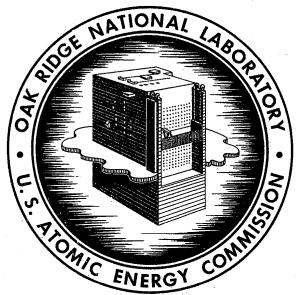
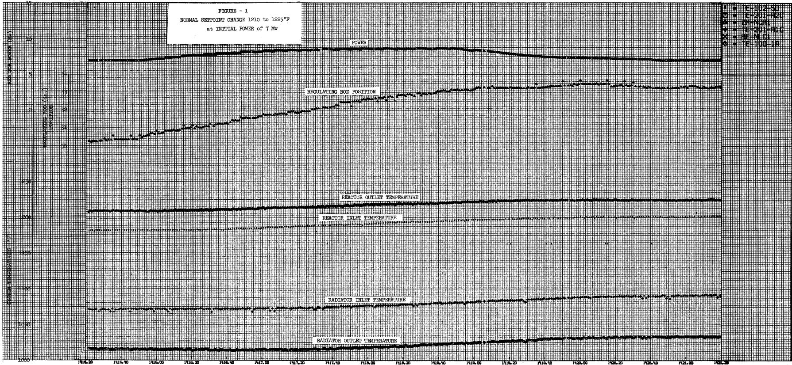
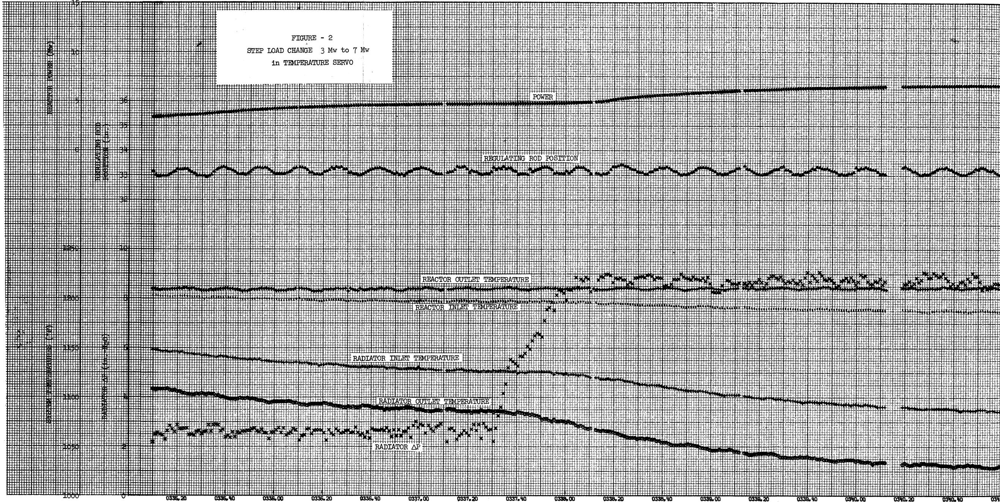
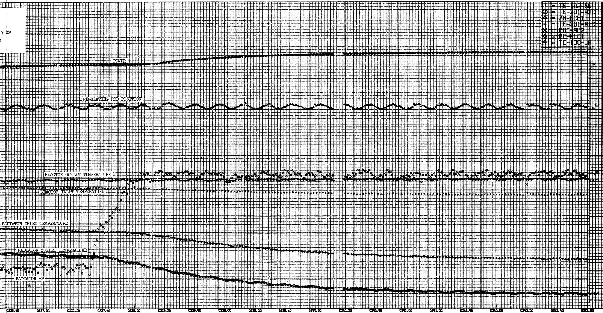
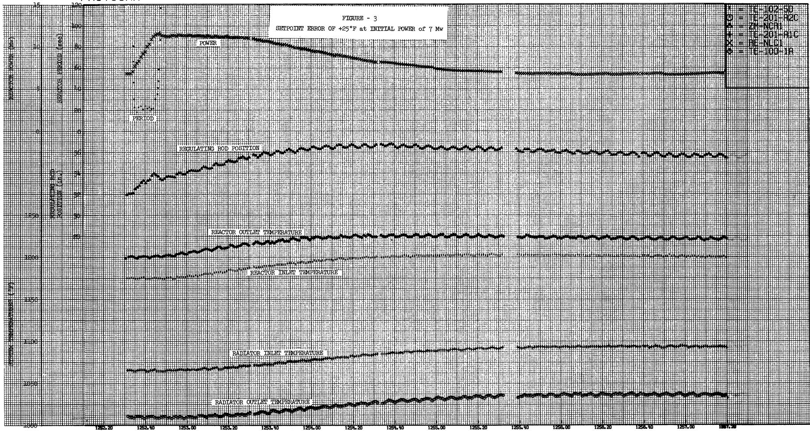
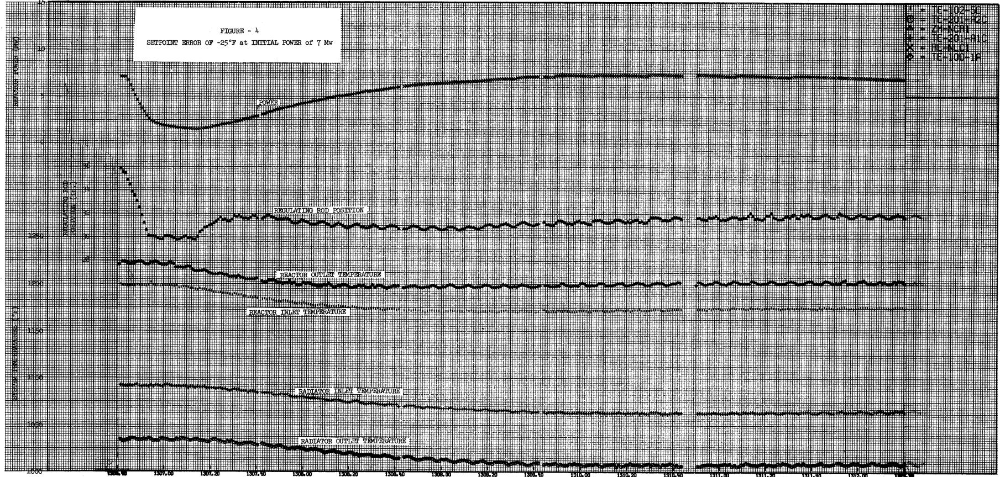
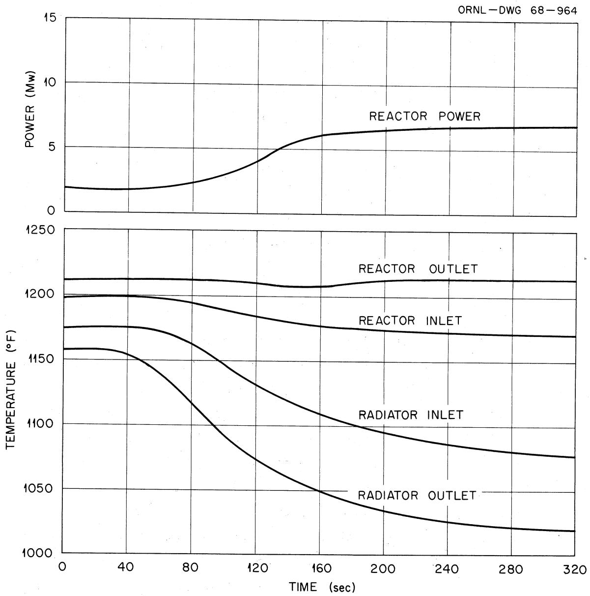
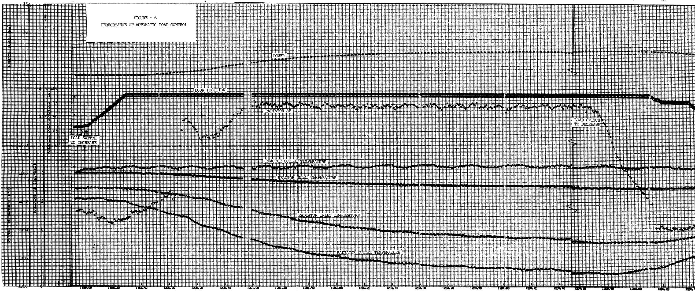
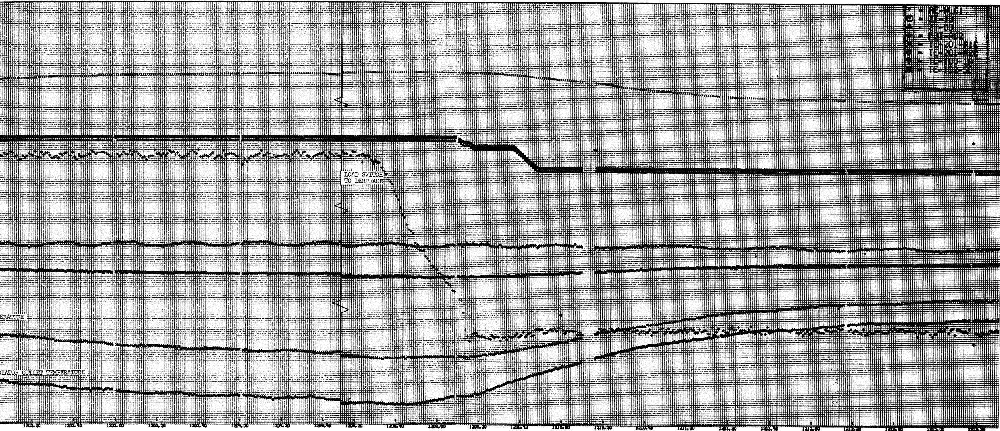
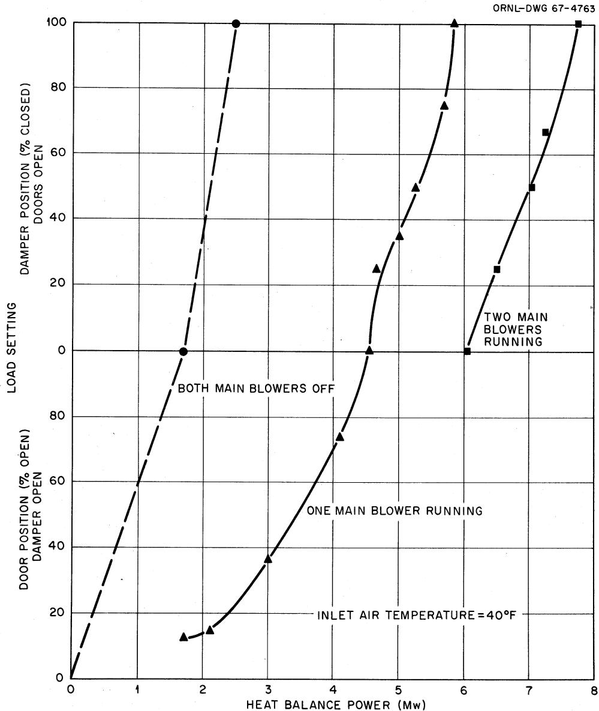

# OAK RIDGE NATIONAL LABORATORY

Operated by  
UNION CARBIDE NUCLEAR COMPANY  
Division of Union Carbide Corporation

Post Office Box X

Oak Ridge, Tennessee

Internal Use Only

ORNL

CENTRAL FILES NUMBER

68-5-11

DATE: May 1, 1968

COPY NO.

4

SUBJECT: Performance of MSRE Nuclear Power Control Systems (MSRE Test Report 5.2.1)

TO: Distribution

FROM: C.H.Gabbard

# ABSTRACT

The nuclear power control systems of the MSRE were evaluated by observing the steady-state operation of the reactor and by conducting a series of transient tests. The temperature servo was found capable of controlling all the transients that were introduced. However, because of the relatively slow response and inherent stability of the reactor system, the temperature servo was found to be relatively inactive during many of the load change transients. The automatic load control operated as expected except that the minimum power available to the automatic control was about 2 Mw instead of 1 Mw as had been planned. This has not caused a problem in the reactor operation because the load control has normally been operated in "manual".

# NOTICE

This document contains information of a preliminary nature and was prepared primarily for internal use at the Oak Ridge National Laboratory. It is subject to revision or correction and therefore does not represent a final report. The information is not to be abstracted, reprinted or otherwise given public dissemination without the approval of the ORNL patent branch, Legal and Information Control Department.

# CONTENTS

# Page

INTRODUCTION 4

TEMPERATURE SERVO CONTROL OF NUCLEAR POWER 4

Steady-State Performance 4

Normal Setpoint Change 5

Rapid Load Changes 7

Temperature Setpoint Error. 9

Control by Negative Temperature Coefficient At Reactivity 13

AUTOMATIC LOADCONTROL 15

CONCLUSIONS. 18

APPENDIX 21

# INTRODUCTION

Two independent control systems are used to set and control the nuclear power of the MSRE at power levels above 1 Mw. The heat removal rate is set by the air flow conditions at the radiator. The temperature servo controller1 then adjusts the control rods to match the nuclear power with the heat removal rate while maintaining the reactor outlet temperature constant at a preselected value. An automatic load control,2 which increases or decreases the radiator heat removal rate, is provided for the convenience of the operators.

A test program for evaluating the performance of the temperature servo and the automatic load control was outlined in MSRE Test Memo 5.2.1. The program for evaluating the temperature servo consisted of steady-state performance at each power level as the reactor was initially brought to full power and of transient tests at several power levels after steady-state full-power operation had been satisfactorily demonstrated.

Additional transient tests were performed with the rod control in "Manual" to demonstrate the inherent self-regulating characteristics of the reactor. The automatic load control was tested during both a load increase and a load decrease.

# TEMPERATURE SERVO CONTROL OF NUCLEAR POWER

# Steady-State Performance

The steady-state evaluation of the temperature servo was based on the degree of hunting by the regulating rod, cycling of the reactor power or outlet temperature, and any long term drifts or cycling.

With two exceptions the steady-state performance of the temperature servo has been excellent. Early in the power operation of the reactor, a daily cycle of $3 - 4^{\circ}\mathrm{F}$ occurred in the reactor outlet temperature as measured by the computer and other instrumentation. The temperature servo, however, indicated that the temperature was steady. This problem was found to be the lack of room temperature compensation of the thermocouple signals into the temperature servo controller, and the fluctuation in the reactor temperature was the result of the day-to-night variation in control room temperature. There has been no long term cycling or drifting since the thermocouple compensation was corrected. There was one period of erratic operation when there were oscillations in both the power and the outlet temperature. This was corrected by the replacement of a faulty operational amplifier in the controller.

In all other respects the temperature servo has been completely satisfactory. Adjustments in rod position are made relatively infrequently and there are no cyclic fluctuations in the power or temperature and no long term drifts in temperature. The steady-state performance was originally to be documented by 15 minutes of fast scan data on the computer each day during the approach to power, but this was discontinued after the uneventful operation of the controller was observed.

# Normal Setpoint Change

The first set of transient tests was changes in the reactor outlet temperature by changing the temperature demand setpoint in the normal manner. The temperature setpoint can be changed by moving a selector switch to the "increase" or "decrease" position until the desired temperature demand is reached. The setpoint is motor-driven at $5^{\circ}\mathrm{F} / \mathrm{min}$ so that the reactor can follow the setpoint with about a 1-Mw power change. The test program consisted of increasing the temperature demand from $1210^{\circ}\mathrm{F}$ to $1225^{\circ}\mathrm{F}$ , decreasing the demand to $1200^{\circ}\mathrm{F}$ , and then increasing the demand to $1210^{\circ}\mathrm{F}$ . This test program was run at power levels of 1, 5, and 7 Mw. The data was recorded on magnetic tape by the computer fast scan during the transient. Appendix A lists the date, time period, and tape number for each of the transient tests that was run. The results of a typical setpoint transient are shown in Figure 1 which is a computer plot of data

FASTSCAN   
  
STARTING DATE, 1-29-67

stored on magnetic tape by the MSRE on-line computer. Data was recorded every $1/4$ second during the tests in this report. The temperature setpoint was increased from 1210 to $1225^{\circ}\mathrm{F}$ at an initial power level of about $7\mathrm{Mw}$ . The scattered points on some of the traces are computer errors in reading the signal and are not actually changes in the particular signal. If the temperature demand setpoint were also plotted, it would fall essentially on top of the reactor outlet temperature (TE-100-1A) trace. The results of the other tests in this series were similar except for the temperature decrease from 1225 to $1200^{\circ}\mathrm{F}$ at a power level of $1\mathrm{Mw}$ . In this test the reactor outlet temperature could not track the setpoint because a sufficient decrease in power was not available to produce a $5^{\circ}\mathrm{F}/\mathrm{min}$ temperature decrease. The control system cannot request a power level below $500\mathrm{kw}$ so that a power decrease of only about $0.5\mathrm{Mw}$ was available as compared to the $1-1/2$ -Mw increase which occurred during the test plotted in Figure 1. This is not a deficiency in the control system since the only effect is a longer transient time in reaching the new temperature.

# Rapid Load Changes

The second series of transient tests consisted of making sudden changes in the heat-removal rate at the radiator and observing the response of the system as the temperature servo adjusted the reactor power to match the heat load. The following load changes were made:

1 Mw to 3 Mw   
3 Mw to 5 Mw   
5 Mw to 3 Mw   
3 Mw to 7 Mw   
7 Mw to 5 Mw   
5 Mw to Full Power (7.22 Mw)

The results of the 3 - 7 Mw load change are shown on Figure 2. This load change was made by changing the radiator settings as outlined below:

<table><tr><td>Nominal Power</td><td>Inlet Door</td><td>Outlet Door</td><td>Damper</td><td>Blowers On</td></tr><tr><td>3</td><td>30&quot;</td><td>Upper Limit</td><td>100% open</td><td>MB-1</td></tr><tr><td>7</td><td>U.L.</td><td>U.L.</td><td>50%</td><td>MB-1 and 3</td></tr></table>

FASTSCAN   
  
STARTING DATE, 2 1 67

The load change was intended to be completed in about one minute, but in practice, three minutes were taken to complete the change in radiator settings. Although this load change was much slower than intended, it was representative of the normal rate of increasing the power. The reactor power increased smoothly without oscillations or overshoot and there was essentially no change in the reactor outlet temperature. The regulating rod also showed little or no adjustment during the power transient. The sine wave fluctuation on the regulating rod trace, and also on some of the other traces during this and some of the other tests, was some type of noise signal in the computer. The rod was actually more or less stationary. The temperature servo could have made some small corrections in rod position that were masked by the superimposed sine wave. The lack of regulating rod adjustment and the constant reactor outlet temperature indicated that the reactor is inherently stable and self regulating.

A similar, but more severe, test was conducted when the automatic "Load Control" was tested. The results of this test are shown on Fig. 6. The temperature servo made only slight rod adjustments during this test to maintain a constant outlet temperature. The power transient was smooth without oscillations or overshoot.

# Temperature Setpoint Error

The most severe transients were introduced into the reactor system by switching from manual rod control to temperature servo control with a mismatch between the actual reactor outlet temperature and the controller setpoint. The servo controller immediately requests a power change in proportion to the temperature mismatch to adjust the reactor outlet to the setpoint temperature. The controller was restricted and could not request power levels above 11 Mw or below 500 kw during these tests. The upper limit has now been changed to 8.625 Mw to be consistent with full-power operation at 7.5 rather than 10 Mw. The actual response of the reactor power is slowed somewhat by the rate at which the regulating rod can be withdrawn and by the "rod withdraw inhibit" which limits the reactor period to 25 seconds or greater.

The following test program was used to evaluate the performance of the controller in handling the relatively fast transients as the controller

corrected the temperature errors. This program was designed to test the controller under a variety of conditions and also to test the limits of 500 kw and 11 Mw to see if these limits would be seriously exceeded. The transient performance was recorded for temperature errors of $\pm 5^{\circ}\mathrm{F}, + 15^{\circ}\mathrm{F},$ and $\pm 25^{\circ}\mathrm{F}$ . These temperature transients were repeated at starting power levels of 1, 5, and 7 Mw.

The results of the tests showed that the controller was more than adequate to handle the transients that resulted. Figure 3 shows the response of the system during the most severe transient when a $+25^{\circ}\mathrm{F}$ setpoint error was introduced at a power level of $\sim 7$ Mw. The initial withdrawal of the regulating rod was stopped several times by the 25-sec. period "rod withdraw inhibit". The power overshot the ll-Mw limit slightly (0.43 Mw) as the control rod was being inserted to stop the power increase. As the reactor temperature approached the setpoint, the reactor power was reduced relatively smoothly to the steady-state value. The outlet temperature overshot the setpoint about $5^{\circ}\mathrm{F}$ . Figure 4 shows the system response when a $-25^{\circ}\mathrm{F}$ temperature error is introduced. The reactor power was first reduced from $\sim 7.1$ Mw to $\sim 1.5$ Mw and then returned to about the original value. The regulating rod was limited in this case by the lower limit of its normal 6-inch range. If this physical limit on the rod motion had not stopped the rod insertion, the rod would probably have been stopped by the "power less than 500 kw" limit. There was a small overshoot as the power was being increased to the normal operating point and there was a small undershoot in the reactor outlet temperature at about the same time. The small amounts of overshoot and undershoot shown in these tests were of no practical significance.

The tests conducted at other power levels were similar to the ones shown and the only difference was an increased tendency to oscillate at the 1-Mw power level. However the oscillations in power and temperature were small and were satisfactorily damped in all cases. The overshoot or undershoot in the temperature and power were damped out during the first cycle for the tests at 5 and 7 Mw. There was no overshoot or undershoot for any of the tests with a setpoint error of $\pm 5^{\circ}\mathrm{F}$ .

FASTSCAN   
  
STARTING DATE, 2 1 67

  
FASTSCAN   
STARTING DATE, 2-167

# Control by Negative Temperature Coefficient at Reactivity

After the above testing of the temperature servo controller was completed, a series of tests was conducted to demonstrate the inherent control characteristics of the MSRE. The stability analysis3 and the dynamics testing4 that were completed previously showed that the system was stable under all operating conditions and that the system would be self-regulating. However, no previous tests had been run to demonstrate the system response to sudden load changes. The following test program was conducted with the load changes being made as quickly as was practical.

<table><tr><td>Full power to 4 Mw</td></tr><tr><td>4 Mw to 2 Mw</td></tr><tr><td>2 Mw to 4 Mw</td></tr><tr><td>4 Mw to 6 Mw</td></tr><tr><td>6 Mw to Full power</td></tr><tr><td>4 Mw to Full power</td></tr><tr><td>2 Mw to Full power</td></tr></table>

Figure 5 shows the results of the final test when the radiator heat load was increased from $\sim$ 2 Mw to full power in about 50 sec. with no control rod movement. As can be seen in the plot there was a smooth increase in power with no tendency to overshoot or oscillate. The reactor outlet temperature remained essentially constant except that there was about a $2^{\circ}\mathrm{F}$ loss in temperature at about 150 seconds which recovered about one minute later. The change in the rate of power increase occurred at about the same time as the minimum reactor outlet temperature. The other tests in the series were similar in having a smooth power trace without overshoot or oscillation and having a constant reactor outlet temperature. The $2^{\circ}\mathrm{F}$ dip in the reactor outlet temperature mentioned above was not present in the other tests. Some of the early analog studies on the MSRE had indicated oscillations in the nuclear power and

  
Figure 5. Step Load Change 2 - 7 Mw with No Control Rod Motion.

in the various system temperatures especially at low-power levels. However, there were no indications of oscillations in any of the tests listed above.

This series of tests demonstrated the self-regulating characteristics and the stability of the system under transient load conditions. The main difference between the step load changes with the servo and without the servo was that the initial change in power was faster when the servo was used. The servo made only a few rod adjustments after the first portion of the transient. The nearly constant reactor outlet temperature at the various power levels indicates that the nuclear average temperature of the reactor is about equal to the fuel out let temperature and confirms the very low power coefficient of reactivity (based on reactor outlet temperature) that had been reported previously.[5]

# AUTOMATIC LOADCONTROL

The Automatic Load Control on the MSRE provides a method of increasing or decreasing the radiator heat removal rate. The load control either increases or decreases the load in a preselected sequence and it does not actually control the load at a given level. The automatic load control was designed for use at power levels greater than 1 Mw, and a radiator door setting was to be specified with one main blower in operation to provide a starting point at 1 Mw of heat removal. However, the heat removal was about 1.9 Mw with the radiator doors at their minimum open setting of 12 inches. The test during a power increase was started from this point, but the power could not be lowered below $\sim$ 3 Mw when the load was decreased because the radiator doors were stopped at 50 in. by the interlock switches.

The results of the load control test are shown on Figure 6. The regulating rod position was not included on this plot because of a

  
STARTING DATE, 9-21 67

relatively large low-frequency noise signal that existed in the computer. No rod motion could be detected from the computer fast scan data during this test. However in an earlier test, the rod was withdrawn about 0.9 inches at the beginning of the power transient and was reinserted to about the original position after about 30 - 40 seconds. As can be seen in the plot the power and temperatures are smooth without overshoot or oscillation.

The time sequence of the various control actions taken by the automatic load control are given in Table I.

Table I   

<table><tr><td>Action</td><td>Computer Time</td></tr><tr><td>1. Load Switch to &quot;Increase&quot; - Radiator Doors start to raise</td><td>1159:00</td></tr><tr><td>2. Radiator Doors at upper limit - Bypass Damper started to close</td><td>1159:28</td></tr><tr><td>3. Bypass Damper closed - Automatic Main Blower energized</td><td>1200:02</td></tr><tr><td>4. Bypass Damper partially open - starts to reclose</td><td>1200:30</td></tr><tr><td>5. Bypass Damper fully closed</td><td>1200:58</td></tr><tr><td>6. Reactor at full power</td><td>1204:00</td></tr><tr><td>7. Load Switch to &quot;Decrease&quot; - Bypass Damper starts to open</td><td>1208:24</td></tr><tr><td>8. Bypass Damper open - Automatic Blower deenergized</td><td>1209:00</td></tr><tr><td>9. Bypass Damper starts to close - Radiator Doors close slightly</td><td>1209:10</td></tr><tr><td>10. Bypass Damper partially closed - begins to open</td><td>1209:18</td></tr><tr><td>11. Bypass Damper open - Doors start to close</td><td>1209:35</td></tr><tr><td>12. Doors at intermediate limit</td><td>1209:52</td></tr><tr><td>13. Reactor at minimum power by automatic load decrease</td><td>1213:00</td></tr></table>

The closure of the radiator doors at Step 9 had not been planned at this point. However, the interlock conditions were satisfied at this time when the damper was open and the automatic blower was off. This problem was not serious and could be easily corrected by adding the

appropriate interlocks. As soon as the damper closed slightly, the lowering of the doors was stopped until the damper again reached the full open position. At this time the doors were lowered to their intermediate limit as had been intended. The only other fault noted was that the minimum power available to the automatic load control is above the transfer point from Start to Run Mode. The bypass damper was also too slow to follow the acceleration of the main blower, but this has no practical significance.

Test Memo 5.2.1 outlined a series of tests in which the automatic load control was to be used to increase and decrease the reactor power in $\frac{1}{2}$ -Mw steps to determine any discontinuities in loading curve. These tests were not conducted because the heat load at various radiator settings had been previously determined. Figure 7 shows the performance of the radiator at various settings. The heat load using the automatic load control would follow the solid curves. There is a small gap in the heat-load curve at about $\frac{6}{2}$ Mw when the second blower is energized. However, this gap can be covered by manually adjusting the doors.

# CONCLUSIONS

The performance of the temperature servo has been excellent except for the two cases mentioned earlier in this report. The servo adequately controlled all the transients that were introduced with a minimum of overshoot and oscillation. In normal operation of the reactor, the temperature servo is not called upon to control rapid transients because of the relatively slow response and the inherent stability of the system. When operating at steady conditions, rod adjustments are made infrequently and a steady power level is maintained by the inherent self-regulating characteristics of the reactor.

The automatic load control performed generally as expected except that the door settings for 1-Mw operation were below the drop point when one blower was operated. If the intermediate limit switches were set at the minimum position, the reactor power would be about 2 Mw. This

  
Figure 7. MSRE Radiator Performance.

is not an acceptable power level in regard to switching between start and run mode, and therefore the switch settings have not been changed. Since manually adjusting the heat load is not a serious disadvantage, the automatic load control has not been routinely used in the operation of the reactor.

# MAGNETIC DATA TAPE STORAGE

<table><tr><td>Test Memo</td><td colspan="2">Test Description</td><td>Date</td><td>Time</td><td>Computer Tape</td></tr><tr><td rowspan="9">5.2.1.3</td><td rowspan="9">Normal Setpoint Change</td><td rowspan="3">1 Mw</td><td>1210 to 1225</td><td>1/29/67</td><td>0300 - 0315 M-103 and 104</td></tr><tr><td>1225 to 1200</td><td>1/29/67</td><td>0332 - 0336 M-104</td></tr><tr><td>1200 to 1210</td><td>1/29/67</td><td>1005 - 1021 M-104</td></tr><tr><td rowspan="3">5 Mw</td><td>1210 to 1225</td><td>1/29/67</td><td>1154 - 1206 M-104</td></tr><tr><td>1225 to 1200</td><td>1/29/67</td><td>1222 - 1234 M-105</td></tr><tr><td>1200 to 1210</td><td>1/29/67</td><td>1321 - 1332 M-105</td></tr><tr><td rowspan="3">7 Mw</td><td>1210 to 1225</td><td>1/29/67</td><td>1415 - 1426 M-105</td></tr><tr><td>1225 to 1200</td><td>1/29/67</td><td>1454 - 1508 M-105</td></tr><tr><td>1200 to 1210</td><td>1/29/67</td><td>1524 - 1537 M-105</td></tr><tr><td rowspan="6">5.2.1.4</td><td rowspan="6">Step Load Change</td><td>1 Mw to 3 Mw</td><td>2/1/67</td><td>0045 - 0130 M-106</td><td></td></tr><tr><td>3 Mw to 5 Mw</td><td>2/1/67</td><td>0130 - 0141 M-106</td><td></td></tr><tr><td>5 Mw to 3 Mw</td><td>2/1/67</td><td>0156 - 0210 M-106</td><td></td></tr><tr><td>3 Mw to 7 Mw</td><td>2/1/67</td><td>0331 - 0351 M-106 and 107</td><td></td></tr><tr><td>7 Mw to 5 Mw</td><td>2/1/67</td><td>0355 - 0407 M-107</td><td></td></tr><tr><td>5 Mw to 7.22 Mw</td><td>2/1/67</td><td>0410 - 0423 M-107</td><td></td></tr><tr><td rowspan="15">5.2.1.5</td><td rowspan="15">Temperature Setpoint Error</td><td rowspan="5">1 Mw</td><td>+ 5°F error</td><td>2/1/67</td><td>0920 - 0932 M-107</td></tr><tr><td>- 5°F error</td><td>2/1/67</td><td>0932 - 0947 M-107</td></tr><tr><td>+15°F error</td><td>2/1/67</td><td>0950 - 1005 M-107 and 108</td></tr><tr><td>-25°F error</td><td>2/1/67</td><td>1005 - 1022 M-108</td></tr><tr><td>+25°F error</td><td>2/1/67</td><td>1038 - 1048 M-108</td></tr><tr><td rowspan="5">5 Mw</td><td>+ 5°F error</td><td>2/1/67</td><td>1103 - 1108 M-108</td></tr><tr><td>- 5°F error</td><td>2/1/67</td><td>1108 - 1120 M-108</td></tr><tr><td>+15°F error</td><td>2/1/67</td><td>1120 - 1129 M-108</td></tr><tr><td>-25°F error</td><td>2/1/67</td><td>1131 - 1143 M-108</td></tr><tr><td>+25°F error</td><td>2/1/67</td><td>1143 - 1152 M-108 and 109</td></tr><tr><td rowspan="5">7 Mw</td><td>+ 5°F error</td><td>2/1/67</td><td>1205 - 1219 M-109</td></tr><tr><td>- 5°F error</td><td>2/1/67</td><td>1220 - 1225 M-109</td></tr><tr><td>+15°F error</td><td>2/1/67</td><td>1227 - 1234 M-109</td></tr><tr><td>+25°F error</td><td>2/1/67</td><td>1238 - 1301 M-109</td></tr><tr><td>-25°F error</td><td>2/1/67</td><td>1303 - 1315 M-109</td></tr></table>

# MAGNETIC DATA TAPE STORAGE

# (continued)

<table><tr><td>Test
Memo</td><td>Test Description</td><td>Date</td><td>Time</td><td>Computer
Tape</td></tr><tr><td rowspan="2">5.2.1.7 Control by Negative
Temperature Coefficient</td><td>7 Mw to 4 Mw
4 Mw to 2 Mw</td><td>5/4/67</td><td>0945 - 1010</td><td>M-122</td></tr><tr><td>4 Mw to 7 Mw
2 Mw to 7 Mw</td><td>5/4/67
5/4/67</td><td>1058 - 1111
1124 - 1140</td><td>M-122
M-122 and 123</td></tr><tr><td>5.2.1.6 Automatic Load Control</td><td>Load Increase (2 to 7 Mw)
Load Increase (7 to ~3 Mw)</td><td>9/21/67
9/21/67</td><td>1159 - 1208
1208 - 1215</td><td>M-142
M-142</td></tr></table>

# DISTRIBUTION

1. MSRP Director's Office Bldg. 9204-1, Rm. 325   
2. R. K. Adams   
3. R.G.Affel   
4. S.J.Ball   
5. H.F.Bauman   
6. S.E.Beall   
7. M. Bender   
8. C.E. Bettis   
9. E. S. Bettis   
10. C. J. Borkowski   
11-12. D. F. Cope, AEC-ORO   
13. J. L. Crowley   
14. F. L. Culler   
15. C. B. Deering, AEC-ORO   
16. S.J.Ditto   
17. J.R. Engel   
18. E.P.Epler   
19. D. E. Ferguson   
20. A. P. Fraas   
21. C. H. Gabbard   
22. A. Giambusso  
AEC-Washington   
23. R.H.Guymon   
24. P.H.Harley   
25. C. S. Harrill   
26. P. N. Haubenreich   
27. P. G. Herndon   
28. T. L. Hudson   
29. W. H. Jordan   
30. P. R. Kasten   
31. R.J.Kedl   
32. T. W. Kerlin   
33. H. T. Kerr   
34. A. I. Krakoviak   
35. J. W. Krewson

36. J. A. Lane   
37. W.J. Larkin, AEC-ORO   
38. M. I. Lundin   
39. R. N. Lyon   
40. H. G. MacPherson   
41. R. E. MacPherson   
42. C. D. Martin   
43. H. McClain   
44. C.J.McHargue   
46. T. W. McIntosh  
AEC-Washington   
47. J.R. McWherter   
48. R. L. Moore   
49. H. A. Nelms   
50. E. L. Nicholson   
51. L.C.Oakes   
52. A.M.Perry   
53. T. W. Pickel   
54. B. E. Prince   
55. G. L. Ragan   
56. J. L. Redford   
57. M. Richardson   
58. R.C.Robertson   
59. H. M. Roth, AEC-ORO   
60. Dunlap Scott   
61. M. Shaw  
AEC-Washington   
62. W. L. Smalley, AEC-ORO   
63. I. Spiewak   
64. R.C. Steffy, Jr.   
65. J.R.Tallackson   
66. R.E.Thoma   
67. H. L. Watts   
68. A. M. Weinberg   
69. K. W. West   
70. M. E. Whatley

71-72. Central Research Library

73-74. Document Reference Section

75-77. Laboratory Records

78. Laboratory Records (LRD-RC)