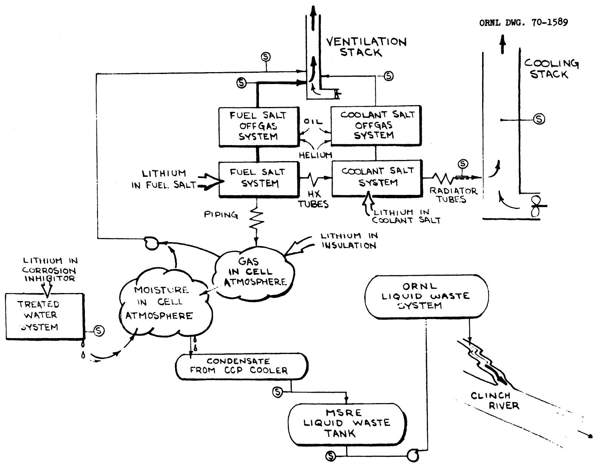
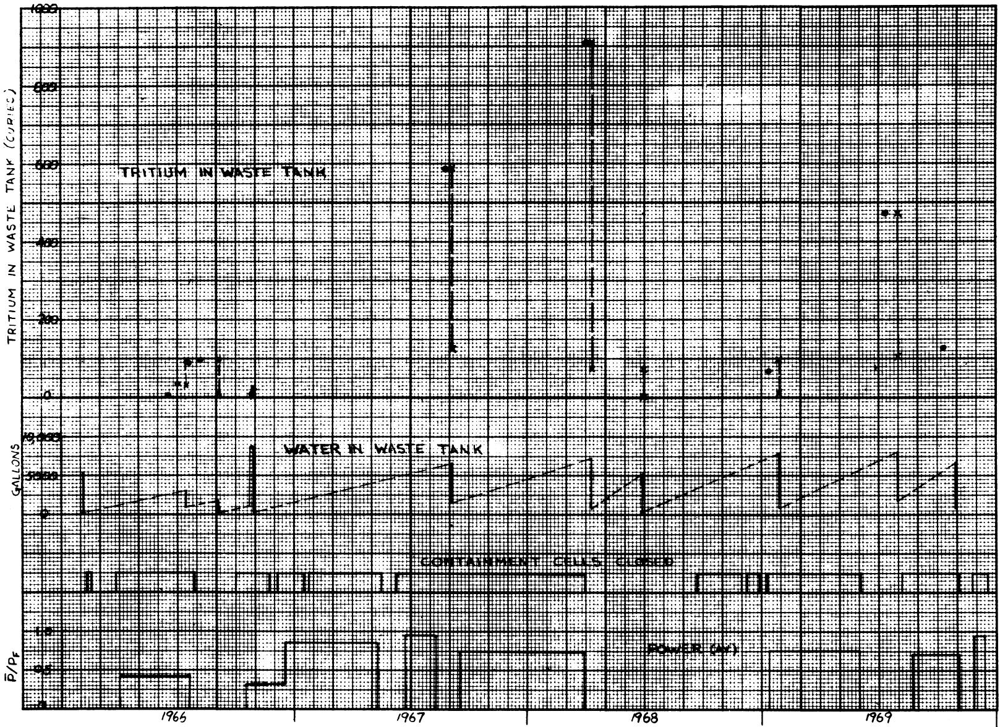
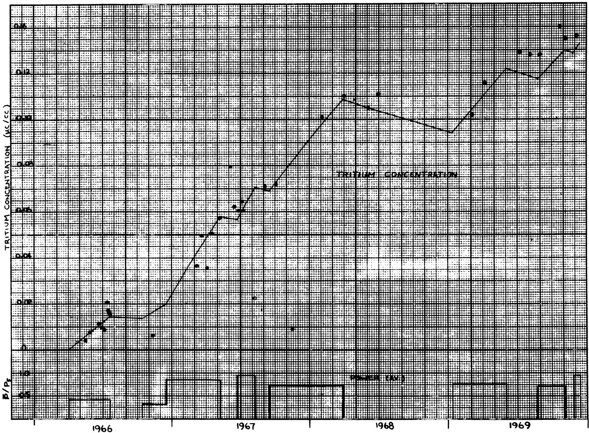
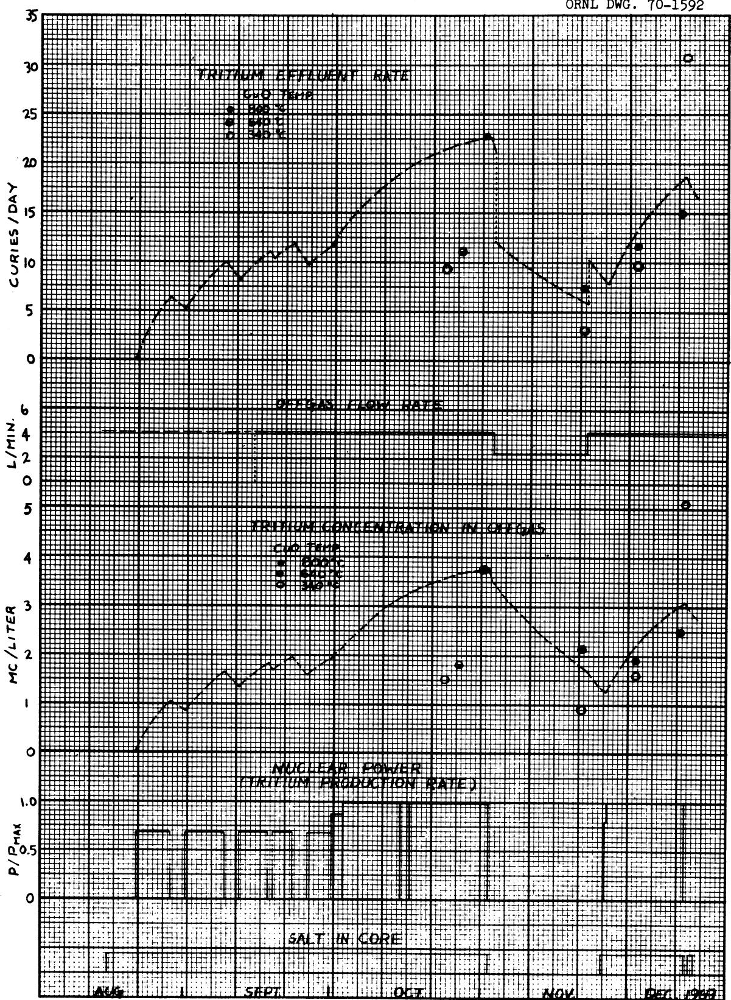

DATE: February 4, 1970

COPY NO. 51

SUBJECT: Tritium in the MSRE: Calculated Production Rates and Observed Amounts

TO: R.B.Briggs

FROM: P. N. Haubenreich

# ABSTRACT

Tritium was produced by the interaction of neutrons with lithium in four regions of the MSRE: the fuel salt, the thermal insulation around the reactor vessel, the treated water in the thermal shield and instrument shaft, and the coolant salt. Production rates calculated for each region are respectively about 40, 3, 0.005, and 0.001 curies per full-power day of operation with $^{233}\mathrm{U}$ fuel. During $^{235}\mathrm{U}$ operation the thermal neutron flux in the fuel was lower and the tritium production from lithium in the fuel was about 24 curies/day. Tritium was also produced in the fuel as a fission product at a rate of 0.1 curie per full-power day.

During the last two power runs of the MSRE, while the reactor was at full power, tritium concentrations were measured in the fuel salt offgas, the coolant salt offgas, the air in the containment cell, and air that had passed across the radiator tubes. Discharge rates in the fuel offgas came up to about 25 curies/day; in the coolant offgas, 0.6 curie/day; in the cell air, about 0.01 curie/day; and in the radiator cooling air, around 4 curies/day. In addition, tritium was removed in condensate from the containment cell atmosphere during long periods of operation at rates around 4 curies per full-power day.

Keywords: tritium, fused salts, reactors, reactor safety, operation.

# CONTENTS

# Page

ABSTRACT 1

INTRODUCTION 5

CALCULATED PRODUCTION RATES. 5

Fission Product 5

Lithium in Fuel Salt 7

Coolant Salt. 11

Thermal Insulation around Reactor Vessel. 12

Treated Water System. 13

OBSERVED AMOUNTS 13

Containment Cell Condensate 13

Accumulation in Treated Water 18

Fuel Salt Offgas. 18

Coolant Salt Offgas 24

Containment Cell Exhaust. 24

Radiator Cooling Air 25

SAFETY CONSIDERATIONS. 31

CONCLUSIONS. 32

APPENDIX 35

# INTRODUCTION

It was recognized before the MSRE was ever operated that substantial amounts of tritium would be produced and that most, if not all, of it would probably be released through the stack. The calculated concentrations at ground level were so low, however, that when power operation began, no effort was made to verify the predicted tritium release rates. Tritium appeared in liquid wastes and was treated with the proper health precautions, but no great effort was made to clear up uncertainties as to its origin. In the summer of 1969, however, serious attention began to be given to problems of tritium containment in large molten-salt power reactors. This led to efforts to determine, in the last few months of power operation, where the tritium produced in the MSRE was going. As indicated in Fig. 1, there were several regions and paths to be considered.

This report describes the calculations of tritium production and the observations that were made at the MSRE. The intent is to make this information available in a convenient form for use in connection with transport calculations that are being made by others and will be reported elsewhere.

# CALCULATED PRODUCTION RATES

# Fission Product

Tritium is produced as a product of three-way (ternary) fission of uranium at a rate of about one atom per $10^{4}$ fissions. At 8 Mw(th) and a yield of $1 \times 10^{-4}$ atom/fission, the production rate by this mechanism is 0.1 curie/day, all in the fuel salt.

  
Fig. 1 Tritium Production and Transport in MSRE

# Lithium in Fuel Salt

Each neutron absorption in $^6\mathrm{Li}$ produces a tritium atom.

$$
{ } ^ { 6 } \mathrm { L i } + { } ^ { 1 } \mathrm { n } \rightarrow { } ^ { 4 } \mathrm { H e } + { } ^ { 3 } \mathrm { H }
$$

The cross section for this reaction is quite large for thermal neutrons (476 b for the thermal neutron energy spectrum in the MSRE core). Fast neutrons can also react with $^7\mathrm{Li}$

$$
{ } ^ { 7 } \mathrm { L i } + { } ^ { 1 } \mathrm { n } \rightarrow { } ^ { 4 } \mathrm { H e } + { } ^ { 3 } \mathrm { H } + { } ^ { 1 } \mathrm { n }
$$

This reaction is far less probable than the $^6$ Li reaction, however, because its threshold energy is 2.8 Mev and the cross section reaches a maximum of only 0.44 barns at 7.5 Mev.

The lithium in the MSRE salts contains less than $0.01\%$ ${}^{6}\mathrm{Li}$ , but, because of its large reaction cross section, this isotope is responsible for over $80\%$ of the tritium production. This means that: (l) the actual production rate changes in almost direct proportion to changes in the ${}^{6}\mathrm{Li}$ content of the salt, and (2) an accurate prediction of tritium production depends on an extremely accurate assay of the lithium.

The $^{6}\mathrm{Li}$ content of the lithium going into the MSRE was established, with a high degree of confidence, to be less than $0.01\%$ . To begin with, the lithium was selected from stockpiled LiOH in which the $^{6}\mathrm{Li}$ had been depleted to $0.01\%$ or less. Assays which were available for each batch of LiOH formed the main basis for selection. $^{2,3}$ Then, after conversion of the hydroxide to LiF, the lithium in each product batch was again assayed before the LiF was used to make up coolant, flush, or full carrier salt. Each container of salt loaded into the MSRE was identified as to the LiF batch used in its preparation.

The criticality calculations for the MSRE had to be done before the salt production was finished and for this reason the $^6$ Li fraction was taken to be the average for the LiOH batches that were scheduled to be used. The assays for the batches obtained for the MSRE ranged from 0.0072% to 0.0085% $^6$ Li. The average of the batches which were to be used for the flush salt and the fuel carrier salt was 0.0074%. This value was used for the initial criticality calculations and was the starting point in the calculations of long-term reactivity effects due to $^6$ Li burnout. It has also been used up to the present in the calculation of tritium production rates.

The most refined, most recent neutron-balance calculations for the MSRE are the result of using the GAM-II, THERMOS, and EXTERMINATOR programs with the ENDF/B cross sections. All neutron absorptions in $^6\mathrm{Li}$ are assumed to produce tritium; the tritium production from $^7\mathrm{Li}$ is computed from the high-energy fluxes and the cross-section for this specific reaction. Results of these calculations, assuming 0.0074% $^6\mathrm{Li}$ in the lithium are given in the first column of Table 1 (Ref. 4). In the operations with $^{233}\mathrm{U}$ as the principal fissile material, the fissile material concentration was much lower, the thermal neutron flux much higher and the fast neutron flux about the same as in the $^{235}\mathrm{U}$ operation. These differences account for the changes in tritium production rates from $^{235}\mathrm{U}$ to $^{233}\mathrm{U}$ operation.

The rates in the second column of Table 1 are simply the equivalents of the yields in column one, calculated for a power level of $8\mathrm{Mw}$ and 200 Mev/fission recovered energy.

There is good reason to believe that the $6 \text{Li}$ assay of the lithium in the MSRE was not exactly $0.0074 \%$ and that the full power of the MSRE was less than $8.0 \text{Mw}$ . The last two columns of Table 1 are based on values arrived at as described in the paragraphs which follow.

The $^6$ Li fraction in the lithium in the MSRE fuel salt was not measured by sampling either the salt in the reactor or the salt mixtures that

Table 1   
Some Calculated Rates of Tritium Production   
From Lithium in MSRE Fuel Salt   

<table><tr><td rowspan="2">Fuel</td><td rowspan="2">Source</td><td colspan="2">0.0074% 6Li, 8 Mw</td><td colspan="2">Varying 6Li, (a) 7.25 Mw</td></tr><tr><td>atoms/104fissions</td><td>curies/day</td><td>atoms/104fissions</td><td>curies/day</td></tr><tr><td rowspan="3">235U</td><td>6Li</td><td>303</td><td>32</td><td>210</td><td>20</td></tr><tr><td>7Li</td><td>47</td><td>5</td><td>47</td><td>4</td></tr><tr><td></td><td>350</td><td>37</td><td>257</td><td>24</td></tr><tr><td rowspan="3">233U</td><td>6Li</td><td>567</td><td>59</td><td>371</td><td>35</td></tr><tr><td>7Li</td><td>57</td><td>6</td><td>57</td><td>5</td></tr><tr><td></td><td>624</td><td>65</td><td>428</td><td>40</td></tr></table>

a. Numbers listed for $^{235}\mathrm{U}$ assume 0.0051% $^6\mathrm{Li}$ ; for $^{233}\mathrm{U}$ operation, 0.0048% $^6\mathrm{Li}$ . These values are based on 0.0055% $^6\mathrm{Li}$ at start of operation, decreasing due to burnup for 65,300 Mwh and 95,500 Mwh.

were loaded. The fraction at the beginning of power operation must be inferred, therefore, from the assays that were made on the LiOH feed material and, at an intermediate step in the salt production, on the LiF before it was mixed. The significant depletion of the $^6\mathrm{Li}$ due to burnup during high-power operation must also be calculated.

The assays on the batches of LiF used to make up the fuel salt ranged from $0.004\%$ to $0.006\%$ 6Li and averaged $0.0049\%$ (Ref. 5). This is appreciably less than the $0.0074\%$ average of the assays on the LiOH from which the LiF was prepared. The two sets of measurements are believed to be of equal reliability and accuracy. It seems impossible, however, that the 6Li content actually decreased, so the difference must be due to some analytical bias. Since the MSRE lithium had the lowest 6Li fraction of any lithium around, contamination of the samples in handling or analysis would tend to make the 6Li assay erroneously high. It seems reasonable, therefore, to conclude that the lower set of values is probably nearer the actual 6Li fraction in the LiF that went into the fuel salt mixture.

The $^6\mathrm{Li}$ fraction in the fuel salt mixture would be higher than that in the LiF feed because of introduction of a small amount of natural lithium as a contaminant in the $\mathrm{BeF}_2$ . The $\mathrm{BeF}_2$ for the MSRE salts was purchased with a specification of $<50\text{-ppm}$ Li and analyses showed only that Li was less than 50 ppm. If one assumes that the $\mathrm{BeF}_2$ contained 50-ppm natural Li, the $^6\mathrm{Li}$ fraction in the fuel salt lithium would be increased by $0.0013\%$ .

Thus one must conclude that the $6_{\text{Li}}$ fraction in the fuel salt at the beginning of power operation could have been as high as $0.0087\%$ (assuming 50-ppm Li in the $\text{BeF}_2$ and using the LiOH assays) or as low as $0.0049\%$ (assuming very little Li in the $\text{BeF}_2$ and using the LiF assays). The most likely value was probably between $0.005\%$ and $0.006\%$ . A value of $0.0055\%$ $6_{\text{Li}}$ at the beginning of power operation was assumed in arriving at the tritium yields in the last two columns of Table 1.

The operation with $^{235}\mathrm{U}$ amounted to 9006 equivalent full-power hours (EFPH). If, as nuclide changes indicate, the full power was 7.25 Mw, the operation burned up about $4.9\%$ of the $^{235}\mathrm{U}$ and about $6.8\%$ of the $^{6}\mathrm{Li}$ . After the $^{233}\mathrm{U}$ was loaded the reactor operated another 4166 EFPH, burning $4.3\%$ of the $^{233}\mathrm{U}$ and another $5.6\%$ of the $^{6}\mathrm{Li}$ . Starting at $0.0055\%$ the $^{6}\mathrm{Li}$ would be down to about $0.0051\%$ at the end of $^{235}\mathrm{U}$ operation and $0.0048\%$ at the final shutdown.

Of the different figures in Table 1, it now appears that those in columns 3 and 4 probably are nearest the actual production rates of tritium in the fuel salt.

# Coolant Salt

During power operation the coolant salt is exposed to neutrons in the primary heat exchanger; there it is in close proximity to the fuel which is emitting delayed neutrons and a few fission neutrons. Because the thermal shield absorbs most of the neutrons leaking from the reactor vessel, the exposure of the coolant salt to neutrons other than in the heat exchanger is negligible.

The coolant salt activation in the heat exchanger was computed in 1962, using TDC, a multigroup neutron transport code. The calculations, which were for a delayed neutron source appropriate for $^{235}\mathrm{U}$ fuel, gave neutron absorption rates in $^{6}\mathrm{Li}$ and $^{7}\mathrm{Li}$ of $0.42 \times 10^{10}$ and $0.15 \times 10^{10}$ per Mw-sec (Ref. 6). Even if all the absorptions in $^{7}\mathrm{Li}$ produced tritium (which they do not) the corresponding total production rate is only $0.17 \times 10^{-3}$ curie/day at $7.25 \mathrm{Mw}$ . With $^{233}\mathrm{U}$ fuel the delayed neutron source is less by about a factor of two and the tritium production is accordingly less. The production rate in the coolant salt in this case is about $0.1 \times 10^{-3}$ curie/day or less.

# Thermal Insulation around Reactor Vessel

Between the reactor vessel and the thermal shield is a layer of thermal insulation 5-in. thick. The insulation, Careytemp 1600, contains trace amounts of lithium (natural) and is subjected to a rather high neutron flux so there is some tritium produced in it.

A large uncertainty in the calculated tritium production arises because of uncertainty in the lithium concentration in the insulation actually installed. A sample of the material that was to be used at the reactor was analyzed by a semi-quantitative spectrographic technique in December 1962. Lithium was reported as $0.1\%$ . For this type of analysis the actual value should be within the range from one-half to twice the reported value. This analysis would therefore indicate a concentration of 500 to 2000 ppm Li in the insulation which went into the reactor. In June 1966, when tritium was detected in the reactor cell after power operation, the installed insulation was inaccessible. Samples of Carey-temp 1600 from 3 boxes of new stock were analyzed for lithium by flame photometry of material leached with HCl. Results were 4, 13, and 4 ppm Li. The reason for the difference by a factor of roughly 100 has not been resolved.

The neutron flux in the insulation is fairly well defined by measurements that were made with flux monitors between the reactor vessel and the insulation. The average thermal neutron flux in the $79\text{-ft}^3$ of insulation on the sides was measured to be about 7 x $10^{10}$ n/cm $^2$ -sec-Mw; in the $35\text{ft}^3$ on top and bottom, about 4 x $10^{10}$ n/cm $^2$ -sec-Mw, using 8 Mw as full power. The thermal neutron cross section for Li that is consistent with these measurements is 458 b.

The density of Careytemp 1600, according to the manufacturer's handbook, is $10\mathrm{lb / ft}^3$ . Using the foregoing volumes, fluxes and cross section and assuming 1000-ppm natural lithium in the insulation, the tritium production rate was calculated to be 3.0 curies/day at full power from thermal

neutron absorption in $^{6}$ Li. Production from $^{7}$ Li would be far less because of the abundance (7.4%) of $^{6}$ Li in the natural lithium.

Considering the uncertainty in the lithium content of the insulation, one can say only that the tritium production in the insulation is probably less than 6 curies/day and is conceivably less than 0.1 curie/day.

# Treated Water System

The water which circulates through the thermal shield and within the instrument shaft contains lithium nitrite as a corrosion inhibitor. The $\mathrm{LiNO}_2$ was especially prepared from lithium depleted to $< 0.01\%$ Li to minimize tritium production. Nevertheless because some of the water is in a high neutron flux near the reactor vessel, there is some tritium production.

The average thermal neutron flux in the 4000-gal circulating treated water system was estimated on the basis of the activation of the potassium in the original corrosion inhibitor to be about $7 \times 10^{9} \, \text{n/cm}^2$ -sec-Mw (Ref. 8). The lithium concentration has been held at about $0.20 \, \text{mg/ml}$ . Assuming a $6\text{Li}$ fraction of $0.01\%$ and a $6\text{Li}$ cross section of $900 \, \text{b}$ (appropriate for thermal neutrons at the water temperature), the tritium production in the circulating system is calculated to be $5 \, \text{mc}$ per full-power day.

# OBSERVED AMOUNTS

# Containment Cell Condensate

In the summer of 1966, a few weeks after the reactor containment cell was sealed and power operation started, water was found in the piping at the component cooling pumps. (The pumps, located in containment vessels in the Special Equipment Room, recirculate gas from the reactor cell through freeze valve and pump bowl shrouds.) The tritium concentration in this water was about $1\mathrm{mc / ml}$ . Water continued to accumulate at the component coolant pumps at a rate of roughly a gallon per day but none

appeared in the sumps in the reactor cell or fuel drain cell. Apparently water leaking somewhere in one of the cells was evaporating before reaching the sump, and this atmospheric moisture was condensing in the coolest part of the recirculating system. The tritium concentration in the condensate was higher than that in the treated water system by a factor of about 50,000, so an additional source of tritium in the cell was indicated. Production in the thermal insulation around the reactor vessel was the suspected source.

Despite efforts to locate and stop the water leakage into the cell, the same situation persisted throughout the operating history of the reactor, i.e., tritium-laden moisture always began condensing in the component cooling system a few days after the cells were sealed. A drain line and condensate collection tank were installed so the condensate could easily be measured and transferred periodically to the 11,000-gal. Liquid Waste Tank. This in turn was emptied into the Melton Valley waste system at intervals of several months. The tritium inventory in the Waste Tank, as indicated by samples before emptying and occasional other samples, is therefore a means of determining average rates of removal of tritium from the reactor cell in the condensate.

The pertinent information on tritium in the Waste Tank is plotted in Fig. 2. Each tritium inventory indicated by a circle is the product of sample analyses (usually of two duplicate samples) and the measured volume of liquid in the tank at the time. The crosses represent tritium inventories based on earlier analyses and the measured heel left after a transfer out of the tank.

Inspection of Fig. 2 shows that probably the most reliable values for tritium accumulation rate can be obtained from the changes during three selected intervals: 10/66 - 9/67, 9/67 - 3/68, and 1/69 - 7/69. The data on the tritium in the waste tank during these periods are summarized in Table 2. As indicated in the table, the average rates of accumulation of tritium in the tank during the three periods were 0.14, 0.23, and 0.19 curie/EFPH. It may be noted that not quite all the tritium-laden moisture in the cell atmosphere reaches the waste tank: each time the cell is vented after the end of a run, the moisture in the cell is swept

ORNL DWG. 70-1590

  
Fig. 2 Accumulation of Tritium in MSRE Liquid Waste Tank

# Table 2

Accumulation of Tritium in Liquid Waste Tank   
During Selected Periods of Operation   

<table><tr><td>PERIOD</td><td>I</td><td>II</td><td>III</td></tr><tr><td>Start</td><td></td><td></td><td></td></tr><tr><td>Date</td><td>10/26/66</td><td>9/3/67</td><td>1/26/69</td></tr><tr><td>Integrated Power (EFPH)</td><td>1325</td><td>5567</td><td>9148</td></tr><tr><td>Before transfer</td><td></td><td></td><td></td></tr><tr><td>LW volume (gal)</td><td>8850</td><td>6750</td><td>7900</td></tr><tr><td>LW tritium (curies)</td><td>\( 23^a \)</td><td>\( 588^b \)</td><td>\( 96^c \)</td></tr><tr><td>After transfer</td><td></td><td></td><td></td></tr><tr><td>LW volume (gal)</td><td>160</td><td>1450</td><td>900</td></tr><tr><td>LW tritium (curies)</td><td>0.4</td><td>126</td><td>11</td></tr><tr><td>End</td><td></td><td></td><td></td></tr><tr><td>Date</td><td>8/24/67</td><td>3/31/68</td><td>7/8/69</td></tr><tr><td>Integrated power (EFPH)</td><td>5567</td><td>9006</td><td>11,555</td></tr><tr><td>LW volume (gal)</td><td>6500</td><td>7100</td><td>7400</td></tr><tr><td>LW tritium (curies)</td><td>588</td><td>908</td><td>471</td></tr><tr><td>Change</td><td></td><td></td><td></td></tr><tr><td>LW tritium (curies)</td><td>588</td><td>782</td><td>460</td></tr><tr><td>Integrated power (EFPH)</td><td>4242</td><td>3439</td><td>2407</td></tr><tr><td>Rate (curies/EFPH)</td><td>0.139</td><td>0.227</td><td>0.191</td></tr></table>

aExtrapolated from inventory at 1262 EFPH (10/23/66) at 0.2 curie/EFPH.   
bAssumed no change since inventory on 8/24/67 (fuel in drain tanks, cell closed in interim).   
cExtrapolated from inventory at 900 EFPH (1/10/69) at 0.2 curie/EFPH.

out. Based on the observed dewpoint in the gas cooler, the amount of moisture in reactor and drain tank cell atmosphere at any time was about 32 lb of water. Condensate samples averaged $1350~\mu \mathrm{c} / \mathrm{cc}$ , so the amount of tritium carried out each time the cell was opened was 20 curies. The cell was opened 3 times during the first period in Table 1 and once each during the other two periods. Adding 20 curies for each opening gives rates of appearance of tritium in cell moisture of 0.15, 0.23, and 0.20 curies/EFPH (3.7, 5.6, and 4.8 curies per full-power day).

An independent check on the collection rate during Period I can be obtained from measured condensate collection rates and tritium concentrations in the condensate observed during Runs 11 and 12 (Ref. 9). During both those runs the condensate rate was about 0.9 gal/day. A condensate sample in Run 11 at full power showed 1.28 mc/cc; one in Run 12 showed 1.22 mc/cc. These correspond to 4.3 and 4.1 curies per full-power day, slightly higher than the 3.7 obtained from the waste tank data in Period I. In October 1969, a sample of the condensate was taken midway of an 8-day period at full power over which 3.9 gal. accumulated. The tritium concentration was 1.56 mc/cc, corresponding to a collection rate of 2.9 curies per day, considerably less than the rate indicated by the waste tank accumulation over the longer interval of Period III.

During Periods I and II the reactor was operating on $^{235}\mathrm{U}$ ; during Period III, $^{233}\mathrm{U}$ . It appears that the data are not good enough to distinguish any difference due to the change in fissile material, i.e., if there was a difference it was small relative to the probable error in the measurement. The calculated tritium production in the salt increased by about 70 percent when the change to $^{233}\mathrm{U}$ was made. On the other hand, the production in the thermal insulation probably changed much less because it was due mainly to neutrons that leaked from the reactor with epithermal energies. This leakage did not increase nearly as much as did the thermal neutron flux in the core. Thus there is a suggestion that the tritium in the cell came largely from the insulation rather than from the salt. The observed rates are within the upper end of the range of calculated production in the insulation (3 ± 3 curies/full-power day).

# Accumulation in Treated Water

Between May 1966 and November 1969 a total of 35 samples from the treated water system were analyzed for tritium. Results, converted to tritium inventories in the 4000-gal. system, are shown as points in Fig. 3. The line was computed using the simplified representation of the reactor power history, the calculated tritium production rate of $2.1 \times 10^{-4}$ curie/EFPH (5 mc per full-power day), and a dilution rate due to water makeup of $1\%$ per month. The agreement indicates that the calculated production rate is reasonably close to the actual rate.

# Fuel Salt Offgas

In the safety analysis of the MSRE (discussed in a later section) it was assumed that all of the tritium produced in the fuel would leave by way of the fuel offgas system. Because the dispersal of tritium through the stack provided a large margin of safety and because there were no suitable instruments for continuous monitoring of tritium mixed with a very high concentration of fission products, no attempt was made to measure the tritium in the fuel offgas until the autumn of 1969. During that summer the problem of tritium in large molten-salt reactors began to receive serious attention. Calculations indicated that the tritium originating in the fuel salt would not all leave in the fuel offgas, but that a substantial fraction would diffuse through the metal walls. It was determined therefore to make the effort necessary to measure tritium in the gaseous effluents from the MSRE during the brief period of operation still remaining.

To measure the tritium in the fuel offgas, analytical chemists designed an apparatus that could be connected downstream of the charcoal beds, where the fission product activity was low enough to permit direct operations. The apparatus consisted essentially of a heated bed of copper oxide followed by refrigerated traps to collect the moisture produced by reaction of tritium and hydrogen with the CuO (Ref. 10). The moisture

ORNL DWG. 70-1591

  
Fig. 3 Buildup of Tritium in MSRE Treated Water System

was then removed to a laboratory for measurement of the amount of tritium collected from a measured volume of gas passed through the sampler. Samples run with the CuO at different temperatures would provide some information on the form in which the tritium was found. With the CuO at $340^{\circ}\mathrm{C}$ , $\mathrm{T}_{2}$ (or HT) would react to form water and be collected. At $640^{\circ}\mathrm{C}$ the CuO would react with most hydrocarbons but not with methane, and at $800^{\circ}\mathrm{C}$ it would react with methane also. This system was ready in October and was installed then in the MSRE venthouse.

After leak-testing and checkout of the tritium sampler, the first analysis on the fuel offgas was obtained on October 24. At that time, as shown in Fig. 4, the reactor had been operating steadily at full power for 21 days and the gas flow through the fuel offgas system had been steady at $4.2\ \text{\Omega} / \text{min}$ of helium for even longer. The first sample was taken with the CuO at $340^{\circ}\text{C}$ and indicated that 9.3 curies/day as tritium gas was passing the sample point. During the next week two more samples were run with the CuO at higher temperatures. (See Table 3.) At the highest temperature, which should have collected all the tritium in the sample, 11.3 mc was collected from the 3-liter sample, indicating a total of 22.7 curies/day passing up the stack.

Two days later, on November 2, the fuel was drained and the next day the helium flow from the fuel pump through the offgas system was reduced from 4.2 to $2.4 \text{ l/min}$ . The core and fuel loop were allowed to cool gradually to about $450^{\circ} \text{F}$ , but were kept sealed. On November 21 the fuel offgas was again sampled for tritium; first with the CuO at $340^{\circ} \text{C}$ , then at $800^{\circ} \text{C}$ . As in the earlier samples the CuO at $340^{\circ} \text{C}$ got about $40\%$ as much tritium as it did at $800^{\circ} \text{C}$ . Tritium concentrations were surprisingly high: over half what they had been in the samples taken with the reactor at power. The tritium flow up the stack was one-third of what it had been.

Because we had suspected that tritium was being held up in oil residues (which no doubt liberally line much of the fuel offgas system), we had proposed early in November to set up to sample the fuel offgas for tritium at a point near the pump bowl exit. A system for pulling small amounts of gas from a flange near the pump bowl, through a filter (scanned by the remote gamma spectrometer) and into the fuel sampler enclosure had

# Table 3

Tritium Content of Fuel Offgas Stream Downstream of Charcoal Beds   

<table><tr><td>Date</td><td>CuO Temp °C</td><td>Amount of Tritium a Collecteda (mc)</td><td>Tritium b Flowb (curies/d)</td></tr><tr><td>Oct. 24</td><td>340</td><td>4.6</td><td>9.3</td></tr><tr><td>Oct. 27</td><td>640</td><td>5.5</td><td>11.1</td></tr><tr><td>Nov. 1</td><td>800</td><td>11.3</td><td>22.7</td></tr><tr><td>Nov. 21</td><td>340</td><td>2.73</td><td>3.1</td></tr><tr><td>Nov. 21</td><td>800</td><td>6.46</td><td>7.4</td></tr><tr><td>Dec. 2</td><td>800</td><td>5.74</td><td>11.6</td></tr><tr><td>Dec. 2</td><td>340</td><td>4.79</td><td>9.7</td></tr><tr><td>Dec. 11</td><td>800</td><td>7.46</td><td>15.0</td></tr><tr><td>Dec. 12</td><td>340</td><td>15.29</td><td>30.8</td></tr></table>

aFrom a 3-liter sample.   
bIn the helium stream past the sample point. Helium flow was 4.2 liters/min. except for Nov. 21 when it was 2.4 liters/min.

already been designed for installation around the end of November and we proposed to add to it a sample line coming out of the containment which could be used to withdraw gas samples for tritium analysis. On November 18, however, a management decision was reached that because of insufficient funds the plans could not be carried out. A brief run was authorized, however, with one of its goals to obtain as much information as possible on tritium within the limitations of time and money.

On November 22 the helium flow was restored to $4.2\ \text{L/min}$ , on November 25 the core was filled with fuel salt and on November 26 the reactor was taken to full power for the final run. Six days later another pair of samples was taken with the CuO at $340^{\circ}\mathrm{C}$ and at $800^{\circ}\mathrm{C}$ . The tritium concentration indicated by the $800^{\circ}\mathrm{C}$ sample was slightly less than in the sample during the shutdown but, because of the increased helium flow, the rate to the stack was up. The tritium flow to the stack was still only half what it had been at the end of the previous power run, however. Another difference was that the fraction reacting with CuO at $340^{\circ}\mathrm{C}$ was over $80\%$ of that reacting at $800^{\circ}\mathrm{C}$ .

For the next ten days the tritium sampling apparatus was occupied with the effort to establish the amount coming out of the radiator. On the afternoon before the final shutdown, a fuel offgas sample drawn through $800^{\circ}\mathrm{C}$ CuO indicated 15 curies/day passing the sample point. The next morning with the CuO at $340^{\circ}\mathrm{C}$ , an amount equivalent to 31 curies/day was collected. This was the last sample. By the time the anomaly was fully appreciated, the system had been shut down and flow through the offgas system stopped.

While the fuel was circulating in Run 20, a total of 26 samples were taken from the fuel-pump bowl (plus three additions of beryllium and two of uranium). Among these were 10 sampling devices aimed at obtaining some measure of the tritium in the sampling enclosure in the pump bowl. These consisted of nickel capsules filled with copper oxide, copper oxide and palladium, and nickel powder and solid bars of nickel, all exposed for 8 to 12 hours in the gas space of the pump bowl. As of this writing these samples had not been analyzed.

# Coolant Salt Offgas

Calculations of the possible distribution of tritium in the MSRE had indicated that while a significant fraction of the tritium produced in the fuel system should diffuse through the heat-exchanger tubes into the coolant salt, very little should go out in the coolant offgas. Nevertheless, the tritium sampling station was provided with a connection to the coolant offgas line. Only one sample was taken. This was on October 30, with the CuO at $800^{\circ}\mathrm{C}$ and indicated 0.62 curies/day passing the sample point.

During Run 20, three nickel bars were exposed to the gas in the coolant pump bowl for 8 to 10 hours, to be analyzed for tritium and compared with similar samples in the fuel pump. Results are not available at this time.

# Containment Cell Exhaust

The reactor cell is kept below atmospheric pressure by continuously pumping a small stream of gas from the cell through particulate filters and up the ventilation stack. The flow rate is varied while cell temperatures are changing, but averages about 40 scf/d, just balancing the in-leakage of gas and intentional input of nitrogen purge into the reactor and drain tank cell. The exhaust is taken off just downstream of the gas cooler at the discharge of the component coolant pumps. Here the air is at 20 psia and the dewpoint is probably about $100^{\circ}\mathrm{F}$ (the temperature of the cooling water in the tubes on which moisture is condensing). For these conditions there is about $1.0\mathrm{g}$ of moisture per scf of gas. As indicated in an earlier section, condensate from the air cooler was found to contain about $1.5\mathrm{mc / cc}$ of tritium. Thus the exhaust gas should leave with about $1.5\mathrm{mc / scf}$ $(0.053~\mu \mathrm{c / cc})$ of tritium. At 40 scf/d this would amount to 0.06 curies/day of tritium removed from the containment cell.

On October 15, 1969, a $2\text{-ft}^3$ sample was drawn from the cell exhaust line through a calcium chloride bed, which was then counted for tritium. (This is the standard Health Physics procedure for tritium monitoring.)

The tritium on the bed (presumably tritiated moisture collected from the sample) was equivalent to $9.2 \times 10^{-3} \mu \mathrm{c} / \mathrm{cc}$ of sample. This is only $17\%$ of the concentration calculated in the previous paragraph. However, some moisture undoubtedly condensed and was lost from the stream between the air cooler and the sampling device. If one assumes that the collected moisture contained $1.5 \mathrm{mc} / \mathrm{g}$ , the sample results would correspond to $6.2 \times 10^{-6} \mathrm{~g}$ of moisture per cc of gas or a dewpoint of $39^{\circ} \mathrm{F}$ at the calcium chloride trap. This is lower than one would expect, but not much lower.

On October 30, a 3-liter sample from the cell exhaust line was run through the tritium sampling device in the venthouse, with the copper oxide at $800^{\circ}\mathrm{C}$ . This sample, which should get all the tritium in the gas as well as in the moisture, indicated a concentration of only $2.1 \times 10^{-3} \mu\mathrm{c} / \mathrm{cc}$ . This seems extraordinarily low, both by comparison with the estimate and with the sample taken on calcium chloride.

# Radiator Cooling Air

Because the relatively large area and thin walls in the heat exchanger and radiator tubes offer a rather low-resistance escape path, a substantial fraction of the tritium produced in the fuel salt would be expected to find its way through the coolant salt system and into the cooling air blowing across the radiator tubes. Plans were made, therefore, to use the CuO-cold-trap apparatus (described in the earlier section on fuel offgas) to measure the tritium in the cooling air after passage across the radiator tubes.

While the analytical apparatus was being built and tested, some samples were taken from the coolant stack (through the beryllium monitoring line) by the calcium chloride absorption method. Three samples were taken on October 1, 2, and 3 at 23-hr intervals during a 5l-hr run at 7 Mw. (Here and throughout this section on the radiator, the power levels that are quoted are from salt heat balances, which indicate 8 Mw at full power.) As shown in Table 4, it appeared that the first sample, taken 5 hr after the start of the run, had a tritium concentration

Table 4   
Tritium Concentration Indicated by Calcium Chloride Trapping of   
Moisture from Cooling Stack Air Samples   

<table><tr><td>Date</td><td>Sample Pointb</td><td>Tritium Conc. (μc/cc)</td><td>Tritium Flowc (curies/d)</td><td>Operating Conditionsd</td></tr><tr><td>Oct. 1</td><td>Be monitor</td><td>1.88 x 10-7</td><td>1.8</td><td>7 Mw</td></tr><tr><td>Oct. 2</td><td>&quot;</td><td>2.8 x 10-7</td><td>2.7</td><td>&quot;</td></tr><tr><td>Oct. 2</td><td>&quot;</td><td>3.2 x 10-7</td><td>3.1</td><td>&quot;</td></tr><tr><td>Oct. 3</td><td>&quot;</td><td>8.6 x 10-6</td><td>---</td><td>Natural draft</td></tr><tr><td>Oct. 3</td><td>&quot;</td><td>1.34 x 10-7</td><td>1.1</td><td>8 Mw</td></tr><tr><td>Oct. 9</td><td>&quot;</td><td>1.63 x 10-7</td><td>1.4</td><td>&quot;</td></tr><tr><td>Oct. 9</td><td>&quot;</td><td>1.4 x 10-7</td><td>1.2</td><td>&quot;</td></tr><tr><td>Dec. 5</td><td>Venthouse</td><td>2.08 x 10-6</td><td>18</td><td>&quot;</td></tr><tr><td>Dec. 9</td><td>&quot;</td><td>2.17 x 10-7</td><td>1.8</td><td>&quot;</td></tr><tr><td>Dec. 9</td><td>Be monitor</td><td>6.9 x 10-8</td><td>0.6</td><td>&quot;</td></tr><tr><td>Dec. 11</td><td>Venthouse</td><td>6.8 x 10-7</td><td>5.8</td><td>&quot;</td></tr></table>

aSamples taken and analyzed by procedures normally used in health-physics monitoring. Volume of samples reported here was 5 ft3 in most cases.   
b Venthouse tap in stack base; beryllium monitor tap in lower part of steel section of stack.   
${}^{\mathrm{c}}$ Rate of tritium release calculated using 15,990 lb/min total stack air flow at $8\mathrm{{Mw}},{17},{940}\mathrm{{lb}}/\mathrm{{min}}$ at $7\mathrm{{Mw}}$ .   
dPower levels based on salt heat balance.

significantly lower than the other two. The stack flow was the same for all three: about 225,000 scfm. Thus it appeared that the tritium release rate built up and leveled off at about 3 curies/day with the reactor at 7 Mw.

A few minutes after the last sample at 7 Mw, the blowers were stopped and the radiator doors were closed. After 1.5 hours of subcritical operation, the radiator doors were opened part way to allow natural draft up the stack. The tritium concentration in a sample taken at this time was almost 30 times as high as the one two hours earlier. The blowers were started again and the reactor was taken to full power. A sample taken immediately thereafter indicated less than half as much tritium going up the stack as 2.5 hours earlier, just before the end of 7-Mw operation. This was viewed as evidence that the tritium concentration in the coolant salt had been reduced by a factor of two during the interlude of zero-power operation.

The reactor was kept at 8 Mw and on October 9, after 6 days of steady operation, two more samples of the stack air were analyzed for tritium. Instead of the expected buildup these two samples surprisingly indicated very little increase: the apparent release rate was still about half what had been measured at 7 Mw. Why this should be was not clear. Air flows at the two power levels were indeed different. At 7 Mw the radiator bypass was partly open and the total stack flow was about 225,000 scfm. At 8 Mw the bypass damper was closed, forcing more air through the radiator but cutting the total stack flow to 200,000 scfm. Although the degree of mixing of bypass and radiator air flows before the sample point is in doubt, it does not appear reasonable that the change in flow patterns between 7 Mw and 8 Mw could change the sample concentration as much as was indicated.

Another factor that had been changed during the period over which this series of samples was taken was the reducing power of the fuel salt. On October 2, a device containing beryllium was exposed in the fuel-pump bowl for 5 hours, adding $2.9\mathrm{-g}$ Be to the fuel salt and increasing the nominal $\mathrm{U}^{3+}/\mathrm{U}$ ratio from $0.55\%$ to $0.98\%$ (Ref. 11). The tritium sample

from the stack was taken 3 hours after the start of this exposure. On October 8 another $4.9\text{-g}$ Be was added, raising the nominal $\mathrm{U}^{3+}/\mathrm{U}$ to $1.58\%$ . These changes should decrease the fraction of the tritium in the fuel salt that forms TF and thus increase the rate of diffusion of tritium through the heat-exchanger tubes into the coolant salt. Such an effect is not apparent from the stack tritium analyses.

A final series of four samples was taken from the stack by the calcium chloride method during the last week of full-power operation. Three were taken at a tap in the venthouse, one through the same line as the earlier samples. As shown in Table 4, the results scattered over a range of 30, indicating 18, 1.8, 0.6, and 5.8 curies/day up the stack. No analytical mistake could be found nor any reason ascribed for such variations. The samples taken in the venthouse conceivably are not as nearly representative of the average stack concentration as those from the beryllium monitor line. The venthouse tap is in the concrete base of the stack, just above the turning vanes, where the annulus air flows are not quite as well mixed with the radiator air as they are 15 or 20 ft higher up at the beryllium monitor tap. But this difference, even if significant, does not explain the scattered results. Nor do they correlate with the reducing power of the fuel salt which was sharply increased by beryllium additions on December 8 which took the U $^{3+}$ /U ratio from $1.2\%$ to $2.9\%$ .

The calcium chloride absorption method was not entirely satisfactory because it could collect only the tritium in the form of moisture and it was not clear what fraction of the tritium escaping from the radiator tube surfaces would be in this form at the sample point. This drawback would be overcome by the use of the hot CuO bed.

On October 30, a 3-liter sample of the stack air (from the venthouse tap) was run through the hot copper oxide apparatus. Unreasonably high results were obtained and were attributed to residual pockets of gas remaining from previous use of the apparatus on other streams with far higher tritium concentrations. Because the very low concentration in the stack air created problems of this sort, a scheme was devised to measure the rate of tritium release from the radiator tubes by another method. This consisted of a sleeve fitted around a two-foot length of a

tube, with a small opening at each end for air to enter the annulus and a tap at the midpoint to take the air out to the tritium sampler. This device was installed during the November shutdown and was used intensively during the final 16-day full-power run. The procedure was to pull gas from the sleeve at a measured rate and measure the tritium concentration in a sample of this exhaust stream. The product of the exhaust flow and the concentration gave the rate of tritium removal from the 2-ft sleeve. This was then multiplied by 1800 to get the equivalent rate of release from the 3600 ft of tubes in the radiator.

Some initial difficulties were experienced in obtaining accurately measured, adequately high flows through the sleeve exhaust line, but on December 9, 10, and 11 a series of samples was obtained from the sleeve exhaust that appeared to be valid. Results, all obtained with the CuO at $800^{\circ}\mathrm{F}$ , are shown in Table 5. A blank run on December 3, with a new CuO tube in the apparatus, had indicated $0.053\mu \mathrm{c}$ of tritium. Subtraction of this quantity from the amount of tritium indicated for each sample resulted in the "compensated" values for tritium release rate.

On December 11, the day before the final shutdown, four samples of gas were taken through a tube inserted into the base of the stack through the tap in the venthouse. These samples were taken in one-liter glass bulbs having an appendage containing 1 cc of water. After the air sample was isolated, the bulb was shaken to allow the tritium to exchange with the hydrogen in the water. The tritium content of the water was then determined. Two samples taken with 3 ft of tube protruding into the stack indicated 4.6 and 4.5 curies/day going up the stack. With 18 ft of the sample tube in the stack (with the end probably whipping about in the air stream) two samples indicated 3.3 and 4.4 curies/day up the stack.

One interpretation of the stack samples, taken at face value, is that the tritium release rate was probably around 3 to 5 curies/day (bulbsamples), with perhaps half in the form of moisture (calcium chloride samples). The release rates calculated from the sleeve samples are significantly lower, about a factor of ten, in fact. This is conceivably due to an actual difference, for one reason or another, between the tritium diffusion rate out of the tube inside the sleeve and the average rate over

Table 5   
Rates of Tritium Release from Radiator Based on   
Samples from 2-ft Sleeve Section   

<table><tr><td rowspan="2">Date (1969)</td><td rowspan="2">Sleeve Flow (liters/min)</td><td rowspan="2">Sample Vol. (liters)</td><td rowspan="2">Tritium In Sample (μc)</td><td colspan="2">Radiator Releasea (curies/day)</td></tr><tr><td>Apparent</td><td>Compensated</td></tr><tr><td>Dec. 6</td><td>4.0</td><td>5.59</td><td>0.221</td><td>0.41</td><td>0.32</td></tr><tr><td>Dec. 9</td><td>9.5</td><td>6.04</td><td>0.118</td><td>0.48</td><td>0.28</td></tr><tr><td>Dec. 9</td><td>5.51</td><td>5.92</td><td>0.156</td><td>0.38</td><td>0.26</td></tr><tr><td>Dec. 10</td><td>13.4</td><td>6.02</td><td>0.074</td><td>0.42</td><td>0.14</td></tr><tr><td>Dec. 10</td><td>7.0</td><td>6.2</td><td>0.238</td><td>0.69</td><td>0.55</td></tr><tr><td>Dec. 11</td><td>5.56</td><td>11.95</td><td>0.504</td><td>0.60</td><td>0.54</td></tr></table>

aSee text for calculational procedure.

all the tube surfaces in the radiator. In the sleeve the air flowed at 0.6 to 1.5 ft/sec through a 1/8-inch annulus, parallel to the tube. In the radiator the air velocity, at right angles to the tubes, was about 115 ft/sec. The Reynolds number in the annulus was less than 100 whereas on the outside of the tubes it was around $10^{5}$ . Thus the air-side mass transfer coefficients were undoubtedly quite different. This would be important only if the resistances in the metal and on the salt side were not much greater. There is another way that the difference in air flow might conceivably affect the transfer rate. The air stream in the sleeve was in contact with the tube for about a second, whereas the air going across the tubes was in contact for about 0.01 sec or less. If the partial pressure of tritium in the air toward the discharge point in the sleeve increased enough, it could reduce the transfer rate over part of the jacketed surface. If this were the case, however, the amount of tritium removed in the sample stream should have increased with the sleeve flow rate. As seen in Table 5, the data do not indicate this behavior.

# SAFETY CONSIDERATIONS

In the early safety analyses of the MSRE it was assumed, for purposes of computing the tritium exposure in the area around the reactor site, that all the tritium produced in the fuel was exhausted through the 100-ft ventilation stack. Using a production rate of 36 curies/day at 10 Mw and the stack dispersion factor computed by Lindauer12 the maximum concentration at ground level directly downwind was estimated to be $2 \times 10^{-8}$ μc/cc. Since this was a factor of ten below the AEC's maximum permissible concentration for uncontrolled areas,13 further considerations such as average-to-maximum power factor and statistical variations in wind direction and atmospheric conditions were regarded as unnecessary. (Tritium

was not mentioned in the Safety Analysis Report, but the subject was fully discussed in the preoperational review by the AEC Division of Reactor Licensing at Bethesda, Md. on January 27, 1965.) Results of a more recent, sophisticated study of the average ground concentrations of tritium resulting from release at the X-10 site14 indicate that the MSRE stack discharge of tritium is indeed inconsequential.

The tritium leaving the MSRE in liquid waste goes through the ORNL waste system and eventually into the Clinch River (together with other tritium which seeps from waste pits). The tritium concentration in the river is extremely low and no cause for concern. (At the average flow of 4560 cfs, the concentration in the river due to steady release of 5 curies/day would be only $5 \times 10^{-7} \mu \mathrm{c} / \mathrm{m} \ell$ .)

The concentration of tritium in the condensate from the reactor cell atmosphere ranged up to $1.6\mathrm{mc / ml}$ . This compares to the maximum permissible body burden of $1\mathrm{mc}$ (Ref. 15). Thus stringent precautions were observed in handling water samples or working on the component-cooling-pump system. The problems of handling treated-water system samples and leakage were not nearly as severe, since the tritium concentration in the treated-water system was a factor of $10^{4}$ lower, about at the $(\mathrm{MPC})_{\mathrm{w}}$ for $40\mathrm{-h / wk}$ occupational exposure $(0.1\mu \mathrm{c / ml})$ .

# CONCLUSIONS

The accuracies of the tritium flow measurements and calculated production rates leave much to be desired. Nevertheless some conclusions can be drawn.

The greatest uncertainty in calculating the production of tritium in the fuel salt comes from the $^6\mathrm{Li}$ concentration which has a probable error of about 15 percent. The uncertainty in the power level

(fissions/day) is also important. If a probable error of 5 percent is assigned to this factor, the probable error in the calculated tritium production rate turns out to be about 16 percent. Using 7.25 Mw as full power, we would say that the tritium production in the fuel salt during the $^{233}\mathrm{U}$ operation was $40 \pm 6$ curies per full-power day.

In view of the gross uncertainty in the lithium content of the reactor vessel insulation, we must say the tritium production there was $3 \pm 3$ curies per full-power day. Other sources were comparatively very small. Thus the calculated total production in the whole system was $43 \pm 7$ curies/day.

Something over half of the tritium produced in the fuel salt eventually found its way out through the oily pipes, filters, and charcoal beds of the fuel offgas system.

Despite the paucity of the data, they do support a conclusion that there was some sort of holdup for tritium in the fuel offgas system (and possibly in the fuel circulating system). This is apparent from the large amount of tritium still coming out 19 days after the production stopped and also from the slowness with which the discharge increased after power operation was resumed. The questions that are raised are: "What is the nature of the holdup?" and "If the system was not at steady state when the samples were taken, how much higher would the tritium discharge rate have gone if the run had been prolonged?" There is not sufficient data for conclusive answers to these questions. The simple analysis described in the appendix indicates that in a very long run at full power the tritium flow out of the fuel offgas system would probably have reached about 25 to 27 curies/day.

Tritium appeared in the coolant salt offgas at about $1.5\%$ of the production rate in the fuel.

Around 8 to $12\%$ of the production rate in the fuel was observed in the air going up the coolant stack. Tritium appeared to escape from a jacketed section of tube with low surface air velocity much less rapidly than from tube surfaces swept by turbulent, high-velocity air.

The rate at which tritium appeared in the reactor containment cell was roughly 8 to 13 percent of the calculated production rate in the

fuel. This cannot be regarded as other than an upper limit on the rate of diffusion out of the salt systems, however, because the source of tritium within the cell (the reactor vessel insulation) conceivably could have accounted for nearly all the tritium observed coming out of the cell.

Using the extrapolated flow of 25 - 27 curies/day for the fuel off-gas system, the sum of the flows of tritium out of the system came to about 32 to 38 curies per full-power day. This is 12 to 25 percent less than the calculated total production rate. Although the probable errors in the calculated production and observed flows amount to this much, it does suggest that some tritium was trapped more or less permanently somewhere within the system.

# APPENDIX

# Analysis of Fuel Offgas Data

Consider only those four measurements of offgas discharge concentration that were made with the CuO at $800^{\circ}\mathrm{C}$ . (The CuO at lower temperature would get only a fraction of the total tritium.) Try to fit them with curves calculated for some simple model.

# First Approximation

Represent the offgas system simply as a sort of a pot, i.e., a system with a first-order lag whose time constant is inversely proportional to the helium flow rate.

Say the rate of tritium input to the fuel offgas system is proportional to the power at the moment. This assumes that holdup in the salt system causes no significant delay.

The equations describing this model are

$$
I = a P
$$

$$
V \frac {d C}{d t} = I - F C
$$

where

$$
\begin{array}{l} I = \text {t r i t i u m} \\ P = \text {r e a c t o r} (\mathrm {M w}) \\ a = \text {p r o p o r t i a l i t y c o n s t a n t (c u r i e s / M w - d a y)} \\ V = \text {e q u i v a l e n t} \\ F = \text {g a s f l o w (l i t e r s / d a y)} \\ C = \text {t r i t i u m c o n c e n t r a t i o n i n e f f l u e n t (c u r i e s / l i t e r)} \\ \end{array}
$$

For any interval at steady P and F

$$
C = C _ {o} e ^ {- \left(\frac {F}{V}\right) ^ {t}} + \frac {a P}{F} \left(1 - e ^ {- \left(\frac {F}{V}\right) ^ {t}}\right)
$$

Upon attempting to use a least-squares fit of the equations to the experimental points to obtain values for a and V, one finds that the sum of the squares of the deviations changes very little over a range of combinations of a and V. The dashed curves on Fig. 4 are calculated for the combination V = 90,500 liters and a = 3.36 curies/Mw-day which is fairly near the best fit.* (The value of a could be up to 10% larger with little difference in the sum of the squared deviations.) In a very long run at full power of 7.25 Mw, the tritium flow out of the fuel offgas system would eventually come up to about 25 - 28 curies/day according to these results.

# Discussion

It appears that with this simple model, all combinations of a and V anywhere near the best fit give curves that fall below the November 21 point and above the two points in December. Perhaps a more significant way to put it is that the last three points seem to lag the calculated curves by 2 to 7 days. This suggests that the fit would be improved by adding some other kind of delay in the offgas system model, which is of course, reasonable. There is, however, another way to improve the fit. That is to postulate that there was some release of tritium from the salt system into the offgas system while the reactor was drained.

Because of the complexity of the situation, the fewness of the data points, and questions regarding comparison of $800^{\circ}\mathrm{C}$ points with those at lower temperature, it does not appear rewarding to attempt refinement of the model.