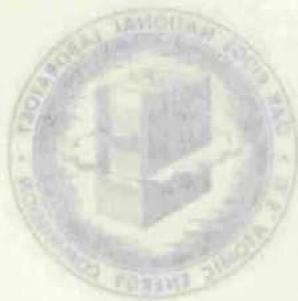
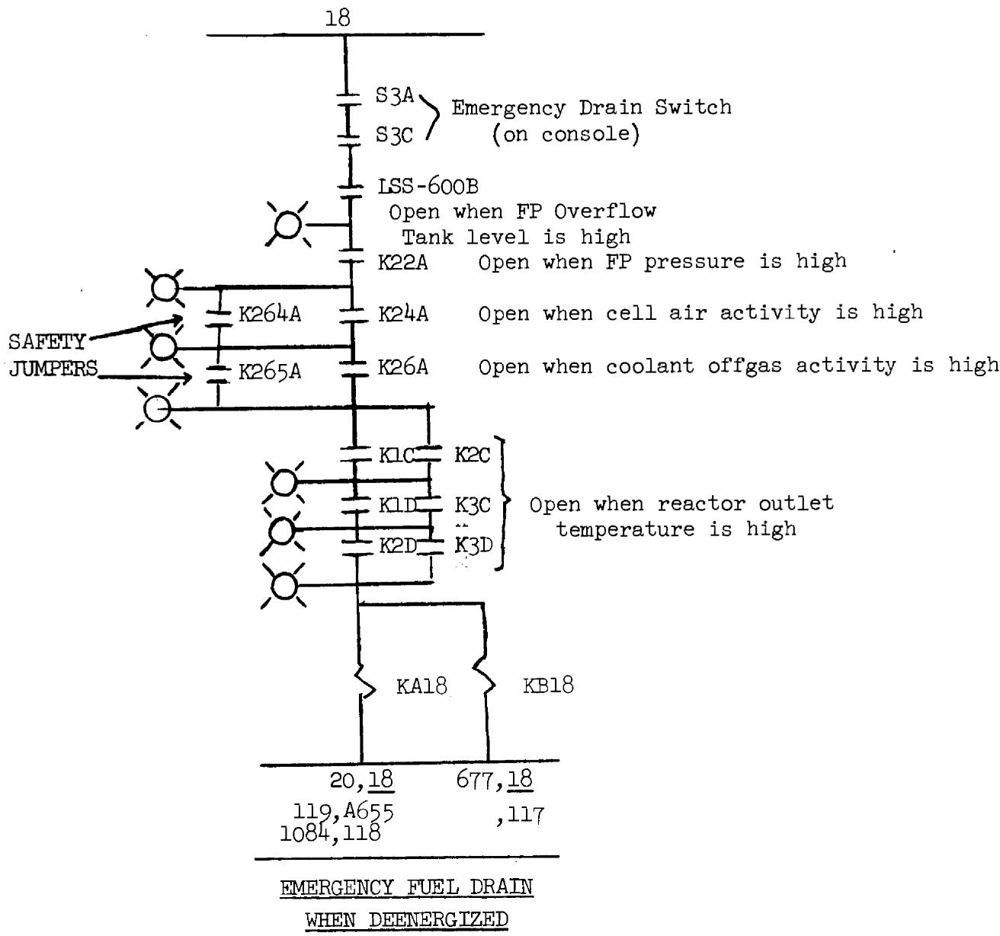
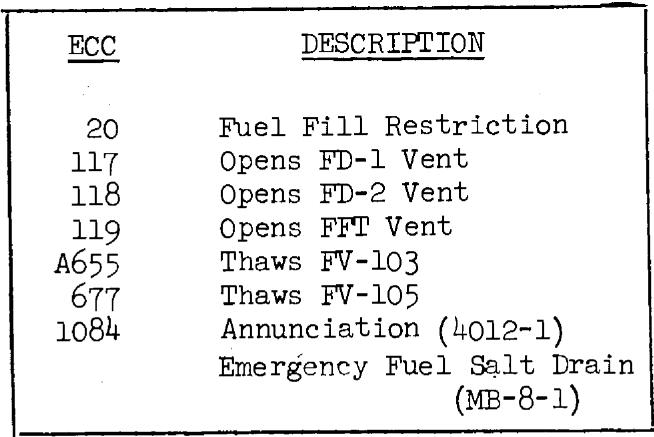
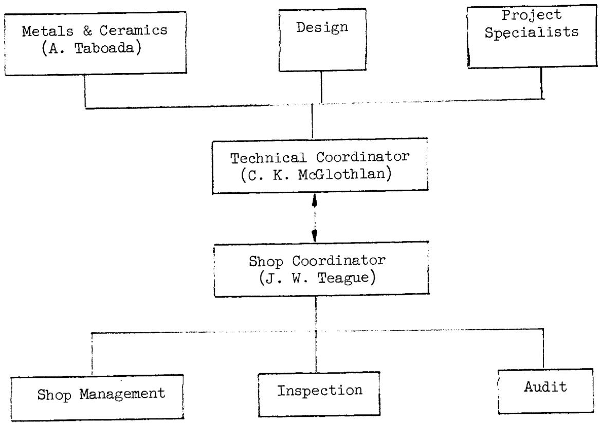

COPY NO.

DATE: September 1, 1970

SUBJECT: Critique of the Molten-Salt Reactor Experiment: A Collection of Comments Submitted by Persons Associated with the Reactor

TO: Distribution

FROM: R.H.Guymon

# ABSTRACT

The MSRE was shut down in December, 1969 after over 4 years of successful operation. As an aid in profiting from the lessons of the MSRE, critical comments were solicited from project personnel. There were 28 replies, which are reproduced and summarized in this report, touching on practically every phase of the MSRE. Many of the comments are applicable to other reactors or similar projects that might be undertaken.

Keywords: MSRE, reactors, fused salts, critique, design, development, construction, training, operation, maintenance, remote maintenance, personnel, management, communication, documentation, computers.

yin0 8eU JnntedT noT

Y·

E-07=70

YROYIOBAJANOTAK300HAD

单位：万元人民币

20TAB0年0019400

1

（1）在“委托价格”项下填报股东大会议案序号，对应的申报价格为每股1.00元。

#

atb,0H Y902

OTCL 10000000

tnnntnxxrodaaiaaie-nadionto expnnty 10dattindra aaeemoo to noluaillc Arodanaeddybathaoaa anoei neidirte 0

A

oo to enay I ravo raio qoEI ,iedmoed at awab tuee any 8aAM oT   
,RTM add to anonai edt most gulttoq nbl na aA .notfaroq intaeen   
naw ead .Iecnoeog dootg mrr batloion eew anammo loalilio   
uhtuo , froget allr at beanmnae bne hobouqas are noiv ,satqer BS   
the mssmon add to yam .RHM add to eanq vave yllsoftaoq ao   
- sboa od sigim taet eotjory rallms ro wotseri ranto o efdooligqnn

nuee nee eae nne nee nee nee nee nee nee nee nee nee nee nee nee nee nee nee nee nee nee nee nee nee nee nee nee nee nee nee nee nee nee nee nee nee nee nee nee nee nee nee nee nee nee nee nee nee nee nee nee nee nee neee

# CONTENTS

Page

Introduction 5

Summary of Contents 6

Comments as Received 16

Appendix I A Request for Criticism of the MSRE 82

Appendix II List of Contributors. 83

Appendix III Topical Index 84

# INTRODUCTION

In January 1970, shortly after the MSRE was shut down, a letter was sent to 76 engineers, chemists, and administrators who had been associated with the reactor. The letter (a copy of which forms Appendix I) announced the intention to publish a critique of the MSRE and solicited contributions. Although contributions were received from less than half of those contacted, there were many good comments and suggestions which should be of value to future projects.

In the interests of transmitting their messages unchanged, each of the 28 replies is reproduced without any editing in one section of this report. To aid the reader in finding comments on areas of particular interest, in this section I have indicated in the margin the topic being discussed in the text. In addition, a topical index is provided as Appendix III.

As a further aid to the reader I have combined and summarized every-one's comments. At the end of each paragraph of the summary, I note the reply and page number where the ideas summarized are originally expressed. There were, of course, many duplications among the independent replies, as may be seen from the multiple references at the ends of some paragraphs.

Additional specific comments and recommendations will be published in reports on MSRE systems and components1 and on training and operation.2

# SUMMARY OF COMMENTS

# General

It is hoped that those responsible for various aspects of the molten salt reactor effort will not only study this critique but also reread the relevant portions of the progress reports and summary reports and make the next reactor even better. (M-49)

The success of the MSRE was enhanced by the ability and dedication of the personnel associated with the project. Management showed their interest and helped emphasize the importance of the job. (M-53)(T-68)

Administrative and technical responsibility should be well defined. Authority should accompany the responsibility. (S-64)

Cooperation between all groups is a necessary part of successful operation. Their separate interests should be encouraged. For example, the analysis group should propose any experiment which might supply useful information, the chemists should request samples of any type, and maintenance should propose short cuts in repairs or modifications. Operations should review each thoroughly and should be encouraged to be conservative in order to maintain safe conditions for the protection of personnel and equipment. (D-22)(M-51)(M-52)

An effort should be made to assure that all involved personnel feel that they are on the reactor team. This includes the shop foremen, craftsmen, and remote maintenance personnel. They should be kept informed as to what is being done and why it is important. (A-16)(A-17)(T-65)(T-66)

An effort should be made to retain as many of the original personnel as possible. This includes supervision, operators, foremen, and crafts. Operators should be on-site early to become familiar with the system and to follow construction to assure that all systems will operate properly and to label all equipment when installed. (K-44)(K-45)(K-47)

Criteria should be established early and all key personnel should be thoroughly familiar with them. Limits should be set at reasonable values with changes made as infrequently as possible. (D-23)(H-34)(K-43)(U-70) (U-71)

On a reactor experiment, maximizing reliability should take second place to making detailed analysis of the system performance. This applies to such things as design, taking samples, and varying operating conditions. (B-20)(M-51)

Sufficient instrumentation should be provided so that: (1) detailed analysis of the system performance can be made, and (2) the operator does not have so many jobs that he can not handle them properly. (D-23)(E-26) (E-27)

There should be considerable improvements in instrumentation and computers on the next reactor due to advancements in the state-of-the-art. (Q-62)(Q-63)(U-70)(U-73)

Reactor equipment should be robust and foolproof and when possible the design should be such that operation can be done by rotating shift personnel. Areas requiring more intimate relations between operator and equipment should be identified early and special operating personnel should be provided. Equipment whose operation is something of an art should be minimized. (D-25)(I-37)(K-44)(M-51)(O-57)

During design, construction, and preparation for operation, all phases of the operation should be considered. Safety, containment, shielding, etc., should be adequate during power operations, shutdowns, and various transient conditions. Advanced plans should be made for decommissioning the reactor. (K-44)(K-45)(K-48)

Quality assurance should be given a prominent role in construction as well as subsequent maintenance and modification. Adequate personnel should be available. Samples of all materials used in construction should be retained. (E-29)(M-52)(N-55)(T-65)(T-68)

In selecting a supplier, the proper weighting should be given to the various aspects of the job so that he will at least be an expert in the most important phases. (J-38)

Savings of time and money (such as the decision to operate with marginal amount of flush salt, operating with an oil leak in the fuel pump, or changing the specification for the fuel-pump motor pressure vessel from stainless to carbon steel) should be carefully considered. Some prove costly in the long run. (A-16)(H-35)(I-36)(J-39)(M-54)(U-70)(W-76)

When items are used repeatedly such as the sampler transport tubes, the cost of decontamination should be weighed against the use of low-cost throwaway items. (I-36)

When repetitive jobs are done (such as removal of graphite specimens and containment startup check lists) extensive planning should be done to reduce downtime. (K-43)(L-48)

Behavior which may appear as a small sideline effect in a development test should be carefully evaluated for it may become a major problem in reactor operation. One should not rely on makeshift procedures but should develop a solution which will work in the reactor. (M-50)

Procedures should be written in advance for checking out instruments after installation or repairs and for doing maintenance. (K-44)(K-46)

# Design

All design calculations should be formally reviewed and reliable data on the physical properties involved should be available. Thermal stresses should be carefully considered. (H-34)(L-48)(M-51)(AA-78)

Detailed design should not be started too early. Title-I design should be completed before starting Title II and elementary-type drawings should be issued and approved before detailed drawings are started. (K-43) (U-70)(Y-77)

The use of conventional equipment should be encouraged, however, the specific application should be carefully evaluated to assure compatibility. (H-35)

The design should have some flexibility in the form of spare connections, redundant lines, and open space for additions. With sufficient redundancy and flexibility, it is often possible to circumvent unanticipated difficulties. (M-52)(M-54)(V-75)

The ambient conditions in which equipment and instruments must operate should be considered in the design. (L-48)

Absolute instead of gage pressure transmitters should be used where secondary containment is needed. (U-73)

Thermocouple wire and other low-level signal wiring should be twisted and shielded. (U-73)

The use of a computer for keeping track of control circuit interconnecting wiring should be considered. (U-74)

When continued operation is critical, spare equipment powered by separate power sources is recommended. (F-30)

The design of all equipment should be above the shut-off pressure of the supply (for instance, the design pressure of the thermal shield was lower than the shut-off pressure of the treated-water pumps). (L-49)

Keep as much equipment as possible outside of the reactor cell. (Z-78)

To minimize thermal stresses and reduce operator effort, automatic heater control should be provided. More separate controllers were needed to get a more even temperature distribution. (D-24)(F-33)(N-55)

# Documentation

Certain key documents such as the design report, flowsheets, elementary control circuit drawings, and electrical elementary drawings should be issued as soon as possible and should be kept up to date throughout the life of the reactor. (K-39)(K-40)

Adequate drawings should be issued to supply the needs of all phases of the project. For instance, construction people will be interested in the pedigree of all material used, types of welds, etc. Exact locations are often not too important. Remote maintenance personnel are not interested in the type weld but want to know the exact as-built location of everything. Overly dimensioned isometrics and photographs would probably serve their needs best. Both of these can usually afford to spend time searching for information. On the other hand, operating people need to know what thermocouples and other instruments are installed, where the pipes go, etc., and they often need to be able to find this information quickly. (A-16)(A-18)(A-19)(I-36)(K-41)

A consistent integrated scheme of documentation should be established. (K-42)

Recording of too much information may be cumbersome but it may prevent permanent loss of important data. Errors or mistakes should also be recorded so that others can profit by them. Field changes should be well documented. (K-40)(K-46)(K-47)

# Training and Operation

In preparation for operation it is important to maintain a list of all variables with their normal values and limits. The appropriate project-associated personnel should supply the limits and update these as required. This then becomes the basis for the logs and is helpful in writing the operating procedures. Operating procedures should be written as early as possible. (K-44)(K-45)

An operator training manual should be written for use in initial training and the training of replacement personnel. More use should be made of simulators and programmed instruction. Graphic panels, the jumper board, and the model were helpful on the job training aids. Periodic reviews and tests are recommended. (D-23)(K-45)(0-56)(K-47)

The training instructors should be trained in teaching methods. Supervisors should be trained in the art of supervision. (K-46)(X-77)

Up-to-date operating aids such as flowsheets placed in the various operating areas were helpful as was having limits marked on heater controllers. (0-56)(0-58)

# Maintenance

Computerized programmed maintenance of equipment should be carefully set up and periodically reviewed. (K-47)(V-74)

Remote maintenance supervision and crafts need training early in the program. (A-16)(A-17)

Although all required remote maintenance jobs were successfully completed, hindsight indicates that provisions for this work could have been better. (A-16)

Provisions should be made for removing equipment from the reactor cell to a sealed shielded work area without going through the high bay. Adequate room is needed for doing remote maintenance and areas involved should be well-ventilated and easily decontaminated. (A-17)(V-74)(V-76) (V-76)

Since the remote maintenance shield is a key item during shutdowns, it should be of better quality. A sufficient number of shielded carriers of all sizes should be available. A contaminated work area should be provided. (A-17)(V-75)(V-76)(Z-78)

The number of bolt head sizes used in the cells should be kept at a minimum and the quality should be improved. (A-18)(V-75)

# Sampling and Analysis

On-site analysis of samples is desirable. As many as possible should be in-line devices. Flow-through samples are more representative than dip samples. Some specific analytical methods need improving such as $\mathrm{U}^3/\mathrm{U}^4$ and carbon content of the salt and tritium in various gaseous effluents. (B-20)(B-21)(C-21)(K-47)

Cross contamination of samples should be carefully considered and sampling mechanisms should be provided at other locations such as the drain tanks. Efforts should be made to decide ahead of design or construction what type samples will be needed and from where. (B-20) (B-20) (B-21) (E-28) (I-36) (BB-80)

More consideration should be given to the chemistry of auxiliary systems. When methods are not available to test for deterioration (such as the lube oil for the circulating pumps) periodic replacement should be made. (F-30)(K-47)

# Computer

All reactors should have an on-line computer as at the MSRE. The reactor design should be compatible with the computer and planning and programming should start early. (E-27)(M-54)(U-71)

Reactor engineers should be more closely associated with the computer and should be trained so that they can participate in the programming of it and fully utilize its capabilities. ORNL maintenance people should be trained early. (K-46)(0-57)(Q-60)(Q-61)(Q-62)(Q-63)

During installation and checkout and subsequent maintenance or trouble-shooting, the computer should be isolated from operating personnel to avoid loss of confidence in the machine. (Q-61)(Q-61)

On future reactors, some routine control should be delegated to the computer. The alarm functions should be improved so that important alarms are not missed or ignored. (D-25)(0-56)(U-71)(U-73)

Noise analysis of all rotating equipment as well as neutron and pressure noise analysis should be computerized. Proper instrumentation should be designed for accomplishing this. (E-27)(G-33)

Adequate hardware diagnostic programs should be required of the computer manufacturer. (Q-63)

# Chemical Processing

The development and redesign of the fluorine disposal system should have been done earlier and preferably in another facility. More development work is still needed on the use of KOH-KI for removing excess fluorine. (M-52)(P-59)

Fluorinators should have frozen salt walls or use an alloy not containing molybdenum. (P-59)

All process gas lines leaving shielded areas should contain fibrous metal filters for removing metallic fission products. (P-60)

# Miscellaneous

Don't use an existing building. (K-47)(U-70)(Z-78)

Straight rigid control rods would be simpler and more reliable. These should be used and placed where they would do the most overall good even if extra vessel penetrations are necessary. (E-28)

Possible plugging of gas lines should be considered. Better valves should be developed. The use of more filters is suggested and dual or larger lines with installed heaters are recommended. (E-29)(F-32)(I-37) (0-58)(W-76)(U-73)(BB-80)

Salt line penetrations through cell walls require careful design to prevent plugging. (P-60)

More use should be made of two-out-of-three coincidence logic to permit testing and there should be more separation between safety and control. (U-72)

Process radiation and other instruments should be calibrated in terms which are physically significant. (E-28)

Leak-detected flanges should be replaced with welded pipe using remote welding techniques where possible. Electrical connections in the cell should be welded to prevent them from coming loose. (F-30)(N-55)

Methods of improvement on the use of freeze valves would be to elevate or pressurize the drain tanks. Two FV's could be used in series with alternate thawing to increase the life expectancy. Freeze valves made by spinning INOR-8 pipe might be an improvement. (F-31)(F-32)

It is suggested that a low-speed large diameter pump integral with the reactor be considered and that cerro alloys be investigated as a replacement for the coolant salt. (F-32)

It is suggested that tests be run with the system at negative pressure to test the effect on fission product stripping. (F-32)

A number of the comments made in the HRE and HRT critiques, $^{3,4}$ are still applicable. (V-74)

The holdup time of the charcoal beds appeared to be only about $80\%$ of the intended value, however, release to the atmosphere was negligible even when operating with only one bed in service. (BB-79)

The following is a list of items which were thought to have functioned well or are to be recommended.

(a) Regular on-site planning meetings and communication in general. (M-53)(T-66)   
(b) Cooperation between groups. (D-22)(I-36)   
(c) Daily reports. (K-47)   
(d) The numbering system. (K-43)   
(e) Change request system. (M-54)   
(f) Combination heater and thermocouple drawings. (K-42)   
(g) Microfilm drawing reader-printer. (I-37)   
(h) Operating procedures. (M-53)   
(i) Critical path scheduling of the fabrications of components and for doing maintenance. (M-54)(T-65)(T-66)   
(j) Identification and records of material used in construction. (C-22)(R-63)   
(k) Preoperational and precritical testing of equipment. (N-55)   
(1)Operator training and reviews. (M-53)(0-56)   
(m) Use of a simulator for training. (K-45)(M-53)   
(n) All annihilators repeating in the control room. (K-44)   
(o) Location of surveillance specimens. (C-22)(R-64)   
(p) Fuel and coolant circulating pumps. (F-30)(Z-77)   
(q) Dust filters on ventilation system inlets. (L-49)   
(r) Instrument maintenance. (D-23)   
(s) Seven days continuous operation of the computer before acceptance. (Q-61)   
(t) Design data sheets. (K-43)

(u) The high quality construction used in the cover-gas and offgas systems. (BB-79)(BB-80)

The following is a list of items which were thought not to function well or were needed but not supplied.

(a) Drawing index and cross-referencing. (A-16)(K-40)(A-17,19)   
(b) A well-organized written description of the control circuits. (H-35)   
(c) Elementary drawings for the safety system, solid-state circuitry, and the electrical system. (K-40)   
(d) Thermocouple wells in the fuel salt system. (E-26)(H-34)   
(e) Thermocouple wire penetration seals. (U-73)   
(f) Two manipulators at the sampler. (V-75)   
(g) Drain tank weigh cells. (E-29)(H-35)   
(h) Reactor and drain tank cell reference volumes. (L-48)   
(i) Electrosystem temperature modules on freeze valves. (0-59)   
(j) Lube oil system oil cooling. (F-30)   
(k) Facilities and storage for remote maintenance. (A-16)(A-17) (A-17)(I-36)   
(1) Vent house remote maintenance. (A-17)   
(m) Building cranes. (A-18)   
(n) Remote maintenance jig and fixture program. (A-18)(Z-77)   
(o) A data-plotting board. (D-25)   
(p) A fuel salt flowmeter. (E-26)(U-72)   
(q) Radiator doors. (M-50)   
(r) Check valves. (0-59)   
(s) Punched card reader, line printer, and more magnetic tape units for the computer. (Q-62)   
(t) Computer manufacturer's documentation. (Q-61)   
(u) Galloping safety circuits. (U-72)   
(v) Radiator stack flowmeter. (U-72)

The following is a list of items which were installed and later found not to be needed.

(a) Automatic load sequencing. (M-52)   
(b) Thermocouple patch panel. (D-24)(K-43)   
(c) Helium treatment station. (L-48)(BB-79)

The thermocouple scanner is the only item on which there was disagreement. (D-24)(F-33)(U-71)

# COMMENTS AS RECEIVED

In this section are reproduced verbatim the 28 replies to the request for criticism of the MSRE. The identity of the writer is given in Appendix II.

# Reply A

Remote Maintenance, or "We Sure Licked Out on That One"

Remote Maint.

Somehow or other we were able to fix whatever broke at the MSRE. Indeed there were times when further operations depended upon successful completion of rather difficult remote maintenance operations. However, these operations were always slow and expensive. Therefore, the comments that follow do not say that we did it wrong. To the contrary, I think we did most of it right and well. The gist of what follows says that we could have done it better and that these points should be considered for the next time.

# "Confusion Junction"

Remote Maint.

Organization

The "system used for remote maintenance" was a poorly organized collection of parts, people, and procedures, that was accorded a rather vague status in the organization of reactor operations, and was granted very little authority. The responsibility, however, was clear and fixed. "Be ready to fix it if it breaks."

Remote Maint.

Documentation

Let me elaborate. The personnel involved with a job involved development, operations, health physics, and craft people. Information appeared on General Engineering drawings, Reactor Division drawings, Luther Pugh's MSRE sketches, Blumberg's and Shugart's sketches and drawings, two volumes of photographs, and two loose-leaf books of unpublished procedures. The equipment to be maintained consisted of all the equipment in four radioactive cells. The equipment to do the maintenance was physically scattered all over "the county." With each job the ground rules changed, although this stabilized toward the later operations. During the construction and precritical phases I had the definite feeling that I was not needed and not wanted. This changed after the reactor went critical. I was needed but still not wanted. This was borne out by the marked difference in the effort required to get craft work done between the time that I did remote maintenance and the second gamma scan. For the latter job I was "on the team" and things got done very easily.

Personnel

# 17

# Reply A (Con't)

It is suggested that remote maintenance be made an integral part of the operations group. Remote maintenance needs to be "on the team."

"Low Budget Productions, Inc."

Many of the decisions which affected my work were based on "time and money shortages." It may be illuminating if we enumerate some of the things we could have "bought" had the schedule and budget allowed and then see what benefit would have been derived. We could have: (1) trained 2 or 3 teams such as Shugart and Blumberg, (2) conducted the P&E craft training program in the precritical period when we needed it rather than later on, (3) provided better physical facilities (these are enumerated below in terms of defects).

Organization

mote maint.

Training

The benefit from having provided the above items would have been shortened downtime for the jobs that were done, resulting in some cost saving, and a more positive demonstration of the "maintenance capability." Further, if the project had been requested to recover from the hole in the drain system, and to put the reactor back on line, then an expenditure such as the above would have been a good investment on a cost basis.

"Nobody Knows the Facilities I've Seen"

The following is a list of the defects in the equipment that we had to work with:

1. The vent house was never designed for maintenance of the radioactive components located there. There was no head room, no overhead handling facilities, both the permanent and the maintenance shielding were crude, it was crowded by the beams, pipes, electrical conduits in the area (Some of these cut down the usable overhead access area, the room was hard to decontaminate, and the weather inside the room was very closely coupled to the weather outside the room.   
2. There were never enough shielded carriers. We could have used more, bigger, and better "vitro" shields. Usually we had to design and fabricate these during the heat of the shutdown.   
3. The high-bay storage rack for remote maintenance tools was too small. Other equipment was piled on top of the tools resulting in damage. Neighbors on both ends

Remote Maint.

Des-Misc.

Remote Maint.

Planning

Remote Maint.

# Reply A (Con't)

of the rack moved in and restricted access to the ends of the rack. A permanent, adequately sized area was promised, but never delivered. Instead we received wit and humor such as "These tools make the high bay look like Big Foots Used Auto Parts."

Remote Maint.

Management

Des-Mech.

4. The portable maintenance shield was a very practical, hard-working, essential piece of equipment. However, because of budget restrictions, it was not of good quality in many respects. The main bearing was crude which made it hard to turn. We could have saved set-up time with a system of jack-screws for leveling the whole unit. Stronger, stiffer tracks would have been helpful. The light and tool plugs and penetrations were rough, and made some tool-handling operations difficult and time-consuming. The next time around, this design should be used as a guide, but the overall quality should be better.

Management

Planning

5. Both building cranes were old, and frequently required repairs, and usually at an inconvenient time. Most of the trouble was electrical but we also had some mechanical difficulties with the trailing cables. One has only to examine the shutdown schedules prepared by Webster and note how many of the critical jobs involved either or both the cranes and the portable maintenance shield, to realize how important reliability and good performance is for this type of equipment.

Des-Mech.

Remote Maint.

6. The bolts used in the cell for remote operations were poor in the following respects. The head size was small in relation to the bolt diameter, thus diminishing the bearing surface. The threads were rough and splintery and as a result many bolts were discarded. Because the bolts were expensive, not many were bought. For this reason, we ran out and had to reorder a number of bolts and this was expensive. There were at least two cases of galled bolts in the MSRE cell that had to be removed and replaced remotely.

Management Remote Maint.

7. The jig and fixture program turned out to be non-existent in-so-far as the items we needed to replace such as the 522 and 523 spoolpieces and venthouse piping.

"The Information May Be on the Drawing -- If You Can Find the Drawing"

Remote Maint.

Documentation

The job of remote maintenance involved a large amount of reactor equipment that was described in the MSRE reactor drawings. However, the information required for remote maintenance was not taken into account enough in the preparation

# Reply A (Con't)

of the drawings. The drawings were complete only in the aspect that there was enough information to build the reactor.

When one considers maintainability, the following information is needed.

1. Where is the item located with respect to the cell block layout.   
2. What is in the way or near by.   
3. What clearances exist.   
4. What does it attach to and how.   
5. What does the removable part consist of.   
6. What are the envelope dimensions.   
7. Finally (although not absolutely necessary) how is it supposed to be replaced.

While all of the above would make it easier to do maintenance or any other drawing research, I would like to suggest the following minimum steps.

Documentation

1. Reference drawing numbers and dimensions should be used liberally on the face of the drawing.   
2. A systematic method for going from any detail to the next larger assembly and so on and also the reverse direction should be employed.   
3. There should be more liberal use of drawing indexes and/or picture drawings with the assemblies called out on them.

"And As the Sun Sinks Behind the Decontamination Facility"

Let me now summarize my opinion on this subject. The low budget policy was a realistic one, and turned out to be correct. However, had the project been extended for another fiscal year, it would have been a rather expensive way to save money. Furthermore, for larger reactors with their bigger costs and bigger potential hazards, we cannot afford the luxury of saving time and money at the expense of maintenance. We must overdesign, overbuild, and overprepare instead.

Management

# Reply B

<table><tr><td>Chemistry</td><td>These comments are related to fission product studies,
and are generally related to two kinds of restriction on
experimental flexibility: inadequate access to regions
and insufficient variation of conditions of chemical interest.
Some of the comments are a result of the slow development
of our understanding, some are related to design inflexibilities,
some to caution and the desire to demonstrate long term
smooth operation, and much to the priorities of other experiments.</td></tr><tr><td>Chemistry</td><td>As a matter of general philosophy, at some phase of
development of chemical machines, the effects of operation
under chemically extreme conditions should be explored
experimentally. This is preferably done in pilot plants,
such as MSRE or MSBE. This was done in MSRE mostly by
the inadvertent increase in oxidation potential of the
system by means presently subject largely to conjecture,
and the subsequent addition of reductant metals to the
salt to regain the desired though not determinable U3/U4
ratio. Argon replaced helium, purge flow rates were changed,
system flow rate was altered, and modest changes in operating
temperature and pressure were made, though these changes
were mostly organized for physics purposes. However, other
useful variations were not made. These include additions
of gases such as hydrogen, HF, oxygen, water, methane,
and possibly other gases which if added in judicious amounts
to the pump bowl purge could have had very interesting
and informative effects on oxidation potential, oxide behavior,
tritium behavior and other phenomena. To make this effective
would have required good analytical techniques for U3/U4
and tritium analysis (and sampling) among others; these
appear to have been nearly ready when MSRE operation was
stopped.</td></tr><tr><td>Chemistry</td><td>It was not possible to perform experiments in the
salt other than dipping a few materials in the pump bowl
liquid, and withdrawing for examination. In particular,
no electrodes, no gas sparging, no filter collection devices
(except magnets) for solids or colloidal materials could</td></tr><tr><td>Planning</td><td>be effectively employed. This was in great part because
the only access was by means of the sampler-enricher system
to the pump bowl. The desired approaches would have been
feasible for an on-site hot cell containing a suitable
flowing salt bypass - admittedly difficult but essential
to the attainment of the data usually firmly stated to
be required.</td></tr><tr><td>Sampler</td><td></td></tr></table>

The only access for fuel and gas samples was within a spiral spray baffle, with ill-defined salt circulation,

# Reply B (Con't)

undefined gas circulation, and essentially no possibility of determining accumulation of materials at the gas liquid interface. Contamination of sample capsule exteriors by deposits in the transfer tube is strongly suspected but poorly defined. Samples of pump bowl salt will represent circulating salt reliably only for substances certain to remain in salt during its sprayed passage to the sample region. Next time, flow-through sample devices as a bypass on a flowing line, if achievable, will provide samples far more representative of the flowing salt.

The quality of the gas samples was difficult to assess for several reasons. Samples were sucked into a capsule in the space above the pump bowl liquid within the spiral spray baffle, with varying gas flow down the transfer tube through this space. Transport conditions and residence time for gas borne materials are difficult to define for the pump bowl proper — though presumed "well-mixed" inspite of baffles — but the gas situation within the spray shield is even more elusive. Further, the effect of evacuation of regions containing the sample capsule during removal procedures is not clear.

The proposed off-gas sample station to have been attached at the 522 jumper line could permit better samples, but shut down schedules halted fabrication. Even better would be a suitable flow-through rig capable of regular sampling.

Samples were not obtained from the drain tanks — in particular, some ingrowing $^{95}\mathrm{Nb}$ appears to have been lost there but periodic samples were not requested to establish this. Flush salt samples similarly.

Removable metal specimens, in the heat exchanger inlet and outlet regions for example, could have shed much light on deposition of corrosion products and fission products around the system, especially as a function of altered temperature.

# Reply C

One of the more serious deficiencies of the MSRE was the lack of a routine carbon analysis on the fuel salt samples taken to monitor corrosion products. Admittedly, theoretically plus tests out of and in the presence of irradiation indicated that there were no compatibility problems under normal MSRE operating conditions. However, with molten fluoride fuel salt circulating through the

Chemistry

Planning

Sampler

Chemistry

Sampler

Chemistry

Planning

Chemistry

Planning

Chemistry

# Reply C (Con't)

approximately 4 tons of unclad core moderator graphite, a major reactor component; it seems advisable to monitor the carbon content in the fuel salt. The core surveillance specimens samplings were spaced too far apart to adequately monitor unusual operating conditions that might have developed. I understand that an improved carbon analytical technique would have been necessary, but I believe that it should have been developed and used as a routine corrosion products monitor as suggested several times.

Qual Assurance

In the early part of the MSRE, fabricated Hastelloy N components had the heat numbers (HT) and inspection record (IR) numbers etched on every part. This was good and should be practiced at all times for all MSRE materials. Toward the latter part of the MSRE this practice seemed to decrease.

Des - Comp & Sys.

The core surveillance (\~ 3 in. from the vertical centerline of the core) and the vessel (\~ 5 in. from the exterior of the core vessel wall) specimens were invaluable monitors for the status of the Hastelloy N and the moderator graphite. However, the cross sectional space limitations for the core surveillance specimens complicated their design and hot cell handling which ultimately restricted the desirable variety of specimens.

# Reply D

Comments on the Relationship Between Experimenteter and Operator

Organization

Speaking as an operator I think the cooperation between the experimenter and the operator was good. This is certainly necessary if the maximum benefit is to be derived from an experiment such as the MSRE. I want to comment on the occasions which the experimenter and the operator should disagree for the benefit of the experiment.

Operations

The experimenter should properly be aggressive and imaginative in his requests for running tests of interest. The main interest of the experimenter however lies in the results of the test — not necessarily in the continued well-being of the system.

Management

The operator, on the other hand, should be encouraged to adopt a possessive attitude toward "his apparatus" and to resist any proposed test he feels may compromise its continued well-being. This resistance should be encouraged and should be viewed by management not as a lack of cooperation but as a necessary function. This is not to suggest that operators

# Reply D (Con't)

were ever accused of non-cooperation. However, I do think there were occasions it might appear as such unless this point is considered.

For the operator to fulfill his role as the protector of his apparatus means also that he oppose the violation of a rule or limit for the purpose of obtaining data. In addition to the possible mis-use of the equipment, the attitude of the operator can be adversely affected by unusual demands of the experimenter. (I speak now of the "operator" as the man on shift who is responsible for carrying out the instructions given him.) Perhaps a large part of the problem is having the limits set unnecessarily close to begin with. I have had operators comment to me "we would have been fired for doing this (i.e., operating in this manner) last week."

The sense of participation and the attitude of the Organization operator is very important to successful operations such as the MSRE. During operator training, a large amount of emphasis was placed on strict adherence to operating procedures and limits. Yet (in the eyes of the shift operator) the experimenter, apparently with very little difficulty, obtains approval to seemingly violate the most sacred of limits. The operator thus very naturally loses some respect for all limits. The fact that the change in limits necessary for the experiment was given very careful consideration before approval is beside the point. After so many of these type changes it appears to the operator that limits may be changed at will to accommodate the desires of the moment. One obvious solution of course is to have Management the limits set at more reasonable values which will protect the system and also accommodate most of the foreseen experiments.

# Instrumentation - General

As a whole the installed MSRE instrumentation ranged Des -Instr. from adequate to excellent. The versatility and wealth of information provided by the control room jumper board is an outstanding example of instrumentation for the operator. Certainly the maintenance people did an excellent job Maintenance of revising and maintaining instrumentation.

Along with some difficulties with installed instrumentation, however, I want to mention the difficulties due to instrumentation not installed. There were many areas where, for purposes of saving money, control and monitoring were left to the Des - Instr. operator. Some of these were important areas such as the line 200-201 penetrations, the cell temperatures, Management the FV-105-106 tee, freeze valve controls in general, coolant salt flow transmitters, etc. Taken individually

# Reply D (Con't)

or even in small number any of these could certainly be taken care of by operator attention. However, taken collectively there were sometimes too many situations and not enough operators to do the job properly. More controllers would have saved a lot of operator time and error.

# Thermocouple Monitoring - Patch Panel

Des - Instr.

Records

For critical areas such as the pump bowl, cell ambient temperatures, line 200-201 penetrations, the FV-105-106 tee, etc., a better system of temperature readout and control would have been useful. The thermocouple patch panel was designed to provide a wide range of temperature readout possibilities. In actual use, however, it turns out to be a burden instead of a blessing to the operator. For a simple thermocouple change requiring less than a minute at the patch panel another ten minutes are necessary to make $4$ thermocouple log entries. The result was that sometimes either needed changes were not made or a "temporary change" was made in the heat of necessity and not logged. I think that a patch panel connected in parallel to the normal thermocouple readout would be of more benefit. Logs would remain necessary, of course, but only on the semi-permanent attachments.

# Thermocouple Monitoring - Scanner

Des - Instr.

Des - Elec.

At the present time it appears the next reactor will have a cell furnace type heating system and thus MSRE experience would be of no benefit. However, perhaps there will be auxiliary systems and lines which will be heated and monitored individually. I recommend that a different type heater and monitoring system be used. The oscilloscope scanner system is satisfactory for monitoring temperatures after the system is hot but is almost useless for heatup. I propose providing either more temperature recorders in close proximity to controls or even better a scanning system which controls individual heaters to a single, manually variable set point. An entire system can be brought up to temperature uniformly with one control. The autotransformers could be used for trim to compensate for the difference between full rated heater voltage and the voltage necessary to obtain the desired temperature.

This same scanning controller system could also be easily adapted to maintain desired temperature gradients within desired limits. This is an important feature when heating long sections of piping which may contain frozen salt or when minimizing thermal stresses due to steep gradients.

# Reply D (Con't)

# Control Room Layout

I suggest the design layout of the next control room provide a wall space, convenient to both operator and observer, for a data plotting board. There are numerous times when a continuous plot of several variables is necessary. This display of a few well chosen variables should be made possible without cluttering up walls and windows.

# Computer

The computer has been a valuable aid to the operation of the MSRE. From the operator viewpoint, the two most exasperating problems were (1) "garbage" printout on the alarm typewriter, and (2) an unnecessary multitude of alarms due to an insignificant variable oscillating about an alarm setpoint. I think the next use of a computer for reactor operations should have its limit check duty drastically reduced. It was intended that the computer be an "early warning" device which would give alarm at some value before the conventional alarm sounded. However, operator confidence in the computer is lowered considerably when trash comes out. Aggravation is compounded when it rings a bell every time while doing it. When operator confidence in the computer is lost, the value of the computer to the project is diminished. A significant alarm signal is easily lost when it is buried in a pile of insignificant alarms. I suggest that the conventional alarm system be allowed to monitor most of the variables and the computer be used only for special items.

# Sampler Enricher

In a manner of speaking the sampler-enricher was more difficult to operate than the reactor. The reactor itself was very forgiving of mistakes and would accept an operator error with no adverse effects. The sampler, however, was very unforgiving. Many times it would respond adversely even with the best of attention and care. The sampler-enricher was, by necessity, a complex combination of mechanisms. Operating check lists were evolved which are probably the best that can be devised. However, it is evident that detailed check lists can go only so far with a complicated collection of mechanisms such as the sampler. Continuous operator familiarity would be desirable. I suggest that for the next reactor, manpower be distributed such that a special crew performs all sampling operations.

Des - Misc.

Computer

Sampler

Organization

Operations

# Reply E

I think it is obvious that there are many features and sub-systems associated with the MSRE that performed their intended functions admirably. There seems to be little advantage in dwelling on these since it would only lead to a long narrative of doubtful value. However, there are also some areas in which notable deficiencies appeared. The following discussion deals with some of the deficiencies that are apparent from my point of view.

# Instrumentation

Reactor Analysis

Management

Des - Instr.

I have now been closely associated with the operation of two reactor experiments at ORNL; in both projects, detailed analysis of the performance of the system was significantly hampered by a lack of instrumentation. In most cases this lack resulted, not from the fact that the right kinds of instruments didn't exist, but from a failure to design the right device into the right place. In fairness to the designers, it must be admitted that some of the needs could not be accurately predicted at the design stage. Other deficiencies apparently resulted from conservatism in the design to maximize system reliability. Maximum reliability may be an admirable goal in a plant that is to do nothing but run for 30 years or so but, when this goal compromises the ability to gain information from a relatively short-lived experiment, it becomes a handicap. Some of the specific deficiencies in the MSRE are discussed below.

Reactor Analysis

Des - Instr.

Primary Fluid Flow Rate - The lack of a flow element in the primary loop has contributed much to analytical difficulties. Such a device could have added a great deal to our understanding of the system - it might even have helped resolve our current uncertainty in power level. The device in the coolant loop has demonstrated that such an installation need not compromise the integrity of the loop. A direct measure of primary flow should be strongly considered in the next reactor design.

Reactor Analysis

Des - Instr.

Temperature Indications - Accurate, fast-response indications of the temperature of the primary fluid at several points around the loop, and especially at the core inlet and outlet, are essential to an accurate evaluation of system performance. The thermocouple well in the reactor neck (TE-R52) was a move in the right direction, but not far enough. Unfortunately, even this step was nullified, apparently by an installation error. Since there was only one thermocouple, the margin for error was zero.

# Reply E (Con't)

By far, the best temperature information obtained on the MSRE came from the thermocouple wells in the coolant loop. At this time there is no evidence to indicate that any difficulty whatever existed with the wells. (Perhaps these should be examined to confirm their integrity.) On the basis of this experience, carefully designed thermocouple wells should be seriously considered for several locations in the primary loop of the next reactor.

Pressure Indications - This may be one area in which the analytical needs (desires?) could not be accurately predicted. However, we now know that a pressure-measuring device, with good high-frequency response, at some point in the liquid filled portion of the primary loop would have been a valuable asset in the studies of bubble effects and dynamic behavior. If such devices are not currently available for molten-salt applications, it would probably be worth some development effort to get one (or more) for the next reactor.

Computerization - It seems evident that the next reactor will make extensive use of digital computers for collecting, logging, and otherwise processing operating data; an online machine might even be used for some control functions. A number of the signals from the MSRE were not particularly well adapted to computer handling - at least not by the machine we had. I believe the entire area of compatibility between the system instrumentation and the computer should be a prime consideration from the beginning of the instrument design work.

In this same connection, noise analysis techniques are now much more highly developed than they were when the MSRE was designed and built. These techniques can be used to quantitatively monitor the performance of rotating machinery as well as for the more exotic applications like neutron noise - if the necessary hardware is provided. We spent considerable time and effort setting up special equipment in the blower house each time we wanted to check, in detail, the bearing vibrations on the main blowers. Consequently, these checks were made very infrequently (and none at all were made on other devices). This information could have been obtained routinely, and with better resolution, by transmitting the vibration signals to a computer with adequate high-speed sampling capability. I believe the next reactor should include a network that permits routine noise analysis on every vital piece of rotating equipment. There may be analog devices that can do this for each separate application but, if we have a digital computer with the

Reactor Analysis

Des - Instr.

Reactor Analysis

Computer

Des - Instr.

# Reply E (Con't)

inherent capability and flexibility to handle this job along with pressure noise, neutron noise, and all the other data handling functions, we should take advantage of it. At the computer end, the same basic hardware and software could be applied to all noise signals which might make it relatively cheap.

Operations

Calibrations - We found, when we finally needed it and looked for the data, that some of our process radiation instruments had not been calibrated in terms of absolute activity concentrations in the process streams. I realize that such calibrations are difficult, and it may be even more difficult to relate an activity reading on a sample line to the real item of interest - activity in the process system. However, some effort should be made to calibrate each device on the reactor in terms that are physically significant.

Planning

# Control Rods

Although the control rods used on the MSRE worked out all right, there is no doubt in my mind that life would have been much simpler had we had ordinary, straight, rigid control rods. I am not convinced that the problems we avoided by restricting ourselves to one reactor-vessel penetration outweighed the problems we encountered in squeezing everything through that one penetration. While MSR's do not need flux flattening for uniform fuel burnup or burnout protection, there are advantages to be realized in terms of graphite thermal stresses and lifetime. Since the next reactor will need control rods, why not put them where they will do the most good overall instead of basing everything on vessel penetrations?

Management

# Samplers

Des - Comp & Sys.

Considering the operating conditions and the number of sampling operations, the MSRE samplers proved to be remarkably effective and adaptable. In addition, the designers must have learned a great deal about the various mechanical items that will undoubtedly carry over into future designs. One problem that may not have received adequate attention is the possibility of cross contamination of samples in the handling operations. It now appears that some highly sensitive samples may have been affected by pickup of foreign material in the fuel sampler. Future devices that are susceptible to contamination by the materials that pass through them would probably benefit from some provision for periodic cleanup.

# Reply E (Con't)

There were several occasions on which salt samples from the drain tanks could have provided valuable information about the state of the salt. A drain-tank sampler probably would be a valuable research tool on the next reactor. This is a good example of an item needed for an experiment that would probably not be desirable on the ultimate system.

# Inventory Control

Accurate information on the salt inventory and its distribution between the various parts of the system was lacking throughout the operation of the MSRE. Some of this problem can be attributed to the relatively poor experience we had with the weigh cells. In retrospect, bubbler tubes in the drain tanks might have helped considerably since they worked so well in the pump bowls. However, the piping layout, which allowed intermixing of fuel and flush salts in poorly defined amounts also contributed to the problem. The need for precise inventory data was apparent in several areas of the analysis of system performance and it will be required on any future system. The salt-handling and salt-measuring systems should be designed to provide the best information possible on how much of what is where under all circumstances.

# Unheated Lines

We learned the hard way on the MSRE that salt can, in fact, get into gas lines appended to the liquid system and freeze there. Thawing of these lines was a difficult job on the MSRE because the piping layout made it hard to heat the lines - even temporarily. We need to evaluate every conceivable operation and misoperation on the system and be prepared to handle the consequences of those that are judged to be credible.

# Record Samples

Experience with the MSRE has shown again the need for keeping reference samples of all materials used in construction of the reactor system. This principle was carefully followed for the special materials (salts, graphite, Hastelloy-N, etc.) but it was not followed as carefully for the "ordinary" materials. The question of Li concentration in the insulation in the thermal shield illustrates the need for keeping some of everything. Analytical results are not necessarily required - these can be obtained when and if the need arises, if the material is available.

Chemistry

Rual Assurance

Des - Instr.

Des - Piping

Des - Misc.

Management

Construction

# Reply F

<table><tr><td>Des - Comp &amp; Sys.</td><td>These &quot;packages&quot; with their &quot;double redundancy&quot; should
be very reliable to supply oil to future salt pumps of the
MSRE type. The Gulfspin-35 oil also gave remarkable service
in radiation fields.</td></tr><tr><td>Des - Comp &amp; Sys.</td><td>The philosophy of having one pump of each package fed
from a semi-independent reliable power source is a good
one.</td></tr><tr><td>Des - Comp &amp; Sys.</td><td>Improvements in future heat exchangers for these type
of oil packages should be made. The next heat-exchanger
units should have a lot of excess capacity to allow for
loss in efficiency due to fouling from scale. Improvements
are also needed in cooling water chemistry, i.e., better
inhibitors to prevent scaling.</td></tr><tr><td>Operations</td><td>Oil should be completely changed after every two years
of operation as a matter of principle.</td></tr><tr><td>Des - Elec.</td><td>Lube oil pump motors for MSRE-type systems should
be the very best commercial grade of moisture and dust
proof design. These are inexpensive considering the job
they have to do.</td></tr><tr><td rowspan="2">Development</td><td>Improvements in the priming of the idle pump of a package
are still needed.</td></tr><tr><td>Leak Detector System</td></tr><tr><td rowspan="2">Des - Piping</td><td>It is recommended that this type of system be used
in all future plants which have &quot;make and break&quot; fittings
and must be well contained. It is, however, economically
desirable, and now practically feasible, to greatly reduce
the number of these type of joints by the use of remote
welding and brazing techniques. This should be done wherever
possible for reasons of economy. It is obviously expensive
to provide buffered joints of the type used so extensively
at the MSRE.</td></tr><tr><td>Coolant Salt Pump</td></tr><tr><td>Des - Comp &amp; Sys.</td><td>This coolant salt pump was an excellent piece of equipment
and performed far beyond its expected service life. The
fault of the oil leak to the pump bowl has already been
rectified for the future in that the spare rotary element
has a seal weld in lieu of a buffered metal &quot;0&quot; ring in
the critical area. This pump is recommended for future</td></tr></table>

# Reply F (Con't)

Coolant Salt Pump (continued)

coolant salt circulation. Minor modification and shielding may be necessary to pump sodium fluoroborate.

# Freeze Valves

Try to eliminate via elevated or pressurized drain Des - Comp & Sys. tank.

Put 2 or more FV's in series as a safety measure - use alternately to reduce number of thermal cycles.

Freeze valves should have a tight fitting but unwelded shroud. Could use braided SS cable for gasketing. A TC on valve center could function with a heater on the air stream to hold a setpoint with a minimum of thermal cycling and could also help reduce thaw time by providing hot blast air.

A freeze valve center might be a slightly reduced section of INOR-8 pipe effected by spinning. This section could then be annealed at $\sim 1800^{\circ}\mathrm{F}$ before installation.

# Future Fuel Salt Circulators

Mk II Fuel Pump - This is a fuel pump similar to that used at the MSRE, but with more height and volume in the pump bowl (enough so that the 5.4-ft³ overflow tank could be eliminated). This pump is fully described elsewhere and a prototype has been successfully run for approximately 12,000 hrs in a test loop. This pump has the advantage of a deeper pool of salt in which to spray the fission product stripper flow, so that the tendency to such He gas into the pump suction is minimized.

This pump has the further improvement of a higher space between the salt-gas interface and the point at which the main offgas line leaves the pump bowl, hence the tendency to plug the offgas line with spray mist and foam is decreased.

The Mk II pump is also seal-welded against oil leakage into the pump bowl proper.

The fact that there is no overflow tank eliminates the bothersome operational chore of burping the overflow tank, which was at times of plugging in the offgas line, a real hazard to the on-stream percentage time of the MSRE.

# Reply F (Con't)

# Future Fuel Salt Circulators (continued)

Any future reactor of this type should, as a bare minimum, have this type of fuel pump.

Des - Comp & Sys.

Dual, Heatable Offgas Lines - Any type of salt circulator built in the future should have at least two large, heatable main offgas lines. These should also be fitted with very coarse INOR-8 wool mist filters, and should be so valved that one could pass the offgas flow while cold, as the second was heated in quiescent state to melt the trapped salt and allow it to flow by gravity back into the pump bowl.

Des - Comp & Sys.

Simplified Salt Circulator - A different approach to the problem of fuel salt circulation than the traditional "pump, pipe, and pot" would be to use a slow-speed pump integral with the reactor. The use of bismuth based alloys as a replacement for the coolant salt is also suggested.

Development

Vacuum stripping of Fission Products - It has been suggested that tests be run at 5 psia vs 20-psia pump-bowl pressure to determine whether or not improved fission product stripping could be achieved at the lower pressure. Because of heavy existent schedules and an extreme shortage of money for the total molten-salt program, this proposal could not be tested in the MSRE. Because of its possible beneficial effect on breeding ratios of future MSBR's and because it would offer a system simplification if properly designed, the idea should not be left untested if the molten-salt program is carried on logically.

# Partial Safety Drain

Des - Comp & Sys.

A partial drain of the reactor might be obtained by having the bottom of a tank (partial drain tank) connected to the bottom of the reactor by large salt piping and having the top of the partial drain tank connected to the top of the reactor by gas piping containing equalizer valves. During operation, the partial drain tank would be pressurized with helium to force most of the salt into the reactor. When a drain is needed, the equalizer valves would be opened and some of the salt would flow by gravity to the partial drain tank.

# Reply F (Con't)

# Simplified Heater Control

Use multipoint recorder-controller for controlling Des - Instr. temperatures of fuel and coolant systems. Use reduced voltage on heaters to attain long heater life (as in MSRE). Des - Elec.

One 24-point Brown instrument will scan and give "on-off" control to 24 heaters. These will "scan" the 24 points in 1-1/2 minutes. The load-carrying contactors would be located outside the containment cell for maintenance accessibility.

These instruments used to cost $3000 each in 1950, and two can be economically used for each bank of 24 heater zones; one being a spare tied in to a spare set of thermocouples.

This type of control will hold the system at the desired temperature automatically, under all conditions, and even shut off power if one zone overheats.

# Auxiliaries

Try to reduce auxiliaries so that personnel in power utility field can take over this type of reactor some day (i.e. use stainless steel lined bed rock for containment and shielding. This might offer the possibility of simpler expendable cores which would not be set up for remote maintenance. In event of rupture in primary, or even MCA, this lower priced, "mass produced" cell in its bed rock "cave" could be written off, the cell filled with concrete and abandoned.

Use much better grade fundamental controlling instruments and omit the computer "fine tuning". Des - Instr.

# Reply G

We have investigated applications of noise analysis Reactor Analysis at the MSRE since the reactor first went critical in 1965. The MSRE allowed us to develop and demonstrate possible applications of noise analysis for system parameter measurement (void fraction, $\beta_{\mathrm{e}}$ ) and for malfunction detection (plugged offgas line). However, the full capability of the technique was not realized because the original instrumentation was not specified with noise analysis in mind. Our experience at the MSRE should help in specifying the proper sensors for noise analysis in the MSBR.

# Reply G (Con't)

Reactor Analysis Des -Instr.

Specifically, it was found that the cover-gas pressure sensor in the MSRE was too far removed from the pump bowl (and core) to be reliable for making quantitative measurements of void fraction in the core. The pressure sensors in the MSBR should be as close to the core as possible and should have a flat frequency response up to 100 cps.

Reactor Analysis Des -Instr.

We also believe that noise analysis of temperature fluctuations may have yielded useful information if the signal wire from the thermocouples in the MSRE had been shielded. Shielded wire should be used for the thermocouples in the MSBR.

# Reply H

# Containment

Procurement

Des - Misc.

Des - Instr.

Some aspects of the containment requirements and containment testing requirements were not adequately considered in the initial design of the MSRE. For example, the coolant cell to high-bay pressure differential was never completely satisfactory. Thermocouple headers and other penetrations were very difficult to test and repair. The containment and containment-testing criteria should be established early in the design phase.

# Thermal Stress and Stress Concentrations

Management

Des-Mech.

Much more careful consideration must be given to thermal stresses, thermal fatigue, and stress concentrations in future reactors. An indoctrination program for all project personnel is needed to avoid these pitfalls. The leak in FV-105 is possibly an example of this: The design contained a root crevice subject to cyclic stress where the air shroud was joined to the flattened pipe section. Once made, this design feature (error?) was overlooked by perhaps dozens of people who would usually not have accepted such a design.

# Thermocouple Wells

Des - Instr.

The fears in regard to thermocouple wells appear at this time to be unfounded. Additional wells would have been helpful at the more important locations in the fuel and coolant systems such as the reactor vessel inlet and outlet and at the heat exchanger fuel and coolant inlet and outlet lines. Although the thermocouples in the MSRE have performed exceptionally well, we still do not know the reactor inlet temperature very accurately at other than zero power (see Fig. 2, MSR-67-19).

# Reply H (Con't)

# Conventional Equipment

Some of the difficulties with the main blowers, component cooling pumps, and perhaps other equipment illustrate the need for a more careful evaluation of the design and application of conventional equipment.

# Control and Safety Circuits

Throughout the operation of the reactor, it was customary to refer to one or more large stick files of circuit drawings or diagrams for any questions in regard to the various control or safety circuits. A well organized description of the various control and safety circuits and actions would have been valuable for the initial operator training and for continuing reference (i.e., what circumstances will cause a rod scream, a load scream, a drain, . . ., high pump pressure causes . . ., etc.).

# Operational Errors

Of the few events in the reactor operation that can be regarded as operational errors, the most serious was probably the overfilling accident in July 1966. Although the experiment that was being performed could have been completed successfully with the quantity of salt that was available using different procedures, the accident would have been avoided by increasing the loading of flush salt. The loading equipment had been removed by the time the problem was recognized, and a considerable amount of time and effort would have been required to add additional salt. It is obvious now that this time and effort would have been well spent.

# Drain Tank Weigh Cells

None of the drain tank weigh cells have given the desired accuracy in regard to absolute calibration or to repeatability. This could stand some investigation to determine if there is something wrong with our installation, if our weigh cells are below specification, or, if our desired accuracy was just wishful thinking.

Des - Misc.

cumentation

Training

Operations

Management

Des - Instr.

# Reply I

# Sampler-Enricher

Sampler

Management

The space available for the installation of the sampler-enricher was limited, as so often happens in using existing facilities for new equipment. Therefore, the size of all containment areas had to be held to a minimum which crowded the piping and left very little storage room inside the sampler for tools and extra capsules. The crowded conditions also increased maintenance problems.

Sampler

Planning

The sampler-enricher was designed to take a 10-gram salt sample and to add about 110-grams of enriching salt. It was also used to (a) take 50-gram salt samples, (b) trap 20-cc off-gas samples, (c) expose graphite to the salt and off-gas for short periods, (d) study fission product deposition on various metallic surfaces, (e) adjust the $\mathrm{U}^{+3} / \mathrm{U}^{+4}$ ratio, and (f) perform several other activities. The design considered the enriching capsule as the maximum size object to be handled, thus limiting the dimensions of other devices that were used. For equipment that provides access to important areas of an experimental reactor, such as the fuel and cover gas, functions other than the primary one should be considered during the design. On several occasions openings had to be cut through containment vessel walls for modifications and repairs. Providing extra access areas initially could reduce the necessity for field alterations.

As noted above, many different types of capsules were used during the time the reactor operated. They were developed through the cooperation of the experimenters and the operations supervision. This joint effort allowed many experiments to be performed successfully without endangering the future usefulness of the sampler.

Des-Mech.

Where shielding is required, the use of round or rectangular shapes for equipment support members in place of angle iron would reduce labor charges for installing the lead without appreciable change in shielding quality or material cost.

Documentation

The photographs made of various components were helpful in planning maintenance work. However, additional pictures made from other angles would have helped in tracing lines and determining the location of equipment.

Management

For any item that must be decontaminated before it can be reused, the cost of decontamination versus the cost of a new part should be analyzed. In many cases it is

# Reply I (Con't)

cheaper and better to use new parts rather than decontaminate and repair used ones, as was found for the sample transport container.

All piping that connects to the gas space of the pump bowl should be equipped with heaters for a distance of several feet from the pump for removing unexpected salt plugs.

Des - Comp & Sys.

Every member of the operations crew was trained to operate the sampler-enricher so that a sample could be obtained at any time without dependence on any one individual. However, several weeks often elapsed between times that a given person would take a sample. Operations requiring the use of the manipulator and other special items were more difficult when done only occasionally. This resulted in more operating errors and increased the required maintenance. When everyone uses a piece of equipment, no one feels responsible for it. When only a few individuals are assigned to it, there is more personal pride involved for that is "their job". Part of the procedure - isolating the sample - could be done by anyone who followed the detailed procedures. Removing the sample required more operator skill. For this operation, the use of only a few people would have saved time and reduced wear on the equipment.

Sampler

Operations

Organization

# General

The microfilm reader-printer and the file of microfilm drawings of all reactor components was useful and time-saving on many jobs. Also, prints were always available. These files were maintained with the latest drawing revisions by the reactor personnel.

Documentation

The planning meetings helped to keep abreast of current activities at the reactor and of the immediate future plans.

Communication

# Reply J

Thank you for the opportunity to discuss what may be learned from the design, construction, operation, and maintenance of the MSRE. Although the remarks that follow are concerned with deficiencies, please accept "Well Done" to you and your staff for the very satisfactory and successful operation of the MSRE. Among many other things, you have handled the care and operation of the salt pumps in excellent

# Reply J (Con't)

fashion. It is difficult to conceive that even with my personal involvement with the pumps, I could have done so well for them.

My remarks concern (1) the specification of, and the selection of a manufacturer, for the drive motors for the MSRE fuel and coolant salt pumps, (2) the leakage of oil from the catch basin into the fuel salt in the fuel salt pump, and (3) the plugging of the off-gas line of the fuel salt pump. However, only the first item will be covered here. The comments in the letter of January 28, from P. G. Smith to R. H. Guymon, cover adequately the other two items.

# Procurement

The contract for the four (4) electric drive motors for the MSRE fuel and coolant salt pumps was signed in May 1961, and the fourth motor was delivered sometime in the spring of 1965. This period of nearly four years is somewhat unusual for the manufacture of 75-hp electric motors. The fabricator of the hermetic vessels in which the motors were installed must have taken a considerable "bath" during the process. Although it is not practical to summon up all the reasons connected with the performance, two of what seems to me to be the principal reasons do come in mind.

# Procurement

# Management

1. During the survey for a suitable motor manufacturer the emphasis was placed on the electrical engineering aspects of the job. The selected manufacturer, Westinghouse of Buffalo, New York, is a very competent designer of electric motors, but had little or no experience with the design and fabrication of ASME vessels and apparently none with nuclear vessels. In its search for some expertise in this field, Westinghouse selected Emil von Dungin Company, Lockport, New York, to design and fabricate the vessel. It turned out that von Dungin was in reality a manufacturer of decorative iron work and of shipping containers for automotive radiators and had very little experience with ASME vessels. With the passage of time it became necessary to maintain an ORNL resident inspector in the Buffalo and Lockport area to monitor and assist the progress of the fabrication of the vessels. I believe we maintained him for two or more years.

Hindsight indicates that the electrical engineering aspects of the job were quite normal and that emphasis should have been placed on the requirements for the fabrication of the nuclear reactor grade hermetic vessel. Hopefully in the future we will provide the survey emphasis that is appropriate and adequate for the job.

# Reply J (Con't)

2. During a revision, perhaps the final one, of the specification for the drive motors the vessel material requirement was changed from stainless steel to carbon steel probably on the basis of the economy to be expected with the latter material. Several serious, and possibly gratuitous, fabrication problems for von Dungin which were caused by the decision include: (a) The difficulties that were associated with the purchase of new material from suppliers to the requirements of the low transition temperature material specified by the Code and the later attempts to upgrade material on hand. (b) The time-consuming and expensive attempts to weld repair the "tears" in the cylindrical vessels caused by the "weld buttering" that was required to provide for a "flat head" vessel closure. (c) The many and expensive attempts to braze stainless steel tubing, which was required for water cooling the motor, to the carbon steel vessel. Although the coefficients of thermal expansion for the two materials are not suited to brazing, attempts were made to furnish braze and to hand braze the coil to the vessel before they were finally joined with an electric arc process.

Hopefully, in the future we will examine our decisions for economy sufficiently to uncover some of the anomalies that may prove to be expensive both in time and money to us and hurtful to small businesses or small manufacturers.

# Reply K

(1) In any project it is desirable to have all needed information readily available. As the project gets larger and more complicated, the need for formal documentation becomes apparent. The more documentation accumulated, the more difficult it is to keep all of the information accurate and up to date. So at the MSRE we had reports which described in authoritative language what had been planned or perhaps what had actually been installed but not what was currently being used. This caused considerable confusion especially to newcomers but often also to old timers.

It would have been nearly impossible to have kept all MSRE documents up to date. However, master copies of certain key documents should have been continuously updated. Periodic republication would have been desirable.

# Reply K (Con't)

# Documentation

(2) A design report should be written as soon as possible (this includes all sections) and, as mentioned above, should be kept up to date throughout the construction and operation. The criteria used, reason for the design, and detailed calculations should be kept in a central file. One possible way of implementing this is as follows:

# Management

Appoint an editor (or editors) to write the final report. He would set up a file for each system, component, and instrument. He would approve all construction drawings and purchase orders to assure that all information has been submitted to permit writing the final report. Each designer would be required to submit his calculations, criteria, and reasons for his design as well as drawings before approval for construction. Manufacturer's literature and operating instructions would be required before a purchase order would be issued. The design files would be kept at the design office until the start of construction when they would be moved to the construction site. Later they would be transferred to the operator's office.

As an example of where this might help: the design of the instrument air system was not covered in any section of the MSRE design report. This is probably the result of it being designed by another design group or perhaps it was not decided whether it should be included in Part I or II. The above system should eliminate omissions such as this. Each designer should be required to assure that his system or component is adequately documented.

# Documentation

(3) Drawings which need to be kept up to date should be so designated and someone should be assigned to do this (perhaps the design report editor). All project personnel should be held responsible for advising him of any changes.

# Documentation

# Management

(4) All field changes should be transmitted in writing to those responsible for updating documents. Most field changes should be approved by the designer. The reasons for each change should be explained.   
(5) A drawing index with considerable cross-referencing would have been helpful during construction and subsequent operation.

# Documentation

(6) The electrical elementary type drawings could stand considerable improvement. These should be simple enough to allow quick reference during operation but should show all important information. Some things which should be included are: physical location of switches, instruments,

# Reply K (Con't)

and equipment, all ammeters, voltmeters, and other instruments, control circuit numbers, and control power necessary to actuate switches. All switches, instruments, transformers, and other equipment should be numbered. Control circuits and switch tabulations should be furnished.

(7) Elementary type control circuit drawings should be developed for showing systems using solid state devices.

Documentation

(8) The safety instrumentation elementary drawings were inadequate. Engineering elementary type drawings have not yet been issued showing that power, period, and temperature will cause a rod scram and indicating the matrix system used. Block diagrams were issued showing this about 2 months before initial criticality. Period safety scram is still not shown on these. Documentation of the nuclear and safety instrumentation for use by the operator needs to be given high priority.

Documentation

(9) Proper construction is, of course, a prerequisite to successful operation. Therefore, drawings and other documentation should be provided to assure adequate construction, however, other documentation is needed for operation. This does not need to be nearly as detailed but needs to be in a form which can be referred to repeatedly without undue loss of time. Some specific examples are given below.

Documentation

(a) Flowsheets should be similar to those issued for the MSRE. They should include line numbers and names, equipment numbers and names, simplified instrument numbers, locations of lines and equipment, direction of flow, normal flow rates, normal temperatures, normal pressures, relative elevations when important, and normal and fail position of valves.

These should be reduced to 11 x 17-in. size. To avoid unnecessary confusion, most data on components, cross-references, and approval signatures could be on a separate sheet or on the back of these. Such things as line sizes, the number of thermocouples or heaters on a line or equipment, flanges and leak detectors, would not need to be included.

The MSRE flowsheets were made so that lines extending beyond the edge of one drawing matched the next drawing. In other words, it is possible to fasten the flowsheets together and end up with a large drawing of the entire plant. This is desirable as it facilitates tracing lines.

# Reply K (Con't)

(b) Although flowsheets, as described above, supply most of the day-to-day needs of the operators, there is often a need to know more detailed flowsheet type information. Drawings showing these should start with the simplified flowsheets so that the orientation on the drawings is the same. Details of instrumentation loops, like given on the instrument application diagrams, should be added along with any instrument valving and valve numbers. Control and annunciator circuit numbers should be given from all sensing elements as well as to all valves, motors, and equipment. Line sizes and flanges should be shown along with the flange leak detector lines. Approximate location of thermocouples should be indicated. These drawings would be the starting point for most trouble-shooting.

(c) Four types of control circuit drawings were provided for the MSRE (block diagrams, engineering elementary, maintenance elementary, and jumper board drawings). No one type is entirely satisfactory for operations. The block diagrams are probably the easiest to use when learning the circuits but they are not sufficient for operating the reactor since they do not readily show all the control actions that occur, the switches that initiate the action, relay numbers, jumper board lights, etc. The engineering elementary drawings supply most of the information necessary but are difficult to use. The jumper board drawings lack detail and cross-referencing. With a little more effort these three could be combined to give a set of drawings which should be much more useful to the reactor operators. These would be similar to Fig. 1. Switch setpoints should not be shown but should be tabulated similar to the MSRE Switch Tabulation with provisions for keeping a master copy up to date.

Documentation

(10) Combination heater and thermocouple drawings as used at the MSRE were very helpful. These should show the approximate location of the heaters and the thermocouples. Isometric drawings could be used to advantage in some places.

Documentation

(11) Different groups often work on the same type design or development. The documentation should be coordinated so that the same set of drawings, the same reports, and the same type nomenclature and documentation are used. The same units should be used throughout the project ( $^\circ \text{F}$ vs $^\circ \text{C}$ ). For instance, the control and annunciator circuits for the diesel generators are not shown on any elementary type MSRE drawings. (Wiring drawings must be referred to.) The circuits for the 13.8-kV auto-transfer switches were only shown in the manufacturer's instruction drawings

Management

  
Fig. 1. Suggested Type Drawings for Control Circuits

# Reply K (Con't)

until August 1967 when these were transferred to an ORNL drawing. Neither are described in detail in the design reports. The circuits should have been redrawn using the same criteria as used on other engineering or maintenance elementary drawings.

(12) Design data sheets as published for the MSRE were very helpful. These should be expanded and kept up to date.   
(13) Design and operating criteria should be established early. All staff personnel in design, procurement, construction, analysis, maintenance, and operations should be thoroughly familiar with these and should assure that their employees know the reason for each piece of equipment or system for which they are responsible. At the MSRE, the containment philosophy was not adequately specified. There are places where all welded stainless steel systems tie into screwed black iron systems.   
(14) More planning should be done so that periodic tests, such as those made on containment or instrumentation, would not be too time-consuming. On a power reactor, shutdown time is expensive.   
(15) During the design of the MSRE, it was thought that extreme flexibility would be needed for interconnection between all thermocouples and their readout instruments. During operation, it has become obvious that the flexibility provided by the patch panel was not necessary for a good part of the thermocouples.   
(16) The system used in selecting instrument, heater line and valve numbers at the MSRE was an aid to training and operation. Each system was assigned a series of numbers (i.e., fuel system is 100 to 199). Any valves in a line, instruments attached to the line or heaters installed on it were numbered accordingly. (I.e. HV-522A is a handvalve in line 522, PS-575C is a pressure switch attached to line 575, H-101-2 is a heater on line 101, and TE-103-1 is a thermocouple on line 103.) Due to modifications, we ran out of numbers in some systems. It might have been better to have assigned 1000 - 1999 to the fuel system, 5000 - 5999 to the cover-gas system, etc.   
(17) Elementary drawings such as flowsheets, circuit elementary and electric one-line drawings should always precede detailed drawings such as piping and wiring drawings. The elementary drawings should be approved by operations personnel. Numbers used on the elementary drawings should be shown on the detailed drawings.

<table><tr><td>Documentation
Management
Management</td></tr><tr><td>Containment</td></tr><tr><td>Planning</td></tr><tr><td>Containment</td></tr><tr><td>Des - Instr.</td></tr><tr><td>Documentation</td></tr><tr><td>Management</td></tr><tr><td>Management</td></tr></table>

# Reply K (Con't)

# Construction

# Operations

# Des - Instr.

(18) Operations personnel should follow construction to assure that it will operate. If not, construction personnel should be thoroughly familiar with operating criteria.   
(19) Pressure instrumentation on the primary system of the MSRE was designed for operation and performed well for its intended purpose. However, when the system was opened for maintenance, it was desirable to exactly match the cell and system pressures to avoid outleakage of activity or inleakage of moisture. Instrumentation should be provided to adequately monitor shutdown as well as operational periods.   
(20) As at the MSRE, all annunciators should repeat in the main control room. An improvement over our system would be to have the control-room annunciator light remain on until the remote difficulty is corrected. It should not interfere with other alarms which are common to this particular control-room annunciator.   
(21) Safety actions were often in a two-out-of-three circuitry. To provide more reliability, the three channels were usually distributed between 48-V DC, 250-V DC, and TVA (diesel) power. However, these were then fed through a common circuit which nullifies the advantage. For instance, low cover-gas supply pressure opened contacts in ECC-46, 47, and 48 which were on 48-V DC, 250-V DC and TVA power respectively. Therefore, failure of one power supply would only inactivate one third of the relays. However, these were fed into matrixes in ECC-40 and 41 which were powered by 48-V DC. So failure of 48-V DC power closed the block valves. Therefore, ECC-46, 47, and 48 might as well have been supplied by 48-V DC power.   
(22) Detailed procedures for instrument checkout and startup should be written during design as well as procedures for replacement or repairs and subsequent checkout. These should be written and updated by the instrument engineer who will be assigned to the reactor operations.   
(23) Operating procedures should be written in as much detail as possible as design progresses to assure operability. This is especially important on items which must be tested periodically such as containment check valves.   
(24) All design should be such that the equipment can be operated by rotating shift personnel. If this is not possible and individual attention is required, the project should provide special operating personnel.

# Reply K (Con't)

(25) Plans for shutdown and decommissioning should be considered in the original design.

Planning

(26) At the MSRE, there were various times when location of instruments and equipment were shown on plan drawings of the building (intercom station, beryllium sampling, HP instruments, etc.). Each time this was done, a new drawing was made of the building. It seems that this and other similar duplication of effort could be eliminated.

Des - Misc.

(27) During preparations for operations, a table was made listing all known variables in alpha numerical order. Blanks were provided for indicating the readout instrument number and location, the function of the variable, the normal value, the alarm and control setpoints and proposed logging frequency. Members of the design and development groups were contacted to determine recommended initial conditions. This provided a very good starting point for making up the various logs and aided in writing operating procedures. Design and development personnel should be responsible for advising operations of any recommended additions or changes in these.

Operations

Planning

(28) The operating crew should be at the site long before the cells are closed so that they can become familiar with the physical layout.

Operations

Training

(29) The use of simulators for operating training was found to be very useful. The value of this was enhanced by having the operator sit at the console, use the actual control switches, and refer to the regular reactor instrumentation. Perhaps additional training could be done by simulating failure of some of the control and/or safety instrumentation. By running tests where the system is maloperated, the simulator would very dramatically illustrate the consequences.

Training

(30) An operator training manual should be written. This would have been helpful in the early training and would have saved considerable time in training replacements. This manual should be updated as changes are made. The reactor design, instruments installed, and methods of operation should be covered from the operator's viewpoint. To aid in learning and in handling emergencies and unusual occurrences, the reason for the various features should be stressed. Instructions should be included for manipulative training and for aiding the trainee in becoming familiar with the physical layout. Photographs of operating areas would be helpful. Detailed outlines of tours and oral instruction should be provided. Operating techniques such as changing chart paper and log-taking should be included. The manual

Training

# Reply K (Con't)

should be designed for the least adept operator and should advance this person to the stage needed to operate the reactor. Additional sections should be provided for the supervisors including the art of supervision.

# Training

(31) The instructors used for training the MSRE operating crew were engineers and scientists who, in most cases, were real familiar with their subject. However, some did not know what was needed by the operators and most had no experience as teachers. It would be better if fewer instructors were used and have the experts on hand to answer questions. These instructors should be given some prior training on such things as theory of learning, lesson planning, and methods of presentation.

# Computer

(32) The capabilities of the computer were not fully utilized by the operating crew. I am sure that the attitude of shift personnel and operating supervision played a part in this. Insufficient knowledge of the computer may have contributed. This could have been due to inadequate training or perhaps inadequate emphasis on the need to use it. Unreal or unnecessary alarms caused annoyance and lack of confidence. The fact that conventional instruments were used for the actual operation of the reactor and that most of the important operating signals had conventional readout instruments reduced the urgency for use of the computer. The personnel who were responsible for procurement and initial programming were either not familiar with its potentials or with the needs of the operators. With the experience gained at the MSRE, we should be able to improve on design and utilization.

# Documentation

(33) Operating procedures should really be facility procedures with sections for operations, maintenance, etc. Personnel in each group should be responsible for learning their section and keeping a master copy up to date. The importance of keeping the same operating crew has been proven. This applies also to maintenance engineers, foremen, and craftsmen.

# Management

(34) Considerable time was lost in trying to determine what an oddly-positioned pipe was in the reactor cell. It turned out to be a remote maintenance tool. There is no record of when the tool was dropped. It is hard to admit one's mistakes but it should be emphasized that this must be done so that others can profit by them and so that necessary corrective action can be taken.

# Records

# Reply K (Con't)

(35) The daily reports were very helpful. I believe that these should be expanded to include phases other than operations. Often operational records were insufficient but when the daily report was written, it was possible to get the needed information. Often maintenance records were inadequate and now it is impossible to determine just what was done. If maintenance were included in the daily reports, this information could have been obtained. Summary of analysis of data should also have been included. Too much information may at times be cumbersome but information not recorded may be lost forever.   
(36) The salt and fission product chemistry was closely followed at the MSRE. However, more information should have been provided as to the lube-oil chemistry, water treatment, etc.   
(37) Programmed maintenance of equipment as used at the MSRE is desirable. However, the schedule should be reviewed regularly by someone who knows the maintenance requirements as well as the usage of the equipment. Results of the maintenance should be reported and reviewed.   
(38) Lines, valves, wires, equipment, etc., should be labeled as they are installed.   
(39) The model of the reactor cell was very useful. A model should be made of all areas which are not accessible. All equipment lines, etc., should be labeled.   
(40) Graphic panels showing important flowsheets with valve position and equipment status and jumper boards showing important control circuits and their status are very helpful to operation.   
(41) Repeating one of the critiques from the HRT, do not use an existing building. If it is necessary to do so, drawings should be made showing as-built condition. For example, the electrical system at the MSRE was left over from the ART. Drawings were issued to show the changes to be made. These were satisfactory and probably necessary for construction, however, it was difficult to understand the overall setup when one drawing showed what used to be and another showed what was changed but no as-built drawing was available.   
(42) Another HRT item which is still applicable is to have in-line or at least on-site analysis of samples.

Records

Chemistry

Maintenance

Management

Des - Instr.

Management

Documentation

Sampler

Chemistry

# Reply K (Con't)

# Containment

(43) Two potential hazards existed with the containment. I do not have any suggestions as to how to circumvent these.   
(a) Often it was desirable to open the cell as soon as possible after shutdown. At this time, the amount of fission products were less than during operation and the chances of a gross leak from a drain tank was probably less than from the circulating loop. However, if conditions similar to the MCA did occur, activity could have been forced through the cell opening. The cell ventilation valves were normally kept open to prevent this.   
(b) It was not possible to weld the membrane in place with the ventilation valves open. Therefore, at the end of each shutdown, there were periods when the membrane was partly or completely welded in place and some, if not all, of the blocks were off. If at this time conditions similar to the MCA had occurred, the cell pressure would have increased and the membrane could have burst.

# Reply L

# Cover Gas

Des - Instr.

Des - Comp & Sys.

1. $\mathrm{O}_2$ and moisture analyzers should be located in an area where the temperature is held constant.   
2. Due to the purity of bottled helium, the treating station is not required.

# Containment

Des - Piping   
1. Pipe connections should be provided to test block valves without disconnecting fittings.   
Procurement   
2. Better distribution of temperature compensating reference volume is needed.   
Des - Instr.

Procurement

Des - Instr.   
Procurement

# Component Cooling System

1. Larger pipe diameters are needed for less pressured drop.

# Reply L (Con't)

2. Better blower pressure relief valve or a combination Des - Piping pressure relief and unloading valve is needed so that blowers could be started with no back-pressure.   
3. Blower discharge check valves should have metal "hinge" so flexing would not cause failure. Check valve design should be of type or sized to prevent chatter and wear.   
4. Flow meters are needed for trouble-shooting Des - Instr. (loss of capacity).

# Water System

1. Insure that the design pressure of all components Des - Comp & Sys. exceed shut-off pressure of the pumps.   
2. Design the necessary parts of the system as secondary containment and thus eliminate block valves. Procurement   
3. Provide liquid chromate for cooling tower system to prevent sludge buildup. Use a pump to meter inhibitor Des - Comp & Sys. into system.

# Ventilation System

1. Provide duct filters on inlet ducts to protect Des - Comp & Sys. stack roughing filters.

# Reply M

# General Remarks

When I look back on the MSRE, the dominant impression is one of excellence and success: in its design, development, construction, operation, and maintenance. Of course as I approach the task of writing a critique, a few shortcomings and failures come readily to mind, and a quick scan of the MSRE history brings back memories of a host of relatively minor difficulties. I believe that the performance of the equipment and the mechanical problems that were encountered have been adequately chronicled in the MSRp progress reports and the summary reports which are now being completed. Certainly the intention and the effort in this reporting was to be quite candid, and I don't believe there is any hitherto secret problem to be disclosed in this critique. Nor is it practical to make the critique a complete recapitulation of previously reported problems. One purpose of

# Reply M (Con't)

# General

the critique is perhaps to hand out well-earned praise where it is due, but again this cannot be comprehensive, and those who contributed to this remarkably successful reactor experiment have, I am sure, derived their satisfaction and sense of accomplishment from actual events rather than what may be written here. What then is the value of the critique? Hopefully it will bring back to us and transmit to those who follow us some lessons worth remembering, some pitfalls worth identifying. I would hope that if you are responsible for any aspect of the molten salt reactor effort to which the MSRE experience is pertinent that you will not only study this critique but will take the time to reread the relevant portions of the progress reports and the summary reports on the MSRE and make the next reactor even better.

# Design

# Design and Development

# Development

The startup of the MSRE attested to the care in its design and development, for there were few problems. One startup problem revealed a design deficiency that was solved by another trip to the drawing board: that was the bowing and warping of the radiator doors. The original doors quickly became absolutely inoperable, but adequate consideration of thermal effects on the structure led to a quite satisfactory redesign.

Improvements had to be made in the radiator door camming and sealing and the leakage of the high-temperature air through the enclosure box itself, reflecting what was in effect a decision to complete the development of this component after its installation in the reactor. This was costly in terms of program delay.

# Development

The plugging in the offgas system presents at least a couple of lessons. One is that behavior which may appear first as only a small, sideline effect in a development test aimed primarily at measuring or proving other things should be very carefully evaluated, for it may become a major problem in reactor operation. Keeping a system going by rapping on clogged filters or valves or torching a line plugged with salt spray isn't too much trouble under nonradioactive conditions, but may be impossible later. We did this in the prenuclear testing of the MSRE and were still doing it years later on the Mark-II fuel pump. One should not rely on makeshift procedures, but should develop a solution that will work in the reactor. The other lesson is to anticipate that there may be more crud in a piping system than you can logically predict. Flow restrictors and valves, if they must be sized small for proper control must be protected by amply large and effective filters.

# Operations

# Reply M (Con't)

Extreme or unique cases of crud, such as the polymerized oil in the MSRE offgas, can't always be anticipated, but there ought to be some allowance. Des - Comp & Sys.

The importance of strong, closely coordinated development support was evident in the response to the offgas plugging problem, which produced in a short time the effective particle trap.

The well-publicized limitation on the heat removal capability stresses the importance of having reliable data on the properties of the salts, of special care and adequate contingency factors in unusual designs, and the need for complete review when design criteria change. (I understand that when the radiator was designed, the MSRE power was expected to be 5 MW. The radiator was designed for a nominal power of 10 MW, which was an adequate way of insuring a 5-MW capability. But when the reactor design power was raised to 10 MW, the nominal 10-MW radiator wasn't enlarged to provide any contingency.) Chemistry

Problems associated with the operation of the sampler-enricher caused more delay in the MSRE test program than did any other component. Considering the basic difficulty of its task, it performed rather well, but its operation was always rather ticklish. This was to some extent unavoidable, but every effort should be made to develop reactor equipment that is robust and if not "foolproof" is as simple to learn to operate as possible. Anticipate foul-ups, plan for maintenance, provide as much space as you can afford: these are some more lessons from the sampler-enricher.

The freeze valves are an example of a component whose operation was something of an art that took some time to master. The fewer items in this category the better from the standpoint of startup delays, training requirements and possible upsets during operation.

Emphasis on simplicity is good, but it is possible to overdo it. The reliability of the reactor was enhanced in some respects by having only one nozzle on the reactor vessel for three control rods and a sample array, by omitting a flowmeter from the fuel circuit, and by drastically limiting the number of thermocouple wells. It is questionable whether the benefits outweighed the problems with the flexible control rods, the embarrassing uncertainty in the heat balance, and the limitations on the dynamic analyses of the system.

# Reply M (Con't)

# Chemistry

Des - Comp & Sys.

Some items fall into the category of failures to think of everything in the design and specifications. Notable examples were the activation of the original corrosion inhibitor in the treated water, the production of radiolytic gas in the thermal shield, and the condensation of moisture in the component cooling air cooler, all of which could have been anticipated.

Des - Misc.

One can't anticipate everything and a design should have some flexibility in the form of spare connections, redundant lines, and open space for additions. I think the MSRE designers generally scored well in this regard.

Des - Instr.

The control and safety systems were carefully thought out and designed. The MSRE I&C steering committee spent many long hours with the future operators, exhaustively (exhaustingly?) discussing possible situations and the circuitry necessary to assure safe, relatively "tidy" operation. It paid off in a reliable safety system and convenient control. Of course most emergencies never arose and some controls were never used except in test. An example is the automatic load control system, which was elegant but, as it turned out, an unnecessary frill.

Des - Comp & Sys.

Development

Perhaps the biggest job of on-site development and redesign was that which occupied all summer in 1968: the fluorine disposal system in the processing plant. The original design was regarded as proven and its operability taken for granted because a similar $\mathrm{SO}_2 - \mathrm{F}_2$ reactor had been operated elsewhere. The differences in operating conditions and required efficiencies were not adequately considered. When the deficiencies were recognized, an intensive effort was mounted that led to a completely different system. The development tests and redesign should have been done earlier, preferably in another facility, to avoid the expensive delay in the reactor schedule.

# Construction

# Construction

Construction of the MSRE was done with skill and great care. Although the formal trappings were not as great as are required by RDT today, the control was very good and the result was evident in the operation.

# Organization

# Planning

The overlapping of preliminary testing by the operators and the final stages of construction is fraught with possibilities for trouble. It takes a cooperative, understanding attitude by both parties, clear definition of responsibilities and careful planning. Given these factors, such a startup can work well, and did at the MSRE.

# Reply M (Con't)

# Operation and Maintenance

Most of my notes on this phase of the MSRE seem to be in the nature of items that I feel are worth emulating. I confess to some difficulty in trying to be objective, but I think the picture is not too slanted.

The operation and maintenance of the MSRE was always in good hands. Management properly considered the MSRE to be very important and made available a sufficient number of qualified personnel from whom the MSRE staff was selected. Nearly all of the supervisors had been involved in the design and development effort and this was a very good thing. It enabled the operating group to write training manuals and operating procedures that were complete and accurate.

Training of operators, preparation of operating procedures and establishment of a filing system must be done very thoroughly and carefully if a novel system (or complex experiment) such as the MSRE is to be started up without costly mistakes and is to yield the most information. This was done at the MSRE.

For a novel system, the only way to do the best job of preoperational training is by use of a simulator. MSRE experience bore out the value of this.

The MSRP and ORNL management showed their interest and helped the MSRE staff and supporting forces to feel the importance of their task. As a result, they dedicated themselves to making the reactor run well and were unstinting in their efforts to get it back into operation quickly when it went down. Although there was a sense of urgency that speeded our efforts, I never felt pressured from above to take shortcuts that the other members of the staff and I felt to be unsafe or unwise.

Almost without exception, the people involved in the MSRE operation and maintenance were strongly mission-oriented and red tape or organizational lines did not hinder cooperation and participation.

I can't recall any decisions that were bad because they were based on poor communications. In this regard, the routine planning meetings were very helpful. (These were one-hour meetings starting at 11 a.m., one to three times a week depending on the status of the reactor.) All the available MSRE engineers met, usually together with representatives of other parts of the MSRp, to hear a

# Reply M (Con't)

<table><tr><td>Communication</td><td>review of recent events, to report on their own work and
to discuss plans. As a result everyone was kept informed
and contributed to steering the test program. These meetings
were well worth the time.</td></tr><tr><td>Management</td><td>In retrospect, I suppose it might have been better
to have replaced the fuel-pump rotary element at an early
date to stop the oil leakage. But maybe not. We generally
heeded the mechanic&#x27;s axiom: &quot;If it ain&#x27;t broke, don&#x27;t
fix it!&quot; which might be amplified to &quot;if it is running well
enough, you may get into more trouble than you get out of
by trying to fix it.&quot; That still seems to be valid. This
is not to say that preventive maintenance is not necessary
or desirable. This was done systematically on the MSRE and
it paid off.</td></tr><tr><td>Maintenance</td><td>Expeditious maintenance and minimum shutdown times
require efficient planning and control. We had that on
the MSRE to a commendable degree.</td></tr><tr><td>Changes</td><td>Even in a system as well engineered and well-built
as the MSRE, lots of changes will be necessary. These should
be carefully reviewed, approved and controlled. The MSRE
Change Request system worked well, handling 761 change request
between June 1965 and December 1969.</td></tr><tr><td>General</td><td>Some problems can be temporarily circumvented if the
physical system has enough redundancy or flexibility and
the people have enough motivation, ingenuity and thorough
knowledge of the system to devise remedies. A good example
of this at the MSRE was the alternate route for the fuel
offgas used in Run 10 to hold down particle trap temperatures</td></tr><tr><td>Computer</td><td>The on-line computer at the MSRE was invaluable. No
reactor experiment should be without one. Planning and
programming should start early. It took much more time to
get the MSRE computer installed and debugged than we imagined
it would, partly because we were asking it to do things which
hadn&#x27;t been tried before (even though its designers had
planned the capability).</td></tr></table>

# Reply N

Construction, Inspection, Checkout, and Testing

Reactor Division construction and inspection group was understaffed. There should have been a larger field force working with the construction group.

The preoperational and precritical testing was very important. Example: Accurate heater element resistances were made using a Wheatstone bridge during preoperational testing. A recheck of the resistances made after completion of the precritical testing showed most of the heaters were good, yet there was a slight increase in the resistance of one fuel-pump heater. An investigation revealed a high resistance contact between the heater element and the extension lead. The weakness in the heater design was corrected in all five removable fuel-pump heater units, thus avoiding a difficult remote maintenance job after power operation had started.

# Design

More consideration should have been given to the preheating and remote maintenance of the heaters on the drain and fill line when the piping was designed.

The horizontal and vertical section of the fill and drain line at the junction of line 103 and $10^{\frac{1}{4}}$ was on the same heater control. Although the heating was adequate, it was time-consuming to operate within the temperature limits.

MSRE heater control was manual because of the many different heater configurations and wattages. In future molten salt reactors, automatic program heatup and automatic control for normal operation should be considered. This should be possible with solid states devices.

Where possible, in-cell electrical connections should be welded instead of screwed or bolted.

A metallurgical problem may exist if alloy-99 nickel wire is operated at high temperature. There were several extension lead wire failures in the radiator.

Construction

General

Des - Elec.

Des - Elec.

Des - Instr.

Des - Elec.

Des - Elec.

Des - Elec.

# Reply 0

# Operator Training

# Training

Operator training was very thorough as were the periodic refresher courses which, incidentally, were needed because of the long shutdown period for fuel reprocessing and $^{233}\mathrm{U}$ addition; also during extended runs, there were few shutdowns and restarts resulting in few opportunities for the operator not only to take the reactor critical but also to make the transition from Flux to Temperature Servo mode. Although testing is a necessary adjunct to any training program, it was the least popular of the training phases.

# Training

The jumper board was a very good training and an even better operating aid. Another aid to operating personnel was the posting of up-to-date flowsheets and engineering drawings in various locations of the reactor building (such as offgas flowsheet in the vent house, complete heater and thermocouple drawings at the Heater Control Panel, cover-gas flowsheet in the diesel house, etc.).

# Operations

# Computer Operations

# Computer

The on-site computer was a dandy when it came to the acquisition, comparison, calculation, and recording of data and in other ways following the progress of reactor operations. One of its functions, the alarm system, was somewhat troublesome to operations personnel especially during transitions such as drains, cooldowns, heatups, and fills. The essential alarms for the reactor were on the Main Board. Quite a few of these signals were also fed to the computer whose alarm point was set somewhat below that for the Main or Auxiliary Board alarms with the idea that the computer would give advance warning that a variable was approaching the alarm point. Because the incoming signal fluctuated or the internals of the computer pickup were too sensitive, the computer would alarm, clear, and realarm almost continuously when signals approached the alarm point. This also happened when some variables approached zero or when a group of signals went out of limits due to faults internal to the computer. In these cases, the audible alarms from the computer were bypassed and subsequent type-outs on the alarm typewriter were sometimes ignored because of continuous type-outs. On occasions, computer alarms resulting from important calculated values which did not have duplicate main board alarms were ignored or overlooked among the plethora of other alarms that were typed out. In the future it would probably be preferable to let the computer handle the entire alarm system or if a dual system is used, there should be no redundancy and the computer would then be restricted to calculational alarms which would have more credence.

# Reply O (Con't)

There was a marked increase in interest in the computer and its functions after some of the operators became "involved" with the FOCAL program. Acceptance of the computer by the operating crew would probably have come sooner, had this program been initiated sooner.

# Sampler-Enricher

The sampler-enricher is a complicated piece of machinery considering the various interlocks which had to be satisfied in order to adhere to the stringent requirement of always maintaining double containment both during sampling and transfer to the Hot Lab. Actual sample isolation from the pump bowl was fairly simple using the written procedure; however, the transfer of the sample from one compartment to another within the sampler and eventually into the shipping cask required careful operator attention and a fair amount of dexterity with the manipulators. Although training sessions were conducted with a prototype manipulator at the Y-12 plant and with the sampler during the intensive sampling and enriching of Run PC-2, the interval between consecutive samples later was too long to maintain proficiency. For instance, on a rotating shift basis, weekly sampling would afford each operator the opportunity to operate the sampler only once every 4 months. The idea of having the sample isolated on the midnight shift and having it transferred and delivered by the regular day shift operators (who have become more familiar with the sampler and procedure) was a good one.

Although at first considered by the operating crew to be awkward to operate and limited in its tasks, the sampler-enricher proved to be far more durable and versatile than expected. A total of 745 sampling cycles including 152 enrichments was completed with essentially no contamination problems except during repairs. Among the minor nuisances were (1) buffer seal leaks at the access port, and upper seal leaks at the operational, maintenance and removal valves, (2) seventeen replacements of the flexible containment membrane between the manipulator and main containment box.

Future design effort should be directed toward a better seal at the access port and a more easily replaceable or remotely reparable "1C" section.

A heavier membrane along with both a positive and a negative pressure differential switch between Area 3A and the manipulator cover would possibly reduce the rupture frequency of the boot. Also, better illumination of the LC area is needed.

Sampler

Organization

Operations

Sampler

# Reply O (Con't)

# Heater Control Panel

# Operations

The idea of a "yellow" and "red" line setting for the heater variacs and ammeters is a good one. The yellow-line setting represented the variac or ammeter setting which would maintain that section of the reactor piping at $1100 - 1200^{\circ}\mathrm{F}$ when the reactor was empty. This was the desired piping temperature before a fill and was close to the operating temperature. During subsequent heatups, the entire system could be heated more uniformly by specifying a percentage of the yellow-line setting in a given time interval. Also if the heater setting required a change during operations, it could be reset to the yellow-line value after a drain without resulting in a hot or cold spot relative to adjacent piping.

# Communication

The red-line setting represented a setting which was not to be exceeded under any circumstances (mechanical stops were fabricated for some variacs). A thermocouple on the wall of a pipe containing circulating salt does not respond as readily to a heater change as an empty pipe; thus the temperature of a heater element could be raised to the point of burnout while under the impression that the element temperature is only a few degrees above the pipe wall temperature. It is believed that heater life was prolonged by these restrictions.

# Offgas System

# Chemistry

A great deal has been learned about fission gas and decay daughter behavior in the MSRE and major obstacles have been overcome with the offgas plugging problems; however, fission product transport in the offgas stream is still not completely understood. The particle trap in line-522 was very efficient at removing solid fission products from the gas stream. There is a good chance that a second particle trap at the exit of the second hold-up volume would have trapped the decay daughters born in this section and would thus have eliminated the plugging problem at the entrance to the charcoal bed.

# Des - Comp & Sys.

The plugging at the charcoal bed entrance was no doubt hastened by the fact that the 1/2-inch Sched-40 pipe entered the charcoal bed flush up against the stainless steel wool packing at the bed entrance section. Plugging would probably not have been as rapid had the gas been directed into the empty space above the wad of stainless steel wool; the effective filtering area would have been increased by a factor of 20.

# Reply O (Con't)

# Check Valves

Check valve failures have been a minor nuisance at the MSRE. Some of the offgas line check valves have developed restrictions and some have come apart internally such as those in the exit lines of the drain tank and in the discharge lines of the component coolant pumps.

Des - Misc.

# Freeze Valves

Early in the checkout of the reactor, the control circuits for the freeze valves were changed from a one-out-of-two to a two-out-of-three circuitry. The associated audible alarms were also changed such that no alarm occurred when only one shoulder temperature exceeded its limit. On frequent occasions when the heater, control module, or control air setting either drifted or was improperly set after a fill, the valve would be cycled from BLAST-to-OFF or from BLAST-to-HOLD-to-BLAST, etc. Had an audible alarm been associated with the latter case, corrective action by the operator would have been prompt thus fewer thermal cycles would have been imposed on the freeze valves (the flashing green light indicating BLAST AIR, with no audible alarm, was often overlooked or ignored). Also this signal could have been fed to the computer which could have kept tabs on the number of thermal cycles that were imposed on any freeze valve.

Des - Instr.

Computer

The freeze valve control modules (Electro Systems ET-4300) with their seemingly inconsistent alarm indications were probably the least understood pieces of instrumentation on the reactor. Also the necessity of manually clearing the pot temperature modules (ET-4200) to get a thaw permissive was often overlooked (this group should have been on automatic reset).

Des - Instr.

# Reply P

# Chemical Processing Plant

(1) Corrosion, although lower than expected, was still one of the major problems. Future fluorinators should either have frozen walls or use an alloy not containing molybdenum. Absorbed $\mathrm{MoF_6}$ prevented accurate determination of the amount of uranium absorbed on NaF by weighing and because of its high heat capacity, interfered with accurate measuring of the $\mathrm{UF_6}$ in gas streams by means of the mass

Des - Comp & Sys.

Development

# Reply P (Con't)

flowmeters. A large gas filter was required downstream of the caustic scrubber to prevent line plugging by molybdenum compounds. The salt filter was effective in removing the reduced corrosion products from the salt. However, most of the metals remained behind in the processing tank and will cause considerable difficulty in any future processing.

Des - Comp & Sys.

(2) Fibrous metal filters are effective in removing metallic fission products (such as $^{95}\mathrm{Nb}$ ) from gas streams. All process gas lines leaving shielded areas should have a filter at the cell wall.

Des - Elec.

(3) More attention needs to be given to design of salt line penetrations through cell walls to prevent plugging.

Development

(4) The KOH-KI solution provided a very efficient means for removing excess fluorine from the offgas stream. However, plugging of the dip lines needs to be prevented either by laboratory work or equipment design.

# Reply Q

# General Comments

Computer

The application of a process control digital computer in the MSRE for data acquisition was the first such application at ORNL. In addition to the functions of monitoring the reactor and recording data for further analysis, the system provided valuable experience in real time digital data acquisition and process techniques.

The one factor that perhaps could have made the computer application more successful would have been to have more of the reactor engineers more closely associated with the computer system. During the life of the MSRE, the computer project lost the services of two Mathematics Division programmers (one on the BR-340 and one programming data retrieval of the IBM-360) and two I&C Division engineers. In forthcoming reactor projects involving the use of digital computers. Reactor Division personnel (preferably engineers) should be assigned to a computer application group during the early phases of the project. They should attend the computer manufacturer's programming course and should participate in the initial planning for and programming of the computer. It is these people who should be depended upon for continued support of the computer system through the life of the project.

# Reply Q (Con't)

# Checkout and Acceptance

The system acceptance requirement of seven days' continuous operation without failure was a good one and should be insisted upon for future systems. It took about four months to get the system in condition to pass this requirement. Due to the proximity of the computer to the reactor control room, the reactor operators witnessed all of the "growing pains" of the system and consequently were very wary of it when it was finally made available for their use. Many months of satisfactory operation were required to gain the confidence of the operators.

In future installations, a means should be provided to "insulate" the reactor operators from the computer system until the system is completely checked out and accepted. This may require only the installation of window shades on any windows in the computer room and the postponement of installing computer equipment (typewriters, alarms, etc.) in the control room until the system is $99.9\%$ ready. The window shades would also be helpful for routine maintenance.

# Maintenance

Experience with the computer seller's maintenance engineers was both good and bad depending on the experience and personality of the individual engineer. When we eventually purchased the computer, we sent two men to maintenance school and assumed system maintenance in-house. This left something to be desired due to the following:

1. The ORNL maintenance men were not as familiar with the computer as were the computer manufacturer's maintenance men who had several years experience on the particular model computer.   
2. The computer manufacturer's documentation was not adequate to support timely maintenance by anyone not thoroughly familiar with the documentation. (The majority of the documentation was not covered in the maintenance course.)   
3. A good knowledge of the computer programming system is essential to effective maintenance. This knowledge was lacking in both our and the computer seller's maintenance people.

To remedy the above or future similar applications we should:

1. Send at least two "hard core" employees to maintenance and programming school as early as possible in the project.

# Reply Q (Con't)

# Management

2. Have these people assist in the initial programming of the system and insist on their participation in the factory acceptance tests.

# Maintenance

3. Contract maintenance from the computer seller for the first year of the project and have our people work with the contract people on routine maintenance problems.

# Hardware

# Computer

The BR-340 computer system proved to be quite adequate for the particular application. In fact, the computer could have done much more than was required of it. The digital computer state-of-the-art has advanced quite rapidly since the acquisition of the BR-340, and the functions it performed for the MSRE could probably be performed now by two or three smaller computers at a substantial reduction in cost. This would have the advantage of not putting all of one's eggs in one basket. A failure of a single computer would not result in a loss of all data and computer functions while the one computer is out of service. Such a multi-computer system should be considered for future projects.

Although punched card readers and line printers are expensive computer peripheral devices, the MSRE could have benefitted considerably from the use of both. The many hours spent editing paper tapes could have been reduced to minutes if card input equipment had been available. A line printer could have saved a considerable amount of money that was spent on data searching and listing at the ORNL computing center, the programming for which was also expensive. Additionally, the printed data would have been available to the analysis group much sooner.

Since there were only two magnetic tape units in the computer system, some magnetic tape functions (such as copying from one tape to another) were not possible without losing reactor data. To circumvent this problem, the job of tape copying and consolidation was transferred to the ORNL computing center, but this proved to be quite a headache. Future computer systems for applications such as that at the MSRE should include at least three and preferably four magnetic tape units. Here, again, the state-of-the-art has progressed to the point where four tape units can now be purchased for less than the price of the two units on the BR-340. Also, when considering systems in the future, attention should be directed to the magnetic tape format of a computer word. The BR-340 can write a tape that it can read and that can be read on another system,

# Reply Q (Con't)

but it cannot read tape written by another system unless it is written in a special format peculiar to the BR-340. The BR-340 writes (or reads) 28 bits from five, six bit frames of tape, low order bits first. Other machines write 30 bits in five, six bit frames of tape and read into or write the high order bits of a memory word first.

Computer

# Software

The computer system programs supplied by the computer seller were generally very good. The standard type programs and those written specifically for the MSRE by the computer company's programmers required only minor modifications during the term of the project. Several man-years of ORNL programming were required to update operational programs (reactivity balance, heat balance, etc.) to current levels of reactor operating experience. It is recommended that on future projects, Reactor Division engineers be trained to do this type of program maintenance. Nuclear engineers familiar with reactor technology, would be in a much better position to recommend additional functions for the computer than I&C systems engineers.

Computer

Training Organization

Computer diagnostic programs were provided by the computer manufacturer. These tested the components in the system considered to be standard products by the manufacturer. Unfortunately the MSRE analog signal input system was specially designed for the MSRE and no diagnostic program was supplied. Adequate hardware diagnostic programs must be required of and demonstrated by the computer manufacturer of the next such system.

# Reply R

I am pleased when my criticisms can be complimentary. This is indeed the case for the operation of the MSRE. Two points probably merit comment.

Qual Assurance

First, the system of marking and identifying each piece of material that went into the MSRE was very good. Most projects start out incorporating such a program, but the bookkeeping becomes less complete as the project proceeds. I know of no other project in which the steps can be retraced from any part in the Reactor to a vendor's certification sheet giving the chemistry and heat treatment of this material. This has been very valuable to use in our materials work and a similar system should be followed in future reactors.

# Reply R (Con't)

Des - Comp & Sys.

Second, the two surveillance facilities that were provided were in excellent location for following the behavior of the materials used in the Reactor. Our own people, namely Howard Cook and Al Taboada, deserve some credit for their design of the surveillance assemblies that were used. The attitude of the MSRE staff toward the surveillance program was very good, with removals and reinsertions being handled with high priority and care.

# Reply S

Management

Organization

It is my belief that the delegation of well-defined administrative and technical responsibilities ought to be made in order to obtain maximum efficiency in carrying out future reactor experimental programs. The delegations need not be exactly as suggested but they ought to be fitted to the talents of available key people. It is intended, however, to stress that the individual to whom a specific responsibility is delegated by the Project Director also be assigned administrative control of the associated work and the resources to be used. It has been my experience that when the requirement for using persuasion to obtain maximum contribution from members of a cooperative system is substituted completely for administrative control, the system breaks down and becomes less efficient and less effective.

# Reply T

Comments and Observations on Fabrication of the MSRE Major Nuclear Components

The following comments and observations on fabrication of the major nuclear components for the MSRE are offered in response to the memo, MSR-70-6, by Paul N. Haubenreich.

# Introduction

The MSRE major nuclear components were fabricated from Hastelloy-N (INOR-8), a new alloy.

Procurement

Private industrial companies were contacted in 1961 about fabrication of these components. However, they were unable to bid because of their lack of experience with this alloy and the need to develop new fabrication methods,

# Reply T (Con't)

techniques, and procedures. Experience in fabrication of Hastelloy-N, prior to the MSRE was very limited. It had consisted of fabrication in Y-12 and ORNL Shops of small parts for test loops.

Because of the additional development work needed for fabrication and to obtain the high quality desired, it was decided by MSRE project management to fabricate the major nuclear components in UCC ND Shops where close liaison could be maintained between design, development, and the shops. With the exception of the graphite core for the reactor and selected parts, the reactor vessel, primary heat exchanger, both salt pumps, four salt storage tanks and the salt-to-air radiator were fabricated and assembled in the Y-12 General Machine Shop.

The successful operation of these components at the MSRE site indicate that the high quality fabrication deemed necessary and the resultant policies, methods and procedures used in the fabrication were adequate and justified. Many of the policies, methods and procedures that were used were pioneering, especially in the field of quality assurance.

# Management

Shop management was informed early in the MSRE program of the need for successful operation of the major nuclear components in the MSRE if the molten salt reactor concept was to survive. They understood the need and cooperated completely by furnishing their best manpower and equipment for all phases of the job. The shop assigned a master craftsman to each component who worked on that component exclusively from the time fabrication was started until it was completed. This master craftsman was specially selected for his skill, dedication, pride and leadership. He assisted the shop foreman in coordinating the work of all supporting craftsmen.

Critical path scheduling was successfully used for the first time in ORNL for scheduling the fabrication of the major nuclear components. This was a joint effort between shop management and the Fabrication and Construction Group of the MSRE project. Shop management assisted in planning the step-by-step operations and estimated the time required for each operation. This participation by shop management presented them with the opportunity to plan the entire job in advance, select manpower and tools, and recommend design changes for ease of fabrication. Many of these changes were made provided they did not affect quality or performance. Of course, the main benefit

Procurement

Management

Construction

Qual Assurance

Management

Organization

Management

Changes

# Reply T (Con't)

was to give an estimated completion date based on the best information available at the time and to indicate the critical operations that required attention to prevent time delays.

# Organization

An effective organization was established to forward information back and forth between the MSRE project and the shops. See Figure 1. The MSRE project selected a Shop Coordinator, who was experienced in shop practices, to work directly with shop and inspection personnel. He furnished the shop with all information and special materials including Hastelloy-N. In addition he was responsible for obtaining answers to questions that originated in the shop during fabrication. The Shop Coordinator worked directly with the Project Technical Coordinator. The Technical Coordinator, an engineer, originated all purchase orders, requests for material, and requests for fabrication bases on design drawings, specifications, and other project needs. The Technical Coordinator was also responsible for resolving all shop originated problems and, when necessary, after consultation with the appropriate Project design group, metallurgist or other specialists.

# Communication

Regularly scheduled meetings, usually once a week, were held between shop management and MSRE project personnel to exchange information and discuss problems.

# Esprit de corps

# General

# Communication

Enthusiasm, devotion to duty and pride in good workmanship by shop management, and especially the craftsmen, were outstanding. It is difficult to assess how this motivation was accomplished, however, it probably was due to the fact that shop management and shop craftsmen were included as participants in a team effort with the MSRE project to fulfill the need of developing a successful Molten Salt Reactor. This participation included the following:

(1) Seminars and discussions were conducted by Project personnel to give background information on the MSRE and to inform shop management and craftsmen of the project needs.   
(2) Careful attention was given by the Project and shop management to planning by critical path scheduling and attention to detail so that materials, information, manpower and equipment were available at the proper time or with minimum delay.

  
Figure 1. Information Flow for Fabrication of MSRE Major Nuclear Components

# Reply T (Con't)

(3) Project personnel were respectful of the skills and talents of each craftsman. Personal contact by Project personnel was maintained with craftsmen concerning status and problems of their work. Craftsmen were frequently photographed with the component they were fabricating. Personal copies of these photographs were given to each craftsman. This small gesture was significant in creating pride in good workmanship.   
(4) Problems and questions originating in the shop were always resolved as quickly as possible by Project Coordinators. This action was considered very important by the Project in order to maintain esprit de corp and efficiency in the shop.

# Quality Assurance

# Qual Assurance

To assure that the MSRE major nuclear components would be fabricated to the highest nuclear standards and fulfill project needs a quality assurance program was developed. It was a pioneering effort in this field and provided an integrated plan utilizing new and some existing quality assurance policies, procedures and methods. Some of the more significant elements of the quality assurance program were:

(1) All drawings, specifications, and instructions were reviewed by the Technical Coordinator for material, welding and other fabrication requirements consistent with the appropriate quality levels established by the Project.   
(2) Strict material specifications were used to purchase Hastelloy-N. The weldability test requirement in the specifications was extremely important because slight variations in standard industrial air melting techniques could adversely affect the welding characteristics of this new alloy. The measurement and documentation of all chemical and physical properties to assure that all material met minimum requirements for strength, ductility, etc., was also an important requirement of the material specifications. Only one quality, reactor quality, Hastelloy-N material was accepted and received by UCC-ND. Material inspection was usually performed utilizing the vendor's inspectors and equipment with auditing by qualified inspectors from the ORNL Inspection Engineering Department.

# Documentation

# Reply T (Con't)

(3) An integrated Quality Assurance Program Plan1 was developed and used for all fabrication. It included procedures for material control, special fabrication, cleaning, heat treating, assembly, inspection, testing, shipping, and record keeping.   
(4) Special Hastelloy-N fabrication procedures were developed and used for the first time. These procedures included welding and weld inspection, brazing, braze joint inspection and assembly of the primary heat exchanger. All welding was performed by welders that had been trained and qualified by the Y-12 Weld Test Shop.   
(5) Fabrication activities were documented. They included results of cleaning, heat treating, weld inspection, pressure and leak testing, and material traceability for all Hastelloy-N parts and components from raw stock through all fabrication operations.   
(6) Qualified inspectors from the Y-12 Mechanical Inspection Department were used to provide independent (independent of shop management) inspection services for verification of material identity, weld inspection, pressure testing and auditing of shop dimensional and liquid penetrant inspection activities. Auditing of the Y-12 Mechanical Inspection Department's activities was performed by qualified inspectors from the ORNL Inspection Engineering Department.

Qual Assurance

Records

Qual Assurance

Directing the fabrication of the MSRE major nuclear components was a challenging and satisfying job. It was a pleasure to work with so many capable and dedicated people. This wealth of capability and dedication, sometimes overlooked, is an asset that should not be allowed to dissipate.

# Reply U

The following comments and observations are submitted for possible inclusion in your compilation of criticisms of the MSRE design. This critique is submitted with the realization that some design and management deficiencies cited were fully or partially remedied during the course of MSRE design and operations and that others will be remedied by better future planning and by advancement in the state-of-the-art.

# General

Des - Instr.

Management

Although the performance of the MSRE was not perfect and undoubtedly could be significantly improved if we had a chance to design it again, I believe it was generally satisfactory and beyond expectations. Where design deficiencies existed, I believe they were mainly due to one or more of the following factors:

(a) The development nature of the project.   
(b) The necessity for fitting the system into an existing facility (Bldg. 7503).   
(c) A tight and unrealistic initial schedule.   
(d) Lack of firm criteria and recognized standards for design of containment systems.   
(e) Excessive "economizing" in the area of safety instrumentation.   
(f) The "state-of-the-art" of solid state and data acquisition equipment in the early 1960's before the MSRE design was frozen.

Management

Some of these factors are interrelated and others were possibly unavoidable at the time. Certainly (a) and (f) and possibly (b) were unavoidable but it is less apparent that (c), (d), and (e) could not have been avoided by more detailed planning during the initial phases of the Title I design. Of these, the most painful and possibly the most important was the tight schedule which resulted in a heavy overlap in Title I and Title II design and required the use of much "judicious guessing" in the areas of process design as well as instrumentation and controls. In retrospect, I am surprised that everything came together as well as it did and that more scrapping of design was not required. I believe that the Title I design should have been completed and thoroughly reviewed before the Title II design was started.

# Reply U (Con't)

In particular, I believe that process flowsheets should have been completed before detail design of the process piping and I&C systems was started. As it was, the process flowsheets were not available until after the instrument application drawings were nearly complete and these were generated by extracting information from various designers as the system grew.

The lack of firm criteria and recognized standards for the design of safety system resulted in much confusion, and many heated discussions before agreements were reached. The net result was a complicated, patchwork, design, which while accepted, really did not satisfy anyone. This was particularly true in the area of containment and process safety instrumentation. Design philosophy and criteria for nuclear safety instrumentation, though not documented, was much better established and problems encountered in this area were not severe. Had we had a comparable philosophy for containment and process safeties (or better yet an accepted standard) the complexity of the MSRE safety systems could have been reduced and we would have had a more reliable system.

In addition to having accepted criteria and project design standard, I strongly recommend that all designers be made aware of the existence and need for them. Awareness of these requirements would, hopefully, result in the designers taking the lead by building the needed containment and/or redundancy into the design instead of having two teams - one which designs a system to meet functional requirements and another which tries to plug all the holes in the system containment with instrumented closures. For example, much of the containment safety instrumentation could have been eliminated if the treated water system and portions of the cover-gas system had been built inside secondary containment. Similar examples exist in other parts of the MSRE system.

# Data Acquisition

(A) Computer-Data Logger - The Computer-Data Logger proved to be a useful tool. Future reactors should be provided with similar equipment and more of the routine monitor and control should be delegated to it.   
(B) Temperature Scanner - Although the performance of this system was not as good as the operators would have like, it was better than its designers expected. I believe it served its intended purpose of providing a relative low cost method of monitoring large quantities of temperature

Des -Instr.

Management

Management

Procurement

Computer

Des - Instr.

# Reply U (Con't)

data. The most troublesome part of this system was the mercury jet commutator switches. Similar systems with solid state switches are now available at reasonable costs and should be considered for use in future reactor systems.

Des - Instr.

(C) Safety Systems - There should have been more extensive use of two-out-of-three coincidence logic in the safety systems. One-of-two logic is safe but it does not permit testing.

There should have been more separation of safety and control circuits. The use of valves and other final elements for both control and safety resulted in complexity of control circuits, difficulty in maintaining separation of safety and control wiring and, in my opinion, a less reliable safety system than we could have had. I realize that there will probably always be areas where it will be impossible to use separate device for safety and that control and providing separate devices is (initially) expensive; however, I believe that a stronger effort to obtain this objective in the MSRE would have paid dividends in savings in design time, and in increased system operability and safety system reliability.

Des - Instr.

In retrospect, the use of undercurrent relays in the "Galloping Safety" circuits to detect loss of fuel flow conditions was a mistake. The basic idea of implying loss of fuel flow from reduction of pump current was basically O.K. but was difficult to implement under the constant pump speed conditions when all failure modes were considered and completely fell apart when the pump was operated at reduced speed. Use of power instead of current trips would have been more direct, less troublesome, and more compatible with variation of pump speed. This approach was initially considered but was abandoned for reasons of economy and expedience.

Des - Instr.

(D) Fuel Salt Flow - A greater effort should have been made to find an acceptable method of measuring fuel salt flow. If a fuel flowmeter had been available, the problem discussed in C above would never have occurred and the data obtained would have been valuable for other purposes. (I have never been convinced that the venturi-NaK transmitter type flowmeter used in the coolant system would not have been acceptable for fuel flow measurement and consider the decision not to use it as arbitrary.)

Management

Des - Instr.

(E) Stack Flow - If a venturi or flow nozzle had been installed on the stack as originally proposed, a good heat balance across the radiator could have been obtained and the uncertainty about the reactor power might have been avoided.

# Reply U (Con't)

(F) Annunciators - The annunciator system performed acceptably considering the number of alarm points and the state-of-the-art when the MSRE was designed. However, in the future, I think the smaller, solid state, units now available should be used and that more of the alarm monitoring function should be delegated to a Computer-Data Logger. Solid state logic modules should also be used to replace the "Rochester" units.

Des - Instr.

Computer

(G) Temperature Switches - Temperature alarm switches used in future systems should have high input impedance so that they would be insensitive to variation of the resistance of lead wire and connection points in the input circuits and so that the calibration would not be dependent on the value of these resistances. Also, cold junction compensation should be provided when these switches are actuated by thermocouples.

Des - Instr.

(H) Valves - An effort should be made to develop valves for offgas system service which are less susceptible to plugging.

Development

(I) Valve Operators - The effort spent developing the motion multiplier for the long stroke valves located in the reactor cell would have better been spent on developing a long-stroke, radiation-resistant valve operator. Such an operator will undoubtedly be needed in future reactors and none is available.

Development

Des - Instr.

(J) Pressure Transmitters - If absolute instead of gage pressure transmitters had been used for measurement of gas pressures in the contained systems, the problem of providing secondary containment for these transmitters would have been much simpler.

Des - Instr.

(K) Penetration Seals - Providing seals on the sheathed, multi-conductor, glass-insulated, thermocouple wire penetrating the reactor vessel proved to be more difficult than had been anticipated. Strong consideration should be given to using sheathed, multi-conductor, mineral insulated cable for similar applications in the future.

Des -Instr.

(L) Electrical Noise in Signal Wiring - The use of standard, unshielded, thermocouple lead wire was a mistake. In order to provide adequate electrical noise reduction (and improved accuracy) all thermocouple wire as well as other low level signal wiring should be twisted and shielded.

Des - Instr.

# Reply U (Con't)

# Des - Instr.

(M) Interconnection Wiring Design - Design of the control circuit interconnection wiring consumed an inordinate amount of time. Most of this time was spent on "bookkeeping" operations of the type that could be easily performed by a computer if the techniques and programs were worked out in advance. However, I do not suggest that all control circuit wiring could be turned over to a computer. Panel wiring design involves many arbitrary decisions which can be better done by people.

# Reply V

# General

The comments listed below pertain to the MSRE. A comparison to the comments made of the HRE in 11/7/52 (CF-52-11-139) indicate many improvements have been made but note the following comments from the above memo: "Building too small. Access for maintenance and inspection should be improved. Adequate working room around equipment. Specify uniform bolt and nut size in a limited number, etc." It would appear that we do not take full advantage of past experience in following through on many valid comments regarding our own machines.

# Programmed Maintenance

# Maintenance

Careful preparation of the routine computerized programmed maintenance functions based on manufacturer's information, working knowledge, and awareness of the MSRE system requirements were responsible for the success of this program. Operations group preparations and approval, maintenance work performed, and follow-up procedures functioned well and routinely.

# Building 7503 Facility

# Remote Maint.

(a) The head room available in the high bay was insufficient for the length of the tools required for much of the in-cell remote maintenance work. Clumsy and difficult manual manipulation of the long-handled tools was required due to interference with the crane bridge.

# Remote Maint.

(b) The high-bay ventilation system created an air turbulence which contributed to the spread of radioactive contamination throughout the high bay. Decontamination of this area was expensive and time-consuming, especially during periods of maintenance activity.

# Reply V (Con't)

(c) The only means of removing any object from either the reactor or drain cell was by pulling the object into the high bay after placing the object in a suitable container. One instance required removal of a valve (HCV-523) from the reactor cell into a shielded carrier located in the high bay without first being placed in a container. A sealed, shielded work or storage area having direct access to the reactor cell and accessible from another location would reduce the radiation and contamination hazard to maintenance personnel.

Remote Maint.

The primary hot maintenance tool, the portable maintenance shield, was in constant use during remote maintenance operations. Suggested improvements: Management

1. better lighting,   
Des-Mech   
2. more viewing ports,   
3. more work plugs,   
4. improved bearing surfaces, and   
5. dual, independent rotating work plugs.

There were more than ten sizes of bolts used in the reactor cell assembly, each of which required a different tool head. Regardless of the bolt size, this number could be standardized to three or four bolt sizes and reduce tool costs. In some locations, special machined thread bolts were used when standard good quality rolled threads would have been stronger and served the same purpose.

Des-Mech.

Remote Maint.

The 522 line contained an unsupported flange (the outboard jumper line flange) which became twisted and out of level when torque was applied during leak-testing. This caused difficulty in remote assembly and the threat of twisting off the 1/2-in. pipe below the flange when torquing.

Des-Mech.

Remote Maint.

Additional spare thermocouple disconnects and power leads located within the cell would have been useful.

Des - Instr.

Sampler

Maintenance required at the sampler-enricher was frequent and complicated by the contamination and radiation hazard. The most common failures were the urethane boots which formed the seal around the manipulator arm. The boots were changed 18 times at a cost of ~ $2000 per change. The chief reason for the failures appeared to be that the work area in the S/E was too small or the manipulator

# Reply V (Con't)

Sampler

too large to permit free use of the arm in either the extended or retracted position. A second manipulator could have been used to good advantage. Blind spots existed in the work area.

Des - Misc.

An on-site decontamination area would have been useful on many occasions.

Des - Misc.

Remote Maint.

The vent house - offgas area was mass of organized confusion due to space limitations. A modular hot cell arrangement would have simplified the required piping and eased the maintenance problems.

Des - Misc.

The water room was too small for the amount of equipment installed, the net result was a labyrinth of overlayed piping.

# Reply W

Des - Comp & Sys.

Development

The criticism which is presented here has to do with the problem of plugging in the pump tank offgas circuits of the salt pumps during operation of the MSRE. This problem is apparently the result of two conditions: a possible small leakage of oil from the lower shaft seal oil leakage catch basin into the pump tank and the accumulation of aerosols which are carried out of the pump tank with the purge gas. Had these conditions been recognized early in the development of the salt pumps, solutions might have been developed or at least their contribution to the problem might have been reduced. At least provisions could have been provided to minimize the effects.

A solution to the oil leakage problem was developed by providing a seal weld between the shield plug and the bearing housing. However, this solution was developed after the salt pumps were installed at the reactor. The spare rotary elements were modified with this seal weld, but the leakage problem was not deemed significant enough to require replacement of the original rotary elements.

It was late in the development of the pumps that the salt aerosol problem was detected. Previously, the high flow rate (4 l/m) of offgas required at the MSRE had not been tested. Therefore, solutions and schemes for coping with this problem were provided as modifications at the MSRE.

# Reply X

While there were weak points in the design, mistakes in extrapolating the development models into the actual system, and errors made in the operation of the MSRE, these were so few in number that it is hard to be critical of any aspect of the program. I am sure that all associated with the program agree that the decisions made by those in managerial positions were superb and were so often proven to be excellent decisions that we of the "Monday-morning quarterback club" had little to discuss.

I do have this suggestion. The training program in which the operations engineers and technicians participated was thorough and well administered; however, in retrospect, I feel it was deficient in one important aspect. There were no instructions for the engineers in the principles of supervision and/or management. These may be learned with experience, but they may be learned with much less pain in the classroom. I would suggest that for future operations in which technical people are going to be thrust into the role of supervisors that some management training be given them, particularly to those that are inexperienced.

Management

Training

# Reply Y

In general, MSRE worked so well that I am unable to make any really constructive suggestions beyond the obvious ones, all relatively minor. In a broad sense I guess all I can say is that during the design we got into detailed design too soon, a "hurry up and wait" philosophy which caused delays, which may have been avoidable, after we were presumably ready to operate. Possible remedy - "Forbid hiring detail draftsmen until a good basic design is well laid out and confidence therein has been established."

Again, since it was such a successful operation, this is in the category of nit-picking, hindsight, perhaps.

# Reply Z

# MSRE Better Points

1. I feel that the fuel and coolant circulating pumps were the best pieces of mechanical equipment in the job.   
2. The piping design also was very good. We spent lots of time on the big reactor jig in the crane bay. I sometimes wonder if all the precision measurements were

Des - Comp & Sys.

Des - Piping

# Reply Z (Con't)

necessary. Could we have done the piping in reactor cell then had engineers record all the dimensions and elevations, etc.?

Des - Elec.

Remote Maint.

3. I feel the remote maintenance shield is a real good piece of engineering, but the next one needs to be improved. Chiefly, the maneuverability of it, such as installing a track on two sides of the cell so it can be moved similar to a bridge or overhead crane.

Des - Comp & Sys.

4. I think much thought should be given to C.C.P. installation. I would suggest a cell or compartment with bulk-head doors that are easily sealed and unsealed and that the cell be large enough to perform the required maintenance on the equipment inside it. This, of course, is to eliminate all the physical moving of shielding and unbolting and rebolting of containment vessels. This could cut the down time also.

Des - Misc.

5. The next reactor should certainly have a contaminated work area properly designed adjacent to the reactor to enable us to do maintenance and repair quickly and effectively.

Des - Misc.

6. Keep as many mechanical components (such as control valves) as possible outside the reactor cell.

Management

7. Above all - NEVER build another reactor in an existing barn and well.

# Reply AA

Management

Des - Misc.

I believe that the project was fortunate in not having any equipment or component failures that precluded the success of the experiment.

One area in which an improvement over procedures used for the MSRE could be made is in the design approval process. I think that a formal design review committee should have been established to approve not only the design drawings (as was done), but also the calculations on which they were based. That is, calculations supporting the design would accompany the drawings when submitted for approval; the design review committee would be responsible for verifying the correctness of both.

Granted that design and development reports were issued on major and important items, these generally appeared after the equipment had been built. The purpose of having a formal review of design calculations would be to provide

# Reply AA (Con't)

an independent check in order to eliminate errors such as those made in the radiator heat exchange calculations, and to insure that future molten salt reactor projects are as successful as the MSRE.

# Reply BB

Some Comments Relative to the Cover Gas and Offgas Systems

# Cover Gas System

Des - Comp & Sys.

In light of the excellent corrosion experience in the fuel salt system, we may want to consider relaxing the concentration limits for water and oxygen in the helium cover gas. Originally, we were not sure what level was tolerable. Average analyses for U. S. Bureau of Mines helium showed less than 1 ppm for water and oxygen, so 1 ppm was selected as a reasonable value. The small purification system was added as a precautionary measure. To the casual observer, the 1 ppm seems conservative. Thus for MSRE conditions of 4.2 liters/min helium and about 10,000-lb salt, 1-ppm $\mathrm{H}_2\mathrm{O}$ v/v in the helium would produce about 0.008 ppm/day $\mathrm{UO_2}$ w/w in the salt, and it would take about 34 yr for a 100-ppm rise in $\mathrm{UO_2}$ concentration. This is great except that 1 ppm is at the lower end of the range for a standard moisture analyzer and the problem of routine monitoring would be a lot simpler if the allowable concentration could be raised to 3 or 5 ppm.

Management

In considering the design of the system, it might be argued that we could have gotten by with cheaper materials, e.g., copper tube instead of stainless steel pipe, packed instead of bellows-sealed valves, etc. In my opinion, the added confidence and reliability which was obtained by using the higher quality materials was well worth the incremental cost, and the same philosophy would be even more applicable in the case of a 30-yr power reactor system.

Des - Piping

Materials

# Offgas System

There seems to be a feeling in some quarters that the charcoal beds were over-designed because they were able to operate with only one section in service without any noticeable ill effects. This could be an illusion. The beds were designed for 7.5-days Kr (equivalent to 90-days Xe) holdup. The holdup test, which we ran during the prepower period, indicated that the actual holdup was about 6-days Kr (72-days Xe), which is only $80\%$ of the intended value. When operating with only one section,

Des - Comp & Sys.

Management

# Reply BB (Con't)

the holdup time would be 1/2 or 36 days for Xe. The attached table shows calculated activities for the longest-lived isotopes, $\text{12 d}^{131}\text{M} \text{Xe}$ and $\text{5.27 d}^{133}\text{Xe}$ , in the offgas stream at the charcoal bed outlet for 36-days Xe holdup. The figures show that the activity should be very low. For purposes of comparison, it might be noted that the values are lower than those which are permissible for continuous exposure to the general public (see NBS Handbook 69). It may be that the reason the beds seemed to be doing so well is that the activity of the gas was near or below the minimum sensitivity of the detecting instruments. During the post-mortem, we should re-run the Kr holdup test to determine the effect of 100,000 Mwhr of operation on the holdup time, and samples of charcoal should be removed (after a sufficient decay time) and analyzed to determine the fission product distribution.

Des - Comp & Sys.

Needless to say, we failed to anticipate and make proper provision for the plugging problem. A replaceable mist trap and filter should have been provided at the pump bowl outlet. A filter was installed at the control valve, but it was inadequate for the job and had to be supplanted by the so-called particle trap, which apparently was quite effective. The design at the inlet to the charcoal bed should have been plug-proof and possibly should have included a replaceable filter.

Des - Instr.

We should have provided more and better diagnostic tools. Thus, we could have had more thermocouples on the offgas line to get a better picture of the temperature profile. We could have provided a means for obtaining samples of the offgas at the pump bowl outlet. We subsequently provided a gas sampler at the outlet end of the in-cell volume holdup, but it came late in the game and was bothered by plugging problems. We should have taken gas samples at the charcoal bed outlet. This would have shed some light on the question of charcoal bed performance.

Management

Des - Piping

Materials

The remarks made regarding quality of construction in the cover-gas system may be repeated with even greater emphasis for the offgas system. To my knowledge, there was no case of an operating interruption due to a leakage of radioactive material from the offgas system. This is an argument for the use of quality materials and also is a tribute to the skill of the men who put the system together. A bad leak in the offgas system would have been costly if not disastrous.

# Calculated Activity of Longest-Lived Isotopes

in

MSRE Offgas Stream at Charcoal Bed Outlet

<table><tr><td rowspan="2">i</td><td rowspan="2">Half Life t-1/2</td><td rowspan="2">Constant λi (sec-1)</td><td rowspan="2">Xe Holdup Time th (sec)</td><td rowspan="2">U-235 Fission Yield Yi (%)</td><td colspan="2">Activity of Gas</td></tr><tr><td>Ai (dis/sec·cc)</td><td>Ci Micro (Curies/cc)</td></tr><tr><td>131mXe</td><td>12d</td><td>.668 x 10-6</td><td>3.11 x 106</td><td>0.03</td><td>1,500</td><td>0.04</td></tr><tr><td>133Xe</td><td>5.27</td><td>1.52 x 10-6</td><td>3.11 x 106</td><td>6.5</td><td>52,500</td><td>1.4</td></tr></table>

At 1 MW(t) and assuming t 1/2 is long relative to the reactor residence time:

Rate leaving reactor = 3 x $10^{14}$ Y $_i$ atoms/sec; where Y $_i$ = fission yield in%.

Let: Power = 8 MW(t)

$$
\text {F l o w} = 4 2 0 0 \mathrm {c c / m i n} = 7 0 \mathrm {c c / s e c}
$$

$$
\lambda_ {i} = \text {d e c a y c o n s t a n t ,} \sec^ {- 1} \text {f o r i s o t o p e i}
$$

$$
t _ {h} = \text {h o l d u p t i m e}, \sec
$$

$$
A _ {i} = \text {a c t i v i t y o f i s o t o p e i , d i s / (s e c) (c c)}
$$

$$
C _ {i} = \text {C u r i e s / c c f o r i s o t o p e , i}
$$

Then:

$$
A _ {i} = \frac {0 . 2 5 x 1 0 ^ {1 6} \left(Y _ {i}\right) \left(\lambda_ {i}\right) e ^ {- \left(\lambda_ {i} t _ {h}\right)}}{4 . 2 x 1 0 ^ {3}}
$$

$$
A _ {i} = 6 0 \times 1 0 ^ {1 0} \left(Y _ {i}\right) \left(\lambda_ {i}\right) e ^ {- \left(\lambda_ {i} t _ {h}\right)} d i s / (\sec) (c c)
$$

And:

$$
C _ {i} = 1 6 \left(Y _ {i}\right) \left(\lambda_ {i}\right) e ^ {- \left(\lambda_ {i} t _ {h}\right)} C u r i e s / c c
$$

# APPENDIX I

# A Request for Criticism of the MSRE

A letter with this title was written by P. N. Haubenreich on January 16, 1970 and was distributed as MSR-70-6 to 76 persons who had been associated with the MSRE. The text of the letter was as follows.

"What have you learned from the MSRE? What avoidable deficiencies have you observed in its design, construction, operation, maintenance or analysis? On the positive side, what good points are worth repeating?"

"You are receiving this letter because we believe that through your association with the MSRE you probably have learned some lessons that are worth sharing or emphasizing as we turn from the MSRE to the tasks that lie ahead of us. In an effort to insure that none of our hard-won lessons are lost, we plan to publish a critique of the MSRE. We solicit your contribution.

"What we have in mind is something similar to the critique published by Sam Beall (ORNL-CF-61-6-116) at the end of the HRT operation. The scope of our critique will be as broad as you wish to make it, but in order to be of most value, each comment should be as explicit as possible. The critique will be widely read (we hope) within the project, and as always tact is desirable; but do be candid.

"I have asked Ralph Guymon to receive and categorize your contributions, to organize and publish the critique. Your comments and suggestions will not be censored; any editing that seems desirable will be cleared with you. Each of your remarks will be identified with your name unless you request that any or all be anonymous.

"Please give this critique your serious attention and submit your contribution to R. H. Guymon, Building 7503, as soon as practical. If you are unable to participate, please let him know."

# APPENDIX II

# List of Contributors

The 28 contributions which are reproduced in the body of this report were submitted by the following persons. All were in response to the request for criticism (Appendix I) except for W. B. McDonald's comments, which were submitted (to S. E. Beall) when he left ORNL in 1965.

<table><tr><td>Reply</td><td>Name</td><td>Reply</td><td>Name</td></tr><tr><td>A</td><td>R. Blumberg</td><td>N</td><td>T. L. Hudson</td></tr><tr><td>B</td><td>E. G. Bohlmann</td><td>O</td><td>A. I. Krakoviak</td></tr><tr><td></td><td>E. L. Compere</td><td>P</td><td>R. B. Lindauer</td></tr><tr><td>C</td><td>W. H. Cook</td><td>Q</td><td>C. D. Martin</td></tr><tr><td>D</td><td>J. L. Crowley</td><td>R</td><td>H. E. McCoy</td></tr><tr><td>E</td><td>J. R. Engel</td><td>S</td><td>W. B. McDonald</td></tr><tr><td>F</td><td>J. K. Franzreb</td><td>T</td><td>C. K. McGlothlan</td></tr><tr><td>G</td><td>D. N. Fry</td><td>U</td><td>R. L. Moore</td></tr><tr><td></td><td>R. C. Kryter</td><td></td><td></td></tr><tr><td>H</td><td>C. H. Gabbard</td><td>V</td><td>M. Richardson</td></tr><tr><td>I</td><td>R. B. Gallaher</td><td>W</td><td>P. G. Smith</td></tr><tr><td>J</td><td>A. G. Grindell</td><td>X</td><td>R. C. Steffy</td></tr><tr><td>K</td><td>R. H. Guymon</td><td>Y</td><td>J. R. Tallackson</td></tr><tr><td>L</td><td>P. H. Harley</td><td>Z</td><td>W. D. Todd</td></tr><tr><td>M</td><td>P. N. Haubenreich</td><td>AA</td><td>W. C. Ulrich</td></tr><tr><td></td><td></td><td>BB</td><td>A. N. Smith</td></tr></table>

# APPENDIX III

# Topical Index

The following topics are discussed in this report. An underlined number is the page where the comments on this topic are summarized. Other numbers are the pages where the topic is mentioned in individual contributions.

# Margin Notations

Changes-11，13，54，65

Chemistry-6,10,20,21,29,32,47,51,52,58

Computer - 7, 11, 13, 14, 25, 27, 46, 54, 56, 59, 60, 61, 62, 63, 71, 73

Construction-6,7,29,44,52,55,65

Containment-7,43,48

Design (Components and Systems) - 11, 12, 13, 14, 15, 22, 28, 30, 31, 32, 37, 48, 49, 51, 52, 58, 59, 60, 64, 76, 77, 78, 79, 80

Design (Electrical) - 8, 12, 24, 30, 33, 44, 55, 60, 78

Design (Instrumentation) - 7, 8, 12, 13, 14, 15, 23, 24, 26, 27, 29, 33, 34, 35, 43, 44, 47, 48, 49, 52, 55, 59, 70, 71, 72, 73, 74, 75, 80

Design (Mechanical) - 8, 10, 12, 14, 18, 28, 34, 36, 75

Design (Miscellaneous) - 6, 7, 8, 12, 14, 17, 25, 29, 34, 35, 45, 50, 52, 59, 76, 77, 78

Design (Piping) - 11, 12, 14, 29, 30, 48, 49, 77, 79, 80

Development - 6, 7, 11, 12, 30, 32, 50, 51, 52, 59, 60, 73, 76

Documentation, Records, and Communication - 6, 9, 13, 14, 16, 18, 19, 24, 35, 36, 37, 39, 40, 41, 42, 43, 46, 47, 53, 54, 58, 61, 66, 68, 69

General-6,13,49,50,51,54,55,61,66,74

Maintenance - 6, 7, 10, 13, 23, 47, 54, 61, 62, 74

Management and Planning - 6, 7, 8, 9, 11, 13, 14, 17, 18, 19, 20, 21, 22, 23, 26, 28, 29, 33, 34, 35, 36, 38, 39, 40, 42, 43, 44, 45, 46, 47, 51, 52, 53, 54, 62, 64, 65, 70, 71, 72, 75, 77, 78, 79, 80

Materials of Construction - 13, 39, 79, 80

Operations - 6, 7, 9, 22, 25, 28, 30, 35, 37, 44, 45, 50, 56, 57, 58

Organization and Personnel - 6, 13, 16, 17, 22, 23, 25, 37, 44, 52, 53, 57, 63, 64, 65, 66

# Margin Notations

# (continued)

Procurement - 7, 34, 38, 39, 48, 49, 61, 64, 65, 71, 74

Quality Assurance - 7, 13, 22, 29, 63, 65, 68, 69

Reactor Analysis - 6, 11, 26, 27, 33, 34

Remote Maintenance - 10, 14, 16, 17, 18, 74, 75, 76, 78

Sampler - 7, 10, 20, 21, 25, 28, 36, 37, 47, 51, 57, 75, 76

Training-9,11,13,17,23,35,45,46,53,56,60,61,63,77

# DISTRIBUTION

1-3. MSRP Director's Office

4. R. G. Affel

5. J. L. Anderson

6. C. F. Baes

7. S.J.Ball

8. H. F. Bauman

9. S. E. Beall

10. M. Bender

11. E. S. Bettis

12. D. S. Billington

13. F. F. Blankenship

14. R. Blumberg

15. E. G. Bohlmann

16. C.J. Borkowski

17. G.E. Boyd

18. R. B. Briggs

19. S. Cantor

20. D. W. Cardwell

21. J. M. Chandler

22. R.H.Chapman

23. C. W. Collins

24. E. L. Compere

25. W.H.Cook

26. D. F. Cope (AEC-OSR)

27. L. T. Corbin

28. J. L. Crowley

29. F. L. Culler

30. R. J. Debakker

31. J. R. Distefano

32. S.J.Ditto

33. F. A. Doss

34. W. P. Eatherly

35. J. R. Engel

36. E.P.Epler

37. D. E. Ferguson

38. L.M.Ferris

39. A. P. Fraas

40. J. K. Franzreb

41. D. N. Fry

42. J.H.Frye

43. A. B. Fuller

44. C. H. Gabbard

45. R. B. Gallaher

46. W. R. Grimes

47. A. G. Grindell

48-52. R.H.Guymon

53. P. H. Harley

54-55. P. N. Haubenreich

56. R.E.Helms

57. P. G. Herndon

58. J. R. Hightower

59. J.W.Hill

60. E.C.Hise

61. H. W. Hoffman

62. P.P.Holz

63. A. Houtzeel

64. T. L. Hudson

65. R.S. Jackson

66. W. H. Jordan

67. S. I. Kaplan

68. P. R. Kasten

69. R.J.Kedl

70. M. T. Kelley

71. T. W. Kerlin

72. H. G. Kern

73. J. J. Keyes

74. S. S. Kirslis

75. J. W. Koger

76. R. B. Korsmeyer

77. A. I. Krakoviak

78. J. W. Krewson

79. R.C.Kryter

80. C. E. Lamb

81. J.A.Lane

82. Kermit Laughon, AEC-OSR

83. R. B. Lindauer

84. M. I. Lundin

85. R.N.Lyon

86. H. G. MacPherson

87. R.E. MacPherson

88. C. D. Martin

89. C. L. Matthews, AEC-OSR

90. H. E. McCoy

91. C. K. McGlothlan

# Distribution

# (continued)

92-93. T. W. McIntosh, AEC-Washington   
94. H. A. McLain   
95. L. E. McNeese   
96. J. R. McWherter   
97. H. J. Metz   
98. A. S. Meyer   
99. C. A. Mills   
100. R. L. Moore   
101. H. H. Nichol   
102. E. L. Nicholson   
103. L.C.Oakes   
104. H. R. Payne   
105. A.M.Perry   
106. H. B. Piper   
107. B. E. Prince   
108. G. L. Ragan   
109. J. L. Redford   
110. M. Richardson   
111. R. C. Robertson   
112. H.M.Roth，AEC-ORO   
113. Dunlap Scott   
114. H. E. Seagren   
115. J. H. Shaffer   
116. M. Shaw, AEC-Washington

117. M. J. Skinner   
118. W. L. Smalley, AEC-ORO   
119. A. N. Smith   
120. W. F. Spencer   
121. I. Spiewak   
122. R.C.Steffy   
123. R.D.Stulting   
124. J. R. Tallackson   
125. W. Terry   
126. R.E.Thoma   
127. W. D. Todd   
128. D. B. Trauger   
129. R.W.Tucker   
130. W.C.Ulrich   
131. W. E. Unger   
132. G.M.Watson   
133. B. H. Webster   
134. A. M. Weinberg   
135. J. R. Weir   
136. M. E. Whatley   
137. J.C. White   
138. Gale Young   
139. F. C. Zapp

140-141. Central Research Library   
142. Document Reference Section   
143-145. Laboratory Records   
146. Laboratory Records, Record Copy   
147. ORNL Patent Office