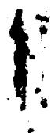
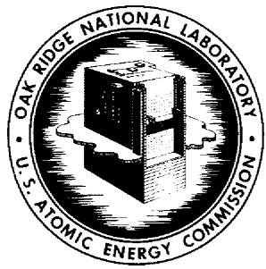
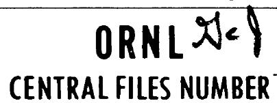
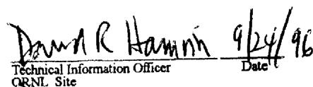
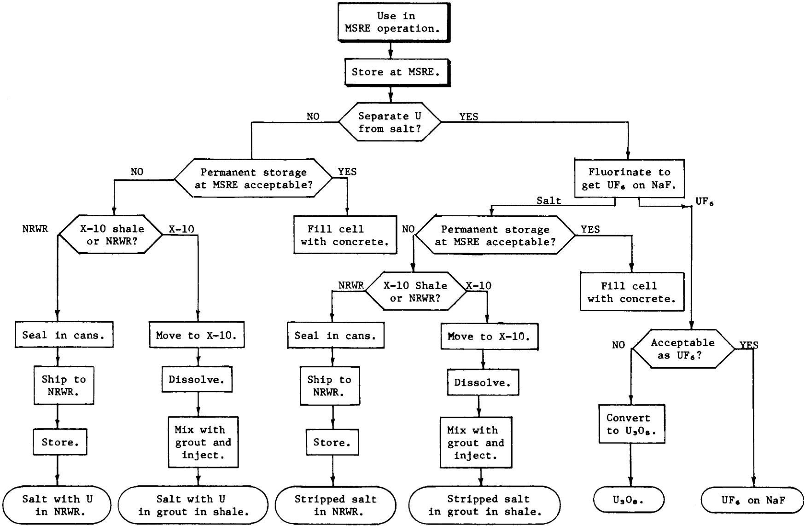

# OAK RIDGE NATIONAL LABORATORY

OPERATED BY  
UNION CARBIDE CORPORATION  
NUCLEAR DIVISION

POST OFFICE BOX X OAK RIDGE, TENNESSEE 37831

For Internal Use Only

72-1-1

DATE: January 28, 1972

COPY NO.

SUBJECT: Consideration of Possible Methods of Disposal of MSRE Salts

TO: Distribution

FROM: P. N. Haubenreich and R. B. Lindauer

# Abstract

Since the MSRE was shut down in 1969, the fuel and flush salts, containing the fissile material and fission products, have been stored in the reactor drain tanks. Portions of the facility that would be used in recovery of the uranium as $\mathrm{UF_6}$ and removal of the salt to some longer-term storage site are preserved. The present cost of recovery and storage of the $36\mathrm{kg}$ of uranium ( $85\%$ $^{293}\mathrm{U}$ ) in the fuel salt is estimated to be $\$82,000$ . Because of the high $^{232}\mathrm{U}$ content (220 ppm) remote handling is necessary, and conversion to $\mathrm{U}_3\mathrm{O}_8$ would cost an additional $\$240,000$ . In the future (probably 5 to 10 years hence) the salts, with or without the uranium, could be stored in cans in the National Radioactive Waste Repository or could be injected into deep shale beds at ORNL. Estimated costs of disposing of both the fuel and flush salts are about $\$85,000$ for disposal in the NRWR and about $\$220,000$ for shale injection. It appears that disposal in the NRWR will be best, but it is not clear if and when the uranium should be recovered. It is recommended, therefore, that the salts be held at the MSRE until the NRWR is ready, that meanwhile the capability for fluorination be preserved, and that final decisions on uranium recovery and salt disposal be deferred until requirements are more firmly established.

This document has been approved for release to the public by:

# NOTICE

This document contains information of a preliminary nature and was prepared primarily for internal use at the Oak Ridge National Laboratory. It is subject to revision or correction and therefore does not represent a final report. The information is not to be abstracted, reprinted or otherwise given public dissemination without the approval of the ORNL patent branch, Legal and Information Control Department.

# Contents

# Page

Status of MSRE Facilities 1

Description of MSRE Fuel and Flush Salt 2

Fuel Salt 2

Flush Salt 4

Fissile Material Inventories 4

Activities of Heavy Nuclides 5

Fission Products 8

Fluorine Evolution Potential 8

Options for Disposal 11

Operations Involved in Disposal 12

Storage at MSRE Site 12

Recovery of Uranium 14

Storage in National Radioactive Waste Repository 18

Injection into X-10 Shale 21

Cost Estimates 21

Discussion and Recommendations 22

References 24

The MSRE is located in building 7503, which is within a separately fenced area in Melton Valley, about 0.6 mile southeast of the main ORNL plant area (X-10). The reactor operated at a maximum power of 7.4 MW for the equivalent of 13,172 full-power hours from 1965 to 1969. Nuclear operation was concluded in December, 1969 and the facility was placed in a standby condition. $^{1}$ The on-site salt processing system had previously been placed in standby after successful operation $^{2}$ during the 1968 changeover from $^{233}\mathrm{U}$ to $^{233}\mathrm{U}$ in the fuel salt. Between November, 1970 and February, 1971 a limited program of post-operation examinations $^{3}$ was carried out which incapacitated the reactor for further operation. There is currently no activity at the reactor site other than routine surveillance. $^{4}$

The $^{233}\mathrm{U}$ fuel charge and the fission products have not yet been removed from the MSRE. They are safely secured, for the present, in the fuel and flush salts which are frozen in the sealed reactor drain tanks. Containment and monitoring systems remain in operation.4 Ultimate removal was planned, and the parts of the facility that will be needed to melt and transfer the salt into transport containers are preserved. The option of recovering the uranium from the salt, if so desired, was retained by placing the processing facility in standby condition and preserving the information necessary to operate it again.5

The fuel salt is divided between the two fuel drain tanks, with $2480\mathrm{kg}$ in FD-1 and $2170\mathrm{kg}$ in FD-2. All of the flush salt $(4290\mathrm{kg})$ is in the flush salt tank (FFT). All three of these tanks are in the fuel drain cell. All salt lines which formerly connected these tanks to the reactor vessel have been severed and plugged near the tanks. The line connecting the tanks to the salt-processing tank (FST) in the adjacent cell is intact, blocked with a plug of frozen salt. Cover-gas supply lines to the tanks are capped outside the cell; vent lines are valved off outside the cell. Heaters on the drain tanks and flush tank are operable (but not turned on except for a few days each year when the salt is heated to recombine radiolytic fluorine). Pressure and temperature instrumentation continue in operation.[4]

# Fuel Salt

The MSRE fuel salt is a mixture having the composition: $\mathrm{LiF - BeF_2 - }$ $\mathrm{ZrF_4 - UF_4}$ (64.5-30.3-5.0-0.13 mole $\%$ ). This mixture melts and thaws over the range from $360^{\circ}\mathrm{C}$ to $440^{\circ}\mathrm{C}$ (solidus and liquidus temperatures). Unless such salt is frozen extremely slowly, there is little or no segregation during the freezing process and the frozen salt has a practically uniform composition.

The density of the liquid at $440^{\circ}\mathrm{C}$ is $2.31\mathrm{g/cm}^3$ . At $600^{\circ}\mathrm{C}$ (which is about the temperature which the salt is usually transferred) the density is $2.22\mathrm{g/cm}^3$ . The change in density upon freezing has not been measured directly, but is believed to be between $+2\%$ and $-1\%$ (corresponding to a density of solid salt at $360^{\circ}\mathrm{C}$ between 2.36 and $2.29\mathrm{g/cm}^3$ ). (Ref. 7) The measured density of solid salt at $26^{\circ}\mathrm{C}$ is $2.48\mathrm{g/cm}^3$ . The increase in density as the salt is cooled below the solidus is often accompanied, in large bodies of salt, by the formation of internal cracks.

The volumes of fuel salt that must be dealt with in the disposal operations can be calculated from the inventory (4650 kg) and the foregoing densities. At the temperature at which the salt would be transferred into transport containers, there would be about $2.08 \, \text{m}^3$ ( $73.8 \, \text{ft}^3$ ). The total volume when it starts to freeze will be $2.01 \, \text{m}^3$ ( $71.0 \, \text{ft}^3$ ). The volume of frozen salt at room temperature will be about $1.88 \, \text{m}^3$ ( $66.4 \, \text{ft}^3$ ). The volumes would not be significantly less if the uranium were removed by fluorination.

The thermal conductivity of the salt depends strongly on temperature. Measurements by Cooke show that the thermal conductivity of MSRE fuel salt at $440^{\circ}\mathrm{C}$ is about $10\mathrm{w/cm}^{-\circ}\mathrm{C}$ , and is $13\mathrm{w/cm}^{-\circ}\mathrm{C}$ at $600^{\circ}\mathrm{C}$ . The conductivity of the frozen salt (neglecting any effect of cracks) probably ranges from about $16\mathrm{w/cm}^{-\circ}\mathrm{C}$ at $360^{\circ}\mathrm{C}$ to perhaps $30\mathrm{w/cm}^{-\circ}\mathrm{C}$ at $100^{\circ}\mathrm{C}$ . (The conductivity of frozen MSRE salt was not measured; the foregoing values are estimated from measured values for frozen breeder fuel salt.)

The vapor pressure of the salt is extremely low, even at temperatures far above the liquidus. In the temperature ranges of interest for this study it is quite negligible (on the order of $10^{-3}$ torr or less).

The corrosiveness of the fuel salt depends strongly on whether or not moisture or some other oxidant is present. Clean molten fuel salt corrodes Hastelloy N at rates on the order of 0.1 mil/yr by leaching chromium from the alloy. Nickel is less susceptible to corrosion; stainless steels, more. For almost any material, corrosion by dry, frozen salt is not much of a problem. (Ordinary steel drums are commonly used at ORNL to hold fluoride salts that are removed from test loops to be discarded (buried). The fuel salt is slightly hygroscopic, however, and if exposed to humid air will attract moisture and create quite corrosive conditions. (The water and salt probably react to form HF which corrodes most common materials.)

When fuel salt is contacted with copious amounts of water, every constituent element gradually appears in solution. Rates of dissolution, temperature dependence, and effects of complexing among the constituents were observed in experiments in which excess amounts of finely divided, simulated MSRE fuel and coolant salts were stirred in warm water.[20] This experiment showed that at $25^{\circ}\mathrm{C}$ , equilibria were reached in 2 to 6 days. More lithium went into solution than would be possible in a simple solution of LiF, presumably reflecting interactions with other constituents. Solubilities increased with temperature over the range covered (25°C to 90°C). Using the results of this experiment, one can calculate that the amount of water at $25^{\circ}\mathrm{C}$ required to dissolve a batch of fuel salt would be about 0.08 kg $\mathrm{H}_2\mathrm{O} / \mathrm{g}$ fuel. (If one uses accepted values for the solubilities of the separate constituents and the amounts of each in the fuel salt, the lower solubility of LiF results in a higher estimate of the required amount of water.)

Molten fuel salt is immune to radiation damage. Frozen fuel salt irradiated at temperatures below about $100^{\circ}\mathrm{C}$ evolves radiolytic fluorine. (This will be described in detail in a later section.)

The MSRE fuel salt is chemically toxic. The allowable ingestion of the salt is limited now, however, by the radioactive nuclides included in it. The maximum permissible concentration in air for occupational exposure is limited to about $0.03 \mu \mathrm{g} / \mathrm{m}^3$ by the plutonium and $^{228}$ Th, compared to a

limit of $4\mu \mathrm{g} / \mathrm{m}^3$ if beryllium were the only consideration. The limit that would be set by the fission products is intermediate, about 0.1 $\mu \mathrm{g} / \mathrm{m}^3$ . (See later sections on inventories of radioactive nuclides.)

# Flush Salt

The flush salt is $\mathrm{LiF - BeF_2}$ (66-34 mole %) with a small amount (about $4\%$ by volume) of fuel salt mixed into it. Its physical properties will be very close to those of the original 66-34 mole % mixture. Upon cooling, this salt begins to form crystals of LiF at about $470^{\circ}\mathrm{C}$ and at about $455^{\circ}\mathrm{C}$ solidifies into $\mathrm{Li_2BeF_4}$ . (Ref. 9).

The density of the liquid at $458^{\circ}\mathrm{C}$ is about $2.02\mathrm{g/cm}^3$ ; at $600^{\circ}\mathrm{C}$ it is about $1.96\mathrm{g/cm}^3$ . There is very little change in density (less than $2\%$ ) as it freezes and thaws. The density of $\mathrm{Li}_2\mathrm{BeF}_4$ crystals at room temperature is about $2.17\mathrm{g/cm}^3$ . (Ref. 10). The volume of the flush salt will be $2.18\mathrm{m}^3$ ( $77.0\mathrm{ft}^3$ ) at $600^{\circ}\mathrm{C}$ , $2.12\mathrm{m}^3$ ( $74.9\mathrm{ft}^3$ ) at the liquidus temperature and $1.98\mathrm{m}^3$ ( $69.9\mathrm{ft}^3$ ) at room temperature.

With regard to vapor pressure, corrosion, water solubility, and chemical toxicity, the flush salt is very similar to the fuel salt.

# Fissile Material Inventories

The amounts of uranium and plutonium believed to be in the fuel and flush salts are listed in Table 1. The totals are from a compilation by R. E. Thoma.[11] The amounts of uranium in the flush salt were obtained directly from analyses of flush salt samples taken at the conclusion of the MSRE operation. The amounts of plutonium in the flush salt were computed from the observed fractions of the fuel salt inventory that mixed into the flush salt during each operation and the computed plutonium inventory at the time of each mixing. Thoma concluded,[6] from material balances and the isotopic dilution that occurred when $^{233}\mathrm{U}$ was added, that in addition to the quantities listed in Table 1 there is some $2.65\mathrm{kg}$ of uranium that was removed from the fuel salt but did not show up as $\mathrm{UF}_6$ on the absorbers during the recovery of the original uranium charge in 1968. (This was a mixture of enriched and depleted uranium containing $33\mathrm{wt}\%$ $^{235}\mathrm{U}$ .) There is no direct evidence on the location of this missing uranium but the most

likely sites are in the processing systems. Location and recovery of this uranium would be a separate operation from the removal and disposal of the salts.

Table 1. Inventories of Uranium and Plutonium in MSRE Salts   

<table><tr><td></td><td></td><td>Fuel Salt</td><td>Flush Salt</td><td>Total</td></tr><tr><td rowspan="5">Uranium (kg):</td><td>233U</td><td>30.82</td><td>0.19</td><td>31.01</td></tr><tr><td>234U</td><td>2.74</td><td>0.02</td><td>2.76</td></tr><tr><td>235U</td><td>0.85</td><td>0.09</td><td>0.94</td></tr><tr><td>236U</td><td>0.04</td><td>0.00</td><td>0.04</td></tr><tr><td>238U</td><td>2.01</td><td>0.19</td><td>2.20</td></tr><tr><td></td><td>Total U</td><td>36.46</td><td>0.49</td><td>36.95</td></tr><tr><td rowspan="3">Plutonium (g):</td><td>239Pu</td><td>657</td><td>13</td><td>670</td></tr><tr><td>240Pu</td><td>69</td><td>2</td><td>71</td></tr><tr><td>Other Pu</td><td>2</td><td>0</td><td>2</td></tr><tr><td></td><td>Total Pu</td><td>728</td><td>15</td><td>743</td></tr></table>

# Activities of $^{232}\mathrm{U}$ and its Daughters

The $^{233}\mathrm{U}$ that was available for use in the MSRE was some that had an unusually large amount (222 ppm) of $^{232}\mathrm{U}$ associated with it. $^{12}$ There was no conflicting demand for this material because of the inconveniently high radiation source from the $^{232}\mathrm{U}$ decay chain.

Uranium-232, which undergoes alpha decay with a half-life of 72 years, is the first in a chain of 8 radionuclides that leads to stable $^{208}\mathrm{Pb}$ . Six alphas, two betas, and several hard gammas are emitted along the line. The first daughter, $^{228}\mathrm{Th}$ , has a half-life of 1.9 years. Subsequent nuclides have very much shorter half-lives. Thus after uranium is separated from its daughters, the total activity of the chain builds up, peaks at about 10 years, then decays with a 72-year half-life. In uranium containing more than about 50 ppm $^{232}\mathrm{U}$ , the activity will build up within a week or

two to levels that prohibit direct handling because of the gamma radiation. When the uranium is intimately associated with certain light elements, as in the MSRE fuel, neutrons produced by $\alpha$ -n reactions are also significant.

The uranium used for the MSRE had been purified in 1964 and by the time the fuel concentrate was prepared in 1968 the $^{228}$ Th daughter activity was quite high. (Cans containing $450\mathrm{g}^{233}\mathrm{U}$ as oxide produced a gamma dose rate of $25\mathrm{r/hr}$ at 1 ft.) The preparation of the MSRE fuel concentrate was carried out in a shielded facility, however, and no effort was made to separate $^{228}$ Th from the uranium either before or during this operation. $^{12}$ If in the future the uranium is removed from the MSRE salt by fluorination, the $^{228}$ Th will be left behind. In that case the $^{228}$ Th and daughter activities in the salt would begin to decay with a 1.9-year half-life, while the activities with the uranium would begin to build up anew. If the MSRE salt is not fluorinated, the $^{228}$ Th and daughter activities will correspond to a buildup and decay transient starting in 1964.

The radioactivity of the MSRE fuel, including both the heavy nuclides and the fission products, was calculated by M. J. Bell after the end of nuclear operation, taking into account the history of power operation, the 1968 fluorination, and additions of uranium and plutonium to the reactor.[13] He used values for the $^{233}\mathrm{U}$ and plutonium inventories that differ slightly from those listed in Table 1. The radioactivities of the heavy nuclides in the MSRE listed in Table 2 were obtained by adjusting Bell's figures to agree with the inventories at the end of nuclear operation (December 1969) as given in Table 1. It may be noted that the flush salt contains $2.0\%$ of the plutonium in the MSRE but only $0.6\%$ of the $^{233}\mathrm{U}$ , $^{232}\mathrm{U}$ , and $^{232}\mathrm{U}$ daughters. This difference reflects the fact that the uranium in the flush salt is only that which mixed in during the two flushing operations subsequent to the loading of $^{233}\mathrm{U}$ in 1968, but the plutonium (which is not removed by the fluorination process) accumulated in the flush salt over the entire period from 1966 through 1969.

Table 2. Calculated Radioactivity of Heavy Nuclides in MSRE Salts $^{\alpha}$   

<table><tr><td rowspan="2">Nuclide</td><td rowspan="2">Half-life(years)</td><td colspan="2">Inventories (curies)</td></tr><tr><td>Fuel Salt</td><td>Flush Salt</td></tr><tr><td>208T1</td><td>b</td><td>58</td><td>0.4</td></tr><tr><td>212Po</td><td>b</td><td>102</td><td>0.6</td></tr><tr><td>212Bi</td><td>b</td><td>160</td><td>1.0</td></tr><tr><td>212Pb</td><td>b</td><td>160</td><td>1.0</td></tr><tr><td>216Po</td><td>b</td><td>160</td><td>1.0</td></tr><tr><td>220Rn</td><td>b</td><td>160</td><td>1.0</td></tr><tr><td>224Ra</td><td>b</td><td>160</td><td>1.0</td></tr><tr><td>228Th</td><td>b</td><td>160</td><td>1.0</td></tr><tr><td>232U</td><td>72</td><td>156</td><td>1.0</td></tr><tr><td>233U</td><td>1.62 x 105</td><td>370</td><td>2.3</td></tr><tr><td>234U</td><td>2.47 x 105</td><td>19</td><td>0.1</td></tr><tr><td>235U</td><td>7.13 x 108</td><td>0</td><td>0.0</td></tr><tr><td>236U</td><td>2.39 x 107</td><td>0</td><td>0.0</td></tr><tr><td>238U</td><td>4.51 x 109</td><td>0</td><td>0.0</td></tr><tr><td>238Pu</td><td>86.4</td><td>5</td><td>0.1</td></tr><tr><td>239Pu</td><td>24,390</td><td>45</td><td>0.9</td></tr><tr><td>240Pu</td><td>6,580</td><td>18</td><td>0.5</td></tr><tr><td>241Pu</td><td>13.2</td><td>227</td><td>4.5</td></tr><tr><td>241Am</td><td>458</td><td>3</td><td>0.1</td></tr><tr><td>Total</td><td></td><td>1960</td><td>16</td></tr></table>

$a_{\text{Activities as of January 1977}}$   
b Activities are in secular equilibrium, decreasing with the 72-y half-life of $^{232}$ U.

# Fission Products

The calculated radioactivities of the fission products that are still present to any significant extent are listed in Table 3. The calculations took into account the effects of stripping the gaseous fission products during operation and removing certain fission-product elements during the salt processing in 1968 (Ref. 13). No account was taken of the deposition of noble-metal fission products on surfaces, however, so the figures for Nb, Ru, Rh, Sb, and Te are upper limits which are probably several times the actual inventories. For the long-lived fission products (those still significant in 1977) that stay in the salt, $98.1\%$ is in the fuel and $1.9\%$ is in the flush salt. In January, 1977 the fuel salt will contain about 47,000 Ci $(0.10\mathrm{Ci / g})$ of fission products. The flush salt will contain 900 Ci $(0.20\mathrm{mCi / g})$ of fission products.

# Fluorine Evolution Potential

Irradiation of frozen fluorides by gamma rays or charged particles results in displacement of fluorine atoms. These atoms may either recombine (which they are almost certain to do at temperatures above about $80^{\circ}\mathrm{C}$ ) or they may migrate to a surface where they form gaseous fluorine. Analysis of various experiments indicates that radiolysis of the MSRE salts due to included radioactivity will probably be equivalent to about 0.04 atoms F/100 eV of absorbed energy (or evolution of 0.02 molecules F $_2$ /100 eV if there were no recombination). Rates of recombination in salt in intimate contact with gas containing F $_2$ were found to depend strongly on temperature and practically not at all on F $_2$ partial pressure. The recombination data over a wide range of conditions were fitted to ±50% by the empirical relation

$$
\text {r e c o m b i n a t i o n r a t e} \left(\frac {\mathrm {c c} (\mathrm {S T P}) \mathrm {F} _ {2}}{\mathrm {h r - m o l e s a l t}}\right) = 1. 1 5 \times 1 0 ^ {9} \mathrm {e} ^ {- (9 7 1 0 / \mathrm {T})}
$$

where $T$ is the temperature of the salt in degrees Kelvin. When salt that was initially free of unrecombined fluorine is irradiated at low temperatures (where recombination is insignificant) there is typically an "induction period" before any gaseous $F_{2}$ is evolved. The energy absorbed

Table 3. Calculated Fission Product Activities in MSRE Salts ${}^{a}$   

<table><tr><td rowspan="2">Nuclide</td><td rowspan="2">Half-life (y)</td><td colspan="2">Activity (curies)</td></tr><tr><td>Jan. 1972</td><td>Jan. 1977</td></tr><tr><td>89Sr</td><td>0.14</td><td>30</td><td>0</td></tr><tr><td>90Sr</td><td>28.1</td><td>12,800</td><td>11,300</td></tr><tr><td>90Y</td><td>0.0</td><td>12,800</td><td>11,300</td></tr><tr><td>91Y</td><td>0.16</td><td>54</td><td>0</td></tr><tr><td>95Zr</td><td>0.18</td><td>136</td><td>0</td></tr><tr><td>95Nb</td><td>0.10</td><td>178</td><td>0</td></tr><tr><td>106Ru</td><td>1.0</td><td>1,820</td><td>58</td></tr><tr><td>106Rh</td><td>0.0</td><td>1,820</td><td>58</td></tr><tr><td>125Sb</td><td>2.7</td><td>396</td><td>110</td></tr><tr><td>125mTe</td><td>0.16</td><td>185</td><td>52</td></tr><tr><td>127mTe</td><td>0.30</td><td>36</td><td>0</td></tr><tr><td>127Te</td><td>0.0</td><td>36</td><td>0</td></tr><tr><td>137Cs</td><td>30</td><td>10,700</td><td>9,500</td></tr><tr><td>137mBa</td><td>0.0</td><td>9,970</td><td>8,880</td></tr><tr><td>144Ce</td><td>0.78</td><td>20,400</td><td>240</td></tr><tr><td>144Pr</td><td>0.0</td><td>20,400</td><td>240</td></tr><tr><td>147Pm</td><td>2.6</td><td>22,500</td><td>6,010</td></tr><tr><td>151Sm</td><td>90</td><td>145</td><td>140</td></tr><tr><td>154Eu</td><td>16</td><td>32</td><td>26</td></tr><tr><td>155Eu</td><td>1.8</td><td>162</td><td>24</td></tr><tr><td>Total</td><td></td><td>115,000</td><td>48,000</td></tr></table>

${}^{a}$ Total in fuel and flush salts. Long-lived fission products are distributed 98.1% in the fuel and 1.9% in the flush salt.

during such induction periods was about 60 watt-h/mole salt for simulated MSRE fuel salt irradiated with $^{60}\mathrm{Co}$ gamma rays. These observations can be used in conjunction with the energy disposition rates due to the radioactivity in the fuel and flush salts to predict the radiolytic fluorine behavior.

The radiolytic production of 0.04 atoms F/100 eV is equivalent to 0.17 cc (STP) $\mathbf{F_2}$ /watt-hr; that is, if there were no internal recombination $\mathbf{F_2}$ gas would eventually (after the induction period) be evolved at this rate. By January 1977, the radioactive energy source in the fuel salt will be down to about 181 watts. This is enough, if all were absorbed, to produce $\mathbf{F_2}$ at a rate of 31 cc(STP)/hr. The flush salt, containing only 3.4 watts of radioactivity could evolve only 0.6 cc(STP) $\mathbf{F_2}$ /hr.

The energy sources are distributed throughout $1.06 \times 10^{5}$ moles of fuel salt and $1.30 \times 10^{5}$ moles of flush salt. The specific heat sources as of January 1977 are $1.71 \times 10^{-3}$ watts/mole fuel salt and $2.6 \times 10^{-5}$ watt/mole flush salt. The times corresponding to an induction period of 60 watt-h/mole at these rates are $3.5 \times 10^{4} \, \text{h}$ (4.0 years) for the fuel salt and $2.3 \times 10^{6} \, \text{h}$ (264 y) for the flush salt. (It is questionable if quantitative extrapolations of the observations on fluorine evolution to the extremely low levels of self-radiation in the flush salt are meaningful.)

In summary, if the salts were chilled in January 1977, immediately after having been hot enough to recombine the fluorine, it would be at least 4 years before any $\mathbf{F_2}$ evolution would be expected from the fuel salt and then the rate would be about 30 cc(STP)/hr or less. Alternatively, if the fuel salt were kept at $62^{\circ}\mathrm{C}$ or above, recombination would be expected to prevent any $\mathbf{F_2}$ evolution. Little or no $\mathbf{F_2}$ evolution would be expected from the flush salt.

# Options for Disposal

No decision as to the ultimate disposal of the MSRE fissile and radioactive materials had been made at the time the reactor was shut down. Instead the materials were left in the MSRE, with the equipment for stripping the uranium and removing the salts kept intact, until the needs for the uranium and the requirements for long-term storage could be better defined.[15] Whether or not the uranium is actually recovered should be decided on the basis of: (a) the value placed on the uranium, either for some specific application or in anticipation of future use, (b) the estimated costs of recovering and handling the uranium, and (c) the extent to which removal of the uranium can be expected to simplify the disposal of the salt.

In May, 1971 the USAEC requested ORNL to continue active consideration of disposal in the National Radioactive Waste Repository and also "to evaluate alternate disposal approaches and provide cost estimates for these proposals. At least one of the alternates should be feasible within present technology and should involve only storage and operating facilities that are presently available and are considered acceptable for this use."[16]

Storage of the frozen salt in the tanks at the MSRE is safe enough under present conditions, but does require some attention and is not regarded as a permanent situation. Surveillance requirements could be reduced and the salts might be said to have been disposed of if the underground cell around the salt tanks were filled with concrete. This would be relatively inexpensive to do and is certainly feasible within present technology. It is possible, however, that this approach will be inconsistent with future national policy on radioactive waste disposal, which may require deep underground disposal of such quantities of radioactive material as those in the MSRE. Recovery of the salts from the MSRE tanks imbedded in concrete would be quite expensive.

For deep underground storage other than in the NRWR, we can consider injection into the deep shale beds underlying the valley in which the MSRE is located. The required technology exists and has been proved by similar injections at a facility less than a half-mile from the MSRE.17 Although

additional development and equipment would be required to put the MSRE materials into aqueous solutions as required in this process, we believe that shale-injection is the only clearly foreseeable alternative to storage in the NRWR.

Possible methods of disposal of the fuel and decisions to be made are outlined in Figure 1. Similar choices exist for the flush salt. Because of the much lower fissile and radioactive content of the flush salt, it is conceivable that its disposal might differ from that of the fuel.

Note that plutonium recovery does not appear in Fig. 1. Plutonium is not removed from the salt by the fluorination that is used to take out the uranium, and recovery of the small amount present by other processes would be prohibitively expensive. Figure 1 considers, therefore, that the plutonium will be left in the salt, without question.

# Operations Involved in Disposal

# Storage at MSRE Site

As described in detail in reference 4, the salts are presently frozen in the sealed tanks, within secondary containment which is sealed except for one line connected through filters to a stack. The stack fan and certain pressure, temperature, and radiation instrumentation are kept in operation. Surveillance consists of remote monitoring of instrument signals and daily visits by X-10 plant personnel, with periodic inspections and equipment tests by MSRE personnel. Access to the reactor building is controlled by a security fence.

Filling the drain tank cell with concrete would not be a major operation. Radiation from the tanks would be significant, probably requiring that the lower courses be poured using the building crane, operated from the remote maintenance control room. No forms, reinforcement, or compaction would be needed, however, so the placement would be relatively simple and inexpensive. About 250 cu yd of concrete would fill the cell to the bottom of the existing roof plugs.

ORNL DWG. 72-1639

  
Fig. 1.. Alternatives in Disposal of MSRE Fuel Salt

# Recovery of Uranium

Recovery of the $^{233}\mathrm{U}$ in the MSRE fuel salt would be done in the same equipment and with procedures similar to those used during the $^{235}\mathrm{U}$ recovery in 1968. (Ref. 2) Processing to recover the $^{233}\mathrm{U}$ would differ from the $^{235}\mathrm{U}$ processing in several respects, however.

1) Since the present uranium charge is only $1/6$ as great as the previous charge, processing could easily be done in 1 run instead of the 6 runs used before. This would reduce the overall time required for the processing from 6 days to less than 1 day. It is estimated that the actual fluorine sparge time would be reduced from 46 to 11 hours. (About $2/3$ of the time from the start to finish of the previous fluorination involved replacing absorbers.)   
2) Since the carrier salt would not be reused, there would be no need for reduction and filtration of the structural metal fluorides formed by corrosion during fluorination. Approximately a week of operating time was required for this operation.   
3) Because of the activity associated with the $\mathbf{2} \mathbf{3} \mathbf{2} \mathbf{U}$ daughters, the absorbers must be moved to a shielded storage facility within a few days of fluorination. This should present no problem since only one run is required as mentioned above.   
4) During the previous processing, volatilization of $^{95}\mathrm{Nb}$ metal during salt transfer caused some radiation problems which will not appear this time because of the long decay time.

Before recovery of the uranium could be started the work listed below would be required:

1) procurement of sodium fluoride, a fluorine trailer tank, boric acid, potassium iodide and two absorber vessels;   
2) checkout of all in-cell heaters and thermocouples; (This is one of the most critical items since inoperability of certain critical heaters or thermocouples could require difficult and expensive replacement in a highly radioactive cell or require devising alternate methods for heating or temperature measurement.)   
3) calibration of flow and level instruments; (The range of the fluorine flow controller should be reduced for more accurate flow control

at lower flow rates. With the lower uranium concentration, high flow rates are unnecessary and better fluorine utilization and absorber loading will be obtained at lower flow rates.)

4) installation of an interlock to prevent pressurization of the absorber cubicle since the exhaust blower is inoperable;

5) leak testing of all piping and equipment;   
6) training of operators; six operators (two per shift) will be required although the actual processing time should be less than one day. A brief outline of the operating procedure is as follows.

1) Purge air from system.   
2) Fluorine condition fluorine supply lines and fuel storage tank.   
3) Heat system to operating temperature.   
4) Heat transfer line and transfer fuel salt to fuel storage tank. (Use installed line 110 unless it cannot be thawed. In this case install jumper line across floor from drain tank to storage tank.)   
5) Load, weigh, install and leak test NaF absorbers. The first and second absorbers should be loaded with low surface area NaF ( $\sim 0.06 \, \text{m}^2/\text{g}$ , procured from the UCNC Paducah plant) for high uranium capacity. The last three absorbers should be loaded with high surface area NaF ( $\sim 1 \, \text{m}^2/\text{g}$ , procured from ORGDP) with a higher reaction rate to prevent any uranium loss through the absorber train.   
6) Heat the first four absorbers to $150^{\circ}\mathrm{F}$ . Heat the final absorber to $200 - 250^{\circ}\mathrm{F}$ to ensure no uranium breakthrough.   
7) Charge the caustic scrubber with KOH-KI solution.   
8) Sparge the salt with fluorine at a flow rate of 30 liters/min until $\mathrm{UF_6}$ evolution begins as indicated by the mass flowmeter at the absorber inlet. Then reduce the flow rate to 15 liters/min until the mass flowmeter and absorber temperatures indicate the reaction is complete.   
9) Purge fluorine from the system.   
10) Remove, weigh and transport uranium absorbers to storage facility without delay.

By far the most economical way to store the uranium is simply to place the absorbers used in the process, containing the $\mathrm{UF_6}$ on NaF pellets in a shielded storage area by direct handling before the radioactivity

Table 4. Estimated Costs of Uranium Recovery   

<table><tr><td colspan="2">Recovery as UF6 on NaF</td></tr><tr><td colspan="2">Materials</td></tr><tr><td>Fabricate 2 absorbers</td><td>$1,600</td></tr><tr><td>NaF</td><td>1,000</td></tr><tr><td>Fluorine</td><td>300</td></tr><tr><td>Argon</td><td>100</td></tr><tr><td>Miscellaneous materials</td><td>2,000</td></tr><tr><td>Total materials</td><td>$ 5,000</td></tr><tr><td colspan="2">Support Labor (incl. OH)</td></tr><tr><td>Instrument mechanics (20 MD)</td><td>2,000</td></tr><tr><td>Electricians (20 MD)</td><td>2,000</td></tr><tr><td>Pipefitters (10 MD)</td><td>1,000</td></tr><tr><td>Total support labor</td><td>5,000</td></tr><tr><td colspan="2">Operating Labor (incl OH)</td></tr><tr><td>2 engineers for 3 mo.</td><td></td></tr><tr><td>6 technicians for 1/2 mo.</td><td></td></tr><tr><td>1 technician for 1 month</td><td></td></tr><tr><td>Total operating labor (10 MM)</td><td>30,000</td></tr><tr><td rowspan="2">Analytical Chemistry</td><td>10,000</td></tr><tr><td>50,000</td></tr><tr><td>Contingency</td><td>12,000</td></tr><tr><td>Total</td><td>$62,000</td></tr><tr><td colspan="2">Storage of UF6</td></tr><tr><td>Preparation of storage hole at Building 3019 for absorbers</td><td>$20,000</td></tr><tr><td colspan="2">Conversion of UF6 to U3O8</td></tr><tr><td>Desorption and purification of UF6</td><td>$60,000</td></tr><tr><td>Conversion to U3O8: operating</td><td>100,000</td></tr><tr><td>capital (at TURF)</td><td>80,000</td></tr><tr><td>Total</td><td>$240,000</td></tr></table>

Table 5. Estimated Cost of Disposal of Fuel And Flush Salts at NRWR   

<table><tr><td>Fabricate 22 cans</td><td>$10,000</td></tr><tr><td>Prepare equipment for loading cans</td><td>5,000</td></tr><tr><td>Labor for canning and handling at Oak Ridge</td><td>6,000</td></tr><tr><td>Modification of shipping casks</td><td>1,000</td></tr><tr><td>Rail shipping costs</td><td>49,000</td></tr><tr><td>NRWR charges</td><td>7,000</td></tr><tr><td></td><td>78,000</td></tr><tr><td>Contingenciesb</td><td>17,000</td></tr><tr><td>Total</td><td>$85,000</td></tr></table>

Costs as of 1971.   
No contingency on rail costs, $25\%$ on other costs.

Table 6. Estimated Cost of Injection of MSRE Fuel and Flush Salts into Shale at ORNL   

<table><tr><td>Process development and design</td><td>$ 18,000</td></tr><tr><td>Heated carrier for molten salt</td><td>50,000</td></tr><tr><td>Additional equipment at hydrofracture site</td><td>100,000</td></tr><tr><td>Operating labor for transporting, dissolving, mixing and injecting</td><td>7,000</td></tr><tr><td></td><td>175,000</td></tr><tr><td>Contingencies (25%)</td><td>45,000</td></tr><tr><td>Total</td><td>$220,000</td></tr></table>

becomes excessive. Suitable storage for the absorbers could best be provided at the national distribution center for $^{233}\mathrm{U}$ at Bldg. 3019.

If storage as $\mathrm{UF}_{6}$ is deemed unacceptable, it could be desorbed and converted to $\mathrm{U}_{3} \mathrm{O}_{8}$ as described in reference 18. The equipment for this conversion would have to be procured, fabricated and tested, however, and the cost of the conversion would greatly exceed that of fluorination. (See later section on cost estimates.)

# Storage in National Radioactive Waste Repository

Standards and requirements for acceptance of material for storage in the National Radioactive Waste Repository have not yet been firmly established. Important considerations that have been identified are: maximum dimensions of container, heat source strength, fissile content (or criticality potential), corrosion of container, solubility (in water) of contents, and evolution of gases from contents. It appears at the present time that future standards probably will permit storage of the MSRE fuel and flush salts, with the uranium still in them, in cans of mild steel.

The limitation on the maximum size of containers to be stored in the high-level waste portion of the NRWR is now expected to be 14-inch diameter and 120-in. overall length. The heat source and the amount of fissile material per can could further limit the size, but for the MSRE salts this will almost certainly not be the case. There is another consideration that may be more restrictive on the size of the containers, however, and that is the size of the available shipping casks. The NRWR will not be ready to receive wastes on a routine basis for several years yet (probably not until about 1980) and we do not know what shipping casks may be available then for transporting the MSRE salt. For our present purposes we shall assume the use of two casks now stored at the Savannah River Plant: the HNPF 6-Element Fuel Shipping Casks. These casks have a cavity 18-1/4 in. in diameter and about 200 inches long. (If the grappling mechanism attached to the removable head can be removed, the length inside would be increased to about 213 in.) We assume, then, that the containers for the MSRE salts will be 14-in. OD cylinders, with an overall length of 100 in.

The cylindrical sides of the HNPF cask consist of 2.5 inches of steel and 7 inches of lead. This is more than ample for the gamma ray source in

temperature, the can will contain 6.04 ft³ of solid salt and 1.33 ft³ of free volume. Dividing the flush salt among 11 cans will require filling to 5 in. from the top and will leave 6.35 ft³ of frozen salt and 1.02 ft³ of free volume in each can at room temperature.

The cans will be filled, sealed and placed in a shielded cell in the MSRE building to await shipment. We estimate that the can loading should proceed at a rate of 2 to 4 cans per 8-hour shift. The 42-ton HNPF shipping casks will be brought to the building for loading two cans into each cask. The casks will then be delivered to the railhead at the Oak Ridge Gaseous Diffusion Plant, where they will be transferred from truck to rail car for the rest of the journey to the NRWR. The two empty casks will be returned from NRWR to Oak Ridge and the cycle repeated. If only the fuel salt were shipped to NRWR, 6 cask-trips (11 cans) would be required. Eleven cask-trips would get both the fuel salt and the flush salt.

The cans of salt should be in their final resting place in the NRWR long before $\mathbf{F_2}$ begins to be evolved from the salt. Assuming that the temperature of the salt is below $62^{\circ}\mathrm{C}$ , we would expect $\mathbf{F_2}$ evolution from the fuel to start about 4 years after the salt is put into the cans. The evolution rate in each cold can of fuel would be 2 to 3 cc (STP)/hour, causing the pressure in the $3.8 \times 10^{4}-\mathrm{cc}$ free volume to rise at a rate of $0.5 - 0.7$ atm/year. If practicable, the cans of MSRE salt could be placed among more intense heat sources so that their temperature is elevated and pressurization by radiolytic fluorine is no problem.

Although NRWR regulations may require that the cans be encased in some way to permit retrieval, eventual breaching of the cans (by exterior corrosion or by internal pressure, for example) might be anticipated. Transport of the activity by leaching of the fluoride salts should be quite slow because of their limited solubilities in water. Gaseous fluorine could be released from a leaking can, but if a small amount of lime were available, reaction of the fluorine and the lime would prevent any $\mathbf{F}_2$ from getting away.

# Injection into X-10 Shale

The present hydrofracture facility at ORNL is not equipped to handle high level waste, but it is expected that within 5 to 10 years the facility will be upgraded to handle the 200,000 Ci of $9^{\circ}\mathrm{Sr}$ now in the ORNL high level waste tanks. The containment and shielding would then be adequate to handle the beryllium and radioactivity in the MSRE salts. Additional shielded equipment would be required at the site for putting the MSRE material into an aqueous solution (or perhaps a slurry) that could be fed into the then-existing facility where it would be used in making up the grout that is injected. Dissolution of all the fuel salt and all the flush salt in water would require a total of approximately 180,000 gallons. Single injections of this magnitude have already been made in the existing hydrofracture facility, so it should be feasible to inject all the MSRE material in one batch. The operation of putting the salt into solution has yet to be worked out, but it will probably be desirable to bring the salt from the MSRE in the molten state. To reduce the size and cost of the special, heated carrier that will be required, the salt could be brought in several trips, say 3 for the fuel and 3 for the flush salt. Criticality considerations may require that some soluble neutron absorber be added to the water before the dissolution of the fuel salt. Development work will be necessary to determine a safe, practicable method for putting molten salt into aqueous solution or slurry. Design effort will also be required on the heated carrier and the large, shielded solution tank.

# Cost Estimates

The confidence with which the costs of the various operations can be estimated ranges from good, in the case of filling the cell with concrete or fluorinating the fuel, to poor for the shale injection where there is no detail available on some of the processes and equipment that would be

required. The complication of cost escalation between now and the time of disposal we shall avoid by making all estimates in terms of 1971 dollars, recognizing that several years hence new estimates must be made.

The cost of keeping the salts under surveillance at the MSRE site as at present is about $10,000 per year. The cost of filling the drain tank cell with concrete is estimated to be $6,500, including $3,700 for materials, $1,500 for labor and indirect costs and $1,300 for contingencies. Subsequently surveillance would involve no additional costs since it would consist only of area monitoring, which would be done in any event as part of ORNL operation.

The estimated costs involved in recovering the uranium as $\mathrm{UF_6}$ and then converting it to $\mathrm{U}_{3}\mathrm{O}_{8}$ are broken down in Table 4. The costs for desorption, purification, and conversion to $\mathrm{U}_{3}\mathrm{O}_{8}$ were estimated in 1966 (Ref. 18), assuming the use of the Fluid Bed Volatility Pilot Plant, which is no longer operative. New estimates would no doubt be higher.

The estimated costs for disposal at the NRWR are shown in Table 5. The rail costs are at current rates and are based on the assumption that the NRWR is about 1000 miles from Oak Ridge. If only the fuel salt were shipped to the NRWR all costs except the preparation of loading equipment would be halved, resulting in a cost for the fuel only of $46,000.

Table 6 indicates the approximate costs that might be involved in the injection of the MSRE materials into shale at ORNL. Because the preponderance of the costs are for development and equipment, the cost for disposing of the fuel salt only would be little less than the cost for both fuel and flush salts.

# Discussion and Recommendations

From the considerations developed in this report it appears that the MSRE salts should be held as they are for several more years. There is presently no demand for the high- $^{23}$ U uranium and the materials are safe where they are. Only if it were decided that burying the MSRE tanks in concrete constitutes satisfactory disposal would there be a cost incentive for immediate action. Of course, it would be necessary to decide at the same time whether or not to recover the uranium, since this would become

impractical once the tanks were imbedded in concrete. There is not now a firm basis for reaching either of these decisions. Therefore we recommend that the cell not be filled with concrete, pending further development of disposal policies and applications for the uranium in the MSRE.

If an application for uranium containing ~200 ppm 232U develops that can afford to pay more than about $3 per gram fissile as UF₆ on NaF or more than about $10 per gram fissile as U₃O₈, then it may become desirable to recover the MSRE uranium. Recovery as UF₆ could be done within a few months of demand; conversion to U₃O₈ would require more lengthy preparation, but probably not more than a year or two. We recommend that the MSRE fluorination equipment be preserved, but that no efforts be expended on preparations for storage or conversion to U₃O₈ until requirements for the uranium can be identified.

We further recommend that when the National Radioactive Waste Repository approaches operation, another review of the disposal of the MSRE materials, including new cost estimates, be made. If no specific application for the MSRE uranium has developed up to that time, current developments should be projected and a decision reached on whether or not to recover and store the uranium before disposal of the salt. A choice should also be made at that time between alternate methods of disposal.

We expect that the best course may prove to be to store the fuel salt in the NRWR and leave the flush salt in the cell, buried under concrete. This does not constitute a recommendation, however, since we believe that the decisions on ultimate disposal should be postponed until the determining factors become better defined.

# References

1. MSR Program Semiannu. Progr. Rep. Feb. 28, 1970, ORNL-4548, p. 24.   
2. R. B. Lindauer, Processing of the MSRE Flush and Fuel Salts, ORNL-TM-2578, (Aug. 1969).   
3. MSR Program Semiannu. Progr. Rep., Feb. 28, 1971, ORNL-4676, pp. 1-16.   
4. R. H. Guymon, MSRE Procedures for the Period Between Examination and Ultimate Disposal (Phase III of Decommissioning Program), ORNL-TM-3253, (Feb. 1971).   
5. R. B. Lindauer, MSRE Fuel Processing System Status, ORNL-CF-69-6-17, (June 1969).   
6. MSR Program Semiannu. Progr. Rep., Feb. 28, 1971, ORNL-4576, pp. 18-20.   
7. S. Cantor, Volume Changes of MSRE Fuel Salt, internal correspondence MSR-69-124 (Dec. 31, 1969).   
8. MSR Program Semiannu. Progr. Rep., Aug. 31, 1969, ORNL-4449, p. 92.   
9. R. E. Thoma et al., J. Nucl. Mat 127, 166-180 (1968).   
10. B. J. Sturm, Dimensional Change of MSRE Coolant on Freezing, internal correspondence MSR-66-9 (May 6, 1966).   
11. R. E. Thoma, Chemical Aspects of MSRE Operations, ORNL-4658 (in press).   
12. J. M. Chandler and S. E. Bolt, Preparation of Enriching Salt $^7\mathrm{LiF} - ^{233}\mathrm{UF}_4$ for Refueling the Molten Salt Reactor, ORNL-4371 (March 1969).   
13. M. J. Bell, Calculated Radioactivity of MSRE Fuel Salt, ORNL-TM-2970, (May 1970).   
14. P. N. Haubenreich, Fluorine Production and Recombination in Frozen MSR Salts After Reactor Operation, ORNL-TM-3144 (Sept. 1970).   
15. Letter, D. B. Trauger to M. Shaw, Plans for MSRE Decommissioning Program Phases III and IV (Storage and Ultimate Disposal), March 17, 1971.   
16. Letter, M. Shaw to D. B. Trauger, May, 1971.

17. W. de Laguna, H. W. Weeren, F. T. Binford, E. J. Witkowski, and E. G. Struxness, Safety Analysis of Waste Disposal by Hydraulic Fracturing at Oak Ridge, ORNL-4665 (Sept. 1971).   
18. P. N. Haubenreich, R. E. Brooksbank, J. H. Shaffer, and J. M. Chandler, Consideration of Substituting Uranium-233 in the MSRE Fuel, ORNL-CF-66-12-28 (December 1966).   
19. R. C. Steffy, Jr., Inherent Neutron Source in MSRE with Clean $^{233}$ U Fuel, ORNL-TM-2685 (Aug. 1969).   
20. Ruth Slusher, H. F. McDuffie, and W. L. Marshall, Some Chemical Aspects of Molten-Salt Reactor Safety: (1) Dissolution of Coolant and Fuel Mixtures in $\mathsf{H}_2\mathsf{O}$ , (2) A Portion of the System LiF-BeF $_2$ -H $_2$ O at 25, 60, and near $100^{\circ}\mathsf{C}$ , ORNL-TM-458 (Dec. 14, 1962).

# Distribution

1. R. G. Affel   
2. J. L. Anderson   
3. T. A. Arehart   
4. C. F. Baes   
5. S. E. Beal1   
6. M. Bender   
7. E. S. Bettis   
8. J. O. Blomeke   
9. A. L. Boch   
10. E. G. Bohlmann   
11. R. B. Briggs   
12. D. F. Cope, RDT-OSR   
13. J. A. Cox   
14. J. L. Crowley   
15. F. L. Culler   
16. A. R. DeGrazia, AEC-Washington   
17. J. R. Distefano   
18. S.J.Ditto   
19. D. J. Donoghue, AEC-Washington   
20. W. P. Eatherly   
21. J. R. Engel   
22. D. E. Ferguson   
23. L. M. Ferris   
24. W. R. Grimes   
25. A. G. Grindell   
26. R. H. Guymon

27-32. Norton Haberman, AEC-Washington

33-37. P.N.Haubenreich

38. R. F. Hibbs, UCC   
39. P. R. Kasten   
40. J. J. Keyes   
41. A. I. Krakoviak   
42. Kermit Laughon, AEC-OSR

43-47. R.B.Lindauer

48. M. I. Lundin   
49. H. MacPherson   
50. R. E. MacPherson   
51. H. E. McCoy   
52. L. E. McNeese   
53. A. S. Meyer   
54. R. L. Moore   
55. E. L. Nicholson   
56. J. R. Parrott   
57. A. M. Perry   
58. M. E. Ramsey

59-68. M. W. Rosenthal

69. H. M. Roth, AEC-ORO   
70. Dunlap Scott   
71. M. Shaw, AEC-Washington   
72. M.J. Skinner   
73. R.E.Thoma   
74. D. B. Trauger   
75. A. M. Weinberg   
76. J.R.Weir   
77. J. C. White

78. Director, Div. of Waste Mgmt. and Transp., AEC-Washington   
79. Director, Div. of Production and Matls. Mgmt., AEC-Washington

80-81. Central Research Library

82. Document Reference Section   
83-85. Laboratory Records   
86. Laboratory Records, Record Copy   
87. ORNL Patent Office