# OAK RIDGE NATIONAL LABORATORY

OPERATED BY

UNION CARBIDE CORPORATION

NUCLEAR DIVISION

POST OFFICE BOX X

OAK RIDGE, TENNESSEE 37830

# ORNL

# CENTRAL FILES NUMBER

ORNL/CF-77/391

DATE: August 25, 1977

SUBJECT: Decommissioning Study for the ORNL Molten-Salt Reactor Experiment (MSRE)

TO: Distribution

FROM: C. D. Cagle and L. P. Pugh

# ABSTRACT

Job descriptions and cost estimates have been prepared for two methods of decommissioning the shutdown Molten-Salt Reactor Experiment (MSRE). Dismantling of all process equipment for disposal in a solid-waste storage area is estimated to cost $11,600,000. Transferring all contaminated external equipment to the reactor containment cell followed by filling the cell with concrete for in-place entombment is estimated to cost $4,770,000. Also included are a history of the reactor, a description of the components, and a list of references.

This document has been approved for release to the public by:

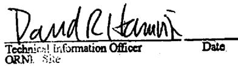

NOTICE This document contains information of a preliminary nature and was prepared primarily for internal use at the Oak Ridge National Laboratory. It is subject to revision or correction and therefore does not represent a final report. The information is only for official use and no release to the public shall be made without the approval of the Law Department of Union Carbide Corporation, Nuclear Division.

# CONTENTS

ABSTRACT 1

1. INTRODUCTION 11   
2. GENERAL INFORMATION 12

2.1 General Description 12   
2.2 History 12   
2.3 Reactor Site and Building 13   
2.4 Shielded Containment Cells 21   
2.5 Reactor Primary System 25

2.5.1 Reactor Vessel and Core 25   
2.5.2 Thermal Shield 37   
2.5.3 Primary System Pump 37   
2.5.4 Primary System Heat Exchanger 40   
2.5.5 Fuel Pump Overflow Tank 45   
2.5.6 Fuel-Salt and Flush-Salt Drain and Storage Tanks . 45

2.6 Reactor Secondary System 50

2.6.1 Heat Exchanger 50   
2.6.2 Coolant Circulating Pump 50   
2.6.3 Radiator 52   
2.6.4 Secondary System Piping 52   
2.6.5 Coolant Drain Tank 52

2.7 Fuel-Processing System 55   
2.8 Freeze Flanges 55   
2.9 Freeze Valves 62

2.10 Salt Systems Heaters and Thermal Insulation 62

2.10.1 Reactor Furnace 68   
2.10.2 Fuel-Salt-Pump Furnace 68   
12.10.3 Coolant-Salt-Pump Heaters and Insulation 69   
2.10.4 Fuel- and Flush-Salt-Drain-Tank Heaters and Insulation 69   
2.10.5 Fuel-Storage-Tank Heaters and Insulation 69   
2.10.6 Coolant-Salt-Drain-Tank Heaters and Insulation 69   
2.10.7 Heat-Dump Radiator Heaters and Insulation 70

Page

2.10.8 Piping Heaters and Insulation 70   
2.10.9 Heat-Exchanger Heaters and Insulation 72   
2.10.10 Heater and Thermocouple Leads 72

2.11 Sampler-Enricher 73   
2.12 Nuclear Instrumentation 75   
2.13 Accessory Systems 78

2.13.1 Cover-Gas System 78   
2.13.2 Leak-Detector System 79   
2.13.3 Lubricating-Oil Systems 79   
2.13.4 Component-Cooling Systems 81   
2.13.5 Cooling-Water System 82   
2.13.6 Off-Gas Disposal System 83   
2.13.7 Containment Ventilation System 84   
2.13.8 Liquid-Waste System 85

2.14 Vapor Condensing System 88

3.MsRE PRESENT CONDITIONS 90

3.1 Securing the Process Systems 90   
3.2 Post-Operation Examination 91   
3.3 Surveillance 92   
3.4 Surplus Equipment Removal 93   
3.5 Site Utilization 93   
3.6 Current Radiation and Contamination Levels 94

4. DECOMMISSIONING ALTERNATIVES 94

4.1 Removal and Disposal of All Radioactive Material Except the Containment Cell Structure 97   
4.2 Entombment in Place 97   
4.3 Arguments Favoring Dismantling and Disposal of Radio-active and Contaminated Items 98   
4.4 Arguments Favoring Entombing the Reactor and Associated Radioactive and Contaminated Items and Materials in the Reactor Cell 99

5. WORK INVOLVED IN DISMANTLING AND DISPOSING OF RADIOACTIVE AND CONTAMINATED ITEMS IN A SOLID-WASTE STORAGE AREA 99  
5.1 Preparatory Work 99

#

#

#

#

#

#

#

中

中

中

  
#

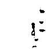  
$\frac{1}{2}$

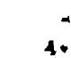  
4

Page

5.1.1 Flushing System for the Reactor Tank and Other Primary System Components 99   
5.1.2 Reactor Cell Flooding System 104   
5.1.3 Work Shielding 104   
5.1.4 Transport Shields and Waste Storage Provisions 105   
5.1.5 Disposable Waste.Containers 105   
5.1.6 Miscellaneous Cutting and Handling Tools 105   
5.1.7 Retriable Storage Requirements 106

5.2 Remote Dismantling Work 106

5.2.1 Clearing the Cell Around the Reactor 107   
5.2.2 Segmenting and Disposal of the Thermal Shield and the Reactor Vessel 107

5.2.2.a Alternative to Segmenting the Reactor Vessel 108

5.2.3 Drain-Tank Cell 108   
5.2.4 Fuel-Processing Cell 110   
5.2.5 Cell Ventilation System 110   
5.2.6 Off-Gas System 110   
5.2.7 Liquid-Waste Disposal System 111   
5.2.8 Coolant-Salt System 111   
5.2.9 Miscellaneous Contaminated Items 111

5.2.9.a Component-Cooling Air System 111   
5.2.9.b Sampler-Enricher 112   
5.2.9.c Treated-Water System 112

6. WORK INVOLVED IN ENTOMBING ALL RADIOACTIVE AND CONTAMINATED ITEMS IN THE REACTOR CELL 113

6.1 Preparatory Work 113

6.1.1 Flushing System for the Primary Salt Drain Tanks and the Fuel-Processing Equipment 113   
6.1.2 Air Exhaust System for the Reactor Cell 116   
6.1.3 Tooling 116

6.2 Preparing Reactor Cell to Accommodate Contaminated Items from Other Cells and Areas 116

6.2.1 Clearing Top of Cell and Installing Temporary Ventilation Duct 116

# Page

6.2.2 Sealing the Existing 30-In. Cell Ventilation Duct at the Cell Wall 117   
6.2.3 Closure of the Opening Between the Reactor and Drain-Tank Cells 117   
6.2.4 Enlarging Space in the Reactor Cell 117

6.3 Transfer of Disposable Items to the Reactor Cell 118

6.3.1 Drain-Tank and Fuel-Processing Cell Components 118   
6.3.2 Disposal of Existing Reactor Cell Ventilation Duct and Off-Gas Lines 119   
6.3.3 Secondary Decay Volume and Charcoal Traps 119

6.4 Filling the Reactor Cell with Concrete 120   
6.5 Decontamination of Area 120

6.5.1 Drain-Tank Cell 120   
6.5.2 - Fuel-Processing Cell 120   
6.5.3 Liquid-Waste Storage Cell 121   
6.5.4 Containment Ventilation System 121   
6.5.5 Special Equipment Room - Coolant Cell Area 121

7. REFERENCES 121

APPENDIX A - JOB LISTING FOR DECOMMISSIONING THE MSRE BY DISMANTLING AND DISPOSAL 123

APPENDIX B - JOB LISTING FOR DECOMMISSIONING THE MSRE BY ENTOMBMENT 215

DISTRIBUTION 275

# LIST OF FIGURES

Page

Figure 1. ORNL Area Map 14   
Figure 2. Plot Plan, Molten-Salt Reactor Experiment (Bldg. 7503). 15   
Figure 3. Front View of Bldg. 7503 16   
Figure 4. Rear View of Bldg. 7503 During MSRE Construction 17   
Figure 5. Plan at 852-ft Elevation 18   
Figure 6. Plan at 840-ft Elevation 19   
Figure 7. Elevation, Bldg. 7503 20   
Figure 8. Shield Block Arrangement at Top of Reactor Cell 22   
Figure 9. Shield Block Arrangement at Top of Drain-Tank Cell 23   
Figure 10. Typical Penetration Assembly - Reactor Cell 24   
Figure 11. Fuel System Process Flow Sheet 28   
Figure 12. Simplified Design Flow Sheet of the MSRE 29   
Figure 13. Primary and Secondary Salt Systems 30   
Figure 14. Reactor Cell During Assembly of Components 31   
Figure 15. Reactor Vessel 32   
Figure 16. Cross Section - Reactor Vessel and Access Nozzle 33   
Figure 17. Reactor Vessel Hanger Rods 35   
Figure 18. Typical Graphite Block Arrangement 36   
Figure 19. Control Rod and Drive Assembly 38   
Figure 20. Thermal Shield Components 39   
Figure 21. Fuel Pump 41   
Figure 22. Fuel Pump Motor and Rotor Assembly Showing Flange Bolt Extensions 42   
Figure 23. Primary Heat Exchanger 43   
Figure 24. Primary Heat Exchanger Subassemblies 44   
Figure 25. Fuel Pump Overflow Tank 46   
Figure 26. Fuel Drain Tank System Process Flow Sheet 47   
Figure 27. Fuel-Salt Drain Tank 48   
Figure 28. Fuel Drain Tank Steam Dome Bayonet Assembly 49   
Figure 29. Coolant System Process Flow Sheet 51   
Figure 30. Radiator Assembly 53   
Figure 31. Radiator Coil and Enclosure 54

# Page

Figure 32. Fuel-Processing Cell 56   
Figure 33. Simplified Fuel-Processing System Diagram 57   
Figure 34. Fuel-Processing System Process Flow Sheet 58   
Figure 35. Fuel Storage Tank 59   
Figure 36. Sodium Fluoride Filled Trap 60   
Figure 37. Freeze Flange and Clamp 61   
Figure 38. Freeze Flange Clamping Frame Showing Assembly and Disassembly 63   
Figure 39. Freeze Valve in Line 103 64   
Figure 40. Freeze Valve in Lines 107, 108, 109, and 110 65   
Figure 41. Freeze Valve in Lines 111 and 112 66   
Figure 42. Freeze Valve in Lines 204 and 206 67   
Figure 43. Removable Heater for 5-In. Pipe 71   
Figure 44. Schematic Representation of Fuel-Salt Sampler-Enricher Dry Box 74   
Figure 45. Elevation View of Nuclear Instrument Penetration 76   
Figure 46. Plan View of Nuclear Instrument Penetration 77   
Figure 47. Schematic Diagram of Leak-Detected Flange Closure 80   
Figure 48. Schematic of Air Flow Diagram Containment Ventilation System 86   
Figure 49. Liquid-Waste System Process Flow Sheet 87   
Figure 50. Diagram of Vapor-Condensing System 89   
Figure 51. Reactor Assembly Storage Container Concept 109

# LIST OF TABLES

Page

Table 1. Composition and Properties of INOR-8 26   
Table 2. Reactor Vessel and Core Design Data and Dimensions 27   
Table 3. Radiation Levels Measured in 1977 Using an Ionization Chamber 95   
Table 4. Dismantling - Cost Estimate Summary Sheet 100   
Table 5. Entombment - Cost Estimate Summary Sheet 114

# 1. INTRODUCTION

Research and development programs dealing with nuclear reactors and their radioactive products have been carried out at ORNL since its beginning in 1943. An increasing number of radioactive and radioactively contaminated facilities have been shut down due to completion of programs or to being supplanted by more up-to-date facilities. Since these shutdown facilities contain hazardous amounts of both fixed and removable radioactive materials, they must be kept under constant surveillance and structurally maintained to preclude unauthorized entry by personnel and to ensure against the release of radioactive contaminants to the environment. A portion of the financing and all personnel attention required for surveillance and maintenance of these facilities must be supplied by on-going programs not related to the original programs which produced the facilities. Although some advantage is gained in delaying final disposition of such shutdown facilities to await decay of relatively short-lived nuclides, further delay not only penalizes other programs but also increases the risk of violation of containments due to deterioration or accident.

The shutdown facilities include four reactors: the Molten-Salt Reactor Experiment (MSRE), shut down in 1969; the Homogeneous Reactor Experiment No. 2 (HRE-2), shut down in 1961; the Low-Intensity Testing Reactor (LITER), shut down in 1966; and the Oak Ridge Graphite Reactor (OGR), shut down in 1963. This report considers the final disposal of the MSRE.

The two methods of disposal considered are: (1) removal and burial of all radioactive and contaminated systems components in a solid-waste disposal area; and (2) entombment of the more radioactive items in concrete within the existing below-grade concrete-shielded cells. Both approaches assume that the $^{233}\mathrm{U}$ now stored in drain tanks in a shielded cell adjacent to the reactor cell will have been removed prior to beginning the decommissioning.

This report contains a brief history of the project and sufficiently detailed descriptions of the radioactive and auxiliary systems to explain

the work that will be required to accomplish the decommissioning. More detailed descriptions of the systems and components can be found in the references.

The MSRE was a 10-MW reactor built to investigate the practicality of the molten-salt concept for central power station applications. The reactor and its accessory components are located in a group of mostly below-grade shielded concrete cells within a mill-type building remote from the main ORNL area. The last charging of fuel salt containing $^{233}\mathrm{U}$ as the fissionable species remains stored in two drain tanks in a cell adjacent to the reactor cell. This salt must be heated to above $300^{\circ}\mathrm{F}$ annually to recombine radiolytically produced fluorine gas. Due to the presence of the fuel and the residual radioactive fission and corrosion products within it and distributed throughout the reactor primary system and fuel-processing system, a filtered ventilation system must be maintained in operation. Additionally, varying degrees of surveillance and maintenance efforts must be exercised on a daily, a monthly, and an annual basis to guarantee that the reactor remains environmentally safe.

# 2. GENERAL INFORMATION

# 2.1 General Description

The MSRE was a single-region, unclad-graphite-moderated, homogeneous-fuel type reactor with a design heat generation of 10 MW. The circulating fuel solution was a mixture of lithium, beryllium, and zirconium fluoride salts containing uranium fluoride as the fuel. The mixture had an euctectoid liquidus point of $840^{\circ}\mathrm{F}$ and operated normally at $1200^{\circ}\mathrm{F}$ core outlet temperature. Reactor heat was transferred from the fuel salt to a similar coolant salt and then dissipated to the atmosphere.

# 2.2 History

The MSRE was constructed during the years 1961-1964 in a building originally built for molten-salt reactor experiments for the Aircraft

Nuclear Propulsion Program (ANP). The purpose of the MSRE was to demonstrate that such a reactor could be constructed and maintained without undue difficulty and could be operated safely and reliably. Additional objectives were to provide the first large-scale, long-term, high-temperature tests in a reactor environment of the fuel salt, graphite moderator, and high-nickel-base alloy (INOR-8) construction material.

The reactor first reached criticality on June 1, 1965, and concluded operation on December 12, 1969. During this time the reactor accumulated 72,441 MW-hrs using $^{235}\mathrm{U}$ fuel and 33,296 MW-hrs using $^{233}\mathrm{U}$ fuel for a total of 105,737 MW-hrs which is equivalent to 13,217 equivalent full-power hours at 8.0 MW full power.

# 2.3 Reactor Site and Building

The MSRE is located in Melton Valley about one-half mile southeast of the main ORNL area (Figure 1) near the High Flux Isotope Reactor (HFIR) and the Homogeneous Reactor Test (HRT) sites. A plot plan of the reactor building complex is shown in Figure 2. Figures 3 and 4 are views of the front and rear of the building.

The building is constructed of steel framing and asbestos cement type corrugated siding with a sheet steel interior finish. Essentially all portions of the building below grade are constructed of reinforced concrete. Figure 5 is a plan of the reactor building at grade level, and Figure 6 is a plan 12 ft below grade showing the shielded cells and adjacent working areas. Figure 7 is an elevation through the cells. The west half of the building at grade level is about 42 ft wide, 157 ft long, and 33 ft high. This high-bay or "crane-bay" area houses the reactor cell drain-tank cell, coolant-salt "penthouse", and most of the auxiliary cells. It is serviced by two bridge cranes, one equipped with a 30-ton hoist and the other with both a 3-ton and a 10-ton hoist. The east half is 38 ft wide, 157 ft long, about 12 ft high. This section contains the control rooms, maintenance shops, change rooms, and some offices. (As explained in Section 3.5, some of these areas are now in use by groups not related to the MSRE program.)

Most of the west half of the below-grade level is occupied by the reactor cell, drain-tank cell, and auxiliary cells. The east half contained an office, a maintenance shop, and a chemical laboratory.

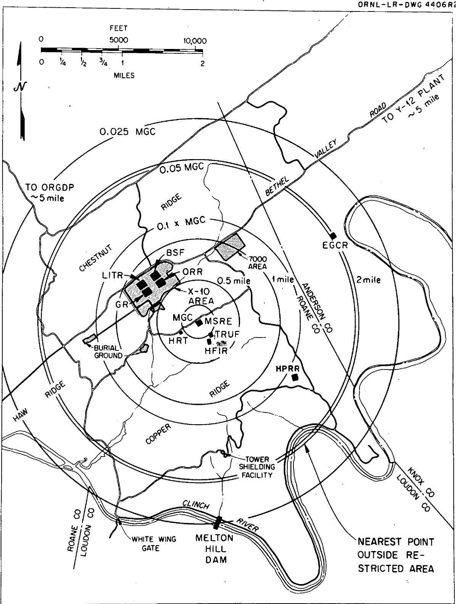  
Figure 1. ORNL Area Map

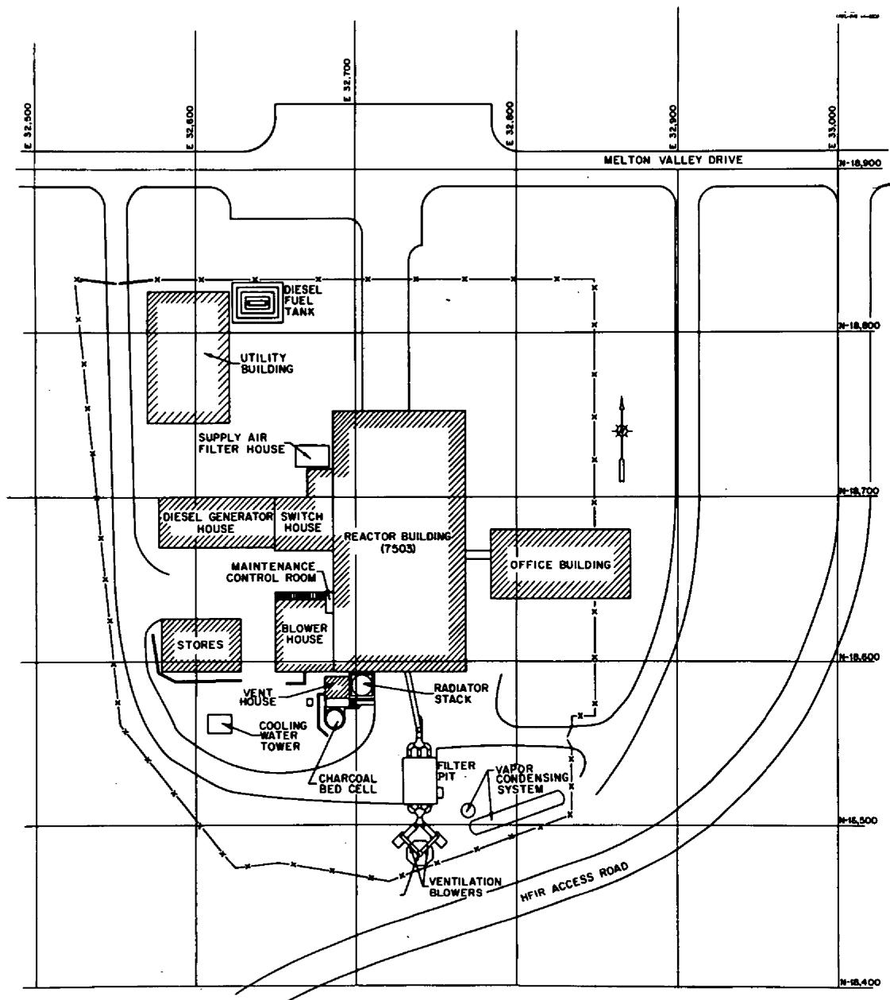  
Figure 2. Plot Plan, Molten-Salt Reactor Experiment (Bldg. 7503)

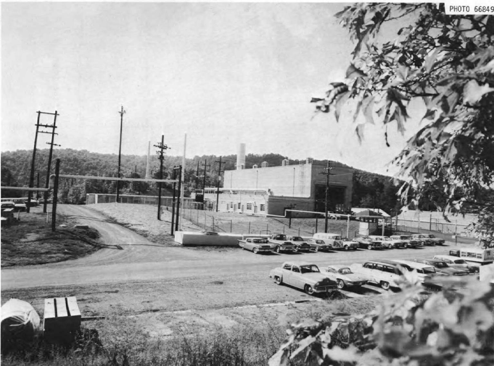  
Figure 3. Front View of Bldg. 7503

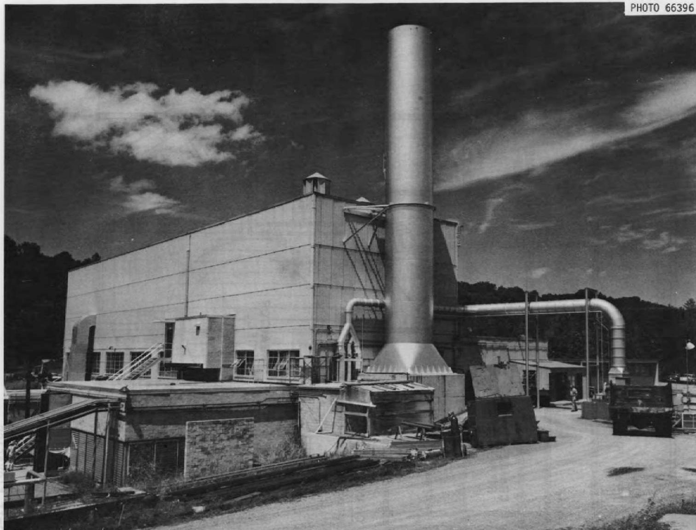  
Figure 4. Rear View of Bldg. 7503 During MSRE Construction

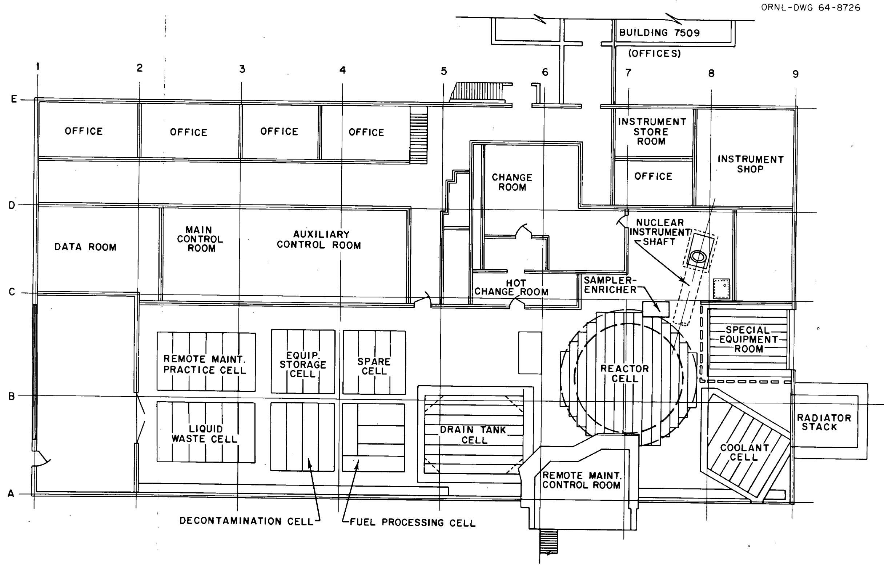  
Figure 5. Plan at 825-ft Elevation

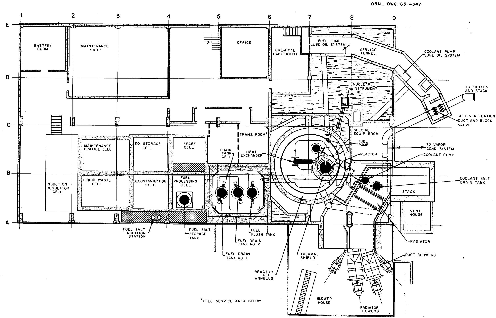  
Figure 6. Plan at 840-ft Elevation

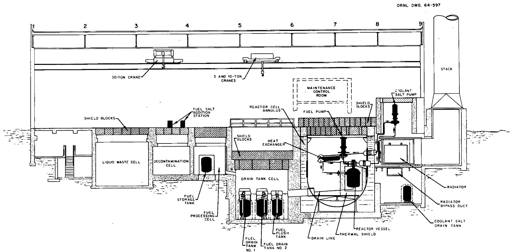  
Figure 7. Elevation, Bldg. 7503

# 2.4 Shielded Containment Cells

As shown in Figures 5 and 6 the reactor and its accessory components are located in a group of shielded cells rather than in a single containment. This arrangement enhanced accessibility for maintenance and greatly reduced the number of components incurring induced radioactivity due to neutron irradiation. Only those components and structures within the reactor shield tank were subjected to neutron irradiation and must be partially or totally removed to reduce the radiation level. All other cells will require only decontamination following either the removal or decontamination of the items within them. Access to the cells is gained by the removal of concrete roof plugs. The reactor cell and the adjacent interconnected fuel-drain-tank cell have an 11-gage stainless steel membrane between the two layers of concrete roof plugs as a containment seal. Access to the cells is gained by cutting an opening in the membrane. When the cell is to be resealed, a patch is welded over the opening. The top shielding arrangements for the reactor cell and drain-tank cell are shown in Figures 8 and 9.

The reactor cell is a cylindrical carbon steel vessel 24 ft in diameter and 33 ft in overall height with a hemispherical bottom and a flat top. The bottom is 1 to 1 1/4 in. thick and the cylindrical portion is 2 in. thick except for the section containing the large penetrations where it is 4 in. thick. The reactor cell vessel is installed within another cylindrical steel tank referred to as the "shield tank". This outer tank is 30 ft in diameter by 35 1/2 ft high. The flat bottom is 3/4 in. thick and the cylindrical section is 3/8 in. thick. The tank is supported on a reinforced concrete base within an enclosure formed by concrete soil-retaining walls and the concrete walls of adjacent cells. The reactor cell vessel rests upon a cylindrical steel skirt supported from the bottom of the shield tank. The annulus between the two tanks is filled with magnetite sand and water; the cavity encompassed by the support skirt is filled only with water.

Penetrations into the reactor cell for pipes and conduits were provided by installing a bellows-equipped sleeve between openings in the two vessels (Figure 10). The purpose of the bellows was to accommodate

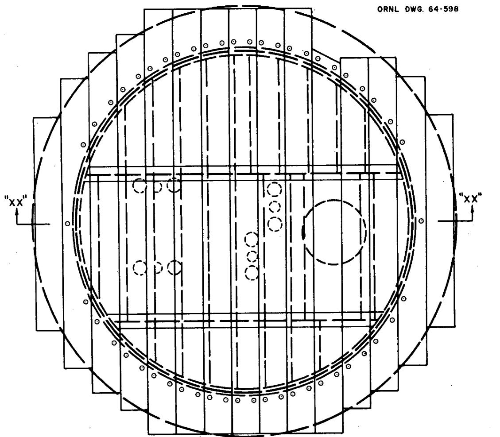

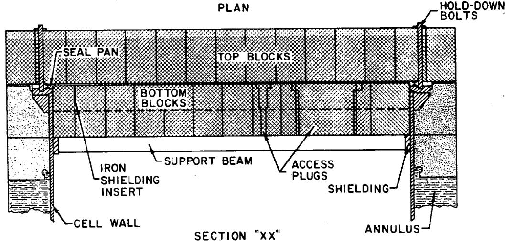  
Figure 8. Shield Block Arrangement at Top of Reactor Cell

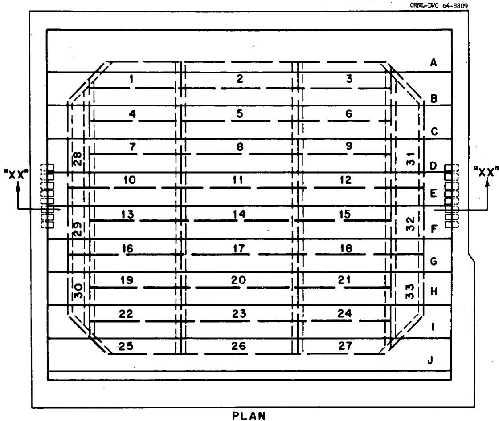

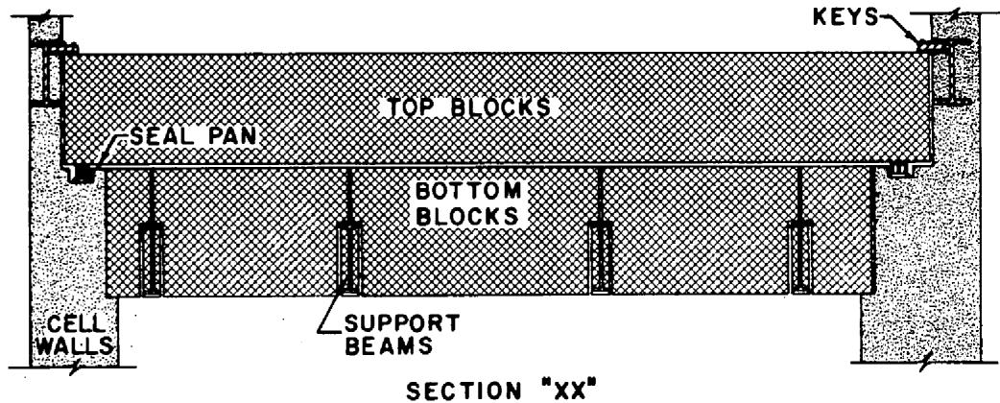  
Figure 9. Shield Block Arrangement at Top of Drain-Tank Cell

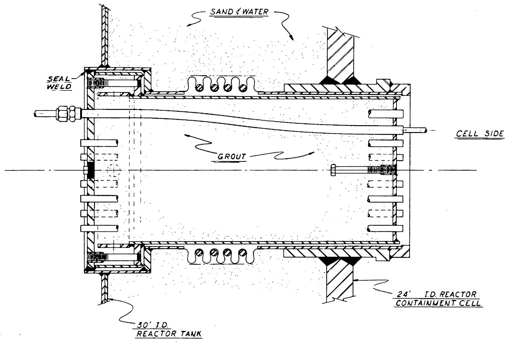  
Figure 10. Typical Penetration Assembly - Reactor Cell

dimensional changes due to temperature and pressure. Pipes and conduits pass through stepped shielding plugs which fit into the penetration sleeves. The pipes and conduits are seal-welded to the two faces of the plugs and are curved or offset within the plug to prevent radiation streaming. The outer rim of the shield plug is seal-welded to the sleeve. Since the reactor cell atmosphere extended to this seal weld, the sleeves and shield plugs are contaminated up to that region.

# 2.5 Reactor Primary System

The major components of the reactor primary system are the reactor vessel, the fuel-salt pump, the heat exchanger, and the interconnecting pipes and flanges. All of these components are located inside the reactor cell. Figure 11 is the fuel system process flow sheet showing both the primary system itself and the various subsystems.

Except for the graphite moderator, all the materials of the primary system that were in contact with the fuel salt are Hastelloy-N (INOR-8), a nickel-molybdenum-iron-chromium alloy which is highly resistant to corrosion by molten fluoride salts and has high strength at elevated temperatures. The properties of this material are listed in Table 1. Figure 12 is a simplified flow diagram of the reactor primary and secondary systems and Figure 13 is a layout of these systems. Figure 14 is a photograph of the reactor cell with the components partially installed.

# 2.5.1 Reactor Vessel and Core

Physical characteristics of the reactor vessel and its contents are listed in Table 2.

The reactor vessel is 58 in. I.D. and about 94 in. high (Figures 15 and 16). The wall thickness of the cylindrical portion is 9/16 in. except for the top 16 in., which is 1 in. thick. An 8-in.-I.D. half-round welded circumferentially to the tank over the 1-in.-thick section served as the fuel-salt inlet flow distributor. The salt delivered by the distributor entered the tank through 3/4-in.-diameter holes drilled through the 1-in.-thick section. The salt flow from the flow distributor entered the annular space between the vessel and core container and flowed downward providing efficient cooling for the core can and reactor vessel walls

Table 1. Composition and Properties of INOR-8   
Chemical Properties:   

<table><tr><td>Ni</td><td>66-71%</td></tr><tr><td>Mo</td><td>15-18</td></tr><tr><td>Cr</td><td>6-8</td></tr><tr><td>Fe, max</td><td>5</td></tr><tr><td>C</td><td>0.04-6</td></tr><tr><td>Ti + Al, max</td><td>0.50</td></tr><tr><td>S, max</td><td>0.02</td></tr><tr><td>Mn, max</td><td>1.0</td></tr><tr><td>Si, max</td><td>1.0</td></tr><tr><td>Cu, max</td><td>0.35</td></tr><tr><td>B, max</td><td>0.010</td></tr><tr><td>W, max</td><td>0.50</td></tr><tr><td>P, max</td><td>0.015</td></tr><tr><td>Co, max</td><td>0.20</td></tr></table>

Physical Properties:   

<table><tr><td>Density, lb/in.3</td><td>0.317</td></tr><tr><td>Melting point, °F</td><td>2470-2555</td></tr><tr><td>Thermal conductivity, BTU/hr-ft2(F/ft) at 1300°F</td><td>12.7</td></tr><tr><td>Modulus of elasticity at ~1300°F, psi</td><td>24.8 x 10^6</td></tr><tr><td>Specific heat, BTU/lb-°F at 1300°F</td><td>0.138</td></tr><tr><td>Mean coefficient of thermal expansion, 70-1300°F range, in./in.-°F</td><td>8.0 x 10^6</td></tr></table>

Mechanical Properties:   

<table><tr><td>Maximum allowable stress,* psi: at 1000°F</td><td>17,000</td></tr><tr><td>1100°F</td><td>13,000</td></tr><tr><td>1200°F</td><td>6,000</td></tr><tr><td>1300°F</td><td>3,500</td></tr></table>

Table 2. Reactor Vessel and Core Design Data and Dimensions   

<table><tr><td>Construction material</td><td>INOR-8</td></tr><tr><td>Inlet nozzle, Schedule 40, in., IPS</td><td>5</td></tr><tr><td>Outlet nozzle, Schedule 40, in., IPS</td><td>5</td></tr><tr><td>Reactor vessel</td><td></td></tr><tr><td>O.D., in.</td><td>59 1/8 (60 in. max)</td></tr><tr><td>I.D., in.</td><td>58</td></tr><tr><td>Wall thickness, in.</td><td>9/16</td></tr><tr><td>Overall height, in. (to centerline of 5-in. nozzle)</td><td>100 3/4</td></tr><tr><td>Head thickness, in.</td><td>1</td></tr><tr><td>Inlet</td><td>Constant area distributor</td></tr><tr><td>Cooling annulus I.D., in.</td><td>56</td></tr><tr><td>Cooling annulus O.D., in.</td><td>58</td></tr><tr><td>Graphite core</td><td></td></tr><tr><td>Diameter, in.</td><td>55 1/4</td></tr><tr><td>Number of regular graphite core blocks</td><td>513</td></tr><tr><td>Number of fractional core blocks</td><td>104</td></tr><tr><td>Core block size, in. (regular)</td><td>2 x 2 x √67</td></tr><tr><td>Core container</td><td></td></tr><tr><td>I.D., in.</td><td>55 1/2</td></tr><tr><td>O.D., in.</td><td>56</td></tr><tr><td>Wall thickness, in.</td><td>1/4</td></tr><tr><td>Height, in.</td><td>68</td></tr></table>

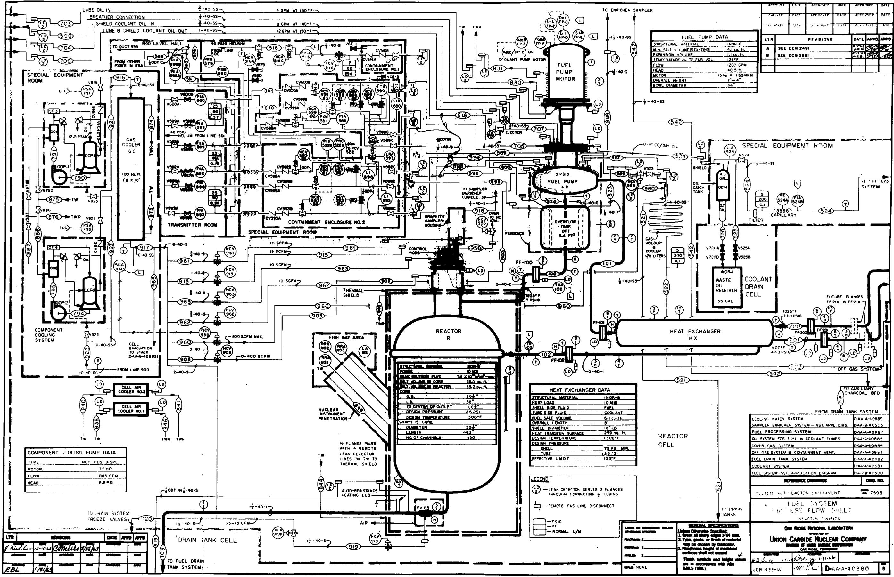  
Figure 11. Fuel System Process Flow Sheet

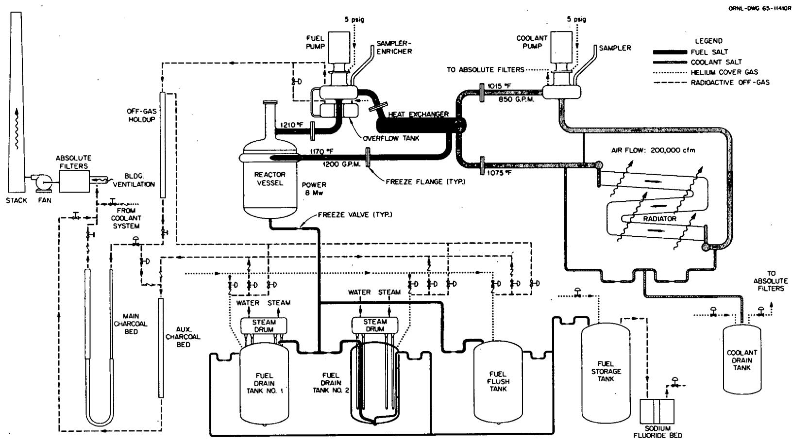  
Figure 12. Simplified Design Flow Sheet of the MSRE

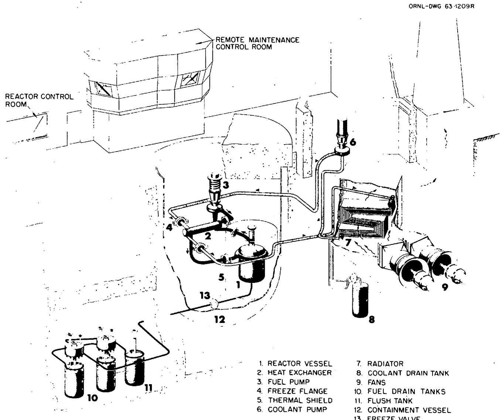  
Figure 13. Primary and Secondary Salt Systems

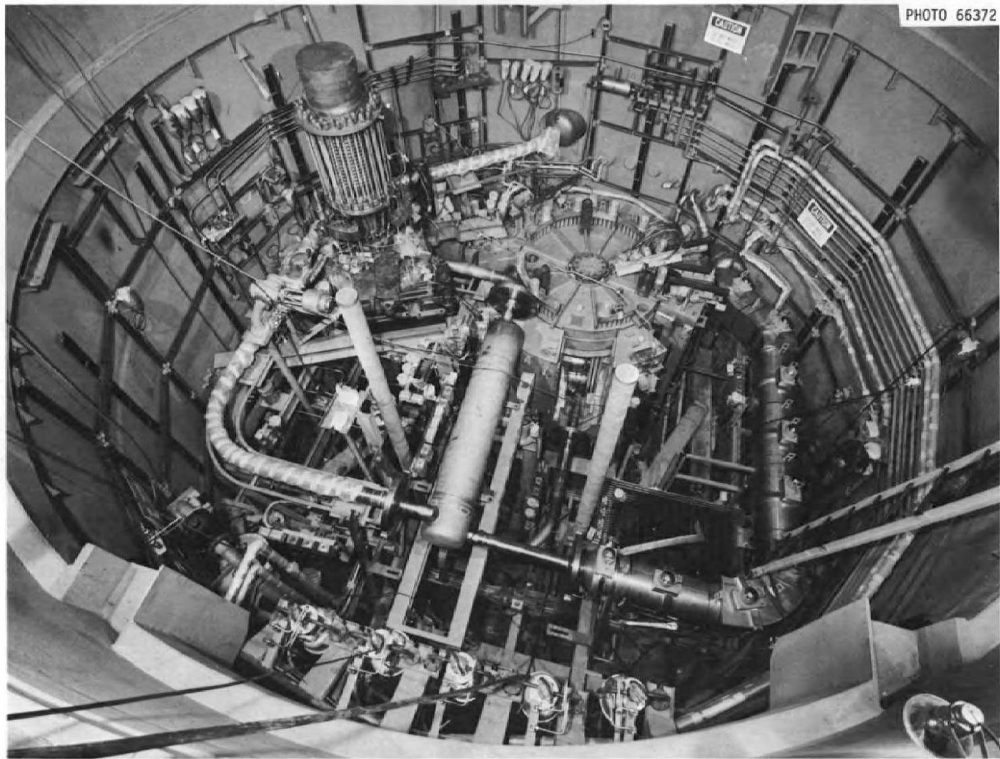  
Figure 14. Reactor Cell During Assembly of Components

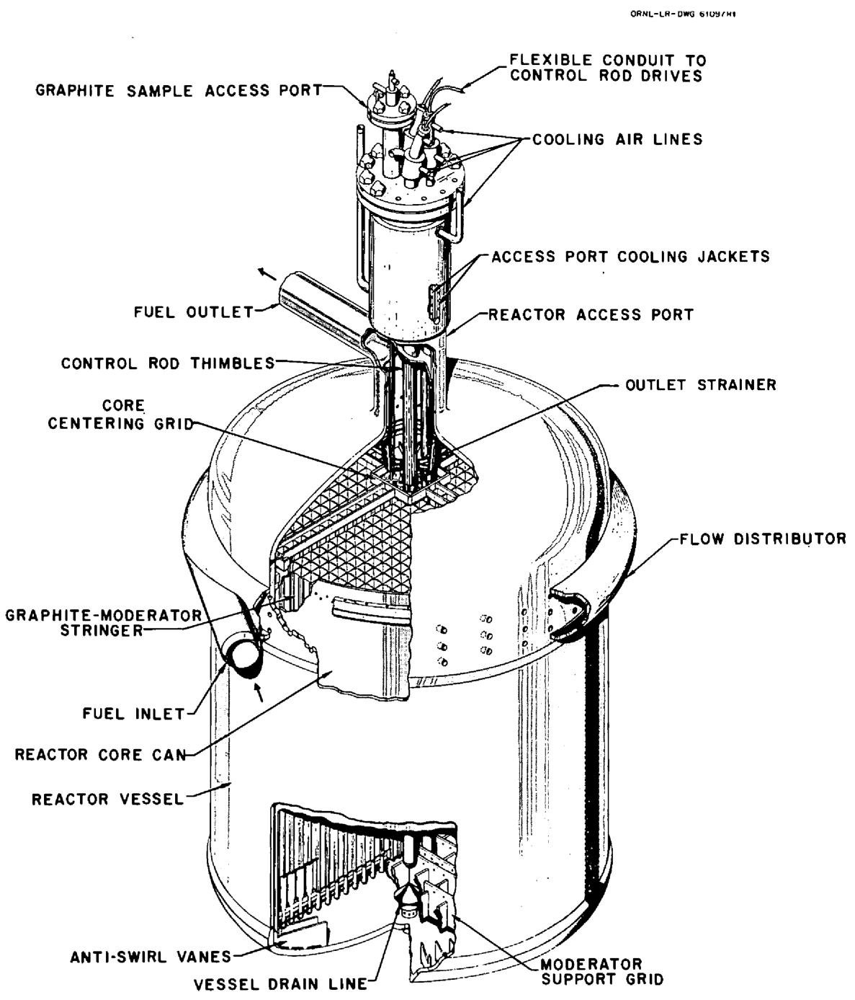  
Figure 15. Reactor Vessel

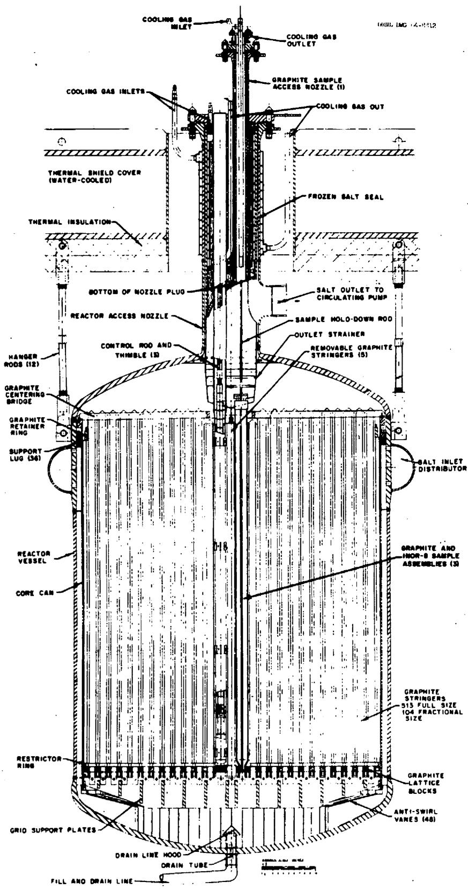  
Figure 16. Cross Section - Reactor Vessel and Access Nozzle

by flowing countercurrent to the upflow of heated salt in the core. The top and bottom of the vessel are 58-in.-I.D. flanged and dished heads. The vessel is supported by 12 suspension rods from the top of the thermal shield (to be described later). The suspension rods (Figure 17) are connected to support lugs welded to the reactor vessel above the flow distributor.

The core can, or shell, is 55 l/2 in. I.D. and 67 15/16 in. high with a wall thickness of 1/4 in. The can is supported by a ring at the top of the can which is bolted to 36 lugs welded to the inside of the reactor vessel wall. The can supports the graphite used as the moderator material for the core.

The graphite moderator is formed of 513 blocks, each of which is 2 in. x 2 in. x $\sim$ 67 in. These are stacked in a vertical close-packed array as shown in Figure 18. In addition, there are 104 fractional-sized blocks at the periphery. Fuel passages were provided by milling a rectangular vertical groove down each block face. When assembled, these grooves formed 0.4 in. x 1.2 in. vertical channels through which the fuel salt moved from the bottom to the top of the core.

The vertical graphite blocks rest on a lattice of horizontal graphite blocks, about 1 by 1 5/8 in. in cross section, laid in two layers at right angles to each other. Holes in the lattice blocks accept the 1-in.-diameter doweled section at the lower end of each vertical block. The upper horizontal surfaces of both the vertical blocks are tapered to prevent salt from being retained on them when the vessel was drained. The lattice blocks rest on a grid of 1/2-in.-thick INOR-8 plates set on edge and varying in height from 1 5/8 in. at the core periphery to about 5 9/16 in. at the center. This support grid is fastened to the bottom of the core can. Each of the vertical blocks is locked to the grid by 5/16-in.-diameter rods which pass through holes in the grid and holes in the doweled sections of the blocks. Forty-eight vertical fins located around the periphery of the reactor vessel below the core support grid prevented spiraling flow of the fuel salt in the region below the core.

At the center of the bottom of the reactor vessel is a 1 1/2-in. Schedule 40 drain line which extends about 2 3/4 in. into the vessel and

ORNL DWG 64-8819

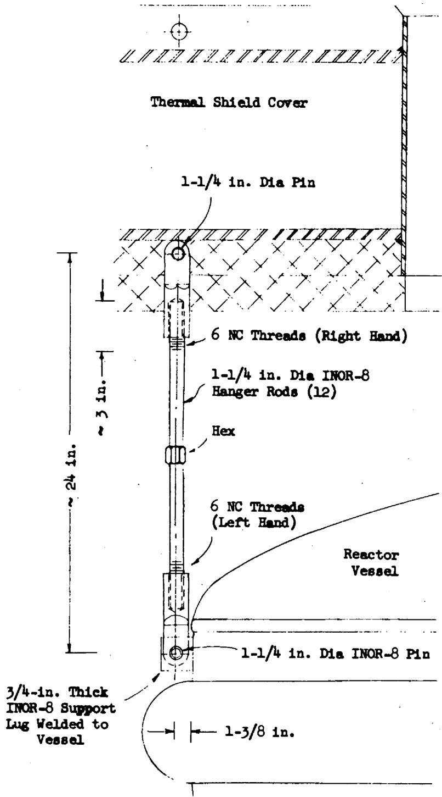  
Figure 17. Reactor Vessel Hanger Rods

ORNL-LR-DWG 56874R

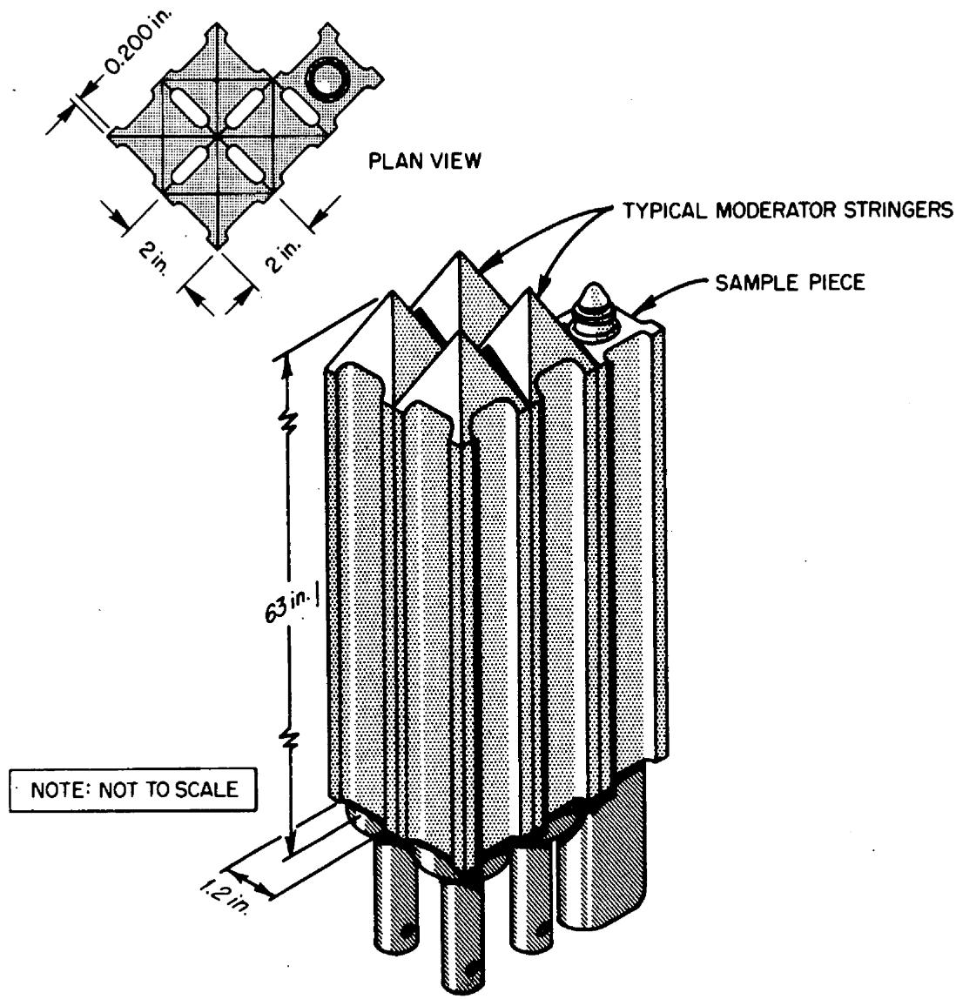  
Figure 18. Typical Graphite Block Arrangement

is covered with a protective hood to prevent debris from entering the pipe. A 1/2-in.-diameter tube within the drain line opens into the vessel just above the bottom surface to allow complete draining.

The top head of the reactor vessel is equipped with a 10-in.-diameter, 40-in.-tall nozzle. A 5-in. nozzle emerging from the side of the extension is the fuel-salt exit line from the vessel. The 10-in. nozzle served also as an entry port for the three control rods (Figures 15 and 19) and as an access for inserting and removing replaceable core blocks and materials-testing specimens.

# 2.5.2 Thermal Shield

The primary functions of the thermal shield (Figures 6, 7, and 20) were to reduce the radiation damage to the reactor containment vessel and to cell equipment, to serve as part of the biological shielding, and to provide the support for the reactor vessel which is suspended within it.

The shield is a water-cooled, steel ball and water filled container which completely surrounds the reactor vessel. It is about 10.4 ft O.D. by 7.8 ft I.D. and 12.5 ft tall. The 14-in.-wide annular space is filled with 1-in.-diameter carbon steel balls. The shield coolant circulated through the interstitial spaces. The shield walls are made of 1-in.-thick 304 stainless steel plate.

Six separate parts make up the thermal shield assembly: the flat semirectangular base, the main cylindrical section, three removable segments of the cylindrical section, and the removable top cover. The removable segments fill slots in the cylindrical sections through which the reactor fill and drain line and the fuel-salt inlet and outlet lines to the reactor passed as the reactor vessel was lowered into position. The base and main cylindrical sections have many equipment support structures attached to them.

# 2.5.3 Primary System Pump

From the top of the reactor vessel the fuel flowed directly to the primary system pump bowl through a 13.8 ft length of 5-in. Schedule 40 pipe which enlarges to 6 in. below the pump to adapt to the pump suction nozzle size. The components and appearance of the centrifugal sump-type

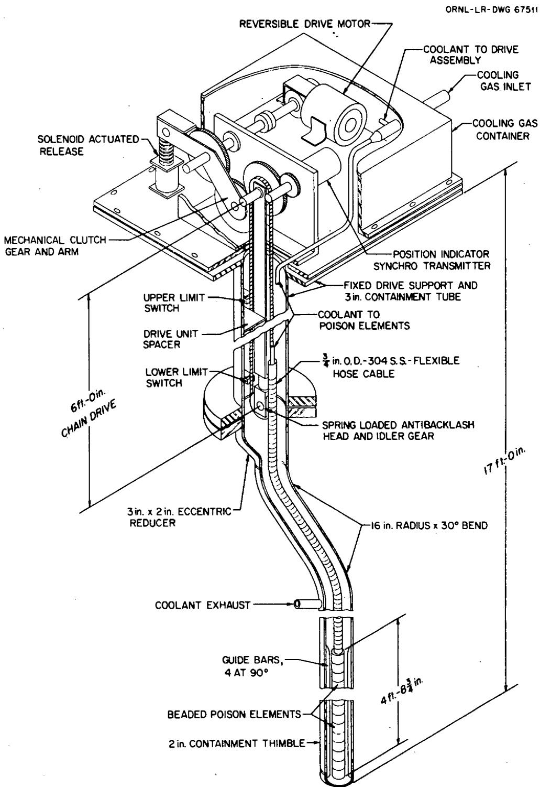  
Figure 19. Control Rod and Drive Assembly

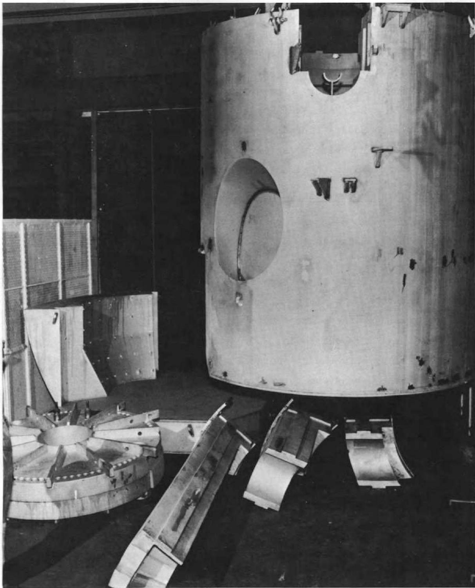  
Figure 20. Thermal Shield Components

pump and pump bowl are shown in Figures 21 and 22. The pump bowl is about 36 in. in diameter and contains the pump casing, gas stripping manifold, sampler-enricher cage, and off-gas connections. It served as a surge tank for the loop with a cover-gas pressure maintained above the operating salt level. The removable pump and 75-hp motor assembly is about 8 ft tall and consists of all the rotary elements and bearings of the pump. The assembly is mounted on a 2 1/2-in.-thick plate that can move horizontally and vertically to accommodate thermal expansion of the system. This was necessary since the reactor position is fixed. The mounting plate is, in turn, supported by two 8-in. horizontal I-beams attached to the cell structure.

# 2.5.4 Primary System Heat Exchanger

From the pump discharge the fuel salt passed directly through a 6.0 ft length of 5-in. Schedule 40 pipe to the primary system heat exchanger (Figures 23 and 24) which is a horizontal, shell and U-tube type, in which the fuel salt circulated through the shell side and the coolant salt through the tubes. It is of all-welded construction and made entirely of INOR-8 except for the brazing material that sealed the tubes to the sheet.

The shell is about 16 in. O.D. by about 8 ft 3 in. long and is 1/2 in. thick including both the cylindrical portion and the heads. The fuel salt entered at the U-bend end through a 5-in. Schedule 40 nozzle and emerged through a 7 in. by 5 in. reducing nozzle at the bottom of the shell at the tube-sheet end and flowed to the reactor inlet through a 17.2 ft length of 5-in. Schedule 40 INOR-8 pipe. The coolant salt entered the top manifold at the tube-sheet end and exited from the bottom manifold. Both the inlet and exit nozzles are 5 in. diameter Schedule 40.

The heat exchanger contains 159 U-tubes which are $1/2$ in. O.D. with a wall thickness of 0.042 in. The tube sheet is $1 \frac{1}{2}$ in. thick. The tubes are spaced and supported by three baffle plates and one barrier plate (near the tube sheet) and in addition are laced with $1/4$ in. x ~0.017 in. INOR-8 straps to suppress vibrations.

Due to the short lengths of interconnecting pipes and the immovability of the reactor vessel, the heat exchanger, like the fuel pump, had to be supported in a manner that allowed horizontal and vertical movement

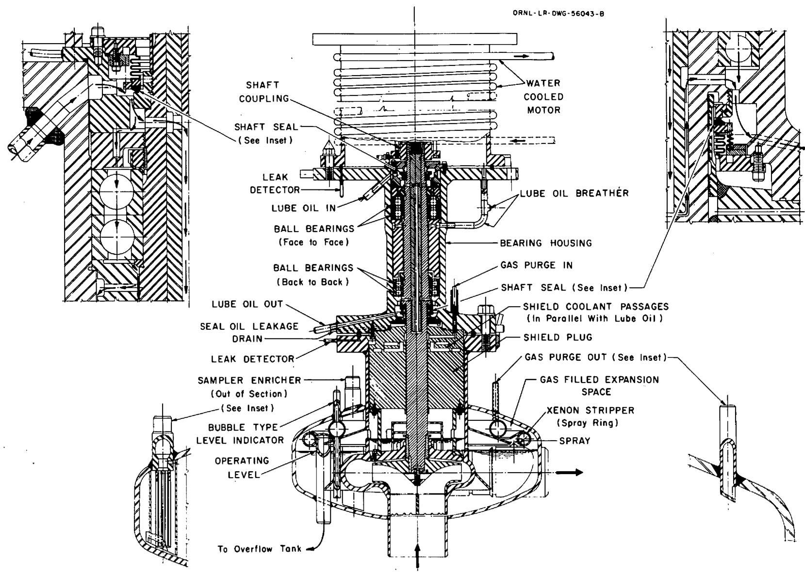  
Figure 21. Fuel Pump

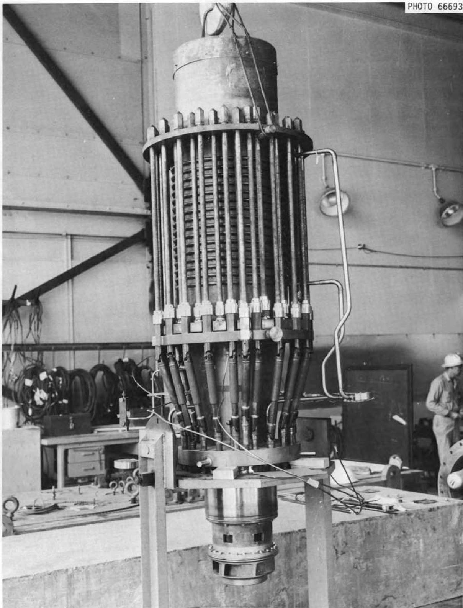  
Figure 22. Fuel Pump Motor and Rotor Assembly Showing Flange Bolt Extensions

ORNL-LR-DWG 52036

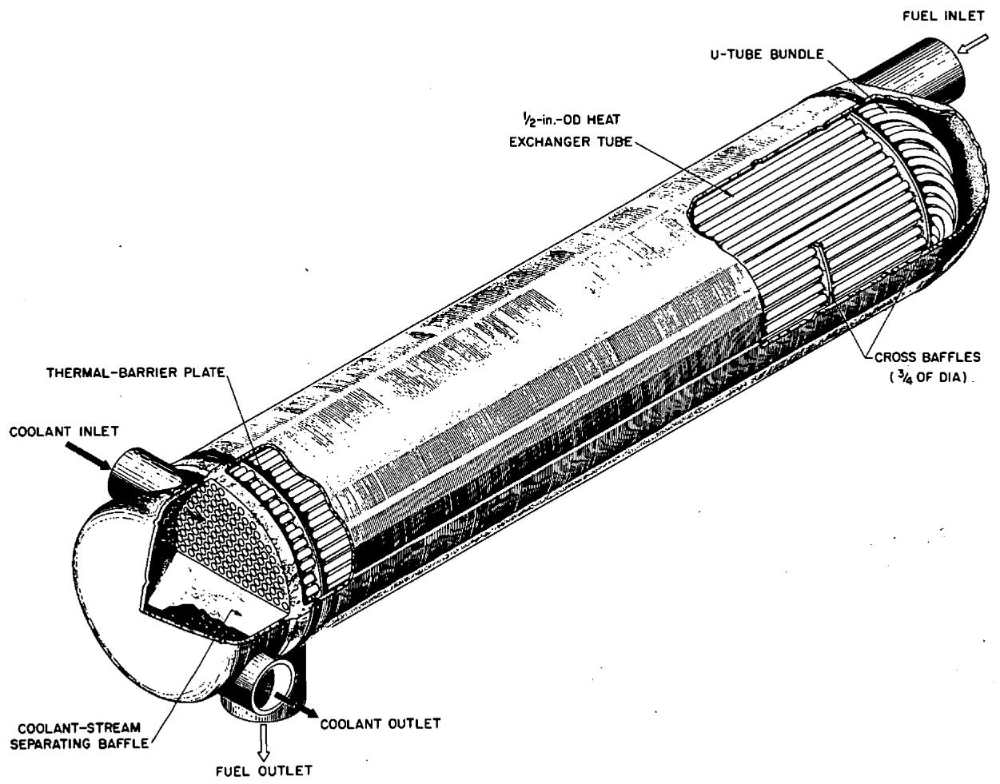  
Figure 23. Primary Heat Exchanger

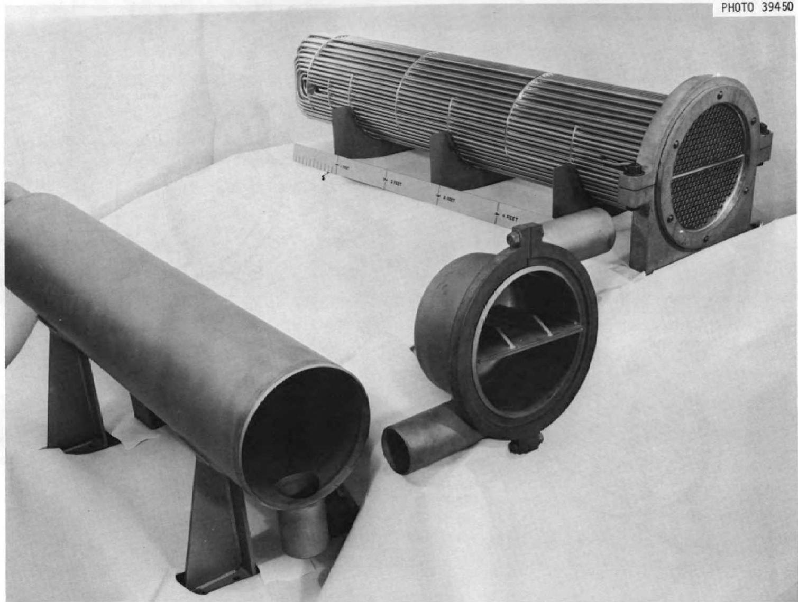  
Figure 24. Primary Heat Exchanger Subassemblies

to compensate for thermal expansion. Two support saddles welded to the shell supply support from a complex motion-adapting system which, in turn, rests upon an assembly of 8-in. I-beams fixed to the cell structure.

# 2.5.5 Fuel Pump Overflow Tank

The primary system pump bowl has an overflow pipe and catch tank (Figure 25) which was provided to avoid problems from inadvertent overfilling of the system or unexpected volume expansion. The catch tank is torus-shaped and fits around the pump intake line immediately below the pump bowl. The tank is 30 in. 0.D. x 18 in. I.D. x 27 3/4 in. tall. The wall thickness is 1/2 in. and the annulus between the inner and outer walls is 5 in. wide. The 1 1/2-in. pump bowl overflow pipe extends from the top of the catch tank through the bottom of the pump bowl to 1 1/2 in. above the normal fuel-salt level. The tank is supported from the pump support with a system of movable plates that allow horizontal motion to accommodate thermal effects.

# 2.5.6 Fuel-Salt and Flush-Salt Drain and Storage Tanks

The primary system is provided with two fuel-salt drain tanks and a flush-salt drain tank located in a shielded cell adjacent to the reactor containment vessel. Figure 26 is a process flow sheet for the drain tanks and their auxiliary systems. In addition, a fuel storage and reprocessing tank is located in the fuel-processing cell. It is described in Section 2.7.

Each of the two fuel drain tanks (Figure 27) is 50 in. in diameter and about 86 in. tall, not including the steam dome and has a fuel-salt capacity of about 80 ft³. Each is equipped with thirty-two 1 l/2-in. cooling thimbles. The steam dome which is mounted atop the tank (Figure 28) contains 1-in.-diameter cooling fingers extending into each of the thimbles. Water boiling in the inner 1-in.-diameter fingers in the thimbles removed both residual and fission-product decay heat from fuel salt stored in the tank. The steam was routed to an external condenser and the condensate returned to the fingers in a closed loop.

The flush-salt drain tank is also located in the drain-tank cell and contained the flush salt used to cleanse the primary system prior to

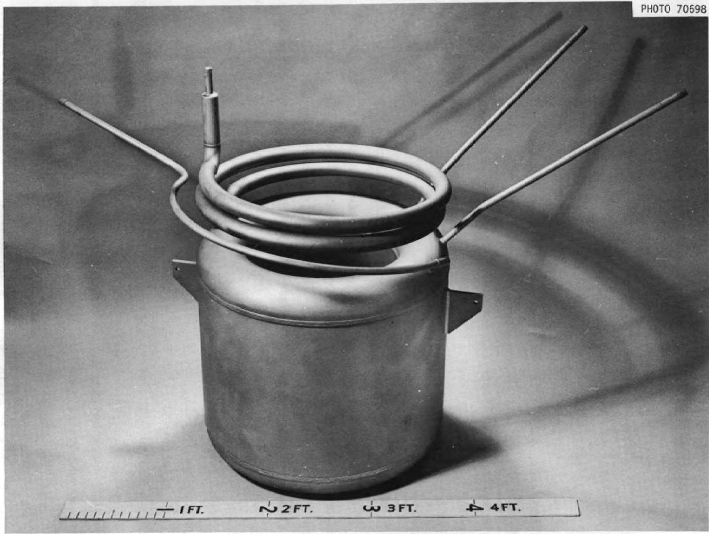  
Figure 25. Fuel Pump Overflow Tank

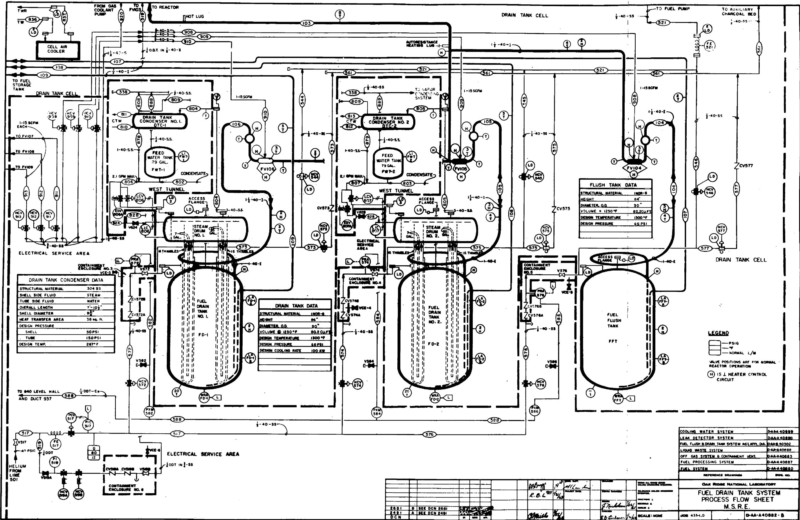  
Figure 26. Fuel Drain Tank System Process Flow Sheet

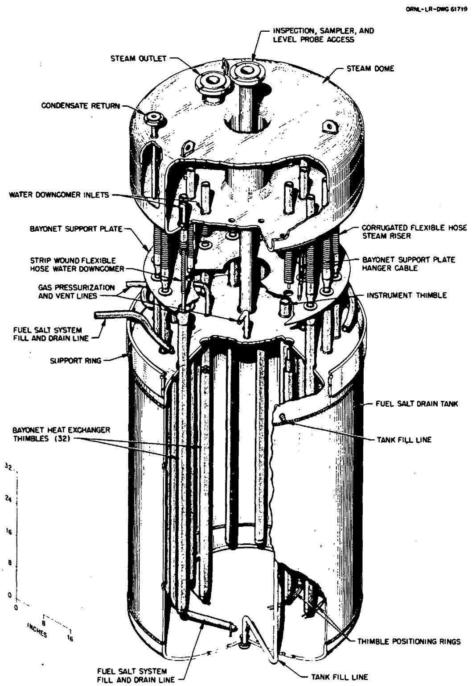  
Figure 27. Fuel-Salt Drain Tank

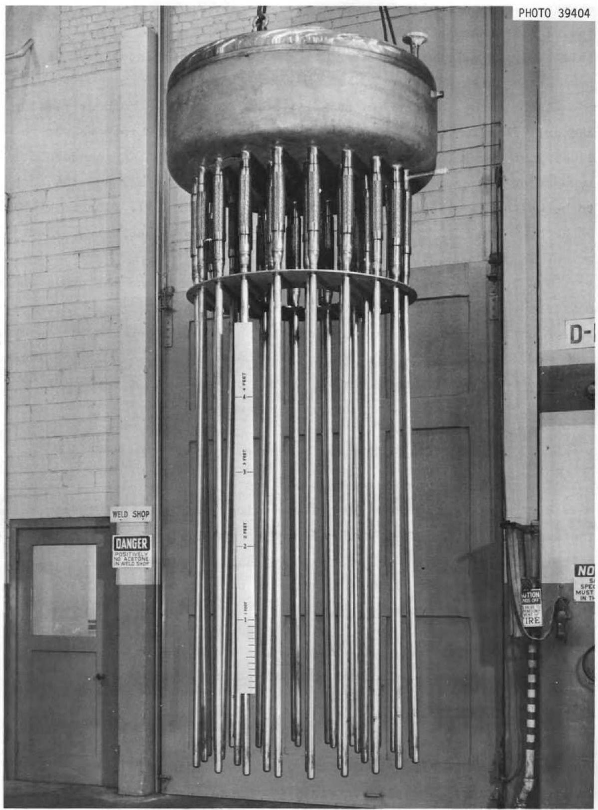  
Figure 28. Fuel Drain Tank Steam Dome Bayonet Assembly

charging it with fuel salt. This tank has the same dimensions as the fuel drain tanks except for being 2 in. shorter. Since it has no cooling thimbles, its salt storage capacity is about $2\text{ft}^3$ greater than that of a fuel drain tank.

Each of the three drain tanks is supported by two columns resting on the cell floor. The columns are attached to support skirts welded to tanks just above the upper head circumferential weld. An intermediate supporting arrangement between the columns and skirts allowed the tanks to be weighed by a pneumatically-operated weighing cell. The tare weight of each of the fuel drain tanks is about 7,000 lbs; the fully loaded weight is about 17,000 lbs.

The drain connection between the reactor vessel and the drain tanks consists of a 1 l/2-in. Schedule 40 INOR-8 pipe which extends from the bottom of the reactor vessel through the shield wall between the reactor cell and the drain-tank cell where it connects to the l-in. pipes leading from the tops of the drain tanks. During operation of the reactor, the drain tanks were sealed from it by freeze valves.

# 2.6 Reactor Secondary System

The reactor secondary system consists of the tube side of the primary heat exchanger, the coolant circulating pump, the salt-to-air radiator, the drain and fill system, and the interconnecting piping. The coolant salt is similar to the fuel salt except that it contains no fissionable materials. Figure 29 is the process flow diagram of the coolant system and its auxiliary systems.

# 2.6.1 Heat Exchanger

The heat exchanger is described in Section 2.5.4.

# 2.6.2 Coolant Circulating Pump

The coolant-salt pump is of the same type and overall size as the fuel-salt pump described in Section 2.5.3. It does not, however, have an overflow tank. The pump is rigidly mounted in its own shielded cell which is above the level of the other cells (Figures 7 and 13).

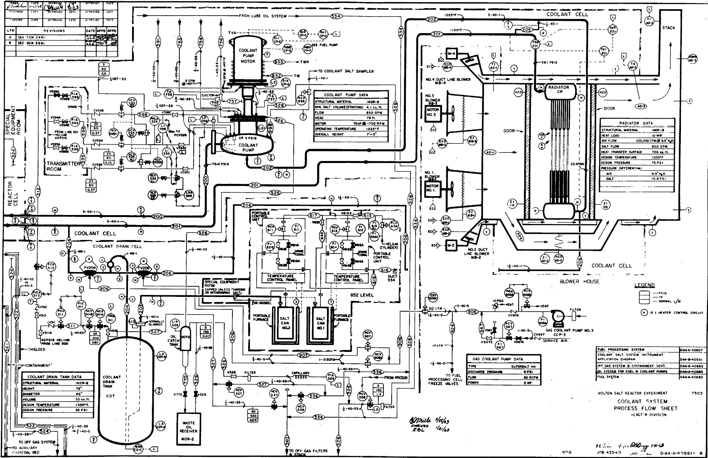  
Figure 29. Coolant System Process Flow Sheet

# 2.6.3 Radiator

The radiator coil is an assembly of one-hundred twenty 30-ft-long "S"-shaped 3/4-in.-O.D. INOR-8 tubes (Figure 30) connected to vertical manifolds which, in turn, are connected to the 9-in.-O.D. inlet and outlet headers. The 5-in. Schedule 40 inlet line connects to the outlet from the heat exchanger, and the 5-in. Schedule 40 outlet line goes directly to the suction side of the pump.

The coil is enclosed in a housing (Figure 31) which is equipped with vertically operated doors which regulated the air flow passing through the coil and thereby the coolant-salt temperature. The total assembly is mounted at the entrance of a double-walled steel duct leading to the 10 ft diameter x 75 ft high steel heat-dump stack. Two 250-hp blowers supplied the 200,000 cfm of air used to remove heat from the coil at the maximum reactor power level of 10 MW. A separate cooling system used two 10-hp, 10,000-cfm blowers to supply air to the annulus around the duct. This was necessary to prevent buckling and damage to adjacent concrete when the coil exhaust air reached temperatures up to $1000^{\circ}\mathrm{F}$ under low-flow conditions.

# 2.6.4 Secondary System Piping

Like that of the primary system, the secondary system piping is 5-in. Schedule 40 INOR-8 pipe. The sections of inlet and outlet lines to the heat exchanger which are within the reactor cell are about 36.3 ft and 32.4 ft long, respectively. The lengths and arrangement of the piping both within and outside the reactor cell allowed it to accommodate thermal expansion so that the pump and the radiator could be rigidly mounted.

# 2.6.5 Coolant Drain Tank

The coolant-salt drain tank is located in a shielded cell almost directly below the radiator. The coolant-salt piping has low points on each side of the radiator; a 1 l/2-in. drain line runs from each of these to the drain tank.

The drain tank is 40 in. O.D. and about 78 in. tall with a wall thickness of 3/8 in. in the cylindrical portion. The dished heads are 5/8 in. thick. The tank and all its attachments are made of INOR-8.

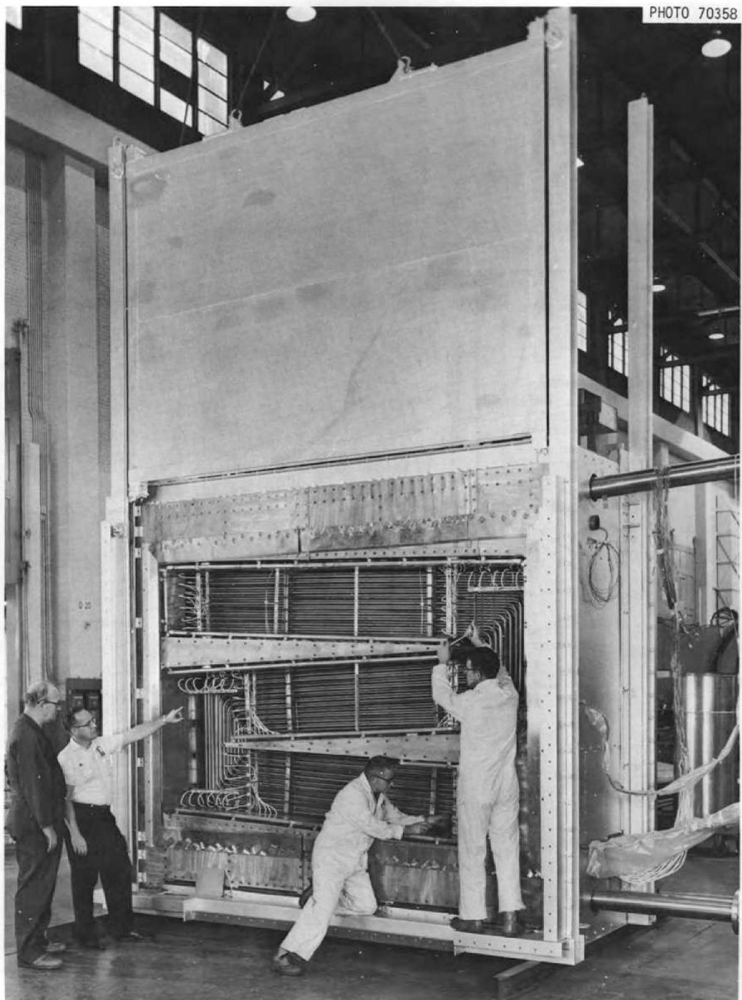  
Figure 30. Radiator Assembly

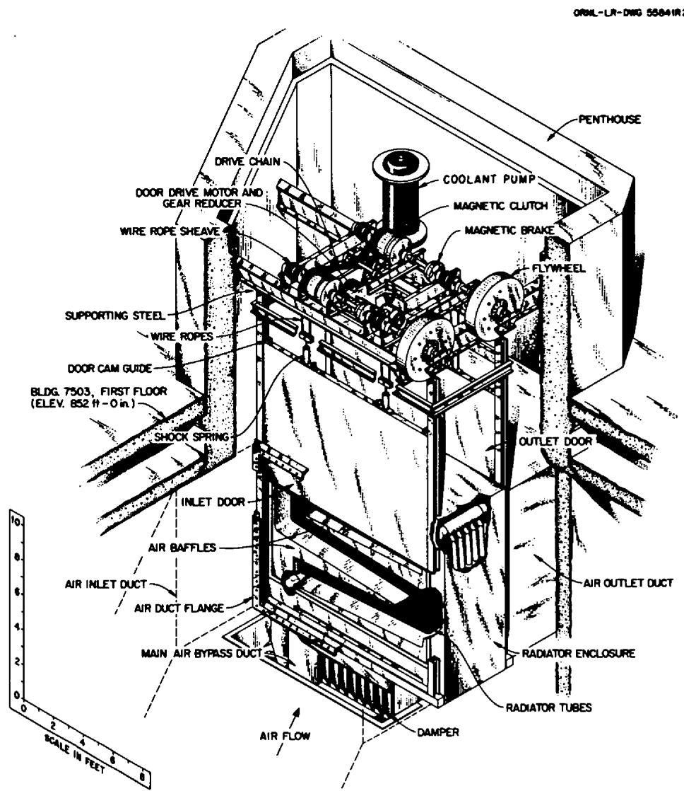  
Figure 31. Radiator Coil and Enclosure

# 2.7 Fuel-Processing System

Other than the reactor primary system and its associated drain tanks, the only other system that contained large quantities of both unirradiated and irradiated fuel salt at any time is the fuel-processing system. The components of this system which contained fuel salt and/or fission products are located in a below-grade-level concrete-shielded cell just north of the drain-tank cell (Figures 6, 7, and 32). The two purposes of the processing were to clean both new and used fuel salt of oxides and water by sparging with hydrogen fluoride and to recover uranium from used fuel salt by sparging with fluorine. A simplified flow diagram of the system is shown in Figure 33. Figure 34 is a complete flow diagram showing both the main system and its auxiliary systems.

The sparging tank, generally called the "fuel storage tank", is the only component of the system that contained fuel salt. A 1/2-in. Schedule 40 pipe from this tank to the fuel-salt and flush-salt storage tanks was used to transfer salt to and from the primary system. The tank (Figure 35) is 50 in. O.D. and 116 in. tall. Its cylindrical section is 1/2 in. thick and the dishes heads are 3/4 in. thick. All parts are made of INOR-8. It is mounted on a pneumatically-operated weighing cell supported from the cell floor.

Other large items in the fuel-processing cell include the NaF-filled impurity trap (Figure 36) used to strip undesirable fluorides from $\mathrm{UF}_6$ during fluorination and the 42 in. diameter by 84 in. tall caustic scrubber tank used for HF neutralization. The remaining items are small components, piping, heaters, and insulation.

# 2.8 Freeze Flanges

Mechanical-type joints were provided in the 5-in. piping of the fuel- and coolant-salt system to permit the major components to be disconnected remotely and removed for maintenance or replacement. The locations of the five flanged joints are shown in Figure 12.

As shown in Figure 37, the design of the flange utilized a large diameter face as a heat sink to maintain a barrier of frozen salt to protect the gasket from contact with molten salt. Each flanged connection

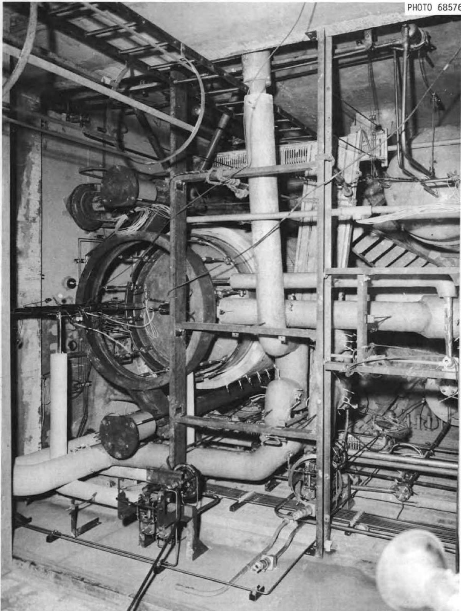  
Figure 32. Fuel-Processing Cell

ORNL-DWG 63-3123AR

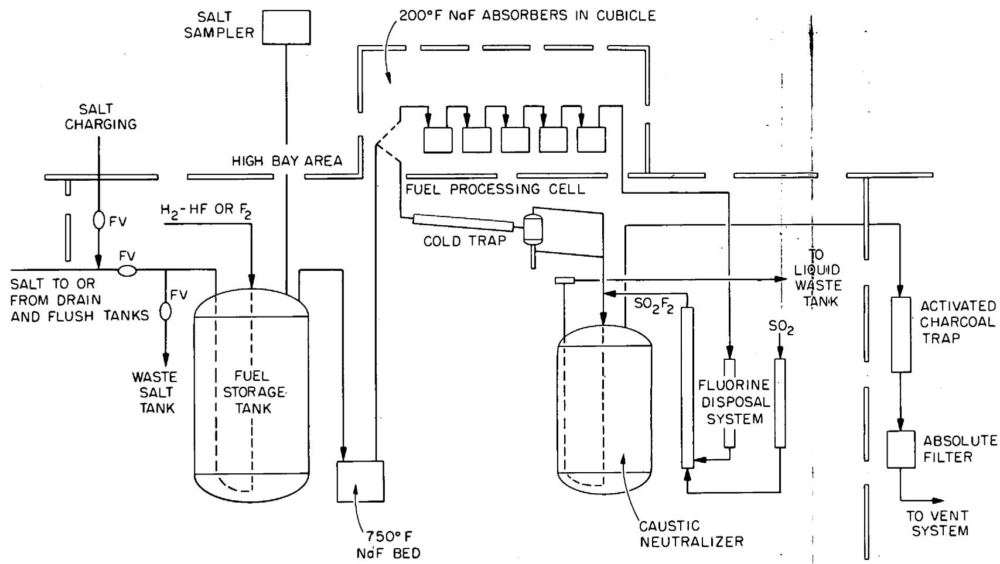  
Figure 33. Simplified Fuel-Processing System Diagram

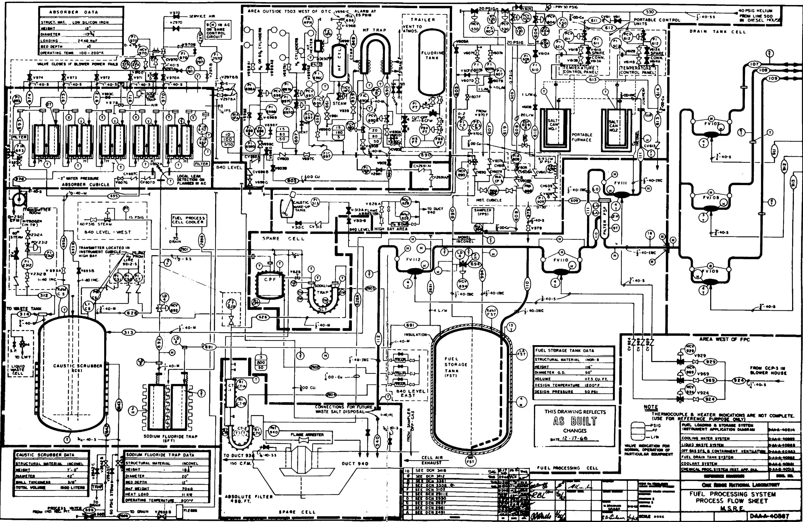  
P20794RA 62D7G   
Figure 34. Fuel-Processing System Process Flow Sheet

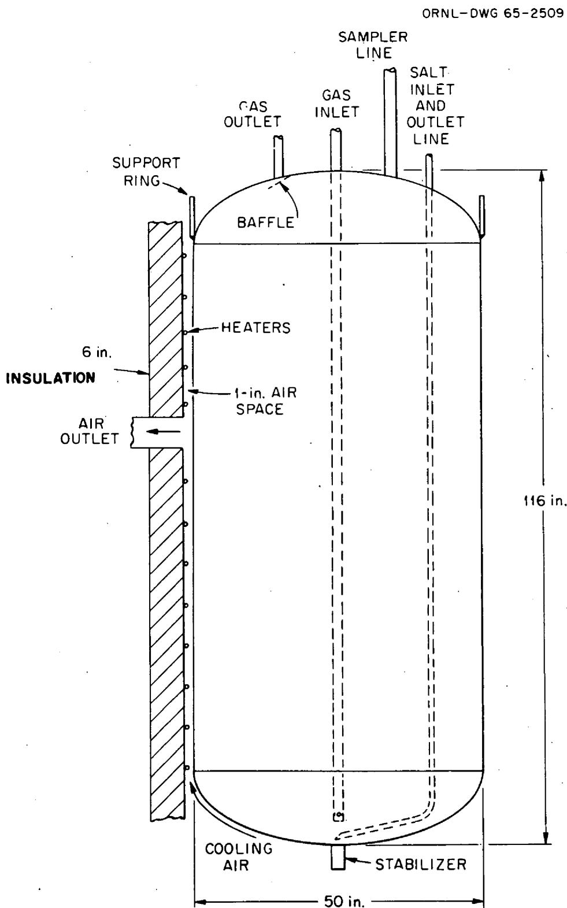  
Figure 35. Fuel Storage Tank

ORNL-DWG 65-2511

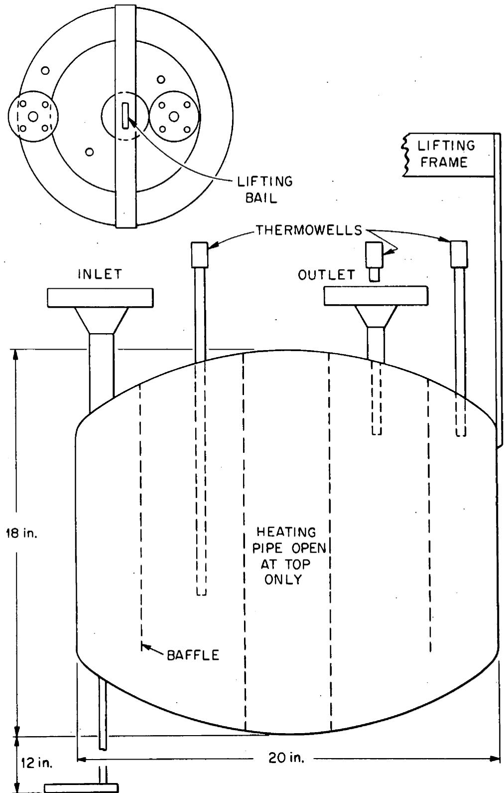  
Figure 36. Sodium Fluoride Filled Trap

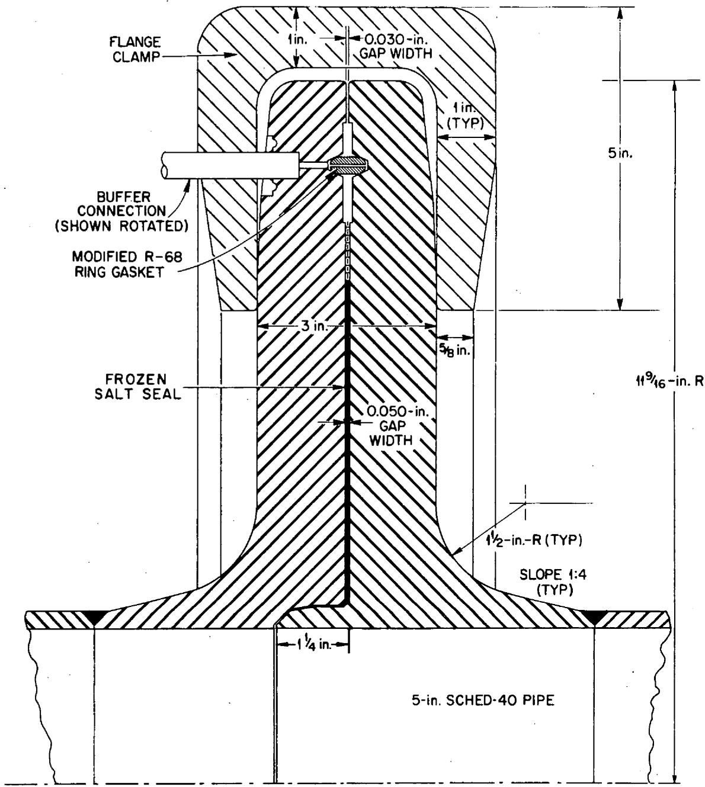  
Figure 37. Freeze Flange and Clamp

also contains a leak detecting-buffer gas connection to the ring groove area. The semicircular flange clamps are made of spring steel so that they remain in place when forced around the flange with no bolting being required. Figure 38 shows the installed guide arrangement for the clamps and the simple type of tool required for their removal and installation.

# 2.9 Freeze Valves

The flow of molten salt in the drain, fill, and processing systems was controlled by freezing or thawing a short plug of salt in a flattened section of 1 l/2-in. pipe, called a "freeze valve". This method of valving was necessary because no mechanical-type valve had been developed for molten-salt service. These valves were closed (frozen) by a regulated cooling-air flow through a shroud around the flattened section of pipe and opened (thawed) by shutting off the air and applying electrical heat to the valve. All valves, except the reactor drain valve, also contain a volume tank located vertically nearby to always provide enough residual salt in the line to form the salt plug.

There are twelve freeze valves in the reactor systems, all of which are fabricated of 1 l/2-in. INOR-8 pipe. Six are installed in 1 l/2-in. lines and six in 1/2-in. lines. One valve, which is in the reactor drain and fill line is inside the reactor thermal shield, six are in the drain-tank cell, three are in the fuel-processing cell, and two are in the coolant cell. Figures 39, 40, 41, and 42 show the various arrangements and details of the twelve valves. The locations of the valves with respect to other equipment are shown in the process flow diagrams (Figures 11, 26, 29, and 34).

# 2.10 Salt Systems Heaters and Thermal Insulation

All salt-containing components and pipes in the MSRE are thermally insulated and equipped with electrical heaters capable of maintaining the salt above the liquidus temperature of $850^{\circ}\mathrm{F}$ . Because of the diversity of sizes, shapes, orientation, and accessibility of the items to be heated, a variety of both heater types and insulating methods and materials were used.

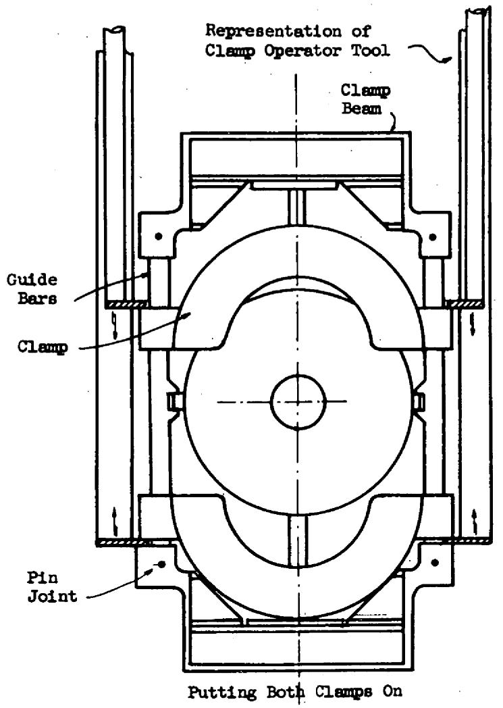

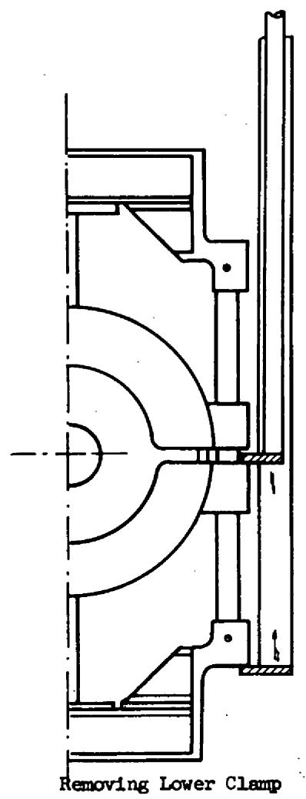

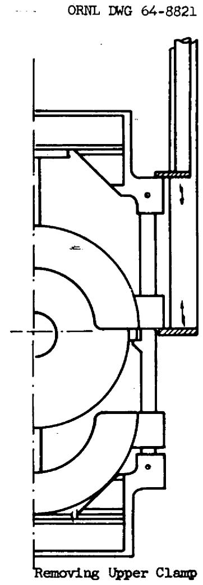  
Figure 38. Freeze Flange Clamping Frame Showing Assembly and Disassembly

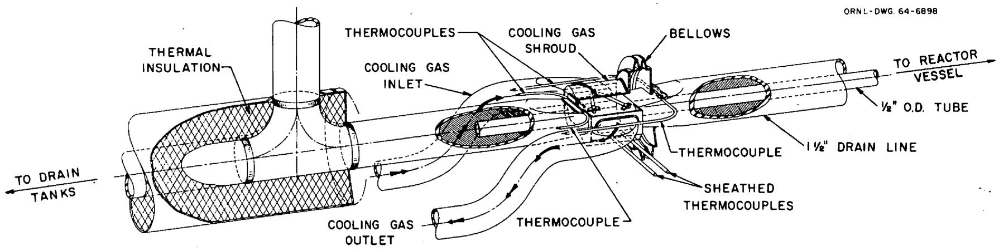  
Figure 39. Freeze Valve in Line 103

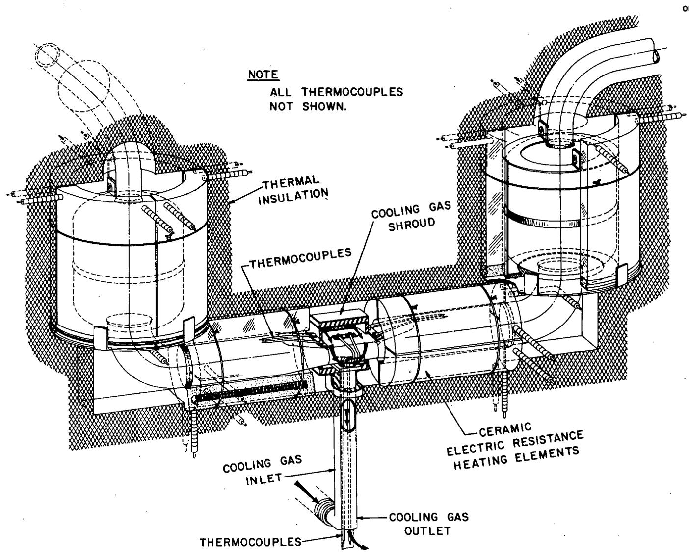  
Figure 40. Freeze Valve in Lines 107, 108, 109, and 110

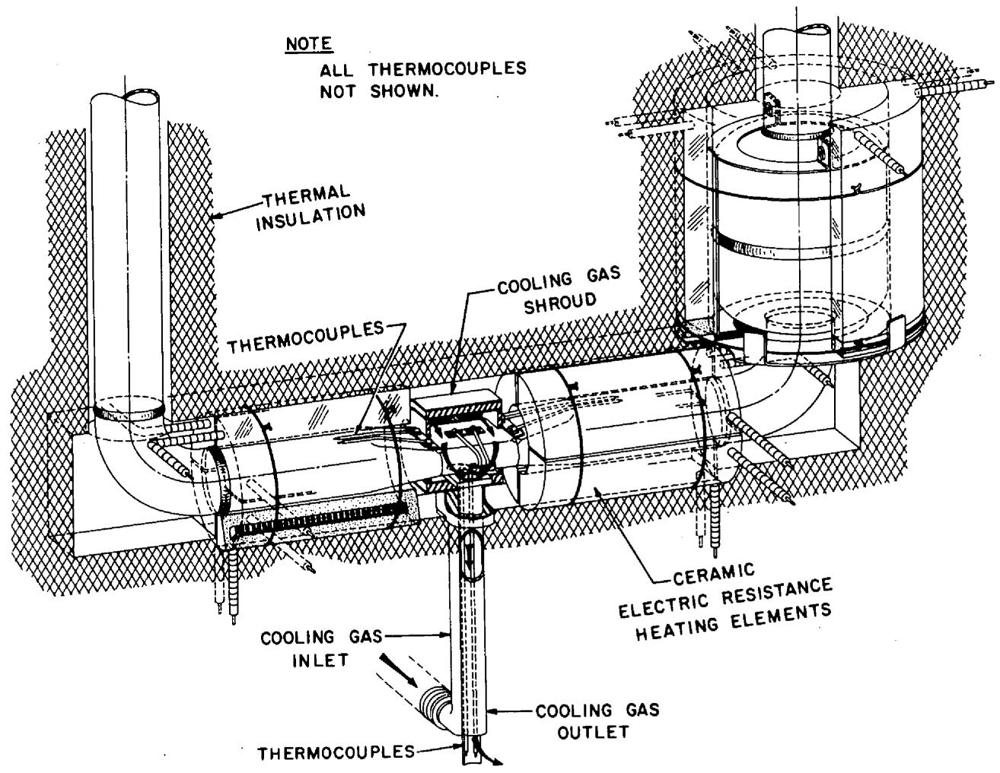  
Figure 41. Freeze Valve in Lines 111 and 112

ORNL-OWG.64-6901

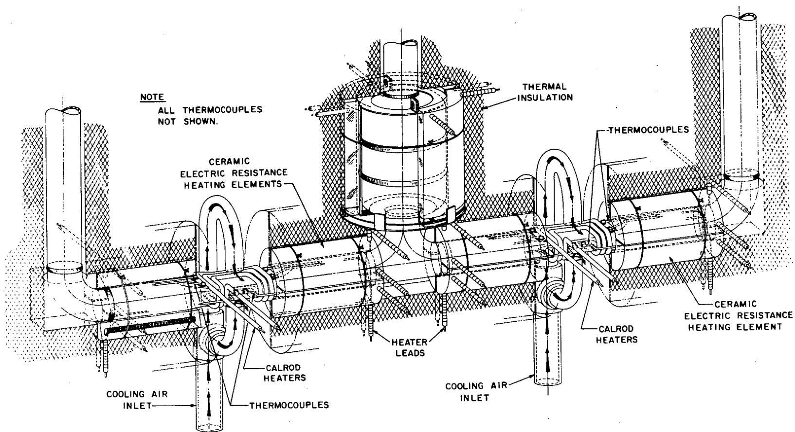  
Figure 42. Freeze Valve in Lines 204 and 206

With few exceptions, salt-containing components and piping within the reactor and drain-tank cells are heated with remotely removable heating systems. Consequently, flexible leads and remotely operable disconnects were required for each heater unit. This power feed system, the bulky heater and insulation units along with their respective support structures constitute a very large portion of the total contaminated material within these cells.

# 2.10.1 Reactor Furnace

The inside of the thermal shield which encloses the reactor vessel is insulated to a buildup thickness of 6 in. with ceramic insulation covered with 16-gage 304 stainless steel sheet. The 11-in.-wide annulus between this insulation and the reactor contains electrical resistance-type heaters to form a furnace surrounding the reactor. The heaters are 126 vertical lengths of 3/8-in.-0.D., 0.035-in.-thick-walled Inconel tubing, each 8 ft 7 l/2 in. to 9 ft 11 in. in length, through which electrical current was passed. The heater tubing is in the form of 63 U-tubes which are arranged in nine removable sections of seven U-tubes each. Each U-tube is contained in a 2-in.-0.D., 0.06 -in.-thick wall 304 stainless steel thimble which is suspended from the top cover of the thermal shield.

# 2.10.2 Fuel-Salt-Pump Furnace

The lower half of the pump bowl, a 3-ft-long section of the pump suction line, and the overflow tank were all heated in a common furnace which is 51 1/2 in. O.D. by 66 in. tall. The heaters are 3/4-in.-diameter straight tubes of 304 stainless steel containing ceramic-positioned resistance heating elements at the lower ends. Five of the heaters are about 8 ft long and nine are 7 ft long. These 3/4-in.-O.D. heaters are contained in 1-in.-O.D. 304 stainless steel tubes. All the heaters were installed in assemblies with lifting rails to simplify replacement.

The outer walls and bottom of the furnace are 5-in.-thick ceramic block insulation covered with 20-gage 304 stainless steel sheet. The furnace is suspended from the fuel-pump support plates and moved with the pump in response to thermal effects. The heater elements have collars which also rest on the support plate.

# 2.10.3 Coolant-Salt-Pump Heaters and Insulation

Heat was applied to the coolant-salt pump bowl by fourteen 6 in. x 8 in. x 5/8 in. thick flat-plate ceramic heater units. Six of the heaters are equally spaced at the bottom of the pump bowl and eight are arranged vertically around the sides. The heaters are mounted in brackets in a 304 stainless steel basket which is hung by four hooks from the pump structure.

The outside of the heater basket is insulated with 4 in. of asbestos-based insulation covered with asbestos finishing cement and glass cloth.

# 2.10.4 Fuel- and Flush-Salt-Drain-Tank Heaters and Insulation

The three drain tanks were heated by cylindrical furnaces made up of insulated tanks with removable lids and removable heater units. The heaters are located within the annuli between the drain tanks and furnace tanks. Each furnace contains seven removable heater units spaced around its respective drain tank.

The outsides and bottoms of the furnaces are insulated by two 2-in.-thick layers of asbestos-based insulation enclosed in 16-gage 347 stainless steel. The removable furnace lids contain ceramic fibers as the insulating material.

# 2.10.5 Fuel-Storage-Tank Heaters and Insulation

The fuel storage tank in the fuel-processing cell was heated by four sets of heaters at the bottom, the lower half, the upper half, and the top. Each heater had an installed spare and was not replaceable. The top and side heaters are tubular, and the bottom heater is made up of flat ceramic-plate units. The heaters are enclosed in 6 in. of asbestos-based insulation finished with fiber glass cloth and insulating cement.

# 2.10.6 Coolant-Salt-Drain-Tank Heaters and Insulation

The coolant-salt drain tank was heated on the sides by thirty-two 0.315 in. 0.D. x 74 in. long tubular heating units and on the bottom by sixteen flat ceramic heater plates.

The tank is insulated by a 5-in.-thick layer of ceramic-block insulation applied over a 20-gage 304L stainless steel shell which separates the insulation from the heaters. The insulation is finished with fiber glass cloth and insulating cement.

# 2.10.7 Heat-Dump Radiator Heaters and Insulation

The radiator coil is mounted in an insulated steel enclosure equipped with large (8 ft tall by 11 ft wide) insulated vertically operated doors on the inlet and outlet sides of the coil. Heating was provided by 60 tubular heaters mounted vertically 3 1/2 in. apart across both faces of the coil. These range in length from 48 in. to 102 in. The top and bottom of the coil were heated by sixty 18 in. long by 7 1/2 in. wide flat ceramic heater plates attached to steel baffle plates. The inlet and outlet salt headers were heated by a total of forty-two 4 in. by 12 in. flat ceramic heater plates enclosed with 20-gage 304 stainless steel cans.

All the inside surfaces of the enclosure including the doors are covered with insulating ceramic block or insulating board and protected with a sheath of 16-gage stainless steel where air erosion could be a problem.

# 2.10.8 Piping Heaters and Insulation

The heater types and insulating methods for the salt-bearing piping depended primarily upon location and accessibility. All horizontal sections of the fuel-salt and coolant-salt 5-in. pipes within the reactor cell and the 1 l/2-in. drain lines in the drain-tank cell are equipped with removable combined heater and reflective insulation modules as shown in Figure 43. These contain molded ceramic heater plates arranged to heat the top and sides of the pipe and rest upon permanently installed insulated bases. The reflective metal insulation consists of nine layers of 0.006-in.-thick stainless steel and one 0.002-in.-thick layer of pure silver encased in a stainless steel shell. The vertical leg of the fuel-salt pipe just below the heat exchanger has permanently installed tubular heaters covered with reflective insulation.

The section of the 1 1/2-in. drain line from the bottom of the reactor vessel to the freeze valve manifold in the drain-tank cell

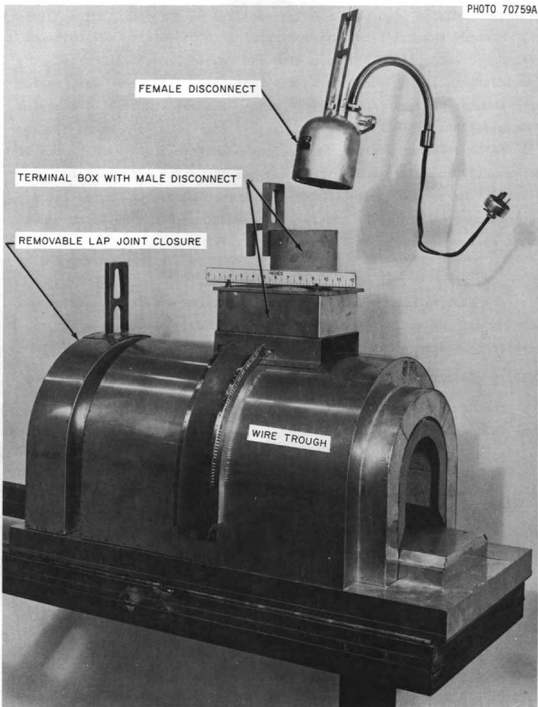  
Figure 43. Removable Heater for 5-In. Pipe

was heated by passing an electric current through the line itself. This portion is insulated with permanently installed asbestos-based insulation.

Most of the 1 1/2-in.-diameter piping in the drain-tank cell was heated and reflective insulated with the removable modular units. The remainder, including the line to the fuel-processing cell, were heated with tubular heaters and insulated with permanently installed asbestos-based insulation.

All salt-bearing pipes in the fuel-processing cell were heated with permanently installed tubular heaters and insulated with asbestos.

All the coolant-salt-bearing piping in the coolant and radiator enclosures were heated by tubular heaters strapped to the pipes under asbestos-based insulation.

# 2.10.9 Heat-Exchanger Heaters and Insulation

The heat exchanger was heated and insulated with removable modular heating and reflective insulating units of the same type used for the 5-in.-diameter pipes except that they were made to fit the 16-in.-0.D. shell.

# 2.10.10 Heater and Thermocouple Leads

The heater electrical supply leads within the reactor cell and drain-tank cell are 1/2- and 3/8-in.-0.D., copper sheathed, mineral-insulated multiconductor cables having flexible sections between the cable terminus and the heater connector. The flexible length is made with ceramic-beaded nickel alloy wire sheathed in 3/4-in.-0.D. flexible stainless steel hose. The reactor cell contains 79 cables ranging in length from $\sim 5$ to $\sim 15$ ft long, and the drain-tank cell contains 88 cables of about the same length range. The flexible power leads terminate at junction boxes or disconnect boxes that are conveniently located throughout the cells. A transition from the flexible leads to the copper-sheathed cables is made at these boxes. The cables then are routed via cable trays to the containment cell penetrations. The heater power cable system constitutes a large volume of material dispersed throughout the entire volume of the cells.

There are over 1,050 thermocouples installed in the MSRE. A preponderance of these are installed on the salt-containing components and piping. In all cases, except as noted below, the thermocouples are duplex,

mineral-insulated chromel-alumel wires in a 1/8-in.-0.D. Inconel sheath. The thermocouples are attached to lugs on the surface of the pipe and components by means of a small welded tab. The leads are strapped to the pipe or component and are routed in bundles to exit points from the insulation and on to disconnect locations. The number, routing, and manner of attachment of the thermocouples will present problems to be dealt with when considering methods of removal. A few 1/16-in.-0.D. mineral-insulated, Inconel-sheathed single-conductor leads were used in special power monitoring and safety temperature measuring thermocouples. These are located only on the reactor outlet nozzle and on the radiator inlet and outlet headers.

Transition from the Inconel-sheathed couple leads to multiconductor, mineral-insulated, copper-sheathed cables was made at conveniently located disconnect boxes within the cells. The copper-sheathed cables were routed via cable trays to cell penetration points. The total system including leads, cables, disconnects, support structures, trays, and junction boxes constitutes a large volume of material that is dispersed over the entire cell areas.

# 2.11 Sampler-Enricher

The fuel-salt and coolant-salt pump bowls and the fuel storage tank in the fuel-processing cell are equipped with 1 1/2-in. Schedule 40 access pipes extending to shielded enclosures above the respective cells (Figure 44). These were used for taking samples of the salts as required for analyses and for adding fuel, or other salt constituents, to the salts during operation. The samples were taken simply by lowering open capsules attached to cables through the access pipes into the salt contained in the pump bowls and raising them through appropriate containment seals into shielded transfer casks. Enrichment was accomplished by lowering a capsule filled with concentrated fuel salt into the fuel pump bowl and allowing the salt to melt out.

The access pipes are about 14 ft long and have a bellows-sealed expansion joint at about mid-length. The portion of the pipes below the expansion joint is INOR-8 and the portion above it is 304 stainless steel.

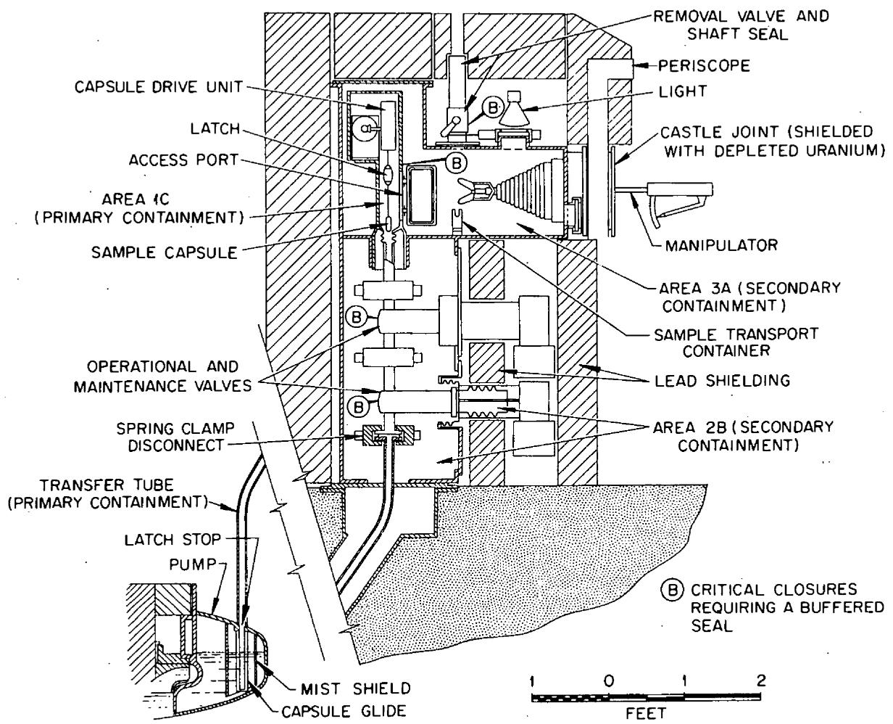  
Figure 44. Schematic Representation of Fuel-Salt Sampler-Enricher Dry Box

ORNL-DWG63-5848R

The fuel-salt sampler-enricher is a complex mechanical, electrical, and pneumatic system, heavily shielded and contained, and is equipped for remote loading into and unloading the capsules from the sampler mechanism and for transferring the capsules between the sampler containment and shielded transport carriers. Since the sampler mechanism was alternately exposed to the pump bowl atmosphere and to the sampler containment enclosure as well as to the exposed salt in the capsules, all equipment inside the enclosure is highly contaminated with fission products.

The coolant-salt sampler is a far simpler manually-actuated system with appropriate interlocking buffer zones which did not require heavy shielding.

The fuel storage tank in the fuel-processing cell is equipped with a shielded sampler system similar to that for the fuel pump bowl but less complex. Since it was used infrequently and was not subject to deposition of daughter products of short-lived fission-product gases, it is far less contaminated than the primary system sampler-enricher.

# 2.12 Nuclear Instrumentation

Nuclear instrumentation ionization chambers were accommodated by a single 3-ft-diameter slanted thimble shown in Figures 45 and 46. The lower end of the thimble is welded to the reactor cell containment shell and the upper end is embedded in earth fill and concrete. A bellows-type expansion joint between these regions accommodates thermal expansion and contraction.

The thimble contains four 5-in.-I.D. and six 4-in.-I.D. guide tubes for ionization chambers. These tubes are supported by four bulkheads appropriately spaced along the length of the thimble.

For shielding and cooling purposes the thimble was kept full of water. The water contained dissolved lithium nitrite and lithium borate which served as a corrosion inhibitor and enhanced the neutron-shielding properties of the water. A dip tube terminating at the bottom of the thimble allowed a small pump to circulate the water to minimize thermal gradients and keep the corrosion inhibitor evenly dispersed.

Figure 45. Elevation View of Nuclear Instrument Penetration   
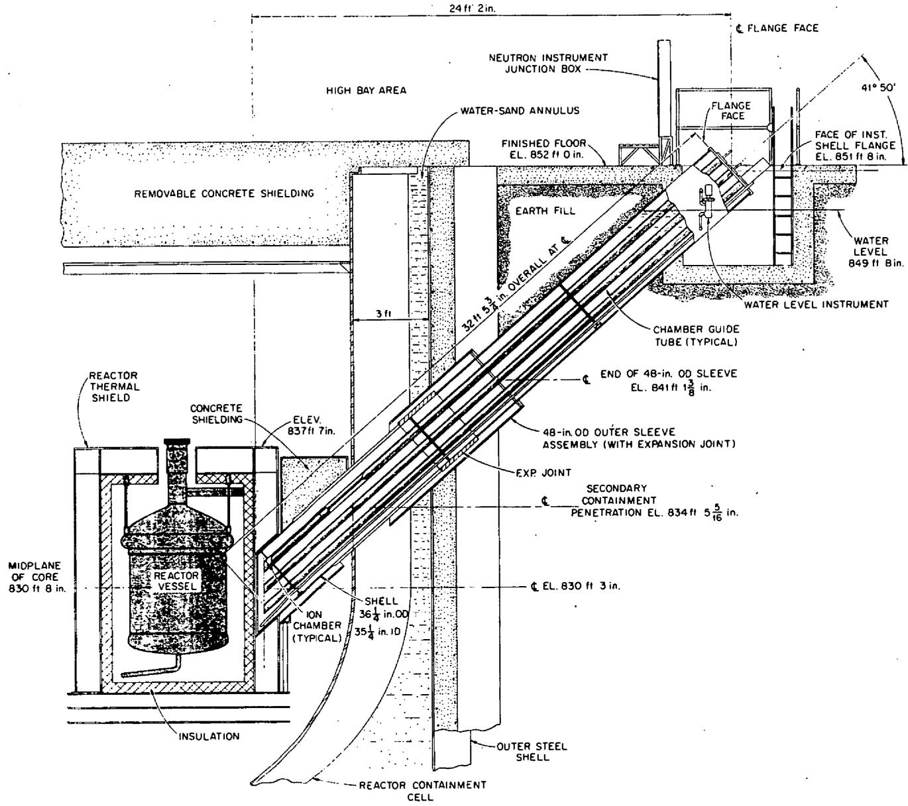  
ORNL-DWG64-625R

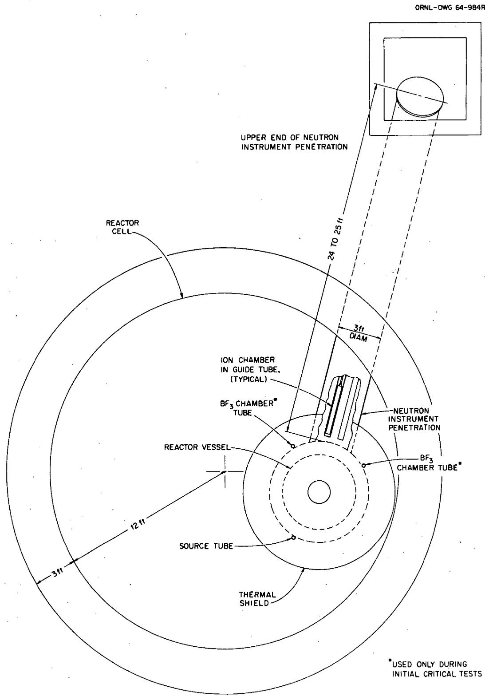  
Figure 46. Plan View of Nuclear Instrument Penetration

# 2.13 Accessory Systems

In addition to the salt-containing systems, eleven accessory systems required the use of piping or ducts either within the containment cells or connected to them. These were: (1) the cover-gas system; (2) the leak-detector system; (3) two component-cooling systems; (4) the cooling-water system; (5) two lubricating-oil systems; (6) the off-gas disposal system; (7) the containment ventilation system; (8) the liquid-waste system; and (9) the instrument air system.

# 2.13.1 Cover-Gas System

The cover-gas system supplied purified helium for use as an inert gas above the fuel and coolant salts in the pump bowls and drain tanks, as a carrier for removing fission-product gases from the system, as a pressure source for transferring salt from one vessel to another, as a means of pressure control in the salt systems, and as a cover gas for oil storage tanks in the fuel and coolant-salt pump lubricating systems. In addition, a part of the helium purge through the pump bowls and the fuel-pump overflow tank was introduced through bubbler lines to measure the salt depths. All helium was discharged from the various systems to the off-gas disposal system; none was recycled.

Pressure monitoring and flow control instruments for the fuel-salt-pump cover-gas connections were located within containment enclosures located outside the reactor containment cell with individual 1/4-in.-0.D. stainless steel lines encased with 1/2-in. Schedule 40 pipe penetrating the cell wall and connection to the pump. One line introduced the main purge flow at the labrynth seal on the pump shaft. Two lines entering the top of the pump bowl and terminating at the bottom of the bowl served as salt-level-monitor bubblers. One line entering the top of the bowl was used as the reference pressure tap for the bubbler system. Three similar lines to the overflow tank were used to measure its salt level in the same manner. The coolant-salt pump bowl is also equipped with two bubbler tubes, a reference tube, and a purge supply tube.

Helium is also supplied to each of the three tanks in the drain-tank cell by 1/4-in. stainless steel tubes in 1/2-in. stainless steel pipe and

in a similar manner to the fuel-processing system. The gas was used as the cover atmosphere for stored salt and to pressurize the tanks to transfer molten salt out of the tanks.

The cover-gas system supplies helium for the gas volume in the oil storage tanks in the salt-pump lubricating systems and provides purge gas for the fuel and coolant samplers and the graphite sampling equipment.

# 2.13.2 Leak-Detector System

A leak-detector system using pressurized helium was used to monitor all pipe flanges where leaks could have caused the escape of radioactive materials or could have caused leakage of coolants or lubricants important to operation and safety. Another use of the system was to show when remotely coupled flanges were properly sealed. Figure 47 illustrates the use of the pressurized gas to check the leak-tightness of gasket seals. The helium was supplied from the cover-gas system through 1/4-in.-0.D. stainless steel tubing having a wall thickness of 0.083 in. All important pipe flanges in the reactor and drain-tank cells have one to two lines of the leak-detector system connected to them, depending upon whether they were individually monitored or were a part of a monitored group. Throughout the reactor system and its accessory systems, $\sim 100$ flanges were gas-monitored.

# 2.13.3 Lubricating-Oil Systems

Both the fuel-salt and coolant-salt pump bearing assemblies were lubricated and cooled with forced-flow oil systems. The oil reservoir tanks and the pumps are located in the shielded east tunnel. All oil piping to the pumps is Schedule 40 stainless steel. A 3/4-in. pipe delivered oil to the fuel-pump bearings, and a second 3/4-in. pipe supplied oil to cool a shield block located between the pump bowl and motor. A 1/2-in. pipe connecting the gas space in the oil reservoir to the pump bearing assembly equalized the pressure between the two regions. The oil supplied to the bearing and shield block combined to return to the reservoir through a single 1-in. pipe. The small amount of oil that leaked downward past the labyrinth seal below the bearing was swept by helium from the cover-gas supply into a 1/2-in. line that carried it to a shielded catch tank

ORNL DWG 64-8833

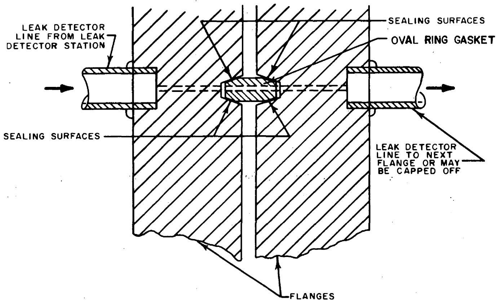  
Figure 47. Schematic Diagram of Leak-Detected Flange Closure

in the special equipment room. Because of the low flow rate through this pipe, it is shielded with 1 l/2 in. of lead to reduce radiation damage to the oil. The coolant salt pumps have the same arrangement of piping from their lubricating oil supply except that the 1/2-in. line to the catch tank is not lead-shielded.

# 2.13.4 Component-Cooling Systems

The reactor-cell and drain-tank-cell atmosphere gas was circulated through an external cooling system and returned to the cells through a distribution system to cool freeze valves, the upper part of the fuel pump bowl, the control-rod drives, the graphite sampler nozzle, the inside and outside of the reactor access nozzle, and the off-gas exhaust line. The external equipment consists of two 75-hp positive-displacement blowers sealed in 6-ft-diameter, 8-ft-tall steel containment tanks located in the adjoining special equipment room. The containment tanks are connected by 10-in.-diameter pipes to a 30-in.-diameter containment ventilation pipe which, in turn, is connected to the reactor cell containment vessel. Supply gas for the blowers was taken from inside the containment tanks. The discharge from the blowers passed through a vertical 8-in.-diameter, 9-ft-long, shell-and-tube, water-cooled heat exchanger also located in the special equipment room. The gas then flowed to a 6-in.-diameter header in the reactor cell from which it was distributed to the components to be cooled. The lines to the pump bowl and the off-gas exhaust line are 3-in.-diameter pipe; the line to the reactor drain freeze valve is $1\text{1/4}$ in. in diameter; the line to the control-rod drives is 1 in. in diameter; and the lines to the reactor access nozzle, the graphite sampler nozzle, and the freeze valves in the drain-tank cell are all $3/4$ in. in diameter. After cooling the several components, the gas discharged directly back to the cell atmosphere and then returned to the blower suction via the cell containment ventilation line.

The freeze valves in the coolant and fuel-processing cells were cooled by atmospheric air supplied by a 5-hp positive displacement blower located in the blower house at the southwest corner of the reactor building. The supply header from this blower is 3-in.-diameter pipe. The distribution lines to the two freeze valves in the coolant cell are 1-in.-diameter carbon

steel, and those to the three freeze valves in the fuel-processing cell are 3/4-in.-diameter carbon steel. After passing over the surfaces to be cooled, the air discharged directly to the cell atmosphere was then exhausted through the cell containment ventilation system.

# 2.13.5 Cooling-Water System

The cooling-water system is made up of two parts: the cooling-tower water system and a closed treated-water system cooled by the cooling-tower water.

The cooling-tower water system was cooled by a forced-draft cooling tower located southwest of the reactor building. From the cooling-tower basin, water was circulated by either of two 547-gpm pumps to the treated-water heat exchanger, the fuel-salt and coolant-salt pump lubricating-oil reservoirs, the two fuel-drain-tank steam condensers, the coolant cell coolers, the fuel-processing caustic scrubber and hydrogen-fluoride trap cooling coils, the charcoal beds in the off-gas dispersal system, and the steam condenser that supplied makeup condensate for the treated-water system. It was also used to cool other items not directly related to the reactor system. All the piping in this system is carbon steel.

The treated-water system is a closed cooling system filled with steam condensate to which a corrosion inhibitor was added. This system was used to cool equipment in which it was possible for the water to become radio-actively contaminated. The water was circulated by either of two 320-gpm pumps located in the blower house at the southwest corner of the reactor building. The water passed through the tube side of a shell-and-tube heat exchanger located in the diesel house to a header from where it was piped to the items to be cooled. The return lines terminate in a common header leading to the pump suction side. A surge tank connected to the system was used for volume control, makeup, and for adding the chemical corrosion inhibitor.

Treated water was used to cool the reactor thermal shield, the fuel-salt and coolant-salt pump motors, the two reactor cell air coolers, the drain-tank-cell air coolers, the nuclear instrumentation access thimble, and the component-cooling systems gas heat exchanger and blower lubricating

oil system. The in-cell piping for this system is stainless steel ranging from 1 in. to 3 in. depending upon the flow requirements.

All water lines penetrating the containment cells contained check valves on the inlet leg and a pneumatic safety block valve on the exit leg with a rupture disc relief to the vapor condensing system attached to the trapped volume. The thermal shield coolant return line contained a degassing system for the removal of radiolytic gases.

# 2.13.6 Off-Gas Disposal System

The off-gas disposal system handled three types of gas flow: (1) a continuous discharge of helium and gaseous fission products from the fuel-salt pump bowl; (2) intermittent discharges of contaminated helium during salt-transfer operations; and (3) flows of up to 100 cfm of cell atmosphere. The first two of these off-gas flows passed through a complex system of holdups, filters, and absorbers and were extensively monitored for activity prior to being discharged into the containment ventilation system effluent upstream of the final filters and stack discharge. The ejected cell gas was routed, after monitoring, directly to the containment ventilation connection.

Helium sweep gas and gaseous fission products were drawn from the fuel pump bowl and overflow tank through 1/2-in. stainless steel pipes which merge and connect to a 4-in. pipe a short distance from the pump. This 4-in. pipe with a serpentine section is routed around the inside surface of the reactor cell with a total length of 68 ft providing a holdup volume of about $6\text{ft}^3$ and a gas residence time of about one hour. The line continues then as 1/2-in. pipe through the cell wall penetration and then as 1/4-in. stainless steel pipe through the coolant drain-tank cell to a sealed instrument box in the ventilation house. After passing through pressure-control and monitoring systems, the line is joined by the 1/2-in. Schedule 40 line from the fuel-pump seal and continues as 1/4-in. stainless steel pipe to a second holdup volume in the charcoal-trap cell.

The charcoal-trap cell is a 10 ft diameter by 22.7 ft deep pit made of reinforced concrete with a 3-ft-thick removable concrete cover. The cell was kept filled with water, supplied by the cooling-tower water system, to remove the decay heat from fission products trapped by the charcoal.

The second holdup volume consists of six 19.8-ft lengths of 3-in. pipe arranged as close-packed vertical "U" bends connected in series. From the holdup volume, a 1/2-in. stainless steel pipe leads to the main charcoal-trap manifold. The main charcoal trap consists of four parallel charcoal-filter sections each of which is made up of 80 ft of 1 l/2-in. stainless steel pipe, 80 ft of 3-in. stainless steel pipe, and 80 ft of 6-in. stainless steel pipe arranged as compact vertical "U" bends connected in series. The weight of charcoal in each section is 725 lbs.

From the charcoal traps, a 1/2-in. stainless steel pipe connects to a 1 1/2-in. pipe in the ventilation house. This line leads to the containment ventilation system particulate filter enclosure where the gas was filtered and diluted by flows from other areas before being discharged to the atmosphere through a 100-ft-tall steel stack by one of two 21,000-scfm fans.

One-quarter-inch or 1/2-in.-diameter stainless steel off-gas pipes connected to each of the fuel-salt drain tanks, the graphite sampler, the sampler-enricher, the coolant pump bowl and shaft seal, the lubricating-oil reservoirs, the coolant-salt drain tank, and the reactor and drain-tank cells allowed these items to be continuously or intermittently purged to the off-gas system. Those items which did not normally contain radioactive gases but could under abnormal conditions were vented, past monitors, directly to the particulate-filter enclosure. The fuel drain tanks and flush-salt tank were normally vented through the auxiliary charcoal trap located in the charcoal-trap cell but could be valved to discharge through the reactor cell holdup volume and thence to the main charcoal traps.

The auxiliary charcoal trap consists of two vertical $\sim 19$ -ft-tall "U" bends, made of 6-in. stainless steel pipe, which are connected in series. The trap contains 530 lbs of charcoal. The discharge from the trap merges with the discharge line from the main charcoal traps ahead of the particulate-filter enclosure.

# 2.13.7 Containment Ventilation System

In addition to receiving and diluting the reactor off-gas discharge, as previously discussed, the containment ventilation system provided a continuous flow of air or maintained a negative pressure through all areas

where radioactive or beryllium contamination was likely to occur other than the reactor and drain-tank cells. During maintenance operations, however, this system was used to provide 100 linear feet per minute inflow through openings in the reactor and drain-tank cells made by removing sections of the top shields.

A system of steel ducts from the stack area draws air from the reactor building through the six smaller shielded cells, the electric service areas, transmitter room, service tunnel, special equipment room, and coolant cell and from the main high-bay area. Air is also exhausted from the ventilation house and charcoal-bed cell by this system. Many small containment enclosures were either exhausted or maintained at negative pressures by this system.

Air flow through the system is induced by either of two 21,000-cfm centrifugal fans located at the base of the 100-ft-tall steel discharge stack. Before discharge up the stack, the air passes through roughing and high-efficiency filters.

The connection to the combined reactor and drain-tank cells is a 30-in.-diameter duct leading from the bottom of the southwestern sector of the reactor cell containment vessel. This duct was normally kept closed by two motor-operated butterfly valves installed in series. Negative pressure in the sealed cells was maintained by discharging a small portion of the recirculating component-cooling-system flow to the off-gas system.

Figure 48 is a schematic flow diagram of the containment ventilation system.

# 2.13.8 Liquid-Waste System

Not including the sanitary sewer system, the MSRE building and its auxiliary structures have three waste water accumulation containers (Figure 49) equipped with appropriate volume and radiation monitors and with discharge pumps which route the waste water either to the ORNL radioactive liquid-waste treatment system or to a drainage ditch.

Water discharged by steam- or air-operated jet-type ejectors from the reactor cell, the drain-tank cell, and the auxiliary cells and water from decontamination sinks flowed directly to an 11-ft-diameter, 16-ft-tall, 11,000-gallon stainless steel waste storage tank located in the

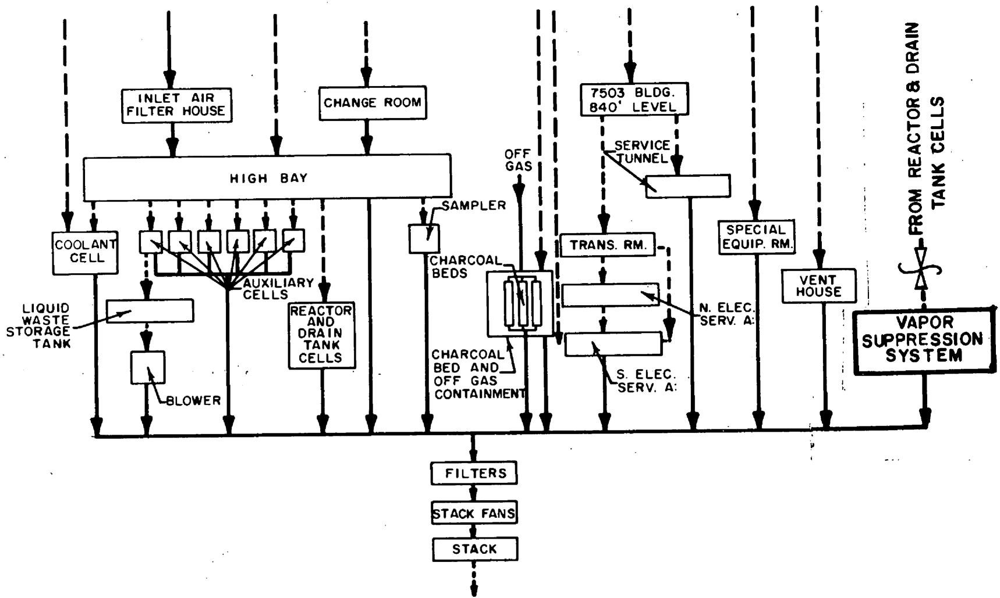  
Figure 48. Schematic of Air Flow Diagram Containment Ventilation System

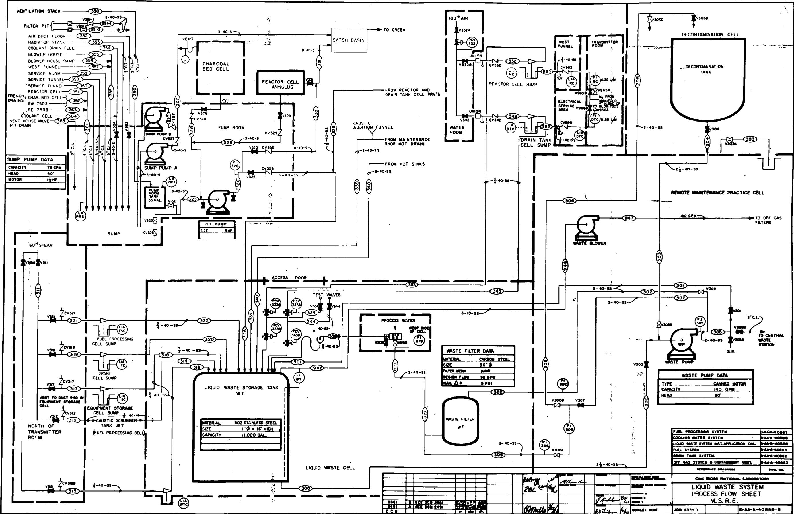  
Figure 49. Liquid-Waste System Process Flow Sheet

liquid-waste cell. A 140-gpm pump located in the remote maintenance practice cell is used to discharge accumulated water from the tank to the ORNL liquid-waste treatment system.

A 42 in. diameter by 50 in. tall stainless steel filter tank is also located in the liquid-waste cell. The filter is a 34-in.-deep bed consisting of graded sand and gravel. The intended purpose of this filter was to clarify water circulated through a decontamination tank proposed for the decontamination cell. The decontamination tank, however, was never installed due to lack of need.

A 3 ft by 3 ft by 8 ft deep sump in the below-grade 8 ft by 16 ft by 7 ft high sump room located at the northeast corner of the special equipment room (Figure 6) is the lowest point of the MSRE complex and is used to collect normally uncontaminated waste water from all areas of the MSRE complex. These include the radiator air-duct floor, the blower house, blower-house ramp, west tunnel, service room, service tunnel, coolant cell, ventilation house valve pit, and French drains from the building foundations and charcoal-trap cell. Water from this sump is discharged by either of two 75-gpm pumps, located in the sump room, to a 2 ft by 3 ft by 6 ft deep concrete catch basin located just west of the charcoal-trap cell. From the catch basin, the water drains through a 150-ft-long, 12-in.-diameter reinforced concrete pipe to a drainage ditch.

A 55-gallon stainless steel drum located in the sump room was used to collect drainage from the ventilation stack base and from the filter pits since water from these sources could be contaminated. The drum was equipped with a continuous radiation detector alarm as well as a high liquid level alarm. Each batch of accumulated liquid was sampled prior to being transferred via a 200-gpm pump, also located in the sump room, from the drum to either the liquid-waste storage tank or directly to the catch basin, depending upon whether the water was contaminated or not.

# 2.14 Vapor Condensing System

As illustrated in Figure 50, the MSRE is equipped with a vapor condensing system to accommodate overpressurization of the reactor containment cell in the event of a catastrophic accident that caused mixing of hot fuel

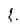

ORNL-LR-DWG 67162R

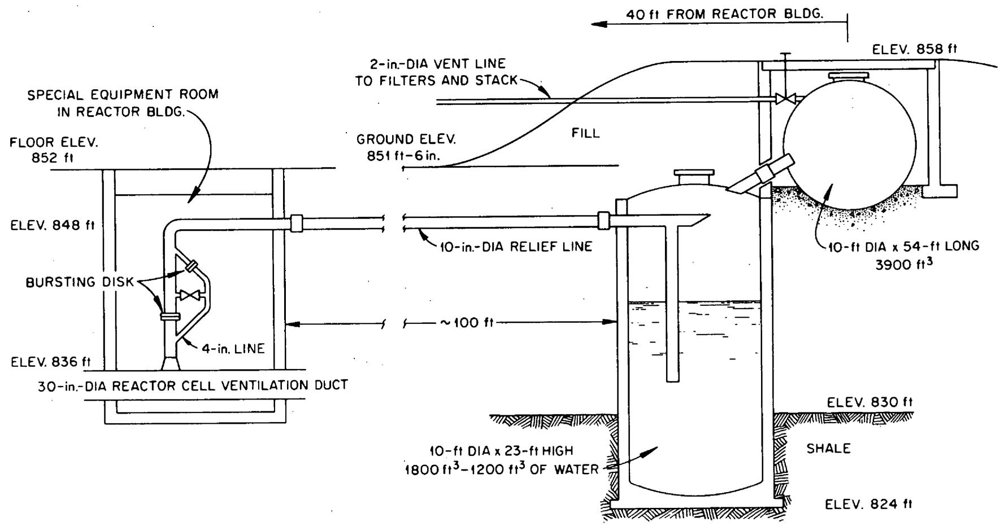  
Figure 50. Diagram of Vapor-Condensing System

salt and the water used in the cell for cooling and shielding. This equipment, consisting primarily of a vertical underground water tank and a shielded horizontal gas storage tank, is located about 60 ft from the southeast corner of the MSRE building. A 12-in.-diameter carbon steel line from the system ties into the 30-in. reactor cell ventilation pipe just upstream from the normally closed butterfly valves. Rupture discs in the main 12-in. line and the 4-in. bypass line are designed to rupture at 20 psi and 15 psi, respectively, to cause the system to respond automatically to overpressurization of the reactor cell and to require that the smaller-diameter path be opened first to reduce the dynamic impact on the condensing tank.

# 3. MSRE PRESENT CONDITIONS

From shutdown of the MSRE in 1969 until now, portions of the reactor system have undergone considerable change from the original operating conditions. These changes will not, however, significantly affect the effort required for decommissioning. Beginning at shutdown: (1) all systems were secured or modified for safe standby; (2) a post-operation examination program was initiated; (3) the system was placed under a continuing surveillance program; (4) excess material and equipment removal began; and (5) nonhazardous building space was made available for offices, shops, and laboratories for research and maintenance groups.

# 3.1 Securing the Process Systems

In general, preparing for safe standby involved deactivation of process systems so as to minimize surveillance and to prevent mishaps due to freezing, fire, or rain in-leakage; securing the primary system to safeguard the salt solutions, including the $^{233}\mathrm{U}$ fuel; and protecting against radiation and contamination hazards. The salts were all stored in their respective drain tanks; the cooling water systems were drained, and lines penetrating the containment cells were disconnected and blanked at the cell walls; the cover-gas system and other service lines were disconnected and blanked at penetrations; process electrical systems were deactivated and circuits locked open; the instrument and service air systems were shut

down and temporary gas supplies (nitrogen cylinders) were installed at necessary locations; selected radiation monitors with local indicator alarms were retained and remote alarms installed at the ORNL Waste Monitoring Center; selected temperature sensors from the stored salt and cell atmosphere were tied into a local recorder-indicator; and the off-gas and containment ventilation systems were retained complete with the radiation and flow monitoring of the stack flow with remote alarms to the Waste Monitoring Center added.

# 3.2 Post-Operation Examination

The post-operation examination program was for inspection of the primary system and for obtaining material specimens for technical evaluation.

The sampler-enricher capsule cage was excised from the fuel pump bowl for examination. This operation required the cutting loose or displacing of auxiliary lines and equipment for access. All the loose items, as well as many of the contaminated tools used for the excisions, remain at the pump bowl area or were dropped to the cell floor. A patch was fabricated and installed to seal the pump opening.

Specimens were removed from the heat exchanger shell and from the tube bundle. An oval-shaped patch of about 10 in. x 12 in. was cut out near the top center of the shell. Sections of tubing were removed through this opening. The hole through the shell was sealed by remotely welding a patch over the opening. Since this cutting provided communication between the fission-product-laden fuel-salt loop to the coolant-salt loop, the 5-in. coolant-salt lines were cut and seal-welded immediately outside the cell wall. All the loose material, heaters, etc., along with many of the tools used for this job remain in the vicinity of the heat exchanger.

Control-rod poison elements, 7/8-in. graphite sampler holder and specimens, and a 2-in. graphite bar were removed from the reactor core. This job required taking loose and displacing the graphite sampler containment tank, the control-rod drives, control-rod-drive shielding and supports, the control-rod and reactor nozzle cooling air lines and thermocouple and heater disconnects and supports to gain access to the 10-in. reactor access nozzle flange. The core access plug, containing the graphite sampler flange, its holddown mechanism, and the control-rod thimbles, was

removed and suspended alongside the thermal shield. Other items are atop the thermal shield or were dropped to the cell floor. The reactor was sealed by placing a plain 10-in. blind stainless steel flange on the access nozzle.

In the drain-tank cell, two freeze valves were removed and heaters, leads, and service lines were again moved for access. The open lines were sealed using mechanical plugs.

The post-operation examination was performed in the fall of 1970, approximately one year after shutdown of the reactor. The radiation level had decreased tremendously from that encountered during maintenance while the reactor was still operable. All jobs were performed in the reactor cell using the dry maintenance shield without the need for tool shielding bushings in the access holes. The maximum radiation level above the shield through a 6-in.-diameter hole was $125\mathrm{mr/hr}$ at the hole opening at the beginning of the work. The maintenance shield was not required in the drain-tank cell. The work there was performed through a 2 ft x 10 ft lower roof plug opening.

A heavy accumulation of dust (1/2 in. deep on flat surfaces) inside both containment cells was easily handled by flushing the dust to the cell floor using an ordinary water hose. By keeping the work areas wetted, no contaminated dust was allowed to escape the containment cells.

At the completion of the post-operation work, the primary system was leak-tested to ensure that the patches were secure. The cell shielding blocks and seal membrane were replaced and the containment cells leak-tested.

# 3.3 Surveillance

After futher instrument modification and final shutdown of auxiliaries, the MSRE was placed under a surveillance program as described in ORNL-TM-3253, MSRE Procedures for the Period Between Examination and Ultimate Disposal, dated February 10, 1971. This document describes the condition of the MSRE and specifies procedures to be followed after the post-operation examinations and before the ultimate disposal of the fissile and radioactive material in the reactor. The fuel salt has been kept frozen in the sealed drain tanks, within the sealed containment cell. Surveillance

has been by remote monitoring and daily visits by ORNL personnel, with monthly and annual checks by technical personnel. Remedial actions are prescribed for any abnormal condition. Personnel access is controlled by security fencing around the area as well as specific areas locked to prevent unauthorized entry. Procedures and responsibilities for maintenance, modification, and removal of surplus equipment are also specified.

# 3.4 Surplus Equipment Removal

All MSRE equipment except the items required for surveillance of the stored fuel and the fuel removal chemical-processing plant were placed on a published list and made available to other projects. Surplus mechanical supplies were all moved out, and the process computer was transferred to the Tennessee Valley Authority's Bull Run Steam Plant.

A large portion of the process instrumentation was removed and used by other ORNL projects. The coolant-salt pump and piping were removed and used by research groups in continuing molten-salt development work. All the remaining noncontaminated process equipment has been declared "excess in place" and is available to others through the ORNL Operations Division.

The coolant-salt piping and pump was the only surplus equipment removal that has affected the decommissioning study. The pump, pump support plate, and the 5-in. piping outside the reactor cell were removed. The radiator, sampler and drain-tank systems, including the coolant salt, remain in place along with all the auxiliary systems. Other items removed, such as process instrumentation, were primarily from clear areas and have no significant effect on the decommissioning effort.

# 3.5 Site Utilization

Peripheral areas at the site have been and are now being utilized by other Laboratory groups. The office wing (Bldg. 7509) is occupied by a research group; the shop building (Bldg. 7515) is used as an area maintenance shop; the reactor building (Bldg. 7503) offices, high bay, and spare experiment cells have been used by research groups; the stores building (Bldg. 7507) is used for equipment storage; and the reactor building change house and sanitary facilities are used by all personnel at the site.

# 3.6 Current Radiation and Contamination Levels

Periodic radiation and contamination surveys are conducted within the site area, and all movement of personnel or equipment into or out of the controlled access areas is monitored by the Health Physics Division. No spread of contamination or radiation exposure has occurred since the reactor was shut down.

The results of radiation surveys made in January and February of 1977 with an ionization chamber are shown in Table 3.

Measurements made in the reactor vessel at the top of the graphite with a thermoluminescent dosimeter (TLD) indicate a radiation level of $\sim 2,200$ R/hr. A measurement made at the top of the access flange with a TLD indicates a radiation level of $264$ R/hr. Measurements made at the top of the graphite with bare and lead-covered TLD's indicate that the effective tenth-value layer for radiation in that area is 1.4 in. of lead. Measurements made at a port over the reactor vessel at working level with a Cutie-Pie indicate that the effective tenth-value layer for the radiation beam through that port is also 1.4 in. of lead. Measurements made with a Cutie-Pie at the top of the opening in the top shield above the reactor vessel indicate that the effective tenth-value layer for the radiation through the opening is also 1.4 in. of lead.

# 4. DECOMMISSIONING ALTERNATIVES

Two alternatives have been considered for decommissioning the MSRE. These are: (1) removal of all radioactive material except the containment cell walls; and (2) entombment, in concrete, of all radioactive materials at the site within the reactor containment cell.

For both decommissioning alternatives, it is assumed that the fuel and flush salts have been removed from the drain tanks prior to starting the decommissioning. A study and cost estimate for disposal of the salts have been reported by P. N. Haubenreich and R. B. Lindauer in ORNL CF-72-1-1, "Consideration of Possible Methods of Disposal of MSRE Salts", dated January 28, 1972. At present, a total of $4,650\mathrm{kg}$ of solidified fuel salt is stored in the two fuel drain tanks in the drain-tank cell. Also,

Table 3. Radiation Levels Measured in 1977 Using an Ionization Chamber   

<table><tr><td>Location</td><td>Radiation Level (R/hr)</td></tr><tr><td colspan="2">A. Measurements made in the area near fuel pump</td></tr><tr><td>1. Seal pan level over fuel pump with shield plug removed</td><td>6</td></tr><tr><td>2. Seal pan level at SW corner of hole in shield</td><td>1</td></tr><tr><td>3. SW corner of the hole in shield even with the bottom edge of shield concrete</td><td>15</td></tr><tr><td>4. ∼3 ft below bottom of concrete at SW corner of hole in shield</td><td>37</td></tr><tr><td>5. SW quadrant of pump bowl</td><td>140</td></tr><tr><td>6. Sampler-enricher nozzle</td><td>15</td></tr><tr><td>7. SE quadrant of pump bowl</td><td>45</td></tr><tr><td>8. NW corner of hole in shield even with the bottom edge of shield concrete</td><td>19</td></tr><tr><td>9. Pump bowl off-gas line (522)</td><td>160</td></tr><tr><td>10. North quadrant of pump bowl</td><td>250</td></tr><tr><td>11. Sampler-enricher spool piece</td><td>10</td></tr><tr><td colspan="2">B. Measurements made in reactor cell above reactor vessel</td></tr><tr><td>1. Bottom of shield plug</td><td>39</td></tr><tr><td>2. Core access nozzle at vessel</td><td>408</td></tr><tr><td>3. Bottom of holddown basket</td><td>960</td></tr><tr><td>4. Control-rod thimble at ~18" below basket</td><td>3,060</td></tr><tr><td>5. Core outlet nozzle</td><td>117</td></tr><tr><td>6. Core access flange</td><td>282</td></tr><tr><td colspan="2">C. Measurements made in reactor vessel</td></tr><tr><td>1. Top of flange</td><td>312</td></tr><tr><td>2. ~2 1/2 ft below top of flange</td><td>1,050</td></tr><tr><td>3. Top of graphite</td><td>1,740</td></tr><tr><td>4. 1 ft below top of graphite</td><td>510</td></tr><tr><td>5. 2 ft below top of graphite</td><td>426</td></tr><tr><td>6. 3 ft below top of graphite</td><td>510</td></tr><tr><td>7. 4 ft below top of graphite</td><td>540</td></tr><tr><td colspan="2">D. Measurements made in instrument penetration in guide tube No. 2</td></tr><tr><td>1. At bottom</td><td>1,400</td></tr><tr><td>2. 6 in. from bottom</td><td>775</td></tr><tr><td>3. 12 in. from bottom</td><td>310</td></tr><tr><td>4. 24 in. from bottom</td><td>64</td></tr></table>

4,290 kg of solidified flush salt is stored in a third tank in the same cell. The fuel salt contains 30.8 kg of $^{233}\mathrm{U}$ and the flush salt 0.49 kg.

The cost estimates for both of the decommissioning methods studied include the assumption that an operating solid-waste disposal area exists in the immediate vicinity. If the radioactive and contaminated materials must be packaged for shipment to a disposal site outside the ORNL area, the packaging and shipping costs will be greatly increased, requiring a new methods study and cost estimate.

It is also assumed that knowledgeable, experienced personnel will be available to supervise and participate in the decommissioning activities. If this is not true, the man-hours expended can increase significantly due to lack of familiarity with the reactor components and methods of working with them.

# 4.1 Removal and Disposal of All Radioactive Material Except the Containment Cell Structure

The first alternative involves cutting out, packaging, and transporting to a solid-waste storage area all contaminated and radioactive materials in the reactor cell, drain-tank cell, fuel-processing cell, and portions of the gaseous-waste disposal system. The cell structures, including the lower tier of shielding blocks over the reactor cell and drain-tank cells, may be left intact for future use. Induced radioactivity in the carbon steel walls of the reactor cell are expected to be very low due to the neutron shielding provided by the thermal shield which completely surrounds the reactor except for the instrumentation thimble. Any areas of the cell wall found to have objectionable levels of induced radioactivity can be overlaid with fixed shielding after final decontamination.

A summary of work required and a cost estimate for this alternative are given in Section 5. A detailed job listing is given in Appendix A.

# 4.2 Entombment in Place

The second alternative is to entomb, in concrete, all radioactive and contaminated items within the reactor containment cell. The site and the remaining containment cells could then be put to other uses with

essentially no restrictions. This method of decommissioning is far less expensive than dismantling and will provide complete containment indefinitely. Entombment of $^{233}\mathrm{U}$ -contaminated materials in solid concrete, however, violates the present requirement that such materials be stored in a retrievable manner and will require a special permit as implied by ERDA Manual Chapter 0511.

This method will involve a minimal amount of remote cutting. All pipes and conduits entering the cell through penetrations will be severed inside the cell and cut back about 1 ft. Penetrations will be removed where radioactive contamination is present and the openings sealed and filled with concrete. Some cutting and collapsing of in-cell piping will be necessary to permit the emptied drain tanks and the fuel-processing equipment to be added before entombing. The cell will then be filled with concrete to the building floor level to provide a minimum thickness of 14 ft of concrete over the highest part of the reactor vessel.

A summary of work required and a cost estimate of this alternative are given in Section 6. A detailed job listing is given in Appendix B.

# 4.3 Arguments Favoring Dismantling and Disposal of Radioactive and Contaminated Items

1. The MSRE is remote from populated areas and near a solid-waste storage site so that transport of radioactive items to the storage site can be accomplished with minimal shielding and with little risk to non-involved personnel even in the event of a transport accident. The $^{233}\mathrm{U}$ -contaminated material will be packaged within $\sim 1,500$ drums of 55-gallon capacity ( $\sim 13,000 ft^3$ ) and 31 special containers of various sizes ( $\sim 3,000 ft^3$ ).   
2. Removal of the $^{233}\mathrm{U}$ -contaminated items to retrievable storage will meet the requirements for disposal of this type material.   
3. Emptying the containment cells of all MSRE-related items will release the facility for future usages requiring such cells.

# 4.4 Arguments Favoring Entombing the Reactor and Associated Radioactive and Contaminated Items and Materials in the Reactor Cell

1. Entombment in concrete is far more economical than dismantling and storage.   
2. The transport of radioactive and contaminated items would be avoided.   
3. A major portion of the building and cells would be released for other usages.

# 5. WORK INVOLVED IN DISMANTLING AND DISPOSING OF RADIOACTIVE AND CONTAMINATED ITEMS IN A SOLID-WASTE STORAGE AREA

# 5.1 Preparatory Work

Preparatory work required for dismantling and disposal in a solid-waste storage area includes: (1) provision of a water flushing system for the reactor primary system, the salt drain tanks, and the fuel-processing equipment; (2) provision of a flooding system for the reactor cell; (3) provision of working shielding, transport shields, and disposable waste containers; and (4) tooling for cutting up the reactor tank and thermal shield and for cutting up and handling of pipes, conduits, etc., located within the containment cells.

# 5.1.1 Flushing System for the Reactor Tank and Other Primary System Components

Although the reactor primary system was flushed out with a nonfuel-bearing molten salt after it was drained of fuel, the system is known to contain large solidified globules of the flush salt which failed to completely drain to the storage tanks. In order to minimize the release of this contaminated salt into the reactor cell during the dismantling operation, the primary system will be flushed with water and decontaminating solutions prior to segmenting. The contaminated solutions can be discharged directly into the existing building liquid-waste system and then to the ORNL liquid-waste disposal system. Based upon a cell volume of 200,000 gallons, a flush rate of 5 gpm, and a project time of one year, the liquid waste generated would be about 3,000,000 gallons.

# UNION CARBIDE CORPORATION

NUCLEAR DIVISION

OAK RIDGE, TENNESSEE 37830

TABLE 4

DISMANTLING

# COST ESTIMATE

# SUMMARY SHEET

PROJECT TITLE AND BUILDING

<table><tr><td>ESO OR ORDER NO.
A-2884A-J1</td><td>ACCOUNT CHARGE</td><td colspan="2">DATE
July, 1977</td><td colspan="2">BASE COST DATE
FY-77</td><td colspan="2">ESTIMATE VALID UNTIL</td></tr><tr><td colspan="2">TYPE OF ESTIMATE
□ C □ I □ II □ OTHER</td><td colspan="4">CONSTRUCTED BY
XXXUCND XXX CPFF LSSC □</td><td colspan="2">ESCALATION (%)</td></tr><tr><td colspan="8">ESTIMATE BASED ON: □ VERBAL INFORMATION □ SKETCHES □ MARKED PRINTS □ PRELIM. DESIGN □ FINAL DESIGN</td></tr><tr><td rowspan="2">FUND SOURCE
□ EXP. □ EQPT</td><td>ESTIMATED BY
C. Kirby*</td><td colspan="2">ORIGINALLY EST.</td><td colspan="2">DATE</td><td>P. ENGR.
C. D. Cagle</td><td rowspan="2">EST. NO.</td></tr><tr><td>SUBMITTED BY
C. Kirby</td><td colspan="2">LAST REVISION</td><td colspan="2">DATE</td><td>F. ENGR.
L. P. Pugh</td></tr><tr><td colspan="2"></td><td>Page No.</td><td colspan="2">CPFF</td><td>UCC-ND</td><td colspan="2">TOTAL</td></tr><tr><td colspan="5">PREPARATORY WORK
Flushing
Flooding
Cell Ventilation
Work Platforms
SUBTOTAL
TOOLING
SPECIAL TRANSPORT AND STORAGE CONTAINERS
REACTOR CELL EQUIPMENT
DRAIN-TANK CELL
General
North Bay
Center Bay
South Bay
General</td><td colspan="3">$ 94,200
154,100
47,800
126,000
$ 422,100
$3,071,100
$ 640,200
$ 419,500
$ 12,000
77,000
90,000
84,000
56,000
$ 319,000</td></tr></table>

*Cost Engineer, UCC-ND ORNL General Engineering.

UCN-5128E (123) 1-72J

# TABLE 4. (CONTINUED)

# COST ESTIMATE

# SUMMARY SHEET

(CONTINUATION SHEET)

ESOORORDERNO.A-2884A-J1

<table><tr><td></td><td>Page No.</td><td>CPFF</td><td>UCC-ND</td><td>TOTAL</td></tr><tr><td>FUEL-PROCESSING CELL</td><td></td><td>$ 103,800</td><td></td><td></td></tr><tr><td>VENTILATION HOUSE AREA</td><td></td><td>$ 79,900</td><td></td><td></td></tr><tr><td>SPECIAL EQUIPMENT ROOM</td><td></td><td>$ 122,100</td><td></td><td></td></tr><tr><td>COOLANT CELL AREA</td><td></td><td>$ 116,100</td><td></td><td></td></tr><tr><td>SOUTH YARD</td><td></td><td>$ 160,800</td><td>$ 11,100</td><td></td></tr><tr><td>TREATED WATER SYSTEM</td><td></td><td>$ 40,500</td><td></td><td></td></tr><tr><td>SPARE CELL AREA</td><td></td><td>$ 52,000</td><td></td><td></td></tr><tr><td></td><td></td><td>$1,413,700</td><td>$4,144,500</td><td></td></tr><tr><td>HEALTH PHYSICS REQUIREMENTS</td><td></td><td>706,300</td><td></td><td></td></tr><tr><td></td><td></td><td>$2,120,000</td><td>$4,144,500</td><td></td></tr><tr><td>CPFF INDIRECT @ 35%</td><td></td><td>743,000</td><td></td><td></td></tr><tr><td></td><td></td><td>$2,863,000</td><td>$4,144,500</td><td>$ 7,007,500</td></tr><tr><td>ENGINEERING 20%</td><td></td><td></td><td></td><td>1,401,500</td></tr><tr><td></td><td></td><td></td><td></td><td>$ 8,409,000</td></tr><tr><td>CONTINGENCY @ 30%</td><td></td><td></td><td></td><td>2,591,000</td></tr><tr><td>FY-1977 COST</td><td></td><td></td><td></td><td>$11,000,000</td></tr><tr><td>ADDITIONAL UCC-ND COSTS</td><td></td><td></td><td></td><td></td></tr><tr><td>Solid-Waste Storage</td><td></td><td></td><td>$ 400,000</td><td></td></tr><tr><td>Liquid-Waste Disposal (one year)</td><td></td><td></td><td>200,000</td><td></td></tr><tr><td></td><td></td><td></td><td>$ 600,000</td><td>$ 600,000</td></tr><tr><td></td><td></td><td></td><td></td><td>$11,600,000*</td></tr></table>

UCN-8125F \*NOTE: This is 1977 costs. Use ERDA-ORO Escalation Chart to escalate for funding   
purposes.

ESO OR ORDER NO. A-2884A-J1

TABLE 4. (CONTINUED)   
COST ESTIMATE   
SUMMARY SHEET   
(CONTINUATION SHEET)   

<table><tr><td></td><td></td><td></td><td></td><td>TOTAL</td></tr><tr><td colspan="5">ESTIMATE GUIDE LINES:</td></tr><tr><td colspan="5">Labor rates for CPFF contractor $100/day or radiation allowance.</td></tr><tr><td colspan="5">UCC-ND design based on operating account costs @ $183/day including costs @ $156/day including costs @ $156/day including costs @ 35%.</td></tr><tr><td colspan="5">UCC-ND fabrication based on operating account costs @ $156/day including costs @ 35%.</td></tr><tr><td colspan="5">G&amp;A on UCC-ND procurement items @ 35%. (Tooling). It was shown under material escalating the Elk River costs which include indirects.</td></tr></table>

UCN-8128F   
(123 1-721

ERDA-ORD   
ESCALATION MULTIPLIERS BY QUARTER (End of Quarter)   

<table><tr><td rowspan="3">Date Est.</td><td colspan="4">20%</td><td colspan="4">12%</td><td colspan="4">3%</td><td colspan="4">10%</td><td colspan="4">8%</td><td colspan="4">8%</td><td colspan="4">8%</td><td colspan="4">8%</td><td></td><td></td><td></td><td></td><td></td><td></td><td></td><td></td><td></td><td></td><td></td><td></td><td></td></tr><tr><td colspan="4">FY-75</td><td colspan="4">FY-76</td><td colspan="4">FY-77</td><td colspan="4">FY-78</td><td colspan="4">FY-79</td><td colspan="4">FY-80</td><td colspan="4">FY-81</td><td colspan="4">FY-82</td><td></td><td></td><td></td><td></td><td></td><td></td><td></td><td></td><td></td><td></td><td></td><td></td><td></td></tr><tr><td>Quarter</td><td>1</td><td>2</td><td>3</td><td>4</td><td>1</td><td>2</td><td>3</td><td>4</td><td>5</td><td>1</td><td>2</td><td>3</td><td>4</td><td>1</td><td>2</td><td>3</td><td>4</td><td>1</td><td>2</td><td>3</td><td>4</td><td>1</td><td>2</td><td>3</td><td>4</td><td>1</td><td>2</td><td>3</td><td>4</td><td>1</td><td>2</td><td>3</td><td>4</td><td></td><td></td><td></td><td></td><td></td><td></td><td></td><td></td><td></td><td></td><td></td></tr><tr><td>FY-74</td><td></td><td></td><td></td><td></td><td></td><td></td><td></td><td></td><td></td><td></td><td></td><td></td><td></td><td></td><td></td><td></td><td></td><td></td><td></td><td></td><td></td><td></td><td></td><td></td><td></td><td></td><td></td><td></td><td></td><td></td><td></td><td></td><td></td><td></td><td></td><td></td><td></td><td></td><td></td><td></td><td></td><td></td><td></td><td></td><td></td></tr><tr><td>1st Qtr</td><td>1.101</td><td>1.154</td><td>1.206</td><td>1.259</td><td>1.298</td><td>1.334</td><td>1.372</td><td>1.410</td><td>1.452</td><td>1.488</td><td>1.524</td><td>1.561</td><td>1.597</td><td>1.629</td><td>1.661</td><td>1.693</td><td>1.725</td><td>1.759</td><td>1.793</td><td>1.828</td><td>1.862</td><td>1.900</td><td>1.937</td><td>1.974</td><td>2.011</td><td>2.052</td><td>2.092</td><td>2.132</td><td>2.172</td><td>2.216</td><td>2.259</td><td>2.303</td><td>2.346</td><td>2.440</td><td>2.487</td><td>2.534</td><td>2.585</td><td>2.635</td><td>2.686</td><td>2.737</td><td>2.792</td><td>2.846</td><td>2.901</td><td>2.956</td><td></td></tr><tr><td>2nd Qtr</td><td>1.084</td><td>1.136</td><td>1.187</td><td>1.239</td><td>1.276</td><td>1.313</td><td>1.351</td><td>1.388</td><td>1.429</td><td>1.465</td><td>1.501</td><td>1.536</td><td>1.572</td><td>1.604</td><td>1.635</td><td>1.666</td><td>1.698</td><td>1.732</td><td>1.766</td><td>1.800</td><td>1.834</td><td>1.870</td><td>1.907</td><td>1.944</td><td>1.980</td><td>2.020</td><td>2.059</td><td>2.099</td><td>2.139</td><td>2.181</td><td>2.224</td><td>2.267</td><td>2.310</td><td>2.356</td><td>2.402</td><td>2.449</td><td>2.495</td><td>2.545</td><td>2.595</td><td>2.645</td><td>2.695</td><td>2.749</td><td>2.803</td><td>2.857</td><td>2.911</td></tr><tr><td>3rd Qtr</td><td>1.067</td><td>1.118</td><td>1.169</td><td>1.189</td><td>1.219</td><td>1.256</td><td>1.293</td><td>1.329</td><td>1.366</td><td>1.407</td><td>1.442</td><td>1.477</td><td>1.512</td><td>1.547</td><td>1.578</td><td>1.609</td><td>1.640</td><td>1.671</td><td>1.704</td><td>1.738</td><td>1.771</td><td>1.805</td><td>1.841</td><td>1.877</td><td>1.913</td><td>1.949</td><td>1.988</td><td>2.027</td><td>2.066</td><td>2.105</td><td>2.147</td><td>2.189</td><td>2.231</td><td>2.318</td><td>2.364</td><td>2.409</td><td>2.455</td><td>2.504</td><td>2.553</td><td>2.602</td><td>2.651</td><td>2.704</td><td>2.757</td><td>2.810</td><td>2.863</td></tr><tr><td>4th Qtr</td><td>1.050</td><td>1.100</td><td>1.150</td><td>1.150</td><td>1.200</td><td>1.236</td><td>1.308</td><td>1.344</td><td>1.384</td><td>1.419</td><td>1.454</td><td>1.488</td><td>1.523</td><td>1.553</td><td>1.584</td><td>1.677</td><td>1.710</td><td>1.743</td><td>1.776</td><td>1.812</td><td>1.847</td><td>1.883</td><td>1.918</td><td>1.956</td><td>1.995</td><td>2.033</td><td>2.071</td><td>2.113</td><td>2.154</td><td>2.196</td><td>2.282</td><td>2.326</td><td>2.371</td><td>2.416</td><td>2.464</td><td>2.513</td><td>2.561</td><td>2.609</td><td>2.661</td><td>2.713</td><td>2.766</td><td>2.818</td><td></td><td></td><td></td></tr><tr><td>FY-75</td><td></td><td></td><td></td><td></td><td></td><td></td><td></td><td></td><td></td><td></td><td></td><td></td><td></td><td></td><td></td><td></td><td></td><td></td><td></td><td></td><td></td><td></td><td></td><td></td><td></td><td></td><td></td><td></td><td></td><td></td><td></td><td></td><td></td><td></td><td></td><td></td><td></td><td></td><td></td><td></td><td></td><td></td><td></td><td></td><td></td></tr><tr><td>1st Qtr</td><td>1.000</td><td>1.050</td><td>1.100</td><td>1.150</td><td>1.185</td><td>1.254</td><td>1.288</td><td>1.327</td><td>1.360</td><td>1.393</td><td>1.427</td><td>1.460</td><td>1.488</td><td>1.518</td><td>1.547</td><td>1.576</td><td>1.607</td><td>1.639</td><td>1.670</td><td>1.702</td><td>1.736</td><td>1.770</td><td>1.804</td><td>1.838</td><td>1.875</td><td>1.912</td><td>1.948</td><td>1.985</td><td>2.025</td><td>2.064</td><td>2.104</td><td>2.144</td><td>2.187</td><td>2.230</td><td>2.273</td><td>2.316</td><td>2.362</td><td>2.404</td><td>2.454</td><td>2.501</td><td>2.551</td><td>2.601</td><td>2.651</td><td>2.701</td><td></td></tr><tr><td>2nd Qtr</td><td></td><td>1.000</td><td>1.050</td><td>1.100</td><td>1.133</td><td>1.166</td><td>1.199</td><td>1.232</td><td>1.269</td><td>1.301</td><td>1.332</td><td>1.364</td><td>1.396</td><td>1.424</td><td>1.459</td><td>1.507</td><td>1.537</td><td>1.568</td><td>1.598</td><td>1.628</td><td>1.661</td><td>1.693</td><td>1.726</td><td>1.756</td><td>1.793</td><td>1.828</td><td>1.863</td><td>1.899</td><td>1.937</td><td>1.975</td><td>2.013</td><td>2.050</td><td>2.091</td><td>2.132</td><td>2.173</td><td>2.214</td><td>2.258</td><td>2.303</td><td>2.347</td><td>2.409</td><td>2.487</td><td>2.535</td><td>2.584</td><td></td><td></td></tr><tr><td>3rd Qtr</td><td></td><td></td><td>1.000</td><td>1.050</td><td>1.082</td><td>1.113</td><td>1.145</td><td>1.175</td><td>1.211</td><td>1.241</td><td>1.302</td><td>1.332</td><td>1.359</td><td>1.386</td><td>1.412</td><td>1.439</td><td>1.468</td><td>1.496</td><td>1.525</td><td>1.554</td><td>1.585</td><td>1.616</td><td>1.647</td><td>1.678</td><td>1.712</td><td>1.745</td><td>1.779</td><td>1.812</td><td>1.848</td><td>1.885</td><td>1.921</td><td>1.957</td><td>2.096</td><td>2.035</td><td>2.074</td><td>2.114</td><td>2.156</td><td>2.198</td><td>2.240</td><td>2.283</td><td>2.328</td><td>2.374</td><td>2.420</td><td>2.465</td><td></td></tr><tr><td>4th Qtr</td><td></td><td></td><td></td><td>1.000</td><td>1.030</td><td>1.060</td><td>1.090</td><td>1.120</td><td>1.154</td><td>1.182</td><td>1.211</td><td>1.240</td><td>1.269</td><td>1.294</td><td>1.320</td><td>1.345</td><td>1.370</td><td>1.398</td><td>1.425</td><td>1.453</td><td>1.480</td><td>1.510</td><td>1.539</td><td>1.569</td><td>1.598</td><td>1.630</td><td>1.662</td><td>1.694</td><td>1.726</td><td>1.761</td><td>1.795</td><td>1.804</td><td>1.901</td><td>1.939</td><td>1.976</td><td>2.013</td><td>2.053</td><td>2.094</td><td>2.133</td><td>2.174</td><td>2.218</td><td>2.261</td><td>2.305</td><td>2.348</td><td></td></tr><tr><td>FY-76</td><td></td><td></td><td></td><td></td><td></td><td></td><td></td><td></td><td></td><td></td><td></td><td></td><td></td><td></td><td></td><td></td><td></td><td></td><td></td><td></td><td></td><td></td><td></td><td></td><td></td><td></td><td></td><td></td><td></td><td></td><td></td><td></td><td></td><td></td><td></td><td></td><td></td><td></td><td></td><td></td><td></td><td></td><td></td><td></td><td></td></tr><tr><td>1st Qtr</td><td></td><td></td><td></td><td></td><td></td><td></td><td></td><td></td><td></td><td></td><td></td><td></td><td></td><td></td><td></td><td></td><td></td><td></td><td></td><td></td><td></td><td></td><td></td><td></td><td></td><td></td><td></td><td></td><td></td><td></td><td></td><td></td><td></td><td></td><td></td><td></td><td></td><td></td><td></td><td></td><td></td><td></td><td></td><td></td><td></td></tr><tr><td>2nd Qtr</td><td></td><td></td><td></td><td></td><td></td><td></td><td></td><td></td><td></td><td></td><td></td><td></td><td></td><td></td><td></td><td></td><td></td><td></td><td></td><td></td><td></td><td></td><td></td><td></td><td></td><td></td><td></td><td></td><td></td><td></td><td></td><td></td><td></td><td></td><td></td><td></td><td></td><td></td><td></td><td></td><td></td><td></td><td></td><td></td><td></td></tr><tr><td>3rd Qtr</td><td></td><td></td><td></td><td></td><td></td><td></td><td></td><td></td><td></td><td></td><td></td><td></td><td></td><td></td><td></td><td></td><td></td><td></td><td></td><td></td><td></td><td></td><td></td><td></td><td></td><td></td><td></td><td></td><td></td><td></td><td></td><td></td><td></td><td></td><td></td><td></td><td></td><td></td><td></td><td></td><td></td><td></td><td></td><td></td><td></td></tr><tr><td>4th Qtr</td><td></td><td></td><td></td><td></td><td></td><td></td><td></td><td></td><td></td><td></td><td></td><td></td><td></td><td></td><td></td><td></td><td></td><td></td><td></td><td></td><td></td><td></td><td></td><td></td><td></td><td></td><td></td><td></td><td></td><td></td><td></td><td></td><td></td><td></td><td></td><td></td><td></td><td></td><td></td><td></td><td></td><td></td><td></td><td></td><td></td></tr><tr><td>5th Qtr</td><td></td><td></td><td></td><td></td><td></td><td></td><td></td><td></td><td></td><td></td><td></td><td></td><td></td><td></td><td></td><td></td><td></td><td></td><td></td><td></td><td></td><td></td><td></td><td></td><td></td><td></td><td></td><td></td><td></td><td></td><td></td><td></td><td></td><td></td><td></td><td></td><td></td><td></td><td></td><td></td><td></td><td></td><td></td><td></td><td></td></tr><tr><td>FY-77</td><td></td><td></td><td></td><td></td><td></td><td></td><td></td><td></td><td></td><td></td><td></td><td></td><td></td><td></td><td></td><td></td><td></td><td></td><td></td><td></td><td></td><td></td><td></td><td></td><td></td><td></td><td></td><td></td><td></td><td></td><td></td><td></td><td></td><td></td><td></td><td></td><td></td><td></td><td></td><td></td><td></td><td></td><td></td><td></td><td></td></tr><tr><td>1st Qtr</td><td></td><td></td><td></td><td></td><td></td><td></td><td></td><td></td><td></td><td></td><td></td><td></td><td></td><td></td><td></td><td></td><td></td><td></td><td></td><td></td><td></td><td></td><td></td><td></td><td></td><td></td><td></td><td></td><td></td><td></td><td></td><td></td><td></td><td></td><td></td><td></td><td></td><td></td><td></td><td></td><td></td><td></td><td></td><td></td><td></td></tr><tr><td>2nd Qtr</td><td></td><td></td><td></td><td></td><td></td><td></td><td></td><td></td><td></td><td></td><td></td><td></td><td></td><td></td><td></td><td></td><td></td><td></td><td></td><td></td><td></td><td></td><td></td><td></td><td></td><td></td><td></td><td></td><td></td><td></td><td></td><td></td><td></td><td></td><td></td><td></td><td></td><td></td><td></td><td></td><td></td><td></td><td></td><td></td><td></td></tr><tr><td>3rd Qtr</td><td></td><td></td><td></td><td></td><td></td><td></td><td></td><td></td><td></td><td></td><td></td><td></td><td></td><td></td><td></td><td></td><td></td><td></td><td></td><td></td><td></td><td></td><td></td><td></td><td></td><td></td><td></td><td></td><td></td><td></td><td></td><td></td><td></td><td></td><td></td><td></td><td></td><td></td><td></td><td></td><td></td><td></td><td></td><td></td><td></td></tr><tr><td>4th Qtr</td><td></td><td></td><td></td><td></td><td></td><td></td><td></td><td></td><td></td><td></td><td></td><td></td><td></td><td></td><td></td><td></td><td></td><td></td><td></td><td></td><td></td><td></td><td></td><td></td><td></td><td></td><td></td><td></td><td></td><td></td><td></td><td></td><td></td><td></td><td></td><td></td><td></td><td></td><td></td><td></td><td></td><td></td><td></td><td></td><td></td></tr><tr><td>5th Qtr</td><td></td><td></td><td></td><td></td><td></td><td></td><td></td><td></td><td></td><td></td><td></td><td></td><td></td><td></td><td></td><td></td><td></td><td></td><td></td><td></td><td></td><td></td><td></td><td></td><td></td><td></td><td></td><td></td><td></td><td></td><td></td><td></td><td></td><td></td><td></td><td></td><td></td><td></td><td></td><td></td><td></td><td></td><td></td><td></td><td></td></tr><tr><td>FY-78</td><td></td><td></td><td></td><td></td><td></td><td></td><td></td><td></td><td></td><td></td><td></td><td></td><td></td><td></td><td></td><td></td><td></td><td></td><td></td><td></td><td></td><td></td><td></td><td></td><td></td><td></td><td></td><td></td><td></td><td></td><td></td><td></td><td></td><td></td><td></td><td></td><td></td><td></td><td></td><td></td><td></td><td></td><td></td><td></td><td></td></tr><tr><td>1st Qtr</td><td></td><td></td><td></td><td></td><td></td><td></td><td></td><td></td><td></td><td></td><td></td><td></td><td></td><td></td><td></td><td></td><td></td><td></td><td></td><td></td><td></td><td></td><td></td><td></td><td></td><td></td><td></td><td></td><td></td><td></td><td></td><td></td><td></td><td></td><td></td><td></td><td></td><td></td><td></td><td></td><td></td><td></td><td></td><td></td><td></td></tr><tr><td>2nd Qtr</td><td></td><td></td><td></td><td></td><td></td><td></td><td></td><td></td><td></td><td></td><td></td><td></td><td></td><td></td><td></td><td></td><td></td><td></td><td></td><td></td><td></td><td></td><td></td><td></td><td></td><td></td><td></td><td></td><td></td><td></td><td></td><td></td><td></td><td></td><td></td><td></td><td></td><td></td><td></td><td></td><td></td><td></td><td></td><td></td><td></td></tr><tr><td>3rd Qtr</td><td></td><td></td><td></td><td></td><td></td><td></td><td></td><td></td><td></td><td></td><td></td><td></td><td></td><td></td><td></td><td></td><td></td><td></td><td></td><td></td><td></td><td></td><td></td><td></td><td></td><td></td><td></td><td></td><td></td><td></td><td></td><td></td><td></td><td></td><td></td><td></td><td></td><td></td><td></td><td></td><td></td><td></td><td></td><td></td><td></td></tr><tr><td>4th Qtr</td><td></td><td></td><td></td><td></td><td></td><td></td><td></td><td></td><td></td><td></td><td></td><td></td><td></td><td></td><td></td><td></td><td></td><td></td><td></td><td></td><td></td><td></td><td></td><td></td><td></td><td></td><td></td><td></td><td></td><td></td><td></td><td></td><td></td><td></td><td></td><td></td><td></td><td></td><td></td><td></td><td></td><td></td><td></td><td></td><td></td></tr><tr><td>5th Qtr</td><td></td><td></td><td></td><td></td><td></td><td></td><td></td><td></td><td></td><td></td><td></td><td></td><td></td><td></td><td></td><td></td><td></td><td></td><td></td><td></td><td></td><td></td><td></td><td></td><td></td><td></td><td></td><td></td><td></td><td></td><td></td><td></td><td></td><td></td><td></td><td></td><td></td><td></td><td></td><td></td><td></td><td></td><td></td><td></td><td></td></tr><tr><td>FY-79</td><td></td><td></td><td></td><td></td><td></td><td></td><td></td><td></td><td></td><td></td><td></td><td></td><td></td><td></td><td></td><td></td><td></td><td></td><td></td><td></td><td></td><td></td><td></td><td></td><td></td><td></td><td></td><td></td><td></td><td></td><td></td><td></td><td></td><td></td><td></td><td></td><td></td><td></td><td></td><td></td><td></td><td></td><td></td><td></td><td></td></tr><tr><td>1st Qtr</td><td></td><td></td><td></td><td></td><td></td><td></td><td></td><td></td><td></td><td></td><td></td><td></td><td></td><td></td><td></td><td></td><td></td><td></td><td></td><td></td><td></td><td></td><td></td><td></td><td></td><td></td><td></td><td></td><td></td><td></td><td></td><td></td><td></td><td></td><td></td><td></td><td></td><td></td><td></td><td></td><td></td><td></td><td></td><td></td><td></td></tr><tr><td>2nd Qtr</td><td></td><td></td><td></td><td></td><td></td><td></td><td></td><td></td><td></td><td></td><td></td><td></td><td></td><td></td><td></td><td></td><td></td><td></td><td></td><td></td><td></td><td></td><td></td><td></td><td></td><td></td><td></td><td></td><td></td><td></td><td></td><td></td><td></td><td></td><td></td><td></td><td></td><td></td><td></td><td></td><td></td><td></td><td></td><td></td><td></td></tr><tr><td>3rd Qtr</td><td></td><td></td><td></td><td></td><td></td><td></td><td></td><td></td><td></td><td></td><td></td><td></td><td></td><td></td><td></td><td></td><td></td><td></td><td></td><td></td><td></td><td></td><td></td><td></td><td></td><td></td><td></td><td></td><td></td><td></td><td></td><td></td><td></td><td></td><td></td><td></td><td></td><td></td><td></td><td></td><td></td><td></td><td></td><td></td><td></td></tr><tr><td>4th Qtr</td><td></td><td></td><td></td><td></td><td></td><td></td><td></td><td></td><td></td><td></td><td></td><td></td><td></td><td></td><td></td><td></td><td></td><td></td><td></td><td></td><td></td><td></td><td></td><td></td><td></td><td></td><td></td><td></td><td></td><td></td><td></td><td></td><td></td><td></td><td></td><td></td><td></td><td></td><td></td><td></td><td></td><td></td><td></td><td></td><td></td></tr></table>

Escalation Multipliers by FY - Mid Year   

<table><tr><td>From</td><td>20%</td><td>12%</td><td>3%</td><td>10%</td><td>8%</td><td>8%</td><td>8%</td><td>8%</td><td>8%</td><td>8%</td><td>8%</td></tr><tr><td>Mid Yr</td><td>FY-75</td><td>FY-76</td><td>5</td><td>FY-77</td><td>FY-78</td><td>FY-80</td><td>FY-81</td><td>FY-82</td><td>FY-83</td><td>FY-84</td><td>FY-85</td></tr><tr><td>FY-74</td><td>1.136</td><td>1.313</td><td>1.408</td><td>1.501</td><td>1.635</td><td>1.766</td><td>1.907</td><td>2.059</td><td>2.224</td><td>2.402</td><td>2.595</td></tr><tr><td>FY-75</td><td>1.000</td><td>1.166</td><td>1.250</td><td>1.332</td><td>1.452</td><td>1.568</td><td>1.693</td><td>1.828</td><td>1.975</td><td>2.132</td><td>2.303</td></tr><tr><td>FY-76</td><td></td><td>1.000</td><td>1.076</td><td>1.146</td><td>1.249</td><td>1.349</td><td>1.457</td><td>1.574</td><td>1.700</td><td>1.835</td><td>1.981</td></tr><tr><td>FY-76A</td><td></td><td></td><td>1.000</td><td>1.050</td><td>1.144</td><td>1.236</td><td>1.334</td><td>1.441</td><td>1.556</td><td>1.681</td><td>1.815</td></tr><tr><td>FY-77</td><td></td><td></td><td></td><td>1.000</td><td>1.092</td><td>1.179</td><td>1.274</td><td>1.376</td><td>1.486</td><td>1.605</td><td>1.733</td></tr><tr><td>FY-78</td><td></td><td></td><td></td><td></td><td>1.000</td><td>1.082</td><td>1.168</td><td>1.262</td><td>1.363</td><td>1.472</td><td>1.589</td></tr><tr><td>FY-79</td><td></td><td></td><td></td><td></td><td></td><td>1.000</td><td>1.082</td><td>1.168</td><td>1.262</td><td>1.363</td><td>1.472</td></tr></table>

COST ENGINEERING 4-30-78

The equipment required for flushing will include a pump, mixing tanks for decontaminating solutions, piping, and valves. The system will require shielding. Multiple connections will have to be made into different regions of the primary system to ensure solution circulation in all portions. (The connections can be made simply by treampanying holes into the primary system and connecting pipes with clamp-on compression fittings.)

# 5.1.2 Reactor Cell Flooding System

The interconnected reactor and drain-tank cells are capable of being flooded with water if necessary; however, due to differences in elevation it will be best to avoid flooding the drain-tank cell beyond its seal membrane elevation since the water would be in contact with bare concrete. Following flushing of the reactor primary system and the drain tanks, the opening between the cells can be sealed at the drain-tank-cell side to confine flooding to the reactor cell.

The flooding system will consist of a pump capable of delivering a minimum of 1,000 gpm, a strainer, bypass or in-line filter, and necessary piping, valves, and instrumentation. All components containing circulating water will require shielding. The filter will be cleaned periodically by backflushing to the existing liquid-waste disposal system. The concentration of dissolved contaminants can be controlled by continuously or periodically discharging a portion of the circulating water to the liquid-waste disposal system.

# 5.1.3 Work Shielding

The dismantling work will require the erection of temporary shielding structures around the flushing and cell-flooding systems and elsewhere on an as-needed basis. These shields should be made of material forms that allow some diversity of size, shape, and thickness and which can be readily dismantled and the materials reused as required. The estimated requirements for the dismantling of the reactor system are two-thousand 6 in. x 6 in. x 12 in. solid concrete blocks, six-hundred 2 in. x 4 in. x 8 in. lead bricks, and one-hundred 1/8 in. x 2 ft x 4 ft lead sheets (21,000 lbs of lead total).

# 5.1.4 Transport Shields and Waste Storage Provisions

Present regulations require that all waste items contaminated with $^{233}\mathrm{U}$ be stored in a retrievable manner. This will apply to all items removed from the reactor cell, drain-tank cell, and fuel-processing cell. Although it is planned to minimize further contamination by flushing the primary system prior to dismantling it, some external contamination already exists due to past maintenance and post-mortem work.

Because of the large amount involved, special provisions will have to be made for storing the material in the solid-waste storage area. For estimating purposes, it is assumed that the present storage method for such materials will be used. This requires that the waste items be placed in specially designed storage shields or be segmented to fit within standard stainless steel 55-gallon drums for storage in 30-in.-diameter stainless steel lined wells which have a concrete bottom and are capped with removable concrete top plugs. In 1976 dollars the cost per drum was $750. Transport shields for 55-gallon drums must be bottom unloading and have a shielding thickness equivalent to 6 in. of lead. At least three such shields should be provided to expedite transfer.

Special sealable storage casks will be provided for large items that are difficult to segment. These include the reactor assembly, the primary heat exchanger, the fuel-salt pump, and the pump motor. Except for the reactor assembly, the radiation level from these items is expected to require only 3 to 4 in. of lead for shielding. The reactor assembly will require 6 to 7 in. of lead.

# 5.1.5 Disposable Waste Containers

All solid waste contaminated with $^{233}\mathrm{U}$ will be segmented to fit within 55-gallon steel drums. Approximately 1,500 drums will be required.

# 5.1.6. Miscellaneous Cutting and Handling Tools

A large variety of long-handled tools will be required for unbolting flanges and structures, for severing pipes and conduits, for tearing insulation, and for handling loosened items. For the most part, this type

of tooling will consist of equipping standard items such as abrasive cutting tools and hydraulically operated shears with long handles so that they can be operated remotely.

# 5.1.7 Retrievable Storage Requirements

The packaging of the $^{233}\mathrm{U}$ -contaminated material from the MSRE will generate a total volume of $\sim 16,000 \, \mathrm{ft}^3$ of packaged material and will require $\sim 0.2$ acres of solid-waste storage area for retrievable storage. The major portion of this volume ( $\sim 13,000 \, \mathrm{ft}^3$ ) will be in the form of 55-gallon stainless steel drums ( $\sim 1,500$ ) without any attached shielding. The remainder ( $\sim 3,000 \, \mathrm{ft}^3$ ) will be packaged within 31 special containers of various sizes and with various thicknesses of attached shielding material.

Current cost for preparatory work and burial at the solid-waste disposal area averages about \(25 per ft\(^3\) for retrievable storage.

# 5.2 Remote Dismantling Work

The first stage of the dismantling work will be to flush out the emptied fuel-salt and flush-salt drain tanks and the fuel-cell processing equipment to reduce the radioactivity level in the drain-tank cell. Piping connections to the flushing system will be made remotely at various locations so that the flushing solutions will reach all portions of salt piping and tanks. Prior to connecting the flushing piping, a gas supply will be connected across each freeze valve. The salt in the valve will then be heated to molten by existing heaters. A gas flow will be maintained through the salt until it has cooled to establish a flow path for water during the flushing operation.

After the flushing is complete and the flushing system removed, the drain-tank-cell equipment and the piping and conduits through the penetration between the drain-tank and reactor cells will be removed and the opening sealed to allow flooding of the reactor cell. The advantages of clearing the drain-tank cell first are that this: (1) allows direct access to the reactor cell penetration for sealing; and (2) allows use of the cell ventilation system while it is still operable.

After all other pipes and conduits leading from the reactor cell have been cut externally and sealed, the cell will be flooded to about 6 in.

below the bottom of the lower roof shield blocks. The top shield blocks will be removed and set aside for possible usage as bridges during dismantling operations. The stainless steel seal pan will be cut up and disposed of in the solid-waste storage area. The lower shield blocks will then be removed, wrapped in plastic, and disposed of in the solid-waste storage area. The water level in the cell will then be raised to within a foot of the cell liner top and the piping for water circulation installed and shielded. After water circulation has been established, working bridges will be installed and the dismantling of the reactor cell components will begin.

# 5.2.1 Clearing the Cell Around the Reactor

The initial dismantling activity will be to segment and dispose of all items in the cell that are external to the thermal shield. These include the fuel-salt pump, the heat exchanger, the 5-in.-diameter primary and secondary piping, electrical heaters, insulation, off-gas piping, thermocouples, and support structures. The primary heat exchanger, the fuel-salt pump motor, and the pump bowl will be separated from interconnecting structures and placed in specially designed storage casks for disposal in the solid-waste storage area. All other items will be segmented for disposal in 55-gallon drums.

# 5.2.2 Segmenting and Disposal of the Thermal Shield and the Reactor Vessel

Since the reactor vessel is supported from the thermal shield lid, it will have to be cut loose and lowered to the bottom of the shield prior to removing the lid. Following removal and disposal of the reactor vessel heaters and the removable side sections of the thermal shield, a suspension arrangement will be connected to the reactor vessel access flange and then attached to a bridge across the cell opening to allow the vessel support hangers to be severed. The reactor vessel will then be lowered to the bottom of the thermal shield and the thermal shield lid moved aside to an underwater support frame for segmenting.

Following disposal of the thermal shield lid, the reactor vessel and its contents will be lifted over the side of the thermal shield and lowered to a special support frame for segmenting. When the vessel is in place, a

circumferential cut will be made near the vessel base to allow the vessel sides, top, and the attached core shell to be lifted aside as a unit to expose the graphite core block assembly. After the graphite has been broken out and disposed of, the reactor vessel and core shell will be segmented and disposed of in 55-gallon steel drums. The remainder of the thermal shield will then be segmented and transferred to storage. In addition to the segmented pieces of the thermal shield, there are $\sim 35$ tons of 7/8-in.-diameter carbon steel balls filling the annular space of the cylindrical portion of the shield. These will also be packaged and stored.

# 5.2.2.a Alternative to Segmenting the Reactor Vessel

An attractive alternative to segmenting the reactor vessel is removing it intact into a large, portable, sealed lead cask for indefinite above-ground storage in the solid-waste storage area. The cask (Figure 51) would be of simple cylindrical construction with a flat base and top and made with a stainless steel liner. It would be top-loading with the top seal-welded to the body following loading. A small filtered vent would be provided to prevent internal pressure buildup due to radiolysis of residual moisture. To shield the present radiation level to the acceptable storage level of $<200 \, \text{mr/hr}$ , a 6-in. thickness of lead would be required. The combined weight of the cask and the intact reactor vessel would be $\approx 60$ tons.

The cost of the cask and the associated handling equipment would be considerably less than the cost of tooling for and segmenting the vessel.

# 5.2.3 Drain-Tank Cell

The shielding thickness required for storing the emptied and flushed drain tanks cannot be estimated without assuming a higher upper limit for the radiation and prefabricating shields that may be excessively thick. If the decontamination of the tanks is reasonably successful, little or no shielding will be required for transporting the tanks to storage.

Because of the massiveness of the tanks and the material and complexity of their construction, remote segmenting for storage would be comparable in expense to segmenting the reactor vessel even though the radiation levels

-APPROXIMATE WT. REACTOR VESSEL 18000 CONTAINER 102,00 TOTAL 120,000

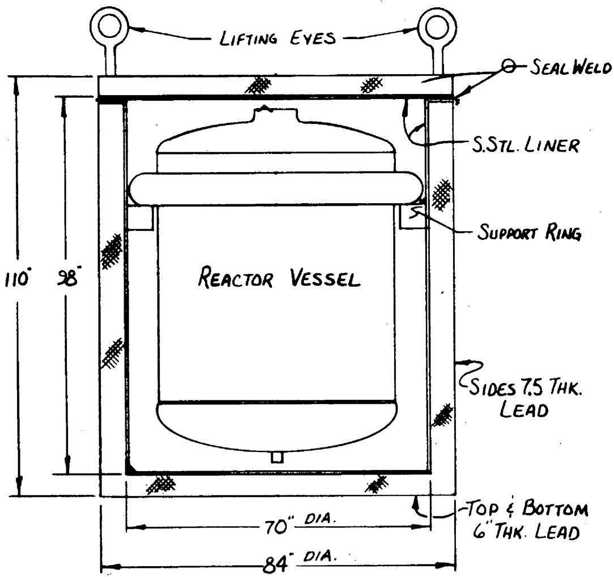  
Figure 51. Reactor Assembly Storage Container Concept

are much lower. If shielding is required for transport and storage, the tanks will be lifted out of their furnaces and moved to a temporary shield where transport shields will be built around them. To do this, the tanks will each be surrounded with a stainless steel form into which an annulus of concrete of the required thickness will be poured. The shielded tanks will be disposed of in the solid-waste storage area. All other items in the cell will be segmented for disposal in 55-gallon drums. The cell walls will be decontaminated and the top shield blocks reinstalled.

# 5.2.4 Fuel-Processing Cell

The fuel storage tank and other items in the fuel-processing cell will be disposed of using the same techniques outlined for the drain-tank cell.

# 5.2.5 Cell Ventilation System

The 30-in.-diameter carbon steel cell ventilation line from the southwest side of the bottom of the reactor cell was used to maintain a negative pressure in the cell during maintenance operations and is contaminated with radioactive particles and fission products released during these activities. This line, the main 36-in.-diameter duct it joins, the filter pit, and the discharge stack will be decontaminated and left in place. Smaller contaminated ducts from the auxiliary cells will be cut up and disposed of in the solid-waste storage area.

# 5.2.6 Off-Gas System

Because of the gas holdup volumes in the off-gas line ahead of the charcoal trap, essentially all the residual long-lived fission products in the system will be plated out on the walls of the holdup volume pipes rather than collected in the charcoal traps. The holdup volume which encircles the inside of the reactor cell will be segmented and disposed of along with the other contents of the cell. The remainder of the system up to its juncture with the containment ventilation system particulate filter enclosure will be segmented and disposed of in the solid-waste storage area unless there is a need for retaining the system for future projects using the shielded cells.

# 5.2.7 Liquid-Waste Disposal System

The portion of the liquid-waste disposal system contaminated with $^{233}\mathrm{U}$ will be removed, segmented, and disposed of up to but not including the waste storage tank in the liquid-waste cell. The storage tank and its connections to the ORNL liquid-waste disposal system will be decontaminated to the extent possible and retained for future programs.

# 5.2.8 Coolant-Salt System

The coolant salt was drained from the system to the storage tank in the coolant drain cell when reactor operation was terminated. The salt pump, pump support, and the 5-in. piping outside the reactor cell have been removed for use in a development project; but the radiator, sampler, and drain-tank system (including the coolant salt) remain in place along with all the auxiliary systems.

The system has only trace amounts of radioactive contamination and beryllium salt contamination. All the system components will be disposed of by burial in the solid-waste storage area.

# 5.2.9 Miscellaneous Contaminated Items

Contamination outside the primary and secondary salt systems is confined mainly to the component-cooling system, sampler-enricher, and the treated-water system.

# 5.2.9.a Component-Cooling Air System

The component-cooling air blowers, heat exchanger, filter, enclosures, and piping are located in the special equipment room immediately south of the reactor containment cell. This system is contaminated internally with cell atmospheric contaminants pulled in from the reactor and drain-tank cells.

The piping, valves, and strainer could be segmented and packaged in 55-gallon drums for storage. The heat exchanger, blowers, and motors will require special containers. The containment enclosures could be decontaminated enough to allow direct burial more economically than segmenting and storing. The radiation level from the components of this system will be very low.

# 5.2.9.b Sampler-Enricher

Radiation readings taken February 25, 1977, at the 1/2-in.-thick quartz periscope window and at the removal valve opening of the primary system sampler-enricher were 150 mr/hr and 1 R/hr, respectively. Temporary work shielding will be required after the existing shielding is removed in order to disconnect and remove the assembly.

Secondary containment of the assembly is provided by the upper sample transfer box and the lower operational and maintenance valve box. These boxes are joined together with seals at penetrations to prevent the contamination due to sampling from entering the lower box. Removal will require opening of the valve box in order to disconnect the transfer tube as well as to disconnect the box from a floor flange. Making these disconnections plus severing and sealing a multitude of electrical, pneumatic, cover-gas, and off-gas connections will allow the complete assembly to be removed to a special storage container.

Removal of the fuel-processing-system sampler will be done in a similar manner.

# 5.2.9.c Treated-Water System

The treated-water system is a closed loop system that was used to cool components within the cells. All the in-cell portions will be removed with the cell equipment. The portions outside the cells are located within a pipe chase along the south face of the reactor cell, in the water room and in the diesel shed. Contamination within this system consists of activated oxides and chromates induced by exposure to the reactor system. The contamination level is very low; so these components will not require shielding, only simple containment with plastic wraps, etc., and may be disposed of by burying in a trench in the disposal area.

The equipment in the pipe chase consists of piping and radiation safety block valves. These may be removed by unbolting existing flanges and by simple cutting procedures with direct access available for the work.

The water room contains two pumps, a surge tank, makeup tank, and all valving, flow monitors, and piping for the distribution of the cooling water. Direct access exists for the removal of these items.

The diesel shed contains a heat exchanger and a particle filter. The highest level of contamination within the system is concentrated in the filter. The heat exchanger and filter are connected to the water room piping via underground lines which cross the west yard (~100 ft of 4-in. carbon steel pipe). Direct access exists for removal of the components in the shed, and there are no obstacles in the way of excavating the underground pipes.

6. WORK INVOLVED IN ENTOMBING ALL RADIOACTIVE AND CONTAMINATED ITEMS IN THE REACTOR CELL

# 6.1 Preparatory Work

Preparatory work for entombing all radioactive and contaminated items in the reactor cell in concrete includes: (1) provision of a water flushing system for the fuel and flush-salt drain tanks and the fuel-processing equipment; (2) provision of a 5,000 cfm (minimum) air exhaust duct into the top of the reactor cell; and (3) tooling for cutting pipes and structural materials in the reactor cell and for cutting loose and transferring tanks, pipes, and structural materials from the drain-tank and fuel-processing cells to the reactor cell.

# 6.1.1 Flushing System for the Primary Salt Drain Tanks and the Fuel-Processing Equipment

This system is the same as that described in Section 5.1.1; however, it will not be necessary to flush out the reactor vessel nor the primary system in the reactor cell. The drain tanks and their associated piping as well as the equipment and piping in the fuel-processing cell are to be flushed to reduce radiation levels and the probability of contamination spread during their being cut out and transferred to the reactor cell for entombment.

# UNION CARBIDE CORPORATION

NUCLEAR DIVISION

OAK RIDGE, TENNESSEE 37830

TABLE 5

ENTOMBMENT

# COST ESTIMATE

# SUMMARY SHEET

PROJECT TITLE AND BUILING

<table><tr><td>ESO OR ORDER NO.
A-2884A-J1</td><td>ACCOUNT CHARGE</td><td>DATE
July, 1977</td><td colspan="2">BASE COST DATE
FY-77</td><td colspan="2">ESTIMATE VALID UNTIL</td></tr><tr><td colspan="2">TYPE OF ESTIMATE</td><td rowspan="2" colspan="3">CONSTRUCTED BY
XUCND C.P.F. LSSC</td><td rowspan="2" colspan="2">ESCALATION (3)</td></tr><tr><td colspan="2">□ C □ 1 □ 11 □ OTHER</td></tr><tr><td colspan="7">ESTIMATE BASED ON: □ VERBAL INFORMATION □ SKETCHES □ MARKED PRINTS □ PRELIM. DESIGN □ FINAL DESIGN</td></tr><tr><td rowspan="2">FUND SOURCE
□ EXP □ EOPT</td><td>ESTIMATED BY
C. Kirby*</td><td>ORIGINALLY EST.</td><td colspan="2">DATE</td><td>P. ENGR.
C. D. Cagle</td><td rowspan="2">EST. NO.</td></tr><tr><td>SUBMITTED BY
C. Kirby</td><td>LAST REVISION</td><td colspan="2">DATE</td><td>F. ENGR.
L. P. Pugh</td></tr><tr><td colspan="2"></td><td>Page No.</td><td>CPFF</td><td>UCC-ND</td><td colspan="2">TOTAL</td></tr><tr><td rowspan="12">PREPARATORY WORK
Flushing
Cell Ventilation
Work Platforms
Miscellaneous Material
SUBTOTAL
TOOLING
REACTOR CELL EQUIPMENT
DRAIN-TANK CELL
FUEL-PROCESSING CELL
VENTILATION HOUSE AREA
SPECIAL EQUIPMENT ROOM
COOLANT CELL AREA
SOUTH YARD
□</td><td>ESTIMATED BY
C. Kirby*</td><td>$ 35,500</td><td colspan="2">$ 94,200</td><td rowspan="12" colspan="2"></td></tr><tr><td rowspan="11">SUBMITTED BY
C. Kirby</td><td rowspan="11">LAST REVISION</td><td colspan="2">25,600</td></tr><tr><td colspan="2">36,600</td></tr><tr><td colspan="2">6,900</td></tr><tr><td>$ 95,500</td><td>$ 163,300</td></tr><tr><td colspan="2">$ 322,700</td></tr><tr><td colspan="2">$ 273,300</td></tr><tr><td colspan="2">$ 53,300</td></tr><tr><td colspan="2">$ 64,000</td></tr><tr><td colspan="2">$ 93,900</td></tr><tr><td colspan="2">$ 96,100</td></tr><tr><td>$ 135,500</td><td>$ 11,100</td></tr></table>

*Cost Engineer, UCC-ND ORNL General Engineering.

(123) 1-72

# TABLE 5. (CONTINUED)

# COST ESTIMATE

# SUMMARY SHEET

(CONTINUATION SHEET)

ESOORORDERNO.A-2884A-J1

<table><tr><td></td><td>Page No.</td><td>CPFF</td><td>UCC-ND</td><td>TOTAL</td></tr><tr><td>TREATED WATER SYSTEM</td><td></td><td>$ 40,500</td><td></td><td></td></tr><tr><td>SPARE CELL AREA</td><td></td><td>$ 42,000</td><td></td><td></td></tr><tr><td></td><td></td><td>$1,216,800</td><td>$ 593,700</td><td></td></tr><tr><td>HEALTH PHYSICS REQUIREMENTS</td><td></td><td>608,200</td><td></td><td></td></tr><tr><td></td><td></td><td>$1,825,000</td><td>$ 593,700</td><td></td></tr><tr><td>CPFF INDIRECTS @ 35%</td><td></td><td>639,000</td><td></td><td></td></tr><tr><td></td><td></td><td>$2,464,000</td><td>$ 593,700</td><td>$ 3,057,700</td></tr><tr><td>ENGINEERING 20%</td><td></td><td></td><td></td><td>612,300</td></tr><tr><td></td><td></td><td></td><td></td><td>$ 3,670,000</td></tr><tr><td>CONTINGENCY, FY-1977 COST</td><td></td><td></td><td></td><td>1,100,000</td></tr><tr><td></td><td></td><td></td><td></td><td>$ 4,770,000*</td></tr><tr><td>ESTIMATE GUIDE LINES:</td><td></td><td></td><td></td><td></td></tr><tr><td>Labor rates for CPFF contractor $100/day or radiation allowance.</td><td></td><td colspan="2">does not include 35% indirect costs @ $183/day including costs @ $156/day including indirects.</td><td></td></tr><tr><td>UCC-ND design based on operating account costs @ $183/ day including indirects.</td><td></td><td></td><td></td><td></td></tr><tr><td>UCC-ND fabrication based on operating account costs @ $156/day including indirects.</td><td></td><td></td><td></td><td></td></tr><tr><td>G&amp;A on UCC-ND procurement items @ 35%.</td><td></td><td></td><td></td><td></td></tr></table>

UCN-B125F \*NOTE: This is 1977 costs.Use ERDA-ORO Escalation Chart (page103) to escalate for

funding purposes.

# 6.1.2 Air Exhaust System for the Reactor Cell

The existing 30-in.-diameter cell ventilation duct is connected to the cell near the bottom; therefore, it cannot be used to vent the cell while concrete is being poured into it. Also, before concrete can be poured, it must be severed and sealed at the point of emergence from the cell structure and should not be further contaminated by the preparations for entombment. To provide necessary ventilation for particle control, a temporary shielded 30 in. by 30 in. ventilation duct will be provided to exhaust air from the cell at the top near the south edge. This duct will be tied into the existing 30 in. by 30 in. duct located at the east side of the cell that normally exhausts the high-bay area. The existing particulate filters, blowers, and exhaust stack can be used.

# 6.1.3 Tooling

Required tooling will include remotely operated saws, abrasive cutting tools, hydraulic shears, cutting torches, lifting hooks, and tongs to be used in the reactor cell to make space for other items. The same tools will be used for cutting loose and transferring items from the drain-tank and fuel-processing cells to the reactor cell. Most of these tools can be made by adapting standard tools with long handles to allow remote operation.

# 6.2 Preparing Reactor Cell to Accommodate Contaminated Items from Other Cells and Areas

# 6.2.1 Clearing Top of Cell and Installing Temporary Ventilation Duct

To allow access to all areas of the reactor cell, the upper tier of shielding blocks will be set aside and the entire seal pan cut out in easily handled sections and temporarily stored for later disposal in the reactor cell. During this work, a negative pressure will be maintained in the cell using the existing 30-in.-diameter ventilation duct. One of the smaller lower shield blocks on the south side will be removed and replaced with a new shielded cover containing the temporary ventilation duct. When the new duct has been installed, shielded, and opened to the ventilation system, the existing duct will be closed.

6.2.2 Sealing the Existing 30-In. Cell Ventilation Duct at the Cell Wall

The existing cell ventilation duct will be severed and a short section removed in the coolant cell where the duct exits the reactor cell outer tank. The cell side of the opening will be blanked with a flange containing a nozzle for pumping the penetration full of grout. The duct opening to the filters will be temporarily sealed as the remainder of the duct will be removed later.

The duct penetration extends $\sim 8$ ft through the sand-filled annulus to the reactor containment tank. The duct is horizontal for about 5 ft and then turns upward at a $31^{\circ}$ slope to intersect the hemispherical bottom head of the reactor tank. The open and inside the cell is shielded by a 9-in.-thick carbon steel shadow shield. The grout should be pumped inward until it extrudes from behind the shadow shield ( $\sim 40$ ft $^3$ ).

6.2.3 Closure of the Opening Between the Reactor and Drain-Tank Cells

Before concrete can be poured into the reactor cell, the opening from there into the drain-tank cell must be cleared of pipes and conduits and sealed. Since later work will further obscure the opening on the reactor cell side, it will be necessary to clear and seal the opening first.

To provide ventilation from the drain-tank cell after sealing the opening, the upper layer of shielding blocks and the seal pan will be removed and a lower shield block replaced with one containing an opening for a ventilation duct as will be done for the reactor cell. This duct will tie in to the temporary duct provided for the reactor cell.

When ventilation has been established for both cells, the pipes and conduits passing through the intercell opening will be severed in both cells and drawn into the reactor cell. The opening will then be closed on the reactor cell side with a large prefabricated plug or cap.

6.2.4 Enlarging Space in the Reactor Cell

There are two purposes for cutting loose and rearranging items in the reactor cell. One purpose is to remove, on the inside of the cell, short sections of all pipes and conduits that penetrate the cell walls to ensure that all internal systems will be sealed from external communication following entombment. Prior to doing the internal cutting, the pipes and

conduits will be cut and capped where they emerge externally from the cell. After the cell has been filled with concrete, the caps will be removed to allow backfilling with concrete prior to final sealing. The second purpose is to rearrange some of the existing components to provide space for placing other items in the cell for entombment.

The major items to be disconnected or cut loose and repositioned are the fuel-salt pump and its associated conduits and piping, the heat exchanger, the primary and secondary salt piping and heaters, and the various structures that support these items.

This phase of the work will be relatively slow due both to limited access and the type of work to be done. Since there will be a dust and particle control problem during this work, only one working opening into the cell will be used. The inflow of air through this opening to the ventilation system will prevent the dust and particles from emerging. Additional limited control will be exercised by drenching with water as applicable. The water will collect in the sump at the low point of the containment vessel and will be jetted to the liquid-waste system. The water ejection system will be the last piping cut loose in the cell.

Although preparation of the drain-tank cell components, fuel-processing cell components, and other items for transfer may be done simultaneously with the space preparation in the reactor cell, no transfer of items to the reactor cell will be done until all cutting and rearranging there is complete.

# 6.3 Transfer of Disposable Items to the Reactor Cell

# 6.3.1 Drain-Tank and Fuel-Processing Cell Components

While the reactor cell is being prepared to receive them, the emptied and flushed tanks, piping, etc., in the drain-tank cell and the fuel-processing equipment, piping, etc., will be prepared for transfer. Tanks will be transferred as units. Smaller items, such as pipe sections, will be loaded into reusable steel drums or similar containers for transfer.

Prior to the transfer, an opening large enough to receive the items to be transferred can be provided through the reactor cell top by first stacking temporary shielding to a height of about 6 ft above floor level

to form a shielded chimney around the cell top shield blocks to be removed and then removing the shield blocks. The vertical shielding will protect personnel from direct radiation from the cell and allow the access to remain open while transferred items are being positioned in the cell by personnel working through a smaller opening. Between transfers, the top of the chimney will be closed with a light-weight cover. During transfers, the shielded remote maintenance control room will be used by the hoist operator-- other personnel will remain at a safe distance while the items being transferred are unshielded.

As an alternative to using the shielded chimney as an access to the cell, appropriate shielding blocks can be removed and replaced as required by operating the hoist from the shielded remote maintenance control room.

As each tank is put into place in the reactor cell, grout will be pumped into it through a pipe opening or a trespanned hole to prevent floating during the filling of the cell with concrete.

# 6.3.2 Disposal of Existing Reactor Cell Ventilation Duct and Off-Gas Lines

The entire 30-in.-diameter reactor cell ventilation duct between the reactor cell and the 36-in. main ventilation duct will be cut into sections and disposed of in the reactor cell. To do this, sectioning will begin at the point of emergence from the reactor cell (already sealed from the reactor cell) and proceed toward the main duct. This will allow an inward draft of air to be maintained for dust control. Prior to cutting each section, the inner wall will be coated with a sealant to prevent particle release during subsequent handling. Removal of the duct outside the building will involve excavation.

Sectioning of off-gas lines will also be done while maintaining an inward draft; however, due to their small size, coating the sections internally will not be required.

# 6.3.3 Secondary Decay Volume and Charcoal Traps

Due to only low-level contamination with long-lived fission products, the secondary decay volume and charcoal traps (all located in the charcoal-trap pit) will be sealed and transferred as intact units to the solid-waste storage area for disposal in trenches.

# 6.4 Filling the Reactor Cell with Concrete

The filling of the reactor cell with concrete and grout will be done in stages as the various items to be disposed of there are added. This procedure will reduce the radiation level through openings in the top of the cell as quickly as possible. One of the first regions to be filled with grout will be the annulus between the reactor vessel and thermal shield to reduce the radiation from the vessel into the cell.

When the reactor cell has been filled with concrete up to the bottoms of the lower shield blocks, the temporary ventilation duct will be removed and all the lower shield blocks will be reinstalled. A final grouting in of the blocks will be made at the building floor level and the surface finished to building floor specifications. The upper shield beams may be checked for contamination and either retained for other uses or disposed of.

# 6.5 Decontamination of Area

# 6.5.1 Drain-Tank Cell

When the equipment removed from the drain-tank cell is complete, decontamination of the interior surfaces and cell penetrations will be done. The cell is stainless steel lined and will allow strong solutions to be used for cleaning. The solutions can be jetted to the existing liquid-waste system. The transferrable contamination should be low enough to allow unrestricted use of the cell.

The upper and lower shield plugs will be cleaned and reinstalled over the cell for future use.

# 6.5.2 Fuel-Processing Cell

After removal of the fuel-processing-cell equipment, the cell will be decontaminated in the same manner as the drain-tank cell except that the cell surfaces are concrete. Chipping may be used where solution cleaning is unsuccessful.

The roof plugs will be cleaned and replaced for future use.

# 6.5.3 Liquid-Waste Storage Cell

The liquid-waste system will be retained for future use. Contamination in the storage tank, filter, pipes, and pump will be flushed out to the Laboratory ILW system to allow the system to remain for future use with restricted entry only into the waste-tank storage cell.

# 6.5.4 Containment Ventilation System

After removal of the reactor cell exhaust duct and decontamination of the stack filter bay, very little, if any, contamination will remain in the ventilation system. Repairs to the duct where the cell exhaust line is removed will be made, and the system will remain ready for use.

# 6.5.5 Special Equipment Room - Coolant Cell Area

A small amount of contamination exists in the special equipment room as a result of maintenance on the component-cooling air blowers. Care must be used to avoid further contamination during the removal of the cell exhaust duct and the component-cooling air system. A simple mopping of the cell area should remove the existing contamination.

# 7. REFERENCES

1. R. C. Robertson, MSRE Design and Operations Report; Part I--Description of Reactor Design, ORNL-TM-728 (January, 1965).   
2. J. R. Tallackson, MSRE Design and Operations Report, Part IIA--Nuclear and Process Instrumentation, ORNL-TM-729, Part IIA (February, 1968).   
3. R. B. Lindauer, MSRE Design and Operations Report, Part VII--Fuel Handling and Processing Plant, ORNL-TM-907, Revised (December, 1967).   
4. R. B. Lindauer, "MSRE Fuel Processing System Status", ORNL-CF-69-6-17 (June, 1969).   
5. R. H. Guymon, MSRE Procedures for the Period Between Examination and Ultimate Disposal (Phase III of Decommissioning Program), ORNL-TM-3253 (February, 1971).   
6. P. N. Haubenreich and R. B. Lindauer, "Consideration of Possible Methods of Disposal of MSRE Salts", ORNL-CF-72-1-1 (January, 1972).

APPENDIX A

JOB LISTING FOR

DECOMMISSIONING THE MSRE BY DISMANTLING AND DISPOSAL

<table><tr><td rowspan="3">QUANTITYUNIT</td><td rowspan="3">REMOVAL OF RADIOACTIVE MATERIAL</td><td colspan="4"></td><td></td></tr><tr><td colspan="2">UNIT COSTS</td><td rowspan="2">MATERIAL</td><td rowspan="2">LABOR</td><td rowspan="2">Reference Drawing</td></tr><tr><td>MAT&#x27;L</td><td>LABOR</td></tr><tr><td></td><td></td><td></td><td></td><td></td><td></td><td></td></tr><tr><td>1 ea.</td><td>Design and fabricate flushing system unit with ~50 gpm</td><td></td><td></td><td></td><td></td><td></td></tr><tr><td></td><td>flow and ~500 gallons storage of decontamination solution</td><td></td><td></td><td></td><td></td><td></td></tr><tr><td></td><td>with connections for discharging solution to the ORNL ILW</td><td></td><td></td><td></td><td></td><td></td></tr><tr><td></td><td>system. Unit to be portable and shielded for use at</td><td></td><td></td><td></td><td></td><td></td></tr><tr><td></td><td>various areas in the reactor, drain tank, and fuel</td><td></td><td></td><td></td><td></td><td></td></tr><tr><td></td><td>processing cell.</td><td></td><td></td><td></td><td></td><td></td></tr><tr><td></td><td>Design (100 md)</td><td></td><td></td><td></td><td>$ 18,300</td><td></td></tr><tr><td></td><td>Material</td><td></td><td></td><td>$10,000</td><td></td><td></td></tr><tr><td></td><td>Fabrication (100 md)</td><td></td><td></td><td></td><td>15,600</td><td></td></tr><tr><td></td><td></td><td></td><td></td><td></td><td></td><td></td></tr><tr><td>6 jobs</td><td>Connect and flush various sections of the system and</td><td></td><td></td><td></td><td></td><td></td></tr><tr><td></td><td>tanks.</td><td></td><td></td><td></td><td></td><td></td></tr><tr><td></td><td>6 ea. @ 50 md (300 md)</td><td></td><td></td><td></td><td>$ 46,800</td><td></td></tr><tr><td></td><td></td><td></td><td></td><td></td><td></td><td></td></tr><tr><td></td><td></td><td></td><td></td><td></td><td></td><td></td></tr><tr><td></td><td></td><td></td><td></td><td></td><td></td><td></td></tr><tr><td></td><td></td><td></td><td></td><td></td><td></td><td></td></tr><tr><td></td><td>G&amp;A on materials: 10,000 x 0.35</td><td></td><td></td><td>$ 3,500</td><td></td><td></td></tr><tr><td></td><td>UCC-ND Subtotal</td><td></td><td></td><td>$13,500</td><td>$ 80,700</td><td></td></tr><tr><td></td><td colspan="3">NET MATERIAL AND LABOR</td><td></td><td></td><td></td></tr><tr><td rowspan="2" colspan="4">PREPARATORY WORK - FLUSHING</td><td>CPFF</td><td>FIXED PRICE</td><td>ORNL</td></tr><tr><td></td><td></td><td>$ 94,200</td></tr></table>

UCN-1297

(3 7-72)

<table><tr><td rowspan="3">QUANTITY UNIT</td><td rowspan="3">REMOVAL OF RADIOACTIVE MATERIAL</td><td colspan="5"></td></tr><tr><td colspan="2">UNIT COSTS</td><td rowspan="2">MATERIAL</td><td rowspan="2">LABOR</td><td rowspan="2">Reference Drawing</td></tr><tr><td>MAT&#x27;L</td><td>LABOR</td></tr><tr><td></td><td></td><td></td><td></td><td></td><td></td><td></td></tr><tr><td>1 ea.</td><td>Design, fabricate and install filtering and demineral-</td><td></td><td></td><td></td><td></td><td></td></tr><tr><td></td><td>izing system to control clarity and activity level of the reactor cell and drain tank cell flood water. The system</td><td></td><td></td><td></td><td></td><td></td></tr><tr><td></td><td>is to have a minimum flow capacity of 1,000 gpm and be located within a shielded area with piping connections to the reactor and drain tank cell.</td><td></td><td></td><td></td><td></td><td></td></tr><tr><td></td><td>Design (200 md)</td><td></td><td></td><td></td><td>$ 36,600</td><td></td></tr><tr><td></td><td>Materials</td><td></td><td></td><td>$50,000</td><td></td><td></td></tr><tr><td></td><td>Fabrication &amp; Installation (500 md)</td><td></td><td></td><td></td><td>$ 50,000</td><td></td></tr><tr><td></td><td></td><td></td><td></td><td></td><td></td><td></td></tr><tr><td></td><td></td><td></td><td></td><td></td><td></td><td></td></tr><tr><td></td><td></td><td></td><td></td><td></td><td></td><td></td></tr><tr><td></td><td></td><td></td><td></td><td></td><td></td><td></td></tr><tr><td></td><td></td><td></td><td></td><td></td><td></td><td></td></tr><tr><td></td><td></td><td></td><td></td><td></td><td></td><td></td></tr><tr><td></td><td></td><td></td><td></td><td></td><td></td><td></td></tr><tr><td></td><td></td><td></td><td></td><td></td><td></td><td></td></tr><tr><td></td><td></td><td></td><td></td><td></td><td></td><td></td></tr><tr><td></td><td>G&amp;A on materials: 50,000 x 0.35</td><td></td><td></td><td>$17,500</td><td></td><td></td></tr><tr><td></td><td></td><td></td><td></td><td>$67,500</td><td>$ 86,600</td><td></td></tr><tr><td></td><td colspan="3">NET MATERIAL AND LABOR</td><td></td><td></td><td></td></tr><tr><td rowspan="2" colspan="4">PREPARATORY WORK - FLOODING</td><td>CPFF</td><td>FIXED PRICE</td><td>ORNL</td></tr><tr><td></td><td></td><td>$154,100</td></tr></table>

UCN-1297

(3 7-72)

<table><tr><td rowspan="3">QUANTITY UNIT</td><td rowspan="3">REMOVAL OF RADIOACTIVE MATERIAL</td><td colspan="4"></td><td></td></tr><tr><td colspan="2">UNIT COSTS</td><td rowspan="2">MATERIAL</td><td rowspan="2">LABOR</td><td rowspan="2">Reference Drawing</td></tr><tr><td>MAT&#x27;L</td><td>LABOR</td></tr><tr><td></td><td></td><td></td><td></td><td></td><td></td><td></td></tr><tr><td>1 job</td><td>Design, fabricate and install a temporary cell ventilation duct from the top of the reactor cell to existing duct work at the east side of the high bay.</td><td></td><td></td><td></td><td></td><td></td></tr><tr><td></td><td></td><td></td><td></td><td></td><td></td><td></td></tr><tr><td></td><td></td><td></td><td></td><td></td><td></td><td></td></tr><tr><td></td><td>Design (50 md)</td><td></td><td></td><td></td><td>$ 9,200</td><td></td></tr><tr><td></td><td>Materials</td><td></td><td></td><td>$5,000</td><td></td><td></td></tr><tr><td></td><td>Fabrication &amp; Installation (50 md)</td><td></td><td></td><td></td><td>5,000</td><td></td></tr><tr><td></td><td></td><td></td><td></td><td></td><td></td><td></td></tr><tr><td>1 job</td><td>Design, fabricate and install a temporary cell ventilation duct from the top of the drain tank cell to existing duct work at the east side of the high bay.</td><td></td><td></td><td></td><td></td><td></td></tr><tr><td></td><td>Design (50 md)</td><td></td><td></td><td></td><td>$ 9,200</td><td></td></tr><tr><td></td><td>Materials</td><td></td><td></td><td>$7,500</td><td></td><td></td></tr><tr><td></td><td>Fabrication &amp; Installation (75 md)</td><td></td><td></td><td></td><td>7,500</td><td></td></tr><tr><td></td><td></td><td></td><td></td><td></td><td></td><td></td></tr><tr><td></td><td></td><td></td><td></td><td></td><td></td><td></td></tr><tr><td></td><td></td><td></td><td></td><td></td><td></td><td></td></tr><tr><td></td><td></td><td></td><td></td><td></td><td></td><td></td></tr><tr><td></td><td>G&amp;A on materials: 12,500 x 0.35</td><td></td><td></td><td>$4,400</td><td></td><td></td></tr><tr><td></td><td></td><td></td><td></td><td>$16,900</td><td>$ 30,900</td><td></td></tr><tr><td></td><td colspan="3">NET MATERIAL AND LABOR</td><td></td><td></td><td></td></tr><tr><td rowspan="2" colspan="4">PREPARATORY WORK - CELL VENTILATION</td><td>CPFF</td><td>FIXED PRICE</td><td>ORNL</td></tr><tr><td></td><td></td><td>$ 47,800</td></tr></table>

UCN-1297

(37-72)

<table><tr><td rowspan="3">QUANTITYUNIT</td><td rowspan="3">REMOVAL OF RADIOACTIVE MATERIAL</td><td colspan="4"></td><td></td></tr><tr><td colspan="2">UNIT COSTS</td><td rowspan="2">MATERIAL</td><td rowspan="2">LABOR</td><td rowspan="2">ReferenceDrawing</td></tr><tr><td>MAT'L</td><td>LABOR</td></tr><tr><td></td><td></td><td></td><td></td><td></td><td></td><td></td></tr><tr><td>1 ea.</td><td>Design, fabricate and install a work platform to fit the top of the reactor cell. The platform is to have removable deck sections for access to all work areas of the cell; contain tool securing devices; and lighting and other visual aids necessary for underwater remote work.</td><td></td><td></td><td></td><td></td><td></td></tr><tr><td></td><td></td><td></td><td></td><td></td><td></td><td></td></tr><tr><td></td><td></td><td></td><td></td><td></td><td></td><td></td></tr><tr><td></td><td></td><td></td><td></td><td></td><td></td><td></td></tr><tr><td></td><td></td><td></td><td></td><td></td><td></td><td></td></tr><tr><td></td><td>Design (100 md)</td><td></td><td></td><td></td><td>$ 18,300</td><td></td></tr><tr><td></td><td>Materials</td><td></td><td></td><td>$10,000</td><td></td><td></td></tr><tr><td></td><td>Fabrication &amp; Installation (200 md)</td><td></td><td></td><td></td><td>31,200</td><td></td></tr><tr><td></td><td></td><td></td><td></td><td></td><td></td><td></td></tr><tr><td>1 ea.</td><td>Design, fabricate and install a work platform to fit the top of the drain tank cell. The platform is to have removable deck sections for access to all areas of the cell; contain tool handling and securing devices; and lighting and other visual aids necessary for underwater remote work.</td><td></td><td></td><td></td><td></td><td></td></tr><tr><td></td><td></td><td></td><td></td><td></td><td></td><td></td></tr><tr><td></td><td></td><td></td><td></td><td></td><td></td><td></td></tr><tr><td></td><td></td><td></td><td></td><td></td><td></td><td></td></tr><tr><td></td><td></td><td></td><td></td><td></td><td></td><td></td></tr><tr><td></td><td></td><td></td><td></td><td></td><td></td><td></td></tr><tr><td></td><td>Design (100 md)</td><td></td><td></td><td></td><td>$ 18,300</td><td></td></tr><tr><td></td><td>Materials</td><td></td><td></td><td>$10,000</td><td></td><td></td></tr><tr><td></td><td>Fabrication &amp; Installation (200 md)</td><td></td><td></td><td></td><td></td><td></td></tr><tr><td></td><td></td><td></td><td></td><td></td><td>31,200</td><td></td></tr><tr><td></td><td colspan="3">NET MATERIAL AND LABOR</td><td></td><td></td><td></td></tr><tr><td colspan="4" rowspan="2">PREPARATORY WORK - WORK PLATFORMS</td><td>CPFF</td><td>FIXED PRICE</td><td>ORNL</td></tr><tr><td></td><td></td><td>$126,000</td></tr><tr><td></td><td>G&amp;A on materials: 20,000 x 0.35</td><td></td><td></td><td>$ 7,000</td><td></td><td></td></tr><tr><td></td><td></td><td></td><td></td><td>$27,000</td><td>$ 99,000</td><td></td></tr><tr><td></td><td></td><td></td><td></td><td></td><td></td><td></td></tr><tr><td></td><td></td><td></td><td></td><td></td><td></td><td></td></tr><tr><td></td><td></td><td></td><td></td><td></td><td></td><td></td></tr><tr><td></td><td></td><td></td><td></td><td></td><td></td><td></td></tr><tr><td></td><td></td><td></td><td></td><td></td><td></td><td></td></tr><tr><td></td><td></td><td></td><td></td><td></td><td></td><td></td></tr><tr><td></td><td></td><td></td><td></td><td></td><td></td><td></td></tr><tr><td></td><td></td><td></td><td></td><td></td><td></td><td></td></tr><tr><td></td><td></td><td></td><td></td><td></td><td></td><td></td></tr><tr><td></td><td></td><td></td><td></td><td></td><td></td><td></td></tr><tr><td></td><td></td><td></td><td></td><td></td><td></td><td></td></tr><tr><td></td><td></td><td></td><td></td><td></td><td></td><td>-</td></tr><tr><td></td><td></td><td></td><td></td><td></td><td></td><td></td></tr><tr><td></td><td></td><td></td><td></td><td></td><td></td><td></td></tr><tr><td></td><td></td><td></td><td></td><td></td><td></td><td></td></tr><tr><td></td><td></td><td></td><td></td><td></td><td></td><td></td></tr><tr><td></td><td></td><td></td><td></td><td></td><td></td><td></td></tr><tr><td></td><td></td><td></td><td></td><td></td><td></td><td></td></tr><tr><td></td><td></td><td></td><td></td><td></td><td></td><td></td></tr><tr><td></td><td></td><td></td><td></td><td></td><td></td><td></td></tr><tr><td></td><td></td><td></td><td></td><td></td><td></td><td></td></tr><tr><td colspan="4">NET MATERIAL AND LABOR</td><td></td><td></td><td></td></tr><tr><td colspan="4" rowspan="2">PREPARATORY WORK - WORK PLATFORMS</td><td>CPFF</td><td>FIXED PRICE</td><td>ORNL</td></tr><tr><td></td><td></td><td>$422,100</td></tr></table>

UCN-1297

(1) 7-721

<table><tr><td rowspan="3">QUANTITY UNIT</td><td rowspan="3">REMOVAL OF RADIOACTIVE MATERIAL</td><td colspan="4"></td><td></td></tr><tr><td colspan="2">UNIT COSTS</td><td rowspan="2">MATERIAL</td><td rowspan="2">LABOR</td><td rowspan="2">Reference Drawing</td></tr><tr><td>MAT'L</td><td>LABOR</td></tr><tr><td></td><td></td><td></td><td></td><td></td><td></td><td></td></tr><tr><td>1 ea.</td><td>Pipe cutter, abrasive, for horizontal 5" INOR-8 pipe.</td><td></td><td></td><td></td><td></td><td></td></tr><tr><td></td><td>Design (50 md)</td><td></td><td></td><td></td><td>$ 9,200</td><td></td></tr><tr><td></td><td>Fabrication Labor (50 md)</td><td></td><td></td><td></td><td>7,800</td><td></td></tr><tr><td></td><td>Materials</td><td></td><td></td><td>$2,500</td><td></td><td></td></tr><tr><td></td><td>Mockup &amp; Development (50 md)</td><td></td><td></td><td>500</td><td>7,800</td><td></td></tr><tr><td></td><td></td><td></td><td></td><td></td><td></td><td></td></tr><tr><td>1 ea.</td><td>Pipe cutter, abrasive, for vertical 5" INOR-8 pipe.</td><td></td><td></td><td></td><td></td><td></td></tr><tr><td></td><td>Design (50 md)</td><td></td><td></td><td></td><td>$ 9,200</td><td></td></tr><tr><td></td><td>Fabrication (50 md)</td><td></td><td></td><td></td><td>7,800</td><td></td></tr><tr><td></td><td>Materials</td><td></td><td></td><td>$2,500</td><td></td><td></td></tr><tr><td></td><td>Mockup &amp; Development (50 md)</td><td></td><td></td><td>500</td><td>7,800</td><td></td></tr><tr><td></td><td></td><td></td><td></td><td></td><td></td><td></td></tr><tr><td>2 ea.</td><td>Pipe cutters, hydraulic, for vertical or horizontal 1/2"</td><td></td><td></td><td></td><td></td><td></td></tr><tr><td></td><td>thru 2" carbon steel, stainless steel and INOR-8 pipe</td><td></td><td></td><td></td><td></td><td></td></tr><tr><td></td><td>(commercial hydraulic shears).</td><td></td><td></td><td></td><td></td><td></td></tr><tr><td></td><td>Design (50 md)</td><td></td><td></td><td></td><td>$ 9,200</td><td></td></tr><tr><td></td><td>Fabrication (30 md)</td><td></td><td></td><td></td><td>4,700</td><td></td></tr><tr><td></td><td>Material @ $2,500 each</td><td></td><td></td><td>$5,000</td><td></td><td></td></tr><tr><td></td><td>Mockup &amp; Development (50 md)</td><td></td><td></td><td>500</td><td>7,800</td><td></td></tr><tr><td></td><td colspan="3">NET MATERIAL AND LABOR</td><td></td><td></td><td></td></tr><tr><td colspan="4" rowspan="2">TOOLING</td><td>CPFF</td><td>FIXED PRICE</td><td>ORNL</td></tr><tr><td></td><td></td><td></td></tr><tr><td>2 ea.</td><td>Cutters, hydraulic, for miscellaneous 1/4" to 1/2" tubing</td><td></td><td></td><td></td><td></td><td></td></tr><tr><td></td><td>MI cable, electrical leads, etc. (commercial hydraulic units).</td><td></td><td></td><td></td><td></td><td></td></tr><tr><td></td><td>Design(50 md)</td><td></td><td></td><td></td><td>$ 9,200</td><td></td></tr><tr><td></td><td>Fabrication(30 md)</td><td></td><td></td><td></td><td>4,700</td><td></td></tr><tr><td></td><td>Material @ $500 each</td><td></td><td></td><td>$1,000</td><td></td><td></td></tr><tr><td></td><td>Mockup &amp; Development(50 md)</td><td></td><td></td><td>500</td><td>7,800</td><td></td></tr><tr><td></td><td></td><td></td><td></td><td></td><td></td><td></td></tr><tr><td>2 ea.</td><td>Snips, manual, for cutting thermocouple leads, electrical leads, etc.</td><td></td><td></td><td></td><td></td><td></td></tr><tr><td></td><td>Design(30 md)</td><td></td><td></td><td></td><td>$ 5,500</td><td></td></tr><tr><td></td><td>Fabrication(30 md)</td><td></td><td></td><td></td><td>4,700</td><td></td></tr><tr><td></td><td>Material</td><td></td><td></td><td>$ 500</td><td></td><td></td></tr><tr><td></td><td>Mockup &amp; Development(10 md)</td><td></td><td></td><td>100</td><td>1,600</td><td></td></tr><tr><td></td><td></td><td></td><td></td><td></td><td></td><td></td></tr><tr><td></td><td></td><td></td><td></td><td></td><td></td><td></td></tr><tr><td></td><td></td><td></td><td></td><td></td><td></td><td></td></tr><tr><td></td><td></td><td></td><td></td><td></td><td></td><td></td></tr><tr><td></td><td></td><td></td><td></td><td></td><td></td><td></td></tr><tr><td></td><td colspan="3">NET MATERIAL AND LABOR</td><td></td><td></td><td></td></tr><tr><td colspan="4" rowspan="2">TOOLING</td><td>CPFF</td><td>FIXED PRICE</td><td>ORNL</td></tr><tr><td></td><td></td><td></td></tr></table>

UCN-1297

(3 7-72)

<table><tr><td rowspan="3">QUANTITYUNIT</td><td rowspan="3">REMOVAL OF RADIOACTIVE MATERIAL</td><td colspan="4"></td><td></td></tr><tr><td colspan="2">UNIT COSTS</td><td rowspan="2">MATERIAL</td><td rowspan="2">LABOR</td><td rowspan="2">Reference Drawing</td></tr><tr><td>MAT'L</td><td>LABOR</td></tr><tr><td></td><td></td><td></td><td></td><td></td><td></td><td></td></tr><tr><td>2 ea.</td><td>Cutters, torch, acetylene, for cutting horizontal carbon</td><td></td><td></td><td></td><td></td><td></td></tr><tr><td></td><td>steel support structures.</td><td></td><td></td><td></td><td></td><td></td></tr><tr><td></td><td>Design(30 md)</td><td></td><td></td><td></td><td>$ 5,500</td><td></td></tr><tr><td></td><td>Fabrication(30 md)</td><td></td><td></td><td></td><td>4,700</td><td></td></tr><tr><td></td><td>Material @ $500 each</td><td></td><td></td><td>$1,000</td><td></td><td></td></tr><tr><td></td><td>Mockup &amp; Development(50 md)</td><td></td><td></td><td>500</td><td>7,800</td><td></td></tr><tr><td></td><td></td><td></td><td></td><td></td><td></td><td></td></tr><tr><td>2 ea.</td><td>Cutters, torch, acetylene for cutting vertical carbon</td><td></td><td></td><td></td><td></td><td></td></tr><tr><td></td><td>steel support structures.</td><td></td><td></td><td></td><td></td><td></td></tr><tr><td></td><td>Design(30 md)</td><td></td><td></td><td></td><td>$ 5,500</td><td></td></tr><tr><td></td><td>Fabrication(30 md)</td><td></td><td></td><td></td><td>4,700</td><td></td></tr><tr><td></td><td>Material @ $500 each</td><td></td><td></td><td>$1,000</td><td></td><td></td></tr><tr><td></td><td>Mockup &amp; Development(50 md)</td><td></td><td></td><td></td><td>7,800</td><td></td></tr><tr><td></td><td></td><td></td><td></td><td></td><td></td><td></td></tr><tr><td>1 ea.</td><td>Tool, lifting, for removal of fuel pump motor.</td><td></td><td></td><td></td><td></td><td></td></tr><tr><td></td><td>Design(existing)</td><td></td><td></td><td></td><td></td><td></td></tr><tr><td></td><td>Fabrication(30 md)</td><td></td><td></td><td></td><td>$ 4,700</td><td></td></tr><tr><td></td><td>Material</td><td></td><td></td><td>$ 500</td><td></td><td></td></tr><tr><td></td><td></td><td></td><td></td><td></td><td></td><td></td></tr><tr><td></td><td colspan="3">NET MATERIAL AND LABOR</td><td></td><td></td><td></td></tr><tr><td colspan="4" rowspan="2">TOOLING</td><td>CPFF</td><td>FIXED PRICE</td><td>ORNL</td></tr><tr><td></td><td></td><td></td></tr><tr><td rowspan="3">QUANTITYUNIT</td><td rowspan="3">REMOVAL OF RADIOACTIVE MATERIAL</td><td colspan="5"></td></tr><tr><td colspan="2">UNIT COSTS</td><td rowspan="2">MATERIAL</td><td rowspan="2">LABOR</td><td rowspan="2">ReferenceDrawing</td></tr><tr><td>MAT'L</td><td>LABOR</td></tr><tr><td></td><td></td><td></td><td></td><td></td><td></td><td></td></tr><tr><td>1 ea.</td><td>Tool, lifting, for removal of fuel pump rotary element.</td><td></td><td></td><td></td><td></td><td></td></tr><tr><td></td><td>Design (existing)</td><td></td><td></td><td></td><td></td><td></td></tr><tr><td></td><td>Fabrication (30 md)</td><td></td><td></td><td></td><td>$ 4,700</td><td></td></tr><tr><td></td><td>Material</td><td></td><td></td><td>$ 500</td><td></td><td></td></tr><tr><td></td><td></td><td></td><td></td><td></td><td></td><td></td></tr><tr><td>1 ea.</td><td>Tool, lifting, for handling fuel pump bowl.</td><td></td><td></td><td></td><td></td><td></td></tr><tr><td></td><td>Design (existing)</td><td></td><td></td><td></td><td></td><td>E-56336</td></tr><tr><td></td><td>Fabrication (50 md)</td><td></td><td></td><td></td><td>$ 7,800</td><td></td></tr><tr><td></td><td>Material</td><td></td><td></td><td>$1,000</td><td></td><td></td></tr><tr><td></td><td></td><td></td><td></td><td></td><td></td><td></td></tr><tr><td>1 ea.</td><td>Tool, lifting, for handling fuel heat exchanger.</td><td></td><td></td><td></td><td></td><td></td></tr><tr><td></td><td>Design (existing)</td><td></td><td></td><td></td><td></td><td>E-56340</td></tr><tr><td></td><td>Fabrication (75 md)</td><td></td><td></td><td></td><td>$ 11,700</td><td></td></tr><tr><td></td><td>Material</td><td></td><td></td><td>$1,500</td><td></td><td></td></tr><tr><td></td><td></td><td></td><td></td><td></td><td></td><td></td></tr><tr><td>1 ea.</td><td>Tool, lifting, for removal of drain tank steam domes.</td><td></td><td></td><td></td><td></td><td></td></tr><tr><td></td><td>Design (existing)</td><td></td><td></td><td></td><td></td><td>D-56339</td></tr><tr><td></td><td>Fabrication (30 md)</td><td></td><td></td><td></td><td>$ 4,700</td><td></td></tr><tr><td></td><td>Material</td><td></td><td></td><td>$ 500</td><td></td><td></td></tr><tr><td></td><td colspan="3">NET MATERIAL AND LABOR</td><td></td><td></td><td></td></tr><tr><td colspan="4" rowspan="2">TOOLING</td><td>CPFF</td><td>FIXED PRICE</td><td>ORNL</td></tr><tr><td></td><td></td><td></td></tr></table>

UCN-1297

（1）7-73

<table><tr><td rowspan="3">QUANTITYUNIT</td><td rowspan="3">REMOVAL OF RADIOACTIVE MATERIAL</td><td colspan="4"></td><td></td></tr><tr><td colspan="2">UNIT COSTS</td><td rowspan="2">MATERIAL</td><td rowspan="2">LABOR</td><td rowspan="2">Reference Drawing</td></tr><tr><td>MAT'L</td><td>LABOR</td></tr><tr><td></td><td></td><td></td><td></td><td></td><td></td><td></td></tr><tr><td>1 ea.</td><td>Tool, lifting, for removal of fuel drain tanks.</td><td></td><td></td><td></td><td></td><td></td></tr><tr><td></td><td>Design (existing)</td><td></td><td></td><td></td><td></td><td>D-56338</td></tr><tr><td></td><td>Fabrication (50 md)</td><td></td><td></td><td></td><td>$ 7,800</td><td></td></tr><tr><td></td><td>Material</td><td></td><td></td><td>$1,000</td><td></td><td></td></tr><tr><td></td><td></td><td></td><td></td><td></td><td></td><td></td></tr><tr><td>2 ea.</td><td>Tool, lifting, for removal of heater units.</td><td></td><td></td><td></td><td></td><td></td></tr><tr><td></td><td>Design (existing)</td><td></td><td></td><td></td><td></td><td></td></tr><tr><td></td><td>Fabrication (30 md)</td><td></td><td></td><td></td><td>$ 4,700</td><td></td></tr><tr><td></td><td>Material</td><td></td><td></td><td>$ 500</td><td></td><td></td></tr><tr><td></td><td></td><td></td><td></td><td></td><td></td><td></td></tr><tr><td>1 ea.</td><td>Tool, lifting, for removal of cell coolers.</td><td></td><td></td><td></td><td></td><td></td></tr><tr><td></td><td>Design (existing)</td><td></td><td></td><td></td><td></td><td></td></tr><tr><td></td><td>Fabrication (20 md)</td><td></td><td></td><td></td><td>$ 3,100</td><td></td></tr><tr><td></td><td>Material</td><td></td><td></td><td>$1,000</td><td></td><td></td></tr><tr><td></td><td></td><td></td><td></td><td></td><td></td><td></td></tr><tr><td>1 ea.</td><td>Tool, lifting, for removal of thermal shield slides.</td><td></td><td></td><td></td><td></td><td></td></tr><tr><td></td><td>Design (existing)</td><td></td><td></td><td></td><td></td><td>E-56345</td></tr><tr><td></td><td>Fabrication (50 md)</td><td></td><td></td><td></td><td>$ 7,800</td><td></td></tr><tr><td></td><td>Material</td><td></td><td></td><td>$ 500</td><td></td><td></td></tr><tr><td></td><td colspan="3">NET MATERIAL AND LABOR</td><td></td><td></td><td></td></tr><tr><td colspan="4" rowspan="2">TOOLING</td><td>CPFF</td><td>FIXED PRICE</td><td>ORNL</td></tr><tr><td></td><td></td><td></td></tr><tr><td>1 ea.</td><td>Tool, lifting, for removal of fuel storage tank.</td><td></td><td></td><td></td><td></td><td></td></tr><tr><td></td><td>Design (30 md)</td><td></td><td></td><td></td><td>$ 5,500</td><td></td></tr><tr><td></td><td>Fabrication (50 md)</td><td></td><td></td><td></td><td>7,800</td><td></td></tr><tr><td></td><td>Material</td><td></td><td></td><td>$1,000</td><td></td><td></td></tr><tr><td></td><td></td><td></td><td></td><td></td><td></td><td></td></tr><tr><td>6 ea.</td><td>Tool, lifting and handling, various lengths, for removal of segments of large piping (3" to 6").</td><td></td><td></td><td></td><td></td><td></td></tr><tr><td></td><td>Design (50 md)</td><td></td><td></td><td></td><td>$ 9,200</td><td></td></tr><tr><td></td><td>Fabrication (50 md)</td><td></td><td></td><td></td><td>$ 7,800</td><td></td></tr><tr><td></td><td>Material</td><td></td><td></td><td>$1,000</td><td></td><td></td></tr><tr><td></td><td></td><td></td><td></td><td></td><td></td><td></td></tr><tr><td>6 ea.</td><td>Tool, lifting and handling, various lengths, for removal of segments of small piping (1/4" to 2").</td><td></td><td></td><td></td><td></td><td></td></tr><tr><td></td><td>Design (50 md)</td><td></td><td></td><td></td><td>$ 9,200</td><td></td></tr><tr><td></td><td>Fabrication (50 md)</td><td></td><td></td><td></td><td>7,800</td><td></td></tr><tr><td></td><td>Material</td><td></td><td></td><td>$1,000</td><td></td><td></td></tr><tr><td></td><td></td><td></td><td></td><td></td><td></td><td></td></tr><tr><td></td><td></td><td></td><td></td><td></td><td></td><td></td></tr><tr><td></td><td></td><td></td><td></td><td></td><td></td><td></td></tr><tr><td></td><td colspan="3">NET MATERIAL AND LABOR</td><td></td><td></td><td></td></tr><tr><td colspan="4" rowspan="2">TOOLING</td><td>CPFF</td><td>FIXED PRICE</td><td>ORNL</td></tr><tr><td></td><td></td><td></td></tr></table>

UCN-1297

(3) 7-721

<table><tr><td rowspan="3">QUANTITY UNIT</td><td rowspan="3">REMOVAL OF RADIOACTIVE MATERIAL</td><td colspan="4"></td><td></td></tr><tr><td colspan="2">UNIT COSTS</td><td rowspan="2">MATERIAL</td><td rowspan="2">LABOR</td><td rowspan="2">Reference Drawing</td></tr><tr><td>MAT'L</td><td>LABOR</td></tr><tr><td></td><td></td><td></td><td></td><td></td><td></td><td></td></tr><tr><td>6 ea.</td><td>Tool, lifting and handling, various lengths, for removal of segments of structural components.</td><td></td><td></td><td></td><td></td><td></td></tr><tr><td></td><td>Design (50 md)</td><td></td><td></td><td></td><td>$ 9,200</td><td></td></tr><tr><td></td><td>Fabrication (50 md)</td><td></td><td></td><td></td><td>7,800</td><td></td></tr><tr><td></td><td>Material</td><td></td><td></td><td>$1,000</td><td></td><td></td></tr><tr><td></td><td></td><td></td><td></td><td></td><td></td><td></td></tr><tr><td>1 ea.</td><td>Tool, lifting, for removal of NaF absorber.</td><td></td><td></td><td></td><td></td><td></td></tr><tr><td></td><td>Design (20 md)</td><td></td><td></td><td></td><td>$ 3,700</td><td></td></tr><tr><td></td><td>Fabrication (20 md)</td><td></td><td></td><td></td><td>3,100</td><td></td></tr><tr><td></td><td>Material</td><td></td><td></td><td>$ 200</td><td></td><td></td></tr><tr><td></td><td></td><td></td><td></td><td></td><td></td><td></td></tr><tr><td>1 ea.</td><td>Tool, lifting, for removal of caustic scrubber.</td><td></td><td></td><td></td><td></td><td></td></tr><tr><td></td><td>Design (10 md)</td><td></td><td></td><td></td><td>$ 1,800</td><td></td></tr><tr><td></td><td>Fabrication (20 md)</td><td></td><td></td><td></td><td>7,800</td><td></td></tr><tr><td></td><td>Material</td><td></td><td></td><td>$ 200</td><td></td><td></td></tr><tr><td></td><td></td><td></td><td></td><td></td><td></td><td></td></tr><tr><td></td><td></td><td></td><td></td><td></td><td></td><td></td></tr><tr><td></td><td></td><td></td><td></td><td></td><td></td><td></td></tr><tr><td></td><td></td><td></td><td></td><td></td><td></td><td></td></tr><tr><td></td><td colspan="3">NET MATERIAL AND LABOR</td><td></td><td></td><td></td></tr><tr><td colspan="4" rowspan="2">TOOLING</td><td>CPFF</td><td>FIXED PRICE</td><td>ORNL</td></tr><tr><td></td><td></td><td></td></tr><tr><td>2 ea.</td><td>Tool, breaker, for breaking out core graphite bars.</td><td></td><td></td><td></td><td></td><td></td></tr><tr><td></td><td>Design (30 md)</td><td></td><td></td><td></td><td>$ 5,500</td><td></td></tr><tr><td></td><td>Fabrication (30 md)</td><td></td><td></td><td></td><td>4,700</td><td></td></tr><tr><td></td><td>Material</td><td></td><td></td><td>$1,000</td><td></td><td></td></tr><tr><td></td><td>Mockup &amp; Development (20 md)</td><td></td><td></td><td>500</td><td>3,100</td><td></td></tr><tr><td></td><td></td><td></td><td></td><td></td><td></td><td></td></tr><tr><td>2 ea.</td><td>Tool, lifting and handling, for removal of core graphite</td><td></td><td></td><td></td><td></td><td></td></tr><tr><td></td><td>bars.</td><td></td><td></td><td></td><td></td><td></td></tr><tr><td></td><td>Design (30 md)</td><td></td><td></td><td></td><td>$ 5,500</td><td></td></tr><tr><td></td><td>Fabrication (30 md)</td><td></td><td></td><td></td><td>4,700</td><td></td></tr><tr><td></td><td>Material</td><td></td><td></td><td>$1,000</td><td></td><td></td></tr><tr><td></td><td>Mockup &amp; Development (30 md)</td><td></td><td></td><td>1,000</td><td>4,700</td><td></td></tr><tr><td></td><td></td><td></td><td></td><td></td><td></td><td></td></tr><tr><td>1 lot</td><td>Tools, lifting and handling, for removal of reactor core</td><td></td><td></td><td></td><td></td><td></td></tr><tr><td></td><td>can and vessel segments.</td><td></td><td></td><td></td><td></td><td></td></tr><tr><td></td><td>Design (100 md)</td><td></td><td></td><td></td><td>$ 18,300</td><td></td></tr><tr><td></td><td>Fabrication (100 md)</td><td></td><td></td><td></td><td>15,600</td><td></td></tr><tr><td></td><td>Material</td><td></td><td></td><td>$5,000</td><td></td><td></td></tr><tr><td></td><td>Mockup &amp; Development (50 md)</td><td></td><td></td><td>1,000</td><td>7,800</td><td></td></tr><tr><td></td><td colspan="3">NET MATERIAL AND LABOR</td><td></td><td></td><td></td></tr><tr><td colspan="4" rowspan="2">TOOLING</td><td>CPFF</td><td>FIXED PRICE</td><td>ORNL</td></tr><tr><td></td><td></td><td></td></tr></table>

UCN-1297

(3 7-721

<table><tr><td rowspan="3">QUANTITYUNIT</td><td rowspan="3">REMOVAL OF RADIOACTIVE MATERIAL</td><td colspan="4"></td><td></td></tr><tr><td colspan="2">UNIT COSTS</td><td rowspan="2">MATERIAL</td><td rowspan="2">LABOR</td><td rowspan="2">ReferenceDrawing</td></tr><tr><td>MAT'L</td><td>LABOR</td></tr><tr><td></td><td></td><td></td><td></td><td></td><td></td><td></td></tr><tr><td>1 lot</td><td>Long handled hooks, tongs, socket wrench extensions,chisels, punches, saws, drills, hammers, etc., designedfor general and special applications (v100 tools).</td><td></td><td></td><td></td><td></td><td></td></tr><tr><td></td><td>Design(300 md)</td><td></td><td></td><td></td><td>$ 55,000</td><td></td></tr><tr><td></td><td>Fabrication(300 md)</td><td></td><td></td><td></td><td>46,800</td><td></td></tr><tr><td></td><td>Material</td><td></td><td></td><td>$ 5,000</td><td></td><td></td></tr><tr><td></td><td></td><td></td><td></td><td></td><td></td><td></td></tr><tr><td>1 job</td><td>Tool, cutting, plasma torch, for segmenting the reactorvessel, reactor core can and the thermal shield.a. Fabricate control console from existing designb. Plasma equipmentc. Designd. Fabricate toolse. Mockup &amp; developmentf.</td><td></td><td></td><td>$170,000</td><td></td><td></td></tr><tr><td></td><td></td><td></td><td></td><td>170,000</td><td></td><td></td></tr><tr><td></td><td></td><td></td><td></td><td>510,000</td><td></td><td></td></tr><tr><td></td><td></td><td></td><td></td><td>850,000</td><td></td><td></td></tr><tr><td></td><td></td><td></td><td></td><td>850,000</td><td></td><td></td></tr><tr><td></td><td></td><td></td><td></td><td></td><td></td><td></td></tr><tr><td></td><td>NOTE: Estimate made on basis of actual cost plusescalation from 1971 to 1977 @ 70% of similartechnique used on the Elk River Reactor dis-mantling.</td><td></td><td></td><td></td><td></td><td></td></tr><tr><td></td><td></td><td></td><td></td><td></td><td></td><td></td></tr><tr><td></td><td colspan="3">NET MATERIAL AND LABOR</td><td></td><td></td><td></td></tr><tr><td colspan="4" rowspan="2">TOOLING</td><td>CPFF</td><td>FIXED PRICE</td><td>ORNL</td></tr><tr><td></td><td></td><td></td></tr><tr><td>1 lot</td><td>Miscellaneous visual aids; i.e., lights</td><td></td><td></td><td>$10,000</td><td></td><td></td></tr><tr><td></td><td>binoculars, periscopes, etc.</td><td></td><td></td><td></td><td></td><td></td></tr><tr><td></td><td></td><td></td><td></td><td></td><td></td><td></td></tr><tr><td></td><td></td><td></td><td></td><td></td><td></td><td></td></tr><tr><td></td><td></td><td></td><td></td><td></td><td></td><td></td></tr><tr><td></td><td></td><td></td><td></td><td></td><td></td><td></td></tr><tr><td></td><td></td><td></td><td></td><td></td><td></td><td></td></tr><tr><td></td><td></td><td></td><td></td><td></td><td></td><td></td></tr><tr><td></td><td></td><td></td><td></td><td></td><td></td><td></td></tr><tr><td></td><td></td><td></td><td></td><td></td><td></td><td></td></tr><tr><td></td><td></td><td></td><td></td><td></td><td></td><td></td></tr><tr><td></td><td></td><td></td><td></td><td></td><td></td><td></td></tr><tr><td></td><td></td><td></td><td></td><td></td><td></td><td></td></tr><tr><td></td><td></td><td>$18,400</td><td></td><td></td><td></td><td></td></tr><tr><td></td><td>G&amp;A on materials: 0.35(2,602,500 - 2,550,000)</td><td></td><td></td><td></td><td></td><td></td></tr><tr><td></td><td>UCC-ND</td><td></td><td></td><td>$2,620,900</td><td>$450,200</td><td></td></tr><tr><td></td><td colspan="3">NET MATERIAL AND LABOR</td><td></td><td></td><td></td></tr><tr><td colspan="4" rowspan="2">TOOLING</td><td>CPFF</td><td>FIXED PRICE</td><td>ORNL</td></tr><tr><td></td><td></td><td>$3,071,100</td></tr></table>

UCN-1297   
(3) 7-72)

<table><tr><td rowspan="3">QUANTITYUNIT</td><td rowspan="3">REMOVAL OF RADIOACTIVE MATERIAL</td><td colspan="5"></td></tr><tr><td colspan="2">UNIT COSTS</td><td rowspan="2">MATERIAL</td><td rowspan="2">LABOR</td><td rowspan="2">ReferenceDrawing</td></tr><tr><td>MAT'L</td><td>LABOR</td></tr><tr><td></td><td></td><td></td><td></td><td></td><td></td><td></td></tr><tr><td>1 ea.</td><td>Container, shielded, for transport and storage of the fuel pump rotary element. (~20" ID x 30" tall w/3" Pb shielding)</td><td></td><td></td><td></td><td></td><td></td></tr><tr><td></td><td>Design(20 md)</td><td></td><td></td><td></td><td>$ 3,700</td><td></td></tr><tr><td></td><td>Fabrication(40 md)</td><td></td><td></td><td></td><td>6,200</td><td></td></tr><tr><td></td><td>Materials: 4,000 lbs Pb</td><td></td><td></td><td>$ 1,400</td><td></td><td></td></tr><tr><td></td><td>Other</td><td></td><td></td><td>500</td><td></td><td></td></tr><tr><td></td><td></td><td></td><td></td><td></td><td></td><td></td></tr><tr><td>1 ea.</td><td>Container, shielded, for transport and storage of the fuel pump bowl. (40" ID x 30" tall w/3" thick Pb shielding)</td><td></td><td></td><td></td><td></td><td></td></tr><tr><td></td><td>Design(20 md)</td><td></td><td></td><td></td><td>$ 3,700</td><td></td></tr><tr><td></td><td>Fabrication(40 md)</td><td></td><td></td><td></td><td>6,200</td><td></td></tr><tr><td></td><td>Materials: 9,000 lbs Pb</td><td></td><td></td><td>$ 3,200</td><td></td><td></td></tr><tr><td></td><td>Other</td><td></td><td></td><td>500</td><td></td><td></td></tr><tr><td></td><td></td><td></td><td></td><td></td><td></td><td></td></tr><tr><td></td><td></td><td></td><td></td><td></td><td></td><td></td></tr><tr><td></td><td></td><td></td><td></td><td></td><td></td><td></td></tr><tr><td></td><td></td><td></td><td></td><td></td><td></td><td></td></tr><tr><td></td><td colspan="3">NET MATERIAL AND LABOR</td><td></td><td></td><td></td></tr><tr><td colspan="4" rowspan="2">SPECIAL TRANSPORT AND STORAGE CONTAINERS</td><td>CPFF</td><td>FIXED PRICE</td><td>ORNL</td></tr><tr><td></td><td></td><td></td></tr><tr><td rowspan="3">QUANTITYUNIT</td><td rowspan="3">REMOVAL OF RADIOACTIVE MATERIAL</td><td colspan="4"></td><td></td></tr><tr><td colspan="2">UNIT COSTS</td><td rowspan="2">MATERIAL</td><td rowspan="2">LABOR</td><td rowspan="2">ReferenceDrawing</td></tr><tr><td>MAT'L</td><td>LABOR</td></tr><tr><td></td><td></td><td></td><td></td><td></td><td></td><td></td></tr><tr><td>1 ea.</td><td>Container, shielded, for transport and storage of the fuel</td><td></td><td></td><td></td><td></td><td></td></tr><tr><td></td><td>pump overflow tank. (32" ID x 36" tall w/3" Pb shielding)</td><td></td><td></td><td></td><td></td><td></td></tr><tr><td></td><td>Design(20 md)</td><td></td><td></td><td></td><td>$ 3,700</td><td></td></tr><tr><td></td><td>Fabrication(40 md)</td><td></td><td></td><td></td><td>6,200</td><td></td></tr><tr><td></td><td>Materials: 7,700 lbs Pb</td><td></td><td></td><td>$ 2,700</td><td></td><td></td></tr><tr><td></td><td>Other</td><td></td><td></td><td>500</td><td></td><td></td></tr><tr><td></td><td></td><td></td><td></td><td></td><td></td><td></td></tr><tr><td>1 ea.</td><td>Container, shielded, for transport and storage of primary</td><td></td><td></td><td></td><td></td><td></td></tr><tr><td></td><td>heat exchanger. (40" x 60" x 100" inside w/3" Pb shielding)</td><td></td><td></td><td></td><td></td><td></td></tr><tr><td></td><td>Design(30 md)</td><td></td><td></td><td></td><td>$ 5,500</td><td></td></tr><tr><td></td><td>Fabrication(40 md)</td><td></td><td></td><td></td><td>6,200</td><td></td></tr><tr><td></td><td>Materials: 33,500 lbs Pb</td><td></td><td></td><td>$11,700</td><td></td><td></td></tr><tr><td></td><td>Other</td><td></td><td></td><td>1,000</td><td></td><td></td></tr><tr><td></td><td></td><td></td><td></td><td></td><td></td><td></td></tr><tr><td></td><td></td><td></td><td></td><td></td><td></td><td></td></tr><tr><td></td><td></td><td></td><td></td><td></td><td></td><td></td></tr><tr><td></td><td></td><td></td><td></td><td></td><td></td><td></td></tr><tr><td></td><td></td><td></td><td></td><td></td><td></td><td></td></tr><tr><td></td><td colspan="3">NET MATERIAL AND LABOR</td><td></td><td></td><td></td></tr><tr><td colspan="4" rowspan="2">SPECIAL TRANSPORT AND STORAGE CONTAINERS</td><td>CPFF</td><td>FIXED PRICE</td><td>ORNL</td></tr><tr><td></td><td></td><td></td></tr></table>

UCN-1297

17.72

<table><tr><td rowspan="3">QUANTITYUNIT</td><td rowspan="3">REMOVAL OF RADIOACTIVE MATERIAL</td><td colspan="4"></td><td></td></tr><tr><td colspan="2">UNIT COSTS</td><td rowspan="2">MATERIAL</td><td rowspan="2">LABOR</td><td rowspan="2">ReferenceDrawing</td></tr><tr><td>MAT'L</td><td>LABOR</td></tr><tr><td></td><td></td><td></td><td></td><td></td><td></td><td></td></tr><tr><td>5 ea.</td><td>Containers, shielded, for transport and storage of freeze</td><td></td><td></td><td></td><td></td><td>40610</td></tr><tr><td></td><td>flanges w/clamps. (35" x 60" x 10" inside w/3" Pb</td><td></td><td></td><td></td><td></td><td></td></tr><tr><td></td><td>shielding)</td><td></td><td></td><td></td><td></td><td></td></tr><tr><td></td><td>Design (30 md)</td><td></td><td></td><td></td><td>$ 5,500</td><td></td></tr><tr><td></td><td>Fabrication (100 md)</td><td></td><td></td><td></td><td>15,600</td><td></td></tr><tr><td></td><td>Materials: 5 @ 9,000 lbs = 45,000 lbs Pb</td><td></td><td></td><td>$15,800</td><td></td><td></td></tr><tr><td></td><td>Other - 5 @ $500 each</td><td></td><td></td><td>2,500</td><td></td><td></td></tr><tr><td></td><td></td><td></td><td></td><td></td><td></td><td></td></tr><tr><td>10 ea.</td><td>Containers, shielded for transport and storage of multiple</td><td></td><td></td><td></td><td></td><td></td></tr><tr><td></td><td>removable heater units. (30" x 36" x 120" inside w/2" Pb)</td><td></td><td></td><td></td><td></td><td></td></tr><tr><td></td><td>Design (30 md)</td><td></td><td></td><td></td><td>$ 5,500</td><td></td></tr><tr><td></td><td>Fabrication: 10 @ 30 md (300 md)</td><td></td><td></td><td></td><td>46,800</td><td></td></tr><tr><td></td><td>Materials: 10 @ 15,000 lbs = 150,000 lbs Pb</td><td></td><td></td><td>$52,500</td><td></td><td></td></tr><tr><td></td><td>Other - 10 @ $500 each</td><td></td><td></td><td>5,000</td><td></td><td></td></tr><tr><td></td><td></td><td></td><td></td><td></td><td></td><td></td></tr><tr><td></td><td></td><td></td><td></td><td></td><td></td><td></td></tr><tr><td></td><td></td><td></td><td></td><td></td><td></td><td></td></tr><tr><td></td><td></td><td></td><td></td><td></td><td></td><td></td></tr><tr><td></td><td></td><td></td><td></td><td></td><td></td><td></td></tr><tr><td></td><td colspan="3">NET MATERIAL AND LABOR</td><td></td><td></td><td></td></tr><tr><td colspan="4" rowspan="2">SPECIAL TRANSPORT AND STORAGE CONTAINERS</td><td>CPFF</td><td>FIXED PRICE</td><td>ORNL</td></tr><tr><td></td><td></td><td></td></tr><tr><td>1 ea.</td><td>Container, shielded, for transport and storage of Line</td><td></td><td></td><td></td><td></td><td></td></tr><tr><td></td><td>100 thermal shield slide. (24" x 30" x 48" w/4" Pb shielding)</td><td></td><td></td><td></td><td></td><td></td></tr><tr><td></td><td>Design (30 md)</td><td></td><td></td><td></td><td>$ 5,500</td><td></td></tr><tr><td></td><td>Fabrication (30 md)</td><td></td><td></td><td></td><td></td><td></td></tr><tr><td></td><td>Materials: 14,000 lbs Pb</td><td></td><td></td><td>$ 4,900</td><td></td><td></td></tr><tr><td></td><td>Other</td><td></td><td></td><td>500</td><td></td><td></td></tr><tr><td></td><td></td><td></td><td></td><td></td><td></td><td></td></tr><tr><td>1 ea.</td><td>Container, shielded, for transport and storage of Line</td><td></td><td></td><td></td><td></td><td></td></tr><tr><td></td><td>102 thermal shield slide. (34" x 30" x 72" w/4" Pb shielding)</td><td></td><td></td><td></td><td></td><td></td></tr><tr><td></td><td>Design (30 md)</td><td></td><td></td><td></td><td>$ 5,500</td><td></td></tr><tr><td></td><td>Fabrication (30 md)</td><td></td><td></td><td></td><td></td><td></td></tr><tr><td></td><td>Materials: 19,000 lbs Pb</td><td></td><td></td><td>$ 6,700</td><td></td><td></td></tr><tr><td></td><td>Other</td><td></td><td></td><td>500</td><td></td><td></td></tr><tr><td></td><td></td><td></td><td></td><td></td><td></td><td></td></tr><tr><td></td><td></td><td></td><td></td><td></td><td></td><td></td></tr><tr><td></td><td></td><td></td><td></td><td></td><td></td><td></td></tr><tr><td></td><td></td><td></td><td></td><td></td><td></td><td></td></tr><tr><td></td><td colspan="3">NET MATERIAL AND LABOR</td><td></td><td></td><td></td></tr><tr><td colspan="4" rowspan="2">SPECIAL TRANSPORT AND STORAGE CONTAINERS</td><td>CPFF</td><td>FIXED PRICE</td><td>ORNL</td></tr><tr><td></td><td></td><td></td></tr></table>

UCN-1297

[3] 7-72)

<table><tr><td rowspan="3">QUANTITYUNIT</td><td rowspan="3">REMOVAL OF RADIOACTIVE MATERIAL</td><td colspan="4"></td><td></td></tr><tr><td colspan="2">UNIT COSTS</td><td rowspan="2">MATERIAL</td><td rowspan="2">LABOR</td><td rowspan="2">Reference Drawing</td></tr><tr><td>MAT'L</td><td>LABOR</td></tr><tr><td></td><td></td><td></td><td></td><td></td><td></td><td></td></tr><tr><td>1 ea.</td><td>Container, shielded, for transport and storage of Line</td><td></td><td></td><td></td><td></td><td></td></tr><tr><td></td><td>103 thermal shield slide. (24" x 30" x 140" w/4" Pb shielding)</td><td></td><td></td><td></td><td></td><td></td></tr><tr><td></td><td>Design (30 md)</td><td></td><td></td><td></td><td>$ 5,500</td><td></td></tr><tr><td></td><td>Fabrication (40 md)</td><td></td><td></td><td></td><td>6,200</td><td></td></tr><tr><td></td><td>Materials: 36,000 lbs Pb</td><td></td><td></td><td>$12,600</td><td></td><td></td></tr><tr><td></td><td>Other</td><td></td><td></td><td>1,000</td><td></td><td></td></tr><tr><td></td><td></td><td></td><td></td><td></td><td></td><td></td></tr><tr><td>1 ea.</td><td>Container, shielded, for transport and storage of the off-gas valve box with contents. (48" x 36" x 60" w/2")</td><td></td><td></td><td></td><td></td><td></td></tr><tr><td></td><td>Pb shielding)</td><td></td><td></td><td></td><td></td><td></td></tr><tr><td></td><td>Design (20 md)</td><td></td><td></td><td></td><td>$ 3,700</td><td></td></tr><tr><td></td><td>Fabrication (30 md)</td><td></td><td></td><td></td><td>4,700</td><td></td></tr><tr><td></td><td>Materials: 10,000 lbs Pb</td><td></td><td></td><td>$ 3,500</td><td></td><td></td></tr><tr><td></td><td>Other</td><td></td><td></td><td>500</td><td></td><td></td></tr><tr><td></td><td></td><td></td><td></td><td></td><td></td><td></td></tr><tr><td></td><td></td><td></td><td></td><td></td><td></td><td></td></tr><tr><td></td><td></td><td></td><td></td><td></td><td></td><td></td></tr><tr><td></td><td></td><td></td><td></td><td></td><td></td><td></td></tr><tr><td></td><td colspan="3">NET MATERIAL AND LABOR</td><td></td><td></td><td></td></tr><tr><td colspan="4" rowspan="2">SPECIAL TRANSPORT AND STORAGE CONTAINERS</td><td>CPFF</td><td>FIXED PRICE</td><td>ORNL</td></tr><tr><td></td><td></td><td></td></tr><tr><td>3 ea.</td><td>Shields, transport, for transporting 55-gallon drums of material, bottom loading and unloading w/6" lead shield- ing. Approximate weight, 16,000 lbs each.</td><td></td><td></td><td></td><td></td><td></td></tr><tr><td></td><td></td><td></td><td></td><td></td><td></td><td></td></tr><tr><td></td><td></td><td></td><td></td><td></td><td></td><td></td></tr><tr><td></td><td>Cost: Design, material and fabrication based on pre- vious similar items @ $400/lb = $60,000 each.</td><td></td><td></td><td></td><td></td><td></td></tr><tr><td></td><td></td><td></td><td></td><td></td><td></td><td></td></tr><tr><td>1 ea.</td><td>Container, shielded, for transport of the charcoal bed</td><td></td><td></td><td></td><td></td><td></td></tr><tr><td></td><td>valve box w/contents. (30'' x 36'' x 60'' w/2'' Pb shielding)</td><td></td><td></td><td></td><td></td><td></td></tr><tr><td></td><td>Design (20 md)</td><td></td><td></td><td></td><td>$ 3,700</td><td></td></tr><tr><td></td><td>Fabrication (30 md)</td><td></td><td></td><td></td><td>4,700</td><td></td></tr><tr><td></td><td>Materials: 9,000 lbs Pb</td><td></td><td></td><td>$ 3,200</td><td></td><td></td></tr><tr><td></td><td>Other</td><td></td><td></td><td>500</td><td></td><td></td></tr><tr><td></td><td></td><td></td><td></td><td></td><td></td><td></td></tr><tr><td>2 ea.</td><td>Containers, wo/shielding, for transport of component</td><td></td><td></td><td></td><td></td><td></td></tr><tr><td></td><td>cooling air blower motors (75 hp).</td><td></td><td></td><td></td><td></td><td></td></tr><tr><td></td><td>Design (20 md)</td><td></td><td></td><td></td><td>$ 3,700</td><td></td></tr><tr><td></td><td>Fabrication (40 md)</td><td></td><td></td><td></td><td>6,200</td><td></td></tr><tr><td></td><td>Materials: 2 @ $500 each</td><td></td><td></td><td>$ 1,000</td><td></td><td></td></tr><tr><td></td><td></td><td></td><td></td><td></td><td></td><td></td></tr><tr><td></td><td colspan="3">NET MATERIAL AND LABOR</td><td></td><td></td><td></td></tr><tr><td colspan="4" rowspan="2">SPECIAL TRANSPORT AND STORAGE CONTAINERS</td><td>CPFF</td><td>FIXED PRICE</td><td>ORNL</td></tr><tr><td></td><td></td><td></td></tr></table>

UCN-1297

(3) 7-72

<table><tr><td rowspan="3">QUANTITYUNIT</td><td rowspan="3">REMOVAL OF RADIOACTIVE MATERIALS</td><td colspan="4"></td><td></td></tr><tr><td colspan="2">UNIT COSTS</td><td rowspan="2">MATERIAL</td><td rowspan="2">LABOR</td><td rowspan="2">ReferenceDrawing</td></tr><tr><td>MAT'L</td><td>LABOR</td></tr><tr><td></td><td></td><td></td><td></td><td></td><td></td><td></td></tr><tr><td>2 ea.</td><td>Containers, wo/shielding, for containment of the compo-nent cooling air blowers (size 10" x 15", Roots</td><td></td><td></td><td></td><td></td><td></td></tr><tr><td></td><td>Connersville). (40" x 50" x 60")</td><td></td><td></td><td></td><td></td><td></td></tr><tr><td></td><td>Design(30 md)</td><td></td><td></td><td></td><td>$ 5,500</td><td></td></tr><tr><td></td><td>Fabrication: 2 @ 20 md each(40 md)</td><td></td><td></td><td></td><td>6,200</td><td></td></tr><tr><td></td><td>Material: 2 @ $500 each</td><td></td><td></td><td>$ 1,000</td><td></td><td></td></tr><tr><td></td><td></td><td></td><td></td><td></td><td></td><td></td></tr><tr><td>1 ea.</td><td>Container, wo/shielding, for containment of off-gas sampler assembly. (40" x 50" x 50")</td><td></td><td></td><td></td><td></td><td></td></tr><tr><td></td><td>Design(30 md)</td><td></td><td></td><td></td><td>$ 5,500</td><td></td></tr><tr><td></td><td>Fabrication(30 md)</td><td></td><td></td><td></td><td>4,700</td><td></td></tr><tr><td></td><td>Material</td><td></td><td></td><td>$ 500</td><td></td><td></td></tr><tr><td></td><td></td><td></td><td></td><td></td><td></td><td></td></tr><tr><td>3 ea.</td><td>Containers, wo/shielding, for containment of the drain and flush salt tanks. (52" x 10" x 90" tall)</td><td></td><td></td><td></td><td></td><td></td></tr><tr><td></td><td>Design(30 md)</td><td></td><td></td><td></td><td>$ 5,500</td><td></td></tr><tr><td></td><td>Fabrication: 3 @ 30 md each(90 md)</td><td></td><td></td><td></td><td>14,000</td><td></td></tr><tr><td></td><td>Material: 3 @ $1,000 each</td><td></td><td></td><td>$ 3,000</td><td></td><td></td></tr><tr><td></td><td></td><td></td><td></td><td></td><td></td><td></td></tr><tr><td></td><td colspan="3">NET MATERIAL AND LABOR</td><td></td><td></td><td></td></tr><tr><td colspan="4" rowspan="2">SPECIAL TRANSPORT AND STORAGE CONTAINERS</td><td>CPFF</td><td>FIXED PRICE</td><td>ORNL</td></tr><tr><td></td><td></td><td></td></tr><tr><td rowspan="3">QUANTITYUNIT</td><td rowspan="3">REMOVAL OF RADIOACTIVE MATERIAL</td><td colspan="4"></td><td></td></tr><tr><td colspan="2">UNIT COSTS</td><td rowspan="2">MATERIAL</td><td rowspan="2">LABOR</td><td rowspan="2">ReferenceDrawing</td></tr><tr><td>MAT'L</td><td>LABOR</td></tr><tr><td></td><td></td><td></td><td></td><td></td><td></td><td></td></tr><tr><td>1 ea.</td><td>Container, wo/shielding, for containment of the fuel</td><td></td><td></td><td></td><td></td><td></td></tr><tr><td></td><td>storage tank. (55" OD x 120" tall)</td><td></td><td></td><td></td><td></td><td></td></tr><tr><td></td><td>Design (30 md)</td><td></td><td></td><td></td><td>$ 5,500</td><td></td></tr><tr><td></td><td>Fabrication (30 md)</td><td></td><td></td><td></td><td>4,700</td><td></td></tr><tr><td></td><td>Material</td><td></td><td></td><td>$ 1,000</td><td></td><td></td></tr><tr><td></td><td></td><td></td><td></td><td></td><td></td><td></td></tr><tr><td>1 ea.</td><td>Container, shielded, for transport and storage of the</td><td></td><td></td><td></td><td></td><td></td></tr><tr><td></td><td>fuel sampler enricher. (48" x 48" x 60" w/6" Pb shielding)</td><td></td><td></td><td></td><td></td><td></td></tr><tr><td></td><td>Design (50 md)</td><td></td><td></td><td></td><td>$ 9,200</td><td></td></tr><tr><td></td><td>Fabrication (75 md)</td><td></td><td></td><td></td><td>11,700</td><td></td></tr><tr><td></td><td>Materials: 50,000 lbs Pb</td><td></td><td></td><td>$17,500</td><td></td><td></td></tr><tr><td></td><td>Other</td><td></td><td></td><td>2,500</td><td></td><td></td></tr><tr><td></td><td></td><td></td><td></td><td></td><td></td><td></td></tr><tr><td></td><td></td><td></td><td></td><td></td><td></td><td></td></tr><tr><td></td><td></td><td></td><td></td><td></td><td></td><td></td></tr><tr><td></td><td></td><td></td><td></td><td></td><td></td><td></td></tr><tr><td></td><td></td><td></td><td></td><td></td><td></td><td></td></tr><tr><td></td><td></td><td></td><td></td><td></td><td></td><td></td></tr><tr><td></td><td colspan="3">NET MATERIAL AND LABOR</td><td></td><td></td><td></td></tr><tr><td colspan="4" rowspan="2">SPECIAL TRANSPORT AND STORAGE CONTAINERS</td><td>CPFF</td><td>FIXED PRICE</td><td>ORNL</td></tr><tr><td></td><td></td><td></td></tr></table>

UCN-1297

(37-72)

<table><tr><td rowspan="3">QUANTITYUNIT</td><td rowspan="3">REMOVAL OF RADIOACTIVE MATERIAL</td><td colspan="4"></td><td></td></tr><tr><td colspan="2">UNIT COSTS</td><td rowspan="2">MATERIAL</td><td rowspan="2">LABOR</td><td rowspan="2">Reference Drawing</td></tr><tr><td>MAT'L</td><td>LABOR</td></tr><tr><td></td><td></td><td></td><td></td><td></td><td></td><td></td></tr><tr><td>1 ea.</td><td>Container, shielded, for transport of the fuel process</td><td></td><td></td><td></td><td></td><td></td></tr><tr><td></td><td>sampler assembly. (48" x 48" x 60" w/2" Pb shielding)</td><td></td><td></td><td></td><td></td><td></td></tr><tr><td></td><td>Design(50 md)</td><td></td><td></td><td></td><td>$ 9,200</td><td></td></tr><tr><td></td><td>Fabrication(75 md)</td><td></td><td></td><td></td><td>11,700</td><td></td></tr><tr><td></td><td>Materials: 9,000 lbs Pb</td><td></td><td></td><td>$ 3,200</td><td></td><td></td></tr><tr><td></td><td>Other</td><td></td><td></td><td>2,500</td><td></td><td></td></tr><tr><td></td><td></td><td></td><td></td><td></td><td></td><td></td></tr><tr><td></td><td></td><td></td><td></td><td></td><td></td><td></td></tr><tr><td></td><td></td><td></td><td></td><td></td><td></td><td></td></tr><tr><td></td><td></td><td></td><td></td><td></td><td></td><td></td></tr><tr><td></td><td></td><td></td><td></td><td></td><td></td><td></td></tr><tr><td></td><td></td><td></td><td></td><td></td><td></td><td></td></tr><tr><td></td><td></td><td></td><td></td><td></td><td></td><td></td></tr><tr><td></td><td></td><td></td><td></td><td></td><td></td><td></td></tr><tr><td></td><td></td><td></td><td></td><td></td><td></td><td></td></tr><tr><td></td><td></td><td></td><td></td><td></td><td></td><td></td></tr><tr><td></td><td></td><td></td><td></td><td></td><td></td><td></td></tr><tr><td></td><td></td><td></td><td></td><td></td><td>$ 99,200</td><td></td></tr><tr><td></td><td></td><td></td><td></td><td>$382,600</td><td>$257,600</td><td></td></tr><tr><td></td><td colspan="3">NET MATERIAL AND LABOR</td><td></td><td></td><td></td></tr><tr><td colspan="4" rowspan="2">SPECIAL TRANSPORT AND STORAGE CONTAINERS</td><td>CPFF</td><td>FIXED PRICE</td><td>ORNL</td></tr><tr><td></td><td></td><td>$640,200</td></tr><tr><td>50 ea.</td><td>Remove top beam holdown nuts and studs. (20 md)</td><td></td><td></td><td></td><td>$ 2,000</td><td>40955</td></tr><tr><td></td><td>(2 1/4" OD x 4'-0" long)</td><td></td><td></td><td></td><td></td><td></td></tr><tr><td></td><td></td><td></td><td></td><td></td><td></td><td></td></tr><tr><td>15 ea.</td><td>Remove top beams to outside storage. (30 md)</td><td></td><td></td><td></td><td>$ 3,000</td><td>40951</td></tr><tr><td></td><td>2 each 2'-0" x 3'-6" x 15'-0" long</td><td></td><td></td><td></td><td></td><td></td></tr><tr><td></td><td>2 each 2'-0" x 3'-6" x 20'-4" long</td><td></td><td></td><td></td><td></td><td></td></tr><tr><td></td><td>2 each 2'-0" x 3'-6" x 24'-0" long</td><td></td><td></td><td></td><td></td><td></td></tr><tr><td></td><td>2 each 2'-0" x 3'-6" x 26'-6" long</td><td></td><td></td><td></td><td></td><td></td></tr><tr><td></td><td>7 each 2'-0" x 3'-6" x 30'-0" long</td><td></td><td></td><td></td><td></td><td></td></tr><tr><td></td><td></td><td></td><td></td><td></td><td></td><td></td></tr><tr><td>1 ea.</td><td>Remove seal membrane, section and haul to burial (40 md)</td><td></td><td></td><td></td><td>$ 4,000</td><td>40972-74</td></tr><tr><td></td><td>ground. (24'-6" OD x 1/8" thick stainless steel)</td><td></td><td></td><td></td><td></td><td></td></tr><tr><td></td><td></td><td></td><td></td><td></td><td></td><td></td></tr><tr><td>1 job</td><td>Flood cell to bottom of lower plugs. (10 md)</td><td></td><td></td><td></td><td>$ 1,000</td><td></td></tr><tr><td></td><td></td><td></td><td></td><td></td><td></td><td></td></tr><tr><td>28 ea.</td><td>Remove lower roof plug steel crack fillers. (20 md)</td><td></td><td></td><td></td><td>$ 2,000</td><td>40954</td></tr><tr><td></td><td></td><td></td><td></td><td></td><td></td><td></td></tr><tr><td>10 ea.</td><td>55-gallon stainless steel drums.</td><td></td><td></td><td>$1,000</td><td></td><td></td></tr><tr><td></td><td></td><td></td><td></td><td></td><td></td><td></td></tr><tr><td></td><td colspan="3">NET MATERIAL AND LABOR</td><td></td><td></td><td></td></tr><tr><td colspan="4" rowspan="2">REACTOR CELL EQUIPMENT</td><td>CPFF</td><td>FIXED PRICE</td><td>ORNL</td></tr><tr><td></td><td></td><td></td></tr></table>

UCM-1297

[7-72]

<table><tr><td rowspan="3">QUANTITYUNIT</td><td rowspan="3">REMOVAL OF RADIOACTIVE MATERIAL</td><td colspan="4"></td><td></td></tr><tr><td colspan="2">UNIT COSTS</td><td rowspan="2">MATERIAL</td><td rowspan="2">LABOR</td><td rowspan="2">Reference Drawing</td></tr><tr><td>MAT&#x27;L</td><td>LABOR</td></tr><tr><td></td><td></td><td></td><td></td><td></td><td></td><td></td></tr><tr><td>31 ea.</td><td>Remove lower shield plugs. (20 md)</td><td></td><td></td><td></td><td>$ 2,000</td><td>40954</td></tr><tr><td></td><td></td><td></td><td></td><td></td><td></td><td></td></tr><tr><td>1 job</td><td>Install work platforms over cell. (10 md)</td><td></td><td></td><td></td><td>$ 1,000</td><td></td></tr><tr><td></td><td></td><td></td><td></td><td></td><td></td><td></td></tr><tr><td>1 ea.</td><td>Remove and dispose of east cell cooler. (2 roof (20 md)</td><td></td><td></td><td></td><td>$ 2,000</td><td>56292</td></tr><tr><td></td><td>plugs, cooler w/support)</td><td></td><td></td><td></td><td></td><td></td></tr><tr><td></td><td></td><td></td><td></td><td></td><td></td><td></td></tr><tr><td>1 job</td><td>Remove and dispose of west cell cooler. (2 roof (20 md)</td><td></td><td></td><td></td><td>$ 2,000</td><td>56293</td></tr><tr><td></td><td>plugs, cooler and support structure)</td><td></td><td></td><td></td><td></td><td></td></tr><tr><td></td><td></td><td></td><td></td><td></td><td></td><td></td></tr><tr><td>24 ea.</td><td>Remove spacers from salt piping heaters. (60 md)</td><td></td><td></td><td></td><td>$ 6,000</td><td>51600</td></tr><tr><td>30 ea.</td><td>Remove salt piping heaters.</td><td></td><td></td><td></td><td></td><td>51600</td></tr><tr><td></td><td></td><td></td><td></td><td></td><td></td><td></td></tr><tr><td>2 ea.</td><td>Remove heat exchanger heater spacers. (10 md)</td><td></td><td></td><td></td><td>$ 1,000</td><td>51600</td></tr><tr><td>3 ea.</td><td>Remove heat exchanger heaters.</td><td></td><td></td><td></td><td></td><td>51600</td></tr><tr><td></td><td></td><td></td><td></td><td></td><td></td><td></td></tr><tr><td>5 ea.</td><td>Remove fuel pump bayonett heaters. (10 md)</td><td></td><td></td><td></td><td>$ 1,000</td><td>51600</td></tr><tr><td></td><td></td><td></td><td></td><td></td><td></td><td></td></tr><tr><td>5 ea.</td><td>55-gallon drums stainless steel.</td><td></td><td></td><td>$ 500</td><td></td><td></td></tr><tr><td></td><td colspan="3">NET MATERIAL AND LABOR</td><td></td><td></td><td></td></tr><tr><td rowspan="2" colspan="4">REACTOR CELL EQUIPMENT</td><td>CPFF</td><td>FIXED PRICE</td><td>ORNL</td></tr><tr><td></td><td></td><td></td></tr></table>

UCN-1297   
(3 7-72)

<table><tr><td rowspan="3">QUANTITYUNIT</td><td rowspan="3">REMOVAL OF RADIOACTIVE MATERIAL</td><td colspan="4"></td><td></td></tr><tr><td colspan="2">UNIT COSTS</td><td rowspan="2">MATERIAL</td><td rowspan="2">LABOR</td><td rowspan="2">Reference Drawing</td></tr><tr><td>MAT&#x27;L</td><td>LABOR</td></tr><tr><td></td><td></td><td></td><td></td><td></td><td></td><td></td></tr><tr><td>9 ea.</td><td>Remove reactor bayonett heaters. (20 md)</td><td></td><td></td><td></td><td>$ 2,000</td><td>51600</td></tr><tr><td></td><td></td><td></td><td></td><td></td><td></td><td></td></tr><tr><td>10 ea.</td><td>55-gallon stainless steel drums.</td><td></td><td></td><td>$1,000</td><td></td><td></td></tr><tr><td></td><td></td><td></td><td></td><td></td><td></td><td></td></tr><tr><td>57 ea.</td><td>Remove electrical disconnects w/flexible leads. (30 md)</td><td></td><td></td><td></td><td>$ 3,000</td><td>56350</td></tr><tr><td></td><td></td><td></td><td></td><td></td><td></td><td></td></tr><tr><td>20 ea.</td><td>55-gallon stainless steel drums.</td><td></td><td></td><td>$2,000</td><td></td><td></td></tr><tr><td></td><td></td><td></td><td></td><td></td><td></td><td></td></tr><tr><td>65 ea.</td><td>Remove thermocouple disconnects w/flexible leads. (30 md)</td><td></td><td></td><td></td><td>$ 3,000</td><td>56350</td></tr><tr><td></td><td></td><td></td><td></td><td></td><td></td><td></td></tr><tr><td>20 ea.</td><td>55-gallon stainless steel drums</td><td></td><td></td><td>$2,000</td><td></td><td></td></tr><tr><td></td><td></td><td></td><td></td><td></td><td></td><td></td></tr><tr><td>1 job</td><td>Cut and remove 5&quot; coolant salt piping. (~55 (50 md)</td><td></td><td></td><td></td><td>$ 5,000</td><td>40700</td></tr><tr><td></td><td>lin ft; ~30 cuts)</td><td></td><td></td><td></td><td></td><td></td></tr><tr><td></td><td></td><td></td><td></td><td></td><td></td><td></td></tr><tr><td>10 ea.</td><td>55-gallon stainless steel drums.</td><td></td><td></td><td>$1,000</td><td></td><td></td></tr><tr><td></td><td></td><td></td><td></td><td></td><td></td><td></td></tr><tr><td>2 ea.</td><td>Cut and remove coolant salt line freeze flanges (30 md)</td><td></td><td></td><td></td><td>$ 3,000</td><td>40700</td></tr><tr><td></td><td>w/support nests.</td><td></td><td></td><td></td><td></td><td></td></tr><tr><td></td><td colspan="3">NET MATERIAL AND LABOR</td><td></td><td></td><td></td></tr><tr><td rowspan="2" colspan="4">REACTOR CELL EQUIPMENT</td><td>CPFF</td><td>FIXED PRICE</td><td>ORNL</td></tr><tr><td></td><td></td><td></td></tr></table>

UCN-1297

(3) 7-721

<table><tr><td rowspan="3">QUANTITYUNIT</td><td rowspan="3">REMOVAL OF RADIOACTIVE MATERIAL</td><td colspan="5"></td></tr><tr><td colspan="2">UNIT COSTS</td><td rowspan="2">MATERIAL</td><td rowspan="2">LABOR</td><td rowspan="2">Reference Drawing</td></tr><tr><td>MAT'L</td><td>LABOR</td></tr><tr><td></td><td></td><td></td><td></td><td></td><td></td><td></td></tr><tr><td>1 job</td><td>Cut and remove 5" fuel salt piping. (~12 (30 md)</td><td></td><td></td><td></td><td>$ 3,000</td><td>40700</td></tr><tr><td></td><td>lin ft; 10 cuts)</td><td></td><td></td><td></td><td></td><td></td></tr><tr><td></td><td></td><td></td><td></td><td></td><td></td><td></td></tr><tr><td>3 ea.</td><td>55-gallon stainless steel drums.</td><td></td><td></td><td>$ 300</td><td></td><td></td></tr><tr><td></td><td></td><td></td><td></td><td></td><td></td><td></td></tr><tr><td>3 ea.</td><td>Cut and remove fuel salt line 5" freeze flanges. (30 md)</td><td></td><td></td><td></td><td>$ 3,000</td><td>40700</td></tr><tr><td></td><td></td><td></td><td></td><td></td><td></td><td></td></tr><tr><td>15 ea.</td><td>Remove fuel pump auxiliary line jumpers. (1/2" (30 md)</td><td></td><td></td><td></td><td>$ 3,000</td><td>40704</td></tr><tr><td></td><td>and 3/4" x ~10' long)</td><td></td><td></td><td></td><td></td><td></td></tr><tr><td></td><td></td><td></td><td></td><td></td><td></td><td></td></tr><tr><td>10 ea.</td><td>55-gallon stainless steel drums.</td><td></td><td></td><td>$1,000</td><td></td><td></td></tr><tr><td></td><td></td><td></td><td></td><td></td><td></td><td></td></tr><tr><td>1 ea.</td><td>Remove fuel pump motor. (20 md)</td><td></td><td></td><td></td><td>$ 2,000</td><td>9830</td></tr><tr><td></td><td></td><td></td><td></td><td></td><td></td><td></td></tr><tr><td>1 ea.</td><td>Remove fuel pump rotary element. (20 md)</td><td></td><td></td><td></td><td>$ 2,000</td><td>9830</td></tr><tr><td></td><td></td><td></td><td></td><td></td><td></td><td></td></tr><tr><td>1 ea.</td><td>Remove fuel pump bowl. (30 md)</td><td></td><td></td><td></td><td>$ 3,000</td><td>109659830</td></tr><tr><td></td><td></td><td></td><td></td><td></td><td></td><td></td></tr><tr><td>1 ea.</td><td>Remove fuel pump overflow tank. (20 md)</td><td></td><td></td><td></td><td>$ 2,000</td><td>56418-19</td></tr><tr><td></td><td colspan="3">NET MATERIAL AND LABOR</td><td></td><td></td><td></td></tr><tr><td colspan="4" rowspan="2">REACTOR CELL EQUIPMENT</td><td>CPFF</td><td>FIXED PRICE</td><td>ORNL</td></tr><tr><td></td><td></td><td></td></tr><tr><td>1 job</td><td>Remove fuel pump support structure. (30 md)</td><td></td><td></td><td></td><td>$ 3,000</td><td>41463</td></tr><tr><td></td><td></td><td></td><td></td><td></td><td></td><td></td></tr><tr><td>10 ea.</td><td>55-gallon stainless steel drums.</td><td></td><td></td><td>$1,000</td><td></td><td></td></tr><tr><td></td><td></td><td></td><td></td><td></td><td></td><td></td></tr><tr><td>1 ea.</td><td>Remove fuel pump furnace. (30 md)</td><td></td><td></td><td></td><td>$ 3,000</td><td>5160651604</td></tr><tr><td></td><td></td><td></td><td></td><td></td><td></td><td></td></tr><tr><td>3 ea.</td><td>55-gallon stainless steel drums.</td><td></td><td></td><td>$ 300</td><td></td><td></td></tr><tr><td></td><td></td><td></td><td></td><td></td><td></td><td></td></tr><tr><td>1 ea.</td><td>Remove heat exchanger. (50 md)</td><td></td><td></td><td></td><td>$ 5,000</td><td></td></tr><tr><td></td><td></td><td></td><td></td><td></td><td></td><td></td></tr><tr><td>1 job</td><td>Remove heat exchanger heater bases. (10 md)</td><td></td><td></td><td></td><td>$ 1,000</td><td></td></tr><tr><td></td><td></td><td></td><td></td><td></td><td></td><td></td></tr><tr><td>1 job</td><td>Remove heat exchanger support structure. (20 md)</td><td></td><td></td><td></td><td>$ 2,000</td><td></td></tr><tr><td></td><td></td><td></td><td></td><td></td><td></td><td></td></tr><tr><td>15 ea.</td><td>55-gallon stainless steel drums.</td><td></td><td></td><td>$1,500</td><td></td><td></td></tr><tr><td></td><td></td><td></td><td></td><td></td><td></td><td></td></tr><tr><td>5 ea.</td><td>Remove component cooling air control valves (20 md)</td><td></td><td></td><td></td><td>$ 2,000</td><td></td></tr><tr><td></td><td>w/operators. (Size 1")</td><td></td><td></td><td></td><td></td><td></td></tr><tr><td></td><td></td><td></td><td></td><td></td><td></td><td></td></tr><tr><td></td><td colspan="3">NET MATERIAL AND LABOR</td><td></td><td></td><td></td></tr><tr><td colspan="4" rowspan="2">REACTOR CELL EQUIPMENT</td><td>CPFF</td><td>FIXED PRICE</td><td>ORNL</td></tr><tr><td></td><td></td><td></td></tr></table>

UCN-1297   
(3) 7-72

<table><tr><td rowspan="3">QUANTITYUNIT</td><td rowspan="3">REMOVAL OF RADIOACTIVE MATERIAL</td><td colspan="4"></td><td></td></tr><tr><td colspan="2">UNIT COSTS</td><td rowspan="2">MATERIAL</td><td rowspan="2">LABOR</td><td rowspan="2">Reference Drawing</td></tr><tr><td>MAT'L</td><td>LABOR</td></tr><tr><td></td><td></td><td></td><td></td><td></td><td></td><td></td></tr><tr><td>3 ea.</td><td>55-gallon stainless steel drums.</td><td></td><td></td><td>$ 300</td><td></td><td></td></tr><tr><td></td><td></td><td></td><td></td><td></td><td></td><td></td></tr><tr><td>2 ea.</td><td>Remove component cooling air control valves (10 md)</td><td></td><td></td><td></td><td>$ 1,000</td><td></td></tr><tr><td></td><td>w/operators. (Size 3")</td><td></td><td></td><td></td><td></td><td></td></tr><tr><td></td><td></td><td></td><td></td><td></td><td></td><td></td></tr><tr><td>2 ea.</td><td>55-gallon stainless steel drums.</td><td></td><td></td><td>$ 200</td><td></td><td></td></tr><tr><td></td><td></td><td></td><td></td><td></td><td></td><td></td></tr><tr><td>1 job</td><td>Remove component cooling air valve support (20 md)</td><td></td><td></td><td></td><td>$ 2,000</td><td>5548655502</td></tr><tr><td></td><td>structures.</td><td></td><td></td><td></td><td></td><td></td></tr><tr><td></td><td></td><td></td><td></td><td></td><td></td><td></td></tr><tr><td>3 ea.</td><td>55-gallon stainless steel drums.</td><td></td><td></td><td>$ 300</td><td></td><td></td></tr><tr><td></td><td></td><td></td><td></td><td></td><td></td><td></td></tr><tr><td>2 ea.</td><td>Remove cell temperature compensation tanks. (20 md)</td><td></td><td></td><td></td><td>$ 2,000</td><td>40704</td></tr><tr><td></td><td>(6" OD x 20'-0" long)</td><td></td><td></td><td></td><td></td><td></td></tr><tr><td></td><td></td><td></td><td></td><td></td><td></td><td></td></tr><tr><td>5 ea.</td><td>55-gallon stainless steel drums.</td><td></td><td></td><td>$ 500</td><td></td><td></td></tr><tr><td></td><td></td><td></td><td></td><td></td><td></td><td></td></tr><tr><td>1 ea.</td><td>Remove off-gas holdup volume. (Line 522, 4" OD (40 md)</td><td></td><td></td><td></td><td>$ 4,000</td><td>40704</td></tr><tr><td></td><td>x ~45' long; ~30 cuts)</td><td></td><td></td><td></td><td></td><td></td></tr><tr><td></td><td colspan="3">NET MATERIAL AND LABOR</td><td></td><td></td><td></td></tr><tr><td colspan="4" rowspan="2">REACTOR CELL EQUIPMENT</td><td>CPFF</td><td>FIXED PRICE</td><td>ORNL</td></tr><tr><td></td><td></td><td></td></tr><tr><td rowspan="3">QUANTITY UNIT</td><td rowspan="3">REMOVAL OF RADIOACTIVE MATERIAL</td><td colspan="5"></td></tr><tr><td colspan="2">UNIT COSTS</td><td rowspan="2">MATERIAL</td><td rowspan="2">LABOR</td><td rowspan="2">Reference Drawing</td></tr><tr><td>MAT'L</td><td>LABOR</td></tr><tr><td></td><td></td><td></td><td></td><td></td><td></td><td></td></tr><tr><td>10 ea.</td><td>55-gallon stainless steel drums.</td><td></td><td></td><td>$1,000</td><td></td><td></td></tr><tr><td></td><td></td><td></td><td></td><td></td><td></td><td></td></tr><tr><td>1 job</td><td>Remove miscellaneous auxiliary piping from cell (200 md)</td><td></td><td></td><td></td><td>$ 20,000</td><td>4070456267</td></tr><tr><td></td><td>walls. Water, air, off-gas, etc. (~l,000 ft,</td><td></td><td></td><td></td><td></td><td></td></tr><tr><td></td><td>Size 1/2" to 2" pipe, carbon steel and stainlesssteel)</td><td></td><td></td><td></td><td></td><td></td></tr><tr><td></td><td></td><td></td><td></td><td></td><td></td><td></td></tr><tr><td>20 ea.</td><td>55-gallon stainless steel drums.</td><td></td><td></td><td>$2,000</td><td></td><td></td></tr><tr><td></td><td></td><td></td><td></td><td></td><td></td><td></td></tr><tr><td>1 job</td><td>Remove electrical mineral insulated cables from (100 md)</td><td></td><td></td><td></td><td>$ 10,000</td><td>56232</td></tr><tr><td></td><td>cell wall to various junction boxes. (3/8" OD</td><td></td><td></td><td></td><td></td><td></td></tr><tr><td></td><td>Cu sheathed, 84 each 10' to 40' long frompenetrations R2and R3)</td><td></td><td></td><td></td><td></td><td></td></tr><tr><td></td><td></td><td></td><td></td><td></td><td></td><td></td></tr><tr><td>10 ea.</td><td>55-gallon stainless steel drums.</td><td></td><td></td><td>$1,000</td><td></td><td></td></tr><tr><td></td><td></td><td></td><td></td><td></td><td></td><td></td></tr><tr><td>1 job</td><td>Remove heater base insulation. (50 md)</td><td></td><td></td><td></td><td>$ 5,000</td><td></td></tr><tr><td></td><td></td><td></td><td></td><td></td><td></td><td></td></tr><tr><td></td><td></td><td></td><td></td><td></td><td></td><td></td></tr><tr><td></td><td colspan="3">NET MATERIAL AND LABOR</td><td></td><td></td><td></td></tr><tr><td colspan="4" rowspan="2">REACTOR CELL EQUIPMENT</td><td>CPFF</td><td>FIXED PRICE</td><td>ORNL</td></tr><tr><td></td><td></td><td></td></tr></table>

UCN-1297   
(1) 7-72)

<table><tr><td rowspan="3">QUANTITYUNIT</td><td rowspan="3">REMOVAL OF RADIOACTIVE MATERIAL</td><td colspan="4"></td><td></td></tr><tr><td colspan="2">UNIT COSTS</td><td rowspan="2">MATERIAL</td><td rowspan="2">LABOR</td><td rowspan="2">ReferenceDrawing</td></tr><tr><td>MAT'L</td><td>LABOR</td></tr><tr><td></td><td></td><td></td><td></td><td></td><td></td><td></td></tr><tr><td>1 job</td><td>Remove fuel and coolant salt piping supports (100 md)</td><td></td><td></td><td></td><td>$ 10,000</td><td>4186041861</td></tr><tr><td></td><td>w/heater base insulation supports. (~65 lin ft</td><td></td><td></td><td></td><td></td><td>41862</td></tr><tr><td></td><td>base insulation carriage, 11 each, pipe support</td><td></td><td></td><td></td><td></td><td></td></tr><tr><td></td><td>assemblies, 11 each, pipe hanger rods)</td><td></td><td></td><td></td><td></td><td></td></tr><tr><td></td><td></td><td></td><td></td><td></td><td></td><td></td></tr><tr><td>15 ea.</td><td>55-gallon stainless steel drums</td><td></td><td></td><td>$1,500</td><td></td><td></td></tr><tr><td></td><td></td><td></td><td></td><td></td><td></td><td></td></tr><tr><td>1 job</td><td>Remove equipment support steel. (~75 lin ft (100 md)</td><td></td><td></td><td></td><td>$ 10,000</td><td>4051840579</td></tr><tr><td></td><td>8" WF 24; 25 lin ft 10" WF 25; 130 lin ft</td><td></td><td></td><td></td><td></td><td></td></tr><tr><td></td><td>7" 9.8; miscellaneous clips, etc.)</td><td></td><td></td><td></td><td></td><td></td></tr><tr><td></td><td></td><td></td><td></td><td></td><td></td><td></td></tr><tr><td>50 ea.</td><td>55-gallon stainless steel drums</td><td></td><td></td><td>$5,000</td><td></td><td></td></tr><tr><td></td><td></td><td></td><td></td><td></td><td></td><td></td></tr><tr><td>1 job</td><td>Remove leak detector tubing from cell wall (40 md)</td><td></td><td></td><td></td><td>$ 4,000</td><td>55494</td></tr><tr><td></td><td>penetration to various flanged disconnects.</td><td></td><td></td><td></td><td></td><td></td></tr><tr><td></td><td>(40 each 1/4" OD x 0.083" wall stainless steel</td><td></td><td></td><td></td><td></td><td></td></tr><tr><td></td><td>x 20' to 50' long)</td><td></td><td></td><td></td><td></td><td></td></tr><tr><td></td><td></td><td></td><td></td><td></td><td></td><td></td></tr><tr><td>15 ea.</td><td>55-gallon stainless steel drums</td><td></td><td></td><td>$1,500</td><td></td><td></td></tr><tr><td></td><td colspan="3">NET MATERIAL AND LABOR</td><td></td><td></td><td></td></tr><tr><td colspan="4" rowspan="2">REACTOR CELL EQUIPMENT</td><td>CPFF</td><td>FIXED PRICE</td><td>ORNL</td></tr><tr><td></td><td></td><td></td></tr><tr><td>1 job</td><td>Remove MI cable and TC lead cable tray. (30 md)</td><td></td><td></td><td></td><td>$ 3,000</td><td>55489</td></tr><tr><td></td><td></td><td></td><td></td><td></td><td></td><td></td></tr><tr><td>10 ea.</td><td>55-gallon stainless steel drums.</td><td></td><td></td><td>$1,000</td><td></td><td></td></tr><tr><td></td><td></td><td></td><td></td><td></td><td></td><td></td></tr><tr><td>1 job</td><td>Remove fuel salt drain line from reactor to (20 md)</td><td></td><td></td><td></td><td>$ 2,000</td><td></td></tr><tr><td></td><td>drain tank cell penetration. (1 1/2 Sch 40</td><td></td><td></td><td></td><td></td><td></td></tr><tr><td></td><td>INOR 8 x 15' long w/insulation)</td><td></td><td></td><td></td><td></td><td></td></tr><tr><td></td><td></td><td></td><td></td><td></td><td></td><td></td></tr><tr><td>6 ea.</td><td>55-gallon stainless steel drums.</td><td></td><td></td><td>$ 600</td><td></td><td></td></tr><tr><td></td><td></td><td></td><td></td><td></td><td></td><td></td></tr><tr><td>1 job</td><td>Remove drain line supports. (~15' carriage (20 md)</td><td></td><td></td><td></td><td>$ 2,000</td><td></td></tr><tr><td></td><td>assembly)</td><td></td><td></td><td></td><td></td><td></td></tr><tr><td></td><td></td><td></td><td></td><td></td><td></td><td></td></tr><tr><td>10 ea.</td><td>55-gallon stainless steel drums.</td><td></td><td></td><td>$1,000</td><td></td><td></td></tr><tr><td></td><td></td><td></td><td></td><td></td><td></td><td></td></tr><tr><td>1 job</td><td>Clear top of thermal shield. Cut brackets, (30 md)</td><td></td><td></td><td></td><td>$ 3,000</td><td>41894</td></tr><tr><td></td><td>TC, leak detector and heater disconnects, etc.</td><td></td><td></td><td></td><td></td><td></td></tr><tr><td></td><td>Cut cooling water lines connecting compartments.</td><td></td><td></td><td></td><td></td><td></td></tr><tr><td></td><td></td><td></td><td></td><td></td><td></td><td></td></tr><tr><td></td><td colspan="3">NET MATERIAL AND LABOR</td><td></td><td></td><td></td></tr><tr><td colspan="4" rowspan="2">REACTOR CELL EQUIPMENT</td><td>CPFF</td><td>FIXED PRICE</td><td>ORNL</td></tr><tr><td></td><td></td><td></td></tr></table>

UCN-1297   
(3 7-72)

<table><tr><td rowspan="3">QUANTITY UNIT</td><td rowspan="3">REMOVAL OF RADIOACTIVE MATERIAL</td><td colspan="4"></td><td></td></tr><tr><td colspan="2">UNIT COSTS</td><td rowspan="2">MATERIAL</td><td rowspan="2">LABOR</td><td rowspan="2">Reference Drawing</td></tr><tr><td>MAT'L</td><td>LABOR</td></tr><tr><td></td><td></td><td></td><td></td><td></td><td></td><td></td></tr><tr><td>6 ea.</td><td>55-gallon stainless steel drums.</td><td></td><td></td><td>$ 600</td><td></td><td></td></tr><tr><td></td><td></td><td></td><td></td><td></td><td></td><td></td></tr><tr><td>1 ea.</td><td>Remove Line 103 slide assembly. (5 md)</td><td></td><td></td><td></td><td>$ 500</td><td>40722</td></tr><tr><td></td><td></td><td></td><td></td><td></td><td></td><td></td></tr><tr><td>1 ea.</td><td>Remove Line 100 slide assembly. (5 md)</td><td></td><td></td><td></td><td>$ 500</td><td>40722</td></tr><tr><td></td><td></td><td></td><td></td><td></td><td></td><td></td></tr><tr><td>1 ea.</td><td>Remove Line 102 slide assembly. (5 md)</td><td></td><td></td><td></td><td>$ 500</td><td>40722</td></tr><tr><td></td><td></td><td></td><td></td><td></td><td></td><td></td></tr><tr><td>1 job</td><td>Install reaactor cutting support fixture. (20 md)</td><td></td><td></td><td></td><td>$ 2,000</td><td></td></tr><tr><td></td><td></td><td></td><td></td><td></td><td></td><td></td></tr><tr><td>1 job</td><td>Remove reactor and thermal shield lid to cutting (30 md)</td><td></td><td></td><td></td><td>$ 3,000</td><td></td></tr><tr><td></td><td>support fixture.</td><td></td><td></td><td></td><td></td><td></td></tr><tr><td></td><td></td><td></td><td></td><td></td><td></td><td></td></tr><tr><td>1 job</td><td>Cut reactor hanger rods and remove thermal (20 md)</td><td></td><td></td><td></td><td>$ 2,000</td><td></td></tr><tr><td></td><td>shield lid.</td><td></td><td></td><td></td><td></td><td></td></tr><tr><td></td><td></td><td></td><td></td><td></td><td></td><td></td></tr><tr><td>1 job</td><td>Install cutting tools and cut top head from (30 md)</td><td></td><td></td><td></td><td>$ 3,000</td><td></td></tr><tr><td></td><td>reactor vessel.</td><td></td><td></td><td></td><td></td><td></td></tr><tr><td></td><td></td><td></td><td></td><td></td><td></td><td></td></tr><tr><td></td><td colspan="3">NET MATERIAL AND LABOR</td><td></td><td></td><td></td></tr><tr><td colspan="4" rowspan="2">REACTOR CELL EQUIPMENT</td><td>CPFF</td><td>FIXED PRICE</td><td>ORNL</td></tr><tr><td></td><td></td><td></td></tr><tr><td>5 ea.</td><td>55-gallon stainless steel drums.</td><td></td><td></td><td>$ 500</td><td></td><td></td></tr><tr><td></td><td></td><td></td><td></td><td></td><td></td><td></td></tr><tr><td>1 job</td><td>Remove core graphite bars. (636 each 2" x 2" (200 md)</td><td></td><td></td><td></td><td>$ 20,000</td><td>40416</td></tr><tr><td></td><td>x 67" long)</td><td></td><td></td><td></td><td></td><td></td></tr><tr><td></td><td></td><td></td><td></td><td></td><td></td><td></td></tr><tr><td>20 ea.</td><td>55-gallon stainless steel drums.</td><td></td><td></td><td>$2,000</td><td></td><td></td></tr><tr><td></td><td></td><td></td><td></td><td></td><td></td><td></td></tr><tr><td>1 job</td><td>Cut and remove remainder of reactor vessel and (200 md)</td><td></td><td></td><td></td><td>$ 20,000</td><td>40402</td></tr><tr><td></td><td>core can.</td><td></td><td></td><td></td><td></td><td></td></tr><tr><td></td><td></td><td></td><td></td><td></td><td></td><td></td></tr><tr><td>50 ea.</td><td>55-gallon stainless steel drums.</td><td></td><td></td><td>$5,000</td><td></td><td></td></tr><tr><td></td><td></td><td></td><td></td><td></td><td></td><td></td></tr><tr><td>1 job</td><td>Install cutting fixture into thermal shield. (30 md)</td><td></td><td></td><td></td><td>$ 3,000</td><td></td></tr><tr><td></td><td></td><td></td><td></td><td></td><td></td><td></td></tr><tr><td>1 job</td><td>Cut top from thermal shield main section. (30 md)</td><td></td><td></td><td></td><td>$ 3,000</td><td>40727-30</td></tr><tr><td></td><td></td><td></td><td></td><td></td><td></td><td></td></tr><tr><td>10 ea.</td><td>55-gallon stainless steel drums.</td><td></td><td></td><td>$1,000</td><td></td><td></td></tr><tr><td></td><td></td><td></td><td></td><td></td><td></td><td></td></tr><tr><td></td><td></td><td></td><td></td><td></td><td></td><td></td></tr><tr><td></td><td colspan="3">NET MATERIAL AND LABOR</td><td></td><td></td><td></td></tr><tr><td colspan="4" rowspan="2">REACTOR CELL EQUIPMENT</td><td>CPFF</td><td>FIXED PRICE</td><td>ORNL</td></tr><tr><td></td><td></td><td></td></tr></table>

UCN-1297

(3) 7-72

<table><tr><td rowspan="3">QUANTITYUNIT</td><td rowspan="3">REMOVAL OF RADIOACTIVE MATERIAL</td><td colspan="4"></td><td></td></tr><tr><td colspan="2">UNIT COSTS</td><td rowspan="2">MATERIAL</td><td rowspan="2">LABOR</td><td rowspan="2">Reference Drawing</td></tr><tr><td>MAT'L</td><td>LABOR</td></tr><tr><td></td><td></td><td></td><td></td><td></td><td></td><td></td></tr><tr><td>1 job</td><td>Remove 7/8" diameter steel balls from thermal (100 md)shield. (~400 ft3)</td><td></td><td></td><td></td><td>$ 10,000</td><td>40727-30</td></tr><tr><td></td><td></td><td></td><td></td><td></td><td></td><td></td></tr><tr><td></td><td></td><td></td><td></td><td></td><td></td><td></td></tr><tr><td>50 ea.</td><td>55-gallon stainless steel drums.</td><td></td><td></td><td>$5,000</td><td></td><td></td></tr><tr><td></td><td></td><td></td><td></td><td></td><td></td><td></td></tr><tr><td>1 job</td><td>Section and remove thermal shield main section. (200 md) (~950 ft2 l" thick stainless steel plate)</td><td></td><td></td><td></td><td>$ 20,000</td><td>40724</td></tr><tr><td></td><td></td><td></td><td></td><td></td><td></td><td></td></tr><tr><td></td><td></td><td></td><td></td><td></td><td></td><td></td></tr><tr><td>100 ea.</td><td>55-gallon stainless steel drums.</td><td></td><td></td><td>$10,000</td><td></td><td></td></tr><tr><td></td><td></td><td></td><td></td><td></td><td></td><td></td></tr><tr><td>1 job</td><td>Section and remove thermal shield base. (200 md) (~350 ft2 of 3/4" and l" H + 135' of 8 WF 20)</td><td></td><td></td><td></td><td>$ 20,000</td><td>40723</td></tr><tr><td></td><td></td><td></td><td></td><td></td><td></td><td></td></tr><tr><td></td><td></td><td></td><td></td><td></td><td></td><td></td></tr><tr><td>100 ea.</td><td>55-gallon stainless steel drums.</td><td></td><td></td><td>$10,000</td><td></td><td></td></tr><tr><td></td><td></td><td></td><td></td><td></td><td></td><td></td></tr><tr><td>1 job</td><td>Remove cell support platform. (30 md)</td><td></td><td></td><td></td><td>$ 3,000</td><td></td></tr><tr><td></td><td></td><td></td><td></td><td></td><td></td><td></td></tr><tr><td>1 job</td><td>Decontaminate cell support platform. (30 md)</td><td></td><td></td><td></td><td>$ 3,000</td><td></td></tr><tr><td></td><td></td><td></td><td></td><td></td><td></td><td></td></tr><tr><td></td><td colspan="3">NET MATERIAL AND LABOR</td><td></td><td></td><td></td></tr><tr><td colspan="4" rowspan="2">REACTOR CELL EQUIPMENT</td><td>CPFF</td><td>FIXED PRICE</td><td>ORNL</td></tr><tr><td></td><td></td><td></td></tr><tr><td>1 job</td><td>Remove Rashig rings from bottom of cell. (20 md)</td><td></td><td></td><td></td><td>$ 2,000</td><td>55493</td></tr><tr><td></td><td>(165 ft3 Borosilicate glass, 1 1/2" OD x 1 3/16")</td><td></td><td></td><td></td><td></td><td></td></tr><tr><td></td><td>ID x 1 3/4" long, ~300 pc/ft3 and 30 lb/ft3)</td><td></td><td></td><td></td><td></td><td></td></tr><tr><td></td><td></td><td></td><td></td><td></td><td></td><td></td></tr><tr><td>1 job</td><td>Decontaminate inside of reactor cell to allow (100 md)</td><td></td><td></td><td></td><td>$ 10,000</td><td></td></tr><tr><td></td><td>entry.</td><td></td><td></td><td></td><td></td><td></td></tr><tr><td></td><td></td><td></td><td></td><td></td><td></td><td></td></tr><tr><td>30 ea.</td><td>55-gallon stainless steel drums.</td><td></td><td></td><td>$3,000</td><td></td><td></td></tr><tr><td></td><td></td><td></td><td></td><td></td><td></td><td></td></tr><tr><td>1 job</td><td>Remove sump poison-element strainer insert (10 md)</td><td></td><td></td><td></td><td>$ 1,000</td><td>55493</td></tr><tr><td></td><td>assembly. Retain sump piping. (11 3/8" OD</td><td></td><td></td><td></td><td></td><td></td></tr><tr><td></td><td>x 2'-3/4" long)</td><td></td><td></td><td></td><td></td><td></td></tr><tr><td></td><td></td><td></td><td></td><td></td><td></td><td></td></tr><tr><td>1 ea.</td><td>55-gallon stainless steel drum.</td><td></td><td></td><td>$ 100</td><td></td><td></td></tr><tr><td></td><td></td><td></td><td></td><td></td><td></td><td></td></tr><tr><td>1 ea.</td><td>Remove fuel pump auxiliary piping penetration (20 md)</td><td></td><td></td><td></td><td>$ 2,000</td><td>40717</td></tr><tr><td></td><td>plug. (18" Sch 80 sleeve stainless steel and</td><td></td><td></td><td></td><td></td><td></td></tr><tr><td></td><td>carbon steel w/8 each 1/2" to 1" pipe penetrations)</td><td></td><td></td><td></td><td></td><td></td></tr><tr><td></td><td colspan="3">NET MATERIAL AND LABOR</td><td></td><td></td><td></td></tr><tr><td colspan="4" rowspan="2">REACTOR CELL EQUIPMENT</td><td>CPFF</td><td>FIXED PRICE</td><td>ORNL</td></tr><tr><td></td><td></td><td></td></tr></table>

UCN-1297

(3 7-72)

<table><tr><td rowspan="3">QUANTITY UNIT</td><td rowspan="3">REMOVAL OF RADIOACTIVE MATERIAL</td><td colspan="5"></td></tr><tr><td colspan="2">UNIT COSTS</td><td rowspan="2">MATERIAL</td><td rowspan="2">LABOR</td><td rowspan="2">Reference Drawing</td></tr><tr><td>MAT'L</td><td>LABOR</td></tr><tr><td></td><td></td><td></td><td></td><td></td><td></td><td></td></tr><tr><td>2 ea.</td><td>55-gallon stainless steel drums.</td><td></td><td></td><td>$ 200</td><td></td><td></td></tr><tr><td></td><td></td><td></td><td></td><td></td><td></td><td></td></tr><tr><td>1 ea.</td><td>Remove nuclear instrument tube. (36" OD x 12' (30 md)</td><td></td><td></td><td></td><td>$ 3,000</td><td>40715</td></tr><tr><td></td><td>long, inside cell only)</td><td></td><td></td><td></td><td></td><td></td></tr><tr><td></td><td></td><td></td><td></td><td></td><td></td><td></td></tr><tr><td>1 job</td><td>Remove sampler enricher assembly. (100 md)</td><td></td><td></td><td></td><td>$ 10,000</td><td></td></tr><tr><td></td><td></td><td></td><td></td><td></td><td></td><td></td></tr><tr><td>1 job</td><td>Remove sampler enricher penetration plug. (20 md)</td><td></td><td></td><td></td><td>$ 2,000</td><td></td></tr><tr><td></td><td></td><td></td><td></td><td></td><td></td><td></td></tr><tr><td>1 ea.</td><td>55-gallon stainless steel drum.</td><td></td><td></td><td>$ 100</td><td></td><td></td></tr><tr><td></td><td></td><td></td><td></td><td></td><td></td><td></td></tr><tr><td>2 ea.</td><td>Remove coolant salt anchor sleeve furnaces. (20 md)</td><td></td><td></td><td></td><td>$ 2,000</td><td>51670</td></tr><tr><td></td><td></td><td></td><td></td><td></td><td></td><td></td></tr><tr><td>2 ea.</td><td>Remove coolant salt anchor sleeves. (30 md)</td><td></td><td></td><td></td><td>$ 3,000</td><td>41858(200)55498(201)</td></tr><tr><td></td><td></td><td></td><td></td><td></td><td></td><td></td></tr><tr><td>2 ea.</td><td>55-gallon stainless steel drums.</td><td></td><td></td><td>$ 200</td><td></td><td></td></tr><tr><td></td><td></td><td></td><td></td><td></td><td></td><td></td></tr><tr><td>2 ea.</td><td>Remove anchor sleeve shielding. (20 md)</td><td></td><td></td><td></td><td>$ 2,000</td><td>55498</td></tr><tr><td></td><td></td><td></td><td></td><td></td><td></td><td></td></tr><tr><td></td><td colspan="3">NET MATERIAL AND LABOR</td><td></td><td></td><td></td></tr><tr><td colspan="4" rowspan="2">REACTOR CELL EQUIPMENT</td><td>CPFF</td><td>FIXED PRICE</td><td>ORNL</td></tr><tr><td></td><td></td><td></td></tr><tr><td>1 ea.</td><td>Remove 30'' duct shadow shield. (20 md)</td><td></td><td></td><td></td><td>$ 2,000</td><td>40749</td></tr><tr><td></td><td></td><td></td><td></td><td></td><td></td><td></td></tr><tr><td>2 ea.</td><td>55-gallon stainless steel drums.</td><td></td><td></td><td>$ 200</td><td></td><td></td></tr><tr><td></td><td></td><td></td><td></td><td></td><td></td><td></td></tr><tr><td>6 ea.</td><td>Remove cell penetration plugs R thru R4 and R7. (180 md)</td><td></td><td></td><td></td><td>$ 18,000</td><td>41863</td></tr><tr><td></td><td>(1'-10 1/2" OD x 3'-10 1/2" long)</td><td></td><td></td><td></td><td></td><td></td></tr><tr><td></td><td></td><td></td><td></td><td></td><td></td><td></td></tr><tr><td>6 ea.</td><td>55-gallon stainless steel drums.</td><td></td><td></td><td>$ 600</td><td></td><td></td></tr><tr><td></td><td></td><td></td><td></td><td></td><td></td><td></td></tr><tr><td>6 ea.</td><td>Decontaminate cell thimbles. (30 md)</td><td></td><td></td><td></td><td>$ 3,000</td><td></td></tr><tr><td></td><td></td><td></td><td></td><td></td><td></td><td></td></tr><tr><td>1 job</td><td>Final decontamination of reactor cell. (50 md)</td><td></td><td></td><td></td><td>$ 5,000</td><td></td></tr><tr><td></td><td></td><td></td><td></td><td></td><td></td><td></td></tr><tr><td>31 ea.</td><td>Decontaminate lower shield plugs. (50 md)</td><td></td><td></td><td></td><td>$ 5,000</td><td></td></tr><tr><td></td><td></td><td></td><td></td><td></td><td></td><td></td></tr><tr><td>31 ea.</td><td>Replace lower shield plugs. (20 md)</td><td></td><td></td><td></td><td>$ 2,000</td><td></td></tr><tr><td></td><td></td><td></td><td></td><td></td><td></td><td></td></tr><tr><td>15 ea.</td><td>Decontaminate top beams. (30 md)</td><td></td><td></td><td></td><td>$ 3,000</td><td></td></tr><tr><td></td><td></td><td></td><td></td><td></td><td></td><td></td></tr><tr><td></td><td colspan="3">NET MATERIAL AND LABOR</td><td></td><td></td><td></td></tr><tr><td colspan="4" rowspan="2">REACTOR CELL EQUIPMENT</td><td>CPFF</td><td>FIXED PRICE</td><td>ORNL</td></tr><tr><td></td><td></td><td></td></tr></table>

UCN-1297

7-72

<table><tr><td rowspan="3">QUANTITYUNIT</td><td rowspan="3">REMOVAL OF RADIOACTIVE MATERIAL</td><td colspan="4"></td><td></td></tr><tr><td colspan="2">UNIT COSTS</td><td rowspan="2">MATERIAL</td><td rowspan="2">LABOR</td><td rowspan="2">ReferenceDrawing</td></tr><tr><td>MAT'L</td><td>LABOR</td></tr><tr><td></td><td></td><td></td><td></td><td></td><td></td><td></td></tr><tr><td>28 ea.</td><td>Decontaminate lower shield plug steel crack (20 md)</td><td></td><td></td><td></td><td>$ 2,000</td><td></td></tr><tr><td></td><td>fillers.</td><td></td><td></td><td></td><td></td><td></td></tr><tr><td></td><td></td><td></td><td></td><td></td><td></td><td></td></tr><tr><td>28 ea.</td><td>Replace lower shield plug crack fillers. (10 md)</td><td></td><td></td><td></td><td>$ 1,000</td><td></td></tr><tr><td></td><td></td><td></td><td></td><td></td><td></td><td></td></tr><tr><td>15 ea.</td><td>Replace top beams on cell. (20 md)</td><td></td><td></td><td></td><td>$ 2,000</td><td></td></tr><tr><td></td><td></td><td></td><td></td><td></td><td></td><td></td></tr><tr><td>50 ea.</td><td>Decontaminate top beam holddown studs and nuts. (30 md)</td><td></td><td></td><td></td><td>$ 3,000</td><td></td></tr><tr><td></td><td></td><td></td><td></td><td></td><td></td><td></td></tr><tr><td>50 ea.</td><td>Replace top beam holddown studs and nuts. (20 md)</td><td></td><td></td><td></td><td>$ 2,000</td><td></td></tr><tr><td></td><td></td><td></td><td></td><td></td><td></td><td></td></tr><tr><td></td><td></td><td></td><td></td><td></td><td></td><td></td></tr><tr><td></td><td></td><td></td><td></td><td></td><td></td><td></td></tr><tr><td></td><td></td><td></td><td></td><td></td><td></td><td></td></tr><tr><td></td><td></td><td></td><td></td><td></td><td></td><td></td></tr><tr><td></td><td></td><td></td><td></td><td></td><td></td><td></td></tr><tr><td></td><td></td><td></td><td></td><td></td><td></td><td></td></tr><tr><td></td><td></td><td></td><td></td><td></td><td></td><td></td></tr><tr><td></td><td></td><td></td><td></td><td></td><td></td><td></td></tr><tr><td></td><td></td><td></td><td></td><td></td><td></td><td></td></tr><tr><td></td><td colspan="3">NET MATERIAL AND LABOR</td><td>$66,000</td><td>$353,500</td><td></td></tr><tr><td colspan="4" rowspan="2">REACTOR CELL EQUIPMENT</td><td>CPFF</td><td>FIXED PRICE</td><td>ORNL</td></tr><tr><td>$419,500</td><td></td><td></td></tr><tr><td>82 ea.</td><td>Remove steel holddown keys from upper shield (5 md)</td><td></td><td></td><td></td><td>$ 500</td><td>40946</td></tr><tr><td></td><td>plugs. (10" x 4 1/2" x 3 1/2")</td><td></td><td></td><td></td><td></td><td></td></tr><tr><td></td><td></td><td></td><td></td><td></td><td></td><td></td></tr><tr><td></td><td>Decontaminate beams and store for future use. (50 md)</td><td></td><td></td><td></td><td>$ 5,000</td><td></td></tr><tr><td></td><td></td><td></td><td></td><td></td><td></td><td></td></tr><tr><td>10 ea.</td><td>Remove upper shield beams. (24'-7 1/2" x 2'-0" (25 md)x 3'-6")</td><td></td><td></td><td></td><td>$ 2,500</td><td>4093340946</td></tr><tr><td></td><td></td><td></td><td></td><td></td><td></td><td></td></tr><tr><td></td><td></td><td></td><td></td><td></td><td></td><td></td></tr><tr><td></td><td>Remove seal membrane (21'-10" x 21' x 1/8" thick (20 md)</td><td></td><td></td><td></td><td>$ 2,000</td><td>40933</td></tr><tr><td></td><td>stainless steel) section and haul to burial</td><td></td><td></td><td></td><td></td><td></td></tr><tr><td></td><td>ground.</td><td></td><td></td><td></td><td></td><td></td></tr><tr><td></td><td></td><td></td><td></td><td></td><td></td><td></td></tr><tr><td>28 ea.</td><td>Remove steel shield plates from between lower (10 md)</td><td></td><td></td><td></td><td>$ 1,000</td><td>40939</td></tr><tr><td></td><td>plugs.</td><td></td><td></td><td></td><td></td><td></td></tr><tr><td></td><td>8 each, 1'-0" x 5'-6 1/2" x 1" thick</td><td></td><td></td><td></td><td></td><td></td></tr><tr><td></td><td>8 each, 1'-0" x 7'- 1 1/8" x 1" thick</td><td></td><td></td><td></td><td></td><td></td></tr><tr><td></td><td>8 each, 1'-0" x 5'-8" x 1" thick</td><td></td><td></td><td></td><td></td><td></td></tr><tr><td></td><td>2 each, 1'-0" x 1'-3 1/4" x 1" thick</td><td></td><td></td><td></td><td></td><td></td></tr><tr><td></td><td>2 each, 1'-0" x 2'-1/4" x 1" thick</td><td></td><td></td><td></td><td></td><td></td></tr><tr><td></td><td colspan="3">NET MATERIAL AND LABOR</td><td></td><td></td><td></td></tr><tr><td colspan="4" rowspan="2">DRAIN-TANK CELL - GENERAL</td><td>CPFF</td><td>FIXED PRICE</td><td>ORNL</td></tr><tr><td></td><td></td><td></td></tr></table>

UCN·1297   
(3 7-72)

<table><tr><td rowspan="3">QUANTITYUNIT</td><td rowspan="3">REMOVAL OF RADIOACTIVE MATERIAL</td><td colspan="4"></td><td></td></tr><tr><td colspan="2">UNIT COSTS</td><td rowspan="2">MATERIAL</td><td rowspan="2">LABOR</td><td rowspan="2">Reference Drawing</td></tr><tr><td>MAT'L</td><td>LABOR</td></tr><tr><td></td><td></td><td></td><td></td><td></td><td></td><td></td></tr><tr><td></td><td>Decontaminate shield plates and store for future (10 md)</td><td></td><td></td><td></td><td>$ 1,000</td><td></td></tr><tr><td></td><td>use.</td><td></td><td></td><td></td><td></td><td></td></tr><tr><td></td><td></td><td></td><td></td><td></td><td></td><td></td></tr><tr><td></td><td></td><td></td><td></td><td></td><td></td><td></td></tr><tr><td></td><td></td><td></td><td></td><td></td><td></td><td></td></tr><tr><td></td><td></td><td></td><td></td><td></td><td></td><td></td></tr><tr><td></td><td></td><td></td><td></td><td></td><td></td><td></td></tr><tr><td></td><td></td><td></td><td></td><td></td><td></td><td></td></tr><tr><td></td><td></td><td></td><td></td><td></td><td></td><td></td></tr><tr><td></td><td></td><td></td><td></td><td></td><td></td><td></td></tr><tr><td></td><td></td><td></td><td></td><td></td><td></td><td></td></tr><tr><td></td><td></td><td></td><td></td><td></td><td></td><td></td></tr><tr><td></td><td></td><td></td><td></td><td></td><td></td><td></td></tr><tr><td></td><td></td><td>.</td><td></td><td></td><td></td><td></td></tr><tr><td></td><td></td><td></td><td></td><td></td><td></td><td></td></tr><tr><td></td><td></td><td></td><td></td><td></td><td></td><td></td></tr><tr><td></td><td></td><td></td><td></td><td></td><td></td><td></td></tr><tr><td></td><td></td><td></td><td></td><td></td><td></td><td></td></tr><tr><td></td><td></td><td></td><td></td><td></td><td></td><td></td></tr><tr><td></td><td></td><td></td><td></td><td></td><td></td><td></td></tr><tr><td></td><td></td><td></td><td></td><td></td><td></td><td></td></tr><tr><td></td><td></td><td></td><td></td><td></td><td></td><td></td></tr><tr><td></td><td></td><td></td><td></td><td></td><td></td><td></td></tr><tr><td></td><td></td><td></td><td></td><td></td><td></td><td></td></tr><tr><td colspan="4">NET MATERIAL AND LABOR</td><td></td><td>$ 12,000</td><td></td></tr><tr><td colspan="4" rowspan="2">DRAIN-TANK CELL - GENERAL</td><td>CPFF</td><td>FIXED PRICE</td><td>ORNL</td></tr><tr><td>$ 12,000</td><td></td><td></td></tr><tr><td>1 job</td><td>Flood the cell to bottom of lower plugs. (10 md)</td><td></td><td></td><td></td><td>$ 1,000</td><td></td></tr><tr><td></td><td></td><td></td><td></td><td></td><td></td><td></td></tr><tr><td>12 ea.</td><td>Remove lower roof plugs from north bay. (10 md)</td><td></td><td></td><td></td><td>$ 1,000</td><td>4093340946</td></tr><tr><td></td><td>9 each, 2' x 4' x 5'-6 1/2" long, 6,100 lbs,</td><td></td><td></td><td></td><td></td><td></td></tr><tr><td></td><td>MK-4</td><td></td><td></td><td></td><td></td><td></td></tr><tr><td></td><td>1 each, 1'-3 1/4" x 4' x 6'-4 3/4" long,</td><td></td><td></td><td></td><td></td><td></td></tr><tr><td></td><td>3,700 lbs, MK-13</td><td></td><td></td><td></td><td></td><td></td></tr><tr><td></td><td>1 each, 1'-3 1/4" x 4' x 3'-11 1/2" long,</td><td></td><td></td><td></td><td></td><td></td></tr><tr><td></td><td>2,600 lbs, MK-14</td><td></td><td></td><td></td><td></td><td></td></tr><tr><td></td><td>1 each, 1'-3 1/4" x 4' x 4'-10 1/2" long,</td><td></td><td></td><td></td><td></td><td></td></tr><tr><td></td><td>2,700 lbs, MK-15</td><td></td><td></td><td></td><td></td><td></td></tr><tr><td></td><td></td><td></td><td></td><td></td><td></td><td></td></tr><tr><td>12 ea.</td><td>Decontaminate plugs for future use. (50 md)</td><td></td><td></td><td></td><td>$ 5,000</td><td></td></tr><tr><td></td><td></td><td></td><td></td><td></td><td></td><td></td></tr><tr><td>1 ea.</td><td>Remove north shield plug support beam. (8" (1 md)</td><td></td><td></td><td></td><td>$ 100</td><td>40944</td></tr><tr><td></td><td>x 2'-1 1/2" x 17'-5 1/2" long)</td><td></td><td></td><td></td><td></td><td></td></tr><tr><td></td><td></td><td></td><td></td><td></td><td></td><td></td></tr><tr><td>1 ea.</td><td>Decontaminate for future use. (2 md)</td><td></td><td></td><td></td><td>$ 200</td><td></td></tr><tr><td></td><td></td><td></td><td></td><td></td><td></td><td></td></tr><tr><td></td><td colspan="3">NET MATERIAL AND LABOR</td><td></td><td></td><td></td></tr><tr><td colspan="4" rowspan="2">DRAIN-TANK CELL - NORTH BAY</td><td>CPFF</td><td>FIXED PRICE</td><td>ORNL</td></tr><tr><td></td><td></td><td></td></tr></table>

UCN-1297   
(3) 7-72

<table><tr><td rowspan="3">QUANTITYUNIT</td><td rowspan="3">REMOVAL OF RADIOACTIVE MATERIAL</td><td colspan="4"></td><td></td></tr><tr><td colspan="2">UNIT COSTS</td><td rowspan="2">MATERIAL</td><td rowspan="2">LABOR</td><td rowspan="2">ReferenceDrawing</td></tr><tr><td>MAT'L</td><td>LABOR</td></tr><tr><td></td><td></td><td></td><td></td><td></td><td></td><td></td></tr><tr><td>1 job</td><td>Install work platform w/vent control panels. (10 md)</td><td></td><td></td><td></td><td>$ 1,000</td><td></td></tr><tr><td></td><td></td><td></td><td></td><td></td><td></td><td></td></tr><tr><td>2 ea.</td><td>Remove pneumatic valves HCV-544 and -573. (One (10 md)</td><td></td><td></td><td></td><td>$ 1,000</td><td>41512-13</td></tr><tr><td></td><td>barrel)</td><td></td><td></td><td></td><td></td><td></td></tr><tr><td></td><td></td><td></td><td></td><td></td><td></td><td></td></tr><tr><td>1 ea.</td><td>55-gallon stainless steel drum.</td><td></td><td></td><td>$ 100</td><td></td><td></td></tr><tr><td></td><td></td><td></td><td></td><td></td><td></td><td></td></tr><tr><td>2 ea.</td><td>Remove valve supports, HCV-544 and -573. (One (6 md)</td><td></td><td></td><td></td><td>$ 600</td><td>41877</td></tr><tr><td></td><td>barrel)</td><td></td><td></td><td></td><td></td><td></td></tr><tr><td></td><td></td><td></td><td></td><td></td><td></td><td></td></tr><tr><td>1 ea.</td><td>55-gallon stainless steel drum.</td><td></td><td></td><td>$ 100</td><td></td><td></td></tr><tr><td></td><td></td><td></td><td></td><td></td><td></td><td></td></tr><tr><td></td><td></td><td></td><td></td><td></td><td></td><td></td></tr><tr><td></td><td></td><td></td><td></td><td></td><td></td><td></td></tr><tr><td></td><td></td><td></td><td></td><td></td><td></td><td></td></tr><tr><td></td><td></td><td></td><td></td><td></td><td></td><td></td></tr><tr><td></td><td></td><td></td><td></td><td></td><td></td><td></td></tr><tr><td></td><td></td><td></td><td></td><td></td><td></td><td></td></tr><tr><td></td><td></td><td></td><td></td><td></td><td></td><td></td></tr><tr><td></td><td></td><td></td><td></td><td></td><td></td><td></td></tr><tr><td></td><td></td><td></td><td></td><td></td><td></td><td></td></tr><tr><td></td><td></td><td></td><td></td><td></td><td></td><td></td></tr><tr><td></td><td></td><td></td><td></td><td colspan="2"></td><td></td></tr><tr><td></td><td></td><td></td><td></td><td colspan="2"></td><td></td></tr><tr><td colspan="4">NET MATERIAL AND LABOR</td><td></td><td></td><td></td></tr><tr><td colspan="4" rowspan="2">DRAIN-TANK CELL - NORTH BAY</td><td>CPFF</td><td>FIXED PRICE</td><td>ORNL</td></tr><tr><td></td><td></td><td></td></tr><tr><td>1 job</td><td>Remove miscellaneous auxiliary piping, thermo- (200 md)</td><td></td><td></td><td></td><td>$ 20,000</td><td>41512-1340708-09</td></tr><tr><td></td><td>couple leads, heater leads, leak detector lines, and instrument air lines above drain tanks.</td><td></td><td></td><td></td><td></td><td></td></tr><tr><td></td><td>~100 ft pipe, 1/2" to 1" Sch 40</td><td></td><td></td><td></td><td></td><td></td></tr><tr><td></td><td>~22 each flexible heater lead assemblies</td><td></td><td></td><td></td><td></td><td>40878</td></tr><tr><td></td><td>~200 ft air lines, 1/4" and 3/8" ODT</td><td></td><td></td><td></td><td></td><td></td></tr><tr><td></td><td>~100 ft leak detector tubing, 1/4" OD stainless steel</td><td></td><td></td><td></td><td></td><td>55404, 55405,55406</td></tr><tr><td></td><td>steel</td><td></td><td></td><td></td><td></td><td></td></tr><tr><td></td><td>Steam dome jumper lines, 3" and 2"</td><td></td><td></td><td></td><td></td><td></td></tr><tr><td></td><td>22 each heater disconnect junction boxes</td><td></td><td></td><td></td><td></td><td></td></tr><tr><td></td><td>18 each thermocouple junction boxes</td><td></td><td></td><td></td><td></td><td>40878, 55404,55405, 55406,</td></tr><tr><td></td><td>~25 ft, 6" x 6" cable trough</td><td></td><td></td><td></td><td></td><td>55478</td></tr><tr><td></td><td>~50 ft, 4" x 4" cable trough</td><td></td><td></td><td></td><td></td><td></td></tr><tr><td></td><td>~500 ft mineral insulated cable from cell wall</td><td></td><td></td><td></td><td></td><td></td></tr><tr><td></td><td>to junction boxes, 3/8" OD copper sheathed</td><td></td><td></td><td></td><td></td><td></td></tr><tr><td></td><td>~2,500 ft thermocouple leads from cell wall to junction boxes, 1/4" OD copper sheathed and</td><td></td><td></td><td></td><td></td><td>40878</td></tr><tr><td></td><td>1/8" OD stainless steel sheathed</td><td></td><td></td><td></td><td></td><td></td></tr><tr><td></td><td></td><td></td><td></td><td></td><td></td><td></td></tr><tr><td></td><td colspan="3">NET MATERIAL AND LABOR</td><td></td><td></td><td></td></tr><tr><td colspan="4" rowspan="2">DRAIN-TANK CELL - NORTH BAY</td><td>CPFF</td><td>FIXED PRICE</td><td>ORNL</td></tr><tr><td></td><td></td><td></td></tr></table>

UCN-1297   
[3 7-72]

<table><tr><td rowspan="3">QUANTITYUNIT</td><td rowspan="3">REMOVAL OF RADIOACTIVE MATERIAL</td><td colspan="4"></td><td></td></tr><tr><td colspan="2">UNIT COSTS</td><td rowspan="2">MATERIAL</td><td rowspan="2">LABOR</td><td rowspan="2">Reference Drawing</td></tr><tr><td>MAT'L</td><td>LABOR</td></tr><tr><td></td><td></td><td></td><td></td><td></td><td></td><td></td></tr><tr><td>50 ea.</td><td>55-gallon stainless steel drums.</td><td></td><td></td><td>$5,000</td><td></td><td></td></tr><tr><td></td><td></td><td></td><td></td><td></td><td></td><td></td></tr><tr><td>1 ea.</td><td>Remove FDT-1 steam dome assembly. (20 md)</td><td></td><td></td><td></td><td>$ 2,000</td><td>40463, 40731,40708</td></tr><tr><td></td><td></td><td></td><td></td><td></td><td></td><td></td></tr><tr><td>5 ea.</td><td>Remove heaters from Line 106. (5 md)</td><td></td><td></td><td></td><td>$ 500</td><td>57490MIC-G-116</td></tr><tr><td></td><td></td><td></td><td></td><td></td><td></td><td></td></tr><tr><td>5 ea.</td><td>55-gallon stainless steel drums.</td><td></td><td></td><td>$ 500</td><td></td><td></td></tr><tr><td></td><td></td><td></td><td></td><td>1</td><td></td><td></td></tr><tr><td>1 ea.</td><td>Remove FV-106. (1 1/2" INOR-8) (10 md)</td><td></td><td></td><td></td><td>$ 1,000</td><td></td></tr><tr><td></td><td></td><td></td><td></td><td></td><td></td><td></td></tr><tr><td>1 ea.</td><td>55-gallon stainless steel drum.</td><td></td><td></td><td>$ 100</td><td></td><td></td></tr><tr><td></td><td></td><td></td><td></td><td></td><td></td><td></td></tr><tr><td>15 ft</td><td>Remove Line 106. (1 1/2" Sch 40 INOR-8) (10 md)</td><td></td><td></td><td></td><td>$ 1,000</td><td></td></tr><tr><td></td><td></td><td></td><td></td><td></td><td></td><td></td></tr><tr><td>1 ea.</td><td>55-gallon stainless steel drum.</td><td></td><td></td><td>$ 100</td><td></td><td></td></tr><tr><td></td><td></td><td></td><td></td><td></td><td></td><td></td></tr><tr><td>8 ea.</td><td>Remove Line 106 heater base insulation units (10 md)</td><td></td><td></td><td></td><td>$ 1,000</td><td>MIC-G-117</td></tr><tr><td></td><td>(B-106-A thru B-106-G2).</td><td></td><td></td><td></td><td></td><td></td></tr><tr><td></td><td></td><td></td><td></td><td></td><td></td><td></td></tr><tr><td></td><td colspan="3">NET MATERIAL AND LABOR</td><td></td><td></td><td></td></tr><tr><td colspan="4" rowspan="2">DRAIN-TANK CELL - NORTH BAY</td><td>CPFF</td><td>FIXED PRICE</td><td>ORNL</td></tr><tr><td></td><td></td><td></td></tr><tr><td rowspan="3">QUANTITYUNIT</td><td rowspan="3">REMOVAL OF RADIOACTIVE MATERIAL</td><td colspan="5"></td></tr><tr><td colspan="2">UNIT COSTS</td><td rowspan="2">MATERIAL</td><td rowspan="2">LABOR</td><td rowspan="2">ReferenceDrawing</td></tr><tr><td>MAT'L</td><td>LABOR</td></tr><tr><td></td><td></td><td></td><td></td><td></td><td></td><td></td></tr><tr><td>4 ea.</td><td>55-gallon stainless steel drums.</td><td></td><td></td><td>$ 400</td><td></td><td></td></tr><tr><td></td><td></td><td></td><td></td><td></td><td></td><td></td></tr><tr><td>1 job</td><td>Remove heater base support structure. (20 md)</td><td></td><td></td><td></td><td>$ 2,000</td><td></td></tr><tr><td></td><td></td><td></td><td></td><td></td><td></td><td></td></tr><tr><td>4 ea.</td><td>55-gallon stainless steel drums.</td><td></td><td></td><td>$ 400</td><td></td><td></td></tr><tr><td></td><td></td><td></td><td></td><td></td><td></td><td></td></tr><tr><td>7 ea.</td><td>Remove FDT-1 heater units. (30 md)</td><td></td><td></td><td></td><td>$ 3,000</td><td></td></tr><tr><td></td><td></td><td></td><td></td><td></td><td></td><td></td></tr><tr><td>20 ea.</td><td>55-gallon stainless steel drums.</td><td></td><td></td><td>$ 2,000</td><td></td><td></td></tr><tr><td></td><td></td><td></td><td></td><td></td><td></td><td></td></tr><tr><td>1 ea.</td><td>Remove disconnect support from FDT-1. (10 md)</td><td></td><td></td><td></td><td>$ 1,000</td><td></td></tr><tr><td></td><td></td><td></td><td></td><td></td><td></td><td></td></tr><tr><td>1 ea.</td><td>Remove FDT-1 furnace lid. (20 md)</td><td></td><td></td><td></td><td>$ 2,000</td><td>51869</td></tr><tr><td></td><td></td><td></td><td></td><td></td><td></td><td></td></tr><tr><td>2 ea.</td><td>55-gallon stainless steel drums.</td><td></td><td></td><td>$ 200</td><td></td><td></td></tr><tr><td></td><td></td><td></td><td></td><td></td><td></td><td></td></tr><tr><td>1 job</td><td>Remove drain tank (FDT-1). (20 md)</td><td></td><td></td><td></td><td>$ 2,000</td><td>40457</td></tr><tr><td></td><td></td><td></td><td></td><td></td><td></td><td></td></tr><tr><td>1 job</td><td>Remove drain tank weigh cells. (20 md)</td><td></td><td></td><td></td><td>$ 2,000</td><td></td></tr><tr><td></td><td colspan="3">NET MATERIAL AND LABOR</td><td></td><td></td><td></td></tr><tr><td colspan="4" rowspan="2">DRAIN-TANK CELL - NORTH BAY</td><td>CPFF</td><td>FIXED PRICE</td><td>ORNL</td></tr><tr><td></td><td></td><td></td></tr></table>

UCN-1297   
(3) 7-721

<table><tr><td rowspan="3">QUANTITY UNIT</td><td rowspan="3">REMOVAL OF RADIOACTIVE MATERIAL</td><td colspan="4"></td><td></td></tr><tr><td colspan="2">UNIT COSTS</td><td rowspan="2">MATERIAL</td><td rowspan="2">LABOR</td><td rowspan="2">Reference Drawing</td></tr><tr><td>MAT'L</td><td>LABOR</td></tr><tr><td></td><td></td><td></td><td></td><td></td><td></td><td></td></tr><tr><td>2 ea.</td><td>55-gallon stainless steel drums.</td><td></td><td></td><td>$ 200</td><td></td><td></td></tr><tr><td></td><td></td><td></td><td></td><td></td><td></td><td></td></tr><tr><td>1 job</td><td>Remove drain tank furnace. (50 md)</td><td></td><td></td><td></td><td>$ 5,000</td><td></td></tr><tr><td></td><td></td><td></td><td></td><td></td><td></td><td></td></tr><tr><td>10 ea.</td><td>55-gallon stainless steel drums.</td><td></td><td></td><td>$ 1,000</td><td></td><td></td></tr><tr><td></td><td></td><td></td><td></td><td></td><td></td><td></td></tr><tr><td>1 job</td><td>Remove drain tank supports. (20 md)</td><td></td><td></td><td></td><td>$ 2,000</td><td></td></tr><tr><td></td><td></td><td></td><td></td><td></td><td></td><td></td></tr><tr><td>4 ea.</td><td>55-gallon stainless steel drums.</td><td></td><td></td><td>$ 400</td><td></td><td></td></tr><tr><td></td><td></td><td></td><td></td><td></td><td></td><td></td></tr><tr><td>1 job</td><td>Remove transfer line #109. (~15 ft, 1/2" Sch (20 md)</td><td></td><td></td><td></td><td>$ 2,000</td><td></td></tr><tr><td></td><td>40 INOR-8 w/Calrod heaters and insulation</td><td></td><td></td><td></td><td></td><td></td></tr><tr><td></td><td>attached)</td><td></td><td></td><td></td><td></td><td></td></tr><tr><td></td><td></td><td></td><td></td><td></td><td></td><td></td></tr><tr><td>3 ea.</td><td>55-gallon stainless steel drums.</td><td></td><td></td><td>$ 300</td><td></td><td></td></tr><tr><td></td><td></td><td></td><td></td><td></td><td></td><td></td></tr><tr><td>1 job</td><td>Remove transfer line #110 from north wall to (40 md)</td><td></td><td></td><td></td><td>$ 4,000</td><td>41512</td></tr><tr><td></td><td>south side of bay. (~10 ft, 1/2" Sch 40 INOR-8</td><td></td><td></td><td></td><td></td><td></td></tr><tr><td></td><td>w/Calrod heaters and insulation attached)</td><td></td><td></td><td></td><td></td><td></td></tr><tr><td></td><td colspan="3">NET MATERIAL AND LABOR</td><td></td><td></td><td></td></tr><tr><td colspan="4" rowspan="2">DRAIN-TANK CELL - NORTH BAY</td><td>CPFF</td><td>FIXED PRICE</td><td>ORNL</td></tr><tr><td></td><td></td><td></td></tr><tr><td rowspan="3">QUANTITYUNIT</td><td rowspan="3">REMOVAL OF RADIOACTIVE MATERIAL</td><td colspan="5"></td></tr><tr><td colspan="2">UNIT COSTS</td><td rowspan="2">MATERIAL</td><td rowspan="2">LABOR</td><td rowspan="2">Reference Drawing</td></tr><tr><td>MAT'L</td><td>LABOR</td></tr><tr><td></td><td></td><td></td><td></td><td></td><td></td><td></td></tr><tr><td>1 ea.</td><td>55-gallon stainless steel drum.</td><td></td><td></td><td>$ 100</td><td></td><td></td></tr><tr><td></td><td></td><td></td><td></td><td></td><td></td><td></td></tr><tr><td>1 ea.</td><td>Remove FV-109 w/heaters attached. (10 md)</td><td></td><td></td><td></td><td>$ 1,000</td><td>41512</td></tr><tr><td></td><td></td><td></td><td></td><td></td><td></td><td></td></tr><tr><td>1 ea.</td><td>55-gallon stainless steel drum.</td><td></td><td></td><td>$ 100</td><td></td><td></td></tr><tr><td></td><td></td><td></td><td></td><td></td><td></td><td></td></tr><tr><td>1 job</td><td>Clean up remaining miscellaneous support clips, (25 md)</td><td></td><td></td><td></td><td>$ 2,500</td><td></td></tr><tr><td></td><td>lines, cables, etc.</td><td></td><td></td><td></td><td></td><td></td></tr><tr><td></td><td></td><td></td><td></td><td></td><td></td><td></td></tr><tr><td>10 ea.</td><td>55-gallon stainless steel drums.</td><td></td><td></td><td>$ 1,000</td><td></td><td></td></tr><tr><td></td><td></td><td></td><td></td><td></td><td></td><td></td></tr><tr><td>1 job</td><td>Replace north shield plug support beam. (1 md)</td><td></td><td></td><td></td><td>$ 100</td><td></td></tr><tr><td></td><td></td><td></td><td></td><td></td><td></td><td></td></tr><tr><td>1 job</td><td>Replace lower shield plugs in north bay. (10 md)</td><td></td><td></td><td></td><td>$ 1,000</td><td></td></tr><tr><td></td><td></td><td></td><td></td><td></td><td></td><td></td></tr><tr><td></td><td></td><td></td><td></td><td></td><td></td><td></td></tr><tr><td></td><td></td><td></td><td></td><td></td><td></td><td></td></tr><tr><td></td><td></td><td></td><td></td><td></td><td></td><td></td></tr><tr><td></td><td></td><td></td><td></td><td></td><td></td><td></td></tr><tr><td></td><td colspan="3">NET MATERIAL AND LABOR</td><td>$12,000</td><td>$ 65,000</td><td></td></tr><tr><td colspan="4" rowspan="2">DRAIN-TANK CELL - NORTH BAY</td><td>CPFF</td><td>FIXED PRICE</td><td>ORNL</td></tr><tr><td>$77,000</td><td></td><td></td></tr></table>

UCM-1297

(1) 7-721

<table><tr><td rowspan="3">QUANTITY UNIT</td><td rowspan="3">REMOVAL OF RADIOACTIVE MATERIAL</td><td colspan="4"></td><td></td></tr><tr><td colspan="2">UNIT COSTS</td><td rowspan="2">MATERIAL</td><td rowspan="2">LABOR</td><td rowspan="2">Reference Drawing</td></tr><tr><td>MAT'L</td><td>LABOR</td></tr><tr><td></td><td></td><td></td><td></td><td></td><td></td><td></td></tr><tr><td>9 ea.</td><td>Remove lower shield plugs from center bay. (10 md)</td><td></td><td></td><td></td><td>$ 1,000</td><td>40933</td></tr><tr><td></td><td>8 each, 2' x 4' x 7'-1 1/2" long, 8,000 lbs,</td><td></td><td></td><td></td><td></td><td></td></tr><tr><td></td><td>MK-3</td><td></td><td></td><td></td><td></td><td></td></tr><tr><td></td><td>1 each, 1'-6" x 4' x 7'-1 1/2" long, 6,100</td><td></td><td></td><td></td><td></td><td></td></tr><tr><td></td><td>1bs, MK-16</td><td></td><td></td><td></td><td></td><td></td></tr><tr><td></td><td></td><td></td><td></td><td></td><td></td><td></td></tr><tr><td>1 job</td><td>Decontaminate lower plugs. (50 md)</td><td></td><td></td><td></td><td>$ 5,000</td><td></td></tr><tr><td></td><td></td><td></td><td></td><td></td><td></td><td></td></tr><tr><td>1 job</td><td>Install work platform w/vent control panels. (10 md)</td><td></td><td></td><td></td><td>$ 1,000</td><td></td></tr><tr><td></td><td></td><td></td><td></td><td></td><td></td><td></td></tr><tr><td>2 ea.</td><td>Remove pneumatic valves HCV-545 and -575. (10 md)</td><td></td><td></td><td></td><td>$ 1,000</td><td>41512 41513</td></tr><tr><td></td><td></td><td></td><td></td><td></td><td></td><td></td></tr><tr><td>1 ea.</td><td>55-gallon stainless steel drum.</td><td></td><td></td><td>$ 100</td><td></td><td></td></tr><tr><td></td><td></td><td></td><td></td><td></td><td></td><td></td></tr><tr><td>2 ea.</td><td>Remove valve supports, HCV-545 and -575. (10 md)</td><td></td><td></td><td></td><td>$ 1,000</td><td>41877</td></tr><tr><td></td><td></td><td></td><td></td><td></td><td></td><td></td></tr><tr><td>1 ea.</td><td>55-gallon stainless steel drum.</td><td></td><td></td><td>$ 100</td><td></td><td></td></tr><tr><td></td><td></td><td></td><td></td><td></td><td></td><td></td></tr><tr><td></td><td></td><td></td><td></td><td></td><td></td><td></td></tr><tr><td></td><td colspan="3">NET MATERIAL AND LABOR</td><td></td><td></td><td></td></tr><tr><td colspan="4" rowspan="2">DRAIN-TANK CELL - CENTER BAY</td><td>CPFF</td><td>FIXED PRICE</td><td>ORNL</td></tr><tr><td></td><td></td><td></td></tr><tr><td rowspan="3">QUANTITY UNIT</td><td rowspan="3">REMOVAL OF RADIOACTIVE MATERIAL</td><td colspan="5"></td></tr><tr><td colspan="2">UNIT COSTS</td><td rowspan="2">MATERIAL</td><td rowspan="2">LABOR</td><td rowspan="2">Reference Drawing</td></tr><tr><td>MAT'L</td><td>LABOR</td></tr><tr><td></td><td></td><td></td><td></td><td></td><td></td><td></td></tr><tr><td>1 job</td><td>Remove miscellaneous auxiliary piping, thermo- (200 md)</td><td></td><td></td><td></td><td>$ 20,000</td><td>41512-13</td></tr><tr><td></td><td>couple leads, heater leads, leak detector lines</td><td></td><td></td><td></td><td></td><td></td></tr><tr><td></td><td>and instrument air lines.</td><td></td><td></td><td></td><td></td><td></td></tr><tr><td></td><td>~100 ft pipe, 1/2" to 1" Sch 40</td><td></td><td></td><td></td><td></td><td></td></tr><tr><td></td><td>~27 flexible heater lead assemblies</td><td></td><td></td><td></td><td></td><td>40878</td></tr><tr><td></td><td>~200 ft air lines, 1/4" and 3/8" ODT</td><td></td><td></td><td></td><td></td><td></td></tr><tr><td></td><td>2 each steam dome jumper lines</td><td></td><td></td><td></td><td></td><td></td></tr><tr><td></td><td>~100 ft leak detector tubing, 1/4" OD</td><td></td><td></td><td></td><td></td><td>55404, 55405, 55406</td></tr><tr><td></td><td>~500 ft mineral insulated cable from north bay</td><td></td><td></td><td></td><td></td><td></td></tr><tr><td></td><td>to junction boxes, 3/8" OD copper sheathed</td><td></td><td></td><td></td><td></td><td></td></tr><tr><td></td><td>~2,000 ft mineral insulated thermocouple leads</td><td></td><td></td><td></td><td></td><td></td></tr><tr><td></td><td>from north bay to junction boxes, 1/4" OD</td><td></td><td></td><td></td><td></td><td></td></tr><tr><td></td><td>copper sheathed</td><td></td><td></td><td></td><td></td><td></td></tr><tr><td></td><td>22 each thermocouple junction boxes</td><td></td><td></td><td></td><td></td><td>40878</td></tr><tr><td></td><td>27 each heater disconnects</td><td></td><td></td><td></td><td></td><td></td></tr><tr><td></td><td>~20 ft, 4" x 4" cable trough</td><td></td><td></td><td></td><td></td><td>55478</td></tr><tr><td></td><td>~10 ft, 6" x 6" cable trough</td><td></td><td></td><td></td><td></td><td></td></tr><tr><td></td><td></td><td></td><td></td><td></td><td></td><td></td></tr><tr><td>50 ea.</td><td>55-gallon stainless steel drums.</td><td></td><td></td><td>$5,000</td><td></td><td></td></tr><tr><td></td><td colspan="3">NET MATERIAL AND LABOR</td><td></td><td></td><td></td></tr><tr><td colspan="4" rowspan="2">DRAIN-TANK CELL - CENTER BAY</td><td>CPFF</td><td>FIXED PRICE</td><td>ORNL</td></tr><tr><td></td><td></td><td></td></tr></table>

UCN-1297

(3) 7-72

<table><tr><td rowspan="3">QUANTITY UNIT</td><td rowspan="3">REMOVAL OF RADIOACTIVE MATERIAL</td><td colspan="4"></td><td></td></tr><tr><td colspan="2">UNIT COSTS</td><td rowspan="2">MATERIAL</td><td rowspan="2">LABOR</td><td rowspan="2">Reference Drawing</td></tr><tr><td>MAT'L</td><td>LABOR</td></tr><tr><td></td><td></td><td></td><td></td><td></td><td></td><td></td></tr><tr><td>1 ea.</td><td>Remove FDT-2 steam dome. (20 md)</td><td></td><td></td><td></td><td>$ 2,000</td><td>40463, 40471, 40708</td></tr><tr><td></td><td></td><td></td><td></td><td></td><td></td><td></td></tr><tr><td>8 ea.</td><td>Remove FDT-2 heater units. (30 md)</td><td></td><td></td><td></td><td>$ 3,000</td><td></td></tr><tr><td></td><td></td><td></td><td></td><td></td><td></td><td></td></tr><tr><td>20 ea.</td><td>55-gallon stainless steel drums.</td><td></td><td></td><td>$2,000</td><td></td><td></td></tr><tr><td></td><td></td><td></td><td></td><td></td><td></td><td></td></tr><tr><td>1 ea.</td><td>Remove disconnect support ring from FDT-2. (10 md)</td><td></td><td></td><td></td><td>$ 1,000</td><td></td></tr><tr><td></td><td></td><td></td><td></td><td></td><td></td><td></td></tr><tr><td>1 ea.</td><td>55-gallon stainless steel drum.</td><td></td><td></td><td>$ 100</td><td></td><td></td></tr><tr><td></td><td></td><td></td><td></td><td></td><td></td><td></td></tr><tr><td>1 ea.</td><td>Remove FDT-2 furnace lid. (20 md)</td><td></td><td></td><td></td><td>$ 2,000</td><td>51869</td></tr><tr><td></td><td></td><td></td><td></td><td></td><td></td><td></td></tr><tr><td>2 ea.</td><td>55-gallon stainless steel drums.</td><td></td><td></td><td>$ 200</td><td></td><td></td></tr><tr><td></td><td></td><td></td><td></td><td></td><td></td><td></td></tr><tr><td>1 ea.</td><td>Remove FDT-2. (20 md)</td><td></td><td></td><td></td><td>$ 2,000</td><td>40457</td></tr><tr><td></td><td></td><td></td><td></td><td></td><td></td><td></td></tr><tr><td>2 ea.</td><td>Remove FDT-2 weigh cells. (10 md)</td><td></td><td></td><td></td><td>$ 1,000</td><td></td></tr><tr><td></td><td></td><td></td><td></td><td></td><td></td><td></td></tr><tr><td>2 ea.</td><td>55-gallon stainless steel drums.</td><td></td><td></td><td>$ 200</td><td></td><td></td></tr><tr><td></td><td colspan="3">NET MATERIAL AND LABOR</td><td></td><td></td><td></td></tr><tr><td colspan="4" rowspan="2">DRAIN-TANK CELL - CENTER BAY</td><td>CPFF</td><td>FIXED PRICE</td><td>ORNL</td></tr><tr><td></td><td></td><td></td></tr><tr><td>1 ea.</td><td>Remove FDT-2 furnace. (50 md)</td><td></td><td></td><td></td><td>$ 5,000</td><td></td></tr><tr><td></td><td></td><td></td><td></td><td></td><td></td><td></td></tr><tr><td>10 ea.</td><td>55-gallon stainless steel drums.</td><td></td><td></td><td>$1,000</td><td></td><td></td></tr><tr><td></td><td></td><td></td><td></td><td></td><td></td><td></td></tr><tr><td>2 ea.</td><td>Remove FDT-2 supports. (20 md)</td><td></td><td></td><td></td><td>$ 2,000</td><td></td></tr><tr><td></td><td></td><td></td><td></td><td></td><td></td><td></td></tr><tr><td>4 ea.</td><td>55-gallon stainless steel drums.</td><td></td><td></td><td>$ 400</td><td></td><td></td></tr><tr><td></td><td></td><td></td><td></td><td></td><td></td><td></td></tr><tr><td>5 ea.</td><td>Remove heater spacers from Lines 103, 104 and (10 md)</td><td></td><td></td><td></td><td>$ 1,000</td><td></td></tr><tr><td></td><td>105 heaters.</td><td></td><td></td><td></td><td></td><td></td></tr><tr><td></td><td></td><td></td><td></td><td></td><td></td><td></td></tr><tr><td>1 ea.</td><td>55-gallon stainless steel drum.</td><td></td><td></td><td>$ 100</td><td></td><td></td></tr><tr><td></td><td></td><td></td><td></td><td></td><td></td><td></td></tr><tr><td>10 ea.</td><td>Remove removable heater units from Lines 103, (10 md)</td><td></td><td></td><td></td><td>$ 1,000</td><td>MIC-11657490</td></tr><tr><td></td><td>104 and 105.</td><td></td><td></td><td></td><td></td><td></td></tr><tr><td></td><td></td><td></td><td></td><td></td><td></td><td></td></tr><tr><td>10 ea.</td><td>55-gallon stainless steel drums.</td><td></td><td></td><td>$1,000</td><td></td><td></td></tr><tr><td></td><td></td><td></td><td></td><td></td><td></td><td></td></tr><tr><td>2 ea.</td><td>Remove FV-104 and -105. (1 1/2" INOR-8) (10 md)</td><td></td><td></td><td></td><td>$ 1,000</td><td></td></tr><tr><td></td><td colspan="3">NET MATERIAL AND LABOR</td><td></td><td></td><td></td></tr><tr><td colspan="4" rowspan="2">DRAIN-TANK CELL - CENTER BAY</td><td>CPFF</td><td>FIXED PRICE</td><td>ORNL</td></tr><tr><td></td><td></td><td></td></tr></table>

UCN-1207

(3) 7-72

<table><tr><td rowspan="3">QUANTITYUNIT</td><td rowspan="3">REMOVAL OF RADIOACTIVE MATERIAL</td><td colspan="4"></td><td></td></tr><tr><td colspan="2">UNIT COSTS</td><td rowspan="2">MATERIAL</td><td rowspan="2">LABOR</td><td rowspan="2">Reference Drawing</td></tr><tr><td>MAT&#x27;L</td><td>LABOR</td></tr><tr><td></td><td></td><td></td><td></td><td></td><td></td><td></td></tr><tr><td>2 ea.</td><td>55-gallon stainless steel drums.</td><td></td><td></td><td>$ 200</td><td></td><td></td></tr><tr><td></td><td></td><td></td><td></td><td></td><td></td><td></td></tr><tr><td>~20 ft</td><td>Remove uninsulated portion of Line 103 and (30 md)</td><td></td><td></td><td></td><td>$ 3,000</td><td></td></tr><tr><td></td><td>Lines 104 and 105. (1 1/2&quot;-40 INOR-8)</td><td></td><td></td><td></td><td></td><td></td></tr><tr><td></td><td></td><td></td><td></td><td></td><td></td><td></td></tr><tr><td>1 ea.</td><td>55-gallon stainless steel drum.</td><td></td><td></td><td>$ 100</td><td></td><td></td></tr><tr><td></td><td></td><td></td><td></td><td></td><td></td><td></td></tr><tr><td>21 ea.</td><td>Remove heater base insulation units. (20 md)</td><td></td><td></td><td></td><td>$ 2,000</td><td>MIC-G-117</td></tr><tr><td></td><td></td><td></td><td></td><td></td><td></td><td></td></tr><tr><td>6 ea.</td><td>55-gallon stainless steel drums.</td><td></td><td></td><td>$ 600</td><td></td><td></td></tr><tr><td></td><td></td><td></td><td></td><td></td><td></td><td></td></tr><tr><td>1 job</td><td>Remove heater base support structure. (40 md)</td><td></td><td></td><td></td><td>$ 4,000</td><td></td></tr><tr><td></td><td></td><td></td><td></td><td></td><td></td><td></td></tr><tr><td>6 ea.</td><td>55-gallon stainless steel drums.</td><td></td><td></td><td>$ 600</td><td></td><td></td></tr><tr><td></td><td></td><td></td><td></td><td></td><td></td><td></td></tr><tr><td>2 ea.</td><td>Remove freeze valves FV-108 and -109 w/heaters (12 md)</td><td></td><td></td><td></td><td>$ 1,200</td><td>41512</td></tr><tr><td></td><td>attached.</td><td></td><td></td><td></td><td></td><td></td></tr><tr><td></td><td></td><td></td><td></td><td></td><td></td><td></td></tr><tr><td>2 ea.</td><td>55-gallon stainless steel drums.</td><td></td><td></td><td>$ 200</td><td></td><td></td></tr><tr><td></td><td colspan="3">NET MATERIAL AND LABOR</td><td></td><td></td><td></td></tr><tr><td rowspan="2" colspan="4">DRAIN-TANK CELL - CENTER BAY</td><td>CPFF</td><td>FIXED PRICE</td><td>ORNL</td></tr><tr><td></td><td></td><td></td></tr></table>

UCN-1297

(3) 7-72

<table><tr><td rowspan="3">QUANTITYUNIT</td><td rowspan="3">REMOVAL OF RADIOACTIVE MATERIAL</td><td colspan="5"></td></tr><tr><td colspan="2">UNIT COSTS</td><td rowspan="2">MATERIAL</td><td rowspan="2">LABOR</td><td rowspan="2">Reference Drawing</td></tr><tr><td>MAT&#x27;L</td><td>LABOR</td></tr><tr><td></td><td></td><td></td><td></td><td></td><td></td><td></td></tr><tr><td>20 ft</td><td>Remove transfer lines 108, 109 and 110. (~20 ft, .25 md)</td><td></td><td></td><td></td><td>$ 2,500</td><td></td></tr><tr><td></td><td>1/2&quot; Sch 40 INOR-8 w/Calrod heaters and insulation</td><td></td><td></td><td></td><td></td><td></td></tr><tr><td></td><td>attached)</td><td></td><td></td><td></td><td></td><td></td></tr><tr><td></td><td></td><td></td><td></td><td></td><td></td><td></td></tr><tr><td>4 ea.</td><td>55-gallon stainless steel drums.</td><td></td><td></td><td>$ 400</td><td></td><td></td></tr><tr><td></td><td></td><td></td><td></td><td></td><td></td><td></td></tr><tr><td>20 ft</td><td>Remove resistance heated portion of Line 103 (25 md)</td><td></td><td></td><td></td><td>$ 2,500</td><td></td></tr><tr><td></td><td>w/insulation and TC&#x27;s attached. (20 ft,</td><td></td><td></td><td></td><td></td><td></td></tr><tr><td></td><td>1 1/2&quot;-40 INOR-8 w/3&quot; thick insulation)</td><td></td><td></td><td></td><td></td><td></td></tr><tr><td></td><td></td><td></td><td></td><td></td><td></td><td></td></tr><tr><td>4 ea.</td><td>55-gallon stainless steel drums.</td><td></td><td></td><td>$ 400</td><td></td><td></td></tr><tr><td></td><td></td><td></td><td></td><td></td><td></td><td></td></tr><tr><td>2 ea.</td><td>Remove Line 103 welding and brazing platforms. (40 md)</td><td></td><td></td><td></td><td>$ 4,000</td><td>41514</td></tr><tr><td></td><td></td><td></td><td></td><td></td><td></td><td></td></tr><tr><td>6 ea.</td><td>55-gallon stainless steel drums.</td><td></td><td></td><td>$ 600</td><td></td><td></td></tr><tr><td></td><td></td><td></td><td></td><td></td><td></td><td></td></tr><tr><td>5 ea.</td><td>Remove drain line supports. (S-8, S-9, S-10, (25 md)</td><td></td><td></td><td></td><td>$ 2,500</td><td>E-41505</td></tr><tr><td></td><td>S-11 and S-13)</td><td></td><td></td><td></td><td></td><td></td></tr><tr><td></td><td></td><td></td><td></td><td></td><td></td><td></td></tr><tr><td></td><td colspan="3">NET MATERIAL AND LABOR</td><td></td><td></td><td></td></tr><tr><td rowspan="2" colspan="4">DRAIN-TANK CELL - CENTER BAY</td><td>CPFF</td><td>FIXED PRICE</td><td>ORNL</td></tr><tr><td></td><td></td><td></td></tr></table>

UCN-1297   
(7-72)

<table><tr><td rowspan="3">QUANTITYUNIT</td><td rowspan="3">REMOVAL OF RADIOACTIVE MATERIAL</td><td colspan="4"></td><td></td><td></td></tr><tr><td colspan="2">UNIT COSTS</td><td rowspan="2">MATERIAL</td><td rowspan="2">LABOR</td><td rowspan="2">Reference Drawing</td><td></td></tr><tr><td>MAT&#x27;L</td><td>LABOR</td><td></td></tr><tr><td></td><td></td><td></td><td></td><td></td><td></td><td></td><td></td></tr><tr><td>5 ea.</td><td>55-gallon stainless steel drums.</td><td></td><td></td><td>$ 500</td><td></td><td></td><td></td></tr><tr><td></td><td></td><td></td><td></td><td></td><td></td><td></td><td></td></tr><tr><td>1 job</td><td>Clean up miscellaneous support clips, lines, (25 md)</td><td></td><td></td><td></td><td>$ 2,500</td><td></td><td></td></tr><tr><td></td><td>cables, etc.</td><td></td><td></td><td></td><td></td><td></td><td></td></tr><tr><td></td><td></td><td></td><td></td><td></td><td></td><td></td><td></td></tr><tr><td>10 ea.</td><td>55-gallon stainless steel drums.</td><td></td><td></td><td>$1,000</td><td></td><td></td><td></td></tr><tr><td></td><td></td><td></td><td></td><td></td><td></td><td></td><td></td></tr><tr><td>9 ea.</td><td>Replace lower shield plugs in center bay. (10 md)</td><td></td><td></td><td></td><td>$ 1,000</td><td>E-40933</td><td></td></tr><tr><td></td><td></td><td></td><td></td><td></td><td></td><td></td><td></td></tr><tr><td></td><td></td><td></td><td></td><td></td><td></td><td></td><td></td></tr><tr><td></td><td></td><td></td><td></td><td></td><td></td><td></td><td></td></tr><tr><td></td><td></td><td></td><td></td><td></td><td></td><td></td><td></td></tr><tr><td></td><td></td><td></td><td></td><td></td><td></td><td></td><td></td></tr><tr><td></td><td></td><td></td><td></td><td></td><td></td><td></td><td></td></tr><tr><td></td><td></td><td></td><td></td><td></td><td></td><td></td><td></td></tr><tr><td></td><td></td><td></td><td></td><td></td><td></td><td></td><td></td></tr><tr><td></td><td></td><td></td><td></td><td></td><td></td><td></td><td></td></tr><tr><td></td><td></td><td></td><td></td><td></td><td></td><td></td><td></td></tr><tr><td></td><td></td><td></td><td></td><td></td><td></td><td></td><td></td></tr><tr><td></td><td></td><td></td><td></td><td></td><td></td><td></td><td></td></tr><tr><td></td><td></td><td></td><td></td><td></td><td></td><td></td><td></td></tr><tr><td></td><td colspan="3">NET MATERIAL AND LABOR</td><td>$14,800</td><td>$ 75,200</td><td></td><td></td></tr><tr><td rowspan="2" colspan="4">DRAIN-TANK CELL - CENTER BAY</td><td>CPFF</td><td>FIXED PRICE</td><td>ORNL</td><td></td></tr><tr><td>$90,000</td><td></td><td></td><td></td></tr></table>

<table><tr><td rowspan="3">QUANTITY UNIT</td><td rowspan="3">REMOVAL OF RADIOACTIVE MATERIAL</td><td colspan="5"></td></tr><tr><td colspan="2">UNIT COSTS</td><td rowspan="2">MATERIAL</td><td rowspan="2">LABOR</td><td rowspan="2">Reference Drawing</td></tr><tr><td>MAT&#x27;L</td><td>LABOR</td></tr><tr><td></td><td></td><td></td><td></td><td></td><td></td><td></td></tr><tr><td>10 ea.</td><td>Remove steel shield plates from lower plugs. (10 md)</td><td></td><td></td><td></td><td>$ 1,000</td><td></td></tr><tr><td></td><td></td><td></td><td></td><td></td><td></td><td></td></tr><tr><td>10 ea.</td><td>Decontaminate steel plates. (10 md)</td><td></td><td></td><td></td><td>$ 1,000</td><td></td></tr><tr><td></td><td></td><td></td><td></td><td></td><td></td><td></td></tr><tr><td>12 ea.</td><td>Remove lower roof plugs from south bay. (10 md)</td><td></td><td></td><td></td><td>$ 1,000</td><td>E-40933</td></tr><tr><td></td><td>7 each, 2&#x27; x 4&#x27; x 5&#x27;-8 1/2&quot; long, 6,200 lbs,</td><td></td><td></td><td></td><td></td><td></td></tr><tr><td></td><td>MK-5</td><td></td><td></td><td></td><td></td><td></td></tr><tr><td></td><td>1 each, 2&#x27; x 4&#x27; x 5&#x27;-8 1/2&quot; long, 6,200 lbs,</td><td></td><td></td><td></td><td></td><td></td></tr><tr><td></td><td>MK-8</td><td></td><td></td><td></td><td></td><td></td></tr><tr><td></td><td>1 each, 2&#x27; x 4&#x27; x 5&#x27;-8 1/2&quot; long, 6,200 lbs,</td><td></td><td></td><td></td><td></td><td></td></tr><tr><td></td><td>MK-9</td><td></td><td></td><td></td><td></td><td></td></tr><tr><td></td><td>1 each, 2&#x27;-0&quot; x 4&#x27; x 7&#x27;-1 3/4&quot; long, 6,700</td><td></td><td></td><td></td><td></td><td></td></tr><tr><td></td><td>1bs, MK-10</td><td></td><td></td><td></td><td></td><td></td></tr><tr><td></td><td>1 each, 2&#x27;-0&quot; x 4&#x27; x 3&#x27;-11 1/2&quot; long, 4,400</td><td></td><td></td><td></td><td></td><td></td></tr><tr><td></td><td>1bs, MK-11</td><td></td><td></td><td></td><td></td><td></td></tr><tr><td></td><td>1 each, 2&#x27; x 4&#x27; x 5&#x27;-7 1/2&quot; long, 5,000 lbs,</td><td></td><td></td><td></td><td></td><td></td></tr><tr><td></td><td>MK-12</td><td></td><td></td><td></td><td></td><td></td></tr><tr><td></td><td></td><td></td><td></td><td></td><td></td><td></td></tr><tr><td>12 ea.</td><td>Decontaminate lower shield plugs. (50 md)</td><td></td><td></td><td></td><td>$ 5,000</td><td></td></tr><tr><td></td><td colspan="3">NET MATERIAL AND LABOR</td><td></td><td></td><td></td></tr><tr><td rowspan="2" colspan="4">DRAIN-TANK CELL - SOUTH BAY</td><td>CPFF</td><td>FIXED PRICE</td><td>ORNL</td></tr><tr><td></td><td></td><td></td></tr></table>

HCN-127   
(3 7-72)

<table><tr><td rowspan="3">QUANTITYUNIT</td><td rowspan="3">REMOVAL OF RADIOACTIVE MATERIAL</td><td colspan="5"></td></tr><tr><td colspan="2">UNIT COSTS</td><td rowspan="2">MATERIAL</td><td rowspan="2">LABOR</td><td rowspan="2">Reference Drawing</td></tr><tr><td>MAT'L</td><td>LABOR</td></tr><tr><td></td><td></td><td></td><td></td><td></td><td></td><td></td></tr><tr><td>1 ea.</td><td>Remove south lower shield plug support beam. (1 md)</td><td></td><td></td><td></td><td>$ 100</td><td>E-40944</td></tr><tr><td></td><td>(8" x 2'-1 1/2" x 17'-5 1/2" long)</td><td></td><td></td><td></td><td></td><td></td></tr><tr><td></td><td></td><td></td><td></td><td></td><td></td><td></td></tr><tr><td>1 ea.</td><td>Decontaminate support beam. (2 md)</td><td></td><td></td><td></td><td>$ 200</td><td></td></tr><tr><td></td><td>Remove space cooler w/support. (30 md)</td><td></td><td></td><td></td><td>3,000</td><td>E-56291</td></tr><tr><td></td><td></td><td></td><td></td><td></td><td></td><td></td></tr><tr><td>2 ea.</td><td>Remove HCV-546 and -577. (6 md)</td><td></td><td></td><td></td><td>$ 600</td><td>E-41512E-41513</td></tr><tr><td></td><td></td><td></td><td></td><td></td><td></td><td></td></tr><tr><td>1 ea.</td><td>55-gallon stainless steel drum.</td><td></td><td></td><td>$ 100</td><td></td><td></td></tr><tr><td></td><td></td><td></td><td></td><td></td><td></td><td></td></tr><tr><td>1 job</td><td>Remove HCV-546 and -577 support structures. (15 md)</td><td></td><td></td><td></td><td>$ 1,500</td><td>E-41877E-56424</td></tr><tr><td></td><td></td><td></td><td></td><td></td><td></td><td></td></tr><tr><td>1 ea.</td><td>55-gallon stainless steel drum.</td><td></td><td></td><td>$ 100</td><td></td><td></td></tr><tr><td></td><td></td><td></td><td></td><td></td><td></td><td></td></tr><tr><td></td><td></td><td></td><td></td><td></td><td></td><td></td></tr><tr><td></td><td></td><td></td><td></td><td></td><td></td><td></td></tr><tr><td></td><td></td><td></td><td></td><td></td><td></td><td></td></tr><tr><td></td><td></td><td></td><td></td><td></td><td></td><td></td></tr><tr><td></td><td></td><td></td><td></td><td></td><td></td><td></td></tr><tr><td></td><td colspan="3">NET MATERIAL AND LABOR</td><td></td><td></td><td></td></tr><tr><td colspan="4" rowspan="2">DRAIN-TANK CELL - SOUTH BAY</td><td>CPFF</td><td>FIXED PRICE</td><td>ORNL</td></tr><tr><td></td><td></td><td></td></tr><tr><td rowspan="3">QUANTITYUNIT</td><td rowspan="3">REMOVAL OF RADIOACTIVE MATERIAL</td><td colspan="4"></td><td></td></tr><tr><td colspan="2">UNIT COSTS</td><td rowspan="2">MATERIAL</td><td rowspan="2">LABOR</td><td rowspan="2">ReferenceDrawing</td></tr><tr><td>MAT'L</td><td>LABOR</td></tr><tr><td></td><td></td><td></td><td></td><td></td><td></td><td></td></tr><tr><td>1 job</td><td>Remove miscellaneous auxiliary piping, thermo- (200 md)</td><td></td><td></td><td></td><td>$ 20,000</td><td></td></tr><tr><td></td><td>couple leads, heater leads, and instrument air</td><td></td><td></td><td></td><td></td><td></td></tr><tr><td></td><td>lines.</td><td></td><td></td><td></td><td></td><td></td></tr><tr><td></td><td>~100 ft pipe, 1/2" to 1 1/2" Sch 40</td><td></td><td></td><td></td><td></td><td></td></tr><tr><td></td><td>20 each flexible heater lead assemblies</td><td></td><td></td><td></td><td></td><td>E-40878</td></tr><tr><td></td><td>300 ft leak detector tubing, 1/4" OD x 0.083"</td><td></td><td></td><td></td><td></td><td>E-40878</td></tr><tr><td></td><td>wall</td><td></td><td></td><td></td><td></td><td></td></tr><tr><td></td><td>14 each leak detector disconnects w/supports</td><td></td><td></td><td></td><td></td><td>E-55405</td></tr><tr><td></td><td>20 each heater disconnects</td><td></td><td></td><td></td><td></td><td></td></tr><tr><td></td><td>10 each thermocouple junction boxes</td><td></td><td></td><td></td><td></td><td></td></tr><tr><td></td><td>20 ft, 6" x 6" cable trough</td><td></td><td></td><td></td><td></td><td></td></tr><tr><td></td><td>20 ft, 4" x 4" cable trough</td><td></td><td></td><td></td><td></td><td></td></tr><tr><td></td><td>500 ft mineral insulated cable from center bay</td><td></td><td></td><td></td><td></td><td></td></tr><tr><td></td><td>to junction boxes</td><td></td><td></td><td></td><td></td><td></td></tr><tr><td></td><td>~2,500 ft thermocouple leads from center bay</td><td></td><td></td><td></td><td></td><td></td></tr><tr><td></td><td>to junction boxes, 1/4" OD copper sheathed</td><td></td><td></td><td></td><td></td><td></td></tr><tr><td></td><td>and 1/8" OD stainless steel sheathed</td><td></td><td></td><td></td><td></td><td></td></tr><tr><td></td><td></td><td></td><td></td><td></td><td></td><td></td></tr><tr><td>50 ea.</td><td>55-gallon stainless steel drums.</td><td></td><td></td><td>$5,000</td><td></td><td></td></tr><tr><td></td><td colspan="3">NET MATERIAL AND LABOR</td><td></td><td></td><td></td></tr><tr><td colspan="4" rowspan="2">DRAIN-TANK CELL - SOUTH BAY</td><td>CPFF</td><td>FIXED PRICE</td><td>ORNL</td></tr><tr><td></td><td></td><td></td></tr></table>

UCN-1297

(3) 7-72

<table><tr><td rowspan="3">QUANTITY UNIT</td><td rowspan="3">REMOVAL OF RADIOACTIVE MATERIAL</td><td colspan="4"></td><td></td></tr><tr><td colspan="2">UNIT COSTS</td><td rowspan="2">MATERIAL</td><td rowspan="2">LABOR</td><td rowspan="2">Reference Drawing</td></tr><tr><td>MAT'L</td><td>LABOR</td></tr><tr><td></td><td></td><td></td><td></td><td></td><td></td><td></td></tr><tr><td>3 ea.</td><td>Remove heaters from Line 104. (10 md)</td><td></td><td></td><td></td><td>$ 1,000</td><td></td></tr><tr><td></td><td></td><td></td><td></td><td></td><td></td><td></td></tr><tr><td>3 ea.</td><td>55-gallon stainless steel drums.</td><td></td><td></td><td>$ 300</td><td></td><td></td></tr><tr><td></td><td></td><td></td><td></td><td></td><td></td><td></td></tr><tr><td>6 ft</td><td>Remove Line 104. (6 ft, 1 1/2" Sch 40 INOR-8) (10 md)</td><td></td><td></td><td></td><td>$ 1,000</td><td></td></tr><tr><td></td><td></td><td></td><td></td><td></td><td></td><td></td></tr><tr><td>1 ea.</td><td>55-gallon stainless steel drum.</td><td></td><td></td><td>$ 100</td><td></td><td></td></tr><tr><td></td><td></td><td></td><td></td><td></td><td></td><td></td></tr><tr><td>5 ea.</td><td>Remove Line 104 heater base insulation units (10 md)</td><td></td><td></td><td></td><td>$ 1,000</td><td>MIC-G-117 E-48758</td></tr><tr><td></td><td>(B-104A, B, C, D-1 and D-2).</td><td></td><td></td><td></td><td></td><td></td></tr><tr><td></td><td></td><td></td><td></td><td></td><td></td><td></td></tr><tr><td>2 ea.</td><td>55-gallon stainless steel drums.</td><td></td><td></td><td>$ 200</td><td></td><td></td></tr><tr><td></td><td></td><td></td><td></td><td></td><td></td><td></td></tr><tr><td>1 job</td><td>Remove heater base support structure. (20 md)</td><td></td><td></td><td></td><td>$ 2,000</td><td></td></tr><tr><td></td><td></td><td></td><td></td><td></td><td></td><td></td></tr><tr><td>2 ea.</td><td>55-gallon stainless steel drums.</td><td></td><td></td><td>$ 200</td><td></td><td></td></tr><tr><td></td><td></td><td></td><td></td><td></td><td></td><td></td></tr><tr><td>7 ea.</td><td>Remove flush salt tank (FFT) heater units. (30 md)</td><td></td><td></td><td></td><td>$ 3,000</td><td></td></tr><tr><td></td><td></td><td></td><td></td><td></td><td></td><td></td></tr><tr><td></td><td colspan="3">NET MATERIAL AND LABOR</td><td></td><td></td><td></td></tr><tr><td colspan="4" rowspan="2">DRAIN-TANK CELL - SOUTH BAY</td><td>CPFF</td><td>FIXED PRICE</td><td>ORNL</td></tr><tr><td></td><td></td><td></td></tr><tr><td rowspan="3">QUANTITY UNIT</td><td rowspan="3">REMOVAL OF RADIOACTIVE MATERIAL</td><td colspan="5"></td></tr><tr><td colspan="2">UNIT COSTS</td><td rowspan="2">MATERIAL</td><td rowspan="2">LABOR</td><td rowspan="2">Reference Drawing</td></tr><tr><td>MAT'L</td><td>LABOR</td></tr><tr><td></td><td></td><td></td><td></td><td></td><td></td><td></td></tr><tr><td>20 ea.</td><td>55-gallon stainless steel drums.</td><td></td><td></td><td>$2,000</td><td></td><td></td></tr><tr><td></td><td></td><td></td><td></td><td></td><td></td><td></td></tr><tr><td>1 ea.</td><td>Remove flush salt tank furnace lid. (20 md)</td><td></td><td></td><td></td><td>$ 2,000</td><td></td></tr><tr><td></td><td></td><td></td><td></td><td></td><td></td><td></td></tr><tr><td>2 ea.</td><td>55-gallon stainless steel drums.</td><td></td><td></td><td>$ 200</td><td></td><td></td></tr><tr><td></td><td></td><td></td><td></td><td></td><td></td><td></td></tr><tr><td>1 ea.</td><td>Remove flush salt tank (FFT). (20 md)</td><td></td><td></td><td></td><td>$ 2,000</td><td></td></tr><tr><td></td><td></td><td></td><td></td><td></td><td></td><td></td></tr><tr><td>2 ea.</td><td>Remove flush salt tank weigh cells. (10 md)</td><td></td><td></td><td></td><td>$ 1,000</td><td></td></tr><tr><td></td><td></td><td></td><td></td><td></td><td></td><td></td></tr><tr><td>2 ea.</td><td>55-gallon stainless steel drums.</td><td></td><td></td><td>$ 200</td><td></td><td></td></tr><tr><td></td><td></td><td></td><td></td><td></td><td></td><td></td></tr><tr><td>1 ea.</td><td>Remove flush salt tank furance. (75 md)</td><td></td><td></td><td></td><td>$ 7,500</td><td></td></tr><tr><td></td><td></td><td></td><td></td><td></td><td></td><td></td></tr><tr><td>10 ea.</td><td>55-gallon stainless steel drums.</td><td></td><td></td><td>$1,000</td><td></td><td></td></tr><tr><td></td><td></td><td></td><td></td><td></td><td></td><td></td></tr><tr><td>1 job</td><td>Remove flush salt tank supports. (10 md)</td><td></td><td></td><td></td><td>$ 1,000</td><td></td></tr><tr><td></td><td></td><td></td><td></td><td></td><td></td><td></td></tr><tr><td>4 ea.</td><td>55-gallon stainless steel drums.</td><td></td><td></td><td>$ 400</td><td></td><td></td></tr><tr><td></td><td colspan="3">NET MATERIAL AND LABOR</td><td></td><td></td><td></td></tr><tr><td colspan="4" rowspan="2">DRAIN-TANK CELL - SOUTH BAY</td><td>CPFF</td><td>FIXED PRICE</td><td>ORNL</td></tr><tr><td></td><td></td><td></td></tr></table>

UCN-1297

(3) 7-72)

<table><tr><td rowspan="3">QUANTITYUNIT</td><td rowspan="3">REMOVAL OF RADIOACTIVE MATERIAL</td><td colspan="4"></td><td></td></tr><tr><td colspan="2">UNIT COSTS</td><td rowspan="2">MATERIAL</td><td rowspan="2">LABOR</td><td rowspan="2">ReferenceDrawing</td></tr><tr><td>MAT&#x27;L</td><td>LABOR</td></tr><tr><td></td><td></td><td></td><td></td><td></td><td></td><td></td></tr><tr><td>1 job</td><td>Remove transfer line #107 from center bay to (20 md)</td><td></td><td></td><td></td><td>$ 2,000</td><td></td></tr><tr><td></td><td>FFT. (~6 ft, 1/2&quot; Sch 40 INOR-8 w/Calrod</td><td></td><td></td><td></td><td></td><td></td></tr><tr><td></td><td>heaters and insulation attached)</td><td></td><td></td><td></td><td></td><td></td></tr><tr><td></td><td></td><td></td><td></td><td></td><td></td><td></td></tr><tr><td>2 ea.</td><td>55-gallon stainless steel drums.</td><td></td><td></td><td>$ 200</td><td></td><td></td></tr><tr><td></td><td></td><td></td><td></td><td></td><td></td><td></td></tr><tr><td>1 ea.</td><td>Remove freeze valve FV-107. (1 1/2&quot; Sch 40 (6 md)</td><td></td><td></td><td></td><td>$ 600</td><td></td></tr><tr><td></td><td>INOR-8)</td><td></td><td></td><td></td><td></td><td></td></tr><tr><td></td><td></td><td></td><td></td><td></td><td></td><td></td></tr><tr><td>1 ea.</td><td>55-gallon stainless steel drum.</td><td></td><td></td><td>$ 100</td><td></td><td></td></tr><tr><td></td><td></td><td></td><td></td><td></td><td></td><td></td></tr><tr><td>1 job</td><td>Remove resistance heater line 103 w/insulation (30 md)</td><td></td><td></td><td></td><td>$ 3,000</td><td>E-41505E-41506</td></tr><tr><td></td><td>and thermocouples attached. (°25 ft, 1 1/2&quot;)</td><td></td><td></td><td></td><td></td><td>E-41883</td></tr><tr><td></td><td>Sch 40 INOR-8 w/3&quot; thick insulation)</td><td></td><td></td><td></td><td></td><td></td></tr><tr><td></td><td></td><td></td><td></td><td></td><td></td><td></td></tr><tr><td>16 ea.</td><td>55-gallon stainless steel drums.</td><td></td><td></td><td>$1,600</td><td></td><td></td></tr><tr><td></td><td></td><td></td><td></td><td></td><td></td><td></td></tr><tr><td>1 job</td><td>Remove Line 103 supports S-6 and S-7. (10 md)</td><td></td><td></td><td></td><td>$ 1,000</td><td>E-41505E-41506</td></tr><tr><td></td><td></td><td></td><td></td><td></td><td></td><td></td></tr><tr><td></td><td colspan="3">NET MATERIAL AND LABOR</td><td></td><td></td><td></td></tr><tr><td rowspan="2" colspan="4">DRAIN-TANK CELL - SOUTH BAY</td><td>CPFF</td><td>FIXED PRICE</td><td>ORNL</td></tr><tr><td></td><td></td><td></td></tr></table>

UCN-1297

(3) 7-72

<table><tr><td rowspan="3">QUANTITY UNIT</td><td rowspan="3">REMOVAL OF RADIOACTIVE WASTE</td><td colspan="4"></td><td></td></tr><tr><td colspan="2">UNIT COSTS</td><td rowspan="2">MATERIAL</td><td rowspan="2">LABOR</td><td rowspan="2">Reference - Drawing</td></tr><tr><td>MAT&#x27;L</td><td>LABOR</td></tr><tr><td></td><td></td><td></td><td></td><td></td><td></td><td></td></tr><tr><td>4 ea.</td><td>55-gallon stainless steel drums.</td><td></td><td></td><td>$ 400</td><td></td><td></td></tr><tr><td></td><td></td><td></td><td></td><td></td><td></td><td></td></tr><tr><td>1 job</td><td>Remove resistance heating transformer. (10 md)</td><td></td><td></td><td></td><td>$ 1,000</td><td>E-56240 E-56241</td></tr><tr><td></td><td>(15 KVA, 1&#x27;-6&#x27;&#x27; x 2&#x27; x 2&#x27;)</td><td></td><td></td><td></td><td></td><td></td></tr><tr><td></td><td></td><td></td><td></td><td></td><td></td><td></td></tr><tr><td>1 ea.</td><td>55-gallon stainless steel drum.</td><td></td><td></td><td>$ 100</td><td></td><td></td></tr><tr><td></td><td></td><td></td><td></td><td></td><td></td><td></td></tr><tr><td>1 job</td><td>Remove transformer support. (2&#x27; x 2&#x27; x 9&#x27; high) (10 md)</td><td></td><td></td><td></td><td>$ 1,000</td><td>E-56240 E-56241</td></tr><tr><td></td><td></td><td></td><td></td><td></td><td></td><td></td></tr><tr><td>2 ea.</td><td>55-gallon stainless steel drums.</td><td></td><td></td><td>$ 200</td><td></td><td></td></tr><tr><td></td><td></td><td></td><td></td><td></td><td></td><td></td></tr><tr><td>2 ea.</td><td>Remove Line 103 welding and brazing platforms. (40 md)</td><td></td><td></td><td></td><td>$ 4,000</td><td>E-56240</td></tr><tr><td></td><td></td><td></td><td></td><td></td><td></td><td></td></tr><tr><td>6 ea.</td><td>55-gallon stainless steel drums.</td><td></td><td></td><td>$ 600</td><td></td><td></td></tr><tr><td></td><td></td><td></td><td></td><td></td><td></td><td></td></tr><tr><td>1 job</td><td>Clean up remaining miscellaneous support clips, (25 md)</td><td></td><td></td><td></td><td>$ 2,500</td><td></td></tr><tr><td></td><td>lines, cables, etc.</td><td></td><td></td><td></td><td></td><td></td></tr><tr><td></td><td></td><td></td><td></td><td></td><td></td><td></td></tr><tr><td>10 ea.</td><td>55-gallon stainless steel drums.</td><td></td><td></td><td>$1,000</td><td></td><td></td></tr><tr><td></td><td colspan="3">NET MATERIAL AND LABOR</td><td>$14,000</td><td>$ 70,000</td><td></td></tr><tr><td rowspan="2" colspan="4">DRAIN-TANK CELL - SOUTH BAY</td><td>CPFF</td><td>FIXED PRICE</td><td>ORNL</td></tr><tr><td>$84,000</td><td></td><td></td></tr></table>

UCN-1297   
（7-72）

<table><tr><td rowspan="3">QUANTITY UNIT</td><td rowspan="3">REMOVAL OF RADIOACTIVE MATERIAL</td><td colspan="4"></td><td></td></tr><tr><td colspan="2">UNIT COSTS</td><td rowspan="2">MATERIAL</td><td rowspan="2">LABOR</td><td rowspan="2">Reference Drawing</td></tr><tr><td>MAT'L</td><td>LABOR</td></tr><tr><td></td><td></td><td></td><td></td><td></td><td></td><td></td></tr><tr><td>1 job</td><td>Remove lower roof plugs from north and center (20 md)</td><td></td><td></td><td></td><td>$ 2,000</td><td></td></tr><tr><td></td><td>bays.</td><td></td><td></td><td></td><td></td><td></td></tr><tr><td></td><td></td><td></td><td></td><td></td><td></td><td></td></tr><tr><td>1 job</td><td>Dewater the coil to ILW. (20 md)</td><td></td><td></td><td></td><td>$ 2,000</td><td></td></tr><tr><td></td><td></td><td></td><td></td><td></td><td></td><td></td></tr><tr><td>1 job</td><td>Decontaminate inside of cell to allow limited (100 md)</td><td></td><td></td><td></td><td>$ 10,000</td><td></td></tr><tr><td></td><td>personnel access.</td><td></td><td></td><td></td><td></td><td></td></tr><tr><td></td><td></td><td></td><td></td><td></td><td></td><td></td></tr><tr><td>1 job</td><td>Erect work platforms for penetration assembly (10 md)</td><td></td><td></td><td></td><td>$ 1,000</td><td></td></tr><tr><td></td><td>removal from east and south walls.</td><td></td><td></td><td></td><td></td><td></td></tr><tr><td></td><td></td><td></td><td></td><td></td><td></td><td></td></tr><tr><td>1 job</td><td>Remove lines from penetration XXIV from reactor (20 md)</td><td></td><td></td><td></td><td>$ 2,000</td><td>E-56240</td></tr><tr><td></td><td>cell to DT cell. (1 1/2" INOR-8 drain line,</td><td></td><td></td><td></td><td></td><td>Page 48, Design Manual</td></tr><tr><td></td><td>1 1/2" carbon steel air line, 2 each 1/2" stain-</td><td></td><td></td><td></td><td></td><td></td></tr><tr><td></td><td>less steel off-gas and vent lines)</td><td></td><td></td><td></td><td></td><td></td></tr><tr><td></td><td></td><td></td><td></td><td></td><td></td><td></td></tr><tr><td>3 ea.</td><td>55-gallon stainless steel drums.</td><td></td><td></td><td>$ 300</td><td></td><td></td></tr><tr><td></td><td></td><td></td><td></td><td></td><td></td><td></td></tr><tr><td>1 job</td><td>Remove support structures from penetration XXIV. (10 md)</td><td></td><td></td><td></td><td>$ 1,000</td><td>E-41505 D-40713</td></tr><tr><td></td><td colspan="3">NET MATERIAL AND LABOR</td><td></td><td></td><td></td></tr><tr><td colspan="4" rowspan="2">DRAIN-TANK CELL - GENERAL</td><td>CPFF</td><td>FIXED PRICE</td><td>ORNL</td></tr><tr><td></td><td></td><td></td></tr><tr><td>2 ea.</td><td>55-gallon stainless steel drums.</td><td></td><td></td><td>$ 200</td><td></td><td></td></tr><tr><td></td><td></td><td></td><td></td><td></td><td></td><td></td></tr><tr><td>1 ea.</td><td>Decontaminate penetration XXIV from reactor cell. (10 md)</td><td></td><td></td><td></td><td>$ 1,000</td><td>D-41413</td></tr><tr><td></td><td>(36" OD x ~6' long)</td><td></td><td></td><td></td><td></td><td></td></tr><tr><td></td><td></td><td></td><td></td><td></td><td></td><td></td></tr><tr><td>12 ea.</td><td>Remove air, water and leak detector penetration (60 md)</td><td></td><td></td><td></td><td>$ 6,000</td><td>D-40947</td></tr><tr><td></td><td>shield plugs at east wall. (6" diameter)</td><td></td><td></td><td></td><td></td><td>Page 52 ofDesign Manual</td></tr><tr><td></td><td></td><td></td><td></td><td></td><td></td><td></td></tr><tr><td>12 ea.</td><td>55-gallon stainless steel drums.</td><td></td><td></td><td>$ 1,200</td><td></td><td></td></tr><tr><td></td><td></td><td></td><td></td><td></td><td></td><td></td></tr><tr><td>12 ea.</td><td>Decontaminate cell sleeves at above penetrations. (12 md)</td><td></td><td></td><td></td><td>$ 1,200</td><td></td></tr><tr><td></td><td></td><td></td><td></td><td></td><td></td><td></td></tr><tr><td>327</td><td>Remove cables and lines from penetrations A, B, (50 md)</td><td></td><td></td><td></td><td>$ 5,000</td><td>D-40947</td></tr><tr><td></td><td>C, D, E, and F; 3/4" pipe at east wall.</td><td></td><td></td><td></td><td></td><td></td></tr><tr><td></td><td></td><td></td><td></td><td></td><td></td><td></td></tr><tr><td>327</td><td>Decontaminate 3/4" penetrations A, B, C, D, E, (30 md)</td><td></td><td></td><td></td><td>$ 3,000</td><td>D-40947</td></tr><tr><td></td><td>and F at east wall.</td><td></td><td></td><td></td><td></td><td></td></tr><tr><td></td><td></td><td></td><td></td><td></td><td></td><td></td></tr><tr><td>12 ea.</td><td>Cap penetrations thru south wall. (3/4" thru 3") (10 md)</td><td></td><td></td><td></td><td>$ 1,000</td><td>D-40947</td></tr><tr><td></td><td colspan="3">NET MATERIAL AND LABOR</td><td></td><td></td><td></td></tr><tr><td colspan="4" rowspan="2">DRAIN-TANK CELL - GENERAL</td><td>CPFF</td><td>FIXED PRICE</td><td>ORNL</td></tr><tr><td></td><td></td><td></td></tr></table>

UCM-1297

(3 7-72)

<table><tr><td rowspan="3">QUANTITYUNIT</td><td rowspan="3">REMOVAL OF RADIOACTIVE MATERIAL</td><td colspan="4"></td><td></td></tr><tr><td colspan="2">UNIT COSTS</td><td rowspan="2">MATERIAL</td><td rowspan="2">LABOR</td><td rowspan="2">Reference Drawing</td></tr><tr><td>MAT&#x27;L</td><td>LABOR</td></tr><tr><td></td><td></td><td></td><td></td><td></td><td></td><td></td></tr><tr><td>1 ea.</td><td>Remove penetration shield plug thru north wall (20 md)</td><td></td><td></td><td></td><td>$ 2,000</td><td>D-40947</td></tr><tr><td></td><td>to fuel processing cell. (10&quot; diameter)</td><td></td><td></td><td></td><td></td><td></td></tr><tr><td></td><td></td><td></td><td></td><td></td><td></td><td></td></tr><tr><td>1 ea.</td><td>Decontaminate sleeve to fuel processing cell. (10 md)</td><td></td><td></td><td></td><td>$ 1,000</td><td>D-40947</td></tr><tr><td></td><td></td><td></td><td></td><td></td><td></td><td></td></tr><tr><td>1 job</td><td>Decontaminate entire drain tank cell to lowest (100 md)</td><td></td><td></td><td></td><td>$ 10,000</td><td></td></tr><tr><td></td><td>practical level.</td><td></td><td></td><td></td><td></td><td></td></tr><tr><td></td><td></td><td></td><td></td><td></td><td></td><td></td></tr><tr><td>1 job</td><td>Replace all lower shield plugs in drain tank (20 md)</td><td></td><td></td><td></td><td>$ 2,000</td><td></td></tr><tr><td></td><td>cell.</td><td></td><td></td><td></td><td></td><td></td></tr><tr><td></td><td></td><td></td><td></td><td></td><td></td><td></td></tr><tr><td>1 job</td><td>Replace lower shield plug steel shield plates. (10 md)</td><td></td><td></td><td></td><td>$ 1,000</td><td></td></tr><tr><td></td><td></td><td></td><td></td><td></td><td></td><td></td></tr><tr><td>1 job</td><td>Replace all upper shield beams and holddown keys (30 md)</td><td></td><td></td><td></td><td>$ 3,000</td><td></td></tr><tr><td></td><td>in drain tank cell.</td><td></td><td></td><td></td><td></td><td></td></tr><tr><td></td><td></td><td></td><td></td><td></td><td></td><td></td></tr><tr><td>1 ea.</td><td>55-gallon stainless steel drum.</td><td></td><td></td><td>$ 100</td><td></td><td></td></tr><tr><td></td><td></td><td></td><td></td><td></td><td></td><td></td></tr><tr><td></td><td></td><td></td><td></td><td></td><td></td><td></td></tr><tr><td></td><td colspan="3">NET MATERIAL AND LABOR</td><td>$ 1,800</td><td>$ 54,200</td><td></td></tr><tr><td rowspan="2" colspan="4">DRAIN-TANK CELL - GENERAL</td><td>CPFF</td><td>FIXED PRICE</td><td>ORNL</td></tr><tr><td>$56,000</td><td></td><td></td></tr></table>

UCM-1297

(3) 7-721

TOTAL

\$319,000

<table><tr><td rowspan="3">QUANTITYUNIT</td><td rowspan="3">REMOVAL OF RADIOACTIVE MATERIAL</td><td colspan="4"></td><td></td></tr><tr><td colspan="2">UNIT COSTS</td><td rowspan="2">MATERIAL</td><td rowspan="2">LABOR</td><td rowspan="2">Reference Drawing</td></tr><tr><td>MAT&#x27;L</td><td>LABOR</td></tr><tr><td></td><td></td><td></td><td></td><td></td><td></td><td></td></tr><tr><td>1 job</td><td>Remove fuel process sampler. (60 md)</td><td></td><td></td><td></td><td>$ 6,000</td><td>Job #10415</td></tr><tr><td></td><td></td><td></td><td></td><td></td><td></td><td></td></tr><tr><td>4 ea.</td><td>Remove sampler instrument panels. (16 md)</td><td></td><td></td><td></td><td>$ 1,600</td><td>Job #10415</td></tr><tr><td></td><td></td><td></td><td></td><td></td><td></td><td></td></tr><tr><td>1 ea.</td><td>Remove absorber cubicle w/contents. (30 md)</td><td></td><td></td><td></td><td>$ 3,000</td><td>5543555452</td></tr><tr><td></td><td></td><td></td><td></td><td></td><td></td><td></td></tr><tr><td>4 ea.</td><td>55-gallon stainless steel drums.</td><td></td><td></td><td>$ 400</td><td></td><td></td></tr><tr><td></td><td></td><td></td><td></td><td></td><td></td><td></td></tr><tr><td>6 ea.</td><td>Remove cell roof plugs to storage. (6 each (20 md)</td><td></td><td></td><td></td><td>$ 2,000</td><td>55431</td></tr><tr><td></td><td>various sizes)</td><td></td><td></td><td></td><td></td><td></td></tr><tr><td></td><td></td><td></td><td></td><td></td><td></td><td></td></tr><tr><td>1 ea.</td><td>Remove space cooler from roof plug P-6 and (10 md)</td><td></td><td></td><td></td><td>$ 1,000</td><td></td></tr><tr><td></td><td>dispose.</td><td></td><td></td><td></td><td></td><td></td></tr><tr><td></td><td></td><td></td><td></td><td></td><td></td><td></td></tr><tr><td>1 job</td><td>Set up work platforms and &quot;C&quot; zone. (10 md)</td><td></td><td></td><td></td><td>$ 1,000</td><td></td></tr><tr><td></td><td></td><td></td><td></td><td></td><td></td><td></td></tr><tr><td>1 job</td><td>Cut, place into containers, and remove piping, (200 md)</td><td></td><td></td><td></td><td>$ 20,000</td><td></td></tr><tr><td></td><td>valves, heater and thermocouple leads, dis-</td><td></td><td></td><td></td><td></td><td></td></tr><tr><td></td><td>connects, junction boxes, etc.</td><td></td><td></td><td></td><td></td><td></td></tr><tr><td></td><td colspan="3">NET MATERIAL AND LABOR</td><td></td><td></td><td></td></tr><tr><td rowspan="2" colspan="4">FUEL-PROCESSING CELL</td><td>CPFF</td><td>FIXED PRICE</td><td>ORNL</td></tr><tr><td></td><td></td><td></td></tr></table>

UCN-1297

(3) 7-72

<table><tr><td rowspan="3">QUANTITY UNIT</td><td rowspan="3">REMOVAL OF RADIOACTIVE MATERIAL</td><td colspan="4"></td><td></td></tr><tr><td colspan="2">UNIT COSTS</td><td rowspan="2">MATERIAL</td><td rowspan="2">LABOR</td><td rowspan="2">Reference Drawing</td></tr><tr><td>MAT'L</td><td>LABOR</td></tr><tr><td></td><td></td><td></td><td></td><td></td><td></td><td></td></tr><tr><td>50 ea.</td><td>55-gallon stainless steel drums.</td><td></td><td></td><td>$5,000</td><td></td><td></td></tr><tr><td></td><td></td><td></td><td></td><td></td><td></td><td></td></tr><tr><td>1 ea.</td><td>Remove fuel storage tank. (50" OD x 116" high (30 md)</td><td></td><td></td><td></td><td>$ 3,000</td><td>40430</td></tr><tr><td></td><td>w/heaters and insulation)</td><td></td><td></td><td></td><td></td><td></td></tr><tr><td></td><td></td><td></td><td></td><td></td><td></td><td></td></tr><tr><td>1 ea.</td><td>Remove caustic scrubber. (3'-6" OD x 7'-0" tall (20 md)</td><td></td><td></td><td></td><td>$ 2,000</td><td>55441</td></tr><tr><td></td><td>w/heaters and insulation)</td><td></td><td></td><td></td><td></td><td></td></tr><tr><td></td><td></td><td></td><td></td><td></td><td></td><td></td></tr><tr><td>1 job</td><td>Remove sodium fluoride trap shielding. (×3' x (10 md)</td><td></td><td></td><td></td><td>$ 1,000</td><td></td></tr><tr><td></td><td>3' x 4" thick lead)</td><td></td><td></td><td></td><td></td><td></td></tr><tr><td></td><td></td><td></td><td></td><td></td><td></td><td></td></tr><tr><td>1 ea.</td><td>55-gallon stainless steel drum.</td><td></td><td></td><td>$ 100</td><td></td><td></td></tr><tr><td></td><td></td><td></td><td></td><td></td><td></td><td></td></tr><tr><td>1 ea.</td><td>Remove sodium fluoride trap. (1'-8" diam x (20 md)</td><td></td><td></td><td></td><td>$ 2,000</td><td>55446</td></tr><tr><td></td><td>1'-10" tall)</td><td></td><td></td><td></td><td></td><td></td></tr><tr><td></td><td></td><td></td><td></td><td></td><td></td><td></td></tr><tr><td>1 ea.</td><td>55-gallon stainless steel drum.</td><td></td><td></td><td>$ 100</td><td></td><td></td></tr><tr><td></td><td></td><td></td><td></td><td></td><td></td><td></td></tr><tr><td></td><td></td><td></td><td></td><td></td><td></td><td></td></tr><tr><td></td><td colspan="3">NET MATERIAL AND LABOR</td><td></td><td></td><td></td></tr><tr><td colspan="4" rowspan="2">FUEL-PROCESSING CELL</td><td>CPFF</td><td>FIXED PRICE</td><td>ORNL</td></tr><tr><td></td><td></td><td></td></tr><tr><td>1 ea.</td><td>Remove salt line filter assembly. (6" pipe x (20 md)</td><td></td><td></td><td></td><td>$ 2,000</td><td>49036</td></tr><tr><td></td><td>8'-0" long)</td><td></td><td></td><td></td><td></td><td></td></tr><tr><td></td><td></td><td></td><td></td><td></td><td></td><td></td></tr><tr><td>1 job</td><td>Remove miscellaneous small gas system components. (50 md)</td><td></td><td></td><td></td><td>$ 5,000</td><td>5544255443</td></tr><tr><td></td><td>(F2 reactor, cold trap, F2 preheater, SO2 pre-</td><td></td><td></td><td></td><td></td><td>55444555445</td></tr><tr><td></td><td>heater)</td><td></td><td></td><td></td><td></td><td></td></tr><tr><td></td><td></td><td></td><td></td><td></td><td></td><td></td></tr><tr><td>6 ea.</td><td>55-gallon stainless steel drums.</td><td></td><td></td><td>$ 600</td><td></td><td></td></tr><tr><td></td><td></td><td></td><td></td><td></td><td></td><td></td></tr><tr><td>1 ea.</td><td>Remove HF trap. (30 md)</td><td></td><td></td><td></td><td>$ 3,000</td><td>55443</td></tr><tr><td></td><td></td><td></td><td></td><td></td><td></td><td></td></tr><tr><td>2 ea.</td><td>55-gallon stainless steel drums.</td><td></td><td></td><td>$ 200</td><td></td><td></td></tr><tr><td></td><td></td><td></td><td></td><td></td><td></td><td></td></tr><tr><td>1 ea.</td><td>Remove NAF absorber. (30 md)</td><td></td><td></td><td></td><td>$ 3,000</td><td>55447</td></tr><tr><td></td><td></td><td></td><td></td><td></td><td></td><td></td></tr><tr><td>1 ea.</td><td>55-gallon stainless steel drum.</td><td></td><td></td><td>$ 100</td><td></td><td></td></tr><tr><td></td><td></td><td></td><td></td><td></td><td></td><td></td></tr><tr><td>1 job</td><td>Remove remaining miscellaneous supports, service (100 md)</td><td></td><td></td><td></td><td>$ 10,000</td><td></td></tr><tr><td></td><td>lines, electrical trays, etc.</td><td></td><td></td><td></td><td></td><td></td></tr><tr><td></td><td colspan="3">NET MATERIAL AND LABOR</td><td></td><td></td><td></td></tr><tr><td colspan="4" rowspan="2">FUEL-PROCESSING CELL</td><td>CPFF</td><td>FIXED PRICE</td><td>ORNL</td></tr><tr><td></td><td></td><td></td></tr></table>

UCN-1297

[3 7-72]

<table><tr><td rowspan="3">QUANTITY UNIT</td><td rowspan="3">REMOVAL OF RADIOACTIVE MATERIAL</td><td colspan="4"></td><td></td></tr><tr><td colspan="2">UNIT COSTS</td><td rowspan="2">MATERIAL</td><td rowspan="2">LABOR</td><td rowspan="2">Reference Drawing</td></tr><tr><td>MAT'L</td><td>LABOR</td></tr><tr><td></td><td></td><td></td><td></td><td></td><td></td><td></td></tr><tr><td>25 ea.</td><td>55-gallon stainless steel drums.</td><td></td><td></td><td>$2,500</td><td></td><td></td></tr><tr><td></td><td></td><td></td><td></td><td></td><td></td><td></td></tr><tr><td>1 job</td><td>Decontaminate interior of cell. (50 md)</td><td></td><td></td><td></td><td>$ 5,000</td><td></td></tr><tr><td></td><td></td><td></td><td></td><td></td><td></td><td></td></tr><tr><td>1 ea.</td><td>Remove salt line penetration assembly to drain (30 md)</td><td></td><td></td><td></td><td>$ 3,000</td><td></td></tr><tr><td></td><td>tank cell.</td><td></td><td></td><td></td><td></td><td></td></tr><tr><td></td><td></td><td></td><td></td><td></td><td></td><td></td></tr><tr><td>1 ea.</td><td>55-gallon stainless steel drum.</td><td></td><td></td><td>$ 100</td><td></td><td></td></tr><tr><td></td><td></td><td></td><td></td><td></td><td></td><td></td></tr><tr><td>1 job</td><td>Decontaminate salt line penetration sleeve to (10 md)</td><td></td><td></td><td></td><td>$ 1,000</td><td></td></tr><tr><td></td><td>DT cell.</td><td></td><td></td><td></td><td></td><td></td></tr><tr><td></td><td></td><td></td><td></td><td></td><td></td><td></td></tr><tr><td>1 job</td><td>Remove salt addition and transfer lines from east (10 md)</td><td></td><td></td><td></td><td>$ 1,000</td><td></td></tr><tr><td></td><td>wall.</td><td></td><td></td><td></td><td></td><td></td></tr><tr><td></td><td></td><td></td><td></td><td></td><td></td><td></td></tr><tr><td>1 ea.</td><td>55-gallon stainless steel drum.</td><td></td><td></td><td>$ 100</td><td></td><td></td></tr><tr><td></td><td></td><td></td><td></td><td></td><td></td><td></td></tr><tr><td>1 job</td><td>Decontaminate salt line penetration sleeve (10 md)</td><td></td><td></td><td></td><td>$ 1,000</td><td></td></tr><tr><td></td><td>through east wall.</td><td></td><td></td><td></td><td></td><td></td></tr><tr><td></td><td colspan="3">NET MATERIAL AND LABOR</td><td></td><td></td><td></td></tr><tr><td colspan="4" rowspan="2">FUEL-PROCESSING CELL</td><td>CPFF</td><td>FIXED PRICE</td><td>ORNL</td></tr><tr><td></td><td></td><td></td></tr><tr><td rowspan="3">QUANTITY UNIT</td><td rowspan="3">REMOVAL OF RADIOACTIVE MATERIAL</td><td colspan="5"></td></tr><tr><td colspan="2">UNIT COSTS</td><td rowspan="2">MATERIAL</td><td rowspan="2">LABOR</td><td rowspan="2">Reference Drawing</td></tr><tr><td>MAT'L</td><td>LABOR</td></tr><tr><td></td><td></td><td></td><td></td><td></td><td></td><td></td></tr><tr><td>1 job</td><td>Remove distillation experiment from spare cell. (100 md)</td><td></td><td></td><td></td><td>$ 10,000</td><td></td></tr><tr><td></td><td></td><td></td><td></td><td></td><td></td><td></td></tr><tr><td>20 ea.</td><td>55-gallon stainless steel drums.</td><td></td><td></td><td>$2,000</td><td></td><td></td></tr><tr><td></td><td></td><td></td><td></td><td></td><td></td><td></td></tr><tr><td>1 job</td><td>Remove filters, iodine trap, duct, and dampers (50 md)</td><td></td><td></td><td></td><td>$ 5,000</td><td></td></tr><tr><td></td><td>from spare cell.</td><td></td><td></td><td></td><td></td><td></td></tr><tr><td></td><td></td><td></td><td></td><td></td><td></td><td></td></tr><tr><td>10 ea.</td><td>55-gallon stainless steel drums.</td><td></td><td></td><td>$1,000</td><td></td><td></td></tr><tr><td></td><td></td><td></td><td></td><td></td><td></td><td></td></tr><tr><td></td><td></td><td></td><td></td><td></td><td></td><td></td></tr><tr><td></td><td></td><td></td><td></td><td></td><td></td><td></td></tr><tr><td></td><td></td><td></td><td></td><td></td><td></td><td></td></tr><tr><td></td><td></td><td></td><td></td><td></td><td></td><td></td></tr><tr><td></td><td></td><td></td><td></td><td></td><td></td><td></td></tr><tr><td></td><td></td><td></td><td></td><td></td><td></td><td></td></tr><tr><td></td><td></td><td></td><td></td><td></td><td></td><td></td></tr><tr><td></td><td></td><td></td><td></td><td></td><td></td><td></td></tr><tr><td></td><td></td><td></td><td></td><td></td><td></td><td></td></tr><tr><td></td><td></td><td></td><td></td><td></td><td></td><td></td></tr><tr><td></td><td></td><td></td><td></td><td></td><td>$12,200</td><td>$ 91,600</td></tr><tr><td colspan="4" rowspan="2">FUEL-PROCESSING CELL</td><td>CPFF</td><td>FIXED PRICE</td><td>ORNL</td></tr><tr><td>$103,800</td><td></td><td></td></tr></table>

UC-1297

(1)

<table><tr><td rowspan="3">QUANTITY UNIT</td><td rowspan="3">REMOVAL OF RADIOACTIVE MATERIAL</td><td colspan="5"></td></tr><tr><td colspan="2">UNIT COSTS</td><td rowspan="2">MATERIAL</td><td rowspan="2">LABOR</td><td rowspan="2">Reference Drawing</td></tr><tr><td>MAT&#x27;L</td><td>LABOR</td></tr><tr><td></td><td></td><td></td><td></td><td></td><td></td><td></td></tr><tr><td>1 job</td><td>Remove ventilation house roof. (20 md)</td><td></td><td></td><td></td><td>$ 2,000</td><td></td></tr><tr><td></td><td></td><td></td><td></td><td></td><td></td><td></td></tr><tr><td>1 job</td><td>Remove all equipment above floor level (off- (100 md)</td><td></td><td></td><td></td><td>$ 10,000</td><td>E=56252E-56253</td></tr><tr><td></td><td>gas sampler instrument panels, piping valves, etc.)</td><td></td><td></td><td></td><td></td><td></td></tr><tr><td></td><td></td><td></td><td></td><td></td><td></td><td></td></tr><tr><td></td><td></td><td></td><td></td><td></td><td></td><td></td></tr><tr><td>10 ea.</td><td>55-gallon stainless steel drums.</td><td></td><td></td><td>$1,000</td><td></td><td></td></tr><tr><td></td><td></td><td></td><td></td><td></td><td></td><td></td></tr><tr><td>1 job</td><td>Remove floor grating and dry stacked lead and (100 md)</td><td></td><td></td><td></td><td>$ 10,000</td><td>E-40755</td></tr><tr><td></td><td>concrete shielding blocks from room. (~75 yd3,</td><td></td><td></td><td></td><td></td><td></td></tr><tr><td></td><td>2&quot; x 4&quot; x 8&quot; lead brick and 6&quot; x 8&quot; x 12&quot; con-crete blocks)</td><td></td><td></td><td></td><td></td><td></td></tr><tr><td></td><td></td><td></td><td></td><td></td><td></td><td></td></tr><tr><td>1 ea.</td><td>Remove off-gas valve box with contents. (50 md)</td><td></td><td></td><td></td><td>$ 5,000</td><td>E-40771</td></tr><tr><td></td><td></td><td></td><td></td><td></td><td></td><td></td></tr><tr><td>1 ea.</td><td>Remove charcoal bed valve box w/contents. (50 md)</td><td></td><td></td><td></td><td>$ 5,000</td><td>E-40519E-41852</td></tr><tr><td></td><td></td><td></td><td></td><td></td><td></td><td>E-48783</td></tr><tr><td>1 ea.</td><td>Remove off-gas particle trap assembly. (30 md)</td><td></td><td></td><td></td><td>$ 3,000</td><td>E-48792</td></tr><tr><td></td><td></td><td></td><td></td><td></td><td></td><td></td></tr><tr><td></td><td colspan="3">NET MATERIAL AND LABOR</td><td></td><td></td><td></td></tr><tr><td rowspan="2" colspan="4">VENTILATION HOUSE AREA</td><td>CPFF</td><td>FIXED PRICE</td><td>ORNL</td></tr><tr><td></td><td></td><td></td></tr></table>

126-4 0

621-WON

<table><tr><td></td><td></td><td></td><td colspan="3">VII-VIII-VIII-VIII</td></tr><tr><td>TINNO</td><td>3310000000000000000000000000000000000000000000000000000000000000000000000000000000000000000000000000000</td><td>33100000000000000000000000000000000000000000000000000000000000000000000000000000000000000000000000</td><td>331100000000000000000000000000000000000000000000000000000000000000000000000000000000000000000000000000</td><td>2975</td><td></td></tr><tr><td></td><td></td><td></td><td>2975</td><td>*</td><td></td></tr><tr><td>6TSTY-8</td><td>000&#x27;€$</td><td></td><td></td><td>(pw OC)</td><td></td></tr><tr><td></td><td></td><td></td><td></td><td></td><td>(4975,9-,I x 00,OT &#x27;yee Z)</td></tr><tr><td></td><td></td><td></td><td></td><td></td><td>(pw OT)</td></tr><tr><td>6TSTY-8</td><td>000&#x27;€$</td><td></td><td></td><td></td><td>(pw OT)</td></tr><tr><td></td><td></td><td></td><td></td><td></td><td>(4975,9-,I x 00,OT &#x27;yee Z)</td></tr><tr><td></td><td></td><td></td><td></td><td></td><td>(pw OT)</td></tr><tr><td>6TSTY-8</td><td>000&#x27;€$</td><td></td><td></td><td></td><td>(pw OT)</td></tr><tr><td></td><td></td><td></td><td></td><td></td><td>(4975,9-,I x 00,OT &#x27;yee Z)</td></tr><tr><td></td><td></td><td></td><td></td><td></td><td></td></tr><tr><td>6TSTY-8</td><td>000&#x27;€$</td><td></td><td></td><td></td><td>(pw OT)</td></tr><tr><td></td><td></td><td></td><td></td><td></td><td></td></tr><tr><td></td><td></td><td></td><td></td><td></td><td></td></tr><tr><td></td><td></td><td></td><td></td><td></td><td></td></tr><tr><td></td><td></td><td></td><td></td><td></td><td></td></tr><tr><td></td><td></td><td></td><td></td><td></td><td></td></tr><tr><td></td><td></td><td></td><td></td><td></td><td></td></tr><tr><td></td><td></td><td></td><td></td><td></td><td></td></tr><tr><td></td><td></td><td></td><td></td><td></td><td></td></tr><tr><td></td><td></td><td></td><td></td><td></td><td></td></tr><tr><td></td><td></td><td></td><td></td><td></td><td></td></tr><tr><td></td><td></td><td></td><td></td><td></td><td></td></tr><tr><td></td><td></td><td></td><td></td><td></td><td></td></tr><tr><td></td><td></td><td></td><td></td><td></td><td></td></tr><tr><td></td><td>000&#x27;OT$</td><td></td><td></td><td></td><td>(pw OT)</td></tr><tr><td></td><td></td><td></td><td></td><td></td><td></td></tr><tr><td></td><td></td><td></td><td></td><td></td><td></td></tr><tr><td></td><td></td><td></td><td></td><td></td><td></td></tr><tr><td></td><td></td><td></td><td></td><td></td><td></td></tr><tr><td></td><td></td><td></td><td></td><td></td><td></td></tr><tr><td></td><td></td><td></td><td></td><td></td><td></td></tr><tr><td></td><td></td><td></td><td></td><td></td><td></td></tr><tr><td></td><td></td><td></td><td></td><td></td><td></td></tr><tr><td></td><td></td><td></td><td></td><td></td><td></td></tr><tr><td></td><td></td><td></td><td></td><td></td><td></td></tr><tr><td></td><td></td><td></td><td></td><td></td><td></td></tr></table>

<table><tr><td rowspan="3">QUANTITYUNIT</td><td rowspan="3">REMOVAL OF RADIOACTIVE MATERIAL</td><td colspan="4"></td><td></td></tr><tr><td colspan="2">UNIT COSTS</td><td rowspan="2">MATERIAL</td><td rowspan="2">LABOR</td><td rowspan="2">Reference Drawing</td></tr><tr><td>MAT&#x27;L</td><td>LABOR</td></tr><tr><td></td><td></td><td></td><td></td><td></td><td></td><td></td></tr><tr><td>1 job</td><td>Drain water from absorber pit. (10 md)</td><td></td><td></td><td></td><td>$ 1,000</td><td></td></tr><tr><td></td><td></td><td></td><td></td><td></td><td></td><td></td></tr><tr><td>5 ea.</td><td>Remove absorbers; 1-A, 1-B, 2-A, 2-B, and 3-A. (50 md)</td><td></td><td></td><td></td><td>$ 5,000</td><td>E-41519</td></tr><tr><td></td><td></td><td></td><td></td><td></td><td></td><td></td></tr><tr><td>5 ea.</td><td>Remove absorber support structure. (30 md)</td><td></td><td></td><td></td><td>$ 3,000</td><td>E-41519</td></tr><tr><td></td><td></td><td></td><td></td><td></td><td></td><td></td></tr><tr><td>5 ea.</td><td>55-gallon stainless steel drums.</td><td></td><td></td><td>$ 500</td><td></td><td></td></tr><tr><td></td><td></td><td></td><td></td><td></td><td></td><td></td></tr><tr><td>1 job</td><td>Remove remaining piping and TC leads from (30 md)</td><td></td><td></td><td></td><td>$ 3,000</td><td>E-41519</td></tr><tr><td></td><td>charcoal absorber pit and penetration from</td><td></td><td></td><td></td><td></td><td></td></tr><tr><td></td><td>ventilation house.</td><td></td><td></td><td></td><td></td><td></td></tr><tr><td></td><td></td><td></td><td></td><td></td><td></td><td></td></tr><tr><td>2 ea.</td><td>55-gallon stainless steel drums.</td><td></td><td></td><td>$ 200</td><td></td><td></td></tr><tr><td></td><td></td><td></td><td></td><td></td><td></td><td></td></tr><tr><td>1 job</td><td>Clean and decontaminate charcoal absorber pit. (20 md)</td><td></td><td></td><td></td><td>$ 2,000</td><td></td></tr><tr><td></td><td>(√8&#x27; OD x 25&#x27; deep)</td><td></td><td></td><td></td><td></td><td></td></tr><tr><td></td><td></td><td></td><td></td><td></td><td></td><td></td></tr><tr><td>2 ea.</td><td>Replace charcoal absorber pit roof plugs. (10&#x27; (10 md)</td><td></td><td></td><td></td><td>$ 1,000</td><td></td></tr><tr><td></td><td>OD x 1&#x27;-6&quot; thick)</td><td></td><td></td><td></td><td></td><td></td></tr><tr><td></td><td colspan="3">NET MATERIAL AND LABOR</td><td></td><td></td><td></td></tr><tr><td rowspan="2" colspan="4">VENTILATION HOUSE AREA</td><td>CPFF</td><td>FIXED PRICE</td><td>ORNL</td></tr><tr><td></td><td></td><td></td></tr></table>

UCN-1297

(3) 7-72]

<table><tr><td rowspan="3">QUANTITY UNIT</td><td rowspan="3">REMOVAL OF RADIOACTIVE MATERIAL</td><td colspan="4"></td><td></td></tr><tr><td colspan="2">UNIT COSTS</td><td rowspan="2">MATERIAL</td><td rowspan="2">LABOR</td><td rowspan="2">Reference Drawing</td></tr><tr><td>MAT&#x27;L</td><td>LABOR</td></tr><tr><td></td><td></td><td></td><td></td><td></td><td></td><td></td></tr><tr><td>1 job</td><td>Replace ventilation house roof. (20 md)</td><td></td><td></td><td></td><td>$ 2,000</td><td></td></tr><tr><td></td><td></td><td></td><td></td><td></td><td></td><td></td></tr><tr><td></td><td></td><td></td><td></td><td></td><td></td><td></td></tr><tr><td></td><td></td><td></td><td></td><td></td><td></td><td></td></tr><tr><td></td><td></td><td></td><td></td><td></td><td></td><td></td></tr><tr><td></td><td></td><td></td><td></td><td></td><td></td><td></td></tr><tr><td></td><td></td><td></td><td></td><td></td><td></td><td></td></tr><tr><td></td><td></td><td></td><td></td><td></td><td></td><td></td></tr><tr><td></td><td></td><td></td><td></td><td></td><td></td><td></td></tr><tr><td></td><td></td><td></td><td></td><td></td><td></td><td></td></tr><tr><td></td><td></td><td></td><td></td><td></td><td></td><td></td></tr><tr><td></td><td></td><td></td><td></td><td></td><td></td><td></td></tr><tr><td></td><td></td><td></td><td></td><td></td><td></td><td></td></tr><tr><td></td><td></td><td></td><td></td><td></td><td></td><td></td></tr><tr><td></td><td></td><td></td><td></td><td></td><td></td><td></td></tr><tr><td></td><td></td><td></td><td></td><td></td><td></td><td></td></tr><tr><td></td><td></td><td></td><td></td><td></td><td></td><td></td></tr><tr><td></td><td></td><td></td><td></td><td></td><td></td><td></td></tr><tr><td></td><td></td><td></td><td></td><td></td><td></td><td></td></tr><tr><td></td><td></td><td></td><td></td><td></td><td></td><td></td></tr><tr><td></td><td></td><td></td><td></td><td></td><td></td><td></td></tr><tr><td></td><td></td><td></td><td></td><td></td><td></td><td></td></tr><tr><td></td><td></td><td></td><td></td><td></td><td></td><td></td></tr><tr><td colspan="4">NET MATERIAL AND LABOR</td><td>$ 2,900</td><td>$ 77,000</td><td></td></tr><tr><td rowspan="2" colspan="4">VENTILATION HOUSE AREA</td><td>CPFF</td><td>FIXED PRICE</td><td>ORNL</td></tr><tr><td>$79,900</td><td></td><td></td></tr></table>

UCN-1207

(3 7-72)

<table><tr><td rowspan="3">QUANTITYUNIT</td><td rowspan="3">REMOVAL OF RADIOACTIVE MATERIAL</td><td colspan="4"></td><td></td></tr><tr><td colspan="2">UNIT COSTS</td><td rowspan="2">MATERIAL</td><td rowspan="2">LABOR</td><td rowspan="2">ReferenceDrawing</td></tr><tr><td>MAT&#x27;L</td><td>LABOR</td></tr><tr><td></td><td></td><td></td><td></td><td></td><td></td><td></td></tr><tr><td>20 ea.</td><td>Remove special equipment room roof plugs. (20 md)</td><td></td><td></td><td></td><td>$ 2,000</td><td></td></tr><tr><td></td><td></td><td></td><td></td><td></td><td></td><td></td></tr><tr><td>2 ea.</td><td>Segment and remove component cooling air (100 md)</td><td></td><td></td><td></td><td>$ 10,000</td><td>E-55412E-55413</td></tr><tr><td></td><td>enclosures. (5&#x27; OD x 10&#x27; high carbon steel)</td><td></td><td></td><td></td><td></td><td>E-55414E-41472</td></tr><tr><td></td><td></td><td></td><td></td><td></td><td></td><td></td></tr><tr><td>20 ea.</td><td>55-gallon stainless steel drums.</td><td></td><td></td><td>$2,000</td><td></td><td></td></tr><tr><td></td><td></td><td></td><td></td><td></td><td></td><td></td></tr><tr><td>2 ea.</td><td>Remove component cooling air blower motors. (30 md)</td><td></td><td></td><td></td><td>$ 3,000</td><td>E-41472</td></tr><tr><td></td><td>(75 HP electric)</td><td></td><td></td><td></td><td></td><td></td></tr><tr><td></td><td></td><td></td><td></td><td></td><td></td><td></td></tr><tr><td>2 ea.</td><td>Remove component cooling air blowers. (10 x (30 md)</td><td></td><td></td><td></td><td>$ 3,000</td><td>E-41472</td></tr><tr><td></td><td>15 Roots type)</td><td></td><td></td><td></td><td></td><td></td></tr><tr><td></td><td></td><td></td><td></td><td></td><td></td><td></td></tr><tr><td>1 job</td><td>Segment and remove blower and motor support (20 md)</td><td></td><td></td><td></td><td>$ 2,000</td><td>E-41472</td></tr><tr><td></td><td>structures.</td><td></td><td></td><td></td><td></td><td></td></tr><tr><td></td><td></td><td></td><td></td><td></td><td></td><td></td></tr><tr><td>4 ea.</td><td>55-gallon stainless steel drums.</td><td></td><td></td><td>$ 400</td><td></td><td></td></tr><tr><td></td><td></td><td></td><td></td><td></td><td></td><td></td></tr><tr><td>1 ea.</td><td>Remove component cooling air heat exchanger. (30 md)</td><td></td><td></td><td></td><td>$ 3,000</td><td></td></tr><tr><td></td><td colspan="3">NET MATERIAL AND LABOR</td><td></td><td></td><td></td></tr><tr><td rowspan="2" colspan="4">SPECIAL EQUIPMENT ROOM</td><td>CPFF</td><td>FIXED PRICE</td><td>ORNL</td></tr><tr><td></td><td></td><td></td></tr></table>

UCN-1297   
(3) 7-721

<table><tr><td rowspan="3">QUANTITYUNIT</td><td rowspan="3">REMOVAL OF RADIOACTIVE MATERIALS</td><td colspan="5"></td></tr><tr><td colspan="2">UNIT COSTS</td><td rowspan="2">MATERIAL</td><td rowspan="2">LABOR</td><td rowspan="2">Reference Drawing</td></tr><tr><td>MAT&#x27;L</td><td>LABOR</td></tr><tr><td></td><td></td><td></td><td></td><td></td><td></td><td></td></tr><tr><td>25 ft</td><td>Segment and package cell exhaust line in special (200 md)</td><td></td><td></td><td></td><td>$ 20,000</td><td>E-41026</td></tr><tr><td></td><td>equipment room. (30&quot; OD x 0.312 wall carbon steel)</td><td></td><td></td><td></td><td></td><td></td></tr><tr><td></td><td></td><td></td><td></td><td></td><td></td><td></td></tr><tr><td>10 ea.</td><td>55-gallon stainless steel drums.</td><td></td><td></td><td>$1,000</td><td></td><td></td></tr><tr><td></td><td></td><td></td><td></td><td></td><td></td><td></td></tr><tr><td>2 ea.</td><td>Remove pump bowl bubbler containment enclosures. (50 md)</td><td></td><td></td><td></td><td>$ 5,000</td><td>E-55423</td></tr><tr><td></td><td>(24&quot; OD x 36&quot; long flanged heads, stainless steel)</td><td></td><td></td><td></td><td></td><td></td></tr><tr><td></td><td></td><td></td><td></td><td></td><td></td><td></td></tr><tr><td>2 ea.</td><td>55-gallon stainless steel drums.</td><td></td><td></td><td>$ 200</td><td></td><td></td></tr><tr><td></td><td></td><td></td><td></td><td></td><td></td><td></td></tr><tr><td>1 job</td><td>Remove miscellaneous auxiliary piping, valves, (100 md)</td><td></td><td></td><td></td><td>$ 10,000</td><td>E-55412E-55413</td></tr><tr><td></td><td>and instruments (air, water oil, cover gas,etc.).</td><td></td><td></td><td></td><td></td><td>E-55414</td></tr><tr><td></td><td></td><td></td><td></td><td></td><td></td><td></td></tr><tr><td></td><td></td><td></td><td></td><td></td><td></td><td></td></tr><tr><td>25 ea.</td><td>55-gallon stainless steel drums.</td><td></td><td></td><td>$2,500</td><td></td><td></td></tr><tr><td></td><td></td><td></td><td></td><td></td><td></td><td></td></tr><tr><td>1 job</td><td>Remove electrical cables and cable trays. (50 md)</td><td></td><td></td><td></td><td>$ 5,000</td><td>E-55412E-55413</td></tr><tr><td></td><td></td><td></td><td></td><td></td><td></td><td>E-55414</td></tr><tr><td></td><td></td><td></td><td></td><td></td><td></td><td></td></tr><tr><td></td><td colspan="3">NET MATERIAL AND LABOR</td><td></td><td></td><td></td></tr><tr><td rowspan="2" colspan="4">SPECIAL EQUIPMENT ROOM</td><td>CPFF</td><td>FIXED PRICE</td><td>ORNL</td></tr><tr><td></td><td></td><td></td></tr></table>

UCN-1297

(3) 7-721

<table><tr><td rowspan="3">QUANTITYUNIT</td><td rowspan="3">REMOVAL OF RADIOACTIVE MATERIAL</td><td colspan="5"></td></tr><tr><td colspan="2">UNIT COSTS</td><td rowspan="2">MATERIAL</td><td rowspan="2">LABOR</td><td rowspan="2">Reference Drawing</td></tr><tr><td>MAT'L</td><td>LABOR</td></tr><tr><td></td><td></td><td></td><td></td><td></td><td></td><td></td></tr><tr><td>1 job</td><td>Demolish concrete wall, excavate and remove 30" (200 md)</td><td></td><td></td><td></td><td>$ 20,000</td><td>E-41026</td></tr><tr><td></td><td>cell exhaust line from special equipment room to service tunnel.</td><td></td><td></td><td></td><td></td><td></td></tr><tr><td></td><td></td><td></td><td></td><td></td><td></td><td></td></tr><tr><td></td><td></td><td></td><td></td><td></td><td></td><td></td></tr><tr><td>25 ft</td><td>Segment and package 30" cell exhaust line from (200 md)</td><td></td><td></td><td></td><td>$ 2,000</td><td>E-41026</td></tr><tr><td></td><td>special equipment room to service tunnel. (30")</td><td></td><td></td><td></td><td></td><td></td></tr><tr><td></td><td>OD x 0.312 wall carbon steel)</td><td></td><td></td><td></td><td></td><td></td></tr><tr><td></td><td></td><td></td><td></td><td></td><td></td><td></td></tr><tr><td>10 ea.</td><td>55-gallon stainless steel drums.</td><td></td><td></td><td>$ 1,000</td><td></td><td></td></tr><tr><td></td><td></td><td></td><td></td><td></td><td></td><td></td></tr><tr><td>1 job</td><td>Repair cell walls. (5 yd3 concrete) (50 md)</td><td></td><td></td><td></td><td>$ 5,000</td><td>E-41026</td></tr><tr><td></td><td></td><td></td><td></td><td></td><td></td><td></td></tr><tr><td>1 job</td><td>Clean and decontaminate special equipment room. (50 md)</td><td></td><td></td><td></td><td>$ 5,000</td><td></td></tr><tr><td></td><td></td><td></td><td></td><td></td><td></td><td></td></tr><tr><td>20 ea.</td><td>Replace special equipment room roof plugs. (20 md)</td><td></td><td></td><td></td><td>$ 2,000</td><td></td></tr><tr><td></td><td></td><td></td><td></td><td></td><td></td><td></td></tr><tr><td></td><td></td><td></td><td></td><td></td><td></td><td></td></tr><tr><td></td><td></td><td></td><td></td><td></td><td></td><td></td></tr><tr><td></td><td></td><td></td><td></td><td></td><td></td><td></td></tr><tr><td></td><td colspan="3">NET MATERIAL AND LABOR</td><td>$ 7,100</td><td>$115,000</td><td></td></tr><tr><td colspan="4" rowspan="2">SPECIAL EQUIPMENT ROOM</td><td>CPFF</td><td>FIXED PRICE</td><td>ORNL</td></tr><tr><td>$122,100</td><td></td><td></td></tr><tr><td>21 ea.</td><td>Remove coolant cell penthouse roof plugs. (20 md)</td><td></td><td></td><td></td><td>$ 2,000</td><td>E-40979</td></tr><tr><td></td><td>(1'-0" x 2'-0" x 18' long)</td><td></td><td></td><td></td><td></td><td></td></tr><tr><td></td><td></td><td></td><td></td><td></td><td></td><td></td></tr><tr><td>1 ea.</td><td>Remove coolant salt sampler assembly. (20 md)</td><td></td><td></td><td></td><td>$ 2,000</td><td>M-10333-RF-001-E</td></tr><tr><td></td><td></td><td></td><td></td><td></td><td></td><td></td></tr><tr><td>1 ea.</td><td>Remove radiator door lifting mechanism. (30 md)</td><td></td><td></td><td></td><td>$ 3,000</td><td>D-40450D-40451D-40452</td></tr><tr><td></td><td></td><td></td><td></td><td></td><td></td><td></td></tr><tr><td>1 job</td><td>Remove coolant pump auxiliary piping. (15 md)</td><td></td><td></td><td></td><td>$ 1,500</td><td></td></tr><tr><td></td><td></td><td></td><td></td><td></td><td></td><td></td></tr><tr><td>1 job</td><td>Remove radiator top insulation. (30 md)</td><td></td><td></td><td></td><td>$ 3,000</td><td>D-40440E-40470</td></tr><tr><td></td><td></td><td></td><td></td><td></td><td></td><td>E-40471E-40472</td></tr><tr><td></td><td></td><td></td><td></td><td></td><td></td><td>E-40473E-40746</td></tr><tr><td></td><td></td><td></td><td></td><td></td><td></td><td></td></tr><tr><td>1 job</td><td>Remove radiator doors. (20 md)</td><td></td><td></td><td></td><td>$ 2,000</td><td>E-55510</td></tr><tr><td></td><td></td><td></td><td></td><td></td><td></td><td></td></tr><tr><td>1 job</td><td>Remove radiator door lifting and coolant pump (30 md)</td><td></td><td></td><td></td><td>$ 3,000</td><td>E-41515E-41866</td></tr><tr><td></td><td>support structures.</td><td></td><td></td><td></td><td></td><td></td></tr><tr><td></td><td></td><td></td><td></td><td></td><td></td><td></td></tr><tr><td>1 job</td><td>Remove radiator and enclosure assembly. (100 md)</td><td></td><td></td><td></td><td>$ 10,000</td><td>E-40470</td></tr><tr><td></td><td colspan="3">NET MATERIAL AND LABOR</td><td></td><td></td><td></td></tr><tr><td colspan="4" rowspan="2">COOLANT CELL AREA</td><td>CPFF</td><td>FIXED PRICE</td><td>ORNL</td></tr><tr><td></td><td></td><td></td></tr></table>

UCN-1297   
(1) 7-72

<table><tr><td rowspan="3">QUANTITY UNIT</td><td rowspan="3">REMOVAL OF RADIOACTIVE MATERIAL</td><td colspan="5"></td></tr><tr><td colspan="2">UNIT COSTS</td><td rowspan="2">MATERIAL</td><td rowspan="2">LABOR</td><td rowspan="2">Reference Drawing</td></tr><tr><td>MAT'L</td><td>LABOR</td></tr><tr><td></td><td></td><td></td><td></td><td></td><td></td><td></td></tr><tr><td>1 job</td><td>Remove radiator supports and radiator door tracks. (50 md)</td><td></td><td></td><td></td><td>$ 5,000</td><td>E-55516</td></tr><tr><td></td><td></td><td></td><td></td><td></td><td></td><td></td></tr><tr><td>1 job</td><td>Remove coolant salt drain lines. (20 md)</td><td></td><td></td><td></td><td>$ 2,000</td><td>E-40702 E-41860 E-41861 E-41862</td></tr><tr><td></td><td></td><td></td><td></td><td></td><td></td><td></td></tr><tr><td></td><td></td><td></td><td></td><td></td><td></td><td></td></tr><tr><td>1 ea.</td><td>Remove coolant salt drain tank. (50 md)</td><td></td><td></td><td></td><td>$ 5,000</td><td>E-40702</td></tr><tr><td></td><td></td><td></td><td></td><td></td><td></td><td></td></tr><tr><td>~32,500 lbs</td><td>Remove lead shielding from off-gas pipe chase. (100 md)</td><td></td><td></td><td></td><td>$ 10,000</td><td>E-41893</td></tr><tr><td></td><td>(44' x 9" OD x 1" ID = 19.2 ft3 + ~40' lead brick</td><td></td><td></td><td></td><td></td><td></td></tr><tr><td></td><td>2" thick = 26.7 ft3)</td><td></td><td></td><td></td><td></td><td></td></tr><tr><td></td><td></td><td></td><td></td><td></td><td></td><td></td></tr><tr><td>44 ft</td><td>Segment and remove off-gas lines. (1 each (20 md)</td><td></td><td></td><td></td><td>$ 2,000</td><td></td></tr><tr><td></td><td>1/4" ODT in 1/2" pipe; 1 each 1/2" pipe in 1"</td><td></td><td></td><td></td><td></td><td></td></tr><tr><td></td><td>pipe)</td><td></td><td></td><td></td><td></td><td></td></tr><tr><td></td><td></td><td></td><td></td><td></td><td></td><td></td></tr><tr><td>1 ea.</td><td>55-gallon stainless steel drum.</td><td></td><td></td><td>$ 100</td><td></td><td></td></tr><tr><td></td><td></td><td></td><td></td><td></td><td></td><td></td></tr><tr><td>5 ea.</td><td>Remove off-gas line supports. (10 md)</td><td></td><td></td><td></td><td>$ 1,000</td><td>E-41892</td></tr><tr><td></td><td></td><td></td><td></td><td></td><td></td><td></td></tr><tr><td></td><td colspan="3">NET MATERIAL AND LABOR</td><td></td><td></td><td></td></tr><tr><td colspan="4" rowspan="2">COOLANT CELL AREA</td><td>CPFF</td><td>FIXED PRICE</td><td>ORNL</td></tr><tr><td></td><td></td><td></td></tr><tr><td rowspan="3">QUANTITYUNIT</td><td rowspan="3">REMOVAL OF RADIOACTIVE MATERIAL</td><td colspan="4"></td><td></td></tr><tr><td colspan="2">UNIT COSTS</td><td rowspan="2">MATERIAL</td><td rowspan="2">LABOR</td><td rowspan="2">Reference Drawing</td></tr><tr><td>MAT'L</td><td>LABOR</td></tr><tr><td></td><td></td><td></td><td></td><td></td><td></td><td></td></tr><tr><td>60 ft</td><td>Segement and remove reactor cell exhaust line. (400 md)</td><td></td><td></td><td></td><td>$ 40,000</td><td></td></tr><tr><td></td><td>(30" OD x 0.312 wall carbon steel)</td><td></td><td></td><td></td><td></td><td></td></tr><tr><td></td><td></td><td></td><td></td><td></td><td></td><td></td></tr><tr><td>25 ea.</td><td>55-gallon stainless steel drums.</td><td></td><td></td><td>$2,500</td><td></td><td></td></tr><tr><td></td><td></td><td></td><td></td><td></td><td></td><td></td></tr><tr><td>1 job</td><td>Remove miscellaneous auxiliary lines from (100 md)</td><td></td><td></td><td></td><td>$ 10,000</td><td>E-41893</td></tr><tr><td></td><td>coolant cell area (water, oil, gas, off-gas, etc.)</td><td></td><td></td><td></td><td></td><td></td></tr><tr><td></td><td></td><td></td><td></td><td></td><td></td><td></td></tr><tr><td></td><td></td><td></td><td></td><td></td><td></td><td></td></tr><tr><td>20 ea.</td><td>55-gallon stainless steel drums.</td><td></td><td></td><td>$2,000</td><td></td><td></td></tr><tr><td></td><td></td><td></td><td></td><td></td><td></td><td></td></tr><tr><td>1 job</td><td>Clean and decontaminate coolant cell area. (100 md)</td><td></td><td></td><td></td><td>$ 10,000</td><td></td></tr><tr><td></td><td></td><td></td><td></td><td></td><td></td><td></td></tr><tr><td></td><td></td><td></td><td></td><td></td><td></td><td></td></tr><tr><td></td><td></td><td></td><td></td><td></td><td></td><td></td></tr><tr><td></td><td></td><td></td><td></td><td></td><td></td><td></td></tr><tr><td></td><td></td><td></td><td></td><td></td><td></td><td></td></tr><tr><td></td><td></td><td></td><td></td><td></td><td></td><td></td></tr><tr><td></td><td></td><td></td><td></td><td></td><td></td><td></td></tr><tr><td></td><td colspan="3">NET MATERIAL AND LABOR</td><td>$4,600</td><td>$111,500</td><td></td></tr><tr><td colspan="4" rowspan="2">COOLANT CELL AREA</td><td>CPFF</td><td>FIXED PRICE</td><td>ORNL</td></tr><tr><td>$116,100</td><td></td><td></td></tr></table>

UCN-1297

（1）2-23

<table><tr><td rowspan="3">QUANTITYUNIT</td><td rowspan="3">REMOVAL OF RADIOACTIVE MATERIAL</td><td colspan="5"></td></tr><tr><td colspan="2">UNIT COSTS</td><td rowspan="2">MATERIAL</td><td rowspan="2">LABOR</td><td rowspan="2">Reference Drawing</td></tr><tr><td>MAT'L</td><td>LABOR</td></tr><tr><td></td><td></td><td></td><td></td><td></td><td></td><td></td></tr><tr><td>100 ft</td><td>Remove lube oil and water piping from reactor (20 md)</td><td></td><td></td><td></td><td>$ 2,000</td><td>E-40735</td></tr><tr><td></td><td>cell to service tunnel penetration.</td><td></td><td></td><td></td><td></td><td></td></tr><tr><td></td><td></td><td></td><td></td><td></td><td></td><td></td></tr><tr><td>100 ft</td><td>Remove lube oil and water piping from special (20 md)</td><td></td><td></td><td></td><td>$ 2,000</td><td>E-55411E-55414</td></tr><tr><td></td><td>equipment room to service tunnel penetration.</td><td></td><td></td><td></td><td></td><td></td></tr><tr><td></td><td></td><td></td><td></td><td></td><td></td><td></td></tr><tr><td>2 ea.</td><td>Remove reactor cell exhaust line valves. (30" (30 md)</td><td></td><td></td><td></td><td>$ 3,000</td><td>D-41026</td></tr><tr><td></td><td>butterfly w/operators)</td><td></td><td></td><td></td><td></td><td></td></tr><tr><td></td><td></td><td></td><td></td><td></td><td></td><td></td></tr><tr><td>75 yd3</td><td>Machine excavate w/shoring 30" exhaust line from (100 md)</td><td></td><td></td><td>$3,000</td><td>$ 10,000</td><td>D-41026D-41027</td></tr><tr><td></td><td>special equipment room to service tunnel (v20'</td><td></td><td></td><td></td><td></td><td>D-41028</td></tr><tr><td></td><td>deep).</td><td></td><td></td><td></td><td></td><td></td></tr><tr><td></td><td></td><td></td><td></td><td></td><td></td><td></td></tr><tr><td>2 yd3</td><td>Demolish reinforced concrete service tunnel wall (10 md)</td><td></td><td></td><td></td><td>$ 1,000</td><td>D-41028</td></tr><tr><td></td><td>at 30" exhaust line penetration.</td><td></td><td></td><td></td><td></td><td></td></tr><tr><td></td><td></td><td></td><td></td><td></td><td></td><td></td></tr><tr><td>18 ft</td><td>Segment and remove 30" exhaust line from special (200 md)</td><td></td><td></td><td></td><td>$ 20,000</td><td>D-41027</td></tr><tr><td></td><td>equipment room to service tunnel: (30" OD x</td><td></td><td></td><td></td><td></td><td></td></tr><tr><td></td><td>0.312 wall carbon steel)</td><td></td><td></td><td></td><td></td><td></td></tr><tr><td></td><td colspan="3">NET MATERIAL AND LABOR</td><td></td><td></td><td></td></tr><tr><td colspan="4" rowspan="2">SOUTH YARD</td><td>CPFF</td><td>FIXED PRICE</td><td>ORNL</td></tr><tr><td></td><td></td><td></td></tr><tr><td rowspan="3">QUANTITYUNIT</td><td rowspan="3">REMOVAL OF RADIOACTIVE MATERIAL</td><td colspan="4"></td><td></td></tr><tr><td colspan="2">UNIT COSTS</td><td rowspan="2">MATERIAL</td><td rowspan="2">LABOR</td><td rowspan="2">ReferenceDrawing</td></tr><tr><td>MAT'L</td><td>LABOR</td></tr><tr><td></td><td></td><td></td><td></td><td></td><td></td><td></td></tr><tr><td>8 ea.</td><td>55-gallon stainless steel drums.</td><td></td><td></td><td>$ 800</td><td></td><td></td></tr><tr><td></td><td></td><td></td><td></td><td></td><td></td><td></td></tr><tr><td>75 yd3</td><td>Machine excavate w/shoring 30" exhaust line from (100 md)</td><td></td><td></td><td>$3,000</td><td>$ 10,000</td><td>D-41028</td></tr><tr><td></td><td>service tunnel to stack filter (~20' deep).</td><td></td><td></td><td></td><td></td><td></td></tr><tr><td></td><td></td><td></td><td></td><td></td><td></td><td></td></tr><tr><td>1 yd3</td><td>Demolish reinforced concrete wall of service (5 md)</td><td></td><td></td><td></td><td>$ 500</td><td>D-41027D-41028</td></tr><tr><td></td><td>tunnel at 30" line penetration.</td><td></td><td></td><td></td><td></td><td></td></tr><tr><td></td><td></td><td></td><td></td><td></td><td></td><td></td></tr><tr><td>50 ft</td><td>Segment and remove 30" exhaust line from service (500 md)</td><td></td><td></td><td></td><td>$ 50,000</td><td>D-41028</td></tr><tr><td></td><td>tunnel to stack filters. (30" OD x 0.312 wall</td><td></td><td></td><td></td><td></td><td></td></tr><tr><td></td><td>carbon steel)</td><td></td><td></td><td></td><td></td><td></td></tr><tr><td></td><td></td><td></td><td></td><td></td><td></td><td></td></tr><tr><td>20 ea.</td><td>55-gallon stainless steel drums.</td><td></td><td></td><td>$2,000</td><td></td><td></td></tr><tr><td></td><td></td><td></td><td></td><td></td><td></td><td></td></tr><tr><td>1 job</td><td>Check and remove all contaminated soil from (50 md)</td><td></td><td></td><td></td><td>$ 5,000</td><td></td></tr><tr><td></td><td>excavated area.</td><td></td><td></td><td></td><td></td><td></td></tr><tr><td></td><td></td><td></td><td></td><td></td><td></td><td></td></tr><tr><td></td><td></td><td></td><td></td><td></td><td></td><td></td></tr><tr><td></td><td></td><td></td><td></td><td></td><td></td><td></td></tr><tr><td></td><td colspan="3">NET MATERIAL AND LABOR</td><td></td><td></td><td></td></tr><tr><td colspan="4" rowspan="2">SOUTH YARD</td><td>CPFF</td><td>FIXED PRICE</td><td>ORNL</td></tr><tr><td></td><td></td><td></td></tr></table>

UCN-1297

(3 7-721)

<table><tr><td rowspan="3">QUANTITYUNIT</td><td rowspan="3">REMOVAL OF RADIOACTIVE MATERIAL</td><td colspan="4"></td><td></td></tr><tr><td colspan="2">UNIT COSTS</td><td rowspan="2">MATERIAL</td><td rowspan="2">LABOR</td><td rowspan="2">ReferenceDrawing</td></tr><tr><td>MAT'L</td><td>LABOR</td></tr><tr><td></td><td></td><td></td><td></td><td></td><td></td><td></td></tr><tr><td>1 job</td><td>Form and pour concrete at special equipment room</td><td></td><td></td><td></td><td></td><td>D-41026D-41028</td></tr><tr><td></td><td>wall, and two walls of service tunnel.</td><td></td><td></td><td></td><td></td><td></td></tr><tr><td></td><td>Labor (20 md)</td><td></td><td></td><td></td><td>$ 2,000</td><td></td></tr><tr><td></td><td>Material: 3 yds³ concrete form material</td><td></td><td></td><td>$ 500</td><td></td><td></td></tr><tr><td></td><td></td><td></td><td></td><td></td><td></td><td></td></tr><tr><td>150 yd³</td><td>Backfill excavation from tunnel area (10 md)</td><td></td><td></td><td>$1,500</td><td>$ 1,000</td><td></td></tr><tr><td></td><td>w/stabilized fill to existing grade level.</td><td></td><td></td><td></td><td></td><td></td></tr><tr><td></td><td></td><td></td><td></td><td></td><td></td><td></td></tr><tr><td>1 job</td><td>Remove and decontaminate inlet manifold to stack (50 md)</td><td></td><td></td><td></td><td>$ 5,000</td><td>D-41071D-41072</td></tr><tr><td></td><td>filter bays.</td><td></td><td></td><td></td><td></td><td></td></tr><tr><td></td><td></td><td></td><td></td><td></td><td></td><td></td></tr><tr><td>3 ea.</td><td>Remove and decontaminate stack filter inlet (20 md)</td><td></td><td></td><td></td><td>$ 2,000</td><td>D-41071D-41072</td></tr><tr><td></td><td>dampers. (24" x 18")</td><td></td><td></td><td></td><td></td><td></td></tr><tr><td></td><td></td><td></td><td></td><td></td><td></td><td></td></tr><tr><td>31 ea.</td><td>Remove and decontaminate stack filter pit roof (50 md)</td><td></td><td></td><td></td><td>$ 5,000</td><td>D-41117</td></tr><tr><td></td><td>plugs.</td><td></td><td></td><td></td><td></td><td></td></tr><tr><td></td><td></td><td></td><td></td><td></td><td></td><td></td></tr><tr><td>105 ea.</td><td>Remove prefilters, decontaminate frames and (50 md)</td><td></td><td></td><td></td><td>$ 5,000</td><td>D-41075</td></tr><tr><td></td><td>replace filter media.</td><td></td><td></td><td></td><td></td><td></td></tr><tr><td></td><td colspan="3">NET MATERIAL AND LABOR</td><td></td><td></td><td></td></tr><tr><td colspan="4" rowspan="2">SOUTH YARD</td><td>CPFF</td><td>FIXED PRICE</td><td>ORNL</td></tr><tr><td></td><td></td><td></td></tr><tr><td>6 ea.</td><td>Remove final filters, decontaminate frames and (50 md)</td><td></td><td></td><td></td><td>$ 5,000</td><td>D-41076</td></tr><tr><td></td><td>replace filters.</td><td></td><td></td><td></td><td></td><td></td></tr><tr><td></td><td></td><td></td><td></td><td></td><td></td><td></td></tr><tr><td>1 job</td><td>Decontaminate interior of filter pit. Flush (30 md)</td><td></td><td></td><td></td><td>$ 3,000</td><td>D-41117D-41273</td></tr><tr><td></td><td>solutions to the Laboratory ILW system thru</td><td></td><td></td><td></td><td></td><td></td></tr><tr><td></td><td>existing drain lines.</td><td></td><td></td><td></td><td></td><td></td></tr><tr><td></td><td></td><td></td><td></td><td></td><td></td><td></td></tr><tr><td>6 ea.</td><td>Replace final filters. (30 md)</td><td></td><td></td><td>(UCC-$2,000 ND)</td><td>$ 3,000</td><td>D-41076</td></tr><tr><td></td><td></td><td></td><td></td><td></td><td></td><td></td></tr><tr><td>105 ea.</td><td>Replace prefilters. (50 md)</td><td></td><td></td><td>(UCC-$2,000 ND)</td><td>$ 5,000</td><td>D-41075</td></tr><tr><td></td><td></td><td></td><td></td><td></td><td></td><td></td></tr><tr><td>31 ea.</td><td>Replace and seal filter pit roof plugs. (30 md)</td><td></td><td></td><td>$ 500</td><td>$ 3,000</td><td>D-41117</td></tr><tr><td></td><td></td><td></td><td></td><td></td><td></td><td></td></tr><tr><td>3 ea.</td><td>Replace filter inlet dampers. (20 md)</td><td></td><td></td><td></td><td>$ 2,000</td><td>D-41071</td></tr><tr><td></td><td></td><td></td><td></td><td></td><td></td><td></td></tr><tr><td>1 ea.</td><td>Replace filter inlet manifold. (30 md)</td><td></td><td></td><td></td><td>$ 3,000</td><td>D-41072</td></tr><tr><td></td><td></td><td></td><td></td><td></td><td></td><td></td></tr><tr><td></td><td></td><td></td><td></td><td></td><td></td><td></td></tr><tr><td></td><td></td><td></td><td></td><td></td><td></td><td></td></tr><tr><td></td><td colspan="3">NET MATERIAL AND LABOR</td><td></td><td></td><td></td></tr><tr><td colspan="4" rowspan="2">SOUTH YARD</td><td>CPFF</td><td>FIXED PRICE</td><td>ORNL</td></tr><tr><td></td><td></td><td></td></tr></table>

UCN-1297   
(3 7-72)

<table><tr><td rowspan="3">QUANTITY UNIT</td><td rowspan="3">REMOVAL OF RADIOACTIVE MATERIAL</td><td colspan="4"></td><td></td></tr><tr><td colspan="2">UNIT COSTS</td><td rowspan="2">MATERIAL</td><td rowspan="2">LABOR</td><td rowspan="2">Reference Drawing</td></tr><tr><td>MAT&#x27;L</td><td>LABOR</td></tr><tr><td></td><td></td><td></td><td></td><td></td><td></td><td></td></tr><tr><td>1 job</td><td>Design, fabricate and install blanking fixture</td><td></td><td></td><td></td><td></td><td>D-41028 D-41071</td></tr><tr><td></td><td>where cell exhaust line was removed.</td><td></td><td></td><td></td><td></td><td>D-41072</td></tr><tr><td></td><td>Design (10 md)</td><td></td><td></td><td></td><td>$ 1,800 (UCC-ND)</td><td></td></tr><tr><td></td><td>Fabrication (20 md)</td><td></td><td></td><td>(UCC- $ 500 ND)</td><td>3,200 (UCC-ND)</td><td></td></tr><tr><td></td><td>Installation (20 md)</td><td></td><td></td><td></td><td>2,000</td><td></td></tr><tr><td></td><td></td><td></td><td></td><td></td><td></td><td></td></tr><tr><td></td><td></td><td></td><td></td><td></td><td></td><td></td></tr><tr><td></td><td></td><td></td><td></td><td></td><td></td><td></td></tr><tr><td></td><td></td><td></td><td></td><td></td><td></td><td></td></tr><tr><td></td><td></td><td></td><td></td><td></td><td></td><td></td></tr><tr><td></td><td></td><td></td><td></td><td></td><td></td><td></td></tr><tr><td></td><td></td><td></td><td></td><td></td><td></td><td></td></tr><tr><td></td><td></td><td></td><td></td><td></td><td></td><td></td></tr><tr><td></td><td></td><td></td><td></td><td></td><td></td><td></td></tr><tr><td></td><td></td><td></td><td></td><td></td><td></td><td></td></tr><tr><td></td><td></td><td></td><td></td><td></td><td></td><td></td></tr><tr><td></td><td></td><td></td><td></td><td></td><td></td><td>G&amp;A on material: 4,500 x 0.35 UCC-ND Subtotals</td></tr><tr><td></td><td></td><td></td><td></td><td>$1,600</td><td></td><td></td></tr><tr><td></td><td></td><td></td><td></td><td>$6,100</td><td>$ 5,000</td><td></td></tr><tr><td></td><td colspan="3">NET MATERIAL AND LABOR</td><td>$11,300</td><td>$149,500</td><td></td></tr><tr><td rowspan="2" colspan="4">SOUTH YARD</td><td>CPFF</td><td>FIXED PRICE</td><td>ORNL</td></tr><tr><td>$160,800</td><td></td><td>$11,100</td></tr></table>

UCN-1297

(3) 7-72

<table><tr><td rowspan="3">QUANTITYUNIT</td><td rowspan="3">REMOVAL OF RADIOACTIVE MATERIAL</td><td colspan="5"></td></tr><tr><td colspan="2">UNIT COSTS</td><td rowspan="2">MATERIAL</td><td rowspan="2">LABOR</td><td rowspan="2">ReferenceDrawing</td></tr><tr><td>MAT&#x27;L</td><td>LABOR</td></tr><tr><td></td><td></td><td></td><td></td><td></td><td></td><td></td></tr><tr><td>2 ea.</td><td>Remove treated water storage tanks. (10 md)</td><td></td><td></td><td></td><td>$ 1,000</td><td>D-41252</td></tr><tr><td></td><td></td><td></td><td></td><td></td><td></td><td></td></tr><tr><td>2 ea.</td><td>Remove treated water pumps (20 hp). (20 md)</td><td></td><td></td><td></td><td>$ 2,000</td><td>D-41252</td></tr><tr><td></td><td></td><td></td><td></td><td></td><td></td><td></td></tr><tr><td>1 lot</td><td>Remove piping, valves, instruments, etc., from (50 md)</td><td></td><td></td><td></td><td>$ 5,000</td><td>D-41252</td></tr><tr><td></td><td>water room.</td><td></td><td></td><td></td><td></td><td></td></tr><tr><td></td><td></td><td></td><td></td><td></td><td></td><td></td></tr><tr><td>1 lot</td><td>Remove piping and valves from radiator tunnel. (30 md)</td><td></td><td></td><td></td><td>$ 3,000</td><td>D-41252</td></tr><tr><td></td><td></td><td></td><td></td><td></td><td></td><td></td></tr><tr><td>1 job</td><td>Remove thermal shield gas separation system from (30 md)</td><td></td><td></td><td></td><td>$ 3,000</td><td></td></tr><tr><td></td><td>fan house.</td><td></td><td></td><td></td><td></td><td></td></tr><tr><td></td><td></td><td></td><td></td><td></td><td></td><td></td></tr><tr><td>100 yd3</td><td>Machine excavate underground 4&quot; and 6&quot; lines to (20 md)</td><td></td><td></td><td></td><td>$ 2,000</td><td></td></tr><tr><td></td><td>diesel shed.</td><td></td><td></td><td></td><td></td><td></td></tr><tr><td></td><td></td><td></td><td></td><td></td><td></td><td></td></tr><tr><td>250 ft</td><td>Remove 4&quot; and 6&quot; lines from water room to diesel (20 md)</td><td></td><td></td><td></td><td>$ 2,000</td><td>D-41254</td></tr><tr><td></td><td>shed.</td><td></td><td></td><td></td><td></td><td></td></tr><tr><td></td><td></td><td></td><td></td><td></td><td></td><td></td></tr><tr><td>1 ea.</td><td>Remove treated water filter from diesel shed. (10 md)</td><td></td><td></td><td></td><td>$ 1,000</td><td>D-41254</td></tr><tr><td></td><td colspan="3">NET MATERIAL AND LABOR</td><td></td><td></td><td></td></tr><tr><td rowspan="2" colspan="4">TREATED-WATER SYSTEM</td><td>CPFF</td><td>FIXED PRICE</td><td>ORNL</td></tr><tr><td></td><td></td><td></td></tr></table>

UCN-1297

(37-72)

<table><tr><td rowspan="3">QUANTITYUNIT</td><td rowspan="3">REMOVAL OF RADIOACTIVE MATERIAL</td><td colspan="4"></td><td></td></tr><tr><td colspan="2">UNIT COSTS</td><td rowspan="2">MATERIAL</td><td rowspan="2">LABOR</td><td rowspan="2">Reference Drawing</td></tr><tr><td>MAT'L</td><td>LABOR</td></tr><tr><td></td><td></td><td></td><td></td><td></td><td></td><td></td></tr><tr><td>2 ea.</td><td>Remove treated water heat exchangers from diesel (30 md)</td><td></td><td></td><td></td><td>$ 3,000</td><td>D-41254</td></tr><tr><td></td><td>shed.</td><td></td><td></td><td></td><td></td><td></td></tr><tr><td></td><td></td><td></td><td></td><td></td><td></td><td></td></tr><tr><td>~150 ft</td><td>Remove piping and valves from diesel shed. (4" (30 md)</td><td></td><td></td><td></td><td>$ 3,000</td><td>D-41254</td></tr><tr><td></td><td>and 6" carbon steel)</td><td></td><td></td><td></td><td></td><td></td></tr><tr><td></td><td></td><td></td><td></td><td></td><td></td><td></td></tr><tr><td>2 ea.</td><td>Remove steam dome heat exchangers from west (20 md)</td><td></td><td></td><td></td><td>$ 2,000</td><td></td></tr><tr><td></td><td>tunnel.</td><td></td><td></td><td></td><td></td><td></td></tr><tr><td></td><td></td><td></td><td></td><td></td><td></td><td></td></tr><tr><td>2 ea.</td><td>Remove steam dome surge tanks from west tunnel. (20 md)</td><td></td><td></td><td></td><td>$ 2,000</td><td></td></tr><tr><td></td><td></td><td></td><td></td><td></td><td></td><td></td></tr><tr><td>1 lot</td><td>Remove piping and valves from west tunnel. (30 md)</td><td></td><td></td><td></td><td>$ 3,000</td><td></td></tr><tr><td></td><td></td><td></td><td></td><td></td><td></td><td></td></tr><tr><td>1 job</td><td>Decontaminate west tunnel. (30 md)</td><td></td><td></td><td></td><td>$ 3,000</td><td></td></tr><tr><td></td><td></td><td></td><td></td><td></td><td></td><td></td></tr><tr><td>1 job</td><td>Decontaminate water room. (30 md)</td><td></td><td></td><td></td><td>$ 3,000</td><td></td></tr><tr><td></td><td></td><td></td><td></td><td></td><td></td><td></td></tr><tr><td>1 job</td><td>Decontaminate diesel shed. (10 md)</td><td></td><td></td><td></td><td>$ 1,000</td><td></td></tr><tr><td></td><td></td><td></td><td></td><td></td><td></td><td></td></tr><tr><td></td><td colspan="3">NET MATERIAL AND LABOR</td><td></td><td></td><td></td></tr><tr><td colspan="4" rowspan="2">TREATED-WATER SYSTEM</td><td>CPFF</td><td>FIXED PRICE</td><td>ORNL</td></tr><tr><td></td><td></td><td></td></tr><tr><td>\(100 yd^3\)</td><td>Backfill west yard between water room and diesel (5 md)</td><td></td><td></td><td>$1,000</td><td>$ 500</td><td></td></tr><tr><td></td><td>shed to existing grade.</td><td></td><td></td><td></td><td></td><td></td></tr><tr><td></td><td></td><td></td><td></td><td></td><td></td><td></td></tr><tr><td></td><td></td><td></td><td></td><td></td><td></td><td></td></tr><tr><td></td><td></td><td></td><td></td><td></td><td></td><td></td></tr><tr><td></td><td></td><td></td><td></td><td></td><td></td><td></td></tr><tr><td></td><td></td><td></td><td></td><td></td><td></td><td></td></tr><tr><td></td><td></td><td></td><td></td><td></td><td></td><td></td></tr><tr><td></td><td></td><td></td><td></td><td></td><td></td><td></td></tr><tr><td></td><td></td><td></td><td></td><td></td><td></td><td></td></tr><tr><td></td><td></td><td></td><td></td><td></td><td></td><td></td></tr><tr><td></td><td></td><td></td><td></td><td></td><td></td><td></td></tr><tr><td></td><td></td><td></td><td></td><td></td><td></td><td></td></tr><tr><td></td><td></td><td colspan="2">CPFF</td><td>FIXED PRICE</td><td>ORNL</td><td></td></tr><tr><td colspan="4">TREATED-WATER SYSTEM</td><td>$40,500</td><td></td><td></td></tr></table>

UCN-1297

(3 7-72)

<table><tr><td rowspan="3">QUANTITY UNIT</td><td rowspan="3">REMOVAL OF RADIOACTIVE MATERIAL</td><td colspan="4"></td><td></td></tr><tr><td colspan="2">UNIT COSTS</td><td rowspan="2">MATERIAL</td><td rowspan="2">LABOR</td><td rowspan="2">Reference Drawing</td></tr><tr><td>MAT'L</td><td>LABOR</td></tr><tr><td></td><td></td><td></td><td></td><td></td><td></td><td></td></tr><tr><td>1 ea.</td><td>Disconnect and remove distillation experiment (25 md)</td><td></td><td></td><td></td><td>$ 2,500</td><td></td></tr><tr><td></td><td>valve box.</td><td></td><td></td><td></td><td></td><td></td></tr><tr><td></td><td></td><td></td><td></td><td></td><td></td><td></td></tr><tr><td>1 job</td><td>Remove roof plugs and set up temporary work (50 md)</td><td></td><td></td><td></td><td>$ 5,000</td><td></td></tr><tr><td></td><td>shielding.</td><td></td><td></td><td></td><td>-</td><td></td></tr><tr><td></td><td></td><td></td><td></td><td></td><td></td><td></td></tr><tr><td>1 job</td><td>Remotely disconnect all lines from distillation (30 md)</td><td></td><td></td><td></td><td>$ 3,000</td><td></td></tr><tr><td></td><td>experiment.</td><td></td><td></td><td></td><td></td><td></td></tr><tr><td></td><td></td><td></td><td></td><td></td><td></td><td></td></tr><tr><td>1 ea.</td><td>Remove distillation experiment assembly to (200 md)</td><td></td><td></td><td></td><td>$ 20,000</td><td></td></tr><tr><td></td><td>transport-storage shield.</td><td></td><td></td><td></td><td></td><td></td></tr><tr><td></td><td></td><td></td><td></td><td></td><td></td><td></td></tr><tr><td>1 job</td><td>Remove temporary work shielding. Install (50 md)</td><td></td><td></td><td></td><td>$ 5,000</td><td></td></tr><tr><td></td><td>ladders.</td><td></td><td></td><td></td><td></td><td></td></tr><tr><td></td><td></td><td></td><td></td><td></td><td></td><td></td></tr><tr><td>2 ea.</td><td>Remove fuel process system charcoal traps. (10 md)</td><td></td><td></td><td></td><td>$ 1,000</td><td>49026E-55454</td></tr><tr><td></td><td></td><td></td><td></td><td></td><td></td><td></td></tr><tr><td>1 ea.</td><td>Remove fuel process ventilation filters. (20 md)</td><td></td><td></td><td></td><td>$ 2,000</td><td>E-55454</td></tr><tr><td></td><td></td><td></td><td></td><td></td><td></td><td></td></tr><tr><td></td><td colspan="3">NET MATERIAL AND LABOR</td><td></td><td></td><td></td></tr><tr><td colspan="4" rowspan="2">SPARE CELL AREA</td><td>CPFF</td><td>FIXED PRICE</td><td>ORNL</td></tr><tr><td></td><td></td><td></td></tr><tr><td>1 ea.</td><td>Remove fuel process soda lime trap. (20 md)</td><td></td><td></td><td></td><td>$ 2,000</td><td>E-55454</td></tr><tr><td></td><td></td><td></td><td></td><td></td><td></td><td></td></tr><tr><td>1 lot</td><td>Remove miscellaneous piping, supports, etc. (50 md)</td><td></td><td></td><td></td><td>$ 5,000</td><td>E-55454E-55456</td></tr><tr><td></td><td></td><td></td><td></td><td></td><td></td><td></td></tr><tr><td>200</td><td>Remove dry stacked block from west wall. (25 md)</td><td></td><td></td><td></td><td>$ 2,500</td><td></td></tr><tr><td></td><td></td><td></td><td></td><td></td><td></td><td></td></tr><tr><td>1 job</td><td>Decontaminate cell. (30 md)</td><td></td><td></td><td></td><td>$ 3,000</td><td></td></tr><tr><td></td><td></td><td></td><td></td><td></td><td></td><td></td></tr><tr><td>1 job</td><td>Replace roof plugs (10 md)</td><td></td><td></td><td></td><td>$ 1,000</td><td></td></tr><tr><td></td><td></td><td></td><td></td><td></td><td></td><td></td></tr><tr><td></td><td></td><td></td><td></td><td></td><td></td><td></td></tr><tr><td></td><td></td><td></td><td></td><td></td><td></td><td></td></tr><tr><td></td><td></td><td></td><td></td><td></td><td></td><td></td></tr><tr><td></td><td></td><td></td><td></td><td></td><td></td><td></td></tr><tr><td></td><td></td><td></td><td></td><td></td><td></td><td></td></tr><tr><td></td><td></td><td></td><td></td><td></td><td></td><td></td></tr><tr><td></td><td></td><td></td><td></td><td></td><td></td><td></td></tr><tr><td></td><td></td><td></td><td></td><td></td><td></td><td></td></tr><tr><td></td><td></td><td></td><td></td><td></td><td></td><td></td></tr><tr><td></td><td></td><td></td><td></td><td></td><td></td><td></td></tr><tr><td></td><td></td><td></td><td></td><td></td><td></td><td>$ 52,000</td></tr><tr><td colspan="4">NET MATERIAL AND LABOR</td><td></td><td></td><td></td></tr><tr><td colspan="4" rowspan="2">SPARE CELL AREA</td><td>CPFF</td><td>FIXED PRICE</td><td>ORNL</td></tr><tr><td>$52,000</td><td></td><td></td></tr></table>

UCN-1297

(3 7-72)

# APPENDIX B

JOB LISTING FOR

DECOMMISSIONING THE MSRE BY ENTOMBMENT

<table><tr><td rowspan="3">QUANTITY UNIT</td><td rowspan="3">ENTOMBMENT OF RADIOACTIVE MATERIAL</td><td colspan="5"></td></tr><tr><td colspan="2">UNIT COSTS</td><td rowspan="2">MATERIAL</td><td rowspan="2">LABOR</td><td rowspan="2">Reference Drawing</td></tr><tr><td>MAT&#x27;L</td><td>LABOR</td></tr><tr><td></td><td></td><td></td><td></td><td></td><td></td><td></td></tr><tr><td>1 ea.</td><td>Design and fabricate flushing system unit with ~50 gpm</td><td></td><td></td><td></td><td></td><td></td></tr><tr><td></td><td>flow and ~500 gallons storage of decontamination solution</td><td></td><td></td><td></td><td></td><td></td></tr><tr><td></td><td>with connections for discharging solution to the ORNL ILW</td><td></td><td></td><td></td><td></td><td></td></tr><tr><td></td><td>system. Unit to be portable and shielded for use at</td><td></td><td></td><td></td><td></td><td></td></tr><tr><td></td><td>various areas in the reactor, drain tank, and fuel</td><td></td><td></td><td></td><td></td><td></td></tr><tr><td></td><td>processing cell.</td><td></td><td></td><td></td><td></td><td></td></tr><tr><td></td><td>Design (100 md)</td><td></td><td></td><td></td><td>$ 18,300</td><td></td></tr><tr><td></td><td>Material</td><td></td><td></td><td>$10,000</td><td></td><td></td></tr><tr><td></td><td>Fabrication (100 md)</td><td></td><td></td><td></td><td>15,600</td><td></td></tr><tr><td></td><td></td><td></td><td></td><td></td><td></td><td></td></tr><tr><td>6 jobs</td><td>Connect and flush various sections of the system and</td><td></td><td></td><td></td><td></td><td></td></tr><tr><td></td><td>tanks.</td><td></td><td></td><td></td><td></td><td></td></tr><tr><td></td><td>6 ea. @ 50 md (300 md)</td><td></td><td></td><td></td><td>$ 46,800</td><td></td></tr><tr><td></td><td></td><td></td><td></td><td></td><td></td><td></td></tr><tr><td></td><td></td><td></td><td></td><td></td><td></td><td></td></tr><tr><td></td><td></td><td></td><td></td><td></td><td></td><td></td></tr><tr><td></td><td></td><td></td><td></td><td></td><td></td><td></td></tr><tr><td></td><td>G&amp;A on materials: 10,000 x 0.35</td><td></td><td></td><td>$ 3,500</td><td></td><td></td></tr><tr><td></td><td></td><td></td><td></td><td>$13,500</td><td>$ 80,700</td><td></td></tr><tr><td></td><td colspan="3">NET MATERIAL AND LABOR</td><td></td><td></td><td></td></tr><tr><td rowspan="2" colspan="4">PREPARATORY WORK - FLUSHING</td><td>CPFF</td><td>FIXED PRICE</td><td>ORNL</td></tr><tr><td></td><td></td><td>$ 94,200</td></tr></table>

UCN-1297

(1)

<table><tr><td rowspan="3">QUANTITYUNIT</td><td rowspan="3">ENTOMBMENT OF RADIOACTIVE MATERIAL</td><td colspan="4"></td><td></td></tr><tr><td colspan="2">UNIT COSTS</td><td rowspan="2">MATERIAL</td><td rowspan="2">LABOR</td><td rowspan="2">Reference Drawing</td></tr><tr><td>MAT'L</td><td>LABOR</td></tr><tr><td></td><td></td><td></td><td></td><td></td><td></td><td></td></tr><tr><td>1 job</td><td>Design, fabricate and install a temporary cell ventilation</td><td></td><td></td><td></td><td></td><td></td></tr><tr><td></td><td>duct and shielded filter box from the top of the reactor</td><td></td><td></td><td></td><td></td><td></td></tr><tr><td></td><td>cell to existing duct work at the east side of the high</td><td></td><td></td><td></td><td></td><td></td></tr><tr><td></td><td>bay.</td><td></td><td></td><td></td><td></td><td></td></tr><tr><td></td><td>Design (70 md)</td><td></td><td></td><td></td><td>$ 12,800</td><td></td></tr><tr><td></td><td>Materials</td><td></td><td></td><td>$10,000</td><td></td><td></td></tr><tr><td></td><td>Fabrication &amp; Installation (75 md)</td><td></td><td></td><td></td><td>7,500</td><td></td></tr><tr><td></td><td></td><td></td><td></td><td></td><td></td><td></td></tr><tr><td>1 job</td><td>Design, fabricate and install a temporary cell ventilation</td><td></td><td></td><td></td><td></td><td></td></tr><tr><td></td><td>duct and shielded filter box from the top of the drain</td><td></td><td></td><td></td><td></td><td></td></tr><tr><td></td><td>tank cell to existing duct work at the east side of the</td><td></td><td></td><td></td><td></td><td></td></tr><tr><td></td><td>high bay.</td><td></td><td></td><td></td><td></td><td></td></tr><tr><td></td><td>Design (70 md)</td><td></td><td></td><td></td><td>$ 12,800</td><td></td></tr><tr><td></td><td>Materials</td><td></td><td></td><td>$10,500</td><td></td><td></td></tr><tr><td></td><td>Fabrication &amp; Installation (75 md)</td><td></td><td></td><td></td><td>7,500</td><td></td></tr><tr><td></td><td></td><td></td><td></td><td></td><td></td><td></td></tr><tr><td></td><td></td><td></td><td></td><td></td><td></td><td></td></tr><tr><td></td><td></td><td></td><td></td><td></td><td></td><td></td></tr><tr><td></td><td></td><td></td><td></td><td></td><td></td><td></td></tr><tr><td></td><td colspan="3">NET MATERIAL AND LABOR</td><td>$20,000</td><td>$ 15,000</td><td></td></tr><tr><td colspan="4" rowspan="2">PREPARATORY WORK - CELL VENTILATION</td><td>CPFF</td><td>FIXED PRICE</td><td>ORNL</td></tr><tr><td>$35,000</td><td></td><td>$ 25,600</td></tr><tr><td rowspan="3">QUANTITYUNIT</td><td rowspan="3">ENTOMBMENT OF RADIOACTIVE MATERIAL</td><td colspan="5"></td></tr><tr><td colspan="2">UNIT COSTS</td><td rowspan="2">MATERIAL</td><td rowspan="2">LABOR</td><td rowspan="2">Reference Drawing</td></tr><tr><td>MAT'L</td><td>LABOR</td></tr><tr><td></td><td></td><td></td><td></td><td></td><td></td><td></td></tr><tr><td>1 ea.</td><td>Design, fabricate and install a work platform to fit the</td><td></td><td></td><td></td><td></td><td></td></tr><tr><td></td><td>top of the reactor cell. The platform is to have remov-</td><td></td><td></td><td></td><td></td><td></td></tr><tr><td></td><td>able deck sections for access to all work areas of the</td><td></td><td></td><td></td><td></td><td></td></tr><tr><td></td><td>cell; contain tool securing devices; and lighting and</td><td></td><td></td><td></td><td></td><td></td></tr><tr><td></td><td>other visual aids necessary for remote work.</td><td></td><td></td><td></td><td></td><td></td></tr><tr><td></td><td>Design(100 md)</td><td></td><td></td><td></td><td>$ 18,300 (ORNL)</td><td></td></tr><tr><td></td><td>Materials</td><td></td><td></td><td>$10,000</td><td></td><td></td></tr><tr><td></td><td>Fabrication &amp; Installation(200 md)</td><td></td><td></td><td></td><td>20,000</td><td></td></tr><tr><td></td><td></td><td></td><td></td><td></td><td></td><td></td></tr><tr><td>1 ea.</td><td>Design, fabricate and install a work platform to fit the</td><td></td><td></td><td></td><td></td><td></td></tr><tr><td></td><td>top of the drain tank cell. The platform is to have</td><td></td><td></td><td></td><td></td><td></td></tr><tr><td></td><td>removable deck sections for access to all areas of the</td><td></td><td></td><td></td><td></td><td></td></tr><tr><td></td><td>cell; contain tool handling and securing devices; and</td><td></td><td></td><td></td><td></td><td></td></tr><tr><td></td><td>lighting and other visual aids necessary for remote work.</td><td></td><td></td><td></td><td></td><td></td></tr><tr><td></td><td>Design(100 md)</td><td></td><td></td><td></td><td>$ 18,300 (ORNL)</td><td></td></tr><tr><td></td><td>Materials</td><td></td><td></td><td>$10,000</td><td></td><td></td></tr><tr><td></td><td>Fabrication &amp; Installation(200 md)</td><td></td><td></td><td></td><td>20,000</td><td></td></tr><tr><td></td><td></td><td></td><td></td><td></td><td></td><td></td></tr><tr><td></td><td></td><td></td><td></td><td></td><td></td><td></td></tr><tr><td></td><td colspan="3">NET MATERIAL AND LABOR</td><td>$20,000</td><td>$ 40,000</td><td></td></tr><tr><td colspan="4" rowspan="2">PREPARATORY WORK - WORK PLATFORMS</td><td>CPFF</td><td>FIXED PRICE</td><td>ORNL</td></tr><tr><td>$60,000</td><td></td><td>$ 36,600</td></tr></table>

IUCN-1297   
(1) 7-72

<table><tr><td rowspan="3">QUANTITYUNIT</td><td rowspan="3">ENTOMBMENT OF RADIOACTIVE MATERIAL</td><td colspan="4"></td><td></td></tr><tr><td colspan="2">UNIT COSTS</td><td rowspan="2">MATERIAL</td><td rowspan="2">LABOR</td><td rowspan="2">Reference Drawing</td></tr><tr><td>MAT'L</td><td>LABOR</td></tr><tr><td></td><td></td><td></td><td></td><td></td><td></td><td></td></tr><tr><td>1 lot</td><td>Contamination control equipment:</td><td></td><td></td><td></td><td></td><td></td></tr><tr><td></td><td>Hoses for flushing tools and items.</td><td></td><td></td><td>$ 200</td><td></td><td></td></tr><tr><td></td><td>Pumps for removing wash water from cell.</td><td></td><td></td><td>1,000</td><td></td><td></td></tr><tr><td></td><td>Miscellaneous plastic sheeting, blotter paper, tape,etc.</td><td></td><td></td><td>5,000</td><td></td><td></td></tr><tr><td></td><td></td><td></td><td></td><td>1</td><td></td><td></td></tr><tr><td></td><td></td><td></td><td></td><td></td><td></td><td></td></tr><tr><td></td><td></td><td></td><td></td><td></td><td></td><td></td></tr><tr><td></td><td></td><td></td><td></td><td></td><td></td><td></td></tr><tr><td></td><td></td><td></td><td></td><td></td><td></td><td></td></tr><tr><td></td><td></td><td></td><td></td><td></td><td></td><td></td></tr><tr><td></td><td></td><td></td><td></td><td></td><td></td><td></td></tr><tr><td></td><td></td><td></td><td></td><td></td><td></td><td></td></tr><tr><td></td><td></td><td></td><td></td><td></td><td></td><td></td></tr><tr><td></td><td></td><td></td><td></td><td></td><td></td><td></td></tr><tr><td></td><td></td><td></td><td></td><td></td><td></td><td></td></tr><tr><td></td><td></td><td></td><td></td><td></td><td></td><td></td></tr><tr><td></td><td></td><td></td><td></td><td></td><td>G&amp;A on materials: 6,200 x 0.35</td><td>$ 700</td></tr><tr><td></td><td></td><td></td><td></td><td></td><td></td><td></td></tr><tr><td></td><td colspan="3">NET MATERIAL AND LABOR</td><td></td><td></td><td></td></tr><tr><td colspan="4" rowspan="2">PREPARATORY WORK - MISCELLANEOUS MATERIAL</td><td>CPFF</td><td>FIXED PRICE</td><td>ORNL</td></tr><tr><td></td><td></td><td>$ 6,900</td></tr><tr><td rowspan="3">QUANTITY UNIT</td><td rowspan="3">ENTOMBMENT OF RADIOACTIVE MATERIAL</td><td colspan="5"></td></tr><tr><td colspan="2">UNIT COSTS</td><td rowspan="2">MATERIAL</td><td rowspan="2">LABOR</td><td rowspan="2">Reference Drawing</td></tr><tr><td>MAT'L</td><td>LABOR</td></tr><tr><td></td><td></td><td></td><td></td><td></td><td></td><td></td></tr><tr><td>1 ea.</td><td>Pipe cutter, abrasive, for horizontal 5" INOR-8 pipe.</td><td></td><td></td><td></td><td></td><td></td></tr><tr><td></td><td>Design (50 md)</td><td></td><td></td><td></td><td>$ 9,200</td><td></td></tr><tr><td></td><td>Fabrication Labor (50 md)</td><td></td><td></td><td></td><td>7,800</td><td></td></tr><tr><td></td><td>Materials</td><td></td><td></td><td>$ 2,500</td><td></td><td></td></tr><tr><td></td><td>Mockup &amp; Development (50 md)</td><td></td><td></td><td>500</td><td>7,800</td><td></td></tr><tr><td></td><td></td><td></td><td></td><td></td><td></td><td></td></tr><tr><td>1 ea.</td><td>Pipe cutter, abrasive, for vertical 5" INOR-8 pipe.</td><td></td><td></td><td></td><td></td><td></td></tr><tr><td></td><td>Design (50 md)</td><td></td><td></td><td></td><td>$ 9,200</td><td></td></tr><tr><td></td><td>Fabrication (50 md)</td><td></td><td></td><td></td><td>7,800</td><td></td></tr><tr><td></td><td>Materials</td><td></td><td></td><td>$ 2,500</td><td></td><td></td></tr><tr><td></td><td>Mockup &amp; Development (50 md)</td><td></td><td></td><td>500</td><td>7,800</td><td></td></tr><tr><td></td><td></td><td></td><td></td><td></td><td></td><td></td></tr><tr><td>1 ea.</td><td>Pipe cutters, hydraulic, for vertical or horizontal 1/2" thru 2" carbon steel, stainless steel and INOR-8 pipe.</td><td></td><td></td><td></td><td></td><td></td></tr><tr><td></td><td>(commercial hydraulic shears).</td><td></td><td></td><td></td><td></td><td></td></tr><tr><td></td><td>Design (50 md)</td><td></td><td></td><td></td><td>$ 9,200</td><td></td></tr><tr><td></td><td>Fabrication (30 md)</td><td></td><td></td><td></td><td>4,700</td><td></td></tr><tr><td></td><td>Material</td><td></td><td></td><td>$ 2,500</td><td></td><td></td></tr><tr><td></td><td>Mockup &amp; Development (50 md)</td><td></td><td></td><td>500</td><td>7,800</td><td></td></tr><tr><td></td><td colspan="3">NET MATERIAL AND LABOR</td><td></td><td></td><td></td></tr><tr><td colspan="4" rowspan="2">TOOLING</td><td>CPFF</td><td>FIXED PRICE</td><td>ORNL</td></tr><tr><td></td><td></td><td></td></tr></table>

UCN-1297   
(3 7-72)

<table><tr><td rowspan="3">QUANTITY UNIT</td><td rowspan="3">ENTOMBMENT OF RADIOACTIVE MATERIAL</td><td colspan="4"></td><td></td></tr><tr><td colspan="2">UNIT COSTS</td><td rowspan="2">MATERIAL</td><td rowspan="2">LABOR</td><td rowspan="2">Reference Drawing</td></tr><tr><td>MAT'L</td><td>LABOR</td></tr><tr><td></td><td></td><td></td><td></td><td></td><td></td><td></td></tr><tr><td>2 ea.</td><td>Cutters, hydraulic, for miscellaneous 1/4" to 1/2" tubing,</td><td></td><td></td><td></td><td></td><td></td></tr><tr><td></td><td>MI cable, electrical leads, etc. (commercial hydraulic</td><td></td><td></td><td></td><td></td><td></td></tr><tr><td></td><td>units).</td><td></td><td></td><td></td><td></td><td></td></tr><tr><td></td><td>Design(50 md)</td><td></td><td></td><td></td><td>$ 9,200</td><td></td></tr><tr><td></td><td>Fabrication(30 md)</td><td></td><td></td><td></td><td>4,700</td><td></td></tr><tr><td></td><td>Material @ $500 each</td><td></td><td></td><td>$ 1,000</td><td></td><td></td></tr><tr><td></td><td>Mockup &amp; Development(50 md)</td><td></td><td></td><td>500</td><td>7,800</td><td></td></tr><tr><td></td><td></td><td></td><td></td><td></td><td></td><td></td></tr><tr><td>2 ea.</td><td>Snips, manual, for cutting thermocouple leads, electrical</td><td></td><td></td><td></td><td></td><td></td></tr><tr><td></td><td>leads, etc.</td><td></td><td></td><td></td><td></td><td></td></tr><tr><td></td><td>Design(30 md)</td><td></td><td></td><td></td><td>$ 5,500</td><td></td></tr><tr><td></td><td>Fabrication(30 md)</td><td></td><td></td><td></td><td>4,700</td><td></td></tr><tr><td></td><td>Material</td><td></td><td></td><td>$ 500</td><td></td><td></td></tr><tr><td></td><td>Mockup &amp; Development(10 md)</td><td></td><td></td><td>100</td><td>1,600</td><td></td></tr><tr><td></td><td></td><td></td><td></td><td></td><td></td><td></td></tr><tr><td></td><td></td><td></td><td></td><td></td><td></td><td></td></tr><tr><td></td><td></td><td></td><td></td><td></td><td></td><td></td></tr><tr><td></td><td></td><td></td><td></td><td></td><td></td><td></td></tr><tr><td></td><td></td><td></td><td></td><td></td><td></td><td></td></tr><tr><td></td><td></td><td></td><td></td><td></td><td></td><td></td></tr><tr><td></td><td colspan="3">NET MATERIAL AND LABOR</td><td></td><td></td><td></td></tr><tr><td colspan="4" rowspan="2">TOOLING</td><td>CPFF</td><td>FIXED PRICE</td><td>ORNL</td></tr><tr><td></td><td></td><td></td></tr><tr><td rowspan="3">QUANTITYUNIT</td><td rowspan="3">ENTOMBMENT OF RADIOACTIVE MATERIAL</td><td colspan="5"></td></tr><tr><td colspan="2">UNIT COSTS</td><td rowspan="2">MATERIAL</td><td rowspan="2">LABOR</td><td rowspan="2">Reference Drawing</td></tr><tr><td>MAT'L</td><td>LABOR</td></tr><tr><td></td><td></td><td></td><td></td><td></td><td></td><td></td></tr><tr><td>2 ea.</td><td>Cutters, torch, acetylene, for cutting horizontal carbon steel support structures.</td><td></td><td></td><td></td><td></td><td></td></tr><tr><td></td><td>Design (30 md)</td><td></td><td></td><td></td><td>$ 5,500</td><td></td></tr><tr><td></td><td>Fabrication (30 md)</td><td></td><td></td><td></td><td>4,700</td><td></td></tr><tr><td></td><td>Material @ $500 each</td><td></td><td></td><td>$ 1,000</td><td></td><td></td></tr><tr><td></td><td>Mockup &amp; Development (50 md)</td><td></td><td></td><td>500</td><td>7,800</td><td></td></tr><tr><td></td><td></td><td></td><td></td><td></td><td></td><td></td></tr><tr><td>2 ea.</td><td>Cutters, torch, acetylene for cutting vertical carbon steel support structures.</td><td></td><td></td><td></td><td></td><td></td></tr><tr><td></td><td>Design (30 md)</td><td></td><td></td><td></td><td>$ 5,500</td><td></td></tr><tr><td></td><td>Fabrication (30 md)</td><td></td><td></td><td></td><td>4,700</td><td></td></tr><tr><td></td><td>Material @ $500 each</td><td></td><td></td><td>$ 1,000</td><td></td><td></td></tr><tr><td></td><td>Mockup &amp; Development (50 md)</td><td></td><td></td><td>500</td><td>7,8,00</td><td></td></tr><tr><td></td><td></td><td></td><td></td><td></td><td></td><td></td></tr><tr><td>1 ea.</td><td>Tool, lifting, for handling fuel pump motor.</td><td></td><td></td><td></td><td></td><td></td></tr><tr><td></td><td>Design (existing)</td><td></td><td></td><td></td><td></td><td></td></tr><tr><td></td><td>Fabrication (30 md)</td><td></td><td></td><td></td><td>$ 4,700</td><td></td></tr><tr><td></td><td>Material</td><td></td><td></td><td>$ 500</td><td></td><td></td></tr><tr><td></td><td></td><td></td><td></td><td></td><td></td><td></td></tr><tr><td></td><td colspan="3">NET MATERIAL AND LABOR</td><td></td><td></td><td></td></tr><tr><td colspan="4" rowspan="2">TOOLING</td><td>CPFF</td><td>FIXED PRICE</td><td>ORNL</td></tr><tr><td></td><td></td><td></td></tr></table>

UCN-1297

(3) 7-72

<table><tr><td rowspan="3">QUANTITYUNIT</td><td rowspan="3">ENTOMBMENT OF RADIOACTIVE MATERIAL</td><td colspan="5"></td></tr><tr><td colspan="2">UNIT COSTS</td><td rowspan="2">MATERIAL</td><td rowspan="2">LABOR</td><td rowspan="2">Reference Drawing</td></tr><tr><td>MAT'L</td><td>LABOR</td></tr><tr><td></td><td></td><td></td><td></td><td></td><td></td><td></td></tr><tr><td>1 ea.</td><td>Tool, lifting, for removal of fuel pump rotary element.</td><td></td><td></td><td></td><td></td><td></td></tr><tr><td></td><td>Design (existing)</td><td></td><td></td><td></td><td></td><td></td></tr><tr><td></td><td>Fabrication (30 md)</td><td></td><td></td><td></td><td>$ 4,700</td><td></td></tr><tr><td></td><td>Material</td><td></td><td></td><td>$ 500</td><td></td><td></td></tr><tr><td></td><td></td><td></td><td></td><td></td><td></td><td></td></tr><tr><td>1 ea.</td><td>Tool, lifting, for handling fuel pump bowl.</td><td></td><td></td><td></td><td></td><td></td></tr><tr><td></td><td>Design (existing)</td><td></td><td></td><td></td><td></td><td>E-56336</td></tr><tr><td></td><td>Fabrication (50 md)</td><td></td><td></td><td></td><td>$ 7,800</td><td></td></tr><tr><td></td><td>Material</td><td></td><td></td><td>$ 1,000</td><td></td><td></td></tr><tr><td></td><td></td><td></td><td></td><td></td><td></td><td></td></tr><tr><td>1 ea.</td><td>Tool, lifting, for handling fuel heat exchanger.</td><td></td><td></td><td></td><td></td><td></td></tr><tr><td></td><td>Design (existing)</td><td></td><td></td><td></td><td></td><td>E-56340</td></tr><tr><td></td><td>Fabrication (75 md)</td><td></td><td></td><td></td><td>$ 11,700</td><td></td></tr><tr><td></td><td>Material</td><td></td><td></td><td>$ 1,500</td><td></td><td></td></tr><tr><td></td><td></td><td></td><td></td><td></td><td></td><td></td></tr><tr><td>1 ea.</td><td>Tool, lifting, for removal of drain tank steam domes.</td><td></td><td></td><td></td><td></td><td></td></tr><tr><td></td><td>Design (existing)</td><td></td><td></td><td></td><td></td><td>D-56339</td></tr><tr><td></td><td>Fabrication (30 md)</td><td></td><td></td><td></td><td>$ 4,700</td><td></td></tr><tr><td></td><td>Material</td><td></td><td></td><td>$ 500</td><td></td><td></td></tr><tr><td></td><td colspan="3">NET MATERIAL AND LABOR</td><td></td><td></td><td></td></tr><tr><td colspan="4" rowspan="2">TOOLING</td><td>CPFF</td><td>FIXED PRICE</td><td>ORNL</td></tr><tr><td></td><td></td><td></td></tr><tr><td>1 ea.</td><td>Tool, lifting, for removal of fuel drain tanks.</td><td></td><td></td><td></td><td></td><td></td></tr><tr><td></td><td>Design (existing)</td><td></td><td></td><td></td><td></td><td>D-56338</td></tr><tr><td></td><td>Fabrication (50 md)</td><td></td><td></td><td></td><td>$ 7,800</td><td></td></tr><tr><td></td><td>Material</td><td></td><td></td><td>$ 1,000</td><td></td><td></td></tr><tr><td></td><td></td><td></td><td></td><td></td><td></td><td></td></tr><tr><td>2 ea.</td><td>Tool, lifting, for removal of heater units.</td><td></td><td></td><td></td><td></td><td></td></tr><tr><td></td><td>Design (existing)</td><td></td><td></td><td></td><td></td><td></td></tr><tr><td></td><td>Fabrication (30 md)</td><td></td><td></td><td></td><td>$ 4,700</td><td></td></tr><tr><td></td><td>Material</td><td></td><td></td><td>$ 500</td><td></td><td></td></tr><tr><td></td><td></td><td></td><td></td><td></td><td></td><td></td></tr><tr><td>1 ea.</td><td>Tool, lifting, for removal of cell coolers.</td><td></td><td></td><td></td><td></td><td></td></tr><tr><td></td><td>Design (existing)</td><td></td><td></td><td></td><td></td><td></td></tr><tr><td></td><td>Fabrication (20 md)</td><td></td><td></td><td></td><td>$ 3,100</td><td></td></tr><tr><td></td><td>Material</td><td></td><td></td><td>$ 1,000</td><td></td><td></td></tr><tr><td></td><td></td><td></td><td></td><td></td><td></td><td></td></tr><tr><td>1 ea.</td><td>Tool, lifting, for removal of fuel storage tank.</td><td></td><td></td><td></td><td></td><td></td></tr><tr><td></td><td>Design (30 md)</td><td></td><td></td><td></td><td>$ 5,500</td><td></td></tr><tr><td></td><td>Fabrication (50 md)</td><td></td><td></td><td></td><td>7,800</td><td></td></tr><tr><td></td><td>Material</td><td></td><td></td><td>$ 1,000</td><td></td><td></td></tr><tr><td></td><td colspan="3">NET MATERIAL AND LABOR</td><td></td><td></td><td></td></tr><tr><td colspan="4" rowspan="2">TOOLING</td><td>CPFF</td><td>FIXED PRICE</td><td>ORNL</td></tr><tr><td></td><td></td><td></td></tr></table>

UCM-1297   
(1) 7-72

<table><tr><td rowspan="3">QUANTITYUNIT</td><td rowspan="3">ENTOMEMENT OF RADIOACTIVE MATERIAL</td><td colspan="4"></td><td></td></tr><tr><td colspan="2">UNIT COSTS</td><td rowspan="2">MATERIAL</td><td rowspan="2">LABOR</td><td rowspan="2">ReferenceDrawing</td></tr><tr><td>MAT'L</td><td>LABOR</td></tr><tr><td></td><td></td><td></td><td></td><td></td><td></td><td></td></tr><tr><td>3 ea.</td><td>Tool, lifting and handling, various lengths, for removal of segments of large piping (3" to 6").</td><td></td><td></td><td></td><td></td><td></td></tr><tr><td></td><td>Design(50 md)</td><td></td><td></td><td></td><td>$ 9,200</td><td></td></tr><tr><td></td><td>Fabrication(25 md)</td><td></td><td></td><td></td><td>3,900</td><td></td></tr><tr><td></td><td>Material</td><td></td><td></td><td>$ 500</td><td></td><td></td></tr><tr><td></td><td></td><td></td><td></td><td></td><td></td><td></td></tr><tr><td>3 ea.</td><td>Tool, lifting and handling, various lengths, for removal of segments of small piping (1/4" to 2").</td><td></td><td></td><td></td><td></td><td></td></tr><tr><td></td><td>Design(50 md)</td><td></td><td></td><td></td><td>$ 9,200</td><td></td></tr><tr><td></td><td>Fabrication(25 md)</td><td></td><td></td><td></td><td>3,900</td><td></td></tr><tr><td></td><td>Material</td><td></td><td></td><td>$ 500</td><td></td><td></td></tr><tr><td></td><td></td><td></td><td></td><td></td><td></td><td></td></tr><tr><td>3 ea.</td><td>Tool, lifting and handling, various lengths, for removal of segments of structural components.</td><td></td><td></td><td></td><td></td><td></td></tr><tr><td></td><td>Design(50 md)</td><td></td><td></td><td></td><td>$ 9,200</td><td></td></tr><tr><td></td><td>Fabrication(25 md)</td><td></td><td></td><td></td><td>3,900</td><td></td></tr><tr><td></td><td>Material</td><td></td><td></td><td>$ 500</td><td></td><td></td></tr><tr><td></td><td></td><td></td><td></td><td></td><td></td><td></td></tr><tr><td></td><td colspan="3">NET MATERIAL AND LABOR</td><td></td><td></td><td></td></tr><tr><td colspan="4" rowspan="2">TOOLING</td><td>CPFF</td><td>FIXED PRICE</td><td>ORNL</td></tr><tr><td></td><td></td><td></td></tr><tr><td rowspan="3">QUANTITY UNIT</td><td rowspan="3">ENTOMBMENT OF RADIOACTIVE MATERIAL</td><td colspan="5"></td></tr><tr><td colspan="2">UNIT COSTS</td><td rowspan="2">MATERIAL</td><td rowspan="2">LABOR</td><td rowspan="2">Reference Drawing</td></tr><tr><td>MAT'L</td><td>LABOR</td></tr><tr><td></td><td></td><td></td><td></td><td></td><td></td><td></td></tr><tr><td>1 ea.</td><td>Tool, lifting, for removal of NaF absorber.</td><td></td><td></td><td></td><td></td><td></td></tr><tr><td></td><td>Design (20 md)</td><td></td><td></td><td></td><td>$ 3,700</td><td></td></tr><tr><td></td><td>Fabrication (20 md)</td><td></td><td></td><td></td><td>3,100</td><td></td></tr><tr><td></td><td>Material</td><td></td><td></td><td>$ 200</td><td></td><td></td></tr><tr><td></td><td></td><td></td><td></td><td></td><td></td><td></td></tr><tr><td>1 lot</td><td>Long handled hooks, tongs, socket wrench extensions,</td><td></td><td></td><td></td><td></td><td></td></tr><tr><td></td><td>chisels, punches, saws, drills, hammers, etc., designed</td><td></td><td></td><td></td><td></td><td></td></tr><tr><td></td><td>for general and special applications (v100 tools).</td><td></td><td></td><td></td><td></td><td></td></tr><tr><td></td><td>Design (300 md)</td><td></td><td></td><td></td><td>$ 55,000</td><td></td></tr><tr><td></td><td>Fabrication (300 md)</td><td></td><td></td><td></td><td>46,800</td><td></td></tr><tr><td></td><td>Material</td><td></td><td></td><td>$ 5,000</td><td></td><td></td></tr><tr><td></td><td></td><td></td><td></td><td></td><td></td><td></td></tr><tr><td>1 lot</td><td>Miscellaneous visual aids; i.e., lights, binoculars,</td><td></td><td></td><td>$10,000</td><td></td><td></td></tr><tr><td></td><td>periscopes, etc.</td><td></td><td></td><td></td><td></td><td></td></tr><tr><td></td><td></td><td></td><td></td><td></td><td></td><td></td></tr><tr><td></td><td></td><td></td><td></td><td></td><td></td><td></td></tr><tr><td></td><td></td><td></td><td></td><td></td><td></td><td></td></tr><tr><td></td><td></td><td></td><td></td><td></td><td></td><td></td></tr><tr><td></td><td></td><td></td><td></td><td></td><td></td><td></td></tr><tr><td></td><td colspan="3">NET MATERIAL AND LABOR</td><td></td><td></td><td></td></tr><tr><td colspan="4" rowspan="2">TOOLING</td><td>CPFF</td><td>FIXED PRICE</td><td>ORNL</td></tr><tr><td></td><td></td><td></td></tr></table>

UCN-1297   
(3 7-72)

<table><tr><td rowspan="3">QUANTITY</td><td rowspan="3">ENTOMBMENT OF RADIOACTIVE MATERIAL</td><td colspan="4"></td><td></td></tr><tr><td colspan="2">UNIT COSTS</td><td rowspan="2">MATERIAL</td><td rowspan="2">LABOR</td><td rowspan="2">Reference Drawing</td></tr><tr><td>MAT'L</td><td>LABOR</td></tr><tr><td></td><td></td><td></td><td></td><td></td><td></td><td></td></tr><tr><td>6 ea.</td><td>Drums, 55-gallon w/bails and dumping levers, for trans-</td><td></td><td></td><td></td><td></td><td></td></tr><tr><td></td><td>ferring material from all areas to reactor cell.</td><td></td><td></td><td></td><td></td><td></td></tr><tr><td></td><td>Design (20 md)</td><td></td><td></td><td></td><td>$ 3,700</td><td></td></tr><tr><td></td><td>Fabrication (30 md)</td><td></td><td></td><td></td><td>4,700</td><td></td></tr><tr><td></td><td>Material @ $150 each</td><td></td><td></td><td>$ 900</td><td></td><td></td></tr><tr><td></td><td></td><td></td><td></td><td></td><td></td><td></td></tr><tr><td>1 lot</td><td>Miscellaneous concrete pouring and compacting equipment; i.e., buckets, vibrators, chutes, etc.</td><td></td><td></td><td>$ 5,000</td><td></td><td></td></tr><tr><td></td><td></td><td></td><td></td><td></td><td></td><td></td></tr><tr><td></td><td></td><td></td><td></td><td></td><td></td><td></td></tr><tr><td></td><td></td><td></td><td></td><td></td><td></td><td></td></tr><tr><td></td><td></td><td></td><td></td><td></td><td></td><td></td></tr><tr><td></td><td></td><td></td><td></td><td></td><td></td><td></td></tr><tr><td></td><td></td><td></td><td></td><td></td><td></td><td></td></tr><tr><td></td><td></td><td></td><td></td><td></td><td></td><td></td></tr><tr><td></td><td></td><td></td><td></td><td></td><td></td><td></td></tr><tr><td></td><td></td><td></td><td></td><td></td><td></td><td></td></tr><tr><td></td><td></td><td></td><td></td><td></td><td></td><td></td></tr><tr><td></td><td></td><td></td><td></td><td></td><td></td><td></td></tr><tr><td></td><td>G&amp;A on materials: 44,200 x 0.35</td><td></td><td></td><td>$15,500</td><td></td><td></td></tr><tr><td></td><td></td><td></td><td></td><td></td><td></td><td></td></tr><tr><td></td><td colspan="3">NET MATERIAL AND LABOR</td><td>$59,700</td><td>$359,600</td><td></td></tr><tr><td colspan="4" rowspan="2">TOOLING</td><td>CPFF</td><td>FIXED PRICE</td><td>ORNL</td></tr><tr><td></td><td></td><td>$419,300</td></tr><tr><td rowspan="3">QUANTITY UNIT</td><td rowspan="3">ENTOMBMENT OF RADIOACTIVE MATERIAL</td><td colspan="5"></td></tr><tr><td colspan="2">UNIT COSTS</td><td rowspan="2">MATERIAL</td><td rowspan="2">LABOR</td><td rowspan="2">Reference Drawing</td></tr><tr><td>MAT'L</td><td>LABOR</td></tr><tr><td></td><td></td><td></td><td></td><td></td><td></td><td></td></tr><tr><td>50 ea.</td><td>Remove top shield beam holddown nuts and studs. (20 md)</td><td></td><td></td><td></td><td>$ 2,000</td><td>D-40955</td></tr><tr><td></td><td>(2-1/4'' OD x 4'-0'' long)</td><td></td><td></td><td></td><td></td><td></td></tr><tr><td></td><td></td><td></td><td></td><td></td><td></td><td></td></tr><tr><td>15 ea.</td><td>Remove top beams to outside storage. (30 md)</td><td></td><td></td><td></td><td>$ 3,000</td><td>D-40951</td></tr><tr><td></td><td>2 each 2'-0'' x 3'-6'' x 15'-0'' long</td><td></td><td></td><td></td><td></td><td></td></tr><tr><td></td><td>2 each 2'-0'' x 3'-6'' x 20'-4'' long</td><td></td><td></td><td></td><td></td><td></td></tr><tr><td></td><td>2 each 2'-0'' x 3'-6'' x 24'-0'' long</td><td></td><td></td><td></td><td></td><td></td></tr><tr><td></td><td>2 each 2'-0'' x 3'-6'' x 26'-6'' long</td><td></td><td></td><td></td><td></td><td></td></tr><tr><td></td><td>7 each 2'-0'' x 3'-6'' x 30'-0'' long</td><td></td><td></td><td></td><td></td><td></td></tr><tr><td></td><td></td><td></td><td></td><td></td><td></td><td></td></tr><tr><td>1 ea.</td><td>Remove seal membrane; section and package for (40 md)</td><td></td><td></td><td></td><td>$ 4,000</td><td>D-40972 D-40973</td></tr><tr><td></td><td>disposal into cell. (24'-6'' OD x 1/8'' thick</td><td></td><td></td><td></td><td></td><td>D-40974</td></tr><tr><td></td><td>stainless steel)</td><td></td><td></td><td></td><td></td><td></td></tr><tr><td></td><td></td><td></td><td></td><td></td><td></td><td></td></tr><tr><td>28 ea.</td><td>Remove lower roof plugs steel crack fillers. (20 md)</td><td></td><td></td><td></td><td>$ 2,000</td><td>D-40954</td></tr><tr><td></td><td></td><td></td><td></td><td></td><td></td><td></td></tr><tr><td>1 job</td><td>Remove reactor access lower plug and set up dry (10 md)</td><td></td><td></td><td></td><td>$ 1,000</td><td>D-40954</td></tr><tr><td></td><td>maintenance shield over core vessel.</td><td></td><td></td><td></td><td></td><td></td></tr><tr><td></td><td></td><td></td><td></td><td></td><td></td><td></td></tr><tr><td></td><td colspan="3">NET MATERIAL AND LABOR</td><td></td><td></td><td></td></tr><tr><td colspan="4" rowspan="2">REACTOR CELL</td><td>CPFF</td><td>FIXED PRICE</td><td>ORNL</td></tr><tr><td></td><td></td><td></td></tr></table>

UCN-1297   
(3) 7-721

<table><tr><td rowspan="3">QUANTITYUNIT</td><td rowspan="3">ENTOMBMENT OF RADIOACTIVE MATERIAL</td><td colspan="4"></td><td></td></tr><tr><td colspan="2">UNIT COSTS</td><td rowspan="2">MATERIAL</td><td rowspan="2">LABOR</td><td rowspan="2">Reference Drawing</td></tr><tr><td>MAT'L</td><td>LABOR</td></tr><tr><td></td><td></td><td></td><td></td><td></td><td></td><td></td></tr><tr><td>1 ea.</td><td>Remove core access flange and source tube plugs (10 md)</td><td></td><td></td><td></td><td>$ 1,000</td><td>E-40954</td></tr><tr><td></td><td>from thermal shield lid.</td><td></td><td></td><td></td><td></td><td></td></tr><tr><td></td><td></td><td></td><td></td><td></td><td></td><td></td></tr><tr><td>1 job</td><td>Pump grout into core, filling to core access</td><td></td><td></td><td></td><td></td><td>E-40400</td></tr><tr><td></td><td>flange elevation.</td><td></td><td></td><td></td><td></td><td></td></tr><tr><td></td><td>Labor (20 md)</td><td></td><td></td><td></td><td>$ 2,000</td><td></td></tr><tr><td></td><td>Material: 2 yd3 grout</td><td></td><td></td><td>$ 100</td><td></td><td></td></tr><tr><td></td><td></td><td></td><td></td><td></td><td></td><td></td></tr><tr><td>1 job</td><td>Pump grout through existing penetrations through</td><td></td><td></td><td></td><td></td><td>E-40727E-40730</td></tr><tr><td></td><td>thermal shield lid filling the annulus between</td><td></td><td></td><td></td><td></td><td></td></tr><tr><td></td><td>the core vessel and thermal shield.</td><td></td><td></td><td></td><td></td><td></td></tr><tr><td></td><td>Labor (30 md)</td><td></td><td></td><td></td><td>$ 3,000</td><td></td></tr><tr><td></td><td>Material: 15 yd3 grout</td><td></td><td></td><td>$ 700</td><td></td><td></td></tr><tr><td></td><td></td><td></td><td></td><td></td><td></td><td></td></tr><tr><td>1 job</td><td>Remove roof plugs and set up maintenance shield (10 md)</td><td></td><td></td><td></td><td>$ 1,000</td><td>D-40951</td></tr><tr><td></td><td>over the primary heat exchanger.</td><td></td><td></td><td></td><td></td><td></td></tr><tr><td></td><td></td><td></td><td></td><td></td><td></td><td></td></tr><tr><td></td><td></td><td></td><td></td><td></td><td></td><td></td></tr><tr><td></td><td></td><td></td><td></td><td></td><td></td><td></td></tr><tr><td></td><td colspan="3">NET MATERIAL AND LABOR</td><td></td><td></td><td></td></tr><tr><td colspan="4" rowspan="2">REACTOR CELL</td><td>CPFF</td><td>FIXED PRICE</td><td>ORNL</td></tr><tr><td></td><td></td><td></td></tr><tr><td rowspan="3">QUANTITYUNIT</td><td rowspan="3">ENTOMBMENT OF RADIOACTIVE MATERIAL</td><td colspan="5"></td></tr><tr><td colspan="2">UNIT COSTS</td><td rowspan="2">MATERIAL</td><td rowspan="2">LABOR</td><td rowspan="2">Reference Drawing</td></tr><tr><td>MAT'L</td><td>LABOR</td></tr><tr><td></td><td></td><td></td><td></td><td></td><td></td><td></td></tr><tr><td>1 job</td><td>Cut opening and fill heat exchanger shell with grout.</td><td></td><td></td><td></td><td></td><td>D-40873</td></tr><tr><td></td><td></td><td></td><td></td><td></td><td></td><td></td></tr><tr><td></td><td>Labor (20 md)</td><td></td><td></td><td></td><td>$ 2,000</td><td></td></tr><tr><td></td><td>Material: 2 yd³ grout</td><td></td><td></td><td>$ 100</td><td></td><td></td></tr><tr><td></td><td></td><td></td><td></td><td></td><td></td><td></td></tr><tr><td>1 job</td><td>Cut heat exchanger loose and lower to floor of (50 md)</td><td></td><td></td><td></td><td>$ 5,000</td><td>D-40873</td></tr><tr><td></td><td>cell. (4 cuts of 5" INOR-8 pipe and support structures)</td><td></td><td></td><td></td><td></td><td></td></tr><tr><td></td><td></td><td></td><td></td><td></td><td></td><td></td></tr><tr><td>1 job</td><td>Collapse all support structures and auxiliary (200 md)</td><td></td><td></td><td></td><td>$ 20,000</td><td>E-40700E-40704</td></tr><tr><td></td><td>equipment in the heat exchanger area to the cell floor.</td><td></td><td></td><td></td><td></td><td></td></tr><tr><td></td><td></td><td></td><td></td><td></td><td></td><td></td></tr><tr><td>1 job</td><td>Set up maintenance shield over the fuel cir- (10 md)</td><td></td><td></td><td></td><td>$ 1,000</td><td>D-40951</td></tr><tr><td></td><td>culating pump.</td><td></td><td></td><td></td><td></td><td></td></tr><tr><td></td><td></td><td></td><td></td><td></td><td></td><td></td></tr><tr><td>1 job</td><td>Remove fuel pump motor and rotary element and (50 md)</td><td></td><td></td><td></td><td>$ 5,000</td><td>F-9700</td></tr><tr><td></td><td>lower to cell floor.</td><td></td><td></td><td></td><td></td><td></td></tr><tr><td></td><td></td><td></td><td></td><td></td><td></td><td></td></tr><tr><td></td><td colspan="3">NET MATERIAL AND LABOR</td><td></td><td></td><td></td></tr><tr><td colspan="4" rowspan="2">REACTOR CELL</td><td>CPFF</td><td>FIXED PRICE</td><td>ORNL</td></tr><tr><td></td><td></td><td></td></tr></table>

UCN-1297   
(1) 7.72

<table><tr><td rowspan="3">QUANTITYUNIT</td><td rowspan="3">ENTOMBMENT OF RADIOACTIVE MATERIAL</td><td colspan="4"></td><td></td></tr><tr><td colspan="2">UNIT COSTS</td><td rowspan="2">MATERIAL</td><td rowspan="2">LABOR</td><td rowspan="2">Reference Drawing</td></tr><tr><td>MAT'L</td><td>LABOR</td></tr><tr><td></td><td></td><td></td><td></td><td></td><td></td><td></td></tr><tr><td>1 job</td><td>Pump fuel pump bowl full of grout.</td><td></td><td></td><td></td><td></td><td>F-9700</td></tr><tr><td></td><td>Labor (20 md)</td><td></td><td></td><td></td><td>$ 2,000</td><td></td></tr><tr><td></td><td>Material: 1 yd3 grout</td><td></td><td></td><td>$ 100</td><td></td><td></td></tr><tr><td></td><td></td><td></td><td></td><td></td><td></td><td></td></tr><tr><td>1 job</td><td>Cut fuel pump bowl loose and lower to cell (100 md)</td><td></td><td></td><td></td><td>$ 10,000</td><td>F-9700</td></tr><tr><td></td><td>floor.</td><td></td><td></td><td></td><td></td><td></td></tr><tr><td></td><td></td><td></td><td></td><td></td><td></td><td></td></tr><tr><td>1 job</td><td>Connect existing nozzle on fuel pump overflow</td><td></td><td></td><td></td><td></td><td>E-56418</td></tr><tr><td></td><td>tank and pump full of grout.</td><td></td><td></td><td></td><td></td><td></td></tr><tr><td></td><td>Labor (30 md)</td><td></td><td></td><td></td><td>$ 3,000</td><td></td></tr><tr><td></td><td>Material: 1 yd3 grout</td><td></td><td></td><td>$ 100</td><td></td><td></td></tr><tr><td></td><td></td><td></td><td></td><td></td><td></td><td></td></tr><tr><td>1 job</td><td>Remove fuel pump furnace and lower to floor of (50 md)</td><td></td><td></td><td></td><td>$ 5,000</td><td>E-51604E-51606</td></tr><tr><td></td><td>cell.</td><td></td><td></td><td></td><td></td><td></td></tr><tr><td></td><td></td><td></td><td></td><td></td><td></td><td></td></tr><tr><td>1 job</td><td>Collapse all support and auxiliary materials in (300 md)</td><td></td><td></td><td></td><td>$ 30,000</td><td>E-40700E-40704</td></tr><tr><td></td><td>the fuel pump area to the cell floor.</td><td></td><td></td><td></td><td></td><td></td></tr><tr><td></td><td></td><td></td><td></td><td></td><td></td><td></td></tr><tr><td></td><td></td><td></td><td></td><td></td><td></td><td></td></tr><tr><td></td><td colspan="3">NET MATERIAL AND LABOR</td><td></td><td></td><td></td></tr><tr><td colspan="4" rowspan="2">REACTOR CELL</td><td>CPFF</td><td>FIXED PRICE</td><td>ORNL</td></tr><tr><td></td><td></td><td></td></tr><tr><td rowspan="3">QUANTITY UNIT</td><td rowspan="3">ENTOMBMENT OF RADIOACTIVE MATERIAL</td><td colspan="5"></td></tr><tr><td colspan="2">UNIT COSTS</td><td rowspan="2">MATERIAL</td><td rowspan="2">LABOR</td><td rowspan="2">Reference Drawing</td></tr><tr><td>MAT'L</td><td>LABOR</td></tr><tr><td></td><td></td><td></td><td></td><td></td><td></td><td></td></tr><tr><td>1 job</td><td>Collapse all support and auxiliary equipment at (200 md)</td><td></td><td></td><td></td><td>$ 20,000</td><td>E-40700
E-40704</td></tr><tr><td></td><td>area east of thermal shield.</td><td></td><td></td><td></td><td></td><td></td></tr><tr><td></td><td></td><td></td><td></td><td></td><td></td><td></td></tr><tr><td>1 job</td><td>Collapse all support and auxiliary equipment at (200 md)</td><td></td><td></td><td></td><td>$ 20,000</td><td>E-40700
E-40704</td></tr><tr><td></td><td>area west of thermal shield.</td><td></td><td></td><td></td><td></td><td></td></tr><tr><td></td><td></td><td></td><td></td><td></td><td></td><td></td></tr><tr><td>1 job</td><td>Flush cell walls and thermal shield to bottom of (10 md)</td><td></td><td></td><td></td><td>$ 1,000</td><td></td></tr><tr><td></td><td>cell.</td><td></td><td></td><td></td><td></td><td></td></tr><tr><td></td><td></td><td></td><td></td><td></td><td></td><td></td></tr><tr><td>1 job</td><td>Cut and remove section of cell exhaust line in (30 md)</td><td></td><td></td><td></td><td>$ 3,000</td><td>D-41026</td></tr><tr><td></td><td>coolant cell at cell penetration to reactor cell.</td><td></td><td></td><td></td><td></td><td></td></tr><tr><td></td><td>Transfer removed section to reactor cell.</td><td></td><td></td><td></td><td></td><td></td></tr><tr><td></td><td></td><td></td><td></td><td></td><td></td><td></td></tr><tr><td>1 job</td><td>Fabricate and install blanking flange w/nozzle</td><td></td><td></td><td></td><td></td><td></td></tr><tr><td></td><td>onto 30" cell exhaust penetration.</td><td></td><td></td><td></td><td></td><td></td></tr><tr><td></td><td>Labor (30 md)</td><td></td><td></td><td></td><td>$ 3,000</td><td></td></tr><tr><td></td><td>Material</td><td></td><td></td><td>$ 500</td><td></td><td></td></tr><tr><td></td><td></td><td></td><td></td><td></td><td></td><td></td></tr><tr><td></td><td></td><td></td><td></td><td></td><td></td><td></td></tr><tr><td></td><td colspan="3">NET MATERIAL AND LABOR</td><td></td><td></td><td></td></tr><tr><td colspan="4" rowspan="2">REACTOR CELL</td><td>CPFF</td><td>FIXED PRICE</td><td>ORNL</td></tr><tr><td></td><td></td><td></td></tr></table>

UCN-1297   
(3 7-72)

<table><tr><td rowspan="3">QUANTITYUNIT</td><td rowspan="3">ENTOMBMENT OF RADIOACTIVE MATERIAL</td><td colspan="4"></td><td></td></tr><tr><td colspan="2">UNIT COSTS</td><td rowspan="2">MATERIAL</td><td rowspan="2">LABOR</td><td rowspan="2">Reference Drawing</td></tr><tr><td>MAT'L</td><td>LABOR</td></tr><tr><td></td><td></td><td></td><td></td><td></td><td></td><td></td></tr><tr><td>1 job</td><td>Attach hose and pump 30" cell exhaust penetration full of grout.</td><td></td><td></td><td></td><td></td><td></td></tr><tr><td></td><td>Labor (20 md)</td><td></td><td></td><td></td><td>$ 2,000</td><td></td></tr><tr><td></td><td>Material: 5 yd³ grout</td><td></td><td></td><td>$ 300</td><td></td><td></td></tr><tr><td></td><td></td><td></td><td></td><td></td><td></td><td></td></tr><tr><td>1 job</td><td>Clear entrance to penetration from reactor cell (200 md)</td><td></td><td></td><td></td><td>$ 20,000</td><td></td></tr><tr><td></td><td>to drain tank cell. Remotely install blanking</td><td></td><td></td><td></td><td></td><td></td></tr><tr><td></td><td>fixTURE at reactor cell opening.</td><td></td><td></td><td></td><td></td><td></td></tr><tr><td></td><td></td><td></td><td></td><td></td><td></td><td></td></tr><tr><td>1 job</td><td>Pour concrete into cell to an elevation of</td><td></td><td></td><td></td><td></td><td></td></tr><tr><td></td><td>~6 ft above equipment support platform.</td><td></td><td></td><td></td><td></td><td></td></tr><tr><td></td><td>Labor (30 md)</td><td></td><td></td><td></td><td>$ 3,000</td><td></td></tr><tr><td></td><td>Material: 50 yd³ concrete</td><td></td><td></td><td>$ 2,000</td><td></td><td></td></tr><tr><td></td><td></td><td></td><td></td><td></td><td></td><td></td></tr><tr><td>1 ea.</td><td>Remove component cooling air heat exchanger</td><td></td><td></td><td></td><td></td><td>E-41472</td></tr><tr><td></td><td>from special equipment room. Fill shell with</td><td></td><td></td><td></td><td></td><td></td></tr><tr><td></td><td>grout and transfer to reactor cell.</td><td></td><td></td><td></td><td></td><td></td></tr><tr><td></td><td>Labor (25 md)</td><td></td><td></td><td></td><td>$ 2,500</td><td></td></tr><tr><td></td><td>Material: 1 yd³ grout</td><td></td><td></td><td>$ 100</td><td></td><td></td></tr><tr><td></td><td colspan="3">NET MATERIAL AND LABOR</td><td></td><td></td><td></td></tr><tr><td colspan="4" rowspan="2">REACTOR CELL</td><td>CPFF</td><td>FIXED PRICE</td><td>ORNL</td></tr><tr><td></td><td></td><td></td></tr><tr><td rowspan="3">QUANTITYUNIT</td><td rowspan="3">ENTOMBMENT OF RADIOACTIVE MATERIAL</td><td colspan="5"></td></tr><tr><td colspan="2">UNIT COSTS</td><td rowspan="2">MATERIAL</td><td rowspan="2">LABOR</td><td rowspan="2">Reference Drawing</td></tr><tr><td>MAT'L</td><td>LABOR</td></tr><tr><td></td><td></td><td></td><td></td><td></td><td></td><td></td></tr><tr><td>1 job</td><td>Fabricate and install flange w/grout nozzle onto</td><td></td><td></td><td></td><td></td><td>E-41472</td></tr><tr><td></td><td>component cooling air penetration. Pump penetration full of grout.</td><td></td><td></td><td></td><td></td><td></td></tr><tr><td></td><td>Labor (30 md)</td><td></td><td></td><td></td><td>$ 3,000</td><td></td></tr><tr><td></td><td>Material: 1 yd3 grout</td><td></td><td></td><td>$ 100</td><td></td><td></td></tr><tr><td></td><td>Other</td><td></td><td></td><td>500</td><td></td><td></td></tr><tr><td></td><td></td><td></td><td></td><td></td><td></td><td></td></tr><tr><td>~20 ea.</td><td>Cut auxiliary lines penetrating south wall of cell, pump full of grout and cap off. (water, air, gas, etc., 1/4" to 3" size)</td><td></td><td></td><td></td><td></td><td>E-55428E-56377</td></tr><tr><td></td><td>Labor (50 md)</td><td></td><td></td><td></td><td>$ 5,000</td><td></td></tr><tr><td></td><td>Material: 2 yd3 grout</td><td></td><td></td><td>$ 100</td><td></td><td></td></tr><tr><td></td><td>Other</td><td></td><td></td><td>500</td><td></td><td></td></tr><tr><td></td><td></td><td></td><td></td><td></td><td></td><td></td></tr><tr><td>1 job</td><td>Pump interior compartments of sampler enricher</td><td></td><td></td><td></td><td></td><td>EJN-10301</td></tr><tr><td></td><td>full of grout through existing nozzles.</td><td></td><td></td><td></td><td></td><td></td></tr><tr><td></td><td>Labor (20 md)</td><td></td><td></td><td></td><td>$ 2,000</td><td></td></tr><tr><td></td><td>Materials: 2 yd3 grout</td><td></td><td></td><td>$ 100</td><td></td><td></td></tr><tr><td></td><td></td><td></td><td></td><td></td><td></td><td></td></tr><tr><td></td><td colspan="3">NET MATERIAL AND LABOR</td><td></td><td></td><td></td></tr><tr><td colspan="4" rowspan="2">REACTOR CELL</td><td>CPFF</td><td>FIXED PRICE</td><td>ORNL</td></tr><tr><td></td><td></td><td></td></tr></table>

UCN-1297   
(3) 7-721

<table><tr><td rowspan="3">QUANTITY UNIT</td><td rowspan="3">ENTOMBMENT OF RADIOACTIVE MATERIAL</td><td colspan="5"></td></tr><tr><td colspan="2">UNIT COSTS</td><td rowspan="2">MATERIAL</td><td rowspan="2">LABOR</td><td rowspan="2">Reference Drawing</td></tr><tr><td>MAT'L</td><td>LABOR</td></tr><tr><td></td><td></td><td></td><td></td><td></td><td></td><td></td></tr><tr><td>1 job</td><td>Remove sampler-enricher assembly to reactor cell. (50 md)</td><td></td><td></td><td></td><td>$ 5,000</td><td>EJN-10301</td></tr><tr><td></td><td></td><td></td><td></td><td></td><td></td><td></td></tr><tr><td>1 job</td><td>Remove sampler-enricher floor flange and cell (20 md)</td><td></td><td></td><td></td><td>$ 2,000</td><td>E-55479</td></tr><tr><td></td><td>penetration to reactor cell.</td><td></td><td></td><td></td><td></td><td></td></tr><tr><td></td><td></td><td></td><td></td><td></td><td></td><td></td></tr><tr><td>1 job</td><td>Cut auxiliary lines penetrating north wall at the</td><td></td><td></td><td></td><td></td><td>E-41863</td></tr><tr><td></td><td>north electric service room area and pump lines</td><td></td><td></td><td></td><td></td><td></td></tr><tr><td></td><td>full of grout and seal ends.</td><td></td><td></td><td></td><td></td><td></td></tr><tr><td></td><td>Labor (100 md)</td><td></td><td></td><td></td><td>$ 10,000</td><td></td></tr><tr><td></td><td>Material: 5 yd3 grout</td><td></td><td></td><td>$ 300</td><td></td><td></td></tr><tr><td></td><td>Other</td><td></td><td></td><td>500</td><td></td><td></td></tr><tr><td></td><td></td><td></td><td></td><td></td><td></td><td></td></tr><tr><td>1 job</td><td>Cut auxiliary lines penetrating the west wall at</td><td></td><td></td><td></td><td></td><td></td></tr><tr><td></td><td>the west tunnel area and pump lines full of grout</td><td></td><td></td><td></td><td></td><td></td></tr><tr><td></td><td>and seal ends.</td><td></td><td></td><td></td><td></td><td></td></tr><tr><td></td><td>Labor (50 md)</td><td></td><td></td><td></td><td>$ 5,000</td><td></td></tr><tr><td></td><td>Material: 1 yd3 grout</td><td></td><td></td><td>$ 100</td><td></td><td></td></tr><tr><td></td><td>Other</td><td></td><td></td><td>500</td><td></td><td></td></tr><tr><td></td><td></td><td></td><td></td><td></td><td></td><td></td></tr><tr><td></td><td colspan="3">NET MATERIAL AND LABOR</td><td></td><td></td><td></td></tr><tr><td colspan="4" rowspan="2">REACTOR CELL</td><td>CPFF</td><td>FIXED PRICE</td><td>ORNL</td></tr><tr><td></td><td></td><td></td></tr><tr><td rowspan="3">QUANTITYUNIT</td><td rowspan="3">ENTOMBMENT OF RADIOACTIVE MATERIAL</td><td colspan="4"></td><td></td></tr><tr><td colspan="2">UNIT COSTS</td><td rowspan="2">MATERIAL</td><td rowspan="2">LABOR</td><td rowspan="2">Reference Drawing</td></tr><tr><td>MAT'L</td><td>LABOR</td></tr><tr><td></td><td></td><td></td><td></td><td></td><td></td><td></td></tr><tr><td></td><td>Continue pouring and vibra-packing concrete intocell as other items from drain tank cell and fuel</td><td></td><td></td><td></td><td></td><td></td></tr><tr><td></td><td>processing cell are moved in. Pour to bottom</td><td></td><td></td><td></td><td></td><td></td></tr><tr><td></td><td>elevation of lower roof plugs.</td><td></td><td></td><td></td><td></td><td></td></tr><tr><td></td><td>Labor(300 md)</td><td></td><td></td><td></td><td>$ 30,000</td><td></td></tr><tr><td></td><td>Material: \( \sim250 yd^3 concrete \)</td><td></td><td></td><td>$10,000</td><td></td><td></td></tr><tr><td></td><td></td><td></td><td></td><td></td><td></td><td></td></tr><tr><td>1 job</td><td>Cut access door(s) into cell annulus from(500 md)</td><td></td><td></td><td></td><td>$ 50,000</td><td></td></tr><tr><td></td><td>coolant drain tank cell. Remove magnetite sand</td><td></td><td></td><td></td><td></td><td></td></tr><tr><td></td><td>from annulus to burial ground. (\( \sim400 yd^3 \) sand;</td><td></td><td></td><td></td><td></td><td></td></tr><tr><td></td><td>hand load and machine convey out of coolant</td><td></td><td></td><td></td><td></td><td></td></tr><tr><td></td><td>drain cell)</td><td></td><td></td><td></td><td></td><td></td></tr><tr><td></td><td></td><td></td><td></td><td></td><td></td><td></td></tr><tr><td>1 job</td><td>Core drill through annulus ring at top of cell,</td><td></td><td></td><td>$ 6,000</td><td>$ 6,000</td><td>E-40974</td></tr><tr><td></td><td>4 places 12" diameter. Seal openings at coolant</td><td></td><td></td><td></td><td></td><td></td></tr><tr><td></td><td>drain cell and fill annulus with concrete.</td><td></td><td></td><td></td><td></td><td></td></tr><tr><td></td><td>(\( \sim400 yd^3 concrete \))</td><td></td><td></td><td></td><td></td><td></td></tr><tr><td></td><td></td><td></td><td></td><td></td><td></td><td></td></tr><tr><td></td><td></td><td></td><td></td><td></td><td></td><td></td></tr><tr><td></td><td colspan="3">NET MATERIAL AND LABOR</td><td></td><td></td><td></td></tr><tr><td colspan="4" rowspan="2">REACTOR CELL</td><td>CPFF</td><td>FIXED PRICE</td><td>ORNL</td></tr><tr><td></td><td></td><td></td></tr></table>

UCN-1297

(1)7-72

<table><tr><td rowspan="3">QUANTITY UNIT</td><td rowspan="3">ENTOMBMENT OF RADIOACTIVE MATERIAL</td><td colspan="4"></td><td></td></tr><tr><td colspan="2">UNIT COSTS</td><td rowspan="2">MATERIAL</td><td rowspan="2">LABOR</td><td rowspan="2">Reference Drawing</td></tr><tr><td>MAT'L</td><td>LABOR</td></tr><tr><td></td><td></td><td></td><td></td><td></td><td></td><td></td></tr><tr><td>1 job</td><td>Replace all lower roof shield plugs over cell and grout in place. Finish floor smooth to existing</td><td></td><td></td><td></td><td></td><td>E-40951</td></tr><tr><td></td><td></td><td></td><td></td><td></td><td></td><td></td></tr><tr><td></td><td>high bay elevation.</td><td></td><td></td><td></td><td></td><td></td></tr><tr><td></td><td>Labor (50 md)</td><td></td><td></td><td></td><td>$ 5,000</td><td></td></tr><tr><td></td><td>Material: 10 yd3 grout</td><td></td><td></td><td>$ 500</td><td></td><td></td></tr><tr><td></td><td></td><td></td><td></td><td></td><td></td><td></td></tr><tr><td></td><td></td><td></td><td></td><td></td><td></td><td></td></tr><tr><td></td><td></td><td></td><td></td><td></td><td></td><td></td></tr><tr><td></td><td></td><td></td><td></td><td></td><td></td><td></td></tr><tr><td></td><td></td><td></td><td></td><td></td><td></td><td></td></tr><tr><td></td><td></td><td></td><td></td><td></td><td></td><td></td></tr><tr><td></td><td></td><td></td><td></td><td></td><td></td><td></td></tr><tr><td></td><td></td><td></td><td></td><td></td><td></td><td></td></tr><tr><td></td><td></td><td></td><td></td><td></td><td></td><td></td></tr><tr><td></td><td></td><td></td><td></td><td></td><td></td><td></td></tr><tr><td></td><td></td><td></td><td></td><td></td><td rowspan="2"></td><td></td></tr><tr><td></td><td></td><td></td><td></td><td></td><td></td></tr><tr><td></td><td></td><td></td><td></td><td></td><td></td><td></td></tr><tr><td></td><td></td><td></td><td></td><td></td><td></td><td></td></tr><tr><td></td><td></td><td></td><td></td><td></td><td></td><td></td></tr><tr><td></td><td></td><td></td><td></td><td></td><td></td><td></td></tr><tr><td></td><td></td><td></td><td></td><td></td><td></td><td></td></tr><tr><td></td><td colspan="3">NET MATERIAL AND LABOR</td><td>$23,200</td><td>$299,500</td><td></td></tr><tr><td colspan="4" rowspan="2">REACTOR CELL</td><td>CPFF</td><td>FIXED PRICE</td><td>ORNL</td></tr><tr><td>$322,700</td><td></td><td></td></tr><tr><td rowspan="3">QUANTITYUNIT</td><td rowspan="3">ENTOMBMENT OF RADIOACTIVE MATERIAL</td><td colspan="5"></td></tr><tr><td colspan="2">UNIT COSTS</td><td rowspan="2">MATERIAL</td><td rowspan="2">LABOR</td><td rowspan="2">ReferenceDrawing</td></tr><tr><td>MAT'L</td><td>LABOR</td></tr><tr><td></td><td></td><td></td><td></td><td></td><td></td><td></td></tr><tr><td>82 ea.</td><td>Remove steel holddown keys from upper shield plugs. (5 md)</td><td></td><td></td><td></td><td>$ 500</td><td>E-40946</td></tr><tr><td></td><td></td><td></td><td></td><td></td><td></td><td></td></tr><tr><td>10 ea.</td><td>Remove upper shield plugs. (25 md)</td><td></td><td></td><td></td><td>$ 2,500</td><td>E-40933E-40946</td></tr><tr><td></td><td></td><td></td><td></td><td></td><td></td><td></td></tr><tr><td>10 ea.</td><td>Decontaminate upper shield plugs and store for (50 md)</td><td></td><td></td><td></td><td>$ 5,000</td><td></td></tr><tr><td></td><td>future use.</td><td></td><td></td><td></td><td></td><td></td></tr><tr><td></td><td></td><td></td><td></td><td></td><td></td><td></td></tr><tr><td>1 ea.</td><td>Remove seal membrane from cell, section and (20 md)</td><td></td><td></td><td></td><td>$ 2,000</td><td>E-40933</td></tr><tr><td></td><td>transfer to reactor cell.</td><td></td><td></td><td></td><td></td><td></td></tr><tr><td></td><td></td><td></td><td></td><td></td><td></td><td></td></tr><tr><td>28 ea.</td><td>Remove steel shield plates from between lower (10 md)</td><td></td><td></td><td></td><td>$ 1,000</td><td>E-40939</td></tr><tr><td></td><td>plugs.</td><td></td><td></td><td></td><td></td><td></td></tr><tr><td></td><td></td><td></td><td></td><td></td><td></td><td></td></tr><tr><td>28 ea.</td><td>Decontaminate shield plates for future use. (10 md)</td><td></td><td></td><td></td><td>$ 1,000</td><td></td></tr><tr><td></td><td></td><td></td><td></td><td></td><td></td><td></td></tr><tr><td>12 ea.</td><td>Remove lower roof plugs from north bay. (10 md)</td><td></td><td></td><td></td><td>$ 1,000</td><td>E-40933E-40946</td></tr><tr><td></td><td></td><td></td><td></td><td></td><td></td><td></td></tr><tr><td>12 ea.</td><td>Decontaminate plugs for future use. (50 md)</td><td></td><td></td><td></td><td>$ 5,000</td><td></td></tr><tr><td></td><td></td><td></td><td></td><td></td><td></td><td></td></tr><tr><td></td><td colspan="3">NET MATERIAL AND LABOR</td><td></td><td></td><td></td></tr><tr><td colspan="4" rowspan="2">DRAIN-TANK CELL</td><td>CPFF</td><td>FIXED PRICE</td><td>ORNL</td></tr><tr><td></td><td></td><td></td></tr></table>

UCN-1297   
(3 7-72)

<table><tr><td rowspan="3">QUANTITYUNIT</td><td rowspan="3">ENTOMBMENT OF RADIOACTIVE MATERIAL</td><td colspan="4"></td><td></td></tr><tr><td colspan="2">UNIT COSTS</td><td rowspan="2">MATERIAL</td><td rowspan="2">LABOR</td><td rowspan="2">Reference Drawing</td></tr><tr><td>MAT'L</td><td>LABOR</td></tr><tr><td></td><td></td><td></td><td></td><td></td><td></td><td></td></tr><tr><td>1 ea.</td><td>Remove north shield plug support beam. (1 md)</td><td></td><td></td><td></td><td>$ 100</td><td>E-40944</td></tr><tr><td></td><td></td><td></td><td></td><td></td><td></td><td></td></tr><tr><td>1 ea.</td><td>Decontaminate support beam for future use. (2 md)</td><td></td><td></td><td></td><td>$ 200</td><td></td></tr><tr><td></td><td></td><td></td><td></td><td></td><td></td><td></td></tr><tr><td>1 job</td><td>Install work platform w/vent control panels. (10 md)</td><td></td><td></td><td></td><td>$ 1,000</td><td></td></tr><tr><td></td><td></td><td></td><td></td><td></td><td></td><td></td></tr><tr><td>2 ea.</td><td>Remove pneumatic valves and transfer to reactor (10 md)</td><td></td><td></td><td></td><td>$ 1,000</td><td>E-41512E-41513</td></tr><tr><td></td><td>cell. (HCV-544 and -573)</td><td></td><td></td><td></td><td></td><td></td></tr><tr><td></td><td></td><td></td><td></td><td></td><td></td><td></td></tr><tr><td>2 ea.</td><td>Remove valve supports. (6 md)</td><td></td><td></td><td></td><td>$ 600</td><td>E-41877</td></tr><tr><td></td><td></td><td></td><td></td><td></td><td></td><td></td></tr><tr><td>1 job</td><td>Remove all miscellaneous auxiliary piping, (200 md)</td><td></td><td></td><td></td><td>$ 20,000</td><td>E-40708E-40709</td></tr><tr><td></td><td>thermocouple loads, heater leads, etc., from</td><td></td><td></td><td></td><td></td><td>E-40878E-41512</td></tr><tr><td></td><td>the north bay area to the reactor cell.</td><td></td><td></td><td></td><td></td><td>E-41513E-55404</td></tr><tr><td></td><td></td><td></td><td></td><td></td><td></td><td>E-55405E-55406</td></tr><tr><td></td><td></td><td></td><td></td><td></td><td></td><td></td></tr><tr><td>1 ea.</td><td>Remove FDT-1 steam dome assembly to reactor cell. (20 md)</td><td></td><td></td><td></td><td>$ 2,000</td><td>E-40463E-40708</td></tr><tr><td></td><td></td><td></td><td></td><td></td><td></td><td>E-40731</td></tr><tr><td>5 ea.</td><td>Remove heaters from line 106 to reactor cell. (5 md)</td><td></td><td></td><td></td><td>$ 500</td><td>E-57490MIC-G-116</td></tr><tr><td></td><td colspan="3">NET MATERIAL AND LABOR</td><td></td><td></td><td></td></tr><tr><td colspan="4" rowspan="2">DRAIN-TANK CELL</td><td>CPFF</td><td>FIXED PRICE</td><td>ORNL</td></tr><tr><td></td><td></td><td></td></tr><tr><td rowspan="3">QUANTITYUNIT</td><td rowspan="3">ENTOMBMENT OF RADIOACTIVE MATERIAL</td><td colspan="5"></td></tr><tr><td colspan="2">UNIT COSTS</td><td rowspan="2">MATERIAL</td><td rowspan="2">LABOR</td><td rowspan="2">Reference Drawing</td></tr><tr><td>MAT'L</td><td>LABOR</td></tr><tr><td></td><td></td><td></td><td></td><td></td><td></td><td></td></tr><tr><td>1 ea.</td><td>Remove FV-106 (1-1/2" INOR-8) to reactor cell. (10 md)</td><td></td><td></td><td></td><td>$ 1,000</td><td></td></tr><tr><td></td><td></td><td></td><td></td><td></td><td></td><td></td></tr><tr><td>~15 ft</td><td>Remove line 106 to reactor cell. (1-1/2" INOR-8) (10 md)</td><td></td><td></td><td></td><td>$ 1,000</td><td></td></tr><tr><td></td><td></td><td></td><td></td><td></td><td></td><td></td></tr><tr><td>8 ea.</td><td>Remove line 106 heater base insulation units to (10 md)</td><td></td><td></td><td></td><td>$ 1,000</td><td>MIC-G-117</td></tr><tr><td></td><td>reactor cell.</td><td></td><td></td><td></td><td></td><td></td></tr><tr><td></td><td></td><td></td><td></td><td></td><td></td><td></td></tr><tr><td>1 job</td><td>Remove line 106 heater base support structure to (20 md)</td><td></td><td></td><td></td><td>$ 2,000</td><td>E-55504</td></tr><tr><td></td><td>reactor cell.</td><td></td><td></td><td></td><td></td><td></td></tr><tr><td></td><td></td><td></td><td></td><td></td><td></td><td></td></tr><tr><td>7 ea.</td><td>Remove FDT-1 heaters to reactor cell. (30 md)</td><td></td><td></td><td></td><td>$ 3,000</td><td>E-51686</td></tr><tr><td></td><td></td><td></td><td></td><td></td><td></td><td></td></tr><tr><td>1 ea.</td><td>Remove disconnect support ring from FDT-1. (10 md)</td><td></td><td></td><td></td><td>$ 1,000</td><td></td></tr><tr><td></td><td></td><td></td><td></td><td></td><td></td><td></td></tr><tr><td>1 ea.</td><td>Remove FDT-1 furnace lid to reactor cell. (20 md)</td><td></td><td></td><td></td><td>$ 2,000</td><td>E-51686</td></tr><tr><td></td><td></td><td></td><td></td><td></td><td></td><td></td></tr><tr><td>1 ea.</td><td>Remove FDT-1 to reactor cell. (20 md)</td><td></td><td></td><td></td><td>$ 2,000</td><td></td></tr><tr><td></td><td></td><td></td><td></td><td></td><td></td><td></td></tr><tr><td></td><td></td><td></td><td></td><td></td><td></td><td></td></tr><tr><td></td><td colspan="3">NET MATERIAL AND LABOR</td><td></td><td></td><td></td></tr><tr><td colspan="4" rowspan="2">DRAIN-TANK CELL</td><td>CPFF</td><td>FIXED PRICE</td><td>ORNL</td></tr><tr><td></td><td></td><td></td></tr></table>

UCN-1297   
(3.7-721)

<table><tr><td rowspan="3">QUANTITYUNIT</td><td rowspan="3">ENTOMBMENT OF RADIOACTIVE MATERIAL</td><td colspan="5"></td></tr><tr><td colspan="2">UNIT COSTS</td><td rowspan="2">MATERIAL</td><td rowspan="2">LABOR</td><td rowspan="2">ReferenceDrawing</td></tr><tr><td>MAT'L</td><td>LABOR</td></tr><tr><td></td><td></td><td></td><td></td><td></td><td></td><td></td></tr><tr><td>1 job</td><td>Emplace FDT-1 in reactor cell and pump tank full</td><td></td><td></td><td></td><td></td><td></td></tr><tr><td></td><td>of concrete.</td><td></td><td></td><td></td><td></td><td></td></tr><tr><td></td><td>Labor (20 md)</td><td></td><td></td><td></td><td>$ 2,000</td><td></td></tr><tr><td></td><td>Material: 3 yd3concrete</td><td></td><td></td><td>$ 200</td><td></td><td></td></tr><tr><td></td><td></td><td></td><td></td><td></td><td></td><td></td></tr><tr><td>1 job</td><td>Replace steam dome into FDT-1 and fill steam dome</td><td></td><td></td><td></td><td></td><td></td></tr><tr><td></td><td>with concrete.</td><td></td><td></td><td></td><td></td><td></td></tr><tr><td></td><td>Labor (20 md)</td><td></td><td></td><td></td><td>$ 2,000</td><td></td></tr><tr><td></td><td>Material: 1 yd3concrete</td><td></td><td></td><td></td><td></td><td></td></tr><tr><td></td><td></td><td></td><td></td><td></td><td></td><td></td></tr><tr><td>2 ea.</td><td>Remove drain tank weigh cells to reactor cell. (10 md)</td><td></td><td></td><td></td><td>$ 1,000</td><td>E-41500</td></tr><tr><td></td><td></td><td></td><td></td><td></td><td></td><td></td></tr><tr><td>1 job</td><td>Segment and remove drain tank furnace to reactor (50 md)</td><td></td><td></td><td></td><td>$ 5,000</td><td>E-51686</td></tr><tr><td></td><td>cell.</td><td></td><td></td><td></td><td></td><td></td></tr><tr><td></td><td></td><td></td><td></td><td></td><td></td><td></td></tr><tr><td>2 ea.</td><td>Remove drain tank supports to reactor cell. (20 md)</td><td></td><td></td><td></td><td>$ 2,000</td><td>E-41500</td></tr><tr><td></td><td></td><td></td><td></td><td></td><td></td><td></td></tr><tr><td></td><td></td><td></td><td></td><td></td><td></td><td></td></tr><tr><td></td><td></td><td></td><td></td><td></td><td></td><td></td></tr><tr><td></td><td colspan="3">NET MATERIAL AND LABOR</td><td></td><td></td><td></td></tr><tr><td colspan="4" rowspan="2">DRAIN-TANK CELL</td><td>CPFF</td><td>FIXED PRICE</td><td>ORNL</td></tr><tr><td></td><td></td><td></td></tr><tr><td rowspan="3">QUANTITYUNIT</td><td rowspan="3">ENTOMBMENT OF RADIOACTIVE MATERIAL</td><td colspan="4"></td><td></td></tr><tr><td colspan="2">UNIT COSTS</td><td rowspan="2">MATERIAL</td><td rowspan="2">LABOR</td><td rowspan="2">Reference Drawing</td></tr><tr><td>MAT'L</td><td>LABOR</td></tr><tr><td></td><td></td><td></td><td></td><td></td><td></td><td></td></tr><tr><td>1 job</td><td>Remove transfer line #109 to reactor cell. (20 md)</td><td></td><td></td><td></td><td>$ 2,000</td><td>E-41512E-41513</td></tr><tr><td></td><td>(≈15 ft, 1/2" Sch 40 INOR-8 w/Calrod heaters</td><td></td><td></td><td></td><td></td><td></td></tr><tr><td></td><td>and insulation attached)</td><td></td><td></td><td></td><td></td><td></td></tr><tr><td></td><td></td><td></td><td></td><td></td><td></td><td></td></tr><tr><td>1 job</td><td>Remove transfer line #110 from FDT-1 to north (20 md)</td><td></td><td></td><td></td><td>$ 2,000</td><td>E-41512E-41513</td></tr><tr><td></td><td>wall. (≈10 ft, 1/2" Sch 40 INOR-8 w/Calrod heaters and insulation attached)</td><td></td><td></td><td></td><td></td><td></td></tr><tr><td></td><td></td><td></td><td></td><td></td><td></td><td></td></tr><tr><td>1 ea.</td><td>Remove FV-109 to reactor cell. (10 md)</td><td></td><td></td><td></td><td>$ 1,000</td><td>E-55509</td></tr><tr><td></td><td></td><td></td><td></td><td></td><td></td><td></td></tr><tr><td>1 job</td><td>Clean up remaining miscellaneous support clips, (25 md)</td><td></td><td></td><td></td><td>$ 2,500</td><td></td></tr><tr><td></td><td>lines, cables, etc., and move to reactor cell.</td><td></td><td></td><td></td><td></td><td></td></tr><tr><td></td><td></td><td></td><td></td><td></td><td></td><td></td></tr><tr><td>1 ea.</td><td>Replace north shield plug support beam. (1 md)</td><td></td><td></td><td></td><td>$ 100</td><td></td></tr><tr><td></td><td></td><td></td><td></td><td></td><td></td><td></td></tr><tr><td>12 ea.</td><td>Replace lower shield plugs in north bay. (10 md)</td><td></td><td></td><td></td><td>$ 1,000</td><td></td></tr><tr><td></td><td></td><td></td><td></td><td></td><td></td><td></td></tr><tr><td>9 ea.</td><td>Remove lower shield plugs from center bay. (10 md)</td><td></td><td></td><td></td><td>$ 1,000</td><td>E-40933</td></tr><tr><td></td><td></td><td></td><td></td><td></td><td></td><td></td></tr><tr><td></td><td colspan="3">NET MATERIAL AND LABOR</td><td></td><td></td><td></td></tr><tr><td colspan="4" rowspan="2">DRAIN-TANK CELL</td><td>CPFF</td><td>FIXED PRICE</td><td>ORNL</td></tr><tr><td></td><td></td><td></td></tr></table>

UCN-1297

(3 7-721

<table><tr><td rowspan="3">QUANTITYUNIT</td><td rowspan="3">ENTOMBMENT OF RADIOACTIVE MATERIAL</td><td colspan="4"></td><td></td></tr><tr><td colspan="2">UNIT COSTS</td><td rowspan="2">MATERIAL</td><td rowspan="2">LABOR</td><td rowspan="2">Reference Drawing</td></tr><tr><td>MAT'L</td><td>LABOR</td></tr><tr><td></td><td></td><td></td><td></td><td></td><td></td><td></td></tr><tr><td>9 ea.</td><td>Decontaminate lower shield plugs for future use. (50 md)</td><td></td><td></td><td></td><td>$ 5,000</td><td></td></tr><tr><td></td><td></td><td></td><td></td><td></td><td></td><td></td></tr><tr><td>1 job</td><td>Install work platform w/vent control panels. (10 md)</td><td></td><td></td><td></td><td>$ 1,000</td><td></td></tr><tr><td></td><td></td><td></td><td></td><td></td><td></td><td></td></tr><tr><td>2 ea.</td><td>Remove pneumatic valves to reactor cell. (6 md)</td><td></td><td></td><td></td><td>$ 600</td><td>E-41512E-41513</td></tr><tr><td></td><td>(HCV-545 and -575)</td><td></td><td></td><td></td><td></td><td></td></tr><tr><td></td><td></td><td></td><td></td><td></td><td></td><td></td></tr><tr><td>2 ea.</td><td>Remove valve supports to reactor cell. (HCV-545 (10 md)</td><td></td><td></td><td></td><td>$ 1,000</td><td>E-41877</td></tr><tr><td></td><td>and -575)</td><td></td><td></td><td></td><td></td><td></td></tr><tr><td></td><td></td><td></td><td></td><td></td><td></td><td></td></tr><tr><td>1 job</td><td>Remove miscellaneous auxiliary piping, thermo- (200 md)</td><td></td><td></td><td></td><td>$ 20,000</td><td>E-40708E-40709</td></tr><tr><td></td><td>couple leads, heater leads, leak detector lines,</td><td></td><td></td><td></td><td></td><td>E-40878E-41512</td></tr><tr><td></td><td>instrument lines, etc., to reactor cell.</td><td></td><td></td><td></td><td></td><td>E-41513E-55404</td></tr><tr><td></td><td></td><td></td><td></td><td></td><td></td><td>E-55405E-55406</td></tr><tr><td></td><td></td><td></td><td></td><td></td><td></td><td></td></tr><tr><td>1 ea.</td><td>Remove FDT-2 steam dome to reactor cell. (20 md)</td><td></td><td></td><td></td><td>$ 2,000</td><td>E-40463E-40471</td></tr><tr><td></td><td></td><td></td><td></td><td></td><td></td><td>E-40708</td></tr><tr><td>8 ea.</td><td>Remove FDT-2 heater units to reactor cell. (30 md)</td><td></td><td></td><td></td><td>$ 3,000</td><td>E-51686</td></tr><tr><td></td><td></td><td></td><td></td><td></td><td></td><td></td></tr><tr><td></td><td colspan="3">NET MATERIAL AND LABOR</td><td></td><td></td><td></td></tr><tr><td colspan="4" rowspan="2">DRAIN-TANK CELL</td><td>CPFF</td><td>FIXED PRICE</td><td>ORNL</td></tr><tr><td></td><td></td><td></td></tr><tr><td rowspan="3">QUANTITY UNIT</td><td rowspan="3">ENTOMBMENT OF RADIOACTIVE MATERIAL</td><td colspan="5"></td></tr><tr><td colspan="2">UNIT COSTS</td><td rowspan="2">MATERIAL</td><td rowspan="2">LABOR</td><td rowspan="2">Reference Drawing</td></tr><tr><td>MAT'L</td><td>LABOR</td></tr><tr><td></td><td></td><td></td><td></td><td></td><td></td><td></td></tr><tr><td>1 ea.</td><td>Remove disconnect support ring from FDT-2. (10 md)</td><td></td><td></td><td></td><td>$ 1,000</td><td>E-51686</td></tr><tr><td></td><td></td><td></td><td></td><td></td><td></td><td></td></tr><tr><td>1 ea.</td><td>Remove FDT-2 furance lid to reactor cell. (20 md)</td><td></td><td></td><td></td><td>$ 2,000</td><td>E-51686</td></tr><tr><td></td><td></td><td></td><td></td><td></td><td></td><td></td></tr><tr><td>1 ea.</td><td>Remove FDT-2 to reactor cell. (20 md)</td><td></td><td></td><td></td><td>$ 2,000</td><td></td></tr><tr><td></td><td></td><td></td><td></td><td></td><td></td><td></td></tr><tr><td>1 job</td><td>Emplace FDT-2 in reactor cell and pump tank full</td><td></td><td></td><td></td><td></td><td></td></tr><tr><td></td><td>of concrete.</td><td></td><td></td><td></td><td></td><td></td></tr><tr><td></td><td>Labor (20 md)</td><td></td><td></td><td></td><td>$ 2,000</td><td></td></tr><tr><td></td><td>Material: 3 yd³ concrete</td><td></td><td></td><td>$ 200</td><td></td><td></td></tr><tr><td></td><td></td><td></td><td></td><td></td><td></td><td></td></tr><tr><td>1 job</td><td>Replace steam dome into FDT-2 and fill steam</td><td></td><td></td><td></td><td></td><td></td></tr><tr><td></td><td>dome with concrete.</td><td></td><td></td><td></td><td></td><td></td></tr><tr><td></td><td>Labor (20 md)</td><td></td><td></td><td></td><td>$ 2,000</td><td></td></tr><tr><td></td><td>Material: 1 yd³ concrete</td><td></td><td></td><td></td><td></td><td></td></tr><tr><td></td><td></td><td></td><td></td><td></td><td></td><td></td></tr><tr><td>2 ea.</td><td>Remove FDT-2 weigh cells to reactor cell. (10 md)</td><td></td><td></td><td></td><td>$ 1,000</td><td>E-41500</td></tr><tr><td></td><td></td><td></td><td></td><td></td><td></td><td></td></tr><tr><td>1 ea.</td><td>Segment and remove FDT-2 furnace to reactor cell. (50 md)</td><td></td><td></td><td></td><td>$ 5,000</td><td>E-51686</td></tr><tr><td></td><td colspan="3">NET MATERIAL AND LABOR</td><td></td><td></td><td></td></tr><tr><td colspan="4" rowspan="2">DRAIN-TANK CELL</td><td>CPFF</td><td>FIXED PRICE</td><td>ORNL</td></tr><tr><td></td><td></td><td></td></tr></table>

UCN-1297

(3) 7-721

<table><tr><td rowspan="3">QUANTITY UNIT</td><td rowspan="3">ENTOMBMENT OF RADIOACTIVE MATERIAL</td><td colspan="4"></td><td></td></tr><tr><td colspan="2">UNIT COSTS</td><td rowspan="2">MATERIAL</td><td rowspan="2">LABOR</td><td rowspan="2">Reference Drawing</td></tr><tr><td>MAT'L</td><td>LABOR</td></tr><tr><td></td><td></td><td></td><td></td><td></td><td></td><td></td></tr><tr><td>2 ea.</td><td>Remove FDT-2 supports. (20 md)</td><td></td><td></td><td></td><td>$ 2,000</td><td>E-41500</td></tr><tr><td></td><td></td><td></td><td></td><td></td><td></td><td></td></tr><tr><td>5 ea.</td><td>Remove heater spacers from line 103, 104, and (5 md)</td><td></td><td></td><td></td><td>$ 500</td><td>MIC-G-116</td></tr><tr><td></td><td>105 heaters.</td><td></td><td></td><td></td><td></td><td></td></tr><tr><td></td><td></td><td></td><td></td><td></td><td></td><td></td></tr><tr><td>10 ea.</td><td>Remove removable heater units from lines 103, (20 md)</td><td></td><td></td><td></td><td>$ 2,000</td><td>MIC-G-116</td></tr><tr><td></td><td>104, and 105.</td><td></td><td></td><td></td><td></td><td></td></tr><tr><td></td><td></td><td></td><td></td><td></td><td></td><td></td></tr><tr><td>2 ea.</td><td>Remove FV-104 and -105. (1-1/2" Sch 40 INOR-8) (10 md)</td><td></td><td></td><td></td><td>$ 1,000</td><td>E-55509</td></tr><tr><td></td><td></td><td></td><td></td><td></td><td></td><td></td></tr><tr><td>~20 ft</td><td>Remove uninsulated portion of lines 103, 104, (20 md)</td><td></td><td></td><td></td><td>$ 2,000</td><td>E-41512 E-41513</td></tr><tr><td></td><td>and 105. (1-1/2" Sch 40 INOR-8)</td><td></td><td></td><td></td><td></td><td></td></tr><tr><td></td><td></td><td></td><td></td><td></td><td></td><td></td></tr><tr><td>21 ea.</td><td>Remove heater base insulation units. (20 md)</td><td></td><td></td><td></td><td>$ 2,000</td><td>MIC-G-117</td></tr><tr><td></td><td></td><td></td><td></td><td></td><td></td><td></td></tr><tr><td>1 job</td><td>Remove heater base support structure. (40 md)</td><td></td><td></td><td></td><td>$ 4,000</td><td>E-55504</td></tr><tr><td></td><td></td><td></td><td></td><td></td><td></td><td></td></tr><tr><td>2 ea.</td><td>Remove freeze valves FV-108 and -109 w/heaters (12 md)</td><td></td><td></td><td></td><td>$ 1,200</td><td>E-55509</td></tr><tr><td></td><td>and insulation attached.</td><td></td><td></td><td></td><td></td><td></td></tr><tr><td></td><td colspan="3">NET MATERIAL AND LABOR</td><td></td><td></td><td></td></tr><tr><td colspan="4" rowspan="2">DRAIN-TANK CELL</td><td>CPFF</td><td>FIXED.PRICE</td><td>ORNL</td></tr><tr><td></td><td></td><td></td></tr><tr><td>~20 ft</td><td>Remove transfer lines 108, 109, and 110. (1/2" (25 md)</td><td></td><td></td><td></td><td>$ 2,500</td><td>E-41512E-41513</td></tr><tr><td></td><td>Sch 40 INOR-8 w/Calrod heaters and insulation</td><td></td><td></td><td></td><td></td><td></td></tr><tr><td></td><td>attached)</td><td></td><td></td><td></td><td></td><td></td></tr><tr><td></td><td></td><td></td><td></td><td></td><td></td><td></td></tr><tr><td>~20 ft</td><td>Remove line 103 w/insulation and thermocouples (25 md)</td><td></td><td></td><td></td><td>$ 2,500</td><td>E-41512E-41513</td></tr><tr><td></td><td>attached. (1-1/2" Sch 40 INOR-8 w/3" thick</td><td></td><td></td><td></td><td></td><td></td></tr><tr><td></td><td>insulation)</td><td></td><td></td><td></td><td></td><td></td></tr><tr><td></td><td></td><td></td><td></td><td></td><td></td><td></td></tr><tr><td>2 ea.</td><td>Remove line 103 welding and brazing platforms. (40 md)</td><td></td><td></td><td></td><td>$ 4,000</td><td>E-41514</td></tr><tr><td></td><td></td><td></td><td></td><td></td><td></td><td></td></tr><tr><td>5 ea.</td><td>Remove line 103 supports. (25 md)</td><td></td><td></td><td></td><td>$ 2,500</td><td>E-40708E-41505</td></tr><tr><td></td><td></td><td></td><td></td><td></td><td></td><td></td></tr><tr><td>1 job</td><td>Clean up miscellaneous support clips, lines, (25 md)</td><td></td><td></td><td></td><td>$ 2,500</td><td></td></tr><tr><td></td><td>cables, etc.</td><td></td><td></td><td></td><td></td><td></td></tr><tr><td></td><td></td><td></td><td></td><td></td><td></td><td></td></tr><tr><td>9 ea.</td><td>Replace lower shield plugs in center bay. (10 md)</td><td></td><td></td><td></td><td>$ 1,000</td><td></td></tr><tr><td></td><td></td><td></td><td></td><td></td><td></td><td></td></tr><tr><td>12 ea.</td><td>Remove lower roof plugs from south bay. (10 md)</td><td></td><td></td><td></td><td>$ 1,000</td><td>E-40933E-40946</td></tr><tr><td></td><td></td><td></td><td></td><td></td><td></td><td></td></tr><tr><td></td><td colspan="3">NET MATERIAL AND LABOR</td><td></td><td></td><td></td></tr><tr><td colspan="4" rowspan="2">DRAIN-TANK CELL</td><td>CPFF</td><td>FIXED PRICE</td><td>ORNL</td></tr><tr><td></td><td></td><td></td></tr></table>

UCN-1297   
（9 7-72）

<table><tr><td rowspan="3">QUANTITY UNIT</td><td rowspan="3">ENTOMBMENT OF RADIOACTIVE MATERIAL</td><td colspan="4"></td><td></td></tr><tr><td colspan="2">UNIT COSTS</td><td rowspan="2">MATERIAL</td><td rowspan="2">LABOR</td><td rowspan="2">Reference Drawing</td></tr><tr><td>MAT&#x27;L</td><td>LABOR</td></tr><tr><td></td><td></td><td></td><td></td><td></td><td></td><td></td></tr><tr><td>12 ea.</td><td>Decontaminate lower roof plugs for future use. (50 md)</td><td></td><td></td><td></td><td>$ 5,000</td><td></td></tr><tr><td></td><td></td><td></td><td></td><td></td><td></td><td></td></tr><tr><td>1 ea.</td><td>Remove south lower shield plug support beam. (1 md)</td><td></td><td></td><td></td><td>$ 100</td><td>E-40944</td></tr><tr><td></td><td></td><td></td><td></td><td></td><td></td><td></td></tr><tr><td>1 ea.</td><td>Decontaminate south support beam. (2 md)</td><td></td><td></td><td></td><td>$ 200</td><td></td></tr><tr><td></td><td></td><td></td><td></td><td></td><td></td><td></td></tr><tr><td>1 ea.</td><td>Remove cell cooler w/support. (20 md)</td><td></td><td></td><td></td><td>$ 2,000</td><td>E-56291</td></tr><tr><td></td><td></td><td></td><td></td><td></td><td></td><td></td></tr><tr><td>2 ea.</td><td>Remove HCV-546 and -577. (10 md)</td><td></td><td></td><td></td><td>$ 1,000</td><td>E-41512 E-41513</td></tr><tr><td></td><td></td><td></td><td></td><td></td><td></td><td></td></tr><tr><td>1 job</td><td>Remove miscellaneous auxiliary piping, thermo- (200 md)</td><td></td><td></td><td></td><td>$ 20,000</td><td>E-40708 E-40709 E-40878 E-41512 E-41513</td></tr><tr><td></td><td>couple leads, heater leads, instrument lines, etc.</td><td></td><td></td><td></td><td></td><td></td></tr><tr><td></td><td></td><td></td><td></td><td></td><td></td><td></td></tr><tr><td>3 ea.</td><td>Remove heaters from line 104. (10 md)</td><td></td><td></td><td></td><td>$ 1,000</td><td>MIC-G-116</td></tr><tr><td></td><td></td><td></td><td></td><td></td><td></td><td></td></tr><tr><td>6 ft</td><td>Remove line 104. (1-1/2&quot; Sch 40 INOR-8) (10 md)</td><td></td><td></td><td></td><td>$ 1,000</td><td>E=41512 E-41513</td></tr><tr><td></td><td></td><td></td><td></td><td></td><td></td><td></td></tr><tr><td>5 ea.</td><td>Remove line 104 heater base insulation units. (10 md)</td><td></td><td></td><td></td><td>$ 1,000</td><td>MIC-G-117</td></tr><tr><td></td><td></td><td></td><td></td><td></td><td></td><td></td></tr><tr><td></td><td colspan="3">NET MATERIAL AND LABOR</td><td></td><td></td><td></td></tr><tr><td rowspan="2" colspan="4">DRAIN-TANK CELL</td><td>CPFF</td><td>FIXED PRICE</td><td>ORNL</td></tr><tr><td></td><td></td><td></td></tr></table>

UCN-1297

(3 7-72)

<table><tr><td rowspan="3">QUANTITYUNIT</td><td rowspan="3">ENTOMBMENT OF RADIOACTIVE MATERIAL</td><td colspan="5"></td></tr><tr><td colspan="2">UNIT COSTS</td><td rowspan="2">MATERIAL</td><td rowspan="2">LABOR</td><td rowspan="2">Reference Drawing</td></tr><tr><td>MAT&#x27;L</td><td>LABOR</td></tr><tr><td></td><td></td><td></td><td></td><td></td><td></td><td></td></tr><tr><td>1 job</td><td>Remove line 104 heater base support structure. (20 md)</td><td></td><td></td><td></td><td>$ 2,000</td><td>E-55504</td></tr><tr><td></td><td></td><td></td><td></td><td></td><td></td><td></td></tr><tr><td>7 ea.</td><td>Remove FFT heater units. (30 md)</td><td></td><td></td><td></td><td>$ 3,000</td><td>E-51686</td></tr><tr><td></td><td></td><td></td><td></td><td></td><td></td><td></td></tr><tr><td>1 ea.</td><td>Remove FFT furnace lid. (20 md)</td><td></td><td></td><td></td><td>$ 2,000</td><td>E-51686</td></tr><tr><td></td><td></td><td></td><td></td><td></td><td></td><td></td></tr><tr><td>1 ea.</td><td>Remove FFT to reactor cell. (20 md)</td><td></td><td></td><td></td><td>$ 2,000</td><td></td></tr><tr><td></td><td></td><td></td><td></td><td></td><td></td><td></td></tr><tr><td>1 ea.</td><td>Emplace FFT in reactor cell and pump full of concrete.</td><td></td><td></td><td></td><td></td><td></td></tr><tr><td></td><td>Labor (20 md)</td><td></td><td></td><td></td><td>$ 2,000</td><td></td></tr><tr><td></td><td>Material: 4 yd³ concrete</td><td></td><td></td><td>$ 200</td><td></td><td></td></tr><tr><td></td><td></td><td></td><td></td><td></td><td></td><td></td></tr><tr><td>2 ea.</td><td>Remove FFT weigh cells. (10 md)</td><td></td><td></td><td></td><td>$ 1,000</td><td>E-41500</td></tr><tr><td></td><td></td><td></td><td></td><td></td><td></td><td></td></tr><tr><td>2 ea.</td><td>Segment and remove FFT furnace. (50 md)</td><td></td><td></td><td></td><td>$ 5,000</td><td>E-51686</td></tr><tr><td></td><td></td><td></td><td></td><td></td><td></td><td></td></tr><tr><td>2 ea.</td><td>Remove FFT supports. (10 md)</td><td></td><td></td><td></td><td>$ 1,000</td><td>E-41500</td></tr><tr><td></td><td></td><td></td><td></td><td></td><td></td><td></td></tr><tr><td></td><td></td><td></td><td></td><td></td><td></td><td></td></tr><tr><td></td><td colspan="3">NET MATERIAL AND LABOR</td><td></td><td></td><td></td></tr><tr><td rowspan="2" colspan="4">DRAIN-TANK CELL</td><td>CPFF</td><td>FIXED PRICE</td><td>ORNL</td></tr><tr><td></td><td></td><td></td></tr></table>

UCN-1297   
[3 7-72]

<table><tr><td rowspan="3">QUANTITY UNIT</td><td rowspan="3">ENTOMBMENT OF RADIOACTIVE MATERIAL</td><td colspan="4"></td><td></td></tr><tr><td colspan="2">UNIT COSTS</td><td rowspan="2">MATERIAL</td><td rowspan="2">LABOR</td><td rowspan="2">Reference Drawing</td></tr><tr><td>MAT'L</td><td>LABOR</td></tr><tr><td></td><td></td><td></td><td></td><td></td><td></td><td></td></tr><tr><td>~6 ft</td><td>Remove line 107. (1/2" Sch 40 INOR-8 w/Calrod) (20 md)</td><td></td><td></td><td></td><td>$ 2,000</td><td>E-41512
E-41513</td></tr><tr><td></td><td>heaters and insulation attached)</td><td></td><td></td><td></td><td></td><td></td></tr><tr><td></td><td></td><td></td><td></td><td></td><td></td><td></td></tr><tr><td>1 ea.</td><td>Remove freeze valve FV-107. (1-1/2" Sch 40 (6 md)</td><td></td><td></td><td></td><td>$ 600</td><td>E-55509</td></tr><tr><td></td><td>INOR-8 w/heaters and insulation attached)</td><td></td><td></td><td></td><td></td><td></td></tr><tr><td></td><td></td><td></td><td></td><td></td><td></td><td></td></tr><tr><td>~25 ft</td><td>Remove drain line 103 w/insulation attached. (30 md)</td><td></td><td></td><td></td><td>$ 3,000</td><td>E-41512
E-41513</td></tr><tr><td></td><td>(~25 ft, 1-1/2" Sch 40 INOR-8 w/3" thick insulation)</td><td></td><td></td><td></td><td></td><td></td></tr><tr><td></td><td></td><td></td><td></td><td></td><td></td><td></td></tr><tr><td></td><td></td><td></td><td></td><td></td><td></td><td></td></tr><tr><td>2 ea.</td><td>Remove line 103 supports. (10 md)</td><td></td><td></td><td></td><td>$ 1,000</td><td>E-41505</td></tr><tr><td></td><td></td><td></td><td></td><td></td><td></td><td></td></tr><tr><td>1 ea.</td><td>Remove resistance heating transformer. (15 kVA) (10 md)</td><td></td><td></td><td></td><td>$ 1,000</td><td>E-56240
E-56241</td></tr><tr><td></td><td></td><td></td><td></td><td></td><td></td><td></td></tr><tr><td>1 ea.</td><td>Remove transformer support stand. (2' x 2' x 9') (10 md)</td><td></td><td></td><td></td><td>$ 1,000</td><td>E-56241</td></tr><tr><td></td><td></td><td></td><td></td><td></td><td></td><td></td></tr><tr><td>2 ea.</td><td>Remove line 103 welding and brazing platforms (40 md)</td><td></td><td></td><td></td><td>$ 4,000</td><td>E-41514</td></tr><tr><td></td><td>and stands. (~3' x 3' x 10')</td><td></td><td></td><td></td><td></td><td></td></tr><tr><td></td><td></td><td></td><td></td><td></td><td></td><td></td></tr><tr><td></td><td colspan="3">NET MATERIAL AND LABOR</td><td></td><td></td><td></td></tr><tr><td colspan="4" rowspan="2">DRAIN-TANK CELL</td><td>CPFF</td><td>FIXED PRICE</td><td>ORNL</td></tr><tr><td></td><td></td><td></td></tr><tr><td rowspan="3">QUANTITYUNIT</td><td rowspan="3">ENTOMBMENT OF RADIOACTIVE MATERIAL</td><td colspan="5"></td></tr><tr><td colspan="2">UNIT COSTS</td><td rowspan="2">MATERIAL</td><td rowspan="2">LABOR</td><td rowspan="2">Reference Drawing</td></tr><tr><td>MAT'L</td><td>LABOR</td></tr><tr><td></td><td></td><td></td><td></td><td></td><td></td><td></td></tr><tr><td>1 job</td><td>Clean up remaining miscellaneous support clips, (25 md)</td><td></td><td></td><td></td><td>$ 2,500</td><td></td></tr><tr><td></td><td>lines, cables, etc.</td><td></td><td></td><td></td><td></td><td></td></tr><tr><td></td><td></td><td></td><td></td><td></td><td></td><td></td></tr><tr><td>1 job</td><td>Remove lower shield plugs from north and center (20 md)</td><td></td><td></td><td></td><td>$ 2,000</td><td></td></tr><tr><td></td><td>bay to outside storage.</td><td></td><td></td><td></td><td></td><td></td></tr><tr><td></td><td></td><td></td><td></td><td></td><td></td><td></td></tr><tr><td>1 job</td><td>Decontaminate inside of drain tank cell to (100 md)</td><td></td><td></td><td></td><td>$ 10,000</td><td></td></tr><tr><td></td><td>allow limited personnel access.</td><td></td><td></td><td></td><td></td><td></td></tr><tr><td></td><td></td><td></td><td></td><td></td><td></td><td></td></tr><tr><td>1 job</td><td>Erect work platforms for removal of penetration (10 md)</td><td></td><td></td><td></td><td>$ 1,000</td><td></td></tr><tr><td></td><td>contents from east and south walls.</td><td></td><td></td><td></td><td></td><td></td></tr><tr><td></td><td></td><td></td><td></td><td></td><td></td><td></td></tr><tr><td>1 job</td><td>Remove lines from penetration XXIV from reactor (20 md)</td><td></td><td></td><td></td><td>$ 2,000</td><td>E-40947E-40948</td></tr><tr><td></td><td>cell to drain tank cell. (1-1/2" INOR-8 line;</td><td></td><td></td><td></td><td></td><td></td></tr><tr><td></td><td>1-1/2" carbon steel line; 2 each 1/2" stainlesssteel lines)</td><td></td><td></td><td></td><td></td><td></td></tr><tr><td></td><td></td><td></td><td></td><td></td><td></td><td></td></tr><tr><td>1 job</td><td>Remove support structures from penetration XXIV. (10 md)</td><td></td><td></td><td></td><td>$ 1,000</td><td>D-40713D-41505</td></tr><tr><td></td><td></td><td></td><td></td><td></td><td></td><td></td></tr><tr><td></td><td colspan="3">NET MATERIAL AND LABOR</td><td></td><td></td><td></td></tr><tr><td colspan="4" rowspan="2">DRAIN-TANK CELL</td><td>CPFF</td><td>FIXED PRICE</td><td>ORNL</td></tr><tr><td></td><td></td><td></td></tr></table>

UCN-1297

(3 7-72)

<table><tr><td rowspan="3">QUANTITY UNIT</td><td rowspan="3">ENTOMBEMENT OF RADIOACTIVE MATERIAL</td><td colspan="4"></td><td></td></tr><tr><td colspan="2">UNIT COSTS</td><td rowspan="2">MATERIAL</td><td rowspan="2">LABOR</td><td rowspan="2">Reference Drawing</td></tr><tr><td>MAT'L</td><td>LABOR</td></tr><tr><td></td><td></td><td></td><td></td><td></td><td></td><td></td></tr><tr><td>1 job</td><td>Decontaminate penetration XXIV from reactor cell. (10 md)</td><td></td><td></td><td></td><td>$ 1,000</td><td>D-41505</td></tr><tr><td></td><td></td><td></td><td></td><td></td><td></td><td></td></tr><tr><td>12 ea.</td><td>Remove air, water and leak detector penetration (60 md)</td><td></td><td></td><td></td><td>$ 6,000</td><td>D-40947</td></tr><tr><td></td><td>shield plugs from east wall. (6" diameter)</td><td></td><td></td><td></td><td></td><td>Page 52 of MSRE Design Manual</td></tr><tr><td></td><td></td><td></td><td></td><td></td><td></td><td></td></tr><tr><td>12 ea.</td><td>Decontaminate cell sleeves at east wall. (12 md)</td><td></td><td></td><td></td><td>$ 1,200</td><td>D-40947</td></tr><tr><td></td><td></td><td></td><td></td><td></td><td></td><td></td></tr><tr><td>327 ea.</td><td>Decontaminate cables and lines from penetr- (50 md)</td><td></td><td></td><td></td><td>$ 5,000</td><td>D-40947</td></tr><tr><td></td><td>tions A, B, C, D, E, and F thru east wall.</td><td></td><td></td><td></td><td></td><td></td></tr><tr><td></td><td>(3/4" pipe sleeves)</td><td></td><td></td><td></td><td></td><td></td></tr><tr><td></td><td></td><td></td><td></td><td></td><td></td><td></td></tr><tr><td>327 ea.</td><td>Decontaminate 3/4" penetrations thru east wall. (30 md)</td><td></td><td></td><td></td><td>$ 3,000</td><td>D-40947</td></tr><tr><td></td><td></td><td></td><td></td><td></td><td></td><td></td></tr><tr><td>12 ea.</td><td>Cap penetrations thru south wall. (3/4" thru 3") (10 md)</td><td></td><td></td><td></td><td>$ 1,000</td><td>D-40947</td></tr><tr><td></td><td></td><td></td><td></td><td></td><td></td><td></td></tr><tr><td>1 ea.</td><td>Remove penetration shield plug thru north wall (20 md)</td><td></td><td></td><td></td><td>$ 2,000</td><td>D-40947</td></tr><tr><td></td><td>to fuel processing cell. (10" diameter)</td><td></td><td></td><td></td><td></td><td></td></tr><tr><td></td><td></td><td></td><td></td><td></td><td></td><td></td></tr><tr><td>1 ea.</td><td>Decontaminate sleeve to fuel processing cell. (10 md)</td><td></td><td></td><td></td><td>$ 1,000</td><td>D-40947</td></tr><tr><td></td><td colspan="3">NET MATERIAL AND LABOR</td><td></td><td></td><td></td></tr><tr><td colspan="4" rowspan="2">DRAIN-TANK CELL</td><td>CPFF</td><td>FIXED PRICE</td><td>ORNL</td></tr><tr><td></td><td></td><td></td></tr><tr><td rowspan="3">QUANTITYUNIT</td><td rowspan="3">ENTOMBMENT OF RADIOACTIVE MATERIAL</td><td colspan="5"></td></tr><tr><td colspan="2">UNIT COSTS</td><td rowspan="2">MATERIAL</td><td rowspan="2">LABOR</td><td rowspan="2">Reference Drawing</td></tr><tr><td>MAT'L</td><td>LABOR</td></tr><tr><td></td><td></td><td></td><td></td><td></td><td></td><td></td></tr><tr><td>1 job</td><td>Decontaminate entire drain tank cell to lowest (100 md)</td><td></td><td></td><td></td><td>$ 10,000</td><td></td></tr><tr><td></td><td>practical level.</td><td></td><td></td><td></td><td></td><td></td></tr><tr><td></td><td></td><td></td><td></td><td></td><td></td><td></td></tr><tr><td>1 job</td><td>Replace all lower shield plugs in drain tank (20 md)</td><td></td><td></td><td></td><td>$ 2,000</td><td></td></tr><tr><td></td><td>cell.</td><td></td><td></td><td></td><td></td><td></td></tr><tr><td></td><td></td><td></td><td></td><td></td><td></td><td></td></tr><tr><td>1 job</td><td>Replace lower shield plug steel shield plates. (10 md)</td><td></td><td></td><td></td><td>$ 1,000</td><td></td></tr><tr><td></td><td></td><td></td><td></td><td></td><td></td><td></td></tr><tr><td>1 job</td><td>Replace all upper shield beams and holddown keys (30 md)</td><td></td><td></td><td></td><td>$ 3,000</td><td></td></tr><tr><td></td><td>in drain tank cell.</td><td></td><td></td><td></td><td></td><td></td></tr><tr><td></td><td></td><td></td><td></td><td></td><td></td><td></td></tr><tr><td></td><td></td><td></td><td></td><td></td><td></td><td></td></tr><tr><td></td><td></td><td></td><td></td><td></td><td></td><td></td></tr><tr><td></td><td></td><td></td><td></td><td></td><td></td><td></td></tr><tr><td></td><td></td><td></td><td></td><td></td><td></td><td></td></tr><tr><td></td><td></td><td></td><td></td><td></td><td></td><td></td></tr><tr><td></td><td></td><td></td><td></td><td></td><td></td><td></td></tr><tr><td></td><td></td><td></td><td></td><td></td><td></td><td></td></tr><tr><td></td><td></td><td></td><td></td><td></td><td></td><td></td></tr><tr><td></td><td></td><td></td><td></td><td></td><td></td><td></td></tr><tr><td></td><td></td><td></td><td></td><td></td><td></td><td></td></tr><tr><td></td><td></td><td colspan="2">NET MATERIAL AND LABOR</td><td>$ 400</td><td>$272,900</td><td></td></tr><tr><td colspan="4" rowspan="2">DRAIN-TANK CELL</td><td>CPFF</td><td>FIXED PRICE</td><td>ORNL</td></tr><tr><td>$273,300</td><td></td><td></td></tr></table>

UCN-1297

(3) 7-72

<table><tr><td rowspan="3">QUANTITYUNIT</td><td rowspan="3">ENTOMBMENT OF RADIOACTIVE MATERIAL</td><td colspan="4"></td><td></td></tr><tr><td colspan="2">UNIT COSTS</td><td rowspan="2">MATERIAL</td><td rowspan="2">LABOR</td><td rowspan="2">ReferenceDrawing</td></tr><tr><td>MAT'L</td><td>LABOR</td></tr><tr><td></td><td></td><td></td><td></td><td></td><td></td><td></td></tr><tr><td>1 ea.</td><td>Remove fuel process sampler assembly to reactor (60 md)</td><td></td><td></td><td></td><td>$ 6,000</td><td>EJN-10415</td></tr><tr><td></td><td>cell.</td><td></td><td></td><td></td><td></td><td></td></tr><tr><td></td><td></td><td></td><td></td><td></td><td></td><td></td></tr><tr><td>4 ea.</td><td>Remove sampler instrument panels to salvage. (16 md)</td><td></td><td></td><td></td><td>$ 1,600</td><td>EJN-10415</td></tr><tr><td></td><td></td><td></td><td></td><td></td><td></td><td></td></tr><tr><td>1 ea.</td><td>Remove absorber cubicle contents to reactor cell. (15 md)</td><td></td><td></td><td></td><td>$ 1,500</td><td>E-55435E-55452</td></tr><tr><td></td><td></td><td></td><td></td><td></td><td></td><td></td></tr><tr><td>1 job</td><td>Remove miscellaneous auxiliary equipment from (10 md)</td><td></td><td></td><td></td><td>$ 1,000</td><td></td></tr><tr><td></td><td>cell top area to salvage.</td><td></td><td></td><td></td><td></td><td></td></tr><tr><td></td><td></td><td></td><td></td><td></td><td></td><td></td></tr><tr><td>6 ea.</td><td>Remove cell roof plugs to storage. (20 md)</td><td></td><td></td><td></td><td>$ 2,000</td><td>E-55431</td></tr><tr><td></td><td></td><td></td><td></td><td></td><td></td><td></td></tr><tr><td>1 ea.</td><td>Remove cell cooler to burial ground. (10 md)</td><td></td><td></td><td></td><td>$ 1,000</td><td></td></tr><tr><td></td><td></td><td></td><td></td><td></td><td></td><td></td></tr><tr><td>1 job</td><td>Set up work platforms and "C" zone over cell. (10 md)</td><td></td><td></td><td></td><td>$ 1,000</td><td></td></tr><tr><td></td><td></td><td></td><td></td><td></td><td></td><td></td></tr><tr><td>1 job</td><td>Remove salt piping and miscellaneous auxiliary (150 md)</td><td></td><td></td><td></td><td>$ 15,000</td><td>E-55449E-55450</td></tr><tr><td></td><td>piping, valves, heaters, etc., to reactor cell.</td><td></td><td></td><td></td><td></td><td>E-55455</td></tr><tr><td></td><td></td><td></td><td></td><td></td><td></td><td></td></tr><tr><td></td><td colspan="3">NET MATERIAL AND LABOR</td><td></td><td></td><td></td></tr><tr><td colspan="4" rowspan="2">FUEL-PROCESSING CELL</td><td>CPFF</td><td>FIXED PRICE</td><td>ORNL</td></tr><tr><td></td><td></td><td></td></tr><tr><td rowspan="3">QUANTITY UNIT</td><td rowspan="3">ENTOMBMENT OF RADIOACTIVE MATERIAL</td><td colspan="5"></td></tr><tr><td colspan="2">UNIT COSTS</td><td rowspan="2">MATERIAL</td><td rowspan="2">LABOR</td><td rowspan="2">Reference Drawing</td></tr><tr><td>MAT'L</td><td>LABOR</td></tr><tr><td></td><td></td><td></td><td></td><td></td><td></td><td></td></tr><tr><td>1 ea.</td><td>Remove fuel storage tank to reactor cell.</td><td></td><td></td><td></td><td>$ 2,000</td><td>E-40430</td></tr><tr><td></td><td></td><td></td><td></td><td></td><td></td><td></td></tr><tr><td>1 job</td><td>Emplace fuel storage tank into reactor cell and pump full of concrete.</td><td></td><td></td><td></td><td></td><td></td></tr><tr><td></td><td>Labor (20 md)</td><td></td><td></td><td></td><td>$ 2,000</td><td></td></tr><tr><td></td><td>Material: 5 yd³ concrete</td><td></td><td></td><td>$ 200</td><td></td><td></td></tr><tr><td></td><td></td><td></td><td></td><td></td><td></td><td></td></tr><tr><td>1 job</td><td>Remove sodium fluoride trap shielding to salvage. (10 md)</td><td></td><td></td><td></td><td>$ 1,000</td><td>E-55446</td></tr><tr><td></td><td></td><td></td><td></td><td></td><td></td><td></td></tr><tr><td>1 ea.</td><td>Remove sodium fluoride trap to reactor cell. (20 md)</td><td></td><td></td><td></td><td>$ 2,000</td><td></td></tr><tr><td></td><td></td><td></td><td></td><td></td><td></td><td></td></tr><tr><td>1 ea.</td><td>Remove salt line filter to reactor cell. (20 md)</td><td></td><td></td><td></td><td>$ 2,000</td><td>E-49036</td></tr><tr><td></td><td></td><td></td><td></td><td></td><td></td><td></td></tr><tr><td>1 job</td><td>Check remaining material; remove only the con- (30 md)</td><td></td><td></td><td></td><td>$ 3,000</td><td></td></tr><tr><td></td><td>taminated items to the reactor cell.</td><td></td><td></td><td></td><td></td><td></td></tr><tr><td></td><td></td><td></td><td></td><td></td><td></td><td></td></tr><tr><td>1 job</td><td>Remove remaining material to salvage or burial (50 md)</td><td></td><td></td><td></td><td>$ 5,000</td><td></td></tr><tr><td></td><td>ground (support structures, cables, gas lines, instrument lines, etc.).</td><td></td><td></td><td></td><td></td><td></td></tr><tr><td></td><td colspan="3">NET MATERIAL AND LABOR</td><td></td><td></td><td></td></tr><tr><td colspan="4" rowspan="2">FUEL-PROCESSING CELL</td><td>CPFF</td><td>FIXED PRICE</td><td>ORNL</td></tr><tr><td></td><td></td><td></td></tr></table>

UCN-1297

(3) 7-72

<table><tr><td rowspan="3">QUANTITYUNIT</td><td rowspan="3">ENTOMBMENT OF RADIOACTIVE MATERIAL</td><td colspan="4"></td><td></td></tr><tr><td colspan="2">UNIT COSTS</td><td rowspan="2">MATERIAL</td><td rowspan="2">LABOR</td><td rowspan="2">ReferenceDrawing</td></tr><tr><td>MAT'L</td><td>LABOR</td></tr><tr><td></td><td></td><td></td><td></td><td></td><td></td><td></td></tr><tr><td>1 job</td><td>Decontaminate interior of cell to lowest prac- (50 md)tical level.</td><td></td><td></td><td></td><td>$ 5,000</td><td></td></tr><tr><td></td><td></td><td></td><td></td><td></td><td></td><td></td></tr><tr><td></td><td></td><td></td><td></td><td></td><td></td><td></td></tr><tr><td>1 job</td><td>Replace cell roof plugs. (20 md)</td><td></td><td></td><td></td><td>$ 2,000</td><td></td></tr><tr><td></td><td></td><td></td><td></td><td></td><td></td><td></td></tr><tr><td></td><td></td><td></td><td></td><td></td><td></td><td></td></tr><tr><td></td><td></td><td></td><td></td><td></td><td></td><td></td></tr><tr><td></td><td></td><td></td><td></td><td></td><td></td><td></td></tr><tr><td></td><td></td><td></td><td></td><td></td><td></td><td></td></tr><tr><td></td><td></td><td></td><td></td><td></td><td></td><td></td></tr><tr><td></td><td></td><td></td><td></td><td></td><td></td><td></td></tr><tr><td></td><td></td><td></td><td></td><td></td><td></td><td></td></tr><tr><td></td><td></td><td></td><td></td><td></td><td></td><td></td></tr><tr><td></td><td></td><td></td><td></td><td></td><td></td><td></td></tr><tr><td></td><td></td><td></td><td></td><td></td><td></td><td></td></tr><tr><td></td><td></td><td></td><td></td><td></td><td></td><td></td></tr><tr><td></td><td></td><td></td><td></td><td></td><td></td><td></td></tr><tr><td></td><td></td><td></td><td></td><td></td><td></td><td></td></tr><tr><td></td><td></td><td></td><td></td><td></td><td></td><td></td></tr><tr><td></td><td></td><td></td><td></td><td></td><td></td><td></td></tr><tr><td></td><td></td><td></td><td></td><td></td><td></td><td></td></tr><tr><td></td><td></td><td></td><td></td><td></td><td></td><td></td></tr><tr><td></td><td></td><td></td><td></td><td></td><td></td><td></td></tr><tr><td colspan="4">NET MATERIAL AND LABOR</td><td>$ 200</td><td>$ 53,100</td><td></td></tr><tr><td colspan="4" rowspan="2">FUEL-PROCESSING CELL</td><td>CPFF</td><td>FIXED PRICE</td><td>ORNL</td></tr><tr><td>$53,300</td><td></td><td></td></tr><tr><td rowspan="3">QUANTITYUNIT</td><td rowspan="3">ENTOMBMENT OF RADIOACTIVE MATERIAL</td><td colspan="5"></td></tr><tr><td colspan="2">UNIT COSTS</td><td rowspan="2">MATERIAL</td><td rowspan="2">LABOR</td><td rowspan="2">Reference Drawing</td></tr><tr><td>MAT'L</td><td>LABOR</td></tr><tr><td></td><td></td><td></td><td></td><td></td><td></td><td></td></tr><tr><td>1 job</td><td>Remove ventilation house roof to storage. (20 md)</td><td></td><td></td><td></td><td>$ 2,000</td><td></td></tr><tr><td></td><td></td><td></td><td></td><td></td><td></td><td></td></tr><tr><td>1 job</td><td>Remove all equipment above floor level to sal- (50 md)</td><td></td><td></td><td></td><td>$ 5,000</td><td></td></tr><tr><td></td><td>vage and burial ground (instrument panels,auxiliary piping, etc.)</td><td></td><td></td><td></td><td></td><td></td></tr><tr><td></td><td></td><td></td><td></td><td></td><td></td><td></td></tr><tr><td>1 job</td><td>Remove floor grating and dry stacked lead and (100 md)</td><td></td><td></td><td></td><td>$ 10,000</td><td></td></tr><tr><td></td><td>concrete shielding blocks from the room.</td><td></td><td></td><td></td><td></td><td></td></tr><tr><td></td><td>(~75 yd3total material)</td><td></td><td></td><td></td><td></td><td></td></tr><tr><td></td><td></td><td></td><td></td><td></td><td></td><td></td></tr><tr><td>1 ea.</td><td>Remove off-gas valve box w/contents to reactor (50 md)</td><td></td><td></td><td></td><td>$ 5,000</td><td></td></tr><tr><td></td><td>cell.</td><td></td><td></td><td></td><td></td><td></td></tr><tr><td></td><td></td><td></td><td></td><td></td><td></td><td></td></tr><tr><td>1 ea.</td><td>Remove charcoal bed valve box w/contents to (50 md)</td><td></td><td></td><td></td><td>$ 5,000</td><td></td></tr><tr><td></td><td>reactor cell.</td><td></td><td></td><td></td><td></td><td></td></tr><tr><td></td><td></td><td></td><td></td><td></td><td></td><td></td></tr><tr><td>1 ea.</td><td>Remove off-gas particle trap assembly to reactor (30 md)</td><td></td><td></td><td></td><td>$ 3,000</td><td></td></tr><tr><td></td><td>cell.</td><td></td><td></td><td></td><td></td><td></td></tr><tr><td></td><td></td><td></td><td></td><td></td><td></td><td></td></tr><tr><td></td><td colspan="3">NET MATERIAL AND LABOR</td><td></td><td></td><td></td></tr><tr><td colspan="4" rowspan="2">VENTILATION HOUSE AREA</td><td>CPFF</td><td>FIXED PRICE</td><td>ORNL</td></tr><tr><td></td><td></td><td></td></tr></table>

UCN-1297   
(3 7-72)

<table><tr><td rowspan="3">QUANTITYUNIT</td><td rowspan="3">ENTOMBMENT OF RADIOACTIVE MATERIAL</td><td colspan="4"></td><td></td></tr><tr><td colspan="2">UNIT COSTS</td><td rowspan="2">MATERIAL</td><td rowspan="2">LABOR</td><td rowspan="2">ReferenceDrawing</td></tr><tr><td>MAT'L</td><td>LABOR</td></tr><tr><td></td><td></td><td></td><td></td><td></td><td></td><td></td></tr><tr><td>1 ea.</td><td>Remove off-gas sampler assembly to reactor cell. (30 md)</td><td></td><td></td><td></td><td>$ 3,000</td><td></td></tr><tr><td></td><td></td><td></td><td></td><td></td><td></td><td></td></tr><tr><td>1 job</td><td>Remove all off-gas piping from ventilation house (50 md)</td><td></td><td></td><td></td><td>$ 5,000</td><td></td></tr><tr><td></td><td>to charcoal beds and to coolant cell and move to reactor cell.</td><td></td><td></td><td></td><td></td><td></td></tr><tr><td></td><td></td><td></td><td></td><td></td><td></td><td></td></tr><tr><td></td><td></td><td></td><td></td><td></td><td></td><td></td></tr><tr><td>1 job</td><td>Remove all miscellaneous auxiliary systems, (30 md)</td><td></td><td></td><td></td><td>$ 3,000</td><td></td></tr><tr><td></td><td>support structures, etc., to burial ground.</td><td></td><td></td><td></td><td></td><td></td></tr><tr><td></td><td></td><td></td><td></td><td></td><td></td><td></td></tr><tr><td>1 job</td><td>Decontaminate ventilation house. (30 md)</td><td></td><td></td><td></td><td>$ 3,000</td><td></td></tr><tr><td></td><td></td><td></td><td></td><td></td><td></td><td></td></tr><tr><td>1 job</td><td>Replace ventilation roof. (20 md)</td><td></td><td></td><td></td><td>$ 2,000</td><td></td></tr><tr><td></td><td></td><td></td><td></td><td></td><td></td><td></td></tr><tr><td>2 ea.</td><td>Remove roof plugs from charcoal absorber pit. (10 md)</td><td></td><td></td><td></td><td>$ 1,000</td><td></td></tr><tr><td></td><td></td><td></td><td></td><td></td><td></td><td></td></tr><tr><td>1 job</td><td>Remove piping from absorber beds; seal ends. (30 md)</td><td></td><td></td><td></td><td>$ 3,000</td><td></td></tr><tr><td></td><td></td><td></td><td></td><td></td><td></td><td></td></tr><tr><td>5 ea.</td><td>Remove absorber beds to burial ground. (30 md)</td><td></td><td></td><td></td><td>$ 3,000</td><td></td></tr><tr><td></td><td></td><td></td><td></td><td></td><td></td><td></td></tr><tr><td></td><td colspan="3">NET MATERIAL AND LABOR</td><td></td><td></td><td></td></tr><tr><td colspan="4" rowspan="2">VENTILATION HOUSE AREA</td><td>CPFF</td><td>FIXED PRICE</td><td>ORNL</td></tr><tr><td></td><td></td><td></td></tr><tr><td rowspan="3">QUANTITYUNIT</td><td rowspan="3">ENTOMBMENT OF RADIOACTIVE MATERIAL</td><td colspan="5"></td></tr><tr><td colspan="2">UNIT COSTS</td><td rowspan="2">MATERIAL</td><td rowspan="2">LABOR</td><td rowspan="2">Reference Drawing</td></tr><tr><td>MAT'L</td><td>LABOR</td></tr><tr><td></td><td></td><td></td><td></td><td></td><td></td><td></td></tr><tr><td>1 job</td><td>Drain water from pit and remove support struc- (50 md)</td><td></td><td></td><td></td><td>$ 5,000</td><td></td></tr><tr><td></td><td>tures to burial ground. Check and decontaminate</td><td></td><td></td><td></td><td></td><td></td></tr><tr><td></td><td>pit as required.</td><td></td><td></td><td></td><td></td><td></td></tr><tr><td></td><td></td><td></td><td></td><td></td><td></td><td></td></tr><tr><td>2 ea.</td><td>Replace absorber pit roof plugs. (10 md)</td><td></td><td></td><td></td><td>$ 1,000</td><td></td></tr><tr><td></td><td></td><td></td><td></td><td></td><td></td><td></td></tr><tr><td></td><td></td><td></td><td></td><td></td><td></td><td></td></tr><tr><td></td><td></td><td></td><td></td><td></td><td></td><td></td></tr><tr><td></td><td></td><td></td><td></td><td></td><td></td><td></td></tr><tr><td></td><td></td><td></td><td></td><td></td><td></td><td></td></tr><tr><td></td><td></td><td></td><td></td><td></td><td></td><td></td></tr><tr><td></td><td></td><td></td><td></td><td></td><td></td><td></td></tr><tr><td></td><td></td><td></td><td></td><td></td><td></td><td></td></tr><tr><td></td><td></td><td></td><td></td><td></td><td></td><td></td></tr><tr><td></td><td></td><td></td><td></td><td></td><td></td><td></td></tr><tr><td></td><td></td><td></td><td></td><td></td><td></td><td></td></tr><tr><td></td><td></td><td></td><td></td><td></td><td></td><td>$ 64,000</td></tr><tr><td colspan="4" rowspan="2">VENTILATION HOUSE AREA</td><td>CPFF</td><td>FIXED PRICE</td><td>ORNL</td></tr><tr><td>$64,000</td><td></td><td></td></tr></table>

UCN-1297

(3 7-72)

<table><tr><td rowspan="3">QUANTITYUNIT</td><td rowspan="3">ENTOMBMENT OF RADIOACTIVE MATERIAL</td><td colspan="4"></td><td></td></tr><tr><td colspan="2">UNIT COSTS</td><td rowspan="2">MATERIAL</td><td rowspan="2">LABOR</td><td rowspan="2">Reference Drawing</td></tr><tr><td>MAT'L</td><td>LABOR</td></tr><tr><td></td><td></td><td></td><td></td><td></td><td></td><td></td></tr><tr><td>1 job</td><td>Remove special equipment room roof plugs to (20 md)</td><td></td><td></td><td></td><td>$ 2,000</td><td></td></tr><tr><td></td><td>storage.</td><td></td><td></td><td></td><td></td><td></td></tr><tr><td></td><td></td><td></td><td></td><td></td><td></td><td></td></tr><tr><td>2 ea.</td><td>Remove component cooling air enclosures to reac- (25 md)</td><td></td><td></td><td></td><td>$ 2,500</td><td></td></tr><tr><td></td><td>tor cell.</td><td></td><td></td><td></td><td></td><td></td></tr><tr><td></td><td></td><td></td><td></td><td></td><td></td><td></td></tr><tr><td>2 ea.</td><td>Emplace component cooling air enclosures in reac-</td><td></td><td></td><td></td><td></td><td></td></tr><tr><td></td><td>tor cell and fill with concrete.</td><td></td><td></td><td></td><td></td><td></td></tr><tr><td></td><td>Labor (25 md)</td><td></td><td></td><td></td><td>$ 2,500</td><td></td></tr><tr><td></td><td>Material: 15 yd³ concrete</td><td></td><td></td><td>$ 600</td><td></td><td></td></tr><tr><td></td><td></td><td></td><td></td><td></td><td></td><td></td></tr><tr><td>2 ea.</td><td>Remove component cooling air blower motors to (20 md)</td><td></td><td></td><td></td><td>$ 2,000</td><td></td></tr><tr><td></td><td>reactor cell. (75 hp)</td><td></td><td></td><td></td><td></td><td></td></tr><tr><td></td><td></td><td></td><td></td><td></td><td></td><td></td></tr><tr><td>2 ea.</td><td>Remove component cooling air blowers to reactor (20 md)</td><td></td><td></td><td></td><td>$ 2,000</td><td></td></tr><tr><td></td><td>cell. (10 x 15 Roots type)</td><td></td><td></td><td></td><td></td><td></td></tr><tr><td></td><td></td><td></td><td></td><td></td><td></td><td></td></tr><tr><td>2 ea.</td><td>Remove component cooling air bottom domes (50 md)</td><td></td><td></td><td></td><td>$ 5,000</td><td></td></tr><tr><td></td><td>w/piping manifolds to reactor cell.</td><td></td><td></td><td></td><td></td><td></td></tr><tr><td></td><td colspan="3">NET MATERIAL AND LABOR</td><td></td><td></td><td></td></tr><tr><td colspan="4" rowspan="2">SPECIAL EQUIPMENT ROOM</td><td>CPFF</td><td>FIXED PRICE</td><td>ORNL</td></tr><tr><td></td><td></td><td></td></tr><tr><td>1 ea.</td><td>Remove component cooling air heat exchanger to (20 md)</td><td></td><td></td><td></td><td>$ 2,000</td><td></td></tr><tr><td></td><td>reactor cell.</td><td></td><td></td><td></td><td></td><td></td></tr><tr><td></td><td></td><td></td><td></td><td></td><td></td><td></td></tr><tr><td>~25 ft</td><td>Segment and remove 30" OD cell exhaust line to (100 md)</td><td></td><td></td><td></td><td>$ 10,000</td><td></td></tr><tr><td></td><td>reactor cell.</td><td></td><td></td><td></td><td></td><td></td></tr><tr><td></td><td></td><td></td><td></td><td></td><td></td><td></td></tr><tr><td>2 ea.</td><td>Remove pump bowl bubbler containment enclosures (30 md)</td><td></td><td></td><td></td><td>$ 3,000</td><td></td></tr><tr><td></td><td>w/contents to reactor cell.</td><td></td><td></td><td></td><td></td><td></td></tr><tr><td></td><td></td><td></td><td></td><td></td><td></td><td></td></tr><tr><td>1 job</td><td>Remove remaining auxiliary and support material (100 md)</td><td></td><td></td><td></td><td>$ 10,000</td><td></td></tr><tr><td></td><td>to reactor cell or burial ground as required by</td><td></td><td></td><td></td><td></td><td></td></tr><tr><td></td><td>survey.</td><td></td><td></td><td></td><td></td><td></td></tr><tr><td></td><td></td><td></td><td></td><td></td><td></td><td></td></tr><tr><td>1 job</td><td>Demolish concrete wall, excavate, and remove 30" (200 md)</td><td></td><td></td><td></td><td>$ 20,000</td><td></td></tr><tr><td></td><td>OD duct from special equipment room to service</td><td></td><td></td><td></td><td></td><td></td></tr><tr><td></td><td>tunnel.</td><td></td><td></td><td></td><td></td><td></td></tr><tr><td></td><td></td><td></td><td></td><td></td><td></td><td></td></tr><tr><td>25 ft</td><td>Remove cell exhaust line from special equipment (200 md)</td><td></td><td></td><td></td><td>$ 20,000</td><td></td></tr><tr><td></td><td>room to service tunnel.</td><td></td><td></td><td></td><td></td><td></td></tr><tr><td></td><td colspan="3">NET MATERIAL AND LABOR</td><td></td><td></td><td></td></tr><tr><td colspan="4" rowspan="2">SPECIAL EQUIPMENT ROOM</td><td>CPFF</td><td>FIXED PRICE</td><td>ORNL</td></tr><tr><td></td><td></td><td></td></tr></table>

UCN-1297   
(3 7-72)

<table><tr><td rowspan="3">QUANTITYUNIT</td><td rowspan="3">ENTOMBMENT OF RADIOACTIVE MATERIAL</td><td colspan="4"></td><td></td></tr><tr><td colspan="2">UNIT COSTS</td><td rowspan="2">MATERIAL</td><td rowspan="2">LABOR</td><td rowspan="2">Reference Drawing</td></tr><tr><td>MAT'L</td><td>LABOR</td></tr><tr><td></td><td></td><td></td><td></td><td></td><td></td><td></td></tr><tr><td>1 job</td><td>Repair cell wall.</td><td></td><td></td><td></td><td></td><td></td></tr><tr><td></td><td>Labor (50 md)</td><td></td><td></td><td></td><td>$ 5,000</td><td></td></tr><tr><td></td><td>Material: 5 yd3 concrete</td><td></td><td></td><td>$ 300</td><td></td><td></td></tr><tr><td></td><td></td><td></td><td></td><td></td><td></td><td></td></tr><tr><td>1 job</td><td>Clean and decontaminate special equipment room. (50 md)</td><td></td><td></td><td></td><td>$ 5,000</td><td></td></tr><tr><td></td><td></td><td></td><td></td><td></td><td></td><td></td></tr><tr><td>1 job</td><td>Replace special equipment room roof plugs. (20 md)</td><td></td><td></td><td></td><td>$ 2,000</td><td></td></tr><tr><td></td><td></td><td></td><td></td><td></td><td></td><td></td></tr><tr><td></td><td></td><td></td><td></td><td></td><td></td><td></td></tr><tr><td></td><td></td><td></td><td></td><td></td><td></td><td></td></tr><tr><td></td><td></td><td></td><td></td><td></td><td></td><td></td></tr><tr><td></td><td></td><td></td><td></td><td></td><td></td><td></td></tr><tr><td></td><td></td><td></td><td></td><td></td><td></td><td></td></tr><tr><td></td><td></td><td></td><td></td><td></td><td></td><td></td></tr><tr><td></td><td></td><td></td><td></td><td></td><td></td><td></td></tr><tr><td></td><td></td><td></td><td></td><td></td><td></td><td></td></tr><tr><td></td><td></td><td></td><td></td><td></td><td></td><td></td></tr><tr><td></td><td></td><td></td><td></td><td></td><td></td><td></td></tr><tr><td></td><td></td><td></td><td></td><td></td><td></td><td>NET MATERIAL AND LABOR</td></tr><tr><td colspan="4" rowspan="3">SPECIAL EQUIPMENT ROOM</td><td>$900</td><td>$93,000</td><td></td></tr><tr><td>CPFF</td><td>FIXED PRICE</td><td>ORNL</td></tr><tr><td>$93,900</td><td></td><td></td></tr><tr><td rowspan="3">QUANTITYUNIT</td><td rowspan="3">ENTOMBMENT OF RADIOACTIVE MATERIAL</td><td colspan="5"></td></tr><tr><td colspan="2">UNIT COSTS</td><td rowspan="2">MATERIAL</td><td rowspan="2">LABOR</td><td rowspan="2">Reference Drawing</td></tr><tr><td>MAT'L</td><td>LABOR</td></tr><tr><td></td><td></td><td></td><td></td><td></td><td></td><td></td></tr><tr><td>NOTE:</td><td colspan="3">All material except as noted is to be removed to the burial ground.</td><td></td><td></td><td></td></tr><tr><td></td><td></td><td></td><td></td><td></td><td></td><td></td></tr><tr><td>21 ea.</td><td>Remove coolant cell penthouse roof plugs. (20 md)</td><td></td><td></td><td></td><td>$ 2,000</td><td>E-40979</td></tr><tr><td></td><td>(1'-0'' x 2'-0'' x 18' long)</td><td></td><td></td><td></td><td></td><td></td></tr><tr><td></td><td></td><td></td><td></td><td></td><td></td><td></td></tr><tr><td>1 ea.</td><td>Remove coolant salt sampler assembly. (20 md)</td><td></td><td></td><td></td><td>$ 2,000</td><td>M-10333-RF-001-E</td></tr><tr><td></td><td></td><td></td><td></td><td></td><td></td><td></td></tr><tr><td>1 ea.</td><td>Remove radiator door lifting mechanism. (30 md)</td><td></td><td></td><td></td><td>$ 3,000</td><td>D-40450D-40451D-40452</td></tr><tr><td></td><td></td><td></td><td></td><td></td><td></td><td></td></tr><tr><td>1 job</td><td>Remove coolant pump auxiliary piping. (15 md)</td><td></td><td></td><td></td><td>$ 1,500</td><td></td></tr><tr><td></td><td></td><td></td><td></td><td></td><td></td><td></td></tr><tr><td>1 job</td><td>Remove radiator top insulation. (30 md)</td><td></td><td></td><td></td><td>$ 3,000</td><td>D-40440E-40470</td></tr><tr><td></td><td></td><td></td><td></td><td></td><td></td><td>E-40471E-40472</td></tr><tr><td></td><td></td><td></td><td></td><td></td><td></td><td>E-40473E-40746</td></tr><tr><td></td><td></td><td></td><td></td><td></td><td></td><td></td></tr><tr><td>1 job</td><td>Remove radiator doors. (20 md)</td><td></td><td></td><td></td><td>$ 2,000</td><td>E-55510</td></tr><tr><td></td><td></td><td></td><td></td><td></td><td></td><td></td></tr><tr><td>1 job</td><td>Remove radiator door lifting and coolant pump (30 md)</td><td></td><td></td><td></td><td>$ 3,000</td><td>E-41515E-41866</td></tr><tr><td></td><td>support structures.</td><td></td><td></td><td></td><td></td><td></td></tr><tr><td></td><td colspan="3">NET MATERIAL AND LABOR</td><td></td><td></td><td></td></tr><tr><td colspan="4" rowspan="2">COOLANT CELL AREA</td><td>CPFF</td><td>FIXED PRICE</td><td>ORNL</td></tr><tr><td></td><td></td><td></td></tr></table>

UCN-1297   
(3) 7-721

<table><tr><td rowspan="3">QUANTITY UNIT</td><td rowspan="3">ENTOMBMENT OF RADIOACTIVE MATERIAL</td><td colspan="4"></td><td></td></tr><tr><td colspan="2">UNIT COSTS</td><td rowspan="2">MATERIAL</td><td rowspan="2">LABOR</td><td rowspan="2">Reference Drawing</td></tr><tr><td>MAT'L</td><td>LABOR</td></tr><tr><td></td><td></td><td></td><td></td><td></td><td></td><td></td></tr><tr><td>1 job</td><td>Remove radiator and enclosure assembly. (100 md)</td><td></td><td></td><td></td><td>$ 10,000</td><td>E-40470</td></tr><tr><td></td><td></td><td></td><td></td><td></td><td></td><td></td></tr><tr><td>1 job</td><td>Remove radiator supports and radiator door (50 md)</td><td></td><td></td><td></td><td>$ 5,000</td><td>E-55516</td></tr><tr><td></td><td>tracks.</td><td></td><td></td><td></td><td></td><td></td></tr><tr><td></td><td></td><td></td><td></td><td></td><td></td><td></td></tr><tr><td>1 job</td><td>Remove coolant salt drain lines. (20 md)</td><td></td><td></td><td></td><td>$ 2,000</td><td>E-40702 E-41860</td></tr><tr><td></td><td></td><td></td><td></td><td></td><td></td><td>E-41861 E-41862 -</td></tr><tr><td></td><td></td><td></td><td></td><td></td><td></td><td></td></tr><tr><td>1 ea.</td><td>Remove coolant salt drain tank. (50 md)</td><td></td><td></td><td></td><td>$ 5,000</td><td>E-40702</td></tr><tr><td></td><td></td><td></td><td></td><td></td><td></td><td></td></tr><tr><td>~32,500 lbs</td><td>Remove lead shielding from off-gas pipe chase. (100 md)</td><td></td><td></td><td></td><td>$ 10,000</td><td>E-41893</td></tr><tr><td></td><td>(44' x 9" OD x 1" ID = 19.2 ft³ = 13,587 lbs</td><td></td><td></td><td></td><td></td><td></td></tr><tr><td></td><td>and ~40' lead brick 2" thick = 26.7 ft³ =</td><td></td><td></td><td></td><td></td><td></td></tr><tr><td></td><td>18,872 lbs)</td><td></td><td></td><td></td><td></td><td></td></tr><tr><td></td><td></td><td></td><td></td><td></td><td></td><td></td></tr><tr><td>44 ft</td><td>Segment and remove off-gas lines to reactor (20 md)</td><td></td><td></td><td></td><td>$ 2,000</td><td></td></tr><tr><td></td><td>cell. (1 each 1/4" OD in 1/2" pipe; 1 each</td><td></td><td></td><td></td><td></td><td></td></tr><tr><td></td><td>1/2" pipe in 1" pipe)</td><td></td><td></td><td></td><td></td><td></td></tr><tr><td></td><td></td><td></td><td></td><td></td><td></td><td></td></tr><tr><td></td><td colspan="3">NET MATERIAL AND LABOR</td><td></td><td></td><td></td></tr><tr><td colspan="4" rowspan="2">COOLANT CELL AREA</td><td>CPFF</td><td>FIXED PRICE</td><td>ORNL</td></tr><tr><td></td><td></td><td></td></tr><tr><td rowspan="3">QUANTITYUNIT</td><td rowspan="3">ENTOMBMENT OF RADIOACTIVE MATERIAL</td><td colspan="5"></td></tr><tr><td colspan="2">UNIT COSTS</td><td rowspan="2">MATERIAL</td><td rowspan="2">LABOR</td><td rowspan="2">Reference Drawing</td></tr><tr><td>MAT'L</td><td>LABOR</td></tr><tr><td></td><td></td><td></td><td></td><td></td><td></td><td></td></tr><tr><td>5 ea.</td><td>Remove off-gas line supports. (10 md)</td><td></td><td></td><td></td><td>$ 1,000</td><td>E-41892</td></tr><tr><td></td><td></td><td></td><td></td><td></td><td></td><td></td></tr><tr><td>~60 ft</td><td>Segment and remove reactor cell exhaust line (200 md)</td><td></td><td></td><td></td><td>$ 20,000</td><td></td></tr><tr><td></td><td>to reactor cell. (30" OD x 0.312 wall carbon steel)</td><td></td><td></td><td></td><td></td><td></td></tr><tr><td></td><td></td><td></td><td></td><td></td><td></td><td></td></tr><tr><td></td><td></td><td></td><td></td><td></td><td></td><td></td></tr><tr><td>1 job</td><td>Remove miscellaneous auxiliary lines from (100 md)</td><td></td><td></td><td></td><td>$ 10,000</td><td>E-41893</td></tr><tr><td></td><td>coolant cell area (water, oil, gas, off-gas, etc.) to reactor cell or burial ground as required.</td><td></td><td></td><td></td><td></td><td></td></tr><tr><td></td><td></td><td></td><td></td><td></td><td></td><td></td></tr><tr><td></td><td></td><td></td><td></td><td></td><td></td><td></td></tr><tr><td>1 job</td><td>Clean and decontaminate coolant cell area. (100 md)</td><td></td><td></td><td></td><td>$ 10,000</td><td></td></tr><tr><td></td><td></td><td></td><td></td><td></td><td></td><td></td></tr><tr><td>1 lot</td><td>Miscellaneous packaging, lifting, and handling</td><td></td><td></td><td>$ 4,600</td><td></td><td></td></tr><tr><td></td><td>materials.</td><td></td><td></td><td></td><td></td><td></td></tr><tr><td></td><td></td><td></td><td></td><td></td><td></td><td></td></tr><tr><td></td><td></td><td></td><td></td><td></td><td></td><td></td></tr><tr><td></td><td></td><td></td><td></td><td></td><td></td><td></td></tr><tr><td></td><td></td><td></td><td></td><td></td><td></td><td></td></tr><tr><td></td><td colspan="3">NET MATERIAL AND LABOR</td><td>$ 4,600</td><td>$ 91,500</td><td></td></tr><tr><td colspan="4" rowspan="2">COOLANT CELL AREA</td><td>CPFF</td><td>FIXED PRICE</td><td>ORNL</td></tr><tr><td>$96,100</td><td></td><td></td></tr></table>

UCM-1297   
(2) 7-721

<table><tr><td rowspan="3">QUANTITYUNIT</td><td rowspan="3">ENTOMBMENT OF RADIOACTIVE MATERIAL</td><td colspan="4"></td><td></td></tr><tr><td colspan="2">UNIT COSTS</td><td rowspan="2">MATERIAL</td><td rowspan="2">LABOR</td><td rowspan="2">Reference Drawing</td></tr><tr><td>MAT&#x27;L</td><td>LABOR</td></tr><tr><td></td><td></td><td></td><td></td><td></td><td></td><td></td></tr><tr><td>NOTE:</td><td colspan="3">All material except as noted is to be removed to the burial ground.</td><td></td><td></td><td></td></tr><tr><td></td><td></td><td></td><td></td><td></td><td></td><td></td></tr><tr><td>100 ft</td><td>Remove lube oil and water piping from reactor (20 md)</td><td></td><td></td><td></td><td>$ 2,000</td><td>E-40735</td></tr><tr><td></td><td>cell to service tunnel penetration.</td><td></td><td></td><td></td><td></td><td></td></tr><tr><td></td><td></td><td></td><td></td><td></td><td></td><td></td></tr><tr><td>100 ft</td><td>Remove lube oil and water piping from special (20 md)</td><td></td><td></td><td></td><td>$ 2,000</td><td>E-55411E-55414</td></tr><tr><td></td><td>equipment room to service tunnel penetration.</td><td></td><td></td><td></td><td></td><td></td></tr><tr><td></td><td></td><td></td><td></td><td></td><td></td><td></td></tr><tr><td>2 ea</td><td>Remove reactor cell exhaust line valves to reac- (30 md)</td><td></td><td></td><td></td><td>$ 3,000</td><td>D-41026</td></tr><tr><td></td><td>tor cell. (30&quot; butterfly w/operators)</td><td></td><td></td><td></td><td></td><td></td></tr><tr><td></td><td></td><td></td><td></td><td></td><td></td><td></td></tr><tr><td>75 yd3</td><td>Machine excavate w/shoring 30&quot; exhaust line from (100 md)</td><td></td><td></td><td>$ 3,000</td><td>$ 10,000</td><td>D-41026D-41027D-41028</td></tr><tr><td></td><td>special equipment room to service tunnel (v20&#x27;)</td><td></td><td></td><td></td><td></td><td></td></tr><tr><td></td><td>deep).</td><td></td><td></td><td></td><td></td><td></td></tr><tr><td></td><td></td><td></td><td></td><td></td><td></td><td></td></tr><tr><td>2 yd3</td><td>Demolish reinforced concrete service tunnel wall (10 md)</td><td></td><td></td><td></td><td>$ 1,000</td><td>D-41028</td></tr><tr><td></td><td>at 30&quot; exhaust line penetration.</td><td></td><td></td><td></td><td></td><td></td></tr><tr><td></td><td></td><td></td><td></td><td></td><td></td><td></td></tr><tr><td></td><td></td><td></td><td></td><td></td><td></td><td></td></tr><tr><td></td><td colspan="3">NET MATERIAL AND LABOR</td><td></td><td></td><td></td></tr><tr><td rowspan="2" colspan="4">SOUTH YARD</td><td>CPFF</td><td>FIXED PRICE</td><td>ORNL</td></tr><tr><td></td><td></td><td></td></tr></table>

UCN-1297

(3) 7-72)

<table><tr><td rowspan="3">QUANTITYUNIT</td><td rowspan="3">ENTOMBMENT OF RADIOACTIVE MATERIAL</td><td colspan="4"></td><td></td></tr><tr><td colspan="2">UNIT COSTS</td><td rowspan="2">MATERIAL</td><td rowspan="2">LABOR</td><td rowspan="2">ReferenceDrawing</td></tr><tr><td>MAT&#x27;L</td><td>LABOR</td></tr><tr><td></td><td></td><td></td><td></td><td></td><td></td><td></td></tr><tr><td>18 ft</td><td>Segment and remove to reactor cell 30&quot; exhaust (125 md)</td><td></td><td></td><td></td><td>$ 12,500</td><td>D-41027</td></tr><tr><td></td><td>line from special equipment room to service</td><td></td><td></td><td></td><td></td><td></td></tr><tr><td></td><td>tunnel. (30&quot; OD x 0.312 wall carbon steel)</td><td></td><td></td><td></td><td></td><td></td></tr><tr><td></td><td></td><td></td><td></td><td></td><td></td><td></td></tr><tr><td>75 yd3</td><td>Machine excavate w/shoring 30&quot; exhaust line from (100 md)</td><td></td><td></td><td>$ 3,000</td><td>$ 10,000</td><td>D-41028</td></tr><tr><td></td><td>service tunnel to stack filter (~20&#x27; deep).</td><td></td><td></td><td></td><td></td><td></td></tr><tr><td></td><td></td><td></td><td></td><td></td><td></td><td></td></tr><tr><td>1 yd3</td><td>Demolish reinforced concrete wall of service (5 md)</td><td></td><td></td><td></td><td>$ 500</td><td>D-41027D-41028</td></tr><tr><td></td><td>tunnel at 30&quot; line penetration.</td><td></td><td></td><td></td><td></td><td></td></tr><tr><td></td><td></td><td></td><td></td><td></td><td></td><td></td></tr><tr><td>50 ft</td><td>Segment and remove to reactor cell 30&quot; exhaust (350 md)</td><td></td><td></td><td></td><td>$ 35,000</td><td>D-41028</td></tr><tr><td></td><td>line from service tunnel to stack filters.</td><td></td><td></td><td></td><td></td><td></td></tr><tr><td></td><td>(30&quot; OD x 0.312 wall carbon steel)</td><td></td><td></td><td></td><td></td><td></td></tr><tr><td></td><td></td><td></td><td></td><td></td><td></td><td></td></tr><tr><td>1 job</td><td>Check and remove all contaminated soil from (50 md)</td><td></td><td></td><td></td><td>$ 5,000</td><td></td></tr><tr><td></td><td>excavated area.</td><td></td><td></td><td></td><td></td><td></td></tr><tr><td></td><td></td><td></td><td></td><td></td><td></td><td></td></tr><tr><td></td><td></td><td></td><td></td><td></td><td></td><td></td></tr><tr><td></td><td></td><td></td><td></td><td></td><td></td><td></td></tr><tr><td></td><td colspan="3">NET MATERIAL AND LABOR</td><td></td><td></td><td></td></tr><tr><td rowspan="2" colspan="4">SOUTH YARD</td><td>CPFF</td><td>FIXED PRICE</td><td>ORNL</td></tr><tr><td></td><td></td><td></td></tr></table>

UCN-1297

(1) 7.23

<table><tr><td rowspan="3">QUANTITYUNIT</td><td rowspan="3">ENTOMBMENT OF RADIOACTIVE MATERIAL</td><td colspan="4"></td><td></td></tr><tr><td colspan="2">UNIT COSTS</td><td rowspan="2">MATERIAL</td><td rowspan="2">LABOR</td><td rowspan="2">ReferenceDrawing</td></tr><tr><td>MAT'L</td><td>LABOR</td></tr><tr><td></td><td></td><td></td><td></td><td></td><td></td><td></td></tr><tr><td>1 job</td><td>Form and pour concrete at special equipment room</td><td></td><td></td><td></td><td></td><td>D-41026D-41028</td></tr><tr><td></td><td>wall, and two walls of service tunnel.</td><td></td><td></td><td></td><td></td><td></td></tr><tr><td></td><td>Labor(20 md)</td><td></td><td></td><td></td><td>$ 2,000</td><td></td></tr><tr><td></td><td>Material: 3 yd3concrete form material</td><td></td><td></td><td>$ 500</td><td></td><td></td></tr><tr><td></td><td></td><td></td><td></td><td></td><td></td><td></td></tr><tr><td>150 yd3</td><td>Backfill excavation from tunnel area(10 md)</td><td></td><td></td><td>$ 1,500</td><td>$ 1,000</td><td></td></tr><tr><td></td><td>w/stabilized fill to existing grade level.</td><td></td><td></td><td></td><td></td><td></td></tr><tr><td></td><td></td><td></td><td></td><td></td><td></td><td></td></tr><tr><td>1 job</td><td>Remove and decontaminate inlet manifold to stack(50 md)</td><td></td><td></td><td></td><td>$ 5,000</td><td>D-41071D-41072</td></tr><tr><td></td><td>filter bays.</td><td></td><td></td><td></td><td></td><td></td></tr><tr><td></td><td></td><td></td><td></td><td></td><td></td><td></td></tr><tr><td>3 ea.</td><td>Remove and decontaminate stack filter inlet(20 md)</td><td></td><td></td><td></td><td>$ 2,000</td><td>D-41071D-41072</td></tr><tr><td></td><td>dampers.(24" x 18")</td><td></td><td></td><td></td><td></td><td></td></tr><tr><td></td><td></td><td></td><td></td><td></td><td></td><td></td></tr><tr><td>31 ea.</td><td>Remove and decontaminate stack filter pit roof(50 md)</td><td></td><td></td><td></td><td>$ 5,000</td><td>D-41117</td></tr><tr><td></td><td>plugs.</td><td></td><td></td><td></td><td></td><td></td></tr><tr><td></td><td></td><td></td><td></td><td></td><td></td><td></td></tr><tr><td>105 ea.</td><td>Remove prefilters, decontaminate frames and(50 md)</td><td></td><td></td><td></td><td>$ 5,000</td><td>D-41075</td></tr><tr><td></td><td>replace filter media.</td><td></td><td></td><td></td><td></td><td></td></tr><tr><td></td><td colspan="3">NET MATERIAL AND LABOR</td><td></td><td></td><td></td></tr><tr><td colspan="4" rowspan="2">SOUTH YARD</td><td>CPFF</td><td>FIXED PRICE</td><td>ORNL</td></tr><tr><td></td><td></td><td></td></tr><tr><td rowspan="3">QUANTITY UNIT</td><td rowspan="3">ENTOMBMENT OF-RADIOACTIVE MATERIAL</td><td colspan="5"></td></tr><tr><td colspan="2">UNIT COSTS</td><td rowspan="2">MATERIAL</td><td rowspan="2">LABOR</td><td rowspan="2">Reference Drawing</td></tr><tr><td>MAT'L</td><td>LABOR</td></tr><tr><td></td><td></td><td></td><td></td><td></td><td></td><td></td></tr><tr><td>6 ea.</td><td>Remove final filters, decontaminate frames and (50 md)</td><td></td><td></td><td></td><td>$ 5,000</td><td>D-41076</td></tr><tr><td></td><td>replace filters.</td><td></td><td></td><td></td><td></td><td></td></tr><tr><td></td><td></td><td></td><td></td><td></td><td></td><td></td></tr><tr><td>1 job</td><td>Decontaminate interior of filter pit. Flush (30 md)</td><td></td><td></td><td></td><td>$ 3,000</td><td>D-41117 D-41273</td></tr><tr><td></td><td>solutions to the Laboratory ILW system thru existing drain lines.</td><td></td><td></td><td></td><td></td><td></td></tr><tr><td></td><td></td><td></td><td></td><td></td><td></td><td></td></tr><tr><td></td><td></td><td></td><td></td><td></td><td></td><td></td></tr><tr><td>6 ea.</td><td>Replace final filters. (30 md)</td><td></td><td></td><td>$2,000 (UCC-ND)</td><td>$ 3,000</td><td>D-41076</td></tr><tr><td></td><td></td><td></td><td></td><td></td><td></td><td></td></tr><tr><td>105 ea.</td><td>Replace prefilters. (50 md)</td><td></td><td></td><td>$2,000 (UCC-ND)</td><td>$ 3,000</td><td>D-41075</td></tr><tr><td></td><td></td><td></td><td></td><td></td><td></td><td></td></tr><tr><td>31 ea.</td><td>Replace and seal filter pit roof plugs. (30 md)</td><td></td><td></td><td>$ 500</td><td>$ 3,000</td><td>D-41117</td></tr><tr><td></td><td></td><td></td><td></td><td></td><td></td><td></td></tr><tr><td>3 ea.</td><td>Replace filter inlet dampers. (20 md)</td><td></td><td></td><td></td><td>$ 2,000</td><td>D-41071</td></tr><tr><td></td><td></td><td></td><td></td><td></td><td></td><td></td></tr><tr><td>1 ea.</td><td>Replace filter inlet manifold. (30 md)</td><td></td><td></td><td></td><td>$ 3,000</td><td>D-41072</td></tr><tr><td></td><td></td><td></td><td></td><td></td><td></td><td></td></tr><tr><td></td><td></td><td></td><td></td><td></td><td></td><td></td></tr><tr><td></td><td></td><td></td><td></td><td></td><td></td><td></td></tr><tr><td></td><td colspan="3">NET MATERIAL AND LABOR</td><td></td><td></td><td></td></tr><tr><td colspan="4" rowspan="2">SOUTH YARD</td><td>CPFF</td><td>FIXED PRICE</td><td>ORNL</td></tr><tr><td></td><td></td><td></td></tr></table>

UCN-1297   
[3 7-72]

<table><tr><td rowspan="3">QUANTITY UNIT</td><td rowspan="3">ENTOMBMENT OF RADIOACTIVE MATERIAL</td><td colspan="4"></td><td></td></tr><tr><td colspan="2">UNIT COSTS</td><td rowspan="2">MATERIAL</td><td rowspan="2">LABOR</td><td rowspan="2">Reference Drawing</td></tr><tr><td>MAT&#x27;L</td><td>LABOR</td></tr><tr><td></td><td></td><td></td><td></td><td></td><td></td><td></td></tr><tr><td>1 job</td><td>Design, fabricate and install blanking fixture</td><td></td><td></td><td></td><td></td><td>D-41028 D-41071</td></tr><tr><td></td><td>where cell exhaust line was removed.</td><td></td><td></td><td></td><td></td><td>D-41072</td></tr><tr><td></td><td>Design (10 md)</td><td></td><td></td><td></td><td>$ 1,800 (UCC-ND)</td><td></td></tr><tr><td></td><td>Fabrication (20 md)</td><td></td><td></td><td>$ 500</td><td>. 3,200 (UCC-ND)</td><td></td></tr><tr><td></td><td>Installation (20 md)</td><td></td><td></td><td></td><td>$ 2,000</td><td></td></tr><tr><td></td><td></td><td></td><td></td><td></td><td></td><td></td></tr><tr><td></td><td></td><td></td><td></td><td></td><td></td><td></td></tr><tr><td></td><td></td><td></td><td></td><td></td><td></td><td></td></tr><tr><td></td><td></td><td></td><td></td><td></td><td></td><td></td></tr><tr><td></td><td></td><td></td><td></td><td></td><td></td><td></td></tr><tr><td></td><td></td><td></td><td></td><td></td><td></td><td></td></tr><tr><td></td><td></td><td></td><td></td><td></td><td></td><td></td></tr><tr><td></td><td></td><td></td><td></td><td></td><td></td><td></td></tr><tr><td></td><td></td><td></td><td></td><td></td><td></td><td></td></tr><tr><td></td><td></td><td></td><td></td><td></td><td></td><td></td></tr><tr><td></td><td></td><td></td><td></td><td></td><td></td><td></td></tr><tr><td></td><td></td><td></td><td></td><td></td><td></td><td>G&amp;A on materials: 4,500 x 0.35 UCC-ND Subtotal</td></tr><tr><td></td><td></td><td></td><td></td><td>$ 1,600</td><td></td><td></td></tr><tr><td></td><td></td><td></td><td></td><td>$ 6,100</td><td>$ 5,000</td><td></td></tr><tr><td></td><td colspan="3">NET MATERIAL AND LABOR</td><td>$ 8,500</td><td>$127,000</td><td></td></tr><tr><td rowspan="2" colspan="4">SOUTH YARD</td><td>CPFF</td><td>FIXED PRICE</td><td>ORNL</td></tr><tr><td>$135,500</td><td></td><td>$11,100</td></tr></table>

UCN-1297

[37-721]

<table><tr><td rowspan="3">QUANTITYUNIT</td><td rowspan="3">ENTOMBMENT OF RADIOACTIVE MATERIAL</td><td colspan="4"></td><td></td></tr><tr><td colspan="2">UNIT COSTS</td><td rowspan="2">MATERIAL</td><td rowspan="2">LABOR</td><td rowspan="2">Reference Drawing</td></tr><tr><td>MAT&#x27;L</td><td>LABOR</td></tr><tr><td></td><td></td><td></td><td></td><td></td><td></td><td></td></tr><tr><td>NOTE:</td><td>All material is to be removed to the burial ground.</td><td></td><td></td><td></td><td></td><td></td></tr><tr><td></td><td></td><td></td><td></td><td></td><td></td><td></td></tr><tr><td>2 ea.</td><td>Remove treated water storage tanks. (10 md)</td><td></td><td></td><td></td><td>$ 1,000</td><td>D-41252</td></tr><tr><td></td><td></td><td></td><td></td><td></td><td></td><td></td></tr><tr><td>2 ea.</td><td>Remove treated water pumps. (20 hp) (20 md)</td><td></td><td></td><td></td><td>$ 2,000</td><td>D-41252</td></tr><tr><td></td><td></td><td></td><td></td><td></td><td></td><td></td></tr><tr><td>1 lot</td><td>Remove piping, valves, instruments, etc., from (50 md)</td><td></td><td></td><td></td><td>$ 5,000</td><td>D-41252</td></tr><tr><td></td><td>water room.</td><td></td><td></td><td></td><td></td><td></td></tr><tr><td></td><td></td><td></td><td></td><td></td><td></td><td></td></tr><tr><td>1 lot</td><td>Remove piping and valves from radiator tunnel. (30 md)</td><td></td><td></td><td></td><td>$ 3,000</td><td>D-41252</td></tr><tr><td></td><td></td><td></td><td></td><td></td><td></td><td></td></tr><tr><td>1 job</td><td>Remove thermal shield gas separation system from (30 md)</td><td></td><td></td><td></td><td>$ 3,000</td><td></td></tr><tr><td></td><td>fan house.</td><td></td><td></td><td></td><td></td><td></td></tr><tr><td></td><td></td><td></td><td></td><td></td><td></td><td></td></tr><tr><td>100 yd3</td><td>Machine excavate underground 4&quot; and 6&quot; lines to (20 md)</td><td></td><td></td><td></td><td>$ 2,000</td><td></td></tr><tr><td></td><td>diesel shed.</td><td></td><td></td><td></td><td></td><td></td></tr><tr><td></td><td></td><td></td><td></td><td></td><td></td><td></td></tr><tr><td>~250 ft</td><td>Remove 4&quot; and 6&quot; lines from water room to diesel (20 md)</td><td></td><td></td><td></td><td>$ 2,000</td><td>D-41254</td></tr><tr><td></td><td>shed.</td><td></td><td></td><td></td><td></td><td></td></tr><tr><td></td><td colspan="3">NET MATERIAL AND LABOR</td><td></td><td></td><td></td></tr><tr><td rowspan="2" colspan="4">TREATED-WATER SYSTEM</td><td>CPFF</td><td>FIXED PRICE</td><td>ORNL</td></tr><tr><td></td><td></td><td></td></tr></table>

UCM-1297   
(3 7-72)

<table><tr><td rowspan="3">QUANTITYUNIT</td><td rowspan="3">ENTOMBMENT OF RADIOACTIVE MATERIAL</td><td colspan="5"></td></tr><tr><td colspan="2">UNIT COSTS</td><td rowspan="2">MATERIAL</td><td rowspan="2">LABOR</td><td rowspan="2">Reference Drawing</td></tr><tr><td>MAT&#x27;L</td><td>LABOR</td></tr><tr><td></td><td></td><td></td><td></td><td></td><td></td><td></td></tr><tr><td>1 ea.</td><td>Remove treated water filter from diesel shed. (10 md)</td><td></td><td></td><td></td><td>$ 1,000</td><td>D-41254</td></tr><tr><td></td><td></td><td></td><td></td><td></td><td></td><td></td></tr><tr><td>2 ea.</td><td>Remove treated water heat exchangers from diesel (30 md)</td><td></td><td></td><td></td><td>$ 3,000</td><td>D-41254</td></tr><tr><td></td><td>shed.</td><td></td><td></td><td></td><td></td><td></td></tr><tr><td></td><td></td><td></td><td></td><td></td><td></td><td></td></tr><tr><td>~150 ft</td><td>Remove piping and valves from diesel shed. (4&quot; (30 md)</td><td></td><td></td><td></td><td>$ 3,000</td><td>D-41254</td></tr><tr><td></td><td>and 6&quot; carbon steel)</td><td></td><td></td><td></td><td></td><td></td></tr><tr><td></td><td></td><td></td><td></td><td></td><td></td><td></td></tr><tr><td>2 ea.</td><td>Remove steam dome heat exchangers from west (20 md)</td><td></td><td></td><td></td><td>$ 2,000</td><td></td></tr><tr><td></td><td>tunnel.</td><td></td><td></td><td></td><td></td><td></td></tr><tr><td></td><td></td><td></td><td></td><td></td><td></td><td></td></tr><tr><td>2 ea.</td><td>Remove steam dome surge tanks from west tunnel. (20 md)</td><td></td><td></td><td></td><td>$ 2,000</td><td></td></tr><tr><td></td><td></td><td></td><td></td><td></td><td></td><td></td></tr><tr><td>1 lot</td><td>Remove piping and valves from west tunnel. (30 md)</td><td></td><td></td><td></td><td>$ 3,000</td><td></td></tr><tr><td></td><td></td><td></td><td></td><td></td><td></td><td></td></tr><tr><td>1 job</td><td>Decontaminate west tunnel. (30 md)</td><td></td><td></td><td></td><td>$ 3,000</td><td></td></tr><tr><td></td><td></td><td></td><td></td><td></td><td></td><td></td></tr><tr><td>1 job</td><td>Decontaminate water room. (30 md)</td><td></td><td></td><td></td><td>$ 3,000</td><td></td></tr><tr><td></td><td></td><td></td><td></td><td></td><td></td><td></td></tr><tr><td></td><td colspan="3">NET MATERIAL AND LABOR</td><td></td><td></td><td></td></tr><tr><td rowspan="2" colspan="4">TREATED-WATER SYSTEM</td><td>CPFF</td><td>FIXED PRICE</td><td>、 ORNL</td></tr><tr><td></td><td></td><td></td></tr></table>

<table><tr><td rowspan="3">QUANTITY UNIT</td><td rowspan="3">ENTOMBMENT OF RADIOACTIVE MATERIAL</td><td colspan="4"></td><td></td><td></td><td></td></tr><tr><td colspan="2">UNIT COSTS</td><td rowspan="2">MATERIAL</td><td rowspan="2">LABOR</td><td rowspan="2">Reference Drawing</td><td></td><td></td></tr><tr><td>MAT&#x27;L</td><td>LABOR</td><td></td><td></td></tr><tr><td></td><td></td><td></td><td></td><td></td><td></td><td></td><td></td><td></td></tr><tr><td>1 job</td><td>Decontaminate diesel shed. (10 md)</td><td></td><td></td><td></td><td>$ 1,000</td><td></td><td></td><td></td></tr><tr><td></td><td></td><td></td><td></td><td></td><td></td><td></td><td></td><td></td></tr><tr><td>100 yd3</td><td>Backfill west yard between water room and diesel (5 md)</td><td></td><td></td><td>$ 1,000</td><td>$ 500</td><td></td><td></td><td></td></tr><tr><td></td><td>shed to existing grade.</td><td></td><td></td><td></td><td></td><td></td><td></td><td></td></tr><tr><td></td><td></td><td></td><td></td><td></td><td></td><td></td><td></td><td></td></tr><tr><td></td><td></td><td></td><td></td><td></td><td></td><td></td><td></td><td></td></tr><tr><td></td><td></td><td></td><td></td><td></td><td></td><td></td><td></td><td></td></tr><tr><td></td><td></td><td></td><td></td><td></td><td></td><td></td><td></td><td></td></tr><tr><td></td><td></td><td></td><td></td><td></td><td></td><td></td><td></td><td></td></tr><tr><td></td><td></td><td></td><td></td><td></td><td></td><td></td><td></td><td></td></tr><tr><td></td><td></td><td></td><td></td><td></td><td></td><td></td><td></td><td></td></tr><tr><td></td><td></td><td></td><td></td><td></td><td></td><td></td><td></td><td></td></tr><tr><td></td><td></td><td></td><td></td><td></td><td></td><td></td><td></td><td></td></tr><tr><td></td><td></td><td></td><td></td><td></td><td></td><td></td><td></td><td></td></tr><tr><td></td><td></td><td></td><td></td><td></td><td></td><td></td><td></td><td></td></tr><tr><td></td><td></td><td>. . . . . . . . . . . . . . . . . . . . . . . . . . . . . . . . . . . . . . . . . . . . . . . . . . . . . . . . . . . . . . . . . . . . . . . . . . . . . . . . . . . . . . . . . . . . . . . . . . . . ..
. . . . . . . . . . . . . . . . . . . . . . . . . . . . . . . . . . . . . . . . . . . . . . . . . . . . . . . . . . . . . . . . . . . . . . . . . . . . . . . . . . . . . . . . . . . . . . . . . . . .
. . . . . . . . . . . . . . . . . . . . . . . . . . . . . . . . . . . . . . . . . . . . . . . . . . . . . . . . . . . . . . . . . . . . . . . . . . . . . . . . . . . . . . . . . . . . . . . . . . ..
.
. . . . . . . . . . . . . . . . . . . . . . . . . . . . . . . . . . . . . . . . . . . . . . . . . . . . . . . . . . . . . . . . . . . . . . . . . . . . . . . . . . . . . . . . . . . . . . . . . ..
.</td><td>.</td><td>.</td><td>.</td><td>.</td><td>.</td><td></td></tr><tr><td rowspan="2" colspan="4">TREATED-WATER SYSTEM</td><td>CPFF</td><td>FIXED PRICE</td><td>ORNL</td><td></td><td></td></tr><tr><td>$40,500</td><td></td><td></td><td></td><td></td></tr></table>

UCN-1297

(3 7-72)

<table><tr><td rowspan="3">QUANTITYUNIT</td><td rowspan="3">ENTOMBMENT OF RADIOACTIVE MATERIAL</td><td colspan="4"></td><td></td></tr><tr><td colspan="2">UNIT COSTS</td><td rowspan="2">MATERIAL</td><td rowspan="2">LABOR</td><td rowspan="2">Reference Drawing</td></tr><tr><td>MAT&#x27;L</td><td>LABOR</td></tr><tr><td></td><td></td><td></td><td></td><td></td><td></td><td></td></tr><tr><td>NOTE:</td><td colspan="3">All material except as noted is to be removed to the burial ground.</td><td></td><td></td><td></td></tr><tr><td></td><td></td><td></td><td></td><td></td><td></td><td></td></tr><tr><td>1 ea.</td><td>Disconnect and remove distillation experiment (25 md)</td><td></td><td></td><td></td><td>$ 2,500</td><td></td></tr><tr><td></td><td>valve box.</td><td></td><td></td><td></td><td></td><td></td></tr><tr><td></td><td></td><td></td><td></td><td></td><td></td><td></td></tr><tr><td>1 job</td><td>Remove roof plugs and set up temporary work (50 md)</td><td></td><td></td><td></td><td>$ 5,000</td><td></td></tr><tr><td></td><td>shielding.</td><td></td><td></td><td></td><td></td><td></td></tr><tr><td></td><td></td><td></td><td></td><td></td><td></td><td></td></tr><tr><td>1 job</td><td>Remotely disconnect all lines from distillation (30 md)</td><td></td><td></td><td></td><td>$ 3,000</td><td></td></tr><tr><td></td><td>experiment.</td><td></td><td></td><td></td><td></td><td></td></tr><tr><td></td><td></td><td></td><td></td><td></td><td></td><td></td></tr><tr><td>1 ea.</td><td>Remove distillation experiment assembly to (100 md)</td><td></td><td></td><td></td><td>$ 10,000</td><td></td></tr><tr><td></td><td>reactor cell.</td><td></td><td></td><td></td><td></td><td></td></tr><tr><td></td><td></td><td></td><td></td><td></td><td></td><td></td></tr><tr><td>1 job</td><td>Remove temporary work shielding. Install (50 md)</td><td></td><td></td><td></td><td>$ 5,000</td><td></td></tr><tr><td></td><td>ladders.</td><td></td><td></td><td></td><td></td><td></td></tr><tr><td></td><td></td><td></td><td></td><td></td><td></td><td></td></tr><tr><td>2 ea.</td><td>Remove fuel process system charcoal traps. (10 md)</td><td></td><td></td><td></td><td>$ 1,000</td><td>49026E-55454</td></tr><tr><td></td><td></td><td></td><td></td><td></td><td></td><td></td></tr><tr><td></td><td colspan="3">NET MATERIAL AND LABOR</td><td></td><td></td><td></td></tr><tr><td rowspan="2" colspan="4">SPARE CELL AREA</td><td>CPFF</td><td>FIXED PRICE</td><td>ORNL</td></tr><tr><td></td><td></td><td></td></tr></table>

UCN-1297

(37-72)

<table><tr><td rowspan="3">QUANTITY UNIT</td><td rowspan="3">ENTOMBMENT OF RADIOACTIVE MATERIAL</td><td colspan="5"></td></tr><tr><td colspan="2">UNIT COSTS</td><td rowspan="2">MATERIAL</td><td rowspan="2">LABOR</td><td rowspan="2">Reference Drawing</td></tr><tr><td>MAT&#x27;L</td><td>LABOR</td></tr><tr><td></td><td></td><td></td><td></td><td></td><td></td><td></td></tr><tr><td>1 ea.</td><td>Remove fuel process ventilation filters. (20 md)</td><td></td><td></td><td></td><td>$ 2,000</td><td>E-55454</td></tr><tr><td></td><td></td><td></td><td></td><td></td><td></td><td></td></tr><tr><td>1 ea.</td><td>Remove fuel process soda lime trap. (20 md)</td><td></td><td></td><td></td><td>$ 2,000</td><td>E-55454</td></tr><tr><td></td><td></td><td></td><td></td><td></td><td></td><td></td></tr><tr><td>1 lot</td><td>Remove miscellaneous piping, supports, etc. (50 md)</td><td></td><td></td><td></td><td>$ 5,000</td><td>E-55454 E-55456</td></tr><tr><td></td><td></td><td></td><td></td><td></td><td></td><td></td></tr><tr><td>~200</td><td>Remove dry stacked block from west wall. (25 md)</td><td></td><td></td><td></td><td>$ 2,500</td><td></td></tr><tr><td></td><td></td><td></td><td></td><td></td><td></td><td></td></tr><tr><td>1 job</td><td>Decontaminate cell. (30 md)</td><td></td><td></td><td></td><td>$ 3,000</td><td></td></tr><tr><td></td><td></td><td></td><td></td><td></td><td></td><td></td></tr><tr><td>1 job</td><td>Replace roof plugs. (10 md)</td><td></td><td></td><td></td><td>$ 1,000</td><td></td></tr><tr><td></td><td></td><td></td><td></td><td></td><td></td><td></td></tr><tr><td></td><td></td><td></td><td></td><td></td><td></td><td></td></tr><tr><td></td><td></td><td></td><td></td><td></td><td></td><td></td></tr><tr><td></td><td></td><td></td><td></td><td></td><td></td><td></td></tr><tr><td></td><td></td><td></td><td></td><td></td><td></td><td></td></tr><tr><td></td><td></td><td></td><td></td><td></td><td></td><td></td></tr><tr><td></td><td></td><td></td><td></td><td></td><td></td><td></td></tr><tr><td></td><td></td><td></td><td></td><td></td><td></td><td></td></tr><tr><td></td><td></td><td></td><td></td><td></td><td></td><td></td></tr><tr><td></td><td colspan="3">NET MATERIAL AND LABOR</td><td></td><td>$ 42,000</td><td></td></tr><tr><td rowspan="2" colspan="4">SPARE CELL AREA</td><td>CPFF</td><td>FIXED PRICE</td><td>ORNL</td></tr><tr><td>$ 42,000</td><td></td><td></td></tr></table>

UCN-1297   
(3 7-72)

# DISTRIBUTION

1. F. T. Binford   
2. R. Blumberg   
3. G. H. Burger   
4. F. R. Bruce

5-12. C. D. Cagle

13. J. A. Cox   
14. F. L. Culler   
15. G. J. Dixon   
16. R.M. H111   
17. E.M. King   
18. C. O. Kirby   
19. J. J. Kurtz

20-24. D. E. Large, ERDA-ORO   
25-34. J. A. Lenhard, ERDA-ORO   
35. H. Postma

36-40. L.P.Pugh

41. M. E. Ramsey   
42. R. A. Robinson   
43. J. J. Schreiber, ERDA-ORO   
44. H. E. Seagren   
45. D. B. Trauger

46-47. Central Research Library

48. Document Reference Section

49-50. Laboratory Records Department

51. Laboratory Records, ORNL R.C.   
52. ORNL Patent Office

