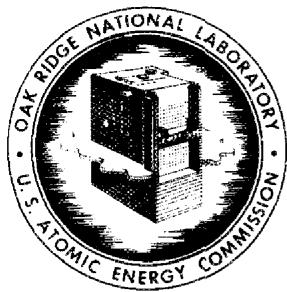
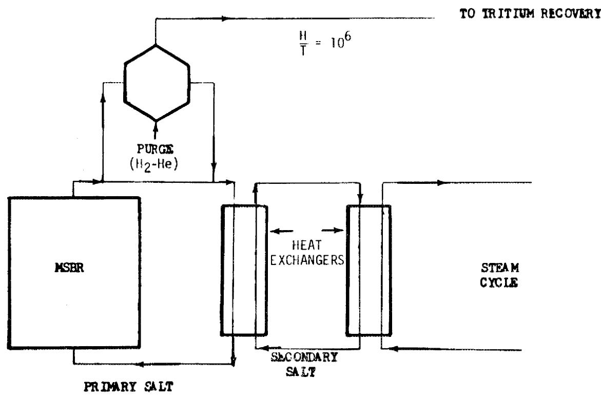
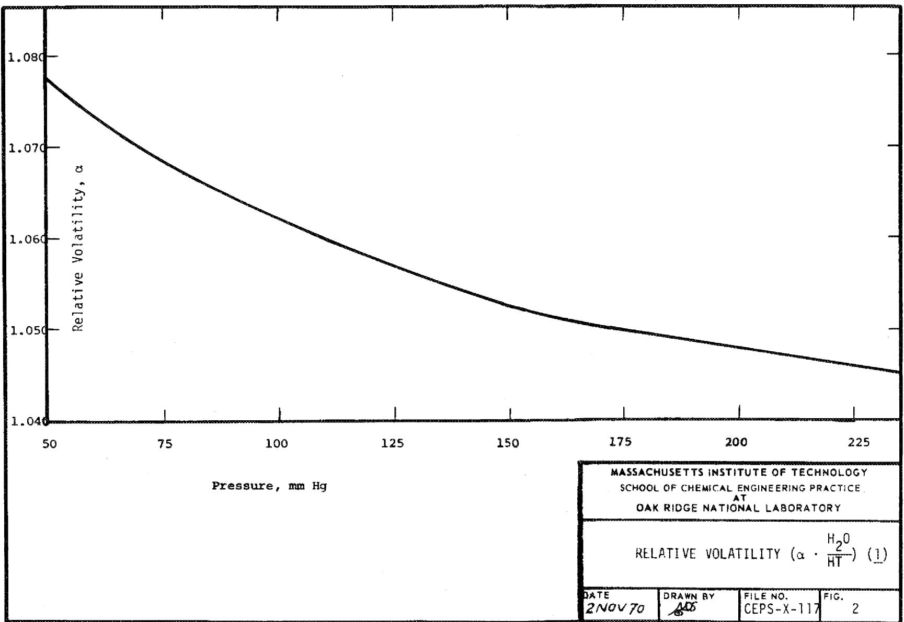
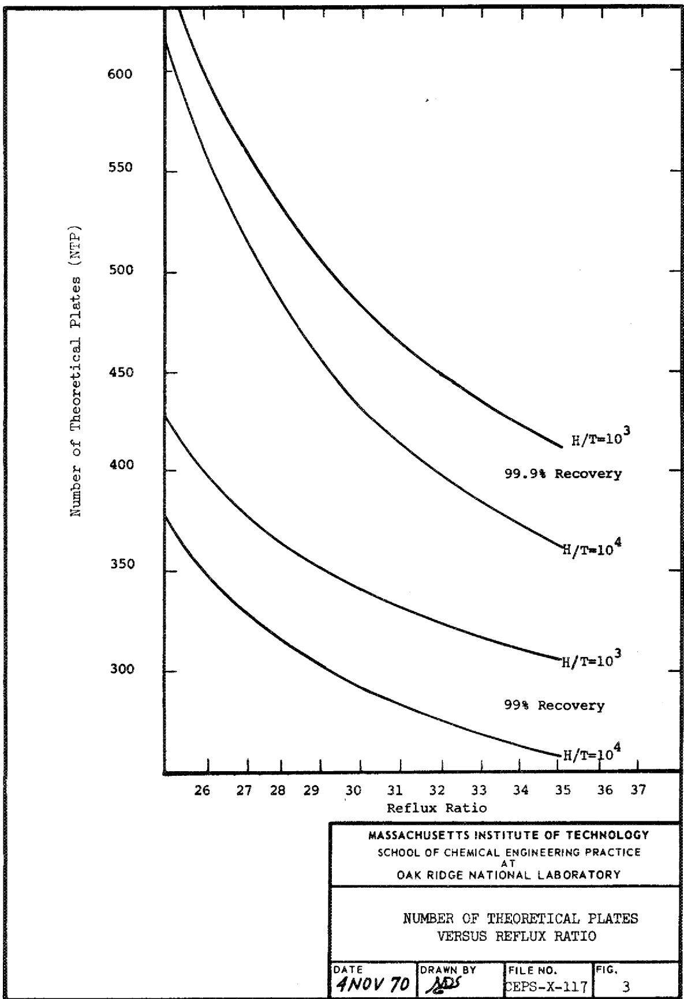
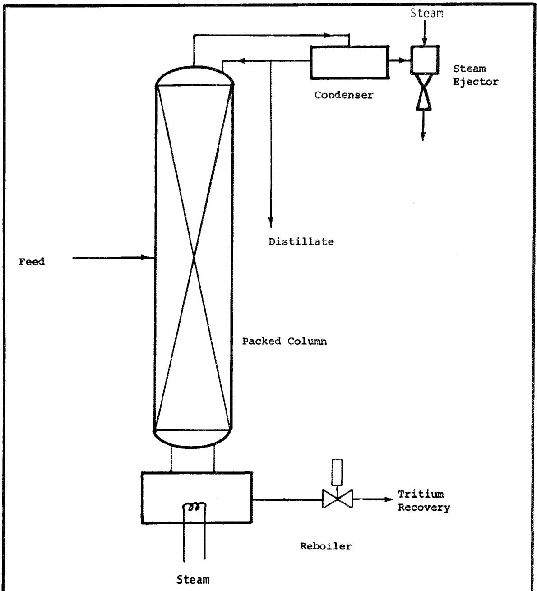
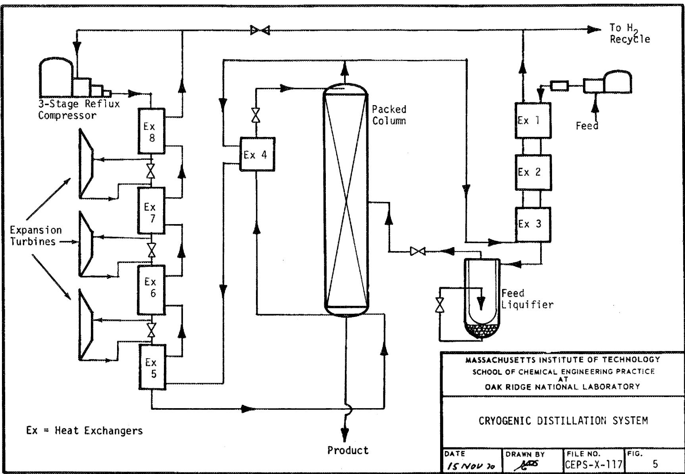
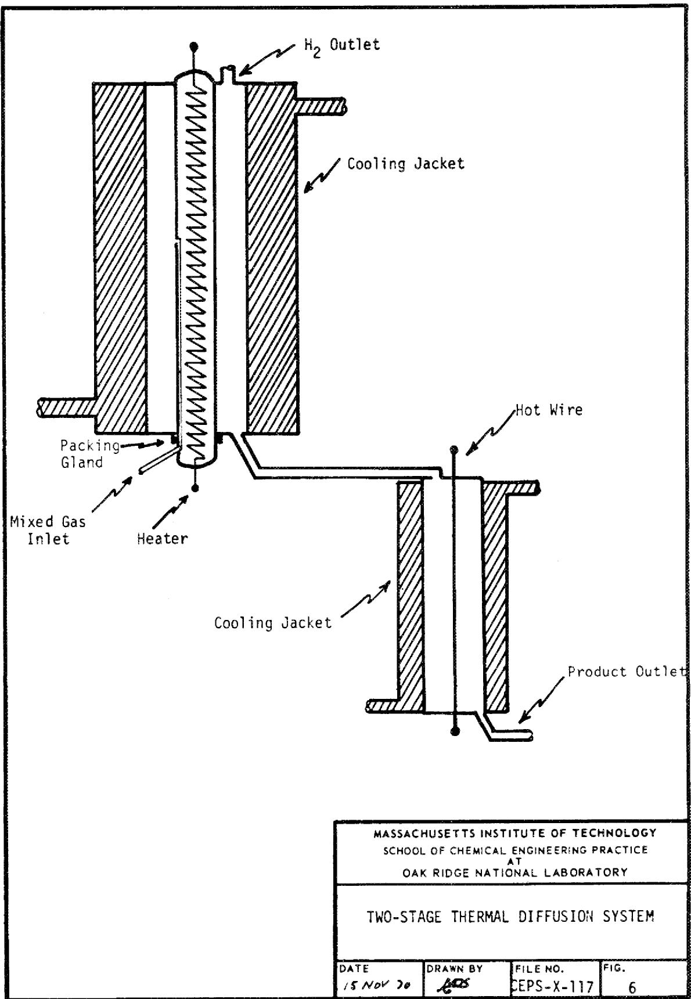

# OAK RIDGE NATIONAL LABORATORY

OPERATED BY

UNION CARBIDE CORPORATION

NUCLEAR DIVISION


POST OFFICE BOX X

OAK RIDGE, TENNESSEE 37830

ORNL-MIT-117

DATE: November 18, 1970

COPY NO.

SUBJECT: Removal of Tritium from the Molten Salt Breeder Reactor Fuel

AUTHOR: M.D. Shapiro and C.M. Reed

Consultant: R.B. Korsmeyer

# ABSTRACT

Molten Salt Breeder Reactors will produce large quantities of tritium which can permeate most metals at elevated temperatures and thereby contaminate the environment. In this project it was assumed that the tritium can be removed from the salt stream by a hydrogen-helium purge and that the helium can be separated for recycle with a palladium membrane. Several systems for concentrating and storing the tritium were conceptualized, designed, and economically evaluated. Cryogenic distillation of liquid hydrogen appears to be the most economical system. A cryogenic system with a capacity of 4630 gmoles of hydrogen per hour at a 1000-fold tritium enrichment has an estimated capital cost of $328,000 and an estimated annual operating cost of $81,000 (excluding depreciation).


# NOTICE

This report was prepared as an account of work sponsored by the United States Government. Neither the United States nor the United States Atomic Energy Commission, nor any of their employees, nor any of their contractors, subcontractors, or their employees, makes any warranty, express or implied, or assumes any legal liability or responsibility for the accuracy, completeness or usefulness of any information, apparatus, product or process disclosed, or represents that its use would not infringe privately owned rights.

Oak Ridge Station

School of Chemical Engineering Practice

Massachusetts Institute of Technology

NOTICE This document contains information of a preliminary nature and was prepared primarily for internal use at the Oak Ridge National Laboratory. It is subject to revision or correction and therefore does not represent a final report. The information is only for official use and no release to the public shall be made without the approval of the Law Department of Union Carbide Corporation, Nuclear Division.

# Contents

# Page

1. Summary 4   
2. Introduction 4   
3. Design and Evaluation of Alternate Separation Systems 6

3.1 Approach 6   
3.2 Feed Pretreatment 6   
3.3 Storage of Tritiated Water 7   
3.4 Water Distillation 7   
3.5 Thermal Diffusion 9   
3.6 Cryogenic Distillation 9

4. Discussion of Separation Systems 16   
5. Conclusions and Recommendations 16   
6. Acknowledgement 17   
7. Appendix 18

7.1 Basis for Water Distillation Costs 18   
7.2 Thermal Diffusion System 21   
7.3 Cryogenic Distillation System 22   
7.4 Computer Codes 26   
7.5 Nomenclature 29   
7.6 Literature References 30

# 1. SUMMARY

One characteristic of Molten Salt Breeder Reactors (MSBR) is the relatively large quantity of tritium which would be produced in the salt fuel stream. Tritium, like hydrogen, can permeate most metals at elevated temperatures, and thereby contaminate the environment. An efficient means of removing and concentrating tritium from the fuel stream is essential to the development of MSBR.

In this project it was assumed that the tritium can be removed from the fuel stream by a hydrogen-helium purge and that the helium can be separated from the hydrogen for recycle via a palladium membrane. Four systems were conceptualized, designed, and economically evaluated to concentrate or store the hydrogen and tritium: storage of unconcentrated tritiated water, water distillation, gaseous thermal diffusion and cryogenic distillation of liquid hydrogen. On the basis of this evaluation the most economical system, cryogenic distillation, would provide a 1000-fold tritium enrichment at an estimated capital cost of $328,000 and an annual operating cost of $81,000.

# 2. INTRODUCTION

There is presently interest at ORNL in the development of Molten Salt Breeder Reactors (MSBR). A characteristic of these reactors, however, is the generation of large quantities of tritium (half life 12.36 yr). Tritium, like hydrogen, has a very high permeability through most metals at temperature and concentration levels of the molten salt; therefore if it is not removed, it will escape from the reactor and contaminate the environment.

Tritium is a weak beta emitter (18.6 kev), but it exchanges readily with hydrogen and as tritiated water can enter the body by penetrating the skin. The effect of radiation in a very localized area and the transmutation of tritium to helium within the body may be of biological significance (1).

One proposed method of removing the tritium from the MSBR fuel stream is by means of a helium-hydrogen purge (2). The hydrogen stream would then be separated from the helium and the tritium would be concentrated and stored as tritiated water (HTO). Since tritium is an isotope, its concentration will depend mainly on physical separation processes.

In the MSBR concept the primary salt stream is comprised of molten salts of uranium, lithium, beryllium, and thorium. The primary salt circulates through the reactor where a critical mass is achieved and fission occurs. The sensible heat generated by fission is transferred to a steam cycle by means of a secondary salt stream. The flow plan is illustrated in Fig. 1.



<table><tr><td colspan="4">MASSACHUSETTS INSTITUTE OF TECHNOLOGY
SCHOOL OF CHEMICAL ENGINEERING PRACTICE
AT
OAK RIDGE NATIONAL LABORATORY</td></tr><tr><td colspan="4">MSBR FLOW PLAN</td></tr><tr><td>DATE
30 OCT 70</td><td>DRAWN BY
A.M.S.</td><td>FILE NO.
CEPS-X-117</td><td>FIG.
1</td></tr></table>

Tritium is produced in the primary salt stream by neutron absorption. The reactions producing tritium and the estimated production for a 1000 Mw(e) reactor are listed in Table 1.

Table 1. Tritium Production in a 1000 Mw(e) MSBR (3)   

<table><tr><td>Ternary Fission</td><td>31 curies/day</td></tr><tr><td>6Li(n, α) T</td><td>1210</td></tr><tr><td>7Li(n, αn) T</td><td>1170</td></tr><tr><td>19F(n, 170) T</td><td>9</td></tr><tr><td></td><td>2420 curies/day</td></tr><tr><td></td><td>≈ 0.25 gm tritium/day</td></tr></table>

# 3. DESIGN AND EVALUATION OF ALTERNATE SEPARATION SYSTEMS

# 3.1 Approach

In this study it was assumed that the tritium could be removed from the fuel stream by a mixed helium and hydrogen purge. The hydrogen and tritium would then be removed from the purge stream and concentrated. The selection of the most feasible system for effecting the desired concentration was based on a preliminary design and cost estimate for each system. The systems studied were storage of the unconcentrated tritium as tritiated water, water distillation, thermal diffusion, and cryogenic distillation of liquid hydrogen.

The design for all the systems was based on 111,000 gmoles of hydrogen per day at an $\mathrm{H / T} = 10^{6}$ . A 100- to 1000-fold enrichment was desired (i.e., $\mathrm{H / T} = 10^{3}$ to $10^{4}$ in the product stream) with a 99 to $99.9\%$ recovery of the tritium. In all cases the product tritium is to be stored as water on the MSBR site (2). For all processes the separation equipment will be enclosed in a separate building to isolate any possible tritium leak.

# 3.2 Feed Pretreatment

The purge stream will contain helium, hydrogen, and tritium as well as gaseous fission products such as krypton, xenon, iodine, and hydrogen fluoride. It is proposed to pass the purge stream through a charcoal bed to adsorb some of the gaseous fission products. To separate the helium for

recycle from the hydrogen and tritium, a palladium "kidney" would be employed. A palladium membrane which passes 15 scfh of $\mathsf{H}_2$ costs approximately $5000 (4). When the six-tenths power formula is applied to scale to the capacity required for the MSBR, an estimated purchase cost of $136,000 is realized.

It is estimated that the installed cost of the palladium kidney is four times the purchase cost of the kidney, or approximately $544,000. The same cost will be associated with each of the four alternate systems. A second item which is common to the four processes is the oxidation equipment and its installed cost is estimated to be $136,000.

# 3.3 Storage of Tritiated Water

The hydrogen and tritium would be oxidized after passing through the palladium kidney and the resulting tritiated water condensed and sent to a storage tank. Storage of tritiated water will require steel tanks encased in a concrete tank. Should a leak develop, the liquid would be contained, but an additional tank would be required to effect a transfer before final repairs could be made (5). The tanks were sized to hold 30 years production of tritium, the expected lifetime of the reactor. The liquid will have to be stored until the activity has decreased to less than $1\%$ (approximately 110 yr). At a production rate of 2000 liters/day, a tank capacity of approximately 5.8 million gallons is required. With an estimated capital cost of $1/gal (5), the two-tank system would have a capital cost of $11.6 million. Annual operating cost for this sytem would be the cost of the hydrogen and oxygen burned to form the water ($143,000) and the maintenance cost [2% of the capital cost (13)], $232,000. (See Appendix 7.1 for details.)

# 3.4 Water Distillation

During World War II the United States built and successfully operated several water distillation plants to produce heavy water. The low value of the relative volatility $(\alpha)$ , however, required the use of high reflux ratios and a large number of plates in the distillation column.

Distillation to separate tritiated water (HTO) is not as difficult as that for heavy water, since the value for $\alpha$ is several percent higher. A plot of relative volatility versus pressure indicates that such a system should be operated under vacuum to take advantage of the higher value of $\alpha$ (see Fig. 2). A computer program was written to size the distillation column. The design of the column is based on the use of a high efficiency packing such as Sulzer CY (designed for use in heavy water systems). This packing was found to have 21 theoretical plates/meter and a pressure drop of 0.19 torr/theoretical plate (6) for heavy water separations at a liquid loading of $2000\mathrm{kg} / \mathrm{M}^2$ -hr and a column head pressure of $120\mathrm{mmHg}$ . More favorable conditions might be achieved with the tritium system by lowering the head pressure of the column.



As shown in Fig. 3 the number of theoretical plates is a sharp function of the reflux ratio. Figure 4 is a schematic diagram of the proposed water distillation design. The optimum systems and operating conditions were determined by varying the reflux ratio for different enrichment and recovery factors (see Tables 4 and 5 in Appendix 7.1). Table 2 shows the major design specifications and the cost estimates for the optimized systems. Capital costs for $99\%$ recovery are $\$422,700$ at H/T = $10^4$ and $\$362,600$ at H/T = $10^3$ . For $99.9\%$ recovery, capital costs are $\$536,600$ at H/T = $10^4$ and $\$484,600$ at H/T = $10^3$ . Although the column packing and building costs are higher for H/T = $10^3$ , the overall cost is less than for H/T = $10^4$ because of the associated storage costs. The cost of recovering $99.9\%$ of the tritium for H/T = $10^3$ is $33\%$ higher than the cost for $99\%$ recovery. Operating costs in all four cases are essentially the same, $\$220,000$ annually. The cost of H2 is the major operating expense, $\$128,000$ annually. A breakdown of the column costs for other reflux ratios is in Appendix 7.1.

# 3.5 Thermal Diffusion

Thermal diffusion is based on a temperature gradient in a mixture of gases which gives rise to a concentration gradient, thereby effecting a partial separation. Jones and Furry (9) have presented a detailed discussion on the theory and design of thermal diffusion systems for binary separations. The thermal diffusion constant between two species with masses $m_1$ and $m_2$ is equal to $\frac{(m_2 - m_1)}{(m_2 + m_1)}$ , and for a hydrogen-tritium system this ratio is 1/3 which is considered high.

In a thermal diffusion column the separation rate is fixed by the temperature and pressure of the system. Theory requires that the rate of production of each column be small compared with the rate of thermal diffusion. The production rate of tritium in an MSBR is so large that $10^{3}$ to $10^{4}$ thermal diffusion columns operated in parallel would be necessary. Based on the theory of Jones and Furry, Verhagen and Sellschop (11) designed and operated a thermal diffusion system for tritium enrichment. A scaleup of their apparatus would require 5150 parallel systems for a 1000-fold enrichment with a power load of 100,000 kwh. The power consumption at $\$0.004$ /kwh would cost $2.9 million per year. (See Appendix 7.2 for apparatus details and operating conditions.)

# 3.6 Cryogenic Distillation

Due to recent advances in cryogenic engineering, several plants have been constructed which separate deuterium from hydrogen by cryogenic distillation of the liquid hydrogen feed. The relative volatility of $\mathsf{H}_2$ to HT is not available, but it is believed to be equal to, if not greater, than the relative volatility for the $\mathsf{H}_2$ -HD system ( $\alpha \cong 1.6$ at 1.5 atm). This is considerably higher than the relative volatility for the water-tritiated water system ( $\alpha \cong 1.05$ ). A second advantage is the lower consumption of $\mathsf{H}_2$ and O2. For the separation of tritium by water distillation, all the $\mathsf{H}_2$ from the purge stream is oxidized to water, but in the cryogenic system





<table><tr><td colspan="4">MASSACHUSETTS INSTITUTE OF TECHNOLOGY
SCHOOL OF CHEMICAL ENGINEERING PRACTICE
AT
OAK RIDGE NATIONAL LABORATORY</td></tr><tr><td colspan="4">WATER DISTILLATION SYSTEM</td></tr><tr><td>DATE
4 NOV 70</td><td>DRAWN BY
AOSS</td><td>FILE NO.
CEPS-X-117</td><td>FIG.
4</td></tr></table>

Table 2. Cost Estimate of Optimum Water Distillation Systems (See Appendix 7.1 for Details)   

<table><tr><td>Recovery</td><td>99%</td><td>99%</td><td>99.9%</td><td>99.9%</td></tr><tr><td>Product H/T</td><td>104</td><td>103</td><td>104</td><td>103</td></tr><tr><td>Column Diameter</td><td>1.32 M</td><td>1.32 M</td><td>1.32 M</td><td>1.32 M</td></tr><tr><td>Number Theoretical Plates</td><td>275</td><td>323</td><td>362</td><td>412</td></tr><tr><td>Designed No. Plates = 1.1 (NTP)</td><td>303</td><td>355</td><td>398</td><td>453</td></tr><tr><td>Column Height</td><td>14.4 M</td><td>16.9 M</td><td>19.0 M</td><td>21.6 M</td></tr><tr><td>Reflux Ratio</td><td>32</td><td>32</td><td>35</td><td>35</td></tr><tr><td>Installation Column Cost</td><td>$90,600</td><td>$106,200</td><td>$138,000</td><td>$157,200</td></tr><tr><td>Flow Distributors</td><td>1,500</td><td>1,200</td><td>1,200</td><td>1,200</td></tr><tr><td>Packing</td><td>139,000</td><td>163,000</td><td>200,000</td><td>228,000</td></tr><tr><td>Building</td><td>19,600</td><td>23,000</td><td>25,900</td><td>29,500</td></tr><tr><td>Covering</td><td>3,000</td><td>3,400</td><td>4,100</td><td>4,100</td></tr><tr><td>Ejector (installed)</td><td>2,000</td><td>2,000</td><td>2,000</td><td>2,000</td></tr><tr><td>Site Preparation</td><td>1,000</td><td>1,000</td><td>1,000</td><td>1,000</td></tr><tr><td>Instruments</td><td>50,000</td><td>50,000</td><td>50,000</td><td>50,000</td></tr><tr><td>Total</td><td>306,700</td><td>349,800</td><td>422,200</td><td>473,000</td></tr><tr><td>Storage Tanks</td><td>116,000</td><td>11,600</td><td>116,000</td><td>11,600</td></tr><tr><td>Total</td><td>$422,700</td><td>$361,400</td><td>$538,200</td><td>$484,600</td></tr><tr><td colspan="5">Operating Costs, $/yr (Depreciation Not Included)</td></tr><tr><td>Steam</td><td>$10,570</td><td>$10,570</td><td>$11,530</td><td>$11,530</td></tr><tr><td>H2Usage</td><td>128,160</td><td>128,160</td><td>128,160</td><td>128,160</td></tr><tr><td>O2Usage</td><td>14,685</td><td>14,685</td><td>14,685</td><td>14,685</td></tr><tr><td>Labor</td><td>45,000</td><td>45,000</td><td>45,000</td><td>45,000</td></tr><tr><td>Maintenance @ 5% Investment</td><td>21,135</td><td>18,070</td><td>26,910</td><td>24,230</td></tr><tr><td>Total</td><td>$219,550</td><td>$216,485</td><td>$226,285</td><td>$223,605</td></tr></table>

only the final product is burned, and the remainder, more than $99\%$ of the $\mathsf{H}_2$ can be recycled.

The liquid hydrogen distillation system is based on a plant built by Gebrüder Sulzer for heavy water production in DOMAT/EMS, Switzerland (18, 19). A schematic for this plant is shown in Fig. 5. The hydrogen feed is initially compressed to 3.7 atm, cooled in a series of three heat ex-changers (Nos. 1, 2, and 3), then liquified and re-evaporated in the feed liquifier before it enters the column. The vapor from the top of the column is split into two streams. One stream passes through exchangers 3, 2, and 1 to cool the feed, and then is recycled to the hydrogen purge stream. The remainder passes through exchangers 4 through 8, exchanging against the returning reflux stream. It exits exchanger 8 at ambient temperatures, and enters the reflux compressor. Because of interstage compressor cooling, the H2 gas leaves the compressor at 14 atm and $300^{\circ}\mathrm{K}$ . The stream re-enters exchanger 8 and the expansion turbines, and finally exits exchanger 5 as saturated vapor at 4.5 atm. The saturated vapor then passes through the bottom of the column where it is condensed by boiling the liquid in the reboiler. The stream passes through exchanger 4, flashes to 1.5 atm, and enters the column as saturated liquid.

The computer code used in Sect. 3.4 was modified for use with this system. Calculations showed that a column with 100 theoretical stages operating at a reflux ratio of two would yield a separation of $\mathrm{H / T} = 10^3$ at a recovery of $99.9\%$ . Although calculations showed that a reflux ratio of two was sufficient for the desired separation, the design was based on a reflux ratio of five to allow for variation of the operating conditions and to ensure a conservative cost estimate. With a packing material similar to Sulzer CY, the column would be only 13 ft high at a liquid loading of $1500 \, \mathrm{kg/m^2-hr}$ (6). As seen in Table 3 the column cost represents a small fraction of the total cost; therefore, the less difficult separations were neglected in the analysis.

Capital cost is estimated at $328,100 and operating costs at$ 80,600 annually. The building for this system must not only isolate the system, but also insulate the apparatus for the low temperatures involved. The distillation column and the low temperature heat exchangers and expansion turbines are enclosed in steel vacuum bottles to maintain cryogenic temperatures. No cost information was obtainable on the new high efficiency insulation currently being used on some cryogenic equipment. However, it is believed that the cost estimate presented is conservative. The cost of the expansion turbines was estimated from cost information for a 200 ton/day oxygen plant. This unit has 100 times the capacity required for the hydrogen liquification unit. Further details on the cryogenic distillation system, including an explanation of the cost estimate, are given in Appendix 7.3.



Table 3. Cost Evaluation of Cryogenic Distillation System   

<table><tr><td>Recovery</td><td>99.9%</td></tr><tr><td>H/T in Product</td><td>103</td></tr><tr><td>Designed Number of Stages</td><td>100</td></tr><tr><td>Reflux Ratio</td><td>5</td></tr><tr><td>Column Diameter</td><td>8 in.</td></tr><tr><td>Column Height</td><td>13 ft</td></tr></table>

<table><tr><td></td><td>Purchase Cost</td><td>Factor</td><td>Installed Cost</td></tr><tr><td colspan="4">Capital Cost</td></tr><tr><td>Column</td><td>$ 1,000</td><td></td><td></td></tr><tr><td>Packing</td><td>925</td><td></td><td></td></tr><tr><td></td><td>1,925</td><td>5</td><td>$ 9,600</td></tr><tr><td>Feed Compressor</td><td>8,700</td><td></td><td></td></tr><tr><td>Reflux Compressor</td><td>31,000</td><td></td><td></td></tr><tr><td></td><td>39,700</td><td>2</td><td>79,400</td></tr><tr><td>Heat Exchangers</td><td>46,000</td><td>2</td><td>92,000</td></tr><tr><td>Expansion Turbines</td><td></td><td></td><td>25,000</td></tr><tr><td>Instrumentation</td><td></td><td></td><td>50,000</td></tr><tr><td>Insulated Building</td><td></td><td></td><td>24,500</td></tr><tr><td>Vacuum System</td><td>9,000</td><td>4</td><td>36,000</td></tr><tr><td>Storage Tank</td><td></td><td></td><td>11,600</td></tr><tr><td>Total Capital Cost</td><td></td><td></td><td>$ 328,100</td></tr><tr><td colspan="4">Annual Operating Costs (Depreciation not Included)</td></tr><tr><td colspan="4">Electricity</td></tr><tr><td>a) Compressors</td><td></td><td></td><td>1,300</td></tr><tr><td>b) Vacuum System</td><td></td><td></td><td>200</td></tr><tr><td>H2and O2</td><td></td><td></td><td>1,300</td></tr><tr><td>Labor</td><td></td><td></td><td>45,000</td></tr><tr><td>Maintenance at 10% Capital Cost</td><td></td><td></td><td>32,800</td></tr><tr><td>Total Operating Cost</td><td></td><td></td><td>$ 80,600</td></tr></table>

# 4. DISCUSSION OF SEPARATION SYSTEMS

Storage of tritiated water without any form of concentration requires a capital cost twenty times greater than for water distillation and thirty-five times that of cryogenic distillation. Thermal diffusion also represents an unsatisfactory solution to the problem of tritium concentration. Monitoring over 5000 two-stage thermal diffusion columns and maintaining control of the feed to each column appears horrendous; and the annual power cost of $2.9 million certainly makes this system unfeasible.

Water distillation is a technically sound alternative. However, its capital and operating costs are not competitive with those of cryogenic distillation. The packing represents the major capital expense, and since all of the hydrogen is oxidized to water, the major operating expense is the cost of hydrogen. However, if the hydrogen concentration in the purge stream is sufficiently high, it might be feasible to oxidize the hydrogen directly without the use of a palladium kidney and separate it from the purge stream as water. This would not be sufficient to make water distillation competitive with the cryogenic system based on operating costs.

Cryogenic distillation has the lowest capital cost estimate as well as the lowest operating costs. Part of the economic advantage is realized by recycling $99.9\%$ of the hydrogen to the purge stream. It should be noted that the cryogenic distillation was designed for a reflux ratio of five, although for $99.9\%$ recovery at $\mathrm{H} / \mathrm{T} = 10^{3}$ , a reflux ratio of two is sufficient. Thus the system is capable of recoveries in excess of $99.9\%$ at concentrations lower than $\mathrm{H} / \mathrm{T} = 10^{3}$ .

# 5. CONCLUSIONS AND RECOMMENDATIONS

1. Cryogenic distillation of liquid hydrogen is the most economical of the alternatives studied. A cryogenic distillation system which will enrich 4630 gmole/hr of hydrogen from H/T = 10⁶ to H/T = 10³ at 99.9% recovery has an estimated capital cost of $328,100 and an estimated annual operating cost of $80,600 (excluding depreciation). There is also the associated capital cost of $680,000 for the palladium pretreatment and oxidizing systems.   
2. Water distillation or storage of unconcentrated tritiated water represents too great a capital expenditure and annual operating cost.   
3. Thermal diffusion is unattractive for concentrating tritium from a 1000 Mw(e) MSBR.

# 6. ACKNOWLEDGEMENT

The authors would like to express their gratitude to R.B. Korsmeyer for the assistance and insight he provided during this project. His enthusiasm was a constant source of encouragement. The assistance of J.T. Corea is also gratefully acknowledged.

# 7. APPENDIX

# 7.1 Basis for Water Distillation Costs

1. Column Shell thickness 0.5 in., type 304 stainless steel $1.25/1b fabricated (12)   
2. Flow Distributors: 1 approximately every 5 meters $300 each (installed) (13)   
3. Packing $200/ft³ (14)   
4. Building Cost $2.70/ft³ (25)   
5. Building Insulation
$1/ft² wall (15)   
6. Steam Ejector
$2000 installed (13, 16)   
7. Storage Tanks $1/gal (5)   
8. Steam
$0.25/10^6 Btu (Use of waste steam from the MSBR)   
9. Raw Materials $\mathsf{H}_2 = \mathbb{S}0.0048 / \mathsf{scf}$ $0_2$ liquid $= \mathbb{S}25 / \mathsf{ton}$ (17)   
10. Labor
l man/shift at $15,000 yr = $45,000   
11. Maintenance at $5\%$ of investment (13)   
12. 7000 hr of Operation Per Year Tables 4 and 5 reflect the costs of the various $\mathsf{H}_2\mathsf{O}$ distillation systems.

Table 4. Cost of Various Water Distillation Systems   

<table><tr><td></td><td colspan="6">For 99% Recovery with H/T = 104</td><td colspan="3">For 99% Recove</td></tr><tr><td>Reflux</td><td>25</td><td>27</td><td>30</td><td>32</td><td>35</td><td>40</td><td>25</td><td>27</td><td>30</td></tr><tr><td>Column Diam (M)</td><td>1.17</td><td>1.22</td><td>1.28</td><td>1.32</td><td>1.38</td><td>1.47</td><td>1.17</td><td>1.22</td><td>1.28</td></tr><tr><td>NTP</td><td>377</td><td>330</td><td>291</td><td>275</td><td>258</td><td>239</td><td>425</td><td>379</td><td>340</td></tr><tr><td>ANP = NTP x 1.1</td><td>415</td><td>363</td><td>320</td><td>303</td><td>284</td><td>263</td><td>471</td><td>417</td><td>374</td></tr><tr><td>Column Height (M)</td><td>19.8</td><td>17.3</td><td>15.2</td><td>14.4</td><td>13.5</td><td>12.5</td><td>22.4</td><td>19.9</td><td>17.8</td></tr><tr><td>Column Cost</td><td>$18,300</td><td>$16,700</td><td>$15,400</td><td>$15,100</td><td>$14,800</td><td>$14,600</td><td>$20,800</td><td>$19,200</td><td>$18,000</td></tr><tr><td>Installation (5x)</td><td>91,500</td><td>83,500</td><td>77,000</td><td>75,500</td><td>74,000</td><td>73,000</td><td>104,000</td><td>96,000</td><td>90,000</td></tr><tr><td>Flow Distributors</td><td>1,500</td><td>1,500</td><td>1,500</td><td>1,500</td><td>1,500</td><td>1,500</td><td>1,500</td><td>1,500</td><td>1,500</td></tr><tr><td>Packing</td><td>150,000</td><td>143,000</td><td>138,000</td><td>139,000</td><td>143,000</td><td>150,000</td><td>170,000</td><td>164,000</td><td>162,000</td></tr><tr><td>Building</td><td>27,000</td><td>23,600</td><td>20,700</td><td>19,600</td><td>18,400</td><td>17,000</td><td>30,500</td><td>27,000</td><td>24,200</td></tr><tr><td>Covering</td><td>3,800</td><td>3,400</td><td>3,100</td><td>3,000</td><td>2,800</td><td>2,700</td><td>4,200</td><td>3,900</td><td>3,500</td></tr><tr><td>Ejector (installed)</td><td>2,000</td><td>2,000</td><td>2,000</td><td>2,000</td><td>2,000</td><td>2,000</td><td>2,000</td><td>2,000</td><td>2,000</td></tr><tr><td>Site Preparation</td><td>1,000</td><td>1,000</td><td>1,000</td><td>1,000</td><td>1,000</td><td>1,000</td><td>1,000</td><td>1,000</td><td>1,000</td></tr><tr><td>Instrumentation</td><td>50,000</td><td>50,000</td><td>50,000</td><td>50,000</td><td>50,000</td><td>50,000</td><td>50,000</td><td>50,000</td><td>50,000</td></tr><tr><td>Subtotal</td><td>345,100</td><td>324,700</td><td>308,700</td><td>306,700</td><td>307,500</td><td>311,800</td><td>384,000</td><td>364,600</td><td>352,200</td></tr><tr><td>Storage Tanks</td><td>116,000</td><td>116,000</td><td>116,000</td><td>116,000</td><td>116,000</td><td>116,000</td><td>11,600</td><td>11,600</td><td>11,600</td></tr><tr><td>Total Capital Cost</td><td>$461,100</td><td>$440,700</td><td>$424,700</td><td>$422,700</td><td>$423,500</td><td>$427,800</td><td>$395,600</td><td>$376,200</td><td>$363,800</td></tr><tr><td>Steam Cost/yr</td><td>8,330</td><td>8,980</td><td>9,940</td><td>10,570</td><td>11,530</td><td>13,130</td><td>8,330</td><td>8,980</td><td>9,940</td></tr></table>

Table 5. Cost of Various Water Distillation Systems   

<table><tr><td></td><td colspan="6">For 99.9% Recovery with H/T = 10^4</td><td colspan="3">For 99.9% Recover</td></tr><tr><td>Reflux</td><td>25</td><td>27</td><td>30</td><td>32</td><td>35</td><td>40</td><td>25</td><td>27</td><td>30</td></tr><tr><td>Column Diam (M)</td><td>1.17</td><td>1.22</td><td>1.28</td><td>1.32</td><td>1.38</td><td>1.47</td><td>1.17</td><td>1.22</td><td>1.28</td></tr><tr><td>NTP</td><td>614</td><td>516</td><td>431</td><td>397</td><td>362</td><td>329</td><td>660</td><td>561</td><td>482</td></tr><tr><td>ANP = NTP x 1.1</td><td>675</td><td>570</td><td>474</td><td>437</td><td>398</td><td>362</td><td>726</td><td>617</td><td>530</td></tr><tr><td>Column Height (M)</td><td>32.1</td><td>27.1</td><td>22.6</td><td>20.8</td><td>19.0</td><td>17.2</td><td>34.6</td><td>29.4</td><td>25.2</td></tr><tr><td>Column Cost</td><td>$35,900</td><td>$29,000</td><td>$25,400</td><td>$24,100</td><td>$23,000</td><td>$22,200</td><td>$36,900</td><td>$31,500</td><td>$28,300</td></tr><tr><td>Installation (5x)</td><td>180,000</td><td>145,000</td><td>127,000</td><td>121,000</td><td>115,000</td><td>111,000</td><td>185,000</td><td>158,000</td><td>142,000</td></tr><tr><td>Flow Distributors</td><td>2,100</td><td>1,800</td><td>1,500</td><td>1,200</td><td>1,200</td><td>1,200</td><td>2,100</td><td>1,800</td><td>1,500</td></tr><tr><td>Packing</td><td>265,000</td><td>224,000</td><td>205,000</td><td>200,000</td><td>200,000</td><td>206,000</td><td>272,000</td><td>243,000</td><td>229,000</td></tr><tr><td>Building</td><td>43,800</td><td>37,000</td><td>30,800</td><td>28,400</td><td>25,900</td><td>23,400</td><td>47,200</td><td>40,000</td><td>34,400</td></tr><tr><td>Covering</td><td>6,200</td><td>5,000</td><td>4,300</td><td>4,400</td><td>4,100</td><td>3,800</td><td>6,400</td><td>5,300</td><td>4,700</td></tr><tr><td>Ejector (installed)</td><td>2,000</td><td>2,000</td><td>2,000</td><td>2,000</td><td>2,000</td><td>2,000</td><td>2,000</td><td>2,000</td><td>2,000</td></tr><tr><td>Site Preparation</td><td>1,000</td><td>1,000</td><td>1,000</td><td>1,000</td><td>1,000</td><td>1,000</td><td>1,000</td><td>1,000</td><td>1,000</td></tr><tr><td>Instrumentation</td><td>50,000</td><td>50,000</td><td>50,000</td><td>50,000</td><td>50,000</td><td>50,000</td><td>50,000</td><td>50,000</td><td>50,000</td></tr><tr><td>Subtotal</td><td>596,000</td><td>494,800</td><td>447,000</td><td>432,100</td><td>422,200</td><td>420,600</td><td>602,600</td><td>532,600</td><td>492,900</td></tr><tr><td>Storage Tanks</td><td>116,000</td><td>116,000</td><td>116,000</td><td>116,000</td><td>116,000</td><td>116,000</td><td>11,600</td><td>11,600</td><td>11,600</td></tr><tr><td>Total Capital Cost</td><td>$712,000</td><td>$610,800</td><td>$563,000</td><td>$548,100</td><td>$538,200</td><td>$536,600</td><td>$614,200</td><td>$544,200</td><td>$504,500</td></tr><tr><td>Steam Cost/yr</td><td>8,330</td><td>8,980</td><td>9,940</td><td>10,570</td><td>11,530</td><td>13,130</td><td>8,330</td><td>8,980</td><td>9,940</td></tr></table>

# 7.2 Thermal Diffusion System

The theory of Jones and Furry (9) states that the temperature and pressure fix the operating parameters of a thermal diffusion system. The calculations are presented to illustrate that thermal diffusion systems of the scale required by an MSBR are uneconomical. From Equations 70-72 of Jones and Furry, we obtain for concentric columns:

$$
\begin{array}{l} H = \frac {(2 w) ^ {3} \rho^ {2} a g B}{6 ! \eta} (\Delta T / T) ^ {2} \\ K _ {C} = \frac {(2 w) ^ {7} \rho^ {3} g ^ {2} B}{9 ! n D} (\Delta T / T) ^ {2} \\ K _ {d} = 2 w \rho D B \\ \end{array}
$$

These equations are used subject to the constraint that $5 < K_{c} / K_{d} < 25$ . For an efficient operation $K_{c} / K_{d} = 10$ . The ratio of $B / 2w = 20$ corresponds to the value of Jones and Flurry and Verhagen (11).

Inserting the appropriate values for hydrogen, we find that:

$$
\begin{array}{l} P = 1 \text {a t m} \quad P = 5 \text {a t m} \\ T _ {1} = 3 0 0 ^ {\circ} \mathrm {K}; T _ {2} = 6 0 0 ^ {\circ} \mathrm {K} \quad T _ {1} = 3 0 0 ^ {\circ} \mathrm {K}; T _ {2} = 6 0 0 ^ {\circ} \mathrm {K} \\ \eta = 1. 1 8 \times 1 0 ^ {- 4} \text {p o i s e} \quad \eta = 1. 1 8 \times 1 0 ^ {- 4} \text {p o i s e} \\ \rho = 0. 5 4 \times 1 0 ^ {- 4} g / c c \quad \rho = 2. 7 1 \times 1 0 ^ {- 4} g / c c \\ D = 2. 9 9 \mathrm {c m} ^ {2} / \sec \quad D = 0. 5 2 2 5 \mathrm {c m} ^ {2} / \sec \\ \alpha = 0. 1 7 4 \quad \alpha = 0. 1 4 9 \\ 2 w = 1. 2 5 3 \mathrm {c m} \quad 2 w = 0. 5 7 4 \mathrm {c m} \\ B = 1 5. 9 \mathrm {c m} \quad B = 1 1. 4 8 \mathrm {c m} \\ H = 0. 7 7 4 \times 1 0 ^ {- 4} g / \sec \quad H = 8. 1 7 \times 1 0 ^ {- 4} g / \sec \\ K _ {C} = 5. 0 6 \times 1 0 ^ {- 2} g - c m / s e c K _ {C} = 2. 6 6 \times 1 0 ^ {- 3} g - c m / s e c \\ K _ {d} = 5. 0 7 \times 1 0 ^ {- 3} g - c m / s e c K _ {d} = 2. 6 6 \times 1 0 ^ {- 4} \\ \end{array}
$$

$\sigma =$ rate of mass transport of the desired species, i.e., the production rate in g/sec.

McInteer (10) has reported that $\sigma / H$ must be much less than one; and from Jones and Furry (9) we see that $\sigma / H$ should be on the order of $10^{-4}$ to $10^{-6}$ for each stage. MSBR requirements are such that the total flow rate is $9.55 \times 10^{-4} \, \text{g/sec}$ . To satisfy theory $10^{4}$ to $10^{6}$ columns in parallel will be required. Based on the theory of Jones and Furry, Verhagen and Sellschop (11) designed and operated a thermal diffusion system for tritium enrichment. Their apparatus is schematically shown in Fig. 6. The specifications are given in Table 6.

Table 6. Thermal Diffusion System of Verhagen and Sellschop (11)   

<table><tr><td></td><td>Stage 1</td><td>Stage 2</td></tr><tr><td>Type of unit</td><td>concentric tube</td><td>hot wire</td></tr><tr><td>Radius, hot wall</td><td>6.30 cm</td><td>0.02 cm</td></tr><tr><td>Radius, cold wall</td><td>8.76 cm</td><td>1.50 cm</td></tr><tr><td>Length</td><td>7.20 m</td><td>2.75 m</td></tr><tr><td>Temperature, hot wall</td><td>600°K</td><td>1200°K</td></tr><tr><td>Temperature, cold wall</td><td>300°K</td><td>300°K</td></tr><tr><td>Power consumption</td><td>18.5 kwh</td><td>1.66 kwh</td></tr><tr><td>Pressure</td><td>1 atm</td><td>1 atm</td></tr></table>

At the required enrichment of 1000-fold, this system has a production capacity of only 0.125 cc(STP)/min of tritium. Based on this design approximately 5150 systems in parallel are necessary to process the 642 cc(STP)/min from the MSBR. Aside from the extreme difficulty in maintaining a uniform feed rate to each column [to which thermal diffusion systems are very sensitive (9)], the power consumption is extremely high. The overall system requires 72.7 x 10⁷ kwh/yr at $0.004/kwh or a yearly power cost of $2.9 million.

# 7.3 Cryogenic Distillation System

# 7.3.1 Design of Cryogenic Distillation Column

The specifications given in Table 3 were based on an $\alpha$ of 1.6. This value is for a hydrogen-deuterium system; however, it is believed that the $\alpha$ for the tritium system would be at least as great if not greater.



Computer calculations were made for the four different separations at various reflux ratios and for both saturated liquid and saturated vapor feeds. Selected results are presented in Table 7.

Table 7. Variation of NTP with Operating Parameters for $\mathsf{H}_2$ Distillation Column   

<table><tr><td>NTP</td><td>53</td><td>58</td><td>88</td><td>93</td><td>98</td><td>76</td><td>49</td><td>50</td></tr><tr><td>Q&#x27;</td><td>1</td><td>1</td><td>1</td><td>1</td><td>0</td><td>0</td><td>1</td><td>0</td></tr><tr><td>Reflux Ratio</td><td>2</td><td>2</td><td>2</td><td>2</td><td>2</td><td>2.2</td><td>3</td><td>3</td></tr><tr><td>% Recovery</td><td>99.0</td><td>99.0</td><td>99.9</td><td>99.9</td><td>99.9</td><td>99.9</td><td>99.9</td><td>99.9</td></tr><tr><td>H/T Product</td><td>10^4</td><td>10^3</td><td>10^4</td><td>10^3</td><td>10^3</td><td>10^3</td><td>10^3</td><td>10^3</td></tr></table>

For a liquid feed and $R = 2$ , it is seen that lowering H/T from $10^4$ to $103$ causes an increase of only five stages for either 99.0 or $99.9\%$ recovery. The difference between 99 and $99.9\%$ recovery is 40 plates at $R = 2$ , but NTP is still under 100 for $99.9\%$ recovery. If the feed is a saturated vapor, NTP is slightly higher but the difference is insignificant. NTP drops rapidly at reflux ratios above 2. A $10\%$ increase in reflux from 2 to 2.2 lowers NTP from 98 to 76, and increasing the reflux from 2 to 3 lowers NTP from 93 to 49.

In view of these results it was felt that a column with 100 theoretical stages operating at a reflux ratio of 2 would be adequate for the most difficult separation, i.e., recovery $= 99.9\%$ and $\mathrm{H / T} = 10^3$ . However, in calculating the cost of the system a reflux ratio of 5 was used to provide operational flexibility, conservative separation capability, and cost estimate.

# 7.3.2 Basis for $\mathsf{H}_2$ Distillation Costs

1. Column shell thickness 1/4 in., type 304 stainless steel $1.25/1b fabricated (12)   
2. Packing $200/ft³ (14)   
3. Heat exchangers
\[
\begin{aligned}
& \text{Heat exchangers} \\
& \quad \text{$4/ft}^2 \text{ purchase price for plate-fin type (20)} \\
& \quad \text{area calculated from Q = UA} \Delta T
\end{aligned}
\]

where $U = 2$ Btu/hr- $ft^2 -^\circ F$ for gas-gas exchange

$$
\Delta T = 5 ^ {\circ} K = 9 ^ {\circ} F
$$

$$
\begin{array}{l} Q = (4 6 3 0 \text {m o l e f e e d / h r}) (6 \text {m o l e r e f l u x / m o l e f e e d}) (7. 4 4 \frac {\text {B t u}}{\text {m o l e r e f l u x}}) \\ = 2 0 7, 0 0 0 \mathrm {B t u} / \mathrm {h r} \\ \end{array}
$$

7.44 Btu is the $\Delta H$ per mole of $\mathsf{H}_2$ from saturated vapor at 1.5 atm to $295^{\circ}\mathsf{K}$ at 1.5 atm (21)

$$
\text {a r e a} = (2 0 7, 0 0 0) / (2) (9) = 1 1, 5 0 0 f t ^ {4}
$$

4. Compressors

$$
\text {p u r c h a s e} = \$ 7 7 4 0 + (\$ 9 9. 5) (\text {H P}) (2 0)
$$

For 3-stage reflux compressor,

$$
\mathrm {c o s t} = 3 (7 7 4 0) + 9 9. 5 (\mathrm {H P})
$$

Calculated compressor size based on

$$
W _ {n} = \frac {k N R T _ {1}}{k - 1} \left[ 1 - \left(\frac {P _ {2}}{P _ {1}}\right) (k - 1) / k \right] \quad (2 2)
$$

$$
\text {w h e r e :} k = C _ {p} / C _ {v} = 1. 4 0 5 \text {f o r n o r m a l H} _ {2} \tag {23}
$$

From this equation the work of compressing the feed was calculated: $300^{\circ}\mathrm{K}, P_{1} = 1 \, \mathrm{atm}, P_{2} = 3.7 \, \mathrm{atm}$ , and $W_{n} = 0.947 \, \mathrm{kcal/mole}$ . For a feed of 530 mole/hr,

$$
W _ {n} = (4 3 8 5 \mathrm {k c a l / h r}) (\frac {0 . 0 0 1 5 6 \mathrm {H P}}{\mathrm {k c a l / h r}}) = 6. 8 \mathrm {H P}
$$

A $20\%$ margin of safety was allowed and an overall efficiency of $85\%$ was assumed, yielding a design of 10 HP.

For the 3-stage reflux compressor with interstage cooling, a $T_{1}$ of $245^{\circ} \mathrm{K}$ was used for all three stages. The initial pressure is 1.5 atm and interstage pressures of 5.5 and 9.5 atm were used in applying the above equation which yields $W_{n} = 1.51 \text{kcal/mole}$ . For a reflux ratio of 5 the power requirement is 54 HP, and with a $20\%$ margin of safety and $85\%$ efficiency the design is 77 HP.

5. Expansion Turbines

Lady (24) quotes a capital cost of $25,000 for an expansion turbine in a 200 ton/day liquid $0_{2}$ plant. To be on the conservative side the same

figure is used in this cost estimate for the installed cost of the three expansion turbines.

6. Insulated building

```txt
$500/ft² floor space (15) 
```

7. Two vacuum tanks, type 304 stainless steel

```txt
0.5-in.-thick x 15-ft-high x 3.5-ft-diam at $1.25/lb 
```

```txt
fabricated = $9000 (12) 
```

Installed cost of vacuum bottles including all vacuum equipment is $36,000.

8. Electricity

```txt
$0.004/kwh (2) 
```

9. Raw materials:

```txt
H2 = $0.0048/scf (17) 
```

$0_{2} = \$ 25 / \text{ton (liquid)}$

10. Labor

```txt
one man/shift = $45,000 
```

11. Maintenance

```txt
10% of investment (13) 
```

12. 7000 hr operation per year

# 7.4 Computer Codes

A listing of the computer program for the water distillation column is shown below. The basis of calculation was a feed of 100 mole.

$XF = .999998$

55 ACCEPT $K= $,K; IF(K),57.; ACCEPT KK;IF(KK),58,

ACCEPT $PRT = $,PRT,$NP = $,NP,$DELP = $,DELP

58 ACCEPT $REC = $,REC,$WOT = $,WOT,$R = $,R

BHT0=REC\*O.0002;BWAT=BHT\*wT;B=BHT0+BWAT;XB=BWAT/B;D=100.-B

DWAT=99.9998-BWAT;XD=DWAT/D;RLØV=R/(R+1.);SLØV=(R+100./D)/(R+1.)

[DXD = XD / (R + 1.)\text{;} BXB = (B / D)\text{*} XB / (R + 1.)]

60 FFORMAT(15,F15.10,F9.5)

N=1;J=1;JJ=1;Y=XD;PR=PRT;A1=RLV;A2=DXD

```csv
20 CALL ALPHA(PR,A)
X=Y/(A-(A-1).)*Y);IF(J-JJ*K)24,22,22
24 IF(N),29.;IF(X-XF)30,30,25
29 IF(X-XB)40,
25 Y=A1*A2;J=J+1;IF(J-NP)26,27,27
26 PR=PR+DELP;G∅ T∅ 20
27 DISPLAY $STAGES=$,J,$X=$,X;J=1;PR=PRT;JJ=1;G∅ T∅ 20
22 JJ=JJ+1;WRITE(1,60)J,X,A;G∅ T∅ 24
30 N=0;Al=SL∅V;A2=-BXB;G∅ T∅ 25
40 WRITE(1,60)J,X;G∅ T∅ 55
57 ST∅P
END
S'E ALPHA(PR,A)
D'N AL(9),P(9)
DATA AL/1.0775,1.0735,1.07,1.067,1.062,1.056,1.0512,1.0478,1.044/
DATA P/50.,60.,70.,80.,100.,130.,160.,200.,250./D∅ 8 J=1,10
IF(P(J)-PR) 8,9,10
8 CONTINUE
9 A=AL(J); G∅ T∅ 15
10 A=AL(J-1)+(AL(J)-AL(J-1))*(PR-P(J-1))/(P(J)-P(J-1))
15 RETURN
END
* 
```

The following list defines the important variables in the program.

XF mole fraction of $\mathsf{H}_2\mathsf{O}$ in the feed   
PRT pressure at the top of the column (torr)   
NP maximum number of plates in a column; if NP is exceeded the program continues with a new column, resetting the top pressure to PRT   
DELP pressure drop per theoretical stage (torr)   
REC fractional recovery of HTO   
WOT ratio of $\mathsf{H}_2\mathsf{O}$ to HTO in the bottoms   
R reflux ratio $= L / D$ BHT0 number of moles of HTO in bottoms based on 100 moles feed   
BWAT number of moles of $\mathsf{H}_2\mathsf{O}$ in bottoms   
B number of moles in bottoms   
D number of moles in distillate   
XB mole fraction $\mathsf{H}_2\mathsf{O}$ in bottoms

XD mole fraction $\mathsf{H}_2\mathsf{O}$ in distillate

DWAT number of moles $\mathsf{H}_2\mathsf{O}$ in distillate

RL0V L/V above the feed

SL0V L/V below the feed

DXD D·XD/V

BXB B·XB/V

A relativevolatilityof $\mathsf{H}_2\mathsf{O}$ toHTO

PR pressure at any point in the column (torr)

X liquid mole fraction of $\mathsf{H}_2\mathsf{O}$ at any point

Y vapor mole fraction of $\mathsf{H}_2\mathsf{O}$ at any point

The program assumes constant molal overflow which is certainly justified since the liquid and vapor streams are at least $99.9\%$ H20. The variation of relative volatility with pressure is introduced according to the curve in Fig. 2. The feed is assumed to be saturated liquid.

For the cryogenic $\mathsf{H}_2$ distillation the program was modified for the thermal condition of the feed, and the variable alpha subroutine was replaced with a constant alpha. The following printout shows the modified program.

$XF = .999998$ $A = 1.6$

55 ACCEPT $K = $, K; IF(K), 57,

ACCEPT $REC=$,$REC,$WOT=$,$WOT,$R=$,$R,$Q=$,$Q

BHT0=REC\*O.0002;BWAT=BHT0\*W0T;B=BHT0+BWAT;XB=BWAT/B;D=100.-B

DWAT=99.9998-BWAT;XD=DWAT/D;RLØV=R/(R+1.);VL=D*(R+1.)-100.*(-Q)

[ \text{SL} \varnothing = (\text{R}^{\star} \text{D} + \text{Q}^{\star} 100.) / \text{VL}; \text{BXB} = \text{B}^{\star} \text{XB} / \text{VL}; \text{DXD} = \text{XD} / (\text{R} + \text{I}.) ]

60 FQRMAT(I5,F15.10)

IF(Q.EQ.1.0) G0 T0 70;XIN=(XF/(Q-1.)+XD/(R+1.))/((Q/(Q-1.)-R/(R+1.))

DISPLAY $XIN = $, XIN; G0 T0 69

70 XIN=XF

69 $N = 1;J = 1;JJ = 1;Y = XD;A1 = RL\emptyset V;A2 = DXD$

20 $X = Y / (A - (A - 1) * Y)$ ; IF $(J - JU*K)24, 22, 22$

24 IF(N),29,;IF(X-XIN)30,30,25

29 IF(X-XB)40,

25 $Y = A1^{*}X + A2;J = J + 1;G0T0$ 20

22JJ=JJ+1;WRITE(1,60)J,X;G0T0 24

30 N=0;A1=SL0V;A2=-BXB;G0 T0 25

40WRITE(1,60)J,X;G0T055

57 STOP

Definitions of the new variables are as follows:

Q heat to convert one mole feed to a saturated vapor molar heat of vaporization

For a staurated liquid feed $Q = 1$ ; for a saturated vapor feed $Q = 0$ .

VL vapor rate below the feed

XIN liquid mole fraction of $\mathsf{H}_2\mathsf{O}$ at the intersection of the Q-line with the upper operating line; at this X value the program switches from the upper operating line to the lower operating line

# 7.5 Nomenclature

A heat transfer area, $\mathsf{cm}^2$

ATP actual number of plates

B mean circumference $= \pi (r_{1} - r_{2})$ ,cm

Cp specific heat at constant pressure, cal/g-°C

$C_{\nu}$ specific heat at constant volume, cal/g-°C

D coefficient of self diffusion, $\mathrm{cm}^2/\mathrm{sec}$

Ex heat exchanger

g acceleration of gravity, cm/sec²

transport coefficient of thermal diffusion, g/sec

K ratio of specific heats $(C_{\mathrm{p}} / C_{\mathrm{v}})$

$K_{C}$ transport coefficient of mixing due to convection

$K_{d}$ transport coefficient of mixing due to diffusion

m atomic mass

number of gram moles

NTP number of theoretical plates

P system pressure, atm

Q heat transferred per unit time, Btu/hr

Q' ratio of molar enthalpy change in converting feed to saturated vapor to the molar heat of vaporization  
R reflux ratio, gas constant  
r radius $(r_1 > r_2)$ , cm  
STP standard temperature and pressure  
T temperature, °C $\Delta T$ temperature driving force, °C  
U overall coefficient of heat transfer  
w half the annular distance = $\frac{1}{2} (r_1 - r_2)$ , cm $W_{n}$ work of adiabatic compression per mole, Hp  
α relative volatility, thermal diffusion constant  
η viscosity, poise  
ρ density, g/cc  
σ mass transport rate of desired species, g/sec

# Subscripts

1,2 atomic mass of components 1 and 2 respectively, or initial and final conditions of temperature or pressure

# 7.6 Literature References

1. Jacobs, D.G., "Sources of Tritium and Its Behavior Upon Release to the Environment, p. 1, USAEC Div. of Technical Information (1968).   
2. Korsmeyer, R.B., personal communication, ORNL, November 20, 1970.   
3. Briggs, R.B., and R.B. Korsmeyer, "Distribution of Tritium in an MSBR," ORNL-4548, p. 54 (Feb. 28, 1970).   
4. McNeese, L.E., personal communication, ORNL, November 11, 1970.   
5. Yarbro, 0.0., personal communication, ORNL, November 12, 1970.   
6. Huber, M., and W. Meier, "Measurement of the Number of Theoretical Plates in Packed Column with Artificially Produced Maldistribution," Sulzer Technical Review, Achema 1970, Sulzer Brothers Limited, Winterthur, Switzerland.

7. Benedict, M., and T.H. Pigford, "Nuclear Chemical Engineering," 443-453, McGraw-Hill, New York (1957).   
8. Murphy, G.M., ed., "Production of Heavy Water," 9-52, McGraw-Hill, New York (1955).   
9. Jones, R.C., and W.H. Furry, "The Separation of Isotopes by Thermal Diffusion," Rev. Mod. Phys., 18(2), 151 (1946).   
10. McInteer, B.B., L.T. Aldrich, and A.O. Nier, "Concentration of He<sup>3</sup> by Thermal Diffusion," Phys. Rev., 74(8), 946 (1948).   
11. Verhagen, B.T., and J.P.F. Sellschop, "Enrichment of Low Level Tritium by Thermal Diffusion for Hydrological Applications," Proc. Third Int. Conf. on Peaceful Uses of Atomic Energy, Geneva, 1964, Vol. 12, 398-408, United Nations, New York (1965).   
12. Russell, W., personal communication, Knoxville Sheet Metal Co., Knoxville, Tenn., November 4, 1970.   
13. Peters, M.S., and K.P. Timmerhaus, "Plant Design and Economics for Chemical Engineers, 2nd ed., 655, McGraw-Hill, New York (1968).   
14. Bragg, E.J., personal communication, Packed Column Corp., Springfield, N.J., November 4, 1970.   
15. Corea, J.T., personal communication, ORNL, November 1970.   
16. Chilton, C.H., "Cost Engineering in the Process Industries," p. 112, McGraw-Hill, New York (1960).   
17. Ellis, E.C., personal communication, Purchasing Div., ORNL, November 11, 1970.   
18. Becker, E.W., "Heavy Water Production," Review Series No. 21, Int. AEA, Vienna (1962).   
19. Hanny, J., "Eine Tiefttemperaturanlage Zur Gewinnung Von Schwerem Vasser," Kaltetechnic, 12(6), 158-169 (1960).   
20. Perry, J.H., "Chemical Engineers' Handbook," 4th ed., Chapt. 11, p. 14, McGraw-Hill, New York (1963).   
21. Barron, R.F., "Cryogenic Systems," pp. 644-645, McGraw-Hill, New York (1966).   
22. Weber, H.C., and H.P. Meissner, "Thermodynamics for Chemical Engineers," 2nd ed., p. 114, Wiley & Sons, New York (1957).   
23. Airco Rare and Speciality Gases Catalog, p. 48, 1968.

24. Lady, E.R., "Cryogenic Engineering," Univ. of Mich. Engineering Summer Conferences, Chapt. XVII, "Expansion Engines and Turbines," p. 2 (May 1965).   
25. "Building Construction Cost Data - 1971," R.S. Means Co., p. 148 (Factories), 1971.

ORNL-MIT-117

# Internal

1. E.S. Bettis   
2. R.B. Briggs   
3. P.N. Haubenreich   
4. P.R. Kasten   
5. R.B. Korsmeyer

6-8. M.I. Lundin

9. L.E. McNeese

10. Lewis Nelson   
11. M.W. Rosenthal   
12. J.S. Watson   
13. M.E. Whatley

14-15. Central Research Library

16. Document Reference Section   
17-19. Laboratory Records   
20. Laboratory Records, ORNL R.C.   
21. ORNL Patent Office

22-36. M.I.T. Practice School

# External

37. R.F. Baddour, MIT   
38. L.A. Clomburg, MIT   
39. S.M. Fleming, MIT