DATE: March 5, 1970

COPY NO.

SUBJECT: Analysis and Scaleup of the Pulsed-Gas Impregnation of Graphite with Carbon

AUTHOR: S.H. Rose, A.A. Jeje, and J.M. Ganzer*

Consultant: C.B. Pollock

# ABSTRACT

A gas-pulsed impregnation technique for depositing pyrolytic carbon in the surface pores of graphite was scaled-up to handle graphite rods to be used in molten salt reactors. In addition, an attempt was made to apply an autoradiograph technique to a study of the degree of attachment of the pyrolytic carbon. However, this portion of the study was not completed.

*Revised in part by R.H. Mayer and M.S. Bautista

Oak Ridge Station  
School of Chemical Engineering Practice  
Massachusetts Institute of Technology

NOTICE This document contains information of a preliminary nature and was prepared primarily for internal use at the Oak Ridge National Laboratory. It is subject to revision or correction and therefore does not represent a final report. The information is only for official use and no release to the public shall be made without the approval of the Legal and Information Control Department of Union Carbide Corporation, Nuclear Division.

# Contents

1. Summary 4   
2. Introduction 4

2.1 Background 4   
2.2 Objectives 5   
2.3 Method of Attack 5

3. Scaleup of the Pulsed-Gas Impregnation Process 6

3.1 Laboratory Apparatus and Procedure 6   
3.2 Scaleup 6   
3.3 Foreseeable Problems in the Scaleup 12

4. Development of Autoradiographic Technique 12

4.1 Background 12   
4.2 Experimental Design for Determining Migration of Pyrolytic Carbon into the Graphite 13

5. Conclusions and Recommendations 15   
6. Acknowledgement 15

7. Appendix 16

7.1 Design Specifications 16   
7.2 Factors Considered in Scaleup 17   
7.3 Additional Background Discussion 20   
7.4 Analysis of Autoradiograph Results 26   
7.5 Penetration and Detection of Tracer 26   
7.6 Apparatus and Procedure for Synthesis of Acetylene 31   
7.7 Literature References 34

# 1. SUMMARY

A pulsed-gas impregnation technique has been developed for reducing the permeation of undesirable gases into the low porosity graphite to be used in Molten Salt Reactors (1). The technique involves intermittently exposing the graphite at $850^{\circ}\mathrm{C}$ to a hydrocarbon gas ( $\sim 0.5$ sec) and a vacuum ( $\sim 15$ sec) in order to deposit pyrolytic carbon in the surface pores. It was the purpose of this investigation to develop a technique to evaluate the coating stability and to propose a scale-up of the laboratory equipment for production of full-size graphite rods.

An attempt was made to characterize the mode of attachment of pyrolytic carbon by autoradiography. The experimental program involved depositing carbon (14C-labelled) by pyrolysis of a 14C-labelled acetylene in pores of a low porosity graphite sample; taking autoradiographs of internal sections of the sample; and utilizing optical density methods to determine the concentration of the isotope as a function of position. The concentration profile can then be mathematically analyzed to calculate the diffusion coefficient (or more appropriately - migration constant) of pyrolytic carbon into the graphite. At the time of this report the experimental results were not available.

A scale-up was proposed for production of full-size rods (16 ft by 4 in. by 4 in.) under the same conditions found to be optimum for impregnating the laboratory sample (0.5 in. by 0.4 in. OD by 0.126 in. ID).

The following recommendations were made:

1) The proposed experimental program to evaluate the attachment of pyrolytic carbon to graphite should be completed, and the values of diffusion coefficients of pyrolytic carbon into graphite estimated as a function of temperature and duration of heat treatment of the finished sample.   
2) Further developments in the gas-pulse technique should be made, and optimization of conditions for the best attachment of pyrolytic carbon obtained.   
3) A full-size rod production process should be developed using the design specifications given and the optimum conditions obtained from recommendation (2).

# 2. INTRODUCTION

# 2.1 Background

The present concept of the molten salt reactor (MSR) utilizes graphite arranged in a lattice as flow conduits for the molten salt and as a moderator and reflector in breeder reactors. Fission products sorption in the

graphite must be minimized, because the after-heat they produce necessitates long cool-off periods at the end of the graphite life. Also, when the MSR is used to breed fissile material, the accumulation of $^{135}\mathrm{Xe}$ must be prevented because of the large neutron absorption cross section of xenon. It has been demonstrated that excessive xenon accumulation can be prevented if the xenon flux per unit graphite thickness (referred to as permeability) can be reduced to $10^{-8} \, \text{cm}^2/\text{sec} \, (\underline{18})$ at operating temperatures in the range $700 - 750^{\circ}\text{C}$ .

Vapor deposition techniques have been developed whereby very dense solids are deposited on a substrate by thermal decomposition of gases. Beatty and Kiplinger (1) developed the technique to deposit pyrolytic carbon in the surface pores of graphite. A graphite sample (porosity $\sim 2.5\%$ , 0.5 in. long x 0.4 in. OD x 0.125 in. ID) was intermittently exposed to 1,3-butadiene ( $\sim 0.5$ sec) and a vacuum ( $\sim 15$ sec) at $850^{\circ}\mathrm{C}$ . Under their operating conditions, the helium permeability of the graphite specimen was reduced to $\sim 10^{-8}$ cm²/sec [corresponds to the requisite xenon permeability (see Sect. 7.3.1 for additional information)] and the average density of the graphite was increased by $8\%$ .

# 2.2 Objectives

The objectives of this project were to develop experimental techniques to study the mode of attachment of the impregnant on the substrate and to use these findings along with previous experimental data (1) to scale-up the pulsed-gas impregnation process for the impregnation of full-size rods (4 in.² x 16 ft long with 0.6 in. diam axial hole).

# 2.3 Method of Attack

Various techniques have been used to study the structure (12) and properties (physical and chemical) of pyrolytic carbon (3, 15, 16). We decided to develop a tracer technique using $^{14}\mathrm{C}$ to study the mode of attachment of pyrolytic carbon to the substrate graphite since x-ray diffraction and electron and optical microscopy methods would not be able to distinguish between atoms of pyrolytic carbon and the substrate graphite.

Theoretical and experimental studies of self-diffusion of carbon atoms in graphite were conducted in Refs. (8, 10, 16). These studies were either on diffusion in natural graphite crystals or in single crystals, both of which are highly anisotropic. However, the present problem is concerned with diffusion of carbon atoms into the pore walls of an isotropic graphite sample. (The orientation of the crystallites in the graphite is random.) It is proposed that this technique be used to evaluate the coefficient of self-diffusion of pyrolytic carbon into substrate graphite.

The scaleup of the pulsed-gas impregnation process is given in Sect. 3. The autoradiography technique was not sufficiently developed to assess its

value. The present state of development is given in Sect. 4.

# 3. SCALEUP OF THE PULSED-GAS IMPREGNATION PROCESS

# 3.1 Laboratory Apparatus and Procedure

Figure 1 shows a schematic of the apparatus used in the pulsed-gas impregnation process. A basic feature is a containment chamber that can be cycled between vacuum and hydrocarbon atmosphere. The chamber is a silica glass tube connected to on-off solenoid valves powered through a pulse timer in series with an interval timer. This system permits adjusting the vacuum and hydrocarbon pulse periods to any desired combination and presetting the number of pulses of the processing run. [The best cycle obtained was 0.5 sec in the presence of 1,3-butadiene and 15 sec of evacuation at $850^{\circ}\mathrm{C}$ (17).] The system is evacuated by a 2.3-liter/sec mechanical pump, which achieves about 0.2 torr during each vacuum period. Higher vacuum levels do not appear either practical or necessary. The hydrocarbon pulse is 1,3-butadiene supplied at 20 psig. A 1.2-kw KHz inductive generator heats the graphite specimens.

# 3.2 Scale-up

The scale-up was mainly concerned with: (1) heating the graphite rods uniformly and quickly, (2) introducing the hydrocarbon and achieving similar contact times as in the laboratory specimens, (3) obtaining an acceptable vacuum as quickly as possible, and (4) combining the first three into a feasible design. Table 1 summarizes the important factors in scaling-up from the small-scale model to the prototype; Figs. 2 through 4 schematically illustrate the design developed.

The fundamentals of the proposed design (Fig. 2) are discussed below and the design specifications can be found in Appendix 7.1. The graphite rods are initially exposed to an extended vacuum period and then purged with the hydrocarbon gas to prevent oxidation and other chemical reactions while they are being heated to the operation temperature. The hydrocarbon gas inlets are located at each end of the container vessel. The container would be either a 6-in.-ID, high-tensile steel circular pipe or a 5-in.-square-cross-section pipe (fabricated from steel plates). Both containers would be approximately 17 ft long with removable caps at each end. The graphite rods are supported on a roller platform (Fig. 3) which can be pushed into the container. Passage of an electrical current directly through the graphite (connections shown in Fig. 4) heats the rods. The power requirements are calculated from $Q = I^2 R$ where $Q$ , $I$ , and $R$ are power (watts), current (amperes), and resistance (ohms) respectively. The hydrocarbon and vacuum lines are to be connected to a pulse timer just as in the laboratory apparatus. Calculations (see Appendices 7.2 and 7.3.4) have shown that a

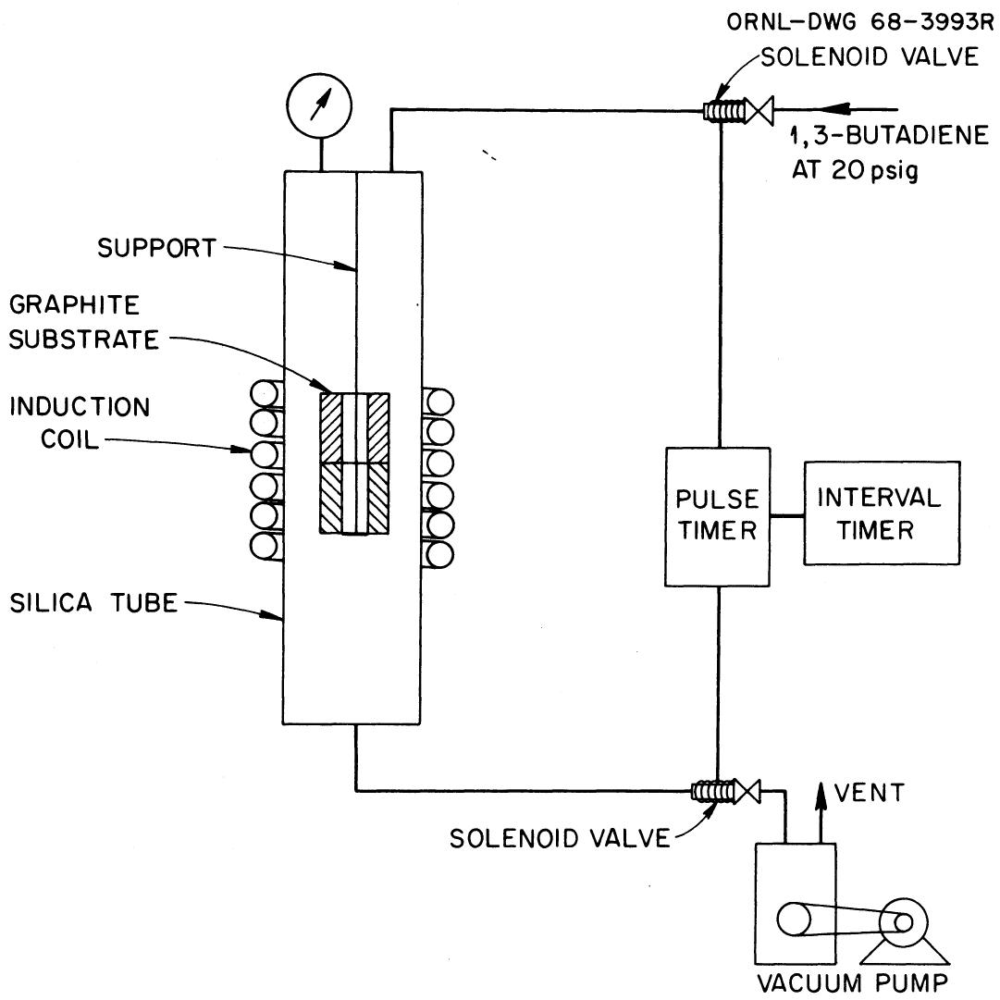  
Fig. 1. Carbon Impregnation of Graphite by Vacuum-Pressure System. (1)

Table 1. Scale-up   

<table><tr><td>Condition</td><td>Laboratory</td><td>Prototype</td></tr><tr><td>dimensions of graphite rod</td><td>0.5 in. long x 4 in. OD x 0.125 in. ID</td><td>16 ft long x 4 in. square x 0.6 ft ID</td></tr><tr><td>pore sizes</td><td>0.8 μ</td><td>0.8 μ</td></tr><tr><td>penetration depth of pyrolytic carbon</td><td>~10 μ</td><td>~10 μ</td></tr><tr><td>pyrolysis temperature</td><td>750-950°C</td><td>750-950°C</td></tr><tr><td>hydrocarbon pressure</td><td>20 psig</td><td>30-40 psig</td></tr><tr><td>vacuum desired</td><td>1.0 torr</td><td>1.0 torr</td></tr><tr><td>time of hydrocarbon pulse</td><td>0.5 sec</td><td>1.5 sec</td></tr><tr><td>time of vacuum period</td><td>15 sec</td><td>15-20 sec</td></tr><tr><td>hydrocarbon</td><td>1,3-butadiene</td><td>1,3-butadiene</td></tr><tr><td>container</td><td>silica tube 16 cm x 1 cm ID</td><td>steel pipe 17 ft long x 6 in. ID</td></tr><tr><td>size of piping vacuum</td><td>1.5 in. ID</td><td>2.5 in. ID</td></tr><tr><td>hydrocarbon</td><td>0.5 in. ID</td><td>1 in. ID</td></tr><tr><td>number of inlets</td><td></td><td></td></tr><tr><td>vacuum</td><td>1</td><td>1</td></tr><tr><td>hydrocarbon</td><td>1</td><td>2</td></tr><tr><td>graphite rod support</td><td>vertically hung</td><td>horizontal position on cart</td></tr><tr><td>means of heating</td><td>induction coil</td><td>electrical current directly applied</td></tr><tr><td>temperature control</td><td>optical pyrometer</td><td>automatic r-diation balance sensor</td></tr><tr><td>purge gas</td><td>argon</td><td>same hydrocarbon at room temperature</td></tr></table>

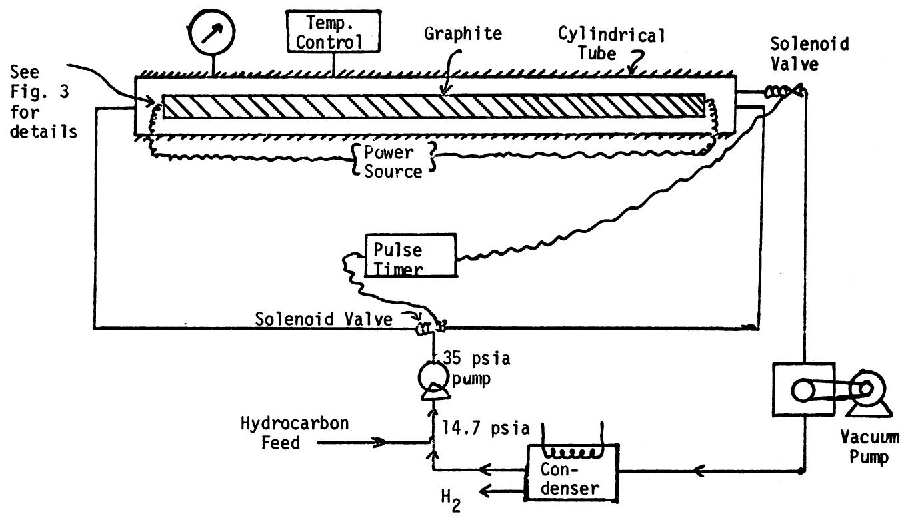

<table><tr><td colspan="4">MASSACHUSETTS INSTITUTE OF TECHNOLOGY
SCHOOL OF CHEMICAL ENGINEERING PRACTICE
AT
OAK RIDGE NATIONAL LABORATORY</td></tr><tr><td colspan="4">Scaled-up Pulsed-Gas Impregnation System</td></tr><tr><td>DATE
3-4-70</td><td>DRAWN BY
JMG</td><td>FILE NO.
CEPS-X-99</td><td>FIG.
2</td></tr></table>

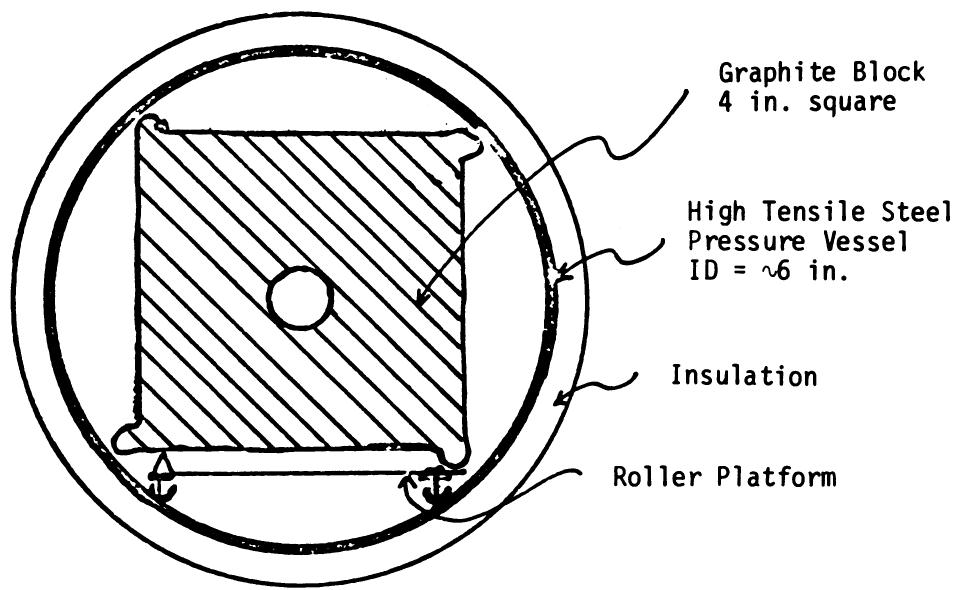

<table><tr><td colspan="4">MASSACHUSETTS INSTITUTE OF TECHNOLOGY
SCHOOL OF CHEMICAL ENGINEERING PRACTICE
AT
OAK RIDGE NATIONAL LABORATORY</td></tr><tr><td colspan="4">Cross Section of Pressure
Vessel and Graphite Rod</td></tr><tr><td>DATE
3-4-70</td><td>DRAWN BY
JMG</td><td>FILE NO.
CEPS-X-99</td><td>FIG.
3</td></tr></table>

Smooth Contact (minimize contact resistance)

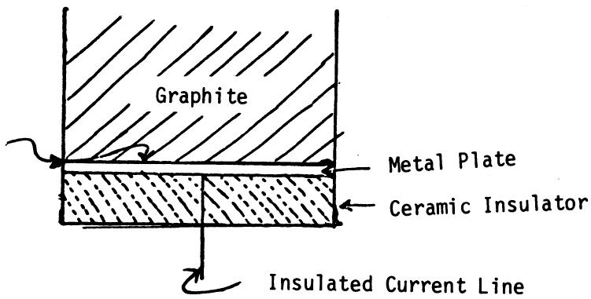

<table><tr><td colspan="4">MASSACHUSETTS INSTITUTE OF TECHNOLOGY
SCHOOL OF CHEMICAL ENGINEERING PRACTICE
AT
OAK RIDGE NATIONAL LABORATORY</td></tr><tr><td colspan="4">Proposed Connection for
Electrical Heating</td></tr><tr><td>DATE
3-4-70</td><td>DRAWN BY
JNG</td><td>FILE NO.
CEPS-X-99</td><td>FIG.
4</td></tr></table>

pulsing sequence of 1.5 sec hydrocarbon and 15-20 sec vacuum are required. A vacuum pump with a capacity of 70 liters/sec, or 140 ft³/min, is needed to achieve the above pulsing sequence; a maximum power of 160 kw is required for heating and maintaining the graphite temperature at $800^{\circ}\mathrm{C}$ .

Resistance type heating was chosen in preference to induction heating because of its more simple and economical operation. The power requirements are smaller since heating is direct. The commercial availability of an induction coil 16 ft-long is not readily known. Induction heating would require a quartz or silica container which in turn would necessitate a vertically supported arrangement due to the low structural strength of the container vessel.

# 3.3 Foreseeable Problems in the Scale-up

A few problems which will require further investigation are: the mode of attachment of the electrodes (contact resistance causing non-uniform heating at the rod ends), the absence of pyrolytic carbon impregnation at the ends and support areas of the rods, pyrolysis and deposition occurring on the walls of the container vessel, and the effects of heat losses. The first problem can be reduced by having the rod ends and electrodes highly polished and by attaching the electrode plates with external compression. Since it will be very difficult to notably eliminate the contact resistance, the rods could be made one foot longer than actual size then cut off the last six inches at both ends where non-uniform conditions will exist during processing. The areas of support (Fig. 3) are very small. The rod ends are not extremely important in the MSR. A radiation stable coating, such as epoxy or furfuryl alcohols, applied to uncoated areas after the rods are impregnated may be sufficient. Prevention of pyrolysis at the walls of the container may be achieved by maintaining the wall temperature below the pyrolysis temperature simply by externally cooling the container vessel if necessary. Heat losses by radiation can be reduced by making the container walls highly reflective.

# 4. DEVELOPMENT OF AUTORADIographic TECHNIQUE

# 4.1 Background

The deposition of pyrolytic carbon inside graphite pores and the radiation and thermal stability of the attachment (carbon to substrate graphite) will be discussed in this section. These are of major importance in establishing the quality of the carbon impregnated graphite for use in molten salt reactors.

Carbon formed from the pyrolysis of hydrocarbons at moderate temperatures (750 - 950°C) has a wide range of structures and properties depending on the deposition conditions, viz, the pyrolysis temperature, the contact

time, and the concentration of the hydrocarbon (see Appendices 7.3.2 and 7.3.3 for more information). In this context the term carbon is used to describe a wide variety of solid structures, many of which contain appreciable amounts of hydrogen and other elements present in the starting compound. The carbon can exist as dense, highly oriented, chemically-defined solid (pyrolytic graphite) or as an amorphous, low density structure with micropores and fractions of hydrocarbon decomposition intermediates. Actually, pyrolytic carbon has structures and properties between these extremes. Various studies on the structures and properties of pyrolytic carbon deposited under varying conditions from different gases have been reported (1, 4, 12, 23).

Thermal expansion of deposited pyrolytic carbon usually differs considerably (3, 15) from that of the substrate graphite. Therefore, carbon deposited at moderate temperature under zero stress can develop high shear stresses at high temperatures such as those in the MSR. The internal stresses can cause either surface cracks of the impregnant or complete separation of impregnant and substrate. Both of these are undesirable, but the former is preferred to the latter because less surface of the substrate is exposed. The impregnant is attached to the substrate by both weak Van der Waal forces and weld-like connections due to self diffusion of carbon. The latter form of attachment is most desirable. A measure of the degree to which this form of attachment occurs, hopefully, can be obtained from autoradiograph measurements. The technique was not completely reduced to practice during the present study. Interpretation of the expected autoradiograph results is given in Appendix 7.4.

# 4.2 Experimental Design for Determining Migration of Pyrolytic Carbon into the Graphite

Autoradiography was investigated as a potential technique to determine the concentration profile of pyrolytic carbon in the graphite. Carbon-14 labelled acetylene was used in the pyrolysis to produce a labelled pyrolytic carbon. The success of the technique, however, depends on the sensitivity and degree of resolution obtainable on photographic films and emulsions used to record the low energy beta emitted by $^{14}\mathrm{C}$ . Concentration calibration curves can be made and therefore concentration as a function of position can be plotted, provided the optical density of image produced can be accurately measured. Preliminary calculations (Appendix 7.5) show that films with adequate sensitivity are available. A resolution slightly better than $1\mu$ is expected.

Various authors (4, 23) hypothesized that acetylene is an intermediate compound in the dehydrogenation of hydrocarbons to produce pyrolytic carbon (see Fig. 5). However, experimentally it was found that the conditions for pyrolysis of 1,3-butadiene is slightly milder than for acetylene. On this basis it is recommended that acetylene tagged with $^{14}\mathrm{C}$ be mixed with butadiene. This mixture is then fed into the pulsed-gas impregnation apparatus used in the experiments by Beatty and Kiplinger (1) shown in Fig. 1. The

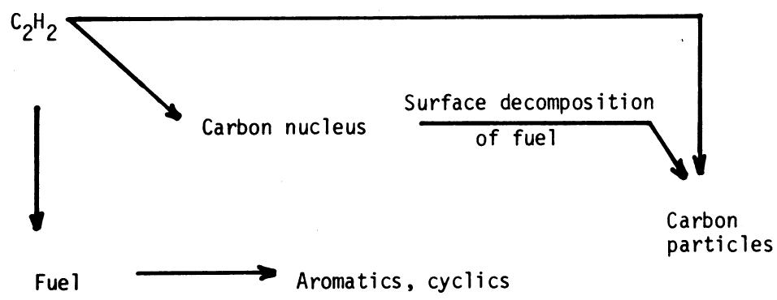

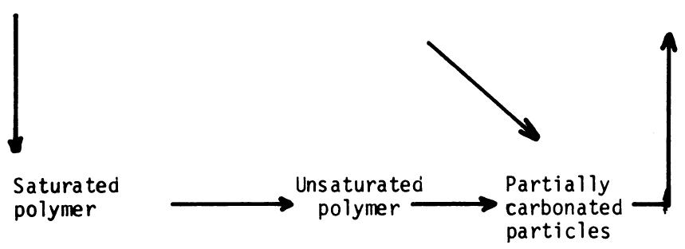

<table><tr><td colspan="4">MASSACHUSETTS INSTITUTE OF TECHNOLOGY
SCHOOL OF CHEMICAL ENGINEERING PRACTICE
AT
OAK RIDGE NATIONAL LABORATORY</td></tr><tr><td colspan="4">Simplified Version of the Schematic
Representation by Street and Thomas (23)
of the Routes to Carbon Considered in
Hydrocarbon Polymerization Theories</td></tr><tr><td>DATE
3-4-70</td><td>DRAWN BY
SHR</td><td>FILE NO.
CEPS-X-99</td><td>FIG.
5</td></tr></table>

impregnated sample is then sectioned, perpendicular to a coated surface, so that an autoradiograph of the edge of the coated surface can be taken. Autoradiographic results were not completed in time for this report, since the radioactivity of the specimens was very low and the film used was not as sensitive as can be obtained.

Acetylene was particularly suitable for this study for the following reasons. The carbon-to-hydrogen ratio is 1:1, and therefore the amount of hydrogen to be vacuumed out of the graphite after hydrocarbon exposure periods is small. Since previous investigators (15) have concluded that some -CH groups remain included in the pyrolytic carbon, then even if the acetylene is not completely pyrolyzed, it can be well accommodated in the pyrolytic carbon structure in the low concentrations present. Thus, this partially pyrolyzed acetylene will contribute to the radioactivity of the specimen. However, it probably has a much lower diffusivity than elemental carbon.

Acetylene, with $^{14}\mathrm{C}$ backbone, was not available at the time of this study; therefore, the gas was synthesized using the technique developed by Cox and Warne (6). The synthesis is briefly reported in Appendix 7.6.

# 5. CONCLUSIONS AND RECOMMENDATIONS

Filling the surface pores of full-size graphite rods with pyrolytic carbon by the gas-pulsed impregnation technique was found to be feasible and a production design was proposed. However, the application of autoradiography to a study of impregnant stability to radiation and thermal stress was not carried to completion. It is recommended that this development program be continued. A more sensitive, high resolution, $\beta$ -sensitive film should be used.

More small-scale impregnation experiments are recommended to obtain the optimum conditions for depositing the most heat- and radiation-stable (as evaluated from autoradiography) pyrolytic carbon in graphite.

# 6. ACKNOWLEDGEMENT

We gratefully acknowledge the extensive assistance and encouragement accorded us by our consultant, C.B. Pollock, and W.H. Chilcoat. The generous cooperation and aid we received from the Metals and Ceramics Division personnel was greatly appreciated.

# 7. APPENDIX

# 7.1 Design Specifications

# 7.1.1 Container Vessel

The vessel in which the graphite block is placed is constructed of high tensile steel because of the corrosion resistance, especially to hydrogen and hydrocarbons at the high temperature of pyrolysis. The carbon block is introduced into either end which is then pressure sealed with steel caps. Asbestos insulation around the container is used to reduce heat loss to the surroundings.

# 7.1.2 Temperature Measurement and Control Device

A radiation balance sensor is recommended for measuring and controlling the temperature since this instrument will use infrared radiation to monitor, without contact, the surface temperature of the fixed carbon rod. With this instrument it is possible to accurately monitor and control the carbon surface temperature, independent of the emissivity of the surface and the ambient temperature of the surroundings. The device measures up to $3000^{\circ}$ F temperatures to about $1\%$ accuracy. The block diagram of the industrial version of the radiation balance sensor can be found in Ref. (13). The equipment is available from the Honeywell Corp.

# 7.1.3 Vacuum Pumps

A rotary piston vacuum pump is recommended. Edwards' high vacuum pump, model lSC3000 with ultimate pressure of 5 x 10-3 torr and a pumping capacity of 68.3 liters/sec (14), is adequate for evacuating the system in less than one second. Some of the features are large displacement-to-size ratio, minimum vibration and quiet. The cost of the pump is $1650.

# 7.1.4 Heating Device

Electrical heating of the graphite is proposed. A direct current is passed through the graphite block from metal plates tightly pressed against the ends of the rod. The plates are insulated with a ceramic insulator to minimize carbon deposition on their surface and reduce heat losses. The power input, $Q$ , is calculated from

$$
Q = I ^ {2} R
$$

where:

I = current, amp

R = resistance, ohm

Q = power, watt

The current is controlled by the temperature-sensing device to adjust the graphite surface temperatures. The power requirements are given in Appendix 7.2.1.

# 7.1.5 Additional Equipment

A condenser using an ammonia- or Freon-cooled system will condense 1,3-butadiene (boiling point of $5^{\circ}\mathrm{C}$ ) from the mixture, while purging uncondensed hydrogen gas from the system. Also required are time-controlled close-open valves in both the hydrocarbon and vacuum lines. Any pump that can increase the hydrocarbon pressure from 14.7 psi to 40 psi will be required, as shown in Fig. 2.

# 7.2 Factors Considered in Scale-up

# 7.2.1 Power Requirements for Heating

The heat necessary to bring the graphite rods to the reaction temperature assuming no heat loss is determined by:

$$
Q = (V) (p) \left(C _ {p}\right) (\Delta T)
$$

where:

V = volume of the rod = 4.84 x 10^4 cm^3

$\rho = \text{density} = 1.86 \, \text{gm/cm}^3$

$C_p = \text{heat capacity of graphite} = 1.36 \text{ joules/gm} -^{\circ} \text{C}$

$\Delta T = \text{change in temperature} 800^{\circ} \mathrm{C}$

Q = heat = 10^8 joules

If we require the graphite rod to be heated in 10 min, then the power necessary is:

$$
P = \text {p o w e r} = \frac {1 0 ^ {8} \text {j o u l e s}}{6 \times 1 0 ^ {2} \sec} \simeq 1. 6 \times 1 0 ^ {5} \mathrm {w} = 1 6 0 \mathrm {k w}
$$

The above calculation is a first approximation of the power requirement since there is considerable flexibility in setting the time required for heating the rod to temperature. Given the average specific resistance is 955 microohm-cm, the total resistance of the rod, R, is 4.62 microhm, and the transformer has to be able to carry current, I = $\sqrt{P / R} = 5.8 \times 10^3$ amperes. This calculation assumes R is constant; in the actual case R will vary with temperature.

# 7.2.2 Vacuum Capacity

The equation which describes the vacuum process is

$$
\frac {\dot {v}}{V _ {i}} = \frac {1}{V} \frac {d V}{d t} \tag {1}
$$

where:

$$
\begin{array}{l} \dot {v} = \text {c a p a c i t y o f t h e p u m p , l i t e r / s e c} \\ V _ {i} \stackrel {\sim} {=} \text {c o n t a i n e r v e s s e l v o l u m e - r o d v o l u m e} = 1 5 \text {l i t e r} \\ V = \begin{array}{l} \text {v o l u m e t h e t o t a l i n i t i a l g a s i n s i d e t h e c o n t a i n e r w o u l d} \\ \text {h a v e a t p r e s s u r e P} \end{array} \\ \end{array}
$$

Considering adiabatic reversible expansion, $\mathsf{PV}^{\gamma} =$ constant. Therefore,

$$
\begin{array}{l} \frac {\mathrm {d} P}{P} = - \gamma \frac {\mathrm {d} V}{V} \text {a n d f r o m E q . (1)} \\ d t = - \frac {1}{\gamma} \frac {V _ {i}}{\dot {v}} \frac {d P}{P} \\ \end{array}
$$

Integrating between 1 atm (760 torr) and $P_f$ (final pressure of vacuum),

$$
t = - \frac {V _ {i}}{v} \frac {1}{\gamma} \ln \frac {P _ {f}}{7 6 0}
$$

If we desire $P_f = 1$ torr and $t = 1$ sec, then:

$$
\dot {v} = 7 0. 5 \text {l i t e r / s e c} = 1 4 1 f t ^ {3} / \min
$$

# 7.2.3 Time Required to Fill Container with Hydrocarbon

Estimated variables:

$$
V _ {i} = \text {c o n t a i n e r v e s s e l v o l u m e - r o d v o l u m e} = 1 5 \text {l i t e r s}
$$

$$
P _ {e} = \text {h y d r o c a r b o n p r e s s u r e} = 2 \mathrm {a t m} = 2. 0 4 \times 1 0 ^ {6} \mathrm {g m / c m - s e c} ^ {2}
$$

$$
L = \text {c y l i n d r i c a l i n e t p i e l e n g t h} = 1 0 0 \mathrm {c m}
$$

$$
D = \text {c y l i n d r i c a l i n e t p i p e d i a m e t e r} = 2 \mathrm {c m}
$$

Since the flow is turbulent, we apply

$$
C _ {f} = 0. 0 7 9 \mathrm {R e} ^ {- 1 / 4}
$$

and

$$
U _ {m _ {i}} = \sqrt {\frac {\Delta P D}{2 C _ {f} L _ {p}}} \quad (1 7)
$$

where:

$$
U _ {m _ {j}} = \text {i n i t i a l}
$$

$$
\Delta P = P _ {e} - P _ {i}, \mathrm {g m / c m - s e c ^ {2}}
$$

$$
P _ {i} = \text {c o n t a i n e r p r e s s u r e , g m / c m - s e c} ^ {2}
$$

$$
C _ {f} = \text {f r i c t i o n f a c t o r}
$$

$$
\rho = \text {h y d r o c a r b o n} \quad \text {d e n s i t y} \quad \text {b e f o r e} \quad \text {e n t e r i n g}, \quad \mathrm {c m} / \mathrm {c m} ^ {3}
$$

$$
\mathrm {R e} = \text {R e y n o l d s n u m b e r}
$$

By trial and error,

$$
C _ {f} = 8 \times 1 0 ^ {- 4} \text {a n d} U _ {m j} = 7 \times 1 0 ^ {3} \mathrm {c m / s e c}
$$

Considering an ideal gas undergoing reversible free expansion, we have

$$
V _ {i} = \left(V _ {e}\right) (\gamma)
$$

where:

$$
V _ {e} = \text {v o l u m e o f g a s f i l l i n g t h e c o n t a i n e r a t p r e s s u r e P _ {e}} \text {a n d t h e}
$$

$$
\gamma = C _ {p} / C _ {v} \approx 1. 2 \text {f o r} 1 - 3 \text {b u t a d i e n e}
$$

Thus the volume of gas entering per unit time is,

$$
\frac {d V}{d t} = U _ {m} S
$$

where:

$$
U _ {m} = \text {m e a n v e l o c i t y o f e n t e r i n g g a s}, \mathrm {c m / s e c}
$$

$$
S = \text {c r o s s}
$$

Applying the ideal gas law to the hydrocarbon gas before and after entering the container and integrating for $V$ between 0 and $V_{e}$ ,

$$
t \approx \frac {V _ {\mathrm {i}}}{\gamma} (2) (\frac {1}{S}) \sqrt {\frac {2 C _ {\mathrm {f}} L \rho}{D P _ {\mathrm {e}}}} \approx 1 \text {s e c w h e n t h e n u m b e r s a r e}
$$

# 7.3 Additional Background Discussion

# 7.3.1 Permeability

The permeability is defined as (1):

$$
P = \frac {(\text {l e a k r a t e}) (\text {w a l l t h i c k n e s s})}{\text {a r e a o f c y l i n d e r a t w a l l m i d - t h i c k n e s s}}
$$

or

$$
P = \frac {L}{K} = \frac {L}{A / \delta} \tag {2}
$$

where:

$$
L = \text {l e a k r a t e ,} \mathrm {c m} ^ {3} / \sec
$$

$$
A = \text {c y l i n d e r a r e a a t w a l l m i d - t h i c k n e s s ,} \mathrm {c m} ^ {2}
$$

$$
\delta = \text {w a l l t h i c k n e s s}, \mathrm {c m}
$$

This definition suggests a three-dimensional, wall thickness-dependent property. The major resistance of the coated graphite should be in the coating, which will have a constant thickness, independent of the wall thickness of the specimen. Therefore equal permeabilities measured in two different size bodies do not mean equal surface coatings for both. The

measure which indicates equal surface coatings in two different bodies is the leakage per unit area at the wall mid-thickness. A calculation can be made to obtain the permeability for a laboratory specimen that corresponds to a permeability of $10^{-8}$ cm²/sec (18) in the actual size graphite.

The laboratory sample:

(12.7 mm long x 10.2 mm OD x 3.2 mm ID)

$\delta^{\prime} =$ sample wall thickness $= 3.5 \mathrm{~mm} = 0.35 \mathrm{~cm}$

The graphite rod:

(16 ft long x 4 in. x 4 in.)

8 2 in. 5 cm

It is reasonable to assume that the sorption criterion corresponds to an equal leak flux (L/A) for the laboratory specimen and graphite rod:

$$
\frac {L}{A} = \frac {L ^ {\prime}}{A ^ {\prime}} = C
$$

and by Eq. (2),

$$
\frac {P}{\delta} = \frac {L}{A} = \frac {L ^ {\prime}}{A ^ {\prime}} = \frac {P ^ {\prime}}{\delta^ {\prime}}
$$

So,

$$
P ^ {\prime} = \frac {P \delta^ {\prime}}{\delta} = (1 0 ^ {- 8}) (\frac {0 . 3 5}{5 . 0}) = 7 \times 1 0 ^ {- 1 0} \mathrm {c m} ^ {2} / \sec
$$

Thus, based on an equal sorption flux, the permeability of the laboratory specimen should be $7 \times 10^{-10} \mathrm{~cm}^2/\mathrm{sec}$ . This would mean that the coatings obtained by Beatty and Kipplinger (1), with permeabilities of $10^{-8} \mathrm{~cm}^2/\mathrm{sec}$ , were insufficient. However, because helium permeability is being used as a measure of xenon permeability, the permeability may refer to a steric effect of the resistant layer. In this case the criterion would be that the permeability of the coating alone equal $10^8$ . Assuming $\delta_{\text {coating }} = 10^{-3} \mathrm{~cm}$ ,

$$
P _ {\text {c o a t i n g}} = P ^ {\prime} \frac {\delta_ {\text {c o a t i n g}}}{\delta^ {\prime}} = 1 0 ^ {- 8} \left(\frac {1 0 ^ {- 3}}{0 . 3 5}\right) \cong 3 \times 1 0 ^ {- 1 1}
$$

Based on this criterion the laboratory specimens are more than satisfactory. Thus, it is important that permeability criterion be clearly established.

# 7.3.2 Impregnation Temperature and Kinetics

It has been reported (9) that the direct relation between temperature and kinetics in the pyrolysis reaction plays an important role in the process of depositing pyrolytic carbon on the graphite substrate. At very high temperatures (over $950^{\circ}\mathrm{C}$ ) complete pyrolysis will take place as soon as the hydrocarbon is near the surface of the sample and the pyrolytic carbon will build a surface coat on the graphite rod without penetrating the pores. Since the pyrolytic carbon has a different thermal expansion coefficient than the graphite, the surface coat will easily break off during irradiation. At lower temperatures the hydrocarbon has sufficiently long time to penetrate the pores of the graphite before the pyrolysis is complete.

Therefore, an intermediate temperature range $(750 - 950^{\circ}\mathrm{C})$ gives sufficient impregnation in a reasonable time. It is very difficult to predict theoretically the amount of deposited carbon per unit time, because two more factors, which were not determined, are to be considered: the contact time of the hydrocarbon with the graphite and the amount of hydrogen from the pyrolysis which impedes the continuation of the process. Also, the number of intermediate compounds that appear during the process of complete pyrolysis makes it very difficult to calculate the final amount of carbon deposited by theoretical considerations of the equilibrium constant and the kinetics of all the reactions.

In the process of complete pyrolysis the initial hydrocarbon is decomposed to molecules of lower molecular weight which can combine to form compounds of higher molecular weight and even polymers. Many of these reactions are thought to occur mainly by free radical mechanism (9).

# 7.3.3 Equilibrium Constant of Hydrocarbons

A survey of the free energies of formation of hydrocarbons at room temperature shows they are positive for all but the saturated hydrocarbons. The table below shows, however, that the free energies of formation for low molecular weight hydrocarbons are all positive in the range of 750 to $950^{\circ}\mathrm{C}$ , which means that the equilibrium is toward total decomposition in all cases. The values in the table for $\Delta G^{\circ}$ , $\Delta H^{\circ}$ , and $\log K_{f}^{\circ}$ at $25^{\circ}\mathrm{C}$ were taken from Ref. (25). The values of $\log K_{f}^{\prime}$ at $900^{\circ}\mathrm{C}$ have been calculated applying Vant Hoff's equation. The three hydrocarbons chosen are the most likely to be used in future work and represent three different types of aliphatic hydrocarbons.

<table><tr><td></td><td>ΔH°</td><td>ΔG°</td><td>log Kf°</td><td>log Kf&#x27;</td></tr><tr><td>1,3 Butadiene</td><td>26.75</td><td>36.43</td><td>-26.70</td><td>-11.9</td></tr><tr><td>Acetylene</td><td>54.194</td><td>50.000</td><td>-36.64</td><td>-6.8</td></tr><tr><td>Methane</td><td>-17.890</td><td>-12.140</td><td>8.9</td><td>-3.7</td></tr></table>

where:

$$
\Delta G ^ {\circ} = \text {f r e e e n g y o f f o r m a t i o n a t 2 5 ° C , k c a l / g m o l e}
$$

$$
\Delta H ^ {\circ} = \text {e n t h a l p y o f f o r m a t i o n a t 2 5 ° C , k c a l / g m o l e}
$$

$$
K _ {f} ^ {\circ} = \text {e q u i l i b r i u m c o n s t a n t a t 2 5 ° C}
$$

$$
K _ {f} ^ {\prime} = \text {e q u i l i b r i u m c o n s t a n t a t 9 0 0 ^ {\circ} C}
$$

The large negative values of log $K_{f}^{\prime}$ mean that equilibrium corresponds to practically total decomposition of the hydrocarbon.

# 7.3.4 Diffusion Into the Pores

The following calculations determine an order of magnitude of the time needed to fill an average pore with gas to a depth of $1 \mu$ . We calculated the flux by assuming both molecular flow and Knudsen flow to compare their relative importance. In considering molecular flow the formula for laminar, fully-developed, steady-state flow was used to determine an order of magnitude value of the velocity, whereas in the actual case, unsteady state flow exists, and there is a counter diffusion of hydrogen. For laminar flow,

$$
\bar {u} = \frac {\Delta P}{8 \mu L} r _ {e} ^ {2} \frac {1}{\tau}
$$

where:

$$
\Delta P = \text {p r e s s u r e} = 1 \mathrm {a t m} = 1. 0 2 \times 1 0 ^ {5} \mathrm {g m / c m - s e c} ^ {2}
$$

$$
\mu = \text {v i s c o s i t y , p o i s e}
$$

$$
L = \text {l e n g t h o f t h e p o r e} = 1 _ {\mu} = 1 0 ^ {- 4} \mathrm {c m}
$$

$$
r _ {e} = \text {r a d i u s o f p o r e e n t r a n c e} = 0. 4 5 \mu m = 0. 4 5 \times 1 0 ^ {- 4} \mathrm {c m}
$$

$$
\overline {{u}} = \text {v e l o c i t y}
$$

$$
\tau = \text {t o r t u o s i t y f a c t o r} \begin{array}{l l l} \nu & 2 \\ \nu & \nu & 2 \end{array}
$$

The viscosity is estimated by,

$$
\mu = [ 0. 0 0 3 3 3 (M T _ {c}) ^ {1 / 2} f _ {l} (1. 3 3 T _ {r}) ] / V _ {c} ^ {2 / 3} \quad (\underline {{2 0}})
$$

where:

$$
T _ {C} = \text {c r i t i c a l t e m p e r a t u r e}
$$

$$
T _ {r} = \text {r e d u c e d t e m p e r a t u r e}
$$

$$
V _ {C} = \text {c r i t i c a l v o l u m e}
$$

$$
M = \text {m o l e c u l a r w e i g h t}
$$

From the same reference,

$$
T _ {C} = 4 2 5 ^ {\circ} C \quad V _ {C} = 2 2 1 c m ^ {3} / g m o l e
$$

$$
T _ {r} = \frac {1 1 0 0}{4 2 5} = 2. 5 8 M = 5 4
$$

$$
(M T _ {c}) ^ {1 / 2} = 1 5 1 \quad f _ {1} (1. 3 3 T _ {r}) = 1. 8 5 8 8
$$

Therefore,

$$
\mu = 2. 5 3 \times 1 0 ^ {- 2} \text {c e n t i p o i s e}
$$

Substituting all these values in the expression for velocity, we find

$$
\overline {{u}} = 4 \times 1 0 ^ {3} c m / s e c
$$

Finally,

$$
\text {t i m e} = L / \overline {{u}} = \frac {1 0 ^ {- 4}}{4 \times 1 0 ^ {3}} = 2. 5 \times 1 0 ^ {- 8} \sec
$$

$$
f l u x = N _ {m 1} = (\overline {{u}}) (S) \left(\frac {1}{M}\right) = 4. 2 \times 1 0 ^ {- 2} g m o l e / c m ^ {2} - s e c
$$

where:

$$
S = \text {d e n s i t y} = (\frac {M}{2 2 , 4 0 0}) \left(\frac {T _ {0}}{T}\right) = 6 \times 1 0 ^ {- 4} \mathrm {g m / c m} ^ {3}
$$

$$
M = \text {m o l e c u l a r w e i g h t (b u t a d i e n e)}
$$

$$
T _ {0} \text {a n d} T = 2 7 3 ^ {\circ} K \text {a n d} 1 1 0 0 ^ {\circ} K, \text {r e s p e c t i v e l y}
$$

After impregnation the diameter, $D = 0.1 \mu m = 10^{-5}$ cm (l). In this case $\overline{u}$ becomes 6.2 cm/sec and the flux, $N_{m2} = 6.5 \times 10^{-4}$ g mole/cm²-sec.

For Knudsen flow (21),

$$
D _ {K _ {\text {e f f}}} = \frac {D _ {K}}{\tau} = 9 7 0 0 \frac {r _ {e}}{\tau} \sqrt {\frac {T}{M}} c m ^ {2} / s e c
$$

where:

$$
r _ {e} = \text {r a d i u s e n t r a n c e p o r e , c m}
$$

$$
\tau = \text {t o r t u o s i t y}
$$

$$
M = \text {m o l e c u l a r w e i g h t}
$$

$$
D _ {K} = \text {K n u d s e n d i f f u s i o n}
$$

$$
D _ {K _ {\text {e f f}}} = \text {e f f e c t i v e} K n u d s e n \text {d i f f u s i o n}
$$

and

$$
N = \frac {D _ {K}}{R T} \frac {\Delta P}{L}
$$

where:

$$
N = f l u x, g m o l e / c m ^ {2} - s e c
$$

$$
R = \text {g a s c o n s t a n t} = 8 2 \mathrm {a t m - c m} ^ {3} / ^ {\circ} \mathrm {K} - \mathrm {g m o l e}
$$

$$
L = \text {p o r e l e n g t h} = 1 \mu m = 1 0 ^ {- 4} \mathrm {c m}
$$

$$
\Delta P = \text {p r e s s u r e} = 1 \mathrm {a t m}
$$

$$
\text {T h u s , f o r} r _ {\mathrm {e}} = 0. 4 \mu \mathrm {m} = 4 \times 1 0 ^ {- 5} \mathrm {c m}
$$

$$
T = 8 2 5 ^ {\circ} C \sim 1 1 0 0 ^ {\circ} K
$$

$$
N _ {K _ {1}} \simeq 1 0 ^ {- 1} \mathrm {g m o l e / s e c - c m} ^ {2}
$$

$$
\text {a n d} r _ {e} = 0. 0 5 \mu m = 5 \times 1 0 ^ {- 6} c m
$$

$$
N _ {K _ {2}} = 1. 2 \times 1 0 ^ {- 2} \mathrm {g m o l e / s e c - c m} ^ {2}
$$

Comparing diffusions,

$$
\frac {N _ {K _ {1}}}{N _ {M _ {1}}} = \frac {1 0 ^ {- 1}}{4 . 2 \times 1 0 ^ {- 2}} = 2. 4 \text {f o r} r _ {e} = 0. 4 \mu m
$$

$$
\frac {N _ {K _ {2}}}{N _ {M _ {2}}} = \frac {1 . 2 \times 1 0 ^ {- 2}}{6 . 5 \times 1 0 ^ {- 4}} = 3 0 \text {f o r} r _ {e} = 0. 0 5 \mu m
$$

Therefore, molecular flow controls and is rapid compared to the time required to fill the container with hydrocarbon.

# 7.4 Analysis of Autoradiograph Results

The graphite used in MSR cores are made as isotropic as possible to equalize dimensional and property changes in all directions. Overall isotropy, however, does not imply that the isotropy is carried down to the microscopic scale. However, the assumption of microscopic isotropy will be made to simplify calculations.

The solution to the counter diffusion of pyrolytic carbon and graphite is given in Refs. (7, 8). A schematic representation of the expected concentration profile is given in Fig. 6. The inflection point corresponds to the original graphite surface. The solution to the diffusion equation can be used to obtain a migration constant from this figure. However, as is shown in Appendix 7.5.1, in all likelihood common treatment procedures would only give enough penetration to allow one to determine if any migration occurred.

# 7.5 Penetration and Detection of Tracer

# 7.5.1 Penetration

To test the sensitivity of experimental technique, it is desired to estimate the penetration of tracer element into the substrate graphite. A one-dimensional model is chosen with pyrolytic carbon and graphite divided by a plane, infinite in either direction.

For isotropic carbon (both graphite and pyrolytic carbon), the diffusion coefficient, $\mathcal{D}$ , is a constant independent of direction. This assumption can be made if the crystallites are assumed randomly oriented. The most probable orientation of a crystallite to any plane will then be at $45^{\circ}$ to the plane (Fig. 7).

Let the diffusion coefficients parallel and perpendicular to the base planes of a crystallite be $\mathcal{D}_1$ and $\mathcal{D}_2$ , respectively. Then the apparent diffusion coefficient, $\mathcal{D}_3$ , is obtained by vector summation (Fig. 8). That is,

Distance X   
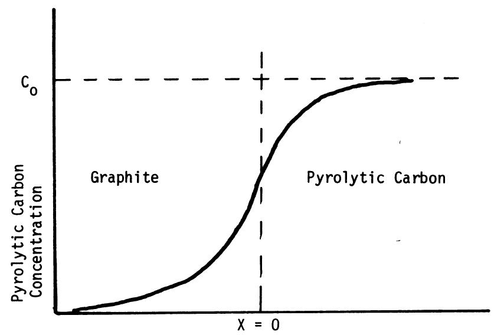  
Concentration profile obtained from optical density measurements of autoradiograph.

<table><tr><td colspan="4">MASSACHUSETTS INSTITUTE OF TECHNOLOGY
SCHOOL OF CHEMICAL ENGINEERING PRACTICE
AT
OAK RIDGE NATIONAL LABORATORY</td></tr><tr><td colspan="4">Anticipated Results from
Autoradiography Measurements</td></tr><tr><td>DATE
3-4-70</td><td>DRAWN BY
JSG</td><td>FILE NO.
CEPS-X-99</td><td>FIG.
6</td></tr></table>

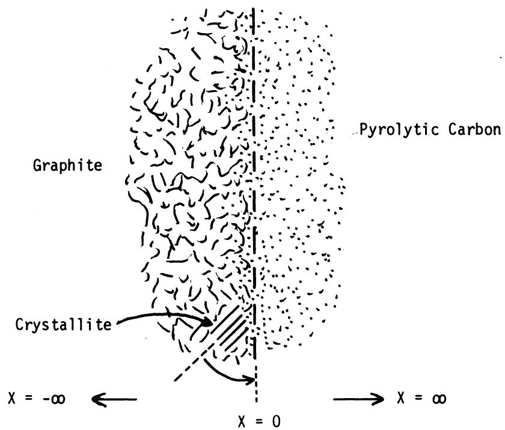

<table><tr><td colspan="4">MASSACHUSETTS INSTITUTE OF TECHNOLOGY
SCHOOL OF CHEMICAL ENGINEERING PRACTICE
AT
OAK RIDGE NATIONAL LABORATORY</td></tr><tr><td colspan="4">Orientation of Crystallites in Graphite</td></tr><tr><td>DATE
3-4-70</td><td>DRAWN BY
JMG</td><td>FILE NO.
CEPS-X-99</td><td>FIG.
7</td></tr></table>

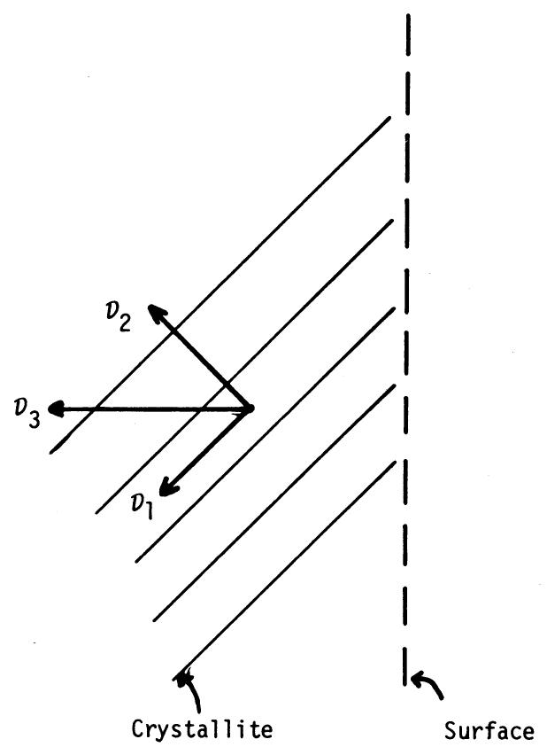

<table><tr><td colspan="4">MASSACHUSETTS INSTITUTE OF TECHNOLOGY
SCHOOL OF CHEMICAL ENGINEERING PRACTICE
AT
OAK RIDGE NATIONAL LABORATORY</td></tr><tr><td colspan="4">Crystallite Plane</td></tr><tr><td>DATE
3-4-70</td><td>DRAWN BY
SHR</td><td>FILE NO.
CEPS-X-99</td><td>FIG.
8</td></tr></table>

$$
\vec {v} _ {3} = \vec {v} _ {1} + \vec {v} _ {2}
$$

If $\theta$ is the angle made by $D_{3}$ to the surface, then the perpendicular component $\mathcal{D}$ (measured on macroscopic scale) is given by $D_{3}\cos \theta$ . ( $\theta$ has been assumed to be $45^{\circ}$ .)

For a one-dimensional diffusion in a semi-infinite solid with initial concentration zero and the surface concentration maintained constant at $C_0$ , the concentration at time $t$ is given by (7, 8):

$$
C (x, t) = C _ {0} \operatorname {e r f c} \left[ \frac {x}{2 (\nu t) ^ {1 / 2}} \right]
$$

The boundary condition assumptions are reasonable in view of the fact that pyrolysis occurs much faster than diffusion in solids at the temperature of deposition of carbon.

At the distance of penetration,

$$
\begin{array}{l} \begin{array}{c c c} \mathsf {C} (\mathbf {x}, \mathbf {t}) & \mathbf {\Sigma} ^ {\nu} & 0 \end{array} \\ \therefore \quad x = (\pi \mathcal {D} t) ^ {1 / 2} \\ \end{array}
$$

Adding 1,3-butadiene with traces of $^{14}\mathrm{C}_2\mathrm{H}_2$ containing 0.224 mmoles $^{14}\mathrm{C}$ with gross activity of $\sim 10 \, \text{mc}$ will result in a specific activity of 0.8 $\mu \text{c/mole}$ gas mixture. Experiments with highly oriented natural graphite show that $D_1 >> D_2$ , and therefore $D_2$ will be assumed equal to zero.

Then experimentally determined $\mathcal{D} = \mathcal{D}_1$ cos $45^{\circ}$ . From the data of Kanter (16) at $2347^{\circ}C$ ,

$$
\mathcal {D} _ {1} = 1. 0 7 (1 0 ^ {- 1 2}) \mathrm {c m} ^ {2} / \sec
$$

For heat treatment period of 200 hr, the penetration depth

$$
x = 1. 5 \mu
$$

This is virtually the limit of film resolution, so we would only be able to determine if any penetration occurs. Much longer heat treatment times would be needed to obtain a migration constant.

# 7.5.2 Detection

An activity of $10^{-5}$ $\mu\text{C/cm}^2$ of an infinitely thin film of isotope gives a perceptible image on a fast x-ray film (Ilford Nuclear Research Plates D.1) in 24 hr (6). (Resolution must be checked before using this film.) Calculations based on these assumptions should show the lower limit of activity required in deposits and also duration expected for film exposure to beta radiation.

The hydrocarbon gas mixture used in this study should produce a pyrolytic carbon with a specific activity of $\sim 3.2\mu \mathrm{c} / \mathrm{mole}$ carbon. The activity of the deposited carbon is $\sim 0.3\mu \mathrm{c} / \mathrm{cm}^2$ , which is sufficiently intense. However, the carbon which migrates will be much less intense.

# 7.6 Apparatus and Procedure for Synthesis of Acetylene

The apparatus used is schematically represented in Figs. 9 and 10. The available compound containing $\mathrm{I4C}$ is solid barium carbonate $\mathrm{Ba}^{14}\mathrm{CO}_3$ (supplied by Isotopes Division, ORNL). Acetylene is most conveniently prepared by the reaction of water on barium carbide $(\mathrm{Ba}^{14}\mathrm{C}_2)$ , which is first prepared by heating barium carbonate with metallic barium. The overall scheme is as follows:

$$
\mathrm {B a} ^ {1 4} \mathrm {C O} _ {3} \xrightarrow [ \text {h e a t} ]{+ \mathrm {B a m e t a l}} \mathrm {B a} ^ {1 4} \mathrm {C} _ {2} + \mathrm {B a O} \xrightarrow [ \text {r e f l u x} ]{\mathrm {H} _ {2} 0} ^ {1 4} \mathrm {C} _ {2} \mathrm {H} _ {2} + \text {t r a c e s} (^ {1 4} \mathrm {C} _ {2} \mathrm {H} _ {4} + ^ {1 4} \mathrm {C} _ {2} \mathrm {H} _ {6})
$$

1. $\mathsf{Ba}^{4}\mathsf{CO}_{3}$ (fl.5 mg, gross activity 20 μc) is weighed into a thick-walled Pyrex centrifugal tube which contains barium metal (1 g, shredded). Inactive barium carbonate (228.5 mg) is then added, giving a total of 1.515 mmoles of the carbonate. A further layer of shredded barium carbonate (1 g) is added. The equipment is set up as shown in Fig. 9, and a slow stream of $\mathsf{CO}_{2}$ -free argon is passed through the tube to remove traces of water. On being heated with a full bunsen flame, the reaction mixture will become incandescent and set to a black mass; the tube is then cooled in a dessicator.   
2. Next a file mark is made at A (Fig. 9) and a crack started with a hot rod; the bottom of the centrifuged tube is then broken off inside the flask shown in Fig. 10. The air in the system is swept out with argon, and cooling baths are placed around traps E and F (Fig. 10). Five cubic centimeters (5 cc) of water are added initially, and low heating is applied. Twenty-five centimeters (25 cc) of water are slowly added, and the resulting solution is then brought to boil in 20 min, and reflux is maintained for a further 20 min. The acetylene and traces of other hydrocarbons produced are condensed in the two traps.

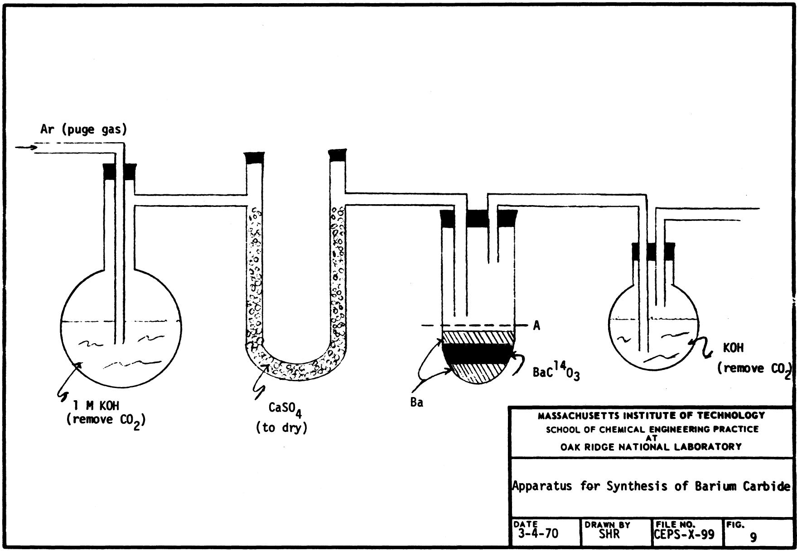

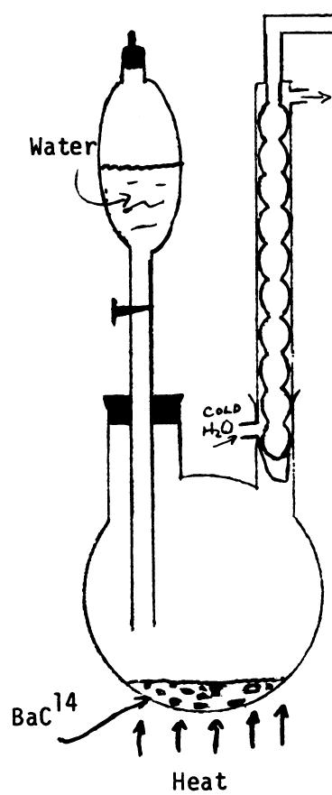

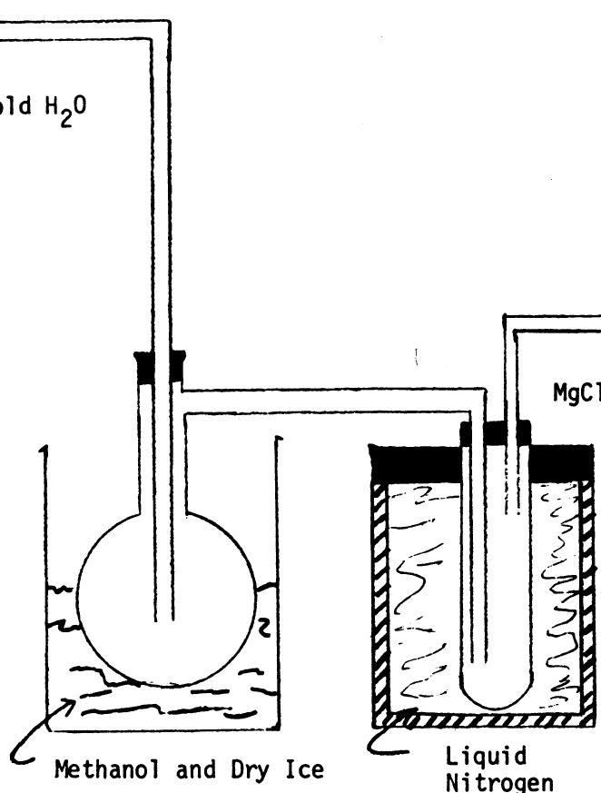  
(E)

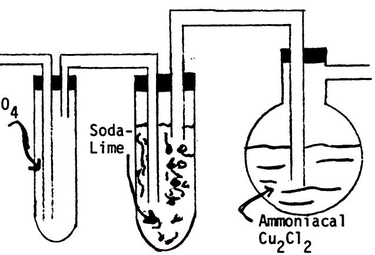

MASSACHUSETTS INSTITUTE OF TECHNOLOGY SCHOOL OF CHEMICAL ENGINEERING PRACTICE AT OAK RIDGE NATIONAL LABORATORY

Apparatus for Synthesis of Acetylene

DATE

3-4-70

DRAWN BY

SHR

FILE NO.

CEPS-X-99

FIG.

10

# 7.7 Literature References

1. Beatty, R.L., and D.V. Kiplinger, "Gas Pulse Impregnation of Graphite with Carbon," ORNL-TM-4434 (July 1968).   
2. Boyd, G.A., "Autoradiography," Academic Press, New York (1955).   
3. Brown, A.R.G., A.R. Hall, and W. Watt, "Density of Deposited Carbon," Nature, 172, 1145 (1953).   
4. Carley-McAuley, K.W., and M. Mackenzie, "Studies of the Deposition of Pyrolytic Carbon," AERE-R3726 (1961).   
5. Catch, J.R., "Carbon-14 Compounds," Butterworth, New York (1961).   
6. Cox, J.D., and Warne, R.J., "Syntheses of Isotopic Tracer Elements, Part 3," J. Chem. Soc. (London), Part 2, 1893 (1951).   
7. Crank, J., "The Mathematics of Diffusion," p. 62, Oxford University Press, London (1964).   
8. Dienes, G.J., "Mechanism of Self-Diffusion in Graphite," J. Appl. Physics, 23, 1194 (1952).   
9. Egloff, Gustav, "The Reactions of Pure Hydrocarbons," pp. 230-277, Reinhold, New York (1937).   
10. Feldman, M.H., W.V. Goeddel, G.J. Dienes, and W. Gossen, "Studies of Self-Diffusion in Graphite Using C-14 Tracer," J. Appl. Physics, 23, 1200 (1952).   
11. Girifalco, L.A., "Atomic Migration in Crystals," Blaisdell, New York (1964).   
12. Harvey, J., D. Clark, and J.N. Eastabrook, "The Structure of Pyrolytic Carbon," Special Ceramics, p. 181 (July 1965).   
13. Herzfeld, C.M., "Temperature: Its Measurement and Control in Science and Industry," Part 2, p. 889, Reinhold, New York (1962).   
14. "Industrial Research," 1970 Instruments Specific Annual, Industrial Research Co., p. 100, Indiana (November 1969).   
15. Johnson, W., and W. Watt, "Thermal Conductivity of Pyrolytic Graphite," Special Ceramics, 237 (June 1962).   
16. Kanter, M.A., "Diffusion of Carbon Atoms in Natural Graphite Crystals," Physical Review, 107, 655 (1957).   
17. Kay, J.M., "An Introduction to Fluid Mechanics and Heat Transfer," p. 65, University Press, Cambridge (1957).

18. Kedl, R.J., "Noble Gas Migration in the MSBR Reference Design," ORNL-TM-4344, p. 73 (August 1968).   
19. Peebles, F.M., "Removal of $^{135}\mathrm{Xe}$ from Circulating Fuel Salt of the MSBR by Mass Transfer to Helium Bubbles," ORNL-TM-2245 (July 1968).   
20. Reid, R.C., and T.K. Sherwood, "Properties of Gases and Liquids: Their Estimation and Correlation," 2nd ed., p. 396, McGraw-Hill, New York (1966).   
21. Satterfield, C.N., and T.K. Sherwood, "The Role of Diffusion in Catalysis," p. 16, Addison-Wesley, Reading, Mass. (1963).   
22. Seith, W., and T. Henmann, "Diffusion of Metals: Exchange Reactions," AEC-tr-4506, Chem. Trans. (1955).   
23. Street, J.C., and A. Thomas, "Mechanism of Pyrolysis," Fuel, 34, 4 (1955).   
24. Walker, P.T., "Chemistry and Physics of Carbon," Vol. 1, p. 175, Marcel Dekker, New York (1965).   
25. Weast, R.C. (ed.), "Handbook of Chemistry and Physics," 47th ed., Chemical Rubber Co., Cleveland, Ohio (1966).

# INTERNAL

1. R.B. Briggs

2. K.E. Cowser

3. W.P. Eatherly

4. P.R. Kasten

5. H.E. McCoy

6. Lewis Nelson

8. C.B. Pollock

9. M.W. Rosenthal

10. J.L. Scott

11. D.B. Trauger

12. J.R. Weir

14. Central Research Library

15. Document Reference Section

16-18. Laboratory Records

19. Laboratory Records, ORNL R.C.

20. ORNL Patent Office

21-35. M.I.T. Practice School

# EXTERNAL

36. S.M. Fleming, MIT   
37. S.T. Mayr, MIT