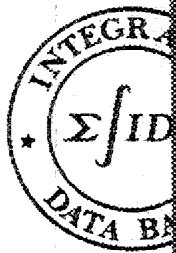
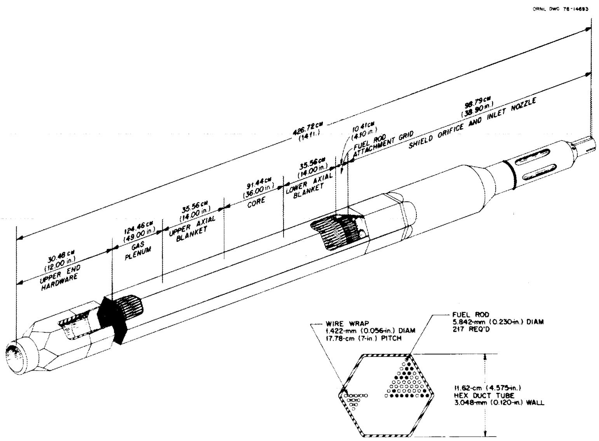

# Carbon-14 Production in Nuclear Reactors

Wallace Davis, Jr.

Prepared for the U.S. Nuclear Regulatory Commission

Office of Nuclear Material Safety & Safeguards

Under Interagency Agreement ERDA 40-649-75

SAX SAGE MATHEMATICS

CENTRAL RESERECN LIGABACI

500

LIBRARY/LOAN COPOY

DO NOT TRANSFER TO ANY OTHER SPACES

If you wish someone else to see this report and find inname with report and the library will arrange a book

2015年1月27日

OAK RIDGE NATIONAL LABORATORY

Printed in the United States of America Available from

National Technical Information Service

U.S. Department of Commerce

5285 Port Royal Road, Springfield, Virginia 22161

Price Printed Copy $4.00; Microfiche$ 3.00

This report was prepared as an account of work sponsored by the United States Government. Neither the United States nor the Energy Research and Development Administration/United States Nuclear Regulatory Commission, nor any of their employees, nor any of their contractors, subcontractors, or their employees, makes any warranty, express or implied, or assumes any legal liability or responsibility for the accuracy, completeness or usefulness of any information, apparatus, product or process disclosed, or represents that its use would not infringe privately owned rights.

Contract No. W-7405-eng-26

CHEMICAL TECHNOLOGY DIVISION

CARBON-14 PRODUCTION IN NUCLEAR REACTORS

Wallace Davis, Jr.

Manuscript Completed: January 1977

Date Published: February 1977

Prepared for the

U.S. Nuclear Regulatory Commission

Office of Nuclear Material Safety & Safeguards

Under Interagency Agreement ERDA 40-549-75

Prepared by the

OAK RIDGE NATIONAL LABORATORY

Oak Ridge, Tennessee 37830

operated by

UNION CARBIDE CORPORATION

for the

ENERGY RESEARCH AND DEVELOPMENT ADMINISTRATION

# CARBON-14 PRODUCTION IN NUCLEAR REACTORS

W.Davis, Jr.

# ABSTRACT

Quantities of $^{14}\mathrm{C}$ that may be formed in the fuel and core structural materials of light-water-cooled reactors (LWRs), in high-temperature gas-cooled reactors (HTGRs), and in liquid-metal-cooled fast breeder reactors (LMFBRs) have been calculated by use of the ORIGEN code. Information supplied by five LWR-fuel manufacturers pertaining to nitride nitrogen and gaseous nitrogen in their fuels and fuel-rod void spaces was used in these calculations. Average nitride nitrogen values range from 3 to 50 ppm (by weight) in LWR fuels, whereas gaseous nitrogen in one case is equivalent to an additional 10 to 16 ppm. Nitride nitrogen concentrations in fast-flux test facility (FFTF) fuels are 10 to 20 ppm. The principal reactions that produce $^{14}\mathrm{C}$ involve $^{14}\mathrm{N}$ , $^{17}\mathrm{O}$ , and (in the HTGR) $^{13}\mathrm{C}$ . Reference reactor burnups are 27,500 MWd per metric ton of uranium (MTU) for boiling water reactors (BWRs), 33,000 MWd for pressurized water reactors (PWRs), about 95,000 MWd per metric ton of heavy metal (MTHM) for HTGRs, and 24,800 MWd/MTHM for an LMFBR with nuclear parameters that pertain to the Clinch River Breeder Reactor. Nitride nitrogen, at a median concentration of 25 ppm, contributes 14, 15, and 6 Ci of $^{14}\mathrm{C} / \mathrm{GW}(\mathrm{e})$ -yr to BWR, PWR, and LMFBR fuels, respectively. The contribution of $^{17}\mathrm{O}$ in BWR and PWR fuels is 3.3 and 3.5 Ci of $^{14}\mathrm{C} / \mathrm{GW}(\mathrm{e})$ -yr, respectively, but it is less than 0.2 Ci/GW(e)-yr, in blended LMFBR fuel. In the HTGR fuel particles ( $\mathrm{UC}_2$ or $\mathrm{ThO}_2$ ), 10 Ci of $^{14}\mathrm{C} / \mathrm{GW}(\mathrm{e})$ -yr will be formed from 25 ppm of nitrogen, whereas $^{17}\mathrm{O}$ in the $\mathrm{ThO}_2$ will contribute an additional 2 Ci/GW(e)-yr. All $^{14}\mathrm{C}$ contained in the fuels may be released in a gas mixture ( $\mathrm{CO}_2$ , CO, CH₄, etc.) during fuel dissolution at the fuel reprocessing plants. However, some small fraction may remain in aqueous raffinates and will not be released until these are converted to solids. The gases would be released from the plant unless special equipment is installed to retain the $^{14}\mathrm{C}$ -bearing gases.

Cladding metals and other core hardware will contain significant quantities of $^{14}\mathrm{C}$ . Very little of this will be released from BWR, PWR, and LMFBR hardware at fuel reprocessing plants; instead, the contained $^{14}\mathrm{C}$ , 30 to 60 Ci/GW(e)-yr for LWRs and about 13 Ci/GW(e)-yr for a CRBR, will remain within the metal, which will be retained on site or in a Federal repository. The only core structural material of HTGRs will be graphite, which will contain 37 to 190 Ci of $^{14}\mathrm{C} / \mathrm{GW}(\mathrm{e})$ -yr, exclusive of that in the fuel particles, if the graphite (fuel block and reflector block) initially contains 0 to 30 ppm of nitrogen. All of this is available for release at a fuel reprocessing plant if the graphite is burned to release the fuel particles for further processing. Special equipment could be installed to retain the $^{14}\mathrm{C}$ -bearing gases.

# 1.0 INTRODUCTION

The radioactive nuclide $^{14}\mathrm{C}$ is, and will be, formed in all nuclear reactors due to absorption of neutrons by carbon, nitrogen, or oxygen. These may be present as components of the fuel, moderator, or structural hardware, or they may be present as impurities. Most of the $^{14}\mathrm{C}$ formed in the fuels or in the graphite of HTGRs will be converted to a gaseous form at the fuel reprocessing plant, primarily as carbon dioxide; this will be released to the environment unless special equipment is installed to collect it and convert it to a solid for essentially permanent storage. If the $^{14}\mathrm{C}$ is released as carbon dioxide or in any other chemical form, it will enter the biosphere, be inhaled or ingested as food by nearly all living organisms including man, and will thus contribute to the radiation burden of these organisms. Carbon-14 is formed naturally by reaction of neutrons of cosmic ray origin in the upper atmosphere with nitrogen and, to a lesser extent, with oxygen and carbon. Large amounts of $^{14}\mathrm{C}$ have also been formed in the atmosphere as a result of nuclear weapons explosions.

For the last two decades, the quantities of $^{14}\mathbf{C}$ in the environment, and the mechanisms of transfer of this nuclide between the atmosphere, land biota, and the shallow and deep seas have been the subject of many research studies. These studies have shown that most of the $^{14}\mathbf{C}$ is actually contained in the deep oceans, at depths greater than $100\mathrm{m}$ . The nuclear weapons tests increased the total $^{14}\mathbf{C}$ inventory of the earth by only a few percent, but the atmospheric content was approximately doubled. Since atmospheric weapons tests are no longer being conducted, the atmospheric concentration of $^{14}\mathbf{C}$ is now decreasing as it enters the oceans as $\mathrm{CO}_{2}$ and is approaching the pretest value.

Some estimates of the amounts of $^{14}\mathrm{C}$ released from or formed in LWRs, $^{10-15}$ HTGR, $^{13,14}$ and LMFBR $^{15}$ have been made previously on the basis of calculations or measurements. The purpose of this report is to present detailed estimates of the production of $^{14}\mathrm{C}$ with emphasis on those pathways that are likely to lead to the release of this nuclide, either at the reactor site or at the fuel reprocessing plant.

# 2.0 MECHANISMS OF CARBON-14 FORMATION IN NUCLEAR REACTORS

Carbon-14 is formed from five reactions of neutrons with isotopes of elements that are normal or impurity components of fuel, structural materials, and the cooling water of LWRs. The neutron-induced reactions are as follows:

(1) ${}^{13}\mathrm{C}\left( {\mathrm{n},\gamma }\right) {}^{14}\mathrm{C}$ ;   
(2) $^{14}\mathrm{N}(\mathrm{n},\mathrm{p})^{14}\mathrm{C};$   
(3) $^{15}\mathrm{N}(\mathfrak{n},\mathfrak{d})^{14}\mathrm{C}$ ;   
(4) ${ }^{16} \mathrm{O}(\mathrm{n}, {}^{1} \mathrm{He}){}^{14} \mathrm{C}$ ;   
(5) ${}^{17}\mathrm{O}(\mathfrak{n},\alpha)^{14}\mathrm{C}$

In these reactions, standard notation has been used in which n refers to a neutron, p to a proton, d to a deuteron $(^{3}\mathrm{H})$ , and $\gamma$ to a gamma ray. Reactions 4 and 5 will occur in any reactor containing heavy-metal oxide fuels and/or water as the coolant. Reaction 1 will be important only in the HTGRs, while reactions 2 and 3 will occur in all reactors containing nitrogen as an impurity in the fuel, coolant, or structural materials.

To facilitate calculations, the energy-dependent cross sections of nuclear reactions are typically collapsed into a single, effective cross section that applies to the neutron spectrum of the reactor in question. Such collapsed values are known with fairly good accuracies for reactions 1, 2, and 5 for the thermal-neutron spectra of LWRs and HTGRs. Values listed in Table 1 for the BWR, PWR, and HTGR are taken from the ORIGEN library1 and its update16 according to the latest version of the "Barn Book."17 Because reactions 3 and 4 are highly endothermic, their cross sections are assumed to be 0.0 in thermal reactors, as shown in Table 1. Unfortunately, some of these cross sections for the LMFBR are very uncertain. The following discussion concerning cross sections of reactions 1-5, as they apply to the Clinch River Breeder Reactor (CRBR), has been provided by A. G. Croff.18

Reaction $l^{13}C(n,\gamma)^{14}C$

The cross section for this reaction is not well known for nonthermal neutron energies. The assumed values were taken from ref. 19, in which the $^{13}\mathrm{C}(\mathfrak{n},\gamma)$ cross section was calculated on the bases of a few experimental data and nuclear systematics. The cross section obtained when the data are collapsed to a single value using the CRBR neutron spectrum is $0.5\mu \mathrm{b}$ ( $1\mu \mathrm{b} = 10^{-6}$ barns). The fact that the thermal $^{13}\mathrm{C}(\mathfrak{n},\gamma)$ cross section is only about $1\mathrm{mb}$ (Table 1) coupled with the fact that cross sections in the nonthermal energy regions are considerably smaller than thermal cross sections tends to confirm that the $0.5\mu \mathrm{b}$ value is realistic.

Reaction $2^{14}N(n,p)^{14}C$

Of the five $^{14}\mathrm{C}$ -producing reactions listed, this is the only one for which the experimental data may be considered adequate. Energy dependent cross-section data for the $^{14}\mathrm{N}(\mathfrak{n},\mathfrak{p})^{14}\mathrm{C}$ reaction are available from the ENDF/B20 compilation. Collapsing these data with the CRBR spectrum gives a cross section of 12.6 mb, with an estimated error of ±30%.

Reaction 3 $^{15}N(n,d)^{14}C$

The only cross-section data available for this reaction are some sketchy information on the angular distribution of the deuterons when the neutrons have energies of 14 to $15\mathrm{MeV}$ . This information, coupled with the fact that the reaction is endothermic ( $Q = -7.99\mathrm{MeV}$ ), would probably lead to a value of the reaction rate in the 0.01 to 0.1 mb range. However, for calculational purposes, a value of 1.0 mb was used.

Reaction $4^{16}O(n,^3 He)^{14}C$

Of the five reactions considered, the data for this reaction are by far the least well-known. It is highly endothermic $(\mathrm{Q} = -14.6 \mathrm{MeV})$ , indicating that greater neutron energies are required for the

Table 1. Cross sections for formation and yields of ${}^{14}\mathrm{C}$ in BWR, PWR, HTGR, and LMFBR ${}^{a}$   

<table><tr><td rowspan="2">Reaction No.</td><td rowspan="2">Reaction</td><td colspan="4">Cross section for formation of 14C in</td><td colspan="4">14C formation (curies per gram of parent element)</td></tr><tr><td>BWR</td><td>PWR</td><td>HTGR</td><td>IMFBR</td><td>BWR</td><td>PWR</td><td>HTGR</td><td>IMFBR</td></tr><tr><td>1</td><td>13C(n,y)14C</td><td>1.00 mb</td><td>1.00 mb</td><td>0.419 mb</td><td>0.5 μb</td><td>1.51E-7</td><td>1.61E-7</td><td>3.38E-7(3.69E+0)b</td><td>4.81E-9</td></tr><tr><td>2</td><td>14N(n,p)14C</td><td>1.48 b</td><td>1.48 b</td><td>1.02</td><td>12.6 mb</td><td>1.71E-2</td><td>1.83E-2</td><td>3.84E-2</td><td>9.66E-3</td></tr><tr><td>3</td><td>15N(n,d)14C</td><td>0</td><td>0</td><td>0</td><td>1.0 mb</td><td>0</td><td>0</td><td>0</td><td>2.85E-6</td></tr><tr><td>4</td><td>16O(n,3He)14C</td><td>0</td><td>0</td><td>0</td><td>0.05 μb</td><td>0</td><td>0</td><td>0</td><td>3.82E-8(4.53E-3)c</td></tr><tr><td>5</td><td>17O(n,4He)14C</td><td>0.183 b</td><td>0.183 b</td><td>0.110 b</td><td>0.12 mb</td><td>7.31E-7(1.01E-1)c</td><td>7.75E-7(0.87E-2)c</td><td>1.79E-6(2.25E-1)d</td><td>3.40E-8(4.03E-3)c</td></tr></table>

aAll of the values in this table were obtained by collapsing available neutron cross-section data to a single value, using neutron spectra of the individual reactors, as discussed by Bell. These values are not equal to 2200-m/sec cross sections, such as 0.9 mb, 1.81 b, and 0.235 b for reactions 1, 2, and 5, respectively.  
bBased on 10.93 MT of carbon/MTHM where HM = thorium plus uranium.  
cBased on 8383 g-at. of oxygen/MTHM where HM = uranium or uranium plus plutonium, present as $\mathrm{UO}_2$ and $\mathrm{PuO}_2$ .  
dBased on 0.9094 MT of thorium/MTHM with thorium present as $\mathrm{ThO}_2$ and uranium as UC.

reaction to proceed. Information supplied by the Physics Division of Lawrence Livermore Laboratory indicates that the cross section at 15 MeV should be less than $1\mathrm{mb}$ , and at 20 MeV it should be less than $10\mathrm{mb}$ . By combining these "guesstimates" with the CRBR spectrum and a theoretical expression for the availability of high-energy fission neutrons, the reaction cross section is estimated to be about $0.05\mu \mathrm{b}$ . The lack of information on both the high-energy cross sections and the high-energy neutron spectrum makes this value very uncertain.

# Reaction $5^{17}O(n,\alpha)^{14}C$

As with reaction 1, the cross-section data for this reaction are not well known. The data, which again are based on only a few experiments and nuclear systematics, were taken from ref. 19. The cross section, which is calculated and based on the CRBR spectrum, is $0.12\mathrm{mb}$ .

The assumed LMFBR fuel model was the Atomics International Follow-On Design. Initial concentrations of the isotopes of importance in this case (in g-atoms/MTHM) are:

<table><tr><td>12C</td><td>33.33</td></tr><tr><td>13C</td><td>0.374</td></tr><tr><td>14N</td><td>1.42</td></tr><tr><td>15N</td><td>0.00528</td></tr><tr><td>16O</td><td>8383.</td></tr><tr><td>17O</td><td>3.27</td></tr><tr><td>18O</td><td>17.2</td></tr></table>

The ORIGEN code1 is not capable of explicitly accounting for (n,d) or $(\mathfrak{n},^3\mathrm{He})$ reactions. This difficulty may be circumvented by combining reaction 4 with reaction 5 and reaction 3 with reaction 2, since the naturally occurring isotopes are present in a fixed ratio for each element. Alternatively, since the depletion of the carbon, nitrogen, and oxygen is relatively small ( $< 2\%$ ), the calculation is easily performed by hand.

# 3.0 CARBON-14 FORMATION IN LIGHT-WATER REACTORS

Carbon-14 is formed in the fuel $(\mathrm{UO}_2)$ , in core structural materials, and in the cooling water of LWRs.

# 3.1 Formation in the Fuel

Carbon-14 will be formed primarily by two reactions in the fuel: ${}^{17}\mathrm{O}(\mathfrak{n},\alpha)^{14}\mathrm{C}$ and ${}^{14}\mathrm{N}(\mathfrak{n},\mathfrak{p})^{14}\mathrm{C}$ . The quantity of ${}^{14}\mathrm{C}$ formed from the first of these reactions can be calculated accurately on the basis of the stoichiometry of $\mathrm{UO}_2$ (134.5 kg O/MTU) and an abundance of 0.039 at. $\%$ ${}^{17}\mathrm{O}$ in normal oxygen, which corresponds with 55.6 g of ${}^{17}\mathrm{O}/\mathrm{MTU}$ or 3.27 g-atoms of ${}^{17}\mathrm{O}/\mathrm{MTU}$ . As listed in Table 2, burnup of BWR and PWR fuels to 27,500 and 33,000 MW(t)d/MTU, respectively, leads to the formation of 0.098 and 0.104 Ci of ${}^{14}\mathrm{C}/\mathrm{MTU}$ , which corresponds with 3.3 and 3.5 Ci/GW(e)-yr, respectively.

Table 2. Production of ${}^{14}\mathrm{C}$ in core hardware and fuel at light-water reactors (BWR and FWR)   

<table><tr><td rowspan="3">Material</td><td rowspan="3">Quantity in core (kg/MTU)</td><td colspan="3">Quantity of element in core (g/MTU)</td><td colspan="3">14C existing 160 days after discharge of fuel (CI/MTU)</td><td colspan="3">Total 14C production</td></tr><tr><td rowspan="2">Carbon</td><td rowspan="2">Nitrogen</td><td rowspan="2">Oxygen</td><td rowspan="2">From carbon</td><td rowspan="2">From nitrogen</td><td rowspan="2">From oxygen</td><td colspan="2">Calculated</td><td>Observed</td></tr><tr><td>Ci/MTU</td><td>Cl/GW(e)-yra</td><td>Cl/GW(e)-yr</td></tr><tr><td colspan="11">Boiling-Water Reactorb</td></tr><tr><td>Zircaloy-2 (Grade RA-1)</td><td>316</td><td>≤85.3</td><td>≤25.3</td><td></td><td>1.29E-5</td><td>4.33E-1</td><td></td><td>0.433</td><td>14.5</td><td></td></tr><tr><td>304 stainless steel</td><td>50</td><td>≤40.0</td><td>50-80</td><td></td><td>0.60E-5</td><td>(0.86-1.37)E+0</td><td></td><td>0.86-1.37</td><td>28.7-45.9</td><td></td></tr><tr><td>Inconel-X</td><td>3.4</td><td>≤3.4</td><td></td><td></td><td>0.05E-5</td><td></td><td></td><td>0.000</td><td>0.0</td><td></td></tr><tr><td>Uranium dioxide</td><td>1135</td><td></td><td>Low 10</td><td>134,500</td><td></td><td>1.71E-1</td><td>9.83E-2</td><td>0.269</td><td>9.0</td><td></td></tr><tr><td></td><td></td><td></td><td>Med 25</td><td></td><td></td><td>4.28E-1</td><td></td><td>0.526</td><td>17.6</td><td></td></tr><tr><td></td><td></td><td></td><td>High 75</td><td></td><td></td><td>1.28E+0</td><td></td><td>1.38</td><td>46.3</td><td></td></tr><tr><td>Water</td><td>216</td><td></td><td></td><td>192,000</td><td></td><td></td><td>1.40E-1</td><td>0.140</td><td>4.7</td><td>8c</td></tr><tr><td>Totals, Low</td><td></td><td></td><td></td><td></td><td></td><td></td><td></td><td>1.70</td><td>57</td><td></td></tr><tr><td>Med</td><td></td><td></td><td></td><td></td><td></td><td></td><td></td><td>2.21</td><td>74</td><td></td></tr><tr><td>High</td><td></td><td></td><td></td><td></td><td></td><td></td><td></td><td>3.32</td><td>111</td><td></td></tr><tr><td colspan="11">Pressurized-Water Reactord</td></tr><tr><td>Zircaloy-4 (Grade RA-2)</td><td>235</td><td>≤63.5</td><td>≤18.8</td><td></td><td>1.02E-5</td><td>2.74E-1</td><td></td><td>0.274</td><td>9.5</td><td></td></tr><tr><td>302 stainless steel</td><td>4.2</td><td>≤3.4</td><td>4.2-6.7</td><td></td><td>0.05E-5</td><td>(0.61-0.98)E-1</td><td></td><td>0.061-0.098</td><td>2.1-3.4</td><td></td></tr><tr><td>304 stainless steel</td><td>37.1</td><td>≤29.7</td><td>37.1-59.4</td><td></td><td>0.48E-5</td><td>(5.42-8.67)E-1</td><td></td><td>0.542-0.867</td><td>18.8-30.0</td><td></td></tr><tr><td>Inconel 718</td><td>12.8</td><td>≤1.3</td><td></td><td></td><td>0.02E-5</td><td></td><td></td><td>0.000</td><td>0.0</td><td></td></tr><tr><td>Microbraze 50</td><td>2.6</td><td>0.3</td><td>0.2</td><td>1.1</td><td>0.00E-5</td><td>3.66E-3</td><td>0.85E-6</td><td>0.004</td><td>0.12</td><td></td></tr><tr><td>Uranium dioxide</td><td>1135</td><td></td><td>Low 10</td><td>134,500</td><td></td><td>1.83E-1</td><td>1.04E-1</td><td>0.287</td><td>9.6</td><td></td></tr><tr><td></td><td></td><td></td><td>Med 25</td><td></td><td></td><td>4.57E-1</td><td></td><td>0.561</td><td>18.8</td><td></td></tr><tr><td></td><td></td><td></td><td>High 75</td><td></td><td></td><td>1.37E+0</td><td></td><td>1.48</td><td>49.5</td><td></td></tr><tr><td>Water</td><td>216</td><td></td><td></td><td>192,000</td><td></td><td></td><td>1.49E-1</td><td>0.149</td><td>5.0</td><td>6</td></tr><tr><td>Totals, Low</td><td></td><td></td><td></td><td></td><td></td><td></td><td></td><td>1.32</td><td>44</td><td></td></tr><tr><td>Med</td><td></td><td></td><td></td><td></td><td></td><td></td><td></td><td>1.77</td><td>59</td><td></td></tr><tr><td>High</td><td></td><td></td><td></td><td></td><td></td><td></td><td></td><td>2.87</td><td>96</td><td></td></tr></table>

a Based on 33.5 MTU/GW(e)-yr.   
bORIGEN calculations assume 18.823 MW(t)/MTU, 4 years in reactor, to 27,500 MWD/MTU; 2.6 wt % $^{23}\mathrm{SU}$ . Quantities of metal in core from ref. 21.   
The measured value12 at the Nine Mile Point reactor [625 Mw(e)] was 6 Ci/yr; see text for comments on power density and steam/liquid water volume.   
ORIGEN calculations assume 30.0 Mwt/MTU, 3 years in reactor, to 33,000 MWD/MTU; 3.3 wt % $^{215}\mathrm{U}$ . Quantities of metal in core from ref. 22.

There is considerable variation in production of $^{14}\mathrm{C}$ from the $^{14}\mathrm{N}(\mathfrak{n},\mathfrak{p})$ reaction because of variations in the nitrogen content of LWR fuels. Crow23 presented the following brief summary of a survey of five fuel fabrication plants:

Maximum nitrogen allowed by specification, ppm 75-100

Maximum nitrogen reported, ppm 100

Minimum nitrogen reported, ppm 1

Average nitrogen in reactor fuel, ppm 25 ±5

He has indicated that the $25 \pm 5$ ppm average is not a true arithmetic average but a consensus derived from discussions with representatives of fuel manufacturers.

Table 3 contains the results of a much more extensive survey of the nitrogen content of fuels made at these same five plants. The current average nitrogen content varies from 3 to 50 ppm and the standard deviation of each average is in the range of 40 to $70\%$ of the average. The data shown in Table 3 suggest that the median value of fuel from all plants is about 25 ppm.

The differences in the nitride-nitrogen concentrations in LWR fuels from the five manufacturers listed in Table 3 are due to many variables. Some of these have been described qualitatively and are discussed by Pechin et al.[24] without reference to reaction times, temperatures, and concentrations. Uranium hexafluoride from gaseous diffusion plants, enriched to 2 to 4 wt $\%$ in $^{235}\mathrm{U}$ , is the starting material in the manufacture of LWR fuels. Four of the manufacturers use the ammonium diuranate (ADU) process, and one uses the direct (dry) conversion (DC) process. Powdered $\mathrm{UO}_2$ is obtained from both processes, cracked $\mathrm{NH}_3$ being the preferred source of hydrogen reductant. Pellets are obtained by pressing the powder into pellet form and sintering these in hydrogen, as in the uranium-valence reduction step. Pellet pressing is performed as a dry operation (except for a little lubricant). Sintering is performed at temperatures ranging from $\leqslant 1600^{\circ}\mathrm{C}$ to $\geqslant 1750^{\circ}\mathrm{C}$ . After cooling, the pellets are loaded into Zircaloy fuel tubes (closed at one end), usually without any additional treatment. Before the fuel tube is welded closed in a helium atmosphere at all plants, air is removed in a vacuum degassing step at four plants, but is left in place at one of the plants. During the degassing operation, pellets in the fuel rods are unheated in some plants and heated in others. All vacuum degassing operations are followed by filling the fuel rod with high-purity helium and closing the second end by welding in a helium atmosphere. Helium is added under pressure to fuel tubes at the plant at which the vacuum degassing step is not employed. The gaseous nitrogen from 18 to 30 cc of air in a single fuel tube containing about $1.75\mathrm{kg}$ of $\mathrm{UO}_2$ corresponds to an additional 10 to 16 ppm of $\mathbf{N}_2$ that is not included in Table 3.

Because of the wide range of nitrogen concentrations, three values of $^{14}\mathrm{C}$ production from the $^{14}\mathrm{N}(n,p)$ reaction are listed in Table 2. These correspond to 10, 25, and 75 ppm of nitrogen. At these three levels, $^{14}\mathrm{C}$ production for the listed burnup conditions are 0.171, 0.428, and 1.28 Ci/MTU, respectively, which corresponds to 5.7, 14.3, and 42.9 Ci/GW(e)-yr for the BWR. Similar values for the PWR are 0.183, 0.457, and 1.37 Ci/MTU, respectively, and 6.1, 15.3, and 45.9 Ci/GW(e)-yr.

It may be noted that the same quantity of $^{14}\mathrm{C}$ will be produced from $^{17}\mathrm{O}(\mathfrak{n},\alpha)$ and $^{14}\mathrm{N}(\mathfrak{n},\mathfrak{p})$ reactions when the nitrogen content of the fuel is about 5.7 ppm for both PWRs and BWRs.

The chemical form of $^{14}\mathrm{C}$ in the fuel is not known. When formed from any of the five nuclear reactions presented in Sect. 2, this nuclide might become bound to uranium as carbide, remain as impurity atoms, or be converted to carbon monoxide or carbon dioxide. A nitrogen impurity of 75 ppm corresponds to 1.28 Ci of $^{14}\mathrm{C} / \mathrm{MTU}$ in the case of the reference BWR and to 1.37 Ci of $^{14}\mathrm{C} / \mathrm{MTU}$ in the case of the reference PWR (Table 2). These maximum expected activities

Table 3. Nitrogen content of ${\mathrm{{UO}}}_{2}$ fuels for LWRs and of FTFF fuels ${}^{a}$   

<table><tr><td rowspan="4"></td><td colspan="5">Current production of LWR fuels (UO2)</td><td colspan="4">FFTF fuelsb[(U, Pu)O2]</td></tr><tr><td colspan="5">Company</td><td colspan="2">Company A fuel</td><td colspan="2">Company B fuel</td></tr><tr><td>1</td><td>2</td><td>3</td><td>4</td><td>5</td><td colspan="2">Analyzed by</td><td colspan="2">Analyzed by</td></tr><tr><td>Company A</td><td>HEDL</td><td>Company B</td><td>HEDL</td><td></td><td></td><td></td><td></td><td></td></tr><tr><td>No. of measurements</td><td>358</td><td>408</td><td>38</td><td>206</td><td>70</td><td>80</td><td>10</td><td>80</td><td>10</td></tr><tr><td colspan="10">Percent of measurements with nitrogen, ppm</td></tr><tr><td>&lt;10</td><td>100</td><td>75</td><td>42</td><td>14</td><td>10</td><td>68</td><td>100</td><td>78</td><td>90</td></tr><tr><td>10 - 20</td><td></td><td>12</td><td>53</td><td>39</td><td>1</td><td>4</td><td></td><td>17</td><td></td></tr><tr><td>20 - 35</td><td></td><td>9</td><td></td><td>36</td><td>16</td><td>12</td><td></td><td>5</td><td>10</td></tr><tr><td>&gt;35</td><td></td><td>4</td><td>5</td><td></td><td></td><td></td><td></td><td></td><td></td></tr><tr><td>35 - 50</td><td></td><td></td><td></td><td>10</td><td>27</td><td>2</td><td></td><td></td><td></td></tr><tr><td>&gt;50</td><td></td><td></td><td></td><td>1</td><td>46</td><td>14</td><td></td><td></td><td></td></tr><tr><td>Mass-weighted av nitrogen, ppm</td><td>2.8</td><td>13.3</td><td>13.7</td><td>21.6</td><td>47.8</td><td>&lt;21.6c</td><td>&lt;10c</td><td>&lt;11.1c</td><td>&lt;9.2c</td></tr><tr><td>Std deviation, ppmd</td><td>1.4</td><td>8.3</td><td>9.8</td><td>11.1</td><td>21.2</td><td>N.A</td><td>N.A</td><td>N.A</td><td>N.A.</td></tr></table>

aPrimarily nitride nitrogen.   
bFrom ref. 52.   
c Numerical values are based on using the many values $< 10$ ppm as 10.0 ppm.   
it is emphasized that the distribution of nitrogen analyses is not normal. N.A. (not available) is used because a meaningful standard deviation cannot be calculated.

correspond to a ratio of about $1^{14}\mathrm{C}$ atom/200,000 uranium atoms. Ferris and Bradley $^{25}$ studied the reactions of uranium carbides with nitric acid and found that 50 to $80\%$ of the carbide carbon was converted to carbon dioxide; the remaining carbide carbon was converted to nitric acid-soluble chemicals such as oxalic acid, mellitic acid, and other species, probably aromatics highly substituted with -COOH and -OH groups. Formation of such compounds can be reconciled with the existence of the polymeric -C-C- bonds of uranium carbides. However, at a ratio of $1^{14}\mathrm{C}$ atom/200,000 uranium atoms, or even at a ratio 1 C atom/500 uranium atoms, which would correspond to an impurity of 100 ppm of carbon in the $\mathrm{UO_2}$ , there will be a very low concentration of -C-C- bonds in the $\mathrm{UO_2}$ fuels. This suggests that a larger quantity of any carbide carbon, including that formed from nuclear reactions, will be converted to $\mathrm{CO_2}$ in dissolving operations at the fuel reprocessing plant than the 50 to $80\%$ reported by Ferris and Bradley $^{25}$ for pure uranium carbides. An experimental program to measure $^{14}\mathrm{C}$ liberated during fuel dissolution is now in progress. $^{26}$

# 3.2 Formation in Core Hardware

Core structural materials include stainless steel support hardware, Zircaloy cladding, and nickel alloys used as springs and fuel tube separators. According to specifications,[27-31] the primary source of $^{14}\mathrm{C}$ in these materials is the nitrogen that is present in quantities listed in Table 4. The quantities of each of the types of metal (i.e., stainless steel, Zircaloy, Inconel-X) are somewhat dependent on the reactor type ( $\mathrm{BWR}^{32-34}$ or $\mathrm{PWR}^{34-37}$ ) and on the year and size of the design within a reactor type. For example, Fuller et al.[32] have presented data on the fifth and sixth generation BWRs ( $\mathrm{BWR}/5$ and $\mathrm{BWR}/6$ ) from which the weight ratios are calculated to be 247 and $265\mathrm{kg}$ of Zircaloy-2/MTU, respectively. Other estimates of quantities of structural hardware have been given by Griggs[38] and by Levitz et al.[39] However, the quantities of these metals, the contained nitrogen, and the $^{14}\mathrm{C}$ produced (as listed in Table 2) are based on information pertaining to present reactor designs provided by Marlowe[21] and Kilp.[22] Carbon-14 values are based on calculations with the ORIGEN code for a BWR operated to a burnup of 27,500 MW(t)d/MTU in 4 yr and a PWR to a burnup of 33,000 MW(t)d/MTU in 3 yr. The revised light-element library[16] was used in these calculations. Most of the $^{14}\mathrm{C}$ formed in these structural components will be retained within the metal when the latter is encapsulated for long-term disposal, although a very small fraction in the Zircaloy might be dissolved in fuel leaching solutions at the fuel reprocessing plant. Experiments have never been performed to evaluate this possibility.

# 3.3 Formation in Cooling Water

Oxygen of the cooling water and nitrogen-containing chemicals in this water are sources of $^{14}\mathrm{C}$ . An accurate calculation of the quantity of $^{14}\mathrm{C}$ that will be formed would require integrating the flux over the volume of water in and surrounding the core. Data to perform such an integration do not appear to be readily available, but reasonable approximations can be made. Reference 34 gives values for the atomic ratio $\mathrm{H / U}$ of 3.74 and 4.23 for BWRs and PWRs, respectively; these correspond to 7860 and 8890 g-atoms of O (as $\mathrm{H}_2\mathrm{O}$ /MTU. Fuller et al. give values of the water/fuel volume ratio of 2.52 for BWR 5 and 2.50 for BWR/6. A water density of $0.805\mathrm{g / cm^3}$ and a $\mathrm{UO_2}$ density of $10\mathrm{g / cm^3}$ , both at $550^{\circ}\mathrm{F}$ , indicate a ratio of about 13,000 g-atoms of O/MTU for the BWR cores. Reference 36 gives a hot, first core $\mathrm{H}_2\mathrm{O} / \mathrm{UO}_2$ volume ratio (for a PWR) of 2.08,

Table 4. Specifications for carbon and nitrogen in reactor structural and cladding metals   

<table><tr><td rowspan="2"></td><td rowspan="2">Reactor type</td><td colspan="2">Specifications (wt %)</td><td rowspan="2">References for specifications</td></tr><tr><td>Carbon</td><td>Nitrogen</td></tr><tr><td>Stainless steel 304</td><td>BWR</td><td>≤0.08</td><td>0.10-0.16</td><td>ASME SA213-7327 and ASME SA-24028</td></tr><tr><td>304</td><td>PWR</td><td>≤0.08</td><td>0.10-0.16</td><td>ASME SA213-7327 and ASME SA-24028</td></tr><tr><td>316</td><td>IMFBR</td><td>0.040-0.060</td><td>≤0.010</td><td>RDT M3-28T</td></tr><tr><td>Zircaloy-2</td><td>BWR</td><td>≤0.027</td><td>≤0.008</td><td>ASTM B353-71 (ANSI N124-1973)30</td></tr><tr><td>Zircaloy-4</td><td>PWR</td><td>≤0.027</td><td>≤0.008</td><td>ASTM B353-71 (ANSI N124-1973)30</td></tr><tr><td>Inconel-X</td><td>BWR</td><td>≤0.10</td><td></td><td>International Nickel Co.31</td></tr><tr><td>Inconel 718</td><td>PWR</td><td>≤0.10</td><td></td><td>International Nickel Co.31</td></tr><tr><td>Microbraze 50</td><td>PWR</td><td>0.01</td><td>0.0066</td><td></td></tr></table>

which corresponds to about $10,500\mathrm{g}$ atoms of O/MTU. For the purpose of this report, it is thus assumed that the rate of reaction ${}^{17}\mathrm{O}(\mathfrak{n},\alpha)^{14}\mathrm{C}$ is specified by a ratio $12,000\mathrm{g}$ atoms of O/MTU and a natural ${}^{17}\mathrm{O}$ abundance of 0.039 at. $\%$ in oxygen for both BWRs and PWRs. This corresponds (Table 2) to about 4.7 and 5.0 Ci of ${}^{14}\mathrm{C} / \mathrm{GW}(\mathrm{e})$ -yr for BWRs and PWRs, respectively, from the ${}^{17}\mathrm{O}(\mathfrak{n},\alpha)^{14}\mathrm{C}$ reaction; it also corresponds to an initial atomic ratio $\mathrm{H}/^{235}\mathrm{U}$ of about 220 for BWRs and 175 for PWRs using fuels containing $2.6\%$ and $3.3\%$ ${}^{235}\mathrm{U}$ , respectively.

The quantity of $^{14}\mathrm{C}$ formed from impurity nitrogen cannot be estimated since there do not appear to be any analyses pertaining to the concentration of this element in reactor cooling water. Although its concentration may be no more than a few parts per million, Cohen40 mentions a value as high as 50 ppm $\mathrm{NH}_3$ in the primary cooling water of PWRs.

Quantities of $^{14}\mathrm{C}$ actually released from a BWR and three PWRs, as measured by Kunz and his coworkers, $^{11,12}$ are listed in Table 2. From the BWR at Nine Mile Point [625 MW(e)] they observed $^{12}$ a release rate of 8 Ci of $^{14}\mathrm{C}$ /yr. These authors also reported 6 Ci of $^{14}\mathrm{C} / \mathrm{GW}(\mathrm{e})$ -yr on the basis of their analyses of gaseous effluents from the Ginna, Indian Point 1, and Indian Point 2 PWRs. At the PWR stations, $^{11}$ over $80\%$ of the $^{14}\mathrm{C}$ activity was chemically bound as $\mathrm{CH}_4$ and $\mathrm{C}_2\mathrm{H}_6$ ; only small quantities were bound as $\mathrm{CO}_2$ . At the Nine Mile Point BWR station $^{12}$ the chemical form of $^{14}\mathrm{C}$ was greatly different, with $95\%$ as $\mathrm{CO}_2$ , $2.5\%$ as $\mathrm{CO}$ , and $2.5\%$ as hydrocarbons.

On the bases of the fuel isotopic compositions and burnups shown in the footnotes of Table 2 and for the assumed ratio of $12,000\mathrm{g}$ atoms of O/MTU, an impurity of $1\mathrm{ppm}$ of nitrogen in the cooling water (corresponding to $0.216\mathrm{g}$ of N/MTU) would lead to the formation of 0.124 and 0.132 Ci of ${}^{14}\mathrm{C} / \mathrm{GW}(\mathrm{e})$ -yr in BWRs and PWRs, respectively. The difference between a calculated 5 Ci of ${}^{14}\mathrm{C} / \mathrm{GW}(\mathrm{e})$ -yr from the ${}^{17}\mathrm{O}(\mathfrak{n},\alpha)$ reaction and the observed 6 Ci/yr at the PWR stations (Table 2) is probably well within limits of analytical uncertainty. The extrapolation to 16 Ci of ${}^{14}\mathrm{C} / \mathrm{GW}(\mathrm{e})$ -yr from the measured 8 Ci/yr at the Nine Mile Point BWR is based on maintenance of a constant power density and a constant volume ratio $\mathrm{H}_2\mathrm{O} / \mathrm{UO}_2$ . Values of this ratio tabulated for the Nine Mile Point reactor and for newer, larger reactors, such as those at Brown's Ferry, do not differ significantly (2.38 vs 2.43); the average power densities for the two reactors are 41 and 50.732 kW/liter, respectively. When these ratios are combined with data on the average void fractions within a fuel assembly (a measure of steam/liquid water, and having values of 0.3 for the Nine Mile Point core and 0.4 for the Brown's Ferry core), it is apparent that ${}^{14}\mathrm{C}$ formation in a new 1100 MW(e) BWR (such as BWR/5) would be larger than 8 Ci/GW(e)-yr, but significantly less than 16 Ci/GW(e)-yr.

# 4.0 CARBON-14 FORMATION IN HIGH-TEMPERATURE GAS-COOLED REACTORS

The only structural materials in HTGRs in which $^{14}\mathrm{C}$ will be formed to any significant extent are the fuel containing and reflector blocks of graphite. There will be some nitrogen and oxygen in the helium coolant.[43] However, the rate of $^{14}\mathrm{C}$ formation from coolant impurities will be very small in comparison with similar rates in the fuel blocks; in addition, the helium cleanup system is expected to remove $\mathrm{CO}_{2}$ , a probable form of part of the $^{14}\mathrm{C}$ in the coolant.

# 4.1 Formation in the Fuel

The compositions of fertile and fissile fuel for HTGRs have not been positively established since commercial reactors are not yet being made. However, it is highly probable that the initial and

makeup (the IM stream) fuel will be in the form of about 93 wt % of ${}^{235}\mathrm{U}$ as $\mathrm{UC}_2$ , that ${}^{233}\mathrm{U}$ bred from the fertile thorium will be recycled as $\mathrm{UC}_2$ (the 23R stream), and that uranium recovered from the IM stream after reprocessing, if it is recycled as the 25R stream, will also be in the form of $\mathrm{UC}_2$ . Similarly, the fertile thorium is expected to be in the form of $\mathrm{ThO}_2$ . Uranium in the IM stream will have a chemical history different than that of uranium in the 23R and 25R streams. In particular, uranium for the IM stream will be received at a fresh-fuel fabrication plant $^{45}$ as $\mathrm{UF}_6$ , which will be hydrolyzed with steam to $\mathrm{UO}_2\mathrm{F}_2$ ; this, in turn, will be reduced at about $650^{\circ}\mathrm{C}$ with $\mathbf{H}_2$ (from cracked ammonia) to $\mathrm{UO}_2$ . Subsequently, the $\mathrm{UO}_2$ will be mixed with carbon flour, ethyl cellulose and methylene chloride. It will then be dried, ground, separated into appropriate sizes, and heated in a vacuum to cause the formation of $\mathrm{UC}_2$ . Finally, it will be cooled in an inert atmosphere, which may either be nitrogen or argon. In these successive processes, the uranium-bearing material never exists as a nitrogen-containing compound, although it is exposed to $\mathbf{N}_2$ from cracked ammonia at a high temperature and may be exposed to nitrogen after formation of $\mathrm{UC}_2$ .

On the other hand, $^{14}$ recycle uranium, both 23R and 25R streams, will pass through the uranyl nitrate $\left[\mathrm{UO}_{2}(\mathrm{NO}_{3})_{2}\right]$ state in a fuel reprocessing plant. These materials will be denitrated and converted to $\mathrm{UO}_{2}$ before subsequent carbonizing steps that are similar to those described for the IM material. The significance of the differences in histories is that recycle uranium may contain more nitrogen (from undecomposed nitrate) than does the initial or makeup $93\%$ ${}^{235}\mathrm{U}$ .

There are limited data concerning the quantities of nitrogen in potential HTGR fuel since this fuel is not made on a routine basis. It is therefore assumed that all forms of $\mathrm{UC}_2$ and $\mathrm{ThO}_2$ contain the same quantity of nitrogen (i.e., 25 ppm) used in this report as an industry consensus for LWR fuels. On this basis, about 0.96 Ci of $^{14}\mathrm{C} / \mathrm{MTHM}$ , or about 9.7 Ci/GW(e)-yr will be formed from the $^{14}\mathrm{N}(n,p)$ reaction.

Carbon-14 will also be formed to the extent of 0.225 Ci/MTHM, or 2.3 Ci/GW(e)-yr, from the reaction $^{17}\mathrm{O}(n,\alpha)^{14}\mathrm{C}$ of oxygen present as $\mathrm{ThO}_2$ (Table 5).

# 4.2 Formation in Graphite Blocks

Independently of the $^{14}\mathrm{N}(\mathfrak{n},\mathfrak{p})^{14}\mathrm{C}$ reaction, significant quantities of $^{14}\mathrm{C}$ will be formed in graphite of fuel and reflector blocks due to the reaction $^{13}\mathrm{C}(\mathfrak{n},\gamma)^{14}\mathrm{C}$ . Based on a lifetime average ratio of 10.93 MTC in fuel blocks/MTHM, about 3.7 Ci of $^{14}\mathrm{C}/\mathrm{MTHM}$ , or 37 Ci/GW(e)-yr, will be formed from this $(\mathfrak{n},\gamma)$ reaction (Table 5). Additional $^{14}\mathrm{C}$ will be formed in reflector blocks, which are present to the extent of 16.2% of fuel blocks on a lifetime average basis. The neutron flux in reflector blocks will be about 70 to 80% of the core-average flux, although the $^{14}\mathrm{C}$ production listed in Table 5 is based on a flux in these reflector blocks equal to the core average. The total $^{14}\mathrm{C}$ formed from the $^{13}\mathrm{C}(\mathfrak{n},\gamma)$ reaction in fuel blocks and reflector blocks is less than 4.3 Ci/MTHM, or less than 43 Ci/GW(e)-yr.

The amount of nitrogen present in fuel-block or reflector-block graphite is uncertain. Four samples of graphite were irradiated in the Oak Ridge Research Reactor (ORR) and were subsequently analyzed for $^{14}\mathrm{C}$ . The quantity of this nuclide in excess of that calculated to be formed from the $^{13}\mathrm{C}(\mathfrak{n},\gamma)^{14}\mathrm{C}$ reaction was ascribed to the reaction $^{14}\mathrm{N}(\mathfrak{n},\mathfrak{p})^{14}\mathrm{C}$ . On the basis of this assumption, the equivalent nitrogen impurity was calculated to be 3.2 to 8.4 ppm on a graphite-weight basis. The only other estimate of nitrogen content in an in-use graphite is 26 ppm, and is used here as the basis for the value of 30 ppm of nitrogen in fuel blocks and reflector blocks listed in Table 5. Carbon-14 formed in graphite containing 30 ppm of nitrogen corresponds to 12.6 Ci/MTHM or 127 Ci/GW(e)-yr.

Table 5. Production of ${}^{14}\mathrm{C}$ in graphite and fuel of High-Temperature Gas-Cooled Reactors   

<table><tr><td rowspan="2">Material</td><td colspan="2">Impurity content</td><td rowspan="2">Material in core (wt %)</td><td colspan="3">Quantity of element in core (g/MTHM)</td><td colspan="3">14C existing 160 days after discharge of fuel (Ci/MTHM)</td><td colspan="2">Total 14C</td></tr><tr><td>Nitrogen (ppm)</td><td>Oxygen (wt %)</td><td>Carbon</td><td>Nitrogen</td><td>Oxygen</td><td>From carbon</td><td>From nitrogen</td><td>From oxygen</td><td>Ci/MTHM</td><td>Ci/GW(e)-yr\(^8\)</td></tr><tr><td>Graphite in fuel blocks</td><td>30b</td><td></td><td>10.93c</td><td>1.093E+7</td><td>3.28E+2</td><td></td><td>3.69</td><td>12.58</td><td></td><td>16.27</td><td>164</td></tr><tr><td>Graphite in reflector blocks</td><td>30b</td><td></td><td>1.77c</td><td>1.77E+6</td><td>3.54E+1</td><td></td><td>&lt;0.60d</td><td>&lt;2.04</td><td></td><td>&lt;2.63</td><td>&lt;26.6</td></tr><tr><td>IM uranium (Ux2)</td><td>25e</td><td></td><td>0.04548f</td><td></td><td>2.50E+1</td><td></td><td></td><td>0.959</td><td></td><td>0.044</td><td>0.44</td></tr><tr><td>Recycle uranium (Ux2)</td><td>25e</td><td></td><td>0.04512f</td><td></td><td>2.50E+1</td><td></td><td></td><td>0.959</td><td></td><td>0.043</td><td>0.44</td></tr><tr><td>Thorium dioxide</td><td>25e</td><td>12.12</td><td>0.90941f</td><td></td><td>2.50E+1</td><td>1.25E+5</td><td></td><td>0.959</td><td>0.225</td><td>1.08</td><td>10.9</td></tr><tr><td>Total</td><td></td><td></td><td></td><td></td><td></td><td></td><td></td><td></td><td></td><td>&lt;19.9g</td><td>202g</td></tr></table>

Based on 10.11 MTHM/GW(e)-yr (equivalent to $38.5\%$ efficiency in converting heat to electricity).   
This is an estimate based on the assumption that no great efforts will be made to minimize the nitrogen content.   
See ref. 13.   
Based on a neutron flux in reflector blocks equal to the core-average flux. However, the flux in the reflector blocks will be about 70 to $80\%$ of the core-average value.   
Assumed to be the same as in IWR fuels.   
From ref. 13 the following values are obtained: 405.06 kg (93% $\mathbf{u}$ ) IM material, 294.07 kg 23R material, 107.83 kg 25R material, and 8394.79 kg thorium in the lifetime average annual reload. Values listed are Mt thorium or uranium/MTHM.   
All of this is potentially available for release at the fuel reprocessing plant except about 0.012 Ci/MTHM [0.12 Ci/GW(e)-yr] in the initially fissile particles of the 25R stream which are designated 25W after discharge.

# 5.0 CARBON-14 FORMATION IN LIQUID-METAL FAST BREEDER REACTORS

The primary structural material of the core of an LMFBR will be 316 or A-286 stainless steel. Carbon-14 will be formed from impurities in this metal as well as in the fuel. Since no LMFBR has yet been built, discussion presented here is based on the proposed reference design47 of the Clinch River Breeder Reactor (CRBR) and on recent updating of fuel composition.48 A core element for this reactor is shown in Fig. 1.

# 5.1 Formation in the Fuel

In common with LWR fuels, $^{14}\mathrm{C}$ will be formed by the $^{17}\mathrm{O}(\mathfrak{n},\alpha)$ and $^{14}\mathrm{N}(\mathfrak{n},\mathfrak{p})$ reactions in LMFBR fuels; in both types of reactor very small quantities of $^{14}\mathrm{C}$ will be formed by the $^{13}\mathrm{C}(\mathfrak{n},\gamma)$ reaction. Two other reactions produce $^{14}\mathrm{C}$ in the LMFBR (Sect. 2): $^{15}\mathrm{N}(\mathfrak{n},\mathfrak{d})$ and $^{16}\mathrm{O}(\mathfrak{n},^3\mathrm{He})$ . Croff's estimates of cross sections and formation rates are listed in Table 1. Production of $^{14}\mathrm{C}$ from reactions involving oxygen are listed in Table 6; these values are based on 8383 g-atoms of O/MTHM (in this case, MTHM is uranium plus plutonium) and 0.039 at. % of $^{17}\mathrm{O}$ in natural oxygen (corresponding to 3.27 g-atoms of $^{17}\mathrm{O}/$ MTHM).

The specification limit on the nitride nitrogen impurity in plutonium dioxide $^{49}$ and driver fuel $^{50}$ for the Fast Flux Test Facility (FFTF) is 200 ppm. Air in fuel rods is evacuated and replaced by high-purity helium $^{51}$ before the rods are closed by welding in a helium atmosphere. The maximum fuel-pellet gas content of 0.09 cc (STP) per gram of fuel, $^{50}$ exclusive of water, would correspond to 120 g of N/MTU if all the gas were nitrogen. Measured nitride nitrogen concentrations in FFTF fuels have been significantly less than specifications, generally in the 10 to 20 ppm range, $^{52}$ as shown in Table 3. Therefore, it is assumed in this report that the concentration of nitrogen in CRBR fuel will be about 25 ppm, with a range of 10 to 75 ppm. These values were used to estimate an average and range (Table 7) of $^{14}\mathrm{C}$ formation due to neutron absorption by $^{14}\mathrm{N}$ and $^{15}\mathrm{N}$ . The average value is 0.166 Ci of $^{14}\mathrm{C}/$ MTHM, or 6.1 Ci of $^{14}\mathrm{C}/$ GW(e)-yr; the values range from 0.0665 Ci/MTHM [2.45 Ci/GW(e)-yr] to 0.499 Ci/MTHM [18.4 Ci/GW(e)-yr]. Formation of $^{14}\mathrm{C}$ from oxygen in the fuel, 0.00364 Ci/MTHM, and from nitrogen would be equal if the nitrogen concentration in the fuel were about 0.55 ppm.

# 5.2 Formation in Core Hardware

As noted above, 316 stainless steel (with specifications listed in ref. 29) or A-218, is essentially the only metal in the CRBR core and may be the only metal in future commercial LMFBRs. Specification RDT M3-28T, Table 4, requires that the oxygen and nitrogen concentrations be lower than corresponding values for 304 stainless steel used in LWRs. In particular, the specification of $\leqslant 0.010$ wt $\%$ of nitrogen in 316 stainless steel is more than a factor of 10 below the specification of 0.10 to 0.16 wt $\%$ of nitrogen in 304 stainless steel for LWR applications.

Calculated quantities of $^{14}\mathrm{C}$ to be formed in CRBR cladding are listed in Table 7. These are based on 100 ppm (0.01 wt %) of nitrogen and on the "mass ratios" shown in Table 6. These ratios refer only to cladding plus shroud plus wire between bottom and top fuel elevations. The neutron flux decreases very rapidly with elevation away from fuel levels. For this reason, $^{14}\mathrm{C}$ formation in regions above the fuel level in the upper axial blanket and below the fuel level in the lower axial blanket is neglected.

  
Fig. 1. Reference CRBR core fuel assembly.

Table 6. Data pertaining to $^{14}\mathrm{C}$ production in the CRBR   

<table><tr><td rowspan="2">CRBR region</td><td rowspan="2">Specific powera
MW(t)
MTHM</td><td rowspan="2">Mass of HM
chargeda,b
(MT)</td><td rowspan="2">Mass of stainless steela,b
(MT)</td><td rowspan="2">Massb ratio
(MTSS)
MTHM</td><td rowspan="2">ORIGEN - calculated burnup
[MW(t)-d]
MTHM</td><td colspan="3">Specific production of 14C from</td></tr><tr><td>Carbon
(Ci/g C)</td><td>Nitrogen
(Ci/g N)</td><td>Oxygen
(Ci/100 kg O)c</td></tr><tr><td>Inner core</td><td>113.22</td><td>1.4361</td><td>10.93</td><td>0.66</td><td>93,066</td><td>9.98E-9</td><td>1.88E-2</td><td>8.39E-3</td></tr><tr><td>Outer core</td><td>104.63</td><td>1.2006</td><td>9.11</td><td>0.66</td><td>86,005</td><td>6.92E-9</td><td>1.32E-2</td><td>5.48E-3</td></tr><tr><td>Upper axial blanket</td><td>3.482</td><td>1.0361</td><td>8.40</td><td>0.66</td><td>2,862</td><td>1.47E-9</td><td>2.85E-3</td><td>1.03E-3</td></tr><tr><td>Lower axial blanket</td><td>7.276</td><td>1.0361</td><td>7.77</td><td>0.66</td><td>5,981</td><td>2.66E-9</td><td>5.13E-3</td><td>1.92E-3</td></tr><tr><td>Radial blanket</td><td>4.302</td><td>3.0373</td><td>20.04</td><td>0.185</td><td>3,536</td><td>1.75E-9</td><td>3.39E-3</td><td>1.24E-3</td></tr><tr><td>Total in reactor</td><td></td><td>32.3505</td><td>56.25</td><td>0.393</td><td></td><td></td><td></td><td></td></tr><tr><td>Mass-average</td><td>30.184</td><td></td><td></td><td></td><td>24,811d</td><td></td><td></td><td></td></tr></table>

aSee Ref. 48.   
The heavy metal (HM) charge is the annual charge; annually, one-third of the core and axial blankets and one-sixth of the radial blankets are replaced. The stainless-steel mass is the total in the specified region, not just the fresh steel. The mass ratio of stainless steel to heavy metal [(MTSS/MTHM), column 5] is the sum (cladding mass + shroud mass + wire mass) between the bottom and top fuel elevations, Fig. 1, per unit mass of heavy metal. Calculations are based on the following data for core and axial blanket tubes (fuel pins, see Fig. 1): OD = 0.230 in.; ID = 0.200 in.; wire-rod spacer (running nearly coaxially with fuel pin) = 0.055 in. diam; hex face-to-face distance = 4.575 in.; hex metal thickness = 0.120 in.; fuel diameter = 0.200 in.; density of stainless steel = 8.02 g/cm³; density of fuel (UO₂) = 9.316 (85% of theoretical 10.96 g/cm³). The radial blanket fuel rod dimensions are: OD = 0.520 in.; ID = 0.490 in.; fuel diam = 0.485 in.; all other parameters are as given above.   
From the stoichiometry of $(\mathrm{U},\mathrm{Pu})\mathrm{O}_2$ , there are about $134~\mathrm{kg}$ O/MTHM.   
This corresponds to 36.80 MTHM/GW(c)-yr, as used in Table 7.

Table 7. Production of ${}^{14}\mathrm{C}$ in the CRBR ${}^{a}$   

<table><tr><td rowspan="4">CRBR region</td><td colspan="8">Production of 14C in fuel from</td><td rowspan="3" colspan="2">Production of 14C from nitrogen in stainless steel</td></tr><tr><td rowspan="2" colspan="2">Oxygen</td><td colspan="6">Nitrogen</td></tr><tr><td colspan="2">Low (10 ppm)</td><td colspan="2">Average (25 ppm)</td><td colspan="2">High (75 ppm)</td></tr><tr><td>Ci/MTHM</td><td>Ci/GW(e)-yr</td><td>Ci/MTHM</td><td>Ci/GW(e)-yr</td><td>Ci/MTHM</td><td>Ci/GW(e)-yr</td><td>Ci/MTHM</td><td>Ci/GW(e)-yr</td><td>Ci/MTHM</td><td>Ci/GW(e)-yr</td></tr><tr><td>Inner core</td><td>1.13E-2</td><td>1.11E-1</td><td>1.88E-1</td><td>1.84E+0</td><td>4.70E-1</td><td>4.61E+0</td><td>1.41E+0</td><td>1.38E+1</td><td>1.24E+0</td><td>1.22E+1</td></tr><tr><td>Outer core</td><td>7.35E-3</td><td>7.80E-2</td><td>1.32E-1</td><td>1.40E+0</td><td>3.30E-1</td><td>3.50E+0</td><td>9.90E-1</td><td>1.05E+1</td><td>8.73E-1</td><td>9.27E+0</td></tr><tr><td>Upper axial blanket</td><td>1.39E-3</td><td>4.43E-1</td><td>2.85E-2</td><td>9.09E+0</td><td>7.12E-2</td><td>2.27E+1</td><td>2.14E-1</td><td>6.82E+1</td><td>1.88E-1</td><td>6.01E+1</td></tr><tr><td>Lower axial blanket</td><td>2.58E-3</td><td>3.94E-1</td><td>5.13E-2</td><td>7.83E+0</td><td>1.28E-1</td><td>1.96E+1</td><td>3.35E-1</td><td>5.87E+1</td><td>3.39E-1</td><td>5.18E+1</td></tr><tr><td>Radial blanket</td><td>1.67E-3</td><td>4.31E-1</td><td>3.39E-2</td><td>8.76E+0</td><td>8.48E-2</td><td>2.19E+1</td><td>2.54E-1</td><td>6.57E+1</td><td>6.27E-2</td><td>1.62E+1</td></tr><tr><td>Mass-average</td><td>3.64E-3</td><td>1.34E-1</td><td>6.65E-2</td><td>2.45E+0</td><td>1.66E-1</td><td>6.12E+0</td><td>4.99E-1</td><td>1.84E+1</td><td>3.49E-1</td><td>1.28E+1</td></tr></table>

${}^{a}$ Calculations do not include formation of ${}^{14}\mathrm{C}$ in stainless steel above the top or below the bottom of the fuel.

# 6.0 COMPARISONS AND DISCUSSIONS

Calculated quantities of $^{14}\mathrm{C}$ that are or will be produced in the four types of reactors (BWR, PWR, HTGR, and LMFBR) considered in this report are summarized in Table 8 in units of $\mathrm{Ci / GW(e)}$ -yr. Ranges are given for all calculated values of $^{14}\mathrm{C}$ from all reactors except the HTGR. The ranges are due to variations in the nitrogen content of the fuel. Values spanning the full range of 10 to 75 ppm (by weight) are shown in Table 3, which is a summary of manufacturing data.

The Barnwell plant of Allied General Nuclear Services is designed to process about 5 MTHM/day, or 1500 MTHM/yr, of LWR fuel. Heavy metal (HM) is uranium or uranium plus plutonium charged to BWR, PWR, and LMFBR; HM is also uranium plus thorium charged to the HTGRs. The Barnwell design corresponds to about 45 GW(e)-yr. Similarly, reference HTGR- and LMFBR-fuel reprocessing plants are designed to process annually fuel that produced about 45 GW(e)-yr of energy. Using this factor as a multiplier for values listed in Table 8, it is appropriate to examine the total quantities of $^{14}\mathrm{C}$ that would be released from the various fuel reprocessing plants if equipment is not installed to collect and retain the gases containing this nuclide; it is also appropriate to examine how much will be contained within the hardware that becomes part of the high-level waste that may be shipped to a Federal repository. Light-water reactor fuel processed in 1 year in a Barnwell-sized plant will contain 400 to 2200 Ci of $^{14}\mathrm{C}$ ; the hardware will contain 1400 to 2700 Ci of $^{14}\mathrm{C}$ . The calculated values for $^{14}\mathrm{C}$ in the hardware are conservatively high since they are based on the assumption that all core hardware -- not just the cladding -- is in as intense a flux field as is the cladding.

Lesser quantities of $^{14}\mathrm{C}$ will be produced in LMFBR fuel. The fuel entering a reprocessing plant of 45 GW(e)-yr capacity will contain 100 to 800 Ci of $^{14}\mathrm{C}$ per year while the cladding will contain about 600 Ci of $^{14}\mathrm{C}$ per year. Quantities of this nuclide in other hardware are not included in Table 8.

The $^{14}\mathrm{C}$ content of HTGR fuel entering a 450 MTHM/yr [45 GW(e)-yr] fuel reprocessing plant in 1 yr will be about 530 Ci if the nitrogen content of the fuel is 25 ppm. Only this "median" nitrogen content is considered because the graphite probably will be the dominant source of $^{14}\mathrm{C}$ . In particular, if there is no nitrogen in the graphite, the $^{14}\mathrm{C}$ content [due solely to the $^{13}\mathrm{C}(n,\gamma)^{14}\mathrm{C}$ reaction] of graphite entering the fuel reprocessing plant in 1 yr will be about 1660 Ci; the $^{14}\mathrm{N}(n,p)^{14}\mathrm{C}$ reaction will add about 5660 Ci of $^{14}\mathrm{C}$ if the nitrogen content of the graphite is 30 ppm. The value of $< 200\mathrm{Ci}$ of $^{14}\mathrm{C}/\mathrm{GW}(e)$ -yr shown in Table 8 for the HTGR corresponds to $< 9000\mathrm{Ci}$ entering the fuel reprocessing plant each year. These maxima include $^{14}\mathrm{C}$ in reflector blocks as well as in fuel blocks. There is no metallic hardware in an HTGR corresponding to cladding and other structural components of the LWRs and LMFBRs.

# 6.1 Comparisons of Reactor Produced and Naturally Produced $^{14}\mathrm{C}$

The natural rate of $^{14}\mathrm{C}$ formation in the atmosphere from cosmic-ray induced reactions and the contribution of $^{14}\mathrm{C}$ to the total radiation dose to man are valid bases for evaluating the impact of reactor-generated quantities of this nuclide. Lingenfelter51 reported a global average production rate of $2.50 \pm 0.50 \, ^{14}\mathrm{C}$ atoms $\mathrm{cm}^{-2}$ sec1 over the ten solar cycles prior to 1963. Reference has been made to this value by Lal and Suess3 and in the UNSCEAR 1972 report.54 Using $5.1\mathrm{E}18 \, \mathrm{cm}^2$ as the earth's surface area,55 Lingenfelter's value corresponds to $(4.2 \pm 0.8)\mathrm{E}4 \, \mathrm{Ci}$ of $^{14}\mathrm{C}$ -yr. More recently, Light et al.56 have calculated the average production rate from 1964 to 1971 to be $2.21 \pm 0.10 \, ^{14}\mathrm{C}$ atoms

Table 8. Comparison of $^{14}\mathrm{C}$ production in different types of reactors in units of Ci/GW(e)-yra   

<table><tr><td rowspan="2">Reactor</td><td rowspan="2">In fuel</td><td rowspan="2">Cladding and core structural materials</td><td colspan="2">In coolant</td><td rowspan="2">Total calculated</td></tr><tr><td>Calculated</td><td>Observed</td></tr><tr><td>BWR</td><td></td><td>43.3-60.4</td><td>4.7</td><td>\( 8^b \)</td><td></td></tr><tr><td>Low value</td><td>9.0</td><td></td><td></td><td></td><td>57</td></tr><tr><td>Median value</td><td>17.6</td><td></td><td></td><td></td><td>74</td></tr><tr><td>High value</td><td>46.3</td><td></td><td></td><td></td><td>111</td></tr><tr><td>PWR</td><td></td><td>30.5-41.6</td><td>5.0</td><td>6</td><td></td></tr><tr><td>Low value</td><td>9.6</td><td></td><td></td><td></td><td>44</td></tr><tr><td>Median value</td><td>18.8</td><td></td><td></td><td></td><td>59</td></tr><tr><td>High value</td><td>49.5</td><td></td><td></td><td></td><td>96</td></tr><tr><td>HTGR</td><td></td><td>&lt;190</td><td>nil</td><td>N.A.</td><td>c</td></tr><tr><td>Median value</td><td>12.0</td><td></td><td></td><td></td><td>&lt;200</td></tr><tr><td>LMFBR</td><td></td><td>12.8</td><td>nil</td><td>N.A.</td><td>c</td></tr><tr><td>Low value</td><td>2.6</td><td></td><td></td><td></td><td>15</td></tr><tr><td>Median value</td><td>6.3</td><td></td><td></td><td></td><td>19</td></tr><tr><td>High value</td><td>18.5</td><td></td><td></td><td></td><td>31</td></tr></table>

Reactor parameters pertaining to these calculations based on the ORIGEN program are as follows: BWR, 18.823 MW(t)/MTU, 4 years in reactor, to 27,500 MWD/MTU; 2.6 wt $\%$ $^{235}\mathrm{U}$ ; 33% thermal efficiency. PWR, 30.0 MW(t)/MTU, 3 years in reactor, to 33,000 MWD/MTU; 3.3 wt $\%$ $^{235}\mathrm{U}$ ; 33% thermal efficiency. HTGR, 64 MW(t)/MTHM, 4 years in reactor, to 95,000 MWD/MTU; 38.5% thermal efficiency; see Table 5 for fuel compositions. LMFBR, 30.18 MW(t)/MTHM (mass average), 75% on-stream time for 3 years, to 24,800 MWD/MTU (mass average); 35% thermal efficiency; see Table 6 for fuel-region specifications.   
bA value of 9.1 Ci/GW(e)-yr is presented in the following report, issued as the present report was in the final stage of preparation: R. L. Blanchard, W. L. Brinck, H. E. Kolde, H. L. Krieger, D. M. Montgomery, S. Gold, A. Martin, and B. Kahn, Radiological Surveillance Studies at the Oyster Creek BWR Nuclear Generating Station, USEPA, EPA-520/5-76-003 (June 1976).   
$^c$ N.A. = not applicable.

$\mathrm{cm}^{-2}\sec^{-1}$ . Based on projections of sunspot numbers for the remainder of the solar cycle, they also estimate that the 11-yr mean rate could be as large as $2.28 \pm 0.10^{14}\mathrm{C}$ atoms $\mathrm{cm}^{-2}\sec^{-1}$ . (The error limits on the rates apply only to the statistics of the calculation.) This value corresponds to $(3.8 \pm 0.2)\mathrm{E4}$ Ci of $^{14}\mathrm{C / yr}$ . Thus, to one significant figure, the 11-yr average natural rate of production is $4.\mathrm{E4}$ Ci of $^{14}\mathrm{C / yr}$ . On this basis, the quantity of $^{14}\mathrm{C}$ in fuel annually entering an LWR fuel reprocessing plant with a capacity of 1500 MTHM/yr [equivalent to 45 GW(e)-yr and about fifty 1000 MW(e) reactors] is 1 to $5.5\%$ of the natural production rate; corresponding values for $^{14}\mathrm{C}$ entering an LMFBR fuel reprocessing plant are 0.3 to $2.0\%$ of the natural production rate. The 1660 (from graphite only) to 9000 (from graphite, oxygen, 25 ppm of nitrogen in fuel, and 30 ppm of nitrogen in all graphite) Ci of $^{14}\mathrm{C}$ annually entering the HTGR fuel reprocessing plant, of the same 45 GW(e)-yr equivalent capacity, corresponds to 4 to $22\%$ of the natural rate of production of this nuclide.

# 6.2 Worldwide and Local Radiation Doses from Reactor-Produced $^{14}\mathrm{C}$

World population radiation doses from all forms of radiation and from naturally produced $^{14}\mathrm{C}$ provide a second form of comparison of the effects of discharge of this nuclide from fuel reprocessing plants. World-wide dose rates to gonads, bone-lining cells, and bone marrow due to internal and external irradiation from all natural sources in "normal" areas are about 90 mrad/yr (Table 20 of ref. 54, UNSCEAR 1972). Oakley57 reports a gonadal dose equivalent to the population of the United States from all natural sources of 88 mrem/yr. The contribution of $^{14}\mathrm{C}$ to this total is about 0.7 to 0.8 mrad/yr.54 Other values of the contribution of $^{14}\mathrm{C}$ to the total have been as high as 1.6 mrem/yr.13,58 Thus, based on the percentages listed above and a nominal 1 mrem/yr due to natural $^{14}\mathrm{C}$ , after this nuclide becomes uniformly distributed over the earth, additional radiation doses due to $^{14}\mathrm{C}$ will be in the range 0.004 to 0.06 mrem/yr for discharges from an LWR fuel reprocessing plant of capacity equivalent to 45 GW(e)-yr; corresponding incremental doses due to $^{14}\mathrm{C}$ discharges from equivalent LMFBR and HTGR fuel reprocessing plants will be in the range 0.0004 to 0.023 mrem/yr and 0.035 to 0.19 mrem/yr, respectively.

Potential radiological impacts of annual releases of 5000 Ci of $^{14}\mathrm{C}$ on the population out to 50 miles from a fuel reprocessing plant have been analyzed by Killough et al. [59] Three techniques for reducing these local population doses were: (1) use of a discharge stack up to 1000 ft tall; (2) heating of the discharged gas to obtain a large effect of buoyancy to increase the effective stack height; and (3) use of nocturnal, rather than continuous, emission in order to minimize the availability of the discharged $^{14}\mathrm{C}$ for uptake by vegetation. Using meteorological data for the Oak Ridge, Tennessee, area and a 300-ft stack, the total-body dose of a population of $10^{\mathrm{b}}$ people within the 50-mile radius was 110 person-rem/yr; the average individual dose was 0.107 mrem/yr, and the maximum dose to "fence-post man" (who spends all his time at 1.5 miles from the stack and eats food grown only at this location) was 240 mrem/yr.

# 6.3 Other Predictions of $^{14}\mathrm{C}$ Formation Rates

Table 9 summarizes predictions of $^{14}\mathrm{C}$ formation rates in BWR and PWR fuels presented in this and other reports. $^{60-64}$ Calculated formation rates in BWR fuels range from 13.6 to 22 Ci/GW(e)-yr. In the BWR coolant, from the $^{17}\mathrm{O}(n,\alpha)$ reaction only, the range is 4.7 to 9.9 Ci/GW(e)-yr.

Table 9. Comparisons of some estimates of $^{14}\mathrm{C}$ production rates in LWRs (values are in Ci of $^{14}\mathrm{C} / \mathrm{GW}(\mathrm{e})$ -yr)   

<table><tr><td rowspan="2">Reactor type</td><td rowspan="2">Region of 14C formation</td><td rowspan="2">Parent nuclide</td><td colspan="5">Source of information</td></tr><tr><td>Bonka et al. b</td><td>Kelly et al. c</td><td>NUREG d</td><td>Fowler et al. e</td><td>This report f</td></tr><tr><td rowspan="5">BWR</td><td rowspan="3">Fuel</td><td>14N</td><td>12.9</td><td>10.9</td><td>NC g</td><td>18.</td><td>11.5</td></tr><tr><td>17O</td><td>8.4</td><td>2.7</td><td>NC</td><td>4.</td><td>3.3</td></tr><tr><td>14N + 17O</td><td>21.3</td><td>13.6</td><td>NC</td><td>22.</td><td>14.8</td></tr><tr><td rowspan="2">Coolant</td><td>14N</td><td>1.3</td><td>NC</td><td>NC</td><td>0.26</td><td>NC</td></tr><tr><td>17O</td><td>9.9</td><td>NC</td><td>9.5</td><td>8.9</td><td>4.7</td></tr><tr><td rowspan="5">PWR</td><td rowspan="3">Fuel</td><td>14N</td><td>12.2</td><td>10.9</td><td>NC</td><td>18.</td><td>12.2</td></tr><tr><td>17O</td><td>7.1</td><td>2.7</td><td>NC</td><td>4.</td><td>3.5</td></tr><tr><td>14N + 17O</td><td>19.3</td><td>13.6</td><td>NC</td><td>22.</td><td>15.7</td></tr><tr><td rowspan="2">Coolant</td><td>14N</td><td>1.28</td><td>NC</td><td>NC</td><td>0.09</td><td>NC</td></tr><tr><td>17O</td><td>9.8</td><td>NC</td><td>8</td><td>3.2</td><td>5.0</td></tr></table>

${}^{a}$ Based on 20 ppm nitrogen (by weight) in the ${\mathrm{{UO}}}_{2}$ except for Bonka et al., ${}^{60}$ whose basis is not given.   
bRef. 60.   
Ref. 61.   
Parameters in ref. 62 for the BWR and in ref. 63 for the PWR correspond to about 0.9 GW(e)-yr. Thus, values in this column, which are taken from these references, should be increased about $10\%$ .   
eRef.64.   
Calculations pertaining to $^{14}\mathrm{C}$ produced in the BWR cooling water are based on the assumption that there is no void volume in the core due to steam.   
g NC means not calculated.

Corresponding values in PWR fuels also range from 13.6 to 22 Ci/GW(e)-yr, and in PWR coolant they range from 3.2 to 9.8 Ci/GW(e)-yr. Carbon-14 formation rates in cooling water from the $^{14}\mathrm{N}(\mathfrak{n},\mathfrak{p})$ reaction are small and uncertain, since data on concentrations of nitrogen are nearly nonexistent. When the uncertainties in cross-section data are combined with the varying choices of other nuclear parameters used by these different authors, it is perhaps not unexpected that the largest values are about twice the smallest.

Bonka et al. give $^{14}\mathrm{C}$ production rates from nitrogen in the fuel and coolant of LWRs. These authors list the 2200-m/sec cross sections for the $^{13}\mathrm{C}(\mathfrak{n},\gamma)^{14}\mathrm{C}$ , $^{14}\mathrm{N}(\mathfrak{n},\mathfrak{p})^{14}\mathrm{C}$ , and $^{17}\mathrm{O}(\mathfrak{n},\alpha)^{14}\mathrm{C}$ reactions without stating whether they used these or cross sections collapsed according to reactor fluxes. They also do not indicate the nitrogen content of the fuel or cooling water. Thus, it is not possible to comment on the agreements and differences between the values of Bonka et al. and those of other authors listed in Table 9.

Kelly et al. give $^{14}\mathrm{C}$ production rates 5 to $23\%$ lower than values in this report (Table 9). These authors also present only the $2200 - \mathrm{m / sec}$ cross sections for reactions 1, 2, and 5; they do not discuss collapsing cross-section data in terms of the fluxes of specific reactors. Again, no comparison can be made between their model reactors and those of this report.

The U.S. Nuclear Regulatory Commission (NRC) has presented an estimate of 9.2 Ci of $^{14}\mathrm{C}$ /yr formed in the cooling water of a BWR $^{62}$ and of 8 Ci/yr in the cooling water of a PWR. $^{63}$ Both values are based only on the $^{17}\mathrm{O}(\mathfrak{n},\alpha)^{14}\mathrm{C}$ reaction; formation of $^{14}\mathrm{C}$ from the $^{14}\mathrm{N}(\mathfrak{n},\mathfrak{p})$ reaction is considered to contribute only a small fraction of 1 Ci/yr because of the low concentration of $^{14}\mathrm{N}$ in the reactor coolant (less than 1 ppm by weight). The calculational procedure of the NRC reports includes use of an average flux of $3.0\mathrm{E} + 13$ neutrons $\mathrm{cm}^{-2} \sec^{-1}$ and a thermal neutron cross section for $^{17}\mathrm{O}$ of 0.24 b for both BWR and PWR; the masses of water in the reactor cores are 39 and 33 MT, respectively. The product of flux and cross section corresponds to 7.2E-12 atoms of $^{14}\mathrm{C}$ per second per atom of $^{17}\mathrm{O}$ .

Fowler et al. wrote a technical note partly to elicit comments concerning EPA calculations of $^{14}\mathrm{C}$ source terms and the radiological impact of this nuclide. The EPA has already published proposed standards pertaining to releases of $^{85}\mathrm{Kr}$ , $^{129}\mathrm{I}$ , and certain long-lived transuranic nuclides from nuclear power operations; no standard pertaining to $^{14}\mathrm{C}$ was proposed, because the knowledge base available (in 1975) was considered inadequate for such a proposal. Calculations in the technical note are based on assumptions of a flux of $5.0\mathrm{E} + 13$ neutrons $\mathrm{cm}^{-2} \sec^{-1}$ , an effective cross section of 1.1 b for the $^{14}\mathrm{N}(n,p)^{14}\mathrm{C}$ reaction, and an effective cross section of 0.14 b for the $^{17}\mathrm{O}(n,\alpha)\mathrm{C}^{14}$ reaction, for both the BWR and the PWR. This choice of flux and cross sections corresponds to 5.5E-11 atoms of $^{14}\mathrm{C}$ per second per atom of nitrogen, and 7.0E-12 atoms of $^{14}\mathrm{C}$ per second per atom of $^{17}\mathrm{O}$ , respectively, for both the BWR and the PWR. These authors also calculated a source term for $^{14}\mathrm{C}$ formation from 1 ppm of nitrogen dissolved in the cooling water. This use of 1 ppm is arbitrary since essentially no data are available on this concentration at operating reactors, as discussed in Sect. 3.3. The calculations with 1 ppm of nitrogen were made because similar sample calculations had been made in draft regulatory guides.[66,67] However, such calculations are not made in refs. 62 and 63 which were developed from these drafts.

Calculations in this report are based on parameters listed in footnote a of Table 8 and in Sect. 3.1. From the effective fission cross sections (p. 72, Table A-1, of ref. 1), the ORIGEN code calculates average fluxes of $2.07\mathrm{E} + 13$ and $2.92\mathrm{E} + 13$ neutrons $\mathrm{cm}^{-2}$ sec $^{-1}$ for BWR and PWR, respectively. However, the initial and final fluxes for the BWR are $2.00\mathrm{E} + 13$ and $2.26\mathrm{E} + 13$ , and initial and final fluxes for the PWR are $2.58\mathrm{E} + 13$ and $3.45\mathrm{E} + 13$ neutrons $\mathrm{cm}^{-2}$ sec $^{-1}$ . The average formation rates for a BWR are, therefore, $3.06\mathrm{E} - 11$ atoms of ${}^{14}\mathrm{C}$ formed per second per atom of ${}^{14}\mathrm{N}$

present and $3.79\mathrm{E - }12$ atoms of ${}^{14}\mathrm{C}$ formed per second per atom of ${}^{17}\mathrm{O}$ present; corresponding values for a PWR are 4.32E-11 and 5.34E-12. Thus, the ${}^{14}\mathrm{C}$ formation rates calculated in this report for the ${}^{14}\mathrm{N}(\mathfrak{n},\mathfrak{p})$ reaction are only $55\%$ (for the BWR) and $79\%$ (for the PWR) as large as values presented by Fowler et al.[64] Carbon-14 formation for the ${}^{17}\mathrm{O}(\mathfrak{n},\alpha)$ reaction rates in this report are only $53\%$ (for the BWR) and $74\%$ (for the PWR) as large as values in refs. 62 and 63; they are only $54\%$ (for the BWR) and $76\%$ (for the PWR) as large as values in ref. 64.

Cross sections listed in Table 1 are the current best estimates for application to the steady state of reactor operations (after the first few reloads). The most recent (1974) revisions (soon to be incorporated in the ORIGEN library) of $^{14}\mathbf{N}$ cross sections for use in the ENDF/B-IV library $^{20}$ were presented by Young, Foster, and Hale, $^{68}$ largely from an earlier review by Young and Foster. $^{69}$ Croff $^{70}$ has used this revision and the XSDRNPM computer program $^{71}$ to obtain a one-group value of 1.45 b for the effective thermal cross section for the $^{14}\mathbf{N}(\mathfrak{n},\mathfrak{p})^{14}\mathbf{C}$ reaction for LWRs. This is very close to the value 1.48 b used in this report.

# 6.4 Comparison with Releases from Russian Reactors

Rublevskii et al.72 have presented data, listed in Table 10, on measured releases of $^{14}\mathrm{C}$ from five Russian reactors. These authors combined their data with Spinrad's73 projections concerning world-wide installed nuclear power to estimate the magnitude of $^{14}\mathrm{C}$ discharges to the year 2010. Neglecting the small Obninsk and ARBUS reactors, the data in Table 10 show releases at the reactor stations of 200 to 800 Ci of $^{14}\mathrm{C} / \mathrm{GW}(\mathrm{e})$ -yr. These values are far in excess of the 6 Ci/GW(e)-yr reported by Kunz et al.1 for the Ginna, Indian Point 1, and Indian Point 2 PWRs, and of the 8 Ci/GW(e)-yr for the BWR at Nine Mile Point.12 The reported releases of $^{14}\mathrm{C}$ from Russian reactors are thus seen to be about of 10 to 100 times greater than corresponding releases from the four-mentioned American reactors. Such a discrepancy implies that Rublevskii et al.72 have grossly overestimated the potential releases of $^{14}\mathrm{C}$ from non-Russian nuclear reactors, and that a need exists for an analysis of the origin of $^{14}\mathrm{C}$ formation in the Russian reactors. This overestimation appears in their conclusions that the daily production rates of $^{14}\mathrm{C}$ in water-cooled, graphite moderated reactors and in water-cooled, water moderated reactors (LWRs) are 0.75 and $0.25\mathrm{mCi} / \mathrm{MW(t)}$ , respectively. The latter value corresponds to about 300 Ci/GW(e)-yr, which is 40 to 50 times greater than was observed by Kunz et al.11,12 Apparently, a detailed description is not now available. However, on visits to Russian nuclear stations, Lewin74 was advised that nitrogen gas is used to blanket the graphite of the pressure-tube reactors, such as those at Beloyarsk and Sosnovyi Bor (near Leningrad).75,76 In addition, a pressurized water reactor VVER-210 at Novovoronezh75 (Table 10) has been reported77 to use nitrogen gas for pressurization; finally, hydrazine and ammonium hydroxide are used in the primary cooling water to minimize radiolytic oxygen formation, and for corrosion and pH control. Later PWRs constructed at Novovoronezh do not use nitrogen pressurization; instead, steam is heated electrically by a method similar to that used in the PWRs in the United States.34-36,40

# 6.5 Reducing the Releases of $^{14}\mathbf{C}$

Releases of $^{14}\mathrm{C}$ can be reduced by reducing the amount that is formed in nuclear reactors, by collecting it at the reactor station and at the fuel reprocessing plant and converting most of it to solid form for permanent retention, or by a combination of these methods. Snider and Kaye have

Table 10. Carbon-14 entering the atmosphere with gaseous wastes from some Russian reactors   

<table><tr><td>Reactor type</td><td>Rated thermal power [MW(t)]</td><td>Power rating during studies [MW(t)]</td><td>14C discharged (mCi/day)</td><td>14C discharged [Ci GW(e)-yr]b</td></tr><tr><td>Water-cooled, graphite moderated APSc, USSR Academy of Science, Obninskda</td><td>30</td><td>12</td><td>9 ± 3</td><td>900 ± 300</td></tr><tr><td>Water-cooled, graphite moderated (AMB), Beloyarsk APSd</td><td>285</td><td>210</td><td>140 ± 50</td><td>800 ± 300</td></tr><tr><td>Water-cooled, water moderated (VVER-210), Novovoronezh APSc (PWR)e</td><td>760</td><td>740</td><td>120 ± 30</td><td>200 ± 50</td></tr><tr><td>Water-cooled, water moderated (VK-50), (Boiling water test reactor) Ulyanovsk APSc</td><td>150</td><td>90</td><td>30 ± 10</td><td>400 ± 130</td></tr><tr><td>Organic moderated and cooled test reactor (ARBUS)</td><td>5</td><td>5</td><td>0.6 ± 0.2</td><td>150 ± 50</td></tr></table>

$^{\mathrm{a}}$ See ref. 72.   
b Based on an assumed thermal-to-electrical efficiency of $30\%$ , as used in ref. 72.   
${}^{\mathrm{c}}\mathrm{{APS}} =$ atomic power station.   
${}^{a}$ A pressure-tube reactor of which the two 1000 Mw(e) units at Sosnovyi Bor (near Leningrad) are the most modern counterparts.   
Equivalent to a United States pressurized water reactor.

recently analyzed many process options and the effects on the environmental impact of $^{14}\mathrm{C}$ releases. Reducing the quantity of $^{14}\mathrm{C}$ formed requires that the nitride nitrogen impurity content of the fuel be reduced, and that air be removed from each fuel rod in a vacuum degassing step before the second end of the rod is closed by welding. Such reduction to a maximum of 10 ppm of nitrogen by weight is a goal that one fuel manufacturer (1 of Table 3) has already achieved and that two fuel manufacturers (2 and 3 of Table 3) could achieve without much technical or economic impact, but which the other two could not easily achieve. When the nitrogen content is reduced to 5.7 ppm (Sect. 3.1), the quantity of $^{14}\mathrm{C}$ formed from the $^{17}\mathrm{O}(n,\alpha)$ reaction equals that formed from the $^{14}\mathrm{N}(n,p)$ reaction in LWR fuels.

Retaining carbon dioxide in nuclear fuel reprocessing plants is another alternative now being investigated for minimizing discharges of $^{14}\mathrm{C}$ to the environment. The fluorocarbon absorption process, now in the pilot plant stage of development for the recovery of krypton from the off-gas of LWR and LMFBR-fuel reprocessing plants, also collects $\mathrm{CO}_{2}$ in the fluorocarbon solvent. The $\mathrm{CO}_{2}$ so collected could be discharged into a slurry of $\mathrm{Ca(OH)}_{2}^{81}$ and converted to $\mathrm{CaCO}_{3}$ for permanent storage. Similarly, the KALC process $^{82,83}$ (Krypton Absorption in Liquid Carbon Dioxide) to recover and retain krypton in the carbon dioxide gas stream of an HTGR fuel reprocessing plant is also in the pilot plant stage of development. The $^{14}\mathrm{C}$ -containing carbon dioxide of this process could also be converted $^{14}$ to $\mathrm{CaCO}_{3}$ .

# 7.0 REFERENCES

1. M. J. Bell, ORIGEN - The ORNL Isotope Generation and Depletion Code, Oak Ridge National Laboratory, ORNL-4628 (May 1973).   
2. Radioactive Dating and Methods of Low-Level Counting, Proceedings of a Symposium, organized by the International Atomic Energy Agency in cooperation with the Joint Commission on Applied Radioactivity (ICSU) and held in Monaco, 2-10 March 1967. See particularly:

(a) W. R. Schell, A. W. Fairhall, and G. D. Harp, “An Analytical Model of Carbon-14 Distribution in the Atmosphere,” pp. 79-92.   
(b) K. O. Munnich and W. Roether, "Transfer of Bomb $^{14}\mathrm{C}$ and Tritium from the Atmosphere to the Ocean. Internal Mixing of the Ocean on the Basis of Tritium and $^{14}\mathrm{C}$ Profiles," pp. 93-104.   
(c) G. Bien and H. Suess, "Transfer and Exchange of $^{14}\mathrm{C}$ Between the Atmosphere and the Surface Water of the Pacific Ocean," pp. 105-15.   
(d) R. Nydal, "On the Transfer of Radiocarbon in Nature," pp. 119-28.   
(e) H. E. Suess, "Bristlecone Pine Calibration of the Radiocarbon Time Scale from 4100 B.C. to 1500 B.C.", pp. 143-51.   
3. D. Lal and H. E. Suess, "The Radioactivity of the Atmosphere and Hydrosphere," Ann. Rev. Nucl. Sci. 18, 407-34 (1968).   
4. J. A. Young and A. W. Fairhall, "Radiocarbon from Nuclear Weapons Tests," J. Geophys. Res. 73, 1185 (1968) (NSA 22:16716)(RLO-1776-5).   
5. A. W. Fairhall and J. A. Young, "Radiocarbon in the Environment," pp. 401-18 in Radionuclides in the Environment, American Chemical Society, Advances in Chemistry Series, No. 93, 1970.   
6. A. W. Fairhall, R. W. Buddemeier, I. C. Yang, and A. W. Young, "Radiocarbon in the Sea," pp. 135-78 in *Fallout Program Quarterly Summary Report, December 1, 1970-March 1, 1971* (HASL-242) (NSA 25:32092).   
7. Radiocarbon Variations and Absolute Chronology, Proceedings of the 12th Nobel Symposium, 11-15 August 1969, Uppsala University, Sweden, Wiley, 1970.   
8. Proceedings of the 8th International Conference on Radiocarbon Dating, Wellington, N. Z., (October 1972).

9. L. Machta, "The Role of the Oceans and Biosphere in the Carbon Dioxide Cycle," p. 122 in The Changing Chemistry of the Oceans, Proceedings of the Twentieth Nobel Symposium, Aug. 16-20, 1971, Aspenasgarden, Lerum, and Chalmers University of Technology, Goteborg, Sweden.   
10. P. J. Magno, C. B. Nelson, and W. H. Elett, “A Consideration of the Significance of Carbon-14 Discharges from the Nuclear Power Industry,” p. 1047 in Proceedings of the Thirteenth AEC Air Cleaning Conference Held in San Francisco, Calif., 12-15 August 1974, CONF-740807.   
11. C. Kunz, W. E. Mahoney, and T. W. Miller, "C-14 Gaseous Effluent from Pressurized Water Reactors," p. 229 in Population Exposures, Proceedings of the Eighth Midyear Topical Symposium of the Health Physics Society, Knoxville, Tenn., October 21-24, 1974, CONF-741018.   
12. C. O. Kunz, W. E. Mahoney, and T. W. Miller, "14C Gaseous Effluents from Boiling Water Reactors," Trans. Am. Nucl. Soc. 21, 91(1975).   
13. L. H. Brooks, C. A. Heath, B. Kirstein, and D. G. Roberts, Carbon-14 in the HTGR Fuel Cycle, General Atomic Company, Gulf-GA-A-13174 (Nov. 29, 1974).   
14. W. Davis, Jr., R. E. Blanco, B. C. Finney, G. S. Hill, R. E. Moore, and J. P. Witherspoon, Correlation of Radioactive Waste Treatment Costs and the Environmental Impact of Waste Effluents in the Nuclear Fuel Cycle - Reprocessing of High-Temperature Gas-Cooled Reactor Fuel Containing U-233 and Thorium, Oak Ridge National Laboratory, ORNL/NUREG/TM-4 (May 1976).   
15. Proposed Final Environmental Statement, Liquid-Metal Fast Breeder Reactor Program, WASH-1535 (December 1974).   
16. C. W. Kee, A Revised Light-Element Library for the ORIGEN Code, Oak Ridge National Laboratory, ORNL/TM-4896 (May 1975).   
17. S. F. Mughabghab and D. I. Garber, Neutron Cross Sections, Volume 1, Resonance Parameters, National Neutron Cross Section Center, Brookhaven National Laboratory, BNL-325. 3d ed. (June 1973).   
18. A. G. Croff, Oak Ridge National Laboratory, personal communication, December 1975.   
19. W. E. Alley and R. M. Lessler, Semiempirical Neutron-Induced Reaction Cross Sections, University of California, UCRL-50484, Rev. 1 (Aug. 8, 1972).   
20. M. K. Drake, ed., Data Formats and Procedures for the ENDF Neutron Cross Section Library, National Neutron Cross Section Center, Brookhaven National Laboratory, BNL-50274 (ENDF 102) (October 1970).

21. M. O. Marlowe, General Electric Co., letter to A. G. Croff, ORNL, Feb. 18, 1976.   
22. G. R. Kilp, Westinghouse Electric Corp., letter to A. G. Croff, ORNL, Dec. 19, 1975.   
23. W. T. Crow, "Nitrogen Content of Light Water Reactor Fuel," Nuclear Regulatory Commission, note to L. C. Rouse, Docket File 50-332 (Oct. 4, 1974).   
24. W.H. Pechin, R. E. Blanco, R. C. Dahlman, B. C. Finney R. B. Lindauer, and J. P. Witherspoon, Correlation of Radioactive Waste Treatment Costs and the Environmental Impact of Waste Effluents in the Nuclear Fuel Cycle for Use in Establishing "As Low As Practicable" Guides - Fabrication of Light-Water Reactor Fuel from Enriched Uranium Dioxide, ORNL/TM-4902 (May 1975).   
25. L. M. Ferris and M. J. Bradley, "Reactions of Uranium Carbides with Nitric Acid," J. Amer. Chem. Soc., 87, 1710 (1965).   
26. D. O. Campbell, "Radioactivity in Off-gas" in LWR Fuel Reprocessing and Recycle Program Quarterly Report for Period July 1 to September 30, 1976, ORNL/TM-5660 (November 1976).   
27. "Specification for Seamless Ferritic and Austenitic Alloy-Steel Boiler, Superheater, and Heat Exchanger Tubes," ASME Specification SA-213 (identical to ASTM Specification A 213-73).   
28. "Specification for Stainless and Heat-Resisting Chromium and Chromium-Nickel Steel Plate, Sheet, and Strip for Fusion-Welded Unfired Pressure Vessels," ASME Specification SA-240.   
29. "Austenitic Stainless Steel Tubing for LMFBR Core Components," Standard RDT M3-28T, Division of Reactor Development and Technology, USAEC, May 1972.   
30. "Standard Specification for Wrought Zirconium and Zirconium Alloy Seamless and Welded Tubes for Nuclear Service," ASTM Designation B 353-71 (American National Standard N124-1973).   
31. Handbook of Huntington Alloys, Huntington Alloy Products Div., International Nickel Company, 4th ed. (1968).   
32. E. D. Fuller, J. R. Finney, and H. E. Streeter, General Electric BWR/6 Nuclear System - A Performance Summary, NEDO-10755 (January 1973).   
33. 1000-MWe Central Station Power Plants, Investment Cost Study, Vol. II. Boiling Water Reactor Plant, United Engineers and Constructors, WASH-1230, Vol. II (June 1972).   
34. Current Status and Future Technical and Economic Potential of Light Water Reactors, prepared for U. S. Atomic Energy Commission, WASH-1082 (March 1968).   
35. 1000-MWe Central Station Power Plants, Investment Cost Study. Vol. I. Pressurized Water Reactor Plant, United Engineers and Constructors. WASH-1230, Vol. I (June 1972).

36. Westinghouse Nuclear Energy Systems, Reference Safety Analysis Report (RESAR-3), Comanche Peak Nuclear Plant, Texas Power and Light Co., Docket Nos. 50-445 and 50-446 (1972).   
37. Gulf States Utilities Company, Preliminary Safety Analysis Report, Blue Hills Station Units 1 and 2, Docket Nos. 50-510 and 50-511 (1973, 1974).   
38. B. Griggs, Feasibility Studies for Decontamination and Densification of Chop-Leach Cladding Residues, BNWL-1820 (July 1974).   
39. N. M. Levitz, B. J. Kullen, and M. J. Steindler, Management of Waste Cladding Hulls. Part I. Pyrophoricity and Compaction, ANL-8139 (February 1975).   
40. P. Cohen, Water Coolant Technology of Power Plants, Gordon and Breach Science Publishers, New York, 1969.   
41. Niagara Mohawk Power Corp., Final Safety Analysis Report, Nine Mile Point Nuclear Station Unit 1, Docket No. 50-220 (1968).   
42. Tennessee Valley Authority, Final Safety Analysis Report, Brown's Ferry Nuclear Plant Units 1, 2, and 3, Docket Nos. 50-259, -260, and -296.   
43. Preliminary Safety Analysis Report, Fulton Generating Station, Units 1 and 2, Philadelphia Electric Co., Docket Nos. 50-463 and 50-464 (1974).   
44. R. C. Dahlberg, R. F. Turner, and W. V. Goeddel, HTGR Fuel and Fuel Cycle Summary Description, General Atomic Co., GA-A12801(Rev.) (Jan. 21, 1974).   
45. J. W. Roddy, R. E. Blanco, G. S. Hill, R. E. Moore, R. D. Seagren, and J. P. Witherspoon. Correlation of Radioactive Waste Treatment Costs and the Environmental Impact of Waste Effluents in the Nuclear Fuel Cycle - Fabrication of High-Temperature Gas-Cooled Reactor Fuel Containing Uranium-233 and Thorium, ORNL/NUREG TM-5 (September 1976).   
46. L. H. Brooks, General Atomic Co., personal communication to W. Davis, Jr., September 1975.   
47. "Proposed Reference Design for the Clinch River Breeder Reactor Plant." Proceedings of the Breeder Reactor Corporation October 1974 Information Session held October 7-8, 1974, in Monroeville, Pa., CONF-741087.   
48. R. A. Doncals, “ARD Input to Update ORIGEN LMFBR Models,” Westinghouse Electric Corp., letter to D. E. Ferguson. ORNL, Oct. 9, 1975.   
49. "Fast-Flux Test Facility Ceramic Grade Plutonium Dioxide," Standard RDT E13-1T, Division of Reactor Development and Technology, USAEC, June 1971.

50. "Fast-Flux Test Facility Driver Fuel Pin Fuel Pellet," Standard RDT E13-6T, Division of Reactor Development and Technology, USAEC, June 1971.   
51. "Fast-Flux Test Facility Driver Fuel Pin," Standard RDT E13-5T, Division of Reactor Development and Technology, USAEC, June 1971.   
52. E. A. Evans, "Nitrogen Content of Fuel Pellets to be Used in the FFTF," Hanford Engineering Development Laboratory, Westinghouse Electric Corp., letter to R. E. Blanco. ORNL, Aug. 20, 1976.   
53. R. E. Lingenfelter, "Production of Carbon-14 by Cosmic-Ray Neutrons," Rev. Geophys. I., 35 (1963).   
54. "Ionizing Radiation: Levels and Effects," a report to the United Nations Scientific Committee on the Effects of Atomic Radiation to the General Assembly, with annexes, United Nations, New York, 1972 (UNSCEAR 1972).   
55. S. Eskinazi, Fluid Mechanics and Thermodynamics of Our Environment, Academic, New York, 1975.   
56. E. S. Light, M. Merker, H. J. Verschell, R. B. Mendell, and S. A. Korff, "Time Dependent Worldwide Distribution of Atmospheric Neutrons and of Their Products." 2. Calculations." J. Geophys. Res. 78, 2741 (1973).   
57. D. T. Oakley, Natural Radiation Exposure in the United States, EPA, ORP/SID 72-1 (June 1972).   
58. "Ionizing Radiation: Levels and Effects," a report to the United Nations Scientific Committee on the Effects of Atomic Radiation to the General Assembly, with annexes, United Nations, New York, 1968 (UNSCEAR 1968).   
59. G. G. Killough, K. R. Dixon, N. T. Edwards, B. D. Murphy, P. S. Rohwer, W. F. Harris, and S. V. Kaye, Progress Report on Evaluation of Potential Impact of $^{14}C$ Releases from an HTGR Reprocessing Facility, ORNL/ TM-5284 (July 1976).   
60. H. Bonka, K. Brussermann, and G. Schwarz, "Umweltbelastung durch Radiokohlenstoff aus Kerntechnischen Anlagen," Reaktortagung, Berlin, April 1974.   
61. G. N. Kelly, J. A. Jones, P. M. Bryant, and F. Morley, The Predicted Radiation Exposure of the Population of the European Community Resulting from Discharges of Krypton-85, Tritium, Carbon-14, and Iodine-129 from the Nuclear Power Industry to the Year 2000, Commission of the European Communities, Doc. V/2676/75, Luxembourg (September 1975).   
62. Calculation of Releases of Radioactive Materials in Gaseous and Liquid Effluents from Boiling Water Reactors (BWR-GALE Code), U.S. Nuclear Regulatory Commission, NUREG-0016 (April 1976).

63. Calculation of Releases of Radioactive Materials in Gaseous and Liquid Effluents from Pressurized Water Reactors (PWR-GALE Code), U.S. Nuclear Regulatory Commission, NUREG-0017 (April 1976).   
64. T. W. Fowler, R. L. Clark, J. M. Gruhlke, and J. L. Russel, Public Health Considerations of Carbon-14 Discharges from the Light-Water-Cooled Nuclear Power Reactor Industry, EPA, ORP/TAD-76-3 (July 1976).   
65. "Radiation Protection for Nuclear Power Operations, Proposed Standards," EPA, Federal Register (40 FR 23120) on May 29, 1975.   
66. "Calculation of Releases of Radioactive Materials in Liquid and Gaseous Effluents from Boiling Water Reactors (BWRs)," U.S. Nuclear Regulatory Commission, Draft Regulatory Guide 1.CC (Sept. 9, 1975).   
67. "Calculation of Releases of Radioactive Materials in Liquid and Gaseous Effluents from Pressurized Water Reactors (PWRs)," U.S. Nuclear Regulatory Commission, Draft Regulatory Guide 1.BB (Sept. 9, 1975).   
68. P. Young, D. Foster, Jr., and G. Hale, “Evaluation of 7-N-14 Neutron Cross-Section Data,” in ENDF/B-IV file (revised November 1974).   
69. P. G. Young and D. G. Foster, Jr., An Evaluation of the Neutron and Gamma-Ray-Production Cross Sections for Nitrogen, LA-4725 (September 1972).   
70. A. G. Croff, ORNL, personal communication, November 1976.   
71. N. M. Greene, J. L. Lucius, L. M. Petrie, W. E. Ford III, J. E. White, and R. Q. Wright, AMPX: A Modular Code System for Generating Coupled Multigroup Neutron-Gamma Libraries from ENDF/B, ORNL/TM-3706 (March 1976).   
72. V. P. Rublevskii, A. S. Zykova, and A. D. Turkin, "Atomic Power Stations as Sources of Carbon-14 Discharges," pp. 296-300 in Proceedings of the Third International Congress of the International Radiation Protection Association, September 9-14, 1973, Washington, D. C., CONF-730907-P1. Original in Russian. Available as ORNL-tr-2976 from National Technical Information Service, U.S. Department of Commerce, Springfield, Va., 22151 (Micronegative cost is $4.00).   
73. B. A. Spinrad, "The Role of Nuclear Power in Meeting World Energy Needs," pp. 57-82 in Proceedings of a Symposium on Environmental Aspects of Nuclear Power Stations, New York, August 10-14, 1970, IAEA, Paper SM-146/2.   
74. J. Lewin, ORNL, personal communication, June 1976.   
75. J. Lewin, comp. and ed., May the Atom..., A Report of the U.S. Atomic Energy Commission Delegation to the U.S.S.R., August 1971, T1D-26162 (October 1972).

76. A. M. Petrosyants, A. P. Aleksandrov, Yu. M. Bulkin, N. A. Dollezhal', I. Emelyanov, S. M. Feinberg, O. M. Glazkov, A. D. Zhimov, A. K. Kalugin, A. Ya. Kramerov, E. P. Kunegin, S. P. Kuznetsov, V. M. Fedulenko, A. P. Sirotkin, K. K. Polushkin, V. S. Romanenko, and V. A. Chebotarev, "Leningrad Atomic Power Station and Prospects for Channel Boiling Reactors," Paper No. A/CONF. 49/P/715, presented at the Fourth Geneva Conference, September 1971.   
77. F. Ya. Ovchinnikov, L. M. Voronin, L. I. Golubev, et al., Utilizing the Reactor Installations at the Novo-Voronezh Atomic Electric Power Plant, translated by Joint Publications Research Service, JPRS 5946! (July 9, 1973). See, particularly, Sects. 3.3 and 5.2.   
78. I. D. Morokhov, ed., Twenty Years of Atomic Power, Atomizdat 1974. Translated by U.S. Joint Publications Research Service, JPRS-66008.   
79. J. W. Snider and S. V. Kaye, "Process Behavior and Environmental Assessment of $^{14}\mathrm{C}$ Releases from an HTGR Fuel Reprocessing Facility," in Proceedings of the ANS-AIChE Topical Meeting, Sun Valley, Idaho, August 5-6, 1976.   
80. M. J. Stephenson, R. S. Eby, and J. H. Pashley. Fluorocarbon Absorption Process for the Recovery of Krypton from the Off-Gas of Fuel Reprocessing Plants, K-GD-1300 (Jan. 28, 1976).   
81. A. G. Croff, An Evaluation of Options Relative to the Fixation and Disposal of $^{14}C$ -Contaminated $CO_2$ as $CaCO_3$ , ORNL/TM-5171 (April 1976).   
82. M. E. Whatley, *Calculations on the Performance of the KALC Process*, ORNL-4859 (April 1973).   
83. R. W. Glass, T. M. Gilliam, and V. L. Fowler, An Empirical Model for Calculating Vapor-Liquid Equilibrium and Associated Phase Enthalpy for the $CO_2 - O_2$ -Kr-Xe System for Application to the KALC Process, ORNL/TM-4947 (January 1976).

# INTERNAL DISTRIBUTION

1. S. I. Auerbach   
2. J. A. Auxier   
3. C. F. Baes, Jr.   
4. S.E.Beall   
5. R.E.Blanco   
6. J. O. Blomeke   
7. E. S. Bomar   
8. W. D. Bond   
9. R.E. Brooksbank   
10. K. B. Brown   
ll. W. D. Burch   
12. D. O. Campbell   
13. C. C. Coutant   
14. F. L. Culler   
15. R.C.Dahlman   
54. W. Davis, Jr.   
55. W. K. Emanuel   
56. G.G.Fee   
57. M. L. Feldman   
58. D. E. Ferguson   
59. B.C.Finney   
60. E.J. Frederick   
61. W. Fulkerson   
62. H.W.Godbee   
63. H.E.Goeller   
64. W. R. Grimes   
65. W. S. Groenier   
66. W. F. Harris   
67. C.C.Haws   
68. R.F.Hibbs   
69. G. S. Hill   
70. F. O. Hoffman   
71. B. L. Houser   
72. A. R. Irvine   
73. P. R. Kasten   
74. S. V. Kaye   
75. O. L. Keller   
76. G. G. Killough   
77. J. Lewin   
78. K.H. Lin   
79. A. L. Lottts

80. A. P. Malinauskas   
81. J. P. McBride   
82. W. C. McClain   
83. L. E. McNeese   
34. J. M. Morrison, ORGDP   
85. L. E. Morse   
86. M. L. Myers   
87. K. J. Notz   
38. A. R. Olsen   
89. J. S. Olson   
90. H. A. Pfuderer   
91. H. Postma   
92. D. E. Reichle   
93. C. O. Reiser   
94. C. R. Richmond   
95. J. W. Roddy   
96. P, S. Rohwer   
97. M. W. Rosenthal   
98. A. D. Ryon   
99. C. D. Scott   
100. J.W.Snider   
101. E. G. Struxness   
102. V. J. Tennyery   
103. J. E. Till   
104. D. B. Trauger   
105. W.E.Unger   
106. P.R.Vanstrum   
107. V. C. A. Vaughen   
108. B. L. Vondra   
109. J. P. Witherspoon   
110. R.G.Wymer   
111. W. K. Davis (consultant)   
112. E. L. Gaden, Jr. (consultant)   
113. C. H. Ice (consultant)   
114. R. B. Richards (consultant)   
116. Central Research Library   
118. Document Reference Section   
120. Laboratory Records   
121. Laboratory Records - RC   
122. ORNL Patent Office

# EXTERNAL DISTRIBUTION

123. A. L. Ayers, Allied General Nuclear Services, P. O. Box 847, Barnwell, SC 29812   
124. D. A. Baker, Radiological Health Research, Pacific Northwest Laboratories, P.O. Box 999, Richland, WA 99352   
125. N. F. Barr, Energy Research and Development Administration, Washington, D. C. 20545   
126. S. Beard, Exxon Nuclear Co., Field Box 3965, San Francisco, CA 94119   
127-151. R. M. Bernero, U.S. Nuclear Regulatory Commission, Washington, D. C. 20555   
152. M. B. Biles, Energy Research and Development Administration, Washington, D.C. 20545   
153. W. P. Bishop, U.S. Nuclear Regulatory Commission, Washington, D. C. 20555   
154. W. Brocker, Lamont-Doherty Geological Observatory, Palisades, NY 10964.   
155. L. H. Brooks, General Atomic Co., P. O. Box 81608, San Diego, CA 92138   
156. J. A. Buckham, Allied Chemical Corporation, 550 Second Street, Idaho Falls, ID 83401   
157. L. L. Burger, Pacific Northwest Laboratory, Box 999, Richland, WA 99352   
158. L. Burris, Jr., Argonne National Laboratory, 9700 S. Cass Avenue, Argonne, IL 60439   
159. A. B. Carson, General Electric Co., 175 Curtner Ave., San Jose, CA 95100   
160. K. R. Chapman, U.S. Nuclear Regulatory Commission, Washington, D. C. 20555   
161. R. B. Chitwood, U. S. Nuclear Regulatory Commission, Washington, D. C. 20555   
162. B. L. Cohen, Univ. of Pittsburgh, Dept. of Physics, Pittsburgh, PA 15261   
163. J. T. Collins, U.S. Nuclear Regulatory Commission, Washington D. C. 20555   
164. R. D. Cooper, Energy Research and Development Administration, Washington, D. C. 20545   
165. W. T. Crow, U.S. Nuclear Regulatory Commission, Washington, DC 20555   
166. R. E. Cunningham, U.S. Nuclear Regulatory Commission, Washington, D. C. 20555   
167. J. H. Davis, Tennessee Valley Authority, River Oaks Bldg., Muscle Shoals, AL 35660   
168. Directorate of Health Protection, Commission of the European Communities, Luxembourg   
169. G. G. Eichholz, Georgia Institute of Technology, School of Nuclear Engineering, Atlanta, GA 30332   
170. M. Eisenbud, New York University Medical Center, 501 First Avenue, New York, NY 10016

171. E. A. Evans, Hanford Engineering Development Lab., P. O. Box 1970, Richlund, WA 99352   
172. J. F. Fletcher, Hanford Engineering Development Lab., P. O. Box 1970, Richland, WA 99352   
173. R. F. Foster, Pacific Northwest Laboratory, Box 999, Richland, WA 99352   
174. T. W. Fowler, Environmental Protection Agency, 401 M St., S.W., Washington, D. C. 20460   
175. R. E. Franklin, Energy Research and Development Administration, Washington, D. C. 20545   
176. F. Gera, C.N.E.N., Viale Regina, Margherita 125, 00198, Rome, Italy   
177. F. A. Gifford, Atmospheric Turbulence and Diff. Lab-NOAA, P. O. Box E, Oak Ridge, TN 37830   
178. H. Gitterman, Burns and Roe, Inc., Industrial Division, P. O. Box 663, Paramus, NJ 17652   
179-180. S. D. Harkness, Combustion Engineering, Inc., Nuclear Power Dept., Windsor, CT 06095   
181. J. H. Harley, Health and Safety Laboratory, Energy Research and Development Administration, 376 Hudson St., New York, NY 10014   
182. C. A. Heath, General Atomic Co., P. O. Box 81608, San Diego, CA 92138   
183. R. L. Hirsh, Energy Research and Development Administration, Washington, D. C. 20545   
184. K. D. B. Johnson, A. E. R. E., Harwell, Didcot, Berks., England   
185. J. Jordan, Climate Dynamics, National Science Foundation, Washington, D. C. 20550   
186. B. Kahn, Georgia Institute of Technology, Environmental Resources Center, Atlanta, GA 30332   
187. C. D. Keeling, Scripps Institute of Oceanography, La Jolla, CA 92037   
188. W. W. Kellogg, National Center for Atmospheric Research, Boulder, CO 80303   
189. R. H. Kennedy, Energy Research and Development Administration, Washington, D. C. 20545   
190-191. G. R. Kilp, Westinghouse Electric Corp., Nuclear Fuel Div., Box 355, Pittsburgh, PA 15230   
192. S. Langer, General Atomic Co., P. O. Box 81608, San Diego, CA 92138   
193-194. G. W. LaPier, Babcock and Wilcox, Nuclear Materials Div., Apollo, PA 15613   
195. T. R. Lash, National Resources Defense Council, Inc., 664 Hamilton Ave., CA 94301   
196. H. Iawroski, Nuclear Services Corp., 1700 Dell Ave., Campbell, CA 95008   
197. W. H. Lewis, Nuclear Fuel Services, Inc., 6000 Executive Blvd., Rockville, MD 20852   
198. J. L. Liverman, Energy Research and Development Administration, Washington, D.C. 20545

199. R. L. Loftness, Electric Power Research Institute, 1750 New York Ave., N. W., Washington, D. C. 20006   
200. H. Lowenberg, U.S. Nuclear Regulatory Commission, Washington, D. C. 20555   
201. L. Machta, Air Research Laboratory, NOAA, Silver Springs, MD 20910   
202. S. Manabe, Geophysical Fluid Dynamics Laboratory, NOAA, Princeton, NJ 085140   
203. B. J. Mann, Environmental Protection Agency, P. O. Box 15027, Las Vegas, NV 89114   
204. M. O. Marlowe, General Electric Co., Nuclear Energy Systems Div., San Jose, CA 95125   
205. J. B. Martin, U.S. Nuclear Regulatory Commission, Washington, D. C. 20555   
206. J. Matuszek, Department of Health, Albany, NY 12201   
207. D. R. Miller, Energy Research and Development Administration, Washington, D. C. 20545   
208. W. A. Mills, Environmental Protection Agency, Waterside Mall, Washington, D. C. 20460   
209. F. McCormick, Ecology Program, University of Tennessee, Knoxville, TN 30916   
210. H. A. C. McKay, A.E.R.E., Harwell, Didcot, Berks., England   
211. W. H. McVey, Energy Research and Development Administration, Washington, D. C. 20545   
212. W. S. Nechodom, Exxon Nuclear Co., Inc., 2101 Horn Rapids Rd., Richland, WA 99352   
213. R. I. Newman, Allied General Nuclear Services, P. O. Box 847, Barnwell, SC 29812   
214. W. R. Ney, National Council on Radiation Protection and Measurements, 7910 Woodmont Ave., Bethesda, MD 20014   
215. W. Niemuth, Exxon Nuclear Co., Inc., Richland, WA 99352   
216. R. Nydal, Physics Dept. Technological Institute, Trondheim, Norway   
217. H. Oeschger, Physics Institute, Univ. of Bern, Bern, Switzerland   
218. I. U. Olsson, Institute of Physics, Uppsala Univ., Uppsala, Sweden   
219. W. S. Osburn, Energy Research and Development Administration, Washington, D. C. 20545   
220. C. L. Osterberg, Energy Research and Development Administration, Washington, D. C. 20545   
221. F. L. Parker, Vanderbilt Univ., Dept. of Civil Engineering, Nashville, TN 37235   
222. G. I. Pearman, CSIRO, Division of Atmospheric Physics, Aspendale, Victoria, Australia   
223. A. M. Platt, Pacific Northwest Laboratory, Box 999, Richland, WA 99352   
224. G. B. Pleat, Energy Research and Development Administration, Washington, D. C. 20545   
225. A. J. Pressesky, Energy Research and Development Administration, Washington, D. C. 20545

226. T. Rafter, Institute of Nuclear Studies, Power Hutt, New Zealand   
227. Research and Technical Support Division, Oak Ridge Operations   
228. A. D. Riley, Allied Chemical Corporation, F. O. Box 430, Metropolis, IL 62960   
229. A. P. Roeh, Allied Chemical Corp., 550 Second St., Idaho Falls, ID 83401   
230-233. L. C. Rouse, U.S. Nuclear Regulatory Commission, Washington, D. C. 20555   
234. W. D. Rowe, Environmental Protection Agency, 401 M St., S. W., Washington, D. C. 20460   
235. J. L. Russell, Environmental Protection Agency, 401 M St., S. W., Washington, D. C. 20460   
236. E. J. Salmon, National Academy of Sciences, 2101 Constitution Ave., Washington, D. D. 20418   
237. J. Schacter, General Offices, Union Carbide Nuclear Division, Oak Ridge, TN 37830   
238. K. G. Schiager, Univ. of Pittsburgh, School of Public Health, Pittsburgh, PA 15261   
239. A. Schneider, Georgia Institute of Technology, School of Nuclear Engineering, Atlanta, GA 30332   
240. K. J. Schneider, Pacific Northwest Laboratory, Box 999, Richland, WA 99352   
241. J. M. Selby, Pacific Northwest Laboratory, Box 999, Richland, WA 99352   
242. G. L. Simmons, Science Applications, Inc., 1200 Prospect St., La Jolla, CA 92037   
243. C. M. Slansky, Allied Chemical Corp., 550 Second St., Idaho Falls, ID 83401   
244. B. Spinrad, Oregon State Univ., Radiation Center, Corvallis, OR 97331   
245. H. E. Stelling, Energy Research and Development Administration, Washington, D. C. 20545   
246. C. E. Stevenson Argonne National Laboratory, 9700 S. Cass Ave., Argonne, IL 60439   
247. L. Stratton, Dept. of Public Health, 525 W. Jefferson, Springfield, IL 62761   
248. J. J. Swift, Environmental Protection Agency, 401 M St., S. W., Washington, D. C. 20460   
249. J. Swinebroad, Energy Research and Development Administration, Washington, D. C. 20460   
250. M. J. Szulinski, Atlantic Richfield Hanford Co., Federal Bldg., Richland, WA 99352   
251. A. V. Seshadri, General Electric Co., Nuclear Energy Systems Div., San Jose. CA 95125   
252. J. J. Shefcik, General Atomic Co., P. O. Box 81608, San Diego, CA 92138   
253. A. C. Stern, Dept. of Environmental Sciences and Engineering, Univ. of North Carolina, 602 Croom Court, Chapel Hill, NC 27514

254. K. G. Steyer, U.S. Nuclear Regulatory Commission, Washington, D. C. 20555   
255. H. Suess, Scripps Institute of Oceanography, La Jolla, CA 92037   
256. J. M. Taylor, Pacific Northwest Laboratory, Box 999, Richland, WA 99352   
257. L. S. Taylor, National Council on Radiation Protection and Measurements, 7910 Woodmont Ave., Bethesda, MD 20014   
258. J. S. Theilacker, Westinghouse Electric Corporation, P. O. Box 158, Madison, PA 15663   
259. M. T. Walling, Kerr-McGee Co., Oklahoma City, OK 73102   
260. R. L. Watters, Energy Research and Development Administration, Washington, D. C. 20545   
261. R. K. Weatherwax, Princeton Univ., Engineering Quadrangle, Princeton, N. J. 08540   
262. A. M. Weinberg, Oak Ridge Associated Universities, Oak Ridge, TN 37830   
263. W. Weinlander, GFK - Institute Heisse Chemie, Postbox 3640, D7500, Karlsruhe, West Germany   
264. G.H. Whipple, Univ. of Michigan, School of Public Health, Ann Arbor, MI 48104   
265. A. K. Williams, Allied General Nuclear Services, P. O. Box 847, Barnwell, SC 29812   
266-531. Given distribution as shown in TID-4500 under Category UC-ll - (75 copies - NTIS)