# REVIEW

OAK RIDGE NATIONAL LABORATORY

FALL 77

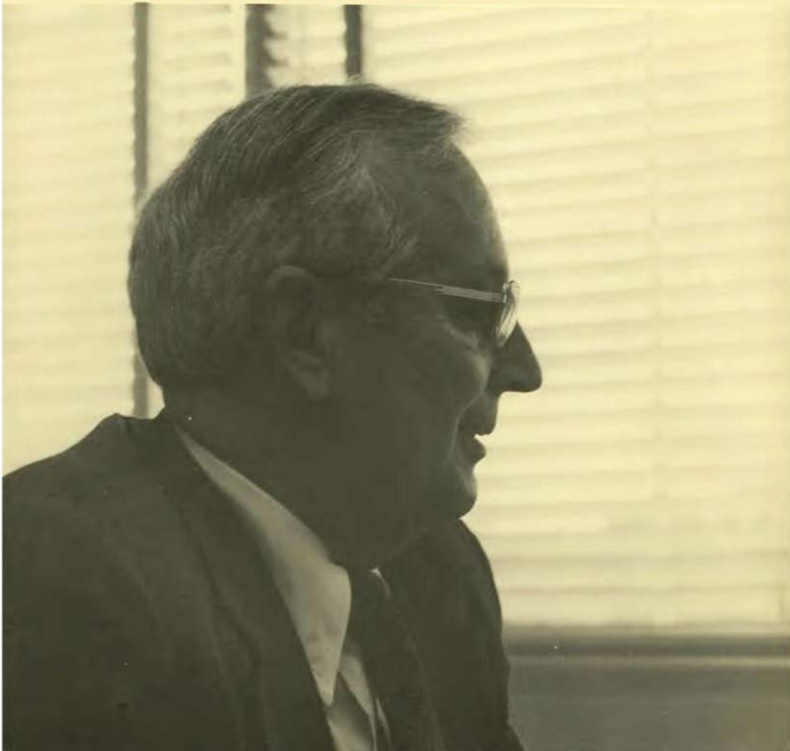

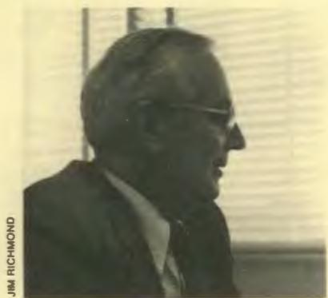

THE COVER: Floyd Culler, as a colleague recently said, is the man who knows the whole fission story, from the beginning to the final disposal. He has indeed been in on it from the first, and has had an active hand in almost every detail of the technology of the fuel cycle. We are privileged, then, to have the text of his talk as presented to the Salzburg meeting of the International Atomic Energy Agency last May on high-level waste management, beginning on page 1.

Editor BARBARA LYON

Staff Writer  
CAROLYN KRAUSE  
Consulting Editor  
ALEX ZUCKER

Publication Staff; Graphic Design/ Bill Clark; Technical Editing/ Jeff McKenna; Typography/ Edna Whittington; Makeup/Mary East; Reproduction/Bill West

The Review is published quarterly and distributed to employees and others associated with the Oak Ridge National Laboratory. The editorial office is in Building 4500-North, Oak Ridge National Laboratory, P.O. Box X, Oak Ridge, Tennessee 37830. Telephone: (615) 483-8611, Extension 3-6900 (FTS 850-6900).

# REVIEW

VOLUME 10 NUMBER 4

FALL 1977

1 Management of High-Level Wastes By F. L. CULLER   
11 Household Energy Use From Consumption to Conservation By CAROLYN KRAUSE   
18 Competition between Fossil and Nuclear Fueled Power Plants By HOWARD I. BOWERS and JERRY G. DELENE   
27 The Stewardship of ERDA's Forests By BARBARA LYON   
33 Molten Salt Chemistry at ORNL  
A Short History  
By STANLEY CANTOR   
40 Carbon Dioxide and Climate How Fast Can We Safely Burn Coal? By CAROLYN KRAUSE

# DEPARTMENTS

Books 9

Take a Number 16

Lab Anecdote 24

Achievement 39

Awards and Appointments 48

OAK RIDGE NATIONAL LABORATORY

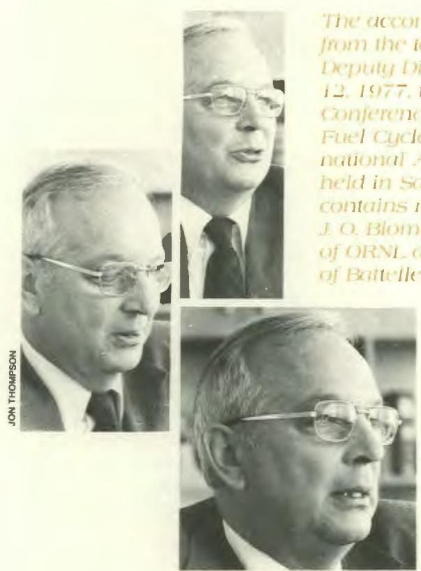

The accompanying article was taken from the talk delivered by ORNL. Deputy Director Floyd Culler on May 12, 1977, to the International Conference on Nuclear Power and its Fuel Cycle, sponsored by the International Atomic Energy Agency, held in Salzburg, Austria. The talk contains material provided by J.O. Blomke and H.E. Goehler of ORNL and by A.M. Flatt of Battelle Pacific Northwest Laboratory

# Management of High-Level Wastes

By F. L. CULLER

THE ULTIMATE DISPOSAL of high-level fission products and alpha-emitting wastes is one of the unresolved, i.e., undemonstrated, technical problems of the nuclear fuel cycle. Sir John Hill, in Tuesday's Round Table, stated that the technology exists for the concentration and fixation of these wastes, but that we have not yet decided how, when, or where they may be stored for the many centuries required for decay to naturally occurring levels. Responsible governmental agencies in the United States and in all other countries recognize this technical defi

ciency. Major national programs are now being designed to accomplish the needed work for the technical demonstration of both waste management and ultimate isolation.

But these technical solutions do not provide the full set of answers necessary for the international acceptance of radioactive waste isolation. We must pay much more attention to public acceptability and the licensing process. This task is of primary importance and is not yet being adequately covered.

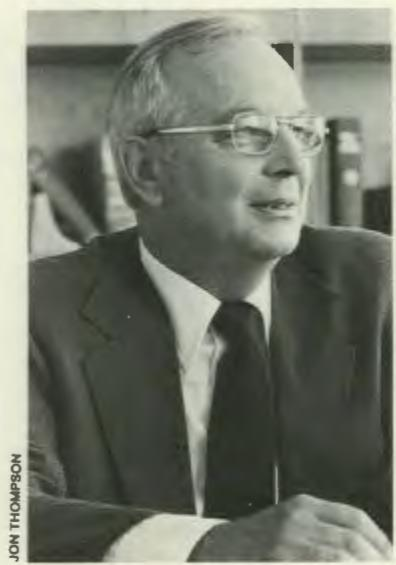

"...it is now time to raise the semitechnical aspects of waste disposal to the same level of importance that we have assigned to the technology."

During this conference I have set down general impressions of what has been said and written about wastes. Briefly, I suggest that we have

1. shown that, although it has yet to be fully demonstrated, the technology exists to reduce the short- and long-term risks of waste management and disposal to acceptable levels;   
2. tacitly agreed that since waste disposal costs are relatively small fractions of the cost of nuclear generated electricity, it is economically practical to employ the safest approaches;   
3. implicitly agreed that no net profit will be made from wastes; rather, waste management and ultimate disposal is a tax upon electricity and other products of nuclear fission;   
4. implicitly observed that final responsibility for wastes will rest with national governments, which will take responsibility for their long-term safe disposition; and   
5. approached but not clarified the international aspect of the waste problem: criteria and standards for judging safety and failure mode analysis that specifies fail-safe systems must be approved internationally.

# We have not

1. as member states, given a clear signal to the IAEA to proceed with the broad category of work to control wastes;

2. suggested the protocols that will permit licensing of waste facilities and methods; nor   
3. yet engaged in the analysis of what control and audit procedures are necessary to assure adherence to acceptable procedures for short- and long-term sequestering of radioactive materials.

Thus, I am rather comfortable about the state of technology, but more than vaguely discontented about the equally important problems associated with licensing and control that are so essential to public acceptance.

I suggest that it is now time to raise the semitechnical aspects of waste disposal to the same level of importance that we have assigned to the technology.

# Estimate of Requirements

Wastes generated in the fuel cycle for fission reactors using plutonium recycle differ somewhat from those of other reactors such as natural-uranium-fueled, high-temperature gas-cooled, and thorium-cycle reactors. However, they require the same management and disposal techniques.

Fuel cycle wastes generated by one gigawatt-year of electricity and conditioned and packaged for transport and disposal are shown in Table 1.

Wastes containing long-lived alpha-emitting heavy elements can be considered separately from those free of such emitters. This distinction is important because these elements and their decay

Table 1. Fuel cycle wastes from production of 1000 MWyr of electricity   

<table><tr><td>Waste</td><td>Volume (m3)</td><td>Activitya(MCi)</td><td>Thermal powera(kW)</td><td>Number of shipments</td></tr><tr><td>Spent fuel assemblies</td><td>13.9</td><td>172</td><td>970</td><td>11</td></tr><tr><td>Transuranium</td><td></td><td></td><td></td><td></td></tr><tr><td>High-level (solidified)</td><td>3.1</td><td>170</td><td>960</td><td>2</td></tr><tr><td>Cladding hulls</td><td>2.7</td><td>2.0</td><td>10</td><td>2</td></tr><tr><td>Intermediate-level solid</td><td>140</td><td>0.012</td><td>0.057</td><td>66</td></tr><tr><td>Low-level solid</td><td>480</td><td>0.049</td><td>0.04</td><td>17</td></tr><tr><td>Nontransuranium</td><td></td><td></td><td></td><td></td></tr><tr><td>Noble gases</td><td>0.01</td><td>0.25</td><td>0.37</td><td>0.4</td></tr><tr><td>Iodine</td><td>0.05</td><td>1 × 10-6</td><td></td><td>0.2</td></tr><tr><td>Carbon-14</td><td></td><td>2 × 10-5</td><td></td><td></td></tr><tr><td>Fission products and tritium (solidified)</td><td>0.35</td><td>0.018</td><td>7 × 10-4</td><td>1</td></tr><tr><td>Low-level solid</td><td>2400</td><td>0.002</td><td>0.007</td><td>180</td></tr><tr><td>Ore tailings</td><td>42,000</td><td>5 × 10-4</td><td>0.011</td><td></td></tr></table>

${}^{a}$ At the time of waste generation.

Table 2. Projected world nuclear capacity (GWe)   

<table><tr><td>Calendar year</td><td>United States plus foreign non-CMEAa countries</td><td>CMEAa countries</td><td>Total</td></tr><tr><td>1975</td><td>70</td><td>9</td><td>79</td></tr><tr><td>1980</td><td>165</td><td>17</td><td>102</td></tr><tr><td>1985</td><td>384</td><td>46</td><td>430</td></tr><tr><td>1990</td><td>698</td><td>106</td><td>804</td></tr><tr><td>2000</td><td>1540</td><td>395</td><td>1935</td></tr></table>

$^{a}$ Council for Mutual Economic Assistance (communist-bloc nations).

Table 3 World projection of fuel cycle wastes   

<table><tr><td rowspan="2">Category</td><td rowspan="2">Calendar year</td><td colspan="2">Accumulated world inventory</td></tr><tr><td>Volume (103m3)</td><td>Activity (MCi)</td></tr><tr><td colspan="4">Transuranium wastes</td></tr><tr><td rowspan="2">High-level wastes (solidified)</td><td>1990</td><td>6</td><td>56,000</td></tr><tr><td>2000</td><td>28</td><td>200,000</td></tr><tr><td rowspan="2">Clad</td><td>1990</td><td>5</td><td>1,500</td></tr><tr><td>2000</td><td>24</td><td>5,500</td></tr><tr><td rowspan="2">Intermediate-level and low-level wastes</td><td>1990</td><td>100</td><td>45</td></tr><tr><td>2000</td><td>470</td><td>200</td></tr><tr><td rowspan="2">Nontransuranium wastes volatiles</td><td>1990</td><td>1</td><td>410</td></tr><tr><td>2000</td><td>4</td><td>1,800</td></tr><tr><td rowspan="2">Intermediate-level and low-level wastes</td><td>1990</td><td>2,400</td><td>3</td></tr><tr><td>2000</td><td>7,900</td><td>10</td></tr><tr><td rowspan="2">Ore tailings</td><td>1990</td><td>350,000</td><td>4</td></tr><tr><td>2000</td><td>950,000</td><td>11</td></tr></table>

daughters remain radioactive much longer than do all but a few fission products. The tailings from uranium ore milling are a third distinct category. They contain significant amounts of natural uranium decay daughters, but the radionuclide concentration is less than that of other alpha-bearing wastes.

Chief among the alpha-bearing or transuranium wastes are the high-level wastes from reprocessing of spent fuels—the first-cycle solvent extraction waste, sometimes mixed with other process streams—which contain, besides the heavy elements, $99\%$ of the nonvolatile fission products. Other types of transuranium wastes are the spent-fuel structural materials (cladding) and various liquid and other solid wastes that arise from mixed uranium-plutonium oxide fuel fabrication and reprocessing. The nontransuranium wastes are concentrates of ${}^{85}\mathrm{Kr}$ , ${}^{129}\mathrm{I}$ , ${}^{14}\mathrm{C}$ , and tritium from reprocessing, and miscellaneous low-level liquid and solid wastes from all fuel cycle operations.

From the projected world nuclear capacity through 2000 A.D. (Table 2) we can estimate fuel-cycle waste generation for the same period (Table 3) in a nuclear economy based on these assumptions: Only LWRs will be used. Reprocessing of spent fuels will begin in 1982, the backlog of unreprocessed fuel to be worked off by 1996. Plutonium is to be recycled beginning in 1983.

# The Technology

To minimize the types of waste to be handled, blending of compatible waste streams is desirable for subsequent treatment or for incorporation with high-level wastes. These wastes include solid residues from clarification of solutions, dissolver off-gas scrubber solutions, degraded solvents, aqueous solutions from solvent cleanup, process equipment decontamination solutions, and laundry wastes. Leached fuel cladding and partially decontaminated process equipment are other examples. Methods of liquid waste treatment include evaporation, reverse osmosis, precipitation, filtration, and ion exchange. Gases are cleaned with scrubbers and filters. Treated liquid wastes that are not incorporated into high-level wastes may be sorbed on such materials as vermiculite and clays, then immobilized by mixing with concrete, bitumen, or ureaformaldehyde resin.

Opening session of the International Conference on Nuclear Power and its Fuel Cycle in the Festspielhaus in Salzburg, Austria. At the podium is the President of the Federal Republic of Austria, Dr. Rudolf Kirchschlager.

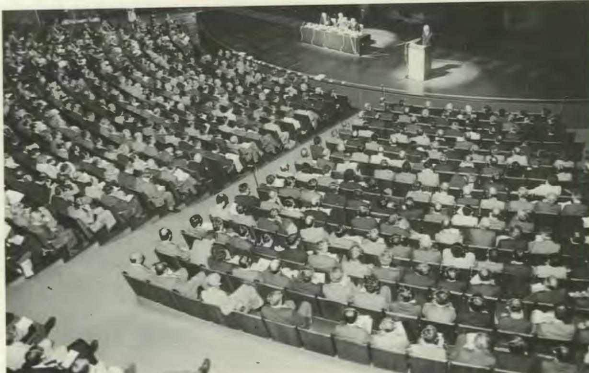

# High-level Waste Fixation

Many processes are under development for converting high-level liquid wastes to calcines or glasses for temporary storage or disposal. In the United States, fluidized bed calcination with or without subsequent vitrification, spray calcination with in-can melting, and continuous Joule-heated ceramic melting are ready for final demonstration with radioactive wastes prior to commercialization. The metal matrix, sintered glass-ceramic, supercalcine, multiple-barrier form, and inorganic ion exchange products are final waste forms that are less fully developed.

The most advanced European processes are the French continuous vitrification process, for which a demonstration plant is being built at Marcoule, and the British borosilicate glass (HARVEST) process, for which a fully active pilot plant is under construction at Windscale. Less fully developed European processes include aluminum phosphate ceramic-type granule matrix formation (LOTES), being studied at Eurochemic; spray calcination borosilicate glass (VERA) and the fission product solidification (FIPS) for the thorium (HTR) fuel cycle, both being developed in West Ger

many; and continuous glass bead vitrification (PAMELA) being developed jointly by Eurochemical and West Germany. Europe is probably ahead of the United States in developing methods for converting liquid wastes, particularly in the hot demonstration of fixation of high-level wastes.

# Actinide Separation and Transmutation

Partitioning long-lived plutonium and other transuranics is being actively studied. Reducing the quantity of plutonium decreases the isolation time required for the residual fission-product-bearing waste. Figures 1 and 2 show what might be accomplished if these separations can be made. Values for naturally occurring radioactive substances are shown for comparison. The toxicity index (defined as the volume of water needed to dilute a unit volume of waste to maximum permissible concentrations for unrestricted use) of conventional solidified high-level waste drops after about $10^{5}$ years to about that of pitchblende and remains near that level (Fig. 1). If $99.99\%$ of the plutonium, $99.9\%$ of uranium and curium, and $95\%$ of the neptunium in the spent fuel are removed, the index after $10^{3}$ years is decreased to

# "Immobilization of residues by incorporation into glasses or cements is practical."

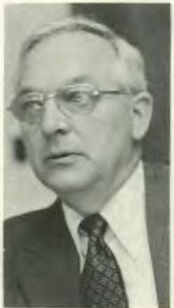  
JIM RICHMOND

a level well within the range of widely distributed, naturally occurring materials (Fig. 2).

Before this concept can become a realistic waste management option, however, separation of the five actinides from the fission products on a routine plant operation basis must be exceptionally sharp; the separation processes should not complicate management of the other fission product effluents. After the actinides have been separated, we must be able to dispose of them. Within present or near-future technology, this means burning them to fission products in reactors, which can be done without penalty to reactor performance; but there are effects on other parts of the fuel cycle (reactor operation, fabrication, and transportation) which have not been fully explored. Partitioning is not regarded as a precondition to geologic or seabed disposal, but it may very well represent a desirable future improvement over initial practices.

# Cladding and Alpha-Active Materials

Next to high-level wastes from the first solvent extraction cycle, leached fuel hulls and alpha-active wastes from fuel reprocessing and mixed uranium-plutonium oxide fuel fabrication facilities present the most severe problems in radioactive waste management. Zirconium hulls present an additional hazard because of their pyrophoricity.

Several processes are in use or are being developed for treating and disposing of hulls and other fuel assembly parts. In Europe, hulls are compacted and temporarily stored under water in concrete silos. Processes are being developed to melt the zirconium hulls in silicoalumina or graphite-lined electric furnaces, with or without

added iron and/or copper, to form a lower-melting eutectic. The molten zirconium may then be cast into ingots which can be embedded in concrete for final disposal. Untreated or treated hulls can be matricized with concrete or glass to decrease possible future leaching.

Low-level transuranium wastes are created during fuel production, fuel analysis, and equipment maintenance, including quantities of contaminated solid wastes (plastic, rubber, cellulose, HEPA filters, glass, and metal). High-temperature $(1500 - 1600^{\circ}\mathrm{C})$ incineration of combustible wastes with added fluxes to produce a less leachable slag instead of ashes, and cryogenic crushing $(-140^{\circ}\mathrm{C})$ are being studied.

Combustible transuranium wastes may be burned in special incinerators, and the ashes may be leached in hot $\mathrm{HNO}_3$ -HF to recover most of the transuranics. Further decontamination proceeds by fusion with suitable salts followed by leaching. Methods are being studied for removing transuranics from surfaces by ultrasonic energy, hot-water ball-milling, electropolishing, and high-pressure steam and water spraying. Immobilization of residues by incorporation into glasses or cements is practical.

# Uranium Mill Tailings

The treatment of uranium ore by solvent extraction is very selective for uranium, and nearly all the other radioactive heavy elements report to the waste along with 5 or $10\%$ of the uranium not recovered. The bulk of the radioactivity in the ore tailings results from the decay of $^{230}\mathrm{Th}$ , a daughter of $^{238}\mathrm{U}$ with a half-life of 83,000 years. The $^{230}\mathrm{Th}$ decays to 1600-year

$^{226}\mathrm{Ra}$ and then to 3.8-day $^{222}\mathrm{Rn}$ and its chain of daughters.

Ore currently being mined and milled contains about $0.2\% \mathrm{U}_3\mathrm{O}_8$ ; it is anticipated that the ore processed in the U.S. from 1975 to 2000 will average near $0.1\% \mathrm{U}_3\mathrm{O}_8$ . An average solid waste for that period will be 1.3 metric tons per kilogram of uranium recovered and will contain about $80\%$ of the radioactivity originally present in the ore. The volume, area, and radioactivity of tailings expected to be generated in the U.S. by the year 2000 are given in Table 4 for no plutonium or uranium recycle, uranium recycle only, and recycle of both. As presently assessed, ore tailings will be covered with $60~\mathrm{cm}$ of earth topped by rock or vegetation against erosion by wind and water whenever a mill closes down.

Table 4. Characteristics of U.S. ore tailings through 2000 AD   

<table><tr><td></td><td>No uranium or plutonium recycle</td><td>Uranium recycle only</td><td>Uranium and plutonium recycle</td></tr><tr><td>Uranium recovered (tonnes)</td><td>\( 1.2 \times 10^6 \)</td><td>\( 1.1 \times 10^6 \)</td><td>\( 0.9 \times 10^6 \)</td></tr><tr><td>Volume of tailings \( (m^3) \)</td><td>\( 8 \times 10^{10} \)</td><td>\( 7 \times 10^{10} \)</td><td>\( 6 \times 10^{10} \)</td></tr><tr><td>Area of tailings (ha)</td><td>6700</td><td>5900</td><td>5100</td></tr><tr><td colspan="4">Radioactivity (MCi)</td></tr><tr><td>Initial</td><td>4.7</td><td>4.2</td><td>3.6</td></tr><tr><td>10,000 years decay</td><td>4.3</td><td>3.9</td><td>3.3</td></tr><tr><td>100,000 years decay</td><td>3.7</td><td>3.3</td><td>2.8</td></tr><tr><td>1,000,000 years decay</td><td>0.4</td><td>0.3</td><td>0.3</td></tr><tr><td>Radon release after stabilizationa(MCi/year)</td><td>0.42</td><td>0.38</td><td>0.33</td></tr></table>

${}^{3}$ 60-cm earth cover, $4\%$ moisture.

# Removal of Radioactive Gases

Adequate commercial methods are available for removing krypton and iodine from off-gas of spent nuclear fuel dissolution, and methods for removing tritium and $\mathrm{CO}_{2}$ are being developed. At the Idaho Chemical Processing Plant krypton is removed by cryogenic treatment of the dissolver off-gas stream and packaged in gas cylinders under pressure. An equally effective but not yet demonstrated method is based on cryogenic absorption in fluorocarbons. A process is under development for storing the recovered krypton in a sodalite-zeolite matrix at normal atmospheric pressure. Iodine can be removed from dissolver off-gases by caustic scrubbing, chemisorption by metal-loaded zeolites, $\mathrm{Hg(NO_3)_2}$ scrubbing, or scrubbing with concentrated $\mathrm{HNO}_3$ (the Iodox process). Development of processes for separating

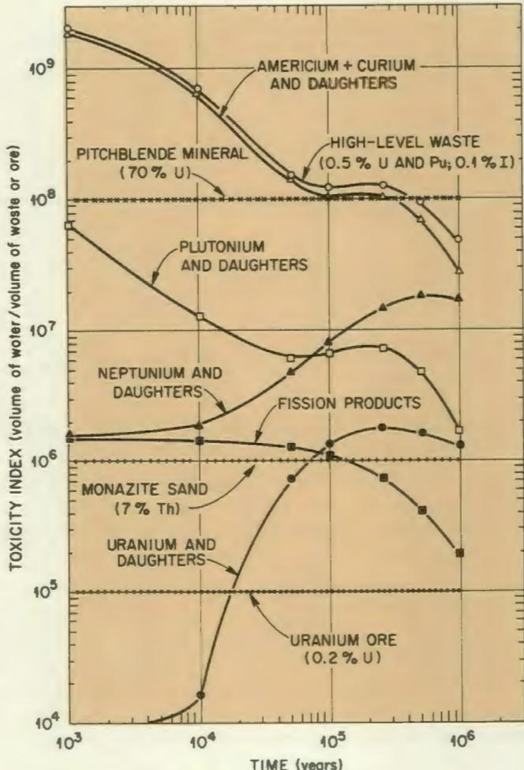  
Fig. 1. Toxicity index of solidified high-level waste without secondary processing for actinide removal.

and concentrating tritium is based on voloxidation, pyrochemical processing, isotopic enrichment, and aqueous recycle techniques. Processes under consideration for removing $^{14}\mathrm{CO}_{2}$ from head-end off-gas streams are based on caustic scrubbing, sorption on molecular sieves, and absorption in fluorocarbons.

# Methods for Disposal

High level fission-product wastes in glass or high-fired ceramics, and others that contain appreciable amounts of actinide elements, must be isolated for hundreds of thousands of years or, essentially, forever, assuming that partitioning and high-efficiency recycle are not used. Proposed disposal methods include isolation in continental geologic formations, isolation on or under the seabed, nuclear transmutation of long-lived

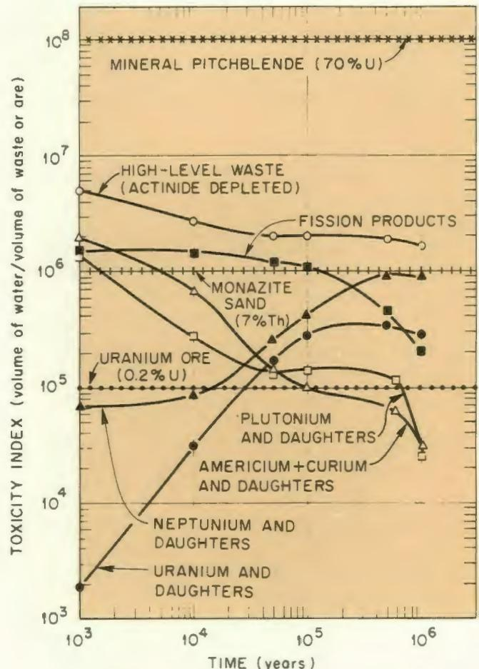  
Fig. 2. Toxicity index of solidified high-level waste after removal of $95\%$ of $\mathbf{N}\mathfrak{p}$ $99.9\%$ of 1, U, Am, Cm, and $99.99\%$ of Pu.

elements, and extraterrestrial ejection by rocket. Of these, emplacement in continental geologic formations using conventional mining techniques is believed to be the only concept that can be successfully demonstrated in the near future, and current work in both Europe and North America is strongly oriented in that direction. Seabed disposal may be the best near-term alternative, because both transmutation and extraterrestrial disposal are dependent on the development of difficult chemical separations processes mentioned earlier.

The geologic properties that make a particular formation a good candidate for a radioactive waste repository include, among others, absence of ground water, low permeability, freedom from joints and faults, good ion exchange capability, and freedom from seismic activity. Rock types that seem acceptable include evaporite beds (salt, potash, anhydrite, gypsum), fine-grained sedimentary rocks (shale, mudstone), high-integrity igneous and metamorphic rocks (granite, andesite, basalt, gneiss), and

unweathered limestone, particularly in arid climates.

Salt deposits have very low permeability and high plasticity. Shales have both these characteristics plus generally good ion exchange characteristics but contain water, which makes them not very useful for heat-generating wastes. Unjointed and unfaulted crystalline rocks and deeply buried limestones in arid regions have low permeability and generally high integrity, but they do not really decouple from seismic activity. Decoupling is a property which salt beds or domes possess to a greater degree than most formations studied.

A fail-safe, successful waste repository requires a thorough evaluation of the wastes to be stored and an understanding of the chemical, thermal, mechanical, and radiation interactions between the wastes and the geologic medium. In the near-term, repositories will be designed for retrieval of waste, until it is agreed that the geologic system is safe for very long-term storage. If and when such conclusions are warranted, the repository could be filled and sealed. Table 5 indicates the types of geologic formations being evaluated and the nations where such work is in progress; however, the principal programs are

Table 5. Types of geologic formations being evaluated for waste disposal   

<table><tr><td rowspan="2">Country</td><td colspan="2">Evaporites</td><td rowspan="2">Shale and clay</td><td rowspan="2">Limestone</td><td rowspan="2">Crystalline rock</td></tr><tr><td>Salt</td><td>Anhydrite</td></tr><tr><td>Austria</td><td></td><td></td><td></td><td></td><td></td></tr><tr><td>Belgium (Eurochemical)</td><td></td><td></td><td>X</td><td></td><td></td></tr><tr><td>Canada</td><td>X</td><td></td><td></td><td></td><td>X</td></tr><tr><td>Denmark</td><td></td><td></td><td></td><td></td><td>X</td></tr><tr><td>France</td><td>X</td><td></td><td></td><td></td><td>X</td></tr><tr><td>GDR (East Germany)</td><td></td><td></td><td></td><td></td><td></td></tr><tr><td>FRG (West Germany)</td><td>X</td><td></td><td></td><td></td><td></td></tr><tr><td>India</td><td></td><td></td><td></td><td></td><td></td></tr><tr><td>Italy</td><td></td><td></td><td>X</td><td></td><td></td></tr><tr><td>Netherlands</td><td>X</td><td></td><td></td><td></td><td></td></tr><tr><td>Spain</td><td>X</td><td>X</td><td>X</td><td></td><td>X</td></tr><tr><td>Sweden</td><td></td><td></td><td></td><td></td><td>X</td></tr><tr><td>Switzerland</td><td></td><td>X</td><td></td><td></td><td></td></tr><tr><td>U.S.S.R.</td><td></td><td></td><td></td><td></td><td></td></tr><tr><td>United Kingdom</td><td></td><td></td><td>X</td><td></td><td>X</td></tr><tr><td>United States</td><td>X</td><td></td><td>X</td><td>X</td><td>X</td></tr></table>

under way in West Germany and the United States. The storage of low- and intermediate-level wastes at the Asse salt mine in West Germany has been practiced since 1967. A site over a different salt formation in Germany is being sought for a fuel reprocessing plant and waste facility for the mid-1980s. In this proposed facility, low- and intermediate-level wastes will be stored uncanned (but either mixed with concrete or as beads or pellets) in solution cavities, and high-level wastes will be emplaced in a mechanically mined cavity.

In the United States, geologic studies of salt deposits along the Gulf Coast and the Delaware and Paradox basins are in progress preparatory to the installation and operation of two pilot repositories in the mid-1980s. Preliminary evaluation of various shale, limestone, and crystalline igneous rock formations has also been started. When suitable nonsalt formations have been found, more detailed geologic evaluation will be made, aimed at later repositories. Selection of sites in salt and other formations where limited-capacity initial repositories are installed will lead to expanded full-scale operations when safety and stability are confirmed. The United States proposes to have two pilot repositories for reactor fuels available for trial use by about 1985, plus one in the deep salt beds of New Mexico for fixed military wastes.

The recently announced changes in the direction of the U.S. nuclear program, motivated by laudable concern for the weapon proliferation potential of the uranium-plutonium cycle, could have effects on the program for waste management and disposal in the United States. We have already heard at this meeting a review in broad terms of the changes in emphasis which are evolving for the fuel cycle as a whole. It appears that the U.S. programs in support of waste management and disposal will not be significantly affected financially, only changed in emphasis.

The following statements about the U.S. program are based on what I have been able to learn during this formative period:

1. Process development for isolation and disposal of iodine, krypton, tritium, and carbon dioxide will continue, since they apply equally to all fuel cycles.

2. Process development for thorium-uranium

(and probably plutonium) will be expanded since fluoride ions must be present in $\mathrm{HNO}_3$ used to dissolve thorium oxide. Studies relating to the effects (and safe handling) of fluorides in waste fixation processes are being initiated.

3. Partitioning of plutonium will continue.

4. The planned production of many cylinders of glassed reactor waste at Hanford will continue, but only a few containers of waste will be produced in the near-term.

5. The pilot repository in the New Mexico salt beds, for the retention of solidified fission product wastes generated for military purposes, will continue on schedule. A future option for nonmilitary fixed wastes will be retained in the design.

6. There will be expanded investigation of the use of granite and/or shale for the storage of spent, unreprocessed fuel elements at the Nevada test site.

7. Surface storage facilities for spent fuel elements will be designed, and utility storage pool capacity may be more efficiently utilized and possibly expanded.

8. The broad program of the qualification of potential repositories in salt, various crystalline rocks, shales, limestone, and other geologic formations being pursued under the direction of the Office of Waste Isolation in Oak Ridge will continue. For each candidate formation, the potential for retrievable storage of spent fuel elements is now being studied, in addition to storage of fixed high-level and alpha wastes from reprocessing and fuel recycle.

9. Tentatively at least, two additional pilot repositories (other than New Mexico salt) are planned for initial start-up in 1985. One of these probably will be in interior salt domes in the Mississippi-Louisiana coastal salt areas.

10. Analysis and experimental work in seabed disposal will continue, as well as work in other potential disposal systems.

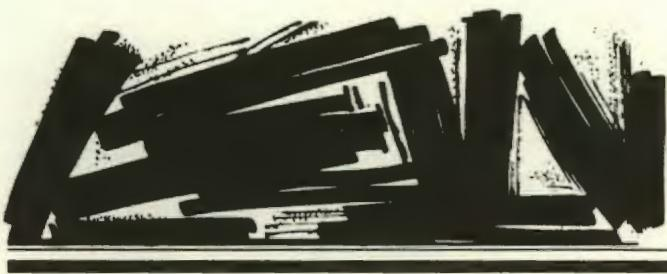

# BOOKS

# "Niels Bohr Collected Works, Volume 4: The Periodic System (1920/1924)"

edited by J. Rud Nielsen, North-Holland Publishing Company, Amsterdam (1977), 765 pages, $120.50. Reviewed by Curtis E. Bemis, Jr.

THIS BOOK, VOLUME 4 of the Niels Bohr Collected Works, is the most recent edition in an 8-volume series originally conceived and initiated by Leon Rosenfeld. The complete series is a monumental undertaking and provides a comprehensive, critical review of the works of Niels Bohr arranged in chronological order. Each volume contains all published and some unpublished scientific manuscripts for the time period considered (complete with English translations for original works in Danish!) and also contains selected scientific correspondence covering the same time period. An introductory section, written by the editor, J. Rud Nielsen, serves as a very convenient documentary chronology for each volume.

The researches of Niels Bohr during the period 1918-1924 had a dual purpose: The first was the development of a consistent and adequate quantum theory for atoms, and the second was to apply

the quantum theoretical principles to determine details of atomic structure and explain the physical and chemical properties, and hence the periodic system of the elements. Volume 4 deals entirely with the latter purpose, although it is clear that both the theoretical development and the application of theory proceeded nearly simultaneously.

The time period covered in Volume 4, 1920-1924, was extremely productive for Bohr in that the Institute for Theoretical Physics in Copenhagen was started and the development of quantum theory had progressed to a point of subtle understanding and was being applied to a description of x-ray line structure and the periodic system of the elements. Also during this same period, in 1922, Bohr received the Nobel Prize for Physics for his work on atomic structure and spectra.

Bohr relied heavily during this period on x-ray line structure in his classification of electron orbitals for the elements of the periodic system, as Moseley had earlier shown a direct relationship between x-ray frequency and atomic number. Bohr had correctly predicted that the rare earth elements ended at lutetium (element 71) with the complete filling of the inner fourth major quantum shell, and the then unknown element with atomic number 72, hafnium, would have different valency and hence chemistry from that of the rare earth group. He was thus quite perplexed by the announcement of Dauviller and Urbain in 1922 of the discovery of celtium, element 72, by its x-ray spectrum (the $\mathbf{L}_{\alpha_1}$ and $\mathbf{L}_{\beta_1}$ lines) in a mixture of two rare earth elements, lutetium (71) and ytterbium (70). Rutherford had publicly accepted, without any reservation, the claim of Dauviller and Urbain, but Bohr persisted because element 72 in the rare earth series would pose serious difficulty for his electron classification scheme. He wrote to Dirk Coster, a young Dutch physicist then working with Manne Siegbahn on x-ray line structure in Stockholm, to ask his opinion of the reliability of the experimental work of Dauviller and Urbain. Coster replied in detail to Bohr on July 16, 1922, and indicated that Siegbahn had met with Dauviller in Paris and had examined the plates containing the evidence for element 72. Siegbahn, somewhat sarcastically, had authorized Coster to say, "If Dauviller claims that there was $0.01\%$ (a hundredth of a percent) of the element 72 present in his sample, then one must grant him that the plates he took do not contradict this—but

they confirm it just as little." Coster evidently convinced Bohr not to attach much significance to the work of Dauviller and Urbain. In late 1922, Coster went from Stockholm to Bohr's Institute in Copenhagen, where Bohr had installed apparatus for x-ray spectroscopy. Together with Bohr's old Hungarian chemist friend, George de Hevesy, they finally succeeded in discovering element 72 in various zirconium minerals as predicted. Bohr announced to the world on December 11, 1922, at the end of his Nobel Lecture, the discovery by Coster and Hevesy of element 72 in Copenhagen, thus providing an important test of theory. Coster and Hevesy later proposed the name hafnium for their element after the Latin name for Copenhagen, Hafnia.

I found the element 72 story as outlined above, and thoroughly documented in this book, quite entertaining, as the parallels with the discoveries of the very heaviest elements, or lack of them, are obvious.

I found a few errors regarding dates and places of letters. For example (page 31), Coster's letter to Bohr was not written from Utrecht on July 15, 1922, but rather from the Hague on July 16, 1922.

The documentation for this book was obtained from the Niels Bohr Archive and the Archives for the History of Quantum Physics. A complete list of the scientific manuscripts dealing with the correspondence principle and the interpretation of the periodic system, 67 total for the period 1918-1924, is given at the end of the volume.

For those who desire an insider's look at the development of the theoretical basis for the periodic system of elements, I can highly recommend Volume 4 of the Niels Bohr Collected Works. Perusal of this book from your library is also recommended, since the cost appears beyond the means of most of us.

# Staff Quote:

"Considering the pocket-sized country that Norway really is—less than 4 million people—one cannot but be somewhat impressed by their quite advanced status in science and technology. A striking feature is that Norway seems to have a coherent science policy. The budgets are firm and known, well before the start of the fiscal year. This eliminates much of the anxiety and feeling of uncertainty that is easy to spot in our national laboratories.

"The most conspicuous difference—it is also an unfair comparison—is that scientists and engineers in Norway seem to have much more influence on the policy in science and technology than is the case in the United States, probably because of the fact that the 'social status' or 'respectability' of scientists and engineers is much higher in Scandinavia than here."—Jorulf Brynestad, discussing his foreign assignment to the University in Trondheim–The Norwegian Institute of Technology in Trondheim, Norway, in late 1975.

Eric Hirst began doing energy conservation studies in 1971, several years before the nation became acutely aware of the need to cut back on energy demand. A native of New York City with a Ph.D. in mechanical engineering from Stanford University, Hirst came to ORNL in 1970 to work in the AEC's Environmental Quality Program. While studying the problem of waste heat from power plants, he realized that an important key to ameliorating environmental impact could be reduction in the growth of energy demand. In 1971, he was transferred to the National Science Foundation's Environmental Program for which he pursued energy conservation studies. An environmentalist and energy conservation advocate, Hirst helped organize two series of Laboratory-wide seminars on environmental research and on energy problems. Articles of his on energy conservation have appeared in Science and Saturday Review as well as in technical journals. While in the ORNL-NSF program under Jack Gibbons and Roger Carlsmith, Hirst examined the use of energy in such areas as food and transportation. Hirst left ORNL for Washington in February 1974 to become director of the Office of Transportation Research in the Federal Energy Administration. When he returned to ORNL in June 1975, he joined the Energy Division to investigate energy use in buildings, especially in the residential sector.

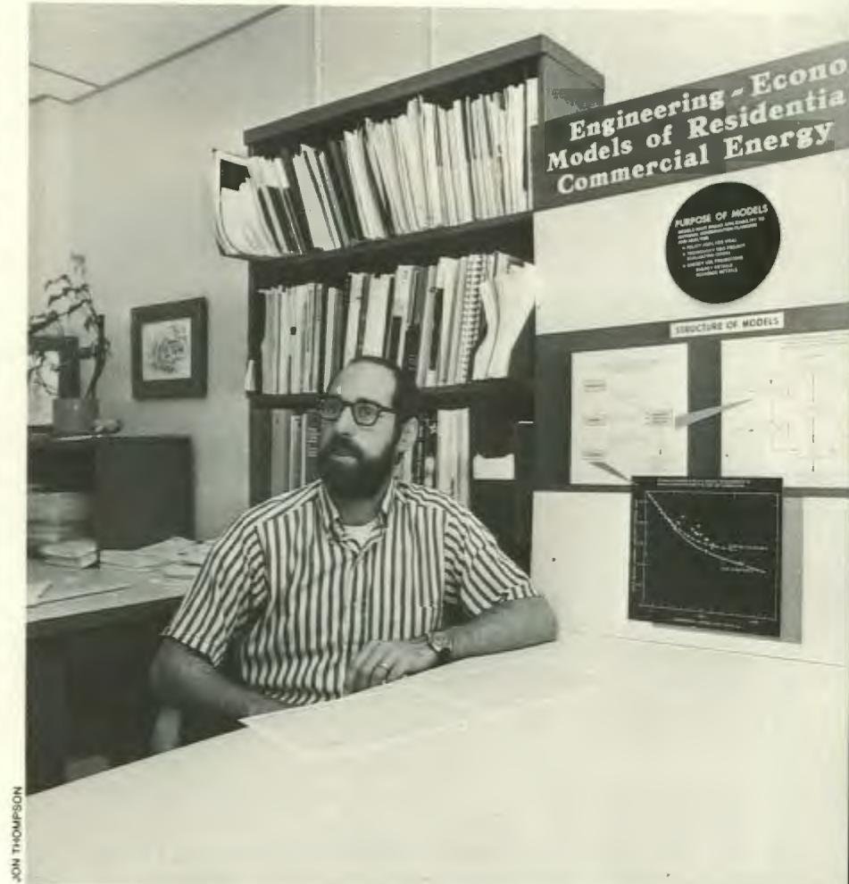

# Household Energy Use

From Consumption to Conservation

By CAROLYN KRAUSE

IN THE THIRD QUARTER of this century, the increasing numbers of Americans consumed energy as if it were as limitless as the comforts of home which they pursued. Whereas the American population grew from 152 million in 1950 to 214 million in 1975—an annual increase of $1.4\%$ —the number of American households grew $2\%$ per year, from 44 million residential units to 71 million. We filled our homes with appliances—not only glamorous devices such as electric mixers, televisions, stereos, clothes dryers, electric tools,

stoves with self-cleaning ovens, and food freezers, but also the major energy-hungry appliances like frost-free refrigerators, furnaces, water heaters, and air conditioners which now account for $20\%$ of the nation's energy consumption. As the number of households increased by almost 30 million during this 25-year period and as we purchased appliances to feed on what most of us thought was an endless energy supply, our appetite for residential energy grew an average of $3.6\%$ per year.

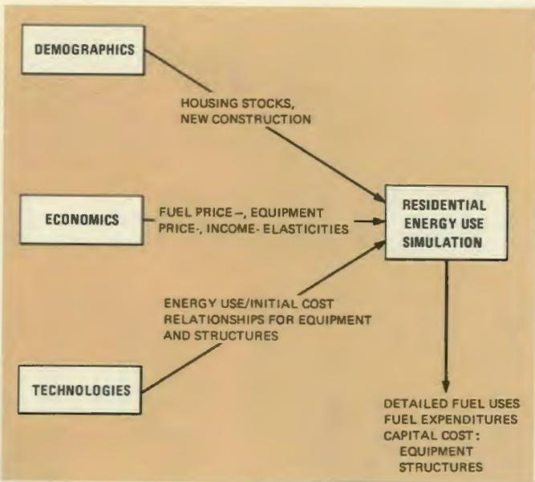  
Here is a schematic of the ORNL residential energy use model.

It was not until 1972-73, around the time of the Arab oil embargo and the ensuing shortages in heating oil and gasoline, that most of us began to seriously examine whether we were indeed becoming profligate in using energy that no longer seemed cheap and abundant. If the Golden Era of Abundant Energy was over, could we significantly reduce energy use in our homes without altering our lifestyle drastically? Or did the future hold an unrestrained but temporary growth in energy use which would suddenly end with millions of jobless Americans sitting at home freezing in the dark?

Using a computer model for a crystal ball, Eric Hirst of ORNL's Energy Division, Janet Carney of the Computer Sciences Division, and Robert Hoskins, formerly of the Energy Division, looked at the prospect for future residential energy growth through the end of the century and found it not as bleak as some expected. According to their projections, based on historical patterns and other data, residential energy use will grow more slowly in 1976-2000 than it did during the 1950-75 period. The reasons: slower population growth, higher and rising fuel prices, and what Hirst calls "approaching saturation for major household energy uses."

# Rising Fuel Prices

Computer projections show that the U.S. population, notwithstanding its annual $1.4\%$ increase between 1950 and 1975, will rise by only $0.8\%$ per year in the next quarter century—from

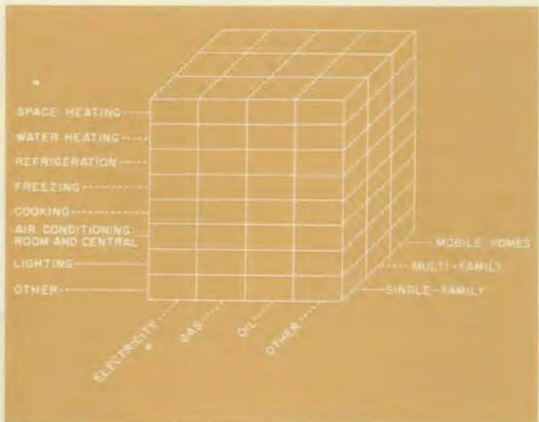  
This is the level of detail provided by the simulation model for fuel uses, equipment ownership, new equipment installations, fuel costs, equipment costs, and structural thermal integrity costs.

today's 214 million to 262 million in 2000. The trend in fuel prices has been changing even more dramatically—in fact, it has reversed. In terms of real dollars (correcting for inflation), the average price of electricity declined $25\%$ from 1950 to 1972, at which time prices began to rise. During the same period, the cost of gas dropped $3\%$ and oil prices fell $6\%$ . Predictions from ERDA and the Federal Energy Administration (FEA) used in Hirst's computer model show that between now and the year 2000 the cost of electricity will soar $25\%$ , gas prices will spiral $91\%$ , and oil prices will increase $36\%$ . Because of dwindling oil and gas supplies, it is anticipated that electricity's share of residential energy use will rise from $44\%$ in 1975 to $70\%$ in 2000 (it was $18\%$ in 1950).

The key to reduced growth in energy consumption appears to be rising fuel prices. According to Hirst, even if no major federal energy conservation programs are implemented, residential energy use will grow at a rate less than $2\%$ per year—President Carter's goal—because of rising fuel prices. Hirst also finds that the average annual growth rate for energy consumption could drop as low as $1.2\%$ if the conservation programs proposed by President Carter are enacted into law.

These proposed conservation programs, as well as less stringent approaches recently approved by Congress [in the Energy Policy and Conservation Act (EPCA) and the Energy Conservation and Production Act (ECPA)], focus on improving the technical efficiencies of major home

  
Thermostat up in summer

appliances and structures (for example, making more energy-efficient air conditioners, refrigerators, and water heaters for better insulated homes).

In his analysis of the effects of these various conservation programs on energy growth rates, Hirst anticipates an "approaching saturation for major household energy uses." That is, he foresees no additional high-energy-consuming end uses beyond the eight major ones he has identified: space heating, water heating, refrigeration, food freezing, cooking, air conditioning, lighting, plus others (clothes dryers, TVs, etc.). One energy expert, Hirst acknowledges, criticized this assumption and argued that, in the age of industrial pollution, there may some day be a large market for home air filtration systems.

# Model Simulates Energy Use

In the past two years, Hirst and his colleagues have been developing and applying detailed engineering-economic models that simulate household energy use at the national level for eight end uses, each using one of four fuels (electricity, gas, oil, and other fuels such as coal), placed in three housing types (single-family houses, apartments, and mobile homes). Each of these 96 fuel-use components is calculated for each year of the simulation as functions of (1) stocks of occupied housing units and new construction; (2) equipment ownership by fuel and end use; (3) thermal integrity of housing units—that is, how effectively these units retain heat in the winter and shut out heat in the summer; (4) average unit energy requirements for each type of equipment; and (5)

usage factors that reflect household behavior. The model also calculates annual fuel expenditures, equipment costs, and capital costs for improving thermal integrity of new and existing structures. Hirst and his colleagues assumed that there are no drastic lifestyle changes and that homeowners respond in the future (to rising fuel prices, etc.) in the same way as they have in the past. Also projected is that the number of households will grow $1.9\%$ per year, from 74 million now to 114 million residential units in 2000, and that the average house size will remain about the same as before—about 1500 sq ft. Hirst speculates that house size will not change significantly, despite trends toward higher housing prices and reduced family size, because of the offsetting projected rise in personal income.

Using the model, Hirst evaluated the effectiveness of implementing the Energy Policy and Conservation Act, in which the Federal Energy Administration is authorized to set targets for voluntary improvement of appliance efficiencies, and the Energy Conservation and Production Act, in which the Department of Housing and Urban Development is authorized to develop thermal standards for new construction within three years. He also evaluated assorted programs to retrofit poorly insulated houses as well as stronger conservation programs that have been proposed. Most recently, he studied the Carter Administra

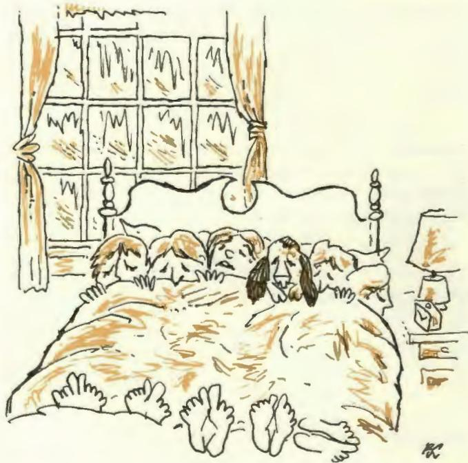  
Thermostat down in winter

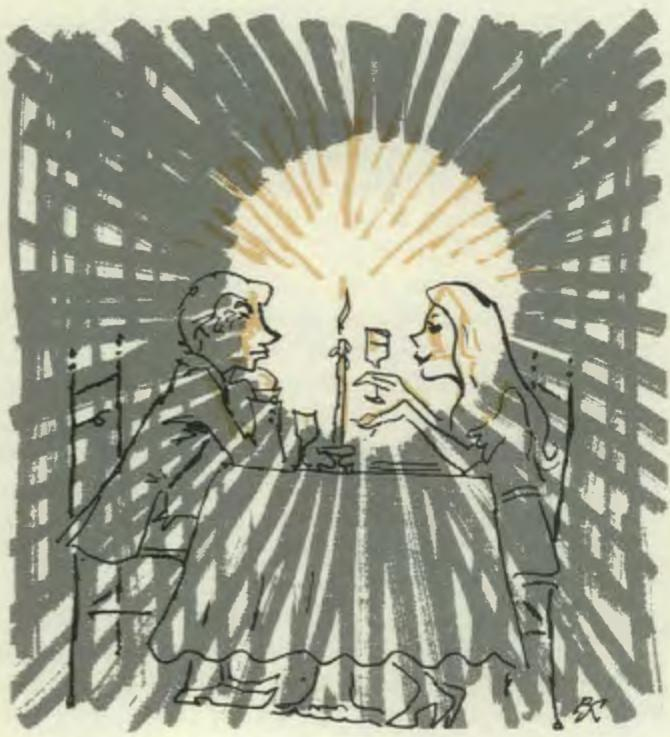  
Turn out Lights

tion's conservation proposals in the National Energy Plan.

# The President's Proposals

Under the Carter plan, the current voluntary program to reduce energy use by at least $20\%$ through redesign of home appliances would be replaced by mandatory minimum standards for 1980. In the area of improving existing structures, proposed legislation is aimed at inducing homeowners and builders to install ceiling insulation, weatherstrip doors and windows, caulk cracks, install clock thermostats, and modify furnaces. The new federal plan is designed to bring $90\%$ of all residences up to minimum federal standards by 1985. Among the provisions of the program are:

1. Homeowners would be entitled to a tax credit of $25\%$ of the first $\$ 800$ and $15\%$ of the next $\$ 1400$ spent on approved conservation measures.   
2. The states would direct the regulated utilities to assist homeowners in obtaining loans, materials, and labor so they can retrofit their poorly insulated homes.   
3. The Government would make it easier for homeowners to obtain residential energy conservation loans through the Federal Home Loan Mortgage Corporation and the Federal National Mortgage Association.

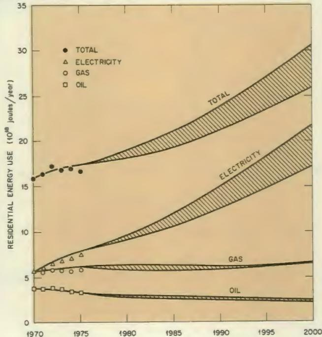  
Projections of residential energy use with and without federal conservation programs

4. The Government would provide increased funds—up to $200 million in both FY 1979 and FY 1980—to help low-income people weatherize their homes.   
5. The Department of Agriculture would continue a rural home conservation program in cooperation with rural electric cooperatives, providing loans through the Farmers Home Administration.

President Carter also asked for legislation that would direct the Department of Housing and Urban Development to develop thermal standards for new construction in two years (instead of three, as called for by the Energy Policy and Conservation Act so that they can be implemented by 1980. The standards—which would govern the extent to which new houses need weather-stripping, storm doors, double windowpanes, and other insulating materials—are likely to be stricter under the new proposal.

# Costs Vs. Savings

If the Carter energy conservation program is enacted into law, Hirst calculates that American consumers, by the year 2000, will pay $29 billion in extra capital costs (insulating materials, more efficient appliances, etc.) but will pay $56 billion less in fuel bills. Thus, the net savings in fuel costs would total $27 billion. This is about the same as the savings that would result from full implementation of the program.

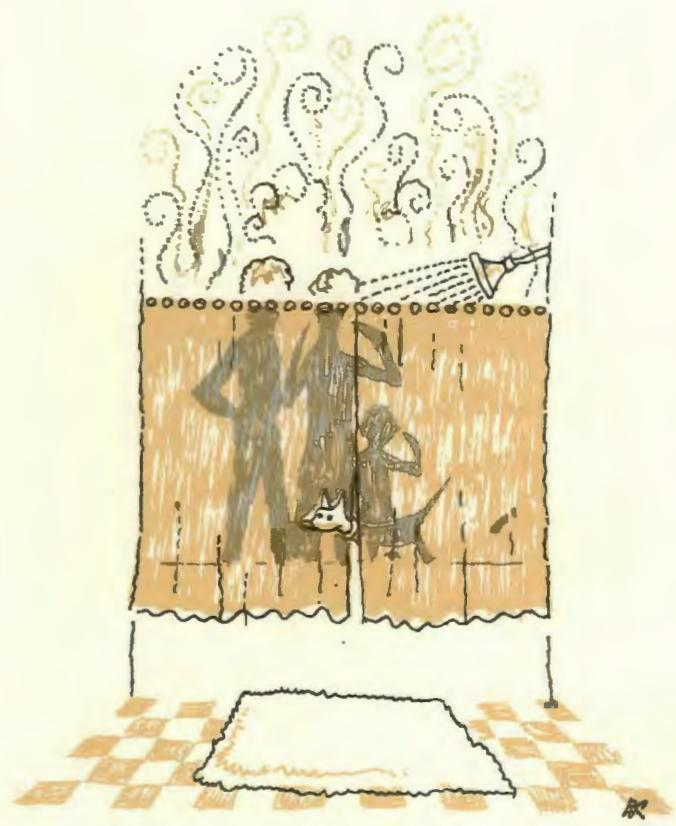  
Save hot water

tation of current federal programs calling for appliance efficiency standards, thermal standards for new construction, and retrofitting poorly insulated homes and buildings. But more energy would be conserved under the Carter program.

In examining the national energy and economic implications of adopting various proposed sets of targets for achieving energy efficiency in appliances, Hirst and Hoskins analyzed what design changes are needed to increase the energy efficiency of refrigerators and water heaters and what the capital and operating costs of these redesigned appliances would be. Their findings show how individual consumers could benefit financially from stricter appliance-efficiency standards.

FEA's high target requires a reduction in refrigerator energy use of $33\%$ . Hirst and Hoskins found that this goal can be met by increasing the insulation thickness of the refrigerator walls, removing the fan motor from the refrigerated area, adding an antisweat heater switch, and increasing the condenser surface area. This combination represents only one possible design for

meeting the 1980 target. Such an improvement in refrigerator performance would increase the consumer's purchase price by about $10 (in 1975 dollars). The annual savings in electricity bills of$ 20 (at the assumed 1980 electricity price) repays this higher initial price in six months.

The FEA high target for gas water heaters requires a reduction in energy use of $26\%$ . The agency's analysis of water heater designs shows that this target can be met by adding 7.6 cm of urethane foam to the water heater jacket, insulating the distribution pipe, reducing the pilot rate, and reducing air flow through the flue. These changes would increase the water heater purchase price by about $40. With a resulting annual reduction in gas bills of $16, this investment yields a 2- to 3-year payback period.

Despite rising fuel costs, energy use is not expected to claim a disproportionate share of personal income, largely because of projected increases in real per capita income from $5900 in 1975 to$ 10,600 in 2000. According to Hirst's computer runs, the energy-related expenses in the year 2000 as a percentage of personal income would be $3\%$ without federal conservation programs (but with rising fuel prices), and only $2.7\%$ if the Carter program went into effect.

In 1976, residential energy use was 16.3 QBtu (QBtu, or 1 quad, equals $10^{15}$ British Thermal Units), or 17.2 EJ [1 EJ (exajoule) = $10^{18}$ J (joules)]. If the Carter program were put into effect, energy use would grow to 21.6 QBtu (22.8 EJ) in 2000, an average annual growth rate of $1.2\%$ , only one-third of the $3.6\%$ historical annual growth rate in the 1950-75 period. If the American people wished to achieve zero energy growth, Hirst's model shows that it would be possible (if there were no market imperfections) by coupling fully implemented federal programs with large increases in fuel prices.

By investigating various energy-use scenarios, Hirst determined the efficacy of implementing combined federal conservation programs, including those proposed April 20 by President Carter. These programs could have a dramatic impact on reduction of energy growth in the residential sector. Energy conservation achieved as a result of higher fuel prices and improved technical efficiencies in home appliances and building structures is a two-sided coin that would not only buy us time to develop clean alternative energy sources without drastically altering lifestyles, but would also save consumers a considerable amount of money.

# Take A Number

BY V. R. R. UPPULURI

# THE FIVE STAR GENERAL—IS IT A MYTH?

Consider a checkerboard with an infinite number of squares. Suppose we have a horizontal barrier in the middle. Initially, one can lay pieces on the lower half of the board. By the following rule of jumps, pieces can appear on the upper half of the board: If two pieces are next to each other followed by an empty square, then one piece can jump to the empty square and occupy it, and the piece jumped over is removed from the board. Only horizontal and vertical jumps are allowed; that is, no diagonal jumps are permitted. When pieces appear on the upper half of the board, the same rules apply.

Let us designate the first row on the top of the barrier as level 1 and the second row on the top of the barrier as level 2, and so on. We are interested in the smallest number of pieces we initially need to arrange on the bottom half of the board so that we can reach a specified level on the upper half of the board.

In Figs. 1a and 1b, it is easy to see that we need initially only two pieces to reach level 1. The piece designated by A can jump over B (and B is removed from the board) and appear on level 1.

Similarly, we need initially four pieces to reach level 2. Given the initial arrangement shown in Fig. 2a, first D jumps over C (C is removed and D goes to level 1), then A jumps over B (B is removed), and then A jumps over D and A reaches level 2.

We need initially only eight pieces to reach level 3. Given the initial arrangement shown in Fig. 3a, first C jumps over F (C is at level 1), then D jumps over E, D jumps over C (and D is at level 2), H jumps over G, A jumps over B, A jumps over H, and finally A jumps over D and reaches level 3.

Now, how about the smallest number of pieces needed initially to reach level 4? Looking at the table, one would like to venture a guess to be 16.

It turns out to be a wrong guess. At least 20 pieces are needed before an arrangement on the lower half of the board can be found to reach level 4.

The next surprise concerns level 5. It turns out that there is no initial arrangement of any number of pieces on the lower half of the board, so that level 5 can be reached. A mathematical proof of this finding is attributed to John H. Conway at the University of Cambridge.

  
Fig. 1a

  
Fig. 1b

  
Fig. 3a

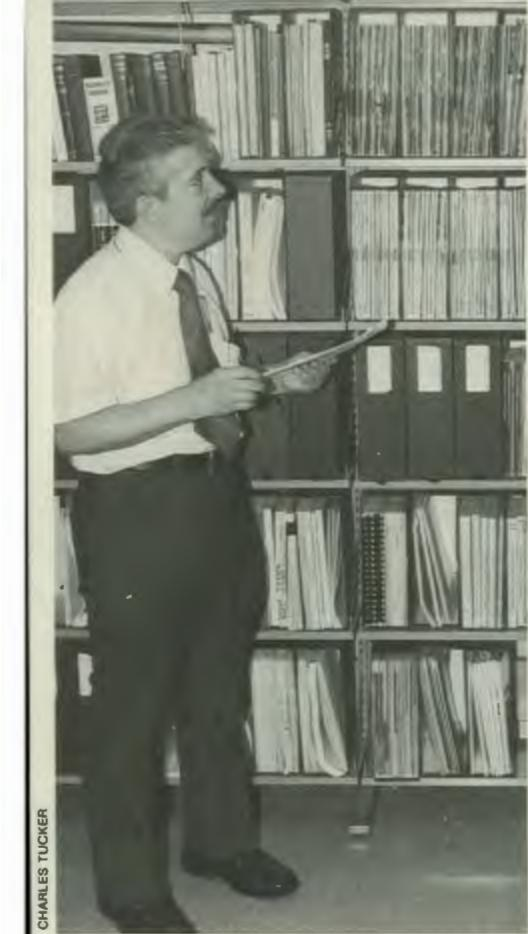

Since his arrival at ORNL 10 years ago, Howard Bowers has committed his efforts to the technical and economic assessment of the leading candidates for energy generation. The Laboratory initiated these studies in the early 1960s, at the instigation of Jim Lane, and its program today is considered a continuing responsibility to ERDA, and indirectly to the Nuclear Regulatory Commission, to update the cost estimates of energy systems as the parameters shift with the political and economic winds. Bowers, r., a mechanical engineering graduate from Iowa State, was engaged in reactor design at Los Alamos for 10 years before joining ORNL's Reactor Division, now Engineering Technology. Jerry Delene has spent the greater part of his career at ORNL since 1959 in technical design for the gas-cooled reactor programs and nuclear desalination. Since 1974, he has been involved in fuel resource and cost analyses for current and advanced energy concepts. Delene holds an M.S. degree in nuclear science from the University of Michigan.

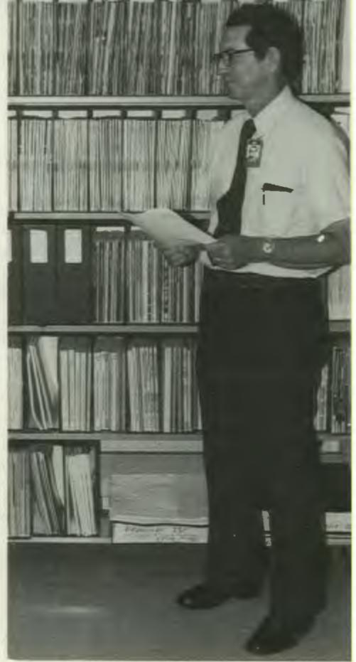

# Competition between Fossil and Nuclear Fueled Power Plants

By HOWARD I. BOWERS and JERRY G. DELENE

W E HAVE BEEN involved for the past several years in technical and economic evaluations of generating electricity from various types of power plants. In this paper we set forth to estimate economic competitiveness of base-load light-water reactor (LWR) plants and coal-fired plants in the year 1987. This is the earliest date that an LWR plant can be brought into commercial operation if a utility company starts planning for a new plant today. The plant is assumed to be located in the eastern part of the United States far from the western low-sulfur coal fields. It has been shown by others that mine-mouth plants located in Wyoming and Montana can generate electricity

at a lower cost than comparable nuclear plants. However, this electricity must be transmitted long distances over high-voltage transmission lines for use in the more densely populated and industrialized parts of the country. There is also objection from the population of these western states to serving as generation centers for other parts of the country. We also give estimates of generating electricity by burning oil; however, it is extremely unlikely that utilities will be permitted to burn oil for base-load generation in the future.

Studies and evaluations of the economics of LWR and coal-fired power plants have been

carried out for several years by the Engineering Technology Division for use by the Energy Research and Development Administration in long-range planning activities. Results of these studies have also been used by the Nuclear Regulatory Commission in cost-benefit studies for nuclear plants undergoing licensing, by the Federal Energy Administration, by the Federal Power Commission, and by the electric utility industry.

The estimation of total electric generating costs at the power plant bus bar (i.e., exclusive of transmission and distribution to the consumer) involves four major areas: capital investment costs, nonfuel operating and maintenance (O&M) costs, fuel costs, and power plant performance. We will discuss each of these four areas separately and then put the component costs together to produce total estimated generating costs in 1987.

# Capital Investment Costs

Capital costs are usually separated into five major categories: direct construction cost, indirect construction cost, contingency allowance, allowance for escalation during construction, and allowance for the cost of borrowing funds during construction. The direct construction cost is made up of the cost of land, buildings and structures, nuclear steam supply system, boilers, steam turbines and generators, mechanical and electrical equipment, and piping, wiring, and labor required to produce an operating power plant. The indirect construction cost includes engineering design and analysis, safety and environmental licensing, construction management, quality assurance, and miscellaneous taxes and overhead. The contingency allowance is expected to cover normal estimating error, occasional overtime, and minor changes in scope of project. Within this narrow definition, a contingency allowance of 10 to $15\%$ of the direct and indirect costs is reasonable. In some cases, contingency allowance has been defined to cover major scope changes due to unknown environmental and safety regulatory requirements and severe inflation. In this broader sense, a contingency allowance of 20 to $30\%$ is reasonable. The allowance for escalation during construction accounts for increases in costs due to inflation from the time the plant cost estimate is made to the time the plant is placed in commercial operation. The allowance for borrowing funds during construction accounts for the use of money during the construction of the plant before it is

placed into commercial operation and permitted to be included in the utility rate base.

The information regarding capital costs of power plants was acquired through direct contact with both the electric utility industry and United Engineers & Constructors, Inc. (UE&C), with whom ERDA and NRC hold contracts. The ORNL studies involve analyses of historical cost data and trends, historical equipment, labor and materials requirements and trends, safety and environmental requirements and trends, construction schedules and lead time requirements, and computer code development. The UE&C contracts provide for the development of detailed investment cost studies for reference power plants based on wide experience in the design and construction of power plants for the electric utility industry.

The information so gathered has been applied to a computer code, CONCEPT, to arrive at investment cost estimates as a function of plant type, unit size, number of units, location, and time. This CONCEPT code is now in its fourth version and has gained wide acceptance in the electric utility industry. Approximately 100 copies of the code have been distributed to electric utility companies, manufacturers, oil companies, coal producers, universities, architect-engineers, consultants, construction contractors, national laboratories, and government agencies. Participants in the studies include B.H.Fitzgerald,I.T.Dudley C.R.Hudson II,and M.L.Myers of the Engineering Technology Division;and R.J. Barnard,R.C.DeLozier,L.D.Reynolds,and B.E. Srite of the Computer Sciences Division.

We recently completed estimates of capital investment costs for large base-loaded electric power plants for commercial operation in 1987 for the eastern United States. LWR plants are estimated to cost about \(1200 / \mathrm{kW(e)}\); coal-fired plants with limestone scrubbers for flue gas desulfurization (FGD), about \)1000 / \mathrm{kWe}\); coal-fired plants not requiring scrubbers and burning low-sulfur, low-quality western coal, about \(\$900 / \mathrm{kW(e)}\); and oil-fired plants burning low-sulfur oil, about \(\$650 / \mathrm{kW(e)}\). We found that the direct construction cost in terms of 1977 dollars is only about a third of the total cost of each type of plant; the addition of the indirect construction cost increases the 1977 dollar estimate to about a half of the total. The effect of inflation and the cost of borrowing money effectively double the cost of each type of plant at commercial operation. We

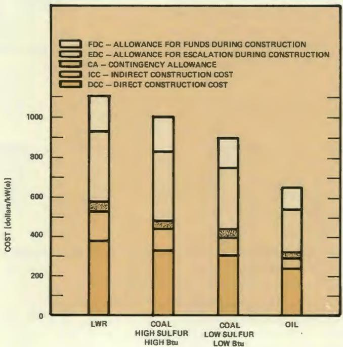  
Estimates of 1987 capital investment costs for large electric power plants.

assume construction costs escalate at a rate of $7\%$ /year and that the interest rate for construction money is $9\%$ /year. We also found that the estimated direct construction cost of a coal plant burning low-sulfur, low-quality western coal is only about $\$ 50/\mathrm{kW(e)}$ less than that of the coal-fired plant equipped with scrubbers. The usually quoted cost for limestone scrubbers is about $\$ 100/\mathrm{kW(e)}$ in 1977 dollars. However, plants burning low-quality western coal require larger furnaces for combustion, larger electrostatic precipitators for particle removal from the flue gas, and an approximately $50\%$ increase in coal and ash handling capacity. Most of the low-sulfur western coals have a high moisture content and therefore a low heating value compared with eastern coals.

# Operating and Maintenance

O&M costs include all the costs (except fuel) of keeping the plant operating once it goes into commercial operation, including the following general categories: operating and maintenance staff, maintenance materials, supplies and expenses, and general and administrative overhead costs. In addition, the costs of liability insurance and operating fees are included for nuclear plants,

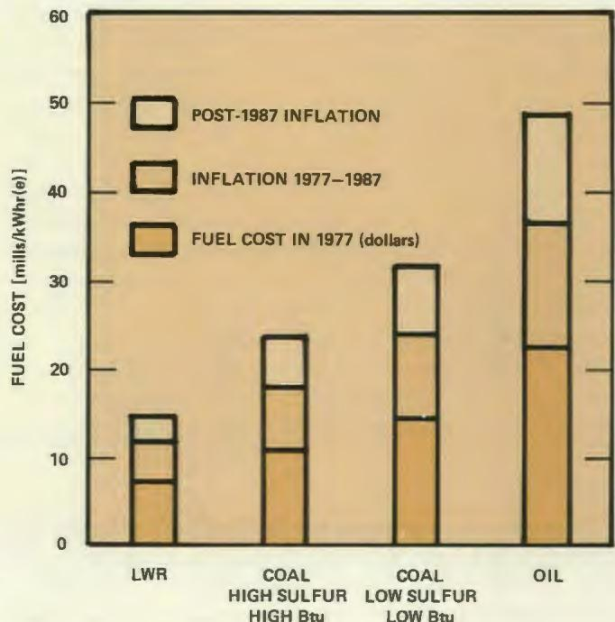  
Fuel cost for base load electric generation, based on a 1987 startup, showing a 15-year levelized average, and assuming $5\%$ per year inflation.

and the costs of limestone and sludge disposal are included for coal-fired plants equipped with FGD systems. The costs of amortizing the capital investment, property taxes, property insurance, and federal and state income taxes are usually included in the annual fixed charges on the capital investment.

The information required to generate O&M cost estimates has been developed by M. L. Myers through direct contact with electric utility companies and through analysis of FPC operating data. This information has been utilized by L. C. Fuller in another computer code, OMCST, to generate O&M cost estimates as a function of plant type, unit size, number of units, and time.

Recently completed estimates of O&M costs for 1987 were separated into two categories: (1) a fixed component which is incurred regardless of the operation of the power plant, the major part of which is the operating and maintenance staff, and (2) a variable component which is a function of plant operation. The major variable component is cost of limestone and sludge disposal for coal-fired plants requiring FGD systems. Fixed O&M cost components for 1987 are estimated to be about $12 per kilowatt (electrical) per year for LWR plants and for coal-fired plants not requiring scrubbers,

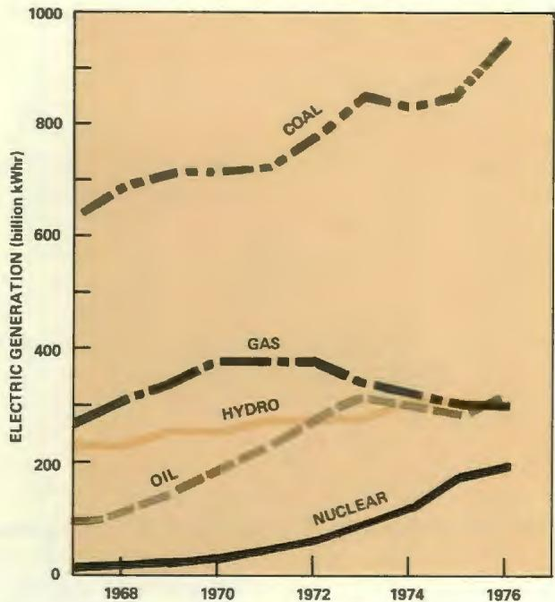  
Electric generation by source for the past 10 years.

and about $9 for oil-fired plants. Variable O&M costs are estimated to be about 0.1 mill/kWhr(e) for both LWR and coal-fired plants without scrubbers, and a negligible amount for oil-fired plants. The addition of limestone scrubbers to coal-fired plants increases the fixed O&M cost component about $3 per kilowatt (electrical) per year and the variable component about 2.6 mills/kWhr(e).

When the effect of inflation after 1987 is considered, assuming a rate of 5% per year, the average (or levelized) fixed O&M costs during the first 15 years of operation are estimated to be about $16 per kilowatt (electrical) per year for LWR and coal-fired plants not requiring scrubbers, $12 for oil-fired plants, and $4 additional for scrubbers. Average (or levelized) variable O&M costs during the first 15 years of operation are estimated to be 0.13 mill/kWhr(e) for LWR and coal-fired plants without scrubbers and 3.4 mills/kWhr(e) additional for scrubbers.

# Fuel Costs

During the last decade, there have been significant changes in the fuels used for electric power generation and in the prices the utilities have paid for these fuels. Oil has become a major source of electric power (16% in 1976), second only to coal (46%). Nuclear generation has been growing swiftly to over 9% of the total electric generation in 1976. Hydroelectric generation has been relatively constant (14%), and power gener

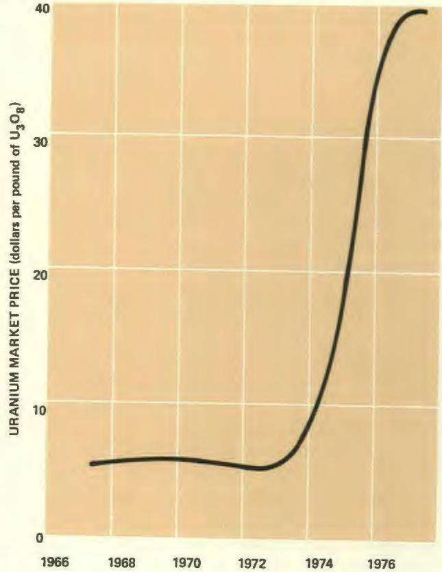  
Market price of uranium over the past 10 years.

ation by natural gas $(15\%)$ has started declining since it peaked in the early 1970s.

Prior to the fall of 1973, the prices paid for fuel by the electric utilities were relatively stable with an upward bias on oil and coal. The upward trend for oil prices during this period was the effect of the increasingly powerful cartel formed by the Organization of Petroleum Exporting Countries (OPEC). The rise in coal prices during this period was influenced by the 1969 Mine Health and Safety Act. Natural gas prices were stable during this period, whereas nuclear prices fell until mid-1972 and then started rising slowly.

In the fall of 1973, a dramatic shift occurred in the price structures of the basic energy fuels. Fuels suddenly switched from a buyers' to a sellers' market. Led by oil prices which had been increased by a factor of three by the OPEC countries, the price of each fuel resource increased. The average price utilities paid for coal doubled and, on the spot market, nearly quadrupled for a short time. (A spot market purchase is one for immediate delivery.) The spot market price of uranium ore increased by a factor of six, and the price of natural gas—with its built-on, government-regulated industry delay time—is still rising after having gone up by over a factor of three.

In the case of fossil fuels, the price of the basic fuel commodity translates directly into electric power cost. This relationship is not true with nuclear power. The nuclear fuel cost is composed of several component costs. Besides ore purchase, there are conversion to uranium hexafluoride, fuel enrichment, fuel element fabrication, and the costs associated with fuel after it is removed from the reactor. It takes about 4 to 5 years from the time of uranium purchase until the fuel's economic life is over. This time span produces significant carrying or inventory costs on unamortized fuel investment which are not usually found with fossil fuel costs. The relatively long fuel life and procurement lead times produce a delay period between commodity price rises and corresponding electric power cost increases. Also, because most uranium for reactors is contracted for several years in advance of use, the current sharp rises in uranium price will not show up in actual nuclear fuel cost increases for several years.

There are various regional differences in the price of fossil fuels. The national price range of oil for base-load power generation is about $20\%$ of average. The competitive delivered price of coal depends on several factors: in addition to mining costs, there are grade of coal, transportation cost to the point of use, and sulfur content. Strip (or surface) mining of coal is the cheapest mining method, whereas underground mining is the most expensive.

Coal is found throughout the United States in various grades of heat, ash, and sulfur content. Most of the coal now being mined comes from the eastern and central portions of the United States. This coal, for the most part, is bituminous with heat values of 11,000 to 13,000 Btu/lb and is of high sulfur content. There is some low-sulfur coal in these areas, but it is generally metallurgical (coking) coal, and its supply is tied up in long-term contracts. Of the approximately 640 million tons of coal produced in the United States in 1975, 530 million tons came from the eastern and central portions. Subbituminous coal is found in great abundance in the northern Great Plains and mountain regions. It is of low sulfur content and has heat values of about 8500 Btu/lb. Future coal expansion will come mainly from these reserves. Large lignite beds are found in western North and South Dakota and in Texas. It is low in sulfur but has a high moisture content and has a low heat value (about 6000 Btu/lb). It may be used for local power generation or for gasification or lique-

faction, because its low Btu content makes long-distance transportation uneconomical.

Estimated typical current fuel costs for base- load oil-fired power generation are about 19 mills/kWhr(e). Eastern high-sulfur coal fuel costs are about 9 mills/kWhr(e), whereas the fuel costs for western low-sulfur coal vary from about 3.5 mills/kWhr(e) in the mountain states to 10 to 12 mills/kWhr(e) or more the farther one moves east and beyond the Mississippi River. Current nuclear fuel costs are estimated to be about 3.6 mills/ kWhr(e). This figure is based on $12/lb for uranium ore,$ 4/kg for conversion, $70/SWU for enrichment, $108/kg for fabrication, and $100/kg for permanent storage and/or disposal of the spent fuel.

The increase in fuel costs between 1977 and 1987, when the reference power plants are to come on line, has two components. One is the "constant dollar" increase that is tied to such factors as depletion, increasing safety and environmental considerations, etc.; the other component is the general overall inflation rate. In our analysis, we assume a general inflation rate of $5\%$ per year during this period, a slightly optimistic rate in view of recent history. It is, however, consistent with the $8\%$ interest on long-term debt and the $12\%$ return on stockholder equity assumed in the analysis.

In constant 1977 dollars, the price of uranium ore is assumed to increase from the current average $12/lb to$ 40/lb (the current spot price) by 1985. After 1985, it was assumed to increase by $2\%$ per year due to resource depletion. The enrichment price was estimated to escalate in constant dollar terms to $100/SWU by 1985 and to remain constant thereafter. There is speculation that the new enrichment technologies (centrifuge, laser) could even lower enrichment prices toward the end of the century if not sooner. All other nuclear fuel cost components are assumed to remain constant in terms of 1977 dollars.

Oil and coal prices, in 1977 dollars, are assumed to escalate by $2\%$ /year between 1977 and 1987. No real cost escalation is assumed after 1987. The oil price increase is due to OPEC pressure and the phasing out of old oil price restrictions. Real cost increases in coal will come from environmental restrictions and mine safety regulations.

In constant 1977 dollars, the fuel costs estimated for 1987 are 7 mills/kWhr(e) for nuclear, 23 mills/kWhr(e) for oil, and 11 and 15 mills/kWhr(e) for high- and low-sulfur coal respectively.

The nuclear fuel cost is levelized over the first 15 years of operation so that the assumed $2\%$ /year real escalation in uranium price is accounted for. When inflation is included, average (levelized) fuel costs during the first 15 years of operation are estimated to be 15 mills/kWhr(e) for nuclear, 48 mills/kWhr(e) for oil, 24 mills/kWhr(e) for high-sulfur coal, and 32 mills/kWhr(e) for low-sulfur coal. These are the reference fuel costs for the generating cost comparison.

# Power Plant Performance

R. L. Simard has performed a statistical analysis of power plant performance based on data collected by the FEA in its power plant productivity improvement program. This study includes analysis of availability factors, capacity factors, and forced outage rates for the years 1965 through 1975. Performance factors were developed and statistically analyzed as a function of fuel types and unit size for each full calendar year of operation, for cumulative averages, and for specific years of operation. Here, we discuss only the yearly average performance factors for specific years of operation of all nuclear units, coal-fired units, and oil-fired units $600\mathrm{MW(e)}$ and larger. Although there are wide year-to-year variations in the data, we make the following general observations: all yearly average plant availability factors are about $70\%$ , all yearly average forced outage rates are in the range of 10 to $20\%$ , yearly average capacity factors for nuclear and coal-fired plants are 55 to $60\%$ (reflecting base-load operation), and yearly average capacity factors for oil-fired plants are about $50\%$ (reflecting load following operation). None of the coal-fired plants in this data set are equipped with FGD systems. It is generally accepted in the industry that FGD systems will decrease coal-fired plant availability and capacity by 5 to $10\%$ , and will increase forced outages. However, we do not assess this penalty in this analysis.

# Total Costs

The total electric generating cost at the power plant bus bar is the sum of the capital, O&M, and fuel costs. The capital cost of the plant was converted to mills/kWhr(e) using an annual fixed charge of $16\%$ and an average plant capacity factor of $60\%$ . The levelized average generating costs for the four generating options during the first 15 years of operation, assuming an inflation rate of $5\%$ per year, are estimated to be 54

mills/kWhr(e) for nuclear, 61 mills/kWhr(e) for high-sulfur coal, 62 mills/kWhr(e) for low-sulfur coal, and 70 mills/kWhr(e) for oil. These estimates compare with 1976 residential electric rates of 20 to 25 mills/kWhr(e) in the Tennessee Valley and 30 to 40 mills/kWhr(e) in the Chicago area: The residential rates include transmission and distribution costs, whereas our estimates do not.

Although the estimated cost difference between coal and nuclear generation may seem small, the 7 to 8 mills/kWhr(e) difference translates to almost $40 million/year for each 1000-MW(e) plant and to about $90/year for a consumer using 1000 kWhr(e)/month.

The power generated using low-sulfur coal is estimated here to cost 8 mills/kWhr(e) more than nuclear; however, this differential will evaporate as the plant is moved west. Low-sulfur coal should be the economic choice inland, where the costs of transportation from Wyoming and Montana coal fields are much lower. However, since this analysis was completed, we see strong indications that all coal-fired plants, including those burning low-sulfur coal, will be required to have FGD systems, which will change their competitive position vis-a-vis high-sulfur coal and nuclear fuels.

Even if oil is permitted to be burned for baseload power generation, we estimate that the cost will restrain its deployment except in isolated areas where both nuclear and coal-fired plants are restricted. The savings in oil by burning coal or nuclear fuels is about 8 million barrels per year for each 1000-MW(e) plant.

The conclusions to be reached from this analysis are that coal and nuclear base-load generation will remain mutually competitive in the future and that the price of electricity will rise significantly.

There will undoubtedly continue to be widespread interest in the cost difference between coal-fired and nuclear power generation, a complex problem about which a variety of opinions has been voiced. The projection or prediction of costs for electric generating systems coming on line in the future involves the combination of many uncertain factors and assumptions. It is also affected by the basic personality and bias of the predictor, whether he is pro-nuclear or anti-nuclear, or some degree in between. In the present uncertain environment, both political and economic, cost projections should be made with great caution.

Lab Anecdote

# AN EVENING WITH MAX BREDIG

By Ellison Taylor

whiff of perfume in a crowded room, or of wet oak leaves underfoot; a few bars of Stormy Weather (or your choice), preferably coming across a stony lake on a summer night—any one of these can suddenly take us back entire to another time. In the practice of science, as well, emotion has a part. How much of what we accomplish reflects the joy and strength and perseverance that come from belonging, at least in our imagination, to a charmed and happy band! We become physicists, or chemists, or biologists for practical or accidental reasons; but, if we are lucky, once in a while the sound of a Hyvac pump, the smell of toluene, the lights in a single, second-floor laboratory at midnight will take us back again to our beginnings. Then, for a little while, we will remember that we're part of Camelot. If you know what I mean.

It helps to keep your faith in Camelot if you can listen from time to time to stories of the old, great days, and hear again the names who wrought the wondrous deeds, and marvel how their paths cross and diverge and cross again, and sometimes touch your own. Max Bredig lived for a space in Camelot, and on a recent sultry, moonless evening I journeyed to his home. He was seventy-five on June 20, and I took this as an excuse for an evening of reminiscence.

Max grew up in Germany and was educated there between the wars, when, in the physical sciences, it was a branch, at least, of Camelot. Like Camelot, it contained the seeds of its own destruction, but that is not my story. Max and I talked about Arthur and Gawaine and such, and even more about the lesser knights and the apprentices, not about Modred, or Merlin, or Guinevere.

That's probably enough of Camelot for now; the names that follow will be names of real people. Only remember, if you read on, that to chemists and physicists of a certain age the names are magic names of greater or lesser degree, and to have known them was a privilege. Remember also, please, that graduate students and young postdoctorals were not privy to the councils of the mighty. You won't learn what Einstein said to Planck at dinner—nor who was chasing whose wife through the rose garden of the Institute. What I can show you from a happy evening spent with Max is a few pictures of what it was like to grow up scientifically in that exciting, far-off time.

First picture—the house of Michael Polanyi in Berlin. Polanyi, a member of Fritz Haber's Institut fur Physikalische Chemie, is directing Eugene Wigner's thesis, is becoming famous as a chemical kineticist, studies fast reactions in flames. Max is

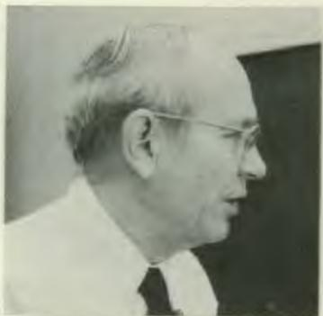  
Ellison

invited there for dinner because Polanyi has spent a year or two in Karlsruhe, where Max's father, Georg Bredig, is professor of physical chemistry. Max has come to Berlin to study for the Ph.D. in Haber's institute. He is a greenhorn from Karlsruhe, and naturally shy in addition. It will be nice to have dinner with someone he knows. He is greeted at the door, suitable polite phrases are exchanged, and Polanyi shows him into the drawing room, saying, "Yes, I want you to meet the other guests, Mr. Eugene Wigner and Dr. Leo Szilard." Snap the shutter, just as Wigner rises diffidently with a little smile and bow. We all know Eugene will be kind and modest with his new fellow student, but we think Max is right to look so nervous in the picture.

Wigner's is a most impressive intellect, and Szilard, in addition to knowing almost everything, is the man who was to be a leading figure in the politics of nuclear energy, both before and after 1941. It won't be quite like a dinner at home.

Second picture-a packed lecture hall in Walther Nernst's institute in Berlin. Every Wednesday afternoon it is thronged with visitors attending the Laue Physics Colloquium, held not in Laue's

own institute but in Nernst's, because the latter has the largest lecture hall available. Pick up a glass and examine the picture. Far at the back sits Max, who has just come in by subway from Dahlem where the Haber institute is. In the front row we can pick out five distinguished faces, four physicists and one chemist whose discussions attract the throng. Four are Nobel Prize winners—Planck, Einstein, Laue, and Nernst—while Schrodinger is just developing wave mechanics, the subject which the colloquium will address throughout the year, and which will bring him the same prize in 1933. There could be five Nobel laureates there in 1925-1926, but Haber and Nernst have quarreled over the synthetic ammonia process, and neither will visit the other's institute. Much of the discussion is over the head of our new graduate student, but it appears to him that, of them all, Nernst has the greatest difficulty in accepting the new mechanics. Which is probably natural, considering that he was the chemist of the five.

For his thesis, Max undertook to study the formation of gaseous ions in hydrogen by electron impact, continuing a problem begun by Hartmut Kallmann and under his immediate direction. As an aside, the latter went on to discover the scintillation counter, was acquired by the Signal Corps just after the war, and visited Oak Ridge briefly at Walter Jordan's instigation. Back to Max's thesis problem-- again we have two pictures to show. Picture one--Max beside his apparatus (electromagnet, high-voltage supply, vacuum system, mercury diffusion

pump, quadrant electrometer), Haber standing by the door with a distinguished visitor, Richard Lorenz (the molten salt chemist who preceded Max's father as professor at Zurich). The picture comes to life and Haber speaks: "And this is Max Bredig, who puts water in my wine." Because of the quadrant electrometer, the mass spectroscope has been assigned the quietest room in the institute, a basement room in the Director's residence on the grounds. There is one room below it, Haber's wine cellar. One day, maybe a Saturday, Max is away for several hours and a water hose on his pump breaks. The water runs into the winecellar which has no drain—Max returns just before the bottom tier of bottles is awash. The corks would presumably have held, but what if the labels had been soaked off? We are happy not to show that picture.

Second picture from the thesis research—the garden of the Haber Institute. Fritz Haber himself is walking slow, deep in conversation with Einstein and Lise Meitner. Max is in the picture but outside the garden, too far away to hear, although they are talking about him. Later he hears a report; Einstein and Meitner have both told Haber the same thing, namely, "You should never say 'Never,' but we do not think that Mr. Bredig has split the proton." Mr. Bredig never thought so himself, but Haber was of a romantic turn of mind, and had recently been intrigued by Miethe's report that mercury could be transmuted to gold in a mercury rectifier, with only a hundred or so volts. Max's observation, in contrast to

Miethe's, was not an error in analysis. This is the story. In his mass spectrometer, Max identified an ion by the strength of the magnetic field required to focus it on the collector, where it produced a current read on the electrometer. Thus, the proton appeared at a particular value of the magnetic field, and on most days Max started his scan of the field just below that value, since no lighter ions could exist. However, one Saturday, the usually cranky apparatus behaved perfectly, and Max amused himself by exploring unusual parameters of operation. He started the

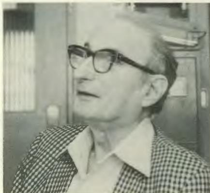  
Max

magnetic field from zero (for no reason he can recall), probably enjoying the low noise level of the electrometer. To his surprise, halfway to where the proton should have appeared, there was a little maximum in the signal. Try it again. There it was, just as it should be. So half a proton. Max didn't believe that explanation but had no other at the moment. He reported the observation to Kallmann, who reported it to Haber, with the results pictured above. It was finally explained as arising from charge

exchange to give hydrogen molecular ions, $\mathrm{H}_{2}^{+}$ , which decomposed after acceleration to give protons with a velocity that caused them to be detected at a magnetic field appropriate for a mass half that of the proton. The publication of the same observation by Hogness and by H. D. (Smyth Report) Smyth, independently of each other, gave Max a little trouble, since the reports appeared before his thesis was completed. The graduate students' nightmare. Max escaped with only a little additional work, extending the results to nitrogen.

Now the final picture from his student days—Max in formal dress, preparing to enter the examination room. He doesn't look quite so timid as in the earlier pictures, and if he doesn't look confident, at least he looks determined. As well he might. The quality of his thesis and of his final examination led Haber to recommend him to (and get him accepted by) G. N. Lewis at Berkeley. However, he was wearing the wrong suit for his examination, namely his own. He should have borrowed Herman Mark's, which was worn by Wigner and many other notables who did not, like Max and Mark, possess their own. The picture wouldn't looked much different, but Max thinks now that he missed a good thing. Maybe that's why he didn't get to Berkeley. His support was to be through the Rockefeller Foundation, and their representative found him too young and too unsure of the English language for them to take the responsibility for turning him loose in Berkeley. So, on Haber's recommendation to James

Franck, it was off to Gottingen.

Now another twist—who knows whether for better or for worse? Franck had just received the Nobel Prize, was besieged by applicants, and had overcommitted himself. Upstairs, however, in the First Physical Institute (Franck's was the Second) is Robert Pohl, the physicist who worked so much with color centers in crystals. Franck introduces Max, Pohl accepts him and Max is soon measuring the number of F-centers in a particular kind of crystal. Pohl is an elegant experimentalist whose lectures are known throughout Germany for their beautiful demonstrations. Max builds an interferometer, inherently an elegant instrument, for his measurements. Once again we have a picture of the student, the professor, and a visitor. What is Pohl pointing to? Pohl, the master of instrumentation. He is pointing to a carpenter's wooden clamp with which Max has fastened two crystals together. In his institute, he remarks with pride, they use whatever equipment serves the purpose. Across the coffee table and across fifty years I bow to Max and to Robert Pohl.

I take the occasion of bowing to check the tape recorder, Max asks if I have enough, I look at my watch, decide I do and start gathering up my things. "Oh, here's a picture taken at Karlsruhe when I was an undergraduate. I'm in the back row." I pick Max out, he points out one or two others, and I ask about some husky looking types lying on the ground in front. They'd be athletes in an American photo of the same era. They're machinists and

glassblowers, one of them (Max knows which one) being the man who built the high-pressure equipment for Haber's work on the ammonia synthesis.

The real photograph from Karlsruhe reminds me that I've left out the earliest scene Max pictured. Max, a boy around ten, is in the bathroom of his home in Karlsruhe, pouring something from a bottle into a tray. A box camera rests on a table. To one side stands a man in his middle twenties, showing Max how to develop the photograph he has taken. It is Kasimir Fajans, Georg Bredig's greatest pupil. He discovered the first isotope of element 91 (later called protactinium), stated the law of radioactive displacement (independently of Soddy), and influenced deeply the development of valence theory. It is fitting to have him in the last picture we see, because he was Max's lifelong friend.

So, that is all the pictures for tonight. Perhaps another evening soon. Goodnight. Goodnight. Outside it's cooler with a little breeze blowing down from Outer Drive. What days those must have been! Haber—Bonhoeffer and Harteck—Polanyi and Wigner. Today, we can buy, out of a catalog or out of a computer, the means to do the things they did so beautifully and so painfully. But, can we do the things they couldn't do or didn't imagine? Perhaps we can't, but if we believe in Camelot we have to try. My orange car looks yellow under the mercury street light. I get in and start the engine.

This is an account of a little-known activity, the management of the government-owned reservation surrounding the plants and city of Oak Ridge. Since 1972, it has been in the hands of Dennis Bradburn, a 1969 graduate of The University of Tennessee's School of Forestry. Bradburn worked for Union Camp Corporation before joining ORNL's Environmental Sciences Division as a forester. He is chairman of the East Tennessee Chapter of American Foresters. An ecologist, woodsman, hunter, fisherman, conservationist, and above all an environmentalist, he sees his stewardship of the ERDA forests to be a fulfillment of his responsibility as much to the forests as to ERDA.

# Stewardship of ERDA's Forests

By BARBARA LYON

F OREST MANAGEMENT is an activity that, for the most part, maintains a modest profile in the public consciousness. And so it has been with the ERDA forests. Except for occasional drastic clearcutting for pine beetle control, the year-round work that goes into the healthy maintenance of the U.S. Government's woodlands in Oak Ridge has gone largely unremarked by the area occupants.

Last winter, however, considerable attention, most of it critical, was attracted by what appeared to be deliberate forest fires set and left burning

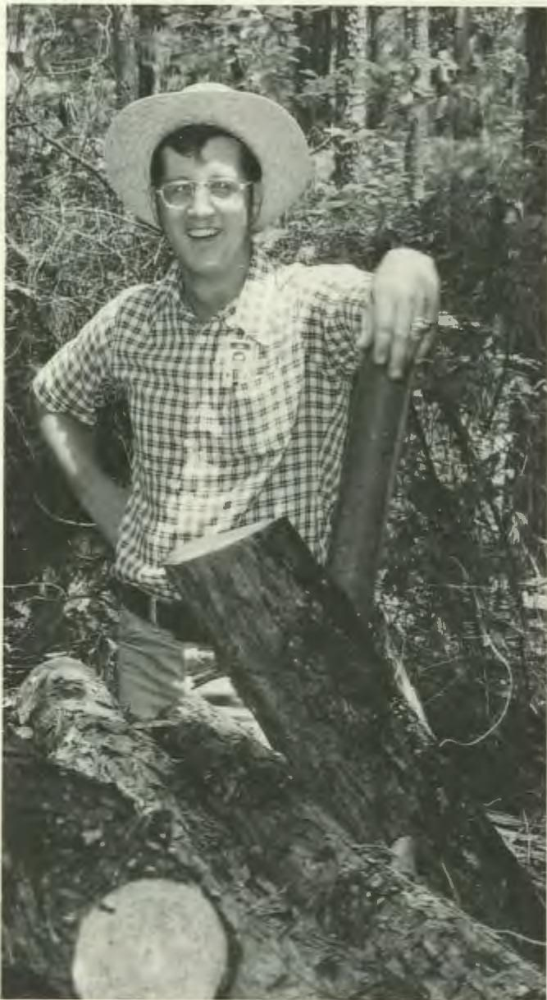  
GARY WELCH

unattended within sight of the roads used by the thousands of workers in their daily commutations to and from the plants.

Despite signs that proclaimed the activity to be "controlled burning," the general cry was that no one was tending the flames, and, indeed, it did look like a neglected pursuit.

The burnings were, in fact, an integral part of a systematic and coordinated forest management program that has been in practice since 1972, when Dennis Bradburn joined ORNL's Environmental Sciences Division as supervisor of forest

management for the ERDA Oak Ridge Reservation. This program has as its goals the provision of suitable areas for ecological research, plant production sites with buffers for protection and future expansion, and sustained yield of high-value timber products.

# Histcry

The 58,000-acre Oak Ridge Reservation was acquired by the U.S. Army in 1942 for the construction of the city of Oak Ridge. It comprised small farms and a few rural communities, and the uses to which the land had been put varied widely. At the time of the purchase, the Army asked TVA for an inventory of structural timber available on the Reservation, but because of the top-secret nature of the project at the time, no record exists telling how much timber was cut for construction use. In 1947, the AEC contractor responsible for the operation of the city, Management Services, Inc., undertook a reforestation program. From

One of the pine stands that will be kept unburned for comparison studies.

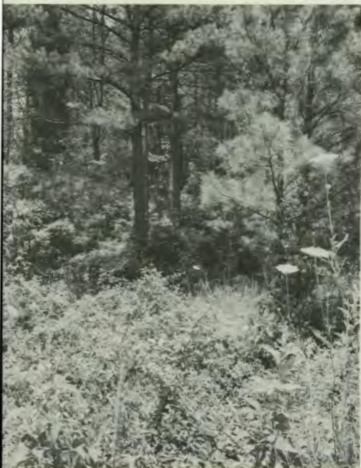  
GARY WELCH

then until 1960, MSI planted some nine million pine seedlings in old fields and open areas over a total of about 4500 acres. To give an idea of these pines' growth rate, some of the 1947 plantings are now 60 ft tall and can be seen on the north side of the Oak Ridge Turnpike, between the Oak Ridge Gaseous Diffusion Plant and Blair Road.

Over the years, selective disposal has been made of the land, and of the original 58,000 acres, about 37,000 are still government owned. Of this acreage, locations totaling about 1500 acres are protected from activities that would alter the land's unique character—areas that include the many undisturbed cemeteries and structures that qualify as antiquities, as well as habitats of rare biota. The five main ERDA installations—ORGDP, the Y-12 Plant, ORNL, the Experimental Gas-Cooled Reactor site, and the Comparative Animal Research Laboratory—with their protected buffer zones occupy about 20,000 acres; the rest is devoted to ecological research and timber production.

It was not until 1961 that the benefits of a forest management program were called to the attention of AEC, when TVA made another timber assessment using a forestry method called the Continuous Forest Inventory. In 1965, these data were used to calculate the growth of the volume of

Tackling a top from a previously felled tree cut for sawtimber, W. P. Gammell and his daughter, Paula, of Karns Community cut firewood on Nursery Road near Gas Line Road.

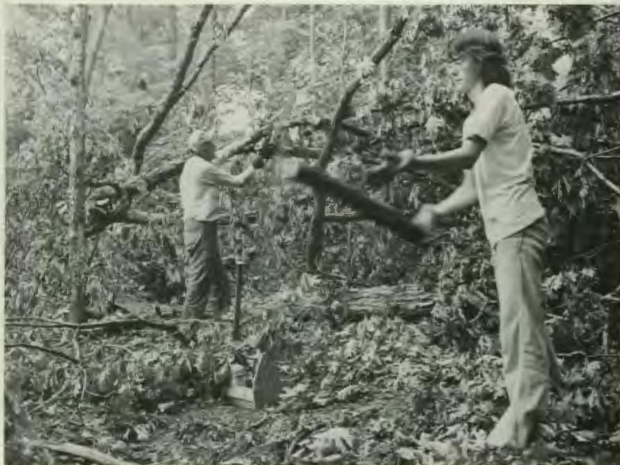  
JON THOMPSON

timber on the Reservation, forming the basis for the first management plan. Since then, inventories have been conducted in 1970 and 1975, and the 5-year periods have been designated as the forest management cycles. The inventories are updated at these intervals to keep up with changes in the land and its uses and to take advantage of new developments in forestry technology.

# The Program

In 1969, the AEC, TVA, the city of Norris, and the Emory River Land Company entered into a 10-year timber contract with Longleaf Industries, Inc., to establish a timber industry in the Oak Ridge area. Longleaf set up a sawmill in Marlow, and in 6 years harvested 7.7 million board feet (mmbf) of sawtimber, considerably less than the 1.5 mmbf per year allowed for optimum preservation of the forests. In 1964, it had been ascertained that an annual harvest of 1.5 mmbf would stimulate timber growth while improving the quality of the growing stock during the rotation period.

Three types of harvesting operations are conducted in the management of the Reservation: Sawtimber is harvested in a volume ratio of about 1:3 pine to hardwood; pulpwood is cut by contractors for resale to nearby papermills; and firewood is available to private citizens who pay a flat fee for a permit to enter specific timber areas and cut all they can carry away.

Theodore Ward, of the Anderson County Pulpwood Company, pauses in his pulpwood cutting. His truck, r., stands waiting, nearly full.

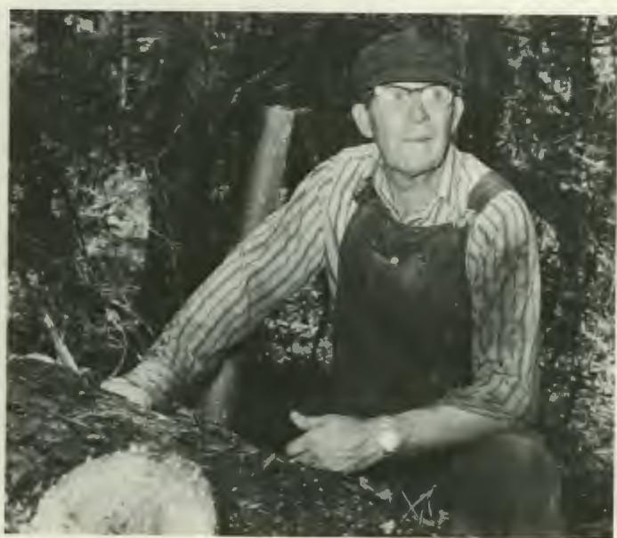  
FALL 1977

In 1973, a serious outbreak of southern pine beetles necessitated cut-and-burn tactics which resulted in greatly accelerated harvesting of pine pulpwood. This activity, in which stands of infested pines were clearcut and the residual slash burned, extended through 1975, in which year 4800 cords of damaged pine timber were salvaged. So extensive was the damage from the beetle that

A pine forest that underwent prescription burning last winter. Note the ready access to trees over the already flourishing ground growth.

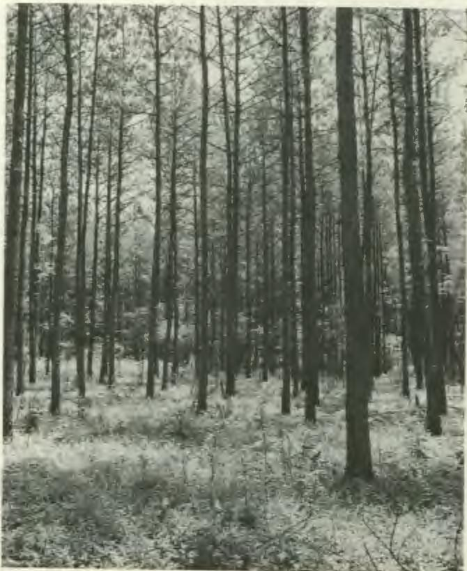  
GARY WELCH

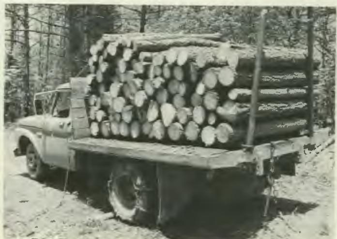

federal assistance in the control operations was rendered through the U.S. Forestry Service.

To balance the severe predation of the southern pine beetle, 300 acres of trees are being planted each year on the Reservation.

Extensive timber harvesting requires a corresponding reforestation operation. The planting of seedlings is intensive during the appropriate season; from March 1 to May 1 of this year, for instance, a total of 236,000 seedlings, as many as 6000 a day, were planted on prepared land located in four different Reservation areas. Preparing the land consists of clearcutting merchantable timber, clearing the underbrush and scrub growth (or culls), piling and burning the brush, and then harrowing the land to break up the soil. These activities are performed with the use of a bulldozer and a harrow of, needless to say, titanic proportions—the latter alone weighing 6 tons. The choice of tree species to be planted depends on the nature of the location: the orientation of the slope, the quality of the soil, whether ridge or bottom land, its drainage, etc. Pines are planted on the poorer sites because they have a long taproot, adapt best to poor land, break up the soil and add humus, and eventually provide a hospitable environment for the shade-tolerant hardwoods.

There are five southern yellow pine species—slash, long leaf, loblolly, short leaf, and Virginia—of which loblolly is the most extensively planted here. It is fast growing (an old field planted in 20-in. seedlings in 1973 now has 10-ft trees); it grows straight, a necessity for quality sawtimber; and it is self-pruning, that is, as its upper branches grow, the lower branches break at the trunk and add to the forest litter. In some species, such as Virginia pine, the lower branches remain on the tree after they have died.

Other species planted on the Reservation are cottonwood, river birch, sweet gum, yellow poplar, sycamore, white pine, butternut, black walnut, black alder, and green ash. By far the most valuable species planted here is the black walnut, which is in high demand for fine furniture and veneer. A small plantation of black walnut at the intersection of White Wing and Bear Creek roads is becoming well established after three years. The trees will be merchantable by 1994. Cottonwood seedlings, like black walnut, require cultivation during the first few years of their growth; competition must be curbed, and if straight walnut trunks are wanted, a certain amount of pruning or tying is needed. Of the list of trees

given, the fastest growing is the cottonwood, which grows as much as 15 ft in 2 years. The eastern red cedar, used primarily for furniture and fenceposts, becomes timber quality at diameters greater than 5-in. Like the Virginia pine, however, it is not planted here. Both species are self-proliferating.

The management plan includes several constraints to timber harvest, in order to maintain a substantial timber resource base. Normal harvesting may not exceed one-third of the volume of timber from any one acre, nor may it exceed in any year more than a specified number of board feet established annually by ERDA. This number ranges narrowly above and below 1.5 mmbf; the actual harvest this year is 1.6 mmbf. The trees selected for cutting are in mature stands, and from a distance only a practiced eye can detect their absence. After the logging is done in the field, the tops are left on the forest floor. During the firewood cuts, the tops are available to the permit holders.

# Fire as a Tool

Prescribed burning is a timber management tool, used on the Reservation in the culture of the loblolly pine. Pine stands are the only ones on which this practice can be used; hardwoods are damaged or killed by fire (with the exception, oddly, of mature dogwood). But controlled burning of the undergrowth and forest litter has many useful purposes, the foremost of which is to reduce the hazard of wildfire posed by the dry vegetation around the trees. Fire reduces competition by hardwood seedlings, and returns some of the nutrients to the soil. A side benefit of burning is the improvement of wildlife habitat, and the new growth that follows a burn provides leafy provender for the wild animals at a level where they can reach it. Additionally, clearing the forest floor makes access to the trees for thinning and cutting much easier.

Needless to say, precautions prior to a burn are extensive and detailed. Fire lines are plowed around the designated stands. The three plant supervisors, the Oak Ridge Fire Department, the ORNL Fire Department, the ERDA-ORO Environment and Safety Department, and the State Forestry Service are all notified of the proposed activity. Equipment consisting of a tractor for plowing the fire lines, two four-wheel-drive pickups equipped with pumper tanks, and the necessary hand tools used on terrain inaccessible

to vehicles are all operated with the assistance of ORNL's Plant and Equipment Division workers. The fires are set with a "drip torch," a gallon cannister with a long tube attached, filled with a mixture of gasoline and diesel fuel. One person using such a device can set about a half a mile of fireline.

Burning operations are undertaken only under favorable weather conditions in January and February. Burns are conducted either in the late afternoon when there is least probability of unpredictable winds, or more frequently late at night, a circumstance which gives rise to the burners' chief problems. If the burning is done close to the highway, traffic congestion results; if it is done farther away in the hills, telephone switchboards fill up with the voices of good citizens reporting the forest fires.

The most obvious impact of controlled burning, of course, is the smoke, and the extent to which it is harmful is dependent on wind conditions. The particulate matter remains in the air to some degree until the first rainfall, at which time it is washed out. As bad as it is, smoke from controlled burning is minimal compared to the smoke from wildfire, which controlled burning is intended to prevent.

Prescribed burning, a new management tool to the Reservation, has been an established practice in the Southeast for 30 years, but was only instigated in Tennessee, on the ERDA Reservation, for the first time in 1972. It was conducted infrequently during the war against the Southern pine beetle, but has started up again this year and may be expected to proceed regularly from now on. Burning is the key element in the control of kudzu, a vine that grows as fast as 2 ft a week in the summer, covering and consequently killing entire trees if unchecked. Approximately 50 acres on the Reservation will need a vigilant program of kudzu control over the next 5 years to protect neighboring timber stands.

Because there is still dialogue, some of it spirited, in the prescribed burning argument, certain loblolly pine stands have been left unburned for comparison studies.

# Timber Contracts

The contract with Longleaf Industries, Inc. will terminate December 31, 1978, but since its signing the corporation has sold its interests to American Forest Products, Inc. Early last year, an extension of the contract was negotiated with

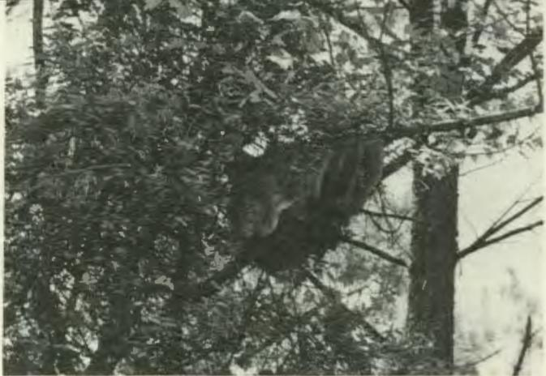  
One of the novelties Bradburn has come across in the forest: a comb built by wild bees, unusual in that it is fully exposed. It hangs some 25 ft high from a sycamore branch.

AFP, specifying an eventual broadening of the sawmill's capabilities. Subject to this stipulation, the contract will be renewed with AFP in 1979. Pulpwood sales are achieved under short-term contract offered to the general public by sealed-bid auctions. All timber sales are handled by the Nuclear Division's Purchasing Division.

Bradburn's responsibilities under these contracts are to mark the timber to be sold and compute its volume; to settle any disagreements with the contractor by cruising the sale area under dispute with him; to help the loggers find the cutting boundaries, skid trails, log loading areas, and access routes; to keep a close check on the logging operations; to oversee all cleanup work; and to keep detailed records of the transactions. Income from the sales serve to offset the cost of managing the Reservation.

An inventory of the area in 1975 estimated the sawtimber volume to be $126.9\mathrm{mmbf}$ of which approximately $30\%$ is southern yellow pine, one-seventh white oak, and one-tenth each yellow poplar, chestnut oak, and red oaks. The remainder is made up of gums, sycamore, maple, hickory, and beech. From 1961 to 1975, growth averaged 184 board feet per acre per year; in the last 5 years of that period, this rate had accelerated to 257.

# The Trend

Over the long haul, Bradburn contends, the cumulative effects of the selection method of timber harvesting in individual stands will ultimately be a change in species composition on the Reservation toward high-quality, tolerant or moderately tolerant trees such as white oak, yellow poplar, red oaks, white pine, and black walnut. Systematic removal of overmature and cull trees will ensure an increasingly healthy and vigorous forest, eventually with an increase in the density of valuable hardwoods.

  
Gloria Lubkin

# Physics Reporter at ORNL

ORNL researchers last June heard a seminar given by Gloria Lubkin, who writes for the "yellow pages"—not the phone book variety, but rather the "State and Society" and "Search and Discovery" sections of Physics Today, the newsmagazine for physicists. "But we don't practice yellow journalism," quips Lubkin, who has been with the magazine 14 years. The personable senior editor, who holds a master's degree in nuclear physics from Boston University and has worked in industry and as a physics instructor at Sarah Lawrence College, has reported on the spectrum of physics subfields, including high-energy physics, biophysics, and one of her favorite areas, astrophysics. She would probably enjoy working for what jokingly has been proposed as the companion volume for Physics Today—Astronomy Tonight.

Ms. Lubkin scans 30 scientific journals a month plus numerous press releases (most of which end up in the wastebasket), but she gets most of her leads on hot physics stories from cocktail parties, corridor conversations, and questions asked of speakers at national physics meetings. Although she has spent most of her writing career glued to the telephone and typewriter, she has had her share of on-the-job adventures. Five years ago, for example, Luis Alvarez of ERDA's

Lawrence Berkeley Laboratory granted her an interview on the condition that it take place while he piloted his twin-engine Cessna. Although she enjoyed the view of the West Coast, there were unforgettable turbulent moments when she kept saying to herself, "Anything for a story."

Her other adventures have included a two-week tour of seven European laboratories in 1973 and a 1968 visit to a Moscow laboratory where she witnessed an experimental laser fusion demonstration. Lubkin has covered fusion developments in depth over the years. One of the highlights of her reporting career was her interview at the Massachusetts Institute of Technology with the late Lev Artsimovich, who spearheaded the Russian effort to develop the tokamak, now the most heavily funded concept in the U.S. fusion program. She has also reported extensively on the continuing search for superheavy elements, a story colored by the dispute between Lawrence Berkeley Laboratory and the Soviet Union as to who first discovered elements 102, 104, 105, and 106 and what the names should be. In response to one of her articles on the dispute, G. N. Flerov of the Kurchatov Institute wrote, "It would be good if all women understood physics like you." Commented Lubkin: "I didn't know whether to be flattered or insulted."

Lubkin was at ORNL in June 1976 to talk to Alex Zucker, Lew Keller, and Bob Gentry about possible evidence for the existence of superheavy elements in the giant halos of monazite crystals. She has covered other interesting searches which have come to naught, including quests for organic superconductors, gravity waves, and the magnetic monopole. But most of her contributions to "Search and Discovery" have dealt with significant advances in physics, including the discoveries of pulsars and the J particle. These articles have been thoroughly checked for accuracy but occasionally draw criticism from physicists who feel they have not been accorded proper credit. Perhaps that's why the "Search and Discovery" section has been facetiously dubbed by some readers as "Search and Destroy." - CK

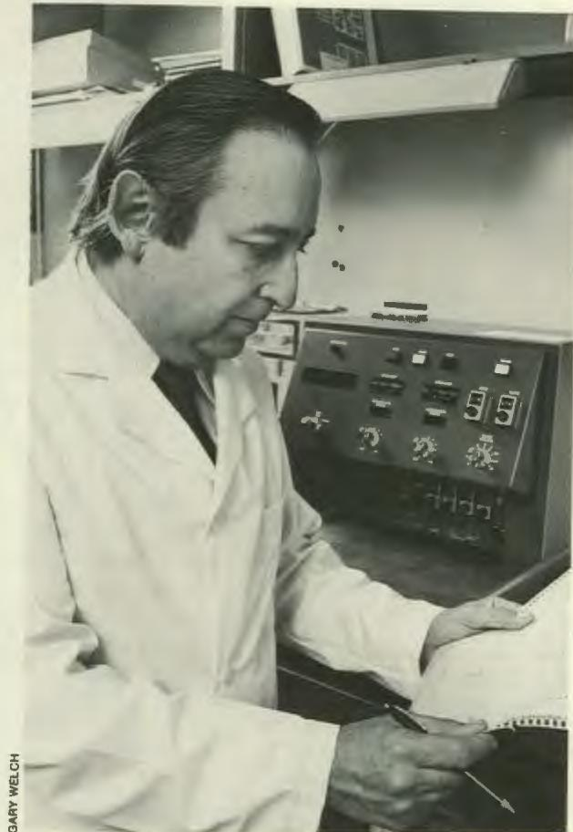

The national Molten Salt Reactor Program at ORNL is now dead, but molten salt chemistry is alive and well and making contributions to solving the nation's energy problems. That's one message of Stan Cantor's capsule history of molten salt chemistry at ORNL. Stan joined the Aircraft Nuclear Propulsion Chemistry Section of the Materials Chemistry Division at ORNL in 1955 after obtaining his Ph.D. from Tulane University. He has been at ORNL since then, except for a one-year assignment at Harwell, England, during 1963-1964. Most of his research activities at ORNL have been associated with the chemistry of molten salts; he has published nearly 30 papers on the subject. Currently in the Chemistry Division, Stan is working on chemical aspects of energy storage. Because Stan was not here for the first five years of the molten salt chemistry program, he had to enrich his storehouse of knowledge on the program by mining the documentary resources—progress reports, 189s, and journal articles. "But," Stan notes, "the resource of recollection provides a perspective that documents seldom impart. I thank three chemists—Warren Grimes, Pedro Smith, Max Bredig—and two nonchemists—Alvin Weinberg and Ed Bettis—for taking the time to complete my education about this period." Because space dictates that this history be necessarily brief, Cantor apologizes to his colleagues who may feel that the article suffers from omissions or lack of proper emphasis. "Let me assure you," Cantor says to his colleagues, past and present, "that my respect for your work and your intellectual efforts is, nonetheless, undiminished."

# Molten Salt Chemistry at ORNL

A Short History

By STANLEY CANTOR

IN 1950, molten-salt chemistry became a significant area of research at Oak Ridge National Laboratory. Warren Grimes and his group in the Materials Chemistry Division were intensively studying phase equilibria of uranium tetrafluoride in alkali and alkaline-earth fluorides and trying to determine if particles of uranium compounds would remain suspended in molten sodium hydroxide. Max Bredig was beginning a new research program and acting as liaison scientist from the Chemistry Division to a new reactor program. G. Pedro Smith, in the Metallurgy Division, was investigating corrosion of metals in molten sodium hydroxide.

Why the sudden interest in molten salts? The most direct answer: salts, especially fluoride melts containing uranium, had become a very promising fuel for an aircraft reactor. And aircraft reactors had become important to the Laboratory. In September 1949, the Atomic Energy Commission had designated ORNL to carry out the reactor research for the Aircraft Nuclear Propulsion Program. Alvin Weinberg first headed the ANP program, and C. B. Ellis, a civilian employee of the Air Force assigned to ORNL, acted as project coordinator. The ANP program grew rapidly. The first quarterly progress report (period ending November 30, 1949) mentions 42 people on ANP. A

year later, the quarterly report notes 236 technical people in 13 Laboratory divisions. Many of the engineers were assigned to a newly created ANP Division headed by Ray Briant, who also had been appointed ANP program director.

The use of molten ionic fluorides as the uranium solvent in a liquid-fueled aircraft reactor seems to have occurred to others, but the first document which systematically develops the idea is an ORNL report (Y-657, dated July 20, 1950) on high-temperature liquid fuels by Warren Grimes and Doug Hill (Doug, a chemistry professor at Duke University, worked at ORNL almost every summer from the late forties to the late sixties). This report concluded: "The system $\mathrm{BeF}_2\mathrm{-UF}_4$ NaF or LiF offers the best hope of providing a solvent for uranium of good stability, concentration and moderator properties."

Although it was soon established that fluorides would not be sufficiently self-moderating, they did possess the chemical stability required. By the end of 1950, Charlie Barton, George Nessle, Bob Moore, and Paul Blakely had performed enough measurements to show that molten alkali fluorides containing $\mathrm{UF_4}$ could be a reactor fuel with a fairly low melting point. The lowest melting $(454^{\circ}\mathrm{C})$ alkali fluoride mixture was the eutectic composed of the fluorides of lithium, sodium, and potassium, for which the clever acronym FLiNaK was invented.

Molten caustic (NaOH) had also been a candidate fuel solvent. Its advantages as a neutron moderator were offset by its well-known corrosivity to most metals of construction. John Redman, Lyle Overholser, and D. E. Nicholson found, in the summer of 1950, that uranium compounds were only slightly soluble in molten NaOH. Thereafter, ANP fuel mixtures involving hydroxides were accorded less consideration.

# 1951-1955: Formative Years

The first developmental goal of the Aircraft Nuclear Propulsion Program was to build and operate a facility to test the feasibility of using molten salt fuels. This facility, the Aircraft Reactor Experiment, operated for 221 hr (not counting prenuclear operations) in November 1954, only five years after the ANP program started at ORNL. Ed Bettis described the ARE in his imitable fashion in the Fall 1976 issue of the ORNL Review. What is remarkable is that George Nessle and his associates had prepared the

fuel solvent (3300 lb of an equimolar mixture of NaF and $\mathrm{ZrF_4}$ ) and fuel concentrate $(\mathrm{Na}_2\mathrm{UF}_6$ highly enriched uranium) by the end of 1953-a year before the ARE would be in operation. It is not difficult to imagine the intense research required to assure that the fuel salt would perform properly in the ARE. The necessary research efforts in phase equilibria, in salt purification methods, and in several aspects of corrosion chemistry were carried out under the direction of Warren Grimes within the Materials Chemistry Division.

During this period in the Chemistry Division, research activity focused on the interaction of liquid metals and salts and on electrical transport behavior in molten salts. Max Bredig, J. W. "Swede" Johnson, and Harry Bronstein determined phase equilibria in alkali metal-alkali halide systems; they were assisted by Prof. William Smith (University of Tennessee). In another group under E. R. Van Artsdalen, I. S. Yaffee carried out the definitive measurements of the electrical conductivity of alkali halides, and in 1955, Art Dworkin began measuring self-diffusion coefficients in molten nitrates.

In the Metallurgy Division, corrosion chemistry of molten fluorides was also being advanced by metallurgists George Adamson and Al Taboada, using thermal-convection loops fabricated from a good many alloys. The study of hydroxides was continued, although it was apparent that their corrosivity would be too great to permit their use in high-temperature reactors. Hydroxide research was carried out by Pedro Smith, E. E. Hoffman, Mark Steidlitz, John Cathcart, and Chuck Boston. In the course of these studies, intriguing color changes were observed in molten hydroxides in the absence of contacting metal. These color changes and their relationship to structure could be studied with greater precision by the methods of optical spectroscopy. Thus began the pioneering and thoroughgoing series of spectroscopic investigations in molten salts carried out by Smith, Boston, and many others.

# 1955-1963: The "Take-Off" Period

The successful operation of the ARE notwithstanding, it was apparent to the now more experienced reactor chemists (Warren Grimes, in particular) that if molten-salt reactors were going to be a part of the nation's nuclear electric-generating capacity, a broad fundamental research program in molten-salt chemistry would be

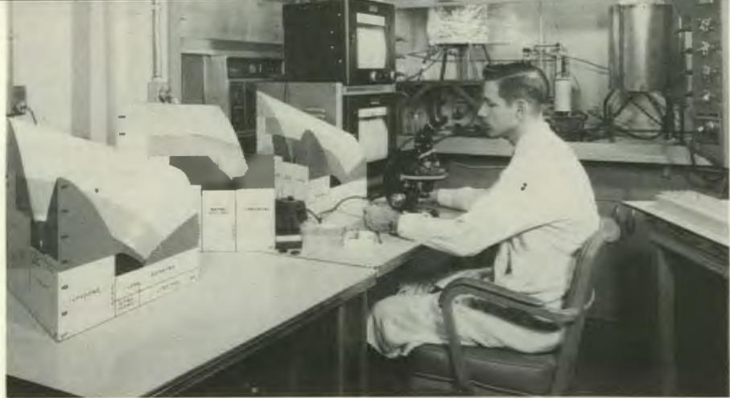

a prerequisite to such nuclear development. Research into fuels, coolants, fuel processing methods, fission-product behavior, and corrosion reactions would have to be pursued with the highest competence, and that competence had to be developed at Oak Ridge National Laboratory.

Thus, in 1955 in Grimes's ANP Chemistry section of the Materials Chemistry Division, a new group was formed under Forrest Blankenship to study "Physico-Chemical Principles of Reactions in High Temperature Molten Salt Media" (the actual title of the 189). The group consisted initially of Mort Panish, Leo Topol, Bert Clampitt, Sid Langer, Milt Blander, and myself. Roy Newton, formerly a chemistry professor at Purdue University, served as full-time consultant to the group; with his specialty in chemical thermodynamics, an important aspect of this group's effort as well as of much of the research effort in the ANP Chemistry section, Newton was an extremely valuable consultant. Bob Minturn, then an Air Force officer assigned to ORNL, also became a member of the group. Curt Beusman, a recent ORSORT graduate, joined this group in 1956 and completed his dissertation research in molten-salt thermodynamics.

Other groups under Grimes were also tackling significant problems by fundamental physical chemical means. George Watson, who came to the Lab in 1955 from a professorship at Texas A and M, promptly started determining solubilities and reaction equilibria in molten fluorides; by the end of 1956, George had persuaded two of his former students at Texas A and M, Jim Shaffer and Bob Evans, to join his group. Another former student, Minton Kelly, was already at ORNL in the I & C Division; he later joined Watson in the Reactor Chemistry Division. The work on phase equilibria was also expanded at this time under Roy Thoma and Charlie Barton; by 1959, Thoma had published the exceedingly valuable compilation Phase Diagrams of Nuclear Reactor Materials (ORNL-2545).

Enthusiasm for molten salt research spread to other divisions. In the Metallurgy Division, optical spectroscopy under Pedro Smith developed very rapidly; by the early 1960's, there was a steady stream of post-docs, students, and well-established professional chemists working with Pedro on some aspect of molten-salt spectroscopy. In the Analytical Chemistry Division, at this time, Jack Young developed windowless cells and other ingenious experimental means for studying the spectroscopic behavior of fluoride melts. Del Manning and Al Meyer began the work which led to their development of electrochemical "in-line" analytical methods.

In the Chemistry Division, a spectacular advance in understanding the structure of molten salts occurred with the x-ray and neutron diffraction studies of Henri Levy, "Dan" Danford, Paul Agron, and Max Bredig. In brief, for molten halides, they found that nearest neighbor atoms were, on the average, closer together than in the crystal but that the number of nearest neighbors was reduced. By pure coincidence (which seems to be the norm in any hot new scientific field) a similar investigation was being pursued in France, where J. Zarzycki, working in the laboratory of the St. Gobain Company, obtained x-ray diffraction patterns for several molten halides. Both investigations yielded substantially the same results. The ORNL study had the advantage of neutron diffraction measurements of the lithium halides; from these measurements charge ordering between oppositely charged ions could be directly identified.

Also in the Chemistry Division, an elegant series of measurements of electrical conductivity of molten alkali metal—alkali halide mixtures was carried out by Harry Bronstein and Max Bredig. These experiments demonstrated the considerable electronic conduction in these mixtures. The results have been a continuing source of inspiration to Prof. Norman Nachtrieb and his students at the University of Chicago, who, by magnetic

susceptibility measurements, have explored the mechanism of electronic conduction in these liquids.

A publication highlight of this period was a volume of reviews, Molten Salt Chemistry (Interscience Publishers, New York, 1964), edited by Milt Blander. Half of the chapters were written by ORNL chemists. Blander wrote the chapter on solution thermodynamics, Levy and Danford reviewed diffraction studies, Max Bredig contributed a chapter on metal-salt interactions, Pedro Smith wrote the chapter on electronic spectra. The chapter reviewing vibrational spectra was written by a New Zealander, David James, while he was based in the Metals and Ceramics Division. This volume, a splendid review of basic molten-salt chemistry up to about 1963, emphasized the scientific leadership of ORNL in this field.

# 1963-1975: MSRE and MSRP

In 1963, within the building that had housed the ARE, a new machine, the Molten Salt Reactor Experiment, was taking shape. Some nonchemical historical highlights of the period from ARE to MSRE are as follows: By 1955, it was obvious that any embodiment of an aircraft reactor was going to be a very challenging enterprise, and ORNL's molten-salt version was, if anything, even more challenging. It is not too hard to imagine the inherent difficulties of designing a reactor with two hot circulating liquids, fluoride fuel mixture and sodium coolant, for a plane that would, on occasion, have to fly upside down! In 1957-1958, work on the molten-salt aircraft reactor was phased out, but R&D in support of other aircraft reactor concepts continued here until 1961. Shortly after President Kennedy took office, the national program was canceled. In 1956, an ORNL group under H. G. MacPherson began studying a number of designs for molten-salt converters and breeders. The results of these studies were considered in 1959 by an ad hoc committee convened by the AEC to evaluate fluid-fuel reactor concepts, the other two being the aqueous homogeneous reactor and the liquid-metal-fueled reactor. The committee concluded that, of the three concepts, the molten-salt reactor had "the highest probability of achieving technical feasibility."

The design of the reactor began in the summer of 1960, and on June 1, 1965, the MSRE first

reached criticality. In the MSRE the fluoride fuel circulated through a core of graphite bars. The core vessel, pipes, pumps, heat exchangers, and salt containers were all fabricated from a nickel-molybdenum alloy called Hastelloy N, which had been developed at ORNL for the ANP program. The MSRE coolant consisted of $7\mathrm{LiF}$ and $\mathrm{BeF}_2$ in the molar ratio 2:1. The composition of the fuel salt was $7\mathrm{LiF - BeF}_2 - \mathrm{ZrF}_4 - \mathrm{UF}_4$ , roughly 65-29-5-1 mole%. $\mathrm{ZrF_4}$ was present in the fuel salt to prevent the precipitation of uranium oxide in case of inadvertent oxide contamination.

Given the importance of molten solutions of LiF and $\mathrm{BeF}_2$ to the MSRE in particular and to molten-salt reactors in general, it is understandable why this system had to be studied intensively and comprehensively. A list of those who carried out these chemical studies would contain the names of about half the people in the Reactor Chemistry Division (formed in 1958 with Warren Grimes as its director) and, also, many in the Chemistry and Analytical Chemistry Divisions. However, I do wish to note that much of the chemical thermodynamics and the polymer model represented the efforts of Charlie Baes and his group; the massive effort represented by phase diagrams was performed by Roy Thoma and the people who worked with him; the very exacting measurements on electrochemical transport were carried out primarily by Jerry Braunstein.

Chemists were, of course, assigned to analyze salt samples removed from the reactor and to study the chemical behavior of the salts in the MSRE itself. Roy Thoma has documented this in his report Chemical Aspects of MSRE Operations (ORNL-4658). Ed Compere, Stan Kirslis, Ed Bohlmann, Forrest Blankenship, and Warren Grimes have published (ORNL-4865) a thoroughgoing analysis of fission product behavior in the MSRE. Many chemical analyses and an important tritium study were carried out by Al Meyer, John Dale, and Ralph Apple.

The salts that were used in the MSRE were prepared, purified, and loaded into the reactor by Jim Shaffer and his group. The fuel for nuclear operations in the period from June 1965 through March 1968 was uranium-235. During the summer of 1968, after the original uranium from the fuel salt was extracted by means of fluorine gas, the fuel salt was charged with uranium-233 (in the form of a $7\mathrm{LiF}\cdot 233\mathrm{UF}_4$ fuel concentrate), thereby making the MSRE the world's first reactor to

operate with this nuclear fuel. Operation of the reactor with uranium-233 took place from October 1968 through 1969. To demonstrate that plutonium could be used as a makeup fuel in molten-salt reactors, about $180\mathrm{g}$ of this nuclear fuel was added to the MSRE in the form of crystalline ${}^{239}\mathrm{PuF}_3$ during August and September 1969.

With the MSRE proceeding smoothly, the next phase of reactor development was the design of the breeder in which uranium-233 could be bred by neutron bombardment of thorium. The core of this machine was conceived as containing two fluids separated by graphite. The fuel salt was to be UF $^4$ -LiF-BeF $_2$ (0.2-68.3-31.5 mole $\%$ ); the fertile salt, circulating in a separate blanket circuit, would be ThF $_4$ -LiF-BeF $_2$ (2-71-27 mole $\%$ ). By 1968, however, the breeder concept changed over to a single-fluid core in which fissile and fertile material were contained in the same salt melt. One development that led to the change was new irradiation data, obtained first at Harwell, that clearly showed graphite undergoing neutron-induced dimensional changes at a rate faster than had been previously believed. Thus, the complex graphite core required for a two-fluid breeder would have to be replaced more often than had been anticipated. But a second, and more important, reason for changing to a single-fluid core arose from chemical advances in fuel processing.

Fuel is bred in a molten-salt breeder reactor or in any thermal breeder reactor-by transmutation of thorium into protactinium-233; the protactinium then decays with a 27.4-day half-life to fissionable uranium-233. But protactinium-233 has a relatively high capture cross section for thermal neutrons (about 43 barns), which necessitates its removal from the neutron flux on a short time cycle (three to five days). The trick in a single-fluid breeder is to selectively remove the protactinium; this is difficult since protactinium and uranium are chemically very similar. Reactions by which protactinium could be chemically reduced by thorium metal and extracted into liquid bismuth were proposed in 1966 and tested by Warren Grimes, Jim Shaffer, Dave Moulton, Charlie Barton, and Bob Ross in the Reactor Chemistry Division. Important confirmatory data about these reactions were obtained by Les Ferris and Jim Mailen in the Chemical Technology Division. Further work showed that a similar reductive extraction could remove the rare earth fission products from the fuel. A so-called metal transfer process was later formulated and investi

gated in the Chemical Technology Division (by Ferris, Gene McNeese, Mailen, and Fred Smith) for removing the rare earths from liquid bismuth by extracting with molten lithium chloride. In essence, the newer fuel processing methods permitted the mixing of fuel and fertile streams into a single melt, thereby simplifying the design of the breeder.

Although fuel processing by reductive extraction and metal transfer became part of the conceptual design of the breeder, other methods for protactinium removal were proposed and actively pursued. Charlie Baes, Carlos Bamberger, and Bob Ross, following up on a process studied some years earlier by Jim Shaffer, Minton Kelly, and George Watson, investigated the use of oxides to precipitate protactinium from the fuel salt. In so doing, they showed that protactinium precipitated as a pentavalent species.

Another interesting processing scheme that was experimentally investigated concerned the chemical removal of a significant amount of xenon-135, the fission product with the highest capture cross section for thermal neutrons. Baes, Bamberger, and Bob Wichner showed that by bubbling a gaseous mixture of hydrogen fluoride (HF) and hydrogen $(\mathrm{H}_2)$ through molten fluoride, they could effectively remove iodine-135 before it decayed to xenon-135.

Another question demanding attention concerned the coolant for the breeder reactor. Although molten LiF-BeF $_2$ was entirely adequate for the MSRE, a lower melting, less expensive alternative was clearly desirable. From the information screened, the eutectic mixture of sodium fluoroborate (NaBF $_4$ ) and sodium fluoride (NaF) seemed to be the best choice. The fluoroborate coolant, as it came to be called, was lower melting, far less expensive, and less viscous than the MSRE coolant. At reactor temperatures, it decomposed slightly, volatilizing gaseous boron trifluoride (BF $_3$ ), but this was considered tolerable. As might be expected, its thermal behavior had to be characterized. I measured vapor pressures and densities, L. O. Gilpatrick and Charlie Barton obtained the phase diagram of the NaBF $_4$ -NaF system, Art Dworkin determined heats of transition and heat capacities, and Jim Cooke, Reactor Division, measured its thermal conductivity.

It is certainly beyond the scope of this account to trace the factors leading to the end of the MSRP. Suffice it to say that the AEC decided to emphasize (and fund) the development of liquid-metal-cooled

fast breeders. At the end of January 1973, it was learned that the MSRP would not be funded for the following fiscal year. At that stage, virtually all project-related research and development activity ceased.

But by December 1973 the program was partially refunded, and Gene McNeese was appointed as the new director. For a bit more than two years the chemistry of molten-salt reactors advanced. In that period, experiments carried out by Jim Keiser and Herb McCoy (Metals and Ceramics Division) indicated that tellurium-induced embrittlement of Hastelloy N might be avoided (1) by maintaining a relatively small fraction (0.033 or greater) of the uranium in the trivalent state and (2) by adding 1 to $2\%$ niobium to the alloy. By spectrophotometric techniques, Mac Toth and L. O. Gilpatrick elucidated the chemistry of $\mathrm{UF_3}$ and $\mathrm{UF_4}$ in molten LiF-BeF $_2$ , greatly extending earlier work of Geoffrey Long (an exchange scientist from Harwell in 1963-1964) and Forrest Blankenship. Mechanisms for preventing the passage of tritium into the steam subsystem were explored in bench-scale experiments by Leon Maya and on a much larger scale (in a loop with circulating molten NaBF $_4$ -NaF that was constructed from hardware cannibalized from the MSRE coolant loop) by Gus Smith, Dick Engel, and their associates in the Reactor Division.

The question of which coolant would best serve the needs of the breeder reactor was reexamined in depth by a special task force, manned by experienced project personnel. They concluded that a double-coolant configuration of LiF-BeF $_2$ and of helium would be optimal but that molten NaBF $_4$ -NaF might be adequate. In early 1976, the MSRP was again halted, despite the steady technical progress that had been made.

# The Present and the Future

Although molten-salt fission-reactor R&D is, once again, in another period of quietus, there are many ERDA projects where molten-salt chemistry plays, or can play, important roles. In current ORNL programs, molten salts are under investigation in the following areas:

1. Fuel cells. Molten alkali carbonates are an important class of electrolytes.   
2. Thermal energy storage. The advantage here is that molten salts are dense fluids, of high heat capacity (or heat of melting) and of good

thermal conductivity; these properties are especially useful in storage subsystems of solar thermal conversion installations and also in high-temperature process-heat applications.

3. Coal conversion catalysis. Lewis acids such as $\mathrm{SbCl}_3$ , $\mathrm{AlCl}_3$ , and $\mathrm{ZnCl}_2$ can catalyze hydrocracking reactions to produce fuels.   
4. Fusion reactor blankets. Molten alkali nitrate-nitrite solutions as coolants; molten LiF-BeF $_2$ for breeding tritium, a fusion reactor fuel.

There are other ERDA programs where future prospects should be good. Molten-salt batteries are being developed as energy storage devices for electrical power load leveling and for powering motor vehicles. A battery program at ORNL might start from closely related ongoing efforts in fuel cells and in thermal energy storage by utilizing our expertise in electrochemistry, in heat transfer, and in handling high-temperature liquids.

Another exciting area may involve converting the devil's playground into a useful power source. Underlying many areas of the United States (Yellowstone Park for example) there are vast (cubic kilometers is the characteristic dimension) reservoirs of magma—hot, viscous mixtures of molten and solid rock. The heat from magmas represents a limitless geothermal energy resource, so ERDA is funding a small program, mostly at Sandia Laboratories, aimed at developing this concept. Two very important chemical components of magma are $\mathrm{SiO}_2$ and $\mathrm{MgO}$ . Because of similarities in atomic size, the chemical and physical behavior of $\mathrm{SiO}_2$ and $\mathrm{MgO}$ is very much like that of $\mathrm{BeF}_2$ and LiF. Thus, it would not be much of a trick to translate ORNL's know-how with $\mathrm{BeF}_2$ and LiF into advancing research directed at exploiting the heat contained in magma bodies.

Finally—and we've come full circle—what about molten-salt reactors? It should be remembered that this reactor is a thermal breeder, producing uranium-233, not plutonium. Moreover, since good breeding performance and, therefore, economic operation require that the fuel be reprocessed at or very near the reactor site, the probability of diverting fissionable material while in transit would be minimized. Thus, the nation may come around to considering again molten-salt reactors as a viable energy option, and where better than at ORNL could research, engineering, and intellectual enthusiasm carry such a program to the stage of successful implementation?

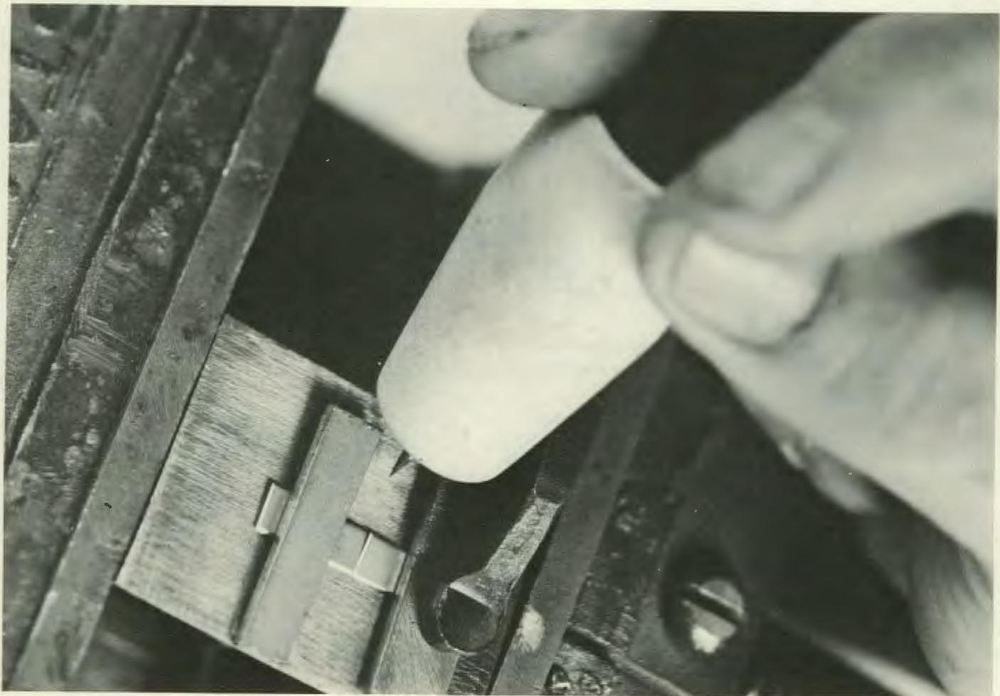  
JON THOMPSON

# Research Shop Achievement

The welding torch is in a position to strike a preheating arc to the tantalum support plate beneath the silicon. The silicon is thus heated, and alternating arcs, rapidly applied, will heat both pieces. Finally, one pass across the silicon itself completes the weld.

Welding technologists sometimes solve unique welding problems.

A researcher needed the ends of silicon strip pairs welded together. Electron beam welding had been tried unsuccessfully with the silicon resting on a quartz plate to prevent contamination. Part of the problem is the nonconductive nature of silicon at room temperature.

The problem was given to welding technologist J.W. Hunley. Tungsten arc welding with the quartz support

did not work. Hunley obtained permission to use tantalum as a support. By striking the arc to the tantalum and increasing the silicon temperature to a conductive level, he was able to weld the silicon joints quickly and successfully.

Strangely enough, manual dexterity may have overridden machine reliability, as the critical point in this silicon weld was breaking the arc at the moment the silicon pieces welded.

Next problem?

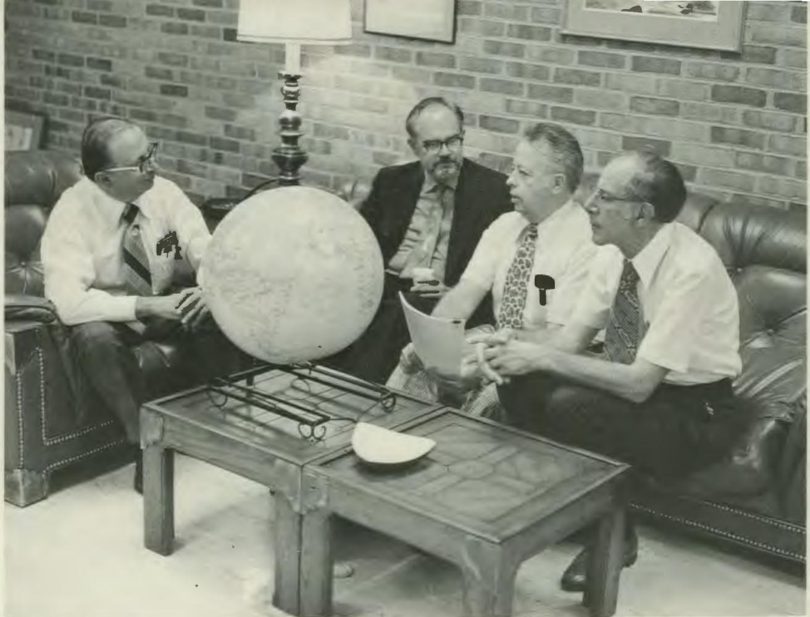  
JOHN RICHARDS

Charlie Baes, Jerry Olson, Ralph Rotty, and Hal Goeller ponder the global impact of increasing atmospheric carbon dioxide concentrations.

# Carbon Dioxide and Climate

How Fast Can We Safely Burn Coal?

By CAROLYN KRAUSE

SOME SCENARIOS FOR THE YEAR 2040: For the first time in years, the White House has not received a Fraser balsam fir from the Blue Ridge Mountains for its official Christmas tree. A change in climate there and in the Great Smoky Mountains has caused these outlying areas of Maritime Canada climate to warm up. The warmer climate is unsuitable for the fir trees and, furthermore, favors a devastating insect pest—the balsam wooly aphid—to hasten destruction of the fir forests. The Fraser fir is in danger of becoming extinct, and forest rangers and national park officials are worried that the aphid will start to work on a new host—the red spruce trees which, along with the firs, have thrived for hundreds of thousands of years in these mountains.

In the Great Plains, wheat farmers who have not been wiped out financially by dustbowl storms are contemplating moving to the cornbelt to raise their crops and establish their silos. They have become persuaded that the cyclic droughts of recent years are part of a permanent trend to warming and drying, not a series of temporary aberrations, so they are preparing for a migration.

Other regions of the world are benefiting from the warming trend. Some deserts bloom in response to greater-than-normal rainfall, for example.

Climatologists attribute the warming trend to the furnaces of civilization which have been spewing forth increasing loads of carbon dioxide

to the atmosphere. This colorless and odorless gas, exhaled by man and used by plants to make themselves green, restricts the escape into space of infrared radiation from the sun-warmed earth. Since increased $\mathrm{CO}_{2}$ absorbs more of the infrared radiation than formerly, a larger amount of heat accumulates, causing a slight but significant increase in average global temperature. This impact of atmospheric $\mathrm{CO}_{2}$ on climate—dubbed the "greenhouse effect"—has become more apparent in recent years because of the escalating rate at which power plants and industry throughout the world have burned coal, oil from shale, and synthetic oil and gas.

These scenarios may never happen, but they may be within the realm of possibility if the world usage of fossil fuels continues to grow and coal becomes the principal global source of energy. In 1976, Alvin Weinberg, former ORNL Director and now head of the Institute for Energy Analysis at Oak Ridge Associated Universities, warned that a sharp rise in the rate at which the world burns fossil fuel over the next few decades could result in a large increase in atmospheric $\mathrm{CO}_{2}$ content, which in turn could boost the surface temperature of the earth enough to have serious economic and ecological implications. The same year, Alex Zucker, ORNL's Associate Director for Physical Sciences, assembled an ad hoc study group to compile a state-of-the-art report on atmospheric $\mathrm{CO}_{2}$ and climate—a report which would summarize what is known about the problem, what studies are being done, and what research is required to dispel the uncertainties. Appointed to the group were Charlie Baes of the Chemistry Division, group chairman; Jerry Olson of the Environmental Sciences Division, who was already at work on such an assessment and had advocated such a study since the 1960s; Hal Goeller of ORNL's Program Planning and Analysis Office, who has been concerned with resource problems; and Ralph Rotty, meteorologist and engineer at the Institute for Energy Analysis, who has long been concerned with fuels and climatic implications.

In August 1976, the group issued an ORNL report entitled "The Global Carbon Dioxide Problem;" an abbreviated version of this report entitled "Carbon Dioxide and Climate: The Uncontrolled Experiment" was published in the May-June 1977 issue of American Scientist. The

message of Weinberg and the Oak Ridge report has not been lost on the Carter Administration, which proposed $3 million for new CO $_2$ -climate studies in the FY 1978 budget.

# Growth in Atmospheric $\mathrm{CO}_{2}$

According to the Oak Ridge report, atmospheric $\mathrm{CO}_{2}$ has grown steadily from 295 ppm in 1860 (when the Industrial Revolution gathered momentum) to 330 ppm now, an increase of $12\%$ . The $\mathrm{CO}_{2}$ content of the atmosphere has been increasing at $0.2\%$ per year since 1958 when regular, accurate measurements commenced. The overall increase has thus far been equivalent to half of the cumulative release of $\mathrm{CO}_{2}$ from the worldwide combustion of fossil fuels. The other half of the released fossil carbon presumably has been absorbed by the oceans and land biota.

One of the messages of the report is this: If combustion of fossil fuels continues to grow at the historical annual rate of $4.3\%$ (an unlikely scenario unless there is a ban on nuclear power), the atmospheric $\mathrm{CO}_{2}$ concentration could double in 60 years, resulting in an increase in the average global temperature of perhaps 2 to $3^{\circ}\mathrm{C}$ . On the other hand, a much slower rate of increase of fossil fuel combustion might not affect the climate enough to produce unacceptable changes. So the question that needs to be answered is this: Is there a maximum rate at which we can safely burn oil, gas, and coal without dangerously disturbing the climate?

Answering this question requires more extensive mathematical modeling to determine levels of $\mathrm{CO}_{2}$ and its distribution among air, oceans, and terrestrial plant life. Mechanisms that must be accounted for in these models, according to the Oak Ridge report, are decreased snow and ice cover (which would result in a decrease in reflected radiation, thus producing additional warming), changes in cloud cover and in the temperature of cloud tops, effects of ocean circulation on $\mathrm{CO}_{2}$ absorption, and effects of changes in water balance and terrestrial plant life on atmospheric $\mathrm{CO}_{2}$ levels.

# Research Needed on Carbon Cycle

In addition to the need to predict more accurately the climatic effects of increasing atmospheric $\mathrm{CO}_{2}$ , the Oak Ridge group calls for research to learn more about the carbon cycle—the flow of $\mathrm{CO}_{2}$ into the atmosphere not only by

ATMOSPHERE   
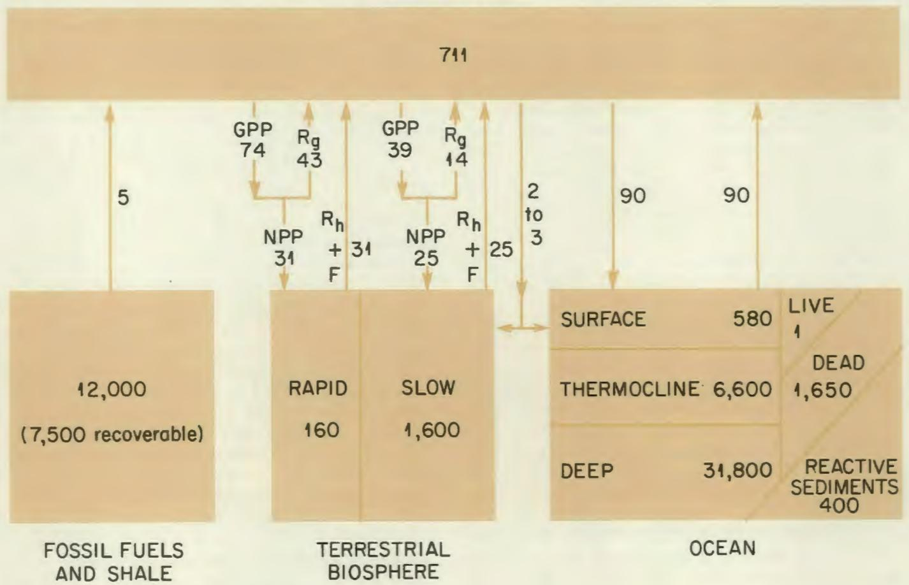  
The major fluxes (in gigatons per year) and pool sizes (in gigatons) of carbon are shown for the carbon cycle. Fluxes include gross primary production (GPP), green plant respiration $(Rg)$ , net primary production $(NPP = GPP - Rg)$ , respiration by heterotrophs $(Rh)$ , and fires $(F)$ .

burning of fossil fuels but also by plant and animal respiration, decay, burning of wood, periodic releases from volcanoes, and weathering of limestone; and the absorption of atmospheric $\mathrm{CO}_{2}$ by oceans and lakes, by growth of terrestrial plant life through photosynthesis, and by formation of limestone on the ocean floor. In the carbon cycle, exchanges of $\mathrm{CO}_{2}$ take place continuously between the air and the land (and its biota), between the air and the ocean, and between the seawater and its biota and the ocean floor. But there is only extremely slow natural cycling between fossil fuel deposits and these carbon pools compared with the rate at which fossil fuels are being burned. For example, for every ton of coal that is burned, 2 to 3 tons of $\mathrm{CO}_{2}$ are produced. So far, on the average, half of this amount is retained in the atmosphere

and the other half is rapidly absorbed by the ocean and land. Thus, for every ton of coal burned, at least one ton of $\mathrm{CO}_{2}$ is left in the atmosphere, accounting for the buildup evident in the past 120 years. Extra $\mathrm{CO}_{2}$ has also been released from forest clearing and from erosion and oxidation of humus in soils, but there is controversy on how large these sources have been.

One of the unknowns with regard to the carbon cycle is the extent to which plants may now be "fertilized" by the growing amounts of atmospheric $\mathrm{CO}_{2}$ . Photosynthetic capacities may be enhanced by the greater availability of $\mathrm{CO}_{2}$ , but it is unclear whether plants may be able to take up as much fossil carbon as some physiologists anticipate in view of other limitations such as moisture and nutrients.

Jerry Olson and Yip Hoi Chan, a Singapore Ph.D. candidate at the University of Tennessee, have been interested in studying another aspect of the carbon cycle-carbon storage in plants and how carbon storage capacities change with land clearing as wooded areas are converted to

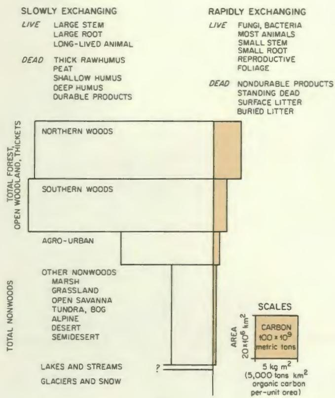

agricultural production and to urban development to accommodate the expanding population. Since trees absorb $\mathrm{CO}_{2}$ and then store more carbon than small plants occupying an equivalent area, man's conversion of forests to farmland and other uses reduces the land's storage capacity and hence its ability, at least temporarily, to remove excess fossil carbon from the atmosphere.

Says Olson: "Forest clearing has a significant impact on the global environment. In some tropical countries, rain forests are being cleared rapidly—sometimes to accommodate sudden increases in population and sometimes for more extensive cattle grazing. We are not doing what is most promising for taking full advantage of what nature offers us for carbon storage."

As funding becomes available, Olson and his colleagues plan to conduct a thorough study of the carbon cycle with reference to the role of terrestrial plants and soils as carbon pools. They will examine the effects of forest clearing and various land-use schemes on terrestrial carbon pools. They hope to work with groups elsewhere which have developed global atmospheric computer models into which results from $\mathrm{CO}_{2}$ models could be entered to calculate the likely resulting climate changes.

The quantities of carbon in the various terrestrial ecosystems are shown as concentration (vertical direction) vs area (horizontal direction). The vertical line divides rapidly exchanging from slowly exchanging organic forms.

According to the American Scientist article: "Man can have a significant influence on the fluxes between the land and the atmosphere. If, for example, he could cause the living biomass (600 gigatons, or billion metric tons) to increase at a rate of $1\%$ per year, this would more than counterbalance the current annual production of $\mathrm{CO}_{2}$ from fossil fuel (5 Gt/yr). Since woods have more carbon per hectare, this could be accomplished by conversion of more land to woods. However, the maximum increase in biomass that could be realized would be small compared to the total mass of fossil carbon (perhaps 7300 Gt) that man might ultimately consume."

Charlie Baes, who has long been interested in the chemistry of water solutions, and his Chemistry Division colleagues hope to examine the oceans' role in the carbon cycle. They have proposed to study experimentally the chemical equilibria involved in the uptake of atmospheric $\mathrm{CO}_{2}$ by the oceans as well as the rate processes by which the calcium carbonate minerals calcite, aragonite, and dolomite are formed on the ocean floor and destroyed by weathering on land.

Ocean chemistry is important in understanding the response of the ocean to fossil carbon. As Baes notes, the capacity of the surface waters alone to take up $\mathrm{CO}_{2}$ is quite limited and is determined primarily by the presence of a small supply of carbonate ion $(\mathrm{CO}_{3}^{2-})$ , which reacts with water and $\mathrm{CO}_{2}$ to form bicarbonate ion $(\mathrm{HCO}_{3}^{-})$ which accounts for about $90\%$ of all the inorganic carbon in the sea.

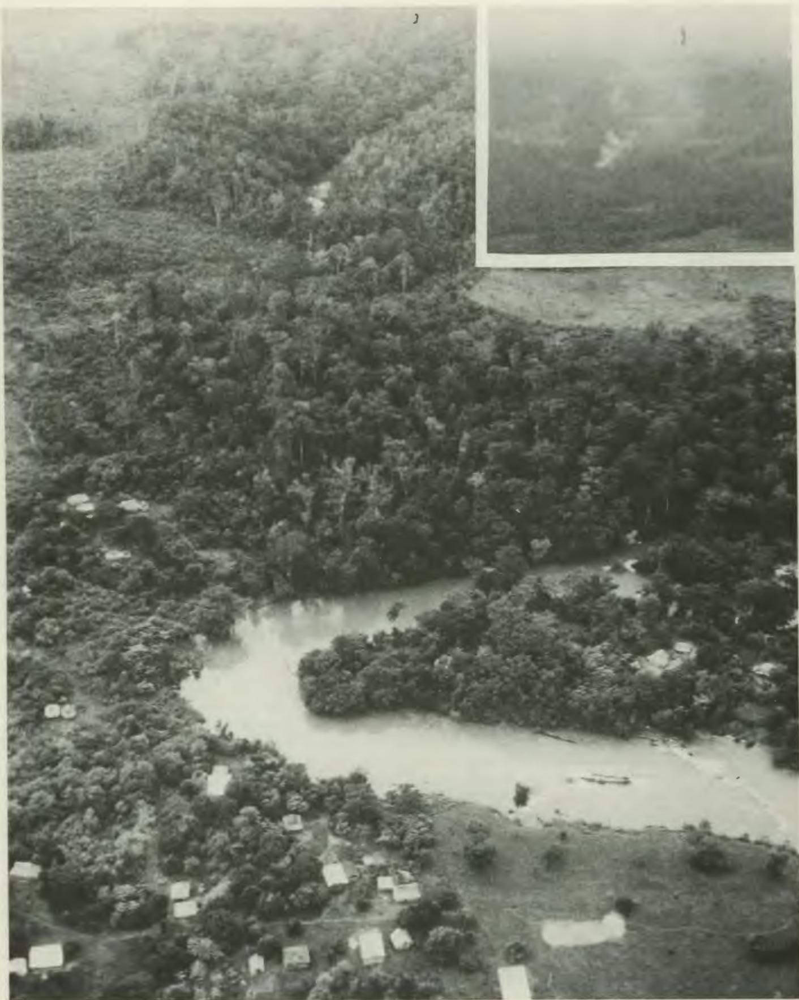

Here is an example of patchy land clearing in a tropical rain forest in southeastern Chiapas, Mexico, near the border of Guatemala. This slash-and-burn agriculture—where forests are cleared so that the land can be used for crop farming, cattle grazing, and accommodating growing village populations—results in a decrease in biomass that absorbs $\mathrm{CO}_{2}$ .

Forest clearing by burning (inset).

Large-scale forest clearing in Mexico takes place in areas believed to offer other valuable resources such as oil and gas.

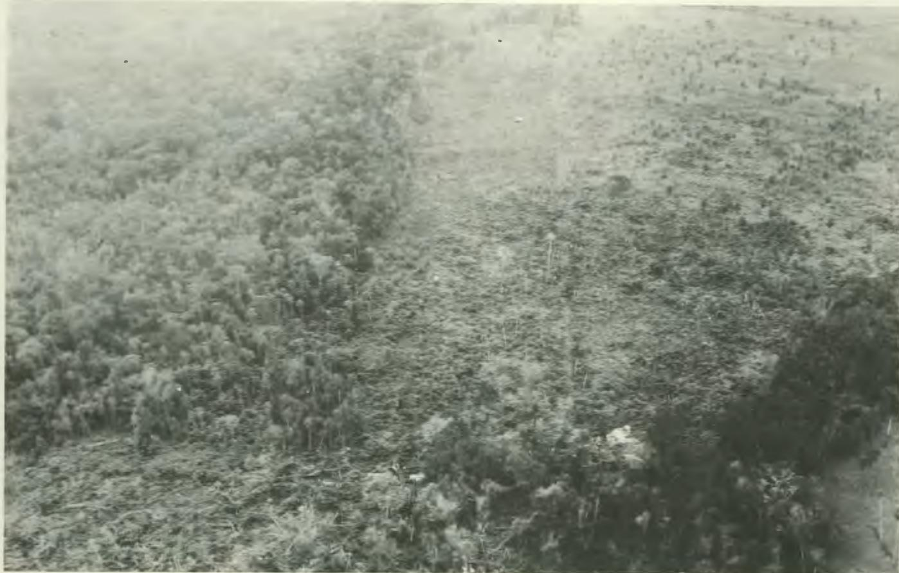

# Possible Climatic Impacts

The Oak Ridge study group has also concluded that more information is required so that we can anticipate the consequences of climate change. Based on what is known, the group foresees several possible adverse impacts of a permanent warming trend:

- Crops and animal species tuned to existing climatic conditions may have to give way to others better adapted to a warming trend.   
Rates of plant respiration and decay may outstrip photosynthetic production, resulting in release of additional $\mathrm{CO}_{2}$ .   
- Microbial and insect pests from adjacent regions may be favored over existing species, a situation

which could wreak havoc on some crops and forests.

- Inland water levels may be lowered as warming enhances evaporation; this occurrence could adversely affect many organisms, land use patterns, and even hydroelectric power production.   
- In recent years, science writers have discussed the possibility that the greenhouse effect could increase the rate of glacial melting enough to cause a sharp rise in the sea level. They have painted an alarming picture of low-lying coastal cities being inundated, forcing evacuation of millions of people to higher ground. The Oak Ridge group does not expect such changes to be

sudden, in light of uncertainties associated with the melting process, but agrees that many counties in the United States could start losing ground in the next century. According to the American Scientist article:

"Perhaps the most often cited effect of a general warming is the rise in sea level that would accompany the melting of glacial ice. A complete melting could raise the level of the oceans over $50\mathrm{m}$ , and quite obviously even a partial melting could have profound effects on the shorelands of the world and all their associated values. The melting process, however, is quite complex and not yet understood well enough to predict the rate at which this could occur. Warmer air alone could produce only a slow melting but warm polar waters could induce a flow of ice from the continental shelves into the sea, possibly raising the sea level $5\mathrm{m}$ in 300 years."

# Possible Remedial Measures

Until the consequences of climatic change are better understood, it will not be feasible to determine whether implementation of expensive remedial measures are justified to reduce the growth of atmospheric $\mathrm{CO}_{2}$ . What might some of these measures be? Suggestions include:

1. Reduce coal combustion by increasing energy conservation, by relying more heavily on nuclear and solar power, and by replacing some coal with wood and other biomass as fuel.

Says Baes: "The wood will slowly decay anyway and turn to $\mathrm{CO}_{2}$ , so we might as well use more of it as fuel. We could grow wood for fuel purposes." Wood can have the added advantage for long storage, as in building structures, that delay the return to $\mathrm{CO}_{2}$ during eventual burning or decay. "Another method that has been suggested would be to grow kelp in the ocean, or water hyacinth (a floating plant that proliferates rapidly in Florida freshwaters), which can be converted to methane through fermentation," Baes adds.

2. Establish a worldwide food reserve in case a disruption of climatic patterns results in a decline in agricultural production, even temporarily, until food producers find better species, varieties, and marketing arrangements for new crop patterns.

There have been less plausible suggestions, too. One is to dump nutrients like phosphorous, silicon, and nitrogen into the ocean to increase

production of plants that take up $\mathrm{CO}_{2}$ . "The problem with that scheme," Baes says, "is that increased production of plankton could result in greater production than consumption of $\mathrm{CO}_{2}$ because plankton create calcium carbonate shells, and release $\mathrm{CO}_{2}$ in the process."

Another less plausible but more costly solution is to contain and liquefy or solidify $\mathrm{CO}_{2}$ from coal-fired power plants, deliver it by pipeline to the ocean, and inject it deep enough so that the water pressure prevents it from rising to the surface.

It may well be that there really are no good emergency measures that can be implemented to combat the climatic effects of too rapid a buildup of fossil carbon in the atmosphere. As Olson puts it, "The winter of 1977 suggested that we are ill-prepared to cope with a warming that may become several times as great as the cooling we just experienced in the eastern half of North America." Even if there were ways to reverse the climatic effects, political repercussions could ensue as residents of regions benefiting from a warming trend mount a protest.

# Recent Cooling Trend

The earth's surface temperature, which averages $15^{\circ}\mathrm{C}$ , rose about $0.6^{\circ}\mathrm{C}$ in the 60 years before 1940. In the past three decades, the earth has undergone a cooling, with its temperature dropping $0.3^{\circ}\mathrm{C}$ . Some scientists ascribed this slight cooling to industrial pollution, theorizing that airborne particulates can shade the earth by reflecting back incoming solar radiation. (Cool summers tend to follow the larger volcanic eruptions for several years because of the dust blown into the stratosphere which settles out slowly.) Industry spews forth both $\mathrm{CO}_{2}$ and particulates, but the latter's effects are mostly local and likely to remain much less than meteorologists are coming to expect from $\mathrm{CO}_{2}$ . Opposing influences on climate may have been canceling each other's effects lately, giving rise to the controversy over whether the net effects of man's future activities will be a cooling or warming trend.

In recent national meetings on climate or the $\mathrm{CO}_{2}$ problem, Olson finds scientists generally tending to agree now that discharges of fossil carbon pose substantially more threat to the climate on a global scale than do particles from energy sources. (The particles, incidentally, may absorb some solar radiation, thus adding heat to

Here are two scenarios considered plausible for the use of fossil fuels over the next 100 years. In the high-use case, assuming an annual growth rate of $4.3\%$ reduced in proportion to the fraction of the ultimate fossil fuel supply that has been consumed, more than half of all fossil fuel carbon will be released in less than a century. In the low-use case, assuming a $2\%$ growth rate until 2025 followed by a symmetrical decrease, only about a fourth as much fossil carbon will be released as in the high-use case.

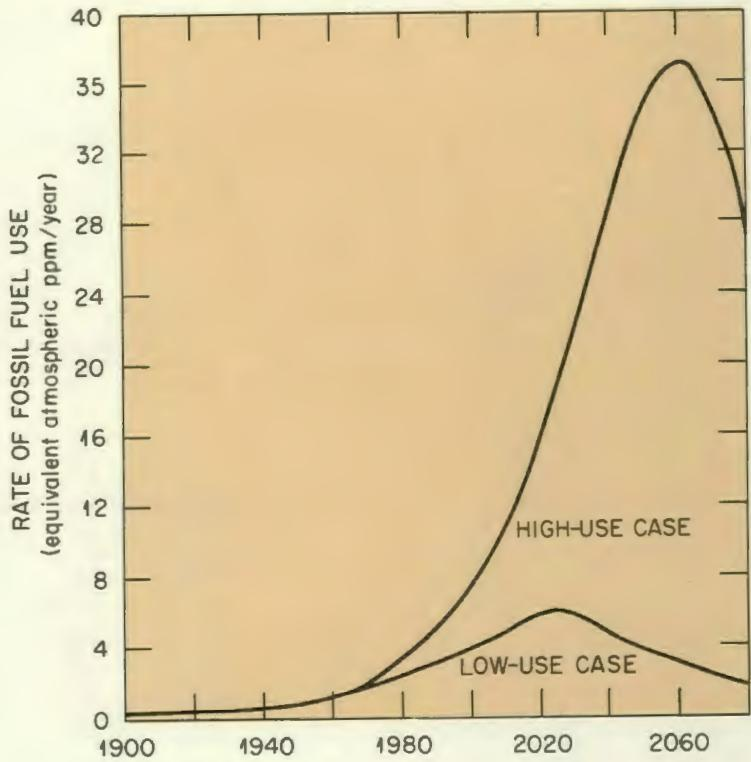

the atmosphere, but the extent to which this absorption occurs depends on the location and the various particles' optical properties.) Thermal discharges from energy sources, Olson adds, are considered even less of a threat to the next century's global climate, although they could have adverse localized impacts.

There is 10 times as much carbon in the world's fossil fuel reserves as in the atmosphere; or, more specifically, the atmosphere contains $700 \times 10^{9}$ metric tons of carbon while the recoverable fossil fuel reserves hold $7300 \times 10^{9}$ tons.

The Oak Ridge group considers as a high-use scenario one involving the use of fossil fuel at a growth rate near $4\%$ per year for a while followed by an eventual gradual decrease as the supply is used up. In this scenario, roughly half of all fossil carbon resources might be released to the atmosphere in less than 100 years—a situation which could produce many of the consequences mentioned above. In the group's low-use scenario, which might have more acceptable, or at least delayed, consequences, they envision the use of fossil fuel growing at $2\%$ of the present rate per year until the year 2025, followed by a decrease as renewable energy sources become available and as fossil fuel use is discouraged. The total fossil

carbon released would be 1.5 times the carbon content of the pre-industrial atmosphere, or one-fourth that of the realistic high-use hypothesis.

Olson believes the fossil fuel consumption pattern that will be adopted will lie somewhere near the high-use rate at first, followed by a struggle to return to a low-use scenario after effects of the excess release are belatedly recognized. How any fossil fuel use scenario will affect man's welfare cannot be predicted until more knowledge is obtained on the carbon cycle, on the likely climatic effects of increasing atmospheric $\mathrm{CO}_{2}$ and on the ecological and economic consequences of climate change. How well the various parts of the problem can be organized and solved will challenge the best efforts of all the people and agencies who become involved.

As Roger Revelle and H. E. Seuss stated in 1957: "Human beings are now carrying out a largescale geophysical experiment of a kind that could not have happened in the past nor be repeated in the future. Within a few centuries we are returning to the atmosphere and oceans the concentrated organic carbon stored in the sedimentary rocks over hundreds of millions of years. This experiment, if adequately documented, may yield a far-reaching insight into the processes determining weather and climate."

# Awards and Appointments

Phillip R. Westmoreland was given the Publicity Chairman Award at the March meeting of the American Institute of Chemical Engineers.

The Tennessee Institute of Chemists, the state chapter of the American Institute of Chemists, elected R. G. Wymer president and P. S. Baker secretary-treasurer at its May meeting.

The Materials Sciences and Technology Division of the American Nuclear Society bestowed the Best Paper Award on E.C.Beahm.Newly elected ANS Fellows are A.L.Lotts and J.L.Scott.

John Auxier became president of the Health Physics Society in June for a one-year term.

H. R. Livesay's drawing of the thorium utilization program's particle size analyzer was chosen for the cover of the IAEA proceedings of the Nuclear Fuel Quality Assurance Seminar held last spring in Oslo, Norway.

Appointed director of the newly created Health and Safety Research Division is Steve Kaye.

W. J. Lackey was elected Fellow of the American Ceramics Society. Also, in recognition of outstanding professional accomplishment, he was asked to serve on a panel which evaluates applications in the National Research Council's postdoctoral research associate programs.

J. E. Cunningham was appointed to a 3-year term on the National Nominating Committee of the American Society of Metals, a 3-year term on the ASM Advisory Technical Awareness Council, and an indefinite term on the ASM-ANS Nuclear Engineering Materials Handbook Editorial Board. J. R. Weir was nominated for a 3-year term on the ASM Board of Trustees. Domenic Canonico, Henry Inouye, and D. L. McElroy were named Fellows in ASM.

For many contributions, including "outstanding service to the nation in both scientific and managerial progress in the utilization of atomic energy," D.B.Trauger was designated by Tennessee Wesleyan College to receive the honorary degree of Doctor of Science.

R. F. Limburg, president of the Knoxville chapter of the National Association of Accountants and secretary of its Tennessee Council, was selected by that association for its 1977 Man of the Year Award.

Five of the Nuclear Division's six entries won Industrial Research's IR-100 Awards this year: the Portable Centrifugal Fast Analyser, C. D. Scott; Johnson Noise Power Thermometer, C. J. Borkowski; Small Angle X Ray Scattering Camera, R. W. Hendricks; Cytriage Blood Centrifuge, J. P. Breillatt, Jr.; and Single Atom Detection, Sam Hurst.

At the 27th Annual Convention of the Tennessee Professional Photographers' Association in Gatlinburg, 17 ORNL photographs were selected for awards: four by Gary Welch won First Awards of Excellence, of which one was chosen Best of Show in the Industrial Photography category; five by Jon Thompson received First Awards of Excellence, of which two were awarded Court of Honor distinction; four by Charles Tucker received First Awards of Excellence, with one in the Court of Honor; one by Terry Marlar and one by Ward

Bandy received First Awards of Excellence; and two by Jim Richmond received Second Awards of Excellence. All the Court of Honor and Best of Show prints will be placed on a traveling loan exhibit for a year. All the honored photographers are on the ORNL Photography staff.

R. W. McClung and K. Kawashima have been selected for the American Society for Nondestructive Testing 1977 Achievement Award for "the most outstanding contribution in materials evaluation during 1976." K. V. Cook was elected a Fellow in ASNDT.

At the annual meeting of the American Nuclear Society in June, the Society's Special Award was given to J. O. Blomeke, Floyd L. Culler, D. E. Ferguson, and R. G. Wymer for their outstanding work on the fuel cycle and in recognition of their leading roles over the past 30 years in the chemical technology of fuel recycle. Also at the meeting, the following ORNL staff members were elected to offices: Isotopes Division—Enzo Ricci, chairman; Environmental Sciences Division—Thomas H. Row, vice chairman; Controlled Nuclear Fusion Division—Don Steiner, Chairman; Nuclear Criticality Safety—Elliott

Whitesides, Chairman; Nuclear Fuel Cycle Division—Ray Wymer, secretary-treasurer; and Nuclear Reactor Safety Division—Bill Cottrell, vice chairman.

The National Aeronautics and Space Administration Group Achievement Award this year was bestowed on a team of ORNL metallurgists, A. C. Schaffhauser, R. W. Knight, C. T. Liu, and Henry Inouye, for their contributions to the Pioneer XI mission to Saturn.

Pete Patriarca received one of the two 1977 Honorary Member Awards given by the American Welding Society Board of Directors for his "outstanding contributions to welding knowledge through his work in materials research and development as one of the industry's experts on welding as applied to nuclear reactor components and fuel element fabrication. This esteemed elective honor is presented to a person of acknowledged eminence in the welding profession." The Society also bestowed its Committee Service Award on G. M. Goodwin in recognition of his contributions as chairman of its National Awards Committee, and gave its Dedicated Service Award to G. M. Slaughter for serving as chairman of its Committee on Brazing and Welding.

This high-contrast photograph shows part of a perennially snow-covered plateau and two of the valley glaciers that drain it near the east coast of Greenland. Climatologists disagree on whether warmer air masses owing to increased concentrations of atmospheric $\mathrm{CO}_{2}$ will cause sufficient glacial melting to make land masses such as Antarctica and Greenland more habitable. Since warmer air retains more moisture, it is possible that increased snowfall would result, building up the glaciers and more than compensating for the added warmth. (See p. 40.)

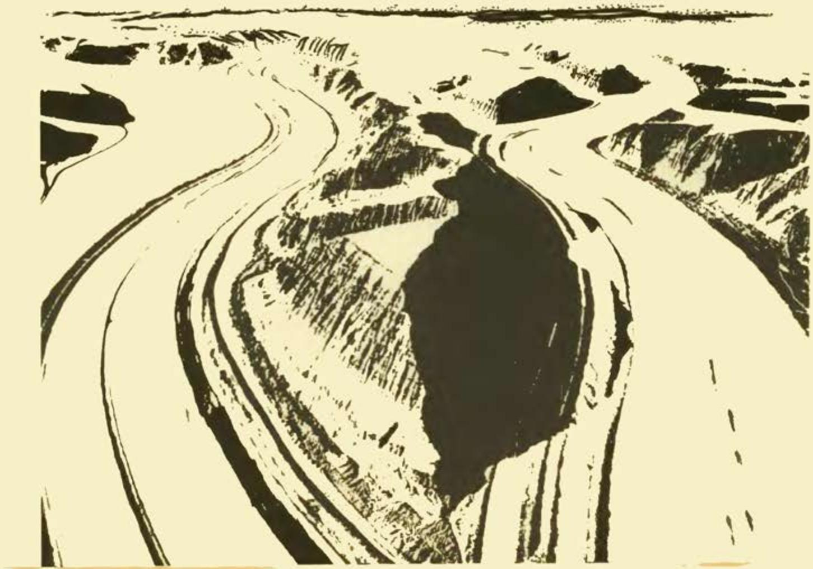