# Review

FALL

1969

OAK RIDGE NATIONAL LABORATORY

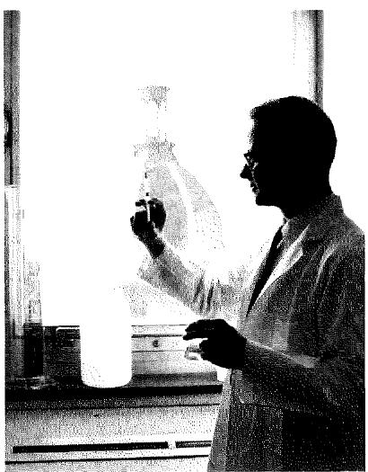

THE COVER: Silhouetted against the dome of Johns Hopkins University Medical Center in Baltimore, C. D. Scott prepares a body fluid sample for detailed scrutiny in one of his two chromatographic analyzers. For more about this fabulous new diagnostic tool, see story on page 1.

Editor BARBARA LYON

Consulting Editors  
DAVID A. SUNDBERG  
A. H. SNELL

Graphic assistance is provided by Graphic Arts and Photography Departments of the ORNL Division of Technical Information.

The Review is published quarterly and distributed to employees and others associated with the Oak Ridge National Laboratory. The editorial office is in Room 283, Building 4500-North, Oak Ridge National Laboratory, P.O.Box X,Oak Ridge,Tenn.37830 Telephone:483-8611Extension 3-6510 FTS No.615-483-6510).

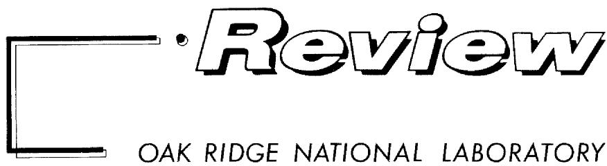

VOLUME 3, NUMBER 2

FALL 1969

1 The Chemistry of a Man By C. D. Scott   
9 The Consulting Statistician: Who Needs Him? By MARVIN A. KASTENBAUM   
12 25 Years of Creative Support By H. E. SEAGREN   
22 Benefits vs. Risks in Nuclear Power By WALTER JORDAN   
35 The INOR-8 STORY By H. E. McCoy

FEATURES AMW，20 Books,31

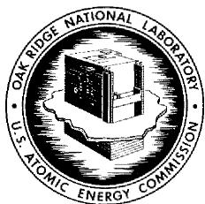

# OAK RIDGE NATIONAL LABORATORY

OPERATED BY UNION CARBIDE CORPORATION • FOR THE U.S. ATOMIC ENERGY COMMISSION

# The Chemistry of a Man

Here is a new diagnostic tool that provides a needle-sharp profile of a patient's chemical components

By CHARLES D. SCOTT

SUPPOSE YOU WERE GIVEN an extremely intricate machine that was capable of performing numerous complicated tasks, using only common chemicals for fuel. Complicated reactions within the machine convert this fuel into useful energy. Usually this machine requires little attention; however, occasionally it malfunctions and has to be repaired. It is a very expensive and extremely valuable piece of equipment; therefore, you would be willing to expend great effort and large sums of money to correct any obvious defects and would probably also schedule routine or preventive maintenance, if possible, to eliminate or correct incipient problems before they caused any significant damage.

Unfortunately, this machine has a unique design feature that does not permit its total disassembly; this configuration, in turn, makes maintenance and correction of malfunctions very difficult and the determination of the exact cause of a malfunction may be impossible. Even the study of other similar

machines that have been disassembled after they have lost their usefulness has failed to reveal all the secrets of the complex operating sequences. Most of our knowledge with regard to the status of the machine, as well as the necessity for repair, depends on what we can learn from sampling the fuel, waste, and other vital streams. Access to these streams is a fairly simple matter.

This is a brief and simple analogy to the problems facing the medical profession in attempting to maintain the complex machine that is the human body in a healthy state. It is relatively easy for a physician, or the patient himself, to determine when the machine is not functioning properly, at least when there is a gross disorder, because of the partial or total disability that ensues. For example, high fever, or severe headache or pain, can temporarily reduce man to the state of an invalid. Frequently remedies for these conditions are readily available which, in many cases, provide effective relief without actually

Chuck Scott, who received his doctorate in chemical engineering from the University of Tennessee, has been in the Chemical Technology Division since 1957. Originally in nuclear fuel production and reprocessing, he has since turned to biomedical engineering. At present he directs the Body Fluids Analyses Program which spans four divisions. Besides Chem Tech, the program's personnel represent the Molecular Anatomy (MAN) Program, Instrumentation and Controls, and Analytical Chemistry. The development of the remarkable machinery described here has attracted the attention of a number of medical centers. The two analyzers, ultraviolet and carbohydrate, still in the process of constant improvement, are being tested out by medical research teams at Duke, Johns Hopkins and the National Institutes of Health. The latest addition to the rig is a PDP-8 digital computer, designed to enhance the analyzer's evaluation capacity. Further improvements in the offering include miniaturization (by a factor of eight), and an attempt to combine the two analyzers into one unit. Scott is shown here at Johns Hopkins University Medical Center with Dr. R. Rodney Howell of the Center's department of pediatrics.

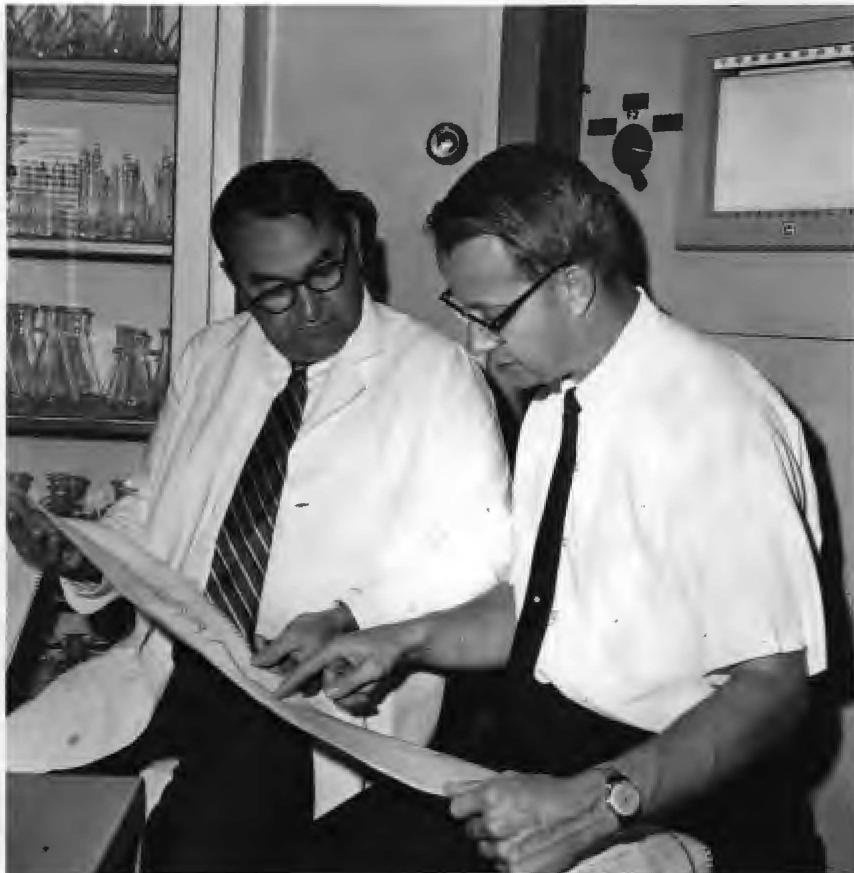

repairing the malfunction. But how do we find the basic cause of a malfunction? Or, better yet, how do we maintain or service this machine to prevent malfunction?

# Abnormal Body Function

When man is ill, his body usually functions in an abnormal manner. Often these abnormalities—aches, pains, fever, etc.—can be observed clinically. Clinical symptoms can be clues to the source of the trouble just as the change in the sound of an operating automobile motor may be a clue to which part has gone wrong. However, in order to solve more difficult problems that may be related only indirectly to clinical signs, it may be necessary to analyze the more delicate operating sequences of the machine or to perform tests that can be used to evaluate individual portions of the machine.

Since man's body is a machine whose operation depends on many very complex chemical reactions, the capability of determining the level of chemical activity in the body at a given time is invaluable.

To some extent, this can be done from accurate analyses of the waste streams (urine, breath, sweat, feces) and other, vital streams (blood, portal fluids, spinal fluids, etc.) coupled with the knowledge of the composition of the fuel stream (food intake). Medical science has, in fact, gained vast amounts of information about the relationship between excretion products and abnormal body function. In a recent bibliography on that subject prepared at ORNL, reference to over 1,000 molecular constituents in human urine was found, and most of these compounds have pathologic significance. For example, the excretion of excessive amounts of uric acid is known to be associated with gout and also occurs in some types of mental retardation; excessive quantities of glucose in the blood or urine may indicate diabetes mellitus, etc. In some cases the biochemical reasons for the abnormal molecular pattern in body fluids have been determined to be the result of disease or a metabolic deficiency. In fact, it is now reasonably well accepted that most diseases will ultimately be understood and controlled on the molecular level.

# As might be expected, chemical analyses of vari 000 in order to develop such high-resolution analysis

ous body fluids can be valuable diagnostic aids for the clinician. Most clinical laboratories can accurately analyze for as many as a dozen different chemical constituents of a blood serum or urine on a routine basis, while some laboratories associated with research hospitals will frequently be able to analyze for as many as 30. Typically, each analytical method used in a clinical laboratory will result in the analysis of only a single constituent or of a single group of constituents in a complicated physiological mixture. Considerable developmental effort has been directed toward automating many of these methods and, in some cases, in combining several analyses into a single automated instrumental array that requires a minimum of operator time. This arrangement has allowed some clinical laboratories in large hospitals to perform more than a million analyses per year.

Unfortunately most of this development has been concentrated on obtaining more rapid analyses of the compounds routinely detected instead of increasing the number of constituents being analyzed. Recently, there has been some work on the development of automated, high-resolution analytical systems in which many of the individual constituents of a physiologic sample can be quantified by a single analytical step. Such techniques, if successfully developed, could be used for in-depth analysis of physiologic material. Also, they might be used to establish a relatively complete chemical profile of a particular individual. In this context, the term "high-resolution analysis" has been chosen to describe an analysis in which many, or all, of the constituents of a sample mixture are separated and quantified.

cal tools, ORNL has established a Body Fluids Analyses Program that is funded by the National Institute of General Medical Sciences. This program, a part of the Molecular Anatomy Program, is a multidivisional effort which involves members of the Chemical Technology, Analytical Chemistry, and Instrumentation and Controls Divisions. In a sense, the program is typical of many ORNL projects in that the efforts of many scientists and engineers, representing a wide range of disciplines and talents, have been combined to solve a specific problem. Included are chemical engineers, instrument engineers, analytical chemists, biochemists, organic chemists, and a heavy complement of support personnel.

The development program includes basic studies on high-resolution separation techniques and detection methods that will have application in the automated analysis of body fluids. However, its ultimate objective is the development of totally integrated, automated analyzers capable of high-resolution analyses of body fluids. To this end, prototype systems are being built and tested in collaboration with various research and clinical laboratories.

To date, emphasis has been centered on the analysis of low-molecular-weight (less than 1000) constituents of urine and other body fluids, with two different analytical systems: an analyzer for detecting and quantifying the ultraviolet-absorbing constituents (UV analyzer), and a carbohydrate analyzer for detecting and quantifying carbohydrates. Both systems use high-pressure ion exchange chromatography (up to 5000 psi) for separating the constituents of the physiologic sample, and continuous photometry or colorimetry for determin

Elutriation system, for separating ion-exchange resins into specified particle sizes needed.

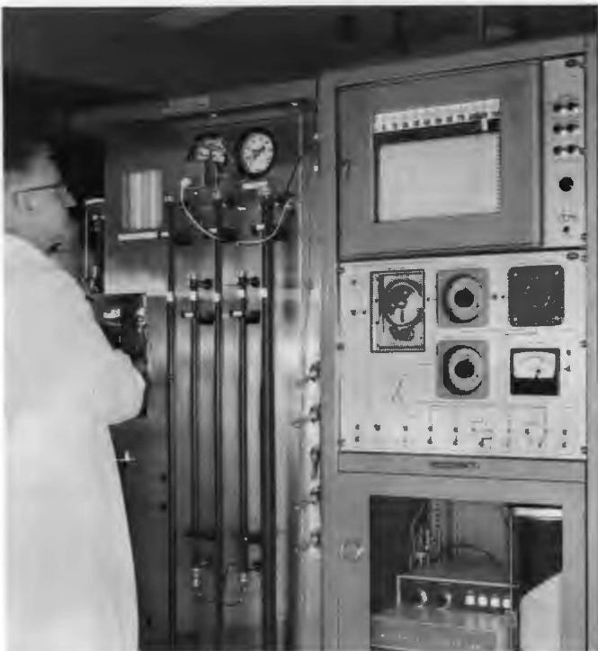  
Analytical chemist Ken Warren adjusts the reagent flow rate.

ing the separated constituents. In fact, the development of high-pressure ion exchange chromatography for use as a routine analytical tool has been one of the major technological contributions of this program. The high-pressure technique has also found application in other fields at ORNL; for example, it is now used extensively in the transuranium element program for separating some of the actinides.

The results from these analyzers are graphically presented on a strip-chart as a plot of the absorbance of light by the chromatographic column exit stream as a function of time. These chromatograms contain a series of peaks, each of which indicates a molecular constituent. The UV analyzer resolves up to 150 such peaks from a 1.0-cc body fluid sample, whereas the carbohydrate analyzer will yield up to 48 chromatographic peaks from a typical sample. Both systems require a relatively long period of time for analysis (40 hours for the UV analyzer and 20 hours for the carbohydrates); however, actual operator time is equivalent to only 15 to 20 minutes per sample.

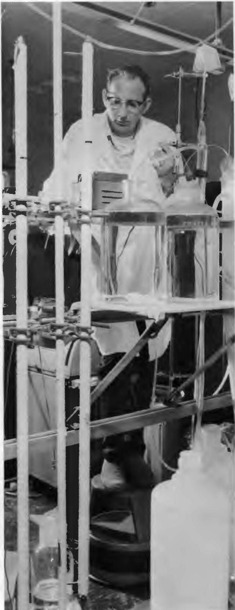

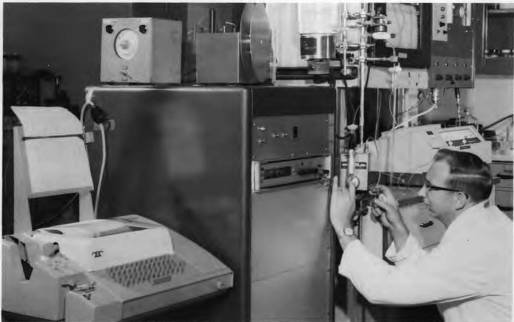  
Norman Lee, technician from Chem Tech, adjusts the flow rate of the chromatographic system.

# Exportable Hardware

As in many of the programs at ORNL, we can almost say that "paper is our most important product," since the end results of our research or development inevitably call for the preparation of progress reports and myriad other writings. However, "hardware" is also a result of our work.

As new, automated, analytical systems are developed, prototype systems are built and sent to other laboratories for testing and evaluation. This is an important part of our program since, in addition to collecting clinical research data, these evaluations furnish us valuable information concerning feasibility and operability that will prove useful in designing future systems. Ultimately, we would like to develop systems that a relatively inexperienced technician can be trained to operate in a short time.

Four prototypes of our model Mark II series analyzers are currently being evaluated in other laboratories: one UV analyzer, at Duke University Medical School, is at work on inborn errors in metabolism; another is being tested in the Depart

ment of Pediatrics at Johns Hopkins University Medical Center on abnormalities in infants; and both UV and carbohydrate analyzers have been placed in the Clinical Center of the National Institutes of Health for in-depth analyses of body fluids of selected patients.

Already these machines have produced some interesting results. For example, very complex carbohydrate chromatograms have been obtained from the urine of diabetics, indicating that diabetes is characterized by abnormal quantities of carbohydrates other than glucose. Also, the effects of drugs for the treatment of gout are being monitored by the UV analyzer.

Various other items of hardware that were designed and fabricated during the development of our analytical systems have also been made available to interested groups. Two of the most important of these are a small sample-injection valve that permits the injection of a liquid sample into a flowing stream at pressures up to 5000 psi, and a small, inexpensive UV photometer that can be used with other liquid chromatographic systems.

# Identification of Body Fluid Constituents

Although the chromatographic patterns themselves might provide the basis for determining an abnormal situation, the biochemical significance of the abnormality will be entirely lost unless the abnormal chromatographic peaks can be identified. Therefore, identification of the separated chemicals constitutes a significant effort in our program.

In general, one must first isolate the chemical in a column fraction, then find a means to purify the chemical, and, finally, establish its identity by various spectral and chemical techniques. This sequence of tasks must be accomplished with only a few micrograms or, in some cases, less than a microgram of material. Such work has necessitated the development of additional competence in our Analytical Chemistry Division, which now boasts a well-staffed and equipped analytical biochemical laboratory. Over 40 UV-absorbing constituents and 16 carbohydrates have been at least tentatively identified in body fluids; some of these have not been previously reported as components of body fluids.

# What Is Normal?

Relatively early in our program it was necessary to determine whether the chromatograms of body fluids of "normal" persons are similar, that is, whether the body fluids of "normal" persons contain similar amounts of the various molecular constituents. The term "normal" as used by us and others in medical science represents a paradox, because by placing enough restrictions on the population to rule out many abnormal conditions, we are left with only a very small portion of the population that is "normal." Actually our "normal" represents an idealized composite and in no way denotes the average member of society. Nevertheless, we did find eight "normal" persons at ORNL and samples of their urine and blood were obtained periodically and analyzed by both systems.

Persons who met these conditions of normalcy were found to have very similar chromatographic patterns even though no attempt was made to control their diet or physical activity. Therefore we believe that our systems can detect pathologic conditions that result in abnormal chemical levels. This has already been confirmed by analyses of several body fluids from patients suffering from both physical and emotional disabilities.

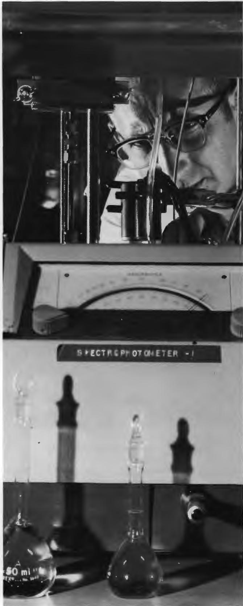  
UV analyzer's spectrophotometer gets a minor adjustment.

We have analyzed many special body fluid samples that were furnished by Oak Ridge Associated Uni- versities, Eastern State Psychiatric Hospital, and the University of Tennessee Memorial Hospital. Some interesting results have been observed; for example, the analysis of urine of patients with acute lymphocytic leukemia showed an almost total absence of hippuric acid; two large, unidentified chromatographic peaks were found to be present in urine samples from schizophrenics; a large quantity of homovanillic acid was detected in the urine of a patient with a neuroblastoma; and, of course, large quantities of glucose and other carbohydrates were found in the blood serum and urine of diabetics.

# The Future and Preventive Medicine

It is our aim to streamline our present analytical systems so that eventually they will be more highly automated, enabling analyses to be performed in shorter time. Already, work is progressing on the combination of several chromatographic systems with a small, on-line computer to permit computer-evaluation of the data.

We have also built and are now testing advanced prototype systems that are more compact, less expensive, and easier to operate than the older models. An attempt is also being made to combine the two analytical systems, along with additional detection systems, into one instrument package. Our ultimate goal is to develop a sort of "black box" that can rapidly analyze body fluids for literally hundreds of their molecular constituents.

The advantages that such tools will offer the medical profession are many and obvious. As the equipment becomes more reliable and as analysis time is reduced, it is possible that the high-resolution analyzers will be used in clinical laboratories

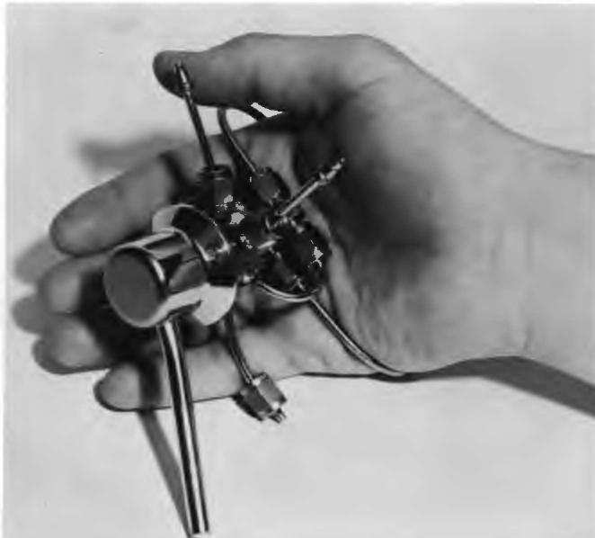  
V. E. Walker of Instrumentation and Controls demonstrates the automatic injection valve he developed (shown above) with Scott and W. F. Johnson to inject controlled samples into the high-pressure stream of the analyzers.

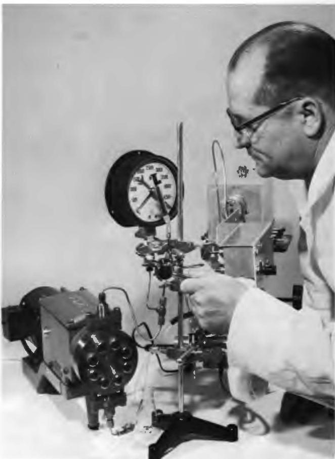

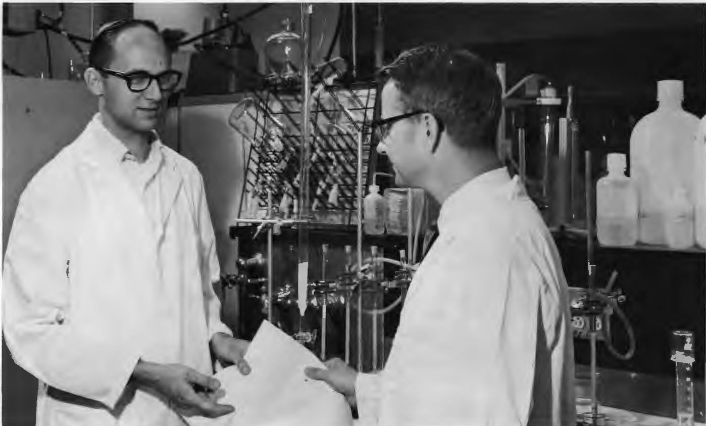  
Bill Butts, analytical chemist, evaluates one of the chromatograms with Scott.

on a routine basis, as an aid in diagnoses, as well as in monitoring the effects of drugs. Another use can be in the screening laboratories, where periodic testing of healthy individuals is done to determine if abnormal conditions are developing. Use of high-resolution analyzers by such laboratories would accumulate a wealth of useful information for detecting incipient disease.

Possibly one of the most exciting future extensions of this work is in its ability to acquire data that would allow physicians to detect abnormalities in infancy or childhood, before clinical manifestations are present. Some pediatricians say (perhaps with bias) that infancy or childhood is the only useful time for practicing true preventive medicine, since at that time any body damage that might result from abnormal conditions is at its minimum. Physicians are finding that an increasing number of abnormalities (principally metabolic deficiencies), if detected in infancy, can be treated successfully to prevent an early death or severe body damage. For example, early detection of phenylketonuria

(PKU), by analyzing for excessive amounts of phenylalanine in blood and urine, has made it possible to treat infants suffering from this condition with proper diet and thus prevent severe brain damage that could result in mental retardation or early death.

To carry this type of thinking a step further, the ideal time to detect, treat, and correct some types of abnormalities may be during the development of the fetus. One way to determine certain metabolic deficiencies would be to analyze the amniotic fluid for its molecular constituents. We are now beginning to analyze amniotic fluid samples and initial results have shown that the low-molecular-weight constituents of normal amniotic fluids are present in about the same quantities as in blood serum. This is a very new technique and we feel that such analyses have a large potential for the future.

Great strides are being made in the biomedical sciences, and we in the Body Fluids Analyses Program are looking forward to a productive and extremely exciting time.

lot. Or, better still, pick up any scientific journal in which quantitative measurements are being discussed, and you'll find sophisticated adults of great repute making this type of statement frequently about the results of their experiments.

Just what kind of game are they playing? Presumably they are making strong inferences concerning some unknown quantities on the basis of the results of one or more of their experiments. The interesting thing is that unless they are willing to give at least 19 to 1 odds on their results, nobody in the scientific community will pay much attention. Isn't this strange, when most of the readers and editors of these scientific journals would not be caught dead risking 6 to 5 on a sure thing, if six of their hardearned dollars were involved.

flip the same coin 1,000 times and observe 700 heads and 300 tails, would you then conclude that the coin is biased? Yes. How do these experiments differ? "In the number of observations made," you will answer and your intuition would be perfect. Why not apply it to experimental situations? For instance, why is it so difficult to accept the fact you may bet 9 to 1 but not 19 to 1 that a $2.3\%$ incidence of a disease among 500 animals in

# The Consulting Statistician: WHO NEEDS HIM?

By MARVIN A. KASTENBAUM

FIVE DOLLARS will get you a hundred if I'm wrong.

How often have you seen these odds offered when there is real money involved? Not very often. But eavesdrop sometime on a group of kids talking about their favorite ball players, and you'll hear it a

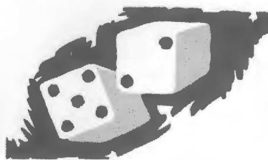

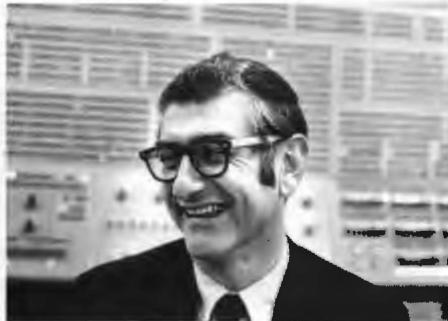

So what is this phenomenon that we observe daily in scientific circles? Why is it that editors of scientific journals are more concerned with the odds and probability statements of their contributing authors than with the credibility and authenticity of their experiments?

The odds against "crapping out" when you roll a pair of fair dice are 8 to 1. You can bet even money that, in a room containing 23 people, two will have the same birthday. If you flip a coin 10 times and observe seven heads and three tails, would you conclude that the coin is biased? No. But if you should

one experimental group is different from a $4.6\%$ incidence of the same disease in a second group of 500 animals? That a similar difference based on 1,000 animals in each group would allow you to bet 19 to 1?

Because he can quote these odds the consulting statistician could be referred to as the resident bookie. He has been called many things by many people, and the term "bookie" is not the worst. The fact of the matter is that the statistician can quote odds on most quantitative studies, before they are performed. What's more, he can tell how many observations are required to detect differences of specified magnitude for preassigned levels of risk.

You'd think that this ability might be of great interest to scientific administrators who are constantly faced with the problem of funding projects in a period of tight budgets. Yet a great number of large and expensive experiments continue to be initiated with little chance of success in terms of the accepted scientific definition of proof. Any consulting statistician worth his salt can save the scientific and industrial community the equivalent of at least twice his annual salary every year by saying forcefully, "Do not run that experiment. You are not planning to make enough observations. The chance that you will detect a true difference is about 0.5, and you can do just as well by flipping a coin."

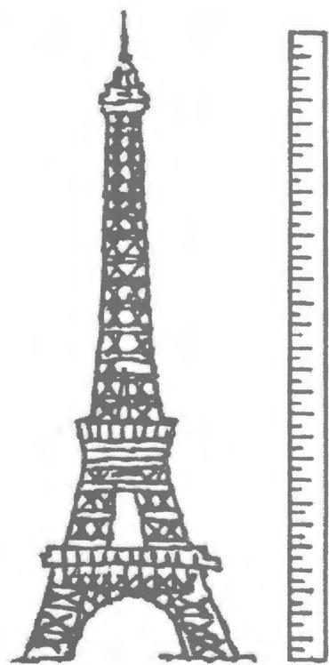

If you think it's presumptuous of a statistician to believe that he can help sophisticated scientists and engineers in planning their experiments, then you should realize that "experimental design" is the statistician's art. When a stat

istician refers to "experimental design," he's talking about planning experiments which yield optimum results at reduced costs and

statisticians have been perfecting this art for over 40 years.

Designing experiments should not be confused with proposing experiments to demonstrate or prove certain physical phenomena. One could safely say that some of the most outstanding scientific experiments have been proposed and performed by investigators who had little or no knowledge of "experimental design." This point was brought home to me very vividly by a scientific administrator who said, "Enrico Fermi probably knew absolutely nothing about experimental design." I could hardly deny this statement, but I could respond with the same degree of confidence by asking, "How many Enrico Fermis do you have on your staff?" The fact is that in spite of what we might think about ourselves, there are precious few Nobel laureates around. By the same token there are a great many good scientists and engineers who are performing experiments. Some do achieve greatness; most continue to do good work. The statistician's attitude, based on numerous post mortem observations, is that better planning can only enhance the relative frequency of successful experiments.

The consulting statistician has often been compared with the psychiatrist who contributes to society by guiding his patients through the difficult problems of life. This aspect of a statistician's role in science and engineering is most easily understood and appreciated. It is therefore most readily accepted. My young children explain it simply by the statement, "Daddy is a number doctor. He takes care of sick numbers." But the statistician's own concept of his reason-for-being is much broader than this. If he is indeed practicing a form of medicine, then his emphasis is on insurance and prevention rather than on emergency corrective treatment.

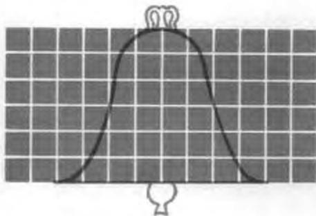

It has been said that the statistician will soon be replaced by the computer. Nothing is further from the truth. The etymology of the word statistician suggests an individual who is concerned with matters of state. Traditionally, the statistician was a person involved in enumeration and tabulation of data collected by governments. More recently his scope has been expanded to institutions other than governments, and to concepts such as estimation and induction. He now plays an important role in planning the collection of data and in their interpretation. The diversified applications of the statistician's stock in trade are best

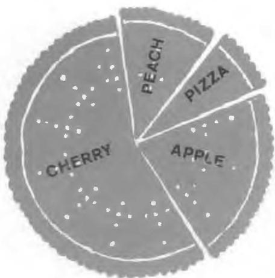

illustrated by the specialized scientific journals in which he publishes: Biometrika, Psychometrika, Econometrica, Technometrics, Biometrics, Qualitatiskontrolle, Skandenvaisk Aktvarietidskrift, Biometrische Zeitschrift, Journal of Combinatorial Theory and Teoriya Veroyatnostei i ee Primeneniya. The computer is merely a tool which some statisticians use to supplement the calculating machines on their desks. Very often the computer is used for Monte Carlo studies (once referred to as "random sample studies") to achieve numerical results to theoretical problems which have no "closed-form" solutions. But generally they are used by statisticians to get more rapid answers, using standard analytical techniques, to problems involving the reduction of data.

The statistician is not the keeper of stores of data. This responsibility, which was once in the hands of bookkeepers and auditors, has now been taken over by computer centers. It doesn't mean that the statistician is no longer interested. On the contrary, the statistician is often looked upon as a queer duck who, for some strange reason, shows an interest in the great quantities of data which he sees collected all about him. Usually his

attitude is that these data have been collected with good reason and that someone should pay attention to their analysis. This doesn't mean that he believes the data are good simply because they're there. On the contrary, he's probably the most skeptical guy you can find to give you an evaluation, retrospectively, of a mass of data which has been collected for an entirely different purpose. He will help with the salvage and repair of old and shopworn data, but he will adamantly refuse to support any inferences about them with strong probability statements. Can you blame him? He knows about biases and he also knows that the mathematics of probability is not to be sprinkled like the ashes of the red heifer, which according to Old Testament accounts, made the pure impure as it purified the impure.

The consulting statistician enjoys his contacts with the scientific and engineering communities. Some of the problems he encounters are old hat and trivial; others are challenging. He is never selective before the fact, because he cannot predict when he will be challenged. He usually spends hours with a client asking stupid questions just so he can get a better feel and understanding of the problem. His caution should not be interpreted as stupidity, but rather as ignorance of the subject of his client's field. By the same token, his client should not feel badgered and over

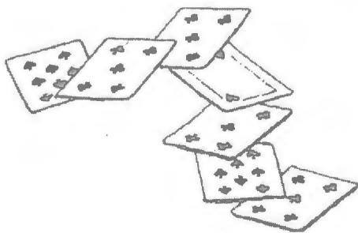

whelmed by the probing questions which the statistician is asking. Honest exchanges of this type have been known to produce some outstanding results in the scientific and engineering communities. These are the dynamic, person-to-person encounters that have also proven so useful in business, industry, and government. They are the types of situations in which sincerely interested people par

ticipate and they bring fulfillment and often joy to the statistician. O. Henry touched on this phenomenon in the following passage from "The Handbook of Hymen:"

"Let us sit on this log at the roadside," says I, "and forget the inhumanity and ribaldry of the poets. It is in the glorious columns of ascertained facts and legalized measures that beauty is to be found. In this very log we sit upon, Mrs. Sampson," says I, "is statistics more wonderful than any poem. The rings show it was 60 years old. At the depth of 2,000 feet it would become coal in 3,000 years. The deepest coal mine in the world is at Killingworth, near Newcastle. A box four feet long, three feet wide, and two feet eight inches deep will hold one ton of coal. If an artery is cut, compress it above the wound. A man's leg contains thirty bones. The Tower of London was burned in 1841."

"Go on, Mr. Pratt," says Mrs. Sampson. "Them ideas is so original and soothing. I think statistics are just as lovely as they can be."

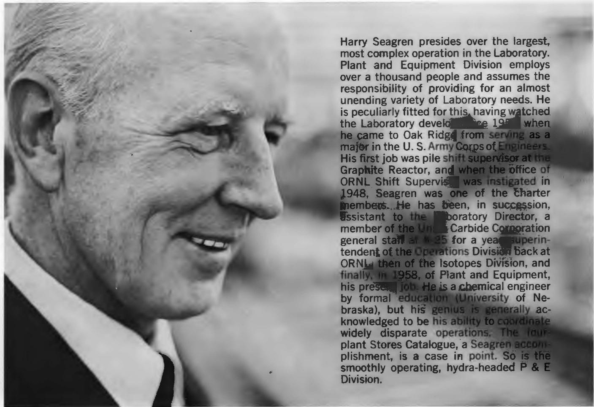

# 25 Years of Creative Support

The history of the growth of Plant and Equipment into ORNL's largest division

By H. E. SEAGREN

LABORATORIUM SUPPORTANS might serve as the official motto for the Plant and Equipment Division. Many organizations at ORNL contribute toward the total effort of supporting the Laboratory. The Plant and Equipment Division performs a broad spectrum of these functions and activities in assisting Laboratory programs.

How does a "kiloman" (and -woman) organization such as P & E support the Laboratory? The answer varies kaleidoscopically with time and program fluctuations. The multiple impressions of P & E have been compared to those of the blind men with the elephant. Indeed, the backgrounds, experiences and philosophies of Laboratory staff members, as

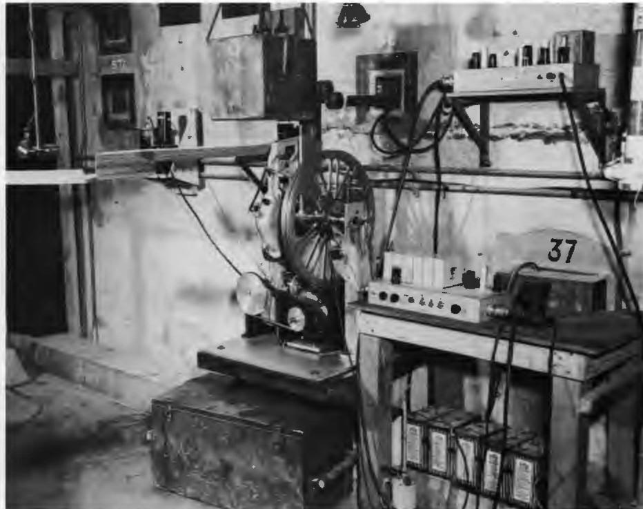

Left, 1949 oscillator  
at Graphite Reactor  
adapted from a Maytag washing machine for measuring neutron cross sections; right, neutron beam hole at HFIR.

well as their specific needs for support services, all affect their individual viewpoints.

Basically, our support activities can be placed in three classes:

Supply of materials, which includes equipment, utilities, process materials or supplies, and modifications to facilities;

Application of Manpower, i.e., craft support and other "extra hands" necessary to convert the materials class into the form or configuration required for the particular program; and

Technical Direction and Supervision—the translation of ideas into verbal or written instruction for the performance of work and the supervision of that work for effective performance. Written instructions include orders, drawings, specifications, bills-of-materials, sketches, and procedures.

In a complex, government-financed operation there are obvious needs for additional groups to handle the requirements for planning and cost control, official records, systems data, and inspection.

How should support functions be organized? The answers are myriad, and depend on the people involved. One researcher may prefer personal contact and direction of all work affecting his own particular project. Others may prefer to be relieved of all involvement with the details of craft supervision and job coordination.

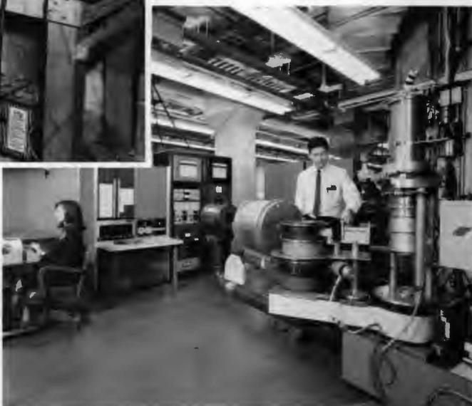

The operator may prefer that all groups affecting his operation report directly to him.

The designer may feel that his personal and professional contribution would be more meaningful if he followed his design through fabrication or procurement, installation, and check-out of the "hardware" for a "turn-key" job.

The accountant may insist on precise definition of work increments and the establishment of accurate budgets and costs for each.

The support supervisor naturally desires to control all contributors of material, manpower, and equipment necessary to complete his assignment on schedule within the allotted funding.

The current philosophy in P & E is best expressed in Ovid's advice: "... treat a thousand dispositions in a thousand ways."

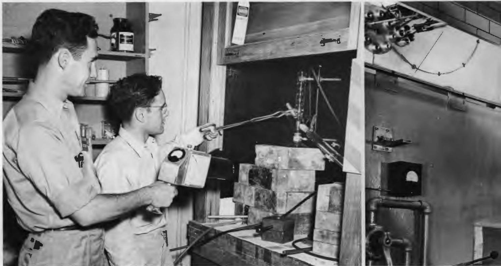

Evolution of hot-cell techniques.

Left, isotope handling in 1947;

middle, "over the wall with tongs;"

right, current method of processing

HFIR fuel element.

We are encouraging a team approach, where practical, of field engineers, crafts, supervisors, and aides on a local basis to provide a responsive support to programs. Priority decisions, job plans, estimates and manpower assignments are made where the precise knowledge of the actual requirements exists.

For purposes of budgeting, personnel functions, administration of the company-union contract, training, and employee benefits, the team members are assigned to the more traditional organizational departments. However, the structure is not rigid and must remain flexible to adjust to changing Laboratory programs.

Over the past quarter century a continuing change in support functions has followed the evolution of the Laboratory. The transition is reflected in the division's successive names. Originally Engineering and Maintenance, the title included the Construction function as well for a brief period in 1948 during "Plan H," the first approved plan for permanent facilities at the Laboratory. In 1954 it

was changed to Engineering and Mechanical shortly after instrument-oriented members of E & M joined groups from several research divisions to form the Instrumentation and Controls Division. The word "Maintenance" in E & M was changed to "Mechanical" as it was alleged, by one who shall be granted anonymity, that "maintenance is not a valid function in a research laboratory."

The present title, conferred in 1963, is the most recent attempt to define the division's role. It became permanent when the functions of engineering design and coordination of construction became organized as the General Engineering and Construction Division. The Materials Department from the former Finance and Materials Division joined the P & E organization. The initials posed a potential handicap when a few wags suggested facetiously (I hope) that these letters stood for Promises and Excuses.

Each of the division's functions has undergone an evolution of activities.

# Supply of Materials

For most of the first decade in the Laboratory's history the inventory control techniques included handwritten stores slips, hand-posted ledger cards

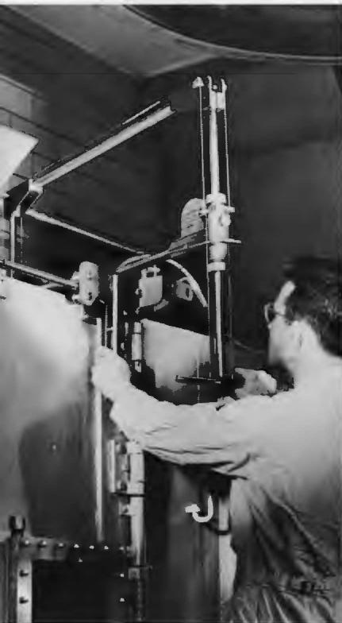

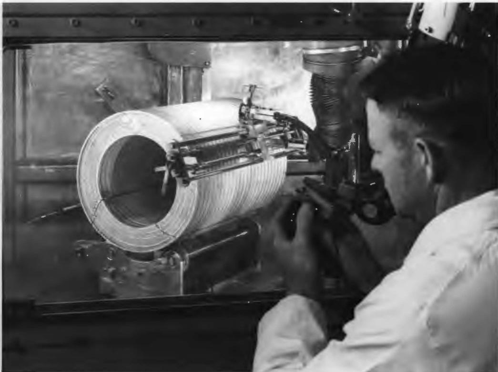

for each item, stores replenishment based on order points that were set pretty much intuitively. In the '50s our ORNL materials people fostered the establishment of a computer-assisted inventory control using pre-punched cards. The computer provides the inventory control reports. In recent years the computer has also been analyzing replenishment needs using a formula for economic order quantity (EOQ) which considers warehousing costs, safety stock levels, lead time for procurement, quantity discounts, packaging standards, past usage rate, and cost of inventory funds. The EOQ formula works well most of the time, but requires close scrutiny of critical items when the stores' withdrawal rate fluctuates under program budget pressures. The slope of the stores withdrawal curve plotted against time is a fair barometer of the immediate budget situation.

ORNL personnel contributed to the compilation of a four-plant stores catalog for the Oak Ridge and Paducah installations. Besides the benefits of combined procurement of common items, the catalog eases the transferring of materials and parts between plants. Approximately one-fourth of all ORNL (X-10) stores issues for P & E shop and field work come from stocks at other plants.

Veteran material handlers at the Laboratory re

call ruefully the early years when a large stock of lumber was physically relocated five times: mostly by hand, but with the assistance of a steam-powered crane in moving heavy bridge timbers. Today, most bulk stock is handled in palletized form with the help of fork-lift trucks.

In the early days No. 316 stainless steel and the particulate forms of graphite were the critical fabrication materials. In the intervening years the transition has been through a special HRT grade of stainless, a low-carbon 304 stainless, INOR-8 and various refractory metals. The nuclear codes and material specifications have made the inspecting groups an essential part of the "receiving" function. Also, continuous-identification-marking techniques and paper "pedigrees" of metal stocks are now commonplace.

A bill-of-materials program ensures that the materials and supplies are available at the start of the work. Chemical and electronic stores provide access adjacent to most of the labs of staff members using these items. "Prepaid, low cost items" minimize the clerical requirements of many stores issue records. Special auxiliary storerooms in some research divisions, called "substores," reduce delay time in filling specialized supply needs for three physical research groups.

One man, Sam Croft, working almost full time in establishing contacts around the country, in reviewing lists of surplus items, and in personally inspecting this material, has obtained almost $10 million (book value) of equipment, supplies and material, ranging from precision optical equipment to armorplate and naval gunmounts. These three items are now in use as viewing devices for in-cell operations, as special shielding chambers, and as the rotating base for reactor beam experiments as well as for many heavy machines in our shops.

# Application of Manpower

Our craft groups support Laboratory programs in shop and field activities. The originally separate research shops and mechanical shops have been united to offer a range of services from staff, area, and speciality shops to the large machine and multiscraft shops. The traditions of the department shop of a university are coupled with the latest techniques of industrial metal forming, shaping, cutting and joining.

A fascinating analogy to Parkinson's Law can be seen in the way ingenuity exercised in the solving of some "unique" problem becomes standard shop procedure for the resolution of many other hardware problems. The capability of repairing microscopes acquired during W W II has developed into a broad range of optics work. Many devices and techniques viewed originally as novelties have progressed into proven elements of shop capability.

The ancient art of glassblowing (even now, the personal expertise of many scientists) continues to find new areas of application. Currently of major interest is the joining of glass to a variety of graphites, ceramics, and refractories.

One shop group in Building 2506 concentrates on the development of innovative practices and problem solving. An intriguing challenge they met recently was the application of powder-forming techniques to teflon bag molding in meeting the exacting specifications for NASA moon dust collector components.

Most craftsmen working with research groups develop a keen interest and many special skills, particularly in adapting normal shop or field techniques to resolving the immediate problems in equipment development or operation. Years ago we were troubled by requests for such items as "rotating equipment with zero backlash on revers

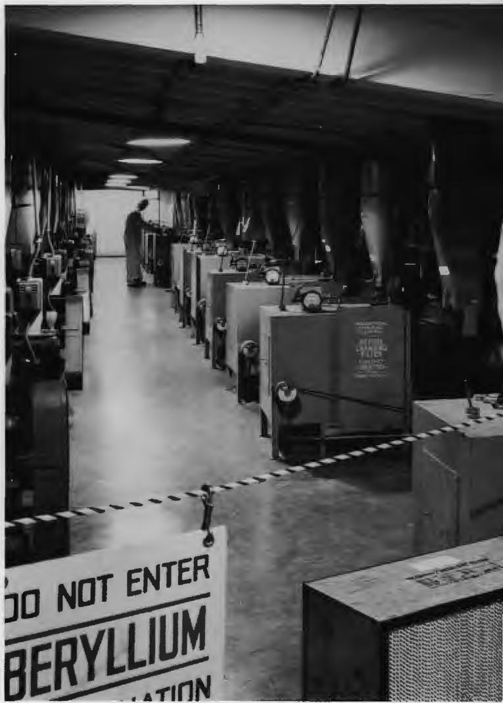

ing direction and absolute reproducibility of specific settings." Now, we work to meet such specifications without question. Several craftsmen have been included in the listing of co-authors of research reports in recognition of their contributions to the experiments.

In 1943 a stainless-steel welding certification was rare for welders entering the Manhattan Project. Now we use 45 separate certifications or qualifications on welding procedures developed for the metal joints used at ORNL. To keep his qualification for a specific technique, a welder must demonstrate his capability on an inspected job assignment or take a "bench test" in a 30-day period. This means he must perform a specific weld job in 30 days or go back to be recertified.

This growth in welding capabilities results from a cooperative program with Metals and Ceramics. As

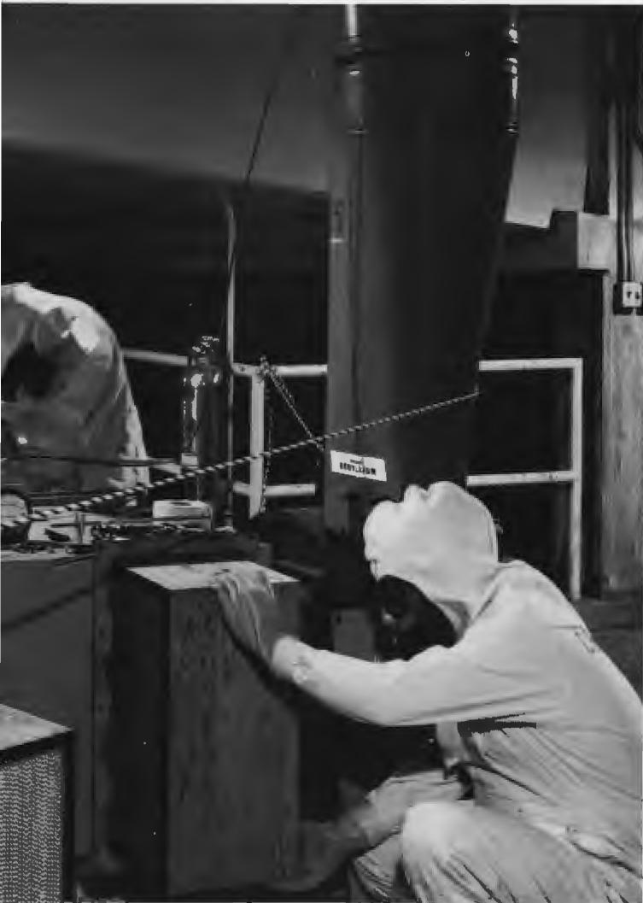

Maintenance of exhaust system in attic over Metals & Ceramics Division in 4500S.

Apprentice training in optical evaluation of machine accuracy, H. Seaman instructing.

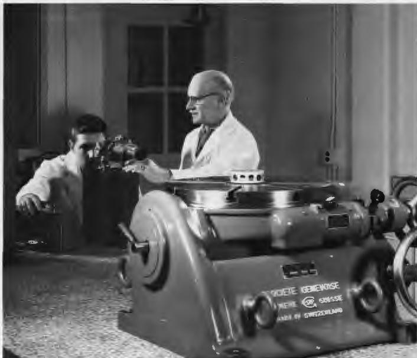

the Laboratory searches for improved materials in developing reactor and process systems, this relationship with M & C becomes even more meaningful. One of the salient features of our support work is the application of approved "bench-top" procedures to field conditions. An inert-gas-shielded welding technique becomes more complicated when it must be performed on a leaking joint or flange under a tank near the floor of a radioactive chemical processing hot cell, possibly with the aid of a dental mirror.

In the field support work, electricians, millwrights and pipefitters form a basic core in three major areas. Other crafts are assigned as the work requires. Most of the work assignments involve assembly, installation, repair, modification or disassembly of program-related equipment. Having the right types and numbers of crafts available to fit all work requests is somewhat idealistic. At one time

we postulated a quota system based on average support manpower commitments from program staffs. However, the available manpower in a given week proved to be considerably out of phase with the immediate manpower requirements. The current system is to assign a normal allotment of crafts to various program areas, subject to weekly revision. In this way we can accommodate to peak demands like reactor shutdown schedules or the start-up of a new processing facility. We are, of course, governed by our obligation to distribute overtime equitably as well as the need to limit radiation exposure.

The simple "over-the-wall-with-tongs" approach to remote handling is remembered by some of our pioneer researchers. Today, a manipulator maintenance crew cares for 267 manipulators (plus several in-cell remote handling systems) with the shop processing about five a week. Contamination

control requirements spurred a development program for "manipulator booting" which would permit a longer operating life before replacement.

In the past decade we have differentiated between non-program-related activities and program support. Those activities which must continue in the (strictly hypothetical) event the entire R & D staff goes on vacation for the month of August qualify as "standard" plant services. They, in short, guarantee the operability of the Laboratory when September rolls around. These activities lend themselves more readily to normal industrial approaches and systems control, and are conducted in such a manner as to minimize interference with the research and administrative staffs.

# "Programmed" Maintenance

At one time it may have been acceptable to place a bucket under the leaking roof of a wooden, wartime building and concentrate the available labor on meeting military deadlines. Today, in permanent, multiple-occupancy buildings, someone must concern himself about the preservation of the capital investment. Ray Ruel, a maintenance management consultant here from Industrial Engineering Institute, told us last February that the ultimate goal of the maintenance staff should be to put itself out of business. While this objective is remote, we have proceeded with a number of work-simplifying, problem-identifying measures to pinpoint costs, schedule assignments and extend the operating life of buildings and equipment.

The foreman's pocket notebook with penciled comments on spare parts, equipment history, and reminders for future checks is no longer the basic maintenance file. A "programmed-maintenance" system has operated for over five years. Components of utility systems, building service equipment, mobile equipment, and some operating equipment for process systems have been located, identified, and numbered. The servicing of over 8,000 plant equipment items is based on computer-scheduled cards that direct the specific items to be checked and specify the scheduled period by week, month or year. All lubricants are coded to simplify procurement and minimize any confusion in their application. The identification of bearings and V-belts now offers some simplification of stores stock.

In accumulating cost and observing repair frequencies we can provide data to justify higher quality materials and parts. As John Ruskin once

said, "There is hardly anything in the world that someone cannot make a little worse and sell a little cheaper--and the people who consider price alone are this man's lawful prey." The faucet in a lavatory sink is a simple device, but the time spent maintaining a thousand faucets is appreciable. We are observing the total, long-term costs of a faucet with washer and valve seat as opposed to the total cost of a washerless faucet over the same time period.

The operability of a safety shower is vital to a person who has just been splashed with an acid. We have sought out each device, installed a plug valve to permit maintenance without shutting off the area water supply, provided a portable catch tank, and now operate a semi-annual test program. Two men work for six weeks on this routine to operate each of the 544 safety showers and 44 eyewash fountains, correct any defects and reseal the valves for instant use.

# Progress in Waste Disposal

Radioactive solid waste handling in the WWII days was a necessarily impromptu activity because of the security situation, the urgency of demonstrating reactor and chemical processing systems, and the supposition that the entire project was short-term. The physical boundaries of the first two "burial" sites have been identified tentatively by "eyewitness participants." We are now opening up Solid Waste Storage Area #6. To date, our disposal operations have handled five million cubic feet of solid waste and used 135 acres of ground.

In 1945 the 2300-V power lines to the Graphite Reactor fans were the critical electrical distribution item. Most of the plant was served by 480-V circuits. The total plant load in 1947 was $2800\mathrm{kVA}$ . A conceptual study at that time set a maximum future load of 5 MVA for a proposed new line from Y-12. Today we have eight 13,800-V circuits serving the general X-10 valley with a peak plant load of 36 MVA.

In the late '40s a few air conditioning units provided more stable conditions for counting rooms and other instrumentation systems. "Comfort" systems were taboo. The requirement for controlled exhaust from labs and pressure differentials between office and other work areas for radiation safety led to a necessity for general air conditioning systems. The X-10 site now has approximately 9,000 tons of refrigeration capacity in major systems and another 500 tons in window and wall units.

One of the goals of Laboratory management in the early '50s was to convert the appearance of the site into one of permanence. Prior to this time, spreading crushed rock served to ease the mud problems. Extensive grass-growing campaigns, the laying of sidewalks and planting of shrubbery and ornamental trees have all served to improve pedestrian travel and the general landscape. Today, a Laboratory Landscape Review Committee has approved long-term plans to upgrade the general appearance of the entire site.

These plans comprise a gradual conversion to a "university campus" look appropriate to an East Tennessee foothills location. Some areas will be permitted to revert to their natural state, while others will be maintained with "golf course fairway" care.

# Organizational Structure

In the decentralized team approach to providing these varied support activities, five area managers act as deputies of the division director in coordinating the intra-division efforts, determining support requirements, arranging priorities, and serving as spokesmen for the P & E Division.

The role of the field engineer is most difficult to define. It defies standardization. A 20-year evolutionary process began when the engineer's most time-consuming role was to acquire the manpower assignments he needed each morning from a "bullpen labor pool" and then to coordinate the various craft efforts; his fiscal role was to write authorizations channeling costs into one of many money pockets to which he had access; and the engineering was whatever was necessary to get from the spoken request to the finished job. Today he seldom coordinates crafts, as we now have multi-craft foremen; he has only a controlled access to financial authorizations and is called to account for expenditures; but the classic engineering aspect of his job has steadily increased.

Each field engineer assigned to a specific program, operation or function has a different "job description," depending on the needs and desires of the requester. Broadly, his roles include that of interface between requester and P & E, technical expert, estimator, red tape handler, cost reviewer, inspector, designer, scheduler, supervisor, problem solver, expederer, planner, and peacemaker. His responsibilities range from serving essentially as a staff member of the local operation, to simply being available when needed. Each building at the X-10

site is assigned to a field engineer for surveillance of maintenance effectiveness.

The primary purpose of the "on-paper" organization of the division is to ensure a communications flow among all groups affected by any problem, assignment, or proposal and to provide a common interpretation for those Laboratory policies or procedures requiring uniformity. There is no point in describing administrative patterns.

However, a number of our activities have attracted attention at other AEC laboratories and plants. One is a foreman selection program that was developed and demonstrated here with the assistance of a University of Tennessee consultant, Cabot Jaffee. This method employs hypothetical situations and role-playing exercises designed to permit evaluation of the candidates' capabilities in leadership, planning, organization, decision-making, and persuasion. The program has now been adapted for use at the Y-12 plant and ORGDP.

Our "programmed-maintenance" system has served as a model for similar programs at several other laboratories. The ORNL Apprentice Training Program administered by the Personnel Division was the first such application of this craft training technique in Union Carbide Corporation. In the P & E Division 177 indentured apprentices have "topped out" into journeyman status. Of this number, 132 are still employed here. Nine have advanced to supervisory or technical aide positions.

Although industrial engineering may seem inappropriate at a research laboratory, the standard research techniques of observation, data collection, evaluation and analysis have proven beneficial in improving many layouts and procedures. This is the work of the Operations Analysis Group, which has the simply stated assignment of "finding a better way."

As a majority of our people have a daily exposure to mechanical, electrical, and chemical systems and equipment, we have worked with the Safety Department in fostering the Wise Owl, Golden Shoe, and Turtle Clubs to spur interest in working safely.

To sum up, the entire subject of laboratory support could be considered to be fair game for the organization consultant, the systems analyst, or a psychiatrist. Although many changes and improvements have taken place, we concede that we have not achieved what may be desired in making everyone in all programs satisfied all the time. However, in old-time shop talk, our men and women have no need to "back up to the pay window."

We hear much these days about priorities in science. With the fraction of GNP for research and development having fallen in the past year from $2.5\%$ to $2\%$ (the dollar amount has changed little), everyone is being squeezed; hardly a scientist or engineer is unaffected by a decision taken somewhere about what should and what should not be supported.

I became involved in this debate about priorities quite a few years ago when I was a member of the President's Science Advisory Committee. At that time people were already talking about the necessity to establish priorities in science; but the discussion had a rather theoretical flavor because we were still enjoying budgets that increased as much as $15\%$ each year. Having agreed in 1962 to speak at UT before the annual meeting of Phi Kappa Phi (the land grant equivalent of Phi Beta Kappa), I decided to order my thoughts on priorities in science and to use the UT talk as my vehicle for so doing. The result, after some re-editing by Professor Edward Shils of Chicago and Cambridge, was a series of papers on "Criteria for Scientific Choice" in the British magazine Minerva. (I had entitled the first paper "An Agenda for Science," but Professor Shils, editor of Minerva, suggested the title under which the papers finally appeared.)

I have gotten a lot of mileage out

of "Criteria for Scientific Choice." It seems that the question of priorities in science had hardly occurred to anyone prior to 1962; but ever since, in crescendo, it has become a central question in every discussion of what is now known as "science policy".

My own formulation distinguishes between "internal" and external criteria for scientific choice. The internal criteria arise from within the scientific field under scrutiny: Are its practitioners competent? Is it ripe for exploitation? Do the people in the field seem to have great enthusiasm? The external criteria arise from the impact the field of science has on universes outside itself—on technology, on other science, on society. In a general way, I have argued that external criteria are most important when what is being judged is the support society should give to a particular scientific field.

A few years ago I got into a squabble with some of my friends in high-energy physics because,

according to my scale, high-energy physics did not rate high enough on the external criterion scale. Vicki Weisskopf, former Director of CERN, was impelled to propose his own criteria for scientific choice, and I think his views are well worth considering. Weisskopf divides science into "extensive" and "intensive" science. Extensive science uses known basic principles to enlarge our knowledge of the things around us. Solid state physics, most of chemistry, probably all of the environmental sciences are examples of extensive science. Intensive science probes a very narrow segment of science so deeply as to uncover completely new and unexpected basic principles. High-energy physics and modern cosmology are Professor Weisskopf's best examples of intensive science. In discussing which sciences deserve the most support, Weisskopf urges that the intensive sciences, even though they may bear rather weakly on the rest of science, nevertheless must not be overlooked. To this I rejoin no, they certainly should not be overlooked, but neither should they be pushed more strongly than anything else. (The Batavia 200 BeV accelerator was just beginning to draw attention at the time of our discussion.)

These debates on scientific choice have affected some of the more formal deliberations about the support of science. For ex

ample, in the 1968 report of the AEC Panel on High Energy Physics we read: "At the present there are a number of important instances which show the influence of high-energy physics on the rest of science. . . . Thus, we find high-energy physicists making many of the most important contributions to theoretical techniques in handling many-body problems; to computer technology; to the techniques of dealing with ultrashort time intervals; and to superconductivity technology. Not only the methods but also the discoveries themselves begin to have their impact on other sciences." Thus the high-energy physicists invoke external as well as internal criteria in arguing for their science.

During the past year, and especially during this time of budget restrictions, I have come to realize that priorities in science are set by a political interplay much more than by a priori philosophic wisdom. In this respect, science is no different from any other enterprise that operates outside the feedback of the market place. The issue, then, is not whether there is a politics of pure science (some of the modern scientific muckrakers, such as Daniel Greenberg, seem to be filled with righteous indignation by their discovery that such a politics exists). It is whether this politics is enlightening and transcends the taints of venality, or at least self-interest, that we some

times associate with the word politics.

I think the politics of science is, on the whole, an enlightened politics; and I believe the widespread debate on scientific choice has affected this politics. Whether or not particular philosophic formulations prove to be acceptable, or even directly applicable, the philosophic debate has provided a language and a framework in which to conduct the political bargaining. This was brought home to me a month ago in a rather amusing way when I was invited to speak on national science policy before the Science Advisory Council of Sweden.

Sweden, with only 8,000,000 people, is a much cozier place than is the United States. The Swedish Prime Minister, His Excellency Tage Erlander, takes an active interest in formulating science policy. He therefore chaired the meeting in the ornate nineteenth century Swedish Parliament Building at which I outlined my views on science policy, the politics of science, and the relation between the philosophy and practice of scientific choice and scientific decision-making. Certainly the questions that concern the Swedes are very much like those that beset Americans. Should Sweden contribute to the proposed 300 BeV CERN accelerator? Should Sweden have a Department of Science? What about

redeployment of Sweden's large laboratories, particularly its nuclear energy establishment at Studsvik?

I used our experience in desalting research to illustrate how Oak Ridge has achieved a measure of redeployment. And in describing our experience, I naturally mentioned—and possibly even boasted—about the skill of our many chemical and mechanical engineers who have contributed so much to improving the technology of desalting. Altogether, I thought my remarks were non-controversial and that they were rather well received. They were, except when one Swedish biologist in the audience arose to ask why I had not discussed, as he put it, "the remarkable group of biologists at Oak Ridge." "Everyone knows," he continued, "that biology is much more important than desalting." To this I responded that I like both biology and desalting, and I wasn't about to make a choice between them.

All of which illustrates how difficult it is to make choices between scientific fields, even when the political atmosphere is as respectable as the Swedish Halls of Parliament, and the discussion has been enlightened by a spirited philosophic dialogue.

alain . Theiney

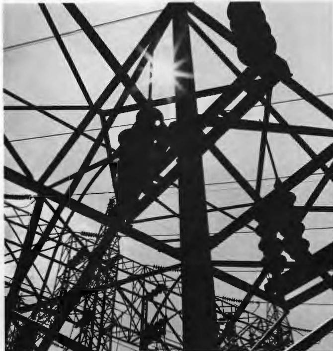

# Benefits vs. Risks in Nuclear Power

A logical, facts-and-figures comment on the current anti-atom literature

By WALTER JORDAN

JUST A FEW YEARS AGO almost everyone looked forward to the coming age of nuclear energy as a boon to mankind. Of course the coal interests have always been less than enthusiastic but that was to be expected. Recently, however, several freelance writers have undertaken the role of professional critics. Perhaps best known is the book, "The Careless Atom" by Novick, but the writing that recently stung me was an article in the March issue of Natural History by Curtis & Hogan entitled "The Myth of the Peaceful Atom," since expanded into a book, "The Perils of the Peaceful Atom." I felt particularly betrayed in this instance, for I have long considered myself a conservationist and have read with satisfaction of some of the crusades for conservation of resources, wildlife, or beauty that magazines such as Natural History frequently carry.

Certainly one of my strongest motives in pro

moting nuclear energy has always been the conserving of the fossil fuels—coal, oil and gas. It is on these valuable and irreplaceable resources that most of the aspects of modern life we take for granted depend: the production of steel, lubrication of machinery, synthetic fibers, plastics, the bulk of the chemical industry. These fast-diminishing fossil fuels are indispensable. And so, knowing that they can be conserved by the employment of a new source of power that at the same time reduces atmospheric pollution, I feel a real global mission in persuading people of these benefits of nuclear energy.

But the professional critics, who are being joined by some conservationists, say that all these fine benefits are not worth the risk. I strongly disagree. In fact I believe that more lives have already been saved by the advent of nuclear energy than will be lost as a consequence of it in the next 100 years.

Left: "The demand for electricity has almost doubled in the past ten years. Another doubling is projected for the next decade."

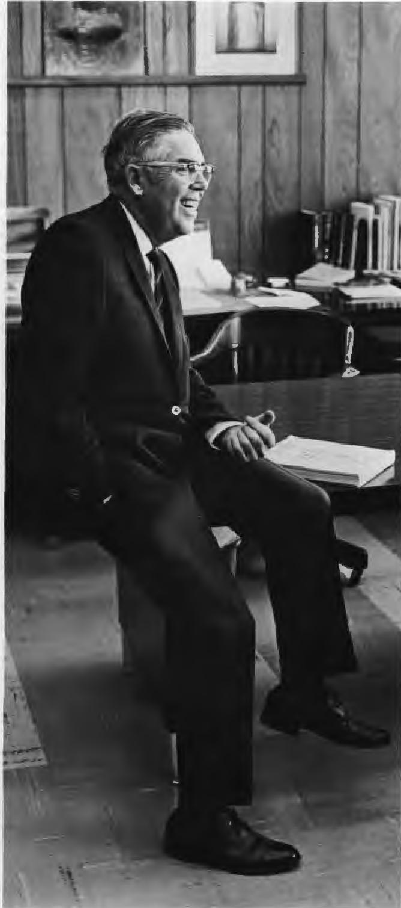

A native of Montana, Walt Jordan taught physics for six years at the University of South Dakota after getting his Ph.D. at Cal Tech. From there he joined the MIT Radiation Laboratory in 1941, where he worked on the development of radar for use in WWII. In 1946 he moved to the Physics Division of Clinton Laboratories, as ORNL was originally called, to work with P. R. Bell in developing nuclear electronic equipment. He was director of the Nuclear Propulsion Project in the 1950's, and in 1959 became Assistant Director of the Laboratory, the title he now holds. He is currently Advisory Editor of the AEC Nuclear Safety Quarterly, and a part-time professor in the nuclear engineering department of the University of Tennessee. A version of this article was first delivered as a talk to Oak Ridge Associated Universities' third Science for Clergymen Conference last July.

# A Swarm of Controversy

There does indeed seem to be developing a swarm of controversy over the growing nuclear technology. If it were just an occasional book or article I would be inclined to hold my peace. Unfortunately, it is deeper than that. Part of the licensing procedure for a nuclear power plant (though not for any other kind) stipulates that a public hearing be held at which individuals may intervene. In some cases these hearings have been so protracted that the power company has withdrawn its application rather than face the continued publicity. A power plant planned for construction at Bodega Bay has been abandoned. The opposition was concerned mainly with the natural beauty of the proposed site but the issue of earthquake damage was the deciding factor. New York Gas & Electric Co. has decided to withdraw its application to build a nuclear power plant at Ithaca. In this instance the interveners protested the possible thermal pollution to Lake Cayuga. The utility will build a coal-fired plant instead.

"The reduction of this outpouring of noxious gases is imperative."

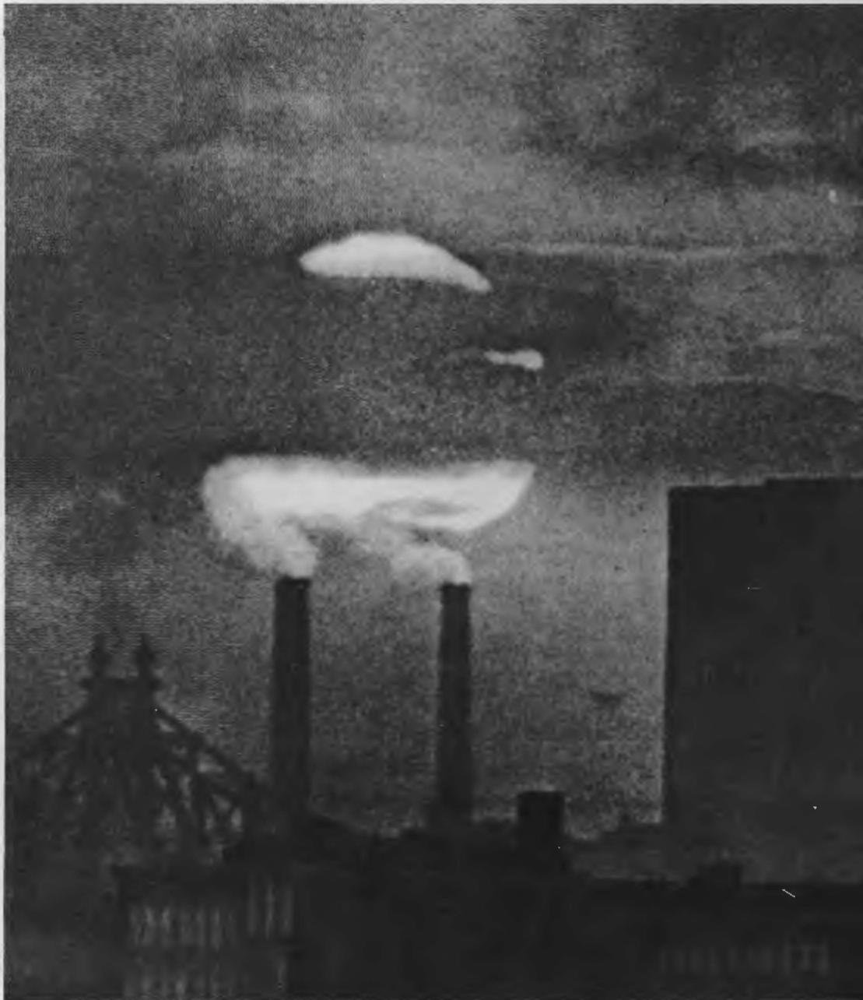

First of all let me summarize some of the benefits. One reason why power reactors are being installed in so many places in the United States (some 50 nuclear power plants have been ordered; 10 are in operation) is that they save money. If you are in an area served by one of these power reactors your electricity is costing less than it did with fossil fuel plants.

The demand for electricity has almost doubled within the past ten years. Another doubling is projected for the next decade. If this accelerating demand is to be met, more and bigger power stations

will have to be built. The alternative is an enforced rationing of electricity.

Although nuclear energy is beginning to supply some of the growing demand for power, fossil fuels are being burned at an ever-increasing rate. Whether they will be gone in 50 years or 200 years is not certain, but the time is short in comparison with the hundreds of millions of years that it took to form those deposits of coal and oil. Our limited reserves are fast going up in smoke.

And smoke there is! From a large, coal-fired power plant such as Bull Run near Oak Ridge, hundreds of

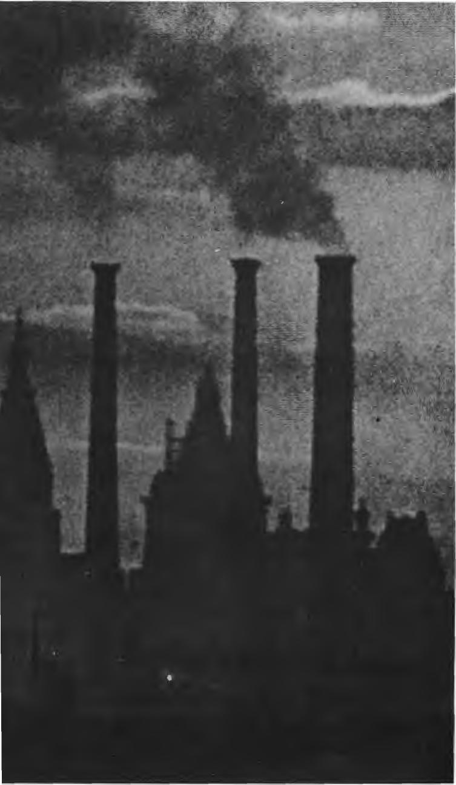

tons of noxious sulfur oxides pour out every day. What's more, thousands of tons of $\mathrm{CO}_{2}$ are emitted daily by Bull Run. (It has been observed that the $\mathrm{CO}_{2}$ concentration in the world's atmosphere is increasing at the rate of about $2\%$ per decade, a change that may have implications for long-term effects on climate.) No longer is the air clean and pure in Tennessee Valley: or, indeed, in most of the United States. Eyes burn, lung diseases worsen, pine trees drop their needles, and in extreme cases people sicken and die. This happened in 1942 in London, where a massive atmospheric inversion was

Manhattan from Riker's Island.

At right are the stacks of Con Edison's

Ravenswood plant, which manufactures power for all parts of city.

To left, the company's Waterside plant.

followed by an increased mortality of an estimated 3,500 to 4,000 victims; and again in 1948 in Donnorra, Pa., when $48\%$ of the population were affected by the smoke-filled atmosphere to which were attributed 20 deaths by the third day.

The reduction of this outpouring of noxious gases is imperative. It can be done by removing them from the smokestacks (thereby increasing the cost of electricity) or by installing nuclear power plants. Nor are coal-fired power plants the chief contributors to the air pollution of the country: automobiles and trucks represent a major source as does the heating of homes and buildings. To reduce this pollution caused by combustion, a general conversion to electricity will have to ensue. Homes must be heated electrically and automobiles and trains driven electrically. This will require that we generate at least three times as much electricity as we now produce, a challenge that can only be met economically with nuclear power plants.

Nuclear power offers a virtually inexhaustible supply of cheap electricity. Moreover it offers a chance to clean up the atmosphere. But there is in addition a third major benefit that has come with the nuclear age and that is the myriad uses of radioisotopes. These isotopes which are produced so copiously in every nuclear power plant—and, indeed, represent the chief danger in the operation of these plants—have already proven to be a great boon to mankind. Estimates of the benefits of these isotopes to industry are of the order of a billion dollars a year. Every major industry has found dozens of uses for them. Radioisotopes can measure the thickness of paper in the paper mill or the thickness of sheet steel in a rolling mill, the level of a liquid in a tank or the flow of oil through a pipeline. Isotopes are used in the exploration for oil. A slow leak in a water main or a gas line can be found with an isotopic tracer. The gamma rays from cobalt-60 are used for "x-raying" welds; they are also used in a chemical plant to produce new plastics. The dramatic uses of radioisotopes have caught the eye of

everyone. Some insect pests have been overcome by the ingenious method of sterilizing a large number of male insects with radioisotopes before turning them loose during the mating season. Irradiating wheat before it is stored can greatly reduce the losses due to insects. Spoilage of potatoes or strawberries can be greatly reduced by gamma radiation. We are just beginning to see the introduction of radioisotopic power plants for use in space satellites, undersea beacons, and heart pacers, to mention a few. Just to list the applications of radioisotopes would make a thick document.

The fields of biology and medicine have been revolutionized by the introduction of radioisotopes. The number of shipments of radioisotopes to hospitals in this country is in the many thousands every day. At Johns Hopkins University Hospital about 400 patients a day are given diagnosis with this new technique. Thyroid tumors are spotted by the radioiodine that is concentrated there, brain tumors by their affinity for radioactive technetium. Heart function can be measured by the length of time it takes for chromium-51 to become diffused into the blood stream. These medical procedures are typical of the hundreds of applications of isotopes in modern hospitals in the diagnosis and treatment of disease. And although nuclear power plants are not required for the production of these valuable isotopes, nuclear reactors are. And I think that the critics would be hard put to argue that research reactors for isotope production are somehow safer than reactors for production of electricity.

I could easily devote many pages to the benefits of nuclear energy. However, there are also risks. Those radioactive isotopes that are so useful when properly purified and diluted also represent a major hazard. The possibility, no matter how remote, of

spreading millions of curies of radioactivity over the countryside is not a pleasant one to contemplate. The critics present a gloomy picture. How likely is it to happen? Before discussing that question, I would like to recall for you some of the risks that you encounter in everyday life.

# Hazards of Living

In order to get a feeling for the numbers involved, consider the probability that an average member of the population will die during the next hour due to disease such as heart failure, cancer, etc. The figure is about one in a million, so I would write it

$$
P = 1 0 ^ {- 6} / h r
$$

It appears that people are willing to accept risks of about that same magnitude provided it is voluntary and the benefits are personal and real. For example, the risk of being killed while riding in an auto is about $10^{-6} / \text{hr}$ of exposure, about one-tenth of what it was a generation ago. There have indeed been significant advances in automobile safety. The risk of riding in a commercial airplane is also about $10^{-6} / \text{hr}$ , which means that air travel is some ten times safer than auto travel on a mileage basis. Air travel in private planes is a much more dangerous undertaking; fatalities in these flights are some $20 \times 10^{-6} / \text{hr}$ of exposure; 20 times as risky as commercial air travel. And yet many people willingly take the risk. But they do it of their own free will! No one imposes the risk upon them. It would appear that so long as the individual has a choice he is willing to accept risks considerably greater than his normal risk of dying by disease, provided the benefit to him is very real and immediate. On the other hand, if the risk is imposed upon him

"The situation is remarkably similar to the controversy over the budding electric power industry in the latter part of the last century."

(such as an airplane falling on a busy street, as recently happened in Miami, or the explosion of gas mains in New York City) he will insist that the probability of death be much less than the normal disease death rate. He will live below a dam if he is convinced that the chance of the dam collapsing is very remote (perhaps $10^{-8}$ per hour of exposure) and there is good reason (benefit) for him to live with the exposure to a small but not zero hazard. He may protest if a chemical plant or a nuclear power station is built near his home—suggest that it be built in another location—but if he is convinced that the risk is small, he won't move. A small risk is, as we have seen, something less than $10^{-8}$ /hr of exposure, or $10^{-4}$ /yr. In other words, if he is convinced that a major catastrophe will happen only about once in every 10,000 years, he will feel that the risk is acceptable. Will Los Angeles and San Francisco be spared a major earthquake for that long? Less than 50 years ago 150,000 people were killed in Japan as a result of an earthquake.

# Nuclear Risks

How can we demonstrate that the risk of living near a nuclear plant is small? Only by experience. The situation is indeed remarkably similar to the controversy over the budding electric power industry in the latter part of the last century. There was a great deal of opposition to the introduction of electricity into the home. The critics pointed out that electricity was dangerous, that people would be electrocuted, innocent children would stick their fingers into electric sockets and die a horrible death, that wires would become overheated and burn down the homes. Of course they were right! A thousand

people in the United States are accidentally electrocuted every year. Moreover, it has been estimated that $16\%$ of the fires are electrical in origin and 1,200 people lost their lives last year in the United States due to these electrically originated fires. However, this risk of being killed by electricity is low: about $10^{-9}$ hr of exposure, well below the "acceptable" risk of $10^{-8}$ , and the benefits of electricity are so apparent to everyone that no one wants to turn back the clock.

Let us now turn to the risks of operating nuclear power plants. These can currently be classified into three categories:

1) Thermal pollution of the rivers and lakes.   
2) Low-level release of radioactivity into the air and ground waters due to the normal operation of nuclear power plants and reprocessing facilities.   
3) The accidental release of large amounts of radioactivity.

To my mind item 3 is the risk of most concern, but the critics (Chauncey Starr calls them "nuclear hypochondriacs") have been equally vociferous about items 1 and 2.

Thermal pollution is not a new phenomenon, nor is it confined to nuclear power plants. Many industrial plants generate a large amount of heat and it is much less expensive to dump the waste heat into a river than it is to release it to the atmosphere. The rivers that flow through Pittsburgh, for example, are raised in temperature by 20 or 30 degrees. This has had an adverse effect on the fish and has in general upset the ecology. Federal standards are needed and enforcement by the states is most desirable. Such legislation is now pending in Congress. These regulations should apply to any plant, be it nuclear, fossil-fueled or chemical. Nuclear plants should conform, no more or less than any

"I believe that more lives have already been saved by the advent of nuclear energy than will be lost as a consequence of it in the next 100 years."

other type. It is true that a nuclear electric plant dumps more heat into a stream than a fossil-fueled plant of corresponding electric power output. But it doesn't make sense to raise a storm of protest over a nuclear plant of 500 Mw electric capacity while a 1,000 Mw electric fossil-fueled plant escapes almost unnoticed. Indeed, New York has passed legislation limiting nuclear plants but not conventional plants.

It is not surprising that a nuclear power plant which generates millions of curies of radioactivity may discharge a very small amount of radioactivity into the atmosphere or waste stream. The whole argument has to do with defining a "small amount" of radioactivity. The nuclear critics insist that it should be zero for a nuclear plant, whereas they recognize that a coal plant does emit some radioactivity owing to the presence of a small amount of uranium and its daughter products in the coal. Indeed, a large coal plant releases to the environment more radioactivity than any present or planned nuclear power plant, but the argument is made that since it only redistributes the activity from the coal mine to the atmosphere, it is somehow less harmful.

Actually we know very much more about the effects of radiation on the human body than we do about the effects of various chemical pollutants that occur in ever-increasing amounts in the air we breathe and the water we drink. In full acknowledgement of the potential hazards, the AEC has spent hundreds of millions of dollars in biological

research aimed at establishing not only the effects on man but also on the environment so that we can be certain that the ecological effects will be minimal. This concern is almost without precedent: Certainly the automobile industry has not expended very much money on the effects of smog on the population, or the tobacco industry on lung cancer, or the chemical industry on the effects of DDT on the ecological cycle. One of the favorite expressions of the nuclear critics is that there is enough radioactivity in a reactor to irradiate everyone in the United States with a lethal dose. There is also enough insecticide manufactured to poison every U.S. citizen; moreover, the insecticides are meant to be widely distributed, whereas the radioactivity is carefully confined.

As a result of the intensive research that has gone on over the past 25 years on the effects of radiation, the Federal Radiation Council has developed a set of radiation protection guides. The levels that have been set, even for workers in the nuclear industry, are meant to be at least an order of magnitude below that where somatic effects on the individual would be observed. (This is in contrast to the ozone level in Los Angeles, which is set just barely below the level where eye irritation will be noticed.)

If everyone in the nuclear industry were to get the maximum level of 5 rem per year, there probably would be a small increase in the observed number of deaths due to leukemia after a number of years—but

"Nuclear power offers a virtually inexhaustible supply of cheap electricity . . . a chance to clean up the atmosphere."

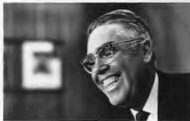

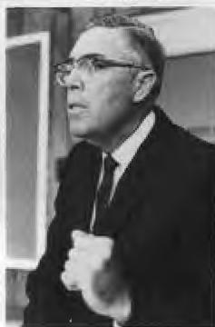

still a lower number than those from other industrial accidents. Actually it is rare for anyone to get 5 rem during a year and most of us get very much less. Even though 5 rem is considered to be a conservative figure, much less for example than radiologists used to take, it is felt that an additional factor of 30 reduction should be made when considering the dosage levels to the population at large. Hence the protection guides on the escape of radioactivity limit the amount of activity to such a low level that the general population will receive no more than a fraction of a rem per year. Actually everyone receives something like a tenth of a rem per year of radiation due to cosmic rays and natural radioactivity in the earth and air—everyone, that is, but those who live in certain high-level radiation areas, like some in India, where they receive eight times as much. When one adds to this the radiation due to medical x rays it is apparent that the amount contributed by nuclear energy is small in comparison. I do not hesitate to take several rem of x rays when it is needed for diagnosis or treatment of disease. Here is a very real example of the benefits far outweighing the risk. On the other hand I am opposed to taking even medical x rays needlessly. Some of the older machines for dental x rays sprayed the whole body; the use of a filter and cone, which produces better pictures with less radiation, is now in practice. X-ray machines in hospitals have also been greatly improved; good, clear lung radiograms

can be obtained with a dose of 0.1 rem rather than the several rems required with poor equipment and antiquated procedures.

It has been estimated that the maximum exposure received by any person in the neighborhood of the Dresden nuclear power station was less than 0.0001 rem per year, which is less than $1\%$ of the exposure they receive from natural radioactivity and cosmic rays. But in spite of the ultra-conservatism in the federal radiation protection guides, the Minnesota Pollution Control Agency responsible for water purity has recently protested the granting of a license to operate a reactor unless the operator guarantees to maintain a level of activity release a factor of 100 below the values recommended by the Federal Radiation Council. This may induce the utility to put in a coal-fired station which will put out more radioactivity than the Minnesota agency is attempting to legislate plus the products of combustion, with their known and unknown hazards. All in the name of "safety." I believe it is demonstrable that the hazard from the presently regulated amount of radioactivity released in normal operation of a nuclear power station is much less than that from the pollutants emitted by the operation of a fossil-fueled station.

However, the risk of releasing a large amount of activity inadvertently (item 3) is quite another matter. The hypothetical consequences of such an accident were the subject of a much publicized

Brookhaven report some 10 years ago. The authors assumed the worst possible combination of circumstances. They gave no credit for containment in estimating that half of the fission products would become airborne; they assumed that the accident would occur during an atmospheric inversion and low wind velocity, so that the fission products were carried straight toward a population center with very little dilution or mixing. Under these catastrophic but highly unlikely circumstances up to 3,000 people could be killed, assuming evacuation were not possible. For some reason it is much more acceptable to the public to kill 10,000 people in a series of small accidents than to kill 3,000 in a single event. Nevertheless it is the stated mission of the nuclear industry and the regulating agency to make the possibility of such an accident exceedingly remote. How do we go about it?

First, the fission products are contained in fuel elements which would melt only if cooling were to fail. Second, the fuel elements are contained within a primary coolant circuit which undergoes the most thorough series of tests and inspections that any pressure vessel has ever been subjected to. Then the whole works is contained within a large steel or concrete containment vessel. Finally there is an exclusion area surrounding the power plant and a low population zone outside of that. This should result in considerable dilution of the radioactive fission products before they reach the population center as well as introduce a delay so that evacuation can begin.

In order for the radioactive fission products to escape, the fuel elements must melt, the primary vessel must burst and the containment vessel fail. And should all these failures occur coincidentally, it appears that probably no more than $5\%$ of the fission products would become airborne rather than the $50\%$ assumed in the Brookhaven report. Even so, the release of $5\%$ of the radioactive products under unfavorable atmospheric conditions would be serious. And we can see ways that that might happen. However, bear in mind that when a mechanism for an event can be postulated, then the design can be modified to make that particular mode of occurrence most unlikely. It is true that fate has a way of figuring out another path to an incident that was not foreseen. But the designers and builders of nuclear power plants have exercised sophisticated ingenuity and expended large sums of money to make the plants as safe as they know how to make them.

There have been accidents and releases from experimental reactors. The releases have been small and no member of the public has been injured. A power reactor in Windscale, England, caught fire and did spread a considerable amount of radioiodine over the countryside, thereby contaminating milk supplies and crops. The reactor was not in a containment vessel so perhaps $2\%$ of the fission products did escape. No power reactor in the United States has been similarly involved. There were some fuel elements that melted in the Fermi reactor but neither the primary nor the secondary containment were violated. The prophets of doom have heavily dramatized these reactor incidents, pointing out that it can happen in spite of our best efforts. However, don't these accidents prove, rather, that a fairly major release of radioactivity can occur, such as Windscale, or SL-1, without anyone outside the reactor building receiving a tolerance dose of radiation?

The $64 million question still remains, and that is whether we have succeeded in reducing the risk to a tolerable level-i.e., something less than one chance in ten thousand that a reactor will have a serious accident in any year. Thus when we have one hundred nuclear power stations in operation, not too far in the future, an accident once every hundred years might be expected. And if a hundred people were to be killed, such as now happens in a major airline disaster, it is a lower calculable risk than that taken by many facets of U. S. industry today.

Have we succeeded in reducing the hazards to such a low level? We can only say that we have accumulated so far some 100 reactor years of accident-free operation. That is a long way from 10,000 so it doesn't tell us much.

The only way we will know what the odds really are is by continuing to accumulate experience in operating reactors. There is some risk but it is surely worth it. I am impatient with those who cry "wolf" when there is so much to be achieved. On the other hand it is a mistake to use the head-in-the-sand approach and say it can never happen to us. We and the public should be prepared to face the possibility of a nuclear incident, just as we live with the possibility of major earthquakes which will exact a large toll in property and lives. Only a few people advocate abandoning the West Coast. I hope only a few advocate abandoning nuclear energy that promises so much for mankind.

  
By Alex Zucker

# GUILTY GAMES

Black Rain, by Masuji Ibuse, translated by John Bester. Kodansha International, Ltd., Tokyo and Palo Alto (1969). 300 pages, $6.95.

The Game of Science, by Garvin McCain and Erwin M. Segal. Brooks/Cole Publishing Company, Belmont (1969). 171 pages + index, $2.95.

ANNIVERSARIES are a form of social conscience. Nations, religions, or families remind themselves of significant past events by noting centennials and birthdays, by collective celebrating or mourning, and sometimes even by erasing from the calendar occasions of import. In the current fashion we note anniversaries by writing books, publishing long articles in newspapers, and pasting together old film clips over a modulated narration for a television program. We now celebrate our centennials, their multiples or rational fractions, in private, with subdued hoopla, with appeals to the intellect rather than to the emotions. For example, last July 20th, while the headlines were all turned on the moon, the Germans quietly but insistently celebrated the 25th anniversary of the ill-starred attempt on Hitler's life by a group of army officers. From this attack on Hitler the Germans derive a much-needed belief that they were not all bad even in those days, that there were a few people in Germany

who placed justice and humanity above their own welfare. This gives them something to build on, an assurance that the present democracy is founded on real values, that it will not fall away like a mask at the earliest opportunity, to reveal again the jackbooted storm trooper. Such feelings require public reminders, and they are on the whole useful to a society justifiably ridden with guilt.

And how about us? Next year we too will have a quarter century to celebrate: Alamogordo, Hiroshima, and Nagasaki. A quarter century of new words: kiloton, atom bomb, radiation sickness, mushroom-shaped cloud. The celebration has already begun. Paradoxically it is taking the form of an attack on the peaceful aspects of the nuclear world, perhaps because the huge arsenal of weapons (how felicitous a euphemism, it makes one think of a club or a spear rather than a super bomb) is difficult to grasp, difficult to describe in human terms, and somehow beyond the public reach. Still, some writers

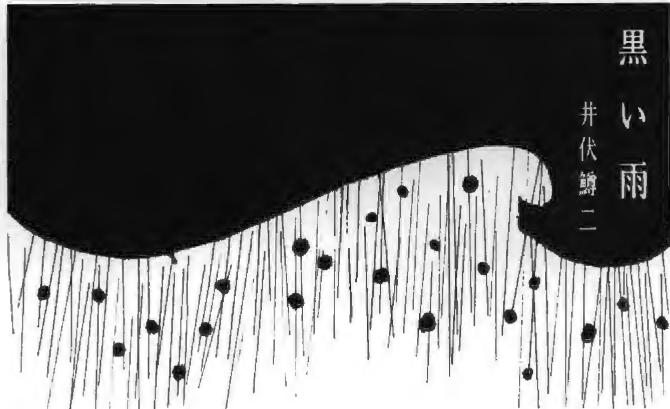  
Cover design for "Black Rain."

are sure to try to celebrate Hiroshima in the most direct form, and one of the most interesting harbingers of that flock is Masuji Ibuse, a well-known Japanese writer. His book, "Black Rain," is in the form of a diary; the diarist, Shigematsu Shizuma, is a real person, his diary exists, although it must have been expanded and completely recast by Ibuse.

On the way to work in Hiroshima on the morning of August 6, 1945, Shizuma was about to board a train in Yokogawa Station. "At a point three meters to the left of the waiting train, I saw a ball of blindingly intense light, and simultaneously I was plunged into total, unseeing darkness. The next instant, the black veil in which I seemed to be enveloped was pierced by cries and screams of pain, shouts of 'Get off!' and 'Let me by!', curses, and other voices in indescribable confusion. The passengers came pouring out of the car. I was squeezed off the deck and flung onto the tracks on the opposite side from the platform, landing on something soft that seemed to be a woman's body. Another body landed heavily on top of me in turn. More bodies were piled up on either side of me. A cry of pain and rage escaped me, to be echoed in my ear by a similar cry, in a heavy local accent, from a man whose head was jammed against mine. With cries and groans rising all about me, I shook myself free of those lying on me and struggled to my feet. I pushed out with all my strength, thrusting others out of the way, until eventually I found myself being buffeted from behind against something hard. Recognizing it as the edge of the platform, I elbowed people out of the way and clambered up onto it." This is the private view of a moment in history. A description of just what happened in Hiroshima on that morning follows. Refugees by the thousands stream out of the city, not

knowing where to go, or what happened. Others traverse ground zero going from one point in the city to another in search of their families, their homes, their children. The disaster is unimaginable. Human beings are mutilated in unprecedented ways; mostly by the heat flash which causes deep painless burns on unprotected areas of flesh. Quickly these begin to ooze. Hands reach up to find the cause of discomfort, they come away slimy. How could it be so bad, if there is no pain? They look at others to comprehend the horror of themselves.

Still the question remains, what happened? Theories abound; the most popular is that some infinitely poisonous gas has been dropped accompanied by many bombs. But how is it possible from one B-29? And what about the cloud? "... really shaped more like a jellyfish than a mushroom. Yet it seemed to have a more animal vitality than any jellyfish, with its leg that quivered and its head that changed color as it sprawled out slowly toward the southeast, writhing and raging as though it might hurl itself on our heads at any moment. It was an envoy of the devil himself . . . who else in the whole wide universe would have presumed to summon forth such a monstrosity?" This is one of Shizuma's rare outcries.

Really, the fire was the worst. Blast and heat flash were confined to the center, but the fire storms swept the entire city. Many were trapped in the fires, most of the houses destroyed. Each house, each family, every individual has a story to tell of that day. For example: A father is trying to free his son who is alive, but pinned by a collapsed building. As the father works, frantically straining at the heavy beams, the fire approaches, threatening to engulf both of them momentarily. The ruined house blazes up, the father looks at his son, turns, and runs away. There is a crack and a rumble, the timbers in the house shift, the son is freed, he jumps up and runs in the opposite direction. Not all tragedies end in death.

Shizuma goes in and out of the city for several days after the bomb was dropped. Horror follows horror in his diary, until there is no pity left. Numbness sets in. The reader begins to feel that the destroyed city is, after all, a normal occurrence; that violent death, radiation sickness, wandering orphans, are simply man's natural lot. Ibuse is trying to evoke in his audience the same abrasion of the senses that must have developed in the survivors of Hiroshima. There is no anger. Shizuma, his friends, or his family don't seem to hate anyone. They don't rail at the Americans for dropping the bomb,

they show no resentment of the Japanese rulers for having led their people to this fate. Many are not even curious to discover exactly what caused that blinding flash. At worst they seem perplexed that anyone would go to such extremes, that anyone would want to harm people to such an extent in order to secure victory.

The diary ends on August 15, with the surrender of Japan. This news is more profoundly shocking to the Japanese than the bomb, but they accept it too, fully expecting that the American occupation will bring a greater disaster to Japan than anything that preceded it.

Shizuma survives, he has told his story, he draws no moral from it, he exercises no judgment. He survives, his wife survives, and his niece who has radiation sickness because she was caught in the fallout, the muddy black rain, survives and may even get married. In Hiroshima, at least, all life was not extinguished.

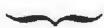

It is doubly disconcerting to follow a book like "Black Rain" with "The Game of Science." Certainly no one, since Hiroshima, has thought of science as an innocent game, "simply and purely a search for knowledge," as the authors say. With a large measure of callousness one might call war a game. Trading in stocks and bonds or running large corporations may be a game. Dealing in art objects, the popular entertainments, even politics may be likened to a game. But the results of science are terribly serious and permanent; they have the power to change man's view of himself, his world, and his place in it. The question is not how the game of science is played: what are the amusing rules, who the inveterate players, who the champions, who the villains; the problem is how mankind can absorb new information, and profit by it without doing harm to itself. To call science a game, to reduce it to its elements which indeed bear some resemblance to play, is to deny its surpassing contributions to man's intellectual and material progress and to shun the responsibility for the awesome perils that can be brought about by scientific work. Games have a beginning and an end; science is forever.

Right now we need books, as we never have before, to explain what science is all about, to convey to the non-scientist the methods of science, the relationship between applied and basic research, the difficulties involved in finding anything new, and the

rewards that come with understanding science, quite apart from participating in it. It is probably correct to say that discovery in any branch of science enriches every scientist. With the aid of popular books like this it ought to enrich all men as well. It is here that McCain and Segal really fail.

The authors describe what science is, how it is done, and who does it. They have a gift for writing, the book never flags, the tempo is sustained at the pitch of excited expostulation. It is what they have to say that is boring.

To explain the structure of science the hierarchy is set up once again with basic research at the pinnacle. Again the whole body of science is revealed to contain only the noblest human motivations, to be pure even beyond the fantasies of a detergent copy writer. Is this a realistic fact to present to the lay reader? Ought not one try for a balance: science has done marvelously well for us; it has also created great troubles. But fortunately science can find a way to fix many problems, if it is given the job. Is this not preferable to McCain and Segal's attitude that science is a great blessing and that the evils associated with it are somebody else's baby?

In many cases the book is just plain wrong, as for instance, "The level of abstraction varies greatly... with the scientists' theories often far removed from ordinary sense data, whereas the practitioner deals with the here-and-now." And why is it that every explanation of inductive reasoning eventually rests on the sun rising tomorrow? This is far from a universal phenomenon, and it would clearly surprise an Eskimo to learn that induction, so fundamental to scientific thought, rests on the belief that the sun will rise tomorrow. Think up something original, can't you, McCain and Segal?

The book has its merits. Both authors are psychologists, a fact carefully concealed in the text, and when they leave science and turn to the scientists themselves, things pick up. Here the reader unfamiliar with the scientists is likely to come away with a pretty clear picture. Unlike science, the scientists are not lily white. They are motivated by the same sort of feelings that are common to us all. They are believable human beings, and the only general requirement set out is that they have an IQ greater than 120, and at least a tolerance for mathematics. While in his private life, a scientist can be "an alcoholic, a braggart, a lecher, a thief—or even a member of a civic club, and still be forgiven; but one instance of his deliberately falsifying data brings eternal condemnation by his peers." This is quite

true, and must sound odd to a used-car salesman. There is also a gossipy section which classifies scientists into "players," "operators," and "by-standers" and gives some characteristics of each subspecies.

McCain and Segal talk at length about the training of a scientist, about his formal as well as his informal education. They advocate a broad, unspecialized curriculum for the aspiring candidate. "The plea is for a liberal education at the undergraduate level - attuned to the broad reaches of current knowledge and thought." And specialization is not only in science: "... in a typical business-administration program the student gets approximately twice as many specialized hours as does a physics major. Perhaps business is more complex than physics; or perhaps the object of a business school is to produce the equivalent of a trained seal. Among their other excellent qualities trained seals perform on command, present a uniform, neat appearance, and slide smoothly through the water, creating no waves."

Now here is a statement that is sure to gladden the heart of a physicist or a seal with aspirations businesswise. It may even attract an unsuspecting youth to a career in physics, where he will soon find out that his education is very specialized and that he will be attuned to the broad reaches of current knowledge only at the price of great personal commitment.

McCain and Segal display an astonishing breadth of interest in the closing sections of the book. Chapters are entitled "Science in the World," "Ethics, Free Will and the Scientific Study of Man" (14 pages for all this), and there is even a section describing how a scientist should write a research proposal to the funding agencies. This is all pretty shallow stuff. The impression one gets is that the authors have emptied their heads of all material about science or in any way related to it, and strewn it, like the results of a weekly shopping trip to the A & P, on the kitchen table. Santayana described it: to "spread a feast of what everybody knows."

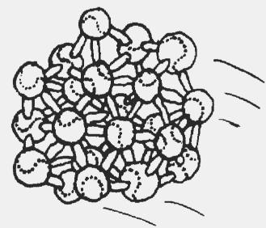

Jacket design on "Game of Science."

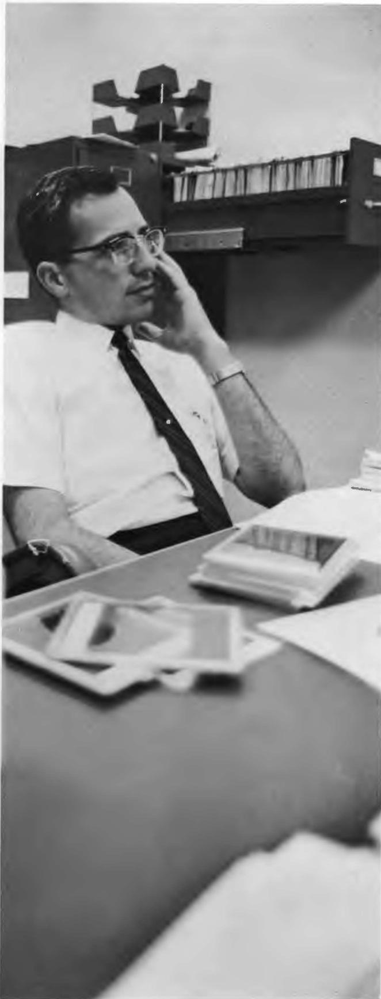

Herb McCoy first worked at ORNL as an undergraduate coop student out of Virginia Polytech in 1953. In 1955 he married Ann Thompson, a Laboratory Personnel Division employee, and transferred to UT, where he received his M.S. in metallurgy in 1958, the year he joined the ORNL staff. His work at the Laboratory has been with Aircraft Nuclear Propulsion, the Gas-Cooled Reactor, and currently the Molten Salt Reactor Experiment. McCoy heads up a group that is engaged in fundamental studies on the mechanical properties of metals in the Metals & Ceramics Division. The story he tells here of the development of the particular alloy that would stand up under the exacting demands peculiar to the MSR is one of innovation and ingenuity.

# The INOR-8 Story

By H. E. McCoy

THE PHYSICISTS' NOTEBOOKS are filled with attractive reactors that probably will never be built because of inherent materials problems. The factors usually involved are excessively high operating temperatures and corrosiveness of the fluids involved. Other reactors have been constructed without full consideration of the component materials, and their operation has been plagued with problems. The Molten Salt Reactor Experiment at ORNL might well have been one of these problem cases, had not the talents of several individuals and the facilities of the Laboratory and several commercial metal producers been applied to developing a structural material for the metallic parts of the reactor.

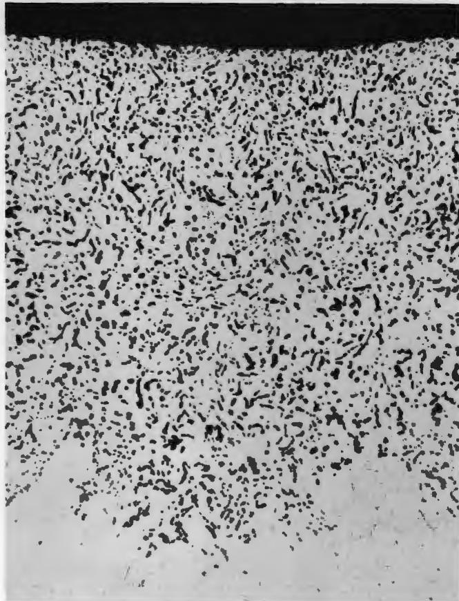  
Figure 1. Photomicrograph of a sample of INCONEL 600 $(20\% \mathrm{Ni} - 15\% \mathrm{Cr} - 5\% \mathrm{Fe})$ after exposure to fluoride salt in a pumped loop for 15,000 hours at $1300^{\circ}\mathrm{F}$ . Voids near the surface are formed as chromium is removed selectively by the salt.

This material had to be chemically compatible with molten fluoride salts and capable of being fabricated into complicated shapes such as characterize the containment vessel, piping, and the heat exchangers.

Such a material was developed; it was called INOR-8 at the Laboratory, but commercially it is known as Hastelloy N and Allvac N. This alloy has performed admirably in the MSRE, but the prospects of molten salt power reactors with plant lives of 30 years means that we must develop a modification of this alloy that is more resistant to embrittlement by long-term neutron irradiation. Let us look briefly at the development of INOR-8 and then analyze the progress toward developing an improved modification of this alloy for future molten salt power reactors.

During the 1950's when the United States was attempting to develop a nuclear-powered aircraft, one of the concepts considered was a reactor fueled with $\mathrm{UF_4}$ contained in a mixture of other fluoride salts. A relatively complicated reactor called the Aircraft Reactor Experiment (ARE) was constructed and operated to demonstrate this concept. The fuel, a mixture of NaF, $\mathrm{ZrF_4}$ , and $\mathrm{UF_4}$ , was pumped through

small Inconel 600 tubes at temperatures up to $1620^{\circ}\mathrm{F}$ . Inconel 600 is a nickel alloy containing chromium and iron. The tubes were surrounded by blocks of beryllium oxide that served as moderator and reflector. The reactor achieved criticality in November 1954 and operated 221 hours before being dismantled for examination.

The ensuing period between the successful operation of the ARE in 1954 and criticality of the MSRE in June 1965 saw a change from thinking of molten salt reactors in terms of military applications to the concept of their use as civilian power plants. The work on molten salt chemistry and materials development that took place during this period resulted in a vastly simpler core design than that of ARE.

Much of the complication of the ARE core came from the fact that the Inconel 600 tubes were necessary to separate the molten salt from the beryllium oxide moderator-reflector, which was not compatible with the salt. Graphite is also a good moderator, and the discovery that graphite and salt are compatible allowed the core to become a block of graphite with small holes for fuel passages. Assuming that the graphite is available, the big materials question becomes, What material can be used for the containment vessel and the other metallic parts of the system?

And this is where INOR-8 was used.

# Requirements of a Structural Material

One of the questions that we usually ask in choosing a material is whether it will corrode. This question applies equally well to many objects that we touch each day as well as to nuclear reactors. Rusted tin cans, pitted automobile trim, and tarnished silverware all represent various types of corrosion. The severity of corrosion can vary from the very thin oxide film that gives the penny its tarnished appearance to the complete dissolution that we observe when a penny is dropped in nitric acid. The former type of corrosion is ignored; the latter type is intolerable.

Table 1. Relative thermodynamic stabilities of fluoride compounds.   

<table><tr><td>Element</td><td>Most Stable
Fluoride
Compound</td><td>Stability*</td></tr><tr><td>chromium</td><td>CrF2</td><td>72</td></tr><tr><td>iron</td><td>FeF2</td><td>66</td></tr><tr><td>nickel</td><td>NiF2</td><td>59</td></tr><tr><td>molybdenum</td><td>MoF2</td><td>57</td></tr><tr><td>Lithium</td><td>LiF</td><td>120</td></tr><tr><td>sodium</td><td>NaF</td><td>110</td></tr><tr><td>potassium</td><td>KF</td><td>108</td></tr><tr><td>beryllium</td><td>BeF2</td><td>103</td></tr><tr><td>zirconium</td><td>ZrF4</td><td>92</td></tr><tr><td>boron</td><td>BF3</td><td>86</td></tr><tr><td>uranium</td><td>UF4</td><td>92</td></tr><tr><td rowspan="2">thorium</td><td>UF3</td><td>93</td></tr><tr><td>ThF4</td><td>99</td></tr></table>

Fluorine is very reactive with metals, so many jump to the conclusion that the fluoride salts are equally reactive. The free energy of formation is commonly used to measure the stability of a compound; a compound is stable if the free energy is negative and the stability is greater the more negative the free energy. Table 1 shows the relative stabilities of several fluorides of interest, including the potential fuel salt constituents as well as the structural metals under consideration.

Since the fuel compounds are more stable than the structural materials, the salts and the metals should be satisfied with their respective roles and the corrosion rate should be low. However, the relative ranking of the metals indicates that nickel and molybdenum are least likely to form fluorides and that chromium is most likely. Thus, a reasonable container material for these salts would be a nickel or molybdenum base alloy with minimum quantities of chromium and iron. The question arises, Why not use pure molybdenum or nickel? Pure molybdenum is difficult to fabricate and is quickly relegated to the role of alloying addition to nickel to give strength. Pure nickel is quite weak at high temperatures and acutely sensitive to impurities such as sulphur and phosphorus and would not be suitable for use in an engineering system. Both

nickel and molybdenum oxidize rapidly at high temperatures and would have to be protected from exposure to air; alloying with chromium is normally used to alleviate this problem in nickel base alloys. We have already mentioned the Inconel 600 that was used in the ARE. However, this alloy corroded to depths of 10 mils in 1,000 hours when exposed to circulating salt at a maximum temperature of $1500^{\circ}\mathrm{F}$ and would not be suitable for a long-term application. The nature of the attack is shown in Figure 1.

The list of available commercial alloys was searched further. Two, Hastelloys B and W, satisfied the corrosion requirements, but "aged," i.e. became very brittle, after being heated for long periods of time.

# Development of INOR-8

This completed the screening tests on the available commercial alloys and all attention was turned toward developing a new alloy in late 1956. The application was still the ANP program where the service temperature was $1500^{\circ}\mathrm{F}$ . The requirements for this alloy were 1) good corrosion resistance to fluoride salts, 2) good oxidation resistance, 3) moderate strength and ductility at high temperatures,

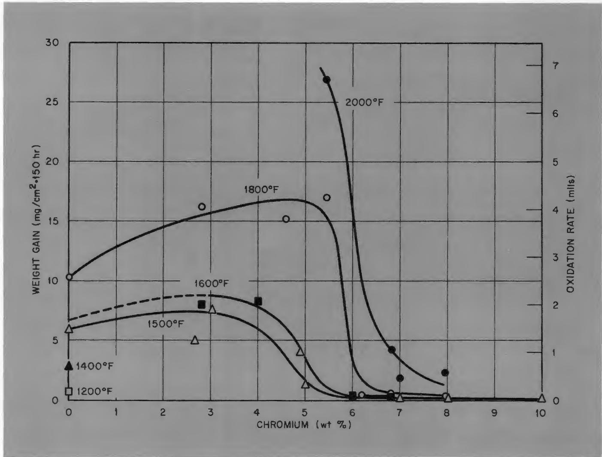  
Figure 2. Variation of the rate of oxidation of an $80\% \mathrm{Ni}-20\% \mathrm{Mo}$ alloy with chromium content. Note the very sharp decrease in rate at chromium levels of 5 to $7\%$ .

4) stable properties at the service temperature, 5) ability to be melted and fabricated into complex shapes, and 6) ability to be joined by welding and brazing. As you may have already gathered, such a program involved several experimental disciplines. We have already mentioned corrosion, mechanical properties, fabrication, joining and physical metallurgy. Fabrication in this case involved shaping 5-ton ingots into useful items like plate, pipes, rods and sheets, using such techniques as forging, rolling, swaging, extrusion, and drawing. Physical metallurgy is a term that covers about everything that is not included in the other terms, but its principal aspect here was a study of the stability of the various alloys by aging at temperatures of $1200^{\circ}\mathrm{F}$ to $1500^{\circ}\mathrm{F}$ .

This program was directed by W. D. Manly of Union Carbide; ORNL's H. Inouye served as the program's technical conscience in addition to being involved in much of the experimental work.

The facts accumulated at this point indicated that the alloy base should be nickel, with molybdenum (less than $20\%$ for strengthening, and some chromium for oxidation resistance (less than the $15\%$ in Inconel 600). The melting practice used at that time introduced small amounts of manganese, silicon, boron, oxygen, nitrogen, and some iron since some of the chromium was charged as ferrochrome. The metals used for melting stock also contain small amounts of sulphur, phosphorus, carbon, and myriad other impurities since scrap from previous melts is quite often used. And so a commercial melt

becomes a multicomponent system, and the so-called scale-up from small laboratory to large commercial melts is an important and unforeseeable experience.

The largest portion of the development program spanned the years of 1956 to 1958. Small melts up to 100 lb could be made at ORNL and larger ones of 5,000 to 10,000 lb were made by Battelle Memorial Institute, International Nickel Company, Westinghouse, and Haynes Stellite. The small ingots were used as a screening step and larger melts were made of only the compositions that appeared attractive. (The screening step was taken because these alloys cost about $6 per lb.) The large batches of metal, or "heats," were fabricated by the vendors with ORNL personnel on site in most cases. The fabrication data derived from this were extremely valuable to both parties involved, since this was an unknown alloy, of which a 10,000-lb mass had to be gotten to a useful shape. Fabrication was in the form of tubing for corrosion studies, sheet for mechanical property measurements, and thick plate for joining studies. The New England Testing Laboratory near Boston assisted in the mechanical property studies, and welding assistance was available from Rensselaer Polytech.

Hundreds of small melts were made by metallurgists at ORNL and large melts were made by the vendors of the alloys shown in Table 2. All of these alloys fabricated well except INOR-4. This alloy contained $1.5\%$ titanium and $2\%$ aluminum. These elements in this concentration form a very brittle intermetallic compound with nickel called "gamma prime." It forms the basic hardener in a series of nickel base alloys developed in recent years. Such alloys require special fabrication procedures not practicable for our purposes.

My casual mention that most of the alloys fabricated well does not pay adequate tribute to the team (Inouye, T. K. Roche, D. E. Rosson and G. Golston) who worked many hours at ORNL and in the fabrication shops of the vendors. At this time most of the tubing available was made by forming flat strips into a cylindrical shape and welding the contacting pieces together. This was called "welded tubing" and had a terrible reputation for being badly flawed. What we really wanted was a seamless tubing. The normal procedure for getting this is to deform an ingot some by forging (hammering), extrude this forged piece to obtain a tube shell (a crude pipe with a thick wall), and draw, i.e., stretch, this tube to obtain high quality, thinwalled tubing. The extrusion step was the difficult part. Extrusion

involves simply pushing the metal through a die to obtain a particular shape. This is what you do to tooth paste, but metals take a good deal more push. To minimize the energy required, the metal is usually heated nearly to melting point, transferred quickly to the extrusion press, and shoved through the die in a matter of a few seconds. This procedure, however, consistently gave scrap instead of a tube shell. One of the team, in a moment of inspiration, reasoned that the energy of extrusion alone could be enough to heat it up and might even exceed the melting point. The solution? Slow down the rate of extrusion. We ended up with good tube shells that were later drawn into miles of tubing by Superior Tubing Company.

The corrosion experiments on these alloys showed that the corrosion susceptibility increased in this order: iron, niobium, uranium, chromium, tungsten, and aluminum. It is very close to that predicted by the relative stabilities of the fluorides, i.e., aluminum would like to be a fluoride more than any of the elements listed and will be attached preferentially by a fluoride salt. Tungsten is the only element that fell appreciably out of place. The corrosion rates of alloys containing only nickel, molybdenum, iron and chromium were found to be quite acceptable. Jack Devan and Bob Evans showed by two very good tracer experiments that the corrosion rate of such alloys in a fluoride salt containing UF, was controlled by the diffusion rate of chromium in the metal. The corrosion reaction involved chromium in the alloy reacting with UF, in the salt to produce UF3 and CrF2, both of which are soluble in the salt. This reaction can be written:

$$
\begin{array}{l} \operatorname {C r} (\text {d i s s o l v e d i n} + \operatorname {U F} _ {4} = \operatorname {C r F} _ {2} (\text {d i s s o l v e d} + \operatorname {U F} _ {3} \\ \text {t h e m e t a l)} \quad \text {i n s a l t}) \end{array}
$$

Composition, % by weight (Base: Ni)   
Table 2. Several promising nickel base alloys melted in the course of developing INOR-8.   

<table><tr><td>Alloy</td><td>Mo</td><td>Cr</td><td>Fe</td><td>Ti</td><td>Al</td><td>Nb</td><td>W</td></tr><tr><td>INOR-1</td><td>20</td><td></td><td></td><td></td><td></td><td></td><td></td></tr><tr><td>INOR-2</td><td>16</td><td>5</td><td></td><td></td><td></td><td></td><td></td></tr><tr><td>INOR-3</td><td>16</td><td></td><td></td><td>1.5</td><td>1</td><td></td><td></td></tr><tr><td>INOR-4</td><td>16</td><td></td><td></td><td>1.5</td><td>2</td><td></td><td></td></tr><tr><td>INOR-5</td><td>15</td><td></td><td></td><td></td><td></td><td>2</td><td>2</td></tr><tr><td>INOR-6</td><td>16</td><td>5</td><td></td><td>1.5</td><td>1</td><td></td><td></td></tr><tr><td>INOR-7</td><td>16</td><td>6</td><td></td><td></td><td>1</td><td>1</td><td></td></tr><tr><td>INOR-8</td><td>16</td><td>6</td><td>5</td><td></td><td></td><td></td><td></td></tr><tr><td>INOR-9</td><td>17</td><td></td><td>5</td><td></td><td></td><td>3</td><td></td></tr></table>

Content, % by weight*

Table 3. Chemical composition of INOR-8.   

<table><tr><td>Element</td><td>Standard Alloy</td><td>Modified Alloy</td></tr><tr><td>nickel</td><td>Base</td><td>Base</td></tr><tr><td>molybdenum</td><td>15 to 18</td><td>11 to 13</td></tr><tr><td>chromium</td><td>6 to 8</td><td>6 to 8</td></tr><tr><td>iron</td><td>5</td><td>.1**</td></tr><tr><td>manganese</td><td>1</td><td>.15 to .25**</td></tr><tr><td>silicon</td><td>1</td><td>.1</td></tr><tr><td>phosphorus</td><td>.015</td><td>.01</td></tr><tr><td>sulphur</td><td>.020</td><td>.01</td></tr><tr><td>boron</td><td>.01</td><td>.001</td></tr><tr><td>titanium &amp; hafnium</td><td>----</td><td>about 1% of each</td></tr><tr><td>niobium</td><td>----</td><td>1 to 2</td></tr></table>

*Single values are maximum amounts allowed. The actual concentrations of these elements in an alloy can be much lower.   
**These elements are not felt to be very important. Alloys are now being purchased with the smaller concentration specified, but the specification may be changed in the future to allow a higher concentration.

The reaction is temperature-dependent and the net effect is that chromium is removed from the hotter parts of the system and deposited in the cooler parts. Thus, the chromium level should be as low as possible to obtain the lowest corrosion rate in fluoride salts.

However, Inouye's studies of oxidation in air revealed a need for chromium. As Figure 2 shows, the oxidation rate decreased markedly as the chromium level was increased. In fact, as much as $6\%$ chromium was required to obtain an oxide that was adherent and kept the metal from oxidizing too rapidly. And the need for $6\%$ chromium was corroborated by the observation that of the alloys shown in Table 2 only INOR-7 and INOR-8 had acceptable oxidation resistance at $1500^{\circ}\mathrm{F}$ .

All of the alloys had adequate strength, because of the 15 to $20\%$ molybdenum present. Titanium and aluminum increased the strength even further, but the gains in strength were not worth the fabrication problems mentioned earlier. The precise levels of chromium and iron did not affect the strength appreciably.

All of these alloys could be welded by the tungsten electrode with inert cover gas (TIG) process as long as the boron, sulphur and phosphorus levels were each below $0.01\%$ . These are impurity ele

ments and they can be kept at this level with reasonable care.

All of these factors led ultimately to the alloy composition specified in Table 3. The final composition is nearest to that of the experimental alloy INOR-8, which is how the alloy has always been known at ORNL. A patent application was filed on March 3, 1958 and patent No. 2,921,850 was issued on January 19, 1960 to H. Inouye, W. D. Manly, and T. K. Roche.

# Molten Salt Reactors for Civilian Power

The ANP program was discontinued in 1960 and the mission of the program was shifted to civilian power reactors and became known as the Molten Salt Reactor Program. A demonstration reactor was needed and construction on the Molten Salt Reactor Experiment (MSRE) began in 1961.

Very little additional development was done. Long-term corrosion experiments were conducted and the mechanical properties were measured on several heats procured for the MSRE to insure that the properties were equivalent to those measured for the development heats of INOR-8. One problem

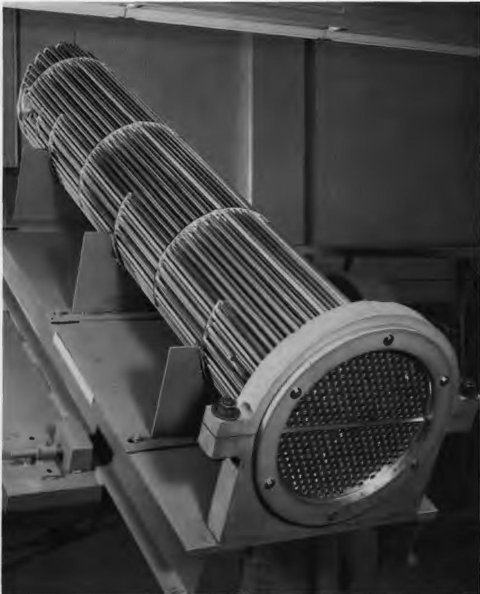  
Figure 3. Completed tube bundle for the MSRE primary heat exchanger. The bundle consists of 163 half-inch OD tubes of INOR-8 joined to a $1\frac{1}{2}$ thick header.

worthy of mention developed in the form of cracks that occurred during welding. The cause of this was never determined, but as a consequence the heats of INOR-8 for the MSRE were purchased from Haynes Stellar (now Materials System Division of Union Carbide) on the specified condition that their weldability be first demonstrated by the vendor. The actual number of heats rejected as a result of this clause is not known, but we got the general impression that the markedly improved quality resulted from some revisions in the melting practice.

The fabrication of the metal components of the MSRE proceeded without major incident and the reactor went critical on June 1, 1965. The heat exchanger shown in Figure 3 gives an idea of the complexity of the structure. In all, some 100,000 lbs of INOR-8 went into fabricating the system. The performance of the MSRE has been extremely satis

fying to all concerned and the role of INOR-8 in this success story is a vital one. We have removed several pieces of INOR-8 for examination and have not been able to detect any corrosion. In spite of this, however, the salt in the MSRE continues to pick up chromium from the metal, and the amount after about 30,000 hours at $1200^{\circ}\mathrm{F}$ is equivalent to removing the chromium from a surface to a depth of about 0.7 mil (a human hair is one to three mils thick).

# Need for Improvement

Since the MSRE was fabricated, we have found that INOR-8, like most iron and nickel base alloys, is embrittled by neutron irradiation. Metallurgists and solid state physicists have known for many

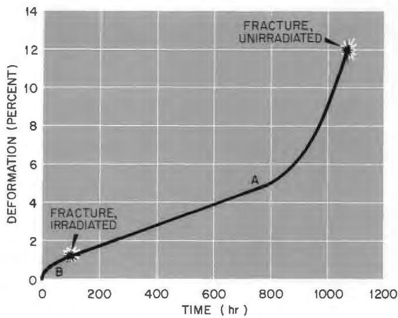  
Figure 4. Results of creep tests on irradiated (curve B) and unirradiated (curve A) samples of INOR-8. The samples were stressed to 30,000 psi at $1200^{\circ}\mathrm{F}$ .

years that metals are hardened when they are irradiated at relatively low temperatures. This hardening is referred to as "displacement damage," since it is caused by atoms being displaced from their normal positions by neutrons. These displaced atoms interfere with the normal mechanisms of deformation and make the metals stronger. If the neutron irradiation occurs at higher temperatures, thermal motion enables the displaced atoms to return to their normal positions and no hardening is observed. This self-annealing temperature is about $1000^{\circ}\mathrm{F}$ for alloys such as INOR-8 and the general conclusion until about 1966 was that these materials could be used in a neutron environment at higher temperatures without significant change in properties.

However, more recent work has shown that this assumption was wrong and that the ductility of alloys such as INOR-8 at $1200^{\circ}\mathrm{F}$ is reduced drastically by neutron irradiation. This embrittlement has been attributed to the helium that is produced by the transmutation of boron-10. A thermal neutron reaction, it can be written:

$$
{ } ^ { 1 0 } \mathbf { B } + \mathbf { n } \rightarrow { } ^ { 4 } \mathbf { H e } + { } ^ { 7 } \mathbf { L i }
$$

Cyclotron injection experiments have shown that the damage is due to the helium rather than the lithium. Boron is present in these alloys as an impurity that comes primarily from the refractories used during melting $(^{10}\mathrm{B}$ constitutes only $18.2\%$ of natural boron). The cross section for this transmutation is quite high and all of the $^{10}\mathrm{B}$ will be transmuted to helium in a molten salt reactor after a neutron fluence of about $1\times 10^{21}$ neutrons/cm².

The exact mechanism by which helium embrittles these alloys is not understood, but ease of crack

propagation seems to be the most dramatic effect. This is best measured in the response of a metal sample to a sustained load in the irradiated and unirradiated conditions. Such tests are normally referred to as "creep tests," and simulate the type of loading experienced by a reactor vessel under steady-state operation. The load (force) or stress (force per unit area) is applied and the resulting deformation is observed. This deformation or creep will cause small cracks to form in the metal that eventually link together until the sample fractures. A well-behaved engineering material such as INOR-8 will respond as shown in curve A in Figure 4. When this same material is stressed while being irradiated, curve B is obtained. A lot of metallurgy is tied up in the shape of these curves, but the important fact for our analysis is that the curves are identical for the irradiated and unirradiated samples for the first 100 hours, or up to where the irradiated sample fractured. Thus, the processes that cause the stressed metal to deform (creep) are not influenced by irradiation, but the irradiated sample fractures in a shorter time owing to the easier propagation of cracks. This is illustrated further by the photomicrographs shown in Figure 5.

Tests were run to determine quantitatively the effects of this embrittlement on the materials used in the MSRE structure. These tests showed that the fracture ductility was reduced as the quantity of helium in the metal was increased by going to higher thermal neutron fluences. Another important observation was that the fracture ductility depended heavily upon how fast the metal was deformed. The lowest fracture ductilities occur at a deformation rate of about $0.1\%$ per hour. Such high deformation rates would not be encountered normally in a reactor system but may occur during transients involving rapid change in temperature and pressure. The ductility then improves slightly as the deformation rate is reduced further to a more realistic rate of $0.001\%$ per hour. (The MSRE was designed to deform at a rate no higher than $0.00001\%$ per hour.)

The properties of INOR-8 are adequate for the MSRE where the anticipated thermal neutron fluence is less than $5 \times 10^{19}$ neutrons/cm². However, the design lifetime of a power reactor such as the Molten Salt Breeder (MSBR) is 30 years and the fluence on the vessel will be at least $1 \times 10^{21}$ neu

trons/cm². The need for an alloy with better resistance to embrittlement, therefore, is evident.

# Reduce the Boron Content?

You might think the obvious solution to a problem that results from the presence of boron would be to get rid of the boron. And although at low deformation rates the fracture ductility is reduced from 30 to $3\%$ by the presence of only 1 ppm helium, we pursued this avenue for a short time. The main source of boron is from the refractories (ceramic vessels) used in melting the alloys. The regular melting practice used in making the metal for the MSRE produced material with 20 to 50 ppm boron. By employing vacuum melting practice and using very pure components the content was reduced to 1 to 2 ppm, probably the lowest attainable by commercial vendors. We have even made small laboratory melts containing .02 ppm boron, but we found that even these alloys were very brittle after irradiation. Thus we have been forced to conclude

that the levels of helium required to embrittle this alloy are so low that reducing the boron level will not offer much improvement.

# Modification of the Chemical Composition

A closer look at the mechanism of embrittlement by helium reveals several other important characteristics. Metals are made up of grains, or small crystals. At low temperatures they usually fracture across the grains (intragranular) and at elevated temperatures they fracture along the grain boundaries (intergranular). Helium is embrittling to these alloys only in the temperature range where the fracture is intergranular. Since helium is nearly insoluble in metals and moves very slowly, it follows that only the helium that is generated near the grain boundaries can have an effect on the fracture process. Since the range of the transmuted helium atom is only about two microns in iron and nickel, the $^{10}\mathrm{B}$ atoms must be located very near the grain boundaries. With the boron present in parts

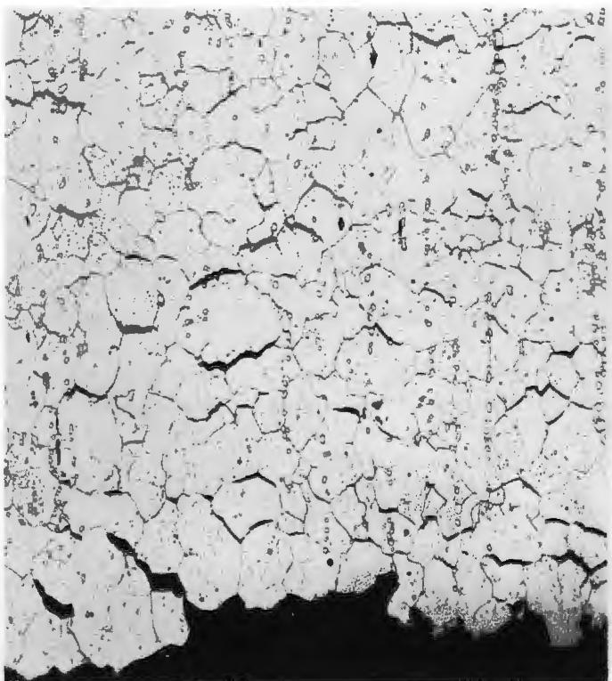  
Figure 5. Photomicrographs of the samples plotted in Figure 4. The irradiated sample on the right shows relatively few cracks that occurred before they linked together to cause fracture, in contrast with the unirradiated sample (left) which deformed $13\%$ before fracturing but showed numerous cracks

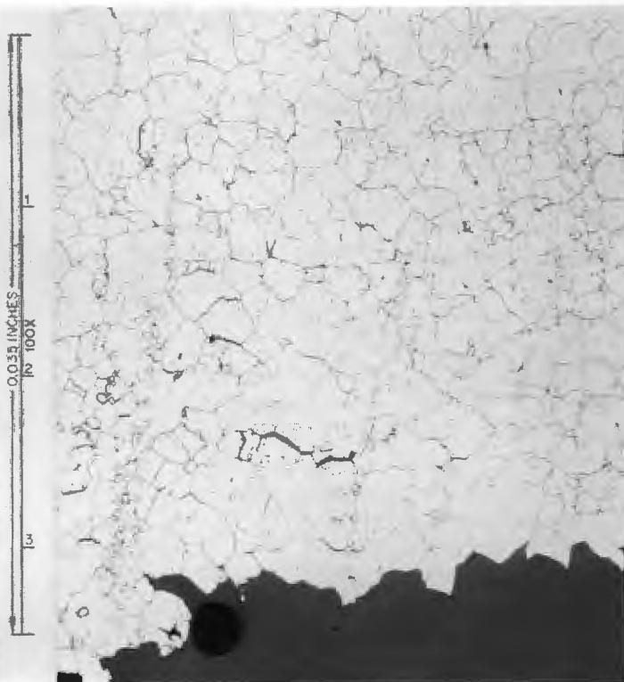

per-million concentrations the shattering effect it has is surprising. However, the boron atom is smaller than that of iron and nickel and is not accommodated easily in the crystal structure. Thus boron gravitates toward the grain boundaries where the arrangement of atoms is interrupted by the intersection of grains of different orientations. Hence, the laws of nature provide a mechanism for concentrating boron in a region where it is most detrimental.

One solution to this problem that seems reasonable is to add an element that will react with the boron to form a stable compound. Ideally, by suitable annealing, the compound could be deposited as fine precipitates located within the grains rather than at the grain boundaries. However, the location of the precipitates along the grain boundaries may be acceptable if the transmuted helium remains associated with the precipitate and does not influence the fracture process. Very fine precipitates along the boundaries can even retard the propagation of cracks and might prove beneficial from this standpoint. Hence, the key item in our thinking was to add small amounts of elements such as titanium, zirconium and hafnium that formed compounds with boron.

One thing to understand here is the extreme importance of the electron optic equipment that has only become available in recent years. An ingenious device, the microprobe analyzer, is capable of determining the chemical composition of an area about two microns in diameter, permitting analysis of both the precipitates and the surrounding areas (matrix). These precipitates can be extracted and collected by a process which involves dissolving away the matrix material. They can then be identified by x-ray diffraction, analyzed by normal wet chemistry techniques, or placed in the electron microscope for electron diffraction and for qualitative analysis by the microprobe attachment for this instrument. The metal can also be corroded with acids until it can be seen through by the electron microscope to determine its structure and the role that the precipitates play in deformation and fracture. Moreover, these same techniques can be applied to irradiated samples since very small amounts of material are involved. This work has been performed by R. E. Gehlback, J. O. Stiegler, R. S. Crouse, and H. V. Mateer and has been the key item in the program to modify INOR-8.

We also examined the other elements in INOR-8 for the purpose of simplifying the alloy as much as

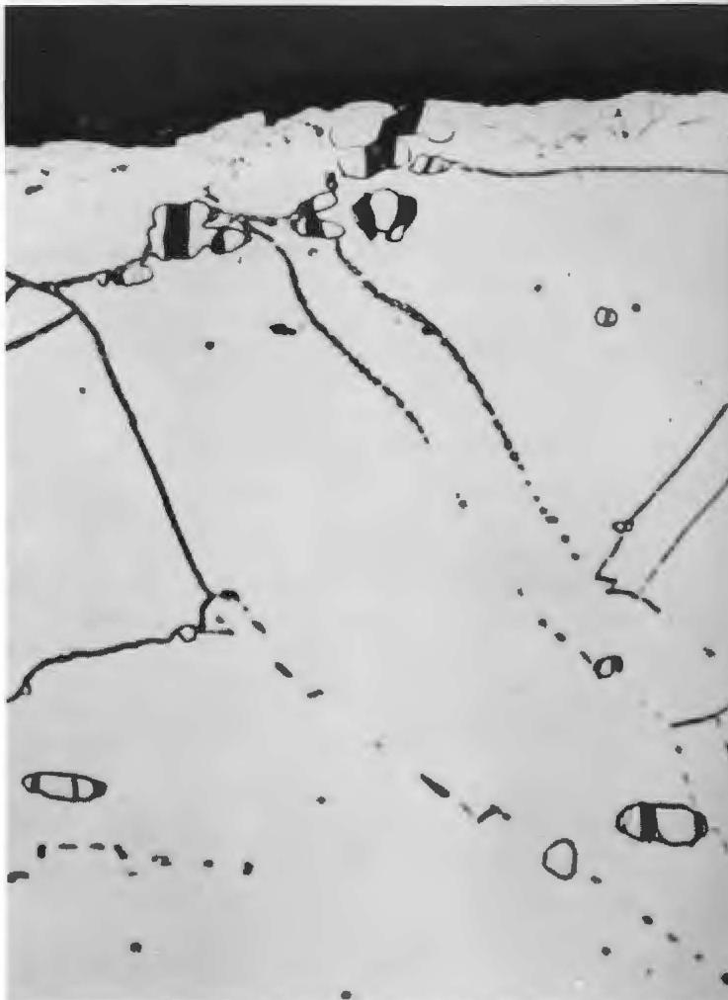

possible. The microstructure shown in Figure 6 is characteristic of the standard Hastelloy N. The large precipitates are carbides of the $\mathbf{M}_6\mathbf{C}$ (six metal atoms to one of carbon) type where M is $50\%$ Mo, $40\%$ Ni, $5\%$ Cr, $1\%$ Fe, and up to $4\%$ Si. These particles are located in "stringers" in the metal, causing the grain size to be much smaller near the stringers. The particles themselves are very brittle, and fracture as the material is deformed. When the material is irradiated and is also relatively brittle these cracks can propagate to cause failure. The particles are too large to improve the strength, so we sought to eliminate these from the microstructure.

Our analysis of the matrix (excluding the precipitates) revealed that only about $12\%$ of the Mo was actually dissolved in the alloy. The bulk of it went to form the massive $\mathbf{M}_6\mathbf{C}$ carbides. We made several small melts with varying Mo content and found that alloys with $10\%$ and $12\%$ Mo were free of the massive precipitates and those with $14\%$ and greater

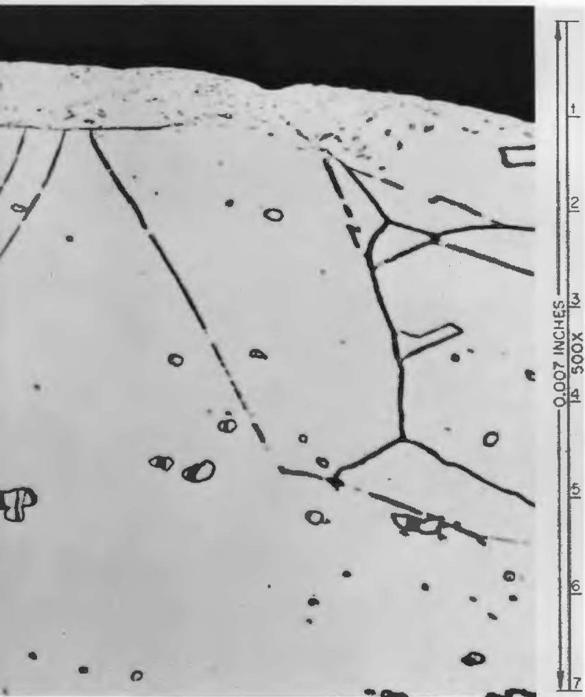  
Figure 6. Polished cross section of a sample of INOR-8 deformed at $1200^{\circ}\mathbf{F}$ . The large carbide particles have fractured, and near the upper edge the fractures have resulted in a crack propagating to the surface.

Mo concentrations contained the precipitates. The strength penalty for decreasing the Mo content from $16\%$ to $12\%$ was modest enough and we decided to make this change in the alloy composition.

As mentioned previously the amount of chromium in the alloy was a compromise between resistance to oxidation and to salt corrosion. Hence, we did not alter the concentration of this element. The addition of chromium as ferrochrome also adds about $4\%$ iron. We did not think the iron was harmful, but its elimination gave us one less variable.

Because of the very reactive elements (titanium, zirconium and hafnium) that we were adding, we chose to use the vacuum melting practice, in which the molten alloy is not exposed to air. This melting technique has become very common over the past few years and is preferred by most vendors for melting even standard INOR-8. The vacuum melting practice also reduces the amount of so-called "residual" elements introduced such as manganese,

silicon, boron, nitrogen and oxygen. Nickel-base alloys are notorious for being embrittled by small amounts of sulphur, so we retained some manganese in our specification to tie the sulphur up as a stable Mn-S compound. The other residual elements were kept as low as possible.

Recent work by C. E. Sessions has shown that the strength of INOR-8 depends very strongly on the carbon content. As the C is decreased below the normal (0.04% to 0.08%), the strength decreases dramatically; higher concentrations improve the strength gradually. Inouye had observed earlier that they could not fabricate tubing from material containing more than 0.1% C. These factors indicated that we should leave the carbon specification at 0.04% to 0.08%.

Our resulting modified alloy then contained $12\%$ molybdenum, $7\%$ chromium, $0.2\%$ manganese, $0.06\%$ carbon, and small additions of titanium, zirconium or hafnium.

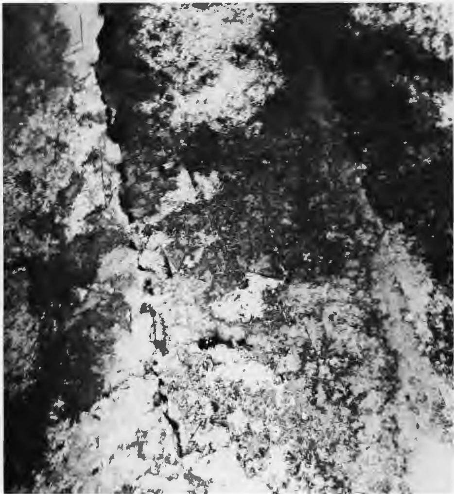  
Figure 7. Transmission electron micrograph of a Ti-modified sample of INOR-8 irradiated at $1175^{\circ}F$ and creep-tested at $1200^{\circ}F$ . The dislocations resulted from the creep test in which the sample deformed $5\%$ before it fractured. The most important feature is the grain boundary lined with small MC-type carbide precipitates. These help to disperse boron and inhibit crack propagation along the boundary.

# Properties of the Modified Alloys

Several small melts were made to investigate the effects of Ti, Zr and Hf on the mechanical properties after irradiation. (The behavior shown in Figure 7 is characteristic of the Ti addition.) These samples were irradiated at $1200^{\circ}\mathrm{F}$ and then tested in the hot cell to determine the strength and ductility after irradiation. Both parameters were improved dramatically as the titanium level exceeded $0.3\%$ to $0.4\%$ . Zirconium and hafnium brought about similar improvements.

We sought to keep the titanium, zirconium and hafnium additions as low as possible for two reasons. First, these elements depress the melting point of nickel-base alloys and can cause cracking in the early stages of a melt or during welding. A second reason is that these elements form brittle compounds with nickel. The exact levels required to achieve undesirable results were not known, so

we started with very low concentrations.

We obtained a few 100-lb ingots from commercial vendors to have some plates for investigating the weldability. We found that the zirconium reduced weldability when only $0.05\%$ was present. We did not investigate these alloys further. Alloys containing up to $1\%$ Ti and $1\%$ Hf had good weldability.

We could not afford to carry parallel development programs on alloys containing titanium and hafnium additions. Titanium is present in several iron and nickel base alloys, so we felt more comfortable with this addition and proceeded further with its development. Our development schedule for the near future included several 100-lb melts to study the effects of variations in titanium and carbon levels and one 5,000-lb melt. (The original development program for INOR-8 involved about 30 melts of this size, but today's austerity does not allow this approach.)

Our initial irradiation tests were carried out at

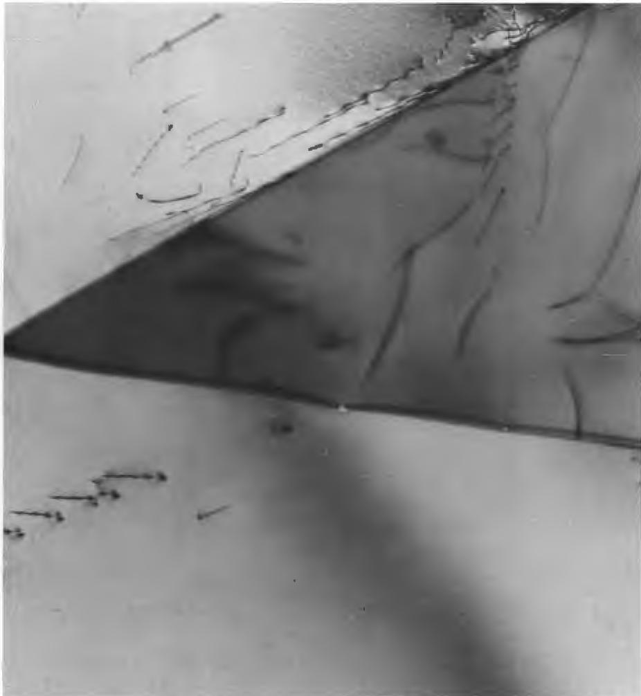  
Figure 8. Another sample of the same composition irradiated at $1300^{\circ}F$ before creep-testing at $1200^{\circ}F$ . This one deformed only $0.4\%$ before it fractured, so fewer dislocations occurred. Much of the grain boundary lengths are free of precipitates and contain occasional helium bubbles. What few precipitates are present are coarse and of the $M_2C$ type.

$1200^{\circ}\mathrm{F}$ , operating temperature of the MSRE. The strength and fracture strain of the titanium-modified alloys were excellent after irradiation, and welding studies showed that they generally had good weldability. The single 5,000-lb melt fabricated well and about $50\%$ was converted into useful products. This large heat had one idiosyncrasy: it cracked when welded with filler metal from the same heat. However, sound welds were made with eight other heats of filler wire and we were not concerned about the basic weldability of the titanium-modified alloys.

All seemed well with our new alloy until, anticipating that molten salt breeder reactors will operate at $1300^{\circ}\mathrm{F}$ , we irradiated some samples at higher temperatures. Much to our dismay, we found that the samples irradiated at $1300^{\circ}\mathrm{F}$ and higher reverted to about the same limitations as the standard alloy.

We examined thin sections of some of the irradiated samples in the electron microscope and found

that the microstructure varied dramatically with irradiation temperature. The microstructure shown in Figure 7 was noted after irradiation at $1175^{\circ}\mathrm{F}$ and creep testing at $1200^{\circ}\mathrm{F}$ . The most important feature is the grain boundary lined with very small particles. If you tried to shear this boundary, you would probably find that it is very strong and that these particles would make crack propagation difficult. These particles were found to be carbides of the MC type where M consists of molybdenum and the modifying elements added such as titanium, niobium, zirconium, or hafnium. A sample of the material irradiated at $1300^{\circ}\mathrm{F}$ and tested at $1200^{\circ}\mathrm{F}$ has the microstructure shown in Figure 8. The grain boundaries in this sample are free of precipitates for large distances and the precipitates present are relatively coarse. Occasional helium bubbles are visible along the grain boundaries. The precipitates in this sample are of the $\mathbf{M}_2\mathbf{C}$ type with M being $90\%$ molybdenum and $10\%$ chromium.

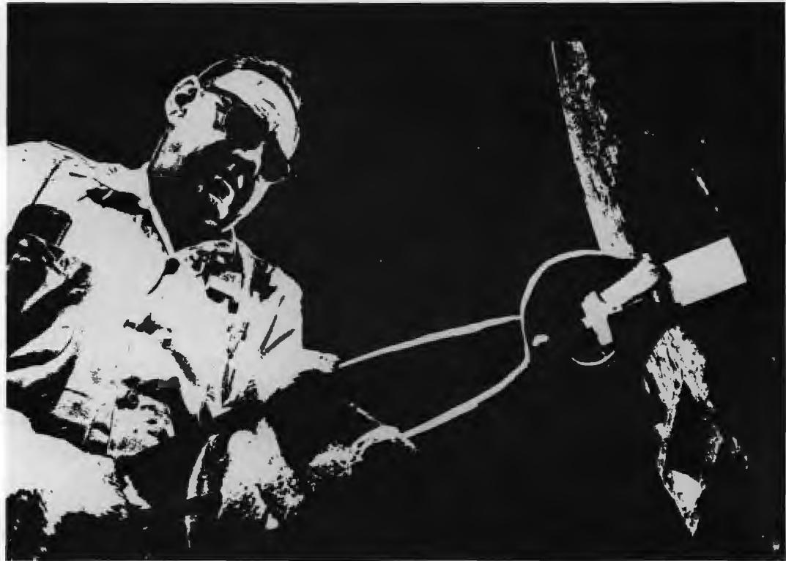  
Hot swaging in ORNL's metals laboratory

Recall that the proposed mechanism of embrittlement of this alloy during irradiation involves the accumulation of helium (from transmuted boron-10) at the grain boundaries. The fine precipitates formed at $1175^{\circ}\mathrm{F}$ would disperse the ${}^{10}\mathrm{B}$ and also provide a boundary that resists crack propagation. Both of these factors probably contribute to the good properties of the alloys containing the fine MC precipitate. The coarse $\mathbf{M}_2\mathbf{C}$ type would not be effective in either regard.

Thus a critical part of our improved alloy seemed to be the fine MC precipitate and we looked at further chemical modifications that would make this carbide stable at higher temperatures. From our own work and from the literature, we compiled a list of those carbides which were favored by various alloying elements of interest. This list (Table 4) only indicates the trend, and the alloys have to be made to determine how much of each element is required to form the desired MC carbide. For ex

Table 4. Carbide formation in Hastelloy N.   

<table><tr><td>Elements</td><td>Type of Carbide Favored</td></tr><tr><td>Ti, Zr, Hf, Nb</td><td>MC</td></tr><tr><td>Cr</td><td>M23C6</td></tr><tr><td rowspan="2">Mo, W</td><td>M6C (high Si present)</td></tr><tr><td>M2C (low Si present)</td></tr></table>

ample, adding titanium favors the formation of the MC type, but we found in an alloy containing $0.5\%$ Ti that MC was formed at $1200^{\circ}\mathrm{F}$ and that $\mathbf{M}_2\mathbf{C}$ was formed after long periods of heating at $1300^{\circ}\mathrm{F}$ . This type of information could only have been gathered by making the experimental alloy.

We have irradiated several alloys containing various concentrations of the elements listed in Table 4. To date alloys having chemical compositions that cause the formation of the MC type precipitate have very good mechanical properties after irradiation. The properties of several of the more attractive alloys and those of standard Hastelloy N are compared in Figure 9. These alloys were all irradiated at $1400^{\circ}\mathrm{F}$ and retained their good properties. The properties of the alloy containing $1\%$ Ti with $1\%$ Hf are very good, and those of the alloy containing $0.5\%$ Ti with $2\%$ Nb are acceptable.

Further work will be required to decide the exact composition of the alloy to be used in future reactors. The information obtained from our small melts will be used to write specifications for several large 5,000-lb melts. These alloys will be tested to determine their strength and ductility after irradiation. Large sections will also be welded to insure that the alloys can be joined. These studies will lead to a final chemical specification that will be used for procuring materials for future molten salt reactors.

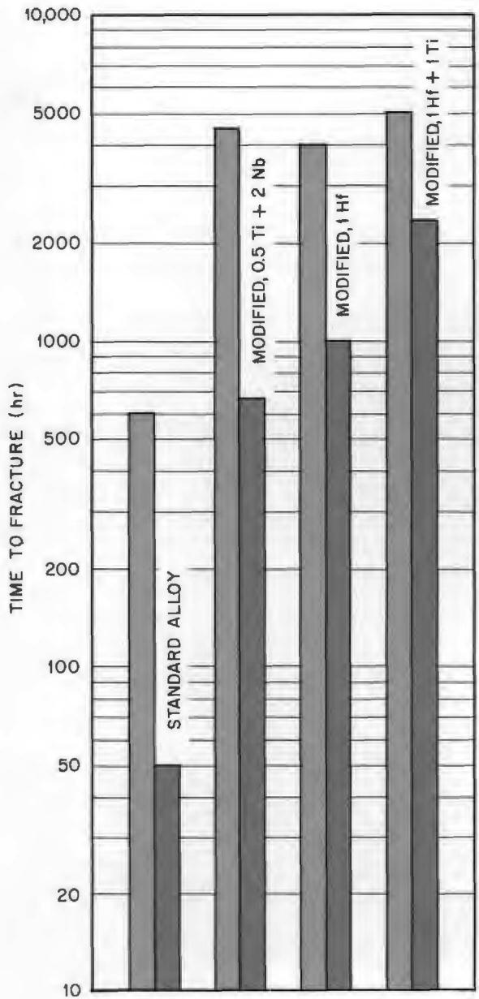

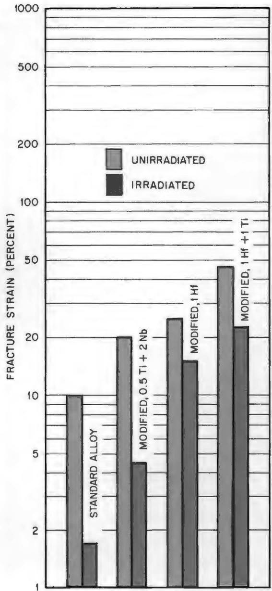  
Figure 9. A comparison of the creep properties of standard INOR-8 and several modified alloys in the unirradiated and irradiated conditions. Test condition was a stress of 35,000 psi at $1200^{\circ}$ F.

INOR-8 research using beehive arc furn.

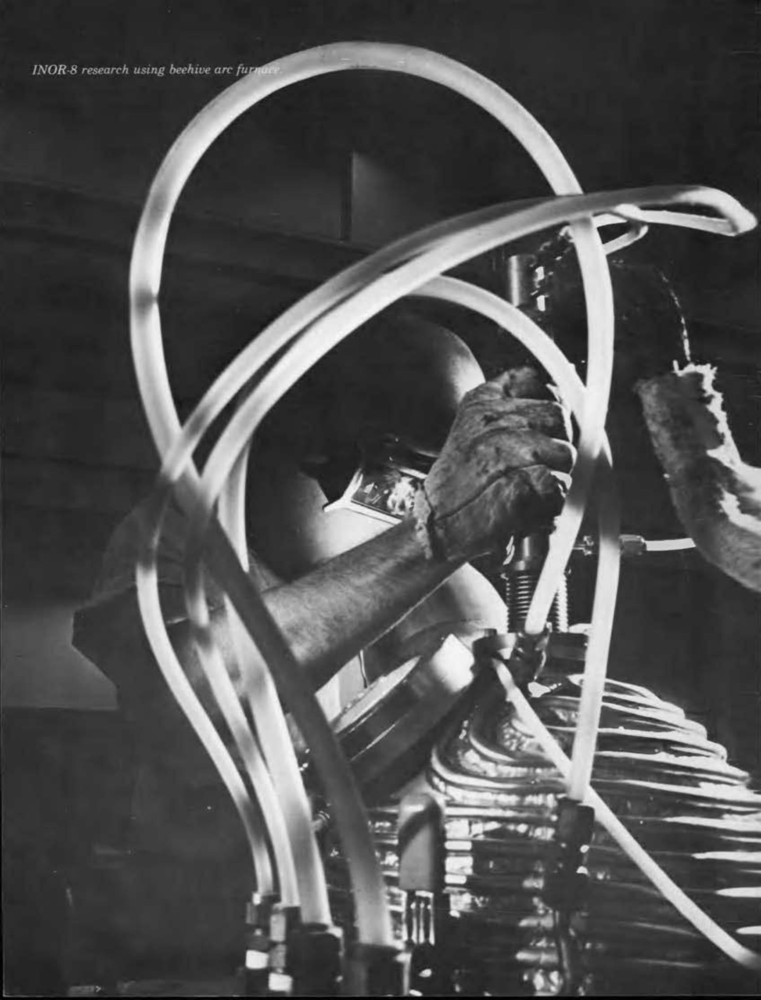