ORNL-TM-78

106

MASTER

THERMAL-STRESS AND STRAIN-FATIGUE ANALYSES OF THE MSRE FUEL AND COOLANT PUMP TANKS

C. G. Gabbard

# NOTICE

This document contains information of a preliminary nature and was prepared primarily for internal use at the Oak Ridge National Laboratory. It is subject to revision or correction and therefore does not represent a final report. The information is not to be abstracted, reprinted or otherwise given public dissemination without the approval of the ORNL patent branch, Legal and Information Control Department.

# LEGAL NOTICE

This report was prepared as an account of Government sponsored work. Neither the United States, nor the Commission, nor any person acting on behalf of the Commission:

A. Makes any warranty or representation, expressed or implied, with respect to the accuracy, completeness, or usefulness of the information contained in this report, or that the use of any information, apparatus, method, or process disclosed in this report may not infringe privately owned rights; or   
B. Assumes any liabilities with respect to the use of, or for damages resulting from the use of any information, apparatus, method, or process disclosed in this report.

As used in the above, "person acting on behalf of the Commission" includes any employee or contractor of the Commission, or employee of such contractor, to the extent that such employee or contractor of the Commission, or employee of such contractor prepares, disseminates, or provides access to, any information pursuant to his employment or contract with the Commission, or his employment with such contractor.

Contract No. W-7405-eng-26

Reactor Division

THERMAL-STRESS AND STRAIN-FATIGUE ANALYSES OF THE MSRE FUEL AND COOLANT PUMP TANKS

C. H. Gabbard

DATE ISSUED

OCT-31962

OAK RIDGE NATIONAL LABORATORY

Oak Ridge, Tennessee

operated by

UNION CARBIDE CORPORATION

for the

U. S. ATOMIC ENERGY COMMISSION

# CONTENTS

Abstract 1

Introduction 1

4

Strain Cycles 4

Temperature Distributions 4

Temperature Distribution Curve Fitting 5

Thermal-Stress Analysis 7

Strain-Cycle Analysis 15

Results 16

Temperature Distributions 16

Thermal Stresses 16

Strain Cycles 20

Pressure and Mechanical Stresses 22

Recommendations 22

Conclusions 26

References 27

Appendix A. Distribution of Fission-Product-Gas Beta Energy 29

Energy Flux at Pump Tank Outer Surface 29

Energy Flux at the Volute Support Cylinder Outer Surface 31

Energy Flux at the Volute Support Cylinder Inner Surface 31

Appendix B. Estimation of Outer Surface Temperatures and Heat Transfer Coefficients 33

Appendix C. Derivation of Boundary and Compatibility Equations for Thermal Stress Calculations 41

Appendix D. Explanation of Procedure Used to Evaluate the Effects of Cyclic Strains in the MSRE Pumps 56

Nomenclature 66

# THERMAL-STRESS AND STRAIN-FATIGUE ANALYSES OF THE MSRE FUEL AND COOLANT PUMP TANKS

C. H. Gabbard

# Abstract

Thermal-stress and strain-fatigue analyses of the MSRE fuel and coolant pump tanks were completed for determining the quantity of cooling air required to obtain the maximum life of the pump tanks and to determine the acceptability of the pump tanks for the intended service of 100 heating cycles from room temperature to $1200^{\circ}\mathrm{F}$ and 500 reactor power-change cycles from zero to 10 Mw.

A cooling-air flow rate of 200 cfm for the fuel pump tank was found to be an optimum value that provided an ample margin of safety. The coolant pump tank was found to be capable of the required service without air cooling.

# Introduction

The fuel pump for the Molten Salt Reactor Experiment1 (MSRE) is a sump-type centrifugal pump composed of a stationary pump tank and volute and a rotating assembly (see Fig. 1). The pump tank and volute, which is constructed of INOR-8 (72% Ni, 16% Mo, 7% Cr, 5% Fe), is a part of the primary containment system, and therefore the highest degree of reliability is required. The pump is similar to other high-temperature molten-salt and liquid-metal pumps that have accumulated many thousands of hours in nonnuclear test-loop service.2 Although these nonnuclear pumps have been highly successful, they have not been subjected to the degree of thermal cycling which may occur in a nuclear plant. It therefore cannot be assumed from the operating records that pumps of this type will be adequate for the MSRE.

Stress calculations* were completed in accordance with the ASME Boiler and Pressure Vessel Code for determining the wall thicknesses and nozzle reinforcements required to safely withstand an internal pressure

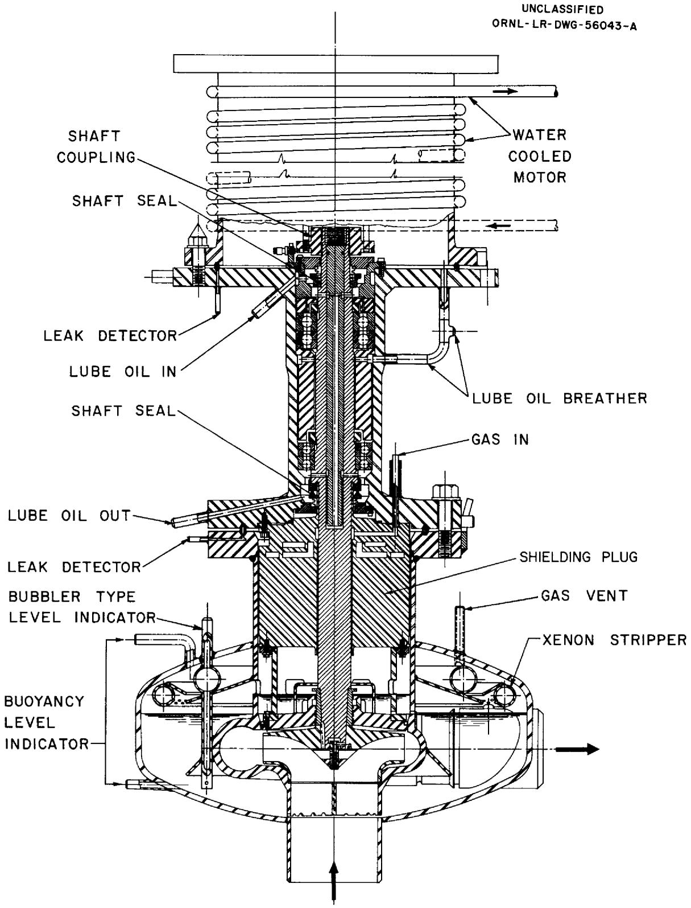  
Fig. 1. MSRE Fuel Pump General Assembly Drawing.

of 50 psi. In addition to these pressure stresses, the fuel pump tank will be subjected to relatively high thermal stresses because of the high thermal gradients which will be imposed by nuclear heating and the large temperature difference between the top flange, which will be at 250 to $300^{\circ}\mathrm{F}$ , and the pool of molten salt in the tank, which will be at $1225^{\circ}\mathrm{F}$ . Although the coolant pump will not be subjected to nuclear heating, there will be a large temperature difference between the top flange and the molten salt in the pump tank.

Since the ASME Pressure Vessel Code and Code Case Interpretations do not adequately cover the design of a vessel at creep range temperatures under relatively high cyclic thermal stress, the thermal stress evaluation was conducted under the rules of the Navy Code.3 The Navy Code covers the design of pressurized-water reactor systems. The problems of design in the creep range are not explicitly covered, but design criteria are established for vessels subjected to thermal stress and cyclic plastic strain. Thermal stresses are considered as transient in the Navy Code and must be evaluated on a fatigue basis using the estimated maximum numbers of various operational cycles and Miner's accumulative damage theorem as the design criteria.3

Automatic flow control of the cooling air to the upper pump tank surface was initially proposed so that the temperature gradient on the spherical shell would remain relatively constant at various operating conditions. The complexity and possible lack of reliability of the automatic control system made it desirable, however, to determine whether a fixed air flow could be used for all the operating conditions of the pump.

Calculations were therefore made for establishing the temperature distributions, thermal stresses, pressure stresses, and permissible number of operational cycles for various modes of operation and various cooling air flow rates. From this information, it was possible to select operating conditions that would permit the maximum number of operational cycles and provide an ample factor of safety above the 100 heating and 500 power-change cycles anticipated for the MSRE.

# Calculational Procedures

# Strain Cycles

Since thermal stresses are considered to be transient and in some cases subject to relief by stress relaxation at operating temperatures, they must be evaluated on a strain-fatigue basis, as required by the Navy Code. Two types of strain cycles will occur during normal operation of the pump:

1. heating and cooling when the reactor system is heated from room temperature to operating temperature and returned to room temperature, and   
2. power-change cycles when the reactor power is raised from zero to 10 Mw and returned to zero.

The change in strain must also be considered for a loss-of-cooling air incident in which the operating conditions would change from (1) reactor power operation at 10 Mw with design air flow to (2) operation at 10 Mw with no air flow to (3) zero power operation with no air flow.

# Temperature Distributions

The initial step in the thermal-stress and strain-fatigue analyses was to determine the temperature distributions in the pump tank for various operating conditions based on the effects of internal heat generation, conductive heat flow, convective and radiative heat transfer with the salt, and cooling of the shielding plug and upper pump tank surface. The generalized heat conduction code $^{4}$ (GHT Code) was used to obtain the temperature distributions. During reactor power operation, the fuel pump tank will be heated by gamma radiation from both the reactor vessel and the fuel salt in the pump tank and by beta radiation from the fission-product gases. The maximum gamma heat-generation rate during reactor operation at 10 Mw was calculated* to be 18.70 Btu/hr·in. $^{3}$ at the inner surface of the upper portion of the pump tank, giving an average heating rate through the 1/2-in.-thick pump tank wall of 16.23 Btu/hr·in. $^{3}$ . The gamma heat-generation rate in the shielding plug above the pump tank

was calculated at increments of $\frac{1}{2}$ in. based on an exponential decrease in the heating rate. The beta heating, which varied from 4.80 to 22.22 Btu/hr·in. $^2$ , was estimated by distributing the total beta energy emitted in the pump tank over the pump-tank surface exposed to the fission-product gases (see Appendix A).

Preliminary calculations with the GHT Code indicated that controlled cooling of the upper pump tank surface was necessary, not only to lower the maximum temperature, but also to reduce the temperature gradient in the spherical portion of the pump tank near its junction with the volute support cylinder in order to achieve acceptable thermal stresses. These calculations also predicted excessively high temperatures in the volute support cylinder between the pump tank and the pump volute. These high temperatures were caused by a series of ports in the volute support cylinder wall for draining the shaft labyrinth leakage back into the pump tank. The drain ports were originally located at the bottom of the cylinder and restricted the conduction of heat downward into the salt. The maximum temperatures were reduced to an acceptable level by centering the drain ports between the pump tank and the pump volute so that heat conduction would be unrestricted in the both directions. Final temperature distributions for zero power operation at $1200^{\circ}\mathrm{F}$ , zero power operation at $1300^{\circ}\mathrm{F}$ , and 10-Mw operation at $1225^{\circ}\mathrm{F}$ were obtained for various cooling-air flow rates by varying the effective outer-surface heat transfer coefficient. Temperature distributions were also calculated for 10-Mw operation at $1225^{\circ}\mathrm{F}$ , zero power operation at $1200^{\circ}\mathrm{F}$ , zero power operation at $1300^{\circ}\mathrm{F}$ , and zero power operation at $1025^{\circ}\mathrm{F}$ without external cooling. The method of obtaining the effective outer-surface heat transfer coefficients for the various conditions is described in Appendix B. The pump tank and volute support cylinder geometry considered in these calculations is shown in Fig. 2.

# Temperature Distribution Curve Fitting

Before the meridional and axial temperature distributions of the pump tank can be used in the thermal stress equations, they must be expressed as equations of the following form (see p. 66 for nomenclature):

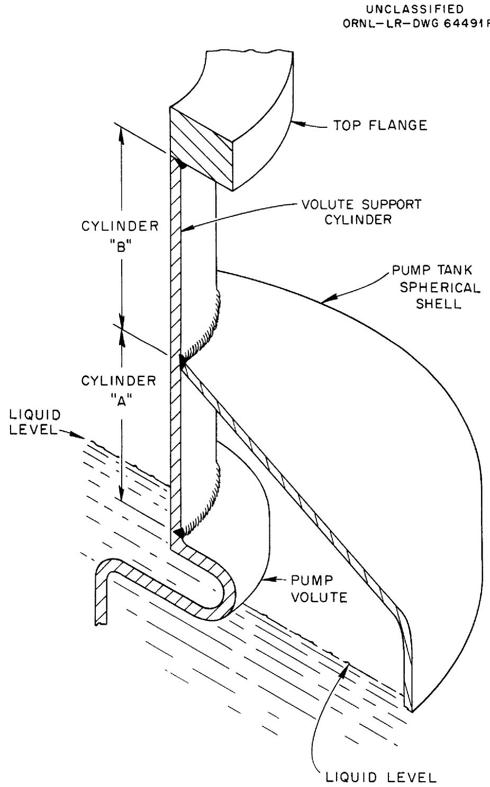  
Fig. 2. Pump Tank and Volute Support Cylinder Geometry.

Internal Volute Support Cylinder "A"

$$
\theta_ {a} = T _ {a 1} + T _ {a 2} L + T _ {a 3} L ^ {2} + T _ {a 4} L ^ {3}
$$

External Volute Support Cylinder "B"

$$
\theta_ {b} = T _ {b 1} + T _ {b 2} L + T _ {b 3} L ^ {2} + T _ {b 4} L ^ {3} + T _ {b 5} e ^ {- b L}
$$

Pump Tank Spherical Shell

$$
\theta_ {\mathbf {c}} = \frac {\Upsilon_ {\mathbf {c l}}}{\Upsilon_ {\mathbf {c}}} + \Upsilon_ {\mathbf {c 2}} + \Upsilon_ {\mathbf {c 3}} \Upsilon_ {\mathbf {c}} + \Upsilon_ {\mathbf {c 4}} \Upsilon_ {\mathbf {c}} ^ {2} + \Upsilon_ {\mathbf {c 5}} \Upsilon_ {\mathbf {c}} ^ {3}
$$

For the internal cylinder and the spherical shell, the GHT temperature distribution data were fitted to the equation by the use of a least-squares curve-fitting program. For the external cylinder, manually fit equations containing only the exponential terms were found to fit exceptionally well to within about 2.5 in. of the top flange, where excessive errors were encountered. On the other hand, the least-squares-fit equations containing all the terms fit very well in the vicinity of the top flange but deviated near the cylinder-to-shell junction. A comparison of the data obtained with the two fitting methods and the GHT data for the external cylinder is shown in Fig. 3. Since the cylinder-to-shell junction is considered to be the most critical area because of its high operating temperature, the manually fit equations were used for the external cylinder. The points on Figs. 4 and 5 show the "fit" obtained for typical sets of GHT temperature-distribution data.

# Thermal-Stress Analysis

In order to calculate the thermal stresses, the pump tank and volute support cylinder were considered to be composed of the following members, as shown in Fig. 2:

1. an internal cylinder extending from the volute to the junction with the spherical shell, cylinder "A,"

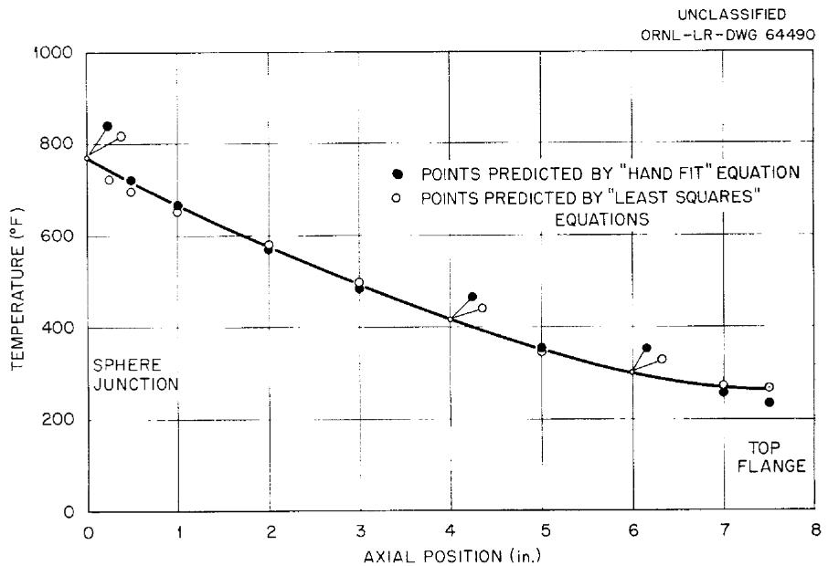  
Fig. 3. Comparison of "Hand-Fit" and "Least-Square-Fit" Temperature Data with GHT Data for Cylinder "B."

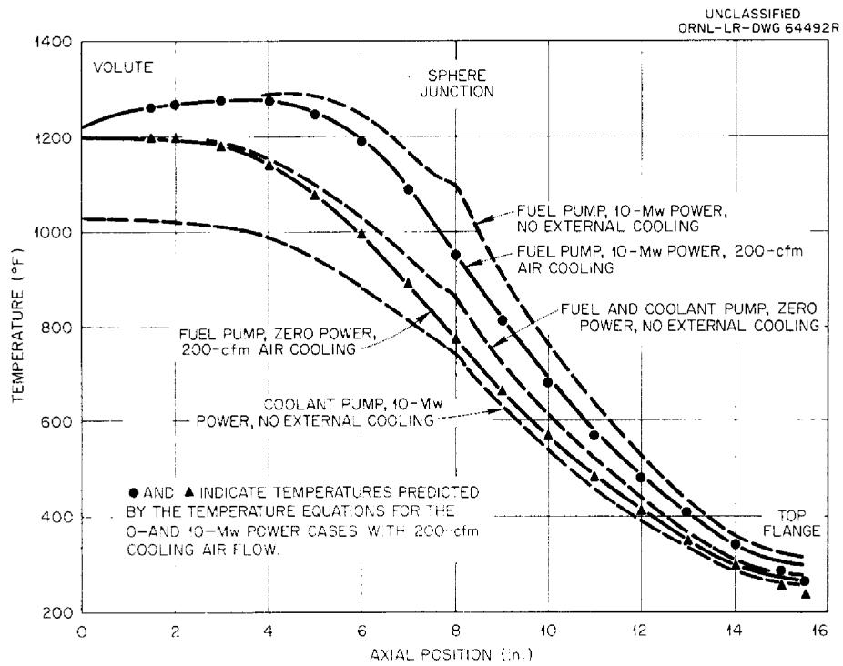  
Fig. 4. Axial Temperature Distribution of Volute Support Cylinder at Various Operating Conditions.

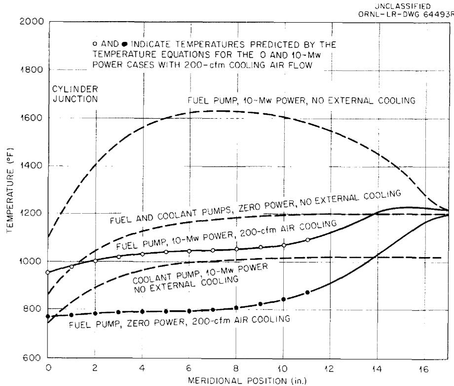  
Fig. 5. Meridional Temperature Distributions of the Torispherical Shell at Various Operating Conditions.

2. an external cylinder extending from the junction with the spherical shell to the top flange, cylinder "B," and   
3. the pump tank spherical shell.

An Oracle program* was used to obtain the pressure stresses, the stresses from the axial load on the cylinder, the thermal stresses resulting from temperature gradients in either or both cylinders, and any combination of these loadings. The Program assumes that the sphere is continuous (i.e., has no boundary other than the cylinder junction) and is at zero temperature. The zero-temperature assumption required that the temperature functions of the cylinders be adjusted to provide the proper temperature relationship between the three members. The boundary conditions for the ends of the two cylinders specified that the slope of the cylinder walls was zero and that the radial displacements would be

equal to the free thermal expansion of the members at their particular temperatures. It was recognized at the beginning that some degree of error in the thermal-stress calculations would be introduced by the absence of a thermal gradient on the sphere; but in the cases where air cooling was used to limit the gradient, the results were believed to be reasonably accurate. Later calculations showed, however, that the stresses were very sensitive to the temperature gradient on the sphere, and therefore the Oracle code was used only to evaluate the pressure stresses and the stresses from axial loads.

In order to calculate the thermal stresses, including the effects of the thermal gradient on the sphere, it was necessary to substitute a conical shell for the sphere. The angle of intersection between the cone and cylinders was made equal to the equivalent angle of intersection on the actual structure. This substitution was required because moment, displacement, slope, and force equations were not available for thermal-stress analysis of spherical shells with meridional thermal gradients.

Thermal stresses in the two cylinders and the cone were calculated by the use of the equations and procedures outlined in refs. 6-9. In order to evaluate the four integration constants required for each of the three members, it was necessary to solve the 12 simultaneous equations which described the following boundary and compatibility conditions of the structure:

Cylinder "A" at Volute Attachment. The slope of cylinder "A" was taken as zero and the deflection as $-a\alpha\theta_{l}$ .

Cylinder "B" at Top Flange. The slope of cylinder "B" was taken as zero and the deflection as $-\alpha \theta_{l}$ .

Cone at Outside Edge. The slope of the cone was taken as zero and the meridional force was taken as zero.

Junction of Cylinder "A," Cylinder "B," and Cone. The summation of moments was taken as zero; the summation of radial forces was taken as zero; the slopes of cylinder "A," cylinder "B," and the cone were taken to be equal; and the deflections of cylinder "A," cylinder "B," and the cone were taken to be equal.

The following 12 equations, which are more completely derived in Appendix C, describe the boundary and compatibility conditions given above:

$$
\sum C _ {n a n} W ^ {\prime} = 2 7 9. 0 4 \left(T _ {a 2} + 1 3. 0 4 2 T _ {a 3} + 1 2 4. 5 7 T _ {a 4}\right), \tag {1}
$$

where

$$
\sum C _ {n a n} ^ {\prime} = C _ {1 a} W _ {1} ^ {\prime} + C _ {2 a} W _ {2} ^ {\prime} + C _ {3 a} W _ {3} ^ {\prime} + C _ {4 a} W _ {4} ^ {\prime};
$$

$$
\sum \mathrm {C} _ {\mathrm {n a}} \mathrm {N} _ {\mathrm {n}} = 0; \tag {2}
$$

$$
\begin{array}{l} \frac {1}{4 a \beta^ {2}} \left(\sum c _ {n a} M _ {n} - \sum c _ {n b} M _ {n}\right) + \sum c _ {n c} M _ {y n} = 1 1 4. 7 \left(T _ {a 3} - T _ {b 3}\right) - \\ - 0. 0 0 7 1 1 J _ {1} - 1. 3 J _ {2} - 1 2 2. 8 2 J _ {3} - 3 2 4. 9 J _ {4} - 2 2 9. 4 1 T _ {b 5} \frac {b ^ {2}}{F _ {1}}; \tag {3} \\ \end{array}
$$

$$
\begin{array}{l} \frac {1}{4 a \beta} \left(\sum c _ {n a} Q _ {n} + \sum c _ {n b} Q _ {n}\right) + \\ + \beta_ {c} ^ {2} \tan \phi \left(\sin \phi - \frac {\cos^ {2} \phi}{\sin \phi}\right) \sum c _ {n c} Q _ {n c} \\ = 6. 2 0 9 4 (7 9. 3 8 J _ {4} + 3. 0 J _ {3}) - \\ - 3 4 4. 1 2 \left(\mathrm {T} _ {\mathrm {a} 4} + \mathrm {T} _ {\mathrm {b} 4}\right) + 2 2 9. 4 1 \mathrm {T} _ {\mathrm {b} 5} \frac {\mathrm {b} ^ {3}}{\mathrm {F} _ {1}}; \tag {4} \\ \end{array}
$$

$$
\sum C _ {n a n} ^ {\prime} + \sum C _ {n b n} ^ {\prime} = 2 7 9. 0 4 \left(T _ {a 2} + T _ {b 2}\right) - 1 1 1 6. 2 T _ {b 5} \frac {b}{F _ {1}}; \tag {5}
$$

$$
\begin{array}{l} \frac {a \beta}{t} \sum C _ {n a} W _ {n} ^ {\prime} - \frac {\beta_ {c} ^ {2}}{t _ {c}} \tan^ {2} \phi \sum C _ {n c} W _ {n c} ^ {\prime} = 1 4 8 4. 6 5 T _ {a 2} + \\ + 6 4. 9 8 3 \left(9. 9 2 2 5 J _ {2} - 1 0. 1 0 1 J _ {1} + 9 8. 4 5 6 J _ {3} + 9 7 6. 9 3 J _ {4}\right); \tag {6} \\ \end{array}
$$

$$
\begin{array}{l} \sum \mathrm {C} _ {\mathrm {n a N}} - \sum \mathrm {C} _ {\mathrm {n b N}} = 1 5 4. 0 5 \left(\mathrm {T} _ {\mathrm {a l}} - \mathrm {T} _ {\mathrm {b l}}\right) - 6 1 6. 2 1 \frac {\mathrm {T} _ {\mathrm {b} 5}}{\mathrm {F} _ {1}}; (7) \\ \frac {\mathrm {a}}{\mathrm {t}} \sum \mathrm {c} _ {\mathrm {n a}} \mathrm {N} _ {\mathrm {n}} + \frac {\sin^ {2} \phi}{\mathrm {t} _ {\mathrm {c}} \cos \phi} \sum \mathrm {c} _ {\mathrm {n c}} (\mathrm {V} _ {\mathrm {n c}} - \mathrm {W} _ {\mathrm {n c}}) \\ = - 1 2 8 9 5. 8 \mathrm {J} _ {4} - 2 0 0. 6 8 \mathrm {J} _ {3}; (8) \\ \end{array}
$$

$$
\begin{array}{l} \sum C _ {n c} W _ {n c} ^ {\prime} = 0. 0 4 0 8 J _ {1} - 2 4. 5 0 3 J _ {2} - 6 0 0. 3 7 J _ {3} - 1 4 7 1 0. 6 J _ {4}; (9) \\ \sum C _ {n c} Q _ {n c} = 1 9 6. 0 2 J _ {4} + 3 J _ {3}; (10) \\ \end{array}
$$

$$
\sum C _ {n b} W _ {n} ^ {\prime} = 2 7 9. 0 4 \left(T _ {b 2} + 1 5. 9 4 T _ {b 3} + 1 9 0. 5 6 T _ {b 4}\right) - 1 1 1 6. 2 T _ {b 5} \frac {b}{F _ {2}}; \tag {11}
$$

$$
\sum C _ {n b} N _ {n} = 1 5 4. 0 5 T _ {b 5} \frac {4 - F _ {1}}{F _ {2}}. \tag {12}
$$

In these equations,

$$
F _ {1} = (b / \beta) ^ {4} + 4,
$$

$$
F _ {2} = F _ {1} e ^ {d y},
$$

$$
J _ {1} = 2 0. 9 T _ {c l},
$$

$$
J _ {2} = 4 5 9. 9 5 T _ {c 5} - 1 1. 5 5 5 T _ {c 3},
$$

$$
J _ {3} = 1 7. 1 8 3 T _ {c 4},
$$

$$
J _ {4} = 1 9. 1 6 5 T c 5
$$

Equations (1) through (12) are arranged so that the left side containing the unknown integration constants is dependent only on the specific pump tank configuration, while the right side containing the thermal-gradient terms will vary for each case.

After obtaining the four integration constants for each member, the bending and membrane stresses can be calculated using the following equations for either cylinder or the cone:

$$
\begin{array}{l} \sigma_ {b \Phi} = \pm \frac {6 M _ {\Phi}}{t ^ {2}}, \\ \sigma_ {b \theta} = \mu \sigma_ {b \Phi}, \\ \sigma_ {m \Phi} = \frac {N _ {\Phi}}{t}, \\ \sigma_ {\mathrm {m} \theta} = \frac {\mathrm {N} _ {\theta}}{\mathrm {t}}. \\ \end{array}
$$

For the principal meridional and circumferential stresses the applicable equations are:

$$
\begin{array}{l} \sigma_ {\Phi \mathbf {i}} = \sigma_ {\mathrm {m} \Phi} - \sigma_ {\mathrm {b} \Phi}, \\ \sigma_ {\theta 1} = \sigma_ {m \theta} - \sigma_ {b \theta}, \\ \sigma_ {\Phi \circ} = \sigma_ {m \Phi} + \sigma_ {b \Phi}, \\ \sigma_ {\theta \mathbf {o}} = \sigma_ {\mathbf {m} \theta} + \sigma_ {\mathbf {b} \theta}. \\ \end{array}
$$

For cylinder "A,"

$$
\mathrm {M} _ {\Phi} = \frac {1}{4 a \beta^ {2}} \sum \mathrm {C} _ {\mathrm {n a m}} - 2 \mathrm {D a} \alpha \left(\mathrm {T} _ {\mathrm {a} 3} + 3 \mathrm {T} _ {\mathrm {a} 4} \frac {\mathrm {y}}{\beta}\right),
$$

$$
\mathrm {N} _ {\theta} = - \sum \mathrm {C} _ {\mathrm {n a}} \mathrm {N} _ {\mathrm {n}},
$$

$$
\mathrm {N} _ {\Phi} = 0.
$$

For cylinder "B,"

$$
\mathrm {M} _ {\Phi} = \frac {1}{4 a \beta^ {2}} \sum \mathrm {C} _ {\mathrm {n b}} \mathrm {M} _ {\mathrm {n}} - 2 \mathrm {D a} \alpha \left(\mathrm {T} _ {\mathrm {b} 3} + 3 \mathrm {T} _ {\mathrm {b} 4} \frac {\mathrm {y}}{\beta}\right) - \mathrm {D b} ^ {2} \gamma \mathrm {e} ^ {- \mathrm {d y}},
$$

$$
N _ {\theta} = - \sum C _ {n b} N _ {n} - E t o T _ {b 5} e ^ {- d y} \frac {d ^ {4}}{d ^ {4} + 4},
$$

$$
\mathrm {N} _ {\Phi} = 0.
$$

For the cone,

$$
M _ {\Phi} = \sum C _ {n c} M _ {y n} + J _ {1} K _ {2} + 1. 3 J _ {2} + 2. 3 J _ {3} P _ {1} + 2. 2 J _ {4} P _ {3},
$$

$$
M _ {\theta} = \sum C _ {n c} M _ {\theta n} - J _ {1} K _ {2} + 1. 3 J _ {2} + 1. 6 J _ {3} P _ {1} + 1. 2 6 6 7 J _ {4} P _ {3},
$$

$$
\mathrm {N} _ {\Phi} = \beta_ {\mathrm {c}} ^ {2} \tan \phi \left(- \sum \mathrm {C} _ {\mathrm {n c}} \mathrm {Q} _ {\mathrm {n c}} + 8 \mathrm {J} _ {4} \mathrm {P} _ {1} + 3 \mathrm {J} _ {3}\right),
$$

$$
\mathrm {N} _ {\theta} = \beta_ {\mathrm {c}} ^ {2} \tan \phi \left(- \sum \mathrm {C} _ {\mathrm {n c}} \mathrm {N} _ {\theta \mathrm {n}} + 8 \mathrm {J} _ {4} \mathrm {P} _ {2} + 3 \mathrm {J} _ {3}\right)
$$

In order to facilitate the solution of several cases and to reduce the amount of time involved in calculating complete stress distributions, an IBM 7090 program was written for the MSRE pump configuration. The program calculates the temperature-dependent constants of the l2 simultaneous equations, solves the equations for the l2 integration constants, and calculates the bending, membrane, and principal stresses at 65 locations. Up to 25 cases can be solved, and the number of cases to be solved and the constants in the temperature distribution equations are included as input data. A set of general input data is also required

that contains the left-hand members of the simultaneous equations and the position functions tabulated in refs. 7 and 9.

A special test case with a uniform-temperature conical shell was prepared for the IBM 7090 program to check the validity of substituting the conical shell for the spherical shell and to obtain an over-all comparison between the results of the IBM and Oracle programs. The comparative results are shown in Table 1 for the junction of the three members. As may be seen, the cone stresses agreed satisfactorily at the junction where they were a maximum. Deviations between the results of the two programs at other meridional positions were not considered important for the cases of interest.

Table 1. Comparative Results for Conical and Spherical Representation   

<table><tr><td rowspan="2"></td><td colspan="2">Axial or Meridional Principal Stress (psi)</td><td colspan="2">Circumferential Principal Stress (psi)</td></tr><tr><td>IBM 7090 Programa</td><td>Oracle Programb</td><td>IBM 7090 Program</td><td>Oracle Program</td></tr><tr><td>Cylinder &quot;A&quot;</td><td>-3 276</td><td>-3 374</td><td>-3 047</td><td>-3 351</td></tr><tr><td>Cylinder &quot;B&quot;</td><td>7 091</td><td>7 365</td><td>-4 018</td><td>-4 543</td></tr><tr><td>Cone or sphere</td><td>-25 196</td><td>-25 703</td><td>-3 572</td><td>-3 967</td></tr></table>

aFor cylinder-to-cone junction.   
b For cylinder-to-sphere junction.

Thermal-stress calculations were completed for the various operating conditions listed previously in the section on temperature distributions.

# Strain-Cycle Analysis

In order to determine the optimum cooling-air flow rate and the life of the pump tank, it was necessary to determine the allowable number of each type of operational cycle (heating and power change) for each of several cooling-air flow rates. If $p_1, p_2, \ldots, p_n$ are the anticipated values for the various operational cycles and $N_1, N_2, \ldots, N_n$ are the allowable number of cycles determined from the thermal-stress and strain-fatigue data, the "usage factor" is defined as $\sum (p_i / N_i)$ . A design air

flow can then be selected to minimize the usage factor and give the maximum pump-tank life.

The permissible number of each type of operational cycle is determined by comparing the maximum stress amplitude for each type of cycle with the design fatigue curves. The maximum stress amplitude includes the thermal stresses caused by meridional thermal gradients, the thermal stresses caused by transverse thermal gradients, and the pressure stresses caused by the 50-psi internal pressure.

A discussion of the various types of stresses (primary, secondary, local, and thermal) and the effects of each on the design of the pump tanks is given in Appendix D. A discussion of the procedure used in determining the allowable number of cycles is presented, and the design fatigue curves of INOR-8 are included.

# Results

# Temperature Distributions

The results of the GHT temperature distribution calculations for pertinent operating conditions are shown in Figs. 4 and 5 for the fuel and coolant pumps. The spherical shell meridional temperature distributions for the fuel pump at various cooling air flow rates and reactor power levels of zero and $10\mathrm{Mw}$ are shown in Figs. 6 and 7.

# Thermal Stresses

Typical thermal-stress profiles of the fuel pump at a cooling-air flow rate of 200 cfm with the reactor power at zero and 10 Mw are shown in Figs. 8 and 9; similar profiles of the coolant pump are shown in Figs. 10 and 11. The relatively high stresses at the top flange are believed to be caused by the poor fit of the temperature equations in that area, as shown in Fig. 3. The stress at the top flange was calculated to be 15 000 psi when the least-squares-fit temperature equation was used. It was found, however, that this equation introduced stress errors at the cone-to-cylinder junction. Therefore, the actual stress profiles along the entire length of the external cylinder would probably be better

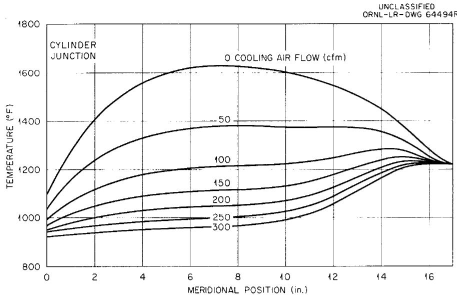  
Fig. 6. Meridional Temperature Distributions of the Torispherical Shell at a Reactor Power of 10 Mw and Various Cooling-Air Flow Rates.

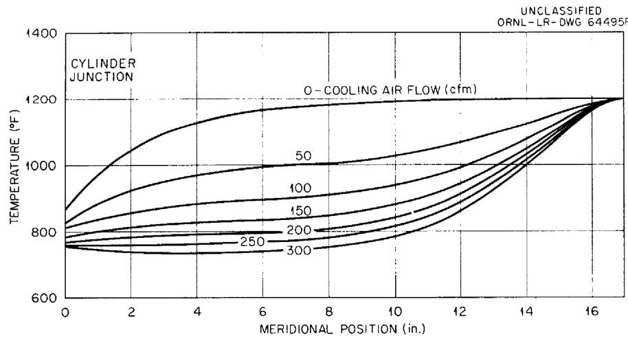  
Fig. 7. Meridional Temperature Distributions of the Torispherical Shell at Zero Reactor Power and Various Cooling-Air Flow Rates.

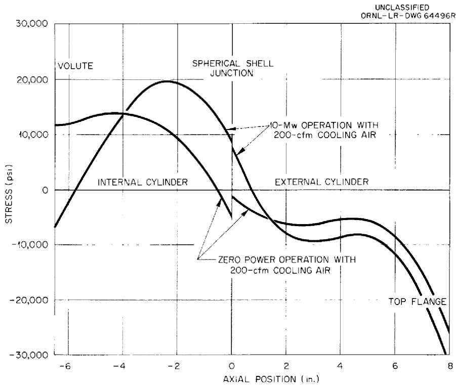  
Fig. 8. Fuel Pump Principal Thermal Stresses at Cylinders "A" and "B" for Operation at Zero Power and at 10 Mw with a Cooling-Air Flow Rate of 200 cfm.

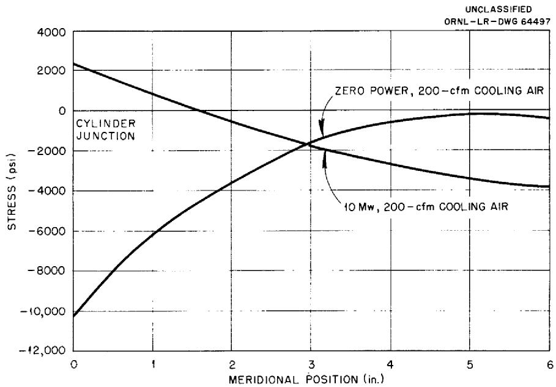  
Fig. 9. Fuel Pump Principal Thermal Stresses at Spherical Shell for Operation at Zero Power and at 10 Mw with a Cooling-Air Flow Rate of 200 cfm.

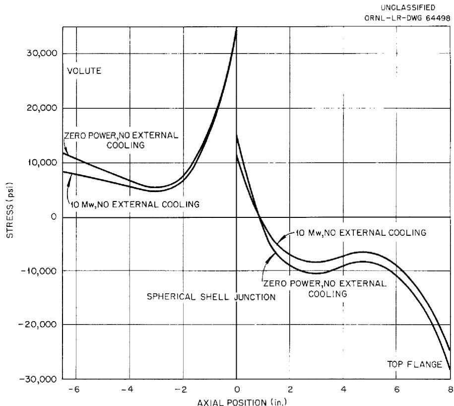  
Fig. 10. Coolant Pump Principal Thermal Stresses at Cylinders "A" and "B" for Operation at Zero Power and at 10 Mw.

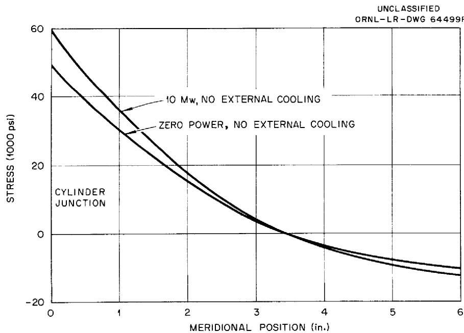  
Fig. 11. Coolant Pump Principal Thermal Stresses at Spherical Shell for Operation at Zero Power and at 10 Mw.

represented by a composite of the two stress profiles; that is, it would be best to use the stress profiles from the manually fit temperature functions near the junction and from the least-squares functions near the top flange. Since the cone-to-cylinder junction is the more critical area and since the stresses at the top flange do not limit the number of permissible strain cycles, the stresses from the manually fit equations were used in completing the strain-cycle analysis. The cylinder is sufficiently long that the temperature error at the top flange has a relatively small effect on the stresses at the cylinder-to-shell junction.

# Strain Cycles

The results of the strain-fatigue analyses are presented in Tables 2, 3, and 4. A predicted usage factor of 0.8 or less indicates a safe

Table 2. Fuel Pump Strain Data for Heating Cycle   

<table><tr><td>Air Flow (cfm)</td><td>Maximum Stress Intensity (psi)</td><td>Stress Amplitude (psi)</td><td>Allowable Cycles</td><td>Cycle Fraction Per Cycle</td><td>Cycle Fraction in 100 Cycles, P1/N1</td></tr><tr><td colspan="6">Heating Cycle to 1200°F</td></tr><tr><td>50</td><td>31 124</td><td>15 562</td><td>700</td><td>0.00143</td><td>0.143</td></tr><tr><td>100</td><td>14 400</td><td>7 200</td><td>2 500</td><td>0.00040</td><td>0.040</td></tr><tr><td>150</td><td>14 143</td><td>7 072</td><td>2 500</td><td>0.00040</td><td>0.040</td></tr><tr><td>200</td><td>16 095</td><td>8 048</td><td>2 100</td><td>0.00047</td><td>0.047</td></tr><tr><td>250</td><td>21 760</td><td>10 880</td><td>1 300</td><td>0.00077</td><td>0.077</td></tr><tr><td>300</td><td>26 955</td><td>13 477</td><td>880</td><td>0.00114</td><td>0.114</td></tr><tr><td colspan="6">Heating Cycle to 1300°F</td></tr><tr><td>50</td><td>28 966</td><td>14 483</td><td>640</td><td>0.00156</td><td>0.156</td></tr><tr><td>100</td><td>19 104</td><td>9 552</td><td>1 300</td><td>0.00076</td><td>0.076</td></tr><tr><td>150</td><td>20 590</td><td>10 295</td><td>1 150</td><td>0.00086</td><td>0.086</td></tr><tr><td>200</td><td>23 811</td><td>11 905</td><td>900</td><td>0.00111</td><td>0.111</td></tr><tr><td>250</td><td>30 895</td><td>15 447</td><td>550</td><td>0.00181</td><td>0.181</td></tr><tr><td>300</td><td>36 099</td><td>18 049</td><td>420</td><td>0.00238</td><td>0.238</td></tr><tr><td colspan="6">Loss-of-Cooling-Air Accident</td></tr><tr><td>200</td><td>94 885</td><td>47 443</td><td>85</td><td>0.012</td><td>1.2</td></tr></table>

Table 3. Fuel Pump Strain Data for Power-Change Cycle from Zero to 10 Mw   

<table><tr><td>Air Flow (cfm)</td><td>Maximum Stress Range (psi)</td><td>Stress Amplitude (psi)</td><td>Allowable Cycles</td><td>Cycle Fraction Per Cycle</td><td>Cycle Fraction in 500 Cycles, P2/N2</td><td>Total Usage Factor, Σ Pi/Ni</td></tr><tr><td>50</td><td>37 971</td><td>18 985</td><td>520</td><td>0.00192</td><td>0.961</td><td>1.10</td></tr><tr><td>100</td><td>24 763</td><td>12 382</td><td>1 000</td><td>0.001</td><td>0.500</td><td>0.54</td></tr><tr><td>150</td><td>18 930</td><td>9 465</td><td>1 600</td><td>0.000625</td><td>0.312</td><td>0.352</td></tr><tr><td>200</td><td>18 814</td><td>9 407</td><td>1 600</td><td>0.000625</td><td>0.312</td><td>0.359</td></tr><tr><td>250</td><td>18 775</td><td>9 388</td><td>1 600</td><td>0.000625</td><td>0.312</td><td>0.389</td></tr><tr><td>300</td><td>18 639</td><td>9 320</td><td>1 600</td><td>0.000625</td><td>0.312</td><td>0.426</td></tr></table>

Table 4. Coolant Pump Strain Data for Heating and Power-Change Cycles   

<table><tr><td rowspan="2"></td><td colspan="2">Heating Cycles</td><td rowspan="2">Power Change from Zero to 10 Mw</td></tr><tr><td>To 1200°F</td><td>To 1300°F</td></tr><tr><td>Maximum stress intensity, psi</td><td>63 650</td><td>69 100</td><td>10 160</td></tr><tr><td>Stress amplitude, psi</td><td>31 825</td><td>34 550</td><td>5 080</td></tr><tr><td>Allowable cycles</td><td></td><td></td><td>4 400</td></tr><tr><td>Total relaxation</td><td>220</td><td>140</td><td></td></tr><tr><td>Partial relaxation</td><td>520</td><td>290</td><td></td></tr><tr><td>Cycle fraction per cycle</td><td></td><td></td><td>0.00227</td></tr><tr><td>Total relaxation</td><td>0.00454</td><td>0.00714</td><td></td></tr><tr><td>Partial relaxation</td><td>0.00192</td><td>0.00344</td><td></td></tr><tr><td>Cycle fraction in 100 cycles</td><td></td><td></td><td></td></tr><tr><td>Total relaxation</td><td>0.454</td><td>0.714</td><td></td></tr><tr><td>Partial relaxation</td><td>0.192</td><td>0.344</td><td></td></tr><tr><td>Cycle fraction in 500 cycles</td><td></td><td></td><td>0.114</td></tr><tr><td>Total usage factora</td><td></td><td></td><td></td></tr><tr><td>Total relaxation</td><td>0.568</td><td></td><td></td></tr><tr><td>Partial relaxation</td><td>0.306</td><td></td><td></td></tr></table>

For 100 heating cycles to $1200^{\circ}\mathrm{F}$ and 500 power cycles from zero to 10 Mw.

operating condition for the desired number of heating and power-change cycles. The results are based on the assumption of total stress relaxation at each operating condition and are therefore conservative. The location of maximum stress intensity during the heating cycle is not necessarily the same as the location of maximum stress range during the power-change cycle. This also provides conservative results, since the maximum strains for each type of cycle were added to determine the usage factor, and the total strain at the actual point of maximum strain would be less than the strain value used. Since the pump tank will safely endure the desired number of heating and power cycles with this conservative approach, it was not considered necessary to locate and determine the actual maximum total strain. The coolant pump will operate at a lower temperature than the fuel pump, so the stress relaxation during each cycle will probably be incomplete and therefore a larger number of cycles will be permissible. As shown in Table 4, the assumption of partial relaxation rather than total relaxation permits more than twice the number of heating cycles. For the fuel pump, thermal-stress and plastic-strain calculations were also made for the short 36-in.-diam cylinder connecting the two torispherical heads. The permissible number of cycles at this location was found to be greater than those shown in Table 2, and, therefore, the cycles in the cylinder do not limit the life of the pump tank.

# Pressure and Mechanical Stresses

The results of the pressure stress calculations made with the Oracle program are shown in Figs. 12 and 13. The stresses, which include both primary and discontinuity stresses, are for a pressure of 1.0 psi and are directly proportional to pressure. The maximum stress from the axial load exists at the suction nozzle attachment and is equal to 1.766 times the load in pounds.

# Recommendations

The strain-cycle data of Tables 2, 3, and 4 indicate that the desired number of strain cycles on the fuel pump can be safely tolerated

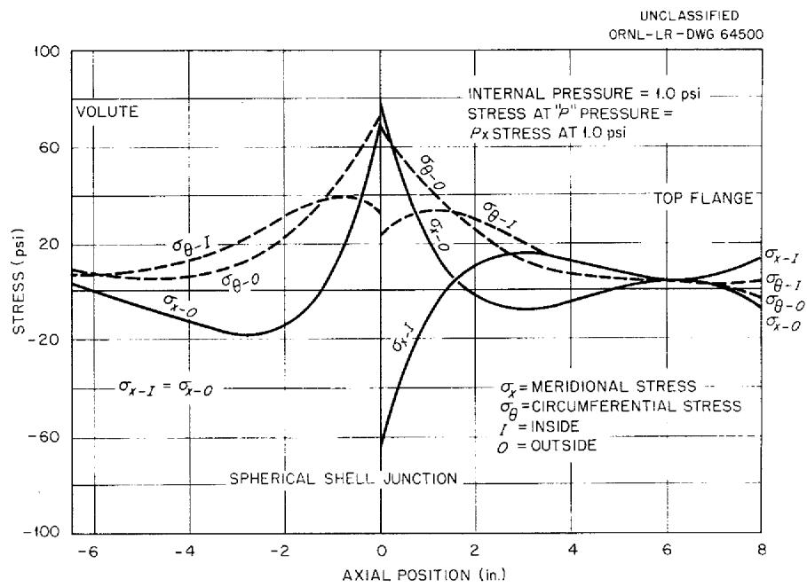  
Fig. 12. Fuel and Coolant Pump Pressure Stresses at Cylinders "A" and "B."

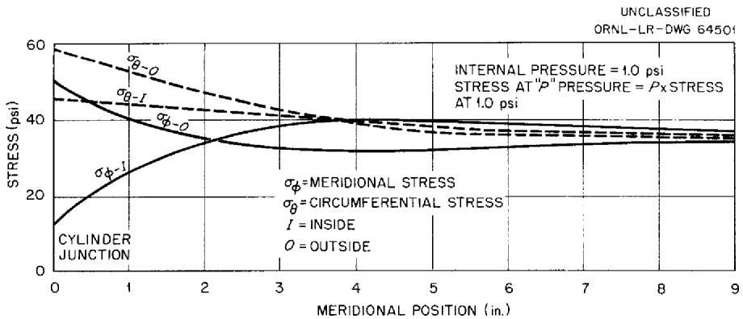  
Fig. 13. Fuel and Coolant Pump Pressure Stresses at Spherical Shell.

when any cooling air flow between 100 and 300 cfm is used; and, therefore, the air cooling can be controlled manually by a remotely operated control valve. A cooling-air flow rate of approximately 200 cfm is recommended for the following reasons:

1. The predicted usage factor is reasonably near the minimum value.   
2. There is a wide range of acceptable flow rates on either side of this design air flow rate.   
3. At air flow rates greater than 200 cfm, the maximum stress intensity during zero power operation increases relatively rapidly and decreases the permissible number of heating cycles.

Since there is a possibility of error in the temperature distribution calculations because of uncertainties in the heat generation rates and heat transfer coefficients, it is recommended that the temperature gradient on the spherical shell be monitored by using two thermocouples spaced 6 in. apart radially. This gives the maximum temperature difference between the two thermocouples and therefore reduces the effect of any thermocouple error. Since the thermal gradient of the spherical shell near the junction is of primary importance in determining the thermal stresses, the differential temperature measurements and the data of Figs. 6 and 7 can be used to set the actual cooling-air flow rate on the pump. This method has the disadvantage of requiring several adjustments as the temperature and power level are raised to the operating point. If direct measurement of the flow rate were possible minor adjustments could be made after the system reached operating conditions. Since no cooling-air flow measuring equipment is planned for the fuel pump at the present time, a preoperational calibration of the cooling-air flow rate versus valve position should be made to permit the approximate air flow rate to be set prior to high-temperature operation.

The design temperature difference between the two thermocouples for monitoring the thermal gradient is $100^{\circ}\mathrm{F}$ at a power level of 10 Mw and a thermocouple spacing of 6 in. The maximum allowable temperature difference is $200^{\circ}\mathrm{F}$ for 10-Mw operation. After the cooling-air flow rate has been set for 10-Mw operation, a readjustment of the flow should be made, if necessary, at zero power operation to prevent a negative thermal gradient on the sphere. This adjusted cooling-air flow should then become

the operating value. During the precritical testing and power operation of the reactor it should be kept in mind that any significant change in the fuel pump cooling-air flow rate will constitute a strain cycle and will represent a decrease in the usable life of the pump tank. Therefore, an effort should be made to keep the number of cooling-air flow rate adjustments to a minimum.

The effect of heating the system to $1300^{\circ}\mathrm{F}$ is also shown in Tables 2, 3, and 4. The fuel and coolant pumps can safely endure only about half as many heating cycles to $1300^{\circ}\mathrm{F}$ as to $1200^{\circ}\mathrm{F}$ . For the coolant pump, 100 heating cycles to $1300^{\circ}\mathrm{F}$ would essentially consume the life of the pump tank. At $1300^{\circ}\mathrm{F}$ the assumption of total stress relaxation is realistic, and no additional conservatism should be claimed by its use. Therefore, it is recommended that the system not be heated to $1300^{\circ}\mathrm{F}$ on a routine basis.

Since the fuel and coolant pump tanks are primary containment members, the maximum value of the usage factor must not exceed 0.8, which is the acceptable upper limit. To avoid exceeding this limit, an accurate and up-to-date record should be maintained of the usage factor and the complete strain cycle history of both the fuel and the coolant pumps. In calculating the usage factor, partial power-change cycles in which reactor power is increased only a fraction of the total power should be considered as complete power cycles unless the number of partial cycles is a large fraction of the total when a pump tank has passed through the permitted number of cycles. In this case, additional thermal stress calculations should be made to determine the proper effect of the partial cycles.

Although the strain-cycle data indicate that the coolant pump is acceptable for the specified number of strain cycles, the stress intensity is uncomfortably high. These stresses can be reduced by lowering the thermal gradient on the spherical shell by using a reduced thickness of insulation on the upper surface of the pump tank. Since nuclear heating is not involved in the coolant pump, the proper amount of insulation can best be determined on the Fuel Pump Prototype Test Facility, which is presently under construction.

# Conclusions

The strain-cycle analysis indicates that the fuel pump will be satisfactory for the intended life of 100 heating cycles and 500 power-change cycles if it is air cooled. No special cooling will be required for the coolant pump. A conservative design is provided by the use of standard safety factors in the strain-fatigue data and in the usage factor. Additional conservatism of an unknown magnitude is provided by the assumption of total stress relaxation at each operating condition and by the fact that the actual maximum strain should be less than the calculated maximum strain.

In addition to the safety factors outlined above, the fuel and coolant pump tanks are capable of exceeding their required service life by factors of 2.2 and 1.4, respectively, before the maximum permissible usage factor is exceeded.

# References

1. Molten-Salt Reactor Program Quarterly Progress Report for Period Ending July 31, 1960, ORNL-3014.   
2. A. G. Grindell, W. F. Boudreau, and H. W. Savage, "Development of Centrifugal Pumps for Operation with Liquid Metals and Molten Salts at 1400-1500 F," Nuclear Sci. and Eng. 7(1), 83 (1960).   
3. Tentative Structural Design Basis for Reactor Pressure Vessels and Directly Associated Components (Pressurized, Water-Cooled Systems), esp. p. 31, PB 151987 (Dec. 1, 1958), U. S. Dept. of Commerce, Office of Technical Services.   
4. T. B. Fowler, Generalized Heat Conduction Code for the IBM 704 Computer, ORNL-2734 (Oct. 14, 1959), and supplement ORNL CF 61-2-33 (Feb. 9, 1961).   
5. P. B. Wood, NLLS: A 704 Program for Fitting Non-Linear Curves by Least Squares, K-1440 (Jan. 28, 1960), Oak Ridge Gaseous Plant; SHARE Distribution No. 8371838.   
6. F. J. Witt, Thermal Stress Analysis of Cylindrical Shells, ORNL CF 59-1-33 (Mar. 26, 1959).   
7. F. J. Stanek, Stress Analysis of Cylindrical Shells, ORNL CF 58-9-2 (July 22, 1959).   
8. F. J. Witt, Thermal Analysis of Conical Shells, ORNL CF 61-5-80 (July 7, 1961).   
9. F. J. Stanek, Stress Analysis of Conical Shells, ORNL CF 58-6-52 (Aug. 28, 1958).   
10. C. W. Nestor, Reactor Physics Calculations for the MSRE, ORNL CF 60-7-96 (July 26, 1960).   
11. T. Rockwell (ed.), Reactor Shielding Design Manual, p 392, McGraw-Hill, New York, 1956.   
12. M. Jakob, Heat Transfer, Vol. I, p 168, Wiley, 1949.   
13. A. I. Brown and S. M. Marco, Introduction to Heat Transfer, p 64, McGraw-Hill, New York, 1942.   
14. Ibid, p 91.

15. B. F. Lange, "Design Values for Thermal Stress in Ductile Materials," Welding Journal Research Supplement, 411 (1958).   
16. S. S. Manson, "Cyclic Life of Ductile Materials," Machine Design 32, 139-44 (July 7, 1960).

# Distribution of Fission-Product-Gas Beta Energy

The total energy that will be released in the fuel pump tank by the fission-product gases has been reported10 by Nestor to be 15 kw. This energy will not be uniformly deposited on the surface area exposed to gas, however, so it was necessary to determine its distribution over the surfaces of the pump tank. The pump tank was assumed to be of straight cylindrical geometry, as shown in Fig. A.l, and the distribution of the energy flux at the cylindrical walls was calculated as outlined in the following sections. The distribution of energy to the upper surface was approximated by assuming a distribution similar to that for the outside wall.

# Energy Flux at Pump Tank Outer Surface

It was assumed that there was no self-shielding or shielding from the volute support cylinder, and the line source (dy,dx) was integrated over the enclosed volume (see Fig. A.2)11 to obtain the energy flux $\phi$ at $P_{1}$ :

$$
\begin{array}{l} \phi = \frac {\mathrm {S} _ {\mathrm {v}}}{4 \pi} \int_ {0} ^ {\mathrm {y} _ {1}} \int_ {0} ^ {\mathrm {x} _ {1}} \int_ {0} ^ {\theta_ {1}} \frac {\mathrm {d y} \mathrm {d x} \mathrm {a} \sec^ {2} \theta \mathrm {d} \theta}{\mathrm {a} ^ {2} \sec^ {2} \theta} + \\ + \frac {S _ {v}}{4 \pi} \int_ {0} ^ {y _ {1}} \int_ {0} ^ {x _ {1}} \int_ {0} ^ {\theta_ {2}} \frac {d y d x a s e c ^ {2} \theta d \theta}{a ^ {2} s e c ^ {2} \theta} \\ \end{array}
$$

(A.1)

$$
\begin{array}{l} = \frac {S _ {\mathrm {v}}}{4 \pi} \left[ \int_ {0} ^ {y _ {1}} \int_ {0} ^ {x _ {1}} \int_ {0} ^ {\theta_ {1}} d y d x d \theta (x ^ {2} + y ^ {2}) ^ {- 1 / 2} + \right. \\ \left. + \int_ {0} ^ {y _ {1}} \int_ {0} ^ {x _ {1}} \int_ {0} ^ {\theta 2} d y d x d \theta (x ^ {2} + y ^ {2}) ^ {- 1 / 2} \right], \\ \end{array}
$$

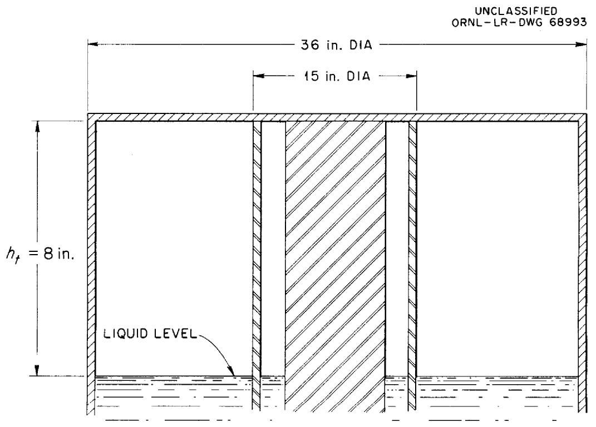  
Fig. A.l. Assumed Pump Tank Geometry.

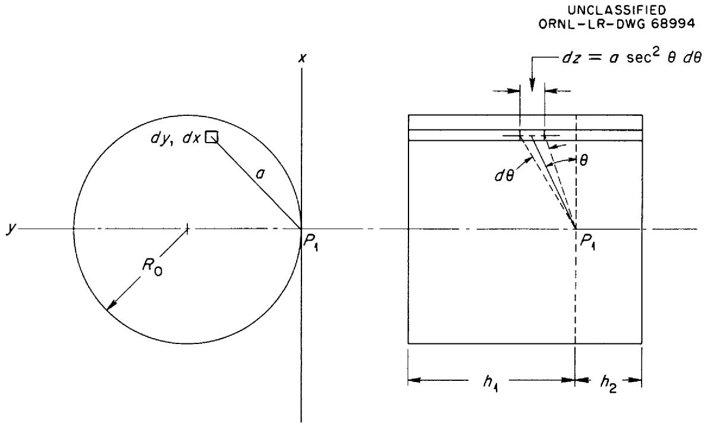  
Fig. A.2. Diagram for Determining Energy Flux at Pump Tank Outer Surface.

where

$$
y _ {1} = 2 R _ {0},
$$

$$
x _ {1} = \pm \left(2 y R _ {0} - y ^ {2}\right) ^ {1 / 2},
$$

$$
\theta_ {1} = \tan^ {- 1} h _ {1} \left(x ^ {2} + y ^ {2}\right) ^ {- 1 / 2},
$$

$$
\theta_ {2} = \tan^ {- 1} h _ {2} \left(x ^ {2} + y ^ {2}\right) ^ {- 1 / 2},
$$

$\mathrm{S}_{\mathrm{v}} =$ energy source per unit volume.

Energy Flux at the Volute Support Cylinder Outer Surface

Figure A.3 and the following equation were used for determining the energy flux at the outer surface, $\mathbf{P}_2$ , of the volute support cylinder:

$$
\begin{array}{l} \phi = \frac {s _ {v}}{4 \pi} \left[ \int_ {0} ^ {y _ {1}} \int_ {0} ^ {x _ {1}} \int_ {0} ^ {\theta_ {1}} d y d x d \theta (x ^ {2} + y ^ {2}) ^ {- 1 / 2} + \right. \\ + \int_ {0} ^ {y _ {1}} \int_ {0} ^ {x _ {1}} \int_ {0} ^ {\theta 2} d y d x d \theta \left(x ^ {2} + y ^ {2}\right) ^ {- 1 / 2} \Bigg ], \tag {A.2} \\ \end{array}
$$

where

$$
\begin{array}{l} y _ {1} = R _ {0} - R _ {1}, \\ \mathrm {x} _ {\perp} = \pm \left[ \mathrm {R} _ {\mathrm {o}} ^ {2} - (\mathrm {y} - \mathrm {R} _ {\perp}) ^ {2} \right] ^ {1 / 2}, \\ \theta_ {\perp} = \tan^ {- 1} h _ {\perp} \left(x ^ {2} + y ^ {2}\right) ^ {- 1 / 2}, \\ \theta_ {2} = \tan^ {- 1} h _ {2} \left(x ^ {2} + y ^ {2}\right) ^ {- 1 / 2}. \\ \end{array}
$$

Energy Flux at the Volute Support Cylinder Inner Surface

The energy flux at $\mathbb{P}_3$ , as shown on Fig. A.3, was approximated by calculating the flux at $\mathbb{P}_3'$ using equation A.2 and the appropriate values of $\mathbb{R}_1$ and $\mathbb{R}_0$ . This value was then corrected for the additional volume visible to $\mathbb{P}_3$ by the direct cross-section area ratio and the inverse

square ratio of the center-of-gravity distance:

$$
\phi (\text {a t} \mathrm {P} _ {3}) = 1. 2 6 \phi (\text {a t} \mathrm {P} _ {3} ^ {\prime}).
$$

The values of $\phi$ at $P_1, P_2$ , and $P_3'$ were evaluated as functions of $h_1$ and $h_2$ by the Numerical Analysis Section of ORGDP. The beta-energy distribution is shown in Fig. A.4.

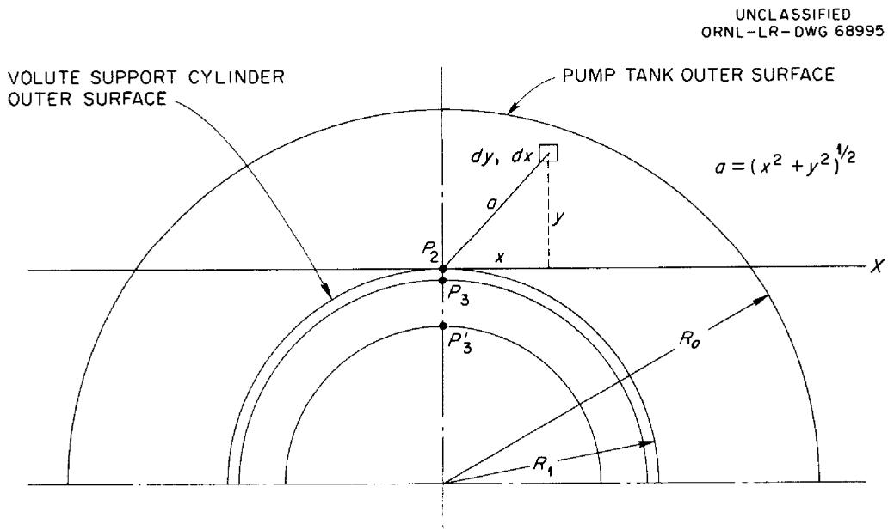  
Fig. A.3. Diagram for Determining Energy Flux at Outer and Inner Surfaces of the Volute Support Cylinder.

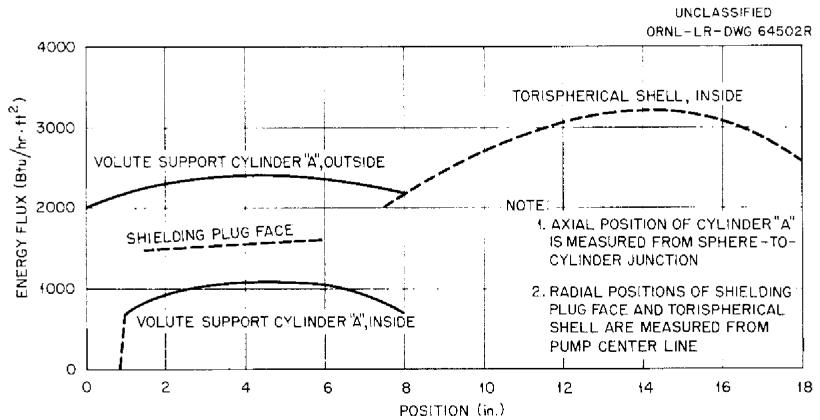  
Fig. A.4. Beta-Energy Distribution of Fuel Pump Tank, Volute Support Cylinder, and Shielding Plug.

# Estimation of Outer Surface Temperatures and

# Heat Transfer Coefficients

The GHT Code for calculating the complete temperature distribution of the pump tank could not consider the effects of the flowing air stream on the temperature distribution of the pump tank because of the temperature rise of the cooling air along the pump tank surface. In order to obtain the temperature distribution, it was necessary to couple the pump tank surface with the surroundings by use of an effective heat transfer coefficient $\left(\frac{h_{ce}}{h}\right)$ and the ambient temperature. It was impractical to obtain an effective coefficient at each point along the surface, and therefore the value of $h_{ce}$ was calculated at the cylinder-to-shell junction, where the thermal stress problem was most severe, and then applied over the entire upper surface of the pump tank.

The air-cooled upper portion of the fuel pump tank is shown schematically in Fig. B.l. The pump tank is subject to thermal radiation and convection heating from the fuel salt, fission-product beta heating, and gamma-radiation internal heating. This heat is conducted to the

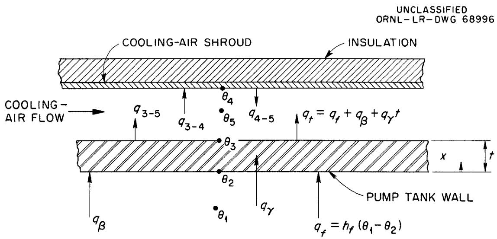  
Fig. B.l. Schematic Diagram of Cooling-Air Shroud and Pump Tank Wall.

pump tank surface where it is transferred to the cooling air by two paths: (1) direct forced convection to the cooling air and (2) radiation to the cooling shroud and forced convection to the same cooling air. Heat is also conducted parallel to the pump tank surface, but this heat transfer is assumed to be zero in estimating the surface temperature and heat transfer coefficients.

The temperature distribution through the pump tank wall can be calculated12 as outlined below, assuming a constant gamma heat-generation rate through the wall

$$
\frac {d ^ {2} \theta}{d x ^ {2}} = - \frac {q _ {\gamma}}{k}, \tag {B.1}
$$

$$
\frac {d \theta}{d x} = - \frac {q _ {\gamma}}{k} x + c _ {1}, \tag {B.2}
$$

$$
C _ {1} = \frac {\mathrm {d} \theta}{\mathrm {d} x} + \frac {q _ {\gamma}}{k} x. \tag {B.3}
$$

At the interior wall, where $x = 0$ ,

$$
\mathrm {q} _ {\mathrm {f}} + \mathrm {q} _ {\beta} = - \mathrm {k} \frac {\mathrm {d} \theta}{\mathrm {d} x},
$$

so

$$
\frac {d \theta}{d x} = - \frac {q _ {r} + q _ {\beta}}{k},
$$

and therefore

$$
C _ {1} = \frac {d \theta}{d x} = - \frac {q _ {1} + q _ {\beta}}{k};
$$

and for any place within the wall, that is, $x \neq 0$ ,

$$
\frac {d \theta}{d x} = - \frac {q _ {\gamma} x}{k} - \frac {q _ {F} + q _ {\beta}}{k}. \tag {B.4}
$$

The temperature is then

$$
\theta = - \frac {q _ {\gamma} x ^ {2}}{2 k} - \frac {x}{k} \left(q _ {1} + q _ {\beta}\right) + C _ {2}. \tag {B.5}
$$

At the interior wall $x = 0$ , and therefore

$$
\theta = \mathrm {C} _ {2} = \theta_ {2}
$$

and

$$
\theta_ {x} = \theta_ {2} - \frac {q _ {x} ^ {2}}{2 k} - \frac {x}{k} \left(q _ {f} + q _ {\beta}\right). \tag {B.6}
$$

If the heat transfer from the outer surface is expressed by an effective coefficient with respect to the ambient temperature rather than the actual forced-convection cooling system temperature, the outer surface temperature can be calculated as follows from Eq. (B.6) with $x = t$ :

$$
\theta_ {3} = \theta_ {2} - \frac {q _ {\gamma} t ^ {2}}{2 k} - \frac {t}{k} \left(q _ {f} + q _ {\beta}\right), \tag {B.7}
$$

where

$$
q _ {f} = q _ {t} - q _ {\gamma} t - q _ {\beta} = h _ {f} \left(\theta_ {1} - \theta_ {2}\right),
$$

and

$$
\theta_ {3} = \theta_ {2} - \frac {q _ {\gamma} t ^ {2}}{2 k} - \frac {t}{k} \left(q _ {t} - q _ {\gamma} t - q _ {\beta} + q _ {\beta}\right), \tag {B.8}
$$

$$
\theta_ {3} = \theta_ {2} + \frac {a _ {\gamma} t ^ {2}}{2 k} - \frac {t}{k} a _ {t}, \tag {B.9}
$$

$$
q _ {t} = \theta_ {2} \frac {k}{t} - \theta_ {3} \frac {k}{t} + \frac {q _ {\gamma} t}{2}, \tag {B.10}
$$

$$
q _ {t} = h _ {c e} \theta_ {3} - h _ {c e} \theta_ {4 e}, \tag {B.11}
$$

where $\theta_{4e}$ is the effective ambient temperature, and

$$
q _ {t} = h _ {f} \theta_ {1} - h _ {f} \theta_ {2} + q _ {\gamma} t + q _ {\beta}. \tag {B.12}
$$

Solving Eqs. (B.10), (B.11), and (B.12) simultaneously for $\theta_{3}$ yields the following equation:

$$
\begin{array}{l} \theta_ {3} = \frac {\mathrm {h} _ {\mathrm {c e}} \mathrm {h} _ {\mathrm {e f}} + \mathrm {h} _ {\mathrm {c e}} \mathrm {k}}{\mathrm {h} _ {\mathrm {c e}} \mathrm {h} _ {\mathrm {f}} + \mathrm {k} (\mathrm {h} _ {\mathrm {c e}} + \mathrm {h} _ {\mathrm {f}})} \theta_ {4 \mathrm {e}} + \\ + \frac {h _ {f} k}{h _ {c e} h _ {f} t + k \left(h _ {c e} + h _ {f}\right)} \theta_ {1} + \frac {k}{h _ {c e} h _ {f} t + k \left(h _ {c e} + h _ {f}\right)} q _ {\beta} + \\ + \frac {t \left(h _ {f} t + 2 k\right)}{h _ {c e} h _ {f} t + k \left(h _ {c e} + h _ {f}\right)} \frac {q _ {\gamma}}{2}. \tag {B.13} \\ \end{array}
$$

Solving Eq. (B.13) for $h_{ce}$ and rearranging the terms gives

$$
h _ {c e} = \frac {h _ {f} k \left(\theta_ {1} - \theta_ {3}\right) + k q _ {\beta} + t \left(h _ {f} t + 2 k\right) \frac {q _ {\gamma}}{2}}{\left(t h _ {f} + k\right) \left(\theta_ {3} - \theta_ {4 e}\right)} \tag {B.14}
$$

The difficulty in calculating the outer surface temperature $(\theta_{3})$ from Eq. (B.13) results from the fact that the heat transfer coefficients $h_{ce}$ and $h_{f}$ are highly temperature dependent, and $\theta_{3}$ must be known before accurate coefficients can be calculated. However, for a given set of reactor operating conditions, it is evident from the preceding equations that the selection of an arbitrary value of $\theta_{3}$ will result in a particular value of the total heat transfer across the outer surface, and a particular value of $h_{ce}$ is required to dissipate this quantity of heat to the surroundings. Since the temperature drop across the pump tank wall is small for the cases of interest, $\theta_{3}$ can be used to compute the value of the internal surface heat transfer coefficient $(h_{f})$ , and the value of $h_{ce}$ can then be calculated by Eq. (B.14).

The following procedure was used to estimate the effective outer surface heat transfer coefficients for various cooling-air flow rates:

1. Values of $h_f$ versus inner surface temperature $(\theta_2)$ were calculated by Eq. (B.15), below, and plotted on Fig. B.2:

$$
h _ {r} = \frac {\sigma_ {r} F e F a \left(\theta_ {1} ^ {4} - \theta_ {2} ^ {4}\right)}{\theta_ {1} - \theta_ {2}} + 1. 5 \tag {B.15}
$$

2. The total heat transferred $(q_{t})$ was calculated versus the outer surface temperature $(\theta_{3})$ by Eq. (B.16), below, after first calculating

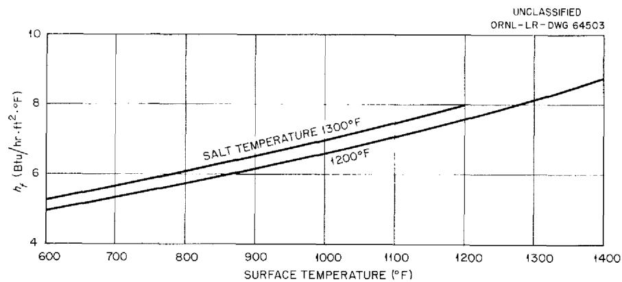  
Fig. B.2. Pump Tank Inner Surface Heat Transfer Coefficient Versus Outer Surface Temperature.

hce by Eq. (B.14):

$$
\mathrm {q} _ {\mathrm {t}} = \mathrm {h} _ {\mathrm {c e}} \left(\theta_ {3} - \theta_ {4 \mathrm {e}}\right). \tag {B.16}
$$

3. The forced convection heat transfer coefficients for the pump tank outer surface and the cooling shroud were calculated as a function of air flow by Eq. (B.17) and plotted on Fig. B.3:14

$$
h _ {c} = 0. 0 2 2 5 \frac {k}{t _ {g}} (\Pr) ^ {0. 4} (\mathrm {R e}) ^ {0. 8}. \tag {B.17}
$$

4. The heat transferred to the cooling shroud by thermal radiation was calculated versus shroud temperature for each of several values of $\theta_{3}$ and plotted on Fig. B.3.

At equilibrium conditions, the heat radiated to the shroud $(q_{3-4})$ plus the heat transferred directly to the cooling air $(q_{3-5})$ must equal the total heat transferred $(q_t)$ , and the heat transferred from the shroud

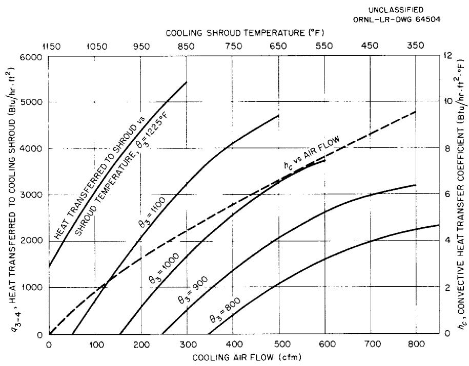  
Fig. B.3. Convective Heat Transfer Coefficient Versus Air Flow and Heat Transferred to Shroud Versus Shroud Temperature.

to the cooling air $(q_{4-5})$ must be equal to the heat transferred to the shroud from the pump tank. Therefore, for each assumed value of $\theta_3$ , the heat transferred to the shroud is calculated versus cooling air flow rate from the expression

$$
q _ {3 - 4} = q _ {t} - q _ {3 - 5},
$$

where

$$
\mathrm {q} _ {\mathrm {t}} = \mathrm {h} _ {\mathrm {c e}} \left(\theta_ {3} - \theta_ {4 \mathrm {e}}\right),
$$

and

$$
\mathrm {q} _ {3 - 5} = \mathrm {h} _ {\mathrm {c}} (\theta_ {3} - \theta_ {5}) \quad .
$$

The particular shroud temperature required to accept the heat $(q_{3-4})$ from the pump tank surface is obtained from Fig. B.3. The heat transferred from the shroud to the cooling air is then calculated:

$$
\mathrm {q} _ {4 - 5} = \mathrm {h} _ {\mathrm {c}} \left(\theta_ {4} - \theta_ {5}\right).
$$

For each value of $\theta_{3}$ , $q_{3-4}$ , and $q_{4-5}$ are plotted versus cooling-air flow rate as shown on Fig. B.4, and the intersection of the two curves determines the cooling-air flow rate that will produce the particular value of $\theta_{3}$ . A plot of $\theta_{3}$ versus cooling-air flow rate can then be made as in Fig. B.5, and the effective surface heat transfer coefficients hce for use in the GHT Code can be calculated for any air flow rate using Eq. (B.14).

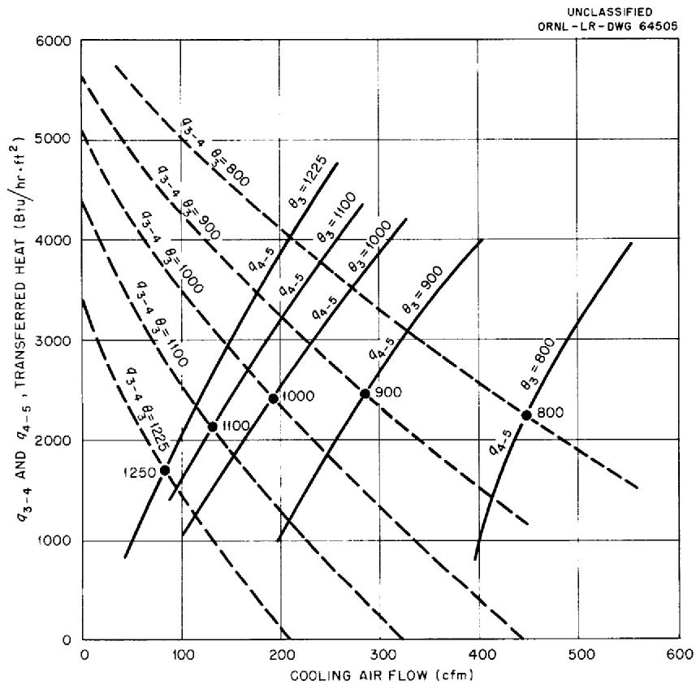  
Fig. B.4. Shroud Heat Transfer Versus Cooling Air Flow.

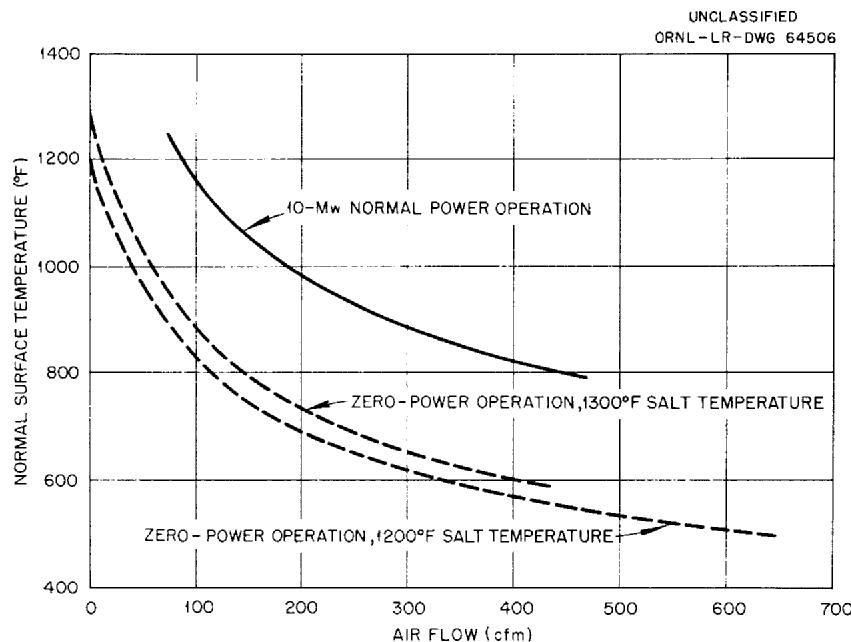  
Fig. B.5. Nominal Surface Temperature Versus Cooling Air Flow.

# APPENDIX C

# Derivation of Boundary and Compatibility Equations for Thermal Stress Calculations

The procedures for calculating thermal stresses in cylinders and cones are fully described in refs. 6 through 9. The general layout of the pump tank structure and the sign convention used in the stress analysis are shown in Fig. C.l. The cone-to-cylinder joint is assumed to be rigid. It is necessary to evaluate four integration constants for each of the three members by solving l2 simultaneous equations describing the boundary conditions of the structure and the compatibility conditions which interrelate the three members at their junction. Since the position functions for cylinders are tabulated in ref. 8 only for positive values of L, the cone-to-cylinder junction is made the origin and the cylinder axis is assumed to be positive in either direction. This

Fig. C.l. Schematic Diagram and Sign Convention of Pump Tank Structure.   
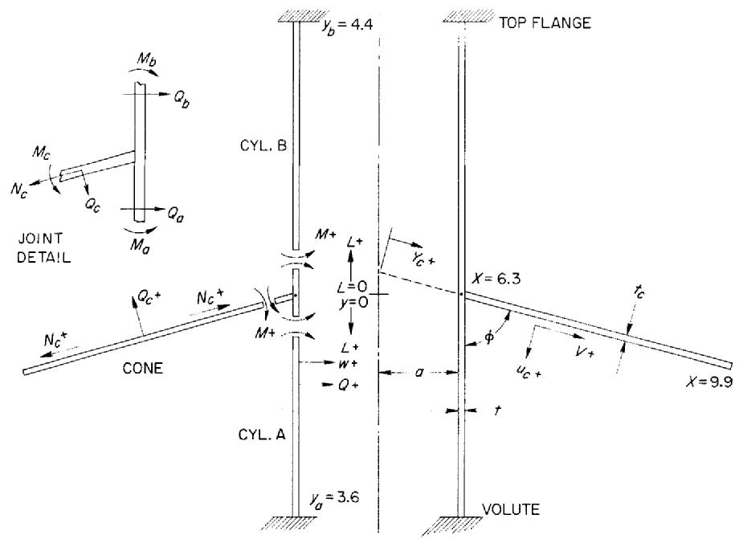  
UNCLASSIFIED NL-LR-DWG 64

assumption requires that the slope and the shear force equations be modified by a sign change to compensate for the reversed sign on one of the cylinders.

Derivations of the l2 simultaneous equations from the specific boundary or compatibility conditions are given below. The basic equations for moment, displacement, slope, and shear force were obtained from ref. 6 for the cylinders and ref. 8 for the cone. The conical shell equations differ somewhat from those presented in ref. 8 because a preliminary version of the report was used that did not include the effects of a thermal gradient through the wall. All the terms considering the effects of internal pressure and mechanical loading were omitted from both the cylindrical and conical shell equations.

The following material constants, geometric constants, position constants, and auxiliary functions are used in the boundary and compatibility equations:

$$
E = 2 6. 3 \times 1 0 ^ {6},
$$

$$
\alpha = 7. 8 1 \times 1 0 ^ {- 6},
$$

$$
\mu = 0. 3,
$$

$$
t = 0. 7 5,
$$

$$
D = \frac {E t ^ {3}}{1 2 \left(1 - \mu^ {2}\right)} = 1. 0 1 6 \times 1 0 ^ {6},
$$

$$
\gamma = \frac {4 a \alpha T _ {b 5}}{a ^ {4} + 4},
$$

$$
d = \frac {b}{\hat {\beta}},
$$

$$
\begin{array}{l} F _ {1} = d ^ {4} + 4, \\ F _ {2} = F _ {1} e ^ {d y}. \\ \end{array}
$$

It was necessary to adjust the pump tank configuration slightly so that the boundaries of the separate members would coincide with tabulated values for the cone and cylinders:

$$
\begin{array}{l} \beta_ {c} ^ {2} = 3. 3 0 4 5 \frac {\cot \phi}{t _ {c}} = 1. 3 4 4 9, \\ \beta_ {c} = 1. 1 5 9 8, \\ t _ {c} = 0. 5, \\ \phi = 7 8. 5 \mathrm {d e g} , \\ \end{array}
$$

$$
\begin{array}{l} \cot \phi = 0. 2 0 3 5, \\ \mathrm {X _ {c}} = 2 \beta_ {\mathrm {c}} \sqrt {\mathrm {Y _ {c}}} , \\ X _ {c 1} = 2 \beta_ {c} \sqrt {Y _ {c 1}} = 6. 2 5 4 8, \\ X _ {c 2} = 2 \beta_ {c} \sqrt {Y _ {c 2}} = 9. 8 4 4, \\ a _ {i} = 7. 1 2 5 \text {i n . ,} \\ Y _ {c 1} = \frac {a _ {i}}{\sin \phi} = 7. 2 7 1, \\ Y _ {c 2} = 1 8. 0 \text {i n .} \\ \end{array}
$$

The values of $\mathbf{X}_{\mathbf{c}1}$ and $\mathbf{X}_{\mathbf{c}2}$ were adjusted to the nearest values tabulated in ref. 9:

$$
\begin{array}{l} X _ {c 1} = 6. 3 0, \\ Y _ {c 1} = \left(\frac {X _ {c 1}}{2 \beta_ {c}}\right) ^ {2} = 7. 3 7 6, \\ X _ {c 2} = 9. 9 0 \quad . \\ \end{array}
$$

The cylinder mean radius "a" was then corrected:

$$
\begin{array}{l} a = Y _ {c l} \sin \phi = 7. 2 2 8, \\ \beta^ {2} = \frac {1 . 6 5 2 3}{a t} = \frac {1 . 6 5 2 3}{7 . 2 2 8 \times 0 . 7 5} = 0. 3 0 4 7 9, \\ \beta = 0. 5 5 2 0 7, \\ y _ {a i} = \beta L _ {a i} = 3. 5 8 8, \\ y _ {b i} = \beta L _ {b i} = 4. 4 1 6, \\ L _ {a i} = 6. 5 \text {i n . ,} \\ I _ {b i} = 8. 0 \text {i n .} \\ \end{array}
$$

The values of $y_{ai}$ and $y_{bi}$ were adjusted to the nearest tabulated values in ref. 7.

$$
\begin{array}{l} y _ {\text {日}} = 3. 6, \\ L _ {a} = 6. 5 2 1, \\ Y _ {b} = 4. 4, \\ I _ {b} = 7. 9 7 0 \dots \\ \end{array}
$$

The following cylinder position functions were taken from ref. 7:

<table><tr><td>Function</td><td>Volute, y_a=3.6</td><td>Junction, y_a,b=0</td><td>Top Flange, y_b=4.4</td></tr><tr><td>M1</td><td>0.049</td><td>-2.0</td><td>0.007546</td></tr><tr><td>M2</td><td>-0.02418</td><td>0</td><td>-0.02337</td></tr><tr><td>M3</td><td>-65.64</td><td>+2.0</td><td>-50.065</td></tr><tr><td>M4</td><td>32.39</td><td>0</td><td>155.02</td></tr><tr><td>Q1</td><td>0.07319</td><td>-2.0</td><td>0.03091</td></tr><tr><td>Q2</td><td>0.02482</td><td>-2.0</td><td>-0.01582</td></tr><tr><td>Q3</td><td>33.25</td><td>-2.0</td><td>-104.95</td></tr><tr><td>Q4</td><td>-98.03</td><td>+2.0</td><td>-205.08</td></tr><tr><td>N1</td><td>-0.01209</td><td>0</td><td>-0.01168</td></tr><tr><td>N2</td><td>-0.02450</td><td>+1.0</td><td>-0.00377</td></tr><tr><td>N3</td><td>-16.19</td><td>0</td><td>-77.51</td></tr><tr><td>N4</td><td>-32.82</td><td>+1.0</td><td>-25.03</td></tr><tr><td>W1&#x27;</td><td>-0.01241</td><td>1.0</td><td>0.00791</td></tr><tr><td>W2&#x27;</td><td>0.03659</td><td>-1.0</td><td>0.01546</td></tr><tr><td>W3&#x27;</td><td>-49.02</td><td>1.0</td><td>-102.54</td></tr><tr><td>W4&#x27;</td><td>-16.62</td><td>1.0</td><td>52.48</td></tr></table>

The following cone position functions were taken from ref. 9:

<table><tr><td>Function</td><td>Junction, Xcl = 6.3</td><td>Cone Outer Surface, Xc2 = 9.9</td></tr><tr><td>Myl</td><td>3.3798</td><td></td></tr><tr><td>My2</td><td>-1.0712</td><td></td></tr><tr><td>My3</td><td>-0.000601</td><td></td></tr><tr><td>My4</td><td>-0.0013052</td><td></td></tr><tr><td>Qc1</td><td>-0.45082</td><td>4.4317</td></tr><tr><td>Qc2</td><td>1.0224</td><td>-2.2413</td></tr><tr><td>Qc3</td><td>-0.0004356</td><td>0.000010179</td></tr><tr><td>Qc4</td><td>-0.00014553</td><td>-0.000003558</td></tr><tr><td>W'cl</td><td>10.1451</td><td>-54.918</td></tr><tr><td>W'c2</td><td>4.47331</td><td>-108.588</td></tr><tr><td>W'c3</td><td>-0.001444</td><td>-0.00008719</td></tr><tr><td>W'c4</td><td>0.004322</td><td>-0.0002494</td></tr><tr><td>(Vc - Wc)1</td><td>-13.313</td><td></td></tr><tr><td>(Vc - Wc)2</td><td>-27.449</td><td></td></tr><tr><td>(Vc - Wc)3</td><td>-0.01553</td><td></td></tr><tr><td>(Vc - Wc)4</td><td>0.0051</td><td></td></tr><tr><td>K1</td><td>0.10078</td><td>0.04081</td></tr><tr><td>K2</td><td>0.0071098</td><td>0.0011659</td></tr><tr><td>K3</td><td>2.2948</td><td>3.1988</td></tr><tr><td>K4</td><td>1.9948</td><td>2.8988</td></tr><tr><td>P1</td><td>9.9225</td><td>24.5025</td></tr><tr><td>P2</td><td>19.845</td><td>49.005</td></tr><tr><td>P3</td><td>147.684</td><td>900.559</td></tr><tr><td>P4</td><td>19.691</td><td>120.074</td></tr></table>

The cone auxiliary temperature functions were obtained from the following expressions:

$$
J _ {1} = - \left(E t _ {c} \alpha \cot \phi\right) T _ {c l} = - 2 0. 9 T _ {c l},
$$

$$
J _ {2} = \frac {\text {E t} _ {c} \alpha \cot \phi}{\beta_ {c} ^ {4}} \left(\frac {7 2 T _ {c 5}}{\beta_ {c} ^ {4}} - T _ {c 3}\right) = 4 5 9. 9 5 T _ {c 5} - 1 1. 5 5 5 T _ {c 3},
$$

$$
J _ {3} = \frac {- 2 E t c ^ {\alpha} \cot \phi}{\beta_ {c} ^ {6}} T _ {c 4} = - 1 7. 1 8 3 T _ {c 4},
$$

$$
J _ {4} = \frac {- 3 E t c ^ {\alpha} \cot \phi}{\beta_ {c} ^ {8}} T _ {c 5} = - 1 9. 1 6 5 T _ {c 5}.
$$

The temperature distributions for the cylinders and cone were expressed in the following forms:

Cylinder "A"

$$
\theta_ {\mathrm {a}} = \mathrm {T} _ {\mathrm {a} 1} + \mathrm {T} _ {\mathrm {a} 2} \frac {\mathrm {y}}{\beta} + \mathrm {T} _ {\mathrm {a} 3} \left(\frac {\mathrm {y}}{\beta}\right) ^ {2} + \mathrm {T} _ {\mathrm {a} 4} \left(\frac {\mathrm {y}}{\beta}\right) ^ {3}.
$$

Cylinder "B"

$$
\theta_ {b} = T _ {b 1} + T _ {b 2} \frac {y}{\beta} + T _ {b 3} \left(\frac {y}{\beta}\right) ^ {2} + T _ {b 4} \left(\frac {y}{\beta}\right) ^ {3} + T _ {b 5} e ^ {- d y}.
$$

Cone "C"

$$
\theta_ {c} = \frac {T _ {c 1}}{Y _ {c}} + T _ {c 2} + T _ {c 3} Y _ {c} + T _ {c 4} Y _ {c} ^ {2} + T _ {c 5} Y _ {c} ^ {3}.
$$

At the pump volute $(y_{a} = 3.6)$ , the slope of cylinder "A" = 0, and

$$
\frac {\mathrm {d w} _ {\mathrm {a}}}{\mathrm {d L}} = 0 = \frac {\mathrm {a} \beta}{\mathrm {E t}} \sum \mathrm {C} _ {\mathrm {n a}} \mathrm {W} _ {\mathrm {n}} ^ {\prime} - \mathrm {a} \alpha \left[ \mathrm {T} _ {\mathrm {a} 2} + 2 \mathrm {T} _ {\mathrm {a} 3} \frac {\mathrm {y}}{\beta} + 3 \mathrm {T} _ {\mathrm {a} 4} \left(\frac {\mathrm {y}}{\beta}\right) ^ {2} \right],
$$

$$
\sum C _ {n a n} W ^ {\prime} = \frac {E t \alpha}{\beta} \left[ T _ {a 2} + 2 T _ {a 3} \frac {y}{\beta} + 3 T _ {a 4} \left(\frac {y}{\beta}\right) ^ {2} \right],
$$

$$
\sum C _ {n a} W _ {n} ^ {\prime} = 2 7 9. 0 4 \left(T _ {a 2} + 1 3. 0 4 2 T _ {a 3} + 1 2 4. 5 7 T _ {a 4}\right). \tag {C.1}
$$

At the pump volute $(y_{a} = 3.6)$ , the radial displacement of "A" is $-\alpha \theta_{l}$ and

$$
\begin{array}{l} \mathrm {w} _ {\mathrm {a}} = - \mathrm {a} \alpha \theta_ {\mathrm {l}} = \frac {\mathrm {a}}{\mathrm {E t}} \sum \mathrm {C} _ {\mathrm {n a}} \mathrm {N} _ {\mathrm {n}} - \\ - \operatorname {a c} \left[ \mathrm {T} _ {\mathrm {a 1}} + \mathrm {T} _ {\mathrm {a 2}} \frac {\mathrm {Y}}{\beta} + \mathrm {T} _ {\mathrm {a 3}} \left(\frac {\mathrm {Y}}{\beta}\right) ^ {2} + \mathrm {T} _ {\mathrm {a 4}} \left(\frac {\mathrm {Y}}{\beta}\right) ^ {3} \right], \\ \end{array}
$$

$$
\theta_ {l} = \mathrm {T _ {a l}} + \mathrm {T _ {a 2}} \frac {\mathrm {y}}{\beta} + \mathrm {T _ {a 3}} \left(\frac {\mathrm {y}}{\beta}\right) ^ {2} + \mathrm {T _ {a 4}} \left(\frac {\mathrm {y}}{\beta}\right) ^ {3},
$$

and therefore

$$
\sum \mathrm {C} _ {\mathrm {n a n}} = 0. \tag {C.2}
$$

At the cone-cylinder junction, the summation of moments $= 0$ , that is,

$$
\mathrm {M} _ {\mathrm {a}} - \mathrm {M} _ {\mathrm {b}} + \mathrm {M} _ {\mathrm {c}} = 0,
$$

and

$$
\begin{array}{l} \frac {1}{4 a \beta^ {2}} \sum C _ {n a} M _ {n} - 2 D a \alpha T _ {a 3} - \frac {1}{4 a \beta^ {2}} \sum C _ {n b} M _ {n} + \\ + 2 \mathrm {D a c T} _ {\mathrm {b} 3} + \mathrm {D b} ^ {2} \gamma e ^ {- d y} + \sum C _ {\mathrm {n c}} M _ {\mathrm {y n}} + J _ {1} K _ {2} + \\ + 1. 3 \mathrm {J} _ {2} + 2. 3 \mathrm {J} _ {3} \mathrm {P} _ {1} + 2. 2 \mathrm {J} _ {4} \mathrm {P} _ {3} = 0, \\ \end{array}
$$

$$
\begin{array}{l} \frac {1}{4 a \beta^ {2}} \sum c _ {n a} M _ {n} - \frac {1}{4 a \beta^ {2}} \sum c _ {n b} M _ {n} + \sum c _ {n c} M _ {y n} = \\ 2 \mathrm {D a} \alpha \left(\mathrm {T} _ {\mathrm {a} 3} - \mathrm {T} _ {\mathrm {b} 3}\right) - \mathrm {J} _ {1} \mathrm {K} _ {2} + 1. 3 \mathrm {J} _ {2} + 2. 3 \mathrm {J} _ {3} \mathrm {P} _ {1} + \\ + 2. 2 \mathrm {J} _ {4} \mathrm {P} _ {3} - \mathrm {D b} ^ {2} \gamma \mathrm {e} ^ {- \mathrm {d y}}, \\ \end{array}
$$

$$
\begin{array}{l} \frac {1}{4 a \beta^ {2}} \left(\sum C _ {n a} M _ {n} - \sum C _ {n b} M _ {n}\right) + \sum C _ {n c} M _ {y n} = \\ 1 1 4. 7 \left(\mathrm {T} _ {\mathrm {a} 3} - \mathrm {T} _ {\mathrm {b} 3}\right) - 0. 0 0 7 1 1 \mathrm {J} _ {1} - 1. 3 \mathrm {J} _ {2} - \\ - 1 2 2. 8 2 J _ {3} - 3 2 4. 9 J _ {4} - 2 2 9. 4 l T _ {b 5} \frac {b ^ {2}}{F _ {1}} \tag {C.3} \\ \end{array}
$$

At the cone-cylinder junction, the summation of horizontal and vertical forces $= 0$ , and therefore, for the vertical forces,

$$
\mathrm {Q} _ {\mathbf {c}} \sin \phi + \mathrm {N} _ {\mathbf {c}} \cos \phi = 0
$$

or

$$
Q _ {c} = - N _ {c} \frac {\cos \phi}{\sin \phi}.
$$

For the horizontal forces,

$$
\begin{array}{l} Q _ {c} \cos \phi + N _ {c} \sin \phi = \\ - \mathrm {N} _ {\mathrm {c}} \frac {\cos^ {2} \phi}{\sin \phi} + \mathrm {N} _ {\mathrm {c}} \sin \phi = \mathrm {N} _ {\mathrm {c}} \left(\sin \phi - \frac {\cos^ {2} \phi}{\sin \phi}\right). \\ \end{array}
$$

For the summation of horizontal forces on both the cylinders and the cone,

$$
\mathrm {Q _ {a} + Q _ {b} - N _ {c} \left(\sin \phi - \frac {\cos^ {2} \phi}{\sin \phi}\right) = 0 ,}
$$

and

$$
\begin{array}{l} \frac {1}{4 a \beta} \sum C _ {n a} Q _ {n} + 6 D a c T _ {a 4} + \frac {1}{4 a \beta} \sum C _ {n b} Q _ {n} + \\ + 6 \mathrm {D a} \alpha \mathrm {T} _ {\mathrm {b} 4} - \mathrm {D b} ^ {3} \gamma \mathrm {e} ^ {- \mathrm {d y}} - \beta_ {\mathrm {c}} ^ {2} \tan \phi \left(\sin \phi - \frac {\cos^ {2} \phi}{\sin \phi}\right) \times \\ \times \left(- \sum \mathrm {C} _ {\mathrm {n c}} \mathrm {Q} _ {\mathrm {n c}} + 8 \mathrm {J} _ {4} \mathrm {P} _ {1} + 3 \mathrm {J} _ {3}\right) = 0, \\ \end{array}
$$

$$
\frac {1}{4 a \beta} \left(\sum \mathrm {c} _ {\mathrm {n a}} \mathrm {Q} _ {\mathrm {n}} + \sum \mathrm {c} _ {\mathrm {n b}} \mathrm {Q} _ {\mathrm {n}}\right) +
$$

$$
+ \beta_ {\mathrm {c}} ^ {2} \tan \phi \left(\sin \phi - \frac {\cos^ {2} \phi}{\sin \phi}\right) \sum \mathsf {C} _ {\mathrm {n c}} \mathsf {Q} _ {\mathrm {n c}} =
$$

$$
\begin{array}{l} 6. 2 0 9 4 (7 9. 3 8 J _ {4} + 3. 0 J _ {3}) - \\ - 3 4 4. 1 2 \left(\mathrm {T} _ {\mathrm {a} 4} + \mathrm {T} _ {\mathrm {b} 4}\right) + 2 2 9. 4 1 \mathrm {T} _ {\mathrm {b} 5} \frac {\mathrm {b} ^ {3}}{\mathrm {F} _ {1}} \quad . \tag {C.4} \\ \end{array}
$$

At the junction, the slope of Cylinder "A" = - slope of Cylinder "B," and

$$
\frac {\mathrm {d} w _ {a}}{\mathrm {d} L} = - \frac {\mathrm {d} w _ {b}}{\mathrm {d} L},
$$

$$
\frac {\mathrm {a} \beta}{\mathrm {E t}} \sum \mathrm {C} _ {\mathrm {n a}} \mathrm {W} _ {\mathrm {n}} ^ {\prime} - \mathrm {a} \alpha \mathrm {T} _ {\mathrm {a 2}} = - \frac {\mathrm {a} \beta}{\mathrm {E t}} \sum \mathrm {C} _ {\mathrm {n b}} \mathrm {W} _ {\mathrm {n}} ^ {\prime} + \mathrm {a} \alpha \mathrm {T} _ {\mathrm {b 2}} - \mathrm {b} \gamma \mathrm {e} ^ {- \mathrm {d y}},
$$

$$
\sum \mathrm {C} _ {\mathrm {n a}} \mathrm {W} _ {\mathrm {n}} ^ {\prime} + \sum \mathrm {C} _ {\mathrm {n b}} \mathrm {W} _ {\mathrm {n}} ^ {\prime} = \frac {\mathrm {E t} \alpha}{\beta} \left(\mathrm {T} _ {\mathrm {a 2}} + \mathrm {T} _ {\mathrm {b 2}}\right) - \frac {\mathrm {E t}}{\mathrm {a} \beta} \mathrm {b y e} ^ {- \mathrm {d y}},
$$

$$
\sum C _ {n a} W _ {n} ^ {\prime} + \sum C _ {n b} W _ {n} ^ {\prime} = 2 7 9. 0 4 \left(T _ {a 2} + T _ {b 2}\right) - 1 1 1 6. 2 T _ {b 5} \frac {b}{F _ {1}} \tag {C.5}
$$

At the junction, the slope of Cylinder "A" = slope of the Cone "C," and

$$
\frac {\mathrm {d} w _ {\mathrm {a}}}{\mathrm {d} L} = \frac {\mathrm {d} u _ {\mathrm {c}}}{\mathrm {d} Y _ {\mathrm {c}}}
$$

$$
\begin{array}{l} \frac {\mathrm {a} \beta}{\mathrm {E t}} \sum \mathrm {C} _ {\mathrm {n a n}} \mathrm {W} ^ {\prime} - \mathrm {a c T} _ {\mathrm {a 2}} = \\ \frac {\beta_ {c} ^ {2}}{\mathrm {E t} _ {c}} \tan^ {2} \phi \left[ \sum C _ {n c} W _ {n c} ^ {\prime} - J _ {1} K _ {1} + J _ {2} P _ {1} + \frac {2 P _ {3}}{3} (J _ {3} + J _ {4} P _ {1}) \right], \\ \frac {\mathrm {a} \beta}{\mathrm {t}} \sum \mathrm {C} _ {\mathrm {n a}} \mathrm {W} _ {\mathrm {n}} ^ {\prime} - \frac {\beta_ {\mathrm {c}} ^ {2}}{\mathrm {t} _ {\mathrm {c}}} \tan^ {2} \phi \sum \mathrm {C} _ {\mathrm {n c}} \mathrm {W} _ {\mathrm {n c}} ^ {\prime} = \\ \mathrm {a E O T} _ {\mathrm {a 2}} + \frac {\beta_ {\mathrm {c}} ^ {2}}{\mathrm {t} _ {\mathrm {c}}} \tan^ {2} \phi \left[ \mathrm {J} _ {1} \mathrm {K} _ {1} + \mathrm {J} _ {2} \mathrm {P} _ {1} + \frac {2 \mathrm {P} _ {3}}{3} \left(\mathrm {J} _ {3} + \mathrm {J} _ {4} \mathrm {P} _ {1}\right) \right], \\ \frac {a \beta}{t} \sum c _ {n a n} W ^ {\prime} - \frac {\beta^ {2}}{t _ {c}} \tan^ {2} \phi \sum c _ {n c} W ^ {\prime} = 1 4 8 4. 6 5 T _ {a 2} + \\ + 6 4. 9 8 3 \left(9. 9 2 2 5 J _ {2} - 1 0. 1 0 1 J _ {1} + 9 8. 4 5 6 J _ {3} + 9 7 6. 9 3 J _ {4}\right). \tag {C.6} \\ \end{array}
$$

At the junction, the displacement of Cylinder "A" = the displacement of Cylinder "B," that is,

$$
w _ {a} = w _ {b},
$$

and

$$
\frac {\mathrm {a}}{\mathrm {E t}} \sum \mathrm {C} _ {\mathrm {n a}} \mathrm {N} _ {\mathrm {n}} - \mathrm {a o T} _ {\mathrm {a l}} = \frac {\mathrm {a}}{\mathrm {E t}} \sum \mathrm {C} _ {\mathrm {n b}} \mathrm {N} _ {\mathrm {n}} - \mathrm {a o T} _ {\mathrm {b l}} - \gamma \mathrm {e} ^ {- \mathrm {d y}},
$$

$$
\sum \mathrm {C} _ {\mathrm {n a}} \mathrm {N} _ {\mathrm {n}} - \sum \mathrm {C} _ {\mathrm {n b}} \mathrm {N} _ {\mathrm {n}} = \operatorname {E t} \alpha \left(\mathrm {T} _ {\mathrm {a l}} - \mathrm {T} _ {\mathrm {b l}}\right) - \frac {\mathrm {E t}}{\mathrm {a}} \gamma \mathrm {e} ^ {- \mathrm {d y}},
$$

$$
\sum \mathrm {C} _ {\mathrm {n a}} \mathrm {N} _ {\mathrm {n}} - \sum \mathrm {C} _ {\mathrm {n b}} \mathrm {N} _ {\mathrm {n}} = 1 5 4. 0 5 \left(\mathrm {T} _ {\mathrm {a l}} - \mathrm {T} _ {\mathrm {b l}}\right) - 6 1 6. 2 1 \frac {\mathrm {T} _ {\mathrm {b} 5}}{\mathrm {F} _ {1}}. \tag {c.7}
$$

At the junction, the displacement of Cylinder "A" = the displacement of the Cone, and

$$
w _ {a} = u \cos \phi - V \sin \phi ,
$$

$$
\begin{array}{l} \frac {\mathrm {a}}{\mathrm {E t}} \sum \mathrm {C} _ {\mathrm {n a n}} \mathrm {N} - \mathrm {a c T} _ {\mathrm {a l}} = \cos \phi \frac {\tan^ {2} \phi}{\mathrm {E t} _ {\mathrm {c}}} \left[ \sum \mathrm {C} _ {\mathrm {n c}} \mathrm {W} _ {\mathrm {n}} ^ {\prime} - \right. \\ \left. \left. - J _ {1} K _ {3} + J _ {1} \log_ {e} \beta_ {c} ^ {2} + \left(3 J _ {2} + 2 J _ {3} P _ {1} + J _ {4} P _ {3}\right) \frac {P _ {3}}{9} + C _ {5 c} \right] - \right. \\ - \sin \phi \frac {\tan \phi}{\mathrm {E t} _ {\mathrm {c}}} \left[ \sum \mathrm {C} _ {\mathrm {n c}} \mathrm {V} _ {\mathrm {n c}} - \mathrm {J} _ {1} \mathrm {K} _ {3} + \mathrm {J} _ {1} \log_ {\mathrm {e}} \beta_ {\mathrm {c}} ^ {2} + \right. \\ + (1 3. 6 J _ {4} P _ {1} + 2. 1 J _ {3}) P _ {1} + (3 J _ {2} + 2 J _ {3} P _ {1} + J _ {4} P _ {3}) \frac {P _ {3}}{9} + C _ {5 c} ] - \\ - \alpha \sin \phi \left(\mathrm {T} _ {\mathrm {c l}} + \mathrm {T} _ {\mathrm {c} 2} \mathrm {Y} _ {\mathrm {c}} + \mathrm {T} _ {\mathrm {c} 3} \mathrm {Y} _ {\mathrm {c}} ^ {2} + \mathrm {T} _ {\mathrm {c} 4} \mathrm {Y} _ {\mathrm {c}} ^ {3} + \mathrm {T} _ {\mathrm {c} 5} \mathrm {Y} _ {\mathrm {c}} ^ {4}\right) \\ \end{array}
$$

$$
\begin{array}{l} \frac {\mathrm {a}}{\mathrm {t}} \sum \mathrm {C} _ {\mathrm {n a}} \mathrm {N} _ {\mathrm {n}} + \frac {\sin^ {2} \phi}{\mathrm {t} _ {\mathrm {c}} \cos \phi} \sum \mathrm {C} _ {\mathrm {n c}} (\mathrm {V} _ {\mathrm {n c}} - \mathrm {W} _ {\mathrm {n c}}) = \\ E a \alpha T _ {a l} - \frac {\sin^ {2} \phi}{t _ {c} \cos \phi} (1 3. 6 J _ {4} P _ {l} + 2. 1 J _ {3}) P _ {l} - \\ - \operatorname {E x} \sin \phi \left(\mathrm {T} _ {\mathrm {c l}} + \mathrm {T} _ {\mathrm {c 2}} \mathrm {Y} _ {\mathrm {c}} + \mathrm {T} _ {\mathrm {c 3}} \mathrm {Y} _ {\mathrm {c}} ^ {2} + \mathrm {T} _ {\mathrm {c 4}} \mathrm {Y} _ {\mathrm {c}} ^ {3} + \mathrm {T} _ {\mathrm {c 5}} \mathrm {Y} _ {\mathrm {c}} ^ {4}\right), \\ \end{array}
$$

$$
E \propto \sin \phi \left(T _ {c l} + T _ {c 2} Y _ {c} + \dots + T _ {c 5} Y _ {c} ^ {4}\right) = E \alpha Y _ {c} \sin \phi \theta_ {l} = E a c T _ {a l},
$$

therefore

$$
\begin{array}{l} \frac {\mathrm {a}}{\mathrm {t}} \sum \mathrm {C} _ {\mathrm {n a}} \mathrm {N} _ {\mathrm {n}} + \frac {\sin^ {2} \phi}{\mathrm {t} _ {\mathrm {c}} \cos \phi} \sum \mathrm {C} _ {\mathrm {n c}} (\mathrm {V} _ {\mathrm {n c}} - \mathrm {W} _ {\mathrm {n c}}) = \\ - \frac {\sin^ {2} \phi}{t _ {c} \cos \phi} (1 3. 6 J _ {4} P _ {1} + 2. 1 J _ {3}) P _ {1}, \\ \end{array}
$$

and

$$
\begin{array}{l} \frac {\mathrm {a}}{\mathrm {t}} \sum \mathrm {C} _ {\mathrm {n a}} \mathrm {N} _ {\mathrm {n}} + \frac {\sin^ {2} \phi}{\mathrm {t} _ {\mathrm {c}} \cos \phi} \sum \mathrm {C} _ {\mathrm {n c}} (\mathrm {V} _ {\mathrm {n c}} - \mathrm {W} _ {\mathrm {n c}}) = \\ - 1 2 8 9 5. 8 J _ {4} - 2 0 0. 6 8 J _ {3}. \tag {C.8} \\ \end{array}
$$

At the outer surface of the cone, the slope $= 0$ , and

$$
\begin{array}{l} \frac {\mathrm {d} u}{\mathrm {d Y} _ {c}} = \frac {\beta_ {c} ^ {2} \tan^ {2} \phi}{E t _ {c}} \left[ \sum C _ {n c} W _ {n c} ^ {\prime} - K _ {1} J _ {1} + P _ {1} J _ {2} + \right. \\ \left. + \frac {2 P _ {3}}{3} \left(J _ {3} + P _ {1} J _ {4}\right) \right] = 0, \\ \end{array}
$$

$$
\sum C _ {n c} W _ {n c} ^ {\prime} = J _ {1} K _ {1} - J _ {2} P _ {1} - \frac {2 P _ {3}}{3} \left(J _ {3} + J _ {4} P _ {1}\right),
$$

$$
\sum c _ {n c} W _ {n c} ^ {\prime} = 0. 0 4 0 8 J _ {1} - 2 4. 5 0 3 J _ {2} - 6 0 0. 3 7 J _ {3} - 1 4 7 1 0. 6 J _ {4}. \tag {C.9}
$$

At the cone outer surface, the meridional membrane force $= 0$ , and

$$
\begin{array}{l} \mathrm {N _ {c}} = \beta_ {\mathrm {c}} ^ {2} \tan \phi \left(- \sum \mathrm {C _ {n c} Q _ {n c}} + 8 \mathrm {P _ {1} J _ {4}} + 3 \mathrm {J _ {3}}\right) = 0, \\ \sum C _ {n c} Q _ {n c} = 8 P _ {1} J _ {4} + 3 J _ {3} = 1 9 6. 0 2 J _ {4} + 3 J _ {3}. \tag {C.10} \\ \end{array}
$$

At the top flange, the slope of Cylinder "B" = 0, and

$$
\begin{array}{l} \frac {\mathrm {d} w _ {b}}{\mathrm {d} L} = \frac {a \beta}{E t} \sum C _ {n b} w _ {n} ^ {\prime} - a \alpha \left[ T _ {b 2} + 2 T _ {b 3} \frac {y}{\beta} + 3 T _ {b 4} \left(\frac {y}{\beta}\right) ^ {2} \right] + b \gamma e ^ {- d y} = 0, \\ \sum \mathrm {c} _ {\mathrm {n b}} \mathrm {w} _ {\mathrm {n}} ^ {\prime} = \frac {\mathrm {E t} \alpha}{\beta} \left[ \mathrm {T} _ {\mathrm {b 2}} + 2 \mathrm {T} _ {\mathrm {b 3}} \frac {\mathrm {y}}{\beta} + 3 \mathrm {T} _ {\mathrm {b 4}} \left(\frac {\mathrm {y}}{\beta}\right) ^ {2} \right] - \frac {\mathrm {E t}}{\mathrm {a} \beta} \mathrm {b y e} ^ {- \mathrm {d y}} \quad , \\ \end{array}
$$

$$
\begin{array}{l} \sum C _ {n b} W _ {n} ^ {\prime} = 2 7 9. 0 4 \left(T _ {b 2} + 1 5. 9 4 T _ {b 3} + 1 9 0. 5 6 T _ {b 4}\right) - \\ - 1 1 1 6. 2 \mathrm {T} _ {\mathrm {b} 5} \frac {\mathrm {b}}{\mathrm {F} _ {2}} \quad . \quad (\mathrm {C}. 1 1) \\ \end{array}
$$

At the top flange, the displacement of Cylinder "B" = -aαθ, and

$$
w _ {b} = \frac {a}{E t} \sum C _ {n b} N _ {n} - a \alpha \left[ T _ {b 1} + T _ {b 2} \frac {y}{\beta} + T _ {b 3} \left(\frac {y}{\beta}\right) ^ {2} + \right.
$$

$$
\begin{array}{l} + \mathrm {T} _ {\mathrm {b 4}} \left(\frac {\mathrm {y}}{\beta}\right) ^ {3} ] - \gamma \mathrm {e} ^ {- \mathrm {d y}} = - \mathrm {a} \alpha \left[ \mathrm {T} _ {\mathrm {b 1}} + \mathrm {T} _ {\mathrm {b 2}} \frac {\mathrm {y}}{\beta} + \right. \\ \left. + \mathrm {T} _ {\mathrm {b} 3} \left(\frac {\mathrm {y}}{\beta}\right) ^ {2} + \mathrm {T} _ {\mathrm {b} 4} \left(\frac {\mathrm {y}}{\beta}\right) ^ {3} + \mathrm {T} _ {\mathrm {b} 5} \mathrm {e} ^ {- \mathrm {d y}} \right] , \\ \end{array}
$$

$$
\frac {a}{E t} \sum C _ {n b n} N = \gamma e ^ {- d y} - a \alpha T _ {b 5} e ^ {- d y},
$$

$$
\begin{array}{l} \sum C _ {n b} N _ {n} = \frac {E t}{a} \gamma e ^ {- d y} - E t a T _ {b 5} e ^ {- d y}, \\ \sum C _ {n b} N _ {n} = 1 5 4. 0 5 T _ {b 5} \frac {4 - F _ {1}}{F _ {2}}. \tag {C.12} \\ \end{array}
$$

The final forms of these l2 equations are arranged so that the left hand side containing the unknown integration constants is dependent only on the specific pump tank configuration, while the right side containing the temperature distribution terms will vary for each operating condition. The matrix of integration constant coefficients for the l2 equations is shown in Table C.1.

Table C.1. Simultaneous Equation Matrix   

<table><tr><td rowspan="2">Equation Number</td><td colspan="11">Coefficients of Unknown Integration Constants Cna, Cnb, and Cnc</td></tr><tr><td>C1a</td><td>C2a</td><td>C3a</td><td>C4a</td><td>C1b</td><td>C2b</td><td>C3b</td><td>C4b</td><td>C1c</td><td>C2c</td><td>C3c</td></tr><tr><td>1</td><td>-0.01241</td><td>-0.03659</td><td>-49.02</td><td>-16.62</td><td>0</td><td>0</td><td>0</td><td>0</td><td>0</td><td>0</td><td>0</td></tr><tr><td>2</td><td>-0.01209</td><td>-0.0245</td><td>-16.19</td><td>-32.82</td><td>0</td><td>0</td><td>0</td><td>0</td><td>0</td><td>0</td><td>0</td></tr><tr><td>3</td><td>-0.22696</td><td>0</td><td>0.22696</td><td>0</td><td>0.22696</td><td>0</td><td>-0.22696</td><td>0</td><td>3.3798</td><td>-1.0712</td><td>-6.01 × 10-4</td></tr><tr><td>4</td><td>-0.1253</td><td>-0.1253</td><td>-0.1253</td><td>0.1253</td><td>-0.1253</td><td>0.1253</td><td>0.1253</td><td>0.1253</td><td>-2.7993</td><td>6.3485</td><td>-2.705 × 10-3</td></tr><tr><td>5</td><td>1.0</td><td>-1.0</td><td>1.0</td><td>1.0</td><td>1.0</td><td>-1.0</td><td>1.0</td><td>1.0</td><td>0</td><td>0</td><td>0</td></tr><tr><td>6</td><td>5.3205</td><td>-5.3205</td><td>5.3205</td><td>5.3205</td><td>0</td><td>0</td><td>0</td><td>0</td><td>-919.2</td><td>-290.69</td><td>0.009384</td></tr><tr><td>7</td><td>0</td><td>1.0</td><td>0</td><td>1.0</td><td>0</td><td>-1.0</td><td>0</td><td>-1.0</td><td>0</td><td>0</td><td>0</td></tr><tr><td>8</td><td>0</td><td>9.637</td><td>0</td><td>9.637</td><td>0</td><td>0</td><td>0</td><td>0</td><td>128.212</td><td>-264.36</td><td>-0.14957</td></tr><tr><td>9</td><td>0</td><td>0</td><td>0</td><td>0</td><td>0</td><td>0</td><td>0</td><td>0</td><td>-54.918</td><td>-108.588</td><td>-8.719 × 10-5</td></tr><tr><td>10</td><td>0</td><td>0</td><td>0</td><td>0</td><td>0</td><td>0</td><td>0</td><td>0</td><td>4.4317</td><td>-2.2413</td><td>1.018 × 10-5</td></tr><tr><td>11</td><td>0</td><td>0</td><td>0</td><td>0</td><td>7.91 × 10-3</td><td>1.546 × 10-2</td><td>-102.54</td><td>52.48</td><td>0</td><td>0</td><td>0</td></tr><tr><td>12</td><td>0</td><td>0</td><td>0</td><td>0</td><td>-1.168 × 10-2</td><td>-3.77 × 10-3</td><td>-77.51</td><td>-25.03</td><td>0</td><td>0</td><td>0</td></tr></table>

# APPENDIX D

Explanation of Procedure Used to Evaluate the Effects of Cyclic Strains in the MSRE Pumps

J. M. Corum

An essential difference in structural design for high-temperature operation as compared with design for more modest conditions is the need to consider creep and relaxation of the structural material. Many of the methods and procedures presently specified as a structural design basis in the ASME Boiler and Pressure Vessel Code, Unfired Pressure Vessels, Section VIII, and in the preliminary design basis developed by the Navy3 become meaningless at high temperatures. Thus a revised design basis must be formulated when high-temperature conditions are considered. The operating program of any component must be examined, and the design basis selected must be used to determine whether the number of operational cycles which can be safely tolerated exceeds the number of the cycles which is desired during the life of the component. If necessary, the number of operational cycles of the component must be limited to the value which can be safely tolerated. As may be seen, the details of the operating program are extremely important and must be selected with considerable care.

The concept of stress is used here as a convenience in discussing the effects of cyclic strains because it is the principal variable in conventional problems of elasticity. Properly, however, the discussion should be in terms of strains when dealing with high temperatures and, especially, in describing thermal effects in structures. With these factors in mind, four general types of stresses were considered in establishing a design basis for the MSRE pumps which will operate at temperatures within the creep and relaxation range; these are primary, secondary, local or peak, and thermal. The primary stresses are direct or shear stresses, developed by the imposed loading, which are necessary to satisfy only the simple laws of equilibrium of external and internal forces and moments. When primary stresses exceed the yield strength of

the material, yielding will continue until the member breaks, unless strain hardening or redistribution of stresses limits the deformation. Secondary stresses are direct or shear stresses developed by the constraint of adjacent parts or by self-constraint of the structure. Secondary stresses differ from primary stresses in that yielding of the material results in relaxation of the stresses. Local or peak stresses are the highest stresses in the region being studied. They do not cause even noticeable minor distortions and are objectionable only as a possible source of fatigue cracks. Thermal stresses are internal stresses produced by constraint of thermal expansion. Thermal stresses which involve no general distortion were considered to be local stresses. Thermal stresses which cause gross distortion, such as those resulting from the temperature difference between shells at a junction, were considered to be secondary stresses.

In the present examination, four sources of stresses were considered. Pressure differences across the shells will produce membrane pressure stresses. These stresses are primary membrane stresses. The pressure differences will also produce discontinuity stresses, which are secondary bending stresses. Temperature gradients along the shells will produce stresses which are due both to the temperature variations and to the differential-expansion-induced discontinuities at the shell junctions. These stresses are secondary bending stresses. Temperature gradients across the walls of the shells will produce thermal stresses which are assumed to be local stresses.

The ASME Code is generally accepted as the basis for evaluating primary membrane stresses, and the allowable stresses for INOR-8 at the operating temperatures of the pumps were obtained from the criteria set forth in the code, with one exception. A reduction factor of two-thirds was applied to the stress to produce a creep rate of $0.1\%$ in 10 000 hr in order to avoid possible problems associated with the effect of irradiation on the creep rate.* The maximum allowable stress at $1300^{\circ}\mathrm{F}$ is 2750 psi, and the primary membrane stresses were limited to this value. The

primary stresses were not considered further except from the standpoint of excessive deformations produced by primary plus secondary stresses.

In order to evaluate the effects of secondary and local stresses, repetitive loading and temperature cycles must be considered because fractures produced by these types of stress are usually the result of strain fatigue. Data which give the cycles-to-failure versus the total or plastic strain range per cycle may be used for studying cyclic conditions. The total strain range per cycle is defined as the elastic plus plastic strain range to which the member is subjected during each cycle. The plastic strain range per cycle is the plastic component of the total strain range per cycle. The strain-cycling information may be compared with the calculated cyclic strains in the member. Since most formulas express stress rather than strain as a function of loading or temperature distribution, assuming elastic behavior of the material, it is convenient, as stated before, to transform the test data from the form of strain versus cycles-to-failure to the form of stress versus cycles-to-failure by multiplying the strain values by the elastic modulus of the material. The resulting values have the dimensions of stress but, since the tests were made in the plastic range, they do not represent actual stresses.

When the analysis of stresses in a member reveals a biaxial or tri-axial stress condition, it is necessary to make some assumption regarding the failure criterion to be used. In the plastic range, where most of the significant secondary and local stresses lie, there is no experimental evidence to indicate which theory of failure is most accurate. Therefore, it has been recommended15 that the maximum shear theory be used, since it is a little more conservative and results in simpler mathematical expressions. The following steps used in developing the procedure were taken from ref. 3:

1. Calculate the three principal stresses $(\sigma_{1}, \sigma_{2}, \sigma_{3})$ at a given point.   
2. Determine the maximum shear stress which is the largest of the three quantities

$$
\frac {1}{2} \left(\sigma_ {1} - \sigma_ {2}\right),
$$

$$
\frac {1}{2} \left(\sigma_ {2} - \sigma_ {3}\right),
$$

or

$$
\frac {1}{2} \left(\sigma_ {1} - \sigma_ {3}\right).
$$

3. Multiply the maximum shear stress by two to give the "maximum intensity of combined stress."   
4. Compare this quantity with the E $\Delta \varepsilon$ values obtained from uni-axial strain-cycling tests.

Stated more simply, the procedure is to use the stress intensity representing the largest algebraic difference between any two of the three principal stresses.

The procedure outlined above for evaluating the effects of cyclic loadings and cyclic thermal strains was used to examine the cyclic secondary and local stresses which will be produced in portions of the MSRE pumps. The procedure is essentially that specified by the Navy Code; however, the Navy Code was developed primarily for applications in which the maximum temperatures would be below those necessary for creep and relaxation of the material. Thus, several of the steps outlined in the Navy Code were modified for the present evaluation.

The assumption was made that the temperatures were sufficiently high and that the times at these temperatures were sufficiently long for complete stress relaxation to occur. Thus the strains which the elastically calculated stresses represented were taken as entirely plastic. On this basis, strain cycling data in the form of plastic rather than total strain range per cycle versus cycles-to-failure were used. Figures D.1 and D.2, which give strain fatigue data for INOR-8 at 1200 and $1300^{\circ}\mathrm{F}$ , were obtained from a limited number of strain-cycling tests performed by the ORNL Metallurgy Division. The dashed curves were obtained from the plas-tic strain range per cycle curves and represent a conservative estimate

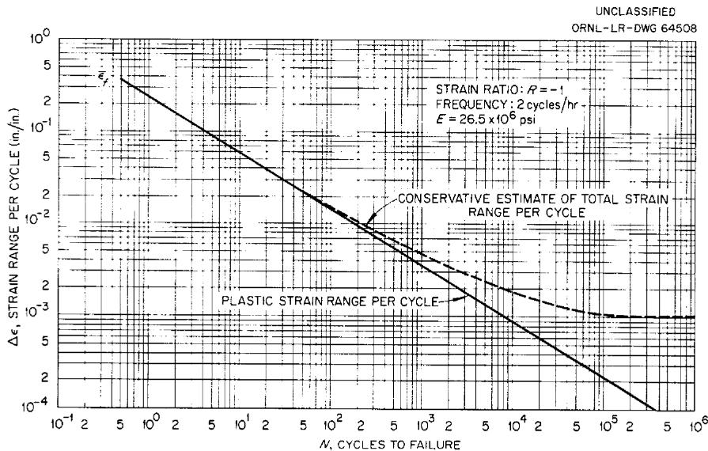  
Fig. D.l. Strain Fatigue Curves for INOR-8 at $1200^{\circ}\mathrm{F}$ .

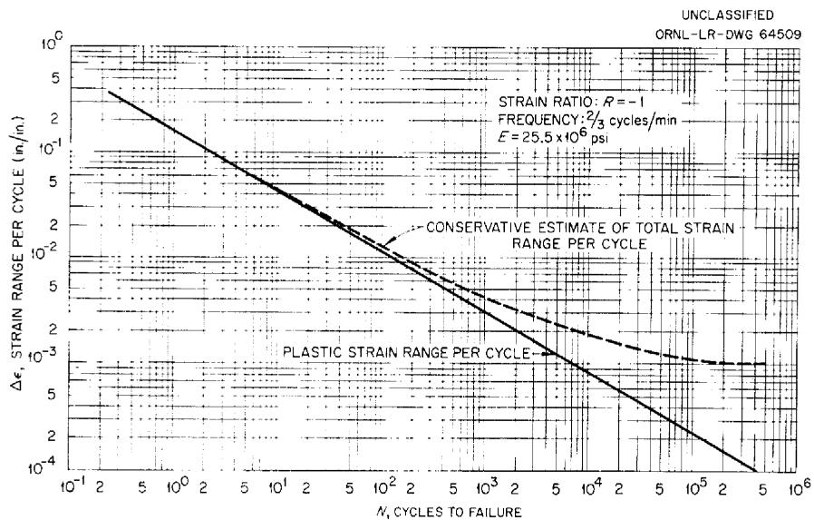  
Fig. D.2. Strain Fatigue Curves for INOR-8 at $1300^{\circ}\mathrm{F}$ .

of the total strain range per cycle. It was assumed that the material exhibits perfect plasticity above the proportional limit (no strain hardening), and the elastic strain at the proportional limit was added to the plastic strain range at each point. The dashed curves were used to obtain an estimate of the cycles-to-failure, assuming that no relaxation or strain-hardening occurs. Strain hardening would displace the dashed curves upward.

Figures D.3 and D.4, which give the stress amplitude versus number of cycles for INOR-8 at 1200 and $1300^{\circ}\mathrm{F}$ with complete relaxation, were derived from the solid curves for Figs. D.1 and D.2 by multiplying the plastic strain range by E to obtain a pseudo stress range and then dividing by 2 to obtain the alternating stress. The dashed curves in Figs. D.3 and D.4 represent the results of this operation. The solid curves represent the allowable values of alternating stress and were constructed by placing a factor of safety of at least 10 on cycles and a factor of safety of at least 1.5 based on stress. The safety factor of 10 on cycles is based on uncertainties in the calculations, scatter of test data, size effects, surface finish, atmosphere, etc. These reduction factors are less conservative than those specified by the Navy Code. However, they have been used in high-temperature design for several years at ORNL, and the current feeling of one of the originators of the Navy Code is that the reduction factors specified in that document are over-conservative and will be reduced to those used in this investigation.* Figures D.5 and D.6 were obtained in the manner as Figs. D.3 and D.4 but were based on total strain rather than plastic strain. They represent allowable values of alternating stress if no relaxation occurs.

The life of a component undergoing cyclic strain depends on mean strain as well as cyclic strain; however, for most applications in which the loading is almost entirely due to thermal cycling and no severe strain-concentrations exist, the effect of mean strain can be expected to be secondary to that of cyclic strain. For these applications, cyclic life can be determined directly from strain range computations.[16] The

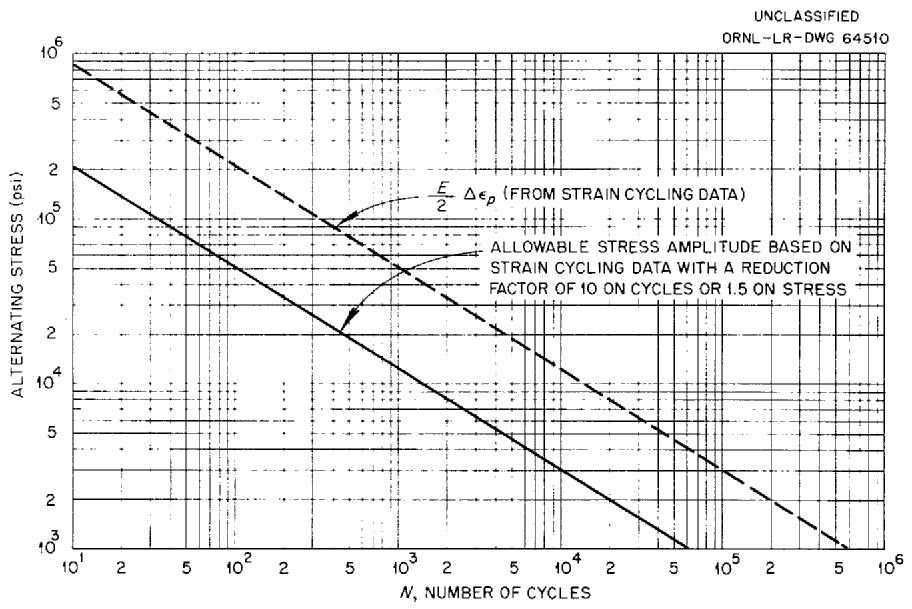  
Fig. D.3. Stress Amplitude Versus Number of Cycles for INOR-8 at $1200^{\circ}\mathrm{F}$ with Complete Stress Relaxation.

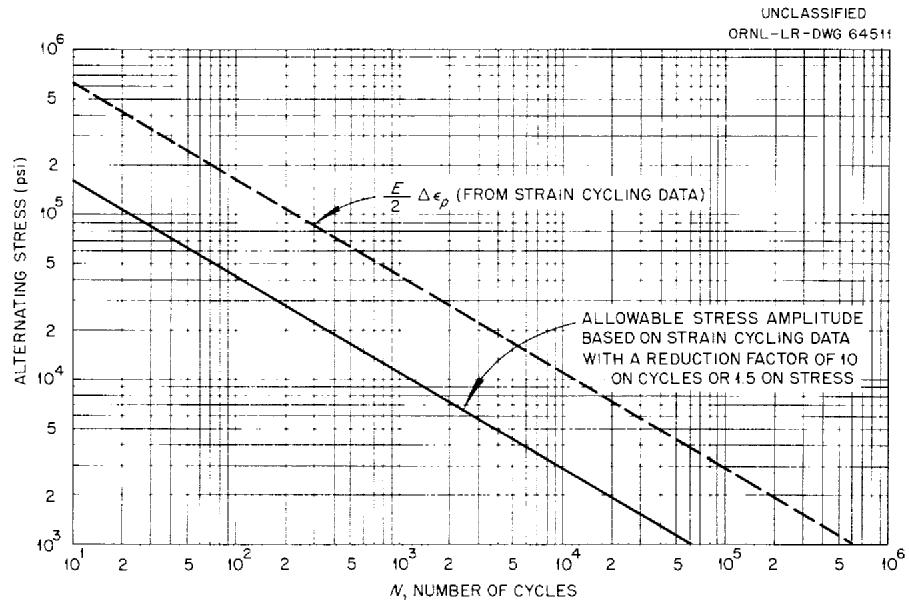  
Fig. D.4. Stress Amplitude Versus Number of Cycles for INOR-8 at $1300^{\circ}\mathrm{F}$ with Complete Stress Relaxation.

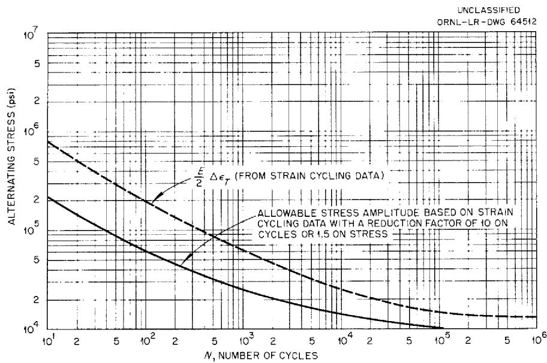  
Fig. D.5. Stress Amplitude Versus Number of Cycles for INOR-8 at $1200^{\circ}\mathrm{F}$ with No Relaxation.

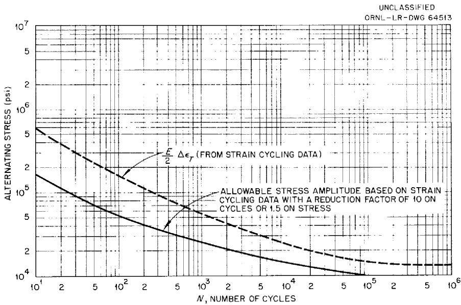  
Fig. D.6. Stress Amplitude Versus Number of Cycles for INOR-8 at $1300^{\circ}\mathrm{F}$ with No Relaxation.

effect of mean strain is further reduced when gross relaxation takes place during each cycle, as is expected in the present case. Thus for the MSRE pump stress evaluation, the mean strain was assumed in all cases to be zero, and the effect of cyclic stresses was determined directly from the plots of the allowable alternating stress versus the number of cycles.

Each of the components examined will be subjected to several operating conditions. Since strains will occur that are beyond the elastic limit, the structural evaluation was based on a finite life, and the damaging effect of all significant strains was considered.

Suppose, for example, that the stresses produced by $n$ different operating conditions have been determined and that it has been found that these stresses will produce values of $S_{alt}$ which can be designated as $S_1, S_2, \ldots, S_n$ . It is also known that $S_1$ is repeated $p_1$ times during the life of the component, and $S_2$ is repeated $p_2$ times, etc. From Figs. D.3 and D.4 it is found that $N_1, N_2, \ldots, N_n$ are the allowable cycles for each of the calculated stresses. The values $p_1 / N_1, p_2 / N_2, \ldots, p_n / N_n$ are called cycle ratios because they represent the fraction of the total life which is used at each stress value. As a first approximation, an application might be considered satisfactory if

$$
\sum_ {i = 1} ^ {i = n} \frac {p _ {i}}{N _ {i}} <   1. 0.
$$

Fatigue tests have shown, however, that failure can occur at cumulative cycle ratio summations different from unity. If the lower stress values are applied first and followed by the higher stress values, the cycle ratio summation at failure can be "coaxed" as high as 5. On the other hand, if the most damaging stresses are all applied first, failure can occur at cycle ratio summations as low as 0.6, or even lower. These are extreme conditions and are based on low-temperature fatigue data which may or may not be representative of behavior under strain cycling. For random combinations, cycle-ratio summations usually average close to unity. Therefore, 0.8 was used in the present evaluation as a conservative allowable limit.

It should be noted that in correctly applying any design criteria, a point-by-point analysis must be made. That is, the complete operating history for each single point must be examined. Short cuts may sometimes be taken, but they must necessarily lead to overly conservative results.

In summary, the permissible cycles of each type were determined for the MSRE fuel and coolant pumps by combining the secondary and local stresses at each point. Points were then found which gave maximum values for the "maximum intensity of combined stress." These latter values were divided by 2 to obtain the alternating stress. The allowable number of cycles for each alternating stress were obtained from Figs. D.3 or D.4, assuming complete relaxation. The cycle ratios were then obtained that were based on the expected number of times each stress will be repeated, and various combinations of the cycle ratios were summed at a particular point and compared with the 0.8 limit. To investigate the increase in life if no relaxation occurred, Figs. D.5 and D.6 were used in place of Figs. D.3 and D.4.

# NOMENCLATURE

<table><tr><td>a</td><td>Volute support cylinder mean radius</td></tr><tr><td>b</td><td>Exponential constant in cylinder "B" temperature equation</td></tr><tr><td>C1, C2</td><td>Integration constants</td></tr><tr><td>Cna</td><td>Integration constants for cylinder "A" (n = 1, 2, 3, 4)</td></tr><tr><td>Cnb</td><td>Integration constants for cylinder "B" (n = 1, ..., 4)</td></tr><tr><td>Cnc</td><td>Integration constants for cone (n = 1, ..., 4)</td></tr><tr><td>D = Et3/[12(1 - μ2)]</td><td>Flexural rigidity of cylinder</td></tr><tr><td>d = b/β</td><td>Dimensionless temperature parameter</td></tr><tr><td>E</td><td>Modulus of elasticity</td></tr><tr><td>F1 = (b/β)4 + 4</td><td></td></tr><tr><td>F2 = F1 e dy</td><td></td></tr><tr><td>Fa, Fe</td><td>Geometric constants for radiation heat transfer</td></tr><tr><td>hc</td><td>Forced convection heat transfer coefficient</td></tr><tr><td>hce</td><td>Effective heat transfer coefficient of pump tank outer surface</td></tr><tr><td>hf</td><td>Heat transfer coefficient of pump tank inner surface</td></tr><tr><td>Jn</td><td>Auxiliary temperature functions for cone (n = 1, ..., 4)</td></tr><tr><td>k</td><td>Thermal conductivity of INOR-8</td></tr><tr><td>Kn</td><td>Auxiliary stress functions for conical shells (n = 1, ..., 4)</td></tr><tr><td>L</td><td>Axial cylinder position from cone-to-cylinder junction</td></tr><tr><td>M</td><td>Bending moment</td></tr><tr><td>Mn</td><td>Bending moment functions for cylinder (n = 1, ..., 4)</td></tr><tr><td>Myn</td><td>Bending moment functions for meridional plane of cone (n = 1, ..., 4)</td></tr><tr><td>Mθn</td><td>Bending moment functions for circumferential plane of cone (n = 1, ..., 4)</td></tr><tr><td>N</td><td>Membrane force</td></tr><tr><td>Nn</td><td>Membrane force functions for cylinder (n = 1, ..., 4)</td></tr><tr><td>Nθn</td><td>Membrane force functions for circumferential plane of cone (n = 1, ..., 4)</td></tr><tr><td>Pn</td><td>Auxiliary stress functions for conical shells (n = 1, ..., 4)</td></tr><tr><td>Pr</td><td>Prandtl number</td></tr><tr><td>Q</td><td>Normal shear force</td></tr><tr><td>Qn</td><td>Shear force functions for cylinder (n = 1, ..., 4)</td></tr><tr><td>Qnc</td><td>Shear force functions for cone (n = 1, ..., 4)</td></tr><tr><td>qf</td><td>Heat transferred across inner pump tank surface</td></tr><tr><td>qt</td><td>Heat transferred across outer pump tank surface</td></tr><tr><td>qβ</td><td>Heat input to inner pump tank surface by fission-product-gas beta radiation</td></tr><tr><td>γ</td><td>Internal heat generation rate from gamma radiation</td></tr><tr><td>q3-4</td><td>Heat transferred from outer pump tank surface to cooling shroud</td></tr><tr><td>q3-5</td><td>Heat transferred from outer pump tank surface to cooling air</td></tr><tr><td>q4-5</td><td>Heat transferred from the cooling shroud to the cooling air</td></tr><tr><td>Re</td><td>Reynold's number</td></tr><tr><td>Tan</td><td>Constants in cylinder "A" temperature equation (n = 1, ..., 4)</td></tr></table>

Tbn Constants in cylinder "B" temperature equation $(n = 1,\dots ,5)$

Tcn Constants in cone temperature equation $(n = 1,$ ...，5)

Wall thickness of cylinder

Wall thickness of cone

$\mathbf{t}_{\mathbf{g}}$ Thickness of cooling air gap

Displacement of cone perpendicular to surface

V Meridional displacement of cone

Vnc Displacement functions for cone $(n = 1,\dots ,4)$

w Radial displacement

Wnc Displacement functions for cone $(n = 1,\ldots ,4)$

$W_{n}^{\prime}$ Slope functions for cylinder $(n = 1,\dots ,4)$

$W_{nc}^{\prime}$ Slope functions for cone $(n = 1,\dots ,4)$

$\mathbf{x}$ Distance through pump tank wall

X = 2βc√Y Dimensionless coordinate of cone

y = βL Dimensionless coordinate of cylinder

$\mathbf{Y}_{\mathbf{c}}$ Meridional position on cone from apex

$\alpha$ Coefficient of thermal expansion

$\beta = \left(\frac{\mathrm{Et}}{4\mathrm{a}^{2}\mathrm{D}}\right)^{1 / 4}$ Characteristic length of cylinder

$\beta_{a} = \left(\frac{10.92\cot^{2}\phi}{2}\right)^{1 / 4}$ Coordinate transformation parameter for cone

$$
\gamma = \frac {4 a \alpha T}{d ^ {4} + 4} b 5
$$

$\theta$ Temperature

$\theta_{l}$ Local temperature

<table><tr><td>φ</td><td>One half of cone vertex angle</td></tr><tr><td>μ</td><td>Poisson&#x27;s ratio</td></tr><tr><td>σb</td><td>Bending stress</td></tr><tr><td>σm</td><td>Membrane stress</td></tr><tr><td>σΦi, σΦo</td><td>Principal meridional stresses inside and out-side</td></tr><tr><td>σθi, σθo</td><td>Principal circumferential stresses inside and outside</td></tr><tr><td>σr</td><td>Stefan-Boltzman constant</td></tr><tr><td colspan="2">Subscripts</td></tr><tr><td>a</td><td>Cylinder &quot;A&quot; (internal volute support cylinder)</td></tr><tr><td>b</td><td>Cylinder &quot;B&quot; (external volute support cylinder)</td></tr><tr><td>c</td><td>Cone (substitute for pump tank spherical shell in thermal stress calculations)</td></tr><tr><td>Φ</td><td>Meridional plane</td></tr><tr><td>θ</td><td>Circumferential plane</td></tr></table>

# ACKNOWLEDGMENTS

The author wishes to acknowledge the work of J. M. Corum in the preparation of Appendix D, "Procedure Used to Evaluate the Effects of Cyclic Strains in the MSRE Pumps." The Oracle Stress Analysis Program used to determine stresses produced by pressure and axial loads was prepared by M. E. LaVerne. The assistance of F. J. Witt in regard to the thermal stress calculations is also acknowledged.

# Internal Distribution

1. G. M. Adamson   
2. S.E.Beall   
3. M. Bender   
4. C.E.Bettis   
5. E. S. Bettis   
6. M. Blander   
7. E. G. Bohlmann   
8. S. E. Bolt   
9. C. J. Borkowski   
10. W.F. Boudreau   
11. C. A. Brandon   
12. R. B. Briggs   
13. S. Cantor   
14. T.E.Cole   
15. J.A. Conlin   
16. L. T. Corbin   
17. J.M.Corum   
18. G. A. Cristy   
19. J. L. Crowley   
20. J.H.DeVan   
21. D. A. Douglas   
22. N. E. Dunwoody   
23. J.R. Engel   
24. A. P. Fraas

25-39. C.H.Gabbard

40. R. B. Gallaher   
41. B. L. Greenstreet   
42. A. G. Grindell   
43. R. H. Guymon   
44. P. H. Harley   
45. P. N. Haubenreich   
46. E.C.Hise   
47. E. E. Hoffman   
48. P.P.Holz   
49. R. J. Kedl   
50. J. A. Lane   
51. M. E. LaVerne   
52. M. I. Lundin   
53. R. N. Lyon

54. H. G. MacPherson   
55. W. D. Manly   
56. W. B. McDonald   
57. C. K. McGlothlan   
58. E.C.Miller   
59. J. C. Moyers   
60. T. E. Northup   
61. L. F. Parsly   
62. P. Patriarca   
63. H. R. Payne   
64. A.M.Perry   
65. R.C. Robertson   
66. M. W. Rosenthal   
67. H.W.Savage   
68. A.W. Savolainen   
69. R. Schneider   
70. D. Scott   
71. M. J. Skinner   
72. A. N. Smith   
73. P. G. Smith   
74. I. Spiewak   
75. B. Squires   
76. F. J. Stanek   
77. J.A.Swartout   
78. A. Taboada   
79. J.R. Tallackson   
80. D. B. Trauger   
81. W.C. Ulrich   
82. A. M. Weinberg   
83. J.H. Westsik   
84. F. J. Witt   
85. L.V. Wilson   
86. H.C.Young

87-88. Reactor Division Library

89-90. Central Research Library

91-93. Document Reference Section

94-98. Laboratory Records Department

99. Laboratory Records, ORNL-RC

# External Distribution

100-101. Reactor Division, AEC, ORO

102. Division of Research and Development, AEC, ORO

103. F.P. Self, AEC, ORO

104. W. L. Smalley, AEG, ORO

105. J. Wett, AEC, Washington

106-120. Division of Technical Information Extension