# OAK RIDGE NATIONAL LABORATORY

operated by  
UNION CARBIDE CORPORATION for the

U.S. ATOMIC ENERGY COMMISSION

ORNL-TM-79

#

UNION

CARBIDE

WATER TEST DEVELOPMENT OF THE FUEL PUMP FOR THE MSRE

P. G. Smith

# NOTICE

This document contains information of a preliminary nature and was prepared primarily for internal use at the Oak Ridge National Laboratory. It is subject to revision or correction and therefore does not represent a final report. The information is not to be abstracted, reprinted or otherwise given public dissemination without the approval of the ORNL patent branch, Legal and Information Control Department.

# LEGAL NOTICE

This report was prepared as an account of Government sponsored work. Neither the United States, nor the Commission, nor any person acting on behalf of the Commission:

A. Makes any warranty or representation, expressed or implied, with respect to the accuracy, completeness, or usefulness of the information contained in this report, or that the use of any information, apparatus, method, or process disclosed in this report may not infringe privately owned rights; or   
B. Assumes any liabilities with respect to the use of, or for damages resulting from the use of any information, apparatus, method, or process disclosed in this report.

As used in the above, "person acting on behalf of the Commission" includes any employee or contractor of the Commission, or employee of such contractor, to the extent that such employee or contractor of the Commission, or employee of such contractor prepares, disseminates, or provides access to, any information pursuant to his employment or contract with the Commission, or his employment with such contractor.

ORNL-TM-79

Copy No.

Contract No. W-7405-eng-26

Reactor Division

WATER TEST DEVELOPMENT OF THE FUEL PUMP FOR THE MSRE

P. G. Smith

DATE ISSUED

MAR 27 1962

OAK RIDGE NATIONAL LABORATORY

Oak Ridge, Tennessee

operated by

UNION CARBIDE CORPORATION

for the

U. S. ATOMIC ENERGY COMMISSION

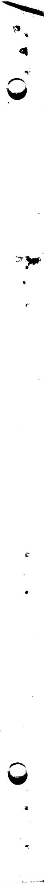

# CONTENTS

Page No.

List of Figures . . . . . . . . . . . . . . . . . . . . . . . v

Abstract vii

Introduction 1

Experimental Apparatus 2

Pump 2

Test Loop 2

Carbon Dioxide Stripping Devices 6

Instrumentation 9

Description of Tests 12

Head-Flow-Power-Speed Performance 12

Carbon Dioxide Stripping Tests 12

Pump Tank Liquid and Gas Behavior 14

Fountain Flow 14

Stripper Flow 14

Gas Bubble Behavior in the Pump Tank Volume 14

14

Coastdown Characteristics 15

Test Results 15

Head-Flow-Power-Speed Performance 15

Carbon Dioxide Stripping Effectiveness 19

Pump Tank Liquid and Gas Behavior 22

Fountain Flow 22

Stripper Flow 27

Gas Bubble Behavior in the Pump Tank Volume 27

Priming 29

Coastdown Characteristics 31

Conclusions 31

Acknowledgments 32

References 32

Page No.

Appendix 34

Nomenclature 35

Table I 36

Table II 37

Table III 38

Computations for:

Table I 40

Table II 41

Table III 42

# LIST OF FIGURES

# Fig. No. Captions

Page No.

1. Cross Section of Pump 3   
2. Discharge Connection to Loop 4   
3. Photo of Test Loop 5   
4. Stripper Configuration 1 7   
5. Stripper Configuration 2 8   
6. Stripper Configuration 5 10   
7. Venturi Calibration 11   
8. Motor Calibration 13   
9. Hydraulic Performance, 13-in. Impeller 16   
10. Hydraulic Performance, 11-in. Impeller 17   
11. Prerotation Baffle 18   
12. Head, Input Power, and Speed Versus Flow, 11-in. Impeller 20   
13. Hydraulic Performance, ll-in. Impeller, Efficiency Contours Superimposed 21   
14. Relative Effectiveness Versus Sweep Gas Flow 23   
15. Half-Life Versus Stripping Flow 24   
16. Relative Effectiveness Versus Jet Velocity 25   
17. Cross Section of Upper Labyrinth 26   
18. Fountain Flow Versus Speed, 11-in. Impeller 28   
19. Pump Inlet X-Section 30

# ABSTRACT

A vertical centrifugal sump-type pump utilizing commercially available impeller and volute designs was selected to circulate the fuel salt in the Molten Salt Reactor Experiment (MSRE). Tests were conducted in water to determine the adequacy of the pump design, to assist design of the prototype fuel pump, and to investigate the effectiveness of xenon removal with high velocity liquid jets contacting sweep gas in the pump tank. Hydraulic head characteristics were within +1 to -3 ft of manufacturers data for a given constant speed. Adequate and necessary provisions were devised to control the liquid and gas bubble behavior in the pump tank. The results of priming and cooldown tests are reported. During the gas removal tests, the fuel, xenon, and helium in the MSRE were simulated with distilled water, carbon dioxide, and air, respectively. The best configuration removed carbon dioxide from water at approximately 99% of the ideal removal rate when the stripping flow was 65 gpm and the sweep gas flow rate was 4 scfm.

# INTRODUCTION

The Molten Salt Reactor Experiment (MSRE) is to be a low-pressure, high-temperature, graphite moderated circulating fuel nuclear reactor using fissile and fertile materials dissolved in molten fluoride salts and is designed for a heat generation rate of 10 Mw (1, 2, and 3). Its goals include proving the safe and reliable operation of this nuclear reactor concept and demonstrating the maintainability of molten salt machinery. The investigation reported herein is concerned with the pump required to circulate the fuel salt in the MSRE.

A centrifugal sump-type pump consisting of a rotary element and pump tank was selected for this application. The rotary element includes the vertical shaft and underhung impeller, the shaft bearings, and the means for lubricating and cooling the bearings. The pump tank includes the volute (casing), suction and discharge nozzles, other nozzles for accommodating inert gas purge, fuel sampling and enrichment, liquid level sensing devices, a flange for mounting the rotary element, and various liquid bypass flows for degassing and removing xenon poison from the circulating fuel salt. The device used for removal of xenon will be referred to as a "stripper". Much of the design of the fuel pump was derived from the past experience with similar pumps for elevated temperature service which were developed during the Aircraft Nuclear Propulsion Program at Oak Ridge National Laboratory (4, 5, and 6).

The initial phase of development and testing of the fuel pump was conducted with water to ascertain the capability of the pump to meet the hydraulic requirements of the fuel circuit and to remove from the circulating fuel the xenon which will be generated by the fissioning process. Data were taken on the head-flow-power-speed performance of the pump for two impeller outside diameters, 13 and 11 inches. Various baffles were devised to control splash, spray, and gas bubbles caused by the operation

of the bypass flows in the pump tank. The ability of the pump to prime was determined at various liquid levels of interest. The cooldown characteristics of the pump were measured from various speeds and flows. Attempts were made to measure indirectly the effectiveness with which xenon poison might be removed from the circulating fuel using high velocity liquid jets in contact with gas in the pump tank. During this particular test the fuel and xenon were simulated, respectively, with distilled water and carbon dioxide; this gas is much more soluble in water than xenon is in molten salts of interest and in addition provides for convenient measurement of solubility.

Pertinent information from these water tests were incorporated in the design of the prototype fuel pump and will be subjected to elevated temperature testing at MSRE design conditions.

# EXPERIMENTAL APPARATUS

The experimental apparatus includes the pump, the test loop, and the stripper configurations. A description of each follows:

# Pump

The pump is shown in Fig. 1 and includes a centrifugal impeller and volute with the impeller supported at the lower end of a vertical shaft, grease-lubricated bearings for supporting the shaft, bearing housing, pump tank bowl, and volute support. The pump tank bowl was fabricated of plexiglas to permit visual observation of the behavior of the liquid and the gas bubbles. Labyrinth-type seals were utilized on the impeller inlet shroud and on the impeller support shroud. The impeller support shroud labyrinth seal was supported on the impeller cover plate, which was sealed to the volute by an elastomeric O-ring. The volute discharge was connected to the pump tank discharge nozzle through a flexibly mounted bridge tube. The connection arrangement is shown in Fig. 2.

# Test Loop

The test loop is shown in Fig. 3, which consists of the pump, piping, venturi flowmeter, throttle valve ( globe type), stripper flow circuits

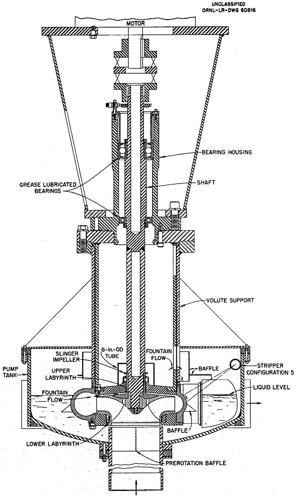  
Fig. 1. Cross Section of Pump.

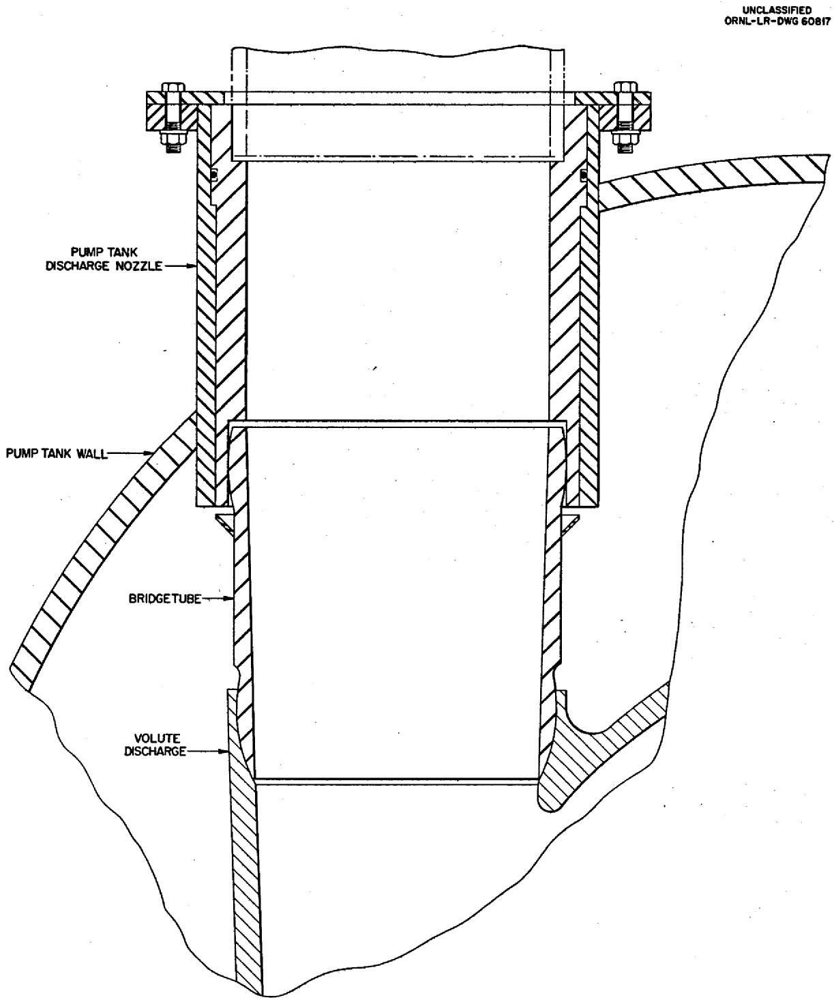  
Fig. 2. Discharge Connection to Loop.

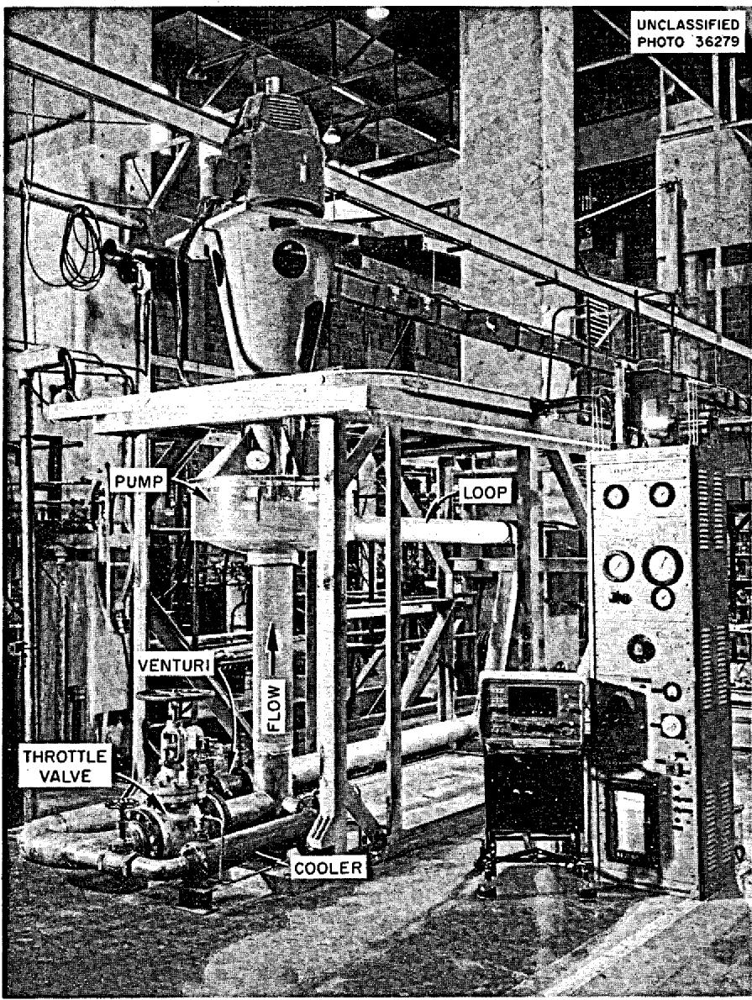  
Fig. 3. Photo of Test Loop.

(not shown), and a cooler. The pump was driven with a 60 hp d.c. variable speed motor. The vertical inlet pipe to the pump was fabricated of plexiglas to permit visual observation of the inlet flow conditions. A bundle of 1-in. diameter thin-wall tubes, 6-in. long, was added to the lower end of this pipe to reduce rotation of the water column. The cooler was installed in parallel with the main loop throttle valve. A part of the main loop flow was bypassed through the cooler to control the system temperature. The bypass flow was controlled by a throttle valve located in the bypass flow circuit. Stripper configuration flow was supplied through a tap located just downstream of the pump tank discharge nozzle. The stripper flow as well as the flow from the impeller upper labyrinth passed through the pump tank and re-entered the system at the impeller inlet. Throttle valves were used to control the stripper flow. Following the initial tests an orifice was added to the nearly vertical section of the loop between the discharge and the venturi flow meter to decrease the pressure drop through the main throttle valve.

# Carbon Dioxide Stripping Devices

Tests were conducted wherein a portion of the pump discharge flow was introduced into the gas volume of the pump tank through high velocity jets (strippers). A number of configurations were investigated, starting with a single stream and progressing to configurations which gave increasingly more fresh liquid-gas interface.

The strippers tested and identified in Table I (Appendix) are described as follows (in each test two strippers were used):

1. Configuration 1 is shown in Fig. 4. The flow discharged from one side of the can through $\frac{1}{4}$ -in. holes. For this test the holes were submerged below the liquid surface in the pump tank.   
2. Configuration 2 is shown in Fig. 5. The lower end of the entry tube was closed and the beaker was packed with Inconel wool. The stripping flow entered the pump tank gas space in tangential direction as a spray. One beaker contained 84 spray holes, 1/8-in. in diameter, and the other contained 30 spray holes, 1/4-in. in diameter.

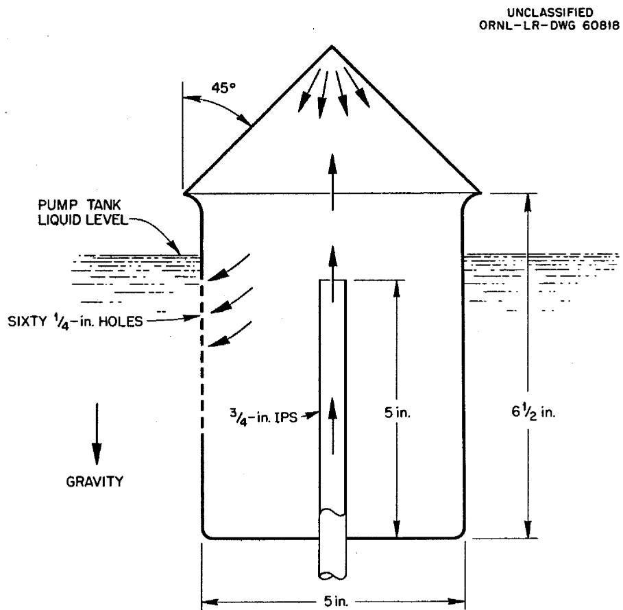  
Fig. 4. Stripper Configuration 1.

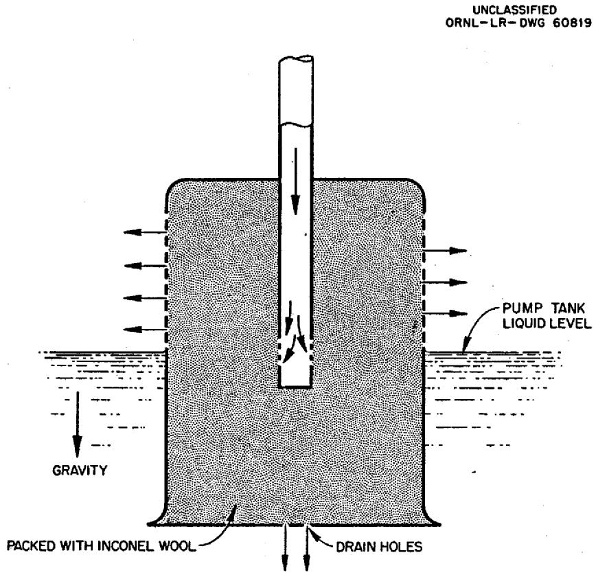  
Fig. 5. Stripper Configuration 2.

3. Configuration 3 was the same as No.2, except for the size of spray holes, and the number of holes. Each stripper contained 162 spray holes, 1/16-in. in diameter, with the beaker suspended such that the spray was circumferential.   
4. Configuration 4 was the same as No. 3, except the number of holes was reduced by a factor of two and the spray was directed radially inwards toward the pump shaft.   
5. Configuration 5 was a toroid constructed of pipe as shown in Fig. 6, and located in the pump tank as shown in Fig. 1. Each stripper contained two rows of 80 holes each, $\frac{1}{16}$ -in. in diameter.

# INSTRUMENTATION

Instrumentation was provided to measure venturi pressure drop, discharge pressure, pump shaft speed, water temperature, motor input power, fountain flow, stripper flow, pH value of the water, and pump tank liquid level.

Three different methods were used in measuring the venturi pressure drop: mercury manometer, difference between individual pressures measured at the inlet and throat, and by differential pressure transmitter. Calibration of the venturi was provided by the vendor, and it is shown in Fig. 7. Individual pressures at the inlet and throat were indicated on Bourdon tube gages, 0-30 psi range, 1/8 psi subdivision, and $1 / 4\%$ accuracy. The differential pressure transmitter was read out on a differential gage, 0-50 psi range, 1/2 psi subdivision, $1 / 4\%$ accuracy. The flow is estimated to be accurate within $\pm 3\%$ .

The discharge pressure was measured on a Bourdon tube gage, 0-100 psi range, $\frac{1}{2}$ psi subdivision, and $\frac{1}{4\%}$ accuracy.

The pump shaft speed was measured by use of a 60-tooth gear mounted on the shaft, a magnetic pickup, and a counter which indicated directly in rpm.

The water temperature was measured with a dial-type thermometer, 0 to $240\mathrm{F}$ range, 2 F subdivision.

Motor input power data was obtained by two methods: power recorder, 0 to 40 kw range, 0.8 kw subdivision and power analyzer which indicated

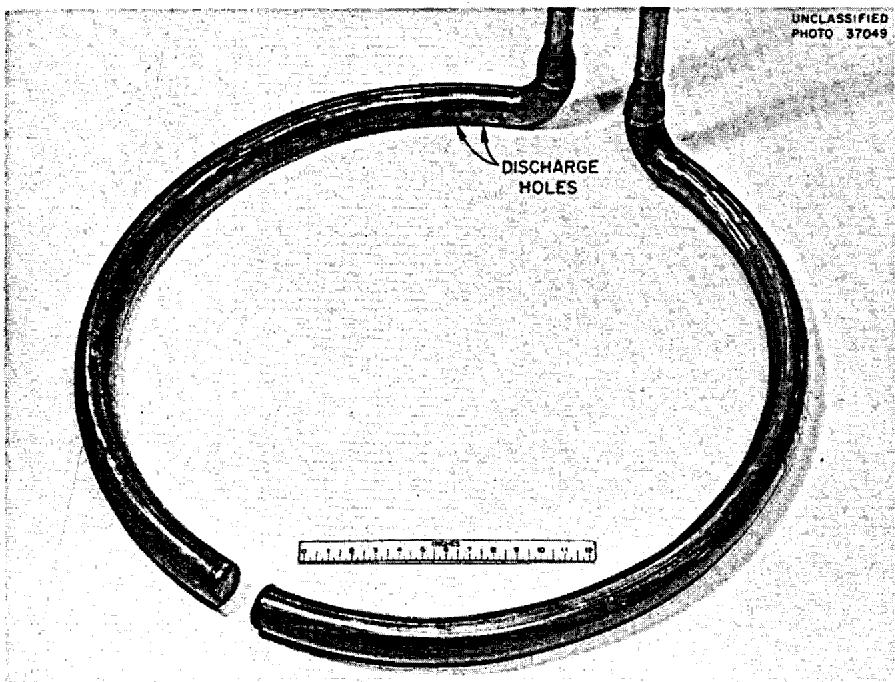  
Fig. 6. Stripper Configuration 5.

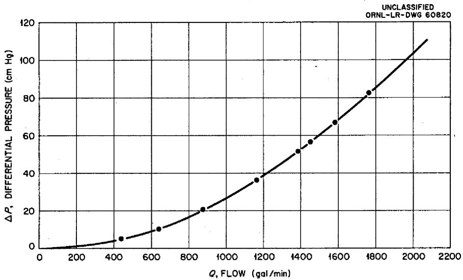  
Fig. 7. Venturi Calibration.

current and voltage. The power measurements were in error during most of the testing with the 13-in-o.d. impeller which preceded tests with the ll-in. impeller. During this period, investigations were conducted to locate and correct the source of error. Satisfactory power measurements were obtained with the ll-in. impeller. The motor calibration curve is shown in Fig. 8.

The fountain flow was measured by directing the flow through $90^{\circ}$ V-notch weirs and measuring the height of the flow column.

The stripper flow was measured by use of rotameters.

The pH value of the water was indicated with a Beckman pH meter, Model H-2, range 0 to $14\mathrm{pH}$ with an accuracy of 0.03 pH.

The pump tank liquid level was indicated with a scale marked off in 0.l-in. divisions. Zero level corresponded with the center line of the volute.

# DESCRIPTION OF TESTS

# Head-Flow-Power-Speed Performance

Hydraulic performance data were obtained over a wide range of operating conditions with impellers of 11- and 13-in. outside diameter. Two methods of operation were used: speed was varied (700 to 1300 rpm) at constant system resistance for several values of resistance with the 13-in. impeller, and system resistance was varied at constant speed for several values of speed (700 to 1300 rpm) with the 11-in. impeller. Data were obtained for computing head, flow, brake horsepower, and efficiency.

# Carbon Dioxide Stripping Tests

A number of tests were performed with both impeller diameters to ascertain the change in effectiveness of $\mathrm{CO}_{2}$ removal caused by various stripper configurations, flow rates, jet velocities, and sweep gas flow rates. Carbon dioxide in dry-ice form was added to the circulating distilled water in the system until saturation was achieved, after which time the stripper flow was started. Readings of pH of the water were taken versus time to determine the time required to reduce the $\mathrm{CO}_{2}$ concentration by a factor of two. A total of 37 tests were performed.

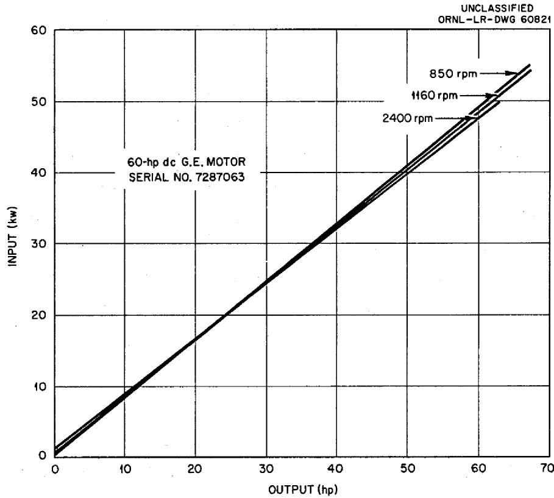  
Fig. 8. Motor Calibration.

An expression was derived to give the theoretical time required to reduce the $\mathrm{CO}_{2}$ concentration by one half. Comparison of the theoretical and experimental data is reported as relative effectiveness of the stripper.

# Pump Tank Liquid and Gas Behavior

# Fountain Flow

Considerable testing was performed to observe the flow of water from the impeller upper labyrinth (flow up the shaft and return to the system through the pump tank volume) and to develop adequate control of the return of this flow into the pump tank liquid, keeping the splatter of water and gas bubble formation to a minimum (see Fig. 1).

Clearances were varied between the shaft and the impeller upper labyrinth and the impeller upper shroud and seal plate. The corresponding fountain flows were measured.

# Stripper Flow

The flow through the various stripper configurations was measured and baffling was developed to control splatter and gas bubble formation.

# Gas Bubble Behavior in the Pump Tank Volume

Throughout all of the testing the formation and behavior of gas bubbles were observed in the pump tank volume. Baffling was devised to prevent entry of gas bubbles into the pump inlet from the pump tank volume.

# Priming

The priming characteristics of the pump were checked at various static liquid levels in the pump tank. The ability of the pump to hold prime as the liquid level in the pump tank was being lowered was investigated. Data were obtained of head-flow-speed performance and of

change in starting level for various starting levels as the pump was accelerated from zero to design speed.

# Coastdown Characteristics

A number of coastdown tests were made from various pump operating conditions. The power supply to the pump drive motor was interrupted while the pump was operating at specific speed and flow conditions, and the time required to reach reduced system flow and pump speed was determined.

# TEST RESULTS

# Head-Flow-Power-Speed Performance

Hydraulic performance data were obtained over a wide range of head and flow conditions at several speeds for the 8 in. x 6 in. volute, using impellers of l3- and ll-in. outside diameter. These tests with the l3-in. diameter impeller were conducted without a baffle in the pump inlet. The l3-in. impeller performance is presented in Fig. 9, which is a plot of head versus flow at various speeds. The flow is total flow consisting of system flow, fountain flow, and stripper flow. The corresponding data are tabulated in Table II (Appendix). Allis-Chalmers data are also shown for comparison. The heads obtained are increasingly lower than Allis-Chalmers data with decreasing flow at constant speed.

The performance obtained with the ll-in. diameter impeller is presented in Fig. 10, which is a plot of head versus flow at various speeds. The flow is total flow consisting of system flow, fountain flow, and stripper flow. The corresponding data are tabulated in Table III (Appendix). Data for three different inlet configurations are shown: in two configurations a prerotation baffle was located at the inlet to the impeller; and the other configuration had none. The baffle consisted of two plates arranged in a cross as shown in Fig. 11; it had the effect of increasing the head at the lower range of flows on a constant speed line. There was essentially no difference in the results obtained with the two

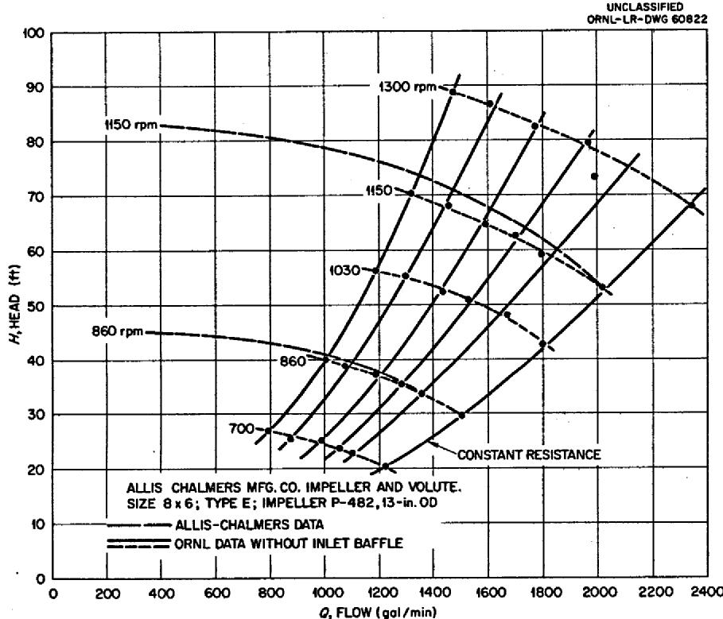  
Fig. 9. Hydraulic Performance, 13-in. Impeller.

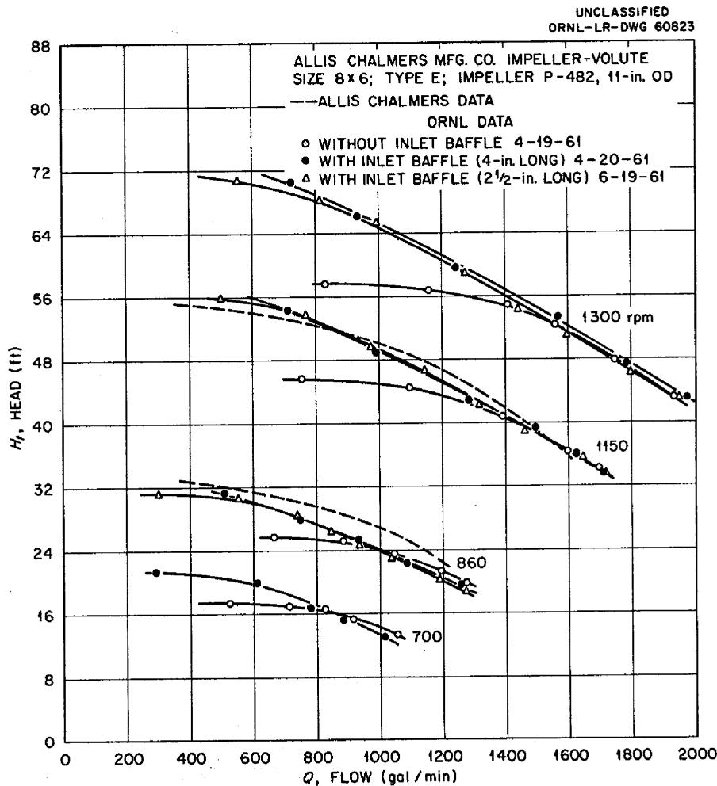  
Fig. 10. Hydraulic Performance, ll-in. Impeller.

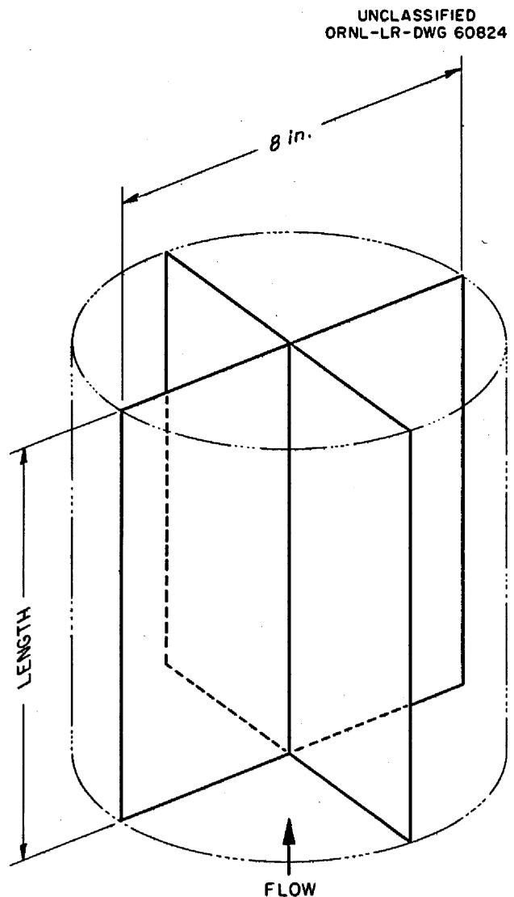  
Fig. 11. Prerotation Baffle.

sizes of baffles. Curves of head and pump input power versus flow at various speeds are shown in Fig. 12. The input power change versus flow for constant speed operation is slight.

The prerotation baffle was not fully tested with the l3-in. impeller. Were such a baffle used with the l3-in. impeller, performance would be more nearly coincident with the published Allis-Chalmers data.

From the power data obtained with the ll-in. diameter impeller, efficiency contours were computed which are shown in Fig. 13, superimposed on a plot of head-flow-speed data.

# Carbon Dioxide Stripping Effectiveness

In the stripping tests, data were obtained to determine the time required to reduce the $\mathrm{CO}_{2}$ concentration by one half (half-life). The change in pH value of the distilled water was measured over a range from 4 to 6 versus time. For plotting purposes the pH values were converted to the logarithm of the molarity of $\mathrm{CO}_{2}$ to determine the half-life.

Theoretical half-life $(t = 0.69\mathrm{V} / \mathbf{Q}_{\mathrm{s}})$ was computed for each test and compared with the experimental half-life to give relative effectiveness.

The results of the carbon dioxide stripping tests are presented in Table I (Appendix). Related in the table are data pertaining to the stripper configurations, by-pass flows, liquid level in the pump tank, sweep gas flow rate, system volume, jet velocity, experimental half-life, ideal half-life, and relative effectiveness.

The first six tests were preliminary; the flow was simply bypassed through the pump tank without passing through strippers. These tests were performed to provide a base from which to proceed with strippers. Values of relative effectiveness ranged from 10 to 40 percent.

Tests 7 through 16 were concerned mainly with varying the stripper configuration. Other variables may be noted in the data shown in the table. Values of effectiveness ranged from 15 to 68 percent.

From the results of tests through No. 16, configuration 5 (Fig. 6) was derived and used for the remainder of the tests, 17 through 39.

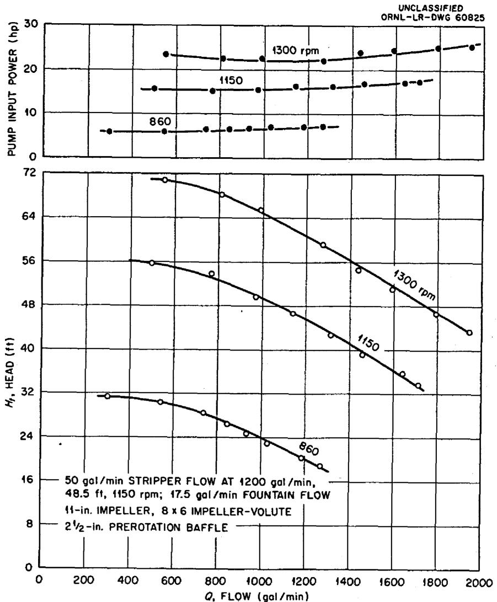  
Fig. 12. Head, Input Power, and Speed Versus Flow, ll-in. Impeller.

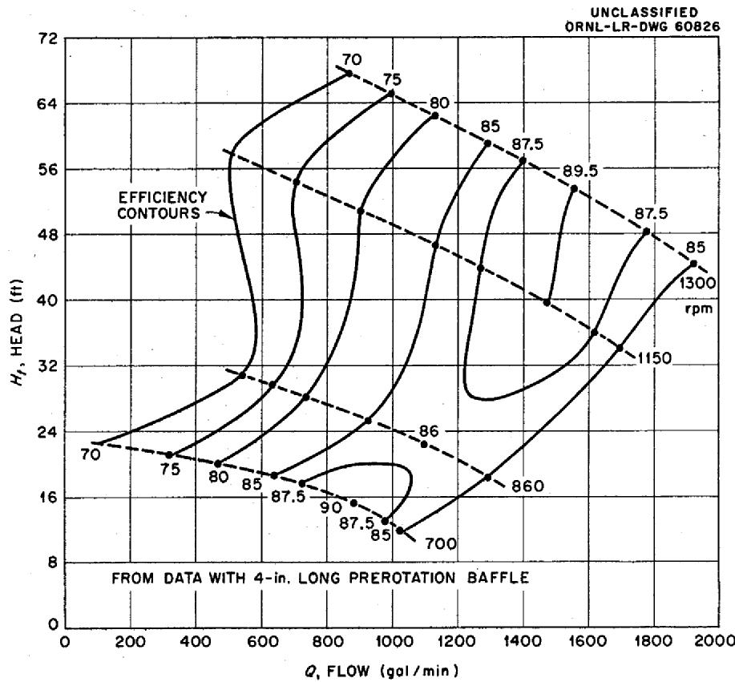  
Fig. 13. Hydraulic Performance, ll-in. Impeller, Efficiency Contours Superimposed.

In tests 17 through $2^{\frac{1}{4}}$ , the flow and jet velocity were varied simultaneously at a constant sweep gas flow rate. The relative effectiveness varied from 27 to 99 percent.

In tests 10, 13, 14, 17, 18, and 25 through 29, sweep gas flow rate was varied with the other variables held constant, and two stripper configurations were used. The relative effectiveness varied from 47 to 72 percent. These data are plotted in Fig. 14, Relative Effectiveness Versus Sweep Gas Flow, for two configurations.

In tests 30, 32, 33, 35, and 39, the stripping flow was varied with the other variables held constant. The relative effectiveness varied from 70 to 90 percent. The results from these tests are shown in Fig. 15, Half-Life (defined on page 18) Versus Stripping Flow. Experimental and theoretical curves are shown.

In tests 30, 31, 34, and 36, the jet velocity was varied with the other variables held constant. The relative effectiveness varied from 27 to 90 percent. The results are shown in Fig. 16, Relative Effectiveness Versus Jet Velocity.

Configuration 5 was selected for the MSRE fuel pump, and was incorporated in the design of the prototype fuel pump. Tests 37 and 38 yielded effectiveness values of 52 and 55 percent, respectively. These tests were performed at the following conditions, reasonably attainable in the MSRE: stripping flow rate of 65 gpm, and sweep gas flow rates of 0.05 and 0.07 scfm, respectively.

# Pump Tank Liquid and Gas Behavior

# Fountain Flow

Observations of the fountain flow from the impeller upper labyrinth (Fig. 17) revealed the need to control it; the slinger impeller was causing an undesirable spray. This spray was contained and controlled by use of a cover enclosing the labyrinth and slinger impeller, and having drain ports located at its lower end.

Approximate measurements of the fountain flow were made using weirs located in the windows carrying the flow from the fountain into the pump

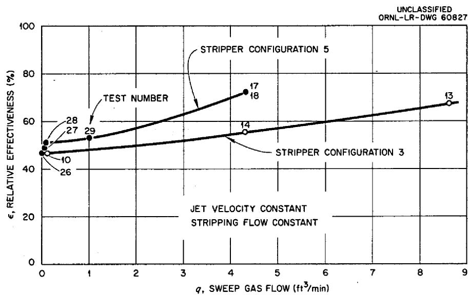  
Fig. 14. Relative Effectiveness Versus Sweep Gas Flow.

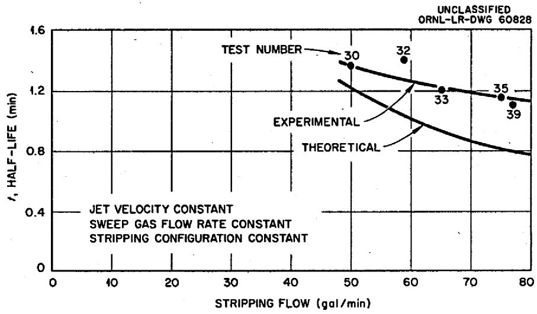  
Fig. 15. Half-Life Versus Stripping Flow.

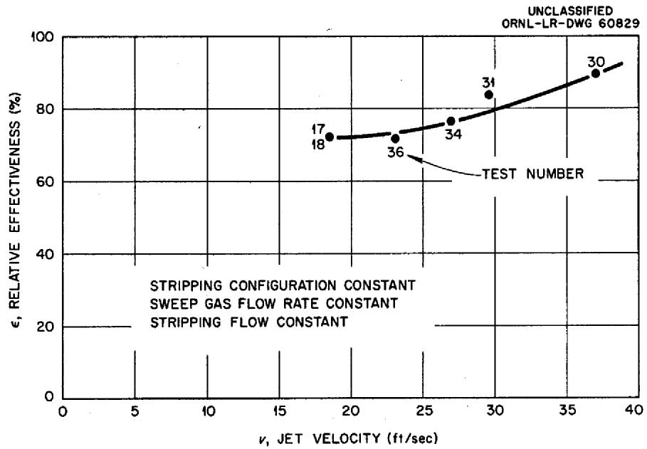  
Fig. 16. Relative Effectiveness Versus Jet Velocity.

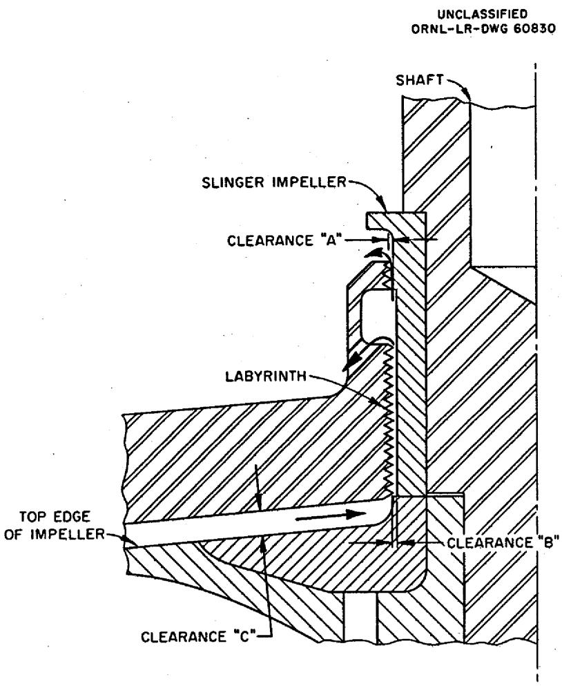  
Fig. 17. Cross Section of Upper Labyrinth.

tank. Values of fountain flow for several labyrinth clearances are as follows:

13-in. Diameter Impeller, 1450 gpm, 1030 rpm, 50 ft Head

<table><tr><td>Configuration Number*</td><td>Clearance &quot;A&quot;</td><td>Clearance &quot;B&quot;,</td><td>Clearance &quot;C&quot;,</td><td>Flow, gpm</td></tr><tr><td>1</td><td>0.015</td><td>0.015</td><td>0.090</td><td>7.5 - 10</td></tr><tr><td>2</td><td>0.015</td><td>0.040</td><td>0.090</td><td>10 - 12</td></tr><tr><td>3</td><td>0.015</td><td>0.040</td><td>0.250</td><td>10 - 12</td></tr><tr><td>4</td><td>0.015</td><td>0.060</td><td>0.250</td><td>15 - 17.5</td></tr></table>

Configuration 4 was used with the ll-in. diameter impeller and the fountain flow was measured at various speeds along a constant resistance line defined by $1300\mathrm{gpm}$ and 45 ft. The fountain flow versus speed is shown in Fig. 18. Configuration 4 was adopted for use on the prototype MSRE fuel pump.

The direction of the fountain flow was observed over the range of conditions from which head-flow-speed data were obtained with both the ll-in. and l3-in. impellers. The flow of liquid was found always to be outward from the shaft annulus into the pump tank, which is the desired direction.

# Stripper Flow

Considerable splatter of liquid resulted from impingement of this flow onto the volute and volute support. Control of this splatter was obtained through use of baffles installed on the stripper and on the volute support.

# Gas Bubble Behavior in the Pump Tank Volume

Entrance of the fountain and stripper flows into the pump tank liquid caused gas bubble formation in the liquid. Control was obtained through use of a baffle installed on the volute which deflects bubbles radially

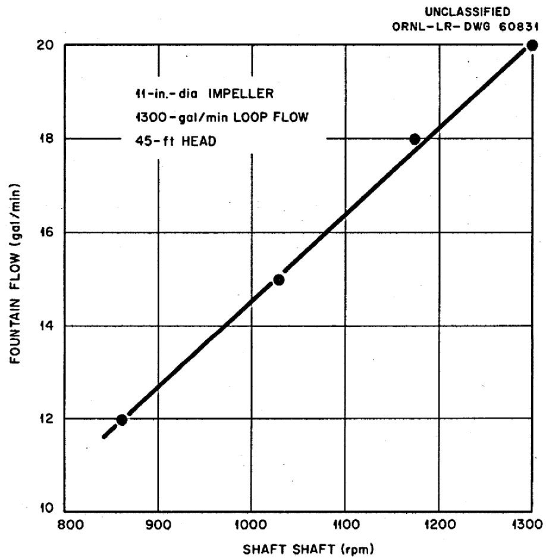  
Fig. 18. Fountain Flow Versus Speed, 11-in. Impeller.

outwards in the tank and by forcing these two flows to enter the impeller inlet at the lowest elevation in the tank as shown in Fig. 19, which may be compared to Fig. 1.

# Priming

Priming tests were conducted with the 13-in. impeller in which the pump was accelerated from zero to 1030 rpm in approximately 30 seconds, noting the change in pump tank liquid level and observing attainment of normal pump head and flow performance. The following operating levels were noted for the listed starting levels:

13-in. impeller   

<table><tr><td>Static Liquid Level*</td><td>Operating Liquid Level*</td></tr><tr><td>(in.)</td><td>(in.)</td></tr></table>

<table><tr><td>+2</td><td>+1.2</td></tr><tr><td>+1.5</td><td>+0.6</td></tr><tr><td>+1</td><td>-0.9</td></tr><tr><td>+0.5</td><td>-2.1</td></tr></table>

ll-in. impeller   

<table><tr><td>+2</td><td>+1</td></tr><tr><td>+1</td><td>-1.5</td></tr><tr><td>0</td><td>would not prime</td></tr></table>

Normal hydraulic performance was achieved at the end of pump acceleration for all runs except the 0.5-in. starting level with the 13-in. impeller and the zero level with the 11-in. impeller. The 13-in. impeller required an additional minute for priming at the 0.5-in. level and the 11-in. impeller would not prime at the zero level. These data should not be used for reactor system computations unless differences in volumes of system trapped gas are accounted for.

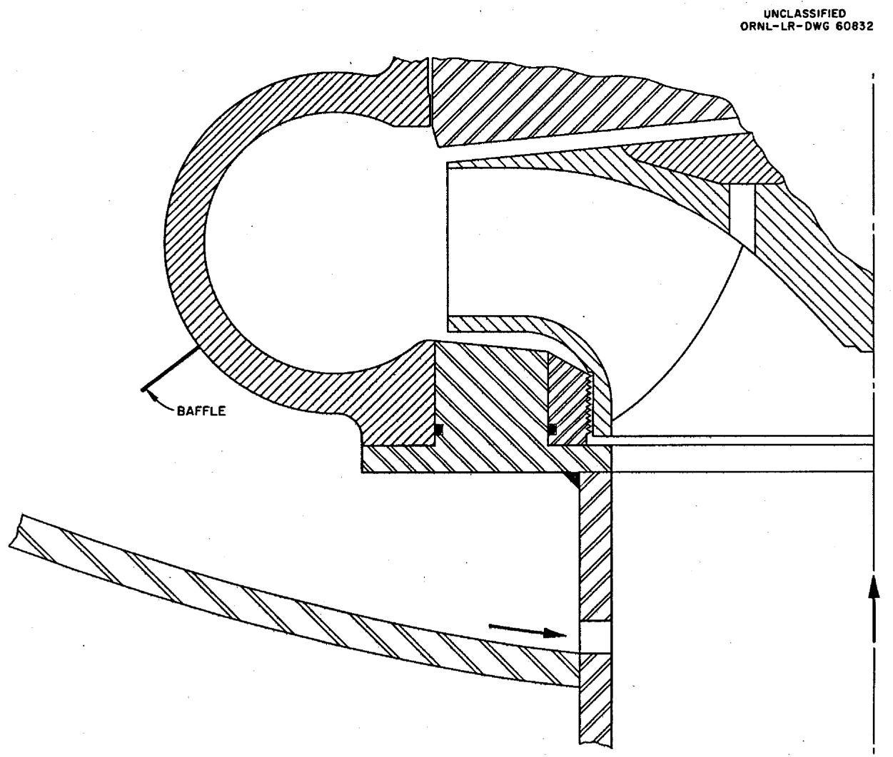  
Fig. 19. Pump Inlet X-Section.

Other priming tests were performed by lowering of the liquid level in the pump tank slowly with the pump running. A test was performed with the 13-in. diameter impeller operating at $1450\mathrm{~gpm}$ , 50 ft head, and starting liquid level at $1\frac{1}{2}$ -in. above center line of the volute. In-gassing began at approximately $4\frac{1}{2}$ -in. below the center line of the volute. At $5\frac{1}{2}$ in. below the center line of the volute, the system flow dropped to $700\mathrm{~gpm}$ , and $6\frac{1}{2}$ in. below the center line of the volute, the flow reduced to zero.

A test was performed with the ll-in. impeller operating at 1250 gpm, 45 ft and starting liquid level at 1 l/2 in. above the center line of the volute. Ingassing began at approximately 3 in. below the center line of the volute. Vigorous ingassing and loss of head and flow began at 3 l/2 in. below the volute center line.

# Coastdown Characteristics

Coastdown tests were performed on the drive motor and pump with the 13-in. impeller to determine the time required for the unit to stop after opening the drive motor circuit from the electric supply. Tests were performed on the same flow resistance line for operating speeds of 1150, 1030, and 860 rpm at flow rates of 1630, 1450, and 1210 gpm, respectively. Coastdown times to zero speed ranged from 10.1 to 10.4 sec., and for flow reduction to 540 gpm, the times ranged from 1.5 to 2.0 sec.

# CONCLUSIONS

From the experimental hydraulic characteristics, the total head was found to deviate from reported data by $+1$ to $-3$ ft. It was found necessary to insert a prerotation baffle in the inlet to improve the head at reduced flows.

Based on the water test results, a 11.5-in. diameter impeller will be required to meet the reactor design head and flow (48.5 ft and 1200 gpm). This dimension will be more precisely determined during the prototype fuel pump tests.

Fountain flow was observed over the whole range of operation and found to be outward from the upper labyrinth into the pump tank, which is the desired direction. Gas bubbles created by the fountain and stripping flows were removed in the pump tank with assistance from the various baffles.

With regard to priming, the pump would prime (full head and flow) instantaneously with speed at static levels of 1 in. or more above the center line of the volute.

Gas stripping was accomplished in the pump tank with a relative effectiveness of up to 99 percent. Sweep gas flow rate, stripping flow, and jet velocity were found to have quite pronounced effects on the stripping rate of a given stripper configuration. It was concluded that the zenon removal rate will be primarily dependent on the fraction of fuel processed rather than on improved stripper configurations.

The hydraulic characteristics were found to be adequate for the anticipated requirements of the fuel circuit of the MSRE. The required control of liquid and gas behavior in the pump tank was accomplished by the use of baffles.

# ACKNOWLEDGMENTS

The following specific contributions are acknowledged which comprise the main talents required to complete the investigations: L. V. Wilson, design; F. F. Blankenship, devised stripping tests; R. F. Apple, chemical aspects of stripping tests; and J. M. Coburn, test operation, data taking, and computations.

# REFERENCES

1. R. B. Briggs, MSRP Quar. Prog. Rep. for Period August 1, 1960 to February 28, 1961, ORNL-3122, June 20, 1961.   
2. R. B. Briggs, MSRP Prog. Rep. for Period March 1 to August 31, 1961, ORNL-3215, January 12, 1962.   
3. S.E. Beall, W.L. Breazeale, B.W. Kinyon, Molten-Salt Reactor Experiment Preliminary Hazards Report, ORNL-CF 61-2-46, February 28, 1961.

4. A. G. Grindell, W. F. Boudreau, H. W. Savage, "Development of Centrifugal Pumps for Operation with Liquid Metals and Molten Salts at 1100-1500 F", Nuclear Science and Engineering, Vol. 7, No. 1, 1960, pp 83-91.   
5. H. W. Savage, Components of the Fused-Salt and Sodium Circuits of the Aircraft Reactor Experiment, ORNL-2348, Feb. 15, 1958.   
6. A. G. Grindell, "Correlation of Cavitation Inception Data for a Centrifugal Pump Operating in Water and in Sodium-Potassium Alloy (NaK)", ASME Trans., Series D, Dec. 1960, pp 821-828.

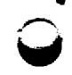

# APPENDIX

Nomenclature

Table I

Table II

Table III

Computations

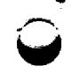

# C

# NOMENCLATURE

t, Half-life, min.   
V, System volume, gal.   
$Q_{s}$ , Stripping flow, gal/min.   
C, CO2 concentration, pH reading   
q, Sweep gas flow rate, ft³/min.   
$\epsilon$ , Relative effectiveness, dimensionless   
Q, Total flow, gal/min.   
H, Total head, ft.   
v, Jet velocity, ft/sec.

# C

Impeller Diameter: 13 in. for tests 1 through 24

Impeller Diameter: ll in. for tests 25 through 39

System Water Flow: 1450 gpm

Head: 50 ft

Water Temperature: 65 F

Table I. ${\mathrm{{CO}}}_{2}$ Stripping Tests of MSRE Primary Pump Circulating ${\mathrm{H}}_{2}\mathrm{O}$   

<table><tr><td>\(1^a\)</td><td>2</td><td>3</td><td>4</td><td>5</td><td>6</td><td>7</td><td>8</td><td>9</td><td>10</td><td>11</td><td>12</td><td>13</td><td>14</td><td>15</td></tr><tr><td rowspan="2">Test No.</td><td colspan="3">Stripper Configuration</td><td colspan="2">By-Pass Flow (gpm)</td><td rowspan="2">Liquid Levelb(in.)</td><td rowspan="2">Sweep Gas (Air) Flow (cfm)</td><td rowspan="2">Direction of Stripper Flow</td><td rowspan="2">Jet Velocity (ft/sec)</td><td rowspan="2">System Volume (gal)</td><td rowspan="2">Total By-Pass Flow (gpm)</td><td colspan="2">Half-Life, t (min)</td><td rowspan="2">Relative Effectiveness (%)</td></tr><tr><td>No.</td><td>Number of Holes</td><td>Diameter or Holes (in.)</td><td>Stripper</td><td>Fountain</td><td>Experimentalc</td><td>Theoretical</td></tr><tr><td>1</td><td></td><td></td><td></td><td>35</td><td>8</td><td>4.0</td><td>0</td><td>Submerged</td><td></td><td>96</td><td>42</td><td>15.0</td><td>1.57</td><td>10.5</td></tr><tr><td>2</td><td></td><td></td><td></td><td>35</td><td>8</td><td>4.0</td><td>0</td><td>&quot;</td><td></td><td>96</td><td>42</td><td>16.0</td><td>1.57</td><td>9.8</td></tr><tr><td>3</td><td></td><td></td><td></td><td>18</td><td>15</td><td>4.0</td><td>0</td><td>&quot;</td><td></td><td>96</td><td>32</td><td>12.0</td><td>2.06</td><td>17.2</td></tr><tr><td>4</td><td></td><td></td><td></td><td>18</td><td>15</td><td>4.0</td><td>0.1</td><td>&quot;</td><td></td><td>96</td><td>32</td><td>8.0</td><td>2.06</td><td>24.2</td></tr><tr><td>5</td><td></td><td></td><td></td><td>35</td><td>15</td><td>4.0</td><td>0.1</td><td>&quot;</td><td></td><td>96</td><td>50</td><td>10.0</td><td>1.34</td><td>13.4</td></tr><tr><td>6</td><td></td><td></td><td></td><td>0</td><td>15</td><td>4.0</td><td>0.1</td><td>&quot;</td><td></td><td>96</td><td>15</td><td>11.0</td><td>4.45</td><td>40.5</td></tr><tr><td>7</td><td>1</td><td>60</td><td>1/4</td><td>26</td><td>15</td><td>2.5</td><td>0.1</td><td>&quot;</td><td>4.6</td><td>91</td><td>41</td><td>10.0</td><td>1.55</td><td>15.5</td></tr><tr><td>9</td><td>2</td><td>84</td><td>1/8</td><td>35</td><td>15</td><td>1.5</td><td>0.1</td><td>Circumferential</td><td>8.9</td><td>88</td><td>50</td><td>3.0</td><td>1.22</td><td>40.6</td></tr><tr><td></td><td></td><td>30</td><td>1/4</td><td></td><td></td><td></td><td></td><td></td><td>6.2</td><td></td><td></td><td></td><td></td><td></td></tr><tr><td>10</td><td>3</td><td>324</td><td>1/16</td><td>35</td><td>15</td><td>1.5</td><td>0.1</td><td>&quot;</td><td>18.5</td><td>88</td><td>50</td><td>2.6</td><td>1.22</td><td>46.9</td></tr><tr><td>12</td><td>3</td><td>324</td><td>1/16</td><td>35</td><td>15</td><td>3.8</td><td>0.1</td><td>&quot;</td><td>18.5</td><td>96</td><td>50</td><td>3.2</td><td>1.32</td><td>41.7</td></tr><tr><td>13</td><td>3</td><td>324</td><td>1/16</td><td>35</td><td>15</td><td>1.5</td><td>8.6</td><td>&quot;</td><td>18.5</td><td>88</td><td>50</td><td>1.8</td><td>1.22</td><td>67.7</td></tr><tr><td>14</td><td>3</td><td>324</td><td>1/16</td><td>35</td><td>15</td><td>1.5</td><td>4.3</td><td>&quot;</td><td>18.5</td><td>88</td><td>50</td><td>2.2</td><td>1.22</td><td>55.4</td></tr><tr><td>15</td><td>5</td><td>324</td><td>1/16</td><td>0</td><td>15</td><td>1.5</td><td>0.1</td><td>&quot;</td><td>0</td><td>88</td><td>15</td><td>6.8</td><td>4.06</td><td>59.7</td></tr><tr><td>16</td><td>4</td><td>162</td><td>1/16</td><td>35</td><td>15</td><td>1.5</td><td>0.1</td><td>Radially in-ward</td><td>37.0</td><td>88</td><td>50</td><td>2.0</td><td>1.22</td><td>61.0</td></tr><tr><td>17</td><td>5</td><td>320</td><td>1/16</td><td>35</td><td>15</td><td>1.5</td><td>4.3</td><td>&quot;</td><td>18.5</td><td>88</td><td>50</td><td>1.7</td><td>1.22</td><td>72.8</td></tr><tr><td>18</td><td>5</td><td>320</td><td>1/16</td><td>35</td><td>15</td><td>1.5</td><td>4.3</td><td>&quot;</td><td>18.5</td><td>88</td><td>50</td><td>1.7</td><td>1.22</td><td>71.8</td></tr><tr><td>19</td><td>5</td><td>200</td><td>1/16</td><td>50</td><td>15</td><td>1.5</td><td>4.3</td><td>&quot;</td><td>46.2</td><td>88</td><td>65</td><td>1.0</td><td>0.94</td><td>98.9</td></tr><tr><td>20</td><td>5</td><td>200</td><td>1/16</td><td>50</td><td>15</td><td>1.5</td><td>4.3</td><td>&quot;</td><td>46.2</td><td>88</td><td>65</td><td>0.9</td><td>0.94</td><td>99.0</td></tr><tr><td>21</td><td>5</td><td>320</td><td>1/16</td><td>70</td><td>15</td><td>1.5</td><td>4.3</td><td>&quot;</td><td>40.5</td><td>88</td><td>85</td><td>0.9</td><td>0.72</td><td>80.8</td></tr><tr><td>22</td><td>5</td><td>320</td><td>1/16</td><td>70</td><td>15</td><td>1.5</td><td>4.3</td><td>&quot;</td><td>40.5</td><td>88</td><td>85</td><td>0.9</td><td>0.72</td><td>82.7</td></tr><tr><td>23</td><td>5</td><td>215</td><td>1/16</td><td>44</td><td>15</td><td>1.5</td><td>4.3</td><td>&quot;</td><td>37.8</td><td>88</td><td>59</td><td>1.1</td><td>1.03</td><td>96.8</td></tr><tr><td>24</td><td>5</td><td>215</td><td>1/16</td><td>44</td><td>15</td><td>1.5</td><td>4.3</td><td>&quot;</td><td>37.8</td><td>88</td><td>59</td><td>1.0</td><td>1.03</td><td>98.0</td></tr><tr><td>25</td><td>5</td><td>320</td><td>1/16</td><td>35</td><td>15</td><td>1.5</td><td>0</td><td>&quot;</td><td>18.5</td><td>88</td><td>50</td><td>2.5</td><td>1.22</td><td>48.8</td></tr><tr><td>26</td><td>5</td><td>320</td><td>1/16</td><td>35</td><td>15</td><td>1.5</td><td>0</td><td>&quot;</td><td>18.5</td><td>88</td><td>50</td><td>2.6</td><td>1.22</td><td>46.9</td></tr><tr><td>27</td><td>5</td><td>320</td><td>1/16</td><td>35</td><td>15</td><td>1.5</td><td>0.05</td><td>&quot;</td><td>18.5</td><td>88</td><td>50</td><td>2.5</td><td>1.22</td><td>48.8</td></tr><tr><td>28</td><td>5</td><td>320</td><td>1/16</td><td>35</td><td>15</td><td>1.5</td><td>0.07</td><td>&quot;</td><td>18.5</td><td>88</td><td>50</td><td>2.4</td><td>1.22</td><td>50.8</td></tr><tr><td>29</td><td>5</td><td>320</td><td>1/16</td><td>35</td><td>15</td><td>1.5</td><td>1.0</td><td>&quot;</td><td>18.5</td><td>88</td><td>50</td><td>2.3</td><td>1.22</td><td>53.0</td></tr><tr><td>30</td><td>5</td><td>160</td><td>1/16</td><td>35</td><td>15</td><td>1.5</td><td>4.3</td><td>&quot;</td><td>37.0</td><td>88</td><td>50</td><td>1.4</td><td>1.22</td><td>89.6</td></tr><tr><td>31</td><td>5</td><td>200</td><td>1/16</td><td>35</td><td>15</td><td>1.5</td><td>4.3</td><td>&quot;</td><td>29.6</td><td>88</td><td>50</td><td>1.5</td><td>1.22</td><td>83.6</td></tr><tr><td>32</td><td>5</td><td>200</td><td>1/16</td><td>44</td><td>15</td><td>1.5</td><td>4.3</td><td>&quot;</td><td>37.0</td><td>88</td><td>59</td><td>1.4</td><td>1.04</td><td>73.8</td></tr><tr><td>33</td><td>5</td><td>228</td><td>1/16</td><td>50</td><td>15</td><td>1.5</td><td>4.3</td><td>&quot;</td><td>37.0</td><td>88</td><td>65</td><td>1.2</td><td>0.94</td><td>78.3</td></tr><tr><td>34</td><td>5</td><td>240</td><td>1/16</td><td>35</td><td>15</td><td>1.5</td><td>4.3</td><td>&quot;</td><td>27.0</td><td>88</td><td>50</td><td>1.6</td><td>1.22</td><td>76.3</td></tr><tr><td>35</td><td>5</td><td>274</td><td>1/16</td><td>60</td><td>15</td><td>1.5</td><td>4.3</td><td>&quot;</td><td>37.0</td><td>88</td><td>75</td><td>1.2</td><td>0.81</td><td>70.2</td></tr><tr><td>36</td><td>5</td><td>280</td><td>1/16</td><td>35</td><td>15</td><td>1.5</td><td>4.3</td><td>&quot;</td><td>23.1</td><td>88</td><td>50</td><td>1.7</td><td>1.22</td><td>71.7</td></tr><tr><td>\(37^d\)</td><td>5</td><td>290</td><td>1/16</td><td>50</td><td>15</td><td>1.5</td><td>0.05</td><td>&quot;</td><td>28.8</td><td>88</td><td>65</td><td>1.8</td><td>0.94</td><td>52.2</td></tr><tr><td>\(38^d\)</td><td>5</td><td>290</td><td>1/16</td><td>50</td><td>15</td><td>1.5</td><td>0.07</td><td>&quot;</td><td>28.8</td><td>88</td><td>65</td><td>1.7</td><td>0.94</td><td>55.3</td></tr><tr><td>39</td><td>5</td><td>300</td><td>1/16</td><td>62</td><td>15</td><td>1.5</td><td>4.3</td><td>&quot;</td><td>34.8</td><td>88</td><td>77</td><td>1.1</td><td>0.79</td><td>72.2</td></tr></table>

aSee appendix for computations relative to indicated columns.   
bLevel referred to centerline of volute.   
cData from R. G. Apple, Reactor Chemistry Division.   
$d_{\text{System flow, 1200 gpm}}$ , head, 48.5 ft.

#

Table II. Head-Flow-Speed-Power Data for 13-in. Impeller on MSRE Primary Pump Circulating $\mathbb{H}_2\mathbb{O}$   

<table><tr><td>\(1^a\)</td><td>2</td><td>3</td><td>4</td><td>5</td><td>6</td><td>7</td><td>8</td><td>9</td><td>10</td><td>11</td><td>12</td><td>13</td><td>14</td><td>15</td><td>16</td><td>17</td><td>18</td><td>19</td><td>20</td><td>21</td></tr><tr><td rowspan="3">Speed(rpm)</td><td colspan="2">Motor InputPower Recorder</td><td colspan="3">Motor InputPower Analyzer</td><td colspan="2">DischargePressure</td><td colspan="3">Venturi</td><td colspan="6">Stripper Flow</td><td rowspan="3">FountainFlow(gpm)</td><td rowspan="3">TotalFlow(gpm)</td><td rowspan="3">Change inVelocityHead(ft)</td><td rowspan="2">Total Head(ft)</td></tr><tr><td rowspan="2">Reading</td><td rowspan="2">kw</td><td rowspan="2">v</td><td rowspan="2">amp</td><td rowspan="2">kw</td><td rowspan="2">psig</td><td rowspan="2">ft</td><td rowspan="2">Inlet(psig)</td><td rowspan="2">Throat(psig)</td><td rowspan="2">Δp(psi)</td><td colspan="2">Δp GageFlow</td><td colspan="2">Circuit 1</td><td colspan="2">Circuit 2</td></tr><tr><td>psi</td><td>gpm</td><td>%</td><td>gpm</td><td>%</td><td>gpm</td><td></td></tr><tr><td>700</td><td>1.30</td><td>5.2</td><td></td><td></td><td></td><td>11.0</td><td>24.4</td><td>8.0</td><td>4.2</td><td>3.8</td><td>3.2</td><td>840</td><td>74</td><td>13.0</td><td>74</td><td>13.0</td><td>9</td><td>875</td><td>0.98</td><td>25.38</td></tr><tr><td>860</td><td>2.45</td><td>9.8</td><td></td><td></td><td></td><td>16.2</td><td>37.4</td><td>11.6</td><td>6.1</td><td>5.5</td><td>5.2</td><td>1032</td><td>88</td><td>14.4</td><td>88</td><td>14.4</td><td>12</td><td>1073</td><td>1.47</td><td>38.87</td></tr><tr><td>1030</td><td>4.25</td><td>17.0</td><td></td><td></td><td></td><td>23.1</td><td>53.3</td><td>16.4</td><td>8.4</td><td>8.0</td><td>7.4</td><td>1248</td><td>100</td><td>17.5</td><td>100</td><td>17.5</td><td>15</td><td>1298</td><td>2.15</td><td>55.45</td></tr><tr><td>1150</td><td>5.95</td><td>23.8</td><td></td><td></td><td></td><td>28.5</td><td>65.4</td><td>20.0</td><td>10.2</td><td>9.8</td><td>9.3</td><td>1375</td><td>100</td><td>17.5</td><td>100</td><td>17.5</td><td>17</td><td>1427</td><td>2.61</td><td>68.01</td></tr><tr><td>1300</td><td>8.65</td><td>34.6</td><td></td><td></td><td></td><td>36.1</td><td>83.4</td><td>25.5</td><td>13.0</td><td>12.5</td><td>12.2</td><td>1550</td><td>100</td><td>17.5</td><td>100</td><td>17.5</td><td>20</td><td>1605</td><td>3.35</td><td>86.75</td></tr><tr><td>700</td><td>1.40</td><td>5.6</td><td></td><td></td><td></td><td>9.2</td><td>21.2</td><td>8.2</td><td>2.4</td><td>5.9</td><td>5.5</td><td>1070</td><td>68</td><td>11.9</td><td>68</td><td>11.9</td><td>9</td><td>1103</td><td>1.58</td><td>22.78</td></tr><tr><td>860</td><td>2.65</td><td>10.6</td><td></td><td></td><td></td><td>13.6</td><td>31.4</td><td>12.0</td><td>3.1</td><td>8.9</td><td>8.5</td><td>1315</td><td>84</td><td>14.7</td><td>84</td><td>14.7</td><td>12</td><td>1356</td><td>2.35</td><td>33.75</td></tr><tr><td>1030</td><td>4.65</td><td>18.6</td><td></td><td></td><td></td><td>19.4</td><td>44.8</td><td>16.9</td><td>4.2</td><td>12.6</td><td>12.3</td><td>1620</td><td>100</td><td>17.5</td><td>100</td><td>17.5</td><td>15</td><td>1670</td><td>3.56</td><td>48.36</td></tr><tr><td>1150</td><td>6.60</td><td>26.4</td><td></td><td></td><td></td><td>23.9</td><td>55.2</td><td>20.6</td><td>5.0</td><td>15.6</td><td>15.4</td><td>1745</td><td>100</td><td>17.5</td><td>100</td><td>17.5</td><td>17</td><td>1797</td><td>3.93</td><td>59.13</td></tr><tr><td>1300</td><td>9.50</td><td>38.0</td><td></td><td></td><td></td><td>30.2</td><td>69.6</td><td>22.9</td><td>9.0</td><td>18.9</td><td>15.4</td><td>1930</td><td>100</td><td>17.5</td><td>100</td><td>17.5</td><td>20</td><td>1985</td><td>3.74</td><td>73.34</td></tr><tr><td>700</td><td>1.50</td><td>6.0</td><td>86</td><td>71</td><td>6.1</td><td>7.9</td><td>18.2</td><td></td><td></td><td></td><td>7.3</td><td>1185</td><td>45</td><td>15.7</td><td>45</td><td>15.7</td><td>9</td><td>1225</td><td>1.92</td><td>20.17</td></tr><tr><td>860</td><td>2.70</td><td>10.8</td><td>108</td><td>106</td><td>11.4</td><td>11.7</td><td>27.0</td><td></td><td></td><td></td><td>11.0</td><td>1450</td><td>56</td><td>19.5</td><td>56</td><td>19.5</td><td>12</td><td>1501</td><td>2.88</td><td>29.88</td></tr><tr><td>1030</td><td>4.75</td><td>19.0</td><td>130</td><td>150</td><td>19.5</td><td>16.7</td><td>38.6</td><td></td><td></td><td></td><td>15.5</td><td>1735</td><td>70</td><td>24.5</td><td>70</td><td>24.5</td><td>15</td><td>1799</td><td>4.15</td><td>42.75</td></tr><tr><td>1150</td><td>6.70</td><td>26.8</td><td>145</td><td>187</td><td>27.1</td><td>20.7</td><td>47.8</td><td></td><td></td><td></td><td>19.5</td><td>1950</td><td>76</td><td>26.6</td><td>76</td><td>26.6</td><td>17</td><td>2021</td><td>5.22</td><td>53.02</td></tr><tr><td>1300</td><td>9.90</td><td>39.6</td><td>164</td><td>245</td><td>40.2</td><td>26.5</td><td>62.2</td><td></td><td></td><td></td><td>25.0</td><td>2270</td><td>86</td><td>30.0</td><td>86</td><td>30.0</td><td>20</td><td>2340</td><td>5.81</td><td>68.01</td></tr><tr><td>700</td><td>1.30</td><td>5.2</td><td></td><td></td><td></td><td>10.3</td><td>23.8</td><td>6.5</td><td>2.0</td><td>4.5</td><td>4.2</td><td>955</td><td>69</td><td>12.0</td><td>69</td><td>12.0</td><td>9</td><td>988</td><td>1.25</td><td>25.05</td></tr><tr><td>860</td><td>2.55</td><td>10.2</td><td></td><td></td><td></td><td>15.2</td><td>35.2</td><td>9.4</td><td>2.6</td><td>6.8</td><td>6.5</td><td>1145</td><td>85</td><td>14.9</td><td>85</td><td>14.9</td><td>12</td><td>1187</td><td>1.81</td><td>37.01</td></tr><tr><td>1030</td><td>4.40</td><td>17.6</td><td></td><td></td><td></td><td>21.6</td><td>49.9</td><td>13.1</td><td>3.4</td><td>9.8</td><td>9.5</td><td>1380</td><td>100</td><td>17.5</td><td>100</td><td>17.5</td><td>15</td><td>1430</td><td>2.59</td><td>52.49</td></tr><tr><td>1150</td><td>6.10</td><td>24.4</td><td></td><td></td><td></td><td>26.6</td><td>61.4</td><td>16.1</td><td>4.0</td><td>12.1</td><td>11.8</td><td>1535</td><td>100</td><td>17.5</td><td>100</td><td>17.5</td><td>17</td><td>1578</td><td>3.23</td><td>64.63</td></tr><tr><td>1300</td><td>9.00</td><td>36.0</td><td></td><td></td><td></td><td>34.0</td><td>78.5</td><td>20.4</td><td>4.8</td><td>15.6</td><td></td><td>1710</td><td>100</td><td>17.5</td><td>100</td><td>17.5</td><td>20</td><td>1765</td><td>4.00</td><td>82.50</td></tr><tr><td>700</td><td>1.25</td><td>5.0</td><td></td><td></td><td></td><td>11.3</td><td>26.1</td><td>6.8</td><td>3.8</td><td>3.0</td><td>2.7</td><td>760</td><td>72</td><td>12.6</td><td>72</td><td>12.6</td><td>9</td><td>794</td><td>0.81</td><td>26.91</td></tr><tr><td>860</td><td>2.35</td><td>9.4</td><td></td><td></td><td></td><td>16.8</td><td>38.8</td><td>9.9</td><td>5.1</td><td>4.8</td><td>4.2</td><td>960</td><td>90</td><td>15.9</td><td>90</td><td>15.9</td><td>12</td><td>1004</td><td>1.29</td><td>40.09</td></tr><tr><td>1030</td><td>4.00</td><td>16.0</td><td></td><td></td><td></td><td>23.6</td><td>54.5</td><td>13.8</td><td>7.1</td><td>6.6</td><td>6.1</td><td>1135</td><td>100</td><td>17.5</td><td>100</td><td>17.5</td><td>15</td><td>1185</td><td>1.79</td><td>56.29</td></tr><tr><td>1150</td><td>5.70</td><td>23.5</td><td></td><td></td><td></td><td>29.4</td><td>68.2</td><td>17.0</td><td>8.8</td><td>8.2</td><td>7.6</td><td>1265</td><td>100</td><td>17.5</td><td>100</td><td>17.5</td><td>17</td><td>1317</td><td>2.22</td><td>70.42</td></tr><tr><td>1300</td><td>8.60</td><td>34.4</td><td></td><td></td><td></td><td>37.3</td><td>86.2</td><td>21.2</td><td>11.0</td><td>10.2</td><td>10.0</td><td>1412</td><td>100</td><td>17.5</td><td>100</td><td>17.5</td><td>20</td><td>1467</td><td>2.75</td><td>88.95</td></tr><tr><td>700</td><td>1.40</td><td>5.6</td><td>82</td><td>68</td><td>5.6</td><td>9.6</td><td>22.2</td><td>5.1</td><td></td><td></td><td>5.3</td><td>1010</td><td>48</td><td>16.8</td><td>48</td><td>16.8</td><td>9</td><td>1052</td><td>1.42</td><td>23.62</td></tr><tr><td>860</td><td>2.60</td><td>10.4</td><td>105</td><td>101</td><td>10.6</td><td>14.4</td><td>33.3</td><td>7.4</td><td></td><td></td><td>7.8</td><td>1225</td><td>69</td><td>24.1</td><td>69</td><td>24.1</td><td>12</td><td>1285</td><td>2.11</td><td>35.41</td></tr><tr><td>1037</td><td>4.61</td><td>18.4</td><td>130</td><td>143</td><td>18.6</td><td>20.8</td><td>48.1</td><td>10.2</td><td></td><td></td><td>11.1</td><td>1460</td><td>70</td><td>24.5</td><td>70</td><td>24.5</td><td>15</td><td>1524</td><td>2.97</td><td>51.07</td></tr><tr><td>1154</td><td>6.40</td><td>26.4</td><td>146</td><td>176</td><td>25.7</td><td>25.5</td><td>58.9</td><td>12.5</td><td></td><td></td><td>13.7</td><td>1625</td><td>80</td><td>28.0</td><td>80</td><td>28.0</td><td>17</td><td>1698</td><td>3.68</td><td>62.58</td></tr><tr><td>1300</td><td>9.40</td><td>37.6</td><td>164</td><td>228</td><td>37.4</td><td>32.4</td><td>74.9</td><td>15.6</td><td></td><td></td><td>17.5</td><td>1875</td><td>92</td><td>32.2</td><td>92</td><td>32.2</td><td>20</td><td>1959</td><td>4.92</td><td>79.82</td></tr></table>

aSee appendix for computations relative to indicated columns.

Table III. Head-Flow-Speed-Power Data for 11 in. Impeller on MSRE Primary Pump Circulating $\mathsf{H}_2\mathsf{O}$   

<table><tr><td>1a</td><td>2</td><td>3</td><td>4</td><td>5</td><td>6</td><td>7</td><td>8</td><td>9</td><td>10</td><td>11</td><td>12</td><td>13</td><td>14</td><td>15</td><td>16</td><td>17</td><td>18</td><td>19</td><td>20</td><td>21</td><td>22</td></tr><tr><td rowspan="2">Speed (rpm)</td><td colspan="2">Motor Input Power Recorder</td><td colspan="2">Motor Input Power Analyzer</td><td colspan="2">Discharge Pressure</td><td colspan="2">Venturi</td><td colspan="6">Stripping Flow</td><td rowspan="2">Fountain Flow (gpm)</td><td rowspan="2">Total Flow (gpm)</td><td rowspan="2">Change in Velocity Head (ft)</td><td rowspan="2">Total Head (ft)</td><td rowspan="2">Pump Power Input (hp)</td><td rowspan="2">Water Horsepower (hp)</td><td rowspan="2">Efficiency (%)</td></tr><tr><td>Reading</td><td>kw</td><td>v</td><td>amp</td><td>kw</td><td>psig</td><td>ft</td><td>ΔP (cm Hg)</td><td>Flow (gpm)</td><td colspan="3">Circuits (%)</td><td colspan="2">gpm</td></tr><tr><td></td><td></td><td></td><td></td><td></td><td></td><td></td><td></td><td></td><td></td><td>1</td><td>2</td><td>3</td><td>4</td><td></td><td></td><td></td><td></td><td></td><td></td><td></td><td></td></tr><tr><td rowspan="6">1300</td><td>3.90</td><td>15.6</td><td>156</td><td>100</td><td>15.6</td><td>24.6</td><td>56.8</td><td>15.8</td><td>770</td><td>56</td><td>58</td><td>59</td><td>59</td><td>41.0</td><td>20.0</td><td>831</td><td>0.88</td><td>57.68</td><td>18.3</td><td>12.10</td><td>66.1</td></tr><tr><td>4.50</td><td>18.0</td><td>156</td><td>116</td><td>18.1</td><td>23.9</td><td>55.2</td><td>32.5</td><td>1100</td><td>55</td><td>56</td><td>57</td><td>58</td><td>39.9</td><td>20.0</td><td>1160</td><td>1.73</td><td>56.93</td><td>21.7</td><td>16.67</td><td>76.8</td></tr><tr><td>4.80</td><td>19.2</td><td>156</td><td>125</td><td>19.5</td><td>22.8</td><td>52.7</td><td>49.3</td><td>1350</td><td>53</td><td>56</td><td>53</td><td>57</td><td>39.0</td><td>20.0</td><td>1409</td><td>2.54</td><td>55.24</td><td>23.5</td><td>19.65</td><td>83.6</td></tr><tr><td>5.00</td><td>20.0</td><td>156</td><td>129</td><td>20.1</td><td>21.4</td><td>49.4</td><td>60.8</td><td>1500</td><td>51</td><td>53</td><td>54</td><td>55</td><td>37.8</td><td>20.0</td><td>1558</td><td>3.10</td><td>52.50</td><td>24.4</td><td>20.65</td><td>84.6</td></tr><tr><td>5.10</td><td>20.4</td><td>156</td><td>132</td><td>20.6</td><td>19.1</td><td>44.1</td><td>76.2</td><td>1690</td><td>48</td><td>51</td><td>51</td><td>52</td><td>35.7</td><td>20.0</td><td>1746</td><td>3.90</td><td>48.05</td><td>25.1</td><td>21.20</td><td>84.5</td></tr><tr><td>5.30</td><td>21.2</td><td>156</td><td>138</td><td>21.5</td><td>16.8</td><td>38.8</td><td>93.2</td><td>1880</td><td>45</td><td>46</td><td>47</td><td>48</td><td>32.5</td><td>20.0</td><td>1932</td><td>4.77</td><td>43.57</td><td>26.3</td><td>21.28</td><td>80.9</td></tr><tr><td rowspan="5">1150</td><td>2.60</td><td>10.4</td><td>144</td><td>77</td><td>11.1</td><td>19.5</td><td>45.0</td><td>12.8</td><td>700</td><td>46</td><td>51</td><td>52</td><td>52</td><td>35.2</td><td>17.4</td><td>753</td><td>0.73</td><td>45.73</td><td>13.2</td><td>8.70</td><td>65.9</td></tr><tr><td>3.15</td><td>12.6</td><td>144</td><td>89</td><td>12.8</td><td>18.6</td><td>43.0</td><td>29.2</td><td>1045</td><td>45</td><td>50</td><td>51</td><td>51</td><td>34.8</td><td>17.4</td><td>1097</td><td>1.55</td><td>44.55</td><td>15.5</td><td>12.35</td><td>79.7</td></tr><tr><td>3.40</td><td>13.6</td><td>144</td><td>96</td><td>13.8</td><td>16.7</td><td>38.6</td><td>48.7</td><td>1340</td><td>42</td><td>47</td><td>48</td><td>48</td><td>32.7</td><td>17.4</td><td>1390</td><td>2.47</td><td>41.07</td><td>16.5</td><td>14.28</td><td>86.5</td></tr><tr><td>3.55</td><td>14.2</td><td>144</td><td>100</td><td>14.4</td><td>14.4</td><td>33.2</td><td>64.7</td><td>1550</td><td>39</td><td>43</td><td>44</td><td>45</td><td>30.3</td><td>17.4</td><td>1598</td><td>3.26</td><td>36.51</td><td>17.2</td><td>14.74</td><td>85.7</td></tr><tr><td>3.60</td><td>14.4</td><td>144</td><td>103</td><td>14.8</td><td>13.3</td><td>30.8</td><td>73.0</td><td>1650</td><td>37</td><td>41</td><td>42</td><td>42</td><td>28.7</td><td>17.4</td><td>1696</td><td>3.68</td><td>34.48</td><td>17.7</td><td>14.78</td><td>83.5</td></tr><tr><td rowspan="5">860</td><td>1.20</td><td>4.8</td><td>102</td><td>48</td><td>4.9</td><td>11.0</td><td>25.3</td><td>10.1</td><td>630</td><td>33</td><td>37</td><td>38</td><td>38</td><td>25.5</td><td>12.0</td><td>667</td><td>0.57</td><td>25.87</td><td>5.5</td><td>4.37</td><td>79.5</td></tr><tr><td>1.30</td><td>5.2</td><td>102</td><td>56</td><td>5.7</td><td>10.5</td><td>24.2</td><td>19.4</td><td>850</td><td>32</td><td>36</td><td>38</td><td>37</td><td>25.5</td><td>12.0</td><td>887</td><td>1.01</td><td>25.26</td><td>6.7</td><td>5.67</td><td>84.6</td></tr><tr><td>1.40</td><td>5.6</td><td>102</td><td>58</td><td>5.9</td><td>9.6</td><td>22.2</td><td>27.1</td><td>1005</td><td>31</td><td>35</td><td>35</td><td>35</td><td>24.1</td><td>12.0</td><td>1641</td><td>1.38</td><td>23.58</td><td>7.0</td><td>6.19</td><td>88.5</td></tr><tr><td>1.50</td><td>6.0</td><td>102</td><td>61</td><td>6.2</td><td>8.5</td><td>19.6</td><td>35.2</td><td>1145</td><td>28</td><td>32</td><td>33</td><td>33</td><td>22.5</td><td>12.0</td><td>1179</td><td>1.78</td><td>21.42</td><td>7.3</td><td>6.39</td><td>87.5</td></tr><tr><td>1.55</td><td>7.2</td><td>102</td><td>62</td><td>6.3</td><td>7.7</td><td>17.8</td><td>41.6</td><td>1240</td><td>27</td><td>30</td><td>31</td><td>31</td><td>21.3</td><td>12.0</td><td>1273</td><td>2.07</td><td>19.87</td><td>7.4</td><td>6.39</td><td>86.4</td></tr><tr><td rowspan="5">700</td><td>.65</td><td>2.6</td><td>80</td><td>34</td><td>2.7</td><td>7.4</td><td>17.1</td><td>6.7</td><td>500</td><td>26</td><td>30</td><td>30</td><td>30</td><td>20.3</td><td>8.9</td><td>529</td><td>0.36</td><td>17.46</td><td>2.8</td><td>2.34</td><td>84.2</td></tr><tr><td>.75</td><td>3.0</td><td>80</td><td>39</td><td>3.1</td><td>7.1</td><td>16.4</td><td>12.3</td><td>690</td><td>25</td><td>29</td><td>30</td><td>29</td><td>19.8</td><td>8.9</td><td>719</td><td>0.66</td><td>17.06</td><td>3.6</td><td>3.10</td><td>84.7</td></tr><tr><td>.80</td><td>3.2</td><td>80</td><td>42</td><td>3.4</td><td>6.8</td><td>15.7</td><td>17.1</td><td>800</td><td>24</td><td>28</td><td>29</td><td>28</td><td>19.1</td><td>8.9</td><td>828</td><td>0.88</td><td>16.58</td><td>3.8</td><td>3.47</td><td>91.9</td></tr><tr><td>.80</td><td>3.2</td><td>80</td><td>43</td><td>3.4</td><td>6.2</td><td>14.3</td><td>21.3</td><td>890</td><td>23</td><td>26</td><td>27</td><td>27</td><td>18.0</td><td>8.9</td><td>917</td><td>1.08</td><td>15.40</td><td>4.0</td><td>3.57</td><td>89.2</td></tr><tr><td>.85</td><td>3.4</td><td>80</td><td>45</td><td>3.6</td><td>5.3</td><td>12.2</td><td>28.2</td><td>1025</td><td>20</td><td>24</td><td>25</td><td>25</td><td>16.5</td><td>8.9</td><td>1050</td><td>1.42</td><td>13.67</td><td>4.3</td><td>3.64</td><td>84.7</td></tr><tr><td></td><td></td><td></td><td></td><td></td><td></td><td></td><td></td><td></td><td></td><td></td><td></td><td></td><td></td><td></td><td></td><td></td><td></td><td></td><td></td><td></td><td></td></tr><tr><td></td><td></td><td></td><td></td><td></td><td></td><td></td><td></td><td></td><td></td><td></td><td></td><td></td><td></td><td></td><td></td><td></td><td></td><td></td><td></td><td></td><td></td></tr><tr><td></td><td></td><td></td><td></td><td></td><td></td><td></td><td></td><td></td><td></td><td></td><td></td><td></td><td></td><td></td><td></td><td></td><td></td><td></td><td></td><td></td><td></td></tr><tr><td></td><td></td><td></td><td></td><td></td><td></td><td></td><td></td><td></td><td></td><td></td><td></td><td></td><td></td><td></td><td></td><td></td><td></td><td></td><td></td><td></td><td></td></tr><tr><td></td><td></td><td></td><td></td><td></td><td></td><td></td><td></td><td></td><td></td><td></td><td></td><td></td><td></td><td></td><td></td><td></td><td></td><td></td><td></td><td></td><td></td></tr><tr><td rowspan="8"></td><td>1.20</td><td>4.8</td><td>101</td><td>51</td><td>5.2</td><td>13.5</td><td>31.2</td><td>2.9</td><td>250</td><td>57</td><td>60</td><td>57</td><td>57</td><td>40.4</td><td>12.0</td><td>302</td><td>0.12</td><td>31.32</td><td>5.9</td><td>2.40</td><td>40.1</td></tr><tr><td>1.25</td><td>5.0</td><td>101</td><td>53</td><td>5.4</td><td>13.0</td><td>30.1</td><td>6.8</td><td>500</td><td>55</td><td>59</td><td>55</td><td>56</td><td>39.5</td><td>12.0</td><td>551</td><td>0.38</td><td>30.48</td><td>6.0</td><td>4.24</td><td>70.7</td></tr><tr><td>1.30</td><td>5.2</td><td>101</td><td>56</td><td>5.7</td><td>12.0</td><td>27.7</td><td>12.5</td><td>690</td><td>53</td><td>55</td><td>55</td><td>54</td><td>38.0</td><td>12.0</td><td>740</td><td>0.70</td><td>28.40</td><td>6.5</td><td>5.31</td><td>81.8</td></tr><tr><td>1.35</td><td>5.4</td><td>101</td><td>57</td><td>5.8</td><td>11.0</td><td>25.4</td><td>17.2</td><td>800</td><td>50</td><td>54</td><td>53</td><td>51</td><td>36.4</td><td>12.0</td><td>848</td><td>0.92</td><td>26.32</td><td>6.6</td><td>5.64</td><td>85.5</td></tr><tr><td>1.40</td><td>5.6</td><td>101</td><td>58</td><td>5.9</td><td>10.2</td><td>23.6</td><td>21.4</td><td>890</td><td>48</td><td>53</td><td>50</td><td>49</td><td>35.0</td><td>12.0</td><td>937</td><td>1.12</td><td>24.72</td><td>6.7</td><td>5.85</td><td>87.2</td></tr><tr><td>1.40</td><td>5.6</td><td>101</td><td>59</td><td>6.0</td><td>9.4</td><td>21.7</td><td>26.4</td><td>990</td><td>45</td><td>50</td><td>48</td><td>47</td><td>33.3</td><td>12.0</td><td>1035</td><td>1.37</td><td>23.07</td><td>7.0</td><td>6.20</td><td>88.5</td></tr><tr><td>1.45</td><td>5.8</td><td>101</td><td>61</td><td>6.2</td><td>8.0</td><td>18.5</td><td>35.5</td><td>1145</td><td>41</td><td>47</td><td>45</td><td>44</td><td>31.0</td><td>12.0</td><td>1188</td><td>1.81</td><td>20.29</td><td>7.1</td><td>6.10</td><td>85.8</td></tr><tr><td>1.45</td><td>5.8</td><td>101</td><td>62</td><td>6.3</td><td>7.3</td><td>16.9</td><td>41.0</td><td>1230</td><td>38</td><td>45</td><td>40</td><td>42</td><td>29.0</td><td>12.0</td><td>2171</td><td>2.06</td><td>18.92</td><td>7.2</td><td>6.07</td><td>84.3</td></tr><tr><td rowspan="8">1150</td><td>3.25</td><td>13.0</td><td>142</td><td>92</td><td>13.1</td><td>24.2</td><td>55.5</td><td>5.2</td><td>430</td><td>77</td><td>79</td><td>77</td><td>76</td><td>55.0</td><td>17.4</td><td>502</td><td>0.32</td><td>55.78</td><td>15.6</td><td>6.70</td><td>42.9</td></tr><tr><td>3.20</td><td>12.8</td><td>142</td><td>89</td><td>12.6</td><td>23.0</td><td>53.2</td><td>11.8</td><td>645</td><td>74</td><td>77</td><td>75</td><td>75</td><td>54.6</td><td>17.4</td><td>770</td><td>0.76</td><td>53.96</td><td>15.2</td><td>10.48</td><td>68.9</td></tr><tr><td>3.25</td><td>13.0</td><td>141</td><td>91</td><td>12.9</td><td>21.0</td><td>48.5</td><td>22.3</td><td>910</td><td>68</td><td>74</td><td>70</td><td>71</td><td>50.0</td><td>17.4</td><td>977</td><td>1.22</td><td>49.72</td><td>15.4</td><td>12.26</td><td>79.7</td></tr><tr><td>3.30</td><td>13.2</td><td>141</td><td>95</td><td>13.5</td><td>19.5</td><td>45.1</td><td>31.3</td><td>1080</td><td>65</td><td>73</td><td>67</td><td>68</td><td>47.5</td><td>17.4</td><td>1145</td><td>1.68</td><td>46.78</td><td>16.3</td><td>13.52</td><td>83.0</td></tr><tr><td>3.40</td><td>13.6</td><td>141</td><td>97</td><td>13.8</td><td>17.4</td><td>40.2</td><td>42.8</td><td>1255</td><td>61</td><td>68</td><td>63</td><td>64</td><td>45.0</td><td>17.4</td><td>1317</td><td>2.21</td><td>42.41</td><td>16.4</td><td>14.28</td><td>87.1</td></tr><tr><td>3.40</td><td>13.6</td><td>141</td><td>99</td><td>14.1</td><td>15.8</td><td>36.5</td><td>53.0</td><td>1400</td><td>57</td><td>66</td><td>62</td><td>61</td><td>43.0</td><td>17.4</td><td>1460</td><td>2.73</td><td>39.23</td><td>16.8</td><td>14.48</td><td>86.2</td></tr><tr><td>3.50</td><td>14.0</td><td>141</td><td>101</td><td>14.4</td><td>14.0</td><td>32.4</td><td>66.6</td><td>1575</td><td>54</td><td>62</td><td>58</td><td>56</td><td>40.5</td><td>17.4</td><td>1643</td><td>3.46</td><td>35.81</td><td>17.1</td><td>14.88</td><td>87.0</td></tr><tr><td>3.60</td><td>14.4</td><td>141</td><td>103</td><td>14.6</td><td>13.0</td><td>30.0</td><td>73.5</td><td>1655</td><td>50</td><td>59</td><td>56</td><td>55</td><td>38.5</td><td>17.4</td><td>1711</td><td>3.75</td><td>33.75</td><td>17.5</td><td>14.57</td><td>83.3</td></tr><tr><td>Reading</td><td>kw</td><td>v</td><td>amp</td><td>kw</td><td>psig</td><td>ft</td><td>ΔP (cm Hg)</td><td>Flow (gpm)</td><td colspan="4">Circuits (%)</td><td>gpm</td></tr><tr><td rowspan="8">1300</td><td>4.80</td><td>19.2</td><td>159</td><td>122</td><td>19.4</td><td>30.6</td><td>70.4</td><td>6.2</td><td>480</td><td>83</td><td>88</td><td>85</td><td>85</td><td>59.5</td><td>20.0</td><td>599</td><td>0.40</td><td>70.75</td><td>23.4</td><td>9.98</td><td>42.6</td></tr><tr><td>4.65</td><td>18.6</td><td>159</td><td>116</td><td>18.4</td><td>29.3</td><td>67.4</td><td>14.3</td><td>740</td><td>80</td><td>77</td><td>83</td><td>82</td><td>57.0</td><td>20.0</td><td>817</td><td>0.85</td><td>68.20</td><td>22.7</td><td>14.10</td><td>62.2</td></tr><tr><td>4.60</td><td>18.4</td><td>159</td><td>115</td><td>18.3</td><td>27.8</td><td>64.2</td><td>22.8</td><td>915</td><td>77</td><td>82</td><td>79</td><td>80</td><td>56.0</td><td>20.0</td><td>991</td><td>1.26</td><td>65.46</td><td>22.5</td><td>16.38</td><td>72.8</td></tr><tr><td>4.70</td><td>18.8</td><td>159</td><td>121</td><td>19.2</td><td>24.7</td><td>57.1</td><td>39.0</td><td>1200</td><td>73</td><td>78</td><td>75</td><td>76</td><td>53.0</td><td>20.0</td><td>1273</td><td>2.07</td><td>59.17</td><td>23.3</td><td>19.00</td><td>81.5</td></tr><tr><td>4.80</td><td>19.2</td><td>159</td><td>124</td><td>19.7</td><td>22.5</td><td>52.0</td><td>50.8</td><td>1370</td><td>70</td><td>75</td><td>70</td><td>77</td><td>50.0</td><td>20.0</td><td>1440</td><td>2.61</td><td>54.61</td><td>24.0</td><td>19.88</td><td>82.8</td></tr><tr><td>4.90</td><td>19.6</td><td>158</td><td>126</td><td>20.7</td><td>20.7</td><td>47.8</td><td>63.0</td><td>1530</td><td>65</td><td>72</td><td>65</td><td>68</td><td>47.0</td><td>20.0</td><td>1597</td><td>3.26</td><td>51.11</td><td>24.5</td><td>20.62</td><td>84.2</td></tr><tr><td>5.00</td><td>20.0</td><td>158</td><td>129</td><td>20.5</td><td>18.3</td><td>42.3</td><td>80.0</td><td>1730</td><td>62</td><td>70</td><td>63</td><td>65</td><td>45.5</td><td>20.0</td><td>1795</td><td>4.12</td><td>46.42</td><td>25.1</td><td>21.10</td><td>84.0</td></tr><tr><td>5.10</td><td>20.4</td><td>158</td><td>132</td><td>21.0</td><td>16.3</td><td>37.6</td><td>93.0</td><td>1880</td><td>58</td><td>60</td><td>60</td><td>60</td><td>43.0</td><td>20.0</td><td>1943</td><td>4.82</td><td>43.47</td><td>25.5</td><td>21.32</td><td>82.0</td></tr><tr><td rowspan="6">1300</td><td>4.25</td><td>17.0</td><td>162</td><td>104</td><td>16.8</td><td>30.2</td><td>69.8</td><td>11.0</td><td>655</td><td>67</td><td>65</td><td>66</td><td>64</td><td>46.0</td><td>20.0</td><td>721</td><td>0.67</td><td>70.47</td><td>20.0</td><td>12.83</td><td>64.1</td></tr><tr><td>4.40</td><td>17.6</td><td>162</td><td>107</td><td>17.4</td><td>28.2</td><td>65.2</td><td>20.2</td><td>870</td><td>65</td><td>63</td><td>63</td><td>61</td><td>44.1</td><td>20.0</td><td>934</td><td>1.12</td><td>66.32</td><td>21.5</td><td>15.64</td><td>72.2</td></tr><tr><td>4.65</td><td>18.6</td><td>162</td><td>115</td><td>18.6</td><td>25.0</td><td>57.8</td><td>38.0</td><td>1185</td><td>58</td><td>59</td><td>59</td><td>58</td><td>41.0</td><td>20.0</td><td>1246</td><td>1.98</td><td>59.78</td><td>22.5</td><td>18.83</td><td>83.7</td></tr><tr><td>4.85</td><td>19.4</td><td>162</td><td>121</td><td>19.6</td><td>21.8</td><td>50.4</td><td>57.6</td><td>1460</td><td>55</td><td>55</td><td>55</td><td>54</td><td>48.3</td><td>20.0</td><td>1562</td><td>3.12</td><td>53.52</td><td>23.6</td><td>21.12</td><td>89.5</td></tr><tr><td>5.00</td><td>20.0</td><td>161</td><td>125</td><td>20.2</td><td>18.9</td><td>43.6</td><td>79.6</td><td>1725</td><td>51</td><td>52</td><td>53</td><td>50</td><td>36.0</td><td>20.0</td><td>1781</td><td>4.06</td><td>47.71</td><td>24.5</td><td>21.45</td><td>87.5</td></tr><tr><td>5.15</td><td>20.6</td><td>160</td><td>128</td><td>20.8</td><td>16.7</td><td>38.6</td><td>94.5</td><td>1895</td><td>47</td><td>48</td><td>47</td><td>46</td><td>32.9</td><td>20.0</td><td>1974</td><td>4.98</td><td>43.58</td><td>25.3</td><td>21.70</td><td>85.8</td></tr><tr><td rowspan="6">1150</td><td>2.95</td><td>11.8</td><td>138</td><td>86</td><td>11.9</td><td>23.2</td><td>53.6</td><td>11.1</td><td>655</td><td>56</td><td>57</td><td>56</td><td>55</td><td>39.2</td><td>17.4</td><td>711</td><td>0.65</td><td>54.25</td><td>13.0</td><td>9.75</td><td>75.0</td></tr><tr><td>3.10</td><td>12.4</td><td>138</td><td>91</td><td>12.6</td><td>20.7</td><td>47.8</td><td>23.9</td><td>940</td><td>53</td><td>53</td><td>53</td><td>52</td><td>36.8</td><td>17.4</td><td>994</td><td>1.27</td><td>49.07</td><td>15.0</td><td>12.32</td><td>82.1</td></tr><tr><td>3.30</td><td>13.2</td><td>138</td><td>98</td><td>13.6</td><td>17.8</td><td>41.1</td><td>41.3</td><td>1235</td><td>48</td><td>50</td><td>49</td><td>48</td><td>34.2</td><td>17.4</td><td>1287</td><td>2.12</td><td>43.22</td><td>16.5</td><td>14.5</td><td>85.2</td></tr><tr><td>3.40</td><td>13.6</td><td>138</td><td>101</td><td>14.0</td><td>15.9</td><td>36.7</td><td>56.2</td><td>1445</td><td>44</td><td>45</td><td>46</td><td>44</td><td>31.4</td><td>17.4</td><td>1494</td><td>2.85</td><td>39.55</td><td>16.7</td><td>14.93</td><td>89.4</td></tr><tr><td>3.50</td><td>14.0</td><td>138</td><td>103</td><td>14.2</td><td>14.2</td><td>32.8</td><td>67.0</td><td>1580</td><td>43</td><td>44</td><td>43</td><td>42</td><td>30.0</td><td>17.4</td><td>1627</td><td>3.35</td><td>36.15</td><td>17.0</td><td>14.86</td><td>87.5</td></tr><tr><td>3.55</td><td>14.2</td><td>138</td><td>104</td><td>14.4</td><td>13.1</td><td>30.3</td><td>73.6</td><td>1660</td><td>40</td><td>42</td><td>41</td><td>41</td><td>28.7</td><td>17.4</td><td>1706</td><td>3.72</td><td>34.02</td><td>17.3</td><td>14.67</td><td>84.9</td></tr><tr><td rowspan="5">860</td><td>1.20</td><td>4.8</td><td>107</td><td>48</td><td>5.1</td><td>13.5</td><td>31.2</td><td>6.0</td><td>470</td><td>43</td><td>43</td><td>42</td><td>41</td><td>29.7</td><td>12.0</td><td>512</td><td>0.33</td><td>31.53</td><td>6.0</td><td>4.08</td><td>68.0</td></tr><tr><td>1.30</td><td>5.2</td><td>107</td><td>52</td><td>5.6</td><td>11.8</td><td>27.2</td><td>13.4</td><td>710</td><td>40</td><td>40</td><td>40</td><td>38</td><td>27.7</td><td>12.0</td><td>750</td><td>0.72</td><td>27.97</td><td>6.5</td><td>5.30</td><td>81.5</td></tr><tr><td>1.40</td><td>5.6</td><td>107</td><td>55</td><td>5.9</td><td>10.2</td><td>23.6</td><td>21.6</td><td>895</td><td>36</td><td>37</td><td>36</td><td>36</td><td>25.7</td><td>12.0</td><td>933</td><td>1.05</td><td>24.65</td><td>6.9</td><td>5.81</td><td>84.2</td></tr><tr><td>1.40</td><td>5.6</td><td>107</td><td>57</td><td>6.1</td><td>9.0</td><td>21.0</td><td>29.8</td><td>1050</td><td>34</td><td>35</td><td>34</td><td>33</td><td>23.8</td><td>12.0</td><td>1086</td><td>1.51</td><td>22.51</td><td>7.2</td><td>6.19</td><td>86.0</td></tr><tr><td>1.50</td><td>6.0</td><td>107</td><td>59</td><td>6.3</td><td>7.7</td><td>17.8</td><td>40.7</td><td>1225</td><td>31</td><td>32</td><td>31</td><td>30</td><td>21.7</td><td>12.0</td><td>1259</td><td>2.02</td><td>19.82</td><td>7.4</td><td>6.31</td><td>85.3</td></tr><tr><td rowspan="5">700</td><td>.65</td><td>2.60</td><td>78</td><td>36</td><td>2.8</td><td>9.2</td><td>21.2</td><td>3.1</td><td>260</td><td>34</td><td>34</td><td>34</td><td>33</td><td>23.7</td><td>8.9</td><td>293</td><td>0.12</td><td>21.37</td><td>3.0</td><td>2.22</td><td>74.0</td></tr><tr><td>.70</td><td>2.80</td><td>78</td><td>39</td><td>3.0</td><td>8.0</td><td>18.5</td><td>8.6</td><td>580</td><td>32</td><td>32</td><td>32</td><td>31</td><td>22.2</td><td>8.9</td><td>611</td><td>0.48</td><td>18.94</td><td>3.5</td><td>2.92</td><td>83.5</td></tr><tr><td>.75</td><td>3.00</td><td>78</td><td>43</td><td>3.4</td><td>6.9</td><td>15.9</td><td>14.9</td><td>750</td><td>29</td><td>29</td><td>29</td><td>28</td><td>20.8</td><td>8.9</td><td>780</td><td>0.87</td><td>16.72</td><td>3.7</td><td>3.29</td><td>88.9</td></tr><tr><td>.80</td><td>3.20</td><td>78</td><td>44</td><td>3.4</td><td>6.2</td><td>14.3</td><td>19.5</td><td>855</td><td>27</td><td>28</td><td>27</td><td>26</td><td>18.9</td><td>8.9</td><td>883</td><td>1.00</td><td>15.33</td><td>3.8</td><td>3.42</td><td>90.0</td></tr><tr><td>.80</td><td>3.20</td><td>78</td><td>45</td><td>3.5</td><td>5.2</td><td>12.0</td><td>26.3</td><td>990</td><td>24</td><td>25</td><td>24</td><td>24</td><td>17.3</td><td>8.9</td><td>1016</td><td>1.32</td><td>13.12</td><td>4.0</td><td>3.42</td><td>85.5</td></tr></table>

aSee appendix for computations relative to indicated columns.

# COMPUTATIONS

# Table I.

Col. (10), Jet Velocity, ft/sec.

$$
\begin{array}{l} Q = v _ {j} A _ {j} \quad v _ {j} = . 9 8 v \quad \text {W h e r e} v \text {i s V e l o c i t y t h r o u g h h o l e}. \\ A _ {j} = . 6 2 A \quad A i s a r e a o f h o l e \\ V _ {j} \text {i s V e l o c i t y o f j e t} \\ \end{array}
$$

$$
\begin{array}{l} Q = . 9 8 \mathrm {v} (. 6 2 \mathrm {A}) = . 6 1 \mathrm {v A} \quad A _ {j} \text {i s a r e a o f j e t} \\ v = \frac {Q}{. 6 1 A} \\ \end{array}
$$

$$
\begin{array}{l} \text {T e s t 1 7 , v} = \frac {3 5 \frac {\operatorname {g a l}}{\operatorname* {m i n}} x 1 4 4 \frac {\operatorname {i n} ^ {2}}{\operatorname* {f t} ^ {2}}}{. 6 1 (3 2 1 \text {h o l e s}) \frac {\pi}{4} (\frac {1}{1 6}) ^ {2} \operatorname {i n .} ^ {2} x 7 . 5 \frac {\operatorname {g a l}}{\operatorname* {f t} ^ {3}} x 6 0 \frac {\operatorname {s e c}}{\operatorname* {m i n}}} \\ v = 1 8. 5 \mathrm {f t} / \sec . \\ \end{array}
$$

Col. (12), Total By-Pass Flow, gpm

$$
\operatorname {C o l}. (1 0) = \operatorname {C o l}. (5) + \operatorname {C o l}. (6)
$$

Col. (13), Experimental Half-Life, min.

Col. (13), Data obtained from Reactor Chemistry Division

Col. (14), Ideal Half-Life, min.

$$
\begin{array}{l} C = C _ {1} e ^ {- Q _ {s} t / V} \quad C = C O _ {2} \text {C o n c e n t r a t i o n , p H r e a d i n g} \\ Q _ {s} = \text {S t r i p p i n g F l o w , g p m .} \\ t = \text {H a l f - L i f e T i m e}, \min . \\ V = \text {S y s t e m V o l u m e , g a l .} \\ \end{array}
$$

$$
0. 5 = e ^ {- Q _ {S} t / V}
$$

$$
\begin{array}{l} \ln 0. 5 = - Q _ {s} t / V \\ 0. 6 9 4 = Q _ {s} t / v \\ t = 0. 6 9 4 \mathrm {V} / \mathrm {Q} _ {\mathrm {S}} \\ \end{array}
$$

$$
\text {T e s t} 1 7, \quad t = \frac {0 . 6 9 4 (8 8)}{5 0} = 1. 2 2 \min .
$$

Col. (15), Relative Effectiveness, %

$$
\operatorname {C o l}. (1 5) = \frac {\operatorname {C o l} . (1 4)}{\operatorname {C o l} . (1 3)}
$$

# Table II.

Col. (3), Motor Input Power, Kw

$$
\operatorname {C o l}. (3) = 4 \left[ \operatorname {C o l}. (2) \right]
$$

Col. (6), Motor Input Power, Kw

$$
\operatorname {C o l}. (6) = \frac {[ \operatorname {C o l} . (4) ] [ \operatorname {C o l} . (5) ]}{1 0 0 0}
$$

Col. (8), Discharge Head, ft.

$$
\text {C o l .} (8) = \text {C o l .} (7) \frac {\text {l b s}}{\text {i n} ^ {2}} \times \frac {1 4 4 \text {i n} ^ {2} / \mathrm {f t} ^ {2}}{6 2 . 4 \frac {\text {l b s}}{\text {f t} ^ {3}}} = \text {C o l .} (7) (2. 3 1)
$$

Col. (11), Venturi Pressure Drop, psi

$$
\operatorname {C o l}. (1 1) = \operatorname {C o l}. (9) - \operatorname {C o l}. (1 0)
$$

Col. (13), Venturi Flow, gpm

Col. (13) obtained from Fig. 7, using Col. (11) or (12)

Col. (15) and (17), Stripper Flow, gpm

$$
\text {C o l s . (1 5) a n d (1 7)} = \frac {\left[ \text {C o l s . (1 4) a n d (1 6)} \right]}{1 0 0} \quad 1 7. 5
$$

Col. (18), Fountain Flow, gpm

Col. (18) obtained from Fig. 18

Col. (19), Total Flow, gpm

$$
\operatorname {C o l}. (1 9) = \operatorname {C o l}. (1 3) + \operatorname {C o l}. (1 5) + \operatorname {C o l}. (1 7) + \operatorname {C o l}. (1 8)
$$

Col. (20), Change in Velocity Head, ft.

$$
\text {C o l .} (2 0) = 1. 2 8 \times 1 0 ^ {- 6} q ^ {2} \quad \text {W h e r e} Q = \text {T o t a l F l o w , g p m}.
$$

$$
1. 2 8 \times 1 0 ^ {- 6} q ^ {2} = \frac {v _ {d}}{2 g} ^ {2} - \frac {v _ {s}}{2 g} ^ {2} = \frac {(Q / A _ {d}) ^ {2}}{2 g} - \frac {(Q / A _ {s}) ^ {2}}{2 g}
$$

$$
= \frac {Q ^ {2}}{2 g} \left[ \frac {1}{\left(\frac {\pi d _ {d}}{4}\right)} - \frac {1}{\left(\frac {\pi d _ {6}}{4}\right)} \right]
$$

$$
= \frac {1 6 q ^ {2}}{2 (3 2 . 2) \pi^ {2}} \left[ \begin{array}{l l} \frac {1}{d _ {d} ^ {4}} & - \frac {1}{d _ {s} ^ {4}} \end{array} \right]
$$

$$
\text {W h e r e} \mathrm {d} _ {\mathrm {d}} = \text {d i s c h a r g e d i a m e t e r}
$$

$$
d _ {s} = \text {s u c t i o n d i a m e t e r}
$$

$$
d _ {d} = 0. 5 0 5 f t.
$$

$$
d _ {s} = 0. 6 6 6 f t.
$$

$$
Q = f t ^ {3} / \sec .
$$

$$
= \frac {\frac {1 6}{(7 . 5 \times 6 0) ^ {2}}}{2 (3 2 . 2) \pi^ {2}} \left[ \frac {1}{(. 5 0 5) ^ {4}} - \frac {1}{(. 6 6 6) ^ {4}} \right]
$$

$$
\text {C o l .} (2 0) = 1. 2 8 \times 1 0 ^ {- 6} Q ^ {2} \quad \text {W h e r e} Q = g p m.
$$

Col. (21), Total Head, ft.

$$
\operatorname {C o l}. (2 1) = \operatorname {C o l}. (8) + \operatorname {C o l}. (2 0)
$$

# Table III.

Col. (3), Motor Input Power, Kw.

$$
\operatorname {C o l}. (3) = 4 [ \operatorname {C o l}. (2) ]
$$

Col. (6), Motor Input Power, Kw.

$$
\operatorname {C o l}. (6) = \frac {[ \operatorname {c o l} . (4) ] [ \operatorname {c o l} . (5) ]}{1 0 0 0}
$$

Col. (8), Discharge Head, ft.

$$
\operatorname {C o l}. (8) = \operatorname {C o l}. (7) (2. 3 1)
$$

Col. (10), Venturi Flow, gpm.

Col. (10) is obtained from Fig. 7 using Col. (9)

Col. (15), Stripping Flow, gpm.

$$
\operatorname {C o l}. (1 5) = \left[ \frac {\operatorname {C o l} . (1 1) + \operatorname {C o l} . (1 2) + \operatorname {C o l} . (1 3) + \operatorname {C o l} . (1 4)}{1 0 0} \right]. 1 7. 5
$$

Col. (16), Fountain Flow, gpm.

Col. (16) is obtained from Fig. 18.

Col. (17), Total Flow, gpm.

$$
\operatorname {C o l}. (1 7) = \operatorname {C o l}. (1 0) + \operatorname {C o l}. (1 5) + \operatorname {C o l}. (1 6).
$$

Col. (18), Change in Velocity Head, ft.

Col. (18), Same as Col. (20), Table II.

Col. (19), Total Head, ft.

$$
\operatorname {C o l}. (1 9) = \operatorname {C o l}. (8) + \operatorname {C o l}. (1 8).
$$

Col. (20), Pump Power Input, hp.

Col. (20) obtained from Fig. 8, using Col. (6).

Col. (21), Water Horsepower, hp.

$$
\text {C o l .} (2 1) = \frac {Q E}{3 9 6 0} \quad Q i s i n g p m.
$$

H is in ft.

Col. (22), Efficiency, %

$$
\operatorname {C o l}. (2 2) = \left[ \frac {\operatorname {C o l} . (2 1)}{\operatorname {C o l} . (2 0)} \right] 1 0 0
$$

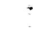

# INTERNAL DISTRIBUTION

1. MSRP Director's Office   
2. R.F.Apple   
3. S.E.Beall   
4. M. Bender   
5. E.S.Bettis   
6. F.F.Blankenship   
7. A. L. Boch   
8. W.F. Boudreau   
9. R.B.Briggs   
10. J.M. Coburn   
11. G. T. Colwell   
12. A. P. Fraas   
13. C. H. Gabbard   
14. W.R.Grimes   
15. A.G.Grindell   
16. M. I. Lundin   
17. R.N. Lyon   
18. H. G. MacPherson   
19. W. D. Manly   
20. W.B.McDonald   
21. A.J.Miller   
22. R. L. Moore   
23. J.C.Moyers

24. A.M.Perry   
25. M. W. Rosenthal   
26. H.W.Savage   
27. A. W. Savolainen   
28. D. Scott   
29. M.J. Skinner

30-35. P.G. Smith   
36. I. Spiewak   
37. J.A. Swartout   
38. A. Taboada   
39. J.R. Tallackson   
40. D.B.Trauger   
41. R. S. Valachovic   
42. J.H.Westsik   
43. L.V. Wilson   
44. C.E.Winters

45-46. Central Research Library   
47-49. ORNL - Y-12 Technical Library, Document Reference Section   
50-52. Laboratory Records Department   
53. Laboratory Records, ORNL R.C.

# EXTERNAL DISTRIBUTION

54-68. Division of Technical Information Extension   
69. Research and Development Division, ORO   
70-71. Reactor Division, ORO