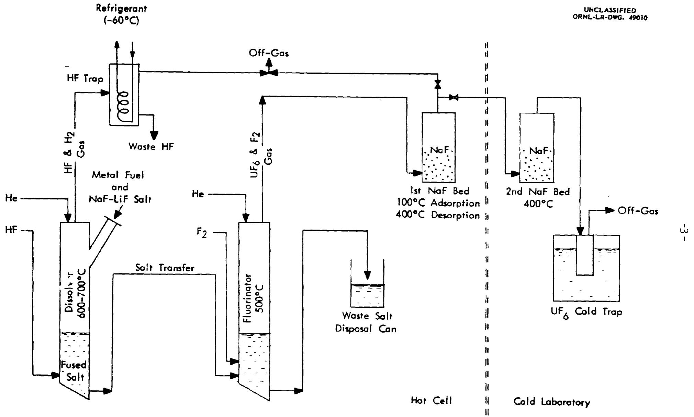
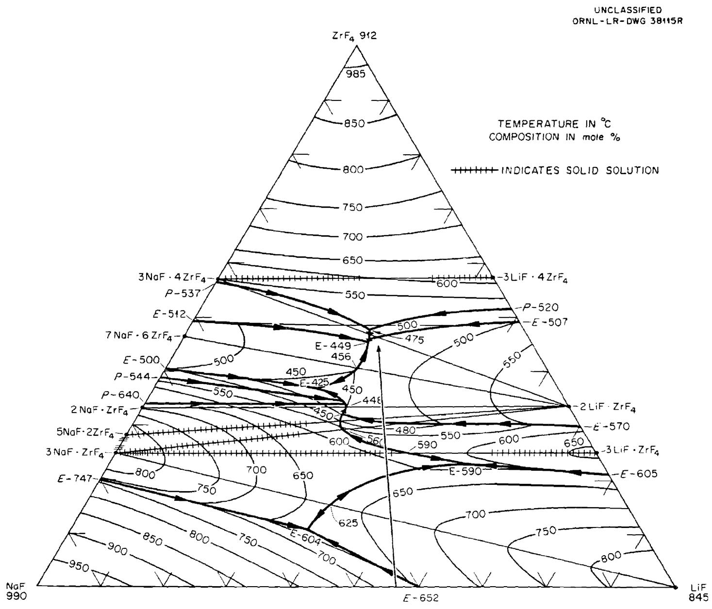

# LABORATORY-SCALE DEMONSTRATION OF THE FUSED SALT VOLATILITY PROCESS

G. I. Cathers, R. L. Jolley, and E. C. Moncrief

# ABSTRACT

The feasibility of processing enriched irradiated zirconium-uranium alloy fuel by the fused salt-fluoride volatility procedure has been demonstrated in laboratory tests with fuel having a burnup of over $10\%$ . Uranium recoveries were good and decontamination factors for radioactive fission products were $10^{6}$ to $10^{9}$ . The $\mathsf{UF}_6$ product contained significant quantities of nonradioactive impurities, and additional work in this area is needed.

For review by Nuclear Science and Engineering.

# NOTICE

# INTRODUCTION

The fused salt-fluoride volatility process for zirconium-uranium reactor fuel consists of (1) hydrofluorination and dissolution of the fuel in molten salt, (2) fluorination to volatilize $\mathsf{UF}_6$ from the melt, and (3) complete decontamination of the $\mathsf{UF}_6$ in an absorption-desorption cycle (1,2). As a nonaqueous process it has not received the large-scale development effort that has been expended on aqueous processing methods. Its advantages include low waste volumes (<1 liter/kg Zr-U alloy), high decontamination from fission product activities, a greatly decreased criticality problem with enriched fuel due to the absence of neutron moderators, and the form of the product, $\mathsf{UF}_6$ , which eliminates some of the chemical conversion steps needed in the uranyl nitrate-uranium metal cycle. Some possible disadvantages are the corrosion at high temperatures in a fluoride system, the necessity of a gas-tight system, and the difficulty of manipulating molten salt.

The tests, carried out in a hot cell, included study of the hydrofluorination and fluorination reactions, the behavior of various fission product activities, and the degree of uranium recovery and decontamination. The tests were conducted primarily in preparation for operation of the ORNL Volatility Pilot Plant, which has been adapted to process Zr-U reactor fuel (3). If this operation is successful, the pilot plant may be modified to test variations of the process with other types of fuel.

# PROCESS DESCRIPTION AND EXPERIMENTAL PROCEDURE

The major process steps of fuel dissolution, UF volatilization, absorption, and desorption were used (see Fig. 1). In each of 12 tests, $650\mathrm{g}$ of 2- to 3-year-

  
Fig. 1 Schematic of laboratory process test equipment.

decayed zirconium alloy fuel, with gross $\beta$ and $\gamma$ activity levels of $1.8 \times 10^{9}$ and $1.0 \times 10^{9} \mathrm{cpm/mgU}$ , respectively, was dissolved at $500 - 700^{\circ}\mathrm{C}$ by hydrofluorination in molten 57-43 mole $\%$ LiF-NaF with a liquidus temperature of $670^{\circ}\mathrm{C}$ . As hydrofluorination and dissolution proceeded, the composition of the salt was changed as represented by the line shown in the phase equilibrium diagram (Fig. 2). Dissolution was completed at a salt composition of 31-24-45 mole $\%$ LiF-NaF-ZrF $_4$ , i.e., close to a eutectic composition melting at $449^{\circ}\mathrm{C}$ . The resulting final UF $_4$ concentration in the melt was $<1\%$ . The system LiF-NaF-ZrF $_4$ is one of the few fluoride systems known in which liquidus temperatures are so low for large concentrations of ZrF $_4$ (4). The composition of the initial dissolution salt was chosen so as to minimize the liquidus temperature encountered in the 0-20 mole $\%$ ZrF $_4$ region of the phase diagram.

The dissolution product salt containing $\mathsf{UF}_4$ was fluorinated at $500^{\circ}\mathsf{C}$ with elemental fluorine, and the volatilized $\mathsf{UF}_6$ was absorbed on sodium fluoride at $100^{\circ}\mathsf{C}$ . The $\mathsf{UF}_6$ vapor pressure over the $\mathsf{UF}_6\cdot 3\mathsf{NaF}$ complex at this temperature is $\sim 2 \times 10^{-3}\mathsf{mm}$ , and essentially all the $\mathsf{UF}_6$ is absorbed out of the $\mathsf{F}_2\text{-}\mathsf{UF}_6$ gas stream (5). Desorption consisted in heating the $\mathsf{UF}_6\text{-}\mathsf{NaF}$ complex bed from 100 to $400^{\circ}\mathsf{C}$ while passing $\mathsf{F}_2$ through to a second NaF bed held at $400^{\circ}\mathsf{C}$ . The dissociation pressure of the $\mathsf{UF}_6\cdot 3\mathsf{NaF}$ complex exceeds $760\mathsf{mm}$ at $400^{\circ}\mathsf{C}$ . The final $\mathsf{UF}_6$ product was cold-trapped at $-60^{\circ}\mathsf{C}$ , then hydrolyzed with a $1\underline{\underline{\mathsf{M}}}$ Al $(\mathsf{NO}_3)_3$ solution for analysis.

  
Fig. 2. LiF-NaF-ZrF $_4$ phase diagram with process composition line.

Equipment for the laboratory tests was installed in a hot cell equipped with Argonne Model 8 slave manipulators (see Fig. 1). It consisted of a dissolution reactor, fluorination vessel, NaF absorption beds, cold traps, and the necessary pneumatically operated valves for coupling the system together.

The Hastelloy N dissolver was 18 in. deep and 3 in. i.d., with a 250-mil-thick wall, and had a loading chute. The L-nickel fluorinator was also 18 in. deep, 3 in. i.d., with a 250-mil wall. Both vessels were heated by a 5-in.-dia 12-in.-long tube furnace, supported vertically. The salt transfer lines of 3/8 in.-dia Inconel tubing (30 mils wall thickness) were heated auto-resistively with high-amperage current. The salt transfer line between the two salt reactors was also used as a common gas inlet line for the two vessels.

In runs 1 through 7, U-tube nickel absorption reactors containing $200\mathrm{g}$ of NaF, 12-20 mesh, were used. Since less than $10\mathrm{g}$ of uranium was involved, smaller nickel vessels containing $50\mathrm{g}$ of NaF on a grade H sintered nickel filter were used in runs 8 through 12. In these last runs the $\mathsf{UF}_6$ was desorbed in a "cold" laboratory, the absorption bed having a maximum activity of about $200\mathrm{mr/hr}$ at contact, with a large part of this being due to external surface contamination.

The stainless steel cold traps for waste HF and product were cooled by trichloroethylene and dry ice. The waste HF was jetted into ice water, warmed to ambient temperature, sampled, and poured into a waste drain. The molten salt was sampled by a dip rod-frozen salt technique before being disposed of in heavy iron cans,

sealed over with a high-melting wax while still warm.

# RESULTS

# Dissolution

The total dissolution time varied from 16 to 62 hr, the HF efficiency from 19 to $48\%$ , and the average dissolution rate from 0.17 to $0.64\mathrm{mgcm}^{-2}\mathrm{min}^{-1}$ (Table I). These rates, although lower than in early laboratory work, are comparable to those obtained in engineering studies. The variables in the dissolution tests were flow rate, temperature, gas phase reaction, salt purification, zirconium hydriding, and HF concentration. Dissolution was most rapid in run 12, in which the salt had received some prepurification, the zirconium was prehydrided, and a high HF flow rate was used. Entrained or volatilized material carried over in the HF stream was usually $<0.1\%$ (Table II), and the maximum uranium loss, probably as $\mathsf{UF}_4$ , was $0.03\%$ . Entrainment of Na, Cs, Sr, and rare earth fluorides was similar in magnitude to that of uranium. Volatilization combined with subsequent entrainment is indicated for fluorides of Zr, Nb, and Ru.

Some of the variables present in the test dissolutions have not been evaluated adequately in cold laboratory work, but they were used in an effort to reduce the dissolution time. The probable effect of some of the variations are noted in Table III. The nature of the tests precluded, however, the drawing of firm conclusions about optimum conditions for dissolution. The effect of impurities in the salt on dissolution has not been definitely established although the plating-out of nickel on the zirconium

Table I. Typical Dissolution Results   

<table><tr><td>Run No.</td><td>Average HF Flow Rate, ml/min</td><td>HF Concentration, %</td><td>HF Utilization Efficiency, %</td><td>Dissolution Time, hr</td><td>Average Dissolution Rate, mg cm-2-min-1</td></tr><tr><td>1</td><td>820</td><td>100</td><td>20.1</td><td>62</td><td>0.17</td></tr><tr><td>3a</td><td>1130</td><td>100</td><td>30.3</td><td>34</td><td>0.30</td></tr><tr><td>10b</td><td>1200</td><td>70</td><td>27.3</td><td>29</td><td>0.35</td></tr><tr><td>12c</td><td>1400</td><td>100</td><td>47.7</td><td>16</td><td>0.64</td></tr></table>

${}^{a}$ Direct gas phase reaction occurred in first 6 hr.   
Salt prehydrogenated; fuel hydrided to $\mathsf{ZrH}_{0.33}$   
cSalt prehydrogenated; fuel hydrided to $\mathsf{ZrH}_{1.2}$

Table II. Entrainment in Waste HF of Dissolution Step   

<table><tr><td rowspan="2">Run No.</td><td colspan="11">Amount, % of total in feed</td></tr><tr><td>U</td><td>Zr</td><td>Na</td><td>Gross β</td><td>Gross γ</td><td>Ru γ</td><td>Zr γ</td><td>Nb γ</td><td>Cs γ</td><td>Sr β</td><td>TRE β</td></tr><tr><td>1</td><td>0.007</td><td>-</td><td>-</td><td>0.02</td><td>0.1</td><td>0.005</td><td>0.02</td><td>-</td><td>0.1</td><td>-</td><td>-</td></tr><tr><td>3</td><td>0.007</td><td>-</td><td>-</td><td>0.02</td><td>0.2</td><td>0.04</td><td>0.1</td><td>7</td><td>0.07</td><td>-</td><td>-</td></tr><tr><td>10</td><td>0.01</td><td>0.3</td><td>0.04</td><td>0.03</td><td>0.2</td><td>0.3</td><td>0.04</td><td>0.9</td><td>0.05</td><td>0.02</td><td>0.004</td></tr><tr><td>12</td><td>0.007</td><td>0.1</td><td>0.05</td><td>0.08</td><td>0.2</td><td>2.0</td><td>0.4</td><td>1.2</td><td>0.04</td><td>0.02</td><td>0.006</td></tr></table>

Table III   

<table><tr><td>Variation and Effect on Dissolution Rate</td><td>Remarks</td></tr><tr><td>Increasing HF flow rate increases rate logarithmically</td><td>Probably due to more chance of direct gas-solid reaction</td></tr><tr><td>Increasing temperature increases rate</td><td>Generally true, but effect does not involve much over a factor of 2 in available temperature range</td></tr><tr><td>Nonsubmergence of fuel in salt promotes direct HF-alloy fuel reaction</td><td>Kinetic studies have shown that initial rates of 100% HF with unconditioned massive metal at 700°C results in run-away reaction</td></tr><tr><td>HF dilution with H2decreases rate</td><td>H2arises from reaction with metal or metal hydride, or is added as diluent</td></tr><tr><td>Prehydriding possibly increases rate</td><td>Indefinite at low H/Zr ratio, since much surface cracking and swelling generally occur only above a H/Zr ratio of 1.5/1</td></tr><tr><td>Salt purification by H2reduction of Fe2+, Ni2+, and Cr2+possibly removes inhibition of reaction</td><td>Effect not proved although plating-out of Ni, Fe, and other elements on Zr surfaces has been noted</td></tr></table>

metal surface has been observed, and this presumably hinders dissolution of the zirconium. Other elements such as iron, molybdenum, tin, and chromium are also electronegative relative to zirconium and would presumably act similarly. All of these elements are either fission products, arise from corrosion of the Inor-8 (71% Ni, 16% Mo, 5% Fe, and 7% Cr), are present in the fuel alloy, or are impurities in the initial salt. Two reactions involved in the nickel cycle are

$$
\begin{array}{l} 2 \mathrm {N i F} _ {2} + \mathrm {Z r} \longrightarrow \mathrm {Z r F} _ {4} + 2 \mathrm {N i}, \Delta \mathrm {F} ^ {\circ} = - 1 3 0 \mathrm {k c a l} \\ N i + 2 H F \longrightarrow H _ {2} + N i F _ {2}, \Delta F ^ {\circ} = + 6 k c a l \\ \end{array}
$$

Reduction of $\mathsf{NiF}_2$ to nickel metal at the zirconium fuel surface probably proceeds mainly by the first reaction although the second reaction in reversal leads also to reduction if the $\mathsf{H}_2 / \mathsf{HF}$ mole ratio is sufficiently high. At the end of zirconium fuel dissolution the production of hydrogen becomes small and the second reaction leads to total redissolution of the amorphous nickel metal formed in the earlier stage.

# Uranium Recovery

Greater than $99\%$ UF $_6$ volatilization was obtained only in the last four tests because of inexperience with the equipment and the use of low fluorine flow rates (Table IV). Volatilization was repeatedly $99.8\%$ or more in earlier work with simulated process tests.

The NaF absorption-desorption cycle also operated effectively, resulting in little uranium loss and duplicating the behavior observed in earlier laboratory and pilot plant work. The total uranium retention on NaF beds was less than $0.1\%$ , and

Table IV. Typical Uranium Volatilization in Fluorination Step   

<table><tr><td>Run No.</td><td>Temp, °C</td><td>Fluorination Time, hr</td><td>F2 Flow Rate, ml/min</td><td>U Volatilized,a % of total inventory</td></tr><tr><td>8</td><td>500</td><td>4</td><td>300</td><td>97.9</td></tr><tr><td>9</td><td>520</td><td>4</td><td>300</td><td>99.4</td></tr><tr><td>10</td><td>500</td><td>3</td><td>340</td><td>99.2</td></tr><tr><td>11</td><td>520</td><td>3</td><td>340</td><td>99.9</td></tr><tr><td>12</td><td>500</td><td>3</td><td>430</td><td>99.8</td></tr></table>

${}^{a}$ Based on analysis of fluorinated salt. Initial salt contained $\sim  {0.5}\%$ uranium.

this probably represents an upper limit with reuse of the beds and the tendency for refluorination of any retained residue.

# PRODUCT DECONTAMINATION

# Overall

Overall gross $\beta$ and $\gamma$ decontamination factors ranged from $10^{6}$ to $10^{9}$ (Table V). In all but a few cases the amount of activity in the product $\mathsf{UF}_6$ was less than 10-fold the "natural" activity of U-235 (Table VI). In run 11 the ruthenium $\gamma$ activity was high because an accidental pressure buildup and release entrained dust from the NaF into the $\mathsf{UF}_6$ cold trap. In runs 1 and 6 the product $\mathsf{UF}_6$ was trapped on NaF instead of in a cold trap, with the result that subsequent hydrolysis prior to analysis gave an excessively dilute solution and a high and uncertain background correction led to more apparent activity than in later runs. Runs 2 through 5 are not included since they were not complete flowsheet tests. In runs 7 through 12 the services of a special low-activity-level analytical laboratory were used, which, in conjunction with an improved product hydrolysis method, gave a more accurate picture of the activity in the product.

The principal chemical impurities in the $\mathsf{UF}_6$ product were molybdenum, technetium, neptunium, and chromium, in order of decreasing concentration (Table VII). Molybdenum, the end product of several fission product decay chains and a hydrofluorinator vessel corrosion product, varied in concentration from 1200 to 10,100 ppm. Volatile $\mathsf{MoF}_6$ formed in the fluorination step complexes with NaF, similarly to the

Table V. Overall Decontamination Factors in Complete Process Tests   

<table><tr><td rowspan="2">Run No.</td><td colspan="8">Decontamination Factors</td></tr><tr><td>Gross β</td><td>Gross γ</td><td>Ru γ</td><td>Zr γ</td><td>Nb γ</td><td>Cs γ</td><td>Sr β</td><td>TRE β</td></tr><tr><td>8</td><td>2×106</td><td>&gt;1×109</td><td>2×108</td><td>8×105</td><td>4×107</td><td>3×109</td><td>3×108</td><td>5×108</td></tr><tr><td>9</td><td>3×106</td><td>2×108</td><td>4×107</td><td>2×106</td><td>&gt;2×108</td><td>1×109</td><td>&gt;3×109</td><td>&gt;1×1010</td></tr><tr><td>10</td><td>9×106</td><td>5×107</td><td>2×106</td><td>3×106</td><td>8×107</td><td>1×109</td><td>&gt;1×1010</td><td>&gt;7×109</td></tr><tr><td>11</td><td>1×106</td><td>2×106</td><td>5×104</td><td>1×105</td><td>&gt;6×107</td><td>2×1010</td><td>&gt;9×109</td><td>&gt;3×109</td></tr><tr><td>12</td><td>2×106</td><td>6×107</td><td>1×107</td><td>9×104</td><td>8×105</td><td>2×109</td><td>&gt;5×109</td><td>&gt;1×1011</td></tr></table>

Table VI. Ratio of Product Uranium Activity to Activity of Unirradiated U-235   
Basis: $232\beta \mathrm{cpm} / \mathrm{mg}$ U, 11 $\gamma$ cpm/mg U for $90\%$ U-235 in equilibrium with daughters   

<table><tr><td rowspan="2">Run No.</td><td colspan="6">Activity Ratio, product/unirradiated U-235</td></tr><tr><td>Ru γ</td><td>Zr γ</td><td>Nb γ</td><td>Cs γ</td><td>Sr β</td><td>TRE β</td></tr><tr><td>1</td><td>&lt;10</td><td>&lt;10</td><td>&lt;10</td><td>&lt;10</td><td>&lt;&lt;1</td><td>&lt;1</td></tr><tr><td>6</td><td>&lt;10</td><td>&lt;10</td><td>&lt;10</td><td>&lt;10</td><td>&lt;&lt;1</td><td>&lt;1</td></tr><tr><td>7</td><td>&lt;1</td><td>&lt;1</td><td>&lt;1</td><td>&lt;1</td><td>&lt;&lt;1</td><td>&lt;&lt;1</td></tr><tr><td>8</td><td>&lt;&lt;1</td><td>&lt;1</td><td>&lt;&lt;1</td><td>&lt;&lt;1</td><td>&lt;&lt;1</td><td>&lt;&lt;1</td></tr><tr><td>9</td><td>&lt;1</td><td>&lt;1</td><td>&lt;&lt;1</td><td>&lt;&lt;1</td><td>&lt;&lt;1</td><td>&lt;&lt;1</td></tr><tr><td>10</td><td>&lt;10</td><td>&lt;1</td><td>&lt;&lt;1</td><td>&lt;&lt;1</td><td>&lt;&lt;1</td><td>&lt;&lt;1</td></tr><tr><td>11</td><td>&lt;100</td><td>&lt;10</td><td>&lt;&lt;1</td><td>&lt;&lt;1</td><td>&lt;&lt;1</td><td>&lt;&lt;1</td></tr><tr><td>12</td><td>&lt;1</td><td>&lt;10</td><td>&lt;1</td><td>&lt;&lt;1</td><td>&lt;&lt;1</td><td>&lt;&lt;1</td></tr></table>

Table VII. Impurities in UF Products   

<table><tr><td rowspan="2">Run No.</td><td colspan="4">Amount, ppm of U</td></tr><tr><td>Mo</td><td>Np</td><td>Tc</td><td>Cra</td></tr><tr><td>8</td><td>10,100</td><td>260</td><td>1,020</td><td>200</td></tr><tr><td>9</td><td>5,200</td><td>240</td><td>490</td><td>290</td></tr><tr><td>10</td><td>2,200</td><td>58</td><td>260</td><td>150</td></tr><tr><td>11</td><td>2,500</td><td>310</td><td>240</td><td>80</td></tr><tr><td>12</td><td>1,200</td><td>290</td><td>60</td><td>&lt;100</td></tr></table>

${}^{a}$ Probably from corrosion of the cold trap during the hydrolysis of the product to obtain a representative aqueous sample.

behavior of $\mathsf{UF}_6$ . Investigation of the dissociation pressure of $\mathsf{MoF}_6$ -NaF complex showed that it is approximately 1 atmosphere at $225^{\circ}\mathsf{C}$ , compared to $360^{\circ}\mathsf{C}$ for the $\mathsf{UF}_6$ -NaF complex (6). Some separation of $\mathsf{MoF}_6$ and $\mathsf{UF}_6$ is thus achieved in the absorption step, dependent on the conditions of temperature, time, and gas flow.

The low activity levels of the $\mathsf{UF}_6$ products in runs 8 through 12 and the fact that the usual individual fission product $\beta$ activity contributors did not total up to the gross $\beta$ activity indicated an unknown $\beta$ contributor. This was found to be technetium by both chemical and radiochemical analyses. It was calculated that the feed contained $>3900~\mathrm{ppm}$ based on the uranium, assuming $>10\%$ burnup. The volatile compound $\mathsf{TcF}_6$ is presumably formed in fluorination and possibly behaves in the same way as $\mathsf{MoF}_6$ and $\mathsf{UF}_6$ in absorption.

Neptunium hexafluoride also appeared to follow $\mathsf{UF}_6$ through the absorption step. Chromium may have been introduced by hydrolysis of the $\mathsf{UF}_6$ product in a stainless steel vessel.

Decontamination factors for the separate process steps are given for run 12 in Table VIII.

# Dissolution Step

There was considerable but highly erratic disappearance of ruthenium and niobium activity during dissolution. The ruthenium $\gamma$ d.f.'s were 5 to 120, and the removal of Ru is believed due primarily to adsorption on the dissolver wall. Some ruthenium was volatilized with the excess HF. The niobium d.f.'s were 3 to 620.

Table VIII. Step Decontamination Factors in Run 12   

<table><tr><td rowspan="2">Step</td><td colspan="8">Decontamination Factors</td></tr><tr><td>Gr β</td><td>Gr γ</td><td>Ru γ</td><td>Zr γ</td><td>Nb γ</td><td>Cs γ</td><td>Sr β</td><td>TRE β</td></tr><tr><td>Dissolution</td><td>2</td><td>1</td><td>40</td><td>2</td><td>30</td><td>1</td><td>1</td><td>1</td></tr><tr><td>Fluorination</td><td>4×105</td><td>3×105</td><td>4×103</td><td>5×104</td><td>4×103</td><td>4×105</td><td>1×107</td><td>2×107</td></tr><tr><td>Absorption-Desorption</td><td>2×103</td><td>2×102</td><td>1×102</td><td>1</td><td>6</td><td>3×103</td><td>&gt;5×102</td><td>&gt;5×103</td></tr><tr><td>Overall</td><td>2×109</td><td>6×107</td><td>1×107</td><td>9×104</td><td>8×105</td><td>2×109</td><td>&gt;5×109</td><td>&gt;1×1011</td></tr></table>

The removal of niobium is believed primarily due to volatilization rather than adsorption on metal surfaces. Material balances for both ruthenium and niobium were low, possibly as the result of condensation of some $\mathsf{NbF}_5$ (f.p. $225^{\circ}\mathsf{C}$ ) in the top zone of the dissolver, and of adsorption of the ruthenium. The nondisappearance of cesium, strontium, and rare earth activities was expected since these elements form fluorides that are nonvolatile and difficult to reduce.

# Fluorination Step

Decontamination from the most important volatile fission product activities, Ru $\gamma$ and Nb $\gamma$ (probably in the form of $\mathsf{RuF}_5$ or $\mathsf{RuF}_6$ and $\mathsf{NbF}_5$ ) in the fluorination process was much higher at a fluorination temperature of $\sim 500^{\circ}\mathsf{C}$ than in previous work at $600 - 650^{\circ}\mathsf{C}$ (1). In the first six tests conducted in the hot cell work, the absorption off-gas was trapped in caustic. From analyses of these solutions and of the first NaF beds, the gross $\beta$ , gross $\gamma$ , Ru $\gamma$ , and Nb $\gamma$ activity decontamination factors were calculated for the fluorination step (Table IX). At $600 - 650^{\circ}\mathsf{C}$ the gross $\beta$ and $\gamma$ d.f.'s were usually $\sim 10^{3}$ and the Ru $\gamma$ and Nb $\gamma$ d.f.'s $\sim 5 - 10$ . Uranium is thus largely decontaminated from fission product activities in the fluorination step if the temperature is kept as low as possible.

# Absorption-Desorption

Decontamination factors in the absorption-desorption step were in the range 10-100 for the more volatile $\mathsf{NbF}_5$ and $\mathsf{RuF}_5$ or $\mathsf{RuF}_6$ . The amount of $\mathsf{Ru}\gamma$ activity in the off-gas stream passing through the first NaF absorption bed was highly variable,

Table IX. Measured Decontamination Factors Obtained in Fluorination   

<table><tr><td>Run No.</td><td>Gr β</td><td>Gr γ</td><td>Ru γ</td><td>Zr γ</td><td>Nb γ</td><td>Cs β</td><td>Sr β</td><td>TRE β</td></tr><tr><td>1</td><td>3×105</td><td>1×105</td><td>4×102</td><td>7×104</td><td>5×103</td><td>2×105</td><td>4×106</td><td>1×107</td></tr><tr><td>2</td><td>2×105</td><td>8×104</td><td>2×103</td><td>1×105</td><td>2×103</td><td>-</td><td>-</td><td>6×106</td></tr><tr><td>3</td><td>1×105</td><td>3×104</td><td>6×102</td><td>5×104</td><td>1×103</td><td>-</td><td>8×106</td><td>-</td></tr><tr><td>4</td><td>1×105</td><td>4×104</td><td>1×102</td><td>2×102</td><td>2×102</td><td>-</td><td>2×106</td><td>-</td></tr><tr><td>5</td><td>8×104</td><td>3×104</td><td>2×102</td><td>3×104</td><td>1×103</td><td>-</td><td>-</td><td>-</td></tr><tr><td>6</td><td>3×104</td><td>2×104</td><td>2×102</td><td>1×104</td><td>2×103</td><td>4×104</td><td>3×105</td><td>5×105</td></tr></table>

due principally to the small amount volatilized in the $500^{\circ}\mathrm{C}$ fluorination step: 82, 11, 8, 13, 11, and $6\%$ of the total volatilized Ru $\gamma$ activity in runs 1 through 6, respectively. In previously reported work relatively more Ru $\gamma$ activity passed through the first NaF bed and resulted in much higher d.f.'s, since a larger amount of Ru $\gamma$ activity was volatilized in the fluorination step at $600 - 650^{\circ}\mathrm{C}$ .

Actual absorption-desorption decontamination factors could be calculated only in runs 1 through 6 where the absorption off-gas activity was trapped and measured. The absorption-desorption d.f.'s presented in Table VIII for run 12 are minimum values since the absorption off-gas was not measured. Actually, inclusion of the off-gas activity in the calculation would affect only the Ru $\gamma$ and Nb $\gamma$ d.f.'s and those only slightly. The d.f.'s given for the separate process steps in run 12 (Table VIII) were calculated from prorated activities measured in the first absorption bed since the same material was used in runs 8 through 12.

# CONCLUSIONS

The fused salt-fluoride volatility process gave satisfactory decontamination of uranium from fission product activities at a burnup of $>10\%$ . The main impurities in the product $\mathsf{UF}_6$ were molybdenum, technetium, and neptunium. Some separation from molybdenum and technetium evidently occurs in the absorption-desorption step, and further work to optimize this effect appears warranted. The results also indicate that use of a fluorination temperature of $500^{\circ}\mathsf{C}$ rather than $600 - 650^{\circ}\mathsf{C}$ minimizes to a large extent the carryover of Ru $\gamma$ and Nb $\gamma$ activities along with the $\mathsf{UF}_6$ gas stream in the fused salt fluorination step. Evaluation of the absorption-desorption

step was only tentative due to the small carryover of all activities from the fluorination step.

The overall results appear to confirm the chemical feasibility of the process with irradiated Zircaloy-2-U alloy fuel. Areas of chemical uncertainty exist, particularly in the dissolution step, but these are apparently not serious. The dissolution step involves gas-liquid-solid contact and is necessarily quite dependent on geometry. It appears desirable, however, to study further the zirconium metal reduction of $\mathrm{NiF}_2$ and analogous impurities in the fused salt to determine how this affects the dissolution rate and the concurrent volatilization or deposition of relatively noble materials such as ruthenium and molybdenum.

# ACKNOWLEDGMENTS

The assistance of T. E. Crabtree and C. J. Shipman in performing the laboratory work is gratefully acknowledged. The authors also express their appreciation for the work of personnel in the Analytical Chemistry Division of ORNL under the supervision of C. L. Burros, J. H. Cooper, W. R. Laing, C. E. Lamb, H. A. Parker, and G. R. Wilson.

# REFERENCES

1. G. I. Cathers, Nucl. Sci. and Eng., 2, 768-777 (1957).   
2. W. H. Carr, Jr., Chem. Eng. Symposium Series, 56, 57-61 (1960).   
3. R. P. Milford, S. Mann, J. B. Ruch, and W. H. Carr, Jr., Ind. and Eng. Chem., 53, 357-362 (1961).   
4. F. F. Blankenship et al., ORNL-2548, p. 60, Oak Ridge National Laboratory (1959).   
5. G. I. Cathers, M. R. Bennett, and R. L. Jolley, Ind. and Eng. Chem., 50, 1709-10 (1958).   
6. G. I. Cathers, "Dissociation Pressure of $\mathsf{MoF}_6$ -NaF Complex and the Interaction of Other Hexafluorides with NaF," paper presented at American Chemical Society Meeting, Sept. 3-8, 1961.

# DISTRIBUTION

1-3. Nuclear Science and Engineering   
4-5. E. J. Murphy   
6. F. L. Culler   
7. D. E. Ferguson   
8. H. B. Graham   
9. F. R. Dowling, Wash. AEC   
10. E. L. Anderson, Jr., Wash. AEC   
11. J. Vanderryn ORO AEC   
12. G. I. Cathers   
13. R. L. Jolley   
14. E. C. Moncrief   
15. Lab Records (RC)   
16-17. Laboratory Records   
18-19. Central Research Library   
20. Document Reference Section   
21-35. DTIE