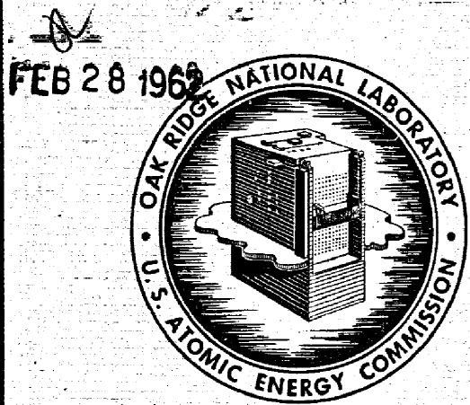

# OAK RIDGE NATIONAL LABORATORY

operated byUNION CARBIDE CORPORATIONfor the

U.S. ATOMIC ENERGY COMMISSION

ORNL-TM-128

DEVELOPMENT OF FREEZ VALVE FOR USE IN THE MSRE

M. Richardson

# NOTICE

This document contains information of a preliminary nature and was prepared primarily for internal use at the Oak Ridge National Laboratory. It is subject to revision or correction and therefore does not represent a final report. The information is not to be abstracted, reprinted or otherwise given public dissemination without the approval of the ORNL patent branch, Legal and Information Control Department.

# LEGAL NOTICE

This report was prepared as an account of Government sponsored work. Neither the United States, nor the Commission, nor any person acting on behalf of the Commission:

A. Makes any warranty or representation, expressed or implied, with respect to the accuracy, completeness, or usefulness of the information contained in this report, or that the use of any information, apparatus, method, or process disclosed in this report may not infringe privately owned rights; or   
B. Assumes any liabilities with respect to the use of, or for damages resulting from the use of any information, apparatus, method, or process disclosed in this report.

As used in the above, "person acting on behalf of the Commission" includes any employee or contractor of the Commission, or employee of such contractor, to the extent that such employee or contractor of the Commission, or employee of such contractor prepares, disseminates, or provides access to, any information pursuant to his employment or contract with the Commission, or his employment with such contractor.

Contract No. W-7405-eng-26

Reactor Division

DEVELOPMENT OF FREEZE VALVE FOR USE IN THE MSRE

M. Richardson

DATE ISSUED

FEB 28 1962

OAK RIDGE NATIONAL LABORATORY

Oak Ridge, Tennessee

operated by

UNION CARBIDE CORPORATION

for the

U. S. ATOMIC ENERGY COMMISSION

# ABSTRACT

Three types of frozen-seal "valves" were tested for possible use in the MSRE. The seal was melted by direct resistance heat, by induction heat, and by clamp-on Calrod heat. The frozen seal was made in a preformed restriction section of a standard piece of pipe by a cooling-gas jet stream directed at the restriction. All three valves performed satisfactorily through 100 test cycles. The Calrod-heated valve was selected for MSRE use on the basis of simplicity of design and of operation. Two of the valves are successfully undergoing further tests on the MSRE Engineering Test Loop.

# INTRODUCTION

At the beginning of the Molten Salt Reactor Program a proven, reliable, mechanical valve was not available; moreover, it was decided that a development program for such a valve would not be undertaken at that time. Past experience indicated some success with a freeze-plug type "valve," and a short evaluation program was initiated. Three types were tested in valve test stands by using reactor-quality salt at 1100 to $1200^{\mathrm{O}}\mathrm{F}$ , and all three types proved satisfactory for holding pressures up to 60 psig. Each valve was frozen and melted 100 times. There were no electrical or mechanical failures. Additional experience was gained through operation of the valves incorporated in the Engineering Test Loop in Building 9201-3.

# TEST EQUIPMENT

Two test stands were built which were identical except for the valve bodies and auxiliary heating equipment for each valve. A description of one test system will apply to both.

Figure 1 shows that the system (including the valve) was vertically mounted. The total volume of the system was 5.6 gal. The sump tank was made of 6-in. sched-40 Inconel pipe and had a volume of 2.2 gal. A 3/8-in. sched-40 Inconel pipe connected the sump tank to the 1-l/2-in. INOR-8 valve body by means of a 3/8- to 1-l/2-in. INOR-8 bell reducer. The connection from the valve body to the head tank was by similar means. The head tank was made of 6-in. sched-40 INOR-8; the volume of this tank was also 2.2 gal.

Salt-level indicators were of the contact probe type and signaled by means of control-panel-mounted lights.

The molten salt was moved from the lower to the upper tank by means of gas pressure. Helium was used for this purpose and to provide an inert-atmosphere blanket for the salt. A suitable gas regulating and venting station was provided for this purpose. The system was vented to the atmosphere through a CWS filter.

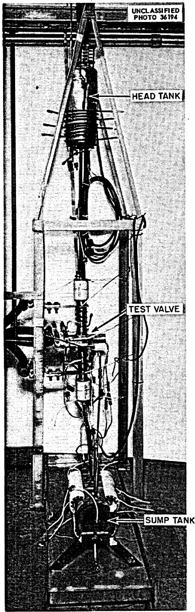  
Fig. 1. Test Stand with Resistance-Heated Valve in Place.

Variac-controlled heat was applied to the tanks and piping by means of Calrod and clamshell heaters. Average power required to maintain 1100 to $1200^{\circ}\mathrm{F}$ in the system was $4.5\mathrm{kw}$ .

Coolant used for the freeze cycle was plant air or fan-forced room air blown across the area of the valve to be frozen. The freezing temperature of the salt was 800 to $850^{\circ}\mathrm{F}$ as measured by externally attached thermocouples located 1-1/2-in. above and 1-1/2-in. below the center of the valve.

Analysis of the MSRE-type salt added to the valve test was as follows:

<table><tr><td colspan="6">Wt %</td><td colspan="3">ppm</td></tr><tr><td>U</td><td>Th</td><td>Li</td><td>Be</td><td>Zr</td><td>F</td><td>Ni</td><td>Cr</td><td>Fe</td></tr><tr><td>5.45</td><td>6.21</td><td>9.74</td><td>4.61</td><td>13.3</td><td>bal</td><td>35</td><td>140</td><td>355</td></tr></table>

# TEST CYCLE

The procedure used for valve tests was as follows:

1. Maintain the average loop temperature above the melting point of the salt, with salt in the sump tank.   
2. Close the equalizing valve at the gas regulating station and apply approx 8 psig of helium to the sump tank. Vent the head tank and allow salt to rise to the lower indicating probe in the head tank (approx 600 cc of salt).   
3. With zero salt flow, turn on 50 to 60 cfm of air (approx 6 lb/min) to the freeze-plug area. Maintain this air flow for 10 to 15 min to freeze.   
4. Reduce air flow to 7 to 10 cfm to maintain plug.   
5. Apply 60 psig of gas to the head tank and maintain this pressure until system temperatures reach equilibrium.   
6. Vent the overpressure, equalize head and sump-tank pressure, and turn off cooling air.   
7. Apply power to the freeze-plug area and melt the salt. Melt-out is indicated by the head-tank probe light.

8. Turn off heat to the plug area; allow salt to run by gravity to the sump.

9. Repeat cycle.

The size of the frozen area of salt was established by controlling the flow of coolant and by adjusting the heat applied to the valve body on each side of the plug. A positive seal appeared to be a plug approx 3 in. long including the transition zone.

# DESCRIPTION OF TEST VALVES

# Direct-Resistance Valve

Figure 2 shows the direct-resistance-heated test valve. Table 1 lists pertinent data on the construction of this valve.

Table 1. Construction Features of Direct-Resistance Valve   

<table><tr><td>Material</td><td>Sched 40, l-1/2-in. INOR-8 pipe</td></tr><tr><td>Resistivity</td><td>120 μ ohm/cm at room temperature</td></tr><tr><td>Power lugs</td><td>Outboard lugs of l/8-in. nickel plate, center lug l/8-in. INOR-8 plate at pipe to l/8-in. nickel plate, 3-1/4 in. x 8 in.</td></tr><tr><td>Over-all length</td><td>14 in. between outboard lugs</td></tr><tr><td>Cooling tube</td><td>2-in.-OD x l/16-in.-wall Inconel tube</td></tr><tr><td>Power</td><td>Center tapped, l volt, 2000 amp to each outboard lug--4 kw total</td></tr><tr><td>Power cable</td><td>1 MCM braided copper (four required from lugs to transformer)</td></tr></table>

The freeze-plug zone was cold formed in a press and jig to make a shaped flow restrictor in the pipe. The dimensions of the inside of the pipe after compression were $1/2 \times 2 - 1/4$ in. with a $40^{\circ}$ included angle of approach and discharge. The center-tap lug was formed and welded to and around the pipe restriction, then enclosed in the coolant tube.

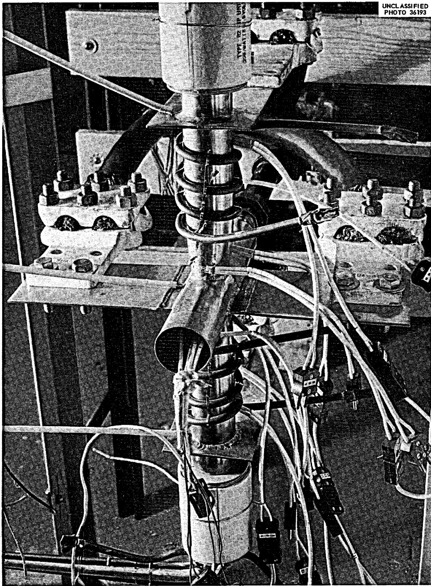  
Fig. 2. Resistance-Heated Valve.

# Induction-Heated Valve

Figure 3 shows the induction-heated valve. Table 2 lists pertinent data on construction of this valve.

Table 2. Construction Features of Induction-Heated Valve   

<table><tr><td>Material</td><td>1-l/2-in. sched-40 INOR-8 pipe</td></tr><tr><td>Over-all length</td><td>6 in.</td></tr><tr><td>Power</td><td>12-kw, 450-kc spark-gap generator</td></tr><tr><td>Power connection</td><td>1/4-in. 0.035-in.-wall, copper tube, water cooled</td></tr><tr><td>Coil</td><td>12-turn U-shaped coil made of l/4-in. square copper tubing, spaced l/16 in. apart</td></tr></table>

The freeze-plug zone was cold formed to make a flat, 2 in. long with a $20^{\circ}$ angle of approach and discharge. The flats were formed on opposite sides of the pipe to make a shaped flow restrictor. Inside dimensions were 1/2 in. x 2-1/4 in. x 2 in. long. The induction coil was formed to permit preferential heating toward the outer edges of the freeze plug and to fit over the 2-in. pipe flat. No part of the heating coil was attached to or touching the pipe. The coil occupied 6 in. of pipe length and was attached to the generator by standard brass tubing fittings and 1/4-in. copper tube. Water cooling of the generator and heating coil was required when the generator was in operation.

The freeze plug was formed by directing controlled air flow in a 1-in. pipe between the heating coils to each of the flats. The air nozzles were spaced 6 in. from the valve. Two methods of supplying cooling air were employed: low-pressure air from a centrifugal blower piped to each valve flat with a 2-in. hose and high-pressure building air piped through a regulator and rotameter to each of the valve flats with a 1-in. pipe.

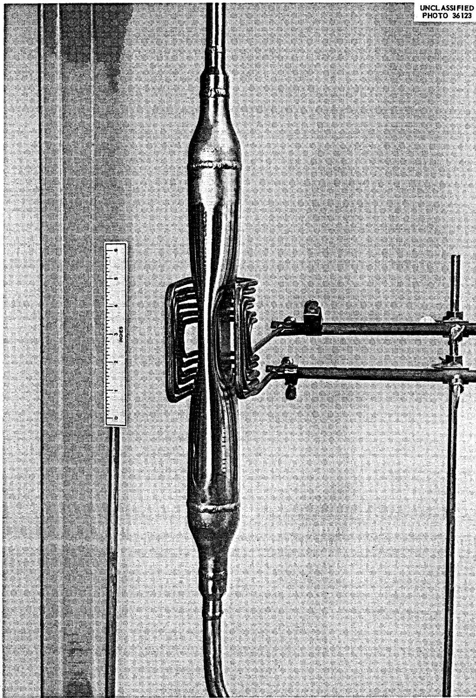  
Fig. 3. Induction-Heated Valve with Coil in Position.

# Calrod-Heated Valve

The Calrod-heated valve was made up at the completion of the induction-heated valve test. The same flattened pipe section (2-in. flats) was used by simply removing the induction coil and clamping a 1000-w $1500^{\circ}\mathrm{F}$ Calrod to each flat. The 24-in. Calrods were bent into 6-in. long W-shaped units and clamped onto the pipe. The final forming was done by heating the Calrod and tamping it into place to make a close fit to the pipe. Power was controlled by a panel-mounted Variac. Cooling was accomplished by blowing air across the flats in the same manner as was used for the induction valve.

Figure 4 shows the valve. Thermocouples for the test were externally welded to the valve. One thermocouple was centered on the broad face of the 2-in. flat, one was spaced $1 - 1 / 2$ in. above, and one was spaced $1 - 1 / 2$ in. below the center.

# RESULTS OF TEST-VALVE OPERATION

# Resistance-Heated Valve

The valve was cycled 100 times without incident. A curve of melt time vs power input is shown on Fig. 5a. Figure 5b shows heat removal vs volume rate of cooling air across the freeze-plug area. A flow of approx 8 scfm was required to maintain the plug.

After testing, the valve was removed from the loop for examination. The general appearance of the valve was normal.

# Induction-Heated Valve

The valve was cycled 100 times without difficulty and with no apparent damage to the pipe. The average melt time was 35 sec at 12 kw. Freeze time was 10 to 15 min with 50 to 60 cfm of air. A flow of approx 8 scfm was required to maintain the plug.

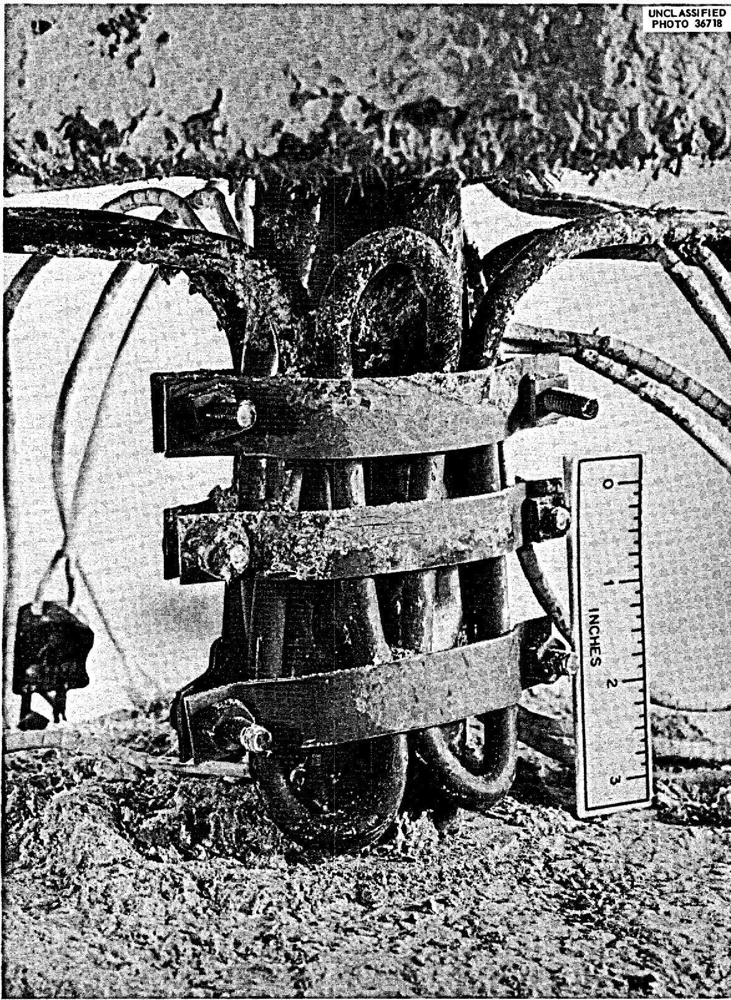  
Fig. 4. Calrod-Heated Valve.

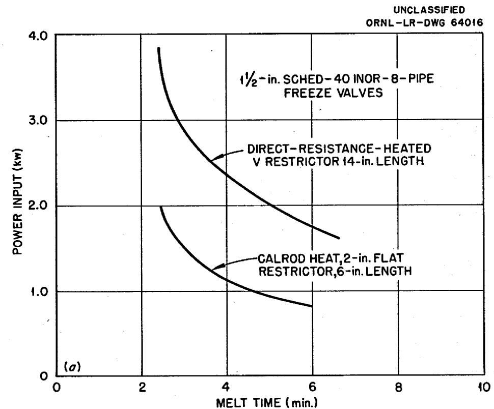

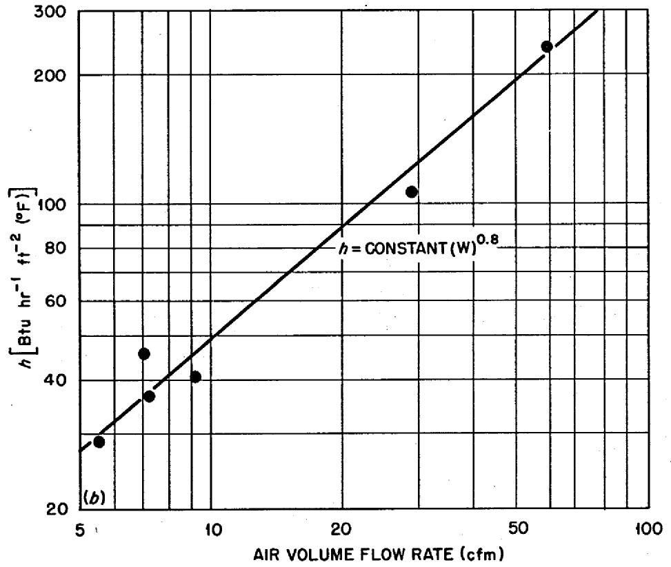  
Fig. 5. Melt Time vs Power Input for Resistance- and Calrod-Heated Freeze Valves.

# Calrod-Heated Valve

The Calrod-heated valve was cycled 100 times with no difficulty. Figure 5a shows the melt time vs power input. The average melt time was 3 min with 1.6 kw input. Again, an air flow of approx 8 scfm was required to maintain the plug. The maximum Calrod sheath temperature attained in 3-1/2 min was $1300^{\circ}\mathrm{F}$ . No severe oxidation was apparent on the heating element.

# DISCUSSION OF TEST-VALVE INSTALLATION AND OPERATION

All the valves tested performed satisfactorily, with adequate freeze and thaw times. However, the expense and complexity of the associated equipment and the operating procedures differed widely with the various types of valves.

The problems associated with using a high-current - low-voltage source of power would make the direct-resistance valve cumbersome for use in a reactor system. To obtain reasonable operating voltage, a long piece of pipe was required between the electrical connections. This added length required auxiliary heat during the freeze cycle to prevent formation of an excessively large plug. It was necessary to turn off these heaters (two 1000-w Calrods) during the melt cycle to prevent burnout when the direct-resistance heat was applied.

The induction-heated valve, although much faster than the others, required an expensive high-frequency generator (455 kc).

The valve heated with clamped-on Calrod heaters appeared to be the best of the three types of valves tested. It has the advantage of structural and electrical simplicity with adequate freezing and melting times.

The two thermocouples located away from the center of the valve in the Calrod-heated valve were useful in determining the frozen-plug size. Since the thermocouples were located directly in or close to the cooling air stream, they gave a relative temperature reading only; however, once the plug size and freeze point had been established, the thermocouple 1-1/2 in. above the valve center was used as the frozen-condition indicator.

The use of a low-pressure centrifugal blower to supply cooling air was abandoned due to the control difficulties. The low available pressure drop prohibited restriction of the flow without a damper control mechanism and required large air leads to the valve. Proper sizing of a blower with a variable-speed motor control and an air-volume meter would have permitted satisfactory operation. However, in the absence of this control the frozen plug was too large to permit reasonable melt times.

The use of high-pressure building air through standard controls permitted very close control of the valve operation as well as the use of much smaller air tubes to the valve flats. One-inch pipe was used for the air tube during the test. However, the use of smaller (approx 1/2-in.) tubing was indicated. An air supply which permits the use of small air ducts has the advantages of simplifying the control problem to a great extent and reducing the over-all size of the valve assembly.

# DESCRIPTION OF VALVE INSTALLATION IN ENGINEERING TEST LOOP

The Calrod-heated valve was selected for use in the MSRE on the basis of the previously described work and was incorporated into the hot-salt MSRE Engineering Test Loop located in building 9201-3. The valves were mounted horizontally and oriented as shown on Fig. 6.

The two valves were identical and were formed from $1 - 1 / 2$ -in. sched-40 pipe by using the same jig (2-in. flats) as was used to form the induction-heated development valve. The valves were heated by two 1000-w Calrod circular-wound heaters as shown on Fig. 7, which also shows the location of the coolant-air nozzles. These nozzles were $1 / 2$ -in. copper tubing terminating 1 in. from the valve flats. Coolant air was supplied to the valves from the building instrument air system and was controlled by regulators and rotameters. The reference temperature thermocouple was located 1.5 in. from the center of the valve flat (shown in Fig. 6).

The purpose of the valve arrangement shown in Fig. 6 was twofold:

(1) To provide a common line from the operating system to the flush drain tank or fuel drain tank such that the salt flow could be directed to or from either one tank

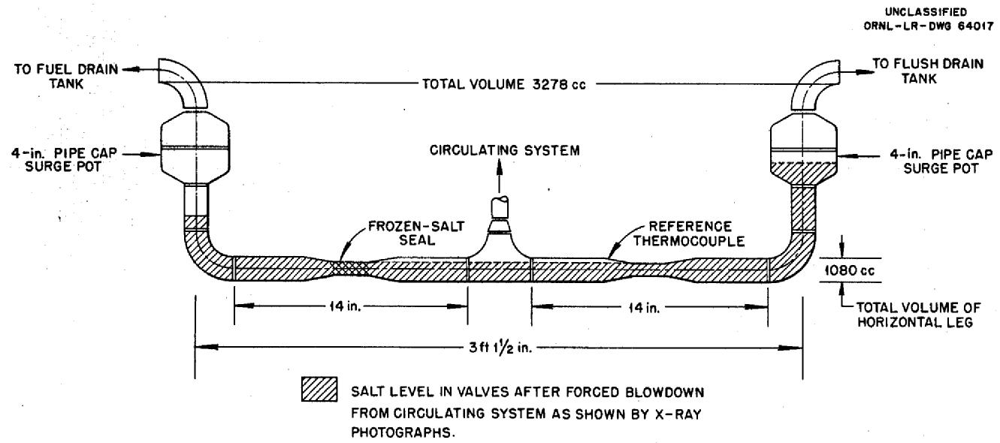  
Fig. 6. 1.5-in. Freeze-Valve Arrangement on MSRE Engineering Test Loop.

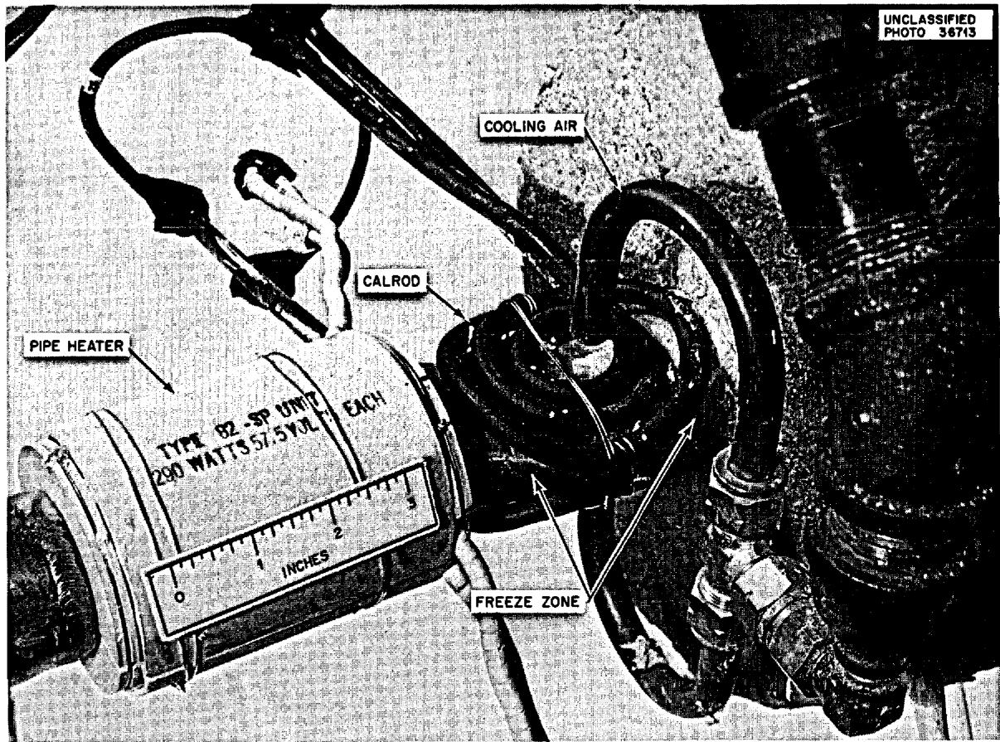  
Fig. 7. Engineering Test Loop Valve Showing Calrod Heaters and Cooling Nozzles.

or the other. One valve or the other will be frozen at all times depending upon the operation.

(2) To ensure that sufficient salt would remain in the valve to make a positive frozen seal under all conditions.

The volume of the operating system is such that, when salt is moved from either of the drain tanks to the operating system, there will always be salt in the valves to make a seal. The surge pots shown in Fig. 5a between the valves and the drain tanks make it impossible to completely empty the valves when draining the circulating system into the tanks. The surge-pot volumes are such that there is sufficient residual salt in the valve body to form a seal. The valve bodies would drain completely were it not for these pots.

FREEZE-VALVE OPERATION AND RESULTS IN THE ENGINEERING TEST LOOP

The valve to the flush tank in the Engineering Test Loop was operated with coolant salt (LiF-BeF $_2$ , 66-34 mole %) through 40 cycles without difficulty. After approx 1300 hr of operation the initial melt appeared to fail to open the line, but indications are that the difficulty was a plug in the line upstream from the valve. Once the drain line was clear the adjacent valve, which had seen the same operation conditions, operated normally.

The average freeze time was 7.5 min and required 6 to 7 scfm (approx 0.5 lb/min) air flow. Air flow required to maintain the plug was approx 3.5 scfm (approx 0.3 lb/min). The freeze cycle was accomplished with zero salt flow in the pipe in all cases. The frozen-plug length at $700^{\circ}\mathrm{F}$ reference temperature was approx 3 in.

The melting time vs power input curves for this valve are shown on Fig. 8. The difference in melt times between the 500 and $700^{\circ}\mathrm{F}$ steady-state reference temperatures shows clearly the effect of the frozen-plug size.

An operational test was performed on the Engineering Test Loop to check the operation of the valves under a forced-drain condition. The valve to

ENGINEERING TEST LOOP DATA

UNCLASSIFIED

ORNL-LR-DWG 64018

O REFERENCE FROZEN,TEMPERATURE: 700°F

$\triangle$ REFERENCE FROZEN,TEMPERATURE:500°F $\bullet$ REFERENCE FROZEN,TEMPERATURE:740°F AVERAGE TEMPERATURE OF LOOP SALT:1150°F AVERAGE TEMPERATURE OF LOOP SALT:1150°F

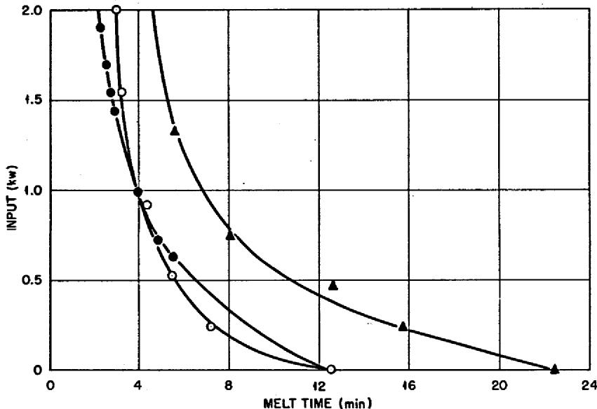  
Fig. 8. Melt Time of 1.5-in. Calrod-Heated MSRE Freeze Valve.

the fuel drain tank remained frozen while the flush-drain tank valve was melted. Five psig of helium was impressed on the circulating system to force the salt into the flush-drain tank through the valve. Gas flow was permitted to continue through the valve at the completion of the draining operation at a rate of 2.2 scfm helium. The gas flow was then shut off, the gas pressures were equalized between the drain tank and the pump, the valve was frozen, and x-ray photographs were taken of the valve assembly. The photographs indicated that sufficient salt remained in the valves to form a seal (Fig. 6). The valve proved to be leak-tight when gas pressure was reapplied.

# DISCUSSION OF VALVE OPERATION IN THE ENGINEERING TEST LOOP

Operation of the valves has been satisfactory, with the exception of the one blockage that is believed to have been due to a plug in the upstream line and not due to the valve design or operation.

The lower cooling-air requirement for these valves compared with the earlier valves is attributed to the air nozzle being only 1 in. away from the valve flat and to the better air flow to the flat that is permitted by the open-center winding of the Calrods. The surge pots appear to be adequate to prevent the valve from being blown empty during a forced dump. The equalization of gas pressures during freezing is an important operational procedure for two reasons: the valve is difficult to freeze with any movement of salt due to differences in gas pressure, and reverse gas flow just before freezing could possibly leave a gas pocket in the valve with salt on each side.

# CONCLUSIONS AND RECOMMENDATIONS

The Calrod-heated valve is recommended because of its structural simplicity and the simplicity of the associated power and control equipment. The Calrod unit should be rolled in a tight coil as shown in Fig. 7 rather than the W-shaped units as were used for the development valve. This is to avoid short-radius bends and to provide better air flow. A single unit

"Horseshoed" around the flat in a manner similar to the induction coil shown on Fig. 3 would be desirable. This would reduce the number of power leads and make an easily removable unit.

Cooling air requirements will depend on cell temperature and cooling air temperature. Two volume rates are required: a high rate to make the initial freeze and a low rate to hold the freeze.

The holding flow rate controls the plug size and must be selected and kept steady to prevent a meltout from heat leakage due to insufficient cooling. Too much cooling will result in a large plug and consequent excessive meltout time. The holding flow rate should preferably be determined in the field since it is dependent on cell and cooling air temperatures.

Surge pots having a ratio of vertical leg volume to the volume of the horizontal valve and pipe section of 2, as shown in Fig. 5a, should be installed to prevent the valves from being blown empty. For a given system, operating procedures must be analyzed to determine the location of these pots.

The use of high-pressure compressed air, rather than low-pressure blower-supplied air, for cooling is recommended because of easier control, smaller ducts, and smaller over-all size of the valve assembly.

Recommended freeze-valve controls are:

1. Manual control of power to Calrods and manual air-flow control.   
2. Interlock to prevent heat and cooling air from being applied at the same time.   
3. Once the freeze temperature has been established, the center thermocouple should be interlocked to switch automatically from high- to low-volume air flow.   
4. A high-temperature $(1500^{\circ}\mathrm{F})$ cutout or alarm located on the Calrod sheath.   
5. An interlock between a liquid-level probe and the valve power input to prevent prolonged heating of the Calrod. Once the melt is accomplished and the salt is flowing, further heat is not needed.

6. For a meltout, a single control to close off cooling air and apply power to the valve at a preset rate.

There must be no salt flow through the valve, or a freeze cannot be accomplished.

# ACKNOWLEDGMENT

The author is indebted to many members of the Molten Salt Reactor Program for their contributions to this report. Special acknowledgment is due D. Scott, J. C. Moyers, and J. L. Crowley for their advice and suggestions.

The direct-resistance valve was designed by J. L. Crowley; the Calrod and induction-heated valve design was based on the field work done by the many predecessors in the molten-salt field.

The author wishes to express his appreciation to J. L. Crowley and W. H. Duckworth for their contribution in the testing of the valves.

# BIBLIOGRAPHY

MSR Quart. Progr. Rept. July 31, 1961, ORNL-3014, p 25.  
MSR Quart. Progr. Rept. July 1, 1960, ORNL-3122, p 27.

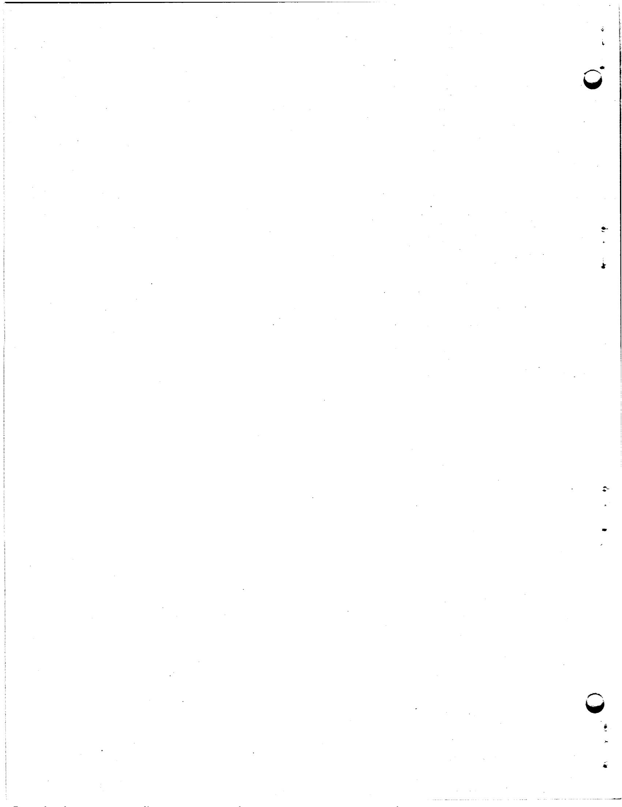

# Internal Distribution

1. G. M. Adamson   
2. L. G. Alexander   
3. S. E. Beall   
4. M. Bender   
5. C. E. Bettis   
6. E. S. Bettis   
7. D. S. Billington   
8. F. F. Blankenship   
9. A. L. Boch

10. E. G. Bohlmann   
11. S.E.Bolt   
12. C. J. Borkowski   
13. C. A. Brandon   
14. R. B. Briggs   
15. F. R. Bruce   
16. O.W.Burke   
17. T. E. Cole   
18. J. A. Conlin   
19. W.H.Cook   
20. G. A. Cristy   
21. J. L. Crowley   
22. F. L. Culler   
23. J. H. Devan   
24. F. A. Doss   
25. D. A. Douglas   
26. N. E. Dunwoody   
27. E.P.Epler   
28. W. K. Ergen   
29. D. E. Ferguson   
30. A. P. Fraas   
31. J. H. Frye   
32. C. H. Gabbard   
33. R.B.Gallaher   
34. B. L. Greenstreet   
35. W. R. Grimes   
36. A. G. Grindell   
37. R. H. Guymon   
38. P. H. Harley   
39. C. S. Harrill   
40. P. N. Haubenreich   
41. E. C. Hise   
42. H. W. Hoffman   
43. P. P. Holz   
44. L. N. Howell   
45. J. P. Jarvis

46. W. H. Jordan   
47. P. R. Kasten   
48. R. J. Kedl   
49. G. W. Keilholtz   
50. S. S. Kirslis   
51. J. W. Krewson   
52. J. A. Lane   
53. W. J. Leonard   
54. R. B. Lindauer   
55. M. I. Lundin   
56. R. N. Lyon   
57. H. G. MacPherson   
58. F. C. Maienschein   
59. W. D. Manly   
60. E. R. Mann   
61. W. B. McDonald   
62. H. F. McDuffie   
63. C. K. McGlothlan   
64. A. J. Miller   
65. E. C. Miller   
66. R. L. Moore   
67. J. C. Moyers   
68. C. W. Nestor   
69. T. E. Northup   
70. W. R. Osborn   
71. L. F. Parsly   
72. P. Patriarca   
73. H. R. Payne   
74. A. M. Perry   
75. W. B. Pike   
76. J. L. Redford   
77. M. Richardson   
78. R. C. Robertson   
79. T. K. Roche   
80. M. W. Rosenthal   
81. H. W. Savage   
82. A. W. Savolainen   
83. D. Scott   
84. M. J. Skinner   
85. G. M. Slaughter   
86. A. N. Smith   
87. P. G. Smith   
88. I. Spiewak   
89. B. Squires   
90. J. A. Swartout

91. A. Toboada

100. L. V. Wilson

92. J. R. Tallackson

101. C. E. Winters

93. R.E.Thoma

102. C. H. Wödtke

94. D. B. Trauger

103-104. Reactor Division Library

95. W. C. Ulrich

105-106. Central Research Library

96. B. S. Weaver

107-109. Document Reference Library

97. B.H. Webster

110-112. Laboratory Records

98. A. M. Weinberg

113. Laboratory Records (LRD-RC)

99. J. H. Westsik

# External Distribution

114-128. Division of Technical Information Extension (DTIE)

129. Research and Development Division, ORO

130-131. Reactor Division, ORO