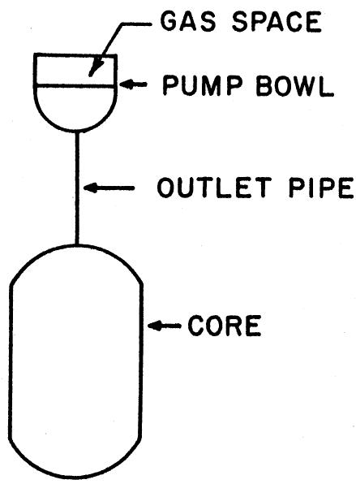

ORNL-TM-203

COPY NO. - / /

DATE - Apr11 6, 1962

MURGATROYD - AN IEM 7090 PROGRAM FOR THE ANALYSIS OF THE KINETICS OF THE MSRE

C.W.Nestor, Jr.

ABSTRACT

The IBM 7090 program NURGATROYD is a revised and extended version of the IBM 704 program PET-I, which solves (by a fifth-order Runge-Kutta procedure) the coupled first-order differential equations for power, delayed neutron concentration and temperature in a one-region reactor as a function of time, given an input reactivity variation represented by a series of linear ramps. The basic extensions were those which were necessary to include the effects of the separate heat capacities and temperature coefficients of the fuel salt and graphite in the MERE, and of heat transfer between the fuel and graphite. In addition, the input and output sections of the previous program were modified to facilitate the use of the program in extensive parameter studies, and a calculation of the pressure rise in the core was included. Typical running times are of the order of 12 milliseconds per time step; a calculation of a 30-second power history using a 10 milliseconds time step requires about 36 seconds of machine time.

# LEGAL NOTICE

This report was prepared as an account of the Government's sponsored work. Neither the United States, nor the Commission, nor any person acting on behalf of the Commission;

A. Make any warranty or representation, as justified or implied, with respect to the accuracy, completeness, or usefulness of the information contained in this report, or that the use of any information, apparatus, method, or process disclosed in this report may not infringe privately owned rights; or   
B. Assume any liabilities with respect to liabilities of or for damages resulting from the use of any information, apparatus, method, or products disclosed in this report.

As used in the above, "person acting on behalf of the Commission" includes any employee or contractor of the Commission, or employees of such contractor, to the extent that such employee or contractor of the Commission, or employees of such contractor prepares, disseminates, or provides access to, any information pursuant to his employment or contract with the Commission, or his employment with such contractor.

# MURGATROYD - AN IBM 7090 PROGRAM FOR THE ANALYSIS OF THE KINETICS OF THE MSRE

# I. Introduction

This report is a description of an IBM 7090 program based on a particular model of the Molten Salt Reactor Experiment. The differential equations of motion are discussed in Section II; since much of the derivation has appeared elsewhere, only the additional derivations necessary in the present problem are included. The fifth-order Runge-Kutta procedure is a standard one which can be found in many numerical analysis textbooks. Its previous successful use in the 704 program PET indicated applicability to the present problem and no revision has as yet been found either desirable or necessary. The use of the program is discussed in Section III, with instructions for the preparation of input data; sample input forms and output sheets are included.

# II. Differential Equations of Motion

# A. Power, Fuel and Graphite Temperatures

The reactor model used as the basis of the program is a one-point, one-energy group representation, with up to seven delayed neutron precursors, which is described by the following set of differential equations: (all symbols are defined in the Nomenclature; a dot over a symbol denotes time derivative)

$$
\dot {P} = \frac {k _ {e} (1 - \beta) - 1}{\ell} P + \sum_ {i - 1} ^ {N} \lambda_ {i} \Gamma_ {i} \tag {1}
$$

$$
\dot {\Gamma} _ {i} = \frac {\beta_ {i} P}{\ell} - \lambda_ {i} \Gamma_ {i}, i = 1, N \tag {2}
$$

The effective multiplication constant $\mathbf{k}_{\mathrm{e}}$ is assumed to be of the form

$$
k _ {e} = l + \Delta + b t - \left| \frac {\partial k _ {e}}{\partial T _ {f}} \right| \left(T _ {f} - T _ {f o}\right) - \left| \frac {\partial k _ {e}}{\partial T _ {g}} \right| \left(T _ {g} - T _ {g o}\right). \tag {3}
$$

(The subscript zero denotes the steady state value.)

$$
S _ {f} \dot {T} _ {f} = f P - W C _ {P} \left(T _ {2} - T _ {1}\right) + h \left(T _ {g} - T _ {f}\right) \tag {4}
$$

$$
S _ {g} \dot {T} _ {g} = (1 - f) P - h \left(T _ {g} - T _ {f}\right) \tag {5}
$$

It is now necessary to specify some connection between the mean fuel temperature $\mathbf{T_f}$ , the inlet temperature $\mathbf{T_1}$ and the outlet temperature $\mathbf{T_2}$ . The assumption is made that the mean fuel temperature is a weighted mean of the inlet and outlet; i.e., that

$$
\mathrm {T} _ {\mathrm {f}} = \mathrm {a T} _ {1} + (1 - \mathrm {a}) \mathrm {T} _ {2}; \tag {6}
$$

the weight $a(0 < a < 1)$ is an input number in the 7090 program.

Further it is assumed that the inlet temperature $T_{1}$ is a constant.

With the definitions

$$
y _ {f} \equiv \frac {S _ {f} \left(T _ {f} - T _ {f o}\right)}{f P _ {o}} \tag {7}
$$

$$
y _ {g} \equiv \frac {s _ {g} \left(T _ {g} - T _ {g o}\right)}{(1 - f) P _ {o}} \tag {8}
$$

and the initial condition

$$
\mathrm {h} \left(\mathrm {T} _ {\mathrm {g o}} - \mathrm {T} _ {\mathrm {f o}}\right) = (1 - \mathrm {f}) \mathrm {P} _ {\mathrm {o}} \tag {9}
$$

the following equations may be obtained

$$
f P _ {o} \dot {y} _ {f} = f (P - P _ {o}) - \frac {f P _ {o}}{S _ {f}} y _ {f} \left(\frac {W C _ {P}}{1 - a} + h\right) + \frac {h (1 - f) P _ {o}}{S _ {g}} y _ {g} \tag {10}
$$

$$
(1 - f) P _ {o} \dot {y} _ {g} = (1 - f) \left(P - P _ {o}\right) - \frac {h (1 - f) P _ {o}}{S _ {g}} y _ {g} + \frac {h f P _ {o}}{S _ {f}} y _ {f} \tag {11}
$$

which, with the definition

$$
x \equiv P / P _ {0} \tag {12}
$$

may be further transformed to obtain the equations used in Murgatroyd:

$$
\dot {y} _ {f} = x - 1 - \left[ \frac {1}{(1 - a) t _ {c}} + \frac {h}{S _ {f}} \right] y _ {f} + \frac {h}{S _ {g}} \frac {1 - f}{f} y _ {g} \tag {13}
$$

$$
\dot {y} _ {g} = x - 1 - \frac {h}{S _ {g}} y _ {g} + \frac {h}{S _ {f}} \frac {f}{1 - f} y _ {f}. \tag {14}
$$

Similarly equations 1 thru 6 may be transformed with the definitions

$$
\mathrm {C} _ {\mathrm {i}} \equiv \Gamma_ {\mathrm {i}} / \mathrm {P} _ {\mathrm {o}}
$$

$$
\text {a n d} \gamma_ {i} \equiv \beta_ {i} / \ell
$$

to

$$
\dot {x} = \frac {k _ {e} (1 - \beta) - 1}{\ell} x + \sum_ {i = 1} ^ {N} \lambda_ {i} c _ {i} \tag {15}
$$

$$
\dot {C} _ {i} = \gamma_ {i} x - \lambda_ {i} C _ {i}, i = 1, N. \tag {16}
$$

If the definitions of $y_f$ and $y_g$ , equations (7) and (8), are introduced into equation (3) the effective multiplication constant becomes

$$
k _ {e} = 1 + \Delta + b t - \left| \frac {\partial k _ {e}}{\partial T _ {f}} \right| \begin{array}{c c} f P _ {o} & \\ \frac {S _ {f}}{S _ {f}} & y _ {f} \end{array} - \left| \frac {\partial k _ {e}}{\partial T _ {g}} \right| \begin{array}{c c} (1 - f) P _ {o} & \\ \frac {S _ {g}}{S _ {g}} & y _ {g} \end{array} ; \tag {17}
$$

with the definitions

$$
W _ {f} ^ {2} \equiv \left| \begin{array}{c c} \frac {\partial k _ {e}}{\partial T _ {f}} & \frac {f P _ {o}}{S _ {f} ^ {\ell}} \end{array} \right. \tag {18}
$$

$$
w _ {g} ^ {2} \equiv \left| \frac {\partial k _ {e}}{\partial T _ {g}} \right| \frac {(1 - f) P _ {o}}{S g ^ {\ell}} \tag {19}
$$

[These are similar to the parameter $\mathbb{W}_{\mathbb{N}}^{2}$ in reference 1.]

the equation for the normalized power becomes

$$
\dot {x} = \left[ \frac {(1 + \delta + b t) (1 - \beta) - 1}{\ell} - (1 - \beta) \left(W _ {f} ^ {2} y _ {f} + W _ {g} ^ {2} y _ {g}\right) \right] x + \sum_ {i = 1} ^ {N} \lambda_ {i} c _ {i} \tag {20}
$$

The differential equations actually used in the program are the set 20, 16, 13, and 14.

# B. Pressure

The simplified model of the primary fuel salt system is shown in Fig. III. It is assumed that compression of the gas in the pump bowl is adiabatic, and that the behavior of the molten salt is adequately described by the linear equation of state

$$
\rho \left(\mathrm {T} _ {\mathrm {f}}\right) = \rho_ {\mathrm {o}} + \frac {\partial \rho}{\partial \mathrm {T} _ {\mathrm {f}}} \left(\mathrm {T} _ {\mathrm {f}} - \mathrm {T} _ {\mathrm {f o}}\right). \tag {21}
$$

A force balance on the liquid in the outlet pipe yields the equation

$$
\frac {\mathrm {M} _ {\mathrm {r}}}{1 4 4 \mathrm {g} _ {\mathrm {c}}} \dot {\mathrm {U}} = \mathrm {A} \left(\mathrm {p} _ {\mathrm {c}} - \mathrm {p} _ {\mathrm {p}} - \mathrm {a} _ {\mathrm {r}} \mathrm {U} ^ {2}\right); \tag {22}
$$

in steady state

$$
p _ {c} (o) = p _ {p} (o) + a _ {f} U _ {o} ^ {2}. \tag {23}
$$

The assumption that compression of the gas in the pump bowl is adiabatic can be stated as

$$
p _ {p} V _ {p} ^ {n} = p _ {p} (o) \left[ V _ {p} (o) \right] ^ {n}; \tag {24}
$$

if we assume that $V_p - V_p(o) < V_p(o)$ and neglect second order terms, we obtain

$$
p _ {p} = p _ {p} (\circ) \left[ 1 - \frac {n \Delta V _ {p}}{V _ {p} (\circ)} \right]. \tag {25}
$$

The change $\Delta V_{p}$ in the pump bowl gas space volume is now assumed to be equal to the change in volume of the core fuel salt due to the change in temperature of the core fuel salt during a transient; i.e., compression of the molten salt is neglected, as is heating of the external loop. The change in volume $\Delta V_{c}$ is expressed as

$$
\begin{array}{l} - \Delta V _ {p} = \Delta V _ {c} = - V _ {c} \frac {\Delta p}{\rho_ {o}} \\ \simeq - V _ {c} \frac {1}{\rho_ {o}} \frac {\partial \rho}{\partial T _ {f}} \left(T _ {f} - T _ {f o}\right) \\ \end{array}
$$

and substituting in (25) we obtain

$$
p _ {p} = p _ {p} (o) \left[ 1 + \frac {n V _ {c}}{V _ {p} (o)} \left| \frac {1}{\rho_ {o}} \frac {\partial \rho}{\partial T _ {f}} \right| \left(T _ {f} - T _ {f o}\right) \right]. \tag {26}
$$

Solving equation (22) for the core pressure we obtain

$$
p _ {c} = p _ {p} + a _ {f} U ^ {2} + \frac {m _ {r}}{1 4 4 g _ {c} A} \dot {U};
$$

subtracting equation (23), we obtain

$$
\Delta p = p _ {c} - p _ {c} (o) = p _ {p} - p _ {p} (o) + a _ {r} \left(U ^ {2} - U _ {o} ^ {2}\right) + \frac {M _ {r}}{1 4 4 g _ {c} A} \dot {U}; \tag {27}
$$

the term $p_p - p_p(o)$ is due to the compression of gas in the pump bowl, the term $a_f (U^2 - U_o^2)$ is due to the increase in friction losses, and the last term is the contribution from the inertia of the fluid in the outlet pipe.

In order to proceed, a relation between outlet velocity and fluid density change is needed. The equation of continuity for the fuel salt in the core is approximately

$$
\dot {\rho} = - \frac {A}{V _ {c}} \rho_ {o} (U - U _ {o}); \tag {28}
$$

solving for the velocity $U$ we obtain

$$
\mathrm {U} = \mathrm {U} _ {\mathrm {O}} - \frac {\mathrm {V} _ {\mathrm {c}}}{\mathrm {A}} \frac {\dot {\rho}}{\rho_ {\mathrm {O}}}
$$

and substituting the equation of state (21) we obtain

$$
U = U _ {o} - \frac {V _ {c}}{A} \frac {1}{\rho_ {o}} \frac {\partial \rho}{\partial T _ {f}} \dot {T} _ {f}; \tag {29}
$$

and taking time derivatives

$$
\dot {U} = - \frac {V _ {c}}{A} \frac {1}{\rho_ {o}} \frac {\partial \rho}{\partial T _ {f}} \ddot {T} _ {f} ^ {*} \tag {30}
$$

We now substitute equations (29) and (30) into (27); after some rearrangement we obtain

$$
\begin{array}{l} \Delta p = - \frac {V _ {c}}{A} \frac {1}{\rho_ {o}} \frac {\partial \rho}{\partial T _ {f}} \left[ \frac {M _ {r}}{1 4 4 g _ {c} A} \dot {T} _ {f} + p _ {p} (o) \frac {n A}{V _ {p} (o)} \left(T _ {f} - T _ {f o}\right) \right. \\ + 2 U _ {o} a _ {f} \dot {T} _ {f} \left(1 - \frac {V _ {c}}{2 A U _ {o}} \frac {1}{\rho_ {o}} \frac {\partial \rho}{\partial T _ {f}} \dot {T} _ {f}\right) \Bigg ] \tag {31} \\ \end{array}
$$

With the definitions of $y_{f}$ and $x$ (equations 11 and 16) equation (31) is transformed into

$$
\begin{array}{l} \Delta p = - \frac {V _ {c}}{A} \frac {1}{\rho_ {o}} \frac {\partial \rho}{\partial T _ {f}} \frac {f P _ {o}}{S _ {f}} \left[ \frac {M _ {r}}{1 4 4 g _ {c} A} \dot {x} + p _ {p} (o) \frac {n A}{V _ {p} (o)} y _ {f} \right. \\ + 2 \mathrm {U} _ {\mathrm {o}} \mathrm {a} _ {\mathrm {f}} \dot {\mathrm {y}} _ {\mathrm {f}} \left(1 - \frac {\mathrm {V} _ {\mathrm {c}}}{2 \mathrm {A U} _ {\mathrm {o}}} \frac {\mathrm {l}}{\rho_ {\mathrm {o}}} \frac {\partial_ {\mathrm {O}}}{\partial \mathrm {T} _ {\mathrm {f}}} \frac {\mathrm {f P} _ {\mathrm {o}}}{\mathrm {S} _ {\mathrm {f}}} \dot {\mathrm {y}} _ {\mathrm {f}}\right) \Bigg ] \tag {32} \\ \end{array}
$$

With the definitions

$$
d _ {1} \equiv - \frac {V _ {c}}{A} \frac {1}{\rho_ {o}} \frac {\partial \rho}{\partial T _ {f}} \frac {M _ {r}}{1 4 4 g _ {c} A} \frac {f P _ {o}}{S _ {f}}
$$

$$
d _ {2} \equiv - p _ {p} (o) \frac {n A}{V _ {p} (o)} \frac {1 4 4 g _ {c} A}{M _ {r}}
$$

$$
\alpha_ {1} \equiv 2 U _ {o} a _ {f} \frac {1 4 4 g _ {c} A}{M _ {r}}
$$

amd

$$
d _ {3} = - \frac {V _ {c}}{2 A U _ {o}} \frac {1}{\rho_ {o}} \frac {\partial \rho}{\partial T _ {f}} \frac {f P _ {o}}{S _ {f}}
$$

we obtain the equation used in the program:

$$
\mathrm {s p} = \mathrm {d} _ {1} \left[ \dot {\mathrm {x}} + \mathrm {d} _ {2} \mathrm {y} _ {\mathrm {f}} + \alpha_ {1} \dot {\mathrm {y}} _ {\mathrm {f}} (1 + \mathrm {d} _ {3} \dot {\mathrm {y}} _ {\mathrm {f}}) \right] \tag {33}
$$

In terms of the dimensional groups of reference 1 and the parameter $W_{f}^{2}$ defined in equation (18), the constants, $d_{1}, d_{2},$ and $d_{3}$ may be written

$$
\left. \begin{array}{l l l} d _ {1} & = & \frac {f W _ {f} ^ {2}}{\gamma_ {2} W _ {H} ^ {2}} \\ d _ {2} & = & W _ {H} ^ {2} c _ {2} \\ d _ {3} & = & W _ {f} ^ {2} / 2 \gamma_ {3} \end{array} \right\} \tag {34}
$$

# C. Effective Delayed Neutron Yields

In order to account for the reduction in delayed neutron production in the core due to fluid flow, an effective yield is calculated for each precursor, assuming constant flux and slug flow. The fraction $\nu_{i}$ of delayed neutrons of the ith group which are released in the core is given by $^{(4)}$

$$
\nu_ {i} = 1 - \frac {1 - e ^ {- \lambda_ {i} t _ {c}}}{\lambda_ {i} t _ {c}} \frac {1 - e ^ {- \lambda_ {i} t _ {L}}}{1 - e ^ {- \lambda_ {i} (t _ {c} + t _ {L})}} \tag {35}
$$

where $t_c$ is the core residence time, $\lambda_i$ is the decay constant of the $i$ th precursor and $t_L$ is the external loop transit time.

# III. Organization and Use of the Machine Program

The program is designed for use in parameter studies; therefore the calculation is separated into two parts, the first of which deals with the characteristics of the reactor which remain constant for a series of cases, and the second of which deals with the characteristics which change from case to case. Input forms are shown in Figures Ia and Ib; in the usual procedure the first form would be filled out once to describe the characteristics of the reactor, and a second form would be filled out to describe each set of initial conditions and ramp insertions. The input data symbols appearing on the input forms are listed in Tables 3 and 4, with their definitions, the names given them in the program, and the format with which they are read from the input tape.

The standard CDPF Monitor input (logical 10) and output (logical 9) tapes are used; no other tapes are required.

Output for a typical case is displayed in Figures IIa and IIb. Figure IIa is an edit of the input describing the reactor system, with the calculated effective delayed neutron yields; Figure IIb is the input for a particular case, and the continuations of Figure IIb show the time behavior of the reactor. The two columns headed

# PCT DK REMOVED BY

# FUEL GRAPHITE

show the percent reactivity removed from the system by the temperature rise of the fuel salt and graphite, respectively. The quantity labeled "(1/P)(DP/DT)" is calculated from the expression

$$
\alpha = \frac {P (t) - P (t - \Delta t)}{\Delta t} \cdot \frac {2}{P (t) + P (t - \Delta t)}
$$

and is therefore approximately the inverse period at $t - \Delta t / 2$ , where $\Delta t$ is the input time step.

Since the frequency of printing is an input number, special provision has been made for indicating the first power maximum, the first pressure maximum and the subsequent pressure minimum. ("Maximum" and "minimum" are to be taken here in the mathematical sense of points of zero first derivative and negative or positive second derivative, respectively.) The values labeled "VALUES AT POWER MAXIMUM" are the values at the time $t_3$ when the power has first decreased, and the values at the two previous times, $t_1$ and $t_2$ , as shown in Table 1.

Table 1. Power Maximum Indication   

<table><tr><td>Time</td><td>Power</td><td>(1/P)(DP/DT)</td></tr><tr><td>t1</td><td>P(t1)</td><td></td></tr><tr><td>t2</td><td>P(t2)</td><td>α1,2</td></tr><tr><td>t3</td><td>P(t3)</td><td>α2,3</td></tr></table>

The criterion for printing is

$$
P \left(t _ {1}\right) <   P \left(t _ {2}\right) \geq P \left(t _ {3}\right)
$$

and the quantities $\alpha_{i,j}$ are

$$
\alpha_ {i, j} = \frac {\mathrm {P} \left(t _ {j}\right) - \mathrm {P} \left(t _ {i}\right)}{\Delta t} \cdot \frac {2}{\mathrm {P} \left(t _ {j}\right) + \mathrm {P} \left(t _ {i}\right)}
$$

Similar remarks apply, mutatis mutandis, to the values labeled "VALUES AT PRESSURE MAXIMUM" and "VALUES AT PRESSURE MINIMUM."

# Acknowledgment

Thanks are due P. N. Haubenreich and J. R. Engel, for assistance in the derivation of the equations and other helpful comments and suggestions; to M. P. Lietzke, for considerable programming assistance; and to H. A. MacColl, for preparation of the input forms.

# References

1. P. R. Kasten, Operational Safety of the Homogeneous Reactor Test, ORNL-2088, July 3, 1956.   
2. R. G. Stanton, Numerical Methods for Science and Engineering, Prentice-Hall, Inc., 1961.   
3. S. Jaye and M. P. Lietzke, Power Response Following Reactivity Additions to the HRT, ORNL CF-58-12-106, Dec. 30, 1958.   
4. P. R. Kasten, Dynamics of the Homogeneous Reactor Test, ORNL-2072, June 7, 1956.

Table 2. Nomenclature   

<table><tr><td>Symbol</td><td>Definition</td><td>Equation</td></tr><tr><td>A</td><td>area of outlet pipe, ft2</td><td>22</td></tr><tr><td>af</td><td>friction factor, psi/(ft/sec)2</td><td>22</td></tr><tr><td>b</td><td>initial ramp reactivity input</td><td>3</td></tr><tr><td>CP</td><td>specific heat of fuel salt</td><td>4</td></tr><tr><td>f</td><td>fraction of power generated in fuel salt</td><td>4</td></tr><tr><td>gc</td><td>conversion factor</td><td>22</td></tr><tr><td>h</td><td>product of heat transfer coefficient times wetted area of graphite</td><td>4</td></tr><tr><td>ke</td><td>effective multiplication constant</td><td>1</td></tr><tr><td>l</td><td>prompt neutron lifetime</td><td>1</td></tr><tr><td>Mr</td><td>mass of fluid in outlet pipe, lb</td><td>22</td></tr><tr><td>n</td><td>ratio of specific heats (Cp/Cv) for pump bowl gas</td><td>24</td></tr><tr><td>P</td><td>power</td><td>1</td></tr><tr><td>pc</td><td>core pressure, psi</td><td>22</td></tr><tr><td>pp</td><td>pump bowl pressure, psi</td><td>22</td></tr><tr><td>pc(o)</td><td>initial core pressure, psi</td><td>23</td></tr><tr><td>pp(o)</td><td>initial pump bowl pressure, psi</td><td>23</td></tr><tr><td>Sf</td><td>fuel salt heat capacity</td><td>4</td></tr><tr><td>Sg</td><td>graphite heat capacity</td><td>5</td></tr><tr><td>Tf</td><td>fuel temperature</td><td>4</td></tr><tr><td>Tg</td><td>graphite temperature</td><td>4</td></tr><tr><td>t</td><td>time</td><td>3</td></tr><tr><td>tc</td><td>core residence time</td><td>13</td></tr><tr><td>T1</td><td>fuel salt inlet temperature</td><td>4</td></tr><tr><td>T2</td><td>fuel salt outlet temperature</td><td>4</td></tr></table>

Table 2. - Cont'd   

<table><tr><td>Symbol</td><td>Definition</td><td>Equation</td></tr><tr><td>U</td><td>outlet speed in pipe, ft/sec</td><td>22</td></tr><tr><td>Vp(o)</td><td>initial gas space volume in pump bowl, ft3</td><td>24</td></tr><tr><td>W</td><td>mass flow rate of fuel through core</td><td>4</td></tr><tr><td>β</td><td>total delayed neutron yield</td><td>1</td></tr><tr><td>βi</td><td>yield of ith delayed neutron precursor</td><td>2</td></tr><tr><td>Γi</td><td>latent power due to ith precursor</td><td>1</td></tr><tr><td>Δ</td><td>initial step reactivity input</td><td>3</td></tr><tr><td>ρ</td><td>fuel salt density</td><td>21</td></tr></table>

Table 3. Input for Description of Reactor System   

<table><tr><td colspan="2">Title</td><td>Fortran Name</td></tr><tr><td colspan="2">1. Core characteristics</td><td>H/OLM</td></tr><tr><td>Vc</td><td>salt volume, ft3</td><td>VC</td></tr><tr><td>tc</td><td>residence time, sec (if fuel is not circu-lating, enter zero)</td><td>TC/RE</td></tr><tr><td>a</td><td>weighting factor for mean temperature</td><td>ATMX</td></tr><tr><td>h</td><td>heat transferred from graphite to sale per unit temperature difference, Mw sec/°F</td><td>HTRAN</td></tr><tr><td>f</td><td>fraction of power generated in salt</td><td>FRACT</td></tr><tr><td>Sf</td><td>fuel heat capacity, Mw sec/°F</td><td>HCAPF</td></tr><tr><td>Sg</td><td>graphite heat capacity, Mw sec/°F</td><td>HCAPG</td></tr><tr><td>|∂ke/∂Tf|</td><td>fuel temperature coefficient of reactivity, (°F)-1</td><td>TC/OF</td></tr><tr><td>|∂ke/∂Tg|</td><td>graphite temperature coefficient of reactivity, (°F)-1</td><td>TC/OF</td></tr><tr><td>l</td><td>prompt neutron lifetime, sec</td><td>FLT</td></tr><tr><td>ρo</td><td>fuel density, lb/ft3</td><td>DENSE</td></tr><tr><td>|(1/ρ)(∂ρ/∂Tf)|</td><td>fuel expansion coefficient, (°F)-1</td><td>EXPC/</td></tr><tr><td>λi</td><td>delayed neutron precursor decay constants, sec-1</td><td>FLAM(I)</td></tr><tr><td>βi</td><td>delayed neutron precursor yields</td><td>BETAS(I)</td></tr></table>

2. External loop characteristics

$t_{L}$ residence time,sec (if fuel is not circulating, enter zero) TL0P

A outlet pipe area, ft² AREA

L outlet pipe length, ft PLGTH

$U_{0}$ steady state outlet velocity, ft/sec VELX

afr friction factor, psi/(ft/sec²) AFR

Table 3. Cont'd

Title

Fortran Name

3. Pump bowl characteristics

$\mathbf{V}_{\mathfrak{p}}(\circ)$

initial gas volume, ft³

VPRS

p(p(o)

initial pressure, psi

PPRS

N ratio of specific heat at constant pressure to specific heat at constant volume for gas in pump bowl

CPCV

Title card is read with format l2AG; others with 7E10.0.

Table 4. Input for Individual Cases   

<table><tr><td></td><td>Fortran name</td><td>Format</td></tr><tr><td>Case number</td><td>ICASE</td><td>16, 11AC</td></tr><tr><td>Title</td><td>H∅LC</td><td></td></tr><tr><td>Symbol</td><td>Definition</td><td></td></tr><tr><td>Po</td><td>initial power, watts</td><td>PZER∅</td></tr><tr><td>Tfo</td><td>initial fuel mean temperature, °F</td><td>TFO</td></tr><tr><td>Tgo</td><td>initial graphite mean temperature, °F</td><td>TGO</td></tr><tr><td>Δk(o)</td><td>initial step insertion, %</td><td>STEP</td></tr><tr><td>b(o)</td><td>initial ramp rate, %/sec</td><td>RATE</td></tr><tr><td>δt</td><td>time step, sec</td><td>HH</td></tr><tr><td>NP∅</td><td>printout frequency</td><td>NP∅</td></tr><tr><td>KST∅P</td><td>number of time steps to be run after power peak</td><td>KST∅P</td></tr><tr><td>STOP TIME</td><td>total time to run</td><td>YEND</td></tr><tr><td>NTC</td><td>number of ramp rate changes</td><td>NTC</td></tr><tr><td></td><td>time to change ramp rate, sec</td><td>TC</td></tr><tr><td></td><td>new ramp rate, %/sec</td><td>BNEW</td></tr></table>

MURGATROYD INPUT I   

<table><tr><td colspan="101">TITLE FOR SERIES OF CASES</td><td>73</td><td>80</td></tr></table>

CORE DATA

<table><tr><td colspan="2">Vc</td><td>11</td><td colspan="2">tc</td><td>21</td><td colspan="2">a</td><td>31</td><td colspan="2">h</td><td>41</td><td colspan="2">f</td><td>51</td><td colspan="2">Sf</td><td>61</td><td colspan="2">Sg</td><td>71</td><td>73</td><td>80</td></tr><tr><td></td><td></td><td></td><td></td><td></td><td></td><td></td><td></td><td></td><td></td><td></td><td></td><td></td><td></td><td></td><td></td><td></td><td></td><td></td><td></td><td></td><td></td><td></td></tr></table>

<table><tr><td rowspan="2" colspan="2">|∂ke/∂Tf|</td><td>|∂ke/∂Tg|</td><td>1</td><td rowspan="2" colspan="2">ρ</td><td rowspan="2" colspan="2">|1/ρ ∂ρ/∂Tf|</td><td rowspan="2" colspan="2">51</td><td rowspan="2" colspan="2">73</td><td rowspan="2" colspan="2">80</td></tr><tr><td>11</td><td>21</td></tr></table>

DELAYED NEUTRON DATA

<table><tr><td>λ1</td><td>λ2</td><td>λ3</td><td>λ4</td><td>λ5</td><td>λ6</td><td>λ7</td><td>λ8</td></tr><tr><td>11</td><td>21</td><td>31</td><td>41</td><td>51</td><td>61</td><td>71</td><td>73</td></tr></table>

<table><tr><td>β1</td><td>β2</td><td>β3</td><td>β4</td><td>β5</td><td>β6</td><td>β7</td><td>73</td></tr><tr><td></td><td></td><td></td><td></td><td></td><td></td><td></td><td></td></tr></table>

EXTERNAL LOOP DATA

<table><tr><td>tL</td><td>A</td><td>21</td><td>L</td><td>U0</td><td>af</td><td>51</td><td>73</td><td>80</td></tr></table>

PUMP BOWL DATA

FiG. Iq. INpuT DesCRIBING REAcTOr SystEM   

<table><tr><td>VP(0)</td><td>Pp(0)</td><td colspan="2">n</td><td colspan="101">31</td><td colspan="100">73</td></tr></table>

MURGATROYD INPUT-2   
FIG I6. INPUT FOR ONE CASE   

<table><tr><td>CASE NO.</td><td colspan="2">7</td><td colspan="101">CASE TITLE</td><td></td><td></td><td></td><td></td><td></td><td></td><td></td><td></td><td></td><td></td><td></td><td></td><td></td><td></td><td></td><td></td><td></td><td></td><td></td><td></td><td></td><td></td><td></td><td></td><td></td><td></td><td></td><td></td><td></td><td></td><td></td><td></td><td></td><td></td><td></td><td></td><td></td><td></td><td></td><td></td><td></td><td></td><td></td><td></td><td></td><td></td><td></td><td></td><td></td><td></td><td></td><td></td><td></td><td></td><td></td><td></td><td></td><td></td><td></td><td></td><td></td><td></td><td></td><td></td><td></td><td></td><td></td><td></td><td></td><td></td><td></td><td></td><td></td><td></td><td></td><td></td><td></td><td></td><td></td><td></td><td></td><td></td><td></td><td></td><td></td><td></td><td></td><td></td><td></td><td></td><td></td><td></td><td></td><td></td><td></td><td></td><td></td><td></td><td></td><td></td><td></td><td></td><td></td><td></td><td></td><td></td><td></td><td></td><td></td><td></td><td></td><td></td><td></td><td></td><td></td><td></td><td></td><td></td><td></td><td></td><td></td><td></td><td></td><td></td><td></td><td></td><td></td><td></td><td></td><td></td><td></td><td></td><td></td><td></td><td></td><td></td><td></td><td></td><td></td><td></td><td></td><td></td><td></td><td></td><td></td><td></td><td></td><td></td><td></td><td></td><td></td><td></td><td></td><td></td><td></td><td></td><td></td><td></td><td></td><td></td><td></td><td></td><td></td><td></td><td></td><td></td><td></td><td></td><td></td><td></td><td></td><td></td><td></td><td></td><td></td><td></td><td></td><td></td><td></td><td></td><td></td><td></td><td></td><td></td><td></td><td></td><td></td><td></td><td></td><td></td><td></td><td></td><td></td><td></td><td></td><td></td><td></td><td></td><td></td><td></td><td></td><td></td><td></td><td></td><td></td><td></td><td></td><td></td><td></td><td></td><td></td><td></td><td></td><td></td><td></td><td></td><td></td><td></td><td></td><td></td><td></td><td></td><td></td><td></td><td></td><td></td><td></td><td></td><td></td><td></td><td></td><td></td><td></td><td></td><td></td><td></td><td></td><td></td><td></td><td></td><td></td><td></td><td></td><td></td><td></td><td></td><td></td><td></td><td></td><td></td><td></td><td></td><td></td><td></td><td></td><td></td><td></td><td></td><td></td><td></td><td></td><td></td><td></td><td></td><td></td><td></td><td></td><td></td><td></td><td></td><td></td><td></td><td></td><td></td><td></td><td></td><td></td><td></td><td></td><td></td><td></td><td></td><td></td><td></td><td></td><td></td><td></td><td></td><td></td><td></td><td></td><td></td><td></td><td></td><td></td><td></td><td></td><td></td><td></td><td></td><td></td></tr><tr><td>P0</td><td colspan="2">11</td><td colspan="2">Tfo</td><td colspan="2">21</td><td colspan="2">Tgo</td><td colspan="5">ΔK(o)</td><td colspan="2">41</td><td colspan="2">bo</td><td>51</td><td colspan="5">8t</td><td colspan="2">NPO61</td><td colspan="5">KSTOP66</td><td colspan="2"></td><td colspan="2">73</td><td colspan="100">80</td><td colspan="2">73</td><td colspan="92">80</td><td rowspan="2" colspan="2">73</td><td rowspan="2" colspan="2">80</td><td rowspan="2"></td><td rowspan="2"></td><td rowspan="2"></td><td rowspan="2"></td><td rowspan="2"></td><td rowspan="2"></td><td rowspan="2"></td><td rowspan="2"></td><td rowspan="2"></td><td rowspan="2"></td><td rowspan="2"></td><td rowspan="2"></td><td rowspan="2"></td><td rowspan="2"></td><td rowspan="2"></td><td rowspan="2"></td><td rowspan="2"></td><td rowspan="2"></td><td rowspan="2"></td><td rowspan="2"></td><td rowspan="2"></td><td rowspan="2"></td><td rowspan="2"></td><td rowspan="2"></td><td rowspan="2"></td><td rowspan="2"></td><td rowspan="2"></td><td rowspan="2"></td><td rowspan="2"></td><td rowspan="2"></td><td rowspan="2"></td><td rowspan="2"></td><td rowspan="2"></td><td rowspan="2"></td><td rowspan="2"></td><td rowspan="2"></td><td rowspan="2"></td><td rowspan="2"></td><td rowspan="2"></td><td rowspan="2"></td><td rowspan="2"></td><td rowspan="2"></td><td rowspan="2"></td><td rowspan="2"></td><td rowspan="2"></td><td rowspan="2"></td><td rowspan="2"></td><td rowspan="2"></td><td rowspan="2"></td><td rowspan="2"></td><td rowspan="2"></td><td rowspan="2"></td><td rowspan="2"></td><td rowspan="2"></td><td rowspan="2"></td><td rowspan="2"></td><td rowspan="2"></td><td rowspan="2"></td><td rowspan="2"></td><td rowspan="2"></td><td rowspan="2"></td><td rowspan="2"></td><td rowspan="2"></td><td rowspan="2"></td><td rowspan="2"></td><td rowspan="2"></td><td rowspan="2"></td><td rowspan="2"></td><td rowspan="2"></td><td rowspan="2"></td><td rowspan="2"></td><td rowspan="2"></td><td rowspan="2"></td><td rowspan="2"></td><td rowspan="2"></td><td rowspan="2"></td><td rowspan="2"></td><td rowspan="2"></td><td rowspan="2"></td><td rowspan="2"></td><td rowspan="2"></td><td rowspan="2"></td><td rowspan="2"></td><td rowspan="2"></td><td rowspan="2"></td><td rowspan="2"></td><td rowspan="2"></td><td rowspan="2"></td><td rowspan="2"></td><td rowspan="2"></td><td rowspan="2"></td><td rowspan="2"></td><td rowspan="2"></td><td rowspan="2"></td><td rowspan="2"></td><td rowspan="2"></td><td rowspan="2"></td><td rowspan="2"></td><td rowspan="2"></td><td rowspan="2"></td><td rowspan="2"></td><td rowspan="2"></td><td rowspan="2"></td><td rowspan="2"></td><td rowspan="2"></td><td rowspan="2"></td><td rowspan="2"></td><td rowspan="2"></td><td rowspan="2"></td><td rowspan="2"></td><td rowspan="2"></td><td rowspan="2"></td><td rowspan="2"></td><td rowspan="2"></td><td rowspan="2"></td><td rowspan="2"></td><td rowspan="2"></td><td rowspan="2"></td><td rowspan="2"></td><td rowspan="2"></td><td rowspan="2"></td><td rowspan="2"></td><td rowspan="2"></td><td rowspan="2"></td><td rowspan="2"></td><td rowspan="2"></td><td rowspan="2"></td><td rowspan="2"></td><td rowspan="2"></td><td rowspan="2"></td><td rowspan="2"></td><td rowspan="2"></td><td rowspan="2"></td><td rowspan="2"></td><td rowspan="2"></td><td rowspan="2"></td><td rowspan="2"></td><td rowspan="2"></td><td rowspan="2"></td><td rowspan="2"></td><td rowspan="2"></td><td rowspan="2"></td><td rowspan="2"></td><td rowspan="2"></td><td rowspan="2"></td><td rowspan="2"></td><td rowspan="2"></td><td rowspan="2"></td><td rowspan="2"></td><td rowspan="2"></td><td rowspan="2"></td><td rowspan="2"></td><td rowspan="2"></td><td rowspan="2"></td><td rowspan="2"></td><td rowspan="2"></td><td rowspan="2"></td><td rowspan="2"></td><td rowspan="2"></td><td rowspan="2"></td><td rowspan="2"></td><td rowspan="2"></td><td rowspan="2"></td><td rowspan="2"></td><td rowspan="2"></td><td rowspan="2"></td><td rowspan="2"></td><td rowspan="2"></td><td rowspan="2"></td><td rowspan="2"></td><td rowspan="2"></td><td rowspan="2"></td></tr><tr><td>STOP TIME, sec</td><td colspan="2">11</td><td>NTC</td><td colspan="100">16</td><td colspan="100"></td><td></td><td></td><td></td><td></td><td></td><td></td><td></td><td></td><td></td><td></td><td></td><td></td><td></td><td></td><td></td><td></td><td></td><td></td><td></td><td></td><td></td><td></td><td></td><td></td><td></td></tr><tr><td>TIME, sec.</td><td colspan="2">NEW RAMP, %/sec.11</td><td>TIME, sec.</td><td colspan="2">NEW RAMP, %/sec.11</td><td colspan="2">21</td><td>TIME, sec.</td><td colspan="5">NEW RAMP, %/sec.31</td><td colspan="2">41</td><td>TIME, sec.</td><td colspan="5">NEW RAMP, %/sec.51</td><td colspan="5"></td><td colspan="2"></td><td></td><td></td><td></td><td></td><td></td><td></td><td></td><td></td><td></td><td></td><td></td><td></td><td></td><td></td><td></td><td></td><td></td><td></td><td></td><td></td><td></td><td></td><td></td><td></td><td></td><td></td><td></td><td></td><td></td><td></td><td></td><td></td><td></td><td></td><td></td><td></td><td></td><td></td><td></td><td></td><td></td><td></td><td></td><td></td><td></td><td></td><td></td><td></td><td></td><td></td><td></td><td></td><td></td><td></td><td></td><td></td><td></td><td></td><td></td><td></td><td></td><td></td><td></td><td></td><td></td><td></td><td></td><td></td><td></td><td></td><td></td><td></td><td></td><td></td><td></td><td></td><td></td><td></td><td></td><td></td><td></td><td></td><td></td><td></td><td></td><td></td><td></td><td></td><td></td><td></td><td></td><td></td><td></td><td></td><td></td><td></td><td></td><td></td><td></td><td></td><td></td><td></td><td></td><td></td><td></td><td></td><td></td><td></td><td></td><td></td><td></td><td></td><td></td><td></td><td></td><td></td><td></td><td></td><td></td><td></td><td></td><td></td><td></td><td></td><td></td><td></td><td></td><td></td><td></td><td></td><td></td><td></td><td></td><td></td><td></td><td></td><td></td><td></td><td></td><td></td><td></td><td></td><td></td><td></td><td></td><td></td><td></td><td></td><td></td><td></td><td></td><td></td><td></td><td></td><td></td><td></td><td></td><td></td><td></td><td></td><td></td><td></td><td></td><td></td><td></td><td></td><td></td><td></td><td></td><td></td><td></td><td></td><td></td><td></td><td></td><td></td><td></td><td></td><td></td><td></td><td></td><td></td><td></td><td></td><td></td><td></td><td></td><td></td><td></td><td></td><td></td><td></td><td></td><td></td><td></td><td></td><td></td><td></td><td></td><td></td><td></td><td></td><td></td><td></td><td></td><td></td><td></td><td></td><td></td><td></td><td></td><td></td><td></td><td></td><td></td><td></td><td></td><td></td><td></td><td></td><td></td><td></td><td></td><td></td><td></td><td></td><td></td><td></td><td></td><td></td><td></td><td></td><td></td><td></td><td></td><td></td><td></td><td></td><td></td><td></td><td></td><td></td><td></td><td></td><td></td><td></td><td></td><td></td><td></td><td></td><td></td><td></td><td></td><td></td><td></td><td></td><td></td><td></td><td></td><td></td><td></td><td></td><td></td><td></td><td></td><td></td><td></td><td></td><td></td><td></td><td></td><td></td><td></td><td></td><td></td><td></td><td></td><td></td><td></td><td></td><td></td><td></td><td></td><td></td><td></td><td></td><td></td><td></td><td></td><td></td><td></td><td></td><td></td><td></td><td></td><td></td><td></td><td></td><td></td><td></td><td></td><td></td><td></td><td></td><td></td><td></td><td></td><td></td><td></td><td></td><td></td><td></td><td></td><td></td><td></td><td></td><td></td><td></td><td></td><td></td><td></td><td></td><td></td><td></td><td></td><td></td><td></td><td></td><td></td><td></td><td></td><td></td><td></td><td></td><td></td><td></td><td></td><td></td><td></td><td></td><td></td><td></td><td></td><td></td><td></td><td></td><td></td><td></td><td></td><td></td><td></td><td></td><td></td><td></td><td></td><td></td><td></td><td></td><td></td><td></td><td></td><td></td><td></td><td></td><td></td><td></td><td></td><td></td><td></td><td></td><td></td><td></td><td></td><td></td><td></td><td></td></tr><tr><td></td><td colspan="2">11</td><td>11</td><td colspan="2">21</td><td colspan="2">31</td><td>31</td><td colspan="5">41</td><td colspan="2">51</td><td>51</td><td>51</td><td>51</td><td>51</td><td>51</td><td>51</td><td>51</td><td>51</td><td>51</td><td>51</td><td>51</td><td>51</td><td>51</td><td>51</td><td>51</td><td>51</td><td>51</td><td>51</td><td>51</td><td>51</td><td>51</td><td>51</td><td>51</td><td>51</td><td>51</td><td>51</td><td>51</td><td>51</td><td>51</td><td>51</td><td>51</td><td>51</td><td>51</td><td>51</td><td></td><td></td><td></td><td></td><td></td><td></td><td></td><td></td><td></td><td></td><td></td><td></td><td></td><td></td><td></td><td></td><td></td><td></td><td></td><td></td><td></td><td></td><td></td><td></td><td></td><td></td><td></td><td></td><td></td><td></td><td></td><td></td><td></td><td></td><td></td><td></td><td></td><td></td><td></td><td></td><td></td><td></td><td></td><td></td><td></td><td></td><td></td><td></td><td></td><td></td><td></td><td></td><td></td><td></td><td></td><td></td><td></td><td></td><td></td><td></td><td></td><td></td><td></td><td></td><td></td><td></td><td></td><td></td><td></td><td></td><td></td><td></td><td></td><td></td><td></td><td></td><td></td><td></td><td></td><td></td><td></td><td></td><td></td><td></td><td></td><td></td><td></td><td></td><td></td><td></td><td></td><td></td><td></td><td></td><td></td><td></td><td></td><td></td><td></td><td></td><td></td><td></td><td></td><td></td><td></td><td></td><td></td><td></td><td></td><td></td><td></td><td></td><td></td><td></td><td></td><td></td><td></td><td></td><td></td><td></td><td></td><td></td><td></td><td></td><td></td><td></td><td></td><td></td><td></td><td></td><td></td><td></td><td></td><td></td><td></td><td></td><td></td><td></td><td></td><td></td><td></td><td></td><td></td><td></td><td></td><td></td><td></td><td></td><td></td><td></td><td></td><td></td><td></td><td></td><td></td><td></td><td></td><td></td><td></td><td></td><td></td><td></td><td></td><td></td><td></td><td></td><td></td><td></td><td></td><td></td><td></td><td></td><td></td><td></td><td></td><td></td><td></td><td></td><td></td><td></td><td></td><td></td><td></td><td></td><td></td><td></td><td></td><td></td><td></td><td></td><td></td><td></td><td></td><td></td><td></td><td></td><td></td><td></td><td></td><td></td><td></td><td></td><td></td><td></td><td></td><td></td><td></td><td></td><td></td><td></td><td></td><td></td><td></td><td></td><td></td><td></td><td></td><td></td><td></td><td></td><td></td><td></td><td></td><td></td><td></td><td></td><td></td><td></td><td></td><td></td><td></td><td></td><td></td><td></td><td></td><td></td><td></td><td></td><td></td><td></td><td></td><td></td><td></td><td></td><td></td><td></td><td></td><td></td><td></td><td></td><td></td><td></td><td></td><td></td><td></td><td></td><td></td><td></td><td></td><td></td><td></td><td></td><td></td><td></td><td></td><td></td><td></td><td></td><td></td><td></td><td></td><td></td><td></td><td></td><td></td><td></td><td></td><td></td><td></td><td></td><td></td><td></td><td></td><td></td><td></td><td></td><td></td><td></td><td></td><td></td><td></td><td></td><td></td><td></td><td></td><td></td><td></td><td></td><td></td><td></td><td></td><td></td><td></td><td></td><td></td><td></td><td></td><td></td><td></td><td></td><td></td><td></td><td></td><td></td><td></td><td></td><td></td><td></td><td></td><td></td><td></td><td></td><td></td><td></td><td></td><td></td><td></td><td></td><td></td><td></td><td></td><td></td><td></td><td></td><td></td><td></td><td></td><td></td><td></td><td></td><td></td><td></td><td></td><td></td><td></td><td></td><td></td><td></td><td></td><td></td><td></td><td></td><td></td><td></td><td></td></tr><tr><td></td><td colspan="2">11</td><td>11</td><td colspan="2">21</td><td>31</td><td>41</td><td>51</td><td>51</td><td>51</td><td>51</td><td>51</td><td>51</td><td>51</td><td>51</td><td>51</td><td>51</td><td>51</td><td>51</td><td>51</td><td>51</td><td>51</td><td>51</td><td>51</td><td>51</td><td>51</td><td>51</td><td>51</td><td>51</td><td>51</td><td>51</td><td>51</td><td>51</td><td>51</td><td>51</td><td>51</td><td>51</td><td>51</td><td>51</td><td>52</td><td>52</td><td>52</td><td>52</td><td>52</td><td>52</td><td>52</td><td>52</td><td>52</td><td>52</td><td>52</td><td>52</td><td>52</td><td>52</td><td>52</td><td>52</td><td>52</td><td>52</td><td>52</td><td>52</td><td>52</td><td>52</td><td>52</td><td>52</td><td>52</td><td>52</td><td>52</td><td>52</td><td>52</td><td>52</td><td>52</td><td>52</td><td>52</td><td>52</td><td></td><td></td><td></td><td></td><td></td><td></td><td></td><td></td><td></td><td></td><td></td><td></td><td></td><td></td><td></td><td></td><td></td><td></td><td></td><td></td><td></td><td></td><td></td><td></td><td></td><td></td><td></td><td></td><td></td><td></td><td></td><td></td><td></td><td></td><td></td><td></td><td></td><td></td><td></td><td></td><td></td><td></td><td></td><td></td><td></td><td></td><td></td><td></td><td></td><td></td><td></td><td></td><td></td><td></td><td></td><td></td><td></td><td></td><td></td><td></td><td></td><td></td><td></td><td></td><td></td><td></td><td></td><td></td><td></td><td></td><td></td><td></td><td></td><td></td><td></td><td></td><td></td><td></td><td></td><td></td><td></td><td></td><td></td><td></td><td></td><td></td><td></td><td></td><td></td><td></td><td></td><td></td><td></td><td></td><td></td><td></td><td></td><td></td><td></td><td></td><td></td><td></td><td></td><td></td><td></td><td></td><td></td><td></td><td></td><td></td><td></td><td></td><td></td><td></td><td></td><td></td><td></td><td></td><td></td><td></td><td></td><td></td><td></td><td></td><td></td><td></td><td></td><td></td><td></td><td></td><td></td><td></td><td></td><td></td><td></td><td></td><td></td><td></td><td></td><td></td><td></td><td></td><td></td><td></td><td></td><td></td><td></td><td></td><td></td><td></td><td></td><td></td><td></td><td></td><td></td><td></td><td></td><td></td><td></td><td></td><td></td><td></td><td></td><td></td><td></td><td></td><td></td><td></td><td></td><td></td><td></td><td></td><td></td><td></td><td></td><td></td><td></td><td></td><td></td><td></td><td></td><td></td><td></td><td></td><td></td><td></td><td></td><td></td><td></td><td></td><td></td><td></td><td></td><td></td><td></td><td></td><td></td><td></td><td></td><td></td><td></td><td></td><td></td><td></td><td></td><td></td><td></td><td></td><td></td><td></td><td></td><td></td><td></td><td></td><td></td><td></td><td></td><td></td><td></td><td></td><td></td><td></td><td></td><td></td><td></td><td></td><td></td><td></td><td></td><td></td><td></td><td></td><td></td><td></td><td></td><td></td><td></td><td></td><td></td><td></td><td></td><td></td><td></td><td></td><td></td><td></td><td></td><td></td><td></td><td></td><td></td><td></td><td></td><td></td><td></td><td></td><td></td><td></td><td></td><td></td><td></td><td></td><td></td><td></td><td></td><td></td><td></td><td></td><td></td><td></td><td></td><td></td><td></td><td></td><td></td><td></td><td></td><td></td><td></td><td></td><td></td><td></td><td></td><td></td><td></td><td></td><td></td><td></td><td></td><td></td><td></td><td></td><td></td><td></td><td></td><td></td><td></td><td></td><td></td><td></td><td></td><td></td><td></td><td></td><td></td><td></td><td></td><td></td><td></td><td></td><td></td><td></td><td></td><td></td><td></td><td></td><td></td><td></td><td></td><td></td><td></td><td></td><td></td><td></td><td></td><td></td><td></td><td></td><td></td><td></td><td></td></tr><tr><td></td><td colspan="2">11</td><td>11</td><td colspan="2">21</td><td>31</td><td>41</td><td>51</td><td>51</td><td>51</td><td>51</td><td>51</td><td>51</td><td>51</td><td>51</td><td>51</td><td>51</td><td>51</td><td>51</td><td>51</td><td>51</td><td>51</td><td>51</td><td>51</td><td>51</td><td>51</td><td>51</td><td>51</td><td>51</td><td>51</td><td>51</td><td>51</td><td>51</td><td>41</td><td>51</td><td>51</td><td>51</td><td>51</td><td>51</td><td>51</td><td>51</td><td>51</td><td>51</td><td>51</td><td>51</td><td>51</td><td>51</td><td>51</td><td>51</td><td>51</td><td>51</td><td>51</td><td>51</td><td>51</td><td>51</td><td>51</td><td>51</td><td>51</td><td>51</td><td>51</td><td>51</td><td>51</td><td>51</td><td>51</td><td>51</td><td>52</td><td></td><td></td><td></td><td></td><td></td><td></td><td></td><td></td><td></td><td></td><td></td><td></td><td></td><td></td><td></td><td></td><td></td><td></td><td></td><td></td><td></td><td></td><td></td><td></td><td></td><td></td><td></td><td></td><td></td><td></td><td></td><td></td><td></td><td></td><td></td><td></td><td></td><td></td><td></td><td></td><td></td><td></td><td></td><td></td><td></td><td></td><td></td><td></td><td></td><td></td><td></td><td></td><td></td><td></td><td></td><td></td><td></td><td></td><td></td><td></td><td></td><td></td><td></td><td></td><td></td><td></td><td></td><td></td><td></td><td></td><td></td><td></td><td></td><td></td><td></td><td></td><td></td><td></td><td></td><td></td><td></td><td></td><td></td><td></td><td></td><td></td><td></td><td></td><td></td><td></td><td></td><td></td><td></td><td></td><td></td><td></td><td></td><td></td><td></td><td></td><td></td><td></td><td></td><td></td><td></td><td></td><td></td><td></td><td></td><td></td><td></td><td></td><td></td><td></td><td></td><td></td><td></td><td></td><td></td><td></td><td></td><td></td><td></td><td></td><td></td><td></td><td></td><td></td><td></td><td></td><td></td><td></td><td></td><td></td><td></td><td></td><td></td><td></td><td></td><td></td><td></td><td></td><td></td><td></td><td></td><td></td><td></td><td></td><td></td><td></td><td></td><td></td><td></td><td></td><td></td><td></td><td></td><td></td><td></td><td></td><td></td><td></td><td></td><td></td><td></td><td></td><td></td><td></td><td></td><td></td><td></td><td></td><td></td><td></td><td></td><td></td><td></td><td></td><td></td><td></td><td></td><td></td><td></td><td></td><td></td><td></td><td></td><td></td><td></td><td></td><td></td><td></td><td></td><td></td><td></td><td></td><td></td><td></td><td></td><td></td><td></td><td></td><td></td><td></td><td></td><td></td><td></td><td></td><td></td><td></td><td></td><td></td><td></td><td></td><td></td><td></td><td></td><td></td><td></td><td></td><td></td><td></td><td></td><td></td><td></td><td></td><td></td><td></td><td></td><td></td><td></td><td></td><td></td><td></td><td></td><td></td><td></td><td></td><td></td><td></td><td></td><td></td><td></td><td></td><td></td><td></td><td></td><td></td><td></td><td></td><td></td><td></td><td></td><td></td><td></td><td></td><td></td><td></td><td></td><td></td><td></td><td></td><td></td><td></td><td></td><td></td><td></td><td></td><td></td><td></td><td></td><td></td><td></td><td></td><td></td><td></td><td></td><td></td><td></td><td></td><td></td><td></td><td></td><td></td><td></td><td></td><td></td><td></td><td></td><td></td><td></td><td></td><td></td><td></td><td></td><td></td><td></td><td></td><td></td><td></td><td></td><td></td><td></td><td></td><td></td><td></td><td></td><td></td><td></td><td></td><td></td><td></td><td></td><td></td><td></td><td></td><td></td><td></td><td></td><td></td><td></td><td></td><td></td><td></td><td></td><td></td><td></td><td></td><td></td><td></td><td></td><td></td><td></td><td></td><td></td><td></td><td></td><td></td></tr><tr><td></td><td colspan="2">11</td><td>11</td><td colspan="2">21</td><td>31</td><td>41</td><td>51</td><td>51</td><td>51</td><td>51</td><td>51</td><td>51</td><td>51</td><td>51</td><td>51</td><td>51</td><td>51</td><td>51</td><td>51</td><td>51</td><td>51</td><td>51</td><td>51</td><td>51</td><td>51</td><td>51</td><td>51</td><td>51</td><td>51</td><td>51</td><td>51</td><td>41</td><td>51</td><td>51</td><td>51</td><td>51</td><td>51</td><td>51</td><td>52</td><td>52</td><td>52</td><td>52</td><td>52</td><td>52</td><td>52</td><td>52</td><td>52</td><td>52</td><td>52</td><td>52</td><td>52</td><td>52</td><td>52</td><td>52</td><td>52</td><td>52</td><td>52</td><td>52</td><td>52</td><td>52</td><td>52</td><td>52</td><td>52</td><td>52</td><td>51</td><td>51</td><td>51</td><td>51</td><td>51</td><td>51</td><td>51</td><td>51</td><td>51</td><td>51</td><td>51</td><td>51</td><td>51</td><td>51</td><td>51</td><td>51</td><td>51</td><td>51</td><td>51</td><td>51</td><td>51</td><td>51</td><td>51</td><td>51</td><td>51</td><td>51</td><td>51</td><td>51</td><td>51</td><td>51</td><td>51</td><td>51</td><td>51
11</td><td>51</td><td>51</td><td>51</td><td>51</td><td>51</td><td>51</td><td>51</td><td>51</td><td>51</td><td>51</td><td>51</td><td>51</td><td>51</td><td>51</td><td>51</td><td>51</td><td>51</td><td>51</td><td>51</td><td>51</td><td>51</td><td>51</td><td>51</td><td>51</td><td>51</td><td>51</td><td>51</td><td>51</td><td>51</td><td>51</td><td>51</td><td>51</td><td>50</td><td></td><td></td><td></td><td></td><td></td><td></td><td></td><td></td><td></td><td></td><td></td><td></td><td></td><td></td><td></td><td></td><td></td><td></td><td></td><td></td><td></td><td></td><td></td><td></td><td></td><td></td><td></td><td></td><td></td><td></td><td></td><td></td><td></td><td></td><td></td><td></td><td></td><td></td><td></td><td></td><td></td><td></td><td></td><td></td><td></td><td></td><td></td><td></td><td></td><td></td><td></td><td></td><td></td><td></td><td></td><td></td><td></td><td></td><td></td><td></td><td></td><td></td><td></td><td></td><td></td><td></td><td></td><td></td><td></td><td></td><td></td><td></td><td></td><td></td><td></td><td></td><td></td><td></td><td></td><td></td><td></td><td></td><td></td><td></td><td></td><td></td><td></td><td></td><td></td><td></td><td></td><td></td><td></td><td></td><td></td><td></td><td></td><td></td><td></td><td></td><td></td><td></td><td></td><td></td><td></td><td></td><td></td><td></td><td></td><td></td><td></td><td></td><td></td><td></td><td></td><td></td><td></td><td></td><td></td><td></td><td></td><td></td><td></td><td></td><td></td><td></td><td></td><td></td><td></td><td></td><td></td><td></td><td></td><td></td><td></td><td></td><td></td><td></td><td></td><td></td><td></td><td></td><td></td><td></td><td></td><td></td><td></td><td></td><td></td><td></td><td></td><td></td><td></td><td></td><td></td><td></td><td></td><td></td><td></td><td></td><td></td><td></td><td></td><td></td><td></td><td></td><td></td><td></td><td></td><td></td><td></td><td></td><td></td><td></td><td></td><td></td><td></td><td></td><td></td><td></td><td></td><td></td><td></td><td></td><td></td><td></td><td></td><td></td><td></td><td></td><td></td><td></td><td></td><td></td><td></td><td></td><td></td><td></td><td></td><td></td><td></td><td></td><td></td><td></td><td></td><td></td><td></td><td></td><td></td><td></td><td></td><td></td><td></td><td></td><td></td><td></td><td></td><td></td><td></td><td></td><td></td><td></td><td></td><td></td><td></td><td></td><td></td><td></td><td></td><td></td><td></td><td></td><td></td><td></td><td></td><td></td><td></td><td></td><td></td><td></td><td></td><td></td><td></td><td></td><td></td><td></td><td></td><td></td><td></td><td></td><td></td><td></td><td></td><td></td><td></td><td></td><td></td><td></td><td></td><td></td><td></td><td></td><td></td><td></td><td></td><td></td><td></td><td></td><td></td><td></td><td></td><td></td><td></td></tr><tr><td></td><td colspan="2">11</td><td>11</td><td colspan="2">21</td><td>31</td><td>41</td><td>51</td><td>51</td><td>51</td><td>51</td><td>51</td><td>51</td><td>51</td><td>51</td><td>51</td><td>51</td><td>51</td><td>51</td><td>51</td><td>51</td><td>51</td><td>51</td><td>51</td><td>51</td><td>51</td><td>51</td><td>51</td><td>51</td><td>51</td><td>51</td><td>51</td><td>41</td><td>41</td><td>51</td><td>51</td><td>51</td><td>51</td><td>51</td><td>51</td><td>51</td><td>51</td><td>51</td><td>51</td><td>51</td><td>51</td><td>51</td><td>51</td><td>51</td><td>51</td><td>51</td><td>51</td><td>51</td><td>51</td><td>51</td><td>51</td><td>51</td><td>51</td><td>51</td><td>51</td><td>51</td><td>51</td><td>51</td><td>51</td><td>51</td><td>50</td><td></td><td></td><td></td><td></td><td></td><td></td><td></td><td></td><td></td><td></td><td></td><td></td><td></td><td></td><td></td><td></td><td></td><td></td><td></td><td></td><td></td><td></td><td></td><td></td><td></td><td></td><td></td><td></td><td></td><td></td><td></td><td></td><td></td><td></td><td></td><td></td><td></td><td></td><td></td><td></td><td></td><td></td><td></td><td></td><td></td><td></td><td></td><td></td><td></td><td></td><td></td><td></td><td></td><td></td><td></td><td></td><td></td><td></td><td></td><td></td><td></td><td></td><td></td><td></td><td></td><td></td><td></td><td></td><td></td><td></td><td></td><td></td><td></td><td></td><td></td><td></td><td></td><td></td><td></td><td></td><td></td><td></td><td></td><td></td><td></td><td></td><td></td><td></td><td></td><td></td><td></td><td></td><td></td><td></td><td></td><td></td><td></td><td></td><td></td><td></td><td></td><td></td><td></td><td></td><td></td><td></td><td></td><td></td><td></td><td></td><td></td><td></td><td></td><td></td><td></td><td></td><td></td><td></td><td></td><td></td><td></td><td></td><td></td><td></td><td></td><td></td><td></td><td></td><td></td><td></td><td></td><td></td><td></td><td></td><td></td><td></td><td></td><td></td><td></td><td></td><td></td><td></td><td></td><td></td><td></td><td></td><td></td><td></td><td></td><td></td><td></td><td></td><td></td><td></td><td></td><td></td><td></td><td></td><td></td><td></td><td></td><td></td><td></td><td></td><td></td><td></td><td></td><td></td><td></td><td></td><td></td><td></td><td></td><td></td><td></td><td></td><td></td><td></td><td></td><td></td><td></td><td></td><td></td><td></td><td></td><td></td><td></td><td></td><td></td><td></td><td></td><td></td><td></td><td></td><td></td><td></td><td></td><td></td><td></td><td></td><td></td><td></td><td></td><td></td><td></td><td></td><td></td><td></td><td></td><td></td><td></td><td></td><td></td><td></td><td></td><td></td><td></td><td></td><td></td><td></td><td></td><td></td><td></td><td></td><td></td><td></td><td></td><td></td><td></td><td></td><td></td><td></td><td></td><td></td><td></td><td></td><td></td><td></td><td></td><td></td><td></td><td></td><td></td><td></td><td></td><td></td><td></td><td></td><td></td><td></td><td></td><td></td><td></td><td></td><td></td><td></td><td></td><td></td><td></td><td></td><td></td><td></td><td></td><td></td><td></td><td></td><td></td><td></td><td></td><td></td><td></td><td></td><td></td><td></td><td></td><td></td><td></td><td></td><td></td><td></td><td></td><td></td><td></td><td></td><td></td><td></td><td></td><td></td><td></td><td></td><td></td><td></td><td></td><td></td><td></td><td></td><td></td><td></td><td></td><td></td><td></td><td></td><td></td><td></td><td></td><td></td><td></td><td></td><td></td><td></td><td></td><td></td><td></td><td></td><td></td><td></td><td></td><td></td><td></td><td></td><td></td><td></td><td></td><td></td><td></td><td></td><td></td><td></td><td></td><td></td><td></td><td></td><td></td><td></td><td></td><td></td><td></td><td></td></tr></table>

<table><tr><td colspan="7">IIa.</td></tr><tr><td colspan="7">FIG. 2. SAMPLE OUTPUT</td></tr><tr><td colspan="7">Program MURGATROYD-11</td></tr><tr><td colspan="7">MSRE NORMAL FLOW NO.SOAK-UP 3727762</td></tr><tr><td colspan="7">INPUT EDIT</td></tr><tr><td colspan="7">HEAT TRANSFER RATE (GRAPHITE TO FUEL) 0.020 MW/DEG F</td></tr><tr><td colspan="7">FRACTION OF POWER GENERATED IN FUEL 0.940</td></tr><tr><td colspan="7">RESIDENCE TIMES</td></tr><tr><td colspan="7">CORE 7.318 SEC</td></tr><tr><td colspan="7">LOOP 17.334 SEC</td></tr><tr><td colspan="7">HEAT CAPACITY, GRAPHITE FUEL</td></tr><tr><td colspan="7">MW*SEC/DEG F 3.530E 00 1.470E 00</td></tr><tr><td colspan="7">DK/DT/DEG F 6.000E-05 2.800E-05</td></tr><tr><td colspan="7">DELAYED NEUTRON DATA</td></tr><tr><td colspan="7">DELAY LAMBA, STATIC EFFECTIVE GAMMA(1), INITIAL **GAMMA#BETA/LIFETIME</td></tr><tr><td colspan="7">GROUP SEC**-1 BETA RETA SEC**-1 C(1) C # GAMMA/LAMBA</td></tr><tr><td colspan="7">1 0.0124 2.112E-04 5.294E-05 2.170E-01 1.750E 01</td></tr><tr><td colspan="7">2 0.0305 1.402E-03 4.258E-04 1.468E 00 4.813E 01</td></tr><tr><td colspan="7">3 0.1114 1.254E-03 4.706E-04 1.623E 00 1.457E 01</td></tr><tr><td colspan="7">4 0.3013 2.528E-03 1.513E-03 5.216E 00 1.731E 01</td></tr><tr><td colspan="7">5 1.1400 7.400E-04 6.513E-04 2.246E 00 1.970E 00</td></tr><tr><td colspan="7">6 3.0100 2.700E-04 2.577E-04 8.888E-01 2.953E-01</td></tr><tr><td colspan="7">TOTAL 6.405E-03 3.381E-03</td></tr><tr><td colspan="7">NEUTRON LIFETIME 2.900E-04 SEC</td></tr><tr><td colspan="7">FUEL TEMPERATURE # 0.50*INLET + 0.50*OUTLET</td></tr><tr><td colspan="7">DATA FOR PRESSURE CALCULATION</td></tr><tr><td colspan="7">********** OUTLET PIPE DATA********** PUMP BOWL DATA********** CORE SALT DATA**********</td></tr><tr><td colspan="7">AREA, LENGTH, FLOW SPEED, FRCTION TERM, * GAS VOLUME, PRESSURE, CP/CV * VOLUME, DENSITY, *(1/V)(DV/DT),</td></tr><tr><td colspan="7">SAPS FT FT/SEC PSI/(FT/SEC)**2* CUBIC FT PSI * CU FT LB/CU FT PER DEG F</td></tr><tr><td colspan="7">0.139 16.0 19.3 0.0203 * 2.5 5.0 1.67 * 19.6 154.5 1.26E-04</td></tr></table>

FiG. II b.

CASE

PROMPT CRITICAL STEP AT 10 MW

INITIAL VALUES

<table><tr><td>POWER</td><td>1.000E 07</td><td>WATTS</td></tr><tr><td>FUEL TEMP</td><td>1200.000</td><td>DEGREES F</td></tr><tr><td>GRAPHITE TEMP</td><td>1230.000</td><td>DEGREES F</td></tr><tr><td>STEP DELTA K</td><td>0.338</td><td>PERCENT</td></tr><tr><td>RAMP RATE</td><td>-0.</td><td>PERCENT PER SECOND</td></tr><tr><td>TIME STEP</td><td>5.000E-03</td><td>SECONUS</td></tr></table>

PRINT EVERY 20 STEPS

Fie II b, (Cont.)

MURGATROYD II CASE   

<table><tr><td>TIME, SEC</td><td>POWER, WATTS</td><td>FUEL TEMP, DEG F</td><td>GRAPHITE TEMPERATURE, DEG F</td><td>PRESSURE RISE, PSI</td><td>DELTA K INPUT, PCT</td><td>PCT DK REMOVED BY FUEL</td><td>GRAPHITE PER SECOND</td></tr><tr><td>0.100</td><td>2.170E 07</td><td>1200.369</td><td>1230.010</td><td>7.677E-01</td><td>0.3581</td><td>0.0010</td><td>0.0001</td></tr><tr><td>0.200</td><td>3.388E 07</td><td>1201.479</td><td>1230.041</td><td>9.016E-01</td><td>0.3381</td><td>0.0041</td><td>0.0002</td></tr><tr><td>0.300</td><td>4.673E 07</td><td>1203.346</td><td>1230.093</td><td>1.040E 00</td><td>0.3381</td><td>0.0094</td><td>0.0006</td></tr><tr><td>0.400</td><td>6.006E 07</td><td>1205.988</td><td>1230.170</td><td>1.159E 00</td><td>0.3381</td><td>0.0168</td><td>0.0010</td></tr><tr><td>0.500</td><td>7.331E 07</td><td>1209.396</td><td>1230.270</td><td>1.235E 00</td><td>0.3381</td><td>0.0263</td><td>0.0016</td></tr><tr><td colspan="8">VALUES AT PRESSURE MAXIMUM</td></tr><tr><td>TIME,SEC</td><td colspan="7">PRESSURE RISE, PSI</td></tr><tr><td>0.560</td><td colspan="7">1.2503E 00</td></tr><tr><td>0.569</td><td colspan="7">1.2504E 00</td></tr><tr><td>0.570</td><td colspan="7">1.2503E 00</td></tr><tr><td>0.600</td><td>8.562E 07</td><td>1213.519</td><td>1230.395</td><td>1.246E 00</td><td>0.3381</td><td>0.0379</td><td>0.0024</td></tr><tr><td>0.700</td><td>9.601E 07</td><td>1218.245</td><td>1230.541</td><td>1.184E 00</td><td>0.3381</td><td>0.0511</td><td>0.0032</td></tr><tr><td>0.800</td><td>1.036E 08</td><td>1223.410</td><td>1230.706</td><td>1.058E 00</td><td>0.3381</td><td>0.0655</td><td>0.0042</td></tr><tr><td>0.900</td><td>1.081E 08</td><td>1228.809</td><td>1230.883</td><td>8.922E-01</td><td>0.3381</td><td>0.0807</td><td>0.0053</td></tr><tr><td colspan="8">VALUES AT POWER MAXIMUM</td></tr><tr><td>TIME,SEC</td><td>POWER, WATTS</td><td colspan="6">DILN P7/DT</td></tr><tr><td>0.990</td><td colspan="7">1.093RE 08</td></tr><tr><td>0.995</td><td colspan="7">1.093RE 08</td></tr><tr><td>1.000</td><td colspan="7">1.093RE 08</td></tr><tr><td>1.000</td><td>1.094E 08</td><td>1234.234</td><td>1231.069</td><td>7.172E-01</td><td>0.3381</td><td>0.0959</td><td>0.0064</td></tr><tr><td>1.100</td><td>1.081E 08</td><td>1239.503</td><td>1231.257</td><td>5.594E-01</td><td>0.3381</td><td>0.1106</td><td>0.0075</td></tr><tr><td>1.200</td><td>1.050E 08</td><td>1244.483</td><td>1231.445</td><td>4.335E-01</td><td>0.3381</td><td>0.1246</td><td>0.0087</td></tr><tr><td>1.300</td><td>1.010E 08</td><td>1249.093</td><td>1231.629</td><td>3.420E-01</td><td>0.3381</td><td>0.1375</td><td>0.0098</td></tr><tr><td>1.400</td><td>9.653E 07</td><td>1253.301</td><td>1231.807</td><td>2.797E-01</td><td>0.3381</td><td>0.1492</td><td>0.0108</td></tr><tr><td>1.500</td><td>9.214E 07</td><td>1257.110</td><td>1231.981</td><td>2.384E-01</td><td>0.3381</td><td>0.1599</td><td>0.0119</td></tr><tr><td>1.600</td><td>8.805E 07</td><td>1260.544</td><td>1232.149</td><td>2.105E-01</td><td>0.3381</td><td>0.1695</td><td>0.0129</td></tr><tr><td>1.700</td><td>8.436E 07</td><td>1263.635</td><td>1232.313</td><td>1.903E-01</td><td>0.3381</td><td>0.1782</td><td>0.0139</td></tr><tr><td>1.800</td><td>8.108E 07</td><td>1266.420</td><td>1232.472</td><td>1.744E-01</td><td>0.3381</td><td>0.1860</td><td>0.0148</td></tr><tr><td>1.900</td><td>7.618E 07</td><td>1268.932</td><td>1232.627</td><td>1.607E-01</td><td>0.3381</td><td>0.1930</td><td>0.0158</td></tr></table>

FiG. II b (cont.)   

<table><tr><td colspan="9">MURGATROYE II CASE</td></tr><tr><td>TIME, SEC</td><td>POWER, POWER</td><td>CUEL THP, TEG F</td><td>GRAPHITE TEMPO, DEG F</td><td>PRESSURE RISE, PSI</td><td>DELTA K INPUT, PCT</td><td>PCT OK REMOVED BY FUEL, GRAPHITE</td><td colspan="2">(C/P) (DP/DT), PER SECOND</td></tr><tr><td>2.000</td><td>7.542E-07</td><td>1271.201</td><td>1232.779</td><td>1.483E-01</td><td>0.3381</td><td>0.1994</td><td>0.0167</td><td>-3.184E-01</td></tr><tr><td>2.100</td><td>7.536E-07</td><td>1273.252</td><td>1232.928</td><td>1.356E-01</td><td>0.3381</td><td>0.2051</td><td>0.0176</td><td>-2.911E-01</td></tr><tr><td>2.200</td><td>7.135E-07</td><td>1275.116</td><td>1233.874</td><td>1.256E-01</td><td>0.3381</td><td>0.2103</td><td>0.0184</td><td>-2.668E-01</td></tr><tr><td>2.300</td><td>6.955E-07</td><td>1276.815</td><td>1233.218</td><td>1.152E-01</td><td>0.3381</td><td>0.2151</td><td>0.0193</td><td>-2.452E-01</td></tr><tr><td>2.400</td><td>6.794E-07</td><td>1273.340</td><td>1233.360</td><td>1.053E-01</td><td>0.3381</td><td>0.2194</td><td>0.0202</td><td>-2.260E-01</td></tr><tr><td>2.500</td><td>6.648E-07</td><td>1277.754</td><td>1233.500</td><td>9.606E-02</td><td>0.3381</td><td>0.2233</td><td>0.0210</td><td>-2.088E-01</td></tr><tr><td>2.600</td><td>6.516E-07</td><td>1281.002</td><td>1233.838</td><td>8.737E-02</td><td>0.3381</td><td>0.2268</td><td>0.0216</td><td>-1.934E-01</td></tr><tr><td>2.700</td><td>6.396E-07</td><td>1282.155</td><td>1233.775</td><td>7.924E-02</td><td>0.3381</td><td>0.2300</td><td>0.0227</td><td>-1.795E-01</td></tr><tr><td>2.800</td><td>6.287E-07</td><td>1283.203</td><td>1233.911</td><td>7.164E-02</td><td>0.3381</td><td>0.2330</td><td>0.0235</td><td>-1.670E-01</td></tr><tr><td>2.900</td><td>6.187E-07</td><td>1284.156</td><td>1234.045</td><td>6.456E-02</td><td>0.3381</td><td>0.2356</td><td>0.0243</td><td>-1.555E-01</td></tr><tr><td>3.000</td><td>6.095E-07</td><td>1285.021</td><td>1234.176</td><td>5.798E-02</td><td>0.3381</td><td>0.2381</td><td>0.0251</td><td>-1.451E-01</td></tr><tr><td>3.100</td><td>6.019E-07</td><td>1286.806</td><td>1234.310</td><td>5.186E-02</td><td>0.3381</td><td>0.2403</td><td>0.0259</td><td>-1.356E-01</td></tr><tr><td>3.200</td><td>5.932E-07</td><td>1286.518</td><td>1234.440</td><td>4.616E-02</td><td>0.3381</td><td>0.2423</td><td>0.0266</td><td>-1.268E-01</td></tr><tr><td>3.300</td><td>5.659E-07</td><td>1287.163</td><td>1234.570</td><td>4.097E-02</td><td>0.3381</td><td>0.2441</td><td>0.0274</td><td>-1.188E-01</td></tr><tr><td>3.400</td><td>5.793E-07</td><td>1287.745</td><td>1234.699</td><td>3.597E-02</td><td>0.3381</td><td>0.2457</td><td>0.0282</td><td>-1.114E-01</td></tr><tr><td>3.500</td><td>5.730E-07</td><td>1283.271</td><td>1234.827</td><td>3.141E-02</td><td>0.3381</td><td>0.2472</td><td>0.0290</td><td>-1.045E-01</td></tr><tr><td>3.600</td><td>5.673E-07</td><td>1283.745</td><td>1234.952</td><td>2.718E-02</td><td>0.3381</td><td>0.2485</td><td>0.0297</td><td>-9.822E-02</td></tr><tr><td>3.700</td><td>5.619E-07</td><td>1289.170</td><td>1235.081</td><td>2.327E-02</td><td>0.3381</td><td>0.2497</td><td>0.0305</td><td>-9.236E-02</td></tr><tr><td>3.800</td><td>5.569E-07</td><td>1287.551</td><td>1235.207</td><td>1.964E-02</td><td>0.3381</td><td>0.2507</td><td>0.0312</td><td>-8.694E-02</td></tr><tr><td>3.900</td><td>5.522E-07</td><td>1289.490</td><td>1235.332</td><td>1.627E-02</td><td>0.3381</td><td>0.2517</td><td>0.0320</td><td>-8.189E-02</td></tr><tr><td>4.000</td><td>5.479E-07</td><td>1290.192</td><td>1235.456</td><td>1.316E-02</td><td>0.3381</td><td>0.2525</td><td>0.0327</td><td>-7.722E-02</td></tr><tr><td>4.100</td><td>5.436E-07</td><td>1290.428</td><td>1235.560</td><td>1.028E-02</td><td>0.3381</td><td>0.2533</td><td>0.0335</td><td>-7.284E-02</td></tr><tr><td>4.200</td><td>5.399E-07</td><td>1290.693</td><td>1235.703</td><td>7.608E-03</td><td>0.3381</td><td>0.2539</td><td>0.0342</td><td>-6.881E-02</td></tr><tr><td>4.300</td><td>5.364E-07</td><td>1290.897</td><td>1235.826</td><td>5.133E-03</td><td>0.3381</td><td>0.2545</td><td>0.0350</td><td>-6.507E-02</td></tr><tr><td>4.400</td><td>5.359E-07</td><td>1291.074</td><td>1235.948</td><td>2.856E-03</td><td>0.3381</td><td>0.2550</td><td>0.0357</td><td>-6.151E-02</td></tr></table>

F1g II b. (conn.)

MURGATROYD II CASE   

<table><tr><td>TIME, SEC</td><td>POWER, WATTS</td><td>FUEL TEMP, DEG F</td><td>GRAPHITE TEM, DEG F</td><td>PRESSURE RISE,PSI</td><td>DELTA K INPUT, PCT</td><td>PCT DK REMOVED BY FUEL GRAPHITE</td><td>(1,P)(DP/DT), PER SECOND</td></tr><tr><td>4.500</td><td>5.298E 07</td><td>1291.225</td><td>1236.070</td><td>7.413E-04</td><td>0.3381</td><td>0.2554</td><td>-5.827E-02</td></tr><tr><td>4.600</td><td>5.268E 07</td><td>1291.353</td><td>1236.191</td><td>-1.213E-03</td><td>0.3381</td><td>0.2558</td><td>-5.523E-02</td></tr><tr><td>4.700</td><td>5.240E 07</td><td>1291.459</td><td>1236.311</td><td>-3.018E-03</td><td>0.3381</td><td>0.2561</td><td>-5.239E-02</td></tr><tr><td>4.800</td><td>5.213E 07</td><td>1291.545</td><td>1236.431</td><td>-4.676E-03</td><td>0.3381</td><td>0.2563</td><td>-4.972E-02</td></tr><tr><td>4.900</td><td>5.188E 07</td><td>1291.613</td><td>1236.551</td><td>-6.219E-03</td><td>0.3381</td><td>0.2565</td><td>-4.726E-02</td></tr><tr><td>5.000</td><td>5.164E 07</td><td>1291.663</td><td>1236.670</td><td>-7.641E-03</td><td>0.3381</td><td>0.2567</td><td>-4.496E-02</td></tr><tr><td>5.100</td><td>5.142E 07</td><td>1291.697</td><td>1236.789</td><td>-8.956E-03</td><td>0.3381</td><td>0.2568</td><td>-4.283E-02</td></tr><tr><td>5.200</td><td>5.120E 07</td><td>1291.717</td><td>1236.907</td><td>-1.017E-02</td><td>0.3381</td><td>0.2568</td><td>-4.083E-02</td></tr><tr><td>5.300</td><td>5.100E 07</td><td>1291.723</td><td>1237.025</td><td>-1.128E-02</td><td>0.3381</td><td>0.2568</td><td>-3.894E-02</td></tr><tr><td>5.400</td><td>5.080E 07</td><td>1291.717</td><td>1237.143</td><td>-1.231E-02</td><td>0.3381</td><td>0.2568</td><td>-3.722E-02</td></tr><tr><td>5.500</td><td>5.062E 07</td><td>1291.699</td><td>1237.260</td><td>-1.325E-02</td><td>0.3381</td><td>0.2568</td><td>-3.559E-02</td></tr><tr><td>5.600</td><td>5.044E 07</td><td>1291.670</td><td>1237.376</td><td>-1.413E-02</td><td>0.3381</td><td>0.2567</td><td>-3.408E-02</td></tr><tr><td>5.700</td><td>5.028E 07</td><td>1291.631</td><td>1237.493</td><td>-1.494E-02</td><td>0.3381</td><td>0.2566</td><td>-3.269E-02</td></tr><tr><td>5.800</td><td>5.012E 07</td><td>1291.584</td><td>1237.609</td><td>-1.567E-02</td><td>0.3381</td><td>0.2564</td><td>-3.135E-02</td></tr><tr><td>5.900</td><td>4.996E 07</td><td>1291.528</td><td>1237.724</td><td>-1.634E-02</td><td>0.3381</td><td>0.2563</td><td>-3.013E-02</td></tr><tr><td>6.000</td><td>4.982E 07</td><td>1291.464</td><td>1237.839</td><td>-1.697E-02</td><td>0.3381</td><td>0.2561</td><td>-2.898E-02</td></tr><tr><td>6.100</td><td>4.967E 07</td><td>1291.393</td><td>1237.954</td><td>-1.755E-02</td><td>0.3381</td><td>0.2559</td><td>-2.794E-02</td></tr><tr><td>6.200</td><td>4.954E 07</td><td>1291.315</td><td>1238.069</td><td>-1.806E-02</td><td>0.3381</td><td>0.2557</td><td>-2.695E-02</td></tr><tr><td>6.300</td><td>4.941E 07</td><td>1291.232</td><td>1238.183</td><td>-1.854E-02</td><td>0.3381</td><td>0.2554</td><td>-2.601E-02</td></tr><tr><td>6.400</td><td>4.928E 07</td><td>1291.143</td><td>1238.297</td><td>-1.898E-02</td><td>0.3381</td><td>0.2552</td><td>-2.515E-02</td></tr><tr><td>6.500</td><td>4.916E 07</td><td>1291.048</td><td>1238.410</td><td>-1.939E-02</td><td>0.3381</td><td>0.2549</td><td>-2.437E-02</td></tr><tr><td>6.600</td><td>4.904E 07</td><td>1290.949</td><td>1238.524</td><td>-1.975E-02</td><td>0.3381</td><td>0.2547</td><td>-2.359E-02</td></tr><tr><td>6.700</td><td>4.893E 07</td><td>1290.846</td><td>1238.637</td><td>-2.009E-02</td><td>0.3381</td><td>0.2544</td><td>-2.292E-02</td></tr><tr><td>6.800</td><td>4.882E 07</td><td>1290.739</td><td>1238.749</td><td>-2.039E-02</td><td>0.3381</td><td>0.2541</td><td>-2.225E-02</td></tr><tr><td>6.900</td><td>4.871E 07</td><td>1290.628</td><td>1238.861</td><td>-2.067E-02</td><td>0.3381</td><td>0.2538</td><td>-2.165E-02</td></tr></table>

Fig. 2b (cont.)

<table><tr><td>TIME, SEC</td><td>POWER, WATTS</td><td>FUEL TEMP, DEG F</td><td>GRAPHITE TEM, DEG F</td><td>PRESSURE RISE, PSI</td><td>DELTA K INPUT, PCT</td><td>PCT DK REMOVED BY FUEL GRAPHITE</td><td>(1/P) (DP/DT), PER SECOND</td></tr><tr><td>7.000</td><td>4.861E 07</td><td>1290.513</td><td>1238.973</td><td>-2.093E-02</td><td>0.3381</td><td>0.2534</td><td>-2.11E-02</td></tr><tr><td>7.100</td><td>4.851E 07</td><td>1290.396</td><td>1239.085</td><td>-2.115E-02</td><td>0.3381</td><td>0.2531</td><td>-2.057E-02</td></tr><tr><td>7.200</td><td>4.841E 07</td><td>1290.276</td><td>1239.196</td><td>-2.136E-02</td><td>0.3381</td><td>0.2528</td><td>-2.010E-02</td></tr><tr><td>7.300</td><td>4.831E 07</td><td>1290.153</td><td>1239.307</td><td>-2.155E-02</td><td>0.3381</td><td>0.2524</td><td>-1.966E-02</td></tr><tr><td colspan="8">VALUES AT PRESSURE MINIMUM</td></tr><tr><td>TIME, SEC</td><td colspan="7">PRESSURE RISE, PSI</td></tr><tr><td>7.320</td><td colspan="7">-2.1584E-02</td></tr><tr><td>7.325</td><td colspan="7">-2.1598E-02</td></tr><tr><td>7.330</td><td colspan="7">-2.1595E-02</td></tr><tr><td>7.400</td><td>4.622E 07</td><td>1290.028</td><td>1239.418</td><td>-2.172E-02</td><td>0.3381</td><td>0.2521</td><td>-1.924E-02</td></tr><tr><td>7.500</td><td>4.813E 07</td><td>1289.900</td><td>1239.529</td><td>-2.186E-02</td><td>0.3381</td><td>0.2517</td><td>-1.882E-02</td></tr><tr><td>7.600</td><td>4.804E 07</td><td>1289.771</td><td>1239.639</td><td>-2.201E-02</td><td>0.3381</td><td>0.2514</td><td>-1.847E-02</td></tr><tr><td>7.700</td><td>4.795E 07</td><td>1289.640</td><td>1239.749</td><td>-2.213E-02</td><td>0.3381</td><td>0.2510</td><td>-1.813E-02</td></tr><tr><td>7.800</td><td>4.766E 07</td><td>1289.507</td><td>1239.858</td><td>-2.223E-02</td><td>0.3381</td><td>0.2506</td><td>-1.781E-02</td></tr><tr><td>7.900</td><td>4.778E 07</td><td>1289.373</td><td>1239.968</td><td>-2.233E-02</td><td>0.3381</td><td>0.2502</td><td>-1.754E-02</td></tr><tr><td>8.000</td><td>4.770E 07</td><td>1289.238</td><td>1240.077</td><td>-2.241E-02</td><td>0.3381</td><td>0.2499</td><td>-1.726E-02</td></tr><tr><td>8.100</td><td>4.761E 07</td><td>1289.101</td><td>1240.186</td><td>-2.250E-02</td><td>0.3381</td><td>0.2495</td><td>-1.703E-02</td></tr><tr><td>8.200</td><td>4.753E 07</td><td>1288.963</td><td>1240.294</td><td>-2.256E-02</td><td>0.3381</td><td>0.2491</td><td>-1.678E-02</td></tr><tr><td>8.300</td><td>4.745E 07</td><td>1288.824</td><td>1240.402</td><td>-2.261E-02</td><td>0.3381</td><td>0.2487</td><td>-1.656E-02</td></tr><tr><td>8.400</td><td>4.738E 07</td><td>1288.685</td><td>1240.510</td><td>-2.266E-02</td><td>0.3381</td><td>0.2483</td><td>-1.637E-02</td></tr><tr><td>8.500</td><td>4.730E 07</td><td>1288.544</td><td>1240.618</td><td>-2.270E-02</td><td>0.3381</td><td>0.2479</td><td>-1.618E-02</td></tr><tr><td>8.600</td><td>4.722E 07</td><td>1288.403</td><td>1240.725</td><td>-2.273E-02</td><td>0.3381</td><td>0.2475</td><td>-1.600E-02</td></tr><tr><td>8.700</td><td>4.715E 07</td><td>1288.261</td><td>1240.833</td><td>-2.276E-02</td><td>0.3381</td><td>0.2471</td><td>-1.584E-02</td></tr><tr><td>8.800</td><td>4.707E 07</td><td>1288.119</td><td>1240.939</td><td>-2.278E-02</td><td>0.3381</td><td>0.2467</td><td>-1.569E-02</td></tr><tr><td>8.900</td><td>4.700E 07</td><td>1287.976</td><td>1241.046</td><td>-2.279E-02</td><td>0.3381</td><td>0.2463</td><td>-1.554E-02</td></tr><tr><td>9.000</td><td>4.693E 07</td><td>1287.823</td><td>1241.152</td><td>-2.281E-02</td><td>0.3381</td><td>0.2459</td><td>-1.542E-02</td></tr><tr><td>9.100</td><td>4.686E 07</td><td>1287.689</td><td>1241.258</td><td>-2.281E-02</td><td>0.3381</td><td>0.2455</td><td>-1.528E-02</td></tr></table>

Fig. 2b (cont)

<table><tr><td colspan="9">MURGATROYD II CASE</td></tr><tr><td>TIME, SEC</td><td>POWER, WATTS</td><td>FUEL TEMP, DEG F</td><td>GRAPHITE TEM, DEG F</td><td>PRESSURE RISE,PSI</td><td>DELTA K INPUT, PCT</td><td>PCT DK REMOVED BY FUEL GRAPHITE</td><td colspan="2">(1/PTDPDT) PER SECOND</td></tr><tr><td>9.200</td><td>4.678E 07</td><td>1287.545</td><td>1241.364</td><td>-2.283E-02</td><td>0.3381</td><td>0.2451</td><td>0.0682</td><td>-1.522E-02</td></tr><tr><td>9.300</td><td>4.671E 07</td><td>1287.401</td><td>1241.470</td><td>-2.283E-02</td><td>0.3381</td><td>0.2447</td><td>0.0688</td><td>-1.513E-02</td></tr><tr><td>9.400</td><td>4.664E 07</td><td>1287.257</td><td>1241.575</td><td>-2.282E-02</td><td>0.3381</td><td>0.2443</td><td>0.0695</td><td>-1.502E-02</td></tr><tr><td>9.500</td><td>4.657E 07</td><td>1287.112</td><td>1241.680</td><td>-2.282E-02</td><td>0.3381</td><td>0.2439</td><td>0.0701</td><td>-1.494E-02</td></tr><tr><td>9.600</td><td>4.650E 07</td><td>1286.967</td><td>1241.785</td><td>-2.280E-02</td><td>0.3381</td><td>0.2435</td><td>0.0707</td><td>-1.485E-02</td></tr><tr><td>9.700</td><td>4.643E 07</td><td>1286.822</td><td>1241.889</td><td>-2.278E-02</td><td>0.3381</td><td>0.2431</td><td>0.0713</td><td>-1.475E-02</td></tr><tr><td>9.800</td><td>4.637E 07</td><td>1286.677</td><td>1241.994</td><td>-2.277E-02</td><td>0.3381</td><td>0.2427</td><td>0.0720</td><td>-1.469E-02</td></tr><tr><td>9.900</td><td>4.630E 07</td><td>1286.532</td><td>1242.098</td><td>-2.276E-02</td><td>0.3381</td><td>0.2423</td><td>0.0726</td><td>-1.465E-02</td></tr><tr><td>10.000</td><td>4.623E 07</td><td>1286.387</td><td>1242.201</td><td>-2.274E-02</td><td>0.3381</td><td>0.2419</td><td>0.0732</td><td>-1.459E-02</td></tr><tr><td>10.100</td><td>4.616E 07</td><td>1286.242</td><td>1242.305</td><td>-2.272E-02</td><td>0.3381</td><td>0.2415</td><td>0.0738</td><td>-1.453E-02</td></tr><tr><td>10.200</td><td>4.610E 07</td><td>1286.097</td><td>1242.408</td><td>-2.270E-02</td><td>0.3381</td><td>0.2411</td><td>0.0744</td><td>-1.448E-02</td></tr><tr><td>10.300</td><td>4.603E 07</td><td>1285.952</td><td>1242.511</td><td>-2.267E-02</td><td>0.3381</td><td>0.2407</td><td>0.0751</td><td>-1.441E-02</td></tr><tr><td>10.400</td><td>4.596E 07</td><td>1285.807</td><td>1242.614</td><td>-2.265E-02</td><td>0.3381</td><td>0.2403</td><td>0.0757</td><td>-1.440E-02</td></tr><tr><td>10.500</td><td>4.590E 07</td><td>1285.662</td><td>1242.716</td><td>-2.263E-02</td><td>0.3381</td><td>0.2399</td><td>0.0763</td><td>-1.437E-02</td></tr><tr><td>10.600</td><td>4.583E 07</td><td>1285.517</td><td>1242.819</td><td>-2.260E-02</td><td>0.3381</td><td>0.2394</td><td>0.0769</td><td>-1.432E-02</td></tr><tr><td>10.700</td><td>4.577E 07</td><td>1285.372</td><td>1242.921</td><td>-2.257E-02</td><td>0.3381</td><td>0.2390</td><td>0.0775</td><td>-1.427E-02</td></tr><tr><td>10.800</td><td>4.570E 07</td><td>1285.228</td><td>1243.022</td><td>-2.254E-02</td><td>0.3381</td><td>0.2386</td><td>0.0781</td><td>-1.425E-02</td></tr><tr><td>10.900</td><td>4.564E 07</td><td>1285.083</td><td>1243.124</td><td>-2.252E-02</td><td>0.3381</td><td>0.2382</td><td>0.0787</td><td>-1.425E-02</td></tr><tr><td>11.000</td><td>4.557E 07</td><td>1284.939</td><td>1243.225</td><td>-2.249E-02</td><td>0.3381</td><td>0.2378</td><td>0.0793</td><td>-1.421E-02</td></tr></table>

UNCLASSIFIED

ORNL-LR-DWG 67933

  
FIG. III SIMPLIFIED MODEL FOR PRESSURE CALCULATIONS

# Internal Distribution

1-2. MSRP Director's Office, Rm. 219, Bldg. 9204-1

3. G. M. Adamson   
4. L. G. Alexander   
5. V. E. Anderson, K-25   
6. S.E.Beall   
7. M. Bender   
8. L. L. Bennett   
9. C. E. Bettis   
10. E.S.Bettis   
ll. D. S. Billington   
12. M. Blander   
13. F. F. Blankenship   
14. A. L. Boch   
15. E. G. Bohlfann   
16. S.E.Bolt   
17. C.J. Borkowski   
18. C. A. Brandon   
19. F.R.Bruce   
20. O.W. Burke   
21. S. Cantor   
22. R. S. Carlsmith   
23. W. L. Carter   
24. R. D. Cheverton   
25. H.C.Claiborne   
26. T. E. Cole   
27. J. A. Conlin   
28. W.H.Cook   
29. L. T. Corbin   
30. G.A.Cristy   
31. F. L. Culler   
32. J. G. Delene.   
33. J.H.DeVan   
34. R. G. Donnelly   
35. D. A. Douglas   
36. N. E. Dunwoody   
37. J.R. Engel   
38. E.P.Epler   
39. W. K. Ergen   
40. D. E. Ferguson   
41. T. B. Fowler   
42. A. P. Fraas   
43. J.H.Frye   
44. C. H. Gabbard   
45. R.B.Gallaher   
46. E.H.Gift   
47. D.R.Gilfillan   
48. B. L. Greenstreet   
49. W.R.Grimes   
50. A.G.Grindell

51. R.H.Guymon   
52. P.H.Harley   
53. C. S. Harrill   
54. P. N. Haubenreich   
55. E.C.Hise   
56. H.W.Hoffman   
57. P.P.Holz   
58. A. S. Householder   
59. L. N. Howell   
60. J.P.Harvis   
61. W.H.Jordan   
62. P.R.Kasten   
63. R.J.Kedl   
64. M. T. Kelley   
65. M. J. Kelly   
66. T. W. Kerlin   
67. S. S. Kirslis   
68. J.W.Krewson   
69. J.A.Lane   
70. W.J.Leonard   
71. M.P.Lietzke   
72. R. B. Lindauer   
73. M. I. Lundin   
74. R. N. Lyon   
75. H. G. MacPherson   
76. F.C. Maienschein   
77. W. D. Manly   
78. E.R.Mann   
79. B.F. Maskewitz, K-25   
80. W. B. McDonald   
81. H.F. McDuffie   
82. C. K. McGlothlan   
83. A. J. Miller   
84. E. C. Miller   
85. R. L. Moore   
86. J.C.Moyers   
87. E. A. Nephew   
-92. C.W. Nestor   
93. T. E. Northup   
94. W.R.Osborn   
95. L.F. Parsly   
96. P. Patriarca   
97. H.R.Payne   
98. A.M.Perry   
99. W. B. Pike   
100. P.H. Pitkanen   
101. C.A.Preskitt   
102. M. Richardson   
103. R.C. Robertson   
104. T. K. Roche

# Distribution - Cont'd

105. M. W. Rosenthal

126. W.C.Ulrich

106. H. W. Savage

127. R. Van Winkle

107. A. W. Savolainen

128. D.R.Vondy

108. J. E. Savolainen

129. B. S. Weaver

109. D. Scott

130. B.H. Webster

110. C. H. Secoy

131. A. M. Weinberg

111. J. H. Shaffer

132. J. H. Westsik

112. M. J. Skinner

133. J.C. White

113. G. M. Slaughter

134. G. E. Whitesides

114. A. N. Smith

135. L.V. Wilson

115. O. L. Smith

136. C. H. Wödtke

116. P.G.Smith

137-138. Reactor Div. Library

117. I. Spiewak

139-140. Central Res. Library

118. B. Squires

141-143. Document Ref. Section

119. J.A.Swartout

144-146. Laboratory Records

120. A. Taboada

147. ORNL-RC

121. J.R.Tallackson

148. J. L. Crowley

122. R.E.Thoma

123. M. Tobias

124. D. B. Trauger

125. Marina Tsagaris

# External Distribution

149-150. D.F.Cope, Reactor Division, AEC, ORO

151. H. M. Roth, Division of Research and Development, AEC, ORO

152. F. P. Self, AEC, ORO

153. R. A. DuVal, AEC, Washington

154. T. W. McIntosh, AEC, Washington

155-169. Division of Technical Information Extension, AEC, ORO

170. Mrs. Margaret Butler, Argonne Code Center,

Argonne National Laboratory, Argonne, Illinois

ORNL-TM-203Addendum

COPY NO. - 1/8

DATE - May 25, 1962

MURGATROYD - AN IBM 7090 PROGRAM FOR THE ANALYSIS

OF THE KINETICS OF THE MSRE

C. W. Nestor, Jr.

# LEGAL NOTICE

This report was prepared as an account of Government sponsored work. Neither the United States, nor the Commission, nor any person acting on behalf of the Commission:

A. Makes any warranty or representation, expressed or implied, with respect to the accuracy, completeness, or usefulness of the information contained in this report, or that the use of any information, apparatus, method, or process disclosed in this report may not infringe privately owned rights; or   
B. Assumes any liabilities with respect to the use of, or for damages resulting from the use of any information, apparatus, method, or process disclosed in this report.

As used in the above, "perceived acting on behalf of the Commission" includes any employee or contractor of the Commission, or employees of such contractor, to the extent that such employee or contractor of the Commission, or employees of such contractor prepares, disseminates, or provides access to, any information pursuant to his employment or contract with the Commission, or his employment with such contractor.

# Addendum to ORNL-TM-203

An addition has been made to the IBM-7090 program MURGATROYD to produce a rough graph of the reactor power versus time. A logical tape 6 is required for storage of the power versus time results in addition to the standard input and output tapes. The plotting frequency (analogous to the printout frequency) is specified in columns 16-21 of the card containing the stop time and the number of ramp rate changes (see p 18, ORNL-TM-203). A sample of the graphical output is attached for the case given as an example on pages 19-25. If the plotting frequency specified in the input is zero or blank, no plot is produced; however, a logical tape 6 must be specified even if no plot is desired.

# Corrigendum

On page 15, in the last sentence, for "12AG" read "12A6".

MURGATROYD POWER VS. TIME   

<table><tr><td>CASE</td><td>I</td><td colspan="12">PROMPT CRITICAL STEP AT 10 MW</td></tr><tr><td rowspan="2"></td><td rowspan="2">0.0</td><td rowspan="2">0.1</td><td rowspan="2">0.2</td><td rowspan="2">0.3</td><td rowspan="2">0.4</td><td>P/PMAX</td><td colspan="7">(PMAX #10.0000E 07 WATTS)</td></tr><tr><td>0.5</td><td>0.6</td><td>0.7</td><td>0.8</td><td>0.9</td><td>1.0</td><td>1.1</td><td></td></tr><tr><td>0.</td><td>+</td><td>X</td><td>+</td><td>+</td><td>+</td><td>+</td><td>+</td><td>+</td><td>+</td><td>+</td><td>+</td><td>+</td><td>+</td></tr><tr><td></td><td>+</td><td>+</td><td>+X</td><td>+</td><td>+</td><td>+</td><td>+</td><td>+</td><td>+</td><td>+</td><td>+</td><td>+</td><td>+</td></tr><tr><td></td><td>+</td><td>+</td><td>+</td><td>+</td><td>+</td><td>+</td><td>+</td><td>+</td><td>+</td><td>+</td><td>+</td><td>+</td><td>+</td></tr><tr><td></td><td>+</td><td>+</td><td>+</td><td>+</td><td>+</td><td>+</td><td>X</td><td>+</td><td>+</td><td>+</td><td>+</td><td>+</td><td>+</td></tr><tr><td>0.500+</td><td>+</td><td>+</td><td>+</td><td>+</td><td>+</td><td>+</td><td>+</td><td>+</td><td>+</td><td>+</td><td>+</td><td>+</td><td>+</td></tr><tr><td></td><td>+</td><td>+</td><td>+</td><td>+</td><td>+</td><td>+</td><td>+</td><td>+</td><td>+</td><td>X</td><td>+</td><td>+</td><td>+</td></tr><tr><td></td><td>+</td><td>+</td><td>+</td><td>+</td><td>+</td><td>+</td><td>+</td><td>+</td><td>+</td><td>+</td><td>X</td><td>+</td><td>+</td></tr><tr><td></td><td>+</td><td>+</td><td>+</td><td>+</td><td>+</td><td>+</td><td>+</td><td>+</td><td>+</td><td>+</td><td>+</td><td>X</td><td>+</td></tr><tr><td></td><td>+</td><td>+</td><td>+</td><td>+</td><td>+</td><td>+</td><td>+</td><td>+</td><td>+</td><td>+</td><td>+</td><td>X</td><td>+</td></tr><tr><td>1.000+</td><td>+</td><td>+</td><td>+</td><td>+</td><td>+</td><td>+</td><td>+</td><td>+</td><td>+</td><td>+</td><td>+</td><td>+</td><td>X</td></tr><tr><td></td><td>+</td><td>+</td><td>+</td><td>+</td><td>+</td><td>+</td><td>+</td><td>+</td><td>+</td><td>+</td><td>+</td><td>+</td><td>X</td></tr><tr><td></td><td>+</td><td>+</td><td>+</td><td>+</td><td>+</td><td>+</td><td>+</td><td>+</td><td>+</td><td>+</td><td>+</td><td>X</td><td>+</td></tr><tr><td></td><td>+</td><td>+</td><td>+</td><td>+</td><td>+</td><td>+</td><td>+</td><td>+</td><td>+</td><td>+</td><td>+</td><td>X</td><td>+</td></tr><tr><td>1.500+</td><td>+</td><td>+</td><td>+</td><td>+</td><td>+</td><td>+</td><td>+</td><td>+</td><td>+</td><td>+</td><td>X</td><td>+</td><td>+</td></tr><tr><td></td><td>+</td><td>+</td><td>+</td><td>+</td><td>+</td><td>+</td><td>+</td><td>+</td><td>+</td><td>+</td><td>X</td><td>+</td><td>+</td></tr><tr><td></td><td>+</td><td>+</td><td>+</td><td>+</td><td>+</td><td>+</td><td>+</td><td>+</td><td>+</td><td>X</td><td>+</td><td>+</td><td>+</td></tr><tr><td>T</td><td>+</td><td>+</td><td>+</td><td>+</td><td>+</td><td>+</td><td>+</td><td>+</td><td>+X</td><td>+</td><td>+</td><td>+</td><td>+</td></tr><tr><td>I</td><td>+</td><td>+</td><td>+</td><td>+</td><td>+</td><td>+</td><td>+</td><td>+</td><td>X</td><td>+</td><td>+</td><td>+</td><td>+</td></tr><tr><td>M 2.000+</td><td>+</td><td>+</td><td>+</td><td>+</td><td>+</td><td>+</td><td>+</td><td>+</td><td>X</td><td>+</td><td>+</td><td>+</td><td>+</td></tr><tr><td></td><td>+</td><td>+</td><td>+</td><td>+</td><td>+</td><td>+</td><td>+</td><td>+</td><td>X</td><td>+</td><td>+</td><td>+</td><td>+</td></tr><tr><td></td><td>+</td><td>+</td><td>+</td><td>+</td><td>+</td><td>+</td><td>+</td><td>+</td><td>X</td><td>+</td><td>+</td><td>+</td><td>+</td></tr><tr><td>E</td><td>+</td><td>+</td><td>+</td><td>+</td><td>+</td><td>+</td><td>+</td><td>+</td><td>+X</td><td>+</td><td>+</td><td>+</td><td>+</td></tr><tr><td></td><td>+</td><td>+</td><td>+</td><td>+</td><td>+</td><td>+</td><td>+</td><td>+X</td><td>+</td><td>+</td><td>+</td><td>+</td><td>+</td></tr><tr><td></td><td>+</td><td>+</td><td>+</td><td>+</td><td>+</td><td>+</td><td>+</td><td>X+</td><td>+</td><td>+</td><td>+</td><td>+</td><td>+</td></tr><tr><td>N</td><td>+</td><td>+</td><td>+</td><td>+</td><td>+</td><td>+</td><td>+</td><td>X+</td><td>+</td><td>+</td><td>+</td><td>+</td><td>+</td></tr><tr><td>2.500+</td><td>+</td><td>+</td><td>+</td><td>+</td><td>+</td><td>+</td><td>+</td><td>X</td><td>+</td><td>+</td><td>+</td><td>+</td><td>+</td></tr><tr><td></td><td>+</td><td>+</td><td>+</td><td>+</td><td>+</td><td>+</td><td>+</td><td>X</td><td>+</td><td>+</td><td>+</td><td>+</td><td>+</td></tr><tr><td></td><td>+</td><td>+</td><td>+</td><td>+</td><td>+</td><td>+</td><td>+</td><td>X</td><td>+</td><td>+</td><td>+</td><td>+</td><td>+</td></tr><tr><td>S</td><td>+</td><td>+</td><td>+</td><td>+</td><td>+</td><td>+</td><td>+</td><td>X</td><td>+</td><td>+</td><td>+</td><td>+</td><td>+</td></tr><tr><td></td><td>+</td><td>+</td><td>+</td><td>+</td><td>+</td><td>+</td><td>+</td><td>X</td><td>+</td><td>+</td><td>+</td><td>+</td><td>+</td></tr><tr><td></td><td>+</td><td>+</td><td>+</td><td>+</td><td>+</td><td>+</td><td>+X</td><td>+</td><td>+</td><td>+</td><td>+</td><td>+</td><td>+</td></tr><tr><td>C</td><td>+</td><td>+</td><td>+</td><td>+</td><td>+</td><td>+</td><td>+X</td><td>+</td><td>+</td><td>+</td><td>+</td><td>+</td><td>+</td></tr><tr><td>O</td><td>+</td><td>+</td><td>+</td><td>+</td><td>+</td><td>+</td><td>+X</td><td>+</td><td>+</td><td>+</td><td>+</td><td>+</td><td>+</td></tr><tr><td>N 3.000+</td><td>+</td><td>+</td><td>+</td><td>+</td><td>+</td><td>+</td><td>X</td><td>+</td><td>+</td><td>+</td><td>+</td><td>+</td><td>+</td></tr><tr><td></td><td>+</td><td>+</td><td>+</td><td>+</td><td>+</td><td>+</td><td>X</td><td>+</td><td>+</td><td>+</td><td>+</td><td>+</td><td>+</td></tr><tr><td></td><td>+</td><td>+</td><td>+</td><td>+</td><td>+</td><td>+</td><td>X</td><td>+</td><td>+</td><td>+</td><td>+</td><td>+</td><td>+</td></tr><tr><td></td><td>+</td><td>+</td><td>+</td><td>+</td><td>+</td><td>+</td><td>X</td><td>+</td><td>+</td><td>+</td><td>+</td><td>+</td><td>+</td></tr><tr><td>S</td><td>+</td><td>+</td><td>+</td><td>+</td><td>+</td><td>+</td><td>X</td><td>+</td><td>+</td><td>+</td><td>+</td><td>+</td><td>+</td></tr><tr><td></td><td>+</td><td>+</td><td>+</td><td>+</td><td>+</td><td>+</td><td>X</td><td>+</td><td>+</td><td>+</td><td>+</td><td>+</td><td>+</td></tr><tr><td></td><td>+</td><td>+</td><td>+</td><td>+</td><td>+</td><td>+</td><td>X</td><td>+</td><td>+</td><td>+</td><td>+</td><td>+</td><td>+</td></tr><tr><td></td><td>+</td><td>+</td><td>+</td><td>+</td><td>+</td><td>+X</td><td>+</td><td>+</td><td>+</td><td>+</td><td>+</td><td>+</td><td>+</td></tr><tr><td></td><td>+</td><td>+</td><td>+</td><td>+</td><td>+</td><td>X</td><td>+</td><td>+X</td><td>+</td><td>+</td><td>+</td><td>+</td><td>+</td></tr><tr><td></td><td>+</td><td>+</td><td>+</td><td>+</td><td>+</td><td>X</td><td>+</td><td>+X</td><td>+</td><td>+</td><td>+</td><td>+</td><td>+</td></tr><tr><td></td><td>+</td><td>+</td><td>+</td><td>+</td><td>+</td><td>X</td><td>+</td><td>+X</td><td>+</td><td>+</td><td>+</td><td>+</td><td>+</td></tr><tr><td></td><td>+</td><td>+</td><td>+</td><td>+</td><td>+</td><td>X</td><td>+</td><td>+X</td><td>+</td><td>+</td><td>+</td><td>+</td><td>-</td></tr><tr><td></td><td>+</td><td>+</td><td>+</td><td>+</td><td>+</td><td>X</td><td>+</td><td>+X</td><td>+</td><td>+</td><td>+</td><td>+</td><td>-</td></tr><tr><td></td><td>+</td><td>+</td><td>+</td><td>+</td><td>+</td><td>X</td><td>+</td><td>+X</td><td>+</td><td>+</td><td>+</td><td>+</td><td>-</td></tr><tr><td></td><td>+</td><td>+</td><td>+</td><td>+</td><td>+</td><td>X</td><td>+</td><td>+X</td><td>+</td><td>+</td><td>+</td><td>+</td><td>-</td></tr><tr><td></td><td>+</td><td>+</td><td>+</td><td></td><td></td><td></td><td></td><td></td><td></td><td></td><td></td><td></td><td></td></tr><tr><td></td><td></td><td></td><td></td><td></td><td></td><td></td><td></td><td></td><td></td><td></td><td></td><td></td><td></td></tr></table>

# Internal Distribution

1-2. MSRP Director's Office, Rm. 219, Bldg. 9204-1

3. G. M. Adamson   
4. L.G. Alexander   
5. V. E. Anderson, K-25   
6. S.E.Beall   
7. M. Bender   
8. L. L. Bennett   
9. C. E. Bettis   
10. E. S. Bettis   
ll. D. S. Billington   
12. M. Blander   
13. F. F. Blankenship   
14. A. L. Boch   
15. E, G, Bohlfann   
16. S.E.Bolt   
17. C.J. Borkowski   
18. C. A. Brandon   
19. F.R.Bruce   
20. O.W. Burke   
21. S. Cantor   
22. R. S. Carlsmith   
23. W. L. Carter   
24. R. D. Cheverton   
25. H.C.Claiborne   
26. T. E. Cole   
27. J.A. Conlin   
28. W.H.Cook   
29. L. T. Corbin   
30. G.A.Cristy   
31. F. L. Culler   
32. J. G. Delene   
33. J. H. Devan   
34. R. G. Donnelly   
35. D. A. Douglas   
36. N. E. Dunwoody   
37. J.R. Engel   
38. E.P.Epler   
39. W. K. Ergen   
40. D. E. Ferguson   
41. T.B.Fowler   
42. A. P. Fraas   
43. J.H.Frye   
44. C. H. Gabbard   
45. R.B.Gallaher   
46. E.H.Gift   
47. D.R.Gilfillan   
48. B. L. Greenstreet   
49. W.R.Grimes   
50. A. G. Grindell

51. R.H.Guymon   
52. P.H. Harley   
53. C. S. Harrill   
54. P. N. Haubenreich   
55. E.C.Hise   
56. H.W.Hoffman   
57. P.P.Holz   
58. A. S. Householder   
59. L.N. Howell   
60. J.P.Harvis   
61. W.H.Jordan   
62. P.R.Kasten   
63. R.J. Kedl   
64. M. T. Kelley   
65. M.J.Kelly   
66. T.W. Kerlin   
67. S.S. Kirslis   
68. J.W.Krewson   
69. J. A. Lane   
70. W.J.Leonard   
71. M.P.Lietzke   
72. R. B. Lindauer   
73. M. I. Lundin   
74. R.N.Lyon   
75. H. G. MacPherson   
76. F. C. Maienschein   
77. W.D. Manly   
78. E.R.Mann   
79. B.F. Maskewitz, K-25   
80. W. B. McDonald   
81. H.F. McDuffie   
82. C. K. McGlothlan   
83. A. J. Miller   
84. E.C.Miller   
85. R. L. Moore   
86. J. C. Moyers   
87. E. A. Nephew   
-92. C.W. Nestor   
93. T. E. Northup   
94. W.R.Osborn   
95. L.F. Parsly   
96. P. Patriarca   
97. H.R.Payne   
98. A.M.Perry   
99. W. B. Pike   
100. P.H. Pitkanen   
101. C. A. Preskitt   
102. M. Richardson   
103. R.C. Robertson   
104. T. K. Roche

# Distribution - Cont'd

105. M. W. Rosenthal   
106. H. W. Savage   
107. A. W. Savolainen   
108. J. E. Savolainen   
109. D. Scott   
110. C. H. Secoy   
111. J. H. Shaffer   
112. M.J. Skinner   
113. G.M.Slaughter   
114. A.N. Smith   
115. O.L. Smith   
116. P.G. Smith   
117. I. Spiewak   
118. B. Squires   
119. J.A.Swartout   
120. A. Taboada   
121. J.R.Tallackson   
122. R.E.Thoma   
123. M. Tobias   
124. D. B. Trauger   
125. Marina Tsagaris

126. W.C.Ulrich   
127. R. Van Winkle   
128. D.R.Vondy   
129. B. S. Weaver   
130. B.H. Webster   
131. A.M.Weinberg   
132. J. H. Westsik   
133. J.C. White   
134. G. E. Whitesides   
135. L.V. Wilson   
136. C. H. Wodtke

137-138. Reactor Div. Library

139-140. Central Res. Library

141-143. Document Ref. Section

144-146. Laboratory Records

147. ORNL-RC   
148. J. L. Crowley

# External Distribution

149-150. D. F. Cope, Reactor Division, AEC, ORO

151. H. M. Roth, Division of Research and Development, AEC, ORO   
152. F. P. Self, AEC, ORO   
153. R. A. DuVal, AEC, Washington   
154. T. W. McIntosh, AEC, Washington

155-169. Division of Technical Information Extension, AEC, ORO

170. Mrs. Margaret Butler, Argonne Code Center, Argonne National Laboratory, Argonne, Illinois