# OAK RIDGE NATIONAL LABORATORY

operated by  
UNION CARBIDE CORPORATION for the

U.S. ATOMIC ENERGY COMMISSION

ORNL-TM-251

COPY NO. - 40

DATE - May 15, 1962

SAFETY CALCULATIONS FOR MSRE

P. N. Haubenreich

J.R.Engel

# ABSTRACT

A number of conceivable reactivity accidents were analyzed, using conservatively pessimistic assumptions and approximations, to permit evaluation of reactor safety. Most of the calculations, which are described in detail, were performed by a digital kinetics program, MURGATROYD. Some analog analyses were also made.

None of the accidents which were analyzed lead to catastrophic failure of the reactor, which is the primary consideration.

Some internal damage to the reactor from undesirably high temperatures could result from extreme cold-slug accidents, premature criticality during filling, or uncontrolled rod withdrawal. Each of these accidents could happen only by compounded failure of protective devices, and in each case there exist means of effective corrective action independent of the primary protection, so that damage is unlikely.

The calculated response to arbitrary ramp and step additions of reactivity show that damaging pressures could occur only if the addition is the equivalent of a step of about $1\% \delta k / k$ or greater.

# NOTICE

This document contains information of a preliminary nature and was prepared primarily for internal use at the Oak Ridge National Laboratory. It is subject to revision or correction and therefore does not represent a final report. The information is not to be abstracted, reprinted or otherwise given public dissemination without the approval of the ORNL patent branch, Legal and Information Control Department.

# LEGAL NOTICE

This report was prepared as an account of Government sponsored work. Neither the United States, nor the Commission, nor any person acting on behalf of the Commission:

A. Makes any warranty or representation, expressed or implied, with respect to the accuracy, completeness, or usefulness of the information contained in this report, or that the use of any information, apparatus, method, or process disclosed in this report may not infringe privately owned rights; or   
B. Assumes any liabilities with respect to the use of, or for damages resulting from the use of any information, apparatus, method, or process disclosed in this report.

As used in the above, "person acting on behalf of the Commission" includes any employee or contractor of the Commission, c- employee of such contractor, to the extent that such employee or contractor of the Commission, or employee of such contractor prepares, disseminates, or provides access to, any information pursuant to his employment or contract with the Commission, or his employment with such contractor.

# CONTENTS

ABSTRACT   
INTRODUCTION 3   
MSRE CHARACTERISTICS 5   
RESULTS OF CREDIBLE REACTIVITY ACCIDENTS 6   
Case 1 - Fuel Pump Failure 6   
Case 2 - Cold Slug Accident 8   
Case 3 - Filling Accident 13   
Case 4 - Loss of Graphite from Core 21   
Case 5 - Fuel Additions 22   
Case 6 - Uncontrolled Rod Withdrawal 24   
RESPONSE TO ARBITRARY ADDITIONS OF REACTIVITY 27   
Ramp Additions 27   
Step Additions 35   
DISCUSSION 35   
APPENDIX I: DELAYED NEUTRONS 40   
APPENDIX II: CONTROL RODS 141   
APPENDIX III: ANALYSIS OF COLD-SLUG ACCIDENTS 48   
APPENDIX IV: COMPOSITION OF RESIDUAL LIQUID AFTER PARTIAL FREEZING OF MSRE FUEL SALT 57   
APPENDIX V: CRITICALITY CALCULATIONS FOR FILLING ACCIDENTS 60   
APPENDIX VI: REACTIVITY WORTH OF INCREMENTS OF URANIUM 65

LIST OF FIGURES   

<table><tr><td>No.</td><td>Title</td><td>Page</td></tr><tr><td>1</td><td>Power and Temperatures Following Fuel Pump Power
Failure. No Corrective Action.</td><td>7</td></tr><tr><td>2</td><td>Power and Temperatures Following Fuel Pump Power
Failure. Radiator Doors Closed and Control Rods
Driven in at 0.4 in./sec after Failure.</td><td>9</td></tr><tr><td>3</td><td>Powers During Cold Slug Accidents.</td><td>11</td></tr><tr><td>4</td><td>System Behavior for Cold Slugs at 900°F</td><td>12</td></tr><tr><td>5</td><td>Liquid Composition Resulting from Partial Freezing
of Fuel Salt in Drain Tank.</td><td>14</td></tr><tr><td>6</td><td>Control Rod Worth vs. Position.</td><td>17</td></tr><tr><td>7</td><td>Fuel Level Required for Criticality. (Fuel Concen-
tration Enhanced by Freezing in Drain Tank.)</td><td>18</td></tr><tr><td>8</td><td>Temperature and Power During Filling Accident.</td><td>20</td></tr><tr><td>9</td><td>Response of MSRE to 0.15% Δk/k Step.</td><td>23</td></tr><tr><td>10</td><td>Effects of l20 g of U235 Moving Through the Core
in a Horizontally Distributed Slug.</td><td>25</td></tr><tr><td>11</td><td>Transients Resulting from Simultaneous Withdrawal
of 3 Control Rods</td><td>26</td></tr><tr><td>12</td><td>Response to Ramp of 1% δk/k in 30 sec Beginning
at 10 Mw.</td><td>28</td></tr><tr><td>13</td><td>Response to Ramps of 1, 1.5, and 2% δk/k in 10 sec,
Beginning at 10 Mw.</td><td>29</td></tr><tr><td>14</td><td>Power Response to Ramps of 2% δk/k in 10 sec
Beginning at 10-5, 10-3, 10-1, and 10 Mw.</td><td>31</td></tr><tr><td>15</td><td>Maximum Power Reached in Initial Excursion for
Ramp Reactivity Additions.</td><td>32</td></tr><tr><td>16</td><td>Pressure and Fuel Mean Temperature Response to
Ramps of 2% δk/k in 10 sec, Beginning at 10-5,
10-3, 10-1, and 10 Mw.</td><td>33</td></tr><tr><td>17</td><td>Maximum Core Pressure Reached in Initial Surge
Caused by Ramp Reactivity Additions</td><td>34</td></tr></table>

LIST OF FIGURES - cont'd   

<table><tr><td>No.</td><td>Title</td><td>Page</td></tr><tr><td>18</td><td>Peak Fuel Mean Temperatures vs. Total Reactivity Added by Ramps of Various Durations</td><td>36</td></tr><tr><td>19</td><td>Power Transients from Step Increases in Reactivity Initial Power: 10 Mw</td><td>37</td></tr><tr><td>20</td><td>Response of MSRE to 0.338% δk/k Step.</td><td>38</td></tr><tr><td>A-1</td><td>Fractional Rod Worth vs. Depth of Insertion in MSRE Core</td><td>44</td></tr><tr><td>A-2</td><td>Differential Rod Worth (Fraction of Total per Inch) vs. Rod Position</td><td>45</td></tr><tr><td>A-3</td><td>Reactivity Change Due to Control Rod Insertion.</td><td>47</td></tr><tr><td>A-4</td><td>Excess Reactivity Due to Replacing Part of Fuel in 1200° Core with Denser Fuel. (Fill from bottom up.)</td><td>49</td></tr><tr><td>A-5</td><td>Reactivity Transients Caused by Passage of Cold Slugs Through MSRE Core at 1200 gpm.</td><td>50</td></tr><tr><td>A-6</td><td>MURGATROYD Results for Reactivity Transient Corre-sponding to 20 and 30 ft3, 900°F Cold Slugs.</td><td>52</td></tr><tr><td>A-7</td><td>Mean Temperatures of Fuel and Graphite in Core During Passage of Cold Slugs Initially at 900°F with no Nuclear Heat Generation.</td><td>53</td></tr><tr><td>A-8</td><td>Temperature Profiles Along Hottest Fuel Channel at Various Times During Passage of 20 ft3, 900°F Slug.</td><td>55</td></tr><tr><td>A-9</td><td>Power and Fuel Temperatures for 20 ft3, 900°F Slug</td><td>56</td></tr><tr><td>A-10</td><td>Composition of Fuel Salt Resulting from Partial Freezing in Fuel Drain Tank</td><td>59</td></tr><tr><td>A-11</td><td>Effective Multiplication During Filling Accident</td><td>61</td></tr><tr><td>A-12</td><td>Effective Multiplication During Filling Accident</td><td>63</td></tr><tr><td>A-13</td><td>Height of Salt in Core vs. Time</td><td>64</td></tr><tr><td>A-14</td><td>Reactivity Worth of 1 g of U235 in MSRE Core.</td><td>66</td></tr><tr><td>A-15</td><td>Reactivity Transient Caused by 100 g of U235 Uni-formly Distributed in a Horizontal Plane Which Moves Through the Core with the Circulating Fuel.</td><td>67</td></tr></table>

# SAFETY CALCULATIONS FOR MSRE

P. N. Haubenreich

J.R.Engel

# INTRODUCTION

The work reported here was done to provide information for the second addendum to the MSRE Preliminary Hazards Report, $^{1}$ and consists of the analysis of reactor behavior in certain potentially hazardous situations. The purpose of the present report is to describe the procedures which were used and to give some results in fuller detail.

Incidents which were analyzed included: fuel pump failure at high power, "cold-slug" accidents, premature criticality during core filling, breakage of a graphite stringer, passage of a concentrated fuel slug and runaway rod withdrawal. The response of the system to arbitrary step and ramp additions of reactivity was also computed. Each case is described and results are given in the body of the report. * Details of the calculations and some other pertinent information are given in appendix.

An analog computer was used to analyze the fuel pump stoppage. All other cases were analyzed using MURGATROYD, a machine program developed by Nestor² for digital computation of MSRE kinetic behavior. Nestor has recently shown that MURGATROYD predicts larger power excursions for a given imposed reactivity transient than would be calculated if the core mean temperatures were related more realistically to inlet temperature and power. (The same comment may apply to the simulator results.) A new program which will incorporate temperature distributions and flux-weighted mean temperatures is being developed. When this is ready, some

of the incidents described in this report will be analyzed again. From the standpoint of reactor safety evaluation, however, it is believed that the calculations which have already been done are adequate for the cases studied, particularly since the results obtained indicated reasonably safe reactor operation.

# MSRE CHARACTERISTICS

Quantities which are important in the kinetic behavior of the MSRE are listed in Table 1; the values shown were used in the kinetics calculations.

Table 1. MSRE Characteristics Affecting Kinetic Behavior   

<table><tr><td>Prompt-neutron lifetime</td><td>2.9 x 10-4sec</td></tr><tr><td>Delayed neutron fraction: static</td><td>0.0064</td></tr><tr><td>: circulating</td><td>0.0034</td></tr><tr><td>Residence times: core</td><td>7.3 sec</td></tr><tr><td>external to core</td><td>17.3 sec</td></tr><tr><td>Critical mass: core</td><td>16.6 kg U235</td></tr><tr><td>total fuel</td><td>56.0 kg U235</td></tr><tr><td>Mass coefficient of reactivity (δk/k)/(δM/M)</td><td>0.28</td></tr><tr><td>Temperature coefficients of reactivity: fuel</td><td>-2.8 x 10-5oF-1</td></tr><tr><td>graphite</td><td>-6.0 x 10-5oF-1</td></tr><tr><td>Fraction of heat generation: in fuel</td><td>0.94</td></tr><tr><td>in graphite</td><td>0.06</td></tr><tr><td>Core heat capacity: graphite</td><td>3.53 Mw-sec/°F</td></tr><tr><td>fuel</td><td>1.47 Mw/sec/°F</td></tr><tr><td>Graphite-to-fuel heat transfer</td><td>0.020 Mw/°F</td></tr></table>

Extremely rapid increases in core power cause a rise in core pressure due to inertia and friction in the line to the pump and due to compression of the gas in the pump bowl. The quantities affecting the core pressure surges are given in Table 2.

Table 2. MSRE Characteristics Affecting Core Pressure Transients   

<table><tr><td>Core volume</td><td>20 ft3</td></tr><tr><td>Fuel density</td><td>149 lb/ft3</td></tr><tr><td>Fuel volumetric expansion coefficient</td><td>1.26 x 10-4oF-1</td></tr><tr><td>Length of line to pump bowl</td><td>16 ft</td></tr><tr><td>Cross-sectional area of line</td><td>0.139 ft2</td></tr><tr><td>Friction loss in line</td><td>1.3 velocity heads</td></tr><tr><td>Volume of gas in pump bowl</td><td>2.5 ft3</td></tr></table>

# RESULTS OF CREDIBLE REACTIVITY ACCIDENTS

Six kinds of conceivable accidents or malfunctions involving undesirable additions of reactivity were analyzed. The sections which follow describe each condition and the results of the analysis. Methods of analysis are covered in detail in the Appendices.

# Case 1 - Fuel Pump Failure

If the fuel circulation is interrupted while the reactor is critical, the increase in the effective delayed neutron fraction will cause the critical temperature to increase. If appreciable power is being extracted by the radiator, the temperature of the coolant salt will decrease immediately following the cessation of fuel flow through the heat exchanger.

The behavior of the reactor power and temperature in the event of a fuel pump stoppage with the reactor operating at high power was explored by Burke on the Analog Facility on February 1, 1962.

Figure 1 shows simulator results for the case of a fuel pump power failure while the reactor is at $10\mathrm{Mw}$ , with no corrective action and the coolant pump continuing to run. Although the mean temperature of the fuel in the core increased $120^{\circ}\mathrm{F}$ , the secondary salt temperatures decreased, reaching the freezing point at the radiator outlet in less than two minutes. (The behavior at lower initial powers was similar, but the secondary salt did not cool to the freezing point if the initial power extraction was less than $7.5\mathrm{Mw}$ .)

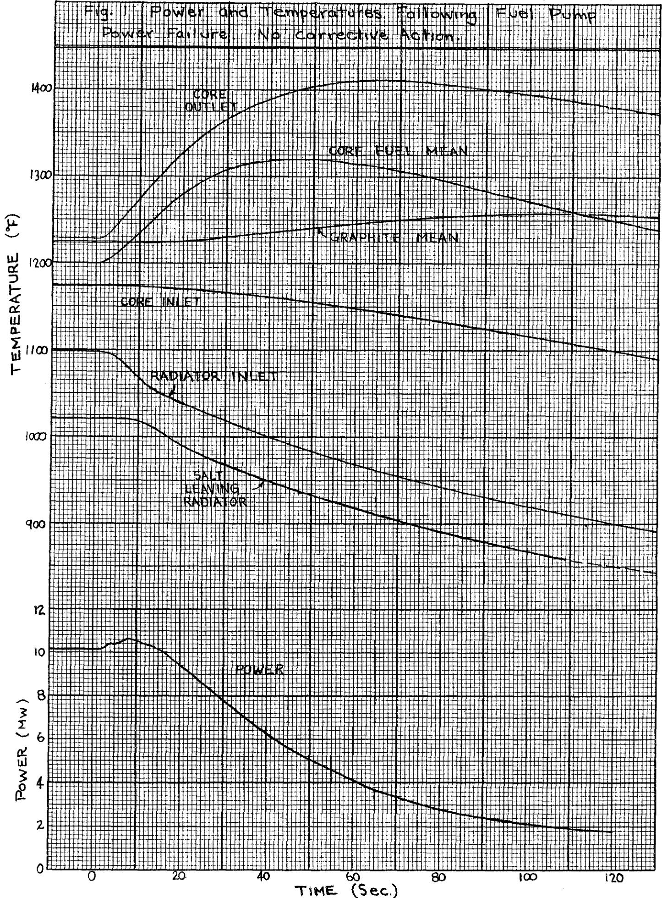

It is clear that the occurrence of a fuel-pump power failure with the reactor at high power requires that steps to reduce the heat removal from the radiator be taken quickly. Control rod action to reduce reactivity is necessary to prevent an undesirably large rise in fuel temperature in the core. Results were also obtained considering control-rod movement and changes in heat removal by the radiator.

Figure 2 shows the results of a simulated fuel pump failure at the same initial conditions as Fig.1, but with corrective action. One second after the pump power was cut (coastdown was simulated, so the fluid flow was not assumed to stop instantaneously), a negative reactivity ramp was started to simulate insertion of the control rods. This rate was $-0.075\%$ per second, corresponding to all three rods moving in at about $0.4 \text{in./sec}$ . (See page 46 for discussion of rod worth, speed and normal positions.) Beginning 3 seconds after the pump power failure, the simulated heat removal from the radiator tubes was reduced as indicated by the radiator inlet and outlet temperature in Fig.2. It is believed that the radiator doors can be closed to reduce heat extraction faster than that associated with Fig.2 conditions. In this case, the radiator temperature dropped very little, and the fuel mean temperature rose $30^{\circ} \text{F}$ . With the same radiator control but with a faster negative reactivity ramp of $-0.15\%/\text{sec}$ , the power dropped more rapidly and the fuel mean temperature rose only $18^{\circ} \text{F}$ .

# Case 2 - Cold Slug Accident

Because the "cold-slug" accident could not be adequately simulated on the analog computer, the consequences of several accidents of varying severity were estimated by criticality and kinetics calculations on the IBM-7090. (Details of the procedures and intermediate results are given in the Appendix, page 48.)

The accidents which were analyzed consisted of pumping 10, 20, and $30\mathrm{ft}^3$ of fuel at 900, 1000, and $1100^{\circ}\mathrm{F}$ into the core at a rate of $1200\mathrm{gpm}$ . In each case the core was assumed to be initially critical at $1200^{\circ}\mathrm{F}$ , with $10\mathrm{kw}$ of fission power being generated, and with no circulation of fuel. The loss of delayed neutron precursors which accompanies the start of circulation was treated as a step change in reactivity of

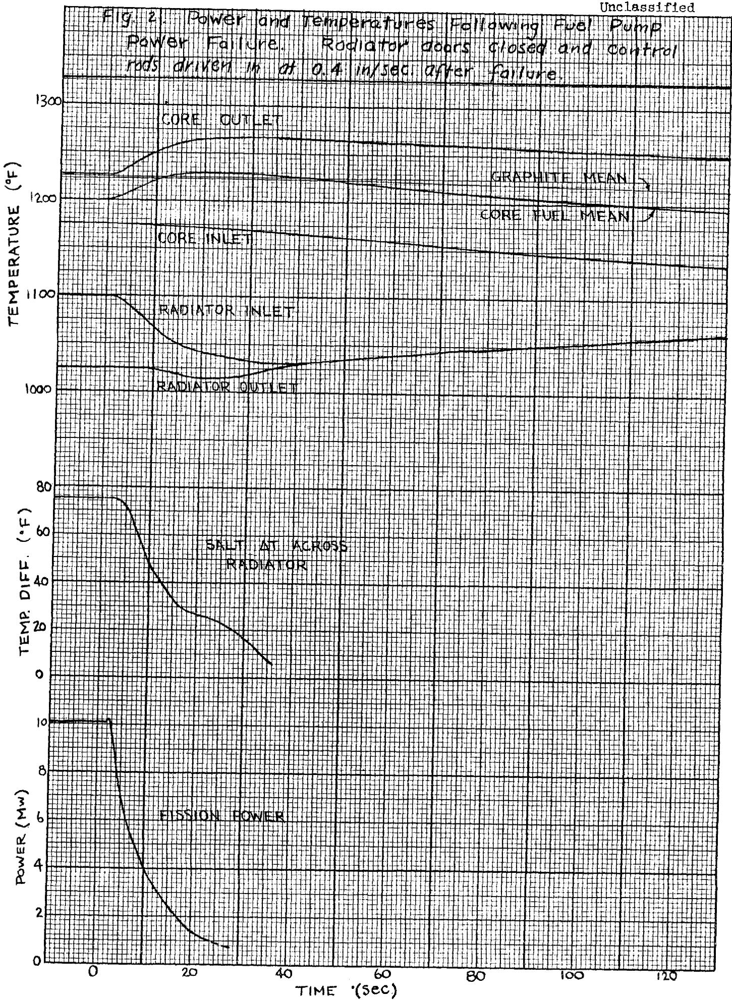

-0.30% $\delta \mathrm{k} / \mathrm{k}$ , which occurred simultaneously with the entry of the first cold fuel into the core.

In the first cases which were calculated, no control rod action was taken. The calculated fission powers following the entry of the various cold slugs into the core are shown in Fig. 3. The initial drop in each case was due to the assumed step decrease in reactivity which takes the reactor subcritical. In the case of the $1100^{\circ}\mathrm{F}$ slugs, the effect of the denser fuel was not enough to bring the reactor back to critical. In some of the other cases the reactor does become supercritical but before the power has risen very high, hot fuel (at $1200^{\circ}\mathrm{F}$ ) begins to enter the core behind the initial slug and the reactor becomes subcritical again. (The core transit time is 7.3 sec. The $10\text{-ft}^3$ slug passes out in 11.0 sec; the $20\text{-ft}^3$ slug in 14.6 sec and the $30\text{-ft}^3$ slug in 18.2 sec.) For the 20- and $30\text{-ft}^3$ slugs at $900^{\circ}\mathrm{F}$ , considerable excess reactivity was added quickly, causing power surges which were limited by the heating of the core. (In the other cases the fission heating of the core had negligible effect on the reactivity.)

Figure 4 shows the calculated power, pressure and mean temperatures in the core for the worst two cases. The kinetics calculations treated the fuel and the graphite as separate regions at uniform temperature and pressure; actually, temperatures and fuel pressures at the center of the core would be above the mean values shown. However, the difference between the peak pressure and the mean will not exceed 2 or 3 psi, because the inertia of the fuel in the fuel channels is relatively small. Approximate calculations indicated that the maximum fuel temperature in the $20\text{-ft}^3$ , $900^{\circ}\text{F}$ case should not exceed about $1650^{\circ}\text{F}$ . (See page 54.)

Two more cases were examined in which the power and temperature excursions accompanying the 20-ft³, $900^{\circ}\mathrm{F}$ slug were limited by control rod action. In the first, a reactivity ramp of $-0.075\%$ per sec was initiated when the period reached 5 sec (equivalent to driving three rods in at 0.4 in./sec). In the second case, $-4.0\%$ $\delta k / k$ was introduced in 1 sec after the period had reached 2 sec (equivalent to rods dropping). Peak powers were 0.66 Mw and 0.7 kw in the two cases and there was no significant pressure or temperature increase.

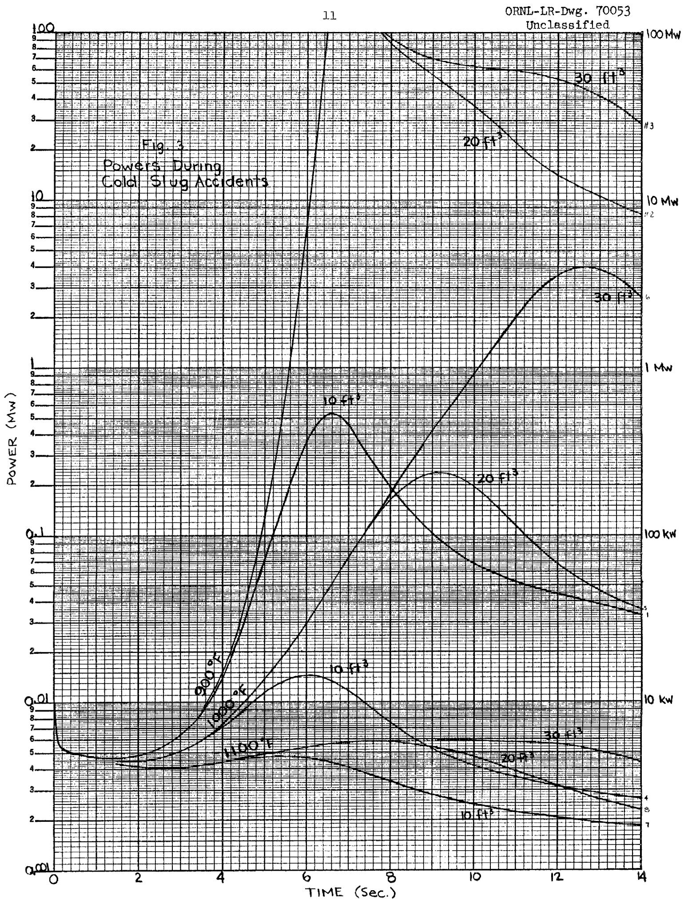

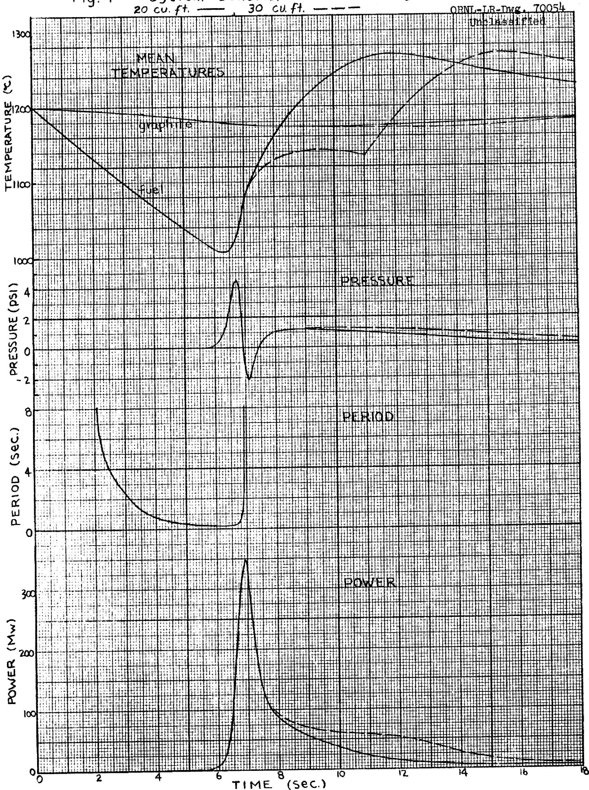  
12   
Fig. 4 System Behavior For Cold Slugs at ${900}^{ \circ  }\mathrm{F}$ .

# Case 3 - Filling Accident

Criticality could be reached prematurely during a startup while the core is being filled with fuel if: (a) the core temperature were abnormally low; or (b) the fuel were abnormally concentrated in uranium; or (c) the control rods were withdrawn from the positions they normally occupy during filling. Interlocks and procedures are designed to prevent such an accident. If, despite the precautions, the reactor were to go critical under such conditions, there would be a power excursion, whose size would depend on the source power and the rate of increase of reactivity. The core temperature would rise rapidly during the initial power excursion; then, if fuel addition were continued, it would rise in pace with the increase in critical temperature.

Preliminary examination of the consequences of filling the MSRE core with salt containing excess uranium was made for several assumed conditions. The worst cases were examined in detail to determine the corrective action required to insure safety.

# Fuel Composition

Two mechanisms were considered for enhancing the uranium concentration in the fuel charged to the reactor core. In the first of these, it was assumed that partial freezing of the fuel salt had occurred in the drain tank and that the solid contained no uranium. In the second one, the uranium concentration was adjusted to make the reactor critical at $1400^{\circ}\mathrm{F}$ and it was assumed that fuel of this composition was charged to the reactor at $900^{\circ}\mathrm{F}$ .

Associated with the first mechanism, the composition of the remaining liquid as a function of the fraction of salt frozen was calculated on that basis that only the primary solid (6 LiF. $\mathsf{BeF}_2$ . $\mathsf{ZrF_4}$ ) was formed. The nominal composition of the fuel mixture was considered to be 70 mole $\%$ LiF - $23\%$ $\mathsf{BeF}_2 - 5\%$ $\mathsf{ZrF_4} - 1\%$ $\mathsf{ThF_4} - 1\%$ $\mathsf{UF_4}$ . Since the actual critical concentration of $\mathsf{UF_4}$ is less than 1 mole $\%$ , a correction was applied for the nuclear calculations which, in effect, increased the concentrations of all of the other constituents in proportion to their concentrations in the critical mixture. Figure 5 shows the liquid composition, as a function of the weight fraction of fuel frozen, that was used in the nuclear calculations.

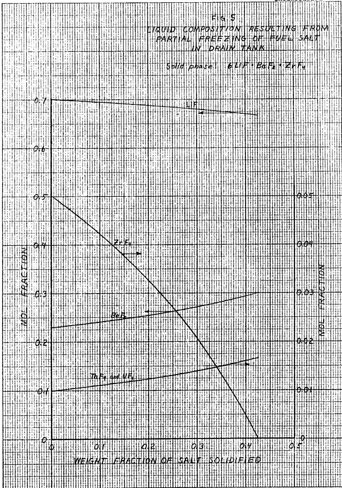

These curves cannot be extrapolated beyond 0.425 of the salt frozen because it would be impossible to form additional primary solid since all of the zirconium has been consumed. Another estimate of the composition was subsequently made by McDuffie et al., using other assumptions about the freezing mechanism. The resultant differences in composition were not significant from the standpoint of nuclear calculation results. The fuel compositions under the two sets of assumptions are compared in the Appendix, p 58.

The configuration of the MSRE fuel loop is such that the active region of the core can be filled if no more than $39\%$ , by weight, of the fuel salt is frozen in the drain tank, (assuming that the working salt volume is 72 ft³ at $1200^{\circ}\mathrm{F}$ ). The extreme condition was used in evaluating the consequences of filling the loop with concentrated fuel salt.

Criticality in Partially Filled Core

In order to evaluate the filling accidents, it was necessary to make some assumptions about the filling procedure. It was assumed that the control rods were in their "normal" positions for filling: one rod fully inserted and two rods inserted so that they control $0.1\%$ reactivity in the full core. (See Appendix, p 46, for a discussion of control rods.) Under these conditions, the reactor, filled with normal fuel at $1200^{\circ}\mathrm{F}$ , had an effective $\mathrm{k}$ of 0.997 with the circulating pump off. A uniform salt fill rate of 1 ft³/min was assumed.

In order to estimate reactivity as a function of fuel height, statics calculations were made with an IBM-7090, l-dimensional, multiregion, multi-group neutron diffusion code (MODRIC). The reactor was treated as a slab with a thickness equal to the height of the core, L. Control rods and control-rod thimbles were not considered. Reactivity was calculated for various salt levels, H, in the core. For the conditions of H/L < l the graphite in the upper part of the core was considered as a reflector. This model differed somewhat from that used to predict the properties of the normal reactor so that the results could not be used directly in other

calculations. However, the relative changes in reactivity as a function of fuel height should be correct. The results were normalized to make them consistent with the more detailed calculation of a critical, full reactor at $1200^{\circ}\mathrm{F}$ , and then corrected downward to allow for the fact that the "normal" reactor is slightly subcritical when full because of the control rod positions. The latter correction considered the change in control rod worth with changing fuel level. Figure 6 shows the fractional worth of a single control rod as a function of position in the full core and in the core $72\%$ full of fuel salt.

Figure 7 shows the height at which criticality would be achieved as a function of the fraction of fuel salt frozen. The critical height was also obtained for the case where fuel, containing enough uranium for operation at $1400^{\circ}\mathrm{F}$ , is charged at $900^{\circ}\mathrm{F}$ . In this case the critical H/L was 0.700.

# Temperature and Power Excursions

If criticality is achieved before the core is full and filling is continued, the result is an excursion in power and temperature. Such excursions were examined for two accidents: (1) the reactor is filled at $1200^{\circ}\mathrm{F}$ with salt whose composition has been changed by freezing 0.39 of the salt in the drain tank; and (2) the reactor is filled at $900^{\circ}\mathrm{F}$ with salt containing sufficient uranium for operation at $1400^{\circ}\mathrm{F}$ . Criticality would be achieved in the two cases at $\mathrm{H/L} = 0.691$ and 0.700, respectively.

In both cases the fill rate was fixed at 1 ft³ of salt per minute. The equivalent reactivity change as filling continues is nearly the same for the two cases, reaching 3.97% added excess reactivity for the full core in the first case, and 4.10% in the second. However, an important difference exists in the temperature coefficient of reactivity. The fuel composition obtained by freezing 0.39 of the salt results in a temperature coefficient of only 6.5 x 10⁻⁵ oF⁻¹ as compared with 8.8 x 10⁻⁵ for the normal fuel. The latter value was used in evaluating the second accident in question.

Since the reactivity transient is nearly the same for both accidents, but the temperature coefficient is less negative in the case of partial freezing, the power and temperature excursions are more severe in the case

ORNL-LR-DWG..70056

Unclassified

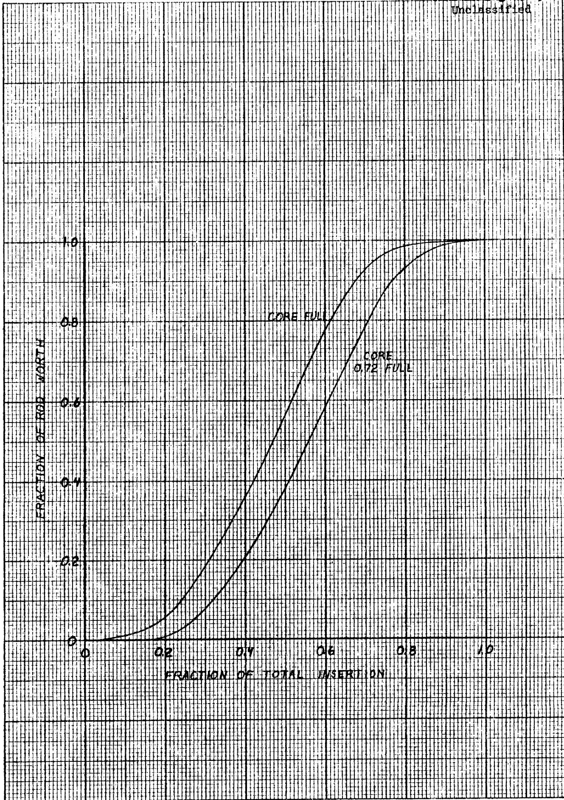  
FIG 6 CONTROL ROD WORTH vs. POSITION

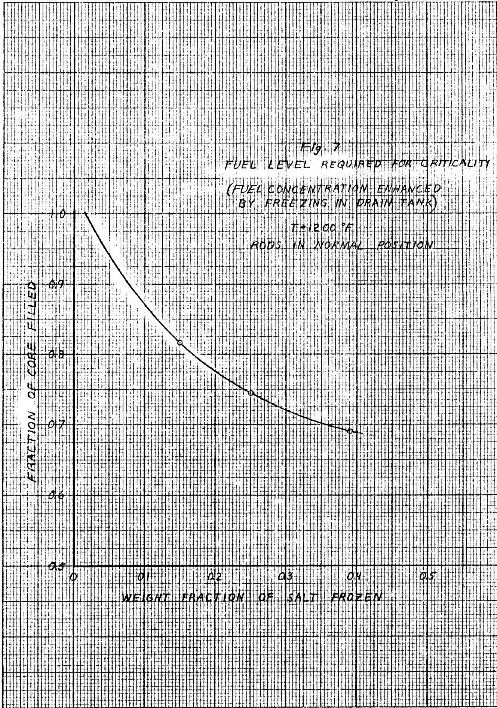

of partial freezing, the power and temperature excursions are more severe in the case where part of the fuel salt is frozen. Figure 8 shows the calculated power and temperature behavior for this case. The initial power surge reaches 55.9 Mw 38.9 sec after criticality is attained if no corrective action is taken. Since the power rises very rapidly, heat transfer from the fuel to the graphite was neglected for the first minute of the excursion. Thus only the temperature coefficient of the fuel was effective in checking the power rise. This slightly overestimates the initial part of the power and temperature transients. It was assumed that the fuel and graphite would be in thermal equilibrium after 3 min and that the critical temperature would prevail. The power after 3 min was that required to keep the reactor at the critical temperature as fuel addition continued. The behavior between 1 and 3 min was not calculated accurately since this period represents a transition between the two models, neither one of which describes the condition exactly. However, the estimates of power behavior given in Fig. 8 during this time interval appears satisfactory for the analysis here, since no extreme condition is involved.

Since the core would be only partly full during an accident of this type, there would be no circulation in the core loop and the high-temperature fuel would be confined to the active region of the core where it could not come into direct contact with the walls of the system. The fact that the core would not be full also eliminates the possibility of any significant pressure surge during the transient.

The reactor behavior shown in Fig. 8 is based on the assumption that no corrective action of any kind is taken. This would require not only that the operators ignore the condition and continue filling at the normal rate for 13 min but that no automatic action, such as control rod reversal, occurs. The extent of the excursions can be drastically reduced by relatively mild corrective action even if filling is continued at the normal rate.

In an accident of this type, the reactor period becomes very short while the power is still quite low. For the case in question, a 5-sec period would be reached 17.7 sec after attaining criticality and the power would be about 5.5 watts. It is expected that the proposed nuclear instrumentation will provide a reliable period indication at this power level.

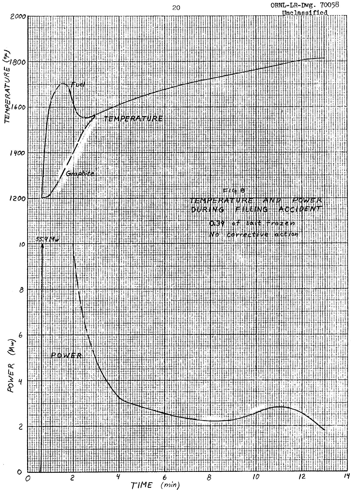

If insertion of the two available control rods at normal speed $(-0.075\%)$ $\delta k / k$ per second) is started when the period reaches 5 sec, the initial power peak is limited to $32~\mathrm{kw}$ and the fuel temperature rise is less than $1^{\circ}F$ . The effect of the control rod insertion is strong enough that a moderate delay in the period channel would not result in an excessive power surge.

If, in spite of the insertion of the control rods, fuel addition is continued until the core is full, the reactor will again become critical when the core is $93.5\%$ filled. However, complete filling for this case will add only $0.19\%$ excessive reactivity, and 2.21 min are required to add this amount. The reactivity is equivalent to an equilibrium critical temperature of $1229^{\circ}\mathrm{F}$ and the associated power transient would be very small because of the limited amount of reactivity that is available and the low rate at which it can be added.

# Other Filling Accidents

Another situation which can lead to a filling accident is that in which the core is filled with normal fuel at the normal temperature but with all control rods fully withdrawn. In general, the response of the system would be similar to that for the accident described above. The maximum amount of excess reactivity available for this accident is only $2.72\%$ because the normal fuel composition is such that the reactor is slightly subcritical with only one control rod fully inserted and the other two nearly fully withdrawn. Thus, the consequences of the above accident would be much less severe than those resulting from filling the core with fuel from which $39\%$ of the salt has been separated by freezing.

# Case 4 - Loss of Graphite from Core

If a graphite stringer were to break completely into two pieces while fuel is in the core, and the upper end could float up, * fuel would move into the space just about the fracture, causing an increase in reactivity. The calculated effect is 0.0038% δk/k per inch of stringer replaced with fuel at the center of the core. If the entire central stringer were

replaced with fuel, the reactivity would increase only $0.13\% \delta k / k$ . This amount of reactivity would have no serious consequences, even if added instantaneously. (Actually the reactivity would be added in a ramp. The fuel flows upward at 8.6 in./sec and the graphite could not move up much faster than this because of drag.) Figure 9 shows the results of an instantaneous increase of $0.15\% \delta k / k$ with the reactor at 10 Mw. (Peak power and temperatures would be lower for the same step at lower initial powers.) Rod reversal could effectively reduce peak power and temperatures for a $0.15\% \delta k / k$ step, as shown by the dashed lines in Fig. 9, where a ramp of $-0.075\% \delta k / k$ per second starts one second after the initial step increase.

# Case 5 - Fuel Additions

If uranium were added to the circulating fuel in such a way that it remained concentrated in a small volume, a reactivity transient would be produced each time the "lump" passed through the core.

Additions of concentrated uranium to compensate for burnup will be part of the normal operation of the reactor. The design of the fuel addition system is such that only a small amount of uranium can be added in one batch, and the fresh uranium merges with the circulating fuel gradually. These limitations insure that the reactivity transients caused by a normal fuel addition are inconsequential.

Fuel make-up is added through the sampler-enricher mechanism. Frozen salt (probably $73\%$ LiF- $27\%$ $\mathrm{UF}_4$ ) in a perforated container holding at most $120\mathrm{g}$ of $\mathbf{U}^{235}$ is lowered into the pump bowl. There the salt melts and mixes into the $2.7\mathrm{ft}^3$ of fuel salt in the bowl. The $65\mathrm{-gpm}$ bypass through the bowl gradually carries the added uranium into the main circulating stream. The net increase in reactivity from the addition of $120\mathrm{g}$ of $\mathbf{U}^{235}$ is $0.061\% \delta \mathrm{k / k}$ , which will be automatically compensated for by the servo-driven control rod.

A reasonable upper limit on the transients caused by a normal fuel addition was calculated by postulating that $120\mathrm{g}$ of $\mathbf{U}^{235}$ entered the circulating fuel at the same instant, that it was carried through the heat exchanger in a "front" and all entered the bottom of the core at the same instant, with equal amounts entering each of the fuel channels. For this situation, the reactivity increase due to the added uranium rises to

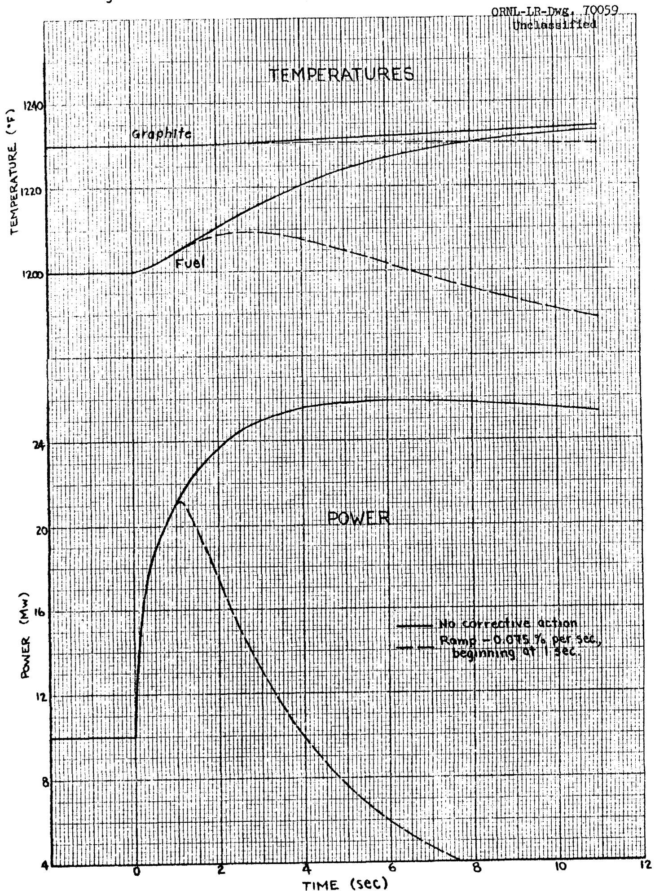  
Fig. 9 Response of MSRE to $0.15\%$ $\delta k / k$ step

a maximum of $0.39\%$ $\delta \mathbf{k} / \mathbf{k}$ in 3.8 sec, then decreases as the flat volume element containing the additional uranium moves up and out of the core. The power and temperature transients depend on the initial power. Figure 10 shows results calculated for initial powers of 10 kw and 10 Mw, with no corrective rod action. The rate of reactivity addition by the moving fuel is slow enough to permit effective counteraction by the use of the rods. In the 10-Mw case if a negative reactivity ramp of $-0.075\%$ $\delta \mathbf{k} / \mathbf{k}$ per second is started when the period reaches 5 sec, the power peak is reduced to 22 Mw, the fuel mean temperature rises only $10^{\circ}\mathbf{F}$ and the graphite rises less than $1^{\circ}\mathbf{F}$ .

# Case 6 - Uncontrolled Rod Withdrawal

Excursions can be produced by uncontrolled withdrawal of the control rods. As a limiting case, it was assumed that the reactor had been shut down by inserting all control rods and that the system had been cooled to $900^{\circ}\mathrm{F}$ with the fuel pump running. Under these conditions, with no xenon present, the reactor would be subcritical by $1.64\%$ . (See Appendix for control rod worth assumptions.)

Simultaneous withdrawal of all three control rods at the normal rate of 0.4 in./sec was then assumed. At this rate, the reactor would become critical 50.6 sec after the start of the rod motion and the control rods would be near the region of their maximum effectiveness.

The severity of the transient depends on the power level to which the reactor has decayed at the time of the accident. Figure 11 shows the transients in power, pressure and fuel mean temperature as a function of time after the achievement of criticality for three different powers at the time $k_{\text{eff}} = 1.0$ . After the initial excursion, the three cases merge into a single line for each of the variables. The power would remain at about 200 Mw until the warm fluid produced by the initial excursion returned to the core. Since the power is not significant until 6 sec after criticality, this re-entrance would occur in about 24 sec. At that time the power would decrease to the level required to heat the entire core loop and compensate the continued reactivity addition. The temperature would continue to rise until the rods stopped or were fully withdrawn from the core. The equilibrium temperature with the rods fully withdrawn would be $1473^{\circ}\text{F}$ . However,

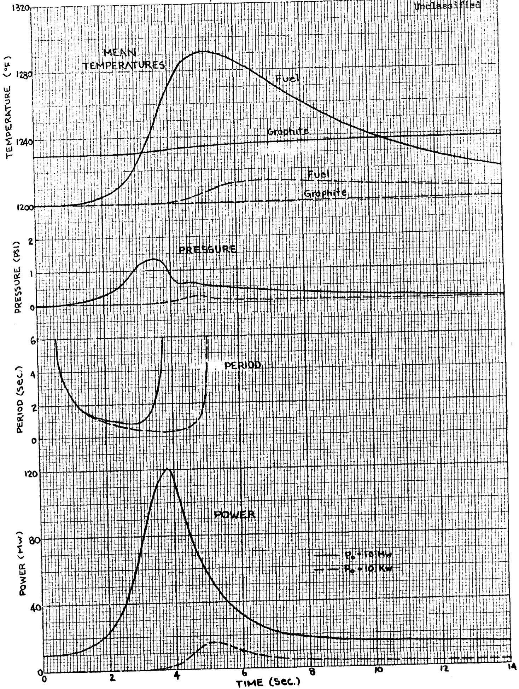  
Fig.10 Effects of 120 g of U235 Moving Through the Core 25. In a Horizontally Distributed Slug. ORNL-ER-DWG,70060

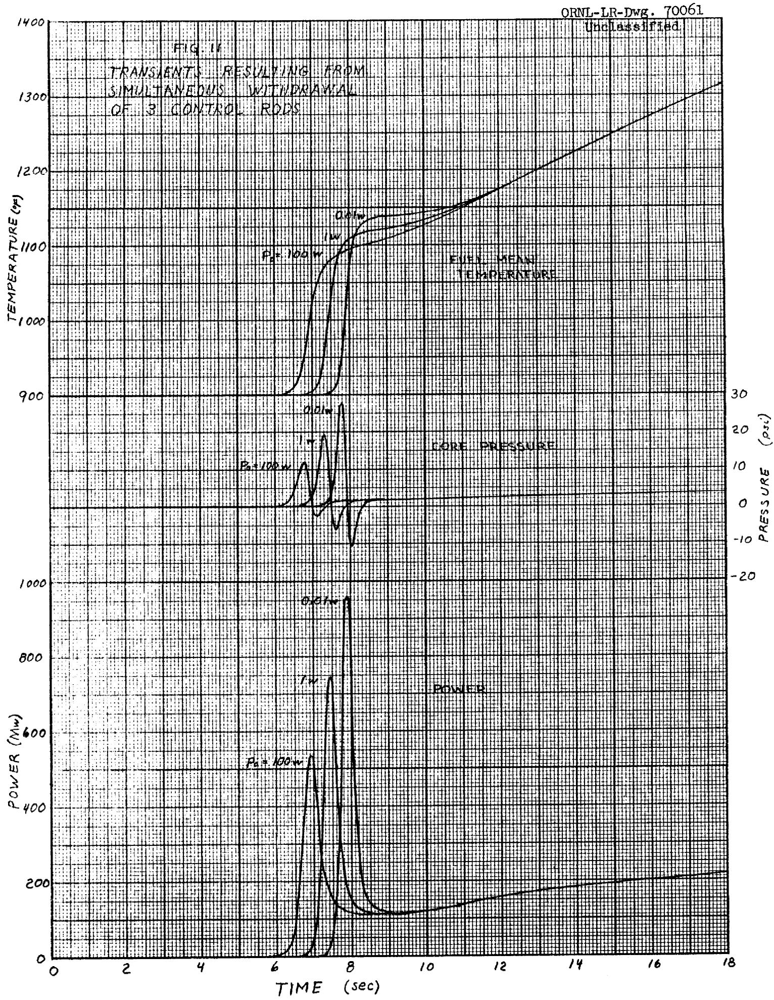

since the graphite is heated much more slowly than the fuel (after 18 sec the graphite temperature is only $950^{\circ}\mathrm{F}$ ), the mean fuel temperature might remain above this value for as long as 5 min.

# RESPONSE TO ARBITRARY ADDITIONS OF REACTIVITY

In addition to the analysis of conceivable situations which might arise during the reactor operation, the response of the power, the core fuel and graphite mean temperatures and the core pressure to arbitrary changes in reactivity was calculated. The purpose was to delineate more clearly the factors governing the kinetic behavior of the reactor.

# Ramp Additions

If reactivity is added very slowly, the result will be a gradual increase in fuel and graphite temperatures at the rates necessary to cancel out the reactivity being added. The power will rise from its initial level to that required to heat up the reactor. Because of the transport lag in the loop, about 17 sec pass before the inlet temperature can reflect the increased outlet temperature resulting from the ramp. As the mean temperature rises during this interval, the power must continue to increase to heat up the incoming fuel more and more. When the inlet temperature begins to rise, the power will level off.

Figure 12 shows results (from an analog simulation) of the ramp addition of $1\% \delta \mathrm{k} / \mathrm{k}$ in 30 sec. The power was initially at 10 Mw, and the (simulated) radiator air flow and inlet temperature were left constant throughout. Note that the power had reached its peak before the ramp ended. Note also the relative sluggishness of the graphite temperature. (The graphite comprises $70\%$ of the core heat capacity, but only $6\%$ of the power is generated there.)

As the ramp rate is increased, a power peak occurs earlier during the ramp addition, followed by a gradual increase as the required fuel meant temperature rises farther above the inlet temperature. Figure 13 shows results of three ramp additions of 10-sec duration. The development of the power peak as a function of ramp rate is clearly shown. These results and those described hereafter were obtained by a digital procedure, MURGATROYD, which only considers the case where the inlet temperature

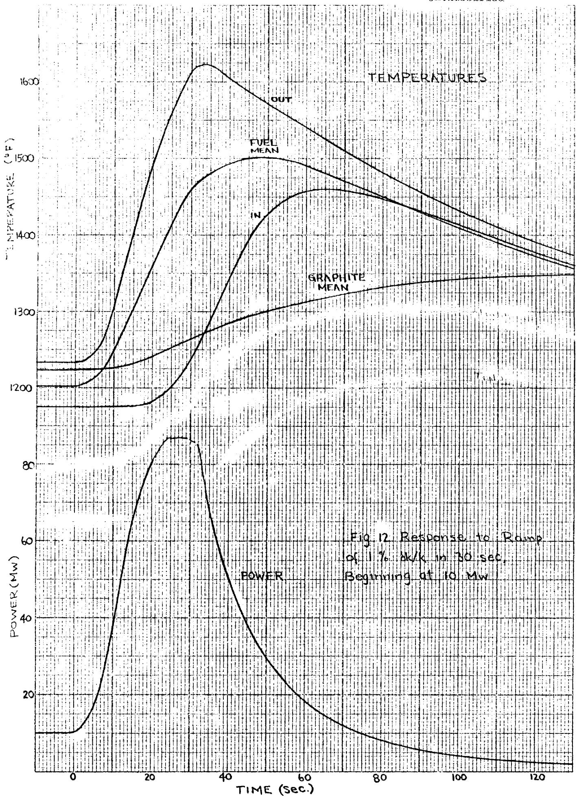

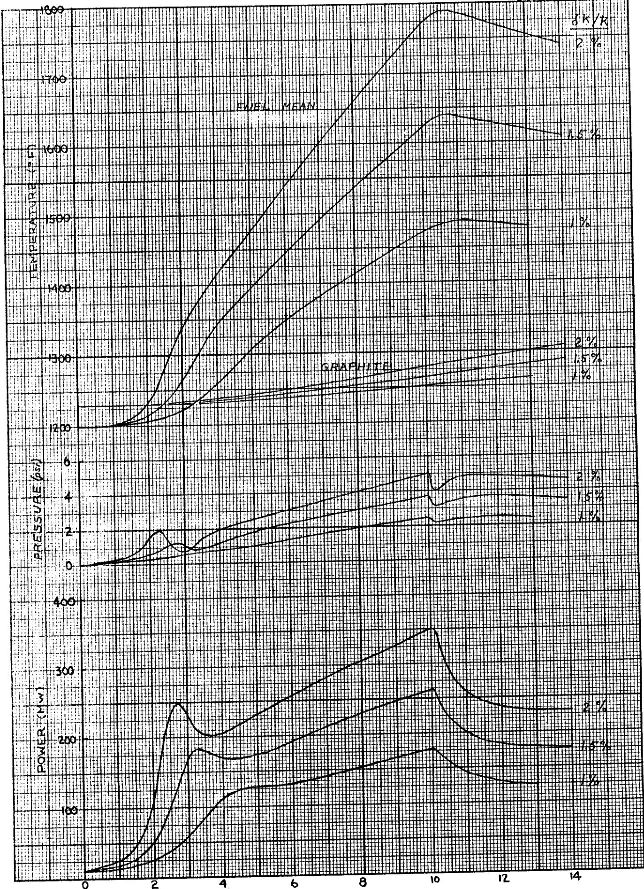  
TIME (sec)

remains constant. At low reactivity addition rates, the calculations give a gradual pressure increase in the reactor due to compression of gas in the pump bowl as the fuel expands. (In reality, the pressure control system would prevent most of such a rise.) Increasing the magnitude of the power excursion leads to a core pressure disturbance caused by inertial and fluid friction forces as the fuel between the core and the expansion space in the pump bowl is accelerated.

The response of the system to reactivity ramps is strongly dependent upon the initial power of the reactor, since this affects the amount of excess reactivity which can be introduced before the rising power significantly affects the core temperatures.

Figure 14 shows the power behavior resulting from ramp additions of $2\%$ in 10 sec, beginning at four initial powers from 10 watts to 10 megawatts. The size of the early peaks in power is related to both ramp rate and initial power in Fig. 15. (Note that the relation does not exist at low rates of reactivity addition, where the early power peak does not exist, as in the $0.1\%/$ sec case in Fig. 13.)

Attending the sharper power increases are larger core pressure surges. (The inertial force is proportional to the first derivative of the power.) Figure 16 shows results of calculations for the cases for which the powers are shown in Fig. 15. The pressure shown is the calculated deviation of the core pressure from the initial value. At steady state with fuel circulating at 1200 gpm and the pump bowl at 20 psia, the pressures in the core will range from about 29 psia at the bottom to about 23 psia at the top. The equations used to compute the pressure transients took no account of a lower limit on absolute pressure, which accounts for the impossibly low swings in pressure after the peaks in Fig. 16. Figure 17 relates the size of the pressure excursions to ramp rate and initial power.

The behavior of the fuel mean temperature shown in Fig. 16 shows a progression toward a peak such as appears in the power at high rates of reactivity addition and low initial power. The first part of the temperature transient is seen to depend on initial power, but after a few seconds the temperature behavior is the same in all cases. (The power and pressure after the early transients are also practically independent of the initial power, as shown in Fig. 14 and 16.) The maximum fuel mean temperature

Fig. 14 Power Response to Ramps of $2\%$ $\delta k / k$ in 10 sec. Beginning at $10^{-5}, 10^{-3}, 10^{-1}$ and 10 Mw. ORNL-LR-DWE

31.

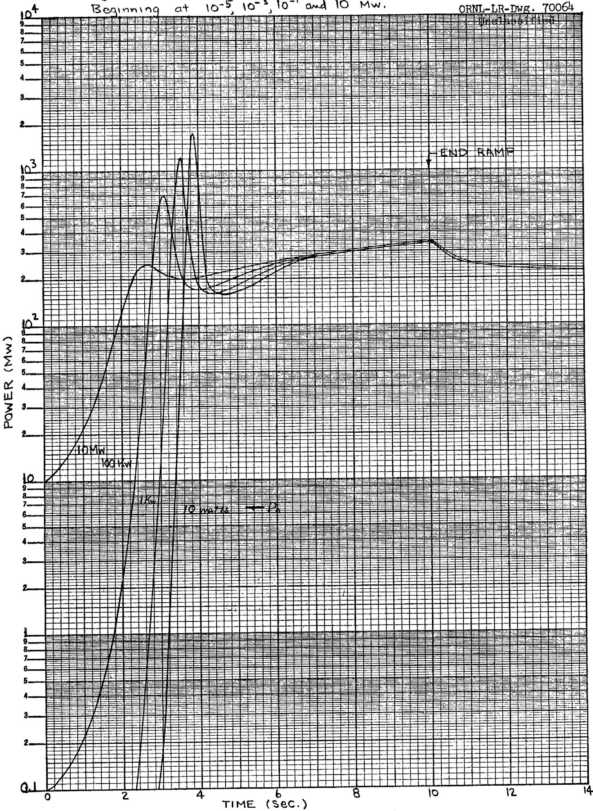

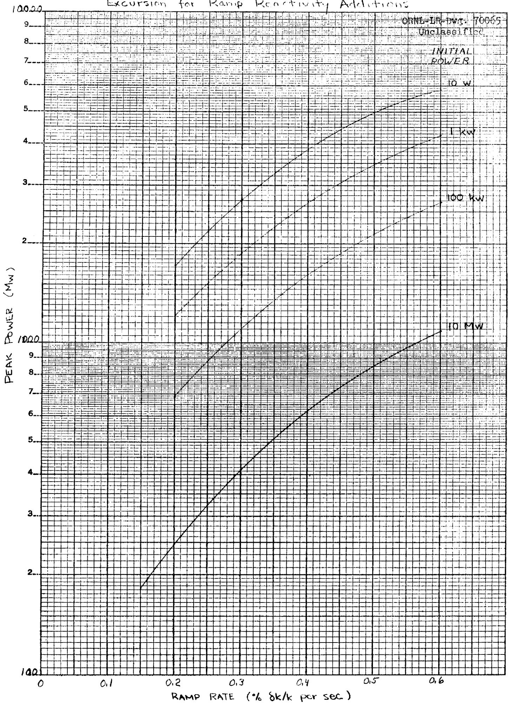  
Fig.15 Maximum Power Recheat in Initial   
Exercsion for Rang Recitivity Additions

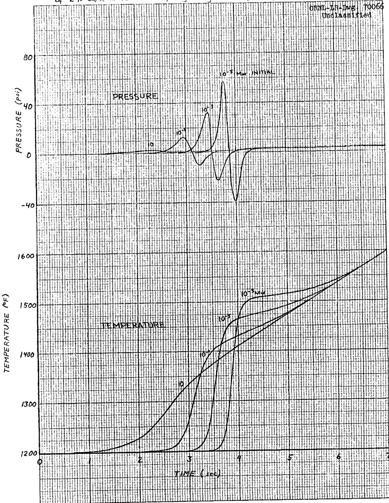  
Fig.16 Pressure and Fuel Mean Temperature Response to Ramps 33. at $2\%$ $6k / k$ in 10 seconds, Beginning at $10^{-5}, 10^{-3}, 10^{-1}$ and 10 MW.

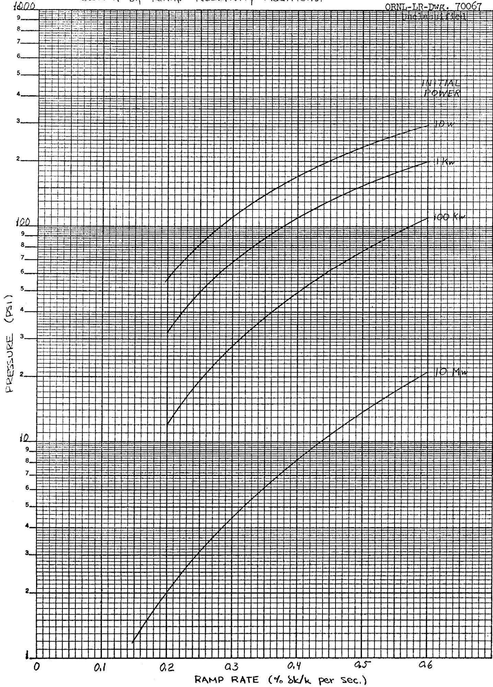  
Fig.17 Maximum Core Pressure Reached in Initial Surge Caused by Ramp Reactivity Additions.

reached as a result of a ramp addition depends eventually on the total amount of reactivity added more than on the rate. Figure 18 shows the relation for ramps of duration long enough so that there is no dependence of fuel temperature on initial power.

# Step Additions

MURGATROYD was used to calculate a few cases of step additions of reactivity.

For a step addition of a given amount of reactivity, the higher the initial power, the larger are the power, temperature and pressure transients. Figure 19 shows the power transients caused by reactivity steps of various sizes, with the power initially at $10\mathrm{Mw}$ .

A step of $0.338\%$ $\delta \mathrm{k} / \mathrm{k}$ makes the reactor exactly prompt critical. The response of the power and mean temperatures to a step of this size is shown in Fig. 20. This figure also shows that even for a prompt-critical step, peak temperatures can be reduced significantly by corrective rod action, even the rather slow action assumed in the case depicted.

Pressure surges are not high unless the step is well above prompt critical. For the $0.338\%$ step at 10 Mw the peak pressure (at 0.6 sec) was only 1.3 psi; for the $1\%$ step, the peak was 250 psi.

The effect of initial power was investigated by calculating results of a $0.338\%$ step at 10 kw initial power. In this case the peak power was 64 Mw (at 3.5 sec), the peak fuel mean temperature was $1286^{\circ}\mathrm{F}$ (at 9 sec) and the peak pressure was only 0.75 psi (at 3.0 sec).

# DISCUSSION

In the analysis of the conceivable accidents, the assumptions and calculational methods were chosen to produce pessimistically high powers, temperatures and pressures. The results indicate that none of the conceivable accidents will lead to catastrophic failure of the reactor even if no corrective action is taken. Thus it can be said that the safety of the operators and the populace does not rely upon the functioning of external protective or corrective devices.

The response to arbitrary ramp and step additions of reactivity show that additions well in excess of anything foreseeable still do not produce pressures which would burst the reactor.

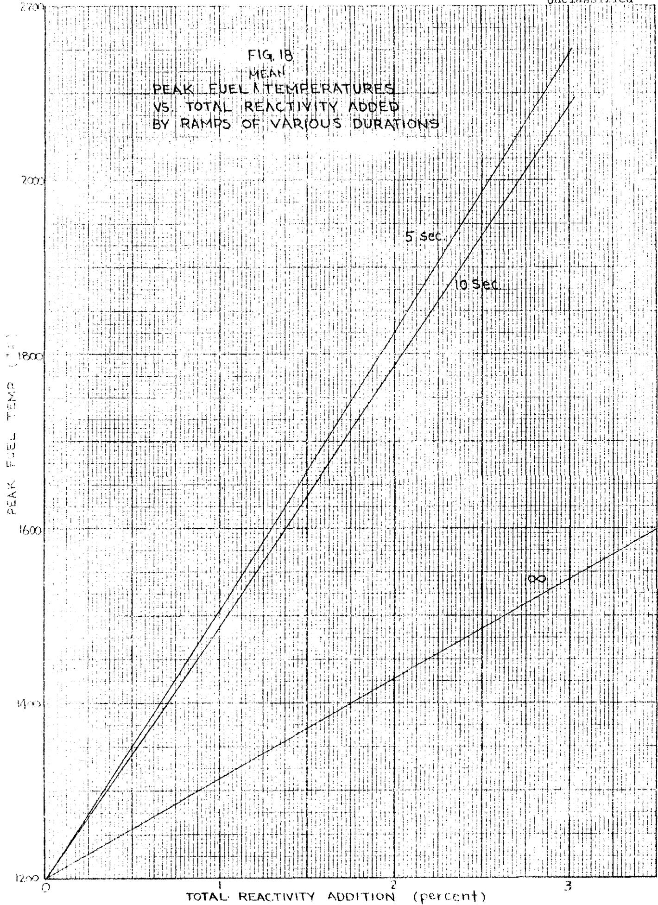

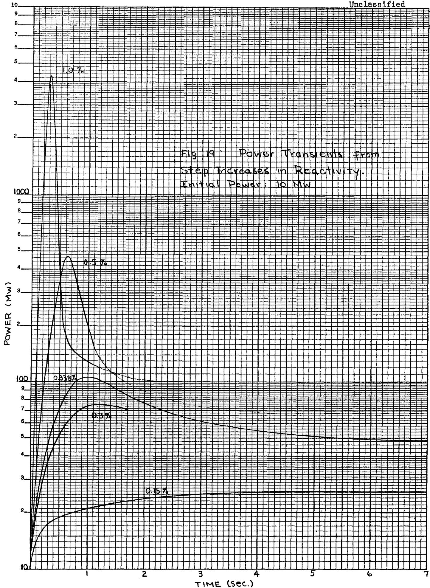

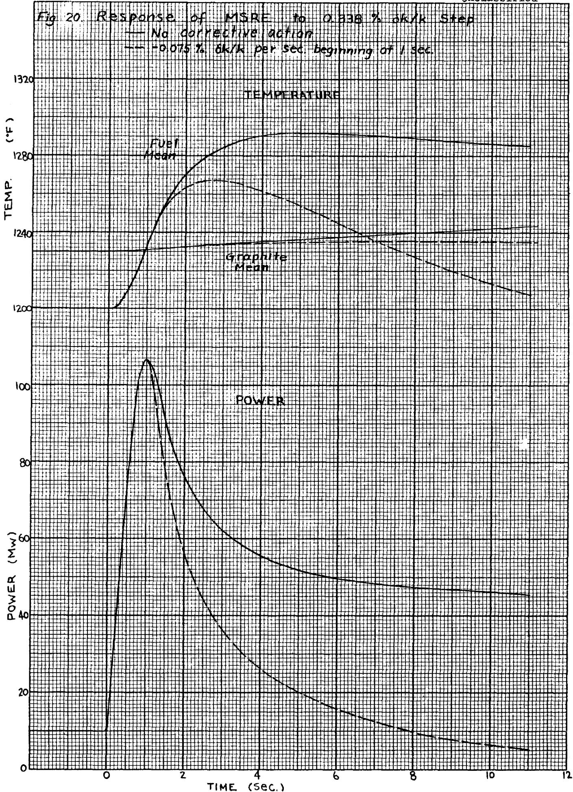

Some of the postulated accidents lead to high temperatures which might strain the core internals, or other parts of the system, causing damage and interrupting operation. All of the damaging accidents are normally prevented by mechanical devices or operating procedures. Usually there is multiple protection. In evaluating the chance of internal damage to the reactor, one must consider the probability of simultaneous failure of all protective devices.

# APPENDIX I

# DELAYED NEUTRONS

The digital kinetics calculations whose results are reported here used values for yields and half-lives of delayed neutron precursors which were measured by Keepin and Wimett for thermal-neutron fission of $U^{235}$ . Five groups of delayed neutrons were included in the calculations. (The shortest-lived group lumped the shortest-lived two groups observed by Keepin and Wimett.)

The effective yield with the fuel circulating was calculated for each group, assuming slug flow and uniform production of precursors over the core volume. The calculations assumed a flow rate of 1200 gpm, a core volume of 19.6 ft³, and an external loop volume of 46.4 ft³ (core residence time, 7.3 sec; external loop residence time, 17.3 sec). No weighting factors were applied to account for the differences in energy and spatial source distribution for the delayed and prompt neutrons.

The total yield for all groups is 0.00640 delayed neutron/total neutron. The neutrons emitted in the core amount to 0.00338 delayed neutron/total neutron, a difference of 0.00302 caused by circulation. A breakdown by groups is given in Table A-1.

Table A-1. Delayed Neutron Data Used in Kinetics Calculations by MURGATROYD   

<table><tr><td>Group</td><td>Half-Life (sec)</td><td>Decay Constant (sec-1)</td><td>Yield (n/n)</td><td>Effective Yield (n/n)</td></tr><tr><td>1</td><td>55.9</td><td>0.0124</td><td>0.000211</td><td>0.000053</td></tr><tr><td>2</td><td>22.7</td><td>0.0305</td><td>0.001402</td><td>0.000426</td></tr><tr><td>3</td><td>6.22</td><td>0.1114</td><td>0.001254</td><td>0.000471</td></tr><tr><td>4</td><td>2.30</td><td>0.3013</td><td>0.002528</td><td>0.001513</td></tr><tr><td>5</td><td>0.508</td><td>1.364</td><td>0.001005</td><td>0.000904</td></tr><tr><td></td><td></td><td></td><td>0.006400</td><td>0.003377</td></tr></table>

* Since these computations were made, six groups have been incorporated in the MURGATROYD calculations.

# APPENDIX II

# CONTROL RODS

Need for Control Rods in Normal Operation

During normal operation of the reactor, reactivity tends to decrease for several reasons. If the fuel temperature is held constant and no fuel is added to compensate for the decrease in reactivity, it will be necessary to withdraw a control rod (or rods) to compensate for: (1) the loss of delayed neutrons due to circulation; (2) the ingrowth of xenon-135 during and after high-power operation; (3) power coefficient of reactivity (temperature rise of graphite relative to fuel); and (4) burnup of $U^{235}$ in the fuel. Table A-2 shows the magnitude of these effects for normal operation at 10 Mw. With the exception of the delayed neutron losses which have been described on page 40, the numbers in Table A-2 core are taken from the first Addendum to ORNL CF-61-2-46, MSRE Preliminary Hazards Report.*

Table A-2. Effects Requiring Shim Action of Control Rods   

<table><tr><td>Effect</td><td>δk/k, %</td></tr><tr><td>Delayed neutron losses</td><td>0.3</td></tr><tr><td>Xenon (equilibrium at 10 Mw)</td><td>1.3</td></tr><tr><td>Power coefficient (10 Mw)</td><td>0.2</td></tr><tr><td>Burnup (300 Mw-days)</td><td>0.2</td></tr><tr><td></td><td>2.0</td></tr></table>

Table A-2 does not include poisons which build up gradually in the fuel. Samarium-149 is one of the more important poisons; it will build up and start to level off at $1.1\% \delta k / k$ in about 3 months at full power. There are other fission products which will also saturate in a few weeks or months. Still other fission products, and corrosion products, will probably continue to build up throughout the operation of the reactor,

causing a gradual increase in poisoning. Fuel additions will be used to compensate for the poisons which gradually build up.

Another requirement for normal operation is that a shutdown margin be provided, so that the reactor is subcritical during startup and shutdown. This could be attained by using the loop heaters to raise the core temperature above the critical temperature. A better way is to use a rod or rods. The size of the shutdown margin is discussed later.

Regulation is an important function of the control rods. One of the rods will be used in a servomechanism to hold either the nuclear power or some temperature at a setpoint. A maximum deviation from the mean position of about $0.2\% \delta k / k$ is adequate for this purpose.

Safety action, in the sense of rods moving very rapidly to decrease the reactivity, is not contemplated for the MSRE. The rods should be capable of compensating for unexpected relatively slow increases in reactivity, however, (as by fuel permeation of the graphite) so as to protect the reactor from the excessive temperatures which would result. The rod worth which should be available for this function is not clear.

# Control Rod Worth

The combined worth of all three control rods of the present design has been calculated to be $6.7\% \delta \mathrm{k} / \mathrm{k}$ . The reactivity worth of single rods or groups of rods fully inserted or withdrawn is shown in Table A-3. (Rod No. 2 is diagonally opposite the graphite samples.)

Table A-3. Control Rod Worth   

<table><tr><td>Arrangement</td><td>Reactivity, %</td><td>δk/k</td></tr><tr><td>All rods out</td><td>0</td><td></td></tr><tr><td>No. 2 in, others out</td><td>-2.8</td><td></td></tr><tr><td>No. 1 or No. 3 in, others out</td><td>-2.9</td><td></td></tr><tr><td>No. 1 and 3 in, No. 2 out</td><td>-5.3</td><td></td></tr><tr><td>No. 2 and No. 1 or 3 in, other out</td><td>-4.9</td><td></td></tr><tr><td>All rods in</td><td>-6.7</td><td></td></tr></table>

Figure A-1 shows predictions of rod effectiveness versus the length inserted into the core. The most reliable prediction is based on calculations with EQUIPOISE-3, a two-group, two-dimensional, multiregion diffusion method. The curve shown should be a good representation for a single rod (or rods moving together) when the flux is not already perturbed by another rod in the core. It should apply fairly well if another rod is fully inserted, but the flux distortion by another rod inserted so that the rod end is near the center of the core would cause the curve to be considerably in error. The sine-squared curve is that predicted by the first-order perturbation approximation, and is shown merely for comparison with the more accurate prediction.

# Deployment of Rods

It has been planned that two rods be kept fully withdrawn during all operations so that their poisoning effect would be available to counteract fuel permeation of the graphite or other unexpected effects tending to increase reactivity. The remaining rod would be used for regulation, shim and shutdown. If the shim requirements are no larger than shown in Table A-2, control with a single rod is possible.

One requirement of a combination shim-regulating rod is that the rod can travel far enough to provide the shimming necessary and that the speed be high enough at the ends of its skim movement and not too high in the middle for good regulation. Using the figures from Table A-2, from the time the reactor goes critical (with the fuel circulating) with a clean, fully fueled core until the reactor is at full power, with equilibrium xenon and the maximum burnup, the rod must be withdrawn $1.7\% \delta \mathrm{k} / \mathrm{k}$ . This is only 0.59 of the worth of rod 1 or rod 3 when the others are withdrawn. If one allows an additional $0.2\% \delta \mathrm{k} / \mathrm{k}$ at each end for regulation, the extreme travel is 0.72 of the rod worth. The fuel concentration could be adjusted so that, at the extremes, the rod would be poisoning 0.88 and 0.16 of its worth. Figure A-2 shows that the differential rod worth varies by only a factor of 1.5 over this range. This is quite acceptable since simulator tests showed good regulation over at least a fourfold range of rod speeds, from 0.02 to $0.08\% \delta \mathrm{k} / \mathrm{k}$ per second.

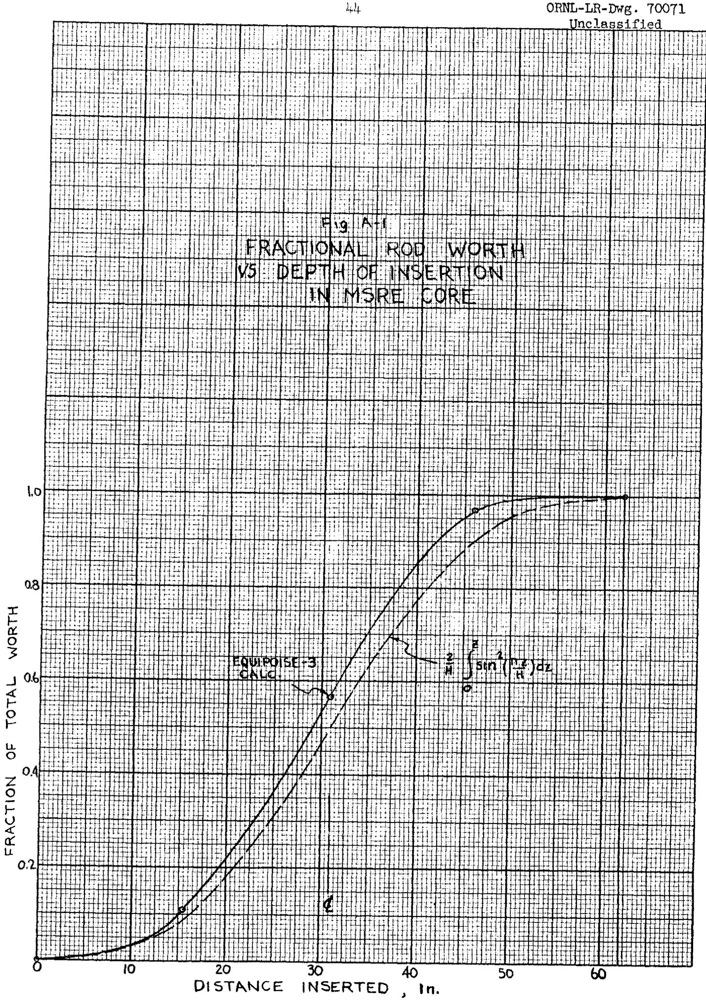

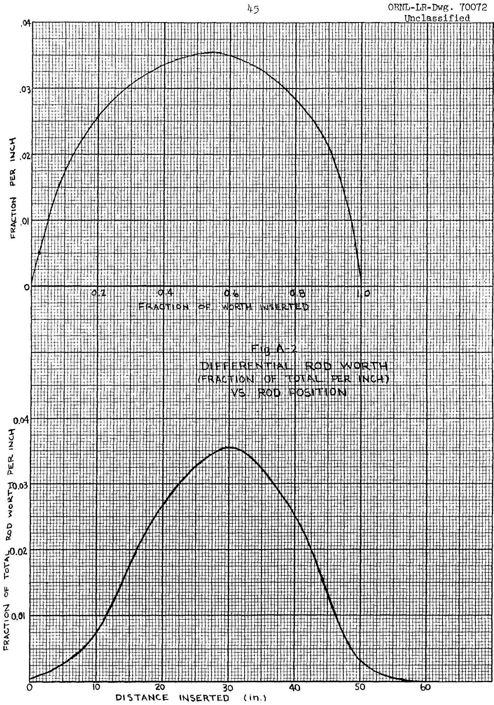

Another factor to consider is the shutdown margin. If the range is adjusted as described above, the reactor would go critical with the fuel circulating when the rod is poisoning 0.82 of its worth. With the rod fully inserted the reactor will be subcritical by $0.18 \times 2.9\%$ or $0.52\% \delta k / k$ while the fuel is circulating, or by $0.22\% \delta k / k$ with the fuel pump off. This assumes that the core is at the normal temperature. The core temperature could be as much as $0.0022 / 8.8 \times 10^{-5} = 25^{\circ} F$ below normal without the reactor reaching criticality. Therefore, an error of less than this amount in temperature measurement would not lead to unintentional criticality during filling.

In the analysis of various incidents, one form of corrective action considered was a ramp of $-0.075\% \delta \mathrm{k} / \mathrm{k}$ per second. Although this is an arbitrary rate, it corresponds to a value which could easily be obtained with the current control rod design.

In determining the control rod speed, it was assumed that the rate of reactivity change should average $0.02\% \delta \mathrm{k} / \mathrm{k}$ per second over the entire distance traversed by a single rod. For a rod worth $2.9\%$ , this average rate corresponds to a full traverse of the rod range in about 150 sec. The travel time was fixed at 150 sec and, since the rod range is about 60 in., this resulted in a rod speed of about 0.4 in./sec.

The corrective action postulated in the reactivity accidents was a reversal of all three rods at normal speed. Since the rod-worth curves are not linear (see Fig. A-1) the reactivity ramp resulting from a rod reversal depends on the initial rod positions. Figure A-3 shows the negative reactivity added as a function of time for two different initial positions of the rods. In the first case it was assumed that Rod 1 (worth = 2.9% δk/k) was in a position of maximum differential worth and that Rods 2 and 3 were fully withdrawn. In the second case, the initial position of Rod 1 was the same, but Rods 2 and 3 were started from positions where they were poisoning a total of 0.5% δk/k. Since it is clear from Fig. A-1 that a fully withdrawn rod must travel several inches before it has any significant effect on reactivity, the initial ramp in case I is essentially that for a single rod moving at 0.4 in./sec in its region of maximum differential worth. The initial rate for case II (average for the first 6 sec) is -0.075% δk/k per second -- the value used in studying the incidents.

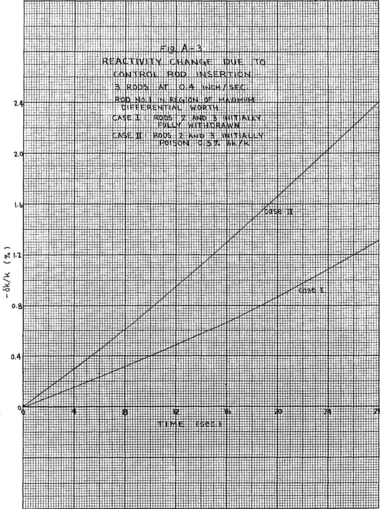

# APPENDIX III

# ANALYSIS OF COLD SLUG ACCIDENTS

The circulating-fuel reactor kinetics calculation which is coded for the IBM-7090 (MURGATROYD) cannot be used directly to compute behavior in a "cold-slug" accident. One reason is that the "mean fuel temperature" is defined as the mean of the inlet and outlet, so a cold slug would appear as a step change in mean temperature (and reactivity) whereas actually a cold slug causes a ramp change in the average fuel temperature. To circumvent some of the shortcomings of MURGATROYD, the cold-slug accidents were analyzed by the following procedure.

In the first step, reactivity was calculated for cores which were at $1200^{\circ}\mathrm{F}$ except cooler fuel was considered in the lower part of the fuel channels. MODRIC, a multigroup, one-dimensional neutron diffusion calculation was used to obtain the curves shown in Fig. A-4. Microscopic cross sections appropriate for a neutron velocity distribution at $1200^{\circ}\mathrm{F}$ were used only the density of the fuel in the lower part of the core was varied.

At 1200 gpm, fuel passes from the bottom of the core to the top in 7.3 sec. This rate was used directly to convert the curves of Fig. A-4 to the curves of k vs time for various cold slugs shown in Fig. A-5. If the initial value of k at the beginning of the cold slug were low enough so that the power did not rise and affect the fuel temperature, these curves in Fig. A-5 would be the true variation of k from the initial value. Ratios of heat capacities and temperature coefficients of reactivity are such that heat transfer from the graphite to the cold slug would have little effect. The tendency would be to lower the reactivity slightly below that calculated here.

The next step was to run kinetics calculations in which the fuel temperature was not perturbed by any cold slug, but in which the reactor was subjected to a reactivity transient such as would be produced by a cold slug unaffected by power feedback. Initial conditions were $1200^{\circ}\mathrm{F}$ fuel and graphite, $\mathbf{k} = 1$ and a power of $10\mathrm{kw}$ . At zero time a negative step of $0.302\% \delta \mathbf{k} / \mathbf{k}$ was inserted to represent the loss of delayed neutron precursors when fuel circulation commenced. Then a series of positive and

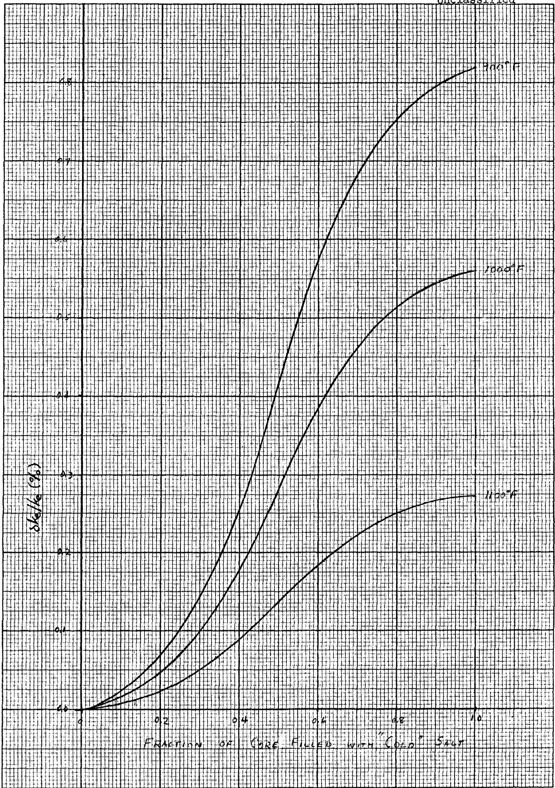  
Fig A-4 Excess Reactivity Due to Replacing Part of Fuel in $1200^{\circ}$ Core With Denser Fuel. (Fill from bottom up.)

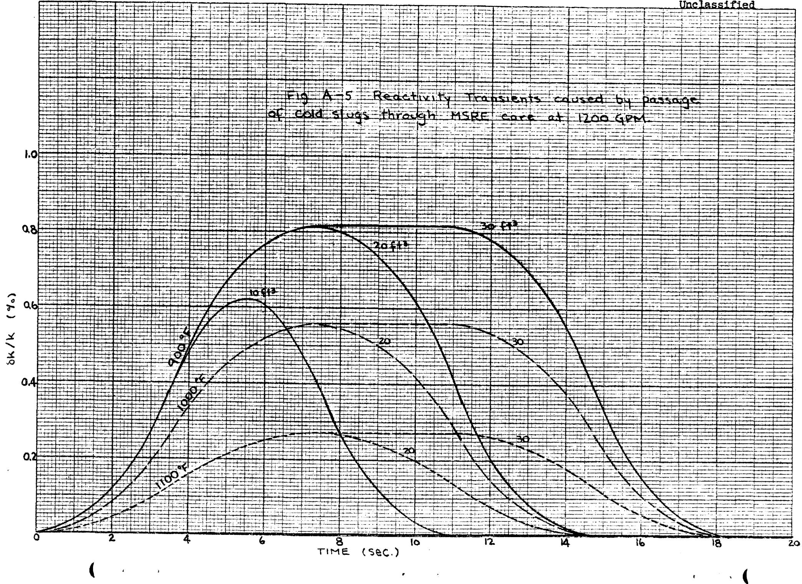

negative ramp changes in reactivity was introduced to produce the variation shown in Fig. A-5.

The kinetics calculation gave transients in power, pressure, and mean temperature. Results for 20- and $30\text{-ft}^3$ , $900^{\circ}\text{F}$ slugs are shown in Fig. A-6. In the other cases, temperatures never deviated from initial values by as much as $5^{\circ}\text{F}$ .

The end result was obtained by superimposing the transients of Fig. A-6 on those which would be caused by the cold slug without nuclear effects. This procedure amounts to representing the temperature of the fuel or of the graphite by the sum of two functions of time, one of which responds to the cooling effect of the cold fuel entering the core, the other responding to the nuclear heat generation. Variations in both affect the reactivity, which determines the power. The effect of the second temperature function is built into the kinetics calculation. The effect of the first is introduced through the reactivity transient which was imposed. Only the variation in the power-affected temperature affects the pressure, since the variation in the other mean temperature reflects only the movement of cold fuel from one part of the loop to another, not a change in the volume of fuel in the loop.

The variation of the fuel and graphite mean temperatures during the passage of 10-, 20-, and $30\text{-ft}^3$ slugs of $900^{\circ}\text{F}$ fuel, without heat generation in the core, are shown in Fig. A-7. The solid curves take into account heat transfer between the fuel and the graphite; the dashed lines show the fuel mean temperature which would result from the passage of the cold slug without heat transfer. The solid curves of Fig. A-7 were combined with the temperature rise due to nuclear heating, shown in Fig. A-6, to obtain the net effect shown in Fig. 4.

Because of the low initial power, the period becomes quite short several seconds before the power has risen to a level causing any significant heating. Thus effective rod action can be initiated by the short-period signal. MURGATROYD was used to examine the behavior during a $20\text{-ft}^3$ , $900^{\circ}\text{F}$ slug with two types of corrective action. In the first, a ramp of $-0.075\%$ $\delta k/k$ was superimposed, beginning at 2.3 sec where the period reaches 5 sec. In this case the power peaked at 0.66 Mw at 8 sec, there was no significant pressure rise and the nuclear heating raised the fuel

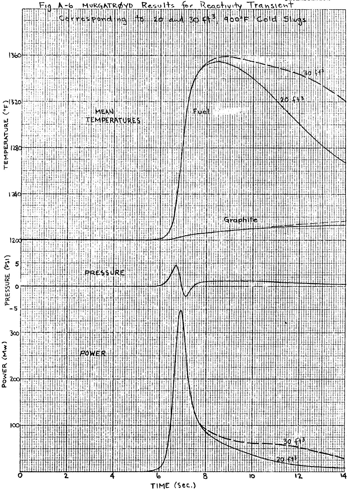

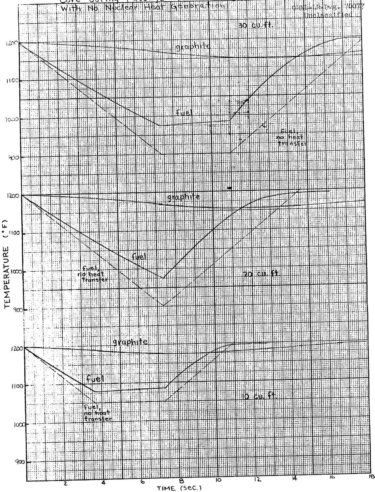  
FIG. A-7 Mean Temperatures of Fuel and Graphite in Cane During Passage of Cold Stoops Initially at $900^{\circ}F$

mean temperature only $0.7^{\circ}\mathrm{F}$ . In the second case, $-4.0\% \delta \mathrm{k} / \mathrm{k}$ was inserted between 3.2 and 4.2 sec (beginning when the period reached 2 sec). This limited the power "peak" to only $0.7\mathrm{kw}$ .

During any substantial power excursion, material near the center of the core will be heated well above the mean temperature. Some calculations were done to estimate how high the peak fuel temperatures might go during the 20-ft³, $900^{\circ}\mathrm{F}$ slug without corrective action. In these calculations it was assumed that there was no heat transfer between the fuel and the graphite. Fuel temperatures were then calculated by integrating the heat production in the fuel. Figure A-8 shows results for a channel where the power density is 1.93 times the mean for the core. The initial power was only 10 kw, and at 6 sec, the profile shows practically no effect of heating, only the cold front which has advanced to 52 in. by this time. Subsequent profiles show the temperature peak rising near the center of the core during the power surge, then moving on toward the outlet as the power drops. The entry of the $1200^{\circ}\mathrm{F}$ fuel behind the cold slug and the advance of this interface also shows. The dotted line shows how fuel which entered at a particular time heats up rapidly during the power surge, then more gradually as the specific power decreases because of the drop in total power and the movement of the fuel away from the center of the core.

The temperature at the outlet of the channel is shown as a function of time in Fig. A-9. The heating of the fluid ahead of the cold slug, the drop as the leading edge of the cold slug arrives, and the abrupt rise as the following fuel reaches the outlet are prominent features.

Figure A-9 also shows a curve for the temperature at the vessel outlet. The temperature here is approximated by the mixed mean of the fluid issuing from all the channels, displaced in time by the mean residence time in the upper head. The peak and the break as the interfaces pass would actually be softened by the differences in transit times from various channel outlets to the vessel outlet.

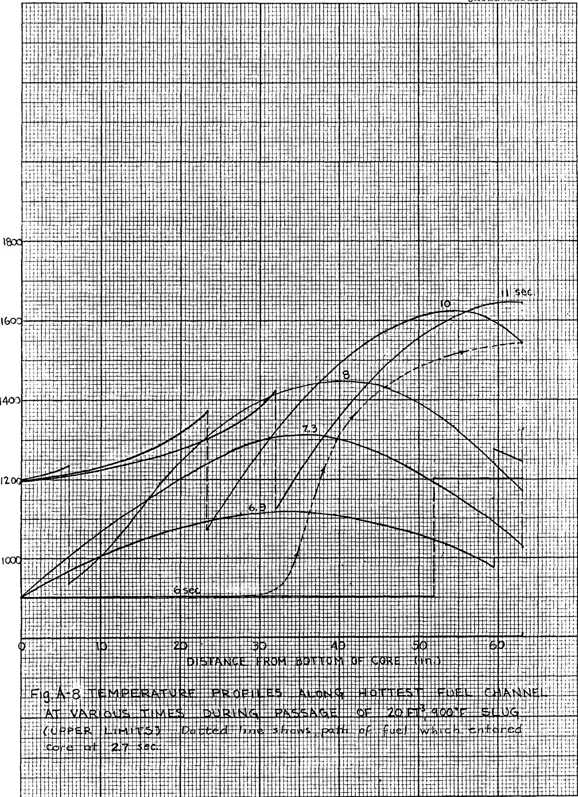  
TEMPERATURE (°F)

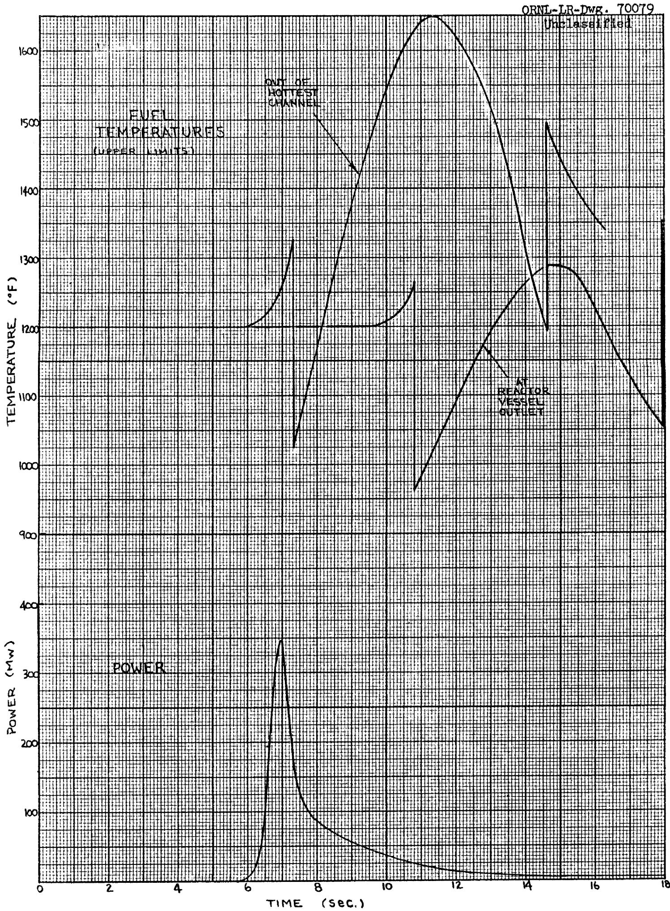  
Fig A-9 Power and Fuel Temperatures for 20 ft $^3$ , 900°F Slug

# APPENDIX IV

# COMPOSITION OF RESIDUAL LIQUID AFTER PARTIAL

# FREEZING OF MSRE FUEL SALT

The composition of the liquid that remains after partial freezing of the fuel salt determines the nuclear behavior of the reactor during a filling accident. Two estimates, based on different assumptions, have been made of the liquid composition as a function of the fraction of salt frozen. The first estimate, based on very simple assumptions was made early to permit the nuclear calculations to proceed. The second estimate, by McDuffie et al., was based on greater knowledge of the salt properties. The assumptions and results of the two approaches are discussed below. Since the quantities of interest in nuclear calculations are atomic concentrations, the resultant compositions are presented in these terms.

Preliminary Estimate of Fuel Composition

This estimate was based on the following assumptions:

1. Initial salt composition

<table><tr><td>Component</td><td>Mol Fraction</td></tr><tr><td>LiF</td><td>0.70</td></tr><tr><td>BeF2</td><td>0.23</td></tr><tr><td>ZrF4</td><td>0.05</td></tr><tr><td>ThF2</td><td>0.01</td></tr><tr><td>UF4</td><td>0.01</td></tr></table>

This composition leads to a higher uranium concentration than is required for criticality under normal conditions at $1200^{\circ}\mathrm{F}$ . To correct for this, the final uranium concentrations were corrected downward by the U:Th ratio in the critical reactor.

2. Only the primary solid, 6 LiF. $\mathsf{BeF}_2$ . $\mathsf{ZrF}_4$ , appears as the temperature is lowered and this continues to form until all of the zirconium has been consumed.   
3. The density of the remaining melt is proportional to its molecular weight with the density of the initial composition fixed at $154.5 \, \text{lb/ft}^3$ at $1200^{\circ}\text{F}$ .

# Estimate by McDuffie et al

The following assumptions were used:

1. Initial salt composition

<table><tr><td>Component</td><td>Mol Fraction</td></tr><tr><td>LiF</td><td>0.70</td></tr><tr><td>BeF2</td><td>0.237</td></tr><tr><td>ZrF4</td><td>0.05</td></tr><tr><td>ThF4</td><td>0.01</td></tr><tr><td>UF4</td><td>0.003</td></tr></table>

The reduction in uranium concentration permits a smaller correction to make the final concentration compatible with criticality results. The extra 0.007 mol fraction was arbitrarily assigned to the $\mathrm{BeF_2}$ .

2. The primary solid, 6 LiF. $\mathsf{BeF}_2$ . $\mathsf{ZrF}_4$ , forms until the $\mathsf{ZrF}_4$ mol fraction is reduced to 0.033. After this the secondary solid, 2 LiF. $\mathsf{BeF}_2$ , forms in a 1:1 mol ratio with the primary solid.   
3. The salt density was obtained by dividing the molecular weight by the sum of the fractional molar volumes of the constituents. The molar volumes are empirically obtained values. An accuracy of $3\%$ is claimed for this technique. However, application of the method to the standard (70-23-5-1-1) mixture leads to a density of $142.6 \, \text{lb/ft}^3$ at $1200^{\circ}\text{F}$ as opposed to a measured value of $154.5 \, \text{lb/ft}^3$ . Since absolute densities are required for the nuclear calculations, a correction of $154.5 / 142.6$ was applied to all of the calculated densities.

# Comparison of Results

Figure A-10 shows the calculated atomic concentrations at $1200^{\circ}\mathrm{F}$ resulting from the two sets of assumptions. For ease of comparison, both uranium concentrations are referred to the same initial concentration--- that corresponding to 0.003 mol fraction $\mathrm{UF_4}$ . The only significant

Used in nuclear calculations Estimated by: McDuffie, et al.

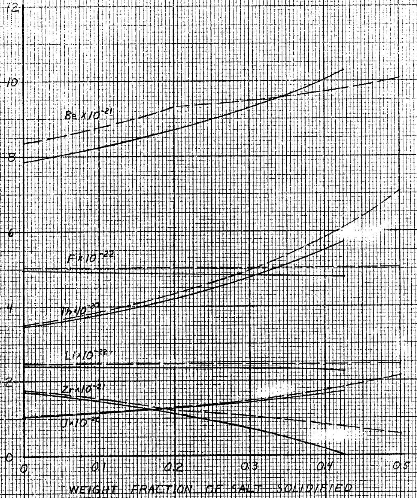  
Fig. A-10   
COMPOSITION OF FUEL SALT

difference in the two methods is in the zirconium concentration. However, this does not affect the nuclear calculations because only $10^{-4}$ of the neutron absorptions are in zirconium.

# APPENDIX V

# CRITICALITY CALCULATIONS FOR FILLING ACCIDENTS

Multiplication constants were calculated with the aid of MODRIC, a one-dimensional, multiregion, multigroup neutron diffusion code, for all combinations of the following variables:

$$
\begin{array}{l} \mathrm {H} / \mathrm {L} = 0. 5 0, 0. 7 5, 1. 0 0 \\ \mathrm {T} = 1 2 0 0, 1 3 0 0, 1 4 0 0 ^ {\circ} \mathrm {F} \\ f = 0. 1 5, 0. 2 5, 0. 3 9 \\ \end{array}
$$

where $f$ is the weight fraction of fuel frozen. Additional calculations were made at $H / L = 1.00$ , $f = 0$ and $T = 1200$ , $l300$ , and $l400^{\circ}F$ to provide a basis for adjusting the results to agree with previous calculations.

In all cases, the nominal atomic concentrations were adjusted for changes due to the variation of the fuel density with temperature; the coefficient of expansion of the normal fuel was applied to all compositions. Nuclear cross sections appropriate to the various temperatures were used.

All of the MODRIC results were treated as nominal values, subject to adjustment. The value of $k$ for the core filled with normal fuel at $1200^{\circ}F$ was set at 1.00. The values at 1300 and $1400^{\circ}F$ were set at 0.9912 and 0.9824, respectively, by applying the previously calculated temperature coefficient of reactivity $(-8.8 \times 10^{-5} \circ F^{-1})$ . The ratios of these values to the nominal values gave normalization factors to be applied at the various temperatures.

An additional correction was applied to each of the calculated values. Because of control-rod position during filling, $\mathbf{k} = 0.997$ for the reactor full of normal fuel at $1200^{\circ}\mathbf{F}$ . However, the worth of the control rods varies with the salt level in the core. Thus the correction which was applied was varied proportionately.

Figure A-11 shows the net values of $\mathbf{k}_{\mathrm{eff}}$ as a function of $\mathrm{H} / \mathrm{L}$ at $1200^{\circ}\mathrm{F}$ for three fuel compositions. These curves permit evaluation of

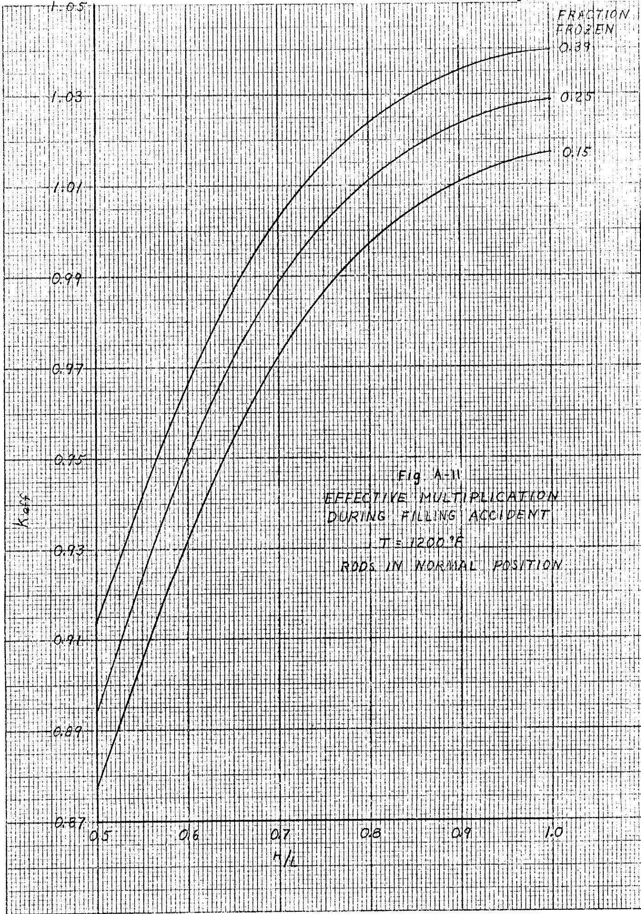

the critical salt level as a function of composition (Fig. 7). The effective temperature coefficients of reactivity were evaluated with the aid of similar curves at other temperatures. With 0.39 of the salt frozen, the temperature coefficient is only $6.5 \times 10^{-5} \mathrm{~F}^{-1}$ .

A similar approach was used for the postulated accident in which fuel, containing sufficient uranium for operation at $1400^{\circ}\mathrm{F}$ , is added to the reactor at $900^{\circ}\mathrm{F}$ . A critical uranium concentration was first calculated for the full core at $1400^{\circ}\mathrm{F}$ . The atomic concentrations were then adjusted to $900^{\circ}\mathrm{F}$ and $\mathbf{k}$ was calculated as a function of $\mathrm{H} / \mathrm{L}$ . These values were normalized to $\mathbf{k} = 1.044$ at $\mathrm{H} / \mathrm{L} = 1$ , the value corresponding to a temperature coefficient of $8.8 \times 10^{-5} \cdot \mathrm{F}^{-1}$ . The correction for control-rod position was also applied. Figure A-12 shows the net $\mathbf{k}_{\text {eff }}$ as a function of $\mathrm{H} / \mathrm{L}$ .

In order to predict the power and temperature behavior of the core, it was necessary to convert the curves of $\mathrm{k_{eff}}$ vs $\mathrm{H / L}$ into curves of $\mathrm{k_{eff}}$ vs time. This conversion was based on the variation of $\mathrm{H / L}$ with time during filling. Figure A-13 shows $\mathrm{H / L}$ as a function of time for a fill rate of 1.0 ft³/min at 1200°F. Zero time on this curve is the time at which fuel salt begins to enter the core itself. The change of slope at $\mathrm{H / L} = 0.8$ is due to the effect of the inlet volute and inlet line on the reactor vessel. Figure A-13 was then combined with the curves of Fig. A-11 and A-12 to obtain the reactivity curves from which power and temperature were calculated.

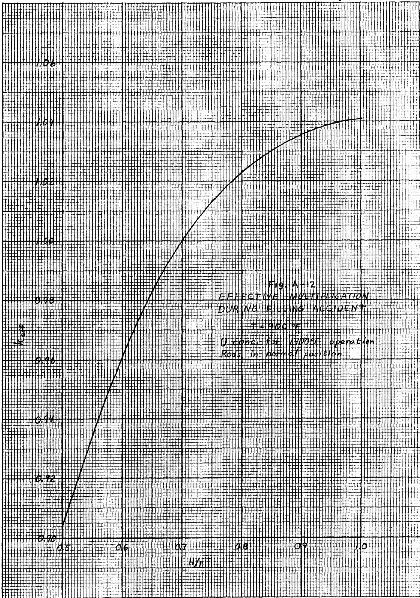

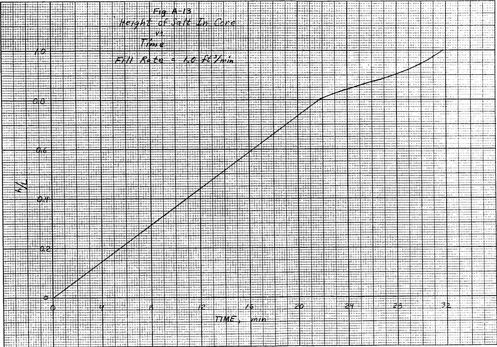

# APPENDIX VI

# REACTIVITY WORTH OF INCREMENTS OF URANIUM

The increase in reactivity which would be produced by the addition of a small amount of uranium at some point in the core, which is initially critical, is a quantity of interest in the analysis of the reactor. This quantity was used to calculate an upper limit on the upset which could be produced by the rapid addition of fuel in such a way that the core uranium concentration increased nonuniformly.

Reactivity worth of uranium as a function of position was calculated as follows: Criticality calculations by MODRIC showed that at $1200^{\circ}\mathrm{F}$ the core critical mass is $16.2\mathrm{kg}U^{235}$ and $(\delta \mathrm{k / k}) / (\delta \mathrm{M / M}) = 0.28$ . Thus for $1\mathrm{g}U^{235}$ evenly distributed in the core, $\delta \mathrm{k / k} = 1.72\times 10^{-5}$ . Fast and slow neutron fluxes and adjoints have been computed by EQUIPOISE-3. The product of the fast adjoint and the slow flux at a point was used as the measure of the nuclear importance of that point. Thus for $1\mathrm{g}U^{235}$ at position r,z

$$
I (z, r) = \frac {\left(\phi_ {1} ^ {*} \phi_ {2}\right) _ {r , z}}{\left(\phi_ {1} ^ {*} \phi_ {2}\right) _ {\text {a v .}}} x 1. 7 2 x 1 0 ^ {- 5}
$$

Figure A-14 shows the reactivity effect of an increment of $1 \, \text{g} \, \text{U}^{235}$ as a function of position in the core.

In the analysis of the fuel addition, it was postulated that the fuel concentration was uniform except for a flat "pancake" containing an additional $120\mathrm{g}\mathrm{U}^{235}$ which moved up through the core. The reactivity work or importance of uranium evenly distributed over a horizontal plane at is

$$
I (z) = \frac {1}{\pi R ^ {2}} \int_ {0} ^ {R} I (r, z) 2 \pi r d r
$$

This integration was carried out graphically for the values of $z$ shown in Fig. A-14. The results were used to obtain Fig. A-15, which shows the reactivity effect of an increment of $120 \, \text{g} \, \text{U}^{235}$ , evenly distributed in a horizontal plane moving through the core at the average speed of the circulating fuel.

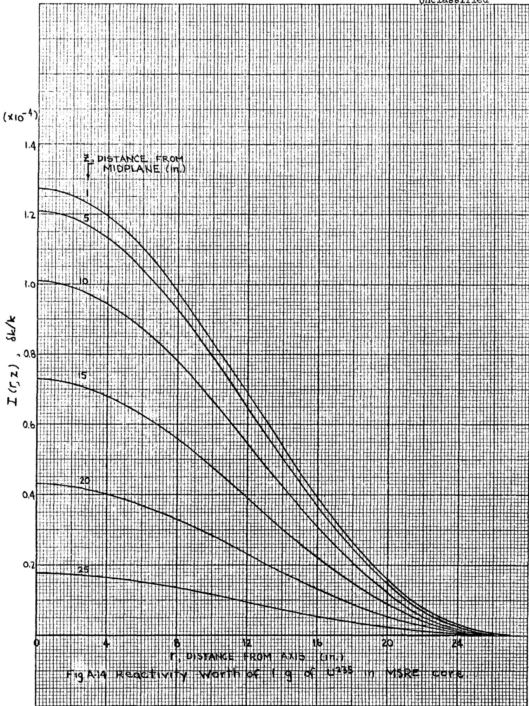

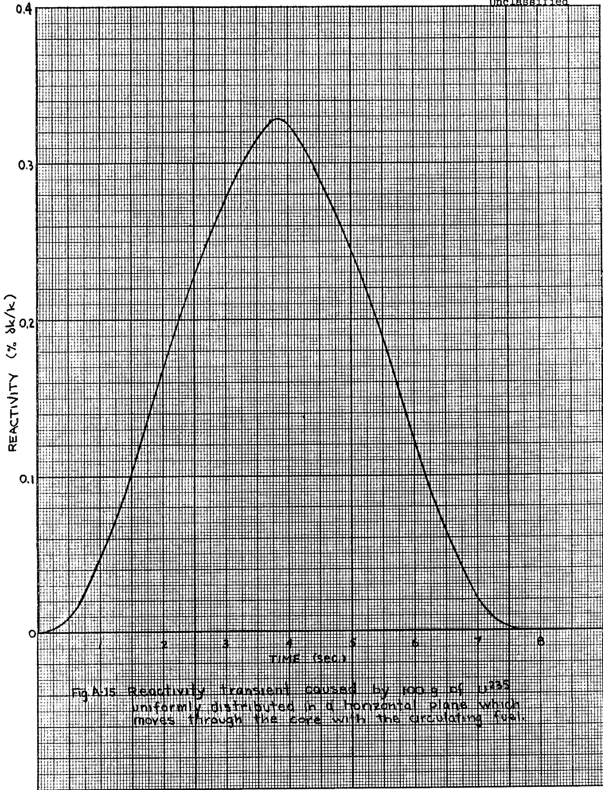

#

1

# Internal Distribution

1. S.E.Beall   
2. M. Bender   
3. E. S. Bettis   
4. F.F.Blankenship   
5. A. L. Boch

8. H.C.Claiborne   
9. J.R. Engel

6-7. R.B.Briggs   
10. A. P. Fraas   
ll. G.R.Grimes   
12. P. N. Haubenreich   
13. P.R.Kasten   
14. R. N. Lyon   
15. H. G. MacPherson   
16. W.D.Manly   
17. W. B. McDonald   
18. A.J.Miller   
19. R. L. Moore   
20. C.W. Nestor   
21. A.M.Perry   
22. M. W. Rosenthal   
23. H. W. Savage   
24. A. W. Savolainen   
25. M.J. Skinner   
26. I. Spiewak   
27. J. A. Swartout   
28. A. Taboada   
29. J. R. Tallackson   
30. D. B. Trauger   
32. Central Research Library   
35. Y-12 Document Reference Section   
38. Laboratory Records Department   
39. LRDA-RC

# External Distribution

40-54. Division of Technical Information Extension (DTIE)   
55. Research and Development Division, ORO   
56-57. Reactor Division, ORO