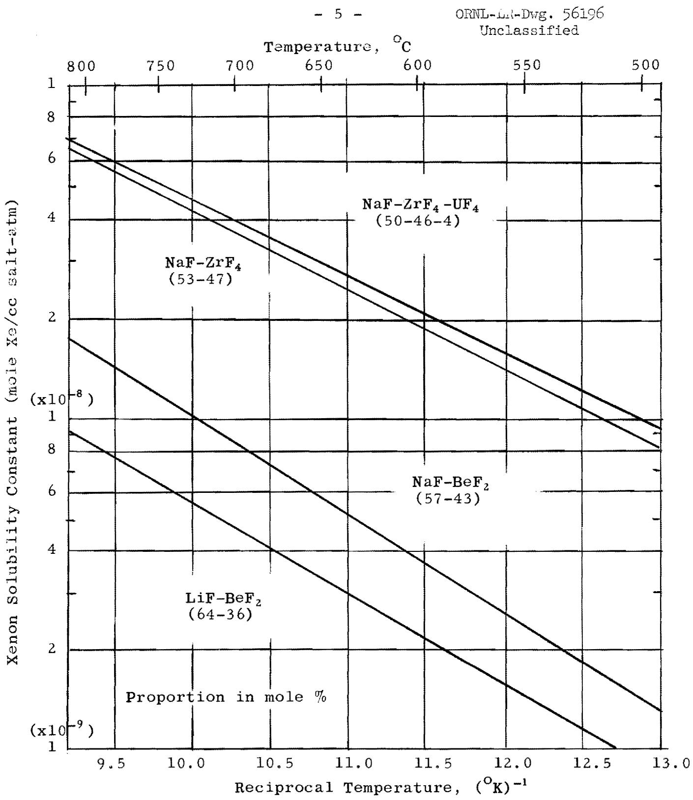
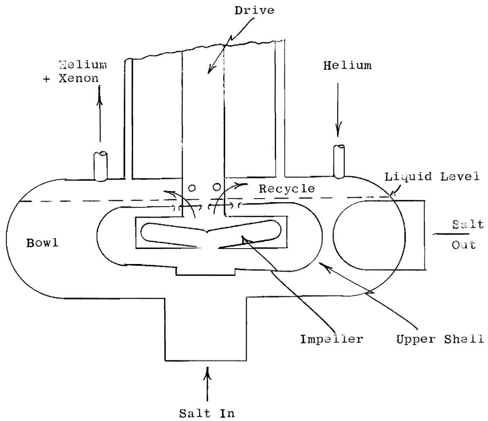
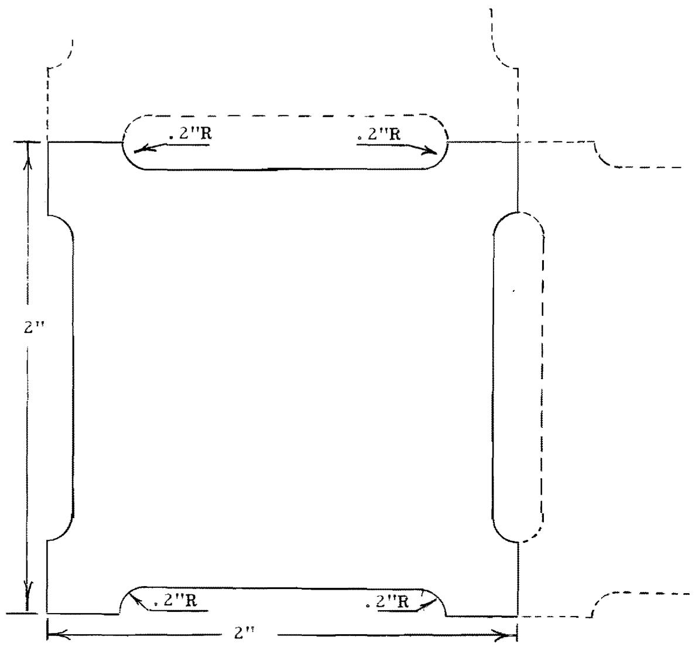
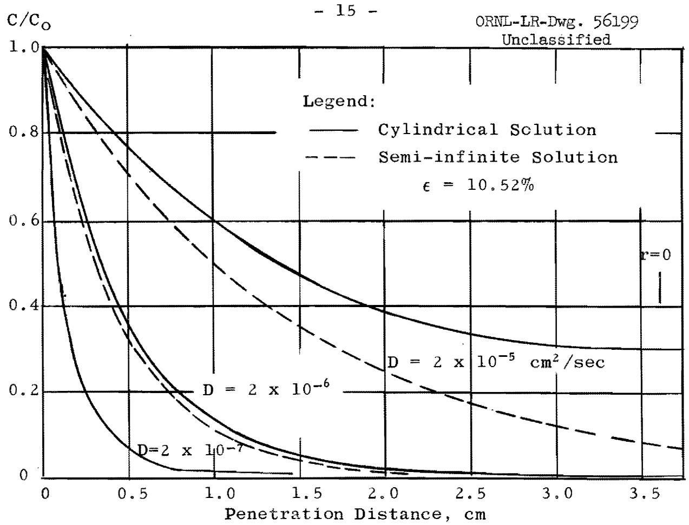
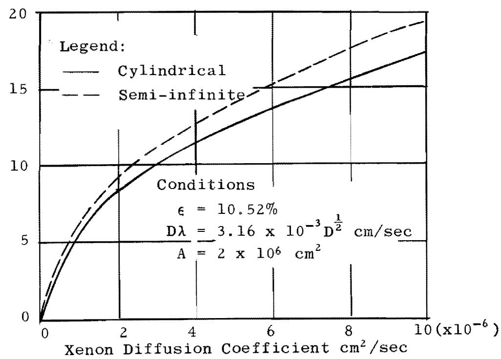
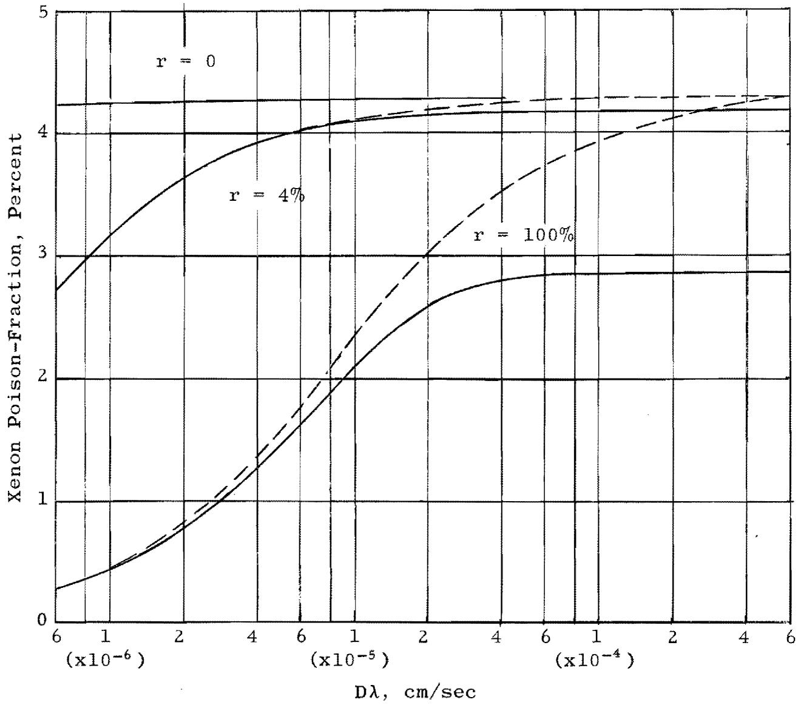
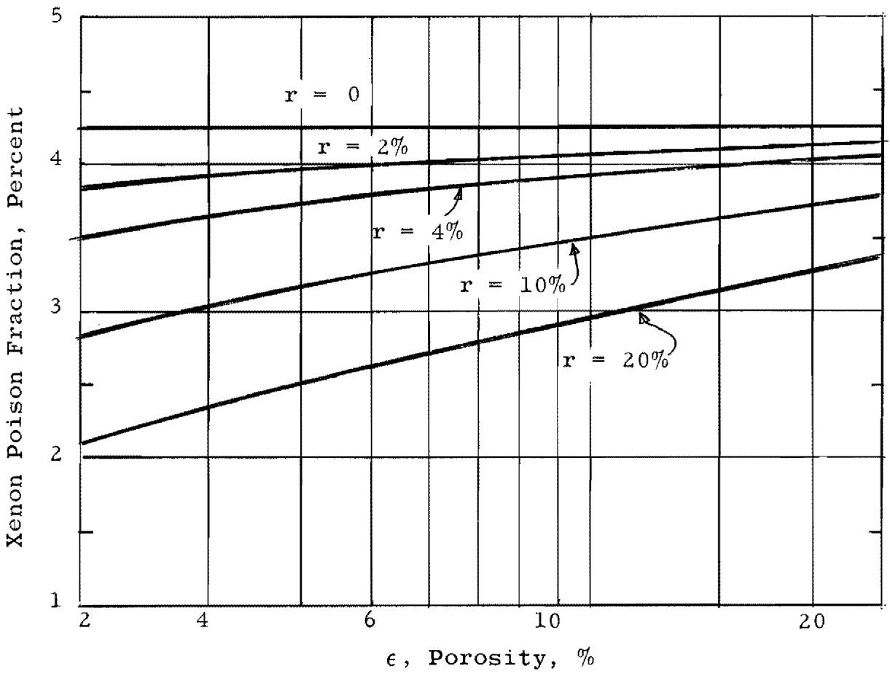
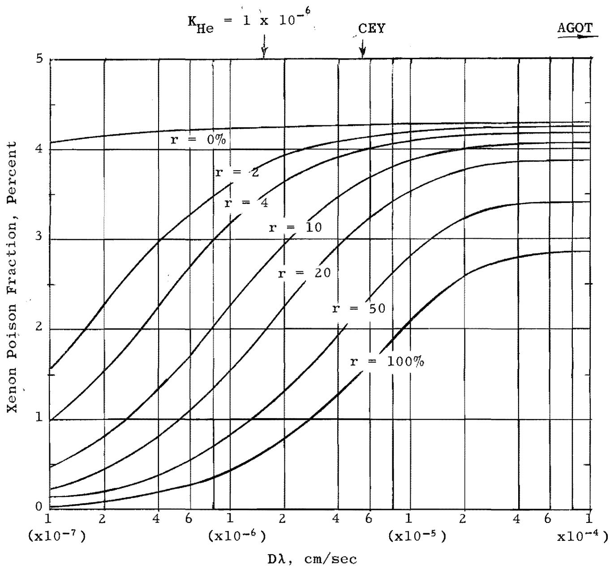
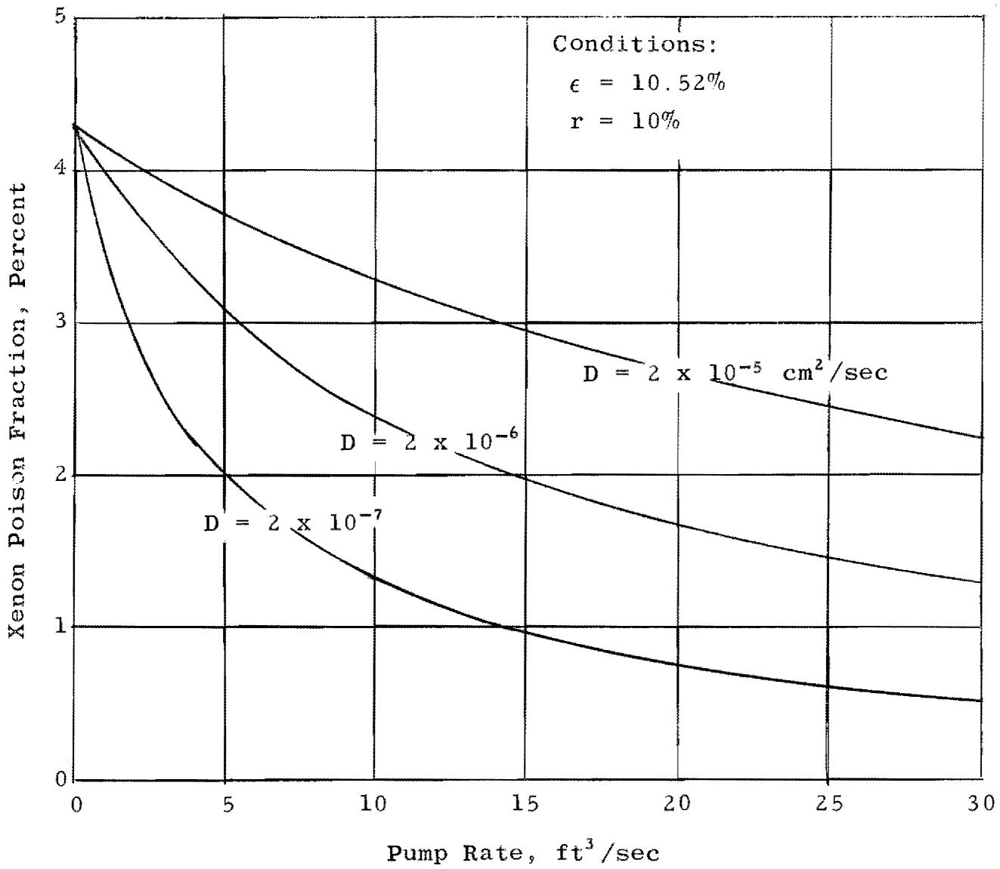

U.S. ATOMIC ENERGY COMMISSION

ORNL-TM-262

COPY NO. -

DATE - June 27, 1962

XENON DIFFUSION IN GRAPHITE: EFFECTS OF XENON ABSORPTION IN MOLTEN SALT REACTORS CONTAINING GRAPHITE

G.M.Watson and R.B.Evans,III

# ABSTRACT

Estimates have been made of the xenon poison fraction in a hypothetical molten salt reactor operating at steady-state conditions near those projected for the MSRE. The poison fraction was expressed as a function of the Xe-135 concentration in the molten salt fuel, the free gas space over the fuel, the pores of the unclad graphite contacting the fuel, and the corresponding volumes.

Xenon transport rates were considered the various combinations of generation, burn-out, decay, removal via helium stripping, and diffusion into graphite. Particular attention was given to a discussion of the graphite porosity, permeability, and xenon diffusion coefficient. These parameters govern the rate of xenon diffusion into the graphite moderator.

The computations established that permeability and/or porosity reduction coupled with increased

# NOTICE

This document contains information of a preliminary nature and was prepared primarily for internal use at the Oak Ridge National Laboratory. It is subject to revision or correction and therefore does not represent a final report. The information is not to be abstracted, reprinted or otherwise given public dissemination without the approval of the ORNL patent branch, Legal and Information Control Department.

stripping rates effectively decrease the xenon poison fraction and increase neutron economy. Within the range of graphites currently under consideration for the MSRE, increased stripping rates appear to be the most effective means of reducing the xenon poison fraction. At the circulation rates considered, it was found that neutron economy (with respect to xenon) could not be advanced through permeability reduction alone.

# INTRODUCTION

The possibility of employing unclad graphite in direct contact with the MSRE fuel leads to four contingencies, which must undergo continual and thorough examination, as conceptual designs approach specification form. These contingencies are:

1. Deposition of solid $\mathrm{UO}_2$ arising from oxygen introduced via the graphite   
2. Invasion of the graphite by the molten fuel   
3. Variable reactivity resulting from a variable Xe-135 concentration in the graphite   
4. High xenon poison fraction

The first three items could result in erratic reactor operation; the last item is of importance from a standpoint of neutron economy. Research efforts, which are slanted to yield information applicable for evaluating these difficulties, involve: volatile impurity contents of graphites, $^{1}$ molten salt absorbability of graphites $^{2}$ (also $\mathrm{UF_4}$ to $\mathrm{UO_2}$ conversion due to impurities), effects $_3$ of pore size distribution of graphites and wetting agents $^{3}$ and studies of gas transport in porous media. $^{4}$

In addition to the third and fourth difficulties mentioned, it has been shown that $\mathbf{C}\mathbf{s}^{\circ}$ for which Xe-135 is a precursor, is not compatible with graphite. The role of $\mathbf{C}\mathbf{s}^{\circ}$ in gas cooled reactors has been discussed by Rosenthal and Cantor.

A comparison of proposed methods for xenon control has been presented by Burch. More recent computations have been made by Spiewak. The results of both studies are

quite different with respect to xenon control and graphite requirements as the earlier work was based on high circulation rates and the presence of a large decay dome in series with the pump. These features have been eliminated in present designs which lead to increased driving forces for the xenon absorption by the graphite.

The primary objective of this report was to extend the computations by Burch to lower ranges of removal rates to determine the feasibility of using low permeability graphites under the more recently projected conditions. In view of this objective, considerable discussions of the graphite parameters of interest are presented.

# BASIC CONSIDERATIONS

# Xenon Poison Fraction

# Maximum Poison Fraction

A maximum poison fraction indicates a low level of neutron economy, and a relatively high rate of $\mathrm{Cs}^{\circ}$ production within the graphite. Since the maximum fraction appears as a limiting value for many of the curves presented, a brief discussion of maximum poisoning follows.

The maximum poison fraction is the product of three factors: the ratio of Xe-135 burn-out to total Xe-135 loss, i.e., $(\phi_{\mathrm{c}}\sigma) / (\phi_{\mathrm{c}}\sigma + \lambda_{\mathrm{Xe}})$ , the moles of Xe-135 formed per fission, and the ratio of neutrons causing fission to the total number absorbed by U-233. Thus,

$$
\left. \text {P . F .} \right| _ {\max .} = \left[ \frac {\phi_ {\mathrm {C}} ^ {\sigma}}{\phi_ {\mathrm {C}} ^ {\sigma} + \lambda_ {\mathrm {X e}}} \right] (6. 2 \cdot 1 0 ^ {- 2}) \left(\frac {2 . 2 1}{2 . 5 0}\right). \tag {1}
$$

This expression is based on the assumption that all the Xe-135 which does not decay is burned out in the reactor core. Since $\lambda_{\mathrm{Xe}}$ is the decay constant, (sec) $^{-1}$ , the power level contribution is contained in the Xe-135 destruction constant $\phi_{\mathrm{C}}\sigma$ , (sec) $^{-1}$ . To show the effects of Xe-135 removal by stripping and Xe-135 absorption by graphite, one

must employ a destruction ratio which is more complex than that appearing in Eq. 1.

# Poison Fraction with Removal Rates

The complete destruction ratio may be developed by considering a steady-state Xe-135 mass balance and the total neutron captures by Xe-135. Let: $\dot{\mathbf{n}}_{\mathrm{D}}$ be the diffusion rate of Xe-135 into the graphite, $\dot{\mathbf{n}}_{\mathrm{S}}$ be the removal rate at the primary pump, $\mathsf{n}_{\mathsf{L}}$ be the Xe-135 dissolved in all the salt, and $\mathsf{n}_{\mathsf{LC}}$ be the amount of Xe-135 dissolved in the core salt. The poison fraction is given by

$$
\mathrm {P . F .} (\%) = \left(\frac {\phi_ {\mathrm {c}} \sigma n _ {\mathrm {L c}} + \frac {\phi_ {\mathrm {c}} \sigma}{\phi_ {\mathrm {c}} \sigma + \lambda_ {\mathrm {X e}}} \cdot \dot {n} _ {\mathrm {D}}}{\phi_ {\mathrm {c}} \sigma n _ {\mathrm {L c}} + \lambda_ {\mathrm {X e}} n _ {\mathrm {L}} + \dot {n} _ {\mathrm {S}} + \dot {n} _ {\mathrm {D}}}\right) \tag {2}
$$

The variables, $n_{\mathrm{L}}$ , $n_{\mathrm{Lc}}$ , and $\dot{n}_{\mathrm{s}}$ can be expressed in terms of reactor parameters through the use of the noble gas solubility relationship, that is,

$$
\mathrm {n} _ {\mathrm {L}} = \mathrm {C} _ {\mathrm {o}} (\mathrm {K} _ {\mathrm {p}} \mathrm {R T}) \mathrm {V} _ {\mathrm {L}}, \tag {3a}
$$

$$
n _ {L c} = C _ {o} \left(K _ {p} R T\right) V _ {L c}, \tag {3b}
$$

$$
\dot {\mathrm {n}} _ {\mathrm {S}} = \mathrm {C} _ {\mathrm {o}} \left(\mathrm {K} _ {\mathrm {p}} \mathrm {R T}\right) \mathrm {Q} _ {\mathrm {S}}, \tag {3c}
$$

where $V$ and $Q_{S}$ are volume and volumetric strip rate, respectively, and $C_{0}$ is the gas phase xenon concentration in equilibrium with the dissolved concentration, $n_{L} / V_{L}$ . The Henry's law constant is given by $K_{p}$ .

Typical plots $^{10,11,12}$ of $\mathbf{K}_{\mathfrak{p}}$ versus temperature for various mixtures are shown in Fig. 1.

Only one stripping term, $\mathfrak{H}_{\mathbb{S}}$ or $\mathbf{Q}_{\mathbb{S}}$ , appears in Eq. 2 as current plans for the MSRE call for one free gas space at the primary pump bowl. The bowl will be swept with helium and will see xenon-saturated salt at a rate equivalent to $\mathbf{Q}_{\mathbb{S}}$ , which is (0.04)(circulating pump rate). A rough sketch

  
Fig. 1. Xenon Solubility Constants for Various

Molten Salt Mixtures

of the pump configuration is presented as Fig. 2. Use of Eq. 2 and Eq. 3 implies the assumptions that (a) Henry's law holds (equilibrium is maintained between the dissolved gas, the gases entering the pump bowl, and the graphite-salt interface); also that (b) diffusion rates across films and through the salt are negligible as compared to the rates of absorption by graphite and removal at the pump.

# Hypothetical Reactor Conditions

The following reactor conditions and related parametric values were utilized to carry out the poison fraction computations.

Xe-135 decay constant, $\lambda_{\mathrm{Xe}} = 2.11 \times 10^{-5} \sec^{-1}$ .

Xe-135 destruction constant, $\phi_{\mathrm{c}}\sigma_{\mathrm{Xe}} = 7.4\times 10^{-5}$ sec-1.

Average reactor temperature, T, = 936 $^{\text{O}}$ K.

Gas constant, R, = 82.05 cm³ - atm/mole⁻⁰K.

Xe solubility constant, $\mathbf{K}_{\mathrm{p}} = 3 \times 10^{-9}$ moles $\mathrm{Xe/cm^3}$ salt-atm. Total salt volume, $\mathbf{V}_{\mathrm{I}} = 66.5 \mathrm{ft}^3 \cong 1.88 \times 10^6 \mathrm{cm}^3$ .

Total salt volume in the core, $V_{\text{Lc}}$ , = 20 ft³ ≈ 5.66 x 10⁵ cm³. Salt circulation rate (reactor pump rate), QT, = 2.67 ft³/sec = 7.56 x 10⁴ cm³

Salt circulation rate through pump bowl, $Q_{S} = (0.04)(7.56 \times 10^{4}) = 3.02 \times 10^{3} \, \text{cm}^{3} / \text{sec}$ .

Xenon concentration in salt entering bowl $= \frac{n_{\mathrm{L}}}{V_{\mathrm{L}}}$ ; at exit $= 0$ .

When these values are combined with Eq. 2a and Eq. 3, one obtains

$$
\mathrm {PF} (\%) = \frac {5.29 \cdot 10 ^ {- 4} + 4.26 \cdot 10 ^ {- 2} \left(\frac {\dot {\mathrm {n}} _ {\mathrm {D}}}{\mathrm {C} _ {\mathrm {O}}}\right)}{1.88 \cdot 10 ^ {- 2} + 0.174 \mathrm {r} + \left(\frac {\dot {\mathrm {n}} _ {\mathrm {D}}}{\mathrm {C} _ {\mathrm {O}}}\right)}. \tag{2b}
$$

The by-pass or recycle rate, 0.04 $\mathbf{Q}_{\mathbf{T}}$ , has been replaced by $\mathbf{Q}_{\mathbf{T}100}$ (in Eq. 2b) to show the effect of stripping in subsequent computations.

  
Fig. 2

Schematic Diagram of Primary Circulating Pump

The only factor remaining to be discussed is $\dot{\mathrm{n}}_{\mathrm{D}} / \mathrm{c}_{\mathrm{o}}$ which introduces the contributions of the rate of xenon diffusion into the pores of the graphite-moderator blocks. Pertinent graphite dimensions, as presently envisioned for the MSRE, $^{13}$ are tabulated below:

total graphite volume - 77 ft³,

total number of blocks - 565,

exposed area per block - 545 in.²,

and total exposed area - 3.08·10 $^5$ in. $^2$ ~ 2·10 $^6$ cm $^2$ .

A cross-sectional sketch of the blocks may be found on Fig. 3.

# Xenon Diffusion in Graphite

# Permeability and Diffusion Coefficients

It should be clear, at this point, that low permeability, high density graphites are most applicable for advanced molten salt reactors. This statement is made in view of the problems associated with graphites as outlined in the Introduction. The discussion here will center on graphites with permeability coefficients ranging from $1 \cdot 10^{-5}$ to $1 \cdot 10^{-7} \mathrm{~cm}^2/\mathrm{sec}$ . Gaseous diffusion rates within such materials are governed by wall collisions - not by intermolecular collisions. The xenon rates should not be influenced by the presence of other gases, (e.g., helium) in the same passages. When these conditions exist, each gas possesses its own diffusion coefficient, D, which is closely approximated by the permeability coefficient, K. The definitions of the coefficients may be obtained from the steady-state equations:

$$
\mathbf {\hat {n}} _ {f} \quad \mathrm {R T} = \mathbf {K} _ {\mathbf {X e}} \frac {\mathbf {A}}{\mathbf {L}} \Delta \mathbf {P}, \tag {3}
$$

$$
\mathrm {a n d} \quad \dot {\mathrm {n}} _ {\mathrm {D}} \quad \mathrm {R T} = \mathrm {D} _ {\mathrm {X e}} \quad \frac {\mathrm {A}}{\mathrm {L}} \quad \triangle (\mathrm {P} _ {\mathrm {X e}}) \quad , \tag {4}
$$

where $\dot{\mathbf{n}}_{\mathrm{f}}$ is the forced flow rate, $\mathbf{P}_{\mathrm{Xe}}$ is partial pressure, and $\mathbf{L}$ is the length of graphite. Essentially, the above argument implies that the gas does not differentiate between

  
Fig. 3

Tentative Cross-Section of MSRE Moderator Blocks

P and $\mathbf{P_{Xe}}$ in small passages, An equation applicable to all porous media is given by14,15

$$
\mathbf {K} = \mathrm {B} _ {\mathrm {O}} \frac {\mathrm {P} _ {\mathrm {m}}}{\mu} + \frac {4}{3} \mathrm {K} _ {\mathrm {O}} \overline {{\mathbf {v}}} \quad , \tag {5}
$$

where $\mathbf{B}_0$ and $\mathbf{K}_0$ are characteristics of the medium, $\mu$ is the gas viscosity, and $\overline{\mathbf{v}}$ is the mean thermal velocity or

$$
\overline {{\mathbf {v}}} = \left(\frac {8 \mathrm {R T}}{\pi \mathbf {M}}\right) ^ {\frac {1}{2}} \tag {6}
$$

$\mathbf{P}_{\mathfrak{m}}$ is the mean pressure of the flowing gas. When $\mathbf{B}_0$ is large, viscous flow controls.

Also,

$$
D _ {H e - X e} = D _ {O} \frac {P _ {O}}{P} \left(\frac {T}{T _ {O}}\right) ^ {1. 5}. \tag {7}
$$

When $\mathbf{B}_0\rightarrow 0$ , Knudsen flow prevails.

Then,

$$
D _ {X e} \sim K _ {X e} = \frac {4}{3} K _ {o} \bar {v}. \tag {8}
$$

By Eq. 6 and Eq. 8,

$$
D _ {X e} = D _ {H e} \left(\frac {M _ {H e} T}{M _ {X e} T _ {O}}\right) ^ {\frac {1}{2}}. \tag {9}
$$

The points under discussion are reflected in the following data:

<table><tr><td>Type Graphite</td><td>D, Apparent Coefficient, Helium</td><td>Diffusion Coefficient, cm2/sec Argon</td><td>K, Permeability Coefficient, cm2/sec Helium</td><td>Argon</td></tr><tr><td>AGOT* (National Carbon Company)</td><td>7.2 x 10-3</td><td>2.3 x 10-3</td><td>1.6 x 100</td><td>1.2 x 100</td></tr><tr><td>CEY Coated Pipe (National Carbon Company)</td><td>1.3 x 10-5</td><td>0.4 x 10-5</td><td>7.6 x 10-5</td><td>2.6 x 10-5</td></tr></table>

* Data referred to ${25}^{ \circ  }\mathrm{C}$ and 1 atm.

It may be noted that the K/D ratio for the permeable graphite is 400; whereas that for the low permeability graphite is 6. This tends to verify the approximation indicated at Eq. 8. For materials with a K lower than that of CEY graphite, K/D should approach unity. Another point of interest involves the ratio $(\mathbf{M}_{\mathrm{A}} / \mathbf{M}_{\mathrm{He}})^{\frac{1}{2}} = 3.16$ . Both K and D for CEY graphite appear to follow this relationship (Eq. 9). Dxe at $936^{\circ}\mathbf{K}$ is estimated to be $3.86 \cdot 10^{-6} \mathrm{~cm}^{2} / \mathrm{sec}$ , as based on the DA cited and Eq. 9.

# Porosity

If one considers two graphites with equal permeability coefficients and unequal porosities, it is apparent that the specimen with the highest porosity value will contain the largest amount of gas at equilibrium saturation and during steady flow. Low porosity graphites have a low absorption capacity with respect to gaseous fission products. Thus, a discussion of porosity is pertinent.

Two definitions of porosity are often employed in discussions of gaseous flow through graphites. One is the total porosity, which is based on a comparison of the measured density and a theoretical density (2.26 gm/cc). The other is the effective porosity or open porosity as measured by helium absorption. The total value is greater than the effective value, which indicates the presence of completely closed voids. The effective value is of primary importance regarding the Xe-135 problem.

Another point of interest involves the relationship between the porosity and permeability of graphites. From the standpoint of graphite fabrication, porosity reduction is not a necessary condition for permeability reduction; however, the former is a sufficient condition for the latter. It is possible to partially plug the channels within a graphite without markedly decreasing the porosity; on the other hand, a treatment which reduces the porosity of a graphite will reduce the permeability coefficient. One may generalize thus: graphites having low porosity values also have low permeability coefficients. The degree to which this generalization holds is illustrated by nominal permeability-porosity values, which are tabulated below.

<table><tr><td>Graphite Vendor</td><td>Grade or Type</td><td>Effective Porosity, ε (%)</td><td>Helium Permeability Coefficient, K (cm2/sec)</td><td>Notes</td></tr><tr><td>National Carbon</td><td>AGOT</td><td>22</td><td>2 x 100</td><td>a</td></tr><tr><td>Speer Carbon</td><td>Moderator No. 1</td><td>17</td><td>7 x 10-1</td><td>a</td></tr><tr><td>Unknown</td><td>Experimental</td><td>17</td><td>3 x 10-2</td><td>b</td></tr><tr><td>National Carbon</td><td>CEY (coated pipe)</td><td>11</td><td>5 x 10-5</td><td>a</td></tr><tr><td>National Carbon</td><td>CEY</td><td>5</td><td>4 x 10-6</td><td>c</td></tr><tr><td>Hawker Siddeley</td><td>HS-143-9</td><td>1</td><td>4 x 10-7</td><td>c</td></tr><tr><td>Raytheon</td><td>Pyrolytic</td><td>0.02</td><td>3 x 10-10</td><td>c</td></tr></table>

a. ORNL Data17   
b. Data from Hutcheon15   
c. General Atomic Data18

From a standpoint of product improvement, the data suggest that treatments to reduce permeability would be far more successful than efforts to reduce porosity.

# Pore Diffusion Equation

When consideration is given to a gas-cooled reactor which utilizes coated particles or pyrolytic-graphite coated fuel elements, the primary problem involves fission product release and resultant coolant stream contamination. The rate controlling step (slowest step) of release is, to a large degree, dependent on surface and lattice diffusion mechanisms, as the fissioning process occurs in the solid state within a ceramic shell or matrix.[19]

This philosophy is reversed when consideration is given to a molten salt reactor. In this case, the fission process takes place in the liquid and one is concerned with the fastest mode of xenon absorption as a gas - not as a nuclide recoiled into a lattice. Lattice and surface diffusion of xenon are of secondary importance in molten-salt reactors. The equation most applicable is the pore diffusion equation,[20,21]

$$
D _ {X e} \nabla^ {2} C = \epsilon \left(\phi_ {c} \sigma_ {X e} + \lambda_ {X e}\right) C + \epsilon \frac {\partial C}{\partial t}. \tag {10}
$$

The symbol C, mole/cc, represents free gas concentration - in this case Xe-135; t, sec, represents time. All other symbols have been defined. The porosity term, $\epsilon$ , appears, since xenon can accumulate or deplete (also burn-out or decay) only within the pores of the graphite. It may be recalled that Dx e is referred to the external graphite geometry and to steady-state flow which do not depend on porosity.

Transient Solutions. -- Having written Eq. 10, it is convenient to touch on methods of employing this relationship for the determination of the $\epsilon$ and K (and D) of low permeability graphites. The destruction term becomes zero, since noble gases other than Xe-135 are employed in the experiments. Eq. 10 takes the form:

$$
\mathbf {K} \frac {\partial^ {2} \mathbf {P}}{\partial x ^ {2}} = \epsilon \frac {\partial \mathbf {P}}{\partial t}. \tag {10b}
$$

The solution of Eq. 10b, $\mathbf{P}(\mathbf{x}, t)$ , which involves $\mathbf{K}$ and $\epsilon$ , is used to obtain $(\partial \mathbf{P} / \partial x)_{\mathbf{x}}$ fixed; this is multiplied by -D·A and integrated with respect to time. The $\mathbf{P}(t)$ thus obtained is utilized to correlate pressure build-up data for specimens of known geometry. When $\mathbf{P}(t)$ varies with time, the build-up is influenced by $\mathbf{K}$ and $\epsilon$ ; when $\Delta \mathbf{P}(t) / \Delta t$ is constant, $\mathbf{P}(t)$ depends on $\mathbf{K}$ alone. One obtains $\mathbf{K}$ through the steady-state data - then employs this value and the transient data to obtain $\epsilon$ . In many cases, the transient period is brief due to the material and specimen geometry employed; thus $\epsilon$ must be measured via gas absorption methods or estimated via the gross density measurements.

Steady-State Solutions.-- The form of Eq. 10 applicable to the poison fraction expression (Eq. 2b) is

$$
D _ {X e} \nabla^ {2} (C) = \epsilon \left(\phi_ {c} \sigma_ {X e} + \lambda_ {X e}\right) C. \tag {10c}
$$

A rigorous solution for the graphite blocks (see Fig. 3) would be cumbersome in that two variables related to geometry would be present. In lieu of the rigorous solution, there are two solutions of Eq. 10c (representing simpler geometries) that yield convenient rate expressions. These equations should closely approximate the rigorous equation within certain ranges of D and $\epsilon$ . For very low values of D and $\epsilon$ , the solution corresponding to a semi-infinite geometry is applicable, i.e.,

$$
C = D _ {O} e ^ {- \lambda x}, \tag {11a}
$$

which leads to the rate expression:

$$
\mathrm {n} _ {\mathrm {D}} / \mathrm {C} _ {\mathrm {O}} = \mathrm {A D} _ {\mathrm {X e}} \lambda , \tag {12a}
$$

where

$$
\lambda = \left[ (\epsilon) \left(\phi_ {c} \sigma_ {X e} + \lambda_ {X e}\right) / (D) \right] ^ {\frac {1}{2}} c m ^ {- 1}, a n d
$$

$$
\mathbf {x} = \text {p e n t r a t i o n d i s t a n c e , c m .}
$$

Cylindrical geometry is applicable for nearly all values of $D$ and $\epsilon$ since the back-pressure of xenon in the center of the graphite blocks is taken into account. The corresponding equations are:

$$
C = C _ {O} \frac {I _ {O} (\lambda r)}{I _ {O} (\lambda R)} \tag {11b}
$$

and

$$
\dot {n} _ {D} / C _ {O} = A D _ {X e} \lambda \frac {I _ {1} (\lambda r)}{I _ {O} (\lambda R)}. \tag {12b}
$$

Plots corresponding to Eq. 11 and Eq. 12 are shown on Fig. 4a and Fig. 4b, respectively. The curves indicate that the concentration profiles and rates for the two geometries merge as values of D decrease. Based on the profiles at low values of D (Fig. 4a)

  
Fig. 4a. Computed Concentration Profiles for Xe-135 in Various Graphites with MSRE Moderator Geometry

$$
\frac {\dot {n} _ {X e}}{C _ {O}}, \frac {c m ^ {2}}{\mathrm {s e c}}
$$

  
Fig. 4b. Steady State Diffusion Rates

it was concluded that most of the xenon is near the surface in promising cases; thus the external area of the cylinders was taken as the external area of the blocks (2 x 10^6 cm²). The equivalent cylinder radius was taken as 3.603 cm. Geometry effects with respect to poison fraction computations are pursued in the section to follow.

# RESULTS AND DISCUSSION OF XENON POISON FRACTION COMPUTATIONS

# Equivalent Graphite Geometry

The poison fraction was computed utilizing both diffusion rate expressions (Eq. 12a and Eq. 12b) under assumed recycle values of 4 and $100\%$ . The curves arising from the cylindrical case are shown as solid lines on Fig. 5; those arising from the semi-infinite case are shown as dotted lines on Fig. 5.

Although the curves are plotted with $D\lambda$ as the independent variable, it was necessary to specify a fixed value of porosity to define the cylindrical values. This was required since $\dot{n}_{D} / c_{O}$ is proportional to the product of $D\cdot \lambda$ and the ratio of modified Bessel functions; $D\cdot \lambda$ is proportional to $(D\varepsilon)^{\frac{1}{2}}$ . The arguments of the Bessel functions are proportional to $(\varepsilon /D)^{\frac{1}{2}}$ . A convenient choice for $\epsilon$ was 10.52%, which fixed $D\lambda$ at 3.16· $10^{-3} \cdot (D)^{\frac{1}{2}}$ and $\lambda$ as 3.16· $10^{-3} \cdot (D)^{-\frac{1}{2}}$ .

The curves of Fig. 5 show that the semi-infinite solution is adequate for all values of $R - r$ or $x$ if $D\lambda <$ approximately $1 \times 10^{-5} \, \text{cm/sec}$ or $D$ is less than $1 \times 10^{-5} \, \text{cm}^2 / \text{sec}$ . The curves also show the effects of the back pressure at high values of $D\lambda$ which are introduced by the cylindrical solution. Both curves for the semi-infinite case approach the maximum poison fraction; whereas, the curves derived from the cylindrical case approach a constant value arising from a saturation effect which depends only on the relative rate of Xe-135 production and removal at the pump.

ORNL-LR-Dwg.56200

Unclassified

Legend:

Cylindrical Solution

--- Semi-infinite Solution

$$
\epsilon = 10.52 \%
$$

Dλ = (D x 10-5)², cm/sec

  
Fig. 5. Effect of Geometry on Computed Poison Fractions

# Effect of Porosity

As pointed out previously, there is a slight trend between porosity and permeability, in that large decreases in permeability (or diffusibility) are often accompanied by slight decreases in porosity. The diffusion rate is proportional to $(\mathbf{D} \cdot \epsilon)^{\frac{1}{2}}$ at low values of D. Within this region, which is the region of interest, the effects of varying $\epsilon$ are the same as those of varying D. Curves showing the effects of varying $\epsilon$ are presented on Fig. 6.

# Improved Graphites Versus Removal Rates

A family of poison fraction curves as a function of recycle rate, r, and Dλ (actually D½ since ε is fixed) is shown on Fig. 7. The estimated Dλ for CEY* graphite is [(9.51·10-5 sec-1)(6.9·10-2)(3.9·10-6 cm²/sec)]½ or 5·10-6 cm/sec, and that for AGOT* graphite is 6·10-4 cm/sec. These grades represent the best, and perhaps the worst, grades of non-pyrolytic graphites which are commercially available in large quantities at the present time. Within the region of 6·10-4 cm/sec< Dλ>5·10-6 cm²/sec the curves of Fig. 7 indicate that increasing the recycle rate (i.e., the stripping or removal rate) is the most effective means of reducing the poison fraction. For example, at Dλ of 1·10-5 cm/sec increasing the recycle rate from 4 to 10 percent will reduce the poison fraction from 4.1% to 3.85%. To achieve the same reduction while holding the rate at 4%, one must obtain a graphite with a Dλ of 3.5·10-6 cm/sec. This corresponds to a reduction in D from 1·10-5 cm²/sec to 1.2·10-6 cm²/sec. In other words, doubling the recycle rate is equivalent to decreasing the permeability of the graphite by a factor of 7. With graphites similar to AGOT, poison fraction reduction can be achieved only through increased recycle rates.

Condition:

$$
D = 2 \times 1 0 ^ {- 6} c m ^ {2} / s e c
$$

  
Fig. 6. Effect of Porosity on Xenon Poison Fraction

Conditions:

$$
\epsilon = 10.52 \%
$$

$$
D \lambda = (D x 1 0 ^ {- 5}) ^ {\frac {1}{2}} c m / s e c
$$

  
Fig. 7. Xenon Poison Fraction at Various Values of Recycle Rates and Diffusion Coefficients

In view of the relative importance of Xe-135 removal at the pump, a series of curves were prepared (see Fig. 8), which show the effect of increasing the circulation rate while holding the recycle rate constant. An increase in the circulation rate has the same effect as increasing the recycle rate. This would also be true for any additional stripping devices in the reactor.

The curves of Fig. 7 clearly demonstrate that decreasing $D\lambda$ from $6 \cdot 10^{-4}$ cm/sec (AGOT graphite) to $5 \cdot 10^{-6}$ cm/sec (CEY graphite) offers no advantages with respect to Xe-l35 poisoning particularly when the recycle rate (r) is $4\%$ . Proceeding further down the $4\%$ curve, one finds that the Xe poison fraction is $3.4\%$ (max. $4.15\%$ ) for a graphite with a $K_{\mathrm{He}} = 1 \cdot 10^{-6}$ cm²/sec ( $D\lambda = 1.4 \cdot 10^{-6}$ ). An increase in r from 4 to $8\%$ (at this $D\lambda$ ) yields a poison fraction of $2.8\%$ . Addition of a separate stripping section would be required at this point, as $r = 8\%$ represents the minimum pump efficiency ( $92\%$ ) which can be tolerated.[23] When one considers the combined effects of a $K_{\mathrm{He}} = 1 \cdot 10^{-6}$ cm²/sec graphite and the presence of a stripping section comparable to a $50\%$ recycle rate, it is apparent that the poison fraction would be $1\%$ . Adequate stripping coupled with the utilization of low permeability graphites affords an effective combination for reducing Xe-l35 poisoning. On the other hand, it is evident that the Xe-l35 poison problem cannot be solved through graphite improvement alone.

Another aspect of Xe-135 poisoning, which is not related to neutron economy, involves intermittent operation of the reactor.[24] A shut-down and fuel-drainage operation would allow the graphite to de-saturate with respect to Xe-135. Resumption of operation with the same fuel could result in a special control problem (before the xenon content of the graphite reached normal levels). This problem arises since fractional removal of dissolved $\mathrm{UF_4}$ is difficult to accomplish. Thus, low Xe-135 concentrations in the reactor prior to shutdown would be desirable. This might suggest further justification for adequate stripping and permeability reduction.

# Diffusion in Liquid-Graphite Systems

Comparison of experiments, wherein helium and argon were allowed to interdiffuse through a dry CEY graphite specimen - then interdiffuse with the specimen surrounded by a liquid phase

ORNL-LR-Dwg. 56203  
Unclassified

  
Fig. 8. Effect of Pump Rate on Xenon Poison Fraction

(water on the argon side) reveal that the rates are decreased when the liquid phase is present. This was to be expected as the specimen face was water-wet and $1\%$ of the effective porosity was occupied by water, although the water diffusion rate was below the limit of detection. The argon and helium data, which are referred to two atmospheres total pressure (on each side of the specimen) and $25^{\mathrm{OC}}$ , are shown below:

<table><tr><td>Type Experiment</td><td>D, Apparent Diffusion Helium</td><td>Coefficients cm2/sec Argon</td></tr><tr><td></td><td>(x 10-6)</td><td>(x 10-6)</td></tr><tr><td>dry</td><td>10.5</td><td>3.4</td></tr><tr><td>with water</td><td>2.2</td><td>1.9</td></tr></table>

Based on the argon data (which are analogous to xenon and krypton), the rate of xenon absorption with liquid at zero flow rate would be decreased by a factor of $(1.9 / 3.4)\frac{1}{2}$ as compared to the dry case. Films induced by liquid flow and resistance resulting from higher liquid saturations of the porous material would decrease the value of the ratio shown.

# CONCLUSIONS

1. Experimental data have verified that the diffusion coefficient and the permeability coefficient of a given gas-graphite system approach equality when the coefficients of the systems under consideration are very low, i.e., approximately $1 \cdot 10^{-7} \, \text{cm}^2/\text{sec}$ .   
2. The effective porosity, as well as the diffusion coefficient for a given graphite, influences the steady-state rate at which xenon is absorbed by graphite under conditions of burn-out. Low porosity and transport coefficients (diffusion and permeability) lead to low Xe-135 absorption rates.   
3. Low porosity graphites generally possess low transport coefficients; however, low porosity values are not necessary indicia for low values of the transport coefficients.   
4. For an approximate geometry for diffusion equations involving the graphite moderator, one may utilize the semi-infinite case when $\mathbf{D}_{\mathbf{Xe}} < 1 \cdot 10^{-5} \mathrm{~cm}^2/\mathrm{sec}$ . At higher D values, the cylindrical case appears to be most suitable.   
5. Of all the Xe-135 control variables studied, the rate at which xenon is removed from the reactor appears to be of primary importance.   
6. Adequate stripping coupled with graphite permeability (and porosity) reduction affords an effective combination for decreasing the xenon poison fraction. The latter cannot be controlled through permeability reduction alone.

# BIBLIOGRAPHY

1. L. G. Overholser and J. P. Blakely, Reac. Chem. Div. Ann. Prog. Rep. Jan. 31, 1960, ORNL-2931, p 139-148.   
2. W. H. Cook and D. H. Jansen, A Preliminary Summary of Studies of INOR-8, Inconel-Graphite and Fluoride Systems for the MSRP for the Period from May, 1958 to December 31, 1958, ORNL CF-59-1-4 (January 30, 1959).   
3. S. S. Kirslis and F. F. Blankenship, MSRP Semiannual Prog. Rep. Feb. 28, 1961 (in preparation).   
4. R. B. Evans, III, J. Truitt, and G. M. Watson, Interdiffusion of Helium and Argon in a Large-Pore Graphite, ORNL-CF 60-11-102 (Nov. 23, 1960).   
5. E. E. Anderson, G. L. Wessman, and L. R. Zumwalt, Trans. of the Am. Nuc. Soc. 3, No. 2 (Dec., 1960). Paper 10-4 presented at 1960 Winter Meeting, San Francisco, Calif.   
6. M. W. Rosenthal, Nuclear Safety 28 (1960).   
7. M. W. Rosenthal, and S. Cantor, Some Remarks on the Contribution of Fission-Product Cesium to the Pressure Buildup in $\mathrm{UO}_2$ Fuel Elements, ORNL CF 60-3-81 (Mar. 18, 1960).   
8. W. D. Burch, G. M. Watson, and H. O. Weeren, Xenon Control in Fluid Fuel Reactors, ORNL CF 60-2-2 (July 6, 1960).   
9. I. Spiewak, (private communication via Intra-Office Correspondence Oct. 7, 1960).   
10. W. R. Grimes, N. V. Smith, and G. M. Watson, J. Phys. Chem. 62, 862 (1958).   
11. M. Blander, et al., J. Phys. Chem. 63, 1164 (1959).   
12. N. V. Smith, W. T. Ward, et al., Reactor Chem. Div. Ann. Prog. Rep. Jan. 31, 1960, ORNL-2931, p 28-31.   
13. J. H. Westsik, private communication.   
14. P. C. Carman, Flow of Gases Through Porous Media, p 69, Academic Press, New York, 1956.

15. J. M. Hutcheon, B. Longstaff and R. K. Warner, "The Flow of Gases Through a Fine Pore Graphite," p 259 in Industrial Carbon and Graphite Soc. of Chem. Ind., London 1957.   
16. GCR Monthly Prog. Rep. Jan. 20, 1961, p 5.   
17. GCR Monthly Prog. Rep. Nov. 20, 1960, p 11-12.   
18. A. B. Riedinger and L. R. Zumwalt, The Noble Gas Permeability Characteristics of Graphite Materials for Use in Gas-Cooled Reactors. (General Atomic Report) GA-1361 (April, 1960).   
19. J. A. Lane, et al., A Study of Problems Associated with Release of Fission Products from Ceramic Fuels in Gas-Cooled Reactors, ORNL-2851 (Oct. 27, 1959).   
20. M. Muskat, Physical Principles of Oil Production, p 178-179, McGraw-Hill, New York, 1949.   
21. J. L. Scott and D. F. Toner, Consolidated Graphite Projects Monthly Report for May 10, 1960, p 11.   
22. J. Crank, The Mathematics of Diffusion, p 47-48, Oxford University Press, New York, 1957.   
23. A. Taboada, private communication.   
24. I. Spiewak, private communication.

# Distribution

1-3. DTIE, AEC

4. M. J. Skinner   
5. Prof. P. L. Walker, Jr.  
Pennsylvania State Univ.