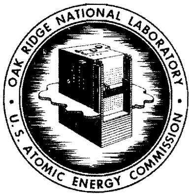
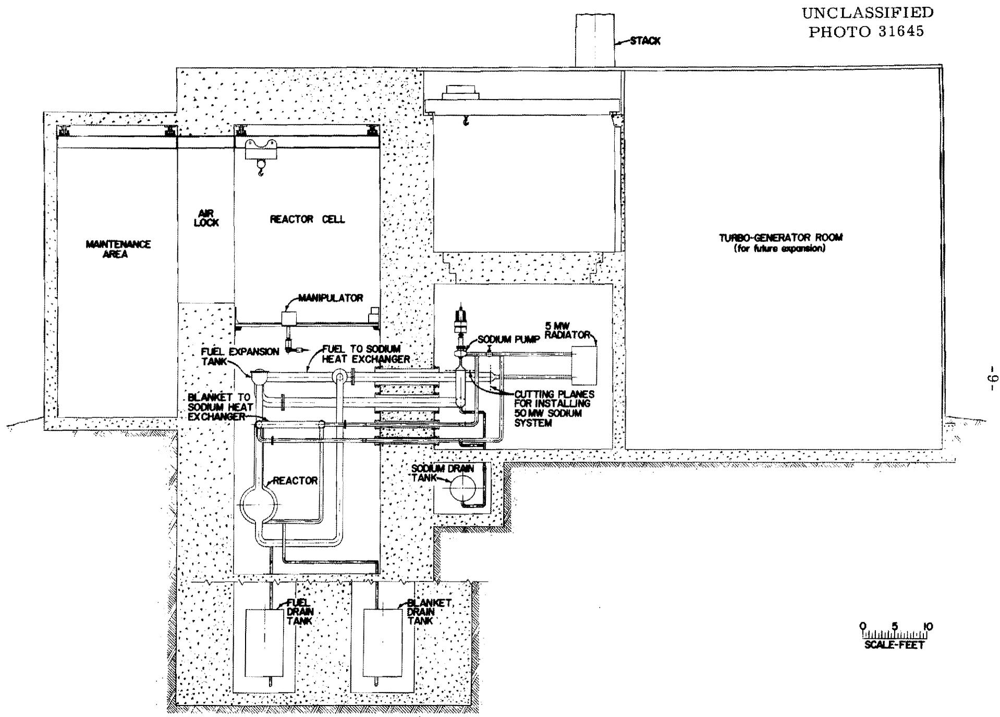
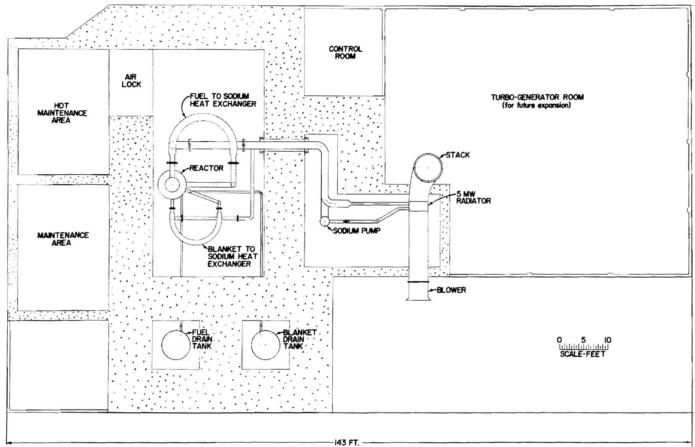

ORNL

# OAK RIDGE NATIONAL LABORATORY

operated by

UNION CARBIDE CORPORATION

for the

UNION CARBIDE

U.S. ATOMIC ENERGY COMMISSION

ORNL-TM-268

COPY NO. -

DATE - July 5, 1962

EXPERIMENTAL 5 Mw THERMAL CONVECTION MOLTEN SALT REACTOR

J. Zasler

# Abstract

A preliminary study has been made of an experimental 5 Mw thermal convection molten salt reactor. This reactor can be converted, after a period of low power operation, to a 50 Mw pilot power plant by adding a fuel pump, a larger sodium pump, and a turbo generator with associated equipment.

# NOTICE

This document contains information of a preliminary nature and was prepared primarily for internal use at the Oak Ridge National Laboratory. It is subject to revision or correction and therefore does not represent a final report. The information is not to be abstracted, reprinted or otherwise given public dissemination without the approval of the ORNL patent branch, Legal and Information Control Department.

# Introduction

Based on the history of other reactor types, the development and demonstration of the molten salt power reactor concept will require the operation of a small experimental reactor and a medium-sized pilot plant. The simplest and most reliable experimental reactor system appears to be a thermal convection reactor. The chief disadvantages of the natural convection system - increased fuel volume and larger heat exchangers are not major factors in a five MW reactor.

By adding a fuel pump to the 5 Mw reactor, it is possible to increase the capacity of the fuel system from 5 to 50 Mw. This, of course, must be accompanied by a corresponding increase in the capacity of the heat dump. It is thus possible to build one reactor that will serve successively as a small experimental reactor and a pilot plant.

# Description of Reactor

Fig. 1 shows an elevation of the reactor plant; Fig. 2 is a plan view. The dimensions and operating conditions for 5 and $50\mathrm{Mw}$ operation are given in Table I. The reactor is five feet in diameter with a 6 inch thick blanket surrounding the core (see Appendix A). Provisions are made to connect the blanket and fuel regions so that the reactor can be operated as a one region reactor.

The 5 MW reactor is inherently simple and reliable and requires no development of components. No fuel or blanket pumps are required. The sodium pump is a standard PK pump.

In order to provide for future 50 Mw operation of the system, it is necessary that the fuel expansion tank be so designed that a sump type fuel pump can be installed in it and the sodium lines leading to the heat exchanger be sized to handle the flow required for 50 Mw operation.

The 5 Mw reactor would serve the following purposes:

1. Demonstrate the continuing operation of a molten salt reactor.   
2. Provide in-pile corrosion data. (This could be done by inserting removable samples in both the hot and cold legs.)   
3. Develop and demonstrate remote maintenance procedures.   
4. By replacing the air heat dump with a steam heat dump it could be used to demonstrate sodium to steam heat transfer.

# Conversion to 50 Mw operation

When the above has been accomplished, the system can be converted to 50 Mw operation and operated as a pilot power plant. Although this plant would not be identical to the reference design plant, there would be enough points of similarity, especially in control, corrosion, and maintenance problems so that successful operation would lead directly to the design and construction of a large power plant.

Conversion to 50 Mw Operation (continued)

The only modification required to the fuel circuit is the installation of a sump type fuel pump in the fuel expansion tank. The fuel to sodium heat exchanger designed for the 5 Mw operation would be satisfactory for 50 Mw operation, because of the reduction in the fuel film resistance in going from laminar flow at the lower power to turbulent flow at the higher power.

A complete analysis of the blanket circuit has not been made, however, rough calculations show the possibility of designing a thermal convection blanket circuit that could be used at both power levels. If this turns out to be impractical, a blanket pump can be installed for 50 Mw operation.

The sodium system is cut at the points shown in Figs. 1 and 2 and a new system consisting of a 10,000 gpm pump and sodium to steam heat exchanger is installed.

A turbo-generator and associated equipment is also installed to complete the pilot plant.

# Cost Estimate

Table II shows a rough cost estimate, of approximately $10,000,000 for the construction of the 5 Mw plant. For approximately $10,000,000 additional, this plant could be converted to the 50 Mw size, as shown in Table III.

No attempt was made in this limited study to optimize either the 5 or 50 Mw plants.

Further study would undoubtedly be profitable. The 5 and 50 Mw power levels were chosen arbitrarily and it is quite possible that a different choice is preferable. A number of problems remain which were not investigated but which appear to be capable of solution. Among these are: 1) the design of the blanket circuit, 2) the method of removing fission gas, 3) the design of the 5 Mw heat dump, and 4) the design of the steam system.

# Acknowledgements

Acknowledgement is made to L. G. Alexander for selecting the Uranium concentration and core size and to G. D. Whitman and M. E. Lackey for consultation on the cost estimate and heat transfer, respectively.

Table I   

<table><tr><td>Power Output</td><td>Mw (thermal)</td><td>5.19</td><td>50 Mw</td></tr><tr><td>Reactor</td><td></td><td></td><td></td></tr><tr><td>Core Size</td><td>ft</td><td>5</td><td></td></tr><tr><td>Blanket Thickness</td><td>ft</td><td>1/2</td><td></td></tr><tr><td>Power Density</td><td>watts/cc</td><td>1.5</td><td>15</td></tr><tr><td>Fuel Pump</td><td></td><td>none</td><td>Sump type</td></tr><tr><td>Riser and Downcomer Dia.</td><td>in</td><td></td><td>10&quot;</td></tr><tr><td>Height of Fuel Heat Exchanger (above reactor centerline)</td><td>ft</td><td></td><td>20</td></tr><tr><td>Fuel Velocity in Riser</td><td>ft/sec</td><td>.64</td><td>6.17</td></tr><tr><td>Fuel Head</td><td>ft</td><td>.39</td><td>12.66</td></tr><tr><td>Fuel Volume</td><td>ft3</td><td></td><td>120</td></tr><tr><td>Fuel Flow</td><td>gal/min</td><td>158</td><td>1515</td></tr><tr><td>Sodium Flow</td><td>gal/min</td><td>578</td><td>9250</td></tr><tr><td>Sodium Pump</td><td></td><td>PK</td><td></td></tr><tr><td>Heat Exchanger</td><td></td><td></td><td></td></tr><tr><td>Tube I.D.</td><td>in</td><td>.6</td><td></td></tr><tr><td>Tube Wall Thickness</td><td>in</td><td>.050</td><td></td></tr><tr><td>Tube Length</td><td>ft</td><td>20</td><td></td></tr><tr><td>No. of Tubes</td><td></td><td>250</td><td></td></tr><tr><td>Shell O. Dia.</td><td>in</td><td>18</td><td></td></tr><tr><td>Shell Wall Thickness</td><td>in</td><td>.375</td><td></td></tr><tr><td>Fuel Temp. in</td><td>OF</td><td>1210</td><td>1210</td></tr><tr><td>Fuel Temp. out</td><td>OF</td><td>1010</td><td>1010</td></tr><tr><td>Na Temp. in</td><td>OF</td><td>850</td><td>850</td></tr><tr><td>Na Temp. out</td><td>OF</td><td>1100</td><td>1000</td></tr></table>

# Table II

# Cost Estimate - 5 Mw Experimental Reactor

A. Engineering, Design and Inspection 3,000,000   
B. Construction Costs

1. Land and Land Rights   
2. Improvement and Land   
3. Buildings

Reactor Plant and Auxiliary

Reactor Structure

(containment and shielding) $ 800,000

Instruments and Control 500,000

Reactor System 480,000

Fuel 480,000   
Blanket 60,000   
Sodium 162,000

Maintenance 500,000

Auxiliaries 200,000

Inventories 416,000

Building 2,000,000

Sub-Total

Heat Removal

C.Contingency at 10% 1,000,000   
D. Total 10,368,000

Table III   
Additional Cost to Convert to 50 Mw   

<table><tr><td>1.</td><td>Fuel Pump</td><td>$ 500,000</td></tr><tr><td>2.</td><td>Blanket Pump</td><td>100,000</td></tr><tr><td>3.</td><td>Na Pump</td><td>200,000</td></tr><tr><td>4.</td><td>Blanket Na Pump</td><td>50,000</td></tr><tr><td>5.</td><td>Additional Instrumentation</td><td>500,000</td></tr><tr><td>6.</td><td>Steam and Electrical System</td><td>4,000,000</td></tr><tr><td>7.</td><td>Spare Parts</td><td>500,000</td></tr><tr><td>8.</td><td>Installation</td><td>1,000,000</td></tr><tr><td>9.</td><td>Engineering</td><td>2,000,000</td></tr><tr><td>10.</td><td>Contingency</td><td>1,000,000</td></tr><tr><td></td><td>TOTAL</td><td>$9,950,000</td></tr></table>

# Appendix A

# Selection of Uranium Concentration and Core Size

The design variables in the Reference Design Reactor, described in reference 1, which it is desirable to match in a test reactor are, in order of their importance:

1. power density in fuel,   
2. heat flux and delta T in exchanger,   
3. uranium concentration,   
4. radiation level at pump,   
5. power density in core vessel, and   
6. thorium concentration.

The design of the test reactor will require a compromise among these variables. It seems desirable to sacrifice thorium concentration first. Using RDR-1 data for a basis, an eight foot core with $1\%$ $\mathrm{ThF_4}$ will go critical at a U-235 concentration of 12.5 x $10^{19}$ atoms/cc. This concentration will render a five foot core critical when no thorium is present, and the critical mass will be about 85 kg. A concentration of 36 x $10^{19}$ atoms/cc would make a four foot core critical, with a critical mass of about 130 kg.

A blanket three to six inches thick should suffice to test the reliability of the core vessel. In the case of a six inch blanket on a five foot core, if the core vessel failed and the system were operated as a one region reactor, the critical concentration would fall to about $4 \times 10^{19}$ , and the critical mass would be about $50 \, \text{kg}$ . Adding about $3/8$ mole per cent thorium would raise the critical concentration back to $12 \times 10^{19}$ , and the critical mass to $140 \, \text{kg}$ .

# References

1. "Molten Salt Reactor Program"; Status Report, ORNL 58-5-3   
2. F. E. Romie and B. W. Kinyon, "A Molten Salt Natural Convection Reactor System", ORNL 58-2-46

  
FIG.1 ELEVATION OF 5MW EXPERIMENTAL MOLTEN SALT REACTOR PLANT

UNCLASSIFIED PHOTO 31646

  
84FT.

-11

# Distribution

1-3. DTIE, AEC

4. M. J. Skinner