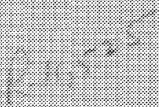
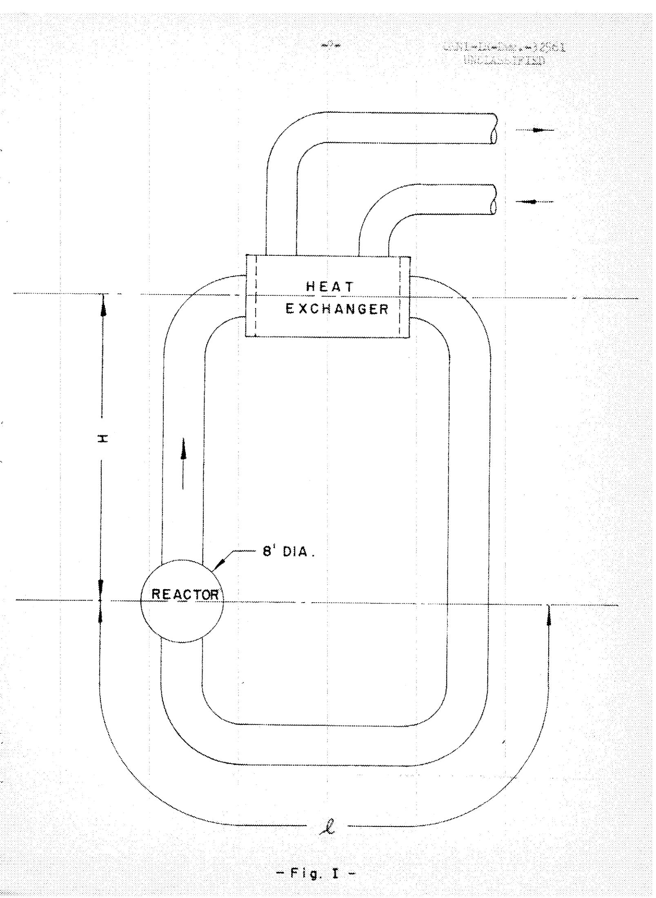
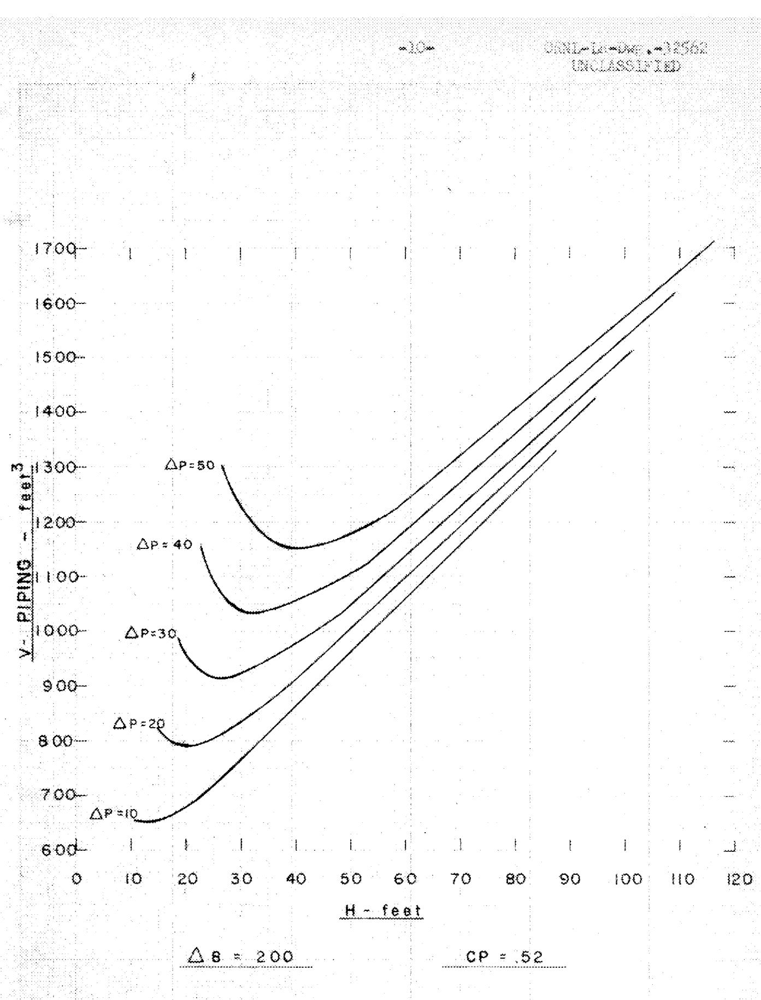
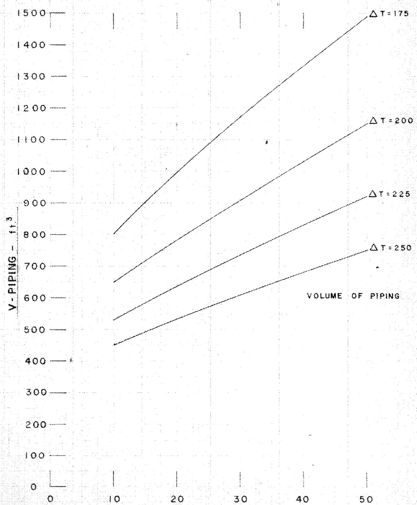
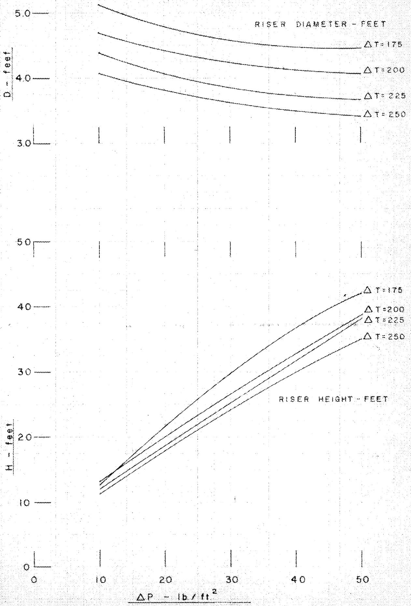
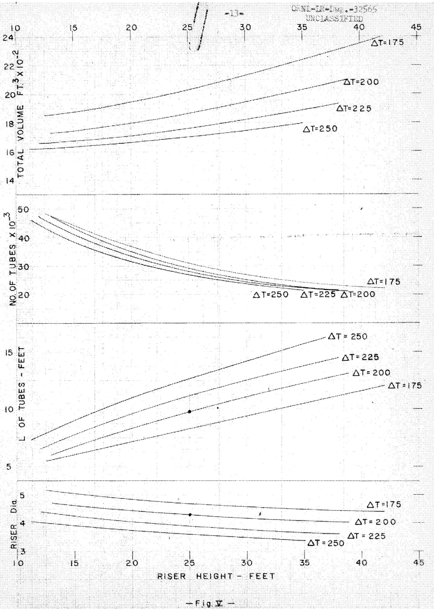

3445605487461

# ATIONAL LABORATORY

perated by

UNION CARBIDE CORPORATION

for the

U.S. ATOMIC ENERGY COMMISSION

ORNL-TM-269

COPY NO. -

DATE-July5,1962

$\left( {{14} - {58} - 8 - {45}}\right)$

576 Mwt Natural Convection Molten Salt Reactor Study

J. Zasler

Abstract

A simplified 576 Mwt natural convection molten salt reactor was studied to determine the approximate size of components and fuel volume.

#

LIDENARTLOANCOPY

DO NOT TRAIN TO ANOTHER PERSON

If you wish someone else to see this

$\therefore \overrightarrow{PB} \cdot  \left( {\overrightarrow{PA} - \overrightarrow{PC}}\right)  = 0$

100

# NOTICE

This document contains information of a preliminary nature and was prepared primarily for internal use at the Oak Ridge National Laboratory. It is subject to revision or correction and therefore does not represent a final report. The information is not to be abstracted, reprinted or otherwise given public dissemination without the approval of the ORNL patent branch, Legal and Information Control Department.

# LEGAL NOTICE

This report was prepared as an account of Government sponsored work. Neither the United States, nor the Commission, nor any person acting on behalf of the Commission:

A. Makes any warranty or representation, expressed or implied, with respect to the accuracy, completeness, or usefulness of the information contained in this report, or that the use of any information, apparatus, method, or process disclosed in this report may not infringe privately owned rights; or   
B. Assumes any liabilities with respect to the use of, or for damages resulting from the use of any information, apparatus, method, or process disclosed in this report.

As used in the above, "person acting on behalf of the Commission" includes any employee or contractor of the Commission, or employee of such contractor, to the extent that such employee or contractor of the Commission, or employee of such contractor prepares, disseminates, or provides access to, any information pursuant to his employment or contract with the Commission, or his employment with such contractor.

# 576 Mwt Natural Convection

# Molten Salt Reactor Study

# Introduction

Studies have been made (1,2) of molten salt natural convection reactors of 5 Mw and 60 Mw thermal output. The following study of a 576 natural convection reactor was made to compare with the family of large molten salt reactors being presently studied.

The chief purpose of this study is to determine the approximate size of the components and fuel volume of the fuel circuit of a 576 Mw natural convection molten salt reactor.

# Riser Calculations

For the purpose of this study a rather simple configuration of reactor, heat exchanger, and piping was chosen as shown in Fig. I. All calculations were done on the basis of one heat exchanger and one set of risers and downcomers. Since the frictional losses in the piping are determined primarily by the expansion and contraction losses and are insensitive to wall friction, the single riser can be replaced by a number of risers having the same height and total cross sections. Likewise, the heat exchanger can be replaced by a number of heat exchangers having the same length of tubes and total number of tubes.

The following expression was derived for the height of the riser (see Appendix A).

$$
H = \frac {\triangle P \triangle t ^ {2} D ^ {5} + 8 h _ {1} D \frac {Q ^ {2}}{g \rho \pi^ {2} C _ {p} ^ {2}} + 8 1 f \frac {Q ^ {2}}{g \rho \pi^ {2} C _ {p} ^ {2}}}{\alpha \Delta t ^ {3} D ^ {5} - 1 6 f \frac {Q ^ {2}}{g \rho \pi^ {2} C _ {p} ^ {2}}}
$$

# Riser Calculations (continued)

Where: H = height of riser - ft (see Fig. I)

$$
\begin{array}{l} \Delta P = \text {p r e s s u r e} - 1 b / f t ^ {2} \\ \Delta t = \text {t e m p e r a t u r e} ^ {\circ} \\ D = \text {d i a m e t e r o f} \text {r i s e r - f t}. \\ h _ {1} = \text {l o s s d u e t o e l ' s , e x i t a n d e n t o f r e a c t o r , e x i t a n d e n t o f h e a t} \\ Q = \text {p o w e r} - 5 4 6, 0 0 0 B t u / \sec \\ g = \text {a c c e l . o f g r a v i t y} - 3 2. 2 \mathrm {f t / s e c} ^ {2} \\ C _ {p} = \text {s p e c i f i c h e a t - 0 . 5 2 B t u / l b -} ^ {\circ} F \\ l = 2 0 f t (s e e F i g. I) \\ f = \text {f r i c t i o n f a c t o r} = . 0 2 \\ \alpha = \text {t e m p e r a t u r e} - 0. 0 1 2 1 \mathrm {l b} / \mathrm {f t} ^ {3} - ^ {\circ} \mathrm {F} \\ \rho = \text {d e n s i t y o f f u e l} = 1 2 3 \mathrm {l b / f t} ^ {3} \\ \end{array}
$$

For an eight foot diameter reactor the volume of the piping will be

$$
V _ {P} = \frac {\pi}{4} D ^ {2} (2 H + 2 0 - 8)
$$

for each value of $\Delta P$ and $\Delta t$ this volume will be a minimum at some value of D and H.

Fig. II is a plot of piping volume versus riser height for $\Delta t = 200^{\circ}$ and values of $\Delta \rho$ of 10, 20, 30, 40, and 50 lb/ft². Similar plots were made for $\Delta t = 175^{\circ}$ , $225^{\circ}$ , and $250^{\circ}$ . The minimum values of piping volume and the associated riser heights and diameters are plotted against heat exchanger pressure drop in Figs. III and IV.

# Heat Exchanger Calculations

On the basis that the heat exchanger is of the counterflow tube and shell design with the fuel in the tubes and that the Nusselt number over the range

# Heat Exchanger Calculations (continued

investigated is constant and equal to $4^{(3)}$ , we derive the following relationships (see Appendix B).

$$
\begin{array}{l} \mathrm {L N} = \frac {2 8 6 . 5 \mathrm {Q}}{\mathrm {k} \Delta t _ {\mathrm {a}}} \\ N = \frac {Q}{\pi C _ {p} \Delta t a ^ {2}} \left(\frac {3 2 c _ {p} \mu \frac {\Delta t}{t _ {a}} + 1 2 K}{g \rho K \Delta P}\right) ^ {1 / 2} \\ \end{array}
$$

The volume of the heat exchanger is:

$$
\begin{array}{l} V _ {H E ^ {\prime}} = V _ {t u b e s} + V _ {H e a d e r} \\ = \frac {\pi}{4} d ^ {2} L N + \frac {(1 . 5 d) ^ {2}}{2} 3 N \\ \end{array}
$$

Where:

$$
\begin{array}{l} L = \text {l e n g t h o f t u b e - f t} \\ N = \text {n u m b e r o f t u b e s} \\ K = \text {t h e r m a l} \quad \text {c o n d u c t i v i t y} \quad f u e l. \quad 3. 5 B t u / h r - f t - ^ {\circ} F \\ \Delta t = \text {t e m p e r a t u r e} \quad \text {d r o p i n h e a t e x c h a n g e r .} \\ \Delta t _ {s} = \text {a v e r a g e t e m p e r a t u r e d i f f e r e n t i a l .} ^ {\circ} \\ \begin{array}{l} \mathrm {d} = \text {t u b e i n s i d e d i a . - . 0 5 f t .} \\ \mu = \text {v i s c o s i t y o f f u e l} = 0. 1 7 4 \end{array} \quad \mathrm {e} ^ {\left(\frac {8 0 6 2}{0 F = 4 6 0}\right)} \quad \mathrm {l b / h r - f t} \\ Q = \text {h e a t} \quad \text {o u t p u t .} \quad B t u / \sec \\ C _ {p} = \text {s p e c i f i c h e a t o f f u e l .} B t u / 1 b - ^ {\circ} F \\ \rho = \text {d e n s i t y o f f u e l} = 1 2 3 \mathrm {l b / f t} ^ {2} \\ \end{array}
$$

From this we can calculate L, N, and heat exchanger volume against heat exchanger pressure drop for different $\Delta t$ 's. The temperatures used were: fuel entering the heat exchanger at $1210^{\circ}\mathrm{F}$ and leaving at $960^{\circ}\mathrm{F}$ to $1035^{\circ}\mathrm{F}$ . The wall temperature was taken as going from $850^{\circ}$ to $1050^{\circ}$ , giving the following temperature conditions:

<table><tr><td colspan="4">Heat Exchanger Calculations (continued)</td></tr><tr><td>Fuel Exit</td><td>Δt</td><td>Δta</td><td>Δt/Δta</td></tr><tr><td>Temperature</td><td></td><td></td><td></td></tr><tr><td>1035</td><td>175</td><td>172.5</td><td>1.014</td></tr><tr><td>1010</td><td>200</td><td>160.0</td><td>1.250</td></tr><tr><td>985</td><td>225</td><td>147.5</td><td>1.525</td></tr><tr><td>960</td><td>250</td><td>135.0</td><td>1.852</td></tr></table>

The total volume of the system is equal to the volume of the piping plus the volume of the heat exchanger plus 300 ft³ for the reactor and expansion tank. Fig. V plots riser diameter, heat exchanger tube length and number of tubes, and total volume of the system against riser height.

# Discussion

On the basis of this preliminary investigation, large natural convection reactors do not seem to be very attractive. The elimination of fuel pumps seems to be more than balanced by the increase in fuel volume, and number of heat exchanger tubes although it is possible that the large number of heat exchanger tubes can be reduced by using fuel outside of finned tubes. An investigation into the cost of various molten salt reactor types(4) shows the cost of a natural convection reactor to be higher than comparable forced fuel circulation systems.

# References

1. Romie, F. E. and Kinyon, B. W., "A Molten Salt Natural Convection Reactor System", ORNL-CF 58-2-46   
2. Zasler, J., "Experimental 5 Mw Thermal Convection Molten Salt Reactor", ORNL-CF 58-6-66   
3. McAdams, W. H., "Heat Transmission", McGraw-Hill Book Co., Inc., 3rd Ed. (1954), pp. 229-239   
4. Whitman, G. D., "Molten Salt Reactor Cost Study", ORNL-CF 58-8-50

# Appendix A

Hystrostatic head for flow $= \frac{\alpha \Delta t H}{\rho}$

Friction loss in piping $= f\frac{1}{D}\frac{V^2}{2g} +h_1\frac{V^2}{2g} +h_e$

Where: $1^{\prime} = 2\mathrm{H} + \mathrm{I}$

$$
\begin{array}{l} v = \frac {4 Q}{\pi \rho C _ {p} \Delta t D ^ {2}} \\ \Delta P = h _ {e} \rho \\ \alpha \Delta t H = \frac {1 6 Q ^ {2}}{2 g \pi^ {2} \rho c _ {p} ^ {2} \Delta t ^ {2} D ^ {4}} \left(\frac {2 f H}{D} + \frac {f l}{D} + h _ {1}\right) + \Delta P \\ \mathrm {H} = \frac {\Delta p \Delta t ^ {2} D ^ {5} + 8 h _ {1} D \left(\frac {q ^ {2}}{g \rho \pi^ {2} C _ {p} ^ {2}}\right) + 8 l f \frac {q ^ {2}}{g \rho \pi^ {2} C _ {p} ^ {2}}}{\alpha \Delta T ^ {3} D ^ {5} - 1 6 f \left(\frac {q ^ {2}}{g \rho \pi^ {2} C _ {p} ^ {2}}\right)} \\ \end{array}
$$

# Appendix B

$$
\begin{array}{l} \frac {\mathrm {h} \mathrm {d}}{\mathrm {K}} = 4 \\ q = W C _ {p} \Delta t = h _ {a} \pi d L \Delta t _ {a} \\ \mathrm {h} _ {\mathrm {a}} \mathrm {d} = \frac {\mathrm {W C} _ {\mathrm {p}} \Delta t}{\pi L \Delta t _ {\mathrm {a}}} = 4 \mathrm {K} \\ \end{array}
$$

Where:

$$
\begin{array}{l} W = 1 b / h r \text {p e r t u b e} = \frac {3 6 0 0 q}{N C _ {P} \Delta t} \\ \frac {3 6 0 0 \mathrm {Q}}{\pi \mathrm {L N K} \Delta t _ {\mathrm {a}}} = 4 \\ \mathrm {L N} = \frac {2 8 6 . 5 \mathrm {g}}{\mathrm {k} \Delta t _ {\mathrm {a}}} \\ \end{array}
$$

head loss in heat exchanger - h = 64 $\frac{\mu}{3600}$ vL + 1.5 v² 2gdp

Where:

$$
\begin{array}{l} v = \frac {4 Q}{\pi N \rho a ^ {2} C _ {P} \Delta t} \\ h _ {x} p = \Delta P = \frac {4 x 6 4 x \frac {\mu}{3 6 0 0} q L}{2 g \pi N p d ^ {4} C _ {p} \Delta t} + \frac {1 . 5 x 1 6 q ^ {2}}{2 g \pi^ {2} N ^ {2} p d ^ {4} C _ {p} ^ {2} \Delta t ^ {2}} \\ \mathrm {L N} = \frac {\mathrm {g p r i m a l p h a} _ {\mathrm {p}} ^ {2} \Delta t ^ {2} \mathrm {N} ^ {2} \mathrm {d} ^ {4} \Delta \mathrm {P} - 1 2 \mathrm {Q} ^ {2}}{1 2 8 \pi \mathrm {C} _ {\mathrm {p}} \Delta t \frac {\mu}{3 6 0 0} \mathrm {Q}} = \frac {3 6 0 0 \mathrm {Q}}{4 \pi \mathrm {K} \Delta t _ {\mathrm {a}}} \\ \end{array}
$$

Appendix B (continued)

$$
N = \frac {Q}{x c p \Delta t d ^ {2}} \left(\frac {3 2 c _ {p} \mu \frac {\Delta t}{\Delta t _ {a}} + 1 2 K}{g p K \Delta P}\right) ^ {1 / 2}
$$

  
- Fig. II -

  
HEAT EXCHANGER ${\Delta P} - {1b}/{f}_{t}^{2}$

  
- Fig. IV

# Distribution

1-3. DTIE, ABC

4. M. J. Skinner