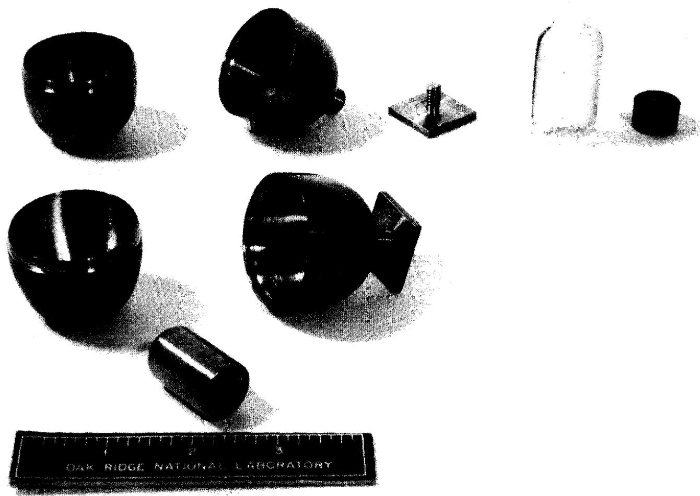
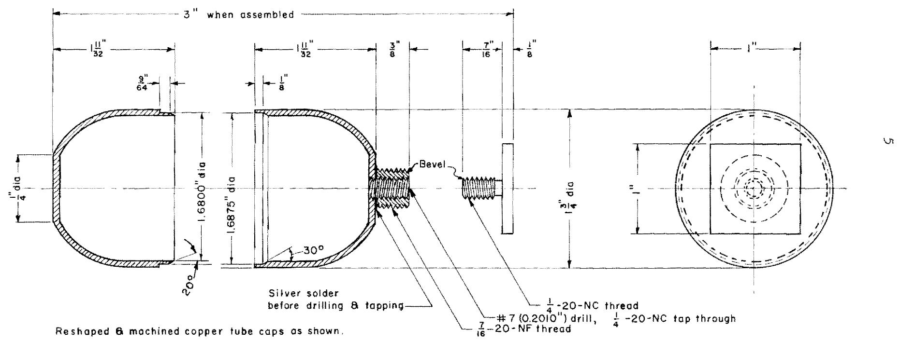
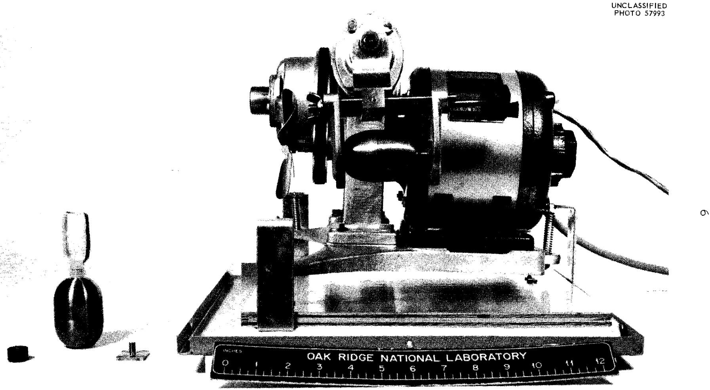
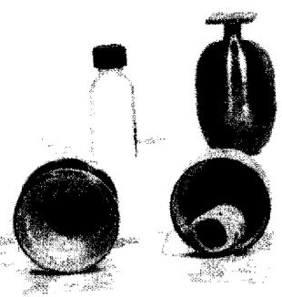
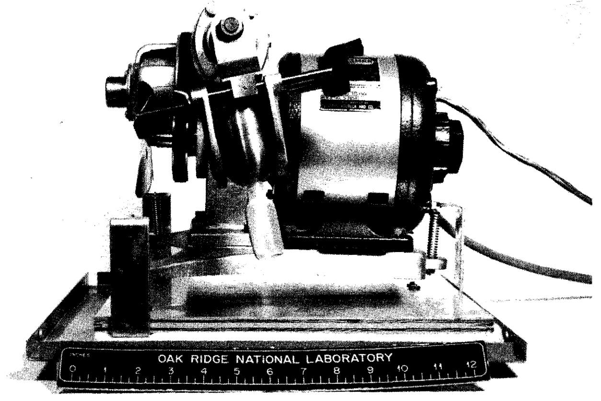

U.S. ATOMIC ENERGY COMMISSION

ORNL-TM-291

COPY NO. - 25

DATE - July 5, 1962

Homogenization of Molten-Salt Reactor Project Fuel Samples

M. J. Gaitanis, C. E. Lamb, and L. T. Corbin

# ABSTRACT

A copper pulverizer-mixer was designed for homogenizing Molten-Salt Reactor Project (MSRP) fuel. The copper sampling ladle that contains the solidified fuel is placed in the pulverizer-mixer, which is agitated on a mixer mill. The fuel is fractured out of the ladle, pulverized into a homogeneous powder, and transferred to a storage bottle. The homogenized fuel sample is then available for analysis.

# NOTICE

This document contains information of a preliminary nature and was prepared primarily for internal use at the Oak Ridge National Laboratory. It is subject to revision or correction and therefore does not represent a final report. The information is not to be abstracted, reprinted or otherwise given public dissemination without the approval of the ORNL patent branch, Legal and Information Control Department.

# INTRODUCTION

Molten-Salt Reactor Project (MSRP) fuel is a fused mixture of LiF, $\mathrm{BeF}_2$ , $\mathrm{ZrF}_4$ , $\mathrm{ThF}_4$ , and $\mathrm{UF}_4$ . The molten fuel is sampled with a copper ladle in which it is allowed to solidify. It is necessary to convert the solidified melt to a homogenous powder and to make available the maximum amount of it for analysis.

A pulverizer-mixer was designed whereby the sample is removed from the ladle, homogenized, and transferred to a storage bottle by means of the agitating action of a mixer mill on which the pulverizer-mixer is placed.

# DESCRIPTION OF THE SAMPLE

The MSRP fuel is sampled by dipping a copper ladle into the molten-salt stream, allowing the sample to solidify in the ladle, and transporting the ladle-encased sample to a hot cell of the High-Radiation-Level Analytical Facility. The ladle (Fig. 1) is $3/4$ in. O.D. and $1\frac{1}{4}$ in. long and that will contain approximately $10\mathrm{g}$ ( $4\mathrm{ml}$ ) of sample. The sample will solidify and will separate into more than one phase. The phase separation necessitates that the sample be homogenized in order to ensure representative analytical results.

# DESIGN OF THE PULVERIZER-MIXER

A photograph and a drawing of the pulverizer-mixer are shown in Figs. 1 and 2, respectively. Because the sampling ladle is constructed of copper, which does not interfere in the analyses, and because contamination by another material is to be avoided, the pulverizer-mixer is also made of copper. The ladle, when placed in the pulverizer-mixer, serves the same function as that of balls in a ball mill. The shape of the pulverizer-mixer is designed to give maximum pulverizing action on the salt by the ladle. The design of the metal-to-metal seal at the inside center of the pulverizer-mixer prevents loss of sample during the homogenization. The screw plug also makes a good seal and provides an exit for the powdered salt when it is unscrewed. The threads on the outside of the nipple enable the polyethylene storage bottle to be attached and retained in position during the transfer of the sample to it. The pulverizer-mixer is agitated by a mixer mill (Catalog Item No. 8000, Spex Industries, Inc., Scotch Plains, N. J.).

# PROCEDURE

The empty pulverizer-mixer is located in the hot cell in the arrangement shown in the horizontal center of Fig. 1. By means of manipulators, the sample-filled ladle is placed in the pulverizer-mixer, which is then assembled and placed on the mixer mill as shown on the right in Fig. 3. The mixer mill is then activated for 12 to 15 minutes. The pulverizer-mixer is removed from the mill, and the screw plug is withdrawn from it. The polyethylene storage bottle is screwed in place on the pulverizer-mixer as shown on the left of Fig. 3. The assembly is returned to the mixer mill and positioned on it as shown on the right in Fig. 4. The mixer mill is agitated for 5 minutes, during which time the homogenized sample is transferred to the storage bottle. The pulverizer-mixer is unscrewed from the storage bottle, and the screw plug and bottle cap are reattached to the pulverizer-mixer and storage bottle, respectively, as shown in Fig. 4 (lower left, top position). The completeness of removal of the sample from the pulverizer-mixer and ladle is indicated by Fig. 4 (lower left, bottom position). The sample-free assembled pulverizer-mixer and ladle are discarded to waste. The homogenized sample is then in a condition that ensures the removal of representative test portions for analysis.

# ACKNOWLEDGMENTS

The authors gratefully acknowledge the assistance of D. J. Fisher in designing the pulverizer-mixer and that of W. L. Maddox in constructing the prototype of it.

  
Fig. 1 Photograph of the Pulverizer-Mixer.

UNCLASSIFIED

ORNL-LR-Dwg.70374

  
Fig. 2 Detail of the Pulverizer-Mixer.

UNCLASSIFIED PHOTO 57993

  
Fig. 3 Photograph of the Pulverizer-Mixer on the Mixer Mill and of the Pulverizer-Mixer with the Storage Bottle Attached.

  
Fig. 4 Photograph of Pulverizer-Mixer in Positions Used in Transfer of the Sample.

UNCLASSIFIED PHOTO 57991

# Distribution

1. F. F. Blankenship   
2. G. E. Boyd   
3. J. C. Bresee   
4. R. B. Briggs   
5. A. E. Cameron   
6. W.H.Carr   
7. L. T. Corbin   
8. J. L. Crowley   
9. D. J. Fisher   
10. M. J. Gaitanis   
11. R.B.Gallaher   
12. W.R.Grimes   
13. M. T. Kelley   
14. C. E. Lamb   
15. W. L. Maddox   
16. J. E. Savolainen   
17. C. D. Scott   
18. M. J. Skinner   
19. C. D. Susano   
20. J. C. White   
22. Central Research Library   
23. Document Reference Section   
24. Laboratory Records   
25. Laboratory Records - Record Copy   
40. DTIE, AEC   
41. Research and Development Div, ORO