# OAK RIDGE NATIONAL LABORATORY

operated by

UNION CARBIDE CORPORATION

for the

U.S. ATOMIC ENERGY COMMISSION

ORNL-TM-326

INFLUENCE OF VARIOUS GASEOUS ENVIRONMENTS ON THE CREEP-RUPTURE PROPERTIES OF NUCLEAR MATERIALS SELECTED FOR HIGH-TEMPERATURE SERVICE

H.E.McCoy

# LEGAL NOTICE

This report was prepared as an account of Government sponsored work. Neither the United States, nor the Commission, nor any person acting on behalf of the Commission:

A. Makes any warranty or representation, expressed or implied, with respect to the accuracy, completeness, or usefulness of the information contained in this report, or that the use of any information, apparatus, method, or process disclosed in this report may not infringe privately owned rights; or   
B. Assumes any liabilities with respect to the use of, or for damages resulting from the use of any information, apparatus, method, or process disclosed in this report.

As used in the above, "person acting on behalf of the Commission" includes any employee or contractor of the Commission, or employee of such contractor, to the extent that such employee or contractor of the Commission, or employee of such contractor prepares, disseminates, or provides access to, any information pursuant to his employment or contract with the Commission, or his employment with such contractor.

ORNL-TM-326

Copy

Contract No. W-7405-eng-26

METALS AND CERAMICS DIVISION

INFLUENCE OF VARIOUS GASEOUS ENVIRONMENTS ON THE CREEP-RUPTURE PROPERTIES OF NUCLEAR MATERIALS SELECTED FOR HIGH-TEMPERATURE SERVICE

H. E. McCoy

DATE ISSUED

SEP 19 1962

OAK RIDGE NATIONAL LABORATORY

Oak Ridge, Tennessee

operated by

UNION CARBIDE CORPORATION

for the

U. S. ATOMIC ENERGY COMMISSION

# ABSTRACT

In order to increase the operating temperature of gas-cooled reactors one must consider many problems in the selection of structural materials and fuel element claddings. Among these are the interactions of active metals and gases together with the attendant changes in the creep properties, ductility, and rupture life. In this paper various types of gas-metal interactions are discussed and their effects upon the service performance of metals are illustrated by experimental data. Pure gases which are potentially suitable for reactor coolants as well as those gases which may be present as impurities were studied. These include Ar, $\mathbf{H}_2$ , $\mathrm{CO}_{2}$ , CO, $\mathbf{N}_2$ , $\mathbf{O}_2$ , and air. Three basic classes of materials were evaluated: austenitic stainless steels, nickel-base alloys, and refractory metals.

The results of tests of austenitic stainless steels over the temperature range of 700 to $900^{\circ}\mathrm{C}$ show that their properties are essentially equivalent in argon and in hydrogen environments. Various degrees of strengthening were observed in air, $\mathbf{N}_2$ , $\mathbf{O}_2$ , $\mathbf{CO}$ , and $\mathbf{CO}_2$ environments. The results of a series of tests at $815^{\circ}\mathrm{C}$ in environments containing various partial pressures of oxygen in argon are presented which show that the properties of stainless steels can be markedly altered by the presence of a few parts per million of oxygen. The responsible mechanisms are postulated in each case.

The work on nickel-base alloys was centered around Inconel and "A" nickel. However, supplementary tests were conducted on high-purity nickel and on several laboratory melts to evaluate the influence of composition. In contrast with the austenitic stainless steels, these tests show that the creep properties of nickel-base alloys are inferior in hydrogen as compared with those observed in argon. This effect is manifested through an increase in the secondary creep rate and a decrease in the time to rupture. No significant changes in ductility were observed. Environments which are carburizing, oxidizing, or nitriding are shown to result in an increase in the creep strength of nickel-base alloys. Proposed mechanisms for the observed creep behavior are presented.

The refractory metals, exemplified by columbium, were found to be strengthened at room temperature by the addition of controlled amounts of oxygen, nitrogen, hydrogen, or carbon. However, serious embrittlement resulted if excessive quantities were added. Allowable concentration limits for each of the above interstitials are presented. The increase in high-temperature creep strength of columbium as a result of the addition of nitrogen and oxygen is demonstrated.

H. E. McCoy

# INTRODUCTION

One currently feasible concept proposed for gas-cooled reactors involves a nonradioactive coolant, which requires that the nuclear fuel be properly clad to prevent the release of fission gases into the coolant. It is this cladding which imposes a limitation on the maximum operating temperatures and allowable rates of burnup. Because of the present status of knowledge of the fabrication and of performance of ceramic-clad fuel elements, the nuclear industry is depending heavily upon metallic claddings. The austenitic stainless steels, the iron-chromium-aluminum alloys, and several nickel-base alloys have all been used as cladding materials. Since all these materials absorb neutrons and hence increase the fuel inventory, the minimum thickness is used. The refractory metals, such as niobium, offer some improvement with respect to higher operating temperatures and better neutron economy. Several gaseous coolants being used in reactors already in operation or under construction include helium, carbon dioxide, air, and $\mathrm{N}_2$ -0.5 vol $\%$ $\mathrm{O}_2$ . Except for its hazardous nature, the properties of hydrogen [1] establish it as the superior gaseous coolant. Also, impurities in the coolants will be of concern. Air in-leakage results in the introduction of significant quantities of oxygen, nitrogen, and water vapor. The outgassing of components within the system, such as graphite, can also introduce significant quantities of impurities.

In choosing a metallic cladding one must remember that the service environment is an important variable, for no material has a unique set of strength values at a given temperature. The gas-metal interactions which can occur between coolant and cladding could result in significant changes in the creep properties, ductility, and rupture life of the cladding material. Consequently, the chemical compatibility of the cladding material with the coolant and impurities present in the coolant must be considered.

Although numerous other factors are of importance, this paper is concerned primarily with the problem of gas-metal compatibility and the resultant mechanical property changes. The classes of materials studied were austenitic stainless steels, nickel-base alloys, and refractory metals, and the data deal primarily with a few representative materials from each class: type 304 stainless steel, Inconel, high-purity nickel, and niobium. The environments studied were Ar, H₂, CO, CO₂, N₂, O₂, and air. The gases used were of the highest available purity, although the gas composition would not necessarily be analogous to that expected in a reactor. This approach enables a clearer interpretation of the test results and yet reveals potential gas-metal compatibility problems which may arise in various mixtures of these gases.

# EXPERIMENTAL DETAILS

Type 304 stainless steel and Inconel in the form of 0.060- and 0.020-in. sheet were used in these studies. Materials from several heats were used. However, the compositions of all materials fell within the commercial specifications given in Table I. Exact compositions are

Table I. Nominal Compositions of Test Materials   

<table><tr><td rowspan="2">Constituent</td><td colspan="2">Nominal Composition (wt %)</td></tr><tr><td>Inconel</td><td>Type 304 Stainless Steel</td></tr><tr><td>Fe</td><td>9.0 max</td><td>Balance</td></tr><tr><td>Ni</td><td>75.0 min</td><td>8.0 to 11.0</td></tr><tr><td>Cr</td><td>12.0 to 15.0</td><td>18.0 to 20.0</td></tr><tr><td>Mn</td><td>1.0 max</td><td>2.0 max</td></tr><tr><td>Si</td><td>0.5 max</td><td>1.0 max</td></tr><tr><td>Cu</td><td>0.5 max</td><td></td></tr><tr><td>C</td><td>0.15 max</td><td>0.08 max</td></tr><tr><td>P</td><td></td><td>0.04 max</td></tr><tr><td>S</td><td>0.02 max</td><td>0.03 max</td></tr></table>

given when they are of importance. The specimens prepared from the 0.060-in. sheet had a gage width of 0.500 in. and a gage length of 4.00 in.; those prepared from the 0.020-in. sheet had gage dimensions of $0.250 \times 2.50$ in. Sheet specimens were chosen because of their large ratio of surface area to volume. The equipment and experimental procedure for running stress-rupture and tensile tests in controlled environments have been described previously [2].

Small niobium tabs 1.25 x 1.00 x 0.040 in. were contaminated with controlled amounts of carbon and were subjected to bend tests at room temperature. The details of the test procedure are reported elsewhere [3].

# RESULTS

Creep-Rupture Tests - Type 304 Stainless Steel

The results of creep-rupture tests in Ar, CO, $\mathrm{CO}_{2}$ , $\mathrm{H}_{2}$ , $\mathrm{N}_{2}$ , $\mathrm{O}_{2}$ , and air are given in Figs. 1 and 2 for conditions where sufficient tests were run at equivalent temperatures and stresses for the environmental effects to be compared. In most cases each curve plotted represents the results of at least two tests. The creep behavior in argon is used as the reference with which the properties in other environments are compared.

For the test conditions examined, the various test environments influenced the creep properties in the following ways:

1. At 1500 and $1700^{\circ}\mathrm{F}$ (816 and $927^{\circ}\mathrm{C}$ ) air or nitrogen decreased the creep rate, and CO and $\mathrm{CO}_{2}$ had a strengthening effect.   
2. At $1500^{\circ}\mathrm{F}$ ( $816^{\circ}\mathrm{C}$ ) the creep strength was essentially the same in argon and hydrogen but was less in oxygen than in argon.

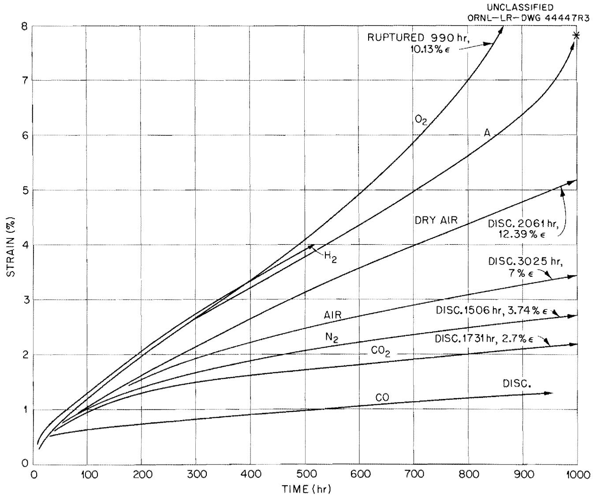  
Fig. 1. Effect of Environment on the Creep Properties of Type 304 Stainless Steel at $1500^{\circ}\mathrm{F}$ (816°C) and 3400 psi.

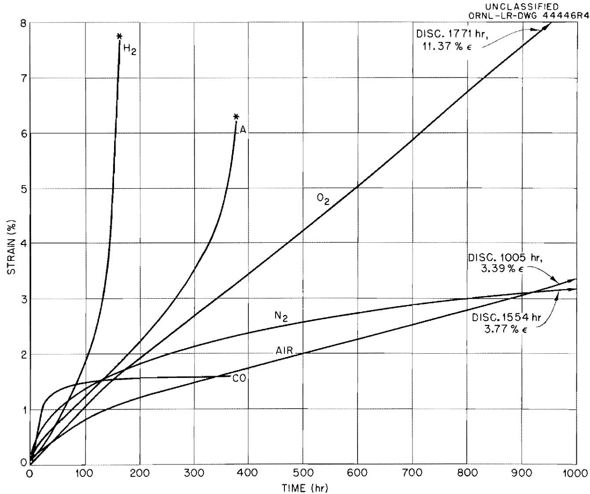  
Fig. 2. Effect of Environment on the Creep Properties of Type 304 Stainless Steel at $1700^{\circ}\mathrm{F}$ $(927^{\circ}\mathrm{C})$ and 1200 psi.

3. At $1700^{\circ}\mathrm{F}$ ( $927^{\circ}\mathrm{C}$ ) the creep life was less in hydrogen than in argon but was strengthened in an oxygen environment.

The reduction of strength observed at $1500^{\circ}\mathrm{F}$ ( $816^{\circ}\mathrm{C}$ ) in oxygen was somewhat unexpected. In an effort to more fully evaluate the influence of oxygen on the creep properties of type 304 stainless steel, a series of creep tests were run in various argon-oxygen mixtures. The results of these tests are summarized in Figs. 3, 4, and 5. The oxygen-argon mixtures were prepared in standard gas cylinders, and a flow rate through the test chamber of approximately $0.1\mathrm{ft}^{3}/\mathrm{hr}$ was used. The relatively large effects of small partial pressures of oxygen on the creep strength probably account for the difficulties encountered in reproducing test results in an argon environment. The crack density plot shown in Fig. 5 was determined metallographically.

Several specimens were examined metallographically. Figure 6 illustrates a typical microstructure, except for some variation in grain size, of specimens tested in argon and hydrogen at temperatures between 1500 and $1700^{\circ}\mathrm{F}$ (816 and $927^{\circ}\mathrm{C}$ ). The steps on the surface resulted from grain-boundary sliding and rotation of the grains and were not observed unless the surface of the specimen was completely free of oxide.

Figure 7 is a photomicrograph of the gage section of a specimen tested at 3400 psi in air at $1500^{\circ}\mathrm{F}$ ( $816^{\circ}\mathrm{C}$ ) for 3025 hr. Features of importance are the surface oxide, the surface and internal cracks which follow grain boundaries, and the precipitate present. Relevant test data from several specimens tested at various stresses in air at $1700^{\circ}\mathrm{F}$ ( $927^{\circ}\mathrm{C}$ ) are given in Table II. The formation of a nitride precipitate was obviously not a unique function of the total test time but was related to

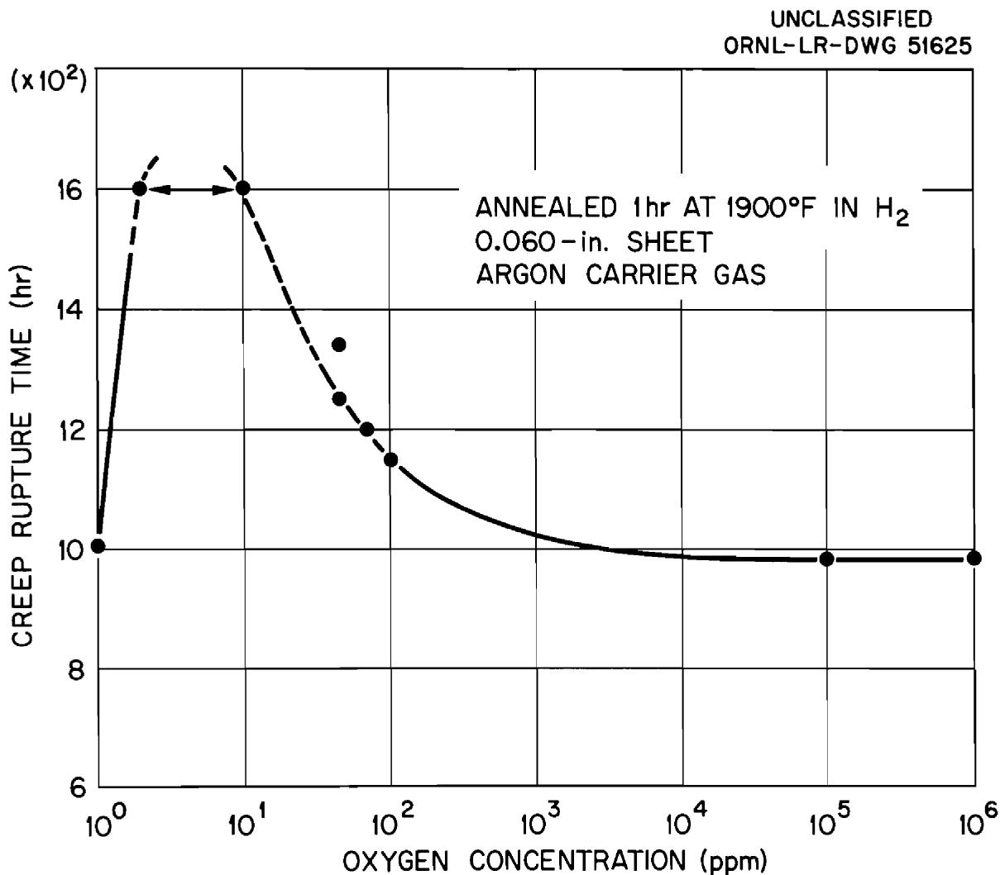  
Fig. 3. Effect of Oxygen Concentration on the Rupture Life of Type 304 Stainless Steel at $1500^{\circ}\mathrm{F}$ (816°C) and 3400 psi.

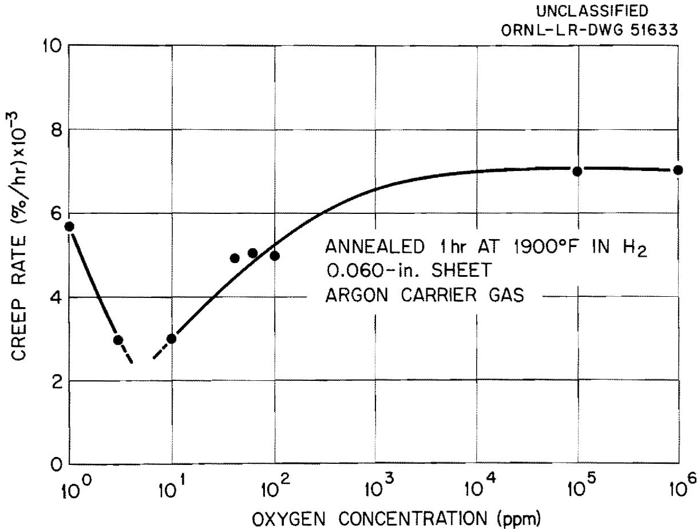  
Fig. 4. Effect of Oxygen Concentration on the Creep Rate of Type 304 Stainless Steel at 3400 psi and $1500^{\circ}\mathrm{F}$ (816°C).

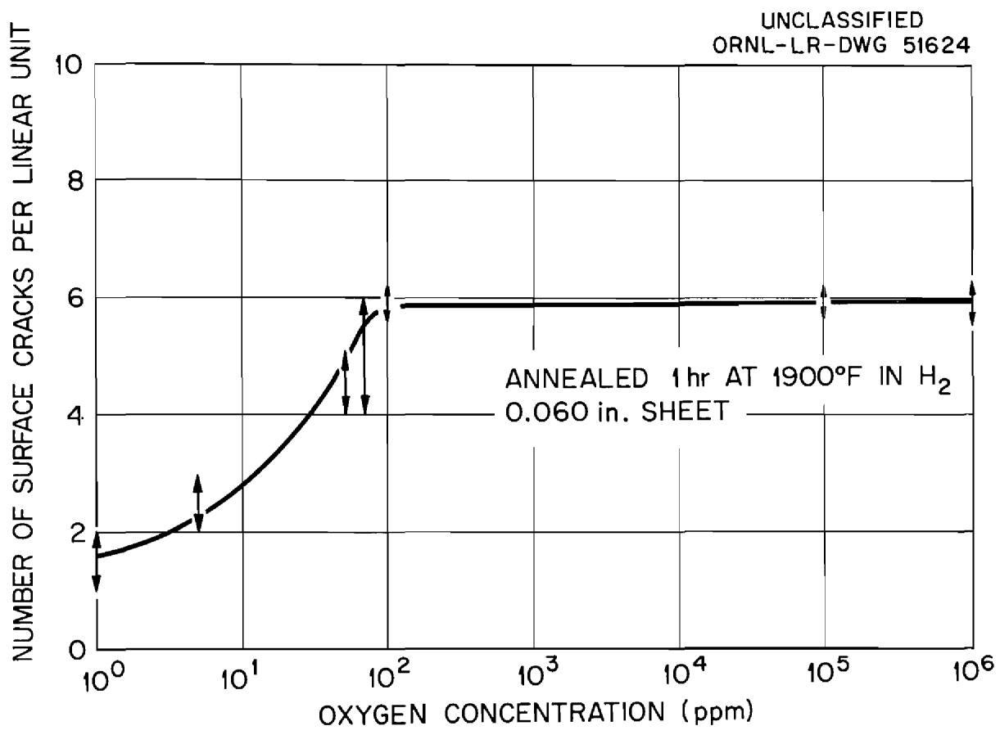  
Fig. 5. Surface Crack Density of Type 304 Stainless Steel in Argon-Oxygen Environments Stressed in Tension at 3400 psi and $1500^{\circ}\mathrm{F}$ (816°C).

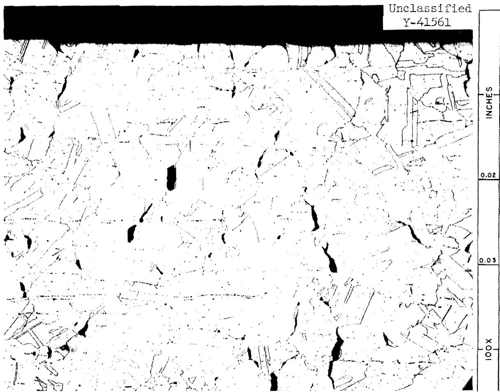  
Fig. 6. Structure of Type 304 Stainless Steel Creep Tested for 2869.7 hr at $1500^{\circ}\mathrm{F}$ (816°C) and 4000 psi Stress in Static Argon. Specimen ruptured at 15.62% strain. Etchant: aqua regia.

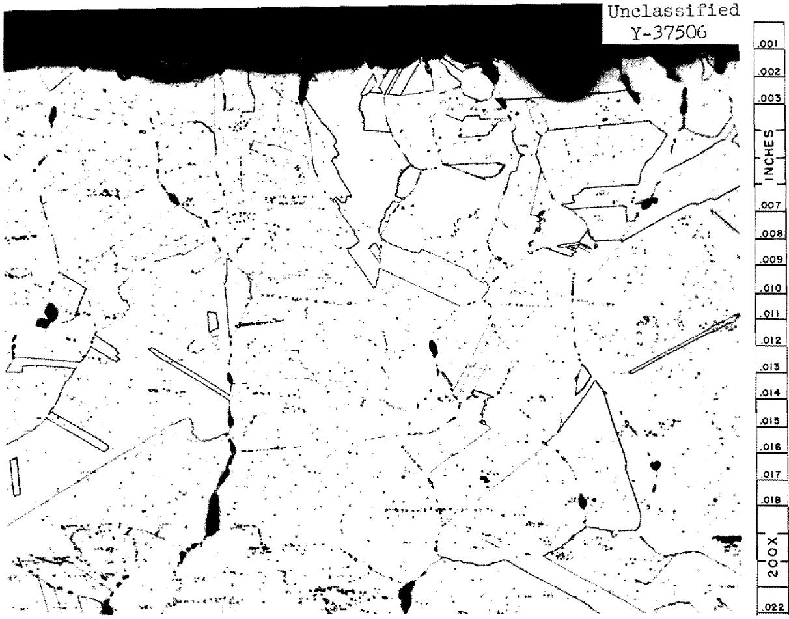  
Fig. 7. Type 304 Stainless Steel Tested at 3400 psi in Air at $1500^{\circ}\mathrm{F}$ (816°C). Discontinued after 3025 hr with 7.0% strain. Specimen etched with aqua regia.

Table II. Creep-Rupture Tests of Type 304 Stainless Steel in Air at $1700^{\circ}\mathrm{F}$ (927°C)   

<table><tr><td>Stress (psi)</td><td>Test Duration (hr)</td><td>Strain (%)</td><td>Nitride Precipitate</td><td>Reason for Termination</td></tr><tr><td>1000</td><td>524</td><td>1.16</td><td>No</td><td>Discontinued</td></tr><tr><td>1200</td><td>1005</td><td>3.13</td><td>No</td><td>Discontinued</td></tr><tr><td>1200</td><td>1895</td><td>7.81</td><td>No</td><td>Discontinued</td></tr><tr><td>1500</td><td>726</td><td>10.88</td><td>Yes</td><td>Ruptured</td></tr><tr><td>2500</td><td>52.5</td><td>9.03</td><td>Yes</td><td>Ruptured</td></tr></table>

the strain rate. Figure 8 further illustrates the importance of strain rate. Heavy precipitation occurred along the gage section with a very abrupt decrease in amount as the cross-sectional area was increased. This general precipitate, as evidenced by the photomicrograph in the upper left corner of Fig. 8, is actually composed of two phases, one lamellar in nature and the other of Widmanstätten geometry. The selective etching technique of Dulis and Smith [4] was used in which the matrix in the surface layer of the specimen was dissolved by prolonged attack in an alcoholic solution of picnic and hydrochloric acids. The diffraction pattern of the surface was obtained with a recording spectrometer, and the diffraction lines indicated the presence of CrN and $\mathrm{Cr_2N}$ . Specimens tested in nitrogen at 1500 and $1700^{\circ}\mathrm{F}$ (816 and $927^{\circ}\mathrm{C}$ ) also contained a nitride precipitate.

Figure 9 is a photomicrograph of a specimen tested at $1500^{\circ}\mathrm{F}$ ( $816^{\circ}\mathrm{C}$ ) and 3000 psi in an oxygen environment. A second phase near the surface was tentatively identified by selective etching techniques as ferrite. The microstructure of a specimen tested in oxygen at $1700^{\circ}\mathrm{F}$ ( $927^{\circ}\mathrm{C}$ ) is illustrated in Fig. 10. At this temperature the second phase outlines extensively the grain boundaries.

A microstructure characteristic of specimens stressed at 3700 psi in CO at $1500^{\circ}\mathrm{F}$ (816°C) for 1731 hr is shown in Fig. 11. After the test had been discontinued at the end of 1731 hr, the specimen was subjected to a standard tensile test at room temperature. Figure lla shows the gage portion of the specimen and illustrates a case of fine carbide particles near the surface. Figure llb is a photograph of the shoulder portion of the test specimen and shows a large concentration of voids near the

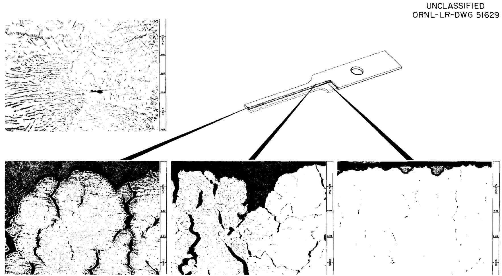  
Fig. 8. Type 304 Stainless Steel Tested at 1500 psi in Air at $1700^{\circ}\mathrm{F}$ (927°C). Reduced 56%.

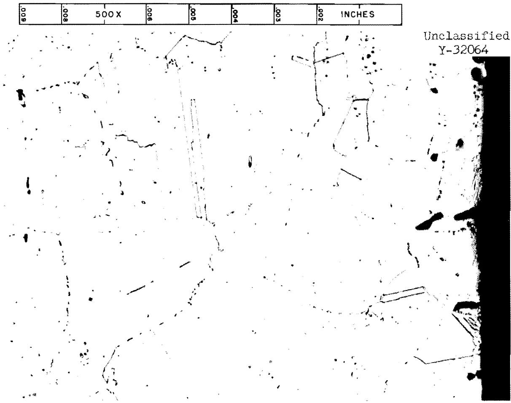  
Fig. 9. Type 304 Stainless Steel Tested at 3000 psi in Oxygen at $1500^{\circ}\mathrm{F}$ (816°C). Test discontinued after 1247 hr with 4.55% strain. Specimen etched in glyceria regia.

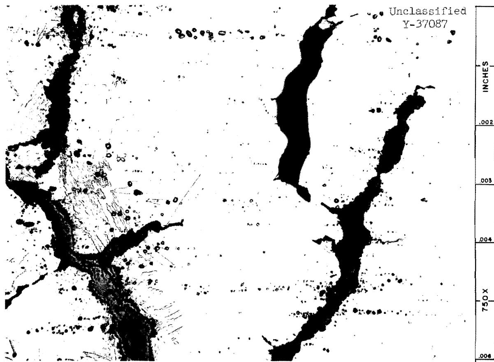  
Fig. 10. Type 304 Stainless Steel Tested at 1200 psi in Oxygen at $1700^{\circ}\mathrm{F}$ (927°C). Test discontinued after 1771.l hr with 11.7% strain. Specimen etched with aqua regia. Reduced 7%.

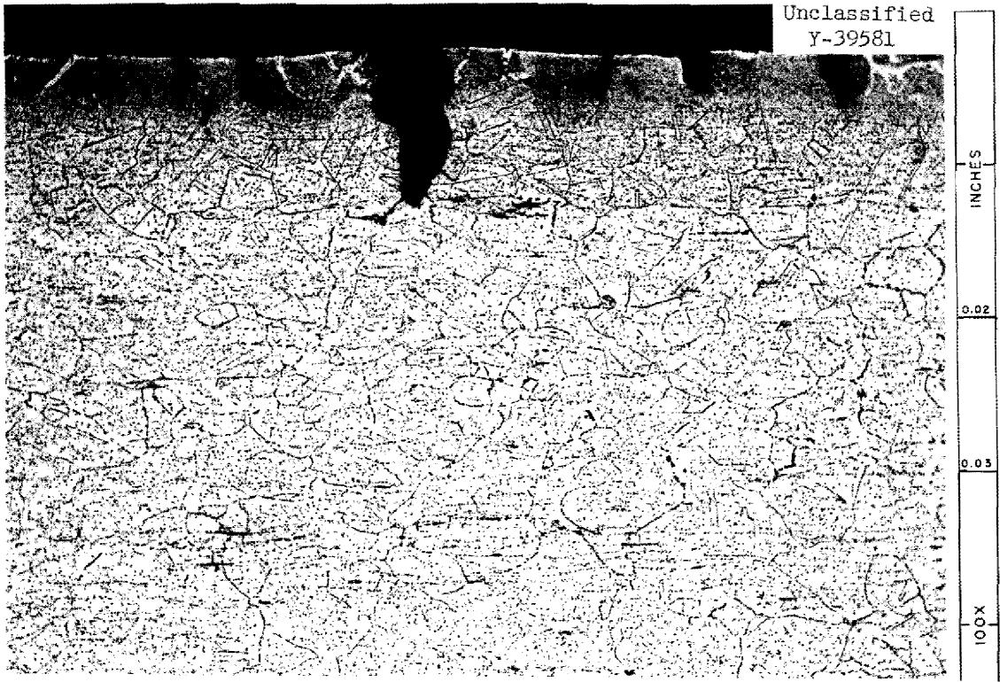

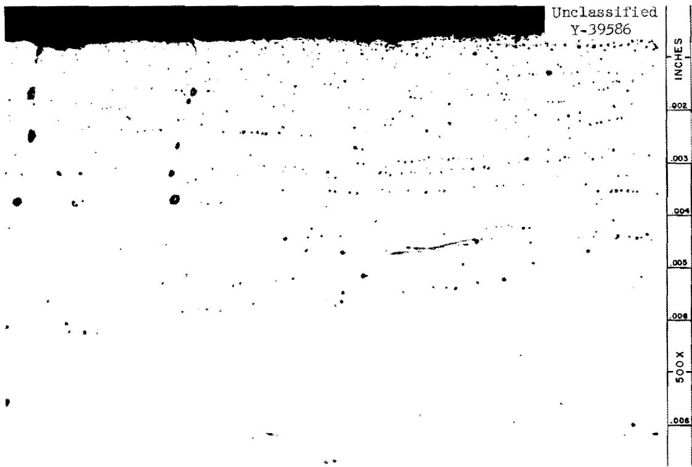  
Fig. 11. Photomicrographs of a Type 304 Stainless Steel Specimen Tested in Tension at $75^{\circ}\mathrm{F}$ $(25^{\circ}\mathrm{C})$ . (a) Gage section, etched with aqua regia; (b) shoulder, as-polished. Strain rate was 0.0125 in./in.-min. Prior to testing, specimen was (l) annealed for 1 hr at $1900^{\circ}\mathrm{F}$ $(1038^{\circ}\mathrm{C})$ in $\mathbf{H}_2$ and (2) stressed at 3700 psi in CO at $1500^{\circ}\mathrm{F}$ $(816^{\circ}\mathrm{C})$ for 1731 hr. Reduced $16\%$ .

surface. It is believed that these voids were originally filled by oxides which were lost during polishing. At $1700^{\circ}\mathrm{F}$ (927°C) the carbides became much coarser and the rate of carburization increased significantly.

Specimens tested in $\mathrm{CO}_{2}$ over the range 1300 to $1700^{\circ}\mathrm{F}$ (704 to $927^{\circ}\mathrm{C}$ ) were observed to be carburized, as is illustrated by Fig. 12 of a specimen tested at 3400 psi in $\mathrm{CO}_{2}$ at $1500^{\circ}\mathrm{F}$ ( $816^{\circ}\mathrm{C}$ ) for 1727 hr, at which time the test was discontinued and the specimen subjected to a standard room-temperature tensile test. In Fig. 12a, showing the gage section of this specimen, there is evidence of considerable carburization although no case is visible. Figure 12b shows an edge of the shoulder portion of the specimen and large subsurface voids similar to those shown in Fig. 11b and believed to have been formed similarly.

Microstructural examinations of specimens tested in $\mathrm{CO}_{2}$ indicated that the type of carbide dispersion obtained depends upon the exposure conditions. Figure 13 is a photomicrograph of a specimen prestrained $10\%$ at room temperature and stressed at 7000 psi in $\mathrm{CO}_{2}$ at $1500^{\circ}\mathrm{F}$ ( $816^{\circ}\mathrm{C}$ ) and shows that the carbon decorates the dislocations introduced by the cold working as compared with the more random carbide distribution in Fig. 12. Another significant difference in carbide distributions is illustrated by Figs. 14 and 15. Figure 14 illustrates the semicontinuous grain-boundary network and the random coarse precipitate that occurred in a specimen stressed at 3000 psi in $\mathrm{CO}_{2}$ at $1700^{\circ}\mathrm{F}$ ( $927^{\circ}\mathrm{C}$ ). All the precipitate was concentrated at the grain boundaries in a specimen exposed to flowing $\mathrm{CO}_{2}$ for 200 hr at $1700^{\circ}\mathrm{F}$ ( $927^{\circ}\mathrm{C}$ ) without an applied stress, as is shown in Fig. 15.

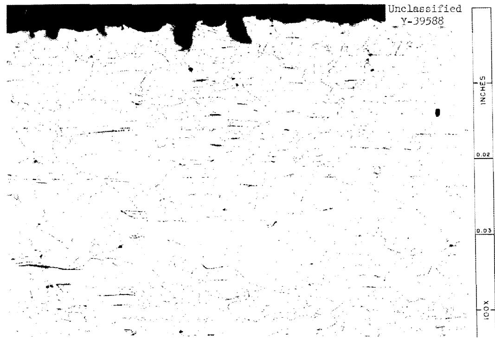

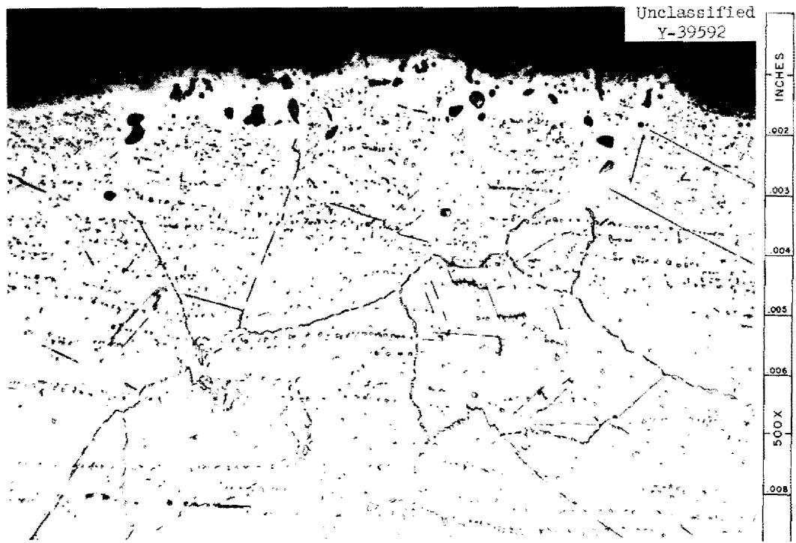  
Fig. 12. Photomicrographs of a Type 304 Stainless Steel Specimen Tested in Tension at $75^{\circ}\mathrm{F}$ $(25^{\circ}\mathrm{C})$ . (a) Gage section; (b) shoulder. Strain rate was 0.0125 in./in.-min. Prior to testing, specimen was (1) annealed for 1 hr at $1900^{\circ}\mathrm{F}$ $(1038^{\circ}\mathrm{C})$ in $\mathbf{H}_2$ and (2) stressed at 3400 psi in $\mathbf{CO}_2$ at $1500^{\circ}\mathrm{F}$ $(816^{\circ}\mathrm{C})$ for 1727 hr. Etchant: aqua regia. Reduced $21.5\%$ .

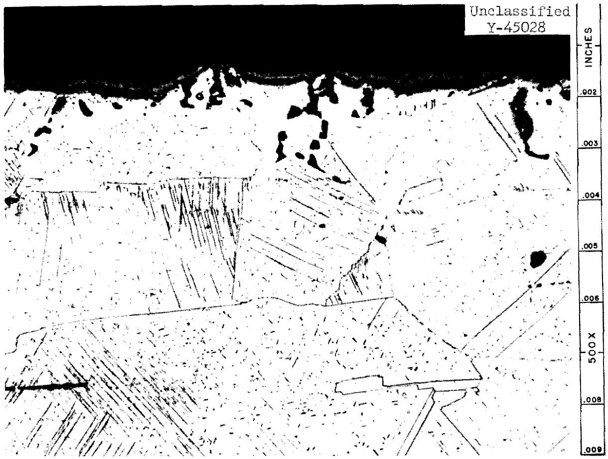  
Fig. 13. Type 304 Stainless Steel Specimen Tested at 7000 psi in $\mathrm{CO}_{2}$ at $1500^{\circ}\mathrm{F}$ (816°C). Specimen was prestrained $10\%$ at room temperature prior to testing. Material failed after 432 hr with $4.66\%$ strain. Etchant: aqua regia.

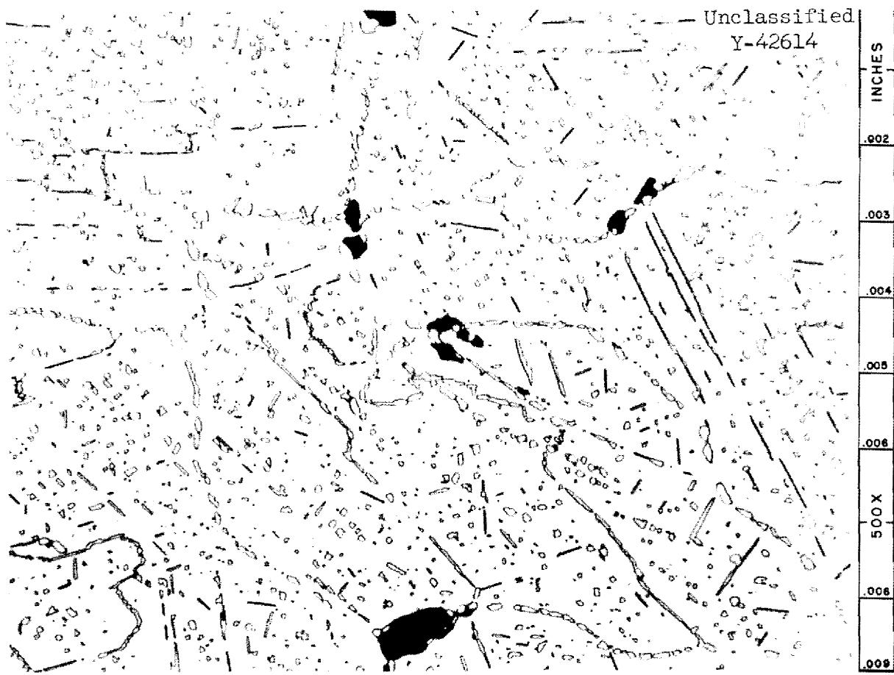  
Fig. 14. Typical Microstructure in Interior of Specimen Tested for 528 hr at $1700^{\circ}\mathrm{F}$ (927°C), 3000 psi Stress in Flowing $\mathrm{CO}_{2}$ . Carbon content, 0.59 wt%. Etchant: aqua regia.

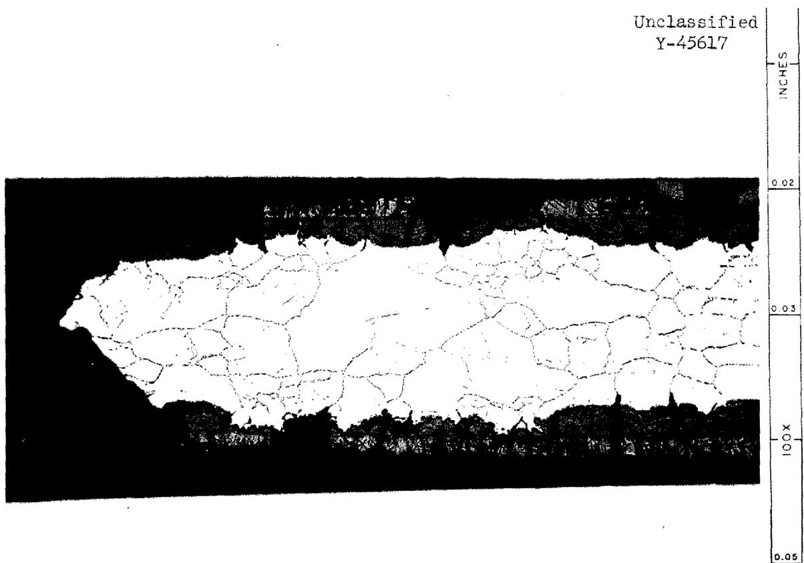  
Fig. 15. Fracture of a Specimen Tested in Tension at $1250^{\circ}\mathrm{F}$ $(677^{\circ}\mathrm{C})$ . Strain rate was 0.025 in./in.-min. Prior to testing, specimen was annealed for 200 hr in flowing $\mathrm{CO}_{2}$ at $1700^{\circ}\mathrm{F}$ $(927^{\circ}\mathrm{C})$ . Etchant: aqua regia. Reduced $8\%$ .

# Influence of $\mathrm{CO}_{2}$ on the Tensile Properties of Type 304 Stainless Steel

Because of the observed increase in carbon concentration as a result of exposure to $\mathrm{CO}_{2}$ , a series of tensile tests were run in an effort to evaluate the influence of this carbon increase on the rupture ductility. A group of specimens 0.020 in. thick were exposed to flowing $\mathrm{CO}_{2}$ for times up to 1000 hr and at temperatures ranging from 1100 to $1700^{\circ}\mathrm{F}$ (593 to $927^{\circ}\mathrm{C}$ ). Control specimens were run in argon to separate the influences of thermal treatment and exposure to $\mathrm{CO}_{2}$ . Pairs of specimens annealed under duplicate conditions were tested in tension at 75 and $1250^{\circ}\mathrm{F}$ (25 and $677^{\circ}\mathrm{C}$ ); the results are summarized in Table III. The following observations were made:

1. The control specimens showed that subsequent heating in argon at less than the $1900^{\circ}\mathrm{F}$ ( $1038^{\circ}\mathrm{C}$ ) homogenization temperature caused a change in the material properties. As a result of this instability, the room-temperature tensile ductility was reduced. The tensile ductility of the controls at $1250^{\circ}\mathrm{F}$ ( $677^{\circ}\mathrm{C}$ ) was increased by the thermal treatment, the magnitude of the improvement increasing with increasing annealing temperature.   
2. At both 75 and $1250^{\circ}\mathrm{F}$ (25 and $677^{\circ}\mathrm{C}$ ) the tensile ductility was decreased by exposure to $\mathrm{CO}_{2}$ . The decrease in ductility seemed, for a given annealing time, to increase with the temperature of annealing.

# Creep-Rupture Tests - Nickel-Base Alloys

The effect of air on the creep properties of Inconel at $1500^{\circ}\mathrm{F}$ (816°C) is illustrated in Fig. 16. The secondary creep rate was not significantly

Specimen Size: 0.020-in.-thick sheet

Strain Rate: 0.02 in./in.-min

Table III. Effects of Exposure to CO 2 on the Tensile Properties of Type 304 Stainless Steel   

<table><tr><td colspan="3">Treatment Prior to Tensile Testa</td><td rowspan="2">Average Carbon Concentration (wt %)</td><td colspan="3">Tensile Properties at 75°F (25°C)</td><td colspan="3">Tensile Properties at 1250°F (677°C)</td></tr><tr><td>Environment</td><td>Temperature</td><td>Time (hr)</td><td>Elongation (%)</td><td>Strength (psi)</td><td>Yield Strength (psi)</td><td>Elongation (%)</td><td>Strength (psi)</td><td>Yield Strength (psi)</td></tr><tr><td rowspan="3">As annealed CO2</td><td rowspan="3">1100°F (593°C)</td><td>100</td><td rowspan="2">0.02</td><td>56.5</td><td>80,300</td><td>22,300</td><td>27.5</td><td>34,000</td><td>10,100</td></tr><tr><td>300</td><td>55.0</td><td>86,100</td><td>26,300</td><td>23.5</td><td>34,800</td><td>10,000</td></tr><tr><td>1000</td><td>0.14</td><td>45.3</td><td>83,000</td><td>27,200</td><td>19.5</td><td>34,800</td><td>12,800</td></tr><tr><td rowspan="2">Ar</td><td rowspan="2">1100°F (593°C)</td><td rowspan="2">1003</td><td rowspan="2">0.02</td><td>41.6</td><td>82,900</td><td>28,500</td><td>21.5</td><td>36,600</td><td>12,200</td></tr><tr><td>55.0</td><td>84,800</td><td>25,800</td><td>29.5</td><td>37,700</td><td>14,200</td></tr><tr><td rowspan="3">CO2</td><td rowspan="3">1200°F (649°C)</td><td>97.6</td><td></td><td>53.8</td><td>85,100</td><td>23,500</td><td>27.5</td><td>37,200</td><td>12,700</td></tr><tr><td>329</td><td></td><td>56.3</td><td>87,800</td><td>26,700</td><td>26.0</td><td>39,200</td><td>13,800</td></tr><tr><td>1002</td><td>0.15</td><td>45.3</td><td>88,400</td><td>28,000</td><td>17.0</td><td>42,100</td><td>15,700</td></tr><tr><td rowspan="3">CO2</td><td rowspan="3">1300°F (704°C)</td><td>500</td><td>0.21</td><td>25.7</td><td>81,600</td><td>25,600</td><td>17.0</td><td>40,100</td><td>19,400</td></tr><tr><td>785</td><td></td><td>25.7</td><td>82,700</td><td>27,200</td><td>17.0</td><td>37,900</td><td>18,200</td></tr><tr><td>1000</td><td>0.27</td><td>24.5</td><td>83,700</td><td>28,200</td><td>14.5</td><td>39,300</td><td>19,300</td></tr><tr><td>Ar</td><td>1300°F (704°C)</td><td>1006</td><td>0.02</td><td>49.0</td><td>83,800</td><td>24,300</td><td>29.0</td><td>37,500</td><td>12,000</td></tr><tr><td rowspan="3">CO2</td><td rowspan="3">1400°F (760°C)</td><td>303</td><td></td><td>20.9</td><td>70,100</td><td>26,900</td><td>15.0</td><td>35,300</td><td>18,000</td></tr><tr><td>500</td><td></td><td>14.8</td><td>70,500</td><td>29,100</td><td>14.0</td><td>31,500</td><td>15,300</td></tr><tr><td>1000</td><td>0.25</td><td>20.9</td><td>77,200</td><td>29,000</td><td></td><td></td><td>20,300</td></tr><tr><td rowspan="3">CO2</td><td rowspan="3">1500°F (815°C)</td><td>25</td><td>0.21</td><td>38.0</td><td>79,400</td><td>23,100</td><td>18.5</td><td>35,800</td><td>13,000</td></tr><tr><td>115</td><td></td><td>27.5</td><td>77,900</td><td>23,100</td><td>19.0</td><td>36,400</td><td>17,200</td></tr><tr><td>500</td><td>0.25</td><td>19.5</td><td>80,600</td><td>25,900</td><td>16.5</td><td>37,700</td><td>19,100</td></tr><tr><td>Ar</td><td>1500°F (815°C)</td><td>500</td><td>0.02</td><td>53.0</td><td>84,500</td><td>25,100</td><td>34.0</td><td>38,700</td><td>11,300</td></tr><tr><td rowspan="3">CO2</td><td rowspan="3">1700°F (927°C)</td><td>16.7</td><td>0.12</td><td>41.6</td><td>64,400</td><td>21,400</td><td>21.0</td><td>36,900</td><td>15,100</td></tr><tr><td>49.2</td><td></td><td>22.1</td><td>60,100</td><td>21,800</td><td>17.0</td><td>33,000</td><td>15,100</td></tr><tr><td>200</td><td>0.22</td><td>11.1</td><td>45,000</td><td>18,400</td><td>12.0</td><td>28,000</td><td>9,900</td></tr><tr><td>Ar</td><td>1700°F (927°C)</td><td>200</td><td>0.02</td><td>54.5</td><td>83,700</td><td>24,400</td><td>36.0</td><td>35,800</td><td>11,100</td></tr></table>

${}^{a}$ All specimens annealed for $1\mathrm{{hr}}$ at ${1900}^{ \circ  }\mathrm{F}\left( {{1038}^{ \circ  }\mathrm{C}}\right)$ in hydrogen prior to receiving indicated treatment.

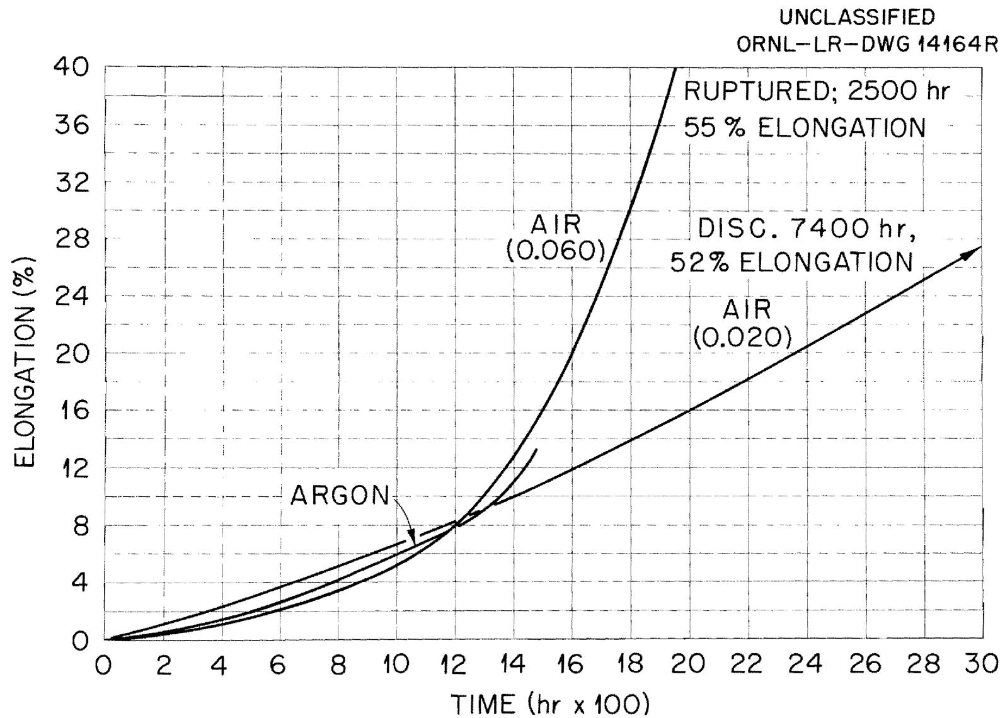  
Fig. 16. Inconel Sheet - Heat "B". Tested as-received in argon and air at $1500^{\circ}\mathrm{F}$ $(816^{\circ}\mathrm{C})$ and 3500 psi.

different in air than in argon. However, air seemed to inhibit rupture to the extent that the stress-rupture life of Inconel was greater in airthan in argon. Figure 16 also illustrates the dependence of the environ-. mental effect on the size of the test section. Much greater strengthening occurred in the 0.020-in.-thick specimen than in the 0.060-in.-thick one. Metallographic examination revealed the presence of surface and grainboundary oxidation in the gage section but gave no evidence of nitride formation.

A limited number of tests were run to evaluate the intrinsic effects of oxygen and nitrogen on the creep behavior of Inconel. Figure 17 illustrates the strengthening due to nitrogen being absorbed and the formation of a nitride precipitate. The creep behavior in oxygen was not significantly different from that in air. Figure 18a illustrates the extensive oxidation that occurred in the gage section of an Inconel specimen stressed at 3500 psi at $1500^{\circ}\mathrm{F}$ (816°C) in an oxygen environment. The test was discontinued after 1671 hr with 83.6% strain. Relatively little oxidation occurred on the shoulder of the test specimen (Fig. 18b). Figure 19 is a contact print of a radiograph of the gage section of a specimen tested under similar conditions for 1285 hr. Although the specimen was elongated 73.4% there was no evidence of necking. However, the gage section was heavily cracked, again illustrating the ability of an oxidizing atmosphere to inhibit crack propagation.

Inconel is strengthened in carburizing atmospheres in a manner similar to that illustrated in Fig. 17 for a nitrogen environment. The strength is improved as a result of the solution strengthening provided by soluble carbon and as a result of dispersion strengthening due to a dispersed carbide phase.

UNCLASSIFIED

ORNL-LR-DWG 14224

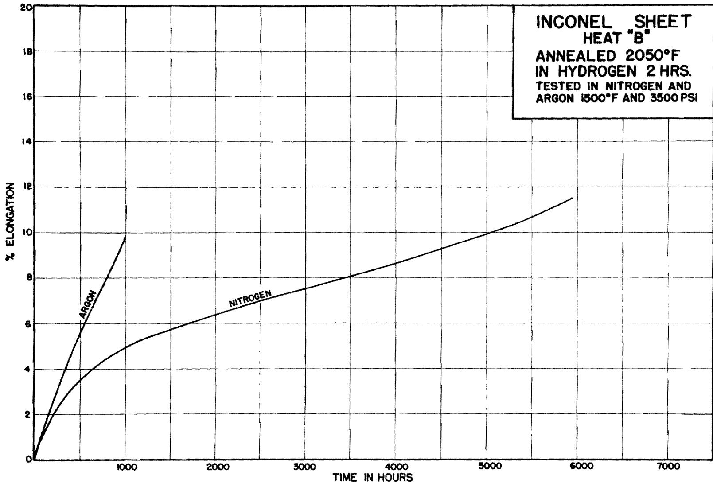  
Fig. 17. Inconel Sheet - Heat "B". Annealed at $2050^{\circ}\mathrm{F}$ ( $1121^{\circ}\mathrm{C}$ ) in hydrogen for 2 hr. Tested in nitrogen and argon at $1500^{\circ}\mathrm{F}$ ( $816^{\circ}\mathrm{C}$ ) and 3500 psi.

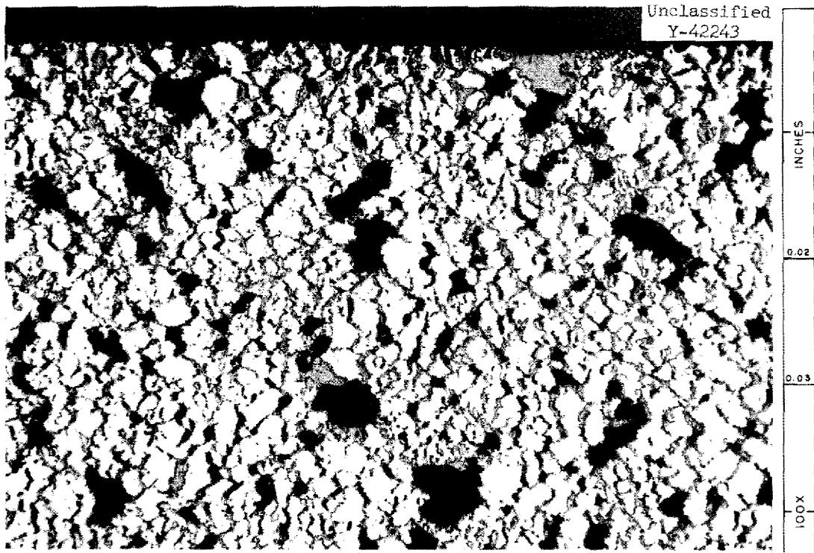

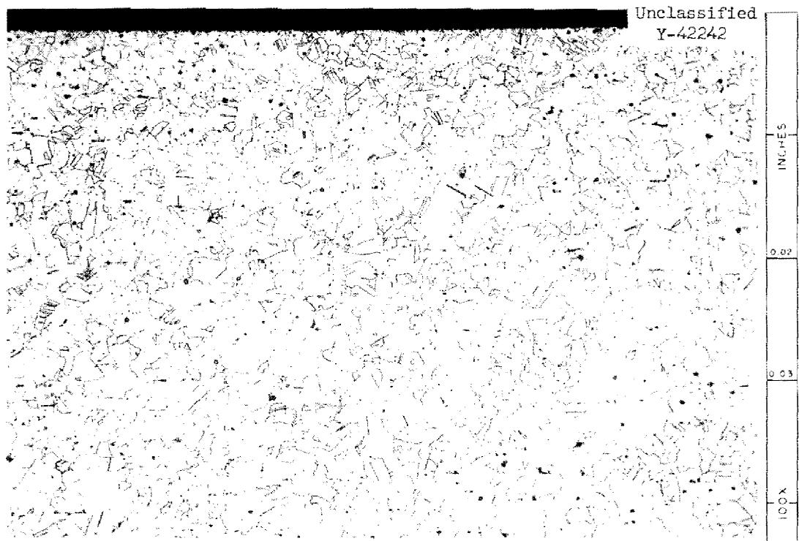  
Fig. 18. Inconel Specimen Stressed at 3500 psi in an Oxygen Environment at $1500^{\circ}\mathrm{F}$ (816°C). (a) Gage section, as-polished; (b) shoulder, etched with aqua regia. Test discontinued after 1671 hr with 83.6% strain. Specimen tested in the as-received condition. Reduced 18%.

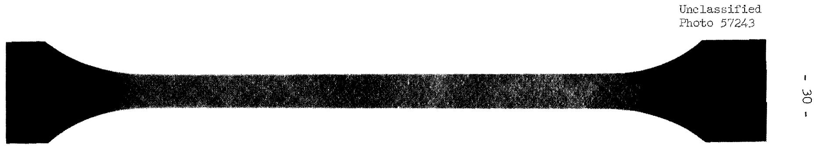  
Fig. 19. Contact Print of a Radiograph of an Inconel Specimen Stressed at 3500 psi in an Oxygen Environment at $1500^{\circ}\mathrm{F}$ (816°C). Test discontinued after 1285 hr with 73.44% strain. Specimen tested in the as-received condition.

The characteristics of the influence of hydrogen on the mechanical properties of Inconel are illustrated in Fig. 20, which shows the results of several creep tests run at $1500^{\circ}\mathrm{F}$ ( $816^{\circ}\mathrm{C}$ ) in hydrogen and argon environments. The tests were run in pairs - one specimen in argon and another in hydrogen at an equivalent stress. The influence of hydrogen was observed to become greater as the stress level (or strain rate) was decreased. For example, the rupture lives of two specimens tested in argon and in hydrogen at 10,000 psi were essentially the same, but differed by a factor of 3 between the pair of specimens tested at 3500 psi. Another important characteristic of this effect is that the environmental influence was manifested through both an increase in the secondary creep rate and a decrease in the time required for tertiary creep to occur, as was obvious from the pair of tests at 3500 psi. The third characteristic is that there was essentially no difference in the ductilities of two specimens tested at equivalent stress levels. Any ductility differences shown in Fig. 20 are small enough to be attributed to experimental scatter.

Representative photomicrographs of the gage sections of the pair of specimens tested at 3500 psi are shown in Figs. 21 and 22, in which both the density and the geometry of the cracks in the two specimens can be seen to be essentially equivalent. A very close examination of the cracks shows that many are composed of chains or voids rather than being wedgeshaped with smooth edges.

Although the experimental observations in argon and hydrogen environments just described refer specifically to Inconel, similar observations were made for several other nickel-base alloys, including "A" nickel and

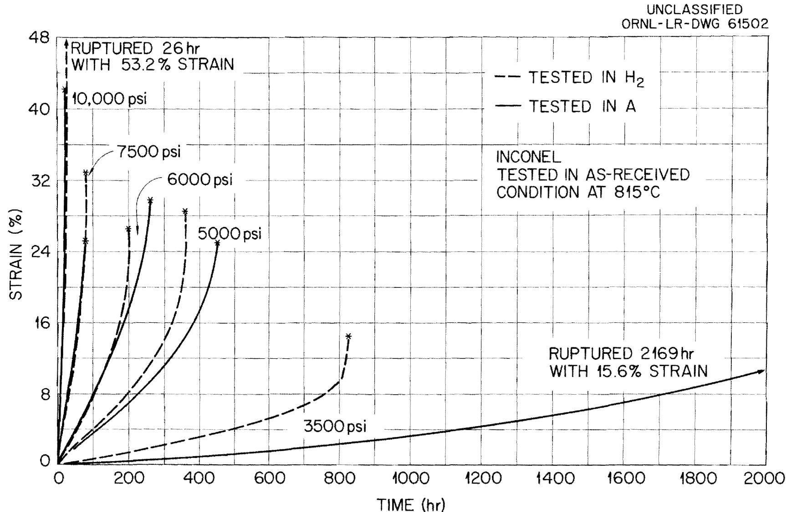  
Fig. 20. Creep-Rupture Behavior of Inconel in Argon and Hydrogen Environments at $1500^{\circ}\mathrm{F}$ (816°C).

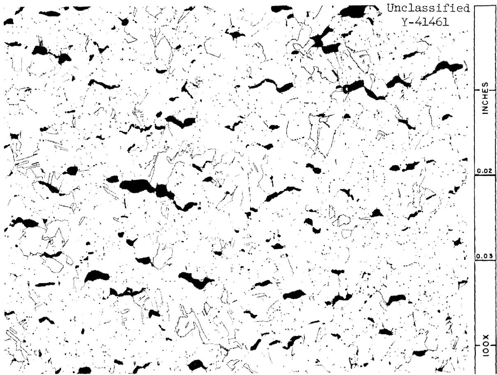  
Fig. 21. Inconel Specimen Tested at 3500 psi in Argon at $1500^{\circ}\mathrm{F}$ $(816^{\circ}\mathrm{C})$ . Failed after 2169 hr with $15.6\%$ strain. Photograph taken 0.25 in. from fracture. Etchant: aqua regia.

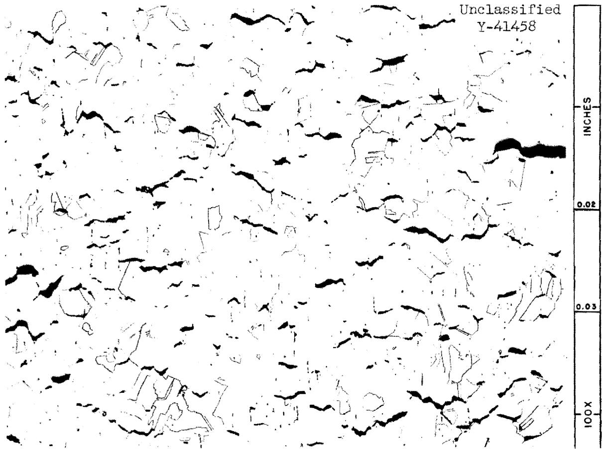  
Fig 22. Inconel Specimen Tested at 3500 psi in Hydrogen at $1500^{\circ}\mathrm{F}$ (816°C). Failed after 825 hr with 14.06% strain. Photograph taken 0.25 in. from fracture. Etchant: aqua regia.

laboratory melts of Ni-5 Fe, Ni-15 Cr, and Ni-15 Cr-5 Fe. A limited number of tests were run with nickel refined by an electron-beam-zone process. The results of one such test are given in Table IV. The test environment was cycled periodically between argon and hydrogen; the creep rate in hydrogen was greater by a factor of 2 than that in an argon environment. These data also illustrate the reversible nature of the environmental effect.

# Effect of Carbon on the Room-Temperature Bend Properties of Niobium

The results of tests to evaluate the effects of nitrogen, oxygen, and hydrogen on the room-temperature bend properties of niobium have been described previously [3]. The results of additional tests to illustrate the influence of carbon additions are given in Table V. The stress values in Table V are based on an elastic-stress analysis of the test specimen. Therefore the yield and ultimate stresses were of value only for comparison since plastic deformation occurred. Although carbon improved the strength slightly, it was not as effective as equivalent amounts of oxygen and nitrogen. Carbon concentrations as great as 2100 ppm did not seriously reduce the room-temperature ductility of niobium. Figure 23 illustrates the microstructure of a bend specimen containing 1000 ppm C (No. 106).

# DISCUSSION OF RESULTS

# Type 304 Stainless Steel

The influences of various environments on the creep properties of type 304 stainless steel stimulated a desire to understand the mechanisms

Test Temperature: $1700^{\circ}\mathrm{F}$ (927°C)

Test Environment: Cycled between Ar and $\mathsf{H}_2$

Stress: 1000 psi

Table IV. Creep Results of Polycrystalline High-Purity Nickel   

<table><tr><td>Environment</td><td>Duration of Exposure (hr)</td><td>Creep Rate (in./in.-hr)</td></tr><tr><td></td><td></td><td>x 10-5</td></tr><tr><td>H2</td><td>90.9</td><td>7.00</td></tr><tr><td>Ar</td><td>126.2</td><td>3.48</td></tr><tr><td>H2</td><td>119.8</td><td>7.40</td></tr><tr><td>Ar</td><td>97.6</td><td>3.10</td></tr><tr><td>H2</td><td>168.1</td><td>7.15</td></tr><tr><td>Ar</td><td>167.1</td><td>3.60</td></tr><tr><td>H2</td><td>172.0</td><td>6.82</td></tr><tr><td>Ar</td><td>118.4</td><td>3.93</td></tr></table>

Table V. Effect of Carbon on the Room-Temperature Bend Properties of Pure Niobium from Heat 238135B   

<table><tr><td rowspan="2">Specimen Number</td><td rowspan="2">Specimena
Annealing Time</td><td colspan="4">Analysis (ppm)</td><td rowspan="2">Proportional Limit (psi)</td><td rowspan="2">Yield Strengthb (psi)</td><td rowspan="2">Maximum Deflection (in.)</td><td rowspan="2">Stress at Maximum Deflection (psi)</td><td rowspan="2">Cracked</td></tr><tr><td>O2</td><td>N2</td><td>H2</td><td>C</td></tr><tr><td>22</td><td>As-annealed</td><td>340</td><td>48</td><td>&lt; 1</td><td>140</td><td>29,600</td><td>41,000</td><td>0.25</td><td>59,500</td><td>No</td></tr><tr><td>104</td><td>1 hr</td><td>360</td><td>34</td><td>21</td><td>310</td><td>35,300</td><td>43,900</td><td>0.25</td><td>69,100</td><td>No</td></tr><tr><td>105</td><td>2 hr</td><td></td><td></td><td></td><td></td><td>33,600</td><td>43,000</td><td>0.25</td><td>67,200</td><td>No</td></tr><tr><td>106</td><td>5 hr</td><td>330</td><td>25</td><td>10</td><td>1000</td><td>31,300</td><td>42,000</td><td>0.25</td><td>65,700</td><td>No</td></tr><tr><td>107</td><td>24 hr</td><td>310</td><td>28</td><td>8</td><td>2100</td><td>38,500</td><td>47,400</td><td>0.25</td><td>66,800</td><td>No</td></tr></table>

aAll specimens were first annealed in vacuum at $2372^{\circ}\mathrm{F}$ (1300°C), then annealed at $2192^{\circ}\mathrm{F}$ (1200°C) in $\mathrm{H}_{2}-\mathrm{C}_{6} \mathrm{H}_{6}$ for the time specified, and then homogenized.   
bThe stress at the intersection of a line with its origin at zero stress and 0.005-in. deflection and drawn parallel to the elastic portion of the stress-deflection curve is called the "yield strength."

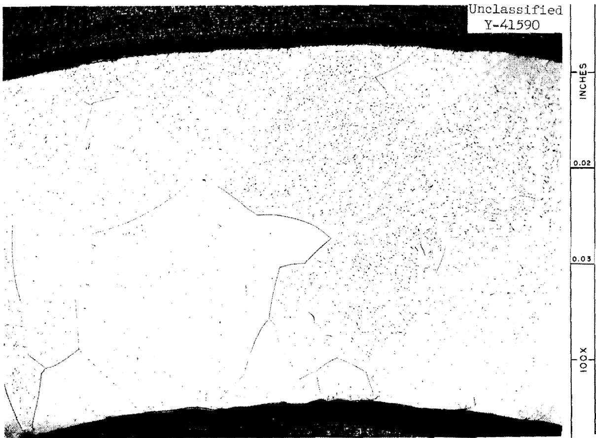  
Fig. 23. Niobium Specimen Bent at Room Temperature. Prior to bending, specimen (No. 106) was annealed for 5 hr at $2192^{\circ}\mathrm{F}$ ( $1200^{\circ}\mathrm{C}$ ) in $\mathrm{H}_{2}-\mathrm{C}_{6}\mathrm{H}_{6}$ followed by a 2-hr homogenizing treatment. Carbon content 0.10 wt%. Reduced 6%.

by which the properties are altered. Most of the changes in properties that occur from carburizing or nitriding seemingly can be explained by the theories of dispersion strengthening. The enhancement of creep properties obtained through carburization and nitriding has been demonstrated by Swindeman and Douglas [5].

The current results show that the magnitude of the enhancement of creep properties in a carburizing atmosphere is a function of the quantity of carbon absorbed by the specimen. At $1500^{\circ}\mathrm{F}$ ( $816^{\circ}\mathrm{C}$ ) the creep rate was higher in $\mathrm{CO}_{2}$ than in CO (Fig. 1), a behavior consistent with expectations since the carburization rate was higher in CO than in $\mathrm{CO}_{2}$ . Also, the creep rates in both environments decreased with time, again indicating a dependence on the carbon concentration. At $1700^{\circ}\mathrm{F}$ ( $927^{\circ}\mathrm{C}$ ) the creep-rupture behavior was similar to that just described.

Although these data clearly demonstrate the influence of the quantity of carbon present, there are more subtle factors which may be of importance, for example, the size and distribution of carbides. Carbide distribution of specimens exposed to $\mathrm{CO}_{2}$ was affected by stress (cf. Figs. 14 and 15) and by prestraining (cf. Figs. 12 and 13). It was also found that rather complex arrays of carbides could be formed in as-received material by cold working and subsequent thermal treatments. This is illustrated quite well by the work of Garafalo [6] on the ability of carbides to retard the movement of dislocations in type 316 stainless steel during creep at 1100, 1300, and $1500^{\circ}\mathrm{F}$ (593, 704, and $816^{\circ}\mathrm{C}$ ). Specimens were solution-annealed, prestrained, annealed at $900^{\circ}\mathrm{F}$ ( $482^{\circ}\mathrm{C}$ ) to precipitate the carbides along dislocations, and creep-tested in the above temperature range. This treatment resulted in an enhancement of creep properties. However, the amount

of prestraining was found to be important since agglomeration occurred at prestrains in excess of $25\%$ . Another factor of possible importance is the change in chemistry of the metal brought about by the formation of carbides. If the carbide formed is $\mathrm{Cr}_{23}\mathrm{C}_6$ , 1.67 wt $\%$ Cr will be taken out of solution for every 0.1 wt $\%$ C added. The depletion of the matrix in chromium probably increases the solubility of the interstitial elements oxygen, nitrogen, and carbon. Work is currently in progress to evaluate these secondary processes.

It is felt that environments which cause nitriding enhance the creep properties through the same mechanisms just discussed for carburization. However, the conditions under which nitrogen is absorbed are important. During tests in pure nitrogen nitrides were formed at 1500 and $1700^{\circ}\mathrm{F}$ (816 and $927^{\circ}\mathrm{C}$ ) but those formed at $1500^{\circ}\mathrm{F}$ ( $816^{\circ}\mathrm{C}$ ) were only in areas that had undergone large deformation. At $1700^{\circ}\mathrm{F}$ ( $927^{\circ}\mathrm{C}$ ), nitride formation was more general and large quantities of nitrogen were introduced.

A series of tests at $1700^{\circ}\mathrm{F}$ ( $927^{\circ}\mathrm{C}$ ) in air showed that the formation of nitrides was a definite function of the strain rate and probably depended also upon the time of exposure (Table II). At $1500^{\circ}\mathrm{F}$ ( $816^{\circ}\mathrm{C}$ ) no nitride formation was observed in specimens tested for as long as 3025 hr in air. However, Dulis and Smith [4] describe a type 304 stainless steel specimen tested in air at $1500^{\circ}\mathrm{F}$ ( $816^{\circ}\mathrm{C}$ ) for 10,000 hr in which nitrides were formed. On the basis of the results just described it was concluded that the formation of nitrides in type 304 stainless steel tested in air was a function of the strain rate, the temperature, and the time of exposure. The combination of factors necessary to produce nitriding is one which will make a clean surface available to the nitrogen. If the

strain rate is not sufficient for the reactive metal surface to be exposed, extremely long times are required for the nitrogen to permeate or diffuse through the surface oxide.

The influence of oxygen on the creep properties was one of strengthening at $1700^{\circ}\mathrm{F}$ ( $927^{\circ}\mathrm{C}$ ), the mechanism probably being that of internal oxidation, but was somewhat deleterious at $1500^{\circ}\mathrm{F}$ ( $816^{\circ}\mathrm{C}$ ) (cf. Figs. 1 and 2). In an effort to better understand the influence of oxygen at $1500^{\circ}\mathrm{F}$ ( $816^{\circ}\mathrm{C}$ ) a series of tests at various oxygen partial pressures were run. A marked strengthening was observed at very low oxygen levels but subsequently became reduced at higher levels (Figs. 3 and 4). This difference was manifested both through an influence on the secondary creep rate and by the rupture life. The crack density increased as the oxygen concentration was increased (Fig. 5). The results of these tests are currently unexplainable since all of the oxygen pressures except the lowest resulted in surface oxidation. However, they cause strengthening by the mechanism of internal oxidation in this material at $1500^{\circ}\mathrm{F}$ ( $816^{\circ}\mathrm{C}$ ) and oxygen pressures near 1 atm to be viewed with skepticism.

In light of the observations made regarding the behavior of materials in pure oxygen at $1500^{\circ}\mathrm{F}$ ( $816^{\circ}\mathrm{C}$ ), there is some doubt as to the mechanism responsible for the enhancement of creep properties observed in air at this temperature. It was pointed out previously that no nitrides were visible in specimens tested in air at $1500^{\circ}\mathrm{F}$ ( $816^{\circ}\mathrm{C}$ ). Although vacuum-fusion analyses do not indicate a substantial increase in nitrogen, they do represent the average of a cross section of the specimen; consequently, the nitrogen concentration could be relatively high near the surface without raising the average. Therefore it is presently postulated that the

observed strengthening in air at $1500^{\circ}\mathrm{F}$ ( $816^{\circ}\mathrm{C}$ ) was due to nitrogen near the surface inhibiting the formation and propagation of cracks. At $1700^{\circ}\mathrm{F}$ ( $927^{\circ}\mathrm{C}$ ), however, oxidation did seem to provide some degree of strengthening, and the enhancement of creep properties in air may be a consequence of both nitriding and oxidation.

Oxidation also occurred in CO and $\mathrm{CO}_{2}$ environments. In light of the tests run in pure oxygen, it is felt that such strengthening was due primarily to carburization.

At $1500^{\circ}\mathrm{F}$ ( $816^{\circ}\mathrm{C}$ ) the creep properties were essentially the same in argon and hydrogen; at $1700^{\circ}\mathrm{F}$ ( $927^{\circ}\mathrm{C}$ ), however, they were inferior in hydrogen, probably because of the removal of carbon by the hydrogen.

An improvement in the creep resistance of type 304 stainless steel was obtained by the addition of carbon but was accompanied by a reduction in rupture ductility. The following generalizations concerning the influence of carbon content seem to be warranted:

1. The ductility was reduced as the carbon content was increased.   
2. Surface layers high in carbon served as nucleation sites for cracks which propagated across the test piece. Hence, for a given average carbon content, the ductility was higher if the carbon was uniformly distributed.

Although the ductility was not reduced to an alarming level by moderate carbon additions, the problem is worthy of serious consideration. It is conceivable that carbon concentrations in excess of 1 or 2 wt % may result over long periods of use in a carburizing environment. Another reason for concern is that the role of carbon distribution has not been

evaluated. Carbon distributions more embrittling in nature than those studied might easily be obtained as a result of the mechanical and thermal cycling that might be encountered during the operation of a reactor.

# Nickel-Base Alloys

The creep-rupture results for Inconel (Fig. 16) showed that the strengthening effect of an oxidizing environment was manifested principally through increasing the time of tertiary creep. It was shown further (Fig. 19) that severe cracking occurred in an oxidizing atmosphere but that none of the cracks were able to propagate to failure. Hence it was concluded that the strengthening effect in this material was due to the internal oxidation of impurities and the resulting dispersion of oxide particles, which retarded the propagation of nucleated cracks. Similar observations were made of "A" nickel and reported previously [7]. A significant observation made during the current work was that the creep behavior of Inconel is the same in air and in oxygen at $1500^{\circ}\mathrm{F}$ ( $816^{\circ}\mathrm{C}$ ). Different rates were observed for type 304 stainless steel under similar conditions.

Since Inconel can be carburized and nitrided in a manner similar to type 304 stainless steel, the introduction of significant quantities of carbon and nitrogen results in strengthening. Pure nickel and nickel-base alloys which do not contain carbide-forming elements cannot be significantly strengthened by these processes because of the very low solubility of carbon and nitrogen in these materials.

The creep properties of Inconel in hydrogen were inferior to those observed in argon (Fig. 20). It was also noted that the environmental

effect becomes greater as the strain rate decreases and that it does not result in any embrittlement of the metal. Data were obtained (Table IV) which showed that the environmental influence is reversible, at least for high-purity nickel.

Following these observations, proposal of a mechanism to account for the observed behavior is needed. Two obvious possibilities deserve attention: (1) some chemical change occurs; for example, subsurface oxides may be reduced by hydrogen to form water such as has been observed in copper [8], although this results in a loss of ductility, which is contrary to experimental observations in the present case; (2) carbon is removed by surface decarburization. Chemical analyses indicated that this second process does not occur at a detectable rate. The fact that an environmental effect was observed with high-purity nickel does not substantiate an impurity effect, nor does the reversible nature of the effect. However, sufficient work has not been done to completely eliminate the possibility of an impurity effect.

Another possibility, resulting from the mechanism proposed for low-temperature embrittlement [9], is that segregation of hydrogen around a crack nuclei is required for a crack to form. For example, Livshitz et al. [10] observed that welds in steels were embrittled by prolonged heating in hydrogen in the range 500 to $600^{\circ}\mathrm{C}$ . They proposed that this loss in toughness must be associated not only with the possibility of iron-carbide decomposition and the formation of methane but also with the hydrogen atoms diffused in the metal combining into molecules, causing stresses in microregions and embrittlement of the material. The quite high mobility of hydrogen [11] in nickel at elevated temperatures,

however, makes any mechanism which depends upon the segregation of hydrogen seem unrealistic.

A further discussion of how hydrogen influences the creep behavior of nickel-base alloys would require a clear picture of the creep process in the absence of hydrogen. Any review of the huge volume of work carried out in an effort to define and understand high-temperature creep processes is beyond the scope of this paper, and the reader is referred to the excellent review by Davies and Dennison [12]. However, the concept of high-temperature stress rupture, as presented by Cottrell [13], is worthy of brief mention because of its relevance. Cottrell envisions two processes which ultimately lead to intergranular failure: one occurring at high strain rates and involving the formation of cracks at triple points or at other points of high stress concentrations, and the other becoming operative when small stresses are applied for long periods of time. In the latter process small holes nucleate at grain boundaries and grow as a result of vacancy condensation. It is currently proposed that the first deformation process is not significantly influenced by the presence of hydrogen but that the second process is affected, possibly through a reduction of the surface energy. This would in turn increase the driving force for the growth of voids by vacancy condensation. There are numerous details of this hypothesis which must be filled in and work toward this end is currently in progress.

# Niobium

Work reported previously [3] illustrating the influence of oxygen, nitrogen, and hydrogen on the room-temperature bend strength of pure niobium is reviewed briefly here. Although oxygen is an effective

strengthener, concentrations in excess of 3000 ppm result in serious embrittlement. Nitrogen is a very potent strengthensener. For example, increasing the nitrogen content from 48 ppm to 460 ppm changes the yield strength from 41,000 psi to 84,200 psi. However, a concentration as high as 1000 ppm drastically reduces the rupture ductility. This may be due in part to the presence of a very thin nitride film on the surface. The homogenization treatment was not sufficient to effect complete homogenization.

Hydrogen concentrations in excess of 500 ppm seriously embrittle niobium at room temperature. A slight amount of strengthening is observed with the addition of small concentrations of hydrogen. The absorption rate of hydrogen in niobium seems to be greatest in the range 500 to $600^{\circ}\mathrm{C}$ , where a stable hydride is formed. The kinetics of formation of this hydride were observed to be quite rapid and the hydride was formed in all specimens cooled through the above temperature range in the presence of hydrogen or water vapor.

A very limited number of creep and tensile tests at approximately $1800^{\circ}\mathrm{F}$ (982°C) showed that moderate oxygen and nitrogen additions improved the high-temperature strength of niobium. The strength was decreased by the presence of hydrogen or water vapor.

The present studies showed that carbon additions did not result in gross improvements in the room-temperature strength of niobium. For example, increasing the carbon concentration from 140 to 2100 ppm increased the yield strength only from 41,000 to 47,400 psi. The material was not embrittled by this large quantity of carbon.

# SUMMARY AND CONCLUSIONS

The experimental observations which have been presented illustrate the effects of several gaseous environments on the mechanical properties of type 304 stainless steel, Inconel, high-purity nickel, and niobium. Type 304 stainless steel was studied over the range 1500 to $1700^{\circ}\mathrm{F}$ (816 to $927^{\circ}\mathrm{C}$ ) in environments of Ar, $\mathrm{H}_{2}$ , CO, $\mathrm{CO}_{2}$ , $\mathrm{N}_{2}$ , air, and $\mathrm{O}_{2}$ . To evaluate the influence of $\mathrm{CO}_{2}$ on rupture ductility, a series of tensile tests were run on samples which had been exposed to $\mathrm{CO}_{2}$ for various times over the range 1100 to $1700^{\circ}\mathrm{F}$ (593 to $927^{\circ}\mathrm{C}$ ). Inconel was studied in Ar, $\mathrm{H}_{2}$ , $\mathrm{N}_{2}$ , $\mathrm{O}_{2}$ , and air environments at $1500^{\circ}\mathrm{F}$ (816°C). High-purity nickel was studied in argon and hydrogen environments at 1500 and $1700^{\circ}\mathrm{F}$ (816 and $927^{\circ}\mathrm{C}$ ). A review is presented on the influence of additions of oxygen, nitrogen, and hydrogen on the room-temperature properties of niobium as evaluated by bend tests on samples containing controlled amounts of each impurity. Also reviewed are the high-temperature creep properties of niobium as evaluated in environments of dry hydrogen, wet hydrogen, wet argon, argon plus air, nitrogen, and pure argon. New data are presented on the effect of carbon additions to niobium on the room-temperature bend properties.

Type 304 Stainless Steel. - 1. Creep data determined in pure argon are conservative values for design purposes compared with data obtained in all environments except hydrogen and possibly pure oxygen.

2. Air and nitrogen increase the creep resistance at 1500 and $1700^{\circ}\mathrm{F}$ (816 and $927^{\circ}\mathrm{C}$ ). It is felt that nitrogen absorption is primarily responsible for the observed strengthening in air.

3. Carburization occurs in environments of CO and $\mathrm{CO}_{2}$ and both environments increase the creep resistance. Various types of carbide dispersions can be obtained by different mechanical and thermal treatments.   
4. The ductility is reduced as a result of carburization, with the extent dependent upon the quantity of carbon absorbed by the material and the distribution of the carbon.

Inconel. - 1. The creep-rupture life is improved by oxidizing conditions, manifested through an increase in the duration of tertiary creep. Equivalent creep rates are observed in air and in oxygen.   
2. The creep strength is improved in a nitrogen environment as a result of nitrogen absorption.   
3. The creep properties of several nickel-base alloys in a hydrogen environment were observed to be inferior to those in argon. This effect was manifested through both an increase in the secondary creep rate and a decrease in the time required for the initiation of tertiary creep. The rupture ductility is not significantly affected. Tests on high-purity nickel have shown the effect to be reversible.

Niobium. - 1. The room-temperature strength of pure niobium is improved by additions of oxygen, nitrogen, carbon, and hydrogen. Nitrogen seems to be the most potent strengthensener. Embrittlement results from additions of nitrogen greater than 1000 ppm, of oxygen in excess of 3000 ppm, and of hydrogen greater than 500 ppm. Carbon additions as high as 2100 ppm do not seriously reduce the ductility.

2. The creep properties of niobium at elevated temperatures are improved by environments which result in the absorption of oxygen or nitrogen.

The ductility reductions are not so severe as those observed at room temperature.

3. The high-temperature creep strength in a hydrogen environment is inferior to that observed in argon.

These results indicate that no material has a unique set of strength values, but rather that various properties are exhibited as the service environment is changed. They also show that all environmental influences are not undesirable. In fact, most materials exhibit their minimum strength in neutral or reducing conditions. Since environmental influences cannot be eliminated, it is important that the reactor designer understand these influences and use them to his advantage. It is hoped that the findings reported herein will contribute to a general understanding of gas-metal interactions and their influence on the mechanical behavior of metals.

# ACKNOWLEDGMENT

The author would like to acknowledge the able assistance of several service groups at the Oak Ridge National Laboratory in carrying out this research and in preparing this paper: the Analytical Chemistry Division, the Graphic Arts Department, and the Metallography and the Reports Office groups of the Metals and Ceramics Division. The mechanical property tests were conducted by E. Bolling, J. East, V. G. Lane, and C. Dollins. Annealing and metal compatibility tests were conducted by B. McNabb and K. W. Boling. The assistance through consultation of co-workers W. R. Martin and J. R. Weir is gratefully acknowledged.

# REFERENCES

1. P. N. Garay, "Hydrogen as a Reactor Coolant," Nuclear Power 5(51), 96 (July 1960).   
2. H. E. McCoy, W. R. Martin, and J. R. Weir, "Effect of Environment on the Mechanical Properties of Metals," p 163 in 1961 Proceedings of the Institute of Environmental Sciences National Meeting April 5, 6, 7, 1961, Washington, D. C.   
3. H. E. McCoy and D. A. Douglas, "Effect of Various Gaseous Contaminants on the Strength and Formability of Columbium," p 85 in Columbium Metallurgy, D. L. Douglass and F. W. Kunz, editors, Interscience Publishers, Inc., New York, 1961.   
4. E. J. Dulis and G. V. Smith, "Formation of Nitrides from Atmospheric Exposure During Creep Rupture of $18\%$ Cr, $8\%$ Ni Steel," Transactions of the American Institute of Mining and Metallurgical Engineers 194, 1083 (1952).   
5. R. W. Swindeman and D. A. Douglas, "Improvement of High-Temperature Properties of Reactor Materials After Fabrication," Journal of Nuclear Materials 1, 49-57 (1959).   
6. F. Garafalo et al., "The Creep Behavior of an Austenitic Stainless Steel as Effected by Carbides Precipitated on Dislocations," Transactions of the American Society for Metals 54, 430 (1961).   
7. D. A. Douglas, "The Effect of Environment on High-Temperature Creep Properties of Metals and Alloys," pp 429-447 in High-Temperature Materials, R. R. Hehemann and G. M. Ault, editors, John Wiley and Sons, New York, 1959.

8. F. N. Rhines, "Hydrogen Embrittlement of Pure Copper and of Dilute Copper Alloys by Alternate Oxidation and Reduction," Transactions of the American Institute of Mining and Metallurgical Engineers 143, 312 (1941).   
9. R. Troiano, "The Role of Hydrogen and Other Interstitials in the Mechanical Behavior of Metals," Transactions of the American Society for Metals 52, 54 (1960).   
10. L. S. Livshitz et al., "Effect of Heating in Hydrogen at High Temperature on the Embrittlement of Welds," Metallovedenie i Obrabotka Metallov 1959, No. 9, pp 52-55.   
11. M. L. Hill and E. W. Johnson, "The Diffusivity of Hydrogen in Nickel," Acta Metallurgica 3, 566 (1955).   
12. P. W. Davies and J. P. Dennison, "A Review of Intergranular Fracture Processes in Creep," Journal of the Institute of Metals 87, 119 (1958-59).   
13. A. H. Cottrell, "Theoretical Aspects of Fracture," p 38 in Fracture, ed. by B. L. Averback et al., Technology Press of Massachusetts Institute of Technology and John Wiley and Sons, New York, 1961.

.   
4   
  
  
.   
  
  
.

# DISTRIBUTION

l. Biology Library 28. J. H Frye, Jr.   
2-3. Central Research Library 29. A. E. Goldman   
4. Reactor Division Library 30. R. J. Gray   
5. ORNL - Y-12 Technical Library 31. B. L. Greenstreet Document Reference Section 32. H. O. Hornc

6-15. Laboratory Records 33-35. M. R. Hill

16. Laboratory Records, ORNL RC 36. N. E. Hinkle   
17. ORNL Patent Office 37. H. Inouye   
18. G. M. Adamson 38. H. G. MacPherson   
19. R. J. Beaver 39. W. D. Manly   
20. M. Bender 40. W. R. Martin   
21. B. Borie 41. R. W. McClung   
22. J. V. Cathcart 42-46. H. E. McCoy   
23. J. H. Coobs 47. C. J. McHargue   
24. J. L. Cook 48. P. Patriarca   
25. J. E. Cunningham 49. J. L. Scott   
26. J. H. Devan 50. O. Sisman   
27. D. A. Douglas 51. G. M. Slaughter

52. R. L. Stephenson   
53. W. C. Thurber   
54. G. M. Tolson   
55. J. Venard   
56. J. R. Weir   
57. W. J. Werner   
58. J. W. Woods

59-73. Division of Technical Information Extension (DTIE)

74. Research and Development Division AEC-ORO

75-76. D. F. Cope, AEC-ORO