UNION

CABBHD

ORNL-TM-328

2C

MASTER

CORROSION BEHAVIOR OF REACTOR MATERIALS

IN FLUORIDE SALT MIXTURES

J. H. Devan   
R.B.Evans,III

# NOTICE

This document contains information of a preliminary nature and was prepared primarily for internal use at the Oak Ridge National Laboratory. It is subject to revision or correction and therefore does not represent a final report. The information is not to be abstracted, reprinted or otherwise given public dissemination without the approval of the ORNL patent branch, Legal and Information Control Department.

# LEGAL NOTICE

This report was prepared as an account of Government sponsored work. Neither the United States, nor the Commission, nor any person acting on behalf of the Commission:

A. Makes any warranty or representation, expressed or implied, with respect to the accuracy, completeness, or usefulness of the information contained in this report, or that the use of any information, apparatus, method, or process disclosed in this report may not infringe privately owned rights; or   
B. Assumes any liabilities with respect to the use of, or for damages resulting from the use of any information, apparatus, method, or process disclosed in this report.

As used in the above, "person acting on behalf of the Commission" includes any employee or contractor of the Commission, or employee of such contractor, to the extent that such employee or contractor of the Commission, or employee of such contractor prepares, disseminates, or provides access to, any information pursuant to his employment or contract with the Commission, or his employment with such contractor.

ORNL-TM-328

Copy

Contract No. W-7405-eng-26

METALS AND CERAMICS DIVISION

CORROSION BEHAVIOR OF REACTOR MATERIALS

IN FLUORIDE SALT MIXTURES

J. H. Devan

Metals and Ceramics Division

and

R. B. Evans III

Reactor Chemistry Division

DATE ISSUED

SEP 19 1962

OAK RIDGE NATIONAL LABORATORY

Oak Ridge, Tennessee

operated by

UNION CARBIDE CORPORATION

for the

U. S. ATOMIC ENERGY COMMISSION

# ABSTRACT

Molten fluoride salts, because of their radiation stability and ability to contain both thorium and uranium, offer important advantages as high-temperature fuel solutions for nuclear reactors and as media suitable for nuclear fuel processing. Both applications have stimulated experimental and theoretical studies of the corrosion processes by which molten-salt mixtures attack potential reactor materials. The subject report discusses (1) corrosion experiments dealing with fluoride salts which have been conducted in support of the Molten-Salt Reactor Experiment at the Oak Ridge National Laboratory (ORNL) and (2) analytical methods employed to interpret corrosion and mass-transfer behavior in this reactor system.

The products of corrosion of metals by fluoride melts are soluble in the molten salt; accordingly passivation is precluded and corrosion depends directly on the thermodynamic driving force of the corrosion reactions. Compatibility of the container metal and molten salt, therefore, demands the selection of salt constituents which are not appreciably reduced by useful structural alloys and the development of container materials whose components are in near thermodynamic equilibrium with the salt medium.

Utilizing information gained in corrosion testing of commercial alloys and in fundamental interpretations of the corrosion process, an alloy development program was conducted at ORNL to provide a high-temperature container material that combined corrosion resistance with useful mechanical properties. The program culminated in the selection of a high-strength nickel-base alloy containing $17\%$ Mo, $7\%$ Cr, and $5\%$ Fe. The results of several long-term corrosion loops and in-pile capsule tests completed with this alloy are reviewed to demonstrate the excellent corrosion resistance of this alloy composition to fluoride salt mixtures at high temperatures. Methods based on thermodynamic properties of the alloy container and fused salt are presented for predicting corrosion rates in these systems. The results of radiotracer studies conducted to demonstrate the proposed corrosion model also are discussed.

J. H. Devan, Speaker, and R. B. Evans III

# INTRODUCTION

Molten fluoride salts exhibit exceptional irradiation stability and can be fused with fluorides of both thorium and uranium. Both properties have led to their utilization as fuel-bearing heat-transfer fluids [1] and as solvating agents for fuel reprocessing [2]. Intrinsic in these applications, however, is the need for experimental and theoretical studies of the corrosion processes by which molten salt mixtures attack potential reactor materials.

Unlike the more conventional oxidizing media, the products of oxidation of metals by fluoride melts tend to be completely soluble in the corroding media [3]; hence passivation is precluded and corrosion depends directly on the thermodynamic driving force of the corrosion reactions. Design of a chemically stable system utilizing molten fluoride salts, therefore, demands the selection of salt constituents that are not appreciably reduced by available structural metals and the development of containers whose components are in near thermodynamic equilibrium with the salt medium.

Following the initiation of design studies of molten fluoride fuel reactors, a corrosion program was begun at the Oak Ridge National Laboratory to investigate the compatibility of experimental fluoride salt mixtures [4,5] with commercially available high-temperature alloys [4,5]. As a result of these studies, the development of a preliminary reactor

experiment was undertaken using a nickel-base alloy containing 15 Cr, $7\mathrm{Fe},^*$ and a fuel salt of the system $\mathrm{NaF - ZrF_4 - UF_4}$ . This reactor experiment, although of intentionally short duration, successfully demonstrated the feasibility of the fluoride fuel concept [6,7].

The corrosive attack incurred by the Ni-Cr-Fe alloy was found to be selective toward chromium and was initiated through chromium oxidation at the metal surface by $\mathrm{UF_4}$ and traces of impurities such as HF, $\mathrm{NiF_2}$ , and $\mathrm{FeF_2}$ [3]. The overall rate of attack was governed primarily by the diffusion rate of chromium within the alloy. Although suitable at low temperatures, corrosion rates of the alloy above $700^{\circ}\mathrm{C}$ were excessive for long-term use with most fluoride fuel systems.

Utilizing information gained in corrosion testing of commercial alloys and in fundamental interpretations of the corrosion process, an alloy development program was carried out to provide an advanced container material that combined corrosion resistance with useful mechanical properties. The alloy system used as the basis for this program was composed of nickel with a primary strengthening addition of 15 to $20\%$ Mo. Experimental evaluations of the effects of other solid-solution alloying additions to this basic composition culminated in the selection of a high-strength nickel-base alloy containing 17 Mo, 7 Cr, and 5 Fe.

The purpose of the present report is to summarize the corrosion properties of alloys based on the nickel-molybdenum system and to then discuss an analytical approach for predicting corrosion rates in these systems based on thermodynamic properties of the alloy and fluoride salt

mixture. The report is divided into three major sections: (1) a presentation of experimental results showing the effects of alloying additions of Cr, Fe, Nb, V, W, Al, and Ti on the corrosion properties of nickel-molybdenum alloys; (2) a presentation of the experimentally determined corrosion properties of the 17 Mo-7 Cr-5 Fe-bal Ni composition (designated INOR-8); and (3) a discussion of the analytical model that has been employed to interpret the corrosion and mass transfer properties of these alloys.

# EFFECTS OF ALLOYING ADDITIONS ON THE CORROSION RESISTANCE OF NICKEL ALLOYS IN FLUORIDE MIXTURES

# Experimental

Several laboratory heats of experimental nickel-molybdenum alloy compositions were prepared by vacuum- and air-induction melting to afford a programmatic study of the effects of solid-solution alloying additions on corrosion behavior in fluoride salts. The compositions of the alloys that were evaluated are shown in Table I. The cast alloys were formed into tubing and were subsequently fabricated into a thermal-convection loop for corrosion testing. Loops similar to the ones employed have been described elsewhere [3]. Loops were exposed to the salt mixture NaF-LiF-KF-UF $_4$ (11.2-45.3-41.0-2.5 mole %) for periods of 500 and 1000 hr and were operated at a hot-zone temperature of $815^{\circ}\mathrm{C}$ and a cold-zone temperature of $650^{\circ}\mathrm{C}$ . The corrosion susceptibility of alloying additions was determined from analyses of the concentrations of corrosion products in after-test salt samples and from metallographic examinations of the loop walls.

Table I. Compositions of Experimental Nickel-Molybdenum Alloys Used for Corrosion Studies   

<table><tr><td rowspan="2">Heat No.*</td><td colspan="9">Composition (wt %)</td></tr><tr><td>Ni</td><td>Mo</td><td>Cr</td><td>Fe</td><td>Ti</td><td>Al</td><td>Nb</td><td>W</td><td>V</td></tr><tr><td colspan="10">Series I:</td></tr><tr><td>OR 30-1</td><td>80.12</td><td>16.93</td><td>2.83</td><td></td><td></td><td></td><td></td><td></td><td></td></tr><tr><td>OR 30-2</td><td>78.55</td><td>16.65</td><td>4.62</td><td></td><td></td><td></td><td></td><td></td><td></td></tr><tr><td>OR 30-4</td><td>73.65</td><td>16.37</td><td>9.21</td><td></td><td></td><td></td><td></td><td></td><td></td></tr><tr><td>OR 30-6</td><td>78.50</td><td>15.11</td><td>6.40</td><td></td><td></td><td></td><td></td><td></td><td></td></tr><tr><td>OR 37A-1</td><td>77.0</td><td>20.39</td><td>2.62</td><td></td><td></td><td></td><td></td><td></td><td></td></tr><tr><td>OR 43A-3</td><td>73.30</td><td>20.34</td><td>6.34</td><td></td><td></td><td></td><td></td><td></td><td></td></tr><tr><td colspan="10">Series II:</td></tr><tr><td>OR 30-7</td><td>82.10</td><td>15.93</td><td></td><td></td><td></td><td>1.88</td><td></td><td></td><td></td></tr><tr><td>OR 30-8</td><td>80.30</td><td>17.80</td><td></td><td></td><td>1.89</td><td></td><td></td><td></td><td></td></tr><tr><td>OR 30-9</td><td>81.10</td><td>16.8</td><td></td><td></td><td></td><td></td><td></td><td>2.09</td><td></td></tr><tr><td>OR 30-10</td><td>81.10</td><td>16.60</td><td></td><td></td><td></td><td></td><td></td><td></td><td>2.23</td></tr><tr><td>OR 30-11</td><td>79.80</td><td>16.53</td><td></td><td>3.68</td><td></td><td></td><td></td><td></td><td></td></tr><tr><td>OR 30-12</td><td>80.00</td><td>16.80</td><td></td><td></td><td></td><td></td><td>3.22</td><td></td><td></td></tr><tr><td>OR 30-19</td><td>79.00</td><td>16.90</td><td></td><td></td><td></td><td></td><td></td><td>4.10</td><td></td></tr><tr><td>OR 30-20</td><td>79.20</td><td>16.60</td><td></td><td></td><td></td><td></td><td></td><td></td><td>4.18</td></tr><tr><td>OR 30-21</td><td>78.90</td><td>16.40</td><td></td><td></td><td></td><td></td><td>4.71</td><td></td><td></td></tr><tr><td>ST 23012</td><td>82.00</td><td>17.42</td><td></td><td></td><td></td><td>0.53</td><td></td><td></td><td></td></tr><tr><td>OR 1491</td><td>86.58</td><td>11.23</td><td></td><td></td><td></td><td>2.19</td><td></td><td></td><td></td></tr><tr><td colspan="10">Series III:</td></tr><tr><td>OR 30-13</td><td>79.93</td><td>17.56</td><td></td><td></td><td>1.56</td><td>0.95</td><td></td><td></td><td></td></tr><tr><td>OR 30-14</td><td>79.53</td><td>16.50</td><td></td><td></td><td>1.52</td><td>2.45</td><td></td><td></td><td></td></tr><tr><td>OR 30-16</td><td>77.74</td><td>16.00</td><td>3.65</td><td></td><td>1.49</td><td>1.12</td><td></td><td></td><td></td></tr><tr><td>OR 30-22</td><td>77.65</td><td>15.90</td><td>5.69</td><td></td><td></td><td>1.16</td><td>0.60</td><td></td><td></td></tr><tr><td>OR 30-33</td><td>74.07</td><td>15.15</td><td>5.01</td><td>5.07</td><td></td><td>0.70</td><td></td><td></td><td></td></tr><tr><td>B 2897</td><td>76.13</td><td>20.50</td><td></td><td></td><td>1.25</td><td></td><td>1.32</td><td></td><td></td></tr><tr><td>B 2898</td><td>76.30</td><td>20.50</td><td></td><td></td><td>2.44</td><td></td><td>1.31</td><td></td><td></td></tr><tr><td>B 3276</td><td>69.19</td><td>21.10</td><td>7.58</td><td></td><td></td><td></td><td>2.16</td><td></td><td></td></tr><tr><td>B 3277</td><td>66.95</td><td>21.60</td><td>7.82</td><td></td><td></td><td>1.31</td><td>2.32</td><td></td><td></td></tr><tr><td>ST 23011</td><td>71.50</td><td>15.06</td><td>3.84</td><td></td><td></td><td>0.53</td><td>4.17</td><td>4.90</td><td></td></tr><tr><td>ST 23013</td><td>74.42</td><td>15.20</td><td></td><td></td><td></td><td>0.58</td><td>4.57</td><td>5.23</td><td></td></tr><tr><td>ST 23014</td><td>80.86</td><td>16.70</td><td></td><td></td><td>2.10</td><td>0.57</td><td></td><td></td><td></td></tr></table>

\*\*OR" denotes heats furnished by the ORNL Metals and Ceramics Division.   
"ST" denotes heats furnished by Superior Tube Company.   
"B" denotes heats furnished by Battelle Memorial Institute.

Salt mixtures utilized for this investigation were prepared from reagent-grade materials and were purified to obtain a total impurity content below 500 ppm.

# Results

Chemical analyses of salts tested with alloys containing a single alloying addition, i.e., with ternary alloys, are plotted as a function of alloy content in Fig. 1. It is seen that the corrosion susceptibility of alloying elements, based on the concentration of the elements in the after-test salt, tended to increase in the order: Fe, Nb, V, Cr, W, Ti, and Al. Table II indicates a similar trend in the corrosion-product concentrations of salts tested with alloys containing multiple additions. However, in comparing the values in Table II with Fig. 1, it is evident that the corrosion-product concentrations associated with either iron, niobium, or tungsten alloying additions were substantially lower when these elements were present in multicomponent alloys than in simple ternary alloys. In contrast, corrosion-product concentrations associated with chromium, aluminum, or titanium were effectively unchanged by the presence of other alloying constituents.

Because of beneficial effects on oxidation resistance and mechanical properties imparted by chromium additions, a relatively large number of alloy compositions containing this element were evaluated. The extent of reaction between chromium and fluoride constituents, as indicated by the chromium ion concentration of the salt, varied markedly with the amount of chromium in the alloy (or the element). This variation is illustrated graphically in Fig. 2, where the data are compared with data for a 15 Cr-7 Fe-bal Ni alloy [4] and for pure chromium [8]. In all

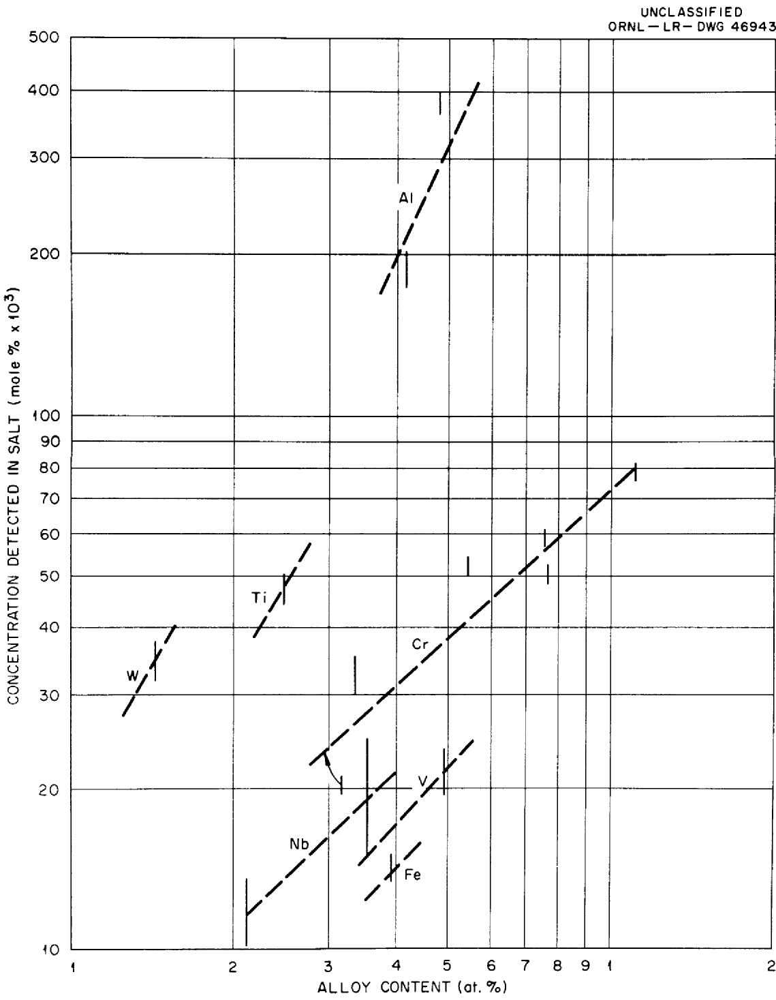  
Fig. 1. Corrosion-Product Concentrations of Salts Tested with Experimental Nickel-Molybdenum Alloys Containing Single Alloying Additions. Salt mixture: NaF-LiF-KF-UF $_4$ (11.2-45.3-41.0-2.5 mole %).

Salt Mixture: NaF-LiF-KF-UF4 (11.2-45.3-41.0-2.5 mole %)

Table II. Corrosion-Product Concentrations of Salts Tested with Experimental Nickel-Molybdenum Alloys Containing Multiple Alloy Additions   

<table><tr><td rowspan="2">Heat No.*</td><td rowspan="2">Alloy Composition (atomic %)</td><td colspan="6">Concentration of Element in Salt (Mole %)</td></tr><tr><td>Cr</td><td>Al</td><td>Ti</td><td>Nb</td><td>Fe</td><td>W</td></tr><tr><td colspan="8">Test Duration: 500 hr</td></tr><tr><td>OR 30-13</td><td>2.18 Al, 2.02 Ti, 11.35 Mo, bal Ni</td><td></td><td></td><td>0.040</td><td></td><td></td><td></td></tr><tr><td>OR 30-14</td><td>5.51 Al, 1.92 Ti, 10.42 mo, bal Ni</td><td></td><td>0.43</td><td>0.045</td><td></td><td></td><td></td></tr><tr><td>OR 30-16</td><td>2.54 Al, 1.90 Ti, 4.30 Cr, 10.20 Mo, bal Ni</td><td>0.023</td><td>0.33</td><td>0.038</td><td></td><td></td><td></td></tr><tr><td>OR 30-22</td><td>2.61 Al, 0.39 Nb, 6.64 Cr, 10.05 Mo, bal Ni</td><td>0.055</td><td>0.38</td><td></td><td>0.0018</td><td></td><td></td></tr><tr><td>B 2898</td><td>3.24 Ti, 0.90 Nb, 13.20 Mo, bal Ni</td><td></td><td></td><td>0.030</td><td>&lt;0.0005</td><td></td><td></td></tr><tr><td>B 3276</td><td>1.48 Nb, 9.32 Cr, 14.00 Mo, bal Ni</td><td>0.061</td><td></td><td></td><td>0.0007</td><td></td><td></td></tr><tr><td>B 3277</td><td>3.06 Al, 1.57 Nb, 9.47 Cr, 14.20 Mo, bal Ni</td><td>0.067</td><td>0.50</td><td></td><td>&lt;0.0005</td><td></td><td></td></tr><tr><td>ST 23011</td><td>1.27 Al, 2.91 Nb, 4.79 Cr, 1.72 W, 10.20 Mo, bal Ni</td><td>0.049</td><td></td><td></td><td></td><td></td><td>0.007</td></tr><tr><td>ST 23013</td><td>1.40 Al, 3.23 Nb, 1.85 W, 10.36 Mo, bal Ni</td><td></td><td>&lt;0.001</td><td></td><td>&lt;0.0005</td><td></td><td>0.002</td></tr><tr><td>ST 23014</td><td>1.30 Al, 2.71 Ti, 10.76 Mo, bal Ni</td><td></td><td>0.060</td><td>0.019</td><td></td><td></td><td></td></tr><tr><td colspan="8">Test Duration: 1000 hr</td></tr><tr><td>OR 30-14</td><td>5.51 Al, 1.92 Ti, 10.42 Mo, bal Ni</td><td></td><td>0.25</td><td>0.043</td><td></td><td></td><td></td></tr><tr><td>OR 30-22</td><td>2.61 Al, 0.39 Nb, 6.64 Cr, 10.05 Mo, bal Ni</td><td>0.041</td><td>0.25</td><td></td><td>0.0010</td><td></td><td></td></tr><tr><td>OR 30-33</td><td>1.59 Al, 5.56 Fe, 5.90 Cr, 9.66 Mo, bal Ni</td><td>0.069</td><td>0.082</td><td></td><td></td><td>0.0051</td><td></td></tr><tr><td>B 2897</td><td>1.68 Ti, 0.92 Nb, 13.77 Mo, bal Ni</td><td></td><td></td><td>0.038</td><td>0.0012</td><td></td><td></td></tr><tr><td>B 3277</td><td>3.06 Al, 1.57 Nb, 9.47 Cr, 14.20 Mo, bal Ni</td><td>0.073</td><td>0.47</td><td></td><td>0.0020</td><td></td><td></td></tr></table>

\*\*OR" denotes heats furnished by the ORNL Metals and Ceramics Division   
"ST" denotes heats furnished by Superior Tube Company.   
"B" denotes heats furnished by Battelle Memorial Institute.

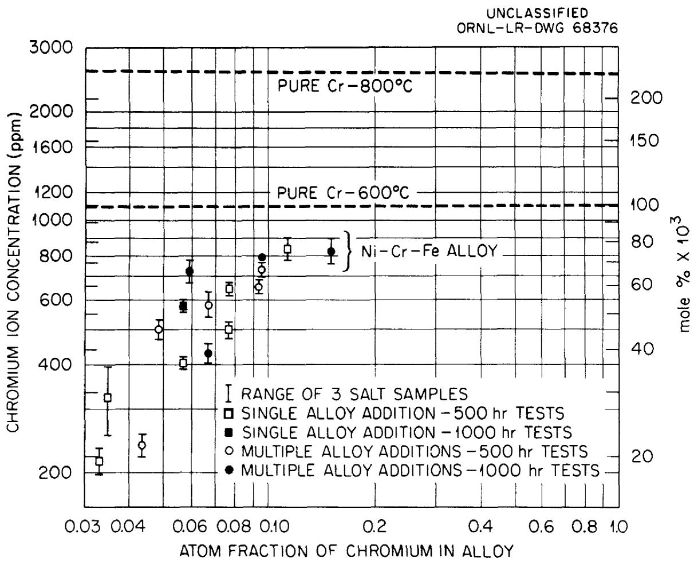  
Fig. 2. Chromium Concentration of Fluoride Salt Circulated in Thermal-Convection Loops as a Function of Chromium Content of the Loop. Salt mixture: NaF-LiF-KF-UF $_4$ (11.2-45.3-41.0-2.5 mole %). Loop temperature: hot leg, $815^{\circ}\mathrm{C}$ ; cold leg, $650^{\circ}\mathrm{C}$ .

cases the corrosion-product concentrations in the experimental alloy loops (which contained up to 11.0 at. $\%$ Cr) were less than corresponding concentrations in nickel-chromium-iron loops under similar temperature conditions or in pure chromium capsules exposed isothermally at 600 and $800^{\circ}\mathrm{C}$ . The latter observation indicates that the observed chromium ion concentrations were below those required for the formation of pure chromium crystals in the cold-log region of the loops ( $650^{\circ}\mathrm{C}$ ).

Metallographic examinations of alloys investigated under this program showed little evidence of corrosion except for systems containing combined additions of aluminum and titanium or aluminum and chromium. Significant alloy depletion and attendant subsurface void formation in the latter alloys occurred to depths of from 0.003 to 0.004 in. In all other systems, attack was manifested by shallow surface pits less than 0.001 in. in depth. Figure 3 illustrates the typical appearance of attack in alloy systems containing chromium at levels of 3.2 and 11.0 at. %, respectively. Although the depth of pitting was comparable in both alloys, the intensity of pitting increased slightly with chromium concentration.

In the case of the majority of alloys tested, the rate of attack between 0 and 500 hr was substantially greater than the rate occurring between 500 and 1000 hr. This finding is illustrated in Fig. 4, which compares the surface appearance of a ternary alloy containing 5.55 at. $\%$ Cr after 500- and 1000-hr exposures. This result is in agreement with the observed corrosion-product concentrations, which increased only slightly between 500 and 1000 hr, and suggests that nearly steady-state conditions were established within the first 500 hr of test operation.

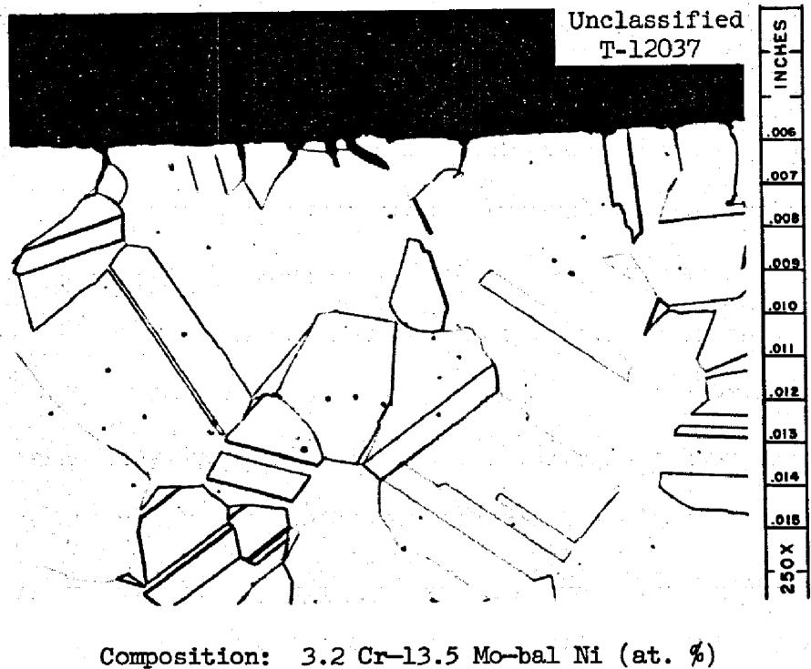

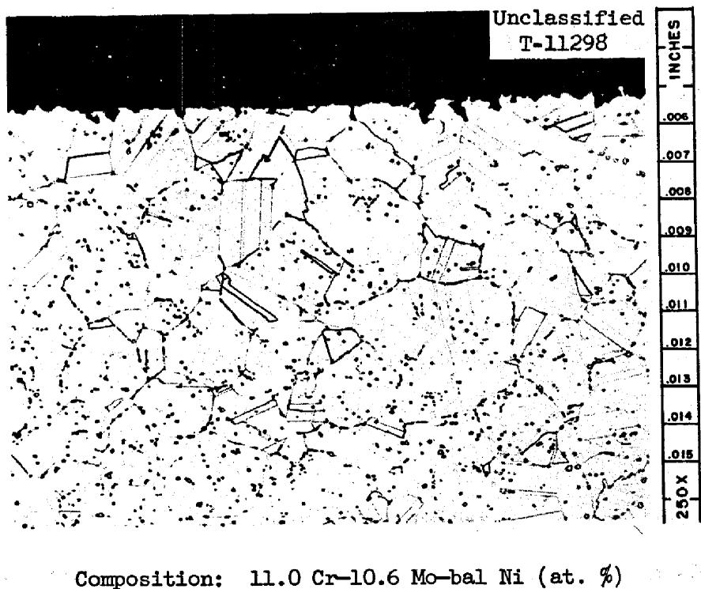  
Fig. 3. Hot-Leg Sections of Nickel-Molybdenum-Chromium Thermal-Convection Loops Following 500-hr Exposure to Fluoride Fuel. Salt mixture: NaF-LiF-KF-UF $_4$ (11.2-45.3-41.0-2.5 mole %). 250X. Reduced 5%.

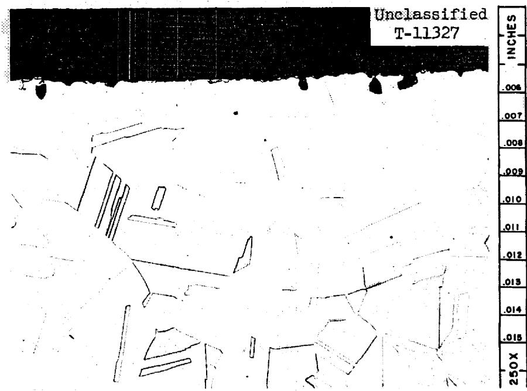  
After 5 hr

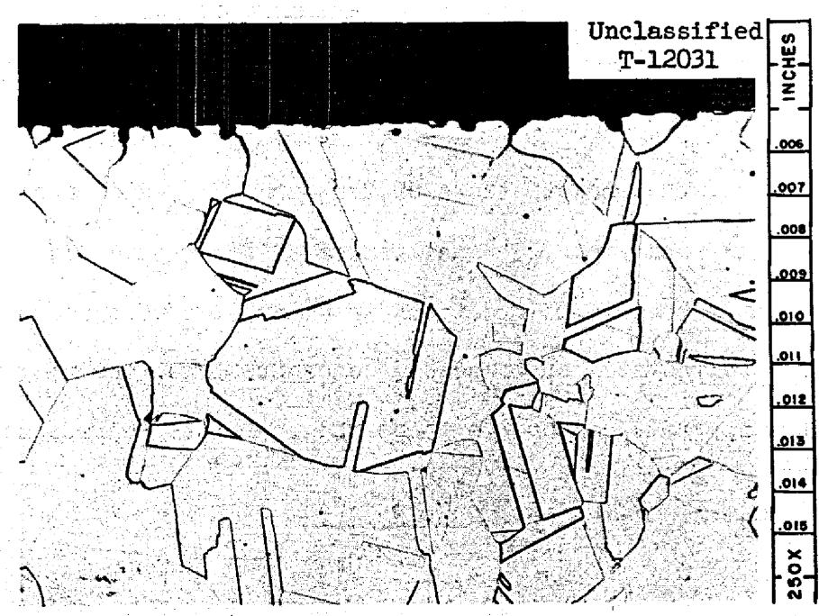  
After 1000 hr   
Fig. 4. Appearance of Hot-Leg Surface of a Ternary Nickel-Molybdenum Alloy Containing 5.55 at. % Cr Following Exposure to Fluoride Fuel. Heat No. OR30-2. Salt mixture: NaF-LiF-KF-UF4 (11.2-45.3-41.0-2.5 mole %). 250X. Reduced 4%.

# Discussion

In view of the uniform compositions of salt mixtures employed for these alloy evaluations, it follows that the mixtures afforded comparable oxidation potentials at the start of each test. Accordingly, if passivation did not occur, one can readily show that the extent of reaction resulting from equilibration of the salt mixture with given alloying elements should be governed simply by the activity of the element in the metal and by the stability (or standard free energy of formation) of the fluoride compound involving the element. Consider, for example, the component* chromium and the oxidation reaction

$$
\underline {{\mathrm {C r}}} + 2 \mathrm {U F} _ {4} = \mathrm {C r F} _ {2} + 2 \mathrm {U F} _ {3}, \tag {1}
$$

for which

$$
\mathrm {K} _ {\alpha} = \frac {\alpha_ {\mathrm {C r F} _ {2}} \cdot \alpha_ {\mathrm {U F} _ {3}} ^ {2}}{\alpha_ {\mathrm {C r}} \cdot \alpha_ {\mathrm {U F} _ {4}} ^ {2}}. \tag {2}
$$

At the very dilute concentrations of $\mathrm{CrF}_2$ and $\mathrm{UF}_3$ , which are realized under the test conditions, the activities of these products may be approximated by their mole fractions in accordance with Henry's law.

Thus, for a salt system of fixed $\mathrm{UF}_4$ concentrations, assuming the reference states for salt components to be the infinitely dilute solution,

$$
\mathrm {K} _ {\alpha} \cong \frac {\mathrm {N} _ {\mathrm {C r F} _ {2}} \cdot \mathrm {N} ^ {2} _ {\mathrm {U F} _ {3}}}{\alpha_ {\underline {{\mathrm {C r}}} \cdot} \alpha^ {2} _ {\mathrm {U F} _ {4}}} \quad , \tag {3}
$$

and

$$
\mathrm {N} _ {\mathrm {C r F} _ {2}} \cdot \mathrm {N} _ {\mathrm {U F} _ {3}} ^ {2} = \mathrm {K} ^ {\prime} \cdot \alpha_ {\underline {{\mathrm {C r}}}}. \tag {4}
$$

If reaction products are initially absent, a mass balance exists between the products formed such that $\mathbb{N}_{\mathrm{CrF}_2} = \frac{1}{2}\mathbb{N}_{\mathrm{UF}_3}$ and Eq. (4) reduces to

$$
\mathrm {N} _ {\mathrm {C r F} _ {2}} = \mathrm {K} ^ {\prime \prime} \cdot \alpha_ {\underline {{\mathrm {C r}}}} ^ {1 / 3}, \tag {5}
$$

where

$$
\left[ \begin{array}{l} \mathrm {K} ^ {\prime \prime} = \frac {\mathrm {K} \alpha^ {\cdot} \alpha_ {\mathrm {U F} 4} ^ {2}}{4} \end{array} \right] ^ {1 / 3}.
$$

Since

$$
\mathrm {R T} \ln \mathrm {K} _ {\alpha} = \triangle \mathrm {F} ^ {\circ} _ {\mathrm {C r F} _ {2}} + 2 \left(\triangle \mathrm {F} ^ {\circ} _ {\mathrm {U F} _ {3}} - \triangle \mathrm {F} ^ {\circ} _ {\mathrm {U F} _ {4}}\right),
$$

it follows that

$$
\mathrm {K} _ {\alpha} = \mathrm {f} \left(\triangle \mathrm {F} ^ {\circ} _ {\mathrm {C r F} _ {2}}\right),
$$

and

$$
\mathrm {N} _ {\mathrm {C r T} _ {2}} = \varepsilon (\alpha_ {\underline {{\mathrm {C r}}}}, \triangle F _ {\mathrm {C r} \cdot \mathrm {F} _ {2}} ^ {\circ}) \tag {6}
$$

In Table III are listed the standard free energies of formation, per gram-atom of fluorine, of fluoride compounds at 800 and $600^{\circ}\mathrm{C}$ associated with each of the alloying elements investigated [9]. Values are given for the most stable compounds (i.e., those with most negative free energies) and are listed in order of decreasing stabilities. The resultant order suggests that corrosion-product concentrations associated with each element (at a given activity) should have increased in the following order: W, Nb, Fe, Cr, V, Ti, and Al. Comparison with Fig. 1 shows that, with the exception of niobium and tungsten, the corrosion-product concentrations per atomic percent of alloy addition did increase in the exact order predicted. Only tungsten noticeably deviates from the predicted pattern, although the tests made on this addition were statistically limited.

Table III. Relative Thermodynamic Stabilities of Fluoride Compounds Formed by Elements Employed as Alloying Additions   

<table><tr><td rowspan="2">Element</td><td rowspan="2">Most Stable Fluoride Compound</td><td colspan="2">Standard Free Energy of Formation per Gram Atom of Fluorine (kcal/g-atom of F)</td></tr><tr><td>at 800°C</td><td>at 600°C</td></tr><tr><td>Al</td><td>AlF3</td><td>-87</td><td>-92</td></tr><tr><td>Ti</td><td>TiF3</td><td>-85</td><td>-90</td></tr><tr><td>V</td><td>VF2</td><td>-80</td><td>-84</td></tr><tr><td>Cr</td><td>CrF2</td><td>-72</td><td>-77</td></tr><tr><td>Fe</td><td>FeF2</td><td>-66</td><td>-69</td></tr><tr><td>Ni</td><td>NiF2</td><td>-59</td><td>-63</td></tr><tr><td>Nb</td><td>NbF5</td><td>-58</td><td>-60</td></tr><tr><td>Mo</td><td>MoF5</td><td>-57</td><td>-58</td></tr><tr><td>W</td><td>WF5</td><td>-46</td><td>-48</td></tr></table>

When tested in the presence of other alloying elements, the corrosion-product concentrations of iron, niobium, or tungsten were noticeably lower than the values attained for ternary alloys. The reason for this behavior undoubtedly relates to the presence of the more reactive alloying additions in the multicomponent alloys. If one considers, for example, an alloy containing comparable additions of chromium and iron, for which the corrosion reactions can be written

$$
\begin{array}{l} \mathrm {C r} + 2 \mathrm {U F} _ {4} = \mathrm {C r F} _ {2} + 2 \mathrm {U F} _ {3}: \Delta \mathrm {F} = - a \\ \underline {{\mathrm {F e}}} + 2 \mathrm {U F} _ {4} = \mathrm {F e F} _ {2} + 2 \mathrm {U F} _ {3}: \Delta \mathrm {F} = - b \\ \end{array}
$$

where

$$
\left| a \right| > \left| b \right|,
$$

the equilibrium $\mathrm{UF}_3$ concentration produced for the first reaction is higher than that which would be produced by the second reaction. Accordingly, in the presence of chromium, the $\mathrm{FeF}_2$ concentration at equilibrium will be reduced compared to the system containing iron only.

The results of these alloy evaluations provided further evidence that corrosion in molten fluoride systems involved essentially the attainment of thermodynamic equilibrium between the fluoride melt and container metal. The results also implied that, over the alloy compositions studied, the activities of the alloying additions could be reasonably approximated by their atom fractions, i.e., that activity coefficients were nearly the same for all of the alloying additions tested. The favorable corrosion properties of the majority of alloys tested permitted wide latitude in the selection of an optimum alloy composition for fluoride fuel containment. Only titanium and aluminum were felt to afford potential corrosion problems, particularly if used as combined additions or in

combination with chromium. Because chromium had proved an extremely effective alloying agent in regard to both strength and oxidation properties, this alloying addition was utilized in the selected alloy composition. The level of chromium in this alloy was fixed at $7\%$ , which is the minimum amount required to impart oxidation resistance to the Ni-17% Mo system [10]. The addition of chromium as an iron-chromium alloy also imparted approximately $5\%$ Fe to the system. While this finalized alloy composition, designated INOR-8, was not tested as part of the initial alloy study, its corrosion properties can be considered equivalent to those of the ternary chromium-containing alloys discussed above.

# CORROSION PROPERTIES OF INOR-8

# Experimental

The materialization of INOR-8 as a container material for fluoride fuels led to an extensive investigation of the corrosion properties of this specific alloy composition under simulated reactor conditions. Studies were conducted in forced-convection loops of the type shown in Fig. 5. Tubular inserts contained within the heated sections of the loops provided an analysis of weight losses occurring during the tests, and salt samplers located above the pump bowls provided a semicontinuous indication of corrosion-product concentrations in the circulating salt. All parts of the loops were constructed of commercially supplied INOR-8 material.

The salt compositions initially utilized for these studies were of the type $\mathrm{LiF - BeF_2 - UF_4}$ but, in later tests, the compositions were changed to $\mathrm{LiF - BeF_2 - ThF_4 - UF_4}$ . Corrosion rates were determined at a series of

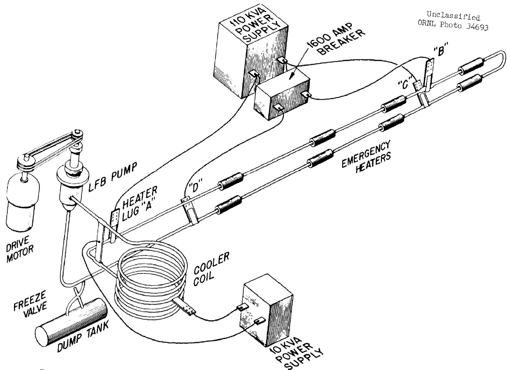  
Fig. 5. Diagram of Forced-Convection Loop Used for Evaluation of INOR-8.

hot-leg operating temperatures ranging from 700 to $815^{\circ}\mathrm{C}$ . At each temperature level, the mixtures experienced a temperature change of approximately $200^{\circ}\mathrm{C}$ between heater and cooler sections. Loop operating times were generally in the range 15,000 to 20,000 hr, although loop operation was interrupted at shorter time intervals to allow the removal of corrosion inserts.

# Results

The weight losses of corrosion inserts contained in the hot legs of INOR-8 forced-convection loops at 700, 760, and $815^{\circ}\mathrm{C}$ are shown in Table IV. In two test loops operated at $700^{\circ}\mathrm{C}$ , weight losses were in the range 2 to $5\mathrm{mg/cm}^2$ and showed little change after 5000 hr of loop operation. Weight losses at 760 and $815^{\circ}\mathrm{C}$ were slightly higher, being in the range 8 to $10\mathrm{mg/cm}^2$ , and again were essentially unchanged after 5000 hr of operation. Comparisons of before- and after-test dimensions of the inserts revealed no measurable changes in wall thickness. However, if uniform attack is assumed, weight-loss measurements indicate wall reductions on the order of 2 to $12\mu$ (Table IV).

Chemical analyses of salt samples that were periodically withdrawn from the loops showed a slight upward shift in chromium concentration, while concentrations of other metallic components remained unchanged. During a typical run, as pictured in Fig. 6, the chromium concentration reached an asymptotic limit after about 5000 hr of operation. This limit was between 300 and 500 ppm at $700^{\circ}\mathrm{C}$ and between 600 and 800 ppm at 760 and $815^{\circ}\mathrm{C}$ .

Metallographic examinations of loops operated at $700^{\circ}\mathrm{C}$ for time periods up to 5000 hr showed no evidence of surface attack. When test

Table IV. Corrosion Rates of Inserts Located in the Hot Legs of INOR-8 Forced-Convection Loops as a Function of Operating Temperature   
Loop temperature gradient: $200^{\circ}\mathrm{C}$ Flow rate: approximately 2.0 gal/min Reynolds number: approximately 3000   

<table><tr><td>Loop Number</td><td>Salt Mixturea</td><td>Insert Temperature (°C)b</td><td>Time (hr)</td><td>Weight Loss per Unit Area (mg/cm2)</td><td>Equivalent Loss in Wall Thickness (μ)</td></tr><tr><td rowspan="3">9354-4</td><td rowspan="3">130</td><td rowspan="3">700</td><td>5,000</td><td>1.8</td><td>2.0</td></tr><tr><td>10,000</td><td>2.1</td><td>2.3</td></tr><tr><td>15,140</td><td>1.8</td><td>2.0</td></tr><tr><td rowspan="3">MSRP-14</td><td rowspan="3">Bu-14</td><td rowspan="3">700</td><td>2,200</td><td>0.7</td><td>0.8</td></tr><tr><td>8,460</td><td>3.8</td><td>4.3</td></tr><tr><td>10,570</td><td>5.1</td><td>5.8</td></tr><tr><td rowspan="2">MSRP-15</td><td rowspan="2">Bu-14</td><td rowspan="2">760</td><td>8,770</td><td>11.2</td><td>12.7</td></tr><tr><td>10,880</td><td>10.0c</td><td>11.2</td></tr><tr><td rowspan="2">MSRP-16</td><td rowspan="2">Bu-14</td><td rowspan="2">815</td><td>5,250</td><td>9.6</td><td>10.9</td></tr><tr><td>7,240</td><td>9.0c</td><td>9.1</td></tr></table>

Salt Compositions: 130 LiF-BeF2-UF4 (62-37-1 mole %) Bu-14 LiF-BeF2-ThF4-UF4 (67-18.5-14-0.5 mole %).   
bSame as maximum wall temperature.   
Average of two inserts.

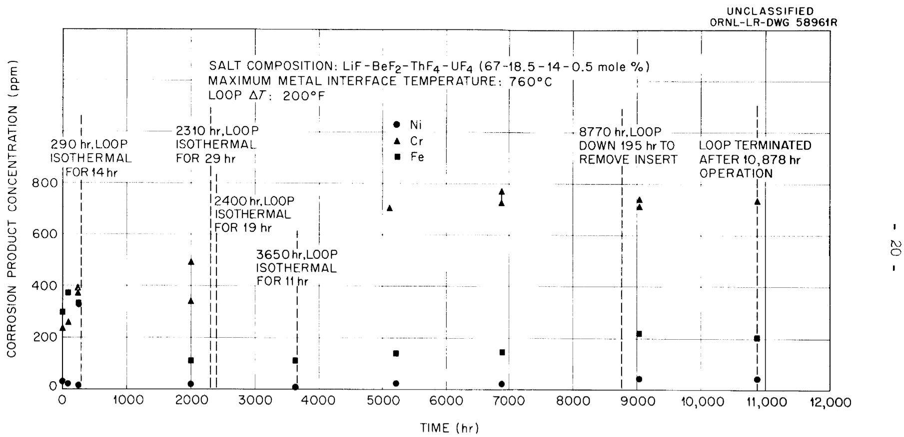  
Fig. 6. Concentration of Corrosion Products in Fluoride Salt Circulated in an INOR-8 Forced-Convection Loop.

times exceeded 5000 hr, however, an extremely thin continuous surface layer was evident along exposed surfaces, as shown in Fig. 7. Similar results were observed in $760^{\circ}\mathrm{C}$ tests. No transition or diffusion zone was apparent between the layer and the base metal, and analyses of the layer showed it to be composed predominantly of nickel with smaller amounts of iron, chromium, and molybdenum.

At $815^{\circ}\mathrm{C}$ surface attack was manifested by the appearance of subsurface voids, shown in Fig. 8, and the surface layer was not observed.

# Discussion

The corrosion rates of INOR-8 measured in pumped loops operating with maximum temperatures ranging from 700 to $815^{\circ}\mathrm{C}$ indicate that corrosion reactions with fluoride salts are essentially completed within the first 5000 hr of loop operation and that weight losses thereafter remain essentially constant. When judged from the standpoint of total weight loss, the temperature dependence of the corrosion rates was relatively small over the ranges studied. However, the metallographic appearance of specimen surfaces was noticeably influenced by the test temperature. At the highest test temperature $(815^{\circ}\mathrm{C})$ , exposed surfaces underwent a noticeable depletion of chromium, as indicated by the appearance of sub-surface voids. At lower temperatures, surfaces were slightly pitted and were lined with a thin surface film which became apparent only after 5000 hr of operation. The composition of this layer indicates a higher nickel-to-molybdenum ratio than originally present in the base metal and suggests that the layer may constitute an intermetallic transformation product of the nickel-molybdenum system.

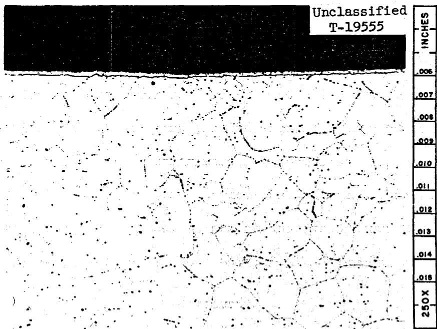  
Fig. 7. Appearance of Metallographic Specimen from Point of Maximum Wall Temperature (700°C) of INOR-8 Forced-Convection Loop 9354-4. Operating time: 15,140 hr. Salt mixture: LiF-BeF $_2$ -UF $_4$ (62-37-1 mole %). 250X. Reduced 7%.

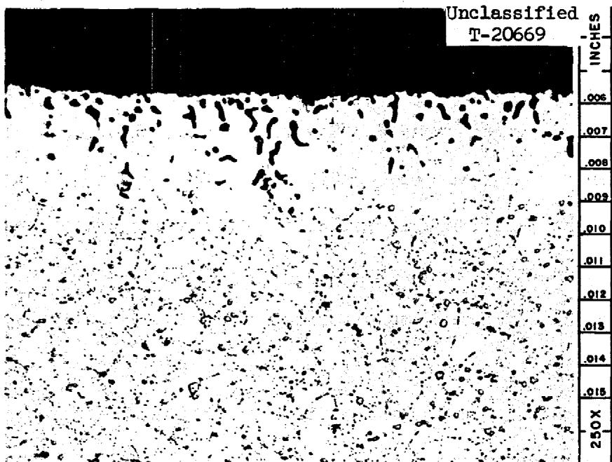  
Fig. 8. Appearance of metallographic Specimen from Point of Maximum Wall Temperature (815°C) of INOR-8 Forced-Convection Loop MSRP-16. Operating time: 7,240 hr. Salt mixture: LiF-BeF $_2$ -ThF $_4$ -UF $_4$ (67-18.5-14-0.5 mole %). 250X. Reduced 7%.

# ANALYSIS OF CORROSION PROCESSES

The above-mentioned tests of nickel-molybdenum alloys in fluoride mixtures have given considerable insight into the mechanisms of corrosion in these systems. In turn, the conclusions drawn have enabled the development of procedures for predicting corrosion rates on the basis of the operating conditions and chemical properties of the system. The method of approach and assumptions used for these calculations are discussed below. For purposes of illustration, the discussion deals specifically with the NaF-ZrF $_4$ -UF $_4$ salt system contained in INOR-8.

The corrosion resistance of metals to fluoride fuels has been found to vary directly with the "nobility" of the metal - that is, inversely with the magnitude of free energy of formation of fluorides involving the metal. Accordingly, corrosion of multicomponent alloys tends to be manifested by the selective oxidation and removal of the least noble component. In the case of INOR-8, corrosion is selective with respect to chromium (Figs. 2 and 8). If pure salt containing $\mathrm{UF_4}$ (and no corrosion products) is added to an INOR-8 loop operating polythermally, all points of the loop initially experience a loss of chromium in accordance with the $\mathrm{Cr - UF_4}$ reaction, Eq. (1), and by reaction with impurities in the salt (such as HF, $\mathrm{NiF_2}$ , or $\mathrm{FeF_2}$ ). Impurity reactions go rapidly to completion at all temperature points and are important only in terms of short-range corrosion effects.

The $\mathrm{UF}_4$ reaction, however, which is temperature-sensitive, provides a mechanism by which the alloy at high temperature is continuously depleted and the alloy at low temperature is continuously enriched in chromium. As the corrosion-product concentration of salt is increased by the impurity

and $\mathrm{UF_4}$ reactions, the lowest temperature point of the loop eventually achieves equilibrium with respect to the $\mathrm{UF_4}$ reaction. At regions of higher temperature, because of the temperature dependence for this reaction, a driving force still exists for chromium to react with $\mathrm{UF_4}$ . Thus, the corrosion-product concentration will continue to increase and the temperature points at equilibrium will begin to move away from the coldest temperature point. At this stage, chromium is returned to the walls of the coldest point of the system. The rise in corrosion-product concentration in the circulating salt continues until the amount of chromium returning to the walls exactly balances the amount of chromium entering the system in the hot-leg regions. Under these conditions, the two positions of the loop at equilibrium with the salt that are termed the "balance points" do not shift measurably with time. Thus, a quasi-steady-state situation is eventually achieved whereby chromium is transported at very low rates and under conditions of a fixed chromium surface concentration at any given loop position. This idea is supported by the fact that concentrations of $\mathrm{CrF_2}$ , $\mathrm{UF_4}$ , and $\mathrm{UF_3}$ achieve steady-state values even though attack slowly increases with time.

During the initial or unsteady-state period of corrosion, the mathematical interpretation of chromium migration rates in polythermal systems is extremely complex, because of rapid compositional changes which occur continuously in both the salt mixture and at the surface of the container wall. A manifestation of this complexity is apparent in cold-leg regions, where chromium concentration gradients are reversed as corrosion products build up within the salt. Unfortunately, the effects of unsteady-state operation serve also to complicate the interpretation

of steady-state operation. However, an idealized approach to the study of chromium migration under steady-state conditions is afforded by assuming the salt mixture to be preequilibrated so as to contain amounts of $\mathrm{CrF}_2$ and $\mathrm{UF}_3$ which establish a steady-state condition at the beginning of loop operation.* Under this assumption the following conditions may be specified for the resulting migration of chromium:

1. The overall rate of transfer is controlled by the diffusion rate of chromium in the container material, since this diffusion rate can be shown to be considerably lower than the rates of reaction and of mixing which are involved in the transfer process.   
2. Chemical equilibrium with respect to chromium and the salt mixture exists at every surface point within the loop system.   
3. At any time the cumulative amount of chromium removed from the hot zone equals the cumulative amount deposited in the cold zone. Accordingly, the concentrations of $\mathrm{UF}_3$ , $\mathrm{UF}_4$ , and $\mathrm{CrF}_2$ , assuming the salt to be rapidly circulated, do not vary with loop position or time.

The "equilibrium" concentrations of $\mathrm{UF}_4$ , $\mathrm{UF}_3$ , and $\mathrm{CrF}_2$ can be estimated for steady-state loop operation by applying these three conditions to a given set of loop parameters and operating conditions. As a means for demonstrating these calculations, it is convenient to apply them to a preequilibrated polythermal INOR-8 loop in which the salt system

$\mathrm{NaF - ZrF_4 - UF_4}$ (50-46-4 mole %) is circulated between the temperature limits of 600 and $800^{\circ}\mathrm{C}$ . It is assumed that the balance point of the system is at $600^{\circ}\mathrm{C}$ . Under this condition, the amount of chromium depletion and hence the corrosion rate at $800^{\circ}\mathrm{C}$ are the highest attainable under steady-state conditions.

In accordance with the second condition given above, the surface concentration, $\left(\underline{\mathrm{N}_{\mathrm{Cr}}}\right)_{\mathrm{s}}$ , at the $800^{\circ}\mathrm{C}$ temperature point can be expressed in terms of the equilibrium constant, $\mathbf{K}_{\alpha}$ , determined for the UF $_4$ -Cr reaction in accordance with Eq. (3).

$$
\left[ \left(\underline {{\mathrm {N} _ {\mathrm {C r}}}}\right) _ {\mathrm {s}} \right] _ {8 0 0 ^ {\circ} \mathrm {C}} = \frac {1}{\left(\mathrm {K} _ {\alpha}\right) _ {8 0 0 ^ {\circ} \mathrm {C}}} \cdot \left[ \frac {\alpha_ {\mathrm {U F} _ {3}} ^ {2} \cdot \alpha_ {\mathrm {C r F} _ {2}}}{\alpha_ {\mathrm {U F} _ {4}} ^ {2}} \right] \tag {7}
$$

but

$$
\frac {\alpha^ {2} _ {\mathrm {U F} _ {3}} \cdot \alpha_ {\mathrm {C r F} _ {2}}}{\alpha^ {2} _ {\mathrm {U F} _ {4}}} = \left[ \left(\underline {{\mathrm {N} _ {\mathrm {C r}}}}\right) _ {\mathrm {s}} \right] _ {6 0 0 ^ {\circ} \mathrm {C}} \cdot \left(\mathrm {K} _ {\alpha}\right) _ {6 0 0 ^ {\circ} \mathrm {C}}, \tag {8}
$$

so that

$$
\left[ \left(\underline {{\mathrm {N} _ {\underline {{C r}}}}}\right) _ {\mathrm {s}} \right] _ {8 0 0 ^ {\circ} \mathrm {C}} = \frac {\left(\mathrm {K} _ {\alpha}\right) _ {6 0 0 ^ {\circ} \mathrm {C}}}{\left(\mathrm {K} _ {\alpha}\right) _ {8 0 0 ^ {\circ} \mathrm {C}}} \left[ \left(\underline {{\mathrm {N} _ {\underline {{C r}}}}}\right) _ {\mathrm {s}} \right] _ {6 0 0 ^ {\circ} \mathrm {C}}. \tag {9}
$$

The balance points of the system, which are at $600^{\circ}\mathrm{C}$ , have been defined such that

$$
\left[ \left(\underline {{\mathrm {N} _ {\mathrm {C r}}}}\right) _ {\mathrm {S}} \right] _ {6 0 0 ^ {\circ} \mathrm {C}} = \left(\underline {{\mathrm {N} _ {\mathrm {C r}}} \text {i n I N O R - 8}}\right). \tag {10}
$$

Therefore, since the concentration of fluorides involved do not change with position or time,

$$
\left[ \left(\underline {{\mathrm {N} _ {\underline {{C r}}}}}\right) _ {\mathrm {s}} \right] _ {8 0 0 ^ {\circ} \mathrm {C}} = \frac {\left(\mathrm {K} _ {\alpha^ {\prime}}\right) 6 0 0 ^ {\circ} \mathrm {C}}{\left(\mathrm {K} _ {\alpha^ {\prime}}\right) 8 0 0 ^ {\circ} \mathrm {C}} \quad \left(\underline {{\mathrm {N} _ {\underline {{C r}}}}} \text {i n I N O R - 8}\right). \tag {11}
$$

and

$$
\frac {\left(\mathrm {C} _ {\mathrm {s}}\right) 8 0 0 ^ {\circ} \mathrm {C}}{\mathrm {C} _ {\mathrm {o}}} = \frac {\left(\mathrm {K} _ {\alpha^ {\prime}}\right) 6 0 0 ^ {\circ} \mathrm {C}}{\left(\mathrm {K} _ {\alpha^ {\prime}}\right) 8 0 0 ^ {\circ} \mathrm {C}} \tag {12}
$$

where

$$
C _ {S} = \text {s u r f a c e c o n c e n t r a t i o n o f c h r o m i u m (g / c m ^ {3})}
$$

$$
C _ {o} = \text {o r i g i n a l c h r o m i u m c o n c e n t r a t i o n o f I N O R - 8 (g / c m ^ {3})}.
$$

The first of the assumed boundary conditions established that the overall chromium migration rate was diffusion controlled. The applicable diffusion equation at any given temperature position under the boundary condition of constant surface concentration is given as

$$
C (X, t) = C _ {S} - \Delta C \operatorname {e r f} \frac {X}{2 \sqrt {D t}} \tag {13}
$$

where

$$
C (X, t) = \text {c h r o m i u m c o n c e n t r a t d e p t h X a f t e r t i m e} t
$$

$$
\Delta C = C _ {S} - C _ {O}.
$$

This equation together with Eq. (12) enables the determination of the concentration gradient of chromium and hence the mass of metal removed at selected temperature points. Basic material data needed are (1) diffusion coefficients for chromium in INOR-8 as a function of temperature and (2) equilibrium ratios for the redox equation (Eq. 2) as a function of temperature. Values of these variables are given in Fig. 9. The diffusion coefficients are based on determinations of the self-diffusion of chromium in INOR-8 using the tracer $\mathrm{Cr}^{51}$ , [11, 12] and the equilibrium ratios are based on an interpolation of experimental values for $\mathrm{NaF - ZrF_4 - UF_4}$ mixtures in contact with chromium at 600 and $800^{\circ}\mathrm{C}$ .

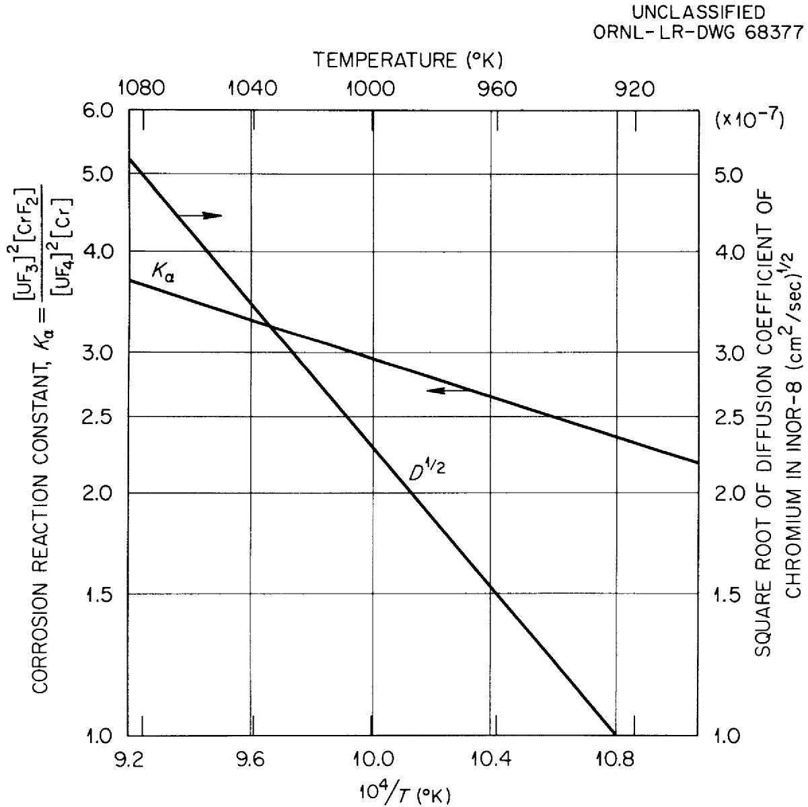  
Fig. 9. Effect of Temperature on Parameters Which Control Chromium Migration in INOR-8 Salt Systems.

Calculations of the corrosion rate and total attack at $800^{\circ}\mathrm{C}$ are plotted in Fig. 10 for time periods up to 18 months. The corrosion rate, measured in units of $10^{-4} \, \text{g/month} \cdot \text{cm}^2$ , is seen to decline to a relatively low value after the first 3 months of operation. After 18 months the specimen has lost only about $1 \, \text{mg/cm}^2$ of chromium.

This calculated weight loss, based on a preequilibrated system containing the salt $\mathrm{NaF - ZrF_4 - UF_4}$ , is an order of magnitude lower than the weight loss experimentally determined in an INOR-8 forced-convection loop containing the mixture $\mathrm{LiF - BeF_2 - UF_4 - ThF_4}$ at $815^{\circ}\mathrm{C}$ (Table IV). Although the $\mathrm{Cr - UF_4}$ equilibrium constants for the latter salt system are not completely determined, indirect measurements indicate that values of these constants are not significantly different from those of the $\mathrm{NaF - ZrF_4 - UF_4}$ system. Thus differences between the experimental and the calculated steady-state losses essentially reflect the effects of initial nonequilibrium conditions and, as discussed below, quite probably of traces of impurities in the experimental system. The very low rates of attack in the experimental systems after steady-state was achieved, i.e., after 5000 hr, are in good agreement with the predictions based on preequilibrated salt.

Evidence of impurity effects in the pumped-loop systems is provided by the following consideration. Calculations based on complete chromium depletion at the alloy surface yield mass transfer rates which are still somewhat lower than the observed rates; thus, it must be concluded that components other than chromium per se have been removed by the fuel salt. Oxidation of these more noble components requires the presence of relatively strong oxidants, such as HF, $\mathrm{H}_2\mathrm{O}$ , or $\mathrm{NiF}_2$ .

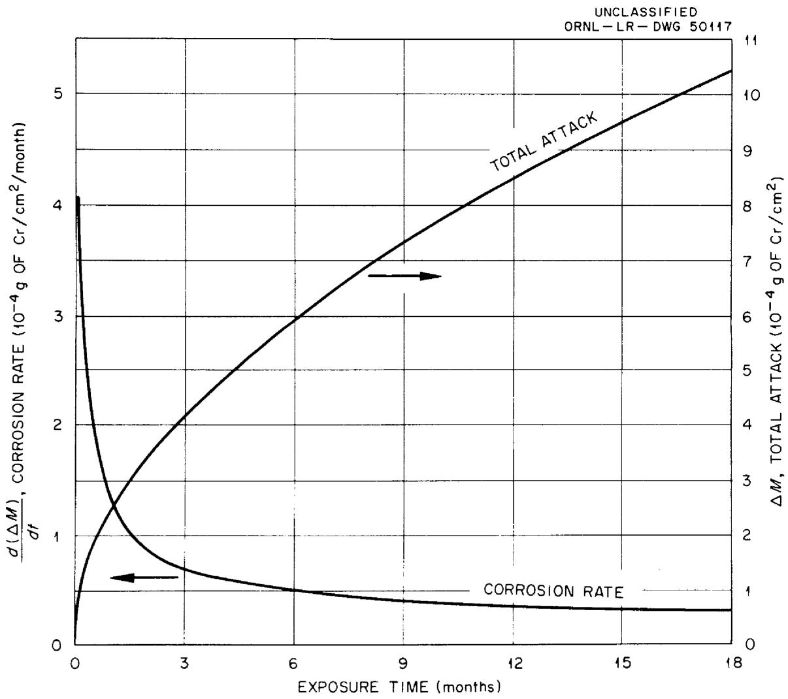  
Fig. 10. Calculated Corrosion Rate and Cumulative Attack for $800^{\circ}\mathrm{C}$ Section of INOR-8 Loop Containing Pre-equilibrated $\mathrm{NaF - ZrF_4 - UF_4}$ (50-46-4 mole %) Salt. Assumed test conditions: hot-leg temperature, $800^{\circ}\mathrm{C}$ ; cold-leg temperature, $600^{\circ}\mathrm{C}$ . Salt in equilibrium with INOR-8 at $600^{\circ}\mathrm{C}$ .

The validity of the proposed corrosion model for chromium removal was experimentally evaluated by implanting the radioisotope $\mathrm{Cr}^{51}$ in an INOR-8 thermal-convection loop and following the movement of this tracer under controlled-corrosion conditions. These experiments, which have been reported elsewhere [12], utilized the corrosive agent $\mathrm{FeF}_2$ contained in an equimolar mixture of $\mathrm{NaF - ZrF_4}$ . The presence of $\mathrm{FeF}_2$ caused the total chromium concentration at the surface to be reduced practically to zero but it did not affect other components of INOR-8. The observed rates of tracer migration closely corresponded to rates predicted by the use of self-diffusion coefficients for chromium in INOR-8, and chromium diffusivities measured under the strongly corrosive conditions of these experiments closely approximated the self-diffusion measurements.

# SUMMARY AND CONCLUSIONS

1. The corrosion properties of solid-solution alloying elements in the Ni-17% Mo system have been investigated in molten mixtures of NaF-LiF-KF-UF $_4$ . The corrosion susceptibility of alloying additions was found to increase in the order: Fe, Nb, V, Cr, W, Ti, and Al. With the exception of tungsten and niobium, the susceptibility of these elements increased in the same order as the stabilities of fluoride compounds of the elements.   
2. The corrosion-product concentrations produced by either iron, niobium, or tungsten alloying additions in the above salt mixture were lower in combination with chromium, aluminum, or titanium alloying additions than when present as single alloying additions.

3. Depths of attack of experimental alloys based on the Ni-17% Mo system were negligible except in the case of alloys containing combined additions of aluminum and chromium or aluminum and titanium.   
4. Pumped loops composed of the alloy 17 Mo-7 Cr-5 Fe-bal Ni (INOR-8) were investigated with salt mixtures of the type LiF-BeF $_2$ -ThF $_4$ -UF $_4$ over a series of operating temperatures. Weight losses of corrosion specimens in these systems achieved essentially constant values after 5000 hr. Corrosion products detected in the circulating salts consisted primarily of chromium. The level of chromium in the salt remained constant after 5000 hr.   
5. At hot-leg temperatures of 700 and $760^{\circ}\mathrm{C}$ , corrosion specimens in pumped loops underwent little visible attack, although maximum weight losses of from 2 to $11\mathrm{mg/cm}^2$ were recorded. At $760^{\circ}\mathrm{C}$ , weight losses were not substantially higher, but specimens exhibited a zone of sub-surface voids caused by chromium depletion.   
6. The chromium corrosion rates of INOR-8 in fluoride mixtures can be calculated under the assumptions that these rates are controlled by the diffusion rates of chromium in INOR-8 and that the surface concentration of chromium is in equilibrium with the salt mixture.

# REFERENCES

1. R. C. Briant and A. M. Weinberg, "Molten Fluorides as Power Reactor Fuels," Nuclear Science and Engineering 2, 797-803 (1957).   
2. G. I. Cathers, "Fluoride Volatility Process for High-Alloy Fuels," Symposium on Reprocessing of Irradiated Fuels, Brussels, Belgium, TID-7534, Book 2, p. 560 (1957).   
3. W. D. Manly et al., "Metallurgical Problems in Molten Fluoride Systems," Progress in Nuclear Energy, Series IV 2, 164-179 (1960).   
4. G. M. Adamson, R. S. Crouse, and W. D. Manly, Interim Report on Corrosion by Alkali-Metal Fluorides: Work to May 1, 1953, ORNL-2337 (Mar. 20, 1957).   
5. G. M. Adamson, R. S. Crouse, and W. D. Manly, Interim Report on Corrosion by Zirconium-Base Fluorides, ORNL-2338 (Jan. 3, 1961).   
6. E. S. Bettis et al., "The Aircraft Reactor Experiment - Design and Construction," Nuclear Science and Engineering 2, 804-825 (1957).   
7. W. D. Manly et al., Aircraft and Reactor Experiment - Metallurgical Aspects, ORNL-2349 (1957).   
8. J. D. Redman, Oak Ridge National Laboratory, personal communication.   
9. A. Glassner, The Thermodynamic Properties of the Oxides, Fluorides, and Chlorides to $2500^{\circ}\mathrm{K}$ , ANL-5750.   
10. H. Inouye, Oak Ridge National Laboratory, private communication.   
11. R. B. Evans, J. H. Devan, and G. M. Watson, Self-Diffusion of Chromium in Nickel-Base Alloys, ORNL-2982 (Jan. 20, 1961).   
12. W. R. Grimes et al., Radio Isotopes in Physical Science and Industry Vol. 3, pp. 559-574, IAEA, Vienna, Austria, 1962.

# DISTRIBUTION

1-2. Central Research Library 76. H. W. Hoffman

3. Reactor Division Library 77. P. P. Holz

4. ORNL - Y-12 Technical Library 78. L. N. Howell

Document Reference Section 79. R. G. Jordan

5-14. Laboratory Records

15. Laboratory Records, ORNL RC 81. R. J. Kedl

16. ORNL Patent Office 82. G. W. Keilholtz

17-18. D. F. Cope, AEC-ORO

19. Research and Development 84. B. W. Kinyon

Division AEC-ORO 85. R. W. Knight

20-34. Division of Technical

Information Extension (DTIE) 87. R. B. Lindauer

35. G. M. Adamson

36. L. G. Alexander 89. H. G. MacPherson

37. S.E.Beall 90.W.D.Manly

38. C. E. Bettis 91. E. R. Mann

39. E. S. Bettis 92. W. B. McDonald

40. F. F. Blankenship 93. C. K. McGlothlan

41. E. P. Blizzard 94. E. C. Miller

42. A. L. Boch 95. R. L. Moore

43. S. E. Bolt 96. C. W. Nestor

44. R. B. Briggs 97. T. E. Northup

45. 0. W. Burke 98. W. R. Osborn

46. D. O. Campbell 99. L. F. Parsly

47. W. G. Cobb 100. P. Patriarca

48. J. A. Conlin 101. H. R. Payne

49. W. H. Cook 102. W. B. Pike

50. J. E. Cunningham 103. M. Richardson

51. G. A. Cristy 104. R. C. Robertson

52. J. L. Crowley 105. T. K. Roche

53. F. L. Culler 106. H. W. Savage

54-58. J. H. Devan

59. R. G. Donnelly 108. O. Sisman

60. D. A. Douglas 109. G. M. Slaughter

61. J. L. English 110. A. N. Smith

62. E. P. Epler lll. P. G. Smith

63. W. K. Ergen 112. I. Spiewak

64. A. P. Fraas 113. A. Taboada

65. J. H Frye, Jr. 114. J. R. Tallackson

66. C. H. Gabbard 115. E. H. Taylor

57. W. R. Gall 116. R. E. Thoma

68. R. B. Callaher 117. D. B. Trauger

69. W. R. Grimes 118. W. C. Ulrich

70. A. G. Grindell 119. D. C. Watkin

71. C. S. Harrill 120. J. H. Westsik

72-74. M.R.Hill

75. E. C. Hise

122. C. H. Wödtke

123. J. F. Kaufmann, AEC, Washington

124. R. W. McNamee, Manager, Research Administration, UCC, New York

125. F.P.Self,AEC-ORO