ORNL-TM- 378

COPY NO. - /S

DATE - November 5, 1962

# TEMPERATURES IN THE MSRE CORE DURING STEADY-STATE POWER OPERATION

J. R. Engel and P. N. Haubenreich

MASTEN.

# ABSTRACT

Over-all fuel and graphite temperature distributions were calculated for a detailed hydraulic and nuclear representation of the MSRE. These temperature distributions were weighted in various ways to obtain nuclear and bulk mean temperatures for both materials. At the design power level of 10 Mw, with the reactor inlet and outlet temperatures at $1175^{\circ}\mathrm{F}$ and $1225^{\circ}\mathrm{F}$ , respectively, the nuclear mean fuel temperature is $1213^{\circ}\mathrm{F}$ . The bulk average temperature of the fuel in the reactor vessel (excluding the volute) is $1198^{\circ}\mathrm{F}$ . For the same conditions and with no fuel permeation, the graphite nuclear and bulk mean temperatures are $1257^{\circ}\mathrm{F}$ and $1226^{\circ}\mathrm{F}$ , respectively. Fuel permeation of $2\%$ of the graphite volume raises these values to $1264^{\circ}\mathrm{F}$ and $1231^{\circ}\mathrm{F}$ , respectively.

The effects of power on the nuclear mean temperatures were combined with the temperature coefficients of reactivity of the fuel and graphite to estimate the power coefficient of reactivity of the reactor. If the reactor outlet temperature is held constant during power changes, the power coefficient is - 0.018% $\frac{\Delta k}{k} / Mw$ . If, on the other hand, the average of the reactor inlet and outlet temperatures is held constant, the power coefficient is - 0.047% $\frac{\Delta k}{k} / Mw$ .

Pussimile Price $

Microfit Price $

Available from the

Office of Technical Services

Department of Commerce

Washington 25, D. C.

# NOTICE

This document contains information of a preliminary nature and was prepared primarily for internal use at the Oak Ridge National Laboratory. It is subject to revision or correction and therefore does not represent a final report. The information is not to be abstracted, reprinted or otherwise given public dissemination without the approval of the ORNL patent branch, Legal and Information Control Department.

# LEGAL NOTICE

This report was prepared as an account of Government sponsored work. Neither the United States, nor the Commission, nor any person acting on behalf of the Commission:

A. Makes any warranty or representation, expressed or implied, with respect to the accuracy, completeness, or usefulness of the information contained in this report, or that the use of any information, apparatus, method, or process disclosed in this report may not infringe privately owned rights; or   
B. Assumes any liabilities with respect to the use of, or for damages resulting from the use of any information, apparatus, method, or process disclosed in this report.

As used in the above, "person acting on behalf of the Commission" includes any employee or contractor of the Commission, or employee of such contractor, to the extent that such employee or contractor of the Commission, or employee of such contractor prepares, disseminates, or provides access to, any information pursuant to his employment or contract with the Commission, or his employment with such contractor.

# CONTENTS

Page

ABSTRACT 1

LIST OF FIGURES 5

LIST OF TABLES 6

INTRODUCTION 7

DESCRIPTION OF CORE 8

Fuel Channels 11

Hydraulic Model 12

Neutronic Model 15

NEUTRONIC CALCULATIONS 18

Flux Distributions 19

Power Density Distribution 22

Nuclear Importance Functions for Temperature 22

FUEL TEMPERATURES 26

Over-all Temperature Distribution 30

Nuclear Mean Temperature 33

Bulk Mean Temperature 36

GRAPHITE TEMPERATURES 36

Local Temperature Differences 36

Over-all Temperature Distribution 41

Nuclear Mean Temperature 44

Bulk Mean Temperature 44

POWER COEFFICIENT OF REACTIVITY 45

DISCUSSION 47

Temperature Distributions 47

Temperature Control 47

APPENDIX 49

Nomenclature 49

Derivation of Equations 51

# LIST OF FIGURES

Page

1. Cutaway Drawing of MSRE Core and Core Vessel 9   
2. MSRE Control Rod Arrangement and Typical Fuel Channels 10   
3. Nineteen-Region Core Model for Equipoise 3A Calculations. See Table 3 for explanation of letters. 16   
4. Radial Distribution of Slow Flux and Fuel Fission Density in the Plane of Maximum Slow Flux 20   
5. Axial Distribution of Slow Flux at a Position 7 in. from Core Center Line 21   
6. Radial Distribution of Fluxes and Adjoint Fluxes in the Plane of Maximum Slow Flux 23   
7. Axial Distribution of Fluxes and Adjoint Fluxes at a Position 7 in. from Core Center Line 24   
8. Axial Distribution of Fuel Fission Density at a Position 7 in. from Core Center Line 25   
9. Relative Nuclear Importance of Fuel Temperature Changes as a Function of Position on an Axis Located 7 in. from Core Center Line 27   
10. Relative Nuclear Importance of Graphite Temperature Changes as a Function of Position on an Axis Located 7 in. from Core Center Line 28   
11. Relative Nuclear Importance of Fuel and Graphite Temperature Changes as a Function of Radial Position in Plane of Maximum Thermal Flux 29   
12. Channel Outlet Temperatures for MSRE and for a Uniform Core 34   
13. Radial Temperature Profiles in MSRE Core Near Midplane 42   
14. Axial Temperature Profiles in Hottest Channel of MSRE Core (7 in. from Core Center Line) 43

# LIST OF TABLES

1. Fuel Channels in the MSRE 11   
2. Core Regions Used to Calculate Temperature Distributions in the MSRE 14   
3. Nineteen-Regicn Core Model Used in Equipoise Calculations for MSRE 17   
4. Flow Rates, Powers and Temperatures in Reactor Regions 31   
5. Local Graphite-Fuel Temperature Differences in the MSRE 40   
6. Nuclear Mean and Bulk Mean Temperatures of Graphite 44   
7. Temperatures and Associated Power Coefficients of Reactivity 46

Page

# INTRODUCTION

This report is concerned with the temperature distribution and appropriately averaged temperatures of the fuel and graphite in the MSRE reactor vessel during steady operation at power.

The temperature distribution in the reactor is determined by the heat production and heat transfer. The heat production follows the overall shape of the neutron flux, with the fraction generated in the graphite depending on how much fuel is soaked into the graphite. Fuel channels tend to be hottest near the axis of the core because of higher power densities there, but fuel velocities are equally important in determining fuel temperatures, and in the fuel channels near the axis of the MSRE core the velocity is over three times the average for the core. Variations in velocity also occur in the outer regions of the core. Graphite temperatures are locally higher than the fuel temperatures by an amount which varies with the power density and also depends on the factors which govern the heat transfer into the flowing fuel.

The mass of fuel in the reactor must be known for inventory calculations, and this requires that the mean density of the fuel and the graphite be known. The bulk mean temperatures must therefore be calculated.

The temperature and density of the graphite and fuel affect the neutron leakage and absorption (or reactivity). The reactivity effect of a local change in temperature depends on where it is in the core, with the central regions being much more important. Useful quantities in reactivity analysis are the "nuclear mean" temperatures of the fuel and graphite, which are the result of weighting the local temperatures by the local nuclear importance.

The power coefficient of reactivity is a measure of how much the control rod poisoning must be changed to obtain the desired temperature control as the power is changed. The power coefficient depends on what temperature is chosen to be controlled and on the relation of this temperature to the nuclear mean temperatures.

This report describes the MSRE core in terms of the factors which govern the temperature distribution. It next presents the calculated

temperature distributions and mean temperatures. The power coefficient of reactivity and its effect on operating plans are then discussed, An appendix sets forth the derivation of the necessary equations and the procedures used in the calculations.

# DESCRIPTION OF CORE

Figure 1 is a cutaway drawing of the MSRE reactor vessel and core. Circulating fuel flows downward in the annulus between the reactor vessel and the core can into the lower head, up through the active region of the core and into the upper head.

The major contribution to reactivity effects in the operating reactor comes from a central region, designated as the main portion of the core, where most of the nuclear power is produced. However, the other regions within the reactor vessel also contribute to these effects and these contributions must be included in the evaluation of the reactivity behavior. The main portion of the core is comprised, for the most part, of a regular array of close-packed, 2-in. square stringers with half-channels machined in each face to provide fuel passages. The regular pattern of fuel channels is broken near the axis of the core, where control-rod thimbles and graphite samples are located (see Fig. 2), and near the perimeter where the graphite stringers are cut to fit the core can. The lower ends of the vertical stringers are cylindrical and, except for the five stringers at the core axis, the ends fit into a graphite support structure. This structure consists of graphite bars laid in two horizontal layers at right angles to each other, with clearances for fuel flow. The center five stringers rest directly on the INOR-8 grid which supports the horizontal graphite structure. The main portion of the core includes the lower graphite support region. Regions at the top and bottom of the core where the ends of the stringers project into the heads as well as the heads themselves and the inlet annulus are regarded as peripheral regions.

The fuel velocity in any passage changes with flow area as the fuel moves from the lower head, through the support structure, the channels, and the channel outlet region into the upper head. The velocities in most channels are nearly equal, with higher velocities near the axis and near the perimeter of the main portion of the core. For most passages, the

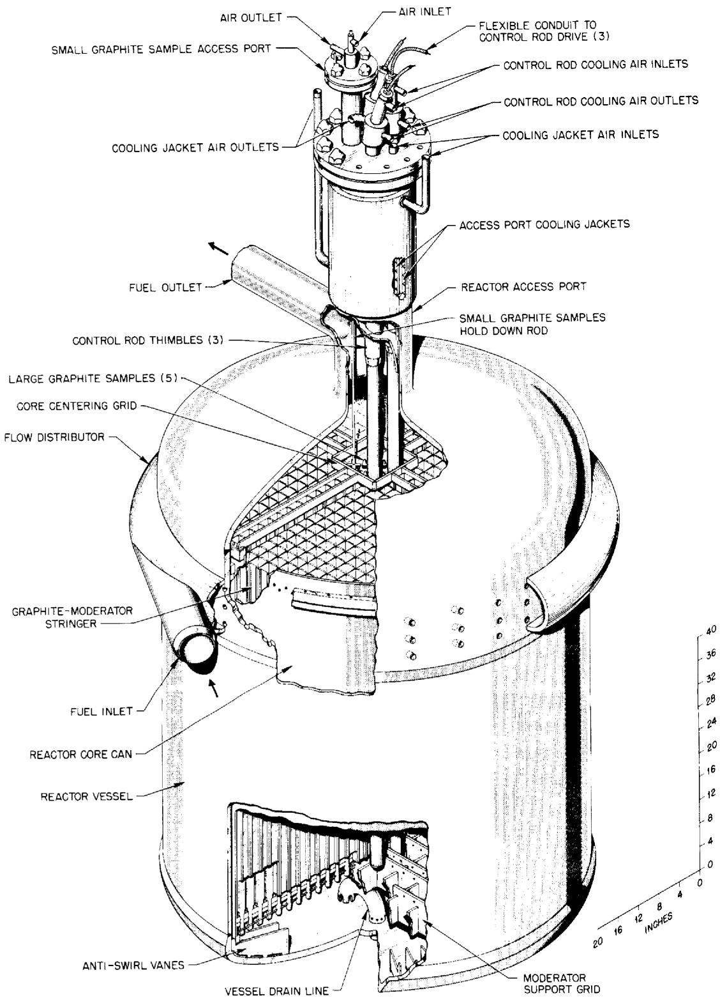  
Fig. 1. Cutaway Drawing of MSRE Core and Core Vessel

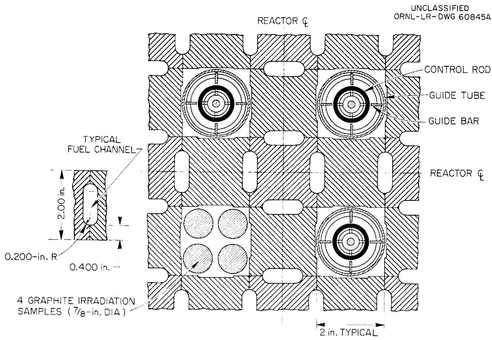  
Fig. 2. MSRE Control Rod Arrangements and Typical Fuel Channels

greater part of the pressure drop occurs in the tortuous path through the horizontal supporting bars. This restriction is absent in the central passages, resulting in flows through these channels being much higher than the average.

The variations in fuel-to-graphite ratio and fuel velocity have a significant effect on the nuclear characteristics and the temperature distribution of the core. In the temperature analysis reported here, the differences in flow area and velocity in the entrance regions were neglected; i.e., the flow passages were assumed to extend from the top to the bottom of the main portion of the core without change. Radial variations were taken into account by dividing the core into concentric, cylindrical regions according to the fuel velocity and the fuel-to-graphite ratio.

# Fuel Channels

The fuel channels are of several types. The number of each in the final core design is listed in Table 1. The full-sized channel is the typical channel shown in Fig. 2. The half-channels occur near the core perimeter where faces of normal graphite stringers are adjacent to flat-surfaced stringers. The fractional channels are half-channels extending to the edge of the core. The large annulus is the gap between the graphite and the core can. There are three annuli around the control-rod thimbles. The graphite specimens, which occupy only the upper half of one lattice space above a stringer of normal cross section, were treated as part of a full-length normal stringer.

Table 1. Fuel Channels in the MSRE   

<table><tr><td>Channel Type</td><td>Number</td></tr><tr><td>Full-size</td><td>1120</td></tr><tr><td>Half-size</td><td>28</td></tr><tr><td>Fractional</td><td>16</td></tr><tr><td>Large annulus</td><td>1</td></tr><tr><td>Thimble annuli</td><td>3</td></tr></table>

# Hydraulic Model

Hydraulic studies by Kedl on a fifth-scale model of the MSRE core showed that the axial velocity was a function of radial position, primarily because of geometric factors at the core inlet. As a result of these studies, he divided the actual core channels into several groups according to the velocity which he predicted would exist. This division was based on a total of 1064 channels with each of the control-rod-thimble annuli treated as four separate channels. He did not attempt to define precisely the radial boundaries of some of the regions in which the channels would be found.

Since the total number of fuel channels in the core is greater than the number assumed by Kedl, and since radial position is important in evaluating nuclear effects, it was necessary to make a modified division of the core for the temperature analysis. For this purpose the core was divided into five concentric annular regions, as described below, based on the information obtained by Kedl. The fuel velocities assigned by Kedl to the various regions are used as the nominal velocities.

# Region 1

This region consists of the central 6-in. square in the core, with all fuel channels adjacent to it, plus one-fourth of the area of the graphite stringers which help form the adjacent channels. The total cross-sectional area of Region 1 is 45.0 in.² and the equivalent radius is 3.78 in. The fuel fraction (f) for the region is 0.256. This region contains the 16 channels assigned to it by Kedl plus the 8 channels which he classified as marginal. Because of the cylindrical geometry around the control-rod thimbles, six of the channels which were marginal in Kedl's model have the same flow velocity as the rest of the region. It was not considered worthwhile to provide a separate region for the two remaining channels. The nominal fluid velocity is 2.18 ft/sec.

# Region 2

This region covers most of the core and contains only normal, full-sized fuel channels. All the fuel channels which were not assigned elsewhere were assigned to this region. On this basis, Region 2 has 940 fuel channels, a total cross-sectional area of 1880 in², a fuel fraction of 0.224, and equivalent outer radius of 24.76 in. (the inner radius is equal to the outer radius of Region 1), and a nominal fluid velocity of 0.66 ft/sec.

# Region 3

This region contains 108 full-sized fuel channels as assigned to it by Kedl. The total cross-sectional area is 216 in.²; the fuel fraction is 0.224; the effective outer radius is 26.10 in.; and the nominal fluid velocity is 1.63 ft/sec.

# Region 4

This region was arbitrarily placed outside Region 3 even though it contains marginal channels from both sides of the region. All the half-channels and fractional half-channels were added to the 60 full-sized channels assigned to the region by Kedl. This gives the equivalent of 78 full-sized channels. All of the remaining graphite cross-sectional area was also assigned to this region. As a result, the total cross-sectional area is 245.9 in.²; the fuel fraction is 0.142; the effective outer radius is 27.58 in., and the nominal fluid velocity is 0.90 ft/sec.

# Region 5

The salt annulus between the graphite and the core can was treated as a separate region. The total area is 29.55 in.²; the fuel fraction is 1.0; the outer radius is 27.75 in. (the inner radius of the core can), and the nominal fluid velocity is 0.29 ft/sec.

# Effective Velocities

The nominal fluid velocities and flow areas listed above result in a total flow rate through the core of 1315 gpm at $1200^{\circ}\mathrm{F}$ . All the velocities were reduced proportionately to give a total flow of 1200 gpm. Table 2 lists the effective fluid velocities and Reynolds numbers for the various regions along with other factors which describe the regions.

Table 2. Core Regions Used to Calculate Temperature Distributions in the MSRE   

<table><tr><td>Region</td><td>Number of Full-sized Fuel Channels</td><td>Total Cross-sectional Area (in.2)</td><td>Fuel Fraction</td><td>Effective Outer Radius (in.)</td><td>Effective Fluid Velocity (ft/sec)</td><td>Reynolds Number</td><td>Flow Rate (gpm)</td></tr><tr><td>1</td><td>12*</td><td>45.00</td><td>0.256</td><td>3.78</td><td>1.99</td><td>3150</td><td>72</td></tr><tr><td>2</td><td>940</td><td>1880.</td><td>0.224</td><td>24.76</td><td>0.60</td><td>945</td><td>791</td></tr><tr><td>3</td><td>108</td><td>216.0</td><td>0.224</td><td>26.10</td><td>1.49</td><td>2360</td><td>224</td></tr><tr><td>4</td><td>78</td><td>245.9</td><td>0.142</td><td>27.58</td><td>0.82</td><td>1300</td><td>89</td></tr><tr><td>5</td><td>0**</td><td>29.55</td><td>1.000</td><td>27.75</td><td>0.26</td><td>421</td><td>24</td></tr><tr><td></td><td></td><td></td><td></td><td></td><td></td><td></td><td>1200</td></tr></table>

\*Plus 3 control-rod-thimble annuli.   
**Annulus between graphite and core shell.

# Neutronic Model

The neutronic calculations upon which the temperature distributions are based were made with Equipoise 3A, $^{2,3}$ a 2-group, 2-dimensional, multi-region neutron diffusion program for the IBM-7090 computer. Because of the limitation to two dimensions and other limitations on the problem size, the reactor model used for this calculation differed somewhat from the hydraulic model.

The entire reactor, including the reactor vessel, was represented in cylindrical (r,z) geometry. Three basic materials, fuel salt, graphite and INOR were used in the model. A total of 19 cylindrical regions with various proportions of the basic materials was used.

Figure 3 is a vertical half-section through the model showing the relative size and location of the various regions. The region compositions, in terms of volume fractions of the basic materials, are summarized in Table 3.

Regions J, L, M, and N comprise the main portion of the core. This portion contains $98.7\%$ of the graphite and produces $87\%$ of the total power. The central region (L) has the same fuel and graphite fractions as the central region of the hydraulic model. However, the outer boundary of the region is different because of the control-rod-thimble representation. Since it was necessary to represent the thimbles as a single hollow cylinder (region K) in this geometry, a can containing the same amount of INOR as the three-rod thimbles in the reactor and of the same thickness was used. This established the outer radius of the INOR cylinder at 3 in. which also is close to the radius of the pitch circle for the three thimbles in the MSRE. The central fuel region was allowed to extend only to the inside radius of the rod thimble. The portion of the core outside the rod thimble and above the horizontal graphite support region was homogenized into one composition (regions J and M). The graphite-fuel

Unclassified

ORNL-LR-DWG. 71642

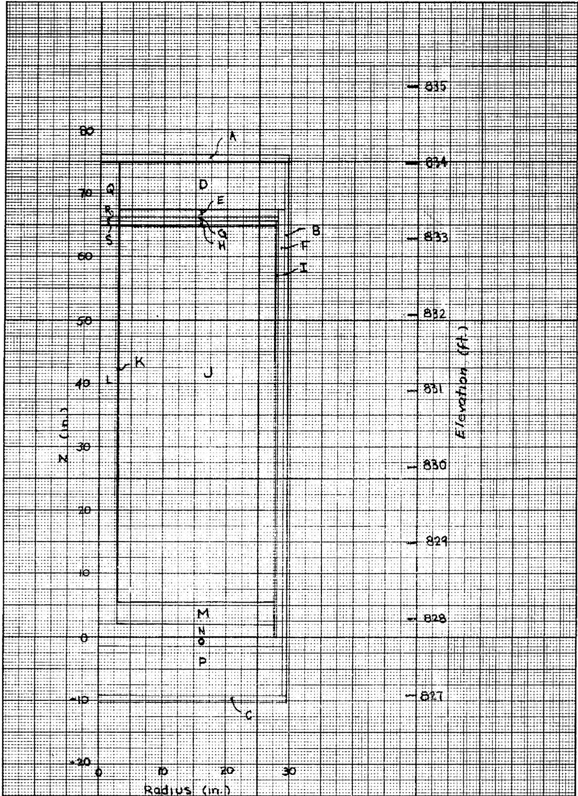  
Fig. 3. Nineteon-Region Core Model for Equipoise Calculations. See Table 3 for explanation of letters

Table 3. Nineteen-Region Core Model Used in EQUIPOISE Calculations for MSRE   

<table><tr><td rowspan="2">Region</td><td colspan="2">radius (in.)</td><td colspan="2">Z (in.)</td><td colspan="3">Composition (Volume percent)</td><td rowspan="2">Region 
Represented</td></tr><tr><td>inner</td><td>outer</td><td>bottom</td><td>top</td><td>fuel</td><td>graphite</td><td>INOR</td></tr><tr><td>A</td><td>0</td><td>29.56</td><td>74.92</td><td>76.04</td><td>0</td><td>0</td><td>100</td><td>Vessel top</td></tr><tr><td>B</td><td>29.00</td><td>29.56</td><td>-9.14</td><td>74.92</td><td>0</td><td>0</td><td>100</td><td>Vessel sides</td></tr><tr><td>C</td><td>0</td><td>29.56</td><td>-10.26</td><td>-9.14</td><td>0</td><td>0</td><td>100</td><td>Vessel bottom</td></tr><tr><td>D</td><td>3.00</td><td>29.00</td><td>67.47</td><td>74.92</td><td>100</td><td>0</td><td>0</td><td>Upper head</td></tr><tr><td>E</td><td>3.00</td><td>28.00</td><td>66.22</td><td>67.47</td><td>93.7</td><td>3.5</td><td>2.8</td><td></td></tr><tr><td>F</td><td>28.00</td><td>29.00</td><td>0</td><td>67.47</td><td>100</td><td>0</td><td>0</td><td>Downcomer</td></tr><tr><td>G</td><td>3.00</td><td>28.00</td><td>65.53</td><td>66.22</td><td>94.6</td><td>5.4</td><td>0</td><td></td></tr><tr><td>H</td><td>3.00</td><td>27.75</td><td>64.59</td><td>65.53</td><td>63.3</td><td>36.5</td><td>0.2</td><td></td></tr><tr><td>I</td><td>27.75</td><td>28.00</td><td>0</td><td>65.53</td><td>0</td><td>0</td><td>100</td><td>Core can</td></tr><tr><td>J</td><td>3.00</td><td>27.75</td><td>5.50</td><td>64.59</td><td>22.5</td><td>77.5</td><td>0</td><td>Core</td></tr><tr><td>K</td><td>2.94</td><td>3.00</td><td>5.50</td><td>74.92</td><td>0</td><td>0</td><td>100</td><td>Simulated 
thimbles</td></tr><tr><td>L</td><td>0</td><td>2.94</td><td>2.00</td><td>64.59</td><td>25.6</td><td>74.4</td><td>0</td><td>Central 
region</td></tr><tr><td>M</td><td>2.94</td><td>27.75</td><td>2.00</td><td>5.50</td><td>22.5</td><td>77.5</td><td>0</td><td>Core</td></tr><tr><td>N</td><td>0</td><td>27.75</td><td>0</td><td>2.00</td><td>23.7</td><td>76.3</td><td>0</td><td>Horizontal 
stringers</td></tr><tr><td>O</td><td>0</td><td>29.00</td><td>-1.41</td><td>0</td><td>66.9</td><td>15.3</td><td>17.8</td><td></td></tr><tr><td>P</td><td>0</td><td>29.00</td><td>-9.14</td><td>-1.41</td><td>90.8</td><td>0</td><td>9.2</td><td>Bottom head</td></tr><tr><td>Q</td><td>0</td><td>2.94</td><td>66.22</td><td>74.92</td><td>100</td><td>0</td><td>0</td><td></td></tr><tr><td>R</td><td>0</td><td>2.94</td><td>65.53</td><td>66.22</td><td>89.9</td><td>10.1</td><td>0</td><td></td></tr><tr><td>S</td><td>0</td><td>2.94</td><td>64.59</td><td>65.53</td><td>43.8</td><td>56.2</td><td>0</td><td></td></tr></table>

mixture containing the horizontal graphite bars at the core inlet was treated as a separate region (N).

The main part of the core, as described in the preceding paragraph, does not include the lower ends of the graphite stringers, which extend beyond the horizontal graphite bars, or the pointed tops of the stringers. The bottom ends were included in a single region (0) and the mixture at the top of the core was approximated by 5 regions (E, G, H, R, and S).

The thickness of the material contained in the upper and lower heads (regions C, Q, and P) was adjusted so that the amount of fuel salt was equal to the amount contained in the reactor heads. As a result of this adjustment the over-all height of the neutronic model of the reactor is not exactly the same as the physical height. The upper and lower heads themselves (regions A and C) were flattened out and represented as metal discs of the nominal thickness of the reactor material.

In the radial direction outside the main part of the core, the core can (region I), the fuel inlet annulus (region F) and the reactor vessel (region B) were included with the actual physical dimensions of the reactor applied to them.

The materials within each separate region were treated as homogeneous mixtures in the calculations. As a result, the calculations give only the overall shape of the flux in the regions where inhomogeneity exists because of the presence of two or more of the basic materials.

# NEUTRONIC CALCULATIONS

The first step in the neutronic calculations was the establishment of the fuel-salt composition required for criticality. A carrier salt containing 70 mol % LiF, 25% BeF₂ and 5% ZrF₄ was assumed. The LiF and ZrF₄ concentrations were held constant and the BeF₂ concentration was reduced as the concentration of UF₄ was increased in the criticality search. The uranium was assumed to consist of 93% U²³⁵, 5% U²³⁸, 1% U²³⁴, and 1% U²³⁶. This isotopic composition is typical of the material expected to be available for the reactor. The lithium to be used in the manufacture of the fuel salt contains 73 ppm Li⁶. This value was used in the calculations. No chemical impurities were considered in the fuel mixture. All of the calculations were made for an isothermal system at 1200°F.

The criticality search was made with MODRIC, a one-dimensional, multi-group, multiregion neutron diffusion program. This established the critical concentration of $\mathrm{UF}_4$ at $0.15\mathrm{mol}\%$ , leaving $24.85\% \mathrm{BeF}_2$ . The same program was used for radial and axial traverses of the model used for the Equipoise 3A calculation to provide the 2-group constants for that program. The spatial distributions of the fluxes and fuel power density were obtained directly from the results of the Equipoise 3A calculation. The same fluxes were used to evaluate the nuclear importance functions for temperature changes.

# Flux Distributions

The radial distribution of the slow neutron flux calculated for the MSRE near the midplane is shown in Fig. 4. This plane contains the maximum value of the flux and is 35 in. above the bottom of the main part of the core. The distortion of the flux produced by absorptions in the simulated control-rod thimble, 3 in. from the axial centerline, is readily apparent. Because of the magnitude of the distortion this simplified representation of the control-rod thimbles is probably not adequate for an accurate description of the slow flux in the immediate vicinity of the thimbles. However, the overall distribution is probably reasonably accurate. The distortion of the flux at the center of the reactor also precludes the use of a simple analytic expression to describe the radial distribution.

Figure 5 shows the calculated axial distribution of the slow flux along a line which passes through the maximum value, 7 in. from the vertical centerline. The reference plane for measurements in the axial direction is the bottom of the horizontal array of graphite bars at the lower end of the main portion of the core. Thus, the outside of the lower head is at -10.26 in.; the top of the main portion of the core is at 64.59 in.; and the outside of the upper head is at 76.04. The shape of the axial distribution in the main portion is closely approximated by a sine curve extending beyond it at both ends. The equation of the sine approximation shown in Fig. 5 is

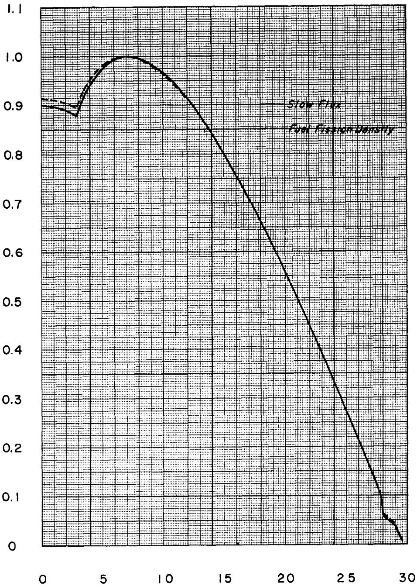  
FRACTION OF MAX. VALUE   
RADIUS, in.   
Fig. 4. Radial Distribution of Slow Flux and Fuel Fission Density in the Plane of Maximum Slow Flux

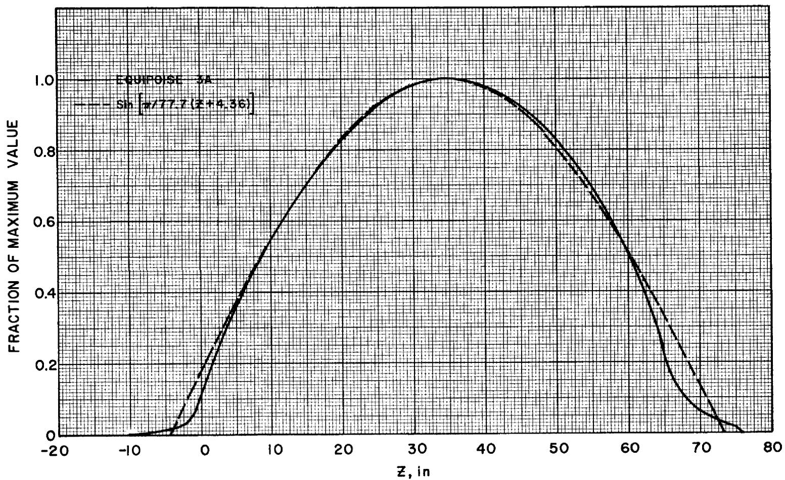  
Fig. 5. Axial Distribution of Slow Flux at a Position 7 in. from Core Center Line

$$
\frac {\phi_ {2}}{(\phi_ {2}) _ {\mathrm {m}}} = \sin \left[ \frac {\pi}{7 7 . 7} (z + 4. 3 6) \right],
$$

with the linear dimension given in inches.

The relation of the slow neutron flux to the other fluxes (fast, fast adjoint and slow adjoint) is shown in Figs. 6 and 7. These figures present the absolute values for a reactor power level of $10\mathrm{Mw}$ .

# Power Density Distribution

A function that is of greater interest than the flux distribution, from the standpoint of its effect on the reactor temperatures, is the distribution of fission power density in the fuel. For the fuel composition considered here, only 0.87 of the total fissions are induced by thermal neutrons; the fraction of thermal fissions in the main part of the core is 0.90. In spite of the relatively large fraction of nonthermal fissions, the over-all distribution of fuel fission density is very similar to the slow-flux distribution. The radial distribution is shown on Fig. 4 for a direct comparison with the thermal flux. The axial fission density distribution (see Fig. 8) was fitted with the same analytic expression used for the axial slow flux. The quality of the fit is about the same for both functions.

# Nuclear Importance Functions for Temperature

The effects upon reactivity of local temperature changes in fuel and graphite have been derived from first-order two-group perturbation theory and are reported elsewhere. This analysis produced weighting functions or nuclear importance functions, $G(r,z)$ for the local fuel and graphite temperatures. The weighted average temperatures of the fuel and graphite obtained by the use of these functions may be used with the appropriate temperature coefficients of reactivity to calculate the reactivity change associated with any change in temperature distribution.

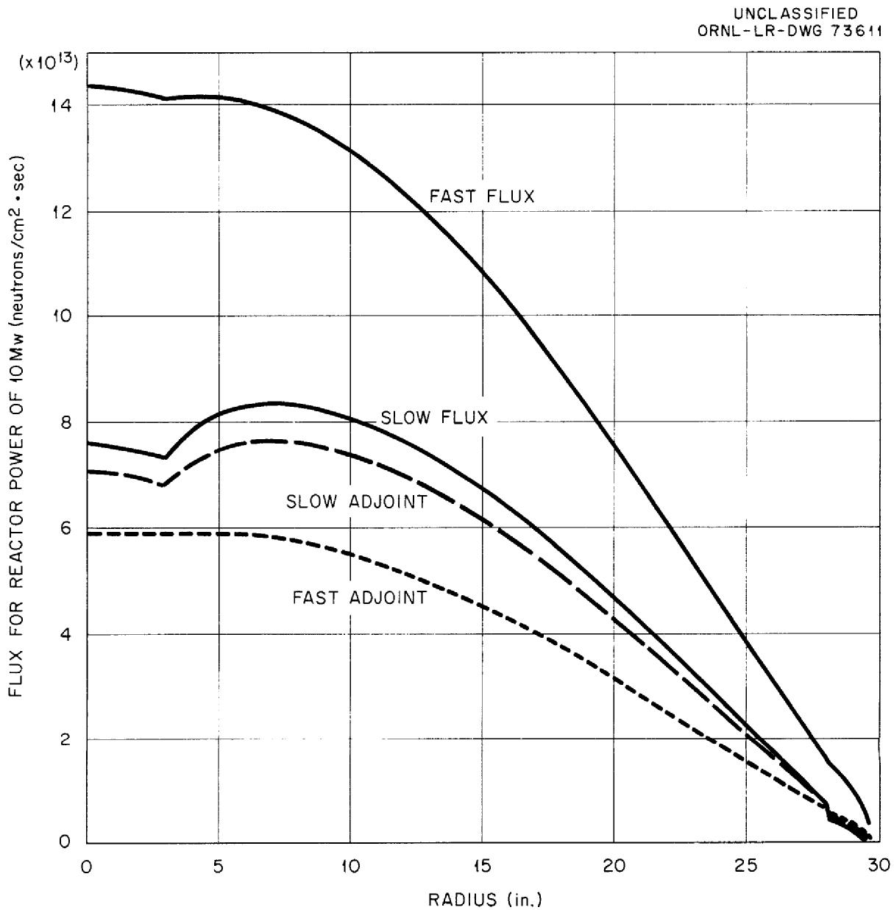  
Fig. 6. Radial Distribution of Fluxes and Adjoint Fluxes in the Plane of Maximum Slow Flux

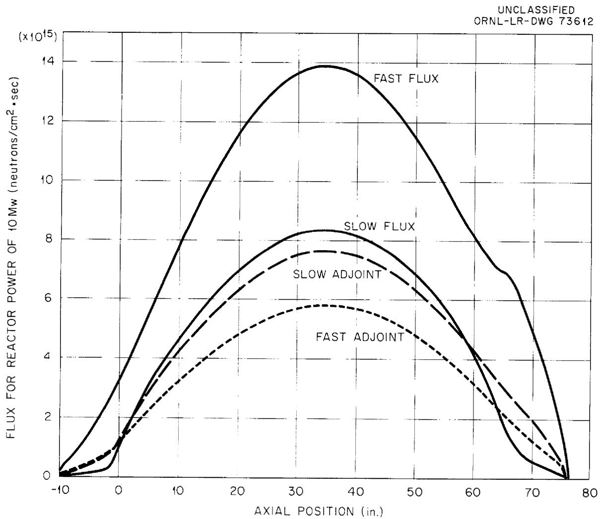  
Fig. 7. Axial Distribution of Fluxes and Adjoint Fluxes at a Position 7 in. from Core Center Line

UNCLASSIFIED

ORNL-LR-DWG 75824

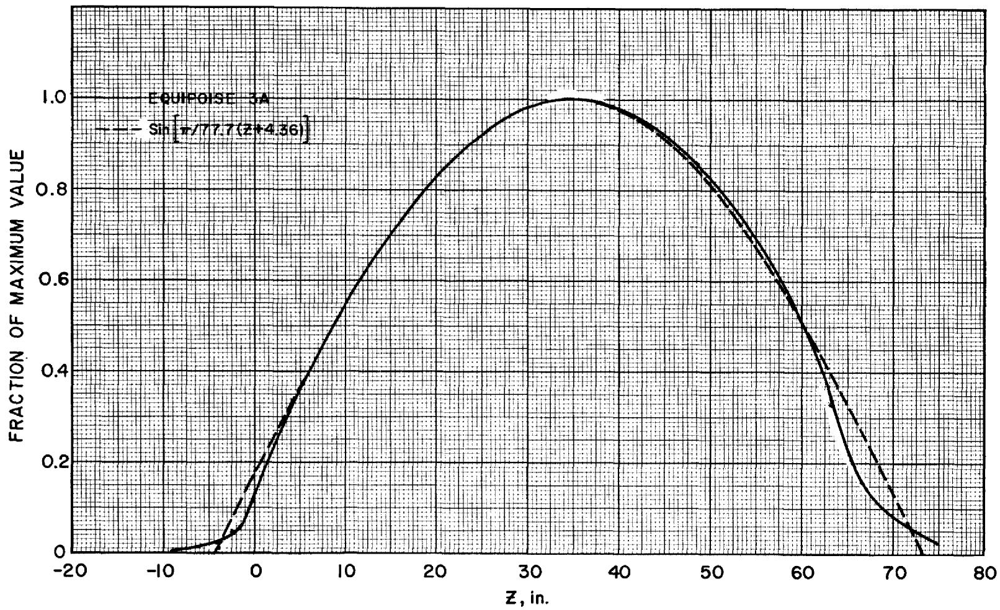  
Fig. 8. Axial Distribution of Fuel Fission Density at a Position 7 in. from Core Center Line

The temperature weighting functions are evaluated in terms of the four flux products: $\phi_1^*\phi_1, \phi_1^*\phi_2, \phi_2^*\phi_1$ and $\phi_2^*\phi_2$ . The coefficients applied to the various terms depend on the material being considered, its local volume fraction and the manner in which temperature affects its physical and nuclear properties. Since the weighting functions are evaluated separately for fuel and graphite, a particular weighting function exists only in those regions where the material is represented.

Figures 9 and 10 show the axial variation in the weighting functions for fuel and graphite at the radial position of the maximum fuel power density. For both materials the axial variation in the main part of the core is very closely approximated by a sine-squared. The function:

$$
\sin^ {2} \left[ \frac {\pi}{7 9 . 4} (z + 4. 7 1) \right]
$$

is plotted on each of the figures for comparison. The wide variations at the ends result primarily from the drastic changes in volume fraction and the apparent discontinuities are the result of dividing the reactor into discrete regions for the Equipoise 3A calculation.

The radial temperature weighting functions for both fuel and graphite near the core midplane are shown in Fig. 11. Because of the peculiar shape of the curves, no attempt was made to fit analytic expressions to these functions.

# FUEL TEMPERATURES

The fuel temperature distribution in the reactor has an over-all shape which is determined by the shape of the power density and the fuel flow pattern. Within the main part of the core, where the fuel flows in discrete channels, temperature variations across each individual channel are superimposed on this over-all shape. These local effects will be touched on later (page 37) in the section on graphite-fuel temperature differences. The present section deals with the over-all shape of the fuel temperature distribution and average temperatures. These were calculated for a reactor power level of 10 Mw with inlet and outlet temperatures at 1175 and $1225^{\circ}\mathrm{F}$ , respectively. The total fuel flow rate was 1200 gpm.

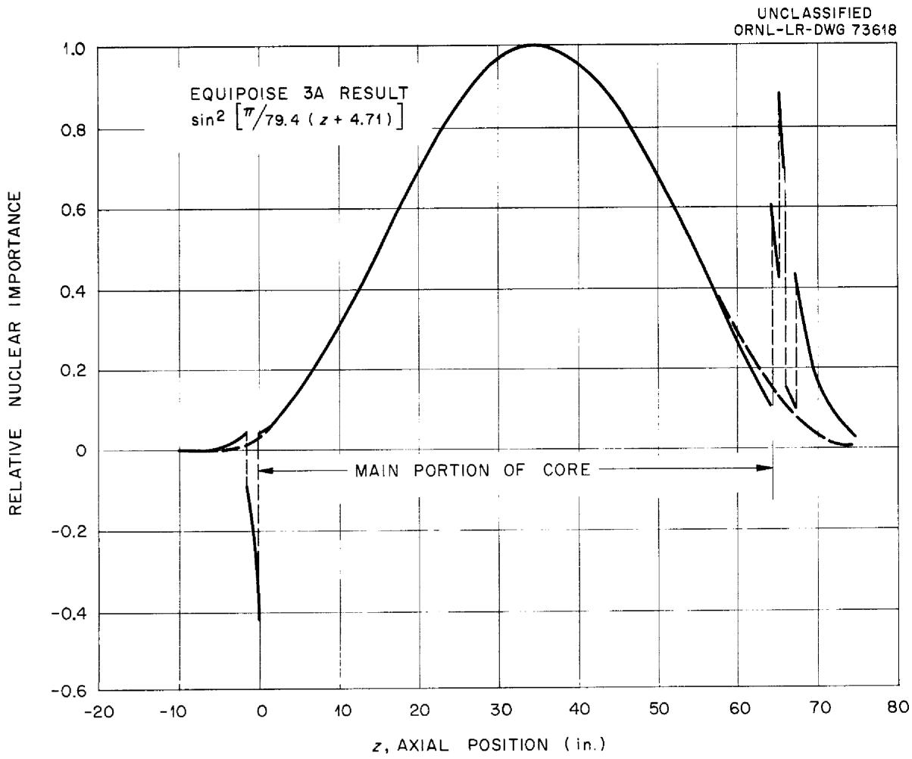  
Fig. 9. Relative Nuclear Importance of Fuel Temperature Changes as a Function of Position on an Axis Located 7 in. from Core Center Line

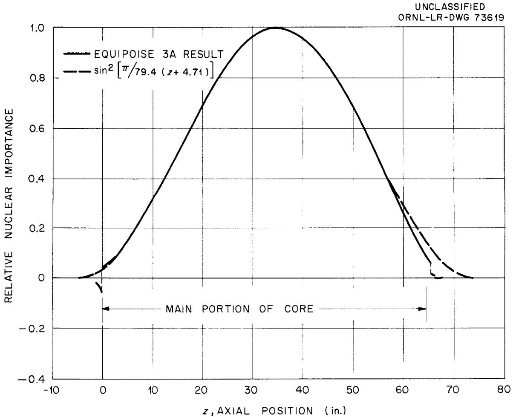  
Fig. 10. Relative Nuclear Importance of Graphite Temperature Changes as a Function of Position on an Axis Located 7 in. from Core Center Line

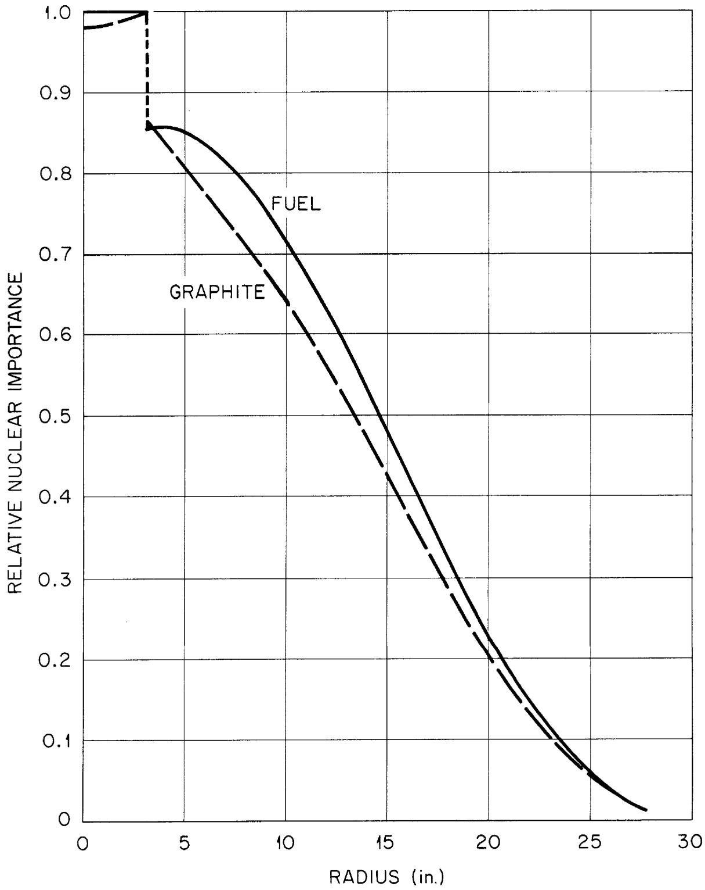  
Fig. 11. Relative Nuclear Importance of Fuel and Graphite Temperature Changes as a Function of Radial Position in Plane of Maximum Thermal Flux

# Over-all Temperature Distribution

In describing the over-all fuel temperature distribution it is convenient to regard the reactor as consisting of a main core, in which most of the nuclear heat is produced, and a number of peripheral regions which, together, contribute only a small amount to the total power level. Of the 19 reactor regions used for the neutronic calculations (see Fig. 3), 14 contain fuel and 10 of these were regarded as peripheral regions. The four remaining fuel-bearing regions (J, L, M, and N) were combined to represent the main part of the core. On this basis, the main portion extends radially to the inside of the core shell and axially from the bottom of the horizontal graphite bars to the top of the uniform fuel channels. This portion accounts for $87\%$ of the total reactor power. The volute on the reactor inlet was neglected in the temperature calculations because of its physical separation from the rest of the reactor.

# Peripheral Regions

Since only $13\%$ of the reactor power is produced in the peripheral regions, the temperature variations within them are small and the details of the temperature distributions within these regions were not calculated. The mean temperature rise for each region was calculated from the fraction of the total power produced in the region and the fraction of the total flow rate through it. The inlet temperature to each region was assumed constant at the mixed mean outlet of the preceding region. An approximate bulk-mean temperature, midway between the region inlet and outlet temperatures, was assigned to each peripheral region. Table 4 summarizes the flow rates, powers and fuel temperatures in the various reactor regions.

# Main Core

The wide variations in fuel temperature, both radially and axially, in the main part of the core necessitate a more detailed description of the temperature distribution.

The average temperature of the fuel in a channel at any axial position is equal to the channel inlet temperature plus a rise proportional to the sum of the heat generated in the fuel and that transferred to it from the adjacent graphite as the fuel moves from the channel inlet to the specified point. The heat produced in the fuel follows very closely the radial and

Table 4. Flow Rates, Powers and Temperatures in Reactor Regions   

<table><tr><td>\( \text{Region}^{\text{a}} \)</td><td>Flow(gpm)</td><td>\( Power^b \)(kw)</td><td>\( Temp. Rise^b \)(°F)</td><td>\( Av. Temp.^c \)(°F)</td></tr><tr><td>D</td><td>1157</td><td>454</td><td>2.4</td><td>1224.7</td></tr><tr><td>E</td><td>1157</td><td>151</td><td>0.8</td><td>1223.1</td></tr><tr><td>F</td><td>1200</td><td>251</td><td>1.3</td><td>1175.6</td></tr><tr><td>G</td><td>1157</td><td>105</td><td>0.5</td><td>1222.4</td></tr><tr><td>H</td><td>1157</td><td>114</td><td>0.6</td><td>1221.9</td></tr><tr><td>J</td><td>1157</td><td>8287</td><td>43</td><td>d</td></tr><tr><td>L</td><td>43</td><td>159</td><td>22</td><td>d</td></tr><tr><td>M</td><td>1157</td><td>192</td><td>1.0</td><td>d</td></tr><tr><td>N</td><td>1200</td><td>68</td><td>0.3</td><td>d</td></tr><tr><td>O</td><td>1200</td><td>69</td><td>0.3</td><td>1177.1</td></tr><tr><td>P</td><td>1200</td><td>134</td><td>0.7</td><td>1176.6</td></tr><tr><td>Q</td><td>43</td><td>12</td><td>1.7</td><td>1200.9</td></tr><tr><td>R</td><td>43</td><td>2</td><td>0.3</td><td>1199.9</td></tr><tr><td>S</td><td>43</td><td>2</td><td>0.2</td><td>1199.7</td></tr></table>

aRegions not containing fuel are excluded.   
bAt 10 Mw   
cWith $\mathbf{T}_{\mathrm{in}} = 1175^{\circ}\mathbf{F},$ $\mathbf{T}_{\mathrm{out}} = 1225^{\circ}\mathbf{F}$   
Actual temperature distribution calculated for this region. See text.

axial variation of the fission power density. Since the heat production in the graphite is small, no great error is introduced by assigning the same spatial distribution to this term. Then, if axial heat transfer in the graphite is neglected, the net rate of heat addition to the fuel has the shape of the fuel power density. The fuel temperature rise is inversely proportional to the volumetric heat capacity and velocity. Thus

$$
T _ {f} (r, z) = T _ {f} (z = 0) + \int_ {c} ^ {z} \frac {\left(Q _ {f}\right) _ {m}}{\left(\rho C _ {p}\right) _ {f} u} P _ {f} (r, z) d z, \tag {1}
$$

where $Q_{f}$ is an equivalent specific power which includes the heat added to the fuel from the graphite. The channel inlet temperature, $T_{f}(z = 0)$ , is assumed constant for all channels and its value is greater than the reactor inlet temperature because of the peripheral regions through which the fuel passes before it reaches the inlet to the main part of the core. The volumetric heat capacity, $(\rho C_{p})_{f}$ , is assumed constant and only radial variations in the fuel velocity, $u$ , are considered. It is further assumed that the radial and axial variations in the power-density distribution are separable:

$$
P (r, z) = A (r) B (z). \tag {2}
$$

Then

$$
T _ {f} (r, z) = T _ {f} (z = 0) + \frac {\left(Q _ {f}\right) _ {m}}{\left(\rho C _ {p}\right) _ {f}} \frac {A (r)}{u (r)} \int_ {0} ^ {z} B (z) d z. \tag {3}
$$

If the sine approximation for the axial variation of the power density (Fig. 8) is substituted for $\mathbf{B}(\mathbf{z})$ , equation (3) becomes

$$
\mathrm {T} _ {\mathrm {f}} (\mathrm {r}, \mathrm {z}) = \mathrm {T} _ {\mathrm {f}} (\mathrm {z} = 0) + \lambda \frac {\mathrm {A} (\mathrm {r})}{\mathrm {v} (\mathrm {r})} \left\{\cos \alpha - \cos \left[ \frac {\pi}{7 7 . 7} (\mathrm {z} + 4. 3 6) \right] \right\}. \tag {4}
$$

In this expression, $\mathcal{X}$ is a collection of constants,

$$
\lambda = \frac {7 7 . 7}{\pi} \frac {\left(\mathrm {Q} _ {\mathrm {f}}\right) _ {\mathrm {m}}}{\left(\rho \mathrm {C} _ {\mathrm {p}}\right) _ {\mathrm {f}}} \quad , \tag {5}
$$

anu

$$
\alpha = \frac {\pi}{7 7 . 7} (0 + 4. 3 6). \tag {6}
$$

The limits within which (4) is applicable are the lower and upper boundaries of the main part of the core, namely, $0 \leq z \leq 64.6$ in. It is clear from this that the shape of the axial temperature distribution in the fuel in any channel is proportional to the central portion of the curve [1 - cos β]. (The axial distribution for the hottest channel in the MSRE is shown in Fig. 14, where it is used to provide a reference for the axial temperature distribution in the graphite.)

The radial distribution of the fuel temperature at the outlet of the channels is shown in Fig. 12 for the reference conditions at $10\mathrm{Mw}$ . This distribution includes the effects of the distorted power-density distribution (Fig. 4) and the radial variations in fuel velocity. At the reference conditions the main-core inlet temperature is $1177.3^{\circ}\mathrm{F}$ and the mixed mean temperature leaving that region is $1220.8^{\circ}\mathrm{F}$ . The additional heat required to raise the reactor outlet temperature to $1225^{\circ}\mathrm{F}$ is produced in the peripheral regions above the main part of the core. Also shown on Fig. 12 for comparison is the outlet temperature distribution for an idealized core with a uniform fuel fraction and uniform fuel velocity. For this case the radial power distribution was assumed to follow the Bessel function, $\mathrm{J_o(2.4~r / R)}$ , which vanished at the inside of the core shell. The distribution was normalized to the same inlet and mixed-mean outlet temperatures that were calculated for the main portion of the MSRE core.

# Nuclear Mean Temperature

At zero power the fuel temperature is essentially constant throughout the reactor and, at power it assumes the distribution discussed in the preceding section. The nuclear mean temperature of the fuel is defined as the uniform fuel temperature which would produce the same reactivity change from the zero-power condition as that produced by the actual fuel temperature distribution.

The nuclear average temperature of the fuel is obtained by weighting the local temperatures by the local nuclear importance for a fuel temperature change. The importance function, $G(r,z)$ , includes the effect of fuel volume fraction as well as all nuclear effects (see p. 22 et seq.). Therefore

$$
\mathrm {T} _ {\mathrm {f}} ^ {*} = \frac {\int_ {\mathrm {v}} \mathrm {T} _ {\mathrm {f}} (\mathrm {r} , \mathrm {z}) \mathrm {G} (\mathrm {r} , \mathrm {z}) \mathrm {d v}}{\int_ {\mathrm {v}} \mathrm {G} (\mathrm {r} , \mathrm {z}) \mathrm {d v}} \tag {7}
$$

In carrying out the indicated integration for the MSRE, both the numerator and denominator of (7) were split into 11 terms, one for the main part of the core and one for each of the fuel-bearing peripheral regions. For the peripheral regions, the fuel temperature in each region was assumed constant

UNCLASSIFIED

ORNL-LR-DWG 75775

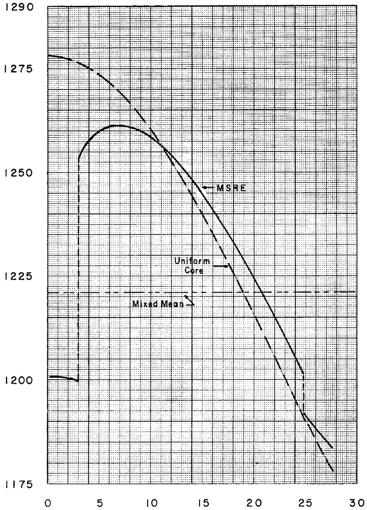  
TEMPERATURE, °F  
RADIUS, in.   
Fig. 12. Channel Outlet Temperatures for MSRE and for a Uniform Core

at the average temperature (see Table 4). The volume integrals of the weighting functions were obtained by combining volume integrals of the flux products, produced by the Equipoise 3A calculation, with coefficients derived from the perturbation calculations. For the main part of the core, the temperatures and temperature weighting functions were combined and integrated analytically (in the axial direction) and numerically (in the radial direction) to produce the required terms. The net result for the fuel in the MSRE reactor vessel is

$$
\mathrm {T} _ {\mathrm {f}} ^ {*} = \mathrm {T} _ {\text {i n}} + 0. 7 6 2 \left(\mathrm {T} _ {\text {o u t}} - \mathrm {T} _ {\text {i n}}\right) \tag {8}
$$

A similar analysis was performed for a uniform cylindrical reactor with uniform flow. In this case the fuel power density was assigned a sine distribution in the axial direction and a $J_{0}$ Bessel function for the radial distribution. Both functions were allowed to vanish at the reactor boundaries and no peripheral regions were considered. A temperature weighting function equal to the product of the fuel fraction and the square of the thermal flux (or power density since both have the same shape in the ideal case) was used. For this case:

$$
\mathrm {T} _ {\mathrm {f}} ^ {*} = \mathrm {T} _ {\text {i n}} + 0. 8 3 8 \left(\mathrm {T} _ {\text {o u t}} - \mathrm {T} _ {\text {i n}}\right) \tag {9}
$$

The principal reason for the lower nuclear average fuel temperature in the MSRE is the large volume of fuel in the peripheral regions at the inlet to the main part of the core and the high statistical weight assigned to these regions because of the high fuel fraction. The existence of the small, high-velocity, low-temperature region around the axis of the core has little effect on the nuclear average temperature. Actually this "short-circuit" through the core causes a slight increase in the nuclear average temperature. There is lower flow and larger temperature rise in the bulk of the reactor than if the flow were uniform, and this effect outweighs the lower temperatures in the small region at the center.

# Bulk Mean Temperature

The bulk mean fuel temperature is obtained by integrating the local, unweighted temperature over the volume of the reactor. As in the case of the nuclear mean temperature, the large volume of low-temperature fuel at the inlet to the main part of the MSRE core makes the bulk mean temperature for the MSRE lower than for a simple, uniform core

$$
\mathrm {M S R E :} \quad \overline {{\mathrm {T}}} _ {\mathrm {f}} = \mathrm {T} _ {\mathrm {i n}} + 0. 4 6 \left(\mathrm {T} _ {\mathrm {c u t}} - \mathrm {T} _ {\mathrm {i n}}\right) \tag {10}
$$

$$
\text {U n i f o r m C o r e :} \quad \overline {{\mathbf {T}}} _ {\mathbf {f}} = \mathbf {T} _ {\mathbf {i n}} + 1 / 2 \left(\mathbf {T} _ {\mathbf {o u t}} - \mathbf {T} _ {\mathbf {i n}}\right) \tag {11}
$$

# GRAPHITE TEMPERATURES

During steady-state power operation, the mean temperature in any graphite stringer is higher than the mean temperature of the fuel in the adjacent channels. As a result, both the nuclear mean and the bulk mean temperatures of the graphite are higher than the corresponding mean temperatures in the fuel.

In general, it is convenient to express the graphite temperature in terms of the fuel temperature and the difference between the graphite and fuel temperatures. That is:

$$
\mathrm {T} _ {\mathrm {g}} = \mathrm {T} _ {\mathrm {f}} + \Delta \mathrm {T}, \tag {12}
$$

where $\Delta T$ is a positive number at steady-state.

Nearly all of the graphite in the MSRE (98.7%) is contained in the regions which are combined to form the main part of the core. Since the remainder would have only a very small effect on the system, only the main part of the core is treated in evaluating graphite temperatures and distributions.

# Local Temperature Differences

In order to evaluate the local graphite-fuel temperature difference, it is necessary to consider the core in terms of a number of unit cells, each containing graphite and fuel and extending the length of the core.

In calculating the local temperature distributions, it is assumed that no heat is conducted in the axial direction and that the heat generation is uniform in the radial direction over the unit cells. The temperature distributions within the unit cells are superimposed on the over-all reactor temperature distributions. The difference between the mean graphite and fuel temperatures within an individual cell can, in general, be broken down into three parts:

1. the Poppendiek effect, which causes the fuel near the wall of a channel to be hotter than the mean for the channel;   
2. the temperature drop across the graphite-fuel interface, resulting from heat flow out of the graphite; and   
3. the difference between the mean temperature in a graphite stringer and the temperature at the interface, which is necessary to conduct heat produced in the graphite to the surface.

These parts are treated separately in the following paragraphs.

# Poppendiek Effect

As may be seen from the Reynolds numbers in Table 2 (page 14), the fluid flow in most of the core is clearly in the laminar regime and that in the remainder of the core is in the transition range where flow may be either laminar or turbulent. In this analysis, the flow in the entire core is assumed to be laminar to provide conservatively pessimistic estimates of the temperature effects.

Equations are available for directly computing the Poppendiek effect for laminar flow in circular channels or between infinite slabs;[5,6] (i.e., the rise in temperature of fluid near the wall associated with internal heat generation and relatively low fluid flow in the boundary layer). Since the fuel channels in the MSRE are neither circular nor infinite in two dimensions, the true Poppendiek effect will be between the results predicted by these two approaches. The method used here was to assume

circular channels with a diameter such that the channel flow area is equal to the actual channel area. This slightly overestimates the effect.

For circular channels with laminar flow and heat transfer from graphite to fuel, the following equation applies:

$$
\mathrm {T} _ {\mathrm {w}} - \mathrm {T} _ {\mathrm {f}} ^ {\prime} = \frac {\mathrm {P} _ {\mathrm {f}} r _ {\mathrm {w}} ^ {2}}{\mathrm {k} _ {\mathrm {f}}} \left[ \frac {1 1 \left(1 + \frac {2}{\mathrm {P} _ {\mathrm {f}} r _ {\mathrm {w}}} \quad \mathrm {q} _ {\mathrm {w}}\right) - 8}{4 8} \right] \cdot \tag {13}
$$

This equation is strictly applicable only if the power density and heat flux are uniform along the channel and the length of the channel is infinite. However, it is applied here to a finite channel in which the power density and heat flux vary along the length. It is assumed that the temperature profile in the fluid instantaneously assumes the shape corresponding to the parameters at each elevation. This probably does not introduce much error, because the heat generation varies continuously and not very drastically along the channel. If it is further assumed that the heat generation terms in the fuel and in the graphite have the same over-all spatial distribution, the Poppendiek effect is directly proportional to the fuel power density. This simple proportionality results from the fact that, in the absence of axial heat conduction in the graphite, the rate of heat transfer from graphite to fuel, $q_{w}$ , is directly proportional to the graphite specific power.

# Temperature Drop in Fluid Film

Since the Poppendiek effect in the core is calculated for laminar flow, the temperature drop through the fluid immediately adjacent to the channel wall is included in this effect. Therefore, a separate calculation of film temperature drop is not required.

# Temperature Distribution in Graphite Stringers

The difference between the mean temperature in a graphite stringer and the temperature at the channel wall cannot be calculated analytically for the geometry in the MSRE. Therefore, two approximations were calculated as upper and lower limits and the effect in the MSRE was assigned a value between them.

One approximation to the graphite stringer is a cylinder whose cross-sectional area is equal to that of the more complex shape. This leads to a cylinder with a radius of 0.9935 in. and a surface-to-volume ratio of 2.01 in. If only the fuel-channel surface (the surface through which all heat must be transferred from the graphite) of the actual graphite stringer is considered, the surface-to-volume ratio is 1.84 in. Therefore, the cylinder approximation underestimates the mean graphite temperature. The second approximation is to consider the stringer as a slab, cooled on two sides, with a half-thickness of 0.8 in. (the distance from the stringer center line to the edge of the fuel channel). This approximation has a surface-to-volume ratio of 1.25 in. which causes an over-estimate of the mean graphite temperature. The value assigned to the difference between the mean graphite temperature and the channel-wall temperature was obtained by a linear interpolation between the two approximations on the basis of surface-to-volume ratio.

For the cylindrical geometry with a radially uniform heat source in the stringer, the difference between the average temperature in the stringer and the channel wall temperature is given by:

$$
\mathrm {T} _ {\mathrm {g}} ^ {\prime} - \mathrm {T} _ {\mathrm {w}} = \frac {1}{8} \frac {\mathrm {P} _ {\mathrm {g}} \mathrm {r} _ {\mathrm {s}} ^ {2}}{\mathrm {k} _ {\mathrm {g}}} \tag {14}
$$

For the slab approximation:

$$
\mathrm {T} _ {\mathrm {g}} ^ {\prime} - \mathrm {T} _ {\mathrm {w}} = \frac {1}{3} \frac {\mathrm {P} _ {\mathrm {g}} \ell^ {2}}{\mathrm {k} _ {\mathrm {g}}} \tag {15}
$$

Application of unit cell dimensions for the MSRE and linear interpolation between the two approximations leads to

$$
\mathrm {T} _ {\mathrm {g}} ^ {\prime} - \mathrm {T} _ {\mathrm {w}} = 9. 9 7 \times 1 0 ^ {- 4} \frac {\mathrm {P g}}{\mathrm {k g}}. \tag {16}
$$

# Net Local Temperature Difference

The two temperature effects described by Equations (13) and (16) may be combined to give the local mean temperature difference between graphite and fuel.

$$
\Delta \mathrm {T} = 9. 9 7 \times 1 0 ^ {- 4} \frac {\mathrm {P} _ {\mathrm {g}}}{\mathrm {k} _ {\mathrm {g}}} + \frac {\mathrm {P} _ {\mathrm {f}} r _ {\mathrm {w}} ^ {2}}{\mathrm {k} _ {\mathrm {f}}} \left[ \frac {1 1 \left(1 + \frac {2 q _ {\mathrm {w}}}{\mathrm {P} _ {\mathrm {f}} r _ {\mathrm {w}}}\right) - 8}{4 8} \right]. \tag {17}
$$

Since both terms in this equation are directly proportional to the power density, the local temperature difference may also be expressed in terms of a maximum value and the local, relative power density.

$$
\Delta \mathrm {T} (r, z) = \Delta \mathrm {T} _ {\mathrm {m}} \frac {\mathrm {P} (r , z)}{\mathrm {P} _ {\mathrm {m}}} \tag {18}
$$

# Maximum Local Values

The maximum values of the local graphite-fuel temperature difference may be obtained by applying the appropriate specific powers to Equation (17). Because of the dependence on specific power, the temperature differences are strongly influenced by the degree of fuel permeation of the graphite which affects primarily the graphite power density. The effects were examined for 0, 0.5, and $2.0\%$ of the graphite volume occupied by fuel. In all cases it was assumed that the fuel in the graphite was uniformly distributed in the stringers and that the specific powers were uniform in the transverse direction for individual graphite stringers and fuel channels. Table 5 shows the maximum graphite-fuel temperature differences for the three degrees of fuel permeation, at the 10-Mw reference condition.

Table 5. Local Graphite-Fuel Temperature Differences in the MSRE   

<table><tr><td>Graphite Permeation by Fuel % of graphite volume)</td><td>Maximum Local Temperature Difference (°F)</td></tr><tr><td>0</td><td>62.5</td></tr><tr><td>0.5</td><td>65.8</td></tr><tr><td>2.0</td><td>75.5</td></tr></table>

In the above computations, it was assumed that fuel which soaked into the graphite was uniformly distributed. This is not the worst possible case. Slightly higher temperatures result if the fuel is concentrated near the perimeter of the stringers. To obtain an estimate of the increased severity, a stringer was examined for the case where $2\%$ of the graphite volume is occupied by fuel. It was assumed that the salt concentration was $15\%$ of the graphite volume in a layer extending into the stringers far enough (0.05 in.) to give an average concentration of $2\%$ . The salt concentration in the central portion of the stringers was assumed to be zero. The specific power in the graphite was divided into two parts: the contribution from gamma and neutron heating which was assumed uniform across the stringer, and the contribution from fission heating which was confined to the fuel-bearing layer. This resulted in an increase of $2.0^{\circ}\mathrm{F}$ in the maximum graphite-fuel temperature difference at 10 Mw. This increase was neglected because other approximations tend to overestimate the temperature difference.

# Over-all Temperature Distribution

The over-all temperature distribution in the graphite is obtained by adding the graphite-fuel temperature difference to the fuel temperature. Figure 13 shows the radial distribution at the midplane of the MSRE for 10-Mw power operation with no fuel soakup in the graphite. The fuel temperature distribution, which is a scaled-down version of the corresponding curve in Fig. 12 to allow for axial position, is included for reference. Figure 14 shows the axial temperature distributions at the hottest radial position for the same conditions as Fig. 13. The fuel temperature in an adjacent channel is included for reference. The continuously increasing fuel temperature shifts the maximum in the graphite temperature to a position considerably above the reactor midplane.

The distributions shown in Figs. 13 and 14 are for the mean temperature within individual graphite stringers. The local temperature distributions within the stringers are superimposed on these in the operating reactor.

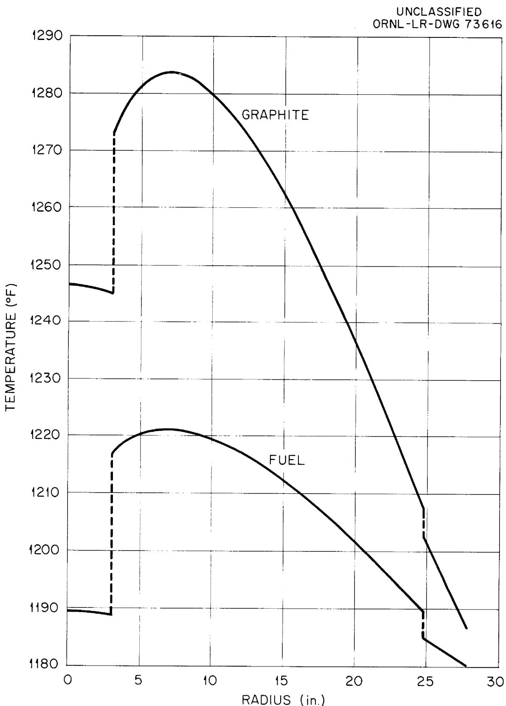  
Fig. 13. Radial Temperature Profiles in MSRE Core Near Midplane

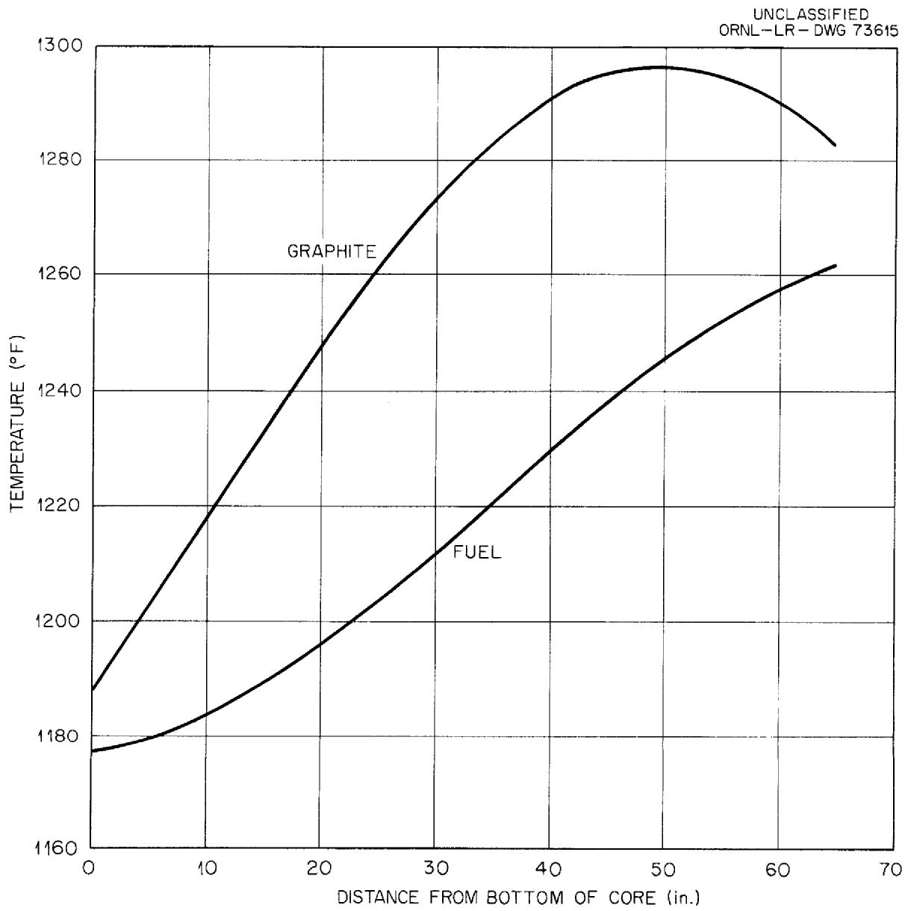  
Fig. 14. Axial Temperature Profiles in Hottest Channel of MSRE Core (7 in. from Core Center Line)

# Nuclear Mean Temperature

The nuclear mean graphite temperature is obtained by weighting the local temperatures by the graphite temperature weighting function. In general

$$
\mathrm {T} _ {\mathrm {g}} ^ {*} = \frac {\int_ {\mathrm {V}} \left[ \mathrm {T} _ {\mathrm {f}} (\mathrm {r} , \mathrm {z}) + \Delta \mathrm {T} (\mathrm {r} , \mathrm {z}) \right] \mathrm {G} _ {\mathrm {g}} (\mathrm {r} , \mathrm {z}) \mathrm {d V}}{\int_ {\mathrm {V}} \mathrm {G} _ {\mathrm {g}} (\mathrm {r} , \mathrm {z}) \mathrm {d V}} \tag {17}
$$

Substitution of the appropriate expressions leads to an expression of the form

$$
\mathrm {T} _ {\mathrm {g}} ^ {*} = \mathrm {T} _ {\text {i n}} + \mathrm {b} _ {1} \left(\mathrm {T} _ {\text {o u t}} - \mathrm {T} _ {\text {i n}}\right) + \mathrm {b} _ {2} \Delta \mathrm {T} _ {\mathrm {m}} \tag {18}
$$

where $b_1$ and $b_2$ are functions of the system.

The nuclear mean graphite temperature was evaluated for three degrees of fuel permeation of the graphite. Table 6 lists the results for the reference condition at $10\mathrm{Mw}$ .

# Bulk Mean Temperatures

The bulk mean graphite temperature is obtained in the same way as the nuclear mean temperature, but without the weighting factor. The bulk mean graphite temperature for various degrees of graphite permeation by fuel are listed in Table 6.

Table 6. Nuclear Mean and Bulk Mean Temperature of Graphitea   

<table><tr><td>Graphite Permeation by Fuel % of graphite volume)</td><td>Nuclear Mean T (°F)</td><td>Bulk Mean T (°F)</td></tr><tr><td>0</td><td>1257</td><td>1226</td></tr><tr><td>0.5</td><td>1258</td><td>1227</td></tr><tr><td>2.0</td><td>1264</td><td>1231</td></tr></table>

aAt 10 Mw reactor power, $\mathbf{T}_{\mathrm{in}} = 1175^{\circ}\mathbf{F},$ $\mathbf{T}_{\mathrm{out}} = 1225^{\circ}\mathbf{F}.$

# POWER COEFFICIENT OF REACTIVITY

The power coefficient of a reactor is a measure of the amount by which the system reactivity must be adjusted during a power change to maintain a preselected control parameter at the control point. The reactivity adjustment is normally made by changing control rod position(s) and the control parameter is usually a temperature or a combination of temperatures in the system. The reactivity effect of interest is only that due to the change in power level; it does not include effects such as fuel burnup or changing poison level which follow a power change.

The power coefficient of the MSRE can be evaluated through the use of the relationships between reactor inlet and outlet temperatures and the fuel and graphite nuclear average temperatures developed above. These relationships may be expressed as follows for 10-Mw power operation with no fuel permeation:

$$
\mathrm {T} _ {\text {o u t}} = \mathrm {T} _ {\text {i n}} + 5 0 ^ {\circ} \mathrm {F}, \tag {19}
$$

$$
\mathrm {T} _ {\mathrm {f}} ^ {*} = \mathrm {T} _ {\text {o u t}} - 1 1. 9 ^ {\circ} \mathrm {F}, \tag {20}
$$

$$
\mathrm {T} _ {\mathrm {g}} ^ {*} = \mathrm {T} _ {\text {o u t}} + 3 1. 6 ^ {\circ} \mathrm {F}. \tag {21}
$$

Although these equations were developed for fuel inlet and outlet temperatures of 1175 and $1225^{\circ}\mathrm{F}$ , respectively, they may be applied over a range of temperature levels without significant error.

In addition to the temperature relations, it is necessary to use temperature coefficients of reactivity which were derived on a basis compatible with the temperature weighting functions. The fuel and graphite temperature coefficients of reactivity from first-order, two-group perturbation theory are -4.4 x $10^{-5} \circ \mathrm{F}^{-1}$ and -7.3 x $10^{-5} \circ \mathrm{F}^{-1}$ , respectively. Thus

$$
\Delta k = - (4. 4 \times 1 0 ^ {- 5}) \Delta T _ {f} ^ {*} - (7. 3 \times 1 0 ^ {- 5}) \Delta T _ {g} ^ {*} \tag {22}
$$

The magnitude of the power coefficient in the MSRE is strongly dependent on the choice of the control parameter (temperature). This is best illustrated by evaluating the power coefficient for various choices of the controlled temperature. Three conditions are considered. The first of these is a reference condition in which no reactivity change is imposed on the system and the temperatures are allowed to compensate for the power-induced reactivity change. The other choices of the control parameter are constant reactor outlet temperature $(\mathbf{T}_{\mathrm{out}} = \mathrm{const})$ and constant average of inlet and outlet temperatures $(\frac{1}{2}\mathbf{T}_{\mathrm{in}} + \frac{1}{2}\mathbf{T}_{\mathrm{out}} = \mathrm{const})$ . In all three cases the initial condition was assumed to be zero power at $1200^{\circ}\mathrm{F}$ and the change associated with a power increase to 10 Mw was determined. The results are summarized in Table 7. It is clear that the power coefficient for the reference case must be zero because no reactivity change is permitted. In the other cases the power coefficient merely reflects the amount by which the general temperature level of the reactor must be raised from the reference condition to achieve the desired control.

Fuel permeation of the graphite has only a small effect on the power coefficient of reactivity. For $2\%$ of the graphite volume occupied by fuel, the power coefficient based on a constant average of reactor inlet and outlet temperatures is $-0.052\% \frac{\Delta k}{k} / Mw$ (vs. -0.047 for no fuel permeation).

Table 7. Temperaturesa and Associated Power Coefficients of Reactivity   

<table><tr><td>Control Parameter</td><td>Tout(°F)</td><td>Tin(°F)</td><td>Tf(°F)</td><td>Tg(°F)</td><td>Power Coefficient (% Δk/k/Mw)</td></tr><tr><td>No external control of reactivity</td><td>1184.9</td><td>1134.9</td><td>1173.0</td><td>1216.5</td><td>0</td></tr><tr><td>Tout = const</td><td>1200</td><td>1150</td><td>1188.1</td><td>1231.6</td><td>-0.018</td></tr><tr><td>Tin + Tout/2 = const</td><td>1225</td><td>1175</td><td>1213.1</td><td>1256.6</td><td>-0.047</td></tr></table>

$^{a}$ At 10 Mw, initially isothermal at $1200^{\circ}\mathrm{F}$ .

# DISCUSSION

# Temperature Distributions

The steady-state temperature distributions and average temperatures presented in this report are based on a calculational model which is only an approximation of the actual reactor. An attempt has been made to include in the model those factors which have the greatest effect on the temperatures. However, some simplifications and approximations have been made which will produce at least minor differences between the predicted temperatures and those which will exist in the reactor. The treatment of the main part of the core as a series of concentric cylinders with a clearly defined, constant fuel velocity in each region is one such simplification. This approximation leads to very abrupt temperature changes at the radial boundaries of these regions. Steep temperature gradients will undoubtedly exist at these points but they will not be as severe as those indicated by the model. The neglect of axial heat transfer in the graphite also tends to produce an exaggeration of the temperature profiles over those to be expected in the reactor. It is obvious that the calculated axial temperature distribution in the graphite (see Fig. 14) can not exist without producing some axial heat transfer. The effect of axial heat transfer in the graphite will be to flatten this distribution somewhat and reduce the graphite nuclear-average temperature.

Some uncertainty is added to the calculated temperature distributions by the lack of accurate data on the physical properties of the reactor materials. The properties of both the fuel salt and the graphite are based on estimates rather than on actual measurements. A review of the temperature calculations will be required when detailed physical data become available. However, no large changes in the temperature pattern are expected.

# Temperature Control

It has been shown that the power coefficient of the MSRE depends upon the choice of the temperature to be controlled. Of the two modes of control considered here, control of the reactor outlet temperature appears to be more desirable because the smaller power coefficient requires less

control-rod motion for a given power change. However, the magnitude of the power coefficient is only one of several factors to be considered in selecting a control mode. Another important consideration is the quality of the control that can be achieved. Recent studies of the MSRE dynamics with an analog computer8 indicated greater stability with control of the reactor outlet temperature than when the average of inlet and outlet was controlled.

8s. J. Ball, Internal correspondence.

# APPENDIX

# Nomenclature

Cp specific heat of fuel salt,   
f volume fraction of fuel,   
F Total circulation rate of fuel,   
G Temperature weighting function,   
H heat produced per fission,   
k thermal conductivity or neutron multiplication factor, $\ell$ equivalent half-thickness of a graphite stringer treated as a slab,   
L length of the core,   
P relative specific power,   
Q equivalent specific power (absolute),   
q rate of heat transfer per unit area,   
r radius, $r_w$ equivalent radius of a fuel channel, $r_s$ equivalent radius of a graphite stringer treated as a cylinder,   
R radius of the core,   
t time,   
T temperature,   
T' local transverse mean temperature in a single fuel channel or graphite stringer $\mathbf{T}_{\mathrm{f}}^{*}$ fuel nuclear mean temperature, $\mathbf{T}_{\mathrm{g}}^{*}$ graphite nuclear mean temperature, $\overline{\mathbf{T}}_{\mathrm{f}}$ bulk mean temperature of fuel in the reactor vessel $\overline{\mathbf{T}}_{\mathrm{g}}$ bulk mean temperature of the graphite,

# Nomenclature - cont'd

$\mathfrak{u}$ velocity,

$\mathbf{V}_{\mathbf{fc}}$ volume of fuel in the core,

x dimensionless radius, $\frac{2.405r}{R}$

z axial distance from inlet end of main core,

$\alpha$ defined by (6),

$\Theta$ fraction of core heat originating in fuel,

defined by (5),

$\mathfrak{p}$ density of fuel salt,

$\Sigma_{\mathbb{P}}$ macroscopic fission cross section,

neutron flux,

$\phi^{*}$ adjoint flux,

$\Delta \mathrm{T}$ local temperature difference between mean temperature across a graphite stringer and the mean temperature in the adjacent fuel,

# Subscripts

f fuel,

graphite,

in fuel entering the reactor

out mixed mean of fuel leaving the reactor,

wall, or fuel-graphite interface,

fast neutron group,

2 thermal neutron group,

maximum value in reactor.

# Fuel Temperature Distribution

Consider a small volume of fuel as it moves up through a channel in the core. The instantaneous rate of temperature rise at any point is

$$
\frac {\partial \mathrm {T}}{\partial t} = \frac {\mathrm {H} \Sigma_ {\mathrm {F}} \phi (\mathrm {r} , \mathrm {z})}{\theta \left(\rho C _ {\mathrm {p}}\right) _ {\mathrm {F}}} \tag {al}
$$

In this expression it is assumed that heat generated in the graphite adjacent to the channel is transferred directly into the fuel (i.e., is not conducted along the graphite), which accounts for the fraction $\theta$ .

In the channel being considered, the fuel moves up with a velocity, $u$ , which is, in general, a function of both $r$ and $z$ .

$$
\frac {\partial z}{\partial t} = u (r, z). \tag {a2}
$$

The steady-state temperature gradient along the channel is then

$$
\frac {\mathrm {d} \mathrm {T}}{\mathrm {d} z} = \frac {\partial \mathrm {T} / \partial \mathrm {t}}{\partial z / \partial \mathrm {t}} = \frac {\underset {\mathrm {F}} {\mathrm {H} \Sigma}}{\theta (\rho \mathrm {C} _ {\mathrm {p}}) _ {\mathrm {f}}} \quad \frac {\not \phi (\mathrm {r} , \mathrm {z})}{\mathrm {u} (\mathrm {r} , \mathrm {z})}. \tag {a3}
$$

Let us represent the neutron flux by

$$
\varnothing (r, z) = \varnothing_ {m} J _ {0} \left(\frac {2 . 4 0 5 r}{R}\right) \sin \frac {\pi z}{L}. \tag {a4}
$$

Assume further that the channels extend from $z = 0$ to $z = L$ (ignoring the entrance and exit regions for this idealized case). The temperature at $z = 0$ , for all channels, is $T_{in}$ . The temperature up in the channel is found by integration

$$
T (r, z) = T _ {i n} + \int_ {0} ^ {z} \frac {H \Sigma_ {F} \phi_ {m}}{\Theta (\rho C _ {p}) _ {f}} \frac {J _ {o} \left(\frac {2 . 4 0 5 r}{R}\right)}{u (r , z)} \sin \left(\frac {\pi z}{L}\right) d z. \tag {a5}
$$

For convenience in writing, let us define

$$
\left(\mathrm {Q} _ {\mathrm {f}}\right) _ {\mathrm {m}} = \frac {\mathrm {H} \Sigma_ {\mathrm {F}} \phi_ {\mathrm {m}}}{\Theta}, \tag {a6}
$$

$$
x = \frac {2 . 4 0 5 r}{R}, \tag {a7}
$$

Then

$$
T (x, z) = T _ {i n} + \frac {\left(Q _ {f}\right) _ {m} L}{\pi \left(\rho C _ {p}\right) _ {f}} \frac {J _ {o} (x)}{u (x , z)} \left(1 - \cos \frac {\pi z}{L}\right), \tag {a8}
$$

and the temperature at the outlet of the channel,

$$
T (x, L) = T _ {i n} + \frac {2 \left(Q _ {f}\right) _ {m} L}{\pi \left(\rho C _ {p}\right) _ {f}} \frac {J _ {o} (x)}{u (x , L)}. \tag {a9}
$$

Now let us calculate the mixed mean temperature of the fuel issuing from all of the channels. This requires that we weight the exit temperature by the flow rate. The total flow rate is, in general,

$$
F = \int_ {0} ^ {R} 2 \pi r f (r, z) u (r, z) d r. \tag {a10}
$$

For the idealized case where $f$ and $u$ are uniform throughout the core:

$$
F = \pi R ^ {2} f u. \tag {a11}
$$

The general expression for mixed mean temperature at $\mathbf{L}$ is then

$$
\mathrm {T} _ {\text {o u t}} = \frac {1}{\mathrm {F}} \int_ {0} ^ {\mathrm {R}} 2 \pi r f (r, \mathrm {L}) u (r, \mathrm {L}) \mathrm {T} (r, \mathrm {L}) d r. \tag {a12}
$$

Substitution of (a9) for the temperature gives

$$
\begin{array}{l} T _ {o u t} = T _ {i n} + \frac {4 (Q _ {f}) _ {m} L}{F (\rho C _ {p}) _ {f}} \int_ {0} ^ {R} f (r, L) r J _ {o} (x) d r \\ = T _ {i n} + \frac {4 \left(Q _ {f}\right) _ {m} L}{F \left(\rho C _ {p}\right) _ {f}} \left(\frac {R}{2 . 4 0 5}\right) ^ {2} \int_ {0} ^ {2. 4 0 5} f (x, L) x J _ {o} (x) d x. \tag {a13} \\ \end{array}
$$

For the ideal case where $f$ is constant, integration gives

$$
T _ {\text {o u t}} = T _ {\text {i n}} + \frac {4 \left(Q _ {f}\right) _ {m} ^ {L f}}{F \left(\rho C _ {p}\right) _ {f}} \left(\frac {R}{2 . 4}\right) ^ {2} (2. 4) J _ {1} (2. 4) \tag {a14}
$$

From (a14) we find that

$$
\left(Q _ {f}\right) _ {m} = \frac {\left(T _ {\text {o u t}} - T _ {\text {i n}}\right) F \left(\rho C _ {p}\right) _ {f} (2 . 4)}{4 L f R ^ {2} J _ {1} (2 . 4)} \tag {a15}
$$

which may be rewritten as

$$
\left(\mathrm {Q} _ {\mathrm {f}}\right) _ {\mathrm {m}} = \left[ \frac {\mathrm {F} \left(\rho \mathrm {C} _ {\mathrm {p}}\right) _ {\mathrm {f}} \left(\mathrm {T} _ {\text {o u t}} - \mathrm {T} _ {\text {i n}}\right)}{\mathrm {f} \pi \mathrm {R} ^ {2} \mathrm {L}} \right] \left[ \frac {\pi}{2} \right] \left[ \frac {2 . 4 0 5}{2 \mathrm {J} _ {1} (2 . 4 0 5)} \right] \quad . \tag {a16}
$$

The first term in (a16) is simply the average effective value of the fuel specific power (including heat transferred in from the graphite). The second and third terms are, respectively, the maximum-to-average ratios for the sine distribution of specific power in the axial direction and the $J_{0}$ distribution in the radial direction.

Substituting (a16) in (a8) gives

$$
T (x, z) = T _ {i n} + \frac {2 . 4 0 5}{R ^ {2}} \frac {F (T _ {o u t} - T _ {i n})}{4 \pi f J _ {1} (2 . 4 0 5)} \frac {J _ {o} (x)}{u (x , z)} \left(1 - \cos \frac {\pi z}{L}\right). \tag {a17}
$$

This equation will be used in subsequent developments because it leads to expression of the average temperatures in terms of the reactor inlet temperature and the fuel temperature rise across the reactor.

# Fuel Nuclear Mean Temperature

The nuclear mean temperature is obtained by weighting the local temperature by the nuclear importance, which is also a function of position, and integrating over the volume of fuel in the core. For the idealized case the importance varies as the square of the neutron flux. Thus the nuclear mean temperature of the fuel is given by

$$
\mathrm {T} _ {\mathrm {f}} ^ {*} = \frac {\int_ {\circ} ^ {\mathrm {R}} \int_ {\circ} ^ {\mathrm {L}} \mathrm {T} (\mathrm {r} , \mathrm {z}) \phi^ {2} (\mathrm {r} , \mathrm {z}) 2 \pi \mathrm {r f} (\mathrm {r} , \mathrm {z}) \mathrm {d r} \mathrm {d z}}{\int_ {\circ} ^ {\mathrm {R}} \int_ {\circ} ^ {\mathrm {L}} \phi^ {2} (\mathrm {r} , \mathrm {z}) 2 \pi \mathrm {r f} (\mathrm {r} , \mathrm {z}) \mathrm {d r} \mathrm {d z}}. \tag {a18}
$$

When (a4) is substituted for $\phi(r, z)$ , the denominator, which is $\overline{\phi^2} V_{fc}$ , becomes

$$
\overline {{\phi^ {2}}} V _ {f c} = 2 \pi \phi_ {m} ^ {2} \int_ {0} ^ {R} \int_ {0} ^ {L} f (r, z) r J _ {o} ^ {2} \left(\frac {2 . 4 0 5 r}{R}\right) \sin^ {2} \left(\frac {\pi z}{L}\right) d r d z. \tag {a19}
$$

For constant $f$ , integration gives

$$
\overline {{\phi^ {2}}} \mathrm {V} _ {\mathrm {f c}} = \frac {\pi \mathrm {L} \phi_ {\mathrm {m}} ^ {2} \mathrm {f R} ^ {2}}{2} \mathrm {J} _ {1} ^ {2} (2. 4 0 5) \tag {a20}
$$

With the substitution of (a4), (all), (al7) and (a20), and assuming $f$ and $u$ to be constant, (al8) becomes

$$
T _ {f} ^ {*} = T _ {\text {i n}} + \frac {(T _ {\text {c u t}} - T _ {\text {i n}})}{2 . 4 0 5 J _ {1} ^ {3} (2 . 4 0 5) L} \int_ {0} ^ {2. 4 0 5} \int_ {0} ^ {L} x J _ {o} ^ {3} (x) \sin^ {2} \frac {\pi z}{L} *
$$

$$
\left(1 - \cos \frac {\pi z}{L}\right) d x d y. \tag {a21}
$$

Integration with respect to z results in

$$
T _ {f} ^ {*} = T _ {i n} + \frac {\left(T _ {o u t} - T _ {i n}\right)}{(2) (2 . 4 0 5) J _ {1} ^ {3} (2 . 4 0 5)} \int_ {0} ^ {2. 4 0 5} x J _ {o} ^ {3} (x) d x \tag {a22}
$$

Graphical integration with respect to x yields

$$
\int_ {0} ^ {2. 4 0 5} x J _ {0} ^ {3} (x) d x = 0. 5 6 4 \tag {a23}
$$

Thus, the final result for the idealized core is

$$
\mathrm {T} _ {\mathrm {f}} ^ {*} = \mathrm {T} _ {\text {i n}} + 0. 8 3 8 \left(\mathrm {T} _ {\text {o u t}} - \mathrm {T} _ {\text {i n}}\right). \tag {a24}
$$

# Fuel Bulk Mean Temperature

The bulk mean temperature of the fuel in the core is

$$
\bar {T} _ {f} = \frac {\int_ {0} ^ {R} \int_ {0} ^ {L} T _ {f} (r , z) 2 \pi r f (r , z) d r d z}{\int_ {0} ^ {R} \int_ {0} ^ {L} 2 \pi r f (r , z) d r d z}. \tag {a25}
$$

The denominator is the volume of fuel in the core. Considering only the idealized case again

$$
V _ {f c} = \pi R ^ {2} L f \tag {a26}
$$

Substituting (all) and (al7) into (a25) for constant $f$ and $u$ gives

$$
\begin{array}{l} \bar {T} _ {f} = T _ {i n} + \frac {2 . 4 0 5 \pi f (T _ {\text {o u t}} - T _ {\text {i n}})}{2 V _ {\mathrm {f c}} J _ {1} (2 . 4 0 5)} \int_ {0} ^ {R} \int_ {0} ^ {L} r J _ {0} \left(\frac {2 . 4 0 5 r}{R}\right) * \\ \left(1 - \cos \frac {\pi z}{L}\right) d r d z, \tag {a27} \\ \end{array}
$$

which is readily integrated to give

$$
\overline {{\mathrm {T}}} _ {\mathrm {f}} = \mathrm {T} _ {\text {i n}} + \frac {\left(\mathrm {T} _ {\text {o u t}} - \mathrm {T} _ {\text {i n}}\right)}{2} \tag {a28}
$$

The equations for evaluating the nuclear and bulk mean temperatures of the fuel have been presented to illustrate the general method which must be employed. An idealized core was used in this illustration to reduce the complexity of the mathematical expressions. This technique may be applied to any material in any reactor by using the appropriate temperature distributions and weighting functions. The results obtained by applying this method to the fuel and graphite in the MSRE are presented in the body of the report.

gcb

#

# Distribution

1. MSRP Director's Office, Rm. 219, 9204-1   
2. G.M. Adamson   
3．L．G．Alexander   
4. S. E. Beall   
5. M. Bender   
6. E. S. Bettis   
7. D. S. Billington   
8. F. F. Blankenship   
9. E. G. Bohlmann   
10. S.E.Bolt   
ll. C.J. Borkowski   
12. C. A. Brandon   
13. F. R. Bruce   
14. S. Cantor   
15. T. E. Cole   
16. J. A. Conlin   
17. W.H.Cook   
18. L. T. Corbin   
19. G. A. Cristy   
20. J. L. Crowley   
21. F. L. Culler   
22. J.H.DeVan   
23. S.J.Ditto   
24. R. G. Donnelly   
25. D. A. Douglas   
26. N. E. Dunwoody   
27. J. R. Engel   
28. E.P.Epler   
29. W. K. Ergen   
30. A. P. Fraas   
31. J.H.Frye   
32. C. H. Gabbard   
33. R. B. Gallaher   
34. B. L. Greenstreet   
35. W. R. Grimes   
36. A. G. Grindell   
37. R. H. Guymon   
38. P. H. Harley   
39. C. S. Harrill   
40. P. N. Haubenreich   
41. E.C.Hise   
42. H.W.Hoffman   
43. P. P. Holz   
44. J. P. Jarvis   
45. W. H. Jordan   
46. P. R. Kasten   
47. R.J.Kedl   
48. M. T. Kelley

49. S. S. Kirslis   
50. J.W.Krewson   
51. J.A. Lane   
52. R. B. Lindauer   
53. M. I. Lundin   
54. R. N. Lycn   
55. H. G. MacPherson   
56. F. C. Maienschein   
57. E.R.Mann   
58. W. B. McDonald   
59. H.F.McDuffie   
60. C. K. McGlothlan   
61. A. J. Miller   
62. E. C. Miller   
63. R. L. Moore   
64. J. C. Moyers   
65. T. E. Northup   
66. W.R.Osborn   
67. P. Patriarca   
68. H.R.Payne   
69. A. M. Perry   
70. W. B. Pike   
71. B. E. Prince   
72. J. L. Redford   
73. M. Richardson   
74. R. C. Robertson   
75. H. W. Savage   
76. A. W. Savolainen   
77. J. E. Savolainen   
78. D. Scott   
79. C.H. Secoy   
80. J.H.Shaffer   
81. M.J. Skinner   
82. G.M.Slaughter   
83. A. N. Smith   
84. P. G. Smith   
85. I. Spiewak   
36. J. A. Swartout   
37. A. Taboada   
38. J. R. Tallackson   
39. R.E.Thoma   
90. D. B. Trauger   
91. W.C. Ulrich   
92. B. S. Weaver   
93. C. F. Weaver   
94. B. H. Webster   
95. A. M. Weinberg   
96. J. C. White   
97. L. V. Wilson

# Distribution - contd

98. C. H. Wödtke

99. R. Van Winkle

100-101. Reactor Division Library

102-103. Central Research Library

104. Document Reference Section

105-107. Laboratory Records

108. ORNL-RC

# External

109-110. D. F. Cope, Reactor Division, AEC, ORO

111. A. W. Larson, Reactor Division, AEC, ORO

112. H. M. Roth, Division of Research and Development, AEC, ORO

113. W. L. Smalley, Reactor Division, AEC, ORO

114. J. Wett, AEC, Washington

115-129. Division of Technical Information Extension, AEC