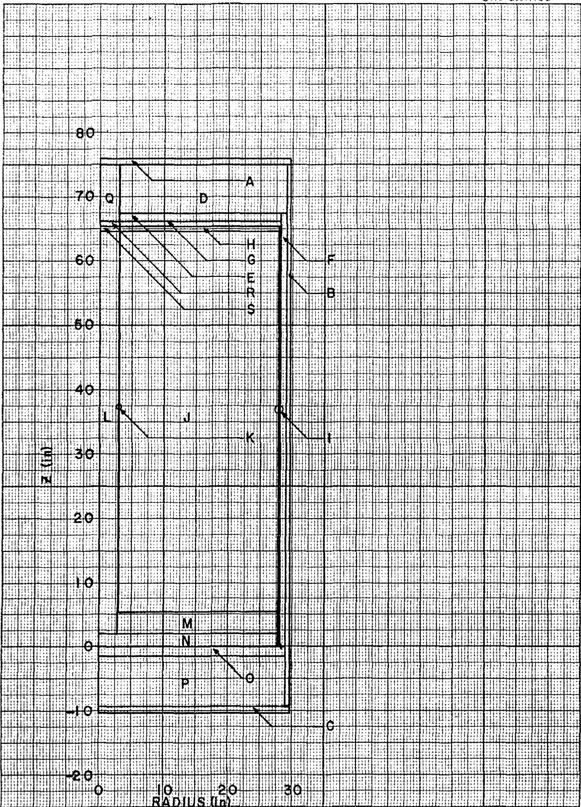
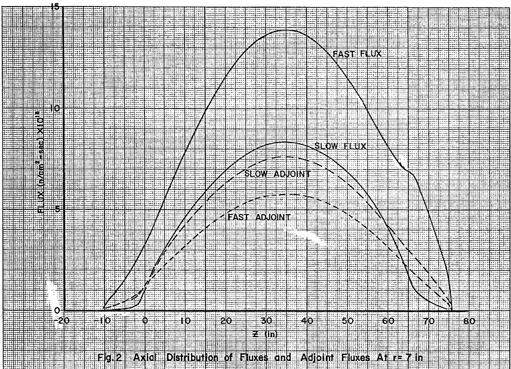
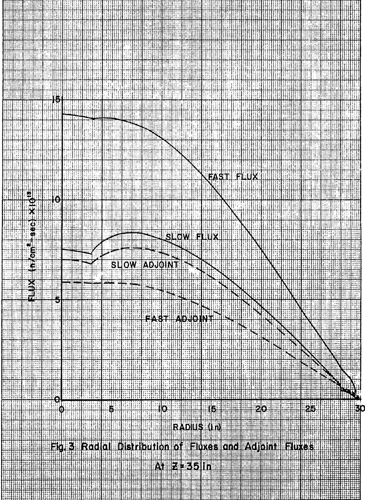
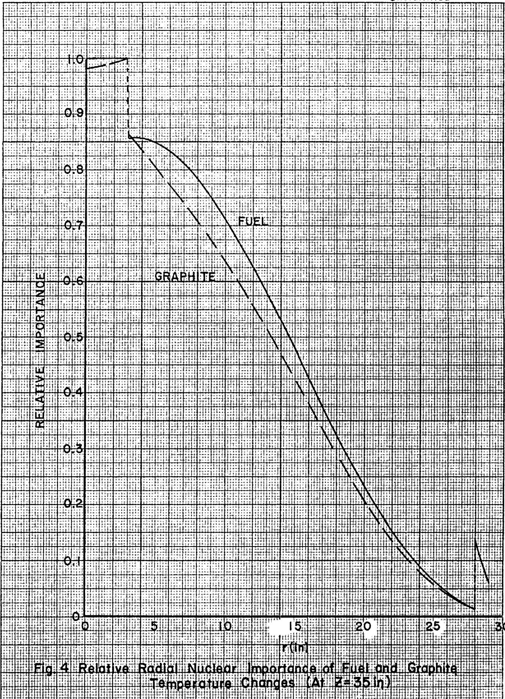
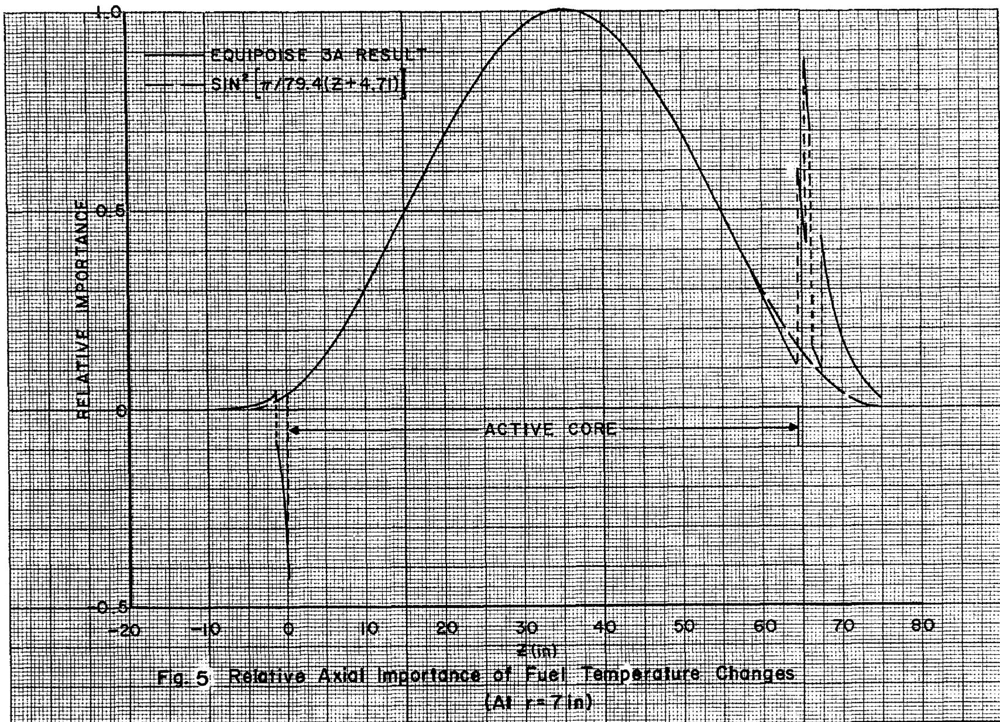
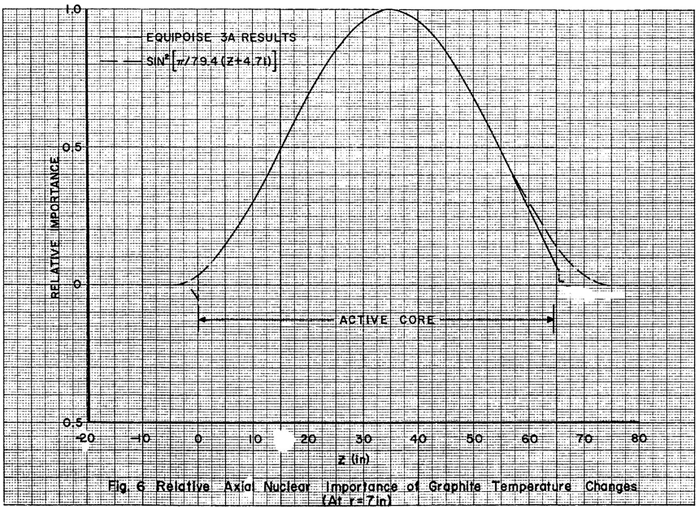

ORNL-TM-379

COPY NO. - //9

DATE - October 15, 1962

TEMPERATURE AND REACTIVITY COEFFICIENT AVERAGING IN THE MSRE

B. E. Prince and J. R. Engel

MAster.

# ABSTRACT

Use is made of the concept of "nuclear average temperature" to relate the spatial temperature profiles in fuel and graphite attained during high power operation of the MSRE to the neutron multiplication constant. Based on two-group perturbation theory, temperature weighting functions for fuel and graphite are derived, from which the nuclear average temperatures may be calculated. Similarly, importance-averaged temperature coefficients of reactivity are defined. The values of the coefficients calculated for the MSRE were $-4.4 \times 10^{-5} / {}^{\circ}\mathrm{F}$ for the fuel and $-7.3 \times 10^{-5}$ for the graphite. These values refer to a reactor fueled with salt which does not contain thorium. They were about $5\%$ larger than the values obtained from a one-region, homogeneous reactor model, thus reflecting the variation in the fuel volume fraction throughout the reactor and the effect of the control rod thimbles on the flux profiles.

# NOTICE

This document contains information of a preliminary nature and was prepared primarily for internal use at the Oak Ridge National Laboratory. It is subject to revision or correction and therefore does not represent a final report. The information is not to be abstracted, reprinted or otherwise given public dissemination without the approval of the ORNL patent branch, Legal and Information Control Department.

# LEGAL NOTICE

This report was prepared as an account of Government sponsored work. Neither the United States, nor the Commission, nor any person acting on behalf of the Commission:

A. Makes any warranty or representation, expressed or implied, with respect to the accuracy, completeness, or usefulness of the information contained in this report, or that the use of any information, apparatus, method, or process disclosed in this report may not infringe privately owned rights; or   
B. Assumes any liabilities with respect to the use of, or for damages resulting from the use of any information, apparatus, method, or process disclosed in this report.

As used in the above, "person acting on behalf of the Commission" includes any employee or contractor of the Commission, or employee of such contractor, to the extent that such employee or contractor of the Commission, or employee of such contractor prepares, disseminates, or provides access to, any information pursuant to his employment or contract with the Commission, or his employment with such contractor.

# INTRODUCTION

Prediction of the temperature kinetic behavior and the control rod requirements in operating the MSRE at full power requires knowledge of the reactivity effect of nonuniform temperature differences in fuel and graphite throughout the core. Since detailed studies have recently been made of the core physics characteristics at isothermal $(1200^{\circ}\mathrm{F})$ conditions, perturbation theory provides a convenient approach to this problem. Here, the perturbation is the change in fuel and graphite temperature profiles from the isothermal values. In the following section the analytical method is presented. Specific calculations for the MSRE are discussed in the final section of this report.

# ANALYSIS

The mathematical problem considered in this section is that of describing the temperature reactivity feedback associated with changes in reactor power by use of average fuel and graphite temperatures rather than the complete temperature distributions. The proper averages are derived by considering spatially uniform temperatures which give the same reactivity effect as the actual profiles. The reactivity is given by the following first-order perturbation formula:3

$$
\rho = \frac {\delta k _ {e}}{k _ {e}} \sim \frac {k _ {e} \left[ \Phi^ {*} , \delta M \Phi \right]}{\left[ \Phi^ {*} , R \Phi \right]} \tag {1}
$$

Equation 1 relates a small change in the effective multiplication constant $k_{e}$ to a perturbation $\delta M$ in the coefficient matrix of the two-group equations. The formulation of the two-group equations which defines the terms in (1) is:

$$
\begin{array}{l} - D _ {1} \nabla^ {2} \phi_ {1} + \Sigma_ {\mathrm {a l}} \phi_ {1} - \frac {\nu \Sigma_ {\mathrm {f} 1}}{\mathrm {k} _ {\mathrm {e}}} \phi_ {1} - \frac {\nu \Sigma_ {\mathrm {f} 2}}{\mathrm {k} _ {\mathrm {e}}} \phi_ {2} = 0 (2a) \\ - D _ {2} \nabla^ {2} \varnothing_ {2} + \Sigma_ {a 2} \varnothing_ {2} - \Sigma_ {R 1} \varnothing_ {1} = 0 (2b) \\ \end{array}
$$

or, writing (2) in matrix form:

$$
M \Phi = A \Phi - \frac {F \Phi}{k _ {e}} = 0 \tag {3}
$$

where:

$$
A = \left( \begin{array}{c c} (- D _ {1} \nabla^ {2} + \Sigma_ {R 1} + \Sigma_ {a 1}) & 0 \\ - \Sigma_ {R 1} & - D _ {2} \nabla^ {2} + \Sigma_ {a 2} \end{array} \right)
$$

$$
\mathbf {F} = \left( \begin{array}{c c c} v & \Sigma_ {\mathrm {f l}} & v \Sigma_ {\mathrm {f 2}} \\ & & \\ 0 & & 0 \end{array} \right)
$$

$$
\Phi = \left( \begin{array}{l} \varnothing_ {1} \\ \vdots \\ \varnothing_ {2} \end{array} \right)
$$

$$
\delta \mathbf {M} = \delta \mathbf {A} - \frac {\delta \mathbf {F}}{\mathbf {k} _ {\mathrm {e}}}
$$

In equation 1, $\Phi^*$ is the adjoint flux vector,

$$
\Phi^ {*} = \left(\emptyset_ {1} ^ {*} \emptyset_ {2} ^ {*}\right)
$$

and the bracketed terms represent the scalar products;

$$
\begin{array}{l} \left[ \Phi^ {*}, \delta M \Phi \right] = \int_ {\text {R e a c t o r}} \left(\phi_ {1} ^ {*} \phi_ {2} ^ {*}\right) \left( \begin{array}{l l} \delta \mathrm {M} _ {1 1} & \delta \mathrm {M} _ {1 2} \\ \vdots & \vdots \\ \delta \mathrm {M} _ {2 1} & \delta \mathrm {M} _ {2 2} \end{array} \right) \left( \begin{array}{l} \phi_ {1} \\ \vdots \\ \phi_ {2} \end{array} \right) d V \\ = \int_ {\text {R e a c t o r}} \left(\phi_ {1} ^ {*} \delta M _ {1 1} \phi_ {1} + \phi_ {1} ^ {*} \delta M _ {1 2} \phi_ {2} + \phi_ {2} ^ {*} \delta M _ {2 1} \phi_ {1} \right. \\ + \phi_ {2} ^ {*} \delta M _ {2 2} \phi_ {2}) d V \tag {4} \\ \end{array}
$$

A similar expression holds for $[\Phi^{\star},\mathbb{F}\Phi ]$ with the elements of the F matrix replacing $\delta M$ .

# Temperature Averaging

Starting with the critical, isothermal reactor $(\mathtt{k_e} = 1,\mathtt{T} = \mathtt{T_o})$ consider the effects on the neutron multiplication constant of changing the fuel and graphite temperatures to $\mathbb{T}_{\mathbf{f}}(\mathbf{r},\mathbf{z})$ and $\mathbb{T}_{\mathbf{g}}(\mathbf{r},\mathbf{z})$ . These effects may be treated as separate perturbations as long as $\delta \mathbf{k} / \mathbf{k}$ produced by each change is small. Consider first the fuel. As the temperature shifts from $\mathbb{T}_{\mathbf{fo}}$ to $\mathbb{T}_{\mathbf{f}}(\mathbf{r},\mathbf{z})$ , with the graphite temperature held constant, the reactivity change is:

$$
\rho_ {f} = \frac {\delta k}{k} \left| _ {T _ {f o} \rightarrow T _ {f} (r, z)} = - \frac {\left[ \Phi^ {*} , \delta M \left(T _ {f o} \rightarrow T _ {f}\right) \Phi \right]}{\left[ \Phi^ {*} , F \Phi \right]} \right. \tag {5}
$$

If the nuclear coefficients comprising the matrix $M$ do not vary rapidly with temperature, $\delta M$ can be adequately approximated by the first term in an expansion about $T_{\mathrm{fC}}$ , i.e.,

$$
\delta \mathrm {M} \left(\mathrm {T} _ {\mathrm {f o}} \rightarrow \mathrm {T} _ {\mathrm {f}}\right) \tilde {\approx} \mathrm {m} \left(\mathrm {T} _ {\mathrm {f o}}\right)\left(\mathrm {T} _ {\mathrm {f}} - \mathrm {T} _ {\mathrm {f o}}\right) \tag {6}
$$

In equation (6), $m$ is the coefficient matrix:

$$
m \left(T _ {f o}\right) = \left( \begin{array}{l l} \frac {\partial M _ {1 1}}{\partial T _ {f}} & \frac {\partial M _ {1 2}}{\partial T _ {f}} \\ \frac {\partial M _ {2 1}}{\partial T _ {f}} & \frac {\partial M _ {2 2}}{\partial T _ {f}} \end{array} \right) T _ {f} = T _ {f o} \tag {7}
$$

Thus:

$$
\frac {\delta \mathrm {k}}{\mathrm {k}} \left| _ {\mathrm {T} _ {\mathrm {f o}} \rightarrow \mathrm {T} _ {\mathrm {f}} (\mathrm {r}, \mathrm {z})} = - \frac {\left[ \Phi^ {*} , \mathrm {m} \left(\mathrm {T} _ {\mathrm {f o}}\right)\left(\mathrm {T} _ {\mathrm {f}} - \mathrm {T} _ {\mathrm {f o}}\right) \Phi \right]}{\left[ \Phi^ {*} , \mathrm {F} \Phi \right]} \right. \tag {8}
$$

Now, consider a second situation in which the fuel temperature is changed from $T_{fo}$ to $T_{f}^{*}$ uniformly over the core. The reactivity change is:

$$
\begin{array}{l} \frac {\delta k}{k} \left| _ {T _ {f O} \rightarrow T _ {f} ^ {*}} = - \frac {\left[ \Phi^ {*} , \delta M \left(T _ {f O} \rightarrow T _ {f} ^ {*}\right) \Phi \right]}{\left[ \Phi^ {*} , F \Phi \right]} \right. \\ = - \frac {\left[ \Phi^ {*} , m \left(T _ {f o}\right) \left(T _ {f} ^ {*} - T _ {f o}\right) \Phi \right]}{\left[ \Phi^ {*}, F \Phi \right]} \tag {9} \\ \end{array}
$$

We may define the fuel nuclear average temperature $\mathbf{T}_{\mathrm{f}}^{*}$ as the uniform temperature which gives rise to the same reactivity change as the actual temperature profile in the core, i.e.;

$$
\left[ \Phi^ {*}, m \left(T _ {f o}\right) \left(T _ {f} ^ {*} - T _ {f o}\right) \Phi \right] = \left[ \Phi^ {*}, m \left(T _ {f o}\right) \left(T _ {f} (r, z) - T _ {f o}\right) \Phi \right] \tag {10}
$$

Since $\mathbf{T}_{\mathbf{f}}^{*}$ is independent of position it may be factored from the scalar product in the left hand side of (10):

$$
\mathrm {T} _ {\mathrm {f}} ^ {*} = \frac {\left[ \Phi^ {*} , \mathrm {m} \left(\mathrm {T} _ {\mathrm {f} 0}\right) \mathrm {T} _ {\mathrm {f}} (\mathrm {r} , \mathrm {z}) \Phi \right]}{\left[ \Phi^ {*} , \mathrm {m} \left(\mathrm {T} _ {\mathrm {f} 0}\right) \Phi \right]} \tag {1.1}
$$

In an analogous fashion, the nuclear average temperature for the graphite is defined by:

$$
\mathrm {T} _ {\mathrm {g}} ^ {*} = \frac {\left[ \Phi^ {*} , \mathrm {m} \left(\mathrm {T} _ {\mathrm {g o}}\right) \mathrm {T} _ {\mathrm {g}} (\mathrm {r} , \mathrm {z}) \Phi \right]}{\left[ \Phi^ {*} , \mathrm {m} \left(\mathrm {T} _ {\mathrm {g o}}\right) \Phi \right]} \tag {12}
$$

with

$$
m \left(T _ {g o}\right) = \left( \begin{array}{l l} \frac {\partial M _ {1 1}}{\partial T _ {g}} & \frac {\partial M _ {1 2}}{\partial T _ {g}} \\ \frac {\partial M _ {2 1}}{\partial T _ {g}} & \frac {\partial M _ {2 2}}{\partial T _ {g}} \end{array} \right) _ {T g} = T _ {g o}
$$

# Temperature Coefficients of Reactivity

Importance-averaged temperature coefficients may be derived which are consistent with the definitions of the nuclear average temperatures. Again consider the fuel region. Let the initial reactivity perturbation correspond to $T_{f}$ assuming a profile $T_{fl}(r,z)$ about the initial value $T_{fo}$ :

$$
\rho_ {1} = - \frac {\left[ \Phi^ {*} , m \left(T _ {f o}\right) \left(T _ {f l} (r , z) - T _ {f o}\right) \Phi \right]}{\left[ \Phi^ {*} , F \Phi \right]} \tag {14}
$$

If a second temperature change is now made $(\mathbb{T}_{\mathbf{f}}\rightarrow \mathbb{T}_{\mathbf{f2}})$

$$
\rho_ {2} = - \frac {\left[ \Phi^ {*} , m \left(T _ {f 0}\right) \left(T _ {f 2} (r , z) - T _ {f 0}\right) \Phi \right]}{\left[ \Phi^ {*} , R \Phi \right]} \tag {15}
$$

Subtracting, and using the definition (11) of the fuel nuclear average temperature:

$$
\begin{array}{l} \delta \rho_ {2 1} = - \frac {\left[ \Phi^ {*} , m \left(T _ {f 0}\right) \left(T _ {i 2} (r , z) - T _ {f 1} (r , z)\right) \Phi \right]}{\left[ \Phi^ {*} , F \Phi \right]} \tag {16} \\ = - \frac {\left[ \Phi^ {*} , m \left(T _ {f 0}\right) \Phi \right]}{\left[ \Phi^ {*} , F \Phi \right]} \left(T _ {f 2} ^ {*} - T _ {f 1} ^ {*}\right) \\ \end{array}
$$

This leads to the relation defining the fuel temperature coefficient of reactivity:

$$
\frac {\delta \rho}{\delta \mathrm {T} _ {f} ^ {*}} = - \frac {\left[ \Phi^ {*} , m \left(\mathrm {T} _ {\mathrm {f o}}\right) \Phi \right]}{\left[ \Phi^ {*} , F \Phi \right]} \tag {17a}
$$

and a similar definition may be made of the graphite temperature coefficient:

$$
\frac {\delta \rho}{\delta \mathrm {T} _ {\mathrm {g}} ^ {*}} = - \frac {\left[ \Phi^ {*} , \mathrm {m} \left(\mathrm {T} _ {\mathrm {g o}}\right) \Phi \right]}{\left[ \Phi^ {*} , \mathrm {R} \Phi \right]} \tag {17b}
$$

It may be seen from the preceding analysis that the problem of obtaining nuclear average temperatures is reducible to the calculation of the weighting function contained in the scalar product:

$$
\begin{array}{l} [ \Phi^ {*}, m \Phi ] = \int_ {\text {R e a c t o r}} \mathrm {d V} (\not \phi^ {*}, m _ {1 1} \not \phi_ {1} + \not \phi_ {1} ^ {*} m _ {1 2} \not \phi_ {2} + \not \phi_ {2} ^ {*} m _ {2 1} \not \phi_ {1} + \not \phi_ {2} ^ {*} m _ {2 2} \not \phi_ {2}) \\ = \int_ {\text {R e a c t o r}} \mathrm {d V} G (r, z) (18) \\ G (r, z) = \Phi^ {*} m \Phi (19) \\ \end{array}
$$

In the two-group formulation, the explicit form of the $m$ matrix is:

$$
\bar {m} = \left( \begin{array}{l l} \frac {\mathrm {d}}{\mathrm {d T}} (- D _ {1} \nabla^ {2} + \Sigma_ {\mathrm {R l}} + \Sigma_ {\mathrm {a l}} - v \Sigma_ {\mathrm {f l}}) _ {\mathrm {T}} = T _ {\mathrm {o}} & - \frac {\mathrm {d}}{\mathrm {d T}} (\nu \Sigma_ {\mathrm {f 2}}) _ {\mathrm {T}} = T _ {\mathrm {o}} \\ - \frac {\mathrm {d}}{\mathrm {d T}} (\Sigma_ {\mathrm {R l}}) _ {\mathrm {T}} = T _ {\mathrm {o}} & \frac {\mathrm {d}}{\mathrm {d T}} (- D _ {2} \nabla^ {2} + \Sigma_ {\mathrm {a 2}}) _ {\mathrm {T}} = T _ {\mathrm {o}} \end{array} \right) \tag {20}
$$

where the derivatives are taken with respect to the fuel or graphite temperatures in order to obtain $G_{f}$ or $G_{g}$ , respectively. It is convenient for numerical evaluation to rewrite the derivatives in logarithmic form; e.g.,

$$
\frac {d \Sigma_ {a 2}}{d T} = \Sigma_ {a 2} \beta (\Sigma_ {a 2})
$$

where

$$
\beta \left(\Sigma_ {a 2}\right) = \frac {1}{\Sigma_ {a 2}} \frac {\mathrm {d} \Sigma_ {a 2}}{\mathrm {d} T} = \frac {\mathrm {d} (\ln \Sigma_ {a 2})}{\mathrm {d} T}
$$

Thus, carrying out the matrix multiplication implicit in (19):

$$
\begin{array}{l} G (r, z) = \beta \left(D _ {1}\right) \left\{\phi_ {1} ^ {*} \left(- D _ {1} \nabla^ {2} \phi_ {1}\right) \right\} \quad (\text {F a s t l e a k a g e}) \\ + \beta \left(\Sigma_ {\mathrm {R} 1}\right) \left\{\Sigma_ {\mathrm {R} 1} \phi_ {1} ^ {*} \phi_ {1} - \Sigma_ {\mathrm {R} 1} \phi_ {2} ^ {*} \phi_ {1} \right\} \quad (\text {S l o w i n g d o w n}) \\ \end{array}
$$

$$
\begin{array}{l} + \beta \left(\Sigma_ {a l}\right) \left\{\Sigma_ {a l} \phi_ {1} ^ {*} \phi_ {1} \right\} \quad \text {(R e s o n a n c e A b s .)} \\ + \beta \left(v \Sigma_ {f l}\right) \left\{- v \Sigma_ {f l} \phi_ {1} ^ {*} \phi_ {1} \right\} \quad \text {(R e s o n a n c e f i s s i o n)} \\ + \beta \left(v \Sigma_ {f 2}\right) \left\{- v \Sigma_ {f 2} \phi_ {1} ^ {*} \phi_ {2} \right\} \quad \text {(T h e r m a l f i s s i o n)} \\ + \beta \left(\Sigma_ {a 2}\right) \left\{\Sigma_ {a 2} \phi_ {2} ^ {*} \phi_ {2} \right\} \quad \text {(T h e r m a l A b s .)} \\ + \beta \left(\mathrm {D} _ {2}\right) \left\{\phi_ {2} ^ {*} (- \mathrm {D} _ {2} \sqrt [ 4 ]{2} \phi_ {2}) \right\} \quad (\text {T h e r m a l L e a k a g e}) \tag {21} \\ \end{array}
$$

To evaluate the leakage terms in (21), a further simplification is obtained by using the criticality relations for the unperturbed fluxes:

$$
\begin{array}{l} - D _ {2} \nabla^ {2} \phi_ {2} = - \Sigma_ {a 2} \phi_ {2} + \Sigma_ {R 1} \phi_ {1} (22) \\ - D _ {1} \nabla^ {2} \phi_ {1} = - \Sigma_ {\mathrm {R} 1} \phi_ {1} - \Sigma_ {\mathrm {a} 1} \phi_ {1} + v \Sigma_ {\mathrm {f} 1} \phi_ {1} + v \Sigma_ {\mathrm {f} 2} \phi_ {2} (23) \\ \end{array}
$$

Inserting the above relations into (21) and regrouping terms results in:

$$
\begin{array}{l} G (r, z) = \left\{\left(\beta \left(\Sigma_ {R 1}\right) - \beta \left(D _ {1}\right)\right) \Sigma_ {R 1} + \left(\beta \left(\Sigma_ {a l}\right) - \beta \left(D _ {1}\right)\right) \Sigma_ {a l} \right. \\ - \left(\beta \left(v \Sigma_ {f 1}\right) - \beta \left(D _ {1}\right)\right) v \Sigma_ {f 1} \} \phi_ {1} ^ {*} \phi_ {1} \\ + \left\{\left(\beta \left(D _ {1}\right) - \beta \left(v \Sigma_ {f 2}\right)\right) v \Sigma_ {f 2} \right\} \phi_ {1} ^ {*} \phi_ {2} \\ + \left\{\left(\beta \left(\mathrm {D} _ {2}\right) - \beta \left(\Sigma_ {\mathrm {R} 1}\right)\right) \Sigma_ {\mathrm {R} 1} \right\} \phi_ {2} ^ {*} \phi_ {1} \\ + \left\{\left(\beta \left(\Sigma_ {a 2}\right) - \beta \left(D _ {2}\right)\right) \Sigma_ {a 2} \right\} \phi_ {2} ^ {*} \phi_ {2} \tag {24} \\ \end{array}
$$

Equation (24) represents the form of the weighting functions used in numerical calculations for the MSRF. The evaluation of the coefficients $\beta$ for fuel and graphite is discussed in the following section.

# APPLICATION TO THE MSRE: RESULTS

Utilizing a calculational model in which the reactor composition was assumed uniform, Nestor obtained values for the fuel and graphite temperature coefficients. The purpose of the present study was to account for the spatial variations in temperature and composition in a more exact fashion. In this connection, two-group, 19-region calculations of fluxes and adjoint fluxes have recently been made for the MSRE, using the Equipoise-3A program. These studies refer to fuel salt which contains no thorium. The geometric model representing the reactor core configuration is indicated in Fig. l. Average compositions of each region in this figure are given in Table l.

The resulting flux distributions, which are the basic data required for calculation of the temperature weighting functions, are given in Figs. 2 and 3. These figures represent axial and radial traverses, along lines which intersect in the region $\mathbf{J}$ of Fig. 1. The intersection point occurs close to the point $\mathbf{R} = 7$ in., $\mathbf{Z} = 35$ in. of the grid of Fig. 1, and corresponds to the position of maximum thermal flux in the reactor.

To compute the temperature weighting functions (Eq. 24), the logarithmic derivatives

$$
\begin{array}{l} \beta = \frac {1}{x} \frac {d x}{d T} \quad T = T _ {f}, T _ {g} \\ x = D, v \Sigma_ {f}, \Sigma_ {\varepsilon}, \Sigma_ {R} \\ \end{array}
$$

For each group must be numerically evaluated. Here, certain simplifying approximations may be made. It was assumed that the diffusion and slowing down parameters $D$ and $\Sigma_{R}$ vary with temperature only through the fuel and graphite densities and not through the microscopic cross sections. Thus, using:

$$
\sum = \Sigma^ {f} + \Sigma^ {g} + \Sigma^ {I n}
$$

  
Fig.1 19-Region Core Model for Equipolse Calculation

Table 2. Nineteen-Region Core Model Used in EQUIPOISE Calculations for MSRE   

<table><tr><td rowspan="2">Region</td><td colspan="2">radius (in.)</td><td colspan="2">Z (in.)</td><td colspan="3">Composition (Volume percent)</td><td rowspan="2">Region 
Represented</td></tr><tr><td>inner</td><td>outer</td><td>bottom</td><td>top</td><td>fuel</td><td>graphite</td><td>INOR</td></tr><tr><td>A</td><td>0</td><td>29.56</td><td>74.92</td><td>76.04</td><td>0</td><td>0</td><td>100</td><td>Vessel top</td></tr><tr><td>B</td><td>29.00</td><td>29.56</td><td>-9.14</td><td>74.92</td><td>0</td><td>0</td><td>100</td><td>Vessel sides</td></tr><tr><td>C</td><td>0</td><td>29.56</td><td>-10.26</td><td>-9.14</td><td>0</td><td>0</td><td>100</td><td>Vessel bottom</td></tr><tr><td>D</td><td>3.00</td><td>29.00</td><td>67.47</td><td>74.92</td><td>100</td><td>0</td><td>0</td><td>Upper head</td></tr><tr><td>E</td><td>3.00</td><td>28.00</td><td>66.22</td><td>67.47</td><td>93.7</td><td>3.5</td><td>2.8</td><td></td></tr><tr><td>F</td><td>28.00</td><td>29.00</td><td>0</td><td>67.47</td><td>100</td><td>0</td><td>0</td><td>Downcomer</td></tr><tr><td>G</td><td>3.00</td><td>28.00</td><td>65.53</td><td>66.22</td><td>94.6</td><td>5.4</td><td>0</td><td></td></tr><tr><td>H</td><td>3.00</td><td>27.75</td><td>64.59</td><td>65.53</td><td>63.3</td><td>36.5</td><td>0.2</td><td></td></tr><tr><td>I</td><td>27.75</td><td>28.00</td><td>0</td><td>65.53</td><td>0</td><td>0</td><td>100</td><td>Core can</td></tr><tr><td>J</td><td>3.00</td><td>27.75</td><td>5.50</td><td>64.59</td><td>22.5</td><td>77.5</td><td>0</td><td>Core</td></tr><tr><td>K</td><td>2.94</td><td>3.00</td><td>5.50</td><td>74.92</td><td>0</td><td>0</td><td>100</td><td>Simulated 
thimbles</td></tr><tr><td>L</td><td>0</td><td>2.94</td><td>2.00</td><td>64.59</td><td>25.6</td><td>74.4</td><td>0</td><td>Central 
region</td></tr><tr><td>M</td><td>2.94</td><td>27.75</td><td>2.00</td><td>5.50</td><td>22.5</td><td>77.5</td><td>0</td><td>Core</td></tr><tr><td>N</td><td>0</td><td>27.75</td><td>0</td><td>2.00</td><td>23.7</td><td>76.3</td><td>0</td><td>Horizontal 
stringers</td></tr><tr><td>O</td><td>0</td><td>29.00</td><td>-1.41</td><td>0</td><td>66.9</td><td>15.3</td><td>17.8</td><td>Bottom head</td></tr><tr><td>P</td><td>0</td><td>29.00</td><td>-9.14</td><td>-1.41</td><td>90.8</td><td>0</td><td>9.2</td><td></td></tr><tr><td>Q</td><td>0</td><td>2.94</td><td>66.22</td><td>74.92</td><td>100</td><td>0</td><td>0</td><td></td></tr><tr><td>R</td><td>0</td><td>2.94</td><td>65.53</td><td>66.22</td><td>89.9</td><td>10.1</td><td>0</td><td></td></tr><tr><td>S</td><td>0</td><td>2.94</td><td>64.59</td><td>65.53</td><td>43.8</td><td>56.2</td><td>0</td><td></td></tr></table>

  
13   
ORNL-LR-Dwg 74859 Unclassified

where $f, g,$ and In refer to fuel salt, graphite, and Inor;

$$
\beta (D) = \frac {1}{D} \frac {\mathrm {d} D}{\mathrm {d} T} = - \frac {1}{\Sigma_ {t r}} \frac {\mathrm {d} \Sigma_ {t r}}{\mathrm {d} T}
$$

$$
\begin{array}{l} = \frac {\Sigma_ {t r} ^ {f}}{\Sigma_ {t r}} \beta \left(\Sigma_ {t r} ^ {f}\right) + \frac {\Sigma_ {t r} ^ {g}}{\Sigma_ {t r}} \beta \left(\Sigma_ {t r} ^ {g}\right) + \frac {\Sigma_ {t r} ^ {\ln}}{\Sigma_ {t r}} \beta \left(\Sigma_ {t r} ^ {\ln}\right) \\ \simeq \frac {\sum_ {t r} ^ {f}}{\sum_ {t r}} \beta \left(\rho_ {g}\right) + \frac {\sum_ {t r} ^ {g}}{\sum_ {t r}} \beta \left(\rho_ {g}\right) \quad \text {(G r o u p s 1 , 2)} \\ \end{array}
$$

In the above approximation, the effect of temperature on the Inor density has also been neglected. The numerical values used for the density coefficients of fuel and graphite were:

Fuel temperature: $\beta (\rho_{\mathrm{s}}) = \frac{1}{\rho_{\mathrm{s}}}\frac{\mathrm{d}\rho_{\mathrm{s}}}{\mathrm{d}T_{\mathrm{f}}} = -1.26\times 10^{-4} / ^{\circ}\mathrm{F}$

$$
\beta (\rho_ {g}) = \frac {1}{\rho_ {g}} \frac {\mathrm {d} \rho_ {g}}{\mathrm {d} T _ {f}} = 0
$$

Graphite temperature: $\beta (\rho_{s}) = \frac{1}{\rho_{s}}\frac{\mathrm{d}\rho_{s}}{\mathrm{d}T_{g}} = 0$

$$
\beta (\rho_ {g}) = \frac {1}{\rho_ {g}} \frac {\mathrm {d} \rho_ {g}}{\mathrm {d} T _ {g}} = - 4. 0 \times 1 0 ^ {- 6} / ^ {\circ} F
$$

The remaining coefficients were calculated as follows:

$$
\beta (\nu \Sigma_ {f 1}) = \beta (\rho_ {s}) + \beta (\nu \sigma_ {f 1})
$$

$$
\beta \left(\Sigma_ {\mathrm {a l}}\right) \quad \tilde {=} \beta \left(\rho_ {\mathrm {s}}\right) + \beta \left(\sigma_ {\mathrm {a l}}\right)
$$

For the MSRE fuel, the temperature coefficients of the fuel resonance cross sections, $\beta (\nu \sigma_{\mathrm{fl}})$ and $\beta (\sigma_{\mathrm{al}})$ , are of the order of $10^{-5} / ^{\circ}\mathrm{F}$ , a factor

of ten smaller than the fuel density coefficient. In addition, resonance fissions contribute only about $12\%$ of the total fissions in the reactor. Thus $\beta (\nu \sigma_{fl})$ and $\beta (\sigma_{al})$ were neglected in the present calculations.

For the thermal fission and absorption terms:

$$
\begin{array}{l} \beta (v \Sigma_ {f 2}) = \beta (\rho_ {\varepsilon}) + \beta (v \sigma_ {f 2}) \\ \beta \left(\Sigma_ {a 2}\right) \approx \frac {\Sigma_ {a 2} ^ {2 5}}{\Sigma_ {a 2}} \left[ \beta \left(\rho_ {s}\right) + \beta \left(\sigma_ {a 2} ^ {2 5}\right) \right] \\ + \frac {\sum_ {a 2} ^ {s}}{\sum_ {a 2}} \cdot \left[ \beta \left(\rho_ {s}\right) + \beta \left(\sigma_ {a 2} ^ {s}\right) \right] \\ + \frac {\sum_ {a 2} ^ {g}}{\sum_ {a 2}} \cdot \left[ \beta (\rho_ {g}) + \beta (\sigma_ {a 2} ^ {g}) \right] \\ + \frac {\sum_ {a 2} ^ {\ln}}{\sum_ {a 2}} \beta \left(\sigma_ {a 2} ^ {\ln}\right) \\ \end{array}
$$

In the above expression, the thermal cross section of the salt was separated into components; one was $U^{235}$ and the other was the remaining salt constituents (labeled s). This was done because of the non- $l/v$ behavior of the $U^{235}$ cross section.

Evaluation of the temperature derivatives of the thermal cross sections gives rise to the question of the relationship between the neutron temperature $T_{\mathrm{n}}$ and the fuel and graphite temperatures, $T_{\mathrm{f}}$ and $T_{\mathrm{g}}$ . As seen from Table 1, except for the outer regions of the core, graphite comprises about 75 to 77 per cent of the core volume. Following Nestor's calculations, it was assumed that within these regions the neutron temperature was equal to the graphite temperature. These regions comprise the major part of the core volume (Table 1). For those external regions with fuel volume fractions greater than $50\%$ (an arbitrarily chosen dividing point), the neutron temperature was assumed equal to the bulk temperature; i.e.,

$$
\mathbf {\Delta} _ {\mathrm {T n}} \simeq \mathbf {\Delta v} _ {\mathrm {f}} \mathbf {\Delta T} _ {\mathrm {f}} + \mathbf {\Delta v} _ {\mathrm {g}} \mathbf {\Delta T} _ {\mathrm {g}}
$$

where $\mathbf{v}$ is the volume fraction. The cross sections were given by

$$
\sigma_ {a 2} = \sigma_ {a 2} \left(T _ {o}\right) \left(\frac {T _ {o}}{T _ {n}}\right) ^ {b}
$$

with $b \simeq 0.54$ for $U^{235}$ and $b = 0.50$ for the remaining salt constituents; on this basis the result for $\beta$ is:

$$
\begin{array}{l} \beta \left(\sigma_ {a 2}\right) = \frac {1}{\sigma_ {a 2}} \frac {d \sigma_ {a 2}}{d T} = \left(\frac {1}{\sigma_ {a 2}} \frac {d \sigma_ {a 2}}{d T _ {n}}\right) \frac {d T _ {n}}{d T} \\ = - \frac {b}{T _ {n}} \frac {d T _ {n}}{d T} \\ \end{array}
$$

Thus, for the fuel temperature:

$$
\begin{array}{l} \beta \left(\sigma_ {a 2}\right) = \frac {1}{\sigma_ {a 2}} \frac {\mathrm {d} \sigma_ {a 2}}{\mathrm {d} T _ {f}} = 0 \quad v _ {f} \leq 0. 5 0 \\ = - \frac {v _ {f} b}{T _ {0}} v _ {f} > 0. 5 0 \\ \mathrm {T} _ {\mathrm {o}} = 1 2 0 0 ^ {\circ} \mathrm {F} \\ \end{array}
$$

For the graphite temperature:

$$
\begin{array}{l} \beta \left(\sigma_ {a 2}\right) = \frac {1}{\sigma_ {a 2}} \frac {\mathrm {d} \sigma_ {a 2}}{\mathrm {d T} g} = - \frac {b}{T _ {o}} v _ {f} \leqslant 0. 5 0 \\ = - \frac {v _ {g} b}{T _ {o}} v _ {f} > 0. 5 0 \\ \end{array}
$$

Based upon the preceding approximations, the results of calculations of the fuel and graphite temperature weighting functions are plotted in Figs. 4 through 6. Figure 4 is a radial plot, and Figs. 5 and 6 are axial plots of the fuel and graphite functions, respectively. In the latter

  
19   
ORNL-LR-Dwg 74862

  
3   
Unclassified

figures, the "active core" is the vertical section over which the uniform reactor approximation, $\sin^2\frac{\pi}{\mathrm{H}} (\mathbf{z} + \mathbf{z}_0)$ may be used to represent the weight function.

Temperature coefficients of reactivity consistent with these weighting functions were calculated from Eq. 17. These values are listed in Table 2, along with the coefficients obtained from the uniform reactor model as used for the calculations reported in reference (4). In the latter case, a uniform fuel volume fraction of 0.225 was used; i.e., that of the largest region in the reactor. Also, the effective radius and height of the reactor were chosen as closely as possible to correspond to the points where the Equipoise thermal fluxes extrapolate to zero from the active core.

Table 2. MSRE Temperature Coefficients of Reactivity   

<table><tr><td></td><td>Fuel
10-5/°F</td><td>Graphite
10-5/°F</td></tr><tr><td>Perturbation theory</td><td>-4.45</td><td>-7.27</td></tr><tr><td>Homogeneous reactor model</td><td>-4.13</td><td>-6.92</td></tr></table>

# APPLICATION TO THE MSRE - DISCUSSION OF RESULTS

The relative importance of temperature changes on the reactivity varies from region to region in the reactor due to two effects. One is the change in the nuclear importance, as measured by the adjoint fluxes. The other is the variation in the local infinite multiplication constant as the fuel-graphite-Inor 8 composition varies. The latter effect leads to the discontinuities in the temperature weighting function. For example, region O of Fig.1 contains a relatively large volume fraction of Inor 8 (see Table 1). This results in net subcriticality of this region in the absence of the net inleakage of neutrons from the surrounding regions. Thus the reactivity effect of a temperature increment in this region has the opposite sign from that of the surroundings.

It should be understood that the validity of the perturbation calculations in representing the local temperature-reactivity effects depends upon how accurately the original flux distributions and average region compositions represent the nuclear behavior of the reactor. Also, it was necessary to assume a specific relation between the local neutron temperature and the local fuel and graphite temperatures. More exact calculations would account for a continuous change in thermal spectrum as the average fuel volume fraction changes. This would have the effect of "rounding off" the discontinuities in the temperature weighting functions. These effects, however should be relatively minor and the results presented herein should be a reasonably good approximation.

Nuclear average temperatures have been calculated from computed MSRE temperature distributions, using the weighting functions given in this report and are reported elsewhere.5

# NOMENCLATURE

ke Static multiplication constant   
A Coefficient matrix of absorption plus leakage terms in diffusion equations   
F Coefficient matrix of neutron production terms in diffusion equations   
M Matrix of nuclear coefficients in diffusion equations for unperturbed reactor   
m Temperature derivative of M matrix   
G(r,z) Temperature weighting functions of position: Subscripts f = fuel salt, g = graphite   
Dj Diffusion coefficient, group j = 1,2   
T Temperature: Subscripts f = fuel salt, g = graphite, o = initial, n = effective thermal neutron temperature $\mathbf{T}^*$ Nuclear average temperature   
dV Reactor volume element   
v Volume fraction $\phi_{j}$ Neutron flux, groups $j = 1,2$ $\Phi$ Neutron flux vector $\phi_{j}^{*}$ Adjoint flux, groups $j = 1,2$ $\Phi^{*}$ Adjoint flux vector   
p Reactivity $\rho_{s}$ Density of fuel salt $\rho_{g}$ Density of reactor graphite.   
∑j Macroscopic cross section, groups $j = 1,2$ ; Subscripts a = absorption, f = fission, R = removal $\beta (\mathbf{x})$ Temperature derivative of $\ln x$ $\nu$ Number of neutrons per fission

# REFERENCES

1. MSRP Prog. Rep. August 31, 1962, (ORNL report to be issued).   
2. T. B. Fowler and M. L. Tobias, Equipoise-3: A Two-Dimensional, Two-Group, Neutron Diffusion Code for the IBM-7090 Computer, ORNL-3199, Feb. 7, 1962.   
3. C.W. Nestor, Jr., Equipoise 3A, ORNL-3199 Addendum, June 6, 1962.   
4. MSRP Prog. Rep. August 31, 1961, ORNL-3215, p. 83.   
5. J. R. Engel and P. N. Haubenreich, Temperatures in the MSRE Core During Steady State Power Operation, ORNL-TM-378 (in preparation).

# Internal Distribution

1-2. MSRP Director's Office.  
Rm. 219, Bldg. 9204-1

3. G.M. Adamson   
4. L. G. Alexander   
5. S.E.Beall   
6. M. Bender   
7. C. E. Bettis   
8. E.S.Bettis   
9. D. S. Billington   
10. F. F. Blankenship   
11. E. G. Bohlmann   
12. S.E.Bolt   
13. C.J. Borkowski   
14. C. A. Brandon   
15. F. R. Bruce   
16. O.W. Burke   
17. S. Cantor   
18. T.E.Cole   
19. J. A. Conlin   
20. W.H.Cook   
21. L. T. Corbin   
22. G.A.Cristy   
23. J. L. Crowley   
24. F. L. Culler   
25. J.H.DeVan   
26. R. G. Donnelly   
27. D. A. Douglas   
28. N. E. Dunwoody   
29. J. R. Engel   
30. E.P.Epler   
31. W. K. Ergen   
32. D. E. Ferguson   
33. A. P. Fraas   
34. J.H.Frye   
35. C. H. Gabbard   
36. R. B. Gallaher   
37. B. L. Greenstreet   
38. W.R.Grimes   
39. A. G. Grindell   
40. R. H. Guymon   
41. P. H. Harley   
42. C. S. Harrill   
43. P. N. Haubenreich   
44. E.C.Hise   
45. H.W. Hoffman   
46. P.P.Holz   
47. L. N. Howell   
48. J.P.Jarvis   
49. W. H. Jordan

50. P. R. Kasten   
51. R.J.Kedl   
52. M. T. Kelley   
53. M.J.Kelly   
54. S. S. Kirslis   
55. J.W.Krewson   
56. J.A. Lane   
57. W.J.Leonard   
58. R. B. Lindauer   
59. M. I. Lundin   
60. R. N. Lyon   
61. H. G. MacPherson   
62. F.C. Mainenschein   
63. E.R. Mann   
64. W. B. McDonald   
65. H.F. McDuffie   
66. C. K. McGlothlan   
67. A. J. Miller   
68. E.C.Miller   
69. R. L. Moore   
70. J. C. Moyers   
71. T. E. Northup   
72. W. R. Osborn   
73. P. Patriarca   
74. H. R. Payne   
75. A. M. Perry   
76. W. B. Pike   
77. B. E. Prince   
78. J. L. Redford   
79. M. Richardson   
80. R. C. Robertson   
81. T. K. Roche   
82. H. W. Savage   
83. A. W. Savolainen   
84. J. E. Savolainen   
85. D. Scott   
86. C. H. Secoy   
87. J.H.Shaffer   
88. M. J. Skinner   
89. G.M.Slaughter   
90. A. N. Smith   
91. P. G. Smith   
92. I. Spiew   
93. J. A. Swartout   
94. A. Taboada   
95. J.R.Tallackson   
96. R.E.Thoma   
97. D. B. Trauger   
98. W.C.Ulrich

# Internal Distribution - cont'd

99. B. S. Weaver

100. C.F.Weaver

101. B.H. Webster

102. A. M. Weinberg

103. J.C. White

104. L. V. Wilson

105. C. H. Wödtke

106-107. Reactor Division Library

108-109. Central Research Library

110. Document Reference Section

111-113. Laboratory Records

114. ORNL-RC

# External

115-116. D. F. Cope, Reactor Division, AEC, ORO   
117. H. M. Roth, Division of Research and Development, AEC, ORO   
118. F. P. Self, Reactor Division, AEC, ORO   
119-133. Division of Technical Information Extension, AEC, ORO   
134. J. Wett, AEC, Washington   
135. W. L. Smalley, AEC-ORO