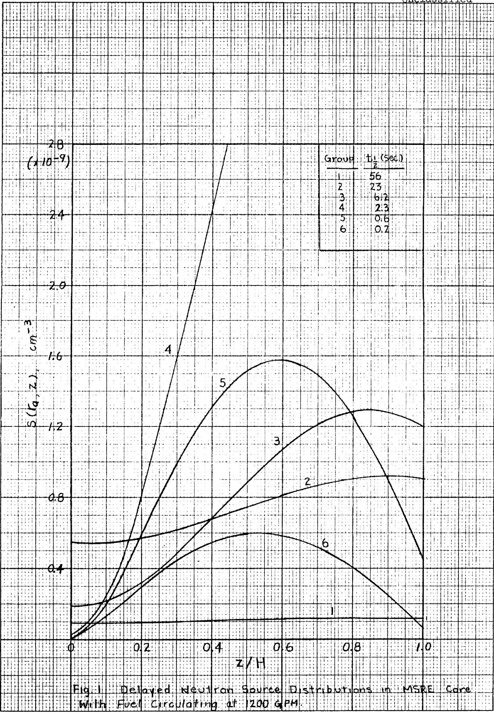
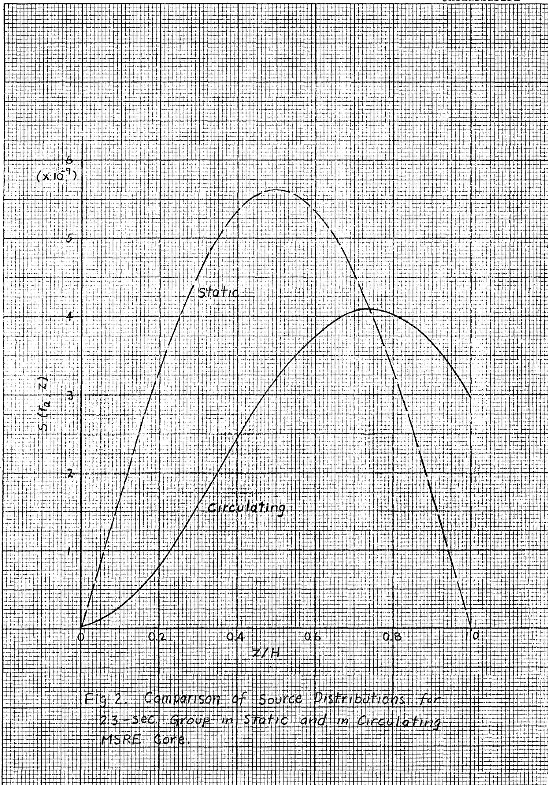

ORNL-TM-380

COPY NO. - 124

DATE - October 13, 1962

# PREDICTION OF EFFECTIVE YIELDS OF DELAYED NEUTRONS IN MSRE

P. N. Haubenreich

# ABSTRACT

Equations were developed and calculations were made to determine the effective contributions of delayed neutrons in the MSRE during steady power operation. Nonleakage probabilities were used as the measure of relative importance of prompt and delayed neutrons, and the spatial and energy distributions of the prompt and delayed neutron sources were included in the calculation of these probabilities.

Data which indicate a total yield of 0.0064 delayed neutron per neutron were used to compute total effective yields of 0.0067 and 0.0036 for the MSRE under static and circulating conditions respectively.

The effective fractions for the individual groups of delayed neutrons will be used in future digital calculations of MSRE kinetic behavior.

# NOTICE

This document contains information of a preliminary nature and was prepared primarily for internal use at the Oak Ridge National Laboratory. It is subject to revision or correction and therefore does not represent a final report. The information is not to be abstracted, reprinted or otherwise given public dissemination without the approval of the ORNL patent branch, Legal and Information Control Department.

# LEGAL NOTICE

This report was prepared as an account of Government sponsored work. Neither the United States, nor the Commission, nor any person acting on behalf of the Commission:

A. Makes any warranty or representation, expressed or implied, with respect to the accuracy, completeness, or usefulness of the information contained in this report, or that the use of any information, apparatus, method, or process disclosed in this report may not infringe privately owned rights; or   
B. Assumes any liabilities with respect to the use of, or for damages resulting from the use of any information, apparatus, method, or process disclosed in this report.

As used in the above, "person acting on behalf of the Commission" includes any employee or contractor of the Commission, or employee of such contractor, to the extent that such employee or contractor of the Commission, or employee of such contractor prepares, disseminates, or provides access to, any information pursuant to his employment or contract with the Commission, or his employment with such contractor.

# CONTENTS

Page

INTRODUCTION 3

APPROACH TO THE PROBLEM 3

DERIVATION OF EQUATIONS 7

Steady-State Concentrations of Precursors 7

Normalized Source Distributions 9

Expansion of Sources in Series Form 10

Fraction Emitted in the Core 11

Effective Fraction in Noncirculating System 12

RESULTS OF MSRE CALCULATIONS 13

APPENDIX 18

Expressions for Nonleakage Probabilities 18

Data for MSRE Calculations 21

MSRE Dimensions 21

Precursor Yields and Half-Lives 21

Neutron Energies and Ages 23

Neutron Diffusion Length 24

Nomenclature 24

# INTRODUCTION

The kinetics of the fission chain reaction in a circulating-fuel reactor are influenced by the transport of the delayed neutron precursors. This fact makes a rigorous treatment quite complicated. $^{1,2}$ The approach generally followed is to drop the transport term from the precursor equation (making the kinetics equations identical with those for stationary reactors) and make an approximate allowance for the precursor transport by replacing the delayed neutron fractions, $\beta_{i}$ , with "effective" values, $\beta_{i}^{*}$ . This approximation is used in ZORCH, the computer program recently developed for analysis of the kinetics of the MSRE. $^{3}$

The purpose of the work reported here is to obtain values for $\beta_{1}^{\#}$ to be used in the MSRE analyses.

# APPROACH TO THE PROBLEM

The importance of delayed neutrons is enhanced in fixed-fuel reactors because the energy spectra of the delayed neutrons lie at much lower energies than that of the prompt neutrons. The differences in energy spectra make the delayed neutrons more valuable because they are less likely to escape from the reactor in the course of slowing down to thermal energies. This effect is, of course, also present in circulating-fuel reactors. Of greater importance, however, in these reactors is the spatial distribution of the delayed neutron sources. Many of the delayed neutrons are emitted outside the core and contribute nothing to the chain reaction. Furthermore, those delayed neutrons which are emitted in the core are, on the average, produced nearer to the edges of the core than are the prompt neutrons, which tends to further reduce the contribution of a particular group of delayed neutrons.

The contribution of delayed neutrons during a power transient in a circulating-fuel reactor is affected by the continual change in the shape of the spatial source distribution. Thus the use of an "effective" fraction for a delay group in analyzing such transients is, in itself, an approximation. If this approximation is made, and a single set of "effective" fractions is to be used in the analysis of a variety of transients, it would seem that the values should be the fractional contributions of the various groups to the chain reaction under steady-state conditions. The problem at hand is to calculate these contributions.

It has been the practice in the analyses of circulating-fuel reactors to take $\beta_{i}^{*} / \beta_{i}$ to be just the fraction of the ith group which is emitted inside the core. This implies that the importance of the delayed neutrons is equal to that of the prompt neutrons; which would be true if the increase in importance due to lower source energies exactly offset the decrease due to the distortion of the spatial distribution in the core. The further approximation is usually made in computing the fraction emitted in the core that the precursor production is uniform over the core volume. We shall seek to improve the evaluation of $\beta_{i}^{*}$ by calculating more accurately the spatial distribution of precursors and by taking into account more explicitly the effect of the spatial and energy distributions on the importance of the delayed neutrons.

In a discussion of fixed-fuel reactors, Krasik quotes Hurwitz as defining $\beta_{i}^{*} / \beta_{i}$ as "essentially the probability that a delayed neutron of the ith kind will produce a fission divided by the probability that a prompt neutron will produce a fission," and adds that "for a simple reactor this probability is given by the ratio of the nonleakage probabilities of the respective types of neutrons." Let us adopt the definition of $\beta_{i}^{*} / \beta_{i}$ as the ratio of the nonleakage probabilities. Suppose that the nonleakage probability for prompt neutrons is $P_{pr}$ and for the delayed neutrons which are actually emitted in the core it is $P_{i}$ . Of a particular group, only the fraction $\theta_{i}$ is emitted in the core so the nonleakage probability for all neutrons of the ith group is $\theta_{i}P_{i}$ . Therefore

$$
\beta_ {i} ^ {*} = \frac {\beta_ {i} \theta_ {i} P _ {i}}{P _ {p r}} \tag {1}
$$

The nonleakage probabilities can be expressed in a simple form if the reactor is treated as a bare, homogeneous reactor. The source of prompt neutrons in the reactor is proportional to the fission rate, which follows closely the shape of the fundamental mode of the thermal neutron flux. In a homogeneous, cylindrical, bare reactor this is:

$$
\phi (\mathrm {r}, \mathrm {z}) = \phi_ {\circ} J _ {\circ} (2. 4 \mathrm {r} / \mathrm {R}) \sin (\pi z / \mathrm {H}) \tag {2}
$$

For the prompt neutrons, with this spatial source distribution

$$
P _ {p r} = \frac {e ^ {- B ^ {2} \tau}}{1 + L ^ {2} B ^ {2}} \tag {3}
$$

where

$$
B ^ {2} = \left(\frac {2 . 4 0 5}{R}\right) ^ {2} + \left(\frac {\pi}{H}\right) ^ {2} \tag {4}
$$

The spatial distributions of the delayed neutron sources are not the same as that of the prompt neutrons because of the transport of the precursors in the circulating fuel. The source distributions can be calculated from power distribution, fuel velocities, system volumes, etc. (This is done for a simple cylindrical reactor in the next section.) It is convenient, for the purpose of calculating leakage probabilities, to expand each source function in an infinite series:

$$
S _ {i} (r, z) = \sum_ {m = 1} ^ {\infty} \sum_ {n = 1} ^ {\infty} A _ {i m n} J _ {o} \left(j _ {m} r / R\right) \sin \left(n \pi z / H\right) \tag {5}
$$

where $j_{m}$ is a root of $J_{0}(x) = 0$ . (See Appendix for derivation of non-leakage probabilities.) For neutrons with a source distribution

$$
S _ {m n} = A _ {m n} J _ {o} \left(j _ {m} r / R\right) \sin \left(n \pi z / H\right) \tag {6}
$$

the nonleakage probability is

$$
P _ {m n} = \frac {e ^ {- B _ {m n} ^ {2} \tau}}{1 + L ^ {2} B _ {m n} ^ {2}} \tag {7}
$$

where

$$
B _ {m n} ^ {2} = \left(\frac {j _ {m}}{R}\right) ^ {2} + \left(\frac {n \pi}{H}\right) ^ {2} \tag {8}
$$

For the ith group of delayed neutrons, then

$$
P _ {i} = \frac {\sum_ {m} \sum_ {n} A _ {i m n} f \int_ {0} ^ {R} \int_ {0} ^ {H} J _ {o} \left(\frac {j _ {m} r}{R}\right) \sin \left(\frac {n \pi z}{H}\right) \frac {e ^ {- B _ {m n} ^ {2} \tau_ {i}}}{1 + L ^ {2} B _ {m n} ^ {2}} 2 \pi r d r d z}{f \int_ {0} ^ {R} \int_ {0} ^ {H} S _ {i} (r , z) 2 \pi r d r d z} \tag {9}
$$

Note that the age, $\tau_{i}$ , is the appropriate value for neutrons with the source energy distribution of group i.) If $S_{1}(r,z)$ is normalized to one fission neutron, then the denominator in (9) is $\beta_{i}\theta_{i}$ . Thus, from (l), the numerator in (9) is just $\beta_{i}^{*}P_{pr}$ . The numerator can be integrated to give

$$
\beta_ {i} ^ {*} P _ {p r} = 4 H R ^ {2} f \sum_ {m = 1} \sum_ {n = 1, 3..} A _ {i m n} \frac {J _ {1} \left(j _ {m}\right)}{n j _ {m}} \frac {e ^ {- B _ {m n} ^ {2} \tau_ {i}}}{1 + L ^ {2} B _ {m n} ^ {2}} \tag {10}
$$

(Only odd values of $n$ remain in the summation because the contribution of all even values of $n$ to the integral is zero.)

The approach we shall follow in calculating effective delayed neutron fractions is then as follows: calculate the steady-state source distributions, $S_{i}(r,z)$ , in a bare, homogenized approximation of the MSRE core; evaluate the coefficients, $A_{\mathrm{imm}}$ ; compute $\beta_{i}^{*}$ from (10). By "bare, homogenized approximation" we mean a reactor in which the flux is assumed to vanish at the physical boundary and in which the composition is uniform

so that (2) applies. We shall also assume that the fuel velocity is uniform over the entire core.

# DERIVATION OF EQUATIONS

# Steady-State Concentrations of Precursors

Let us derive the formula for the steady-state concentration of the precursor of a group of delayed neutrons as a function of position in the core.

Begin by considering an elemental volume of fuel as it moves up through a channel in the core. The precursor concentration in the fuel as it moves along is governed by

$$
\frac {d c}{d t} = \beta v \Sigma_ {F} \phi (r, z) - \lambda c \tag {11}
$$

The fuel rises through the channel with a constant velocity $\mathbf{v}$ so

$$
\frac {d c}{d z} = \frac {d c}{d t} / \frac {d z}{d t} = \frac {1}{v} \frac {d c}{d t} \tag {12}
$$

With the substitution of (2) and (12), equation (11) becomes

$$
\frac {d c}{d z} = \frac {\beta v \Sigma_ {r} \phi_ {o}}{v} J _ {o} \left(\frac {2 . 4 r}{R}\right) \sin \frac {\pi z}{H} - \frac {\lambda}{v} c \tag {13}
$$

Along any channel $r$ is constant and at steady state when $\phi_{0}$ is not changing, (13) can be integrated to give

$$
c (r, z) = \frac {\beta v \Sigma_ {f} \phi \lambda J _ {o} \left(\frac {2 . 4 r}{R}\right)}{\lambda^ {2} + \left(\frac {\pi V}{H}\right) ^ {2}} \left[ \sin \frac {\pi z}{H} - \frac {\pi V}{\lambda H} \left(\cos \frac {\pi z}{H} - e ^ {- \lambda z / V}\right) \right] + c _ {o} e ^ {- \lambda z / V} \tag {14}
$$

where $c_{0}$ is the concentration in fuel entering the core at $z = 0$ .

The concentration at the outlet of a channel is given by (14) with $z = H$ .

$$
c (r, \Pi) = \frac {\beta v \Sigma_ {r} \phi_ {o} \left(1 + e ^ {- \lambda H / V}\right) J _ {o} \left(\frac {2 . 4 r}{R}\right)}{\left[ 1 + \left(\frac {\lambda H}{\pi V}\right) ^ {2} \right] \frac {\pi V}{H}} + c _ {o} e ^ {- \lambda H / V} \tag {15}
$$

The concentration of precursors in the fuel leaving the core is the mixed mean of the streams from all of the channels.

$$
c _ {1} = \frac {\int^ {R} c (r , H) v (r) f (r) 2 \pi r d r}{\int_ {0} ^ {R} v (r) f (r) 2 \pi r d r} \tag {16}
$$

We have assumed that $f$ and $v$ are constant across the core. With this assumption, substitute (15) in (16) and integrate to obtain

$$
c _ {1} = c _ {0} e ^ {- \lambda t _ {c}} + \frac {2 \beta v \Sigma_ {f} \phi_ {o} ^ {t} c (1 + e ^ {- \lambda t _ {c}}) J _ {l} (2 . 4 0 5)}{2 . 4 0 5 \pi \left[ 1 + \left(\frac {\lambda t _ {c}}{\pi}\right) ^ {2} \right]} \tag {17}
$$

where $t_c$ has been substituted for $H / v$ . The precursors decay during the time $t_x$ required for the fuel to pass through the external loop. Thus

$$
c _ {o} = c _ {1} e ^ {- \lambda t _ {x}} \tag {18}
$$

Equations (17) and (18) can be solved for $c_{0}$ .

$$
c _ {o} = \frac {2 \beta v \Sigma_ {f} \phi_ {o} t _ {c} \left(1 + e ^ {- \lambda t _ {c}}\right) e ^ {- \lambda t _ {x}} J _ {1} (2 . 4 0 5)}{2 . 4 0 5 \pi \left[ 1 + \left(\frac {\lambda t _ {c}}{\pi}\right) ^ {2} \right] \left[ 1 - e ^ {- \lambda \left(t _ {c} + t _ {x}\right)} \right]} \tag {19}
$$

When this is substituted into (14) the desired expression for $c(r, z)$ is obtained.

# Normalized Source Distributions

As explained on page 6 it is desirable to normalize the delayed neutron source to one fission neutron so that the integral over the core volume will equal $\beta \theta$ . The rate of neutron production is

$$
N = \int_ {V _ {f c}} v \Sigma_ {f} \phi d V _ {f c} = v \Sigma_ {f} \phi_ {o} \int_ {0} ^ {R} \int_ {0} ^ {H} J _ {o} \left(\frac {2 . 4 r}{R}\right) \sin \left(\frac {\pi z}{H}\right) f 2 \pi r d r d z \tag {20}
$$

Assuming, as before, that the fuel volume fraction is not a function of $r$ , integration gives

$$
N = 4 H R ^ {2} r v \Sigma_ {r} \phi_ {0} J _ {1} (2. 4 0 5) / 2. 4 0 5 \tag {21}
$$

for the total rate of neutron production. The normalized source distribution is

$$
S _ {i} (r, z) = \lambda_ {i} c _ {i} (r, z) / N \tag {22}
$$

Substitution of (14), (19) and (21) into (22) gives for each group

$$
s (r, z) = s _ {0} e ^ {- \lambda t _ {c} z / H} + \left[ s _ {1} \sin \frac {\pi z}{H} - s _ {2} \cos \frac {\pi z}{H} + s _ {2} e ^ {- \lambda t _ {c} z / H} \right] J _ {o} \left(\frac {2 . 4 0 5 r}{R}\right) \tag {23}
$$

where

$$
s _ {o} = \beta \frac {\left(1 + e ^ {- \lambda t _ {c}}\right) e ^ {- \lambda t _ {x}} \left(\lambda t _ {c} / \pi\right)}{2 H R ^ {2} f \left[ 1 + \left(\frac {\lambda t _ {c}}{\pi}\right) ^ {2} \right] \left[ 1 - e ^ {- \lambda \left(t _ {c} + t _ {x}\right)} \right]} \tag {24}
$$

$$
s _ {1} = \beta \frac {2 . 4 0 5 \left(\lambda t _ {\mathrm {c}} / \pi\right) ^ {2}}{4 \mathrm {H R} ^ {2} r \left[ 1 + \left(\frac {\lambda t _ {\mathrm {c}}}{\pi}\right) ^ {2} \right] J _ {1} (2 . 4 0 5)} \tag {25}
$$

$$
s _ {2} = \beta \frac {2 . 4 0 5 \left(\lambda t _ {c} / \pi\right)}{4 H R ^ {2} f \left[ 1 + \left(\frac {\lambda t _ {c}}{\pi}\right) ^ {2} \right] J _ {1} (2 . 4 0 5)} \tag {26}
$$

# Expansion of Sources in Series Form

For the purpose of calculating the nonleakage probability let us represent $S(r, z)$ by an infinite series which vanishes at $z = 0$ , $z = H$ and $r = R$ .

$$
S (r, z) = \sum_ {m = 1} ^ {\infty} \sum_ {n = 1} ^ {\infty} A _ {i n n} J _ {o} (\alpha_ {m} r) \sin \left(\gamma_ {n} z\right) \tag {27}
$$

The condition that $S(r, z)$ vanish at $r = R$ is satisfied if $\alpha_{m} = j_{m} / R$ where $j_{m}$ is the $m$ th root of $J_{0}(x) = 0$ . The boundary conditions at the ends are satisfied by $\gamma_{n} = n\pi / L$ .

Expansion of the functions in (23) gives

$$
\begin{array}{l} \mathrm {S} _ {\mathrm {c}} \mathrm {e} ^ {- \lambda t _ {\mathrm {c}} Z / L} = \frac {4 \mathrm {S} _ {\mathrm {o}}}{\pi} \sum_ {\mathrm {m} = 1} ^ {\infty} \sum_ {\mathrm {n} = 1} ^ {\infty} \frac {\mathrm {n}}{\mathrm {j} _ {\mathrm {m}} \mathrm {J} _ {\mathrm {l}} (\mathrm {j} _ {\mathrm {m}})} \left[ \frac {1 + (- 1) ^ {\mathrm {n} + 1} \mathrm {e} ^ {- \lambda t _ {\mathrm {c}}}}{\mathrm {n} ^ {2} + \left(\frac {\lambda t _ {\mathrm {c}}}{\pi}\right) ^ {2}} \right] \mathrm {J} _ {\mathrm {o}} \left(\frac {\mathrm {J} _ {\mathrm {m}} \mathrm {r}}{\mathrm {R}}\right) \sin \left(\frac {\mathrm {n} \pi z}{\mathrm {H}}\right) (28) \\ - S _ {2} J _ {0} \left(\frac {2 . 4 0 5 r}{R}\right) \cos \frac {\pi z}{H} = - \frac {2 S _ {2}}{\pi} J _ {0} \left(\frac {2 . 4 0 5 r}{R}\right) \sum_ {n = 2} ^ {\infty} \left[ \frac {1 + (- 1) ^ {n}}{n ^ {2} - 1} \right] n \sin \frac {n \pi z}{H} (29) \\ S _ {2} J _ {0} \left(\frac {2 . 4 0 5 \mathrm {r}}{\mathrm {R}}\right) e ^ {- \lambda t _ {\mathrm {c}} z / \mathrm {H}} = \frac {2 S _ {2}}{\pi} J _ {0} \left(\frac {2 . 4 0 5 \mathrm {r}}{\mathrm {R}}\right) \sum_ {\mathrm {n} = 1} ^ {\infty} \left[ \frac {1 + (- 1) ^ {\mathrm {n} + 1} e ^ {- \lambda t _ {\mathrm {c}}}}{\mathrm {n} ^ {2} + \left(\frac {\lambda t _ {\mathrm {c}}}{\pi}\right) ^ {2}} \right] \mathrm {n} \sin \frac {\mathrm {n} \pi z}{\mathrm {H}} (30) \\ \end{array}
$$

Thus for $m = 1$ and $n = 1$

$$
A _ {1 1} = \frac {2}{\pi} \left[ S _ {2} + \frac {2 S _ {0}}{2 . 4 0 5 J _ {1} (2 . 4 0 5)} \right] \frac {1 + e ^ {- \lambda t _ {c}}}{1 + \left(\frac {\lambda t _ {c}}{\pi}\right)} + S _ {1} \tag {31}
$$

For $m = 1$ and all $n > 1$

$$
A _ {1 n} = \frac {2 n}{\pi} \left\{\left[ S _ {2} + \frac {2 S _ {o}}{2 . 4 0 5 J _ {1} (2 . 4 0 5)} \right] \left[ \frac {1 + (- 1) ^ {n + 1} e ^ {- \lambda t _ {c}}}{n ^ {2} + \left(\frac {\lambda t _ {c}}{\pi}\right) ^ {2}} \right] - S _ {2} \left[ \frac {1 + (- 1) ^ {n}}{n ^ {2} - 1} \right] \right\} \tag {32}
$$

For $m > 1$ and all $n$

$$
A _ {m n} = \frac {4 \mathrm {S} _ {\mathrm {o}} ^ {\mathrm {n}}}{\pi j _ {\mathrm {m}} J _ {\mathrm {l}} (j _ {\mathrm {m}})} \left[ \frac {1 + (- 1) ^ {\mathrm {n} + 1} e ^ {- \lambda t _ {\mathrm {c}}}}{n ^ {2} + \left(\frac {\lambda t _ {\mathrm {c}}}{\pi}\right) ^ {2}} \right] \tag {33}
$$

# Fraction Emitted in the Core

The equations derived in the foregoing sections permit the evaluation of $\beta_{i}^{*}$ without the explicit calculation of $\theta_{i}$ . Further insight may be obtained by calculating $\theta_{i}$ , and this can be done most easily by using the relation

$$
\theta = 1 - \frac {Q \left(c _ {1} - c _ {0}\right)}{\beta N} \tag {34}
$$

where $Q$ is the volumetric circulation rate of the fuel. This is given by

$$
Q = \pi R ^ {2} f v \tag {35}
$$

When (35), (21), (19), and (18) are substituted in (34), the result simplifies to

$$
\theta_ {i} = 1 - \frac {1}{2} \left[ \frac {1}{1 + \left(\frac {\lambda_ {i} t _ {c}}{\pi}\right) ^ {2}} \right] \left[ \frac {(1 + e ^ {- \lambda_ {i} t _ {c}}) (1 - e ^ {- \lambda_ {i} t _ {x}})}{1 - e ^ {- \lambda_ {i} (t _ {c} + t _ {x})}} \right] \tag {36}
$$

It is of interest to compare this relation, which takes into account the spatial distribution of the precursor production, with the relation obtained when the precursor production is assumed to be flat over the core volume. The latter relation is

$$
\zeta_ {i} = 1 - \frac {1}{\lambda_ {i} t _ {c}} \left[ \frac {\left(1 - e ^ {- \lambda_ {i} t _ {c}}\right) \left(1 - e ^ {- \lambda_ {i} t _ {x}}\right)}{1 - e ^ {- \lambda_ {i} \left(t _ {c} + t _ {x}\right)}} \right] \tag {37}
$$

The digital programs for MSRE kinetics calculations (MURGATROYD and ZORCH10) have as an integral part the computation of delayed neutron fractions from precursor yields and decay constants and the reactor residence times, all of which are input numbers. The fraction computed and used for each group is $\beta_{i}\zeta_{i}$ where $\zeta_{i}$ is given by equation (37). Therefore, in order to have the kinetics calculations done with $\beta_{i}^{*}$ for the fractions, it is necessary to put in a fictitious value of $\beta_{i}$ , equal to $\beta_{i}^{*} / \zeta_{i}$ .

# Effective Fraction in Noncirculating System

The change in the effective delayed neutron fraction between non-circulating and circulating conditions is a factor in determining control rod requirements.

In the noncirculating core, the source of delayed neutrons has the same shape as the source of prompt neutrons and

$$
\beta_ {i s} ^ {*} = \beta_ {i} \frac {e ^ {- B _ {l l} ^ {2} \tau_ {i}}}{e ^ {- B _ {l l} ^ {2} \tau_ {p r}}} \tag {38}
$$

It may also be of interest to compare the magnitudes of the delayed neutron source distributions under static and circulating systems. In the static system

$$
S _ {i s} (r, z) = \frac {\beta_ {i} v \Sigma_ {o} \phi_ {o} J _ {o} \left(\frac {2 . 4 r}{R}\right) \sin \left(\frac {\pi}{H}\right)}{N} \tag {39}
$$

$\mathbb{N}$ is given by (21), and (39) reduces to

$$
S _ {i s} (r, z) = \frac {\beta_ {i} 2 . 4 0 5}{4 H R ^ {2} f J _ {1} (2 . 4 0 5)} J _ {o} \left(\frac {2 . 4 r}{R}\right) \sin \left(\frac {\pi z}{H}\right) \tag {40}
$$

The same result is obtained if one substitutes $t_c = t_x = \infty$ in equations 23-26.

# RESULTS OF MSRE CALCULATIONS

The equations derived in the preceding section were used in calculations for a simplified model of the MSRE core. (See Appendix for data used.) Results are summarized in Table 1. The table shows that the core residence time, in units of precursor half-lives, ranges from 0.2 for the longest-lived group to 41 for the shortest-lived group. Because of this wide range, the shapes of the delayed neutron sources vary widely. Figure 1 shows axial distributions at the radius where $J_{0}(2.4 \, \text{r/R})$ has its average value, 0.4318. The source densities were normalized to a production of one fission neutron in the reactor. For the longest-lived group, the $S_{0}$ term, which is flat in the radial direction, is by far the largest. This term is relatively insignificant for groups 3-6. For the very short-lived groups, the $S_{1}$ term predominates, i.e., the shape approaches that of the fission distribution.

Figure 2 shows the twofold effect of circulation in reducing the contribution of the largest group of delayed neutrons. The reduction in the number of neutrons emitted in the core is indicated by the difference in the areas under the curves. The higher leakage probability with the fuel circulating is suggested by the shift in the distribution, which reduces the average distance the neutrons would travel in reaching the outside of the core.

Table 1. Delayed Neutrons in MSRE   

<table><tr><td>Group</td><td>1</td><td>2</td><td>3</td><td>4</td><td>5</td><td>6</td></tr><tr><td>t1/2 (sec)</td><td>55.7</td><td>22.7</td><td>6.22</td><td>2.30</td><td>0.61</td><td>0.23</td></tr><tr><td>tc/t1/2</td><td>0.17</td><td>0.41</td><td>1.51</td><td>4.07</td><td>15</td><td>41</td></tr><tr><td>tx/t1/2</td><td>0.30</td><td>0.72</td><td>2.64</td><td>7.15</td><td>27</td><td>72</td></tr><tr><td>so/s1</td><td>65.7</td><td>9.24</td><td>0.30</td><td>3.6 x 10-3</td><td>9 x 10-10</td><td>2 x 10-23</td></tr><tr><td>s2/s1</td><td>27.0</td><td>10.99</td><td>3.01</td><td>1.11</td><td>0.29</td><td>0.11</td></tr><tr><td>θi</td><td>0.364</td><td>0.371</td><td>0.458</td><td>0.709</td><td>0.960</td><td>0.994</td></tr><tr><td>P1/Ppr</td><td>0.676</td><td>0.718</td><td>0.868</td><td>0.906</td><td>1.010</td><td>1.031</td></tr><tr><td>βi* / βi</td><td>0.246</td><td>0.266</td><td>0.398</td><td>0.672</td><td>0.970</td><td>1.025</td></tr><tr><td>ζi</td><td>0.364</td><td>0.370</td><td>0.448</td><td>0.669</td><td>0.906</td><td>0.965</td></tr><tr><td>Fis/Ppr</td><td>1.055</td><td>1.039</td><td>1.043</td><td>0.948</td><td>1.010</td><td>1.031</td></tr><tr><td>104βi</td><td>2.11</td><td>14.02</td><td>12.54</td><td>25.28</td><td>7.40</td><td>2.70</td></tr><tr><td>104βi*</td><td>0.52</td><td>3.73</td><td>4.99</td><td>16.98</td><td>7.18</td><td>2.77</td></tr><tr><td>104βis</td><td>2.23</td><td>14.57</td><td>13.07</td><td>26.28</td><td>7.66</td><td>2.80</td></tr></table>

Totals for all six groups taken from Table 1 are listed in Table 2 for ease of comparison.

Table 2. Total Delayed Neutron Fractions in MSRE   

<table><tr><td>Actual yield, Σβi</td><td>0.006405</td></tr><tr><td>Effective fraction in static system, Σβ*is</td><td>0.006661</td></tr><tr><td>Fraction emitted in core, circulating, Σβiθi</td><td>0.003942</td></tr><tr><td>Effective fraction, circulating, Σβ* i</td><td>0.003617</td></tr></table>

# APPENDIX

# Expressions for Nonleakage Probabilities

It is desired to calculate the probability that a neutron from a distributed source of specified shape and initial energy will be absorbed as a slow neutron in a cylindrical, bare reactor.

Consider the neutrons to be born at energy $\mathbf{E}_{\mathrm{io}}$ with a spatial distribution $S_{i}(r, z)$ . Use age treatment to describe slowing down, i.e.,

$$
\vee^ {2} q (r, z, \tau) = \frac {\partial q}{\partial \tau} (r, z, \tau) \tag {al}
$$

$$
\mathrm {q} (r, z, \tau_ {i o}) = S _ {i} (r, z) \tag {a2}
$$

The steady-state equation for the thermalized neutrons is

$$
D \nabla^ {2} \phi_ {i} (r, z) - \Sigma_ {a} \phi_ {i} (r, z) + q _ {i} (r, z, \tau_ {\text {t h}}) = 0 \tag {a3}
$$

The probability to be calculated is

$$
P _ {i} = \frac {\int_ {0} ^ {R} \int_ {0} ^ {H} \Sigma_ {a} \phi_ {i} (r , z) 2 \pi r d r d z}{\int_ {0} ^ {R} \int_ {0} ^ {H} S _ {i} (r , z) 2 \pi r d r d z} \tag {a4}
$$

If (al) is solved with the condition that q vanish at the boundaries and be finite everywhere inside the reactor, the solution is

$$
q _ {i} = \sum_ {m = 1} ^ {\infty} \sum_ {n = 1} ^ {\infty} a _ {i m n} J _ {o} \left(\frac {J _ {m}}{R}\right) \sin \left(\frac {n \pi z}{H}\right) e ^ {- B _ {m n} ^ {2} (\tau - \tau_ {i o})} \tag {a5}
$$

where

$$
B _ {m n} ^ {2} = \left(\frac {j m}{R}\right) ^ {2} + \left(\frac {n \pi}{H}\right) ^ {2} \tag {a6}
$$

It is possible a priori to represent $\mathbf{S}_{\mathbf{i}}(\mathbf{r},\mathbf{z})$ and $\phi_{\mathbf{i}}(\mathbf{r},\mathbf{z})$ by series

$$
S _ {i} (r, z) = \sum_ {m = 1} ^ {\infty} \sum_ {n = 1} ^ {\infty} A _ {i m n} J _ {o} \left(\frac {J _ {m} r}{R}\right) \sin \left(\frac {n \pi z}{H}\right) \tag {a7}
$$

$$
\phi_ {i} (r, z) = \sum_ {m = 1} ^ {\infty} \sum_ {n = 1} ^ {\infty} F _ {i m n} J _ {o} \left(\frac {J _ {m} r}{R}\right) \sin \left(\frac {n \pi z}{H}\right) \tag {a8}
$$

From (a2), (a5), and (a7) it is evident that

$$
a _ {i m n} = A _ {i m n} \tag {a9}
$$

And if $\varnothing$ is represented by (a8),

$$
D \nabla^ {2} \phi = - D \sum_ {m = 1} ^ {\infty} \sum_ {n = 1} ^ {\infty} B _ {m n} ^ {2} F _ {i n n} J _ {o} \left(\frac {J _ {m} r}{R}\right) \sin \left(\frac {n \pi z}{H}\right) \tag {a10}
$$

Substitute (a5), (a9) and (al0) into (a3). Because of the orthogonality of the functions, one has for each mn

$$
- D B _ {m n} ^ {2} F _ {i m n} - \Sigma_ {a} F _ {i m n} + A _ {i m n} e ^ {- B _ {m n} ^ {2} \tau_ {i}} = 0 \tag {all}
$$

where, for convenience, $\tau_{\mathrm{th}} - \tau_{\mathrm{io}}$ is represented by $\tau_{\mathrm{i}}$ . From (all)

$$
F _ {i m n} = \frac {A _ {i m n}}{\Sigma_ {a}} \frac {e ^ {- B _ {m n} ^ {2} \tau_ {i}}}{1 + L ^ {2} B _ {m n} ^ {2}} \tag {al2}
$$

Now one can write

$$
P _ {i} = \frac {\sum_ {m = 1} ^ {\infty} \sum_ {n = 1} ^ {\infty} A _ {i m n} \left(\frac {e ^ {- B _ {m n} ^ {2} \tau_ {i}}}{1 + L ^ {2} B _ {m n} ^ {2}}\right) \int_ {0} ^ {R} \int_ {0} ^ {H} J _ {o} \left(\frac {J _ {m}}{R}\right) \sin \left(\frac {n \pi z}{H}\right) 2 \pi r d r d z}{\int_ {0} ^ {R} \int_ {0} ^ {H} S _ {i} (r , z) 2 \pi r d r d z} \tag {a13}
$$

This is the expression for the nonleakage probability given in the text as equation (9).

Now consider a special case where the neutron source is proportional to the flux, namely the fission neutrons born at the site of the fission.

$$
S _ {i} (r, z) = k \Sigma_ {a} \phi_ {i} (r, z) \tag {a14}
$$

If $k$ is not a function of position, insertion of (a14) into (a4) gives

$$
P _ {i} = \frac {1}{k} \tag {a15}
$$

Let us find an expression for $k$ as follows: Substitute (a7) and (a8) for $S_i$ and $\phi_i$ in (a14). This results in the relation

$$
A _ {i m n} = k \Sigma_ {a} F _ {i m n} \tag {al6}
$$

Substitute this in (al2)

$$
F _ {i m n} = F _ {i m n} \frac {\mathrm {k e} ^ {- B _ {m n} ^ {2}} \tau_ {i}}{1 + L ^ {2} B _ {m n} ^ {2}} \tag {a17}
$$

This is satisfied for all mn for which $\mathbf{F}_{\mathrm{imm}} = 0$ . If $\mathbf{F}_{\mathrm{imm}} \neq 0$ , it must be that

$$
\frac {\mathrm {k e} ^ {- \mathrm {B} _ {\mathrm {m n}} ^ {2} \tau_ {\mathrm {i}}}}{\mathrm {l} + \mathrm {L} ^ {2} \mathrm {B} _ {\mathrm {m n}} ^ {2}} = 1 \tag {al8}
$$

Because $\mathbf{B}_{mn}^{2}$ is, in general, different for each mn, (al8) can only be true for one mn and therefore $\mathbf{F}_{\mathrm{imm}}$ must be zero for all but that mn. It can be shown by consideration of the time-dependent neutron equations, that in a reactor free of extraneous sources, the steady-state flux corresponds to the fundamental mode, i.e., $m = n = 1$ . (See Glasstone and Edlund, 12.37 - 12.41.) Therefore

$$
P _ {i} = \frac {1}{k} = \frac {e ^ {- B _ {1 1} ^ {2}} \tau_ {i}}{1 + L ^ {2} B _ {1 1} ^ {2}} \tag {a19}
$$

This is the expression used in the text as the nonleakage probability for the prompt neutrons.

# Data for MSRE Calculations

This section presents the data which were used in calculations for the MSRE. It includes dimensions and properties of the reactor and data on delayed neutrons.

# MSRE Dimensions

Reactor dimensions which are required are H, R, f, v (or $t_c$ ) and $t_x$ .

For R let us use 27.75 in., the inside radius of the INOR-8 can around the core.

Assigning values to H and v is not simple, because the fission distribution extends past the limits of the graphite core into the upper and lower heads. The axial distribution of the fission rate closely follows $\sin (\pi z / H)$ where H is 77.7 in. The longest graphite stringers are 68.9 in. long, and the channel region is only 62 in. Further complicating the situation is the fact that outside of the channeled region, the fuel velocity is lower than in the channels (because the volume fraction of fuel is much higher in the end regions). There are also radial variations in the fuel volume fraction and channel velocity. (In the central channels the fuel velocity is over three times the 0.60 ft/sec which is found in more than three-fourths of the channels.) Let us use the following simplifications. Consider the "core" to be bounded by the horizontal planes at the extreme top and the extreme bottom of the graphite. This gives H = 68.9 in. Enclosed by these boundaries is a total volume of 96.4 ft³, of which 25.0 ft³ is occupied by fuel. Thus f = 0.259. The residence time of fuel in the "core," at a flow rate of 1200 gpm, is 9.37 sec. The velocity, H/tc, is 0.61 ft/sec. The total volume of circulating fuel is 69.1 ft³, for a total circuit time of 25.82 sec. Thus $t_x = 25.82 - 9.37 = 16.45$ sec.

# Precursor Yields and Half-Lives

For yields and half-lives of the delayed neutron groups, let us use the data of Keepin, Wimett and Zeigler for fission of $U^{235}$ by thermal neutrons. These are given in Table A-1.

Table A-1. Precursor Data   

<table><tr><td>Group</td><td>1</td><td>2</td><td>3</td><td>4</td><td>5</td><td>6</td></tr><tr><td>Half-life (sec)</td><td>55.7</td><td>22.7</td><td>6.22</td><td>2.30</td><td>0.61</td><td>0.23</td></tr><tr><td>Decay constant, λi (sec-1)</td><td>0.0124</td><td>0.0305</td><td>0.1114</td><td>0.3013</td><td>1.140</td><td>3.010</td></tr><tr><td>Fractional yield, 104βi, (n/104n)</td><td>2.11</td><td>14.02</td><td>12.54</td><td>25.28</td><td>7.40</td><td>2.70</td></tr></table>

# Neutron Energies and Ages

The age of neutrons is given by

$$
\tau = \int_ {E} ^ {E _ {0}} \frac {D}{\xi \Sigma_ {S}} \frac {d E}{E} \tag {a20}
$$

The age of prompt neutrons, which have an initial mean energy of about 2 Mev, is about $292~\mathrm{cm}^2$ in the MSRE core at $1200^{\circ}\mathrm{F}$ .12 Let us estimate the age to thermal energy of the delayed neutrons as follows.

$$
\tau = \left(\frac {D}{\xi \Sigma_ {\mathrm {s}}}\right) _ {\mathrm {a v}} \int_ {\mathrm {E} _ {\mathrm {t h}}} ^ {\mathrm {E} _ {\mathrm {o}}} \frac {\mathrm {d E}}{\mathrm {E}} = \left(\frac {D}{\xi \Sigma_ {\mathrm {s}}}\right) _ {\mathrm {a v}} \ln \frac {\mathrm {E} _ {\mathrm {o}}}{\mathrm {E} _ {\mathrm {t h}}} \tag {a21}
$$

Therefore use the approximation that

$$
\tau_ {i} \approx \frac {\ell n \left(E _ {i} / E _ {t h}\right)}{\ell n \left(E _ {p r} / E _ {t h}\right)} \tau_ {p r} \tag {a22}
$$

The average energy of thermal neutrons at $1200^{\circ}\mathrm{F}$ is 0.119 ev.

Goldstein13 reviewed the data on delayed neutron energies and recommended values for the first five groups. His values are given in Table A-2, together with values of $\tau_{i}$ calculated from (a22). No experimental values for the mean energy of the shortest-lived group are available, so a value of 0.5 MeV was assumed.

Table A-2. Neutron Energies and Ages to Thermal in MSRE Core   

<table><tr><td>Group</td><td>1</td><td>2</td><td>3</td><td>4</td><td>5</td><td>6</td><td>Prompt</td></tr><tr><td>Mean Energy (Mev)</td><td>0.25</td><td>0.46</td><td>0.40</td><td>0.45</td><td>0.52</td><td>0.5</td><td>2.0</td></tr><tr><td>Age, τi(cm2)</td><td>256</td><td>266</td><td>264</td><td>266</td><td>269</td><td>268</td><td>292</td></tr></table>

# Neutron Diffusion Length

In the main body of the MSRE core the square of the diffusion length for thermal neutrons is $210 \, \text{cm}^2$ . This is for the core at $1200^\circ \text{F}$ , containing fuel with no thorium and about 0.15 mole percent uranium.

# Nomenclature

A coefficients in series expansion of S i

a.imn coefficients in series expansion of qj

B2 geometric buckling

c precursor concentration in fuel

c entering core

c1 mixed mean c leaving core

D neutron diffusion coefficient

neutron energy

E. mean initial E

Eth thermal E

Fimm coefficient in series expansion of flux

f volume fraction of fuel in core

H height of cylindrical core

$J_{0}, J_{1}$ Bessel functions of the first kind

Jm mth root of J $\mathbf{\sigma}_{\mathrm{o}}(\mathbf{x}) = 0$

k neutron multiplication factor

L neutron diffusion length

N total rate of neutron production in reactor

P nonleakage probability

Q volumetric circulation rate of fuel through core

neutron slowing-down density

Nomenclature - cont'd

r radial distance from core axis

$r_a$ value of r where $J_{0}(2.4r / R) = 0.432$ .

R outside radius of cylindrical core

S neutron source per unit volume of fuel

t. residence time of fuel in core

t. residence time of fuel in external loop

$\frac{t_{\frac{1}{2}}}{2}$ half-life of precursors

v fuel velocity in core

z axial distance from bottom of core

$\beta_{j}$ fraction of neutrons which belongs to ith group

"effective" fraction

$\zeta_{i}$ calculated fraction of neutrons of group.i which is emitted in core, assuming flat production of precursors

$\Theta_{i}$ fraction of neutrons of group i which is emitted in core

$\lambda$ precursor decay constant

$\pmb{\nu}$ total neutrons produced per fission

average decrement in log E per collision

neutron absorption cross-section

neutron age

neutron flux

# Subscripts

i a group of neutrons

pr prompt neutrons

s noncirculating system

# Distribution

1-2. MSRP Director's Office, Rm. 219, Bldg. 9204-1   
3. G.M. Adamson   
4. L. G. Alexander   
5. S.E.Beall   
6. M. Bender   
7. C. E. Bettis   
8. E. S. Bettis   
9. D. S. Billington   
10. F. F. Blankenship   
11. A. L. Boch   
12. E. G. Bohlmann   
13. S.E.Bolt   
14. C.J. Borkowski   
15. C. A. Brandon   
16. F. R. Bruce   
17. O.W. Burke   
18. S. Cantor   
19. T. E. Cole   
20. J. A. Conlin   
21. W.H.Cook   
22. L. T. Corbin   
23. G.A.Cristy   
25. J. L. Crowley   
26. F. L. Culler   
27. J.H.DeVan   
28. R. G. Donnelly   
29. D. A. Douglas   
30. N. E. Dunwoody   
31. J. R. Engel   
32. E.P.Epler   
33. W. K. Ergen   
34. D. E. Ferguson   
35. A. P. Fraas   
36. J.H.Frye   
37. J.H.Frye   
38. C. H. Gabbard   
39. R. B. Gallaher   
40. B. L. Greenstreet   
41. W.R.Grimes   
42. A. G. Grindell   
43. R. H. Guymon   
44. P. H. Harley   
45. C. S. Harrill   
46. P. N. Haubenreich   
47. E. C. Hise   
48. H.W.Hoffman   
49. P. P. Holz   
50. L. N. Howell

51. J. P. Jarvis   
52. W. H. Jordan   
53. P. R. Kasten   
54. R.J.Kedl   
55. M. T. Kelley   
56. M. J. Kelly   
57. S. S. Kirslis   
58. J. W. Krewson   
59. J.A. Lane   
60. W.J. Leonard   
61. R. B. Lindauer   
62. M. I. Lundin   
63. R. N. Lyon   
64. H. G. MacPherson   
65. F. C. Maienschein   
66. W.D. Manly   
67. E.R.Mann   
68. W.B.McDonald   
69. H.F.McDuffie   
70. C. K. McGlothlan   
71. A. J. Miller   
72. E. C. Miller   
73. R. L. Moore   
74. J. C. Moyers   
75. T. E. Northup   
76. W. R. Osborn   
77. P. Patriarca   
78. H.R.Payne   
79. A. M. Perry   
80. W.B.Pike   
81. B. E. Prince   
82. J. L. Redford   
83. M. Richardson   
84. R.C. Robertson   
85. T. K. Roche   
86. M. W. Rosenthal   
87. H. W. Savage   
88. A. W. Savolainen   
89. J. E. Savolainen   
90. D. Scott   
91. C. H. Secoy   
92. J. H. Shaffer   
93. M. J. Skinner   
94. G. M. Slaughter   
95. A. N. Smith   
96. P. G. Smith   
97. I. Spiewak   
98. J. A. Swartout   
99. A. Taboada

# Distribution - cont'd

100. J.R.Tallackson

101. R.E.Thoma

102. D. B. Trauger

103. W.C.Ulrich

104. B. S. Weaver

105. C. F. Weaver

106. B.H. Webster

107. A. M. Weinberg

108. J.C. White

109. L.V. Wilson

110. C. H. Wödtke

111-112. Reactor Division Library

113-114. Central Research Library

115. Document Reference Section

116-118. Laboratory Records

119. ORNL-RC

# External

120-121. D. F. Cope, Reactor Division, AEC, ORO

122. H. M. Roth, Division of Research and Development, AEC, ORO

123. F. P. Self, Reactor Division, AEC, ORO

124-138. Division of Technical Information Extension, AEC, ORO

139. W. L. Smalley, AEC, ORO

140. J. Wett, AEC, Washington