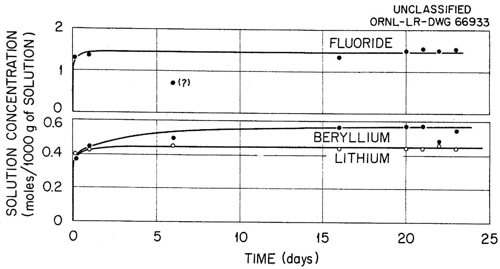
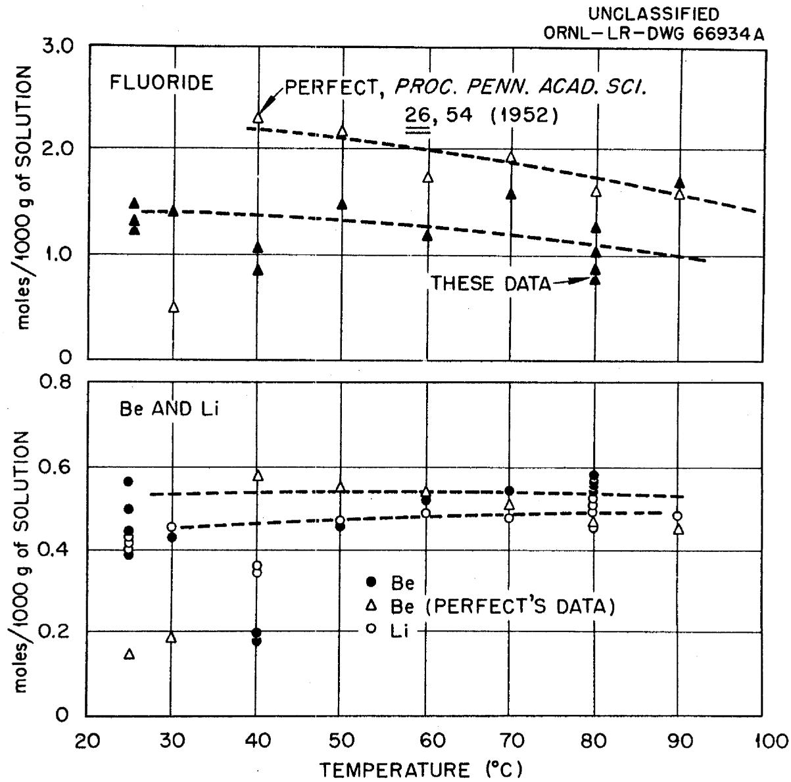
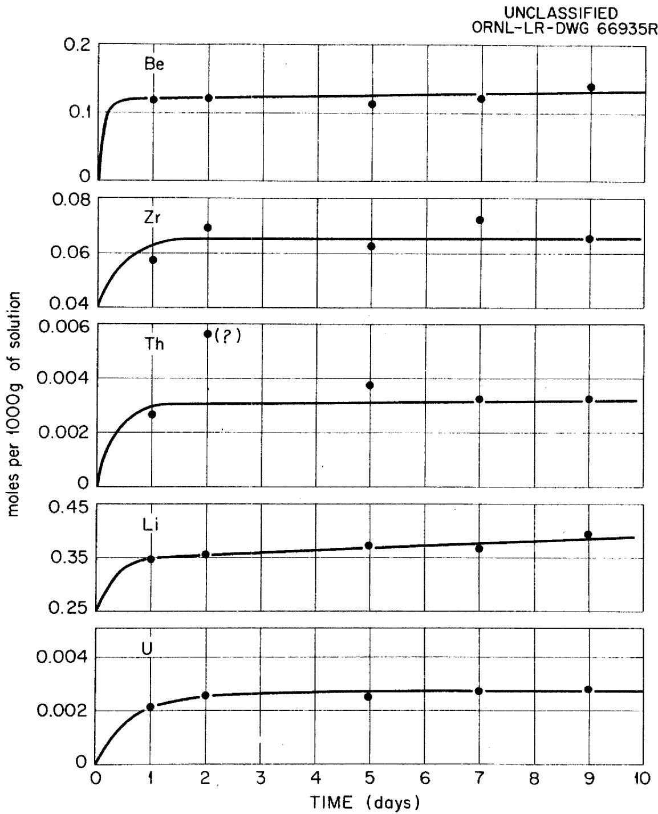
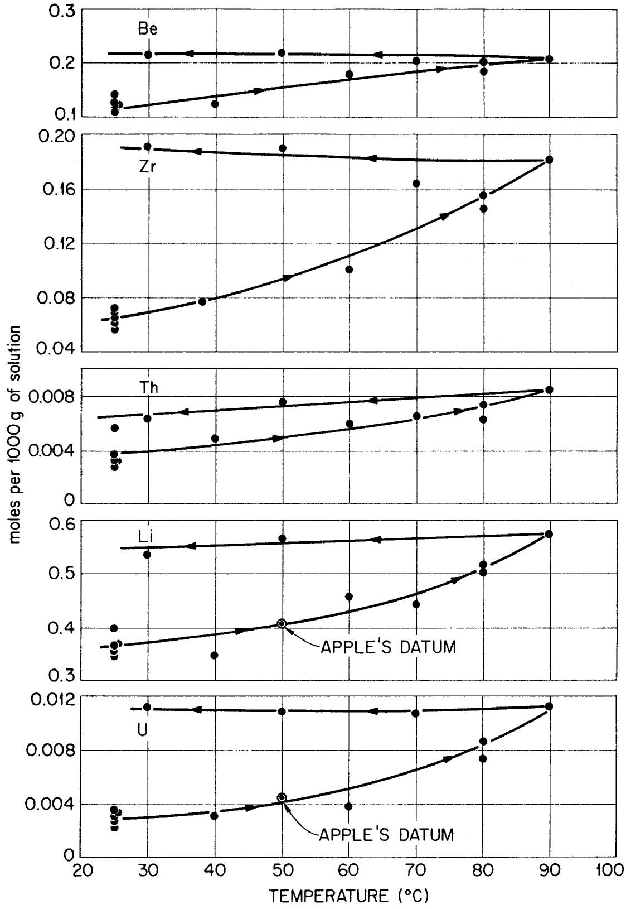
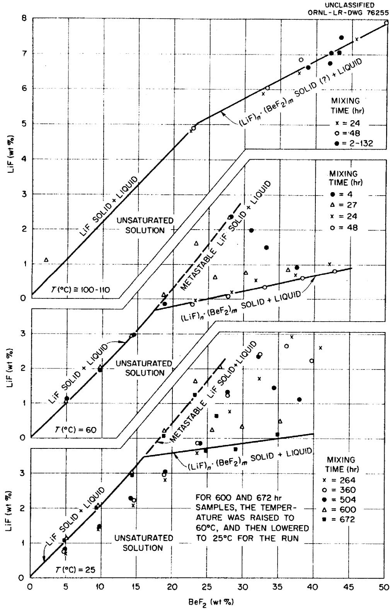
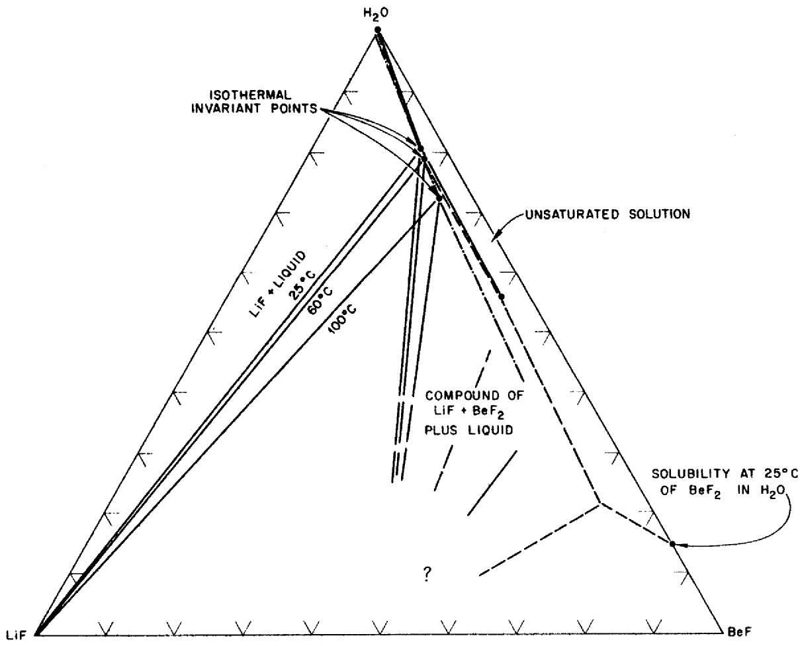

# U.S. ATOMIC ENERGY COMMISSION

ORNL-TM-458

COPY NO. - 4/

DATE - Dec. 14, 1962

SOME CHEMICAL ASPECTS OF MOLTEN-SALT REACTOR SAFETY: (1) DISSOLUTION OF COOLANT AND FUEL MIXTURES IN $\mathsf{H}_2\mathsf{O}$ , (2) A PORTION OF THE SYSTEM LiF-BeF $_2$ -H $_2$ O AT 25, 60 AND NEAR $100^{\circ}\mathsf{C}$

Ruth Slusher, H. F. McDuffie, and W. L. Marshall

# Abstract

In connection with safety aspects of the ORNL Molten-Salt Reactor Program, the solubilities of MSRE fuel and coolant were determined in $\mathsf{H}_2\mathsf{O}$ solution at $25^{\circ}\mathsf{C}$ and at higher temperatures. In a separate study, portions of the system LiF-BeF $_2$ - $\mathsf{H}_2\mathsf{O}$ were investigated at temperatures of 25, 60 and near $1000^{\circ}\mathsf{C}$ . Under conditions of the experiments, the results showed that (1) from the MSRE fuel, uranium dissolved to the extent of at least 0.010 molal--probably due to oxidation of U(IV) to U(VI)--and (2) LiF and an unidentified salt or salts of LiF and BeF $_2$ were found to exist in the system LiF-BeF $_2$ - $\mathsf{H}_2\mathsf{O}$ .

# NOTICE

This report contains patentable, preliminary, unverified, or erroneous information. For one or more of these reasons the author or issuing installation and responsible office have limited its distribution to Governmental agencies and their contractors as authorized by AEC Manual Chapter 3202-062. A formal report will be published at a later date when the data is complete enough to warrant publication.

# NOTICE

This document contains information of a preliminary nature and was prepared primarily for internal use at the Oak Ridge National Laboratory. It is subject to revision or correction and therefore does not represent a final report. The information is not to be abstracted, reprinted or otherwise given public dissemination without the approval of the ORNL patent branch, Legal and Information Control Department.

# LEGAL NOTICE

This report was prepared as an account of Government sponsored work. Neither the United States, nor the Commission, nor any person acting on behalf of the Commission:

A. Makes any warranty or representation, expressed or implied, with respect to the accuracy, completeness, or usefulness of the information contained in this report, or that the use of any information, apparatus, method, or process disclosed in this report may not infringe privately owned rights; or   
B. Assumes any liabilities with respect to the use of, or for damages resulting from the use of any information, apparatus, method, or process disclosed in this report.

As used in the above, "person acting on behalf of the Commission" includes any employee or contractor of the Commission, or employee of such contractor, to the extent that such employee or contractor of the Commission, or employee of such contractor prepares, disseminates, or provides access to, any information pursuant to his employment or contract with the Commission, or his employment with such contractor.

# 1. INTRODUCTION

Safety aspects of the ORNL Molten-Salt Reactor Program make it important to know the short- and long-term effects of a spill of molten reactor fuel or of reactor coolant into the water-sand mixture at the bottom of the containment shell. Since this shell is designed to withstand a maximum pressure of 5 atmospheres (approximately equivalent to the vapor pressure of $\mathrm{H}_2\mathrm{O}$ at $150^{\circ}\mathrm{C}$ ), the maximum temperature of interest, when considering long-term effects, would be $150^{\circ}\mathrm{C}$ . In this study, solubilities of reactor coolant ( $\mathrm{Li_2BeF_4}$ ) and fuel mixture ( $\mathrm{LiF - BeF_2 - ZrF_4 - ThF_4 - UF_4}$ , 70-23-5-1-mole %) in water have been explored at $250^{\circ}\mathrm{C}$ and at higher temperatures. In addition, investigations on the solubility of LiF, and of a compound of LiF and $\mathrm{BeF_2}$ of unspecified composition, in aqueous solutions varying from 0 to 50 wt % $\mathrm{BeF_2}$ were carried out at 25, 60 and near $100^{\circ}\mathrm{C}$ . These latter studies are of further use in evaluating the behavior of molten-salt coolant in contact with water.

# 2. EXPERIMENTAL PROCEDURES

Solid $\mathsf{Li}_2\mathsf{BeF}_4$ and MSRE (Molten-Salt Reactor Experiment) fuel mixture were obtained from the fluoride production facility of the Reactor Chemistry Division, ORNL. The $\mathsf{Li}_2\mathsf{BeF}_4$ contained approximately 2 wt % excess LiF. Chemically pure LiF was obtained from Foote Mineral Company. A stock solution of concentrated $\mathsf{BeF}_2$ was prepared by dissolving a weighed amount of $\mathsf{BeF}_2$ solid, obtained from the Beryllium Corporation, in water solution. The mixture was refluxed at a little above $100^{\circ}\mathsf{C}$ for 24 hr in order to

dissolve the $\mathrm{BeF}_2$ . At lower temperatures the rate of dissolution was very slow. A radioactive tracer, Be-7, was added to the stock solution, and portions of this solution were diluted with water to give a series of aqueous solutions of decreasing concentrations of $\mathrm{BeF}_2$ .

All solids were ground to fine powders (in a glove box for the beryllium-containing solids) and were added separately to flasks containing water. In some experiments, LiF solid was added to flasks containing solutions of $\mathrm{BeF}_2$ in $\mathrm{H}_2\mathrm{O}$ .

The mixtures of MSRE fuel and of coolant were stirred at room temperature and at controlled temperatures up to $90^{\circ}\mathrm{C}$ . Separate mixtures of LiF and of $\mathsf{Li}_2\mathsf{BeF}_4$ in contact with $\mathsf{BeF}_2$ solutions were rocked at controlled temperatures of $25^{\circ} \pm 0.2^{\circ}$ and $60^{\circ} \pm 0.3^{\circ}\mathrm{C}$ and were refluxed at temperatures a little over $100^{\circ}\mathrm{C}$ . The latter temperatures were those at which the solutions boiled at atmospheric pressure.

Samples of the solution phases were obtained after periods of time varying from 4 hours to 28 days. The concentrations of lithium were determined by flame photometry, and fluoride by pyrohydrolysis and subsequent acid-base titration of the distillate.[2] Zirconium, uranium, thorium, and beryllium were analyzed spectrophotometrically by the pyrocatechol violet method, thiocyanate method, thoron procedure, and the differential p-nitrobenzeneazo-orcinol method, respectively. Beryllium was determined also by counting of radioactive Be-7 and comparison of the number of counts with those from an aliquot portion of a standard solution containing Be-7. Selected solid phases were separated from the

solution phases and dried between sheets of filter paper. These solids were examined by means of a petrographic microscope; LiF was identified through its x-ray diffraction pattern. $^3$

# 3. DISSOLUTION OF $\mathsf{Li}_2\mathsf{BeF}_4$ in H2O

The concentrations of Li, Be, and F found in solution, when excess $\mathrm{Li}_2\mathrm{BeF}_4$ solid was mixed with $\mathrm{H}_2\mathrm{O}$ at $25^{\circ}\mathrm{C}$ , are given in Fig. 1 as a function of time. Based on the data for lithium and beryllium, it appeared that equilibrium was attained at least within six days and perhaps sooner. The changes in the compositions of the solutions (revealing a higher ratio of beryllium to lithium than that in the original solid) require the appearance of some solid which is richer in lithium than the starting material and which is presumably LiF. The data suggest that an invariant point may have been established. Nevertheless, these results are in contradiction to the solubilities of LiF and of $\mathrm{Li}_2\mathrm{BeF}_2$ in $\mathrm{BeF}_2$ - $\mathrm{H}_2\mathrm{O}$ solutions given in the table and in Fig. 5. It is possible that, although equilibrium appeared to have been attained, a relatively inert coating of a new solid on the surface of the $\mathrm{Li}_2\mathrm{BeF}_4$ solid may have formed and prevented further dissolution of $\mathrm{Li}_2\mathrm{BeF}_4$ .

The concentrations of Li, Be, and F found in solution are given in Fig. 2 as a function of temperature. Included in Fig. 2 are some experimental values by F. H. Perfect4 which were obtained by analyses of liquid phases after approximately 24 hours of mixing with solid. Perfect

  
Fig. 1. Effect of Time on Dissolution of $\mathrm{Li}_{2} \mathrm{BeF}_{4}$ in $\mathrm{H}_{2} \mathrm{O}$ at $25^{\circ} \mathrm{C}$ .

Portions of System LiF-BeF $_2$ -H $_2$ O at $25^{\circ}$ , $60^{\circ}$ C and Temperatures of Boiling (at 1 atmosphere)   

<table><tr><td>Mixing Time** (hr)</td><td>BeF2(wt %)</td><td>LiF(wt %)</td><td>Identified Solid Phases</td><td>Mixing Time** (hr)</td><td>BeF2(wt %)</td><td>LiF(wt %)</td><td>Identified Solid Phases</td></tr><tr><td colspan="4">Temperature: 25°C,</td><td>600</td><td>5.05</td><td>1.13</td><td></td></tr><tr><td colspan="4">Starting Materials:</td><td>600</td><td>9.50</td><td>2.07</td><td></td></tr><tr><td colspan="4">BeF2-H2O Solutions</td><td>600</td><td>14.38</td><td>3.01</td><td></td></tr><tr><td colspan="4">+ LiF Solid</td><td>600</td><td>18.81</td><td>4.22</td><td></td></tr><tr><td></td><td></td><td></td><td></td><td>600</td><td>23.27</td><td>5.63</td><td></td></tr><tr><td>264</td><td>5.05</td><td>0.722</td><td>a, c*</td><td>600</td><td>26.88</td><td>6.03</td><td></td></tr><tr><td>264</td><td>9.67</td><td>1.41</td><td></td><td>600</td><td>25.62</td><td>4.23</td><td></td></tr><tr><td>264</td><td>14.55</td><td>2.08</td><td></td><td>600</td><td>29.93</td><td>4.31</td><td></td></tr><tr><td>264</td><td>19.10</td><td>2.80</td><td></td><td>600</td><td>35.26</td><td>4.48</td><td></td></tr><tr><td>264</td><td>23.56</td><td>3.58</td><td></td><td></td><td></td><td></td><td></td></tr><tr><td>264</td><td>28.23</td><td>4.77</td><td>a, c</td><td>672</td><td>4.94</td><td>1.10</td><td>a</td></tr><tr><td>264</td><td>32.42</td><td>5.73</td><td>a, c</td><td>672</td><td>9.49</td><td>2.05</td><td>a</td></tr><tr><td>264</td><td>36.93</td><td>6.91</td><td>a, c</td><td>672</td><td>14.32</td><td>2.93</td><td>a</td></tr><tr><td>264</td><td>40.93</td><td>6.61</td><td>a, b, c</td><td>672</td><td>18.75</td><td>4.03</td><td>a</td></tr><tr><td></td><td></td><td></td><td></td><td>672</td><td>23.26</td><td>5.28</td><td>a, c</td></tr><tr><td>360</td><td>4.92</td><td>0.799</td><td></td><td>672</td><td>26.20</td><td>4.63</td><td>a, c</td></tr><tr><td>360</td><td>9.70</td><td>1.49</td><td></td><td>672</td><td>24.87</td><td>3.65</td><td>a, c</td></tr><tr><td>360</td><td>14.75</td><td>2.23</td><td></td><td>672</td><td>28.97</td><td>3.71</td><td>c</td></tr><tr><td>360</td><td>18.95</td><td>2.94</td><td></td><td>672</td><td>34.73</td><td>4.10</td><td>c</td></tr><tr><td>360</td><td>23.71</td><td>3.86</td><td></td><td></td><td></td><td></td><td></td></tr><tr><td>360</td><td>27.76</td><td>5.24</td><td></td><td colspan="3">Temperature: 60°C,</td><td></td></tr><tr><td>360</td><td>32.29</td><td>6.41</td><td></td><td colspan="3">Starting Materials:</td><td></td></tr><tr><td>360</td><td>36.22</td><td>6.65</td><td></td><td colspan="3">BeF2-H2O Solutions</td><td></td></tr><tr><td>360</td><td>39.70</td><td>6.26</td><td></td><td colspan="3">+ LiF Solid</td><td></td></tr><tr><td></td><td></td><td></td><td></td><td></td><td></td><td></td><td></td></tr><tr><td>504</td><td>4.96</td><td>0.811</td><td></td><td>4</td><td>5.03</td><td>1.13</td><td></td></tr><tr><td>504</td><td>9.71</td><td>1.47</td><td></td><td>4</td><td>9.69</td><td>1.97</td><td></td></tr><tr><td>504</td><td>14.35</td><td>2.28</td><td></td><td>4</td><td>14.49</td><td>2.96</td><td></td></tr><tr><td>504</td><td>19.01</td><td>3.04</td><td></td><td>4</td><td>18.94</td><td>3.85</td><td></td></tr><tr><td>504</td><td>24.00</td><td>3.86</td><td></td><td>4</td><td>28.14</td><td>6.38</td><td></td></tr><tr><td>504</td><td>27.92</td><td>5.34</td><td></td><td>4</td><td>31.03</td><td>5.99</td><td></td></tr><tr><td>504</td><td>32.18</td><td>6.34</td><td></td><td>4</td><td>33.28</td><td>5.49</td><td></td></tr><tr><td>504</td><td>34.43</td><td>5.45</td><td></td><td>4</td><td>37.50</td><td>4.90</td><td></td></tr><tr><td>504</td><td>37.82</td><td>5.10</td><td></td><td></td><td></td><td></td><td></td></tr></table>

\* Key: a = LiF, Identified by petrography

b = LiF, Identified by x-ray pattern

$c =$ birefringent solid, Identified by petrography

\*\*

Cumulative time.

<table><tr><td>Mixing Time* (hr)</td><td>BeF2(wt %)</td><td>LiF (wt %)</td><td>Identified Solid Phases</td><td>Mixing Time* (hr)</td><td>BeF2(wt %)</td><td>LiF (wt %)</td><td>Identified Solid Phases</td></tr><tr><td colspan="4">(continued)</td><td rowspan="4" colspan="4">Temperature: Boiling, Starting Materials: BeF2-H2O Solutions + Li2BeF4 Solid</td></tr><tr><td colspan="4">Temperature: 60°C,</td></tr><tr><td colspan="4">Starting Materials:</td></tr><tr><td colspan="4">BeF2-H2O Solutions</td></tr><tr><td colspan="4">+ LiF Solid</td><td>2</td><td>38.96</td><td>6.67</td><td></td></tr><tr><td>27</td><td>4.98</td><td>1.04</td><td></td><td></td><td></td><td></td><td></td></tr><tr><td>27</td><td>9.64</td><td>2.01</td><td></td><td>60</td><td>42.07</td><td>6.79</td><td></td></tr><tr><td>27</td><td>14.25</td><td>2.92</td><td></td><td></td><td></td><td></td><td></td></tr><tr><td>27</td><td>18.62</td><td>4.10</td><td></td><td>84</td><td>42.15</td><td>7.02</td><td></td></tr><tr><td>27</td><td>23.27</td><td>5.59</td><td></td><td></td><td></td><td></td><td></td></tr><tr><td>27</td><td>27.83</td><td>6.36</td><td></td><td>108</td><td>43.61</td><td>7.48</td><td></td></tr><tr><td>27</td><td>25.90</td><td>4.63</td><td></td><td></td><td></td><td></td><td></td></tr><tr><td>27</td><td>30.31</td><td>4.75</td><td></td><td>132</td><td>43.43</td><td>7.07</td><td></td></tr><tr><td>27</td><td>36.16</td><td>4.84</td><td></td><td></td><td></td><td></td><td></td></tr><tr><td colspan="4">Temperature: 60°C,</td><td rowspan="4" colspan="4">Temperature: Boiling, Starting Materials: BeF2-H2O Solutions + LiF Solid</td></tr><tr><td colspan="4">Starting Materials:</td></tr><tr><td colspan="4">BeF2-H2O Solutions</td></tr><tr><td colspan="4">+ Li2BeF4 Solid</td></tr><tr><td>24</td><td>23.17</td><td>3.97</td><td></td><td>24</td><td>22.56</td><td>4.81</td><td></td></tr><tr><td>24</td><td>28.39</td><td>4.22</td><td></td><td>24</td><td>32.69</td><td>5.83</td><td></td></tr><tr><td>24</td><td>31.68</td><td>4.54</td><td></td><td>24</td><td>37.65</td><td>6.44</td><td></td></tr><tr><td>24</td><td>37.40</td><td>4.70</td><td></td><td>24</td><td>45.75</td><td>7.42</td><td></td></tr><tr><td>24</td><td>42.24</td><td>5.02</td><td></td><td></td><td></td><td></td><td></td></tr><tr><td></td><td></td><td></td><td></td><td>48</td><td>22.69</td><td>4.88</td><td></td></tr><tr><td>48</td><td>22.68</td><td>3.86</td><td></td><td>48</td><td>33.36</td><td>6.06</td><td></td></tr><tr><td>48</td><td>27.81</td><td>4.08</td><td></td><td>48</td><td>37.98</td><td>6.85</td><td></td></tr><tr><td>48</td><td>33.09</td><td>4.34</td><td></td><td>48</td><td>49.74</td><td>7.89</td><td></td></tr><tr><td>48</td><td>38.29</td><td>4.60</td><td></td><td></td><td></td><td></td><td></td></tr><tr><td>48</td><td>42.98</td><td>4.83</td><td></td><td></td><td></td><td></td><td></td></tr><tr><td colspan="4">Temperature: Boiling, Starting Materials: H2O + Li2BeF4 Solid</td><td></td><td></td><td></td><td></td></tr><tr><td>24</td><td>2.01</td><td>1.15</td><td></td><td></td><td></td><td></td><td></td></tr><tr><td>48</td><td>2.18</td><td>1.18</td><td></td><td></td><td></td><td></td><td></td></tr></table>

* Cumulative time.

  
Fig. 2. Effect of Temperature on Dissolution of $\mathrm{Li}_{2}\mathrm{BeF}_{4}$ in $\mathbf{H}_2\mathbf{O}$ .

commented that the results were not entirely satisfactory and may have been complicated by the appearance of two separate solubility curves-- one for a hydrated salt $\mathrm{Li}_2\mathrm{BeF}_4 \cdot x\mathrm{H}_2\mathrm{O}$ and one for an anhydrous salt. In a further comment, with reference to a patent,[5] it was felt that the anhydrous salt either dissolved very slowly in cold water, had a low solubility, or had both a low rate of dissolution and low solubility. In our own experiments, mixtures of solution and $\mathrm{Li}_2\mathrm{BeF}_4$ solid were equilibrated 4 hours to 3 days before taking samples of the solution phases for analyses. Also included are the data obtained at $25^{\circ}\mathrm{C}$ (from Fig. 1).

# 4. DISSOLUTION OF MSRE FUEL MIXTURE

The analytical results from the run with fuel mixture at $25^{\circ}\mathrm{C}$ as a function of time are shown in Fig. 3. As with the reactor coolant, equilibrium appeared to be attained within six days. Nevertheless, a consistent increase in concentration of lithium and uranium was noted. In this experiment it was presumed that tetravalent uranium from the solid phases had been converted to the hexavalent state in the solution phase by the action of oxygen from the air, and also that an inert coating may have hindered further dissolution of the solid phase.

In Fig. 4 are shown analytical results for solution concentrations of U, Li, Th, Zr, and Be as a function of temperature. The time of equilibrium at each temperature before sampling was one day. Also included is one value for uranium and one for lithium obtained previously. The

  
Fig. 3. Effect of Time on Dissolution of MSRE Solid Fuel in $\mathsf{H}_2\mathsf{O}$ at $25^{\circ}\mathsf{C}$ .

  
UNCLASSIFIED ORNL-LR-DWG 66936R   
Fig. 4. Effect of Temperature on Dissolution of MSRE Solid Fuel in H₂O.

analytical results from samples taken upon stepwise lowering of the temperature of the solution-solid mixture consistently gave higher values for the solution concentrations of the various components. It is believed that equilibrium either was not reached on cooling or had never been reached.

In view of the appreciable uranium concentration found in solution under these conditions, it has been recommended that neutron poisons be present in any water which could mix with the fuel in the event of a reactor accident.

# 5. A PORTION OF THE SYSTEM LiF-BeF $_2$ -H $_2$ O AT 25, 60 AND NEAR $100^{\circ}\mathrm{C}$

Compositions of liquid phases of $\mathrm{BeF}_2$ and $\mathrm{H}_2\mathrm{O}$ which were rocked or refluxed at several temperatures in contact separately with LiF and with $\mathrm{Li}_2\mathrm{BeF}_4$ are given in the table. The initial reagents and times of rocking or refluxing are specified; also, some designations of solid phases are given. In all cases a solid or solids were present. When these data are plotted as the composition of LiF vs that of $\mathrm{BeF}_2$ (Fig. 5) and consideration is given to the times of mixing and temperature cycling, then there appears to be metastability of LiF solid phase in equilibrium with solutions containing high concentrations of $\mathrm{BeF}_2$ . We believe that the continuous curves which are drawn on Fig. 5 represent stable equilibria and the dashed curves show the solubility of a metastable solid. Data which fall between these two curves represent in-progress changes between metastable and stable conditions. The only salt definitely identified by the x-ray diffraction method was LiF. Another salt, proposed to be some compound of LiF and $\mathrm{BeF}_2$ , was not identified by optical

  
Fig. 5. Some Solubility Behavior in the System LiF-BeF $_2$ -H $_2$ O, 25,100°C.

petrography or x-ray diffraction. Since a solid which may have been present, other than LiF, could be formed only from LiF and $\mathrm{BeF}_2$ - $\mathrm{H}_2\mathrm{O}$ solution, it is possible that $\mathrm{Li}_2\mathrm{BeF}_4$ , in an amorphous, unidentifiable form, was present. By means of optical petrography, birefringent refraction lines were observed for the unknown solid. Similar lines are observed for $\mathrm{Li}_2\mathrm{BeF}_4$ solid.

A conventional, three-component phase diagram of a portion of the condensed system at 25, 60 and $1000^{\circ}C^{+}$ is shown in Fig. 6. The data are omitted; the curves are drawn to represent the solubilities for the stable solids to the continuous curves shown in Fig. 5.

UNCLASSIFIED

ORNL-LR-DWG 76254

  
Fig. 6. Representation of a Portion of the System LiF-BeF $_2$ -H $_2$ O at 25,60, and Near $100^{\circ}$ C.

# INTERNAL DISTRIBUTION

1-2. MSRP Director's Office

3. C.F.Baes   
4. S. E. Beall   
5. F. F. Blankenship   
6. E. G. Bohlmann   
7. J. C. Griess   
8. W. R. Grimes   
9. R. B. Lindauer   
10. H. G. MacPherson

11-18. W. L. Marshall

19. W. B. McDonald   
20. H. F. McDuffie   
21. R. L. Moore   
22. D. Scott   
23. C. H. Secoy   
24. J. H. Shaffer   
25. M. J. Skinner   
26. Ruth Slusher   
27. I. Spiewak   
28. A. Taboada   
29. J. R. Tallackson   
30. R.E.Thoma   
31. C. F. Weaver

32-33. Central Research Library   
34-38. Laboratory Records   
39. Laboratory Records ORNL RC   
40. Y-12 Technical Library, Document Reference Section   
41-55. DTIE, AEC   
56. Division of Research and Development, ORO