ORNL-TM-497

COPY NO. -

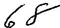

DATE -

August 16, 1966

ANALYSIS OF FILLING ACCIDENTS IN MSRE

J. R. Engel, P. N. Haubenreich, and S. J. Ball

CFSTI PRICCS

RELEASED FOR ANNOCENCE

IN NUCLEAR SCIENCE ABSTRACTS

ABSTRACT

H.C. $ 2.00; M. .50

Whenever the MSRE is shut down, the fuel salt is drained from the core. Then, during a normal startup, the graphite and the fuel are preheated and the control rods are positioned so that the reactor remains subcritical while it is being filled. Certain abnormal circumstances could result in criticality and a power excursion in the partially filled core. Various postulated incidents were surveyed and the worst case was analyzed in detail. This case involved selective freezing in the drain tanks to concentrate the uranium in the molten salt fraction. Physical restrictions on the fill rate and safety actions of control rods and gas control valves limited the calculated power and temperature excursions so that any damage to the reactor would be prevented.

# LEGAL NOTICE

This report was prepared as an account of Government sponsored work. Neither the United States, nor the Commission, nor any person acting on behalf of the Commission:

A. Makes any warranty or representation, expressed or implied, with respect to the accuracy, completeness, or usefulness of the information contained in this report, or that the use of any information, apparatus, method, or process disclosed in this report may not infringe privately owned rights; or   
B. Assumes any liabilities with respect to the use of, or for damages resulting from the use of any information, apparatus, method, or process disclosed in this report.

As used in the above, "person acting on behalf of the Commission" includes any employee or contractor of the Commission, or employee of such contractor, to the extent that such employee or contractor of the Commission, or employee of such contractor prepares, disseminates, or provides access to, any information pursuant to his employment or contract with the Commission, or his employment with such contractor.

# PREFACE

The analysis described here was done in 1963 and the report was written early in 1964. Although there has been an inordinate delay in publishing, the report is being issued as written because a significant part of the MSRE safety circuitry was based on the results of this analysis. Well over two years have now passed, and now we are better able to assess the credibility of some of the assumptions involved. We plan to do this as part of a critical review of the safety system.

RELEASED FOR ANNOCENCEMENT

IN NUCLEAR SCIENCE ABSTRACTS

eAL NOVICE

This report was prepared as an account of Government sponsored work: A. Makes any warranty or representation, expressed or implied, with respect to the accu- racy, completeness, or usefulness of the information contained in this report, or that the use of any information, apparatus, method, or process disclosed in this report may not infringe privately owned rights; or B. Assumes any liabilities with respect to the use of, or for damages resulting from the use of any information, apparatus, method, or process disclosed in this report. As used in the above, "person acting on behalf of the Commission," includes any em- ployee or contractor of the Commission, or employee of such contractor, to the extent that such employee or contractor of the Commission, or employee of such contractor prepares, disseminates, or provides access to, any Information pursuant to his employment or contract with the Commission, or his employment with such contractor.

# CONTENTS

# Page

1. Introduction. 1   
2. Mechanics of Filling 2

2.1 General Description 2   
2.2 System Volumes 4   
2.3 Drain Tank Pressure During a Fill. 4   
2.4 Amount of Gas in Tank During a Fill 4   
2.5 Gas Supply. 9   
2.6 Course of a Normal Fill 9   
2.7 Coast-Up of Fuel Level 11

3. Nuclear Considerations 11

3.1 Effect of Fuel Level on Reactivity 13   
3.2 Control Rods 13   
3.3 Temperature Coefficients of Reactivity 16

4. Survey of Possible Filling Accidents 18

4.1 Filling with Control Rods Withdrawn 18   
4.2 Filling with Fuel at Low Temperature 19   
4.3 Filling with Concentrated Fuel 20

5. Analysis of Maximum Filling Accident 22

5.1 Specification of Accident. 22   
5.2 Preliminary Digital Calculations 23   
5.3 Detailed Analog Simulation 23   
5.4 Discussion 31

6. Conclusions 32

.

# LIST OF FIGURES

# Fig. No.

# Title

# Page

1 System Used in Filling Fuel Loop 3   
2 Calculated Volume Calibration of Fuel Loop 5   
3 Calculated Volume Calibration of Fuel Drain Tank 6   
4 Drain Tank Pressure vs Liquid Level in Fuel Loop at Various Salt Fill Rates 7   
5 Amount of Gas Required in Drain Tank vs Salt Level in Loop at Several Fill Rates 8   
6 Salt Level in Fuel Loop During Normal Fill. 10   
7 Coast-Up After Gas Addition is Stopped vs Fill Rate at Several Initial Fuel Levels 12   
8 Effect of Fuel Level on Reactivity 14   
9 Control Rod Worth vs Position 15   
Liquid Composition Resulting from Selective Freezing of Fuel Salt "A" in Drain Tank 21   
ll Block Diagram of Mathematical Model for Fill Accident Simulation 25   
12 Cross Section of Typical Graphite Stringer with Adjacent Fuel Stringers. 26   
13 Net Reactivity Inserted During Maximum Filling Accident. 29   
14 Power and Temperature During Maximum Filling Accident. 30

$\therefore m = \frac{3}{11}$

# ANALYSIS OF FILLING ACCIDENTS IN MSRE

J. R. Engel, P. N. Haubenreich, and S. J. Ball

# 1. INTRODUCTION

One of the features of the MSRE (and fluid-fuel reactors in general) is that it can be positively shut down by draining the fuel out of the core. The control rods provide a small shutdown margin to take the reactor subcritical whenever desired, but for any shutdown in which the reactor is to be cooled down, the fuel must be drained. Draining and refilling the core is therefore an operation which will probably be done many times.

The normal procedure for a startup requires that the reactor and the fuel be heated by electric heaters to near operating temperature before the fuel is transferred from the drain tank to the core. The rods normally are partially inserted so that the reactor is just subcritical at the fill temperature when the fuel fills the core. Criticality is attained by withdrawing the rods after the fuel and coolant loops are filled and circulation has been started.

It is conceivable that criticality could be attained during a fill before the core is completely full. This could result from one or more of the following abnormal conditions: 1) the control rods are withdrawn too far, 2) the temperature of the fuel and/or the core graphite is too low, and 3) the uranium concentration of the fuel was increased (or the poison concentration was decreased) while the fuel salt was in the drain tank.

If criticality is reached prematurely, the nuclear power will rise, possibly causing damaging temperatures in the partially filled core. As soon as the onset of such an undesirable situation is detected, the rods are inserted, the fill is stopped and the fuel returned to the drain tank. Supplementing the effects of these actions will be the reactivity feedback from any changes in the fuel and graphite temperatures.

In order to evaluate the severity and consequences of various postulated filling accidents it is necessary to have certain quantitative information. This includes: 1) the filling rate (fuel level vs time),

2) the relation of keff to fuel level for the particular abnormal situation being considered, 3) rod worth and the speed with which they can act in the partially filled core, 4) how rapidly the fill can be stopped (level vs time after action is taken to stop the fill), and 5) temperature coefficients of reactivity appropriate for this abnormal situation. This information has been developed for a variety of cases and is presented in Sections 2 and 3.

The relative severity of a number of postulated accidents is surveyed in Section 4. In Section 5, the most severe of the postulated accidents is analyzed in considerable detail. Conclusions are summarized in Section 6.

# 2. MECHANICS OF FILLING

# 2.1 General Description

Figure 1 is a simplified flowsheet of the reactor fill, drain, and vent systems showing only those features which are essential to a description of the normal fill and drain procedures. All valves are shown in the normal positions for filling the reactor from fuel drain tank No. 1 (FD-1).

The reactor is filled by admitting helium, from a supply at 40 psig, to the drain tanks to force the fuel salt up through the reactor drain line into the primary loop. The fill rate is limited by a restriction in the gas supply line and the maximum level in the loop is set by limiting the pressure with PIC-517. Helium displaced from the loop by the incoming fuel is vented from the pump bowl, at the high point in the loop, through the auxiliary charcoal bed to the stack. (This vent route bypasses the main charcoal beds to avoid the elution and release of xenon and krypton which may be in those beds.)

When the fill is complete, salt is frozen in the drain line at FV-103. The pump-bowl vent is switched to the main charcoal beds and, after the drain-tank pressure has been vented through the auxiliary charcoal bed, the pump-bowl and drain-tank gas spaces are connected through HCV-544. The system is now in readiness for operation, with the only action required to drain being to thaw FV-103.

ORNL-DWG63-7320

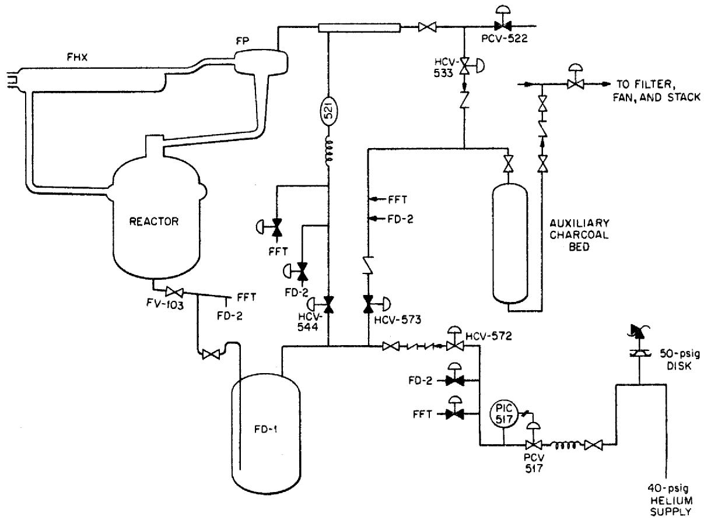  
Fig. 1. System Used in Filling Fuel Loop.

# 2.2 System Volumes

The relation between the volume of salt transferred from the drain tank and the liquid level in the fuel loop is shown in Fig. 2. The datum level is the bottom of the reactor vessel (elevation 826.92 ft). The midplane of the 65-in.-high graphite matrix in the core is at 3.75 ft and the operating level in the pump bowl is at 13.4 ft. The first 1.5 ft³ of salt transferred from the drain tank is required to fill the drain line.

The liquid volume-level relation in a fuel drain tank is shown in Fig. 3. The volume of the tank above the salt level is the difference between $80.5\mathrm{ft}^3$ (the total volume of the tank) and the liquid volume. The datum plane for Fig. 3 is 12.1 ft below that for Fig. 2 (814.82 ft).

# 2.3 Drain Tank Pressure During a Fill

The pressure difference between the drain tank and the pump bowl is determined primarily by the fuel-salt density and the difference in the levels in the loop and in the tank. Pressure drop in the fill line adds to this pressure difference when fuel is flowing. The pressure in the pump bowl is normally above atmospheric pressure because of pressure drop in the gas vent from the pump bowl to the stack. (The pressure approaches 1 psig at zero flow because of a check valve in the vent line.) Figure 4 shows the relation between the actual pressure in the drain tank and the level in the fuel loop during a fill. This figure is based on a total salt inventory of $73.2\mathrm{ft}^3$ and a salt density of $130\mathrm{lb / ft}^3$ . The increased pressures at salt fill rates of 1 and $2\mathrm{ft}^3/\mathrm{min}$ reflect the pressure drop in the fill and vent lines.

# 2.4 Amount of Gas in Tank During a Fill

The amount of gas in the drain tank is a function of the temperature, the pressure and the volume in the tank above the liquid. Figure 5 shows the amount of gas in the tank (volume of gas at $32^{\circ}\mathrm{F}$ , 14.7 psia) as a function of loop liquid level for various salt fill rates. (The gas in the tank was assumed to be at $1200^{\circ}\mathrm{F}$ . The pressure and the actual volume were obtained from the information already discussed.)

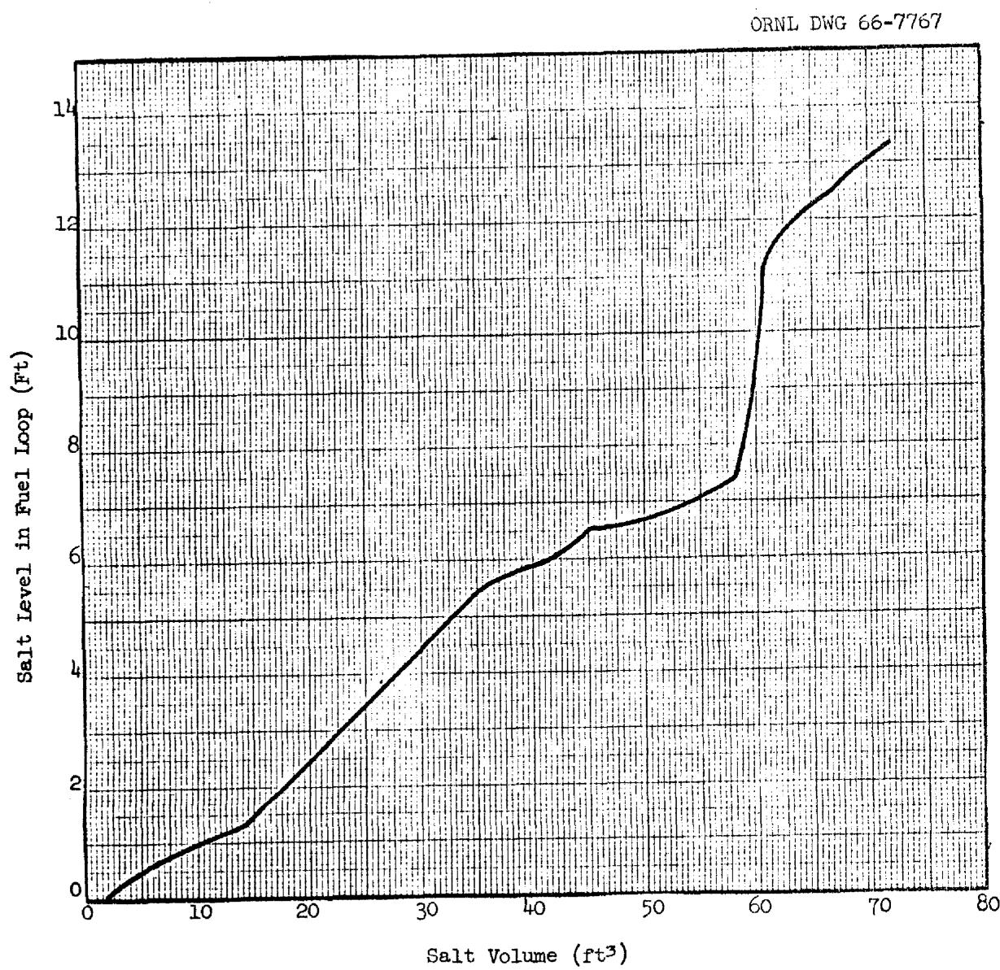  
Fig. 2. Calculated Volume Calibration of Fuel Loop.

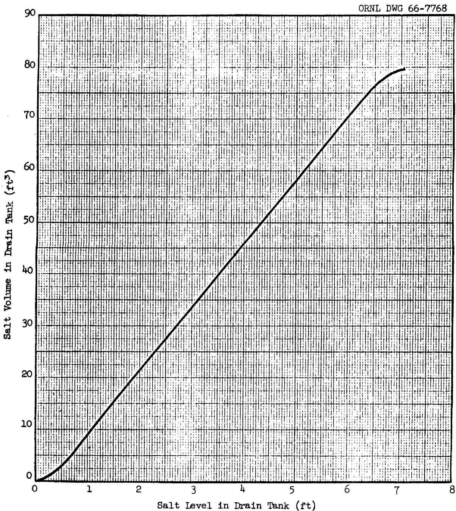  
Fig. 3. Calculated Volume Calibration of Fuel Drain Tank.

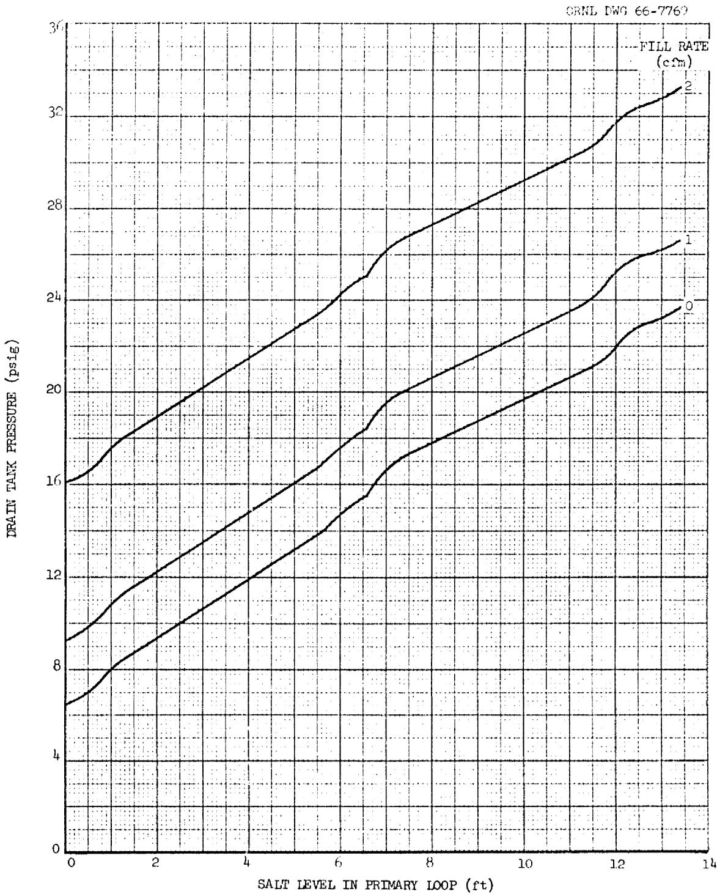  
Fig. 4. Drain Tank Pressure vs Liquid Level in Fuel Loop at Various Salt Fill Rates.

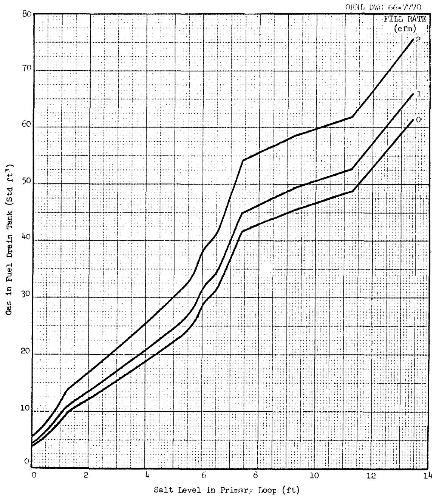  
Fig. 5. Amount of Gas Required in Drain Tank vs Salt Level in Loop at Several Fill Rates.

# 2.5 Gas Supply

The gas addition rate, and therefore the salt fill rate, is limited by the gas addition system. This system was designed to avoid overfilling the fuel loop and to limit the severity of possible filling accidents, the latter by restricting the fill rate. The first objective was achieved by limiting, with PIC-517, the pressure which can be put on the drain tank to a value just sufficient to attain the desired level in the pump bowl at the end of the fill. The fill-rate limitation was attained by installing a capillary restrictor in the supply line and limiting the primary gas supply pressure. (Details of this limitation are described later in this report.)

During a normal fill, the controller PIC-517 will be set to give a drain-tank pressure no greater than that required to just bring the salt to the desired level in the pump bowl. Throughout most of the filling operation, PCV-517 is wide open, because the tank pressure is well below the setpoint pressure, and the controlling resistance is the capillary. Only when the drain-tank pressure approaches the setpoint does PCV-517 function to stop the gas flow.

# 2.6 Course of a Normal Fill

The fill rate, or level vs time, is determined by the combination of the relations among level, fill rate, and amount of gas in the drain tank and the characteristics of the gas supply system (gas addition rate vs drain tank pressure).

Figure 6 shows the predicted level in the fuel loop as a function of time during a normal fill. For this prediction, done with the aid of an analog computer, the gas supply was assumed to be at 40 psig. The capillary restrictor was sized to give a salt fill rate of 0.5 ft³/min when the level is at the core midplane with a gas supply pressure of 50 psig. The time required to complete the entire fill was 3-3/4 hrs. (The small delay at the beginning is the time required to fill the drain line.)

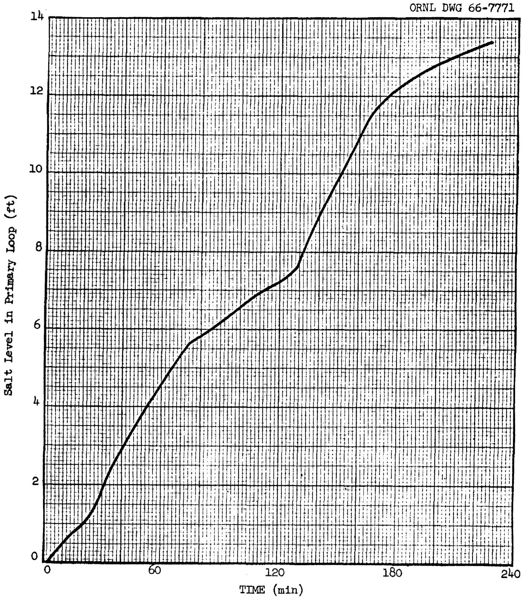  
Fig. 6. Salt Level in Fuel Loop During Normal Fill.

# 2.7 Coast-Up of Fuel Level

A filling operation can be interrupted at any time by any one of three actions: venting the drain tank through the auxiliary charcoal bed, equalizing drain-tank and loop pressures through line 52l, and shutting off the gas addition to the drain tanks. In an emergency all three of these would be done or attempted simultaneously. Either of the first two actions would not only stop the fill but would allow the salt in the loop to drain back to the tank. The third action, stopping gas addition, would be used if it were desired to hold up the fill at any point.

Simply stopping gas addition does not immediately stop the salt flow into the loop. This has important implications, for if the gas addition is stopped while the level is rising through the active part of the core, the level and the reactivity will continue to increase for some time after the gas is shut off.

As can be seen from Fig. 5, the amount of gas in the tank at a given loop level and an appreciable flow rate is capable of supporting the salt at a considerably higher level when the fill rate has gone to zero. The amount of level increase in the loop after gas addition is stopped (coast-up) is a function of the initial level and flow rate. Figure 7 shows this relationship for several initial salt levels in the core. Analog calculations of the coast-up transient indicated that the level approaches the final value with a time constant of about 1.4 min.

# 3. NUCLEAR CONSIDERATIONS

The occurrence of a fill accident presupposes the existence of an abnormal condition which causes the reactor to be critical before the core is completely filled with fuel salt. The basic nuclear characteristics which must be considered are qualitatively similar for all of the accidents examined.

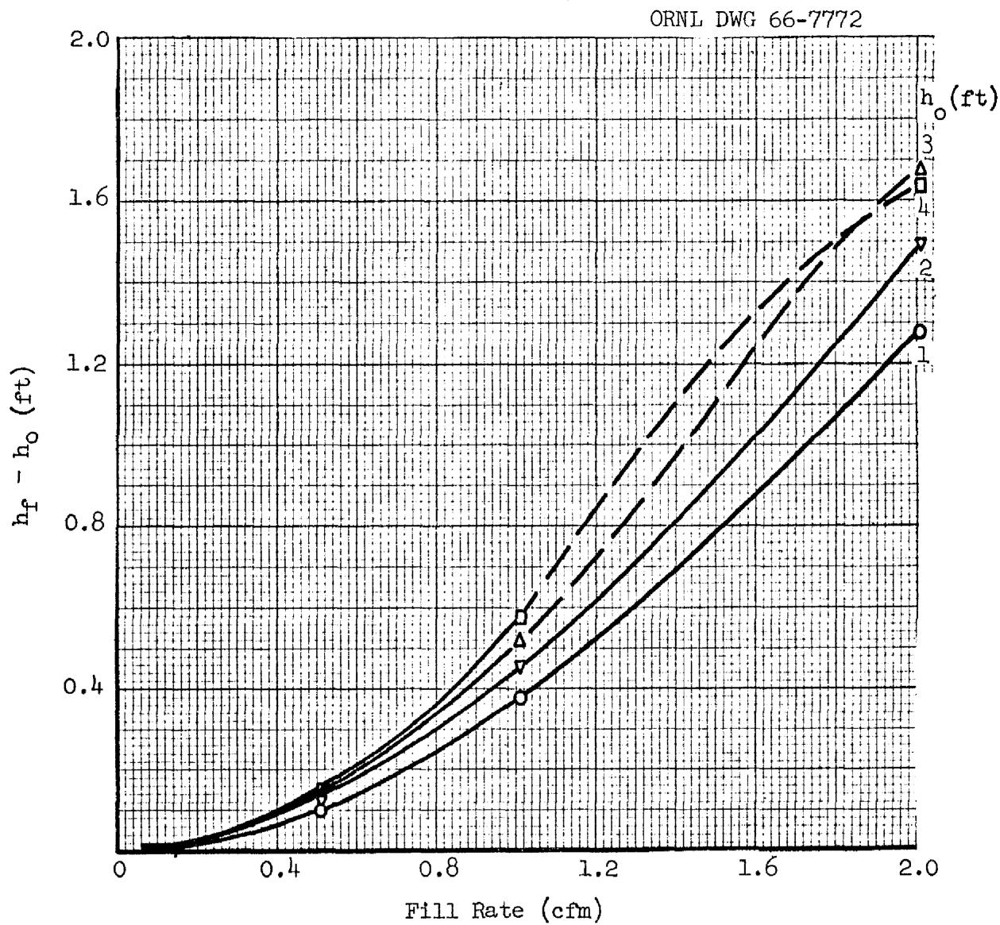  
Fig. 7. Coast-Up After Gas Addition is Stopped vs Fill Rate at Several Initial Fuel Levels.

# 3.1 Effect of Fuel Level on Reactivity

In all of the filling accidents, the system multiplication constant is increased above unity by the continued flow of fuel into the critical core. The shape of the reactivity curve as a function of fuel level, along with the rate of fuel addition, determines the rate of reactivity increase.

The effect of fuel level on multiplication was calculated for a simplified model of the reactor which considered only the uniform-channelled portion of the graphite-moderated region. Figure 8 shows the effective multiplication constant as a function of the fraction $(\mathrm{H} / \mathrm{L})$ of this region filled with fuel. The curve was normalized to a k of 0.997 for the full region; this is the target multiplication constant in the MSRE for a fill under normal circumstances. The fractional levels, 0 and 1 in this model correspond to actual fuel levels of 1.33 and 6.50 ft, respectively, in the MSRE. (See Fig. 2) Since the multiplication constant in the MSRE rises above zero before the fuel level reaches the channelled region and continues to rise until the entire vessel is full, the curve in Fig. 8 indicates a greater differential change in reactivity with level than actually exists. Thus, use of this curve shape in the accident analyses leads to slight overestimates of their severity. The flattening of the curve in Fig. 8 is due to the fact that the graphite in the core is stationary. At low fuel levels, the graphite above the fuel acts as a reflector which affects the multiplication substantially; this added effect diminishes as the core fills.

# 3.2 Control Rods

The three control rods in the MSRE are clustered near the axis of the reactor and enter the core from above. Since the core fills with fuel from the bottom, the reactivity worth of a partially inserted rod depends on the fuel level. Figure 9 shows the calculated fractional worth of a rod as a function of the fraction of total insertion for a full core and for a core with only 0.72 of the channelled region filled with fuel. The total worth of the fully inserted rod was essentially the

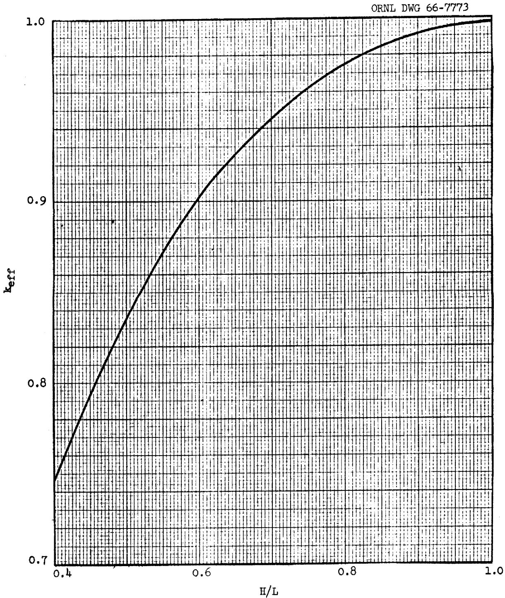  
Fig. 8. Effect of Fuel Level on Reactivity.

ORNL-LR-DWG. 70056

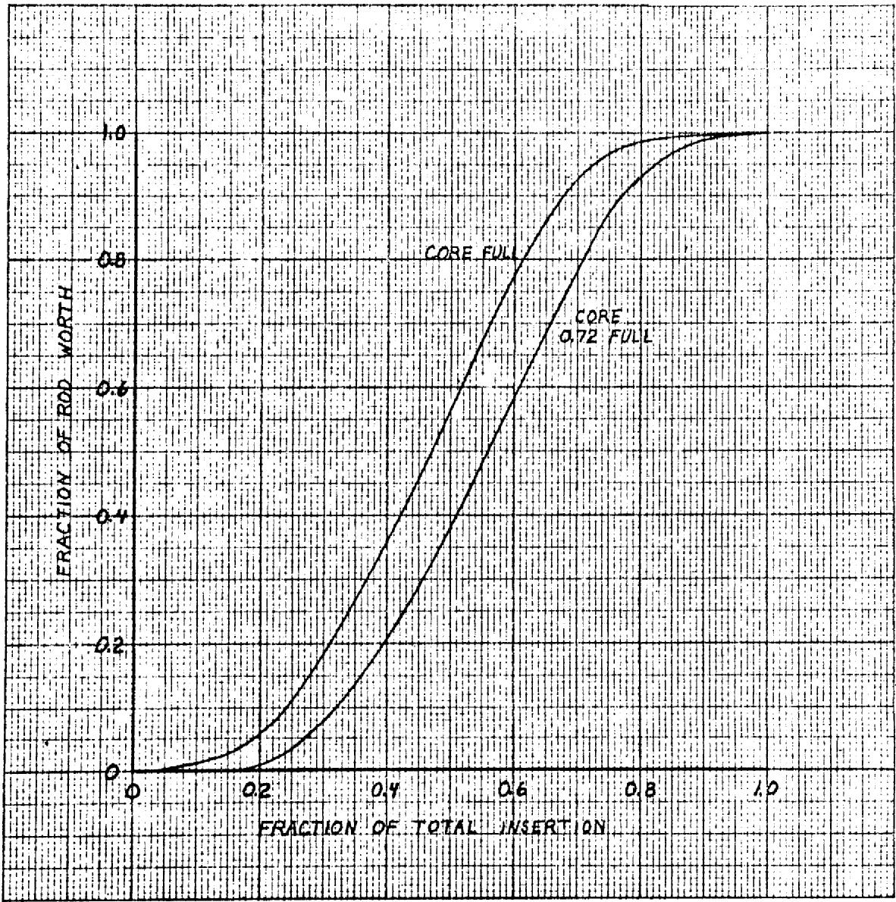  
Fig. 9. Control Rod Worth vs Position.

same for both cases. The rod worths used in analyzing the filling accidents were $2.9\%$ $\delta \mathrm{k} / \mathrm{k}$ for a single, fully inserted rod at all fuel levels and $6.7\%$ for all three rods. The fractional worth of a partly inserted rod at a given position was assumed to vary linearly with the fraction of the core filled with fuel.

During a normal fill, the three control rods will be withdrawn equal amounts and positioned such that the reactor is just subcritical $(k = 0.997)$ when completely full. (Protective interlocks will require that the rods be withdrawn a minimum distance to insure that negative reactivity can be inserted in the event of premature criticality.) The rods, positioned in this way, will control $4.3\%$ $\delta k / k$ in the clean, full reactor with the operating concentration of uranium in the fuel. They will, however, control substantially less at the same position in a partly filled reactor and can, therefore, insert correspondingly more negative reactivity during a fill accident.

Each control-rod drive is equipped with a magnetic clutch so that the rod can be dropped into the reactor if necessary. A 0.l-sec release time and an accelerating force of $0.5\mathrm{g}$ were assumed for the rods in the accident analyses.

# 3.3 Temperature Coefficients of Reactivity

The values of the fuel and graphite temperature coefficients of reactivity depend on the fuel composition. Table 1 lists the nominal compositions and the densities of three fuels being considered for use in the MSRE. The temperature coefficients of reactivity shown are for the full core.

Temperature coefficients of reactivity in the partially filled core are quite different from the coefficients for a full core. This is due in part to the difference in effective size and shape of the core. More importantly, in the partially filled core an increase in fuel temperature,

Table 1   
MSRE Fuel Salts Considered in Filling Accident Analyses   

<table><tr><td colspan="2">Fuel Type</td><td>A</td><td>B</td><td>C</td></tr><tr><td rowspan="5">Salt Composition: (mole %)</td><td>LiFa</td><td>70</td><td>66.8</td><td>65</td></tr><tr><td>BeF2</td><td>23.7</td><td>29</td><td>29.2</td></tr><tr><td>ZrF4</td><td>5</td><td>4</td><td>5</td></tr><tr><td>ThF4</td><td>1</td><td>0</td><td>0</td></tr><tr><td>UF4(approx.)</td><td>0.3</td><td>0.2</td><td>0.8</td></tr><tr><td rowspan="4">U Composition (atom %)</td><td>U234</td><td>1</td><td>1</td><td>0.3</td></tr><tr><td>U235</td><td>93</td><td>93</td><td>35</td></tr><tr><td>U236</td><td>1</td><td>1</td><td>0.3</td></tr><tr><td>U238</td><td>5</td><td>5</td><td>64.4</td></tr><tr><td colspan="2">Density at 1200°F (lb/ft3)</td><td>144.5</td><td>134.5</td><td>142.7</td></tr><tr><td colspan="2">Temp. Coeff. of Reactivity (°F-1)</td><td></td><td></td><td></td></tr><tr><td>Fuel</td><td></td><td>-3.0 x 10-5</td><td>-5.0 x 10-5</td><td>-3.3 x 10-5</td></tr><tr><td>Graphite</td><td></td><td>-3.4 x 10-5</td><td>-4.9 x 10-5</td><td>-3.7 x 10-5</td></tr></table>

a 99.9926% Li

with its attendant decrease in fuel density, raises the fuel level and increases the effective height of the core. This is in contrast to a full core in which a reduction in density expels fuel without changing the core size. The coefficients are also affected by any difference in fuel concentrations between the normal and abnormal situations.

The fuel temperature coefficient of reactivity for the partially filled core was evaluated by comparing $\mathrm{k_{eff}}$ calculated for two cases, each with Fuel B concentrated by selective freezing of 39% of the salt. In the first case, H/L was 0.60 and the fuel density was proper for 1200°F.

In the second, H/L was 0.61 and the fuel density was reduced to keep the same total mass of fuel in the core. Neutron microscopic cross sections were evaluated at $1200^{\circ}\mathrm{F}$ in both cases and the graphite density was unchanged. These two cases simulated a rise in fuel temperature from $1200^{\circ}\mathrm{F}$ to $1341^{\circ}\mathrm{F}$ in a time so short that the graphite temperature does not rise appreciably. Use of constant microscopic cross sections implies that the fuel temperature has no effect on the thermal neutron energy distribution when, in fact, it does. Results of these calculations gave a $\delta\mathrm{k} / \mathrm{k}$ of $0.061\%$ , equivalent to a fuel temperature coefficient of $-0.43 \times 10^{-5} \circ\mathrm{F}^{-1}$ .

# 4. SURVEY OF FILLING ACCIDENTS

The relative severity of filling accidents can be described, qualitatively, in terms of the amount of excess reactivity available for addition to the core and the rate at which it can be added, particularly in the vicinity of $\mathrm{k_{eff}} = 1$ . The amount of excess reactivity available depends primarily on the circumstances postulated for the accident and the composition of the fuel mixture. Three sets of circumstances which can produce filling accidents have been considered; these are discussed under separate headings below. The influence of fuel composition was examined for each type of accident.

The rate of reactivity addition involves, in addition to the factors mentioned above, the rate of fuel addition. In order to restrict the most severe accident to a tolerable level, it was necessary to limit the salt addition rate under normal circumstances to 0.4 ft³/min. The normal helium supply pressure to the drain tanks is 40 psig with an ultimate limit at 50 psig imposed by a rupture disc. The physical restrictions which establish the normal fill rate limit the maximum rate to 0.5 ft³/min with the salt level in the main portion of the core. All of the filling accidents were examined on the basis of the 0.5 ft³/min rate.

# 4.1 Filling With Control Rods Withdrawn

The amount of excess reactivity that can be added in the MSRE by filling the core with the control rods withdrawn is limited to the amount required in the fuel for normal, full-power operation. Although this

requirement varies somewhat with the fuel mixture it is not expected to exceed $4\%$ in any case and administrative control will be exercised to keep the reactivity at or below this value. If the fuel were loaded with sufficient uranium for $4\%$ excess reactivity and all three rods were fully withdrawn, the core would be critical at $74\%$ of full. At this level, the salt addition rate of 0.5 ft³/min corresponds to a reactivity ramp of 0.01% sk/k per sec. Dropping the control rods after the power reaches the normal scram level (150% of full power or 15 Mw) checks the excursion produced by such a ramp with no significant rise in fuel temperature. Even if only two control rods are dropped, sufficient negative reactivity is inserted to prevent criticality from being attained again if the core is completely filled.

# 4.2 Filling With Fuel at Low Temperature

In this accident it is postulated that the graphite has been pre-heated to the normal startup temperature of $1200^{\circ}\mathrm{F}$ and fuel salt is added at a significantly lower temperature. The amount of excess reactivity available depends on the temperature coefficient of reactivity of the fuel in the full reactor (see Table 1) and the degree of subcooling of the salt. The heat capacity of the graphite in the core is $3.53\mathrm{Mw - sec} / {}^{\circ}\mathrm{F}$ while that of the salt in the graphite-bearing regions is only $1.45\mathrm{Mw - sec} / {}^{\circ}\mathrm{F}$ . Therefore, if the fuel and graphite are allowed to come to thermal equilibrium, the temperature rise of the salt is 2.4 times the decrease in graphite temperature. Since the ratio of the graphite to the fuel temperature coefficient is less than 2.4, heat transfer from the graphite to the salt reduces the excess reactivity.

The liquidus temperature of Fuel B, the salt with the largest negative temperature coefficient of reactivity, is about $810^{\circ}\mathrm{F}$ . If salt at this temperature were added to the reactor and heat transfer from the graphite were neglected, the maximum amount of excess reactivity would be $1.9\%$ . This is well below the $3.2\%$ shutdown margin provided by the control rods.

# 4.3 Filling with Concentrated Fuel

The crystallization paths of all three salt mixtures being considered for use as MSRE fuel are such that large quantities of salt can be solidified, under equilibrium conditions, before any uranium (or thorium) appears in the solid phase. Selective freezing, therefore, provides one means by which the uranium concentration in the liquid salt can be increased significantly while the salt is in the drain tank. Since the reactor vessel is the first major component of the fuel loop that fills on salt addition, approximately $40\%$ of the salt mixture can be frozen in the drain tank before it becomes impossible to completely fill the core.

The changes in liquid composition as selective freezing proceeds depend upon the initial composition and the conditions of freezing. Figure 10 shows the composition of the remaining melt for Fuel A as a function of the fraction of salt frozen. The curves are based on the assumption that only the equilibrium primary solid phase, $6\mathrm{LiF}\cdot \mathrm{BeF}_2\cdot \mathrm{ZrF}_4$ appears.

The effect on premature criticality was evaluated for each of the three salts with $39\%$ , by weight, frozen in the drain tank as 6 LiF·BeF2·ZrF4. Under these conditions the full reactor at $1200^{\circ}\mathrm{F}$ had about $4\%$ excess reactivity for Fuels A and C and $15\%$ for Fuel B. Fuels A and C contain significant amounts of thorium and $^{238}\mathrm{U}$ , respectively, which remain in the melt with the $^{235}\mathrm{U}$ during selective freezing. The poisoning effect of these species greatly reduces the severity of the filling accident when they are present. The excess reactivities in this accident exceed the shutdown margin of the control rods so it is necessary to stop the filling process to prevent a second reactivity excursion after the rods have been dropped. The accident involving Fuel B determines the speed with which the fill must be stopped because the reactivity addition rate for this case is $0.025\%$ 8k/k/sec at $\mathrm{k} = 1$ vs $0.01\%/\mathrm{sec}$ for Fuels A and C.

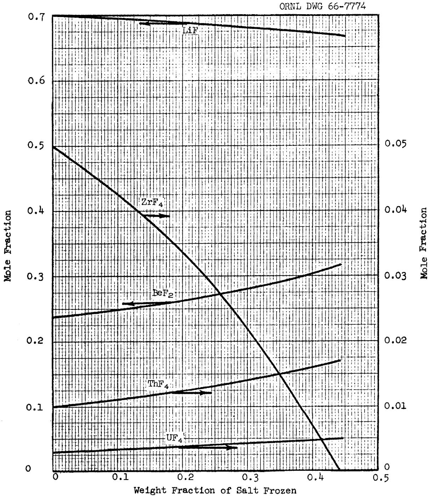  
Fig. 10. Liquid Composition Resulting from Selective Freezing of Fuel Salt "A" in Drain Tank.

# 5. ANALYSIS OF MAXIMUM FILLING ACCIDENT

It is clear from the preceding section that the most severe of the filling accidents considered occurs when the mixture which remains after selective freezing of $39\%$ of Fuel B in the drain tank is forced into the fuel loop. If it can be shown that this accident is tolerable, then all of the other accidents are also tolerable.

# 5.1 Specification of Accident

The accident which was analyzed in detail included a number of abnormal conditions in addition to filling the reactor with highly concentrated fuel. The conditions of the accident and equipment performance, both normal and abnormal, are described below.

First, it was assumed that the gas addition system had failed to the extent that the gas supply pressure to the drain tank was 50 psig, the limit imposed by the rupture disc, rather than the normal 40 psig. This gave a salt addition rate of 0.5 ft³/min at the time the reactor first became critical (at 55% full) and resulted in a reactivity ramp of 0.025% δk/k per sec. The first corrective action was an automatic rod drop initiated when the neutron flux reached 150% of design power (15 Mw). A release time of 0.1 sec was assumed and the rods were allowed to fall with an acceleration of 0.5 times the acceleration of gravity. However, it was assumed that only two of the three rods actually dropped. Action to stop the fill and initiate a drain was assumed to occur at the same time as the rod drop. This action involved automatic opening of the equalizing valve, HCV-544, and the drain tank vent valve, HCV-573, and closing of the gas addition valve, HCV-572. It was assumed that only one of these valves, HCV-572, actually functioned and 1 sec* was allowed for the valve to close. This action, coupled with the initial salt fill rate,

gave a level coast-up of 0.2 ft which added a total of $0.52\%$ reactivity in excess of that compensated by the two inserted control rods. (If either of the other two gas valves had functioned, the level would have dropped and there would have been no second excursion.)

# 5.2 Preliminary Digital Calculations

The major portion of the transients associated with this accident was calculated with the aid of the ORNL analog computer. However, startup accidents typically begin at very low powers and the power varies over several orders of magnitude. Since the useful range of the analog computer covers only about two orders of magnitude for any variable, excessive range switching would be required to simulate the entire transient on the analog facility. To circumvent this problem, the initial part of the power transient, from source power to a power which began to affect the fuel temperature, was calculated with the aid of a digital program, MURGATROYD.1 MURGATROYD is a point model, nuclear kinetics program, using six groups of delayed neutrons, with provisions for adding reactivity in the form of steps and/or ramps. The digital program was started at $\mathrm{k_{eff}} = 1$ and a power of 1 watt and was used to calculate the variation of power with time up to 10 kw. This portion of the transient consumed 24 sec of reactor time and raised the fuel temperature 0.01°F. The reactor period at 10 kw was about 0.7 sec. The results of this digital calculation were used as input to start the analog simulation.

# 5.3 Detailed Analog Simulation

# Description of Model

In order to predict the excursions of power and temperature resulting from the postulated fill accident, a mathematical model was constructed

which described the heat transfer, the nuclear kinetics, and the external inputs to the system. Figure 11 shows a block diagram of the model used as a basis for the simulation.

It may be noted that except for the heat transfer equations, all of the computations are relatively straightforward for analog solution since they involve ordinary differential equations. In spite of the preliminary digital calculations, the power excursion exceeded the useful range of the analog computer and provisions for rescaling the power variable during the solution were required.

As shown in Fig. 11, however, the fuel and graphite temperatures are functions of both position and time, and thus are represented by partial differential equations. To solve these equations on an analog computer, one must use finite difference techniques. Since the accuracy of this solution turns out to be a very important part of the simulation, it will be discussed in detail.

Simulation of Local Fuel and Graphite Temperatures

Since the core consists of a large number of identical fuel channels and vertical graphite stringers, let us first consider the temperature in a typical stringer cross-section, shown in Fig. 12. Due to the symmetry, we can consider a basic heat transfer "element" as half of a fuel channel cross-section and one-fourth of a stringer as shown shaded in Fig. 12. Initially, considering the fuel and graphite as single regions having mean temperatures $\overline{T}_{\mathrm{F}}$ and $\overline{T}_{\mathrm{G}}$ , heat would be transferred from the fuel to graphite at a rate $Q$ , where

$$
\stackrel {\circ} {Q} = K \left(\bar {T} _ {F} - \bar {T} _ {G}\right)
$$

where K may readily be seen to be a function of the conductivities, the geometry, and the conductance of a film at the interface. It is important to note however, the K also depends on the rate of change of the temperatures. In general, the higher the frequency of the perturbation, the greater the error in the computed heat transfer rate between the two materials, where the approximate transfer rate is always lower than the

ORNL DWG 66-7775

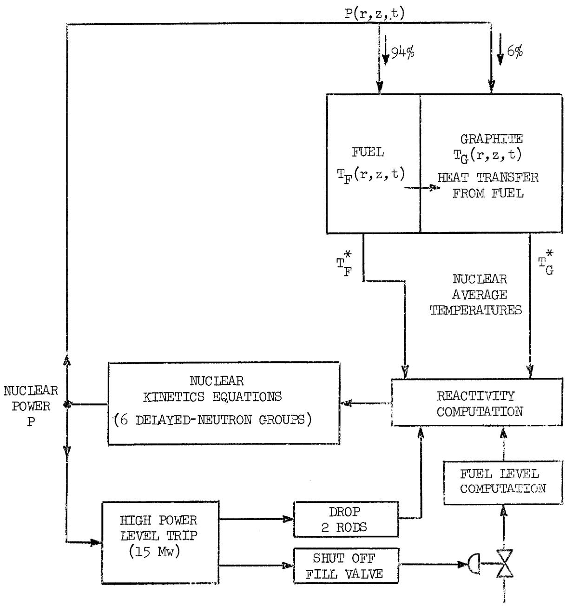  
Fig. 11 Block Diagram of Mathematical Model for Fill Accident Simulation

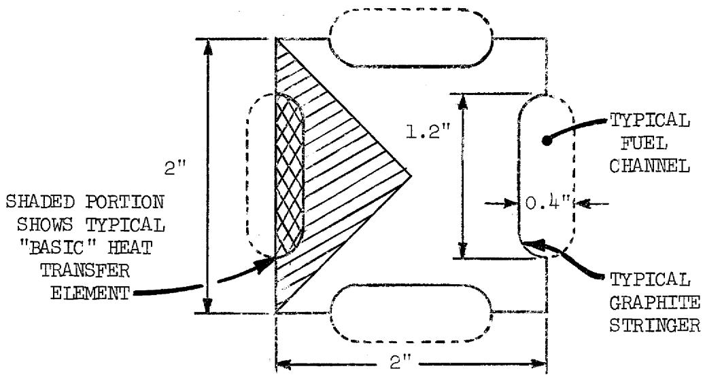  
Fig. 12. Cross-Section of Typical Graphite Stringer With Adjacent Fuel Channels

actual value. $^2$ Thus it is advantageous to use as fine an approximation as possible in this case, since heat transfer from the hot fuel to the graphite and the subsequent rise in graphite temperature is the major mechanism for curbing the power excursion (because of the small temperature coefficient of the fuel in the partly full core).

In the simulation, the temperature distribution for a basic element was approximated by five regions for the fuel and 15 regions for the graphite, and using slab geometry with a corrected surface-to-volume ratio. First-order central difference equations were used. The accuracy of this simulation (assuming a negligible error in the geometry approximation) was found from a comparison of the frequency response characteristics of a distributed slab with those of a lumped-parameter approximation.

This comparison was made by means of a digital computer code which can be used for general slab-geometry calculations of this type. The calculation showed that for the approximation used, the simulated heat transfer rate to the graphite would be within $10\%$ of the exact solution values for perturbation frequencies of up to 25 cycles per second. For the temperature changes involved in the incident being considered, the approximation was more than adequate.

Two other simplifying assumptions were made:

1) Since, during a fill, the MSRE is a "stationary fuel" reactor, the only means for axial heat transfer is by conduction, and this was found to be negligible.   
2) Radial conduction (between basic elements) was also assumed zero.

# Temperature Averaging

The entire reactor was divided into four major regions of fuel and graphite. Average nuclear importances of temperature changes and fractions of total power generation were assigned to the components of each region. These assignments were based on the spatial variation of nuclear importance and power density in the partly full core. Since the model for calculating temperatures in a basic heat-transfer element was assumed linear, the temperature changes in one region were proportional to those in any other, and were directly related to the fraction of the power generated in the region and inversely related to the volume of the region. Thus, from the simulation of a single basic heat-transfer element, a direct computation was made of the mean fuel and graphite temperatures of each region. The region temperatures were weighted with their respective importances and summed to obtain the nuclear average fuel and graphite temperatures for the reactor. These temperatures were used with their respective coefficients of reactivity to compute the internal contribution to the kinetic behavior of the reactor.

# Other Aspects

The reactivity effects of the fuel and graphite temperatures were combined with the other reactivity inputs to calculate the power transients. The other reactivity inputs (see Fig. 11) included 1) the initial ramp associated with the fill of the reactor, 2) a series of ramps to simulate

the dropping control rods, and 3) the decaying ramp associated with an internal computation of the fuel-level coast-up after the gas-addition valve was closed. The computer was set up to automatically insert the appropriate reactivity term with the appropriate time delay during the transient. The net reactivity was fed to a set of kinetic equations using six groups of delayed neutrons for the actual power calculation.

Provisions were included for stopping the calculation at any time to permit the necessary changes in the range of the power calculation. Facilities were also available for recording any of the computed parameters. Results of Simulation

The results of the fill-accident simulation are shown graphically in Figs. 13 and 14. Figure 13 shows the externally imposed reactivity transient exclusive of temperature compensation effects. The essential features are the initial, almost-linear rise which produced the first power excursion as fuel flowed into the core, the sharp decrease as the rods were dropped, and the final slow rise as the fuel coasted up to its equilibrium level. Figure 14 shows the power transient and some pertinent temperatures. The fuel and graphite nuclear average temperatures are the quantities which ultimately compensated for the excess reactivity introduced by the fuel coast-up. The maximum fuel temperature refers to the temperature at the center of the hottest portion of the hottest fuel channel. The initial power excursion reached $24\mathrm{Mw}$ before being checked by the dropping control rods which were tripped at $15\mathrm{Mw}$ . This excursion is not particularly important since it did not result in much of a fuel temperature rise. After the initial excursion, the power dropped to about $10\mathrm{kw}$ and some of the heat that had been produced in the fuel was transferred to the graphite. The resultant increase in the graphite nuclear average temperature helped to limit the severity of the second power excursion. Reactivity was added slowly enough by the fuel coast-up that the rising graphite temperature was able to limit the second power excursion to only $2.5\mathrm{Mw}$ . The maximum temperature attained, $1354^{\circ}\mathrm{F}$ , is well within the range that can be tolerated.

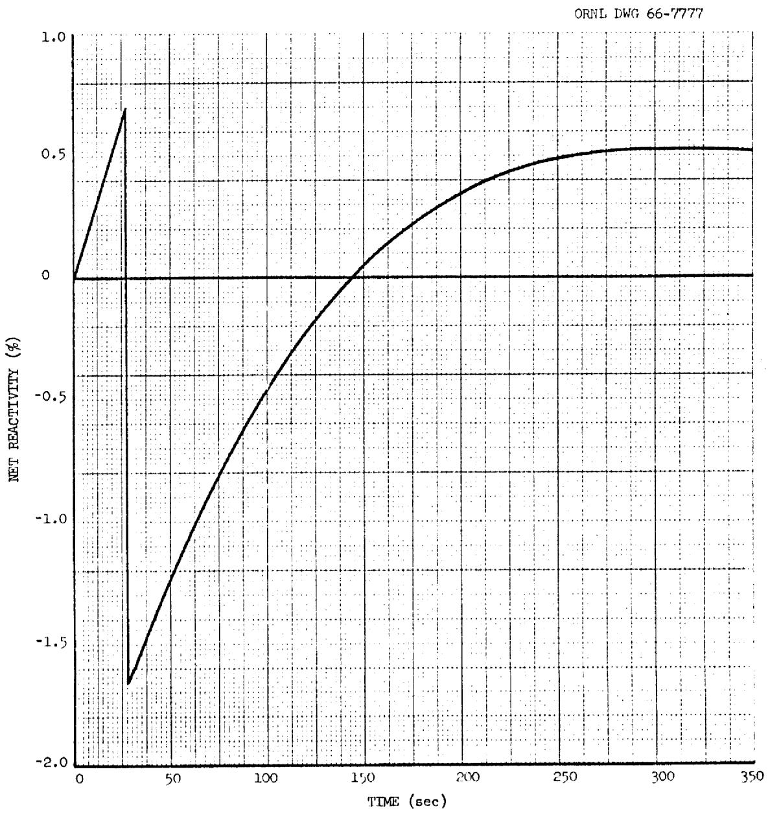  
Fig. 13. Net Reactivity During Maximum Filling Accident.

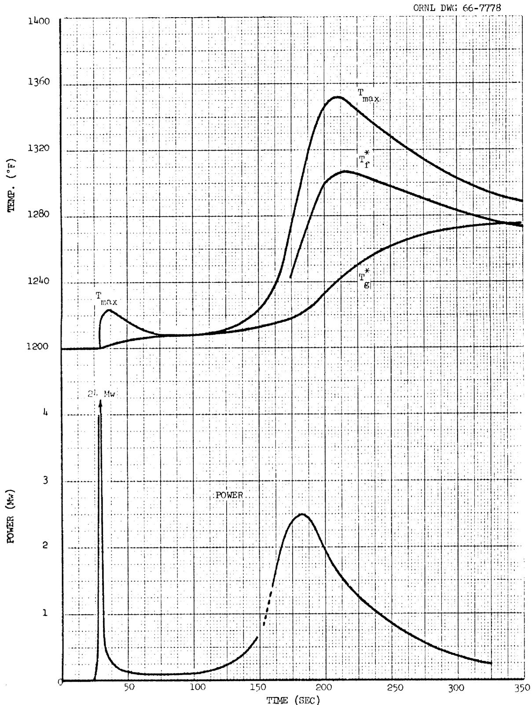  
Fig. 14. Power and Temperatures During Maximum Filling Accident.

# 5.4 Discussion

The above analysis indicates that the reactor system is not likely to be damaged by any of the filling accidents considered. The accident that was studied in detail would probably be less severe than the calculations indicate because of the conservatism in estimating the effect of fuel level on reactivity. The degree of fuel concentration by selective freezing used in this study was chosen arbitrarily as that amount which left just enough salt in liquid form to completely fill the reactor. It is physically possible, under ideal conditions, to achieve greater concentrations of uranium than that assumed. There is no valid basis for assessing the amount of selective freezing that could occur in the drain tank without being detected. There is also no assurance that freezing in the drain tank would, in fact, leave all of the uranium in the remaining melt.

In assessing the credibility of this accident, it should be recognized that several equipment failures were postulated which compounded the effects of filling the core with excessively concentrated fuel. These are 1) the failure in the gas-addition system which allowed fuel to flow into the reactor at an excessively high rate, 2) failure of one of the three control rods to drop, and 3) failure of a particular two of three valves to function to stop the fill. Elimination of any one of these postulated failures would prevent the second reactivity excursion and reduce the effects of the accident to trivial proportions.

It has been pointed out that the severity of the filling accident could be further compounded by postulating that the fuel loop vent valve, HCV-533, is closed at the start of the fill and is manually opened just as the initial criticality is achieved. Filling with HCV-533 closed would allow the pressure in the primary loop to rise to about 5 psig, the normal setpoint of the loop pressure controller, PCV-522. Analog calculations of the fuel liquid level showed that, if HCV-533 were opened at this pressure and all of the previously postulated failures occurred, the level in the core would rise 1.5 ft, producing an excursion with temperatures that would damage the reactor vessel. However, if either HCV-544 or HCV-573

opens on demand, the gas flow from the drain tank into the primary loop or out through the vent line limits the pressure decrease in the loop and keeps the accident within tolerable limits. It does not seem reasonable to add two more improbable events, failure to have HCV-533 open at the start and then opening the valve at the crucial moment, to the list of conditions already postulated. If these two events are postulated, it is probably reasonable to postulate that only one valve (rather than two) fails to function on demand. This accident can be further mitigated by reducing the setpoint of PCV-522 during the filling operation. A setting of 1.5 to 2 psig would assure that the displaced gas from the fuel loop goes to the auxiliary charcoal bed during a normal fill but would limit the pressure in the fuel loop during a fill with HCV-533 closed. Such action might increase the possibility of an activity release from the normal charcoal beds but the consequences of this are minor, particularly in view of the low probability of occurrence.

# 6. CONCLUSIONS

None of the filling accidents that were studied in detail poses any threat to the reactor system. On the other hand, it is possible to conceive of a set of circumstances, however unlikely, that could produce temperatures high enough to breach the primary containment. Such a breach would probably occur as a melting of the control rod thimbles. * Even then, the activity and/or salt release would be confined within the secondary containment and the release would not approach the maximum credible accident for which the secondary containment is designed. Therefore, even the worst conceivable filling accident does not represent a hazard to the operating personnel or the environment.

# Internal Distribution

<table><tr><td>1.</td><td>MSRP Director&#x27;s Office</td><td>31.</td><td>R. N. Lyon</td></tr><tr><td></td><td>Rm. 219, 9204-1</td><td>32.</td><td>H. G. MacPherson</td></tr><tr><td>2.</td><td>G. M. Adamson</td><td>33.</td><td>R. E. MacPherson</td></tr><tr><td>3.</td><td>R. G. Affel</td><td>34.</td><td>H. C. McCurdy</td></tr><tr><td>4.</td><td>S. J. Ball</td><td>35.</td><td>H. F. McDuffie</td></tr><tr><td>5.</td><td>S. E. Beall</td><td>36.</td><td>A. J. Miller</td></tr><tr><td>6.</td><td>E. S. Bettis</td><td>37.</td><td>R. L. Moore</td></tr><tr><td>7.</td><td>F. F. Blankenship</td><td>38.</td><td>H. R. Payne</td></tr><tr><td>8.</td><td>E. G. Bohlmann</td><td>39.</td><td>A. M. Perry</td></tr><tr><td>9.</td><td>W. H. Cook</td><td>40.</td><td>H. B. Piper</td></tr><tr><td>10.</td><td>J. L. Crowley</td><td>41.</td><td>B. E. Prince</td></tr><tr><td>11.</td><td>F. L. Culler</td><td>42.</td><td>H. C. Roller</td></tr><tr><td>12.</td><td>S. J. Ditto</td><td>43.</td><td>A. W. Savolainenen</td></tr><tr><td>13-17.</td><td>J. R. Engel</td><td>44.</td><td>D. Scott</td></tr><tr><td>18.</td><td>E. P. Epler</td><td>45.</td><td>M. J. Skinner</td></tr><tr><td>19.</td><td>A. P. Fraas</td><td>46.</td><td>I. Spiewak</td></tr><tr><td>20.</td><td>C. H. Gabbard</td><td>47.</td><td>R. C. Steffy</td></tr><tr><td>21.</td><td>W. R. Grimes</td><td>48.</td><td>J. R. Tallackson</td></tr><tr><td>22.</td><td>R. H. Guymon</td><td>49.</td><td>D. B. Trauger</td></tr><tr><td>23.</td><td>P. H. Harley</td><td>50.</td><td>R. E. Thoma</td></tr><tr><td>24.</td><td>P. N. Haubenreich</td><td>51.</td><td>W. C. Ulrich</td></tr><tr><td>25.</td><td>V. D. Holt</td><td>52.</td><td>M. E. Whatley</td></tr><tr><td>26.</td><td>T. L. Hudson</td><td>53.</td><td>G. D. Whitman</td></tr><tr><td>27.</td><td>P. R. Kasten</td><td>54-55.</td><td>Central Research Library (CRL)</td></tr><tr><td>28.</td><td>A. I. Krakoviak</td><td>56-57.</td><td>Y-l2 Document Reference Section</td></tr><tr><td>29.</td><td>R. B. Lindauer</td><td>58-60.</td><td>Laboratory Records Department</td></tr><tr><td>30.</td><td>M. I. Lundin</td><td>61.</td><td>Laboratory Records Department (RC)</td></tr></table>

# External Distribution

62-63. D. F. Cope, Reactor Division AEC-ORO

64. C. B. Deering, Reactor Division, AEC-ORO   
65. A. Giambusso, AEC, Washington   
66. H. M. Roth, Division of Research and Development, AEC-ORO   
67. W. L. Smalley, Reactor Division, AEC-ORO   
68-82. Division of Technical Information Extension (DTIE)