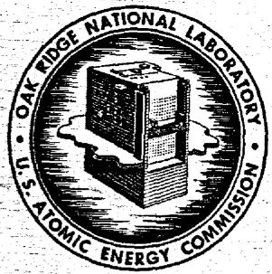

# OAK RIDGE NATIONAL LABORATORY

operated by

UNION CARBIDE CORPORATION

for the

U.S. ATOMIC ENERGY COMMISSION

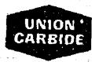

ORNL-TM-500

85

RADIATION CHEMISTRY OF MSR SYSTEM

# NOTICE

This report contains patentable, preliminary, unverified, or erroneous information. For one or more of these reasons the author or issuing installation and responsible office have limited its distribution to Governmental agencies and their contractors as authorized by AEC Manual Chapter 3202-062. A formal report will be published at a later date when the data is complete enough to warrant publication.

# NOTICE

This document contains information of a preliminary nature and was prepared primarily for internal use at the Oak Ridge National Laboratory. It is subject to revision or correction and therefore does not represent a final report. The information is not to be abstracted, reprinted or otherwise given public dissemination without the approval of the ORNL patent branch, Legal and Information Control Department.

# LEGAL NOTICE

This report was prepared as an account of Government sponsored work. Neither the United States, nor the Commission, nor any person acting on behalf of the Commission:

A. Makes any warranty or representation, expressed or implied, with respect to the accuracy, completeness, or usefulness of the information contained in this report, or that the use of any Information, apparatus, method, or process disclosed in this report may not infringe privately owned rights; or   
B. Assumes any liabilities with respect to the use of, or for damages resulting from the use of any information, apparatus, method, or process disclosed in this report.

As used in the above, "person acting on behalf of the Commission" includes any employee or contractor of the Commission, or employee of such contractor, to the extent that such employee or contractor of the Commission, or employee of such contractor prepares, disseminates, or provides access to, any information pursuant to his employment or contract with the Commission, or his employment with such contractor.

Contract No. W-7405-eng-26

REACTOR CHEMISTRY DIVISION

RADIATION CHEMISTRY OF MSR SYSTEM

Written by: W. R. Grimes

The experiments described in this document required the cooperative effort of many people in the Reactor, Metals and Ceramics, Operations, Analytical Chemistry, and Reactor Chemistry Divisions of the Oak Ridge National Laboratory. D. B. Trauger, A. R. Olsen, E. M. King, A. Taboada, and F. F. Blankenship have been in responsible charge of important segments of this work. While he accepts responsibility for accuracy of the reported material, the author makes no claim to credit for design and operation of the experimental program.

DATE ISSUED

MAR 13 1963

OAK RIDGE NATIONAL LABORATORY

Oak Ridge, Tennessee

operated by

UNION CARBIDE CORPORATION

for the

U. S. ATOMIC ENERGY COMMISSION

# CONTENTS

Page

INTRODUCTION 3

EXPERIMENT ORNL-MTR-47-4 5

Irradiation of Specimens 5

Post Irradiation Examination 11

Analysis of Cover Gas 11

Gross Examination of Capsules 19

Examination of the Metal 22

Examination of Salt 22

Condition of the Graphite 27

Conclusions 27

EXPERIMENT ORNL-MTR-47-5 28

Behavior Under Irradiation 33

Behavior with Reactor at Full Power. 34

Behavior with Reactor Shut Down. 37

Behavior at Intermediate Reactor Power Levels 41

Behavior Through Startup and Shutdown. 41

Behavior of Capsules After Termination of MTR Exposure . . 43

Conclusions 44

# RADIATION CHEMISTRY OF MSR SYSTEM

# INTRODUCTION

Compatibility of molten fluoride mixtures, near in composition to that proposed for MSRE, with graphite and with INOR-8 has been demonstrated convincingly in many out-of-pile tests over a period of several years. A few in-pile capsule studies of graphite-fluoride-INOR systems with fluoride melts of a rather different composition have been performed in past years; examination of those capsules showed no adverse effect of radiation. However, in-pile testing of this combination of materials under conditions similar to those expected in MSRE has been attempted only recently. Accordingly, no completely realistic experiments have been reported.

An assembly ORNL-MTR-3 containing four capsules, was irradiated in MTR during the summer of 1961 to provide assurance as to the non-wettability of graphite by molten LiF-BeF $_2$ -ZrF $_4$ -UF $_4$ -ThF $_4$ ; though such assurance was obtained, this experiment yielded some surprising results. $^{1,2,3,4}$ In brief, the following anomalous behavior was observed.

1. The cover gas within the sealed capsules contained appreciable quantities of $\mathrm{CF_4}$ .   
2. The cover gas contained the expected quantity of Kr from all capsules; the Xe was present at the expected level in two, but its concentration was less by 100-fold in the other two capsules.   
3. While the INOR-8, both as capsule walls and as small partially immersed test specimens, was essentially undamaged, small coupons of molybdenum were thinned to roughly half the original thickness with no observable corrosion deposit.

4. No evidence of wetting of the graphite by the salt was observed. However, the irradiated salt was deep black in color; it contained loose, roughly spherical beads of condensed salt of various colors from clear through blue to black.

The difference in behavior of Kr and Xe seemed quite inexplicable; the behavior of molybdenum, while not of direct consequence to the MSRE, was disturbing. The black color of the salt was removed by annealing at temperatures below the liquidus and was shown to be due, largely if not entirely, to radiation-induced discoloration of crystalline LiF and 2LiF·BeF $_2$ . This color, and the occurrence of the salt beads (which were clearly due to condensation on the relatively cool capsule walls of material distilled from the very hot pool of salt) were judged to be trivial. The appearance of CF $_4$ in the cover gas, however, remained a most disturbing observation. Thermodynamic data for reactions of fluorides with carbon such as

$$
4 \mathrm {U F} _ {4} + \mathrm {C} \rightleftharpoons \mathrm {C F} _ {4} + 4 \mathrm {U F} _ {3}
$$

suggest that the equilibrium pressure of $\mathrm{CF_4}$ over such a system should not exceed $10^{-3}$ atmospheres. Moreover, out-of-pile controls with identical material, geometry and thermal histories (insofar as possible to obtain same with external heat sources) showed no evidence ( $>1$ part per million) of $\mathrm{CF_4}$ . This gas, accordingly, clearly arose from some previously unknown radiation-induced reaction. Such generation might, of course, have serious consequences. If $\mathrm{CF_4}$ were generated at an appreciable rate in the MSRE core it might well be removed in the gas stripping section of the MSRE pump and be lost to the system. If so, the loss of carbon from the moderator graphite would be trivial, but an appreciable loss of fluoride ion

from the melt, with the resultant appearance of $\mathbf{U}^{+3}$ or other reduced species in the fuel, would, at the least, cause frequent shutdowns to reoxidize the fuel. Additional in-pile experiments were, therefore, conducted in an attempt to establish the quantity of $\mathrm{CF_4}$ to be expected under power levels, temperatures and graphite-fuel geometries more representative of the MSRE. Two assemblies of capsules, designated ORNL-MTR-47-4 and ORNL-MTR-47-5, have been irradiated in the MTR for this program. While the examination of these experiments has not been completed, much information has been obtained. The following is a brief statement of progress to date in this experimental program and a review of the conclusions which can presently be drawn from the information.

EXPERIMENT ORNL-MTR-47-4

Irradiation of Specimens

The irradiation assembly, designated as 47-4 in the following, contained six INOR-8 capsules. These were immersed in a common pool of molten sodium which served to transfer the heat generated during fission through a helium filled annular gap to water circulating in an external jacket. The four large capsules, as shown in Fig. 1, were l-inch diameter x 2.25-inches length and contained a core of CGB graphite (l/2-inch diameter x l-inch length) submerged about 0.3-inch (at temperature) in about 25 grams of fuel. The two smaller capsules, see Fig. 2, contained 0.5-inch diameter cylindrical crucibles of CGB graphite containing about 10 grams of fluoride melt. The large capsules included a thermowell which permitted measurement of temperature within the submerged graphite specimen; detailed analysis suggests that this measured temperature should approximate closely the temperature at the salt-graphite interface.

UNCLASSIFIED

ORNL-LR-DWG 67714R

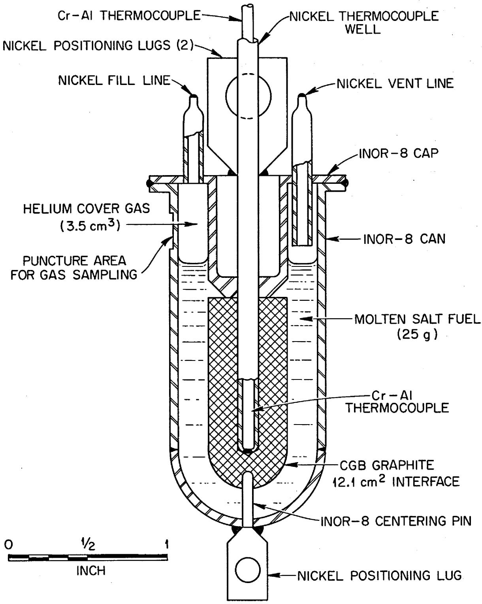  
Fig. 1. Assembly 47-4 submerged graphite capsules.

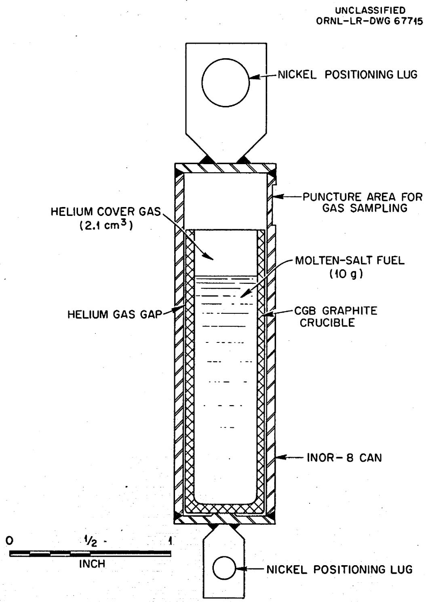  
Fig. 2. Assembly 47-4 graphite crucible capsules.

No such provision for temperature measurement could be incorporated into the smaller capsules.

The CGB graphite used in all capsules of 47-4 had a surface area of $0.71 \, \text{m}^2/\text{g}$ as determined by the BET method. Other properties of this material follow:

Permeability of a 1.5-in.-OD, 0.5-in.-ID, 1.5-in.-long specimen per second Density (Beckman air pycnometer) $2.00\mathrm{g / cm^3}$ Bulk density 1.838 g/cm3 Bulk volume accessible to air 8.7% Total void volume as percentage of bulk volume 19.5%

Spectrographic analysis of the graphite revealed only the usual low levels of trace elements; some of these may have been introduced during machining and handling operations.

The $\mathrm{UF_4}$ used in preparing the salt mixtures was fully enriched in all cases. The four large (submerged graphite) capsules and one of the small capsules each contained fluoride mixtures of LiF-BeF $_2$ -ZrF $_4$ -ThF $_4$ -UF $_4$ for which analyzed samples indicated the composition 71.0-22.6-4.7-1.0-0.7 mole %; analysis for Ni, Cr, and Fe in the material showed 25, 24, and 97 parts per million. The other small capsule was loaded with a very similar mixture but with the uranium content raised to 1.4 mole %; the Ni, Cr, Fe analyses were 15, 40, and 123 ppm. The fused salt mixtures were prepared by mixing the proper quantities of pure fluorides, and then, at 750 to $800^{\circ}\mathrm{C}$ , sparging for 2 hours with H $_2$ , 8 hours with a 5:1 mixture of H $_2$ and HF, and 48 hours with H $_2$ .

The large capsules were filled by transferring the molten fluoride mixture under an atmosphere of He; the level to which they were filled was controlled by blowing excess liquid back through a dip-line adjusted to

the proper level. The level of salt was monitored with a television x-ray system. Final closure was made in a helium-filled glove box where the ends of the fill-tubes were crimped and then welded shut. This technique should have affected neither the composition nor the amount of cover gas within the capsule.

The smaller capsules were filled, in the glovebox, with ingots of solid fuel mixture. They were closed by inert-gas arc-welding of the end cap. This welding operation, which used argon as the electrode cover gas, raised the capsule temperature appreciably and permitted mixing of some argon with the helium within the capsule before the seal was effected. Accordingly, neither the amount of gas nor the He:A ratio within the sealed capsule at time of closure can be certified.

The amount of fuel chosen for each capsule should have yielded a vapor volume of $3.5\mathrm{cm}^3$ in the large, and $2\mathrm{cm}^3$ in the small, capsules at temperature. The filled and sealed capsules were x-rayed and examined to insure that the molten salt had flowed to its proper position in the assembly.

Assembly 47-4 was irradiated through three MTR cycles in the period March 15 to June 4, 1962. The temperature history of the six capsules (as read from the chromel-alumel thermocouples in the four large capsules and as calculated for the two small capsules) is shown in Table 1. The maximum measured temperature among the four instrumented capsules was $1400 \pm 50^{\circ}\mathrm{F}$ . The mean measured temperatures of the other three instrumented capsules were approximately 1380, 1370, and $1310^{\circ}\mathrm{F}$ , respectively. The corresponding calculated INOR-8 capsule wall-to-salt interface temperatures were 1130, 1125, 1115, and $1110^{\circ}\mathrm{F}$ . The temperature of the surface of the INOR-8

Table 1 Temperature History of Fuel Salt in Capsules from 47-4   

<table><tr><td rowspan="2">Temperature Interval (°C)</td><td colspan="2">Time at Temperature (hr)</td></tr><tr><td>Submerged Graphite Core (24, 36, 45, 12, 6b)c</td><td>Graphitea Crucible (4)c</td></tr><tr><td>Steady-state operation</td><td></td><td></td></tr><tr><td>0-100</td><td>390.6</td><td>390.6</td></tr><tr><td>100-700</td><td>44.0</td><td>12.1</td></tr><tr><td>700-750</td><td>1203.7</td><td>3.8</td></tr><tr><td>750-800</td><td>254.0</td><td>17.6</td></tr><tr><td>800-850</td><td></td><td>11.4</td></tr><tr><td>850-900</td><td></td><td>1456.9</td></tr><tr><td>Total</td><td>1892.3</td><td>1892.3</td></tr><tr><td>Nonsteady-state operation</td><td>51.7</td><td>51.7</td></tr><tr><td>Total irradiation</td><td>1553.4</td><td>1553.4</td></tr></table>

aCalculated temperature history based on temperatures measured in submerged graphite capsules.   
bGraphite crucible capsule containing fuel with 0.7 mole $\%$ UF4.   
Capsule identification number.

end cap in contact with the fuel salt was calculated to be the same as that of the graphite-to-salt interface temperature. The area of the end cap wetted by the salt was about $12\%$ of the total 5.6 in. $^2$ of metal surface in contact with the salt.

The accumulated time during transient operation includes only times for temperature changes of more than about $30^{\circ}\mathrm{C}$ . Of the 121 such temperature changes recorded, 60 included decreases to or below the solidus temperature of the fuel salt. It is estimated that the fuel freezes within five minutes after shutdown of the MTR, and cooling to below $200^{\circ}\mathrm{F}$ should occur within half an hour.

Exposure data for the capsules in 47-4, and those for out-of-pile controls which were given as similar a thermal history as was practicable, are summarized in Tables 2 and 3.

The temperatures were controlled from Capsule 24, and the changes in the retractor position required to hold a constant temperature were not unusual. The thermocouple reading for capsule 45 appeared to drift downward by about $35^{\circ}\mathrm{C}$ during the 12-week exposure, but this was the only symptom of deviant temperature recordings.

# Post Irradiation Examination

The assembly was removed from the MTR and partially disassembled at that location for shipment to ORNL. The assembly was completely dismantled in ORNL hot cells and the capsules were recovered for complete examination. All dismantling operations went smoothly, and no evidence of failure of any capsule was observed.

# Analysis of Cover Gas

The six irradiated and two unirradiated control capsules were

Table 2. Exposure Data for Large Capsules in Assembly 47-4   

<table><tr><td rowspan="2">Capsule</td><td rowspan="2">Weight of Fuel (g)</td><td colspan="2">Uranium Content</td><td rowspan="2">Thermal-Neutron Fluxa Based on Co60 Activation (neutrons/cm2·sec)</td><td rowspan="2">Fast-Neutron (&gt;3 MeV) Flux Based on Co58 Activation (neutrons/cm2·sec)</td><td colspan="2">Temperature (°C)</td><td rowspan="2">Power Density (w/cm3)</td><td rowspan="2">Calculated Burnup (% U235)</td></tr><tr><td>Mole %</td><td>g</td><td>Graphite-to-Salt Interface</td><td>INOR-δ-to-Salt Interfaceb</td></tr><tr><td></td><td></td><td></td><td></td><td>×1013</td><td>×1012</td><td></td><td></td><td></td><td></td></tr><tr><td>3c</td><td>25.532</td><td>0.7</td><td>0.993</td><td></td><td></td><td>750</td><td></td><td></td><td></td></tr><tr><td>8c</td><td>26.303</td><td>0.7</td><td>1.023</td><td></td><td></td><td>750</td><td></td><td></td><td></td></tr><tr><td>12</td><td>25.174</td><td>0.7</td><td>0.979</td><td>2.10</td><td>2.1</td><td>680d</td><td>610</td><td>67</td><td>5.5</td></tr><tr><td>24</td><td>25.374</td><td>0.7</td><td>0.987</td><td>2.70</td><td>3.2</td><td>760d</td><td>605</td><td>83</td><td>7.0</td></tr><tr><td>36</td><td>24.886</td><td>0.7</td><td>0.968</td><td>2.71</td><td>3.3</td><td>710d</td><td>595</td><td>85</td><td>7.0</td></tr><tr><td>45</td><td>25.598</td><td>0.7</td><td>0.996</td><td>3.85</td><td>3.8</td><td>710d</td><td>600</td><td>117</td><td>9.7</td></tr></table>

aAverage external neutron flux.   
bEstimated temperatures.   
cUnirradiated controls.   
dThermocouple readings prior to termination of final irradiation cycle.

Table 3. Exposure Data for Small Capsules in Assembly 47-4   

<table><tr><td rowspan="2">Capsule</td><td rowspan="2">Weight of Fuel (g)</td><td colspan="2">Uranium Content</td><td rowspan="2">Thermal-Neutron Fluxa Based on Co60 Activation (neutrons/cm2·sec)</td><td rowspan="2">Fast-Neutron (&gt;3 MeV) Flux Based on Co38 Activation (neutrons/cm2·sec)</td><td rowspan="2">Temperature of Central Region (°C)</td><td rowspan="2">Power Density (w/cm3)</td><td rowspan="2">Calculated Burnup (% U233)</td></tr><tr><td>Mole %</td><td>g</td></tr><tr><td></td><td></td><td></td><td></td><td>×1013</td><td>×1012</td><td></td><td></td><td></td></tr><tr><td>1b</td><td>9.381</td><td>0.7</td><td>0.365</td><td></td><td></td><td>750</td><td></td><td></td></tr><tr><td>3b</td><td>6.805</td><td>0.7</td><td>0.265</td><td></td><td></td><td>750</td><td></td><td></td></tr><tr><td>5</td><td>9.829</td><td>1.47</td><td>0.737</td><td></td><td></td><td>895</td><td></td><td></td></tr><tr><td>4</td><td>10.101</td><td>1.47</td><td>0.758</td><td>4.79</td><td>5.2</td><td>895c</td><td>260</td><td>11.4</td></tr><tr><td>6</td><td>9.915</td><td>0.7</td><td>0.386</td><td>1.31</td><td>1.3</td><td>715c</td><td>43</td><td>1.3</td></tr></table>

aAverage external neutron flux.   
bUnirradiated controls.   
Thermocouple readings prior to termination of final irradiation cycle.

punctured and the cover gas was recovered for analysis in the interval August 8 to October 23, 1962. These operations, conducted in the hot cells of Bldg. 450l at ORNL, used a screw-driven puncturing tool sealed with a bellows and by a neoprene O-ring which butted on a flat previously machined into each capsule (see Figures 1 and 2). Gas escaped into a collection system whose volume was calibrated and which had, in each case, been evacuated and checked for leaks. The initial collections were performed with a mercury-in-glass Toepler pump and glass sample bulbs in a glass and metal system; when this proved inadequate, as described below, it was replaced by an all-metal gas collection system without a pump. This metal system was conditioned with elemental fluorine according to well-established procedures before use.

The first observations were made on the small capsule (No. 6) which had suffered the least burnup of uranium and on its out-of-pile control (No. 5). These capsules were handled without difficulty with the glass-metal system. After collection of the gas, the void volumes in the capsules were determined by pressure drop on expansion of helium from a known volume. Data obtained, including analyses of the gases by the mass spectrometer, are shown in Table 4. The puncturing device leaked slightly, presumably at the O-ring seal, during opening of irradiated Capsule 6. After correction of the analyses for the quantity of air $(47\%)$ , the total volume of He + A agreed very well with that from the out-of-pile control. The Xe and Kr were recovered at very nearly the expected ratio, and the absolute volume of these gases agreed reasonably well with the quantity $(0.35~\mathrm{cm}^3$ total) calculated from the burnup shown in Table 3. The only radioactive materials recovered on Toepler pumping from Capsule 6 were Kr and Xe.

Table 4   
Cover Gas Analysis for Capsules 5 and 6 of Assembly 47-4   

<table><tr><td rowspan="4">Gas</td><td colspan="2">Capsule 5</td><td colspan="2">Capsule 6</td></tr><tr><td colspan="2">Gas collected: 1.3 cm3Gas volume in capsule: 2.7 cm3</td><td colspan="2">Gas Collected: 3.2 cm3Corrected value*: 1.7 cm3Gas volume in capsule: 2.5 cm3</td></tr><tr><td colspan="2">Quantity</td><td colspan="2">Quantity</td></tr><tr><td>%</td><td>Volume (cm3)</td><td>%*</td><td>Volume (cm3)</td></tr><tr><td>He</td><td>15</td><td>0.2</td><td>23</td><td>0.38</td></tr><tr><td>A</td><td>79</td><td>1.0</td><td>51</td><td>0.86</td></tr><tr><td>O</td><td>0.7</td><td>0.01</td><td>-</td><td>-</td></tr><tr><td>CO + N2</td><td>5.3</td><td>0.07</td><td>-</td><td>-</td></tr><tr><td>Kr</td><td>0</td><td>0</td><td>4.2</td><td>0.07</td></tr><tr><td>Xe</td><td>0</td><td>0</td><td>19.0</td><td>0.32</td></tr><tr><td>CF4</td><td>0</td><td>0</td><td>4.2</td><td>0.07</td></tr></table>

* Corrected for leakage of air (as indicated by mass spectrometric analysis) at time of sampling.

Cover gas recovery and analysis from all other capsules revealed very different behavior.

Capsule No. 24, the first of the large capsules to be opened, showed the cover gas to be quite reactive even toward the Hg in the Toepler pump, and truly quantitative analysis of the gas was precluded by the inadequacy of the gas handling system. In spite of the considerable but unknown loss of gas by reaction, a large quantity (84 cm³ at STP) of gas was collected. The product of reaction with the Hg was shown to consist entirely of Hg₂F₂. Unlike the gas from Capsule 6 this material was quite radioactive; Te activity (presumably was volatile TeF₆) was primarily responsible. Since the measured free volume in Capsule 24 at ambient temperature was shown to be 4.6 cm³, a pressure of at least 18 atmospheres existed within the capsule at the time of puncturing.

Based on mass spectrometry of two $0.1\text{-cm}^3$ samples, the gas from Capsule 24 was $5\%$ He, $0.1\%$ Xe, $0.4\%$ Kr, $4\%$ (Co + N₂), $6\%$ CO₂, and $17\%$ CF₄. The remainder was O₂ and SiF₄ in roughly equal amounts, matching the products of the reaction of F₂ with the glass

$$
\mathrm {S i O} _ {2} + 2 \mathrm {F} _ {2} \rightarrow \mathrm {S i F} _ {4} \uparrow + \mathrm {O} _ {2} \uparrow .
$$

The krypton yield listed above is in fair agreement with the calculated value, but the xenon yield is far too low. Later samples obtained by long exposure of the capsule to an evacuated 3-liter container, had $0.3~\mathrm{cm}^3$ of xenon and less than one-tenth that amount of krypton.

All other capsules in this series were opened into an essentially all-metal, preconditioned gas system, which permitted much more representative samples of the gas to be obtained. Table 5, for example, shows data obtained from Capsule 36, the near duplicate in irradiation conditions of Capsule 24.

# Table 5

# Analyses of Cover Gas from Irradiated Capsule 36

Volume of gas space in capsule at room temperature: 4.6 cm³

Volume of gas space at operating temperature: 2.6 cm³

Volume of gas removed from capsule: 188 cm³

<table><tr><td>Gas</td><td>Quantity (vol %)</td><td>Volume (cm3)</td></tr><tr><td>F2</td><td>83.5</td><td>156</td></tr><tr><td>CF4</td><td>10.0</td><td>19</td></tr><tr><td>O2</td><td>2.5</td><td>4.7</td></tr><tr><td>Xe</td><td>0</td><td>0</td></tr><tr><td>Kr</td><td>0.3</td><td>0.56</td></tr><tr><td>He</td><td>2.8</td><td>5.3</td></tr><tr><td>CO + Ne</td><td>0.1</td><td>0.19</td></tr><tr><td>CO2</td><td>0.7</td><td>1.3</td></tr><tr><td>A</td><td>0</td><td></td></tr></table>

By contrast, Capsule 3A, which was an unirradiated control for Capsules 24 and 36 and which had been thermally cycled in a manner similar to their in-pile history, yielded $4.5~\mathrm{cm}^3$ (STP) of $99.7\%$ He, $0.05\%$ of $\mathrm{CO} + \mathrm{N}_2$ and $0.2\%$ $\mathrm{CO}_2$ . The lack of A and the total pressure of almost precisely 1 atmosphere was expected because of the speed and simplicity of the final closure of capsules of this type; this analysis undoubtedly represents the gas composition of Capsules 24 and 36 before irradiation.

The pertinent data for all irradiated capsules in 47-4 are shown as Table 6. Inspection of this information shows that all capsules except No. 6 (previously described) yielded large quantities of $\mathbf{F}_2$ and considerable quantities of $\mathrm{CF_4}$ . The total gas yield from Capsule 45 indicated a pressure of 60 atmospheres at room temperature before opening; had this gas been present at the operating pressure and in the considerably smaller volume then available it must have exceeded 250 atmospheres. It is almost certain that the capsule could not have withstood such a pressure even had the gas been inert.

The large volume of gas drastically reduced the concentration of Kr and other minor constituents, and the reactive nature of the samples required use of special mass spectrometers whose precision was not of the highest quality. Both these factors adversely affect the precision and accuracy of the analyses. It appears, however, that most, if not all, the Kr was recovered from all samples while the Xe is recovered poorly, if at all, from all capsules except No. 6. Though no positive proof is available, it seems highly probable that xenon recovery fails because of formation of $\mathrm{XeF_4}$ (or perhaps of other fluorides or oxyfluorides) which may be strongly adsorbed on the fuel or graphite within the system.

Table 6   
Quantity and Composition of Gases from 47-4 Capsules   

<table><tr><td rowspan="2">Capsule No.</td><td colspan="2">Small Capsules</td><td colspan="4">Large Capsules</td></tr><tr><td>6</td><td>4</td><td>24</td><td>36</td><td>45</td><td>12</td></tr><tr><td>Fuel Content (g)</td><td>9.915</td><td>10.101</td><td>24.374</td><td>24.886</td><td>24.598</td><td>25.174</td></tr><tr><td>Uranium Content (g)</td><td>0.386</td><td>0.758</td><td>0.987</td><td>0.968</td><td>0.957</td><td>0.979</td></tr><tr><td>Burnup (%)</td><td>1.3</td><td>11.4</td><td>7.0</td><td>7.0</td><td>9.7</td><td>5.5</td></tr><tr><td>Sampling Date</td><td>8/6</td><td>10/19</td><td>8/14</td><td>9/7</td><td>10/16</td><td>10/23</td></tr><tr><td>Gas Collected (cm3 STP)</td><td>1.6</td><td>98</td><td>84a</td><td>188</td><td>270</td><td>153</td></tr><tr><td>Gas Composition (%)</td><td></td><td></td><td></td><td></td><td></td><td></td></tr><tr><td>F2</td><td>0</td><td>90.5</td><td>65.3b</td><td>84.1</td><td>88.7</td><td>48.1b</td></tr><tr><td>CF4</td><td>4.3</td><td>4.2</td><td>17.1</td><td>9.3</td><td>8.1</td><td>41.1</td></tr><tr><td>Xe</td><td>19.0</td><td>0</td><td>0.1</td><td>0</td><td>0</td><td>0</td></tr><tr><td>Kr</td><td>4.1</td><td>0.26</td><td>0.4</td><td>0.4</td><td>0.8</td><td>0.2</td></tr><tr><td>He + A</td><td>72.6</td><td>3.6</td><td>5.7</td><td>2.7</td><td>2.95</td><td>4.0</td></tr><tr><td>Other</td><td>-</td><td>1.44</td><td>11.3</td><td>3.5</td><td>0.17</td><td>6.6</td></tr></table>

8Minimum value; some gas lost in reaction with container.   
Corrected from original analysis which showed $\mathrm{SiF_4 + O_2}$

While it is possible to see that the production of $\mathbf{F}_2$ (or $\mathbf{F}_2 + \mathbf{CF}_4$ ) generally increases with quantity of uranium burned, no quantitative correlation of yields of either or both together with any of the experimental parameters can be shown. Moreover, the data does not permit any decisions as to effect of cooling time on yield of these materials. It is worthy of note that the $\mathbf{F}_2 + \mathbf{CF}_4$ produced in the most extreme case (Capsule 45) represents $3\%$ of the fluorine contained in the salt or 1.6 times the quantity of fluorine in the $\mathbf{UF}_4$ in that sample. It is clear that these data indicate very large losses of $\mathbf{F}_2$ from the salt.

# Gross Examination of Capsules

Visual examination of the capsules after removal from the 47-4 assembly showed them to be sound and in good condition. No dimensional changes were apparent.

All capsules have been sectioned to permit direct observation of the metal, graphite, and salt. Figs. 3 and 4 show typical views (of Capsules 24 and 45) obtained after rough polishing of the sawed specimens. Several features in these views are noteworthy. The fuel salt is black in color, but seems to show no unusual tendency to crack or shatter during the sawing process. No evidence of wetting of the graphite by the salt is apparent. Nonwetting of the metal by the salt is occasionally observed; this behavior, which is unusual, seems to be due to a layer of "scum" on the salt surface near the capsule wall.

One bit of curious behavior, not matched by the out-of-pile controls, is the occurrence of smooth-surfaced voids, which have apparently been gas bubbles during high temperature operation, in the bottom hemispherical section of all the large capsules.

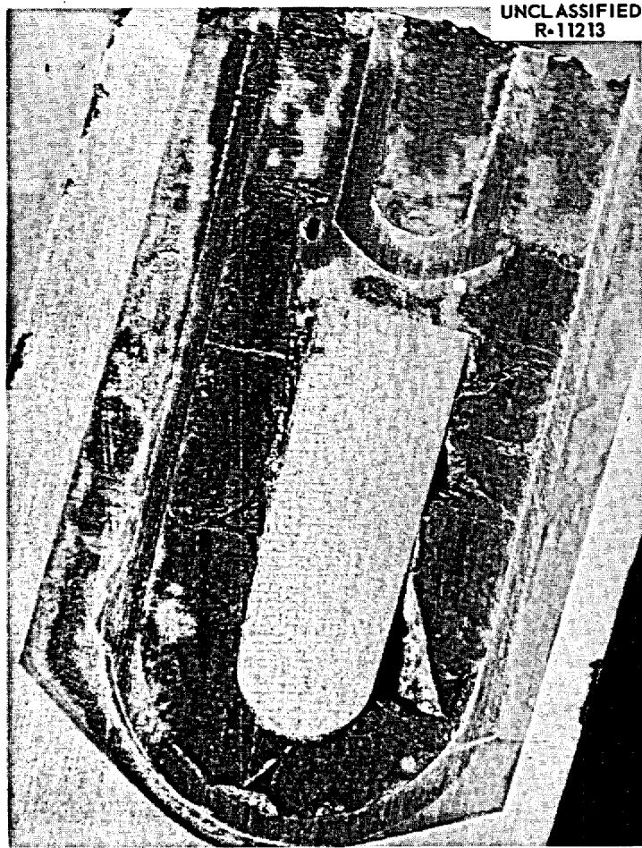  
Fig. 3. Capsule 24, MTR-47-4, after exposure.

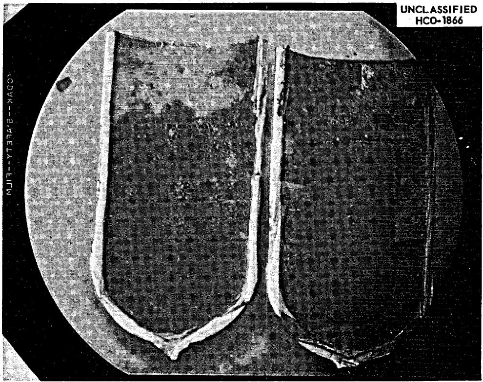  
Fig. 4. Capsule 45, MTR-47-4, after exposure.

# Examination of the Metal

Fluorine at elevated temperatures is an extremely corrosive material. Fig. 5, for example, affords comparison of an untreated specimen of INOR-8 with one after exposure for 22 hours at $1100^{\circ}\mathrm{F}$ to flowing helium containing $1\%$ (by volume) of $\mathbf{F}_2$ . An evaluation of the corrosion of the capsule metal should permit definitive statements as to whether $\mathbf{F}_2$ was produced and was present during the high temperature operation of Assembly 47-4. Accordingly, a very careful metallographic examination has been made of sections from Capsule 24, and selected specimens from other capsules are under study. Especial attention has been paid to metal surfaces exposed in the gas phase as well as at the gas-salt interface and within the molten salt. Typical photomicrographs from Capsule 24 are shown as Figs. 6 and 7.

There is no evidence of attack on the INOR-8 at any portion of Capsule 24; while definitive data are not yet available for other capsules, their appearance makes it highly unlikely that evidence of attack will be observed. (No attack would be expected in an out-of-pile capsule test of this duration at this general temperature level.) Further, there is evidence (see Fig. 7) that wall thickness has not been reduced, so the unlikely possibility of uniform corrosion followed by leaching of the corrosion film by the molten salt can also be excluded. It can, apparently, be stated with certainty that none of these capsule walls was exposed to fluorine at high temperature for appreciable periods of time.

# Examination of Salt

Small samples of salt from the irradiated capsules have been examined carefully with the optical microscope to determine the nature of the crystalline material. These materials are in general, and as is frequently the

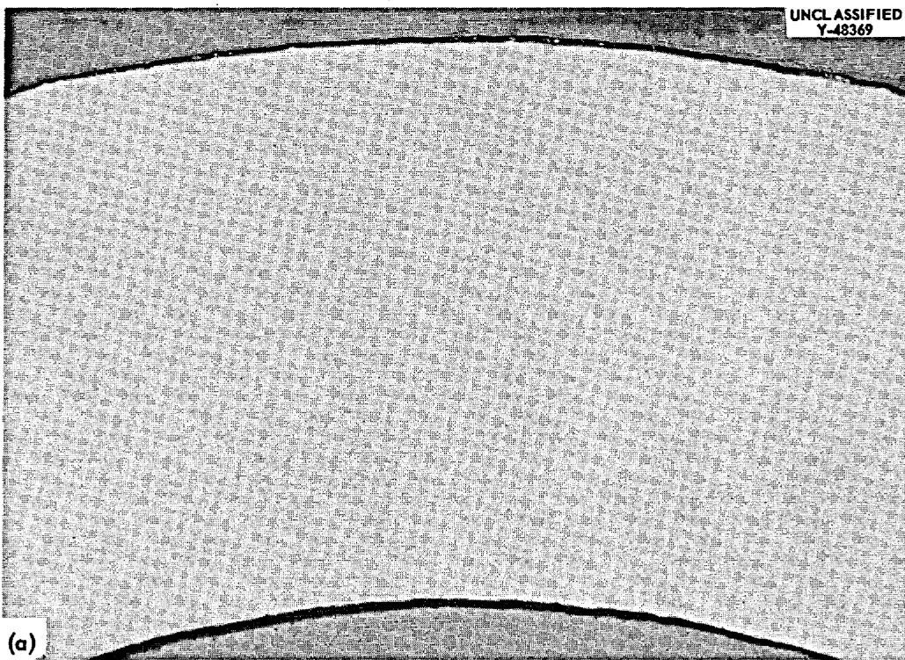  
0.035 INCHES 100x

Fig. 5. Comparison of (a) unexposed INOR-8 with (b) specimen exposed for 22 hours at $1100^{\circ}\mathrm{F}$ to flowing He containing $1\%$ of $\mathbf{F}_2$ . Reduced $19\%$ .   
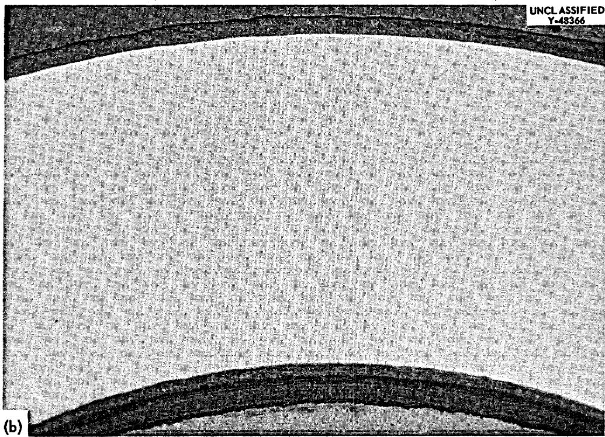  
0.035 INCHES 100x

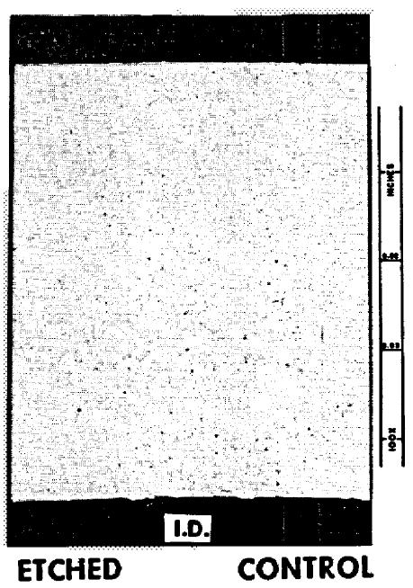

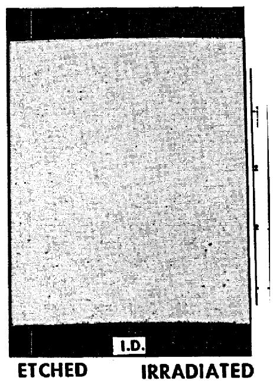  
UNCLASSIFIED R-12958   
Fig. 6. Longitudinal section of INOR-8 from hemispherical portion of capsule 24.

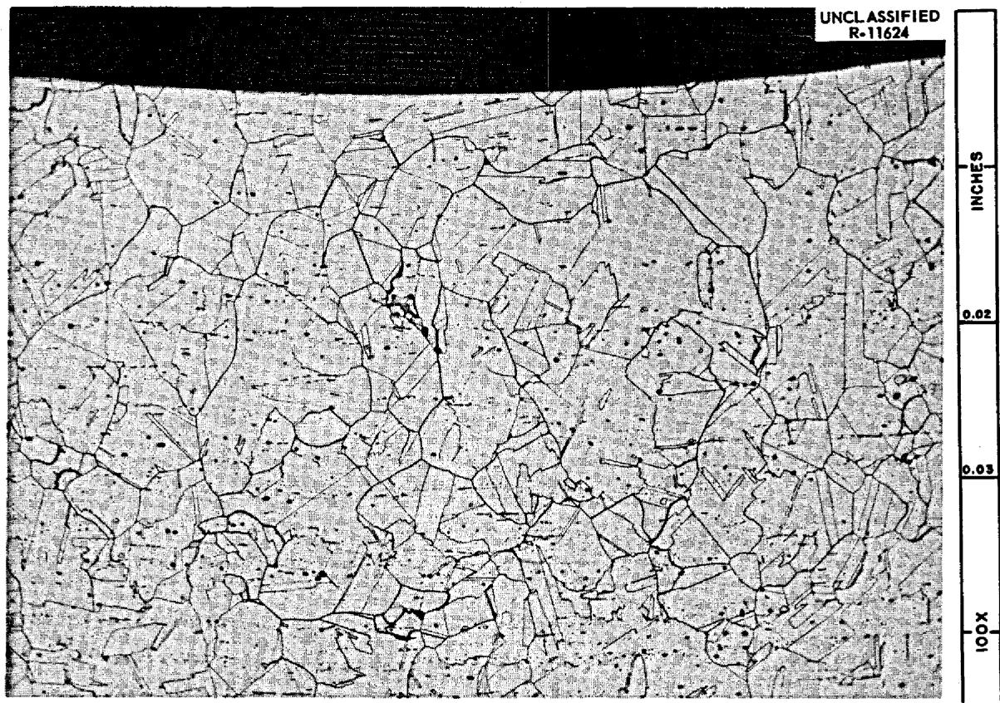  
Fig. 7. Transverse section of INOR-8 control material and specimen from hemispherical portion of capsule 24, MTR-47-4. Reduced $8\%$ .

case for rapidly cooled specimens, too fine grained to be positively identified. However, a sample from near the graphite at the center of Capsule 24 has been shown to contain the normally expected phases, though some are discolored and blackened; these phases included $7\mathrm{LiF}\cdot 6\mathrm{ThF}_4$ which was shown to contain $\mathrm{UF}_4$ (green in color) in solid solution. It seems certain, therefore, that the uranium was not markedly reduced at the time the fuel was frozen.

An attempt was made, with Capsule 35, to remove the salt by melting under an inert atmosphere to provide representative samples for chemical analysis and, especially, for a determination of the reducing power of the fluorine-deficient salt. This melting operation was not successful since only about one-half of the salt was readily removed in this way. That portion which melted and flowed from the capsule was green in color and obviously contained some tetravalent uranium. Since the salt was highly reduced--2% of the fluorine, approximately equivalent to that as $\mathrm{UF}_4$ , had been lost--melting the material would be expected to result in deposition of some metal; this metal may have resulted in a high-melting heel of uncertain composition.

A variety of chemical analyses have been performed on materials from these capsules. No evidence of unusual corrosion behavior is observed in any of the analyses.

Salt specimens have been examined by gamma ray spectrometry to evaluate gross behavior of fission product elements. In general, the ruthenium activity appears to be concentrated at near the bottom of the capsules; this may indicate its existence largely in the metallic state so that a gravity separation could occur. Cerium as well as zirconium-niobium

activity appears, as expected, to be fairly evenly distributed in the fuel. Some cesium, with some Zr-Nb, activity is found on metal surfaces exposed to the gas phase.

# Condition of the Graphite

Graphite specimens from all the capsules have been recovered and examined visually with low power microscopes. No evidence of damage can be observed. The surface of the graphite appears identical to unirradiated specimens, the specimen in all cases appears structurally sound, and the saw cuts (see Figs. 3 and 4) appear normal. An autoradiograph of the graphite from Capsule 36 indicates quite uniform activity over the specimen with no visible evidence of fuel penetration. No quantitative measurements of physical and structural properties have been completed.

# Conclusions

Of the six capsules in Assembly 47-4, five were found to contain large quantities of $\mathbf{F}_2$ and $\mathrm{CF_4}$ while the sixth, which had received a considerably smaller radiation dose, showed a small quantity of $\mathrm{CF_4}$ but no $\mathbf{F}_2$ . This latter capsule alone yielded the expected quantity of xenon while all others retained this element nearly quantitatively. The quantity of $\mathbf{F}^{-}$ released from the fuel melt generally increased with increase in uranium fissioned (or any of the consequences of this) but no quantitative correlation was found. Neither the quantity of $\mathrm{CF_4}$ nor the ratio $\mathrm{CF_4:F_2}$ showed an obvious correlation with fission rate, burnup, or time of cooling before examination.

The appearance of the opened capsules, and all completed examination of components from these, seem to preclude the possibility that the $\mathbf{F}_2$ was present for any appreciable period during the high temperature operation of

this assembly. Accordingly, the generation of $\mathbf{F}_2$ from the salt at low temperatures during the long cooling period must have occurred.

Considerable energy is, of course, available from fission product decay to produce radiolytic reactions in the frozen salt, and the quantity of energy increases with burnup of uranium in the fuel salt. Capsules as small as those can absorb only a small fraction of the gamma energy released by fission product decay. On the other hand, a substantial fraction (perhaps as much as one-half) of the beta energy would be absorbed. A yield (G value) of less than 0.04 fluorine atoms per 100 electron volts absorbed would suffice to produce the fluorine observed in any capsule. Production of $\mathbf{F}_2$ with such a low G value seems a reasonable hypothesis though no observations of fluorine production from salts on bombardment by $\beta$ irradiation have been published. Attempts to demonstrate $\mathbf{F}_2$ generation by electron bombardment of fuel mixtures at ambient temperatures are under way.

# EXPERIMENT ORNL-MTR-47-5

Assembly ORNL-MTR-47-5 was designed, after the observations of $\mathrm{CF_4}$ in the gas space in capsules from 47-3 referred to above, to include six capsules of INOR-8; four of these capsules contained graphite specimens such that large variation in salt-graphite interface area and in the ratio of graphite area:metal area in contact with salt was provided. The other two capsules, whose behavior is described below, were generally similar to the large capsules of Assembly 47-4. However, these capsules included additional vapor space above the molten salt, and each was provided with inlet and outlet gas lines extending to manifold systems beyond the reactor. It was possible, accordingly, to sample the cover gas above the melt during

reactor operation as well as during and after reactor shutdown.

The two purged capsules, referred to as A and B in the following and illustrated in Fig. 8, are 0.050-in. thick INOR-8 vertical cylinders, l-in. diameter x 2.25-in. long with hemispherical end caps. Each capsule contains a core of CBG graphite (see preceding section) $1/2$ -in. diameter x l-in. long submerged to a depth of approximately 0.3 in. in about 25 grams of salt. The top cap contains two $1/4$ -in. diameter purge lines, a $1/8$ -in. diameter thermocouple well, and a projection to keep the graphite submerged. The two capsules differ only in the composition (primarily in the uranium concentration) of the fuel salt. Table 7 shows the nominal composition of the salt mixtures in each capsule.

Preparation of the salt, and handling and filling operations were very similar to those described for Assembly 47-4 above.

The six capsules were, as was the case in previous experiments, suspended in a tank filled with sodium which served to transfer the thermal energy from the capsules to the tank wall. Heat was removed from the sodium tank through a variable annulus filled with helium to cooling water flowing in an external jacket. As in past experiments, no auxiliary heating was provided. The capsule wall attained temperatures of about $600^{\circ}\mathrm{C}$ during high level power operation.

The twin manifolds which comprise the pressure monitoring and gas collection systems were moderately complex. A schematic diagram of one of the assemblies is shown as Fig. 9. The equipment was carefully calibrated to insure that the samples drawn as desired into 200 cc metal sampling bulbs included a large and known fraction of the gas contained in the capsule.

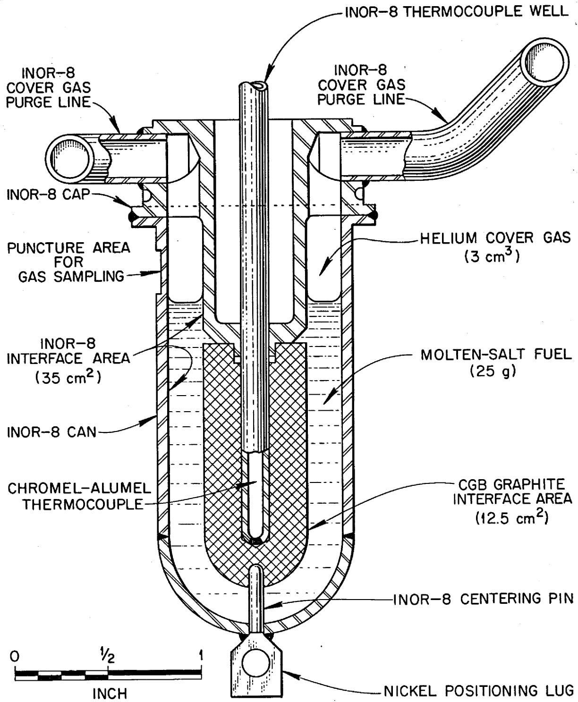  
Fig. 8. Assembly 47-5 purged capsules.

Table 7. Fuel Composition   

<table><tr><td rowspan="2">Fuel</td><td colspan="2">Composition, mol %</td></tr><tr><td>Capsule A</td><td>Capsule B</td></tr><tr><td>LiF</td><td>67.36</td><td>67.19</td></tr><tr><td>BeF2</td><td>27.73</td><td>27.96</td></tr><tr><td>ZrF4</td><td>4.26</td><td>4.51</td></tr><tr><td>UF4</td><td>0.66</td><td>0.34</td></tr><tr><td>Specific gravity at 1200°F</td><td>2.13</td><td></td></tr><tr><td>Liquidus</td><td>842°F</td><td></td></tr><tr><td>Thermal conductivity at 1200°F</td><td>3.21 Btu/hr-ft2·°F/ft</td><td></td></tr><tr><td>Specific heat at 1200°F</td><td>0.455 Btu/1bm·°F</td><td></td></tr></table>

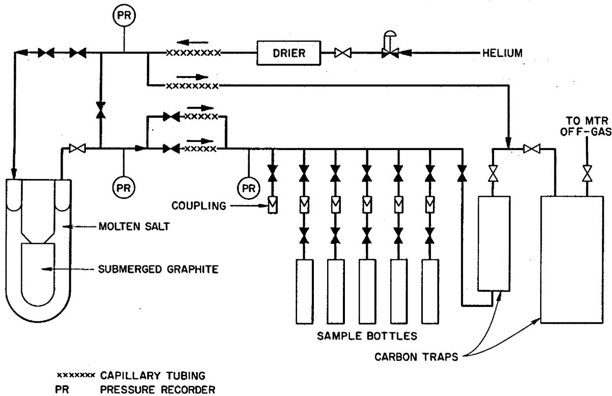  
Fig. 9. ORNL-MTR-47-5 gas collection system.

Unfortunately, this experimental assembly was designed and constructed before the capsules of Assembly 47-4 were opened. Accordingly, the entire complex was designed to handle $\mathrm{CF_4}$ but not $\mathbf{F}_2$ . In the short time between recognition of $\mathbf{F}_2$ in the previous capsules and the insertion of 47-5 into the MTR, a number of materials changes were made to improve the ability to handle fluorine. For example, valves seated with fluorocarbon plastic were substituted for less desirable types in the assembly, and sample bulbs of preconditioned nickel were substituted for the original ones of stainless steel. However, some stainless steel tubing, which could not have been replaced without a complete dismantling and reconstruction operation requiring several months, was retained in the assembly. Short lengths of this tubing, which were welded to the INOR-8 purge tubes within the sodium tank, attained the temperature of the sodium bath. Stainless steel contains $\mathrm{CF_4}$ quite well, but it is not at all resistant to fluorine at elevated temperatures. Accordingly, evolution of $\mathbf{F}_2$ with the assembly at high temperature might have been obscured by reaction of $\mathbf{F}_2$ with the stainless steel. Observations below suggest very strongly that no such effect occurred.

# Behavior Under Irradiation

Assembly MTR-47-5 was carried through five MTR cycles during the four and one-half months ending January 23, 1963. Operating conditions for this assembly were varied as desired throughout the test to include conditions anticipated in different regions of the MSRE. Temperature and power level in Capsules A and B were varied independently over a considerable interval but were, insofar as possible, held constant during periods represented by accumulation of the gas samples. Fuel temperatures during reactor

operation varied from about $190^{\circ}\mathrm{F}$ to $1500^{\circ}\mathrm{F}$ with power levels ranging from 3 watts/cc to 80 watts/cc within the fuel.

Gas samples were taken by isolating the capsule for a known and predetermined interval (6 to 96 hours) and then purging the accumulated gases into the sample bulb. Pressure was carefully monitored (to the nearest 0.1 psi) while the capsule was isolated. A total of 59 gas samples were taken from the two capsules during the first four MTR cycles under five distinct sets of conditions within the capsules. These sets of conditions (and numbers of samples) are:

1. Reactor at full power (40 Mw) with fuel molten, (34),   
2. Reactor at intermediate power (5 to 20 Mw) with fuel frozen, (8),   
3. Reactor shutdown with the fuel at about $90^{\circ}\mathrm{F}$ , (9),   
4. Periods spanning fuel melting at reactor startup, (4), and   
5. Periods spanning freezing of fuel following reactor shutdown (4).

In addition, after termination of the experiment on January 23, the assembly was removed from MTR, the purge lines were capped with valves, and the assembly was quickly shipped to ORNL. Pressure monitoring of Capsules A and B at ambient temperature in the hot cell is under way, and samples of the evolving gas have been analyzed.

# Behavior with Reactor at Full Power

Pressure Monitoring of the capsules with the reactor at $40\mathrm{Mw}$ and the fuel molten has shown no case of perceptible pressure rise. Moreover, none of the 32 gas samples taken during such conditions (over power levels ranging from 3 to $80~\mathrm{W / cc}$ ) have shown evidences of $\mathbf{F}_2$ . [The presence of heated stainless steel in the lines might, as stated earlier, conceivably be responsible.] Analyses of gases collected from Capsules A and B during the first MTR cycle are shown in Tables 8 and 9. These analyses, which are typical of all that have been collected under these conditions, show

Fuel Composition (mole %)

LiF 68.0

BeF2 27.0

$\mathbf{ZrF_4}$ 4.3

$\mathbf{U}\mathbf{F}_4$ 0.7

Fuel Weight 24.822 grams

Graphite Weight 5.696 grams

Table 8. Analysis of Gas Samples from Capsule A, MTR-47-5 During First MTR Cycle   

<table><tr><td rowspan="3">Accumulation Time (hr.)</td><td rowspan="3">Temp. (°F)</td><td rowspan="3">Power Level (W/cc)</td><td colspan="10">Gas Analysis</td></tr><tr><td colspan="7">Percent (by Volume)</td><td colspan="3">Parts per Million</td></tr><tr><td>He</td><td>N2+CO</td><td>O2</td><td>H2O</td><td>A</td><td>CO2</td><td>H2</td><td>Kr</td><td>Xe</td><td>CF4</td></tr><tr><td>29</td><td>1050</td><td>13</td><td>99.2</td><td>0.45</td><td>0.00</td><td>0.04</td><td>0.01</td><td>0.11</td><td>0.15</td><td>24</td><td>95</td><td>&lt;1</td></tr><tr><td>R</td><td>1050</td><td>13</td><td>99.5</td><td>0.31</td><td>0.00</td><td>0.10</td><td>0.00</td><td>0.06</td><td>0.03</td><td>3</td><td>18</td><td>&lt;1</td></tr><tr><td>50</td><td>1248</td><td>33</td><td>96.7</td><td>2.54</td><td>0.03</td><td>0.20</td><td>0.04</td><td>0.40</td><td>0.00</td><td>77</td><td>439</td><td>&lt;1</td></tr><tr><td>24</td><td>1250</td><td>33</td><td>98.0</td><td>1.34</td><td>0.00</td><td>0.22</td><td>0.02</td><td>0.29</td><td>0.05</td><td>39</td><td>248</td><td>&lt;1</td></tr><tr><td>24</td><td>1380</td><td>65</td><td>98.9</td><td>0.40</td><td>0.00</td><td>0.10</td><td></td><td>0.18</td><td>0.34</td><td>71</td><td>405</td><td>0</td></tr><tr><td>96</td><td>1400</td><td>57</td><td>98.5</td><td>0.60</td><td>0.00</td><td>0.05</td><td>0.01</td><td>0.20</td><td>0.44</td><td>222</td><td>1762</td><td>&lt;2</td></tr><tr><td>16.3*</td><td>90</td><td>-</td><td>99.1</td><td>0.63</td><td>0.00</td><td>0.07</td><td>0.01</td><td>0.09</td><td>0.11</td><td>14</td><td>22</td><td>7</td></tr></table>

*Unscheduled Scram: 4 hrs. 17 min. at 33 watts/cc, 12.5 hrs. at zero power.

Fuel Composition (mole %)

LiF 68.0

BeF2 27.0

$\mathbf{ZrF_4}$ 4.65

$\mathbf{U}\mathbf{F}_4$ 0.35

Fuel Weight 25.240 grams

Graphite Weight 5.587 grams

Table 9. Analysis of Gas Samples from Capsule B, MTR-47-5 During First MTR Cycle   

<table><tr><td rowspan="3">Accumulation Time (hr.)</td><td rowspan="3">Temp. (°F)</td><td rowspan="3">Power Level (W/cc)</td><td colspan="10">Gas Analysis</td></tr><tr><td colspan="7">Percent (by Volume)</td><td colspan="3">Parts per Million</td></tr><tr><td>He</td><td>N2+CO</td><td>O2</td><td>H2O</td><td>A</td><td>CO2</td><td>H2</td><td>Kr</td><td>Xe</td><td>CF4</td></tr><tr><td>29</td><td>900</td><td>7</td><td>96.9</td><td>2.18</td><td>0.31</td><td>0.08</td><td>0.03</td><td>0.40</td><td>0.08</td><td>6</td><td>28</td><td>&lt;1</td></tr><tr><td>R</td><td>900</td><td>7</td><td>97.8</td><td>1.70</td><td>0.37</td><td>0.09</td><td>0.02</td><td>0.04</td><td>0.02</td><td></td><td></td><td></td></tr><tr><td>50</td><td>1100</td><td>17</td><td>94.1</td><td>4.65</td><td>0.70</td><td>0.20</td><td>0.06</td><td>0.26</td><td>0.00</td><td>16</td><td>96</td><td>0</td></tr><tr><td>24</td><td>1090</td><td>17</td><td>95.0</td><td>3.91</td><td>0.61</td><td>0.19</td><td>0.05</td><td>0.25</td><td>0.00</td><td>6</td><td>56</td><td>0</td></tr><tr><td>24</td><td>1200</td><td>34.6</td><td>62.5</td><td>29.26</td><td>5.95</td><td>0.27</td><td>0.35</td><td>0.28</td><td>0.14</td><td>10</td><td>140</td><td>0</td></tr><tr><td>96</td><td>1230</td><td>30</td><td>96.7</td><td>2.54</td><td>0.03</td><td>0.20</td><td>0.04</td><td>0.40</td><td>0.00</td><td>77</td><td>439</td><td>&lt;1</td></tr><tr><td>16.3*</td><td>90</td><td>-</td><td>97.1</td><td>2.26</td><td>0.27</td><td>0.09</td><td>0.03</td><td>0.19</td><td>0.00</td><td>4</td><td>36</td><td>0</td></tr></table>

*Unscheduled scram: 4 hrs. 17 min. at 17 watts/cc, 12.5 hrs. at zero power.

considerably more Xe than Kr (the proper ratio is about 6:1) and very little if any $\mathrm{CF}_4$ .

Qualitative spectral analysis of gamma rays penetrating the nickel sample bottles have shown $\mathrm{Xe}^{133}$ to contribute the only detectible peak under these collection conditions.

Behavior with Reactor Shut Down

Capsules A and B operate, by virtue of their differing uranium contents, at power levels which differ by about a two-fold factor (see Tables 8 and 9). At the time of the first long MTR shutdown Capsule A had been fissioning at a rate corresponding to about 15.5 days at 35 w/cc.

Shutdown of the MTR deprived the assembly of heat; the capsules cooled to below the fuel solidus in a few minutes and to $90^{\circ}\mathrm{F}$ within perhaps 90 minutes. Six and one-half hours after shutdown a perceptible pressure increase was observed in Capsule A while some 36 hours elapsed before the increase was observed in Capsule B. Rate of pressure increase decreased with time for both capsules but showed no evidence of reaching equilibrium during the 4-day shutdown. On subsequent shutdowns, Capsule A always showed the pressure increase with its onset 2 to 8 hours after shutdown; Capsule B showed pressure increases only after the first and fourth shutdowns. In all cases Capsule B showed smaller rates of rise than Capsule A.

Gas samples taken during shutdowns when pressure rises were apparent have shown much more radioactivity than those taken when the assembly was at high temperature; spectral analysis of the gamma rays show $\mathrm{Te}^{132}$ and $\mathrm{I}^{132}$ as primarily responsible with $\mathrm{Xe}^{133}$ as a minor contributor.

Handling, transporting, and analyzing of these samples were

complicated by the considerable radioactivity; long waiting periods and some dilution of the samples have been required. Accordingly, $\mathbf{F}_2$ has been observed in only one of the samples for which pressure rise data and the increased radioactivity strongly suggest it should be present. In that sample, however, $5.8\%$ of $\mathbf{F}_2$ and no detectible $\mathbf{CF}_4$ was observed. No $\mathbf{CF}_4$ has been observed in any sample accumulated during a reactor shutdown.

It is of interest, since this information strongly suggests the evolution of $\mathbf{F}_2$ at low temperature by radiolysis of the solid fuel, to compare the shape of the pressure rise curves with the shape of the decay energy release curve for $\beta$ -emitting fission products.

Calorimetric data on fission-product decay energy release were used since energy absorbed, rather than total energy released, was of prime concern. No correction was made for gamma energy absorbed from the in-pile environment. By interpolation between the 1-week and 1-month curves in ANL-4790, the values of $\mathrm{P_s / P_o}$ for 15-l/2 days of pile operation were obtained and plotted vs cooling time. This curve was graphically integrated to obtain the curve of total energy absorbed as a function of cooling time. Multiplication of the ordinate by $\mathbb{P}_0$ (capsule power during irradiation) yields

$$
\int_ {0} ^ {t} P _ {s} d t
$$

the total energy absorbed to a given cooling time, t. In order to check whether the shape of the pressure vs time curve corresponded to the shape of the energy vs time curve, a series of energy release curves were prepared by multiplying the original ordinates by appropriate factors, leaving the time scale unchanged. These scaling curves, the original curve

represented on different energy scales, were then compared with the pressure rise data plotted on the same time scale. Two particular calculated lines fit the pressure rise data very well when the origins of the energy curves were shifted, as shown in Fig. 10. The energy scale used is such that 1 scale unit = 31,500 joules = 1.97 x $10^{17}$ Mev. The ratio of the ordinate of the Capsule B line to that of the Capsule A line is 0.57 at any time, corresponding well to the estimated ratio of $\mathsf{P}_{\circ}^{\prime}$ s for the two capsules (0.5 ± 0.1).

The excellent fit of the pressure points to the energy lines may be partly due to the elements of arbitrariness in selecting energy scales and the positions of the origins. However, a reasonable case may be made for the main assumptions in the treatment given. First, reasonable G values are obtained (see below), justifying the choice of energy scale. Second, the observed induction period before pressure rise suggests that $\mathbf{F}_2$ formed in the early part of the radiolysis is consumed by easily accessible reduced materials in the environment and/or is contained in the crystal up to a certain capacity. These effects would be represented graphically by moving the energy curve origin downward below that of the pressure rise curve. Third, a time delay effect may be operative, as $\mathbf{F}_2$ formed in the fuel crystals at a certain rate diffuses slowly through the crystal and appears later, but at the earlier rate. Graphically this effect would require moving the energy curve origin to the right. Since the best fit was obtained by moving the energy curve origins both downward and to the right, it is suggested that both capacity (or consumption) and time delay effects are operative.

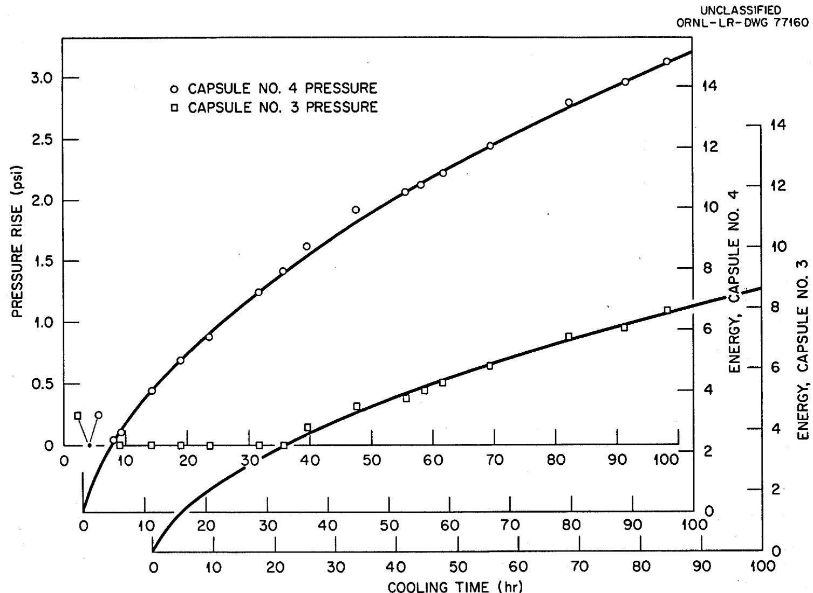  
Fig. 10. Comparison of observed pressure rise in capsules from MTR-47-5 with energy released in fission product decay.

# Behavior at Intermediate Reactor Power Levels

The design of Assembly 47-5 allowed considerable variation of capsule temperature and neutron flux (fission power). However, the adjustment range would not permit maintenance of the fuel below the melting point with the MTR at $40\mathrm{Mw}$ . It was of interest to observe whether intermediate MTR power levels (5 to $20\mathrm{Mw}$ ) with frozen fuel would produce $\mathbf{F}_2$ . Accordingly, such experiments were performed for short time intervals and with the assembly set at the fully retracted position with minimum gas gap. Gas pressure within the capsule was monitored and gas samples were taken for analysis. Data obtained from these experiments are shown in Table 10.

Examination of this data indicates that $\mathbf{F}_2$ generation may have occurred in Capsule A with the MTR at 5 Mw and the salt temperature at about $200^{\circ}\mathrm{F}$ and, perhaps, in Capsule B with the MTR at 20 Mw and the salt at $410^{\circ}\mathrm{F}$ . The fact that the solid salt can withstand such energy releases at these relatively low temperatures seems quite reassuring. Since $\mathbf{F}_2$ generation at $95^{\circ}\mathrm{F}$ (see Section above) occurs with much less energy available, it would appear that the "recombination" phenomenon is most sensitive to temperature.

# Behavior Through Startup and Shutdown

The last entries in Tables 8 and 9 show data for samples taken near the end of the first MTR cycle for a 16.4-hour period which included an unscheduled MTR scram so that the sample collected represents 4 hours 17 minutes at power and 12.5 hours at zero power. The gas in Capsule B seems quite normal. The gas sample from Capsule A is the only one in which a real concentration (7 ppm) of $\mathrm{CF_4}$ has been observed; it may be observed as well that the Xe:Kr ratio appears to be low. However, the

Table 10. Data from 47-5 with MTR at Intermediate Power Levels   

<table><tr><td>Capsule Number</td><td>MTR Power Mw</td><td>Estimated Capsule Power Density w/cc</td><td>Capsule Temp. of F</td><td>Na Batha Temp. of F</td><td>Resultsb</td></tr><tr><td>A</td><td>20</td><td>10</td><td>610</td><td>378</td><td>No pressure rise</td></tr><tr><td>B</td><td>20</td><td>6</td><td>510</td><td>378</td><td>No pressure rise</td></tr><tr><td>A</td><td>10</td><td>5</td><td>312</td><td>200</td><td>ΔP = 0, 0% F2</td></tr><tr><td>B</td><td>10</td><td>3</td><td>285</td><td>200</td><td>ΔP = 0, 0% F2</td></tr><tr><td>A</td><td>15</td><td>7.5</td><td>380</td><td>260</td><td>ΔP = 0, 0% F2</td></tr><tr><td>B</td><td>15</td><td>4.5</td><td>350</td><td>260</td><td>ΔP = 0, 0% F2</td></tr><tr><td>A</td><td>5</td><td>2.5</td><td>199</td><td>122</td><td>ΔP = +0.43 psia c</td></tr><tr><td>B</td><td>5</td><td>1.5</td><td>180</td><td>122</td><td>ΔP = 0</td></tr><tr><td>A</td><td>20</td><td>9</td><td>480</td><td>303</td><td>ΔP = -0.1 psia</td></tr><tr><td>B</td><td>20</td><td>5</td><td>410</td><td>303</td><td>ΔP = +0.2 psia</td></tr></table>

aThe sodium bath temperature is the highest temperature occurring in the stainless steel tubing leading out from the capsules. Tests indicate negligible attack of stainless steel by $1\% \mathbb{F}_2$ at temperatures below $400^{\circ}\mathbb{F}$ .   
bPressure readings, probably accurate to 0.1 psi, were taken during 2 to 3 hr of constant temperature operation.   
The pressure rise occurred over a period of 65 min; for the subsequent 2 hr of the 5-Mw operation there was no further pressure rise.

radioactivity of the gas sample (through the Ni bottle) was low and its activity peaks were not unusual.

Behavior of Capsules After Termination of MTR Exposure

Assembly 41-5 was removed from the MTR and was detached from the manifold system; the purge lines from Capsules A and B were closed off by valves. After transfer to ORNL and removal of the assembly to a hot cell the capsule lines were attached to manifolds. Capsule pressures were measured, samples were taken, and the very radioactive gas was pumped from the capsules into chemical traps. The evacuated capsules were isolated in sections of the manifold containing pressure gauges and were allowed to stand at ambient temperature $(70^{\mathrm{O}}\mathrm{F})$ . Generation of gas was immediately apparent in both capsules; pressure increases from Capsule A were larger than those from Capsule B. Rate of generation decreased appreciably during the first 72 hours but seemed nearly linear thereafter. Analysis of the gas shows it to contain high concentrations of $\mathbf{F}_2$ with considerable concentrations of $\mathbf{O}_2$ (but little $\mathbf{N}_2$ ) suggesting that air in-leakage is small but that reaction of $\mathbf{F}_2$ with oxide films on the apparatus is still appreciable. Small quantities of $\mathbf{CO}_2$ , $\mathbf{COF}_2$ , and $\mathbf{OF}_2$ are also observed, but virtually no $\mathbf{CF}_4$ is found. The capsules are still under observation, and a series of experiments to ascertain the effect of temperature on the rate of $\mathbf{F}_2$ generation is beginning.

The quantity of $\mathbf{F}_2$ generated from Capsule A since the start of experiments at ORNL is estimated (February 12) to exceed $160~\mathrm{cm}^3$ (STP). This quantity plus that previously removed in samples, purges, etc. during reactor shutdowns, now approaches the quantities observed in the most highly irradiated capsules from MTR-4.

None of the capsules from MTR-5 have yet been opened for examination; at present, it is expected that another 40 to 60 days will elapse before examination begins. Meanwhile, $\mathbf{F}_2$ generation from Capsules A and B will be examined as a function of temperature.

# Conclusions

All data from Assembly MTR-47-5 indicate that neither $\mathbf{F}_2$ nor appreciable concentrations of $\mathrm{CF_4}$ are generated when fission occurs in the molten salt. It can be stated with certainty that $\mathbf{F}_2$ is released from the irradiated salt on standing at temperatures below $100^{\circ}\mathrm{F}$ ; the analyses show, however, that little, if any, $\mathrm{CF_4}$ is released from such samples. Generation of $\mathbf{F}_2$ is apparent at these low temperatures only after an appreciable time. This time delay does not seem to depend entirely on extent of irradiation; in Capsule B it clearly exceeded 100 hours on both the second and third MTR shutdown but was only 36 hours in the first shutdown.

No auxiliary evidence, such as pressure rises, Xe:Kr ratios, or radioactivity of the sampled gas, suggests difficulty when the salt is at power. All of these phenomena, however, are observed when the irradiated salt is maintained at low temperatures.

Behavior when the salt is frozen but fission is occurring is less clearly defined since few data are available. It appears, however, that no gas generation occurs when the salt is above $400^{\circ}\mathrm{F}$ . Out-of-pile studies indicate that $\mathbf{F}_2$ deliberately added to specimens of reduced (fluorine deficient) fuel reacts rapidly at temperatures well below the melting point of the salt. It seems very likely that "recombination" processes are sufficiently rapid at temperatures above $350^{\circ}\mathrm{C}$ to prevent any loss of $\mathbf{F}_2$ from the salt.

The virtual nonappearance of $\mathrm{CF}_4$ at any of the conditions experienced in MTR-5 is most encouraging. It may suggest that the $\mathrm{CF}_4$ found in previous capsules from MTR-3 and MTR-4 arose in the following manner: $\mathbf{F}_2$ was generated in those capsules during some or all of the MTR shutdown periods; this $\mathbf{F}_2$ was not removed from the sealed capsules and on subsequent heatup by reactor power it reacted indiscriminantly with the fuel, the metal, and the graphite. The $\mathrm{CF}_4$ formed was partially retained and was observed at termination of the test.

The complex events taking place in the experiments summarized here are not understood in detail. It cannot, for example, be demonstrated with certainty that the graphite is without influence on the phenomena observed. It is, however, apparent that the generation of $\mathbf{F}_2$ is a low temperature process occurring only under circumstances of relatively little importance to the MSRE and that generation of $\mathrm{CF_4}$ occurs to a negligible extent, if at all, at MSRE temperatures and power levels.

Additional effort will be required to evaluate possible difficulties in the frozen flange and the freeze plug concepts. Such studies are under way. It seems clear, however, that the phenomena of $\mathrm{CF_4}$ and $\mathbf{F}_2$ generation should not have important effect on the operation of the MSRE.

# References

1. "MSRP Semiann. Prog. Rep. Feb. 28, 1961," ORNL-3122, p. 108.   
2. "MSRP Semiann. Prog. Rep. Feb. 28, 1962," ORNL-3282, p. 97.   
3. "Reactor Chem. Div. Ann. Prog. Rep. Jan. 31, 1962," ORNL-3262, p. 19.   
4. "MSRP Semiann. Prog. Rep. Aug. 31, 1962," ORNL-3369, p. 105.   
5. S. Untermeyer and J. T. Weills, Heat Generation in Irradiated Uranium, ANL-4790 (Feb. 25, 1952).

# Internal Distribution

1. R.G. Affel   
2. L. G. Alexander   
3. S. E. Beall   
4. E. S. Bettis   
5. D. S. Billington   
6. F. F. Blankenship   
7. R. Blumberg   
8. E. G. Bohlmann   
9. C. J. Borkowski   
10. G. E. Boyd   
1. R.B.Briggs   
2. F. R. Bruce   
3. J.A. Conlin   
4. W.H.Cook   
5. J. L. Crowley   
6. S.J. Ditto   
7. J. R. Engel   
8. E. P. Epler   
9. W. K. Ergen   
20. R. B. Gallaher   
11. W.R.Grimes   
22. A. G. Grindell   
23. R. H. Guymon   
24. P. H. Harley   
25. P. N. Haubenreich   
6. E. C. Hise   
7. P.P.Holz   
28. J.P.Jarvis   
29. R.J.Kedl   
O. E.M. King   
1. S. S. Kirslis   
2. J. W. Krewson   
3. R. B. Lindauer   
4. R. N. Lyon   
5. H. G. MacPherson   
6. W. B. McDonald   
7. H. F. McDuffie   
8. C. K. McGlothlan   
9. W.R.Mixon   
O. R. L. Moore   
1. A. R. Olsen   
2. H. R. Payne

43. J. L. Redford   
44. M. Richardson   
45. R. C. Robertson   
46. J. E. Savolainen   
47. D. Scott   
48. C. H. Secoy   
49. J.H.Shaffer   
50. M. J. Skinner   
51. A. N. Smith   
52. P. G. Smith   
53. I. Spiewak   
54. J. A. Swartout   
55. A. Taboada   
56. J. R. Tallackson   
57. R.E.Thoma   
58. D. B. Trauger   
59. W.C.Ulrich   
60. G.M. Watson   
61. A. M. Weinberg   
62. B. H. Webster   
63. J. C. White

64-65. Central Research Library   
66-67. Document Reference Section   
68-70. Laboratory Records   
71. Laboratory Records (LRD-RC)   
72-73. Reactor Division Library

# External

74-75. D. F. Cope, Reactor Division AEC, ORO   
76. A. W. Larson, Reactor Division, AEC, ORO   
77-82. H. M. Roth, Division of Research and Development, AEC, ORO   
83. W. L. Smalley, Reactor Division, AEC, ORO   
84. J. Wett, AEC, Washington   
85-98. DTIE