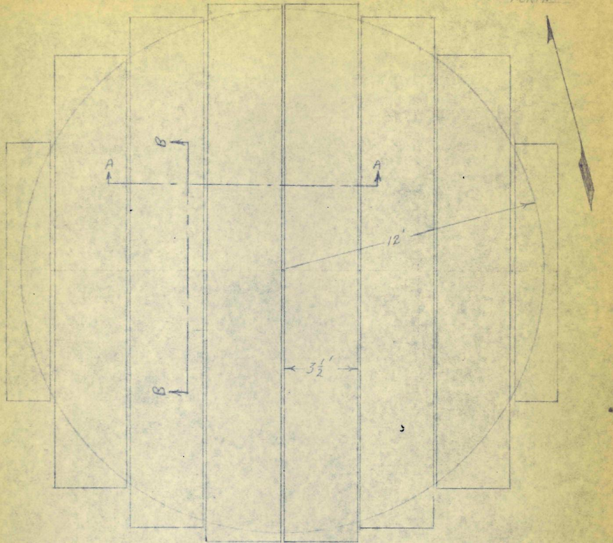
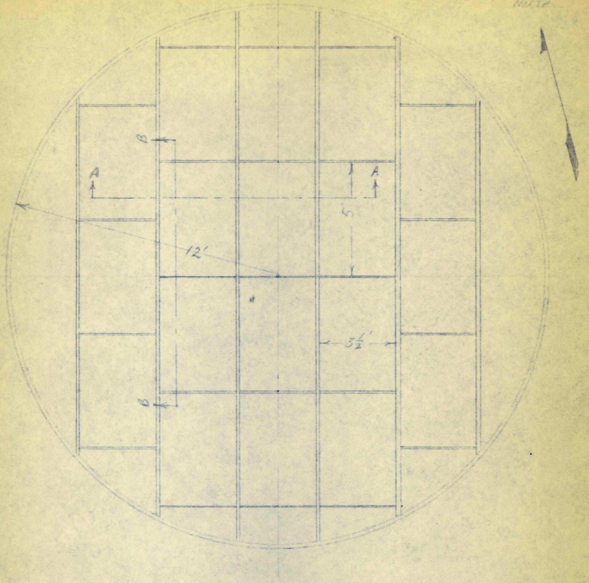
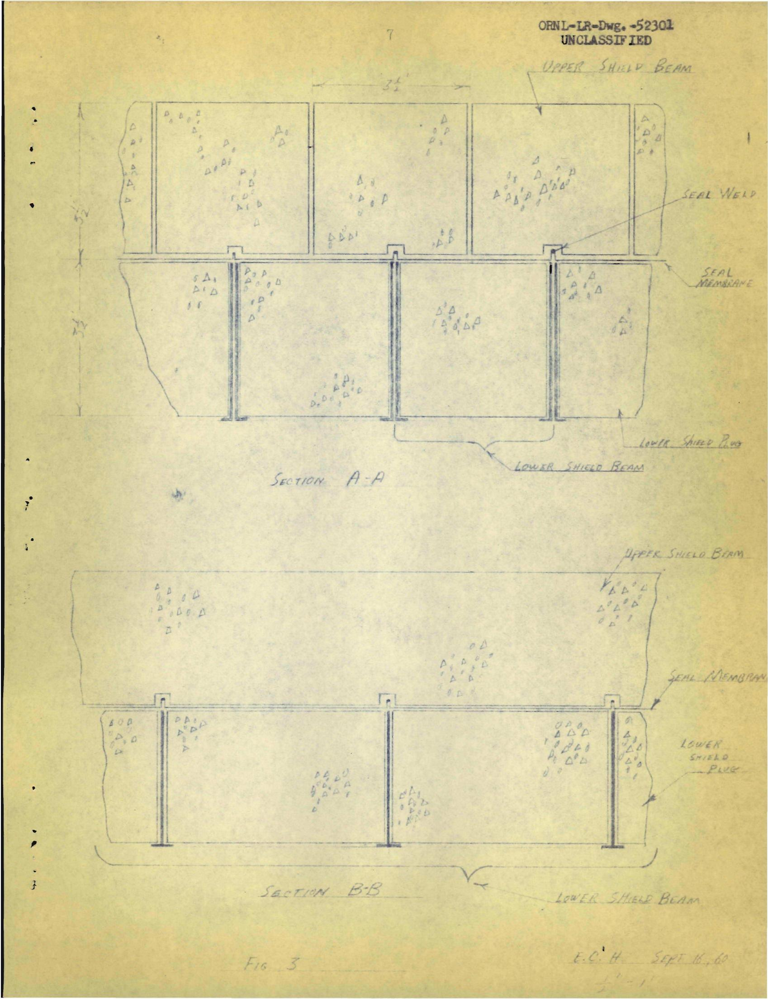
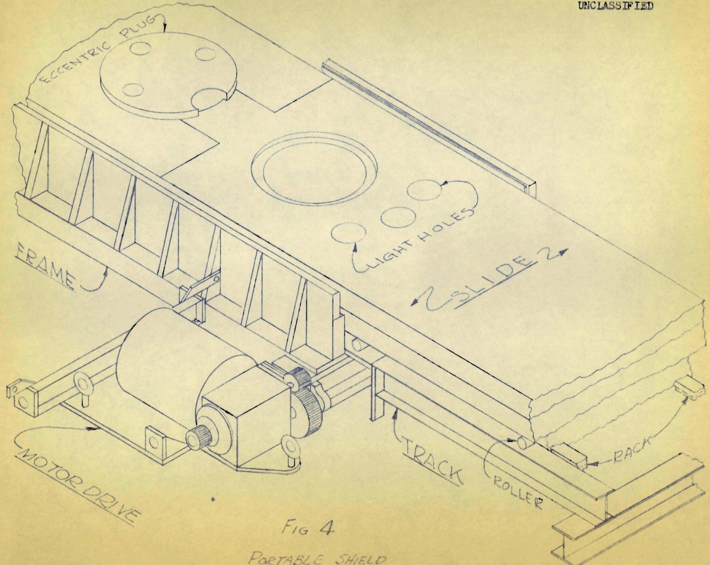

# U.S. ATOMIC ENERGY COMMISSION

ORNL-TM-519

COPY NO. -

DATE - March 14, 1963

# MSRE MAINTENANCE PROPOSAL

E. C. Hise

# ABSTRACT

It is proposed that the MSRE primary circuit, cell, and shielding and containment be so designed as to be adaptable to semi-direct maintenance for certain suitable operations.

The requirements for and features of semi-direct maintenance are given. A tentative procedure for replacement of the special graphite bars by semi-direct means is given.

# NOTICE

This document contains information of a preliminary nature and was prepared primarily for internal use at the Oak Ridge National Laboratory. It is subject to revision or correction and therefore does not represent a final report. The information is not to be abstracted, reprinted or otherwise given public dissemination without the approval of the ORNL patent branch, Legal and Information Control Department.

# LEGAL NOTICE

This report was prepared as an account of Government sponsored work. Neither the United States, nor the Commission, nor any person acting on behalf of the Commission:

A. Makes any warranty or representation, expressed or implied, with respect to the accuracy, completeness, or usefulness of the information contained in this report, or that the use of any information, apparatus, method, or process disclosed in this report may not infringe privately owned rights; or   
B. Assumes any liabilities with respect to the use of, or for damages resulting from the use of any information, apparatus, method, or process disclosed in this report.

As used in the above, "person acting on behalf of the Commission" includes any employee or contractor of the Commission, or employee of such contractor, to the extent that such employee or contractor of the Commission, or employee of such contractor prepares, disseminates, or provides access to, any information pursuant to his employment or contract with the Commission, or his employment with such contractor.

It is proposed that a semi-direct maintenance system be incorporated in the MSRE design as a parallel to the remote system. The dual method would provide the operator a choice of system to be used depending upon the magnitude and type of work to be performed and would provide the safety factor of a "spare."

Many small operations, such as visual inspections, retightening bolts, replacing heaters, checking auxiliary system leaks, and changing over to spare auxiliary connections of various kinds are well suited to the semi-direct system. Several major operations, such as the removal and replacement of the pump motor, the pump rotary element, and the special core graphite bars, appear to be amenable to semi-direct work. Other major operations, such as the removal and replacement of the heat exchanger and core vessel, would perhaps be best done by a combination of the methods whereby the disconnections will be done and the component prepared for lifting by semi-direct means and the operation completed by remote means.

The general design requirements to enable semi-direct maintenance are:

A modular seal membrane (Fig. 2) which could be removed either as a unit or in modules.

A modular lower shield (Fig. 2) which could be removed either as beams or in modules.

Arrangement of the modular shield with respect to reactor components to provide maximum accessibility.

Arrangement of auxiliary piping and wiring in a few cases to permit lateral movement of a component in a specific direction within the cell.

The additional equipment required would be:

A portable work shield (Fig. 4) consisting of horizontal steel or lead slides roller mounted on tracks and motor driven for remote opening and closing. The slides would have vertical holes for windows, viewing devices, lights, and tools. The holes would be filled with plugs when not in use. It would cover the opening left by the removal of one lower shield module.

One or several small shield windows to fit the holes.

A suitable periscope

Simple tools such as long handled wrenches and hooks. Many of these would be fabricated as needed.

A generalized but entirely feasible procedure for the removal and replacement of the special graphite bars is presented to illustrate the semi-direct system. All operations described are with personnel in Zone II and on the cell shield except where marked with an \*.

1. Remove the upper shield beams (probably two) necessary to uncover the appropriate seal membrane module.

2. Cut the seal weld and remove the membrane module.

3. Place the portable shield assembly over the modular shield plug to be removed. Open the slides so as to clear the plug. Attach the crane to the plug.

$^{*4}$ . Raise the shield plug and close the slides.

5. Install windows and lights in the portable shield.

6. Insert the appropriate tools and, with direct vision through the windows or periscope if necessary, disconnect the pump power and instrument leads and the service piping. Remove the rotary element hold down bolts. Withdraw the tools. These can be pulled into plastic bags if necessary.

7. Center the crane with special hook fixture over the motor lift bail.

*8. Open the portable shield slides, lower the hook fixture through the shield, and close the slides.

9. By direct observation, attach the crane to the lift bail. Raise the rotary element approximately 2 l/2 ft to clear the fixed pump housing. The rotary element will still be well below the bottom of the portable shield.

10. Using the movable slide, crane, and direct vision, transport the rotary element to a preplaced hook within the cell, hang up the rotary element, and disengage the crane hook.

*11. Open the slides, remove the hook, and close the slides.

12. Place a shielded carrier with open top and bottom through the portable shield over the pump bowl. Insert the graphite removal tool through the carrier and latch it onto a graphite bar. Withdraw the bar into the carrier and close the bottom door. Unlatch the tool, withdraw it from the carrier, and park it in the cell. Close the top door of the carrier, withdraw the carrier into a plastic bag, and withdraw the shielded and contained bar from the cell. Repeat for each bar to be removed. Alternatively, it may be more desirable to have one carrier accommodate all five graphite bars.

13. At this time, if it is desirable, viewing devices can be placed in the core vessel and the upper and lower plenums, etc. examined.

14. Attach each replacement bar in turn to the insertion tool and place in reactor.

15. Reassemble the reactor and shield with the reverse of steps 1-ll above.

A recapitulation of the features of the semi-direct system follows:

1. Access to the primary system for a specific operation requires the removal of two upper shield beams, one membrane module, and one lower shield module, and the placement of the portable shield.

2. The required air flow is that to maintain a down draft through the small openings in and around the portable shield and thereby prevent airborne contamination.   
3. Direct vision or optical aids may be used at all times.   
4. Multiple "hands" may be used simultaneously.   
5. "Feel" is retained by the operator.   
6. Access to Zone II is assured during almost all of the operation.   
7. Maintenance equipment failure is easily remedied with the possible exception of the coincidental failure of the crane while transporting an unshielded, radioactive item in Zone II which is a difficult problem regardless of method.   
8. Special or replacement tooling can usually be fabricated quickly since much of it will be standard wrenches or hand tools with long handles attached.   
9. Proper control of air flow and of all items removed from the cell will prevent contamination of Zone II.   
10. Clean up after an operation requires the replacement of the lower shield module, removal of the portable shield, rewelding the membrane module, and replacing the upper beams.

Figure 1 shows the upper shield in 3 l/2 ft wide beams. The division of the upper shield into beams of approximately this width is dictated by the capacity of the building crane. The reinforcement and fastening of these beams would be the same as in the presently contemplated design.

Figure 2 shows the modules for both the seal membrane and the lower shield. In the case of the seal membrane, the circumferential weld can be cut permitting the membrane to be removed as a unit or the peripheral weld of any $31/2$ ft x 5 ft module can be cut and the module removed.

In the case of the lower shield each 3 l/2 ft wide beam may be removed as a unit or any of the 3 l/2 ft x 5 ft modules may be removed individually.

Figure 3 shows how the seal membrane modules are welded together and how clearance for the seal weld lip is provided in the upper shield beams.

The steel structure that supports and ties together the lower shield modules into a beam is shown.

Figure 4 is borrowed but illustrates the principle of a portable shield having movable slides and access holes.

BURETING NORTH

BSSBRE ARRANGEMENT FOR UPPER SHIELD BEAMS - MSRE

$E.C.H.{S}_{\text{opt }}{16},{50}$

PossibleARRANGEMENT FOR MOORF SEAL MEMBER AND LOWER SHIPE

F1s 2

E. H. Septrn 160

${1}^{ \circ  }{1}^{\prime }$

ORNL-IR-Dwg.52302

UNCLASSIFIED

9

# Distribution

1-3. DTIE, AEC

4. M. J. Skinner