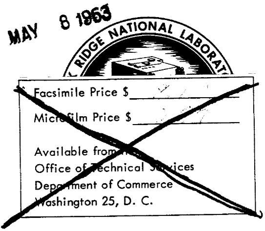

# OAK RIDGE NATIONAL LABORATORY

operated by

UNION CARBIDE CORPORATION

for the

UNION

CARBIDE

# U.S. ATOMIC ENERGY COMMISSION

MASTEK

ORNL-TM-522

COPY NO. - 65

DATE - October 10, 1962

DESIGN STUDIES AND COST ESTIMATES OF TWO FLUORIDE VOLATILITY PLANTS

W. L. Carter, R. P. Milford, and W. G. Stockdale

# ABSTRACT

Design studies and cost estimates were made for two on-site, fluoride volatility processing plants. Each plant was assumed to be processing continuously irradiated LiF-BeF $_2$ -ThF $_4$ -UF $_4$ fuel from a one-region Molten Salt Converter Reactor (MSCR) capable of producing 1000 Mwe (ca. 2500 Mwt). One plant processed fuel at a rate of 1.2 ft $^3$ /day, the second at 12 ft $^3$ /day. The smaller plant was designed and cost estimated for two processing conditions: (1) retention of the waste salt for Pa-233 decay and recovery by a second fluorination, and (2) discard of all Pa-233 as waste after the first fluorination. The larger plant was considered only for the case of Pa-233 decay and recovery. The following capital and direct operating charges were estimated:

Capital Cost ($)

Operating Cost (\$/yr)

1.2 ft $^3$ /day Plant with Pa-233 Recovery

12,556,000

1,103,000

12 ft $^3$ /day Plant with Pa-233 Recovery

25,750,000

2,241,000

1.2 ft³/day Plant with Pa-233 Discard

10,188,000

The chemical processing scheme consisted of volatilizing uranium as $\mathrm{UF_6}$ by treating the molten salt with elemental fluorine at about $550^{\circ}\mathrm{C}$ . The hexa-fluoride was then collected by absorption on NaF and condensation in cold traps, reduced to $\mathrm{UF_4}$ in a $\mathrm{H_2 - F_2}$ flame, dissolved in make-up salt, and recycled to the reactor. Make-up fuel was supplied by purchasing fully enriched U-235. The Li, Be and Th components of the fuel were discarded with fission product waste.

# NOTICE

This document contains information of a preliminary nature and was prepared primarily for internal use at the Oak Ridge National Laboratory. It is subject to revision or correction and therefore does not represent a final report. The information is not to be abstracted, reprinted or otherwise given public dissemination without the approval of the ORNL patent branch, Legal and Information Control Department.

# LEGAL NOTICE

This report was prepared as an account of Government sponsored work. Neither the United States, nor the Commission, nor any person acting on behalf of the Commission:

A. Makes any warranty or representation, expressed or implied, with respect to the accuracy, completeness, or usefulness of the information contained in this report, or that the use of any information, apparatus, method, or process disclosed in this report may not infringe privately owned rights; or   
B. Assumes any liabilities with respect to the use of, or for damages resulting from the use of any information, apparatus, method, or process disclosed in this report. As used in the above, "person acting on behalf of the Commission" includes any employee or contractor of the Commission, or employee of such contractor, to the extent that such employee or contractor of the Commission, or employee of such contractor prepares, disseminates, or provides access to, any information pursuant to his employment or contract with the Commission, or his employment with such contractor.

# CONTENTS

# Page

# ABSTRACT

# 1.0 SUMMARY

# 2.0 INTRODUCTION

2.1 Reactor Description   
2.2 Design Bases

# 3.0 PROCESSING MOLTEN FLUORIDE SALTS

3.1 Pre-Fluorination Storage   
3.2 Fluorination   
3.3 Waste Storage   
3.4 NaF Absorption   
3.5 Cold Trap   
3.6 Reduction and Fuel Make-up

# 4.0 PROCESSING PLANT DESIGN

4.1 Decay Heat Removal   
4.2 Equipment Design Prefluorination Storage Tanks

Fluorinator

CRP Trap and Absorbers

Cold Traps

Reduction Reactor

Fuel Make-up

Pa-233 Decay Storage System

Interim Waste Storage Tanks

Freeze Valves

Line Heating

Samplers

Refrigeration

4.3 Shielding Calculations

Source Strength

Geometry

4.4 Process Equipment Layout   
4.5 Plant Layout   
Site Location

1

3

9

9

10

11

11

4

45

45

6

17

17

17

23

23

29

31

32

37

37

37

38

38

38

38

38

41

41

42

46

46

47

# CONTENTS - contd

# 4.5 Over-all Plant Layout

Processing Area

Pa-233 Decay Storage

Waste Storage

Crane Maintenance Area

Contaminated Equipment Storage

Decontamination Cell

Canyon Shop

Railroad Dock

Control Room

Sample Gallery

Laboratories

Offices

Service Areas

# 5.0 CAPITAL COST ESTIMATE

5.1 Accounting Procedure

5.2 Bases of Estimates

Process Equipment

Building

5.3 Process Equipment Capital Cost   
5.4 Building Capital Cost   
5.5 Total Capital Cost

# 6.0 OPERATING COST ESTIMATE

6.1 Operating Manpower   
6.2 Summary of Direct Operating Costs

# 7.0 CAPITAL COST ESTIMATE OF MODIFIED

1.2 FT3/DAY PLANT

7.1 Modifications   
7.2 Process Equipment   
7.3 Waste Storage   
7.4 Process Building   
7.5 Total Plant Cost   
7.6 Economic Advantage

# Page

47

47

48

48

48

49

49

49

49

49

49

50

50

50

50

50

51

51

52

52

56

56

60

60

60

61

61

65

65

66

60

7

# 1.0 SUMMARY

Capital cost and operating cost estimates have been prepared for two on-site fluoride volatility processing plants. The respective plants are designed to treat 1.2 and 12 ft $^3$ /day of an irradiated LiF-BeF $_2$ -ThF $_4$ -UF $_2$ fuel from a Molten Salt Converter Reactor (MSCR) which has a conversion ratio of about 0.8. The uranium-free fuel has the composition 68-23-9 mole % LiF-BeF $_2$ -ThF $_4$ ; approximately 0.66 mole % UF $_4$ is required for criticality in the equilibrium reactor.

The assumed reactor and chemical processing plant environment is a 1000 Mwe (ca. 2500 Mwt) central power station. This power is generated in a single reactor which is 15 ft in diameter by 15 ft high. The one-region system is 90 vol % graphite and 10 vol % fuel contained in an INOR-8 shell. Heat is removed by circulating the molten fuel salt through the core and external heat exchangers at an average temperature of approximately $1200^{\circ}\mathrm{F}$ . Spent fuel is removed semi-continuously every 3-5 days for reprocessing; make-up fuel $(\mathrm{U} - 235 + \mathrm{Th})$ is added on the same schedule. Total fuel volume is $1780\mathrm{ft}^3$ .

The chemical reprocessing plant utilizes fluoride volatility to recover decontaminated uranium. Neither thorium nor the carrier salt $(\mathrm{LiF} + \mathrm{BeF}_2)$ is recovered; both are discarded as waste with the accompanying fission products. In one phase of this study the waste salt was retained 135-175 days to allow Pa-233 decay and recovery by a second fluorination. In a second phase of this study protactinium was discarded with the waste salt immediately after fluorination. After fluorination, all of the recovered UF $_6$ is burned in a H $_2$ -F $_2$ flame for reduction to UF $_4$ which is dissolved in make-up LiF-BeF $_2$ -ThF $_4$ and returned to the reactor. Make-up uranium (U-235) is also added at this point.

The accuracy and confidence level of any cost estimate depends upon the amount of design detail. In this study all of the process operations were considered in enough detail for preliminary designs of vessels and equipment; complex vessels were considered more carefully to permit more reliable cost estimation. The process building was laid out for convenience of process operations and maintenance and was patterned after designs of other remotely operated plants1 that are the products of several

years experience and study. Cognizance was taken of the fact that the reactor and chemical plant are an integral operation and can share certain facilities.

The treatment of protactinium in this study was made in the two ways mentioned above to determine if there were sufficient value in the protactinium to justify its recovery from the waste. The capital cost of the 1.2 ft $^3$ /day plant was estimated for the cases of complete Pa-233 discard and for Pa retention until the undecayed Pa amounted to only $0.1\%$ of the bred uranium. The economics favored complete Pa discard since considerable process equipment and building space were required for this "dead" storage. A more complete evaluation of the process might reveal that more favorable economics result from a nominal extension of the prefluorination storage period allowing more Pa-233 decay at this point. Increased process equipment, building and inventory charges would have to be compared with the value of additional Pa recovery. This latter analysis was not made in this study.

The estimated capital costs of the two fluoride volatility plants are $12,556,000 and$ 25,750,000, respectively, for the 1.2 ft $^3$ /day and 12 ft $^3$ /day plants for the case in which the waste is retained for Pa-233 decay and recovery. For the case of complete Pa-233 discard, a capital cost of $10,188,000 was estimated for the 1.2 ft $^3$ /day plant. A summary of the cost data is given in Table 1.1, and these same data are plotted in Fig. 1.1. In drawing the curve, it is assumed that the cost data can be represented by a straight line on a log-log plot. The slope of this curve is 0.312 which may be compared with a value of 0.6 that is customarily associated with a capital cost vs capacity curve for a chemical plant. The lower value for the slope suggests that more favorable reprocessing economics will be realized with large processing plants.

Direct operating costs for each of the plants employing Pa recovery were calculated and are summarized in Table 1.2. The labor charges correspond to 104 employees for the 1.2 ft $^3$ /day plant and 133 for the 12 ft $^3$ /day plant. It is of interest to note the relationship between operating and capital costs for each of the plants. When the operating cost is divided by the corresponding capital investment, the operating charge rate becomes 8.77%/year and 8.61%/year for the 1.2 and 12 ft $^3$ /day capacities,

respectively. These charges may be compared to a value of $15\%$ /year that has been found to be generally applicable in the chemical industry.

In the analysis of the 1.2 ft³/day plant employing Pa-233 discard, the on-site, interim waste storage time was optimized. The optimization was carried out by considering on-site storage costs versus salt mine permanent storage costs as a function of the age of the waste salt. The lowest total storage cost appeared to occur for an on-site holdup of about 1100 days before shipping to permanent storage.

Table l.l. Summary of Capital Costs for On-Site, Fluoride Volatility Plants   

<table><tr><td></td><td>1.2 ft3/Day Plant with Pa-233 Recovery</td><td>12 ft3/Day Plant with Pa-233 Recovery</td><td>1.2 ft3/Day Plant with Pa-233 Discard</td></tr><tr><td>Total Installed Equipment and Building Cost</td><td>7,458,100</td><td>15,294,700</td><td>6,052,000</td></tr><tr><td>General Construction Overhead (22% of Total Installed Equipment and Building Cost)</td><td>1,640,800</td><td>3,364,800</td><td>1,331,000</td></tr><tr><td>Total Construction Cost</td><td>9,098,900</td><td>18,659,500</td><td>7,383,000</td></tr><tr><td>Architect Engineering and Inspection (15% of Total Construction Cost)</td><td>1,364,800</td><td>2,798,900</td><td>1,107,000</td></tr><tr><td>Subtotal Project Cost</td><td>10,463,700</td><td>21,458,400</td><td>8,490,000</td></tr><tr><td>Contingency (20% of Subtotal Project Cost)</td><td>2,092,300</td><td>4,291,300</td><td>1,698,000</td></tr><tr><td>Total Project Cost</td><td>12,556,000</td><td>25,750,000</td><td>10,188,000</td></tr></table>

Table 1.2. Summary of Direct Operating Costs for Two Fluoride Volatility Plants   

<table><tr><td></td><td colspan="2">Cost ($/year)</td></tr><tr><td></td><td>1.2 ft3/day</td><td>12 ft3/day</td></tr><tr><td>Chemical Consumption</td><td>10,340</td><td>68,950</td></tr><tr><td>Utilities</td><td>34,930</td><td>185,500</td></tr><tr><td>Labor</td><td>757,200</td><td>900,300</td></tr><tr><td>Maintenance Materials</td><td>300,100</td><td>1,085,800</td></tr><tr><td>Total Direct Operating Cost</td><td>1,102,600</td><td>2,240,600</td></tr><tr><td>Ratio of Operating Cost: 
Capital Cost</td><td>8.77 %/yr</td><td>8.61 %/yr</td></tr></table>

UNCLASSIFIED

ORNL-LR-DWG74109

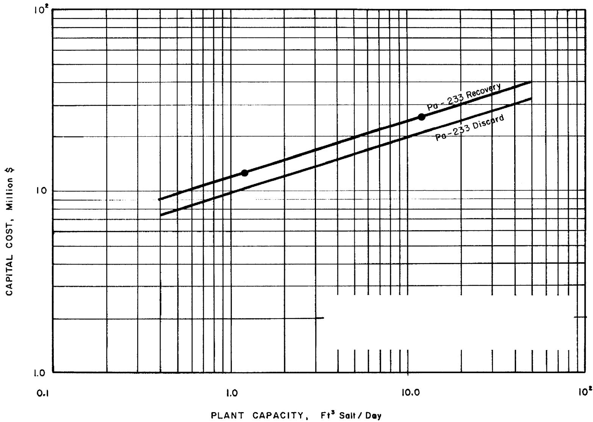  
Fig. 1.1 Fluoride Volatility Processing Plant Cost for an On-Site Facility to Process MSCR Fuel.

# 2.0 INTRODUCTION

The utilization of thorium as a reactor fuel is being investigated in several reactor systems which show promise of having a breeding ratio greater than unity or at least a high conversion ratio, that is, a conversion ratio greater than about 0.5. This report covers that portion of a study concerned with processing spent molten fluoride salt from a one-region, converter reactor for recovery of decontaminated uranium. It is the purpose of this study to develop capital cost data for fluoride volatility processing plants capable of processing 1.2 and 12 ft³/day of molten fluoride fuel.

# 2.1 Reactor Description

The reactor for which the chemical plant has been designed is fueled with a molten salt mixture that is basically 68-23-9 mole % LiF-BeF $_2$ -ThF $_4$ containing sufficient UF $_4$ , ca. 0.66 mole %, to maintain criticality. The reactor is a one-region assembly whose core has the approximate composition of 10 vol % fuel solution and 90 vol % graphite; the geometry is a right circular cylinder about 15 ft diameter by 15 ft high. Fission energy is removed by circulating the fuel solution through the core and an intermediate heat exchanger which is cooled by a barren salt solution. The barren salt in turn dissipates the heat in a steam generator which produces $1000^{\circ}\mathrm{F}$ steam at 2000 psia. The average reactor temperature is $1200^{\circ}\mathrm{F}$ .

The assumed environment for the reactor is that of a central, power-producing facility generating 1000 Mwe at a thermodynamic efficiency of approximately $42.3\%$ . This load is committed to one reactor supplying steam to two turbo-generator sets. The calculated fuel volume for the station is $1780 \, \text{ft}^3$ . The total uranium inventory, which includes all isotopes from U-233 to U-238, is about $4200 \, \text{kg}$ ; of this total the fissionable component, U-233 + U-235, is in the range 2627 to 2815 kg depending upon the processing rate. In addition the system contains 52,000 kg Th and 90.7-96 kg Pa-233. For this study it was assumed that the system had a nominal conversion ratio of 0.8, the remainder of the fuel being supplied by purchase of fully enriched U-235.

# 2.2 Design Bases

In any study of this type the accuracy and confidence level of the results depends upon the amount of design detail. More or less arbitrary design bases were established to govern the extent of the study and to augment those design conditions which were more firmly established. In this respect the following rules were followed:

1. The chemical processing plant and reactor power station would be an integrated facility; i.e., on-site processing.   
2. The design would be based as much as possible on existing technology; extrapolation of technology would be done only when absolutely necessary.   
3. A cost estimate would be made for each of two plants--one processing fuel at a rate corresponding to an estimated optimum reactor cycle time, and a second processing fuel at an estimated minimum reactor cycle time. These two estimates would then be used to determine processing costs at other processing rates by interpolation or extrapolation. In doing this it would be assumed that the capital cost versus throughput data could be represented by a straight line on a log-log plot. For this study the processing rates were 1.2 and 12 ft³/day of fuel containing respectively 2.83 and 28.3 kg U/day.   
4. The fluoride volatility process would be used to recover uranium which would be returned in to the reactor. No thorium or LiF-BeF₂ carrier salt would be recovered but would be discarded as waste with the accompanying fission products. This was a necessary decision because no developed process exists for separating LiF-BeF₂-ThF₄ salt from fission products.   
5. The waste salt, which contains Pa-233, would be held for Pa decay and recovery until the undecayed Pa amounted to only about $0.1\%$ of the bred U-233. After the second fluorination, waste salt would be held 1000 days for fission product decay before transport to permanent waste storage. (See Section 7.0 for a modification of this basis.)

6. The chemical processing plant would share certain facilities with the reactor plant; e.g., cooling water, potable water, stack, electrical services, steam, compressed air, storm and sanitary sewers, railroad and barge docks, shipping and receiving facilities, etc. These services were assumed available from the reactor site. The chemical plant bore the cost of extending the services and, in the case of the stack, bore the cost of increasing the stack size.

7. The extent of the design would be that which completely defined the process to the point of having a preliminary design on all major process equipment. Building and auxiliary service space would be determined in the light of biological shield requirements and accepted operating practices for a remotely maintained radiochemical plant. In this regard experience and studies1,2 on the Savannah River type plant were referred to for design of several areas of the building.

# 3.0 PROCESSING MOLTEN FLUORIDE SALTS

The fluoride volatility plant for processing the irradiated fuel is assumed to be located adjacent to the reactor area so that fuel transfer can be made by appropriately heated pipe lines. Inside the chemical plant the process operations are carried out according to the flowsheets of Figs. 3.1 and 3.2 for the 1.2 and 12 ft³/day plants, respectively. The two flowsheets are quite similar and incorporate the same process steps. There are slight differences, however, brought about by the quantity of fuel handled and size of process equipment, for example, in preflorination storage and Pa-233 decay storage.

The fuel solution is a rather complex mixture of molten fluoride salts of fertile, fissionable, and fission product nuclides. The major components are LiF, BeF $_2$ , ThF $_4$ , UF $_4$ , and PaF $_4$ .

# 3.1 Prefluorination Storage

Extremely radioactive fuel solution, which will be only a few minutes old, must be allowed to decay before fluorination to preclude

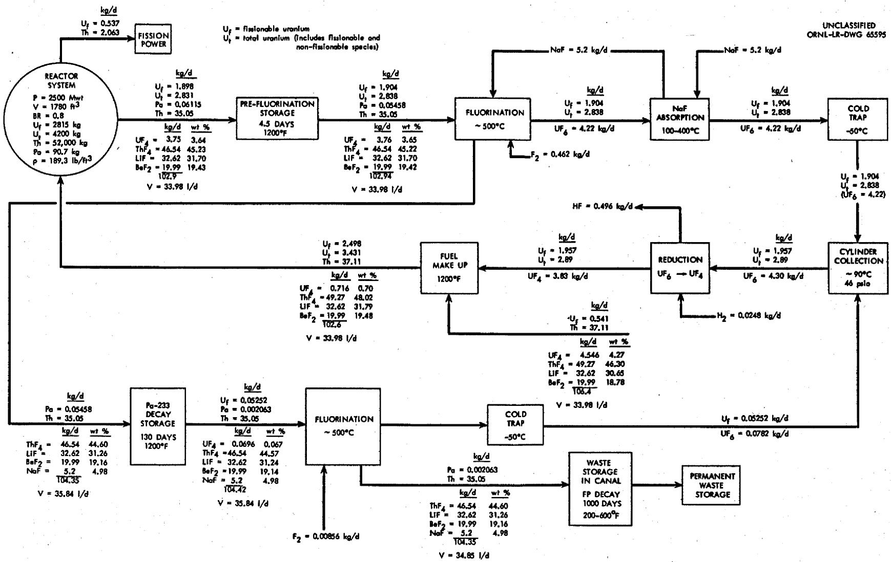  
Fig. 3.1 Molten Salt Converter Reactor. Process Flowsheet for a 1.2 ft³/day Fluoride Volatility Plant.

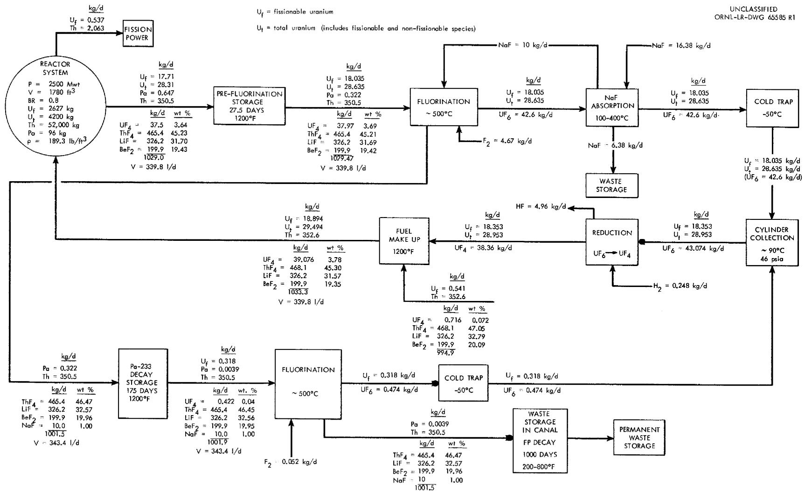  
Fig. 3.2 Molten Salt Converter Reactor. Process Flowsheet for a 12 ft $^3$ day Fluoride Volatility Plant.

extremely stringent design requirements on the fluorinator. Because of a rather high corrosion rate of about one mil per hour of fluorination time, it is desirable to have the fluorinator designed as inexpensively as possible and accessible for quick replacement. If the fluorinator were required to dissipate excessive quantities of fission product decay heat plus heat from the exothermic fluorination reaction, the vessel would have to be constructed somewhat like an expensive heat exchanger; $3^{*}$ frequent replacement of such a vessel would create an intolerable expense. Consequently, a basis of design was that fuel would be held until the fission product activity was low enough that the fluorinator could dissipate its heat load by radiation and convection to the cell environment. For the two plants the following prefluorination conditions were established:

<table><tr><td></td><td>1.2 ft3/Day Plant</td><td>12 ft3/Day Plant</td></tr><tr><td>Batch size (ft3)</td><td>3.6</td><td>60</td></tr><tr><td>Withdraw batch from reactor every</td><td>3 days</td><td>5 days</td></tr><tr><td>No. storage vessels</td><td>2</td><td>6</td></tr><tr><td>Average storage time (days)</td><td>4.5</td><td>27.5</td></tr><tr><td>Average storage temperature (°F)</td><td>1200</td><td>1200</td></tr></table>

# 3.2 Fluorination

After prefluorination cooling the molten salt mixture is fluorinated batchwise at about $500^{\circ}\mathrm{C}$ to quantitatively remove uranium as volatile $\mathbf{U}\mathbf{F}_{6}$ . Relatively few fission products form volatile fluorides so the decontamination factor in fluorination is quite high. The principal fission product fluorides that volatilize are those of Ru, Nb, Zr, Cs, Mo and Te. Fuel from the small plant (4.5-day cooling) would also contain some 8-day I-13l which would be exhausted with the product in fluorination. However, laboratory tests13 have shown that iodine can be effectively separated from $\mathbf{U}\mathbf{F}_{6}$ in the NaF absorption step.

Little, if any, protactinium is expected to volatilize during fluorination so that the barren waste salt contains potentially fissile material. The waste stream is retained to allow Pa-233 to decay to a tolerably low level; U-233 is then recovered in a second fluorination.

# 3.3 Waste Storage

After the second fluorination, barren salt containing the bulk of the fission products is held in interim storage for about 1000 days to permit fission product activity to decrease to a level that does not complicate transportation to permanent waste storage. During this period containers of waste salt would be stored in thimbles in a canal for heat dissipation to the canal water. The chosen storage period is a more or less arbitrary figure and might be shortened appreciably by appropriate waste carrier design. After 1000 days cooling, it should be possible to transport the waste containers without auxiliary cooling facilities on the carrier.

At this point it should be noted that all carrier salt plus thorium is discarded as waste. This is necessary since there is no developed process for removing fission products from the mixture. Lithium is the most valuable component since it is 99.995 at. % Li-7; however, the larger amount of thorium present makes it almost as important in terms of total cost.

# 3.4 NaF Absorption

After leaving the fluorinator, $\mathbf{U}\mathbf{F}_{6}$ and the accompanying volatile fission products pass into a NaF absorption system. This system basically consists of two distinct zones defined according to function: Zone 1 is a high temperature ( $\sim 400^{\circ}\mathrm{C}$ ) zone (the so-called CRP or Complexible Radioactive Products trap) for removal by complexing or filtration of fission or corrosion product fluorides and entrained salt. Zone 2 is the $\mathbf{U}\mathbf{F}_{6}$ absorption-desorption zone operated at $100^{\circ}\mathrm{C}$ for absorption and at $400^{\circ}\mathrm{C}$ for desorption. Chromium is quite effectively removed in the CRP trap, ruthenium is distributed throughout the NaF beds with some

passing into the $\mathbf{F}_2$ disposal system, and zirconium, niobium, cesium, strontium and rare earths are quite effectively removed in the CRP trap and the NaF absorption-desorption system.

Uranium hexafluoride absorbs on sodium fluoride by formation of the $\mathbf{UF}_{6} \cdot 3$ NaF complex. However, the complex does not form at temperatures as high as $400^{\circ}\mathrm{C}$ , so $\mathbf{UF}_{6}$ passes through the CRP trap and is caught in the $100^{\circ}\mathrm{C}$ absorption zone. At the completion of the batch fluorination, the $100^{\circ}\mathrm{C}$ absorption zone is heated to $400^{\circ}\mathrm{C}$ at which temperature $\mathbf{UF}_{6}$ is desorbed and moved from the bed with fluorine carrier gas. Fission product fluorides are not so easily desorbed and remain on the bed. Decontamination factors of the order of 1000 are observed in the absorption-desorption step. $^{4}$

The CRP trap and absorption zone may be integrated into a single unit for convenience of disposing of spent NaF by discharge into the fluorinator and then to waste storage. This method of disposing of NaF has been employed in pilot plant operation where there is no protactinium in the salt. For these plants in which protactinium recovery is necessary it may not be practical to use this design. Instead it may be necessary to discharge NaF into the waste salt after the second fluorination.

The design capacity of NaF for UF $_6$ is 21 kg UF $_6$ per cubic foot of NaF. For large batch fluorinations, the CRP trap and UF $_6$ absorber sections may for convenience be separated.

The second fluorination after Pa-233 decay storage is not followed by NaF absorption (see Figs. 3.1 and 3.2) for two reasons. First, at this point there are no volatile fission product fluorides to contaminate the product; second, the quantity of $\mathbf{U}\mathbf{F}_6$ is small and can be caught in a cold trap.

# 3.5 Cold Trap

During the desorption cycle $\mathsf{UF}_6$ is moved from the absorber in a stream of fluorine into a cold trap maintained at about $-50^{\circ}\mathsf{C}$ . Uranium hexafluoride desublimes and is collected; fluorine is recovered for reuse or discarded. A convenient means of disposing of fluorine is by

reaction with charcoal. When a batch has been collected on the cold trap, temperature and pressure are raised to slightly above triple point conditions and UF is drained into a collection cylinder.

# 3.6 Reduction and Fuel Make-up

The fuel cycle is completed by reducing $\mathbf{U}\mathbf{F}_{6}$ to $\mathbf{U}\mathbf{F}_{4}$ and reconstituting the tetrafluoride into molten salt reactor fuel. The hexafluoride is evaporated from the collection cylinder into a $\mathbf{H}_{2} - \mathbf{F}_{2}$ flame in the presence of excess hydrogen where reduction occurs.

$$
\mathrm {U F} _ {6} + \mathrm {H} _ {2} = \mathrm {U F} _ {4} + 2 \mathrm {H F}
$$

By-product hydrogen fluoride may be recovered or absorbed in a caustic solution.

Green salt $(\mathsf{U}\mathsf{F}_{4})$ falls directly into a dissolver containing molten LiF-BeF $_2$ -ThF $_4$ -UF $_4$ make-up salt. Before entering the dissolver, make-up salt is given a pretreatment H $_2$ -HF sparge lasting about four days as a purification measure to remove oxides. Oxides are detrimental to molten fluoride fuel stability in that they cause precipitation of uranium oxide.

After recycled $\mathrm{UF}_{4}$ has dissolved, the fuel mixture is fed directly to the reactor fuel system.

# 4.0 PROCESSING PLANT DESIGN

# 4.1 Decay Heat Removal

A major problem in the design of all process vessels which contain short-cooled, highly irradiated fuel is that of heat removal. Heat densities are so high that large cooling areas have to be designed into relatively small volumes. In the case of the molten salt system the temperature of the heat source is considerably greater than that of a conventional heat sink such as cooling water, a fact which introduces design problems in thermal stress and maximum allowable heat transfer rates. An alternate cooling system that can be considered is an intermediate heat transfer medium capable of convenient use up to molten fluoride salt temperatures, thereby considerably lessening the problems

mentioned above. Such a cooling medium could be molten NaK alloy, sodium or barren salt. Since a considerable quantity of heat is associated with the decaying fuel (Note Tables 4.1 and 4.2), it is pertinent to consider whether or not the heat should be rejected or recovered. The large plant has an average heat release rate of about 3.6 Mwt; the small plant, 1.8 Mwt. These rates represent $0.14\%$ and $0.07\%$ , respectively, of the nominal 2500 Mwt power station output.

The choice of the cooling system depends upon the decision to reject or recover heat, and, if recovered, to what ultimate use will the energy be put. A logical choice would be to use the heat in the reheat or superheat cycles in the power station or, perhaps, as preheat for boiler feed water. In the first instance a high temperature coolant such as NaK would be required to transport the heat at an elevated temperature level. For heating feed water either cooling water or liquid metal transport of the heat should be satisfactory. In this design it was decided that all decay heat would be rejected and that cooling water would be used for transport around all vessels except the fluorinators which would be air cooled. It did not appear to be economic to design a liquid metal cooling and heat recovery system into the chemical plant - reactor plant complex in the case of either of the two plants in this study. Furthermore, this study indicates that a processing rate of $12\mathrm{f} + 3 / \mathrm{day}$ is uneconomic for a power station as small as 2500 Mwt; a chemical plant of this size would be built only in conjunction with a much larger power-producing complex - perhaps 5 to 10 times as large. In such a multi-megawatt system, it is reasonable to think of this waste heat being recovered in one of the reactor stations.

The complete cooling system for decay heat removal from both plants is shown schematically in Fig. 4.l. For the most part heat is transferred across an air gap, for secondary containment of either leaking salt or water into cooling water surrounding the secondary vessel or thimble. The principal heat transfer mechanism is radiation; convection accounts for perhaps 5 to 10 percent of the transfer. The fluorinators are cooled by air circulating through the cell. Only in the case of the initial catch tanks in prefluorination storage is it necessary to use a

TABLE 4.1   
DECAY HEAT IN MOLTEN SALT CONVERTER REACTOR   
FUEL WITHDRAWN FOR CHEMICAL PROCESSING   
1.2 Ft/Day Plant   

<table><tr><td rowspan="2">Tank No.</td><td rowspan="2">Length of Time Fuel Has Been Out of Reactor (days)</td><td rowspan="2">Tank Volume (ft3)</td><td colspan="2">Maximum Heat Release</td><td colspan="2">Average Heat Release</td></tr><tr><td>BTU/hr</td><td>kw</td><td>BTU/hr</td><td>kw</td></tr><tr><td colspan="7">Pre - Fluorination Storage</td></tr><tr><td>1</td><td>0-3</td><td>3.6</td><td>9.748 x 105</td><td>286</td><td>2.000 x 105</td><td>58.6</td></tr><tr><td>2</td><td>3-6</td><td>3.6</td><td>1.552 x 105</td><td>45.5</td><td>1.356 x 105</td><td>39.7</td></tr><tr><td>Total</td><td></td><td>7.2</td><td>11.300 x 105</td><td>331.5</td><td>3.356 x 105</td><td>97.3</td></tr><tr><td colspan="7">Pa-233 Decay Storage</td></tr><tr><td>1</td><td>6-12</td><td>7.2</td><td>24.39 x 104</td><td>71.5</td><td>23.14 x 104</td><td>67.8</td></tr><tr><td>2</td><td>12-18</td><td>7.2</td><td>19.91 x 104</td><td>58.3</td><td>19.18 x 104</td><td>56.2</td></tr><tr><td>3</td><td>18-24</td><td>7.2</td><td>17.21 x 104</td><td>50.4</td><td>16.69 x 104</td><td>48.9</td></tr><tr><td>4</td><td>24-30</td><td>7.2</td><td>15.29 x 104</td><td>44.8</td><td>14.91 x 104</td><td>43.7</td></tr><tr><td>5</td><td>30-36</td><td>7.2</td><td>13.84 x 104</td><td>40.6</td><td>13.55 x 104</td><td>39.7</td></tr><tr><td>6</td><td>36-42</td><td>7.2</td><td>12.71 x 104</td><td>37.2</td><td>12.47 x 104</td><td>36.5</td></tr><tr><td>7</td><td>42-48</td><td>7.2</td><td>11.79 x 104</td><td>34.5</td><td>11.59 x 104</td><td>34.0</td></tr><tr><td>8</td><td>48-54</td><td>7.2</td><td>11.03 x 104</td><td>32.3</td><td>10.86 x 104</td><td>31.8</td></tr><tr><td>9</td><td>54-60</td><td>7.2</td><td>10.38 x 104</td><td>30.4</td><td>10.23 x 104</td><td>30.0</td></tr><tr><td>10</td><td>60-66</td><td>7.2</td><td>9.82 x 104</td><td>28.8</td><td>9.69 x 104</td><td>28.4</td></tr><tr><td>11</td><td>66-72</td><td>7.2</td><td>9.33 x 104</td><td>27.3</td><td>9.22 x 104</td><td>27.0</td></tr><tr><td>12</td><td>72-78</td><td>7.2</td><td>8.90 x 104</td><td>26.1</td><td>8.80 x 104</td><td>25.8</td></tr><tr><td>13</td><td>78-84</td><td>7.2</td><td>8.50 x 104</td><td>24.9</td><td>8.41 x 104</td><td>24.6</td></tr><tr><td>14</td><td>84-90</td><td>7.2</td><td>8.14 x 104</td><td>23.8</td><td>8.06 x 104</td><td>23.6</td></tr><tr><td>15</td><td>90-96</td><td>7.2</td><td>7.82 x 104</td><td>22.9</td><td>7.74 x 104</td><td>22.7</td></tr><tr><td>16</td><td>96-102</td><td>7.2</td><td>7.52 x 104</td><td>22.0</td><td>7.45 x 104</td><td>21.8</td></tr><tr><td>17</td><td>102-108</td><td>7.2</td><td>7.24 x 104</td><td>21.2</td><td>7.18 x 104</td><td>21.0</td></tr><tr><td>18</td><td>108-114</td><td>7.2</td><td>6.99 x 104</td><td>20.5</td><td>6.93 x 104</td><td>20.3</td></tr><tr><td>19</td><td>114-120</td><td>7.2</td><td>6.75 x 104</td><td>19.8</td><td>6.69 x 104</td><td>19.6</td></tr></table>

TABLE 4.1 - contd   

<table><tr><td rowspan="2">Tank No.</td><td rowspan="2">Length of Time Fuel Has Been Out of Reactor (days)</td><td rowspan="2">Tank Volume (ft3)</td><td colspan="2">Maximum Heat Release</td><td colspan="2">Average Heat Release</td></tr><tr><td>BTU/hr</td><td>kw</td><td>BTU/hr</td><td>kw</td></tr><tr><td>20</td><td>120-126</td><td>7.2</td><td>6.52 x 104</td><td>19.1</td><td>6.47 x 104</td><td>19.0</td></tr><tr><td>21</td><td>126-132</td><td>7.2</td><td>6.31 x 104</td><td>18.5</td><td>6.26 x 104</td><td>18.3</td></tr><tr><td>22</td><td>132-138</td><td>7.2</td><td>6.12 x 104</td><td>17.9</td><td>6.07 x 104</td><td>17.8</td></tr><tr><td>Total</td><td></td><td>158.4</td><td>236 x 104</td><td>693</td><td>232 x 104</td><td>678</td></tr><tr><td></td><td></td><td colspan="5">Interim Waste Storage</td></tr><tr><td>1</td><td>138-146</td><td>9.6</td><td>7.861 x 104</td><td>23.0</td><td>7.845 x 104</td><td>23.0</td></tr><tr><td>13</td><td>234-242</td><td>9.6</td><td>5.167 x 104</td><td>15.1</td><td>5.160 x 104</td><td>15.1</td></tr><tr><td>25</td><td>350-338</td><td>9.6</td><td>3.809 x 104</td><td>11.2</td><td>3.805 x 104</td><td>11.1</td></tr><tr><td>38</td><td>434-442</td><td>9.6</td><td>3.029 x 104</td><td>8.9</td><td>3.027 x 104</td><td>8.9</td></tr><tr><td>50</td><td>530-538</td><td>9.6</td><td>2.517 x 104</td><td>7.4</td><td>2.515 x 104</td><td>7.4</td></tr><tr><td>63</td><td>634-642</td><td>9.6</td><td>2.175 x 104</td><td>6.4</td><td>2.173 x 104</td><td>6.4</td></tr><tr><td>75</td><td>730-738</td><td>9.6</td><td>1.919 x 104</td><td>5.6</td><td>1.917 x 104</td><td>5.6</td></tr><tr><td>87</td><td>826-834</td><td>9.6</td><td>1.723 x 104</td><td>5.0</td><td>1.723 x 104</td><td>5.0</td></tr><tr><td>100</td><td>930-938</td><td>9.6</td><td>1.569 x 104</td><td>4.6</td><td>1.569 x 104</td><td>4.6</td></tr><tr><td>112</td><td>1026-1034</td><td>9.6</td><td>1.443 x 104</td><td>4.2</td><td>1.443 x 104</td><td>4.2</td></tr><tr><td>125</td><td>1130-1138</td><td>9.6</td><td>1.339 x 104</td><td>3.9</td><td>1.339 x 104</td><td>3.9</td></tr><tr><td>Total</td><td></td><td>1200</td><td>351 x 104</td><td>1028</td><td>350 x 104</td><td>1025</td></tr></table>

TABLE 4.2   
DECAY HEAT IN MOLTEN SALT CONVERTER REACTOR   
FUEL WITHDRAWN FOR CHEMICAL PROCESSING   
12 Ft/Day Plant   

<table><tr><td rowspan="2">Tank No.</td><td rowspan="2">Length of Time Fuel Has Been Out of Reactor (days)</td><td rowspan="2">Tank Volume (ft3)</td><td colspan="2">Maximum Heat Release</td><td colspan="2">Average Heat Release</td></tr><tr><td>BTU/hr</td><td>kw</td><td>BTU/hr</td><td>kw</td></tr><tr><td></td><td></td><td>Pre - Fluorination</td><td>Storage</td><td></td><td></td><td></td></tr><tr><td>1</td><td>0-5</td><td>60</td><td>7.126 x 10^6</td><td>2087</td><td>1.071 x 10^6</td><td>314</td></tr><tr><td>2</td><td>5-10</td><td>60</td><td>0.812 x 10^6</td><td>238</td><td>0.757 x 10^6</td><td>222</td></tr><tr><td>3</td><td>10-15</td><td>60</td><td>0.627 x 10^6</td><td>184</td><td>0.598 x 10^6</td><td>175</td></tr><tr><td>4</td><td>15-20</td><td>60</td><td>0.522 x 10^6</td><td>153</td><td>0.502 x 10^6</td><td>147</td></tr><tr><td>5</td><td>20-25</td><td>60</td><td>0.448 x 10^6</td><td>131</td><td>0.434 x 10^6</td><td>127</td></tr><tr><td>Total</td><td></td><td>300</td><td>9.535 x 10^6</td><td>2793</td><td>3.362 x 10^6</td><td>985</td></tr><tr><td></td><td></td><td colspan="3">Pa-233 Decay Storage</td><td></td><td></td></tr><tr><td>1</td><td>25-30</td><td>60</td><td>3.935 x 10^5</td><td>115</td><td>3.720 x 10^5</td><td>109</td></tr><tr><td>2</td><td>30-35</td><td>60</td><td>3.505 x 10^5</td><td>103</td><td>3.336 x 10^5</td><td>97.7</td></tr><tr><td>3</td><td>35-40</td><td>60</td><td>3.166 x 10^5</td><td>92.8</td><td>3.026 x 10^5</td><td>88.7</td></tr><tr><td>4</td><td>40-45</td><td>60</td><td>2.886 x 10^5</td><td>84.6</td><td>2.770 x 10^5</td><td>81.2</td></tr><tr><td>5</td><td>45-50</td><td>60</td><td>2.655 x 10^5</td><td>77.8</td><td>2.557 x 10^5</td><td>74.9</td></tr><tr><td>6</td><td>50-55</td><td>60</td><td>2.459 x 10^5</td><td>72.0</td><td>2.374 x 10^5</td><td>69.6</td></tr><tr><td>7</td><td>55-60</td><td>60</td><td>2.290 x 10^5</td><td>67.1</td><td>2.217 x 10^5</td><td>65.0</td></tr><tr><td>8</td><td>60-65</td><td>60</td><td>2.144 x 10^5</td><td>62.8</td><td>2.080 x 10^5</td><td>60.9</td></tr><tr><td>9</td><td>65-70</td><td>60</td><td>2.016 x 10^5</td><td>59.1</td><td>1.959 x 10^5</td><td>57.4</td></tr><tr><td>10</td><td>70-75</td><td>60</td><td>1.902 x 10^5</td><td>55.7</td><td>1.851 x 10^5</td><td>54.2</td></tr><tr><td>11</td><td>75-80</td><td>60</td><td>1.800 x 10^5</td><td>52.7</td><td>1.754 x 10^5</td><td>51.4</td></tr><tr><td>12</td><td>80-85</td><td>60</td><td>1.707 x 10^5</td><td>50.0</td><td>1.665 x 10^5</td><td>48.8</td></tr><tr><td>13</td><td>85-90</td><td>60</td><td>1.623 x 10^5</td><td>47.6</td><td>1.585 x 10^5</td><td>46.4</td></tr><tr><td>14</td><td>90-95</td><td>60</td><td>1.547 x 10^5</td><td>45.3</td><td>1.512 x 10^5</td><td>44.3</td></tr><tr><td>15</td><td>95-100</td><td>60</td><td>1.476 x 10^5</td><td>43.2</td><td>1.444 x 10^5</td><td>42.3</td></tr></table>

TABLE 4.2 - contd   

<table><tr><td rowspan="2">Tank No.</td><td rowspan="2">Length of Time Fuel Has Been Out of Reactor (days)</td><td rowspan="2">Tank Volume (ft3)</td><td colspan="2">Maximum Heat Release</td><td colspan="2">Average Heat Release</td></tr><tr><td>BNU/hr</td><td>kw</td><td>BNU/hr</td><td>kw</td></tr><tr><td>16</td><td>100-105</td><td>60</td><td>1.412 x 10^5</td><td>41.4</td><td>1.382 x 10^5</td><td>40.5</td></tr><tr><td>17</td><td>105-110</td><td>60</td><td>1.352 x 10^5</td><td>39.6</td><td>1.324 x 10^5</td><td>38.8</td></tr><tr><td>18</td><td>110-115</td><td>60</td><td>1.296 x 10^5</td><td>38.0</td><td>1.270 x 10^5</td><td>37.2</td></tr><tr><td>19</td><td>115-120</td><td>60</td><td>1.243 x 10^5</td><td>36.4</td><td>1.218 x 10^5</td><td>35.7</td></tr><tr><td>20</td><td>120-125</td><td>60</td><td>1.194 x 10^5</td><td>35.0</td><td>1.170 x 10^5</td><td>34.3</td></tr><tr><td>21</td><td>125-130</td><td>60</td><td>1.147 x 10^5</td><td>33.6</td><td>1.126 x 10^5</td><td>33.0</td></tr><tr><td>22</td><td>130-135</td><td>60</td><td>1.104 x 10^5</td><td>32.3</td><td>1.084 x 10^5</td><td>31.8</td></tr><tr><td>23</td><td>135-140</td><td>60</td><td>1.063 x 10^5</td><td>31.1</td><td>1.044 x 10^5</td><td>30.6</td></tr><tr><td>24</td><td>140-145</td><td>60</td><td>1.024 x 10^5</td><td>30.0</td><td>1.006 x 10^5</td><td>29.5</td></tr><tr><td>25</td><td>145-150</td><td>60</td><td>0.988 x 10^5</td><td>28.9</td><td>0.971 x 10^5</td><td>28.4</td></tr><tr><td>26</td><td>150-155</td><td>60</td><td>0.953 x 10^5</td><td>27.9</td><td>0.936 x 10^5</td><td>27.4</td></tr><tr><td>27</td><td>155-160</td><td>60</td><td>0.920 x 10^5</td><td>27.0</td><td>0.904 x 10^5</td><td>26.5</td></tr><tr><td>28</td><td>160-165</td><td>60</td><td>0.888 x 10^5</td><td>26.0</td><td>0.873 x 10^5</td><td>25.6</td></tr><tr><td>29</td><td>165-170</td><td>60</td><td>0.858 x 10^5</td><td>25.1</td><td>0.829 x 10^5</td><td>24.3</td></tr><tr><td>30</td><td>170-175</td><td>60</td><td>0.830 x 10^5</td><td>24.3</td><td>0.816 x 10^5</td><td>23.9</td></tr><tr><td>31</td><td>175-180</td><td>60</td><td>0.802 x 10^5</td><td>23.5</td><td>0.789 x 10^5</td><td>23.1</td></tr><tr><td>32</td><td>180-185</td><td>60</td><td>0.776 x 10^5</td><td>22.7</td><td>0.764 x 10^5</td><td>22.4</td></tr><tr><td>33</td><td>185-190</td><td>60</td><td>0.752 x 10^5</td><td>22.0</td><td>0.740 x 10^5</td><td>21.7</td></tr><tr><td>34</td><td>190-195</td><td>60</td><td>0.728 x 10^5</td><td>21.3</td><td>0.717 x 10^5</td><td>21.0</td></tr><tr><td>35</td><td>195-200</td><td>60</td><td>0.706 x 10^5</td><td>20.7</td><td>0.695 x 10^5</td><td>20.4</td></tr><tr><td>Total</td><td></td><td>2100</td><td>55.1 x 10^5</td><td>1615</td><td>53.5 x 10^5</td><td>1568</td></tr><tr><td></td><td></td><td colspan="5">Interim Waste Storage</td></tr><tr><td>1</td><td>200-202</td><td>24</td><td>2.737 x 10^4</td><td>8.02</td><td>2.720 x 10^4</td><td>7.97</td></tr><tr><td>50</td><td>300-302</td><td>24</td><td>1.584 x 10^4</td><td>4.64</td><td>1.576 x 10^4</td><td>4.62</td></tr><tr><td>100</td><td>400-402</td><td>24</td><td>1.040 x 10^4</td><td>3.05</td><td>1.036 x 10^4</td><td>3.04</td></tr><tr><td>150</td><td>500-502</td><td>24</td><td>0.749 x 10^4</td><td>2.19</td><td>0.747 x 10^4</td><td>2.19</td></tr><tr><td>200</td><td>600-602</td><td>24</td><td>0.571 x 10^4</td><td>1.67</td><td>0.570 x 10^4</td><td>1.67</td></tr><tr><td>250</td><td>700-702</td><td>24</td><td>0.454 x 10^4</td><td>1.33</td><td>0.453 x 10^4</td><td>1.33</td></tr><tr><td>300</td><td>800-802</td><td>24</td><td>0.377 x 10^4</td><td>1.10</td><td>0.376 x 10^4</td><td>1.10</td></tr><tr><td>350</td><td>900-902</td><td>24</td><td>0.321 x 10^4</td><td>0.94</td><td>0.320 x 10^4</td><td>0.94</td></tr><tr><td>400</td><td>1000-1002</td><td>24</td><td>0.278 x 10^4</td><td>0.81</td><td>0.278 x 10^4</td><td>0.81</td></tr><tr><td>450</td><td>1100-1102</td><td>24</td><td>0.246 x 10^4</td><td>0.72</td><td>0.246 x 10^4</td><td>0.72</td></tr><tr><td>500</td><td>1200-1202</td><td>24</td><td>0.222 x 10^4</td><td>0.65</td><td>0.222 x 10^4</td><td>0.65</td></tr><tr><td>Total</td><td></td><td>12000</td><td>355 x 10^4</td><td>1040</td><td>354 x 10^4</td><td>1037</td></tr></table>

different design for removing heat. For these tanks a triple-walled bayonet arrangement is used to vaporize water in a large number of these bayonets immersed in the salt.

# 4.2 Equipment Design

Inasmuch as possible process equipment for this design study was patterned after previously designed and tested equipment for the ORNL volatility pilot plant as described by Milford and co-workers6 and Carr and co-workers.5 In other instances, equipment and design experience at ORGDP and Y-12 were closely followed. Extrapolations in sizes were made in some cases for the large plant; however, it is believed that the limits of current technology have not been exceeded.

Pertinent data on process equipment for both fluoride volatility plants are given in the Appendix on the equipment flowsheets, drawings E-46081 and E-46059.

Prefluorination Storage Tanks. Seven of these tanks are required for the 12 ft³/day plant and two for the 1.2 ft³/day plant. Because of the large amount of fission product decay heat in "green" fuel which is only a few minutes old, these vessels are in effect heat exchangers. The proposed design³ for the Molten Salt Reactor Experiment drain tanks has been adopted for the tanks which receive salt directly from the reactor. The MSRE design, shown in Fig. 4.2, was suitable in a scaled-down version for the 1.2 ft³/day plant, but further modification was necessary for the 12 ft³/day plant as shown in Fig. 4.3 because of the exceptionally high heat release per unit volume of salt. Heat is dissipated by boiling water in the interior annuli of the bayonets which penetrate the vessel heads. The outer annulus of each bayonet contains an inert gas which is monitored for leak detection. Details of the bayonets are shown in Figs. 4.4 and 4.5. The bayonet in Fig. 4.4 corresponds to the vessel design of Fig. 4.2; the design of Fig. 4.5 corresponds to the vessel of Fig. 4.3. The 2 l/2 in. NPS, sch 10, sleeve surrounding each bayonet in Fig. 4.5 is required to maintain a sufficiently thin salt layer around each bayonet.

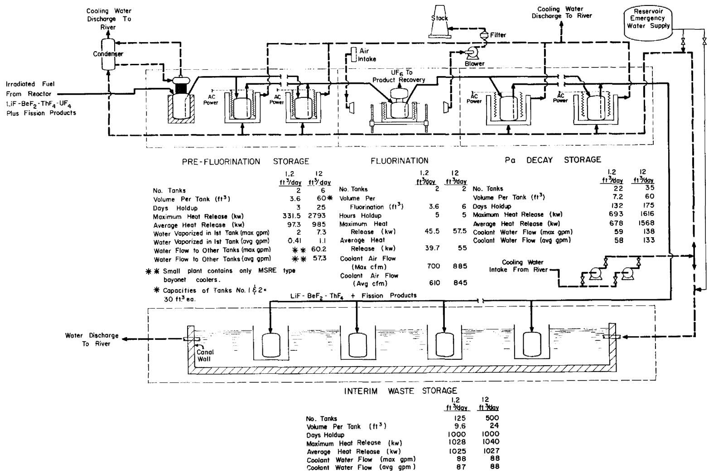  
Fig. 4.1 Decay Heat Removal System for 1.2 ft $^3$ /day and 12 ft $^3$ /day Fluoride Volatility Plant.   
H

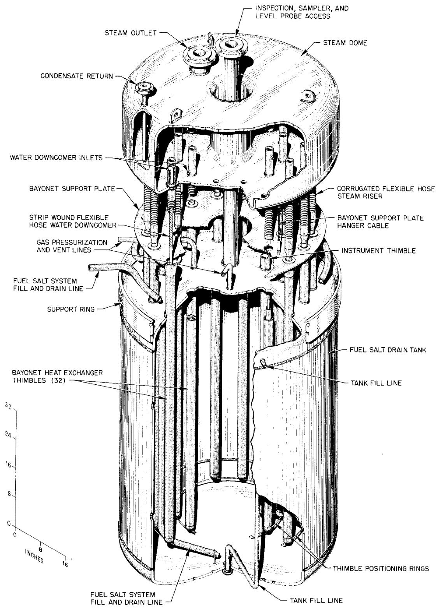  
UNCLASSIFIED   
ORNL-LR-DWG61719   
Fig. 4.2 Primary Drain and Fill Tank for MSRE

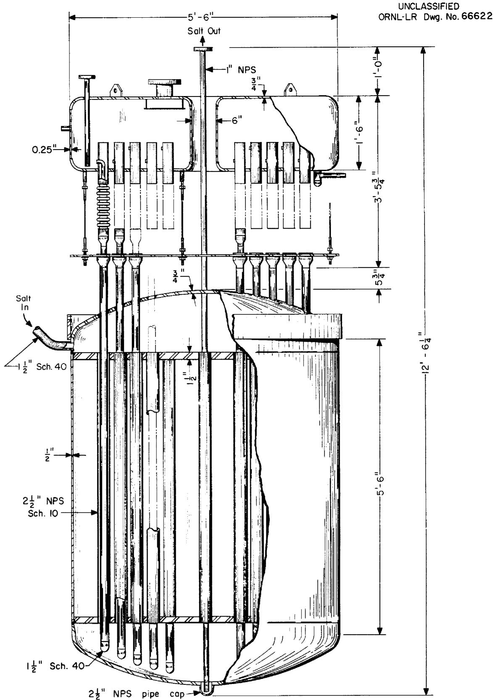  
Fig. 4.3 Pre-fluorination Storage Tank 12 ft $^3$ /day Plant.

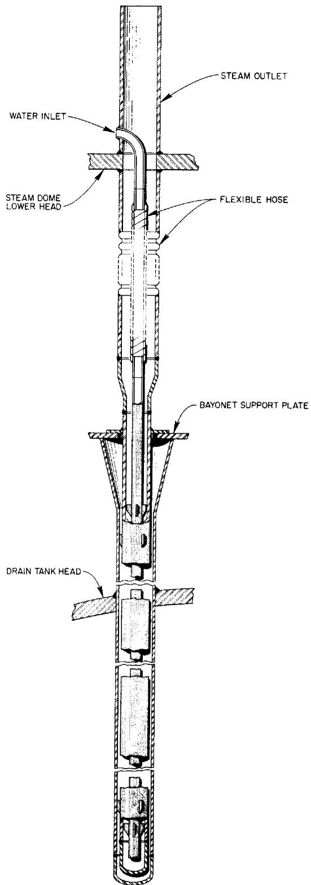  
UNCLASSIFIED   
ORNL-LR-DWG 60838A   
Fig. 4.4 Bayonet Cooling Thimble.

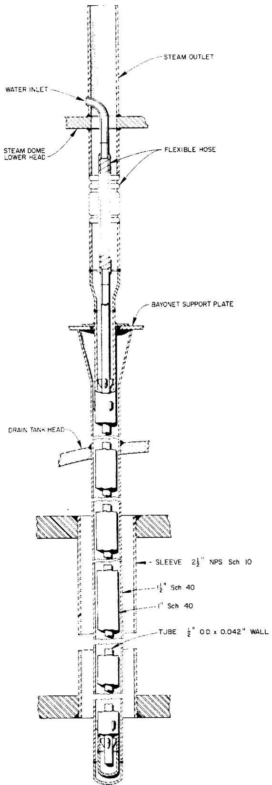  
UNCLASSIFIED ORNL-LR Dwg No.66623   
Fig. 4.5 Typical Cooling Bayonet 12 ft³/day Plant.

The 1.2 ft³/day plant contains two of the MSRE type tanks in the prefluorination storage system. The two tanks are used alternately. The 12 ft³/day plant contains two bayonet-filled tanks of 30 ft³ capacity each and five other tanks of 60 ft³ capacity each. The five tanks are cooled by radiation and convection to water-jacketed thimbles as shown in Fig. 4.1. Four of the group of five tanks are for fission product decay storage and the fifth is a feed tank for the fluorinator. In operation, fuel is held for five days in the two 30-ft³ tanks and then transferred to one of the other storage tanks for the remaining 20 days storage.

A brief description of the tanks required for prefluorination storage is given in Table 4.3 for both the 1.2 and 12 ft $^3$ /day plants.

Table 4.3. Prefluorination Storage Tank Requirements   

<table><tr><td>Days Storage</td><td>No. Tanks</td><td>Method of Cooling</td><td>Nominal Size (ft)</td></tr><tr><td></td><td colspan="2">1.2 ft3/Day Plant</td><td></td></tr><tr><td>0-3</td><td>2</td><td>49 bayonet tubes</td><td>1.94D x 1.94H*</td></tr><tr><td></td><td colspan="2">12 ft3/Day Plant</td><td></td></tr><tr><td>0-5</td><td>2**</td><td>295 bayonet tubes</td><td>5.5D x 5.5H*</td></tr><tr><td>5-15</td><td>2</td><td>water-jacketed thimble</td><td>3.2D x 7.6H</td></tr><tr><td>15-25</td><td>2</td><td>water-jacketed thimble</td><td>3.2D x 7.6H</td></tr><tr><td>Fluorinator feed</td><td>1</td><td>water-jacketed thimble</td><td>3.2D x 7.6H</td></tr></table>

*Does not include steam dome
**These two tanks have 30 ft³ capacity. The large diameter is necessary to house the large number of bayonet tubes in the inefficient salt storage arrangement required by the high heat release of the salt.

Fluorinator. The fluorinator design is shown in Fig. 4.6; this is the vessel that has been successfully operated in the ORNL fluoride volatility pilot plant. The vessel is shaped like a dumbbell having a lower fluorination chamber and an upper de-entrainment section; the

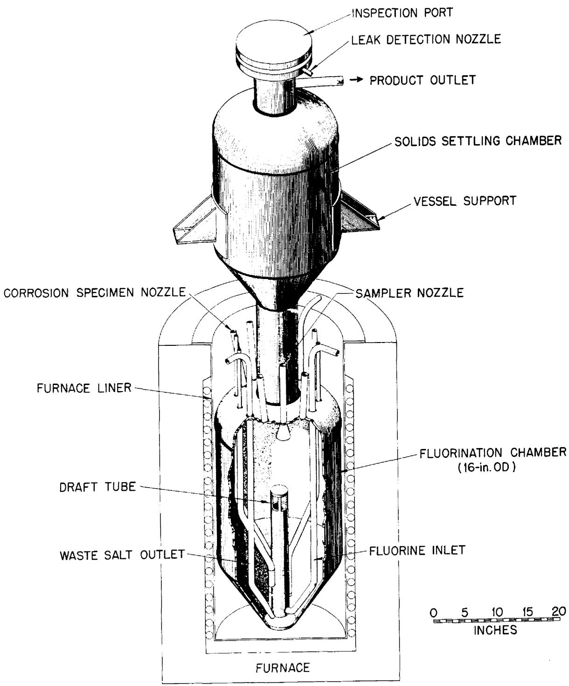  
Fig. 4.6 Fluorinator.

lower assembly is enclosed in an electrically heated furnace, and the upper assembly is heated with electric strip heaters. Similar designs were used for these two studies; the large plant fluorinated 6-ft³ batches, the small plant fluorinated 3.6-ft³ batches.

The principal design criterion for the fluorinator is that the vessel be able to dissipate fission product decay heat and heat of reaction by radiation and convection to the cell environment. Whereas, the vessel might be constructed like the prefluorination decay tanks with a large heat transfer capacity, it is undesirable to do so because of the high corrosion rate during fluorination. It is advisable to construct the vessel as simply and cheaply as possible since it must be rather frequently replaced. The vessel is made with thick, 1/2-inch, walls with a corrosion rate allowance of one mil per hour of fluorination time.

The preferred materials of construction for the fluorinator are either INOR-8 or Alloy 79-4 (79% Ni, 4% Mc, 17% Fe). L-nickel has been used for fluorinator construction, but this material is quite susceptible to intergranular attack.

CRP Trap and Absorbers. The CRP (complexible radioactive products) trap may be an integral part of the NaF absorber or the two units might be separated. In either case, operation of the units is a batch process, and the choice of an integral or separate installation depends upon the physical size of the units. In this case the 1.2 ft³/day plant could employ the integral unit; the 12 ft³/day plant required separate units. The CRP trap and absorber are filled with sodium fluoride pellets having a bulk specific gravity of 0.9. The design absorption capacity of NaF is 21 kg UF₆/ft³ NaF.

The movable-bed absorber (Fig. 4.7) has been designed for the small plant to handle the quantity of $\mathsf{UF}_6$ from batch fluorinations every three days. The bed operates semicontinuously by receiving fresh NaF pellets at the top and discharging fission-product saturated pellets at the bottom. It may not be feasible to discharge pellets into the fluorinator as shown in Fig. 4.7 in these plants because of contamination of Pa-233 still in

the waste salt. Important features of the unit are four separate electrically heated zones and an internal pipe for air cooling and thermocouples.

The stationary-bed absorber (Fig. 4.8) as used in the $12\mathrm{ft}^3/$ day plant contains just over one cubic foot of $\mathsf{NaF}_3$ six absorbers are required for the $42.6\mathrm{kgUF}_6/$ day rate. Each absorber is mounted in a lightweight, low-heat capacity electric furnace which is hinged for easy removal; the furnace permits operation between sorption $(100^{\circ}\mathsf{C})$ and desorption $(400^{\circ}\mathsf{C})$ temperatures. A 2.5-in. outside diameter tube extends down the center of the bed for admission of cooling air; the tube also contains electric heaters. An interior cylindrical baffle causes gases to take U-shaped path through the bed.

The governing design criteria for an absorber are the rate at which the bed can be temperature cycled and the bed thickness. The granular bed is a rather effective insulator and has to be made in thin sections to facilitate heating and cooling. Each absorber therefore has a large L/D ratio. When the bed becomes saturated with fission products, the absorber is removed, emptied and recharged remotely on a 4-5 day cycle.

Cold Traps. Cold traps for desublimation of $\mathbf{U}\mathbf{F}_{6}$ being desorbed from the NaF beds are similar to those used in the ORNL volatility pilot plant. Two traps are mounted in series: The first, or primary trap, is operated at about $-40^{\circ}\mathrm{C}$ ; the second trap is a back-up trap operated at about $-60^{\circ}\mathrm{C}$ to catch any product that might have passed through the primary trap. The two traps are shown in Figs. 4.9 and 4.10. These two traps are identical to the ones required for the 1.2 ft $^3$ /day plant; the larger plant requires a longer primary trap, but the second trap is the same as for the small plant.

The principal factor in design is the heat transfer rate. Adequate surface for $\mathbf{U}\mathbf{F}_6$ collection must also be provided. Also the unit should have a low heat capacity to expedite temperature cycling between batchwise collections. During defrosting the cold traps are heated to about $90^{\circ}C$ at a pressure of around 46 psia to allow melted $\mathbf{U}\mathbf{F}_6$ to drain to collection cylinders.

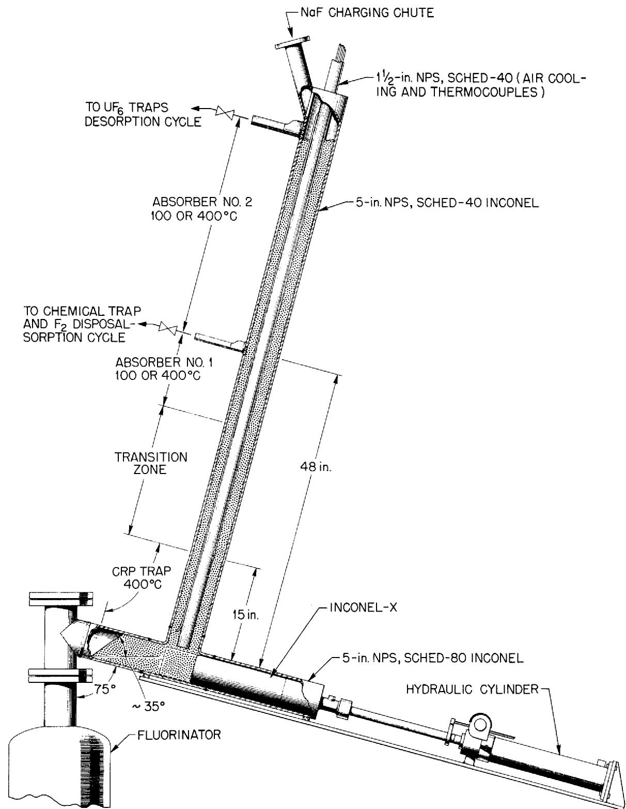  
Fig. 4.7 Movable Bed Temperature-Zoned Absorber.

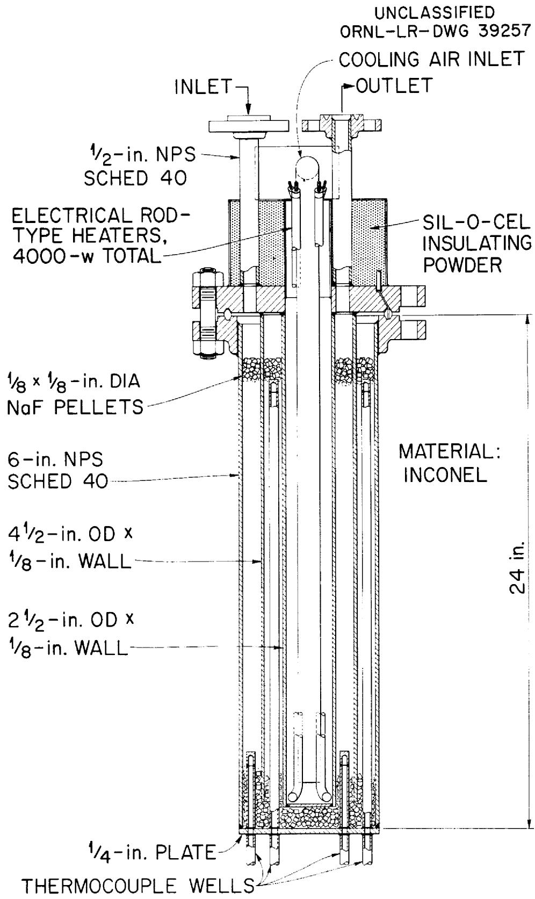  
Fig. 4.8 Sodium Fluoride Absorber for UF6.

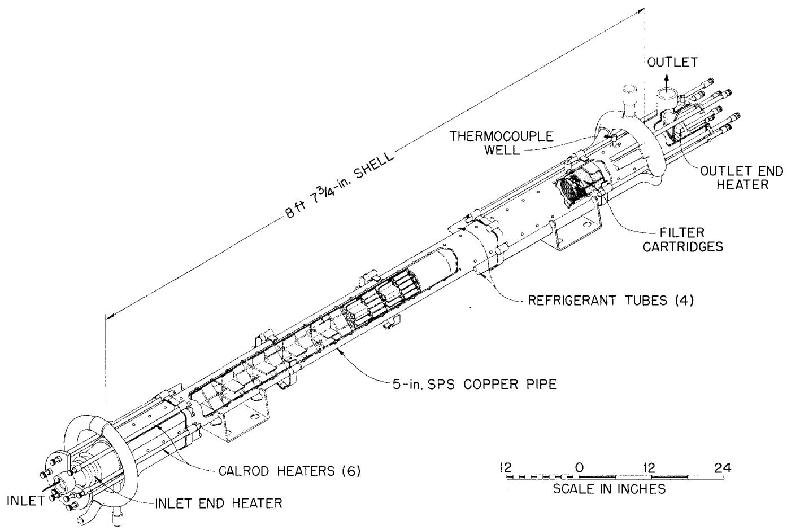  
Fig. 4.9 Primary Cold Trap.

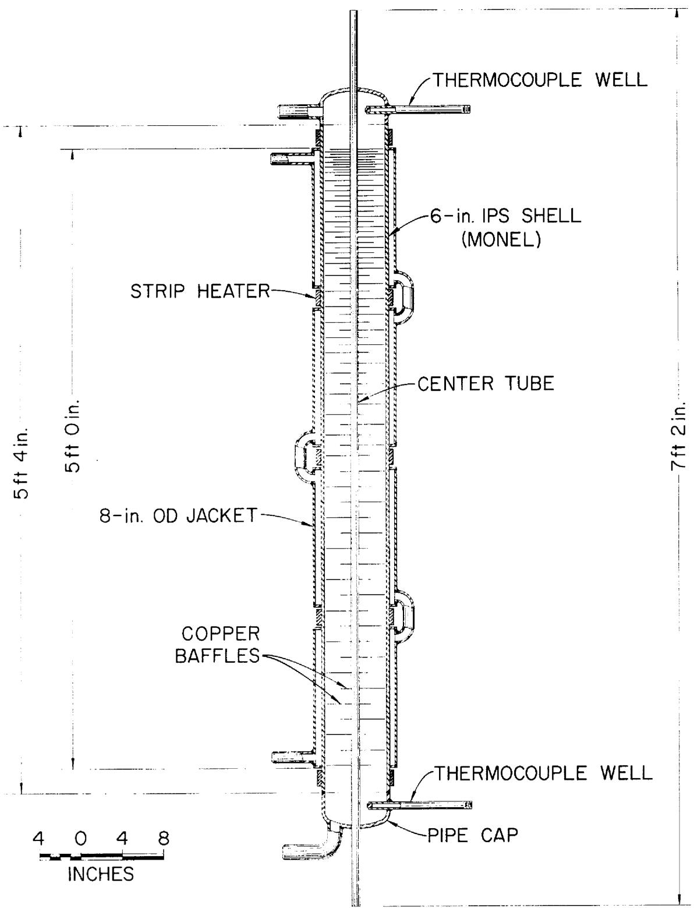  
Fig. 4.10 6-in. Cold Trap.

The rigorous design of a cold trap to prevent dusting or fogging of UF $_6$ is difficult. However, considerable design and operating experience in both fields has been gained at ORGDP. $^7$ The design shown in Fig. 4.9 was developed at ORGDP while that shown in Fig. 4.10 is an ORNL adaptation of ORGDP developments.

Reduction Reactor. The $\mathrm{UF}_6 \rightarrow \mathrm{UF}_4$ reduction reactor for these plants is patterned after the one described by Murray. $^{14}$ The reactor is a $4$ -in. diameter by 10-ft high column having a capacity of 10-15 kg $\mathrm{UF}_6/\mathrm{hr}$ . Since even such a small reactor has a much greater capacity than required by either of these plants, the operation is batchwise. Uranium hexafluoride and fluorine are contacted with excess hydrogen in a nozzle at the top of the reactor. The hexafluoride is reduced to the tetrafluoride in the $\mathrm{H}_2\text{-F}_2$ flame and is collected in a tank of molten carrier salt at the bottom of the column. Gaseous reaction products leave the reactor through a filter.

Fuel Make-up. Fuel make-up vessels are nothing more than heated, insulated vessels located partly in the radioactive processing area and partly in a cold make-up area. The cold make-up tanks are provided with lines for admission and removal of sparge gases, $\mathsf{H}_2 + \mathsf{HF}$ , needed in the purification procedure. Purification requires gas sparging for four days; the tanks are designed to operate on a five-day cycle.

Pa-233 Decay Storage System. The design of a system for holding the waste stream for Pa-233 decay resolves into providing adequate heat dissipation from the several tanks. Batches have to be kept separated because of the fixed decay storage requirement.

In the 12 ft³/day plant, storage is carried out in 60-ft³ batches equivalent to the quantity withdrawn every five days from the reactor. Fission product decay heat is removed by allowing the vessel to radiate to a water-jacketed thimble which surrounds the side and bottom of the tank. There are 36 tanks in the array; each tank has a nominal capacity of 60 ft³. Dimensions are 4.5 ft diameter by 4.5 ft high. The jacketed thimble is about one foot larger in inside diameter than the storage tank.

The storage problem in the 1.2 ft³/day plant is similar to that of the larger plant. Heat is dissipated by radiation and convection from the vessel surface to a water-jacketed thimble. Twenty-four tanks are needed, each having a nominal capacity of 7.2 ft³ and nominal dimensions of 1.66 ft diameter by 3.32 ft high. The jacketed thimble is about one foot larger in inside diameter than the storage tank.

Interim Waste Storage Tanks. Interim waste storage tanks are sealed cylindrical containers made of stainless steel which can be used for permanent waste storage after the interim period. The tanks for the small plant are 16 in. diameter by 7 ft long and for the large plant, 2-ft diameter by 7.5 ft long.

Thimbles in which the waste tanks rest while in the storage canal are made of stainless steel. Each plant has 15-ft long thimbles, but those in the small plant are 2-ft diameter while those in the large plant are 2.75-ft diameter.

Freeze Valves. Conventional valves cannot be used on molten salt process lines. Instead, closures in lines are made by freezing a plug in the line using a jet of cooling air blowing across the area to be frozen. Conveniently located electric heaters are then used to thaw the line when flow is desired. A photograph of a proposed freeze valve installation for the MSRE is presented in Fig. 4.11.

Line Heating. Whenever practical autoresistance heating will be used.

Samplers. A rather complicated mechanism is required to remove analytical samples from a molten salt system as shown in Fig. 4.12. The pictured apparatus is being tested for use in the MSRE at ORNL. Essential features of the sampler are the hoist and capsule for removing the sample from the vessel; a lead shielded cubicle with manipulator, heating elements and service piping; and a transport cask for removing the sample from the process area. The sampling cubicle is mounted on the cell biological shield in an accessible area.

Refrigeration. Low-temperature refrigeration is needed for the cold traps. One trap operates at $-40^{\circ}\mathrm{C}$ and a second operates at $-75^{\circ}\mathrm{C}$ .

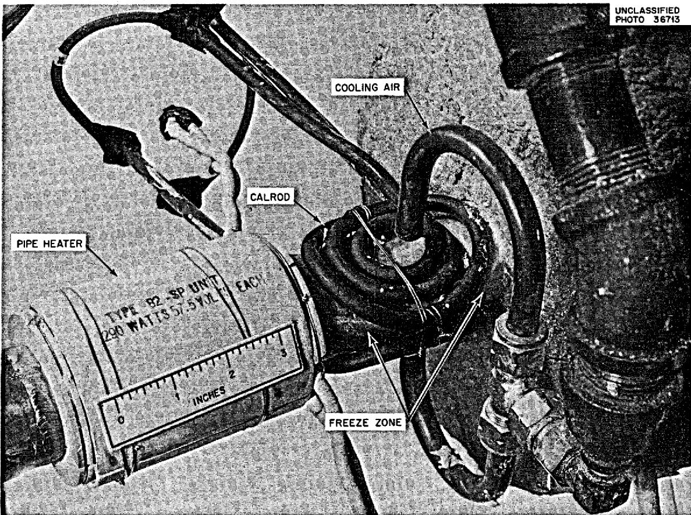  
Fig. 4.11 Freeze Valve.

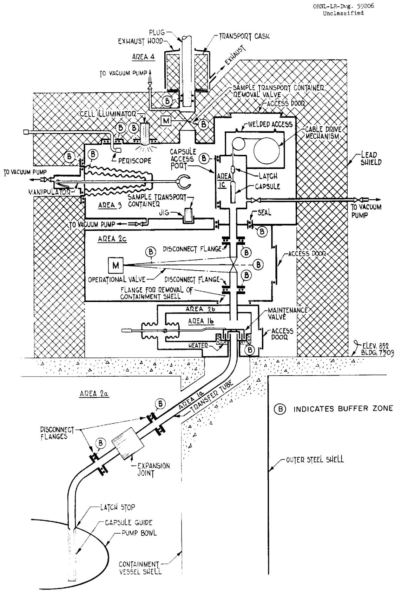  
Fig. 4.12 Schematic Layout of MSRE Sampler-Enricher System.

# 4.3 Shielding Calculations

Shielding calculations were made to compute biological shield requirements for processing areas. It was recognized that the extremely radioactive "green" fuel only a few minutes out of the reactor would require thick shielding, significantly affecting building size and cost. The calculations were made using a program for the IBM 7090 computer; the program is able to treat cylindrical, volumetric sources which are applicable in these cases. The code employs such parameters as source strength, source geometry and dimensions, vessel material and location with respect to top and side shield to calculate either shield thickness or dose rate. Self-absorption by the source is also taken into account.

Shield material was ordinary concrete.

Source Strength. The shielding program was written more specifi-cally for a solid-fueled reactor than for a circulating fuel reactor, and minor modifications had to be made in calculating the source strength. The activity of U-235 fission products as a function of irradiation time and cooling time has been reported by Blomeke and Todd9 for solid fuel normalized to one atom of original fissile feed. This implies a knowledge of fuel burn-up, a quantity that is not so well defined for a circulating fuel. For these calculations the fraction burn-up was determined using terms defined in Fig. 4.13

$$
B U = \frac {\text {B u r n - u p}}{\text {R e c y c l e} + \text {F e e d}},
$$

where quantities in the fraction are expressed in consistent units such as kg/day. Feed includes both make-up fissile material and that part of fertile material that is converted to fissile material. The number of original atoms of fissile material present was then calculated from equilibrium reactor concentrations.

$$
\text {O r i g i n a l c o n c e n t r a t i o n U p r e s e n t} = \frac {\text {E q u i l i b r i u m c o n c e n t r a t i o n U - 2 3 3 + U - 2 3 5}}{1 - \mathrm {B U}}
$$

The data of Blomeke and Todd were then used with this calculated original concentration to obtain source strengths in terms of disintegrations/sec.

It was assumed that the fuel had been irradiated for an infinite time at a thermal 'neutron flux of $10^{13}$ neutrons/cm² sec.

The fuel in this system is predominately U-233. However the data of Blomeke and Todd for U-235 fission products were used because no comparable data for U-233 were available.

Geometry. In all calculations shielding requirements were determined for top and side shields as shown in Fig. 4.14 using the criterion of 0.25 mrad/hr dose rate at the shield's external surface. When several process vessels were aligned along a wall as shown in Fig. 4.14b, the dose rate was computed for several shield thicknesses, $t_1$ , $t_1'$ , $t_1''$ , ..., taking into account contributions from adjacent tanks. The data were plotted to determine the required shield thickness for a 0.25 mrad/hr dose rate. Computations were made for arrays of 3 and 5 tanks, and it was observed that the dose contribution from the fourth and fifth tanks (extreme end tanks) could be ignored.

Summary of Shielding Requirements. Shielding requirements for process, storage and maintenance areas in the two plants are given in Table 4.4.

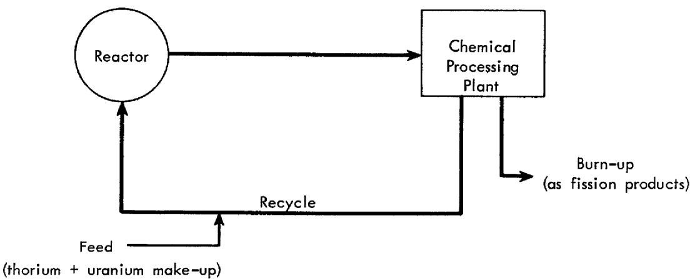  
Fig. 4.13 Schematic Diagram for Computing Fraction Burn-Up.

44

UNCLASSIFIED

ORNL-LR-DWG 65606

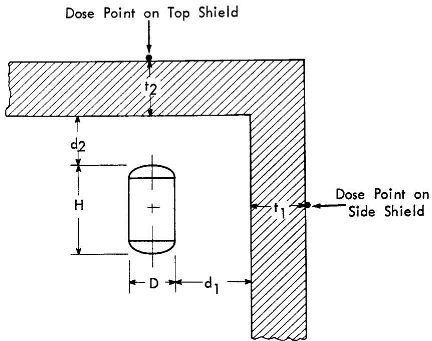  
(a) Elevation

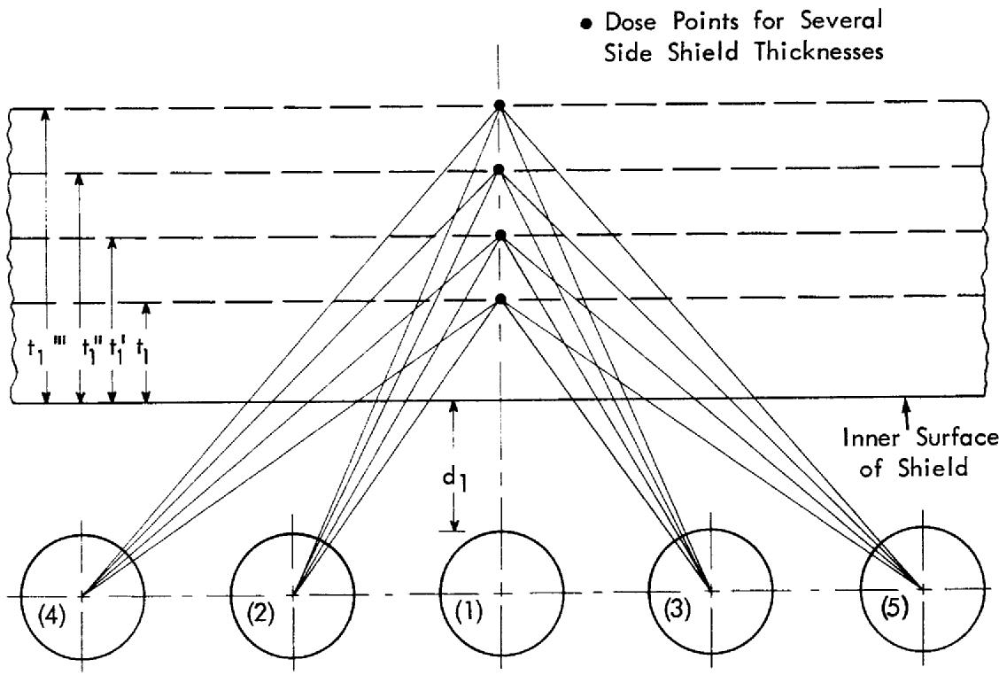  
(b) Plan   
Fig. 4.14 Geometry Considerations in Calculating Shield Thickness.

Table 4.4 Shield Thicknesses for the 12-ft³/day and 1.2-ft³/day Molten Salt Fluoride Volatility Processing Plants   

<table><tr><td></td><td colspan="2">Thickness of Ordinary Concrete (ft)</td></tr><tr><td></td><td>12 ft3/day plant</td><td>1.2 ft3/day plant</td></tr><tr><td>Prefluorination storage top shield</td><td>7.5</td><td>6.25</td></tr><tr><td>Prefluorination storage side shield</td><td>7.5</td><td>7.5</td></tr><tr><td>1st fluorination top shield</td><td>7.5</td><td>6.25</td></tr><tr><td>1st fluorination side shield</td><td>7.5</td><td>7.5</td></tr><tr><td>2nd fluorination top shield</td><td>4.0</td><td>6.25*</td></tr><tr><td>2nd fluorination side shield</td><td>7.5</td><td>7.5</td></tr><tr><td>Pa-233 decay storage top shield</td><td>5.5</td><td>6.25*</td></tr><tr><td>Pa-233 decay storage side shield</td><td>5.5</td><td>6.5*</td></tr><tr><td>Reduction and fuel make-up area top shield</td><td>4.0</td><td>4.0</td></tr><tr><td>Reduction and fuel make-up area side shield</td><td>4.0</td><td>4.0</td></tr><tr><td>Interim waste storage top shield</td><td>4.75</td><td>4.5</td></tr><tr><td>Interim waste storage side shield</td><td>5.0</td><td>5.0</td></tr><tr><td>Crane maintenance area top shield</td><td>4.0</td><td>3.0</td></tr><tr><td>Crane maintenance area side shield</td><td>4.0</td><td>4.0</td></tr><tr><td>Storage area top shield</td><td>6.5</td><td>6.0</td></tr><tr><td>StORAGE area side shield</td><td>4.0</td><td>4.0</td></tr><tr><td>Decontamination area top shield</td><td>6.5</td><td>6.0</td></tr><tr><td>Decontamination area side shield</td><td>4.0</td><td>4.0</td></tr><tr><td>Shop area top shield</td><td>4.0</td><td>4.0</td></tr><tr><td>Shop area side shield</td><td>4.0</td><td>4.0</td></tr></table>

*Shield thickness determined by prefluorination shield requirements since all equipment is same area.

# 4.4 Process Equipment Layout

Process equipment has been laid out in areas according to the major process operations: prefluorination storage, first fluorination, Pa-233 decay storage, second fluorination, NaF absorption, cold traps and product collection, $\mathrm{UF}_6 \rightarrow \mathrm{UF}_4$ reduction, and interim waste storage. Equipment is grouped in cells according to activity level and in an arrangement that minimizes distances for molten salt transfer between vessels. Five transfers of molten salt are required in the processing sequence for the 1.2 ft $^3$ /day plant. First, the irradiated fuel is transferred from the reactor to prefluorination storage; second, to the first fluorination; third, to Pa-233 decay storage; fourth, to the second fluorination; and fifth, to waste storage. The operational sequence in the 12 ft $^3$ /day plant is the same with an additional transfer in prefluorination storage brought about by economic heat removal considerations.

Interim waste storage vessels can most conveniently be stored in an area immediately adjacent to but not directly a part of the principal processing area. A rather large canal is required to contain the large number of waste tanks. After approximately 1000 days residence, the waste tanks are transferred to permanent storage.

A very important consideration in equipment layout inside the cells is the remote maintenance aspect which has been assumed for these processing operations. Vessels must be arranged so that all process and service connections can be remotely broken and remade and all equipment must be accessible from above. Over-all building space is often dictated by remote maintenance considerations rather than by actual vessel size. It should be pointed out that there has been no actual experience in remote maintenance of a molten salt fluoride volatility plant and that the necessary space requirements for such a plant may not have been fully recognized in this study. Considerable development of both equipment and operating technique will be required to furnish adequate design information.

# 4.5 Plant Layout

In order to establish uniformity in cost estimation of nuclear power plants, the Atomic Energy Commission11 has specified certain ground rules

covering site location, topography, meteorology, climatology, geology, availability of labor, accounting procedures, fixed charge rates, etc. These recommendations were followed in this study. A concurrent cost evaluation for a molten salt reactor plant by ORNL and Sargent and Lundy Engineers12 used the same basic ground rules making the two plant evaluations congruent.

Site Location. The hypothetical site location is 35 miles north of Middletown, a city of 250,000 population. The plant is located on the North River, a stream that is navigable to boats having up to 6 ft draft. There is convenient highway and railroad access.

The plant is located on level terrain in a grass-covered field. The earth overburden is 8 ft deep; below this depth is bedrock.

Over-all Plant Layout. A remote maintenance chemical plant is most conveniently laid out in a canyon-type arrangement, which is a long, heavily shielded series of in-line cells serviced by an over-head crane. The depth of the canyon is determined by location and size of installed equipment; the width is determined by vessel size and span limitations for the crane. The over-all building length is more or less determined by the length of the canyon. Offices, control room, laboratories, sample gallery, warehouse, shop and other service areas are placed along a face of the canyon in a manner that is consistent with good design and functional facility.

In this study advantage was taken of a design study and operating experience with a remotely maintained radioactive chemical plant by Farrow1 to obtain over-all plant arrangements shown on drawings E-46059, E-46067, E-46079, E-46068, E-46069, E-46081, and E-46080 in the Appendix.

Processing Area. Processing cells are located in the central section of the canyon and are the most heavily shielded parts of the plant. In the 12 ft³/day plant, four cells are employed; in the 1.2 ft³/day plant, three cells are used. Because of the lower total activity and fewer process vessels in the small plant, one of the shielding partitions could be eliminated.

Prefluorination storage and first fluorination vessels are located near the center of the canyon and convenient to the reactor area.

Immediately adjoining (in the same cell for the small plant) is the cell containing the second fluorination and absorption equipment. This arrangement permits carrying out the most radioactive operations in a compact layout minimizing the amount of thick (7.5 ft) shielding.

The remaining process area contains product collection and reduction equipment for carrying out the $\mathrm{UF}_{6} \rightarrow \mathrm{UF}_{4}$ reaction. Although the product at this point has been decontaminated by a factor of $10^{6}$ or greater, shielding is required to attenuate the gamma activity of U-237. Four feet of ordinary concrete suffices to shield this area. This cell also contains the dissolver for blending recovered fuel with make-up fuel introduced from the outside. Fuel is recycled to the reactor from this tank.

Pa-233 Decay Storage. The largest process area of the canyon is occupied by "dead" storage to segregate batches of waste salt while allowing Pa-233 to decay. For convenience the area is located adjacent to the first fluorinator. An area 27 ft wide by 92 ft long was provided for the large plant and one 23 ft wide by 74 ft long for the small plant.

Waste Storage. Waste storage need not be located in the process canyon because there is negligible fissile material in the waste and no further process operations are performed on the waste. Facilities are provided in a canal adjoining the canyon to store waste containers until each can be transported to permanent storage at some remote location. The area is rectangular with the width being the dependent dimension. Since a crane must be provided to service the area, the width is governed by crane span and cost considerations. In these plants over-all canal dimensions are 48 ft wide by 181.5 ft long and 37 ft wide by 56 ft long for the large and small plants, respectively. Each canal contains water to a depth of 16.5 ft.

Waste containers are transported from inside the canyon to the waste storage area via a cart on a track which runs through the side shield. A double door arrangement is used to maintain isolation of the two areas during transfer.

Crane Maintenance Area. Since the overhead crane is the principal tool for carrying out all maintenance operations in the canyon, facilities are necessary to keep it in good operating condition. An area at one end

of the canyon is set aside for crane maintenance; this area is equipped with a small crane to service the larger crane. Decontamination provisions are made for this area to allow personnel access.

Contaminated Equipment Storage. A relatively small cell is provided in the canyon for storage of contaminated equipment during the interim between removal from service and permanent disposition. For example, it might be necessary to hold equipment for fission product decay before removal from the canyon.

Decontamination Cell. The use of this cell is for decontaminating equipment so it can be packaged and removed from the canyon. The cell is equipped with sprays and located near the source of decontaminating chemicals.

Canyon Shop. This cell is a limited personnel access area for performing maintenance on contaminated equipment. Before entering the shop, vessels and other equipment would have been decontaminated sufficiently for controlled contact work but not sufficiently for removal to "cold" shop.

Railroad Dock. A railroad dock is provided at one end of the canyon for receiving into or removing from the canyon vessels and other equipment. The dock is in a nonradioactive area but can be served by the large bridge crane used over the canyon. Roll-up steel doors separate the dock and crane bay over the process cells.

Control Room. The control room is located adjacent to the biological shield at cell top level. The room extends along the shield face directly opposite the cells in which the principal process operations of fluorination, absorption, product collection and reduction are carried out as well as salt transfers from one area to another. From this area all process operations can be controlled and performed. Remote maintenance is also carried out from the control room with the aid of television.

Sample Gallery. This space contains the heavily shielded sampling cubicles (see Fig. 4.12) and transport equipment. The gallery is located over the control room on the shield face near the fluorination and reduction cells. It is anticipated that process control and accountability can be accomplished by sampling the fluorinators and product dissolver.

Laboratories. Adequate analytical facilities are provided in the chemical plant to process all samples from the reactor plant as well as from the chemical plant. Analytical caves are provided for highly radioactive analyses. The analytical area is a controlled access area separated from the nonrestricted areas by an air lock.

Offices. Office space is provided at ground level near the center of the building.

Service Areas. The remainder of the building space is occupied by service facilities necessary for an integrated chemical plant. These include mechanical and instrument shops, first aid room, lunch room, change room, toilets, warehouse and receiving dock, elevators, cold chemical makeup space, electrical transformer and switch gear room, refrigeration equipment space, air conditioning equipment space, compressor space and pipe corridors. Most of these areas are located below grade along the face of the process canyon.

# 5.0 CAPITAL COST ESTIMATE

The capital cost estimate was divided into three principal categories: building costs, process equipment costs, and auxiliary process equipment and services costs. The building costs included such items as site preparation, structural materials and labor, permanently installed equipment, and material and labor for service facilities. Process equipment costs were calculated for those tanks, vessels, furnaces and similar items whose primary function is directly concerned with process operations. Process service facilities are items such as sampling facilities, process piping and process instrumentation which are intimately associated with process operations.

# 5.1 Accounting Procedure

The accounting procedure set forth in the Guide to Nuclear Power Plant Cost Evaluation11 was used as a guide in this estimate. This handbook was written as a guide for cost estimating reactor plants, and the accounting breakdown is not specific for a chemical processing plant. Where necessary for clarification and completeness, the accounting procedures of the handbook were augmented by established Chemical Technology Division methods.

# 5.2 Bases for Estimates

Process Equipment. A large number of process vessels and auxiliary equipment in these plants is similar to equipment previously purchased by ORNL for the fluoride volatility pilot plant for which cost records were available. Extensive use was made of these records in computing material, fabrication and over-all equipment costs. In some cases it was necessary to extrapolate the data to obtain costs for larger vessels; however, for some equipment in the small plant, the data were directly applicable. Items that were estimated in this manner were the fluorinators, furnaces, NaF absorbers and CRP traps. The cost of the UF $_6$ -to-UF $_4$ reduction unit was based on a unit described by Murray. $^{14}$ The unit had a larger capacity than was needed for these plants, but it was assumed that the required unit would have about the same over-all cost. Refrigeration equipment and cold traps were estimated from cost data for ORGDP $^{7}$ and ORNL equipment.

Some items of process equipment were of special design and significantly different from any vessels for which cost data were available. The prefluorination storage tanks which receive irradiated fuel directly from the reactor are examples. The cost of these vessels was calculated from a previous cost estimate made by the Y-12 machine shop on a similar vessel for the Molten Salt Reactor Experiment. For vessels and tanks of more conventional and familiar design, the cost was computed from the cost of material (INOR-8 for most vessels) plus an estimated fabrication charge, both charges being based on the weight of the vessel. A summary of values used in estimating process vessels by weight is given below. For the shells of the prefluorination storage tanks, the high fabrication cost values shown were obtained by back calculating from a Y-12 shop estimate for a similar vessel.

<table><tr><td>Metal Cost $/1b</td><td>INOR-8</td><td>Alloy 79-4</td><td>Stainless Steel 304</td></tr><tr><td></td><td>3.00</td><td>2.66</td><td>0.65</td></tr><tr><td>Fabrication Cost, $/1b</td><td></td><td></td><td></td></tr><tr><td>Shell, prefluorination storage, 1.2 ft3/day</td><td>7.00</td><td></td><td></td></tr><tr><td>Shell, prefluorination storage, 12 ft3/day, tanks 1 and 2</td><td>8.35</td><td></td><td></td></tr><tr><td>Fabrication Cost, $/lb (contd)</td><td>INOR-8</td><td>Alloy 79-4</td><td>Stainless Steel 304</td></tr><tr><td>Prefluorination storage, l2 ft3/day tanks 3-6</td><td>3.50</td><td></td><td></td></tr><tr><td>Fluorinators, l.2 and l2 ft3/day</td><td></td><td>4.00</td><td></td></tr><tr><td>Pa-233 decay storage, l.2 ft3/day</td><td>3.50</td><td></td><td></td></tr><tr><td>Waste storage vessel, l.2 and l2 ft3/day</td><td></td><td></td><td>2.50</td></tr><tr><td>Waste storage thimbles, l.2 and l2 ft3/day</td><td></td><td></td><td>1.85</td></tr><tr><td>UF4 dissolvers, l.2 and l2 ft3/day</td><td></td><td></td><td>3.50</td></tr></table>

Pipe and tubing prices were based on the following schedule.

<table><tr><td>Description</td><td>$/ft</td><td>$/1b</td></tr><tr><td>1/2 in. OD x 0.042 wall tube (INOR-8)</td><td>6.06</td><td>26.40</td></tr><tr><td>1 in. NPS, Sch. 40 pipe (INOR-8)</td><td>30.05</td><td>16.04</td></tr><tr><td>1 1/2 in. NPS, Sch. 40 pipe (INOR-8)</td><td>41.67</td><td>13.71</td></tr></table>

Auxiliary process items such as process piping, process electrical service, instrumentation, sampling connections and their installation were not considered in sufficient design detail to permit direct estimation. A value was assigned to these items which was based upon previous experience in design and cost estimation of radiochemical processing plants. In assigning these values cognizance was taken of the fact that the plant is remotely maintained.

Building. The building estimate included the cost of land acquisition, site preparation, concrete, structural steel, painting, heating, ventilation, air conditioning, elevators, cranes, service piping, laboratory and hot cell equipment, etc. The individual costs were calculated using current data for materials and labor, and are based on the drawings shown in the Appendix.

# 5.3 Process Equipment Capital Cost

Process equipment capital costs for the two fluoride volatility plants are presented in Table 5.1. These costs are the totals of material, fabrication and installation charges.

# TABLE 5.1

# ESTIMATED COST OF MAJOR PROCESS EQUIPMENT FOR

# TWO FLUORIDE VOLATILITY PLANTS

(Values in Dollars)

<table><tr><td rowspan="2"></td><td colspan="3">1.2 Ft3/Day Plant</td><td colspan="3">12 Ft3/Day Plant</td></tr><tr><td>No.</td><td>Description</td><td>Cost</td><td>No.</td><td>Description</td><td>Cost</td></tr><tr><td colspan="7">Pre-Fluorination Storage</td></tr><tr><td>Storage tank</td><td>2</td><td>2 ft D x 2 ft H; 49 bayonet coolers; INOR-8; o.375 in. shell; 0.5 in. head</td><td>100,000</td><td>2</td><td>5.5 ft D x 5.5 ft H; 295 bayonet coolers; INOR-8; 0.5 in. shell; 0.625 in. head</td><td>1,354,000</td></tr><tr><td>Storage tank</td><td></td><td></td><td></td><td>5</td><td>3.17 ft D x 7.61 ft H; 0.5 in. shell; 0.5 in. head</td><td>57,500</td></tr><tr><td>Furnace</td><td>2</td><td>2.7 ft D x 3 ft H; 45.8 kw</td><td>7,000</td><td>2</td><td>6.25 ft ID x 7 ft H; 250 kw</td><td>50,000</td></tr><tr><td>Heater</td><td></td><td></td><td></td><td>5</td><td>4 ft D x 9.9 ft H; 225 kw; tubular with stainless steel sheath</td><td>110,000</td></tr><tr><td>Jacketed thimble</td><td></td><td></td><td></td><td>5</td><td>4 ft D x 9.4 ft H; INOR-8</td><td>58,125</td></tr><tr><td>Condenser</td><td>1</td><td>1 ft D x 3 ft L; 19 ft2stainless steel; admiralty tubes</td><td>465</td><td>2</td><td>14 in. D x 16 ft L; 470 ft2stainless steel; admiralty tubes</td><td>8,200</td></tr><tr><td></td><td></td><td></td><td>107,465</td><td></td><td></td><td>1,637,825</td></tr><tr><td colspan="7">Fluorination</td></tr><tr><td>Fluorinator</td><td>2</td><td>1.5 ft D x 2.34 ft H (lower section); 3.6 ft3salt; alloy 79-4; 0.5 in. shell; 0.5 in. head</td><td>12,000</td><td>2</td><td>1.75 ft D x 9 ft H (lower section); 6 ft3salt; alloy 79-4; 0.5 in. shell; 0.5 in. head</td><td>16,000</td></tr><tr><td>Furnace</td><td>2</td><td>2.33 ft D x 3.75 ft H; 49.4 kw</td><td>8,000</td><td>2</td><td>2.67 ft D x 5 ft H; 75.5 kw</td><td>13,000</td></tr><tr><td>CRP trap</td><td></td><td></td><td></td><td>2</td><td>6 in. D x 4 ft H; outside heaters; air-operated piston</td><td>10,000</td></tr><tr><td></td><td></td><td></td><td>20,000</td><td></td><td></td><td>39,000</td></tr><tr><td colspan="7">Absorbers and Cold Traps</td></tr><tr><td>NaF absorber and CRP trap</td><td>1</td><td>8 in. sch. 40 pipe; 1 ft horizontal + 5 ft vertical; 12.66 kg UF6capacity; Inconel</td><td>5,000</td><td>6</td><td>6 in. sch. 40 pipe x 6.33 ft H; 21.1 kg UF6capacity; Inconel</td><td>9,000</td></tr><tr><td>Furnace</td><td>1</td><td>Included in absorber cost</td><td></td><td>6</td><td></td><td>21,000</td></tr><tr><td>Cold trap</td><td>1</td><td>-40°C unit; copper</td><td>8,700</td><td>3</td><td>-40°C unit; copper</td><td>22,500</td></tr><tr><td>Cold trap</td><td>1</td><td>-75°C unit; copper</td><td></td><td>3</td><td>-75°C unit; copper</td><td>7,500</td></tr></table>

TABLE 5.1 - contd   

<table><tr><td rowspan="2"></td><td colspan="3">1.2 Ft3/Day Plant</td><td colspan="3">12 Ft3/Day Plant</td></tr><tr><td>No.</td><td>Description</td><td>Cost</td><td>No.</td><td>Description</td><td>Cost</td></tr><tr><td>NaF chem trap</td><td>2</td><td>6 in. sch. 40 pipe x 3.5 ft H; heated; 12.66 kg UF6 capacity; Inconel</td><td>800</td><td>3</td><td>6 in. sch. 40 pipe x 6 ft H; heated; 21 kg UF6 capacity; Inconel</td><td>1,800</td></tr><tr><td>Vacuum pump</td><td>1</td><td>40 cfm displacement; &lt; 50 μ Hg final pressure</td><td>2,620</td><td></td><td></td><td></td></tr><tr><td></td><td></td><td></td><td>17,120</td><td></td><td></td><td>61,800</td></tr><tr><td>Pa-233 Decay System</td><td></td><td></td><td></td><td></td><td></td><td></td></tr><tr><td>Storage tank</td><td>24</td><td>1.66 ft D x 3.32 ft H; 7.2 ft3 salt; INOR-8; 0.375 in. shell; 0.375 in. head</td><td>66,000</td><td>36</td><td>4.5 ft D x 4.5 ft H; 60 ft3 salt; INOR-8</td><td>832,500</td></tr><tr><td>Jacketed thimble</td><td>24</td><td>Cooling unit for storage tank</td><td></td><td>36</td><td>Cooling unit for storage tank</td><td></td></tr><tr><td>Heater</td><td>24</td><td>3 ft D x 3.1 H; 52.5 kw</td><td>100,800</td><td>36</td><td>Sectional units to surround tank</td><td>792,000</td></tr><tr><td></td><td></td><td></td><td>166,800</td><td></td><td></td><td>1,624,500</td></tr><tr><td>Reduction and Fuel Make-up</td><td></td><td></td><td></td><td></td><td></td><td></td></tr><tr><td>Reduction unit</td><td>1</td><td>4 in. sch. 40 pipe x 8 ft H; 10-15 kg UF6/hr capacity; Inconel</td><td>66,150</td><td>1</td><td>4 in. sch. 40 pipe x 8 ft H; 10-15 kg UF6/hr capacity; Inconel</td><td>66,150</td></tr><tr><td>Dissolver</td><td>1</td><td>1.67 ft D x 3.3 ft H; 7.2 ft3 salt; INOR-8; 0.5 in. shell; 0.5 in. head</td><td>2,250</td><td></td><td>2.7 ft D x 2.7 ft H; 12 ft3 salt; INOR-8; 0.5 in. shell; 0.5 in. head</td><td>5,500</td></tr><tr><td>Cold make-up and sparge tank</td><td>2</td><td>1.3 ft D x 7.3 ft H; INOR-8; 10.2 ft3 capacity</td><td>6,500</td><td>2</td><td>3.4 ft D x 6.7 ft H; INOR-8; 48 ft3 capacity</td><td>26,000</td></tr><tr><td>Heater for dissolver</td><td>1</td><td>2 ft D x 2.25 ft H; 26 kw</td><td>2,000</td><td>1</td><td>3.4 ft D x 3.7 ft H; 71 kw</td><td>6,000</td></tr><tr><td>Heater for make-up tank</td><td>2</td><td>2.3 ft D x 4 ft H; 52 kw</td><td>8,400</td><td>2</td><td>4.1 ft D x 7.7 ft H; 178 kw</td><td>34,000</td></tr><tr><td></td><td></td><td></td><td>85,300</td><td></td><td></td><td>137,650</td></tr><tr><td>Waste Storage</td><td></td><td></td><td></td><td></td><td></td><td></td></tr><tr><td>Waste tank</td><td>128</td><td>1.33 ft D x 7 ft H; stainless steel 304 L; 9.84 ft3 salt; 0.25 in. shell; 0.25 in. head</td><td>118,600</td><td>510</td><td>2 ft D x 7.5 ft H; stainless steel 304 L; 24 ft3 salt; 0.25 in. shell; 0.25 in. head</td><td>841,500</td></tr><tr><td>Waste tank thimbles</td><td>128</td><td>2 ft D x 15 ft H; stainless steel 304 L; 0.1875 in. shell; 0.1875 in. head</td><td>175,360</td><td>510</td><td>2.75 ft D x 15 ft H; stainless steel 304 L; 0.1875 in. shell; 0.1875 in.</td><td>892,500</td></tr><tr><td></td><td></td><td></td><td>293,960</td><td></td><td></td><td>1,734,000</td></tr></table>

TABLE 5.1 - contd   

<table><tr><td rowspan="2"></td><td colspan="3">1.2 Ft3/Day Plant</td><td colspan="3">12 Ft3/Day Plant</td></tr><tr><td>No.</td><td>Description</td><td>Cost</td><td>No.</td><td>Description</td><td>Cost</td></tr><tr><td colspan="7">Miscellaneous Equipment</td></tr><tr><td>Refrigeration unit</td><td>1</td><td>24,000 BTU/hr at -40°C</td><td>3,500</td><td>1</td><td>48,000 BTU/hr at -40°C</td><td>5,400</td></tr><tr><td>Refrigeration unit</td><td>1</td><td>4,000 BTU/hr at -75°C</td><td>3,200</td><td>1</td><td>8,000 BTU/hr at -75°C</td><td>4,900</td></tr><tr><td>Refrigeration unit</td><td>1</td><td>9,000 BTU/hr at -20°C</td><td>1,235</td><td></td><td></td><td></td></tr><tr><td>Air chiller</td><td>1</td><td>1 ft x 1 ft x 4 rows finned tube</td><td>135</td><td></td><td></td><td></td></tr><tr><td>HF disposal unit</td><td>1</td><td>2.8 ft D x 5.3 ft H; monel</td><td>500</td><td>1</td><td>2.8 ft D x 5.3 ft H; monel</td><td>500</td></tr><tr><td>F2supply system</td><td>1</td><td>Tank and trailer</td><td>6,770</td><td>2</td><td>Tank and trailer</td><td>13,500</td></tr><tr><td></td><td></td><td></td><td>15,340</td><td></td><td></td><td>24,300</td></tr><tr><td>Total Process Equipment Cost</td><td></td><td></td><td>705,985</td><td></td><td></td><td>5,259,075</td></tr></table>

# 5.4 Building Capital Cost

Building cost data for the two fluoride volatility plants are given in Table 5.2. These costs are divided into five categories: processing cell, interim waste storage, operations and laboratories, outside utilities and land improvements. The tabulation presents both material and labor costs.

# 5.5 Total Capital Cost

As mentioned above, process equipment and buildings were the only items considered in sufficient design detail to permit direct estimation. The remainder of the capital costs were estimated from previous knowledge and experience with radiochemical processing plants. The fact that the plant is remotely maintained was an important factor in estimating process instrumentation and electrical and sampling connections. These items become considerably more expensive because of counterbalancing, spacing and accessibility requirements.

Construction overhead fees were taken as $22\%$ of direct materials and labor for all buildings, installed process equipment, piping, instrumentation, electrical and other direct charges. This rate is in agreement with current charges for this type of construction and estimate. Architect engineering and inspection fees were taken as $15\%$ of all charges including construction overhead. This fee may be as large as $20\%$ for some designs; however, for this plant the lower $15\%$ value was used because of considerable repetition in the design of a large number of process vessels.

TABLE 5.2   
BUILDING COSTS FOR TWO FLUORIDE VOLATILITY PLANTS FOR   
ON-SITE PROCESSING OF MOLTEN SALT CONVERTER REACTOR FUEL   
(Values in Dollars)   

<table><tr><td rowspan="2"></td><td colspan="3">1.2 Ft3/Day Plant</td><td colspan="3">12 Ft3/Day Plant</td></tr><tr><td>Material</td><td>Labor</td><td>Total</td><td>Material</td><td>Labor</td><td>Total</td></tr><tr><td colspan="7">Processing Cells</td></tr><tr><td>Excavation and back fill</td><td>137,300</td><td>63,810</td><td>201,110</td><td>187,420</td><td>87,100</td><td>274,520</td></tr><tr><td>Concrete, forms, reinforcing, etc.</td><td>380,000</td><td>570,000</td><td>950,000</td><td>568,200</td><td>852,300</td><td>1,420,500</td></tr><tr><td>Structural steel and miscellaneous metal</td><td>246,720</td><td>209,880</td><td>456,600</td><td>369,500</td><td>315,800</td><td>685,300</td></tr><tr><td>Crane area roofing</td><td>52,200</td><td>60,900</td><td>113,100</td><td>75,600</td><td>88,200</td><td>163,800</td></tr><tr><td>Doors, painting, crane bay doors, etc.</td><td>391,050</td><td>163,050</td><td>554,100</td><td>397,100</td><td>169,100</td><td>566,200</td></tr><tr><td>Services</td><td>213,950</td><td>138,680</td><td>352,630</td><td>329,700</td><td>207,580</td><td>537,280</td></tr><tr><td>Building movable equipment</td><td>852,500</td><td>249,250</td><td>1,101,750</td><td>862,500</td><td>253,250</td><td>1,115,750</td></tr><tr><td>Viewing windows</td><td>40,000</td><td>2,000</td><td>42,000</td><td>40,000</td><td>2,000</td><td>42,000</td></tr><tr><td>Sub total</td><td>2,313,720</td><td>1,457,570</td><td>3,771,290</td><td>2,830,020</td><td>1,975,330</td><td>4,805,350</td></tr><tr><td colspan="7">Interim Waste Storage</td></tr><tr><td>Excavation and back fill</td><td>13,940</td><td>6,510</td><td>20,450</td><td>54,800</td><td>25,590</td><td>80,390</td></tr><tr><td>Concrete, forms, reinforcing, etc.</td><td>61,200</td><td>91,800</td><td>153,000</td><td>204,800</td><td>307,200</td><td>512,000</td></tr><tr><td>Structural steel and miscellaneous metal</td><td>71,500</td><td>68,720</td><td>140,220</td><td>245,000</td><td>243,700</td><td>488,700</td></tr><tr><td>Crane area roofing</td><td>9,600</td><td>11,200</td><td>20,800</td><td>46,200</td><td>53,900</td><td>100,100</td></tr><tr><td>Painting</td><td>5,430</td><td>5,430</td><td>10,860</td><td>24,010</td><td>24,010</td><td>48,020</td></tr><tr><td>Services</td><td>109,100</td><td>37,310</td><td>146,410</td><td>353,300</td><td>161,100</td><td>514,400</td></tr><tr><td>Building movable equipment</td><td>220,000</td><td>28,000</td><td>248,000</td><td>225,000</td><td>30,000</td><td>255,000</td></tr><tr><td>Sub total</td><td>490,770</td><td>248,970</td><td>739,740</td><td>1,153,110</td><td>845,500</td><td>1,998,610</td></tr><tr><td colspan="7">Operations and Laboratories</td></tr><tr><td>Excavation and back fill</td><td>50,330</td><td>23,600</td><td>73,930</td><td>64,240</td><td>30,270</td><td>94,510</td></tr><tr><td>Concrete, forms, reinforcing, etc.</td><td>62,800</td><td>87,400</td><td>150,200</td><td>76,400</td><td>106,100</td><td>182,500</td></tr><tr><td>Structural steel and miscellaneous metal</td><td>129,130</td><td>29,910</td><td>159,040</td><td>172,630</td><td>38,910</td><td>211,540</td></tr><tr><td>Roofing</td><td>5,870</td><td>2,920</td><td>8,790</td><td>7,530</td><td>3,750</td><td>11,280</td></tr><tr><td>Superstructure</td><td>34,530</td><td>14,970</td><td>49,500</td><td>62,490</td><td>22,920</td><td>85,410</td></tr><tr><td>Miscellaneous structural material</td><td>17,980</td><td>18,750</td><td>36,730</td><td>27,110</td><td>29,390</td><td>56,500</td></tr><tr><td>Services</td><td>238,510</td><td>178,510</td><td>417,020</td><td>315,270</td><td>243,350</td><td>558,620</td></tr><tr><td>Miscellaneous equipment</td><td>272,800</td><td>34,900</td><td>307,700</td><td>292,800</td><td>40,900</td><td>333,700</td></tr><tr><td>Sub total</td><td>811,950</td><td>390,960</td><td>1,202,910</td><td>1,018,470</td><td>515,590</td><td>1,534,060</td></tr><tr><td>Outside Utilities</td><td></td><td></td><td></td><td></td><td></td><td></td></tr><tr><td>Water, electricity, drains, etc.</td><td>80,500</td><td>29,500</td><td>110,000</td><td>252,000</td><td>36,000</td><td>288,000</td></tr><tr><td>Land Improvements</td><td></td><td></td><td></td><td></td><td></td><td></td></tr><tr><td>Grading, roads, sidewalks, etc.</td><td>89,600</td><td>28,600</td><td>118,200</td><td>100,540</td><td>36,500</td><td>137,040</td></tr><tr><td>Total</td><td>3,786,540</td><td>2,155,600</td><td>5,942,140</td><td>5,354,140</td><td>3,408,920</td><td>8,763,060</td></tr></table>

Total capital cost data for the two plants are given in Table 5.3.

Table 5.3. Summary of Capital Cost Estimate for Two, On-Site Fluoride Volatility Processing Plants   

<table><tr><td rowspan="2"></td><td colspan="2">Plant Capacity (Ft3Salt/Day)</td></tr><tr><td>1.2</td><td>12</td></tr><tr><td>Process cells</td><td>$ 3,771,300</td><td>$ 4,805,400</td></tr><tr><td>Interim waste storage</td><td>739,700</td><td>1,998,600</td></tr><tr><td>Operations area and laboratories</td><td>1,202,900</td><td>1,533,100</td></tr><tr><td>Outside utilities</td><td>110,000</td><td>288,000</td></tr><tr><td>Land improvements</td><td>118,200</td><td>137,040</td></tr><tr><td>Process equipment</td><td>706,000</td><td>5,252,600</td></tr><tr><td>Process piping</td><td>450,000</td><td>680,000</td></tr><tr><td>Process instrumentation</td><td>300,000</td><td>500,000</td></tr><tr><td>Process electrical connections</td><td>50,000</td><td>80,000</td></tr><tr><td>Sampling connections</td><td>10,000</td><td>20,000</td></tr><tr><td>Total installed equipment and building cost</td><td>7,458,100</td><td>15,294,700</td></tr><tr><td>General construction overhead (22% of total installed equipment and building cost)</td><td>1,640,800</td><td>3,364,800</td></tr><tr><td>Total construction cost</td><td>9,098,900</td><td>18,659,500</td></tr><tr><td>Architect engineering and inspection (15% of total construction cost)</td><td>1,364,800</td><td>2,798,900</td></tr><tr><td>Subtotal project cost</td><td>10,463,700</td><td>21,458,400</td></tr><tr><td>Contingency (20% of subtotal project cost)</td><td>2,092,300</td><td>4,291,300</td></tr><tr><td>Total project cost</td><td>$12,556,000</td><td>$25,750,000</td></tr></table>

# 6.0 OPERATING COST ESTIMATE

Direct operating costs were calculated for both plants to cover manpower requirements, chemical consumption, utilities, and maintenance materials. Current data on labor and materials costs were used in making the estimates.

# 6.1 Operating Manpower

Operating manpower requirements for the 1.2 and 12 ft³/day plants are estimated in Table 6.1.

# 6.2 Summary of Direct Operating Costs

Direct operating costs and the bases upon which they were computed are given in Table 6.2. Labor costs were obtained from Table 6.1 but are presented in a slightly different manner to exhibit the charges associated with the major classifications of operations, laboratory, maintenance and supervision. The largest single direct costs are labor and maintenance materials. There is no direct way to calculate yearly costs for maintenance materials; these charges must be estimated as certain percentages (%/year) of the corresponding capital investment. The rates that have been used are average rates which have been observed to apply to a large number of chemical reprocessing operations.

TABLE 6.1   
OPERATING MANPOWER ESTIMATES FOR TWO, ON-SITE  
FLUORIDE VOLATILITY PLANTS   

<table><tr><td rowspan="2"></td><td colspan="2">1.2 Ft3Salt/Day</td><td colspan="2">12 Ft3Salt/Day</td></tr><tr><td>No.</td><td>Cost($)/year)</td><td>No.</td><td>Cost($)/year)</td></tr><tr><td colspan="5">Management</td></tr><tr><td>Manager</td><td>1</td><td>18,000</td><td>1</td><td>18,000</td></tr><tr><td>Assistant manager</td><td>1</td><td>15,000</td><td>1</td><td>15,000</td></tr><tr><td>Secretary</td><td>2</td><td>10,000</td><td>2</td><td>10,000</td></tr><tr><td></td><td>4</td><td>43,000</td><td>4</td><td>43,000</td></tr><tr><td colspan="5">Production</td></tr><tr><td>Superintendent</td><td>1</td><td>12,000</td><td>1</td><td>12,000</td></tr><tr><td>Shift supervisor</td><td>4</td><td>30,000</td><td>4</td><td>30,000</td></tr><tr><td>Operator</td><td>8</td><td>44,000</td><td>12</td><td>66,000</td></tr><tr><td>Helper</td><td>8</td><td>40,000</td><td>12</td><td>60,000</td></tr><tr><td>Secretary</td><td>1</td><td>4,800</td><td>2</td><td>9,600</td></tr><tr><td></td><td>22</td><td>174,000</td><td>31</td><td>177,600</td></tr><tr><td colspan="5">Maintenance</td></tr><tr><td>Superintendent</td><td>1</td><td>10,000</td><td>1</td><td>10,000</td></tr><tr><td>Mechanical engineer</td><td>1</td><td>8,000</td><td>2</td><td>16,000</td></tr><tr><td>Mechanic</td><td>8</td><td>46,400</td><td>12</td><td>69,600</td></tr><tr><td>Machinist</td><td>2</td><td>12,000</td><td>3</td><td>18,000</td></tr><tr><td>Instrument man</td><td>6</td><td>34,800</td><td>8</td><td>46,400</td></tr><tr><td>Clerk</td><td>1</td><td>4,350</td><td>1</td><td>4,350</td></tr><tr><td>Storeroom keeper</td><td>1</td><td>4,350</td><td>2</td><td>8,700</td></tr><tr><td></td><td>20</td><td>119,900</td><td>29</td><td>173,050</td></tr><tr><td colspan="5">Laboratory</td></tr><tr><td>Supervisor</td><td>1</td><td>8,000</td><td>1</td><td>8,000</td></tr><tr><td>Chemist</td><td>4</td><td>26,000</td><td>6</td><td>39,000</td></tr><tr><td>Technician</td><td>8</td><td>41,600</td><td>10</td><td>52,000</td></tr><tr><td>Helper</td><td>4</td><td>19,200</td><td>6</td><td>28,800</td></tr><tr><td></td><td>17</td><td>94,800</td><td>23</td><td>127,800</td></tr><tr><td colspan="5">Health Physics</td></tr><tr><td>Supervisor</td><td>1</td><td>8,000</td><td>1</td><td>8,000</td></tr><tr><td>Monitor</td><td>4</td><td>20,800</td><td>4</td><td>20,800</td></tr><tr><td>Clerk</td><td>1</td><td>4,000</td><td>1</td><td>4,000</td></tr><tr><td>Records keeper</td><td>1</td><td>3,600</td><td>1</td><td>3,600</td></tr><tr><td></td><td>7</td><td>36,400</td><td>7</td><td>36,400</td></tr></table>

TABLE 6.1 - contd   

<table><tr><td rowspan="2"></td><td colspan="2">1.2 Ft3Salt/Day</td><td colspan="2">12 Ft3Salt/Day</td></tr><tr><td>No.</td><td>Cost($)/year)</td><td>No.</td><td>Cost($)/year)</td></tr><tr><td colspan="5">Accountability</td></tr><tr><td>Engineer</td><td>1</td><td>7,000</td><td>1</td><td>7,000</td></tr><tr><td>Clerk</td><td>1/2</td><td>4,000</td><td>1/2</td><td>4,000</td></tr><tr><td></td><td></td><td>11,000</td><td></td><td>11,000</td></tr><tr><td colspan="5">Engineering</td></tr><tr><td>Mechanical engineer</td><td>1</td><td>8,000</td><td>2</td><td>16,000</td></tr><tr><td>Chemical engineer</td><td>3</td><td>27,000</td><td>4</td><td>36,000</td></tr><tr><td>Draftsman</td><td>2</td><td>10,600</td><td>3</td><td>15,900</td></tr><tr><td>Secretary</td><td>1/7</td><td>4,500</td><td>1/10</td><td>4,500</td></tr><tr><td></td><td></td><td>50,100</td><td></td><td>72,400</td></tr><tr><td colspan="5">General Office</td></tr><tr><td>Manager</td><td>1</td><td>5,000</td><td>1</td><td>5,000</td></tr><tr><td>Accountant</td><td>1</td><td>4,800</td><td>1</td><td>4,800</td></tr><tr><td>Payroll clerk</td><td>2</td><td>8,000</td><td>2</td><td>8,000</td></tr><tr><td>Purchasing agent</td><td>1</td><td>4,800</td><td>1</td><td>4,800</td></tr><tr><td>Secretary</td><td>2/7</td><td>8,000</td><td>2/7</td><td>8,000</td></tr><tr><td></td><td></td><td>30,600</td><td></td><td>30,600</td></tr><tr><td colspan="5">Miscellaneous</td></tr><tr><td>Guard</td><td>8</td><td>32,000</td><td>8</td><td>32,000</td></tr><tr><td>Fireman</td><td>4</td><td>16,000</td><td>4</td><td>16,000</td></tr><tr><td>Receptionist</td><td>1</td><td>4,000</td><td>1</td><td>4,000</td></tr><tr><td>Laundry worker</td><td>2</td><td>7,200</td><td>3</td><td>10,800</td></tr><tr><td>Nurse</td><td>1</td><td>4,800</td><td>1</td><td>4,800</td></tr><tr><td>Janitor</td><td>2/18</td><td>7,200</td><td>3/20</td><td>10,800</td></tr><tr><td></td><td></td><td>71,200</td><td></td><td>78,400</td></tr><tr><td>Total</td><td>104</td><td>631,000</td><td>133</td><td>750,250</td></tr></table>

TABLE 6.2   
SUMMARY OF DIRECT OPERATING COSTS FOR TWO, ON-SITE  

<table><tr><td></td><td>1.2 Ft3Salt/Day
(€/year)</td><td>12 Ft3Salt/Day
(€/year)</td></tr><tr><td colspan="3">Chemical Consumption</td></tr><tr><td>Fluorine (at €2.00/lb)</td><td>4,800</td><td>48,000</td></tr><tr><td>KOH (at €0.10/lb)</td><td>1,600</td><td>8,500</td></tr><tr><td>Hydrogen (at €2.00/lb)</td><td>180</td><td>1,800</td></tr><tr><td>NaF (at €0.15/lb)</td><td>60</td><td>190</td></tr><tr><td>Nitrogen (at €0.05/ft3)</td><td>750</td><td>2,200</td></tr><tr><td>Inert gases (guess)</td><td>200</td><td>500</td></tr><tr><td>HF (at €0.20/lb)</td><td>700</td><td>3,300</td></tr><tr><td>Graphite (at €0.15/lb)</td><td>50</td><td>460</td></tr><tr><td>Miscellaneous</td><td>2,000</td><td>4,000</td></tr><tr><td></td><td>10,340</td><td>68,950</td></tr><tr><td colspan="3">Utilities</td></tr><tr><td>Electricity (at €0.01/kw hr)</td><td>28,000</td><td>174,000</td></tr><tr><td>Water (at €0.015/1000 gal)</td><td>2,130</td><td>4,300</td></tr><tr><td>Heating (based on steam at €0.25/1000 lbs)</td><td>4,800</td><td>7,200</td></tr><tr><td></td><td>34,930</td><td>185,500</td></tr><tr><td colspan="3">Labor</td></tr><tr><td>Operating (from Table 6.1)</td><td>357,300</td><td>386,450</td></tr><tr><td>Laboratory (from Table 6.1)</td><td>82,800</td><td>119,800</td></tr><tr><td>Maintenance (from Table 6.1)</td><td>109,900</td><td>163,000</td></tr><tr><td>Supervision (from Table 6.1)</td><td>81,000</td><td>81,000</td></tr><tr><td>Overhead (at 20% of above)</td><td>126,200</td><td>150,050</td></tr><tr><td></td><td>757,200</td><td>900,300</td></tr><tr><td colspan="3">Maintenance Materials</td></tr><tr><td>Site (guess)</td><td>10,000</td><td>10,000</td></tr><tr><td>Cell structures and buildings (at 2%/yr of capital cost)a</td><td>94,900</td><td>134,500</td></tr><tr><td>Services and utilities (at 4%/yr of capital cost)</td><td>36,600</td><td>64,400</td></tr><tr><td>Process equipment (at 15%/yr of capital cost)b</td><td>158,600</td><td>876,900</td></tr><tr><td></td><td>300,100</td><td>1,035,800</td></tr><tr><td>Total Direct Operating Cost</td><td>1,102,600</td><td>2,240,600</td></tr></table>

# 7.0 CAPITAL COST ESTIMATE OF MODIFIED 1.2 FT $^3$ /DAY PLANT

# 7.1 Modifications

In examining the large amount of process equipment and cell space required for Pa-233 decay storage, it becomes questionable if there is an economic advantage in recovering the protactinium. Accordingly the 1.2 ft $^3$ /day plant was redesigned to remove Pa-233 decay storage and associated equipment, and relocate the interim waste storage cell area to a more economic location, the process building was thus reduced in size. These changes brought about corresponding savings in process electrical, instrumentation and piping charges. In the modified plant the process operations now consist of seven principal steps:

1. Prefluorination holdup (4.5 days average)   
2. Fluorination   
3. Absorption -desorption of UF   
4. UF collection on cold traps   
5. Reduction $\mathbf{U}\mathbf{F}_6\rightarrow \mathbf{U}\mathbf{F}_4$   
6. Fuel make-up   
7. Waste storage

Eliminated from the operations were Pa-233 decay storage and a second fluorination as well as two transfers of molten salt.

Only the 1.2 ft $^3$ /day plant was considered in making the revised cost estimate. The initial estimate discussed in Section 5.0 indicated that the large fluoride volatility plant (12 ft $^3$ /day) was not economic for processing only a 1000 Mwe reactor system, but rather would find its utility in a large, central processing location. It was beyond the scope of this study to include cost estimates of centrally located processing plants.

In making the revised estimate it was not deemed necessary to redesign the process building. A revised building cost estimate was prepared from marked up drawings showing the areas that would not be needed. Likewise no new process equipment and layout drawings were prepared for the revised process equipment estimate. In this regard the drawings in the Appendix are not representative of the modified plant.

# 7.2 Process Equipment

A study of the modified process indicated that the items listed in Table 7.1 would not be needed. The savings resulting therefrom were calculated by using the initial process equipment estimate of Table 5.1. A saving of $183,700 is indicated for the modified system.

# 7.3 Waste Storage

In the design bases of Section 2.2 an interim waste storage period of 1000 days after the second fluorination was chosen. This amounted to a total holdup of about 1138 days for the processed salt before it was shipped to permanent waste storage. The 1000-day figure was an arbitrary choice; the proper interim waste holdup should result from an economic comparison of the on-site storage cost versus the permanent site storage cost using the age of the waste after reactor discharge as the independent variable. For the modified plant study, the data of Perona and Bradshaw[15,16] on waste storage costs in salt mines were used to determine the optimum on-site storage period; on-site storage for 1100 days appeared to give the most economic total storage cost (Fig. 7.1).

The required mine storage area is a function of the decay heat release of fission products, and hence is inversely related to the age of the waste. On the other hand, on-site building and process equipment costs increase with on-site waste holdup. For this optimization, building and equipment costs were estimated for four interim storage times, and the required cost of salt mine permanent storage space was estimated for the corresponding periods. Salt mine space was charged at a rate of $500,000 per acre for each first year of use. This charge includes development of the mine site, mining the salt, hot cell facilities on the surface and in the mine for handling the waste containers, motorized shielded carrier and drilling equipment in the mine.

It is estimated that the optimized building cost should be about \(570,500. This value includes savings resulting from a relocation of the waste storage area from the position shown on drawing E-46079 in the Appendix to a new position at the end of the process canyon. In the new location the waste area can be served by the canyon crane thereby eliminating a second crane for use in the interim waste storage area.

Table 7.1. Capital Cost of Process Equipment for 1.2 Ft $^3$ /Day On-Site, Fluoride Volatility Processing Plant. Values of Table 5.1 Revised to Exclude Pa-233 Storage and Associated Equipment   

<table><tr><td>Equipment Removed</td><td>No.</td><td>$</td></tr><tr><td>Pa decay storage tanks and thimbles</td><td>24</td><td>66,000</td></tr><tr><td>Heaters</td><td>24</td><td>100,800</td></tr><tr><td>Fluorinator</td><td>1</td><td>6,000</td></tr><tr><td>Furnace</td><td>1</td><td>4,000</td></tr><tr><td>Waste storage tanks</td><td>3</td><td>2,800</td></tr><tr><td>Waste storage thimbles</td><td>3</td><td>4,100</td></tr><tr><td></td><td></td><td>183,700</td></tr><tr><td>Process equipment cost for plant with Pa-233 decay storage</td><td></td><td>706,000</td></tr><tr><td>Less removed equipment</td><td></td><td>183,700</td></tr><tr><td>Process equipment cost with no Pa-233 decay storage</td><td></td><td>522,300</td></tr></table>

# 7.4 Process Building

The revised cost estimate for the process building reflecting the removal of Pa-233 decay storage space is given in Table 7.2. The costs are classified according to the major divisions of processing cells, interim waste storage, operations and laboratories, outside utilities and land improvements. These costs reflect an allowance for facilities that are shared with the reactor station.

# 7.5 Total Plant Cost

A summary of the total plant costs is given in Table 7.3. There were insignificant changes in the accounts of land improvements, outside utilities and sampling connections in the modified plant, so these accounts retain the same charges as in the initial part of this study. Process piping and process instrumentation charges were appreciably reduced reflecting the removal of a number of items of process equipment.

Application of the same construction overhead, architect engineering and contingency fees as in the initial part of this study obtains a total plant cost of $10,188,000.

UNCLASSIFIED

ORNL-LR-DWG 74110

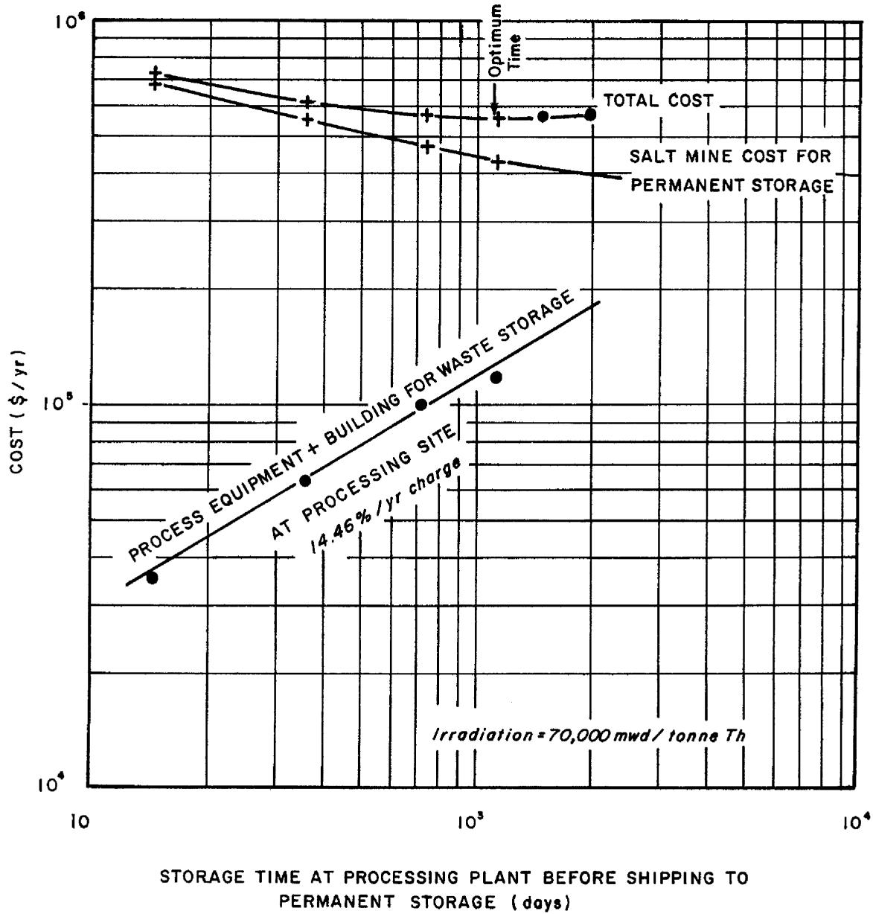  
Fig. 7.1 Determination of Minimum Total Cost for Handling 1.2 ft $^3$ /day Waste Salt from a Fluoride Volatility Plant and Optimum Storage Time at Processing Plant Before Shipping to Salt Mine.

Table 7.2. Building Costs for a 1.2 ft $^3$ /Day Fluoride Volatility, On-Site Processing Plant. Values of Table 5.2 Revised to Exclude Pa-233 Decay Storage Space (Values in Dollars)   

<table><tr><td></td><td>Material</td><td>Labor</td><td>Total</td></tr><tr><td colspan="4">Processing Cells</td></tr><tr><td>Excavation and back fill</td><td>101,570</td><td>47,200</td><td>148,770</td></tr><tr><td>Concrete, forms, reinforcing, etc.</td><td>288,000</td><td>432,000</td><td>720,000</td></tr><tr><td>Structural steel and miscellaneous metal</td><td>166,500</td><td>133,700</td><td>300,200</td></tr><tr><td>Crane area roofing</td><td>38,400</td><td>44,800</td><td>83,200</td></tr><tr><td>Doors, painting, crane bay doors, etc.</td><td>384,490</td><td>156,490</td><td>540,980</td></tr><tr><td>Services</td><td>168,380</td><td>111,250</td><td>279,630</td></tr><tr><td>Building movable equipment</td><td>852,500</td><td>249,250</td><td>1,101,750</td></tr><tr><td>Viewing windows</td><td>40,000</td><td>2,000</td><td>42,000</td></tr><tr><td>Sub total</td><td>2,039,840</td><td>1,176,690</td><td>3,216,530</td></tr><tr><td colspan="4">Interim Waste Storage</td></tr><tr><td>Excavation and back fill</td><td>13,800</td><td>6,400</td><td>20,200</td></tr><tr><td>Concrete, forms, reinforcing, etc.</td><td>55,000</td><td>82,000</td><td>137,000</td></tr><tr><td>Structural steel and miscellaneous metal</td><td>95,600</td><td>91,800</td><td>187,400</td></tr><tr><td>Crane area roofing</td><td>9,600</td><td>11,200</td><td>20,800</td></tr><tr><td>Painting</td><td>5,500</td><td>5,500</td><td>11,000</td></tr><tr><td>Services</td><td>115,000</td><td>39,100</td><td>154,100</td></tr><tr><td>Building movable equipment</td><td>30,000</td><td>10,000</td><td>40,000</td></tr><tr><td>Sub total</td><td>324,500</td><td>246,000</td><td>570,500</td></tr><tr><td colspan="4">Operations and Laboratories</td></tr><tr><td>Excavation and back fill</td><td>50,330</td><td>23,600</td><td>73,930</td></tr><tr><td>Concrete, forms, reinforcing, etc.</td><td>62,800</td><td>87,400</td><td>150,200</td></tr><tr><td>Structural steel and miscellaneous metal</td><td>129,130</td><td>29,910</td><td>159,040</td></tr><tr><td>Roofing</td><td>5,870</td><td>2,920</td><td>8,790</td></tr><tr><td>Superstructure</td><td>34,530</td><td>14,970</td><td>49,500</td></tr><tr><td>Miscellaneous structural material</td><td>17,980</td><td>18,750</td><td>36,730</td></tr><tr><td>Services</td><td>238,510</td><td>178,510</td><td>417,020</td></tr><tr><td>Miscellaneous equipment</td><td>272,800</td><td>35,900</td><td>308,700</td></tr><tr><td>Sub total</td><td>811,950</td><td>391,960</td><td>1,203,910</td></tr><tr><td colspan="4">Outside Utilities</td></tr><tr><td>Water, electricity, drains, etc.</td><td>80,700</td><td>29,700</td><td>110,400</td></tr><tr><td colspan="4">Land Improvements</td></tr><tr><td>Grading, roads, sidewalks, etc.</td><td>73,000</td><td>45,200</td><td>118,200</td></tr><tr><td>Total (rounded)</td><td>3,399,000</td><td>1,821,000</td><td>5,220,000</td></tr></table>

Irradiation = 70,000 Mwd/tonne Th

Table 7.3. Summary of Capital Cost Estimate for a 1.2 ft³/day On-Site, Fluoride Volatility Plant. Values of Table 5.3 Revised to Exclude Cost of Retaining Waste Salt for Pa-233 Decay   

<table><tr><td></td><td>Cost ($)</td></tr><tr><td>Process cells</td><td>3,216,530</td></tr><tr><td>Interim waste storage</td><td>570,500</td></tr><tr><td>Operations area and laboratories</td><td>1,203,910</td></tr><tr><td>Outside utilities</td><td>110,400</td></tr><tr><td>Land improvements</td><td>118,200</td></tr><tr><td>Process equipment</td><td>522,300</td></tr><tr><td>Process piping</td><td>180,000</td></tr><tr><td>Process instrumentation</td><td>100,000</td></tr><tr><td>Process electrical connections</td><td>20,000</td></tr><tr><td>Sampling connections</td><td>10,000</td></tr><tr><td>Total installed equipment and building cost (rounded)</td><td>6,052,000</td></tr><tr><td>General construction overhead (22% of total installed equipment and building cost)</td><td>1,331,000</td></tr><tr><td>Total construction cost</td><td>7,383,000</td></tr><tr><td>Architect engineering and inspection (15% of total construction cost)</td><td>1,107,000</td></tr><tr><td>Subtotal project cost</td><td>8,490,000</td></tr><tr><td>Contingency (20% of subtotal project cost)</td><td>1,698,000</td></tr><tr><td>Total project cost</td><td>10,188,000</td></tr></table>

# 7.6 Economic Advantage

The economic advantage of eliminating Pa-233 decay storage facilities from the 1.2 ft $^3$ /day fluoride volatility plant can be found by comparing the savings in capital cost with the value of protactinium that is discarded as waste. Subtracting the total plant cost of Table 7.3 from that of Table 5.3, there obtains

$$
\$ 12,556,000 - 10,188,000 = \$ 2,368,000,
$$

the estimated savings in capital investment. If this amount is amortized at $14.46\%$ /year, which is the charge applied to the capital investment, an annual gross economic advantage of

$$
\$ 2,368,000 \times 0.1446 = \$ 342,400 \text {p e r y e a r}
$$

is realized. There would be some savings on operating cost which should be added to this number; this saving was not estimated and is probably not a very significant amount because it does not cost much to operate a dead storage area.

The process flowsheet (Fig. 3.1) shows that there are $54.6\mathrm{~g}$ Pa-233/day entering the fluorinator. Valuing this material at $\$12/\mathrm{g}$ for 292 days operation per year, there obtains

$$
5 4. 6 \times 2 9 2 \times 1 2 = \$ 1 9 1, 3 0 0 / \text {y e a r}
$$

lost by discarding protactinium.

The net economic advantage from eliminating Pa-233 decay storage from the 1.2 ft³/day fluoride volatility plant is about $151,100 per year.

Although it was not considered in this study, there might be some economic advantage to a nominal increase in prefluorination holdup to allow more Pa-233 to decay. The value of the increased U-233 yield would have to be weighed against the additional process equipment and inventory charges for the longer storage.

71

APPENDIX

C

C

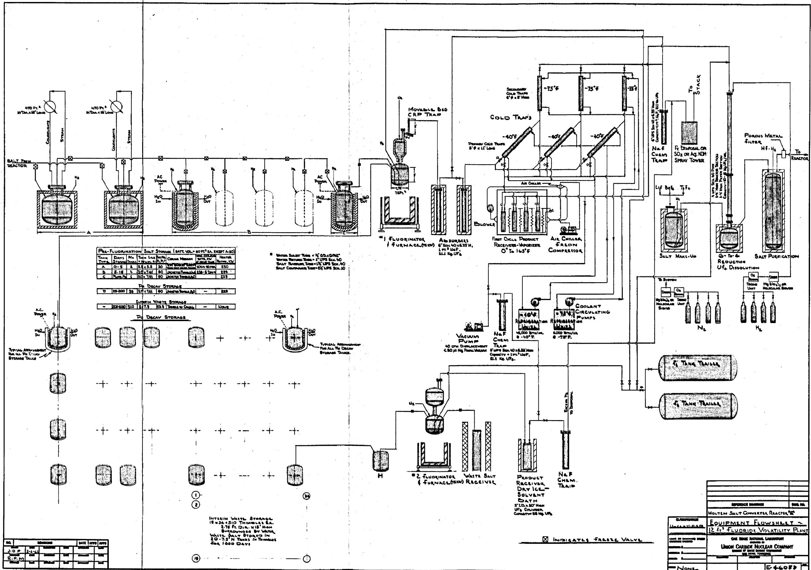

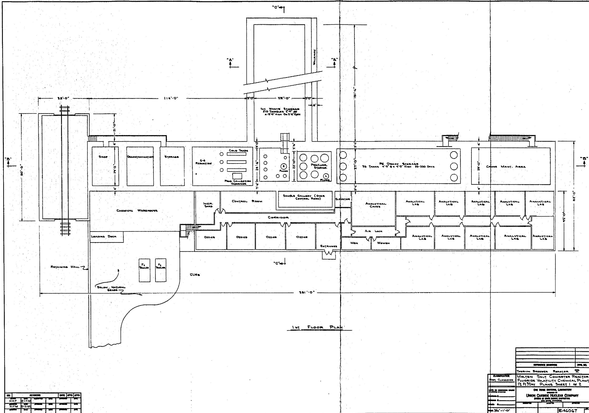

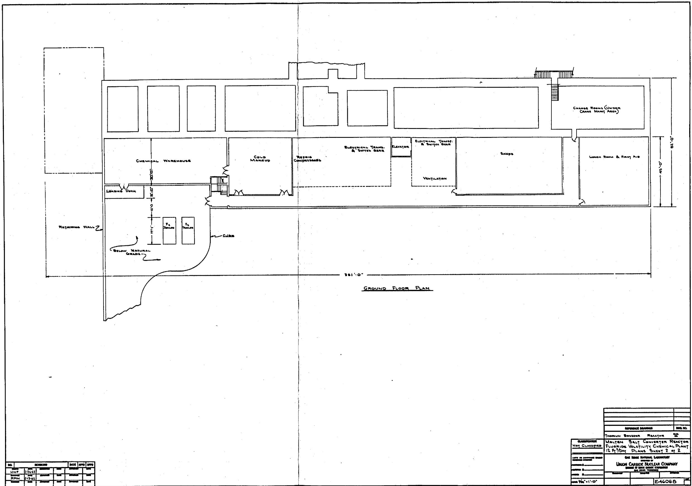

<table><tr><td colspan="2"></td><td></td></tr><tr><td colspan="2"></td><td></td></tr><tr><td colspan="2"></td><td></td></tr><tr><td colspan="2"></td><td></td></tr><tr><td colspan="2">REFERENCE MANUALS</td><td>INSPE NO.</td></tr><tr><td colspan="3">THOMMUS BRASSON RESEARCH</td></tr><tr><td colspan="3">MOLTEN SALT CONVERTER REACTOR
FLUORIDE VOLATILITY CHEMICAL PLANT
12 H/DAY PLANNS SHEET 2 OF 2</td></tr><tr><td colspan="3">GENOME NATIONAL LABORATORY
UNION CARBIDE NUCLEAR COMPANY
GAINSE OF BRAK CHARGE COMPENSATION
SAE SECUR, THERMOLOGY</td></tr><tr><td>Company</td><td>Address</td><td>Phone</td></tr><tr><td></td><td></td><td>E-46060</td></tr></table>

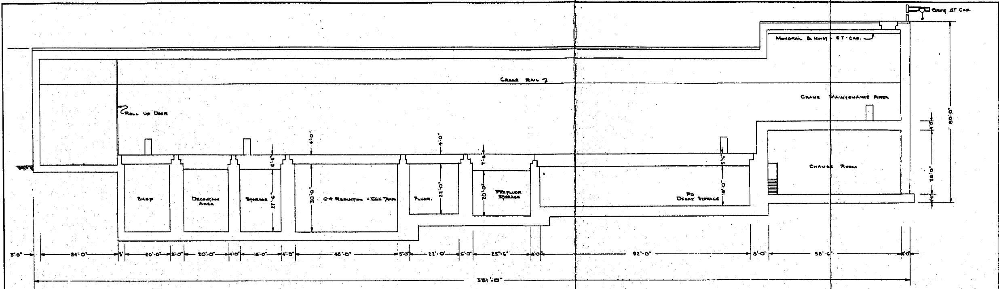

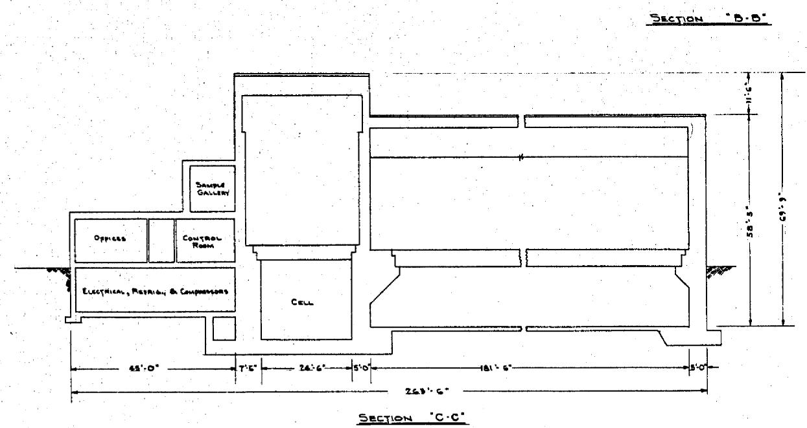

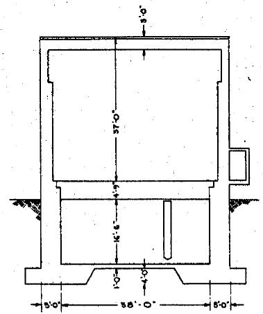  
SECTION $\because A \cdot  {A}^{ * }$

<table><tr><td rowspan="2">ISO</td><td colspan="3">REVISIONS</td><td>DATE</td><td>APPD</td><td>APPD</td></tr><tr><td>H-WF</td><td>BACZ-1-L1</td><td>EAMMFGW</td><td>DATE</td><td>ENPMG</td><td>DATE</td></tr><tr><td rowspan="2">RJ. P. Valances</td><td>BACZ-1-L2</td><td>APPROX</td><td>GEN</td><td>APPROX</td><td>BASIC</td><td>BASIC</td></tr><tr><td>Z-H-L2</td><td>APPROX</td><td>GEN</td><td>APPROX</td><td>BASIC</td><td>BASIC</td></tr></table>

<table><tr><td colspan="4"></td></tr><tr><td colspan="3"></td><td></td></tr><tr><td colspan="3"></td><td></td></tr><tr><td colspan="3"></td><td></td></tr><tr><td colspan="3">REFERENCE DRAWINGS</td><td>DWG.NO.</td></tr><tr><td colspan="4">THOMAIS BREEDER REACTOR</td></tr><tr><td>CLASSIFICATION
NOT CLASSIFIED</td><td colspan="3">MOLLEN SALT CONVERTER REACTOR
FLUORIDE VOLATILITY CHEMICAL PLANT
12 FT/DAY - SECTIONS</td></tr><tr><td>###</td><td colspan="3">ONE IDICE NATIONAL LABORATORY
CIN##ON OF
UNION CARBIDIC NUCLEAR COMPANY
GENOME ORIGINANCE CO#NNECTION
AND ANIMAL TESTS</td></tr><tr><td>###</td><td>###</td><td colspan="2">###</td></tr></table>

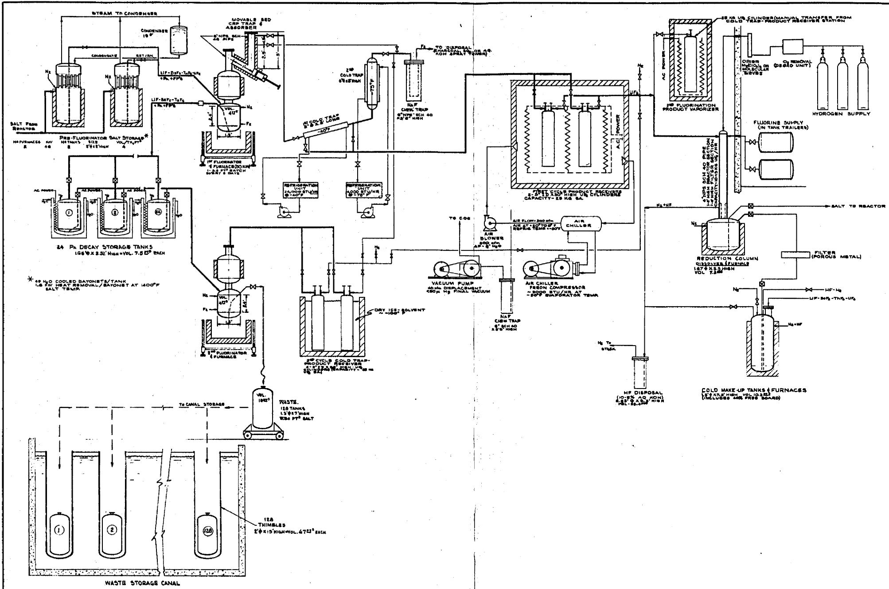

<table><tr><td>REFERENCE DRAWINGS</td><td>DWG NO.</td></tr><tr><td colspan="2">MOLTON SALT CONVERTER REACTORS</td></tr></table>

<table><tr><td rowspan="2">NO.</td><td colspan="4">REMARKS</td><td>DATE</td><td>APPD</td><td>APPD</td></tr><tr><td>Date/Year/S2</td><td>Remark</td><td>Date</td><td></td><td>APPD</td><td></td><td>Date</td></tr><tr><td>RANMANHOLG</td><td></td><td></td><td></td><td></td><td></td><td></td><td></td></tr><tr><td></td><td></td><td></td><td></td><td></td><td></td><td></td><td></td></tr><tr><td></td><td></td><td></td><td></td><td></td><td></td><td></td><td></td></tr></table>

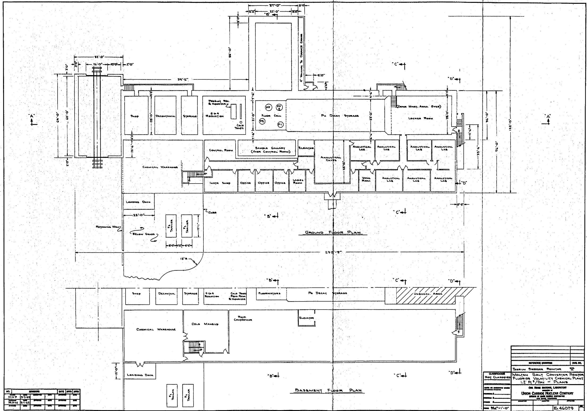  
77

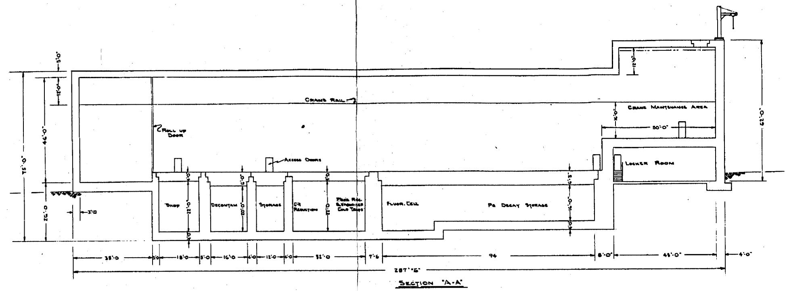

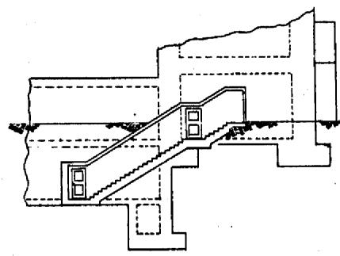  
SECTION "D·D"

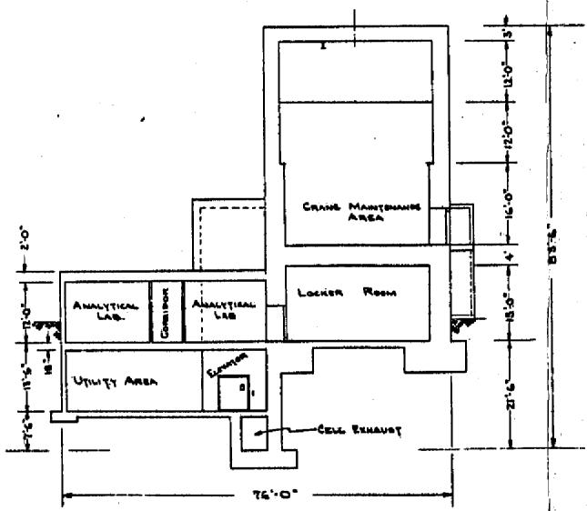  
Section "C.C"

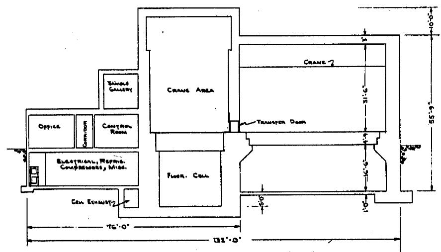  
Section "B. B"

<table><tr><td colspan="3"></td></tr><tr><td colspan="3"></td></tr><tr><td colspan="3"></td></tr><tr><td colspan="3"></td></tr><tr><td colspan="3"></td></tr><tr><td colspan="2">REFERENCE DRAWINGS</td><td>DWG NO.</td></tr><tr><td colspan="3">THOMAS GREENBER REFACTOR</td></tr><tr><td colspan="3">MOLTEN SALT CONVERTER REACTOR
FLUORIDE VOLATILITY CHEMICAL PLANT
1.2 PI/DAY - SECTIONS</td></tr><tr><td colspan="3">GEN ROSE NATIONAL LABORATORY
COPAYES OF
UNION CARBIDE NUCLEAR COMPANY
BECASES OF BONE CRAFTED
ON KICK, VENTURE</td></tr><tr><td>###</td><td>###</td><td>###</td></tr><tr><td></td><td>E-4G080</td><td>###</td></tr></table>

<table><tr><td>NO.</td><td colspan="3">EQUIPMENTS</td><td>DATE</td><td>APPD</td><td>APPD</td></tr><tr><td>H.W.F.</td><td>3-7-12</td><td>TOMMER</td><td>CUT</td><td></td><td></td><td>Cut</td></tr><tr><td>R.P.P.A.</td><td>3-1-61</td><td>AMOUNT</td><td>UNIT</td><td>mm</td><td>mm</td><td>mm</td></tr><tr><td>Ampoult</td><td></td><td>unamputated</td><td>UNIT</td><td>mm</td><td>mm</td><td>mm</td></tr></table>

# REFERENCES

1. W. H. Farrow, Jr., Radiochemical Separations Plant Study Part II - Design and Cost Estimates, DP-566 (March 1961).   
2. Personal communication R. P. Milford with W. H. Farrow, Jr. (Feb. 16, 1962).   
3. R. B. Briggs, Molten Salt Reactor Program Progress Report for Period from March 1 to August 31, 1961, ORNL-3215 (Jan. 12, 1962).   
4. G. I. Gathers, M. R. Bennet and R. L. Jolley, The Fused Salt Fluoride Volatility Process for Recovering Uranium, ORNL-2661 (Apr. 1, 1959).   
5. W. H. Carr, S. Mann and E. C. Moncrief, "Uranium-Zirconium Alloy Fuel Processing in the ORNL Volatility Pilot Plant," Paper for Presentation at the AICH.E. Symposium, "Volatility Reprocessing of Nuclear Reactor Fuels," New York, New York, Dec. 1961, ORNL CF 61-7-13 (July 10, 1961).   
6. R. P. Milford, S. Mann, J. B. Ruch and W. H. Carr, Jr., "Recovering Uranium Submarine Reactor Fuels," Ind. Eng. Chem., 53, 357-362 (May 1961).   
7. Personal communication R. P. Milford with S. H. Smiley (ORGDP).   
8. Personal communication R. P. Milford and W. L. Carter with E. D. Arnold (Feb. 1962).   
9. J. O. Blomeke and Mary F. Todd, Uranium Fission-Product Production as a Function of Thermal Neutron Flux, Irradiation Time, and Decay Time. 1. Atomic Concentrations and Gross Totals, ORNL-2127, Part I, Vol. 2 (Dec. 15, 1958).   
10. H. Etherington, ed., *Nuclear Engineering Handbook*, McGraw-Hill Book Company, Inc., New York (1958).   
11. United States Atomic Energy Commission, Guide-to Nuclear Power Cost Evaluation (Dec. 31, 1961).   
12. Cost evaluation of molten salt reactor plant joint effort of ORNL and Sargent and Iundy Engineers, Chicago; work in progress.   
13. F. L. Culler, Chemical Technology Division Annual Progress Report for the Period Ending May 31, 1962, ORNL-3314, in publication.   
14. J. P. Murray, et. al., "Economics of Unirradiated Processing Phases of Uranium Fuel Cycles," Second International Conference on the Peaceful Uses of Atomic Energy, Vol. 13, paper No. P/439, page 582, United Nations, New York, 1958.

# REFERENCES - contd

15. J. J. Perona and R. L. Bradshaw, Oak Ridge National Laboratory, personal communication, Aug. 27, 1962.   
16. R. E. Blanco and E. G. Struxness, Waste Treatment and Disposal Progress Report for February-March 1962, ORNL TM-252, p. 39, (Sept. 10, 1962).

# Internal Distribution

1. L. G. Alexander   
2. E. D. Arnold   
3. S. E. Beall   
4. M. Bender   
5. L. L. Bennett   
6. E. S. Bettis   
7. R. E. Blanco   
8. F. F. Blankenship   
9. A. L. Boch   
10. J. C. Bresee   
ll. R. B. Briggs   
12. K. B. Brown   
13. D. O. Campbell   
14. R. S. Carlsmith   
15. W. H. Carr   
16. W. L. Carter   
17. G. I. Cathers   
18. C. W. Craven   
19. F. L. Culler   
20. D. E. Ferguson   
21. A. P. Fraas   
22. E. H. Gift   
23. H. E. Goeller   
24. C. E. Guthrie   
25. R.W.Horton   
26. P. R. Kasten   
27. T. W. Kerlin   
28. J.A.Lane   
29. R. B. Lindauer

30. R. N. Lyon   
31. H. G. MacPherson   
32. W. D. Manly   
33. H. F. McDuffie   
34. R. P. Milford   
35. A. J. Miller   
36. A. M. Perry   
37. M. W. Rosenthal   
38. H. W. Savage   
39. A. W. Savolainen   
40. M. J. Skinner   
41. I. Spiewak   
42. W. G. Stockdale   
43. J. A. Swartout   
44. D. B. Trauger   
45. J.W.Ullmann   
46. W. E. Unger   
47. R. Van Winkle   
48. A. M. Weinberg   
49. M. E. Whatley

50-51. Central Research Library

52-54. Y-12 Document Reference Section

55-57. Laboratory Records Department (LRD)

58. Laboratory Records Department (LRD-RC)   
59. Reactor Division Library

# External Distribution

60. R. E. Pahler (AEC, Washington)   
61. F. P. Self (AEC-ORO)   
62. Research and Development Division (AEC-ORO)   
63-64. Reactor Division (AEC-ORO)   
65-79. Division of Technical Information Extension (DTIE)