ORNL-TM-528

MASTER

DESIGN AND OPERATION OF FORCED-CIRCULATION

CORROSION TESTING LOOPS WITH MOLTEN SALT

J. L. Crowley   
W. B. McDonald   
D. L. Clark

Fermi Price $\leq  {2.62}{c}^{n}$

Macrilino

Available from the

Office of Technical Services

Department of Commerce

Washington 25, D.C.

# NOTICE

This document contains information of a preliminary nature and was prepared primarily for internal use at the Oak Ridge National Laboratory. It is subject to revision or correction and therefore does not represent a final report. The information is not to be abstracted, reprinted or otherwise given public dissemination without the approval of the ORNL patent branch, Legal and Information Control Department.

# LEGAL NOTICE

This report was prepared as an account of Government sponsored work. Neither the United States, nor the Commission, nor any person acting on behalf of the Commission:

A. Makes any warranty or representation, expressed or implied, with respect to the accuracy, completeness, or usefulness of the information contained in this report, or that the use of any information, apparatus, method, or process disclosed in this report may not infringe privately owned rights; or   
B. Assumes any liabilities with respect to the use of, or for damages resulting from the use of any information, apparatus, method, or process disclosed in this report.

As used in the above, "person acting on behalf of the Commission" includes any employee or contractor of the Commission, or employee of such contractor, to the extent that such employee or contractor of the Commission, or employee of such contractor prepares, disseminates, or provides access to, any information pursuant to his employment or contract with the Commission, or his employment with such contractor.

Contract No. W-7405-eng-26

Reactor Division

DESIGN AND OPERATION OF FORCED-CIRCULATION CORROSION TESTING LOOPS WITH MOLTEN SALT

J. L. Crowley W. B. McDonald D. L. Clark

Date Issued

MAY - 1 1963

OAK RIDGE NATIONAL LABORATORY

Oak Ridge, Tennessee

operated by

UNION CARBIDE CORPORATION

for the

U.S. ATOMIC ENERGY COMMISSION

# CONTENTS

Page

Abstract 1

Introduction 1

Description of Test Loop and Auxiliary Equipment 2

Alarm and Automatic-Action Controls 15

Operation and Maintenance of a Test Loop 17

Summary 21

Acknowledgments 21

# DESIGN AND OPERATION OF FORCED-CIRCULATION CORROSION TESTING LOOPS WITH MOLTEN SALT

J. L. Crowley

W. B. McDonald

D. L. Clark

# Abstract

Standardized test facilities were developed and operated for investigating the compatibility of structural materials and flowing molten fluoride salts. The standard loop accommodates various combinations of materials, fluids, flow rates, and temperature differentials and permits fabrication of components in sufficient quantity for cost reduction. The test loop consists of a pump, two heated sections, a cooled section, a drain tank, and a frozen- plug-type valve. Automatic controls and equipment were developed to prevent solidification of the salt mixtures (m.p., 800 to $1100^{\mathrm{O}}\mathrm{F}$ ) in the event of a loss of power. Most test loops are fabricated of 0.5-in.-o.d., 0.045-in.-wall tubing, and they operate with a temperature differential of up to $200^{\mathrm{O}}\mathrm{F}$ , a maximum wall temperature in the range 1200 to $1500^{\mathrm{O}}\mathrm{F}$ , and a salt flow rate of up to 3 gpm. Twenty-five test loops have been operated for an accumulated operating time of 290,000 hr. Individual loops have been operated continuously for more than one year.

# Introduction

Mixtures of molten fluoride salts have been investigated extensively for application in reactor systems as fluid fuels or as heat transfer media. The compatibility of a particular salt mixture with a proposed container alloy is determined, in part, by tests with thermal-convection loops, $^{1}$ and the most promising combinations of salt mixtures and structural material are then studied in forced-circulation corrosion test loops. These loops simulate all essential reactor operating conditions except radiation. $^{2}$ The test stands and loops have been standardized to permit ready replacement and to minimize fabrication costs and installation time.

Many mixtures of molten salts have been tested. The basic constituents of these have been the fluorides of sodium, lithium, beryllium,

zirconium, thorium, and uranium in various proportions that give melting temperatures generally falling in the 800 to $1100^{\circ}\mathrm{F}$ range. $^{3}$ Viscosity and density vary with each mixture. The viscosity increases with the amount of beryllium present and the density increases with the amount of heavy elements present. A typical salt mixture has a viscosity of 10 centipoise and a specific gravity of 2.4 at $1100^{\circ}\mathrm{F}$ . The salt mixtures containing beryllium require stringent safety precautions to prevent exposure of personnel to this toxic material.

To predict accurately corrosion rates for power reactors, the tests must necessarily be of long-term duration. The test stand control system was therefore designed not only to maintain the necessary test conditions for long periods of operation but also to provide automatic protection against solidification of the salt in the system. Since melting of the salt imposes severe stresses on the container wall, remelting after solidification might cause premature failure of the loop.

# Description of Test Loop and Auxiliary Equipment

The test loop is illustrated in Fig. 1. The loop consists of a pump, two heated sections, a cooled section, a drain tank, and a frozen- plug-type valve. All wetted parts of the loop are fabricated of the alloy being studied. Loop tubing size is selected to provide the proper conditions for electrical-resistance heating and to give a pressure drop at design flow that is consistent with the pump capability. A flow diagram of the molten-salt circuit and the auxiliary controls for the inert cover gas and utilities is shown in Fig. 2.

A standard loop supported by its mobile dolly is pictured in Fig. 3. This standard loop was developed from experience gained in many tests to accommodate the various combinations of materials, fluids, flow rates, and temperature gradients desired. Such standardization has permitted fabrication of components in quantity for both cost reduction and ease of assembly. The interchangeability of the test loops and stands allows the fabrication of standby test loop assemblies for quick replacement with a minimum of down time. For most tests, 0.5-in.-o.d., 0.045-in.-wall tubing has been found to be suitable.

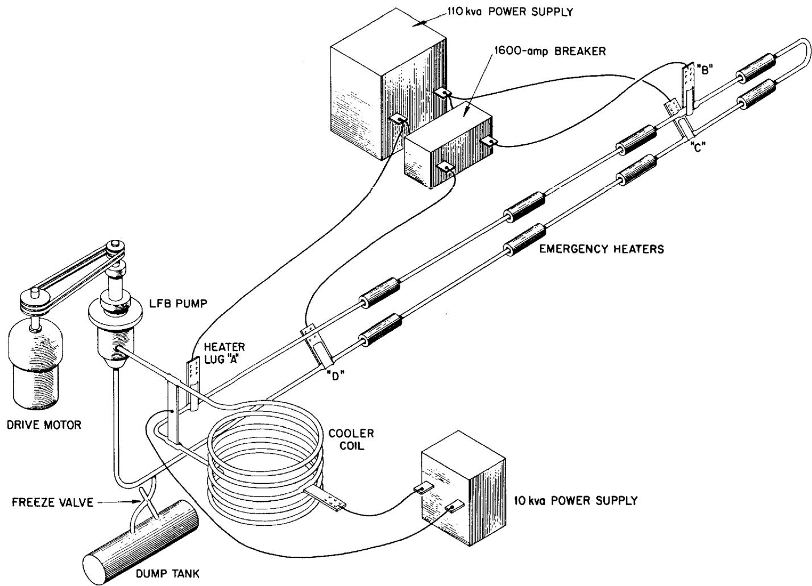  
Fig. 1. Molten-Salt Corrosion Testing Loop and Power Supplies.

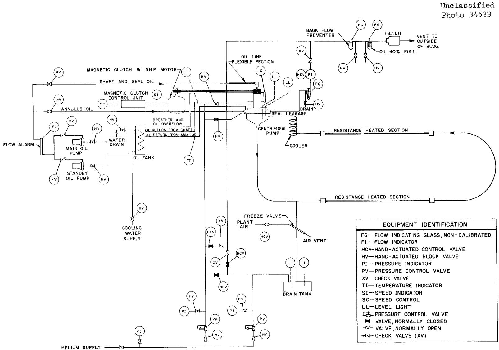  
Fig. 2. Flow Diagram of Molten Salt Loop and Utilities.

Unclassified

Photo 26592

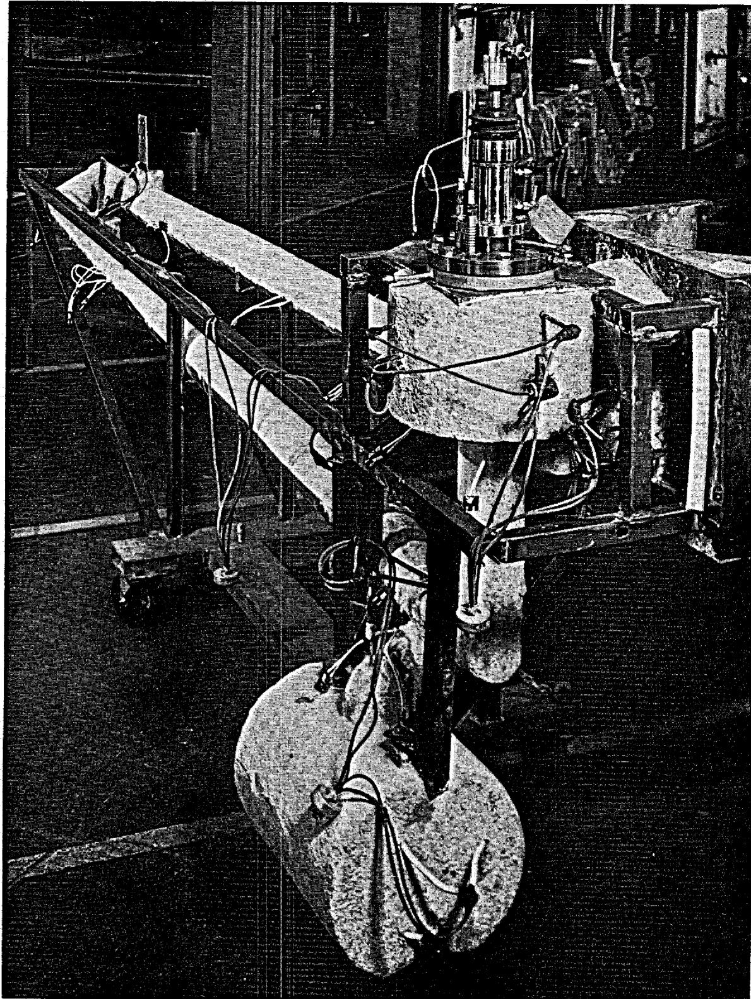  
Fig. 3. Photograph of Molten-Salt Corrosion Testing Loop on Mobile Dolly.

The flow rate, Reynolds number, pressure drop, and power required for the heater sections are calculated using the physical properties of the particular salt mixture and the performance characteristics of the pump.

A loop pressure drop (feet of head) vs flow (gpm) curve is determined by using the physical properties of the molten salt to be tested and the geometry of the loop. By superimposing this curve on the pump operating characteristic curve, as shown in Fig. 4, the desired flow rate is determined within the limitations of allowable pump speed.

The electrical resistivity of the molten salt is enough higher than that of the metal container walls that it can be neglected in determining the power requirements of the heater sections. The transformer voltage required for the particular salt mixture shown in Fig. 4 was calculated according to the electrical resistance of the heater section tubing, the flow rate, and the desired bulk fluid temperature difference. The power required of the transformer was $58.8\mathrm{Kw}$ at 1250 amp and 47.2 volts. The two heater sections, 96 in. and 109 in. in length, are connected to the power supply transformer in parallel and carry 665 and 585 amp, respectively. The shorter first section (96 in.) has less resistance and imparts a higher heat flux where the bulk fluid temperature is the lowest. This arrangement results in approximately equal maximum wall temperatures at the outlet of both heaters. A wall temperature and bulk fluid temperature profile of a typical loop while in operation at test conditions is shown in Fig. 5. The $\mathbf{I}^{2}\mathbf{R}$ heating is applied only to straight sections of the tubing, during normal operation, to eliminate hot spots caused by poor flow distribution in the tubing bends. Two heater sections are used to reduce the overall length of the loop that would be necessary to obtain the desired fluid temperature with one continuous heater section. The flow of current is restricted to the heater sections during operation at test conditions by the method of attachment to the transformer. One terminal of the transformer is connected to the outlet of the second heater section and to the inlet of the first heater section. The outlet of the first heater and the inlet of the second heater are similarly connected to the other transformer terminal. The loop is grounded at the pump, while the remainder of the loop is

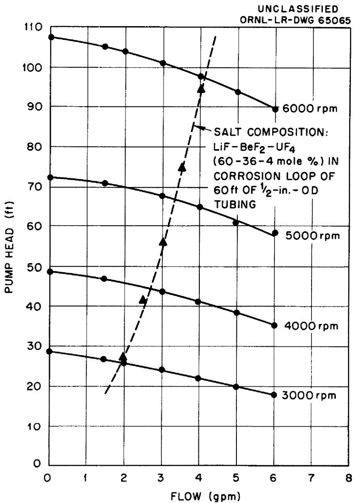  
Fig. 4. Performance Characteristics of Centrifugal Pump, Model LFB.

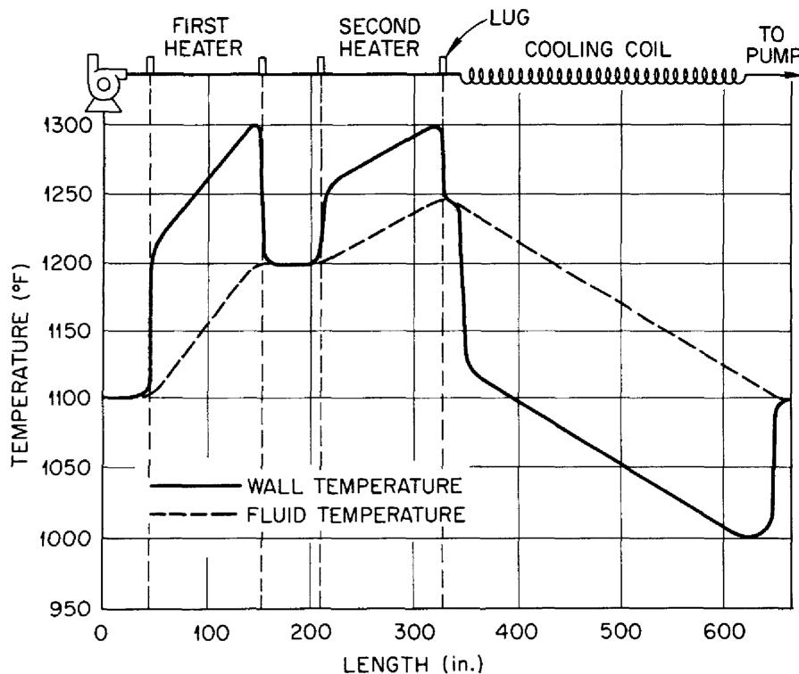  
UNCLASSIFIED ORNL-LR-DWG 65066   
Fig. 5. Temperature Profile of Corrosion Loop at Test Conditions.

electrically insulated.

At test conditions, from 350 to 700 amp of 60-cycle alternating current flows in each heater section at a potential of 25 to 50 v. Electrical current is supplied to the heater sections through a nickel lug welded to a thick-walled adapter section of the loop.

The power for the heater section is supplied by a 110-kva transformer having a low-voltage high-current secondary winding, with a saturable-core reactor on the primary side. A proportional-control pyrometer regulates the d-c voltage to the saturable reactor and determines the voltage applied to the heater section of the loop by the main power transformer. The amount of power which may be applied to the heater section is limited by a maximum-adjustment rheostat that limits the direct current available to the saturable reactor.

A loop high-temperature alarm is designed to cut off the direct current to the saturable reactor and to reduce the power to a minimum leakage value. When the loop temperature again drops below the alarm set point, the automatic action relay is reset and the power is re-applied at the rate previously set. The high-temperature alarm thus serves as an "on-off" control of the power if an emergency condition occurs.

The transformer is connected to the loop heater lugs by a 500,000-circular-mills cable through a 1600-amp breaker. During normal operation the connections of the heater section are such that the current flow is confined to the two heater sections (4 connections to the loop). However, when it is necessary to preheat or provide emergency heating to the entire loop, the 1600-amp breaker shown in Fig. 1 is tripped, leaving only two connections to the loop. Thus the entire loop, with the exception of the cooler coil, is heated by the formation of two parallel paths of nearly equal resistance.

A downflow centrifugal sump pump designed at ORNL is used. Over 40 of these pumps have been fabricated of four different materials. An accumulated total of approximately 450,000 hr of operation in corrosion testing loops and other high-temperature pumping applications has demonstrated their reliability.[4,5] As shown in Fig. 6, the pump has an overhung vertical shaft with an oil-lubricated face seal above the liquid

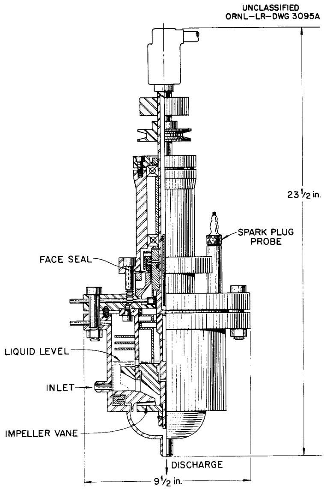  
Fig. 6. Cross Section of Centrifugal Pump, Model LFB.

level in an inert-gas atmosphere. Cooling of the shaft and seal is provided by a flow of oil down through the hollow shaft and out past the seal. The inlet to the pump is located on the side, and the outlet is at the bottom. The performance characteristics of the pump for various pump speeds are given in Fig. 4. A pump speed of approximately 3000 rpm is used for most long-term operation.

The centrifugal pump is driven through double V-belts by a variable-speed magnetic clutch and a 5 hp motor. The speed is regulated by an electronic control supplying d-c to the magnetic-clutch unit. In order to decrease the possibility of a flow stoppage as a result of an electronic unit failure, an auxiliary d-c source is supplied for the magnetic clutch, which is preset at the desired speed. This clutch supply circuit is shown schematically in Fig. 7. Relay SR-3 automatically changes over to the auxiliary supply if any perturbation of the normal control occurs. The operation of the pump is then maintained by the auxiliary-clutch supply, while electronic tubes are changed or other repairs are being made to the normal supply. In the event of the failure of both clutch supplies or a motor failure, steps are taken automatically to provide heat to the entire loop, as will be discussed further in the following section on alarm and automatic-action controls.

Since the pump contains the only gas-liquid interface of the system, a sampling device and level indicators are mounted on the pump bowl flange. The maximum and minimum liquid levels are indicated by a sparkplug-type probe which lights an indicator as the molten salt comes in contact with it.

A cross-sectional view of the sampling device is shown in Fig. 8. It consists of a dynamic-seal and ball-plug-valve arrangement through which a dip tube can be inserted into the molten salt and a sample withdrawn without contaminating the inert-gas covering the liquid in the pump bowl. The samples, which are removed periodically for chemical analysis, indicate the type and rate of increase of various corrosion products in the molten salt.

In preparation for taking a sample, a seal is established around the periphery of the sample tube, and the inert gas is introduced to purge the volume between this seal and the ball plug valve below. The ball

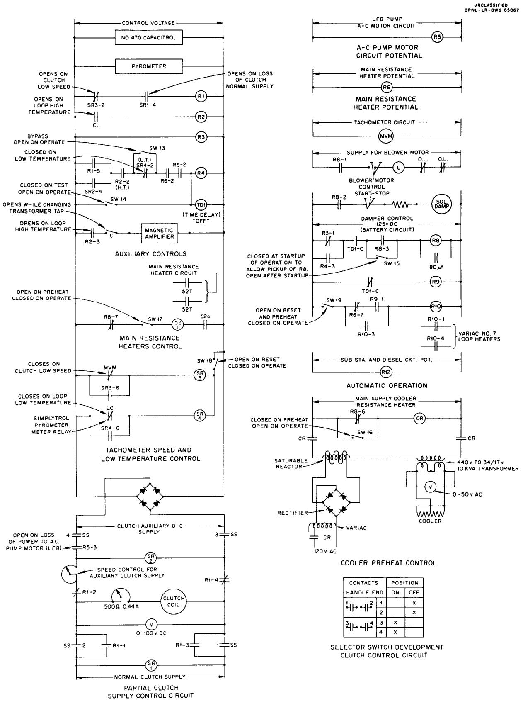  
Fig. 7. Electrical Schematic of Automatic Action Relays.

UNCLASSIFIED

ORNL-LR-DWG 65062

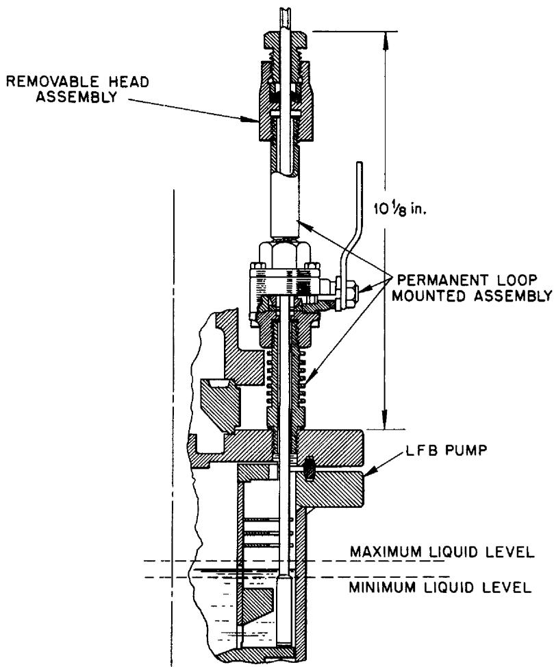  
Fig. 8. Cross Section of a Molten-Salt Sampling Device.

plug valve is then opened, and the dip tube is inserted into the molten salt in the pump. A vacuum is then applied to the dip tube, and the sample is drawn up into the tube. The dip tube is withdrawn, and the ball plug valve closed. The number of samples is limited only by the amount of molten salt which can be removed without depriming the pump.

The flow of molten salt from the pump is past the drain-tank connection, through the first heater section, through a long-radius 180-deg bend, through the second heater section, through a coiled cooler, and back to the pump. The cooler section is a helical coil mounted in a circular-duct annulus through which ambient air is blown. To provide the necessary preheat temperature for filling the loop and for protection against solidification of the molten salt in an emergency situation, the cooler coil is provided with electrical heating lugs at both ends and in the center for electrical-resistance heating. The inlet and outlet are kept at the same potential electrically to confine the flow of current to the cooler coil only. A separate 10-kva saturable core reactor and transformer are connected to the cooler coil for use in preheating or during an emergency alarm condition. The control is set at a predetermined rate of approximately 300 amp and 15 v, and the power is applied automatically when required.

Other auxiliary equipment required for the operation of the loop include a 3000 cfm blower, a cooling oil supply, and the necessary utilities, such as cooling air for the frozen-plug valve, inert gas, and cooling water. The entire pump, loop, and drain tank assembly is shown in Fig. 3 mounted on a mobile dolly for ease of fabrication, inspection, and installation. The dolly contains one half of the insulated cooler duct and the air deflector in the center, which forms an annular air passage. The back half of the cooler duct is mounted on the permanent stand frame, which also contains the circulating cooling oil system, heater connections, and the pump-drive motor. Mounted over the cooler duct is an insulated cover lid that is held in an upright position by a solenoid-held latch during operation of the loop. In the event of an alarm condition which shuts off the blower motor, the latch is released on the drop lid and encloses the cooler coil to prevent excessive loss of heat.

All critical loop welding is done by the Heliarc process with inert cover gas and backup purge according to a strict welding specification.7 All welds are inspected visually, by dye penetrant, and by x-ray. After welding, the loop is instrumented with Chromel-Alumel thermocouples and heaters. The thermocouples are spot welded to the tubing and covered with shim stock for protection. Both ceramic- and sheath-type heaters are used for heating such auxiliaries as the drain tank, the pump bowl, the heater lugs, and the freeze-plug valve. Standby heaters are mounted on the loop piping for emergency use only in the event of a failure of the main power supply. After the heaters and thermocouples are attached, the loop is covered with 3 in. of high-temperature insulation. The loop and dolly assembly are then installed in the facility, and the connections are made to controls and power supplies.

# Alarm and Automatic-Action Controls

The system thermal inertia is low because of the small-diameter tubing used, and therefore safeguards must be provided to prevent solidification of the salt in the loop. The salt in the cooler coil will become solid in less than 1 min if the flow is stopped and no external heat is applied. An alarm and automatic-action relay system was designed to protect the loop even though there was a failure of the power source or any one piece of operating equipment.

The basic outline of this system is shown in block form in Fig. 9. Any one of the alarms shown at the top of Fig. 9, i.e., any condition which will cause flow stoppage or adverse temperatures, will automatically place the loop in an isothermal or safe condition by performing the actions listed at the bottom of the figure. This results in the entire loop being warmed and in a safe or isothermal condition while the necessary action is taken to restore the equipment to operating condition. To cover the possibility of the failure of the main power transformer, the ceramic standby heaters are connected after 2 sec, and they will maintain isothermal conditions until the main source of power is restored. All relay actions indicated in the block diagram of Fig. 9 are shown schematically in Fig. 7. The battery-powered relay R-8 is de-energized by relay R-4 to perform the four functions which place the loop on

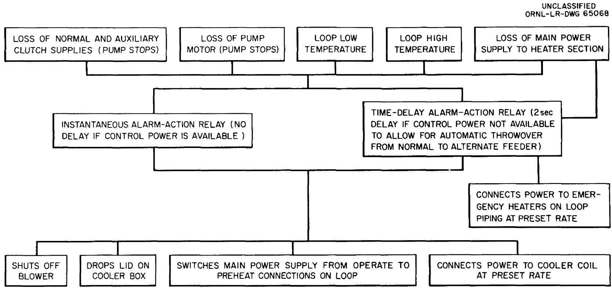  
Fig. 9. Block Diagram of Automatic Alarm Actions.

isothermal operation.

To guard against the failure of the power supply to the building which houses the tests or to the bus duct supplying power to the loops, equipment has been designed and installed as shown in block diagram in Fig. 10. Should a failure occur of the normal building feeder, a transfer to an alternate feeder is made automatically within 2 sec. The time-delay relay TD-1 and relay R-3 of Fig. 7 will hold in the battery-powered relay R-8, allowing the transfer to be made without disturbing the operation of the loops. Should the building electrical power be unavailable for a period longer than 2 sec, the emergency diesel generator, which started immediately, would begin assuming the load through a sequential timer. Loads would be picked up alternately between motor startup and heater load until the entire facility of 15 loops had power reapplied within 40 sec after the interruption. The 300-kw capacity of the diesel generator is sufficient to operate the loops isothermally until normal building electrical power is again available.

Other alarms are available for the protection of the loops that give only an audible or visual signal or both for corrective action to be taken by the operator. These alarms include loss of blower motor, low cooling oil flow, loss of cooler preheat potential, improper position of control switches, improper position of alarm acknowledge switches, and loss of control circuit potential.

# Operation and Maintenance of a Test Loop

The startup of a new corrosion testing loop is preceded by a series of checkouts of equipment. When all the electrical, thermocouple and control circuits are tested satisfactorily and the loop is leaktight, the entire loop is preheated to $1100^{\circ}\mathrm{F}$ with the pump shaft rotating slowly and the cooling oil circulating. The salt mixture chosen for the particular test is introduced into the drain tank in a molten state at a slightly higher temperature than that of the loop. The drain tank level probe indicates when there is sufficient salt to fill the loop. Inert gas pressure is admitted to the drain tank and vented from the upper portion of the loop at the pump.

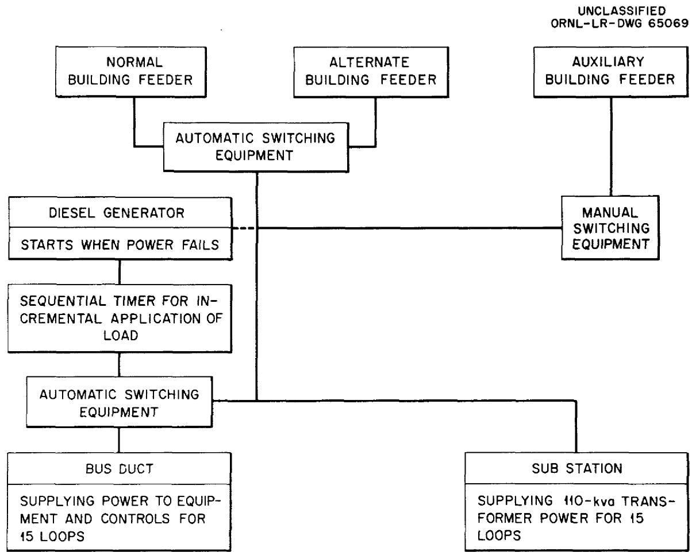  
Fig. 10. Block Diagram of Building Electrical Supply.

As the salt is slowly forced up into the loop, its path can be traced by the temperature readings of thermocouples placed along the tubing. Level probes in the pump indicate when the loop is full, and this level is maintained by manipulation of gas pressure while cooling air is supplied to the freeze-plug valve. When the temperature of the valve indicates a solid plug, the pressure is released from the drain tank and the pump speed is increased to begin circulation of the molten salt. Power from the main transformer is adjusted to maintain the desired temperature level. The first load of salt is circulated for a minimum of 2 hr to clean the system and is then dumped into the drain tank and removed. The filling operation is repeated with the supply of salt to be used for the corrosion test.

When the test salt is circulating, the differential temperatures are established by shutting off the cooler heat, opening the lid on the cooler duct, turning on the blower, closing the 1600-amp heater section breaker (which connects all four heater lugs), and adjusting pump speed, cooling air flow, and main transformer power, as required. When the desired conditions are met, all the controllers, alarm set points, and automatic functioning relays are set for continuous operation.

In order to assure, as far as practical, that all emergency equipment will function properly when the need arises, a preventive maintenance program is carried out weekly. A check list is completed for each facility which calls for the testing of all important alarms, the throw-over circuit on the auxiliary clutch supply, the cooler drop lid, and the clutch brushes; a visual inspection is made of the system.

The tests under this program have been operated with maximum wall temperatures of 1200 to $1500^{\circ}\mathrm{F}$ , a temperature difference between the maximum wall temperature and the minimum fluid temperature of $200^{\circ}\mathrm{F}$ , and flow rates up to 3 gpm. Previously tests were conducted with wall temperatures of $1500^{\circ}\mathrm{F}$ and higher. The wall temperatures obtained are limited only by the strength of the container material used. The temperature differential obtained is limited by the flow rate and power available. The forced-circulation corrosion test facility with eleven test stands showing in the left background is pictured in Fig. ll. The remaining four test stands are on the opposite side of the aisle to the right.

Unclassified

Photo 32867

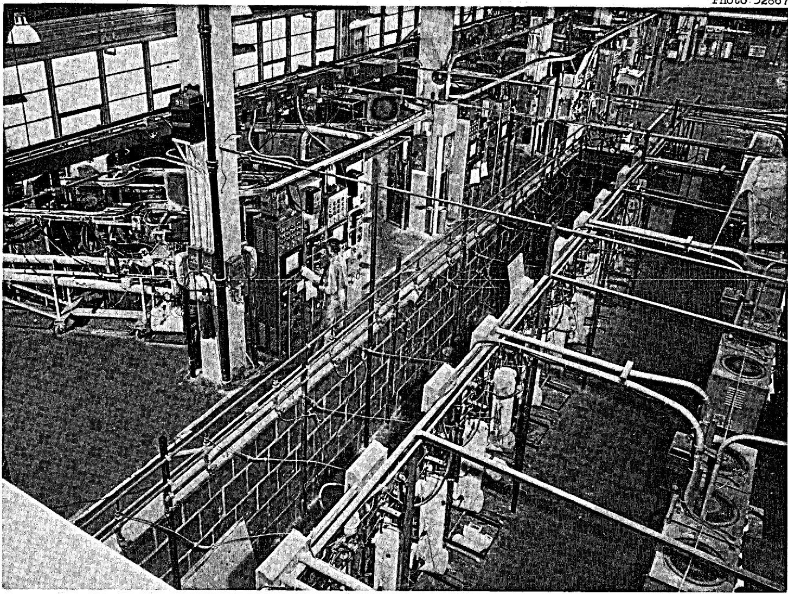  
Fig. 11. Photograph of Molten-Salt Corrosion Testing Loop Operating Area.

# Summary

Twenty-five loops have been fabricated with both INOR-8 and Inconel and have operated under this program for an accumulated total of over 290,000 hr. Twenty of the loops, thirteen of which were fabricated of INOR-8 and seven of Inconel, operated from one to two and a half years before being terminated and examined metallographically.

The long-term operation and metallographic examination of these loops was instrumental in the acceptance of INOR-8 as the container material for the Molten Salt Reactor Experiment. $^{10}$ The expected corrosion is expected to be less than 1 mils/yr at the design operating temperature of $1225^{\circ}\mathrm{F}$ .

Corrosion specimen weight loss and salt sample data from these loops indicated that the primary corrosion product is chromium and that an essentially constant value was achieved after approximately 5000 hr of operation.[11]

# Acknowledgments

Many persons have made important contributions to the design and operation of these facilities. Acknowledgment is made especially to H. W. Savage under whose direction this program was executed. The successful operation of these loops was due to a large extent to W. H. Duckworth and the shift operations group under R. Helton, and to many others too numerous to mention.

# References

1. J. H. Devan and W. D. Manly, Corrosion Properties of Fused-Fluoride Salt Mixtures, Trans. Am. Nuclear Soc., 1 (1):44 (June 1958).   
2. D. B. Trauger and J. A. Conlin, Circulating Fused-Salt-Fuel Irradiation Test Loop, Trans. Am. Nuclear Soc., 2 (1):173-4 (June 1959).   
3. J. P. Blakely, Molten Salt Compositions, Oak Ridge National Laboratory Report CF-58-6-58 (June 12, 1958).   
4. J. J. Keyes and A. I. Krakoviak, High-Frequency Surface Thermal Fatigue Cycling of Inconel at $1400^{\circ}\mathrm{F}$ , Trans. Am. Nuclear Soc., 2(1):22-4 (June 1959).   
5. W. F. Boudreau, A. G. Grindelli and H. W. Savage, The Development and Operation of Centrifugal Pumps for Liquid Metals and Fused Salts at 1100-1500°F, Trans. Am. Nuclear Soc., 2 (1):17-18 (June 1959).   
6. W. B. McDonald and J. L. Crowley, A Sampling Device for Molten Salt Systems, Oak Ridge National Laboratory Report ORNL-2688 (March 7, 1960).   
7. T. R. Housley and P. Patriarca, Procedure Specification PS-2 for D.C. ARC Welding of Inconel Tubing for High Corrosion Applications, Oak Ridge National Laboratory.   
8. W. D. Maniy et al., Metallurgical Problems in Molten Fluoride Systems, Proceedings of the Second United Nations International Conference on the Peaceful Uses of Atomic Energy, Vol. 7, pp. 223-34, United Nations, Geneva, 1958.   
9. J. A. Lane, H. G. MacPherson and F. Maslan, Fluid Fuel Reactors, p. 596, Addison-Wesley, Reading, Mass., 1958.   
10. S. E. Beall et al., Molten-Salt Reactor Experiment Preliminary Hazards Report, Oak Ridge National Laboratory Report CF-61-2-46 (Feb. 28, 1961).   
11. J. H. Devan and R. B. Evans III, Corrosion Behavior of Reactor Materials in Fluoride Salt Mixtures, Oak Ridge National Laboratory Report TM-323 (September 19, 1962).

# DISTRIBUTION

<table><tr><td>1.</td><td>MSRP Director&#x27;s Office</td><td>43.</td><td>W. B. McDonald</td></tr><tr><td>2.</td><td>G. M. Adamson</td><td>44.</td><td>H. F. McDuffie</td></tr><tr><td>3.</td><td>L. G. Alexander</td><td>45.</td><td>C. K. McGlothlan</td></tr><tr><td>4.</td><td>S. E. Beall</td><td>46.</td><td>R. L. Moore</td></tr><tr><td>5.</td><td>M. Bender</td><td>47.</td><td>J. C. Moyers</td></tr><tr><td>6.</td><td>E. S. Bettis</td><td>48.</td><td>W. R. Osborn</td></tr><tr><td>7.</td><td>F. F. Blankenship</td><td>49.</td><td>P. Patriarca</td></tr><tr><td>8.</td><td>E. G. Bohlmann</td><td>50.</td><td>H. R. Payne</td></tr><tr><td>9.</td><td>D. L. Clark</td><td>51.</td><td>M. Richardson</td></tr><tr><td>10.</td><td>J. A. Conlin</td><td>52.</td><td>R. C. Robertson</td></tr><tr><td>11.</td><td>W. H. Cook</td><td>53.</td><td>H. W. Savage</td></tr><tr><td>12.</td><td>J. L. Crowley</td><td>54.</td><td>A. W. Savolainenen</td></tr><tr><td>13.</td><td>J. H. DeVan</td><td>55.</td><td>D. Scott</td></tr><tr><td>14.</td><td>R. G. Donnelly</td><td>56.</td><td>J. H. Shaffer</td></tr><tr><td>15.</td><td>J. R. Engel</td><td>57.</td><td>M. J. Skinner</td></tr><tr><td>16.</td><td>C. H. Gabbard</td><td>58.</td><td>G. M. Slaughter</td></tr><tr><td>17.</td><td>R. B. Gallaher</td><td>59.</td><td>A. N. Smith</td></tr><tr><td>18.</td><td>W. R. Grimes</td><td>60.</td><td>P. G. Smith</td></tr><tr><td>19.</td><td>A. G. Grindell</td><td>61.</td><td>I. Spiewak</td></tr><tr><td>20.</td><td>R. H. Guymon</td><td>62.</td><td>J. A. Swartout</td></tr><tr><td>21.</td><td>P. H. Harley</td><td>63.</td><td>A. Taboada</td></tr><tr><td>22.</td><td>P. N. Haubenreich</td><td>64.</td><td>J. R. Tallackson</td></tr><tr><td>23.</td><td>R. Helton</td><td>65.</td><td>R. E. Thoma</td></tr><tr><td>24.</td><td>E. C. Hise</td><td>66.</td><td>D. B. Trauger</td></tr><tr><td>25.</td><td>H. W. Hoffman</td><td>67.</td><td>W. C. Ulrich</td></tr><tr><td>26.</td><td>P. P. Holz</td><td>68.</td><td>C. F. Weaver</td></tr><tr><td>27.</td><td>T. L. Hudson</td><td>69.</td><td>B. H. Webster</td></tr><tr><td>28.</td><td>R. J. Kedl</td><td>70.</td><td>A. M. Weinberg</td></tr><tr><td>29.</td><td>J. J. Keyes, Jr.</td><td>71.</td><td>J. C. White</td></tr><tr><td>30.</td><td>S. S. Kirslis</td><td>72.</td><td>L. V. Wilson</td></tr><tr><td>31.</td><td>A. I. Krakoviak</td><td>73.-74.</td><td>Cen. Res. Lib. (CRL)</td></tr><tr><td>32.</td><td>J. W. Krewson</td><td>75.-76.</td><td>Doc. Ref. Sec. (DRS)</td></tr><tr><td>33.</td><td>J. A. Lane</td><td>77.-89.</td><td>Lab. Records (LRD)</td></tr><tr><td>34.</td><td>E. M. Lees</td><td>90.</td><td>Lab. Records - RC</td></tr><tr><td>35.</td><td>R. B. Lindauer</td><td>91.-105.</td><td>Div. of Tech. Info. Exten.</td></tr><tr><td>36.</td><td>M. I. Lundin</td><td>106.</td><td>Res. and Dev. Div. (ORO)</td></tr><tr><td>37.</td><td>R. N. Lyon</td><td>107.-108.</td><td>Reactor Div. (ORO)</td></tr><tr><td>38.</td><td>H. G. MacPherson</td><td>109.</td><td>ORNL Patent Office</td></tr><tr><td>39.</td><td>E. R. Mann</td><td></td><td></td></tr></table>

# External

110.-111. D. F. Cope, Reactor Div., AEC, ORO

112. A. W. Larson, Reactor Div., AEC, ORO   
113. H. M. Roth, Div. of Res. and Dev., AEC, ORO   
114. W. L. Smalley, Reactor Div., AEC, ORO   
115. J. Wett, AEC, Washington