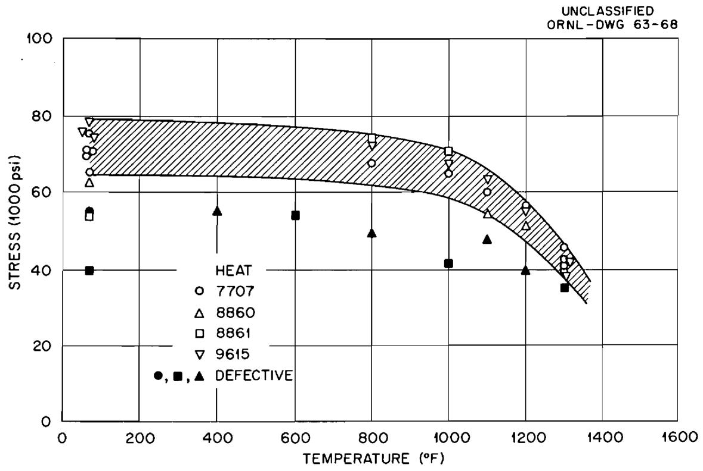
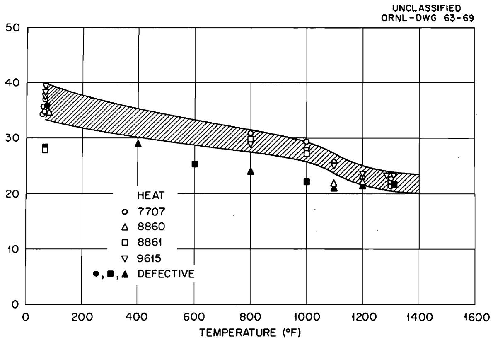
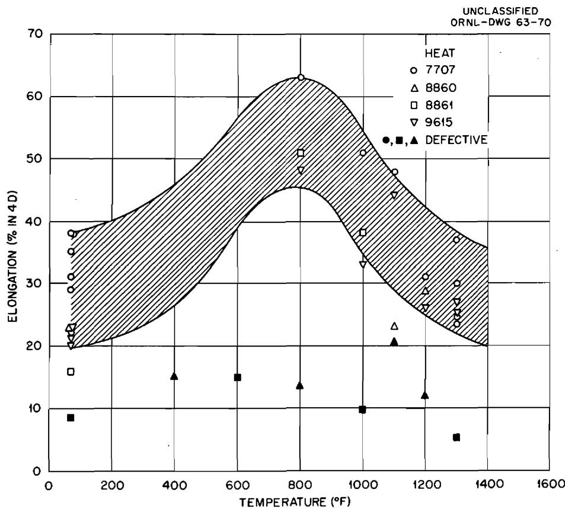
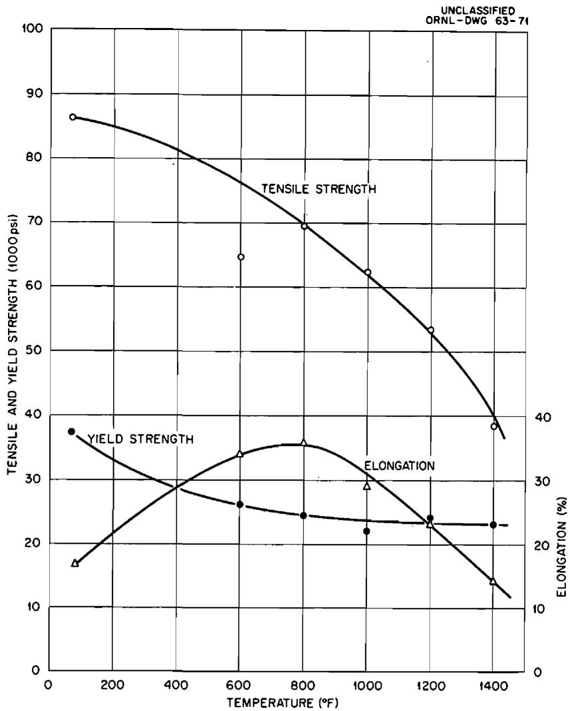
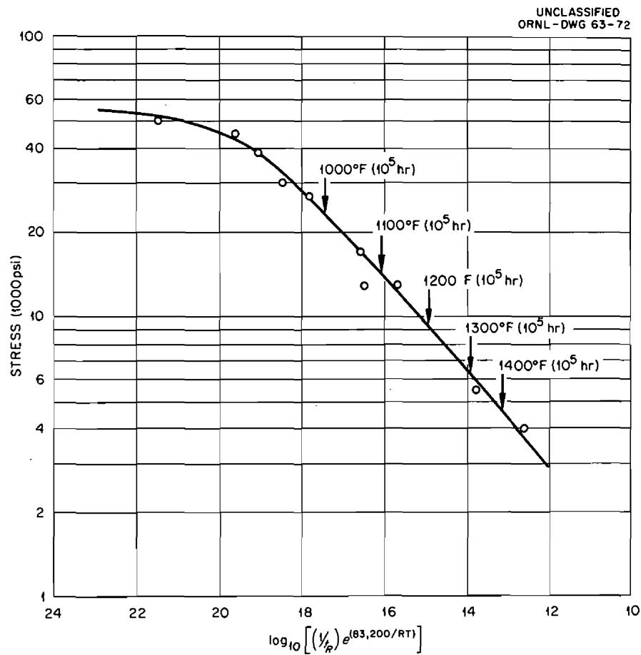
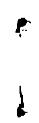
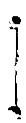

MECHANICAL PROPERTIES OF INOR-8 CAST METAL

R.W.Swindeman

# NOTICE

This document contains information of a preliminary nature and was prepared primarily for internal use at the Oak Ridge National Laboratory. It is subject to revision or correction and therefore does not represent a final report. The information is not to be abstracted, reprinted or otherwise given public dissemination without the approval of the ORNL patent branch, Legal and Information Control Department.

# LEGAL NOTICE

This report was prepared as an account of Government sponsored work. Neither the United States, nor the Commission, nor any person acting on behalf of the Commission:

A. Makes any warranty or representation, expressed or implied, with respect to the accuracy, completeness, or usefulness of the information contained in this report, or that the use of any information, apparatus, method, or process disclosed in this report may not infringe privately owned rights; or   
B. Assumes any liabilities with respect to the use of, or for damages resulting from the use of any information, apparatus, method, or process disclosed in this report.

As used in the above, "person acting on behalf of the Commission" includes any employee or contractor of the Commission, or employee of such contractor, to the extent that such employee or contractor of the Commission, or employee of such contractor prepares, disseminates, or provides access to, any information pursuant to his employment or contract with the Commission, or his employment with such contractor.

Contract No. W-7405-eng-26

METALS AND CERAMICS DIVISION

MECHANICAL PROPERTIES OF INOR-8 CAST METAL

R. W. Swindeman

Date Issued

AUG 6 1963

OAK RIDGE NATIONAL LABORATORY

Oak Ridge, Tennessee

operated by

UNION CARBIDE CORPORATION

for the

U. S. ATOMIC ENERGY COMMISSION

1

#

1

1

R. W. Swindeman

# ABSTRACT

Tensile and stress-rupture data for INOR-8 castings are presented. It is shown that the high-temperature strength of castings is sufficient to allow present Molten-Salt Reactor Experiment stresses for wrought metal to be used. At lower temperatures, however, the tensile strength limits the maximum stress to low values. The effect of defects in castings is illustrated.

# INTRODUCTION

Since several components in the Molten-Salt Reactor Experiment (MSRE) fuel circulation system will be fabricated by casting, it is desirable to know the limiting strength of INOR-8 cast metal. This report summarizes available mechanical property data on this material. Portions of the information provided here were obtained by the Haynes-Stellite Company and are reported in the literature.1 They are included here for completeness.

# PROGRAM

Tensile tests were performed on four heats of sand-cast metal and one heat of investment-cast metal. The chemical analyses provided by the vendor are given in Table 1. The analyses for the investment-cast heat are not known.

Rod specimens were machined from cast blanks and annealed at $2150^{\circ}\mathrm{F}$ for 1 hr/in. of thickness. Both 0.505 and 0.250-in.-diam bars were used. All tensile tests were performed in air at an extension rate of 0.05 in./min.

Stress-rupture tests were performed on the investment-cast heat. The specimens were similar to those used in the tensile testing program.

Table 1. Chemical Analyses for INOR-8 Castings   

<table><tr><td>Heat No.</td><td>Cr</td><td>Fe</td><td>C</td><td>Si</td><td>Co</td><td>Ni</td><td>Mn</td><td>Mo</td><td>Cu</td><td>P</td><td>S</td></tr><tr><td>Specified</td><td>6-8</td><td>5 max</td><td>0.02-0.12</td><td>1.0 max</td><td>0.2 max</td><td>bal</td><td>1.0 max</td><td>15-18</td><td>0.35 max</td><td>0.15 max</td><td>0.2 max</td></tr><tr><td>7707</td><td>a</td><td>a</td><td>0.02</td><td>0.021</td><td>a</td><td>a</td><td>a</td><td>a</td><td>a</td><td>a</td><td>a</td></tr><tr><td>8860</td><td>7.2</td><td>4.0</td><td>0.07</td><td>0.27</td><td>0.20</td><td>bal</td><td>0.38</td><td>16.2</td><td>0.01</td><td>0.001</td><td>0.01</td></tr><tr><td>8861</td><td>7.4</td><td>4.0</td><td>0.07</td><td>0.12</td><td>0.17</td><td>bal</td><td>0.4</td><td>16.1</td><td>0.01</td><td>0.001</td><td>0.01</td></tr><tr><td>9615</td><td>a</td><td>a</td><td>a</td><td>a</td><td>a</td><td>a</td><td>a</td><td>a</td><td>a</td><td>a</td><td>a</td></tr></table>

aWithin specification but not reported.

During the machining of the bars from heats Nos. 8860 and 8861, it was seen that there were flaws in the specimens. Radiography was then performed on eight bars from these heats prior to testing.

# RESULTS

Tensile data are shown in Figs. 1 through 4. The tensile strength for sand-cast metal, shown in Fig. 1, exhibits a wide variation from one specimen to another, especially at the low temperatures. Inspection of radiographs and rupture surfaces revealed gross defects in at least nine specimens. Most of the scatter in the tensile strength can, therefore, be attributed to defects. The tensile strength for sound cast metal is about $60\%$ of that for wrought metal.

  
Fig. 1. Ultimate Tensile Strength of Sand-Cast INOR-8.

  
Fig. 2. Yield Strength of Sand-Cast INOR-8.

The $0.2\%$ offset yield strength for sand-cast metal is shown in Fig. 2. Here again the defective castings exhibit less strength than the sound castings. The yield strength for cast metal is about $80\%$ of that for wrought metal.

The tensile elongation for sand castings is shown in Fig. 3. The elongation improves with increasing temperature up to $800^{\circ}\mathrm{F}$ and diminishes above this temperature. Most of the sound castings have elongations better than $20\%$ at all temperatures. The elongation is particularly sensitive to the quality of the casting and defective castings exhibit ductilities well below those for sound metal. It was noticed that failures in defective castings occurred at shrinkage cracks and large inclusions. These flaws comprised anywhere from 10 to $40\%$ of the cross-sectional area of the specimen. No failures in high porosity regions were observed.

  
Fig. 3. Elongation of Sand-Cast INOR-8.

The investment castings exhibit about the same strength as sand castings. Data for this material are shown in Fig. 4.

The only available creep data are for investment castings. These data were obtained from short-time stress-rupture tests at temperatures of 1100, 1300, 1500, and $1700^{\circ}\mathrm{F}$ and are not suitable for establishing design stresses by conventional techniques. The Dorn-Shepard parameter2 has been used to establish a master curve from which 100,000 rupture-stress values may be obtained. The activation energy, 83,200 cal/mole- ${}^{\circ}\mathrm{K}$ , for wrought metal3 was employed. A plot of the Dorn-Shepard against

  
Fig. 4. Tensile Properties vs Temperature for Investment-Cast INOR-8.

stress is shown in Fig. 5. Stress values for 100,000 hr obtained from this curve are presented in Table 2 and compared to present MSRE design stresses. It is apparent that, on the basis of rupture data, the wrought metal stress values may be safely applied as design stresses for castings. This is true for temperatures above $1150^{\circ}\mathrm{F}$ . Below $1150^{\circ}\mathrm{F}$ , however, cast metal design stresses must be based on one fourth of the tensile strength since these stresses will be less than those obtained from stress-rupture data. Inasmuch as the minimum specified tensile strength has not been established for castings, stress values at lower temperatures are not suggested.

  
Fig. 5. Dorn-Shepard Parameter for Rupture of Investment-Cast INOR-8.

A creep testing program is now in progress to determine the creep rates and stress-rupture properties of sand castings between 1100 and $1400^{\circ}\mathrm{F}$ . This program should be completed with six months.

Table 2. Estimated 100,000-hr Rupture Strength for INOR-8 Castings   

<table><tr><td>Temperature (°F)</td><td>Stresses for Cast Metal 
Predicted from the 
Dorn-Shepard Parameter 
(psi)</td><td>MSRE Design 
Stresses for 
Wrought Metal 
(psi)</td></tr><tr><td>1000a</td><td>23,300</td><td>16,000</td></tr><tr><td>1050a</td><td>17,850</td><td>13,250</td></tr><tr><td>1100a</td><td>14,000</td><td>9,600</td></tr><tr><td>1150</td><td>10,400</td><td>6,800</td></tr><tr><td>1200</td><td>9,300</td><td>4,950</td></tr><tr><td>1250</td><td>7,450</td><td>3,600</td></tr><tr><td>1300</td><td>6,250</td><td>2,750</td></tr><tr><td>1350</td><td>5,400</td><td>2,050</td></tr><tr><td>1400</td><td>4,650</td><td>1,600</td></tr></table>

aTensile strength will control the design stress at these temperatures.

# INTERNAL DISTRIBUTION

<table><tr><td>1-2.</td><td>Central Research Library</td><td>47.</td><td>E.</td><td>C.</td><td>Hise</td></tr><tr><td>3.</td><td>ORNL - Y-12 Technical Library</td><td>48.</td><td>H.</td><td>W.</td><td>Hoffman</td></tr><tr><td></td><td>Document Reference Section</td><td>49.</td><td>P.</td><td>P.</td><td>Holz</td></tr><tr><td>4-6.</td><td>Laboratory Records</td><td>50.</td><td>L.</td><td>N.</td><td>Howell</td></tr><tr><td>7.</td><td>Laboratory Records, ORNL RC</td><td>51.</td><td>P.</td><td>R.</td><td>Kasten</td></tr><tr><td>8.</td><td>ORNL Patent Office</td><td>52.</td><td>R.</td><td>J.</td><td>Kedl</td></tr><tr><td>9.</td><td>G. M. Adamson</td><td>53.</td><td>B.</td><td>W.</td><td>Kinyon</td></tr><tr><td>10.</td><td>L. G. Alexander</td><td>54.</td><td>R.</td><td>W.</td><td>Knight</td></tr><tr><td>11.</td><td>S. E. Beall</td><td>55.</td><td>M.</td><td>I.</td><td>Lundin</td></tr><tr><td>12.</td><td>C. E. Bettis</td><td>56.</td><td>H.</td><td>G.</td><td>MacPherson</td></tr><tr><td>13.</td><td>E. S. Bettis</td><td>57.</td><td>E.</td><td>R.</td><td>Mann</td></tr><tr><td>14.</td><td>D. S. Billington</td><td>58.</td><td>W.</td><td>B.</td><td>McDonald</td></tr><tr><td>15.</td><td>F. F. Blankenship</td><td>59.</td><td>C.</td><td>K.</td><td>McClothlan</td></tr><tr><td>16.</td><td>A. L. Boch</td><td>60.</td><td>E.</td><td>C.</td><td>Miller</td></tr><tr><td>17.</td><td>S. E. Bolt</td><td>61.</td><td>R.</td><td>L.</td><td>Moore</td></tr><tr><td>18.</td><td>C. J. Borkowski</td><td>62.</td><td>J.</td><td>C.</td><td>Moyers</td></tr><tr><td>19.</td><td>E. J. Breeding</td><td>63.</td><td>C.</td><td>W.</td><td>Nestor</td></tr><tr><td>20.</td><td>F. R. Bruce</td><td>64.</td><td>T.</td><td>E.</td><td>Northup</td></tr><tr><td>21.</td><td>O. W. Burke</td><td>65.</td><td>L.</td><td>F.</td><td>Parsly</td></tr><tr><td>22.</td><td>D. O. Campbell</td><td>66.</td><td>P.</td><td>Patriarca</td><td></td></tr><tr><td>23.</td><td>S. Cantor</td><td>67.</td><td>H.</td><td>R.</td><td>Payne</td></tr><tr><td>24.</td><td>W. G. Cobb</td><td>68.</td><td>W.</td><td>B.</td><td>Pike</td></tr><tr><td>25.</td><td>J. A. Conlin</td><td>69.</td><td>M.</td><td>Richardson</td><td></td></tr><tr><td>26.</td><td>W. H. Cook</td><td>70.</td><td>R.</td><td>C.</td><td>Robertson</td></tr><tr><td>27.</td><td>L. T. Corbin</td><td>71.</td><td>T.</td><td>K.</td><td>Roche</td></tr><tr><td>28.</td><td>G. A. Cristy</td><td>72.</td><td>H.</td><td>W.</td><td>Savage</td></tr><tr><td>29.</td><td>J. L. Crowley</td><td>73.</td><td>J.</td><td>H.</td><td>Shaffer</td></tr><tr><td>30.</td><td>F. L. Culler</td><td>74.</td><td>G.</td><td>M.</td><td>Slaughter</td></tr><tr><td>31.</td><td>J. H. Devan</td><td>75.</td><td>A.</td><td>N.</td><td>Smith</td></tr><tr><td>32.</td><td>R. G. Donnelly</td><td>76.</td><td>P.</td><td>G.</td><td>Smith</td></tr><tr><td>33.</td><td>D. A. Douglas</td><td>77.</td><td>I.</td><td>Spiewak</td><td></td></tr><tr><td>34.</td><td>E. P. Epler</td><td>78.</td><td>R.</td><td>W.</td><td>Swindeman</td></tr><tr><td>35.</td><td>W. K. Ergen</td><td>79.</td><td>J.</td><td>R.</td><td>Tallackson</td></tr><tr><td>36.</td><td>A. P. Fraas</td><td>80.</td><td>A.</td><td>E.</td><td>Thoma</td></tr><tr><td>37.</td><td>J. H Frye, Jr.</td><td>81.</td><td>D.</td><td>B.</td><td>Trauger</td></tr><tr><td>38.</td><td>C. H. Gabbard</td><td>82.</td><td>W.</td><td>C.</td><td>Ulrich</td></tr><tr><td>39.</td><td>W. R. Gall</td><td>83-92.</td><td>J.</td><td>R.</td><td>Weir</td></tr><tr><td>40.</td><td>R. B. Gallaher</td><td>93.</td><td>D.</td><td>C.</td><td>Watkin</td></tr><tr><td>41.</td><td>W. R. Grimes</td><td>94.</td><td>A.</td><td>M.</td><td>Weinberg</td></tr><tr><td>42.</td><td>A. G. Grindell</td><td>95.</td><td>J.</td><td>H.</td><td>Westsisik</td></tr><tr><td>43.</td><td>C. S. Harrill</td><td>96.</td><td>L.</td><td>V.</td><td>Wilson</td></tr><tr><td>44-46.</td><td>M. R. Hill</td><td>97.</td><td>C.</td><td>H.</td><td>Wödtke</td></tr></table>

# EXTERNAL DISTRIBUTION

98. David F. Cope (ORO)

99-113. Division of Technical Information Extension (DTIE)

114. Research and Development (ORO)

