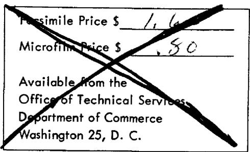

ORNL-TM-611

COPY NO. - 52

DATE - August 27, 1963

MASTER

INHERENT NEUTRON SOURCES IN CLEAN MSRE FUEL SALT

P. N. Haubenreich

ABSTRACT

Unirradiated MSRE fuel salt will contain an appreciable neutron source due to spontaneous fission of the uranium, and $(\alpha, n)$ reactions of alpha particles from the uranium with the fluorine and beryllium of the salt. The spontaneous fission source in the core (25 ft³ of salt) is 10³ neutrons/sec. or less, mostly from U²³₈. The alpha-n source is much larger, giving about 4 x 10⁵ neutrons/sec. in the core. Nearly all of this latter source is caused by alpha particles from U²³₄.

# NOTICE

This document contains information of a preliminary nature and was prepared primarily for internal use at the Oak Ridge National Laboratory. It is subject to revision or correction and therefore does not represent a final report. The information is not to be abstracted, reprinted or otherwise given public dissemination without the approval of the ORNL patent branch, Legal and Information Control Department.

# LEGAL NOTICE

This report was prepared as an account of Government sponsored work. Neither the United States, nor the Commission, nor any person acting on behalf of the Commission:

A. Makes any warranty or representation, expressed or implied, with respect to the accuracy, completeness, or usefulness of the information contained in this report, or that the use of any information, apparatus, method, or process disclosed in this report may not infringe privately owned rights; or   
B. Assumes any liabilities with respect to the use of, or for damages resulting from the use of any information, apparatus, method, or process disclosed in this report.

As used in the above, "person acting on behalf of the Commission" includes any employee or contractor of the Commission, or employee of such contractor, to the extent that such employee or contractor of the Commission, or employee of such contractor prepares, disseminates, or provides access to, any information pursuant to his employment or contract with the Commission, or his employment with such contractor.

# CONTENTS

Introduction- 5   
Fuel Composition- 5   
Spontaneous Fission Neutrons 6   
Neutrons from Alpha-n Reactions 7   
Alpha Emission by Uranium 8   
Alpha-n Yields in Fuel Salt- 9   
Discussion 10   
Appendix - Calculation of Alpha-n Yields in MSRE Fuel Salt- 12   
Dilution by Non-Productive Constituents of Fuel Salt 12   
Be3 (α, n) Yield 14   
F10 $(\alpha ,\mathrm{n})$ Yield 14   
Li $\gamma$ (α, n) Yield 14   
References 16

#

# Introduction

When a reactor is subcritical, the fission rate and the neutron flux depend on the strength of the neutron source in the reactor due to various reactions and the multiplication of these source neutrons by fissions in the core. By supporting the fission rate in the subcritical reactor at sufficiently high levels, a source performs several functions in reactor operations. The source strength required for some functions is higher than for others.

In all reactor fuels there is always a source of neutrons due to spontaneous fission, but this source is relatively weak, particularly if the fuel is highly enriched uranium. In many reactor cores there is also an inherent photoneutron source produced by interaction of gamma rays with deuterium or beryllium in the core. This source is usually not significant, however, until after fission product gamma sources have been built up by power operation. Therefore, in nearly all reactors an extraneous neutron source is inserted in or near the core. The MSRE is unusual in that the fuel is a homogeneous fused salt in which alpha-emitting uranium is intimately dispersed with large quantities of fluorine and beryllium, both of which readily undergo alpha-n reactions. Thus there is a strong alpha-n source inherent in the MSRE fuel salt even before it has been irradiated.

It is conceivable that the source inherent in the MSRE fuel salt, which is certain to be present whenever there is any chance of criticality, is strong enough to satisfy some, if not all, of the requirements which make an extraneous source necessary in most reactors. In determining whether or not an extraneous source is required, it is necessary to predict the strength of the neutron source which is inherent in the clean slat before the photoneutron source becomes important. The present report describes this prediction. The question of source requirements will be considered later, in a separate report.

# Fuel Composition

The strength of the inherent neutron source depends on the composition of the fuel salt and the isotopic composition of the uranium in it. Three

fuel salts, with compositions shown in Table 1, have been considered for the MSRE.

Uranium concentrations shown are for the initial critical experiment. For power operation the uranium concentration will be higher by about $15\%$ (to compensate for control rods, xenon and other poisons).

The isotopic compositions shown for the uranium are the values used in the criticality calculations. The $\mathrm{U}^{234}$ and $\mathrm{U}^{236}$ fractions are based on typical analyses of uranium enriched in the diffusion plant to the indicated $\mathrm{U}^{235}$ content.

The lithium composition is that of lithium actually on hand for fuel salt manufacture.

Table 1. Fuel Salt Compositions   

<table><tr><td>Fuel Type</td><td></td><td>A</td><td>B</td><td>C</td></tr><tr><td rowspan="5">Salt comp: (mole %)</td><td>LiFa</td><td>70</td><td>66.8</td><td>65</td></tr><tr><td>BeF2</td><td>23.7</td><td>29</td><td>29.2</td></tr><tr><td>ZrF4</td><td>5</td><td>4</td><td>5</td></tr><tr><td>ThF4</td><td>1</td><td>0</td><td>0</td></tr><tr><td>UF4</td><td>0.313</td><td>0.189</td><td>0.831</td></tr><tr><td rowspan="4">U comp: (atom %)</td><td>U234</td><td></td><td></td><td>0.3</td></tr><tr><td>U235</td><td></td><td></td><td></td></tr><tr><td>U236</td><td></td><td></td><td>0.3</td></tr><tr><td>U238</td><td>5</td><td>5</td><td>64.4</td></tr><tr><td colspan="2">Density at 1200°F (lb/ft3)</td><td>144.5</td><td>134.5</td><td>142.7</td></tr></table>

a99.9926 % Li7.

# Spontaneous Fission Neutrons

The rate of neutron production by spontaneous fission is a specific property of the each nuclide. In the clean MSRE fuel, $\mathrm{U}^{238}$ has the shortest half-life for spontaneous fission.1 (See Table 2.)

Table 2. Neutron Production by Spontaneous Fission of Uranium Isotopes   

<table><tr><td>Isotope</td><td>Specific Emission Rate (n/kg - sec)</td></tr><tr><td>U234</td><td>6.1</td></tr><tr><td>U235</td><td>0.51</td></tr><tr><td>U236</td><td>5.1</td></tr><tr><td>U238</td><td>15.2</td></tr></table>

The effective core of the MSRE (the graphite-containing region plus some of the fuel in the upper and lower heads) contains 25 ft³ of fuel salt. The amounts of each uranium isotope and the spontaneous fission neutron source in this volume are given in Table 3 for each of the three fuels described in Table 1.

Table 3. Spontaneous Fission Neutron Source in Core   

<table><tr><td rowspan="2">Isotope</td><td colspan="2">Fuel A</td><td colspan="2">Fuel B</td><td colspan="2">Fuel C</td></tr><tr><td>Mc(kg)</td><td>S(n/sec)</td><td>Mc(kg)</td><td>S(n/sec)</td><td>Mc(kg)</td><td>S(n/sec)</td></tr><tr><td>U234</td><td>0.3</td><td>2</td><td>0.2</td><td>1</td><td>0.2</td><td>1</td></tr><tr><td>U235</td><td>27.0</td><td>14</td><td>16.5</td><td>8</td><td>26.4</td><td>13</td></tr><tr><td>U236</td><td>0.3</td><td>2</td><td>0.2</td><td>1</td><td>0.2</td><td>1</td></tr><tr><td>U238</td><td>1.5</td><td>22</td><td>0.9</td><td>13</td><td>47.5</td><td>722</td></tr><tr><td></td><td></td><td>40</td><td></td><td>23</td><td></td><td>737</td></tr></table>

# Neutrons From Alpha-n Reactions

Energetic alpha particles can produce neutrons by nuclear interactions with several different nuclides. Threshold energies vary widely, depending upon the nuclide. Three nuclides, Li $^{7}$ , Be $^{9}$ and F $^{19}$ , have $\alpha$ -n thresholds below the maximum energy of alphas from uranium. The neutron yield per alpha particle is a function of the initial energy of the alpha particle and the composition of the medium in which it is slowing down.

# Alpha Emission by Uranium

Among the uranium isotopes present in fresh MSRE fuel, $\mathrm{U}^{234}$ has by far the highest specific alpha emission and also emits the highest-energy alpha particles. The specific alpha sources are summarized in Table 4.1. Table 5 gives the total alpha source in the effective core of the MSRE during the initial critical experiment (25 ft $^3$ of salt, containing the amounts of uranium shown in Table 3).

Table 4. Alpha Emission by Uranium   

<table><tr><td>Isotope</td><td>Half-Life for α-decay (y)</td><td>Decay Rate (dis/sec·kg)</td><td>Eα(Mev)</td><td>f(α/100 dis.)</td><td>α Source(α/sec·kg)</td></tr><tr><td rowspan="2">U234</td><td rowspan="2">2.48 x 105</td><td rowspan="2">2.28 x 1011</td><td>4.77</td><td>72</td><td>1.64 x 1011</td></tr><tr><td>4.72</td><td>28</td><td>0.64 x 1011</td></tr><tr><td rowspan="4">U235</td><td rowspan="4">7.13 x 108</td><td rowspan="4">7.90 x 107</td><td>4.58</td><td>10</td><td>0.79 x 107</td></tr><tr><td>4.47</td><td>3</td><td>0.24 x 107</td></tr><tr><td>4.40</td><td>83</td><td>6.56 x 107</td></tr><tr><td>4.20</td><td>4</td><td>0.32 x 107</td></tr><tr><td rowspan="2">U236</td><td rowspan="2">2.39 x 107</td><td rowspan="2">2.35 x 109</td><td>4.50</td><td>73</td><td>1.72 x 109</td></tr><tr><td>4.45</td><td>27</td><td>0.63 x 109</td></tr><tr><td rowspan="2">U238</td><td rowspan="2">4.51 x 109</td><td rowspan="2">1.23 x 107</td><td>4.19</td><td>77</td><td>0.95 x 106</td></tr><tr><td>4.15</td><td>23</td><td>0.28 x 106</td></tr></table>

Note: $\mathbf{E}_{\alpha}$ is the initial energy of the alpha particle and $f$ is the percentage yield of alphas of that energy in the natural alpha decay of the nuclide.

Table 5. Alpha Source in MSRE Core   

<table><tr><td rowspan="2">Isotope</td><td rowspan="2">Eα(Mev)</td><td colspan="3">Source Strength (α/sec)</td></tr><tr><td>Fuel A</td><td>Fuel B</td><td>Fuel C</td></tr><tr><td rowspan="2">U234</td><td>4.77</td><td>4.74 x 1010</td><td>2.90 x 1010</td><td>3.71 x 1010</td></tr><tr><td>4.72</td><td>1.85 x 1010</td><td>1.13 x 1010</td><td>1.45 x 1010</td></tr><tr><td rowspan="3">U235</td><td>4.58</td><td>2.13 x 108</td><td>1.30 x 108</td><td>2.09 x 108</td></tr><tr><td>4.47</td><td>0.65 x 108</td><td>0.40 x 108</td><td>0.63 x 108</td></tr><tr><td>4.40</td><td>17.7 x 108</td><td>10.8 x 108</td><td>17.3 x 108</td></tr><tr><td rowspan="3">U236</td><td>4.20</td><td>0.86 x 108</td><td>0.53 x 108</td><td>0.85 x 108</td></tr><tr><td>4.50</td><td>5.01 x 108</td><td>3.06 x 108</td><td>3.92 x 108</td></tr><tr><td>4.45</td><td>1.83 x 108</td><td>1.12 x 108</td><td>1.44 x 108</td></tr><tr><td rowspan="2">U238</td><td>4.19</td><td>1.40 x 106</td><td>0.86 x 106</td><td>0.45 x 108</td></tr><tr><td>4.15</td><td>0.41 x 106</td><td>0.25 x 106</td><td>0.13 x 108</td></tr></table>

# Alpha-n Yields in Fuel Salt

The yields of neutrons from $\mathrm{Be}^9$ , $\mathrm{F}^{19}$ , and $\mathrm{Li}^7$ vary with the energy of the alpha-particle, generally increasing with energy. Yields for 4.77-Mev alpha-particles in thick targets of pure material are 40, 6 and 0.1 neutrons per million alpha-particles in beryllium, fluorine, and lithium-7, respectively. In the MSRE fuel salt, the productive nuclides comprise only a fraction of the total, and the yield is affected by the dilution with other elements. Yields for alpha-particles of each energy in Table 5, in each of three fuel salts, were calculated by procedures described in the Appendix. Table 6 illustrates how beryllium, fluorine, and lithium contribute to the total yield for the most numerous and highest-energy group of alpha particles.

Table 6. Neutron Yields for 4.77-Mev Alpha Particles in MSRE Fuel Salt   

<table><tr><td rowspan="2">Constituent</td><td colspan="3">Yield (n/106/α)</td></tr><tr><td>Fuel A</td><td>Fuel B</td><td>Fuel C</td></tr><tr><td>Be</td><td>2.65</td><td>3.32</td><td>3.20</td></tr><tr><td>F</td><td>4.36</td><td>4.44</td><td>4.40</td></tr><tr><td>Li</td><td>0.02</td><td>0.02</td><td>0.02</td></tr><tr><td>Total</td><td>7.03</td><td>7.78</td><td>7.62</td></tr></table>

Table 7 gives the neutron source in the effective core of the MSRE when the uranium concentration is at its initial, clean, critical value.

Table 7. Alpha-n Neutron Source in Core   

<table><tr><td rowspan="2">Alpha Source</td><td rowspan="2">Eα(Mev)</td><td colspan="3">Neutron Source Strength (n/sec)</td></tr><tr><td>Fuel A</td><td>Fuel B</td><td>Fuel C</td></tr><tr><td rowspan="2">U234</td><td>4.77</td><td>3.33 x 105</td><td>2.26 x 105</td><td>2.83 x 105</td></tr><tr><td>4.72</td><td>1.21 x 105</td><td>0.82 x 105</td><td>1.03 x 105</td></tr><tr><td rowspan="4">U235</td><td>4.58</td><td>1.14 x 103</td><td>0.78 x 103</td><td>1.23 x 103</td></tr><tr><td>4.47</td><td>0.30 x 103</td><td>0.21 x 103</td><td>0.32 x 103</td></tr><tr><td>4.40</td><td>7.54 x 103</td><td>5.20 x 103</td><td>8.13 x 103</td></tr><tr><td>4.20</td><td>0.28 x 103</td><td>0.20 x 103</td><td>0.31 x 103</td></tr><tr><td rowspan="2">U236</td><td>4.50</td><td>2.45 x 103</td><td>1.68 x 103</td><td>2.10 x 103</td></tr><tr><td>4.45</td><td>0.83 x 103</td><td>0.57 x 103</td><td>0.72 x 103</td></tr><tr><td rowspan="2">U238</td><td>4.19</td><td>4.36</td><td>3.07</td><td>157</td></tr><tr><td>4.15</td><td>1.21</td><td>0.85</td><td>43</td></tr><tr><td>Total</td><td></td><td>4.67 x 105</td><td>3.17 x 105</td><td>3.99 x 105</td></tr></table>

# Discussion

The calculations indicate that the bulk of the neutron source inherent in the clean MSRE fuel is due to alpha-n reactions, with spontaneous fission contributing relatively little. Furthermore, about 97 percent of the neutron source is caused by alpha particles from a single isotope, $\mathrm{U}^{234}$ , which comprises a very small fraction of the total uranium. Therefore, the neutron source will be very closely proportional to the $\mathrm{U}^{234}$ content of the fuel salt.

In natural uranium, the abundance of $\mathrm{U}^{234}$ is only 0.0057%, or 0.0079 of the $\mathrm{U}^{235}$ abundance. In a gaseous diffusion plant, however, the $\mathrm{U}^{234} / \mathrm{U}^{235}$ ratio is increased, so that in uranium containing over 90% $\mathrm{U}^{235}$ the $\mathrm{U}^{234} / \mathrm{U}^{235}$ ratio is 0.010 or above.

The $\mathrm{U}^{234}$ fractions which were used in the calculations are based on typical analyses of enriched uranium, and thus are only estimates of what will appear in uranium which will be used in making up the MSRE fuel salt. The estimate is probably good to within $\pm 20\%$ in the case of Fuels A and B, which use highly enriched uranium. In the case of Fuel C it was assumed that the uranium would be taken from the diffusion plant at about $35\%$ $\mathrm{U}^{235}$ ,

and that the $\mathrm{U}^{234}$ content would be only 0.30%. It now appears that the uranium may be added to the MSRE fuel salt in two batches: the first of natural or depleted uranium; the second, highly enriched. If this course is followed, the $\mathrm{U}^{234}$ content of Fuel C would probably be higher, perhaps by as much as a factor of 1.4. The neutron source for Fuel C would then be higher by the same factor.

# APPENDIX

# Calculation of Alpha-n Yields in MSRE Fuel Salt

Information on alpha-n yields from various nuclides usually appears in one of two forms: 1) the microscopic cross section of the nuclide for the $\alpha$ -n reaction as a function of alpha energy, or 2) the yield of neutrons per million alpha particles of a given initial energy emitted in an infinite medium of the pure nuclide. If the alpha particles are emitted in a mixture, it is necessary to take into account the dilution of the productive nuclides by others which only slow down the alpha particles.

# Dilution by Non-Productive Constituents of Fuel Salt

The correction for the dilution of a productive nuclide in a mixture is essentially the fraction of the alpha energy loss which is attributable to the productive constituent.

Let $n_{\max}$ be the yield of neutrons for alpha particles emitted in an infinite medium consisting entirely of a productive nuclide. Let $n$ be the yield for that nuclide in a mixture. It has been observed[2,3] that a fairly good approximation is

$$
\frac {\mathrm {n}}{\mathrm {n} _ {\max }} = \frac {\mathrm {N} _ {\mathrm {p}} \mathrm {S} _ {\mathrm {p}}}{\sum_ {\mathrm {i}} \mathrm {N} _ {\mathrm {i}} \mathrm {S} _ {\mathrm {i}}} \tag {1}
$$

where S is the "relative atomic stopping power", N is the number density of a nuclide, and p refers to the productive constituent.

The best information on relative stopping powers is still a 1937 article by Livingston and Bethe. They give S relative to air for 16 elements for 6-Mev alpha-particles and for 6 elements at 7 other energies from 2 to 52 Mev. Table 8 gives values of S for the constituents of the MSRE fuel salt, obtained by interpolation in energy and atomic number of the Livingston - Bethe data. The relative stopping powers in this table are evaluated at 4.5 Mev, because this is approximately the energy of the uranium alpha-particles.

Table 8. Relative Stopping Power of Constituents of MSRE Fuel Salt for 4.5-Mev Alpha Particles   

<table><tr><td rowspan="2">Constituent</td><td rowspan="2">Sa</td><td colspan="3">NS/ΣNiSi</td></tr><tr><td>Fuel A</td><td>Fuel B</td><td>Fuel C</td></tr><tr><td>Li</td><td>0.57</td><td>0.163</td><td>0.159</td><td>0.149</td></tr><tr><td>Be</td><td>0.70</td><td>0.068</td><td>0.085</td><td>0.082</td></tr><tr><td>F</td><td>1.19</td><td>0.692</td><td>0.705</td><td>0.699</td></tr><tr><td>Zr</td><td>2.8</td><td>0.057</td><td>0.047</td><td>0.056</td></tr><tr><td>Th</td><td>3.9</td><td>0.016</td><td>0</td><td>0</td></tr><tr><td>U</td><td>4.2</td><td>0.005</td><td>0.003</td><td>0.014</td></tr></table>

aAtomic stopping power relative to air.

If the microscopic cross section of a nuclide for the alpha-n reaction is known, then the number of neutrons produced by an alpha particle can be found from5

$$
n = \int_ {0} ^ {E _ {o}} \frac {N p \sigma (E)}{\left(- \frac {d E}{d x}\right)} d E \tag {2}
$$

Harris1 has presented $\left(\frac{1}{\rho} \frac{\mathrm{dE}}{\mathrm{dx}}\right)^{-1}$ as a function of alpha energy for several different substances. For a mixture one may assume that

$$
- \frac {\mathrm {d} E}{\mathrm {d} x} = \rho_ {\text {m i x}} \sum_ {i} \omega_ {i} \left(- \frac {1}{\rho} \frac {\mathrm {d} E}{\mathrm {d} x}\right) _ {i} \tag {3}
$$

where $\omega_{i}$ is the weight fraction of constituent $i$ in the mixture. Table 9 gives values of $\left(\frac{1}{\rho} \frac{\mathrm{dE}}{\mathrm{dx}}\right)$ for the constituents of the MSRE taken from reference 1, and the products of this quantity and the weight fractions for the three different fuel salts. The sum at the bottom of each column is $-\frac{1}{\rho_{\text{mix}}} \frac{\mathrm{dE}}{\mathrm{dx}}$ for each salt.

Table 9. Slowing-Down Parameters for Alpha Particles   

<table><tr><td rowspan="3">i</td><td colspan="2">\(\left(-\frac{1}{\rho}\frac{\mathrm{d}E}{\mathrm{d}x}\right)_{i}\)</td><td>Mev/g/cm2</td><td colspan="6">ωi\(\left(-\frac{1}{\rho}\frac{\mathrm{d}E}{\mathrm{d}x}\right)_{i}\)g/cm2</td></tr><tr><td rowspan="2">4 Mev</td><td rowspan="2">5 Mev</td><td colspan="2">Fuel A</td><td colspan="2">Fuel B</td><td colspan="3">Fuel C</td></tr><tr><td>4 Mev</td><td>5 Mev</td><td>4 Mev</td><td>5 Mev</td><td>4 Mev</td><td>5 Mev</td><td></td></tr><tr><td>Li</td><td>885</td><td>781</td><td>103</td><td>91</td><td>108</td><td>95</td><td>96</td><td>85</td><td></td></tr><tr><td>Be</td><td>840</td><td>741</td><td>43</td><td>38</td><td>57</td><td>50</td><td>53</td><td>47</td><td></td></tr><tr><td>F</td><td>730</td><td>645</td><td>474</td><td>419</td><td>513</td><td>453</td><td>489</td><td>432</td><td></td></tr><tr><td>Zr</td><td>385</td><td>351</td><td>42</td><td>38</td><td>37</td><td>33</td><td>42</td><td>39</td><td></td></tr><tr><td>Th</td><td>228</td><td>208</td><td>13</td><td>12</td><td>0</td><td>0</td><td>0</td><td>0</td><td></td></tr><tr><td>U</td><td>222</td><td>202</td><td>4</td><td>4</td><td>3</td><td>2</td><td>10</td><td>9</td><td></td></tr><tr><td></td><td></td><td></td><td>679</td><td>602</td><td>718</td><td>633</td><td>690</td><td>612</td><td></td></tr></table>

# $\mathbf{Be}^{\theta}(\alpha, n)$ Yield

For alpha particles with an initial energy $\mathbf{E}_0$ , emitted in pure beryllium2,3

$$
n _ {\max } = 0. 1 5 2 E _ {o} ^ {3 \cdot 5 6} \text {n e u t r o n s} / 1 0 ^ {6} \alpha \tag {4}
$$

For Fuels A, B, and C, $n / n_{\max}$ is 0.068, 0.085 and 0.082 respectively. (See Table 8). The product is the yield in the fuel salt which is tabulated in Table 10.

# F19 (α, n) Yield

Segre and Wiegand6 measured neutron yields for alpha particles of various energies in thick targets of F. The yield, $n_{\max}$ , begins to be measurable at 3 MeV and rises to 10 neutrons/106 alphas at 5.3 MeV. From Table 8, $n / n_{\max}$ for Fuels A, B and C are 0.692, 0.705 and 0.699. The product of this $n / n_{\max}$ and $n_{\max}$ from the data of Segre and Wiegand is given in Table 10.

# $\mathbf{Li}^7 (\alpha ,\mathfrak{n})$ Yield

This writer knows of no direct measurements of $n_{\max}$ for $\mathsf{Li}^7$ . The cross-section for the $\mathsf{Li}^7 (\alpha, n) \mathsf{B}^{10}$ reaction as a function of alpha energy

was calculated and reported by Hess. $^5$ Above a threshold at 4.36 Mev, the cross-section rises to 8 mb at 4.8 Mev, then decreases to about 6 mb at higher energies. Hess' cross-section was used to compute yields from Li $^7$ in the fuel salt from equations (2) and (3). The integral in Eq. (2) was evaluated by representing the cross section curve by straight-line segments and by approximating $\left(-\frac{1}{\rho_{\text{mix}}}\frac{\mathrm{dE}}{\mathrm{dx}}\right)^{-1}$ vs. E by linear relations fitted to points at 4 and 5 Mev given in Table 9. Results appear in Table 10.

Table 10. Neutron Yields for Alpha Particles in MSRE Fuel Salt (n/10 $^6$ α)   

<table><tr><td rowspan="2">Eα(Mev)</td><td colspan="3">Fuel A</td><td colspan="3">Fuel B</td><td colspan="3">Fuel C</td></tr><tr><td>Be</td><td>F</td><td>Li</td><td>Be</td><td>F</td><td>Li</td><td>Be</td><td>F</td><td>Li</td></tr><tr><td>4.77</td><td>2.65</td><td>4.36</td><td>0.019</td><td>3.32</td><td>4.44</td><td>0.019</td><td>3.20</td><td>4.40</td><td>0.017</td></tr><tr><td>4.72</td><td>2.60</td><td>3.94</td><td>0.016</td><td>3.25</td><td>4.02</td><td>0.016</td><td>3.13</td><td>3.98</td><td>0.014</td></tr><tr><td>4.58</td><td>2.31</td><td>3.04</td><td>0.008</td><td>2.89</td><td>3.10</td><td>0.008</td><td>2.79</td><td>3.08</td><td>0.007</td></tr><tr><td>4.50</td><td>2.18</td><td>2.70</td><td>0.005</td><td>2.72</td><td>2.75</td><td>0.004</td><td>2.62</td><td>2.73</td><td>0.004</td></tr><tr><td>4.47</td><td>2.12</td><td>2.56</td><td>0.003</td><td>2.65</td><td>2.61</td><td>0.003</td><td>2.56</td><td>2.59</td><td>0.003</td></tr><tr><td>4.45</td><td>2.10</td><td>2.42</td><td>0.002</td><td>2.63</td><td>2.47</td><td>0.002</td><td>2.53</td><td>2.45</td><td>0.002</td></tr><tr><td>4.40</td><td>2.01</td><td>2.25</td><td>0.001</td><td>2.52</td><td>2.29</td><td>0.001</td><td>2.43</td><td>2.27</td><td>0.000</td></tr><tr><td>4.20</td><td>1.70</td><td>1.52</td><td>0</td><td>2.13</td><td>1.55</td><td>0</td><td>2.05</td><td>1.54</td><td>0</td></tr><tr><td>4.19</td><td>1.67</td><td>1.45</td><td>0</td><td>2.09</td><td>1.48</td><td>0</td><td>2.02</td><td>1.47</td><td>0</td></tr><tr><td>4.15</td><td>1.63</td><td>1.31</td><td>0</td><td>2.04</td><td>1.34</td><td>0</td><td>1.97</td><td>1.33</td><td>0</td></tr></table>

# References

1. D. R. Harris, "Calculation of the Background Neutron Source in New, Uranium-Fueled Reactors," USAEC Report WAPD-TM-220, Bettis Atomic Power Laboratory, March 1960.   
2. A. O. Hansen, "Radioactive Neutron Sources," p. 3 in Fast Neutron Physics, Part 1, ed. by J. B. Marion and J. L. Fowler, Interscience, New York, 1960.   
3. O. J. C. Runnalls and R. R. Boucher, "Neutron Yields from Actinide-Beryllium Alloys," Can. J. Phys., 34: 949 (1956).   
4. M. S. Livingston and H. S. Bethe, "Nuclear Dynamics, Experimental," Revs. Mod. Phys., 9: 272 (1937).   
5. W. N. Hess, "Neutrons from (α, n) Sources," Annals of Phys., 2: 115-133 (1959).   
6. E. Segre and C. Wiegand, "Thick-Target Excitation Functions for Alpha Particles," USAEC Report IA-136, Los Alamos Scientific Laboratory, September 1944 (also issued as USAEC Report MDDC-185).

# Internal Distribution

1. MSRP Director's Office, Rm. 219, 9204-1   
2. S.E.Beall   
3. M. Bender   
4. E.S. Bettis   
5. A. L. Boch   
6. F. F. Blankenship   
7. H.C.Claiborne   
8. S.J.Ditto   
9. J.R. Engel   
10. E.P.Epler   
11. A. P. Fraas   
12. W.R.Grimes   
13. R. H. Guymon   
14. S.H. Hanauer

15-19. P. N. Haubenreich   
20. R. B. Lindauer   
21. R. N. Lyon   
22. H. G. MacPherson

23. W. B. McDonald   
24. H. F. McDuffie   
25. A.J.Miller   
26. R. L. Moore   
27. A.M.Perry   
28. B. E. Prince   
29. H.W.Savage   
30. D. Scott   
31. J. H. Shaffer   
32. M.J. Skinner   
33. I. Spiewak   
34. A. Taboada   
35. J. R. Tallackson   
36. D. B. Trauger

37-38. Central Research Library   
39-40. Document Reference Section   
41-42. Reactor Division Library   
43-45. Laboratory Records   
46. ORNL-RC

# External Distribution

47-48. D. F. Cope, Reactor Division, AEC, ORO   
49. R. L. Philippone, Reactor Division, AEC, ORO   
50. H. M. Roth, Division of Research and Development, AEC, ORO   
51. W. L. Smalley, Reactor Division, AEC, ORO   
52. M. J. Whitman, Division of Reactor Development, AEC, Washington   
53-67. Division of Technical Information Extension, AEC (DTIE)