ORNL-TM-728

Contract No. W-7405-eng-26

Reactor Division

MSRE DESIGN AND OPERATIONS REPORT

PART I

DESCRIPTION OF REACTOR DESIGN

R. C. Robertson

JANUARY 1965

OAK RIDGE NATIONAL LABORATORY

Oak Ridge, Tennessee

operated by

UNION CARBIDE CORPORATION

for the

U.S. ATOMIC ENERGY COMMISSION

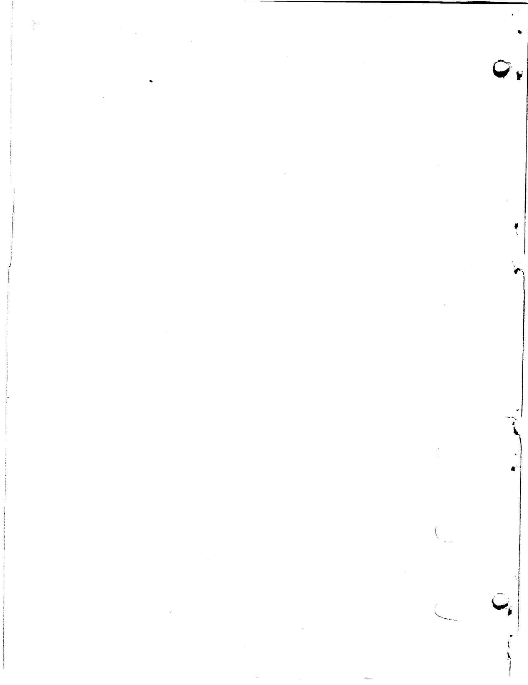

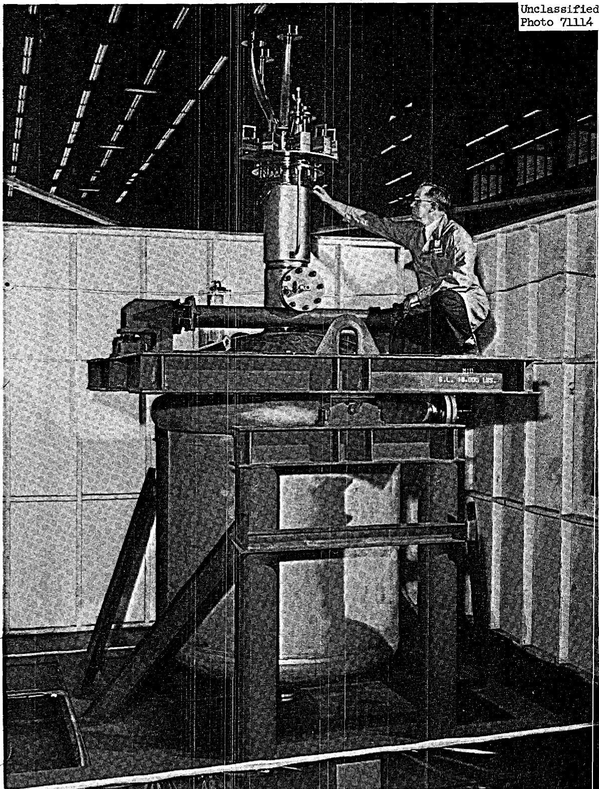  
Reactor Vessel in Transport Jig Prior to Installation.

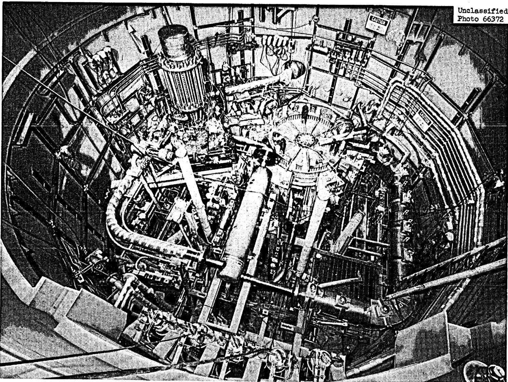

# PREFACE

The report on the Molten-Salt Reactor Experiment (MSRE) has been arranged into twelve major parts as shown in the General Index. Each of these covers a particular phase of the project, such as the design, safety analysis, operating procedures, etc. An attempt has thus been made to avoid much of the duplication of material that would result if separate and independent reports were prepared on each of these major aspects.

Detailed references to supporting documents, working drawings, and other information sources have been made throughout the report to make it of maximum value to ORNL personnel. Each of the major divisions of the report contains the bibliographical and other appendix information necessary for that part.

The final volumes of the report, Part XII, contain the rather extensive listings of working drawings, specifications, schedules, tabulations, etc. These have been given a more limited distribution.

Most of the reference material is available through the Division of Technical Information Extension, Atomic Energy Commission, P. O. Box 62, Oak Ridge, Tennessee. For material not available through this source, such an inter-laboratory correspondence, etc., special arrangements can be made for those having a particular interest.

None of the information contained in this report is of a classified nature.

# ACKNOWLEDGMENT

The list of biographical references provides an indication of ORNL personnel contributing most valuably to the MSRE literature, and thus to this report.

Either directly, or indirectly, all of the forty to fifty engineers and scientists in the Reactor Division assigned to the MSRE project helped to prepare this material. Personnel in the Chemistry, Metallurgy, Physics, Engineering and Maintenance, and Instrumentation and Controls Divisions of the Laboratory also made extensive contributions. In this broad-based team effort it is impossible to single out individuals more deserving to be mentioned here than others.

# GENERAL INDEX

This report is one of a series that describes the design and operation of the Molten-Salt Reactor Experiment. All the reports are listed below.

ORNL-TM-728* MSRE Design and Operations Report, Part I, Description of Reactor Design by R. C. Robertson   
ORNL-TM-729 MSRE Design and Operations Report, Part II, Nuclear and Process Instrumentation, by J. R. Tallackson   
ORNL-TM-730* MSRE Design and Operations Report, Part III, Nuclear Analysis, by P. N. Haubenreich and J. R. Engel, B. E. Prince, and H. C. Claiborne   
ORNL-TM-731 MSRE Design and Operations Report, Part IV, Chemistry and Materials, by F. F. Blankenship and A. Taboada   
ORNL-TM-732* MSRE Design and Operations Report, Part V, Reactor Safety Analysis Report, by S. E. Beall, P. N. Haubenreich, R. B. Lindauer, and J. R. Tallackson   
ORNL-TM-733 MSRE Design and Operations Report, Part VI, Operating Limits, by S. E. Beall and R. H. Guymon   
ORNL-TM-907** MSRE Design and Operations Report, Part VII, Fuel Handling and Processing Plant, by R. B. Lindauer   
ORNL-TM-908** MSRE Design and Operations Report, Part VIII, Operating Procedures, by R. H. Guymon   
ORNL-TM-909** MSRE Design and Operations Report, Part IX, Safety Procedures and Emergency Plans, by R. H. Guymon   
ORNL-TM-910** MSRE Design and Operations Report, Part X, Maintenance Equipment and Procedures, by E. C. Hise and R. Blumberg

ORNL-TM-911**

MSRE Design and Operations Report, Part XI, Test Program, by R. H. Guymon and P. N. Haubenreich

\*\*

MSRE Design and Operations Report, Part XII, Lists: Drawings, Specifications, Line Schedules, Instrument Tabulations (Vol. 1 and 2)

# CONTENTS

# Page

PREFACE V

ACKNOWLEDGMENT vii

GENERAL INDEX ix

LIST OF FIGURES xxiii

LIST OF TABLES xxix

1. INTRODUCTION 3   
2. GENERAL DESCRIPTION 7

2.1 Type 7   
2.2 Location 7   
2.3 Fuel and Coolant Salts 7   
2.4 Equipment and Processes 9

2.4.1 Reactor 9   
2.4.2 Fuel Pump 12   
2.4.3 Heat Exchanger 14   
2.4.4 Coolant Pump 14   
2.4.5 Radiator 14   
2.4.6 DrainTankSystems 17   
2.4.7 Piping and Flanges 17   
2.4.8 Heaters 19   
2.4.9 Materials 19   
2.4.10 Cover- and Off-Gas System 19   
2.4.11 Instrumentation and Control Systems 21

2.5 Fuel Processing 23   
2.6 Plant Arrangement 24

3. SITE 27   
4. PLANT 35

4.1 General 35   
4.2 Offices 38   
4.3 Building 38

4.3.1 Reactor Cell 43   
4.3.2 Drain Tank Cell 47   
4.3.3 Coolant Cell and Coolant Drain Tank Cell 51   
4.3.4 Special Equipment Room 53   
4.3.5 Pump Room 54   
4.3.6 Service Tunnel 54   
4.3.7 Transmitter Room and Electric Service Areas . 55   
4.3.8 Auxiliary Cells 55   
4.3.9 High-Bay Containment Enclosure 56   
4.3.10 Maintenance Control Room 58

4.4 Off-Gas Area 58   
4.5 Stack Area 60   
4.6 Vapor-Condensing Tanks 60   
4.7 Blower House 60   
4.8 Store Room and Cooling Tower 61   
4.9 Diesel House 61   
4.10 Switch House and Motor Generator House 62   
4.11 Inlet Air Filter House 62

# 5. FUEL CIRCULATING SYSTEM 63

5.1 Layout 63   
5.2 Flowsheet 66   
5.3 Reactor Vessel and Core 75

5.3.1 Description 75   
5.3.2 Graphite 86   
5.3.3 Fluid Dynamics, Temperature Distribution and Solids Deposition 90

5.3.3.1 General 90   
5.3.3.2 Model Studies 91   
5.3.3.3 Overall Pressure Drop Across Reactor 91   
5.3.3.4 Flow Distributor 93   
5.3.3.5 Cooling Annulus 93   
5.3.3.6 Lower Head 96   
5.3.3.7 Core 98   
5.3.3.8 Upper Head 103

5.3.4 Reactor Access Nozzle, Plug, and Strainer 104   
5.3.5 Control Rods 106

5.3.5.1 Introduction 106   
5.3.5.2 Description 107   
5.3.5.3 Control Rod Worth 112

5.3.6 Graphite Sampler 113   
5.3.7 Mechanical Design of Reactor Vessel 118   
5.3.8 Tubes for Neutron Source and Special Detectors 121   
5.3.9 Support 122   
5.3.10 Thermal Shield 125

5.3.10.1 Structural 127   
5.3.10.2 Cooling 129   
5.3.10.3 Mechanical Design 130   
5.3.10.4 Shielding Considerations 130

5.3.11 Heaters 131

# 5.4 Fuel Circulating Pump 133

5.4.1 Description 136

5.4.1.1 Rotary-Element Assembly 137   
5.4.1.2 Pump Bowl 139   
5.4.1.3 Drive Motor 143   
5.4.1.4 Lubricating-Oil System 144   
5.4.1.5 Oil Catch Tank 147

5.4.2 Hydraulics 149   
5.4.3 Mechanical Design Considerations 151

5.4.3.1 Volute and Impellers 151   
5.4.3.2 Shaft 151   
5.4.3.3 Bearings 152   
5.4.3.4 Pump Bowl and Nozzles 152

5.4.4 Thermal-Stress Design Considerations 154   
5.4.5 Pump Supports 155   
5.4.6 Heaters 155   
5.4.7 Fuel-Pump Overflow Tank 158

5.4.7.1 Overflow Pipe 158   
5.4.7.2 OverflowTank 158   
5.4.7.3 Tank Support 160

5.5 Fuel Heat Exchanger 162

5.5.1 Description 162   
5.5.2 Design Considerations 168

5.5.2.1 Heat Transfer 168   
5.5.2.2 Pressure Drops 169   
5.5.2.3 Stresses 170   
5.5.2.4 Vibration 171

5.5.3 Supports 171   
5.5.4 Heaters 172

5.6 Primary Circulating System Piping, Supports, Heaters, Insulation, Freeze Flanges and Freeze Valves 173

5.6.1 Piping 173   
5.6.2 Piping Stresses and Flexibility Analysis 174   
5.6.3 Supports 175   
5.6.4 Freeze Flanges 178

5.6.4.1 Flanges 180   
5.6.4.2 Ring Gasket 181   
5.6.4.3 Salt Screen 182   
5.6.4.4, Clamps 183   
5.6.4.5 Clamping Frame 184   
5.6.4.6 Gas Leak Rates During Thermal Cycling 187   
5.6.4.7 Loading and Stresses 188

5.6.5 Freeze Valves 190

5.6.5.1 General Description 190   
5.6.5.2 Definitions of "Deep Frozen, Frozen, Thawed" 193   
5.6.5.3 Thermocouples 193   
5.6.5.4 Freeze Valve 103 194   
5.6.5.5 Freeze Valves 104, 105 and 106 ... 196   
5.6.5.6 Freeze Valves 107, 108, 109, 110, 111 and 112 198   
5.6.5.7 Freeze Valves 205 and 206 201

5.6.6 Pipe Insulation and Heaters 205

5.6.6.1 General Description and Design Considerations 205   
5.6.6.2 Pipe Heaters 208   
5.6.6.3 'Thermal Insulation 215   
5.6.6.4 Pipe Line Thermocouples 218

6. FUEL DRAIN TANK SYSTEM 220

6.1 General Description and Layout 220   
6.2 Flowsheet 222   
6.3 Drain Tanks Nos. 1 and 2 226

6.3.1 Description 226   
6.3.2 Design 234   
6.3.3 Decay Heat Removal System 234   
6.3.4 Drain Tank Electric Heaters and Insulation 237   
6.3.5 Supports for Drain Tanks 238

6.4 Fuel Flush Tank 240   
6.5 Salt-Transfer Pipe Line Supports 242

7. SAMPLER-ENRICHER SYSTEM 244

7.1 Brief Description of Operation 244   
7.2 Design Criteria 245

7.2.1 Sampling 245   
7.2.2 Enriching 246   
7.2.3 Poisoning 246   
7.2.4 Addition of Contaminants 246   
7.2.5 Containment 246   
7.2.6 Stresses 247

7.3 Description of Equipment 247

7.3.1 Capsules 247

7.3.1.1 Sampling Capsules 247   
7.3.1.2 Enriching Capsule 249

Page

7.3.2 Capsule Latch and Latchkey 249

7.3.2.1 Latchkey 250   
7.3.2.2.Latch 250

7.3.3 Cable 250

7.3.4 Pump Bowl Equipment 250

7.3.4.1 Capsule Guide Cage 250  
7.3.4.2 Lower Latch Stop 252   
7.3.4.3 Baffle 252

7.3.5 Transfer Tube 252

7.3.5.1 Expansion Joint 252   
7.3.5.2 Sleeve 254   
7.3.5.3 Upper Terminus 254

7.3.6 Operational and Maintenance Valve Box 254

7.3.6.1 Valve Box 255   
7.3.6.2 Valves 256

7.3.7 Transfer Box 256

7.3.7.1 Capsule Access Chamber 258   
7.3.7.2 Capsule Drive Unit and Box 259   
7.3.7.3 Transfer Box Layout and Construction 260   
7.3.7.4 Manipulator 260   
7.3.7.5 Viewing Ports and Periscope 261   
7.3.7.6 Capsule Removal Valve 262   
7.3.7.7 Capsule Removal Tube Assembly 262

7.3.8 Capsule Transporting Equipment 263

7.3.8.1 Sample Transport Container 263   
7.3.8.2 Transport Container Removal Tool 263   
7.3.8.3 Transport Cask 264

7.4 Containment 264   
7.5 Shielding 267   
7.6Stresses 267   
7.7 Cover-Gas and Leak-Detection System 269   
7.8 Off-Gas System 271

7.8.1 System No. 1 271   
7.8.2 System No. 2 273   
7.8.3 Exhaust Hood 273

7.9 Electrical 274   
7.10 Coolant-Salt Sampler-Enricher System 274

8. COOLANT-SALT CIRCULATING SYSTEM 277

8.1 Layout and General Description 277   
8.2 Flowsheet 279

8.3 Coolant-Salt Circulating Pump 285

8.3.1 Description 285   
8.3.2 Hydraulics 289   
8.3.3 Stresses 289   
8.3.4 Pump Supports 289   
8.3.5 Heaters 291   
8.3.6 Thermal Insulation 291

8.4 Radiator 291

8.4.1 Description 292

8.4.1.1 Coil 292   
8.4.1.2 Enclosure and Insulation 297   
8.4.1.3 Doors and Door Mechanism 297   
8.4.1.4 Cooling Air Blowers, Ducting and Dampers 299

8.4.2 Stress 300   
8.4.3 Performance 300   
8.4.4 Heaters 308

8.5 Cell Wall Penetrations for Lines 200 and 201 309

8.5.1 Reactor Cell Sleeve 309   
8.5.2 Anchor Sleeve 309   
8.5.3 Shielding 310   
8.5.4 Heaters and Insulation 310

8.6 Secondary Circulating System Piping and Supports 311

8.6.1 Piping Stresses and Flexibility Analysis 312   
8.6.2 Coolant-Salt Piping Supports 312

9. COOLANT-SALT STORAGE SYSTEM 315

9.1 Layout and General Description 315   
9.2 Flowsheet 316   
9.3 Coolant-Salt Drain Tank 318

9.3.1 Tank 318   
9.3.2 Supports and Weigh Cells 319   
9.3.3 Electric Heaters and Insulation 321   
9.3.4 Thermocouples 322

9.4 Coolant-Salt Transfer Line 203 323

9.4.1 Upper Flange on Line 203 323   
9.4.2 Lower Flange on Line 203 323

10. COVER-GAS SYSTEM 325

10.1 Layout and General Description 325   
10.2 System Requirements 325   
10.3 Flowsheet 327

Page

10.4 Helium Supply 332   
10.5 Dryers 332   
10.6 Preheaters 333   
10.7 Oxygen Removal Units 334   
10.8 Treated-Helium Storage Tank 336   
10.9 Bubblers for Indicating the Salt Levels in the Fuel and Coolant Pump Bowls Overflow Tank 337

10.9.1 Layout and General Description 337   
10.9.2 Containment Tank 338

10.10 Piping, Valves, and Appurtenances 339

11．LEAK DETECTOR SYSTEM 344

11.1 Layout and General Description 344   
11.2 Flowsheet 349   
11.3 Headers 352   
11.4 Valves 353   
11.5 Disconnects 353   
11.6 Local Leak Detectors 355

12. OFF-GAS DISPOSAL SYSTEM 356

12.1 Layout and General Description 359   
12.2 Flowsheet 361   
12.3 Holdup Volumes 368   
12.4 Off-Gas Charcoal Beds 369

12.4.1 Main Charcoal Beds 369   
12.4.2 Auxiliary Charcoal Beds 374

12.5 Piping, Valves and Filters 376

12.5.1 Piping 376   
12.5.2 Valves 376   
12.5.3 Filters 377

12.5.3.1 Porous Metal Filter in Line 522 .. 377   
12.5.3.2 Porous Metal Filter in Lines 524, 526, 528, and 569 377

13. CONTAINMENT VENTILATION SYSTEM 383

13.1 Layout and General Description 383   
13.2 Flowsheet 387   
13.3 Description of Equipment 391

13.3.1 Inlet-Air Filter House 391

13.3.1.1 House 391   
13.3.1.2 Heating Coils 392   
13.3.1.3 Air-Supply Filters 392   
13.3.1.4 Louvers 392   
13.3.1.5 Dampers and Ducts 392

Page

13.3.2 Liquid-WasteTankBlower 393   
13.3.3 Vent House 393   
13.3.4 Filter Pit 393

13.3.4.1 Roughing Filter 393   
13.3.4.2 Absolute Filters 394

13.3.5 Stack Fans 394   
13.3.6 Stack 394

13.4 Criteria 396

14. LIQUID WASTE SYSTEM 397

14.1 Layout and General Description 397

14.1.1 Liquid Waste Cell 397   
14.1.2 Decontamination Cell 397   
14.1.3 Remote Maintenance Practice Cell 398   
14.1.4 Sump Room 398

14.2 Flowsheet 398   
14.3 Description of Equipment 404

14.3.1 Liquid Waste Storage Tank 404   
14.3.2 Waste Filter 404   
14.3.3 Waste Pump 405   
14.3.4 Sump Pumps 405   
14.3.5 Pit Pump 405   
14.3.6 JetPumps 405

14.4 Design Criteria 405

15. COOLING WATER SYSTEM 408

15.1 Layout and General Description 408   
15.2 Flowsheet 410

15.2.1 Potable and Process Water 410   
15.2.2 Cooling Tower Water System 412   
15.2.3 Treated Water System 413   
15.2.4 Condensate System 416

15.3 Description of Equipment 416

15.3.1 Condensate Storage Tank No. 1 416   
15.3.2 Condensate Storage Tank No. 2 417   
15.3.3 Treated Water Surge Tank 417   
15.3.4 Cooling Tower 417   
15.3.5 Treated Water cooler 418   
15.3.6 Treated Water Circulating Pumps 418   
15.3.7 Cooling Tower Pumps 420   
15.3.8 Steam Condenser for Condensate System 420   
15.3.9 Space Coolers 420

15.3.9.1 Coolant Cell Coolers 420   
15.3.9.2 Reactor and Drain Tank Cell Space Coolers 423

15.3.10 Piping, Valves and Appurtenances 423

15.3.10.1 Piping 423   
15.3.10.2 Valves 423   
15.3.10.3 Backflow Preventers 424   
15.3.10.4 Strainer 424

15.3.11 Treated Water Filter 427

16. COMPONENT COOLING SYSTEMS 428

16.1 General Description and Layout 428

16.1.1 Circulating Gas System 428   
16.1.2 Cooling Air Supply 430

16.2 Flowsheet 430   
16.3 Description of Equipment 434

16.3.1 Gas Blowers CCP-1 and CCP-2 and Containment Tanks 434

16.3.2 Air Blower, CCP-3 436   
16.3.3 GasCooler,GC 436   
16.3.4 Valves 436   
16.3.5 Piping 438

17. CONTAINMENT 439

17.1 General Design Considerations 439   
17.2 Reactor and Drain Tank Cells 440

17.2.1 Cell Leak Rate 441   
17.2.2 Cell Atmosphere 441   
17.2.3 Penetrations and Methods of Sealing 442

17.3 Vapor Condensing System 444   
18. BIOLOGICAL SHIELDING 449   
18.1 General Description 450

19. ELECTRICAL SERVICES 453

19.1 General Description 454   
19.2 Transmission Lines and Substation 459   
19.3 Emergency Diesel-Generators 460

19.3.1 Diesel-Generator Units No. 3 and No. 4 460   
19.3.2 Diesel-Generator Unit No. 5 461

19.4 Process Electrical Circuits 462   
19.4.1 Switchgear Equipment 462

Page

19.4.1.1 TVA Switchgear Bus and Current-Limiting Reactor 462   
19.4.1.2 Switchgear Bus No. 3 465   
19.4.1.3 Switchgear Bus No. 4 465   
19.4.1.4 Switchgear Bus No. 5 465

19.4.2 Motor-Control Centers 467

19.4.2.1 TVA Motor Control Centers 467   
19.4.2.2 Generator No. 3 Motor-Control Center 467   
19.4.2.3 Generator No. 4 Motor-Control Center 467   
19.4.2.4 Generator No. 5 Motor-Control Center 471

19.5 Building Service Circuits 471

19.5.1 Building Service Panel No. 1 471   
19.5.2 Building Service Panel No. 2 471

19.6 Direct-Current Electrical Systems 476

19.6.1 Battery, M-G Set and Distribution Panel for 250-v DC System 476   
19.6.1.1 AC-DC, 125-kw, 250-v Motor-Generator Set MG-1 476   
19.6.1.2 Battery 476   
19.6.1.3 Distribution Panel 477

19.6.2 Battery, M-G Set and Control Panel for 48-v DC System 477

19.6.2.1 AC-DC, 3-kw, Motor-Generator Sets 477   
19.6.2.2 Battery for 48-v System 477   
19.6.2.3 Control Panel for 48-v System ... 477

19.6.3 DC-AC 25-kw Motor-Generator Set MG-4 and Connected Load 477

19.7 Heater Control Circuits 479

19.7.1 Circuit Breaker Panels G5-1A, G5-1C, G5-1D, T2-V and T2-W 479   
19.7.1.1 Transformers G5-lA and G5-lC, 112.5-kva 479   
19.7.1.2 Transformers G5-1D, T2-V and T2-W, 75-kva 479   
19.7.1.3 Circuit Breakers 480   
19.7.2 Circuit Breaker Panels G5-BB, T1-A, T1-B, T1-C, T2-Y and G5-2Y 480

19.7.3 Circuit Breaker Panels G5-2X and Drain Line 103 Heater Circuit 480

19.7.3.1 Saturable Reactor 480

19.7.3.2 Special 25-kva High-Current Transformer 481

19.7.4 Heater Control Panels and Equipment 481

19.7.4.1 Type 136 "Powerstat" 481

19.7.4.2 Type 1256 "Powerstat" 490

19.7.4.3 Motor-Operated Type 1256-1035 "Powerstat" 490

19.7.4.4 Induction Regulator 490

19.7.4.5 Three-Phase 30-kva Transformer . 493

19.7.4.6 Single-Phase 10-kva Transformers 493

19.7.4.7 Heater Breaker Panels 493

19.7.5 Heater Leads 494

19.8 Cell Wall Penetrations for Electrical Leads 502

19.8.1 Sheathed Cables 502

19.8.2 Cable Sleeves 502

19.8.3 Reactor Cell Penetration Plug and Sleeve 504

20. BUILDING SERVICES 506

20.1 Potable Water 506

20.2 Process Water 506

20.3 Building Lighting 508

20.4 Fencing 508

20.5 Steam Supply 508

20.6 Roof, Foundation and Floor Drains 509

20.7 Sanitary Disposal 509

20.8 Air Conditioners 509

20.9 Fire Protection System 509

APPENDIX 513

List of References Used in Part I 515

Abbreviations 526

Equipment and Location Abbreviations 529

Symbols Used on MSRE Process Flowsheets 532

Symbols Used in MSRE Drawing Identification Number 534

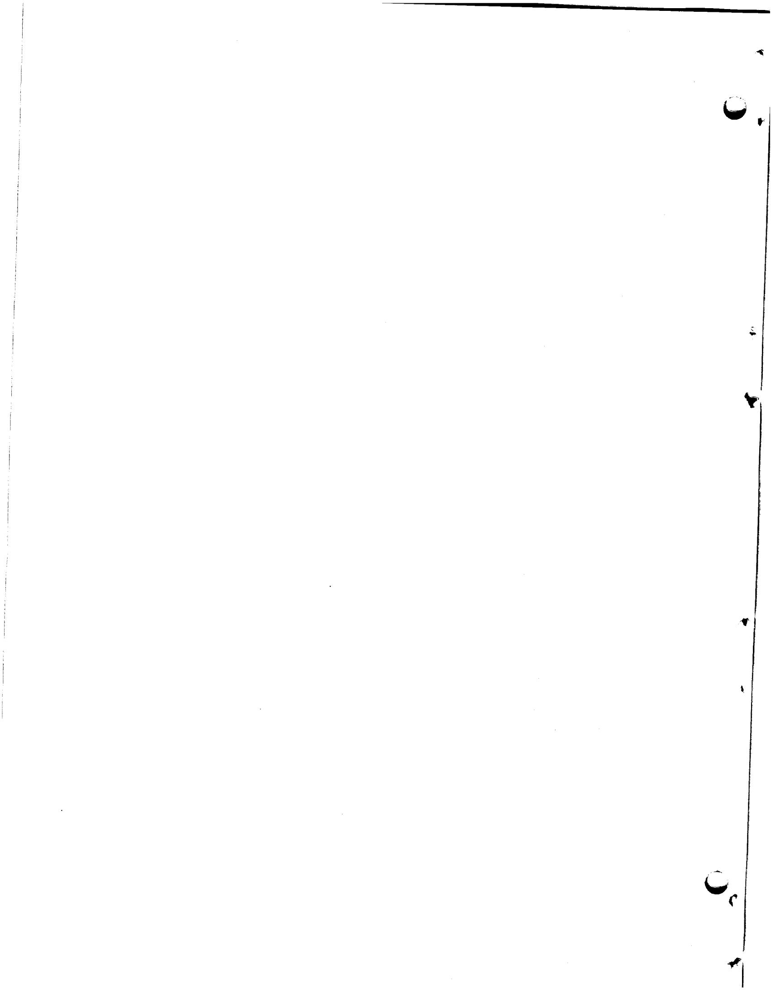

# LIST OF FIGURES

Page

Reactor Vessel in Transport Jig Prior to Installation   
Construction Photograph MSRE Reactor Cell iv   
Fig. 2.1 MSRE Flow Diagram 10   
Fig. 2.2 Reactor Vessel 11   
Fig. 2.3 MSRE Fuel Pump 13   
Fig. 2.4 Primary Heat Exchanger 15   
Fig. 2.5 Radiator Coil and Enclosure 16   
Fig. 2.6 Fuel-Salt Drain Tank 18   
Fig. 3.1 ORNL Area Map 28   
Fig. 3.2 Plot Plan Molten Salt Reactor Experiment Building 7503 29   
Fig. 3.3 Potable Water Supply to MSRE 31   
Fig. 3.4 Electrical Distribution System to MSRE 33   
Fig. 3.5 Steam Supply to MSRE 34   
Fig. 4.1 Front View of Building 7503 36   
Fig. 4.2 Rear View of Building 7503 During MSRE Construction 37   
Fig. 4.3 Plan at 852-ft Elevation 39   
Fig. 4.4 Plan at 840-ft Elevation 40   
Fig. 4.5 Elevation Building 7503 41   
Fig. 4.6 Shield Block Arrangement at Top of Reactor Cell 45   
Fig. 4.7 Block Arrangement on Top of Drain Tank Cell 50   
Fig. 5.1 Reactor Cell Plan 64   
Fig. 5.2 Reactor Cell Elevation 65   
Fig. 5.3 Fuel-Salt System Process Flowsheet 67   
Fig. 5.4 Cross Section MSRE Reactor Vessel and Access Nozzle   
Fig. 5.5 Elevation of Control Rod Drive Housings 77   
Fig. 5.6 Typical Graphite Stringer Arrangement 80   
Fig. 5.7 Lattice Arrangement at Control Rods 82   
Fig. 5.8 Graphite-INOR-8 Sample Assembly 83   
Fig. 5.9 Full-Scale Model of Reactor Vessel 92

Page

Fig. 5.10 Pressure Drop Through Reactor Core 94   
Fig. 5.11 Centerline Velocity Distribution in Volute of MSRE Full-Scale Model of Core   
Fig. 5.12 Flow Distribution in Reactor Core Fuel Passages at Total Flow Rate of 1200 gpm in Full-Scale Model 99   
Fig. 5.13 Control Rod Poison Element 108   
Fig. 5.14 Control Rod and Drive Assembly 109   
Fig. 5.15 Diagram of Control Rod Drive 111   
Fig. 5.16 Schematic of Reactor Access Shown Ready for Re- removal of Specimen Assembly 115   
Fig. 5.17 Work Shield for Graphite Sampler 117   
Fig. 5.18 Criteria for Establishing Static Design Stresses in INOR-8 120   
Fig. 5.19 Reactor Vessel Hanger Rods 123   
Fig. 5.20 Thermal Shield Prior to Installation 126   
Fig. 5.21 Exterior View of Fuel Pump Showing Flange Bolt 134 Extensions   
Fig. 5.22 Fuel-Salt Pump Bridge and Impeller Seal Clearances 140   
Fig. 5.23 Lubricating Oil System Flowsheet 145   
Fig. 5.24 Hydraulic Performance of Fuel Pump 150   
Fig. 5.25 Fuel Pump Support 156   
Fig. 5.26 Fuel Pump Overflow Tank 159   
Fig. 5.27 Primary Heat Exchanger Subassemblies 163   
Fig. 5.28 Tube to Tube-Sheet Joint in MSRE Primary Heat Exchanger   
Fig. 5.29 Freeze Flange and Clamp 179   
Fig. 5.30 Freeze Flange Clamping Frame Showing Assembly and Disassembly   
Fig. 5.31 Freeze Valve and Line 103 195   
Fig. 5.32 Freeze Valve and Lines 107, 108, 109, 110 199   
Fig. 5.33 Freeze Valve and Lines 111 and 112 200   
Fig. 5.34 Freeze Valve and Lines 204 and 206 202   
Fig. 5.35 Removable Heater for 5-in. Pipe 204   
Fig. 6.1 Fuel Drain Tank System Process Flowsheet 223   
Fig. 6.2 Fuel Processing System Flowsheet 227

Fig. 6.3 Fuel Drain Tank Steam Dome Bayonet Assembly 231   
Fig. 6.4 Bayonet Cooling Thimble for Fuel Drain Tank 232   
Fig. 7.1 Sampling (left) and Enriching (right) Capsules 248   
Fig. 7.2 Sampling Capsule Cable Latch 251   
Fig. 7.3 Schematic Representation Fuel-Salt Sampler-Enricher Dry Box 253   
Fig. 7.4 Capsule Access Chamber 257   
Fig. 7.5 Transfer Cask for Sampler-Enricher Transport Container 265   
Fig. 7.6 Effect of Thickness on Effectiveness of Sampler Shielding 268   
Fig. 7.7 Flow Diagram of Cover-Gas, Off-Gas and Leak Detection Systems for Sampler-Enricher 270   
Fig. 8.1 Coolant-Salt System Process Flowsheet 280   
Fig. 8.2 Performance Curves for Coolant-Salt Pump 290   
Fig. 8.3 Radiator Coil Configuration 293   
Fig. 8.4 Radiator Tube Matrix 294   
Fig. 8.5 Radiator Tube Supports 295   
Fig. 8.6 Characteristics of Radiator Duct Annulus Fans 301   
Fig. 8.7 Radiator Air Flow Characteristics 303   
Fig. 8.8 Radiator Air Flow Characteristics at Various Steps in Load Regulation 304   
Fig. 8.9 Estimated Performance of Both Radiator Supply Air Fans Operating in Parallel 306   
Fig. 10.1 Flow Diagram of Cover-Gas System 326   
Fig. 10.2 Cover-Gas System Process Flowsheet 328   
Fig. 10.3 Oxygen Removal Unit Cover-Gas System 335   
Fig. 11.1 General Routing of Leak Detector Lines 346   
Fig. 11.2 Schematic Diagram of Leak-Detected Flange Closure 347   
Fig. 11.3 Method of Utilizing One Leak Detector Line to Serve Two Flanges in Series 348   
Fig. 11.4 Leak Detector System Process Flowsheet 350   
Fig. 11.5 Leak Detector System Block Disconnects with Yoke 354   
Fig. 12.1 Schematic Diagram of Off-Gas System 360   
Fig. 12.2 Off-Gas System Process Flowsheet 363

Page

Fig. 12.3 Activity of Fission-Product Isotopes of Xenon and Krypton In Pump Bowl Off-Gas 370   
Fig. 12.4 Estimated Charcoal Bed Temperatures as Function of Flow Rate Through the Bed 371   
Fig. 12.5 Concentration of Xenon and Krypton at Off-Gas Stack Outlet 372   
Fig. 12.6 Maximum Estimated Temperature in First Section of Charcoal Bed vs Pipe Diameter 375   
Fig. 12.7 Porous Metal Filter in Off-Gas Line 522 381   
Fig. 13.1 Schematic of Air Flow Diagram Containment Ventilation System 385   
Fig. 13.2 Stack Fan Performance Curves 395   
Fig. 14.1 Liquid Waste System Process Flowsheet 399   
Fig. 15.1 Cooling Water System Process Flowsheet 411   
Fig. 15.2 Characteristic Curves - Treated Water Circulating 419 Pumps   
Fig. 15.3 Characteristic Curves - Cooling Tower Water Circulating Pumps 421   
Fig. 15.4 Cross Section Backflow Preventers in Water Lines 425 819 and 890   
Fig. 15.5 Capacity of Backflow Preventers in Water System 426   
Fig. 17.1 Diagram of MSRE Vapor-Condensing System 445   
Fig. 19.1 Simplified One-Line Diagram of Electrical Supply System 455   
Fig. 19.2 Process Equipment Electrical Distribution System 456   
Fig. 19.3 Building Services Electrical Distribution System 458   
Fig. 19.4 Location of Equipment in Switch House 463   
Fig. 19.5 Typical Schematic Diagram for Type 136 Powerstat 482   
Fig. 19.6 Typical Schematic Diagram for Type 1256-1035 Powerstat Motor-Operated 491   
Fig. 19.7 Motor-Operated Induction Regulator 492   
Fig. 19.8 Male and Female Electrical Disconnects for Heater 495 Leads Inside Cells   
Fig. 19.9 Typical Electrical Lead Penetration of Reactor Cell Wall 505   
Fig. 20.1 Water Services to Building 7503 507

Fig. 20.2 Schematic Diagram Building 7503 Drainage System 510

Fig. A.1 Symbols Used on MSRE Process Flowsheets 532

Fig. A.2 Symbols Used on MSRE Process Flowsheets 533

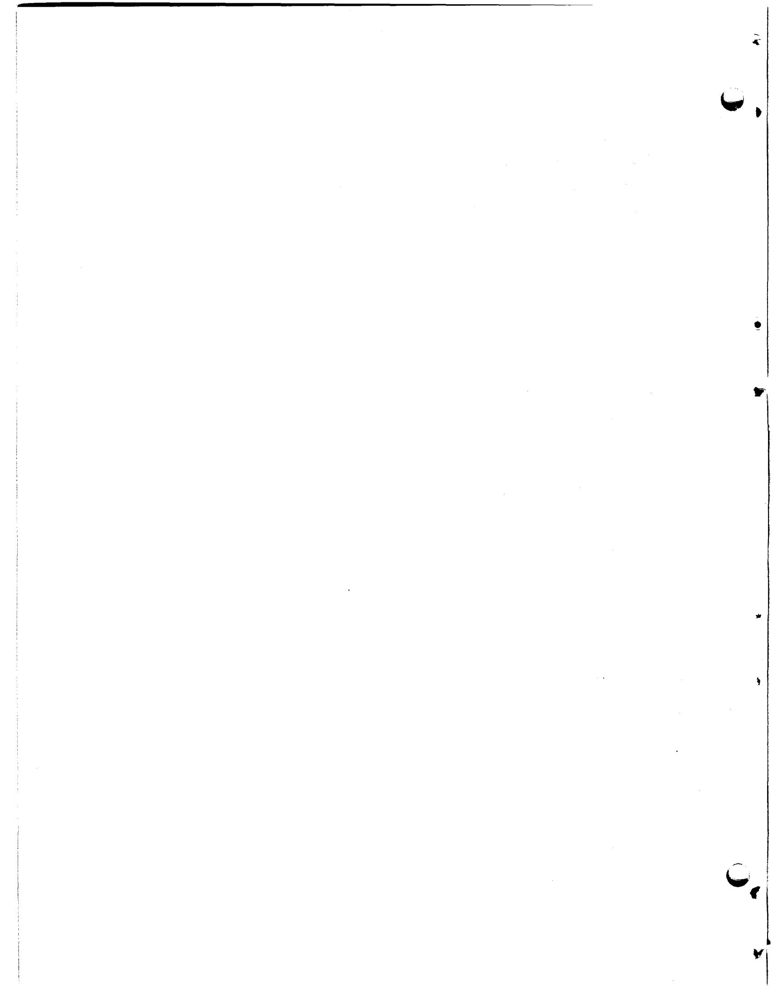

# LIST OF TABLES

Table 2.1 Composition and Physical Properties of the Fuel, Flush, and Coolant Salts   
Table 2.2 Composition and Properties of INOR-8 20   
Table 2.3 Reactivity Requirements 22   
Table 4.1 Reactor Cell Penetrations 48   
Table 4.2 Drain Tank Cell Penetrations 52   
Table 4.3 Auxiliary Cell Dimensions 57   
Table 5.1 Distribution of Helium Supply to Fuel Pump 70   
Table 5.2 Reactor Vessel and Core Design Data and Dimensions 78   
Table 5.3 Properties of MSRE Core Graphite - CGB 87   
Table 5.4 Summary of Reactor Physics Data 101   
Table 5.5 Fuel-Salt Circulation Pump Design Data 135   
Table 5.6 Lubricating-Oil System Design Data 146   
Table 5.7 Lubricating Oil Properties 148   
Table 5.8 Estimated Stresses in MSRE Fuel-Pump Shaft (psi) 153   
Table 5.9 Design Data for Primary Heat Exchanger 164   
Table 5.10 Variable Spring Supports for Fuel and Coolant-Salt Piping Inside Reactor Cell 177   
Table 5.11 MSRE Freeze Valves 191   
Table 5.12 MSRE Pipe Line Heaters 209   
Table 5.13 Thermal Insulation on Major MSRE Salt Piping 216   
Table 6.1 Design Data for Drain Tanks No. 1 and 2 229   
Table 6.2 Design Data for Condensers in Drain Tank Heat Removal Systems 236   
Table 6.3 Design Data for Fuel System Flush Salt Tank 241   
Table 6.4 Salt Transfer Pipe Line Supports 243   
Table 7.1 Helium Supply Lines and Restrictors in Fuel-Salt Sampler-Enricher System 272   
Table 8.1 Coolant-Salt Circulating Pump 286   
Table 8.2 Radiator Design Data 296   
Table 8.3 Possible Steps for Controlling Heat Removal Rate from the Radiator 307

Table 8.4 Coolant Cell Salt Piping Supports 314   
Table 9.1 Design Data for Coolant-Salt Drain Tank 320   
Table 10.1 Cover Gas System Hand Valves 340   
Table 10.2 Cover Gas System Check Valves 341   
Table 10.3 Cover Gas System Control Valves and Regulators 342   
Table 11.1 Leak Detector System Headers 351   
Table 12.1 Design Data Off-Gas Disposal System 357   
Table 12.2 Atom Flow Rate Emerging from Fuel Pump Bowl 373   
Table 12.3 Off-Gas System Air-Operated Valves 378   
Table 12.4 Off-Gas System Check Valves 379   
Table 12.5 Off-Gas System Hand Valves 380   
Table 13.1 Estimated Containment Ventilation System Air Flow Rates During Normal Reactor Operations (cfm) 384   
Table 14.1 Lines Emptying into Sump in Room 403   
Table 14.2 Sump Ejector Characteristics 406   
Table 15.1 Equipment Cooled by Cooling Tower Water 409   
Table 15.2 Equipment Cooled by Treated Water 409   
Table 15.3 Design Data Reactor and Drain Tank Cell Space Coolers 422   
Table 16.1 Gas-Cooled Components 429   
Table 16.2 Air-Cooled Components 431   
Table 16.3 Component Cooling System Valves 437   
Table 19.1 Switchgear Bus and Breaker Data 464   
Table 19.2 Connections to Switchgear Bus No. 3 466   
Table 19.3 Equipment Connections to TVA Motor Control Centers 468   
Table 19.4 Equipment Connections to Motor Control Center G-3 469   
Table 19.5 Equipment Connections to Motor Control Center G-4 470   
Table 19.6 Equipment Connections to Motor Control Centers G-5-1 and G-5-2 472   
Table 19.7 Connections to Building Service Panel No. 1 473   
Table 19.8 Connections to Lighting Distribution Panels 1A and 1Al 474   
Table 19.9 Connections to Building Service Panel No. 2 475   
Table 19.10 Heater Control Panels 483

Table 19.11 Heater Electrical Lead Cell Wall Penetrations 496   
Table 19.12 Summary of Electrical Lead Penetrations in Reactor Cell 503   
Table 19.13 Summary of Electrical Lead Penetrations in Drain Tank Cell 503   
Table 19.14 General Cable Company MI Cable Numbers 503

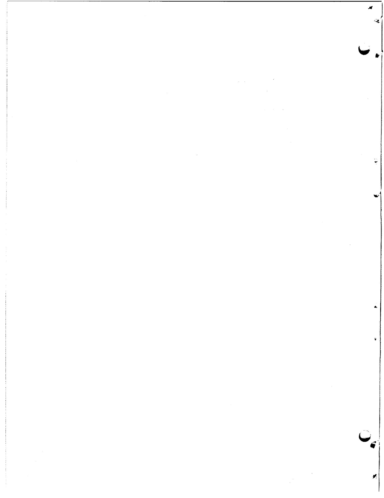

MOLTEN-SALT REACTOR EXPERIMENT

# PART I

# DESCRIPTION OF REACTOR DESIGN

Volume I

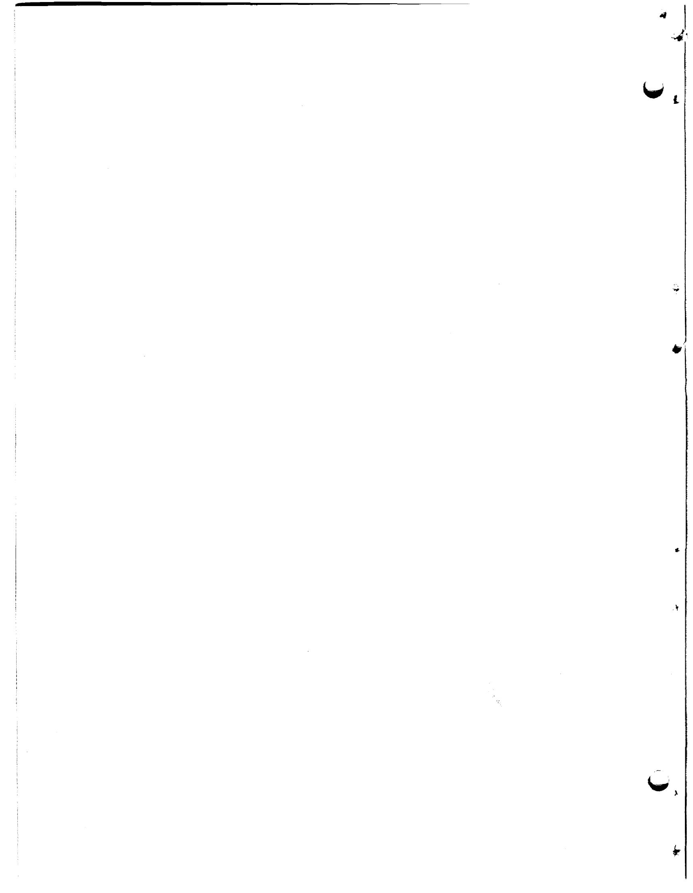

# 1. INTRODUCTION

The Molten-Salt Reactor Experiment (MSRE) was undertaken by the Oak Ridge National Laboratory to demonstrate that the desirable features of the molten-salt concept could be embodied in a practical reactor that could be constructed and maintained without undue difficulty and one that could be operated safely and reliably. Additional important objectives were to provide the first large-scale, long-term, high-temperature tests in a reactor environment of the fuel salt, graphite, moderator, and high-nickel-base alloy (INOR-8). Operating data from the MSRE should provide important information regarding the feasibility of large-scale molten-salt reactors.

Molten-salt reactors were first investigated as a means of providing a compact high-temperature power plant for nuclear-powered aircraft. In 1954 an Aircraft Reactor Experiment (ARE) was constructed at ORNL which demonstrated the nuclear feasibility of operating a molten-salt-fueled reactor at high temperature. Fuel entered the ARE core at $1200^{\circ}\mathrm{F}$ and left at $1500^{\circ}\mathrm{F}$ when the reactor power level was 2.5 Mw.

Immediately after the successful operation of the ARE, the Aircraft Reactor Test (ART) was started at ORNL as part of the Aircraft Nuclear Propulsion Program (ANP). This test was discontinued in 1957 when the ANP Program was revised, but the high promise of the molten-salt reactor type for achieving low electric power generating costs in central power stations led ORNL to continue parts of the basic study programs. Features of the molten-salt concept which deserve special mention with regard to its future prospects are:

1. The fuel is fluid at reactor temperatures, thus eliminating the extra costs associated with the fabrication, handling, and reprocessing of solid fuel elements. Burnup in the fuel is not limited by radiation damage or reactivity loss. The fuel can be reprocessed continuously in a side stream for removal of fission products, and new fissionable material can be added while the reactor is in operation.

2. Molten-salt reactors can operate at high temperatures and produce high-pressure superheated steam to achieve thermal efficiencies in the heat-power cycle equal to the best fossil-fuel-fired plants. The relatively low vapor pressure of the salt permits use of low pressure containers and piping.   
3. The negative temperature coefficient of the reactor and the low excess reactivity are such that the nuclear safety is not primarily dependent upon fast-acting control rods.   
4. The fuel salt has a low cross section for the parasitic absorption of neutrons, and when used with bare graphite as the moderator, very good neutron economies can be achieved. Molten-salt reactors are thus attractive as highly efficient converters and breeders on the Th-233U cycle.   
5. The fluoride salts used as the fluid fuel mixture have good thermal and radiation stability and do not undergo violent chemical reactions with water or air. They are compatible with the graphite moderator and can be contained satisfactorily in a specially developed high-nickel alloy, INOR-8. The volumetric heat capacity, viscosity, thermal conductivity, and other physical properties are also within desirable ranges.   
6. Use of relatively high circulation rates and temperature differences results in high mean power density, high specific power, and low fuel inventory.

These attractive features of the molten-salt reactor concept are partially offset by the disadvantages that:

1. The fuel salt mixture melts at about $840^{\circ}\mathrm{F}$ , so means must be provided for maintaining all salt-containing portions of the system above this temperature.   
2. The fluoride salts react with oxygen to precipitate fuel constituents as oxides. Although zirconium tetrafluoride is included in the salt mixture so that $\mathrm{ZrO}_2$ will precipitate in preference to $\mathrm{UO}_2$ , care must be taken to prevent the fuel from being contaminated with air, water, or other oxygen-containing materials.   
3. The radioactivity in any fluid-fuel system is in a mobile form, and special provisions must be taken for containment and maintenance.

During the period 1957-60, investigations were carried out at ORNL on the fuel salt chemistry, metallurgy of containment materials, the design of salt-circulating pumps, and on remote maintenance techniques. The results of this work lent additional encouragement, and in 1959 studies were made by H. G. MacPherson1 and L. G. Alexander et al.2, pertaining to the applicability of the molten-salt concept to central power station reactors. The studies resulted in a proposal3 to the AEC for construction of a molten-salt experiment to investigate remaining areas of uncertainty that could be resolved only by actually building and operating a molten-salt reactor. In April, 1961, ORNL received a directive4 from the AEC to design, construct, and operate the Molten-Salt Reactor Experiment (MSRE), the subject of this report.

Early in the design phases it was decided that the MSRE was to have as its primary purpose the investigation of the practicality of the molten-salt concept for central power station applications. As such, the MSRE was envisioned as a straightforward-type of installation, uncomplicated by the inclusion of experimental apparatus which might jeopardize reliable, long-term operation. It was also necessary that the MSRE be of a large-enough capacity for the experimental findings to be meaningfully extrapolated to the full-scale plants. It was decided that a reactor of 10 Mw thermal output would satisfy the criterion.

Conversion of the 10 Mw of heat to useful electricity was not considered to be necessary to demonstrate the concept, so existing blowers and stack were used to dissipate the heat to the atmosphere. Containment requirements dictated a double barrier between the highly radioactive fuel salt and the environment, and a salt very similar to the fuel salt in composition and physical properties was chosen to transport the heat from the fuel salt to air-cooled surfaces.

An expanded plant layout was adopted in order to provide access to equipment and to facilitate maintenance operations. The MSRE was installed in an existing building in the 7503 Area at ORNL that was constructed specifically for the ARE and ART. This arrangement provided some savings and expedited construction in that the building included a containment vessel which, with modification, was suitable for the MSRE. A significant amount of usable auxiliary equipment was also on hand, including air blowers and

a stack for dissipation of heat to the atmosphere, emergency diesel-electric power supply, heavy-duty cranes, etc. Shop, office, washroom, and control room spaces were also available, and some of the heavy concrete shielding was adaptable to the MSRE. Fitting the MSRE design to the existing facilities required numerous design compromises, but no extreme difficulties were encountered.

Construction of the MSRE officially started in July, 1961, although much of the advance thinking and preliminary design work were well under way by that time. Major building modifications were started in 1961 and were completed by the end of 1962. Lack of funds and late delivery of the graphite moderator delayed installation of major equipment until early 1964. The installation was scheduled for completion in the early summer of 1964, and the target date to achieve criticality was set for the end of that year.

# 2. GENERAL DESCRIPTION

# 2.1 Type

The Molten-Salt Reactor Experiment (MSRE) is a single-region, unclad, graphite-moderated, fluid-fuel type of reactor with a design heat generation rate of 10 Mw. The circulating fuel is a mixture of lithium, beryllium, and zirconium fluoride salts that contains uranium or thorium and uranium fluorides. Reactor heat is transferred from the fuel salt to a similar coolant salt and is then dissipated to the atmosphere.

# 2.2. Location

The Experiment is located in the 7503 Area of the Oak Ridge National Laboratory, Oak Ridge, Tennessee. The site is about one-half mile south of the main Laboratory buildings, in a wooded, secluded bend of the Clinch River that is reserved for special reactor installations.

# 2.3 Fuel and Coolant Salts

The composition and physical properties of various fuel and coolant salts are given in Table 2.1. Favorable neutron absorption and chemical and physical properties were important requirements for the compositions selected. Beryllium fluoride is used to obtain a low melting point. Lithium fluoride (99.99% Li7 in both fuel and coolant salts) imparts good fluid flow properties to the mixture. Zirconium fluoride protects the fuel salt against precipitation of $\mathrm{UO}_2$ from contamination by air and moisture. Fuel salts containing thiorium are of interest for future large-scale thorium breeder reactors. The first experiments in the MSRE will be run with partially enriched uranium because there are fewer uncertainties concerning the chemical behavior of that fuel. Later the reactor will be operated with the highly enriched uranium fuel and then with the thorium-uranium fuel.

Table 2.1 Composition and Physical Properties of the Fuel, Flush, and Coolant Salts   

<table><tr><td rowspan="2"></td><td colspan="3">Fuel Salt</td><td rowspan="2">Flush and Coolant Salt</td></tr><tr><td>Thorium-Uranium</td><td>Highly En-riched Uranium</td><td>Partially En-riched Uranium</td></tr><tr><td colspan="5">Composition, mole %</td></tr><tr><td>LiF (99.99% Li7)</td><td>70</td><td>66.8</td><td>65</td><td>66</td></tr><tr><td>BeF2</td><td>23.6</td><td>29</td><td>29.1</td><td>34</td></tr><tr><td>ZrF4</td><td>5</td><td>4</td><td>5</td><td>--</td></tr><tr><td>ThF4</td><td>1</td><td>0</td><td>0</td><td>--</td></tr><tr><td>UF4</td><td>0.4</td><td>0.2</td><td>0.9</td><td>--</td></tr><tr><td>Physical Properties, at</td><td>1200°F</td><td>1200°F</td><td>1200°F</td><td>1060°F</td></tr><tr><td>Density, lb/ft3, at 1200°F</td><td>140</td><td>130</td><td>134</td><td>120</td></tr><tr><td>Viscosity, lb/ft-hr</td><td>18</td><td>17</td><td>20</td><td>24</td></tr><tr><td>Heat Capacity, Btu/lb-°F</td><td>0.45(at 1200°F)</td><td>0.48</td><td>0.47</td><td>0.53(at 1200°F)</td></tr><tr><td>Thermal Conductivity,Btu/hr2(°F/ft)</td><td>3.21</td><td>3.2</td><td>3.2</td><td>3.5</td></tr><tr><td>Liquidus Temperature, °F</td><td>840</td><td>840</td><td>840</td><td>850</td></tr></table>

# 2.4 Equipment and Process

The major items of equipment in the MSRE are shown on a simplified flowsheet in Fig. 2.1. The fuel-salt-circulating system is the reactor primary system. It consists of the reactor vessel where the nuclear heat is generated, the fuel heat exchanger in which heat is transferred from fuel to coolant, the fuel circulating pump, and the interconnecting piping. The coolant system is the reactor secondary system. It consists of the coolant pump, a radiator in which heat is transferred from coolant salt to air, and the piping between the pump, the radiator, and the fuel heat exchanger. There are also drain-tank systems for containing the fuel and coolant salts when the circulating systems are not in operation.

# 2.4.1 Reactor

The reactor vessel is a 5-ft-diam by 8-ft-high tank that contains a 55-in.-diam by 64-in.-high graphite core structure. A cutaway drawing of the reactor is shown in Fig. 2.2. Under design conditions of 10 Mw of reactor heat, the fuel salt enters the flow distributor at the top of the vessel at $1175^{\circ}\mathrm{F}$ and 20 psig. The fuel is distributed evenly around the circumference of the vessel and then flows turbulently downward in a spiral path through a 1-in. annulus between the vessel wall and the core can. The wall of the vessel is thus cooled to within about $5^{\circ}\mathrm{F}$ of the bulk temperature of the entering salt. The salt loses its rotational motion in the straightening vanes in the lower plenum and turns and flows upward through the graphite matrix in the core can.

The graphite matrix is an assembly of vertical bars, 2 in. by 2 in. by about 67 in. long. Fissioning of $^{235}\mathrm{U}$ in the fuel occurs as it flows in 0.4-in. by 1.2-in. channels that are formed by grooves in the sides of the bars. There are about 1140 of these passages.

The nominal core volume within the 55-in.-diam by 64-in.-high core structure is $90\mathrm{ft}^3$ , of which $20\mathrm{ft}^3$ is fuel and $70\mathrm{ft}^3$ is graphite. At $10\mathrm{Mw}$ , and with no fuel absorbed by the graphite, $1.4\mathrm{Mw}$ of heat is generated in the fuel outside the nominal core, $0.6\mathrm{Mw}$ is generated in the graphite, and $8.0\mathrm{Mw}$ is generated in the fuel within the core. This

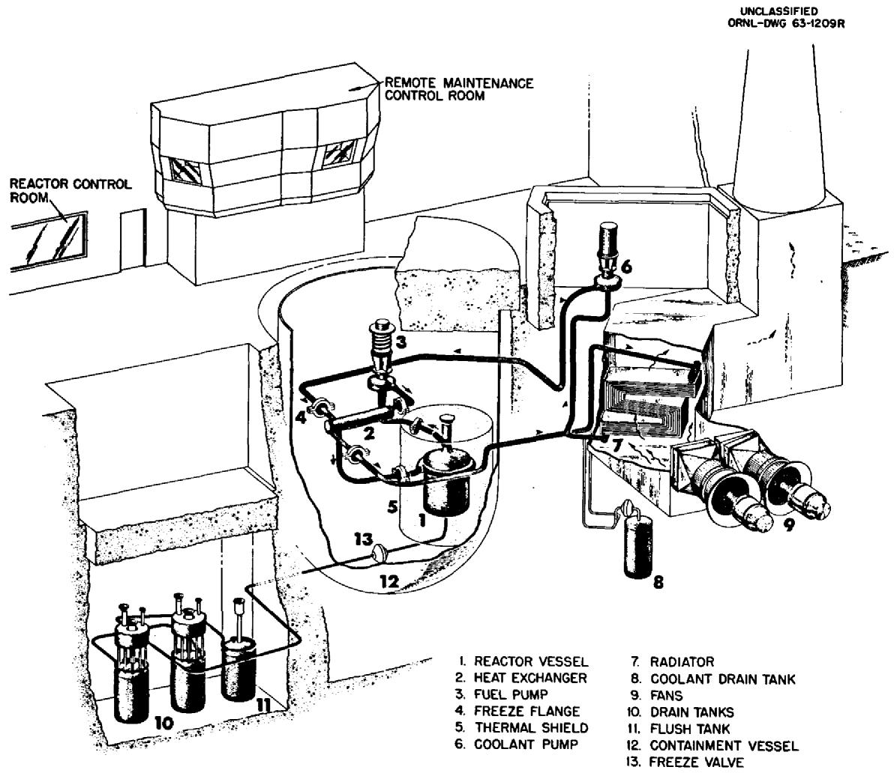  
Fig. 2.1. MSRE Flow Diagram.

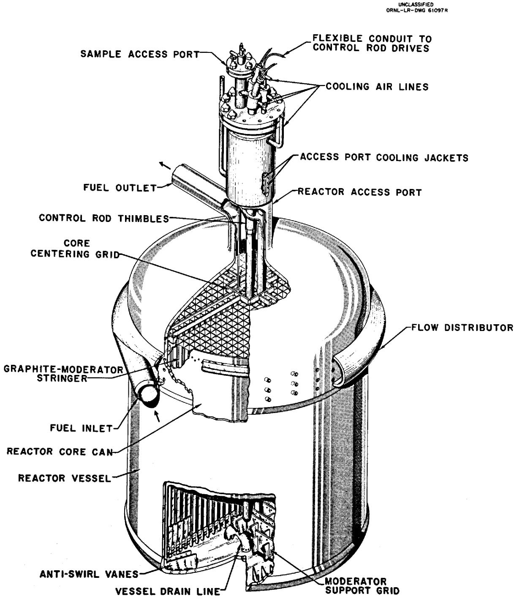  
Fig. 2.2. Reactor Vessel.

corresponds to an average fuel power density of $\frac{14\mathrm{kw}}{\mathrm{liter}}$ in the nominal core. The maximum fuel power density is $31\mathrm{kw} / \mathrm{liter}$ .

Flow in the coolant channels is laminar, but both the graphite and the fuel have good thermal conductivities, so the maximum temperature of the graphite is only about $60^{\circ}\mathrm{F}$ above the mixed mean temperature of the adjacent fuel. The nuclear average and the maximum temperatures, respectively, of the graphite are estimated to be about $1255^{\circ}\mathrm{F}$ and $1300^{\circ}\mathrm{F}$ . The temperature of the fuel leaving the hottest channel in the core is about $1260^{\circ}\mathrm{F}$ .

Fuel leaves the top of the reactor at $1225^{\circ}\mathrm{F}$ and 7 psig through the side outlet of a special fitting designed as an access port for insertion of graphite and metal samples and for three 2-in.-diam control rod thimbles. The poison elements in the control rods are short hollow cylinders of gadolinium oxide l in. in diameter, clad with Inconel and arranged on a flexible Inconel hose to permit passage through two bends that form an offset in each thimble. The control rods and drives are cooled by circulation of cell atmosphere through the flexible hoses and thimbles.

A 1-l/2-in.-diam outlet line is provided at the bottom of the reactor vessel for discharging salt to the drain tanks.

# 2.4.2 Fuel Pump

The fuel salt from the reactor flows directly to the centrifugal sump-type pump shown in Fig. 2.3. The pump has a vertical shaft and overhung impeller and operates at a speed of $1160\mathrm{rpm}$ to deliver 1200 gpm at a discharge head of 49 ft. The pump bowl is about 36 in. in diameter, and the pump and 75-hp motor assembly is about 8 ft high.

Devices are provided in the pump bowl to measure the liquid level as a means of determining the inventory of salt in the system. Small capsules can be lowered into the bowl to take a 10-g sample of salt for analysis or to add 120 g of fuel to the system. About 65 gpm of the pump output is circulated internally to the pump bowl for release of entrained or dissolved gases from the salt.

Helium flows through the gas space in the bowl at a rate of about 200 ft $^3$ /day (STP) to sweep the highly radioactive xenon and krypton to the off-gas disposal system. The helium also acts as a cover gas to exclude air and water vapor.

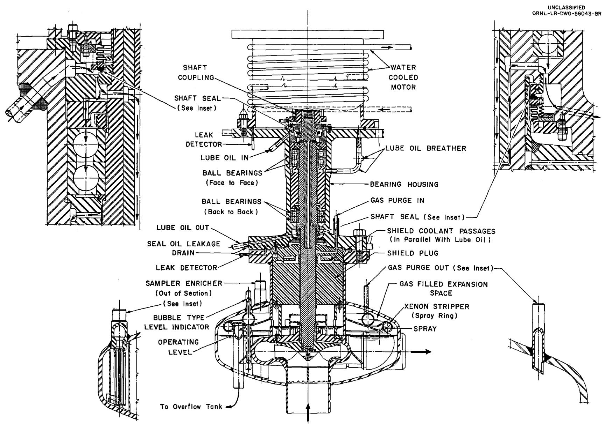  
FIG. 2.3. MSRE FUEL PUMP

The pump is equipped with ball bearings that are lubricated and cooled with oil circulated by an external pumping system. The oil is confined to the bearing housing by mechanical shaft seals. A helium purge enters below the lower seal. A small part of this helium flows upward along the shaft and leaves just below the lower seal, carrying with it any oil vapors that leak through the seal. The remainder flows downward along the shaft to the pump bowl and subsequently to the off-gas system. This prevents radioactive gases from reaching the oil.

Cooling oil is also circulated through a metal block above the pump bowl which shields the lubricating oil and the pump motor.

The motor and the bearing shaft and impeller assembly are removable separately to facilitate maintenance.

An overflow tank of 5.5-ft³ volume is installed below the pump to provide sufficient volume for free expansion of salt under all foreseen conditions.

# 2.4.3 Heat Exchanger

Salt discharged by the fuel pump flows through the shell side of the horizontal shell-and-tube heat exchanger shown in Fig. 2.4, where it is cooled from $1225^{\circ}\mathrm{F}$ to $1175^{\circ}\mathrm{F}$ . The exchanger is about 16 in. in diameter and 8 ft long and contains one hundred sixty-three $1/2$ -in.-OD U-tubes with an effective surface of $259\mathrm{ft}^{2}$ . The coolant salt circulates through the tubes at a rate of $850\mathrm{gpm}$ , entering at $1025^{\circ}\mathrm{F}$ and leaving at $1100^{\circ}\mathrm{F}$ .

# 2.4.4 Coolant Pump

The coolant salt is circulated by a centrifugal pump identical in most respects to the fuel pump. The pump has a 75-hp, 1750-rpm motor and delivers 850 gpm against a head of 78 ft.

# 2.4.5 Radiator

The radiator is shown in Fig. 2.5. Seven hundred square feet of cooling surface is provided by 120 tubes 0.75 in. in diameter by 30 ft long. Cooling air is supplied to the radiator by two 250-hp axial blowers with a combined capacity of 200,000 cfm. Salt enters the radiator at $1100^{\circ}\mathrm{F}$ and leaves at $1025^{\circ}\mathrm{F}$ . The temperature rise of the air is $200^{\circ}\mathrm{F}$ at design power. To guard against freezing the salt in the

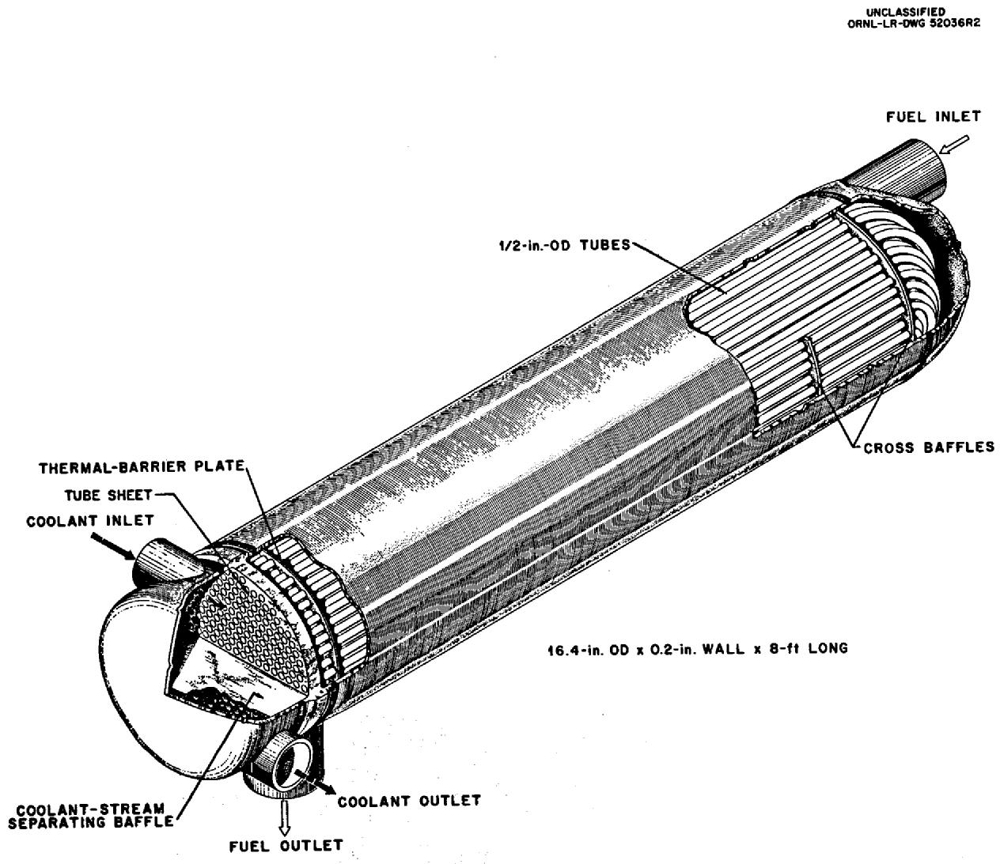  
Fig. 2.4. Primary Heat Exchanger.

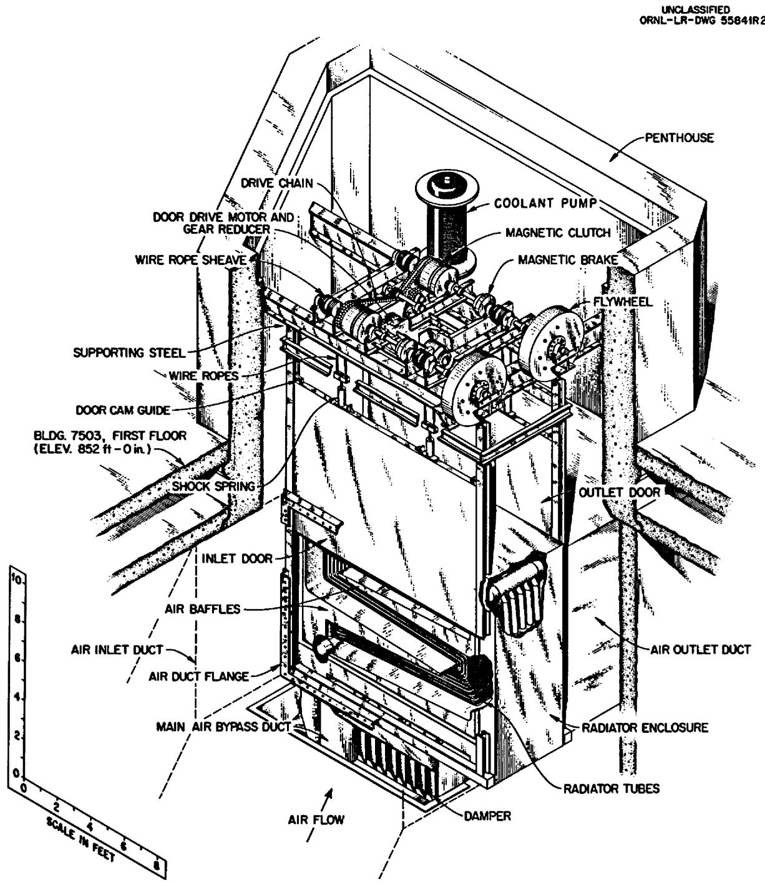  
Fig. 2.5. Radiator Coil and Enclosure.

radarator tubes on sudden reduction of reactor power, quick-closing doors are provided to shut off the air flow, and the radiator is heated by electrical heaters inside the enclosure. The opening of the doors can be adjusted, and some of the air can be bypassed around the radiator to regulate the heat removal rate.

# 2.4.6 Drain Tank Systems

Four tanks are provided for safe storage of the salt mixtures when they are not in use in the fuel- and coolant-salt circulating systems. Two fuel-salt drain tanks and a flush-salt tank are connected to the reactor by means of the fill and drain line. One drain tank is provided for the coolant salt.

A fuel drain tank is shown in Fig. 2.6. The tank is 50 in. in diameter by 86 in. high and has a volume of about $80\mathrm{ft}^3$ , sufficient to hold in a non-critical geometry all the salt that can be contained in the fuel circulating system. The tank is provided with a cooling system capable of removing $100\mathrm{kw}$ of fission-product decay heat, the cooling being accomplished by boiling water in 32 bayonet tubes that are inserted in thimbles in the tank.

The flush-salt tank is similar to the fuel-salt tank except that it has no thimbles or cooling system. New flush salt is like fuel salt but without fissile or fertile material. It is used to wash the fuel circulating system before fuel is added and after fuel is drained, and the only decay heating is by the small quantity of fission products that it removes from the equipment.

The coolant-salt tank resembles the flush-salt tank, but it is 40 in. in diameter by 78 in. high and the volume is 50 ft3.

The tanks are provided with devices to indicate high and low liquid levels and with weigh cells to indicate the weight of the tanks and their contents.

# 2.4.7 Piping and Flanges

The major components in the salt circulating systems are interconnected by 5-in. sched-40 piping. Flanged joints between units in the primary system facilitate removal and replacement of components by remotely operated tools. These flanges, called freeze flanges, utilize

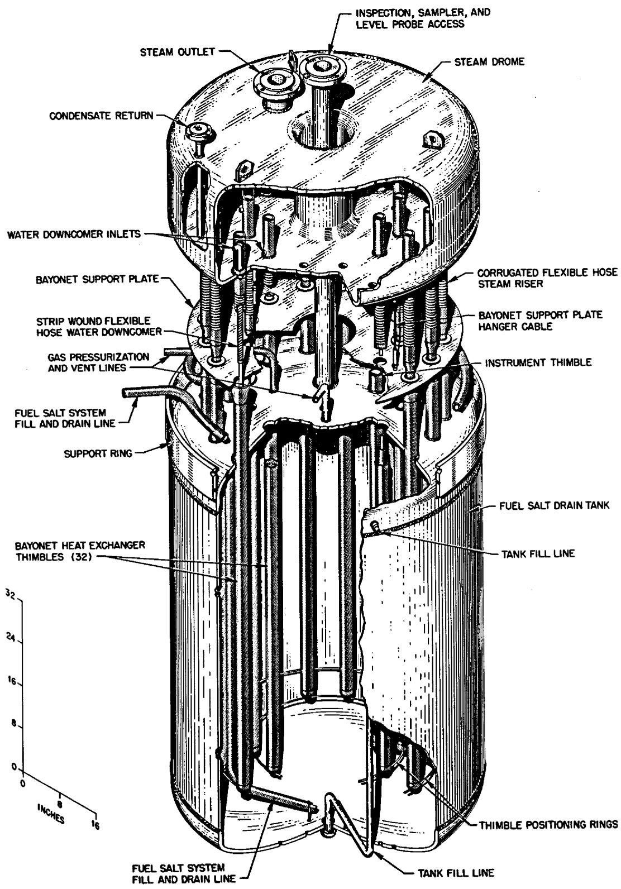  
Fig. 2.6. Fuel-Salt Drain Tank.

a frozen salt seal between the flange faces as well as a conventional 0-ring-type joint to form a helium-buffered, leak-detected type of closure.

The fill and drain lines are 1-1/2-in. sched-40 piping and contain the only "valves" that come in contact with salt. The valves, called freeze valves, have no moving parts, unmodulated flow control being achieved by freezing or thawing salt in a short, partially flattened section of pipe that can be heated and cooled.

# 2.4.8 Heaters

All parts of the salt-containing systems are heated electrically to maintain the salts above the liquidus temperature of $840$ to $850^{\circ}\mathrm{F}$ . The equipment is preheated before salt is added and the heaters are energized continuously during reactor operation to make sure that there is no uncontrolled freezing in any of the piping and that the salt can be drained when necessary. The total capacity of the heaters is about $1930\mathrm{kw}$ , but the actual power consumption is somewhat less than half of this. About $300\mathrm{kw}$ of heat can be provided by the diesel electric emergency power supply.

# 2.4.9 Materials

The salt-containing piping and equipment are made of INOR--a special high-nickel and molybdenum alloy having a good resistance to attack by fuel and coolant salts at temperatures at least as high as $1500^{\circ}\mathrm{F}$ . The mechanical properties are superior to those of many austenitic stainless steels, and the alloy is weldable by established procedures. The chemical composition and some of the physical properties are given in Table 2.2. Most of the INOR equipment was designed for $1300^{\circ}\mathrm{F}$ and 50 psig, with an allowable stress of 2750 psi.

Stainless steel piping and valves were used in the helium supply and in the off-gas systems.

# 2.4.10 Cover- and Off-Gas Systems

A helium cover-gas system protects the oxygen-sensitive fuel from contact with air or moisture. Commerical helium is supplied in a tank truck and is passed through a purification system to reduce the oxygen and water content below 1 ppm before it is admitted to the reactor.

Table 2.2. Composition and Properties of INOR-8   

<table><tr><td colspan="4">Chemical Properties:</td></tr><tr><td>Ni</td><td>66-71%</td><td>Mn, max</td><td>1.0%</td></tr><tr><td>Mo</td><td>15-18</td><td>Si, max</td><td>1.0</td></tr><tr><td>Cr</td><td>6-8</td><td>Cu, max</td><td>0.35</td></tr><tr><td>Fe, max</td><td>5</td><td>B, max</td><td>0.010</td></tr><tr><td>C</td><td>0.04-0.08</td><td>W, max</td><td>0.50</td></tr><tr><td>Ti + Al, max</td><td>0.50</td><td>P, max</td><td>0.015</td></tr><tr><td>S, max</td><td>0.02</td><td>Co, max</td><td>0.20</td></tr><tr><td colspan="4">Physical Properties:</td></tr><tr><td colspan="2">Density, lb/in.3</td><td colspan="2">0.317</td></tr><tr><td colspan="2">Melting point, °F</td><td colspan="2">2470-2555</td></tr><tr><td colspan="2">Thermal conductivity, Btu/hr-ft2(F/ft) at 1300°F</td><td colspan="2">12.7</td></tr><tr><td colspan="2">Modulus of elasticity at ~1300°F, psi</td><td colspan="2">24.8 x 106</td></tr><tr><td colspan="2">Specific heat, Btu/lb-°F at 1300°F</td><td colspan="2">0.138</td></tr><tr><td colspan="2">Mean coefficient of thermal expansion, 70-1300°F range, in./in.-°F</td><td colspan="2">8.0 x 106</td></tr><tr><td colspan="4">Mechanical Properties:</td></tr><tr><td colspan="2">Maximum allowable stress, a psi: at 1000°F</td><td colspan="2">17,000</td></tr><tr><td></td><td>1100°F</td><td colspan="2">13,000</td></tr><tr><td></td><td>1200°F</td><td colspan="2">6,000</td></tr><tr><td></td><td>1300°F</td><td colspan="2">3,500</td></tr></table>

aASME Boiler and Pressure Vessel Code Case 1315.

systems. A flow of 200 ft $^3$ /day (STP) is passed continuously through the fuel pump bowl to transport the fission product gases to activated charcoal adsorber beds. The radioactive xenon is retained on the charcoal for a minimum of 90 days, and the krypton for 7-1/2 days, which is sufficient for all but the $^{85}\mathrm{Kr}$ to decay to insignificant levels. The $^{85}\mathrm{Kr}$ is maintained well within tolerance, the effluent gas being diluted with 21,000 cfm of air, filtered, monitored, and dispersed from a 3-ft-diam by 100-ft steel-containment ventilation stack.

The cover-gas system is also used to pressurize the drain tanks to move molten salts into the fuel and coolant circulating systems. Gas from these operations is passed through charcoal beds and filters before it is discharged through the off-gas stack.

# 2.4.11 Instrumentation and Control Systems

Nuclear and process control are both important to the operation of the MSRE. The reactor has a negative temperature coefficient of 6.4 to $9.9 \times 10^{-5} (\Delta \mathrm{k} / \mathrm{k}) / {}^{\circ} \mathrm{F}$ , depending on the type of fuel that is being used. The excess reactivity requirements are listed in Table 2.3, and they are not expected to exceed $4 \times 10^{-2} \Delta \mathrm{k} / \mathrm{k}$ at the normal operating temperature. The three control rods have a combined worth of 5.6 to $7.6 \% \Delta \mathrm{k} / \mathrm{k}$ , depending upon the fuel composition. Their major functions are to eliminate the wide temperature variations that would otherwise accompany changes in power and xenon poison level and to make it possible to hold the reactor subcritical to a temperature 200 to $300^{\circ} \mathrm{F}$ below the normal operating temperature. They have some safety functions, most of which are concerned with the startup of the reactor. Rapid action is not required of the control rods; however, a magnetic clutch is provided in the drive train to permit the rods to drop into the thimbles with an acceleration of $0.5 \mathrm{~g}$ as a convenient way of providing insertion rates that are more rapid than the removal rates. Burnup and growth of long-lived fission product poisons is compensated by adding fuel through the sampler enricher. Complete shutdown of the reactor is accomplished by draining the fuel.

When the reactor is operated at power levels above a few hundred kilowatts, the power is controlled by regulating the air flow, and

Table 2.3. Reactivity Requirements   

<table><tr><td></td><td>Reactivity, % Δk/k</td></tr><tr><td>Loss of delayed neutrons by circulating fuel</td><td>-0.3</td></tr><tr><td>Entrained gas</td><td>-0.2</td></tr><tr><td>Power coefficient (from rise in graphite temperature)</td><td>-0.1</td></tr><tr><td>Xenon poisoning (steady state at 10 Mw)</td><td>-0.7</td></tr><tr><td>Samarium-149 transient</td><td>-0.1</td></tr><tr><td>Burnup (120 g of fuel)</td><td>-0.1</td></tr><tr><td>Margin for operation of control rods</td><td>-0.4</td></tr><tr><td>Total</td><td>-1.9</td></tr><tr><td>Uncertainty in estimates (primarily xenon)</td><td>(+)-1.0 to (-)-0.4</td></tr><tr><td>Total</td><td>-2.9 to -1.5</td></tr></table>

thereby the rate of heat removal, at the radiator. The power level is determined by measuring the flow rate and temperature difference in the coolant salt system. The control rods operate to hold the fuel outlet temperature from the reactor constant, and the inlet temperature is permitted to vary with power level. At low power the control rods operate to hold the neutron flux constant, and the heat withdrawal at the radiator or the input to the heaters on piping and equipment is adjusted to keep the temperature within a specified range.

Preventing the salts from freezing, except at freeze flanges and valves, and protecting the equipment from overheating, are among the most important control functions. Over one thousand thermocouples are installed throughout the fuel and coolant salt systems, and about three-fourths of these serve indication, alarm, or control functions. The heating and cooling equipment is controlled to maintain temperatures (throughout the systems) within specified ranges.

Digital computer and data handling equipment are included in the instrumentation to provide rapid compilation and analysis of the process data. This equipment has no control function but gives current information about all important variables and warns of abnormal conditions.

# 2.5 Fuel Processing

Batches of fuel or flush salt which have been removed from the reactor circulating system can be processed in separate equipment to permit their reuse or to recover the uranium.

Salts that have been contaminated with oxygen to the saturation point (about 80 ppm of $O_2$ ), and thus tend to precipitate the fuel constituents as oxides, can be treated with a hydrogen-hydrogen fluoride gas mixture to remove the oxygen as water vapor. These salts can then be reused.

A salt batch unacceptably contaminated with fission products, or one in which it is desirable to drastically change the uranium content, can be treated with fluorine gas to separate the uranium from the carriers salt by volatilization of UF6. In some instances the carrier salt will be discarded; in others uranium of a different enrichment, thorium, or other constituents will be added to give the desired composition.

The processing system consists of a salt storage and processing tank, supply tanks for the $\mathbf{H}_2$ , HF, and $\mathbf{F}_2$ treating gases, a high temperature $(750^{\circ}\mathbf{F})$ sodium fluoride adsorber for decontaminating the UF $_6$ , several low-temperature portable adsorbers for UF $_6$ , a caustic scrubber, and associated piping and instrumentation. All except the UF $_6$ adsorbers are located in the fuel processing cell below the operating floor of Bldg. 7503, as shown in Fig. 4.4.

After the uranium has been transferred to the $\mathbf{U}\mathbf{F}_{6}$ adsorbers, they are transported to the ORNL Volatility Pilot Plant at X-10, where the $\mathbf{U}\mathbf{F}_{6}$ is transferred to product cylinders for return to the AEC production plants.

# 2.6 Plant Arrangement

The general arrangement of Building 7503 is shown in Fig. 4.3. The main entrance is at the north end. Reactor equipment and major auxiliary facilities occupy the west half of the building in the high-bay area. The east half of the building contains the control room, offices, change rooms, instrument and general maintenance shops, and storage areas. Additional offices are provided in a separate building to the east of the main building.

Equipment for ventilating the operating and experimental areas is located south of the main building. A small cooling tower and small buildings to house stores and the diesel-electric emergency power equipment are located west of the main building.

The reactor primary system and the drain tank system are installed in shielded, pressure-tight reactor and drain tank cells, which occupy most of the south half of the high-bay area. These cells are connected by an open 3-ft-diam duct and are thus both constructed to withstand the same design pressure of 40 psig, with a leakage rate of less than 1 vol % per day. A vapor-condensing system, buried in the ground south of the building, is provided to keep the pressure below 40 psig during the maximum credible accident by condensing the steam in vapors that are discharged from the reactor cell. When the reactor is operating, the reactor and drain tank cells are sealed, purged with nitrogen to

obtain an atmosphere that is less than $5\%$ oxygen, and maintained at about 2 psi below atmospheric pressure.

The reactor cell is a carbon steel containment vessel 24 ft in diameter and 33 ft in overall height. The top is flat and consists of two layers of removable concrete plugs and beams, for a total thickness of 7 ft. A thin stainless steel membrane is installed between the two layers of plugs and welded to the wall of the steel vessel to provide a tight seal during operation.

The reactor cell vessel is located within a 30-ft-diam steel tank. The annular space is filled with a magnetite sand and water mixture, and there is a minimum of 2 ft of concrete shielding around the outer tank. In addition to this shielding the reactor vessel is surrounded by a 14-in.-thick steel-and-water thermal shield.

The drain tank cell adjoins the reactor cell on the north. It is a 17-1/2-ft by 21-1/2-ft by 29-ft-high rectangular tank made of reinforced concrete and lined with stainless steel. The roof structure, including the membrane, is similar to that of the reactor cell.

The coolant cell abuts the reactor cell on the south. It is a shielded area with controlled ventilation but is not sealed.

The blowers that supply cooling air to the radiator are installed in an existing blower house along the west wall of the coolant cell.

Rooms containing auxiliary and service equipment, instrument transmitters, and electrical equipment are located along the east wall of the reactor, drain tank and coolant cells. Ventilation of these rooms is controlled, and some are provided with shielding.

The north half of the building contains several small shielded cells in which the ventilation is controlled, but which are not gas-tight. These cells are used for storing and processing the fuel, handling and storing liquid wastes, and storing and decontaminating reactor equipment.

The high-bay area of the building over the cells mentioned above is lined with metal, has all but the smaller openings sealed, and is provided with air locks. Ventilation is controlled and the area is normally operated at slightly below atmospheric pressure. The effluent air from

this area and from all other controlled-ventilation areas is filtered, and monitored before it is discharged to the atmosphere. The containment ventilation equipment consists of a filter pit, two fans, and a 100-ft-high fuel stack. They are located south of the main building and are connected to it by a ventilation duct to the bottom of the reactor cell and another along the east side of the high bay.

The vent house and charcoal beds for handling the gaseous fission products from the reactor systems are near the southwest corner of the main building. The carbon beds are installed in an existing pit that is filled with water and covered with concrete slabs. The vent house and pit are also controlled-ventilation areas. Gases from the carbon beds are discharged into the ventilation system upstream of the filter.

Maintenance of equipment in the fuel circulating and drain tank systems will be by removal of one or more of the concrete roof plugs and use of remote handling and viewing equipment. A heavily shielded maintenance control room with viewing windows is located above the operating floor for operation of the cranes and other remotely controlled equipment. This room will be used primarily when a large number of the roof plugs are removed and a piece of highly radioactive equipment is to be transferred to a storage cell.

Equipment in the coolant cell cannot be approached when the reactor is operating, but since the induced activity in the coolant salts is short lived, the coolant cell can be entered for direct maintenance shortly after reactor shutdown.

# 3. SITE

The Molten-Salt Reactor Experiment is located in Melton Valley about one-half mile southeast of the main X-l0 area of the Oak Ridge National Laboratory, Oak Ridge, Tennessee. The site can be approached from either the northeast or southwest on the asphalt-surfaced 7500 Road. A location map is shown in Fig. 3.1.

It may be noted that in the plot plan, Fig. 3.2, and on all construction drawings, that the long axis of the building has been taken as the reference, or plant, north. The true north lies about $30^{\circ}$ east of this.*

The brief descriptive remarks made here regarding the MSRE site are sufficient only to outline some of the factors influencing design of the experiment. The meteorology, climatology, geology, hydrology, seismology, and the general suitability of the location from a safety standpoint are discussed in detail in the Safety Analysis Report, Part V, of this report. The location is a safe one for construction of reactor equipment, as is evidenced by the several other reactors installed in the area and the fact that the ARE and the 60-Mw(thermal) ART experiments were approved for the same site.

The terrain consists of wooded hills and valleys. The elevation of the MSRE site is about 850 ft above sea level. Haw Ridge, which lies between the MSRE and the main X-l0 area, has an average elevation along the top of about 980 ft. The Clinch River (Melton Hill Reservoir) lies two or more miles to the east and south and marks the boundary of the ORNL reservation. The eight or ten square miles included in this bend of the river are also occupied by six other ORNL reactor installations. These are, in most instances, separated from each other by intervening hills and distances of one-half mile or more. The installations include the Tower Shielding Facility, the Health Physics Research Reactor (HPRR),

UNCLASSIFIED

ORNL-LR-DWG 4406R

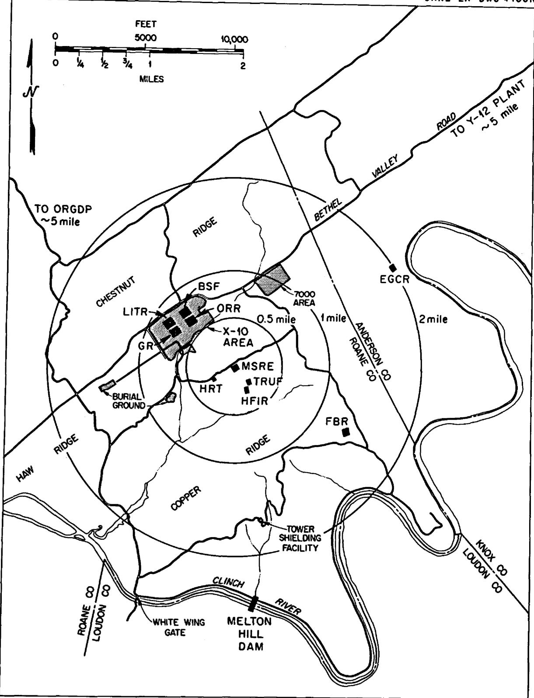  
Fig. 3.1. ORNL Area Map.

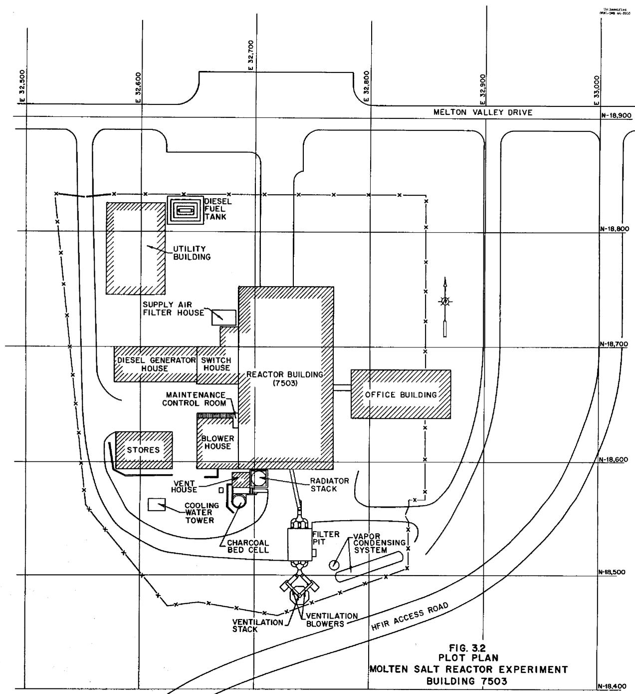

the High-Flux Isotope Reactor (HFIR), and the associated Trans-Uranium Facility (TRUF), the Experimental Gas-Cooled Reactor (EGCR), and the now dismantled Homogeneous Reactor Experiment (HRE-2, or HRT).

The direction of the prevailing wind is from the southwest, but close to the ground in Melton Valley during the night, or in stable conditions, the wind tends to be from the northeast regardless of the direction of the gradient wind. Very strong winds aloft, however, do control the direction and velocity of the valley wind. A frequently encountered condition is for up-valley light air movement from the south-west during the day followed by a down-valley movement at night.[9,10]

The soil is largely Conasauga shale, and there are no persistent limestone beds in the area to cause rapid movement of underground water through solution channels or caverns. The shale is relatively impermeable to water, and such ground flow as might exist is probably limited to a few feet per week. Surface water has a natural drainage to the south into a small spring-fed tributary of Melton Branch, which in turn, empties into Whiteoak Creek.[9,10]

Only one or two very slight earthquakes occur per year in the Tennessee Valley, and it has been judged highly improbable that a major shock will occur in the Oak Ridge area for several thousand years.[9,10]

The MSRE is supplied with potable water from the X-10 distribution system. The source of the water is the Clinch River. After treatment the water is stored in a 7-million-gal reservoir located near the Y-12 Plant. This supply serves the main laboratory complex and also furnishes water to a 16-in. line which makes a complete loop to the south of X-10 to supply the several reactor sites, as shown in Fig. 3.3.* Two 1.5-million-gal tanks, with maximum water level of 1055 ft elevation, are located at the top of Haw Ridge as part of this loop system. The MSRE normally receives water through a 12-in. main laid along 7500 Road to the east of the MSRE reactor Building 7503 and joining the 16-in. loop where it crosses the road. An existing 6-in. line along the same road to the west of Bldg. 7503 serves as an alternative supply line. The total available capacity probably exceeds 4000 gpm. Building services

Unclassified

ORNL-DWG 64-8806

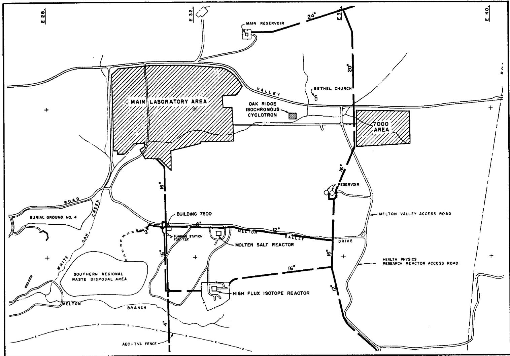  
Figure 3.3. Potable Water Supply to MSRE

and the fire protection system draw directly from the potable supply. Process water also comes from the same supply, but a backflow preventer is installed in the process water line to protect the potable water system.

The MSRE is supplied with electric power from the 154-kv TVA system through a substation located just north of the main X-10 area, as shown in Fig. 3.4. The 13.8-kv transmission line from the substation to the MSRE (ORNL Circuit 234) skirts the western side of X-10 along First Street. A 13.8-kv feeder line from another 154 to 13.8-kv transformer at the same substation (ORNL Circuit 294) passes to the east of X-10 to supply the HFIR area. This line passes close to the MSRE, and the two circuits are connected together through automatic transfer switches on poles at the MSRE so that each can serve as an alternative to the other. The MSRE is normally supplied through Circuit 234.

The 13.8-kv, 3-phase, 60-cycle input to the MSRE serves process equipment through a new 1500-kva, 13.8 kv to 480 v, transformer located on the west side of Bldg. 7503. An existing bank of three 250-kva, 13.8 kv to 480 v, transformers on the east side of the building supplies the building lighting, air conditioning, and other general purpose loads.

Diesel-driven generators serve as an additional source of emergency power. These were originally installed for the ARE and the ART. There are two 1200-rpm engine-generator sets of 300-kw capacity and one set with a generator name-plate rating of 1200-kw but having a continuous duty, limited by the size of the diesel engine, of 300 kw. The total emergency generating capacity for the MSRE is thus 900 kw. These units, together with the air compressors and compressed air tanks used for starting the large engine and the batteries for starting the two smaller units are housed in a generator house just west of Bldg. 7503.

Saturated steam at about 250 psig is supplied to the MSRE through a 6-in. main from the X-10 power plant as shown in Fig. 3.5. There is no condensate return. The chief uses for the steam are building heat and a few distillation processes.

Sanitary disposal facilities consist of a septic tank and a drainage field west of the building.

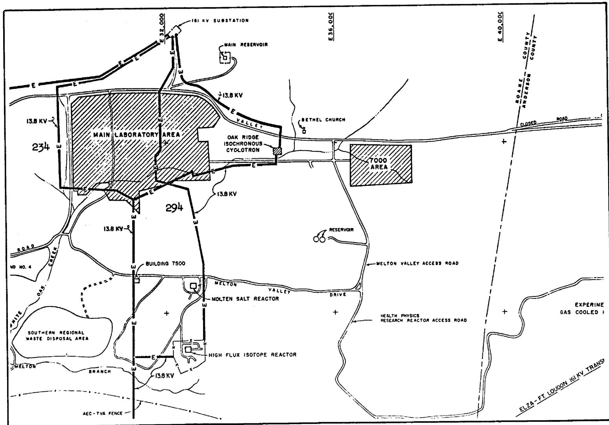  
Unclassified ORNL-DWG 64-8807   
Figure 3.4. Electrical Distribution System to MSRE

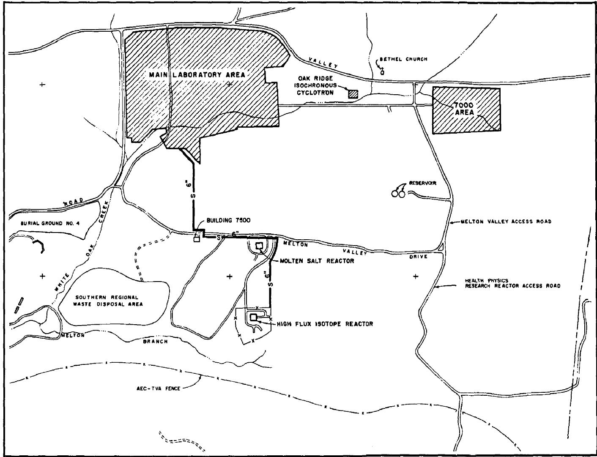  
Figure 3.5. Steam Supply to MSRE

# 4. PLANT

# 4.1 General

General views of Bldg. 7503 are shown in Figs. 4.1 and 4.2.

Since some of the building spaces serve no functions which are clearly related to the requirements of the MSRE, attention is again called to the fact that the 7503 Area was originally constructed for the ARE and later modified for the ART. It was not occupied between cancellation of the ART in 1957 and the present usage. Although some accommodations in the MSRE design were necessary to fit the experiment into the existing structures, considerable savings in time and expense were gained by their use.

Office, control room, shop and washroom spaces could be used almost without change, and the heat rejection equipment, which included axial blowers, ducting and stack, were a valuable asset. The existing containment vessel height was increased by about 8-1/2 ft, and the shielding walls, roof plugs, cell wall penetrations, supports, and other structural features were extensively modified. Considerable excavation was needed within the high bay to make room for the drain tank cell.

In modifying the existing buildings for the MSRE, the areas were divided into five classifications (see Ref. ll for detailed description):

Class I. These areas have high radiation levels at all times once the reactor has operated at power and highly radioactive fuel or wastes have been handled in the equipment. They include the reactor cell, drain tank cell, fuel processing cell, liquid waste cell, charcoal bed pit, etc. The equipment in these areas must withstand relatively high radiation levels and in most cases must be maintained by remote maintenance methods. Direct maintenance will be possible in the fuel processing and liquid waste cells, but the equipment must first be decontaminated.

Class II. Areas in this classification are not accessible when fuel salt is in the primary circulating system but can be entered within a short time after the salt has been drained. The coolant salt area, which includes the radiator, coolant pump, and coolant-salt drain tank, are in this category. The west tunnel and the unshielded areas of the

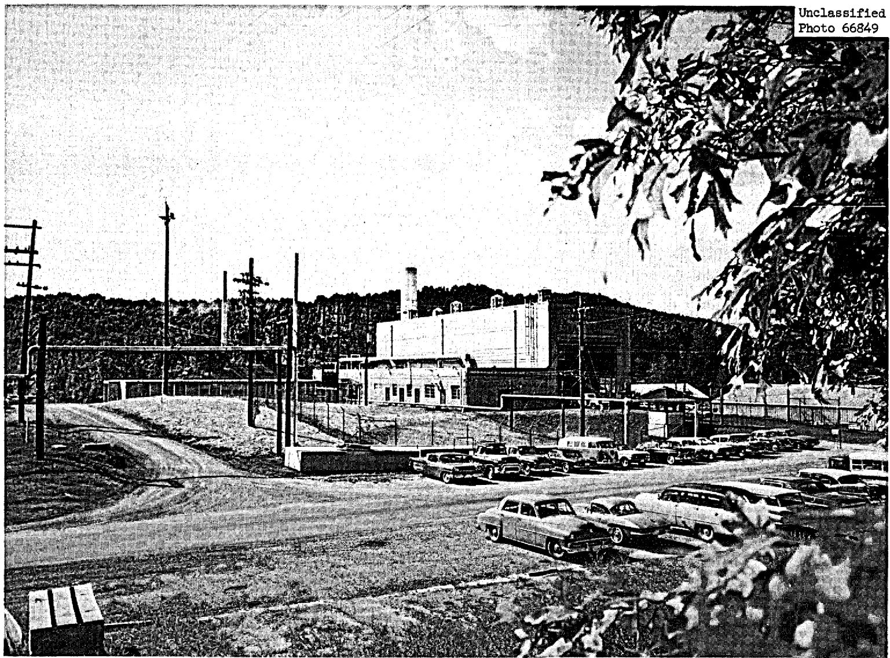  
Fig. 4.1. Front View of Building 7503.

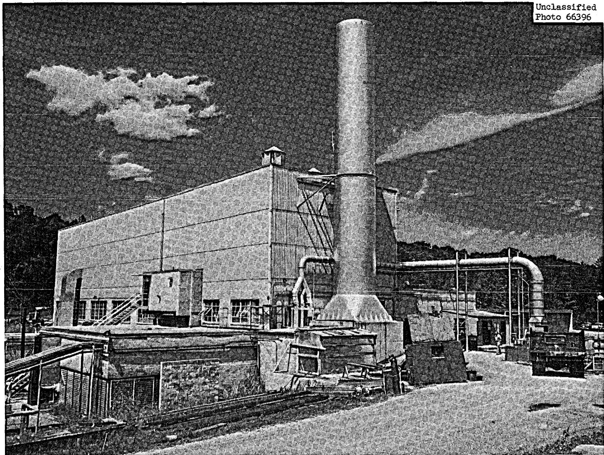  
Fig. 4.2. Rear View Building 7503 During MSRE Construction.

blower house are other examples. Equipment in these areas can be repaired by direct approach.

Class III. These are areas that are accessible during periods of low-power operation of the reactor, such as the special equipment room and south electric service area, but cannot be entered if the power is above 1 Mw. The equipment in these areas can be inspected and repaired without draining the reactor.

Class IV. These are areas that are accessible or habitable at all times except under the conditions described in Class V, below. These areas include office spaces, control rooms, etc.

Class V. The maintenance control room will be the only habitable areas during maintenance operations when large, radioactive components are being removed from the reactor cell. The rest of the MSRE site must be evacuated. This shielded room contains remote control units for the cranes and TV cameras.

# 4.2 Offices

Offices for the operational personnel are located in Bldg. 7503 (see Section 4.3). Administrative and supporting personnel are located in Bldg. 7509, which adjoins Bldg. 7503 on the east side. Bldg. 7509 is a new one-story, 43-ft x 87-ft concrete-block building equipped with central air conditioning. The main entrance for visitors to the MSRE is at the east end of this building.

# 4.3 Building

Above grade, Building 7503 is constructed of steel framing and asbestos cement type of corrugated siding with a sheet metal interior finish. Reinforced concrete is used in almost all cases below the 850-ft elevation.

Floor plans at the 852- and 840-ft levels are shown in Figs. 4.3 and 4.4. The general location of equipment is also shown in Fig. 4.3. An elevation view is shown in Fig. 4.5.

The west half of the building above the 852-ft elevation is about 42 ft wide, 157 ft long, and 33 ft high. This high, or crane, bay area houses the reactor cell, drain tank cell, coolant salt penthouse, and most of the auxiliary cells (see Section 4.3.9).

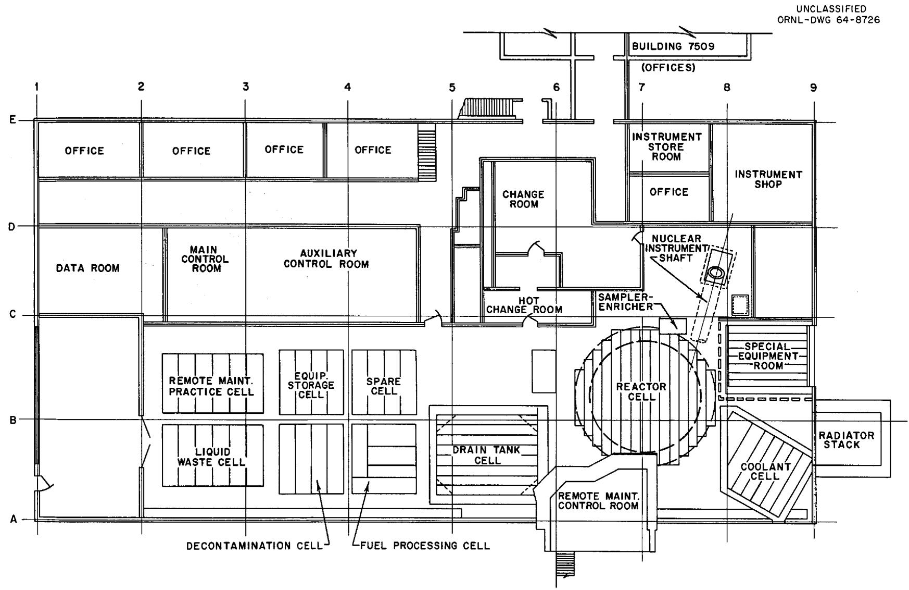  
Fig. 4.3. Plan at 852-ft Elevation.

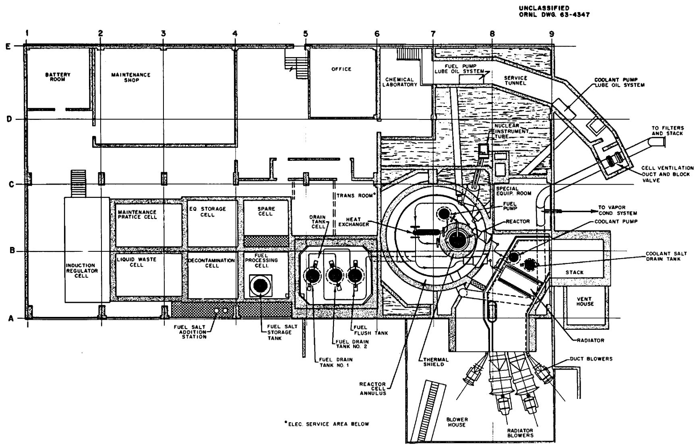  
Fig. 4.4. Plan at 840-ft Elevation.

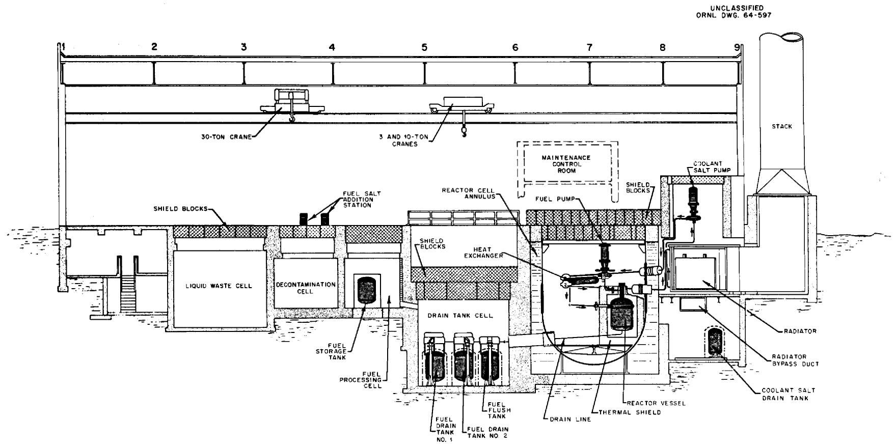  
Fig. 4.5. Elevation Building 7503.

The eastern half of the building above the 852-ft elevation is 38 ft wide, 157 ft long, and about 12 ft high. Offices for operational personnel are located along the east wall of the north end. The main control room, auxiliary control room, and a room used for the logger, computer, and for the shift supervisor on duty are located across the hall on the western side. The large hall provides ample space for an observation gallery. Windows behind the control panel enable the operating personnel to view the top of the reactor cell and other operating areas of the high bay. The change rooms are located near the center of the building. The southeastern corner is used for an instrument shop, instrument stores and offices for instrument department supervisory personnel.

Most of the western half of the building at the 840 level is occupied by the reactor cell, drain tank cell, and auxiliary cells. The emergency nitrogen-cylinder station is located against the west wall in the northwest corner of this level. Switch boxes used in the heater circuits are located across the aisle between columns A and C (see Fig. 4.3). Behind these switch boxes is an 8-ft x 40-1/2-ft pit with a floor elevation of 831-1/2 ft. This pit contains heater circuit induction regulators with some heater transformers mounted above. It is accessible from the 840-ft level by stairs located at the east end. Additional induction regulators and rheostats are located at column line C between columns 2 and 3.

The heater control panels and thermocouple scanner panels are located along column line C between columns 3 and 4.

The batteries for the 48- and 250-volt DC emergency power supply are in an 18-ft x 18-ft battery room in the northeast corner. The motor generators and control panels for the 48-v system are in an area west of the battery room. The main valves and controls for the fire protection sprinkler system are installed along the north wall.

A maintenance shop area is provided between columns 2 and 4. The process water backflow preventer is installed on the east wall between columns 2 and 3.

The area between column lines 4 and 6 houses the main lighting breakers, switch boxes and transformers, the intercom control panel,

water heater and air conditioners for the main control room and transmitter room, as well as a lunch room and meeting room for maintenance personnel. The transmitter room located between column lines 5 and 6 is described in Section 4.3.7.

The service room, a 16-ft by 27-ft room, located at the northeast corner of the 840-ft level, serves as a small chemistry laboratory and access to the service tunnel (Section 4.3.6). The instrument panels for the fuel and coolant lube oil systems are located in this area.

# 4.3.1 Reactor Cell

The reactor cell, shown in Fig. 4.5, is a cylindrical carbon steel vessel 24 ft in diameter and 33 ft in overall height (extending from the 819 to 852-ft elevation), with a hemispherical bottom and a flat top. The lower 24-1/2 ft (819 to 843-1/2-ft elevation) was built for the ART in 1956. It was designed for 195 psig at $565^{\circ}\mathrm{F}$ and was tested hydrostatically at 300 psig.[12] The hemispherical bottom is 1 to 1-1/4 in. thick. The cylindrical portion is 2 in. thick except for the section that contains the large penetrations, where it is 4 in. thick.

This vessel was modified for the MSRE in 1962 by lenghtening the cylindrical section 8-1/2 ft (843-1/2 to 852-ft elevation). Several new penetrations were installed, and a 12-in. section of 8-in. sched-80 pipe closed by a pipe cap was welded into the bottom of the vessel to form a sump. The extension to the vessel was 2 in. thick except for the top section, which was made as a 7-1/4-in. by 14-in. flange for bolting the top shield beams in place. The flange and top shield structure were designed for 40 psig, measured at the top of the cell. Both the original vessel and the extension were made of ASTM A201, Grade B, fire-box quality steel. Material for the extension was purchased to specification ASTM A300 to obtain steel with good impact properties at low temperature. Steel for the original vessel was purchased to specification ASTM A201.

All the welds on the reactor cell vessel were inspected by magnetic particle methods if they were in carbon steel, or by liquid penetrant methods if they were in stainless steel. All butt welds and penetration welds were radiographed. After all the welding was completed, the vessel was stress relieved by heating to 1150 to $1200^{\circ}\mathrm{F}$ for 7-1/2 hr.

Calculated stresses in the vessel were well below those permitted by ASME Boiler and Pressure Vessel Code Case 1272N-3. (49) Allowable stresses for ASTM A-201 Grade B steel were taken as 16,500 psi for general membrane stresses, 24,750 for general membrane plus general bending plus local membrane stresses, and 45,000 psi for combined primary and secondary stresses. (13)

The top of the cell is constructed of two layers of $3 - 1 / 2$ ft-thick, reinforced concrete blocks, with a stainless steel membrane between, as shown in Figure 4.6. The top layer is ordinary concrete with a density of $150\mathrm{lb / ft}^3$ , and the bottom layer is magnetite concrete with a density of $220\mathrm{lb / ft}^3$ . Blocks in both layers run east and west. To aid in remote maintenance, the bottom layer is divided into three rows of blocks. Blocks in the outer rows are supported on one end by a 13-in. by 4-in.-channel iron ring welded to the inside of the cell wall. The cavity in the channel is filled with steel shot to provide shielding for the cracks between edges of the blocks and the cell wall. One-half-inch steel plate stiffeners are installed at $9^{\circ}$ intervals. The top of the channel is at the $848 - 1 / 2$ ft elevation.

Two beams provide the rest of the support for the bottom layer of blocks. These beams were built of 36-in. WF 150-lb I-beams with angle iron and steel plate stiffeners. The cavities were filled with concrete for shielding. The beams rest on a built-up support plant assembly, which is welded to the side of the cell at the 847-ft-7-in. elevation. Offsets 6-1/4-in. by 26 in. are provided in the ends of the bottom blocks to fit over the support beams. Guides formed by angle iron assure proper alignment. Several of the bottom blocks have stepped plugs for access to selected parts of the cell for remote maintenance. These are described in Part X.

The sides of the blocks are recessed $1/2$ in. for $14$ in. down from the top. With blocks set side by side and with a $1/2$ -in. gap between, a $1-1/2$ -in. slot is formed at the top. One-inch-thick steel plate $12$ in. high is placed in the slots for shielding. The $11$ -gage, ASTM-A240 304 stainless steel membrane is placed on top of the bottom layer of blocks and is seal-welded to the sides of the cell. Cover plates are provided over each access plug. These are bolted to the membrane and are sealed

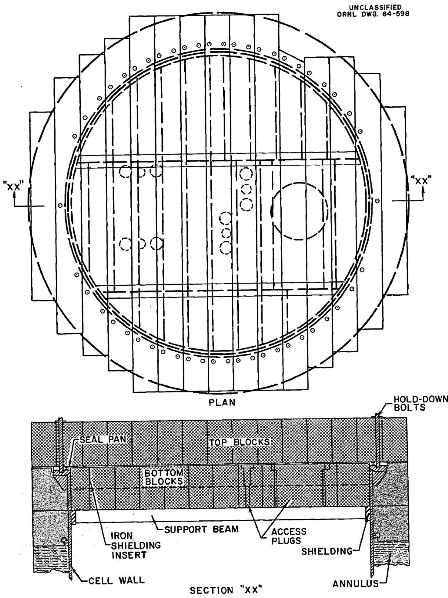  
Fig. 4.6. Shield Block Arrangement at Top of Reactor Cell.

by neoprene O-rings. A l/8-in. layer of masonite is placed on top of the membrane to protect it from damage by the top layer of blocks.

The top blocks are beams that reach from one side of the cell to the other. The ends of these blocks are bolted to the top ring of the cell by use of fifty 2-1/2-in. No. 4 NC-2 studs, 57-1/4 in. long, made from ASTM-A320, Grade L7, bolting steel. These studs pass through holes that were formed by casting 3-in. sched-40 pipes in the ends of the blocks. Cold-rolled steel washers, 9 in. by 9 in. by 1 in. thick, and standard 2-1/2-in. No. 4 NC-2 nuts are used on each stud.

A removable structural steel platform (elevation 823-1/2 ft at top) forms a floor in the reactor cell vessel and a base for supporting major pieces of equipment.

The reactor cell vessel is installed in another cylindrical steel tank that is referred to here as the shield tank. This tank is 30 ft in diameter by 35-1/2 ft high (elevation 816-1/2 to 852 ft). The flat bottom is 3/4 in. thick, and the cylindrical section is 3/8 in. thick. The shield tank sits on a reinforced concrete foundation that is 34-1/2 ft in diameter by 2-1/2 ft thick. The reactor vessel cell is centered in the shield tank and supported by a 15-ft-diam by 5-ft-high cylindrical skirt made on l-in.-thick steel plate reinforced by appropriate rings and stiffeners. The skirt is joined to the hemispherical bottom of the reactor cell in a manner that provides for some flexibility and differential expansion and is anchored to the concrete foundation with eighteen 2-in.-diam bolts.

From elevation 816-1/2 to 846 ft, the annulus between the shield tank and the reactor cell vessel and skirt is filled with magnetites sand and water for shielding. The water contains about 200 ppm of a chromate-type rust inhibitor, Nalco-360. A 4-in.-diam overflow line to the coolant cell controls the water level in the annulus.

The region beneath the reactor cell vessel inside the skirt contains only water, and steam will be produced there if a large quantity of salt is spilled into the bottom of the reactor cell. An 8-in.-diam vent pipe is provided to permit the steam to escape at low pressure.(14) This pipe connects into the skirt at the junction with the reactor cell and extends to elevation 846 ft where it passes through the wall of the shield tank and terminates as an open pipe in the coolant cell.

From elevation 846 to 852 ft, the annulus between the reactor cell and shield tank is filled with a ring of magnetite concrete. The concrete ring improves the shielding at the operating floor level and provides some stiffening for the top of the reactor cell vessel. The concrete ring is supported off the wall of the shield tank, and the reactor cell wall is free to move through the ring and to expand and contract relative to the shield tank.

Numerous penetrations are required through the walls of the reactor cell and shield tank to provide for process and service piping, electrical and instrument leads, and for other accesses. The penetrations are 4-to 36-in.-diam pipe sleeves welded into the walls of the reactor cell and the shield tank. Since the reactor cell will be near $150^{\circ}\mathrm{F}$ when the reactor is operating, and the temperature of the shield tank may at times be as low as $60^{\circ}\mathrm{F}$ , bellows were incorporated in most of the sleeves to permit radial and axial movement of one tank relative to the other without producing excessive stress. The bellows are covered with partial sleeves to prevent the sand from packing tightly around them.

Several other lines are installed in the penetrations directly with welded seals at one or both ends, or they are grouped in plugs which are filled with concrete and inserted in the penetrations. The major openings are the 36-in.-diam neutron instrument tube and drain tank interconnection and the 30-in.-diam duct for ventilating the cell when maintenance is in progress. The original tank contained several other 8-in.-and 24-in.-diam penetrations, and they were either removed or closed and filled with shielding. The penetrations, their sizes and functions are listed in Table 4.l.

# 4.3.2 Drain Tank Cell

The drain tank cell shown in Fig. 4.3 is 17 ft, 7 in. by 21 ft, 2-1/2 in., with the corners beveled at $45^{\circ}$ angles for 2-1/2 ft. The flat floor is at the 814-ft elevation, and the stainless steel membrane between the two layers of top blocks is at the 838-ft-6-in. elevation. The open pit extends to the 852-ft elevation.

The cell was designed for 40 psig and when completed in 1962, it was hydrostatically tested at 48 psig (measured at the elevation of the membrane at $838 - 1 / 2$ ft).

Table 4.1. Reactor Cell Penetrations   

<table><tr><td rowspan="2">MSRE Reactor Cell Penetration Number</td><td rowspan="2">Former Number</td><td rowspan="2">Identification</td><td colspan="2">Approximate Location in the Reactor Cell</td><td rowspan="2">Access Area</td><td rowspan="2">Penetration Size, ID (in.)</td><td rowspan="2">Shielding</td></tr><tr><td>Elevation (ft)</td><td>Arc (N = 0° Ref.)</td></tr><tr><td>I</td><td>R-4</td><td>Reactor Leak Detectors</td><td>836</td><td>15</td><td>S. Elec. Serv. Area</td><td>24</td><td>Magnetite grout</td></tr><tr><td>II</td><td>R-3</td><td>Electrical</td><td>834</td><td>30</td><td>S. Elec. Serv. Area</td><td>24</td><td>Magnetite grout</td></tr><tr><td>III</td><td>R-2</td><td>Electrical</td><td>836</td><td>45</td><td>S. Elec. Serv. Area</td><td>24</td><td>Magnetite grout</td></tr><tr><td>IV</td><td>R-1</td><td>Thermocouples</td><td>834</td><td>60</td><td>S. Elec. Serv. Area</td><td>24</td><td>Magnetite grout</td></tr><tr><td>V</td><td>R</td><td>Instrumentation</td><td>836</td><td>75</td><td>S. Elec. Serv. Area</td><td>24</td><td>Magnetite grout</td></tr><tr><td>VI</td><td></td><td>Sampler Offgas (918, 542)</td><td>847</td><td>110</td><td>High Bay</td><td>4</td><td>Fuel Sampler</td></tr><tr><td>VII</td><td></td><td>Sampler (999)</td><td>847</td><td>115</td><td>High Bay</td><td>6</td><td>Steel plates</td></tr><tr><td>VIII</td><td>S-1</td><td>FP (590, 703, 704, 706)</td><td>836-9&quot;</td><td>125</td><td>Service Tunnel</td><td>18</td><td>Sand and water from annulus</td></tr><tr><td>IX</td><td></td><td>Neutron Instrument Tube</td><td>834-5&quot;</td><td>145</td><td>High Bay</td><td>36</td><td>Water in penetration</td></tr><tr><td>X</td><td></td><td>FP Level (592, 593, 596)</td><td>844-6&quot;</td><td>155</td><td>SER</td><td>4</td><td>Tube filled with magnetite</td></tr><tr><td>XI</td><td>S-3</td><td>FP (516, 519, 524, 606)</td><td>836-9&quot;</td><td>160</td><td>SER</td><td>18</td><td>Tube filled with sand and water</td></tr><tr><td>XII</td><td>S-4</td><td>Component Coolant Air (917)</td><td>829-10&quot;</td><td>165</td><td>SER</td><td>6</td><td>Lead in annulus</td></tr><tr><td>XIII</td><td></td><td>Coolant Salt to HX (200)</td><td>840-10&quot;</td><td>170</td><td>Coolant Cell</td><td>24</td><td>Steel except for pipe and steel shot except for steel shot except for steel shot except for steel shot except for steel shot except for steel shot except for steel shot except for steel shot except for steel shot except for steel shot except for steel shot except for steel shot except for steel shot except for steel shot except for steel shot except for steel shot except for steel shot except for steel shot except for steel shot except for steel shot except for steel shot except for steel shot except for steel shot except for steel shot except for steel shot except for steel shot except</td></tr><tr><td>XIV</td><td></td><td>Water Lines (830, 831)</td><td>839-9&quot;</td><td>185</td><td>Coolant Cell</td><td>8</td><td>Steel shot except for steel shot except for steel shot except for steel shot except for steel shot except for steel shot except for steel shot except for steel shot except for steel shot except for steel shot except for steel shot except for steel shot except for steel shot except for steel shot except for steel shot except for steel shot except for steel shot except for steel shot except for steel shot except for steel shot except for steel shot except for steel shot except for steel shot except for steel shot except for steel shot except forsteel shot except for steel shot except for steel shot except for steel shot except for steel shot except for steel shot except for steel shot except for steel shot except for steel shot except for steel shot except for steel shot except for steel shot except for steel shot except for steel shot except for steel shot except for steel shot except for steel shot except for steel shot except for steel shot except for steel shot except for steel shot except for steel shot except for steel shot except for steel shot except for steel shot except for Steel shot except for steel shot except for steel shot except for steel shot except for steel shot except for steel shot except for steel shot except for steel shot except for steel shot except for steel shot except for steel shot except for steel shot except for steel shot except for steel shot except for steel shot except for steel shot except for steel shot except for steel shot except for steel shot except for steel shot except for steel shot except for steel shot except for steel shot except for steel shot except for steel shot except forSteel shot except for steel shot except for steel shot except for steel shot except for steel shot except for steel shot except for steel shot except for steel shot except for steel shot except for steel shot except for steel shot except for steel shot except for steel shot except for steel shot except for steel shot except for steel shot except for steel shot except for steel shot except for steel shot except for steel shot except for steel shot except for steel shot except for steel shot except for steel shot except for steel shot except</td></tr></table>

<table><tr><td>3</td><td>Reference Drawings
(General References: EGD-40704, 41487, 41489, 41490)</td></tr><tr><td>lus</td><td>DKKD-40976, EBBD-41863, EBBD-41864, DJJD-55494, DJJD-40495
DKKD-40976, EBBD-41863, EBBD-41864, EMMZ-56230, EMMZ-56246
DKKD-40976, EBBD-41863, EBBD-41864, EMMZ-56230, EMMZ-56246
DKKD-40976, EBBD-41863, EBBD-41864, DHHB-55567
DKKD-40976, EBBD-41863, EBBD-41864, DHHB-55567
DKKD-40973, DKKD-40974
DKKD-40973, DKKD-40974, DBBC-41339
DKKD-40717, EKKD-40735
DKKD-40716, EKKD-40715, EHHA-41796
DKKD-40973, DKKD-40975, EGGD-55411, EJJD-55428
DKKD-40718, EKKD-40737, EGGD-55411
DKKD-40714, EGGD-55411
EKKD-40711, EGGZ-55498
DKKD-40740, DKKD-40741
DKKD-40740, DKKD-40741
DKKD-40740, DKKD-40741
DKKD-40740, DKKD-40741
DKKD-40740, DKKD-40741
DKKD-40712, EGGZ-55498
DKKD-40740, DKKD-40741
DKKD-40740, DKKD-40741
DKKD-40710, EKKD-40749
DKKD-40976, EBBD-41863, EBBD-41864, DHHB-55567
EKKD-40713</td></tr><tr><td>te grout</td><td></td></tr><tr><td>d water from annulus</td><td></td></tr><tr><td>d heaters</td><td></td></tr><tr><td>raight-through pipes</td><td></td></tr><tr><td>raight-through pipes</td><td></td></tr><tr><td>raight-through pipes</td><td></td></tr><tr><td>raight-through pipes</td><td></td></tr><tr><td>raight-through pipes</td><td></td></tr><tr><td>d heaters</td><td></td></tr><tr><td>raight-through pipes</td><td></td></tr><tr><td>raight-through pipes</td><td></td></tr><tr><td>ell</td><td></td></tr></table>

The bottom and sides have a 3/16-in.-thick stainless steel liner backed up by heavily reinforced concrete, magnetite concrete being used where required for biological shielding. The liner is welded to an angle-iron grid work at approximately 8-in. spacing, with 1/2-in. plug welds. The angle irons are welded to reinforcement rods embedded in the concrete.

Vertical columns in the north and south walls are welded to horizontal beams embedded in the concrete of the cell floor. The tops of the columns are welded to horizontal 36-in. WF 160 I-beams at elevation 842 ft 1 in. to 842 ft $4 - 3 / 8$ in. by welding a $1 - 1 / 4$ -in. plate to the web of the beam. Eighty-two $3 - 1 / 4$ -in. by $4 - 1 / 2$ -in. by 10-in. steel keys are wedged into this slot to hold down the top blocks.

The top of the cell is constructed using two layers of reinforced concrete blocks with an 11-gauge (A-204, 304 stainless steel) membrane between. Both layers of blocks are ordinary concrete (density 150 lb/ft³). The bottom layer is 4 ft thick and the top layer is 3-1/2 ft thick.

The block arrangement shown in Fig. 4.7 was selected to facilitate remote maintenance. One side of the lower blocks, which run east and west, is supported by a ledge at an elevation of $834 - 1 / 2$ ft. The other side of these and the ends of the north-south blocks are supported by beams that extend from the east to the west side of the cell. These beams are built up of $24$ -in., 105.9-1b I-beams with angle iron and steel plate stiffeners. The cavities are poured full of concrete for shielding. These rest on a built-up support plate assembly, which is welded to the side of the stainless steel liner and is anchored into the concrete walls. Offsets, $4 - 1 / 4$ in. by $25 - 1 / 2$ in., are provided in the ends of the bottom blocks to fit over the support beams. "V" grooves formed by angle irons assure proper alignment. The sides of the bottom blocks are recessed $1 / 2$ in. for $14$ in. down from the top. With two blocks side by side, with a $1 / 2$ -in. gap between the sides at the bottom, a $1 - 1 / 2$ -in. slot is formed at the top. One-inch steel plates, $12$ -in. high are put into the slots to provide biological shielding.

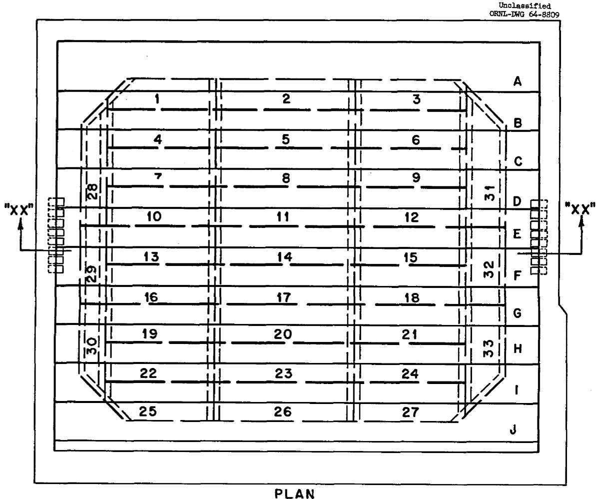

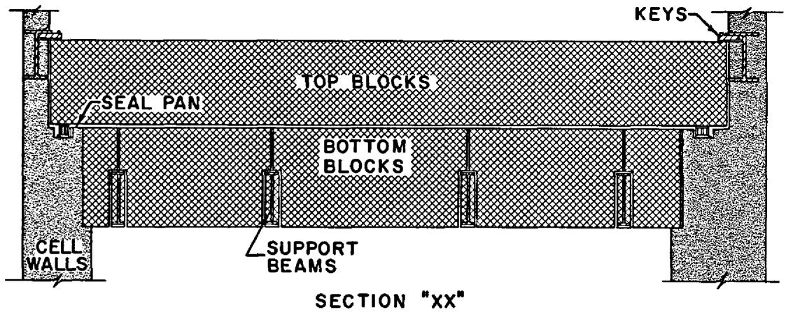  
Fig. 4.7. Block Arrangement on Top of Drain Tank Cell.

The 11-gauge (ASTM A-240, 304 stainless steel) seal pan is placed on top of the bottom blocks (elevation 838 ft 6 in.), and is seal-welded to the sides of the cell. A 1/8-in. layer of Masonite is placed on top of the seal pan to protect it from damage during installation of the top blocks. The top blocks are beams that reach from the north to the south side of the cell. They are held down by the eighty-two 3-1/4-in. by 4-1/2-in. by 10-in. steel keys discussed previously. These are inserted into slots in the top beams of the north and south sides of the cell and are driven in approximately 4 in., leaving approximately 5 in. bearing on the ends of the blocks. There are approximately four keys for each end of each block. A 1-1/2-in., 6 NC square nut is welded to the top of each key to aid in removing the keys for handling.

The floor elevation is 814 ft at the highest point along the west wall and slopes 1/8 in./ft to a trench along the east wall. The trench slopes 1/8 in./ft toward the south and terminates in a sump located in the southeast corner. The sump consists of a 10-in.-long section of 4-in. sched-40 pipe and a 4-in. butt-welded cap (347 stainless steel).

Numerous lines are required through the walls of the drain tank cell to provide for process and service piping, electrical and instrument leads, and for other accesses. These enter through $3/4-$ to 6-in. pipe or pipe sleeve penetrations that are welded to the stainless steel liner and cast into the concrete walls. Lines are installed in these individually or grouped in plugs that are filled with concrete and inserted. The penetrations, their sizes, and functions are given in Table 4.2.

# 4.3.3 Coolant Cell and Coolant Drain Tank Cell

Expect for line 200 and 201 in the reactor cell, all coolant salt piping is located in the coolant and coolant drain tank cell, shown in Fig. 4.3. The top section of the coolant cell is a concrete enclosure (penthouse) which rises from the southwest corner of the high bay to an elevation of 863 ft 3 in. The walls are ordinary reinforced, 24-in.-thick concrete except for the south corner, which is $15 - 1 / 2$ in. thick. Additional shielding for this corner is provided by the 2-ft-thick base for the stack, which goes to the 859-ft elevation. A 4-in. ledge at elevation 861 ft 9 in. on the southeast and northeast sides of the

Table 4.2. Drain Tank Cell Penetrations   

<table><tr><td>MSRE DrainTank CellPenetrationNumber</td><td>Identification</td><td>Locationin DrainTank Cell</td><td>Access Area</td><td>PenetrationSize, I. D.</td><td>References(General References: EGD-4070840709, 40882, 41512, 41513)</td></tr><tr><td>1</td><td>Steam (804)</td><td>South Wall</td><td>South Elec.Serv. Area</td><td>3&quot; in 4&quot;</td><td>DKKD-40948, EGD-55425</td></tr><tr><td>2</td><td>Steam (805)</td><td>&quot; &quot;</td><td>&quot; &quot;</td><td>3&quot; in 4&quot;</td><td>&quot; &quot;</td></tr><tr><td>3</td><td>Condensate (806)</td><td>&quot; &quot;</td><td>&quot; &quot;</td><td>3&quot; in 1&quot;</td><td>&quot; &quot;</td></tr><tr><td>4</td><td>Condensate (807)</td><td>&quot; &quot;</td><td>&quot; &quot;</td><td>3&quot; in 1&quot;</td><td>&quot; &quot;</td></tr><tr><td>5</td><td>Water (837)</td><td>&quot; &quot;</td><td>&quot; &quot;</td><td>3&quot; in 2&quot;</td><td>DKKT-40948, DKKB-41253</td></tr><tr><td>6</td><td>Water (836)</td><td>&quot; &quot;</td><td>&quot; &quot;</td><td>3&quot; in 2&quot;</td><td>DKKD-40948</td></tr><tr><td>7</td><td>Spare</td><td>&quot; &quot;</td><td>&quot; &quot;</td><td>3&quot; in 1&quot;</td><td>&quot; &quot;</td></tr><tr><td>8</td><td>Spare</td><td>&quot; &quot;</td><td>&quot; &quot;</td><td>3&quot; in 1&quot;</td><td>&quot; &quot;</td></tr><tr><td>9</td><td>Spare</td><td>&quot; &quot;</td><td>&quot; &quot;</td><td>1/2&quot; in 1&quot;</td><td>&quot; &quot;</td></tr><tr><td>10</td><td>Spare</td><td>&quot; &quot;</td><td>&quot; &quot;</td><td>1/2&quot; in 1&quot;</td><td>&quot; &quot;</td></tr><tr><td>11</td><td>Spare</td><td>&quot; &quot;</td><td>&quot; &quot;</td><td>1&quot;</td><td>&quot; &quot;</td></tr><tr><td>12</td><td>Spare</td><td>&quot; &quot;</td><td>&quot; &quot;</td><td>1&quot;</td><td>&quot; &quot;</td></tr><tr><td>13</td><td>Spare</td><td>&quot; &quot;</td><td>&quot; &quot;</td><td>1/2&quot; in 1&quot;</td><td>&quot; &quot;</td></tr><tr><td>14</td><td>Spare</td><td>&quot; &quot;</td><td>&quot; &quot;</td><td>1/2&quot; in 1&quot;</td><td>&quot; &quot;</td></tr><tr><td>15</td><td>Spare</td><td>&quot; &quot;</td><td>&quot; &quot;</td><td>1/2&quot; in 1&quot;</td><td>&quot; &quot;</td></tr><tr><td>16</td><td>Spare</td><td>&quot; &quot;</td><td>&quot; &quot;</td><td>1/2&quot; in 1&quot;</td><td>&quot; &quot;</td></tr><tr><td>17</td><td>Sump Discharge (333)</td><td>&quot; &quot;</td><td>Waste Cell</td><td>3/4&quot;</td><td>DKKD-40948, DKKB-41280, DKKB-41281</td></tr><tr><td>18</td><td>Sump Discharge (343)</td><td>&quot; &quot;</td><td>&quot; &quot;</td><td>3/4&quot;</td><td>&quot; &quot;</td></tr><tr><td>19</td><td>Air to Sump (332)</td><td>West Wall</td><td>W. of Eldg.</td><td>3/4&quot;</td><td>DKKD-40948, DKKB-41280</td></tr><tr><td>20</td><td>Air to Sump (342)</td><td>&quot; &quot;</td><td>&quot; &quot;</td><td>3/4&quot;</td><td>&quot; &quot;</td></tr><tr><td>21</td><td>Spare</td><td>North Wall</td><td>F. Proc. Cell</td><td>1-1/2&quot;</td><td>DKKD-40949</td></tr><tr><td>22</td><td>Spare</td><td>&quot; &quot;</td><td>&quot; &quot;</td><td>1-1/2&quot;</td><td>&quot; &quot;</td></tr><tr><td>23</td><td>Spare</td><td>&quot; &quot;</td><td>&quot; &quot;</td><td>1-1/2&quot;</td><td>&quot; &quot;</td></tr><tr><td>24</td><td>Spare</td><td>&quot; &quot;</td><td>&quot; &quot;</td><td>1-1/2&quot;</td><td>&quot; &quot;</td></tr><tr><td>25</td><td>Spare</td><td>&quot; &quot;</td><td>&quot; &quot;</td><td>1-1/2&quot;</td><td>&quot; &quot;</td></tr><tr><td>26</td><td>Spare</td><td>&quot; &quot;</td><td>&quot; &quot;</td><td>4&quot;</td><td>&quot; &quot;</td></tr><tr><td>27</td><td>Spare</td><td>&quot; &quot;</td><td>&quot; &quot;</td><td>1-1/2&quot;</td><td>&quot; &quot;</td></tr><tr><td>28</td><td>Spare</td><td>&quot; &quot;</td><td>&quot; &quot;</td><td>1-1/2&quot;</td><td>&quot; &quot;</td></tr><tr><td>29</td><td>Spare</td><td>&quot; &quot;</td><td>&quot; &quot;</td><td>1-1/2&quot;</td><td>&quot; &quot;</td></tr><tr><td>30</td><td>Salt Transfer (110)</td><td>&quot; &quot;</td><td>&quot; &quot;</td><td>14&quot;</td><td>&quot; &quot;</td></tr><tr><td>A-1 to 36</td><td>Instrumentation</td><td>East Wall</td><td>N. Elec.Serv. Area</td><td>3/4&quot;</td><td>DKKD-40947, DEHB-55567</td></tr><tr><td>B-1 to 36</td><td>Instrumentation</td><td>&quot; &quot;</td><td>&quot; &quot;</td><td>3/4&quot;</td><td>&quot; &quot;</td></tr><tr><td>C-1 to 36</td><td>Thermocouples</td><td>&quot; &quot;</td><td>&quot; &quot;</td><td>3/4&quot;</td><td>&quot; &quot;</td></tr><tr><td>D-1 to 36</td><td>Thermocouples</td><td>&quot; &quot;</td><td>&quot; &quot;</td><td>3/4&quot;</td><td>DKKD-40947</td></tr><tr><td>E-1 to 36</td><td>Thermocouples</td><td>&quot; &quot;</td><td>&quot; &quot;</td><td>3/4&quot;</td><td>&quot; &quot;</td></tr><tr><td>A-37 to 60</td><td>Electrical</td><td>&quot; &quot;</td><td>&quot; &quot;</td><td>3/16 in 3/4</td><td>DKKD-40947, EMZ-51656</td></tr><tr><td>B-37 to 60</td><td>Electrical</td><td>&quot; &quot;</td><td>&quot; &quot;</td><td>&quot; &quot;</td><td>&quot; &quot;</td></tr><tr><td>C-37 to 60</td><td>Electrical</td><td>&quot; &quot;</td><td>&quot; &quot;</td><td>&quot; &quot;</td><td>&quot; &quot;</td></tr><tr><td>D-37 to 60</td><td>Electrical</td><td>&quot; &quot;</td><td>&quot; &quot;</td><td>&quot; &quot;</td><td>&quot; &quot;</td></tr><tr><td>E-37 to 60</td><td>Electrical</td><td>&quot; &quot;</td><td>&quot; &quot;</td><td>&quot; &quot;</td><td>&quot; &quot;</td></tr><tr><td>F-37 to 60</td><td>Electrical</td><td>&quot; &quot;</td><td>&quot; &quot;</td><td>&quot; &quot;</td><td>&quot; &quot;</td></tr><tr><td>G</td><td>Spare</td><td>&quot; &quot;</td><td>&quot; &quot;</td><td>6&quot;</td><td>DKKD-40947</td></tr><tr><td>H</td><td>Spare</td><td>&quot; &quot;</td><td>&quot; &quot;</td><td>6&quot;</td><td>&quot; &quot;</td></tr><tr><td>I</td><td>Cover Gas (572, 574, 576)</td><td>&quot; &quot;</td><td>&quot; &quot;</td><td>6&quot;</td><td>DKKD-40947, EGE-41884</td></tr><tr><td>J</td><td>Spare</td><td>&quot; &quot;</td><td>&quot; &quot;</td><td>6&quot;</td><td>DKKD-40947</td></tr><tr><td>K</td><td>Spare</td><td>&quot; &quot;</td><td>&quot; &quot;</td><td>6&quot;</td><td>&quot; &quot;</td></tr><tr><td>L</td><td>Spare</td><td>&quot; &quot;</td><td>&quot; &quot;</td><td>6&quot;</td><td>&quot; &quot;</td></tr><tr><td>M</td><td>Component Coolant Air(91L, 912, 913)</td><td>&quot; &quot;</td><td>&quot; &quot;</td><td>6&quot;</td><td>DKKD-40947, EGE-41884, DJJA-41879, DJJA-41880</td></tr><tr><td>N</td><td>Component Coolant Air</td><td>East Wall</td><td>N. Elec.Serv. Area</td><td>6&quot;</td><td>DKKD-40947, EGE-41884, DJJA-41879, DJJA-41880</td></tr><tr><td>O</td><td>Component Coolant Air(920)</td><td>&quot; &quot;</td><td>&quot; &quot;</td><td>6&quot;</td><td>DKKD-40947, EGE-41884, DJJA-41879, DJJA-41880</td></tr><tr><td>P</td><td>DF Cell (LT 806 and 807)</td><td>&quot; &quot;</td><td>&quot; &quot;</td><td>6&quot;</td><td>DKKD-40947, EGE-41884, DJJA-41879, DJJA-41880</td></tr><tr><td>Q</td><td>Leak Detector</td><td>&quot; &quot;</td><td>S. Elec.Serv. Area</td><td>6&quot;</td><td>DKKD-40947, EBEH-41863, EBEH-41865, DJJD-55494, DJJD-55495</td></tr><tr><td>R</td><td>Leak Detector</td><td>&quot; &quot;</td><td>&quot; &quot;</td><td>6&quot;</td><td>DKKD-40947, EBEH-41863, EBEH-41865, DJJD-55494, DJJD-55495</td></tr></table>

penthouse supports the bottom layer of the top shield blocks. These are constructed of 12-in.-thick reinforced regular concrete. The 12-in.-thick top shielding blocks rest on the bottom blocks. The 1/2-in. gaps between plugs in each layer are staggered for better shielding. Ledges at the 862-ft-9-in. elevation on the northeast side and at the 861-ft-9-in. elevation on the other sides are provided for shielding.

The bottom of the coolant radiator is at elevation 836 ft 1-3/4 in. The floor of the coolant stack enclosure, located south of the radiator, is at elevation 835 ft 5 in., and the 2-ft-thick reinforced regular concrete walls extend to the 859-ft elevation.

A 1-1/4-in. steel grating and/or 11-gauge sheet metal pan at elevation 834 ft 11 in. separates the coolant cell from the coolant drain tank cell. Thus, the coolant drain tank cell is below ground level on all sides. The elevation of the concrete floor is 820 ft. It is bounded by the reactor cell annulus on the northeast and by the special equipment room on the east.

Penetrations No. XIII to XXII from the reactor cell terminate in the coolant cell or coolant drain tank cell. The wall between the coolant and coolant drain tank cells and the special equipment room is 16-in. thick to the 835-ft-5-in. elevation and 12 in. thick above this. Existing openings between the cells (2 ft by 2 ft; 3 ft by 4 ft 6 in.; 9 ft by 5 ft 5 in.; and 5 ft by 3 ft) are closed by stacked magnetite concrete blocks to enable proper ventilation of both areas and to provide adequate shielding. A 6-ft-wide concrete ramp with 2-ft stairs in the center (slope 7 in 12) extends from the northwest corner of the coolant drain tank cell (west northwest to the blower house at the 840-ft elevation. This is closed off by stacked magnetite blocks.

Shielding from the coolant pump and piping is provided by 8 ft of barytes blocks stacked above the 835-ft elevation between the radiator housing and reactor shield.

# 4.3.4 Special Equipment Room

The major items of equipment located in the special equipment room are the component coolant blowers, the containment boxes for the fuel pump, cover gas and bubbler lines, the 30-in.-diam cell ventilation line and the rupture discs and lines to the vapor-condensing system. This cell is

located southeast of the reactor cell and, as discussed previously, has a common wall with coolant cell and coolant drain tank cell. The other walls are 12-in.-thick reinforced concrete below ground level. The cell is 15 ft 11 in. by 17 ft. The floor elevation is 828 ft 7 in. except for a 5-ft by 15-ft-ll-in. by 3-ft-deep pit which runs east and west 2 ft 3 in. from the south wall.

The top consists of 2 rows of removable concrete shield plugs with staggered joints. Each row of blocks is one foot thick. The bottom row is supported by a 4-in. ledge at the 850-ft elevation. Containment is provided by ventilation from the stack fans.

Penetrations No. X, XI, and XII from the reactor cell terminate in the special equipment room. A typical electrical lead penetration is shown in Fig. 19.10.

# 4.3.5 Pump Room

The pit pump and sump pumps are located in the pump room. This room is located under the north end of the special equipment room. It is 7-1/2 ft by 15 ft 3 in. by 6 ft 7 in. high, with a floor elevation of 820 ft. A 3-ft by 3-ft sump located near center of the north wall extends to the 811-ft elevation. Access to the pump room is through a 3-ft by 4-ft hatch located near column C-8.

# 4.3.6 Service Tunnel

The fuel and coolant lube oil systems and the reactor cell ventilation block valves (HCV 930 A and B) are located in the service tunnel. This tunnel is 7 ft wide by 11 ft high by approximately 67 ft long. It is located under the southeast corner of the 7503 building and extends south and west outside the building. The floor elevation is 833 ft 3 in. Normal access is from the service room on the 840-ft level; however, a 3-ft by 3-ft hatch located near the west end provides access from outside the building. This hatch is normally closed by a sheet-metal-covered wood lid. Containment is by ventilation from the stack fans.

Penetration VIII from the reactor cell terminates in the servicetunnel.

# 4.3.7 Transmitter Room and Electric Service Areas

The area north and west of the reactor cell annulus at elevation 831 ft (west tunnel) connects by a narrow passage to a similar area north and east of the reactor cell annulus (east tunnel). These extend eastward under the 840-ft floor to a 24-in.-thick concrete wall 12 ft north of column line 6. This entire area is called the south electric service area. Six penetrations (No. I, II, III, IV, V, and XXIII) from the reactor cell and eighteen (No. Q and R and l to 16) from the drain tank cell terminate in this area. The walls, except for those joining the reactor or drain tank cells, are located below ground level. The ceiling, which connects with the transmitter room, is 24-in.-thick reinforced concrete with a 3-ft-7-1/2-in. by 6-ft-7-1/2 in. by 24-in.-thick concrete plug for access to the area. This plug has a 4-in. by 12-in. offset on all sides for shielding.

The north electric service area is located north of the 24-in.-thick concrete wall mentioned above. The floor of this room is at the 824-ft elevation. Most of the remaining drain tank cell penetrations terminate in this area (see Table 4.2) as well as some from the spare cell. The ceiling of this area and the floor of the transmitter room above is 2- to 4-in.-thick reinforced concrete poured on "Q" decking No. 3-16. Containment is by ventilation from the stack fans. A 2-ft by 3-ft manhole with hinged steel door provides access from the transmitter room.

The floor of the transmitter room is at the 840-ft elevation. The 5-in. floor of the high-bay, 852-ft elevation is the ceiling of the transmitter room. A 5-ft by 9-ft-3-1/2-in. plug can be removed from the high-bay floor so that the high-bay crane can be used to remove the shielding plug on the 840-ft level between the transmitter room and the south electric service area. This room is approximately 16 ft by 20 ft and contains the leak detector system and instrumentation for the drain tank weigh cells, pump level and speed, sump level, component cooling air, etc.

# 4.3.8 Auxiliary Cells

Six smaller cells are located between columns 2-5 and A-C. Removable concrete blocks provide access from the high bay area at the 852-ft ele

vation. General information regarding these cells are given in Table 4.3. Containment of each is by ventilation from the stack fans. Descriptions of their projected uses are given below.

Fuel Processing Cell. The fuel storage tank and other incell equipment for hydrofluorinating or fluorinating the fuel or flush salt are located in this cell. The absorber cubicle is located east of this cell at the 852-ft level.

Decontamination Cell. This cell contains a decontamination tank. Both tank and cell are used for underwater maintenance and storage of contaminated equipment.

Liquid Waste Cell. The liquid waste tank, sand filter, and cell sump jet block valves are located in this cell.

Remote Maintenance Cell. The liquid waste pump and waste tank exhaust blower are located in this cell. It will also be used as a remote maintenance practice cell.

Hot Storage Cell. This cell will be used to store contaminated equipment removed from the reactor or drain tank cell.

Spare Cell. The absolute filter in the chemical processing cell air exhaust line and the flame arrester in the chemical processing off-gas line is located in this cell.

# 4.3.9 High-Bay Containment Enclosure

The high-bay containment enclosure between columns 2-8 and A-C is 42 ft by 136 ft with a ceiling elevation of 885 ft 4 in. The containment extends east near column 8 to include the neutron instrument tube and provide room for the fuel salt sampler.

A false ceiling and containment seal is installed 15 ft above the floor between columns 8-9 and B-C. The containment walls extend from this elevation to 885 ft 4 in. along column line C from columns 8 to 9, then west along column line 9 to column A, then north along column A to column 8. Thus the coolant cell penthouse is included in the high bay area and the high-bay crane can be used for handling equipment and shielding blocks in this cell. A 10-ft by 12-ft loading hatch and Bilco door in the false ceiling of the area between columns 8-9 and B-C is used for moving small equipment into or out of the containment enclosure

Table 4.3. Auxiliary Cell Dimensions   

<table><tr><td rowspan="2">Name of Cell</td><td colspan="2">Location</td><td rowspan="2">Inside Dimensions</td><td rowspan="2">Floor Elevation (ft-in.)</td><td colspan="4">Concrete Wall Thickness</td><td rowspan="2">Thickness of Top Blocks (in.)</td></tr><tr><td>N - S Columns</td><td>E - W Columns</td><td>N (in.)</td><td>S (in.)</td><td>E (in.)</td><td>W (in.)</td></tr><tr><td>Fuel Processing Cell</td><td>4 - 5</td><td>A - B</td><td>12&#x27;-10&quot;x14&#x27; - 3&quot;</td><td>831&#x27; - 0&quot;</td><td>18</td><td>44</td><td>18*</td><td>12*</td><td>48</td></tr><tr><td>Decontamination Cell</td><td>3 - 4</td><td>A - B</td><td>15&#x27; - 0&quot;x14&#x27; - 3&quot;</td><td>832&#x27; - 6&quot;</td><td>18</td><td>18</td><td>18</td><td>12</td><td>30</td></tr><tr><td>Liquid Waste Cell</td><td>2 - 3</td><td>A - B</td><td>13&#x27; - 0&quot;x21&#x27; - 0&quot;</td><td>828&#x27; - 0&quot;</td><td>18</td><td>18</td><td>18</td><td>18</td><td>30</td></tr><tr><td>Remote Maintenance Cell</td><td>2 - 3</td><td>C - D</td><td>13&#x27; - 0&quot;x21&#x27; - 0&quot;</td><td>831&#x27; - 0&quot;</td><td>18</td><td>18</td><td>18</td><td>18</td><td>30</td></tr><tr><td>Hot Storage Cell**</td><td>3 - 4</td><td>C - D</td><td>15&#x27; - 0&quot;x14&#x27; - 3&quot;</td><td>832&#x27; - 6&quot;</td><td>18</td><td>18</td><td>12*</td><td>18</td><td>30</td></tr><tr><td>Spare Cell</td><td>4 - 5</td><td>C - D</td><td>13&#x27; - 6&quot;x14&#x27; - 3&quot;</td><td>831&#x27; - 0&quot;</td><td>18</td><td>12</td><td>12</td><td>18*</td><td>30</td></tr></table>

*Plus additional stacked blocks as required.   
**The hot storage cell is lined with ll gauge SS to the elevation of 836'-6".

and for removal of fuel and coolant salt samples. A 12-ft by 12-ft door located at column line 2 is used for larger equipment removal. The framework of the high bay is Stran Steel construction with a 16-gage mild iron sheet metal skin skip-welded to it. The cracks were sealed with fiberglass tape and Carboline paint to facilitate decontamination.

Emergency exits are provided at the southeast corner and near the center of the east wall. Since this area is considered as a contaminated zone, normal entrance and exit is through the hot change house located east of the high bay between columns 5 and 7 and through the regular change room.

# 4.3.10 Maintenance Control Room

A 19-ft-8-in. by 14-ft-9-in. maintenance control room is located along the west side of the high-bay containment between the reactor and drain tank cells. The floor elevation is 862 ft and the ceiling 870-1/2 ft. The west side is corrugated asbestos to match the building. The roof is 12-in.-thick concrete, the south side 2-ft-thick concrete, and the north and south sides 3- to 3-1/2-ft-thick concrete for shielding. A zinc-bromide-filled viewing window is located on the west side near the south end and another on the northwest corner of the room for use during remote maintenance. Access to the maintenance control room is via stairs which terminate at ground level west of the building.

A 6-ft by 19-ft-8-in. electric equipment room located below the maintenance room has a floor elevation of 852 ft. This is accessible through a hatch in the southeast corner of the maintenance control room.

# 4.4 Off-Gas Area

The off-gas area consisting of a vent house and absorber pit is shown in Fig. 4.4.

The vent house is 12 ft by 15 ft with an operating floor level of 848 ft. The sloping roof attaches to the south end of the 7503 building at the 857-1/2-ft elevation.

A 5-ft by 9-ft by 3-ft-deep containment enclosure is located along the east side of the venthouse. This contains the reactor and drain

tank off-gas lines, instruments, valves, etc. The bottom of this enclosure is at the 839-1/2-ft elevation. The east and west sides are reinforced concrete, the north and south ends and top at the 842-1/2-ft elevation are constructed of mild steel angle irons and 1/8-in. plate (ASTM A-7). The joints are caulked to prevent leakage. Hand valves have shielded extension handles which permit them to be operated from the venthouse floor. Pipe caps are installed for containment when the valves are not being operated. Five feet of barytes blocks are stacked on top of the containment enclosure. A 17-in.-diam removable plug is installed above the control valves and check valves to facilitate remote maintenance.

The west side of the venthouse has a floor elevation of 844-1/2 ft and is used for off-gas lines not requiring shielding and for stacked block shielding for the reactor and drain tank off-gas lines.

A 5-ft by 15-ft valve pit with the bottom at an elevation of $84\mathrm{l}$ ft is located south of the venthouse. The off-gas lines pass through this pit before entering the absorber beds. The outlet lines are also located in this pit. The inlet valves are contained in a 2-1/2-ft by 4-ft by 2-ft-high containment box which has a top elevation of $845 - 3 / 4$ ft. Seventeen inches of steel plate is used above this box for shielding. Shielded extension handles permit operation of the valves from the operating floor at an elevation of $848$ ft. Pipe caps are installed for containment when the valves are not being operated. The liner between the charcoal beds and the pit go through a 9-in. by 18-in. penetration where they are grouted in place using Embeco Expansion Grout.

The charcoal bed pit is 10 ft inside diameter with 14-in.-thick concrete walls. The bottom of the pit is at an elevation of 823 ft 9 in. The pit is filled with water to an elevation of 846 ft for shielding. Two 10-1/2-ft-diam by 18-in.-thick barytes concrete blocks are supported by a ledge at the 846-1/2-ft elevation. The top block is caulked to obtain an airtight seal. Additional barytes concrete blocks are stacked on top of these to give a minimum of 5-1/2-ft of shielding. A 4-ft annulus around the outside of the charcoal bed pit is filled with stabilized aggregate from the 848-ft to the 849-ft-5-in. elevation.

The off-gas from the charcoal bed goes through the valve pit mentioned previously, where unshielded extension handles permit operation from the 848-ft elevation.

# 4.5 Stack Area

The stack area is located south of Building 7503. All off-gas and containment ventilation air passes through roughing and absolute filters before being discharged up the containment stack.

These containment stack filters are located in a pit 60 ft south of Building 7503. The pit is 26-1/2 ft by 18-3/4 ft with a sloping floor. The floor elevation at the north end is 850 ft and the south end is 848 ft. The walls are 1-ft-thick concrete. The roof plugs are 18-in.-thick concrete with a 3-in. offset at the center. This offset rests on a ledge 9 in. down from the top of the pit. The elevation of the top of the pit is 857 ft. The roof blocks are caulked to prevent leakage.

A 3-ft-3-in. by 5-ft-6-in. valve pit is attached to the filter pit on the southeast corner. This houses the filter pit drain valves and water level indicators. The walls and removable roof plug are 8-in.-thick concrete. The floor and roof are at 845 and 857-ft elevations.

The two 21,000-cfm containment ventilation stack fans and the associated 3-ft-diam by 100-ft-high steel stack are located south of the filter pit.

# 4.6 Vapor-Condensing Tanks

The vapor-condensing system water tank, expansion tank, and associated piping, are located west of the stack area. As mentioned previously, the rupture discs and connections to the reactor cell exhaust duct are located in the special equipment room.

# 4.7 Blower House

The blower house is 36 ft by 43 ft with floor and ceiling elevations of 838 and 856 ft, respectively. The north, south, and west walls are louvered to provide air inlet to the two coolant blowers and two annulus blowers located in the south half of the room. The air from the blowers passes through the radiator area of the coolant cell and out the 10-ft-diam by 70-ft-high steel stack located just north of the venthouse. Top elevation of this stack is 930 ft.

Gas coolant pump No. 3, which supplies air to freeze valves in the coolant drain tank cell and fuel processing cell, is located between column lines 7 and 8.

A ramp leading to the coolant drain tank cell begins at the northwest corner of the blower house.

The cooling water equipment room housing the cooling water control panel, storage tanks, flow meters, and treated water circulation pumps is located in the southwest corner of the blower house.

The stairs leading to the maintenance control room are located just west of the blower house. The area under the stairs is used for the fluorine gas trailer, hydrogen and hydrogen fluoride gas cylinders, etc., which are used in processing the fuel salt.

# 4.8 Store Room and Cooling Tower

A 32-ft by 74-ft corrugated asbestos building located west of the blower house is used as an ORNL substores. Some of the switch gear for the blowers in the blower house are located in this building.

The cooling tower and cooling tower pumps are located north of the store room. The base for the cooling tower is at the 845-1/2-ft elevation, and the fans are at 854 ft.

# 4.9 Diesel House

The 30-ft by 72-ft diesel house is located 36 ft west of Building 7503 between column lines 3 and 5 and adjoins the switch house on the east. It has corrugated asbestos siding and a pitched roof with an elevation of 858 ft at the center and 852 ft at the sides.

The three diesel generator units and their auxiliaries are located at the east end of the north half of the building. The 5000-gal diesel fuel storage tank is located approximately 100 ft north of the diesel house.

The helium cover-gas treatment equipment and emergency helium supply cylinders are located just west of the diesels. The helium supply trailer is located outside the west end of the building.

The tower-water-to-treated-water heat exchanger is located along the west end inside the building.

The instrument air compressors and auxiliary air compressor are along the south side.

4.10 Switch House and Motor Generator House

The switch house, which is 30 ft by 36 ft, adjoins the diesel house on the west and Building 7503 on the east. It has corrugated asbestos siding with a flat roof at the 852-ft elevation. The floor elevation is 840 ft.

The main switch gear for the 480-v feeder lines and the diesel generator controls are located in this area.

A 15-ft by 16-ft motor generator room, located north of the east end of the switch house and accessible from the switch house, contains two motor generators (Mgl and 4) and their control panels.

The process power substation is located west of the motor generator room.

4.11 Inlet Air Filter House

The high-bay inlet air filter and steam-heating units are located in the inlet filter house. This 12-ft by 20-ft concrete block building is located just north of the 7503 Building between column lines 2 and 3. The floor elevation is 840 ft 6 in., and the flat roof is at an elevation of 850 ft 11 in.

# 5. FUEL CIRCULATING SYSTEM

# 5.1 Layout

The fuel circulating system consists of the reactor vessel, the fuel pump, the heat exchanger, interconnecting piping, and auxiliaries and services. The major components of this system are contained within the reactor cell, as indicated in Fig. 5.1 and Fig. 5.2, and shown on ORNL Dwgs. E-GG-A-40700 (plan) and E-GG-B-40701 (elev.).

The fuel pump bowl is at the highest elevation in the primary circulating system and serves as an expansion volume for the salt. The level of the molten-salt interface in the bowl is an indication of the inventory of the salt in the system.

The heat exchanger and all piping in the circulation system pitch downward at about $3^{\circ}$ with the horizontal to promote drainage of the salt to the reactor vessel. A drain line from the bottom of the reactor also pitches downward at $3^{\circ}$ and leads the salt to the drain tanks in the adjoining cell.

The level of radioactivity in the reactor and drain tank cells prevents direct approach for maintenance of equipment. The items most likely to require servicing are therefore arranged to be accessible from above when using remotely operated tooling. In many cases the flanges, electrical disconnects, etc., are provided with special bolting, clamps, and lifting balls to facilitate remote manipulation. Five frozen-seal type flanges ("freeze flanges") are provided in the main fuel and coolant salt circuits to allow removal and replacement of major components. The drain line from the reactor vessel can be cut and rejoined by brazing, using specially developed, remotely operated tools and viewing equipment. The procedures used in maintenance operations are fully described in Part X.

In general, the thermal expansion in the primary circulating loop is accommodated by allowing the pump and heat exchanger to move. The coolant salt piping and the drain line are sufficiently flexible in themselves to absorb the displacements. The effect of temperature changes on piping and equipment movements and stresses is discussed subsequently in Sec. 5.6.2.

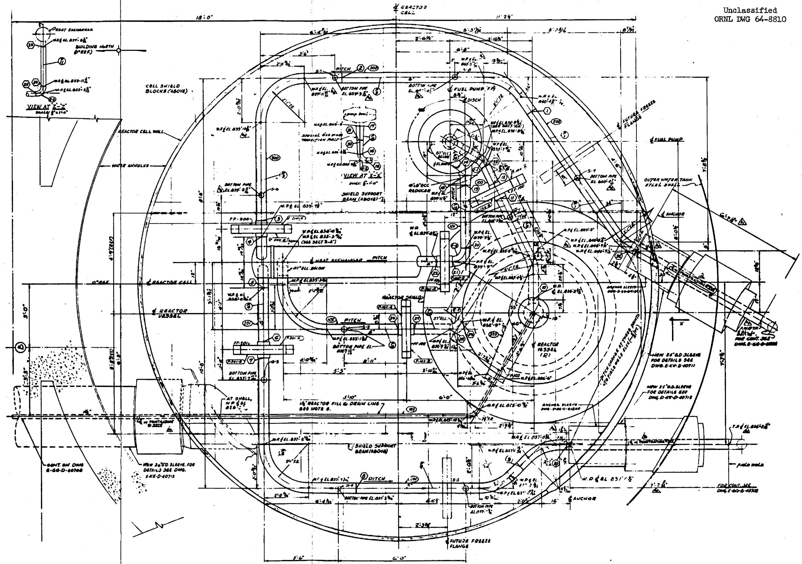  
FIG. 5.1. REACTOR CELL PLAN.

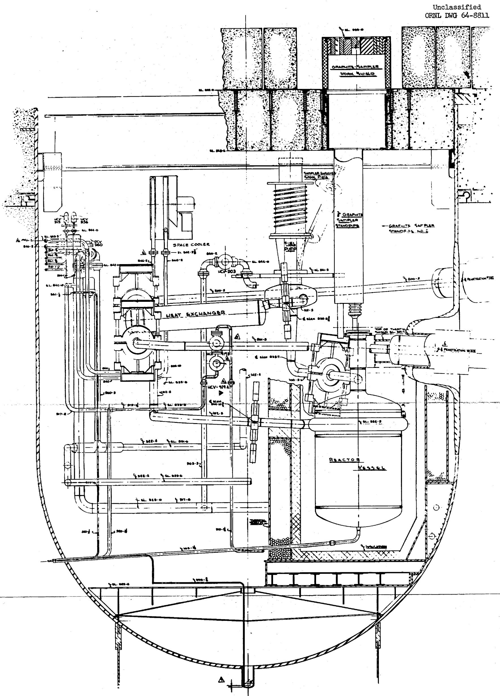  
FIG. 5.2. REACTOR CELL ELEVATION.

# 5.2 Flowsheet

A detailed process flowsheet of the fuel circulating system is shown in Fig. 5.3 (ORNL Dwg. AA-A-40880). An explanation of the symbols used on the flowsheet is given in the Appendix. The data sheets, the line schedule, and the instrument application diagrams supply the supplemental information needed for detailed study of the flowsheet. Thermocouple information is tabulated on ORNL Dwg. A-AA-B-40511 (51 sheets).

In the following discussion of the process flowsheet shown in Fig. 5.3, detailed descriptions of the reactor, heat exchanger, and pump are reserved for Secs. 5.3, 5.4, and 5.5. The instrumentation and controls are mentioned in this section only to the extent necessary to explain the flowsheet. A detailed description of the instrumentation, including the interlocking controls, etc., is given in Part II.

During operation of the reactor, fuel salt is circulated through the fuel system at a rate of 1200 gpm. The base pressure in the system is 5 psig--the pressure of the helium cover gas at the surface of the salt in the pump bowl. At design conditions of 10 Mw power level, fuel enters the reactor at $1175^{\circ}\mathrm{F}$ and 35 psig, flows through the reactor vessel and the reactor core, and leaves at $1225^{\circ}\mathrm{F}$ and 7 psig. It flows through line 100 to the suction of the fuel pump and is discharged by the pump through line 101 to the heat exchanger. The fuel enters the shell side of the heat exchanger at $1225^{\circ}\mathrm{F}$ and 55 psig and leaves at $1175^{\circ}\mathrm{F}$ and 35 psig. Coolant salt is circulated through the tubes, entering at $1025^{\circ}\mathrm{F}$ and 77 psig and leaving at $1100^{\circ}\mathrm{F}$ and 47 psig. Fuel from the heat exchanger is returned to the reactor vessel through line 102. The pipelines in the circulating system are all 5-in. sched-40 INOR-8 pipe, and the flow velocity is about 20 ft/sec. The total volume of salt in piping and primary circulating system equipment under normal operating conditions is about 73 ft3.

Line 103 is provided to drain the contents of the fuel salt through freeze valve 103 into the fuel drain tank system. An overflow tank under the pump bowl, and connected to the bowl through line 520, provides 5.5 ft³ of additional volume for expansion of salt and for protection against

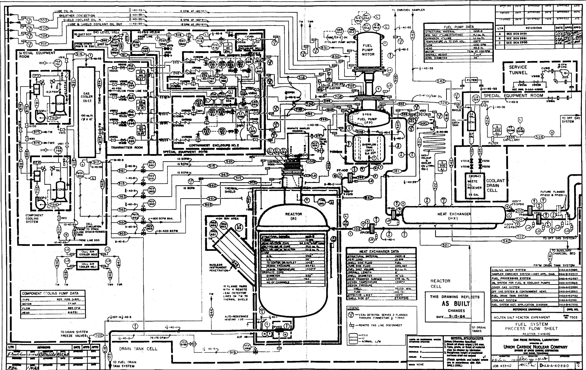

FIGURE 5.3

overfilling of the system. The drain and overflow lines are 1-1/2-in. sched-40 INOR-8 pipe.

The reactor vessel is installed in a stainless steel thermal shield that supports the reactor vessel and forms the outer wall of the reactor furnace. The thermal shield is 16 in. thick and contains about $50\%$ steel and $50\%$ water, which absorbs most of the neutron and gamma ray leakage from the reactor. Water circulates through the shield at a rate of 100 gpm and removes 180 kw of heat. It enters through line 844 and leaves through line 845, with an estimated maximum temperature rise of $12^{\circ}\mathrm{F}$ . The treated water supply is described in Sec. 15.

A nuclear instrument thimble penetrates the wall of the reactor cell vessel, the outer wall of the thermal shield, and terminates at the inner wall. This thimble is filled with water and contains two compensated ion chambers, two fission chambers, and three safety chambers for monitoring the nuclear performance of the reactor.

The inside of the thermal shield is lined with 6 in. of high temperature insulation, and the annulus between the reactor vessel and the insulation contains 126 vertical tubular heaters. The heaters are divided between three circuits with a total capacity of $60\mathrm{kw}$ .

Temperatures are monitored at 48 locations on the reactor vessel and top head assembly, most of which have spares, giving a total of 80 thermocouples (see ORNL Dwg. D-HH-B 40528). Temperatures at 25 of these locations are scanned continuously and are used as a guide to control the operation of the heaters.

A flanged nozzle on the top of the reactor vessel passes through the top of the thermal shield and provides access to the core for the control rod thimbles and for insertion of graphite and metal specimens for irradiation. The access nozzle and plug are cooled by gas to provide frozen salt seals in the annulus between them and in the sample port annulus. Gas coolant is supplied through lines 961, 962, and 963 at a rate of 10 scfm through each and is discharged directly to the cell atmosphere. Gas coolant for the three control rods is supplied at a rate of 15 scfm through line 915 and is discharged to the cell atmosphere through line 956. Valves are provided in the inlet and outlet lines to block the flow and prevent fuel salt from being discharged into the cell if a thimble develops a leak.

The system for circulating the cooling gas, which is $>95\%$ nitrogen and $< 5\%$ oxygen (and is also the atmosphere in the reactor and drain tank cells), is described in Sec. 16.

The sample port in the access nozzle opens into the graphite sampler housing. This is a steel tank in which the atmosphere can be controlled to prevent the reactor and the samples from being contaminated by oxygen and moisture as the samples are transferred into and out of the core. The transfer must be done with the reactor shut down and drained. Line 918 ventilates the sampler housing to the reactor offgas system. Dry helium or nitrogen is supplied to the housing through the seals on the cover.

Line 100 connects the outlet of the reactor vessel to the suction of the fuel pump. Thermocouples near the entrance to line 100 are used for alarm and control circuits and to sense the reactor outlet temperature, which is recorded and logged on the data logger. Line 100 has a freeze flange joint (FF-100). The buffer zone of the ring joint seal is supplied with helium and monitored for leakage through line 410. Three pairs of thermocouples are installed on the flanges with one thermocouple of each pair serving as a spare. Thermocouples at two locations are connected to temperature switches to annunciate an alarm if the temperature falls below a preset value (see Instrument Application Diagram, Part II, or ORNL Dwg. D-AA-B-40500). The leak detector and thermocouple installations on FF-100 are duplicated on all other freeze flanges in the reactor system.

A pipeline heater of $4$ -kw capacity and a spare are installed between the reactor vessel and FF-100. A similar heater of $4$ -kw capacity is installed on the horizontal section of the pipe between FF-100 and the pump bowl. The vertical section of pipe beneath the pump bowl is in the pump furnace. The pipeline heaters, described in detail in Sec. 5.6.4, are small furnaces that are assembled from ceramic heaters and reflective insulation and are made to be easily removable for maintenance. Thermo-couples are attached to the pipe under each heater unit to monitor the temperature and are used as a guide to control the heaters.

The fuel pump is a vertical sump-type pump that circulates 1200 gpm of salt against a head of 49 ft when operated at a speed of 1150 rpm.

About 65 gpm is recirculated internally into the pump bowl, 15 gpm along the shaft and 50 gpm in a spray into the gas space, for removing krypton and xenon. The liquid level in the pump bowl is determined by means of two bubblers. Helium is introduced near the bottom of the pump bowl through lines 593 and 596. Line 592 is a reference line that connects to the expansion volume in the pump bowl near the top and is purged with helium to prevent back diffusion of radioactive gases. Signals from the level indicators are monitored continuously, logged on the data logger, and used for alarm and control circuits.

The main purge of helium through the pump bowl enters through line 516 just below the lower shaft seal in the bearing housing. Most of the gas flows downward through the labyrinth between the shaft and the shield block in the neck of the bowl to prevent large amounts of radioactive gas from reaching the seal. This helium combines with the helium from the bubblers and carries the radioactive gases out of the pump house through line 522. Line 522 is enlarged from $\frac{1}{2}$ -in. pipe to $\frac{4}{-}$ in. pipe to provide a holdup volume of $6\mathrm{ft}^3$ and one hour of delay for the decay of the short-lived radioactive isotopes before the gas leaves the reactor cell and enters the offgas disposal system. The helium supply system is described in Sec. 10.4. The offgas system is described in Sec. 12.

The distribution of helium to the pump is listed in Table 5.1, below.

Table 5.1. Distribution of Helium Supply to Fuel Pump   

<table><tr><td colspan="3">Pump bowl bubblers</td></tr><tr><td>Line 593</td><td>0.37 liter/min</td><td></td></tr><tr><td>Line 596</td><td>0.37 liter/min</td><td>1300 liter/day</td></tr><tr><td>Line 592</td><td>0.15 liter/min</td><td></td></tr><tr><td colspan="3">Pump bowl purge - Line 516</td></tr><tr><td>Down shaft annulus</td><td>2.3 liter/min</td><td></td></tr><tr><td>Out line 524</td><td>0.1 liter/min</td><td>3400 liter/day</td></tr><tr><td colspan="3">Overflow tank bubblers</td></tr><tr><td>Line 599</td><td>0.37 liter/min</td><td></td></tr><tr><td>Line 600</td><td>0.37 liter/min</td><td>1300 liter/day</td></tr><tr><td>Line 589</td><td>0.15 liter/min</td><td></td></tr><tr><td></td><td>Total</td><td>6000 liter/day</td></tr></table>

Line 521 connects the pump offgas line to the gas lines in the drain tank system to equalize the gas pressures in the drain tanks during normal operation and facilitate the transfer of gas between systems during a reactor drain.

A small amount of helium that enters the pump bowl through line 516 flows upward through the labyrinth, combines with a small amount of oil that leaks through the lower shaft seal, and the mixture passes out of the reactor cell through the lead-shielded (1-1/2) line 524 to the oil catch tank located in the special equipment room. After leaving the oil catch tank, the gas flows on to the offgas system through line 524, which is fitted with a pressure reducing capillary, a filter, and a flow indicating instrument. Signals from this instrument initiate an alarm if the flow is outside a specified range.

The maximum height of the liquid level in the pump bowl is limited by overflow into line 520, which connects to a $5.5\text{-ft}^3$ tank beneath the pump. This tank is provided with helium bubblers that operate through lines 599 and 600 and reference line 589. Indication of high level in the overflow tank causes the reactor system to be drained. Helium leaves the overflow tank through line 523, which connects to line 522. Valves HCV-523 and HV-523 are used to block the vent line so that the overflow tank can be pressurized through the bubbler lines and salt can be discharged to the pump bowl.

Line 999 connects the pump bowl to the sampler enricher. Capsules are used to remove samples of fuel from the pump bowl through this $1 - 1 / 2$ -in. line, and small slugs of fuel may also be added through it. The sampler enricher is described in detail in Sec. 7.0.

The lower two-thirds of the pump bowl, the overflow line and tank, and the vertical section of the suction line to the pump are installed in the pump furnace. The furnace is divided into an upper zone around the pump bowl and a lower zone around the overflow tank. The upper zone has nine vertical tubular heaters with a total of 22.5-kw capacity, and the lower zone has five similar, but longer, heaters with a total of 22.5-kw capacity. There are 22 thermocouples and spares on the pump, eight thermocouples on the overflow tank, and two thermocouples on line 100 inside the furnace, for use in monitoring the temperatures and controlling the heaters.

The upper part of the pump bowl is not cooled by the circulating fuel salt and must therefore be cooled by gas circulated over the outer surface of the pump bowl to remove the heat generated by absorption of beta and gamma radiation. The cooling gas is supplied through 3-in. line 903 at a maximum flow rate of 400 scfm. The gas flow is confined by a shroud around the bowl and is discharged to the cell atmosphere. Temperatures of the top of the pump bowl and the flanged neck are used in controlling the flow of coolant.

Oil is used to cool and lubricate the pump bearings and to cool the shield block in the neck of the pump bowl. Lubricating oil for the bearings enters the top of the bearing housing through line 703 at a rate of $4\mathrm{gpm}$ , and coolant for the shield block enters through line 704 at a rate of $8\mathrm{gpm}$ . Oil leaves the shield block through line 707 and passes through an ejector where it induces flow of oil from the bearings through line 705. The combined flow leaves the pump through line 706. The temperature of the oil supply is $150^{\circ}\mathrm{F}$ and the return temperature is $160^{\circ}\mathrm{F}$ . Line 590 is a breather pipe that connects the top of the lubricating oil supply tank to the topmost passages in the bearing housing to equalize the pressure between the two points. Details of the lubricating oil system are discussed in Sec. 5.4.1.4. Temperatures in the oil system on the pump are monitored by two thermocouples on the outlet oil lines.

The fuel pump is driven by a 75-hp, $1150$ -rpm, $440$ -v, three-phase electric motor. The motor is installed in a steel housing that will contain oil and radioactive gases if either or both were to leak through the upper seal in the bearing housing. The motor is cooled by $5\mathrm{gpm}$ of process water that is circulated through a coil on the outside of the housing. Water enters the coil through line 830 and leaves through line 831. A microphone, XdbS, permits pump noises to be monitored in the control room. The electrical input to the pump motor is instrumented for voltage, current, and power readings. The motor speed is monitored and motor temperatures are measured by a thermocouple (with spare).

All the lines to the pump bowl have flanged joints, and the pump is assembled by means of two large flanged joints. The ring-joint seals on the flanges are connected to the leak detector system (see Sec. 11.0).

Fuel salt flows from the pump to the heat exchanger through line 10l. The line is provided with a freeze flange joint FF-10l. There are two pipeline heaters, one of $4$ -kw and the other of 5-kw capacity, on the section of line between the pump and the flange, and one $4$ -kw heater between the freeze flange and the heat exchanger. Thermocouples are attached to the pipe under each heater to monitor the temperature and are used as a guide to control the heaters.

The fuel heat exchanger is of the horizontal shell-and-tube type with the fuel salt in the shell and the coolant salt in the tubes. The exchanger has three electrical heater units that are similar in construction to those used on the pipelines but are considerably larger. The total heater capacity is 30 kw. Sixteen thermocouples are distributed between ten locations on the heat exchanger shell and nozzles. Fuel salt leaves the heat exchanger and returns to the reactor inlet through line 102. Coolant salt enters through line 200 and leaves through line 201. Freeze-flange disconnects FF-200 and FF-201 are installed in those lines close to the exchanger.

Line 102 contains FF-102 to join the heat exchanger and reactor vessel. The vertical section of line 102, directly below the heat exchanger, is heated by three calrod heaters that are attached permanently and have a capacity of $6\mathrm{kw}$ . Three spare heaters with an additional $6\mathrm{kw}$ capacity are installed on this section of line. The horizontal section of the line to the freeze flange has three removable pipeline heaters with a total of $16\mathrm{kw}$ capacity. One pipeline heater of $4\mathrm{kw}$ capacity is provided between FF-102 and the thermal shield.

The temperatures on line 102 are monitored by eleven thermocouples distributed between five locations. Four of the thermocouples are installed near the location where the line enters the thermal shield and serve to indicate the fuel temperature at the inlet to the reactor for all control and safety purposes.

Salt is introduced into the primary circulating system or drained from it through line 103, which runs from the bottom of the reactor vessel in the reactor cell to the drain tanks in the drain tank cell. The line has a freeze valve, FV-103, to provide "on-off" control of the salt flow. The valve is located within the reactor furnace so that in

the emergency situation of loss of electrical power, the residual heat in the furnace will be sufficient to melt the salt in the valve and cause the system to drain. A cooling gas stream of 25 to 75 scfm is supplied through line 919 and directed against the valve to maintain a frozen plug of salt. A 1.5-kw electrical heater is installed on the valve to effect a quick thaw under normal circumstances.

The freeze valve has three thermocouples, each with a spare, to monitor and control the operation of the cooling gas and the heater. Line 103 is insulated and heated by passing an electric current through the pipe wall. The heating capacity is $0.3 \, \text{kw/ft}$ , resulting in a total load of $17 \, \text{kw}$ . The line temperatures are monitored by twelve thermocouples.

# 5.3 Reactor Vessel and Core

A summary description of the reactor vessel and core is given in Section 2.4.1, and a simplified drawing is shown in Fig. 2.2. The general location of the reactor within the containment vessel is shown in Figs. 4.4 and 4.5.

# 5.3.1 Description

The reactor vessel is 58 in. ID and about 94 in. high. Cross sectional views of the vessel, access nozzle, and core are shown in Figs. 5.4 and 5.5, and the principal dimensions are given in Table 5.2. It was designed for a pressure of 50 psig at $1300^{\circ}\mathrm{F}$ , using an allowable stress of 2750 psi for the INOR-8 alloy used for fabrication of all salt-containing portions (see Section II of Ref. 18, Ref. 19, and ORNL Specification JS-80-122). The properties of the INOR-8 are summarized in Table 2.2 and described in detail in Part IV. The vessel has two 58-in.-ID torospherical ASME flanged and dished heads 1 in. thick.

The wall thickness of the cylindrical portion is 9/16 in., except for the top 16 in., which is 1 in. thick. The extra thickness is needed in the upper section to allow for 84 holes, $3/4$ in. in diameter, located with variable spacing around the top of the vessel to distribute the incoming salt evenly around the circumference. Salt is delivered to the holes through a flow distributor, half-circular in cross section, and with an inside radius of about 4 in. (see Fig. 2.2).

The 6-in.-diam inlet to the distributor is arranged tangentially to the vessel, and the holes enter the vessel at an angle of $30^{\circ}$ with a tangent to the outer surface to impart a spiraling flow to the salt as it moves downward through the reactor-vessel-wall cooling annulus. Turbulent flow is promoted in this l-in.-wide annulus between the vessel wall and the outside of the core can to improve the cooling of the wall (see ORNL Dwgs. D-BB-B-40407 and D-BB-B-40401).

The salt then flows into the bottom head, which contains 48 swirl-straightening vanes extending radially 11 in. toward the center of the vessel. These vanes are fabricated of 1/8-in.-thick INOR-8 plate. Elimination of the swirl in the bottom head reduces the radial pressure gradient and promotes more even flow distribution through the core.

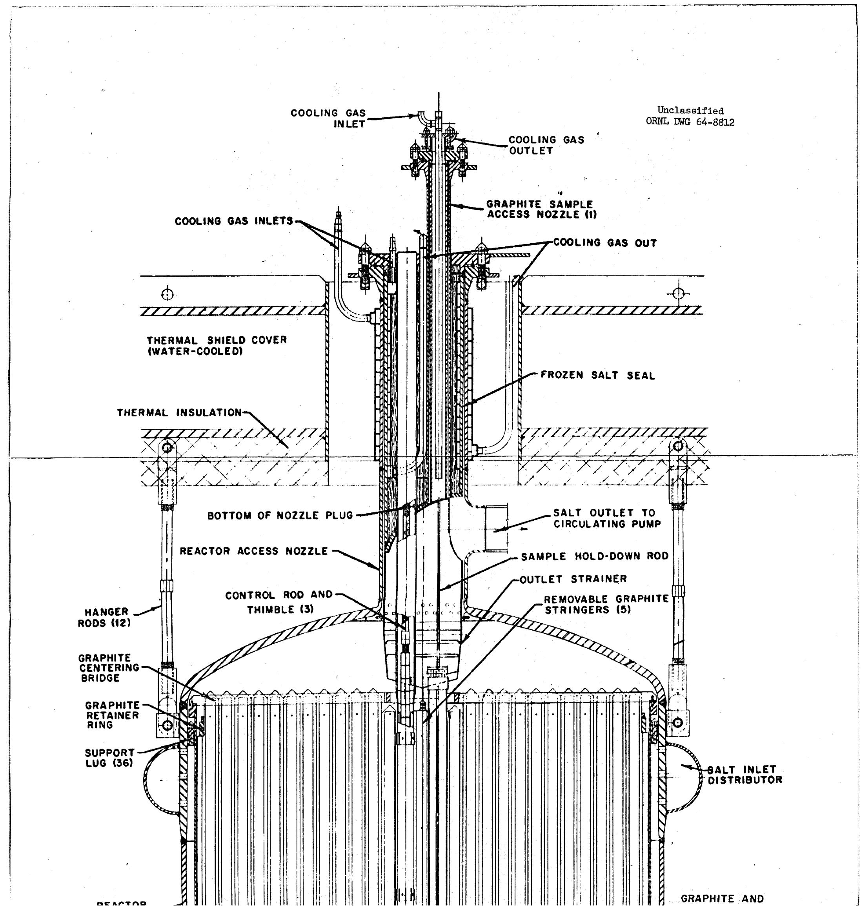

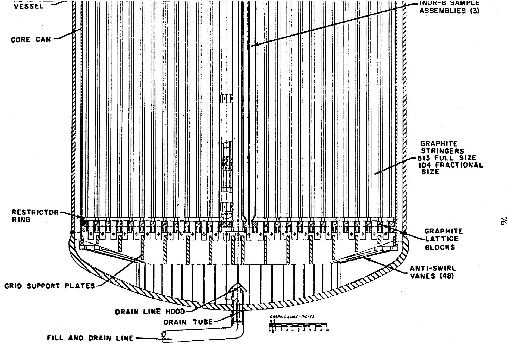  
Fig. 5.4.   
CROSS SECTION   
MSRE REACTOR VESSEL AND ACCESS NOZZLE

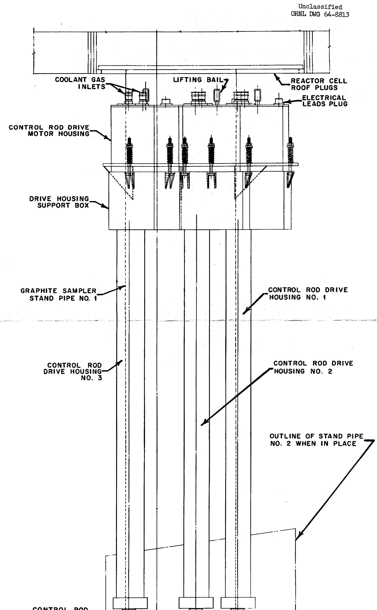

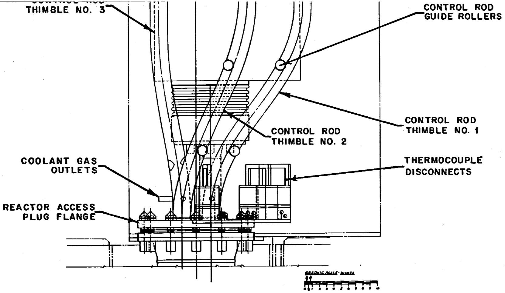  
Fig. 5.5. Elevation of Control Rod Drive Housings.

Table 5.2. Reactor Vessel and Core Design Data and Dimensions   

<table><tr><td>Construction material</td><td>INOR-8</td></tr><tr><td>Inlet nozzle, sched-40, in., IPS</td><td>5</td></tr><tr><td>Outlet nozzle, sched-40, in., IPS</td><td>5</td></tr><tr><td>Core vessel</td><td></td></tr><tr><td>OD, in.</td><td>59-1/8 (60 in. max)</td></tr><tr><td>ID, in.</td><td>58</td></tr><tr><td>Wall thickness, in.</td><td>9/16</td></tr><tr><td>Overall height, in. (to ½ of 5-in. nozzle)</td><td>100-3/4</td></tr><tr><td>Head thickness in.</td><td>1</td></tr><tr><td>Design pressure, psi</td><td>50</td></tr><tr><td>Design temperature, °F</td><td>1300</td></tr><tr><td>Fuel inlet temperature, °F</td><td>1175</td></tr><tr><td>Fuel outlet temperature, °F</td><td>1225</td></tr><tr><td>Inlet</td><td>Constant area distributor</td></tr><tr><td>Cooling annulus ID, in.</td><td>56</td></tr><tr><td>Cooling annulus OD, in.</td><td>58</td></tr><tr><td>Graphite core</td><td></td></tr><tr><td>Diameter, in.</td><td>55-1/4</td></tr><tr><td>Number of fuel channels (equivalent)</td><td>1140</td></tr><tr><td>Fuel channel size, in.</td><td>1.2 x 0.4 (rounded corners)</td></tr><tr><td>Core container</td><td></td></tr><tr><td>Id, in.</td><td>55-1/2</td></tr><tr><td>OD, in.</td><td>56</td></tr><tr><td>Wall thickness, in.</td><td>1/4</td></tr><tr><td>Height, in.</td><td>68</td></tr></table>

The reactor vessel 1-1/2-in. sched-40 drain line extends about $2 - 3 / 4$ in. into the inside of the vessel at the centerline and is covered with a protective hood to prevent debris on the bottom of the vessel from dropping into the opening. A 1/2-in.-diam tube is mounted through the wall of the portion of the drain line protruding inside the vessel to allow the salt to drain completely (see ORNL Dwg. D-BB-B-40405). This tube extends through the drain line (103) and the freeze valve, FV-103.

The core can, or shell, is 55-1/2 in. ID and 67-15/16 in. high and was rolled from 1/4-in.-thick INOR-8 plate (see ORNL Dwg. D-BB-B-40410). The can is supported, and also held down when salt is in the reactor, by a ring at the top of the can which is bolted to 36 lugs welded to the inside wall of the reactor vessel. The can, in turn, supports the graphite used as a moderator material in the reactor. The properties of the graphite are discussed in Section 5.3.2.

The reactor core is formed of 513 graphite core blocks, or stringers, each $2 \times 2$ in. in cross section and about 67 in. long, overall, mounted in a vertical close-packed array, as shown in Figure 5.6 and ORNL Dwg D-BB-B-40416. In addition there are 104 fractional-sized blocks at the periphery. Half-channels are machined in the four faces of each stringer to form flow passages in the assembly about 0.4 by 1.2 in. in cross section. There are 1108 full-sized passages and, counting fractional sizes, the equivalent total of 1140 full-sized passages. The dimensions of these flow channels were chosen to provide a passage that would not be blocked by small pieces of graphite and also to obtain a nearly optimum ratio of fuel to graphite in the core. The volume fraction of fuel is 0.225; the mass of fissionable material in the reactor is near the minimum, and the effect of the fuel soaking into the pores in the graphite is small.[20]

When not buoyed up by being immersed in the fuel salt, the vertical graphite stringers rest on a lattice of graphite blocks, about 1 by 1-5/8 in. in cross section, laid horizontally in two layers at right angles to each other (see ORNL Dwg. D-BB-B-40420). Holes in the lattice blocks, with $4^{\circ} - 30^{\prime}$ taper and 1.040 in. in smallest diameter, accept the 1.000-in.-diam doweled section at the lower end of

UNCLASSIFIED L-LR-DWG 56874 R

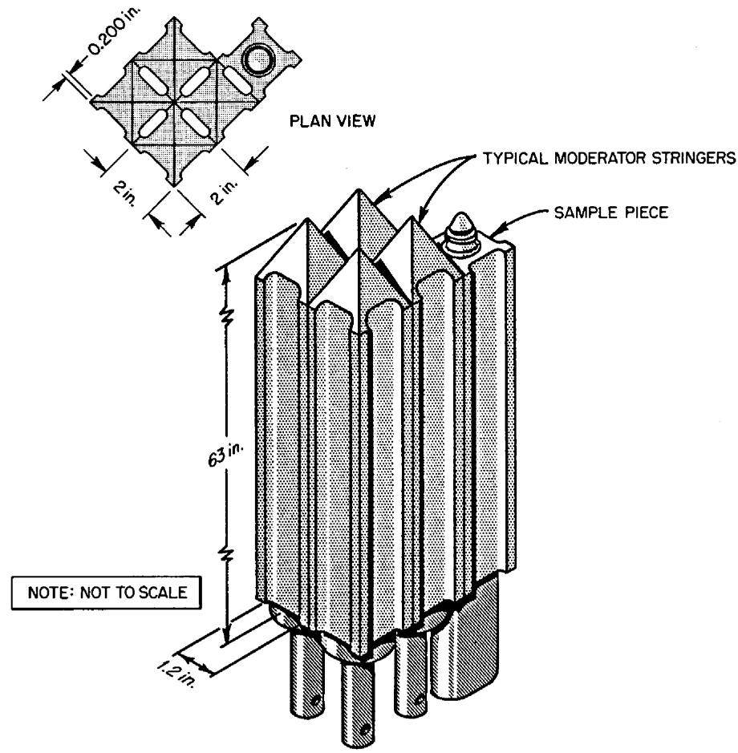  
FIG. 5.6. TYPICAL GRAPHITE STRINGER ARRANGEMENT

each stringer with sufficient clearance to allow both angular and lateral displacement. The upper horizontal surfaces of the graphite lattice bars and stringers are tapered so that salt will not stand on them after a reactor drain.

The lattice blocks are supported by a grid of 1/2-in. thick INOR-8 plates, set on edge vertically, and varying in height from about 1-5/8 in. at the core periphery to about 5-9/16 in. at the center. (See ORNL Dwg D-BB-B-40413). This supporting grid is fastened to the bottom of the core can and moves downward as the can elongates on a temperature rise.

The regular pattern of the graphite stringers in the core is disrupted at the center where the control rod thimbles and the graphite and INOR-8 samples are located, see Figure 5.7. The control rod thimbles are supported from above and the samples are supported from below when no salt is in the reactor.

The INOR-8 and graphite samples are contained in three baskets in the lattice position shown in Figure 5.7. Each basket can be withdrawn independently of the others. A basket must be in place at each of the three locations during reactor operation, however.

Each basket is formed of 1/32-in.-thick INOR-8 plate, perforated with 3/32-in.-diam holes. The top fitting is drilled with 1/8-in.-diam holes on 1/4-in. centers for circulation of the salt and is provided with a T-shaped lifting bail. This bail permits the sample removing tool to rotate as well as lift the basket for better maneuverability. The upper portion of the basket assembly extends from 1/2 to 1-in. into the fuel-salt outlet strainer and is held in position by it. The lower end of the basket is provided with an INOR-8 fitting, also drilled with 1/8-in. diam holes, which, in conjunction with the other two baskets, forms a dowel to fit into the lower graphite lattic blocks in the same manner as the graphite stringers previously described.

Each basket contains four 0.250-in.-diam x 5-1/2-ft long samples of INOR-8 and five graphite sample bars, 0.250 in. x 0.470 in., as shown in Figure 5.8. The graphite bars are divided into samples of varying length (up to about 12 in.), which laid end to end total about 5-1/2 ft. The

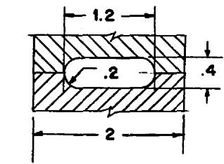  
TYPICAL FUEL PASSAGE

Unclassified ORNL DWG 64-8814

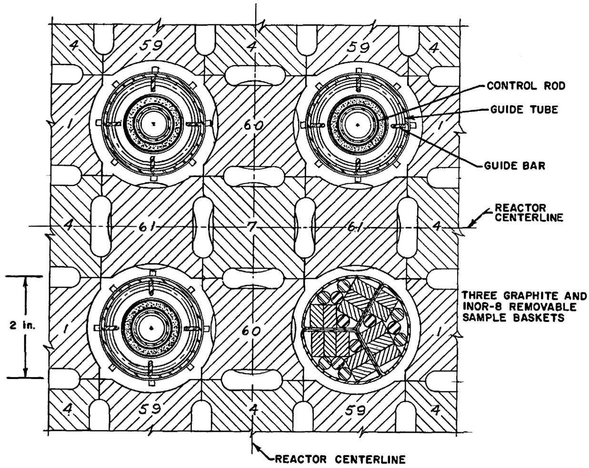  
NOTE: STRINGERS NOS. 7, 60 AND 61 (FIVE) ARE REMOVABLE.   
Fig. 5.7. Lattice Arrangement at Control Rods.

Unclassified ORNL DWG 64-8815

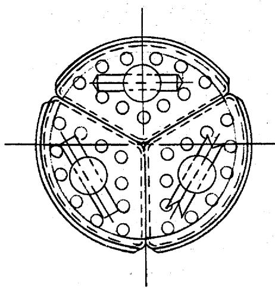

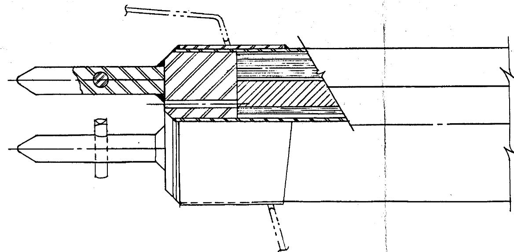

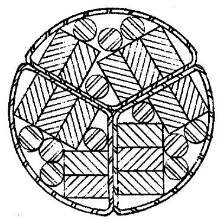

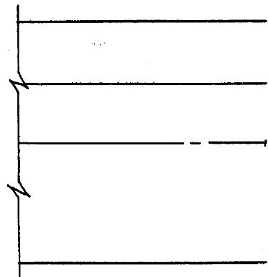

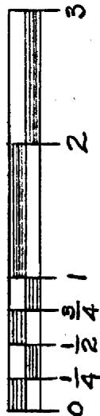

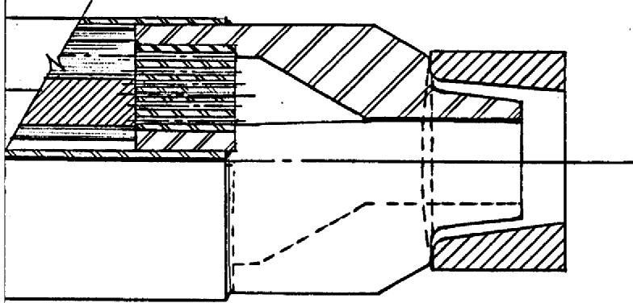  
Fig. 5.8. Graphite-INOR-8 Sample Assembly.

arrangement of the baskets and contents is experimental in nature and will be varied during operation of the MSRE.

The sample baskets are held down by a cup mounted on a 5/16-in. diam rod which is an extension of the nozzle access plug, as shown in Figure 5.4. The cup rests on the T-shaped lifting balls. A thermocouple is installed on the hold-down rod to indicate the salt temperature leaving the reactor.

In addition to the graphite samples in the baskets, the five graphite stringers at the center of the core can be removed, although with considerable more difficulty. The location of these stringers is indicated in Figure 5.7. The five stringers are of a special design (Types 7, 60 and 61 on ORNL Dwgs D-BB-B-40416, 40418 and 40581). They are 2-in. x 2-in. in cross section but are $64 - 1 / 2$ in. long rather than the $62 - 1 / 8$ in. of the average stringer. They do not have the dowel section at the bottom and the hole for the hold-down rods and they rest directly on the INOR-8 supporting grid rather than on the graphite lattice blocks. The lattice blocks do not extend across the five stringer locations, the opening thus provided through the blocks permitting insertion of a viewing device through the core to permit observation of the lower head should this prove desirable.

Each of the five stringers is drilled and tapped with a $3/4$ -in. 6 Acme thread on the upper end for an INOR-8 lifting knob, or stud, which can engage a Snaptite quick-disconnect coupling. They are prevented from floating in the fuel salt by $1/8$ in. x $1/2$ in. hold-down bars welded to the strainer assembly at a level even with the top of the graphite core. (See ORNL Dwg E-BB-B-40598).

The graphite core matrix is sufficiently unrestrained so that on a temperature rise the induced stresses due to expansion of the graphite will be minimized. The coefficient of expansion for the graphite is 1.3 to $1.7 \times 10^{-6}$ in./in.- $^{\circ}$ F, whereas for INOR-8 it is $7.8 \times 10^{-6}$ in./in.- $^{\circ}$ F (in the $70 - 1200^{\circ}$ F range). This difference causes the core can to move 3/16 in. radially away from the graphite core blocks on heatup of the reactor. To prevent an excessive amount of salt flow in the annular space thus created, an INOR-8 restrictor ring, $1/2 \times 1/2 \times 54 - 1/2$ in. ID, surrounds the bundle of graphite stringers at the bottom (see ORNL Dwg. D-BB-B-40427). The stringers are restrained from excessive

movement at the top by a graphite retainer ring, $1 \times 2 \times 53 - 1 / 4$ in. ID. This ring, in turn, is held in place by an INOR-8 retainer ring, $3 / 4 \times 3 / 4 \times 53 - 1 / 4$ in. ID (see ORNL Dwg. D-BB-B-40428 for both rings). At the top of the graphite blocks a centering bridge holds a row of stringers in position on two diameters at right angles to each other. This bridge helps to prevent shifting of the entire stringer assembly (see ORNL Dwg. D-BB-B-40424).

A 5/16-in.-diam INOR-8 rod passes through a 0.010-in.-wall-thickness bushing placed in a 0.375-in.-diam hole in the dowel section at the bottom of each graphite stringer. These rods also pass through the INOR-8 grid-supporting structure and prevent each graphite stringer from floating in the fuel salt. If a graphite stringer were to break in two, the top portion would tend to float away and leave a relatively stagnant pocket of fuel salt which might reach a higher temperature than desired. The effect of this on the reactivity and on the temperatures in the reactor has been studied.* To guard against this eventuality, a 1/16-in.-diam INOR-8 wire is passed through a 1/8-in.-diam INOR-8 insert about 1 in. from the top of each graphite stringer, fastening the tops together and to the core can.

To prevent possible overheating in a region that might otherwise have been stagnant, about $24\mathrm{~gpm}$ of the salt entering the reactor is diverted into the region just above the core-can support flange in the annulus between the pressure vessel and the core can. This is accomplished through 18 slots or channels, 0.2 by 0.2 in., cut in the core-can flange. These slots are machined at an angle of $30^{\circ}$ to promote better mixing in the region. In addition, a by-pass flow of 3-22 gpm of salt will pass through the annular clearances at the core can support ring.[39]

The salt leaves the reactor core and flows through the upper head to the 10-in. nozzle opening. It is diverted through a 5-in.

opening in the side of the nozzle to flow to the fuel circulating pump. The 10-in. nozzle also serves as an access port and support for the three control rods and for taking and placing of the four graphite-sample rods in the core matrix. A strainer made from 16-gage INOR-8 plate, with a staggered pattern of $3/32$ -in.-diam holes on $9/64$ -in. centers, is built into the top head and access plug assembly to prevent large chips of graphite from circulating with the fuel salt.

The control rods are discussed subsequently in Section 5.3.5 and the graphite sampler in Section 5.3.6.

# 5.3.2 Graphite

A moderator is desirable in a molten-salt type reactor to achieve good neutron economy and low inventory of fissile material. It is particularly desirable that the moderator be used without cladding in order to obtain high breeding or conversion ratios. Graphite is compatible with molten salt, making it possible to design the MSRE with a heterogeneous type core, using unclad graphite as the moderator.

A 2 by 2-in. cross section was adopted for the graphite core stringers in the MSRE largely because it was believed that this was about the largest size of high-density low-permeability graphite of reactor grade that could be made available within a reasonable amount of development time.[20]

The graphite for the MSRE was ordered from the National Carbon Company (New York),[21] the only bidder, to ORNL Specification MET-RM-1. The graphite is a special grade, given the designation "CGB" by the National Carbon Company, and new techniques and facilities were required to produce it. The graphite manufactured for the MSRE satisfied all the requirements of the specifications except for freedom from cracks and spalls. Some of this graphite was examined and tested, and the actual requirements of the MSRE were carefully restudied, with the result that material with some cracks and spalls was accepted for use in the reactor.[22]

The physical and mechanical properties of the MSRE graphite are summarized in Table 5.3. The graphite is discussed in detail in Part IV, but some of the features, particularly those relating to the design, are briefly mentioned here.

Table 5.3. Properties of MSRE Core Graphite - CGB   

<table><tr><td colspan="3">Physical Properties:</td></tr><tr><td>Bulk density, g/cm3</td><td>1.83 - 1.89</td><td></td></tr><tr><td>Porosity</td><td></td><td></td></tr><tr><td>Accessible (to kerosene), %</td><td>7.9</td><td></td></tr><tr><td>Inaccessible, %</td><td>9.8</td><td></td></tr><tr><td>Total, %</td><td>17.7</td><td></td></tr><tr><td>Thermal conductivity, Btu/ft-hr-°F</td><td></td><td></td></tr><tr><td>With grain at 68°F (calculated)</td><td>116</td><td></td></tr><tr><td>Normal to grain at 68°F (calculated)</td><td>63</td><td></td></tr><tr><td>Temp. coefficient of expansion, in./in.°F</td><td></td><td></td></tr><tr><td>With grain at 68°F</td><td>0.56 x 10-6</td><td></td></tr><tr><td>Normal to grain at 68°F</td><td>1.7 x 10-6</td><td></td></tr><tr><td>Specific heat, Btu/lb-°F</td><td></td><td></td></tr><tr><td>0°F</td><td>0.14</td><td></td></tr><tr><td>200°F</td><td>0.22</td><td></td></tr><tr><td>600°F</td><td>0.33</td><td></td></tr><tr><td>1000°F</td><td>0.39</td><td></td></tr><tr><td>1200°F</td><td>0.42</td><td></td></tr><tr><td>Matrix coefficient of permeability to helium at 70°F, cm2/sec</td><td>3 x 10-4</td><td></td></tr><tr><td>Salt absorption at 150 psig, vol %</td><td>0.20</td><td></td></tr><tr><td colspan="3">Mechanical Strength (at 68°F):</td></tr><tr><td>Tensile strength, psi</td><td></td><td></td></tr><tr><td>With grain</td><td>1500 - 6200 (4400 avg)</td><td></td></tr><tr><td>Normal to grain</td><td>1100 - 4500 (3200 avg)</td><td></td></tr><tr><td>Flexural strength, psi</td><td></td><td></td></tr><tr><td>With grain</td><td>3000 - 5000 (4600 avg)</td><td></td></tr><tr><td>Normal to grain</td><td>2000 - 3650 (3400 avg)</td><td></td></tr><tr><td>Modulus of elasticity, psi</td><td></td><td></td></tr><tr><td>With grain</td><td>3 x 106</td><td></td></tr><tr><td>Normal to grain</td><td>1.5 x 106</td><td></td></tr><tr><td>Compressive strength, psi</td><td>8600</td><td></td></tr><tr><td colspan="3">Chemical Purity:</td></tr><tr><td>Ash, wt %</td><td>0.0005</td><td></td></tr><tr><td>Boron, wt %</td><td>0.00008</td><td></td></tr><tr><td>Vanadium, wt %</td><td>0.0009</td><td></td></tr><tr><td>Sulfur, wt %</td><td>0.0005</td><td></td></tr><tr><td>Oxygen, cc of cd/100 cc graphite</td><td>6.0</td><td></td></tr><tr><td colspan="3">Irradiation Data: (Exposure: 1.65 x 1021 nvt, 0.1 Mev)</td></tr><tr><td>Shrinkage, %</td><td>With grain</td><td>Across grain</td></tr><tr><td>650 - 700°C</td><td>-0.34</td><td>-0.24</td></tr><tr><td>1080°C</td><td>-0.09</td><td>+0.10 to -0.07</td></tr></table>

Use of unclad graphite in the MSRE required that the graphite be compatible with the fuel salt, fission products, and INOR-8. The graphite must not introduce prohibitive amounts of contaminants, such as oxygen, into the system. Further, the graphite must not disintegrate or undergo excessive dimensional changes and distortion. Its thermal conductivity should not decrease too much with time. A most important characteristic is that the penetration of salt into the voids in the graphite be a minimum, since this degree of salt permeation determines the graphite temperature both during operation and after shutdown. The extent of absorption of fission-product gases is of concern in that the $^{135}\mathrm{Xe}$ contributes significantly to the poison fraction.[23]

Both in-pile and out-of-pile loop and capsule tests demonstrated that there need be no concern for solution of the graphite by the salt, and that there are no apparent corrosion problems.[24] Other tests demonstrated that the disintegration of the graphite does not occur with or without chemical additions of fission products, either in or out of a radioactive environment.[23] Although the temperatures are not thought high enough to cause the graphite to carburize the INOR-8, where the two are in direct contact and there is any likelihood of failure of the INOR-8 due to embrittlement, an INOR-8 insert has been placed between the load carrying piece and the graphite.

The graphite will be carefully heated in dry helium to desorb water vapor after installation in the reactor. A purge salt will be thoroughly circulated through the primary system to remove all but trace amounts of oxygen before any fuel salt is introduced. It is estimated that the oxygen in compounds in the CGB graphite and in the oxide film on the INOR-8 surfaces, does not exceed about 130 ppm of the purge salt, by weight. The purge salt, on an as-received basis, is estimated to contain no more than 200 ppm of oxide ion; thus, the salt, with its oxide saturation limit of about 1000 ppm, can reduce the oxygen in the primary system to satisfactory levels before the uranium-bearing salt is added.[25, 26, 27]

The thermal conductivity of the graphite will probably decrease by about a factor of three, based on data taken in high-temperature

irradiation tests. This loss was taken into account in the reactor design and an even greater reduction could be tolerated without encountering undue difficulties.[23]

Shrinkage in the graphite will occur in proportion to the integrated fast neutron flux. The radial flux gradient in the core will cause the inner stringers to shorten at a greater rate, resulting in the top of the graphite core matrix gradually becoming slightly dished. Based on data taken on similar graphite, the axial shrinkage rate of a stringer located at the point of maximum flux in the MSRE for one year of operation at the 10-Mw reactor power level was estimated to be 0.14 in./yr. The radial shrinkage was estimated to be roughly one-half of that in the axial direction. The radial flux gradient in the core will cause uneven shrinkage in each stringer, and the resulting unsymmetrical distribution of stresses will tend to bow the stringers outward to give a slight barrel shape to the core. The maximum bowing effect was estimated to be about 0.1 in./yr for a stringer at the point of maximum flux and with continuous operation at 10 Mw. The widening of the fuel passages, and other related effects of graphite shrinkage, were studied from the nuclear standpoint and found to amount to changes in the reactivity effect of less than $0.6\% \Delta \mathrm{k} / \mathrm{k}$ per year of full-power operation, and are not of consequence.[28, 29] The nuclear aspects of graphite shrinkage are discussed in detail in Section 14.2 of Part III.

In designing the graphite stringers for stresses induced by temperature gradients, it was decided to limit the rate of temperature rise to about $60^{\circ}\mathrm{F} / \mathrm{hr}$ . Preheating is accomplished by circulation of helium in the primary system, using the fuel pump as an inefficient blower. Heat is introduced through use of the electric resistance heaters installed throughout the primary and secondary systems.[30]

Even though the MSRE graphite has a density of about 1.87, it contains about $16\%$ by volume of total voids and $7\%$ by volume of voids that are interconnected and accessible from the surface. The graphite, as produced for the MSRE, however, has pore openings that average less than $0.3\mu$ in diameter. Since the salt does not wet the graphite, the surface tension and contact angle are such as to limit the salt penetration to less than the permitted amount of $0.5\%$ by volume of the graphite at 165

psia. The heat produced in the graphite by this quantity of fuel salt under full-power conditions of 10 Mw increases the average graphite temperature by about $1^{\circ}\mathrm{F}$ . Fission products entrapped in the graphite with the salt will continue to generate heat after the remainder of the fuel salt has been drained from the reactor. With the cooling medium thus withdrawn, and with no other means of heat removal effective, it has been estimated that the temperature rise of the graphite would be less than $100^{\circ}\mathrm{F}$ in 48 hr.

Despite the considerable amount of preliminary testing expended in development of a graphite for use in the MSRE, it is recognized that some uncertainties exist that can be resolved only by operation of the reactor.[33] The behavior of the graphite will be monitored by periodic removal and examination of samples placed near the center of the core. Full-sized pieces located in the core adjacent to the samples can be examined in place by means of a periscope, or can be withdrawn infrequently for hot-cell examination by removing the reactor vessel access nozzle plug and control rod thimble assembly.

5.3.3 Fluid Dynamics, Temperature Distribution, and Solids Deposition

5.3.3.1 General. A general description of the flow through the reactor vessel and core is given in Section 5.3.1.

Models were used to investigate the fluid dynamics and heat transfer within the reactor vessel, but prior to these studies, several decisions were made early in the project to initiate the design effort. One of these was to choose a right cylindrical shape for the vessel, mainly because of the ease of manufacture and because the flow pattern could be fairly well predicted. Preliminary studies of the vessel size as a function of the critical mass required indicated an acceptable diameter range of 4 to 5 ft. A relatively large mass flow rate was decided upon in order to obtain hydraulic characteristics more nearly approximating those that would exist in a full-scale reactor. Early studies, subsequently confirmed, indicated a reasonable temperature rise for the salt passing through the reactor if the flow rate were 1200 gpm.[20]

Another early decision was that the flow should be upwards through the core in order to facilitate removal of gases from the core passages

and upper plenum. Preliminary estimates of the heat generation rate in the reactor vessel wall indicated that cooling would be necessary. It appeared best to cool the wall with the incoming fuel, by circulating the salt between the vessel wall and the reactor core container can. $^{34}$ Because of the heat generation within the salt in this annulus, the so-called Poppendiek effect, $^{35}$ flow rates well within the turbulent range were needed. This led to adoption of the spiral flow pattern in the annulus and the annulus width, somewhat arbitrarily taken, of 1 in. $^{34}$

Regularly shaped, flat passages through the graphite were selected as being better than circular ones in reducing radial temperature gradients. This geometry also reduces the tendency of the salt, with a Reynolds number in the transition region, to fluctuate between laminar and turbulent flow as the Reynolds number increases with temperature during passage through the core.[36]

5.3.3.2 Model Studies. One-fifth and full-scale model studies were made, to investigate the flow distribution in the reactor, to verify the pressure drop estimates, and to study the settling of solids or sludge and the efficacy of its removal through the reactor drain line. Heat transfer studies were also made through use of a heat meter.[37]

The small model was made of clear plastic and used water as the circulating fluid. The full-scale model, Fig. 5.9, was made of carbon steel with aluminum core blocks. Water was used as the circulating fluid in the first test runs of the full-scale model; later, a gel was added to the water to duplicate the viscosity (but not the density) of the fuel salt at operating temperature. All testing was at room temperature with essentially no heat transfer to or from the circulating liquid. Both models were fluid dynamically similar to the reactor system, operated at the same Reynolds number as the salt, and could be related with simple proportionality constants. The full-scale model served to refine the data taken from the one-fifth-scale installation. There were no major differences between the findings from the two models, most variations being due to the difficulty of obtaining good geometric similarity in the small model.

5.3.3.3 Overall Pressure Drop Across Reactor. The overall pressure drop from the reactor vessel inlet to the outlet was measured on the full-scale model and found to be about 9.2 ft or fluid at a

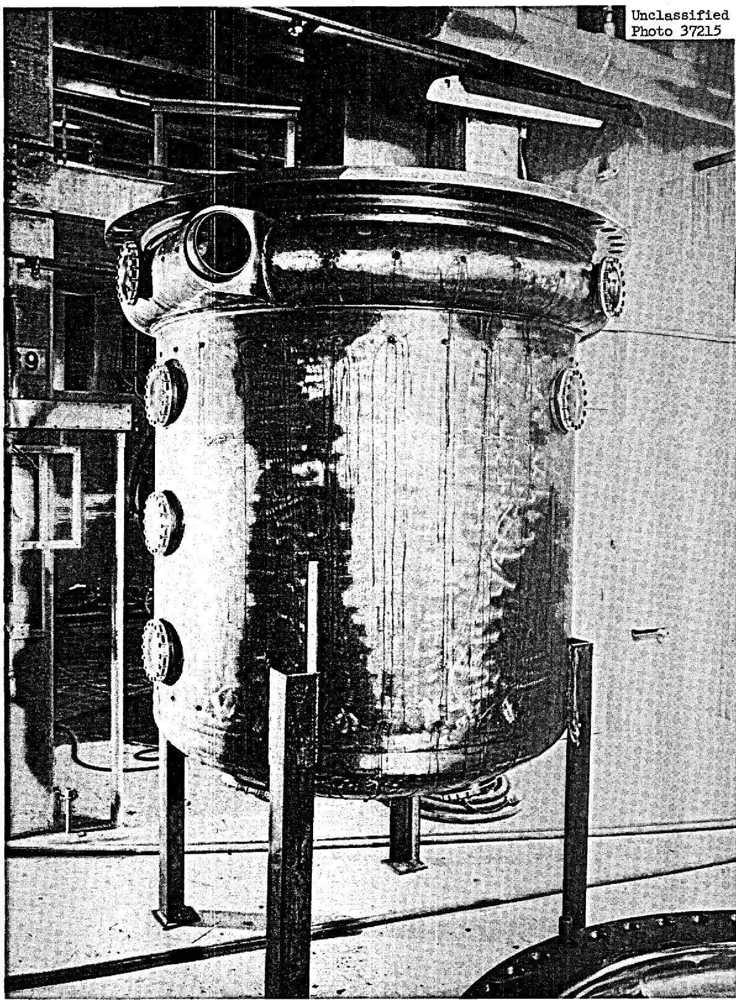  
Fig. 5.9. Full-Scale Model of Reactor Vessel.

flow rate of 1200 gpm. The overall pressure drop varied as the square of the flow rate, as shown graphically in Fig. 5.10. An overall pressure drop very nearly proportional to the velocity squared implies that the controlling pressure loss (in the flow distributor) is almost independent of the Reynolds number over the range of flows that are of interest.[38]

5.3.3.4 Flow Distributor. The flow distributor was described in Section 5.3.1. Full-scale model studies showed that the centerline velocity in the distributor varied from 9 to 23 fps, as shown graphically in Fig. 5.11. The increase in velocity immediately following the inlet opening is due to the recirculation of liquid around the distributor. Within the limits of experimental error, the velocity decreased linearly with distance from the inlet, indicating that the flow was being distributed uniformly to the cooling annulus around the circumference of the vessel.

Based on an equivalent diameter of 5.l in. for the distributor, the Reynolds number is essentially equal to $1.29 \times 10^{4}$ per ft/sec of velocity. The residence time of the fuel in the distributor is $\sim 1.1$ sec, and the average temperature increase is estimated to be only $0.004^{\circ} \mathrm{F}$ at rated conditions (see Chapter II, Ref. 18).

The 3/4-in.-diam holes through which the fuel salt flows from the distributor to the annular space in the vessel are drilled at an angle of $30^{\circ}$ with a tangent to the vessel to conserve much of the circumferential velocity developed in the distributor. The vertical rows of holes are spaced $5^{\circ}$ apart at the upstream end, but the spacing is increased to $22\frac{1}{2}^{\circ}$ at the downstream end because the fluid static pressure is greater. At rated flow of 1200 gpm, the velocity through the upstream holes is estimated to be $\sim 3.7$ fps, and at the downstream holes is $\sim 18.5$ fps, giving Reynolds numbers of 7050 and 35,250, respectively. (See Chapter II of Ref. 18.)

5.3.3.5 Cooling Annulus. As the fluid moves downward in the wall-cooling annulus, the swirl component of the velocity decreases and the total velocity becomes less. (The total velocity is the vector sum of the axial and circumferential components.) The midplane velocity of 5.1 fps gives a Reynolds number of 25,800 and an estimated heat transfer coefficient of 2090 Btu/hr-ft $^{2}$ - $\circ$ F. At design

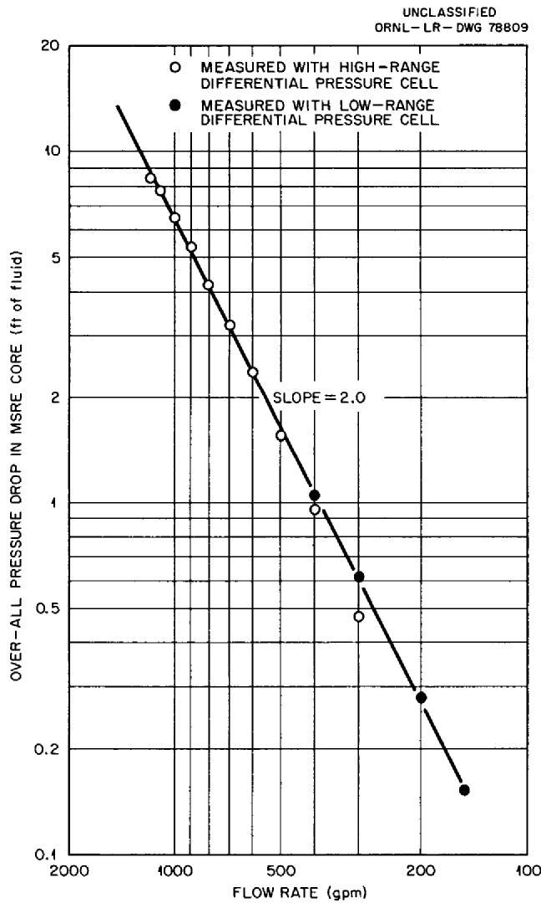  
Fig. 5.l0. Pressure Drop Through Reactor Core.

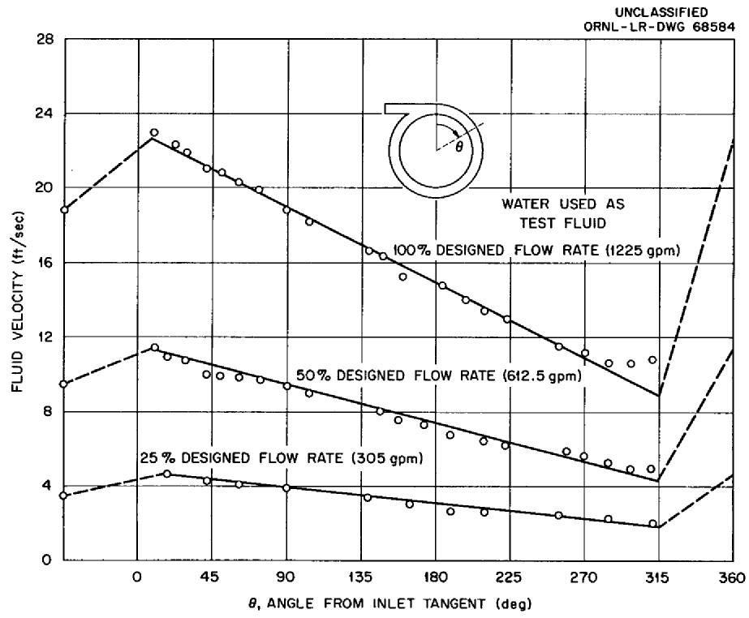  
Fig. 5.11. Center-Line Velocity Distribution in Volute of MSRE Full-Scale Core Model.

power of 10 Mw the average heat generation in the vessel wall is estimated to be $0.054 \, \text{W/CC}$ . The temperature difference between the inside wall surface and the bulk fuel temperature is thus only about $0.12^{\circ} \text{F}$ (Chapt. II, Ref. 18).

The lowest total velocity is at the bottom of the annulus and is estimated to be $\sim 4.2$ fps, a value that is essentially constant around the circumference.

The residence time in the annulus is estimated to be 2.43 sec and the temperature increase to be $\sim 1.13^{\circ}\mathrm{F}$ at rated power and flow rate (see Chapt. II of Ref. 18). A conservative estimate is that the pressure-vessel wall is cooled to an average temperature of no more than $5^{\circ}\mathrm{F}$ above the bulk temperature of the entering salt ( $1175^{\circ}\mathrm{F}$ ).

5.3.3.6 Lower Head. After leaving the cooling annulus the fuel salt enters the lower head of the vessel, which serves as a plenum in which the salt is distributed to the reactor core passages. The 48 vanes in the head have a radial length of about $11 \, \text{in.}$ , or about $30\%$ of the vessel radius. The vanes check the swirl developed in the annulus to reduce the radial fluid pressure gradient in the lower head to less than 2 in. of fluid. This small gradient is judged to have a negligible effect on the distribution of the fuel to the core passages (Chapt. II, Ref. 18).

Fluid age measurements were made throughout the lower head on the one-fifth-scale model by use of salt conductivity techniques. A salt solution was added suddenly to the circulating fluid just upstream of the model inlet and changes of conductivity were measured by numerous probes in the lower head. Although these values were taken from the small model in which good hydrodynamic similarity was difficult to obtain, they lead substance to the qualitative conclusion that the region of the lower head with the highest combination of fuel-salt residence time, power density, and nuclear importance, is at the centerline.

The integral residence time of the fuel salt in the lower head is estimated to be about 4.2 sec, and the integral average temperature increase is about $0.5^{\circ}\mathrm{F}$ at rated flow and power.

Heat transfer measurements were made in the lower head of both the small and full scale models. The latter appeared to give the most reliable results and indicate a heat transfer coefficient of about 1500 Btu/hr-ft $^{2}$ -F at a point about 17 in. radial distance from the outer circumference. This value is based on both heat meter measurements $^{37}$ and on calculations which make use of the measured velocity profiles. The heat transfer coefficient, based only on heat meter measurements, at a radius of 4 in. from the center of the head was indicated to be about 900 Btu/hr-ft $^{2}$ -F. (See Chapter II of Ref. 18.)

The average heat generation within the wall of the lower head was estimated to be 0.61 w/cc. If the walls were so insulated that all internally generated heat must be dissipated to the fuel solution, the inner wall surface temperature would be about $1193^{\circ}\mathrm{F}$ , or $16^{\circ}\mathrm{F}$ above the bulk fluid temperature of $1177^{\circ}\mathrm{F}$ . The outside surface of the lower head at a point 4 in. from the centerline would be about $14^{\circ}\mathrm{F}$ hotter than the inside surface and would be at $1207^{\circ}\mathrm{F}$ . The highest temperature associated with the cap over the drain line in the lower head would be about $1202^{\circ}\mathrm{F}$ , or $25^{\circ}\mathrm{F}$ above the temperature of the surrounding salt. All the estimated values mentioned above assume no deposition of solids on the lower head.

If solid particles of $\mathrm{ZrO}_2$ were formed in the MSRE by oxidation of the fuel salt, these particles would probably settle on the lower head. The presence of this sludge would increase the temperature of the wall of the lower head by increasing the heat source at the wall and also by reducing the heat transfer coefficient from the wall to the salt. If a thermal conductivity of 2 Btu/hr-ft², and a porosity of $30\%$ , are assumed for the $\mathrm{ZrO}_2$ sludge, the heat generation rate is estimated to be about 40,620 Btu/hr-ft³, of which $90\%$ may be due to gamma heating and the remainder due to fissioning in the fuel in the sludge voids. If the sludge accumulation were 0.1 in. thick, the added temperature difference between the wall and the salt would be about $21^{\circ}\mathrm{F}$ , giving a temperature of $1228^{\circ}\mathrm{F}$ on the outside surface. If the sludge were 0.5 in. thick, the difference would be about $120^{\circ}\mathrm{F}$ (see Ref. 18, Part II, p 19). Thermocouples are installed on the lower head of the vessel to assist in detecting the accumulation

of solids and to provide assurance that the temperature of the head does not exceed the design temperature of $1300^{\circ}\mathrm{F}$ for long periods.

The behavior of solid particles on the lower head was studied by introducing iron filings into the circulating stream in the full-scale model. After circulation for several hours, the core was drained and the placement of the sediment in the bottom head was examined. Fine particles appeared to have been swept out by the draining fluid. Larger particles accumulated near the drain line opening, but there were no indications of a tendency for the opening to plug, and the design appeared to be adequate in this respect.[40]

5.3.3.7 Core. The 1/2-in.-thick INOR-8 grid plates that support the graphite core, as shown in Fig. 5.3 and described in Section 5.3.1, are exposed to the flow of salt on both sides. The average velocity of the salt at the grid is estimated to be about 0.16 fps, the Reynolds number is 1400, and the heat transfer coefficient is -200 Btu/hr-ft $^2$ -F. With an assumed heat generation rate of 1.7 w/cc in the liquid, the temperature difference between the surface of the INOR-8 and the circulating salt is estimated to be about 17°F (Chapt. II, Ref. $^{18}$ ).

The salt flows in a tortuous path through the graphite lattice above the INOR grid, and the pressure drop through the lattice is greater than the pressure loss through the core passage. Since the restriction due to the lattice blocks is absent at the five stringer positions at the center of the core, the velocities through the central passages are about three times higher than the average core velocities.

The flow rate through a typical core passage is roughly 1 gpm, with about $20\%$ more flowing through the passages toward the center than those near the periphery of the core. The variation of the flow rate with distance from the center of the core, as shown graphically in Fig. 5.12, is due to the pressure gradient in the lower head.[39] The point scatter on this graph is largely due to the greater tolerances in the model than exist in the active core.

Flow studies made on the fuel-scale model showed that the flow through the north-south fuel passages was about $10\%$ less than that through the east-west passages because the upper lattice blocks slightly obstructed the entrance. To equalize the flow distribution, 0.104-in.-

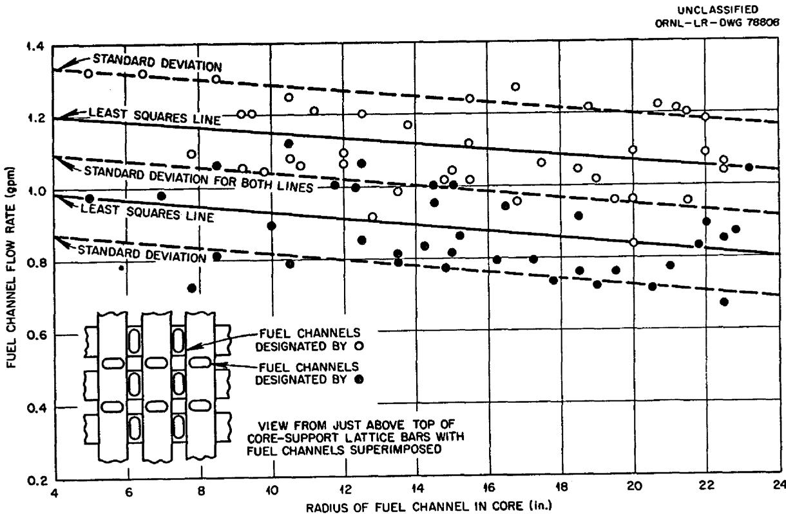  
Figure 5.12. Flow Distribution in Reactor Core Fuel Passages at Total Flow Rate of 1200 gpm in Full-Scale Model.

diam holes were bored in the top layer of lattice blocks under each north-south flow passage. These holes will bring the two banks of points, shown in Fig. 5.12, much closer together.

The temperature distribution in the graphite and in the fuel salt within the reactor core is a function of the heat production rate and the heat transfer. Heat production follows the overall shape of the neutron flux, which is discussed in detail in Part III. The heat transfer is a function of the velocities, which were determined largely through the model studies.

Bulk mean temperatures were obtained by integrating the local temperatures over the core volume. These bulk temperatures are useful in estimating the mean density of the fuel and graphite to arrive at the inventory of fuel in the core. Nuclear mean temperatures consider the local nuclear importances as well as the temperatures.

Overall fuel and graphite temperatures were calculated for a core that was divided radially and axially into regions having similar hydraulic or nuclear characteristics, giving a total of twenty regions. At the design power level of 10 Mw, with the reactor inlet at $1175^{\circ}\mathrm{F}$ and the outlet at $1225^{\circ}\mathrm{F}$ , the nuclear mean temperature of the fuel was $1211^{\circ}\mathrm{F}$ and the graphite was $1255^{\circ}\mathrm{F}$ . The bulk mean fuel temperature, including all fuel in the reactor vessel except that in the flow distributor, was $1199^{\circ}\mathrm{F}$ , and the bulk mean temperature of the graphite was $1229^{\circ}\mathrm{F}$ , assuming no salt were absorbed in it. With $0.5\%$ fuel permeation, the nuclear mean temperature of the graphite was $1258^{\circ}\mathrm{F}$ and the bulk mean temperature was $1227^{\circ}\mathrm{F}$ . The central portion of the core, which is defined as that portion inside the core can and between the bottom of the lower layer of lattice blocks to the top of the uniform fuel passages through the core, produces about $87\%$ of the total power. Peripheral regions, where the fuel to graphite ratio is much higher, such as at the top of the graphite matrix, account for the remaining $13\%$ .[31]

A summary of the nuclear data for the reactor is shown in Table 5.4. Values are given for three kinds of fuel salt: (1) fully enriched uranium with thorium, (2) fully enriched uranium, and (3) partially enriched uranium. Thorium-containing salts are of interest

Table 5.4. Summary of Reactor Physics Data   

<table><tr><td colspan="4">Core Parameters</td></tr><tr><td colspan="4">Nominal core dimensions</td></tr><tr><td>Diameter, in.</td><td>55-1/4</td><td></td><td></td></tr><tr><td>Height, in.</td><td>64</td><td></td><td></td></tr><tr><td>Fuel volume fraction</td><td>0.224</td><td></td><td></td></tr><tr><td>Fuel volume, ft3</td><td>20</td><td></td><td></td></tr><tr><td>Graphite volume, ft3</td><td>69</td><td></td><td></td></tr><tr><td colspan="4">Effective core dimensions (based on extrapolation of thermal neutron flux)</td></tr><tr><td>Diameter, in.</td><td>59</td><td></td><td></td></tr><tr><td>Height, in.</td><td>78</td><td></td><td></td></tr><tr><td colspan="4">Effective delayed neutron fractions</td></tr><tr><td>Static</td><td>0.0067</td><td></td><td></td></tr><tr><td>Circulating</td><td>0.0036</td><td></td><td></td></tr><tr><td>Fuel typea</td><td>Th-235U</td><td>93% 235U</td><td>35% 235U</td></tr><tr><td colspan="4">Initial critical concentration</td></tr><tr><td>235U, mole %</td><td>0.291</td><td>0.176</td><td>0.291</td></tr><tr><td>U, mole %</td><td>0.313</td><td>0.189</td><td>0.831</td></tr><tr><td colspan="4">Operating concentrationb</td></tr><tr><td>235U, mole %</td><td>0.337</td><td>0.199</td><td>0.346</td></tr><tr><td>U, mole %</td><td>0.362</td><td>0.214</td><td>0.890</td></tr><tr><td colspan="4">Temperature coefficient of reactivity, °F-1 x 10-5</td></tr><tr><td>Fuel</td><td>-3.03</td><td>-4.97</td><td>-3.28</td></tr><tr><td>Graphite</td><td>-3.36</td><td>-4.91</td><td>-3.68</td></tr><tr><td>Total</td><td>-6.39</td><td>-9.88</td><td>-6.96</td></tr><tr><td>Prompt neutron lifetime, sec x 10-4</td><td>2.29</td><td>3.47</td><td>2.40</td></tr><tr><td colspan="4">Thermal neutron flux, n/cm2 - sec x 10-3</td></tr><tr><td>Peak</td><td>3.4</td><td>5.7</td><td>3.4</td></tr><tr><td>Average</td><td>1.5</td><td>2.5</td><td>1.5</td></tr><tr><td>Peak/average</td><td>2.32</td><td>2.29</td><td>2.32</td></tr><tr><td colspan="4">Fuel power density, w/cc</td></tr><tr><td>Peak</td><td>31</td><td></td><td></td></tr><tr><td>Average (20 ft3 of fuel)a</td><td>14</td><td></td><td></td></tr><tr><td colspan="4">Graphite power density, w/cc</td></tr><tr><td>Peak</td><td>0.98</td><td></td><td></td></tr><tr><td>Average (70 ft3 of graphite)c</td><td>0.34</td><td></td><td></td></tr><tr><td colspan="4">Gamma heating of INOR-8, w/cc</td></tr><tr><td>Control rod thinble at midplane</td><td>2.5</td><td></td><td></td></tr><tr><td>Core can, midplane</td><td>0.2</td><td></td><td></td></tr><tr><td>Reactor vessel, midplane</td><td>0.2</td><td></td><td></td></tr><tr><td>Upper head at vessel outlet</td><td>0.12</td><td></td><td></td></tr><tr><td colspan="2">Fast neutron exposure, nvt per 10 Mwyr:</td><td>0.1 - 1 MeV</td><td>1 - 10 MeV</td></tr><tr><td colspan="2">Reactor vessel midplane</td><td>7 x 1019</td><td>5 x 1019</td></tr><tr><td colspan="2">Reactor vessel upper head at outlet</td><td>1.0 x 1020</td><td>5 x 1019</td></tr><tr><td colspan="2">Reactor vessel lower head at centerline</td><td>2 x 1019</td><td>1.3 x 1019</td></tr><tr><td colspan="4">Control Rod Constants</td></tr><tr><td colspan="2">Fuel salt typea</td><td>Th-235U and 35% 235U</td><td>93% 235U</td></tr><tr><td colspan="4">Control rod worth, % Δk/k</td></tr><tr><td colspan="2">One rod</td><td>2.8</td><td>3.1</td></tr><tr><td colspan="2">Two rods</td><td>5.0</td><td>5.5</td></tr><tr><td colspan="2">Three rods</td><td>6.7</td><td>7.4</td></tr><tr><td colspan="2">Fuel salt typea</td><td>Th.235U and
35% 235U</td><td>93% 235U</td></tr><tr><td colspan="2">Max. rate of withdrawal (one rod at a
time at 0.5 in./sec) % (Δk/k)/sec</td><td>0.04</td><td>0.04</td></tr><tr><td colspan="2">Rate of insertion (simultaneous insertion
of 3 rods at 0.5 in./sec) % (Δk/k)/sec</td><td>0.09</td><td>0.10</td></tr><tr><td>Actuation</td><td colspan="3">Any one of three rods on servo; the
remaining two on manual switches</td></tr><tr><td>Length of rod travel, in.</td><td colspan="3">51</td></tr><tr><td colspan="2">Poison elements:</td><td></td><td></td></tr><tr><td>Poison</td><td colspan="3">70% (wt) Gd2O3, 30% Al2O3</td></tr><tr><td>Poison density, gm/cc</td><td colspan="3">5.873</td></tr><tr><td>Ceramic cylinder (3 per element), in.</td><td colspan="3">0.84 ID x 1.08 OD x 0.4383 long</td></tr><tr><td>Element cladding</td><td colspan="3">0.020-in. thick Inconel</td></tr><tr><td>Element dimensions, in.</td><td colspan="3">0.790 ID x 1.140 OD x 1.562 long</td></tr><tr><td>Number elements per rod</td><td colspan="3">38</td></tr><tr><td>Length of poison section, in.</td><td colspan="3">59.36</td></tr><tr><td>Weight Gd2O3per rod, kg</td><td colspan="3">1.2</td></tr><tr><td>Rod attachment</td><td colspan="3">Magnetic release</td></tr><tr><td>Rod drive</td><td colspan="3">Flexible hose</td></tr><tr><td>Drive motor</td><td colspan="3">Instantly reversible, single φ</td></tr><tr><td>Power generation in rod (max), w</td><td colspan="3">2725</td></tr><tr><td>Cooling</td><td colspan="3">Cell atmosphere, forced convection</td></tr></table>

Fuel Loop Parameters   

<table><tr><td>Volumes and residence times (at l200°F, l200 gpm):</td><td>V, ft3</td><td colspan="2">Time, sec</td></tr><tr><td>Cored</td><td>25.0</td><td colspan="2">9.4</td></tr><tr><td>Upper head</td><td>10.5</td><td colspan="2">3.9</td></tr><tr><td>Reactor vessel to pump</td><td>2.1</td><td colspan="2">0.8</td></tr><tr><td>Pump bowl</td><td></td><td colspan="2"></td></tr><tr><td>Main stream</td><td>0.9</td><td colspan="2">0.3</td></tr><tr><td>Outside main stream</td><td>3.2</td><td colspan="2">-</td></tr><tr><td>Pump to heat exchanger</td><td>0.8</td><td colspan="2">0.3</td></tr><tr><td>Heat exchanger</td><td>6.1</td><td colspan="2">2.3</td></tr><tr><td>Heat exchanger to reactor vessel</td><td>2.2</td><td colspan="2">0.8</td></tr><tr><td>Vessel inlet (nozzle, volute and downcomer)</td><td>9.7</td><td colspan="2">3.6</td></tr><tr><td>Lower head</td><td>10.0</td><td colspan="2">3.8</td></tr><tr><td>Total</td><td>70.5e</td><td colspan="2">25.2</td></tr><tr><td>System fuel inventory</td><td></td><td colspan="2"></td></tr><tr><td>Volume fuel saltf, ft3at l200°F</td><td>73.2</td><td colspan="2"></td></tr><tr><td>Weights of uranium for fuel-salt typesa:</td><td>Th-235U</td><td>235U</td><td>235U</td></tr><tr><td>Uranium, initial critical, kg</td><td>85</td><td>52</td><td>218</td></tr><tr><td>operating, kg</td><td>98</td><td>59</td><td>233</td></tr><tr><td>235U, initial critical, kg</td><td>79</td><td>48</td><td>77</td></tr><tr><td>operating, kg</td><td>91</td><td>55</td><td>92</td></tr></table>

a. See Table 2.1 for fuel composition.   
b. Allowing for $-4\% \Delta k / k$ in rods, poisons, etc.   
c. Assumes 1.4 Mw of heat generated outside of nominal core.

d. Between horizontal planes at extreme top and bottom of graphite.   
e. Graphite contraction for one full-power year has been calculated to be 0.3 ft³ (Ref 43).   
f. Includes fuel loop, drain line, and drain tank heel.

in future large-scale breeder reactors. The salt with the high enrichment of $^{235}\mathrm{U}$ is representative of the core fuel for a two-region breeder reactor. A higher concentration of uranium was used in the third salt to give increased tolerance for fluoride loss. This was accomplished through use of partially enriched uranium and a relatively large amount of $^{238}\mathrm{U}$ . The third salt will be used in initial operations or the MSRE (see Part IV for detailed discussion of the chemistry of the fuel salt).

The difference between the mean fuel temperature and the temperature of the center of the graphite is the sum of the differences between the center and edge of the fuel including the Poppendiek effect, $^{35}$ and the temperature difference in the graphite caused by its own internal heat generation. These values have been calculated and the maximum graphite temperature in the reactor is estimated to be $1296^{\circ}\mathrm{F}$ at rated flow and power. This maximum occurs about 50 in. from the bottom of the 64-in.-high core matrix and about 7 in. from the center-line. $^{31}$

The average fuel residence time in the core is 7.5 sec, and the average fuel-salt temperature increase as it passes through the core is about $50^{\circ}\mathrm{F}$ at 10 Mw of reactor power and with a flow rate of 1200 gpm, providing nominal temperatures for the entering salt of $1175^{\circ}\mathrm{F}$ and for the leaving salt of $1225^{\circ}\mathrm{F}$ . It is calculated that the fuel salt leaves the hottest flow channel through the core at about $1262^{\circ}\mathrm{F}$ .31

5.3.3.8 Upper Head. On leaving the reactor core, the fuel salt passes into the reactor vessel upper head. Flow in the head was observed in the models to be turbulent and the heat transfer more than adequate; therefore, few detailed studies were made of this region of the reactor vessel.

The region just above the core-can flange, described in Section 5.3.1, was given some study. Although more than $24\mathrm{gpm}$ is introduced into the region through slots and clearances, estimates of temperature were made on the basis that the slots were plugged. The method of heat transport was considered to be transfer down the pressure vessel wall and through the core-can flange to the wall-cooling annulus, and radial

transport of the heat to the fuel in the gap between the core can and the graphite core. It was assumed that the reactor was insulated and that gamma heating in the metal walls was 0.1 w/cc. With these assumptions, the temperature was calculated to be about $30^{\circ}\mathrm{F}$ above the reactor inlet temperature of $1175^{\circ}\mathrm{F}$ and occurred at a point about 3 in. above the flow distributor. With the flow-restrictor ring gap plugged so that no salt flowed upward between the graphite core and the core can, the temperature at the same point was estimated to be about $40^{\circ}\mathrm{F}$ above the reactor inlet temperature.

The upper head also contains the discharge strainer assembly, which will be described subsequently.

# 5.3.4 Reactor Access Nozzle, Plug, and Strainer

The 10-in. nozzle through which the salt leaves the upper head of the reactor vessel has a 40-in.-long extension welded above it. This extension has a 5-in. side outlet for the leaving salt. The extension serves as a housing for the nozzle plug, which is a removable support for the three 2-in. control rod thimbles, the 2-1/2-in. graphite sample access pipe, and for the discharge screen, as shown in Fig. 5.4.

Thermal stresses induced by the temperature gradient across the nozzle extension wall were investigated and found to be well within the allowable limits.

The removable nozzle plug is about 20-1/2 in. long and is 9.770 in. OD at the top and 9.520 in. OD at the bottom to provide a taper to assist in freeing the plug for removal. The radial clearance is 1/8 in. at the top and $1/4$ in. at the bottom. Fuel salt is frozen in the annular space between the plug and the nozzle, to effect a salt seal. The salt is maintained below the freezing temperature by cooling the outside of the nozzle extension and the inside of the plug with a flow of cell atmosphere gas. About 10 cfm of this gas is supplied to the outside of the nozzle extension and the inside of the plug with a flow of cell atmosphere gas. About 10 cfm of this gas is supplied to the outside cooling jacket through a 1/2-in. pipe, line 962, and about 10 cfm is supplied through line 963 to the inner cooling jacket. The discharge of both jackets is to the cell atmos

phere. The salt seal prevents the salt from coming in contact with and corroding the ring-joint gas seal on the upper flange.

The nozzle plug is hollow and is filled with insulation. The upper end of the plug is welded to the mating flange for the 10-in. closure. This flange is provided with an O-ring seal to make the joint gas tight. The bolting for the flange is arranged for manipulation with remotely operated tooling. It may be noted that when the flange is unbolted, the plug can be withdrawn, carrying the control rod thimbles, the graphite-sample guide tube, and the discharge screen assembly with it.

The upper head of the reactor vessel has an 18-in.-diam strainer ring mounted just below the discharge nozzle opening, as shown in Fig. 5.4. This ring is welded to six equally spaced lugs and to a strengthening ring. The strainer is fabricated of 16-gage INOR-8 plate with staggered 3/32-in.-diam holes on 9/64-in. centers, and will stop large graphite chips. The center of the strainer ring is cut away to permit the 9.52-in.-OD strainer-basket assembly on the nozzle plug to pass through it. An INOR-8 seal ring, 1/4 in. by 3/4 in. wide, 9583 in. ID and 11.083 in. OD, is loosely mounted with the strainer ring and makes an acceptably close fit with the strainer basket.

The lower end of the nozzle plug is contoured to direct the fuel salt stream toward the 5-in. side outlet. Projecting below this is a 9.520-in.-diam by 12-17/32-in.-long cylinder of 1/8-in.-thick plate for supporting the strainer basket. The basket is welded to the bottom of the cylinder, is 9.520 in. OD at the top and about 8-1/2-in. OD at the bottom and is about 7 in. deep. The holes in the basket strainer are of the same size and configuration as those in the strainer ring, mentioned above. The three INOR-8-graphite sampler baskets, described previously in Section 5.3.1, pass through a 2-3/8 in. diam opening in the strainer basket. The three 2-in.-diam control rod thimbles also pass through the strainer basket. A cross-shaped extension of the basket assembly projects beneath the basket about 2-1/2 in. to act as a hold-down for the five full-sized graphite stringer samples at the center of the reactor core.

All clearances between the strainer basket and the strainer ring, thimbles, etc., are less than 1/16 in. so that graphite chips will be retained.

# 5.3.5 Control Rods

5.3.5.1 Introduction. Excess reactivity must be provided over that required for the reactor to be critical while clean and noncirculating at $1200^{\circ}\mathrm{F}$ , in order to compensate for xenon poisoning, loss of delayed neutrons from the reactor via the leaving fuel salt, the negative power coefficient, and for some burnup in the fuel. Variations in the pump speed and possible differences in the degree of fuel penetration into the graphite may also require some shim control of reactivity. It is also desirable to hold the reactor subcritical during startup operations when charging fuel salt into the system by procedures other than heating the system to high temperatures. The adjustment of reactivity is provided for in the MSRE by three identical control rods located near the center of the MSRE core.

While control rods are employed for the above-mentioned reasons, the nuclear safety of the reactor is not primarily dependent upon them. The rods are, therefore, not a fast-acting type, designed for extreme reliability. Simultaneous withdrawal of all three rods would, however, create an undesirable situation under certain conditions, necessitating certain interlocks and controls. The control philosophy is covered in Part II.

The need for a graphite-sampling arrangement at the center of the reactor complicated design of the control rod system in that it was also necessary that the control rods be in a region of high nuclear importance. The graphite-sampling equipment interfered dimensionally with the use of straight control rods and dictated that the rods be flexible and used in thimbles having offsetting bends. This type of rod was used successfully in the Aircraft Reactor Experiment.

Early plans for use of natural boron carbide (19% B $^{10}$ ) as the poison material were abandoned in favor of gadolinium oxide in that the latter increased the control rod worth as well as eliminated the problem associated with the boron of helium pressure buildup in the sealed cans containing the poison. The selection of the control rod poison material is discussed in detail in Part III.

5.3.5.2 Description. Three control rod thimbles are arranged equidistant from the center of the core matrix at the graphite stringer locations shown in Fig. 5.7. The centers of the control rods are $2 - 53 / 64$ in. from the reactor centerline.

The thimbles are fabricated of 2-in. sched-40 INOR-8 pipe that is reduced to 2-in.-OD by 0.065-in. wall tubing in the bottom 5 ft of length that is inserted in the graphite core. They are supported by the removable plug in the reactor access nozzle, and have two 16-in.-radius $3^{\circ}$ offsetting bends just above the nozzle extension closure flange to permit the control rods to clear the graphite-sampler equipment. The thimbles extend through the core matrix to about $1/2$ in. above the graphite lattice blocks. Four INOR-8 spacer sleeves, about $1-1/2$ in. long and with eight fins, are welded to each thimble to position it equidistant from adjoining graphite stringers, as indicated in Fig. 5.4 (see ORNL Dwg. E-BB-B-40598).

The control rods are segmented to provide the flexibility needed to pass through the bends in the control rod thimbles. The poison material is in the form of thin-walled cylinders, as shown in Fig. 5.13. The ceramic cylinder is a mixture of 70 wt % gadolinium oxide and 30 wt % aluminum oxide, 1.08 in. OD x 0.84 in. ID x 0.438 in. long. Three cylinders are canned in a 0.020-in.-thick welded Inconel shell 1.140 in. OD x 0.790 in. ID x 1.562 in. long (see ORNL Dwg. E-BB-B-56347 and ORNL Specification JS-81-183). The properties and fabrication requirements of the poison elements are discussed in Part IV.

Thirty-eight elements are used for each control rod, providing a poison section 59.4 in. long. As indicated in Fig. 5.14, the segments are threaded, bead-like, on a $3/4$ -in.-OD by $5/8$ -in.-ID helically wound, flexible stainless steel. Two $1/8$ -in.-diam braided Inconel cables run through this hose to restrain it from stretching when dropped in free fall at operating temperature of $1200 - 1400^{\circ}\mathrm{F}$ . At the top of the poison section a retainer ring holds the elements in place and an adapter changes the hose to a stainless steel convoluted type with a single wire-mesh sheath. This hose passes upward through the thimble to the positioning chain on the control-rod drive

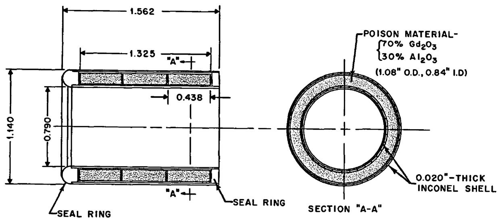  
Fig. 5.13. Control Rod Poison Element.

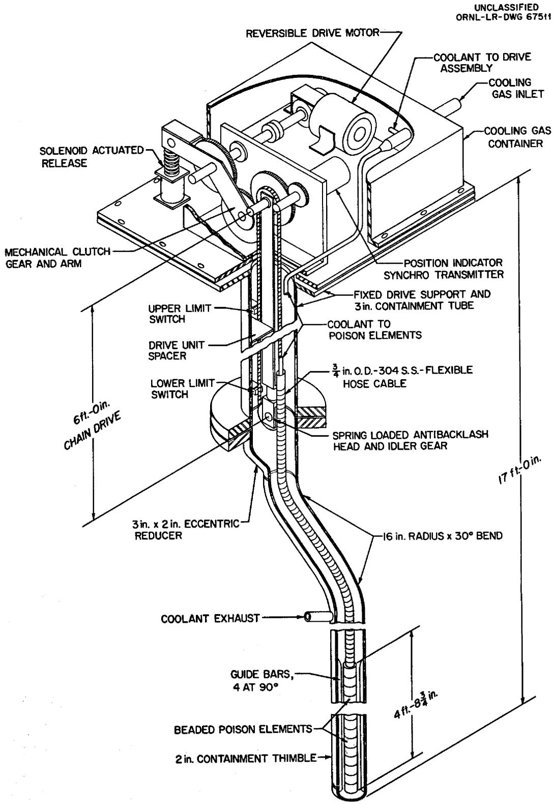  
Fig. 5.14. Control Rod and Drive Assembly

mechanism. The total length of a control rod assembly from the bottom of the poison elements to the drive chain connector is about 14 ft. See ORNL Dwg. E-BB-B-56334.

Each control rod is provided with an individual rod drive mechanism housed in a box located adjacent to the graphite-sampler standpipe. The drive mechanism is accessible using remote tooling operated through the standpipe workshield (see Section 5.3.6).

Each rod is moved by a 1/30-hp servo-motor driving through a brake, gear reducer, clutches, and a sprocket chain, as shown diagrammatically in Fig. 5.15. Two small synchros, driven from a bevel gear on the main sprocket drive shaft, indicate rod motion, one at $5^{\circ}$ per inch of movement and the other at $60^{\circ}$ per inch of movement. A linear potentiometer is also actuated by the drive shaft to provide a position signal which is used in the safety circuits. The method of calibration of those instruments will be discussed subsequently.

The control rod drive is self-locking in that, with the magnetic clutch engaged and the drive motor exerting no torque, the rods will not descend by their own weight (6 to 8 lb). An over-running clutch provides a positive drive connection between the motor and the chain sprocket to assure rod insertion. When the electromagnetic clutch is disengaged, the over-running clutch also allows the rod to fall freely. The drive unit is capable of exerting a downward thrust of about 20 lb, and an upward pull of roughly 25 lb. The total stroke is 60 in. at a maximum speed of 0.5 in./sec. The direction of movement of the rods can be reversed in less than 0.5 sec. Motion can be stopped in less than 0.25 sec. The clutch release time is not more than 0.05 sec, and the rod acceleration during a scream is at least 12 ft/sec². Limit switches are provided at each end of the stroke.

The drive units were designed to operate in a radiation field of $10^{5}$ rad/hr. The bearings are of the nonlubricated type and the unit is arranged for remote maintenance, or replacement, by tooling operated from above. The control rod drives were designed and fabricated by the Vard Corporation (Pasadena, Calif.). (See ORNL Specification JS-80-144)

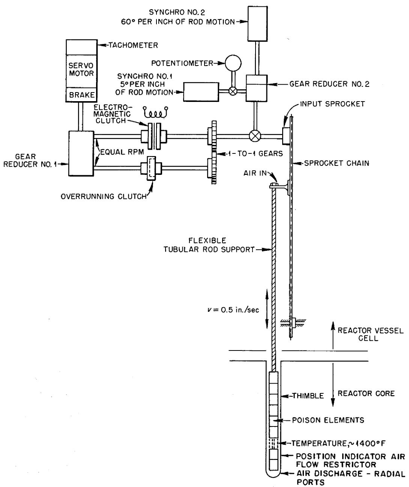  
Fig. 5.15. Diagram of Control Rod Drive.

The control rods are heated principally by the absorption of fission capture and fission-product decay gamma rays and the absorption of recoil kinetic energy of the products of reaction. $^{45}$ The poison elements are cooled by 15 scfm of cell atmosphere gas ( $95\% \, \mathbb{N}_2$ , $5\% \, \mathbb{O}_2$ ) supplied at $150^{\circ}\mathrm{F}$ through line 915 to the flexible positioning hose of each rod ( $\sim$ 5 scfm per rod), the gas returning upwards around the canned poison sections to be exhausted to the reactor containment cell atmosphere. The gas discharge temperature is estimated to be about $1100^{\circ}\mathrm{F}$ and the poison elements may operate at a maximum temperature of about $1350^{\circ}\mathrm{F}$ . Complete loss of cooling air with the reactor at full power would cause the maximum temperature in the control rod to rise to about $1500^{\circ}\mathrm{F}$ .

A positive-position indicator is provided for the lower end of the rod which permits recalibration of the position-indicating devices, which are related to the upper end of the rod, should there be variations in the length. The accuracy of rod position indication needed for safe reactor operation was established as $\pm 0.2$ in.[46] Development tests indicated that variations in length greater than this could be expected when dropping the rods in simulated scram conditions at operating temperatures. Positive indication of position of the lower end is provided by the cooling gas flow down the center of the flexible hose. A nozzle with radial ports is attached to the bottom end and a restrictor, or throat, is welded to the guide bar cage at a known point near the bottom of the thimble. When the nozzle passes through the throat, the change in pressure drop in the gas flow through the rod assembly is readily apparent and gives a position indication to within less than 0.l in. the position-indicating instruments can be calibrated against this known position of the lower end of the rod. (See Figure 2.2, p. 49, Ref. 122.)

5.3.5.3 Control Rod Worth. Each of the three rods, when fully inserted and the other two completely withdrawn, has a worth of $2.8\% \Delta k / k$ .* When all three rods are completely inserted, the total worth is $6.7\% \Delta k / k$ .* At the maximum withdrawal rate of 0.5 in./sec, normally limited to one rod at a time, the change in reactivity is $0.04\% (\Delta k / k) / \sec$ .* Simultaneous insertion of all three rods at a

rate of 0.5 in./sec causes a change in reactivity of $0.09\%$ ( $\Delta \mathrm{k} / \mathrm{k}$ )/sec.* These and other control rod constants are summarized in Table 5.4. A discussion of the nuclear aspects of the rods is given in Part III. Instrumentation is described in Part II.

# 5.3.6 Graphite Sampler

One of the objectives of the MSRE is to investigate the behavior of the unclad graphite moderator in the reactor environment. Thus, the reactor was designed for periodic removal of graphite specimens from near the center of the core. The samples are exposed to much the same salt velocity, temperature, and nuclear flux as the graphite stringers which make up the core matrix. The specimens can be withdrawn only when the reactor is inoperative and the fuel salt is drained from the primary circulating system. When a sample is removed for analysis, it must be replaced by another sample in order to maintain the same flow pattern through the core.

The three graphite sample baskets mounted vertically within a stringer position and the five removable stringers at the center of the core have been described in Section 5.3.1. The small baskets can be removed or replaced more or less routinely through the sample access nozzle (to be described subsequently). Access to the five stringers is obtained through removal of the entire reactor-vessel-access-nozzle plug assembly. While this is accomplished through a special work shield provided for the purpose, it is not a routine procedure.

As shown in Figs. 5.4, the graphite-sample access plug fits into the sample access nozzle. The INOR-8 plug is 1.610 in. ID x 2.375 in. OD x 46-13/32 in. long and terminates at the top in a 7-in. flange. The flange is fitted with a 4-in.-diam O-ring closure. The bottom of the plug is contoured to help direct the flow of fuel salt to the side outlet of the 10-in. reactor-vessel nozzle. The plug is cooled by cell atmosphere gas (95% N₂, 5% O₂) introduced at the center through a 1/2-in. sched-40 stainless steel pipe (see Fig. 5.4). (This

cooling tube has a two-bolt flange at the top to permit it to be withdrawn from the graphite sample access nozzle during maintenance or sampling procedures and temporarily replaced with a metal-sheathed heater of the "Firerod" type. This arrangement assures melting of any residual salt to permit withdrawal of the sample access nozzle and its attached hold-down rod and cup.) The cooling-gas flow is adjusted during reactor operation to freeze fuel salt in the 1/8- to 1/4-in. tapered annulus between the plug and the nozzle to obtain a seal. The O-ring closure is buffered and leak-detected with helium.

The INOR-8 graphite-sample access nozzle is 2.421 in. ID x 2.875 in. OD x 39-17/32 in. long, and is welded to the closure for the 10-in. reactor-vessel access nozzle, as shown in Fig. 5.4. A flange at the upper end bolts to the mating flange on the sample access plug with an 0-ring joint (previously mentioned) and also bolts to the graphite-sampler standpipe. The standpipe connections is through a 10-in.-diam by 8-in.-long stainless steel bellows, which permits relative movement of the standpipe and the reactor vessel.

Two different graphite-sampler standpipes are available for joining the reactor access nozzle to the opening in the reactor-containment roof plug. The one left in place, and designated "No. 1," is used when taking one of the small graphite-sample assemblies. Standpipe No. 2, which will be described subsequently, is used when removing and replacing the 2 by 2-in. graphite stringers.

Standpipe No. 1 is fabricated of stainless steel and is 19-3.4 in. ID x 20 in. OD x 8 ft 10-1/8 in. high. All joints and connections are gas-tight, and the standpipe is provided with purge and off-gas connections. As indicated in Figs. 5.4, 5.5, and 5.16 the upper end of the standpipe is bolted to a 40-in.-diam stainless steel liner set into the lower magnetite concrete roof plug. The lower end of the standpipe is fitted with the bellows extension which is bolted to the graphite-sample access nozzle.

During normal power operation the liner opening is closed with a magnetite-concrete plug 35-1/2 in. thick, 41-1/2 in. OD, and weighing about 6000 lb. A 6-in.-diam inspection port in this plug can be opened by removing a stainless-steel-canned magnetite-concrete plug,

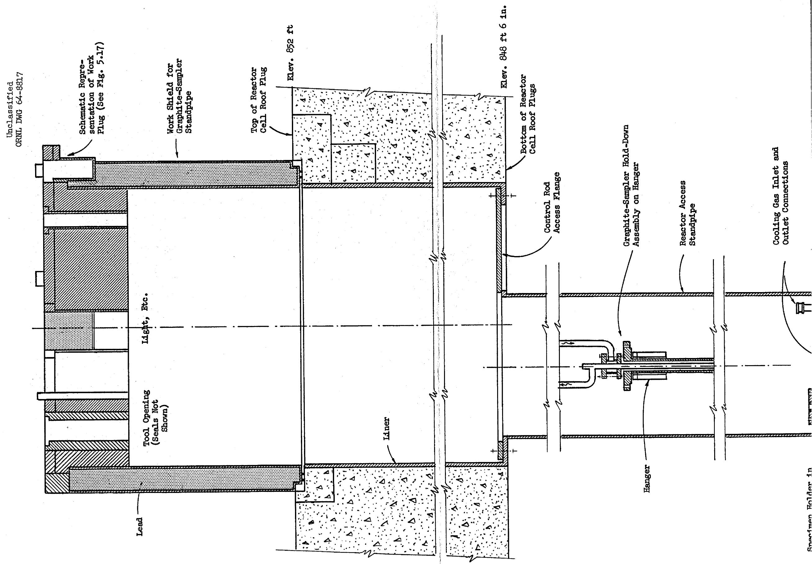

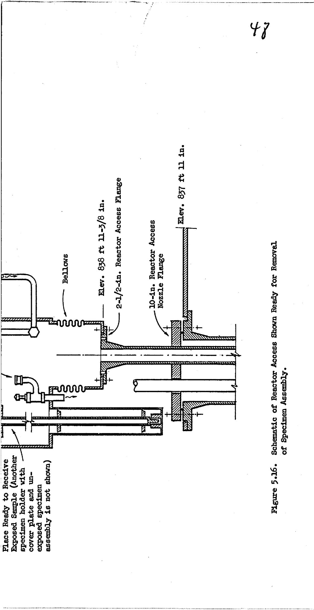

which is 35-1/2 in. long, and inserting a lead-glass plug. The 3-1/2- ft-thick ordinary concrete shield block, or roof plug, would cover these openings during reactor operation.

When taking a graphite sample, with the reactor shut down and drained of fuel salt, the upper shield block is taken away, the magnetite concrete plug is removed from the top of the liner, and a 3-ft-high working shield is installed by placing it on the lower shield block above the opening. This working shield (see Fig. 5.17) has walls of 4-in.-thick lead, is canned in stainless steel, and weighs about 8250 lb. A gas-tight seal is made by its weight bearing on two Teflon O-ring seals on the bottom periphery (see ORNL Dwg. D-BB-C-40657). A work plug inserted in the top of the working shield is 12 in. thick and contains a 3-in.-diam, heavy plate-glass viewing port, tool openings, illuminating light, and purge and off-gas connections. The work plug sits on Teflon gaskets to make a gas-tight seal. The plug can be rotated by a gear and pinion arrangement (see ORNL Dwg. E-BB-C-40646).

The 40-in.-diam liner in the lower roof plug and the 20-in.-diam graphite-sampler standpipe No.1 are not concentric but have circumferences which are almost tangent. The crescent-shaped opening thus provided to one side of the standpipe gives access to the control-rod-drive mechanisms. Maintenance of this equipment can be accomplished through the work shield. The shield can also be used to clear the equipment from the 10-in. reactor-vessel access nozzle to remove the five graphite stringers at the center of the core or to view the lower head of the vessel.

In brief, the procedure for taking a graphite sample is as follows. First, the upper concrete shield block is removed and the 40-in.-diam concrete plug is taken out of the lower shield block. The work shield is then placed over the standpipe opening, a specimen assembly in an unexposed sample holder with a top cover, an empty specimen holder with no top cover are placed in the standpipe in the wells provided. The standpipe is then carefully purged with nitrogen or helium gas until the atmosphere is acceptable for entry into the reactor circulating system. Working with remotely operated tooling through the work plug,

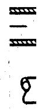

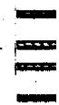

UNCLASSIFIED

ORNL-DWG.64-6745

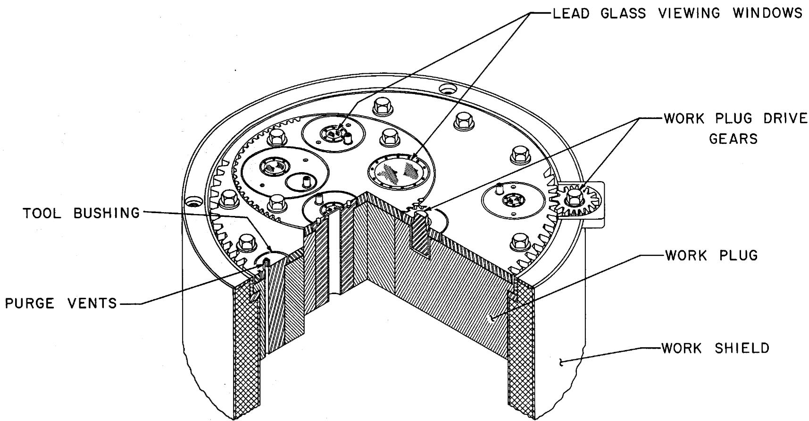  
WORK SHIELD FOR GRAPHITE SAMPLER   
FIG. 5.17

the sample access plug is unbolted from the sample access nozzle flange in the bellows extension at the bottom of the standpipe. The 1/2-in. cooling-gas lines are disconnected from the access plug by use of the quick-disconnect couplings. The access plug, with its attached hold-down rod, is then withdrawn and set aside in the rack provided in the standpipe. A special tool can then be inserted through the graphite-sample access nozzle to the top of the core to engage and withdraw one of the exposed graphite-sample assemblies. This is placed in the empty specimen holder and the top cover front the unexposed specimen holder installed on it. The unexposed specimen assembly is then inserted into the core, and the access plug is replaced. The standpipe is purged of radioactive gases to the off-gas system. After a suitable decay period the graphite sample is transferred to a special carrier for transport to the analytical laboratory in the X-10 area.

Should it be necessary to remove and replace any of the five 2 by 2-in. stringers from the center of the core, the reactor would be shut down and drained, the upper roof block would be removed, the round plug in the lower roof block would be lifted and set aside, and the work shield, with its work plug, would be set in place. Standpipe No. 1 would then be disconnected, which also necessitates disconnection and removal of the control-rod-drive assemblies. After setting the working shield aside, the overhead crane would be used to lift standpipe No. 1 and to set standpipe No. 2 in place. This standpipe is $34 - 1 / 2$ in. OD and is fabricated of 11-gage stainless steel. The top flange of the standpipe attaches to the lower roof block in the same manner as standpipe No. 1. The lower end attaches to the 10-in. access nozzle flange. Then, by working with special tooling through the work plug, the plug in the 10-in. access nozzle would be removed and the 2 by 2-in. graphite stringers would be withdrawn from the core matrix.

# 5.3.7 Mechanical Design of Reactor Vessel

The reactor-vessel-shell and head thickness requirements were determined by the rules of the ASME Unfired Pressure Vessel Code, Section VIII.47

The vessel design conditions were taken as 50 psig and $1300^{\circ}\mathrm{F}$ . The allowable stress used in the various computations was 2750 psi.

The allowable stress for INOR-8 changes with temperature as shown in Fig. 5.18. The stress values shown in this figure are for wrought and annealed sheet, plate, piping and tubing, and do not apply to weld or cast metal. However, tests have shown welds to have properties as good as the parent metal. The allowable stresses used in the design of the reactor were based on the lowest value obtained from any of the following criteria:53

1. One-fourth of the minimum specified tensile strength, adjusted for temperature variation. As shown in Fig. 5.l8 this criterion was controlling in the $0 - 200^{\circ}\mathrm{F}$ range.   
2. Two-thirds of the minimum specified yield strength, adjusted for temperature variation. This criterion established the allowable stress in the 200 - 900°F range.   
3. Four-fifths of the stress to produce rupture in 100,000 hr. In the temperature range of 900 - 1030°F this factor was controlling.   
4. Two-thirds of the stress to produce a creep rate of $0.1\%$ in 10,000 hr. This criterion established the allowable stress above $1030^{\circ}\mathrm{F}$ , which is the range for which the pressure vessel must be designed.

The first three of the above criteria correspond to standard practices (see Ref 47, Appendix Q, p 174). A safety factor of two-thirds was applied in the fourth criterion to allow for variation between batches of material and other uncertainties.

In 1962 the ASME code committees accepted INOR-8 (Hastelloy N) as a material of construction for unfired pressure vessels. The allowable stresses under the code exceed those used in the MSRE design by about $20\%$ .

The curves of Fig. 5.18 show that the allowable stresses drop from 6000 psi at $1200^{\circ}\mathrm{F}$ to 1900 psi at $1400^{\circ}\mathrm{F}$ and emphasize the need to maintain effective cooling of the pressure-stressed portions of the system. Under normal operating conditions the wall of the pressure vessel is estimated to be no hotter than $1180^{\circ}\mathrm{F}$ , the lower head $1190^{\circ}\mathrm{F}$ , and the upper head $1230^{\circ}\mathrm{F}$ . A design temperature of $1300^{\circ}\mathrm{F}$ was taken in order to provide some additional margin. The low allowable stress

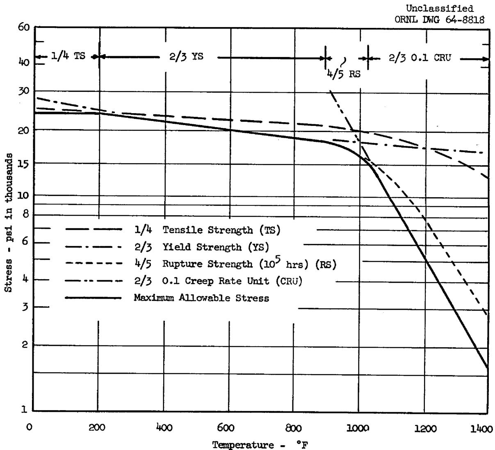  
Figure 5.18. Criteria for Establishing Static Design Stresses in INOR-8.

of 2750 psi used for design is based on the long-term creep properties of the material at $1300^{\circ}\mathbf{F}$ , but it is to be noted that even at $1800^{\circ}\mathbf{F}$ the tensile strength and yield strength of the material are still above 30,000 and 20,000 psi, respectively. This implies that short exposures to abnormally high temperatures would not produce complete failure of the equipment.

Estimates of the thicknesses of the material required were based on standard formulae. $^{18}$ In all cases the actual thicknesses used were greater than those calculated to be required. Estimates of the stresses at the nozzles were based on early predictions of the forces and moments imposed by the piping system. $^{18}$ Since the calculated stresses were well within the acceptable range, $^{53}$ the values were not revised to correspond with the nozzle reactions obtained by more refined analyses of the piping systems.

The portions of the reactor pressure vessel receiving special study were the upper and lower heads, the shell, the inlet nozzle and flow distributor, and the outlet nozzle. The INOR-8 core grid support bars were also investigated. Stresses induced by possible thermal gradients were considered in all cases.

The stresses imposed on the reactor support lug by the support rod were found to be less than two-thirds of the yield stress but higher than the allowable two-thirds of the $0.1\%$ CRU (Creep Rate Unit). As a result, it can be anticipated that a small amount of creep could occur, increasing the contact area and rapidly lowering the contact stress to within an acceptable range (see page 48, Ref. 18).

The graphite lattice blocks were designed on the basis of bending stress estimates at points of maximum moment. The calculated stresses were less than 100 psi (see page 38, Ref. 18).

# 5.3.8 Tubes for Neutron Source and Special Detectors

Thimbles are provided in the thermal shield for a neutron source and for two special neutron detectors for use primarily during the critical experiments. The inherent source of neutrons in the unirradiated fuel from reactions between the alpha particles emitted by the uranium, primarily $^{234}\mathrm{U}$ , and the beryllium, fluorine, and lithium nuclei will be 3 to $5 \times 10^5$ neutrons per second. This is adequate for

safety purposes; but a stronger source is desirable for following the approach to criticality, and an antimony beryllium or polonium beryllium neutron source of about $10^{9}$ neutrons per second will be provided for this purpose.

The source will be inserted in a thimble made from a 1-1/2-in. sched-40 pipe, 9-1/2 ft long, located in plug No. 1 in the west-northwest sector of the thermal shield (see ORNL Drawing E-DD-B-40726). The source pipe is protected from damage by the 1-in.-diam steel balls filling the thermal shield by a surrounding half-section of 8-in. sched-40 stainless steel pipe. The location in the thermal shield was chosen because the temperature will be low, so any standard source can be used without concern for its thermal properties. The source is on the opposite side from the nuclear instrument thimble and near the inner wall of the thermal shield. The source will be placed in a cage and will be lowered or raised by a simple arrangement of a small, braided, wire cable fastened to the cage and extended to the operating floor level.

The two tubes for the special neutron detectors are similar to the source tube but are 2-in. sched-10 pipe and are located in the northeast and southeast sectors of the thermal shield. The chambers in these tubes are intended for use only during the critical experiments and the early power experiments.

Use of the neutron source during startup of the reactor is discussed in detail in Part III and Part VIII. The fission chamber instrumentation is described under Instrumentation, Part II.

# 5.3.9 Support

The reactor vessel is supported from the top removable cover of the thermal shield by twelve hanger-rod assemblies. As shown in Fig. 5.19, the bottoms of these assemblies are pinned to lugs welded to the reactor vessel just above the flow distributor. The tops of the assemblies are pinned to the support plates in the cover. The cover is supported by the thermal shield assembly, which, in turn, rests on the I-beams of the major support structure in the containment vessel. The thermal shield will be described subsequently in Section 5.3.11.

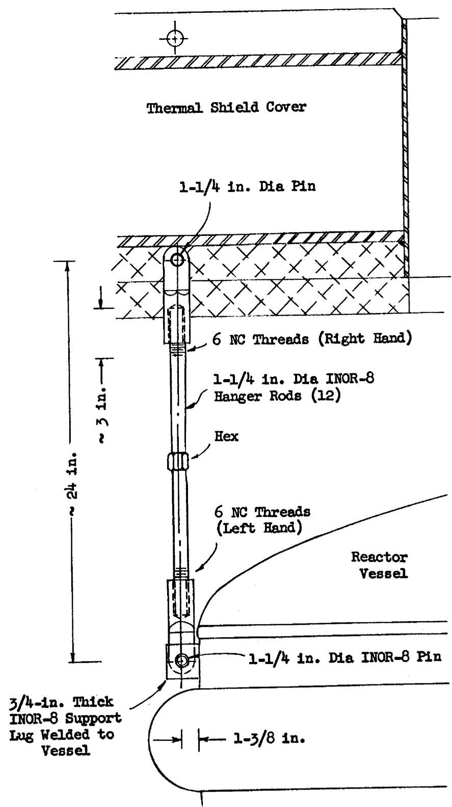  
Figure 5.19. Reactor Vessel Hanger Rods

Since the reactor vessel is not accessible when in position inside the thermal shield, the vessel will be attached to the thermal shield cover in a job outside the reactor cell. All adjustments, attachment of thermocouples, etc., including final inspection, will be completed before the reactor and cover assembly is lowered into position. Maintenance on the reactor, other than that which can be accomplished through the reactor access nozzle, requires lifting of the cover and the attached reactor from the reactor cell.

The twelve hanger rods are 1-1/4 in. in diameter and about 24 in. long. They are threaded for 3 in. on each end (opposite hands) with 1-1/2-in. 6-NC threads, and are fabricated of INOR-8. A hex section in the center is for applying a wrench in the turnbuckle arrangement to level the reactor and to distribute the load evenly between the hanger rods.

The support brackets, or lugs, welded to the reactor vessel, are fabricated of INOR-8 and are, for the most part, of 3/4-in. plate. The centerline of the pin hole is about 1-3/8 in. from the wall of the vessel. The pin is 1-1/4 in. in diameter and is made of INOR-8 (see ORNL Drawing D-BB-B-40407).

The support arrangement is such that the reactor vessel can be considered to be anchored at the support lugs. The portion of the vessel below this elevation is free to expand downward on a temperature rise with essentially no restraint. Expansion of the portion above the elevation of the support lugs creates forces and moments on the connecting piping which are considered in the flexibility analysis of the piping, as discussed in Section 5.6.2, following.

The temperature and stress distributions in the hanger rods were estimated using derived equations and analog computer solutions.[54,55] The reactor vessel and contents weigh about 30,000 lb, giving a static stress of about 2000 psi per rod. The top end of the rods are cooled by conduction to the water-cooled thermal-shield cover and are assumed to be at about $200^{\circ}\mathrm{F}$ . Assuming the lower end of the rods to be at a maximum of $1250^{\circ}\mathrm{F}$ , and the gamma heating to be a maximum of 0.23 w/cc, the combination of the thermal stress due to the temperature gradient and the static load is a maximum at the cool end. This value is 7350

psi and is well within the allowable stress of 24,000 psi for INOR-8 at $200^{\circ}\mathrm{F}$ . At the hot end the estimated combined stress is $\sim 2700$ psi, which is within the allowable stress of 3500 psi at $1300^{\circ}\mathrm{F}$ . The maximum temperature occurs about $1/2$ in. from the reactor vessel and is estimated to be about $1280^{\circ}\mathrm{F}$ ; the combined stress at this point was determined to be 2500 psi.

# 5.3.10 Thermal Shield

The primary functions of the thermal shield, which might be more properly called the "internal shield," are to reduce the radiation damage to the reactor containment vessel and to cell equipment, to serve as part of the biological shielding, and to provide a support for the reactor vessel. It is estimated that the thermal shield reduces the total neutron dosage inside the containment vessel by a factor of about $10^{4}$ and attenuates the gamma irradiation by a factor of about $10^{3}$ .

The shield is a water-cooled, steel- and water-filled container completely surrounding the reactor vessel. A general exterior view of the thermal shield before installation is shown in Fig. 5.20.

The shield is about 10.4 ft OD by 7.8 ft ID and 12.5 ft high overall. The 14-in.-wide annular space is filled with l-in.-diam carbon steel balls. The shield cooling water circulates through the interstitial spaces. Including the l-in.-thick plate, of which the thermal shield is primarily constructed, the shield is 16 in. thick, $50\%$ of which is iron and $50\%$ is water. Type 304 stainless steel is used as the construction material because fast neutron irradiation of the inner wall could raise the nil ductility temperature (NDT) of carbon steel above the operating temperature in less than one year of full-power operation. The support structure, however, is constructed of carbon steel. The weight of the complete thermal shield, including the water, is estimated to be about 125 tons. The cooling-water system is designed to remove about 600 kw of heat, but the actual cooling load is estimated to be considerably less than this.

Six separate pieces make up the thermal shield assembly: the base, the cylindrical section, three removable sections, or plugs, and the removable top cover. The plugs fill the slots in the cylindrical section through which the reactor fill and drain line, the fuel-salt inlet line

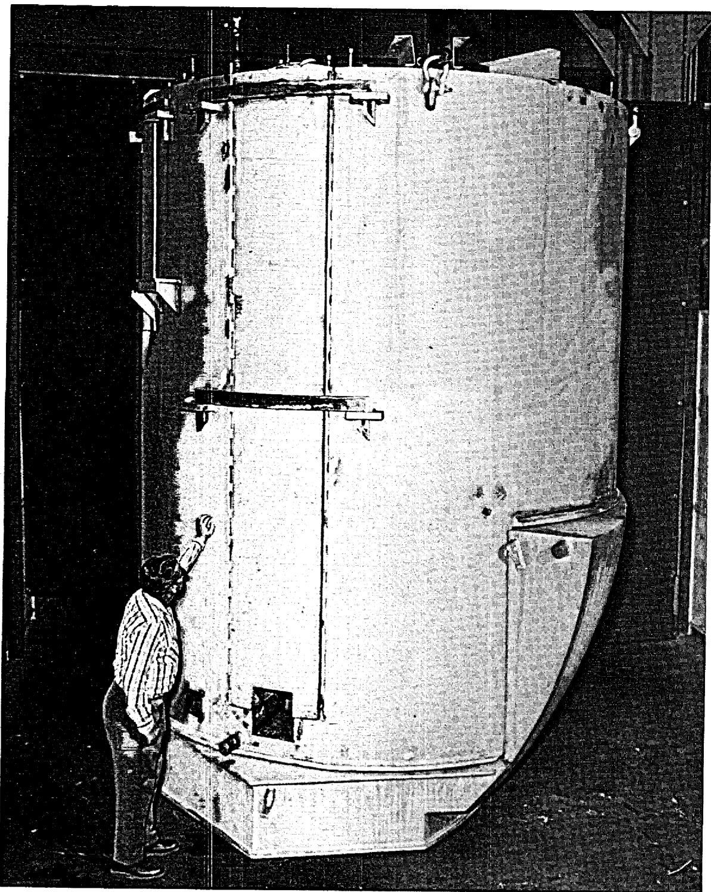  
Fig. 5.20. Thermal Shield Prior to Installation.

to the reactor, and the fuel-salt outlet line must pass as the reactor is lowered into position. The base and cylindrical section are permanently installed in the reactor cell. [See ORNL Dwgs E-BB-D-40729 (elev), E-BB-D-40730 (plan), and E-BB-D-40724 (assembly and sections)]

5.3.10.1 Structural. The base is essentially a flat, rectangular tank about 18 in. deep which rests on a grid of radial beams at the bottom of the reactor cell (see ORNL Dwg. E-KK-D-40723). The base supports the entire thermal shield and the reactor vessel and is the anchor point in the fuel piping system. The base is welded to the radial support beams to prevent shifting. The base contains fifteen 8-in., 20-lb/ft, wide-flange, carbon steel I-beams (ASTM A-36) arranged in two layers, with the six beams in the bottom layer at right angles to the nine beams in the top layer. The beams are welded to each other at all intersections and to the $3/4$ -in.-thick $30^{\text{山}}$ stainless steel top and bottom plates, the former being accomplished by 2-in.-diam plug welds on about 15-in. centers. The $3/4$ -in.-thick $30^{\text{山}}$ stainless steel side plates are welded to the ends of the support grid beams.

Attached to, and part of, the base is a vertical section formed to fit the inside curvature of the bottom hemispherical head of the reactor cell vessel. The outer hemispherical plate, the inner semicircular plate, and the inner conical-shaped "skirt" plate of this vertical projection are 1-in.-thick 304 stainless steel. The projection is internally reinforced with six 3/4-in.-thick radial web plates.

The cylindrical section is fabricated of 1-in.-thick $30^{\frac{1}{4}}$ stainless steel and is 151 in. high, 125 in. OD, and 93 in. ID. The 14-in.-wide annulus is divided into $30^{\circ}$ segments by twelve 1-in.-thick radial reinforcing web plates. The plates are perforated with 2-in.-diam holes in a pattern to promote efficient circulation of the cooling water. The annulus is filled with approximately 70 tons $(475\text{ft}^{3})$ of 1-in.-diam carbon steel balls, around which the cooling water circulates.

A large cutout in the bottom of the cylinder fits over the vertical projection on the base, mentioned above. The cylinder is slotted in three places to accommodate the reactor fuel-salt inlet (line 102), the fuel-salt outlet (line 100), and the reactor fill and drain line (line 103). A $37 - 1 / 4$ -in.-ID pocket is provided in the side of the

cylinder for the neutron instrument tube. At two points near the inner surface of the thermal shield, at about the northeast and southeast positions, 2-in. sched-10 pipes about 10 ft long are mounted vertically to serve as thimbles for the special neutron detector instrumentation. These tubes extend about 8 in. above the top of the thermal shield. The portion of the thimble inside the shield is separated from the 1-in. steel balls by a semicircular section of 8-in. pipe. A similar arrangement at the west-northwest position, but using a 1-l/2-in. sched-40 pipe, serves as the neutron source tube (see Section 5.3.8).

The three plugs that slip vertically into the slots in the cylindrical portion are primarily constructed of 1-in.-thick $30^{\frac{1}{4}}$ stainless steel plate. The portions that fit over the fuel inlet and outlet lines include semicircular sections of 20-in. pipe. The plugs are also filled with 1-in.-diam carbon steel balls. Each plug is provided with $1/2$ -in. sched-40 cooling-water connections at the top, the inlet pipe dipping on the inside to near the bottom of the plug.

The thermal shield cover is fabricated of 1-in.-thick $30^{\circ}$ stainless steel plate and is about $79 - 3 / 4$ in. OD by 16 in. thick. A 22-5/8-in.-diam hole through the center is provided by a 22-in.-long section of 24-in. sched-40 pipe; the reactor access nozzle passes through this opening. The cover is divided into $30^{\circ}$ segments by twelve 1-in.-thick radial reinforcing web plates. These plates project beyond the circumference of the cover for about 4 in. and rest on the top surface of the cylindrical portion. The projections, which carry the weight of the cover and the reactor vessel, are reinforced with $3 / 8$ in. plate on each side to give each a total bearing surface about $1 - 3 / 4$ in. wide by 4 in. long. The web plates are perforated with $3 / 4$ -in.-diam holes spaced to promote efficient circulation of the cooling water. Each of the wedge-shaped segments in the cover between the radial plates contains four 1-in.-thick carbon steel plates, spaced about 1-in. apart, to serve as shielding.

At the outer circumference of the cover are sixty-three vertical 2-in. pipe penetrations through which the reactor furnace heaters are inserted (see Section 5.3.11). At about the northwest position on the

cover, a 1/4-in.-thick rolled plate sleeve, 5-3/4 in. ID, provides access to the heaters at the freeze valve on the drain line, FV-103. Two nozzles of 2-in. sched-40 pipe serve as the cooling-water inlet and outlet connections.

5.3.10.2 Cooling. The thermal shield is cooled by a flow of about 100 gpm of treated water containing potassium nitrite and potassium borate as corrosion inhibitors. (The treated cooling-water-system water chemistry is discussed in Section 15.2.3). Water is supplied to the thermal shield through the 2-1/2-in. line 844. It flows in series through the base, the cylindrical portion, and then through the cover.[56] At appropriate points, water is withdrawn from the cylindrical portion in 1/2-in. pipes to flow through one of the three plugs, after which it returns to the cylindrical portion.

The cooling water enters the base through a 2-1/2-in. pipe on the north side and flows through the base to the south side and upward through the vertical projection of the base. The water is then conducted through the 2-1/2-in. line 844-A to the bottom of the cylindrical portion. The water moves around the 14-in.-wide annular space in a counter-clockwise direction (viewed from above), flowing through 2-in.-diam holes in the radial web plates, which are spaced to give the greatest circulation rate near the top of the shield. Three 1/2-in. pipe connections at the top withdraw some of the water for circulation through the plugs, after which it is returned to the cylindrical portion (see ORNL E-BB-D-40724).

The water leaves the cylindrical part of the thermal shield through the 2-1/2-in. line 844-B and flows to the cover. The water flow in the cover is in a counter-clockwise direction (viewed from above) and follows a serpentine course as a result of the spacing of the 3/4-in.-diam holes in the radial web plates (see ORNL Dwg. E-BB-D-40727). The water leaves the top cover through a 2-1/2-in. pipe (line 845).

The cooling-water system was designed to remove about $600\mathrm{kw}$ $(2\times 10^{6}\mathrm{Btu / hr})$ of heat. At a flow rate of 100 gpm, the temperature rise of the water flowing through the thermal shield is about $402^{\circ}\mathrm{F}$ . In case of loss of water flow, the heat capacity of the material in

the shield is such that the reactor operation could continue at the 10-Mw reactor power level for about 3 hr before the water temperature would rise sufficiently to create a vapor pressure exceeding the design value of 20 psig.[57]

5.3.10.3 Mechanical Design. The vessel was designed in accordance with the provisions in the ASME Unfired Pressure Vessel Code, Section VIII.45 It was hydrostatically tested at 32 psig at room temperature.58 A 1/2-in. relief valve, set at 20 psig, is incorporated in the cooling-water supply system. As a further protection, the cooling-water circulating pump has a pressure-actuated cutoff switch in the discharge set at 22 psig.

5.3.10.4 Shielding Considerations. Radiation damage to the steel in the containment vessel wall is not considered to be a significant problem unless the fast neutron (l Mev) exposure exceeds $10^{18} \, \text{n/cm}^2$ . This would be an exposure corresponding to 10 yr of operation at a 10-Mw reactor power level with the containment vessel exposed to a fast flux of $3 \times 10^9 \, \text{n/cm}^2$ -sec. The thermal shield has a total thickness of 16 in, 50% of which is Fe and 50% is H₂O, a 12-in. gap between the reactor and the shield, and an estimated escaping neutron flux of about $1.5 \times 10^8 \, \text{n/cm}^2$ -sec.

The biological shielding required in the roof above the reactor is not materially reduced by the presence of the thermal shield in that the aforementioned 22-5/8-in.-diam hole through the center of the thermal-shield cover permits direct impingement of radiation from the reactor vessel over a fairly wide area of the roof plugs. The thermal shield does, however, make an important reduction in the amount of biological shielding needed at the coolant-salt penetrations of the containment vessel wall.

As previously stated, the cooling-water system is capable of removing $600\mathrm{kw}$ of heat. The nuclear heating in the thermal shield is expected to contribute to less than $100\mathrm{kw}$ of heat. The amount of heat transmitted from the reactor furnace to the thermal shield through the thermal insulation is estimated to be less than $50\mathrm{kw}$ .

# 5.3.11 Heaters

The ll-in.-wide annular space between the thermal insulation on the inside of the thermal shield and the reactor vessel wall is heated by electrical resistance-type heaters to form a furnace. A total of about 68 kw of heat can be supplied by one-hundred twenty six lengths of 3/8-in. by 0.035-in.-wall-thickness Inconel tubing, each 8 ft 7-1/2 in. to 9 ft 11 in. long, through which the current is passed (see ORNL Dwg. E-MM-B-56225). This furnace provides the heat to the reactor vessel during warmup and maintains the vessel at temperature during low-power operation.

The reactor furnace heater tubing is in the form of sixty-three U-tubes, which are arranged in nine removable sections of seven U-tubes each. Each of the U-tubes is inserted in a 2-in.-OD by 0.065-in.-wall-thickness 304 stainless steel thimble, which is suspended from the top cover of the thermal shield. The tops of the thimbles extend about 6 in. above the top cover and are flared to about 2-3/8 in. in diameter to facilitate insertion of the heater U-tubes. The centers of the thimbles are about 2.615 in. from each other and about 1-7/8 in. from the insulation can.

The distance between the centers of the legs of the U-tubes is $3/4$ in. The U-tube assemblies are suspended from the junction box for each assembly. The junction boxes are fabricated of 11-gage $30^{\frac{1}{4}}$ stainless steel, are about 4 in. by 4 in. in cross section and about 18 in. long, and are curved longitudinally to the segment of a circle about $37 - 1 / 2$ in. in radius. The junction boxes sit on top of the thimbles which pass through the thermal shield cover. Each junction box is provided with a lifting bail at the center of gravity to permit withdrawal of the seven U-tube assemblies as a complete unit.

The seven U-tubes in each section are electrically connected in series so that each junction box has but two electrical power leads. The lead wire inside the junction box is solid No. 10 Alloy 99 soft-temper nickel, insulated with fish-spine ceramic beads (Saxonburg Ceramic Company Part No. P-897). The lead wires are connected to a male plug mounted on top of the junction box. The matching female socket is fitted with a lifting bail to facilitate remote manipulation.

The socket is connected by cables to the terminal boxes mounted on the support structure.

The top 3l-1/2 in. of each heater U-tube leg is constructed of solid Inconel rod, 3/8 in. in diameter, and therefore does not heat to as high a temperature as the lower tubular portion. The solid rod is formed at the top to electrically connect the U-tubes in series.

About 27 in. of the upper portion of each U-tube assembly is stiffened by being incased in a 1-5/8-in.-OD by 0.065-in.-wall-thickness 304 stainless steel tube. Ceramic insulators (American Lava Company, Type A) position the U-tube legs within this tube. Ceramic standoff insulators of the same material are also spaced at regular intervals along the lower legs of the U-tubes to prevent their contact with the thimble walls.

The U-tubes in five of the sections are about 12 ft long overall, including the solid portions, and those in the remaining four sections are about 1 ft shorter. The short tubes are required in the southwest quadrant of the furnace where the thermal shield is shortened by the proximity to the curved wall of the containment vessel. The U-tubes in each section are staggered in length by $\sim 1/2$ in., with the longest U-tube in the center of the array of seven. This arrangement facilitates insertion of the U-tubes into the thimbles.

The electrical input to the reactor furnace heaters is controlled manually in response to indicated temperature readings. There are three controllers, each serving three junction boxes, or sections. The electrical circuits for the power supply to the heaters is described in Section 19.7. The reactor heaters are not connected to the Diesel-driven emergency power supply.

The annular space between the reactor furnace and the thermal shield wall is thermally insulated to a built-up thickness of 6 in. with "Careytemp $1600^{\circ}\mathrm{F}$ " block insulation, covered with 16-gage 304 stainless steel sheet, on the side, bottom, and top (see Section 5.6.6.3).

# 5.4 Fuel Circulation Pump

The fuel-salt circulation pump is a centrifugal sump-type pump with an overhung impeller. It is driven by a 75-hp electric motor at $\sim$ 1160 rpm and has a capacity of about 1200 gpm when operating at a head of 48.5 ft. The 36-in.-diam pump bowl, or tank, in which the pump volute and impeller are located, serves as the surge volume and expansion tank in the primary circulation system. A small tank located beneath the pump and connected to it through an overflow line provides additional volume for expansion of fuel under abnormal conditions.

A general description of the pump was given in Section 2.6.2 and Fig. 2.3, which is a simplified cross-sectional drawing of the pump. Figure 5.21 is an exterior view of the pump. The basic data for the pump are summarized in Table 5.5. The general location of the fuel circulation pump and overflow tank within the reactor cell is indicated in Figs. 4.4 and 4.5.

The sampler-enricher system, which can add or withdraw small quantities of fuel salt from the pump bowl via line 999 is described in Section 7 and is not included in this discussion of the pump.

All parts of the pump in contact with the fuel salt are fabricated of INOR-8.

The pump is of a design similar to those used extensively at ORNL for circulation of molten salts and liquid metals. The pump was first tested at simulated reactor conditions of speed, flow and head using water in a circulating loop.[60] It was subsequently tested with molten salt at reactor conditions, including those of pressure and temperature.

The fuel and coolant-salt pumps were machined and assembled at the machine shops of the Y-12 Plant in Oak Ridge. Castings for the volutes and impellers were made at General Alloys Company (Boston).61 The ASME dished heads for the pump bowls, or tanks, were fabricated at Lukins Steel Company (Philadelphia)62 from INOR-8 material furnished by ORNL. The pump motors were purchased from Westinghouse Electric Corporation (Buffalo).63 The pressure vessels and the seals needed where the electric leads pass through the vessel, or "can," were obtained by Westinghouse by subcontract with Emil Vondungen Company (Buffalo). Fabrication of the drive motors was covered by ORNL speci

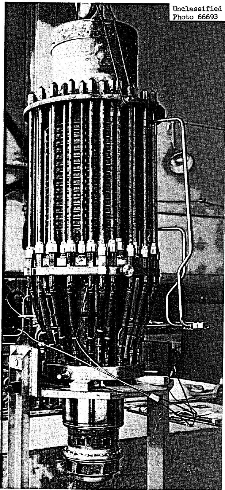  
Fig. 5.21. Exterior View of Fuel Pump Showing Flange Bolt Extensions.

Table 5.5. Fuel-Salt Circulation Pump Design Data   

<table><tr><td>Design flow: pump output, gpm</td><td>1200</td></tr><tr><td>internal bypass, gpm</td><td>65</td></tr><tr><td>Head at 1200 gpm, ft</td><td>48.5</td></tr><tr><td>Discharge pressure, psig</td><td>~55</td></tr><tr><td>Intake pressure, psig</td><td>~7</td></tr><tr><td>Impeller diameter, in.</td><td>11.5</td></tr><tr><td>Speed, rpm</td><td>1160</td></tr><tr><td>Intake nozzle (sched 40), in. IPS</td><td>8</td></tr><tr><td>Discharge nozzle (sched 40), in. IPS</td><td>5</td></tr><tr><td>Pump bowl: diameter, in.</td><td>36</td></tr><tr><td>height, in.</td><td>15</td></tr><tr><td>Volumes, ft3</td><td></td></tr><tr><td>Minimum starting and normal operating (including volute)</td><td>4.1</td></tr><tr><td>Maximum operating</td><td>5.2</td></tr><tr><td>Maximum emergency (includes space above vent)</td><td>6.1</td></tr><tr><td>Normal gas volume</td><td>2.0</td></tr><tr><td>Overall height of pump and motor assembly, ft3</td><td>8.6</td></tr><tr><td>Design conditions: pressure, psig</td><td>50</td></tr><tr><td>temperature, °F</td><td>1300</td></tr><tr><td>Motor</td><td></td></tr><tr><td>Rating, hp</td><td>75</td></tr><tr><td>Supply, v (alternating current)</td><td>480</td></tr><tr><td>Starting (locked rotor) current, amp</td><td>450</td></tr><tr><td>Type</td><td>Squirrel-cage induction</td></tr><tr><td>NEMA class</td><td>B</td></tr><tr><td>Lubrication</td><td>California Research Corporation NRRG-159</td></tr><tr><td>Electrical insulation</td><td>Class H</td></tr><tr><td>Design radiation dosage for electrical insulation, r</td><td>2 x 1010</td></tr><tr><td>Estimated radiation level, r/hr</td><td>105</td></tr><tr><td>Overflow tank volume, ft3</td><td>5.4</td></tr></table>

fications. $^{64,65}$ Testing of the completed pumps was performed by personnel of the ORNL Reactor Division. Complete assemblies of motors and rotating parts were provided for four pumps--two for the fuel-salt system and two for the coolant-salt system--in order to have a spare pump on hand for each system.

The pressure-containing parts, which include the drive-motor housing, the bearing housing, pump bowl, lubrication reservoir, lubricant passage, nozzles, the overflow tank, etc., were all designed in accordance with Section VIII of the ASME Boiler and Pressure Vessel Code47 and Code Interpretation Cases 1270N48 and 1273N50 for primary vessels.

A lubricating-oil system is required for each pump. The oil-circulation pump, cooler and storage tank, and filter are located in the secondarily shielded tunnel area outside the reactor cell. The lubrication system is described in Section 5.4.1.4, following.

In order to prevent salt from getting into the gas and lubricant passages, etc., on too high a level in the pump bowl, an overflow pipe leads to a catch tank located directly beneath the pump. This overflow tank is described in Section 5.4.7.

Other auxiliary systems are the cooling water, which is circulated in a coil around the pump-motor vessel, the cover gas, and the cooling gas, which is directed around the exterior of the upper portion of the pump bowl.

The pump is designed to operate at a synchronous speed of $\sim 1160$ rpm. If it proves desirable to conduct experiments in the MSRE other than design flow rates, the pump speed can be changed by varying the frequency of the electrical input to the motor through use of a motor-generator set, which can be brought to the MSRE site and operated on a truck-trailer unit.

# 5.4.1 Description

The fuel-salt pump consists of three principal assemblies: (1) the rotary-element assembly, which includes the rotating shaft and impeller, the bearing housing and bearings, the shield block, and the impeller cover plate and upper labyrinth subassembly; (2) the pump bowl, which contains the volute and has inlet and outlet nozzles; and (3) the drive-motor assembly.[66]

The motor can be removed by unbolting it from the bearing-housing upper flange. A splined coupling joins the motor shaft to the pump drive shaft so that the motor can be withdrawn. The rotary-element assembly can be removed by unbolting the lower bearing-housing flange from the pump-bowl flange. Each of the twenty-four bolts in this flange has an extension with universal joints which allow the bolts to be turned with simple socket wrenches with extension handles operated from directly above the unit (see ORNL Dwg. F-RD-9830-F).* Both the flanges mentioned above have ring-joint leak-detected closures. All water cooling lines, gas lines, lubricating-oil lines, etc., which serve the removable motor and rotary-element assemblies, have special disconnect couplings to facilitate disengagement using remotely operated tooling.

5.4.1.1 Rotary-Element Assembly. The rotary-element assembly consists of the 347 stainless steel bearing housing, which is about 8 in. in diameter by 23 in. long and has a 29-1/2-in.-diam flange at the upper end and a 23-in.-diam flange at the lower end. The pump shaft, which is ~3 in. in diameter by 48 in. long, passes through this housing and is supported by ball bearings. The upper bearing is an SKF-7317BG angular contact type in a face-to-face duplex configuration which absorbs both radial and thrust forces. The lower bearing is an SK-7219G angular contact type in a back-to-back duplex configuration which absorbs radial forces and provides additional stiffness for the shaft. The impeller is overhung about 22 in. beneath the lower bearing. Both bearings are lubricated and cooled to an operating temperature of about $150^{\circ}\mathrm{F}$ by a 4-gpm flow of oil supplied through line 703 and leaving via line 706. The lubrication system will be described subsequently in Section 5.4.1.4.

Contact-type seals are located above and below the bearings to confine the oil to the lubrication system. The seals have stationary graphitar rings (U. S. Carbon Company) supported on flexible stainless steel bellows (Rovertshaw-Fulton Company) that bear against case-hardened, low carbon steel rings mounted on the pump shaft.

The seal assemblies were manufactured in the machine shops of the Y-12 Plant in Oak Ridge. The seals are of the balanced-piston type and are designed to operate normally with a pressure on the lubricant side 2 to 8 psi higher than that in the pump bowl, which is at about 5 psig. Under these conditions the lower seal can accept, without opening, pressure transients in the pump bowl as high as 65 psia or as low as 1 psia.

A catch basin located above the coolant passages in the shield plug (to be described subsequently) collects any lubricant that leaks past the lower shaft seal. This seepage is conveyed from the reactor cell through line 524 to an oil catch tank. The gas that accompanies the oil seepage is disposed of through the off-gas system. The amount of oil leakage, which is estimated to be less than $40~\mathrm{cc/day}$ , can be measured and compared to the reduction of the oil in the lubrication system reservoir. At this rate of oil loss the system could operate for more than a year before an oil addition to the oil reservoir would be necessary.[67] The oil catch tank, however, is limited 90 days storage capacity for the same leak rate.

The gas pressure on the lubricant (upper) side of the lower shaft seal is maintained equal to that in the gas space above the oil level in the lubrication system reservoir located in the tunnel area by interconnection through the breather pipe (line 590). The gas pressure on the lower side of this seal is that of the helium cover gas in the pump bowl, or normally about 5 psig.

Helium gas is introduced into the pump-shaft annulus just below the lower shaft seal through line 516 at a maximum rate of 0.084 scfm. A small part of this gas flows out through line 524 to prevent migration of oil vapor to the fuel salt in the pump bowl; the remainder flows down the annulus to prevent the migration of radioactive gases and particulates from the salt region into the lower shaft-seal area $^{68}$ and serves as the main flow of sweep gas for removal of fission product gases from the pump bowl. The pressure drop in the gas flow through the pump from line 516 to 524 is about 0.25 in. $\mathsf{H}_2\mathsf{O}$ at design flow conditions. The offgas system will be described subsequently in Section 12.

An INOR-8 shield block, which is 13 l/2 in. in diameter by ~8 in. thick and has a hole at the center for the pump shaft, is bolted to the bottom of the lower bearing housing flange. This block provides some shielding for the oil in the bearing housing and for the pump motor against irradiation by the fuel salt in the pump bowl. It is withdrawn as part of the rotary element assembly. The block is cooled by an 8-gpm flow of oil supplied through line 704 and leaving with the lubricating oil through line 706. The cooling oil flows through grooves 1/4 in. deep by 3/4 in. wide, spiraling from the 3 in. to 10 l/2 in. in diameter on the upper surface of the plug. The estimated heat to be removed to maintain the lower shaft seal temperature to an acceptable value is about 18,000 Btu/hr.[69]

The 11.5-in.-diam impeller is keyed to the lower end of the INOR 8 pump shaft and retained by a bolt tack welded in place. A slinger ring is located on the shaft just above the impeller.

The pump shaft speed is sensed continuously with a magnetic reluctance pickup (Electro Point 721280) utilizing an interrupter gear that is integral with the lower portion of the shaft coupling (see ORNL Dwg. F-9830-62). The output of this pickup (SI FP-E) is transmitted to a speed indicator, the control circuit and alarm system, and to the data logger. The direction of rotation can also be sensed by the pickup.

Labyrinth-type seals are used on the impeller inlet shroud (lower labyrinth) and on the impeller support shroud (upper labyrinth) as shown in Fig. 5.22. The upper labyrinth is integral with the impeller cover plate, which is sealed to the volute with a $1/4$ -in. OD INOR-8 O-ring about 12.75 in. ID. Labyrinth seals are also provided on the shaft at each of the aforementioned contact seal assemblies.

5.4.1.2 Pump Bowl. The pump bowl, or tank, is about 36 in. in diameter and 17 in. high at the centerline. It is formed of two INOR-8 ASME dishes heads with a wall thickness of $\frac{1}{2}$ in. The normal fuel salt level in the bowl is about 11 in. from the bottom, measured at the centerline.

The pump volute is an Allis-Chalmers 8- by 6-in. Type SSE (Allis-Chalmers Dwg. 52-423-498) with 5/8-in. wall thickness. The 8-in.-IPS

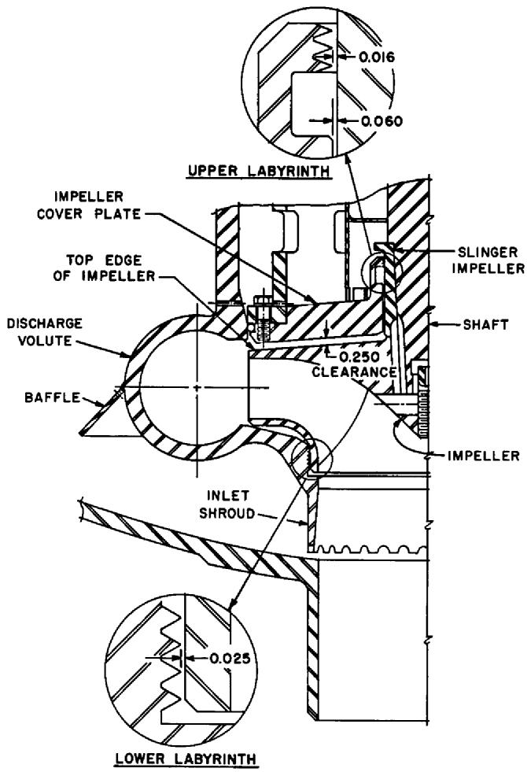  
(a) CLEARANCES AT IMPELLER SEALS

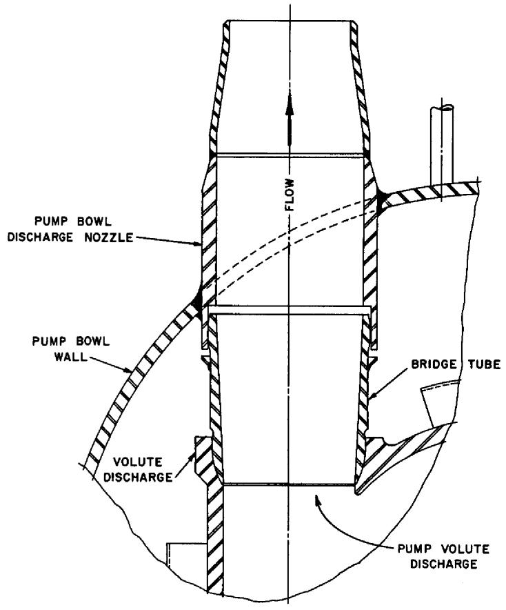  
(b) BRIDGE TUBE   
FIG. 5.22. FUEL-SALT PUMP BRIDGE AND   
IMPELLER SEAL CLEARANCES

sched-40 inlet nozzle on the bottom of the bowl is concentric with the centerline of the pump. The volute entry nozzle and the impeller inlet opening are also 8 in. in diameter. The pump discharge from the volute is through a special thimble, 5 in. ID by 7 in. long, having spherically shaped ends. (See ORNL Dwg. D-2-02-054-10065-A). The spherical portions fit into similarly shaped seats in the volute and in the pump-bowl discharge nozzle (see Fig. 5.22). This bridge tube provides the flexibility needed to absorb the three-dimensional relative motions between the volute and the bowl and at the same time allows only a small bypass flow through the joints back into the pump bowl.

A second bypass flow, called the "fountain flow," escapes through the clearance between the top side of the impeller and the pump casing, and thence through the clearance between the pump shaft and the pressure breakdown bushing. With the clearances shown in Fig. 5.22, the fountain flow is estimated to be about $15\mathrm{gpm}$ (ref 60, p 27).

A third bypass flow, termed the "stripper flow," of about 60 gpm is taken from the pump-bowl discharge nozzle into a ring of 2-in.-diam pipe encircling the vapor space inside the pump bowl on a radius of about 15-1/2 in. This distributor has regularly spaced holes, half about 1/16 in. and half 1/8 in. in diameter, oriented about $30^{\circ}$ from the horizontal and pointing downward toward the center of the pump bowl. The holes are about 1 in. above the normal fuel-salt level in the bowl. The bypass flow is sprayed from these holes into the bowl to promote the release of fission product gases to the vapor space. The efficiency of this stripping action is estimated to be sufficient to reduce the $^{135}\mathrm{Xe}$ poison level in the reactor to less than $2\%$ in $\Delta \mathrm{k} / \mathrm{k}$ . The influence of residence-time distribution on fission product decay in the pump bowl was investigated, $^{70}$ and the efficiency of xenon removal and the effectiveness of the purge gas system were studied prior to completion of the pump design. $^{71,72}$ The same spray holes serve as vents for the gas in the pump discharge (line 101) during preoperational filling of the system with molten salt. This gas, after venting into the bowl, is withdrawn through line 521.

The bypass flows circulate downward through the pump bowl and re-enter the impeller. The spray entrains a considerable volume of cover gas in the liquid, and the tendency for this entrainment to enter the pump is largely controlled by a baffle on the volute. Tests indicated that the liquid returning to the impeller will contain 1 to 2 vol % of gas.

A 1-1/2-in. vertical sched-40 nozzle is provided at the top of the pump bowl to allow a capsule to be lowered into the salt in the bowl to take a sample or to add small amounts of enriched fuel. A capsule guide and latch stop inside the pump bowl positions the sample capsule.[59] The sampler-enricher system is described in Section 7.

The liquid level in the pump bowl is sensed by bubbler-type probes. One of the 1/2-in.-IPS bubbler tubes (line 596) extends about 3-7/8 in. below the centerline of the pump volute, or a min. of 6-1/8 in. below the salt level in the bowl. The other (line 593) extends to about 1-15/16 in. below the centerline of the volute. A third 1/2-in. connection (line 592) at the top of the pump bowl provides the reference pressure as helium gas is bubbled through the two tubes. Through previous calibration, the helium pressures can be converted to liquid level; also the difference in pressure between the two probes at different levels may possibly be translated into approximate salt densities. The bubbler system is further described in Section 10.9.1.

A pump-bowl overflow pipe (line 520) releases salt to the overflow tank in event the salt level in the circulation system becomes too high.[73]

The lower portion of the pump bowl is cooled by the flow of fuel salt. Above the liquid level, however, heat produced at a rate of about 15 kw through beta and gamma absorptions would tend to overheat the metal and would cause undesirably high thermal stresses unless cooling is provided. The top portion of the bowl is fitted with a shroud that is spun from 305 stainless steel and is about 38 in. in diameter; a space $1/4$ in. to 1 in. wide is provided between the shroud and the pump-bowl surface through which cooling gas can be directed (see ORNL Dwg. E-47296). The estimated quantity of cooling gas ( $95\% \mathrm{N}_2$ , $5\% \mathrm{O}_2$ ) required is about 400 cfm (STP).[74]

5.4.1.3 Drive Motor. The pump drive motor is a Westinghouse totally enclosed, water-cooled, explosion-proof, NEMA Design "B," special-purpose, squirrel-cage induction motor of 75-hp capacity. It is rated at $480\mathrm{~V}$ and normally has a starting (locked rotor) current demand of $450\mathrm{~amp}$ . The starting torque is slightly less than $135\%$ of full-load torque, and the pull-out torque is slightly less than $200\%$ of the full-load torque.

It is planned that the motor will normally run at synchronous speed of $\text{m}160$ rpm. Operation at different speeds can be obtained by varying the frequency of the electric power supply through use of a motor-generator set which can be brought to the MSRE site.

The drive motor is directly connected to the pump shaft through a modified flexible coupling (Thomas Flexible Coupling Company Cat. No. 263 DBZ; also see ORNL Dwg. D-2-02-054-9848). This type of coupling does not require lubrication. The motor shaft is splined to slip into the coupling to facilitate removal of the motor.

The electrical insulation used in the motor is Class "H", designed for $150^{\circ}\mathrm{F}$ ambient conditions and a radiation dosage of $2 \times 10^{9} \mathrm{r}$ before mechanical breakdown and a total dosage of $2 \times 10^{10} \mathrm{r}$ before electrical breakdown $^{75}$ (also, see ref 66, p 52). The background radiation in the region of the pump motor was estimated to be in the order of $10^{5} \mathrm{rad/hr}$ . $^{76}$ A three-conductor, mineral-insulated, copper-covered cable connects the motor to a three-prong plug that can be inserted into a receptacle by a remotely operated manipulator tool of the type described in Section 19.7.5. The electrical lead seal through the pressure-tight motor housing is a ceramic type.

The motor housing, or can, is surrounded by a water coil through which about 5 gpm of treated, demineralized water is introduced through the 1-in. sched-40 pipe (line 830) and leaves through line 83. The 11/16-in. OD x 1/16-in. wall thickness stainless steel tubing is heliarc welded to the can using stainless steel filler rod.

The lower end of the motor casing is flanged and is bolted to the top flange of the bearing-housing assembly by use of a ring-joint leak-detected type of closure. The motor casing is fabricated of ASTM A-201 Grade A carbon steel to meet the requirements of the ASME Boiler and

Pressure Vessel Code47 and must pass a mass spectrometer leak test with a leak rate of less than 1 x $10^{-8}$ cc of helium per second (STP).

5.4.1.4 Lubricating-Oil System. The oil system serves to lubricate and cool the pump bearings and to cool the shield plug located between the bearings and the pump bowl. The fuel-salt pump and the coolant salt pump have separate lubricating-oil systems, but they are interconnected so that one system could serve both pumps in an emergency situation.

Each lubricating-oil system consists basically of a water-cooled oil reservoir, two centrifugal pumps connected in parallel, and an oil filter as shown in the lubrication system flowsheet, Fig. 5.23 (ORNL Dwg. D-AA-A-40885). The equipment is located in the east tunnel (see Fig. 4.4), which is a secondarily shielded area. The design data for the lubrication system are presented in Table 5.6.

The lubricating oil is a turbine-grade, paraffinic base, $100\%$ straight mineral oil having a viscosity at $100^{\circ}\mathrm{F}$ of 66 SSU. Other lubricating-oil properties are shown in Table 5.7. The lubricating-oil specifications are discussed in reference 77. Investigation of the oil temperature after cessation of the oil flow in an accident situation determined that the temperature would not exceed about $500^{\circ}\mathrm{F}$ , the approximate condition at which oil damage would become appreciable, until about 10 min after the oil flow stopped.[78]

The oil reservoir is a carbon steel tank, 22 in. in diameter by 32 in. high, with ASME dished heads $1/4$ in. thick. The tank is surrounded by eight turns of a water-cooled coil of 1-in.-diam copper tubing. The required water flow rate is about 10 gpm of $85^{\circ}\mathrm{F}$ water. The inside surface of the tank is provided with passageways, about 2 in. by 3/8 in., to direct a 50-gpm bypass flow of oil from the pump against the tank wall at an average velocity of about 21 fps. The overall heat-transfer coefficient is estimated at 230 Btu/hr- $\mathsf{ft}^{2}-\mathsf{F}$ , and the maximum heat-removal rate at 41,000 Btu/hr (see ref 66, p 57).

The oil reservoir is provided with a liquid-level indication, LI-OTI, the output of which is fed to the data logger and the alarm system. In event of a drop in oil level, indicating an oil leak past the lower shaft seal of the pump, the flow control valve FSV-703 automatically stops the flow of oil to the pump. Alarms are also provided

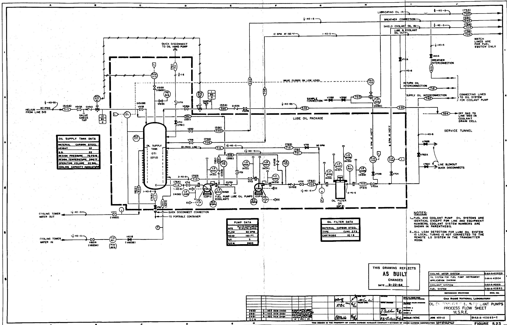

Table 5.6. Lubricating-Oil System Design Data   

<table><tr><td>Oil supply temperature, °F</td><td>140°F</td></tr><tr><td>Oil flow to pump bearings, gpm</td><td>4</td></tr><tr><td>Coolant oil flow to shield plug, gpm</td><td>8</td></tr><tr><td>Oil seepage through shaft seals (max), cc/day</td><td>40</td></tr><tr><td>Outside dimensions lube oil package (1 x w x h), in.</td><td>100 x 34 x 50</td></tr><tr><td>Estimated weight, empty, lb.</td><td>2200</td></tr><tr><td>Oil reservoir</td><td></td></tr><tr><td>Operating volume, gal</td><td>22</td></tr><tr><td>Total volume, gal</td><td>43</td></tr><tr><td>Volume of oil in system, gal</td><td>34</td></tr><tr><td>Tank height, in.</td><td>32</td></tr><tr><td>Tank outside diameter, in.</td><td>22</td></tr><tr><td>Material</td><td>ASME SA-201
Grade A
carbon steel</td></tr><tr><td>Allowable stress, psig</td><td>13,750</td></tr><tr><td>Design pressure, psig</td><td>75</td></tr><tr><td>Design temperature, °F</td><td>200</td></tr><tr><td>Heat removal capacity, Btu/hr</td><td>41,000</td></tr><tr><td colspan="2">Oil circulating pumps (2) (Allis-Chalmers 2 x 1.5, Type MH)</td></tr><tr><td>Capacity of each, at 160 ft head, gpm</td><td>60</td></tr><tr><td>Motor (Type TENV Frame CMK-718), hp</td><td>5</td></tr><tr><td>Power input (rated), kw at 220 v</td><td>5.25</td></tr><tr><td>Speed, rpm, and impeller diam, in.</td><td>3500, 6-5/8 in.</td></tr><tr><td>Design pressure, psig</td><td>210</td></tr><tr><td>Design temperature, °F</td><td>225</td></tr><tr><td>Oil filter</td><td></td></tr><tr><td>Type</td><td>Cuno EFS</td></tr><tr><td>Size, in.</td><td>2-1/4 by 8</td></tr><tr><td>Material</td><td>Carbon steel</td></tr><tr><td>Residence times</td><td></td></tr><tr><td>In reactor cell, sec</td><td>18</td></tr><tr><td>In coolant cell, sec</td><td>13</td></tr></table>

for high oil temperature, low oil flow rates, or high lube oil pump motor temperature.

A blanket of helium gas is maintained over the oil in the reservoir tank. The helium supply line (line 513) and the off-gas vent (line 535) are provided with pressure-control valves (PCV-513 A-1 and A-2) to maintain the gas pressure at about 7 psig. The gas flow rate is essentially zero. The top of the oil reservoir tank is vented to the bearing housing on the fuel pump through line 590. The helium pressure above the salt in the pump bowl is about 5 psig.

Two 5-hp Allis-Chalmers "Electric-Cand" centrifugal oil pumps, $2 \times 1.5$ , type MH, are connected in parallel, either one of which has sufficient capacity if used alone. The pump motor is cooled by a small internal by-pass oil stream. About 50 gpm of the pump output is returned to the oil reservoir as a bypass flow to promote heat transfer at the tank wall.

The oil filter is a standard Cuno EFS filter using carbon steel filter elements.

Radiation monitors (RIA-OTI) are located in each lubrication system to detect contamination of the oil or the blanket helium gas. The lubricating-oil system equipment is compactly arranged into a "package" which can be conveniently shielded with lead bricks. The valves have extension handles passing through the lead shield. Sampling nozzles are located on oil lines external to the package for periodic sampling of the oil for both radiation and thermal damage.

5.4.1.5 Oil Catch Tank. Lubricating oil seeping past the lower shaft seal of the pump is piped from the reactor cell through 1/2-in. line 524 to an oil catch tank located in the special equipment room. The portion of the line inside the reactor cell is shielded to reduce the amount of induced activity in the oil. The catch tank is fabricated of a 46-1/2-in.-long section of 2-in. sched-40 pipe topped by a 20-in.-long section of 8-in. sched-40 pipe. The top portion catches gross leakage while the lower portion, holding 0.7 gal, provides sensitivity for a level indicator, LIA-524. This level instrument, and those on the lubricating-oil supply tanks, provide for close inventory of the lubricating oil. Details of the tank are shown on ORNL Dwg. E-GG-C-41518.

Table 5.7. Lubricating Oil Properties   

<table><tr><td>Nature of base oil</td><td>100% straight mineral</td></tr><tr><td>Type of base oil</td><td>Paraffinic</td></tr><tr><td>Gravity, API</td><td>34.8</td></tr><tr><td>Viscosity</td><td></td></tr><tr><td>SSU at 100°F, sec</td><td>66</td></tr><tr><td>SSU at 210°F, sec</td><td>36</td></tr><tr><td>Flashpoint, °F</td><td>322</td></tr><tr><td>Firepoint, °F</td><td>347</td></tr><tr><td>Thermal conductivity, Btu-ft/ft2-hr-°F</td><td>0.076</td></tr><tr><td>Heat capacity, Btu/lb-°F</td><td>0.45</td></tr><tr><td>Specific gravity</td><td>0.85</td></tr><tr><td>Equivalent grade Y-l2 Plant (UCNC)</td><td>Turbine oil, Code DJ</td></tr><tr><td>Equivalent commercial grade</td><td>Gulfspin 35</td></tr></table>

The rate of oil loss from the system is estimated to be less than 40 cc/day.[67] In event the oil catch tank cannot hold the accumulated oil for a satisfactory operating period, a 55-gal stainless steel drum is provided in the coolant drain cell to which the catch tank can be drained through line 720 during reactor shutdown. This drum may vent through the valve to the off-gas system through line 525 during draining.

A small amount of helium gas leaves the pump with the oil. A capillary flow restrictor in the gas line downstream of the oil catch tank limits the flow to less than 0.07 liters/min. This restrictor is preceded by a sintered disc filter, and followed by a flow indicator, FIA-524. Line 524 continues as $1/2$ -in. pipe through the coolant salt drain cell to the vent house instrument box. The gas is vented through the off-gas system described in Section 12 following.

# 5.4.2 Hydraulics

The MSRE fuel-salt pump has an 8-in. by 6-in. volute-impeller combination. These sizes were selected on the basis that this provided a reasonable hydraulic capability and were sufficiently standard so that existing patterns could be used in making the INOR-8 impeller and volute castings.

Hydraulic performance data were determined on prototype pumps over a wide range of flow and head conditions and at several speeds, using ll-in.- and 13-in.-diam impellers.60 A design pump speed of 1150 rpm was selected, and the impeller diameter was established as 11-1/2 in. The hydraulic performance data are summarized in Fig. 524. It may be noted that at the design speed of 1150 rpm and design flow rate of 1200 gpm the developed head is 48.3 ft. The pump efficiency under these conditions is $80 - 85\%$ .

The flow startup times for the primary circulation system were estimated using assumed motor accelerating torques (which are nearly constant up to about $60\%$ of speed), and it was found that $50\%$ of full flow is attained after about $3/4$ sec, $75\%$ after $1-1/4$ sec, $90\%$ after $1-3/4$ sec, and $100\%$ is reached in about $3$ sec.[79]

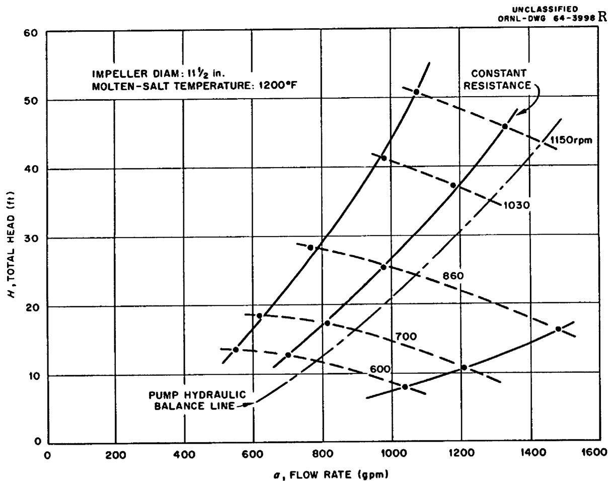  
Figure 5.24. Hydraulic Performance of Fuel Pump.

Coastdown tests determined that about 10 sec are required for the pump motor to stop after the electrical supply is interrupted (see ref 80 p 47 and ref 60 p 31).

Tests of the prototype pump (with 13-in.-diam impeller) indicated that when the liquid level in the pump was lowered to $4 - 1 / 2$ in. below the centerline of the volute, increased amounts of entrained gas were present in the pump discharge. At about $5 - 1 / 2$ in. below the volute centerline, the system flow was cut about in half; and at $6 - 1 / 2$ in., the flow was reduced essentially to zero (ref 60, p 31).

The prerotation baffle shown in Fig. 2.3 at the pump inlet has the effect of increasing the head at the lower range of flows when operating at a constant speed (ref 60, p 15).

At the most efficient operating conditions, when the various losses in the impeller and volute are at a minimum, the pressure distribution in the volute is essentially uniform, and the net radial force on the impeller is near zero. When operating at higher or lower flow rates at the same pump speed, the volute pressure distribution becomes nonuniform and produces a radial force on the impeller and a resulting deflection of the shaft. (The impeller is overhung about 22 in. below the lower bearing.) Tests of the prototype MSRE fuel pump indicated that a running clearance of 0.025 in. in the lower labyrinth (see Fig. 5.22) would provide for all reasonably anticipated conditions of "off-design" operation of the pump.[81]

# 5.4.3 Mechanical Design Considerations

Design of the rotary elements involved computation of shaft stresses, deflections, natural frequency, bearing life expectancy, flange bolting requirements, etc. Design of the pump bowl, or tank, required calculation of the wall thickness, stresses, the flange requirements, and the reinforcement needed at nozzles, etc.

5.4.3.1 Volute and Impellers. The maximum stress in the volute will be at shutoff flow conditions at 1160 rpm and is estimated to be 2560 psi in bending (ref 66, p 21). The maximum impeller stress is at the keyways and is estimated to be about 2000 psi.

5.4.3.2 Shaft. The impeller horsepower at rated conditions is 47.5 hp, based on a pump efficiency of $80\%$ and a pump speed of 1150

rpm. Assuming a radial thrust on the impeller of $195 \, \text{lb}_\text{f}$ (see Section 5.4.2), the net axial thrust is $1130 \, \text{lb}_\text{f}$ downward. Some of the calculated stresses are summarized in Table 5.8 (ref 66, pp 28-30).

The maximum shaft deflection at the end of the impeller was estimated to be 0.0110 in., based on the above-mentioned radial thrust (ref 66, p 31).

The natural frequency of the shaft was predicted to be at 2850 rpm, which is well above the design operating speed of 1160 rpm (ref 55, p 33).

5.4.3.3 Bearings. The SKF catalog data were adjusted for MSRE operating conditions, and a life expectancy of 300,000 to 500,000 hr for the pump bearings was predicted (ref 66, p 32).

5.4.3.4 Pump Bowl and Nozzles. Using standard equations from the ASME Boiler and Pressure Vessel Code, Section VIII, $^{45}$ the wall thickness required for the pump-bowl ASME torispherical heads was determined to be 0.438 in.; based on an allowable stress for the INOR-8 of 3600 psi. The actual thickness used is 1/2 in. (ref 66, pp 16-21).

A reinforced area is provided at the 8-in. suction-nozzle opening to provide material in excess of $140\%$ of that needed to maintain the stresses within the allowable limits. The 1-1/2-in. sched-40 fuel-sampling-enricher nozzle is also reinforced. The discharge nozzle requires an elliptical opening 6 in. by 7 in. The weld fillet in the knuckle region at this nozzle is enlarged to provide some excess reinforcement. The upper nozzle is 13.625 in. ID and does not require extra reinforcement (ref 66, pp 16-21).

The stress in the pump bowl due to the discharge nozzle reaction was determined to be of little concern. The stress in the 23-in.-diam pump-bowl flange, which is designed for 50 psi and $300^{\circ}\mathrm{F}$ , were found to be about 13,290 psi, using standard methods of combining stresses (ref 66, p 23). Stresses in the pump bowl due to axial loading only were analyzed and found to be about 5000 psi.[82]

The bearing-housing upper flange, which is $27 - 1 / 2$ in. in diameter and has an assumed operating temperature of $150^{\circ}\mathrm{F}$ , has calculated stresses of 14,720 psi (ref 66, p 34).

Table 5.8. Estimated Stresses in MSRE Fuel-Pump Shaft (psi)   

<table><tr><td>Sheer stress in lugs of impeller stud</td><td>2270</td></tr><tr><td>Tensile stress in threaded portion of impeller stud</td><td>3380</td></tr><tr><td>Shear stress from combined bending and torque at lower bearing</td><td>1420</td></tr><tr><td>Torsional shear stress in shaft at impeller hub</td><td>2325</td></tr><tr><td>Shear stress in keys</td><td>1340</td></tr><tr><td>Bearing stress at keys</td><td>2680</td></tr><tr><td>Shear stress in shaft at plane through bottom of bore in end of shaft</td><td>1730</td></tr><tr><td>Stress in spline at motor end of shaft</td><td>55</td></tr></table>

# 5.4.4 Thermal-Stress Design Considerations

The MSRE fuel pump is subjected to relatively high thermal stresses at operating conditions because nuclear heating can raise the temperature of some parts above the $1225^{\circ}\mathrm{F}$ inlet salt temperature and because of the relatively large temperature gradient between these parts and, say, the top flange of the pump, which is only at about $180^{\circ}\mathrm{F}$ . The cyclic nature of these stresses as the reactor power level is varied requires that they be evaluated on a strain - fatigue basis to determine the extent of relief that can be expected due to thermal relaxation in the materials.

The temperature distributions in the pump bowl were calculated for various conditions of reactor power, salt temperature, and cooling-gas flow over the outside top portion of the bowl, using the Generalized Heat Conduction Code (GHT) $^{83}$ (see also ref 66, p 36). The thermal-stress distributions were calculated for heatup from room temperature to $1200^{\circ}\mathrm{F}$ , power changes from zero to $10\mathrm{Mw}$ , and loss of cooling gas, using the general procedures of Stanek $^{84,85}$ and Witt $^{86,87}$ . In these studies it was assumed that the MSRE would undergo one hundred heatup cycles and five hundred power-change cycles. It was further assumed the allowable number of cycles as determined from the fatigue curves for INOR-8 should exceed the anticipated number of cycles by a factor of at least 1.25. The estimated thermal-fatigue life was found to be adequate, and the calculation indicated that the cooling-gas flow rates could be varied over a broad range with small effect. $^{88}$ (See also ref 66, p 37)

The sampler-enricher connection line (line 999) to the fuel pump bowl is subjected to thermal stresses due to the axial temperature gradient in the line and also to the pump movements caused by the thermal expansions in the primary circulation system. The stresses caused by the piping reactions in the sampler line were estimated to be 7580 psi in bending and 1940 psi in shear. These stresses were combined with the pipe reaction stresses and compared to the strain-cycle data. A usage factor of 0.367 was obtained, which provides a margin of safety greater than two when compared to the maximum permissible value of 0.8 for the usage factor.[89]

# 5.4.5 Pump Supports

To provide the flexibility needed in the primary-circulation-system piping to maintain the stresses within the allowable limits, it is necessary that the heat exchanger and the fuel-salt pump be allowed to move in certain directions as the system is heated. (The reactor is fixed in position and an anchor point for the piping.)

Because of the degrees of freedom needed, and the amount of expected movement, the fuel-pump support equipment is relatively complicated (see Fig. 5.25). The fuel pump is bolted to a $2-1/2$ -in.-thick plate that is mounted on two sets of 2-in.-diam rollers, allowing the pump to move in a horizontal plane. (See ORNL Dwgs. E-CC-C-41450 and D-CC-C-41511). The rollers travel on a spring-supported parallel-link framework that permits the pump to rise vertically from the cold to the hot position. The pump is restrained from rotation about any axis. Three $3-3/4$ -in.-diam by $4$ -in. stainless steel, NaK-filled, double bellows, with orifice plates between the bellows, act to dampen the vibrations induced by the pump-shaft rotation. The entire pump assembly is carried by two 8-in. horizontal I-beams.[90]

When the primary system is brought up to operating temperature, the pump moves about 0.4 in. horizontally in the north-south direction, about 0.3 in. in the east-west direction, and about 0.8 in. vertically.[91] As stated above, there is no rotation of the pump assembly.

# 5.4.6 Heaters

The lower half of the pump bowl, a 3-ft-long section of suction piping and the 5-in. $90^{\circ}$ bend at the bottom of the piping section, and the overflow tank are all heated in a common furnace, which is about 51 in. OD by 66 in. high.

The heating elements are 3/4-in.-diam straight tubes of 304 stainless steel, containing ceramic-positioned resistance heating elements at the lower ends and having the trade name "Firerod" (Watlow Manufacturing Company). Five of the rods are about 8 ft long overall, with a heated length of about 5 ft, which extend all the way from the terminal boxes to the bottom of the basket. Nine of the rods are about 7 ft long with a heated length of 4 ft. The heater rods slide

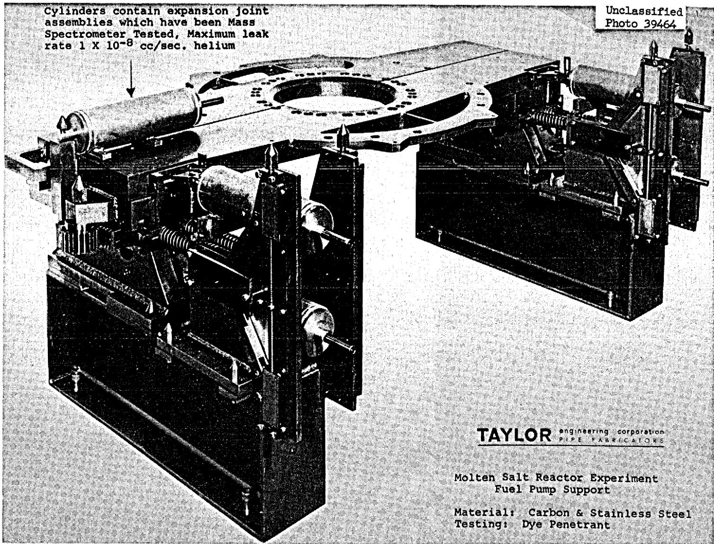  
Figure 5.25. Fuel Pump Support

into 1-in.OD 304 stainless steel tubes (0.065 in. wall thickness). (See ORNL Dwg. E-MM-B-51604).

The long and short heater rod are arranged, with but one exception, into removable assemblies of one long rod and two short ones. Each of these groups of three rods has a terminal box, or housing, at the upper end which has a lifting bail, and in which the electrical power and thermocouple connections are made at a terminal block. The nine shorter heater rods, called the "upper portion," are connected as one electrical circuit and have a total heating capacity of $6.5\mathrm{kw}$ . The five long rods, or "lower portion," are another circuit and have a capacity of $12\mathrm{kw}$ .

The 51-1/2-in.-OD furnace has a 5-in.-thick layer of "Careytemp $1600^{\circ}\mathrm{F}$ " block insulation (Philip Carey Manufacturing Company), covered with 20-gage 304 stainless steel sheet. The bottom of the furnace is similarly insulated and covered. The top insulation is 2-1/2 in. of "Fiberfrax" blanket, "Type XLM," and is also covered with stainless steel sheet. The top of the insulated portion of the basket is just below the bottom of the cooling-gas shroud on the top half of the pump bowl. Gas for cooling the overflow tank can be supplied through a pipe at the bottom of the furnace although such cooling should not be necessary. Supports for the tanks pass through insulated sleeves and bellows in the bottom also. (See ORNL Dwg. E-MM-B-51606).

The furnace is suspended from the fuel-pump support plate and moves with the pump. The heater rods have collars which also rest on the support plate.

The terminal box for the three rods in each group is connected by three No. 12 wires with insulating beading to a 30-a, 600-v, 3-pole male plug provided with a lifting bail. This plug can be pulled upward by remotely operated tools from the female unit located on the support structure to disconnect the heater wiring for removal of a heater unit or for other maintenance operations. The power input to each heater circuit is manually controlled in response to the temperature-indicating instrumentation. The heater control circuits are described in Section 19.

# 5.4.7 Fuel-Pump Overflow Tank

Abnormally high salt levels in the fuel-pump bowl might result from overfilling, from temperature excursions while operating, or from unusually high gas entrainment in the circulating salt. An overflow pipe and catch tank prevent the salt level from becoming high enough to allow salt to enter the gas and lubricant passages of the pump.

5.4.7.1 Overflow Pipe. The overflow line is a 1-1/2-in. sched-40 INOR-8 pipe passing through the bottom of the pump bowl and extending to 1-1/2 in. above the normal operating level in the bowl, i.e., to an elevation of about 840 ft 3 in. The pipe extends downward from the bowl, as line 520, and makes three turns in a coil about 29 in. in diameter before entering the overflow tank located directly beneath the pump bowl (see ORNL Dwg. E-CC-C-56419). The line is contained entirely within the pump furnace and does not require a heating jacket.

5.4.7.2 Overflow Tank. The overflow tank is a torus-like vessel surrounding the tapered section of the pump intake pipe. It is located entirely within the pump furnace, but is not structurally connected to it.

The tank is 30 in. OD x 18 in. ID x 27-3/4 in. high overall. The tank wall thickness is 1/2 in., and the annular space between the straight walls of the cylindrical portion is 5 in. wide. The ends are closed with heads dished to a 2.5 in. radius, as shown on ORNL Dwg. D-CC-C-56418. The salt storage volume is 5.4 ft³. The INOR-8 vessel is designed for a pressure of 50 psig at $1400^{\circ}\mathrm{F}$ and in accordance with the ASME Unfired Pressure Vessel Code and Cases 1270N-5 and 1273N-7.

The overflow pipe (line 520) enters the top of the tank and dips to within less than $\frac{1}{2}$ in. of the bottom. A $\frac{1}{2}$ -in.-deep dimple is pressed in the lower tank head at the exit opening of the overflow pipe to permit more complete removal of the tank contents.

The liquid level in the tank is measured by two helium bubbler lines and one reference pressure line in an arrangement similar to that used in the pump bowl. Helium is supplied through lines 599 and 600 in $1/4$ in.-OD tubing enclosed in $1/2$ -in. sched-40 pipe, the tubing terminating about 15 in. from the overflow tank with the flow continuing

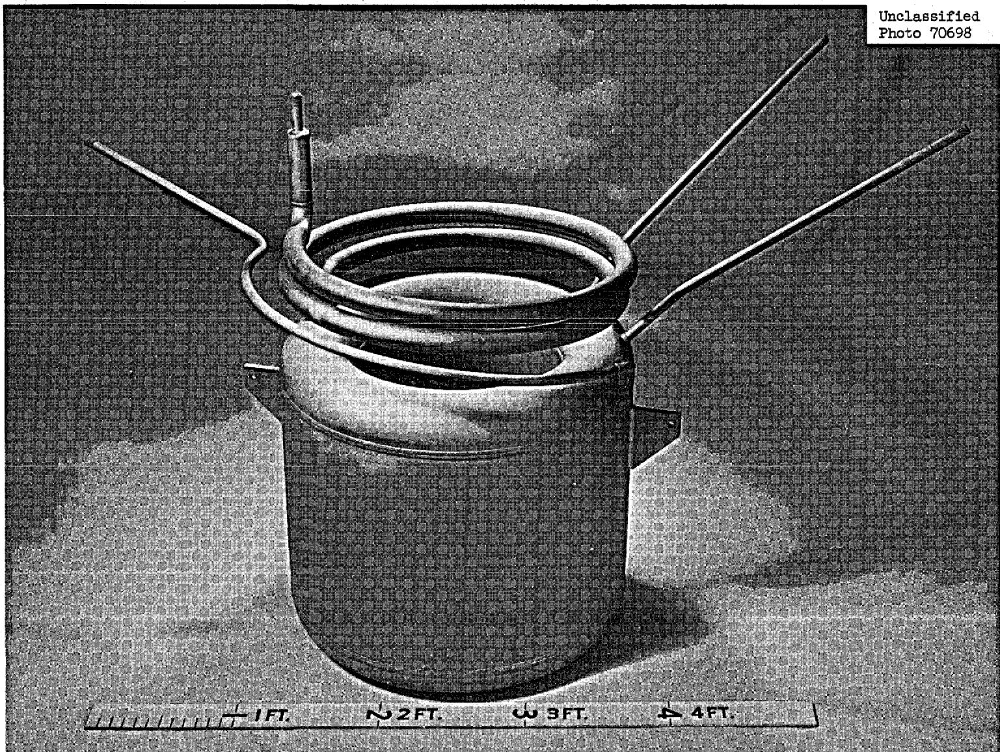  
Fig. 5.26. Fuel Pump Overflow Tank.

in the pipe. As in the pump bowl, the helium supply lines have a surge volume inside and at the top of the tank in the form of a curved portion of 1-1/2-in. pipe. This volume would prevent salt from backing up into unheated portions of the helium supply lines in event of a pressure surge in the salt system. The helium bubbler lines dip to within about 1/2 in. of the bottom of the tank.

The top of the overflow tank is vented to the off-gas system through a 1/2-in. sched-40 pipe connection, line 523. A 1/4-in.-OD tubing connection (line 589) is made to line 523 to provide the reference pressure for the bubbler liquid-level indication. Line 523 continues through the control valve HCV-523, which can be closed to pressurize the overflow tank with helium to force the fuel salt from the tank back to the fuel-pump bowl through line 520. Normally, valve HCV-523 is open to vent the gases from the upper portion of the overflow tank. Line 523 joins the off-gas line 521 from the fuel-pump bowl upstream of the holdup volume in the reactor cell.

5.4.7.3 Tank Support. The overflow tank is located directly beneath the fuel-pump bowl. Three 1/2-in.-diam rods with clevis ends suspend the tank from the pump support during initial installation or maintenance operations. Normally, these rods carry no load, and the tank is supported from below by a flat plate mounted on the lower end of three 1-in.-diam $30^{\frac{1}{4}}$ stainless steel rods. The plate rests on three spring-mounted balls (Mathews Conveyers Company, Type 501) which allow the tank to move laterally in any direction. While connected to the fuel pump only through the overflow line, there may be some displacement forces as the pump shifts position with temperature changes. The overflow tank remains at a fixed elevation, the flexibility of the overflow pipe accommodating the 0.8-in. vertical displacement of the fuel-pump bowl with temperature changes (see ORNL Dwg. D-CC-C-56420).

The three l-in.-diam stainless steel support rods mentioned above pass through the pump furnace insulation through corrugated stainless steel bellows welded to the rods at the top of the bellows and with the bottom of the bellows welded to the furnace casing. The clearance between the rods and the furnace bottom allows for relative movement of the tank within the furnace, and the bellows prevent the chimney effect from inducing a flow of cell atmosphere gas through the furnace.

If the overflow tank must store a large amount of fuel salt that has a relatively high internal-heat-generation rate, it may be necessary to cool the overflow tank. A 1-1/2-in. connection is provided at the furnace bottom through which cell atmosphere gas can be supplied from the component cooling system. A 3-in.-diam stainless steel bellows in this connection provides a spring-loading on a sliding metal-to-metal flat-plate joint to allow relative movement of the furnace and the gas supply line connection (see ORNL E-CC-C-56419).

# 5.5 Fuel Heat Exchanger

The fuel heat exchanger is used to transfer heat from the fuel salt to the coolant salt. The location of the exchanger in the reactor containment vessel is shown in Figs. 4.4 and 4.5. The relationship of the heat exchanger in the primary system flowsheet is discussed in the preceding Section 5.2 and shown in Fig. 4.6. The physical properties of the fuel and coolant salts are summarized in Table 2.1.

With the exception of the furnace-brazing of the tube-to-tubesheet joints, the heat exchanger was fabricated in the machine shops of the Y-12 Plant. The furnace-brazing was performed at the Wall Colmonoy Company (Detroit). All this work was covered by ORNL specifications.[92,93,94]

# 5.5.1 Description

The heat exchanger is a horizontal, shell and U-tube type, with the fuel salt circulating in the shell and the coolant salt in the tubes (see Figs. 2.4 and 5.27). It is of all-welded construction and is fabricated of INOR-8 throughout, except for the back-braze alloy used in the tubesheet joints. The overall dimensions and design data are given in Table 5.9. (See ORNL Dwg. D-EE-Z-40850).

The shell is ~16 in. OD and about 8 ft 3 in. long, including the 8-3/4-in.-long coolant salt header and the ASME flanged and dished heads at the ends (see ORNL Dwg. D-EE-A-40874). The shell is 1/2 in. thick in both the cylindrical portion and the heads. The fuel enters at the U-bend end of the shell through a 5-in. sched-40 nozzle, near the top of the dished head. A 1/4-in.-thick baffle on the inside prevents direct impingement on the tubes. The fuel salt leaves through a 7-in. x 5 in. reducer nozzle at the bottom of the shell at the tube-sheet end.

To prevent vibration at the higher flow rates due to the clearance between the tubes and the baffle plates, INOR-8 rods, 0.166-in. x l/4-in., are inserted, or "laced", between the tubes. The rods are used at each baffle plate, with one set inserted in the horizontal direction and the other at an angle of $60^{\circ}$ . The rods fit snugly into the spaces between the tubes and effectively restrain each tube from transverse motion relative to the others. The horizontal rods are tack welded in place at each end. The inclined rods are tack welded at least on one end, and on both ends where accessible. The

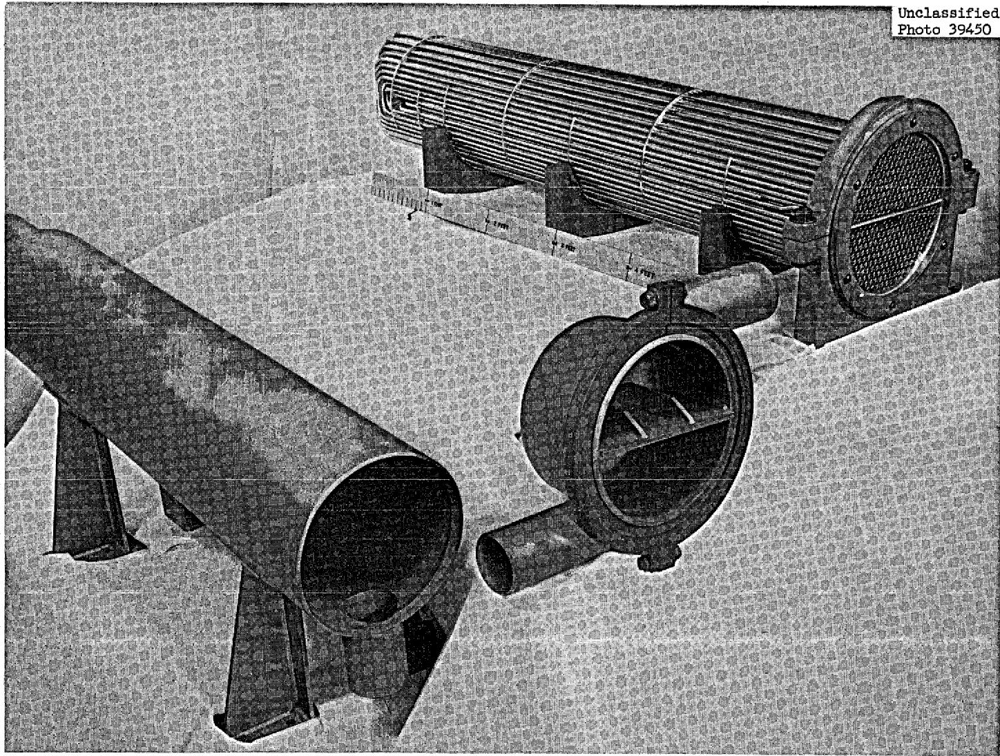  
Fig. 5.27. Primary Heat Exchanger Subassemblies.

Table 5.9. Design Data for Primary Heat Exchanger   

<table><tr><td>Construction material</td><td>INOR-8</td></tr><tr><td>Heat load, MW</td><td>10</td></tr><tr><td>Shell-side fluid</td><td>Fuel salt</td></tr><tr><td>Tube-side fluid</td><td>Coolant salt</td></tr><tr><td>Layout</td><td>25% cut, cross-baffled shell with U-tubes</td></tr><tr><td>Baffle pitch, in.</td><td>12</td></tr><tr><td>Tube pitch, in.</td><td>0.775 triangular</td></tr><tr><td>Active shell length, ft</td><td>~6</td></tr><tr><td>Overall shell length, ft</td><td>~8</td></tr><tr><td>Shell diameter, in.</td><td>16</td></tr><tr><td>Shell thickness, in.</td><td>1/2</td></tr><tr><td>Average tube length, ft</td><td>14</td></tr><tr><td>Number of U-tubes</td><td>159</td></tr><tr><td>Tube size, in.</td><td>1/2 OD; 0.042 wall</td></tr><tr><td>Effective heat transfer surface, ft²</td><td>~254</td></tr><tr><td>Tubesheet thickness, in.</td><td>1-1/2</td></tr><tr><td>Fuel salt holdup, ft³</td><td>6.1</td></tr><tr><td>Design temperature: shell side, °F tube side, °F</td><td>1300 1300</td></tr><tr><td>Design pressure: shell side, psig tube side, psig</td><td>55 90</td></tr><tr><td>Allowable working pressure:* shell side, psig tube side, psig</td><td>75 125</td></tr><tr><td>Hydrostatic test pressure: shell side, psig tube side, psig</td><td>800 1335</td></tr><tr><td>Terminal temperature: fuel salt, °F coolant, °F</td><td>1225 inlet; 1175 outlet 1025 inlet; 1100 outlet</td></tr><tr><td>Effective log mean temperature difference, °F</td><td>133</td></tr><tr><td>Pressure drop: shell side, psi tube side, psi</td><td>24 29</td></tr><tr><td>Nozzles: shell, in. (sched-40) tube, in. (sched-40)</td><td>5 5</td></tr><tr><td>Fuel-salt flow rate, gpm</td><td>1200 (2.67 cfs)</td></tr><tr><td>Coolant-salt flow rate, gpm</td><td>850 (1.85 cfs)</td></tr></table>

*Based on actual thicknesses of materials and stresses allowed by ASME Code.

rods are left out at locations where neither end could be fastened. For this reason, rods are used in the horizontal direction only at the stub baffle plate and at the lower portion of the baffle at the fuel inlet end of the exchanger. The rods at these two locations are 0.17l-in. x l/4-in. and 0.174-in. x l/4-in., respectively. The tubes are also restrained at the U-end of the tube bundle by rods inserted in two directions through the five outermost rows of tubes. Two 1-l/2-in.-wide INOR bands are used to hold the rods in position. One of the bands, which is slotted to accept the ends of the rods, is inserted horizontally into the tube bundle. The other band is wrapped around the outside and has the ends of the rods tack welded to it. See ORNL Dwgs 10329-R-001-E and 10329-R-002-E.* Six $25\%$ cut baffles of 1/4-in. plate, spaced at 12-in. intervals, direct the fuel-salt flow across the tube bundle (see ORNL Dwg. D-EE-A-40866). A barrier plate, similar to the baffle plates but with no cutaway segment, is located 1-7/8 in. from the tubesheet to provide a more or less stagnant layer of fuel salt and reduce the temperature difference across the tubesheet. The baffles and the barrier plate are held in position by spacer rods, screwed and tack-welded together, to the tubesheet, and to each baffle.

A divider separates the entering and leaving coolant-salt streams in the coolant header. It is fabricated of 1/2-in. plate and extends from the tubesheet to the dished head a maximum distance of about 12 in.; it is welded only to the dished head. It is positioned by guide strips on the shell wall, and a groove in the edge fits over a 1/4-in. pointed, horizontal projection on the tubesheet. This arrangement provides a labyrinth-type seal between the channels without stiffening the tubesheet.

The divider prevents use of a horizontal row of tubes at the exact center of the tubesheet. Also, in arranging the U-tube bundle into a configuration that could be assembled, it was necessary to leave out the nine tubes on the horizontal row immediately above and below the center. These holes are not drilled in the tubesheet. To maintain fuel-salt velocity distributions in the shell and also to keep the fuel-salt inventory to a minimum, solid rods of INOR-8, $1/2$ in. in diameter, are used at these locations in the tube bundle.

There are 159 tubes, $\frac{1}{2}$ in. OD by $0.042$ in. wall thickness, affording a total heat transfer surface of $\approx 254$ ft². The tubes are arranged on a 0.775-in. equilateral triangular pitch. The tubesheet is $\frac{1}{2}$ in. thick. The holes through the tubesheet had trepaned grooves on both sides of the sheet.

The grooves on the coolant-salt side were to permit the tube-to-tubesheet welds95 to be made between the tube and a lip of about equal wall thickness. The groove has an overall depth of 0.090 in., is 0.068 in. wide, and leaves a lip of 0.042 in. (see Fig. 5.28). The tubes were expanded at the tip end into the holes before welding; after welding, the tube openings were reamed to the inside diameter of the tubes.96

The tubesheet holes had trepaned grooves on the fuel-salt side to permit back-brazing of the joints. These grooves were 0.100 in. deep, 0.100 in. wide, and with a lip of 0.025 in. (ref 94) (see Fig. 5.28). This groove held an $82\%$ gold - $18\%$ nickel brazing ring prior to furnace-brazing.[97] The brazing operation consisted of holding the assembly between 1850 and $1885^{\circ}\mathrm{F}$ for 60 min in a hydrogen atmosphere having a dewpoint temperature below $-80^{\circ}\mathrm{F}$ ,[94] and a flow rate of $345\mathrm{ft}^{3}/\mathrm{hr}$ . Both the heating rate and the cooling rate for the brazing cycle were limited to $300^{\circ}\mathrm{F}/\mathrm{hr}$ . Three $3/32$ -in.-diam equally spaced holes were drilled from the bottom of the braze-ring trepan to communicate with the 0.0015 to 0.003-in. annular space between the tube and the tubesheet hole, to permit the braze metal to flow into this space during the furnace brazing.[98] An excess of the braze filler metal was provided to assure complete filling of the void and enough to form a fillet between the tube wall and the full thickness of the trepan lip. Visual examination of these fillets after brazing gave an indication that each braze void was completely filled.[98] There was no apparent distortion of the tubes, and the metal was bright and clean. Ultrasonic inspection by use of a Lamb-wave probe, with a $3/32$ -in.-diam flat-bottomed hole as a standard, indicated some porosity but no open channels in the brazed joints.

After fabrication the unit was hydrostatically tested to 1335 psig on the tube side and 800 psig on the shell side. The shell side was

Unclassified NL DWG 64-88

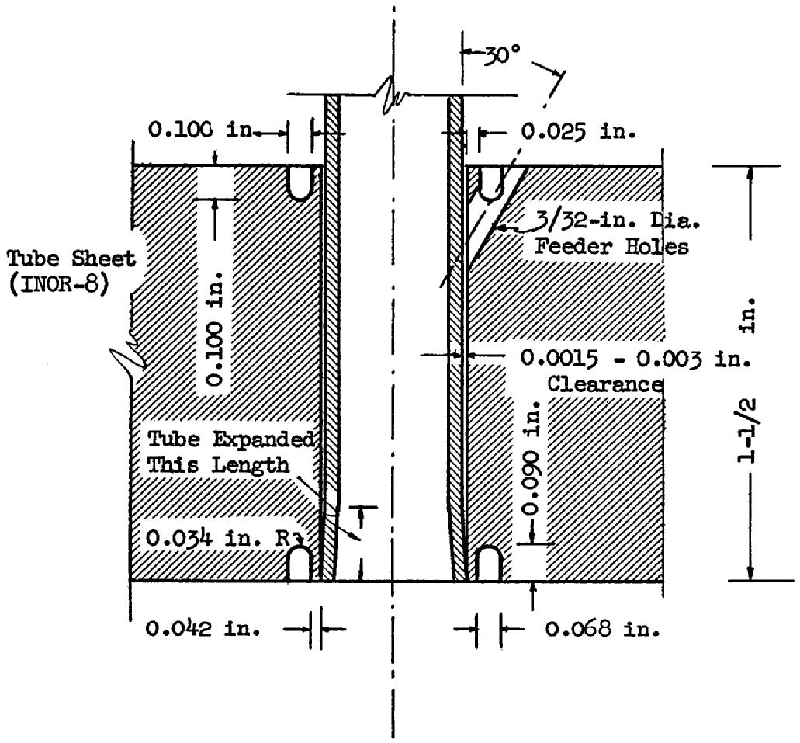  
Figure 5.28. Tube to Tube-Sheet Joint in MSRE Primary Heat Exchanger.

pressurized first and maintained at 800 psi while the tube side was pressure tested. $^{92,99}$ A helium mass spectrometer leak test was applied, with the shell-side pressure less than 5 microns abs and the tube-side pressurized with helium to 100 psig. There were no leaks.

The heat exchanger is installed horizontally, pitching toward the fuel-salt outlet at a slope of about $3^{\circ}$ . Each U-tube is oriented so that the coolant salt will also drain. The supports are described in Section 5.5.3. The unit weighs about 2060 lb when empty and 3500 lb when filled with both fuel and coolant salts. The fuel-salt holdup is 6.1 ft $^{3}$ , and the coolant-salt holdup is about 3.7 ft $^{3}$ .

The shell is surrounded by electric heating units of about 30 kw total capacity, as described in Section 5.5.4.

In normal operation, the coolant-salt pressure will be maintained at a slightly higher value than the fuel-salt pressure so that coolant salt will flow into the fuel system if a leak develops.

# 5.5.2 Design Considerations

The heat exchanger was designed for low holdup of salts, simplicity of construction, and moderately high performance. The space limitations within the containment cell required a fairly compact unit. A U-tube configuration best satisfied this requirement and also minimized the thermal-expansion problems in the exchanger.

From the heat transfer standpoint, it was better to pass the fuel salt through the shell and the coolant salt through the tubes, since the fuel-salt volume flow rate is larger. The shell side also presents less opportunity for retention of gas pockets during filling operations. A further consideration in this respect was that the fuel-salt system operates at a slightly lower pressure than the coolant-salt system and there was a small savings in the required shell thickness.

5.5.2.1 Heat Transfer. The behavior of molten salts as heat transfer fluids had been investigated prior to design of the MSRE.100 There was good agreement between measured values of the tube-side coefficients by Amos et al.100 and calculated values based on the generalized formula of Sieder and Tate.101 The heat transfer design conditions are given in Table 5.9, and the physical properties of the fuel and coolant salts are given in Table 2.1.

The mean $\Delta t$ for a true countercurrent heat exchanger would be $137^{\circ} \mathrm{F}$ . A correction factor of 0.96 was applied to include the effects of a single-pass shell, which reduced this value to the $133^{\circ} \mathrm{F}$ shown in Table 5.9 (see Section VI, Ref 18).

Film coefficients were assumed to be constant on both sides of the tube wall. The velocity in the tubes is about 12.1 fps and the Reynold's modulus about 9060, giving a film coefficient of about 4900 Btu/hr-ft $^2$ -F.* The pressure drop in the tubes was estimated to be about 2.2 psi/ft.* (See Section VI, Ref 18)

The film coefficient on the shell is estimated to be 3200 Btu/ft²-hr-°F for a Reynold's modulus of 13,000. The overall heat transfer coefficient is about 1100 Btu/hr-ft²-°F. The resistance to heat flow is about equally divided between the tube-side film, the tube wall, and the shell-side film. The overall coefficient makes an allowance of about 10% for possible "scale" deposits on the tubes.[18]

In estimating the overall capacity, or rating, of the heat exchanger, the active length of the tubes was taken as the straight portion between the thermal barrier plate and the last baffle, since experience indicates that the heat transfer coefficient in the bends of U-tube-type exchangers is considerably less than in the straight sections. On this basis the effective area is 259 ft², which is about 8% more than the calculated requirement for 10-Mw capacity. This extra amount, plus the "dirty tube" allowance, affords a margin of about 20% on the conservative side.[18]

5.5.2.2 Pressure Drops. The estimated total pressure drop on the shell side was estimated to be 22 psi at 1200 gpm.[102] Preliminary testing of the complete exchanger indicated a pressure drop of almost twice this amount, primarily due to the inlet and outlet losses. The shell was lengthened by 1-in. to make room for an inlet impingement baffle, four tubes were removed (leaving a total of 254), and the baffle stay rods which partially blocked the fuel-salt exit nozzle opening were eliminated. Subsequent testing indicated a total pressure drop at 1200 gpm of 25-30 psi.[177]

The estimated tube-side pressure drop was 29 psi at 850 gpm. Tests on the 254-tube exchanger indicated a value of about 30 psi.[177]

5.5.2.3 Stresses. The thickness of the shell was determined from the formulae of the ASME Unfired Pressure Vessel Code, Section VIII.47

The heat exchanger was designed for pressures of 55 psig on the shell side and 90 psig on the tube side at $1300^{\circ}\mathrm{F}$ (see Section V, p 2, Ref. 18). Except for thermal stresses in the tubes, the stresses were limited to 2750 psi. Taking into consideration the actual thicknesses of material used and the higher stresses permitted by the Code, the allowable working pressures are 75 psig for the shell side and 125 psig for the tube side at $1300^{\circ}\mathrm{F}$ .

The tube wall thickness was based more on the welding requirements than on pressure-stress considerations. Experience had indicated that wall thicknesses of less than $0.04$ in. had more of a tendency to crack at the tube welds; therefore the tube wall thickness was more or less arbitrarily fixed at $0.042$ in. This provides considerably more strength than is needed to contain the design pressure. The stresses developed in the tubes due to one leg of the U being hotter than the other are not excessive and are largely self-adjusting. The thermal stress due to the temperature difference across the tube wall is estimated to be a maximum of 10,000 psi and is greatest in the U-bends where the fuel salt is hottest. Under normal operating conditions the tube wall in this region will not exceed $1150^{\circ}\mathrm{F}$ . The stress for O.l CRU is about 10,000 psi at $1150^{\circ}\mathrm{F}$ so there should be no concern for the life of the tubes unless the reactor is operated through a large number of cycles between zero and full power at higher temperatures.

The thickness of the tubesheet was determined by standard TEMA formulae to be 1.5 in. for a pressure of 55 psi across the sheet and a pressure stress of 2750 psi. This pressure differential assumes that the coolant salt is at 65 psig and the fuel salt is at 10 psig (no flow condition). The thermal barrier plate on the shell side is estimated to limit the temperature difference across the tubesheet to less than $20^{\circ}\mathrm{F}$ (see Section V, p 18 of Ref 18). The baffle on the coolant-salt side is kept separate from the tubesheet in order to avoid large localized stresses.

5.5.2.4 Vibration. Development testing of the heat exchanger as constructed to the original design indicated excessive vibration of the tubes at the rated flow rate. The design was then modified to include an impingement baffle on the fuel-salt inlet and installation of "lacing" rods to restrain lateral movement of individual tubes. Subsequent testing showed that the noise due to the tube vibration had been eliminated.[11]

# 5.5.3 Supports

The heat exchanger is connected to the reactor vessel and the pump by short and stiff piping, so one of the primary considerations in designing the supports for the heat exchanger was that it must be allowed to move with but little restraint when the system is heated and cooled. The coolant salt lines attached to the heat exchanger have sufficient flexibility in looping around the reactor cell space to substantially reduce the reactions on the heat exchanger nozzles due to thermal expansion in these lines.

The heat exchanger rests on two INOR-8 saddle supports that are welded to the shell about 46 in. apart. The INOR-8 legs on which the saddles are welded are of different heights to give the shell a pitch of about $3^{\circ}$ toward the fuel-salt outlet end. The legs are bolted to a carbon steel frame, about 30 in. wide and 10 ft 8 in. long, fabricated of 6-in. I-beams. This frame is installed horizontally and rests on four 3-in.-diam rollers (see ORNL Dwg. E-EE-D-41492). The support bracket for each of the rollers has a 2-15/16-in.-diam pin inserted in a thrust bearing, which carries the vertical load and permits the rollers to be self-aligning. The thrust bearings are mounted on top of the Grinnel* spring hanger assemblies having adjustable spring tension, load indicator and scale. The special tension adjustment bolt can be turned by use of remotely operated tools from above (see ORNL Dwg-D-DD-D-41491). The spring hanger assemblies rest on a fixed support structure of 8-in. I-beams. (See Section XI, Ref 18).

The arrangement of supports allows the heat exchanger to move horizontally in a north-south direction on the rollers, and to move vertically and rotate against the spring actions. A small amount of

east-west horizontal translation (very little should be required) can be accommodated by the frame slipping laterally on the rollers to the "least-loaded" position.

Piping reactions on the heat exchanger nozzles are shown on ORNL Dwg. D-EE-Z-40852 and are discussed in Section 5.6.

# 5.5.4 Heaters

The salts in the primary heat exchanger are kept molten by electric resistance heaters installed outside the shell. The heater units are arranged in three sections and are essentially identical to the removable heaters applied to the 5-in. straight sections of salt piping (see Section 5.6.6.2) except that they are designed for the 16-in. OD shell. The heaters are connected in three separate circuits, each three-phase, 208-v, 10-kw, to give a total heat input capacity of 30-kw. The thermal insulation is similar to that used on the pipe sections. (See Mirror Insulation Company Dwg G-108-A).

# 5.6 Primary Circulating System Piping, Supports, Heaters, Insulation, Freeze Flanges and Freeze Valves.

# 5.6.1 Piping

With the exception of a transition piece at the pump suction, all the primary circulating system piping is fabricated of 5-in. sched 40 seamless INOR-8 pipe. Flanges are provided between the three major pieces of equipment in the loop to facilitate their removal and replacement. These "freeze" flanges are described subsequently in Section 5.6.4.

Forged elbows are used in the piping where space did not permit use of longer radius bends. The system includes one $90^{\circ}$ bend, one bend of about $30^{\circ}$ , three $90^{\circ}$ elbows, one $57^{\circ}$ elbow and one $34^{\circ}$ elbow.

All piping in the circulating system pitches downward at $3^\circ$ to cause drainage towards the reactor. (The drain line from the bottom of the reactor, line 103, pitches at about $3^\circ$ to drain toward the fuel drain tanks.)

The piping between the reactor discharge nozzle and the fuel-salt pump suction nozzle, line 100, is welded to the reactor nozzle and extends almost horizontally, with a slight bend, approximately 6 ft to a freeze flange, FF-100; from this flange it bends slightly in the horizontal plane and turns upwards $90^{\circ}$ , terminating in the pump nozzle transition piece. This special conical section is approximately 32 in. long and rolled from 3/8-in. INOR-8 plate. It is required to make the transition from the 5-in. pipe in line 100 to the 8-in. nozzle on the pump bowl. A 5-in. x 6-in. eccentric reducer is used at the pump discharge nozzle. See ORNL Dwgs E-GG-B-40700, E-GG-B-40701 and E-GG-E-41866.

Line 10l is welded to the pump discharge nozzle and extends horizontally about $3 - 1 / 2$ ft where it makes a $90^{\circ}$ bend in the horizontal plane and joins the freeze flange FF-10l, which is close-coupled to the heat exchanger inlet nozzle.

Line 102 drops vertically from the outlet at the underside of the heat exchanger a distance of about $5 - 1 / 2$ ft to a $90^{\circ}$ elbow and then runs horizontally through a sweeping $90^{\circ}$ bend to the freeze flange, FF-102; from this flange it continues horizontally through a slight bend to the reactor inlet nozzle.

The pump bowl overflow line is described in Section 5.4.7.1 and the drain pipe, line 103, is discussed in Section 6.

# 5.6.2 Piping Stresses and Flexibility Analysis

The reactor vessel is suspended from the stationary top cover of the thermal shield and is thus fixed in position and the anchor point for the piping in the primary circulating system. The circulating loop is rather compact, with short relatively stiff lengths of 5-in. pipe connecting the equipment. To avoid use of bellows-type expansion joints to relieve stresses due to thermal expansion, the heat exchanger and fuel pump supports were designed to allow relatively free movement.

The fuel pump mount allows the pump to move on rollers in the horizontal plane and a parallel-link framework, supported on springs, permits vertical movement from the cold to the hot position (see Section 5.4.5). The pump bowl is thus restrained from rotation about any axis.

The heat exchanger supports permit it to move horizontally in two directions on rollers and to move vertically and rotate about its longitudinal axis by acting against the spring supports, as described in Section 5.5.3.

The sustained stresses in the piping, i.e., those due to internal pressure and weight of the equipment and contents, were estimated using conventional relationships47 and found to be less than the allowable stress of 3,500 psi at $1300^{\circ}\mathrm{F}$ .16

Flexibility analyses were made on the primary circulating system piping using the IBM Modification of Pipe Stress Program, SHARE, No. GS 3812.[91] Estimates were based on a reactor power level of 10 Mw when the primary piping is between $1175^{\circ}\mathrm{F}$ and $1225^{\circ}\mathrm{F}$ , the coolant-salt piping is between $1025^{\circ}\mathrm{F}$ and $1100^{\circ}\mathrm{F}$ , and the reactor vessel and heat exchanger are at about $1200^{\circ}\mathrm{F}$ . For every anticipated reactor operating condition the maximum stresses were calculated to be well below the allowable stress range of 32,125 psi,[*] as determined from the Code of Pressure

Piping, ASA B31.1.106 The maximum stress in the piping system was estimated to be 7,700 psi, which occurs at the coolant-salt inlet nozzle to the heat exchanger.91

Calculated movements of the pump from the cold to the hot condition at 10 mw were: $\Delta x$ (N-S) = 0.401 in.; $\Delta y$ (E-W) = 0.335 in.; and $\Delta z$ (vert) = 0.826 in.91

# 5.6.3 Supports

There are ten supports on major piping inside the reactor cell, three on the fuel-salt piping and the remainder on the coolant-salt lines. Rigid supports can be used at one location in the fuel-salt system and at two places in the coolant-salt piping; at all other locations the piping rests on spring-loaded mountings. The supports for drain line 103 are described with the drain tank cell salt transfer line supports, Section 6.28.

The spring supports are Bergen Pipe Support Corporation (New York, N.Y.) units, Model VS-3F, in sizes 3, 5, 6, 7 and 8. The spring setting in each is variable to adjust the support to the piping load, as will be discussed subsequently. A short column of 3-in. sched 40 pipe rests on the spring support and carries a 10-in. x 10-in. x 1/2-in.-thick steel plate at the top. Nine 1-in.-diam steel balls (Mathews Type 101) are mounted on top of the plate. A similar horizontal plate, which rests on top of the balls, is welded to a bracket arrangement extending through the thermal insulation at the bottom of the pipe. These plates, with the exception of the plate at support S-2, are installed parallel with the slope of the pipe at each location. The supporting arrangement thus allows freedom of movement of the piping in the horizontal plane, provides a variable spring force in the vertical direction, and by supporting from below, allows the piping to be removed for maintenance operations without disturbing the support structure. (See ORNL Dwgs E-GG-E-41886).

The support loads and the movements of the piping were estimated using the methods given the Bergen Pipe Support Corporation Catalog No. 59.[107] These values, for both the fuel-salt and the coolant-salt piping inside the reactor cell are summarized in Table 5.10. The following weights were assumed in making the estimates:[107]

<table><tr><td>5-in. sched 40 INOR-8 pipe</td><td>15 lb/ft</td></tr><tr><td>Weight of salt in pipe*</td><td>21 &quot;</td></tr><tr><td>Thermal insulation</td><td>30 &quot;</td></tr><tr><td>Electric heaters</td><td>5 &quot;</td></tr><tr><td>Support frame</td><td>10 &quot;</td></tr><tr><td>Freeze flange and clamp</td><td>290 &quot;</td></tr><tr><td>Clamp frame</td><td>212 &quot;</td></tr></table>

The movements listed in Table 5.10 are for uniform heatup of the system to $1300^{\circ}\mathrm{F}$ . The values for actual operation may differ slightly. In most instances the springs will exert upward forces on the piping when the system is cold. These forces approximately equal the weight of the salt in the effected portion of the system.

A description of the forces on a typical support, S-3 on line 201 in the coolant-salt piping, will explain the operation. The spring in this support is initially compressed $1 - 11 / 16$ in. and a plug is inserted to maintain the spring in this position. The spring scale pointer will read 608 lbs. The support is then placed in position and the empty pipe load of 397 lbs is rested on it. Since the pipe will expand $1 / 4$ in. upwards when heated, a second spacer $1 - 7 / 16$ in. long is substituted for the first one. The spring will then exert the full 608 lbs force against the pipe, with a resultant upwards force on the pipe of 211 pounds. As the system is heated, but still empty of salt, the pipe expands upwards and the spring also expands the $1 / 4$ in. maximum travel allowed by the $1 - 7 / 16$ -in. travel stop spacer piece. The spring scale will then read 581 lbs, but no force greater than the 397 lbs weight of the pipe can be exerted because of the travel stop. When the system is filled with salt, an additional 184 lbs must be carried by the support; the total piping load of 581 lbs is thus counter balanced by the spring setting of 581 lbs.[107]

The variable spring support, S-10, for line 101 is compressed when the system is cold in order for it to give full support after the pipe has moved $3/8$ in. upwards to the hot position. The cold spring setting is 188 lbs and it supports a weight of 180 lbs at operating conditions.

Table 5.10 Variable Spring Supports for Fuel and Coolant-Salt Piping Inside Reactor Cell   

<table><tr><td>Support No.</td><td>Line No.</td><td>Support Load (Pipe Empty)</td><td>Support Load (Pipe Full)</td><td>Pipe Movement</td><td>Hanger Type and Size No.</td><td>Spring Setting</td><td>Remarks</td></tr><tr><td>S-1</td><td>100</td><td>-</td><td>-</td><td>1/8&quot; Down</td><td>Rigid Support</td><td>No Spring</td><td>Top of support to be 1/8&quot; below bottom of pipe</td></tr><tr><td>S-2</td><td>102</td><td>234 lbs</td><td>316 lbs</td><td>3/8&quot; Down</td><td>Bergen VS 3F Size 5</td><td>234 lbs</td><td>Insert stop to limit downward travel to 3/8 in.</td></tr><tr><td>S-3</td><td>201</td><td>397 lbs</td><td>581 lbs</td><td>1/4&quot; Up</td><td>Bergen VS 3F Size 8</td><td>608 lbs</td><td>Insert stop to limit upward travel to 1/4 in.</td></tr><tr><td>S-4</td><td>201</td><td>442 lbs</td><td>503 lbs</td><td>1/8&quot; Up</td><td>Bergen VS 3F Size 7</td><td>514 lbs</td><td>Insert stop to limit upward travel to 1/8 in.</td></tr><tr><td>S-5</td><td>201</td><td>347 lbs</td><td>468 lbs</td><td>&lt;0.06&quot; Up</td><td>Rigid Support</td><td>No Spring</td><td>Top of support to be flush with bottom of pipe</td></tr><tr><td>S-6</td><td>200</td><td>277 lbs</td><td>372 lbs</td><td>3/8&quot; Up</td><td>Bergen VS 3F Size 6</td><td>394 lbs</td><td>Insert stop to limit upward travel to 3/8 in.</td></tr><tr><td>S-7</td><td>200</td><td>424 lbs</td><td>683 lbs</td><td>1/4&quot; Up</td><td>Bergen VS 3F Size 8</td><td>715 lbs</td><td>Insert stop to limit upward travel to 1/4 in.</td></tr><tr><td>S-8</td><td>200</td><td>410 lbs</td><td>669 lbs</td><td>1/8&quot; Up</td><td>Bergen VS 3F Size 8</td><td>682 lbs</td><td>Insert stop to limit upward travel to 1/8 in.</td></tr><tr><td>S-9</td><td>200</td><td>301 lbs</td><td>389 lbs</td><td>&lt;0.05&quot; UP</td><td>Rigid Support</td><td>No spring</td><td>Top of support to be flush with bottom of pipe</td></tr><tr><td>S-10</td><td>101</td><td>103 lbs</td><td>140 lbs</td><td>3/8&quot; Up</td><td>Bergen BS 3F Size 3</td><td>148 lbs</td><td>Insert stop to limit upward travel to 3/8 in.</td></tr></table>

The piping between the heat exchanger and the reactor, line 102, also has a variable spring support, S-2. As the system is heated the net thermal expansion of line 102 is downward about $3/8$ in. The support is installed with a spring setting of $234$ lbs, which is 82 lbs less than the calculated hot position loading of $316$ lbs. During system heatup, the $3/8$ -in. downward expansion of the pipe exerts a force of 17 lbs and compresses the spring to the stop. The unit then acts as a rigid support and when fuel salt is added to the system there is no further spring deflection.

Supports S-1 on line 100, S-5 on line 201, and S-9 on line 200, each carry the weight of a freeze flange. Since the movement of the pipe at these particular support points is negligible, rigid-type supports are used.

The piping supports in the coolant cell are described in Section 8.6.2 and those in the fuel drain tank cell in Section 6.5.

# 5.6.4 Freeze Flanges

Mechanical-type joints are provided in the 5-in. piping in the fuel and coolant-salt systems inside the reactor cell to permit the major equipment to be disconnected and removed for maintenance or replacement. The locations of the five flanged joints are shown in the flowsheet, Figure 5.3.

The so-called "freeze flange" type of joint was adopted because of its proven reliability in providing tight connections with zero salt leakage and insignificant gas leakage under all anticipated thermal cycling conditions. It is also a joint in which the salt does not contact the ring-joint gasket, an important factor in that residual salt would be difficult to remove with remotely-operated tooling. Salt particles in the ring joint could cause corrosion of the seating surfaces when the salt is exposed to moisture and air and thus make the joint difficult to reseal to the necessary leak tightness. There is also an advantage to keeping the salt out of the ring joint in that there is less scatter of salt particles as the flanges are separated.

Figure 5.29 shows a sectional view of a typical flange and clamp assembly (also see ORNL Dwg. E-GG-C-40610). The 23-in.-diam flanges are held together by two semi-circular spring steel clamps which are forced around the circumference of the flanges. The spring action

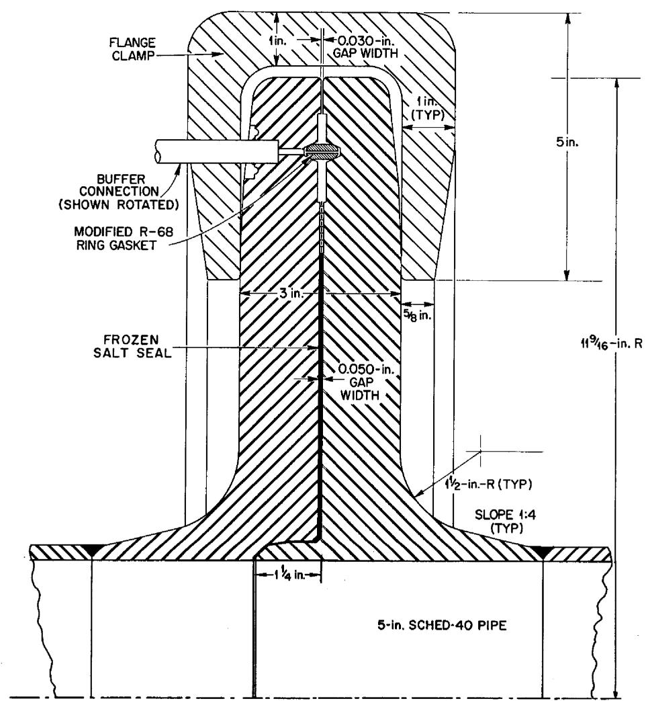  
UNCLASSIFIED ORNL-LR-OWG 63248R2   
Fig. 5.29. Freeze Flange and Clamp.

exceeds the piping code106 requirements for gasket loading in providing more than 136,000 lb of clamping force and also affords a more constant gasket loading during thermal cycling than would be obtainable with more rigid fastenings, such as bolting. The arrangement also was amenable to design of equipment and tooling for remote assembly and disassembly of the joint from above.

Hydraulically operated jacking tools are lowered into the cell to provide the five to ten tons of force required to install the clamps. Once installed, no external force is required to keep the clamps in place. The same jacking tools are used for separating the clamps and the forces required are only slightly less than those needed for installation. A clamping frame is provided for each of the five flange installations inside the cell but the jacking tools, etc., are interchangeable and may be used at each location.*

5.6.4.l Flanges. The flanges are fabricated of INOR-8 and are about 23-1/8 in. OD and 1.484 in. thick when measured through the thickest portion of a flange face. They are the welding-neck type.

The male flange has a guide ring, 5.798-5.802 in. diam by 1.248-1.252 in. long, welded into the face on the same centerline. The outside of the guide ring is tapered at $15^{\circ}$ so that as the flange faces are brought together during assembly operations the ring will enter a similarly shaped opening in the female flange to guide the two together in correct alignment (see ORNL Dwg D-GG-C-40611 and 40612). In each case the male flange is installed facing "uphill" in the salt piping, all of which slopes at $3^{\circ}$ to promote drainage.

A groove, 0.344 in. wide x 0.25 in. deep x 20.375 in. pitch diam, is machined to close tolerances in the face of both the male and female flanges to accommodate the ring gasket. The flange faces are also machined in the vicinity of the grooves to serve as gaging surfaces. Either the male or the female flange is drilled with a 3/32-in.-diam hole through the bottom of the groove for the helium buffer gas and leak-detection connection. The flange half selected

is the one judged to be less likely to require removal. The hole is trepaned on the back side of the flange for the welding of a 1/8-in. sched-40 pipe. The connection is made at a point on the flange which falls between the two semi-circular spring clamps (see ORNL D-GG-C-40615).

The sliding surfaces for the clamps on the backs of the flanges have first a $6^{\circ}$ and then a $3^{\circ}$ slope to draw the flanges tightly together, and then a ramp with $0^{\circ}$ slope to make the clamps self-retaining. These surfaces have a machined finish (32 RMS micro-in.) and are carefully contoured to provide the required gasket loading with a minimum of surface galling or stress concentrations. A graphite-alcohol lubricant, "Nearlube," is applied to the flanges before applying the clamps.

As indicated in Fig. 5.32, a clearance of 0.030 in. is provided between the flange faces at the outer circumference to take care of tolerances in machining of the ring gasket and groove and also to allow for deformation of the flange under internal pressure loading, a condition which tends to close the clearance gap at the outer edge.

A groove, or line, is cut around the circumference of each flange disc to serve as a reference mark for the optical alignment of piping inside the reactor cell.

The outside edge of both the male and female flanges has two projecting lugs, or ears, horizontally $180^{\circ}$ apart, which are used in the disassembly operation to be described subsequently. As shown in ORNL Dwgs D-GG-C-406ll and 406l2, these ears are about 1.625 in. wide and project about 1-1/4 in.

Flange loadings, stresses, and deformations are discussed separately under Sections 5.6.4.6 and 5.6.4.7, following.

5.6.4.2 Ring Gasket. The ring gasket.is fabricated of nickel (ASTM B-160). This material was selected because it is sufficiently softer than INOR-8 to seat properly and has a similar coefficient of thermal expansion* to remain tight after thermal cycling. The ring has a pitch diameter of 20.375 in. ( $\pm 0.002$ in.) and has the inner and outer edges rounded to a radius of 0.155-0.157

in. The ring is machined to the close seating tolerances required through use of a special jig furnished to the manufacturer, as shown on ORNL Dwg D-GG-C-40614.

In common with other leak-detected ring joings in the MSRE, the gasket seats on both sides of the groove to form two sealed spaces which are buffered with helium and monitored for leakage. A 1/16-in.-diam hole is drilled through the ring in two places to allow the sealed and buffered spaces to communicate.

The inside surface of the ring is drilled with eight equally-spaced 1/16-in.-diam holes, about 5/32 in. deep, to accept the retaining pins on the salt screen, to be described subsequently. The inside surface of the ring also has a "notch" 0.062 in. deep and to a radius of 1 in. at the bottom and two side-by-side identical notches at the top to engage the remotely operated tool used to maneuver the ring during maintenance (see ORNL Dwgs D-GG-C-40611 and 40614).

A small $30^{\frac{1}{4}}$ stainless steel bracket is fastened with flush-headed screws to the outside of the seal ring at the top. This bracket supports a 1-in.-long horizontal pin formed from a $30^{\frac{1}{4}}$ stainless steel $1/4$ in. x 20 UNC bolt which has the top portion of the threads ground away. This pin is inserted in a $1/4$ -in. tapped hole at the top of the male flange when the ring is to be positioned for reassembly of the joint. The lack of threads on top of the pin allows it to be slipped into the hole, but when released, the threaded portion prevents it from slipping out, thus retaining the ring in position for mating of the two flange faces. All the male flanges are made with a similar tapped hole on the bottom to allow them to be installed either side up and thus provide more interchangeability of parts (see ORNL D-GG-C-40617).

5.6.4.3 Salt Screen. The 0.050-in.-wide clearance between the male and female flange faces contains a salt-retaining screen formed of 0.015-in. OD INOR-8 wire on a 20-by-20 to the inch mesh. Salt entering the cavity solidifies on the screen, the uninsulated flanges being cooled by loss of heat to the cell atmosphere. No other source of cooling is required.

At a salt temperature of $1200^{\circ}\mathrm{F}$ , the freeze point is about 5-5/8 in. radially from the center of the pipe. This distance decreases about 11/16 in. for every $100^{\circ}\mathrm{F}$ decrease in bore temperature.[108] The screen helps somewhat in preventing the salt from moving radially outwards, but, more importantly, when the joint is disassembled, provides a convenient means of removing the frozen salt as an intact cake. Undue scattering of salt particles is thus avoided. The flange faces have very little salt adhering to them.

The outer edge of the screen has eight equally spaced radial pins, 1/16 in. diam by $3 / 4$ in. long, which engage the aforementioned holes in the seal ring to join the two units together for convenience in handling. The outside edge of the screen has a 3-in.-wide by $3 / 4$ -in. notch at the top and a 1-1/4-in.-wide by $3 / 4$ -in. notch at the bottom to allow access for the ring gasket holding tool mentioned above. (See ORNL Dwg D-GG-C-40617)

5.6.4.4 Clamps. The clamping rings are fabricated of No. 4130 heat-treated steel forgings made to ORNL Specification 81-180, and as shown on ORNL Dwg D-GG-C-40616. After welding, the clamp assemblies are quenched from $1550^{\circ}\mathrm{F}$ and tempered at $800^{\circ}\mathrm{F}$ to obtain a surface hardness of 380 BHN. This material was proven to have a sufficiently high yield strength to provide the necessary clamping load, and with the hardened surfaces, to be sufficiently compatible with the INOR-8 to minimize galling.

The clamping rings are more or less U-shaped in cross section, with the base portion about 1 in. thick and the legs tapering to $5/8$ in. in thickness at the ends. The clearance between the legs is 2.908 in. ( $\pm 0.010$ in.). The semi-circular pieces have the inside corners rounded to a $3/4$ -in. radius and are contoured to prevent digging in and galling of the INOR-8 flanges at these points (see ORNL Dwg D-GG-C-40616).

Right and left hand guide ears are welded to both the upper and lower clamp halves. These ears are also fabricated of No. 4130 steel and are heat treated along with the clamps. Each ear is formed of two more or less identical pieces with a $1/8$ -in. gap in between. This arrangement was proven necessary to prevent stiffening of the

backbone of the clamp at the ear location, with subsequent overstressing or galling of the sliding surfaces at these points. The ears have a 1-5/8-in. by 2-1/32-in. opening through which the clamping-frame guide bars pass, as will be explained in Section 5.6.4.5, to follow.

The top and bottom halves of the clamp are each drilled with a 1-5/8-in.-diam hole to permit passage of the 1-1/2-in.-diam load transmitting rod on the clamping frame, as described below.

5.6.4.5 Clamping Frame. The clamping frame assembly is shown schematically in Fig. 5.30 and on ORNL Dwg E-GG-C-40610. The frame allows the clamps to be moved as a unit into position around the mating flanges and then serves as a leverage point for applying hydraulic jacks on each side of the clamps to draw them together. Since the frame encircles the pipe, it must remain inside the reactor cell after assembly of a joint. For storage it is moved along the pipe to a supporting rack.

The clamping frame is about 33-5/8 in. wide by 55-1/2 in. high and is 7 in. thick. It is fabricated, in most part, of ASTM A285 Grade C steel. The upper and lower pieces of the assembly are joined by $1 - 1 / 2 \times 2 \times 34$ -in.-long guide bars on each side. The upper and lower ends of these two bars have $1 - 3 / 8$ -in.-long oblong holes through which a $3 / 4$ -in.-diam pin is mounted to provide a freedom of movement of the upper and lower elements to make the clamps self-aligning. The inside of the rods at mid-height have two projecting lugs to engage the lugs on the outer rims of the flanges, as mentioned above.

A 1-1/2-in.-diam rod extends downward about 10 in. from the center of the upper element, or beam, of the frame and a similar rod extends upward from the lower beam, both rods passing through the holes in the respective semi-circular clamps. The purpose of these rods is to transmit the load, or force, when removing the clamps. Brass pads are brazed on the ends of the rods to avoid injury to the flanges. The distance between the ends of the rods is about 1/4 in. greater than the overall diameter of the flange discs.

To install the frame it is first moved from the storage rack using the lifting eyes on the upper clamp. In this position, the upper beam will drop down until its ears bear against the clamp ears.

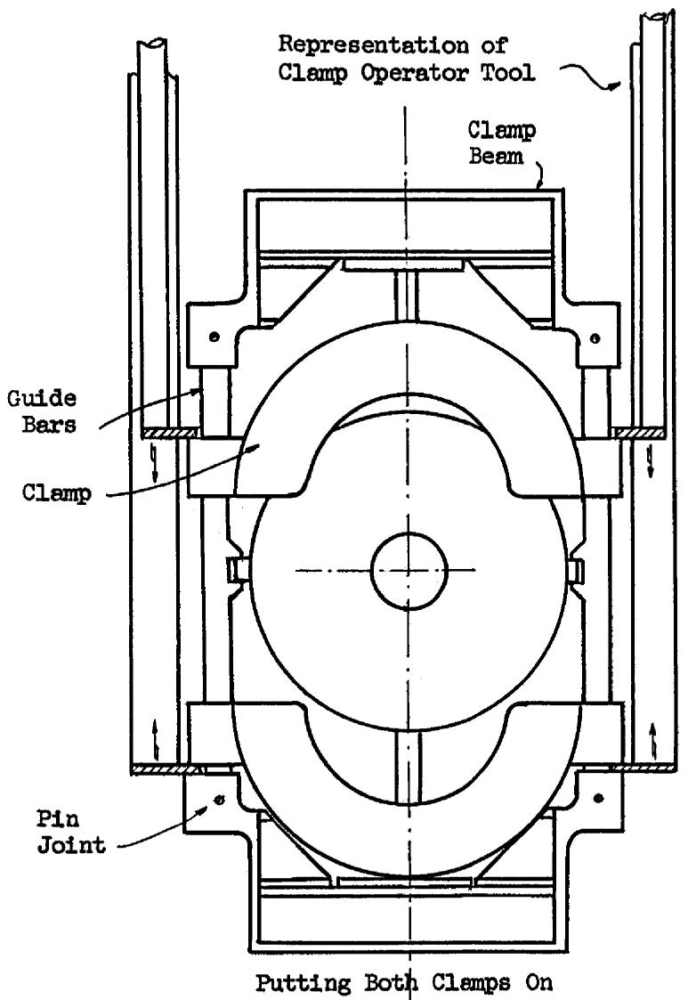

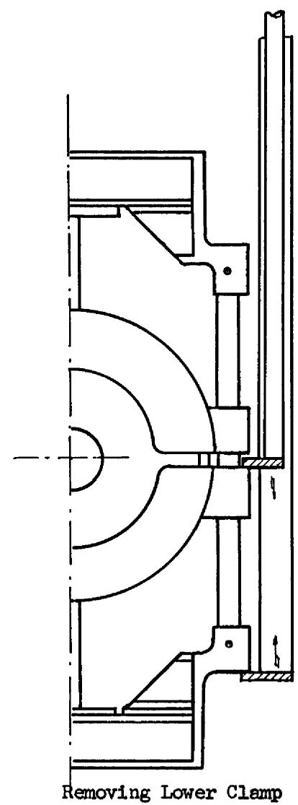

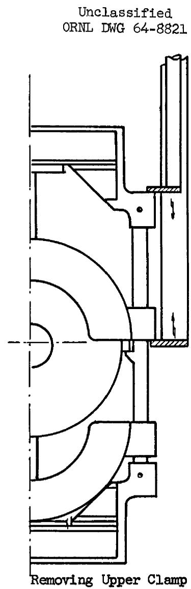  
Figure 5.30. Freeze Flange Clamping Frame Showing Assembly and Disassembly.

The lower clamp also drops down with its ears bearing against the lower guide-rod-pin joint housing. The frame is then moved horizontally along the pipe and lifted into position with the lugs on the flange rims between the two lugs on the frame guide bars. The clearance between the lugs is about 3/32 in. so that close alignment is not required.

The upper clamp is then lowered, as indicated in Fig. 5.30, so that the bottom end of the upper load-transmitting rod rests on the top of the flange, the clearance in the pinned joints on the guide bars allowing the necessary movement. The hydraulically operated jacking tools are then applied to each side, the jaws of this tool closing around the top of the upper clamp ear and the bottom of the lower clamp ear. The jacks are operated simultaneously, drawing the clamps into position. The pressure to the jacks can be varied as required to draw the clamps on evenly. The force required on each side is 12,000 to 24,000 lb, depending on the condition of the sliding surfaces, the sum of the dimensional tolerances, etc.

In disassembly of a joint, the lower clamp is removed first. The jaws of the jacking tool are placed above the ears on the lower clamp and below the lower pin joint housing, as shown in Fig. 5.30. The lower load-transmitting rod will push against the bottom of the flanges and transmit the jacking force, with no load being carried by the pin joints on the guide bars. Unequal distribution of the friction between the clamp and the flanges may cause one side of the clamp to tend to "get ahead" of the other, an action which is self-multiplying. The resulting forces tending to move the frame out of vertical, i.e., rotate about the flange, are counteracted by the lugs on the flange rims bearing against the lugs on the guide bars. Since the first rotational movement takes the "slack" out of the pinned guide bar joints, the position of the pin in the slotted holes serves as an indication to the operator that the jacking force on one side of the clamp should be reduced. If sufficient imbalance occurs to move the guide bars to the limit of their travel in the pinned joint, the end of the bar butts against the housing to transmit the load rather than acting through the pin.

The upper clamp is then removed, using the jacking tool as shown in Fig. 5.30. The upper load-transmitting rod is effective in this case and, again, the guide rods and pins carry little of the load. The force required to remove a clamp is only slightly less than that needed to install it.

After both clamps have been loosened, the upper clamp and frame assembly can be raised and moved horizontally out of the way. Once the flanges have been separated by more than 2 to 3 in., the frame could be removed from the reactor cell, should this be desirable.

A detailed description of operation of the clamping frame and associated tooling is given in Maintenance Procedures, Part X.

5.6.4.6 Gas Leak Rates During Thermal Cycling. Changes in gasket loading, and thus the gas leak rate, occur during temperature cycling. This is due to the differences in the coefficients of thermal expansion of the flange material (INOR-8), the ring gasket (nickel), and the flange clamps (No. 4130 carbon steel). The resiliency of the clamps, however, causes the load on the gasket to be more constant than if more rigid fastenings were used.

Even if excess temperatures existed at a freeze flange, allowing the salt to come in contact with the ring joint gasket, no salt leakage would occur. (Some damage might be done to the ring seal, however.) Thus, the only manner in which salt could leak would be for gross failure and separation of the flange faces. Tests of early models of the freeze flanges demonstrated, however, that gas leakage could be encountered.[109] For this reason, the development tests were primarily concerned with measurements of helium gas leakage from the leak-detected buffer zones.

Tests of the effect of thermal cycling on gas tightness showed that the MSRE flange design maintained acceptable gas seals under high temperature (about $1300^{\circ}\mathrm{F}$ ), under repetitive cycling (in which the temperature was raised from $150^{\circ}\mathrm{F}$ to $1300^{\circ}\mathrm{F}$ and returned to $150^{\circ}\mathrm{F}$ in a 24-hr cycle, for more than 100 cycles), and under severe temperature transients ( $100^{\circ}\mathrm{F}/\min$ for six minutes). (See p 10 ref 110) The joints displayed the desirable characteristic of having a smaller

gas leak rate at the higher temperatures than at lower. After 36 thermal cycles, typical leak rates were $2.6 \times 10^{-6} \mathrm{cc} / \mathrm{sec}$ in the cold condition and $0.39 \times 10^{-6} \mathrm{cc} / \mathrm{sec}$ in the $1300^{\circ} \mathrm{F}$ condition (see p 45 ref 108).

The effect on the leak rate of the interchangeability of parts was investigated (see p 41 ref 108). Two female flanges were thermal cycled several times and then mated with new (uncycled) male flanges and gasket rings to simulate the situation which might exist in the replacement of a major component in the reactor cell. Both pairs sealed satisfactorily, even after subsequent extensive thermal cycling.

A gasket ring with an octagonal cross section was found to seal better than one with an oval cross section, but both performed more than adequately (see p 43 ref 108).

5.6.4.7 Loading and Stresses. The clamping force which can be exerted by the clamps was estimated to be between 136,500 lb and 241,200 lb, depending upon the combinations of tolerances that could exist in the fit of the various parts.[11] The gasket loading required for proper seating was calculated using the method outlined in Par UA-47 of Section VIII of the ASME Unfired Pressure Vessel Code[47], and estimated to be about 28,800 lb.[11] The clamps are thus capable of seating the ring gaskets with ample reserve for withstanding pipe stresses and internal pressure.

The force required to drive the clamps onto the flanges is a maximum just as the legs of the clamp slide onto the ramp with $0^{\circ}$ slope. This force was estimated to be 24,750 lb for each side of the clamp (if the clamping force is 241,200 lb), or a total of 49,500 lb for each of the clamp halves.[11] This estimate assumes a coefficient of friction between the clamp and the flange of 0.15, a value which is ample in most cases but could be exceeded if galling should occur.

Under maximum clamping effort, the maximum stress in the clamp was estimated to be about 90,500 psi, and the maximum clamp deflection 0.092 in. The clamp is forged and heat treated to have a yield strength of greater than 100,000 psi.[111]

The mechanical stresses in the flange due to axial loadings resulting from thermal expansion in the piping systems were found to be less than 4000 psi.[112] This value includes the effect of internal pressure. The total axial loading resulting from a stress of 4000 psi is 17,200 lb (based on 6-in. OD by 0.204-in. wall thickness tubing). The allowable axial loading on the flange was estimated[111] using methods developed in the Sturm-Krouse study,[113] and based on an allowable working stress range of 30,000 psi,\* a value of 86,936 lb obtained. The flange is thus capable of withstanding the axial loadings with a factor of safety or more than four.

The flange internal thermal stresses were analyzed both analytically and by photoelastic studies to determine the stress concentration factors.[113] (These estimates were based on 6-in. OD tubing, but are applicable.) These studies indicated that the stresses could be higher than the elastic limit and that plastic strain could exist. Development tests proved that both radial and transverse strains occur, the former causing a reduction in the bore diameter, and the latter a distortion of the plane surface of the face. One test showed that after 36 thermal cycles the female flange bore decreased by 10 mils and the male bore by 30 mils. No permanent distortion was noted on the outer surfaces of the flanges (after 30 cycles) but the "out-of-flatness" of the interior face of the female flange increased from 14 mils to a value of 18 mils. No warpage was detected in the male face. These strains are judged to be of such magnitude that a large number of strain cycles could be applied without failure.[113] Further, the differences between the deformations of the faces at $1300^{\circ}\mathrm{F}$ and at $850^{\circ}\mathrm{F}$ (the salt liquidus temperature) are not sufficiently great that "excess" salt could be trapped between the flange faces to cause abnormally high stresses or distortions. Thus, the plastic strain that occurs is small and flanges of the design used in the MSRE have undergone more than 100 thermal cycles (probably equivalent to 10 to 15 years of normal MSRE operation) with no significant leakage, or deformations of consequence.[111]

# 5.6.5 Freeze Valves

5.6.5.1 General Description. The flow of salt in the MSRE drain, fill and processing systems is controlled by freezing or thawing a short plug of salt in a flattened section of 1-1/2-in. pipe, called a "freeze valve." This arrangement was adopted for the MSRE because of a lack of a mechanical-type valve with a proven reliability in molten-salt service.* The freeze valve concept, on the other hand, has a good record of satisfactory application. While mechanical-type valves would have the advantage of faster action and ability to modulate the flow, the freezing and thawing times for the freeze valves are satisfactorily short and the "on-off" type of flow control does not impose any particular handicap.

There are a twelve freeze valves in the MSRE. All are fabricated of 1-1/2-in. pipe. Six are installed in 1-1/2-in. lines and six in 1/2-in. lines. As may be noted in Table 5.11, one freeze valve is located in the reactor drain and fill pipe, line 103, and is inside the reactor furnace. Six of the freeze valves are in the fuel drain tank cell, three are in the fuel processing cell, and two are in the coolant cell.

Figure 5.32 shows the general arrangement at a freeze valve. The valve illustrated is used at FV-104, 105 and 106, but with the exception of the flat-plate heaters, is also typical of valves 107 through 112. Electric heat is applied, either directly or indirectly, to thaw a valve and to keep it in the open condition. A stream of cooling gas** or air is used to cool the pipe section to freeze a salt plug and positively stop the salt flow. Some system gases may diffuse through the frozen plug but the seepage through the valve is inconsequential to operation of the MSRE.

Table 5.11 MSRE Freeze Valves   

<table><tr><td rowspan="3">Freeze Valve Line No.</td><td rowspan="3">Line Function</td><td rowspan="3">Cell in which FV is Located</td><td rowspan="3">Line Size in. IPS</td><td rowspan="3">Type of Heater and Insulation</td><td colspan="4">Coolant Gas</td><td rowspan="3">Freeze Time, Min.</td><td colspan="2">Thawing Time, min</td><td rowspan="3">Time Will Re- Main Frozen, min.</td><td colspan="2">Temperatur</td></tr><tr><td rowspan="2">Gas</td><td rowspan="2">Supply Line No.</td><td colspan="2">Gas Flow, scfm</td><td rowspan="2">With Power</td><td rowspan="2">Without Power</td><td rowspan="2">Thawing: Htr. On</td><td rowspan="2">Freezing Gas On</td></tr><tr><td>High Rate</td><td>Holding Rate</td></tr><tr><td>103</td><td>Reactor drain and fill</td><td>Reactor</td><td>1-1/2</td><td>Calrod around hor. flat section; gas flow shroud with insulation.</td><td>Na</td><td>919</td><td>70b</td><td>15c</td><td>&lt; 30</td><td>5</td><td>&lt; 10</td><td>-</td><td>1100</td><td>Down to 450b</td></tr><tr><td>104</td><td>Flush tank drain and fill</td><td>Fuel Drain Tank</td><td>1-1/2</td><td rowspan="3">Insulated gas flow box with removable flat-plate ceramic heaters on adjacent piping. Removable exterior insulation, to which heaters are attached, covers both heaters and freeze valve section.</td><td>N2</td><td>908</td><td>35-70</td><td>15c</td><td>-</td><td>&lt; 10</td><td>&lt; 20</td><td>&gt;30</td><td>&quot;</td><td>Down to 750b</td></tr><tr><td>105</td><td>Drain Tank No. 2 drain and fill</td><td>Fuel Drain Tank</td><td>1-1/2</td><td>N2</td><td>909</td><td>&quot;</td><td>&quot;</td><td>-</td><td>-</td><td>-</td><td>-</td><td>&quot;</td><td>&quot;</td></tr><tr><td>106</td><td>Drain Tank No. 1 drain and fill</td><td>Fuel Drain Tank</td><td></td><td>N2</td><td>910</td><td>&quot;</td><td>&quot;</td><td>-</td><td>-</td><td>-</td><td>-</td><td>&quot;</td><td>&quot;</td></tr><tr><td>107</td><td>Transfer to fuel processing</td><td>Fuel Drain Tank</td><td>1/2</td><td rowspan="6">Insulated gas flow box with permanently-installed curved plate ceramic heaters on adjacent piping. Exterior insulation covers piping heaters and freezer section. Spare heaters are installed.</td><td>N2</td><td>911</td><td>&quot;</td><td>&quot;</td><td>-</td><td>-</td><td>-</td><td>-</td><td>&quot;</td><td>&quot;</td></tr><tr><td>108</td><td>Transfer to fuel processing</td><td>Fuel Drain Tank</td><td>1/2</td><td>N2</td><td>912</td><td>&quot;</td><td>&quot;</td><td>-</td><td>-</td><td>-</td><td>-</td><td>&quot;</td><td>&quot;</td></tr><tr><td>109</td><td>Transfer to fuel processing</td><td>Fuel Drain Tank</td><td>1/2</td><td>N2</td><td>913</td><td>&quot;</td><td>&quot;</td><td>-</td><td>-</td><td>-</td><td>-</td><td>&quot;</td><td>&quot;</td></tr><tr><td>110</td><td>Transfer to fuel storage</td><td>Fuel Processing</td><td>1/2</td><td>Air</td><td>969</td><td>&quot;</td><td>&quot;</td><td>-</td><td>-</td><td>-</td><td>-</td><td>&quot;</td><td>&quot;</td></tr><tr><td>111</td><td>Transfer to portable cans</td><td>Fuel Processing</td><td>1/2</td><td>Air</td><td>929</td><td>&quot;</td><td>&quot;</td><td>-</td><td>-</td><td>-</td><td>-</td><td>&quot;</td><td>&quot;</td></tr><tr><td>112</td><td>Transfer to salt disposal</td><td>Fuel Processing</td><td>1/2</td><td>Air</td><td>924</td><td>&quot;</td><td>&quot;</td><td>-</td><td>-</td><td>-</td><td>-</td><td>&quot;</td><td>&quot;</td></tr><tr><td>204</td><td>Coolant system drain</td><td>Coolant Drain</td><td>1-1/2</td><td rowspan="2">Calrod around hor. flat section; no shroud and no insulation on freezer section. Adjacent pipe has permanently-installed curved plate ceramic heaters and insul.</td><td>Air</td><td>906</td><td>25</td><td>15</td><td>&lt; 15</td><td>&lt; 5</td><td>&lt; 25</td><td>&gt;30</td><td>&quot;</td><td>&quot;</td></tr><tr><td>206</td><td>Coolant system drain</td><td>Coolant Drain</td><td>1-1/2</td><td>Air</td><td>907</td><td>&quot;</td><td>&quot;</td><td>&quot;</td><td>&quot;</td><td>&quot;</td><td>&quot;</td><td>&quot;</td><td>&quot;</td></tr></table>

> Greater than.   
< Less .than.   
Not applicable, or not important.   
a Cell atmosphere gas $(95\% \mathrm{N}_2 - 5\% \mathrm{O}_2)$   
b High rate, or freezing gas flow.   
c Low rate, or holding gas flow.

d Deep frozen, no gas flow req'd   
e Thermocouples listed are only those with "FV" prefix.

f Abour 20 in. from center of valve on leg without pot.   
g At tee between freeze valves 105 and 106.

<table><tr><td colspan="2">es, F</td><td colspan="5">Thermocouple Numbers</td><td rowspan="3">Freeze Valve Line No.</td></tr><tr><td colspan="2">reezing:</td><td rowspan="2">At Center</td><td rowspan="2">At Shoulders</td><td rowspan="2">5 in. From Ends</td><td rowspan="2">Nearby</td><td rowspan="2">At Pots</td></tr><tr><td>Holding Gas On</td><td>Gas Off</td></tr><tr><td>450 up to 650c</td><td>Less than 450</td><td>2A, 2B</td><td>1A, 1B 3A, 3B</td><td>none</td><td>none</td><td>none</td><td>103</td></tr><tr><td>750 up to 830</td><td>Less than 650 d</td><td>2A, 2B</td><td>1A, 1B 3A, 3B</td><td>A4, B4</td><td>6A, 6Bf</td><td>5A, 5B</td><td>104</td></tr><tr><td>&quot;</td><td>&quot;</td><td>2A, 2B</td><td>1A, 1B 3A, 3B</td><td>A4, B4</td><td>6A, 6Bg</td><td>5A, 5B</td><td>105</td></tr><tr><td>&quot;</td><td>&quot;</td><td>2A, 2B</td><td>1A, 1B 3A, 3B</td><td>A4, B4</td><td>none</td><td>5A, 5B</td><td>106</td></tr><tr><td>&quot;</td><td>&quot;</td><td>2A, 2B</td><td>1A, 1B 3A, 3B</td><td>A4, B4</td><td>none</td><td>5A, 5B 6A, 6B</td><td>107</td></tr><tr><td>&quot;</td><td>&quot;</td><td>2A, 2B</td><td>1A, 1B 3A, 3B</td><td>A4, B4</td><td>none</td><td>5A, 5B 6A, 6B</td><td>108</td></tr><tr><td>&quot;</td><td>&quot;</td><td>2A, 2B</td><td>1A, 1B 3A, 3B</td><td>A4, B4</td><td>none</td><td>5A, 5B 6A, 6B</td><td>109</td></tr><tr><td>&quot;</td><td>&quot;</td><td>2A, 2B</td><td>1A, 1B 3A, 3B</td><td>A4, B4</td><td>none</td><td>5A, 5B 6A, 6B</td><td>110</td></tr><tr><td>&quot;</td><td>&quot;</td><td>2A, 2B</td><td>1A, 1B 3A, 3B</td><td>A4, B4</td><td>none</td><td>5A, 5B</td><td>111</td></tr><tr><td>&quot;</td><td>&quot;</td><td>2A, 2B</td><td>1A, 1B 3A, 3B</td><td>A4, B4</td><td>none</td><td>5A, 5B</td><td>112</td></tr><tr><td>&quot;</td><td>&quot;</td><td>2A, 2B</td><td>1A, 1B 3A, 3B</td><td>A4, B4</td><td>none</td><td>5A, 5B</td><td>204</td></tr><tr><td>&quot;</td><td>&quot;</td><td>2A, 2B</td><td>1A, 1B 3A, 3B</td><td>A4, B4</td><td>none</td><td>none</td><td>206</td></tr></table>

The valve "body" in each case consists simply of a flattened section of the piping about 2 in. long. The shaping was done at room temperature using a forming die in a hydraulic press. Each section was dye-checked after forming, although there was no evidence of a tendency for cracking. Sections identical to those used in the MSRE were tested through more than 200 freeze-thaw cycles without evidence of over-stressing or cracking. All the freeze sections, with the exception of the one in line 103, are installed with the flat faces in a horizontal plane.

A cooling gas flow of 15 to 35 scfm will freeze a valve, initially at $1200^{\circ}\mathrm{F}$ , in 15 to 30 minutes. The gas flow is then reduced to 3 to 7 scfm to maintain the valve in the frozen condition (i.e., with the salt below $850^{\circ}\mathrm{F}$ ) but limiting the growth of the frozen plug to the freeze valve section. To allow longer plugs could cause unacceptably long thawing times and/or present the opportunity to thaw the center section of the plug while the ends remain solid, thus perhaps overstressing the pipe wall.

In most cases a shroud, or box, is used to direct the flow of cooling gas around the freeze valve section and to prevent the gas from cooling nearby heated surfaces. The thermal insulation arrangement at the freeze valve helps establish the freezing and thawing times. The time allowed depends upon the particular application. For example, the freeze valve in line 103 is designed to melt the plug in about 5 minutes, while others may take substantially longer.

Short vertical lengths of 4-in. NPS piping are placed at most freeze valves to form syphon breaks, or "pots," which insure that ample salt will remain in the freeze valve section after a salt transfer to provide a full and solid frozen plug. Where freeze valves are installed in 1/2-in. lines, the pipe size changes to 1-1/2 in. at the reservoir.

Design and development of the freeze valves did not lend itself to analytical treatment of the stresses, heat transfer, etc., because of the irregular shape of the section and the unpredictable temperature distributions. The MSRE freeze valves, therefore, are

the result of development testing, primarily with regard to the arrangement of the heaters and coolers to attain the required freezing and thawing times, and to provide stations that could be maintained with remotely-operated tooling.[114]

5.6.5.2 Definitions of "Deep Frozen, Frozen and Thawed". These terms were defined to have the following meanings:115

a. Deep Frozen. The salt plug is frozen, and will remain so, even on loss of electric power, cooling gas supply, etc. The heaters on the freeze valve are off, and may be off on piping adjacent to the valve. The cooling gas may or may not be supplied to the valve.

b. Frozen. Heaters on the valve are off but the heaters on adjacent piping are on, the plug remaining frozen by the cooling action of the gas stream. These valves will thaw in a specified time if the electric power fails (causing loss of the gas flow and power to the heaters) and will remain thawed for at least 20 minutes.

c. Thawed. Electric heaters on adjacent piping and/or on the valve are on; the cooling gas flow is off. If electric power fails, the valve remains thawed for at least 30 minutes.

5.6.5.3 Thermocouples. In general, two thermocouples are attached on the upper surface at the center of each freeze valve section; two are attached to the upper surface of each "shoulder" (the transition between the round pipe and the flattened section), and one couple is attached to the bottom of the pipe at each end about 5 in. from the centerline of the freeze valve. Thermocouple locations are shown on ORNL Dwg D-HH-B-40543, and the thermocouple numbers are listed in Table 5.11. It is to be noted in this table that only those couples with an "FV" prefix are listed and that nearby thermocouples having line number designations are not included.

The chromel-alumel, mineral-insulated thermocouples have Inconel sheaths 1/8-in. diam, and are attached by welding the sheath to the ground surface of a weld-deposited INOR-8 pad, about 3/8 in. square by 1/16 in. thick, on the process piping.

All the installed thermocouples are used in the circuitry. About half, those with an "A" suffix, lead to control modules, and the others, with a "B" suffix, are used in the monitoring circuits. If a spare

should be needed, a monitoring couple can be diverted for that purpose. Some thermocouples provide the signal for two amplifiers, one for the low temperature setpoint and the other for the high setpoint. If the temperature at the center section of a freeze valve rises above $1300^{\circ}\mathbf{F}$ , or falls below a set value, an alarm will be sounded.[116] The absolute value of the control setpoint temperature depends upon the freeze valve function, the type of heaters and insulation, etc., so that study of each thermocouple installation is needed in the field to make final settings. The nominal setpoint temperatures are given in the thermocouple tabulation, ORNL Dwg D-AA-B-40511.

5.6.5.4 Freeze Valve 103. This freeze valve is in the reactor drain and fill line and is located within the reactor furnace adjacent to the reactor vessel. It is frozen, and maintained frozen, by a cooling jet of gas directed against it. It thaws quickly when the gas flow is interrupted due to the residual heat within the pipe wall.

The 1 l/2-in. sched 40 INOR-8 drain line is flattened for a distance of about 2 in. to a flow area 1/2 in. wide, giving it outside cross sectional dimensions of $0.79 \times 2 \, \text{l/2}$ in., overall. The shoulders of the flattened section make an angle of about $30^{\circ}$ with the pipe axis. The valve is installed with the flattened faces in the horizontal plane, as shown in Fig. 5.31 and on ORNL Dwg E-GG-C-40603. (If the flattened faces had been mounted vertically, special precautions would have been required to eliminate the gas pocket tending to exist in the projection of the flattened section above the top of the pipe, an effect found to encourage porosity of the frozen plug.)

The valve is surrounded by a $2 - 3 / 4 \times 2$ -in. long x 1-3/4-in. high shroud fabricated of 1/16-in.-thick INOR-8 sheet. One end of this shroud is welded to the process pipe and the other to a 4-in.-diam bellows about 13/16 in. long, having two convolutions, and fabricated of 20-gage INOR-8 sheet. The other end of the bellows is welded to the process pipe. The bellows allows for differential expansion due to the shroud operating at a lower temperature than the pipe wall.

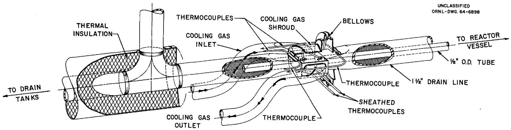  
FIG. 5.31.

FREEZE VALVE IN LINE 103

The cooling gas enters the shroud from the side through a 3/4-in. OD tube, and leaves through a similar pipe on the opposite side. The shroud is made concave on the top and bottom, as shown on ORNL Dwg E-GG-C-40603, to increase the gas velocity and improve the heat transfer in those areas to obtain more rapid freezing of the salt plug at the center of the flow area.

The freeze valve and shroud assembly are enclosed in a 20-gage stainless steel box about 8 in. wide x 5 in. high x 6 in. long, filled with Fiberfrax wool thermal insulation. (See Section 5.6.6.3.)

Two sheathed thermocouples are installed on the top outside flattened face of the valve, the sheathes passing through sleeves in the side plates of the shroud. Two thermocouples are also located on the top shoulder of the valve opposite the bellows end, and two couples are located on top of the pipe immediately adjacent to the bellows, as shown on ORNL Dwgs D-HH-B-40543 and E-GG-C-40603.

A Calrod heater, 0.315 in. diam with Inconel sheath, of 1500-watt capacity, is formed into a saddle shape and fits over the top of line 103 between the freeze valve box and the electrical connection to the line used for resistance heating between the reactor and the drain tanks. The saddle-type heater is removable with special tooling from above through a special standpipe arrangement, as shown on ORNL Dwg D-GG-C-40604. The heater may be needed to prevent the pipe from becoming too cool in the vicinity of the electrical connection lug, and is not directly associated with operation of the freeze valve.

The valve can be frozen by the 68 scfm jet of cooling gas in less than 30 minutes.[115] When the temperature of the shoulders of the valve reaches about $680^{\circ}\mathrm{F}$ , the cooling gas flow is reduced to about 15 scfm; at $650^{\circ}\mathrm{F}$ all gas flow would be cut off. When the temperature rises slightly above $650^{\circ}\mathrm{F}$ , the holding air would be resumed and if the temperature reaches $850^{\circ}\mathrm{F}$ the blast air flow of 68 scfm is again turned on.

5.6.5.5 Freeze Valves 104, 105 and 106. These freeze valves are located in the fuel-salt drain tank cell in the 1 l/2-in. salt transfer lines. One or more are thawed when salt is to be transferred,

or when flush or fuel salt is being circulated in the reactor system, but are deep frozen at all other times.

The flattened sections on the process piping for these valves are essentially as described for FV-103, above, except that the flats sides are mounted in the horizontal plane. The general features of the cooling gas shroud, or box, are indicated in the sketch, Figure 5.34. The cross sectional shapes of the shroud and the process pipe at the center of the freeze valve are very similar. The shroud is 2-1/8 in. long, measured along the axis of the pipe, and has maximum overall dimensions of 2-5/16 in. high and 3-7/8 in. wide. The end pieces are fabricated of 1/8-in.-thick INOR-8 plate and are welded to the process pipe. The outside shell, which is welded around the end pieces, consists of two layers of 0.024-in.-thick INOR-8 shim stock separated by two thickness of 1/8-in.-thick Fiberfrax insulating paper, Type 970-H. Additional details are shown on ORNL Dwg D-GG-C-55509.

The cooling gas is introduced at the bottom of the shroud through $1/2$ -in. OD x 0.042-in. wall thickness INOR-8 tubing. The gas circulates inside the shroud around the freeze valve section and leaves through a similar $1/2$ -in. OD tube at the bottom, the inlet and outlet openings being separated by a $1/8$ -in.-thick baffle. The inlet gas tubing has a 6-in.-long, 316 stainless steel, corrugated flexible connector welded in it to provide for relative movement of the process pipe and the gas supply line. The gas discharge pipe terminates about 8 in. below the freeze valve, the gas discharging into the cell atmosphere.

The thermocouple leads are brought into the shroud through the exit gas tube. Two chromel-alumel, mineral-insulated thermocouples with 1/8-in. OD Inconel sheaths are applied to built-up pads on the top of the center section, as indicated in Figure 5.32. Two thermocouples are also attached to pads on top of each shoulder outside the cooling gas shroud.

The cooling gas shroud is enclosed in the removable heater-insulation units for the process lines, see Section 5.6.6, following. The $3 / 4$ -in.-thick flat-plate ceramic heaters (Cooley Electric Mfg. Corp.,

Indianapolis) are arranged on the sides and top of the process piping, are attached to the insulation assembly and are removable with it. The heaters at FV-104 consist of two sections, FV-104-1, made up of six heater elements with a total capacity of 2.4 kw (at 230 v); and FV-104-3, containing three elements with a total capacity of 2 kw (at 115 v). The heaters at FV-105 are arranged in three sections: FV-105-1 has six heater elements with total capacity of 2.4 kw (at 230 v), FV-105-3 has three heaters and a total capacity of 2.0 kw (at 115 v), and FV-105-4 has three heaters with total capacity of 1.95 kw (at 115 v). Freeze valve 106 has two heater sections: FV-106-1 has six elements and a total capacity of 2.0 kw (at 230 v), and FV-106-3 has three elements and a total capacity of 2.0 kw (at 115 v).

As shown on the Mirror Insulation Company Dwgs G-118B and G-118C, the heater plates are not applied for a distance of about 2 in. along the pipe at the cooling shroud, due to the lack of space. Sufficient heat is obtained by conduction along the process pipe to thaw the freeze valve. Also, see ORNL Dwg E-MM-A-51660.

Heaters on the piping adjacent to FV-104, 105 and 106 are on at all times during reactor operation. A valve is thawed by cutting off the cooling gas flow. While freezing and thawing times are not critical in the operation of the MSRE,[115] the observed time is less than 10 minutes with electric power available and less than 20 min when relying only on the residual heat in the system.

A cooling gas flow of 15 scfm through the cooling shroud will freeze a salt plug in less than 30 minutes. When the temperatures of the shoulders of the valve are indicated to be less than $750^{\circ}\mathrm{F}$ , the cooling gas flow is reduced to about 3 scfm to hold the plug frozen. Should the temperature climb to about $820^{\circ}\mathrm{F}$ , the high flow rate will be resumed. If the temperature falls below $650^{\circ}\mathrm{F}$ , the gas flow will be stopped altogether to prevent the formation of too large a frozen zone.

5.6.5.6 Freeze Valves 107, 108, 109, 110, 111 and 112. These freeze valves are installed in salt transfer lines in the fuel drain tank and fuel processing cells. Although direct maintenance is not possible in the drain tank cell, FV-107, 108 and 109 were not provided

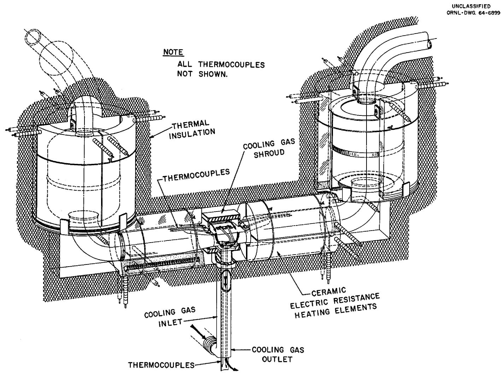  
FIG. 5.32   
FREEZE VALVE IN LINES  
107,108,109 8 110

UNCLASSIFIED

ORNL-DWG.64-6900

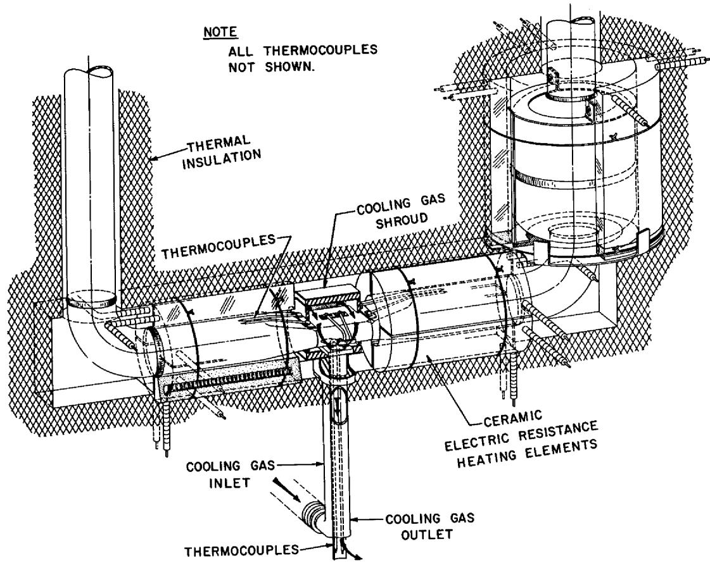  
FIG. 5.33.   
FREEZE VALVE IN LINES

111 8. 112

with removable heater and insulation sections, as were FV-104, 105 and 106, which are also in the drain tank cell, because the non-removable type heaters were simpler and more economical to install. Lines 107, 108 and 109 are not essential to reactor operation, and, in most cases, if a line fails to thaw properly, an alternate route can be used for transfer of the salt. A further consideration is that the heaters at FV-107, 108 and 109 are seldom used, the valves remaining in the deep frozen condition for long periods, and could be reasonably assumed to require no maintenance during the life of the MSRE.

The freeze valves in the sealed drain tank cell use cell atmosphere gas for cooling whereas FV-110, 111 and 112 are in the fuel processing cell and use air as the coolant.

As may be noted in Figure 5.32, freeze valves 107, 108, 109 and 110 have pots, or reservoirs, on each side of the valve. Freeze valves FV-111 and 112 have a pot on one side only as shown in Figure 5.33. The transition from $\frac{1}{2}$ -in. pipe size to the $\frac{1}{2}$ -in. NPS freeze valve section is made at the reservoirs.

The dimensions of the flattened section of 1-1/2-in. pipe are as described for FV-103, Section 5.6.5.4, above. The construction of the cooling gas shrouds, the freezing and thawing times, and the thermocouple locations, are essentially the same as listed for FV-104 in Section 5.6.5.5, above, and in Table 5.11.

The heat for thawing of freeze valves 107 through 112 is conducted along the pipe walls from the permanently-installed curved-plate ceramic pipe line heaters on each side of the freeze valve section. The pipeline heaters are described and listed in Section 5.6.6, following.

5.6.5.7 Freeze Valves 204 and 206. These two freeze valves are located in the drain and fill lines for the coolant-salt system and thus are not part of the primary circulating system. They are described here, however, to complete the section on freeze valves. Both freeze valves are located in the coolant cell, and both must be thawed to completely drain the coolant-salt circulating system.

The flattened section of 1-1/2-in. pipe at each freeze valve is the same as described for FV-103, Section 5.6.5.4. The 1500-w

UNCLASSIFIED

ORNL-DWG.64-6901

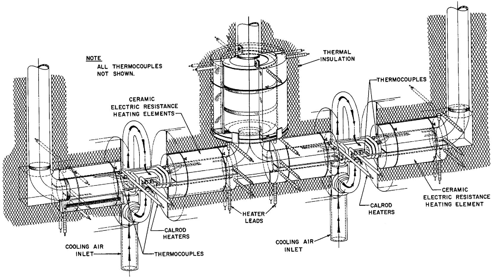  
FIG. 5.34.   
FREEZE VALVE IN LINES

204 & 206

(at 110 v) Calrod heater unit is identical to the one used on FV-103 (see ORNL Dwg E-GG-C-40603) except that the flat sides of the valves are in the horizontal plane and the heaters are applied from the side, FV 204 and 206 being approachable for direct maintenance a short time after reactor shutdown. Curved-plate ceramic heaters are applied to the process piping on each side of the freeze valves, as shown on Dwg E-MM-Z-47489. The thermal insulation on the outside of the line heaters is 3-in. of Careytemp $1600^{\circ}\mathrm{F}$ (Philip Carey Mfg. Company). No thermal insulation is used around the center sections of the freeze valves.

No cooling gas shrouds are used. The cooling air is supplied through the $3/4$ -in. lines 906 and 907, each of which branches at a tee beneath its freeze valve into two $3/8$ -in. steel pipes discharging about $5/8$ in. from the top and bottom outside surfaces of the valve. See ORNL Dwg D-GG-E-41885 and Figure 5.35.

Two thermocouples are welded on the side of the center of the flattened section of each valve, and two are applied to each shoulder. In addition, single couples are installed about 5 in. upstream and downstream of each valve, and two are on the reservoir pot located between the two valves. Thermocouple locations are shown on ORNL Dwg D-HH-B-40543.

When the valves are to be thawed the cooling air supply is stopped and the center heater is turned on until the temperature measured at the center of the valve is greater than 1,000 - 1,100°F. A frozen valve will thaw in less than 5 minutes. Without electric power the valves will thaw in less than 25 min, by conduction of heat, and will remain thawed for 30 min or more.

The center heater, if on, is turned off before the valves are to be frozen. A cooling flow of 25 scfm of air will freeze a solid salt plug in less than 15 min in either FV 204 or 206. After the temperatures of the shoulders of the valves reach about $750^{\circ}\mathrm{F}$ , the air flow is reduced to a holding rate of 5 scfm. Should the temperature of the center of the valve climb above $750^{\circ}\mathrm{F}$ the high air flow rate will be resumed. Below $650^{\circ}\mathrm{F}$ the valves are deep frozen and all air flow is cut off.

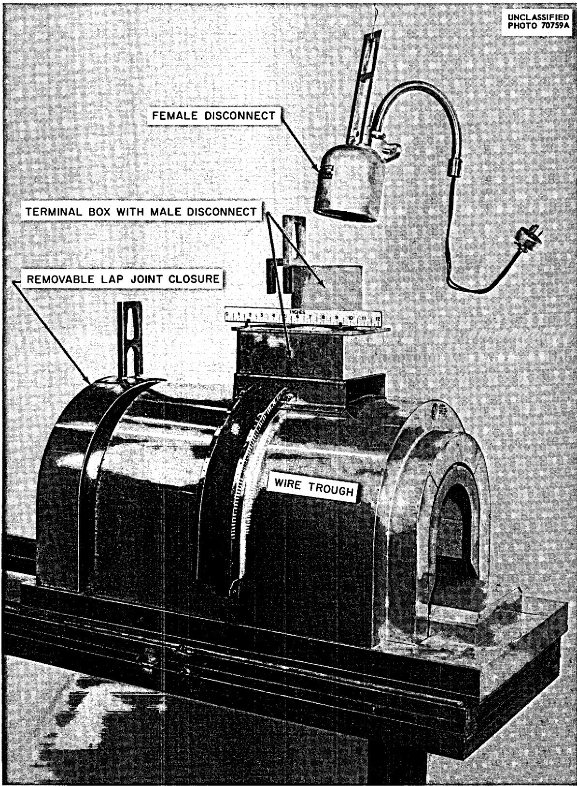  
Fig. 5.35. Removable Heater for 5-in. Pipe.

# 5.6.6 Pipe Insulation and Heaters

5.6.6.1 General Description and Design Considerations. All salt-containing lines in the MSRE are thermally insulated and provided with electrical heaters capable of maintaining the salt above the liquidus temperature of $850^{\circ}\mathrm{F}$ .

The heaters can be broadly classified into the removable and permanent types. The former are defined as those with the thermal insulation and heaters arranged into an integral unit that can be removed and replaced by remotely-operated tooling as illustrated in Figure 5.35. The types, which use more conventional materials and methods of installation, are defined as those which would require direct approach for maintenance, although in some instances this would not be possible because of the activity level. All such permanent heaters have spare heating elements installed and connected ready for use except for minor out-of-cell changes.

Some of the heaters at the more inaccessible sections of piping have excess installed capacities so that they may be operated at reduced voltage to promote longer heater life. In general, vertical lines require about twice the heater capacity needed for horizontal pipes. The heaters are supplied with either single phase 115-v, single phase 208 and 230-v, or three-phase 208-v power, and some are connected in series and some in parallel, all as dictated by the heater requirements and the nature of the electrical supply equipment already on hand in Building 7503 at the start of the MSRE project.

The maximum amperage, total power per heater, and the watts per ft of pipe length, as listed on the drawings and in Table 5.12, are based on the current-carrying capacity of the electrical supply equipment and not upon the power that can be delivered to each pipe section without excessive heating of the materials. Such values must be determined in the field during preliminary testing of the reactor.

The thermal insulation can be divided into (1) the metallic, multiple-layer reflective type, and (2), the low thermal conductivity ceramic fiber or expanded silica types. The reflective insulation

has the important characteristic of not dusting, and is used on all salt lines in the reactor cell, with the exception of line 103. The low conductivity types, as installed, have a lower heat loss per ft of pipe. In selecting the materials, consideration was given to the resistance to radiation damage, accumulation of long-lived induced activity, and to compatability with other materials in the system. Almost all the removable heaters use reflective type insulation. (The removable heaters at FV-104, 105 and 106 use the ceramic fiber type). Almost all permanent heaters use expanded silica insulation.

At least one thermocouple is provided on the piping for each heater unit. Anticipated "cold spots" in the piping have additional couples.

With the exceptions noted below, all the pipe line heaters on the portions of the fuel and coolant-salt piping within the reactor cell are of the removable type. See Table 5.12. These heaters have resistance wire embedded in flat ceramic plates and are arranged at the top and sides of the piping. All the removable heaters in the reactor cell use multi-layer reflective type insulation.

The vertical leg of piping in line 102 just below the primary heat exchanger is very difficult to reach with remotely-operated tools. The heaters for this section are a tubular type strapped to the pipe. A set of spare heater elements is also installed. This portion of piping would be removed with the heat exchanger if repairs are needed. These heaters on line 102 have reflective type insulation.

The portions of lines 100 and 102 that pass through the thermal shield of the reactor also have removable type heater-insulation units, as described above, but since access to them would require lifting of the thermal shield plugs, each ceramic heater element is provided with a duplicate set of resistance wires in the plates.

Line 103 is heated by passing an electric current through the pipe wall itself. Non-removable, expanded silica insulation is applied over the resistance-heated length, including the portion inside the drain tank cell. See Section 5.6.6.2, following.

Lines 104, 105 and 106 in the fuel-salt drain tank cell have removable heater-insulation units such as those used in the reactor cell.

The heaters on lines 107, 108 and 109 in the drain tank cell see little service since the freeze valves in these lines are deep frozen most of the time. In most part, these three lines have permanent tubular-type heaters. Although they should be maintenance-free during the life of the MSRE, duplicate spare heaters are installed. The portion of the fuel-salt transfer line 110 located in the drain-tank cell also has permanent tubular-type heaters, but, since this line is used more often than 107, 108 and 109 (although still infrequently), it is provided with two sets of spare heaters in each pipe section. The section of line 110 in the fuel processing cell, and lines 111 and 112 in this cell, have permanent heaters and expanded silica insulation. The equipment in the fuel processing cell will require decontamination before approach for direct maintenance, therefore spare heater elements are provided.

Some sections of the piping in lines 107 through 112, such as adjacent to the freeze valves and at the drain tank furnace walls, require a greater concentration of heat than is available from the tubular heaters. Permanent curved-plate ceramic heaters are used at these points.* See Table 5.12.

Direct maintenance can be used on the coolant-salt piping in the coolant cell a short time after reactor shutdown. Tubular-type heaters are strapped to the piping and covered with expanded silica insulation. The penetrations through the reactor containment vessel wall for the coolant salt lines 200 and 201 are provided with ceramic plate heaters having spare heating wires. These heaters, and the low-conductivity thermal insulation used with them, can be removed by manipulation from the coolant cell end of the penetration, but they cannot be as readily approached for direct maintenance as the other coolant cell equipment.

5.6.6.2 Pipe Heaters. The process piping is heated by three methods: (1) ceramic plate and (2) tubular type heaters applied to the piping, and (3) resistance heating of the pipe wall with an electric current. The heaters are listed in Table 5.12 for each of the sections of piping. The coolant-salt piping has been included in this section to complete the discussion of heaters and insulation.

(1) Ceramic Plate Heaters. These heaters consist of nichrome resistance wire embedded in a ceramic plate about $3/4$ in. thick to form either flat plates $1/2$ -cylinder, or $1/4$ -cylinder shapes curved to fit the pipes. These "Thermoshell" elements, manufactured by the Cooley Electric Manufacturing Company (Indianapolis) are used in a variety of sizes, but the flat plates are typically about 5 in. wide x 12 in. long. (See heater schedules on ORNL Dwgs E-MM-A-51601 and 40833, 51661). As indicated in Table 5.12, some ceramic plates have spare resistance wires.

The ceramic plates are largely composed of sodium atoms, but small amounts of thorium, leading to $^{233}\mathrm{Pa}$ after irradiation, can cause significant activity in the elements after long exposure. The resistance heating wires are primarily nickel and chromium with small amounts of cobalt. Induced activity, due to formation of $^{58}\mathrm{Co}$ from the nickel and $^{60}\mathrm{Co}$ from the natural cobalt, probably will restrict direct handling of heater units removed from the reactor cell. $^{118}$

(2) Tubular Heaters. These heaters are of the "Calrod" type, as furnished by the General Electric Company. The Inconel sheaths are 0.315 in. OD. The lengths and capacities vary, as shown in Table 5.12. The No. 12 wire extension leads are insulated with ceramic beads, as shown in detail on ORNL Dwg E-MM-B-5167.   
(3) Resistance Heating. Drain line 103 is heated by passing a heavy electric current at 18 v through the pipe walls. The 25-kva 420/18-v transformer to supply the current is located in the southwest corner of the drain tank cell. Leads from this transformer are connected at about midpoint in the line, which is in the drain tank cell near to the transformer. The current flows from this connection to each end of the line. Electrical connections are made about 12 in.

Table 5.12. MSRE Pipe Line Heaters   

<table><tr><td rowspan="2">Heater Number</td><td rowspan="2">Location</td><td rowspan="2">Heater Length (in.)</td><td rowspan="2">Typea</td><td rowspan="2">Number Heaters</td><td colspan="4">Maximum Values Based on Elec. Supply System Equipment</td><td rowspan="2">Remarks</td></tr><tr><td>Voltsb</td><td>Amps</td><td>Total Watts</td><td>Watts per ft</td></tr><tr><td colspan="10">REACTOR CELLc</td></tr><tr><td>H100-1</td><td>R outlet to FF100</td><td>11-7/16</td><td>C</td><td></td><td>230</td><td>16.5</td><td>3800</td><td>4000</td><td>Duplicate spare installed</td></tr><tr><td>H100-2</td><td>FF-100 to FP furnace</td><td>5-3/8</td><td>C</td><td></td><td>115</td><td>24.3</td><td>2800</td><td>6250</td><td>-</td></tr><tr><td>H101-1</td><td>FP to FF-101</td><td>27-13/16</td><td>C</td><td>6</td><td>208,3∅</td><td>13.9</td><td>5000</td><td>2000</td><td>Connected with H102-3</td></tr><tr><td>H101-2</td><td>FF-101 inlet</td><td>13-1/2</td><td>C</td><td></td><td>230</td><td>17.4</td><td>4000</td><td>3550</td><td>-</td></tr><tr><td>H101-3</td><td>HX inlet</td><td>5-1/2</td><td>C</td><td>3</td><td>115</td><td>23.5</td><td>2700</td><td>4100</td><td>-</td></tr><tr><td>H102-1A</td><td>Vertical line from HX</td><td>60</td><td>T</td><td></td><td>212)</td><td></td><td>2120</td><td>1275</td><td>Duplicate spare installed</td></tr><tr><td>H102-1B</td><td>Vertical line from HX</td><td>52</td><td>T</td><td>3</td><td>212)</td><td>28.0</td><td>1840</td><td>1275</td><td>Duplicate spare installed</td></tr><tr><td>H102-1C</td><td>Vertical line from HX</td><td>56</td><td>T</td><td></td><td>212)</td><td></td><td>1970</td><td>1275</td><td>Duplicate spare installed</td></tr><tr><td>H102-2A</td><td>Horizontal line to FF-102</td><td>20</td><td>C</td><td>6</td><td>208,3∅</td><td>11.1</td><td>4000</td><td>2400</td><td>-</td></tr><tr><td>H102-2B</td><td>Horizontal line to FF-102</td><td>20</td><td>C</td><td>6</td><td>208,3∅</td><td>11.1</td><td>4000</td><td>2400</td><td>-</td></tr><tr><td>H102-3</td><td>Horizontal line to FF-102</td><td>24</td><td>C</td><td>6</td><td>208,3∅</td><td>11.1</td><td>4000</td><td>2000</td><td>Connected with H101-1</td></tr><tr><td>H102-4</td><td>FF-102 inlet</td><td>8-3/16</td><td>C</td><td>3</td><td>230</td><td>11.7</td><td>2700</td><td>4000</td><td>-</td></tr><tr><td>H102-5</td><td>FF-102 to R</td><td>11-7/16</td><td>C</td><td>3</td><td>230</td><td>16.5</td><td>3800</td><td>4000</td><td>Duplicate spare installed</td></tr><tr><td>H200-1</td><td>Adjacent cell wall</td><td>15</td><td>C</td><td>3</td><td>230</td><td>17.4</td><td>4000</td><td></td><td>-</td></tr><tr><td>H200-2</td><td>Cell wall to FF-200</td><td>24</td><td>C</td><td>6</td><td>208,3∅</td><td>11.1</td><td>4000</td><td>2000</td><td>Connected with H200-3 &amp; 4</td></tr><tr><td>H200-3</td><td>Cell wall to FF-200</td><td>30</td><td>C</td><td>6</td><td>208,3∅</td><td>13.9</td><td>5000</td><td>2000</td><td>Connected with H200-2 &amp; 4</td></tr><tr><td>H200-4</td><td>Cell wall to FF-200</td><td>24</td><td>C</td><td>6</td><td>208,3∅</td><td>11.1</td><td>4000</td><td>2000</td><td>Connected with H200-2 &amp; 3</td></tr><tr><td>H200-5</td><td>Cell wall to FF-200</td><td>27</td><td>C</td><td>6</td><td>208,3∅</td><td>13.9</td><td>5000</td><td>2200</td><td>Connected with H201-8</td></tr><tr><td>H200-6</td><td>Cell wall to FF-200</td><td>30</td><td>C</td><td>6</td><td>208,3∅</td><td>13.9</td><td>5000</td><td>2000</td><td>-</td></tr><tr><td>H200-7</td><td>Cell wall to FF-200</td><td>30</td><td>C</td><td>6</td><td>208,3∅</td><td>13.9</td><td>5000</td><td>2000</td><td>-</td></tr><tr><td>H200-8</td><td>Cell wall to FF-200</td><td>30</td><td>C</td><td>6</td><td>208,3∅</td><td>13.9</td><td>5000</td><td>2000</td><td>-</td></tr><tr><td>H200-9A</td><td>Wall to FF-200</td><td>20</td><td>C</td><td>6</td><td>208,3∅</td><td>11.1</td><td>4000</td><td>2400</td><td>Connected with H200-9B, 4A &amp; 4B</td></tr><tr><td>H200-9B</td><td>Wall to FF-200</td><td>20</td><td>C</td><td>6</td><td>208,3∅</td><td>11.1</td><td>4000</td><td>2400</td><td>-</td></tr><tr><td>H200-10</td><td>Wall to FF-200</td><td>24</td><td>C</td><td>6</td><td>208,3∅</td><td>11.1</td><td>4000</td><td>2000</td><td>Connected with H201-3</td></tr><tr><td>H200-11</td><td>Adjacent FF-200</td><td>23-3/16</td><td>C</td><td>6</td><td>208</td><td>19.2</td><td>4000</td><td>2075</td><td>-</td></tr><tr><td>H200-12</td><td>HX inlet</td><td>10</td><td>C</td><td>3</td><td>115</td><td>26.9</td><td>3100</td><td>7500</td><td>-</td></tr><tr><td rowspan="2">H201-1</td><td>Adjacent FF-201</td><td>23-3/16</td><td>C</td><td>6</td><td>208</td><td>19.2</td><td>4000</td><td>2075</td><td>-</td></tr><tr><td>HX side.</td><td></td><td></td><td></td><td></td><td></td><td></td><td></td><td></td></tr><tr><td rowspan="2">H201-2</td><td>Adjacent FF-201</td><td>11-3/16</td><td>C</td><td>3</td><td>230</td><td>16.1</td><td>3700</td><td>2000</td><td>-</td></tr><tr><td>HX side.</td><td></td><td></td><td></td><td></td><td></td><td></td><td></td><td></td></tr><tr><td>H201-3</td><td>FF-201 to cell wall</td><td>30</td><td>C</td><td>6</td><td>208,3∅</td><td>13.9</td><td>5000</td><td>2000</td><td>Connected with H200-10</td></tr><tr><td>H201-4A</td><td>FF-201 to cell wall</td><td>20</td><td>C</td><td>6</td><td>208,3∅</td><td>11.1</td><td>4000</td><td>2400)</td><td>Connected with H200-9A, 9B &amp; 4B</td></tr><tr><td>H201-4B</td><td>FF-201 to cell wall</td><td>20</td><td>C</td><td>6</td><td>208,3∅</td><td>11.1</td><td>4000</td><td>2400)</td><td>Connected with H200-9A, 9B &amp; 4A</td></tr><tr><td>H201-5</td><td>FF-201 to cell wall</td><td>30</td><td>C</td><td>6</td><td>208,3∅</td><td>13.9</td><td>5000</td><td>2000</td><td>-</td></tr><tr><td>H201-6</td><td>FF-201 to cell wall</td><td>24</td><td>C</td><td>6</td><td>208,3∅</td><td>11.1</td><td>4000</td><td>2000</td><td>-</td></tr><tr><td>H201-7</td><td>FF-201 to cell wall</td><td>30</td><td>C</td><td>6</td><td>208,3∅</td><td>13.9</td><td>5000</td><td>2000</td><td>-</td></tr><tr><td>H201-8</td><td>FF-201 to cell wall</td><td>30</td><td>C</td><td>6</td><td>208,3∅</td><td>13.9</td><td>5000</td><td>2000</td><td>Connected with H200-5</td></tr><tr><td>H201-9</td><td>FF-201 to cell wall</td><td>25</td><td>C</td><td>6</td><td>208</td><td>24.0</td><td>5000</td><td>2000</td><td>-</td></tr><tr><td colspan="10">DRAIN TANK CELL LINE HEATER UNITSd</td></tr><tr><td>H104-1</td><td>At FFT</td><td>10-1/2</td><td>C1</td><td>3</td><td>115</td><td>11.3</td><td>1300</td><td>1500</td><td>-</td></tr><tr><td>H104-2</td><td>FFT to FV-104</td><td>30</td><td>C1</td><td>6</td><td>230</td><td>19.6</td><td>4500</td><td>1800</td><td>-</td></tr><tr><td>H104-3</td><td>FFT to FV-104</td><td>30</td><td>C1</td><td>6</td><td>230</td><td>26.0</td><td>6000</td><td>2400</td><td>-</td></tr><tr><td>H104-4</td><td>At FV-104</td><td>30</td><td>C1</td><td>6</td><td>230</td><td>19.6</td><td>4500</td><td>1800</td><td>-</td></tr><tr><td>H104-5</td><td>FV-104 to line 103</td><td>10-1/2</td><td>C1</td><td>3</td><td>115</td><td>14.8</td><td>1700</td><td>1950</td><td>-</td></tr><tr><td>H104-6</td><td>FV-104 to line 103</td><td>12</td><td>C1</td><td>3</td><td>115</td><td>17.4</td><td>2000</td><td>2000</td><td>-</td></tr><tr><td>H104-7</td><td>At line 103</td><td>30</td><td>C1</td><td>8</td><td>230</td><td>26.0</td><td>6000</td><td>2400</td><td>Duplicate spare installed</td></tr><tr><td rowspan="2">Heater Number</td><td rowspan="2">Location</td><td rowspan="2">Heater Length (in.)</td><td rowspan="2">\( Type^a \)</td><td rowspan="2">Number Heaters</td><td colspan="4">Maximum Values Based on Elec. Supply System Equipment</td><td rowspan="2">Remarks</td></tr><tr><td>Voltsb</td><td>Amps</td><td>Total Watts</td><td>Watts per ft</td></tr><tr><td>H105-1</td><td>At FD-2</td><td>10-1/2</td><td>\( C_1 \)</td><td>3</td><td>115</td><td>11.3</td><td>1300</td><td>1500</td><td>-</td></tr><tr><td>H105-2</td><td>FD-2 to FV-105</td><td>30</td><td>\( C_1 \)</td><td>6</td><td>230</td><td>19.6</td><td>4500</td><td>1800</td><td>-</td></tr><tr><td>H105-3</td><td>FD-2 to FV-105</td><td>30</td><td>\( C_1 \)</td><td>6</td><td>230</td><td>17.4</td><td>4000</td><td>1600</td><td>-</td></tr><tr><td>H105-4</td><td>At FV-105</td><td>12</td><td>\( C_1 \)</td><td>3</td><td>115</td><td>17.4</td><td>2000</td><td>2000</td><td>-</td></tr><tr><td>H106-1</td><td>At FD-1</td><td>10-1/2</td><td>\( C_1 \)</td><td>3</td><td>115</td><td>11.3</td><td>1300</td><td>1500</td><td>-</td></tr><tr><td>H106-2</td><td>FD-1 to FV-106</td><td>30</td><td>\( C_1 \)</td><td>6</td><td>230</td><td>19.6</td><td>4500</td><td>1800</td><td>-</td></tr><tr><td>H106-3</td><td>At FV-106</td><td>28</td><td>\( C_1 \)</td><td>6</td><td>230</td><td>26.0</td><td>6000</td><td>2500</td><td>-</td></tr><tr><td>H106-4</td><td>FV-106 to line 103</td><td>12</td><td>\( C_1 \)</td><td>3</td><td>115</td><td>8.7</td><td>1000</td><td>1000</td><td>-</td></tr><tr><td>H107-1</td><td>At FFT</td><td>4</td><td>\( C_2 \)</td><td>2</td><td>57.5</td><td>4.35</td><td>250</td><td>750</td><td>Duplicate spare installed</td></tr><tr><td>H107-2-1</td><td>FFT to FV-107</td><td>62</td><td>T</td><td>1</td><td>140 )</td><td>7.26</td><td>750</td><td>187</td><td>Duplicate spare installed</td></tr><tr><td>H107-2-2</td><td>FFT to FV-107</td><td>32</td><td>T</td><td>1</td><td>140 )</td><td></td><td>280</td><td>187</td><td>Duplicate spare installed</td></tr><tr><td>H107-3A,3B</td><td>Adjacent flange</td><td>4</td><td>\( C_2 \)</td><td>2</td><td>57.5)</td><td>8.7</td><td>250</td><td>750</td><td>Duplicate spare installed</td></tr><tr><td>3C, 3D,</td><td>Adjacent flange</td><td>4</td><td>\( C_2 \)</td><td>2</td><td>57.5)</td><td>8.7</td><td>250</td><td>750</td><td>Duplicate spare installed</td></tr><tr><td>H108-1</td><td>At FD-2</td><td>4</td><td>\( C_2 \)</td><td>2</td><td>57.5</td><td>4.35</td><td>250</td><td>750</td><td>Duplicate spare installed</td></tr><tr><td>H108-2-1</td><td>FD-2 to FV-108</td><td>44</td><td>T</td><td>1</td><td>140 )</td><td></td><td>460</td><td>185</td><td>Duplicate spare installed</td></tr><tr><td>H108-2-2</td><td>FD-2 to FV-108</td><td>50</td><td>T</td><td>1</td><td>140 )</td><td>9.25</td><td>550</td><td>185</td><td>Duplicate spare installed</td></tr><tr><td>H108-2-3</td><td>FD-2 to FV-108</td><td>32</td><td>T</td><td>1</td><td>140 )</td><td></td><td>275</td><td>185</td><td>Duplicate spare installed</td></tr><tr><td>H108-3A,3B</td><td>Adjacent flange</td><td>4</td><td>\( C_2 \)</td><td>2</td><td>57.5)</td><td>8.7</td><td>250</td><td>750</td><td>Duplicate spare installed</td></tr><tr><td>-3C, 3D</td><td>Adjacent flange</td><td>4</td><td>\( C_2 \)</td><td>2</td><td>57.5)</td><td>8.7</td><td>250</td><td>750</td><td>Duplicate spare installed</td></tr><tr><td>H109-1</td><td>At FD-1</td><td>4</td><td>\( C_2 \)</td><td>2</td><td>57.5</td><td>4.35</td><td>250</td><td>750</td><td>Duplicate spare installed</td></tr><tr><td>H109-2-1</td><td>FD-1 to FV-109</td><td>44</td><td>T</td><td>1</td><td>140 )</td><td></td><td>460</td><td>185</td><td>Duplicate spare installed</td></tr><tr><td>H109-2-2</td><td>FD-1 to FV-109</td><td>50</td><td>T</td><td>1</td><td>140 )</td><td>9.25</td><td>550</td><td>185</td><td>Duplicate spare installed</td></tr><tr><td>H109-2-3</td><td>FD-1 to FV-109</td><td>32</td><td>T</td><td>1</td><td>140 )</td><td></td><td>275</td><td>185</td><td>Duplicate spare installed</td></tr><tr><td>H109-3A,3B</td><td>Adjacent flange</td><td>4</td><td>\( C_2 \)</td><td>2</td><td>57.5)</td><td>8.7</td><td>250</td><td>750</td><td>Duplicate spare installed</td></tr><tr><td>-3C, 3D</td><td>Adjacent flange</td><td>4</td><td>\( C_2 \)</td><td>2</td><td>57.5)</td><td>8.7</td><td>250</td><td>750</td><td>Duplicate spare installed</td></tr><tr><td rowspan="2">Heater Number</td><td rowspan="2">Location</td><td rowspan="2">Heater Length (in.)</td><td rowspan="2">Typea</td><td rowspan="2">Number Heaters</td><td colspan="4">Maximum Values Based on Elec. Supply System Equipment</td><td rowspan="2">Remarks</td></tr><tr><td>Voltsb</td><td>Amps</td><td>Total Watts</td><td>Watts per ft</td></tr><tr><td>H110-1-1</td><td>FV-108 to line 110</td><td>50</td><td>T</td><td>1</td><td>140</td><td rowspan="2">7.9</td><td>550</td><td>185</td><td>Duplicate spare installed</td></tr><tr><td>H110-1-2</td><td>FV-109 to line 110</td><td>50</td><td>T</td><td>1</td><td>140</td><td>550</td><td>185</td><td>Duplicate spare installed</td></tr><tr><td>H110-2-1</td><td>Adjacent FV-107</td><td>98</td><td>T</td><td>1</td><td>156</td><td rowspan="3">28.0</td><td>1600</td><td>230</td><td>Two duplicate spares installed</td></tr><tr><td>H110-2-2</td><td>FV-107 to cell wall</td><td>98</td><td>T</td><td>1</td><td>156</td><td>1600</td><td>230</td><td>Two duplicate spares installed</td></tr><tr><td>H110-2-3</td><td>FV-107 to cell wall</td><td>74</td><td>T</td><td>1</td><td>156</td><td>1150</td><td>230</td><td>Two duplicate spares installed</td></tr><tr><td>H110-3-1</td><td>FV-107 to cell wall</td><td>74</td><td>T</td><td>1</td><td>230</td><td rowspan="2">17.4</td><td>2500</td><td>500</td><td>Two duplicate spares installed</td></tr><tr><td>H110-3-2</td><td>At cell wall</td><td></td><td>T</td><td>1</td><td>230</td><td>750</td><td>500</td><td></td></tr><tr><td colspan="10">COOLANT CELL LINE HEATER UNITSe</td></tr><tr><td>H200-13-1</td><td>CP to sleeve</td><td>86</td><td>T</td><td>3</td><td>170,30</td><td rowspan="5">35(80.8)</td><td>5000</td><td>820</td><td>-</td></tr><tr><td>H200-13-2</td><td>CP to sleeve</td><td>86</td><td>T</td><td>3</td><td>170,30</td><td>5000</td><td>820</td><td>-</td></tr><tr><td>H200-13-3</td><td>CP to sleeve</td><td>86</td><td>T</td><td>3</td><td>170,30</td><td>5000</td><td>820</td><td>-</td></tr><tr><td>H200-13-4</td><td>CP to sleeve</td><td>86</td><td>T</td><td>3</td><td>170,30</td><td>5000</td><td>820</td><td>-</td></tr><tr><td>H200-13-5</td><td>CP to sleeve</td><td></td><td>T</td><td>3</td><td>170,30</td><td></td><td>820</td><td>-</td></tr><tr><td>H200-13-6</td><td>CP to sleeve</td><td>44</td><td>T</td><td>3</td><td>170,30</td><td rowspan="11">10.4</td><td>2000</td><td>820</td><td>-</td></tr><tr><td colspan="2">H200-14A,B Wall sleeve</td><td>12</td><td>C2</td><td>2</td><td>230</td><td>600</td><td>600</td><td>Duplicate spare installed</td></tr><tr><td colspan="2">H200-14C,D Wall sleeve</td><td>12</td><td>C2</td><td>2</td><td>230</td><td>600</td><td>600</td><td>Duplicate spare installed</td></tr><tr><td colspan="2">H200-14E,F Wall sleeve</td><td>12</td><td>C2</td><td>2</td><td>230</td><td>600</td><td>600</td><td>Duplicate spare installed</td></tr><tr><td colspan="2">H200-14G,H Wall sleeve</td><td>12</td><td>C2</td><td>2</td><td>230</td><td>600</td><td>600</td><td>Duplicate spare installed</td></tr><tr><td colspan="2">H200-15A,B Wall sleeve</td><td>12</td><td>C2</td><td>2</td><td>115</td><td>1500</td><td>1500</td><td>Duplicate spare installed</td></tr><tr><td colspan="2">H201-10A,B Wall sleeve</td><td>12</td><td>C2</td><td>2</td><td>115</td><td>1500</td><td>1500</td><td>Duplicate spare installed</td></tr><tr><td colspan="2">H201-11A,B Wall sleeve</td><td>12</td><td>C2</td><td>2</td><td>230</td><td>600</td><td>600</td><td>Duplicate spare installed</td></tr><tr><td colspan="2">H201-11C,D Wall sleeve</td><td>12</td><td>C2</td><td>2</td><td>230</td><td>600</td><td>600</td><td>Duplicate spare installed</td></tr><tr><td colspan="2">H201-11E,F Wall sleeve</td><td>12</td><td>C2</td><td>2</td><td>230</td><td>600</td><td>600</td><td>Duplicate spare installed</td></tr><tr><td colspan="2">H201-11G,H Wall sleeve</td><td>12</td><td>C2</td><td>2</td><td>230</td><td>600</td><td>600</td><td>Duplicate spare installed</td></tr><tr><td>H201-12-1</td><td rowspan="6">Sleeve to radiator enclosure</td><td>32</td><td>T</td><td>3</td><td>150,30</td><td rowspan="3">36</td><td>960</td><td>640</td><td>-</td></tr><tr><td>H201-12-2</td><td>74</td><td>T</td><td>3</td><td>150,30</td><td>3200</td><td>640</td><td>-</td></tr><tr><td>H201-12-3</td><td>86</td><td>T</td><td>3</td><td>150,30</td><td>3800</td><td>640</td><td>-</td></tr><tr><td>H201-12-4</td><td>86</td><td>T</td><td>3</td><td>150,30</td><td rowspan="3">(83)</td><td>3800</td><td>640</td><td>-</td></tr><tr><td>H201-12-5</td><td>86</td><td>T</td><td>3</td><td>150,30</td><td>3800</td><td>640</td><td>-</td></tr><tr><td>H201-12-6</td><td>86</td><td>T</td><td>3</td><td>150,30</td><td>3800</td><td>640</td><td>-</td></tr><tr><td>H201-13-1</td><td>In radiator enclosure</td><td>82</td><td>TR</td><td>3</td><td>230</td><td rowspan="2">16.3</td><td>1875</td><td>275</td><td>-</td></tr><tr><td>H201-13-2</td><td>In radiator enclosure</td><td>82</td><td>TR</td><td>3</td><td>230</td><td>1875</td><td>275</td><td>-</td></tr><tr><td>H202-1-1</td><td>CR outlet pipe</td><td>50</td><td>T</td><td>3</td><td>140</td><td rowspan="3">11.9</td><td>1670</td><td>400</td><td>Duplicate spare installed</td></tr><tr><td>H202-2-1</td><td>CR to CP</td><td>62</td><td>T</td><td>3</td><td>170,30</td><td>3280</td><td>820</td><td>-</td></tr><tr><td>H202-2-2</td><td>CR to CP</td><td>44</td><td>T</td><td>3</td><td>170,30</td><td>2000</td><td>820</td><td>-</td></tr><tr><td>H202-2-3</td><td>CR to CP</td><td>86</td><td>T</td><td>3</td><td>170,30</td><td>35</td><td>5000</td><td>820</td><td>-</td></tr><tr><td>H202-2-4</td><td>CR to CP</td><td>86</td><td>T</td><td>3</td><td>170,30</td><td rowspan="3">(80.0)</td><td>5000</td><td>820</td><td>-</td></tr><tr><td>H202-2-5</td><td>CR to CP</td><td>86</td><td>T</td><td>3</td><td>170,30</td><td>5000</td><td>820</td><td>-</td></tr><tr><td>H202-2-6</td><td>CR to CP</td><td>86</td><td>T</td><td>3</td><td>170,30</td><td>5000</td><td>820</td><td>-</td></tr><tr><td>H203-1A-1E*</td><td>CDT Fill line</td><td>86</td><td>T</td><td>1</td><td>91</td><td rowspan="2">28</td><td>470</td><td>80</td><td>Duplicate spare installed</td></tr><tr><td>H203-1F</td><td>CDT Fill line</td><td>44</td><td>T</td><td>1</td><td>91</td><td>470</td><td>80</td><td>Duplicate spare installed</td></tr><tr><td>H203-2</td><td>Fill line adjacent to CDT</td><td>44</td><td>T</td><td>1</td><td>140</td><td>3.3</td><td>462</td><td>185</td><td>Duplicate spare installed</td></tr><tr><td>H204-1-1</td><td>Line 201 to FV-204</td><td>74</td><td>T</td><td>2</td><td>221</td><td rowspan="2">see next page</td><td>1375</td><td>275</td><td>Duplicate spare installed</td></tr><tr><td>H204-1-2</td><td>Line 201 to FV-204</td><td>74</td><td>T</td><td>2</td><td>221</td><td>1375</td><td>275</td><td>Duplicate spare installed</td></tr><tr><td rowspan="2">Heater Number</td><td rowspan="2">Location</td><td rowspan="2">Heater Length (in.)</td><td rowspan="2">\( Type^a \)</td><td rowspan="2">Number Heaters</td><td colspan="5">Maximum Values Based on Elec. Supply System Equipment</td></tr><tr><td>Voltsb</td><td>Amps</td><td>Total Watts</td><td>Watts per ft</td><td>Remarks</td></tr><tr><td>H204-1-3</td><td>Line 201 to FV-204</td><td>74</td><td>T</td><td>2</td><td>221</td><td rowspan="3">28</td><td>1375</td><td>275</td><td>Duplicate spare installed</td></tr><tr><td>H204-1-4</td><td>Line 201 to FV-204</td><td>74</td><td>T</td><td>2</td><td>221</td><td>1375</td><td>275</td><td>Duplicate spare installed</td></tr><tr><td>H204-1-5</td><td>Line 201 to FV-204</td><td>56</td><td>T</td><td>2</td><td>221</td><td>687.5</td><td>275</td><td>Duplicate spare installed</td></tr><tr><td>H204-2-1</td><td>FV-204 &amp; FV-206 to CDT</td><td>50</td><td>T</td><td>3</td><td>132</td><td rowspan="2">20.0</td><td>510</td><td>170</td><td>Duplicate spare installed</td></tr><tr><td>H204-2-2</td><td>FV-204 &amp; FV-206 to CDT</td><td>74</td><td>T</td><td>3</td><td>132</td><td>850</td><td>170</td><td>Duplicate spare installed</td></tr><tr><td>H205-1-1</td><td>Line 201 to line 202</td><td>74</td><td>T</td><td>1</td><td>140</td><td rowspan="2">11.2</td><td>1100</td><td>150</td><td>Duplicate spare installed</td></tr><tr><td>H205-1-2</td><td>Line 201 to line 202</td><td>56</td><td>T</td><td>1</td><td>140</td><td>650</td><td>140</td><td>Duplicate spare installed</td></tr><tr><td>H206-1-1</td><td>Line 202 to FV-206</td><td>62</td><td>T</td><td>2</td><td>244</td><td rowspan="5">20.2</td><td>1120</td><td>280</td><td>Duplicate spare installed</td></tr><tr><td>H206-1-2</td><td>Line 202 to FV-206</td><td>62</td><td>T</td><td>2</td><td>244</td><td>1120</td><td>280</td><td>Duplicate spare installed</td></tr><tr><td>H206-1-3</td><td>Line 202 to FV-206</td><td>62</td><td>T</td><td>2</td><td>244</td><td>1120</td><td>280</td><td>Duplicate spare installed</td></tr><tr><td>H206-1-4</td><td>Line 202 to FV-206</td><td>62</td><td>T</td><td>2</td><td>244</td><td>1120</td><td>280</td><td>Duplicate spare installed</td></tr><tr><td>H206-1-5</td><td>Line 202 to FV-206</td><td>32</td><td>T</td><td>2</td><td>244</td><td>1120</td><td>280</td><td>Duplicate spare installed</td></tr></table>

${}^{a}$ C - removable heater unit with 3 segments (top and each side),ceramic elements. Duplicates have double element in each segment. ${\mathrm{C}}_{1}$ - Removable heater unit,three flat ceramic elements (top and side). ${\mathrm{C}}_{2}$ - Fixed ${90}^{ \circ  }$ curved ceramic elements. T - tubular heaters,non-removable.* TR - triangular, non-removable.   
bSingle phase unless otherwise indicated.   
cReference Drawing E-MM-A-51601.   
dReference Drawing E-MM-A-51661.   
eReference Drawing E-MM-A-40833.

from the intersection with line $10^{\underline{1}}$ and just inside the reactor furnace on the other end. These connections are made by welding the lug to the pipe. The return electrical connection from the pipe ends is routed along the pipe as a single-No. 4 wire mineral-insulated cable 0.699 in. OD laid in special brackets about 4 in. above the line 103 insulation. See ORNL Dwg E-MM-A-56240.

5.6.6.3 Thermal Insulation. Primary considerations in the selection of the pipe line insulation were the tendency of the materials to dust, the resistance to radiation damage and long-term activation, the thermal conductivity, and the presence of organic materials causing thermal deterioration or incompatability with other materials in the system.

The multi-layer reflective type of insulation presents fewer dusting problems as compared to the low-conductivity type and is used almost exclusively in the reactor cell, although the stainless steel does contain some cobalt which will become radioactive. The reflective units have a higher heat loss than the latter, however, as illustrated by the fact that horizontal sections of 5 in. pipe with reflective insulation require, on the average, about 2,000 watts/ft of energy input whereas similar pipe sections with expanded silica insulation require about 600 watts/ft.

Some compromises were necessary in selection of the low-conductivity insulation in that the good thermal conductivity and mechanical properties must be coupled with good resistance to spread of air borne contamination. Many mineral wool fibers contain significant cobalt or organic materials. Both the ceramic fiber and the expanded silica types selected for use in the MSRE are fired at $1200^{\circ}\mathrm{F}$ for about four hours before installation to drive off small amounts of volatile sulfur and chloride compounds. The types of insulation and the thicknesses used are listed in Table 5.13.

(1) Reflective Insulation. Reflective insulation is used in all but a few of the removable heater units. The typical reflective unit, as manufactured by the Mirror Insulation Company (Lambertville, New Jersey) consists of a removable section, which surrounds the top and sides of the pipe, and a permanent bottom section which

Table 5.13 THERMAL INSULATION ON MAJOR MSRE SALT PIPING   

<table><tr><td>Line Number</td><td>Line Size in. NPS</td><td>Location</td><td>Insulation** Thickness, in.</td><td>Removable</td><td>Type</td><td>Remarks</td></tr><tr><td>100</td><td>5</td><td>Reactor cell</td><td>4</td><td>Yes</td><td>Reflective</td><td>-</td></tr><tr><td>101</td><td>5</td><td>Reactor cell</td><td>4</td><td>Yes</td><td>Reflective</td><td>-</td></tr><tr><td>102</td><td>5</td><td>Reactor cell</td><td>4</td><td>Yes</td><td>Reflective</td><td>Vertical section beneath heat exchanger is non-removable.</td></tr><tr><td>103</td><td>5</td><td>Reactor and fuel DTC*</td><td>3</td><td>No</td><td>Expanded silica</td><td>Pipe is resistance-heated.</td></tr><tr><td>104</td><td>1-1/2</td><td>Fuel drain tank cell</td><td>4</td><td>Yes</td><td>Reflective</td><td>Removable units at freeze valves have ceramic fiber insulation.</td></tr><tr><td>105</td><td>1-1/2</td><td>Fuel drain tank cell</td><td>4</td><td>Yes</td><td>Reflective</td><td></td></tr><tr><td>106</td><td>1-1/2</td><td>Fuel drain tank cell</td><td>4</td><td>Yes</td><td>Reflective</td><td></td></tr><tr><td>107</td><td>1/2</td><td>Fuel drain tank cell</td><td>3</td><td>No</td><td>Expanded silica</td><td></td></tr><tr><td>108</td><td>1/2</td><td>Fuel drain tank cell</td><td>3</td><td>No</td><td>Expanded silica</td><td></td></tr><tr><td>109</td><td>1/2</td><td>Fuel drain tank cell</td><td>3</td><td>No</td><td>Expanded silica</td><td></td></tr><tr><td>110</td><td>1/2</td><td>Fuel DTC and FPC*</td><td>3</td><td>No</td><td>Expanded silica</td><td></td></tr><tr><td>111</td><td>1/2</td><td>Fuel processing cell</td><td>3</td><td>No</td><td>Expanded silica</td><td></td></tr><tr><td>112</td><td>1/2</td><td>Fuel processing cell</td><td>3</td><td>No</td><td>Expanded silica</td><td></td></tr><tr><td>200</td><td>5</td><td>Reactor cell</td><td>4</td><td>Yes</td><td>Reflective</td><td>Insulation outside reactor cell is non-removable exp&#x27;d. silica. 4 in. in thickness</td></tr><tr><td>201</td><td>5</td><td>Reactor cell</td><td>4</td><td>Yes</td><td>Reflective</td><td></td></tr><tr><td>202</td><td>5</td><td>Coolant cell</td><td>4</td><td>No</td><td>Expanded silica</td><td></td></tr><tr><td>203</td><td>1/2</td><td>Coolant cell</td><td>3</td><td>No</td><td>Expanded silica</td><td></td></tr><tr><td>204</td><td>1-1/2</td><td>Coolant cell</td><td>3-1/2</td><td>No</td><td>Expanded silica</td><td></td></tr><tr><td>205</td><td>1/2</td><td>Coolant cell</td><td>3</td><td>No</td><td>Expanded silica</td><td></td></tr><tr><td>206</td><td>1-1/2</td><td>Coolant cell</td><td>3-1/2</td><td>No</td><td>Expanded silica</td><td></td></tr></table>

* DTC = Drain tank cell; FPC = Fuel processing cell.   
** For insulation details see ORNL Dwg E-MM-Z-56235.

is attached to the structure below the pipe and supports the top section. The heater plates are mounted in clips in the top section and are removable with it. Application of heat to only the top and sides was demonstrated to give satisfactorily even temperature distribution to the pipe contents. (The thermocouples for measuring the pipe wall temperature are, for the most part, attached to the bottom of the pipe).

Starting at the inside, the first layer of reflective metal is 16 gage 310 stainless steel. The next layer is a sheet of pure silver 0.002 in. thick. The following nine layers are 321 stainless steel, 0.006 in. thick, arranged about 0.36 in. apart to provide a total thickness for the assembly of about 4 in. The outside surface is 18 gage 304 stainless steel. The removable units have a lifting eye at the top for handling with remote tooling.

Life tests on the heater-insulation units covering six months of continuous operation at $1400^{\circ}\mathrm{F}$ indicated about a $10\%$ increase in the heat loss due to change in the emissivity of the surfaces. The units showed good resistance to warping. (See p 30 ref 117).

(2) Ceramic Fiber Insulation. "Fiberfrax", a product of the Carborundum Company (Niagra Falls) is used in the paper form in the freeze valve cooling gas shrouds, and in the blanket and bulk forms, at such points as the removable heaters at FV 104, 105 and 106. The ceramic fiber is about $51.2\% \mathrm{Al}_{2}\mathrm{O}_{3}$ and $47.8\% \mathrm{SiO}_{2}$ (by weight) and is recommended for temperatures up to $2300^{\circ}\mathrm{F}$ . The thermal conductivity of the blanket and bulk forms, when packed to a density of 6 lbs/ft³, is 1.24 Btu-in./hr- $^{\circ}\mathrm{F}$ -ft² at 1000°F and 1.89 at 1400°F. The Fiberfrax paper used in the MSRE is Type 970-JH, which contains no organic binder. The paper has a thermal conductivity of 0.73 Btu-in./hr-ft²- $^{\circ}\mathrm{F}$ at 1,000°F and 0.95 at 1400°F. Activation analyses after 16 hrs in a neutron flux of 7 x 10¹¹ n/cm²-sec indicated that the $^{140}\mathrm{La}$ , with a 40-h half-life, and the $^{24}\mathrm{Na}$ , with 15-h half-life measured 24 hours after irradiation, gave 2.72 x 10² disintegrations per sec-gm and 1.87 dis/sec-gm, respectively. (See p 48 ref 108). These values indicate relatively good resistance to long-lived activation as compared to most inorganic, low-dusting, high-temperature insulation with low thermal conductivities.

(3) Expanded Silica Insulation. The expanded silica insulating material used in the MSRE is reinforced with inorganic fibers and has the trade name "Careytemp 1600", and is marketed by the Philip Carey Manufacturing Company (Cincinnati). The thermal conductivity is listed as 0.76 Btu-in./hr- $\mathsf{ft}^2$ -F at $1,000^{\circ}\mathsf{F}$ . It is recommended for use up to $1600^{\circ}\mathsf{F}$ . It contains no inorganics, has a low hygroscopicity, and has good resistance to dusting. Irradiation with neutrons for 16 hrs at a flux of $7\times 10^{11}$ n/cm $^2$ -sec gave activations of $3.06\times 10^{3}$ dis/sec-gm for the $40\text{-h}$ half-life $^{140}$ La, $1.12\times 10^{4}$ dis/sec-gm for the $85\text{-d}$ ^{46}Sc, $5.02\times 10^{3}$ for the $45\text{-d}$ ^{59}Fe, and $8.57\times 10^{7}$ for the $15\text{-h}$ ^{24}Na. (See p 48 ref 108). The insulation is applied to the piping over the tubular heaters in $1/2$ -cylinder molded shapes. It is then covered with asbestos finishing cement and glass cloth, and a bonding adhesive to give a glazed finish.

5.6.6.4 Pipe Line Thermocouples. Since the pipe line thermocouples are intimately associated with installation and operation of the heaters and the insulation, they are briefly described here. See Part II for a detailed description of the couples and the associated circuitry.

Thermocouples are installed at the bottom of the pipe at each heater unit in the reactor and drain tank cells, and at the more important "cold spots." These spots, such as where pipe hangers are attached, may have lower than average temperatures and are therefore of particular interest. As shown on Dwg E-HH-B-41713, and in the thermocouple tabulation, ORNL Dwg D-AA-B-40511, many of the couples on the reactor cell piping are provided with spares.

The coolant-salt piping also has a thermocouple at each heater unit and at some of the cold spots, but very few spares are provided since this piping is accessible for maintenance. An exception to this is lines 204 and 206, which have spare couples at several points because of the importance of knowing the condition of the line.

The penetrations of the coolant-salt piping through the reactor containment vessel wall have thermocouples on the bottom of the pipes spaced 12 in. apart. Each of these points is provided with a spare couple. See ORNL Dwg E-HH-B-40537.

In all cases, except as noted below, the thermocouples are mineral-insulated chromel-alumel wires in a 1/8-in. OD Inconel sheath. The couple junction is welded to the end of the sheath, as described in ORNL Spec MSR 63-40, and illustrated on ORNL Dwg D-GG-C-55509. An INOR-8 strip, 1/4-in. wide x 0.015 in. thick, is shop-welded to the end of the sheath. With the exception of the 1/2-in. NPS piping, the ends of this strip are field-welded to pads, formed by welding, on the process piping. The ends of the couples on 1/2-in. piping are attached to a 1/8-in. high projection, formed by welding, on the outside of the pipe, and the thermocouple sheath is strapped to the pipe. The same straps are used on all pipe sizes where it is necessary to fasten the sheath to the pipe at points other than at the ends. The INOR-8 banding material is 1/4 in. wide and fastened by a patented "Wraplock" process.

The duplex thermocouple sheaths described above are not used on the reactor vessel discharge piping at the fuel pump inlet, line 100. This set of three couples, and the associated spare, for measuring this important temperature, use two single-wire $\frac{1}{16}$ -in. OD Inconel sheaths, with the welded couple junction made at the ends. Another set of these "safety" couples is used in line 202 at the radiator outlet. These single-wire couples also use $\frac{1}{16}$ -in. OD sheaths but are not attached in the manner described above. Removable thermocouples are used in thermowells at this point (202 A-1 through D-1) and at the thermowell in the radiator inlet, line 201, to measure the $\Delta t$ in the coolant-salt flow through the radiator.

The thermocouples for line 103 are a special case in that an electric current flows through the pipe wall. The thermocouple sheath is insulated from the pipe with ceramic beads except for about $\frac{1}{4}$ in. at the end. The junction is an ungrounded type.

# 6. FUEL DRAIN TANK SYSTEM

# 6.1 General Description and Layout

The MSRE primary circulating system is provided with two fuel drain tanks and a flush salt tank. The drain tanks are used to store the fuel salt when it is drained from the reactor. Either of the two drain tanks can store the entire salt content of the primary circulating system. The flush salt tank is used to store the salt, which is circulated through the primary system to clear it of oxides and other contaminants before the enriched salt is added. (In addition, a fuel storage and reprocessing tank is located in the fuel processing cell. This tank is described in the chemical processing portion of this report, Part VII.)

The geometry of the fuel-salt drain tanks is such that the concentration of uranium in the MSRE fuel salt (see Table 2.1) cannot produce a critical mass under any conditions.[119] A fourfold increase in concentration would be necessary for criticality. Although studies have indicated[120,121] that in equilibrium cooling of salt mixtures the last phase to freeze may contain about three times the uranium concentration in the original mixture, it is unlikely that the salt in the tanks will freeze, in that this would require an electric power outage of more than 20 hr, or that gross segregation of the concentrated phase could take place in a large-sized tank having so many thimbles on which initial solidification would take place.[122] The risk of criticality can be eliminated altogether by dividing a fuel-salt charge between the two drain tanks. One tank will be kept empty for this contingency.

The two drain tanks and the flush salt tank are located in the drain tank cell, which is just north of the reactor cell and connected to it by a short 36-in.-diam tunnel. The drain tank cell is constructed of heavily reinforced concrete, lined with stainless steel, and of the general dimensions given in Section 4.3.2. The layout of the equipment in the cell is indicated in Figs. 4.4 and 4.5, and is shown in more detail in ORNL Dwg. E-GG-D-41512. The arrangement was primarily influenced by the requirement that all maintenance operations be performed from overhead. Other considerations were the arrangement and flexibility of the piping, and the

relative elevations so that the reactor could drain by gravity.

The drain line from the bottom of the reactor vessel, line 103, branches inside the drain tank cell into three lines which lead to the two drain tanks and to the flush salt storage tank. The fuel salt lines from these tanks, which permit interchange of salt with the fuel processing area, combine into a single pipe, line 110, before leaving the drain tank cell. Each of the six lines mentioned has a freeze valve, as described in Section 5.6.5.

The three branches of the reactor drain and fill line, line 103, reduce from $1 - 1 / 2$ -in. sched-40 to 1-in. pipe where each passes through the tank heating furnace and makes a loop about 44 in. in diameter, encompassing about $340^{\circ}$ , then enters the respective tank through the top head. This loop provides the flexibility needed to prevent pipe reaction forces due to thermal expansion from overly affecting the tank weigh cells used to judge the salt inventory. The loops also reduce the thermal stresses in the piping.

Each tank is provided with an electrically heated furnace to maintain the contents in a molten condition. Portions of the salt lines are provided with removable heater units and others have permanently installed Calrod-type heating units, as described in Section 5.6.6. The reactor drain line 103 is unique in the reactor system in that it is heated by passage of an electric current through the pipe wall itself. The drain line is heated by this method from a point at the reactor furnace wall to about 1 ft from the branch point inside the drain tank cell, a distance of about 64 ft, and requires about 17 kw. The 25-kva high-current electrical transformer, 420 to 18 v, is located in the drain tank cell (see Section 19.7.3.2).

It has been estimated that, on opening of the freeze valve in line 103, eleven to thirteen minutes are required for sufficient salt to drain from the primary system to leave the reactor core region one-fourth empty.[123] About 30 min is required for all the salt to drain.

The two drain tanks are each provided with a heat removal system of 100-kw capacity. This rate of heat dissipation is required for the first 80 hr after shutdown; about 50 kw is needed in 80- to 500-hr period.[124] The heat removal system consists of 32 thimbles, 1.9 in. in diameter,

immersed in the salt, and containing bayonet tubes in which water is evaporated. The steam from the tubes is collected in a steam drum located above each tank and piped to condensers outside the drain tank cell. The condensate is returned by gravity in a closed cycle.

Transfer of the salt from one part of the system to another is accomplished by pressurization with helium gas. The gas is admitted at the top of the tanks through lines 572, 574, and 576. All salt lines enter near the top of the tanks and have dip tubes to the bottom. The tanks are provided with weigh cells, as described in Part II.

Provisions are made to cut the piping to permit replacement of the drain tanks and freeze valves. Lines 104, 105, and 106 can be cut and rejoined later by a brazed-on sleeve applied at the cut, using remotely operated tooling developed at ORNL. This special equipment is described in Part X. Lines 107, 108, and 109 have one-half of a 150-lb, slip-on, ring-joint flange installed in them. If a tank is removed, the line leading to the flange involved is cut on the tank side of the flange. The replacement tank can have a mating flange, or, as seems most likely, a blank flange can be bolted in place. If the line is blanked off, lines 104, 105, and 106 can be used to interchange the salt between the tanks by manipulation of the appropriate freeze valves. The salt can then be transferred to the fuel storage tank through whichever of lines 107, 108, and 109 remain.

The steam drum liquid-level lines have cone-sealed, single-bolt, yoke type disconnect couplings, which were designed and developed at ORNL, and are described in Part II. The gas lines have special 4-bolt flanged disconnect joints installed in the horizontal position to facilitate remote maintenance. Detailed discussions of the maintenance procedures are given in Part X.

# 6.2 Flowsheet

The process flowsheet for the fuel drain tank system is shown in Fig. 6.1 (ORNL Dwg. D-AA-A-40882). More detailed information is available in the data sheets, $^{16}$ the line schedules, $^{17}$ and the thermocouple tabulation, ORNL Dwg. D-AA-B-40511. The instruments and controls are described

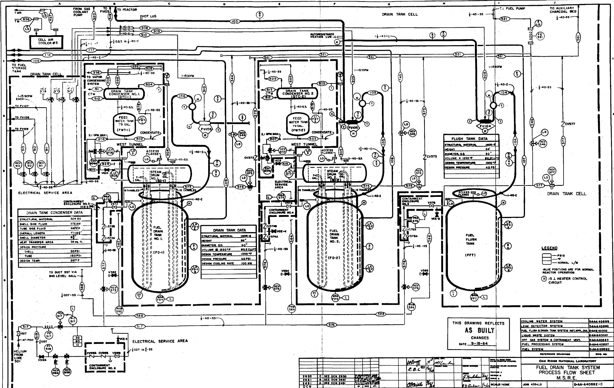  
THIS DESIGN IS THE PROPERTY OF UNION CARBIDE NUCLEAR COMPANY - DIVISION OF UNION CARBIDE CORPORATION PLEEE RETURN TOPO TO 001 Y. AAT 005T

FIGURE 6.1

in Part XI, and operating procedures are given in Part VIII.

As shown in the flowsheet, Fig. 6.1, the fuel drain tanks, FD-1 and FD-2, and the fuel flush tank, FFT, are provided with 1 in./1-1/2-in. sched-40 lines 106, 105, 104, respectively, to permit interchange of the fuel salt with the primary circulating system. Each of these three lines includes a freeze valve for positive, non-modulating control of the salt flow. The freeze valves are simply flattened sections of 1-1/2-in. sched-40 pipe, which can be either heated by electric heating elements or cooled by a jet of cell atmosphere gas. The freeze valves are described in Section 5.6.5.5.

The main supply for the freeze valve cooling gas is the 2-in. sched-40 line 920, which branches into $3/4$ -in. lines 908, 909, 901, to supply each freeze valve. These three lines are provided with control valves and remote hand-operated regulators.

A short, vertical cylinder of 4-in. pipe is included in the salt piping on the tank side of each valve to form a reservoir which assures that the freeze valve section will be filled with salt. Either freeze valve FV-105 or 106 is always thawed during operation of the reactor to permit ready drainage of the circulating system into one of the drain tanks. The other valve is operated in a frozen condition such that the heat stored in the adjacent piping and heater box will cause the valve to thaw on loss of heater electrical power and coolant flow. All other valves on the drain tank system, FV-107 through 110, are deeply frozen and will remain so even on loss of power. The times required for freezing and thawing are indicated in Table 5.11.

Helium gas pressurization and vent lines control the transfer of salt from one part of the system to another. The tops of the drain tanks and flush tanks are vented to the top of the fuel-salt circulating pump bowl through the 1/2-in. sched-40 pipes, lines 544, 545, and 546. Each of these lines contains a pneumatically actuated control valve which can be positioned from a remote location by a hand-operated regulator. The three lines combine to form 3/4-in. line 521 leading to the pump bowl. This vent line not only permits transfer of the cover gas as the salt is being exchanged between the primary circulating system and the storage

tanks, but provides a large gas "cushion" so that the overpressure in the pump bowl can be more evenly maintained.

The gas line from the top of each tank is connected to the charcoal beds through lines 573, 575, and 577. These lines contain control valves with remote hand regulators and combine to form $1/2$ -in. line 561 leading to the off-gas system.

Helium for the cover gas and pressurization is supplied at about 40 psig through the 1/2-in. line 517 to the pressure control valve PCV-517, which delivers the gas at about 30 psig to the branch-pipes, lines 572, 574, and 576, leading to the top of each salt storage tank. A flow restrictor is installed upstream of PCV-517 to limit the rate at which the fuel can be transferred to the reactor. When the reactor system is about two-thirds full, this rate is $1/2\text{ft}^3$ of salt per minute. The three branch lines have check valves and -pneumatically actuated control valves positioned by hand regulators. The three lines are also provided with pressure transmitters for the recorders and the alarm system. Vent lines 582, 584, and 586 from the transmitters contain floating diaphragm seals which would store any gas that might escape a leaking transmitter. These lines vent to line 588, a 1/4-in. OD tube, leading to the radiation monitors RIA 596A and 596B, and then to line 937 and the off-gas discharge stack.

Decay heat is removed from the drained fuel salt in FD-1 and FD-2 by bayonet-type, boiling-water cooling tubes. The steam drum, or dome, above each drain tank separates the water from the steam-water mixture discharged from the tubes, and recycles the water to the tubes. The saturated steam is transported by 3-in. sched-40 stainless steel pipes, lines 804 and 805, to condensers, DTC-1 and DTC-2, located in the west tunnel area. The condensers are cooled by process water circulated through lines 810 and 811, and 812 and 813. Condensate flows by gravity from the condensers to feedwater storage tanks located beneath the condensers via 1-in. lines 878 and 879. Water is recirculated from the feedwater tanks by gravity feed to the steam drum through 1-in. sched-40 stainless steel pipes, lines 806 and 807. Valves LCV-806 and LIC-807, for these valves are connected to the steam drum but are located in the transmitter room. The maximum rate of feedwater flow is about 2.1 gpm. When the decay heat generation

is low, intermittent operation of the cooling system is required. To reduce the cooling rate to zero, the water flow is shut off and the tubes allowed to evaporate to dryness. Steam from the X-10 plant is condensed to provide water for the heat removal system. Both the condensers and the feedwater tanks are vented to the vapor condensing system through lines 808, 809, 888, and 889. These lines join to form l-in. line 338, which leads to line 980 connecting the vapor-condensing system to the primary containment. The top of each steam drum is vented to its respective condenser through lines 804 and 805.

The 1/2-in. sched-40 pipes, lines 107, 108, and 109, which dip to the bottoms of the flush tank, FFT, and the drain tanks, FD-1 and FD-2, are used to interchange salt between the tanks and the fuel processing cell. Each of these lines is provided with a freeze valve before they merge to form line 110, a 1/2-in. sched-40 pipe leading to the fuel storage tank, FST. The freeze valves and the juncture with line 110 are shown on the fuel processing flowsheet, Fig. 6.2 (ORNL Dwg. AA-A-40887) shown here for convenience. These freeze valves are equipped with the salt reservoirs at both ends of the flattened portion to assure salt in the valve at all times. The freeze valves are provided with thermocouples in an identical manner with the valves on lines 104, 105, and 106, described above. The 1 to 15 cfm (std) of cooling gas needed for the valves is supplied through lines 911, 912, and 913, which branch from line 920, previously mentioned.

# 6.3 Drain Tanks No. 1 and 2

# 6.3.1 Description

Fuel drain tank assemblies No. 1 and 2, FD-1 and FD-2, are alike except for the nozzle orientations (see general assembly drawings ORNL Dwg. E-FF-A-40455 and E-FF-A-40731). A complete assembly consists of the tank with supporting skirt, thimbles, and steam drum with attached bayonet-type cooling tubes, as illustrated in Fig. 2.6. The tank supports are described in Section 6.3.5 and the steam drum and other portions of the decay heat removal system in Section 6.3.3, following.

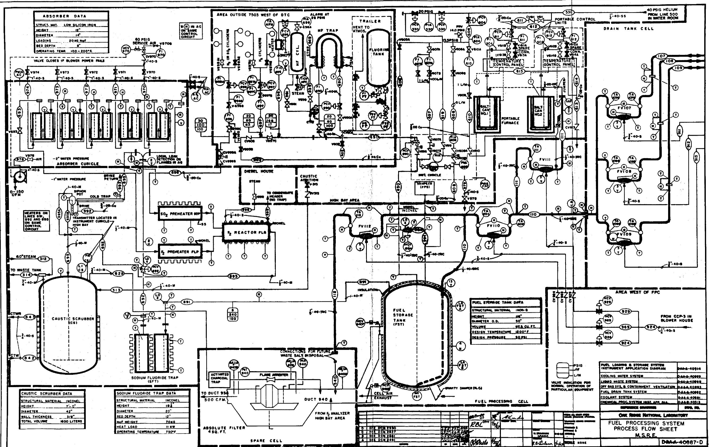  
THIS DESIGN IS THE PROPERTY OF UNION CARBIDE NUCLEAR COMPANY A DIVISION OF UNION CARBIDE AND CARBON CORPORATION

FIGURE 6.2

The drain tanks are 50 in. in diameter and about 86 in. high, not including the steam dome, and hold about $80.2\mathrm{ft}^3$ ) of salt contained in the primary circulating loop. The bare weight of a drain tank, including the steam drum, etc., is 7000 lb. The maximum weight is about 17,000 lb.[127] Other dimensions of the tanks are given in Table 6.1.

The top head of each drain tank acts as a tube sheet for 33 thimbles of $1 - 1 / 2$ -in. sched-40 INOR-8 pipe, about $77 - 1 / 2$ in. long, which extend into the tanks to about the elevation of the lower head welds. All but one of the thimbles project about 11 in. above the upper head. The remaining thimble is for thermocouples. The 32 thimbles are evenly spaced on two circles concentric with the centerline of each tank, 20 on the outer circle, and 12 on the inner one. The thimbles serve as receptacles for the bayonet-type cooling tubes and have flared openings at the upper end to facilitate insertion of the bayonets. It may be noted that two independent barriers, the thimble wall and the bayonet tube wall, separate the fuel salt from the water. The annular gas space between the two walls is open to the cell atmosphere, which is continuously monitored for the presence of fuel salt, water, and the products of their reaction.

The fuel transfer lines 108 and 109 enter the drain tanks through the upper head flange and extend downward to a cup at the center of the lower head. This cup, which is fabricated of a 2-in. INOR-8 pipe cap welded to the outside of thw lower head, makes it possible to remove essentially all the salt from the tank.

Lines 105 and 106, which are used to exchange fuel salt with the primary circulating system, enter through the top head of each tank and extend downward, with a bend at the lower end, to terminate approximately 2-5/8-in. above the lower head, and near its center. The lower end of each of these pipes is closed, and a segment of the pipe wall is cut away at the bottom end to provide an opening which does not draw salt from the bottom of the tank. This leaves a "heel" of about $1/2 \text{ ft}^3$ of salt below the inlet to minimize the likelihood of transferring any solids from the bottom of the drain tank into the fuel circulating system.

Table 6.1. Design Data for Drain Tanks No. 1 and 2   

<table><tr><td colspan="2">Fuel Drain Tanks (two)</td></tr><tr><td>Construction material</td><td>INOR-8</td></tr><tr><td>Height (without coolant headers), in.</td><td>86</td></tr><tr><td>Diameter, in. (OD)</td><td>50</td></tr><tr><td>Wall thickness. in.</td><td></td></tr><tr><td>Vessel</td><td>1/2</td></tr><tr><td>Dished head</td><td>3/4</td></tr><tr><td>Volume at 1250°F, ft3</td><td></td></tr><tr><td>Total (excluding coolant tubes)</td><td>80.2</td></tr><tr><td>Fuel (min., normal fill conditions)</td><td>73.2</td></tr><tr><td>Gas blanket (max., normal fill conditions)</td><td>7.0</td></tr><tr><td>Heel and runback (min.)</td><td>2.7</td></tr><tr><td>Design temperature, °F</td><td>1300</td></tr><tr><td>Design pressure, psi</td><td>65</td></tr><tr><td>Cooling method</td><td>Boiling water
in double wall
thimbles</td></tr><tr><td>Cooling rate (design), kw</td><td>100</td></tr><tr><td>Coolant thimbles</td><td></td></tr><tr><td>Number</td><td>32</td></tr><tr><td>Construction material</td><td>INOR-8</td></tr><tr><td>Size, in.</td><td>1-1/2 in. sched-40</td></tr><tr><td>Concentric feed tube (INOR-8)</td><td>1/2 in. OD by
0.042-in. wall</td></tr><tr><td>Steam riser (INOR-8)</td><td>1 in. IPS sched-40</td></tr></table>

The above-mentioned interior fuel-salt piping is held in position inside the tank by restraining brackets fabricated of $1/4$ -in.-diam INOR-8 rod.

A nozzle is provided in the top head of each tank for installation of the level probes, LD-1 and LD-2. The probes are the single-point, conductivity type, and indicate whether the salt level is above or below points marking $5\%$ and $90\%$ of the salt volume.

A 3-in. pipe nozzle at the center of the head serves as an inspection port and can also be used for installation of a salt sampler. The closure for this nozzle is an eight-bolt blind flange with an integral ring-joint gasket provided with leak detection openings.

A 1/2-in. nozzle on the top head serves as a common connection for helium cover-gas venting and pressurization lines 572 and 573 on FD-1, and for lines 574 and 575 on FD-2. The lines are provided with a large loop encircling the top of the tank, in much the same manner as the drain lines, to provide flexibility. The nozzle, the short length of connected piping, and the disconnect flange are of INOR-8. (Beyond this point the lines are fabricated of stainless steel.) The four-bolt disconnect flange is a 1-in. size, but is drilled for 1/2-in. NPS, with a side outlet to permit installation in a horizontal position and easy access to the bolting from above.

The INOR-8 steam drum and salt-cooling bayonets are an integral unit. The 32 bayonets are fabricated of 1-in. sched-40 INOR-8 pipe, as shown in Figs. 6.3 and 6.4. A 1/2-in. OD tube on the inside of each bayonet serves as the downcomer for the entering feedwater. The 1-in. bayonet size increases to 1-1/2-in. pipe size above the elevation of the thimble openings, and a 1-1/2-in. corrugated, flexible Inconel hose is welded to each. (The corrugations are covered with stainless steel braiding.) The other end of each hose is welded to 1-1/2-in. nozzles at corresponding positions on the bottom of the steam drums. The 1/2-in. downcomers have stripwound Inconel flexible hoses in the same relative position. This flexible arrangement provides for the differences in radial thermal expansion between the drain tank upper head and the steam drum.* The weight of the steam-and-water-filled bayonets is not imposed on the flexible hose couplings but is carried by a plate on which a collar

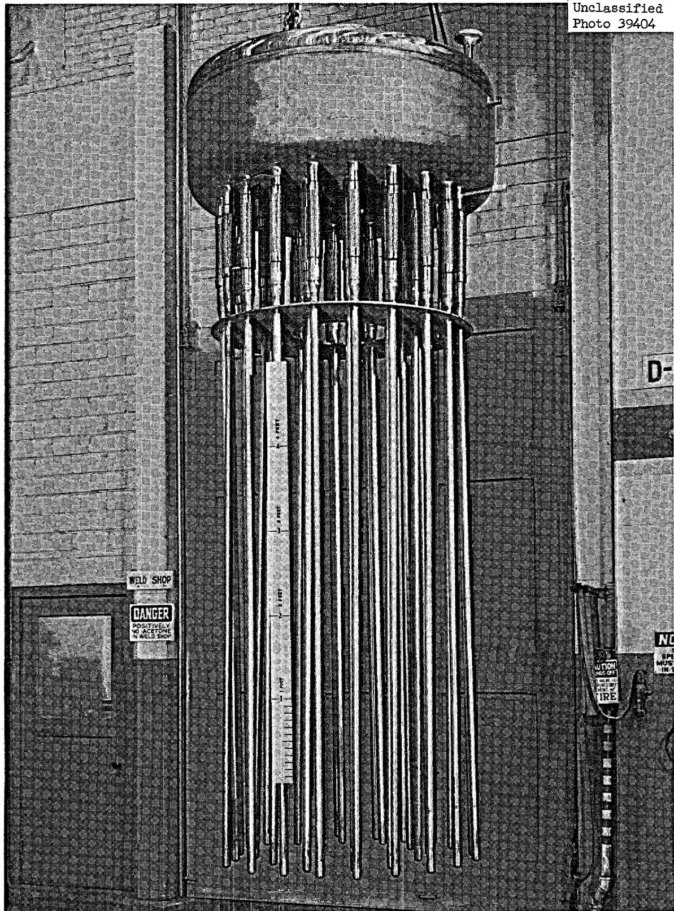  
Fig. 6.3. Fuel Drain Tank Steam Dome Bayonet Assembly.

UNCLASSIFIED L-LR DWG 60

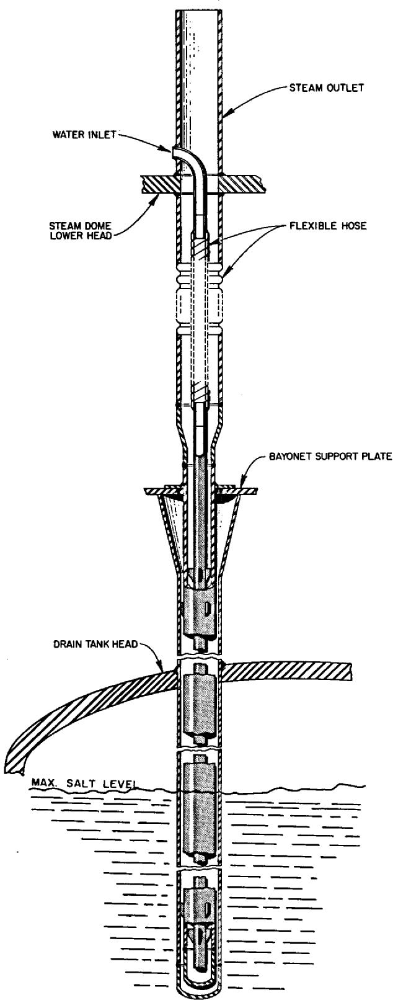  
Fig. 6.4. Bayonet Cooling Thimble for Fuel Drain Tank.

welded to each bayonet tube rests. This $1/4$ -in. $304$ stainless steel plate is suspended from the steam drum by four $1/4$ -in.-diam stainless steel wire cables. The plate clears the tops of the thimbles by $1/4$ -in. so that none of the weight of the steam drum and attached bayonets is carried by the drain tank itself (see Section 6.3.5, following).

The 1-1/2-in. nozzles on the bottom of the steam drums extend about 7 in. into the drums. The 1/2-in. downcomer tubes bend inside these nozzles and exit through the nozzle wall. The elevation of these exit openings alternates in adjacent thimbles on both bayonet circles, one-half being at 1 in. above the steam drum lower head and the other half at 5 in. (see ORNL Dwg. D-FF-A-40465). With this arrangement, the water level in the drum may be adjusted to take one-half of the cooling thimbles out of service and thus obtain better control of the temperature of the salt stored in the tank.

The 48-in.-diam by 18-in.-high steam drum has an 8-in. pipe penetration through it at the center (see Fig. 2.6 and ORNL Dwg. D-FF-A-40456). The central openings allow the 3-in. inspection nozzle on the drain tank to extend above the steam drum for accessibility. Lifting eyes on the top of the steam drum allow the drum and the attached bayonet tubes to be raised and set aside for maintenance on the drain tanks. The 3-in. steam outlet and the 1/2-in. water inlet connection nozzles on the steam drum are fabricated of INOR-8 between the drum and the bolted disconnect couplings. The mating flanges and the remainder of the piping in the heat removal system are 304 stainless steel. The 3-in. steam piping contains a corrugated, bellow-type, stainless steel expansion joint in a horizontal run inside the drain tank cell.... The 1/2-in. water line has sufficient flexibility without use of an expansion joint. The condensers and the feedwater tanks used in the heat removal systems are described in Section 6.3.3.

The drain-tank wall temperature is monitored by 20 thermocouples. Two of these are located on the top head at the fuel system drain and fill line; four are located on the bottom head, two of which are at the center; the remaining $14$ are distributed over the cylindrical tank wall. Two of the thermocouples on the wall are at the tank charging line. The data logging system is supplied with thermocouple readings from the fuel

system fill line, the tank charging line, the tank wall near the midplane, and at the center of the bottom. One of the tank wall thermocouples is connected to a temperature recorder and the remaining lead to a scanner which monitors and displays the values. The previously mentioned thermocouple bayonet assembly, which is inserted into a thimble in the drain tank, carries five pairs of thermocouples distributed over its length. One of the lower of these couples is connected to the data logger and one, just above midplane, has its output read on a temperature indicator.

# 6.3.2 Design

The drain tanks, thimbles, bayonet cooling tubes, steam drums, and all attachments welded to them, with the exception of the flexible hoses, are fabricated of INOR-8 and generally in accordance with Specification MSR-62-3. $^{125}$ The flexible hoses were fabricated of Inconel and meet the specifications of Section VIII of the ASME Unfired Pressure Vessel Code. $^{47}$

The drain tanks will withstand an internal pressure of 65 psig and $1300^{\circ}\mathrm{F}$ in accordance with the requirements of Section VIII of the ASME Unfired Pressure Vessel Code, for primary nuclear vessels.[50] The allowable stress in INOR-8 at $1300^{\circ}\mathrm{F}$ was taken to be 3500 psi.[16] The calculations for wall and head thicknesses, etc., were based on standard relationships and are presented in Part IV of Ref. 18 and in Ref. 104. Basic design data are shown in Table 6.1.

Calculations covering differential thermal expansion between the drain tanks and steam drums, and transient and off-design operating conditions, are also given in Part IV of Ref. 18.

The drain tank and cooling system was designed for a cooling rate of 100 kw. Heat transfer and hydraulic computations are given in Part IV, Ref. 18.

# 6.3.3 Decay Heat Removal System

The heat generated by the decay of fission products in the fuel salt stored in the drain tanks is removed by boiling water in bayonet tubes inserted in thimbles which are immersed in the salt. This arrangement provides double barrier protection between the salt and the water.

The saturated steam-water mixture from the bayonets is discharged into a steam drum, where the water is separated and recycled to the bayonets. The steam is condensed outside the drain tank cell and the condensate returned by gravity through flow-control valves to the downcomers in the bayonet cooling tubes. The reliability of the system is enhanced by this simplicity of operation.

The drain tanks, thimbles-bayonet tubes, and steam drums, all located in the drain tank cell, have been described in Section 6.3.1 The condensers and feedwater tanks are located in the west tunnel, an area which is not accessible when the reactor is in operation but can be entered a short time after shutdown.

The two condensers are commercial shell and tube units, about 8-5/8 in. diam by 7 ft 10-1/2 in. long, with about 38 ft² of surface and a capacity of 300 kw. Other dimensions and data are given in Table 6.2. The units meet the requirements of the ASME Unfired Pressure Vessel Code, Section VIII, for secondary nuclear vessels.[49] The shell-side design pressure is 50 psig, although the steam will condense in the shell at essentially atmospheric pressure. The cooling water, or tube-side, design pressure is 150 psig. The shell, tubes, and baffles are all fabricated of 30⁴ stainless steel.

The two cylindrical feedwater tanks are 36 in. in diameter and about 24 in. high, including the ASME flanged and dished torispherical heads. Each has a volume of about 10.5 ft³. They are constructed of 30⁴ stainless steel, with a wall thickness of 3/16 in., in accordance with the requirements of Section VIII of the ASME Unfired Pressure Vessel Code, for secondary nuclear vessels.[49] Each tank is supported by four legs, and the bottom of the tank is about 12 in. above floor level. A 1-in. nozzle at the center of the lower head serves as both the condensate inlet and outlet, the tanks "floating" on lines 806 and 807. Both top and bottom heads have 1/2-in. nozzles for the level indicator connections, the top nozzle also serving as a vent for the tank. A 2-in. flanged nozzle is provided at the top of each tank as an inspection port.

As previously mentioned a feedwater control valve in each heat removal system, LCV 806 and LCV 807, control the gravity flow of condensate from the condensers and feedwater tanks to the steam drums. These

Table 6.2 Design Data for Condensers in Drain Tank Heat Removal Systems   

<table><tr><td colspan="2">1. Construction material</td></tr><tr><td>Shell, tubes, baffles, and tube sheet</td><td>Type 304 SS</td></tr><tr><td>2. Dia. of shell</td><td>8-5/8 in.</td></tr><tr><td>3. Overall length</td><td>7 ft. 10-1/2 in.</td></tr><tr><td>4. No. of units required</td><td>2</td></tr><tr><td>5. Heat transfer rate, capacity</td><td>300 kw</td></tr><tr><td>6. Design pressure</td><td></td></tr><tr><td>Shell side</td><td>50 psig</td></tr><tr><td>Tube side</td><td>150 psig</td></tr><tr><td>7. Test pressure</td><td></td></tr><tr><td>Shell side</td><td>75 psig</td></tr><tr><td>Tube side</td><td>225 psig</td></tr><tr><td>8. Operating pressure, shell side</td><td>15 psia</td></tr><tr><td>9. Design temperature</td><td>267 F</td></tr><tr><td>10. Heat transfer surface</td><td>38 ft2</td></tr><tr><td>11. No. of tubes</td><td>19 &quot;U&quot; shaped</td></tr><tr><td>12. Tube size</td><td>5/8 in. O. D.</td></tr><tr><td>13. Tube spacing</td><td>13/16 in. triangular pitch</td></tr></table>

pneumatically operated valves were selected to fail in the open position, since overheating the drain tanks is more serious than overcooling, particularly in that the latter could be largely overcome by the electric heaters. By controlling the water level in the drums, the entrance openings at two levels in the bayonet tube downcomers permit the cooling capacity to be off, one-half off, or all in operation, thus affording control of the salt temperature in the drain tanks.

The condenser shell spaces and the feedwater tanks are vented to the vapor-condensing system tanks, which are at essentially atmospheric pressure. The entering steam drives the air out. When the steam supply is cut off, air will be drawn in as the remaining steam condenses.

All the water in the heat removal systems can be stored in the feed-water tanks. The water in the steam drums can be evaporated, using the drain tank heaters, and collected in the feedwater tanks.

Design calculations are given in Part IV of Ref. 18.

# 6.3.4 Drain Tank Electric Heaters and Insulation

The two drain tanks are heated by cylindrical "furnaces" surrounding the tank walls. The tank tops, bottoms, and heater units are enclosed in canned insulation units. The heaters for drain tank FD-1 have a total capacity of $46.9\mathrm{kw}$ and those for FD-2 a total capacity of $45.0\mathrm{kw}$ . The difference in heater capacity is due to the arrangement of heaters required for the different nozzle locations on the two tanks.

The tank wall heaters are arranged in removable vertical sections, or panels, each about 2 3/8 in. thick (see ORNL Dwgs E-MM-B-51684 and 51685). The heaters are arranged into two groups, an upper and a lower, each group being supplied with electric power from a separate induction regulator (see heater schedule, ORNL Dwg E-MM-B-51651). There are two widths of panels, one covering about $35^{\circ}$ of the tank circumference, and the other about $15^{\circ}$ . On FD-1 there are six of the large panels, with a capacity of 3680 watts (at 230 v) each, and one of the smaller panels (1360 watts at 230 v), in the upper group of heaters. There are a similar number in the lower group. Drain tank FD-2 has five of the larger units and three of the smaller in each of the upper and lower groups.

The heaters in each group are connected in parallel to the wye-connected secondary of the power transformer. Unlike other heaters in the MSRE, one terminal of each of the drain tank heaters is grounded through the grounded center tap of the transformer wye.

Each of the large panels contains four heating elements consisting of curved ceramic plates in which the nichrome heating wire is embedded. The elements are mounted in stainless steel frames and enclosed in 16-gage $347$ stainless steel to complete the panel assembly. Each panel has a lifting hook and separate power and thermocouple disconnects (see ORNL Dwg. E-MM-B-51610).

The outside of the heaters and the tank bottoms are insulated with two 2-in.-thick layers of expanded silica (Careytemp $1600^{\circ}\mathrm{F}$ - see Section 5.6.6.3) insulation. The high temperature side of the sheet metal cans for the insulation is fabricated of 11-gage $347$ stainless steel. The low temperature, or outside, surface of the cans is 16-gage carbon steel. An insulated cover fits between the steam drum and the drain tank at an elevation just below the bayonet-tube positioning plate. This location permits the primary system drain and fill lines to be inside the heated furnace. The 4-1/2-in.-thick cover is fabricated more or less in place and is an integral part of the steam drum and bayonet tube assembly. A 6-in.-wide portion of the cover on the outer circumference consists of two 2-in.-thick layers of expanded silica insulation. The remaining inner portion is insulated with ceramic fibers (Fiberfrax - see Section 5.6.6.3). This flexible type of insulation is used because it is easier to fit around the large number of bayonet cooling tubes. The insulated cover is canned in 16-gage $347$ stainless steel on both sides.

All of the drain tank heaters are designed for use and none are connected as spares. The installed capacity of about $45\mathrm{kw}$ for each tank, however, is greatly in excess of the 20-kw measured heat loss from a drain tank at $1200^{\circ}\mathrm{F}$ . The same tests indicated that about $34\mathrm{kw}$ is required to heat the tanks from 50 to $1150^{\circ}\mathrm{F}$ at a rate of $67^{\circ}\mathrm{F}$ per hour.[126]

# 6.3.5 Supports for Drain Tanks

Each of the two drain tanks is supported by two columns resting on the drain tank cell floor (see ORNL Dwg. E-FF-D-41500). The supports

were designed for a load of 17,000 lb. $^{127}$ Each drain tank installation incorporates two pneumatic weigh cells for estimating the inventory of salt in the tanks.

Each drain tank is provided with a support skirt welded to the tank just above the upper head circumferential weld. Twelve type 316 stainless steel hanger rods, $3/4$ in. OD by 15 in. long, are fastened by clevistype couplings to this skirt and suspend the tank from a support ring located at about the elevation of the bottom of the steam drum. This carbon steel support ring is about 53 in. OD x 6-1/2 in. wide x 8 in. deep, built up of steel plates, and has two 22-3/4-in.-long arms extending from it on opposite sides. Each of these arms is suspended by three hanger bolts, 1/2-in. OD by 38 in. long, fabricated of carbon steel*, from a pneumatic weigh cell resting on top of a support column. Each of these two weigh cells has a point support consisting of a bearing ball $3/4$ in. in diameter. The support columns are fabricated of 5-in. sched-40 carbon steel pipe, except for the top 24 in., which is 4-in. sched-40 pipe, and rest on the drain tank cell floor. The columns pass through holes in the arms on the support ring with 1/4-in. clearance on a diameter, an amount sufficient to allow proper operation of the weigh cells while at the same time to prevent the tank assembly from falling off the two support points. The long hanger bolts and the point support arrangement reduces the horizontal leading on the weigh cells to a negligible amount.

The steam drum and bayonet assembly also rests on the support ring mentioned above and is thus a part of the total loading indicated by the weigh cells.

To effect maintenance on a weigh cell or prior to removal of a drain tank of its cooling system, the weight of the drain tank assembly must be removed from the weigh cells. To accomplish this, the end of each support ring arm is equipped with a jack bolt which operates against a bracket on the supporting columns just below the arm. A slight lifting of the arm by this bolt will permit unthreading of the three hanger bolts on each weigh cell. It may be desirable to remove the weight from the

jack bolts for example to prevent swaying during removal or replacement of the steam drum and bayonet assembly. To provide for this a collar is installed on each column just below the arm onto which the weight of the assembly can be lowered by backing off the jack bolts.

On initial installation, the bayonet tubes were lined up and guided into the thimble openings under shop conditions. Replacement of the steam drum - bayonet tube assembly in the radioactive drain tank cell environment requires use of a guide plate slipped over the lower end of the bayonets to align them for entry into the thimble openings. The thimbles have flared openings to assist in this operation. Once inserted, the steam drum assembly is lowered, with the guide plate slipping up the bayonets, and the plate is left in place resting on the tops of the thimbles. Further description of maintenance procedures is given in Part X.

# 6.4 Fuel Flush Tank

The flush-salt storage tank is located in the drain tank cell, Fig. 4.4 and Fig. 4.5, and is used to store the salt used to cleanse the primary system prior to charging with fuel salt. The flush salt consists primarily of $66\%$ LiF and $34\%$ BeF $_4$ (see Table 2.1 and Part IV).

The flush-salt tank has the same dimensions as the fuel drain tanks (see Section 6.3, above) but is two inches shorter in overall height. The tank has a storage capacity of $82.2\mathrm{ft}^3$ , however, as compared to $80.2\mathrm{ft}^3$ in the drain tanks because of the absence of cooling thimbles. The materials of construction and the design criteria are the same as for the drain tanks. The design data are summarized in Table 6.3. The design calculations are presented in Part IV of Ref. 18.

The flush salt tank is supported in the same manner as the drain tanks and is heated by an identical electric furnace arrangement having a capacity of 8.8 kw. The thermal insulation is arranged in essentially the same fashion. The tank temperature is monitored by 15 thermocouples. Two are on the top head and four are on the bottom head with two of the latter at the center. The other nine thermocouples are distributed over the tank wall surfaces, with two of these at the charging line.

The 1-in. drain line $10^4$ encircles the flush tank, FFT, at the top

Table 6.3 Design Data for Fuel System Flush Salt Tank   

<table><tr><td>Construction material</td><td>INOR-8</td></tr><tr><td>Height, in.</td><td>~84</td></tr><tr><td>Diameter, in. (0.D.)</td><td>50</td></tr><tr><td>Wall thickness, in.</td><td></td></tr><tr><td>Vessel</td><td>1/2</td></tr><tr><td>Dished head</td><td>3/4</td></tr><tr><td>Volume, ft3( 1250°F)</td><td></td></tr><tr><td>Total</td><td>~82.2</td></tr><tr><td>Flush salt (normal fill conditions)</td><td>73.2</td></tr><tr><td>Gas blanket (normal fill conditions)</td><td>9.0</td></tr><tr><td>Design temperature, °F</td><td>1300</td></tr><tr><td>Design pressure, psi</td><td>65</td></tr><tr><td>Cooling method</td><td>None</td></tr></table>

to provide the flexibility needed for weigh cell operation, in an arrangement identical to that on the drain tanks. This line has a freeze valve, FV-104, and the salt transfer line to the fuel processing cell also has a freeze valve, FV-107 (see flowsheets, Fig. 6.1--ORNL Dwg. D-AA-A40882, and Fig. 6.2--ORNL-Dwg. D-AA-A-40887). The flush salt tank is vented to the fuel salt circulating pump bowl, via lines 576 and 546, and to the off-gas system, through lines 576 and 577, each of which has pneumatically operated control valves actuated by hand-operated regulators located on the control panels. The two-point level indication system is identical to that used on the fuel drain tanks.

# 6.5 Salt-Transfer Pipe Line Supports

Drain line 103 is supported by nine constant-load Bergen supports, as shown in Table 6.4. Three of these supports are located in the reactor cell and six are in the drain tank cell. Pipe hangers (both numbered S-5) support each end of a beam passing through the opening between the reactor and drain tank cells to support that portion of line 103. Line 103 is anchored at the heating lug connection near the junction with line 104 in the drain tank cell.

Line 104, 105, 106, and 110 each have one constant-load type pipe support. The 1/2-in. piping, lines 107, 108, and 109 are mounted in simple fixed pipe hangers.

Table 6.4 Salt Transfer Pipe Line Supportsa   

<table><tr><td>MSRE Support Number</td><td>Line Number</td><td>Location</td><td>Bergen Numberb and Type</td><td>Preset Loadc lbs</td><td>Maximum Hanger Movement, in.</td><td>Maximum Calculated Pipe Movement on Heating, in.</td></tr><tr><td>S-3</td><td>103</td><td>About 1 ft outside thermal shield</td><td>CSH-1 D-1</td><td>100</td><td>± 1</td><td>- 1-1/8</td></tr><tr><td>S-4</td><td>103</td><td>Between S-3 and S-5</td><td>CSH-1 D-1</td><td>100</td><td>± 1</td><td></td></tr><tr><td>S-5e</td><td>103</td><td>About 5 ft from reactor cell wall</td><td>CSH-4 D-1</td><td>235</td><td>± 1</td><td>-1/2</td></tr><tr><td>S-5e</td><td>103</td><td>About 6 in. from south wall drain tank cell</td><td>CSH-4 D-1</td><td>235</td><td>± 1</td><td>-1/2</td></tr><tr><td>S-6</td><td>103</td><td>Middle of south wall of drain tank cell</td><td>CSH-1 D-1</td><td>119</td><td>± 1</td><td>-3/8</td></tr><tr><td>S-7</td><td>103</td><td>Southwest corner of drain tank cell</td><td>CSH-1 D-1</td><td>121</td><td>± 1</td><td>-1/4</td></tr><tr><td>S-8</td><td>103</td><td>Middle of west wall of drain tank cell</td><td>CSH-1 D-1</td><td>127</td><td>± 1</td><td>-5/32</td></tr><tr><td>S-9</td><td>103</td><td>At 90° bend on west wall of drain tank cell</td><td>CSH-1 D-1</td><td>115</td><td>± 1</td><td>-1/16</td></tr><tr><td>S-10</td><td>103</td><td>About 7 ft from west wall of drain tank cell</td><td>CSH-1 D-1</td><td>121</td><td>± 1</td><td>neg1.</td></tr><tr><td>Anchor</td><td>103</td><td>About 3 ft 4 in. from east wall drain tank cell</td><td>-</td><td>-</td><td>-</td><td>-</td></tr><tr><td>S-11</td><td>104</td><td>South of FV-104</td><td>CSH-5 D-1</td><td>365</td><td>± 1</td><td>-1/4</td></tr><tr><td>S-12</td><td>106</td><td>North of FV-106</td><td>CSH-4 D-1</td><td>240</td><td>± 1</td><td>-1/4</td></tr><tr><td>S-13</td><td>105</td><td>South of FV-105</td><td>CSH-4 D-1</td><td>260</td><td>± 1</td><td>-1/4</td></tr><tr><td>TL</td><td>110</td><td>Near north wall of drain tank cell</td><td>CSH-1 D-1</td><td>100</td><td>± 1</td><td>-1/2</td></tr></table>

a See ORNL Dwg   
b Constant-load type supports, Bergen Pipe Support Corporation (New York, N.Y.)   
c Preset load is expected weight of pipe and contents.

d Positive values are up; negative values down.

e S-5 hangers support each end of a beam which supports line 103 between reactor and drain tank cells.

# 7. SAMPLER-ENRICHER SYSTEM

The MSRE includes provisions for dipping 10-g samples of salt from both the fuel and coolant-salt pump bowls while the reactor is in operation. Shielded carriers are provided for transporting the samples to the analytical laboratory. Chemical analyses of the samples provide frequent observations of the behavior of the salts and, in the case of the fuel salt, of the uranium inventory in the system.

The sample-taking system may also be used during reactor operation to add up to 150 g of enriching salt (72 mole % LiF - 28 mole % UF₄) per sample capsule, to compensate for the burnup of fissile material. Should it become necessary, the same system may also be used to add a nuclear poison (LiF-BeF₂) to the fuel-salt circulating loop. (To make gross changes in the fuel-salt composition, it is necessary that it all be drained from the circulating system and transferred to the fuel-salt processing cell.)

The sampler-enricher systems for the fuel-salt and coolant salt systems operate on the same principle. The primary differences between the two stem from the fact that the radioactivity level in the coolant salt is much less than in the fuel salt, that the containment of fission-product gases is not a problem, and that the equipment can be approached a short time after reactor shutdown for adjustment and maintenance. The fuel-system sampler-enricher is described in Sections 7.1 through 7.9. The equipment for the coolant-salt system is briefly covered in Section 7.10.

# 7.1 Brief Description of Operation

The sampler-enricher system consists of a 1-1/2-in.-diam transfer tube connecting the top of the pump bowl to a two-chambered, shielded transfer box on the operating floor level. A small copper capsule, fastened to the small wire cable by a special latch, is lowered through the tube into a cage beneath the surface of the salt in the fuel-pump bowl. The capsule, with its 4-cc sample (10 g of salt), is then pulled up through the tube, through two gate valves, and into the shielded

leaktight transfer box. Using a simple manipulator and a periscope, the sample capsule is unlatched from the cable and transferred to a transport container about 1-3/8-in. in diameter by 18-in. long. After the transfer box has been purged, a removal tool is inserted and the transport container is pulled up into a lead-shielded transport cask. This cask is then placed in a sealed container and taken to the analytical chemistry facilities in the X-10 Area of ORNL.

Two or more barriers are provided at all times to guard against escape of radioactive gases or particulates. Eight inches of lead, or equivalent, shield the operator from radioactivity. A system of interlocks in the sampler-enricher system prevents accidental opening of valves, etc.

A procedure in reverse of that described above is used for adding enriched salt to the system. A longer copper capsule is used, holding 30 cc. This capsule is lowered into the pump bowl where the enriched material quickly melts and drains through openings in the capsule as it is raised from the bowl. Poison material may be added in essentially the same manner.

# 7.2 Design Criteria

The unique features of the sampler-enricher system--primarily the fact that the sample-transfer tube passes through both the primary and secondary containment barriers in the MSRE--led to adoption of relatively stringent criteria for the design of the system.[128] In summary these are:

# 7.2.1 Sampling

The samples taken must be representative of the salt circulating in the system. It may also be desirable at times to take separate samples in which the material floating on the surface of the salt in the pump bowl predominates. Each sample must be easily removable from the capsule, and all of it recovered for chemical analysis. Approximately 4 cc (10 g) of salt must be isolated per sample, and the system must be capable of taking three samples per 24 hr for one year or more. During prenuclear runs, etc., the sampling may be more often.

# 7.2.2 Enriching

About 30 cc (150 g) of enriching salt (72 mole % Li $^6$ - 28 mole % UF $_4$ ) will be added per capsule. Each 30-cc addition will contain 90 g of $^{235}\mathrm{U}$ and/or thorium. The capsule must drain completely, and recovery of the empty capsule must be assured. The enriching salt must enter the circulating fuel stream as a liquid, not as a solid.

# 7.2.3 Poisoning

The system must be capable of adding a nuclear poison to the fuel-salt-pump bowl at all times, including outages of the electrical power supply.

# 7.2.4 Addition of Contaminants

Helium gas introduced into the salt loops during sampling or enriching operations must be of reactor grade. Portions of the system in contact with the salt must be fabricated of INOR-8 or other materials that will not add contaminants to the system. A dry inert atmosphere must be maintained around the sample at all times, including transport to the analytical laboratory. (The capsule may be fired in a hydrogen atmosphere prior to use to remove the oxide film.)

# 7.2.5 Containment

Fission-product gases entering the sampling compartment must be purged to the off-gas system prior to removal of a sample. The sample must be sealed in a shielded container during transport. Portions of the sampler system which could be contaminated by particles of salt must be sealed from exposure to the atmosphere. Double containment must be provided in such a manner that breaching of one barrier will not result in the release of radioactivity to the environment.

All mechanical seals and valves in the primary areas must be buffered with helium gas to a pressure higher than that in the reactor system, and leak-detection equipment must be provided. Any portion of the system not structurally strong, such as the flexible bellows, must be buffered with gas under a pressure less than that in the primary

system, and the buffered space must be vented to the containment air system. Exhaust hoods must be provided in the operating floor areas where the sampler-enricher equipment is located.

(For convenience, the containment areas in the sampler-enricher system were classified as follows: Portions of the primary containment were designated 1-a, 1-b, etc. Areas of secondary containment, such as the interior parts of the valve box, were designated 2-a, 2-b, etc. The outer compartment of the transfer box, also a secondary containment area during certain phases of the operating procedure, is designated 3-a, etc. See Fig. 7.3.)

All portions of the primary and secondary containment areas must be helium leak checked and the leak rate must be less than $1 \times 10^{-8}$ std cc/sec.

# 7.2.6 Stresses

The sampler-enricher equipment must be designed for a pressure of at least 50 psig in primary containment areas and $40$ psig in secondary containment regions. Design temperatures range from $1200^{\circ}\mathrm{F}$ in the pump bowl to about $100^{\circ}\mathrm{F}$ at the transfer box. (The normal operating pressure is about 5 psig.) The calculated stresses in stainless steel must not exceed those allowed in the ASME Unfired Pressure Vessel Code, Section VIII, $^{47}$ and those in INOR-8 must conform to the allowable stresses shown in Table 2.2 and ASME Boiler and Pressure Vessel Code Case 1315. $^{52}$ The primary containment must comply with ASME Code Case 1273 N-7 $^{50}$ and secondary containment with Code Case 1272 N-5. $^{49}$

# 7.3 Description of Equipment

# 7.3.1 Capsules

Two types of copper capsules are used, one for sampling and one for adding enriched or poison material.

7.3.1.1 Sampling Capsule. As shown in Fig. 7.1, the sampling capsule is fabricated from a $3/4$ -in.-OD copper rod, drilled to $5/8$ -in. ID, with a rounded bottom. The solid copper top cap is also rounded to minimize the likelihood of becoming stuck in the transfer tube or

Unclassified Photo 71333

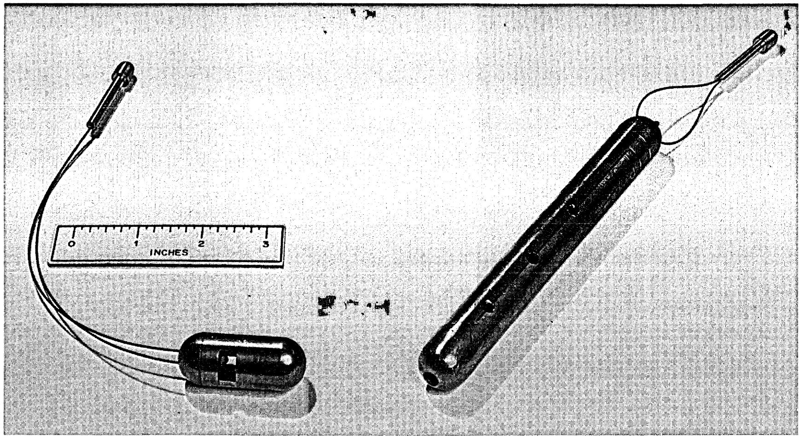  
Fig. 7.1. Sampling (Left) and Enriching (Right) Capsules.

valves. The cap is pinned to the capsule with a short length of 1/8-in.-OD copper tubing. Two holes through the cap permit the 1/32-in.-OD twisted Inconel wire latch cable to pass in and out to provide a 7-in.-long loop connecting the capsule to the latchkey, to be described below. The overall length of the capsule, with end cap, is about 1-13/16 in. Holes, $180^{\circ}$ apart, in the side of the capsule, about 0.88 in. above the bottom, and roughly elliptical in shape, $1/4$ by 3/8 in., with the major axis at right angles to the axis of the capsule, permit the salt to enter the sampler after immersion in the salt in the bowl. The capsule volume below the level of the holes is about 4 cc. A new capsule must be used for each sample.

7.3.1.2 Enriching Capsule. This capsule is also shown in Fig. 7.1. It is fabricated of $\frac{3}{4}$ -in.-OD by 0.035-in.-wall-thickness copper tubing. The bottom is spun shut on a radius of $\frac{3}{8}$ in. The top is closed with a solid copper plug similar to that used on the sampling capsule but with two $\frac{1}{8}$ -in.-OD copper tubes passing longitudinally through it. The molten enriched material (or poison) is added to the capsule through one of these tubes, which extends about $\frac{1}{4}$ in. on the inside, and the displaced inert gas is vented through the other. After filling, the $\frac{1}{8}$ -in.-OD tubes are cut off short and sealed. A hole is drilled through the cap at a right angle to the centerline for the $\frac{1}{32}$ -in.-OD Inconel wires used to attach the latchkey. Nine 0.191-in.-diam holes are then drilled in the side of the capsule $120^{\circ}$ apart and at $\frac{1}{-1/4}$ in., $\frac{2}{-1/2}$ in., and at $\frac{3}{-3/4}$ in. from the bottom. A tenth hole, 0.221 in. in diameter, is drilled in the bottom. The overall length of the salt-addition tube is about $\frac{6}{-3/8}$ in. and it holds approximately 30 cc, or about 150 g of salt (90 g $^{235}\mathrm{U}$ ). On insertion into the pump bowl the salt melts and drains from the capsule as it is lifted out. A new capsule is required for each salt addition.

# 7.3.2 Capsule Latch and Latchkey

A latch is provided at the end of the cable which raises and lowers the capsule to permit easy engagement and disengagement of the capsule from the cable. This latch does not come into contact with the salt.

7.3.2.1 Latchkey. The 1/32-in.-diam Inconel wire attached to the top of each capsule, see above, is fitted with a brass (or bronze) latchkey about 3/16 in. OD by 1-5/8 in. long, overall. The key has an enlarged section at the upper end, 5/16 in. OD by about 3/8 in. long, to form a shoulder on the key which engages a notch in the latch, as shown in Fig. 7.2. The key is disengaged from the notch by grasping the latch wire with the remote manipulator fingers and lifting it slightly as it is pulled forward and upwards. A new latchkey is required for each sample taken.

7.3.2.2 Latch. As shown in Fig. 7.2, the stainless steel latch at the end of the cable is $1 - 3 / 8$ in. diam by about $2 - 1 / 2$ in. long, and is tapered at the lower end to help guide it through the valves in the transfer tube, etc. A slot is provided in the tapered end for insertion and support of the latchkey, the shoulder on the key resting on the edges of the slot. The upper end of the latch is beveled to $35^{\circ}$ . When the latch is in the full raised position, this beveled surface bears against a corresponding surface on the upper latch stop in the capsule removal chamber, causing the latch to rotate on the cable to the desired position with the slot opening facing the access port. The upper latch stop is described subsequently in Section 7.3.7.1.

# 7.3.3 Cable

The cable used to lower and raise the capsules through the transfer tube is a Teleflex, Inc. (North Wales, Pa.), Catalog No. 19553, 0.118-in.-diam by 25-ft-long 321 stainless steel cable. It is coated with a high-temperature lubricant supplied by Teleflex, Inc. The cable can operate under a 35-lb tension load without being damaged.

# 7.3.4 Pump Bowl Equipment

7.3.4.1 Capsule Guide Cage. A guide cage is provided inside the pump bowl to confine the capsule to its proper position in the pool of salt. As shown on ORNL drawing F-RD-9846-G, the cage is fabricated from five 1/4-in.-diam by 8-1/4-in.-long INOR-8 rods attached to a 1-1/8-in.-diam ring at the bottom.

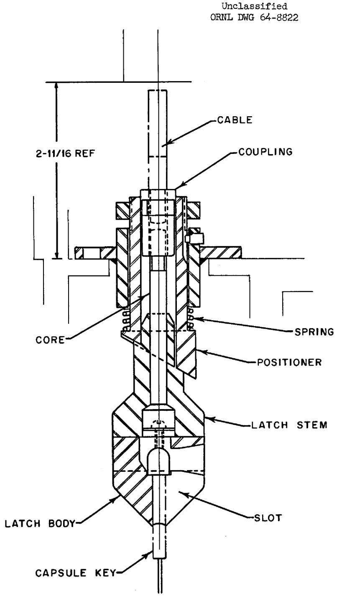  
Fig. 7.2. Sampling Capsule Cable Latch.

7.3.4.2 Lower Latch Stop. A stop is provided in the connection between the transfer tube and the capsule guide cage to prevent the latch from entering the cage and coming into contact with the salt. The stop consists of a restriction tapering from 1-5/8 in. ID at the top to 1-1/16 in. ID at the bottom. The latch stop also serves to support the top ends of the rods for the guide cage.

7.3.4.3 Baffle. A baffle plate surrounds the capsule guide cage to shield it from excessive salt velocities and, more importantly, to retard the aerosol of salt in the vapor space in the pump bowl from entering the transfer tube. This baffle is a spiral-shaped INOR-8 plate, 1/8 in. thick by 8 in. high, curved to about 3 in. overall diameter.

# 7.3.5 Transfer Tube

A 1-1/2-in. sched-40 pipe connects the top of the fuel pump bowl to the bottom of the maintenance valve in the sampler-enricher valve box located at the operating floor level (852-ft elev). (See Fig. 4.3.) The pipe, or transfer tube, is about 14 ft long, with two $35 - 1 / 2^{\circ}$ by 15-in. radius bends at the top and bottom, with the central straight portion inclined at an angle of $54^{\circ}30'$ with the horizontal. This is sufficient slope for the capsule to drop into the pump bowl by gravity alone (see Fig. 7.3).

The transfer tube is fabricated of INOR-8 from the pump bowl to the expansion joint section, described below. The expansion joint and the upper portions of the transfer tube are 304 stainless steel.

7.3.5.1 Expansion Joint. The transfer tube includes an expansion joint at about the mid point to provide the flexibility needed to absorb the movement of the pump bowl (see Section 5.4.5) relative to the fixed sampler-enricher station. The expansion joint section, or spool piece, is about $\frac{40 - 1}{2}$ in. long (see ORNL drawing D-BB-C-41337). The upper portion of the spool piece is a sliding fit into the lower portion, with a clearance of 0.003 to 0.007 in. Points of contact have ground No. 6 Stellar surfaces. A 321 stainless steel bellows, 3.31 in. OD x 2.65 in. ID x 7 in. long, with a 2-ply wall, each 0.005 in. thick, and with 32 convolutions, is welded to the upper and lower portions of the

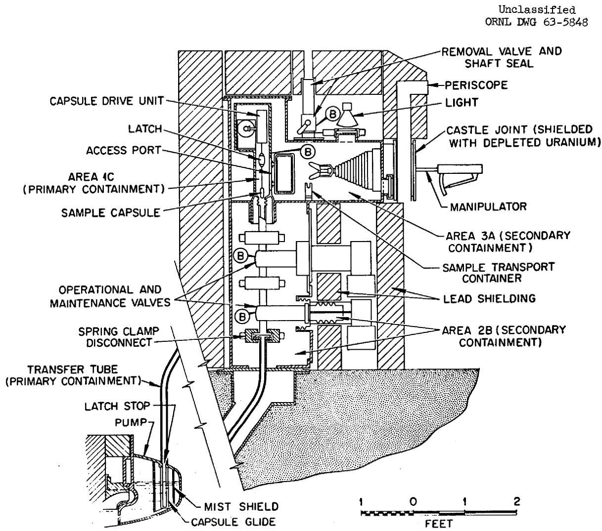  
Figure 7.3. Schematic Representation Fuel-Salt Sampler-Enricher Dry Box

spool piece to provide a leaktight joint. The bellows was manufactured by the Fairchild Instrument and Camera Company (El Cajon, Calif.). A permanently attached jack, operated by a system of bevel gears and roller chains motivated by a remotely operated tool from above, permits compression of the expansion joint for insertion between the flanges at the connection at each end. (See ORNL drawing D-BB-C-41365.) A positioning jig for the spool piece provides proper alignment of the flanges during reinstallation.

The flanges for the spool piece are, as are the other flanges in the transfer tube assembly, $4 - 1 / 4$ in. OD, integral O-ring, leak-detected units, with the mating faces held together by spring clamps which can be remotely removed by special tooling operated through the portable shield.

7.3.5.2 Sleeve. The upper portion of the transfer tube passes through a sleeve as it crosses the annular space between the inner and outer reactor containment vessel walls. This 6-in. sched-40 pipe is about 5-1/2 ft long, overall, and is provided with a bellows-type expansion joint at the mid point to compensate for relative movement between the walls of the two vessels (see ORNL drawing D-KK-D-40974). Lead shielding fills the annular space between the sleeve and the transfer tube for a distance of 20 in.

7.3.5.3 Upper Terminus. The upper end of the transfer tube passes through a box set into the concrete at the operating floor level. The box, fabricated of a 5-in. section of $14$ -in. sched-10 pipe, is closed at the top by a 21-in.-diam by $1 - 1 / 2$ -in.-thick flange bolted to a corresponding flange on the top of the box with a double O-ring gasket, which can be leak detected. The transfer tube is welded to, and extends through, the flange. The $1 - 1 / 2$ -in. pipe terminates inside the valve box, described below, about $7 - 5 / 8$ in. above the operating floor elevation of 852 ft in a $4 - 1 / 4$ -in.-OD integral O-ring flange having a spring-clamp closure.

# 7.3.6 Operational and Maintenance Valve Box

Two mechanically similar gate valves are located one above the other in a sealed valve box at the upper end of the transfer tube assembly. The upper--or operational--valve is used during normal operation of the

sampler-enricher system. The lower--or maintenance--valve is normally open and is closed only during maintenance on the upper portion of the sampler-enricher equipment, or in case of failure of the operational valve to seal properly.

7.3.6.1 Valve Box. The valves are located in a box about 15 in. x 19 in. x 38 in. high. The 15-in. by 38-in. sides face north and south, and the 19-in. by 38-in. sides face east and west. The southern side of the box has a cover plate bolted to the box by $\frac{1}{2}$ -in. studs on about 4-in. centers, and a neoprene O-ring gasket with metal-to-metal seats. The upper portion of this cover has an opening, which, in turn, is closed by another cover plate with a neoprene O-ring gasket and bolted down by the same $\frac{1}{2}$ -in. studs, the studs being longer at the top of the box to accommodate the two thicknesses of cover plates.

The valve body is welded to the transfer tube and therefore the major portion of the weight of the valves and flanges is carried by the flange welded to the transfer tube at the operating floor level.

The valve operating stems pass through the box cover plate in bellows-sealed joints. These joints seal the opening and also allow some lateral movement of the valve for alignment. The two seals, or joints, are welded to the box cover plates, the lower one to the large plate and the upper one to the smaller, outside cover plate. Vertical alignment of the valves and flanges is achieved by slotted holes in the cover plates, permitting vertical shifting of each cover plate (about $1/4$ in.) relative to the flanges and to each other.

Six 1-5/8-in.-diam tapped holes are provided in the 19 by 38-in. west face of the box, each opposite an operator for the spring clamps on the three valve flanges. The holes are normally closed stainless steel nuts, about 6 in. long, which extend through the lead shielding on the outside of the box. The nuts are provided with neoprene O-ring gaskets.

The valve box is fabricated of 304 stainless steel. Two stiffeners of 1/2-in.-thick by 3-in.-wide plate are equally spaced vertically on the three sides of the box. The box was designed for a pressure of 40 psig at $100^{\circ}\mathrm{F}$ , although the normal operating pressure is atmospheric. The box was hydraulically tested to 54 psig or pneumatically tested at

46 psig. It satisfactorily passed a helium leak check, with a maximum leakage of $1 \times 10^{-8}$ std cc/sec (see Section 7.2.6).

7.3.6.2 Valves. The operational and maintenance valves are 1-1/2-in., 150-lb stainless steel body, "Belloseal" gate valves manufactured by The William Powell Company (Cincinnati). The valves are the double-sealing type, with No. 6 Stellite-to-Stellite metal seats. A helium pressure of 40 psig is maintained between the two seats when the valve is closed. The normal leak rate through both seats is less than 1 std cc of helium per minute. The valve stems were modified by cutting and inserting about 6 in. of extra length so that a second stainless steel bellows could be added to the stem seals.

The valves are operated by "Limitorque," SMA-000, control motors located outside the valve box. The motors are for 220-v, 3-phase operation and have an output torque of 2 ft-lb, which is geared to produce 50 ft-lb at a stem speed of 6 in./min. On closing, the torque-limiting feature cuts off the drive when the valve is fully seated. The interlocks in the sampler-enricher electrical system prevent operation of either valve motor while the capsule is in the transfer tube. The motors draw power from the 25-kv motor-generator set which can be supplied with auxiliary battery power in event of failure of the normal supply. In addition, the valve stem drive can be shifted to manual operation for emergency closing of the valves.

# 7.3.7 Transfer Box

As a sample capsule is withdrawn through the transfer tube, it passes upward through the maintenance and operation valves in the valve box and then into a capsule access chamber located in the transfer box. As shown in Figs. 7.3 and 7.4, this box is located just above the valve compartment. In addition to the access chamber, in which the sample capsule is disengaged from the lifting cable, the transfer box also contains the cable drive box, the manipulator, and the valve port for introducing the capsule transport container. The interior of the transfer box, sometimes referred to as the outer compartment, is a region of secondary containment when the operational and maintenance valves are

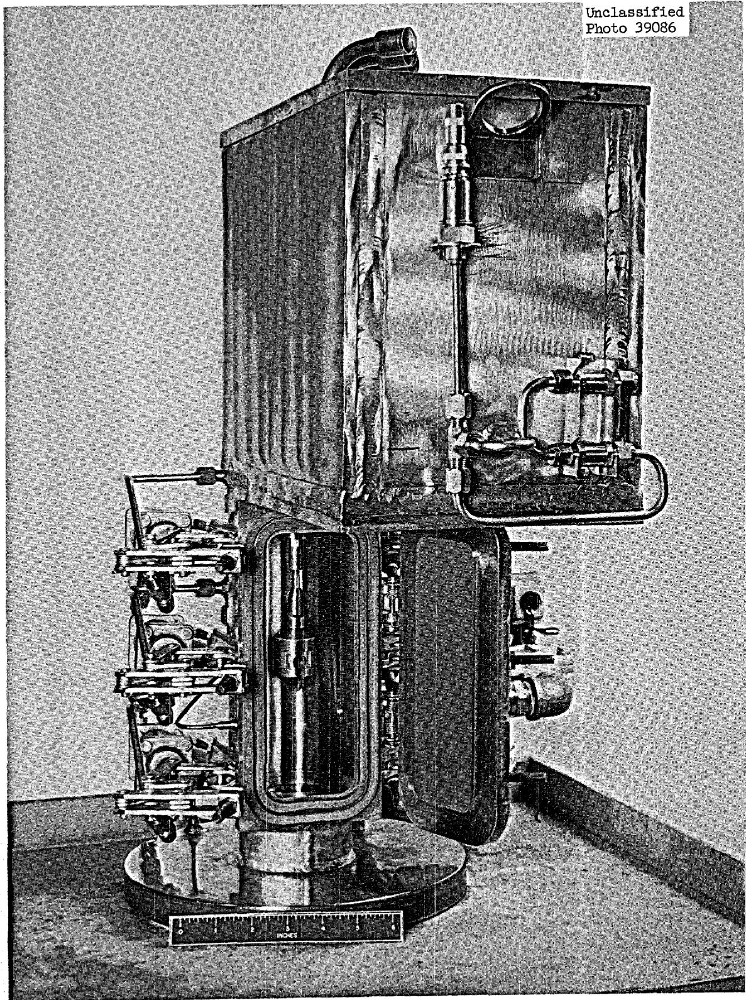  
Fig. 7.4. Capsule Access Chamber.

open. The capsule access chamber, or inner compartment (area 1-c in Fig. 7.3), is a primary containment region at this time.

7.3.7.1 Capsule Access Chamber. The 1-1/2-in.-diam upper end of the transfer tube assembly is welded to the bottom of a bellows, which, in turn, has the top welded to the bottom of the capsule access chamber (see Fig. 7.4). This arrangement accommodates relative movement and minor misalignment. The bellows is 2-ply 304 stainless steel, with each wall 0.004 in. thick. It is 2.406 in. OD x 1.562 in. ID x 3 in. long, has eight convolutions, and was tested at 75 psig. The manufacturer was Fairchild Instrument and Camera Company (El Cajon, Calif.).

The bellows described above is housed in a guide about 5 in. diam by $5 - 3 / 4$ in. long, welded to the bottom of the capsule access chamber. The outside of the guide is provided with two neoprene O-ring gaskets and fits into a short cylinder in the top of the valve box. When the flanged joint above the operational valve is separated, this arrangement permits the capsule access chamber and cable drive unit to be withdrawn for maintenance through the top of the transfer box, as will be described subsequently.

The 304 stainless steel capsule access chamber has a square cross section, about $4 - 1 / 2$ in. on outside dimensions, is about $10 - 3 / 8$ -in. high, and has walls about $1 / 2$ -in. thick. A $2 - 3 / 4$ -in. by $8$ -in.-high opening and a door are provided on the south face. The door swings on hinges which are spring loaded to hold the door in the open position. As shown in Fig. 7.4, the door is closed and clamped shut by three pneumatic cylinders on each side, operated by 75 psig helium, which are connected through pinned linkages in a toggle action to lock the door shut after the gas pressure has been released. The door is opened by applying helium pressure to the reverse side of the piston. These same links swing the clamps out of the way when released to allow the door to swing open. The clamps are not attached to the door but have Stellited rounded noses which bear against Stellite pads on the door. The clamps, each of which can exert a force of 300 lb on the door, are Knu-Vise Clamps, Catalog Number AODT-200, manufactured by the Lapeer Manufacturing Company (Detroit). Two Buna-N gaskets are provided on the door opening, and the space between the gaskets is buffered with helium when the door is closed.

A three-way valve in the helium supply to the pneumatic cylinders vents the spent helium to the containment ventilation system.

When the capsule is hoisted to the fully raised position, the beveled surface of the upper portion of the capsule latch contacts a similarly beveled surface on a stop mounted in the top of the capsule access chamber. As mentioned in Section 7.3.2.2, and shown in Fig. 7.2, this arrangement causes the latch to rotate on the cable so that the notch faces the door opening.

7.3.7.2 Capsule Drive Unit and Box. The electric-motor-driven reel which raises and lowers the capsule cable is located in a drive unit box just above the capsule access chamber. The interior of the box communicates with the chamber and is thus also part of the primary containment.

The box is about 8-3/8 in. x 14-1/8 in. x 11 in. high and is fabricated of 1/2-in.-thick 304 stainless steel plate (see ORNL drawing 10301 R-157-E). The box has a 1-1/2-in.-diam hole at the bottom through which the cable passes into the capsule access chamber. The box is designed for, and tested at, the same pressures as the access chamber.

The transfer box has an O-ring-gasketed cover bolted in place just above the drive unit box. After the flange above the operational valve is separated, the lifting eyes in the top of the transfer box may be used to pull the drive unit box and the attached capsule access chamber assembly upwards through the opening for maintenance or replacement.

The capsule cable drive unit is a Teleflex, Inc. (North Wales, Pa.), Catalog No. 19553, drive with a storage reel holding 25 ft of cable. The cable is positively paid out and returned by a non-slip gear-driven wheel capable of exerting 35 lb of force on the cable in tension and 20 lb in compression. (It is to be noted, however, that the normal loading is but a small fraction of these values and that the capsule drops downward to the pump bowl solely by gravity.) As the cable moves upward through the drive wheel, it winds onto a storage reel which is spring-loaded to maintain a tension on the cable between the reel and the drive wheel.

The drive unit motor is a 115-v, single-phase, reversible, Jordan (Milwaukee) "Shaftrol" unit, Model SM-11-W-3, 1/2 FLS, exerting 28 in.-1b

torque at 3-1/2 rpm output speed. It is provided with a built-in electric brake. One revolution of the motor reels in about 8 in. of cable.

A threaded shaft, gear-driven from the motor, moves a nut along it to contact limit switch arms. An upper limit, lower limit, and two intermediate points are provided. The upper and lower limit switches cut off the cable drive motor while the intermediate positions are part of the interlock system. Two gear-driven synchro motors are incorporated into the drive unit to send signals to the "coarse" and "fine" position indicators on the operating panel. These show the capsule position to within 1/8 in. of the actual point.

7.3.7.3 Transfer Box Layout and Construction. The box that houses the capsule access chamber and the drive unit is a sealed I-shaped container, with the vertical leg about 15 in. by 20 in. and 24 in. high, and the horizontal leg about $15 \times 15 \times 36$ in. long (see Fig. 7.3). It is fabricated of 1/2-in.-thick 304 stainless steel plate. Reinforcing bars 1/2 in.-thick by 3-in.-wide are welded along the center lines on the 24-in.-long sides. The design pressure is 40 psig at $100^{\circ}\mathrm{F}$ , the normal operating pressure being atmospheric. The box was hydraulically tested at 54 psig or pneumatically at 46 psig. The helium leak rate was less than $1 \times 10^{-8}$ std cc/sec (see ORNL drawing 10301-R-150-E). The box, as secondary containment, complies with the ASME Code Case 1272 N-5.

The capsule access chamber is located in the north end of the box, in the vertical leg, with the drive unit mounted above it. The south end of the horizontal leg is fitted with a manipulator and a quartz viewing port. The upper portion of the horizontal leg is provided with another quartz port for the illumination system and with a valve port for insertion and removal of the sample-capsule-transport container. These devices are described separately in the sections that follow.

7.3.7.4 Manipulator. A shielded manipulator extends through the wall of the transfer box. It is used to remove the capsule latchkey from the latch and to lift the sample capsule from the access chamber to the capsule-transport container, etc. As indicated in Fig. 7.3, the manipulator hand has two fingers of the forceps type. These are actuated by a push-pull rod extending through the arm to the handle, located outside the transfer box. A grip-type lever, which has a ratchet and pin,

or trigger, arrangement to lock it in any position, imparts the push-pull motion to the rod. The hand can be rotated about $180^{\circ}$ by turning the arm. The insides of the fingers are padded with neoprene about 1/32 in. thick.

The arm passes through the box wall in a Castle-type joint. The side-to-side motion of the arm is provided by a vertically mounted 6-in.-diam by 8-in.-high depleted uranium cylinder that is mounted on ball bearings at the top and bottom. This cylinder turns, with a clearance of about $1/64$ in., in a depleted uranium housing fitted into the 14-in.-diam extension of the transfer box. The up-and-down motion of the hand is provided by a ball-bearing-mounted horizontal axle on a 7-in.-diam by $1-1/4$ -in.-thick depleted uranium disk, which turns with about $1/64$ -in. clearance in a cutout in the above-mentioned cylinder. This gimbal arrangement allows full freedom of swinging motion of the arm to any position within a cone of about $40^{\circ}$ included angle. The effective shielding thickness of the depleted uranium is 5 to 6 in. All uranium pieces have hard chrome plating about 0.001 in. in thickness.

The arm is sealed by a 2-ply-polyurethane, conical-shaped, corrugated bellows, about 8 in. in diameter at the large end and tapering to about 1 in. in diameter to the point where it is clamped at the "wrist" of the arm. Each ply is about 0.020 in. thick. The space between the inner and outer bellows is maintained below atmospheric pressure. Effluent gas from the space passes to the containment ventilation system, where it is monitored for radioactivity.

A cover can, or cap, is placed over the portion of the manipulator handle extending outside the transfer box when the manipulator is not in use, or if gas leakage is detected in the assembly. This stainless steel can is about 10 in. in diameter by 12 in. long and is joined to the manipulator housing by "Conoseal" multiple T-bolt latches (Catalog No. 50765H) and uses a tube-type gasket (Catalog No. 50887-1000S). This can passes the same leak checks as does the transfer box. The can also can be used to equalize the pressure on the polyurethane bellows when the transfer box is under pressure or vacuum.

7.3.7.5 Viewing Ports and Periscope. A 4-in.-diam viewing port is located on the front of the transfer box. The 1/2-in.-thick quartz lens

is mounted in a pressure-tight, screwed fitting. A simple periscope, using two front-surface mirrors about 2-1/2 by 3 in. and located about 3 ft apart in a 3-in.-square stainless steel box, is arranged at a convenient height for an operator in the standing position. A knob at the top has a belt drive to adjust the viewing angle of the lower mirror, and the periscope can be rotated slightly to view the required portions of the box interior. The viewing port and the lower section of the periscope are inside the lead shielding which surrounds the transfer box. A hood prevents the operator from placing his face closer than about 7 in. from the upper mirror.

A second quartz lens port, identical to the one described above, is located at the top of the transfer box in such a position that the 100-watt electric bulb placed outside the box illuminates the work area.

7.3.7.6 Capsule Removal Valve. A 2-in. ball valve is located on the top of the transfer box for the removal and insertion of the sample-transport container. The seal assembly for the tube is described below. The valve is a Jamesbury Corporation (Worcester, Mass.) type DHV-33TT, with an air-actuated pneumatic cylinder operator No. 04 Model P-100. A 4-way solenoid-operated valve controls the air flow to the cylinder and vents the air to the atmosphere. The valve is enclosed by the lead shielding around the transfer box.   
7.3.7.7 Capsule Removal Tube Assembly. The capsule transport container is inserted into the removal valve through a seal assembly designed to prevent entry of air into the transfer box. The seal assembly also prevents the escape of contaminated gases from the box as the container is withdrawn.

The seal is contained in a vertical stainless steel tube, 2.375-in.-OD by 11-3/16 in. long, joined with 2-in. 11-1/2 NPT to the removal valve outlet. The upper portion is fitted with a nylon bushing 3 in. long and with two guiding surfaces, 1.373 in. ID by 3/4 in. long, at each end, through which the 1.367-in.-OD transport carrier tube slides. Immediately beneath the guide bushing are two Parker No. 220 neoprene O-ring gaskets, 1-3/8 x 1-5/8 x 1/8 in., mounted 1 in. apart. The space between the gaskets is drilled with a 1/16-in.-diam hole and provided with 1/4-in. 30,000-lb autoclave tubing fittings for the introduction of helium purge.

A similar tubing connection is made beneath the O-ring seals for the connection to vacuum pump No. 2 or the helium supply (see ORNL drawing 10301-R-152-E).

In operation, the transport container is first inserted into the seal until the lower end is below the two O-ring gaskets, the removal valve being closed. Helium is then introduced between the O-rings, and the space between the seals and the removal valve is evacuated by vacuum pump No. 2. After helium is introduced into the space, the removal valve may be opened and the transport container inserted into the transfer box. It is to be noted that the removal tool is also a leaktight fit into the capsule removal seal.

# 7.3.8 Capsule Transporting Equipment

After taking a sample from the pump bowl, the sample capsule is placed in a gas-purged leaktight compartment of a transport container. This container is then withdrawn from the transfer box up into a lead-shielded transport cask, using a special tool. The cask is then taken to the analytical laboratory.

7.3.8.1 Sample Transport Container. The sample capsules are transported in a 304 stainless steel container assembly, 1.367 in. OD by 18-13/16 in. long, maintained in a vertical position for both loading and shipping. The sample capsule rests in a compartment in the bottom, about 7/8 in. ID by 6 in. long. The compartment fits inside the container, and when the container is turned by a special tool, is joined to it by threads at the bottom of the assembly. Double O-ring, neoprene gaskets seal the joint. The bottom of the compartment is notched to fit over lugs on a positioning jig in the bottom of the transfer box to keep the compartment from turning when the container is rotated to make or break the threaded joint (see ORNL drawing 10301-R-050-E).

The upper portion of the transport container is filled with an 8-1/4-in.-long plug of lead for shielding in the transport cask, and the upper end has a vertical 1/4-in. threaded hole and transverse 5/16-in.-diam hole for a latching pin, as will be discussed subsequently.

7.3.8.2 Transport Container Removal Tool. The special tool used to insert and remove the transport container and to rotate it inside the

transfer box is 1-3/8 in. in diameter by about 53 in. long. A 1/2-in.-diam rod extending through the handle is threaded with 1/4 in. x 20 UNC threads at the bottom to engage the threads at the top of the container. A 7/16-in.-wide slot on the bottom of the tool fits over a projecting lug on top of the carrier tube to prevent relative turning. The tool is long enough to extend through the transport cask, the removal valve on top of the transfer box, and into the box for joining to the transport container (see ORNL drawing 10301-R-050-E).

7.3.8.3 Transport Cask. The transport container, with the enclosed sample capsule, is drawn upward from the transfer box into a shielded transport cask, as shown in Fig. 7.5. The removal tool, described above, is then disengaged from the transport container.

The cask consists of a 25-in. length of 18-in. sched-10 austenitic stainless steel pipe with 3/8-in.-thick flat plates welded to the ends. A 17-1/2-in. length of 2-in. sched-160 pipe at the center serves as the transport container compartment. Two lugs project from the top of the cask at each side of the central hole. Each lug has a 5/16-in.-diam hole through which a spring-loaded latching pin operates to engage the corresponding hole in the lug at the top of the carrier tube. The pin is positively locked in place to prevent accidental removal or spills from the cask (see ORNL drawing 10301-R-051-E).

The cask is completely filled with about 2250 lb of lead to provide a minimum of 8 in. of shielding in all directions. The opening at the top of the transport container is filled with a lead plug 8-1/4 in. long. The bottom of the cask is closed with an 8-in.-thick sliding lead door.

Lifting trunnions are provided on each side of the cask, which weighs a total of about 2500 lb.

Three casks are available for the MSRE.

# 7.4 Containment

During all phases of operation, the sampler-enricher system provides a minimum of two barriers to the escape of radioactive particles and gases. Thus, failure of any one component will not result in the release of dangerous amounts of contaminants, as is briefly reviewed

Unclassified

ORNL DWG 64-8823

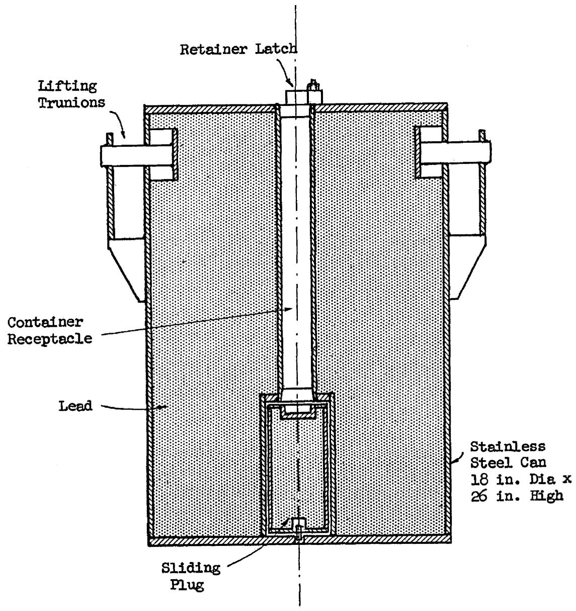  
Figure 7.5. Transfer Cask for Sampler-Enricher Transport Container.

below. (For a detailed description of operation of the system, see Operating Procedures, Part VIII.)

When the sampler-enricher system is not in use, the operational valve in the transfer tube is closed. The space between the two seating surfaces in the valve is buffered with helium gas at a pressure greater than that in the pump bowl. If leakage in the valve does occur, the capsule access chamber at the top of the transfer tube is sealed with double O-ring gaskets with the space between the gaskets buffered with helium gas. If leakage should occur from this chamber, or from any of the flanged joints in the transfer tube connections, the escaped gases will be contained in either the transfer box or the valve box. These gases are monitored for radioactivity before being discharged either to the auxiliary charcoal bed or to the containment ventilation system.

In preparing to take a sample, after the transport container with the empty capsule has been placed in the removal valve seal assembly and purged of air, the removal valve on the transfer box is opened. At this point in the procedure, the operational valve and the access chamber door remain sealed, providing the requisite double containment barrier.

After the transport container and empty capsule are placed in the transfer box, the removal valve is closed and buffered with helium gas. (The transfer box may then be purged of any entering air should this be necessary.) When the access chamber door is opened to latch the empty capsule to the cable, the operational valve remains sealed. This valve and the transfer box thus constitute two blocks to the escape of activity.

The access chamber door is closed and buffered with helium gas before the operational valve is opened to lower the capsule into the fuel pump bowl. The door and the transfer box are the double barrier at this point.

After the sample has been taken and moved to the transport container in the transfer box, in the reverse procedure to that outlined above, helium purge gas sweeps any fission-product gases from the transfer box to the auxiliary charcoal bed.

At the completion of the sampling procedure, when the fuel salt is contained in a helium atmosphere inside the sealed transport container located in the transport cask, the cask is sealed in a gas-tight compartment

for shipment to the hot-cell facilities at the analytical laboratory. Double containment is thus provided during the transport phase.

# 7.5 Shielding

Preliminary estimates indicated that after extended operation of the MSRE at 10 Mw, one 10-g sample of the fuel salt would have a radiation level of about 200 r/hr at a distance of 12 in. In the design of the sampler-enricher shielding it was assumed that one such sample would be in the apparatus and that, in addition, the deposits of the decay daughters of the fission-product gases, particles of fuel salt, etc., would amount to about 200 r/hr. Figure 7.6 indicates the estimated approximate dose rate at the surface of the shielding for varying thicknesses of lead.

The outside of the sampler-enricher valve box, transfer box, etc., is shielded with a minimum thickness of 8 in. of lead, mostly in the form of stacked lead bricks. As described in Section 7.3.7.4, the manipulator is shielded with 6 in. of depleted uranium. During maintenance, with no sample in the apparatus and the radioactivity due only to residual contamination, it is estimated that 6 in. of lead shielding is sufficient after a 4-day decay period.

The sleeve opening through the reactor containment vessel shielding, through which the transfer tube passes, requires special consideration. As mentioned in Section 7.3.5.2, the annular space between the sleeve wall and the transfer tube is filled with a 20-in. length of lead. In addition, stacked blocks of borated polyethylene, lead bricks, etc., are used to attenuate and absorb the beam coming through the opening.

# 7.6 Stresses

The stresses in the valve and transfer boxes were investigated using standard relationships.* The design pressure was 40 psig at room

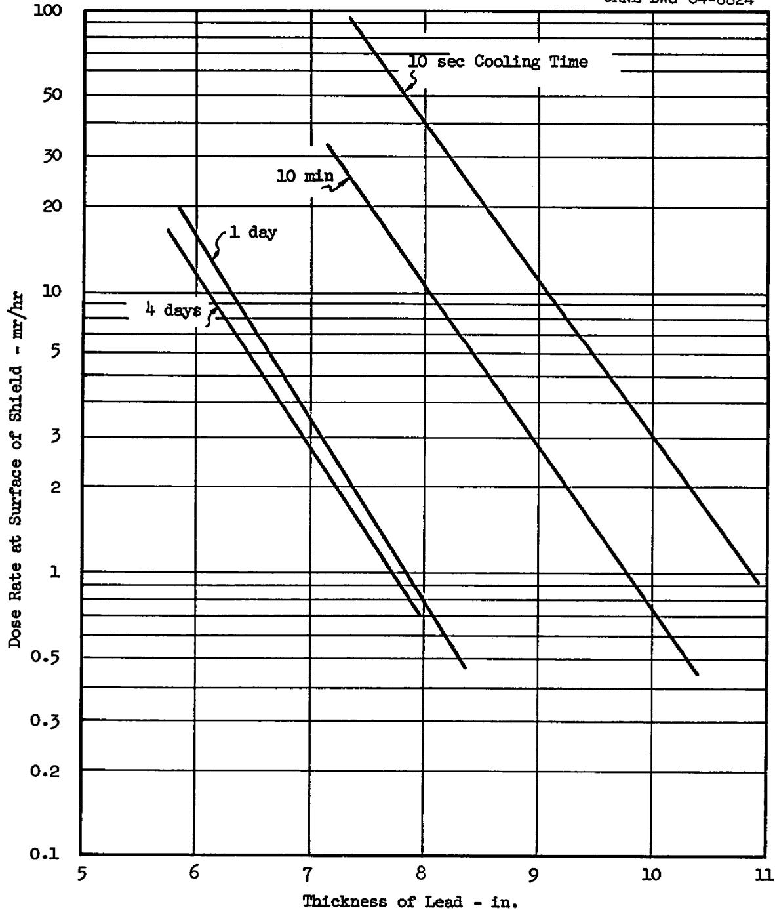  
Figure 7.6. Effect of Lead Thickness on Effectiveness of Sampler Shielding.

Unclassified

ORNL DWG 64-8824

temperature, and 18,750 psi was taken as the allowable stress in 304 stainless steel. $^{45}$ The applicable ASME Codes are listed in Section 7.2.6. Reinforcing ribs are used for the sides and cover plates and the openings are reinforced where required.

Investigation of the transfer tube indicated a maximum bending stress of about 9200 psi at one end.[129]

# 7.7 Cover-Gas and Leak-Detection System

Helium is used in the sampler-enricher system to purge the sealed compartments of air or contaminated gases, to operate the pneumatic door latches on the capsule access chamber door, and to pressurize, or buffer, the space between the double gaskets used throughout. A drop in the helium supply pressure to the latter, indicating a leak, actuates the various interlocks in the control circuits.

As shown in Fig. 7.7 (Instrument Application Diagram, ORNL drawing D-HH-B-40505), helium is supplied to the fuel and coolant salt sampler-enricher equipment at 250 psig through lines 509 and 515, respectively, from line 514 in the west tunnel area (see Section 10). With but few exceptions, all helium lines in the sampler-enricher system are $\frac{1}{4}$ -in.-OD by 0.083-in.-wall-thickness stainless steel tubing with 30,000-lb autoclave fittings. All helium supply lines have double check valves to prevent backflow.

At the fuel-salt sampler-enricher control board, line 509 divides into lines 650 and 674. The former has a pressure-reducing valve, PV-650, which furnishes helium at 75 psig to 3-way solenoid valves HSV-652 and HSV-653, each of which supplies three of the pneumatic clamps to close and latch the capsule access chamber door. After the doors are latched, the 3-way valves vent the spent helium to the containment ventilation system, as will be described subsequently. The doors are unlatched and opened by the admission of helium through HSV-651, a 3-way valve also supplied from line 650.

Line 674, mentioned above, is provided with helium through a pressure control valve, PV-509, which reduces the pressure to 40 psig and supplies two headers, 664 and 683, which have branch lines to the various seals,

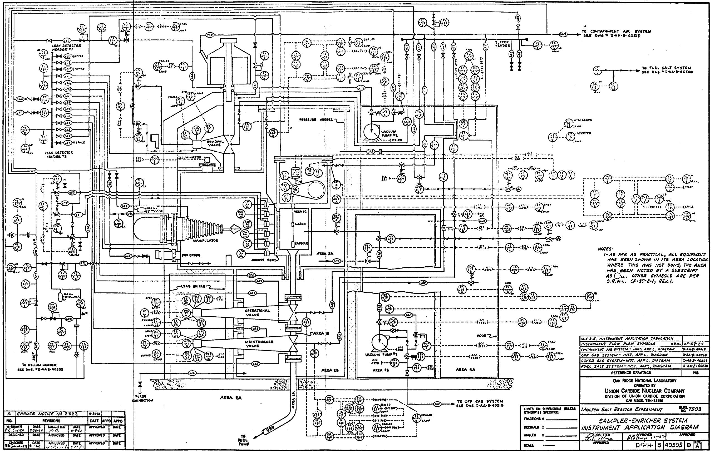  
Figure 7.7. Sampler-Enricher Cover and Off-Gas System Flowsheet

flanged joints, etc. Most of the branch lines contain a flow element consisting of a short length of capillary tubing, to restrict the flow should a buffered joint develop a significant leak. In this event, the pressure drop in either of the two headers, 664 or 683, would be sensed by pressure indicators and an alarm would be sounded. The branch lines and the data on each restrictor are tabulated in Table 7.1.

Line 674 also supplies helium at 40 psig to line 672, which provides a supply of purge gas for the transfer box. The relatively large flow is regulated through PV-672, rather than through a restrictor tube. Two check valves in series at the exit of the line inside the box prevent backflow of possibly contaminated gas. (The line between the check valves and PV-672 can be evacuated by vacuum pump No. 2 and the gas discharged to the containment ventilation system.)

The cable drive box is supplied with helium at 40 psig from line 674, via line 657. This line is provided with a flow restrictor, as listed in Table 7.1. The helium flows through the drive box to the capsule access chamber, and is vented through line 678, as discussed below.

Line 666, branching from line 674, is provided with a pressure-regulator, PV-666, which reduces the pressure to 15 psig for the helium supply between the double O-ring seals at the transport container seal.

# 7.8 Off-Gas System

Off-gas from the capsule access chamber and transfer box is vented through vacuum pump No. 1 to the auxiliary charcoal bed. All other gas, some of which may pass through vacuum pump No. 2, is vented to the containment ventilation system. All discharged gas is monitored for radioactivity both at the sampler-enricher station and again in the MSRE gas disposal systems. All off-gas lines leading to the charcoal beds can be blocked with two valves in series.

# 7.8.1 System No. 1

The capsule access chamber is vented through line 678, which is provided with valves HCV-678 and HSV-678. Gas in the transfer box is vented through HCV-677 and line 677, which joins line 678 to connect to

Table 7.1. Helium Supply Lines and Restrictors in Fuel-Salt Sampler-Enricher System   

<table><tr><td rowspan="2">Line No.</td><td rowspan="2">Equipment Supplied</td><td colspan="5">Restrictor</td></tr><tr><td>Max. Flow Ratea(cc/min STP)</td><td>Inlet(psig)</td><td>ID(in.)</td><td>OD(in.)</td><td>Tube Lengthb(in.)</td></tr><tr><td>650</td><td>Capsule chamber door latches</td><td>5000</td><td>75</td><td>0.012</td><td>0.060</td><td>10.8</td></tr><tr><td>655</td><td>Maintenance valve buffer</td><td>30</td><td>40</td><td>0.006</td><td>0.050</td><td>28</td></tr><tr><td>657</td><td>Cable drive box</td><td>5000</td><td>40</td><td>0.017</td><td>0.060</td><td>12.4</td></tr><tr><td>664</td><td>Buffer seals</td><td>30</td><td>40</td><td>0.006</td><td>0.050</td><td>28</td></tr><tr><td>666</td><td>Removal seat buffer</td><td>30</td><td>15</td><td>0.006</td><td>0.050</td><td>9.5</td></tr><tr><td>668</td><td>Operating valve buffer</td><td>30</td><td>40</td><td>0.006</td><td>0.050</td><td>28</td></tr><tr><td>669</td><td>Capsule chamber door buffer</td><td>30</td><td>40</td><td>0.006</td><td>0.050</td><td>28</td></tr><tr><td>670</td><td>Removal valve buffer</td><td>30</td><td>40</td><td>0.006</td><td>0.050</td><td>28</td></tr></table>

aAll restrictors discharge at essentially atmospheric pressure.   
bAll restrictors have tubing formed into a coil and contained within a 2-in. length of 2-in. sched-40 pipe capped at each end. All material is 304 stainless steel.

the suction of vacuum pump No. 1, after passing the radiation monitor RE-678. The vacuum pump discharges through a check valve to line 542, which connects to line 521 leading to the auxiliary charcoal bed described in Section 12.4.2.

The vacuum pump is a W. M. Welsch Manufacturing Company "Duo-Seal" unit, Model 1402, having a capacity of 140 liters/min STP and is driven by a 1/4-hp motor. The pump is located in a vented box at the rear of the sampler-enricher unit.

# 7.8.2 System No. 2

The pneumatic cylinders on the capsule access door latches exhaust through the 3-way solenoid-operated valves HSV-651, 652, and 653, through HSV-675 and line 675, past the radiation monitors RE-675A and RE-675B, and joins the 9-in.-diam line 949 leading to the containment ventilation system described in Section 13.

The box in which vacuum pump No. 1 is located is vented through line 660 to the containment ventilation system, via line 684. A branch of line 684 draws gases from the vacuum pump No. 2 vented box. The valve box is vented through line 659 to the vacuum pump No. 2 box. A remotely operated valve in this line, HSV-659, permits the line to be closed to determine which of the compartments is the source of contamination, should this be indicated by radiation monitors RE-675 A&B.

Air or contaminated gases in the removal tube assembly are drawn off through line 679 and valve ECV-679, to the intake of vacuum pump No. 2. This pump discharges into the vented box in which it is located, to be vented through line 684, mentioned above.

Vacuum pump No. 2 is identical to the No. 1 unit, described above. Both pumps are operated only when the sampler-enricher equipment is in use.

# 7.8.3 Exhaust Hood

An exhaust hood is located over the transport cask position on the sampler-enricher to draw off any fission-product gases which might escape. This hood is connected to the containment ventilation exhaust system, the air being drawn from the high-bay area, as described in Section 13.

# 7.9 Electrical

Electrical power for the sampler-enricher system is supplied from the 25-kw dc-ac motor-generated set No. 4, via instrument power panel No. 2. In event of failure of the dc supply normally driving the motor-generator set, batteries can provide at least two hours of running time, as described in Section 19.

The capsule cable drive motor is arranged for 110-v, single-phase operation. The 220-v, 3-phase power for the operational and maintenance valve-control motors is obtained from a static converter used to change the single-phase power from the 25-kw motor-generator set to 3-phase.

Mineral-insulated electrical leads are used at all points where wires must pass through the walls of the leaktight compartments. All electrical disconnects are located outside the containment areas.

# 7.10 Coolant-Salt Sampler-Enricher System

Salt samples are taken from the coolant-salt pump bowl in essentially the same manner as that used in the fuel-salt system. Samples are removed but about once a month, however, and single, rather than double, containment is sufficient in that long-lived radioactive material is not normally present in the coolant-salt pump bowl.

The same sampling capsules are used in the fuel and coolant-salt systems, see Section 7.3.1.2 and Fig. 7.1. The transfer tube, capsule drive mechanism, capsule latch, pump bowl internals, including the sampling cage, are all identical to those used in the fuel-salt system. See Sections 7.3.2 through 7.3.5 and 7.3.7.2.

The 1-1/2-in. NPS transfer tube extends from the coolant-salt pump bowl upwards through the side of the penthouse to a dry box mounted in a "packaged" coolant-salt sampling unit. The dry box is a 30-in.-long vertical section of 14-in. sched 40 pipe. The pipe is closed at the bottom with a pipe cap and at the top with a 150-psi hinged and clamped flanged Tubeturn closure having elastomer O-ring seals. This dry box houses the capsule drive unit. The box is provided with one rubber glove, the opening for which can be sealed with an 8-in. hinged flange

similar to that used on the top of the box. A 1-1/2-in. NPS connection at the bottom leads to the two 2-in. Jamesbury ball valves (see Section 7.3.7.6) in the transfer tube, and a top connection is provided for the 1-1/2-in. ball valve for insertion and removal of the capsules. The box is also equipped with two 3-in.-diam quartz-lens viewing and illuminating ports, helium and vacuum connections. See ORNL drawing 10333-R-002-E.

The dry box was designed for a full vacuum or for $\frac{140}{2}$ psig at $100^{\circ}\mathrm{F}$ in accordance with the ASME Code for secondary nuclear vessels. The normal operating pressure is 5 psig.

A system of six different keys and about nine locks is used on the valves, electrical switches, opening latches, etc., to reduce the likelihood of using an improper operating sequence. This system of "key interlocks" operates on the principle that a key is used to unlock a device and also to gain access to a key which can be used to unlock the next step in the procedure. An electrical system sounds an alarm if the pressures in the equipment are not suitable for the next step to be undertaken.

The sample capsules are inserted into the dry box from, and withdrawn from the box into, a portable container which is used to transport the samples to the analytical laboratory in an inert atmosphere. This container is a short section of 1-1/2-in. pipe with a 1-1/2-in. Jamesbury ball valve at the bottom and a Wilson, Teflon, sliding dynamic vacuum seal where the 1/4-in.-diam raising and lowering rod passes through the top cap.

In brief, the samples are taken by first evacuating the glove and the dry box by means of the vacuum pump provided in the packaged system. The gases are exhausted to the containment ventilation system filters and stack. The box is then purged with helium, after which the sample is lowered from the transport container which has been temporarily mounted on the ball valve on top of the dry box. The flange cover on the dry box glove is then opened, allowing the operator to insert his hand and to attach the capsule to the latch on the capsule drive cable. After the capsule has been lowered into the pump bowl and filled, it is retained in the transfer tube for about ten minutes to allow the salt to solidify and the activity to decay. It is then raised into the dry box and the reverse sequence of procedures used to transfer the capsule to the transport container. The operation is described in detail in Part VIII.

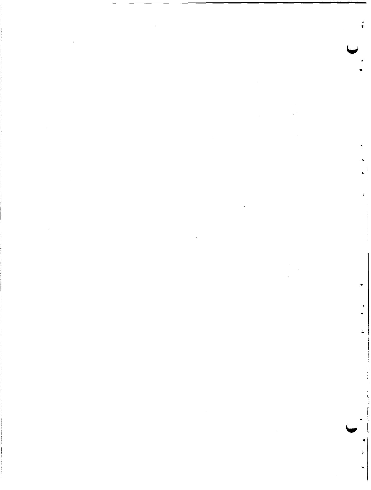

# 8. COOLANT-SALT CIRCULATING SYSTEM

# 8.1 Layout and General Description

The coolant-salt system transports reactor heat from the fuel salt heat exchanger to the air-cooled radiator where the energy is dissipated to the environment by the discharge of warm air from the stack. The coolant salt, or secondary $*$ , system circulates a lithium and beryllium salt, similar in physical properties to the fuel salt but barren of fissionable materials (see Table 2.1). The main components in the system are the fuel salt heat exchanger, located in the reactor cell and described in Section 5.5, the coolant-salt circulating pump and the radiator, both located in the coolant salt cell.

The coolant-salt circulating pump is very similar to the fuel salt pump described in Section 5.4. Both pumps use a 75-hp motor, but the coolant salt pump operates against a higher head of 78 ft, turns at a higher speed of 1750 rpm, and delivers only 850 gpm as compared to 1250 gpm for the fuel pump. Other differences are that the coolant salt pump does not have the cooling shroud for the top portion of pump bowl, spray nozzles in the bowl for release of fission-product gases, and the overflow tank. The pump bowl has a centerline elevation of 833 ft 6 in., and as the highest point in the coolant salt system, serves as an expansion volume. It is located in what is sometimes referred to as the penthouse area.

The radiator has 120 tubes, $3/4$ -in. diam x 30 ft long, arranged in serpentine coils to provide 706 ft² of heat transfer surface. The coolant-salt enters at $1100^{\circ}\text{F}$ and leaves at $1025^{\circ}\text{F}$ at 10 Mw design conditions. The coolingngir is supplied by two 250-hp axial blowers located in the blower house and having a combined capacity of about 200,000 cfm. The leaving air, heated at design conditions to about $300^{\circ}\text{F}$ , is discharged from the existing 10-ft diam x 75-ft-high steel stack at the southwest corner of Bldg. 7503. To guard against freezing of the coolant salt in

the radiator tubes on reduction of power or loss of circulation, quick-closing doors are provided for the radiator to close off the air flow, and the radiator assembly includes electric heaters inside the enclosure. A bypass damper and duct permits regulation of the air flow over the coil.

The 5-in. pipe from the coolant-salt pump discharge enters the reactor cell through a penetration on the south side and circles the cell on the east side to the fuel heat exchanger inlet opening to the tube side. At 10-Mw the coolant salt enters the enchanger at about $1025^{\circ}\mathrm{F}$ and leaves at about $1100^{\circ}\mathrm{F}$ . The exit coolant salt line circles the cell on the west side, leaves through a penetration on the south side at about the 836-ft level, and then rises to the inlet header at the top of the radiator.

The coolant-salt piping has low points on each side of the radiator, therefore two 1-1/2-in. drain lines are provided. These lead to the coolant-salt drain tank. A 1/2-in. bypass line vents gas from the top of the radiator when filling the system with salt. This line has no valves, the salt bypass flow being inconsequential.

All parts of the coolant-salt circulating system can be maintained above the liquidus temperature of the salt, about $850^{\circ}\mathrm{F}$ , by means of electric heaters. The heaters on the coolant-salt piping inside the reactor cell are removable for maintenance in the same manner as pipe line heaters on the fuel salt system, see Section 5.6.4. Heaters for the coolant-salt system located outside the reactor cell can be approached for direct maintenance a short time after reactor shutdown. Pipe line heaters are attached tubular types with standard insulation. Heaters installed inside the cell wall penetrations can be maintained from the coolant cell side.

The coolant-salt piping is anchored at the cell wall penetrations, at the coolant-salt circulating pump and at the radiator. The piping runs between these points are sufficiently flexible to absorb the thermal expansion. This arrangement eliminates the need for the rather elaborate flexible support system for the pump, as is used in the fuel system, and also permits the radiator structure to be rigidly mounted.

Auxiliary equipment for the coolant-salt circulating system includes the helium cover gas supply, the off-gas system, the bubbler liquid level

system, the lubricating oil system for the pump, cooling water, etc. The coolant-salt drain tank for storing the charge of salt in the circulating system is located almost directly beneath the radiator and is described in Section 9.

All salt-containing portions of the system are constructed of INOR-8, see Table 2.2.

# 8.2 Flowsheet

The coolant-salt circulating system and the coolant salt drain system are shown in Fig. 8.1 (ORNL Dwg D-AA-A-40881).

When operating at the 10-Mw reactor design power level, the coolant salt circulating pump discharges about 850 gpm of salt at $1025^{\circ}\mathrm{F}$ and about 70 psig into the 5-in. sched 40 line 200. At lower power levels the temperature will increase and at zero power will be $1200^{\circ}\mathrm{F}$ to $1225^{\circ}\mathrm{F}$ . Line 200 enters the reactor cell and is connected through freeze flange F-200 to the fuel heat exchanger, see Fig. 5.3 (ORNL D-AA-A-40880). Line 200 has three heater sections and thirteen thermocouples within the coolant cell, and twelve heater sections and seventeen thermocouples inside the reactor cell. The penetration through the cell wall contains eight heaters and seven thermocouples. The fuel system process flowsheet indicates a future freeze flange in the reactor cell at the wall penetration. This new flange would be required should it become necessary to replace line 200.

The coolant-salt leaves the heat exchanger through the 5-in. sched 40 pipe, line 201, at about $1,100^{\circ}\mathrm{F}$ and 47 psig. After passing through the freeze flange FF-201, and the cell wall penetration, it returns to the coolant cell. Line 201 is provided with heaters, thermocouples, and has provisions for a future freeze flange, in the same manner as line 200, described above.

After passing through a venturi, FRA-201, to indicate the flow rate, the coolant-salt enters the top header of the radiator at a pressure of about 36 psig. The radiator has 120 tubes, 3/4 in. OD 0.072-in. wall thickness x 30 ft long, arranged in serpentine coils between two headers, to provide a total of about 706 ft² of heat transfer surface. The pressure

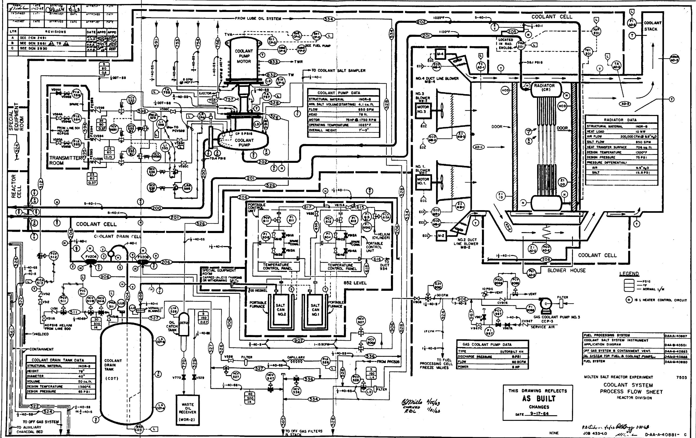

DAA-A-108812

drop of the coolant-salt in flowing through the radiator tubes is 20 psi. There are 149 thermocouples installed, which includes one thermocouple for each tube so that a plugged flow passage can be detected. The remaining thermocouples on the radiator inlet and outlet headers provide data for heat balances used to determine the reactor power. The radiator utilizes eight heater circuits.

The radiator is cooled by a flow of 200,000 cfm of air supplied by two 250-hp motor-driven axial blowers. The air is drawn through the louvered sides of the blower house and delivered to the radiator coil face at a pressure of about 10 in. of $\mathsf{H}_2\mathsf{O}$ . Each blower has a motor-operated axial damper which can be closed to prevent back flow. The air is heated about $200^{\circ}\mathsf{F}$ in passing through the radiator coil and, after passing through turning vanes, is discharged up the 10-ft diam x 75-ft high steel stack. The stack has a pitot-venturi tube, FI-AD3, to measure the air flow and to enable heat balances to be made on the heat rejection system. The by-pass damper and the radiator doors are used to adjust the air flow across the coil to establish the desired heat removal rate and, thus, the power level at which the reactor operates.

The coolant-salt leaves the bottom header of the radiator at about $1025^{\circ}\mathrm{F}$ and 23 psig and returns to the circulating pump via line 202, a 5-in. sched 40 INOR-8 pipe. The heaters for the line are listed in Table 5.12, Section 5.6.6.

The salt enters the bottom of the pump bowl where any entrained gases are drawn off. A 5-psig over-pressure of helium is maintained above the salt level in the bowl, the helium being introduced through line 512 and the liquid level bubbler lines. About 15 gpm of the 850 gpm discharge rate of the pump returns to the pump bowl by escaping through the clearances between the impeller and the casing, the so-called "fountain flow" described in Section 5.4.1.2. The pump operates against a head of 78 ft and the discharge pressure is 70 psig. The pump discharges into line 200, described previously as leading to the heat exchanger inside the reactor cell.

The 1-1/2-in. sched 40 fill and drain, line 204, is connected to the low point of elevation in line 201. A similar drain, line 206, is provided for the low point in the radiator at the lower header. Both

of these lines have freeze valves, FV-204 and FV-206, and connect to the coolant-salt drain tank through line 204. This line is provided with a reservoir, consisting of a 5-in. length of 4-in. sched 40 pipe with pipe caps welded on each end, which insures that a sufficient quantity of salt will remain behind after a drain to completely fill the freeze valves so that a seal can be effected. (See ORNL Dwg E-GG-C-40603). Each of the drain lines, 204 and 206, has one heater circuit and seven thermocouples on the circulating system side of the freeze valve.

The coolant-salt drain tank is located beneath the radiator and has sufficient capacity to store the $44\mathrm{ft}^3$ of salt contained in the circulating system. The drain tank is described in Section 9, following.

Line 205 is a $1/2$ -in. sched 40 pipe which connects the high point of the inlet line to the radiator, line 201, with the outlet, line 202, to vent the gas from line 201 when filling the system with salt. An insignificant amount of salt is by-passed through line 205. The pipe has one heater circuit and two thermocouples.

Thirteen auxiliary pipes connect to various parts of the coolant-salt circulating pump. Lines 594, 595 and 598 are $1/4$ -in. OD stainless steel tubes carrying helium for the bubblers and the reference pressure for determining the salt liquid level in the pump bowl. The normal helium flow rate in line 594 is 0.15 liters/min, and in lines 595 and 598 is 0.37 liters/min. The solenoid valves in these lines are in the coolant cell and the hand control valves and flow indicators are in the special equipment room.

Line 512 is a 1/4-in. OD stainless steel tube supplying 0.6 liters/min of helium purge gas to the pump shaft annulus just below the lower shaft seal, to provide an inert cover gas, to provide off-gas to the radiation monitor, and to reduce the migration of oil vapor to the coolant salt in the bowl.

Off-gas is vented from the pump bowl at an estimated rate of 1.4 liters/min through the 1/2-in. line 528. The gases are at a pressure of about 5 psig and flow through a filter and a pressure-regulating valve, PCV-528. By controlling the rate of venting the gases, this valve establishes the operating pressure in the coolant-salt system. Line 528 continues to the vent house where, after passing the radiation monitor

RIA-528, it joins line 927, via lines 565, 557 and 560, to be vented through the filters and the off-gas stack.

The small oil leakage through the lower shaft seal on the pump is swept away by 0.07 liters/min of helium that flows upwards through the labyrinth seal and out through line 526. The 1/2-in. pipe leads to an oil catch tank in the coolant-salt drain cell where the separated oil drains into a 55-gal stainless steel drum. The helium vent pipe continues as line 526 through a hand valve, V-526, a filter, and a 304 stainless steel capillary restrictor which limits the flow to about 70 cc/min. The vented gas joins the above-mentioned line 528 for discharge through the filters and the off-gas stack.

The coolant-salt is sampled through line 998, which is a 1-1/2-in. sched 40 pipe rising vertically from the pump bowl and into the high bay area. Salt is dipped from the bowl and withdrawn through a ball valve, HCV-998, in the same manner as described for the fuel pump in Section 7, with the exception that the lower activity level allows the coolant-salt system to be somewhat less complicated.

Lubricating oil is supplied to the pump bearings through the $3/4$ -in. line 753 at a rate of about 8 gpm through the $3/4$ -in. line 754. The oil leaves the shield block through line 757, in which the oil temperature is monitored, and passes through an eductor to induce a flow of oil from the bearings through line 755. The combined oil flow leaves the cell through the l-in. line 756, and returns to the coolant-salt lubricating oil system.

Line 591 is a 1/2-in. pipe connecting the top of the lubricating oil supply tank with the topmost passages of the bearing housing to equalize the pressure between the two points. The lubricating oil system for the coolant-salt pump is essentially the same as for the fuel pump, as described in Section 5.4.1.4.

The coolant-salt pump is driven by a 75-hp, 1,750 rpm, 440-v, three-phase electric motor. The motor is installed in a steel housing that will contain oil and radioactive gases if either or both were to leak through the upper seal in the bearing housing. The motor is cooled by 5 gpm of treated water supplied through line 832 and leaving through line 833. A microphone, XdbE, permits monitoring of the pump noise

level. The motor speed, SIA CP-G, electrical input, EiI, EvE, Ew-I, and temperatures are also monitored.

The radiator is cooled by a 200,000-cfm flow of air supplied by two 250-hp motor-driven axial blowers. Each blower has motor-operated dampers which close to prevent back flow. The air is drawn through the Louvered openings in the blower house walls and delivered to the coil face at a pressure of about 9.9 in. $\mathsf{H}_2\mathsf{O}$ . The air is warmed about $200^{\circ}\mathsf{F}$ by the heat rejected from the cooling salt, and after leaving the coil passes through turning vanes and flows upwards through the 10-ft-diam x 75-ft-high steel discharge stack. The stack is provided with pitot-venturi tubes which can traverse the stack for flow measurements to establish heat balances for the heat rejection system, FI-AD (See Part II).

The by-pass damper and the radiator inlet and outlet doors are used to adjust the air flow across the radiator coil face to fix the heat removal rate from the coolant salt and, consequently, the power level at which the reactor operates.

Two 10-hp axial blowers located in the blower house discharge 10,000 cfm each of air into the annular space between the radiator air duct and the building walls to prevent damage to the building structure and radiator duct. This is particularly necessary when the reactor is operating at zero or very low power levels and the main blowers are off.

# 8.3 Coolant-Salt Circulating Pump

The coolant-salt circulating pump is identical in most respects to the fuel salt circulating pump. The two pumps were fabricated to essentially the same drawings and specifications with the various parts and subassemblies supplied by the same manufacturers. (See Section 5.4) Development of the coolant pump, final assembly and testing proceeded at ORNL almost concurrently with work on the fuel pump.

The pump bowl is the highest point of elevation in the coolant-salt circulating system and, similarly to the fuel circulating system, serves as a surge volume, as the point for pressurizing the system with the helium cover gas, and as a means of separating and venting of gases entrained in the salt stream.

The fuel and coolant-salt pumps are both centrifugal sump types, driven by direct-connected motors, and differ mainly in their hydraulic characteristics through having different operating speeds and impeller diameters. Because of the lower level of radioactivity in the coolant-salt, the coolant pump has no provisions for cooling of the upper portion of the bowl, and does not include the "stripper" flow in the bowl for removal of fission-product gases. Unlike the fuel pump in the reactor cell, the coolant pump can be approached for direct maintenance a short time after reactor shutdown, a feature which simplified flange bolting arrangements, electrical disconnects, pump bowl heater design, thermal insulation, etc.

# 8.3.1 Description

Fig. 2.3 serves as a general illustration of both the fuel and coolant salt pumps. (See ORNL coolant pump assembly Dwg F-2-02-054-10062-B*). The general location of the pump in the coolant cell is shown in Figs. 4.4 and 4.5.

The coolant pump has a design capacity of 850 gpm at a head of 78 ft when driven at 1750 rpm by a 75-hp motor. Other design data are given in Table 8.1

Table 8.1. Coolant-Salt Circulating Pump   

<table><tr><td>Design flow: pump output, gpm</td><td>850*</td></tr><tr><td>internal bypass, gpm</td><td>15</td></tr><tr><td>Design head at 850 gpm, ft</td><td>78</td></tr><tr><td>Design discharge pressure, psig</td><td>~ 70*</td></tr><tr><td>Design intake pressure, psig</td><td>~ 5</td></tr><tr><td>Impeller diameter, in.</td><td>10.33</td></tr><tr><td>Speed, rpm</td><td>1750</td></tr><tr><td>Intake nozzle (sched 40), in. IPS</td><td>6</td></tr><tr><td>Discharge nozzle (sched 40), in. IPS</td><td>5</td></tr><tr><td>Pump bowl: diameter, in.</td><td>36</td></tr><tr><td>height, in.</td><td>15</td></tr><tr><td>Volumes, ft3</td><td></td></tr><tr><td>Minimum starting and normal operating (including volute)</td><td>4.1</td></tr><tr><td>Maximum operating</td><td>5.2</td></tr><tr><td>Maximum emergency (includes space above vent)</td><td>6.1</td></tr><tr><td>Normal gas volume</td><td>2.0</td></tr><tr><td>Overall height of pump and motor assembly, ft</td><td>8.6</td></tr><tr><td>Design conditions: pressure, psig</td><td>75</td></tr><tr><td>temperature, °F</td><td>1300</td></tr><tr><td>Estimated radiation level at pump, r/hr</td><td>1</td></tr><tr><td>Motor:</td><td></td></tr><tr><td>Rating, hp</td><td>75</td></tr><tr><td>Electrical supply (AC), volts</td><td>440</td></tr><tr><td>Starting (locked rotor) current, amps</td><td>450</td></tr><tr><td>Type</td><td>Squirrel-cage induction</td></tr><tr><td>NEMA class</td><td>B</td></tr><tr><td>Lubricant (Calif. Research Corp.)</td><td>NRRG-159</td></tr><tr><td>Electrical insulation class</td><td>H</td></tr><tr><td>Design radiation dosage for electrical insulation, r</td><td>2 x 1010</td></tr></table>

*Actual capacity is between 850 and 940 gpm and maximum discharge pressure is 75 psig at 1765 rpm. (See Ref. 8.3.1)

All parts of the pump in contact with the coolant salt are fabricated of INOR-8. The pressure-containing portions were designed for 75 psig and $1300^{\circ}\mathbf{F}$ and in accordance with Section VIII of the ASME Un-fired Pressure Vessel Code, Code Interpretation Cases 1270N and 1273N. The thermal stresses were evaluated on the same basis as for the fuel-salt pump, see Section 5.4.4 and Ref. 88.

The coolant-salt pump is arranged in three principal assemblies: the rotary element, the pump bowl, and the drive motor.

The rotary element assembly includes the rotating shaft and impeller, the bearing housing and bearings, and the impeller cover plate and upper labyrinth subassembly. The bearings, seals, and lubrication and helium gas passages, are all of the same type and arrangement as in the fuel pump. (See Section 5.4.1.1). The impeller diameter is 10.33 in. and is provided with the same type of impeller shroud as the fuel pump. Pump speed and noise pickups are essentially the same as in the fuel system.

The lubricating oil system for the pump is identical to that used for the fuel pump, although the heat rejected in the oil cooler is much less. See Table 5.6 and the lubrication system flowsheet, Fig. 5.25 (ORNL Dwg D-AA-A-40885). The same oil is used as a lubricant in both systems, see Table 5.7. The lubricating oil systems are separate from each other, although located adjacent to each other in the east tunnel area, with the exception that in an emergency Lines 762, 712 and the breather interconnection, Line 601, allow either lubricating oil system to supply both pumps.

The pump bowl, pump volute and discharge thimble in the bowl are almost identical to the fuel pump components. The thimble has a 4-in. length of $1/4$ -in. OD tubing welded to the top to vent gas from the pump discharge as the system is being filled with salt. A small flow of salt will return to the bowl through this by-pass during normal operation. The "fountain flow" of about $15\mathrm{~gpm}$ , which escapes from the clearances between the impeller and the pump casing, etc., is about the same in both pumps. The coolant pump does not have the spray nozzles above the salt level in the pump bowl for the stripping of gases from the

pumped salt, as is required for release of fission-product gases in the fuel-salt system. (See Section 5.4.1.2)

A 1-1/2-in. vertical nozzle is provided at the top of the pump bowl for the taking of salt samples and for adding enriched material. The sampler-enricher system is a simplified version of the fuel sampler-enricher system.

The salt level in the pump bowl is sensed by helium gas bubbler tubes in the same manner as in the fuel pump, and as described in Section 10.9.1. The short tube, line 598, extends $1 - 5 / 8$ in. below the centerline of the pump volute, or roughly $4 - 3 / 8$ in. below the normal operating level in the bowl. The long tube extends $4 - 1 / 16$ in. below the centerline of the volute and is supplied with helium through line 595. The reference pressure is transmitted by line 594 through a connection at the top of the bowl. In addition, a float-type level instrument is used. This instrument is a special differential-transformer type developed at ORNL, see Part II. The electrical signal is transmitted to both the data logger and, after conversion to a pneumatic signal, is recorded on the same instrument as the level indication from the bubbler tubes.

Helium cover gas is supplied through line 5l2 and FCV-5l2 to the pump shaft annulus just below the lower shaft seal. Off-gas is withdrawn from the top of the pump bowl through line 528. Line 526 withdraws the oil-helium mixture leaking through the seals to prevent the migration of oil vapor to the coolant salt, in the same manner as in the fuel salt pump.

The pump bowl was fabricated with a 1-1/2-in. overflow line nozzle but the connection is capped and not used. Protection from overfilling is provided through use of liquid level instrumentation.

The coolant pump bowl does not have a shroud and a flow of cooling air around the upper portion. The level of activity in the cover gas is so low that cooling is not required.

The pump drive motor is a 75-hp, Westinghouse, direct-connected type identical to that used on the fuel-salt pump except that the normal synchronous operating speed is 1750 rpm. Operation at different speeds

can be obtained by varying the frequency of the electric power supply through use of a motor-generator set which can be brought to the MSRE site. The pump motor is cooled by treated water flowing through stainless steel coils heliarc welded to the motor can. The motor data are listed in Table 8.1. (Also, see Section 5.4.1.3)

# 8.3.2 Hydraulics

The hydraulic performance of the coolant-salt pump was determined on a water test rig for impeller diameters of 11.6, 10.82 and 9.9 in.49 Although the required design capacity of 850 gpm at 78 ft of head could be achieved with an impeller diameter of 9.9 in., a diameter of 10.33 in. was specified in order to provide a margin for error of about $10\%$ in the system resistance calculations and for a $5\%$ variation in flow between the water test pump and the MSRE operational unit. As shown in the characteristic curves in Fig. 8.2, the coolant-salt pump has a capacity of 850 to 940 gpm under heads about $10\%$ higher than the design value of 78 ft.130

# 8.3.3 Stresses

The operating stresses in the coolant-salt pump are no less severe than in the fuel-salt pump, and in some cases, required even closer attention. See Sections 5.4.3 and 5.4.4 and Ref. 88.

# 8.3.4 Pump Supports

The coolant-salt pump is mounted in a fixed position in the coolant cell. The coolant-salt piping has sufficient flexibility to absorb the thermal expansion with the pump and radiator acting as anchor points. The flexibility of the piping system is discussed in Section 8.6.1.

The pump is bolted to a 2-in.-thick support plate (See ORNL Dwg. D-CC-D-41516), which in turn is bolted at each end with eight 5/8-in. bolts to a 5-in. square box header beam 18 in. long. These two box beams are welded to a 5-in. I-beam structure which is fastened with through bolts to the concrete wall of the coolant cell. Isomode vibration absorber pads are used under the wall mounting plates. (See ORNL Dwg. E-CC-D-41515)

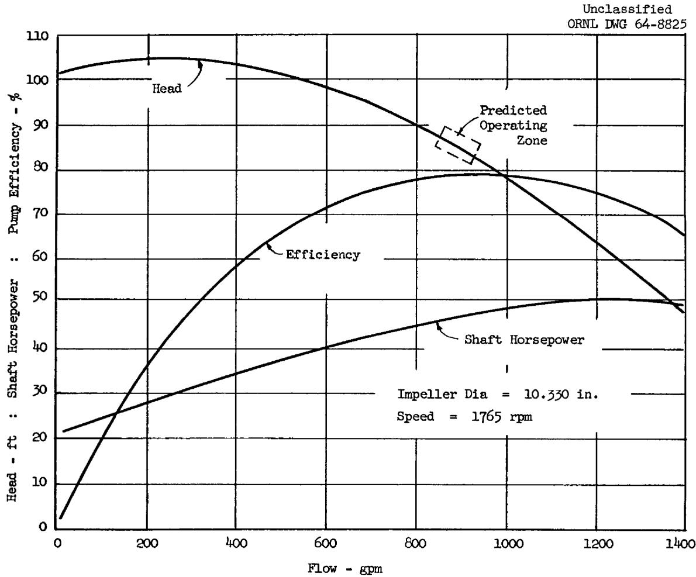  
Figure 8.2. Performance Curves for Coolant-Salt Pump

# 8.3.5 Heaters

The coolant-salt pump bowl has $11.2\mathrm{kw}$ of electrical heat applied in the form of fourteen 6-in. x 8-in. x 5/8-in.-thick flat-plate ceramic heater units of 800 w at 230 v capacity each. (See ORNL Dwg E-MM-B-40837). Six of the heaters are equally spaced at the bottom of the pump bowl and eight are arranged vertically around the sides, with the surface of the heater plate averaging about $1/2$ in. from the outside surface of the bowl. The heaters are connected in parallel and mounted in brackets in a 304 stainless steel heater basket. This basket is hung by four hooks from the pump support structure so that the heaters and basket do not touch the pump bowl. The heater leads use fish-spine ceramic insulating beads 0.260-in. OD x 0.124-in. ID x 0.260 in. long.

The electric power supply is through heater control panel HCP-4 and is adjusted by a Type 1256 Powerstat from O to 240 v. (See Section 19.7.4)

# 8.3.6 Thermal Insulation

The outside of the heater basket is insulated with 4 in. of Carey-temp high-temperature insulation applied in a conventional manner. (See ORNL Dwg E-MM-B-40837).

# 8.4 Radiator

One of the chief considerations in design of the MSRE radiator was that it be protected from freezing of the coolant-salt in the tubes in the event of sudden loss of reactor power.[131, 132] Other important design factors were that the radiator was to be used in conjunction with air-handling equipment already installed in Bldg 7503 as part of the ART program, that the heat dissipation rate be adjustable from zero to 10-Mw, and that the unit must be capable of operating for long periods of time without direct approach for inspection or maintenance.[151] The salt should move downward through the radiator as it is cooled. In general, the above considerations were of greater importance than designing for high performance characteristics.

# 8.4.1 Description

A drawing of the radiator and enclosure is shown in Fig. 2.5. (Also, see ORNL Assembly Dwgs E-DD-A-40431 and E-DD-D-40470). The radiator design data are summarized in Table 8.2

8.4.l.hilCoil. - The radiator coil has 120 INOR-8 tubes, 3/4 in. OD, with 0.072-in. wall thickness, and each about 30 ft long.* The tubes are arranged in an S-shaped configuration, 12 tubes high and 10 tubes deep in the direction of air flow, as shown in Figs. 8.3 and 8.4. The tubes are spaced 1-l/2 in. on centers, and the rows are 1-l/2 in. apart, with the tubes staggered, as shown in Fig. 8.4. This arrangement provides about 706 ft² of effective heat transfer surface.

Each vertical row of tubes terminates in a manifold. The ten manifolds at each end of the coil join horizontal 9-in. OD inlet and outlet headers, to which the 5-in. coolant salt circulating lines are welded.

The manifolds are 2-7/16-in. ID and fabricated of $1/4$ -in. INOR-8 plate. (See ORNL Dwg E-DD-A-40744). The plate was first formed into a U-shape and then cold-drawn with a die to form the nozzles for welding the $3/4$ -in. OD tubing to the manifold. The plate was then formed into a circular cross section and the longitudinal seam weld and pipe cap were added to complete the assembly. The headers were constructed in essentially the same manner except that the plate thickness was $1/2$ in.

The outlet header is bolted to the fixed radiator structure and is an anchor point in the coolant-salt piping system. The inlet header is supported with slotted bolt holes that allow movement of the header due to thermal expansion. (See ORNL Dwg D-DD-A-40438).

The tubes are supported about every 4 ft by 3/4-in.-wide stainless steel strap hangers, as indicated in Fig. 8.5. The tubing is sufficiently free within the hangers to allow longitudinal movement. Alignment pins passing through the straps maintain the row-to-row spacing.

*Extended surface tubing usually associated with air-cooled coils is not used in the MSRE radiator because less rapid heat transfer is desirable on sudden loss of reactor power to prevent freezing of the coolant salt in the tubes.

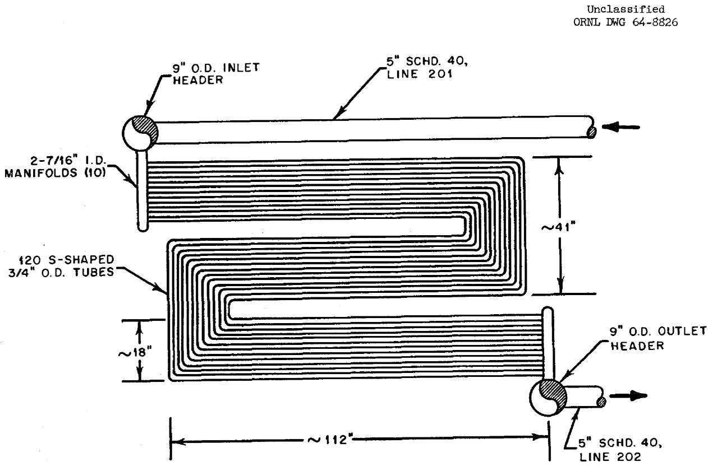  
Fig. 8.3. Radiator Coil Configuration.

Unclassified

ORNL LR DWG 54696R

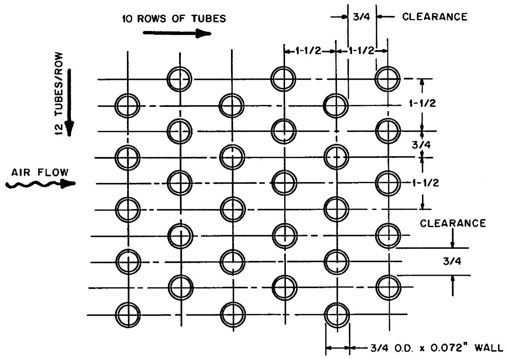  
Fig. 8.4. Radiator Tube Matrix.

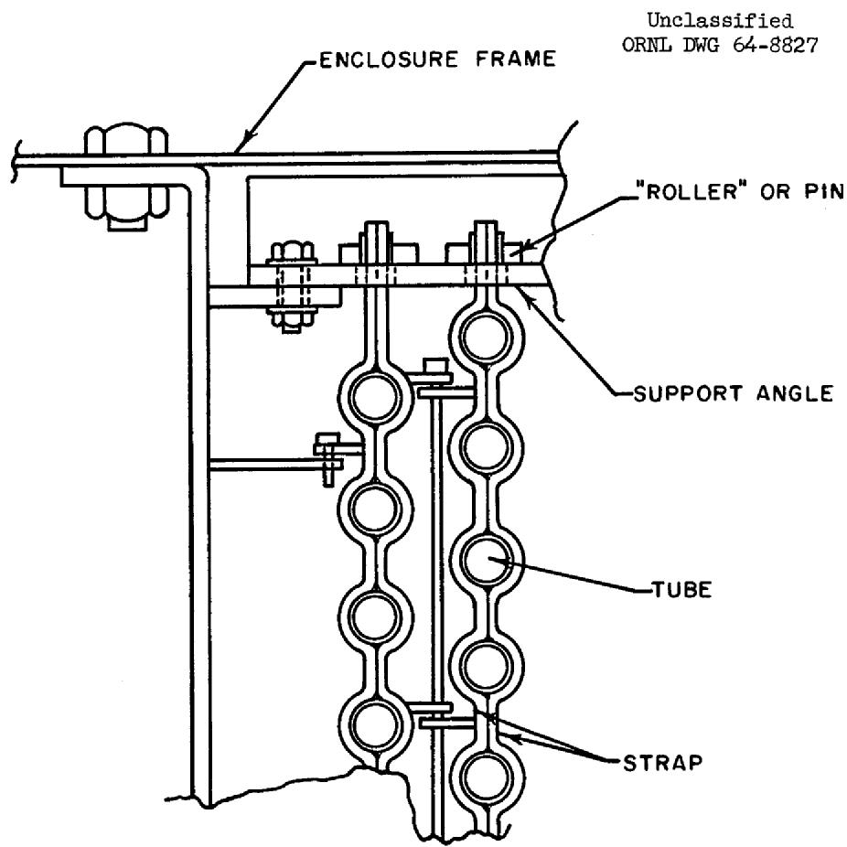

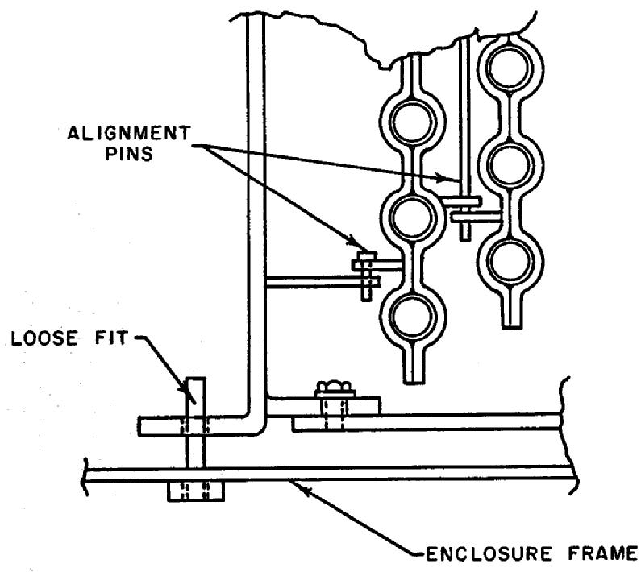  
Fig. 8.5. Radiator Tube Supports.

Table 8.2 Radiator Design Data   

<table><tr><td>Construction material</td><td>INOR-8</td></tr><tr><td>Duty, Mw</td><td>10</td></tr><tr><td>Temperature differentials</td><td></td></tr><tr><td>Salt, °F</td><td>Inlet 1100; Outlet 1025</td></tr><tr><td>Air, °F</td><td>Inlet 100; Outlet 300</td></tr><tr><td>Air flow, cfm @ 9.9 in., H2O</td><td>200,000</td></tr><tr><td>Salt flow (at average temperature), gpm</td><td>830</td></tr><tr><td>Effective mean ΔT, °F</td><td>862</td></tr><tr><td>Over-all coefficient of heat transfer, Btu/ft2-hr-°F</td><td>58.5</td></tr><tr><td>Heat transfer surface area, ft2</td><td>706</td></tr><tr><td>Design temperature, °F</td><td>1250</td></tr><tr><td>Max. allowable internal pressure @ l250°F, psi</td><td>350</td></tr><tr><td>Operating pressure @ design point, psi</td><td>75</td></tr><tr><td>Tube diameter, in.</td><td>0.750</td></tr><tr><td>Wall thickness, in.</td><td>0.072</td></tr><tr><td>Tube length, ft</td><td>30</td></tr><tr><td>Tube matrix</td><td>12 tubes per row; 10 rows deep</td></tr><tr><td>Tube spacing, in.</td><td>1-1/2</td></tr><tr><td>Row spacing, in.</td><td>1-1/2</td></tr><tr><td>Subheaders, in., IPS, sched-40</td><td>2-1/2</td></tr><tr><td>Main headers, in., ID (1/2 in. wall)</td><td>8</td></tr><tr><td>Air side, ΔP, in., H2O</td><td>9.9</td></tr><tr><td>Salt side, ΔP, psi</td><td>19.8</td></tr></table>

Each of the radiator tubes is provided with a thermocouple to provide warning of restricted coolant-salt flow in any of the passages. A total of 149 couples are installed in the radiator, 120 on the tubes and the remainder on the inlet and outlet headers and tube supports. (See ORNL Dwg D-AA-B-40511). The insulation used for the thermocouples on the tubes is Fiberfrax Ceramic Fiber, Grade 970-F, manufactured for the Carborundum Company (Niagara Falls, New York) by the Harlbut Paper Company. Although tests indicated that the small amounts of sulphur, aluminum and lead in the insulation caused no significant attack on INOR-8 at elevated temperatures,[133] the insulation having been baked at $1600^{\circ}\mathrm{F}$ for four hours to remove volatiles prior to installation.

8.4.1.2 Enclosure and Insulation. - The radiator enclosure supports the coil and provides a heated and an insulated jacket around it during the periods when it is desirable to maintain the heat within the coil. The coil supports in the high-temperature regions consist of an inner $30^{\frac{1}{4}}$ stainless steel frame made of $1/4$ -in.-thick built-up and formed structural shapes. This is covered with 16-gage stainless steel sheets. The stainless steel frame is bolted to a carbon steel exterior structure, composed chiefly of 6-in., 12.5-lb I-beams anchored to the coolant cell structural steel framework. Slotted bolt holes allow for differential thermal expansion. Johns-Manville $1/2$ -in.-thick Marinite-23 insulation board is used between the stainless and carbon steel sections at points of contact to reduce the heat transfer to the latter. (See ORNL Dwg E-DD-D-40472). The remainder of the carbon steel framework is protected from high temperature by Eagle-Picher Supper-Temp block insulation up to 6 in. thick. (See ORNL Dwgs E-DD-D-40470 and 40471). The portions of this insulation with surfaces which would have been swept by the air stream have protective covers of 16-gage $30^{\frac{1}{4}}$ stainless steel. (See ORNL E-DD-D-40470)

Flow of air, estimated to be about 30,000 cfm at the 10-Mw design power condition, by-passes beneath the coil to cool the radiator support structure. The radiator doors do not cover these by-pass openings.

8.4.1.3 Doors and Door Mechanism. - The upstream and downstream faces of the radiator enclosure are equipped with insulated doors that

can move downward in vertical tracks to provide a fairly air-tight seal to completely contain the radiator coil in an insulated and electrically-heated enclosure during the periods when it is required to conserve the heat in the coolant salt system. The doors are 8 ft high x 11 ft wide, and each weighs about 1,770 lbs. (See ORNL Dwg D-DD-B-40440)

Each door moves on cam rollers in a U-shaped track, and as it reaches a nearly-closed position, raised areas on the tracks force the door toward the radiator enclosure, compressing a braided Inconel-wire, asbestos-packed gasket, mounted on the door periphery, against a sheet-metal spring seal mounted on the radiator enclosure. (See ORNL Dwgs D-DD-B-40445, 40446, 40447 and 40449)

The door frame is made of 4-in. x 0.l20-in.-thick square carbon steel tubing, reinforced internally with vertical carbon steel T-sections and angle-cross braces. (See ORNL Dwgs D-DD-B-40441, 40442 and 40443)

Door insulation is 4-in. thick Careytemp block covered with overlapping sheets of 1/16-in.-thick stainless steel on the side facing the radiator coil. The exterior is covered with 10-gage carbon steel plate. (See ORNL Dwg D-DD-B-40444)

The doors are raised and lowered at a rate of 10 ft/min by a 3-hp,\* 3,150 ft-lb, 5-rpm output, U. S. Electric Motors, Inc., Model 254U-50, gear motor mounted above the radiator enclosure, as shown in Fig. 2.5. The motor is connected to the drive shafts for the individual doors by a chain drive. (See ORNL Dwgs D-DD-C-40450, 40451, 40452 and 40468)

Each door is equipped with a Fawick Corporation Model SC-1150 stationary field type magnetic clutch and a Stearns Electric Company Style EB Size 1004, 48-volt DC, magnetic brake, which permit the doors to be positioned independently of each other. Clutch and brake torques are 2,700 ft-lbs and 800 ft-lbs, respectively.

Each door is suspended from its drive shaft by means of four 3/8-in. diam stainless steel wire ropes attached to two 8-in.-diam sheaves. (See ORNL Dwg D-DD-C-40454) The wire ropes have a breaking strength of

12,000 lbs. The four ropes are connected in pairs through two shock-absorbing springs mounted on the top edge of each door. A 2,310-lb fly-wheel, 39-1/2-in. diam x 6-1/2-in. wide, made of laminated steel plates, is attached to one end of each of the door drive shafts through a Form-sprag Model FS-700/2.75 over-running clutch. (See ORNL Dwg E-DD-C-40469) The inertia of the flywheels limit the speed at which the doors would fall in case of a loss of electrical power, or of a reactor scram. The time required for a door to close is estimated to be about 3 seconds and the final velocity of the door about 6 ft/sec. (See Ref 15, Section VII, p 69)

8.4.1.4 Cooling Air Blowers, Ducting and Dampers. - Air is supplied to the radiator by two 250-hp Joy Manufacturing Company "Axivane" blowers, Model AR600-36D-1225, Unit X-709-29 driven at 1750 rpm by 250-hp General Electric "Triclad", direct-connected, induction motors, Model 5M6335-JY-1 Type M Frame 6335Z, 3-phase, 60-cycle, 440-volts. Each blower is rated at 82,500 cfm at 15 in. $\mathsf{H}_2\mathsf{O}$ or 114,000 cfm with free air delivery. The normal discharge pressure at the reactor design power level of 10-Mw is 9 in. of $\mathsf{H}_2\mathsf{O}$ , providing a combined capacity from the two blowers of about 200,000 cfm. The characteristic performance curve is shown in Fig. 8.9, and discussed in Section 8.4.3. Each blower is provided with a four-bladed, motor-operated shut-off damper on the discharge which can be closed to prevent backflow through the fans. The blowers discharge into a 10 x 12-ft air duct leading to the plenum at the face of the radiator coil.

A by-pass duct beneath the radiator contains a vertical-louvered damper which can be adjusted to control the flow through the by-pass and, therefore, the air passing over the radiator coil. The entrance section to the by-pass duct is $2 \times 10$ ft and about 5 ft long, and leaves the main duct at an angle of about $60^{\circ}$ with the horizontal. The center section contains the by-pass damper and is $3 \times 7$ ft in cross sectional area. The exit section is identical to the entrance section.

Air leaving the radiator or the by-pass duct passes through turning vanes to direct it up the 10-ft-diam x 75-ft-high free-standing steel stack. A pitot-venturi tube is located near the top of the stack to measure the air flow rate.

The air ducts are fabricated of stainless steel sheet. These ducts are contained within another duct to form an annulus through which cooling air is passed to cool the inside ducting to prevent excessive warping and buckling. The annulus air also protects any nearby concrete from overheating at low reactor power levels when the exit air from the radiator coil may be as hot as $1,000^{\circ}\mathrm{F}$ . Air for the annulus is supplied by two 10-hp, 1750-rpm, Joy Manufacturing Company Series 1000 "Axivane" fans, Model 29-1/4-21-1750, having a capacity of 10,000 cfm each at 2 in. $\mathsf{H}_2\mathsf{O}$ static discharge pressure, as indicated in the performance curves shown in Fig. 8.6. After cooling the annulus the air joins the air from the radiator for discharge up the stack.

# 8.4.2 Stress

The radiator tubes were designed for a maximum internal pressure of 350 psig at $1250^{\circ}\mathbf{F}$ . The maximum combined thermal and mechanical stress, which includes the effect of wind pressure, was found to occur at the outside circumference of the tube and calculated to be 5,224 psi. (See Ref 15 Section VII p 46). As indicated in Table 2.2, the maximum allowable stress in INOR-8 at $1100^{\circ}\mathbf{F}$ is 13,000 psi and at $1200^{\circ}\mathbf{F}$ is 6,000 psi. Stresses in the headers, tubes and piping due to the internal operating pressure of 75 psig was investigated and found to be only about 785 psi. (See Ref 14 Section VII p 47) The radiator was hydrostatically tested at 800 psi and pneumatically at 670 psi.[134]

Design studies were made of the stresses in tubing supports, headers, doors, and other members and found to be well within allowable limits. (See Ref 15 Section VII pp 48-59 and pp 60-69) Shock loads on the structure when the radiator doors are dropped was calculated to be about 1,980 lbs. The wind load on the closed upstream door produces a maximum stress of 8,550 psi in the carbon steel T-sections when the pressure difference across the door is 15 in. $\mathsf{H}_2\mathsf{O}$ .

# 8.4.3 Performance

At 10-Mw reactor power level the coolant-salt enters the radiator at $1100^{\circ}\mathbf{F}$ ; at zero power the entering temperature is $1200^{\circ}\mathbf{F} - 1225^{\circ}\mathbf{F}$ . The coolant-salt temperature leaving the radiator is about $1025^{\circ}\mathbf{F}$ at 10-Mw and is $1200^{\circ}\mathbf{F}$ to $1225^{\circ}\mathbf{F}$ at zero power.

Unclassified

ORNL DWG 64-8828

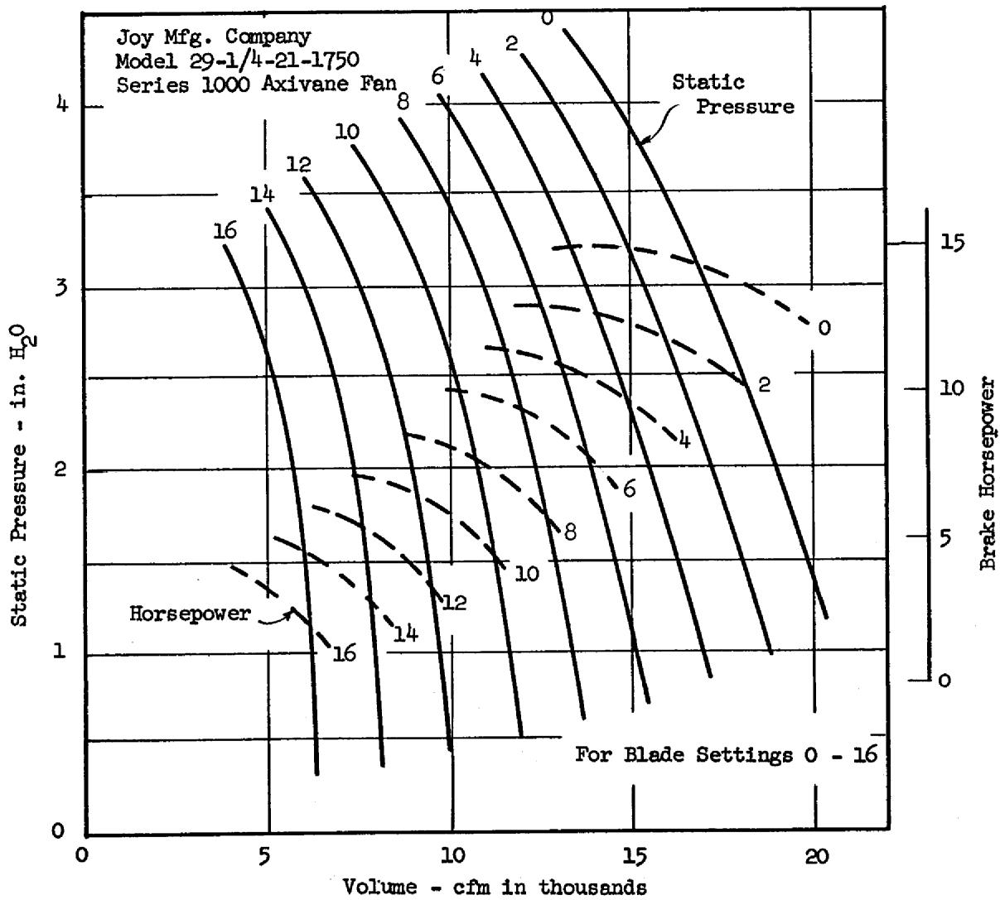  
Figure 8.6. Characteristics of Radiator Duct Annulus Fans

At the maximum load conditions the effective log mean temperature difference is $862^{\circ}\mathbf{F}$ , the salt film coefficient is about 3,420 Btu/hr-ft $^{-1}$ F, the air film coefficient is about 61 Btu/hr-ft $^{-1}$ F, and the overall heat transfer coefficient is about 58 Btu/hr-ft $^{-1}$ F. (See Ref 15 part VII pp 8-25) The effective heat transfer surface of 706 ft $^{-1}$ thus provides a calculated capacity of 10.4 Mw.

Inasmuch as the air film resistance is about $95\%$ of the total resistance to heat transfer, the overall coefficient is strongly influenced by the air velocity over the tubes. At partial loadings of the reactor, the air flow will be regulated by the by-pass damper, by changing the radiator door position, and by on-off control of the blowers. The pressure drop due to the flow of air through the radiator coils is a function of the flow rate and this, in turn, effects the static pressure at the blower outlets and the blower capacity. The interplay of these several variables on the air temperature leaving the radiator under various loading conditions is summarized in Fig. 8.7, $^{135}$ assuming stepless control of the air flow over the coil. If the cooling air enters the coil at $100^{\circ}\mathrm{F}$ , at the 10 Mw design power condition, the leaving air temperature is about $300^{\circ}\mathrm{F}$ . At lower power levels the exit air temperature is higher, being about $450^{\circ}\mathrm{F}$ at 4 Mw. Below this power level the exit air temperature increases sharply, and is estimated to be about $800^{\circ}\mathrm{F}$ at 1 Mw and $1000^{\circ}$ to $1100^{\circ}\mathrm{F}$ at power levels below 0.5 Mw when the air flow rates are relatively small.

There are many possible combinations of mode of blower operation and radiator door and by-pass damper positions which will hold the reactor power at a given level. One set of combinations is summarized in Table 8.3.[136] The effect of the various step-wise adjustments on the air flow was estimated, as illustrated in Fig. 8.8.[135] There is some disparity between values in these two studies but this is not of concern because experimentation with the actual system is necessary to establish the best procedures. Preliminary testing of the blowers, radiator doors and by-pass dampers has indicated that the static pressure losses in the system may be substantially less than the estimates used in the studies, demonstrating further that the best combinations for stable operation,

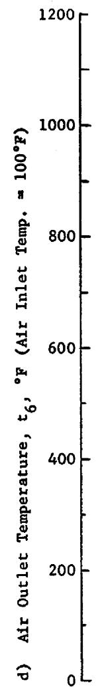

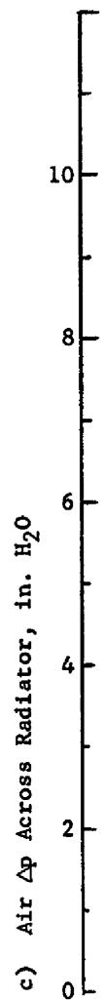

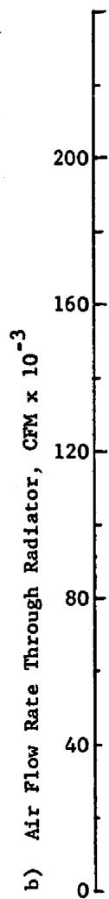

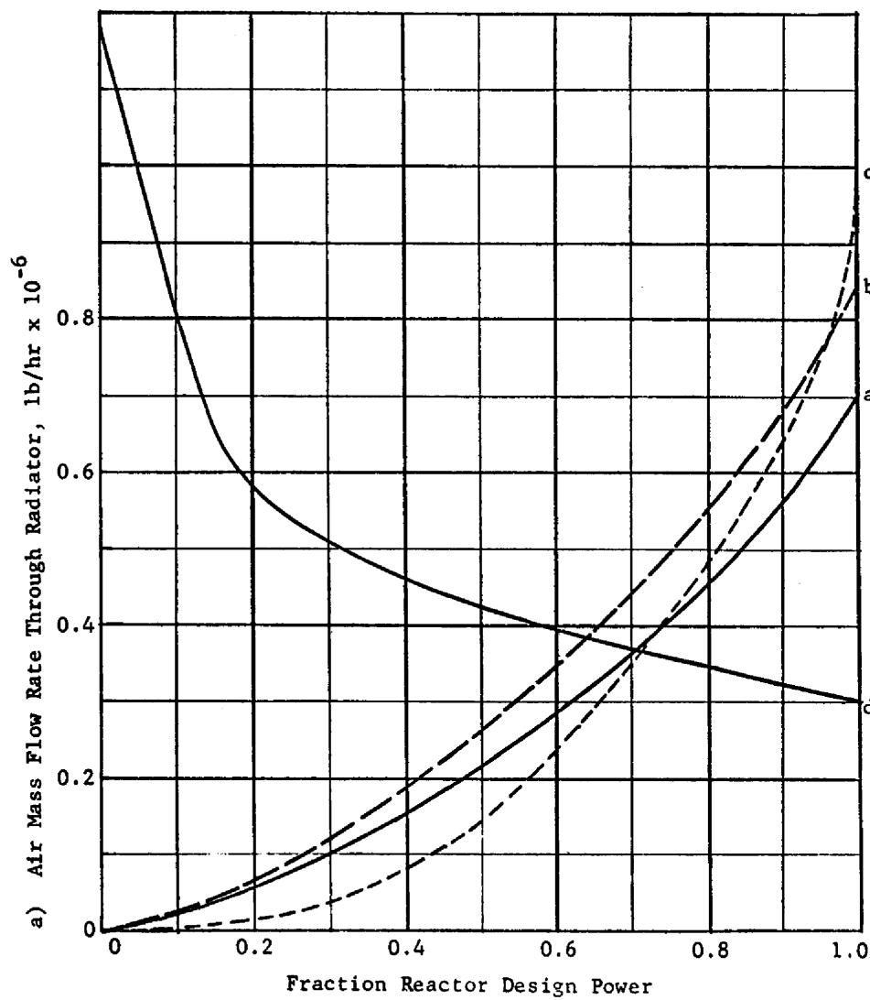  
Figure 8.7. Radiator Air Flow Characteristics

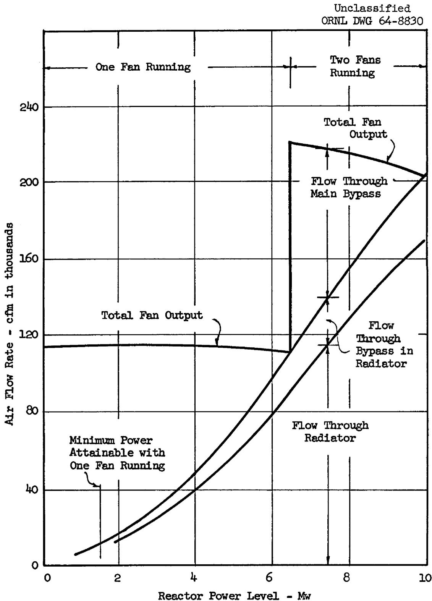  
Figure 8.8. Radiator Air Flow Characteristics at Various Steps in Load Regulation.

particularly at reactor power levels below 1 Mw, will have to be determined in the field.

Studies were also made of the operating sequences for rapidly changing the reactor power from low to high levels while maintaining the stability of the system and the required condition of constant fuel salt temperature leaving the reactor.* In these studies the system was simulated by an analog computer.[137]

Load changes are made manually using a single, spring-return type load demand switch to increase or decrease the power. The switch actuates the programmed control for the radiator doors, blowers and by-pass damper, essentially as outlined in Table 8.3. In increasing the reactor loading from, say, $1\mathrm{Mw}$ to $10\mathrm{Mw}$ , the initial condition will be with the radiator doors about $35\%$ open and the by-pass damper fully open and one blower in operation. Manipulation of the load demand switch first causes the radiator doors to be opened to their limit. A further increase in load is obtained by closing the by-pass damper. A still greater load demand starts the second blower and at the same time opens the by-pass damper again. These procedures will be reviewed during the preliminary testing of the reactor system.

The characteristics of the axial blowers supplying the cooling air are as indicated in Fig. 8.9. Parallel operation of the two blowers under certain loading conditions can lead to unstable conditions with possible surging of the load distribution between the two blower driving motors. As indicated in Fig. 8.9 this is most likely to occur at about 100,000 cfm air delivery and would tend to be avoided by using one blower at $100\%$ of capacity rather than two at reduced capacity. General operating characteristics must be determined from the actual system.

Analog computer studies were made to determine the freezing time for stagnant salt in the center of a radiator tube. Under design conditions, with the maximum air flow, the estimated time was about 50 seconds.138

*In the "starting mode" of operation at reactor power levels below 1 Mw, the nuclear power is held constant. In the "run mode", at power levels above 1 Mw, the fuel-salt temperature leaving the reactor is held constant.

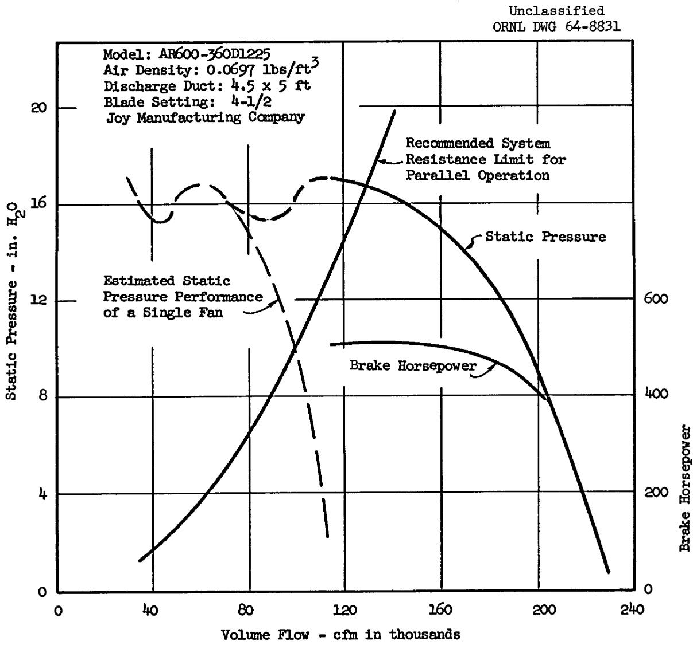  
Figure 8.9. Estimated Performance Both Radiator Supply Air Fans Operating in Parallel.

Table 8.3 Possible Steps for Controlling Heat Removal Rate from the Radiator*   

<table><tr><td>Step</td><td>Heat Removal Rate, Mw</td><td>Conditions</td></tr><tr><td>1</td><td>0.03 (Heat leak)</td><td>Both radiator doors closed, bypass damper open, fans off.</td></tr><tr><td>2</td><td>0.13</td><td>Upstream radiator door closed, downstream radiator door open, bypass damper open, fans off.</td></tr><tr><td>3</td><td>2.3</td><td>Both radiator doors open, bypass damper open, fans off.</td></tr><tr><td>4</td><td>3.0</td><td>Both radiator doors open, bypass damper closed, fans off.</td></tr><tr><td>5</td><td>3.8</td><td>Both radiator doors open, bypass damper open, one fan on.</td></tr><tr><td>6</td><td>6.5</td><td>Both radiator doors open, bypass damper closed, one fan on.</td></tr><tr><td>7</td><td>6.1</td><td>Both radiator doors open, bypass damper open, two fans on.</td></tr><tr><td>8</td><td>10.0</td><td>Both radiator doors open, bypass damper closed, two fans on.</td></tr></table>

*From Ref 136 p l

# 8.4.4 Heaters

About 223 kw of electric heater capacity is provided inside the radiator enclosure. These heaters are used to preheat the system before the coolant-salt is added and to maintain the temperature above $850^{\circ}\mathrm{F}$ at all times that the salt is in the system.

Tubular-type heaters are mounted 3-1/2 in. apart on the vertical upstream and downstream faces of the coil. These "Calrod" units are triangular in cross section, about 0.35 in. on a face, and are in straight lengths. There are twenty-four 48-in. lengths, with a capacity of 1,350 w each; twelve 82-in. lengths of 2,500 w capacity each; twelve 90-in. pieces having a capacity of 2,750 w each; and twelve pieces 102 in. long with 3,150 w capacity in each length; making a total of 133,200 w capacity in tubular heaters. The heaters are supported in vertical rows of six each in 304 stainless steel clamps. The heaters use 230 v, 3-phase delta-connected electric power supplied through induction regulators CR1, CR4, CR5 and CR6 (See ORNL Dwg E-MM-B-40802 and Section 19.7 of this report).

Flat ceramic-type heaters are used in the horizontal positions on the baffle plates above and below the tube bundle. The 60 heaters are identical 7-1/2-in. x 18-in. flat plates with a capacity of 1,000 w each. The 208-v power is supplied through induction regulators CR2 and CR3.

The inlet header is in an insulated enclosure provided with fifteen 4-in. x 12-in. flat ceramic heater plates of 1,000 w capacity each. These are served by induction regulator CR7 and are rated at 230 volts. (See ORNL Dwg E-MM-B-40808)

The outlet header enclosure is equipped with twenty-seven 4-in. x 12-in. plates of 550 w capacity each at 230 volts. Induction regulator CR8 supplies these heaters. (See ORNL Dwg E-MM-B-40809) All the ceramic-type heaters are mounted in 20-gage 30⁴ stainless steel cans held in place by 16-gage clips. The ceramic heaters total 90 kw of capacity.

The nichrome heater wire leads are heliarc welded to extension leads of No. 12 alloy 99 soft temper nickel wire covered with 0.330-in. OD x 0.124-in. ID x 0.330-in.-long ceramic fish-spine beads.

# 8.5 Cell Wall Penetrations for Lines 200 and 201

The coolant-salt lines 200 and 201 pass through the reactor cell wall through special penetration assemblies which contain electric heaters, thermal insulation, radiation shielding for the annulus between the process pipe and the penetration sleeve, and a rigid support to serve as an anchor point for the piping.

The penetrations for each pipe are essentially identical. The following description of a penetration would apply to either.

# 8.5.1 Reactor Cell Sleeve

The 5-in. coolant-salt pipe passes through an anchor sleeve which is mounted inside a reactor cell sleeve joining the reactor cell vessel and the outer shell, or tank. (The space between the vessel and the shell is filled with a magnetite sand-water mixture, as described in Section 4.3.1.)

A 24-in. sched 80 carbon steel pipe, averaging about 16 in. long, is welded to the 4-in.-thick portion of the reactor cell vessel at the location shown in Table 4.l. A 32-in. OD x 0.625-in. wall thickness pipe, averaging about 25 in. long, is welded to the outside 3/8-in.-thick tank wall, which also has 3/8-in.-thick stiffeners at this point. An expansion joint, about 30 in. OD x 26 in. long, (Badger Manufacturing Company Model 24-6w7 Series 50) connects the 24-in. and 32-in. pipes to make a leak-tight joint and accommodates 3/8 in. lateral movement and 1/4 in. axial movement between the inner and outer vessels. (See ORNL Dwg D-KK-D-40711 and 40712)

# 8.5.2 Anchor Sleeve

The coolant-salt lines 200 and 201 are each anchored on the reactor cell end of each penetration. These anchors are designed to withstand the forces due to the thermal expansions in the primary and secondary systems.

A 20-in. sched 80 carbon steel pipe about 5 ft long fits inside the reactor cell sleeve, described above. The reactor cell end of this pipe has a welded cap through which the 5-in. NPS salt line passes. The pipe is welded to the cap by using a special 3-in.-long section welded into

the process line, this section containing a shoulder which permits a full penetration weld that can be inspected and stress relieved. This joint is the anchor point in each line. The coolant-cell end of the 20-in. pipe anchor sleeve is welded to the 32-in. OD reactor cell sleeve described above. See ORNL Dwg E-GG-C-41855

# 8.5.3 Shielding

The annular space between the 5-in. process line and the 20-in. anchor sleeve is essentially filled with l-in.-thick $304$ stainless steel shielding discs for a distance of 8 in. on the reactor cell end of the penetration. The annual space between the heater shell, to be described below, and the anchor sleeve has l-in.-thick firebox steel shielding discs for a distance of 12 in. The first eight discs are stainless steel because they will operate at a higher temperature than the remaining twelve. The discs are thermally insulated from the process pipe with a thin layer of Fiberfrax bulk ceramic fiber insulation (described in Section 5.6.6.3). Other voids inside the anchor sleeve are also filled with this insulating material. See ORNL Dwg E-GG-Z-55498.

# 8.5.4 Heaters and Insulation

With the exception of about 12 in. on the reactor cell end of the penetration, the process pipe inside the anchor sleeve is surrounded by electric heating elements contained in a stainless steel shell. The heaters are removable from the coolant-cell end of the penetration, although probably with some difficulty because of the radiation streaming through the opening.

Four 1/4-cylinder ceramic heating elements (for description see section 5.6.6.2) 12-in. long, each with a capacity of 3,000 watts (at 230 v) provide the relatively large amount of heat needed on the reactor-cell end of the penetration to keep the unheated length up to temperature and to compensate for the heat conducted from the pipe wall at the anchor point. On the coolant-cell side of this heater section are four 12-in. long heater sections, each containing four 1/4-cylinder heating elements of 300 watts capacity each (at 230 v). Only one-half of each of the heater sections is used at one time, the other portion serving as a spare.

With the exception of the last heater section on the coolant-cell end, the heaters are contained in a 22-gage, 304 stainless steel shell, about 10 in. diam x 4 ft long. This shell is provided with spacers and lugs to hold the ceramic heating plates, the heater leads, and the thermocouple sheaths, in position. The outside of the heater shell is thermally insulated with a 3-1/2-in. thickness of Careytemp 1600 expanded silica insulation, as described in Section 5.6.6.3.

See ORNL Dwg E-MM-Z-51670 for general assembly of heaters and insulation.

# 8.6 Secondary Circulating System Piping and Supports

The tube side of the primary heat exchanger, the coolant-salt pump and the radiator are interconnected with 5-in. sched 40 INOR-8 piping. With the exceptions of the portions of the lines 200 and 201 inside the reactor cell, all the coolant-salt piping is accessible for maintenance a short time after reactor shutdown and uses more or less conventional welded pipe joints and methods of heating, insulating and supporting the piping. Long radius (25-in.) bends are used where possible. The piping at the reactor cell wall penetrations, at the pump and at the radiator nozzles, is fixed in position, the thermal expansion being accommodated by the flexibility of the piping.

All horizontal runs of piping in the circulating and drain systems pitch downward at about $3^{\circ}$ . The circulating system pitches to two low points, one in line 201 just outside the reactor cell wall penetration, and the other in line 202 at the bottom outlet of the radiator. The two 1-1/2-in. sched 40 INOR-8 drains, lines 204 and 206, are connected at these points.

The freeze flanges, freeze valves, pipe line heaters and thermal insulation for the coolant-salt piping are described and included in the tabulations of the corresponding equipment in the primary circulating system, Section 5.6, in order to complete each of those particular sections of the report.

# 8.1 Piping Stresses and Flexibility Analyses

The coolant-salt piping inside the reactor cell, lines 200 and 201, are sufficiently flexible between the anchor point at the cell wall and the heat exchanger nozzles to absorb the thermal expansion of the piping and the movements of the heat exchanger. The stresses in the coolant-salt piping were included in the flexibility analyses made of the primary piping, see Section 5.6.2. It is to be noted that the maximum stress in the reactor cell salt piping was determined to be about 7,700 psi at the coolant-salt inlet nozzle to the heat exchanger.[105]

The coolant-salt piping outside the reactor cell is anchored at the cell wall penetration and at the radiator and pump nozzles. See ORNL Dwg E-GG-B-40702. The major pieces of piping, all of which are 5-in. NPS, are: line 200 from the pump discharge to the cell wall penetration, line 201 from the penetration to the inlet header at the top of the radiator bottom outlet header to the bottom of the coolant pump bowl. Line 202 contains a 25-in. radius return bend for the necessary flexibility, and it is in this bend that the maximum pipeline expansion stress of 12,818 psi occurs.[139] This is within the allowable stress range of 32,125 psi as determined by the Code of Pressure Piping, ASA B31.1.[106] (Also, see footnote, Section 5.6.2) The expansion stresses in lines 200 and 201, which also contain 25-in.-radium $180^{\circ}$ return bends, are 11,931 and 8,851 psi, respectively.[139]

The forces and moments at the pump support plates and at the radiator inlet and outlet nozzles are within the acceptable values.[139]

# 8.6.2 Coolant-Salt Piping Supports

The supports for coolant-salt lines 200 and 201 inside the reactor cell are listed in Table 5.10 in Section 5.6.2.

The 5-in. coolant-salt piping in the coolant cell is hung on constant-load Bergen supports to minimize stresses during warmup of the system. Each of these supports a preset load equal to the calculated weight of the piping and contents at that particular point, when the support spring is in the zero position. As the system is heated, the piping moves up or down at each position, as shown in Table 8.4. This

This movement is less than the maximum permissible movement of the hanger in each case so that no additional stresses are imposed on the piping by the supports.

Additional information on each hanger is shown in Table 8.4.

Table.8.4. Coolant Cell Salt Piping Supports   

<table><tr><td>MSRE Support No.</td><td>Line Number</td><td>Location</td><td>Bergen Number &amp; Typea</td><td>Preset Loadb Ibs</td><td>Maximum Hanger Movement, in.</td><td>Maximum Calculated Pipe Movement on Heating, in.c</td></tr><tr><td>CCS-1</td><td>200</td><td>Near cell wall</td><td>CSH-5 C-1</td><td>315</td><td>±1.25</td><td>+0.22</td></tr><tr><td>CCS-2</td><td>200</td><td>Bottom of 180° vertical bend</td><td>CSH-4 D-1</td><td>260</td><td>±1.0</td><td>+0.25</td></tr><tr><td>CCS-3</td><td>200</td><td>Top of 180° vertical bend</td><td>CSH-3 D-1</td><td>180</td><td>±1.5</td><td>-0.50</td></tr><tr><td>CCS-4</td><td>200</td><td>Below coolant pump</td><td>CSH-5 D-1</td><td>295</td><td>±2.0</td><td>-0.52</td></tr><tr><td>CCS-5</td><td>202</td><td>Near radiator</td><td>CSH-4 B-1</td><td>210</td><td>±1.25</td><td>+0.31</td></tr><tr><td>CCS-6</td><td>202</td><td>Bottom of 180° vertical bend</td><td>CSH-4 D-1</td><td>200</td><td>±1.25</td><td>negl.</td></tr><tr><td>CCS-7</td><td>202</td><td>Top of 180° vertical bend</td><td>CSH-4 D-1</td><td>225</td><td>±2.0</td><td>-0.82</td></tr><tr><td>CCS-8</td><td>202</td><td>Below coolant pump</td><td>CSH-4 B-1</td><td>225</td><td>±2.0</td><td>-0.52</td></tr><tr><td>CCS-9</td><td>201</td><td>Near cell wall</td><td>CSH-5 B-1</td><td>330</td><td>±1.0</td><td>negl.</td></tr><tr><td>CCS-10</td><td>201</td><td>Bottom of 180° vertical bend</td><td>CSH-5 D-1</td><td>335</td><td>±1.0</td><td>+0.44</td></tr><tr><td>CCS-11</td><td>201</td><td>Top of 180° vertical bend</td><td>CSH-4 D-1</td><td>210</td><td>±1.25</td><td>negl.</td></tr><tr><td>CCS-12</td><td>201</td><td>Near radiator</td><td>CSH-2 D-1</td><td>135</td><td>±1.0</td><td>negl.</td></tr></table>

a Constant-load supports. Bergen Pipe Support Corporation (New York, N. Y.)   
b Preset load is the expected load from weight of pipe and contents.   
c Positive values are up and negative values downward.   
d See ORNL Dwg E-GG-E-41866.

# 9. COOLANT-SALT STORAGE SYSTEM

A storage tank is provided at the bottom of the coolant cell to permit complete drainage of the coolant-salt circulating system. The coolant drain system consists of a drain tank, various drain and transfer lines, freeze valves, and the associated valving, electric heaters, instrumentation, thermal insulation, etc.

Since the coolant salt does not generate appreciable afterheat when drained into its storage tank, the heat removal system used on the fuel drain tanks is not required on the coolant-salt drain tanks. In other respects the tanks for the two systems are similar, see Fig. 2.6. Much of the equipment in the coolant-salt drain system is of conventional design, since the coolant cell can be entered a short time after reactor shutdown for direct inspection and maintenance. All parts of the system in contact with the coolant salt are fabricated of INOR-8.

The portable cans for transfer of coolant salt to and from the MSRE site are described separately in Part VII.

# 9.1 Layout and General Description

The coolant-salt drain tank is located at the 820-ft elevation below the radiator and its ducting in the coolant cell, as shown in Figs. 4.4 and 4.5. (See ORNL Dwgs E-GG-D-41888 and E-GG-B-40702)

Two drain lines are required to completely empty the coolant-salt circulating system because of the piping configuration resulting from the requirement that the flow of coolant salt be downward through the radiator. Each of these 1-1/2-in. sched 40 drain lines is provided with a freeze valve, which, on interruption of the cooling air flow against it, will thaw and cause the system to drain by gravity. During drainage the gas in the drain tank can be transferred to the top of the circulating system, or it may be vented to the off-gas system through a 1/2-in. pipe leading past a radiation monitor and to the absolute filters and the stack.

The 40-in.-diam x 78-in.-high drain tank has a volume of about 50 ft3; there is approximately 44 ft3 of coolant salt in the circulating system.

The drained salt enters the top of the tank, and by means of an internal dip tube, is discharged at the bottom. This dip tube permits transfer of salt back into the circulating system by pressurization with helium gas introduced at a top connection. The tank is provided with a single-point liquid level probe and with weigh cells to determine the tank inventory.

The coolant salt is brought to the site in $2 - 1 / 2 - ft^3$ cans holding 250 to 300 lbs of the non-uranium-bearing salt. The charging station, where the cans are heated and connected to the system, is at the 852-ft elevation above the special equipment room. Removal of a shield block on the southwest corner of the roof of the room permits connection of a charging line from the cans to a permanently-installed 1-in. flange at the 849-ft elevation, which is the terminus of a 1/2-in. INOR-8 pipe leading to a flanged connection just above the coolant salt drain tank. The blank flange normally in place at this lower connection is removed and the permanently-installed charging line is connected. The charging line dips internally to the bottom of the tank so that salt can be transferred back to the portable cans through the same lines.

# 9.2 Flowsheet

The coolant-salt drain system is included on the flowsheet for the coolant system, Fig. 8.1 (ORNL Dwg E-AA-A-40881).

Salt is drained from the low point of the coolant-salt piping in the coolant cell just outside the reactor cell wall penetration through the 1-1/2-in. sched 40 line 204. The low point in the piping at the radiator outlet is also drained through a 1-1/2-in. pipe, line 206. The freeze valves in these two lines, FV-204 and FV-206, have their exits joined by a tee with the branch outlet facing upwards and connected to a short, vertical length of 4-in. sched 40 pipe with caps at each end. This reservoir, which has an overall height of about 7 in., is to assure a sufficient quantity of salt in the freeze valves after a drain to affect a good seal. The pipe from the top of the 4-in.-pipe reservoir to the top of the drain tank, line 204, is 1-in. sched 40, the smaller size being used to obtain the flexibility in the tank connections needed for proper operation of the weigh cells.

One electric heater circuit and one thermocouple are provided between the drain tank and the freeze valves. Each of the two freeze valves has three heater circuits, one in the center, one to control the shoulder temperature at both ends of the valve and one on the freeze valve reservoir. There is a thermocouple at each section of the shoulder heaters and three couples on the freeze valve itself.

Salt is added to the drain tank through a 1/2-in. pipe, line 203. This line leads from a flanged joint at the top of the special equipment room to a flanged connection at the top of the drain tank, and, by means of a dip tube, to within about 1-1/2 in. of the tank bottom. Line 203 has one heater circuit and eight thermocouples. When not in use in adding or removing salt from the system, line 203 is blanked off both at the flange above the drain tank and at the connection near the roof plug.

When salt is to be added to the system, a helium cylinder is connected to the 3/8 in. tubing at the charging station, line 615. This line contains a pressure regulator, PCV-615A, and upstream and downstream pressure gages. Line 615 then branches into two identical pressurizing stations, or units. In the following description of one of the stations, the line numbers for the other are given in parenthesis. Line 615 connects to line 611 (612) at the pressure control valve PCV-611 (PCV-612). Downstream of the control valve and the pressure gage connection, the line branches to flow through two valves connected in parallel, V-611-A (V-612-A) and V-611-B (V-612-B), one of which serves as a spare. Line 611 (612) continues past a pressure gage connection and to a removable spool piece, which is used to make the temporary connection to the portable salt cans.

Helium for pressurization of the drain tank for salt transfer from the tank is supplied by the 1/2-in. pipe, line 5ll. The helium is furnished at 40 psig from the 1/2-in. line 500 in the cover-gas system, see Section 10. A pressure regulator, PCV-5ll, limits the helium supply pressure to the tank to 30 psig. A throttling valve, HCV-5llB and a control valve HCV-5llA, downstream of the regulator, are used to adjust the rate of transfer. The three valves are pneumatically operated, with the throttling and control valve adjusted from the control panel. A check

valve, CF-511, is provided in the helium supply to prevent backflow into the cover gas system. The handvalves, V-511A and V-511B, provide isolation of the gas supply valves for maintenance purposes.

The coolant drain tank is normally vented to the off-gas system through a 1/2-in. stainless steel pipe, line 547, via line 527. The latter is connected to the top of the tank at the same nozzle as the helium pressurization gas supply. Line 547 contains a pneumatically-operated control valve, HCV-547, which is adjusted by a hand switch at the control panel.

When draining salt from the circulating system, the salt in the loop is exchanged for the gas in the drain tank through the 1/2-in. interconnecting piping and valves, lines 527, 536 and 528. Line 527 contains a control valve, HCV-527, before its juncture with line 536 upstream of the control valve HCV-536. Line 536 joins line 528 upstream of the control valve, PCV-528. Line 528 connects to the top of the pump bowl. This valving arrangement permits venting the gas from the top of the pump bowl through line 528 and 536. Line 536, and its valve, HCV-536, bypasses the control valve PCV-528, which is set to pass only about 1.4 liters/min of gas into the system, and would thus have insufficient capacity when the flow is in the reverse direction as salt is being added to the circulating system. A detailed description of the filling procedures is given in Part VIII.

# 9.3 Coolant-Salt Drain Tank

# 9.3.1 Tank

The coolant-salt storage tank is 40 in. OD x about 78 in. high, overall, with a wall thickness of $3/8$ in. in the cylindrical portion. The torispherical ASME flanged and dished heads are $5/8$ in. thick. The tank is mounted vertically on weigh cells by a support system described subsequently in Section 9.3.2. Other pertinent data are given in Table 9.1.

The tank and all its attachments are fabricated of INOR-8 and generally in accordance with ORNL Specification MSR 62-3. The tank was

designed for an internal pressure of 65 psig at $1300^{\circ}\mathrm{F}$ , and in accordance with the requirements of Section VIII of the ASME Unfired Pressure Vessel Code for primary nuclear vessels. The calculations of the stresses in the walls, heads, and nozzles were based on standard relationships (See Part IV Ref 18) and are within the allowable stress of 3500 psi at $1300^{\circ}\mathrm{F}$ for INOR-8.[16]

The top head is penetrated by five nozzles, as listed in Table 9.1. A 3-in. sched 40 pipe provides an inspection port and access for a salt sampler. This nozzle is flanged with a 3-in., 150-lb, ring-joint, weld-neck flange and a mating blind flange having a leak detector connection.

The l-in. nozzle for the drain connection, line 204, enters the top head at the center and extends approximately $1 - 1 / 2$ in. above the lower head. A $1 / 2$ -in. sched 40 pipe, line 203, also extends through the top head and, by means of a bend in the dip tube, terminates at the center of the lower head. This arrangement is designed to reduce the amount of "heel" left in the tank after a transfer. The two lines are welded together at the bottom to provide stiffening. Line 203 has a special flange just above the tank, see Section 9.4, following.

A 1/2-in. sched 40 nozzle in the top head is used for gas pressurization and for venting. A 2-1/2-in. nozzle is used for insertion of the level probe, LE-CDT. This instrument has two single-point conductivity type probes which indicates whether the salt is above or below points marking $5\%$ and $90\%$ of the salt storage volume. (See Instrumentation, Part II)

# 9.3.2 Supports and Weigh Cells

The coolant drain tank is supported by two 4-in. NPS steel pipe columns resting on the coolant drain cell floor at the 820-ft elevation. (See ORNL Dwg E-FF-D-41503) The installation incorporates two pneumatic load cells (A. H. Emery Company) for determining the inventory of salt in the tank.

A 11/16-in.-thick x 6-in.-wide skirt is joined with a full circumferential weld to the top of the tank just above the head weld. Twelve stainless steel hanger rods, 5/8-in.-diam x 8-1/2 in. long, are fastened by clevis-type couplings to this skirt and suspend the tank

Table 9.1 Design Data for Coolant-Salt Drain Tank   

<table><tr><td>Construction material</td><td>INOR-8</td></tr><tr><td>Height, in.</td><td>78</td></tr><tr><td>Diameter, in. OD</td><td>40</td></tr><tr><td>Wall thicknesses, in.</td><td></td></tr><tr><td>Vessel</td><td>3/8</td></tr><tr><td>Heads</td><td>5/8</td></tr><tr><td>Volume, ft3</td><td></td></tr><tr><td>Total</td><td>~50</td></tr><tr><td>Coolant-salt normal storage</td><td>~44</td></tr><tr><td>Design temperature, °F</td><td>1300</td></tr><tr><td>Design pressure, psig</td><td>65</td></tr><tr><td>Nozzles, NPS (sched 40), in.</td><td></td></tr><tr><td>Inspection port and sampler</td><td>3</td></tr><tr><td>Salt drain line 204</td><td>1</td></tr><tr><td>Salt transfer line 203</td><td>1/2</td></tr><tr><td>Gas pressurization line 5ll</td><td>1/2</td></tr><tr><td>Level probe, LE-CDT</td><td>2-1/2</td></tr></table>

from the support ring above. The carbon steel support ring is about 41-7/8-in. OD x 6 in. deep, and is fabricated of 1-1/2-in. plate*. It has two arms about 20 in. long extending from opposite sides. Each of the arms is suspended by three carbon steel hanger bolts,** 3/8-in. OD x 38 in. long, from a pneumatic load cell resting on a 3/4-in.-diam steel ball mounted on top of the support column. The columns pass through holes in the above-mentioned support ring with a clearance of 1/4 in. on a diameter, an amount sufficient to allow proper operation of the weigh cells, but at the same time preventing the tank assembly from falling off the supports. The long hanger rods and the point support arrangement reduces the horizontal loading on the weigh cells to a negligible amount.

To effect maintenance on a weigh cell, or prior to removal of a tank from the system, the weight of the tank must be removed from the weigh cells. To accomplish this, the ends of each support ring arms are equipped with a jack bolt which operates against a bracket on the support columns, just below the arms. A slight lifting of the arms by these bolts permits unthreading of the three hanger bolts on each weigh cell. It may be desirable at times to remove the weight from the jack bolts, such as to prevent swaying when cutting a pipe. To provide for this a collar is installed on each support column just below the arms. The weight of the assembly can be lowered onto these collars by backing off on the jack bolts after disconnecting the weigh cell hanger rods. Further description of the maintenance procedures is given in Part X.

# 9.3.3 Electric Heaters and Insulation

The coolant-salt drain tank is heated on the sides by tubular heaters totaling 11 kw, and on the bottom by ceramic flat-plate heater units totaling 6 kw. A like amount of heater units are installed as spare capacity. (See ORNL Dwgs E-MM-B-51668 and E-MM-A-40832)

There are thirty-two tubular heaters curved to a 20-13/16-in. radius installed on the tank sides in a 304L stainless steel frame.

Each unit is a Calrod heater 0.315 in. OD x 74 in. long, with a heated length of 60 in., sheathed in inconel, and rated at 2500 w at 230 v. In each case two heaters are connected in series, and with a supply voltage of 244 v, the actual capacity of each unit is 700 w, or 140 w/ft.

The tubular heaters are arranged in 16 horizontal rows on 4-in. centers, with the two heaters per row connected in series. The 16 rows are divided into two equal groups, one termed the "top" section and the other the "middle" section. Every other row is for normal use and the remaining rows serve as spare units. There are thus four rows of two working heaters each in each section, or a total of $5.6 \mathrm{kw}$ /section, with the four rows connected in parallel. The spare heater leads are terminated in junction box CS-1, located at the 840-ft elevation. (See ORNL Dwgs E-MM-Z-51625 and E-MM-C-51667)

The sixteen heaters on the bottom of the drain tank, and termed the "bottom" section, are flat ceramic heater plates about 7/8 in. thick and having a trapizodial shape roughly resembling a right triangle with an altitude of 14 in. and a base of 7 in. (See ORNL Dwg E-MM-B-40829) The heaters are rated at 750 watts each at 230 volts. Half of the units are used as spares, providing a total working capacity of 6 kw. All heaters are connected in parallel with the electrical leads for the spare group terminating in junction box CS-1 in the basement regulator area. The units are arranged radially in a 304L stainless steel support basket suspended from the bottom of the tank.

The drain tank is thermally insulated with two layers of 2-1/2-in.-thick "Careytemp" $1600^{\circ}\mathrm{F}$ block insulation. A 20-gage 304L stainless steel liner is used between the tubular heaters and the thermal insulation. The insulation is applied in a conventional manner since the unit can be approached for direct maintenance.

# 9.3.4 Thermocouples

The temperature of the drain tank is monitored by thirteen thermocouples. Two of these are located at the center of the bottom, two at the charging line nozzle, two at the drain line nozzle, and the rest are distributed over the tank wall, as shown on ORNL Dwg D-HH-B-40532. One thermocouple on the bottom head, two on the top head (one from each

location) and one on the wall near the bottom, are connected to the data logger. One thermocouple from the wall near the midplane is recorded and the remaining eight couples are scanned and displayed.

# 9.4 Coolant-Salt Transfer Line 203

This line is used to transfer salt from the portable cans to the drain tank when adding salt to the system and for returning the salts to the cans when reprocessing is required. The line consists of a 3/8-in. OD x 0.035-in. wall thickness monel (or inconel) tubing portion which is installed only when making transfer operations. The tubing leads from the portable cans to a special flange at the 849-ft elevation at the southwest corner of the special equipment room. From this flange a permanently installed 1/2-in. sched 40 INOR-8 pipe leads to another special flange located just above the top of the coolant-salt drain tank.

# 9.4.1 Upper Flange on Line 203

The 3/8-in. OD tubing from the portable cans is connected to a 1/2-in. stainless steel, ring-joint flange. (See ORNL Dwg E-GG-D-55412) The tubing is inserted 8 in. through the center of the flange using compression fittings. This flange mates with a stainless steel flange having the basic dimensions of a 1-in. 150-lb ring-joint, weld-neck flange, but is machined to attach a 1/2-in. sched 40 INOR-8 pipe. The side of the 1-in. flange is provided with a 1/4-in. OD tubing connection through which helium purge gas can be introduced. This arrangement is used to purge the line of air before the salt transfer is made and also assures a gas space in the annulus between the tubing and the pipe wall to prevent the coolant salt from coming in contact with the stainless steel flange.

When Line 203 is not in use, the tubing to the portable cans is disconnected and a stainless steel blank flange is used to close the upper flange opening to prevent contaminants from entering.

# 9.4.2 Lower Flange on Line 203

The 1/2-in. INOR-8 pipe leading from the upper flange terminates in

a 1/2-in. INOR-8 ring-joint, weld-neck flange just above the drain tank nozzle. A 3/8-in. OD x 0.035-in. wall thickness x 12-in. long piece of monel (or inconel) tubing is welded to the bottom center opening to extend the line into the drain tank nozzle. (See ORNL Dwg E-FF-A-40453) The mating flange on the drain tank nozzle is a 1-in. INOR-8 ring-joint, weld-neck flange bored to accommodate the 1/2-in. sched 40 drain tank nozzle. The side of this flange is provided with 1/4-in. OD tubing connections leading to the helium gas supply in the leak-detector system. As in the upper flange, this arrangement is designed to form an annulus in which the helium gas prevents the salt from contacting the gasketed joint, where exceptional cleanliness is required when resealing the flange.

When line 203 is not in use, the lower flanged joint is broken and the opening is closed by an INOR-8 blind flange that has a 7/16-in. OD INOR-8 rod 12 in. long welded to it to extend into the drain tank nozzle to serve the same purpose as the tubing extension mentioned above. The ring-joint is leak-detected during normal operation of the reactor.

# 10. COVER-GAS SYSTEM

The MSRE cover-gas system supplies helium for use as an inert gas above the salt surfaces, as a carrier for removing fission-product gases from the system, as a pressure source for the transfer of salt from one vessel to another, as a means for control of the pressure within the system, and, in the leak-detector system, as a monitor for leaks in the mechanical joints.

The helium introduced into the system must be essentially free of water vapor and oxygen ( $< 1 \, \text{ppm}$ ) to reduce the likelihood of oxide precipitation in the salt system.

The cover-gas system consists of a helium supply, dryers, oxygen-removal units, a treated helium storage tank, and various valve manifolds and distribution piping, as indicated in Fig. 10.l.

# 10.1 Layout and General Description

Helium is normally supplied from tanks mounted on a trailer parked at the northwest corner of the Diesel House, see Fig. 3.2. The tanks can be periodically refilled at the Y-12 Plant area.

Connections are made from the trailer to two parallel helium-treating systems and the treated-helium storage tank located in the second bay of the Diesel House. Each of the two treatment systems consists of a helium dryer, a preheater, and an oxygen-removal unit. The storage tank has a capacity of 500 ft³ (STP). An oxygen analyzer continuously monitors the treated helium for residual oxygen. The treated helium is then piped to the various process areas.

An emergency supply of helium is provided by six standard helium cylinders located in the second bay of the Diesel House.

# 10.2 System Requirements

The primary requisite of the cover-gas system is to supply the quantity of "high-purity" helium necessary for use in the fuel and coolant salt systems, and the auxiliary systems. 140

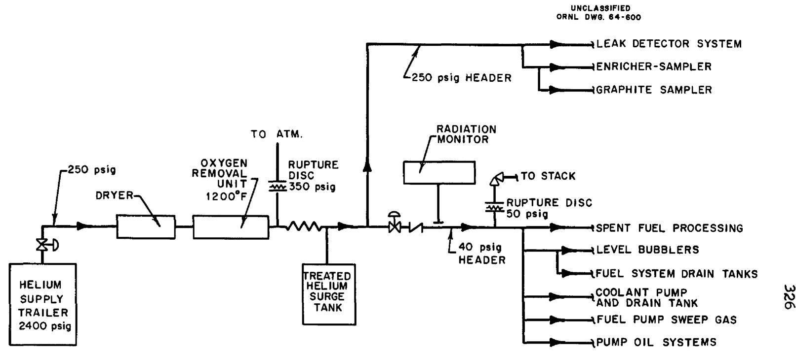

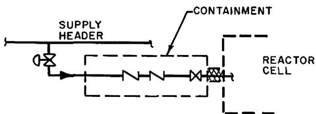  
ARRANGEMENT AT CONTAINMENT CELL WALL TYPICAL FOR SUPPLY TO:   
FUEL PUMP SWEEP GAS  
FUEL PUMP LEVEL BUBBLERS  
FUEL DRAIN TANKS   
Fig. 10.1. Flow Diagram of Cover-Gas System.

The purge of helium through the fuel pump bowl was set initially at 3.5 liters/min, and it was estimated that 1 ppm of $0_{2}$ in a 3.5-liter/min helium purge stream would precipitate 5.5 g of $\mathrm{ZrO}_{2}$ per year (equivalent to 18 g of uranium per year). Neutron irradiation of the fuel salt will produce about 10 cc/day of oxygen in the fuel salt system when the reactor power level is 10 Mw, which is equivalent to about 2 ppm of $0_{2}$ in a 3.5-liter/min helium purge stream. On this basis, it was decided that the oxygen contributed as a contaminant in the helium purge gas supply should be held to a value of near 1 ppm, present either as moisture or as $0_{2}$ .

The total volume of helium to be supplied continuously by the cover-gas system is about 5.6 liters/min, distributed as follows:

Sweep gas to the fuel pump 2.4 liters/min

Two fuel pump bubbler level elements 0.9

Two coolant pump bubbler level elements 0.9

Purge to the coolant pump 0.6

Two overflow tank bubblers 0.9

Additional intermittent flows are used for pressurizing the leak-detection system, for the transfer of salt, or for replacing the cover gas for the lubricating-oil tanks.

The cover-gas system was designed on the basis that a treatment and supply facility with a capacity of 10 liters/min, when used in conjunction with a 500-ft³ (STP) treated helium storage tank, would be capable of handling the total demand.

An obvious requirement in the treated-helium storage and distribution system is that it be as leaktight as possible to prevent the loss of helium or its contamination by inleakage.

# 10.3 Flowsheet

The flowsheet for the cover-gas system is shown in Fig. 10.2 (ORNL Dwg. D-AA-A-40884). All the major piping in the system is 1/2-in. sched-40 stainless steel.

The helium is normally supplied from trailer-mounted tanks containing 39,000 ft³ (STP) at 2400 psi through the supply valve V-500A on line

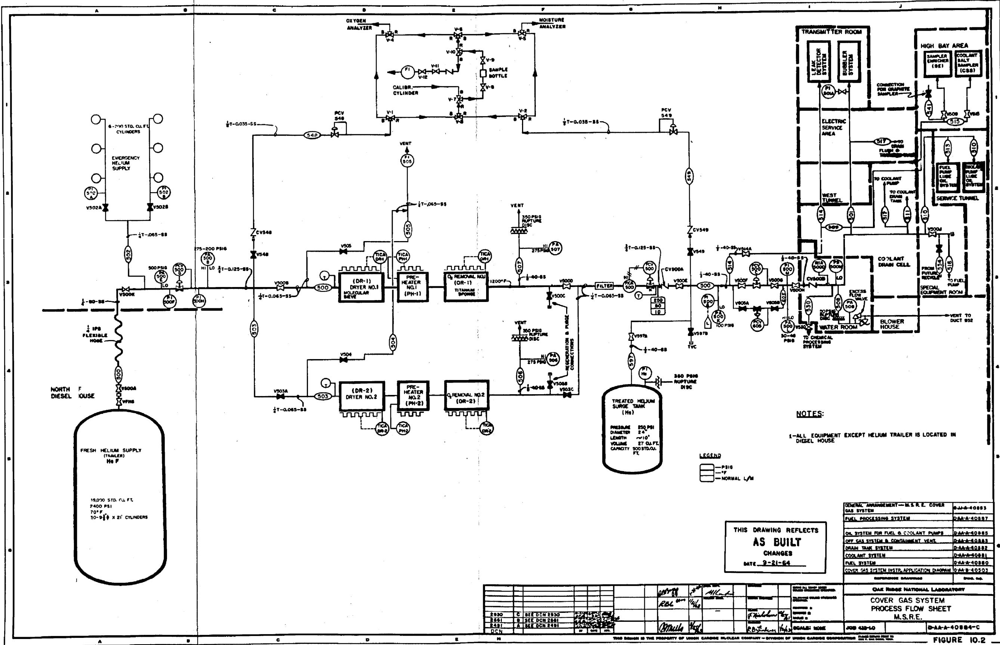

500 downstream of V-500A through valves V-502A or V-502B via line 502. Two pressure indicators, PI-502A and PI-502B, show the emergency cylinder bank pressure.

The supply line is provided with a pressure indicator and alarm, PIA-500E, which alarms at 500 psig. This is followed by a pressure-reducing valve, PCV-500G, which lowers the supply pressure to 250 psig. This pressure is monitored by a high-low alarm switch, PA-500B, set at 275 psig and 200 psig. The supply line also has a 1/8-in.-OD tubing take-off, line 548, leading to the oxygen analyzer $\mathrm{AO}_2$ -548 through valves V-548 and the check valve CV-548.

The supply line then branches into two parallel 1/4-in.-OD, 0.065-in. wall thickness, stainless steel tubing lines to supply the two helium-treatment stations. The identical branches contain a hand valve, V-500B (V-500A); a tee to a purge vent, line 505 (line 504); dryer No. 1 (No. 2); a tee leading to a rupture disc, line 507, to be discussed subsequently; a tee for a gas cylinder connection, line V-500C (V-500B); and an isolation valve, V-500D (V-500C). The dryers, preheaters, and oxygen-removal units will be discussed in Sections 10.5 - 10.8, following.

The 1/4-in. purge vents, lines 504 and 505 mentioned above, are used to vent helium from cylinders which can be connected at V-500B and V-500C to backflush and regenerate the helium dryers. The vents combine into a single tube, line 505, which contains a flow indicator, FI-505, before the helium is vented to the atmosphere.

The rupture discs in lines 506 and 507 are rated at 350 psig and provide overpressure protection for the helium-treating equipment. These lines also contain high-pressure alarms, PA-506 and PA-507, which are set at 275 psig.

The two branches of the treatment system recombine as line 500, which is connected to a flow-indicating controller, FICA-500, and an air-operated control valve, FCV-500, which limits the supply of gas flow to 10 liters/min.

A second supply line to the oxygen analyzer, line 549, is taken off line 500 at this point through the check valve, CV-549, and through the stop valve, V-549. The treated-helium storage, or surge, tank is connected to line 500 via line 597. This $1/2$ -in. line contains a normally

open valve, V-597A, and a branch connection to valve V-597B, which serves as a temporary vacuum connection. A pressure gage, PI-He, on line 597 indicates the surge tank pressure.

Downstream of the surge tank connection, line 500 contains a pressure indicator, PI-500A, and a pressure alarm switch, PA-500K, which is set to alarm at a low pressure of 100 psi. Following these instruments, the helium supply to the leak-detector system is taken off, line 514. (This 250-psi supply line is routed through the water room and the electric service area to the transmitter room.) The leak-detector system is described in Section 11, following. A branch from line 514, line 509, supplies the sampler enricher, the graphite sampler and the coolant salt sampler. (Line 509 tees off line 514 in the west tunnel and is routed through the coolant drain cell, the special equipment room, then to the high-bay area.) Line 541 supplies the graphite sampler; line 509, the sampler enricher; and line 515, the coolant sampler.

The helium supply, line 500, then divides into two parallel lines, line 500 and line 605, each of which contains a pressure-reducing station set to lower the helium pressure to 40 psig. These control valves, PCV-500C and PCV-605, have the usual isolation valves. After lines 500 and 605 rejoin, a pressure indicator, PI-500M, and a high-low alarm switch, set at 48 psig and 30 psig, monitors the pressure in the continuing line 500.

Line 500 contains a check valve, CV-500B, ahead of a radiation monitor, RIA-500. The helium supply to the chemical processing cell, line 530, is taken off at this point.

In the water room, line 508 branches from line 500 to a rupture disc, set at 50 psig. A pressure-relief valve is located in the vent line downstream of the disc. The vent discharges into the ventilation duct through line 932. A low-pressure switch in line 500 closes two solenoid valves in the helium purge gas supply to the pump bowl, line 516, to insure that back flow will not take place in that line in event the rupture disc blows.

Line 501 branches off line 500 in the west tunnel area to supply the fuel and coolant salt pump bubbler systems. Line 517 is connected to line 501 and supplies helium to the drain, flush, and transfer tanks in the drain tank cell, see Section 6. This line contains a flow restrictor,

FE-517, which limits the flow to 0.5 scfm at the $65\%$ full condition. The restrictor is followed by a pressure control valve, PCV-517, which limits the pressure used for transfer of salts, see Fig. 6.1 (ORNL Dwg D-AA-A-40882). Line 517 is connected to the valve manifold, HCV-572, HCV-574, and HCV-576, which serve the fuel drain tank No. 1, drain tank No. 2, and the fuel flush tank, respectively. The control valves in each of the three lines, 572, 574, and 576, are followed by two check valves and a hand valve in series. (The check valves and the hand valves are contained in a pot in the electric service area, and the $1/4$ -in. line from each hand valve is run inside a $1/2$ -in. pipe to the drain tank cell wall penetration.) Pressure transmitters for measuring the drain tank pressures, PRA-572, PRA-574, and PRA-576, are located in each of the three lines downstream of the check valves.

As shown in the cover-gas system flowsheet, Fig. 10.l, line 5ll leaves 500 to supply the coolant drain tank. This line has the following valves in series: V-5l1A, CV-5ll, PCV-5ll, HCV-5llB (throttling), HCV-5llA (block), and V-5llB. Line 5l2 branches off line 5ll upstream of the first valve to supply the coolant salt pump with helium. As shown in the coolant salt system flowsheet, Fig. 8.l (ORNL Dwg D-AA-A-4088l), line 5l2 contains a hand valve, V-5l2, a check valve, CV-5l2, and a flow control valve, FCV-5l2, with a maximum rate setting of 1.47 liters/min.

Line 510 branches off line 500 in the special equipment room and leads to the service tunnel to supply helium to the lubricating-oil storage tanks. As shown on the lubricating-oil system flowsheet, Fig. 5.25 (ORNL Dwg D-AA-A-40885), line 510 provides oil to the coolant pump lube oil tank through valves V-510A, PCV-510Al, CV-510, and V-510B. Line 513 branches off line 510 upstream of V-510A to similarly supply the fuel salt pump lube-oil tank through valves V-513A, PCV-513Al, CV-513 and V-513B.

The cover-gas system flowsheet, Fig. 10.2, also shows a branch line downstream of the line 510 takeoff, line 554, for attaching a possible helium recycle system.

Another branch of line 500, line 516, supplies helium to the fuel-

salt circulating pump at a pressure of about 40 psig and a maximum rate of 0.085 scfm. Line 516 contains two solenoid valves, HCV-516A and HCV-516C; an indicating flow controller and alarm, FICA-516; and a flow control valve, FCV-516, followed by two check valves, CV-516A and CV-516B, and a hand valve, V-516. The function of the two check valves and the two solenoid-operated valves is to assure that radioactive backflow cannot develop in this line in event of loss of pressure in the helium supply. Line 516 then enters the reactor cell and goes to the lower gas inlet on the fuel-salt circulating pump. A capped tee is provided between the hand valve and the check valve to enable the check valves to be pressurized in order to test leak tightness. See Table 5.1 for helium supply rates to fuel pump.

The check valves in lines 516, mentioned above, are located in a containment pot. The line is reduced from $\frac{1}{2}$ -in. pipe to $\frac{1}{4}$ -in. pipe at the control valve and to $\frac{1}{4}$ -in.-OD tubing at the check valves. From the check valves to the pump, line 516 is $\frac{1}{4}$ -in.-OD tubing inside $\frac{1}{2}$ -in. pipe to provide double containment for the portion outside the reactor cell and to protect the tubing inside the cell.

# 10.4 Helium Supply

The helium supply trailer has 30 cylinders, each 9-5/8 in. diam by 21 ft long, with a total capacity of $39,000\mathrm{ft}^3$ (STP) at 2400 psi. At the maximum estimated rate of use, 10 liters/min, this is equivalent to a 76-day supply.

The emergency helium supply consists of six standard cylinders arranged in two banks of three cylinders each. At a use rate of 10 liters/min this would be a 2.1-day supply. However, by changing these emergency cylinders in banks of three, the emergency supply arrangement could be used indefinitely.

# 10.5 Dryers

The helium dryers in lines 500 and 503 each consist of a vertical section of 2-in. 304 stainless steel sched-40 pipe capped at each end

and with a 1/2-in. sched-40 pipe nipple welded to each cap, see ORNL Dwg E-JJ-C-40855. The pipe section is about 41 in. long and contains a 30-in. depth of drying medium supported on a 1-in. depth of stainless steel wool at the bottom and having about 1-3/8 in. of the same wool at the top. The wool is held in place by 1/8-in.-thick plates with 1/16-in.-diam holes on 1/4-in. centers in a square pattern for a total of 37 holes. The plates are tack-welded in place.

The drying medium is Linde type 13x Molecular Sieve, 1/16-in.-diam pellets. Each dryer contains about 2-1/2 lb of pellets.

Each dryer bed is designed for a flow rate of 10 liters/min (STP) and to decrease the moisture content of the helium from 100 ppm to $< 1$ ppm on an on-stream cycle of 15 days.[143] The actual moisture content of the helium supply is thought to be less than 10 ppm so the bed life should be well in excess of 15 days.

The dryers are to operate at 250 psig and $80^{\circ}\mathbf{F}$ . For mechanical strength considerations, however, the design conditions were taken as 400 psig and $70^{\circ}\mathbf{F}$ . Since conventional hydraulic testing could not be employed after final assembly, the units were pneumatically tested at 500 psig (see ORNL Dwg E-JJ-C-40855).

The normal flow direction is upward through the bed. The dryers can be regenerated by purging with a downward flow of fresh helium while heating the bed. Heat for the regeneration is supplied by two 500-w, 240-v strip heaters (Chromolox Cat. No. S. E. 2550) about 25 in. long strapped to the upper portion of the pipe section. The heat is controlled by thermocouples located on the pipe wall about 1 in. from the end of the heated section. The wall is heated to a maximum of $500^{\circ}\mathrm{F}$ . The purge flow rate is about 1.5 liters/min, the exit gas temperature at the completion of the drying cycle is about $500^{\circ}\mathrm{F}$ , and the internal pressure during regeneration is a maximum of 10 psig.

The entire unit is insulated with 1 in. of magnesia insulation.

# 10.6 Preheater

Each of the preheaters in lines 500 and 503 is designed to heat a flow of 10 liters/min of helium to $750^{\circ}\mathrm{F}$ , required for the oxygen-

removal units.

The preheater consists of a 2-in. sched-40 stainless steel pipe section 10 in. long with flat plates tack-welded to each end, see ORNL Dwg. E-JJ-C-55485. Two 250-w, 120-v curved Chromolox strip heaters, 8 in. long, are strapped to this shell. Two thermocouples mounted 4 in. from the end are used to control the temperature. The helium flow is through a 10-ft length of stainless steel tubing $1/4$ in. OD x 0.035 in. wall thickness, coiled around the heater unit. The entire assembly is covered with $3/4$ in. of the heat-conducting medium, "High Temperature Thermon," and insulated with 2 in. of high-temperature insulation.

# 10.7 Oxygen Removal Units

Identical titanium sponge-type oxygen-removal units are installed in lines 500 and 503 to assure that the helium flow to the cover-gas system contains less than $1\mathrm{ppm}$ of $\mathsf{O}_2$ . Oxygen contamination of the helium supply is largely the result of handling and should not exceed about $100\mathrm{ppm}$ . The average $\mathsf{O}_2$ content may be about $10\mathrm{ppm}$ .

As indicated in Fig. 10.3, the oxygen-removal unit consists of a l-in. sched-5 titanium pipe 21 in. long filled with an oxygen getter of Electromet (Cleveland, Ohio) titanium sponge having a Brinell hardness of 125 and sized so that $100\%$ passes a 5/8-in. mesh screen and $95\%$ is retained on a 1/8-in. mesh. The pipe is mounted vertically, using lava spacers, inside 220-v "Thermoshell" ceramic heating elements (Cooley Electric Co., Indianapolis), of 1200 w total capacity. A stainless steel reflector, 0.005-in. thick, is tightly wrapped around the heating elements. The heat reflector is surrounded by a 3/4-in. thickness of "Fiberfrax" QC-10 thermal insulation (Carborundum Company). The assembly is contained inside a 4-in. sched-40 stainless steel pipe, with ring-joint flanges at top and bottom. One-half-inch IPS pipe nipples are provided at top and bottom for the gas exit and inlet (see ORNL Dwg E-JJ-C-56250).

The units operate at 250 psig with a temperature in the titanium sponge of $1200^{\circ}\mathrm{F} \pm 50^{\circ}\mathrm{F}$ . The design pressure is 400 psig and the design temperature of the pressure-containing 4-in. pipe is a maximum of

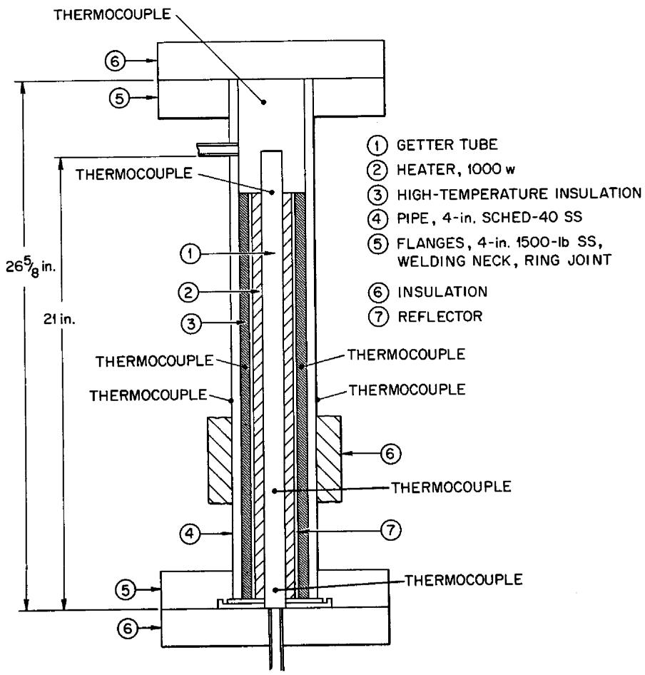  
Fig. 10.3. Oxygen Removal Unit Cover-Gas System.

UNCLASSIFIED

ORNL-LR-DWG68585

$1000^{\circ}\mathbf{F}$ . Leak tests were made in accordance with Par. UG-100 of Section VIII of the ASME Code, using nitrogen at 700 psig. Helium leakage was less than $10^{-4}$ liters (STP)/24 hr.

A chromel-alumel thermocouple is inserted in a well a short distance into the bottom inlet of the titanium sponge. This 1/8-in.-diam stainless steel-sheathed couple is welded to a trepanned hole in the lower flange and has compression-type fittings on the outside of the flange.

Three 1/16-in.-diam sheathed thermocouple leads are inserted through the 4-in. pipe wall near the top through lava-sealed packing glands, "Conax" Cat. No. MPG - 1/16 in. Two of these chromel-alumel couples are located at about mid elevation between the titanium pipe wall and the heater element, and the third is at the top outlet gas passage.

Two 1/8-in.-diam chromel-alumel sheathed thermocouples are provided on the outside of the 4-in. pipe.

The two electric leads for the heater elements are brought through the 4-in. pipe wall near the top in individual seals, "Ceramaseal" Dwg 804A38878.

# 10.8 Treated-Helium Storage Tank

A storage tank is provided for treated helium to take care of the intermittent periods when the helium demand is considerably greater than the normal continuous flow rate of 10 liters/min. The volume of the storage, or surge, tank is specified to be 27 ft³ so that two fuel salt transfers and two coolant salt transfers could be made without decreasing the helium supply pressure below 100 psig.

The tank is an 8-ft long section of 24-in. sched-30 pipe of $3^{47}$ stainless steel, capped at each end. It is designed for a working pressure of 250 psig and a test pressure of 375 psig. The design operating temperature is $80^{\circ}\mathrm{F}$ . The tank has a storage capacity of about 500 ft $^3$ (STP) of helium.

# 10.9 Bubblers for Indicating the Salt Levels in the Fuel and Coolant Pump Bowls and Overflow Tank

The helium bubbler arrangement used to indicate the level of salt in the pump bowls and the overflow tank is described in this section since it is closely associated with the helium distribution system. In brief, the level is determined by measuring the gas pressure required to displace the liquid salt in dip tubes which extend below the surface of the salt in the pump bowls and overflow tank. The dip-tube pressure is measured by d/p cells, referenced to the pressure in the vapor space.

# 10.9.1 Layout and General Description

The bubbler arrangements used on the fuel and coolant pump bowls and overflow tank are identical except for location and the containment of the fuel system. The fuel pump bubbler is described in the following paragraphs with the coolant pump and the overflow tank equipment and locations given in parenthesis in the same order.

The fuel pump bowl is described in Section 5.4.1.2.

As shown on the fuel system flowsheet, Fig. 5.3 (8.1), there are two bubbler lines, lines 593 (598)(599) and 596 (595)(600), and one reference line, line 592 (594)(589). These lines are fabricated of $\frac{1}{4}$ -in.-OD x 0.065-in.-wall stainless steel tubing and are connected to the 40-psig helium supply, line 501, in the transmitter room. Each line has a block valve at the header and a throttling valve to adjust the helium flow. All the bubbler lines are routed past duplicate radiation monitors, R1A-596A and R1A-596B, through conduit to the special equipment room. In this location the fuel pump and overflow tank bubbler lines have flow restrictors installed which limit the flow in lines 593 (599) and 596 (600) to 366 cc/min (STP) and in line 592 (589) (the reference line) to 150 cc/min, when the helium supply pressure is 25 psig. The three coolant pump bubbler lines, 598, 595, and 594, continue to the coolant cell where similar flow restrictors are provided.

The fuel pump and overflow tank bubbler lines enter a containment tank (not required for the coolant pump lines) where each line has two check valves in series (one check valve in coolant system). The check

valves are followed by solenoid valves as follows: line 592, HCV-593-B2 (line 594, HCV-595-B1) (line 589, HCV-599-B2); in line 593, HCV-593-B3 (line 598, HCV-595-B3) (line 599, HCV-599-B1); and in line 596, HCV-593-B1 (line 595, HCV-595-B2) (line 600, HCV-599-B3). (See valve tabulations in Table 10.1.) Following these valves, the reference pressure, line 592 (594) (589) is connected to line 596 (595) (600) through a solenoid valve, HCV-593-B5 (HCV-595-B5) (HCV-599-B5), and to line 593 (598) (599) through the solenoid valve HCV-593-B4 (HCV-595-B4) (HCV-599-B4). These cross connections are for equalizing the pressure across the d/p cells, which are connected between lines 592 (594) (589) and 596 (595) (600), LI-596 (LI-595) (LIA-600), and between lines 592 (594) (589) and 593 (598) (599), IRA-593 (IRA-598) (LTA-599). The last-mentioned d/p cells serve both as level indicators and as an input to recorders and an alarm system. As was mentioned in Section 5.4.1.2, a difference in 2 in. in the distance the two dip tubes extend beneath the surface of the salt in the pump bowls, 593 (598) is the shorter, may permit variations in the density of the salt to be noted. Both dip tubes extend to the bottom of the overflow tank since it is desirable to have duplicate readings on the quantity of salt remaining.

A connection is made to line 592 (589) for the fuel pump bowl pressure transmitters, PRC-522A and PIA-522B, and to 589 for PIA-589 and PXM-581.

Each of the lines, 592 (594) (589), 593 (598) (599), and 596 (595) (600) has a hand valve outside the cell wall penetration. The lines to the fuel pump and overflow tank are $1/4$ -in.-OD tubing run inside $1/2$ -in. pipe inside the reactor cell to provide double containment.

# 10.9.2 Containment Tank

The fuel pump bubbler containment tank, or instrument box, is a pressure-tight container for the above-mentioned solenoid valves and d/p cells.

The tank is fabricated of a 21-in. length of 24-in. sched-10S, 304 stainless steel pipe, with a flanged pipe cap at each end to give an overall length of about 44 in. (see ORNL Dwg E-JJ-D-55422). The design pressure is 50 psig but the normal operating pressure is 0 psig

at ambient temperatures. The inlet tubing penetrations consist of $1/4$ -in., 30,000-lb autoclave couplings. The outlet tubing penetration is a 6-in. sched-40 tangential pipe nipple which is also welded to the extension of the reactor cell penetration (see ORNL Dwg E-JJ-D-55428). The four electrical conductor penetrations of the tank have Amphenal seals and serve the two d/p cells from the ll solenoid valves. Two l-in. pipe nipples extending from the top of the tank serve as containment for the $1/4$ -in. tubing leading from line 522 to the pressure transmitters PRC-522A and PIA-522B.

The d/p cells are accessible by opening one of the flanged ends of the tank and the solenoid valves may be serviced from the other end.

# 10.10 Piping, Valves, and Appurtenances

All piping in the cover-gas system is 304 stainless steel sched 40. The tubing is 304 stainless steel of various diameters and thicknesses. All fittings are welded, with the exception of the threaded valves in the portions of line 500 and 502 that contain untreated helium. The tubing fittings are 30,000-lb autoclave, or equivalent, with the exception that the control valves in the 1/8-in. lines 548 and 549 have Swaglok compression-type fittings.

The hand valves are listed in Table 10.1, the check valves in Table 10.2, and the control valves, including the pressure regulators, in Table 10.3.

Table 10.1 Cover Gas System Hand Valves   

<table><tr><td colspan="2">Valve Numbers</td><td>Specification</td><td>Description</td></tr><tr><td>500C</td><td>576</td><td></td><td></td></tr><tr><td>503C</td><td>589C</td><td></td><td></td></tr><tr><td>504</td><td>592C</td><td></td><td></td></tr><tr><td>505</td><td>593C</td><td></td><td>Hoke, TY 440, socket-weld to 1/4-in. OD tubing.</td></tr><tr><td>514B</td><td>594C</td><td></td><td>Bellows-sealed bonnets.</td></tr><tr><td>516</td><td>595C</td><td>HVS 1</td><td>300 series stainless steel.</td></tr><tr><td>519</td><td>596C</td><td></td><td></td></tr><tr><td>541</td><td>598C</td><td></td><td></td></tr><tr><td>548</td><td>599C</td><td></td><td></td></tr><tr><td>549</td><td>600C</td><td></td><td></td></tr><tr><td>572</td><td>601</td><td></td><td></td></tr><tr><td>574</td><td>606</td><td></td><td></td></tr><tr><td>510A</td><td>512</td><td></td><td>Same as HVS 1, but socket-weld for 3/8-in. OD tubing.</td></tr><tr><td>511</td><td>513A</td><td></td><td></td></tr><tr><td>500D</td><td>517</td><td></td><td></td></tr><tr><td>500E</td><td>597A</td><td></td><td></td></tr><tr><td>500F</td><td>597B</td><td>HVS 1B</td><td>Same as HVS 1, but socket-weld for 1/4-in. NPS pipe.</td></tr><tr><td>500G</td><td>605A</td><td></td><td></td></tr><tr><td>503A</td><td>605B</td><td></td><td></td></tr><tr><td>503B</td><td></td><td></td><td></td></tr><tr><td>500H</td><td>554</td><td>HVS 2</td><td>Hoke, LY 473, socket-weld for 1/2-in. NPS pipe. Bellows-sealed, 300 series SS.</td></tr><tr><td rowspan="2">510B</td><td>513B</td><td></td><td>Crane, socket-weld to 1/2-in. NPS pipe, bellows-sealed, carbon steel.</td></tr><tr><td>514A</td><td></td><td></td></tr><tr><td>500A</td><td>502B</td><td></td><td>Hoke, Y 344, threaded for 1/4-in. pipe, packed bonnet.</td></tr><tr><td>502A</td><td></td><td></td><td></td></tr><tr><td>589A</td><td>595A</td><td></td><td></td></tr><tr><td>592A</td><td>596A</td><td></td><td></td></tr><tr><td>593A</td><td>598A</td><td></td><td>Hoke, A 434, forged brass, 1/4-in. NPS male pipe thread, bellows-sealed, Kel-F tip</td></tr><tr><td>594A</td><td>595B</td><td></td><td></td></tr><tr><td>589B</td><td>596B</td><td></td><td></td></tr><tr><td>592B</td><td>598B</td><td></td><td></td></tr><tr><td>593B</td><td>599B</td><td></td><td></td></tr><tr><td>594B</td><td>600B</td><td></td><td></td></tr></table>

Table 10.2 Cover Gas System Check Valves   

<table><tr><td colspan="2">Valve Numbers</td><td>Description</td></tr><tr><td>500A</td><td>500B</td><td></td></tr><tr><td>510</td><td>513</td><td></td></tr><tr><td>516A</td><td>516B</td><td></td></tr><tr><td>519A</td><td>519B</td><td></td></tr><tr><td>572A</td><td>572B</td><td></td></tr><tr><td>574A</td><td>574B</td><td></td></tr><tr><td>576A</td><td>576B</td><td>Circle Seal, Dwg P705, 3/8-in.</td></tr><tr><td>589A</td><td>589B</td><td>Aminco connection, soft seat, spring-loaded, 300 series stain-less steel.</td></tr><tr><td>592A</td><td>592B</td><td></td></tr><tr><td>593A</td><td>593B</td><td></td></tr><tr><td>594</td><td>595</td><td></td></tr><tr><td>596A</td><td>596B</td><td></td></tr><tr><td>598</td><td>599B</td><td></td></tr><tr><td>599A</td><td>600B</td><td></td></tr><tr><td>600A</td><td>606B</td><td></td></tr><tr><td>606A</td><td></td><td></td></tr><tr><td>584</td><td>549</td><td>Nupro, 2C, with 1/8-in. Swaglok connections, 300 series SS.</td></tr><tr><td>511</td><td>512</td><td>Nupro, 4C2, modified for autoclave connections, 300 series SS.</td></tr></table>

Table 10.3. Cover Gas System Control Valves and Regulators   

<table><tr><td>Valve Number</td><td>MSRE
Specification</td><td>Cv</td><td>Size, in.</td><td>Fail
Position</td><td>Make</td><td>Comment</td></tr><tr><td>PCV 500C</td><td>64</td><td>-</td><td>1/4 Threaded</td><td>*</td><td>Fisher</td><td>Buna-N diaphragm</td></tr><tr><td>PCV 500G</td><td>61</td><td>-</td><td>3/8 Autoclave</td><td>*</td><td>Fisher</td><td></td></tr><tr><td>FCV 500J</td><td>18</td><td>0.0045</td><td>1/2 Autoclave</td><td>Closed</td><td>Masoneilan</td><td></td></tr><tr><td>PCV 510A1</td><td>18</td><td>0.0035</td><td>1/2 Autoclave</td><td>Closed</td><td>Masoneilan</td><td></td></tr><tr><td>HCV 511A1</td><td>18</td><td>3.5</td><td>1/2 Autoclave</td><td>Closed</td><td>Fulton (HRT)</td><td></td></tr><tr><td>HCV 511B1</td><td>18</td><td>0.077</td><td>1/2 Autoclave</td><td>Closed</td><td>Masoneilan</td><td></td></tr><tr><td>HCV 511C1</td><td>18</td><td>0.077</td><td>1/2 Autoclave</td><td>Closed</td><td>Masoneilan</td><td></td></tr><tr><td>FCV 512A1</td><td>18</td><td>0.00083</td><td>1/2 Autoclave</td><td>Closed</td><td>Masoneilan</td><td></td></tr><tr><td>PCV 513A1</td><td>18</td><td>0.0035</td><td>1/2 Autoclave</td><td>Closed</td><td>Masoneilan</td><td></td></tr><tr><td>HCV 516B1</td><td>18</td><td>0.0035</td><td>1/2 Autoclave</td><td>Closed</td><td>Masoneilan</td><td></td></tr><tr><td>PCV 517A1</td><td>18</td><td>0.077</td><td>1/2 Autoclave</td><td>Closed</td><td>Masoneilan</td><td></td></tr><tr><td>HCV 519A1</td><td>18</td><td>0.00083</td><td>1/2 Autoclave</td><td>Closed</td><td>Masoneilan</td><td></td></tr><tr><td>HCV 572</td><td>18</td><td>3.5</td><td>1/2 Autoclave</td><td>Closed</td><td>Fulton (HRT)</td><td></td></tr><tr><td>HCV 574</td><td>18</td><td>3.5</td><td>1/2 Autoclave</td><td>Closed</td><td>Fulton (HRT)</td><td></td></tr><tr><td>HCV 576</td><td>18</td><td>3.5</td><td>1/2 Autoclave</td><td>Closed</td><td>Fulton (HRT)</td><td></td></tr><tr><td>PCV 605</td><td>64</td><td>-</td><td>1/4 Autoclave</td><td>*</td><td>Fisher</td><td>Buna-N diaphragm</td></tr></table>

*Regulator

Table 10.3 (continued)   

<table><tr><td>Valve Number</td><td>MSRE
Specification</td><td>Port
Size</td><td>Size, in.</td><td>Fail
Position</td><td>Make</td><td>Comment</td></tr><tr><td>HCV 593-B1</td><td></td><td></td><td></td><td></td><td></td><td></td></tr><tr><td>HCV 593-B2</td><td></td><td></td><td></td><td></td><td></td><td></td></tr><tr><td>HCV 593-B3</td><td></td><td></td><td></td><td></td><td></td><td></td></tr><tr><td>HCV 593-B4</td><td></td><td></td><td></td><td></td><td></td><td></td></tr><tr><td>HCV 593-B5</td><td></td><td></td><td></td><td></td><td></td><td></td></tr><tr><td>HCV 595-B1</td><td></td><td></td><td></td><td></td><td></td><td></td></tr><tr><td>HCV 595-B2</td><td></td><td></td><td></td><td></td><td></td><td></td></tr><tr><td>HCV 595-B3</td><td>139</td><td>3/32 in.</td><td>1/4 Autoclave</td><td>Closed</td><td>Valcor</td><td>Solenoid-operated</td></tr><tr><td>HCV 595-B4</td><td></td><td></td><td></td><td></td><td></td><td></td></tr><tr><td>HCV 595-B5</td><td></td><td></td><td></td><td></td><td></td><td></td></tr><tr><td>HCV 599-B1</td><td></td><td></td><td></td><td></td><td></td><td></td></tr><tr><td>HCV 599-B2</td><td></td><td></td><td></td><td></td><td></td><td></td></tr><tr><td>HCV 599-B3</td><td></td><td></td><td></td><td></td><td></td><td></td></tr><tr><td>HCV 599-B4</td><td></td><td></td><td></td><td></td><td></td><td></td></tr><tr><td>HCV 599-B5</td><td></td><td></td><td></td><td></td><td></td><td></td></tr><tr><td>HCV 606</td><td></td><td></td><td></td><td></td><td></td><td></td></tr></table>

# 11. LEAK DETECTOR SYSTEM

A leak detector system is used to monitor all flanges in the MSRE system which could permit the escape of radioactive materials. Joints in lines containing lubricants or coolants important to the operation and safety of the reactor are also leak detected. In addition, all flanges which must be maintained by remotely operated tooling are provided with leak-detected type joints to serve as an indication of satisfactory reassembly.[145] There are about 100 leak-detected flanges in the system.

The leak detector system operates on the principle of maintaining an over-pressure of 100 psig of helium at all joints. In event of a leak in the process system, helium will flow into the affected system. The resulting loss in pressure at the leak detector system supply headers actuates an alarm system. Each of the 60 or more leak detector lines is provided with a hand valve at the header to permit isolation of the line to determine the location of the leaking joint.

# 11.1 Layout and General Description

In brief, the leak detector system consists of eight manifolds, or headers, mounted in a leak detector station cabinet, 2-ft x 4-ft x 6-1/2 ft, located on the south side of the transmitter room. (This room is at the 840-ft elevation, east of the drain tank cell and north of the reactor cell. See Fig. 4.4.) The headers are connected to the helium supply from the cover-gas system and to the leak detector lines leading to each flange. Leakage is detected by header pressure drop and measured by the rate at which the pressure in the header drops as compared to an equivalent tank volume (500 cc). This arrangement partially compensates for pressure changes in the system due to ambient temperature variations in the transmitter room.

The leak detector lines leading to the reactor, drain tank, and fuel processing cells, pass through the floor beneath the leak detector system cabinet and are routed to the cell wall penetrations in "Lay-In-Ducts." The general location of the lines is shown in Fig. 11.1. The leak detector lines to the coolant cell and vent house are run through conduit around the reactor cell to the special equipment room; from here to the point of application they are mounted on "Unistrut." The leak detector tubing inside the reactor and drain tank cells is either supported by "Lay-In-Ducts" or mounted on "Unistrut."

Figure 11.2 shows a typical leak-detected joint. The leak detection arrangement as applied to a freeze flange is shown in Fig. 5.29. The octagonal O-ring type gasket is drilled to permit transmission of the helium gas pressure to all four of the sealing surfaces.

On some lines, one leak detector is connected in series to serve two or more sets of flanges. Where valves have leak-detected joints, both sets of the valve flanges are served with one leak detector line, see Fig. 11.3.

Where both flange faces in a pair must be removable for maintenance reasons, such as on the pumps, the freeze flanges, etc., it is necessary that the leak detector lines have disconnects which can be remotely manipulated. These disconnects are described in Section 11.6, following.

The leak detector system is constructed of $30^{4}$ stainless steel. The tubing is 1/4-in. OD x 0.083-in. wall thickness and all piping is sched 40. All valves are bellows sealed, as described in Section 11.5.

If it is assumed that the leak rate of $10^{-3}$ cc/sec determined in the development of the freeze flanges (pp 41-45 Ref 38) is representative of the average leak rate of the 100 flanges in the MSRE system, the total leakage is in the order of 6 cc/min. This amounts to about 75 cc/min per header. Taking the average volume of a header and its connected lines to be about 1,000 cc, this loss of helium amounts to a pressure loss of about 0.66 psi/hr. The minimum full range of the differential-pressure cell used to indicate the pressure difference between the header and the volume tank is 5 in. of water, or about 0.18 psi. A change in the differential pressure of 0.05 psi per hour (28% of full range) indicates a leak rate of about 0.04 cc/min (6.67 x $10^{-4}$ cc/sec).

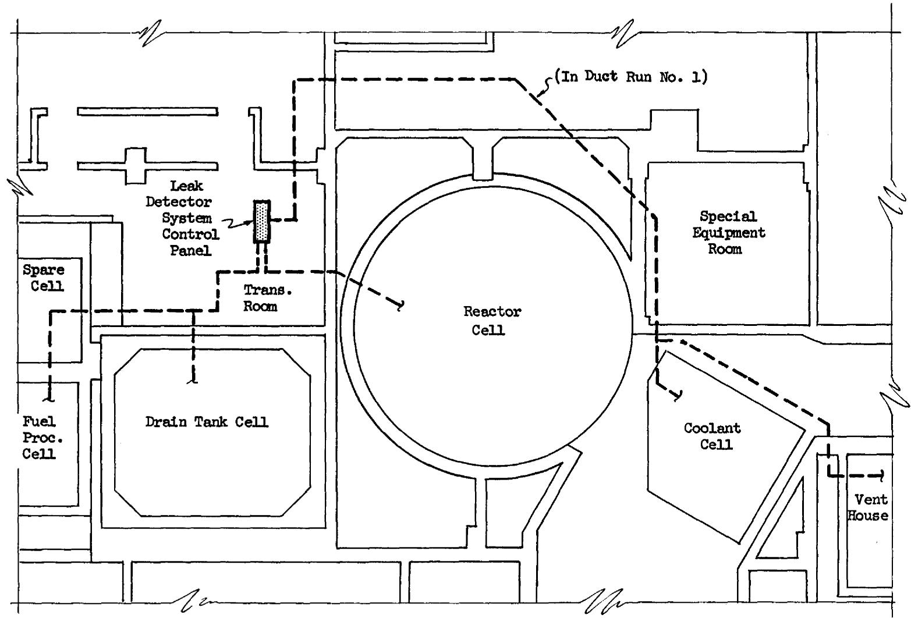  
Figure 11.1. General Routing of Leak Detector Lines

Unclassified ORNL DWG 64-8833

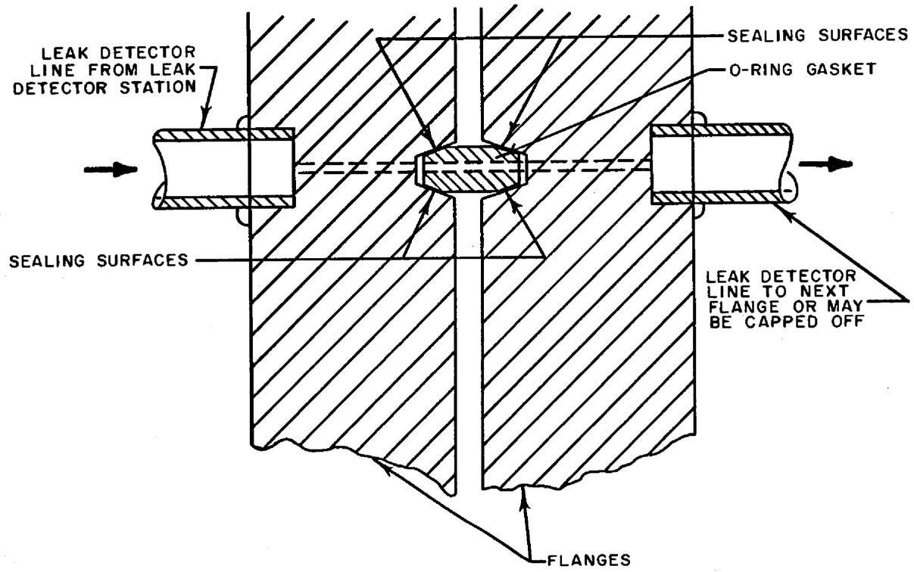  
Fig. 11.2. Schematic Diagram of Leak-Detected Flange Closure.

Unclassified ORNL DWG 64-8834

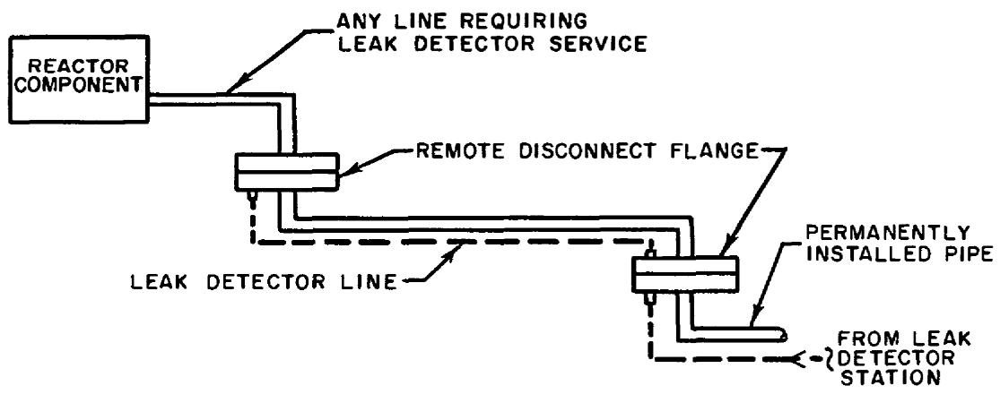  
Fig. 11.3. Method of Utilizing One Leak Detector Line to Serve Two Flanges in Series.

# 11.2 Flowsheet

The flowsheet for the leak detector system is shown in Fig. 11.4 (ORNL drawing D-AA-A-40890).

Helium is supplied at 250 psig through 1/2-in. Line 514 from the cover-gas system (see Section 10.3). This line reduces to 1/4-in. tubing inside the leak detector system cabinet. The helium is supplied through valves V-514-B, CV-514, and PCV-514, the latter regulating the pressure to 100 psig. After passing a connection through which helium can be supplied in an emergency, the flow is distributed to each of the eight headers. The distribution line, Line 514, contains a high-low pressure alarm switch set for the 90 to 110 psig range. Each helium supply to a header is provided with an isolation valve. Each header serves as a valve manifold for ten 1/4-in. leak detector lines, which are grouped by application and location, as shown in Table 11.1.

Lines 410 through 414 on header 401 serve the reactor cell freeze flanges. Lines 415 through 419 are spare leak detector lines leading into the reactor cell. All ten of these lines have one hand valve at the header and are provided with disconnect couplings inside the reactor cell.

Header 402 serves the reactor cell helium lines. Each of these leak detector lines, 420 through 429, has two hand valves in series, with the inner, or "B" valve, being used to prevent backflow from the cell in event maintenance is required on the operational valve, "A." Each of these leak detector lines is connected to two pairs of flanges in series. There are no spare lines on this header.

Header 403 monitors reactor cell water lines. Leak detector Lines 430 through 434 are connected to half-flanges in the thermal shield water piping. (These half-flanges are installed where the welded piping system is likely to be cut for maintenance procedures and later rejoined by spool pieces with bolted mechanical joints.) Lines 435 through 439 serve other water piping flanges. Each of these ten lines has one hand valve at the leak detector system header.

Header 404 serves miscellaneous reactor cell flanges, such as the oil piping flanges (Leak Detector Lines 440, 441, and 442), and the pump

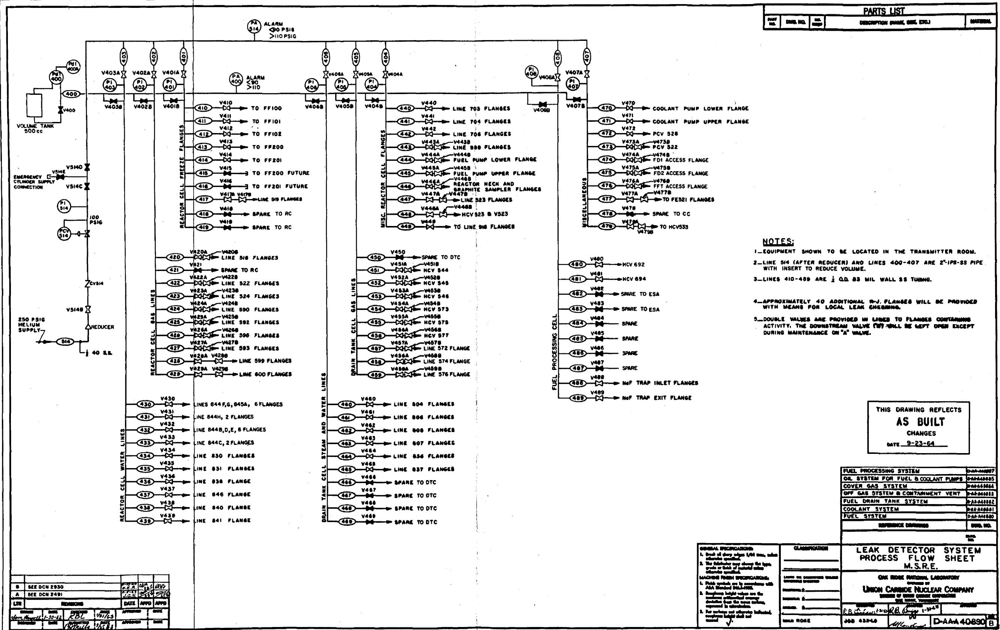

THIS DRAWING REFLECTS

AS BUILT

CHANGES

DATE 9-23-64

<table><tr><td colspan="2">FUEL PROCESSING SYSTEM</td><td>DAA-M48077</td></tr><tr><td colspan="2">OIL SYSTEM FOR FUEL &amp; COOLANT PUMPS</td><td>DAA-M48085</td></tr><tr><td colspan="2">COVER GAS SYSTEM</td><td>DAA-M48084</td></tr><tr><td colspan="2">OFF GAS SYSTEM &amp; CONTAMMENT VENT</td><td>DAA-M48083</td></tr><tr><td colspan="2">FUEL DRAIN TANK SYSTEM</td><td>DAA-M48082</td></tr><tr><td colspan="2">COOLANT SYSTEM</td><td>DAA-M48081</td></tr><tr><td colspan="2">FUEL SYSTEM</td><td>DAA-M48080</td></tr><tr><td colspan="2">REFERENCE COEFFICIENTS</td><td>DAA, NO.</td></tr><tr><td colspan="3">###</td></tr><tr><td colspan="3">LEAK DETECTOR SYSTEM
PROCESS FLOW SHEET
M.S.R.E.</td></tr><tr><td colspan="3">CRAKE RADIUS NATIONAL LABORATORY
UNION CARBIDE NUCLEAR COMPANY
BENEFICIARY OF THE CARRIDCE OR CONTRAHND
NET COFFEE</td></tr><tr><td>###</td><td>###</td><td>###</td></tr><tr><td>###</td><td>###</td><td>###</td></tr><tr><td>###</td><td>###</td><td>###</td></tr><tr><td>###</td><td>###</td><td>###</td></tr></table>

FIGURE 11.4

Table 11.1. Leak Detector System Headers   

<table><tr><td>Header No.</td><td>General Service</td><td>Connected Leak Detector Lines</td></tr><tr><td>401</td><td>Reactor cell freeze flanges</td><td>Nos. 410 - 419</td></tr><tr><td>402</td><td>Reactor cell gas lines</td><td>Nos. 420 - 429</td></tr><tr><td>403</td><td>Reactor cell water lines</td><td>Nos. 430 - 439</td></tr><tr><td>404</td><td>Miscellaneous reactor cell flanges</td><td>Nos. 440 - 449</td></tr><tr><td>405</td><td>Drain tank cell gas lines</td><td>Nos. 450 - 459</td></tr><tr><td>406</td><td>Drain tank cell steam and water lines</td><td>Nos. 460 - 469</td></tr><tr><td>407</td><td>Miscellaneous</td><td>Nos. 470 - 479</td></tr><tr><td>408</td><td>Fuel processing cell</td><td>Nos. 480 - 489</td></tr></table>

and reactor neck flanges (Lines 443 through 446). Lines 443 through 446 have two valves in series at the header. Lines 444 through 449 have disconnect couplings inside the cell. Lines 447, 448, and 449 are spare lines for the reactor cell.

Header 405 is used to monitor gas piping flanges in the drain tank cell. Line 450 is a spare leak detector line to this cell. Lines 451 through 459 have two valves in series at the header.

Header 406 serves the drain tank cell steam and water piping flanges. Lines 460 through 465 are used for this purpose and the remaining four lines serve as spares for the drain tank cell.

Header 407 is used for flanges classified as miscellaneous. These include the coolant salt circulating pump upper and lower flanges (Leak Detector Lines 470 and 471), and flanges at the gas control valves in the coolant cell and in the vent house (Leak Detector Lines 472, 473, and 479). Lines 474 through 476 monitor flanges on the fuel drain tanks. These three lines have disconnects inside the drain tank cell. Lines 473 through 476 have two valves in series at the header. Line 478 is a spare line to the coolant cell.

Header 408 monitors flanges in the fuel processing cell. Lines 480 and 481 serve flanges on the control valves HCV-692 and HCV-694. Lines 482 and 483 are installed spares to the electrical service area. Lines 484 and 489 are spares.

All eight of the above-mentioned headers are connected through hand valves to Line 400, which leads to the 500-cc tank through a normally closed block valve, V-400. A differential-pressure cell, PdT-400, connected between this tank and Line 400, senses small changes in the header pressure compared to the tank pressure. In addition, Line 400 has a high and low pressure switch which annunciates an alarm on the main control panel in event of deviation from the 90 to 110 psig set range.

# 11.3 Headers

Each header consists of a 19-1/2-in. long section of 1-1/2-in. sched 40, 304 stainless steel pipe, capped at each end (see ORNL drawing D-JJ-D-55403). A 1-1/4-in.-diam stainless steel rod is enclosed inside

each header to reduce the free volume. To assure that this inserted rod does not block any of the leak detector openings, three equally spaced wires, 0.040-in. diam, are tack welded the length of the insert to space it centrally within the header pipe. The free volume of any branch was limited so that the response time for a leak of 1 cc/min would not be less than 0.5 psi/hr (p 2 Ref 145).

There are thirteen 1/4-in. OD x 0.083-in. wall thickness tubes welded to each header. To these are connected the ten leak detector lines, the helium supply from Line 514, the connection to Line 400 and the tank, and a line to a pressure gage.

# 11.4 Valves

Each tubing line contains a miniature, bellows-sealed hand valve (Hoke, Type 480). These valves were salvaged from the Homogeneous Reactor Test (HRE-2) and were completely inspected, reconditioned and tested. Leak detector lines which monitor flanges in direct contact with radioactive gases have two of these valves installed in series at the headers so that the inner valve can be closed to isolate the system while the operational valve is being repaired.

# 11.5 Disconnects

In the cases where flanges inside the reactor cell must have both faces removed to effect a maintenance procedure, the associated leak detector lines must have nearby disconnects which can be operated by remotetooling. These couplings must be as free as possible from any leakage.

The design selected for use in the MSRE, as shown in Fig. 11.5, was developed in the ORNL Chemical Technology Division and in the Reactor Division.[146] The sealing principle is based on elastic deformation of a polished metal cone when inserted in a polished seat. The block on which the male cone is mounted and the block containing the matching seat are of the proper dimensions to make contact to prevent the cone from being jammed into the seat and deformed plastically. The two blocks are held together by a simple but positive yoke assembly. The single bolt on this yoke facilitates operation by remotely handled tools.

Unclassified

ORNL DWG 64-8835

A = Pipe or tubing bore, + 0.0025 in.   
B = Major male diameter boss before taper, +0.000 - 0.001 in.   
C = Major female diameter before rounding entrance edge, +0.001 - 0.000 in.   
D = 22°, +0° - 1/2°, included angle tapered cone.   
$E = 23 - 1 / 2^{\circ}, + 1 / 2^{\circ} - 0^{\circ}$ , included angle tapered hole.

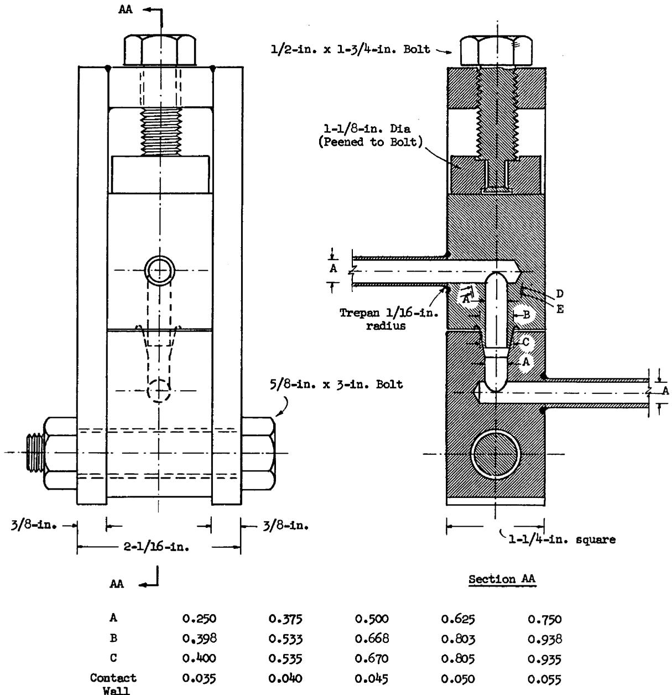  
Figure 11.5. Leak Detector System Block Disconnects with Yoke.

Tests made during development of the coupling indicate that a leak rate of less than $10^{-6}$ cc/sec (STP) can be expected even after the joint has been broken and remade thirty times or more. These tests were made at room temperature.[147] At temperatures of a few hundred degrees $(^{\circ}\mathbf{F})$ , it was indicated that the joint might be manipulated at least twenty times before the leak rate was increased. It is anticipated that all MSRE disconnects will operate at the cell ambient temperature of about $150^{\circ}\mathbf{F}$ . A light coating of an alcohol-graphite mixture is recommended for the cone before the joints are made.

# 11.6 Local Leak Detectors

The flanges in the fuel and coolant pump lubricating oil systems are provided with local leak detector connections to which helium gas cylinders can be connected when a leak is suspected. This leak detection arrangement is not connected to the reactor leak detector system. Each of the lube oil packages contains nine local leak check points, see the lubricating oil flowsheet, Fig. 5.25 (ORNL drawing D-AA-A-40885).

# 12. OFF-GAS DISPOSAL SYSTEM

The off-gas facility provides for the safe disposal of radioactive gases discharged from the MSRE. The system handles three different types of gas flow: (1) the continuous discharge of helium containing highly radioactive fission-product gases swept from the fuel salt circulating pump bowl; (2) intermittent, relatively large flows of helium containing, at times, significant amounts of radioactive gases and particulates, such as that discharged during salt transfer operations; and (3) flows of up to 100 cfm of very low activity cell atmosphere gas ( $5\%$ $\mathsf{O}_2$ , $95\%$ $\mathsf{N}_2$ ), which is ejected either intermittently or continuously to maintain the reactor and drain tank cells at sub-atmospheric pressure.

The unstable isotopes of iodine and bromine resulting from the fissioning of the $^{235}\mathrm{U}$ in the fuel salt largely remain in the salt solution as complex halides until they decay to elemental xenon and krypton. Since it is desirable to remove the $^{135}\mathrm{Xe}$ from the fuel salt circulating system because of its high cross section for capture of neutrons ( $\alpha = 3.5 \times 10^{6} \, \mathrm{b}$ ), it and other fission-product gases are swept from the fuel pump bowl by a helium gas flow of about 4 liters/min (0.15 cfm at STP). When operating at the 10-Mw reactor power level, the activity of this stream leaving the pump is about 280 curies/sec. $^{148}$

The gases are held in the piping for about two hours for the short-lived isotopes to decay. They then pass into a water-cooled bed of activated charcoal. The adsorbed xenon is retained in the bed for at least 90 days and the krypton is held for 7-1/2 days or more. During this time, essentially all the fission-product gases decay to stable elements, some of which are solids that remain in the charcoal. Only three radioactive isotopes, $^{85}\mathrm{Kr},$ $^{131\mathrm{m}}\mathrm{Xe}$ and $^{133}\mathrm{Xe}$ , exist in any significant amounts in the helium carrier gas leaving the charcoal bed. (See Table 12.1) Of these, the $^{85}\mathrm{Kr}$ with its half-life of 10.27 years, is of the greater concern. The maximum discharge rate of this isotope is 5 curies per day.

The effluent from the charcoal bed is monitored for activity before passing through roughing filters and then absolute filters having an efficiency of $99.9\%$ for particles greater than 3 microns in size. The gas

Table 12.1 Design Data Off-Gas Disposal System   

<table><tr><td colspan="2">Charcoal Adsorber Beds</td></tr><tr><td colspan="2">Off-gas charcoal beds (four sections)</td></tr><tr><td>Design flow (two sections), cfm</td><td>0.15</td></tr><tr><td>Design temperature, °F</td><td>250</td></tr><tr><td>Design pressure, psig</td><td>50</td></tr><tr><td>Xenon holdup (minimum for two sections), days</td><td>90</td></tr><tr><td>Heat load, (two sections) kw</td><td>10</td></tr><tr><td>Charcoal bulk volume, (two sections) ft3</td><td>44</td></tr><tr><td>Charcoal weight, (two sections) lbs</td><td>1450</td></tr><tr><td>Length (each section), l-l/2 in. pipe, ft</td><td>80</td></tr><tr><td>3 in. pipe, ft</td><td>80</td></tr><tr><td>6 in. pipe, ft</td><td>84</td></tr><tr><td>Over-all pressure drop, psi</td><td>1.5</td></tr><tr><td colspan="2">Auxiliary charcoal bed</td></tr><tr><td>Design flow, cfm</td><td>1</td></tr><tr><td>Design temperature, °F</td><td>85</td></tr><tr><td>Design pressure, psig</td><td>50</td></tr><tr><td>Charcoal bulk volume, ft3</td><td>16</td></tr><tr><td>Charcoal weight, lbs</td><td>530</td></tr><tr><td>Length, 6 in. pipe, ft</td><td>80</td></tr><tr><td>Over-all pressure drop, psi</td><td>1.25</td></tr><tr><td>Capacity at breakthrough, ft3, stp</td><td>144</td></tr><tr><td colspan="2">Stack Fans (two)</td></tr><tr><td>Horsepower</td><td>50</td></tr><tr><td>Capacity at 11.5 in. water, cfm</td><td>21,000</td></tr><tr><td>Design flow rate, cfm</td><td>20,000</td></tr><tr><td colspan="2">Exit roughing filter</td></tr><tr><td>Type</td><td>Fiberglass, deep
bed pocket</td></tr><tr><td>Area, ft2</td><td>350 for each of
3 banks</td></tr><tr><td>Depth, in.</td><td>1/2 of 3.25 micron
fiber dia</td></tr><tr><td></td><td>1/2 of 1.25 micron
fiber dia</td></tr><tr><td>Efficiency</td><td>90-95% by NES test
with atmospheric dust</td></tr><tr><td>Initial pressure drop, in. of water</td><td>0.6 @20 ft/min</td></tr><tr><td>Absolute filter</td><td></td></tr><tr><td>Type</td><td>Fiberglass, high
efficiency</td></tr><tr><td>Area, ft2</td><td>24 for each of 3
banks</td></tr><tr><td>Depth, in.</td><td>11-1/2</td></tr><tr><td>Efficiency</td><td>99.97% &gt; 0.3 micron</td></tr><tr><td>Initial pressure drop, in. of water</td><td>1.05 @280 ft/min</td></tr><tr><td>Height, ft</td><td>100</td></tr><tr><td>Diameter, ft</td><td>4 at bottom, tapering
to 3 at 25 ft elev.
3 for top 75 ft</td></tr><tr><td>Activities leaving stack, μc/cc</td><td></td></tr><tr><td>83mKr (Half-life 114 m)</td><td>7.0 x 10-11</td></tr><tr><td>85mKr " " 4.36 h</td><td>1.0 x 10-8</td></tr><tr><td>85Kr " " 10.27 y</td><td>6.2 x 10-6</td></tr><tr><td>88Kr " " 2.77 h</td><td>1.3 x 10-12</td></tr><tr><td>88Rb " " 17.8 m</td><td>1.2 x 10-11</td></tr><tr><td>131mXe " " 12.0 d</td><td>1.0 x 10-6</td></tr><tr><td>133mXe " " 2.3 d</td><td>6.3 x 10-15</td></tr><tr><td>133Xe " " 5.27 d</td><td>6.1 x 10-7</td></tr><tr><td>Expected dilution to maximum
ground concentration</td><td>~104</td></tr></table>

is massively diluted with atmospheric air and discharged from the top of a 100-ft-high stack about 110 ft south of Building 7503. The concentration of $^{85}\mathrm{Kr}$ in the stack discharge is a maximum of $6.2 \times 10^{-6}$ microcuries/cc, which is within the accepted tolerance level. The ground level concentration is estimated to be less than this by a factor that may be as great as 10,000.

# 12.1 Layout and General Description

In addition to the fuel pump bowl, other equipment vented to the off-gas system includes: the three fuel salt drain tanks in the drain tank cell, the fuel pump shaft seal seepage in the reactor cell, the graphite sampler, also in the reactor cell, the sampler-enricher in the high-bay area, the coolant salt pump seal and pump bowl in the coolant cell, the two lubricating oil system packages in the service tunnel area, the coolant salt drain tank in the coolant drain cell, and the reactor and drain tank containment cells themselves.

Design data for the off-gas system are summarized in Table 12.1.

The schematic diagram in Fig. 12.1 and the following brief outline of the course of the fuel circulating pump bowl off-gas line, and the equipment associated with it, will serve as a general description of the off-gas system. The gases leave the bowl through a $1/2$ -in. stainless steel pipe, line 522. The pipe size changes to $4$ in. at the disconnect flange and partially circles the inside wall of the containment vessel. The total length of $4$ -in. pipe is about $68$ ft, which includes a serpentine section, and provides a holdup volume of about $6$ ft3. This is sufficient for about one hour's delay for the decay of fission-product isotopes. A $4$ -ft horizontal length of the $4$ -in. line $522$ is enclosed in a $6$ -in. sched $10$ pipe at the $831$ -ft elevation and $400-600$ scfm containment atmosphere gas ( $95\% \mathrm{N}_2$ , $5\% \mathrm{O}_2$ ) is introduced through line 960 into the annular space to help cool the off-gas.

The off-gas line continues through the reactor cell wall penetration as $1/2$ -in. pipe and across the coolant salt areas as $1/4$ -in. pipe encased in a $3/4$ -in. pipe, which, in turn, is surrounded by about $4$ in. of lead shielding. Line 522 then passes through valves in a pressure-tight

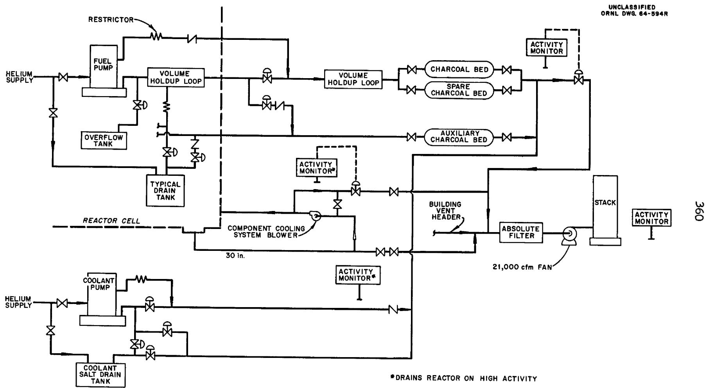  
Fig. 12.1. Schematic Diagram of Off-Gas System.

instrument box located in the lower portion of the vent house. From here it continues as a 1/4-in. pipe in an underground shielded duct to an underground valve box and then to the charcoal bed cell. This cell is located below grade just south of the vent house, as shown in Fig. 3.2. The cell was an existing facility consisting of a 10-ft-diam x 22.7-ft-deep reinforced concrete pit with a 3-ft thick removable concrete cover.

The off-gas pipe, line 522, connects to three vertical 20-ft high U-tubes of 3-in. pipe which provide about $7\mathrm{ft}^3$ of holdup volume and an additional one hour of residence time. The gas then enters one of two activated charcoal beds, the other bed acting as a spare. Each of the two beds consists of two vertical sections of U-tubes with the pipe size varying from 1-1/2 in. to 6 in., and each containing about $22\mathrm{ft}^3$ of activated charcoal. The charcoal bed cell is filled with water and the beds are cooled by the water flow through the cell.

The effluent from the charcoal beds, which consists primarily of the helium carrier gas*, flows through an underground 1/2-in. pipe to an underground valve box and then to a filter pit located about 75 ft south of Building 7503. (See Fig. 9 and Section 4.7) The reinforced concrete filter pit is about 21 x 29 ft, varies from 5-1/2 ft to 7-1/2 ft in depth, and is covered by 1-1/2-ft-thick concrete roof plugs. The off-gas mixes with about 21,000 cfm of air drawn through the filters by a 50-hp fan (an identical fan is installed as a spare) and, thus massively diluted, is discharged from a 3-ft-diam x 100-ft-high steel stack located about 110 ft south of Building 7503.

Off-gas vented from other points in the MSRE system is handled similarly and utilizes much of the same equipment. The gas discharged from the fuel drain tanks flows through a 1/2-in. pipe crossing the coolant salt area to the aforementioned instrument box at the vent house, and to an auxiliary charcoal bed located in the charcoal bed cell. The isotopes in this stream have already decayed to reduce the heat release rate sufficiently to permit use of larger diameter pipe for this charcoal

bed. Two vertical U-tube sections of 6-in. pipe contain about $16\mathrm{ft}^3$ of activated charcoal. The outflow of this bed joins the flow from the main charcoal beds, and other off-gas streams, and is monitored, filtered and diluted before discharge up the off-gas stack to the atmosphere.

Cover gas vented from the coolant salt circulating pump bowl and from the coolant salt drain tank bypasses the charcoal beds in the off-gas system, but is monitored and filtered before discharge.

The cell atmosphere gas is evacuated from the reactor containment vessel and the drain tank cell by blowers located in the special equipment room. The blower discharge, after passing through a gas cooler, is for the most part, returned to the cells to cool specific items of equipment, such as the upper portion of the fuel circulating pump bowl. (The component cooling system is described in Section 16.) A small side stream of the blower discharge is vented through the off-gas system to atmosphere to maintain the cells below atmospheric pressure. This l-1/2-in. line passes through the vent house, where the gas is monitored, and may be sampled when necessary, before being filtered and discharged up the stack.

The filters, stack fans, and stack are described in Section 13.

# 12.2 Flowsheet

The off-gas system flowsheet is shown in Fig. 12.2 (ORNL Dwg D-AA-A-40883). The origin of the lines venting to the off-gas system are, in general, not shown in Fig. 12.2, but on the flowsheets for the particular items of equipment involved.

The off-gas line from the fuel circulating pump bowl, line 522, is $1/2$ -in. pipe but changes to $4$ -in. pipe a short distance from the pump and extends for about 68 ft inside the reactor cell to provide a holdup volume of about $6 \mathrm{ft}^3$ and a residence time of about one hour. The line continues as $1/2$ -in. pipe through the cell wall penetration and across the coolant drain cell as $1/4$ -in. pipe to an instrument box located in the lower portion of the vent house. In this box the flow passes through a hand valve, V-522-A, a porous filter, and then a pressure control valve, PCV-522. This valve maintains a constant pressure of $\sim 5$ psig in the pump bowl by throttling the sweep gas discharge. (The flow rate of the

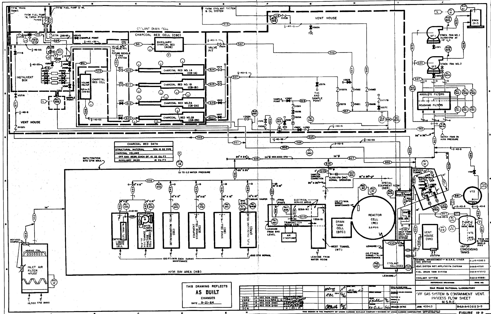

sweep gas is largely determined by the control valve and flow indicator on the helium supply to the pump bowl line 516.) Provisions are made at each side of the pressure control valve for a future gas sampling station (valves V-522-B and V-522-C). A differential pressure cell, PdI-556, is connected at this point and to line 557 downstream of the charcoal bed to indicate the pressure drop due to gas flow across the bed.

Oil seeping past the lower rotary shaft seal on the fuel circulating pump flows through the $1/2$ -in. line $524$ to outside the reactor cell and to an oil catch tank in the special equipment room. Line $524$ is shielded with $1-1/2$ in. of lead inside the reactor cell to protect the oil from radiation damage. The estimated oil flow is less than $40~\mathrm{cc/day}$ and the accompanying helium flow is about $0.07~\mathrm{liters/min}$ . The oil catch tank, waste oil receiver and connecting piping are shown on the fuel salt circulating system flowsheet, Fig. 5.3. The equipment is described in Section $5.4.1.5$ . The gas flow leaving the oil catch tank, stripped of oil, passes through a sintered disc filter, a capillary flow restrictor which limits the flow to the above-mentioned $0.07~\mathrm{liters/min}$ , and a capillary flowmeter, FIA- $524$ . Line $524$ continues as a $1/2$ -in. sched $40$ stainless steel pipe to the instrument box in the vent house, where it changes to $1/4$ -in. pipe. The line contains a branch connection at this point leading to a sampling valve, V- $524$ . After passing through a check valve, CV- $524$ , line $524$ joins the above-mentioned line $522$ downstream of the control valve, PCV- $522$ .

Continuing with the discussion of the off-gas line from the fuel pump bowl, line 522, a $1/4$ -in. sched 40 pipe leads from PCV-522 in the instrument box through the underground valve box to the hold-up U-tubes in the charcoal bed cell. This water-cooled volume of about $7 \mathrm{ft}^3$ provides an additional one hour of delay time and reduces the amount of heat emission that would be generated in the charcoal beds. The gas leaves the holdup volume via line 556, a $1/2$ -in. pipe connection to the distributing header for the main charcoal beds, line 550.

Lines 620, 621, 622 and 623, each containing a hand valve, lead from the off-gas distributing header to each of the four sections of the main charcoal bed. Each of the four sections contains about $22\text{ft}^3$ of activated charcoal. Any two of the four sections are capable of handling

the continuous off-gas flow of $\sim 4.25$ liters/min. The header, line 550, also has a capped-tee connection for the possible future addition of a helium recycle plant.

The gas discharge lines from the four sections of the charcoal bed, lines 624, 625, 626 and 627, each contain a hand valve in a valve box adjacent to the charcoal bed cell and has an extension to bring the handle to grade level. The four lines join to form line 557, which has a temporary vacuum connection, valve V-577-A, a check valve, CV-557-A, a hand block valve, V-577-B, and a radiation monitor, RIA-557. On indication of an abnormal level of activity this monitor would cause closure of the block valve, HCV-557-C. The off-gas line from the auxiliary charcoal bed, line 562, and the vent from the cooling salt drain tank and the lubricating oil storage tanks, line 560, connects to line 557 upstream of the radiation monitor.

The off-gas vented from the fuel drain tanks and the flush salt tank flows through lines 573, 575 and 577, respectively, to form line 561 leading to the off-gas system. Each of these three lines contains a control valve, as shown on the fuel drain tank system flowsheet, Fig. 6.1. Line 561 is contained within a l-in. pipe in its route from the drain tank cell, through the reactor cell and coolant drain cell, to the instrument box in the vent house. It continues as a l/2-in. line from this box to the valve pit and then to the auxiliary charcoal bed in the charcoal bed cell.

During initial filling of the fuel system with salt it will be necessary to vent a relatively large volume of cover gas from the system at flow rates of up to about 1 cfm (STP). This can be accomplished through line 533, which connects the fuel pump bowl vent, line 522, with the connection to the auxiliary charcoal bed, line 561. This 1/2-in. cross connection contains a check valve to prevent back flow, CV-533, and a control valve, HCV-533.

The gas vented from the sampler-enricher through line 542 is shown on the fuel system process flowsheet, Fig. 5.3. This $1/2$ -in. pipe joins line 561 inside the reactor cell and is vented through the auxiliary charcoal bed along with the gases from the drain tanks, etc.

The 1-1/2-in. cell evacuation connection, line 565, leading from the discharge of the blowers in the special equipment room to the vent house,

filter pit and stack, is cross connected through line 571 to line 561. (Line 565 will be described subsequently.) This connection, which contains a check valve, CV-571, and a hand valve V-571, allows the reactor cell to be evacuated through the auxiliary charcoal bed if there has been a release of activity within the cell.

The 1/2-in. effluent from the auxiliary charcoal bed flows through line 562, which joins line 557 and 565 in the vent house upstream of the radiation monitor and block valve, for discharge through the filters and up the stack. Before making the juncture, line 562 contains a hand valve in the valve pit at the charcoal bed cell, V-562-A, a check valve in the vent house, CV-562, followed by another hand valve V-562-C. Upstream of the check valve, a valved connection, V-562-B, is provided as a temporary vacuum connection.

The coolant drain tank, CDT, is vented to the off-gas system through line 527, and then through line 547 and control valve HCV-547, to join line 560. These lines, and those described in the next two paragraphs, are shown on the coolant system flowsheet, Fig. 8.1.

The coolant salt circulating pump, CP, has its bowl vented through line 528. This 1/2-in. pipe is provided with a porous filter ahead of the control valve, PCV-528. This control valve has a maximum capacity of 0.623 liters/min. It is followed downstream by a check valve, CV-528 (located in the vent house), and a radiation monitor, RIA-528. The check valve prevents backflow from line 560. The monitor provides an early warning in event the coolant salt circulating system becomes contaminated through a leak in the main heat exchanger. It also indicates whether a radiation alarm by the monitor on line 557 is attributable to such a heat exchanger leak or to contaminants from other potential sources which flow past this monitor.

The gas space of the coolant salt drain tank and the vapor space in the coolant salt circulating pump bowl have the pressure equalized by being interconnected through line 536 and HCV-536, which joins the above-mentioned drain tank vent, lines 527 and 547, with the pump bowl vent, line 528. The connection to line 528 is upstream of the filter in order to bypass it and the control valve, PCV-528, when the system is being filled with salt. An

additional 1/2-in. cross connection is made between these two lines through line 527 and HCV-527, to permit the rapid exchange of cover gas for quick drainage of the coolant salt from the circulating system.

Line 534 from the vapor space of the coolant circulating pump oil supply tank, OT-2, is shown on the oil system flowsheet, Fig. 5.25. (ORNL D-AA-A-40885) This line contains a hand valve, V-534-A, and a pressure control valve, PCV-510-A2. This control valve is set to open at a slightly higher pressure than the normal operating pressure in the tank (~10 psig), and thus serves to protect the tank from a pressure buildup due to a leaky cover-gas supply valve, PCV-510-Al. The control valve is followed by a check valve, CV-534, a hand valve, V-534-B, and two capped sample taps. These taps can be used to check for leakage through the check valve. The hand valves on each side of the control and check valves permit isolation for maintenance purposes. The vented gas from the fuel circulating pump oil supply tank, OT-1, is similarly equipped, as shown on the same flow-sheet, and joins line 534 downstream of the valve, V-534-B, for routing across the coolant cell to combine with the aforementioned line 527.

In summary, line 560 vents off-gas from the coolant drain tank, the coolant pump bowl, the coolant pump oil catch tank, and the fuel and coolant pump lubricating oil supply tanks. The vented gas flows past a radiation monitor-controlled block valve, HCV-557-C, to the filter pit for subsequent dilution and discharge up the off-gas stack.

A portion of the gas discharged by the component cooling system blowers, described in Section 16, is diverted through line 565 to the off-gas system to maintain the reactor and drain tank cells below atmospheric pressure. (The point where line 565 branches from line 917 is shown on the fuel system flowsheet, Fig. 5.3. The remainder of line 565 is shown on the off-gas system flowsheet, Fig. 12.2.) Line 565 passes from the special equipment room through the coolant drain cell to the vent house, where it contains a radiation monitor, RIA-565. A $3/4$ -in. branch connection downstream of the monitor, line 566, permits returning 20 to 100 cfm (STP) of the gas back to the component cooling system via lines 922 and 930. Line 566 contains a check valve, CV-566, to prevent backflow, and a hand valve, V-566. The remainder of the cell atmosphere gas ( $5\% \mathrm{O}_2$ , $95\% \mathrm{N}_2$ ) flows through a control block valve, which receives its signal from the radiation monitor.

The reactor cell can be evacuated intermittently at $\sim 100$ cfm (STP) through valve V-565-C and check valve CV-565, or by a continuous small flow of about 1 liter/min through a bypass around V-565, line 569. This 1/4-in. bypass line contains a ceramic filter, two hand valves, V-569-A V-569-B, a check valve CV-569, and a wet test meter to measure flow, FqI-569. Sample taps on line 565 and on line 569, with valves V-565-B and V-569-C, respectively, allow installation of a sample bomb between the two points. The aforementioned line 557 connects to line 565 in the vent house before it continues to the filter pit.

# 12.3 Holdup Volumes

The highly radioactive gas from the fuel circulating pump bowl is held up for about 1-1/2 hrs to allow the short-lived fission-product isotopes to decay and thereby reduce the heat generated in the charcoal bed.

Based on an average off-gas temperature inside the reactor cell piping of $500^{\circ}\mathrm{F}$ , a specific activity in the gas of 0.15 watts/cc, an ambient cell temperature of $150^{\circ}\mathrm{F}$ , and an average temperature of $100^{\circ}\mathrm{F}$ for the gas in the charcoal bed holdup volume, the total holdup volume requirement was estimated to be about 13 ft $^3$ . The minimum holdup time is one hour. $^{148}$ At design flow rates, 13 ft $^3$ of holdup volume provides 1-l/2 hrs of residence time.

About 6 ft³ of the holdup volume is provided inside the reactor cell upstream of the pressure control valve PCV-522. This volume not only allows for the decay of fission-product gases and dissipation of heat to the cell atmosphere gas, but acts as a surge volume to provide for better action of the pressure control valve.[148] The holdup volume consists of 68 ft of 4 in., 304 stainless steel, sched 40 pipe. The 4 in. pipe circles the cell wall counter clockwise at the 831-1/2 ft elevation until reaching the north side of the cell where it doubles back in a flat "S" bend, dropping it to the 829-1/2 ft elevation. The pipe continues downstream at this elevation and bends up to terminate at a pipe reducer where the line size again becomes 1/2 in. to leave the reactor cell through the wall penetration. On the other side of the wall the line continues as 1/4-in.

sched 40 pipe contained within $3/4$ -in. sched 40 pipe. The $3/4$ -in. pipe is sealed at the cell wall but open to the instrument box in the vent house.

Additional holdup volume is provided in the charcoal bed cell in the form of six 19.8-ft lengths of 3-in. sched 10, 304 stainless steel, pipe connected in three vertical U-tube configurations, with $180^{\circ}$ bends at the bottom and each leg capped at the top. The U-tubes are connected in series by 1/2-in. piping to give a total volume of about 7 ft $^3$ . (See ORNL Dwg. E-JJ-A-41519) The U-tubes are immersed in water for cooling, as is the other equipment in the charcoal bed cell.

# 12.4 Off-Gas Charcoal Beds

# 12.4.1 Main Charcoal Beds

The radioactive fission-product gases in the off-gas stream have an average residence time on the activated charcoal of about 90 days for the xenon and 7-1/2 days for the krypton.

The charcoal beds were designed on the basis of a 10-Mw reactor power level, assumption of 50-gpm complete removal of fission-product gases from fuel salt in the pump bowl and a 2.5 ft³ of gas space in the pump bowl at $1200^{\circ}\mathrm{F}$ . The maximum rate of helium purge gas flow was taken as 6,000 liters/24 hrs (STP). The minimum holdup time for the xenon was fixed at 90 days and the corresponding time for the krypton as 7-1/2 days. The maximum allowable charcoal bed temperature was assumed to be $250^{\circ}\mathrm{F}$ and the maximum cooling water temperature as about $85^{\circ}\mathrm{F}$ . Flow rates to the charcoal bed were calculated by the method of Stevenson, using nuclear data from Blomeke and Todd. Data sheets were prepared using an existing IBM 7090 program. The activity of the xenon and krypton as a function of time after leaving the pump bowl, the charcoal bed temperature for various flow rates, and the activity leaving the off-gas stack as a function of holdup time, are shown in Figs. 12.3, 12.4, and 12.5. (An outline of the calculation procedures is given in Ref. 148.) The atom flow rates for a minimum flow of 1,000 liters/day and maximum flow of 5,000 liters/day, are given in Table 12.2.

Unclassified

ORNL DWG 64-8836

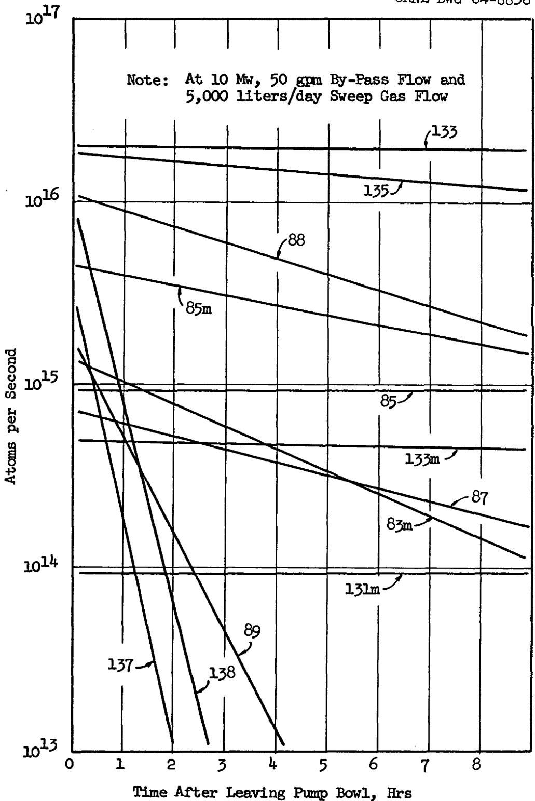  
Figure 12.3. Activity of Fission-Product Isotopes of Xenon and Krypton in Pump Bowl Off-Gas.

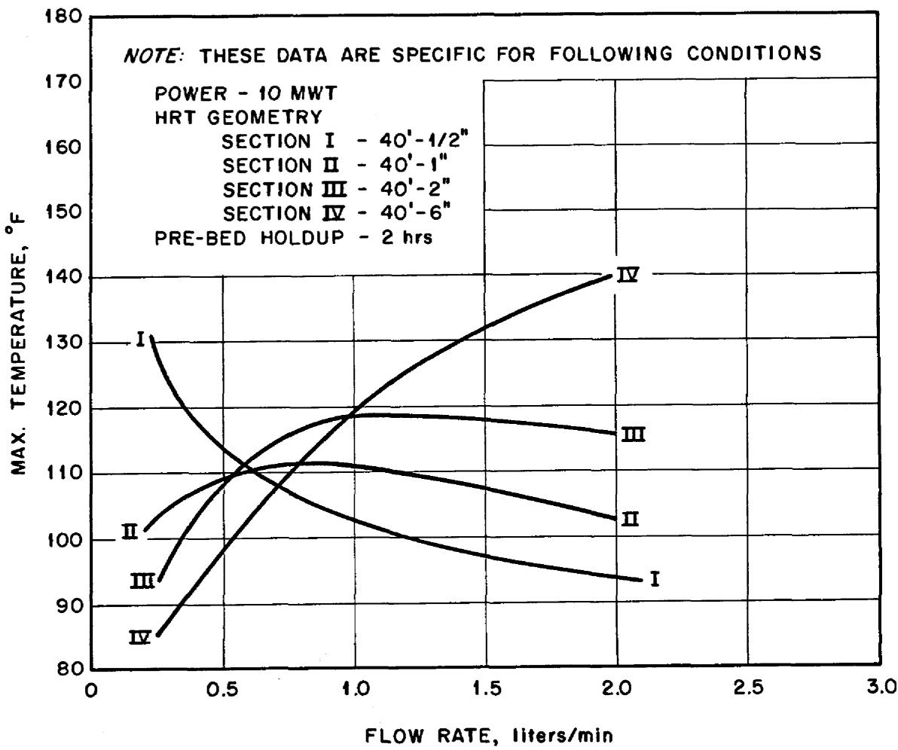  
Fig. 12.4. Estimated Charcoal Bed Temperatures as Function of Flow Rate Through the Bed.

Unclassified ORNL DWG 64-8837

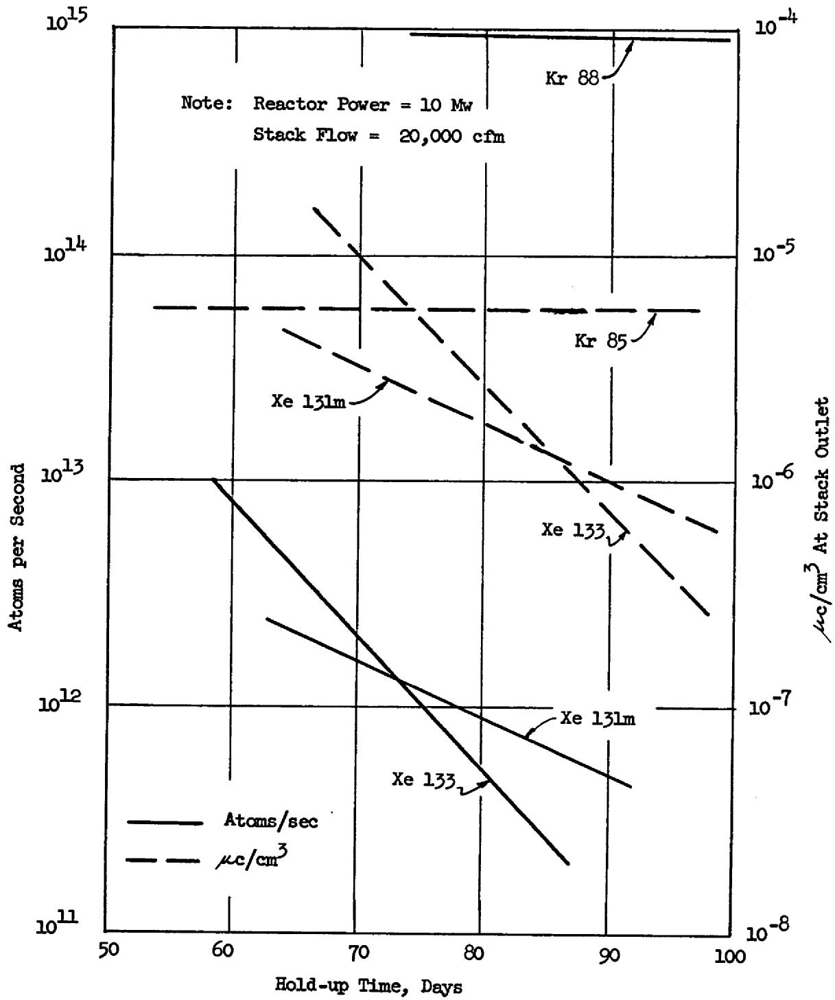  
Figure 12.5. Concentration of Xenon and Krypton at Off-Gas Stack Outlet.

Table 12.2 Atom Flow Rate Emerging from Fuel Pump Bowl   

<table><tr><td rowspan="2">Isotope</td><td colspan="2">Atoms per second</td></tr><tr><td>1,000 liter/24-hr Purge Rate</td><td>5,000 liter/24-hr Purge Rate</td></tr><tr><td>83mKr</td><td>1.15 x 1015</td><td>1.35 x 1015</td></tr><tr><td>85mKr</td><td>4.15</td><td>4.46</td></tr><tr><td>85Kr</td><td>0.93</td><td>0.93</td></tr><tr><td>87Kr</td><td>5.95</td><td>7.28</td></tr><tr><td>88Kr</td><td>9.53</td><td>10.73</td></tr><tr><td>131mXe</td><td>0.090</td><td>0.093</td></tr><tr><td>133mXe</td><td>0.50</td><td>0.50</td></tr><tr><td>133Xe</td><td>20.0</td><td>20.10</td></tr><tr><td>135Xe</td><td>18.1</td><td>18.82</td></tr></table>

There are two charcoal beds connected in parallel, and each is capable of handling the full off-gas load of the MSRE. Each bed consists of two vertical sections containing, first, 80 ft of 1/2-in. sched 10 pipe, 80 ft of 3-in. sched 10 pipe, and then 80 ft of 6-in. sched 10 pipe. The smaller pipe sizes are used on the inlet end to provide more surface-to-volume ratio for the dissipation of heat to the surrounding water. The effect of the pipe size on the bed temperature in the first section is shown in Fig. 12.6. The overall height of the vertical sections is about 20 ft. (See ORNL Dwg E-JJ-B-41519 through 41524) All piping is 304 stainless steel and the system is of all-welded construction with each joint X-rayed after fabrication.

The total volume of each bed (two sections) is $44\mathrm{ft}^3$ , requiring about 1,455 lbs of charcoal for filling.* The charcoal is Pittsburg Type PGB 6 x 16, a type that has proven satisfactory in static and dynamic absorption tests. Each section has a maximum flow rate of 2.1 liters/min. The centerline temperatures calculated for several flow rates are shown in Fig. 12.4. The temperatures are measured by a thermocouple at the inlet of each different pipe size in each section. The maximum pressure drop is estimated to be 1.5 psi.

# 12.4.2 Auxiliary Charcoal Bed

Since the auxiliary charcoal bed is used intermittently, there is enough time between periods of use for fission-products to decay to levels where a breakthrough of activity from the bed is highly improbable. Further, the specific activity of the gas passing through the bed is low enough to make heat release in the bed only a minor consideration.

The auxiliary bed is designed to contain $140 \, \text{ft}^3$ of gas (STP). The maximum design flow rate is 1 cfm (STP).

The bed consists of two vertical U-tube sections of 6-in. sched 10, 304 stainless steel pipe. The legs are about 19.21 ft long connected by short-radius $180^{\circ}$ bends at the bottom and with 1/2-in. pipe connecting the capped tops in series. The total amount of charcoal in both

Figure 12.6. Maximum Estimated Temperature in First Section of Charcoal Bed vs Pipe Diameter.   
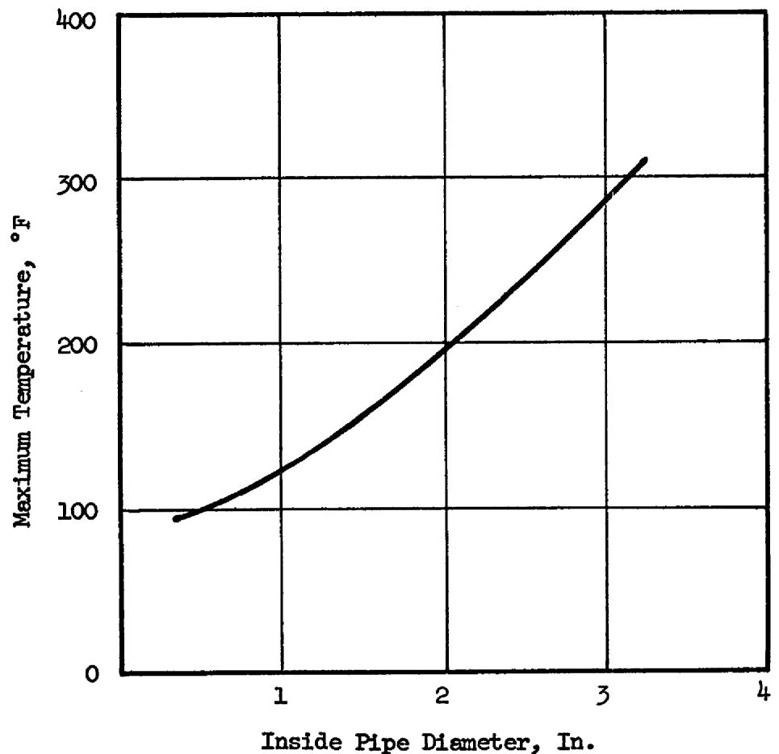  
Power $= 10$ Mw   
Bypass Stream Flow $= 50$ gpm   
Sweep Gas Flow $= 4.2$ liters/min (total) 1.05 liters/min (bed)   
Pre-bed Holdup $= 2$ hrs

sections is 585 lbs and is of the type used in the main charcoal beds. A 3-in. thickness of stainless steel wool at the top of the leg prevents movement of the charcoal. The inlet temperature to each section is measured by a thermocouple in a well on the centerline of the pipe. Fabrication details are shown on ORNL Dwg E-JJ-B-41519 through 41524.

# 12.5 Piping, Valves and Filters

# 12.5.1 Piping

All piping inside the reactor and drain tank cells is seamless $30^{\frac{1}{4}}$ stainless steel, sched 40. In most cases this pipe wall thickness was not governed by internal pressure considerations but was selected to provide resistance to mechanical damage during installation and maintenance of the reactor. The piping outside the containment areas is sched 40 carbon steel. Fittings used with the stainless steel piping are butt-welded. Some valves, however, are socket-welded, or flanged, as may be noted in the off-gas system valve tabulations, Tables 12.3, 12.4, and 12.5. The carbon steel piping is either screwed or welded, depending upon the accessibility for inspection and maintenance and upon the seriousness of the situation developing from a possible leak.

The main off-gas pipe, line 522, and the auxiliary off-gas pipe, line 561, are each contained within another pipe in the run between the containment vessel wall and the valve box in the vent house. Both inner and outer pipes are seamless $304$ stainless steel, sched 40, and all joints are butt-welded and X-ray inspected. The annular space is pressure-tight, sealed at the reactor cell wall and open to the instrument box atmosphere. The slight vacuum in the box produced by the suction of the stack fans provides assurance that any out-leakage of radioactive gases will be carried to the filters and the off-gas stack. The monitors on the lines leading to the filters would detect any radioactivity escaping through such leaks.

# 12.5.2 Valves

The air-operated valves in the off-gas system are of the flanged type. All others inside the containment vessel were welded into the

piping either by butt or socket-type welds. The valves in the off-gas system are listed in Tables 12.3, 12.4, and 12.5.

Hand valves in piping which must be shielded, such as those in the underground valve box at the charcoal bed cell, have special extension handles, as shown on ORNL Dwg D-JJ-A-56255.

# 12.5.3 Filters

12.5.3.1 Porous Metal Filter in Line 522. - A filter is provided in line 522 upstream of the control valve, PCV-522, to protect it from possible damage or plugging. The filter housing is a section of $1 - 1 / 2$ -in. 304 stainless steel pipe about 20 in. long with a cap welded on the bottom and a ring-joint flange at the top, as shown in Fig. 12.7. The filter element is a fluted porous metal cylinder $1 - 1 / 32$ -in. diam x 17-in. long. The pore diameter is 40 microns and the surface area is about 6 in.²/in. of length. The filter element is screwed to a $1 / 2$ -in. coupling welded to the $1 - 1 / 2$ -in. x $1 / 2$ -in. reducing flange which effects the top closure. The $1 / 2$ -in. inlet pipe, line 522, enters the side of the filter housing. The $1 / 2$ -in. outlet pipe connects the top flange to the control valve HCV-522. The pressure loss due to flow through the filter is negligible at the maximum design flow rate of 4.2 liters/min.

12.5.3.2 Porous Metal Filters in Lines 524, 526, 528 and 569. - The filters in lines 524 and 526 are upstream of capillary flow restrictors to provide protection against plugging. The filter in line 528 is upstream of the control valve, HCV-528. Line 569 leads to a sampling station and the filter is installed upstream of the sampling valve, V-569-D. The four filters are Nupro Filters, Type F, No. SS-P4-60, with modified 30,000-psi Autoclave connections. The body of each filter is 3/4-in. diam x 3 in. long (before modification) and contains a porous metal thimble with a surface area of 1.386 in². The nominal pore diameter is 60 microns. The body has a threaded closure with a metal O-ring seal. The units are constructed of 3l6 stainless steel. The pressure loss due to flow at design conditions of 1 liter/min is negligible.

Table 12.3 Off-Gas System Air-Operated Valves   

<table><tr><td>Valve Number</td><td>MSRE
Specification</td><td>Fail
Position</td><td>CV</td><td>Description</td></tr><tr><td>PCV-510-A2</td><td>18</td><td>Open</td><td>0.0035</td><td>1/2-in. NPS, l-in. integral ring joint, through bolts.</td></tr><tr><td>PCV-513-A2</td><td>18</td><td>Open</td><td>0.0035</td><td>&quot;</td></tr><tr><td>PCV-522-A</td><td>18</td><td>Open</td><td>0.02</td><td>Bellows-sealed, 347 or 304 stainless steel.</td></tr><tr><td>HCV-527-A1</td><td>18</td><td>Open</td><td>3.5</td><td>&quot;</td></tr><tr><td>PCV-528-A</td><td>18</td><td>Open</td><td>0.003</td><td>&quot;</td></tr><tr><td>HCV-533-A1</td><td>18</td><td>Open</td><td>3.5</td><td>&quot;</td></tr><tr><td>HCV-536-A1</td><td>18</td><td>Open</td><td>3.5</td><td>&quot;</td></tr><tr><td>HCV-547-A1</td><td>18</td><td>Open</td><td>3.5</td><td>&quot;</td></tr><tr><td>HCV-577-C</td><td>39</td><td>Closed</td><td>3.0</td><td>&quot;</td></tr><tr><td>HCV-573-A1</td><td>18</td><td>Open</td><td>3.5</td><td>&quot;</td></tr><tr><td>HCV-575-A1</td><td>18</td><td>Open</td><td>3.5</td><td>&quot;</td></tr><tr><td>HCV-577-A1</td><td>18</td><td>Open</td><td>3.5</td><td>&quot;</td></tr><tr><td>HCV-565-A1</td><td>35</td><td>Closed</td><td>21.0</td><td>1-1/2-in. NPS, weld end, Teflon-packed bon-net, Teflon seat, 304 stainless steel.</td></tr></table>

Table 12.4 Off-Gas System Check Valves   

<table><tr><td>Valve Number</td><td>Spec. No.</td><td>Description</td></tr><tr><td>524</td><td>CVS-1</td><td>Circle Seal - Dwg. 705</td></tr><tr><td>528</td><td>CVS-1</td><td>3/8&quot; Autoclave connections</td></tr><tr><td>534</td><td>CVS-1</td><td>Soft seat (Teflon)</td></tr><tr><td>535</td><td>CVS-1</td><td>Spring-loaded</td></tr><tr><td>557A</td><td>CVS-1</td><td>300 series stainless steel</td></tr><tr><td>557B</td><td>CVS-1</td><td>&#x27;&#x27;</td></tr><tr><td>560</td><td>CVS-1</td><td>&#x27;&#x27;</td></tr><tr><td>562</td><td>CVS-1</td><td>&#x27;&#x27;</td></tr><tr><td>573</td><td>CVS-5</td><td>&#x27;&#x27;</td></tr><tr><td>575</td><td>CVS-5</td><td>&#x27;&#x27;</td></tr><tr><td>577</td><td>CVS-5</td><td>&#x27;&#x27;</td></tr><tr><td>565</td><td>CVS-6B</td><td>Circle Seal, No. 258-l2PP
1-1/2-in. pipe, threaded,
brass</td></tr><tr><td>566</td><td>CVS-6A</td><td>Circle Seal, No. 259-T1-6PP,
3/4-in. pipe threads, seal-
welded, 300 stainless steel</td></tr><tr><td>569</td><td>CVS-7</td><td>Nupro No. 4 C4, l/4-in. pipe
threads, brass</td></tr></table>

Table 12.5 Off-Gas System Hand Valves   

<table><tr><td>Valve Number</td><td>Specification</td><td>Description</td></tr><tr><td>534A</td><td></td><td rowspan="4">Hoke, TY 440, socket-weld to 1/4-in. OD tube, bellows- sealed, 316 stainless steel</td></tr><tr><td>534B</td><td rowspan="3">HVS-1</td></tr><tr><td>535A</td></tr><tr><td>535B</td></tr><tr><td>557B</td><td></td><td rowspan="3">Hoke, TY 440, socket-weld to 3/8-in. OD tube, bellows- sealed, 316 stainless steel</td></tr><tr><td>560</td><td rowspan="2">HVS-1A</td></tr><tr><td>562C</td></tr><tr><td>525A</td><td></td><td rowspan="2">Crane, socket weld, 1/2-in. NPS, bellows-sealed, Monel</td></tr><tr><td>525B</td><td></td></tr><tr><td>529</td><td rowspan="4">SMD</td><td rowspan="4"></td></tr><tr><td>720A</td></tr><tr><td>720B</td></tr><tr><td>720C</td></tr><tr><td>770</td><td></td><td></td></tr><tr><td>557A</td><td></td><td rowspan="3">Hoke, LX 473, socket weld, 1/2-in. NPS, bellows-sealed, 316 stainless steel</td></tr><tr><td>557C</td><td>HVS-2</td></tr><tr><td>562</td><td></td></tr><tr><td>522A</td><td>HVS-3</td><td>Same as HVS-2.</td></tr><tr><td>522B</td><td></td><td></td></tr><tr><td>522C</td><td></td><td></td></tr><tr><td>524</td><td></td><td></td></tr><tr><td>561</td><td></td><td></td></tr><tr><td>562A</td><td></td><td></td></tr><tr><td>571</td><td></td><td rowspan="4">Fulton Sylphon (HRP 303), 1/4-in. NPS, butt weld, bellows-sealed, 347 stain-less steel.</td></tr><tr><td>620</td><td>HVS-4</td></tr><tr><td>621</td><td></td></tr><tr><td>622</td><td></td></tr><tr><td>623</td><td></td><td></td></tr><tr><td>624</td><td></td><td></td></tr><tr><td>625</td><td></td><td></td></tr><tr><td>626</td><td></td><td></td></tr><tr><td>627</td><td></td><td></td></tr><tr><td>590</td><td rowspan="2">SSD</td><td rowspan="2">Crane, socket weld, 1/2-in. NPS, stainless steel.</td></tr><tr><td>591</td></tr><tr><td>565A</td><td rowspan="2">SMD</td><td rowspan="2">Crane, socket weld, 1-1/2-in. NPS, bellows-sealed, Monel.</td></tr><tr><td>565B</td></tr><tr><td>566</td><td>SMD</td><td>Crane, socket weld, 3/4-in. NPS, bellows-sealed, Monel.</td></tr><tr><td>565B</td><td></td><td rowspan="2">Hoke, RB 271, bar stock needle valve, packed, threaded, 1/4-in. NPS.</td></tr><tr><td>569A</td><td></td></tr><tr><td>569B</td><td></td><td rowspan="2">Hoke, RB 281, bar stock meter-ing valve, packed, threaded, 1/4-in. NPS.</td></tr><tr><td>569C</td><td></td></tr></table>

Unclassified

ORNL DWG 64-8840

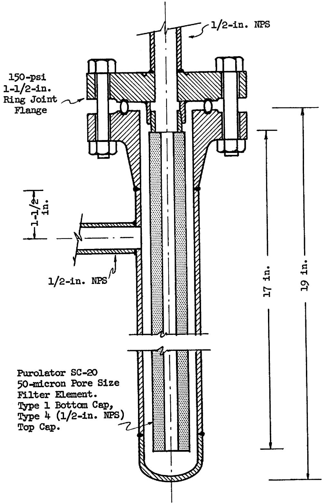  
Figure 12.7. Porous Metal Filter in Off-Gas Line 522.

# 13. CONTAINMENT VENTILATION SYSTEM

The containment ventilation system provides a continuous and controlled flow of air through all areas where radioactive or beryllium contamination is likely to occur. Such areas include the high-bay area, the reactor and drain tank cells (during maintenance), the six smaller special-purpose cells, the electric service areas, transmitter room, service tunnel, special equipment room, coolant cell, vent house, and charcoal bed cell.

The general pattern of the air flow is from the less hazardous to the potentially more hazardous areas and then to exhaust ducts where it is passed through absolute filters and monitored for radioactivity before release. In a broad sense, the air flow is from the north end of Building 7503 toward the exhaust stack at the south end.

The ventilated areas are operated at less than atmospheric pressure to assure that leakage of air is inward. With but few exceptions, such as in the change room, the concern is for maintaining this negative pressure rather than for ventilating at an established flow rate. To accomplish this, particularly when the ventilation rate must be increased to certain areas during abnormal or maintenance conditions, it may be necessary to sharply decrease the air flow into certain other areas.

# 13.1 Layout and General Description

The containment ventilation system utilizes either of two 21,000-cfm (nominal capacity) centrifugal fans located at the base of the 100-ft-high stack to induce air flow through the various containment areas in and adjacent to Building 7503. The estimated rates of air removal from these areas during normal reactor operation are shown in Table 13.1.

As shown in the simplified air flow diagram, Fig. 13.1, the bulk of the air (14,000 to 17,000 cfm) enters the main building at the northwest corner through an inlet air filter house. In addition to dust filters, this house contains steam-heated coils for warming the intake air during the winter months. A bypass damper in the house wall assures an air supply even though the filters become excessively clogged. Another counter-balanced bypass damper prevents the differential pressure between

(cfm)

Table 13.1. Estimated Containment Ventilation System Air Flow Rates During Normal Reactor Operation.   

<table><tr><td>Through supply-air filter house</td><td>14,000 - 17,000</td></tr><tr><td>Through change room</td><td>100 - 1000</td></tr><tr><td>Leaving high-bay at southeast corner</td><td>12,000 - 15,000</td></tr><tr><td>Leaving liquid-waste storage tank</td><td>0 - 100</td></tr><tr><td>Through liquid-waste cell</td><td>200 - 400</td></tr><tr><td>Through remote maintenance pump cell</td><td>200 - 1500</td></tr><tr><td>Through decontamination cell</td><td>200 - 1500</td></tr><tr><td>Through equipment storage cell</td><td>200 - 400</td></tr><tr><td>Through fuel processing cell</td><td>200 - 400</td></tr><tr><td>Through spare cell</td><td>200 - 400</td></tr><tr><td>Leaving south electrical service areaa</td><td>400 - 600</td></tr><tr><td>Leaving reactor and drain tank cells</td><td>0</td></tr><tr><td>Leaving coolant cell</td><td>800 - 1200</td></tr><tr><td>Leaving special equipment room</td><td>200 - 400</td></tr><tr><td>Through vent house</td><td>200 - 400</td></tr><tr><td>Leaving charcoal beds cell</td><td>0 - 100</td></tr><tr><td>Leaving service tunnel</td><td>400 - 600</td></tr></table>

aAir flow is from the transmitter room to the north electric service area, and then to the south service area (which includes the west tunnel).

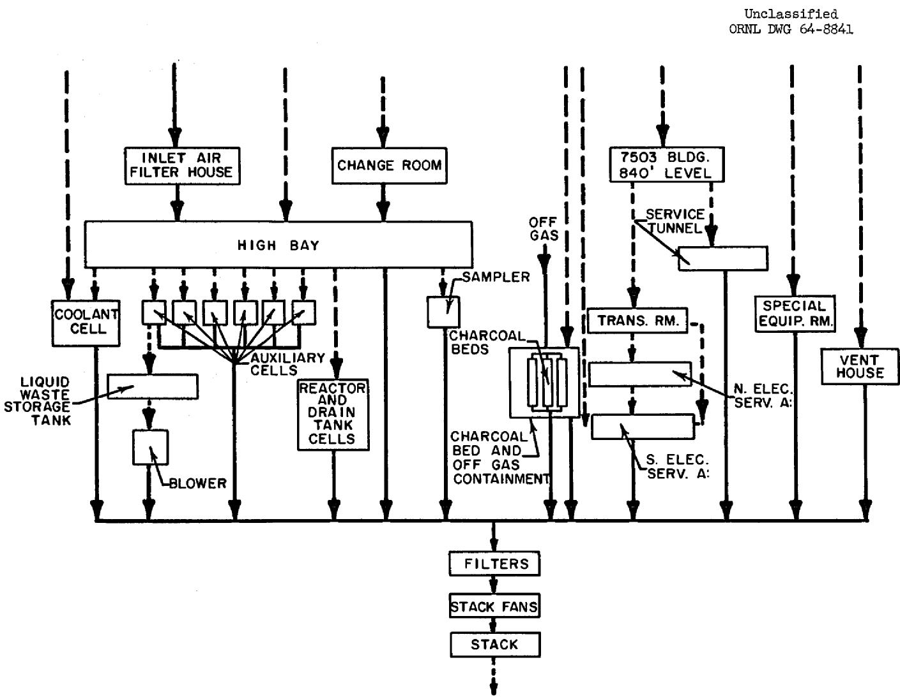  
Fig. 13.4. Schematic of Air Flow Diagram Containment Ventilation System.

the atmosphere and the high-bay area from becoming high enough to collapse the sheet-metal liner. The air enters the high bay between columns 2 and 3 at the 874-ft elevation. About 1000 cfm of air is also drawn into the high-bay area through the change, or locker, room located at the same level.

Exhaust ducts leading to the main intake ducts for the stack fans withdraw air from each of the six small cells located beneath the operating floor level,\* causing air to be drawn from the high-bay area down through the openings between the concrete roof blocks covering these cells. The ventilation rate for each cell varies from 200 to 1500 cfm, depending on the exhaust-duct damper settings. A blower on the exhaust from the liquid-waste storage tank maintains it at a lower pressure than that of the cell. Another exhaust duct pulls 400 to 600 cfm of air from the electric service area transmitter room, west tunnel, etc., the air having reached these rooms from the high-bay area through various stairways, passages, etc. The bulk of the air from the high-bay area (12,000 to 15,000 cfm) is normally exhausted at the operating floor level through two openings that flank the sampler-enricher station area. A hood above the samplers also provides ventilation during sampling.

The coolant cell is maintained at a lower pressure than the high-bay area. Air is exhausted from the cell through an opening in the south wall at about the 861-ft elevation. Air also enters the coolant cell through general leakage, etc., from outside the building and is only partially drawn from the high-bay area.

Air is also exhausted from the small vent house located at the south end of the main building. Air enters the house through a filter in a small opening in the wall and leaves through a small duct leading to the main intake duct for the stack fans.

During maintenance operations in the reactor or drain tank cells, air can be exhausted from the cells to cause a downflow of air through the openings where concrete roof plugs have been removed. This positive

downward movement of 100 fpm, or more, materially aids in preventing escape of airborne contaminants into occupied building areas. To accomplish this circulation, 15,000 cfm of air is withdrawn through a 30-in.-diam, shadow-shielded opening at the bottom of the southwestern sector of the reactor-cell containment vessel.* The air then flows through a 30-in.-diam carbon steel duct across the coolant drain cell and through the special equipment room to a valve station in the service tunnel containing two 30-in.-diam motor-operated butterfly valves in series. The valves are closed during reactor operation and are opened only when roof plugs have been removed for maintenance and cell ventilation is required. (A 12-in. sched-40 pipe takes off the 30-in.-diam duct upstream from the butterfly valves and leads to the reactor containment vessel vapor-pressure suppression system, as described in Section 17.) The 30-in.-diam duct continues underground to the vicinity of the filter pit, where it turns to join the main 36-in.-diam duct leading to the pit.

The two motor-driven fans and the 100-ft steel stack for discharge of the air are located about 110 ft south of Building 7503. (Off-gas from the charcoal adsorber beds is also vented through the filter pit and stack, see Section 12.)

The containment ventilation system is provided with numerous manually positioned dampers to adjust the air flow. Differential-pressure cells indicate direction of air flow, filter resistances, etc. In general, all components in the system are commercially available.

The general layout of the containment ventilating system and key to drawings is shown on ORNL drawings D-KK-A-41024, D-KK-A-41062, and D-KK-D-41113.

# 13.2 Flowsheet

The flowsheet for the containment ventilation system is shown in Fig. 12.2.

Air is drawn into the inlet-air filter house at a rate of about 15,000 cfm through "Fiberglas" dust filters having a pressure drop (when

clean) of about 0.028 in. of $\mathsf{H}_2\mathsf{O}$ . A bypass damper in the side of the house is counter-weighted to open if the negative pressure exceeds 0.35 in. of $\mathsf{H}_2\mathsf{O}$ , and assures an air supply in event the filters become excessively dirty. After passing over a steam-heated extended-surface heating coil, the air is delivered to the high-bay area of the main building through a $40 \times 60$ -in. insulated duct, line 953. A manually set damper located in this line just above the filter house permits adjustment of the negative pressure in the high-bay area to 0.1 to 0.3 in. of $\mathsf{H}_2\mathsf{O}$ . A counter-weighted damper in the $30 \times 48$ -in. bypass duct, line 954, opens at a negative pressure of 0.45-in. of $\mathsf{H}_2\mathsf{O}$ to protect the high-bay liner from excessively low pressures. Air is also drawn into the high-bay area through the change room at an estimated rate of about 1000 cfm.

Air is exhausted from the liquid-waste cell, the remote maintenance pump cell, the decontamination cell, the equipment storage cell, the fuel processing cell, and the spare cell, by individual 12 x 12-in. ducts, lines 940 through 944. Each duct contains manually set dampers to balance the air flow and differential-pressure cells to indicate the cell pressure. The estimated ventilation rate for most cells is about 200 cfm during normal operation. An individual cell may have a ventilation rate as high as $\sim$ 1500 cfm during maintenance in that cell. Air finds its way into these six cells from the high-bay area through the openings between the concrete blocks covering the cells.

Line 944 exhausts air from both the liquid-waste cell and the remote maintenance cell. Gases vented from the waste storage tank in the liquid-waste cell are exhausted through a 6-in. pipe, line 948, to a blower in the adjoining remote maintenance pump cell; this location for the blower makes it more accessible for maintenance. The energy input of the 180 cfm blower is sufficient only to overcome the pressure loss due to flow in the 6-in. pipe and permit discharge directly into the exhaust duct, line 945, without backflow into the remote maintenance cell. Air in this cell, which is open to the high-bay area a major portion of the time, is exhausted through line 945. It is to be noted that the gases vented from the waste storage tank may at times be radioactive, such as when the caustic scrubber in the fuel reprocessing system is vented, or

possibly when the air-operated $(\sim 26~\mathrm{cfm})$ jet pumps are used to remove water from the drain tank cell and reactor containment-vessel sumps. The control system interlocks would cause the waste blower to stop on a loss of flow to the stack fans.

The inleakage through the seals in the sealed high-bay area is estimated to be less than 1000 cfm.

Air from the south electric service area is exhausted through a 12 x 12-in. duct, line 937, at a rate of about 600 cfm. Some of this air is drawn in through the transmitter room and from outside, but most of the flow is from the 840-ft level to the north electric service area and then to the south electric service area. A packaged air conditioner removes heat from the transmitter room in a closed air circulation cycle.

The six 12 x 12-in. ducts described above have manual dampers at the 853-ft elevation on the east wall of the high-bay area. They then combine in a manifold to form a 20 x 20-in. duct, line 936, then to a 26-in. duct, line 928, which runs south at the 873-ft elevation above the roof of the office area.

The bulk of the air is drawn from the high-bay area through an intake opening located at the southeast corner. About 15,000 cfm is removed through the 33-in.-diam duct, line 935. Two openings are provided for exhausting air into this line. A 9-in. side connection draws air from the exhaust hood at the sampler-enricher station. After the 26-in.-diam duct, line 928, and the 33-in.-diam duct, line 935, join above the roof of the office area, the duct size becomes 36 in. in diameter and continues as line 927 above ground to the entrance of the filter pit. A motorized damper, HCV-935, permits regulation of the total air flow.

Air is exhausted from the coolant cell through a 16 x 16-in. duct, line 934, with the intake opening at the 855-ft elevation. This duct contains a motor-operated damper at the 862-ft elevation. Another 16 x 16-in. duct, line 933, exhausts air from the coolant cell at the 862-ft elevation. Either one, or both, can be used for venting the coolant cell. During maintenance the flow rate may be about 1500 cfm. The nearby vent house is ventilated by drawing about 250 cfm through a filter in the wall of the vent house and exhausting it through line 959. This ll-in.-diam

duct connects to line 933 on the outside south wall of the main building. A manually operated damper in line 959 permits adjustment of the air flow to about 250 cfm.

The charcoal bed is ventilated by exhausting air through line 950. Air from the instrument box, which contains the valving for the charcoal-bed gas lines, is withdrawn through line 951. These two lines combine, and as line 950, join the $18 \times 18$ -in. duct, line 932. As mentioned above, line 932 joins the main duct leading to the filter pit, line 927.

The reactor and drain tank cells normally operate at about 2.0 psi below atmospheric pressure and with an atmosphere of about $95\%$ $\mathbf{N}_2$ and $5\%$ $\mathbf{O}_2$ . During maintenance operations, when concrete roof plugs are removed, the two butterfly valves are opened in line 930, to exhaust the cells and pull air from the high-bay area down through the opening. For openings of $150\mathrm{ft}^2$ , and smaller, the downward velocity will exceed 100 bpm. Under most maintenance circumstances, the openings will be small and the bulk of the air leaving the high-bay containment area will continue to be withdrawn through line 935 at the southwest corner of the building.

Two 30-in. butterfly valves are provided in line 930 rather than one to permit periodic testing for leak tightness of the valves. The space between the two valves may be pressurized with air through valve 930-C. The shaft seal can also be pressurized to test for leaks. A 2-in. bypass, line 955, is provided around the two butterfly valves to accommodate low flow rates. The space between the two valves in this line may also be pressurized with air through valve 955-C to check for leakage.

The gas supply for the component cooling system blowers is taken from line 930 just upstream of the butterfly valves through the 10-in.-diam line 522 (see Section 16).

The 12-in. pipe shown on the flowsheet as leaving line 930 upstream of the two butterfly valves leads to the reactor cell vapor-condensing system. This arrangement for emergency condensing of water vapor that might be generated in the cell in a major failure of equipment is described in Section 17.

A 12-in. ventilation pipe, line 931, from the service tunnel area joins the 30-in. pipe, line 930, just downstream of the two butterfly valves. This pipe exhausts air from the western end of the tunnel to

promote a positive flow of air toward that end. A 6-in. continuation of line 931, numbered 958, exhausts air from the special equipment room. Both of these lines contain manually operated dampers. The 30-in.-diam line 930 joins the main duct, line 927, above ground near the entrance to the filter pit.

The filter pit is arranged in three sections, each section having a prefilter followed by an absolute filter. The efficiency of the latter is $99.97\%$ for particles greater than $3\mu$ in size. Manually operated dampers are provided at the inlet and outlet of each section. Each of the six groups of filters is provided with differential pressure sensors to indicate the condition of the filters. Normally, all three sections are operated in parallel.

The two stack fans are ducted in parallel through lines 925 and 926, so that either may be used to exhaust the containment enclosures. Stack fan No. 1 will operate continuously, with the No. 2 fan in standby condition. Both manually operated dampers in the fan suction will remain open. The air-operated damper in the No. 1 fan discharge, FCD-925, will normally be open and that in the No. 2 fan discharge, FCD-926, will be closed. If the pressure increases upstream of the filters, as indicated by PI-927, the No. 2 fan will start, the No. 1 fan will stop, and the air-operated dampers will reverse position. This arrangement prevents backflow through the fan not in use.

The stack is equipped with a pitot tube, FI-S1, to indicate the flow and to transmit this information to the data logger. A radiation monitor, RIA-S1, is installed in the stack. Rain water accumulating in the stack is drained to the waste sump in the main building through a 2-in. stainless steel pipe.

# 13.3 Description of Equipment

# 13.3.1 Inlet-Air Filter House

13.3.1.1 House. The inlet- (or supply) air filter house serves as an enclosure for the dust filters and tempering coils for the entering air. The structure is 13 ft wide, 21 ft long, and 10 ft high; it has a concrete floor at an elevation of about 840 ft and is located

outside the northwest corner of the main building. The walls and roof are 14-gage corrugated steel siding welded to a channel and angle-iron supporting structure. A portion of the interior walls and roof is insulated with 1-1/2-in. of "Fiberglas" (type PF-617). The insulated section extends a distance of about 8 ft from the eastern end and surrounds the heating coil and the heated air plenum. Two steel doors are provided for access (see ORNL drawing D-KK-D-41123).

13.3.1.2 Heating Coils. The air heating coils are of the one-row, nonfreeze type, with welded steel headers and with copper tubes and aluminum fins. Three units are used, each with a face area of about 12.7 ft². Steam is supplied from the X-10 area at 250 psig and reduced to 60 psig at a 1-1/4-in. reducing valve located in the supply-air filter house. The combined capacity of the three units is sufficient to raise 16,000 cfm of air from $0^{\circ}\mathrm{F}$ to $85^{\circ}\mathrm{F}$ . The pressure drop across the coil is about 0.06 in. of $\mathsf{H}_2\mathsf{O}$ . The coils were tested with steam at 100 psig and with air at 400 psig. The coils were manufactured and tested in accordance with American Standards Specification DS-1R-17-78 and ORNL Specification XS-192, p. 7-5.

13.3.1.3 Air-Supply Filters. The filter medium is pleated 3/32-in.-thick "Fiberglas" arranged in $24 \times 28 \times 8 - 3 / 4$ -in.-thick units (American Air Filter type PL-24). The units are placed in three side-by-side, vertical V's, each leg of a V being two units wide and three units high, making a total of 36 units (see ORNL Specification XS-192, p. 6-2).

13.3.1.4 Louvers. Two steel louvers, each about 6 x 6 ft, with bronze insect screen, admit air to the west end of the inlet-air house. A 30 x 48-in. Louver is located between the filters and the heating coil, as will be discussed under Section 13.3.1.5, below.

13.3.1.5 Dampers and Ducts. A regulating damper is mounted in the horizontal position just above the intake-air house roof in the $36 \times 36$ -in. duct leading to the high-bay area, line 953. This steel, multi-blade damper is manually adjustable and can be locked in position (see ORNL drawing D-KK-A-41069).

The damper in the side of the inlet-air house between the filters and the heating coil is 29-5/8 x 47-5/8-in., is mounted vertically, has 16-gage steel blades, and has an adjustable counter-weight set to open

the damper at a negative air pressure of 0.35 in. of $\mathsf{H}_2\mathsf{O}$ . A similar damper, $29 - 5 / 8 \times 47 - 5 / 8$ in., horizontally mounted in the bypass duct, line 954, at the roof of the intake air filter house is weighted to open at a negative pressure of 0.45 in. of $\mathsf{H}_2\mathsf{O}$ (see ORNL drawing D-KK-A-41069).

The duct leading to the high-bay area is constructed of 20-gage sheet metal, insulated with $1 - 1 / 2$ in. "Fiberglas" weatherproofed board.

# 13.3.2 Liquid-Waste Tank Blower

The blower used to discharge gases from the top of the liquid-waste tank into the containment ventilation exhaust system is located in the remote maintenance pump cell. The blower is an ILG type P volume blower, 6-in. line type, having a capacity of 180 cfm.

# 13.3.3 Vent House

Air is drawn into the vent house through a $24 \times 24$ -in. louvered opening in the west wall. The filter installed in this opening uses a filter medium of "Fiberglas" and is an American Air Filter type PL-24, with 3/32-in.-thick type G "Airmat." It has a NBFU rating of Class I and has a rated pressure drop at 1000 cfm of 0.028 in. of $\mathsf{H}_2\mathsf{O}$ when clean. The actual flow is estimated to be a maximum of about 250 cfm.

# 13.3.4 Filter Pit

The filters in the filter pit are divided into three cells, or sections, and each section is provided with both roughing and absolute filters.

13.3.4.1 Roughing Filters. The roughing, or pre-filters, are a modified American Air Filter deep-bed, multiple-media, pocket type (see ORNL drawing D-KK-A-41075). The filtering media are a layer of spun glass 1/2 in. thick, made up of 3.25 micron fiber (No. 25 FG) and a 1/2-in.-thick layer of 1.25 micron fiber (No. 50 FG). The units are $27 \times 27 \times 36$ in. deep. The capacity is not less than 1000 cfm at a velocity of 20 bpm and an initial resistance of 0.6 in. of $\mathsf{H}_2\mathsf{O}$ . Seven of the filter units are installed in a horizontal rack in each of the three sections of the filter pit (see ORNL Specification XS-192, p. 6-3).

13.3.4.2 Absolute Filters. The absolute filters, which are downstream of the roughing filters in each of the three sections, are a "Fiberglas" fire-resistant, high-efficiency type. $^{153}$ The filter units are $24 \times 24 \times 11 - 1/2$ in. deep, and are arranged vertically, two across and three high, for a total of $24 ft^2$ of filter face area in each section. The minimum efficiency is $99.97\%$ for particles greater than 3 microns in size (DOP test*) at the design flow rate of 1170 cfm each. $^{153}$ The initial static pressure loss is 1.05 in. of $\mathsf{H}_2\mathsf{O}$ at a face velocity of 280 rpm. Operation is limited to $250^{\circ}\mathsf{F}$ .

# 13.3.5 Stack Fans

Two centrifugal fans are installed outdoors at the base of the containment ventilation system stack. One of the fans serves as a spare. The fans are identical except for the direction of rotation, fan No. SF-1 being counterclockwise and No. SF-2 clockwise. Each is driven by a 50-hp, $440\mathrm{-v}$ , 3-phase, 60-cycle, continuous-duty motor, through an adjustable V-belt drive. The fan blades are the backward-curved, nonoverloading type. The capacity of fan SF-1 was measured as 19,750 cfm at 9.2 in. of $\mathsf{H}_2\mathsf{O}$ and $1473~\mathsf{rpm}$ . Fan SF-2 delivered 20,500 scfm at 10.1 in. of $\mathsf{H}_2\mathsf{O}$ and $1584~\mathsf{rpm}$ . The minimum specified static efficiency is $83\%$ under rated conditions of 21,500 scfm and 10 in. of $\mathsf{H}_2\mathsf{O}$ negative pressure. The maximum outlet velocity is $3800~\mathsf{rpm}$ . The fan operating characteristics are shown in Fig. 13.2.

The fans are arranged for horizontal, bottom discharge, and the lowpoints of the scrolls are provided with a 1-1/2-in. drain line. The fans and motors are weather-protected for outdoor installation (see ORNL Specification XS-192, p. 6-4). The units were manufactured by the Fly Ash Arrester Corporation and have the catalog designation 3938 515W.

# 13.3.6 Stack

The stack is a free-standing type, 100 ft high, 3 ft ID at the top and 4 ft ID at the bottom, tapering to 3 ft ID about 25 ft above the concrete base (see Fig. 3.2 and ORNL drawing D-KK-D-41120). The carbon steel plate is ASTM A 283 grade C, 1/2 in. thick in the bottom tapered section and 3/8 in. thick above. Rectangular openings are provided for the two

Unclassified RNL DWG 64-8842

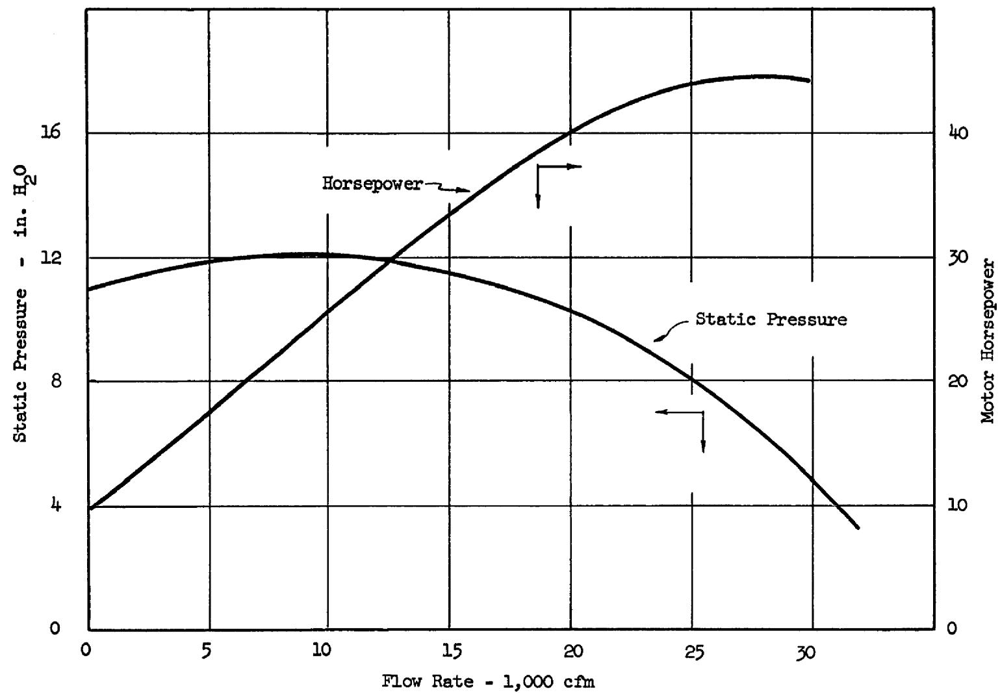  
Figure 13.2. Stack Fan Performance Curves

discharge ducts from the stack fans. Exterior ladder rungs are provided to the top of the stack.

Four equally spaced 1/2-in. pipe couplings are installed about 40 ft above the base for pitot tube flow measurements. An opening is also provided for insertion of a radiation monitor.

The octagonal reinforced concrete base is at a grade elevation of 850 ft and is 16 ft across the flats and 7 ft thick. The bottom of the stack contains a 11-gage $30^{\frac{1}{4}}$ stainless steel drain pan sloping toward a center drain of 2-in. sched-40 stainless steel pipe. This drain line slopes to a soil pipe which drains to the building sump (see ORNL Drawing D-KK-A-41078).

# 13.4 Design Criteria

Design of the containment ventilation system was necessarily based on certain assumptions and broad estimates: 154

It was assumed that during normal operation of the reactor the containment vessel would be at a negative pressure of 2.0 psig. During maintenance operations the vessel pressure would be about 0.3 in. of $\mathsf{H}_2\mathsf{O}$ below atmospheric. The minimum downward velocity through an opening in the cell roof would be 100 bpm. (For an air discharge rate of 15,000 cfm the maximum allowable opening would thus be about 150 ft².)

The maximum leakage in the cell system and exhaust duct was taken to be $1\%$ of the cell volume in each 24-hr period. Leakage through the two 30-in. butterfly valves in line 930 was assumed to be $1/10\%$ of the cell volume per 24 hr.

The high-bay, storage cells, etc., were assumed to be maintained at 0.1 in. of $\mathsf{H}_2\mathsf{O}$ below atmospheric with a maximum negative pressure of 0.5 in. of $\mathsf{H}_2\mathsf{O}$ . The maximum air leakage into the containment ventilation system enclosures was taken to be $6 \times 10^{-3}$ cfm per cubic foot of volume, or about 900 cfm, and the desirable air change rate not less than about six per hour. All occupied adjacent areas were required to be at a positive pressure with respect to the containment ventilation system enclosures.

# 14. LIQUID WASTE SYSTEM

The primary function of the MSRE liquid waste system is to collect all waste water which is likely to be contaminated, store and treat it, when necessary, and discharge it to the Central Pumping Station of the Melton Valley Waste System.[155] The liquid waste system also includes a cell and tank for decontaminating tools and reactor equipment. Filtering equipment is provided to clarify the water used for shielding in this cell to obtain better visibility of work being done underwater. A sump, which normally handles non-contaminated general building drainage, is also associated with the liquid waste system.

# 14.1 Layout and General Description

The liquid waste system equipment is in the liquid waste cell, the decontamination cell, the remote maintenance practice cell, and the sump room. The three cells are beneath the operating floor level, as shown in Figs. 4.3 and 4.5. The sump room is beneath the special equipment room, and with a sump elevation of $\sim 812$ ft, is the point of lowest elevation in Bldg. 7503.

# 14.1.1 Liquid Waste Cell

The liquid waste cell is $14 \times 21$ ft and $24$ ft deep, with a floor elevation of $828$ ft (See Table 4.3). This auxiliary cell is located between north-south columns 2 and 3, and east-west columns A and B, in Fig. 4.4. The cell contains a 11,000-gal storage tank for waste water, the waste filter, and associated piping and remotely operated valves. Concrete shield blocks form the roof of the cell but there is no membrane to make the enclosure pressure tight. The containment ventilation system exhausts air from the cell to provide a down-draft through the small openings between the roof plugs to contain airborne contaminants. (See Section 13).

# 14.1.2 Decontamination Cell

The decontamination cell is located just south of, and adjacent to, the liquid waste cell. The cell is $14 \times 15$ ft, about 20 ft deep, and

has a floor elevation of 832 ft-6in. The cell can be filled with water for shielding larger radioactive items of equipment which require maintenance or decontamination. The only equipment in the cell is the decontamination tank and simple piping and valves. The cell can be covered with concrete roof plugs and ventilated in the same manner as the liquid waste cell, but it may remain open most of the time.

# 14.1.3 Remote Maintenance Practice Cell

This cell is east of, and adjacent to, the liquid waste cell, see Fig. 4.4. It is $13 \times 21$ ft and $24$ ft deep with a floor elevation of 828 ft. The cell is used to practice maintenance procedures before they are carried out in the reactor cell. The cell is also used to house the waste pump and associated valves which transfer liquid from the liquid wastetank. The small 180-cfm blower which removes gases from the top of the liquid waste tank is also located in the cell (See Section 13.3.2).

# 14.1.4 Sump Room

The sump room is an 8 x 16-ft x 7-ft-high space with a floor elevation of 820 ft. In the floor of the room is a 3 x 3 x 8-ft-deep sump, which is the lowest point of elevation in the main building. The room is located partially beneath the special equipment room between columns 8 and 9, and C and B, in Fig. 4.4. Access to the sump room is by a 30-ft vertical ladder through an opening in the floor of the southern end of the high-bay area. Positive ventilation of the sump room is achieved by a blower in the room which discharges up a small duct into the high-bay area. The sump room contains a 55-gal stainless steel drum for collecting water which could possibly be contaminated, and a centrifugal pump for transferring its contents. The room is also provided with two pumps mounted in the sump for pumping out uncontaminated water.

# 14.2 Flowsheet

The flowsheet for the liquid waste system is shown in Fig. 14.1 (ORNL Dwg D-AA-A-40888).

Eleven lines empty into the top of the 11,000-gal waste tank, as follows:

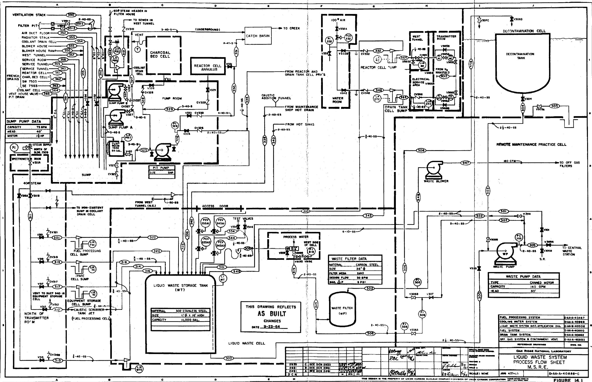

Steam-actuated ejectors in the sumps of the liquid waste cell, the equipment storage cell, the fuel processing cell, and the spare cell, discharge into the liquid waste tank through lines 316, 318, 320 and 322, respectively. These are all $3/4$ -in. sched 40 stainless steel pipes. The steam ejectors are supplied with 60-psig saturated steam through lines 315, 317, 321 and 319, respectively. Each of the steam supply lines contains a check valve to serve as a vacuum breaker.

The steam ejector which empties the caustic scrubber tank in the fuel processing cell, is supplied with 60-psig steam through line 312. The jet discharges through a $3/4$ -in. sched 40 monel pipe, line 314, to the top of the waste storage tank.

The sumps in the reactor and drain tank cells are equipped with liquid level indication through use of bubbler lines 965 and 966, respectively. These $1/2$ -in. sched 40 stainless steel lines are supplied with nitrogen for purging oxygen from the cells and contain rotameters of up to 0.31 l/min capacity. The bubbler level indication is in addition to the level alarm switches which are provided on all sumps.

The above-mentioned sumps in the reactor and drain tank cell are emptied by ejectors actuated by service air. The 100-psig supply air is passed through a pressure regulator, PCV-332, and distributed to the drain tank cell through line 342 and to the reactor cell through line 332. Both of these lines are $3/4$ -in, sched 40 stainless steel and have hand-operated valves and check valves to prevent back flow from the cells. The reactor cell jet discharges into line 333 and the drain tank cell jet into line 343, both of which are $3/4$ -in. sched 40 stainless steel pipe leading to the liquid waste storage tank. Before entering the storage tank, each line is provided with two flow-control valves in series, FCV-333-A, FCV-333-B and FCV-343-A, FCV-343-B. These normally-closed, air-operated valves are interlocked to close on a sudden rise in reactor cell pressure. Lines 334 and 344 permit the application of a test pressure between the two flow-control valves to check for leak tightness. The reactor and drain tank cells can be depressurized for leak testing through the jet discharge lines.

A sink in the change room, located east of the high bay, and part of the controlled ventilation area, has a drain, line 340, leading to the waste storage tank. A funnel is provided in the high-bay area for the

addition of caustic to the liquid waste tank, through line 339. (The liquid waste is made a basic solution before transfer to the Melton Valley waste disposal system.)

The discharge of the waste pump, located in the remote maintenance practice cell, may be directed into the waste storage tank through the 2-in. sched 40 stainless steel line 301. The waste pump discharge may also be diverted to the waste filter located in the liquid waste cell through the 2-in. pipe, line 302. The discharge of the waste filter is through line 306 to be returned either to the decontamination cell or decontamination tank. Line 307, connecting the waste pump discharge to line 306, permits recirculation of water in the decontamination tank, or partial by-passing of the filter when recirculating the water; it also allows process water to be added to the waste storage tank via lines 819, 306, 307 and 301.

The sump pump drawing liquid from the 55-gal contaminated storage drum, referred to as the "pit pump" to distinguish it from the sump pumps also located in the sump room, can discharge into the liquid waste tank through a 2-in. pipe, line 326. The pressure relief valves in the treated water system serving the reactor and drain tank cells discharge into the $1 - 1 / 4-$ in. line 335, which joins the afore-mentioned line 326 for release into the waste storage tank (See Section 15.l0).

The waste tank is vented through the 6-in. sched 10 stainless steel pipe, line 948, which leads to the remote maintenance practice cell, where a small in-line blower of 180 cfm capacity is installed in the pipe to provide a positive movement of the gases into the containment ventilation exhaust system (See Section 13.3.2).

The only bottom connection on the waste storage tank is line 300, a 2-1/2-in. sched 40 stainless steel pipe leading to the suction of the waste pump in the adjoining cell. The bottom of the decontamination tank in the decontamination cell also drains into line 300, and the pump suction, through a 2-1/2-in. pipe, line 304. The sump in the floor of the decontamination cell can be pumped out by the waste pump through line 303, which joins the afore-mentioned line 304 inside the decontamination cell.

The waste pump discharges through line 305, a 2-in. sched 40 stainless steel pipe containing a pressure-measuring tap and sample point.

Downstream of valve 305-A, the pump discharge line continues as a 3-in. cast iron pipe to the central pump station of the Melton Valley wastesystem, which is located just west of the Bldg 7503 area.

The sump in the sump room receives general building drainage, as listed in Table 14.1. This water will not normally be contaminated. Two 1.5-hp 75-gpm float-controlled sump pumps remove the water and discharge it through a 3-in. pipe, line 327, to a concrete catch basin. This basin, about $2 \times 3$ ft and 6 ft deep, is located just west of the charcoal bed and has a bottom elevation of 846 ft. It drains through a 150-ft-long 12-in. reinforced concrete pipe away from the site toward the natural drainage leading to Melton Branch.

The overflow line from the charcoal bed cell empties into the above-mentioned sump pump discharge, line 327 and thence to the catch basin. Line 327 is provided with a check valve upstream of this connection to prevent the overflow from moving backwards down the line into the sump.

It is possible for contamination to be present in the drainage from the bottom of the filter pit and from the bottom of the containment ventilation system exhaust stack. Each of the two 2-in. stainless steel drain pipes from the filter pit has a sight indicator and a hand valve in the concrete filter pit valve box located just east of the filter pit. The two lines combine, as line 35l, and join the 3-in. cast iron drain line from the bottom of the stack, line 350, which in turn empties into the 55-gal stainless steel drum in the sump room.

The 5-hp pit pump can remove water from the drum through the 3-in. suction, line 325, and discharge it via line 326 to the liquid waste storage tank. If there is no objectionable contamination, the drainage water can be pumped through line 330 and 331 to the above-mentioned catch basin for release to the natural drainage from the site. Check valves in both lines 326 and 330 prevent backflow into the sump from the pump discharge lines.

Line 328 is a 3-in. cast iron pipe installed to drain water from the charcoal bed cell. A similar arrangement is provided in line 329 to drain water from the reactor containment vessel cell annulus. It is unlikely that either of these spaces will be drained frequently. The two drain lines combine in the sump room to join line 325 at the pit pump suction.

Table 14.1 Lines Emptying into Sump in Sump Room   

<table><tr><td>Line Number</td><td>Size</td><td>Type</td><td>From</td></tr><tr><td>352</td><td>3 in.</td><td>CI</td><td>Bottom of radiator air duct</td></tr><tr><td>353</td><td>3 in.</td><td>CI</td><td>Bottom of radiator cooling air stack</td></tr><tr><td>354</td><td>3 in.</td><td>Steel</td><td>Bottom of coolant drain cell</td></tr><tr><td>355</td><td>3 in.</td><td>CI</td><td>Blower house</td></tr><tr><td>356</td><td>3 in.</td><td>CI</td><td>Blower house ramp</td></tr><tr><td>357</td><td>3 in.</td><td>CI</td><td>West tunnel</td></tr><tr><td>358</td><td>4 in.</td><td>CI</td><td>Service room</td></tr><tr><td>359</td><td>3 in</td><td>Steel</td><td>Service tunnel</td></tr><tr><td>360</td><td>4 in.</td><td>CI</td><td>Service tunnel French drain</td></tr><tr><td>361</td><td>4 in.</td><td>CI</td><td>Reactor cell French drain</td></tr><tr><td>362</td><td>4 in.</td><td>CI</td><td>Charcoal bed cell French drain</td></tr><tr><td>363</td><td>4 in.</td><td>CI</td><td>French drain for SE area of bldg.</td></tr><tr><td>364</td><td>3 in.</td><td>CI</td><td>Coolant drain cell</td></tr><tr><td>365</td><td>2 in.</td><td>CI</td><td>Vent house valve pit</td></tr></table>

The water can thus be pumped out of the sump room by the pit pump to the waste storage tank or to the natural drainage from the site. If necessary, it could also be dumped into the sump room sump for removal by the sump pumps. Check valves in both lines 328 and 329 prevent backing up in these lines due to the difference in elevation. The reactor cell annulus is also provided with an overflow pipe, line 331, which drains to the catch basin outside. A check valve in line 330, from the pit pump discharge, which joins line 331, prevents the overflow water from moving backward through the pump into the sump.

# 14.3 Description of Equipment

# 14.3.1 Liquid Waste Storage Tank

The waste storage tank is 11 ft diam and 16 ft high, giving a storage capacity of about 11,000 gal. The tank is always vented to operate at essentially atmospheric pressure. The tank has a flat bottom resting on the concrete floor of the waste tank cell. The top is a dished head containing a 12 x 16-in. manhole, eleven flanged nozzles for inlet lines, and a 6-in. nozzle for the vent line. The discharge is a 2-1/2-in. dip pipe to the bottom which penetrates the tank wall about 18 in. above the lower circumferential weld. The tank is made of 1/4-in. 30¼ stainless steel (See ORNL Dwg D-KK-B-41283).

# 14.3.2 Waste Filter

The waste filter is a Cochrane, Type A, vertical, pressure filter. The tank is 3 ft 6 in. in diam and 48 in. high between the head welds, and has dished top and bottom heads. The tank is rated at 100 psig, but is not a Code vessel. The filter bed consists of a 34-in. depth of graded sand and gravel having a cross sectional area of about 9.6 ft². Water enters through a 2-in. pipe in the top head and is distributed uniformly by a concave baffle. The underdrain is through a convex, slotted diffuser plate welded to the bottom head. The capacity is 4 gpm/ft², or a total of 38 gpm, with a maximum pressure drop due to flow through it of 5 to 10 psi. The filter can be cleaned by back washing with process water, the normal back wash

requiring 5 to 15 min at a flow rate of 10 to $15\mathrm{gpm / ft}^2$ , or a total of 96 to 144 gpm, at pressures of 20 to 25 psig.

# 14.3.3 Waste Pump

The waste pump is located in the remote maintenance practice cell. It is a canned-motor unit, Chempump Type CH-5, and has a 2-in. suction, a 1-1/2-in. discharge, and a 6-1/2-in. impeller. It is rated at 150 psig and will deliver 140 gpm against a head of 80 ft. The motor is rated at 10 hp, and it is supplied with 3-phase, 60-cycle power from the 50-amp circuit breaker No. 23 on the G-4 motor control center.

# 14.3.4 Sump Pumps

The two sump pumps in the sump room are rated at 75 gpm, with a discharge head of 40 ft. The motors are rated at 1.5 hp. The power supply is through motor control center G-3-3 and a 30-amp circuit breaker. The pumps are controlled by float-operated switches.

# 14.3.5 Pit Pump

The pit pump in the sump room is a Peerless unit rated at 200 gpm at a discharge head of 70 ft. It has a 3-in. suction and a 2-in. discharge. The motor is rated at 5 hp. The electrical supply is through the motor control center G-3-3 and the same 30-amp circuit breaker used for the sump pump, described above.

# 14.3.6 Jet Pumps

The jets used to evacuate the sumps in the various cells are Penberthy ejectors, Model XL96, Series 2A (Penberthy Manufacturing Company), having capacities at various conditions as listed in Table 14.2. The sump jets normally operate with a suction head of about 2 ft. and the caustic scrubber jet has a suction head of about 12 ft. The jets in the reactor and drain tank cells are air operated and those in the auxiliary cells are actuated by steam.

# 14.4 Design Criteria

The primary requirement of the liquid waste system is that all

Table 14.2 Sump Ejector Characteristics*   

<table><tr><td colspan="5">Pumping Water</td></tr><tr><td rowspan="2"></td><td rowspan="2">Suction Head ft H2O</td><td colspan="3">Steam or Air Supply Pressure</td></tr><tr><td>30 psig</td><td>60 psig</td><td>90 psig</td></tr><tr><td>Water delivery (130°F)</td><td>2</td><td>8.5 gpm</td><td>8.1 gpm</td><td>7.25 gpm</td></tr><tr><td>Water delivery (130°F)</td><td>10</td><td>4.6 gpm</td><td>6.6 gpm</td><td>5.75 gpm</td></tr><tr><td>Steam consumption</td><td></td><td>1.3 lbs/min</td><td>1.9 lbs/min</td><td>2.6 lbs/min</td></tr><tr><td>Air consumption</td><td></td><td>26 scfm</td><td>38 scfm</td><td>52 scfm</td></tr><tr><td colspan="5">Pumping Air</td></tr><tr><td></td><td></td><td colspan="3">Vacuum, in. Hg</td></tr><tr><td></td><td></td><td>5</td><td>10</td><td>15</td></tr><tr><td></td><td></td><td></td><td></td><td>20</td></tr><tr><td>Air capacity at suction(at 40 psig supply pressure)</td><td>50 scfm</td><td>17 scfm</td><td>7 scfm</td><td>4 scfm</td></tr></table>

aqueous effluent from the MSRE which might be contaminated be collected and stored, treated with caustic when necessary, and discharged to the central pump station of the Melton Valley waste system, located just west of the Bldg 7503 area.

Although not a direct part of the system, the liquid waste arrangement also includes provisions for collection of certain non-radioactive general building drainage and disposing it to the natural drainage from the site. This general building drainage does not include storm water or that from the sanitary system.

A requirement for operation of the decontamination cell is that the shielding water be circulated through a filter to permit better visibility for underwater operations.

The jet ejectors used to remove water from the sumps in the reactor and drain tank cells are operated by dry air rather than by steam to avoid the introduction of moisture into the cell. The jets removing water from the sumps in the auxiliary cells are steam-actuated. The steam is condensed and easily retained.

# 15. COOLING WATER SYSTEM

# 15.1 Layout and General Description

The MSRE cooling water facilities include the potable water, process water, cooling tower, treated water and condensate systems.

The potable water system distributes water supplied from the X-10 area of ORNL, as described in Section 3. This system provides for fire protection, sanitary uses and drinking water. A portion of this potable water, after passing through a back-flow preventer, supplies the process water for cooling tower make-up, etc. The potable water supply line is at the north end of Bldg. 7503 and enters the building at the northeast corner.

The cooling tower water system is a circulating system in which the water is cooled by a $2.75 \times 10^{6}$ Btu/hr forced-draft cooling tower located southwest of the building, see plot plan, Figure 3.2. Either of two outdoor 20-hr, 80-ft head, centrifugal pumps of 547 gpm capacity, circulates water from the tower basin to the treated water cooler and other equipment listed in Table 15.1. Water from the cooling tower is also used to cool the charcoal beds but this water is discharged to drain and is not circulated.

The treated water system is a closed circulating system containing condensate with an added chemical inhibitor to minimize corrosion. Water from this system is used for cooling equipment in which there is a possibility of the water becoming contaminated. The equipment cooled is listed in Table 15.2. The water is circulated by either of two 20-hp, 136-ft-head, 320-gpm centrifugal pumps located in the water room in the blower house at the southwest corner of Bldg. 7503. The treated water passes through a shell-and-tube type heat exchanger in the Diesel house to be cooled by the cooling tower water system. The water is distributed by a header in the water room and metered to the various items of equipment. The return lines discharge into a common header leading to the pump suction. A surge tank is provided for the expansion of the water in the closed system. This vented

Table 15.1 Equipment Cooled By Cooling Tower Water   

<table><tr><td></td><td>Flow, gpm</td><td>Heat Removed, Btu</td></tr><tr><td>Treated water cooler</td><td>260</td><td>1.53 x 10^6</td></tr><tr><td>Air compressors (total for 3)</td><td>36</td><td>0.36 x 10^6**</td></tr><tr><td>Fuel pump lube oil system</td><td>7.5</td><td>0.035 x 10^6</td></tr><tr><td>Coolant pump lube oil system</td><td>7.5</td><td>0.035 x 10^6</td></tr><tr><td>Drain tank condensers (each of 2)</td><td>40</td><td>1 x 10^6**</td></tr><tr><td>Caustic scrubber and HF trap</td><td>5*</td><td>*</td></tr><tr><td>Reactor cell annulus</td><td>*</td><td>*</td></tr><tr><td>Air conditioners (total for 3)</td><td>84</td><td>0.336 x 10^6</td></tr><tr><td>Steam condenser</td><td>17</td><td>0.5 x 10^6</td></tr><tr><td>Charcoal beds</td><td>*</td><td>*</td></tr><tr><td>Coolant cell coolers (each of 2)</td><td></td><td>0.168 x 10^6</td></tr><tr><td>Reactor cell annulus makeup</td><td>*</td><td></td></tr><tr><td></td><td>TOTAL</td><td>3.94 x 10^6</td></tr></table>

Table 15.2 Equipment Cooled by Treated Water   

<table><tr><td></td><td>Flow, gpm</td><td>Heat Removed, Btu</td></tr><tr><td>Reactor thermal shield</td><td>100</td><td>0.41 x 106</td></tr><tr><td>Fuel pump motor</td><td>5</td><td>0.005 x 106</td></tr><tr><td>Coolant pump motor</td><td>5</td><td>0.010 x 106</td></tr><tr><td>Reactor cell air coolers (total for 2)</td><td>120</td><td>0.512 x 106</td></tr><tr><td>Drain tank cell air cooler</td><td>60</td><td>0.256 x 106</td></tr><tr><td>Nuclear instrument penetration</td><td>*</td><td>*</td></tr><tr><td>Gas coolant pump lube oil system</td><td>10}</td><td>0.237 x 106</td></tr><tr><td>Gas cooler</td><td>20}</td><td></td></tr></table>

$\text{管} =$ Intermittent operation

\*\* = Maximum values

tank has a float-operated valve for makeup from the condensate system and has provisions for addition of corrosion inhibitors amounting to 2,000 ppm of potassium nitrate (75%) and potassium borate (25%).

Condensate is used for makeup in the treated water system and for makeup to the boiling water decay heat removal system in the fuel drain tanks. The condensate is provided by condensing steam supplied from the X-10 area of ORNL. The shell-and-tube type condenser is located in the water room and is stored in two nearby 500-gal tanks.

# 15.2 Flowsheet

The cooling water system flowsheet is shown in Figure 15.l (ORNL-DWG-D-AA-A-40889) and includes the cooling tower, treated water and condensate systems. The potable water supply is also shown insofar as it is connected to the reactor processes, but does not include building services.

Appropriate flow meters and indicators are provided at all points in the system where water flow rates are needed for heat balance calculations. In general, these are not mentioned in the following discussion, as they are covered in detail in Part II.

# 15.2.1 Potable and Process Water

Two 6-in. carbon steel pipes supply Bldg. 7503 from the water main at the road. One is a potable supply for general building use. The other, line 894, supplies the reactor processes through a 4-in. backflow preventer. The backflow preventer, BFP-890-1, has a relief line discharging to a floor drain in the north end of the main building, and isolation valves V-894-B1 and V-890-A1, which can be closed for maintenance. Additional valves, V-894-B2 and V-890-A2, are provided in event it is necessary to install an additional backflow preventer for temporary use.

Water from the backflow preventer is distributed through 890, a 6-in. header.* A branch from the header, line 896, supplies process water for general process use in the high bay area. Line 892 is a

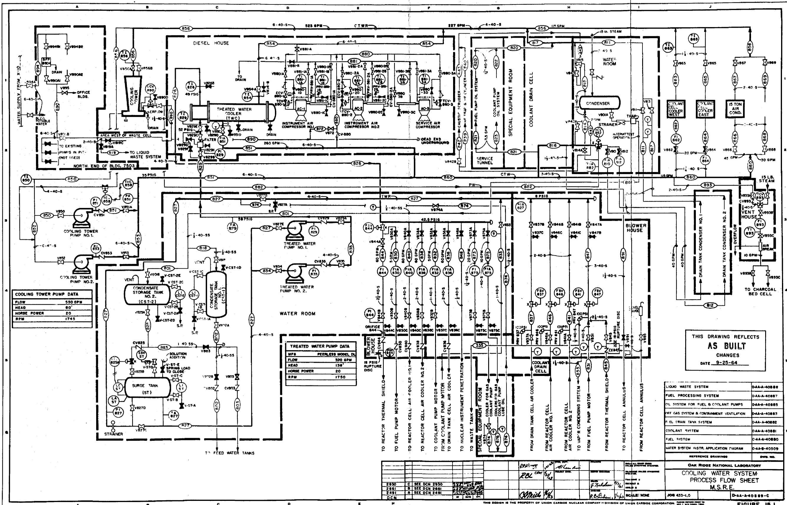

1-1/2-in. pipe for supplying water to the vapor condensing tank used in the vapor condensing system for the reactor containment cell. The liquid waste cell is supplied with potable water through the 2-in. line 819. A backflow preventer in this line, BFP-819, is located in the west side of the liquid waste cell, and prevents contamination of the cooling tower water system by reverse flow.

Emergency cooling water is supplied to the two instrument air compressors and the service air compressor located in the Diesel house, through 2-in. line 872. These units are normally cooled by the cooling-tower water system. The condensers in the fuel drain tank decay-heat removal system also have an emergency water supply from the process water system through the 2-in. line 882, and three-way valve HCV-882. The normal coolant for the condensers in the drain tank system is cooling tower water. Line 890 continues as a 1-1/2-in. schd 40 pipe to provide makeup for the cooling tower basin through the float-operated valve, LCV-890.

# 15.2.2 Cooling Tower Water System

Water from the cooling tower basin is supplied through a 6-in. pipe, line 850 and 852, to the suction of the cooling tower water circulating pumps. Pump No. 1 discharges through a check valve into line 851 and Pump No. 2 into line 853. This water, at about 35 psig, and a maximum temperature of $85^{\circ}\mathrm{F}$ , is distributed through the 6-in. header, line 851. A major take-off, also numbered 851, is a 6-in. pipe supplying about 260 gpm of cooling water to the shell-and-tube cooler in the treated water system. This water circulates back to the cooling tower through lines 854 and 856. A 1-1/4-in. pipe, line 880, is connected to line 851 for the 36-gpm cooling water supply to the instrument air and service air compressors, and associated after-coolers, all located in the diesel house. The water is returned through lines 881, 854 and 856.

The other major branch of line 851 is the 3-in. take-off, line 860, supplying a subheader, line 816. Lines 821 and 823, each $1 - 1/4$ in. supply about $7.5\mathrm{gpm}$ from this header to the fuel and coolant salt circulating pump lubricating oil system coolers located in the

service tunnel. This water returns to the cooling tower through lines 820 and 822 via lines 817 and 856. A $1 - 1 / 2$ -in. pipe, line 891, from line 816 is used to fill the annulus around the reactor cell containment vessel.

The caustic scrubber cooling jacket in the fuel processing cell is supplied through line 842 and returned through line 843. A take-off from the $3/4$ -in. line 842, the $1/2$ -in. line 839, supplies water to the cooling jacket on the HF trap and HF cylinder in the area outside of Bldg 7503, just west of the drain tank cell. The cooling water is returned through lines 843 and 849, via lines 817 and 856. Line 816 also supplies water to the steam condenser in the water room, previously mentioned as the source of water for the condensate system to be described subsequently, through the $1-1/4$ -in. line 814. This water is returned through line 815. Also as previously mentioned, the drain tank heat removal system condensers are supplied with about $40\ \mathrm{gpm}$ each of cooling water through the 2-in. pipes 810 and 812, through a three-way valve HCV-882. The return water lines from the condensers are numbered 811 and 813.

The main cooling tower water return header, line 856, is a 6-in. pipe leading to the top of the tower. A 3-in. subheader, line 817, collects much of the water flowing into this main header. Line 856 divides to supply both sections of the cooling tower. The water is normally returned at a temperature no hotter than $95^{\circ}\mathrm{F}$ , and under maximum ambient wet bulb temperature conditions of $79^{\circ}\mathrm{F}$ could be cooled to $85^{\circ}\mathrm{F}$ (7°F approach). Since the commonly-used design wet bulb temperature in the Oak Ridge area is $75^{\circ}\mathrm{F}$ , cooler water temperatures can be attained, particularly during the winter months. A 4-in. by-pass, line 858, leads through the control valve, TCV-858, to the tower circulating-pump suction to regulate the pump discharge temperature.

# 15.2.3 Treated Water System

Condensate from the storage tank in the water room is added to the treated water system surge tank, located directly beneath it,

through line 825. This l-in. pipe contains a float-operated control valve, LCV-825, to maintain an operating level in the tank. The surge tank is vented to atmosphere at all times. Potassium nitrite (75%), and potassium borate (25%) are added through a funnel to inhibit corrosion in the treated water system. The surge tank is connected to line 827 by two pipes, one on each side of valve V-827-C. The downstream line is a direct connection to line 827 and the upstream one contains a valve, V-827-D. This arrangement allows some of the flow in line 827 to be diverted to flow through the surge tank for mixing purposes and also assures that the surge tank is always connected to the system.

The above-mentioned line 827 is a 4-in. header leading to the suction of the treated water circulating pumps. A duplex strainer is included in the line upstream of the surge tank connections. The pump discharge lines, 829 and 835, combine to form line 829. This 4-in. pipe delivers the water at $100^{\circ}\mathrm{F}$ and 58 psig, and at a flow rate of about 300 gpm, to the treated water filter located in the Diesel house. The filter when clean has a pressure drop of less than 1 psi and a maximum pressure drop of 5 psi, and removes essentially all particles greater than 30 microns in diameter. After leaving the filter the water enters the treated water cooler, where it is cooled to about $90^{\circ}\mathrm{F}$ . It leaves the heat exchanger at about 43 psig through the 4-in. sched 40 distribution header, line 826. The following equipment is supplied from this header in the water room, each connection being provided with a hand-operated regulating valve, a flow indicator, stop valve, check valve, and a sampling valve arrangement to test the leak tightness of the check valve:

(a). The thermal shield for the reactor is cooled by 60 gpm of treated water supplied through a 2-1/2-in. pipe, line 844, and recirculated to the system through line 845. A normally-open block valve on the supply, FSV-844, is controlled by a pressure switch, PSS-844B, on line 844 to limit the water supply pressure to about 16 psig. A flow-limiting orifice in line 844 also prevents overpressuring the thermal shield if the manual flow adjusting valve, V-844A, is opened too wide. Line 844 contains a check valve upstream

of the orifice to prevent back flow. Rupture discs, rated at 18 psig, in lines 844 and 845 discharge to line 855 leading to the vapor condensing system.

(b) The fuel pump motor cooling water is taken from line 844, described in (a) above, downstream of the block valve FSV-844. This l-in. pipe, line 830, is provided with a check valve, located in the blower house. The required flow rate is about $5\mathrm{gpm}$ and the water is returned through line 831. This line, and the return water line from the thermal shield, line 845, combine in the blower house to form line 847. This line contains a block valve, FSV-847, which is also controlled by a radiation monitor, RE-827.   
(c) The reactor cell air cooler (No. 1) is supplied with 60 gpm of treated water through the 2-in. line 840. This line includes a check valve located in the blower house. Water is returned from the air cooler through line 846, through a block valve, FSV-846. A relief valve set at 100 psig is included in the return line upstream of the block valve to vent excessive pressure through the 1-l/4-in. line 335 to the waste tank.   
(d) The other reactor cell air cooler (No. 2) is supplied with $60\mathrm{~gpm}$ of treated water through line 838 in the same manner as the cooler connections described in (c), above. The return water is through line 841.   
(e) The coolant salt pump drive motor requires about 5 gpm of cooling water, supplied through line 832, and a check valve, CV-832. The return water is through line 833 directly to line 827.   
(f) The 60-gpm treated water supply to the drain tank cell air cooler is through line 386, a 2-in. sched. 40 pipe with a check valve located in the blower house. The return water pipe, line 837, is equipped with a block valve, FSV-837, and a relief valve venting to line 335, in a similar arrangement to the reactor cell air coolers.   
(g) The nuclear instrument tube penetration is filled with water from the treated water system. The water is supplied through the 1/2-in. pipe, line 848.

(h) The aftercooler used downstream of the component cooling system gas blowers, located in the special equipment room, is cooled by 20 gpm of treated water supplied through the l-1/4-in. line 873, and returned through line 874. The oil coolers on the two blowers are also water-cooled by about 10 gpm of water supplied through line 875. The water is recirculated through line 876, also l-in. pipesize, which joins the above-mentioned water return line from the aftercooler, line 874, before discharging into the return header, line 827.

# 15.2.4 Condensate System

Saturated steam at 15 psig is condensed in a shell-and-tube heat exchanger located in the water room at the southwest corner of Bldg 7503. The condenser is cooled by cooling tower water, as described in Section 15.2.2. The condensate leaves through a 1/2-in. strainer and steam trap on the stainless steel line 80l, and discharges into the vented condensate storage tank, No. 1 or to tank No. 2 through the branch line 818. The drain from the bottom of tank No. 1, line 802, and from the bottom of tank No. 2, line 825, combine as the 1-in. line 883, and is used to feed the float-operated make-up valve on the treated water system surge tank.

Lines 802 and 803, both $1/2$ -in. stainless steel, also branch from line 883 to supply makeup to the drain tank heat removal system water tanks.

# 15.3 Description of Equipment

# 15.3.1 Condensate Storage Tank No. 1

Condensate storage tank No. 1 is a vertical, 36-in.-diam vessel with an overall height of 5 ft. The tank is vented to the atmosphere at all times. It is constructed of 12-gage, 304 stainless steel, with dishes 3/16 in. thick. The tanks are supported by three angle iron legs, with the bottom of the tank about 4 ft from the floor. The tank has six nozzles, the three in the top being the 1/2-in. water supply, the 1/2-in. vent, and a 1-in. spare connection.

There are two 1/2-in. couplings on the side for the water level gage. The 1-in. drain line connection is in the bottom head.

# 15.3.2 Condensate Storage Tank No. 2

This tank is similar to condensate storage tank No. 1 but is a horizontal tank 30 in. diam x 72 in. long. The cylindrical portion is 12-gage 304 stainless steel with 3/16-in.-thick dished heads. The tank is designed for operation at atmospheric pressure. There are four nozzles at the top: the 1/2-in. inlet, the 1/2-in. vent, and two spares. The two side nozzles on one end are for the water gage. A 1-in. discharge nozzle and a 1/2-in. drain are provided along the bottom. The tank is supported by a steel cradle 78 in. from the floor. This tank was arranged horizontally rather than being identical to tank No. 1 in order to install it directly above the surge tank.

# 15.3.3 Treated Water Surge Tank

The surge tank is a horizontal 30-in. diam x 48 in. long carbon steel tank designed for atmospheric pressure. The wall thickness is 1/8-in., with 3/16-in. dished heads. The nine nozzles include: 1-in. feed line at the top, a 1-in chemical addition line, and a 1/2-in. vent. Two nozzles at one end are for the water gage and on the other end two nozzles connect to the float-operated liquid level controller. Two 1-in. pipe size nozzles are at the bottom. The tank is supported on a cradle 30 in. above the floor and directly under condensate storage tank No. 2.

# 15.3.4 Cooling Tower

The cooling tower is designed to cool about 550 gpm of water from $95^{\circ}\mathrm{F}$ to $85^{\circ}\mathrm{F}$ when the wet bulb temperature is $79^{\circ}\mathrm{F}$ . The equivalent heat removal capacity is $2.75 \times 10^{6} \, \mathrm{Btu/hr}$ . The connected cooling tower load is about 538 gpm and a possible heat load of a maximum of $3.94 \times 10^{6} \, \mathrm{Btu/hr}$ , as was indicated in Table 15.1. The tower has a capacity of $3.57 \times 10^{6} \, \mathrm{Btu/hr}$ when the wet bulb temperature is $76^{\circ}\mathrm{F}$ wbt. The design wbt in common use in the Oak Ridge area is $75^{\circ}\mathrm{F}$ .

The cooling tower is a Marley Company Model 8320 "Packaged Aquatower" with two 60-in. diam multi-blade adjustable pitch fan belt driven by 5-hp, 1800-rpm, TEAO motors. The overall dimensions are 11 ft 9-1/2 in wide x 14 ft 6-7/8 in. long and 8 ft 8-3/4 in. high.

# 15.3.5 Treated Water cooler

The treated water cooler is a heat exchanger made available from another project. It is a shell-and-tube type, four-pass, horizontal heat exchanger, and is located in the west end of the Diesel house. The shell is 28 in. OD x 20 ft long, not including the heads, and has 10-in. flanged nozzles. The 360 straight tubes are admiralty metal, 1 in. OD, No. 18 BWG, 20 ft long, spaced on $1 - 1 / 4$ -in. squares. The tubes are supported by fixed tube sheets and baffle plates of naval brass. The tube-side connections for the treated water are 8-in. flanged nozzles.

The total heat transfer surface is 1,885 ft², the shell-side water velocity is about 0.48 ft/sec and the tube-side velocity 1.75 ft/sec, providing an estimated overall heat transfer coefficient of 232 Btu/hr-ft²-°F.156 Operating design conditions are that the cooling tower water enters the shell at 85°F and leaves at 97°F. The treated water enters the tubes at 100°F and leaves at 90°F.157

# 15.3.6 Treated Water Circulating Pumps

There are two identical treated water circulating pumps, one operating and one for standby. Each is sized for $120\%$ of the 96-ft head of pressure drop estimated for the system158 and for a flow of about $310~\mathrm{gpm}$ . The units are Peerless centrifugal pumps, Model 2 x 3 x 13 DL, driven by 20-hp motors. The open-type impeller is 13 in. in diameter and operates at $1,750~\mathrm{rpm}$ . The characteristic curves of pump performance are shown in Figure 15.2.

Each pump and motor is mounted on a common base, about 18 x 49 in., and the unit is about 26 in. high, arranged for top discharge.

Unclassified ORNL DWG 64-8843

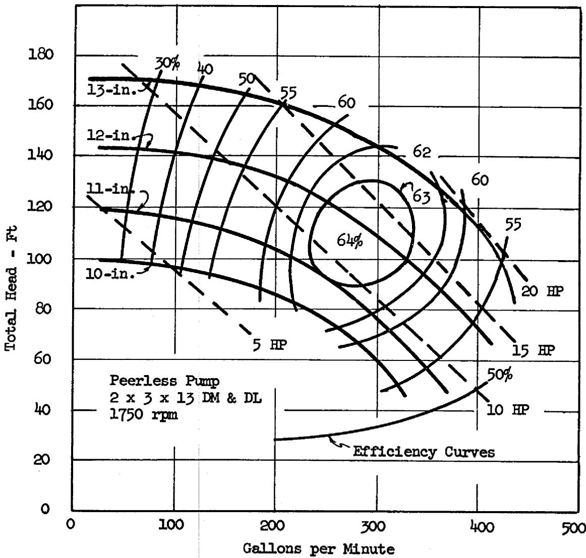  
Figure 15.2. Characteristic Curves - Treated Water Circulating Pumps

# 15.3.7 Cooling Tower Pumps

Two identical cooling tower water circulating pumps are installed, one to serve as standby. The units are American-Marsh centrifugal pumps, size 4A, Type RDM. The pumps have 10-in. diam inclosed impellers and are direct driven by 20-hp motors at 1,750 rpm. The estimated pressure drop in the system is 53 ft of water. The units were selected for 80 ft of head at 550 gpm capacity. The characteristic performance curves are shown in Figure 15.3. The pump and motor are mounted on a common base.

# 15.3.8 Steam Condenser for Condensate System

The steam condenser is a horizontal shell and tube type, with a carbon steel shell about 8 in. OD x 6 ft long, made available from another project. Condensing is inside the stainless steel tubes and the total capacity is about 1.2 gal/min.

# 15.3.9 Space Coolers

The five space coolers in the MSRE processing cells are designed to maintain the cells at temperatures below of $150^{\circ}\mathrm{F}$ . There are two units for the coolant cell, two in the reactor cell and one in the drain tank cell.

15.3.9.1 Coolant Cell Coolers. - The two space coolers for the coolant cell were existing units in Bldg 7503. They are external to the cell, located at the 850-ft elevation, and connected to the cell with short ducts. Each unit is mounted in a gas-tight, 12-gage sheet metal casing, one on the northwest side of the cell and the other on the southeast. The two return ducts to each unit are 12 x 19 in. and the discharge duct is 23 x 28 in.

The two coolers are identical and are Trane No. 212 units with an 8-row water coil and a rated cooling capacity of 250,000 Btu/hr.* The cooling load on each unit is estimated to be about 82,000 Btu/hr when the cell temperature is the maximum of $150^{\circ}\mathrm{F}$ . The circulating fans have a capacity of 3,600 cfm at $167^{\circ}\mathrm{F}$ , and are driven by 2-hp, 220/440 v, 3-phase motors designed for operation at $175^{\circ}\mathrm{F}$ . The cooling water requirements are estimated to be about 20 gpm.

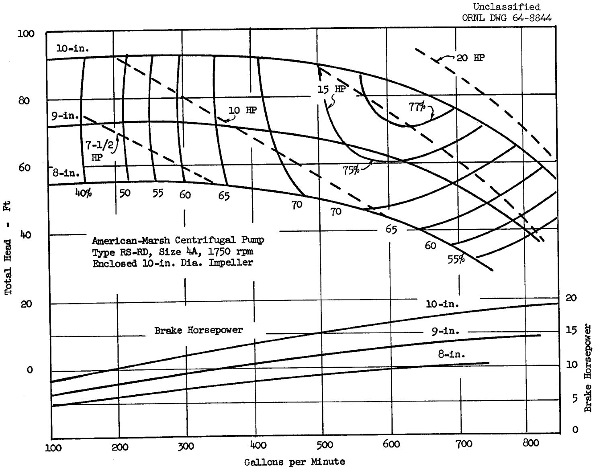  
Figure 15.3. Characteristic Curves - Cooling Tower Water Circulating Pumps

Table 15.3 Design Data Reactor and Drain Tank Cell Space Coolers   

<table><tr><td>Number of units: In reactor cell</td><td>2</td></tr><tr><td>In drain tank cell</td><td>1</td></tr><tr><td>Design pressure</td><td>150 psig</td></tr><tr><td>Required cooling water for each unit</td><td>60 gpm</td></tr><tr><td>Water temperature rise</td><td>9°F</td></tr><tr><td>Water pressure drop</td><td>2.1 psi</td></tr><tr><td>Air flow rate</td><td>7,400 scfm</td></tr><tr><td>Air temperature drop</td><td>32.3°F</td></tr><tr><td>Air pressure drop</td><td>0.6 in. H2O</td></tr><tr><td>Rated heat transfer capacity*</td><td>256,000 Btu/hr (75 kw)</td></tr><tr><td>Fan Motor</td><td>Louis Allis, 3-hp, 3-phase, 60 cycle, 440 v, l,750 rpm, Class H, totally inclosed</td></tr><tr><td>Fan</td><td>Aluminum, 6 blades, 32 in. diam</td></tr><tr><td>Coil</td><td>69 ft2effective prime surface, 950 ft2fin surface, red brass serpentine coil, 5/8-in. OD x 0.035-in. wall tubes, 0.010 in. fins mechanically bonded to tubes</td></tr><tr><td>Approximate weight</td><td>1,600 lbs (with water)</td></tr><tr><td>Dimensions</td><td>About 50 in. x 29 in. x 44 in. high</td></tr></table>

*Entering air assumed at $150^{\circ}\mathrm{F}$ .

15.3.9.2 Reactor and Drain Tank Cell Space Coolers. - The reactor and drain tank cells are estimated to require the removal of a total of about 500,000 Btu/hr to maintain the cell temperature below $150^{\circ}\mathrm{F}$ . Two space coolers are used in the reactor cell and one in the drain tank cell. The units are identical and are Young Radiator Company Model 55, modified for direct drive and installed to facilitate maintenance using remotely-operated tooling. The water tubes and headers are backbrazed to reduce the likelihood of water leaking into the cell. The treated water supply and return lines are connected by ring-joint type flanges, which are monitored for leakage.

Design data for the coolers are listed in Table 15.3.

# 15.3.10 Piping Valves and Appurtenances

15.3.10.1 Piping. - All water system piping located outside the containment cells is sched 40 black steel, ASTM A-53. Pipe and fittings above $1 - 1 / 2$ -in. pipe size are butt-welded, and the fittings are ASTM A234 Grade B. Smaller pipe and fittings are threaded; the fittings are 150-psi black malleable iron. Condensate piping is 304 stainless steel with standard weight screwed fittings.

All water system piping inside the cells is 304 stainless steel, sched 40, with butt-welded ends. Flanges are either 150-psi or 300 psi weld-neck, ring-joint flanges, depending on service and location. All of these joints are leak-detected.

15.3.10.2 Valves. - Valves of 2-1/2-in. size and over have flanged connections. The gate valves are 125-psi Ferrosteel wedge valves with bronze trim and outside screw and yoke, Crane No. 465-1/2. The globe valves are Ferrosteel with joke bonnet, bronze trim, Crane No. 351. Bronze trim is also used in the 125-psi Ferrosteel swing check valves, Crane No. 363.

Valves used in piping 2 in. and smaller have screwed ends. The gate valves are 125-psi bronze valves with rising stems, Crane No. 430-UB. Globe valves are 150-psi bronze, Crane No. 14P. Except as noted below, the check valves are 125-psi bronze, Crane No. 34.

The check valves in lines 836, 838, and 840, which supply treated water to the reactor and drain tank cell space coolers, are Circle Seal

Model 230B-16 PP, 0.5 - 1 psi. The check valves in lines 830 and 832, supplying treated water to the fuel and coolant salt pump motors, are Circle Seal Model 230B-8 PP, 0.5 - 1 psi. These special check valves prevent back flow if the block valves in these water supply lines are closed by detection of radioactivity in the return water stream.

The pressure relief valves used in return water lines 837, 846, 841, 847, etc., are Farris Series 1475, 1/2-in. size, set at 100 psi. The pressure relief valve in line 855 is identical but set at 20 psi to protect the thermal shield from excessive pressure.

The air-operated control valves are described in Part II.

15.3.10.3 Backflow Preventers. - The potable water system is protected from contamination due to reverse flow by a 4-in. backflow preventer in line 890. The cooling tower system is also protected from contamination from the liquid waste system by a similar, but 2-in. pipe size, backflow preventer in line 819.

Both units are Beeco Model 6 C, reduced-pressure, backflow preventers, as shown in Figure 15.4. The units operate on the principle that two spring-loaded check valves, "A" and "B" in Figure 15.4, (with 8 psi springs) are in series with a spring-loaded diaphragm-operated relief valve, "C", in between. The upstream pressure, "D", acts on one side of the diaphragm and the intermediate pressure, "E", and a 4-psi spring, act on the other. If the supply pressure drops, or the intermediate pressure increases in a condition tending to create backflow, the diaphragm-operated relief valve opens to discharge the water to drain. The 4-in. potable water valve, BFP-890-1, relieves water to the building sump. The 2-in. valve in the liquid waste cell, BFP-819, discharges the relief water to the waste tank. The capacities of the two valves at various pressure heads are shown in Figure 15.5.

15.3.10.4 Strainer. - The suction line to the treated water pumps is equipped with a 3-in. Schute and Koerting duplex strainer. The unit consists of two 24-in. strainer baskets with a plug valve to select the strainer in use. While one strainer is in service the other can be removed for cleaning. The unit has a cast iron body with brass strainer baskets.

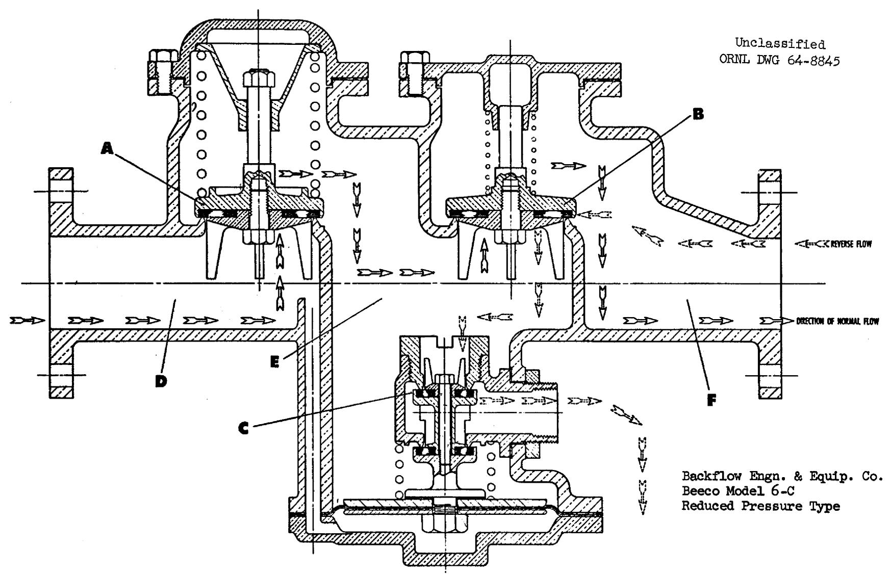  
Figure 15.4. Cross Section Backflow Preventers in Water Lines 819 and 890.

Unclassified ORNL DWG 64-8846

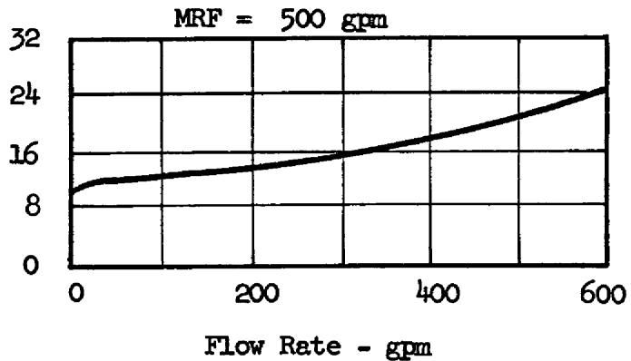  
a. Valve BFP-890-1

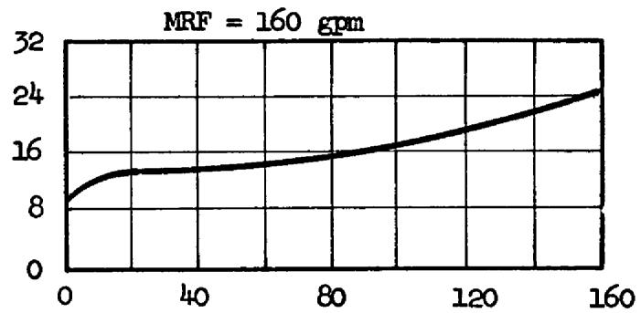  
Flow Rate - gpm b. Valve BFP-819   
Figure 15.5. Capacity of Back-Flow Preventers in Water System

# 15.3.11 Treated Water Filter

The filter in the treated water circulating pump discharge, line 829, is rated at 75 psig and $120^{\circ}\mathrm{F}$ to remove particles of 30 microns in diam and greater from a flow of a minimum of 380 gpm. The maximum pressure loss due to flow through the unit is 15 psi. The inlet and outlet connections are 6-in. pipe size, sched 40. A by-pass is incorporated to allow cleaning of the unit without disrupting the flow of treated water. The filter is manufactured by the Dollinger Corporation (Rochester).

# 16. COMPONENT COOLING SYSTEMS

The upper portion of the fuel circulating pump bowl and the control rod drives are cooled by streams of gas in order to avoid excessively highly operating temperatures. The freeze valves, the seals at the reactor access nozzle, etc., are cooled by gas to maintain the salt well below the melting temperature to assure a frozen salt seal.

The component cooling equipment is arranged in two separate systems: (1) a circulating gas loop for cooling equipment located in the reactor and drain tank cells, and (2), an air supply system for cooling freeze valves in the coolant and fuel processing cells.

# 16.1 General Description and Layout

# 16.1.1 Circulating Gas System

Cell atmosphere gas $(95\% \mathrm{N}_2, 5\% \mathrm{O}_2)$ is circulated by a 75-hp, 885-cfm positive-displacement blower sealed in a 6 ft diam x 8 ft steel tank located in the special equipment room. (An identical blower unit is in standby). The blower discharges through a vertical, 8-in.-diam x 9-ft long, shell and tube, water-cooled heat exchanger, also located in the special equipment room. The gas, now at about $150^{\circ}\mathrm{F}$ and 21.3 psia, flows to a 6-in. distributing header in the reactor cell, where streams are taken from it to cool the equipment listed in Table 16.1.

The gas passes over the various surfaces to be cooled and then mingles with the cell atmosphere. The 10-in. blower suction connection is made to the 30-in. diam containment ventilation system pipe, line 930, where it passes through the special equipment room.

Each gas blower has sufficient capacity to also be used for evacuation of the reactor and drain tank cells. In this operation, a portion of the blower discharge is diverted to the containment ventilation system, to be monitored and filtered before discharge from the stack. Due to cell inleakage, or to various purge gas streams that may be introduced, a periodic, or perhaps continuous, evacuation will be required to maintain the cells at the desired 12.7 psia operating pressure.

Table 16.1 Gas-Cooled Components   

<table><tr><td rowspan="2">Component Cooled</td><td colspan="2">Gas Supply Line</td><td rowspan="2">Approx. Gas Flow Req&#x27;d. scfm</td></tr><tr><td>No.</td><td>Pipe Size</td></tr><tr><td>Fuel pump bowl88</td><td>903</td><td>3 in.</td><td>0-400</td></tr><tr><td>FV-104 in drain tank cell</td><td>908</td><td>3/4</td><td>1-15</td></tr><tr><td>FV-105 in drain tank cell</td><td>909</td><td>3/4</td><td>1-15</td></tr><tr><td>FV-106 in drain tank cell</td><td>910</td><td>3/4</td><td>1-15</td></tr><tr><td>FV-107 in drain tank cell</td><td>911</td><td>3/4</td><td>1-15</td></tr><tr><td>FV-108 in drain tank cell</td><td>912</td><td>3/4</td><td>1-15</td></tr><tr><td>FV-109 in drain tank cell</td><td>913</td><td>3/4</td><td>1-15</td></tr><tr><td>Three control rod drives</td><td>915</td><td>1</td><td>15</td></tr><tr><td>FV-103 in reactor cell160</td><td>919</td><td>1-1/4</td><td>25-75</td></tr><tr><td>Off-gas line 522*</td><td>960</td><td>3</td><td>800</td></tr><tr><td>Graphite sampler nozzle</td><td>961</td><td>3/4</td><td>10</td></tr><tr><td>Outside of reactor access nozzle</td><td>962</td><td>3/4</td><td>10</td></tr><tr><td>Inside of reactor access nozzle</td><td>963</td><td>3/4</td><td>10</td></tr></table>

*A secondary function. The primary purpose is to regulate system pressure through PdCV 960 and to return the gas to the reactor and drain tank cells.

In estimating the gas flow rates required, it was assumed that not all freeze valves would require a high rate of cooling at the same time. In general, no gas flow measurements will be made during operation of the reactor, the flow rates simply being adjusted to maintain the equipment at the proper operating temperatures.

# 16.1.2 Cooling Air Supply

Air for cooling the freeze valves in the coolant and fuel processing cells is provided by a 5-hp positive-displacement type blower of 60 scfm capacity, located in the blower house at the southwest corner of Bldg 7503. Air in the 3-in. discharge pipe is divided to cool the equipment listed in Table 16.2. After blowing on the flattened sections of process piping that serve as freeze valves, the air is then carried off by the cell ventilation ducts.

# 16.2 Flowsheet

The flowsheet for the gas blowers and cooler located in the special equipment room is included on the fuel system process flowsheet, Figure 5.3 (ORNL Dwg D-AA-A-40880). Other portions of the gas circulating system are shown on other process flowsheets to be mentioned subsequently.

The cell atmosphere gas blower $(95\% \mathrm{N}_2, 5\% \mathrm{O}_2)$ , CCP-1, draws gas from inside its 6-ft-diam x 8-ft high containment tank. A 10-in. sched 40 stainless steel pipe, line 923, connected to the bottom of the tank, joins a similar suction line to the alternate blower, CCP-2, (line 922), and as a 10-in. pipe connects the short distance to the 30-in. containment ventilation pipe, line 930. The suction lines contain instrumentation for temperature indication and each has a hand valve to permit switching of service between the blowers. The normal operating pressure in a blower containment tank, i.e., the blower suction pressure, is 12.5 psia and the gas enters at about $150^{\circ}\mathrm{F}$ . The 75-hp blower drive motor is cooled by the gas flow through the tank.

The gas blower CCP-1 discharges at about 21.3 psia and $320^{\circ}\mathrm{F}$ through a 6-in. sched 40 stainless steel pipe, line 916, which passes through the bottom head of the containment tank. The portion inside the tank contains a flexible connector, a pressure-relief valve connection, and a check valve

Table 16.2 Air-Cooled Components   

<table><tr><td rowspan="2">Component Cooled</td><td colspan="2">Air Supply Line</td><td rowspan="2">Approx. Air Flow Req&#x27;d.</td></tr><tr><td>No.</td><td>Pipe Size</td></tr><tr><td>FV-204 in coolant cell</td><td>906</td><td>1</td><td>1-15 scfm</td></tr><tr><td>FV-206 in coolant cell</td><td>907</td><td>1</td><td>1-15 scfm</td></tr><tr><td>FV-112 in fuel proc. cell</td><td>924</td><td>3/4</td><td>1-15 scfm</td></tr><tr><td>FV-111 in fuel proc. cell</td><td>929</td><td>3/4</td><td>1-15 scfm</td></tr><tr><td>FV-110 in fuel proc. cell</td><td>969</td><td>3/4</td><td>1-15 scfm</td></tr></table>

is located inside the tank and vents to it when the differential pressure exceeds 12 psi. Lubricating oil from the blower sump is circulated by a gear pump driven by the blower shaft, the oil flowing through a water-cooled stainless steel heat exchanger and oil filter before returning to the blower bearings. A pressure relief valve on the oil line is set at a differential pressure of 12 psi to vent the oil to the blower sump in event the heat exchanger or filter becomes clogged. The oil pressure is monitored by a pressure transmitter located in the oil return line from the filter.

The alternate gas blower, CCP-2, in an identical arrangement discharges into the 6-in. line 921, which joins the above-mentioned discharge line from blower CCP-1, before entering the gas cooler.

The compressed gas enters the shell side of the gas cooler at about $320^{\circ}\mathrm{F}$ and leaves at about $150^{\circ}\mathrm{F}$ . The tube side of the horizontal shell-and-tube heat exchanger is cooled by a flow of about 20 gpm of $90^{\circ}\mathrm{F}$ treated water, supplied through line 873 and leaving through line 874. The inlet and outlet gas lines have thermocouples to permit heat balances to be made and an estimation of the gas flow rate. The gas leaves the cooler through the 6-in. sched 40 stainless steel line 917.

A 1-1/2-in. sched 40 stainless steel pipe, line 565, branches from line 917 inside the special equipment room, and leads to the vent house. As shown on the containment ventilation system flowsheet, Figure 12.1, (ORNL Dwg D-AA-A-40883), line 565 connects to line 571 in the vent house, and continuing as line 565, is provided with two GM probes to monitor for radioactivity, RIA-565, and a block valve HCV-565, actuated by the monitor. A 1/2-in. by-pass line, 569, leads through a wet flow meter, to a sampling point, and through a flow totalizer and indicator, FqI-569, back into line 565. The hand valves in the by-pass line, 569, and in line 565, are used to regulate the cell pressure. Line 565 discharges into line 927 to pass through the roughing and absolute filters before release from the ventilation system stack. This arrangement for venting a portion of the blower discharge to the atmosphere is used to evacuate gas from the reactor and drain tank cells to maintain them at the desired operating pressure of about 12.7 psia. A hand valve in line 565 is used to regulate the cell pressure.

Continuing with the compressed gas line 917, this 6-in. sched 40 pipe passes through a penetration into the reactor cell, there the pipe material then becomes carbon steel, and serves as a header for the several component cooling system gas supply lines listed in Table 16.1. This table lists the line sizes and flow rates in each of the eight branches.

All eight of the gas supply lines, except line 920, contain air-operated valves for controlling the gas flow.

Line 920 is a 2-in. sched 40 carbon steel pipe passing through the 36-in.-diam opening between the reactor and drain tank cells and then through a penetration in the drain tank cell wall to supply a valve manifold station located in the north electric service area. Here, through six throttle valves, as shown in Figure 6.1 (ORNL D-AA-A-40882), lines branch off to supply cooling gas to freeze valves in the drain tank cell on lines 104, 105, and 106, 107, 108 and 109. (The freeze valves on lines 107, 108 and 109 are shown on the fuel processing flowsheet, Figure 6.2 (ORNL Dwg D-AA-A-40887).

The air-operated valve in line 960, PdCV-960, is controlled by a differential-pressure cell connected between lines 917 and 923, i.e., between the gas blower suction and discharge lines. This valve varies the flow through line 960 to regulate the component cooling gas supply pressure to a relatively constant value irrespective of the rate of use at various freeze valves, etc. The 3-in. line 960 discharges into the reactor cell in the annular space between a 4-ft length of 10-in. sched 10 pipe and the 4-in. portion of the off-gas line 522, at the 831-ft elev near the cell wall. This arrangement helps cools the leaving off-gas stream.

The 5-hp, 60-scfm, positive-displacement type blower, CCP-3, supplying component cooling air to the coolant and processing cells is located in the blower house. As shown on the coolant system flowsheet, Figure 9. (ORNL Dwg D-AA-A-40881), air is drawn from the blower house through a filter. The blower discharge is a 3-in. sched 40 carbon steel pipe, line 906, which is provided with a check valve and safety block valve ESV-906C. A pressure-relief valve, set at 10 psig, vents to the blower room. An air-operated

valve, PCV-906B, in a branch line from 906, also vents to the atmosphere, and is controlled by a pressure transmitter in line 906, PICA-906B, to regulate the air supply pressure.

An alternate air supply is provided through line 967, a 1-in. sched 40 pipe which connects to line 906 down stream of the check valve CV-906. Line 967 supplies air from the service air system through a 1-in. check valve, pressure regulator, PCV-967, and a stop valve.

About 17 scfm of air is withdrawn from line 906 upstream of HCV-906B to supply the fuel processing cell freeze valves through a 1-1/4-in. header, line 924. As shown in the flowsheet, Figure 6.2 (ORNL Dwg D-AA-A-40887), before entering the fuel processing cell, line 924 branches into the 3/4-in. steel pipe lines 929, 969 and 924, to supply air to the freeze valves FV-110 and FV-112, respectively.

Line 906 continues as a $1 - 1 / 4$ -in. sched 40 pipe to enter the coolant cell. A $3 / 4$ -in. pipe size branch, line 907, with hand-operated regulating valve, supplies 1-15 scfm of air to the freeze valve FV-206. Line 906 continues as a $3 / 4$ -in. pipe to supply 1-15 scfm to the freeze valve FV-204. The discharged cooling air mingles with the air in the coolant cell and is vented through the ventilation system.

# 16.3 Description of Equipment

# 16.3.1 Gas Blowers CCP-1 and CCP-2 and Containment Tanks

The positive-displacement type blowers used to circulate the cell atmosphere gas (95% N₂, 5% O₂) are Roots-Connersville Type RAS blowers, size 10 x 15. Each will deliver 885 scfm at 12.7 psia and 150°F suction conditions and at 21.3 psia discharge pressure. The discharge gas temperature is estimated to be about 320°F. Under these conditions the brake horsepower requirement is 70.3 bhp and the speed 900 rpm. The blowers are driven through a V-belt drive by 75-hp, 1,200-rpm, 440-volt, squirrel cage induction motors, Type F, mounted about 4 ft above the blowers on a common channel-iron framework. (See ORNL Dwg E-JJ-C-41472).

The blower bearings, seals and gears are pressure lubricated and cooled by pumping oil from a sump in the blower housing through a stainless steel, water-cooled heat exchanger, through a filter and back to

the bearings and seals. Excell oil is by-passed through a relief valve and vented to the oil sump. The oil pump is a Worthington gear pump, Type 3 GAFT, driven by an extension of the blower shaft.

Since there could possibly be gas leakage at the blower shaft seals, each blower is contained in a steel tank, which is, in effect, an extension of the reactor containment, and was designed accordingly. Each blower was mounted in a separate tank so that one could be in service while the other is open for maintenance. Each tank is 62 in. OD x 96 in. high, overall, with 5/16-in. wall, and upper and lower ASME torospherical heads 3/8-in. thick. The height of the cylindrical portion between the top head weld and the bottom closure flange is 60-7/8 in.

The tanks are constructed of carbon steel, SA-201. Each was designed for $^{40}$ psig internal pressure, 7 psig external pressure at $200^{\circ}\mathrm{F}$ , in accordance with the ASME Code Section VIII $^{47}$ , Nuclear Case 1270N and 1272N. The vessels were stress relieved at $1100^{\circ}\mathrm{F}$ and hydrostatically tested at 60 psig.

The upper head of each tank is welded in place and the lower head is bolted to the tank with an ASME Grade 350, Class LFl, raised-face flange joint, using 60 steel bolts, $1 - 3 / 4$ in. x 6 in. long, and a $1 / 8$ -in.-thick "Viton" gasket. The top head is provided with three lifting lugs to facilitate removal for maintenance. The tank is supported by four 3-in. pipe legs about 28 in. long welded to reinforcing pads on the bottom head.

The 10-in. sched 40 stainless steel suction line is welded to a 10-in. carbon steel nozzle welded into a reinforced opening at the centerline of the lower head. The gas is drawn into the interior of the tank and in passing through it to the blower suction opening helps cool the drive motor. The 6-in. blower discharge is flanged to the 6-in. sched 40 discharge nozzle welded into a reinforced opening in the lower head. A 12-in. bolted-flange inspection nozzle is located on the side of the tank about 14 in. above the vessel closure flange and is used for checking the oil level, changing the oil, filters, etc. The electrical leads for the motor are brought through a special sleeve in the lower head using copper-sheathed, mineral-insulated, 3-conductor No. 4 cable.

# 16.3.2 Air Blower, CCP-3

The blower for furnishing cooling air to the freeze flanges in the coolant and fuel processing cells is located in the blower house at the southwest corner of Bldg 7503. It is a Sutor built, Model 44, rated at 60 scfm of air at 8 psig discharge pressure, when operating at 1,510 rpm. It is driven by a 5-hp, 1,800-rpm electric motor through a V-belt drive. The timing gears are oil-splash lubricated and the bearings and seals are grease-lubricated. The basic blower design is similar to the CCP-1 and CCP-2 gas blowers described above.

# 16.3.3 Gas Cooler, GC.

The $320^{\circ}\mathrm{F}$ compressed gas leaving the gas blower, CCP-1 or CCP-2, is cooled to about $150^{\circ}\mathrm{F}$ in a horizontal, shell-and-tube, stainless steel all-welded, heat exchanger located in the special equipment room. The exchanger is cooled by a flow of about 20 gpm of treated water circulating through the tubes in a two-pass arrangement. The shell is 8-in. sched 40 pipe and about 9 ft 5 in. long. Two 6-in. sched 40 gas nozzles are butt welded to the shell to provide a single pass for the gas flow through the shell. There are 56 tubes fabricated of 5/8-in. No. 16 BWG seamless $30^{\frac{1}{4}}$ stainless steel, mounted on 13/16-in. triangular pitch. The effective heat transfer surface is about $73\text{ft}^2$ . The tubes are rolled into the tube sheet and seal-welded. The tube sheets are welded to the shell. The heat removal capacity is estimated to be about 181,000 Btu/hr and the pressure loss due to flow on the shell side is about 0.5 psi.

# 16.3.4 Valves

Valves used in the component cooling systems are listed in Table 16.3. All valves used in the gas circulating system outside of the reactor cell are in effect part of the reactor containment and are 304 stainless steel or Monel. The valves inside the cells are steel, with either threaded or flanged connections. Threaded valves are back-welded. All valves have flanged disconnects in the horizontal plane in the lines a short distance from the valve to facilitate remote maintenance procedures. Steel valves are used in the air distribution system.

Table 16.3 Component Cooling System Valves   

<table><tr><td>Valve</td><td>Size (in.)</td><td>Location</td><td>Material</td><td>Seal</td><td>Connection</td><td>Inst. MSRE Specs</td><td>CV</td></tr><tr><td>V 565A</td><td>1-1/2</td><td>Vent House</td><td>Monel</td><td>Bellows</td><td>Soc. Weld</td><td>SMD</td><td></td></tr><tr><td>HCV</td><td>1-1/2</td><td>Vent House</td><td>S.S.</td><td>Packed</td><td>B. Weld</td><td>35</td><td>21</td></tr><tr><td>V 565B</td><td>1/4</td><td>Vent House</td><td>Brass</td><td>Packed</td><td>Threaded</td><td>-</td><td>*</td></tr><tr><td>V 565C</td><td>1-1/2</td><td>Vent House</td><td>Monel</td><td>Bellows</td><td>Soc. Weld</td><td></td><td></td></tr><tr><td>CV 565</td><td>1-1/2</td><td>Vent House</td><td>Brass</td><td>-</td><td>Threaded</td><td>CVS6B</td><td>-</td></tr><tr><td>V 566</td><td>3/4</td><td>Vent House</td><td>Monel</td><td>Bellows</td><td>Soc. Weld</td><td>SMD</td><td>-</td></tr><tr><td>CV 566</td><td>3/4</td><td>Vent House</td><td>S.S.</td><td>-</td><td>Threaded</td><td>CVS6A</td><td>-</td></tr><tr><td>V 569A</td><td>1/2</td><td>Vent House</td><td>Brass</td><td>Packed</td><td>Threaded</td><td>-</td><td>*</td></tr><tr><td>V 569B</td><td>1/2</td><td>Vent House</td><td>Brass</td><td>Packed</td><td>Threaded</td><td>-</td><td>**</td></tr><tr><td>V 569C</td><td>1/2</td><td>Vent House</td><td>Brass</td><td>Packed</td><td>Threaded</td><td>-</td><td>*</td></tr><tr><td>CV 569</td><td>1/4</td><td>Vent House</td><td>Brass</td><td>-</td><td>Threaded</td><td>CVS7</td><td>-</td></tr><tr><td>HCV 903</td><td>3</td><td>Reactor C.</td><td>Steel</td><td>Packed</td><td>Flanged</td><td>32</td><td>63</td></tr><tr><td>PCV 906</td><td></td><td>Blower H.</td><td>Steel</td><td>Packed</td><td>Threaded</td><td>33</td><td>3</td></tr><tr><td>HCV 906</td><td>3/4</td><td>CDC</td><td>Steel</td><td>Packed</td><td>Threaded</td><td>33</td><td>3</td></tr><tr><td>HCV 907</td><td>3/4</td><td>CDC</td><td>Steel</td><td>Packed</td><td>Threaded</td><td>33</td><td>3</td></tr><tr><td>HCV</td><td>3/4</td><td>No. ESA</td><td>S.S.</td><td>Bellows</td><td>B. Weld</td><td>53</td><td>3</td></tr><tr><td>HCV 909</td><td>3/4</td><td>No. ESA</td><td>S.S.</td><td>Bellows</td><td>B. Weld</td><td>53</td><td>3</td></tr><tr><td>HCV 910</td><td>3/4</td><td>No. ESA</td><td>S.S.</td><td>Bellows</td><td>B. Weld</td><td>53</td><td>3</td></tr><tr><td>HCV 911</td><td>3/4</td><td>No. ESA</td><td>S.S.</td><td>Bellows</td><td>B. Weld</td><td>53</td><td>3</td></tr><tr><td>HCV 912</td><td>3/4</td><td>No. ESA</td><td>S.S.</td><td>Bellows</td><td>B. Weld</td><td>53</td><td>3</td></tr><tr><td>HCV 913</td><td>3/4</td><td>No. ESA</td><td>S.S.</td><td>Bellows</td><td>B. Weld</td><td>53</td><td>3</td></tr><tr><td>HCV 915</td><td>1/2</td><td>RC</td><td>Steel</td><td>Packed</td><td>Threaded</td><td>46</td><td>2.2</td></tr><tr><td>V 916</td><td>6</td><td>SER</td><td>S.S.</td><td>Packed</td><td>B. Weld</td><td>-</td><td>-</td></tr><tr><td>CV 916</td><td>6</td><td>SER</td><td>Steel</td><td>-</td><td>Flanged</td><td>-</td><td>-</td></tr><tr><td>HCV 919</td><td>1-1/4</td><td>RC</td><td>Steel</td><td>Packed</td><td>Threaded</td><td>36</td><td>17</td></tr><tr><td>V 921</td><td>6</td><td>SER</td><td>S.S.</td><td>Packed</td><td>B. Weld</td><td>-</td><td>-</td></tr><tr><td>CV 921</td><td>6</td><td>SER</td><td>Steel</td><td>-</td><td>Flanged</td><td>-</td><td>-</td></tr><tr><td>V 922</td><td>10</td><td>SER</td><td>S.S.</td><td>Packed</td><td>B. Weld</td><td>-</td><td>-</td></tr><tr><td>V 923</td><td>10</td><td>SER</td><td>S.S.</td><td>Packed</td><td>B. Weld</td><td>-</td><td>-</td></tr><tr><td>HCV 929</td><td>3/4</td><td>FPC</td><td>Steel</td><td>Packed</td><td>Threaded</td><td>33</td><td>3</td></tr><tr><td>HCV 956</td><td>1/2</td><td>RC</td><td>Steel</td><td>Packed</td><td>Threaded</td><td>46</td><td>2.2</td></tr><tr><td>PCV 960</td><td>3</td><td>RC</td><td>Steel</td><td>Packed</td><td>Flanged</td><td>47</td><td>90.</td></tr><tr><td>HCV 961</td><td>1/2</td><td>RC</td><td>Steel</td><td>Packed</td><td>Threaded</td><td>46</td><td>2.2</td></tr><tr><td>HCV 962</td><td>1/2</td><td>RC</td><td>Steel</td><td>Packed</td><td>Threaded</td><td>46</td><td>2.2</td></tr><tr><td>HCV 963</td><td>1/2</td><td>RC</td><td>Steel</td><td>Packed</td><td>Threaded</td><td>46</td><td>2.2</td></tr><tr><td>V 967</td><td>1</td><td>Blower H.</td><td>Steel</td><td>Packed</td><td>Threaded</td><td></td><td></td></tr><tr><td>HCV 968</td><td>3/4</td><td>FPC</td><td>Steel</td><td>Packed</td><td>Threaded</td><td>33</td><td>3</td></tr><tr><td>HCV 969</td><td>3/4</td><td>FPC</td><td>Steel</td><td>Packed</td><td>Threaded</td><td>33</td><td>3</td></tr></table>

* 0.188-in.-diam orifice

\*\* 0.125-in.-diam orifice

V- Hand Valve

CV - Check Valve

HCV - Air-operated Control Valve

PCV - Pressure Control Valve

Soc. Weld - Socket Weld

B. Weld - Butt Weld

The two gas blowers, CCP-1 and CCP-2, have 10-in. valves in the suction lines and 6-in. valves in the discharge lines to enable service to be transferred from one to the other. These four valves meet the requirements of the ASA B 31.1 Pressure Piping Code and Nuclear Case N10. They are butt-welded, cast-body, 304 stainless steel gate valves with ring seats, and with the stem back-seating on a teflon seat when the valve is open.

# 16.3.5 Piping

Piping in the gas-circulating portion of the component cooling system located outside the reactor cell is a part of the reactor containment and is constructed of reactor-grade materials. All piping is 304 stainless steel pipe, seamless or welded pipe which has been fully x-rayed. Piping inside the cells is sched 40 carbon steel with socket welds at the joints.

The air distribution system uses sched 40 carbon steel pipe with threaded joints.

# 17. CONTAINMENT

# 17.1 General Design Considerations

During operation, maintenance, and in case of an accident, it is required that the containment be adequate to prevent escape of multicurie amounts of radioactivity to the surrounding area. The containment must also prevent the release of dangerous amounts of other hazardous materials and, in general, serve to protect personnel and equipment.

Any equipment which contains, or could contain, multicurie amounts of radioactive material must have a minimum of two barriers to prevent its escape.[161] During operation of the MSRE the primary containment consists of the walls of the components and the connecting piping. The reactor and drain tank cell enclosures provide the secondary containment during operation. These cells normally operate at sub-atmospheric pressure to assure that any leakage is inward and that the rate can be continuously measured.

The controlled ventilation areas in the high bay and various cells, as described in Section 13, constitute a third barrier to the escape of activity during normal operation of the reactor. Air is drawn through these sub-atmospheric-pressure enclosed areas, passed through absolute filters, and monitored for radioactivity before discharge from the ventilation system stack located south of Building 7503.

When the reactor or drain tank cells are opened for maintenance, air flow through the openings at velocities in excess of 100 fpm is substituted as the secondary barrier. If the primary piping in the cell is opened for maintenance, then the air flow through the cell opening becomes the primary barrier and the controlled ventilation area becomes the secondary containment.

In taking samples of fuel salt from the bowl of the fuel pump through the sampler-enricher system described in Section 7, sealed containers constitute the primary and secondary containment.

In the hypothesis of the maximum credible accident (see Part V), in which it is assumed that hot fuel salt mixes with the water in the cellist to generate steam, the total pressure in the containment vessels could exceed the design value of 40 psig and $260^{\circ}\mathbf{F}$ , if not controlled.[12, 161] A

vapor condensing system is provided which can rapidly condense the steam and also retain the non-condensible gases.

During normal operation the atmosphere in the reactor and drain tank cell containment enclosures is maintained as an inert mixture ( $>95\% \mathbb{N}_2$ , $>5\% 0_2$ ) to eliminate hazards due to combustion of inflatable materials in the cell, such as the oil in the fuel circulating pump lubrication system.

The entire primary system is of all-welded construction with all flanged joints leak detected, except at a few less vulnerable locations where autoclave fittings are used. Pipe lines which pass through the cell walls to connect to the primary system have check valves and/or air-operated block valves which are controlled by radiation monitors or pressure switches sensing a rise in cell pressure. The portion of this piping outside the cell, between the cell wall penetration and the check or block valve, and the valves themselves, are enclosed to provide the required secondary containment. These enclosures are designed to be capable of withstanding the same maximum pressure (40 psig) as the reactor and drain tank cells, except in some special cases where containers vented to the ventilation system are used.

All service lines penetrating the secondary containment, that is, the cell walls, have check valves or air-operated block valves which close on detection of abnormal radioactivity or abnormally high cell pressure, or are parts of completely closed piping systems.

# 17.2 Reactor and Drain Tank Cells

During normal operation of the reactor, all fuel salt will be in equipment or piping contained in the reactor and drain tank cells. The reactor containment vessel is 24 ft ID x 33 ft in overall height, with hemispherical bottom and flat top, as described in Section 4.3.1. The drain tank cell is rectangular, with inside dimensions of 17 ft 7 in. x 21 ft 2-1/2 in. x 20 ft 6 in. high, and is described in Section 4.3.2. The two cells are interconnected by an open tunnel, operate at the same pressure at all times, and will withstand internal pressures in excess of 40 psig. Both are sealed and operate at 12.7 psia to prevent out-leakage of airborne contaminants. The negative pressure is maintained

by the gas blower in the component cooling system, described in Section 16.

# 17.2.1 Cell Leak Rate

The allowable leakage from the reactor and drain tank cells is taken as $1\%$ of the cell volume per day at the conditions encountered in the postulated maximum credible accident. This amounts to 8.2 liters/hr STP at a cell pressure of 40 psig. For the capillary type flow which occurs through very small openings, the leak rate is a direct function of the cell absolute pressure. At a cell pressure of 12.7 psia, the normal operating pressure, the leak rate equivalent to the maximum allowable is 0.42 scfh.

# 17.2.2 Cell Atmosphere

The cell atmosphere is $\mathbb{N}_2$ containing less than $5\% 0_2$ , the low oxygen content serving to eliminate the hazards of explosions due to possible leakage of oil from the fuel salt circulating pump lubricating system. Nitrogen is added to the cell as needed to make up for air inleakage. The leak rate into the cells is determined by: (1) observing changes in absolute pressure (after compensating for changes in cell air temperature), (2) observing the change in differential pressure between the cells and a temperature-compensating reference volume located inside the cell, and (3) observing the changes in oxygen content of the cell atmosphere.

At the 12.7 psia normal cell operating pressure, and with a leak rate of 0.42 scfh, the required nitrogen purge rate is 1.5 scfh. The nitrogen is normally supplied from a bank of two cylinders located in the northwest corner of Building 7503 at the 840-ft elevation. The nitrogen enters the cell through the bubblers used for measuring the liquid level in the cell sump, as mentioned in Section 14.2. After the cells have been opened for maintenance, approximately 26,000 scf of nitrogen gas is required to lower the $0_{2}$ content in the cell to $5\%$ . This large volume of gas will be added through a temporary line from trailer-mounted nitrogen cylinders to the sump jet supply lines.

# 17.2.3 Penetrations and Methods of Sealing

Piping and wiring penetrations through the cell walls were given careful design study to reduce as much as possible this source of gas leakage. The penetrations through the reactor containment vessel wall are listed in Table 4.1 and those in the drain tank cell are shown in Table 4.2.

The outside of all process piping entering the cell is welded at the penetrations.

All electrical leads passing through the cell walls are magnesium-oxide-filled copper sheaths. The outside of the sheaths are sealed to the $3/4$ -in. pipe penetrations by two compression-type fittings, one inside and one outside the cell. The ends of the sheaths which terminate inside the cells are sealed at the disconnect by glass-to-metal seals. The ends which terminate outside are sealed by standard mineral-insulated cable-end seals, as manufactured by the General Cable Company. (The seal is formed by compressing a plastic insulating material around the wires.)

All thermocouples have Fiberglas insulated leads in multi-conductor, sheathed cables. The outside of the sheaths are sealed to the $3/4$ -in. pipe penetrations inside and outside the cell, using soft solder. The ends of the sheaths terminating inside the cells are sealed at the disconnect by glass to metal welds. The ends of the cables outside the cells are terminated in epoxy sealed headers. The headers can be pressurized to test for leaks.

The outside of all instrument pneumatic signal lines and instrument air lines are sealed to the $3/4$ -in. pipe penetrations by two compression type fittings, one inside and one outside the cell. Each of these lines contains a block valve located near the cell wall, the valves closing automatically if the cell pressure becomes greater than atmospheric.

Methods of sealing certain lines require special mention, as follows:

a. Cell ventilation line 930 contains two 30-in. motor-operated butterfly valves in series, as described in Section 13. These valves are strictly supervised to assure that they remain closed during reactor operation.

b. The component cooling system blowers described in Section 16 are sealed in containment tanks to guard against loss of gas at the shaft seals.

c. The cell evacuation line 565 contains a block valve, HCV-565, which automatically closes in event radioactivity is detected in the line by the monitor, RE-565.

d. The air supply lines 332 and 342 for the cell sumps contain soft seated check valves.

e. Jet discharge lines 333 and 343 from the sumps each contain two block valves in series, FCV-333-A and B, and FCV-343-A and B, which automatically close if the cell pressure becomes greater than atmospheric. A 1/2-in. connection is provided between the valves to test them for leak tightness.

f. The fuel sampler-enricher system is interlocked to prevent a direct opening to the atmosphere, as described in Section 7. All helium supply lines contain soft seated check valves.

g. The steam condensing system used in conjunction with the drain tank heat removal system is a closed loop except for the water supply lines, which contain soft seated check valves, and the vent, which relieves to the vapor condensing system, to be described subsequently.

h. All cooling water lines entering the cell have soft seated check valves or block valves controlled by radiation monitors. All lines leaving the cells are provided with block valves controlled by radiation monitors.

i. The fuel pump lubricating oil system is a closed circulating loop. Strict supervision is provided during additions of oil or oil sampling to assure that the containment is not violated.

j. The leak detector system is closed and operates at a higher pressure than in the reactor process systems.

k. Several differential-pressure cells and pressure transmitters are located outside the cells but are connected to process piping inside through instrument tubing. The instrument lines are doubly contained. The diaphragm of the DP cell provides primary containment. The instrument cases are vented to an expansion chamber designed for an internal pressure of 50 psig to provide the secondary containment. The cases also serve as an atmospheric reference pressure for the transmitters.

1. All helium supply lines connected to process equipment inside the cells contain one or more soft seated check valves.

m. The fuel pump bowl off-gas line 522, between the cell wall and the instrument box in the vent house pit, is 1/4-in. pipe contained within a 3/4-in. pipe.[162] The drain tank off-gas line 561, between the cell wall and the instrument box is a 1/2-in. pipe enclosed within a 1-in. pipe. Lines 522 and 561 share a common 3-in. containment pipe between the instrument box and the valve box attached to the charcoal bed penetration. The charcoal bed pit, instrument box, valve box and the annular spaces around the off-gas pipes, are vented to the containment ventilation system. The off-gas lines from the charcoal beds have a common block valve, HCV-557C, which closes on detection of radioactivity in the line.

n. The coolant salt lines 200 and 201, penetrating the reactor cell wall, are part of a closed circulating system. They are described in Section 8.5.

The stresses in the relatively thin containment vessel wall due to the various penetrations were studied and found to be within allowable values, with the maximum stresses occurring in the nozzles.[12, 163, 164]

# 17.3 Vapor Condensing System*

An accident can be conceived in which hot fuel salt and the water used to cool equipment inside the cells become mixed and generates steam to pressurize the reactor and drain tank cells. (See the Analysis of Hazards, Part V). A vapor condensing system* is provided to prevent the steam pressure from rising above the 40 psig allowable pressure for the cells, and to retain the non-condensible gases. This equipment, consisting primarily of a vertical water tank and a horizontal gas storage tank, is located about 60 ft from the southeast corner of Building 7503, as shown in Fig. 3.2. The general arrangement is shown schematically in Fig. 17.1.

UNCLASSIFIED ORNL-LR-DWG.67162R2

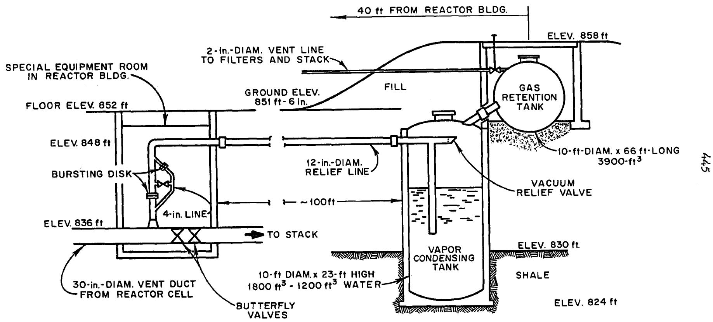  
Fig.17.1. Diagram of MSRE Vapor-Condensing System

(The method of handling steam that might be generated beneath the reactor cell containment vessel if hot fuel were spilled to the bottom of the cell is discussed in Section 4.3.1.)

As shown on the off-gas system and containment ventilation process flowsheet, Fig. 13.2 (ORNL drawing D-AA-A-40883), and on the layout drawing, ORNL D-KK-D-54287, a 12-in. sched-40 steel pipe, line 980, branches from the 30-in.-diam cell ventilation pipe in the special equipment room upstream of the two butterfly valves, HCV-930-A and HCV-930-B. Inside the special equipment room, line 980 contains a 10-in. rupture disk having a bursting pressure of 20 psi, and in a parallel connection with it, a 3-in. rupture disk with a bursting pressure of 15 psi. In relieving at the lower pressure the 3-in.-disk reduces the dynamic impact on the condensing system when the large disk ruptures. Calculated flows through the 3-in. disk indicates a negligible pressure increase downstream of the 10-in. disk, allowing it to rupture as planned. A 4-in. hand valve with an extension handle to the operating floor level is piped in parallel with the two rupture disks to permit equalization of the pressure on the disks when the cells are being pressure tested above the normal operating pressure for the disks. With the reactor cell at 40 psig and the vapor condensing system at 30 psig, the estimated mass flow rate in line 980 is 16 lb/sec. Line 980 continues underground to the vapor condensing tank, VT-1, located east of the ventilation system stack, see plot plan, Fig. 3.2. A 12-in. expansion joint is provided in line 980 to absorb thermal expansions.

The vapor condensing tank, or water tank, is a vertical tank about two-thirds full of water, through which gases forced from the reactor cell in a major accident would be bubbled to condense the steam. The tank contains about 1,200 ft³ of water stored at $70^{\circ}\mathrm{F}$ , or less. The estimated maximum of 5 x 10⁶ Btu that could be released from the fuel salt in the reactor and drain tank cells would therefore raise the water temperature to about $140^{\circ}\mathrm{F}$ . 165, 166 The non-condensible gases are vented to a large gas storage tank.

The vertical water tank is 10 ft OD x 23 ft 4 in. high, including the ASME flanged and dished, 1/2-in.-thick, top and bottom heads. The shell is 3/8-in. thick and constructed of SA-300 Class I, A-201, Grade B

firebox steel. $^{125}$ There are stiffening rings, 1-in. thick x 3 in., located on the exterior about 2 ft 6 in. apart. The tank is designed for 8 psia at $100^{\circ}\mathrm{F}$ or 63 psia at $300^{\circ}\mathrm{F}$ . The 12-in. gas inlet pipe in the top head extends 13 ft 8 in. into the tank to about 6 ft below the normal water level, and terminates in a cylindrical screen, 11-7/8-in. OD x 14 in. long, perforated with 7/32-in.-diam holes on 3/8-in. centers, and providing $31\%$ free area. See ORNL drawing D-KK-B-41283.

The gas inlet line in the interior of the tank has a 12-in. pipe cross about 3 ft above the water level to which are connected two 12-in. cast-steel-body check valves. These check valves close when the gas flow is into the tank but open to return non-condensibles to the reactor cell through line 980 during cooldown after an accident.

The tank is filled to the operating level with potable water through a temporary line or hose. Liquid level indication is provided by the float operated instrument, LI-VT-1. The pressure is indicated by PI-VT-1, and the temperature is measured. There is no bottom drain on the tank, the water being removed by pumping should this be required.

The top head of the tank is provided with an 18-in.-diam blind flange to serve as a manhole. The 12-in. discharge nozzle for non-condensible gases is also in the top head. The tank is installed vertically with the top about 8 ft below the normal grade level of 850 ft and the bottom at an elevation of about 819 ft. About 5 ft of additional earth is mounted above the tank to provide biological shielding. The tank is supported and also held down by a skirt on the bottom head bolted to a reinforced concrete pad, 18-in. thick x 14 ft diam, which also includes a cylindrical wall, 12-in. thick x 10 ft OD, and about 8 ft high.

The non-condensible gases leaving the top of the water tank through the 12-in. pipe, line 981, flow through the expansion joint in the line and to a side nozzle on the gas retention tank, VT-2. Cases can accumulate in this tank, initially at atmospheric pressure, until the pressure falls to a lower level in the reactor cell. The gas then returns to the reactor cell to prevent the pressure from falling below 8.0 psia. Line 984, a 2-in. line with a hand valve (with removable handle) is provided to vent gas to the absolute filters and ventilating system stack.

The gas retention tank is 10 ft OD x 66 ft 3-1/2 in. long, including the two ASME 1/2-in.-thick flanged and dished heads. The shell is 3/8-in. thick, reinforced with 1-in.-thick x 3 in. rings located about 4 ft 7 in. apart. The tank is fabricated of SA-300 Class I, SA-201 Grade B firebox steel and is designed for 8 psia at $100^{\circ}\mathrm{F}$ and 63 psia at $300^{\circ}\mathrm{F}$ . It is anchored into a sand and gravel base by four 1-in.-diam galvanized steel tie rods fastened to expanding type earth anchors. The nozzle end of the tank is anchored to a reinforced concrete saddle and pad, roughly 18 in. thick, 12 ft wide, and 6 ft long. The centerline is about 14 ft from the centerline of the vapor condensing tank and the elevation at the bottom is 842 ft. A 1-1/2-in. sched 40 drain pipe, line 982, at the bottom, drains into the vapor condensing tank. See ORNL drawing D-KK-B-41282.

The drain tank condensers, line 338, and the relief valve on the water line from the thermal shield and fuel pump, line 885, are both vented to the vapor condensing system by joining line 982. (See Section 15.2.)

# 18. BIOLOGICAL SHIELDING

The MSRE building areas are divided into five classifications: (I), those with high radiation levels that cannot be entered under any circumstances after the reactor has been operated at power, such as the reactor and drain tank cells; (II), those that can be entered a short time after the fuel salt is drained from the primary circulating system, such as the radiator area; (III), those that can be entered at low reactor power levels, such as the special equipment room; (IV), areas which are habitable at all times; (V), the maintenance control room, which is the only habitable area on the site when certain large-scale maintenance operations are being performed. These classifications are described in more detail in Section 4.1.

The MSRE is designed to permit prolonged operation at 10 Mw without exposing personnel to more than the permissible dose of 100 mrem/week in areas which are entered routinely and have unlimited access. However, it is ORNL policy to limit all personnel exposures to a minimum and it is not anticipated that MSRE operators will accumulate 100 mrem/week except in unusual circumstances. The areas which will have unlimited access and which, therefore, might be occupied continuously, will be essentially at normal background level for the Oak Ridge vicinity.

"Hot spots," or areas of high local activity, are generally located near the reactor or drain tank cell penetrations and are in areas which have only limited access, such as the coolant cell. The overall activity in the coolant cell, however, does not exceed 100 mr/hr. The blower house is also a limited access area, with a radiation level of about 20 mr/hr near the No.4 blower. Although the special equipment room is classified a limited access area, the radiation field does not exceed about 10 mr/hr. The south electric service area, another limited access portion of the building, has a generally higher radiation level of 200 mr/hr, with some "hot spots" near the penetrations. All the above estimates of activity levels are based on operation of the reactor at the 10-Mw power level.

The intensity of the radiation in the auxiliary cells is less dependent upon the reactor power level than upon the nature of the materials present in the cells. These conditions change from time to time, but in general, all the cells have limited access.

When the reactor is subcritical, all areas except the reactor, drain tank and fuel processing cells, may be entered a few minutes after the reactor is shut down. In general, access can be on an unlimited basis except where "hot spots" may exist.[168] For example, if the coolant salt were drained from that circulating system, two 4-in.-diam holes would be left through the reactor shielding, one of which "looks" directly at the fuel pump bowl, and could cause a localized beam in the coolant cell of several r/hr. Entry to such areas and work in the areas will be monitored and additional shielding provided as required.

# 18.1 General Description

This section provides only a summary description of the biological shielding. The general construction of the cells and other areas is described in more detail in Section 4 of this Part I of the design report. The calculations necessary to confirm the adequacy of the shielding are presented in Section 13 of the nuclear analysis portion of the report, Part III. [168, 169, 170] The shielding needed for the fuel handling and processing system is covered in Part VII. Shielding required during maintenance procedures is described in Part X.

The reactor vessel is surrounded, except for a 2-ft-diam opening at the top, by a 16-in.-thick iron and water thermal shield. This is located within the reactor cell containment vessel which, in turn, sits within a shield tank to provide a 3-ft-wide annular space which is filled with magnetite sand and light water. The shield tank is surrounded by a cylindrical monolithic concrete wall 2l in. thick. A portion of this wall facing the south electric service area and another portion facing the coolant area are left out in order to make the penetrations accessible. Barytes concrete block walls are provided to shield accessible areas adjacent to the coolant cell. The additional shielding is not necessary

in the electric service area in that there is a minimum of 2 ft of concrete between it and any accessible area.

The top of the reactor cell is constructed of a 3-1/2-ft-thick layer of barytes concrete blocks covered with 3-1/2-ft-thick blocks of ordinary concrete. The joints between the upper and lower layer of blocks are staggered. High-density shielding blocks are temporarily stacked above this as required.

The pipe penetrations through the reactor and drain tank cell walls pass through sleeves which are filled with magnetite concrete grout or magnetite sand and water. Where possible, these lines have an offset bend. The penetration of the 30-in-diam exhaust line through the bottom hemisphere of the containment vessel required special treatment because of the size of the opening. A shadow shield of a 9-in. thickness of steel is provided in front of the opening inside the cell and a 12-in.-thick wall of stacked block is erected outside the cell at the foot of the ramp to the coolant cell.

The top and sides of the coolant and coolant drain tank cells provide at least 24 in. of concrete shielding as protection against activity induced in the coolant salt while the reactor is producing power. The large openings provided between the coolant cell and the blower house for the cooling air supply to the radiator, however, make it difficult to shield the blower house from this induced activity. A l2-in. wall of barytes blocks is stacked across the opening between the reactor cell and the radiator duct to shield the blower house area from the coolant salt lines.

The drain tank cell has a minimum thickness of 3 ft for the magnetite concrete walls facing accessible areas. The top of the cell consists of a layer of 4-ft-thick ordinary concrete blocks covered by a layer of 3-1/2-ft-thick ordinary concrete blocks. The joints between the blocks are staggered. The pipe lines penetrating the cell walls have offsets, the smaller ones being cast into the walls. Shield plugs are provided for the larger penetrations.

The 1/2-in. off-gas line from the reactor cell, line 524, is shielded by 4 in. of lead as it passes through the coolant drain tank

cell. Barytes concrete blocks are stacked to a thickness of 5 ft above the line in the vent house, and 17-in.-thick steel plate is provided above the line between the vent house and the charcoal beds.[171] The charcoal beds are submerged in water and the pit is covered with two 18-in.-thick by 10-ft-diam barytes concrete blocks. Barytes blocks will be stacked on the cover if additional shielding is required.

The walls of the filter pit for the containment ventilation system are 12 in. thick and the roof plugs for the pit are 18 in. thick.

The thicknesses of the walls and tops of the auxiliary cells is given in Table 4.3. Additional shielding is provided by stacked blocks on the west side of the fuel processing and the decontamination cells.

# 19. ELECTRICAL SERVICES

The MSRE electrical services system furnishes power for process pumps, equipment heaters, instrumentation, nuclear control and safety circuits, and various auxiliary equipment. Power is also provided for the building cranes, repair shops, and general building lighting, ventilation and air conditioning.

The MSRE installation makes use of the relatively extensive electrical facilities that were installed for the ARE and ART operations in the Building 7503 area. This existing equipment was modified and supplemented, as required.

The installed electrical capacity of MSRE process equipment, excluding general building services, is about 2,000 kw. The normal operating load is approximately 1,100 kw.

Power is supplied from the Tennessee Valley Authority distribution system through two parallel 13.8 kv feeder lines. In the event of failure of the normal power supply from the TVA system, batteries provide the 48-v DC power for the reactor control and safety circuits and also 250-v DC power to drive a 25-kw motor-generator set to supply AC power to other instruments and controls, the sampler-enricher station, the control-rod drives, and the lubrication systems for the salt circulating pumps. These batteries serve until the emergency diesel-generator sets can be started and loaded, a procedure normally requiring a maximum of 5 to 10 minutes.* In event none of the diesel units can be started, battery capacities are more than ample to maintain control of the reactor and to drain the fuel salt to the drain tanks without damage to the system.

The three emergency diesel-generator sets have a combined capacity of 900 kw AC. This emergency AC power can drive the 3-kw, 48-v, DC motor-generator set normally supplying the reactor control and safety circuits. During the emergency period, the lube oil systems, control-rod drives,

and other important AC equipment mentioned above, can continue to receive power from the battery-driven 25-kw motor-generator set (for at least two hours), or they may take power directly from the diesel-driven generators. With the three emergency diesels in operation the reactor can operate at the heat-loss power level indefinitely until normal electric power can be restored.

# 19.1 General Description

A simplified one-line diagram of the electrical supply and distribution system for the MSRE is shown in Fig. 19.1. Reference numbers on this diagram are keyed to the descriptive material in the following sections.

The MSRE is supplied with electric power from the 154-kv Tennessee Valley Authority system through a substation located just north of the X-10 area (see Fig. 3.4). Either of two 13.8-kv transmission lines from the substation, ORNL circuit 234 or 294, serve the Building 7503 area and are interconnected through interlocked motor operated switches at the MSRE site so that circuit 299 can serve as an alternative to circuit 234. The normal supply is through ORNL circuit 234.

The feeders supply a bank of three 250-kva, 13.8-kv to 480-v, transformers located on the east side of Building 7503 to provide power for general building services. The feeder power is also connected to a new 1,500-kva, 13.8-kv to 480-v, transformer located on the west side of the building to serve the MSRE process equipment load.

The process equipment distribution system is shown schematically in Fig. 19.2. (ORNL drawing D-KK-C-41152) The 1,500-kva substation feeds a TVA* switchgear bus which supplies power through circuit breakers to three generator* switchgear busses, two TVA motor-control centers, two 250-hp radiator blower motors, and to the 200-hp motor for the 250-v DC motor-generator set. The two TVA motor control centers supply power to

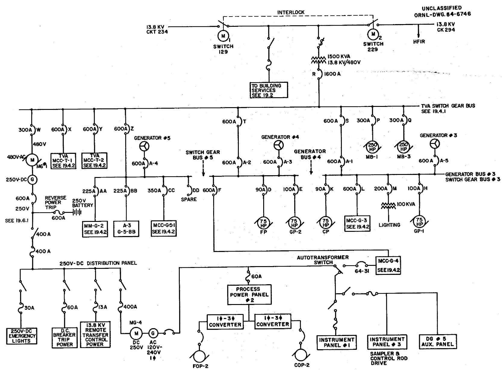  
5   
FIG.19.I SIMPLIFIED ONE-LINE DIAGRAM OF ELECTRICAL SUPPLY SYSTEM

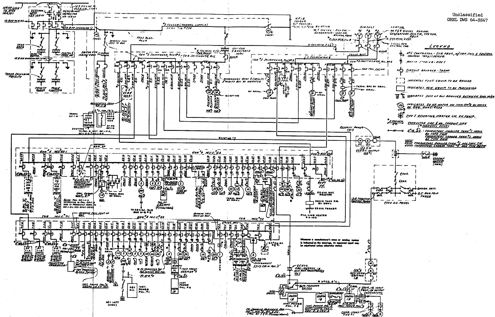  
Fig. 19.2. Process Equipment Electrical Distribution System.

4

#

#

4

#

.

产

#

the less critical process heater distribution centers and to a few non-critical smaller motors.

The three generator switchgear busses are normally fed from the TVA system but each has its own diesel-driven, 300-kw generator* to supply emergency power. Generator No. 5 supplies one heater distribution panel and two motor control centers which provide power to the heater distribution panels for the more critical process heaters.** Generator No. 3 and generator No. 4 switchgear busses furnish power directly, or through motor-control centers, to all critical motorized equipment and to some instrumentation. Where reactor process equipment is installed in duplicate, each unit is supplied from a different generator bus to provide greater reliability of emergency operation.

The process distribution system includes the aforementioned 48-v DC motor-generator set which supplies power to the important reactor control and safety circuits. This direct-current system operates from a battery supply during a failure of the normal power source until either diesel No. 3 or No. 4 can be started.

The building services distribution system is shown schematically in Fig. 19.3. This system supplies power for building and grounds lighting, for heating, ventilating and air conditioning, and for maintenance services, such as cranes, welding, etc. The power is supplied from two main distribution panels and from various lighting panels located throughout the building. Part of the building lighting load can be transferred to the generator No. 3 switchgear bus for emergency lighting in event of failure of the normal supply from the TVA system.

*The No. 5 diesel-generator unit has a nameplate rating of $1,200 \mathrm{kw}$ , but has a continuous duty output of $300 \mathrm{kw}$ due to the limited output of the diesel engine. See Section 19.3.

**Across-the-line motor starter contactors and circuit breakers in the motor control centers originally installed for the ART are utilized extensively in various MSRE circuits and are termed "motor control centers" in the MSRE literature and on drawings even though a particular center may be controlling a heater, for example, rather than a motor.

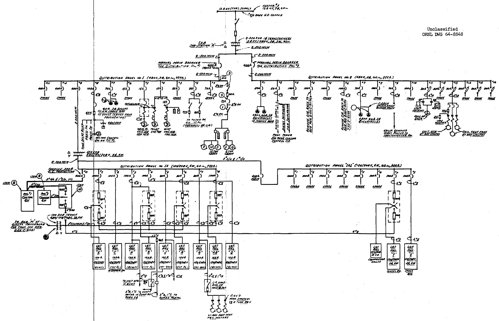  
Fig. 19.3. Building Services Electrical Distribution System.

# 19.2 Transmission Lines and Substations

Electrical power is supplied to the MSRE site by two 13.8-kv overhead feeder lines from the ORNL substation located just north of the main X-10 area, see Fig. 3.4. These are designated ORNL circuits 234 and 294. The preferred supply arrangement is through circuit 234, through the motor-operated disconnect switch, M-1. The alternate arrangement is through circuit 294 and the motor-operated disconnect switch M-2. These two switches are interlocked to prevent both switches from being closed at the same time. The switch, M-1, has an opening delay timer which allows a 1 to 10 sec loss of power on circuit 234 before the switch opens, then the switch M-2 automatically closes if there is supply voltage on circuit 294. The control circuit for M-2 will also prevent the switch from closing if there is an electrical fault in the Building 7503 area. The control power for the breakers M-1 and M-2 is from the Building 7503 area 250-v DC system. The switches can be closed from the remote pushbutton station in the MSRE auxiliary control room or manually at the switch poles C and D located north of the building.

The process power substation is located west of Building 7503 and consists of an oil filled, 1,500-kva, 13.8-kv/480-v, 3-phase, 60-cycle, 3-wire, delta-connected Uptgroff transformer with a maximum impedance of $5.75\%$ . The 13.8 kv supply enters the substation through a high voltage, fused cut-out disconnect switch. The 480-v transformer output enters the switch house through twelve 750 mcm* (0.998-in. diam) cables laid in underground conduit, through a 1,600-amp breaker, R, to connect to the TVA switchgear bus.

The building service substation is located to the east of Building 7503 and is supplied through a disconnect switch. The substation consists of three 250 kva, single-phase transformers connected delta-delta to reduce the 13.8-kv supply to 480-v, 3-phase, 60-cycle power. The transformer output is brought into the building through nine 500 mcm (0.814-in. diam) underground cables. Six cables (two per phase) lead to the 600-amp main

circuit breaker for distribution panel No. 1 and the other three lead to the 600-amp distribution panel No. 2. These circuit breakers are located on the wall of the main building at column D-4 (see Fig. 4.4) at the 840-ft elevation.

# 19.3 Emergency Diesel-Generators

Of the five diesel-generator units initially installed in the generator house for the ART project, two were removed for other duty and three remain for use in the MSRE. These units, numbered 3, 4 and 5, have a continuous capacity of 300 kw each, as explained below.

Individual busses were selected for distribution of the power from the generators to the centers on the basis of calculations of the size and nature of the MSRE emergency electrical loads, the sizes of the existing switchgear, and the characteristics of the diesel-generator units. A ground detector alarm is provided for each bus.

The three diesel-generator units can be operated from control panels located in the switch house. These panels have the necessary switches, controls, and indicating meters to adjust the generator output voltage and frequency and the synchronizing equipment for paralleling generators No. 3 and 4 with the TVA system. All three units can be started remotely from panels DPM 3, DPM 4, and DPM 5 in the auxiliary control room. These panels also include remote switches to open circuit breakers A1 and A2 to isolate busses 3, 4, and 5 from the TVA system and to close breakers A3, A4, and A5 to connect the generators to their respective busses. The remote panels also include diesel annunciator alarms, voltmeters and ammeters for the generator outputs, and a voltmeter for the TVA system power.

# 19.3.1 Diesel-Generator Units No. 3 and No. 4

These identical machines are Allis-Chalmers Buda units, Model 8DC SG-2505.[172] The engine is rated at an available brake horsepower of 450 at 1,200 rpm. A $10\%$ overload can be carried for a maximum of four hours, which must be followed by a cooling period of at least two hours at no more than the rated load. The engines are started by a battery

bank for each unit. Annunciators are provided to sound alarms on high cooling water temperature, high oil temperature, low oil pressure and low fuel level.

The generator is a direct connected Electric Machinery Model DCSG-300-A3E, rated at 300 kw, 375 kva, 480 v at 0.8 power factor, for continuous service. Each generator frame is equivalent to a 500-kw, 625-kva machine, however, this oversizing having been provided to compensate for the reactance load which would have been imposed by starting the large motor involved in the ART operations. Although the generator is constructed to AIEE and NEMA standards for an intermittent overload of $50\%$ , the maximum overload is limited to $10\%$ by the capacity of the driving engines. (These overload values do not apply to rapid load changes due to motor startings.)

Synchronizing equipment enables diesel-generator unit No. 3 or No. 4 to operate in parallel with the TVA power supply so that the loads can be transferred from the generators back to the TVA system without interrupting reactor operation. However, both units must not be operated in parallel with the TVA system at the same time. This would expose the motor control center busses to the combined capacities of both generators and the TVA system and would greatly exceed the current carrying capacity of the busses in event of a dead short in a connected load.[42]

The individual busses for generators No. 3 and 4 supply all motors which need emergency power. Since the voltage drop in a generator bus is critical when starting motors, starting currents have been limited to $540 \text{ amps}^*$ so that the generator voltage will not fall below $80\%$ of the initial value.

# 19.3.2 Diesel-Generator Unit No. 5

The diesel engine for this unit is a Caterpillar Model D-397. It is rated at 455 bhp at full load and at 1,200 rpm. It may be overloaded $15\%$ for two hours, which must be followed by a cooling period of at least two hours at no more than rated load. The engine is started by a compressed air motor supplied by a nearby air receiver and compressor. The receiver stores sufficient air for five 10-sec starts. The compressor

can recharge the receiver in 20 to 30 min following one 10-sec start. An annunciator sounds an alarm on high cooling water temperature, high oil temperature, low oil pressure, low fuel level, and low starting air pressure.

The generator was manufactured by Electrical Machinery, is rated at 1,000 kw, 1,250 kva, and is direct connected to operate at 1,200 rpm. For continuous loading it is rated at 300 kw at 0.8 power factor. As previously mentioned, the oversized generator was provided to compensate for the reactance in starting large motors involved in the ART. Although this generator was also built to conform to the AIEE and NEMA standards for intermittent loads of 150%, the maximum load is limited to 115% by the capacity of the driving engine.

# 19.4 Process Electrical Circuits

# 19.4.1 Switchgear Equipment

Except as otherwise indicated, the switchgear equipment is located in the switch house, as shown in Fig. 19.4.

The equipment was manufactured by Westinghouse Electric Corporation. The busses are rated at 1,600 amps, 480 v, and have a 50,000-amp short circuit carrying capacity. The R, P, Q, and A4 circuit breakers are Westinghouse Type DB 50, with a 1,600-amp frame, 50,000-amp asymmetrical, at 600-v, short circuit capacity.* The remaining circuit breakers are Westinghouse Type DB 25, with 600-amp frame, 25,000 amp asymmetrical at 600 v.** See Table 19.1 for other data on switchgear busses and breakers.

19.4.1.1 TVA Switchgear Bus and Current-Limiting Reactor. The TVA switchgear bus, including breaker R in the supply line from the substation, is located in panels 2 through 5 on the south side of the switch house, as shown in Fig. 19.4. There are ten circuits connected to the bus, as indicated in Fig. 19.2. The first two 300-amp breakers, P and Q, supply power to the 250-hp motors of the blowers which supply cooling air to the

UNCLASSIFIED

ORNL-DWG. 64-6747

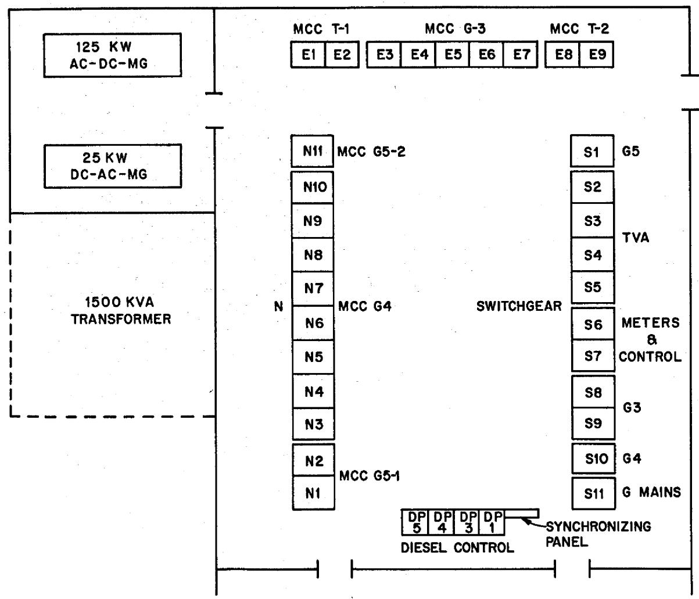  
FIG.19.4 LOCATION OF EQUIPMENT IN SWITCH HOUSE

Table 19.1. Switchgear Bus and Breaker Data   

<table><tr><td rowspan="2">Tap and Breaker</td><td rowspan="2">Termination</td><td colspan="2">Breaker</td><td></td><td rowspan="2">Cable, No. and Size</td><td rowspan="2">Starter Location</td><td rowspan="2">Potential Transformer</td><td rowspan="2">Current Transformer</td><td colspan="3">Instrument Location</td><td rowspan="2">Interlocking Action</td><td rowspan="2">Remarks</td></tr><tr><td>Size (amps)</td><td>Operation</td><td>Location</td><td>Voltmeter</td><td>Ammeter</td><td>Wattmeter</td></tr><tr><td>R</td><td>TVA Bus</td><td>1600</td><td>Elec op sw.</td><td>S-5, Local</td><td colspan="9">TVA Switchgear Bus</td></tr><tr><td>P</td><td>MB-1</td><td>300</td><td>Elec op sw.</td><td>S-5, MCR</td><td>MB-4</td><td>-</td><td>-</td><td>300/5 amps</td><td>-</td><td>Local</td><td>-</td><td>-</td><td>Supply from substation.</td></tr><tr><td>Q</td><td>MB-3</td><td>300</td><td>Elec op sw.</td><td>S-5, MCR</td><td>MB-4</td><td>3φ, 480/120-v</td><td>300/5 amps</td><td>DPM-4</td><td>Local</td><td>-</td><td>-</td><td>-</td><td>Breaker-starter combination.</td></tr><tr><td>S</td><td>Swg Bus 3</td><td>600</td><td>Elec op sw.</td><td>S-3, Local</td><td>6 No.500 mcm</td><td>-</td><td>-</td><td>-</td><td>-</td><td>-</td><td>-</td><td>Close before A-1</td><td>In series with A-1.</td></tr><tr><td>T</td><td>Swg Bus 4</td><td>600</td><td>Elec op sw</td><td>S-3, Local</td><td>6 No.500 mcm</td><td>-</td><td>-</td><td>-</td><td>-</td><td>-</td><td>-</td><td>Close before A-2</td><td>In series with A-2.</td></tr><tr><td>Z</td><td>Swg Bus 5</td><td>600</td><td>Elec op sw</td><td>S-2, Local</td><td>6 No.500 mcm</td><td>-</td><td>-</td><td>600/5 amps</td><td>-</td><td>-</td><td>DPI-DFMS</td><td>Close if A-4 is open.</td><td></td></tr><tr><td>X</td><td>MCC T-1</td><td>600</td><td>Manual</td><td>S-2</td><td>6 No.500 mcm</td><td>-</td><td>2φ, 480/120-v</td><td>600/5 amps</td><td>-</td><td>-</td><td>DPI</td><td>-</td><td>PT or main bus for X and Y wattmeters.</td></tr><tr><td>Y</td><td>MCC T-2</td><td>600</td><td>Manual</td><td>S-2</td><td>6 No.500 mcm</td><td>-</td><td>-</td><td>600/5 amps</td><td>-</td><td>-</td><td>DP2</td><td>-</td><td></td></tr><tr><td>W</td><td>MG-1</td><td>300</td><td>Manual</td><td>S-2</td><td>3 No.500 mcm</td><td>-</td><td>-</td><td>300/5 amps</td><td>-</td><td>Local</td><td>-</td><td>Under voltage trip.</td><td></td></tr><tr><td>U</td><td>Spare</td><td>-</td><td></td><td>S-3</td><td>-</td><td>-</td><td>-</td><td>200/5 amps</td><td>-</td><td>Local</td><td>-</td><td>-</td><td></td></tr><tr><td>V</td><td>Spare</td><td>-</td><td></td><td>S-3</td><td>-</td><td>-</td><td>-</td><td>200/5 amps</td><td>-</td><td>Local</td><td>-</td><td>-</td><td></td></tr><tr><td></td><td></td><td></td><td></td><td></td><td colspan="8">Switchgear Bus No. 5</td><td></td></tr><tr><td>AA</td><td>MCC 5-2</td><td>350</td><td>Elec op sw</td><td>S-1, MCR</td><td>3 No.500 mcm</td><td>-</td><td>-</td><td>400/5 amps</td><td>-</td><td>-</td><td>DPI</td><td>Under voltage trip.</td><td></td></tr><tr><td>BB</td><td>HDP G5-EB</td><td>225</td><td>Elec op sw</td><td>S-1, Local</td><td>3 No.500 mcm</td><td>-</td><td>-</td><td>250/5 amps</td><td>-</td><td>-</td><td>DPI</td><td>-</td><td></td></tr><tr><td>CC</td><td>MCC 5-1</td><td>350</td><td>Elec op sw</td><td>S-1, MCR</td><td>3 No.500 mcm</td><td>-</td><td>-</td><td>400/5 amps</td><td>-</td><td>-</td><td>DPI</td><td>-</td><td></td></tr><tr><td>DD</td><td>-</td><td>-</td><td>-</td><td>S-1</td><td>-</td><td>-</td><td>-</td><td>-</td><td>-</td><td>-</td><td>-</td><td>-</td><td></td></tr><tr><td>A-4</td><td>From DG-5</td><td>600</td><td>Elec op sw</td><td>S-11, MCR</td><td>6 No.500 mcm</td><td>-</td><td>-</td><td>800/5 amps</td><td>DP-8/DM-5</td><td>DP-5</td><td>DP5-DM5</td><td>Close if Z is open.</td><td>Reverse current trip.</td></tr></table>

Note: See Appendix for explanation of abbreviations.

radiator. The remaining eight circuits are connected to the bus through a current limiting reactor. This inductance coil protects the busses and circuit breakers in event of dead shorts in the feeder circuits by creating a back electromotive force to limit the short circuit current. There are three Westinghouse Type MSP - 6R2207 reactors, one for each phase, rated at 16.6 kva, single-phase, 1,200-amp, 13.8 voltage drop, and 480-v line. Two of the eight circuits supply the TVA motor control centers T-1 and T-2 through the circuit breakers X and Y. Three circuits supply the generator switchgear busses through breakers S, T and Z. Another circuit provides power for the 250-v DC motor-generator set through breaker W. Circuits U and V are spares. See ORNL drawing D-KK-C-41175.

19.4.1.2 Switchgear Bus No. 3. This bus is located in panels 8 and 9 on the south side of the switch house, as indicated in Fig. 19.4, and is normally supplied with power from breaker S on the TVA bus through breaker A1 located at panel 8. This bus has an alternate, emergency power supply through circuit breaker A5, from the 300-kw diesel-generator set No. 3. Switchgear bus No. 3 supplies the following equipment: the coolant circulating pump (breaker K), the component cooling gas blower No. 1 (breaker H), the 100-kva emergency lighting transformer (breaker M), the motor-control center G-3 (breaker L), and the spare circuit breakers G, J and N. Data for the switchgear bus No. 3 circuits are given in Table 19.2. (Also, see ORNL drawing D-KK-C-41176.)

19.4.1.3 Switchgear Bus No. 4. Bus No. 4 is located in panel 10 on the south side of the switch house, see Fig. 19.4. The bus is normally supplied with power from the TVA system through breaker T and through breaker A2 on the No. 4 bus. The bus is also provided with emergency power through breaker A3, connecting it to the diesel-generator set No. 4. Switchgear bus No. 4 supplies power to the fuel circulating pump (breaker D), component cooling gas blower No. 2 (breaker E), and the motor-control center G-4 (breaker F). (See ORNL drawing D-KK-C-41176.)   
19.4.1.4 Switchgear Bus No. 5. The generator No. 5 switchgear bus is located in the first panel on the south side of the switch house and is normally supplied with power from the TVA system through breaker Z. This bus is also supplied with emergency power from the diesel-generator unit No. 5 through breaker A4. The bus supplies power to the heater

Table 19.2. Connections to Switchgear Bus No.   

<table><tr><td rowspan="2">Tap and Breaker</td><td rowspan="2">Termination</td><td colspan="3">Breaker</td><td rowspan="2"></td><td rowspan="2">Cable, No. and Size</td><td rowspan="2">Starter Location</td><td rowspan="2">Potential Transformer</td><td rowspan="2">Current Transformer</td><td rowspan="2">In Voltm</td></tr><tr><td>Size (amps)</td><td>Operation</td><td>Location</td></tr><tr><td>A-1</td><td>Bus 3</td><td>600</td><td>Elec op sw.</td><td>S-9, DP-3, DPM</td><td colspan="5">Switchgear Bus No. 3</td><td>DPI/DPI</td></tr><tr><td>A-5</td><td>Bus 3</td><td>600</td><td>Elec op sw.</td><td>S-11,DP-3, DPM</td><td>6 No. 500 mcm</td><td>-</td><td>2φ,480/120-v</td><td>3φ,600/5 amp</td><td>DP3/DPI</td><td></td></tr><tr><td>H</td><td>CCP-1</td><td>100</td><td>Elec op sw.</td><td>S-9, MB-2</td><td>6 No. 250 mcm</td><td>-</td><td>2φ,480/120-v</td><td>3φ,600/5 amp</td><td>DP3/DPI</td><td></td></tr><tr><td>K</td><td>CP</td><td>90</td><td>Elec op sw.</td><td>S-8, MB-6</td><td>3 No.1/0</td><td>MB-2</td><td>-</td><td>2φ,150/5 amp</td><td>-</td><td></td></tr><tr><td>L</td><td>MCC-G-3</td><td>600</td><td>Manual</td><td>S-8</td><td>3 No.1/0</td><td>MB-6</td><td>-</td><td>2φ,100/5 amp</td><td>-</td><td></td></tr><tr><td>M</td><td>Lighting X-fmr</td><td>200</td><td>Manual</td><td>S-8</td><td>6 No.350 mcm</td><td>-</td><td>3φ,480/120-v</td><td>-</td><td>-</td><td></td></tr><tr><td>N</td><td>Spare</td><td></td><td></td><td>S-8</td><td></td><td></td><td></td><td></td><td></td><td></td></tr><tr><td>J</td><td>Spare</td><td></td><td></td><td>S-9</td><td></td><td></td><td></td><td></td><td></td><td></td></tr><tr><td>G</td><td>Spare</td><td></td><td></td><td>S-9</td><td></td><td></td><td></td><td></td><td></td><td></td></tr><tr><td>A-2</td><td>Bus 4</td><td>600</td><td>Elec op sw.</td><td>S-10, DPM-4</td><td colspan="5">Switchgear Bus No. 4</td><td>DPI/DPI</td></tr><tr><td>A-3</td><td>Bus 4</td><td>600</td><td>Elec op sw.</td><td>S-11, DPM-4</td><td>6 No. 500 mcm</td><td>-</td><td>2φ,480/120-v</td><td>3φ,600/5 amp</td><td>DP4/DPI</td><td></td></tr><tr><td>D</td><td>Fuel Pump</td><td>90</td><td>Elec op sw.</td><td>S-10, MB-8</td><td>6 No. 250 mcm</td><td>-</td><td>2φ,480/120-v</td><td>3φ,600/5 amp</td><td>DP4/DPI</td><td></td></tr><tr><td>E</td><td>CCP-2</td><td>100</td><td>Elec op sw.</td><td>S-10, MB-2</td><td>3 No. 1/0</td><td>MB-8</td><td>-</td><td>2φ,100/5 amp</td><td>-</td><td></td></tr><tr><td>F</td><td>MCC-G-4</td><td>600</td><td>Manual</td><td>S-10</td><td>3 No. 1/0</td><td>MB-2</td><td>-</td><td>2φ,150/5 amp</td><td>-</td><td></td></tr></table>

Note: See Appendix for explanation of abbreviations.

<table><tr><td colspan="3">Instrument Location</td><td rowspan="2">Interlocking Action</td><td rowspan="2">Remarks</td></tr><tr><td>ter</td><td>Ammeter</td><td>Wattmeter</td></tr><tr><td>PM</td><td>-</td><td>DPI/DPM</td><td>Close only after S.</td><td>Reverse current trip. VAR on DPI Supply in series with S.</td></tr><tr><td>PM</td><td>DP3</td><td>DP3/DPM</td><td>-</td><td>Reverse current trip. VAR on DP3 Supply from DG-3.</td></tr><tr><td></td><td>Local</td><td>-</td><td>Can not close if E is closed.</td><td>Under voltage trip.</td></tr><tr><td></td><td>Local MB-6</td><td>MB-6</td><td></td><td>Under voltage trip.</td></tr><tr><td></td><td>-</td><td>-</td><td>-</td><td>Voltage for bus and Diesel annunciator.</td></tr><tr><td></td><td>-</td><td>-</td><td>-</td><td>-</td></tr><tr><td>MM</td><td>-</td><td>DPI/DPM</td><td>Close only after T</td><td>Reverse current trip. Supply in series with T.</td></tr><tr><td></td><td>DP4</td><td>DP4/DPM</td><td></td><td>Reverse current trip. Supply from D-G-4.</td></tr><tr><td></td><td>Local MB-8</td><td>MB-8</td><td></td><td>Under voltage trip.</td></tr><tr><td></td><td>Local</td><td>-</td><td>Can not close if H is closed.</td><td>Under voltage trip.</td></tr><tr><td></td><td>-</td><td>-</td><td>-</td><td>Voltage is bus voltage and Diesel-generator annunciator.</td></tr></table>

ations.

distribution panel G5-BB (breaker BB), the motor-control center G5-1 (breaker AA), the motor-control center G5-2 (breaker CC), and a spare circuit (breaker DD). See ORNL drawing D-KK-C-41176.

# 19.4.2 Motor-Control Centers*

Motor-control center equipment was manufactured by the General Electric Company. The busses are 600-amp, $480\mathrm{v}$ , and have a short circuit current capacity of 25,000 amp asymmetrical at $480\mathrm{v}$ . The circuit breakers are of 100-amp minimum frame size. Data for the motor-control center equipment are given in Table 19.3.

19.4.2.1 TVA Motor Control Centers. Motor-control center T-1 is located in panels 1 and 2 at the east end of the switch house, as indicated in Fig. 19.4. The bus is supplied with power from the TVA system through the switchgear breaker X. The bus supplies power to three heater distribution centers, Tl-A, Tl-B, and Tl-C. Circuits Tl-D, Tl-E, and Tl-F are spares.

Motor-control center T-2 is also at the east end of the switch house in panels 8 and 9. Power is supplied through the TVA breaker Y. The bus provides power to two motor-control centers and three heater distribution centers, through circuits T2-S and T2-Z. Three of these are spare circuits.

19.4.2.2 Generator No. 3 Motor-Control Center. Motor-control center G-3 is located on panels 3 through 7 in the east end of the switch house. This bus receives power from switchgear bus No. 3, as mentioned in 19.4.1.2, above. The bus supplies power to 24 circuits in the process system, as listed in Table 19.4. It may be noted that five circuits are omitted from the table since they are spares.

19.4.2.3 Generator No. 4 Motor-Control Center. This motor-control center is located in panels 2 through 10 on the north side of the switch house, as shown in Fig. 19.4. Provided with power through breaker F, from switchgear bus No. 4 (see Section 19.4.1.3, above), this center supplies power to 19 items of process equipment. The breaker data and related information is given in Table 19.5. Fifteen spare circuits are included, to provide a total of 34 circuits.

Table 19.3. Equipment Connections to TVA Motor Control Centers   

<table><tr><td>Tap and Breaker</td><td>Termination</td><td>Breaker Size (amps)</td><td>Starter Size</td><td>Location</td><td>Intervening Equipment</td><td>Cable No. and Size</td></tr><tr><td colspan="7">Motor Control Center T-1</td></tr><tr><td>T1-A</td><td>Htr Distr T1-A</td><td>200</td><td>-</td><td>-</td><td>-</td><td>3 No.4/0</td></tr><tr><td>T1-B</td><td>Htr Distr T1-B</td><td>200</td><td>-</td><td>-</td><td>-</td><td>3 No.4/0</td></tr><tr><td>T1-C</td><td>Htr Distr T1-B</td><td>200</td><td>-</td><td>-</td><td>-</td><td>3 No.4/0</td></tr><tr><td>T1-D-F</td><td>Spare</td><td>-</td><td>-</td><td>-</td><td>-</td><td>3 No.4/0</td></tr><tr><td colspan="7">Motor Control Center T-2</td></tr><tr><td>T2-S</td><td>HCV 975-A</td><td>30</td><td>IR</td><td>MB-3</td><td>-</td><td>3 No.12</td></tr><tr><td>T2-V</td><td>Pnl E Htr T2-V1</td><td>100</td><td>-</td><td>-</td><td>75-kva, 480/120, 240-v Xfmr.</td><td>3 No.2</td></tr><tr><td>T2-W</td><td>Pnl E Htr T2-W1</td><td>100</td><td>-</td><td>-</td><td>75-kva, 480/120, 240-v Xmfr.</td><td>3 No.2</td></tr><tr><td>T2-X</td><td>RDM</td><td>30</td><td>1</td><td>Console</td><td>-</td><td>3 No.12</td></tr><tr><td>T2-Y</td><td>Htr T2-Y</td><td>200</td><td>-</td><td>-</td><td>-</td><td>3 No.14</td></tr><tr><td>T2-TU</td><td>Spare</td><td></td><td></td><td></td><td></td><td></td></tr><tr><td>T2-TZ</td><td>Spare</td><td></td><td></td><td></td><td></td><td></td></tr></table>

Note: See Appendix for explanation of abbreviations.

Table 19.4. Equipment Connections to Motor Control Center G-3   

<table><tr><td rowspan="2">Tap and Breaker</td><td rowspan="2">Termination</td><td rowspan="2">Breaker Size (amps)</td><td colspan="2">Starter</td><td rowspan="2">Intervening Equipment</td><td rowspan="2">Cable No. and Size</td></tr><tr><td>Size</td><td>Location</td></tr><tr><td>1</td><td>Instr Pnl 3</td><td>70</td><td>-</td><td>-</td><td>30-kve 440/120, 208-v Xfmr</td><td>3 No.6</td></tr><tr><td>2</td><td>C-1</td><td>100</td><td></td><td></td><td>Xfer Sw in SH</td><td>3 No.2</td></tr><tr><td>3</td><td>Sump Pumps</td><td>30</td><td>On Equip.</td><td>-</td><td></td><td>3 No.2</td></tr><tr><td>5</td><td>DCC</td><td>15</td><td>-</td><td>-</td><td>Xfmr Sw from MCC-G4-5</td><td>3 No.12</td></tr><tr><td>8</td><td>CCP</td><td>30</td><td>1</td><td>MB</td><td></td><td>3 No.12</td></tr><tr><td>9</td><td>MG-2</td><td>15</td><td>1</td><td>48-v Pnl</td><td></td><td>3 No.12</td></tr><tr><td>10</td><td>RCC-1</td><td>15</td><td>1</td><td>MB-2</td><td></td><td>3 No.12</td></tr><tr><td>11</td><td>FOP-1</td><td>15</td><td>1</td><td>MB</td><td></td><td>3 No.12</td></tr><tr><td>12</td><td>TF-1</td><td>15</td><td>1</td><td>MB-2</td><td></td><td>3 No.12</td></tr><tr><td>13</td><td>HCV-930A</td><td>15</td><td>1R</td><td>MB-3</td><td></td><td>3 No.12</td></tr><tr><td>14</td><td>HCV-930B</td><td>15</td><td>1R</td><td>MB-3</td><td></td><td>3 No.12</td></tr><tr><td>15</td><td>AC-1</td><td>100</td><td>3</td><td>MB-2</td><td></td><td>3 No.6</td></tr><tr><td>16</td><td>Diesel Aux Pnl</td><td>100</td><td>-</td><td>-</td><td>Xfer Sw MCC-4</td><td>3 No.2</td></tr><tr><td>17</td><td>CCC-1</td><td>15</td><td>1</td><td>MB-2</td><td></td><td>3 No.12</td></tr><tr><td>18</td><td>Instr Pnl</td><td>50</td><td>-</td><td>-</td><td>7.5-kba 480/120, 240-v Xfmr</td><td>3 No.12</td></tr><tr><td>19</td><td>TWP</td><td>50</td><td>2</td><td>MB-2</td><td></td><td>3 No.8</td></tr><tr><td>20</td><td>CTF</td><td>50</td><td>2</td><td>MB-2</td><td></td><td>3 No.8</td></tr><tr><td>23</td><td>MB-2</td><td>30</td><td>1</td><td>MB-4</td><td></td><td>3 No.10</td></tr><tr><td>24</td><td>SF-1</td><td>100</td><td>3</td><td>MB-3</td><td></td><td>3 No.4</td></tr></table>

Note: See Appendix for explanation of abbreviations.

Table 19.5. Equipment Connections to Motor Control Center G-4   

<table><tr><td rowspan="2">Tap and Breaker</td><td rowspan="2">Termination</td><td rowspan="2">Breaker Size (amps)</td><td colspan="2">Starter</td><td rowspan="2">Intervening Equipment</td><td rowspan="2">Cable, No. and Size</td></tr><tr><td>Size</td><td>Location</td></tr><tr><td>G-4-2</td><td>C-1</td><td>100</td><td></td><td></td><td>Xfer Sw in SH</td><td>3 No.12</td></tr><tr><td>5</td><td>DCC</td><td>15</td><td>(2) 1</td><td>MB-2</td><td>Xfer Sw</td><td>3 No.12</td></tr><tr><td>9</td><td>MG-3</td><td>15</td><td>1</td><td>48-v Pnl</td><td></td><td>3 No.12</td></tr><tr><td>11</td><td>COP-1</td><td>15</td><td>1</td><td>MB</td><td></td><td>3 No.12</td></tr><tr><td>12</td><td>TF-2</td><td>15</td><td>1</td><td>MB-2</td><td></td><td>3 No.12</td></tr><tr><td>13</td><td>DR-1</td><td>15</td><td></td><td></td><td>5-kva, 480/120, 240-v Xfmr, 1 Φ</td><td>2 No.10</td></tr><tr><td>16</td><td>Aux DP</td><td>30</td><td></td><td></td><td>Xfer Sw</td><td>3 No.2</td></tr><tr><td>17</td><td>CCC</td><td>15</td><td>1</td><td>On Equip</td><td></td><td>3 No.12</td></tr><tr><td>20</td><td>CTP-2</td><td>50</td><td>2</td><td>MB-2</td><td></td><td>3 No.8</td></tr><tr><td>21</td><td>TWP-2</td><td>50</td><td>2</td><td>MB-2</td><td></td><td>3 No.8</td></tr><tr><td>23</td><td>WP</td><td>50</td><td>1</td><td>On Equip</td><td></td><td></td></tr><tr><td>24</td><td>RCC-2</td><td>15</td><td>1</td><td>MB-2</td><td></td><td>3 No.12</td></tr><tr><td>26</td><td>MB-4</td><td>30</td><td>1</td><td>MB-4</td><td></td><td>3 No.10</td></tr><tr><td>27</td><td>DR-2</td><td>30</td><td></td><td></td><td>5-kva, 480/120, 240-v, 1 Φ Xfmr</td><td>2 No.10</td></tr><tr><td>29</td><td>480/120,240-v Xfmr</td><td>100</td><td></td><td></td><td></td><td>2 No.4</td></tr><tr><td>31</td><td>Instr Pnl 1</td><td></td><td></td><td></td><td>25-kva, 480/120, 240-v, 1 Φ Xfmr</td><td>2 No.4</td></tr><tr><td>32</td><td>AC-2</td><td>100</td><td>3</td><td>MB-2</td><td></td><td>3 No.6</td></tr><tr><td>33</td><td>AC-3</td><td>100</td><td>3</td><td>MB-2</td><td></td><td>3 No.6</td></tr><tr><td>34</td><td>SF-2</td><td>100</td><td>3</td><td>MB-3</td><td></td><td>3 No.4</td></tr></table>

Note: See Appendix for explanation of abbreviations.

19.4.2.4 Generator No. 5 Motor-Control Center. Motor-control center G5-1 is installed in panels 1 and 2 on the north side of the switch house. The power supply is from switchgear bus No. 5. The center provides power through transformers to the heater distribution panels, which will be discussed subsequently. There are three spare circuits. The breakers and other data are listed in Table 19.6.

Motor-control center G5-2 is connected to three supply circuits, two of which supply heaters and one which serves as a spare. The center is located in panel ll on the north side of the switch house. Data on the breakers in this center are also given in Table 19.6.

# 19.5 Building Service Circuits

The building service circuits are shown schematically in Fig. 19.3. The circuits are supplied with power from the 750-kva substation through two distribution panels. These panels, No. 1 and No. 2, are located on the wall near column D-4 at the 840-ft elevation.

# 19.5.1 Building Service Panel No. 1

This distribution panel is supplied with 480-v three-phase power through a 600-amp circuit breaker. It provides power to 11 breakers which supply power to the equipment listed in Table 19.7. Data for lighting panels 1A and 1Al, which are supplied from the transformer in circuit 9 of panel No. 1, are given in Table 19.8. The transformer is a Kuhlman Electric Company, Spec No. 11409, 225-kva, 480/208Y-120-v, 3-phase, 60-cycle, dry type, rated at $80^{\circ}\mathrm{C}$ temperature rise.

# 19.5.2 Building Service Panel No.2

Three-phase power at $480\mathrm{~V}$ is provided for this panel through a 600-amp main breaker, as indicated in Fig. 19.3. The panel is rated at 325 amps, and has 16 connections to breakers or fused switches, which lead to the equipment listed in Table 19.9.

Table 19.6. Equipment Connections to Motor Control Centers G-5-1 and G-5-2   

<table><tr><td>Tap and Breaker</td><td>Termination</td><td>Breaker Size (amps)</td><td colspan="2">Starter Size Location</td><td>Intervening Equipment</td><td>Cable No. and Size</td></tr><tr><td>G-5-1A</td><td>Pnl DG-5-1A 1 - 5</td><td>200</td><td></td><td></td><td>112-kva 480/120, 208-v Xfmr</td><td>3 No.2</td></tr><tr><td>C</td><td>Pnl E G-5-1-1 G512</td><td>200</td><td></td><td></td><td>112, 5-kva 480/ 120,208-v Xfmr</td><td>3 No.2</td></tr><tr><td>D</td><td>Pnl DG-5-1D 1 - 4</td><td>200</td><td></td><td></td><td>75-kva, 480/120, 208-v Xfmr</td><td>3 No.1</td></tr><tr><td></td><td>Spare</td><td></td><td></td><td></td><td></td><td></td></tr><tr><td>G-5-2X</td><td>H103</td><td>100</td><td>3</td><td>HCP</td><td></td><td>2 No.2</td></tr><tr><td>Y</td><td>G-5-2Y-B2</td><td>200</td><td></td><td></td><td></td><td>3 No.4</td></tr><tr><td>B</td><td>Spare</td><td></td><td></td><td></td><td></td><td></td></tr><tr><td>E</td><td>Spare</td><td></td><td></td><td></td><td></td><td></td></tr><tr><td>F</td><td>Spare</td><td></td><td></td><td></td><td></td><td></td></tr><tr><td>Z</td><td>Spare</td><td></td><td></td><td></td><td></td><td></td></tr></table>

Note: See Appendix for explanation of abbreviations.

Table 19.7. Connections to Building Service Panel No. 1   

<table><tr><td>Circuit</td><td>Equipment</td><td>Breaker Fuse (amps)</td><td>Cable, No. and Size</td><td>Load hp</td><td>Remarks</td></tr><tr><td></td><td>10-Ton Crane</td><td>70/70</td><td>3 No.8</td><td>13</td><td>Both cranes on same</td></tr><tr><td></td><td>3-Ton Crane</td><td></td><td></td><td>6</td><td>fuse and breaker.</td></tr><tr><td>1</td><td>Spare</td><td>70</td><td>3 No.8</td><td></td><td></td></tr><tr><td>2</td><td>Fused Sw 852-ft Elev</td><td>25</td><td>3 No.12</td><td></td><td>Two 30-amp fused sw.</td></tr><tr><td>3</td><td>Spare</td><td></td><td></td><td></td><td></td></tr><tr><td>4</td><td>Change House Vent Fan 840-ft Elev Htr Fan</td><td>15</td><td>3 No.12</td><td>1/2 3/4</td><td>Vent fan interlocked with circuit No.5.</td></tr><tr><td>5</td><td>852-ft Elev Htr Fan</td><td>15</td><td>3 No.12</td><td>1-1/2</td><td></td></tr><tr><td>6</td><td>Spare</td><td>15</td><td></td><td></td><td></td></tr><tr><td>7</td><td>Two 3-Φ Recept.</td><td>70</td><td>3 No.4</td><td></td><td>(1) High Bay A-4 (2) ESA</td></tr><tr><td>8</td><td>MCR Air Conditioner</td><td>100/60</td><td>3 No.4</td><td>15</td><td>Time delay two p sw.</td></tr><tr><td>9</td><td>225-kva Xfmr</td><td>400</td><td>3 No.8</td><td></td><td>ΔY 480/120,208-v, 3/8 (Lights)</td></tr><tr><td>10</td><td>Spare</td><td>400</td><td></td><td></td><td></td></tr><tr><td>11</td><td>Spare</td><td>400</td><td></td><td></td><td></td></tr></table>

Note: See Appendix for explanation of abbreviations.

Table 19.8. Connections to Lighting Distribution Panels 1A and 1Al   

<table><tr><td>Circuit</td><td>Lighting Panel</td><td>Panel Location</td><td>Lights Location</td><td>Breaker Fuse (amps)</td><td>Cable, No and Size</td><td>Fused Sw</td></tr><tr><td></td><td></td><td colspan="2">Lighting Distribution Panel 1A</td><td></td><td></td><td></td></tr><tr><td>0</td><td>MCR-1</td><td>852-ft Elev Below MCR</td><td>MCR</td><td>400</td><td>3 No.4/01 No.2/0</td><td></td></tr><tr><td></td><td>MCR-2</td><td>&quot;</td><td>MCR</td><td>100</td><td>4 No.2</td><td>Yes</td></tr><tr><td>1</td><td>K</td><td>TRM</td><td>TRM and East SAL N-5</td><td>100/100</td><td>4 No.2</td><td>Yes</td></tr><tr><td>2</td><td>C</td><td>852-ft Elev in MCR</td><td>MCR</td><td>100</td><td>4 No.2</td><td></td></tr><tr><td>3</td><td>H</td><td></td><td>840-ft Elev Lights, Htr, 1st Floor</td><td>100</td><td>4 No.2</td><td></td></tr><tr><td></td><td>B</td><td></td><td>Guard Portal</td><td>100</td><td>4 No.2</td><td>Yes</td></tr><tr><td>4</td><td>D</td><td>840-ft Elev</td><td></td><td>100</td><td>4 No.2</td><td></td></tr><tr><td>6</td><td>A</td><td>852-ft Elev D-3 Hall</td><td>852-ft Elev, H, 1, 2, 3, MCR</td><td>90/100</td><td>4 No.2</td><td>Yes</td></tr><tr><td>5</td><td>J</td><td></td><td>High Bay Area Sump Vent</td><td>90</td><td>4 No.2</td><td></td></tr><tr><td>7</td><td>G</td><td>852-ft Elev C-5</td><td>High Bay Lights Three Roof Vents</td><td>90</td><td>4 No.2</td><td></td></tr><tr><td>8</td><td>AB</td><td></td><td>840-ft Elev</td><td>100/100</td><td>4 No.2</td><td>Yes</td></tr><tr><td></td><td></td><td colspan="2">Lighting Distribution Panel 1Al</td><td></td><td></td><td></td></tr><tr><td>1 - 6</td><td>Spares</td><td></td><td></td><td></td><td></td><td></td></tr><tr><td>7</td><td>T</td><td>Store Room Diesel House</td><td>Store Room, Diesel House, SH</td><td>100/100</td><td>4 No.2</td><td>Yes</td></tr><tr><td>8</td><td>S</td><td>Service Room</td><td>Service Room</td><td>100</td><td>4 No.2</td><td></td></tr></table>

Note: See Appendix for explanation of abbreviations.

Table 19.9. Connections to Building Service Panel No. 2   

<table><tr><td>Circuit</td><td>Equipment</td><td>Breaker Fuse (amps)</td><td>Cable, No. and Size</td><td>Load hp</td><td>Remarks</td></tr><tr><td>1</td><td>Two 480-v, 3 Φ Receipt</td><td>50</td><td>3 No.6</td><td></td><td>In service area.</td></tr><tr><td>2</td><td>Spare</td><td></td><td></td><td></td><td></td></tr><tr><td>3</td><td>Spare</td><td></td><td></td><td></td><td></td></tr><tr><td>4</td><td>Spare</td><td></td><td></td><td></td><td></td></tr><tr><td>5</td><td>Spare</td><td></td><td></td><td></td><td></td></tr><tr><td>6</td><td>Spare</td><td></td><td></td><td></td><td></td></tr><tr><td>7</td><td>Two 480-v, 3 Φ Receipt</td><td>70</td><td>3 No.4</td><td></td><td>Service H, Bl, H HB A4</td></tr><tr><td>8</td><td>Spare</td><td></td><td></td><td></td><td></td></tr><tr><td>9</td><td>Spare</td><td></td><td></td><td></td><td></td></tr><tr><td>10</td><td>Spare</td><td></td><td></td><td></td><td></td></tr><tr><td>11</td><td>Roll-up Doors</td><td>30 (F)</td><td>3 No.10</td><td>2</td><td>Top- bottom limit sw.</td></tr><tr><td>12</td><td>Spare</td><td></td><td></td><td></td><td></td></tr><tr><td>13</td><td>Two fans, One Htr</td><td>30 (F)</td><td>3 No.10</td><td></td><td>South High Bay Area</td></tr><tr><td>14</td><td>Spare</td><td></td><td></td><td></td><td></td></tr><tr><td>15</td><td>Spare</td><td></td><td></td><td></td><td></td></tr><tr><td>16</td><td>Spare</td><td></td><td></td><td></td><td></td></tr></table>

Note: See Appendix for explanation of abbreviations.

# 19.6 Direct-Current Electrical Systems

There are two independent direct current electrical systems, an existing 250-v system and a new 48-v system installed for the MSRE. The 25-kw motor-generator set driven by the direct current system to supply emergency power to certain important process equipment is discussed in this section. The location of the major components in the two DC systems is shown on ORNL drawing D-KK-C-55106.

# 19.6.1 Battery, M-G Set and Distribution Panel for 250-v DC System

The 250-v DC system provides emergency power to various important lighting and switching circuits and drives the 25-kw DC-AC motor-generator set used to supply $120/240$ -v AC power to the control-rod drives, sampler-enricher, etc. The 25-kw DC-AC M-G set is described in Section 19.6.3.

19.6.1.1 AC-DC, 125-kw, 250-v Motor-Generator Set MG-1. The 250-v DC power source is a Reliance Electric and Engineering Company motor-generator set, Model lTH-11924. It is mounted in a size 6-FM sheet steel cabinet, with a pressure-ventilating system employing dust filters. The M-G unit is mounted on a fabricated steel base inside the cabinet.

The motor is a 200-hp squirrel cage type, frame B-6085, D/564642, operating at 1,765 rpm on a 440-v, 60-cycle, 3-phase power supply. It is rated at $50^{\circ}\mathrm{C}$ temperature rise under continuous duty. The motor has ball bearings and an F-2 mounting with special double shaft extensions.

The direct-connected generator has a capacity of 125 kw and supplies power at 250 v DC. The generator frame is No. 385-TY. The unit is a shunt-wound type, with separate excitation at 230 v, and is rated at $50^{\circ}\mathrm{C}$ temperature rise. The ball-bearing-mounted shaft has special double extensions. An over-speed, normally-closed, switch is mounted on the front end.

19.6.1.2 Battery. The driving motor is supplied with power through breaker W at the TVA switchgear bus. There is also a battery for emergency power, which consists of 120 Exide cells, Type FOP, rated to discharge 364 amp-hr as the voltage drops to 210 v in a 2-hr period.[173] A reverse-current trip prevents a flow of current from the battery to the generator when the motor-generator set is not operating.

19.6.1.3 Distribution Panel. The 250-v DC distribution panel is supplied through a switch and a 400-amp fuse. The following circuits are supplied by the panel through switches and fuses of the size indicated: DC emergency lights (30-amp fuse), switchgear trip circuit (60-amp fuse), TVA power transfer switch (30-amp fuse), and the 25-kw M-G set (400-amp fuse).

19.6.2 Battery, M-G Set and Control Panel for 48-v DC System

The 48-v DC system provides power for the electrical- and air-operated controls systems. These systems normally receive DC power through either the 3-kw No. 2 AC-DC motor-generator set (driven by AC power taken from the motor-control center G3-9 which is supplied either with power from the TVA or diesel-generator unit No. 3), or through the 3-kw AC-DC motor-generator set No. 3 (supplied with power either from the TVA or from diesel-generator unit No, 4). In an emergency, when no AC power is available to run the 3-kw motor-generators, 48-v DC power can be supplied directly from a 24-cell battery system described below. (See ORNL drawing D-KK-C-55112.)

19.6.2.1 AC-DC, 3-kw, Motor-Generator Sets. Each of the two identical units is an Electric Products Company diverter-pole, motor-generator Type L-7961A.[174] The 440-v, 3-phase, 60-cycle, AC motor is rated at 5 hp at 1,750 rpm. It draws a maximum of 6.6 amps and is rated at $40^{\circ}\mathrm{C}$ temperature rise under continuous duty. The direct-connected DC generator is rated at 3 kw (53.5 amps at 56 v).

19.6.2.2 Battery for 48-v System. The 24-cell battery supplying the 48-v emergency power utilizes Exide "Tytex" Type FOP-19 cells.[173] The cells have a 12-hr discharge capacity at 600 amp-hr when discharged to 42 volts. The 24 cells normally provide a potential of about 48 volts.

19.6.2.3 Control Panel for 48-v System. The control panel for the 48-v system is located outside the battery room at the 840-ft elevation. The panel provides the controls to start and stop the M-G sets, run them individually or in parallel, to detect system grounds, and to recharge the battery. (See ORNL drawing D-KK-C-55108 and drawing D-KK-C-55109.)

19.6.3 DC-AC 25-kw Motor-Generator Set MG-4 and Connected Load

This motor-generator set is driven by the 250-v DC system and is used to generate AC power to drive certain important process equipment in

in an emergency. The set is a Reliance Electric Model 1TH-11946, $^{175}$ mounted in a size 5-FM sheet steel cabinet having a pressure ventilating system utilizing dust filters.

The motor is a special direct current motor, frame No. 92-T. It is a shunt-wound type with 1.61-amp maximum field current. For operation at 1,800 rpm the field controller resistance at 258-v full-load voltage is 36 ohms; for 210-v full-load voltage the required resistance is 40 ohms. The motor is rated at a $40^{\circ}\mathrm{C}$ temperature rise for continuous service. The ball-bearing-mounted shaft has an F-2 mounting with back end extension.

The generator is an Electric Machinery, frame S-20, rated at 25 kw at 0.8 power factor. It is a single-phase, 120/240-v, 3-wire unit, with field rheostat, field discharge resistor, and integrally mounted exciter.

The generator supplies AC power to the following equipment: instrument panel No. 3 (see Part III); process power panel No. 3, which powers the sampler-enricher and control-rod drive motors; process power panel No. 2, which supplies power to the fuel and coolant salt lubricating oil pumps through two 220-v single-phase/440-v three-phase converters manufactured by the System Analyzer Corporation, Type 35; and the control power for diesel-generator unit No. 5. (See ORNL drawing D-KK-C-41152.)

To decrease the load on the 25-kw generator when running the motor on power from the 250-v battery system, the fuel and coolant salt lubricating pumps, FOP-2 and COP-2, can be stopped and the two spare pumps, FOP-1 and COP-1, can be started, these being driven by diesel-generator units No. 3 and No. 4.

The instrument power panel No. 2 and the process power panel No. 2 receive $120 / 240 - v$ AC power either from the 25-kw motor-generator set or through the $480 - v / 120$ , $240 - v$ single-phase instrument power transformer No. 1. This transformer takes its $480 - v$ primary input via the motor-control center bus No. 4 and the TVA system, or in an emergency, from diesel-generator unit No. 4. The secondary of the transformer will be connected to the instrument and process power panels through an automatic transfer switch which, on low voltage from the 25-kw generator, transfers the load from the set to the motor-control center bus No. 4. This automatic switch will not transfer if there is no voltage on the No. 4 bus. (See ORNL drawing D-KK-C-41152.)

# 19.7 Heater Control Circuits

Power is normally supplied to the process system heaters from the TVA system. In an emergency part of the heaters can be provided with power from diesel-generator set No. 5. The power is distributed through eleven circuit breaker panels to twelve heater control panels and to one motor control center connection. Power (i.e., voltage) to the heaters is manually regulated by variable autotransformers. There are 136 heater control circuits in the process heating system, including 15 spare circuits.

The heaters on the process equipment and piping are described in the sections pertaining to the particular pieces of equipment on which they are employed.

19.7.1 Circuit Breaker Panels G5-1A, G5-1C, G5-1D, T2-V and T2-W

These l20-208-v circuit breaker panels are located along the east wall of the north-south hallway at the 840-ft elevation. Panels G5-lA and G5-lC are supplied with power from l12.5-kva transformers, described below. Panels G5-lD, T2-V and T2-W receive power from 75-kva transformers. The circuit breakers supply power to fifty-six 2.8-kva Powerstats and thirty-nine 7.5-kva Type 1256 Powerstats, all located on the heater control panels to be discussed subsequently.

19.7.1.1 Transformers G5-1A and G5-1C, 112.5-kva. These two transformers are located on the western side of the main building near the switch house. They are General Electric Company Model 9T23Y3005, 480/208Y-120-v, 3-phase, 60-cycle, indoor, dry type transformers rated at 112.5 kva with delta-connected primaries and wye-connected secondaries. The temperature rise is $80^{\circ}\mathrm{C}$ under continuous duty at rated load.

19.7.1.2 Transformers G5-1D, T2-V and T2-W, 75-kva. The G5-1D transformer is located on the western side of the main building at the 840-ft level, adjacent to the G5-1A 112.5-kva transformer. The T2-V unit is located at the 840-ft elevation on the east side of the north-south hallway and the T2-W transformer is on the west side. All units are General Electric Models 9T23Y3004, 75-kva, 3-phase, 60-cycle, 480-v/120,208-v, transformers, rated at an $80^{\circ}\mathrm{C}$ temperature rise.

19.7.1.3 Circuit Breakers. The breakers used on all five of the above panels are Trumbull Electric Company, Type TQL or R, 100-amp, 120/208-v, three-phase, rated at 4 watts.

19.7.2 Circuit Breaker Panels G5-BB, T1-A, T1-B, T1-C, T2Y and G5-2Y.

These 480-v circuit breaker panels are located on the south side of the east-west hallway at the 840-ft level. Panels G5-BB and G5-2Y receive power from the No. 5 diesel-generator bus; T1-A, T1-B and T1-C are powered from the TVA motor control center, T-1; and panel T2-Y is supplied from the TVA motor control center T-2.

The circuit breakers supply power to thirty-eight 30-kva induction regulators, which are controlled from the heater control panels described below.

The breakers used in all six circuits are General Electric Type CCB, 225-amp, 600-v, 3-watt switches, with General Electric Controllers Type CR 2811D-101B, having a 25-hp capacity with 3-phase, 440-600-v power.

19.7.3 Circuit Breaker Panel G5-2X and Drain Line 103 Heater Circuit.

Circuit breaker panel G5-2X takes power from the switchgear bus No. 5 to supply a saturable reactor and a high-current transformer to provide stepless control of the current to the resistance-heated drain line 103.

19.7.3.1 Saturable Reactor. The saturable reactor is a Hevi-Duty Electric Company, Catalog No. D-73331, single-phase, 60-cycle, unit, rated at 25 kva, 460 line volts, a load voltage of 414 at 60.5 amps, and with a DC control input of 4 to 75 v. The total resistance is about $54$ ohms. The reactor is located in the north electric service area between columns 5-B and 5-C at the 824-ft elevation.

The 4 to 75-v DC control current to the saturable reactor is provided by germanium diode rectifiers mounted in the cabinet of heater control panel No. 8. The DC output of the rectifiers is varied by controlling the AC input through a Type 136 Powerstat mounted on the control panel. (The Powerstat is described in Section 19.7.4, below). A current transformer and ammeter on the control panel provide indication of the heat input to the drain line.

19.7.3.2 Special 25-kva High-Current Transformer. The output of the saturable reactor is fed to a special 25-kva transformer located in the drain tank cell. The transformer was manufactured in accordance with ORNL Dwg B-MM-A-56244 by the Hevi-Duty Electric Company. The primary is rated at $420\mathrm{~V}$ and the secondary at $18\mathrm{~V}$ . The unit supplies the heavy current of up to about $1,400$ amps needed for resistance heating of the INOR-8 1-1/2-in. sched 40 drain line 103. The ungrounded side of the transformer is electrically connected to the drain line about midway between the reactor and the drain tank and the ends of the drain line have ground wires to the grounded side of the transformer.

# 19.7.4 Heater Control Panels and Equipment

The twelve heater control panels are located in the north-south hallway at the 840-ft level, with panels 1 through 7A on the west side of the hallway facing panels 8 through 11. Two additional heater panels are in the same general location to control the heaters in the fuel processing system. These are described in Part VII.

A list of the heaters controlled by each panel and the controls showing on the face of the panel is given in Table 19.10.

The heater panels are supplied with power from the circuit breaker panels described in Sections 19.7.1 and 19.7.2, above. Some of these breaker panels supply as many as five different heating panels.

There are no heaters in the process system having the power input automatically adjusted by heat-sensing devices and controls systems. The power is regulated by manual adjustment of the voltage at the heater control panel in response to temperature indications in the nearby temperature-scanning instrumentation, see Part III.

19.7.4.1 Type 136 "Powerstat." This panel-mounted, hand-positioned variable autotransformer is a product of the Superior Electric Company and is rated at 2.8 kva, 20 amps, 120 v, 60-cycle, with 0 to 120-v output. A schematic wiring diagram is shown in Figure 19.5. There are a total of 67 of this type of control.

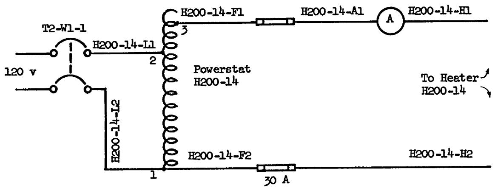  
Figure 19.5. Typical Schematic Wiring Diagram for Type 1256 Powerstat.

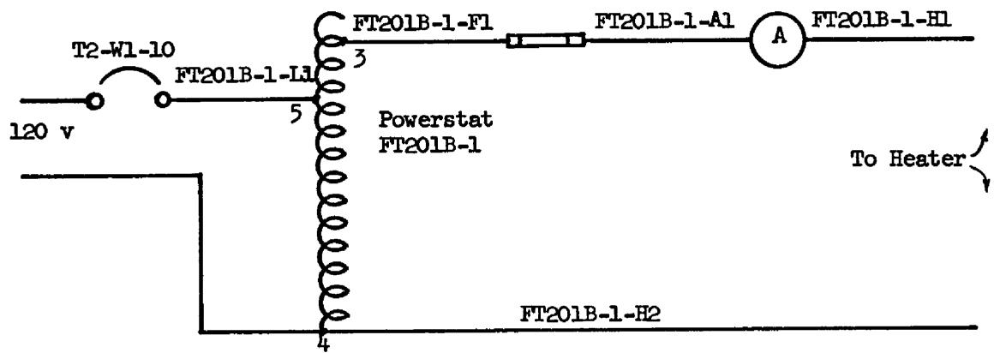  
a. Typical Heater Connection

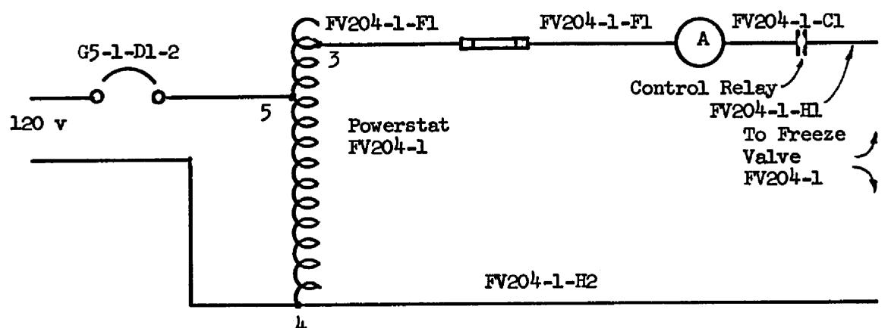  
b. Typical Connection to Freeze Valve   
Figure 19.5. Typical Schematic Diagram for Type 136 Powerstat.

Table 19.10 Heater Control Panels*   

<table><tr><td></td><td>Heater Location</td><td>Heater</td><td>Control on Panel**</td></tr><tr><td rowspan="14">HCP-1 Coolant System:</td><td>Radiator</td><td>CR 1</td><td>On-off and Raise-Lower Push Buttonsand 50/5-amp ammeter</td></tr><tr><td>"</td><td>CR 2</td><td>Ditto, but 40/5 amp</td></tr><tr><td>"</td><td>CR 3</td><td>Ditto, but 40/5 amp</td></tr><tr><td>"</td><td>CR 4</td><td>Ditto, but 50/5 amp</td></tr><tr><td>"</td><td>CR 5</td><td>Ditto, but 50/5 amp</td></tr><tr><td>"</td><td>CR 6</td><td>Ditto, but 50/5 amp</td></tr><tr><td>"</td><td>CR 7</td><td>Ditto but 40 amp</td></tr><tr><td>"</td><td>CR 8</td><td>Ditto but 40 amp</td></tr><tr><td>Loop piping</td><td>H200-13</td><td>Ditto but 40/5 amp</td></tr><tr><td>"</td><td>H201-12</td><td>Ditto, but 40/5 amp</td></tr><tr><td>"</td><td>H202-2</td><td>Ditto but 40/5 amp</td></tr><tr><td>Spare</td><td>No. 16</td><td>Ditto, but 15 amp</td></tr><tr><td>Spare</td><td>No. 1</td><td>Ditto, but 40 amp</td></tr><tr><td>Spare</td><td>No. 2</td><td>Ditto, but 40 amp</td></tr><tr><td rowspan="9">HCP-2 Coolant System:</td><td rowspan="4">Radiator</td><td>CR 1</td><td>O-300-v Ground DetectionVoltmeter and 3 LineSelector Buttons</td></tr><tr><td>CE 4</td><td>"</td></tr><tr><td>CR 5</td><td>"</td></tr><tr><td>CR 6</td><td>"</td></tr><tr><td rowspan="4">Loop PipingSleeves</td><td>H200-14</td><td>Powerstat Type 1256and 15-amp ammeter</td></tr><tr><td>H200-15</td><td>Ditto, but 30 amp</td></tr><tr><td>H201-10</td><td>Ditto, but 30 amp</td></tr><tr><td>H201-11</td><td>Ditto, but 20 amp</td></tr><tr><td>Piping InsideRadiator</td><td>H201-13</td><td>Ditto, but 20 amp</td></tr><tr><td rowspan="18">HCP-3 Coolant System:</td><td>Heater Location</td><td>Heater</td><td>Control on Panel</td></tr><tr><td>Loop Piping</td><td>H202-1</td><td>Powerstat Type 136 and 15 amp ammeter</td></tr><tr><td>Loop Piping</td><td>H204-2</td><td>"</td></tr><tr><td>Loop Piping</td><td>H205-1</td><td>"</td></tr><tr><td>Freeze Valve Pot</td><td>FV204-3</td><td>"</td></tr><tr><td colspan="3">Flow Transmitter:</td></tr><tr><td>Body top</td><td>FT201A-1</td><td>"</td></tr><tr><td>Body top</td><td>FT201A-3</td><td>"</td></tr><tr><td>Body bottom</td><td>FT201A-2</td><td>"</td></tr><tr><td>Body bottom</td><td>FT201A-4</td><td>"</td></tr><tr><td>Body top</td><td>FT201B-1</td><td>"</td></tr><tr><td>Body top</td><td>FT201B-3</td><td>"</td></tr><tr><td>Body bottom</td><td>FT201B-2</td><td>"</td></tr><tr><td>Body bottom</td><td>FT201B-4</td><td>"</td></tr><tr><td>Fill Line</td><td>H203-2</td><td>"</td></tr><tr><td>Spare</td><td>No. 5</td><td>"</td></tr><tr><td>Level Element Pipe</td><td>LE-CP-1</td><td></td></tr><tr><td>Level Element Pot</td><td>LE-CP-2</td><td>"</td></tr></table>

HCP-4 Coolant System:   

<table><tr><td>Freeze Valve</td><td>FV204-1</td><td>Powerstat Type 136
and 20 amp ammeter</td></tr><tr><td>Adjacent to FV</td><td>FV204-2</td><td>&quot;</td></tr><tr><td>Freeze Valve</td><td>FV206-1</td><td>&quot;</td></tr><tr><td>Adj. Freeze
Valve</td><td>FV206-2</td><td>&quot;</td></tr><tr><td>Fill Line</td><td>H204-1</td><td>Raise-Lower Buttons
and 30 amp ammeter</td></tr><tr><td>Fill Line</td><td>H206-1</td><td>&quot;</td></tr><tr><td>Drain Tank
Bottom</td><td>CDT 1</td><td>&quot;</td></tr><tr><td>Fill Line</td><td>H203-1</td><td>&quot;</td></tr><tr><td rowspan="3">Main Tank - Lower
main Tank - Upper
plant Pump-Bottom</td><td>CDT 2</td><td>Powerstat Type 1256
and 30-amp ammeter</td></tr><tr><td>CDT 3</td><td>&quot;</td></tr><tr><td>CP 1</td><td>&quot;</td></tr><tr><td>plant Pump - Side</td><td>Cp 2</td><td>&quot;</td></tr></table>

HCP-6 Reactor Cell:   

<table><tr><td>HCP-5 Reactor Cell:</td><td>Heater Location</td><td>Heater</td><td>Control on Panel</td></tr><tr><td></td><td>Coolant Piping</td><td>H200-1</td><td>Powerstat Type 1256 and 20 amp ammeter</td></tr><tr><td></td><td>Adjacent Flange 200</td><td>H200-11</td><td>&quot;</td></tr><tr><td></td><td>Adjacent Flange 200</td><td>H200-12</td><td>&quot;</td></tr><tr><td></td><td>Adjacent Flange 201</td><td>H201-1</td><td>&quot;</td></tr><tr><td></td><td>Adjacent Flange 201</td><td>H201-2</td><td>&quot;</td></tr><tr><td></td><td>Coolant Piping</td><td>H201-9</td><td>Ditto, but 30 amp</td></tr><tr><td></td><td>Adjacent Flange 100</td><td>H100-1</td><td>Ditto, but 30 amp</td></tr></table>

<table><tr><td>Coolant Piping
Control RCH-1</td><td>H200-2
H200-3
H200-4A
H200-4B</td><td>On-Off and Raise-
Lower Buttons and 3
40-amp ammeters</td></tr><tr><td>Coolant Piping
Control RCH-2</td><td>H200-5
H201-8</td><td>Ditto, but 30 amp</td></tr><tr><td>Coolant Piping
Control RCH-3</td><td>H200-6
H200-7
H200-8</td><td>Ditto, but 40 amp</td></tr><tr><td>Coolant Piping</td><td>H200-9A
H200-9B
H201-4A
H201-4B</td><td>Ditto, but 40 amp</td></tr><tr><td>Reactor</td><td>R 1</td><td>0-150-v Ground Detection
Voltmeter and 3 Line
Selector Buttons</td></tr><tr><td>Reactor</td><td>R 2</td><td>&quot;</td></tr><tr><td>Reactor</td><td>R 3</td><td>&quot;</td></tr><tr><td>Adjacent Flange 100</td><td>H100-2</td><td>Powerstat Type 1256
and 20 amp ammeter</td></tr><tr><td>Adjacent Flange 101</td><td>H101-2</td><td>&quot;</td></tr><tr><td>Adjacent Flange 101</td><td>H101-3</td><td>&quot;</td></tr></table>

<table><tr><td colspan="3">HCP-7 Reactor Cell:</td></tr><tr><td>Heater Location</td><td>Heater</td><td>Control on Panel</td></tr><tr><td>Coolant Piping</td><td>H200-10</td><td rowspan="2">On-OFF and Raise-Lower Buttons and 3 30 amp ammeters</td></tr><tr><td>Control RCH-5</td><td>H201-3</td></tr><tr><td>Coolant Piping</td><td>H201-5</td><td rowspan="2">Ditto, but 40 amp</td></tr><tr><td>Control RCH-6</td><td>H201-6</td></tr><tr><td></td><td>H201-7</td><td></td></tr><tr><td>Fuel Piping</td><td>H101-1</td><td>Ditto, but 30 amp</td></tr><tr><td>Control RCH-7</td><td>H102-3</td><td></td></tr><tr><td>Fuel Piping</td><td>H102-2</td><td>Ditto, but 30 amp</td></tr><tr><td>Reactor Furnace</td><td>R 1</td><td>Ditto, but 40/5 amp</td></tr><tr><td>Reactor Furnace</td><td>R 2</td><td>Ditto, but 40/5 amp</td></tr><tr><td>Reactor Furnace</td><td>R 3</td><td>Ditto, but 40/5 amp</td></tr><tr><td>Heat Exchanger</td><td>HX 1</td><td>Ditto, but 40 amp</td></tr><tr><td>Heat Exchanger</td><td>HX 2</td><td>Ditto, but 40 amp</td></tr><tr><td>Heat Exchanger</td><td>HX 3</td><td>Ditto, but 40 amp</td></tr><tr><td>Fuel Pump - Lower</td><td>FP 1</td><td>Ditto, but 40/5 amp</td></tr><tr><td>Fuel Pump - Upper</td><td>FP 2</td><td>Ditto, but 40/5 amp</td></tr><tr><td>Spare</td><td></td><td>Ditto, but 40 amp</td></tr><tr><td>Spare</td><td></td><td>Ditto, but 40 amp</td></tr></table>

HCP-7A Reactor Cell:   

<table><tr><td colspan="2">Reactor Access Nozzle RAN-1</td><td>Powerstat Type 136 and 20 amp ammeter</td></tr><tr><td colspan="2">Reactor Access Nozzle Ran-2</td><td>&quot;</td></tr><tr><td colspan="2">Spare</td><td>&quot;</td></tr><tr><td colspan="2">Spare</td><td>&quot;</td></tr><tr><td colspan="2">Spare</td><td>&quot;</td></tr><tr><td colspan="2">Spare</td><td>&quot;</td></tr><tr><td colspan="2">Spare</td><td>&quot;</td></tr><tr><td>Fuel Piping</td><td>H102-1</td><td>Powerstat Type 1256 and 30 amp ammeter</td></tr><tr><td>Adjacent Flange 102</td><td>H102-4</td><td>Ditto, but 20 amp</td></tr><tr><td>Adjacent Flange 102</td><td>H102-5</td><td>Ditto, but 30 amp</td></tr></table>

<table><tr><td>Heater Location</td><td>Heater</td><td>Control on Panel</td></tr><tr><td>Reactor Fill Line</td><td>H 103</td><td>Powerstat Type 136*,2 on-off push-buttonstations and 50/5 ampammeter</td></tr><tr><td>Freeze Valve</td><td>FV 103</td><td>Powerstat Type 136and 20 amp ammeter</td></tr><tr><td>Adjacent Furnace</td><td>H104-1</td><td>"</td></tr><tr><td>Spare FF</td><td>No. 7</td><td>"</td></tr><tr><td>Spare</td><td>No. 8</td><td>"</td></tr><tr><td>Drain Tank-Lower</td><td>FFT-1</td><td>On-Off and Raise-Lower Push Buttons andthree 40/5 amp ammeters</td></tr><tr><td>Drain Tank-Upper</td><td>FFT-2</td><td>"</td></tr><tr><td>Drain Tank-Lower</td><td>FD1-1</td><td>"</td></tr><tr><td>Drain Tank-Upper</td><td>FD1-2</td><td>"</td></tr><tr><td>Drain Tank-Lower</td><td>FD2-1</td><td>"</td></tr><tr><td>Drain Tank-Upper</td><td>FD2-2</td><td>"</td></tr><tr><td colspan="3">HCP-9 Drain Tank Cell:</td></tr><tr><td>Freeze Valve</td><td>FV104-1</td><td>Powerstat Type 136and 20 amp ammeter</td></tr><tr><td>Freeze Valve Pot</td><td>FV104-3</td><td>"</td></tr><tr><td>FFT Fill Line</td><td>H104-5</td><td>"</td></tr><tr><td>FFT Fill Line</td><td>H104-6</td><td>"</td></tr><tr><td>Freeze Valve</td><td>FV105-1</td><td>"</td></tr><tr><td>Freeze Valve Pot</td><td>FV105-3</td><td>"</td></tr><tr><td>Adjacent Furnace FD2</td><td>H105-1</td><td>"</td></tr><tr><td>FD-2 Fill Line</td><td>H105-4</td><td>"</td></tr><tr><td>Freeze Valve</td><td>FV106-1</td><td>"</td></tr><tr><td>Freeze Valve Pot</td><td>FV106-3</td><td>"</td></tr><tr><td>Adjacent Furnace FD1</td><td>H106-1</td><td>"</td></tr><tr><td>FD-1 Fill Line</td><td>H106-4</td><td>"</td></tr><tr><td>Spare</td><td>No. 9</td><td>"</td></tr><tr><td>Spare</td><td>No. 10</td><td>"</td></tr><tr><td colspan="3">HCP-10 Drain Tank Cell:</td></tr><tr><td>Heater Location</td><td>Heater</td><td>Control on Panel</td></tr><tr><td>Adjacent Freeze Valve</td><td>FV104-2*</td><td>Raise-Lower Button and 20 amp ammeter</td></tr><tr><td>FFT Fill Line</td><td>H104-2</td><td>Ditto, but 30 amp</td></tr><tr><td>FFT Fill Line</td><td>H104-3</td><td>Ditto, but 30 amp</td></tr><tr><td>FFT Fill Line</td><td>H104-4</td><td>Ditto, but 30 amp</td></tr><tr><td>Adjacent Freeze Valve</td><td>FV105-2*</td><td>Ditto, but 20 amp</td></tr><tr><td>FD-2 Fill Line</td><td>H105-2</td><td>Ditto, but 30 amp</td></tr><tr><td>FD-2 Fill Line</td><td>H105-3</td><td>Ditto, but 30 amp</td></tr><tr><td>FD-2 Fill Line</td><td>H104-7</td><td>Ditto, but 30 amp</td></tr><tr><td>Adjacent Freeze Valve</td><td>FV106-2*</td><td>Ditto, but 20 amp</td></tr><tr><td>FD-1 Fill Line</td><td>H106-2</td><td>Ditto, but 30 amp</td></tr><tr><td>FD-1 Fill Line</td><td>H106-3</td><td>Ditto, but 30 amp</td></tr><tr><td>Transfer Line</td><td>H110-2</td><td>Ditto, but 30 amp</td></tr><tr><td>Transfer Line</td><td>H110-3</td><td>Ditto, but 30 amp</td></tr><tr><td>Spare</td><td>No. 12</td><td>Ditto, but 30 amp</td></tr><tr><td>Spare</td><td>No. 13</td><td>Ditto, but 30 amp</td></tr><tr><td>Spare</td><td>No. 14</td><td>Ditto, but 30 amp</td></tr><tr><td>Adjacent Furnace FFT</td><td>H107-1</td><td>Powerstat Type 136 and 10 amp ammeter</td></tr><tr><td>Transfer Line</td><td>H107-2</td><td>Ditto, but 10 amp</td></tr><tr><td>Adjacent Flange</td><td>H107-3</td><td>Ditto, but 20 amp</td></tr><tr><td>Freeze Valve</td><td>FV107-1</td><td>Ditto, but 20 amp</td></tr><tr><td>Adjacent Freeze Valve</td><td>FV107-2*</td><td>Ditto, but 20 amp</td></tr><tr><td>Freeze Valve Pots</td><td>FV107-3</td><td>Ditto, but 20 amp</td></tr><tr><td>Heater Location</td><td>Heater</td><td>Control on Panel</td></tr><tr><td colspan="3">HCP-11 Drain Tank Cell:</td></tr><tr><td>Adjacent Furnace FD-2</td><td>H108-1</td><td>Powerstat Type 136 and 10 amp ammeter</td></tr><tr><td>Transfer Line FD-2</td><td>H108-2</td><td>Ditto, but 10 amp</td></tr><tr><td>Adjacent Flange</td><td>H108-3</td><td>Ditto, but 20 amp</td></tr><tr><td>Freeze Valve</td><td>FV108-1</td><td>Ditto, but 20 amp</td></tr><tr><td>Adjacent Freeze Valve</td><td>FV108-2*</td><td>Ditto, but 20 amp</td></tr><tr><td>Freeze Valve Pots</td><td>FV108-3</td><td>Ditto, but 20 amp</td></tr><tr><td>Adjacent Furnace FD-1</td><td>H109-1</td><td>Ditto, but 10 amp</td></tr><tr><td>Transfer Line FD-1</td><td>H109-2</td><td>Ditto, but 10 amp</td></tr><tr><td>Adjacent Flange</td><td>H109-3</td><td>Ditto, but 20 amp</td></tr><tr><td>Freeze Valve</td><td>FV109-1</td><td>Ditto, but 20 amp</td></tr><tr><td>Adjacent Freeze Valve</td><td>FV109-2*</td><td>Ditto, but 20 amp</td></tr><tr><td>Freeze Valve Pots</td><td>FV109-3</td><td>Ditto, but 20 amp</td></tr><tr><td>Transfer Line</td><td>H110-1</td><td>Ditto, but 10 amp</td></tr><tr><td>Spare</td><td>No. 15</td><td>Ditto, but 20 amp</td></tr></table>

* These circuits were left in place although due to design changes the heaters have been eliminated.

19.7.4.2 Type 1256 "Powerstat". This Superior Electric Company variable autotransformer is panel-mounted and hand-positioned and similar to the Type 136 but is rated at 7.8 kva, 28 amps, with 240 v input and 0 to 280-v output. A typical schematic wiring diagram is shown in Figure 19.6. Twenty-two of these "Powerstats" are used.

19.7.4.3 Motor-Operated Type 1256-1035 "Powerstat". This variable autotransformer is motor-operated and mounted on a rack on the west side of the north-south hallway between columns C-2 and C-3 at the 840-ft elevation. It is controlled by a "raise-lower" push button on the heater control panel. The unit is manufactured by the Superior Electric Company and is rated at 7.8 kva, 28 amps, 240 v input and 0 to 280-v output, single-phase. The motor is operated on 115 v, 0.4 amps, and has a 45 sec travel time. A typical wiring diagram is shown in Figure 19.6. Twenty of the controls are of this type.

19.7.4.4 Induction Regulator. Thirty-eight induction-type voltage regulators were existing in Bldg 7503 as part of the ART. They are located on the west side of the north-south hallway at the 840-ft level, and below this elevation on the south side of the east-west hallway. Each regulator is a General Electric Company Type AIRT Cat No. 3263366, and are rated at $480\mathrm{v}$ , three-phase, 36.5 amp, and 30-kva. Each is positioned by "raise-lower" buttons on the heater control panels. Since the regulators can not produce zero voltage, "on-off" buttons are provided on the heater control panels. A listing of this "on-off" button for a heater tabulated in Table 19.10 identifies use of an induction regulator, with the one exception of the drain line heater. The regulators have mechanical stops to limit the voltage output to 208 v. A schematic wiring diagram for the induction regulator and a motor operator are shown in Figure 19.7.

There are 38 of the induction regulators in use. Nine feed 30-kva three-phase transformers which supply heater breaker panels. Eleven of the regulators supply 10-kva single-phase transformers, one transformer for each phase. The transformers are described below. The remaining regulators feed power directly to the heater breaker panels. The number of heaters supplied by a regulator depends upon the size and application of the particular heaters.

Unclassified ORNL DWG 64-8850

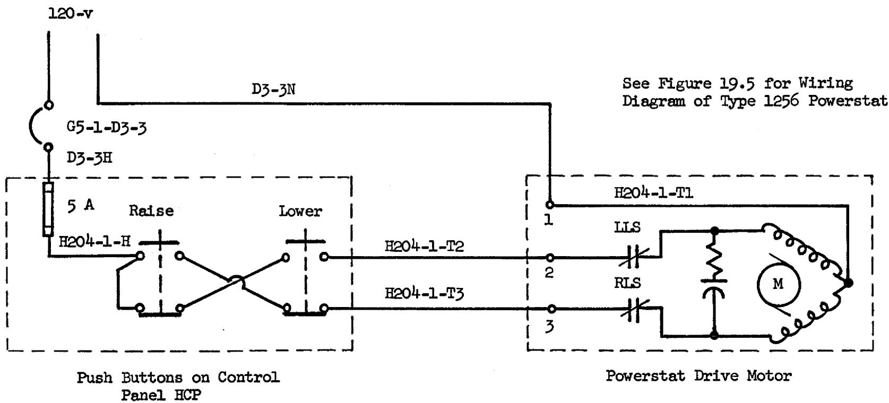  
Figure 19.6. Typical Schematic Wiring Diagram for Motor-Operated Type 1256-1035 Powerstat.

Unclassified ORNL DWG 64-8851

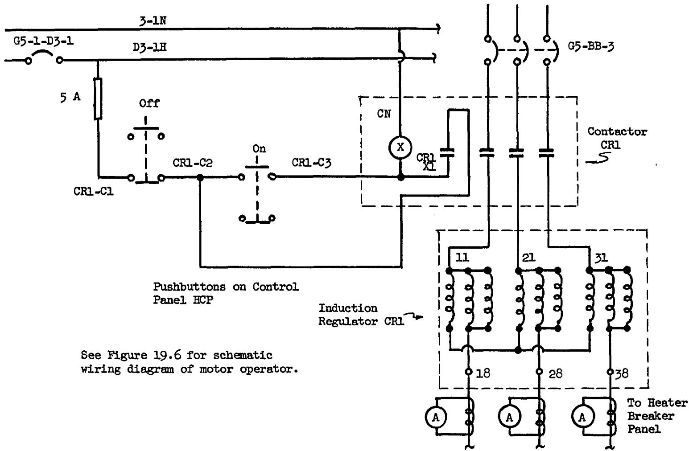  
Figure 19.7. Motor-Operated Induction Regulator

19.7.4.5 Three-Phase 30-kva Transformer. There are nine of these transformers located on a platform behind the heater breaker panels in the east-west hallway at the 840-ft level. Each is a Jefferson Electric Company, Cat No. 223-194, "Powerformer", rated at 30-kva, three-phase, 60-cycle $480 \times 208 - 120$ v, 36.1 amp and for $150^{\circ}$ C temperature rise. The transformer secondaries are provided with ground-detection voltmeters mounted on the heater control panel. See ORNL Dwg D-KK-C-55137.

19.7.4.6 Single-Phase 10-kva Transformers. Thirty-three of these transformers are mounted on the wall of the south side of the platform mentioned above. Each is a Jefferson Electric Company, single-phase, dry-type transformer, Cat No. 243-466, rated at 10-kva, 240-480-v primary and 120-240-v secondary at a $150^{\circ}\mathrm{C}$ temperature rise. The primaries are delta-connected and the secondaries are wye-connected and grounded. See ORNL Dwg D-KK-C-55137.

19.7.4.7 Heater Breaker Panels. As stated above, an induction regulator may supply several different heater circuits. In such cases, each heater circuit is provided with a circuit breaker. Since most of the breakers and panels are existing equipment adapted for the MSRE, there is a variety of combinations of makes and styles.

Seven panels of circuit breakers are mounted on the east wall of the north-south hallway. Two panels use fourteen Trumbull Electric Company, Type TQL, or R, 120/208-v, three-phase breakers, having various current ratings. Four panels use General Electric Company Type TF 136020, 600-v, 3-pole breakers with several different current ratings. There are three spare circuit breakers included.

Six panels of heater circuit breakers are located along the south side of the east-west hallway. Each panel contains four General Electric Company Type CCB, three-phase, circuit breaker mounting panels, seventeen of which are rated at 600 v and seven at 120/208 v. The mounting panels may contain up to 20 circuit breakers but only 5 to 8 are usually in use. Four of the mounting panels have Westinghouse De-Ion, F Frame, Style 1222033 circuit breakers. Thirteen panels use General Electric Company Cat No. TF 136020 for 600 v; five use General Electric Type ES-93 and two General Electric Type EP-37,both rated at 125 v.

# 19.7.5 Heater Leads

Electrical leads for the process heaters in the coolant cell are multi-conductor No. 19/22 Type TW cable run in trays and conduit from the heater control equipment to a junction box in the special equipment room. From this box, multi-conductor No. 19/22 RH cable is run in trays to the equipment in the cell.

Electrical leads for heaters in the reactor cell are multi-conductor No. 19/22 Type TW cable, laid in trays between the heater control equipment and junction boxes in the south electric service area. The leads for the drain tank cell are identical except that the junction boxes are located in the north electric service area. The connections between the junction boxes and the cell equipment are made with mineral-insulated, copper-sheather cables carrying three No. 10 or 12 wires. These pass through the cell walls in $3/4$ -in. pipe size penetrations described in Section 19.8, following. The heater leads passing through each penetration are listed in Table 19.11.

Inside the cells the cables are run in square duct, either to junction boxes or to special 600-v, 50-amp, metal-and-ceramic, female disconnects. The disconnects, as illustrated in Figure 19.8, are mounted in the cells convenient to the heater served and are located in a manner to facilitate remote manipulation. The cell ends of the cables are sealed with brazed bell-end housings. The outside ends are sealed with a General Cable Co. insulating cap and threaded gland using a cold plastic sealing compound. There are eight spare leads to the reactor cell and fourteen for the drain tank cell.

Some of the process heaters which are designed for removal and replacement have male, 600-v, 50-amp, 3-wire disconnect plugs mounted directly on the removable unit. The connection between the matching female disconnect and the porcelain terminal blocks in the junction boxes inside the cell is made with ceramic-beaded nickel alloy 99 wire, sheathed in l/2-in. OD flexible steel hose.

Permanent heaters have the same type of flexible leads connected directly to the heaters. The leads pass through junctions, where the heaters are connected in parallel, and continue to terminate in

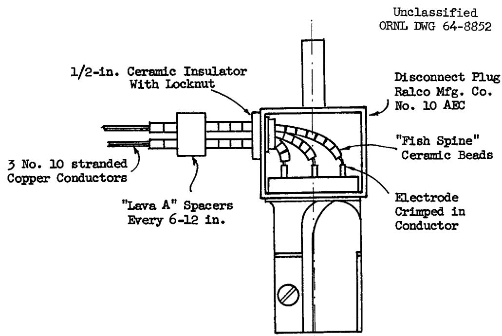

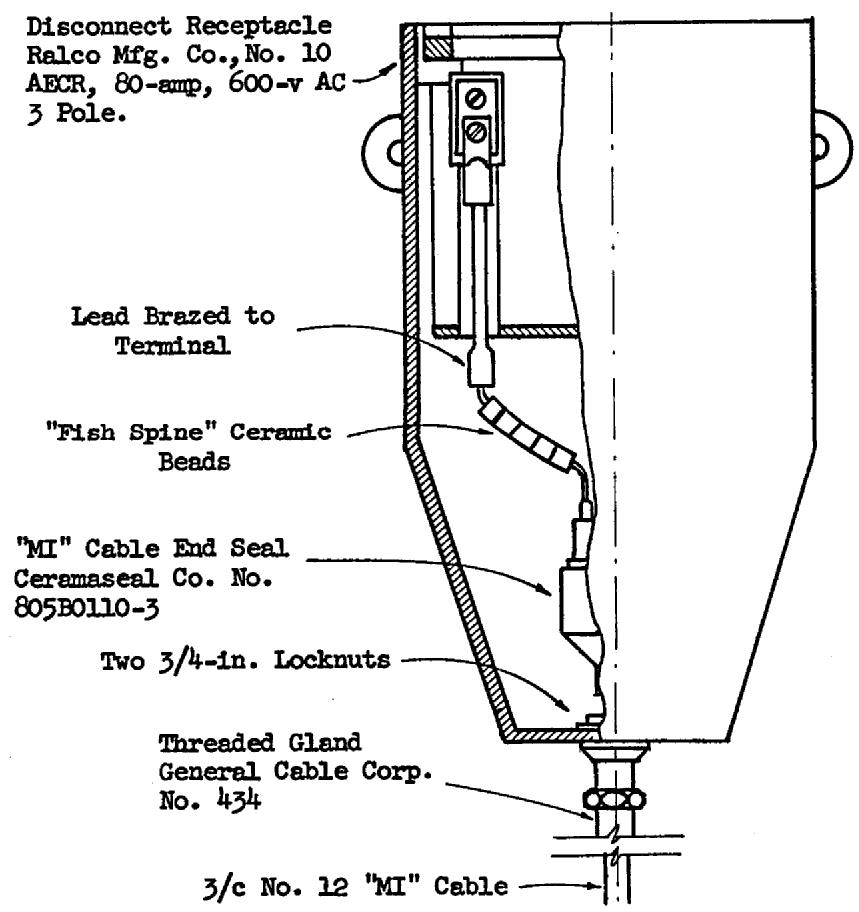  
Figure 19.8. Male and Female Electrical Disconnects for Heater Leads Inside Cells.

Table 19.11 Heater Electrical Lead Cell Wall Penetrations   

<table><tr><td rowspan="2">DISCONNECT No.</td><td colspan="4">PENETRATION R-2 - REACTOR CELL</td></tr><tr><td>TRAY</td><td>LENGTH*</td><td>SLEEVE No.</td><td>CABLE SIZE</td></tr><tr><td>H520-4S</td><td>east</td><td>44</td><td>1</td><td>3/c No. 12</td></tr><tr><td>H520-3S</td><td></td><td>45</td><td>2</td><td></td></tr><tr><td>H520-2S</td><td></td><td>44</td><td>3</td><td></td></tr><tr><td>H52C-1S</td><td></td><td>45</td><td>4</td><td></td></tr><tr><td></td><td></td><td></td><td>5</td><td></td></tr><tr><td></td><td></td><td></td><td>6</td><td></td></tr><tr><td>H520-4</td><td>east</td><td>35</td><td>7</td><td>3/c No. 12</td></tr><tr><td>H520-3</td><td></td><td>37</td><td>8</td><td></td></tr><tr><td>H520-2</td><td></td><td>36</td><td>9</td><td></td></tr><tr><td>H520-1</td><td></td><td>36</td><td>10</td><td></td></tr><tr><td>H520-5</td><td></td><td>36</td><td>11</td><td></td></tr><tr><td>H200-2</td><td></td><td>36</td><td>12</td><td></td></tr><tr><td>FP-4</td><td></td><td>27</td><td>13</td><td></td></tr><tr><td>H200-7</td><td></td><td>22</td><td>14</td><td></td></tr><tr><td>H200-SP</td><td></td><td>15</td><td>15</td><td></td></tr><tr><td>H520-7S</td><td></td><td>41</td><td>16</td><td></td></tr><tr><td>H520-6S</td><td></td><td>41</td><td>17</td><td></td></tr><tr><td>H200-1</td><td></td><td>39</td><td>18</td><td></td></tr><tr><td>H100-2</td><td></td><td>40</td><td>19</td><td></td></tr><tr><td>H100-1</td><td></td><td>39</td><td>20</td><td></td></tr><tr><td>H520-7</td><td></td><td>35</td><td>21</td><td></td></tr><tr><td>FP-5</td><td></td><td>25</td><td>22</td><td></td></tr><tr><td>H200-8</td><td></td><td>21</td><td>23</td><td></td></tr><tr><td>RCC-2</td><td></td><td>23</td><td>24</td><td></td></tr><tr><td>H520-6</td><td>center</td><td>43</td><td>25</td><td></td></tr><tr><td>H520-5S</td><td>east</td><td>43</td><td>26</td><td></td></tr><tr><td>H200-4</td><td></td><td>34</td><td>27</td><td></td></tr><tr><td>H200-3</td><td></td><td>35</td><td>28</td><td></td></tr><tr><td>H200-6</td><td></td><td>28</td><td>29</td><td></td></tr><tr><td>FP-SP</td><td></td><td>30</td><td>30</td><td></td></tr><tr><td>H200-9</td><td></td><td>16</td><td>31</td><td></td></tr><tr><td>HX3</td><td>center</td><td>35</td><td>32</td><td></td></tr><tr><td>HX2</td><td>center</td><td>37</td><td>33</td><td></td></tr></table>

* Estimated length

Table 19.11 Cont'd.   

<table><tr><td>DISCONNECT No.</td><td>TRAY</td><td>LENGTH</td><td>SLEEVE No.</td><td>CABLE SIZE</td></tr><tr><td>HX1</td><td>center</td><td>38</td><td>34</td><td>3/c No. 12</td></tr><tr><td>H200-10</td><td>center</td><td>30</td><td>35</td><td></td></tr><tr><td>PE-1</td><td>east</td><td>29</td><td>36</td><td></td></tr><tr><td>FP-1</td><td></td><td>27</td><td>37</td><td></td></tr><tr><td>H200-5</td><td></td><td>29</td><td>38</td><td></td></tr><tr><td>FP-2</td><td></td><td>24</td><td>39</td><td></td></tr><tr><td>PE-3</td><td></td><td>31</td><td>40</td><td></td></tr><tr><td>H200-10</td><td>center</td><td>31</td><td>41</td><td></td></tr><tr><td>H200-11</td><td>center</td><td>31</td><td>42</td><td></td></tr><tr><td>PE-2</td><td>east</td><td>29</td><td>43</td><td></td></tr><tr><td>FP-3</td><td></td><td>22</td><td>44</td><td></td></tr><tr><td colspan="5">PENETRATION R-3 - REACTOR CELL</td></tr><tr><td>DISCONNECT No.</td><td>TRAY</td><td>LENGTH</td><td>SLEEVE No.</td><td>CABLE SIZE</td></tr><tr><td>Hi Level Gamma</td><td></td><td></td><td>1</td><td></td></tr><tr><td>Hi Level Gamma</td><td></td><td></td><td>2</td><td></td></tr><tr><td></td><td></td><td></td><td>3</td><td></td></tr><tr><td></td><td></td><td></td><td>4</td><td></td></tr><tr><td></td><td></td><td></td><td>5</td><td></td></tr><tr><td></td><td></td><td></td><td>6</td><td></td></tr><tr><td>RH-SPI</td><td>east</td><td>45</td><td>7</td><td>3/c No. 10</td></tr><tr><td>R2-2</td><td></td><td>47</td><td>8</td><td></td></tr><tr><td>R2-3</td><td></td><td>47</td><td>9</td><td></td></tr><tr><td>R3-1</td><td></td><td>48</td><td>10</td><td></td></tr><tr><td>R2-1</td><td></td><td>40</td><td>11</td><td></td></tr><tr><td>H201-SPI</td><td>west</td><td>45</td><td>12</td><td>3/c No. 12</td></tr><tr><td>H201-3</td><td>west</td><td>31</td><td>13</td><td></td></tr><tr><td>H102-1</td><td>center</td><td>37</td><td>14</td><td></td></tr><tr><td>R1-1</td><td>center</td><td>43</td><td>15</td><td>3/c No. 10</td></tr><tr><td>LIFP-1</td><td>center</td><td>32</td><td>16</td><td>3/c No. 12</td></tr><tr><td></td><td></td><td></td><td>17</td><td></td></tr><tr><td>R3-2</td><td>west</td><td>57</td><td>18</td><td>3/c No. 10</td></tr></table>

Table 19.11 Cont'd.   

<table><tr><td>DISCONNECT No.</td><td>TRAY</td><td>LENGTH</td><td>SLEEVE No.</td><td>CABLE SIZE</td></tr><tr><td>RH-SP2</td><td>west</td><td>57</td><td>19</td><td>3/c No. 10</td></tr><tr><td>R3-3</td><td></td><td>56</td><td>20</td><td></td></tr><tr><td>H201-7</td><td></td><td>46</td><td>21</td><td>3/c No. 12</td></tr><tr><td>H201-4</td><td></td><td>38</td><td>22</td><td></td></tr><tr><td>H102-1S</td><td>center</td><td>37</td><td>23</td><td></td></tr><tr><td>R1-2</td><td></td><td>39</td><td>24</td><td>3/c No. 10</td></tr><tr><td>LIFP-2</td><td></td><td>33</td><td>25</td><td>3/c No. 12</td></tr><tr><td>H101-3</td><td></td><td>42</td><td>26</td><td></td></tr><tr><td>H201-9</td><td>west</td><td>48</td><td>27</td><td></td></tr><tr><td>H201-8</td><td></td><td>47</td><td>28</td><td></td></tr><tr><td>H201-5</td><td></td><td>43</td><td>29</td><td></td></tr><tr><td>RH-SP3</td><td>center</td><td>44</td><td>30</td><td>3/c No. 10</td></tr><tr><td>R1-3</td><td></td><td>36</td><td>31</td><td></td></tr><tr><td>LIFP-3</td><td></td><td>34</td><td>32</td><td>3/c No. 12</td></tr><tr><td>H102-3</td><td></td><td>39</td><td>33</td><td></td></tr><tr><td>H102-4</td><td></td><td>40</td><td>34</td><td></td></tr><tr><td>H102-2</td><td></td><td>37</td><td>35</td><td></td></tr><tr><td>H201-2</td><td>west</td><td>32</td><td>36</td><td></td></tr><tr><td>RCC-1</td><td></td><td>49</td><td>37</td><td></td></tr><tr><td>FV103</td><td></td><td>54</td><td>38</td><td></td></tr><tr><td>H201-SP2</td><td></td><td>42</td><td>39</td><td></td></tr><tr><td>H102-5</td><td>center</td><td>42</td><td>40</td><td></td></tr><tr><td>H101-2</td><td></td><td>37</td><td>41</td><td></td></tr><tr><td>H101-1</td><td></td><td>39</td><td>42</td><td></td></tr><tr><td>H201-1</td><td>west</td><td>28</td><td>43</td><td></td></tr><tr><td>H201-6</td><td></td><td>42</td><td>44</td><td></td></tr></table>

Table 19.11 Cont'd.   

<table><tr><td rowspan="2">HEATER No.</td><td colspan="3">WEST SIDE - DRAIN TANK CELL</td></tr><tr><td>LENGTH</td><td>END CONNECTION</td><td>CABLE SIZE</td></tr><tr><td>H103</td><td>67</td><td>disconnect</td><td>3/c No. 10</td></tr><tr><td>FFT-2</td><td>71</td><td>junct. box</td><td>3/c No. 12</td></tr><tr><td>FFT-SPI</td><td>74</td><td></td><td></td></tr><tr><td>FFT-3</td><td>73</td><td></td><td></td></tr><tr><td>FFT-4</td><td>67</td><td></td><td></td></tr><tr><td>H107-1</td><td>63</td><td>disconnect</td><td></td></tr><tr><td>H107-2</td><td>66</td><td></td><td></td></tr><tr><td>H107-3</td><td>66</td><td></td><td></td></tr><tr><td>H107-SP</td><td>64</td><td></td><td></td></tr><tr><td>FFT-6</td><td>69</td><td>junct. box</td><td></td></tr><tr><td>FFT-5</td><td>67</td><td></td><td></td></tr><tr><td>H108-1</td><td>66</td><td>disconnect</td><td></td></tr><tr><td>FD2-2</td><td>67</td><td>junct. box</td><td></td></tr><tr><td>H108-2</td><td>62</td><td>disconnect</td><td></td></tr><tr><td>FD2-SP1</td><td>65</td><td></td><td></td></tr><tr><td>FD2-3</td><td>66</td><td></td><td></td></tr><tr><td>FV107-2</td><td>69</td><td></td><td></td></tr><tr><td>FV107-1</td><td>67</td><td></td><td></td></tr><tr><td>FV107-3</td><td>66</td><td></td><td></td></tr><tr><td>H108-3</td><td>61</td><td></td><td></td></tr><tr><td>H108-SP</td><td>60</td><td></td><td></td></tr><tr><td>FD2-4</td><td>63</td><td>junct. box</td><td></td></tr><tr><td>FV108-2</td><td>63</td><td>disconnect</td><td></td></tr><tr><td>FV108-3</td><td>60</td><td></td><td></td></tr><tr><td>FV108-1</td><td>60</td><td></td><td></td></tr><tr><td>FD2-SP2</td><td>65</td><td></td><td></td></tr><tr><td>H110-1</td><td>59</td><td></td><td></td></tr><tr><td>FD2-5</td><td>63</td><td>junct. box</td><td></td></tr><tr><td>FD1-3</td><td>64</td><td></td><td></td></tr><tr><td>H109-SP</td><td>58</td><td>disconnect</td><td></td></tr><tr><td>H109-2</td><td>58</td><td></td><td></td></tr><tr><td>FV109-1</td><td>57</td><td></td><td></td></tr><tr><td>FV109-3</td><td>57</td><td></td><td></td></tr></table>

Table 19.11 Cont'd.   

<table><tr><td>HEATER No.</td><td>LENGTH</td><td>END CONNECTION</td><td>CABLE SIZE</td></tr><tr><td>FV109-2</td><td>54</td><td>disconnect</td><td>3/c No. 12</td></tr><tr><td>FD1-4</td><td>57</td><td>junct. box</td><td></td></tr><tr><td>FD1-SP1</td><td>58</td><td>disconnect</td><td></td></tr><tr><td>H110-2</td><td>60</td><td></td><td></td></tr><tr><td>H109-3</td><td>61</td><td></td><td></td></tr><tr><td>H110-3</td><td>61</td><td></td><td></td></tr><tr><td>H109-1</td><td>50</td><td rowspan="2">junct. box</td><td></td></tr><tr><td>FD1-5</td><td>50</td><td></td></tr><tr><td>FD1-SP2</td><td>51</td><td>disconnect</td><td></td></tr><tr><td>FD1-6</td><td>50</td><td>junct. box</td><td></td></tr><tr><td>FD1-7</td><td>52</td><td></td><td></td></tr><tr><td>H106-1</td><td>45</td><td></td><td></td></tr><tr><td>H106-2</td><td>46</td><td></td><td></td></tr><tr><td>H106-3</td><td>41</td><td></td><td></td></tr></table>

EAST SIDE - DRAIN TANK CELL   

<table><tr><td>HEATER No.</td><td>LENGTH</td><td>END CONNECTION</td><td>CABLE SIZE</td></tr><tr><td>DCC</td><td>79</td><td>disconnect</td><td>3/c No. 12</td></tr><tr><td>FFT-1</td><td>53</td><td>junct. box</td><td></td></tr><tr><td>FFT-SP2</td><td>53</td><td>disconnect</td><td></td></tr><tr><td>FFT-8</td><td>48</td><td>junct. box</td><td></td></tr><tr><td>H104-1</td><td>44</td><td></td><td></td></tr><tr><td>H104-2</td><td>45</td><td></td><td></td></tr><tr><td>H104-3</td><td>46</td><td></td><td></td></tr><tr><td>FFT-7</td><td>47</td><td></td><td></td></tr><tr><td>FD2-1</td><td>50</td><td></td><td></td></tr><tr><td>FD2-SP3</td><td>46</td><td>disconnect</td><td></td></tr><tr><td>H105-SP</td><td>46</td><td></td><td></td></tr><tr><td>H105-4</td><td>45</td><td>junct. box</td><td></td></tr><tr><td>H105-1</td><td>44</td><td></td><td></td></tr><tr><td>FD2-8</td><td>46</td><td></td><td></td></tr><tr><td>H105-2</td><td>43</td><td></td><td></td></tr><tr><td>H105-3</td><td>44</td><td></td><td></td></tr><tr><td>FV104-3</td><td>45</td><td></td><td></td></tr></table>

Table 19.11 Cont'd.   

<table><tr><td>HEATER No.</td><td>LENGTH</td><td>END CONNECTION</td><td>CABLE SIZE</td></tr><tr><td>FV104-2A</td><td>44</td><td>junct. box</td><td>3/c No. 12</td></tr><tr><td>FV104-1</td><td>47</td><td>disconnect</td><td></td></tr><tr><td>FD2-7</td><td>40</td><td>junct. box</td><td></td></tr><tr><td>H105-4</td><td>44</td><td></td><td></td></tr><tr><td>FV104-2D</td><td>44</td><td></td><td></td></tr><tr><td>FV105-2D</td><td>43</td><td></td><td></td></tr><tr><td>FV105-1</td><td>42</td><td>disconnect</td><td></td></tr><tr><td>H104-5</td><td>44</td><td>junct. box</td><td></td></tr><tr><td>H104-SP</td><td>47</td><td>disconnect</td><td></td></tr><tr><td>FV105-2A</td><td>41</td><td>junct. box</td><td></td></tr><tr><td>FV105-3</td><td>41</td><td></td><td></td></tr><tr><td>FV104-6</td><td>46</td><td></td><td></td></tr><tr><td>H104-7</td><td>43</td><td></td><td></td></tr><tr><td>FD2-6</td><td>47</td><td></td><td></td></tr><tr><td>H104-7S</td><td>39</td><td></td><td></td></tr><tr><td>FD1-2</td><td>46</td><td></td><td></td></tr><tr><td>H106-4</td><td>37</td><td></td><td></td></tr><tr><td>FV106-1</td><td>36</td><td>disconnect</td><td></td></tr><tr><td>FD1-SP3</td><td>45</td><td></td><td></td></tr><tr><td>FD1-1</td><td>43</td><td>junct. box</td><td></td></tr><tr><td>FV106-2D</td><td>36</td><td></td><td></td></tr><tr><td>FV106-3</td><td>39</td><td></td><td></td></tr><tr><td>FV106-2A</td><td>36</td><td></td><td></td></tr><tr><td>H106-SP</td><td>37</td><td>disconnect</td><td></td></tr></table>

male plugs, as illustrated in Figure 19.9. These are plugged into the female disconnect fittings which are the terminus of the mineral-insulated cables brought into the cell.

Table 19.11 also list the mineral-insulated cable data for each heater lead, including the length, wire size and type of terminal used. When single-phase heater circuits are required, one wire of the three-wire cables is not connected.

# 19.8 Cell Wall Penetrations for Electrical Leads

Copper or stainless steel sheathed, mineral-insulated cables are used for the electrical leads passing through the walls of the reactor containment and drain tank cells. The cable passes through individual pipe sleeves with compression fittings at each end to form a leak-tight joint around the sheaths. Although gas diffusion through the mineral insulation is considered negligible, the sheaths are also sealed at each end. The number of cable sleeves at each penetration is indicated in Tables 19.12 and 19.13. The heater leads in penetrations II $(\mathbb{R}_3)$ and III $(\mathbb{R}_2)$ are listed in detail in Table 19.11.

# 19.8.1 Sheathed Cable.

The mineral-insulated sheather cable is manufactured by the General Cable Company. The catalog numbers for the various numbers of conductors and wire sizes are listed in Table 19.14. Copper sheathing is used on all MI cable leads.

The reactor cell end of a sheath is sealed with a brazed-on Ceramaseal MI cable pothead, Cat. No. 805B-0110, or 0111, etc. The end of the sheath outside the cell is sealed with a screwed-on pothead filled with a cold-setting plastic insulating compound. See ORNL Dwg. E-MM-Z-56238.

# 19.8.2 Cable Sleeves.

The MI cable passes through the cell walls in individual sleeves of 3/8-in. IPS to 1-in. IPS, depending on the cable size. These pipes have a minimum of a 2-1/2-in. offset at the midpoint through the cell wall to prevent radiation from streaming through the opening.

Table 19.12 Summary of Electrical Lead Penetrations in Reactor Cell   

<table><tr><td>MSRE Pene-tration No.</td><td>Former Pene-tration No.</td><td>Function</td><td>Number of Sleeves</td><td>Sleeve Size IPS - Schd. 40</td></tr><tr><td rowspan="2">II</td><td rowspan="2">R3</td><td rowspan="2">Electrical</td><td>6</td><td>1 in.</td></tr><tr><td>38</td><td>3/4 in.</td></tr><tr><td rowspan="2">III</td><td rowspan="2">R2</td><td rowspan="2">Electrical</td><td>6</td><td>1 in.</td></tr><tr><td>38</td><td>3/4 in.</td></tr><tr><td rowspan="3">IV</td><td rowspan="3">R1</td><td rowspan="3">Thermocouples</td><td>7</td><td>3/4 in.</td></tr><tr><td>28</td><td>1/2 in.</td></tr><tr><td>25</td><td>3/8 in.</td></tr><tr><td>V</td><td>R</td><td>Instrumentation</td><td>60</td><td>3/8 in.</td></tr><tr><td>XXIII</td><td>R7</td><td>Thermocouples</td><td>38</td><td>3/8 in.</td></tr></table>

Table 19.13 Summary of Electrical Lead Penetrations in Drain Tank Cell   

<table><tr><td colspan="2">MSRE Sleeve Numbers</td><td colspan="2">Function</td></tr><tr><td colspan="2">A-1 to A-36</td><td colspan="2">Instrumentation</td></tr><tr><td colspan="2">B-1 to B-36</td><td colspan="2">Instrumentation</td></tr><tr><td colspan="2">C-1 to C-36</td><td colspan="2">Thermocouples</td></tr><tr><td colspan="2">D-1 to D-36</td><td colspan="2">Thermocouples</td></tr><tr><td colspan="2">E-1 to E-36</td><td colspan="2">Thermocouples</td></tr><tr><td colspan="2">A-37 to A-60</td><td colspan="2">Electrical</td></tr><tr><td colspan="2">B-37 to B-60</td><td colspan="2">Electrical</td></tr><tr><td colspan="2">C-37 to C-60</td><td colspan="2">Electrical</td></tr><tr><td colspan="2">D-37 to D-60</td><td colspan="2">Electrical</td></tr><tr><td colspan="2">E-37 to E-60</td><td colspan="2">Electrical</td></tr><tr><td colspan="2">F-37 to F-60</td><td colspan="2">Electrical</td></tr><tr><td colspan="4">Table 19.14 General Cable Company MI Cable Numbers</td></tr><tr><td>Number</td><td>Wire</td><td>Sleeve Size</td><td>Gen. Cable</td></tr><tr><td>Conductors</td><td>Size</td><td>in. IPS</td><td>Cat. No.</td></tr><tr><td>4</td><td>16</td><td>1/2</td><td>387</td></tr><tr><td>3</td><td>12</td><td>3/4</td><td>434</td></tr><tr><td>7</td><td>16</td><td>3/4</td><td>449</td></tr><tr><td>3</td><td>10</td><td>3/4</td><td>480</td></tr><tr><td>3</td><td>6</td><td>1</td><td>621</td></tr></table>

The cable sleeves are grouped to pass through a poured concrete plug mounted in existing penetrations in the reactor containment vessel wall, or, in the case of the drain tank cell, are arranged on a rectangular grid in the poured concrete of the 3-ft-thick east wall of the cell. See ORNL Dwg D-KK-C-40947 for the drain tank cell sleeve layout. All drain tank cell cable sleeves are $3/4$ -in. IPS.

The cable sleeves have pipe couplings screwed to each end to accept a General Cable Company compression gland. This fitting consists of a compression sleeve and nut to effect a leak-tight seal around the MI cable sheath. See ORNL D gs D-HH-B-40539 and Figure 19.9.

# 19.8.3 Reactor Cell Penetration Plug and Sleeve.

Existing reactor containment vessel penetrations consist of sleeves, about 23-in. ID, with one end welded to the inner containment vessel wall and the other end to the wall of the outer vessel. A corrugated bellows midway between the ends permits relative movement between the two vessels, as shown in Figure 19.10 and on ORNL Dwg D-KK-D-40976.

A plug, about 22-3/4-in. OD x 3 ft 5 in. long, fits into the above-mentioned sleeve, and is welded to it on the outside end. This plug consists of a carbon steel sleeve, about 22 in. ID of 3/8-in. wall thickness, with end plates welded to it through which the cable sleeves pass. These sleeves are welded to the plates at both ends, using a trepanned groove at each weld. The space between the cable sleeves inside the plug is filled with concrete. See ORNL Dwg E-BB-D-41864.

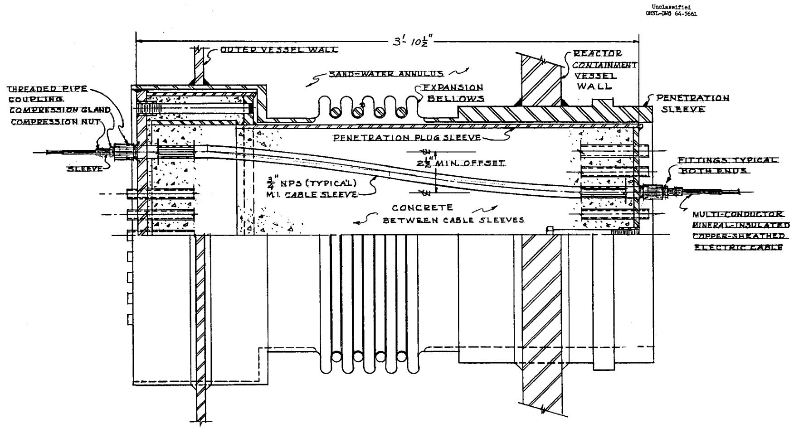  
FIGURE 19.9   
TYPICAL ELECTRIC LEAD PENETRATION OF REACTOR CELL WALL

# 20. BUILDING SERVICES

# 20.1 Potable Water

The source of potable water for Building 7503 is briefly described in the discussion of the site, Section 3 and shown in Figure 3.3. The water is normally obtained from the two $1.5 \times 10^{6}$ -gal reservoirs east of the site, with flow from east-to-west in the 12-in. water main along 7500 Road. These reservoirs have a maximum water level elevation of 1,055 ft, providing a maximum pressure of about 93 psig at the 840-ft elevation in Building 7503. Potable water can also be provided by west-to-east flow in the 6-in. main along 7500 Road, as indicated schematically in Figure 20.1. Both sources connect to the same 6-in. tee supplying the building.

The 6-in. potable water main enters the north end of Building 7503 at about the 840-ft elevation, where it then divides into two major branches. One 4-in. main supplies all building services, such as water closets, lavatories, sinks, showers, drinking fountains, etc. The other 4-in. main provides water for the fire protection system, as discussed in Section 20.10.

# 20.2 Process Water

Process water is supplied to the MSRE from the same potable water mains at 7500 Road, but through a different 6-in. main leading from the road to the east side of Bldg. 7503, as shown in Figure 20.1. There are two shutoff valves outside the building at the 848-ft elev. A back-flow preventer is installed in the line just inside the building to relieve water to the building drain in event the building process water pressure should exceed the supply pressure. Piping connections and valves are provided for installing a spare back-flow preventer should this be found necessary.

Distribution of the process water to the MSRE systems is discussed in Section 15 and shown on the flowsheet, Figure 15.1 (ORNL Dwg D-AA-A-40889).

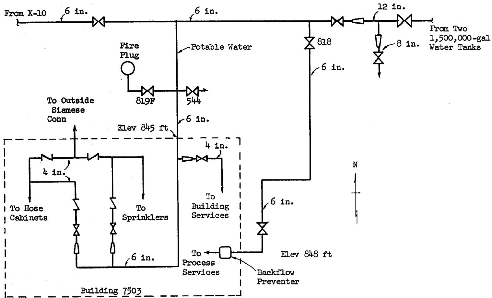  
Unclassified ORNL DWG 64-9108   
Figure 20.1. Water Services to Building 7503.

# 20.3 Building Lighting

The 13.8-kv feeder lines supplying electric power to the MSRE site are briefly described in Section 3 and shown in Figure 3.4. A bank of three 250-kva, 13.8-kv to 480-v, transformers located on the east side of Bldg 7503 supplies power for interior and exterior lighting, air conditioners, and general office and building uses.

There are two main distribution panels. Panel No. 1, located at the 840-ft level, has a capacity of 750 amps and supplies the 3-ton and 10-ton cranes, the control room air conditioning equipment, the main floor unit heater and fan, and the basement area unit heat and fan. This panel also provides power for a $\frac{480 - v}{120 - v - 240 - v}$ transformer supplying Panel 1A. This 750-amp panel distributes power to the control room panels, lighting, the high-bay area roof vent fans, the sump pit vent fan, and to Panel 1Al, which supplies the remainder of the light-ing circuits.

Panel No. 2, of 325-amp capacity, supplies the remaining unit heaters and vent fans and the 480-v building outlet receptacles.

The electric building services are shown on ORNL Dwg D-KK-C-41134.

# 20.4 Fencing

The MSRE site is a non-classified area and security guards are not required. An 8-ft Cyclone fence serves as a perimeter enclosure. Vehicular gates are provided at the northwest and southeast corners and a 30-ft-wide main gate is located at the north end of the building.

# 20.5 Steam Supply

Saturated steam at 240 psig is supplied to Building 7503 from the X-10 power plant through a 6-in. main as shown in Figure 3.5. The pressure is reduced to 50 psig at a reducing valve station on the east side of the building. The main then enters the building at about the 842-ft elevation, where it then divides into numerous branches supplying steam throughout the building. Condensate is not returned but is discharged to the building drains.

# 20.6 Roof, Foundation and Floor Drains

Storm water from the roof drains flows through a 6-in. line to a catch basin located west of Bldg 7503 with an invert elevation of 837 ft, as indicated in Figure 20.2. A 12-in. reinforced concrete pipe carries the water from the basin to a drainage area west of the building, leading to Melton Hill Branch.

The various floor drains, etc., emptying into the sump room are listed in Table 14.1. As described in Section 14, sump pumps deliver the water to another catch basin, with an invert elevation of 843 ft, to drain through a 12-in. reinforced concrete pipe to the same drainage area mentioned above.

# 20.7 Sanitary Disposal

The Building 7503 sanitary waste system piping is directed to a septic tank located about 100 ft west of the building at an elevation of 840 ft. The drainage field is outside the perimeter fencing and about 250 ft west of the building.

# 20.8 Air Conditioners

The main control room and the data processing room are air conditioned by a Trane Company steam-heated coil, blower and filter unit located at the 852-ft elevation in the hallway south of the control room, and by an evaporator coil in the discharge ducting from the heater unit. This direct-expansion coil is supplied with Freon-12 from a 15-ton Worthington 2VC-6 reciprocating compressor-condenser unit located at the 840-ft elevation.

Two 5-ton Trane Company "Climate Changers", located at the 852-ft elevation, air condition the office areas.

# 20.9 Fire Protection System

The entire Building 7503 area, with the exception of the shielded cells, the switch house, the fan house, and the battery room, is protected by a Grinnell Company water sprinkler system installed as part

Unclassified ORNL DWG 64-9109

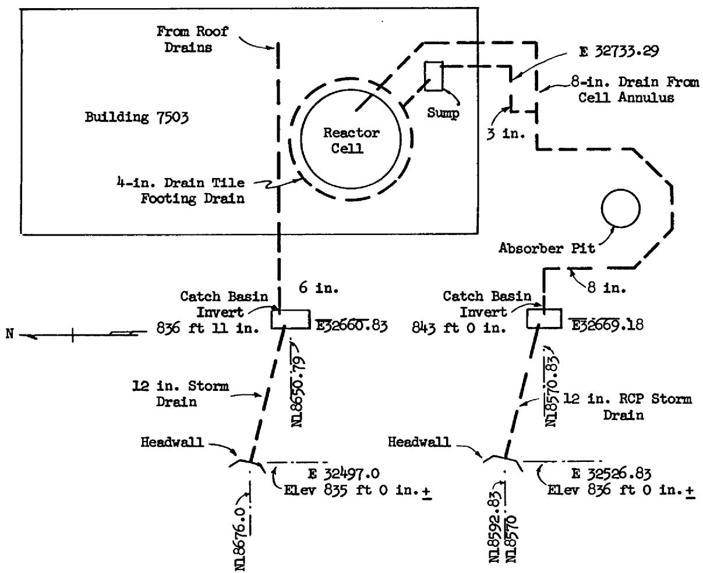  
Figure 20.2. Schematic Diagram Building 7503 Drainage System

of the MSRE project. Water for the system is obtained from the 6-in. potable water line entering the north end of the building, see Figure 20.1. A 4-in. Siamese double-hose connection is provided outside the north end of the building to attach a booster source of water for the sprinkler system.

The 6-in. potable water main also has a 4-in. branch connection just inside the building with 4-in. shutoff and check valves, to supply six fire hose cabinets. The 4-in. hose supply can also be augmented from the booster connection outside the building.

Under normal conditions the sprinkler system is valved off from the water supply, the consequences of inopportune release of water being more serious than the short delay in opening the valves if water is needed.

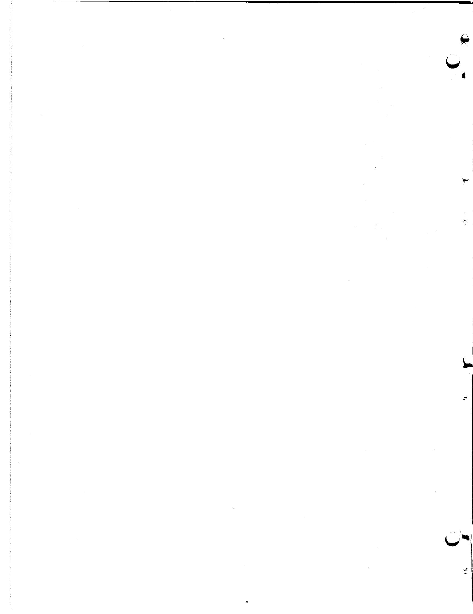

513

APPENDIX

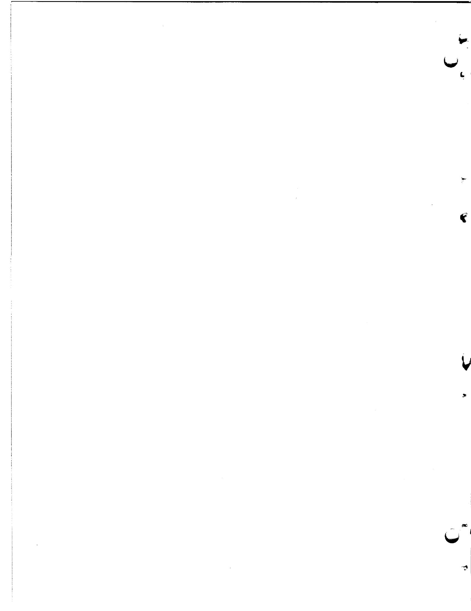

# LIST OF REFERENCES USED IN PART I

1. H. G. MacPherson, Molten-Salt Breeder Reactors, ORNL-CF-59-12-64 (Jan. 12, 1960).   
2. L. G. Alexander, et al., Experimental Molten-Salt-Fueled Power Reactor, ORNL-2796 (March 8, 1960).   
3. J. A. Swartout, Letter to R. M. Roth, Request for Directive CR-316, Molten Salt Reactor Experiment (Mar. 17, 1961).   
4. S. R. Sapirie, AEC Directive CL-262, Molten Salt Reactor Experiment, Bldg. 7503, Oak Ridge, Tennessee (April 28, 1961).   
5. F. F. Blankenship, Additional Estimated Physical Properties of MSRE Fuel, ORNL-MSR-63-30 (July 17, 1963).   
6. S. E. Beall, et al., MSRE Preliminary Hazards Report, ORNL-CF-61-2-46 (Feb. 28, 1961).   
7. S. E. Beall, et al., MSRE Preliminary Hazards Report Addendum No. 1, ORNL-CF-61-2-46 (August 14, 1961).   
8. MSRE Staff, MSRE Preliminary Hazards Report Addendum No. 2, ORNL CR-61-2-46 (May 8, 1962).   
9. W. B. Cottrell (ed.), (Classified "Secret"), ORNL-1407 (Nov. 24, 1952).   
10. W. B. Cottrell, et al., The Aircraft Reactor Test Hazards Summary Report, ORNL-1835 (Jan. 19, 1955).   
11. R. B. Briggs, Molten-Salt Reactor Program Semiannual Progress Report for Period Ending Dec. 31, 1963, ORNL-3626.   
12. L. F. Parsley, MSRE Reactor Containment Vessel Design Criteria, ORNL MSR-61-70 (June 23, 1961).   
13. L. F. Parsley, MSRE Containment Vessel Stress Studies, ORNL MSR-62-15 (Feb. 2, 1962).   
14. L. F. Parsley, Consequences of a Salt Spill into the Bottom of the MSRE Containment Vessel, ORNL MSR-62-12 (Jan. 23, 1962).   
15. R. B. Lindauer, MSRE Process Flowsheet Discussions, ORNL MSR-62-4 (Jan. 10, 1962).   
16. R. B. Lindauer, Revisions to MSRE Design Data Sheets, Issue No. 8, ORNL CF-63-6-30 (June 12, 1963).

17. R. B. Lindauer, MSRE Line Schedule, Revision No. 3, ORNL MSR-63-36 (Oct. 14, 1963).   
18. E. H. Bettis (ed.), MSRE Component Design Report, ORNL MSR-61-67 (June 20, 1961).   
19. W. B. McDonald, Fabrication Specifications, Procedures and Records for MSRE Components, ORNL MSR-62-3 (Jan. 23, 1962).   
20. A. L. Boch, et al., The Molten Salt Reactor Experiment, paper presented at International Atomic Energy Symposium, Vienna, Austria, Oct. 23-27, 1961.   
21. Contract, National Carbon Company, No. AT(40-1)-2882, Requisition No. 61-2189 (July 14, 1961), and Order No. OR62-1746, Requisition No. 62-1723 (June 14, 1962).   
22. R. B. Briggs, et al., Modifications to Specifications for MSRE Graphite, ORNL CF-63-2-18 (Feb. 14, 1963).   
23. H. G. MacPherson, Memo to A. M. Weinberg, Graphite Problems in the MSRE, (Nov. 25, 1960).   
24. R. C. Schulze, et al., INOR-8-Graphite-Fused-Salt Compatibility Test, ORNL-3124 (June 1, 1961).   
25. W. H. Cook and A. Taboada, Oxygen Contamination in the MSRE from Graphite and INOR-8, ORNL MSR-62-38 (May 10, 1962).   
26. S. E. Beall, Procedures for Cleaning and Purging MSRE Graphite, ORNL MSR-61-148 (Dec. 11, 1961).   
27. I. Spiewak, Proposed Program for Purging and Cleaning MSRE Graphite, ORNL MSR-61-144 (Dec. 4, 1961).   
28. B. W. Kinyon, Effects of Graphite Shrinkage in MSRE Core, ORNL CF-60-9-10 (Sept. 2, 1960).   
29. S. E. Moore, Memo to R. B. Briggs, MSRE Core Graphite Shrinkage, April 26, 1962.   
30. W. L. Breazeale, Preheating of Graphite Core in MSRE, ORNL MSR-61-99 (Aug. 15, 1961).   
31. J. R. Engel and P. N. Haubenreich, Temperatures in the MSRE Core During Steady-State Power Operation, ORNL TM-378 (Nov. 5, 1962).   
32. R. Van Winkle, Temperature Rise in the MSCR Graphite Due to Decay Heat from Absorbed Fuel Salt - MSCR Memo No. 4, ORNL CF-61-9-59 (Sept. 25, 1961).

33. J. H. Crawford, E. G. Bohlman and E. H. Taylor, Report of the MSRE Graphite Committee, ORNL CF-61-1-54 (Jan 16, 1961).   
34. L. F. Parsley, MSRE Core No. 1 Design Justification, ORNL CF-60-9-89 (Sept. 28, 1960).   
35. H. F. Poppendiek and L. D. Palmer, Forced Convection Heat Transfer Between Parallel Plates and Annuli with Volume Heat Sources within the Fluids, ORNL-1701 (May 11, 1954).   
36. L. F. Parsley, Letter to A. L. Boch, Temperature Rise Effects in MSRE Cores with Round and Flat Fuel Channels (June 10, 1960).   
37. J. E. Mott, Hydrodynamic and Heat Transfer Studies of a Full-Scale Reentrant Core (HRT), ORNL CF-58-8-54 (Aug. 8, 1958).   
38. R. J. Kedl, Pressure Drop Through the MSRE Core, ORNL MSR-62-71 (Sept. 5, 1962).   
39. R. J. Kedl, Salt Flow Rate Through Core Support Flange, ORNL MSR-64-4 (Jan. 24, 1964).   
40. R. B. Briggs, Molten-Salt Reactor Program Semiannual Progress Report for Period Ending Aug. 31, 1962, ORNL-3369 (Dec. 4, 1962).   
41. R. J. Kedl, Holes for Starved Fuel Channels in the MSRE Core, ORNL MSR-63-6 (Feb. 21, 1963).   
42. R. D. Sterling, Letter to E. S. Bettis, Review of MSRE Electrical power System, Bldg 7503 (Nov. 3, 1961).   
43. J. A. Westsik, Drain Tank Capacity Requirements for MSRE, ORNL MSR-61-141 (Dec. 5, 1961).   
44. H. R. Payne, Mechanical Design of the MSRE Control Rods and Reactor Access Nozzle, ORNL MSR-61-158 (Circa, June, 1961).   
45. C. W. Nestor, Jr., Preliminary Calculations of Heat Generation and Helium Production in MSRE Control Rods, ORNL MSR-61-118 (Sept. 26, 1961).   
46. P. N. Haubenreich, Importance of Errors in Measurement of Temperature and Control Rod Position in MSRE, ORNL CF-63-8-43 (Aug. 14, 1963).   
47. "Unfired Pressure Vessels", Section VIII, ASME Boiler and Pressure Vessel Code, American Society of Mechanical Engineers, New York. (See text for edition date, if important).   
48. "General Requirements for Nuclear Vessels, Case 1270N", Interpretations of ASME Boiler and Pressure Vessel Codes, American Society of Mechanical Engineers, New York. (See text for revision number).

49. "Containment and Intermediate Containment Vessels, Case 1272N", Case Interpretations of ASME Boiler and Pressure Vessel Codes, American Society of Mechanical Engineers, New York. (See text for revision number).   
50. "Nuclear Reactor Vessels and Primary Vessels, Case 1273N", Case Interpretations of ASME Boiler and Pressure Vessel Codes, American Society of Mechanical Engineers, New York. (See test for revision number).   
51. "Special Equipment Requirements, Case 1276N", Case Interpretations of ASME Boiler and Pressure Vessel Codes, American Society of Mechanical Engineers, New York. (See text for revision number).   
52. "Nickel-Molybdenium-Chromium-Iron Alloy, Case 1315", Case Interpretations of ASME Boiler and Pressure Vessel Codes, American Society of Mechanical Engineers, New York. (See test for revision number).   
53. R. W. Swindeman, Design Stresses for Wrought and Annealed INOR-8 Between Room Temperature and $1400^{\circ}\mathrm{F}$ , ORNL MSR-60-31.   
54. W. L. Breazeale, Gamma Heating of Reactor Vessel Hanger Rods for MSRE, ORNL MSR-61-27 (Mar. 21, 1961).   
55. W. L. Breazeale, Re-evaluation of Gamma Heating in Proposed Reactor Vessel Hanger Rods for MSRE, ORNL MSR 61-52 (May 12, 1961).   
56. J. H. Westsik, Memo to R. B. Briggs, Review of Flow Design to the MSRE Thermal Shield (July 23, 1962).   
57. W. C. Ulrich, Memo to S. E. Beall, Loss of Cooling Water Flow to the MSRE Thermal Shield (Feb. 20, 1963).   
58. E. C. Miller, Memo to F. L. Rouser, MSRE Reactor Vessel Thermal Shield Drawings E-KK-D-40722 - 40730 (May 8, 1962).   
59. H. C. Claiborne, High-Energy Neutron Flux in the Containment Vessel of the MSRE, ORNL MSR-62-27 (March 19, 1962).   
60. P. G. Smith, Water Test Development of Fuel Pump for the MSRE, ORNL TM-79 (Mar. 27, 1962).   
61. General Alloys, Boston, Mass., Purchase Order No. 74Y-47524 (July 11, 1962).   
62. Lukins Steel Company (Coatesville, Pa.), Purchase Order No. 93Y-87622, October 30, 1961.   
63. Westinghouse Electric Corp., Purchase Order No. 63Y-57698, May 29, 1961.   
64. Specification of Drive Motor for MSRE Primary Pump, ORNL Job Specification 169-101 (Mar. 15, 1961).

65. Specification for Drive Motor for MSRE Secondary Pump, ORNL Job Specification 169-124 (Oct. 11, 1961).   
66. A. G. Grindell, et al., Memo to E. S. Bettis, Design Memo for MSRE Pumps (Dec. 15, 1961).   
67. Ralph H. Guymon, Memo to R. B. Briggs, Fuel and Coolant Pump Oil Systems (Jan. 15, 1963).   
68. A. G. Grindell, Back-Diffusion Experiment on PK-P Pump, ORNL MSR-61-50 (May 11, 1961).   
69. G. H. Llewellyn, Gamma, Beta and Neutron Heating of MSRE Pump Lubrication Shield, ORNL CF-61-1-38 (Jan. 16, 1961).   
70. C. W. Nestor, Influence of Residence Time Distribution of Fission-Product Decay in the MSRE Pump Bowl and Off-Gas Line, ORNL CF 61-6-85 (June 23, 1961).   
71. I. Spiewak, Xenon Removal in the MSRE Pump Bowl, ORNL MSR-60-8 (Oct. 7, 1960).   
72. S. J. Ball, MSRE Pump Gas Purge System Study, ORNL MSR-61-3 (Jan. 9, 1961).   
73. P. H. Harley, Pump Bowl Overflow Line, ORNL MSR-62-2 (Jan. 10, 1962).   
74. C. H. Gabbard, Air Cooling Requirements of MSRE Primary Pump Bowl, ORNL MSR-61-28 (Mar. 23, 1961).   
75. C. H. Gabbard, Electrical Insulation for the MSRE Fuel and Coolant Pump Drive Motors, ORNL MSR-62-10 (Feb. 1, 1962).   
76. D. W. Vroom, Primary Pump Motor Background Radiation Level at 10-Mw, ORNL MSR-61-49 (May 10, 1961).   
77. A. G. Grindell, Specification of a Lubricant for MSRE Pumps, ORNL MSR 60-37 (Nov. 18, 1960).   
78. L. V. Wilson, MSRE Fuel Pump Coolant Oil Temperature After Cessation of Oil Flow, ORNL MSR 61-84 (July 26, 1961).   
79. C. H. Gabbard, Estimated Flow Startup Transient of the MSRE Fuel System, ORNL MSR 61-133 (Nov. 14, 1961).   
80. R. B. Briggs, Molten-Salt Reactor Program Progress Report for Period from August 1, 1960 to February 28, 1961, ORNL-3122 (June 20, 1961).

81. A. G. Grindell and P. G. Smith, MSRE Prototype Pump Shaft Seizure, ORNL MSR-62-67 (Aug. 27, 1962).   
82. D. E. Gladow, MSRE Primary Pump; Analysis of Stress in Impeller Bowl Due to Axial Loading, ORNL MSR-60-60 (Sept. 3, 1960).   
83. T. B. Fowler, Generalized Heat Conduction Code for the IBM 7090 Computer, ORNL CF-61-2-33 (Feb. 9, 1961).   
84. F. J. Stanek, Stress Analysis of Cylindrical Shells, ORNL CF-58-9-2 (July 22, 1959).   
85. F. J. Stanek, Stress Analysis of Conical Shells, ORNL CF-58-6-52 (Aug. 28, 1958).   
86. F. J. Witt, Thermal Stress Analysis of Cylindrical Shells, ORNL CF-59-1-33 (Mar. 26, 1959).   
87. F. J. Witt, Thermal Analysis of Conical Shells, ORNL CF-61-5-61 (July 7, 1961).   
88. C. H. Gabbard, Thermal-Strain and Strain-Fatigue Analyses of MSRE Fuel and Coolant Pump Tanks, ORNL TM-78 (Oct. 3, 1962).   
89. R. B. Gallaher, Thermal Stress Analysis of the Sampler-Enricher Attachment to the MSRE Fuel Pump, ORNL MSR-62-16 (Feb. 5, 1962).   
90. W. C. Ulrich, Fuel Pump Main Support Members, Memo to R. B. Briggs, ORNL MSR-61-159 (circa June, 1961).   
91. J. M. Corum, Memo to R. B. Briggs, Flexibility Analysis of MSRE Piping, April 24, 1962.   
92. Specification for Primary Heat Exchanger for MSRE, ORNL Job Specification 80-109 (Dec. 22, 1960).   
93. Tentative Specification for Fabrication of MSRE Heat Exchanger Tube Bundle, ORNL Job Specification 81-182 (Sept. 10, 1962).   
94. Specification for Brazing of the Tube Bundle for the MSRE Heat Exchanger, ORNL Job Specification 80-167 (July 16, 1962).   
95. R. G. Donnelly, Requirements for Welding Tube-to-Tube Sheet Joints for MSRE Primary Heat Exchanger and Heat Exchanger Sample, ORNL MSR-62-66 (Aug. 29, 1962).   
96. R. G. Donnelly, Primary Heat Exchanger Tube-to-Tube Sheet Welding and Subsequent Machining, ORNL MSR 62-39 (May 16, 1962).   
97. R. G. Donnelly, Design Revisions for the Primary Heat Exchanger Tubeto-Tube Sheet Joints, ORNL MSR-62-23 (March 1, 1962).

98. R. G. Connelly, Brazing Alloy for the Primary Heat Exchanger Tube-to-Tube Sheet Joints, ORNL MSR-62-6 (Feb. 12, 1962).   
99. W. C. Ulrich, Hydrostatic Test Pressures for MSRE Primary Heat Exchanger, Memo to C. K. McGlothlan, March 12, 1963.   
100. J. C. Amos, R. E. MacPherson and R. L. Senn, Preliminary Report of Fused Salt Mixture 130 Heat Transfer Coefficient Test, ORNL CF-58-4-23 (April 2, 1958).   
101. D. Q. Kern, Process Heat Transfer, p. 834, Figure 24, McGraw-Hill, New York, 1950.   
102. G. T. Colwell, Pressure Drops Through MSRE Heat Exchanger and Piping, Memo to R. B. Briggs (Aug. 29, 1962).   
103. Standards of Tubular Exchanger Manufacturers Association, TEMA, 366 Madison Ave., New York, 1949.   
104. H. R. Payne, Reservoir for Fuel Salt Drain Tank Cooling System, Addendum to MSR 61-67 (Ref. 18), Memo to Distribution (July 11, 1961).   
105. J. C. Moyers, Design of Freeze Valves for MSRE, ORNL MSR 61-160 (Circa, June, 1961).   
106. American Standard Code for Pressure Piping, ASA B 31.1 - 1955, American Society of Mechanical Engineers, New York.   
107. W. C. Ulrich, MSRE Pipe Support Calculations by R. E. Ramsey, Memo to R. B. Briggs, (Jan. 28, 1963).   
108. R. B. Briggs, Molten-Salt Reactor Program Semiannual Progress Report for Period Ending Aug. 31, 1962, ORNL-3369 (Dec. 4, 1962).   
109. J. C. Moyers, Thermal Cycling Test of 3-1/2-in. and 4-in. Freeze Flanges, ORNL CF-61-2-38 (Feb. 2, 1961).   
110. R. B. Briggs, Molten-Salt Reactor Program Semiannual Progress Report for Period Ending Jan. 31, 1963, ORNL-3419 (May 24, 1963).   
111. J. C. Moyers, Design of Freeze Flanges for MSRE, Memo to R. B. Briggs, ORNL MSR-61-161 (circa June, 1961).   
112. R. E. Ramsey (Burns and Roe), MSRE Reactor Piping Stress Analysis, Memo to R. B. Briggs, ORNL MSR-61-157 (circa, June, 1961).   
113. Sturn-Krouse, Inc., Research and Consulting Engineers (Auburn, Alabama), Analyses and Design Suggestions for Freeze Flange Assemblies for MSRE, Report to ORNL under Subcontract No. 1477, Nov. 30, 1960.

114. M. Richardson, Development of Freeze Valves for Use in the MSRE, ORNL Tm-128 (Feb. 28, 1962).   
115. R. B. Briggs, Operation of Freeze Valves in the MSRE, ORNL MSR-63-47 (Dec. 12, 1963).   
116. R. L. Moore, MSRE Freeze Valve Control Circuitry, Memo to Distribution (May 31, 1962).   
117. R. B. Briggs, Molten-Salt Reactor Program Semiannual Progress Report for Period Ending July 31, 1963, ORNL-3529 (Dec. 30, 1963).   
118. W. Thomas Mullins, Activation Analysis of Heater Materials (for MSRE), Memo to M. Richardson (Oct. 16, 1962).   
119. J. R. Engel and B. E. Prince, Criticality Factors in MSRE Fuel Storage and Drain Tanks, ORNL-TM-759 (In preparation).   
120. Status and Progress Report, Oak Ridge National Laboratory, p. 15, ORNL-3543 (Nov., 1963).   
121. R. E. Thoma and F. F. Blankenship, Relative Abundance of Phases in the Frozen MSRE Fuel at Equilibrium Conditions, ORNL MSR (Revised) 63-38 (Nov. 8, 1963).   
122. S. E. Beall, et al., MSRE Reactor Safety Analysis Report, ORNL TM-732 (August, 1964).   
123. T. W. Pickel, MSRE Drain Times, ORNL MSR-62-97 (Dec. 17, 1962).   
124. L. F. Parsley, MSRE Drain Tank Heat Removal Studies, ORNL CF-60-9-55 (Sept. 19, 1960).   
125. Vapor Condensing System Water and Gas Tanks, ORNL Specification XSP-120 (April 27, 1964).   
126. P. H. Harley, Drain Tank Furnace Tests, ORNL MSR 64-9 (Feb. 24, 1964).   
127. H. R. Payne, Weights of MSRE Fuel, Flush and Coolant Tanks, and Contents, Memo to R. L. Moore (Jan. 29, 1962).   
128. R. B. Gallaher, MSRE Sampler-Enricher System Proposal, ORNL CF-61-5-120 (May 24, 1961).   
129. G. A. Cristy, Stresses and Loads in the Sampler-Enricher Transfer Tube, Work Request A-70496-11D, Letter to E. S. Bettis (Nov. 13, 1961).   
130. C. H. Gabbard, Hydraulic Performance of MSRE Coolant Pump, Memo to A. G. Grindell (July 9, 1963).

131. W. C. Ulrich, MSRE Radiator Design, ORNL CF-60-11-108 (Nov. 30, 1960).   
132. Roy C. Robertson and S. E. Bolt, MSRE Heaters - Summary of Preliminary Studies, Memo to E. S. Bettis (Aug. 11, 1960).   
133. W. B. McDonald, Insulation of Thermocouples on MSRE Radiator, Memo to R. B. Briggs (Feb. 5, 1963).   
134. W. C. Ulrich, Hydrostatic Test Pressure for MSRE Radiator, Memo to C. K. McGlothlan (April 9, 1963).   
135. W. C. Ulrich, MSRE Radiator Air Flow Characteristics, ORNL MSR 61-18 (Mar. 8, 1961).   
136. W. C. Ulrich, Control of Heat Removal Rate from MSRE Radiator, ORNL MSR 61-51 (May 12, 1961).   
137. S. J. Ditto, Control of MSRE Between 1 Mw and 10 Mw, ORNL MSR 63-23 (June 4, 1963).   
138. S. J. Ball, Freezing Times for Stagnant Salt in MSRE Radiator Tubes, Memo to J R. Tallackson (April 9, 1963).   
139. R. E. Ramsey (Burns and Roe), Coolant System Stress Analysis, Memo to R. B. Briggs, ORNL MSR-61-156 (Nov. 3, 1961).   
140. A. N. Smith, MSRE Cover Gas System, ORNL MSR 60-44 (Nov. 30, 1960).   
141. A. N. Smith, MSRE Cover Gas System Flowsheet, ORNL MSR 60-11 (Oct. 7, 1960).   
142. P. N. Haubenreich, Oxygen Production by Fluorine $^{19}$ (n, ) Reaction in MSRE, ORNL MSR-64.23 (May 27, 1964).   
143. A. N. Smith, MSRE Cover Gas System, Design Memo C-3, Helium Dryer, Memo to R. B. Briggs (Nov. 2, 1961).   
144. A. N. Smith, Helium Surge Tank, Design Memo C-4, Memo to R. B. Briggs (Nov. 10, 1961).   
145. A. N. Smith, Leak Detector System, MSRE Cover Gas System, ORNL, MSR 61-83 (July 27, 1961).   
146. P. P. Holz, Development of Six-Station Manifold Disconnect, ORNL CF-61-5-117 (May 18, 1961).   
147. P. P. Holz, Status of Small Pipe Disconnects for MSRE, ORNL CF-60-9-102 (Sept. 27, 1960).   
148. A. N. Smith, MSRE Charcoal Beds, ORNL MSR-61-101 (Aug. 17, 1961).

149. R. B. Stevenson, Radiation Source Strengths in the Expansion and Off-Gas System of the ART, ORNL CF-57-7-17 (Nov. 18, 1957).   
150. J. O. Blomeke and M. F. Todd, Uranium 235 Fission-Product Production as Function of Thermal Neutron Flux, Irradiation Time, and Decay Time, ORNL-2127, Part I, Vol. I (Aug. 19, 1957).   
151. Solenberger, et al., Treatment of Off-Gas from the HRT, KT 373, Memo to W. E. Browning, Jr. (Nov. 13, 1958).   
152. R. D. Ackley and W. E. Browning, Equilibrium Adsorption of Kr and Xe on Activated Carbon and Linde Molecular Sieves, ORNL CF-61-2-32 (Feb. 14, 1961).   
153. Fire Resistant High-Efficiency Air Filter - up to $250^{\circ}\mathrm{F}$ , ORNL Specification XSP-26.   
154. Design Criteria Containment and Building Ventilation System, Building 7503, ORNL Work Request A-70496-11D (Jan. 28, 1963).   
155. F. L. Culler, Criteria for Handling Melton Valley Radioactive Wastes, ORNL CF-61-5-24, May 8, 1961 and Supplement No. 1, May 12, 1961.   
156. W. C. Ulrich, Overall Heat Transfer Coefficient for Treated Water Cooler, Memo to S. J. Ball (April 4, 1963)   
157. S. J. Ball, Analysis of MSRE Cooling Water Temperature Control, Memo to R. L. Moore (May 2, 1963).   
158. Closed Cycle Pressure Drop, MSRE Water System, ORNL P & E Division Design File, Sept. 22, 1961.   
159. Cooling Tower Load, MSRE Water System, ORNL P & E Division, (No date).   
160. J. C. Moyers, Requirements for MSRE Valves and Flanges, Letter to L. F. Parsley (April 19, 1961).   
161. L. F. Parsley, MSRE Simultaneous Salt and Water Spill Accidents, ORNL MSR-61-120 (Sept. 28, 1961).   
162. A. N. Smith, Secondary Containment for the Off-Gas Lines, ORNL MSR-61-110 (Aug. 30, 1961).   
163. L. F. Parsley, Theoretical Analysis of Certain Penetration Regions of the MSRE Containment Vessel, ORNL MSR 61-96 (Aug. 10, 1961).   
164. L. F. Parsley, MSRE Containment Vessel Stress Studies, ORNL MSR-62-15 (Feb. 2, 1962).

165. L. F. Parsley, Design of Pressure-Suppression System for the MSRE, Memo to R. B. Briggs (Oct. 17, 1961).   
166. R. B. Briggs, MSRE Pressure-Suppression System, ORNL MSR-61-135 (Nov. 15, 1961).   
167. F. R. Bruce, ORNL Radiation and Safety Control Manual, June 1, 1961.   
168. H. C. Claiborne, Review of the MSRE Biological Shielding, ORNL MSR-63-17 (May 13, 1963).   
169. D. W. Vroom, MSRE Off-Gas Line and Charcoal Bed Shielding Requirements During Operation, ORNL CF-61-10-57 (Oct. 23, 1961).   
170. D. W. Vroom, Preliminary MSRE Gamma Ray Source and Biological Shielding Survey, ORNL CF-61-4-97 (April 28, 1961).   
171. A. N. Smith, Shielding of Off-Gas Lines, ORNL MSR-61-125 (Oct. 29, 1961).   
172. Allis-Chalmers Co. Instruction Manual and Parts Catalog, Buda Division, Model DC SG-300-A3E Generator, Allis-Chalmers 8DCSG-2505 Diesel Engine, for Union Carbide Nuclear Co., Contract No. W8X-18089.   
173. Electrical Storage Battery Company, Exide Industrial Division, Instruction Manual, Installing and Operating Exide Batteries, Form 4676, 6th ed.   
174. Electrical Products Company, Instruction Manual for Installation Operation and Maintenance of Diverter-Pole Motor-Generators, SM-1050 (Feb. 1, 1950).   
175. Reliance Electric and Engineering Company, Instruction Book, 250-v, 25-kva, Motor-Generator Set, Book No. 819541 (Feb., 1962).   
176. T. E. Northup, MSRE Vapor Condensing System - Parallel Rupture Discs, Memo to R. G. Affel, May 28, 1964.

# ABBREVIATIONS

The following abbreviations have been used in the Description of the Reactor Design, Part I, ORNL-TM-728:

alternating current AC

American Institute of Electrical Engineers* AIEE

amphere amp

American Society of Mechanical Engineers ASME

asymmetrical asym

aux

Brinell hardness number Bhn

brake horsepower bhp

British thermal unit Btu

Centigrade, degrees C

cubic centimeter CC

centimeter cm

constant, valve (flow coefficient) $c_{\nu}$

diameter diam

direct current DC

distribution

drawing

east E

electr动手ice force emf

elevation elev

Fahrenheit, degrees F

feet per second fps

feet ft

gallon gal

gallons per minute gpm

heater htr

horsepower hp

hour hr

inches in.

inside diameter 1D

instrument instr

interrupt current IC

iron pipe size IPS

kilogram kg

kilowatt kw

kilovolt kV

kilovolt-umphere kva

liter 1

phase

pounds 1bs

pounds, force 1bs

maximum max

mills, 1,000 circular mcm

minimum min

roentgen equivalent man, x 106 mrem

Molten Salt Reactor Experiment MSRE

megawatt Mw

National Electrical Manufacturers Association

nominal pipe size NPS

neutrons 1

north N

number No.

Oak Ridge National Laboratory ORNL

operated op

outside diameter OD

pp

panel pnl

parts per million

pounds per in.², absolute psia

pounds per in.², gage psig

power factor PF

radiation, absorbed dose rad

reference ref

revolutions per minute rpm

reactivity k

reactivity change 4k

receptacle receptor

roentgen r

roentgen equivalent man rem

room Rm

root mean square RMS

schedule sched

second sec

south S

stainless steel SS

standard cubic feet per minute scfm

standard temperature and pressure STP

sw

switchgear

Tennessee Valley Authority TVA

thermocouple TC

transfer Xfer

transformer Xfmr

unified national coarse thread UNC

universal gas constant R

volt v

watt W

W

# EQUIPMENT AND LOCATION ABBREVIATIONS

Note: Several changes were made in the abbreviations as the MSRE design progressed. Since the reference literature and drawings make use of some of the old notations, all of the abbreviations have been included in this listing, but with those considered obsolete inclosed in parenthesis. Some duplications exist, but in such cases the context in which the abbreviation is used will make the choice of meanings evident.

<table><tr><td>AB</td><td>Auxiliary Board</td><td>CR</td><td>Coolant Radiator</td></tr><tr><td>ABC</td><td>Absorber Cubicle</td><td>CS</td><td>Caustic Scrubber</td></tr><tr><td>(AC)</td><td>Absorber Cubicle</td><td>(CS)</td><td>Containment Stack</td></tr><tr><td>AC</td><td>Air Compressor, 1, 2</td><td>CST</td><td>Condensate Storage Tank, 1, 2</td></tr><tr><td>ACB</td><td>Auxiliary Charcoal Bed (Cell)</td><td>CSS</td><td>Coolant Salt Sampler</td></tr><tr><td>AD-1</td><td>Inlet Air Duct to Radiator</td><td>CT</td><td>Cooling Tower</td></tr><tr><td>AD-2</td><td>Radiator By-Pass Duct</td><td>CTP</td><td>Cooling Tower Pump, 1, 2</td></tr><tr><td>AD-3</td><td>Exit Air Duct from Radiator and Coolant Stack</td><td>CTW</td><td>Cooling Tower Water</td></tr><tr><td>AD</td><td>Instrument Air Dryer, 1, 2</td><td>CTWR</td><td>Cooling Tower Water Return</td></tr><tr><td>(AR)</td><td>Auxiliary Room</td><td>(DB)</td><td>Duct Blower</td></tr><tr><td>BH</td><td>Blower House</td><td>DC</td><td>Decontamination Cell</td></tr><tr><td>(BWT)</td><td>Waste Tank Vent Blower</td><td>DCC</td><td>Drain Cell cooler</td></tr><tr><td>C-1</td><td>30-Ton Crane</td><td>DH</td><td>Diesel House</td></tr><tr><td>C-2</td><td>10-Ton Crane</td><td>DP</td><td>Diesel Panel</td></tr><tr><td>C-3</td><td>3-Ton Crane</td><td>DPI</td><td>Diesel Panel, Switch House</td></tr><tr><td>CAP</td><td>Containment Air Panels</td><td>DPM</td><td>Diesel Panel, Aux. Control Rm.</td></tr><tr><td>CB</td><td>Charcoal Bed, 1A, 1B, 2A, 2B</td><td>DR</td><td>Cover Gas Dryer, 1, 2</td></tr><tr><td>CBC</td><td>Charcoal Bed Cell</td><td>DT</td><td>Decontamination Cell</td></tr><tr><td>CC</td><td>Coolant Cell</td><td>(DTC)</td><td>Drain Tank Condenser</td></tr><tr><td>CCC</td><td>Coolant Cell Heater, E, W</td><td>DTC</td><td>Drain Tank Cell</td></tr><tr><td>CCP</td><td>Component Cooling Pump, 1,2,3</td><td>ENS</td><td>Emergency Nitrogen Station</td></tr><tr><td>CDC</td><td>Coolant Drain Cell</td><td>ESA</td><td>Electric Service Area</td></tr><tr><td>CDT</td><td>Coolant Drain Tank</td><td>ESC</td><td>Equipment Storage Cell</td></tr><tr><td>CG</td><td>Cover Gas (Panel)</td><td>(EI)</td><td>East Tunnel</td></tr><tr><td>COP</td><td>Coolant Pump Lube Oil Pump,1,2</td><td>F</td><td>Stack Filter, 1, 2, 3</td></tr><tr><td>CP</td><td>Coolant Pump</td><td>FD</td><td>Fuel Drain Tank, 1, 2</td></tr></table>

FF Freeze Flange (Five)

FFT Fuel Flush Tank

(FH) Blower House

FLP F2 Preheater

FLR F2 Reactor

FOP Fuel Pump Lube Oil Pump, 1,2

FP Fuel Pump

FFC Fuel Processing Cell

FPS Fuel Processing Sampler

(FS) Fuel Sampler

(FSC) Fuel Storage Cell

FST Fuel Storage Tank

FV Freeze Valve (Twelve)

FWT Feed Water Tank, 1, 2

GC Gas Cooler (Component Cooling System)

(GCP) Gas Coolant Pump (Component Cooling System) 1, 2

GOP Gas Oil Pump (Component Cooling System) 1, 2

BB High Bay

HCP Heater Control Panel

(HD) Helium Dryer, 1, 2

HDP Heater Distribution Panel

He Treated Helium Surge Tank

HeF Fresh Helium Supply Trailer

(HH) Helium Preheater

HP Heater Panel

HX (Primary) Heat Exchanger

(IAD) Instrument Air Dryer, 1, 2

IF Inlet Filter (High Bay Area)

LD Leak Detector

(LKD) Leak Detector

(LOP) Lube Oil Package

(LWT) Liquid Waste Tank

M Motor

MB Main Board

MB-1 Main Blowers to Coolant

MB-3 Radiator

MB-2 Annulus Blowers to

MB-4 Coolant Radiator Ducting

MCC Motor Control Center

MCCT Motor Control Center, TVA

MCR Main Control Room

(MCR) Maintenance Control Room

RMCR (Remote) Maintenance Control Room

MG Motor-Generator

MG-1 250-v Motor-Generator Set

MG-2 48-v Motor-Generator Set

MG-3 48-v Motor-Generator Set

MG-4 25-kva Motor-Generator Set

MPC Maintenance Practice Cell

(MS) Main Sump (Pump) Room

NP Nuclear Panel

OBE Outside Building, East

OBS Outside Building, South

OC OilCooler,1,2

(OCR) (Operating) Main Control Room

OCT Oil Catch Tank, 1, 2

OF Oil Filter, 1, 2

OFT Fuel Pump Overflow Tank

(OFT) Oil (Fill) Supply Tank

OR Oxygen Removal Unit, 1, 2

OT Oil Supply Tank, 1, 2

PH Cover Gas Preheater, 1, 2

PLW 840-ft Elev Passage, W Side

PP Pit Pump

PR Pump Room

(PT) Process Water (Storage) Tank

R Reactor

R-1 Instrument Air Receiver

R-2 Instrument Air Receiver

R-3 Service Air Receiver

RC Reactor Cell

RCC Reactor Cell Cooler

RDB Radiator Door Brake

RDC Radiator Door Clutch

RDM Radiator Door Drive

RMC Remote Maintenance Cell

S-1 Containment (Off-Gas) Stack

SC Spare Cell

SC) Steam Condenser

SD Steam Dome (Drm) on FD

SDC Steam Dome Condenser, 1, 2

SE Sampler-Enricher

SER Special Equipment Room

SF Stack Fan, 1, 2

(SFA) Stack Filter (Fan) Area

SFA Sodium Fluoride Absorbers

SFT Sodium Fluoride Trap

SH Switch House

SOP $\mathbf{SO}_2$ Preheater

SP Sump Room, A, B

SR Solenoid Rack

SR Service Room

ST Surge Tank

ST Service Tunnel

SV Sampler-Enricher Vacuum Pump

(TC) Transfer (Spare) Cell

TF (Cooling) Tower Fan, 1, 2

TR Transmitter Rack (Room)

TRM Transmitter Room

TS Thermocouple Scanner

TWC Treated Water cooler

TWP Treated Water Pump   
VH Vent House   
VH-1 Volume Holdup Inside RC   
VH-2 Volume Holdup in CBC   
VP Vacuum Pump   
VT Vapor Condensing Tank, 1, 2   
WB Waste Blower   
WF Waste Filter   
WOR Waste Oil Receiver, 1, 2   
WP Waste Pump   
WR Water Room   
WT Liquid Waste Tank   
WT West Tunnel   
WTC Waste (Tank) Treatment Cell, or Liquid Waste Cell

LOCALLY MOUNTED (AT OR NEAR PROCESS)

PANEL MOUNTED (ON PANEL NO. XX)

MECHANICALLY COUPLED (PLUG-IN CONTROL, THERMOCOUPLE AND WELL, TWO-PEN REORDER OR INDICATOR, OR REORDER WITH INTEGRAL SWITCH, ETC.

DESIGNATION OF ANNUNCIATOR (UNIT NO. XX-POINT NO. X)

INTERMEDIATELY MOUNTED (BETWEEN MAIN PANEL AND PROCESS) ON AUXILIARY PANEL NO. X, IF PANEL MOUNTED)

PURGE STATION NUMBER XX (3g-IN. DIAM; SEE SEC 6 FOR RECOMMENDED NUMBERING SYSTEM)

AIR SUPPLY TO INSTRUMENT COMPONENT $(\%_{16}$ -IN, DIAM)

LEADSTO ELECTRICAL CONTROLCIRCUIT (ON DRAWING NO.XX)

PROCESS ELECTRICAL POWER (ON DRAWING NO. XX)

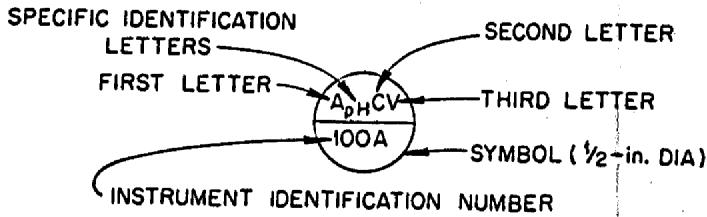

Unclassified

ORNL DWG 64-9110

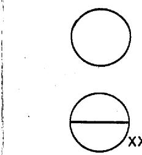

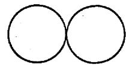

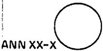

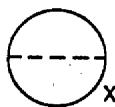

ECC XX

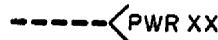  
Figure A.1 Symbols Used on MSRE Process Flowsheets

<table><tr><td>Process Variable or Actuation</td><td>A</td><td>C</td><td>E</td><td>G</td><td>I</td><td>M</td><td>Q</td><td>R</td><td>S</td><td>T</td><td>V</td><td>W</td><td>CO</td><td>CV</td><td>IC</td><td>IM</td><td>IT</td><td>RC</td><td>SS</td><td>SV</td></tr><tr><td>Analysis</td><td>A</td><td>AA</td><td>AC</td><td>AE</td><td>--</td><td>AI</td><td>AM</td><td>--</td><td>AR</td><td>AS</td><td>AT</td><td>--</td><td>--</td><td>ACO</td><td>ACV</td><td>AIC</td><td>AIT</td><td>ARC</td><td>ASS</td><td>ASV</td></tr><tr><td>Conductivity</td><td>C</td><td>CA</td><td>CC</td><td>CE</td><td>--</td><td>CI</td><td>CM</td><td>--</td><td>CR</td><td>CS</td><td>CT</td><td>--</td><td>--</td><td>CCO</td><td>CCV</td><td>CIC</td><td>CIM</td><td>CIT</td><td>CRC</td><td>CSS</td></tr><tr><td>Density</td><td>D</td><td>DA</td><td>DC</td><td>DE</td><td>--</td><td>DI</td><td>DM</td><td>--</td><td>DR</td><td>DS</td><td>DT</td><td>--</td><td>--</td><td>DCO</td><td>DCV</td><td>DIC</td><td>DIM</td><td>DIT</td><td>DRC</td><td>DSS</td></tr><tr><td>Electric</td><td>E</td><td>EA</td><td>EC</td><td>EE</td><td>--</td><td>EI</td><td>EM</td><td>EQ</td><td>ER</td><td>ES</td><td>ET</td><td>--</td><td>--</td><td>ECO</td><td>ECV</td><td>EIC</td><td>EIM</td><td>EIT</td><td>ERC</td><td>ESS</td></tr><tr><td>Flow</td><td>F</td><td>FA</td><td>FC</td><td>FE</td><td>FG</td><td>FI</td><td>FM</td><td>FQ</td><td>FR</td><td>FS</td><td>FT</td><td>FV</td><td>--</td><td>FCO</td><td>FCV</td><td>FIC</td><td>FIM</td><td>FIT</td><td>FRC</td><td>FSS</td></tr><tr><td>Hand (manual)</td><td>H</td><td>HA</td><td>HC</td><td>--</td><td>--</td><td>--</td><td>--</td><td>--</td><td>--</td><td>HS</td><td>--</td><td>HV</td><td>--</td><td>HCO</td><td>HCV</td><td>MIC</td><td>HIM</td><td>HIT</td><td>--</td><td>HSS</td></tr><tr><td>Interval (time)</td><td>I</td><td>IA</td><td>IC</td><td>--</td><td>--</td><td>II</td><td>--</td><td>IQ</td><td>IR</td><td>IS</td><td>--</td><td>--</td><td>--</td><td>--</td><td>--</td><td>--</td><td>--</td><td>--</td><td>--</td><td>ISS</td></tr><tr><td>Level</td><td>L</td><td>LA</td><td>LC</td><td>LE</td><td>LG</td><td>LI</td><td>LM</td><td>--</td><td>LR</td><td>LS</td><td>LT</td><td>LV</td><td>--</td><td>LCO</td><td>LCV</td><td>LIC</td><td>LIM</td><td>LIT</td><td>LRC</td><td>LSS</td></tr><tr><td>Pressure</td><td>P</td><td>PA</td><td>PC</td><td>PE</td><td>--</td><td>PI</td><td>PM</td><td>--</td><td>PR</td><td>PS</td><td>PT</td><td>PV</td><td>--</td><td>PCO</td><td>PCV</td><td>PIC</td><td>PIM</td><td>PIT</td><td>PRC</td><td>PS</td></tr><tr><td>Radiation</td><td>R</td><td>RA</td><td>RC</td><td>RE</td><td>--</td><td>RI</td><td>RM</td><td>RQ</td><td>RR</td><td>RS</td><td>RT</td><td>--</td><td>--</td><td>RCO</td><td>RCV</td><td>RIC</td><td>RIM</td><td>RIT</td><td>RRC</td><td>RSS</td></tr><tr><td>Speed</td><td>S</td><td>SA</td><td>SC</td><td>SE</td><td>--</td><td>SI</td><td>SM</td><td>--</td><td>SR</td><td>SS</td><td>ST</td><td>SV</td><td>--</td><td>SCO</td><td>SCV</td><td>SIC</td><td>SIM</td><td>SIT</td><td>SRC</td><td>SS</td></tr><tr><td>Temperature</td><td>T</td><td>TA</td><td>TC</td><td>TE</td><td>--</td><td>TI</td><td>TM</td><td>--</td><td>TR</td><td>TS</td><td>TT</td><td>TV</td><td>TW</td><td>TCO</td><td>TCV</td><td>TIC</td><td>TIM</td><td>TIT</td><td>TRC</td><td>TSS</td></tr><tr><td>Viscosity</td><td>V</td><td>VA</td><td>VC</td><td>VE</td><td>--</td><td>VI</td><td>VM</td><td>--</td><td>VR</td><td>VS</td><td>VT</td><td>--</td><td>--</td><td>VCO</td><td>VCV</td><td>VIC</td><td>VIM</td><td>VIT</td><td>VRC</td><td>VSS</td></tr><tr><td>Weight</td><td>W</td><td>WA</td><td>WC</td><td>WE</td><td>--</td><td>WI</td><td>WM</td><td>WQ</td><td>WR</td><td>WS</td><td>WT</td><td>--</td><td>--</td><td>WCO</td><td>WCV</td><td>WIC</td><td>WIM</td><td>WIT</td><td>WRC</td><td>WSS</td></tr><tr><td>Special</td><td>X</td><td>XA</td><td>XC</td><td>XE</td><td>--</td><td>XI</td><td>XM</td><td>XQ</td><td>XR</td><td>XS</td><td>XT</td><td>XV</td><td>XW</td><td>XCO</td><td>XCV</td><td>XIC</td><td>XIM</td><td>XIT</td><td>XRC</td><td>XSS</td></tr><tr><td>Position</td><td>Z</td><td>ZA</td><td>ZC</td><td>ZE</td><td>--</td><td>ZI</td><td>--</td><td>--</td><td>ZR</td><td>ZS</td><td>ZT</td><td>--</td><td>--</td><td>ZCO</td><td>ZCV</td><td>ZIC</td><td>ZIM</td><td>ZIT</td><td>ZRC</td><td>ZSS</td></tr></table>

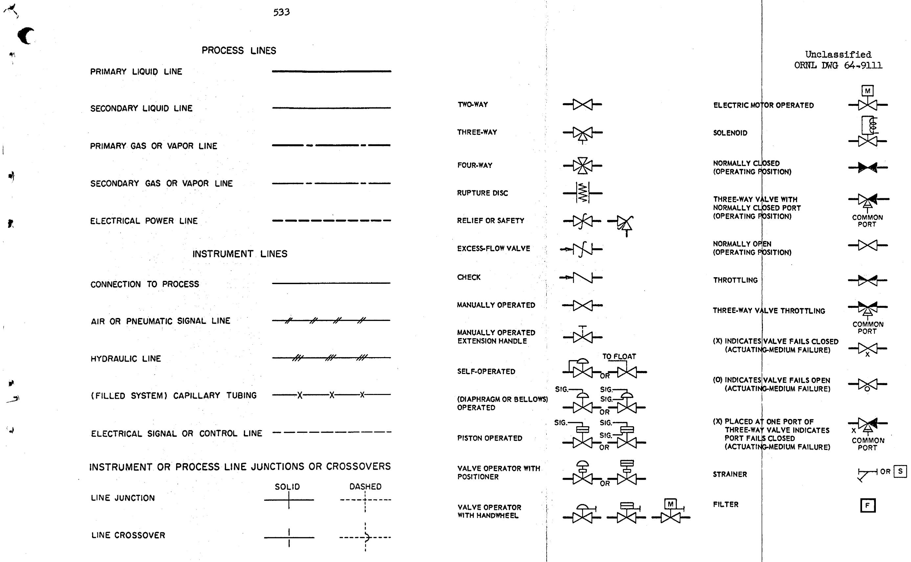  
Figure A.2 Symbols Used on MSRE Process Flowsheets

# SYMBOLS USED IN MSRE DRAWING IDENTIFICATION NUMBER

# AA Flowsheets

AA-A Process

AA-B Instrumentation

AA-C Services

AA-Z Miscellaneous

# BB Reactor

BB-A Cell

BB-B Vessel

BB-C Auxiliary

BB-D Structural

BB-Z Miscellaneous

# CC Pumps

CC-A Fuel

CC-B Coolant

CC-C Auxiliary

CC-D Structural

CC-Z Miscellaneous

# DD Radiator

DD-A Salt

DD-B Air

DD-C Auxiliary

DD-D Structural

DD-Z Miscellaneous

# EE Heat Exchanger

EE-A Fuel Salt

EE-B Coolant Salt

EE-C Auxiliary

EE-D Structural

EE-Z Miscellaneous

# FF Salt Storage and Handling

FF-A Vessels

FF-B Sampling and Enriching

FF-C Auxiliary

FF-D Structural

FF-Z Miscellaneous

# GG Process Piping

GG-A Primary Layout

GG-B Secondary Layout

GG-C Components

GG-D Auxiliary

GG-E Structural

GG-Z Miscellaneous

# HH Instrumentation and Control

HH-A Nuclear

HH-B Process

HH-C Health Physics

HH-D Services

HH-Z Miscellaneous

# JJ Gas System

JJ-A Layout

JJ-B Tanks and Filters

JJ-C Components

JJ-D Auxiliary

JJ-E Structural

JJ-Z Miscellaneous

# KK Building and Services

KK-A Air Handling

KK-B Piping

KK-C Electrical

KK-D Structural

KK-E Civil

KK-Z Miscellaneous

# LL Maintenance Equipment

LL-A Handling Gear

LL-B Tools

LL-C Controls

IL-D Structural

LL-E Auxiliary

IL-Z Miscellaneous

# MM Process Heating

MM-A Pipeline Heating

MM-B Component Heating

MM-C Schematic Diagrams

MM-Z Miscellaneous

# ZZ Miscellaneous

ZZ-A Process

ZZ-B Services

ZZ-C Building

ZZ-Z Miscellaneous

# Internal Distribution

1. R. K. Adams   
2. R. G. Affel   
3. L. G. Alexander   
4. G.W. Allin   
5. A. H. Anderson   
6. R.F.Apple   
7. C.F.Baes   
8. S.J.Ball   
9. S. E. Beall   
10. M. Bender   
1. E. S. Bettis   
2. F. F. Blankenship   
3. R. Blumberg   
4. A. L. Boch   
5. E. G. Bohlmann   
6. C. J. Borkowski   
7. H. R. Brashear

18-23. R.B.Briggs   
24. G. H. Burger   
25. S. Cantor   
26. R. H. Chapman   
27. H.C.Claiborne   
28. J.A. Conlin   
29. W.H.Cook   
30. L. T. Corbin   
31. W.B.Cottrell   
32. G.A.Cristy   
33. J. L. Crowley   
34. D. G. Davis   
35. J.H.DeVan   
36. G. Dirian   
37. S.J.Ditto   
38. R.G. Donnelly   
39. F.A.Doss   
40. N. E. Dunwoody   
41. J.R. Engel   
42. E.P.Epler   
43. A. P. Fraas   
44. E. N. Fray   
45. H. A. Friedman   
46. J. H. Frye   
47. C. H. Gabbard   
48. M. J. Gaitanis   
49. R.B.Gallaher   
50. J. J. Geist   
51. W. R. Grimes

52. A. G. Grindell   
53. R. H. Guymon   
54. S. H. Hanauer   
55. P. H. Harley

56-65. P.N.Haubenreich   
66. G.M. Herbert   
67. P. G. Herndon   
68. E.C.Hise   
69. V. D. Holt   
70. P. P. Holz   
71. A. Houtzeel   
72. T. L. Hudson   
73. J.P. Jarvis   
74. R. J. Kedl   
75. S. S. Kirslis   
76. D. J. Knowles   
77. A.I. Krakoviak   
78. J.W.Krewson   
79. C. E. Lamb   
80. J.A. Lane   
81. C. E. Larson   
82. R. B. Lindauer   
33. M. I. Lundin   
34. R. N. Lyon   
35. H. G. MacPherson   
36. C. D. Martin   
37. H. C. McCurdy   
38. W. B. McDonald   
39. H.F.McDuffie   
90. C.K. McGlothlan   
91. H.J.Metz   
92. A. J. Miller   
93. W.R.Mixon   
94. R. L. Moore   
95. R.C. Olson   
96. P. Patriarca   
97. H. R. Payne   
98. A. M. Perry   
99. H.B.Piper   
DO. B. E. Prince   
D1. J. L. Redford   
02. M. Richardson   
08. R.C. Robertson   
09. H. C. Roller   
LO. M. W. Rosenthal   
L1. T.H. Row

112. H.W. Savage

129. G.M.Tolson

113. A. W. Savolainen

130. D. B. Trauger

114. D. Scott

131. W.C.Ulrich

115. J. H. Shaffer

132. C.F.Weaver

116. E.G.Silver

133. B. H. Webster

117. M. J. Skinner

134. A. M. Weinberg

118. T. F. Sliski

135. K.W. West

119. A. N. Smith

136. J.C. White

120. P. G. Smith

137. G. D. Whitman

121. I. Spiewak

138. H.D.Wills

122. R.C. Steffy

139. L.V.Wilson

123. H. H. Stone 140-142. Central Research Library

143-144. Y-12 Document Reference Section

125. J. A. Swartout 145-146. Reactor Division Library

126. A. Taboada 147-150. Laboratory Records Department

127. J. R. Tallackson 151. Laboratory Records, RC

128. R.E.Thoma

# External Distribution

152-153. D.F.Cope,AEC,ORO

154. R. W. Garrison, AEC, Washington

155. R. L. Philippone, AEC, ORO

156. H. M. Roth, AEC, ORO

157. W. L. Smalley, AFC, ORO

158. M. J. Whitman, AEC, Washington

159-173. Division of Technical Information Extension, DTIE