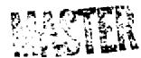

MSRE DESIGN AND OPERATIONS REPORT

Part V

REACTOR SAFETY ANALYSIS REPORT

S. E. Beall   
P. N. Haubenreich   
R. B. Lindauer   
J. R. Tallackson

# NOTICE

This document contains information of a preliminary nature and was prepared primarily for internal use at the Oak Ridge National Laboratory. It is subject to revision or correction and therefore does not represent a final report. The information is not to be abstracted, reprinted or otherwise given public dissemination without the approval of the ORNL patent branch, Legal and Information Control Department.

# LEGAL NOTICE

This report was prepared as an account of Government sponsored work. Neither the United States, nor the Commission, nor any person acting on behalf of the Commission:

A. Makes any warranty or representation, expressed or implied, with respect to the accuracy, completeness, or usefulness of the information contained in this report, or that the use of any information, apparatus, method, or process disclosed in this report may not infringe privately owned rights; or   
B. Assumes any liabilities with respect to the use of, or for damages resulting from the use of any information, apparatus, method, or process disclosed in this report.

As used in the above, "person acting on behalf of the Commission" includes any employee or contractor of the Commission, or employee of such contractor, to the extent that such employee or contractor of the Commission, or employee of such contractor prepares, disseminates, or provides access to, any information pursuant to his employment or contract with the Commission, or his employment with such contractor.

Contract No. W-7405-eng-26

Reactor Division

MSRE DESIGN AND OPERATIONS REPORT

Part V

REACTOR SAFETY ANALYSIS REPORT

S. E. Beall

R.B.Lindauer

P. N. Haubenreich

J. R. Tallackson

AUGUST 1964

OAK RIDGE NATIONAL LABORATORY

Oak Ridge, Tennessee

operated by

UNION CARBIDE CORPORATION

for the

U.S. ATOMIC ENERGY COMMISSION

# PREFACE

This report is one of a series that describes the design and operation of the Molten-Salt Reactor Experiment. All the reports are listed below.

ORNL-TM-728 MSRE Design and Operations Report, Part I, Description of Reactor Design, by R. C. Robertson   
ORNL-TM-729 MSRE Design and Operations Report, Part II, Nuclear and Process Instrumentation, by J. R. Tallackson   
ORNL-TM-730* MSRE Design and Operations Report, Part III, Nuclear Analysis, by P. N. Haubenreich and J. R. Engel, B. E. Prince, and H. C. Claiborne   
ORNL-TM-731 MSRE Design and Operations Report, Part IV, Chemistry and Materials, by F. F. Blankenship and A. Taboada   
ORNL-TM-732* MSRE Design and Operations Report, Part V, Reactor Safety Analysis Report, by S. E. Beall, P. N. Haubenreich, R. B. Lindauer, and J. R. Tallackson   
ORNL-TM-733 MSRE Design and Operations Report, Part VI, Operating Limits, by S. E. Beall and R. H. Guymon   
ORNL-TM-907** MSRE Design and Operations Report, Part VII, Fuel Handling and Processing Plant, by R. B. Lindauer   
ORNL-TM-908** MSRE Design and Operations Report, Part VIII, Operating Procedures, by R. H. Guymon   
ORNL-TM-909** MSRE Design and Operations Report, Part IX, Safety Procedures and Emergency Plans, by R. H. Guymon   
ORNL-TM-910** MSRE Design and Operations Report, Part X, Maintenance Equipment and Procedures, by E. C. Hise and R. Blumberg

ORNL-TM-911**

MSRE Design and Operations Report, Part XI, Test Program, by R. H. Guymon and P. N. Haubenreich

\*\*

MSRE Design and Operations Report, Part XII, Lists: Drawings, Specifications, Line Schedules, Instrument Tabulations (Vol. 1 and 2)

# CONTENTS

Page

PREFACE iii

INTRODUCTION 1

# PART 1. DESCRIPTION OF PLANT AND OPERATING PLAN

1. REACTOR SYSTEM 5

1.1 Fuel and Primary System Materials 7

1.l.l Fuel and Coolant Salts 7   
1.1.2 Structural Material - INOR-8 9   
1.1.3 Moderator Material - Graphite 10   
1.l.4 Compatibility of Salt, Graphite, and INOR-8 12

1.2 System Components 15

1.2.1 Reactor Vessel 16   
1.2.2 Fuel and Coolant Pumps 19   
1.2.3 Primary Heat Exchanger 23   
1.2.4 Salt-to-Air Radiator 25   
1.2.5 Drain and Storage Tanks 28   
1.2.6 Piping and Flanges 33   
1.2.7 Freeze Valves 33   
1.2.8 Cover-Gas Supply and Disposal 34   
1.2.9 Sampler-Enricher 39   
1.2.10 Electric Heaters 41   
1.2.11 Liquid Waste System 43

2.CONTROLS AND INSTRUMENTATION 45

2.1 Control Rods and Rod Drives 47   
2.2 Safety Instrumentation 55

2.2.1 Nuclear Safety System 58   
2.2.2 Temperature Instrumentation for Safety System Inputs 68   
2.2.3 Radiator Door Emergency Closure System 70   
2.2.4 Reactor Fill and Drain System 71

2.2.5 Helium Pressure Measurements in the Fuel Salt Loop 77   
2.2.6 Afterheat Removal System 79   
2.2.7 Containment System Instrumentation 81   
2.2.8 Health-Physics Radiation Monitoring 92

2.3 Control Instrumentation 96

2.3.1 Nuclear Instrumentation 96   
2.3.2 Plant Control 104

2.4 Neutron Source Considerations 117   
2.5 Electrical Power System 118   
2.6 Control Room and Plant Instrumentation Layout 119

2.6.1 Main Control Area 119   
2.6.2 Auxiliary Control Area 119   
2.6.3 Transmitter Room 123   
2.6.4Field Panels 124   
2.6.5 Interconnections 124   
2.6.6 Data Room 125

3. PLANT LAYOUT 128

3.1 Equipment Arrangement 128   
3.2 Biological Shielding 132

SITE FEATURES 138

4.1 Location 138   
4.2 Population Density 138   
4.3 Geophysical Features 146

4.3.1 Meteorology 146   
4.3.2 Temperature 146   
4.3.3 Precipitation 147   
4.3.4 Wind 149   
4.3.5 Atmospheric Diffusion Characteristics 157   
4.3.6 Environmental Radioactivity 158   
4.3.7 Geology and Hydrology 158   
4.3.8 Seismology 164

# 5. CONSTRUCTION, STARTUP, AND OPERATION 168

5.1 Construction 168   
5.2 Flush-Salt Operation 168

5.2.1 Critical Experiments 170   
5.2.2 Power Operation 170

5.3 Operations Personnel 171   
5.4 Maintenance 173

# PART 2. SAFETY ANALYSES

# 6. CONTAINMENT 177

6.1 General Design Considerations 177

6.1.1 Reactor Cell Design 178   
6.1.2 Drain Tank Cell Design 182   
6.1.3 Penetrations and Methods of Sealing 184   
6.1.4 Leak Testing 187

6.2 Vapor-Condensing System 187   
6.3 Containment Ventilation System 191

# 7. DAMAGE TO PRIMARY CONTAINMENT SYSTEM 196

7.1 Nuclear Incidents 196

7.1.1 General Considerations in Reactivity Incidents 196   
7.1.2 Uncontrolled Rod Withdrawal 199   
7.1.3 "Cold-Slug" Accident 203   
7.1.4 Filling Accidents 205   
7.1.5 Fuel Additions 213   
7.1.6 $\mathsf{UO}_2$ Precipitation 214   
7.1.7 Graphite Loss or Permeation 219   
7.1.8 Loss of Flow 221   
7.1.9 Loss of Load 225   
7.1.10 Afterheat 226   
7.1.11 Criticality in the Drain Tanks 230

# 7.2 Nonnuclear Incidents 231

7.2.1 Freeze-Valve Failure 231   
7.2.2 Freeze-Flange Failure 231

7.2.3 Excessive Wall Temperatures and Stresses 232   
7.2.4 Corrosion 233   
7.2.5 Material Surveillance Testing 235

7.3 Detection of Salt Spillage 236   
7.4 Most Probable Accident 236

8. DAMAGE TO THE SECONDARY CONTAINER 238

8.1 Missile Damage 238   
8.2 Excessive Pressure 238

8.2.1 Salt Spillage 238   
8.2.2 Oil Line Rupture 239

8.3 Acts of Nature 239

8.3.1 Earthquake 239   
8.3.2 Flood 239

8.4 Sabotage 240   
8.5 Corrosion from Spilled Salt 240   
8.6 Maximum Credible Accident 240   
8.7 Release of Radioactivity from Secondary Container 245

8.7.1 Rupture of Secondary Container 245   
8.7.2 Release of Activity After Maximum Credible Accident 245

8.8 Release of Beryllium from Secondary Container 255

Appendix A. Calculations of Activity Levels 261   
Appendix B. Process Flowsheets 275   
Appendix C. Component Development Program in Support of the MSRE 285   
Appendix D. Calculation of Activity Concentrations Resulting from Most Likely Accident 293   
Appendix E. Time Required for Pressure in Containment Vessel To Be Lowered to Atmospheric Pressure 295

# LIST OF FIGURES

Page

Fig. 1.l Fuel and Coolant Flow Diagram 6

Fig. 1.2 MSRE Graphite Showing Cracks Resulting from Impregnation and Baking Operations 13

Fig. 1.3 MSRE Layout 15

Fig. 1.4 Reactor Vessel and Access Nozzle 17

Fig. 1.5 Typical Graphite Stringer Arrangement 18

Fig. 1.6 Lattice Arrangement at Control Rods 18

Fig. 1.7 Fuel-Circulation Pump 20

Fig. 1.8 Primary Heat Exchanger 23

Fig. 1.9 Salt-to-Air Radiator 26

Fig. 1.10 Fuel Salt Drain Tank 29

Fig. 1.11 Bayonet Cooling Thimble for Fuel Drain Tanks 31

Fig. 1.l2 Freeze Flange 34

Fig. 1.13 Freeze Valve 35

Fig. 1.14 Cover-Gas System Flow Diagram 37

Fig. 1.15 Off-Gas System Flow Diagram 38

Fig. 1.16 MSRE Sampler-Enricher 39

Fig. 1.17 Single-Line Diagram of MSRE Power System 42

Fig. 1.18 Simplified Flowsheet of MSRE Liquid Waste System 44

Fig. 2.1 Control Rod Drive Unit Installed in Reactor 48

Fig. 2.2 Diagram of Control Rod 49

Fig. 2.3 Electromechanical Diagram of Control Rod Drive Train 50

Fig. 2.4 Reactivity Worth of Control Rod as a Function of Depth of Insertion in Core

Fig. 2.5 Control Rod Height Versus Time During a Scram 52

Fig. 2.6 Control Rod Shock Absorber 54

Fig. 2.7 Control Rod Thimble 56

Fig. 2.8 Prototype Control Rod Drive Assembly 57

Fig. 2.9 Functional Diagram of Safety System 59

Fig. 2.10 Block Diagram of Safety Instrumentation for Control 60 Rod Scram

Fig. 2.11 Typical Temperature-Measuring Channel Used in Safety 69 System   
Fig. 2.l2 Radiator Door Emergency Closure System 72   
Fig. 2.13 Pump-Speed Monitoring System 73   
Fig. 2.14 Reactor Fill and Drain System Valving 74   
Fig. 2.15 Typical Instrumentation for Measuring Helium Pressures 78 in the Primary Loop   
Fig. 2.16 Afterheat Removal System 80   
Fig. 2.17 Helium Supply Block Valving 83   
Fig. 2.18 Off-Gas System Instrumentation and Valving 84   
Fig. 2.19 Lube Oil System Off-Gas Monitors 85   
Fig. 2.20 In-Cell Liquid Waste and Instrument Air Block Valving 88   
Fig. 2.21 Pressure Switch Matrix Used with Instrument Air Line 89 Block Valves   
Fig. 2.22 In-Cell Cooling Water System Block Valving 91   
Fig. 2.23 Reactor Building (7503) at 852-ft Elevation Showing 93 Locations of Monitors   
Fig. 2.24 Reactor Building (7503) at 840-ft Elevation Showing 94 Locations of Monitors   
Fig. 2.25 Typical Low-Level $\mathsf{BF}_3$ Counting Channel for Initial Critical Tests   
Fig. 2.26 Locations of $\mathbf{BF}_3$ Chambers 97   
Fig. 2.27 Wide-Range Counting Channel 98   
Fig. 2.28 Linear Power Channels and Automatic Rod Controller 99   
Fig. 2.29 Nuclear Instrumentation Penetration 10C   
Fig. 2.30 Computer Diagram for Servo-Controller Simulation 103   
Fig. 2.31 Results of Analog Simulation of System Response to Step Changes in Power Demand with Reactor on Automatic Temperature Servo Control   
Fig. 2.32 Results of Analog Simulation of Reactor Response to Ramped Changes in Outlet Temperature Set Point with Reactor Under Automatic Control   
Fig. 2.33 Simplified Master Plant Control Block Diagram 106   
Fig. 2.34 Simplified Rod Control Block Diagram 109   
Fig. 2.35 Regulating Rod Limit Switch Assembly 110   
Fig. 2.36 Regulating Rod Control Circuit 111   
Fig. 2.37 Diagram of Safety System Bypassing with Jumper Board 116

Fig. 2.38 Main Floor Layout of Building 7503 at 852-ft Elevation 120   
Fig. 2.39 Main and Auxiliary Control Areas 120   
Fig. 2.40 Main Control Board 121   
Fig. 2.41 Layout of Building 7503 at 840-ft Elevation 122   
Fig. 2.42 Transmitter Room 123   
Fig. 2.43 Layout of Data Room 126   
Fig. 2.44 Typical Process Computer System (TRW-340) 127   
Fig. 3.l First Floor Plan of Reactor Building 129   
Fig. 3.2 Elevation Drawing of Reactor Building 130   
Fig. 3.3 Arrangement of Shielding Blocks on Top of Reactor 134   
Fig. 4.1 Area Surrounding MSRE Site 139   
Fig. 4.2 Contour Map of Area Surrounding MSRE Site 140   
Fig. 4.3 Map of Oak Ridge Area 141   
Fig. 4.4 Seasonal Temperature Gradient Frequency 148   
Fig. 4.5 Annual Frequency Distribution of Winds in the Vicinity 150 of X-10 Area   
Fig. 4.6 X-10 Area Seasonal Wind Roses 152   
Fig. 4.7 X-10 Area Seasonal Wind Roses 153   
Fig. 4.8 Wind Roses at Knoxville and Nashville for Various 156 Altitudes   
Fig. 5.1 Reactor Division, Operations Department Organization 172 for the MSRE   
Fig. 6.1 Reactor Cell Model 179   
Fig. 6.2 Drain Tank Cell Model 183   
Fig. 6.3 Typical Electric Lead Penetration of Reactor Cell Wall 185   
Fig. 6.4 Vapor-Condensing System 190   
Fig. 7.1 Power and Temperature Transients Produced by Uncontrolled Rod Withdrawal in Reactor Operating with Fuel B   
Fig. 7.2 Power and Temperature Transients Produced by Uncontrolled Rod Withdrawal in Reactor Operating with Fuel C   
Fig. 7.3 Effect of Dropping Two Control Rods at 15 Mw During 204 Uncontrolled Rod Withdrawal in Reactor Operating with Fuel C   
Fig. 7.4 Power and Temperature Transients Following Injection 206 of Fuel B at $900^{\circ}\mathrm{F}$ into Core at $1200^{\circ}\mathrm{F}$ ; No Corrective Action Taken   
Fig. 7.5 System Used in Filling Fuel Loop 209

Fig. 7.6 Net Reactivity Addition During Most Severe Filling 211 Accident   
Fig. 7.7 Power and Temperature Transients Following Most Severe 212 Filling Accident   
Fig. 7.8 Effects of Deposited Uranium on Afterheat, Graphite 218 Temperature, and Core Reactivity   
Fig. 7.9 Power and Temperatures Following Fuel Pump Failure, 222 with No Corrective Action   
Fig. 7.10 Power and Temperatures Following Fuel Pump Power Failure. Radiator doors closed and control rods driven in after failure. 223   
Fig. 7.l1 Effects of Afterheat in Reactor Vessel Filled with 225 Fuel Salt After Operation for 1000 hr at 10 Mw   
Fig. 7.l2 Temperature Rise of Fuel in Drain Tank Beginning 15 min After Reactor Operation for 1000 hr at 10 Mw   
Fig. 7.13 Heating of Reactor Vessel Lower Head by $\mathrm{UO_2}$ Deposits 229 with Power Level at 10 Mw   
Fig. 8.1 Release of Fuel Through Severed Lines 242   
Fig. 8.2 Relationship Between Cell Pressure and Weights of 243 Fluids Equilibrated   
Fig. 8.3 Radiation Level in Building Following Maximum Credible 247 Accident $(\mathbf{r} / \mathbf{hr} = 935\times \mu \mathrm{c} / \mathrm{cm}^3\times \mathrm{Mev})$   
Fig. 8.4 Activity Concentrations in Building Air Following Maxi-243 mum Credible Accident   
Fig. 8.5 Noble Gas Activity After Maximum Credible Accident 249 as Function of Distance Downwind   
Fig. 8.6 Change in Rate of Activity Release from Building with Time   
Fig. 8.7 Total Integrated Doses Following Maximum Credible Accident   
Fig. 8.8 Peak Iodine and Solids Activities After Maximum 253 Credible Accident as Function of Distance Downwind   
Fig. 8.9 Beryllium Contamination After Maximum Credible Accident as Function of Distance Downwind 256

# MSRE DESIGN AND OPERATIONS REPORT

Part V

REACTOR SAFETY ANALYSIS REPORT

S.E.Beal1

R. B. Lindauer

P. N. Haubenreich

J. R. Tallackson

# INTRODUCTION

The Oak Ridge National Laboratory undertook, in 1951, the development of a molten-salt-fueled reactor for the Aircraft Nuclear Propulsion Program, and the Aircraft Reactor Experiment (ARE) was successfully operated, in 1954, to demonstrate the nuclear feasibility of a system in which molten-salt fuel was circulated. Development work on molten-salt-fueled systems has been continued, with the ultimate objective of designing a molten-salt reactor capable of breeding.

The Molten-Salt Reactor Experiment (MSRE) $^{2,3}$ is presently being assembled as an engineering demonstration of a single-region, nonbreeding salt-fueled reactor. The goals in the development of this system have been to show that this advanced-concept reactor is practical with present-day knowledge, that the system can be operated safely and reliably, and that is can be serviced without unusual difficulty.

It is the purpose of this report to describe the MSRE (Part I) and to evaluate the hazards associated with this reactor (Part II).

#

PART 1. DESCRIPTION OF PLANT AND OPERATING PLAN

$\therefore m = \frac{3}{11}$ ;

# 1. REACTOR SYSTEM

The Molten-Salt Reactor Experiment comprises a circulating-fuel reactor designed for a heat generation rate of 10 Mw and the auxiliary equipment necessary for its operation. The fuel circuit and the heat removal, or coolant, circuit are illustrated schematically in Fig. 1.l,\* which also gives some standard operating conditions for the circuits.

The fuel salt, a mixture of LiF, $\mathrm{BeF}_2$ , $\mathrm{ZrF}_4$ , and $\mathrm{UF}_4$ , is pumped through a cylindrical reactor vessel filled with graphite blocks. At the 10-Mw power level, the fuel enters the vessel at $1175^{\circ}\mathrm{F}$ and is heated to $1225^{\circ}\mathrm{F}$ . It then flows to a 1200-gpm sump-type centrifugal pump, which discharges through the shell side of the fuel-to-coolant heat exchanger. The fuel returns from the heat exchanger to the reactor inlet.

The coolant salt, a mixture of LiF and $\mathrm{BeF}_2$ , is heated from 1025 to $1100^{\circ}\mathrm{F}$ as it passes through the tubes of the fuel-to-coolant heat exchanger. Following dissipation of the heat in an air-cooled radiator, the coolant salt is returned to the heat exchanger at a flow rate of 850 gpm by a second sump-type centrifugal pump.

Electric heaters on the piping and equipment keep the salt mixtures above their melting points. In order to assure that the salt mixtures remain molten, the normal electric utility supply is augmented by an emergency supply from the diesel generators. The molten salts may be drained from the reactor system within a few minutes.

The fission gases xenon and krypton are stripped from the fuel salt continuously in the gas space above the liquid surface within the fuel pump bowl. A continuous flow (~3 liters/min) of helium removes the fission gases from the pump bowl and carries them to activated-carbon beds outside the reactor cell. Helium is also used as the cover gas through-out the fuel and coolant systems.

The components of the fuel and coolant systems are constructed of INOR-8, a nickel-molybdenum-chromium alloy developed especially to contain molten fluoride salts. In the fuel system the piping to the

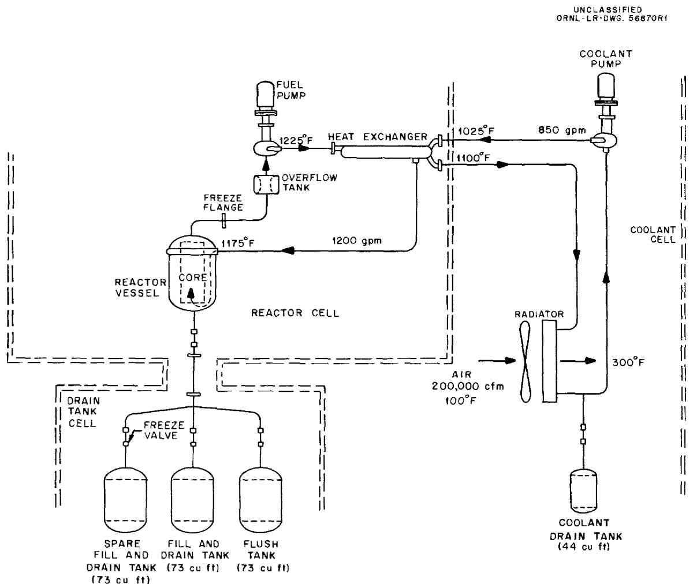  
Fig. 1.l. Fuel and Coolant Flow Diagram.

components is connected by "freeze" flanges which utilize frozen salt as the sealant. These flanges are also provided with gas-buffered ring-joint gaskets. The use of freeze-flange joints facilitates removal and replacement of radioactive equipment after power operation. Joints of this type are not needed in the coolant system, because the radioactivity there is low enough to permit direct maintenance within a few minutes after shutdown.

No valves of the ordinary type are used in contact with salt. Flow in lines connecting the reactor vessel and the drain tanks is prevented by freezing salt in designated sections of pipe. The "freeze valves" thus

formed can be thawed by stopping the flow of cooling air and heating the pipe. By this means, salt can be drained from the reactor vessel.

In addition to the fuel and coolant circuits, there are auxiliary components, such as controls and instrumentation, salt-sampling equipment, facilities for handling radioactive liquid wastes, a chemical processing cell for purification of the salts, and remote-maintenance equipment. Details of the reactor components, auxiliary equipment, and instrumentation are discussed in the following sections.

The control problems of a molten-salt reactor differ in many respects from those of solid fuel reactors (see sec. 1.3). The reactor core is provided with three control rods that will be used principally to maintain the fuel salt temperature within the operating limits. The reactor power level will be controlled by regulating the rate of heat removal at the radiator.

# 1.1 Fuel and Primary System Materials

# l.l.l Fuel and Coolant Salts

The MSRE fuel will be a solution of $\mathrm{U}^{235}\mathrm{F}_4$ and $\mathrm{ZrF_4}$ in a molten $\mathrm{Li}^7\mathrm{F - BeF_2}$ solvent. Thorium tetrafluoride may be added as a fertile material. Both $\mathrm{Li}^7\mathrm{F}$ and $\mathrm{BeF_2}$ have relatively good neutron cross sections; the ratio of these materials was chosen to provide the optimum compromise among freezing point, fluid flow properties, and heat transfer characteristics of the final mixtures in which $\mathrm{UF_4}$ and $\mathrm{ZrF_4}$ concentrations are firmly fixed. The $\mathrm{ZrF_4}$ is included in the fuel mixture because oxygenated species (i.e., $\mathrm{H}_2\mathrm{O}$ ) capable of yielding oxide ions on contact with the fuel precipitate $\mathrm{ZrO_2}$ from $\mathrm{LiF - BeF_2 - ZrF_4 - UF_4}$ solutions whose $\mathrm{Zr}^{4 + }$ to- $\mathrm{U}^{4 + }$ ratio exceeds 3; $\mathrm{UO_2}$ precipitates if oxide ion is admitted to solutions in which the ratio is appreciably below that value. To prevent precipitation of $\mathrm{UO_2}$ upon inadvertent contamination of the reactor system, the $\mathrm{Zr}^{4 + }$ to- $\mathrm{U}^{4 + }$ ratio is fixed at a conservative value ( $>5:1$ ). Moreover, since precipitation of $\mathrm{ZrO_2}$ is also undesirable, the fuel mixture is protected at all times from gases and vapors bearing oxygenated species by using helium as a blanket gas.

The compositions and properties of three fuel salts are listed in Table 1.1. Each of these salt mixtures is expected to be employed at some stage of the experiment. Salt C, the partially enriched salt, will be loaded for the first series of experiments because its chemical characteristics have been studied more thoroughly than those of salts A and B. Salt B, the highly enriched salt, is the composition which is proposed for the core of a large two-region breeder reactor (or a $U^{235}$ burner). It will be used after a long period of operation with the partially enriched salt. Salt A contains thorium and has been proposed for single-region molten-salt breeder reactors. It will be tested in a third series of MSRE experiments.

The coolant salt is a mixture of $\mathrm{Li}^{7}\mathrm{F}$ and $\mathrm{BeF}_2$ whose composition and properties are included in Table 1.1. The coolant mixture can withstand higher oxide contaminant levels than the fuel before an oxide (BeO in this case) precipitates, but the same practice of blanketing the mixture with helium will be followed.

Another salt mixture of essentially the same composition as the coolant salt, but called the flush salt, will be used to rinse the fuel

Table 1.1. Compositions and Physical Properties of the Fuel, Flush, and Coolant Salts   

<table><tr><td></td><td>Fuel Salt A, with Thorium and Uranium</td><td>Fuel Salt B, with 92% Enriched Uranium</td><td>Fuel Salt C, with 35% Enriched Uranium</td><td>Flush and Coolant Salt</td></tr><tr><td colspan="5">Composition, mole %</td></tr><tr><td>LiF (99.99+% Li7)</td><td>70</td><td>66.8</td><td>65</td><td>66</td></tr><tr><td>BeF2</td><td>23.6</td><td>29</td><td>29.1</td><td>34</td></tr><tr><td>ZrF4</td><td>5</td><td>4</td><td>5</td><td>0</td></tr><tr><td>ThF4</td><td>1</td><td>0</td><td>0</td><td>0</td></tr><tr><td>UF4</td><td>0.4</td><td>0.2</td><td>0.9</td><td>0</td></tr><tr><td colspan="5">Physical properties at 1200°F</td></tr><tr><td>Density, lb/ft3</td><td>140</td><td>130</td><td>134</td><td>120</td></tr><tr><td>Viscosity, lb/ft·hr</td><td>18</td><td>17</td><td>20</td><td>24a</td></tr><tr><td>Heat capacity, Btu/lb·°F</td><td>0.45</td><td>0.48</td><td>0.47</td><td>0.53</td></tr><tr><td>Thermal conductivity, Btu/hr·ft2(°F/ft)</td><td>3.2</td><td>3.2</td><td>3.2</td><td>3.5a</td></tr><tr><td>Liquidus temperature, °F</td><td>840</td><td>840</td><td>840</td><td>850</td></tr></table>

$^{\mathrm{a}}$ At 1060°F.

system of fuel salt and fission-product residues after shutdown and before maintenance is begun. If the maintenance operations allow the inner surfaces of the fuel system to be exposed to air, the flush salt will also be circulated after maintenance as an $\mathrm{O_2 - H_2O}$ cleanup measure. This should protect the fuel salt from oxygen contamination. However, if any of the salt mixtures become excessively contaminated with oxygen, they will be purified by treatment with an $\mathrm{H_2 - HF}$ mixture (see sec. 2).

# 1.1.2 Structural Material - INOR-8

The principal material of construction for the reactor system is INOR-8, a nickel-molybdenum-chromium alloy developed at the Oak Ridge National Laboratory for use with fluoride salts at high temperature. The composition and properties of INOR-8 are listed in Tables 1.2, 1.3,

Table 1.2. Composition of INOR-8   

<table><tr><td>Constituent</td><td>Quantity (wt %)</td><td>Constituent</td><td>Quantity (wt %)</td></tr><tr><td>Ni</td><td>66-71</td><td>Mn</td><td>1.0 (max)</td></tr><tr><td>Mo</td><td>15-18</td><td>Si</td><td>1.0 (max)</td></tr><tr><td>Cr</td><td>6-8</td><td>Cu</td><td>0.35 (max)</td></tr><tr><td>Fe</td><td>5 (max)</td><td>B</td><td>0.010 (max)</td></tr><tr><td>C</td><td>0.04-0.08</td><td>W</td><td>0.50 (max)</td></tr><tr><td>Ti + Al</td><td>0.50 (max)</td><td>P</td><td>0.015 (max)</td></tr><tr><td>S</td><td>0.02 (max)</td><td>Co</td><td>0.20 (max)</td></tr></table>

and 1.4. When INOR-8 is corrosively attacked, chromium is leached from it and tiny subsurface voids are formed. The rate of attack is governed by the rate of diffusion of chromium in the alloy. Measured rates of attack in typical fuel and coolant salts for many thousands of hours have been less than 1 mil/yr. Furthermore, no greater attack has been observed in several thousand hours of in-pile tests (see sec. 7.2.4). The performance of INOR-8 in the MSRE will be followed by removing surveillance

Table 1.3. Physical Properties of INOR-8   

<table><tr><td>Density, lb/in.3</td><td>0.320</td></tr><tr><td>Melting point, °F</td><td>2470-2555</td></tr><tr><td>Thermal conductivity, Btu/hr·ft2 (°F/ft) at 1300°F</td><td>12.7</td></tr><tr><td>Modulus of elasticity at ~1300°F, psi</td><td>24.8 × 106</td></tr><tr><td>Specific heat, Btu/lb·°F at 1300°F</td><td>0.138</td></tr><tr><td>Mean coefficient of thermal expansion in 70-1300°F range, in./in.·°F</td><td>8.0 × 10-6</td></tr></table>

Table 1.4. Mechanical Properties of INOR-8   

<table><tr><td>Temperature (°F)</td><td>Ultimate Tensile Strength (psi)</td><td>Yield Strength at 0.2% Offset (psi)</td><td>Maximum Allowable Stressa (psi)</td></tr><tr><td>1000</td><td>82,000</td><td>26,500</td><td>17,000</td></tr><tr><td>1100</td><td>77,000</td><td>25,500</td><td>13,000</td></tr><tr><td>1200</td><td>68,000</td><td>24,500</td><td>6,000</td></tr><tr><td>1300</td><td>58,000</td><td>24,500</td><td>3,500</td></tr></table>

aASME Boiler and Pressure Vessel Code Case 1315.

specimens, at 3- to 6-month intervals, from the sample assembly located in the spare control rod position of the reactor vessel (see sec. 1.2.1).

# 1.1.3 Moderator Material - Graphite

Although the salt has moderating properties, the use of a separate moderator has the advantage of reducing the reactor fuel inventory. Unclad graphite (see Table 1.5 for properties) was chosen as the MSRE moderator to avoid the problems of cladding, such as neutron losses and development of cladding techniques, and because no serious problems were foreseen with the bare graphite. At the time the decision was made, graphite that could meet the requirements of high density and low permeability to salt had been manufactured on an experimental basis by the

Table 1.5. Properties of MSRE Core Graphite, Grade CCB   

<table><tr><td colspan="2">Physical properties</td></tr><tr><td colspan="2">Bulk density,\( ^a \)g/cm3</td></tr><tr><td>Range</td><td>1.82-1.87</td></tr><tr><td>Average</td><td>1.86</td></tr><tr><td>Porosity,\( ^b \)%</td><td></td></tr><tr><td>Accessible</td><td>4.0</td></tr><tr><td>Inaccessible</td><td>13.7</td></tr><tr><td>Total</td><td>17.7</td></tr><tr><td colspan="2">Thermal conductivity,\( ^a \)Btu/ft·hr·°F</td></tr><tr><td>With grain</td><td></td></tr><tr><td>At 90°F</td><td>112</td></tr><tr><td>At 1200°F</td><td></td></tr><tr><td>Normal to grain</td><td></td></tr><tr><td>At 90°F</td><td>63</td></tr><tr><td>At 1200°F</td><td>34</td></tr><tr><td colspan="2">Temperature coefficient of expansion,\( ^c \)°F-1</td></tr><tr><td>With grain, at 68°F</td><td>0.49 × 10-6</td></tr><tr><td>Normal to grain, at 68°F</td><td>2.8 × 10-6</td></tr><tr><td colspan="2">Specific heat,\( ^d \)Btu/lb·°F</td></tr><tr><td>At 0°F</td><td>0.14</td></tr><tr><td>At 200°F</td><td>0.22</td></tr><tr><td>At 600°F</td><td>0.33</td></tr><tr><td>At 1000°F</td><td>0.39</td></tr><tr><td>At 1200°F</td><td>0.42</td></tr><tr><td>Matrix coefficient of permeability to helium at 70°F,e cm2/sec</td><td>3 × 10-4</td></tr><tr><td>Salt absorption at 150 psig,a vol %</td><td>0.20</td></tr><tr><td colspan="2">Mechanical strength at 68°Fb</td></tr><tr><td>Tensile strength, psi</td><td></td></tr><tr><td>With grain</td><td></td></tr><tr><td>Range</td><td>1500-6200</td></tr><tr><td>Average</td><td>1900</td></tr><tr><td>Normal to grain</td><td></td></tr><tr><td>Range</td><td>1100-4500</td></tr><tr><td>Average</td><td>1400</td></tr><tr><td>Flexural strength, psi</td><td></td></tr><tr><td>With grain</td><td></td></tr><tr><td>Range</td><td>3000-5000</td></tr><tr><td>Average</td><td>4300</td></tr><tr><td>Normal to grain</td><td></td></tr><tr><td>Range</td><td>2200-3650</td></tr><tr><td>Average</td><td>3400</td></tr><tr><td>Modulus of elasticity, psi</td><td></td></tr><tr><td>With grain</td><td>3.2 × 106</td></tr><tr><td>Normal to grain</td><td>1.0 × 106</td></tr><tr><td>Compressive strength,d psi</td><td>8600</td></tr></table>

Measurements made by the Oak Ridge National Laboratory.   
bBased on measurements made by the Carbon Products Division and the Oak Ridge National Laboratory.   
Measurements made by the Carbon Products Division.   
d. Representative data from the Carbon Products Division.   
${}^{e}$ Based on measurements made by the Carbon Products Division on pilot-production MSRE graphite.

National Carbon Company. Since it appeared that bars 2 in. by 2 in. could be processed without difficulty, this size was selected as the basic element for the MSRE core assembly.

During the manufacture of the MSRE graphite, it was learned that some cracking resulted from the impregnation and baking operations and that the density was not quite as high as had been expected. The cracks raised questions about the strength and the permeability. The cracks in some of the poorest material are shown in Fig. 1.2. After extensive examination and testing at the Oak Ridge National Laboratory, it was determined that the strength was as great or greater than specified, that the reduction in density was inconsequential, that the cracks could not be propagated by mechanical forces or thermal stresses far in excess of conditions which will exist in the reactor, and that the total penetration of salt in the cracked graphite would be considerably below the specified penetration (0.5% at 150 psig). Furthermore, two to three months of in-pile testing of AGOT-grade graphite (a more permeable material with 12% salt penetration) with fuel salt at power densities more than six times the MSRE power density produced no observable damage to the graphite. Therefore, after consultation with representatives of the AEC Division of Reactor Development and the manufacturer, the graphite was accepted for use in the MSRE.

# 1.1.4 Compatibility of Salt, Graphite, and INOR-8

Out-of-pile tests of combinations of fluoride salt, graphite, and INOR-8 over a period of several years have convincingly demonstrated the compatibility of these materials.3 However, in-pile testing of fuel and graphite in INOR-8 capsules under conditions similar to those anticipated in the MSRE has been accomplished only since 1961. Although these first

Unclassified Photo Y-49020

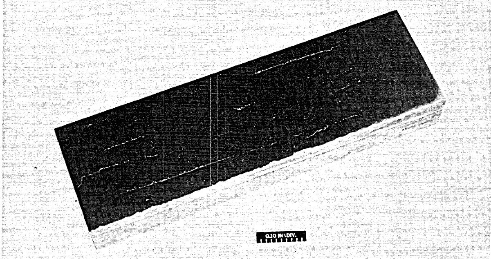

Unclassified Photo Y-49021

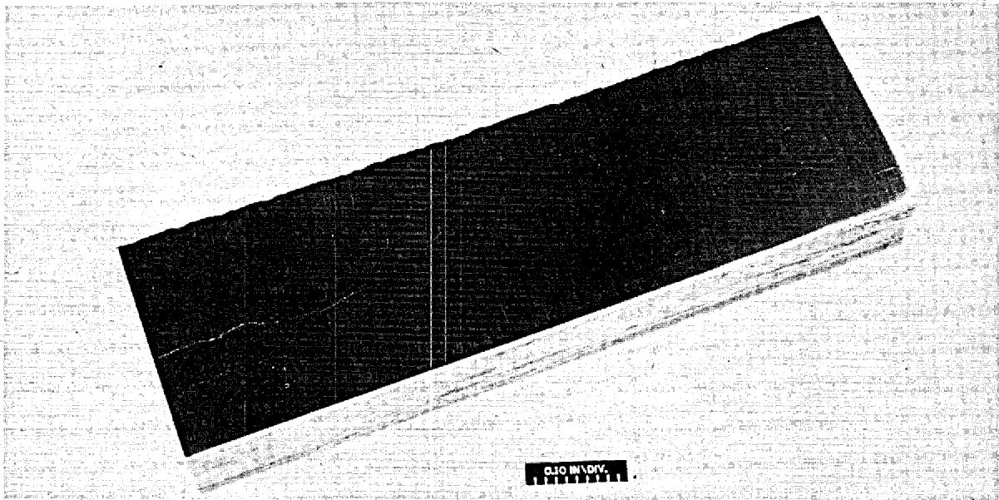  
Fig. 1.2. MSRE Graphite Showing Cracks Resulting from Impregnation and Baking Operations.

irradiation experiments $^4$ showed absolutely no evidence of attack on the INOR-8 or wetting of the graphite by the salt, appreciable quantities of $\mathbf{F}_2$ and $\mathrm{CF_4}$ were observed. Furthermore, in some of the capsules, xenon was not found in the quantities expected.

These anomalies were studied in two later series of in-pile capsule experiments during a total of seven months of exposure in the MTR. The following conclusions have been reached after a thorough analysis of information accumulated during and after these experiments. Neither $\mathbf{F}_2$ nor significant quantities of $\mathrm{CF_4}$ is generated when fission occurs in the molten salt at power densities as high as $65~\mathrm{w / cm^3}$ . However, $\mathbf{F}_2$ is released from the irradiated salt after 36 or more hours of exposure to high-level beta and gamma fluxes at temperatures below $200^{\circ}\mathrm{F}$ . It also appears that $\mathrm{CF_4}$ can be formed if $\mathbf{F}_2$ is present and available to the graphite when radiation is present at low temperatures or when the system temperature is raised to 1200 to $1400^{\circ}\mathrm{F}$ . Undoubtedly, the fluorine would also react with the INOR-8 at these high temperatures. Finally, it must be concluded that the "disappearance" of xenon in the tests resulted from a reaction of the fluorine to form one or more of the solid xenon fluoro-rides.

These conclusions support the important additional judgment that $\mathbf{F}_2$ and $\mathrm{CF_4}$ formation should not affect the success of the MSRE. First, the salt in the MSRE should never be in the frozen state, except for small quantities at isolated locations (e.g., freeze flanges and freeze valves). Even these isolated deposits would not be at temperatures as low as $200^{\circ}\mathrm{F}$ . Second, if $\mathbf{F}_2$ were evolved from the frozen seals, the rate of reaction with the INOR-8 metal at $200^{\circ}\mathrm{F}$ would be insignificant; at higher temperatures the back reaction would recombine the $\mathbf{F}_2$ and the reduced salt without an observable effect.

Samples of INOR and graphite are located at a position of maximum flux within the reactor vessel to allow examination and testing after

various periods of exposure to salt. Salt samples for detailed chemical analysis will be removed and will be analyzed daily.

# 1.2 System Components

The components of the reactor are arranged in the fuel and coolant salt systems as depicted in Fig. 1.3. The individual pieces of equipment are described below. All the components are designed to meet Section VIII of the ASME Boiler and Pressure Vessel Code except that no pressure-relief devices are provided on the primary system. Instead, supply pressures (for example, cover gas) are limited by control and protective devices.

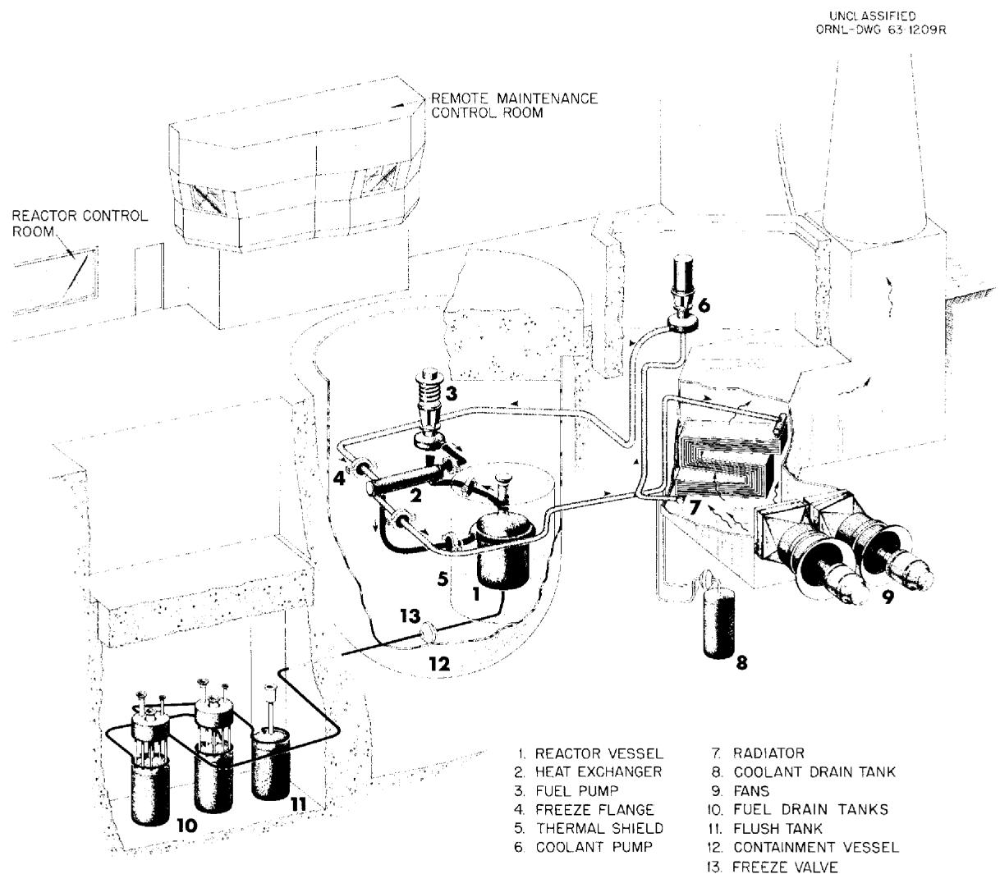  
Fig. 1.3. MSRE Layout.

# 1.2.1 Reactor Vessel

The reactor consists of a cylindrical vessel approximately 5 ft in diameter and 7 l/2 ft high, fitted with an inner cylinder that forms the inner wall of the shell-cooling annulus and serves to support the 55-in.-diam by 64-in.-high graphite matrix with its positioning and supporting members. Figure 1.4 is an assembly drawing of the reactor vessel and its graphite core. Fluid enters the vessel at the top of the cylindrical section and flows downward in a spiral path along the wall. With the design flow of 1200 gpm in the l-in. annulus, the Reynolds modulus is about 22,000. At the estimated heat generation rate of $0.24 \, \text{W/cm}^3$ in the wall, 28 kw of heat is removed by the incoming salt, while maintaining the wall temperature at less than $5^{\circ}\text{F}$ above the bulk fluid temperature. Design data for the reactor vessel are listed in Table 1.6.

The fuel loses its rotational motion in the lower plenum and then flows upward through the graphite core matrix, which constitutes about $77.5\%$ of the core volume. The moderator matrix is constructed of 2- by 2- by 63-in. stringers of graphite, which are loosely pinned to restraining beams at the bottom of the core.

Flow passages in the graphite matrix are 0.4- by 1.2-in. rectangular channels, with rounded corners, machined into the faces of the stringers. A typical arrangement of graphite stringers is shown in Fig. 1.5. Flow through the core is laminar, but because of the good thermal properties of the graphite and the fuel, the graphite temperature at the midpoint is only $60^{\circ}\mathrm{F}$ above the fuel mixed-mean temperature at the center of the core. The average power density in the fuel is $14\mathrm{kw / liter}$ and the maximum is $31\mathrm{kw / liter}$ .

The salt leaves the vessel at the top through a 10-in. pipe with a 5-in.-diam side outlet connecting to the circulating pump. A course screen is provided here to catch pieces of graphite larger than $\frac{1}{8}$ in. in diameter should they be present in the salt stream. The 10-in. pipe accommodates an assembly of three 2-in.-diam control rod thimbles and permits access to a group of graphite and INOR-8 surveillance specimens arranged in the center of the core as indicated in Fig. 1.6. The assembly is flanged for removal, if necessary, and is provided with cooling air to

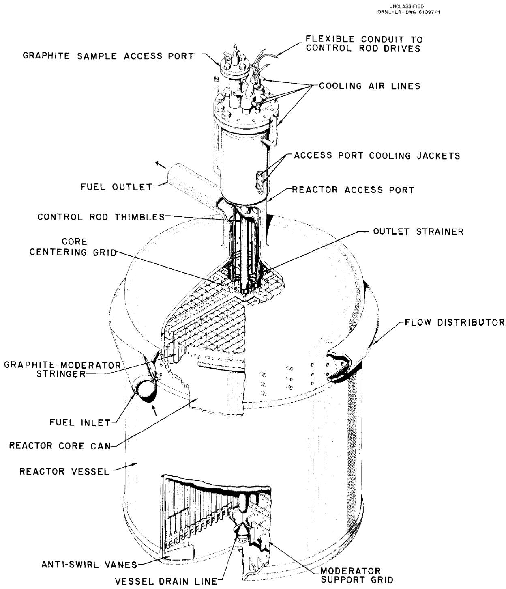  
Fig. 1.4. Reactor Vessel and Access Nozzle.

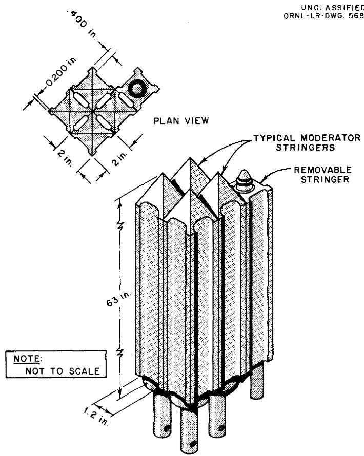  
Fig. 1.5. Typical Graphite Stringer Arrangement.

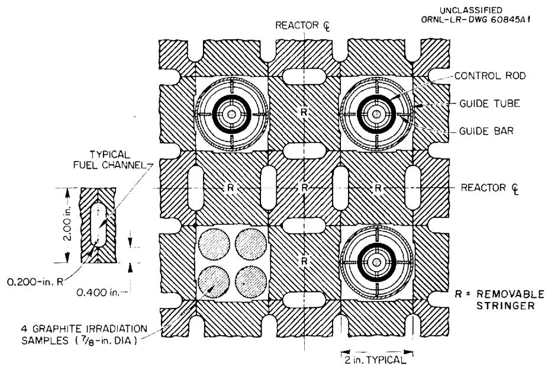  
Fig. 1.6. Lattice Arrangement at Control Rods.

Table 1.6. Reactor Vessel and Core Design Data and Dimensions   

<table><tr><td>Construction material</td><td>INOR-8</td></tr><tr><td>Inlet nozzle</td><td>5 in., sched-40, IPS</td></tr><tr><td>Outlet nozzle</td><td>5 in., sched-40, IPS</td></tr><tr><td>Core vessel</td><td></td></tr><tr><td>Outside diameter</td><td>59 l/8 in. (60 in. max)</td></tr><tr><td>Inside diameter</td><td>58 in.</td></tr><tr><td>Wall thickness</td><td>9/16 in.</td></tr><tr><td>Overall height (to centerline of 5-in. nozzle)</td><td>100 3/4 in.</td></tr><tr><td>Head thickness</td><td>1 in.</td></tr><tr><td>Design pressure</td><td>50 psi</td></tr><tr><td>Design temperature</td><td>1300°F</td></tr><tr><td>Fuel inlet temperature</td><td>1175°F</td></tr><tr><td>Fuel outlet temperature</td><td>1225°F</td></tr><tr><td>Cooling annulus</td><td></td></tr><tr><td>Inside diameter</td><td>56 in.</td></tr><tr><td>Outside diameter</td><td>58 in.</td></tr><tr><td>Graphite core matrix</td><td></td></tr><tr><td>Diameter</td><td>55 l/4 in.</td></tr><tr><td>Number of fuel channels</td><td>1140</td></tr><tr><td>Fuel channel size</td><td>1.2 × 0.4 in. with rounded corners</td></tr><tr><td>Core inner container</td><td></td></tr><tr><td>Inside diameter</td><td>55 l/2 in.</td></tr><tr><td>Outside diameter</td><td>56 in.</td></tr><tr><td>Wall thickness</td><td>1/4 in.</td></tr><tr><td>Height</td><td>68 in.</td></tr></table>

permit freezing the salt in the gap below the flange. The control rods and their drive mechanisms are described in Section 1.3.

# 1.2.2 Fuel and Coolant Pumps

The fuel-circulation pump is a sump-type centrifugal pump with a vertical shaft. It has a 75-hp motor and is capable of circulating 1200 gpm of salt against a head of 48.5 ft. Figure 1.7 is a drawing of the pump, and design data are presented in Table 1.7.

The pump assembly consists of motor and housing; bearing, shaft, and impeller assembly; and a 36-in.-diam sump tank. The sump tank, which is

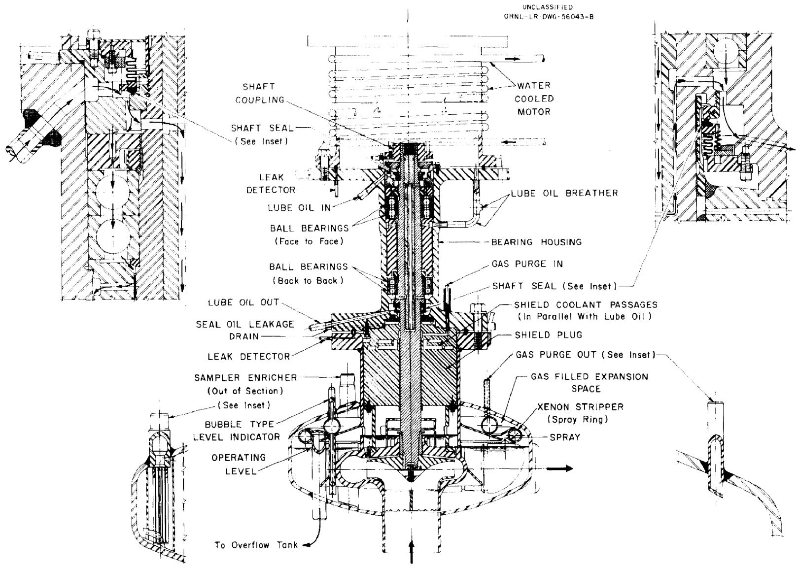  
Fig. 1.7. Fuel-Circulation Pump.

Table 1.7. Design Data for Fuel and Coolant Pumps   

<table><tr><td></td><td>Fuel</td><td>Coolant</td></tr><tr><td colspan="3">Design flow, gpm</td></tr><tr><td>Circulation</td><td>1200</td><td>850</td></tr><tr><td>Bypass (50-gpm spray, fuel pump only)</td><td>65</td><td>15</td></tr><tr><td>Head at 1200 gpm, ft (fuel pump)</td><td>48.5</td><td></td></tr><tr><td>Head at 850 gpm, ft (coolant pump)</td><td></td><td>78</td></tr><tr><td>Motor, hp</td><td>75</td><td>75</td></tr><tr><td>Speed, rpm</td><td>1160</td><td>1750</td></tr><tr><td>Intake, INOR-8, sched-40 IPS, in.</td><td>8</td><td>6</td></tr><tr><td>Outside diameter, in.</td><td>8.625</td><td>6.625</td></tr><tr><td>Wall thickness, in.</td><td>0.322</td><td>0.280</td></tr><tr><td>Discharge nozzle, INOR-8, sched-40 IPS, in.</td><td>5</td><td>5</td></tr><tr><td>Outside diameter, in.</td><td>5.563</td><td>5.563</td></tr><tr><td>Wall thickness, in.</td><td>0.258</td><td>0.258</td></tr><tr><td colspan="3">Pump bowl, INOR-8</td></tr><tr><td>Diameter, in.</td><td>36</td><td>36</td></tr><tr><td>Height, in.</td><td>15</td><td>15</td></tr><tr><td colspan="3">Volumes, ft3</td></tr><tr><td>Minimum starting and normal operating volume (including volute)</td><td>4.1</td><td>4.1</td></tr><tr><td>Maximum operating volume</td><td>5.2</td><td>5.2</td></tr><tr><td>Maximum emergency volume (includes space above vent)</td><td>6.1</td><td>6.1</td></tr><tr><td>Normal gas volume</td><td>2.0</td><td>2.0</td></tr><tr><td>Overall height of pump and motor assembly, ft</td><td>8.6</td><td>8.6</td></tr><tr><td>Design pressure, psi</td><td>50</td><td>50</td></tr><tr><td>Design temperature, °F</td><td>1300</td><td>1300</td></tr></table>

welded into the reactor system piping, serves as the expansion tank for the fuel and as a place for the separation of gaseous fission products. Separation is accomplished by spraying a 50-gpm stream of salt through the atmosphere of helium in the sump tank. The bearing housing is flanged to the sump tank so that the rotating parts can be removed and replaced. The motor is loosely coupled to the pump shaft, and the motor housing is

flanged to the upper end of the bearing housing to permit separate removal of the motor.

The pump is equipped with ball bearings, which are lubricated and cooled with oil circulated by an external pumping system. The oil is confined to the bearing housing by mechanical shaft seals. Helium is circulated into a labyrinth between the lower bearing and the sump tank. Part of the gas passes through the lower seal chamber to remove oil vapors which might leak through the seal. The remainder of the helium flows downward along the shaft to prevent radioactive gas from reaching the oil chamber.

Bubbler tubes are provided in the pump bowl to measure the liquid level so that the pump will not be overfilled and to permit a determination of the salt inventory. The salt-sampling device is attached to the bowl at another opening to allow the removal of approximately 10-g portions of salt for chemical analysis or to add enriched uranium salt in quantities of $150\mathrm{g}$ (90 g or U).

Massive metal sections are incorporated in the pump assembly as shielding for the lubricant and the motor. The motor is enclosed and sealed to prevent the escape of radioactive gas or fluids that might leak through the pump assembly under unusual conditions. Water cooling coils are attached to the housing to remove heat generated by the motor.

Immediately underneath the pump is a torus-shaped tank (5.5 ft³) which serves as an emergency overflow tank for collecting the fuel in the event of overfilling of the pump or expansion of the fuel in the pump as a result of an excessive salt temperature. The overflow tank is vented to the offgas system and is equipped with level indicators. Should salt flow into the tank, it can be pressurized back into the pump bowl. The pump bowl and the overflow tank are enclosed in an electrically heated furnace.

The same type of pump, without the overflow provision, is used in the coolant system. This pump, however, does not require as much protection against radiation. It is driven by a 75-hp motor and is designed to circulate $850\mathrm{gpm}$ of salt against a head of 78 ft of fluid. The complete design data for the coolant pump are included in Table 1.7.

# 1.2.3 Primary Heat Exchanger

The primary heat exchanger (Fig. 1.8) contains 159 tubes (1/2 in. OD, 0.042-in. wall) and is designed to transfer 10 Mw of heat from the fuel salt (in the shell) to the coolant salt (in the tubes). The exchanger has a conventional, cross-baffled, shell-and-tube configuration. The tube bundle is laced with metal strips (not shown) to prevent vibration of the tubes. Design data are listed in Table 1.8.

Space limitations in the reactor cell require a short unit. The U-tube configuration makes possible a length of 8 ft without greatly reducing the efficiency of heat transfer, as compared with a straight

UNCLASSIFIED ORNL-LR-DWG52036R2

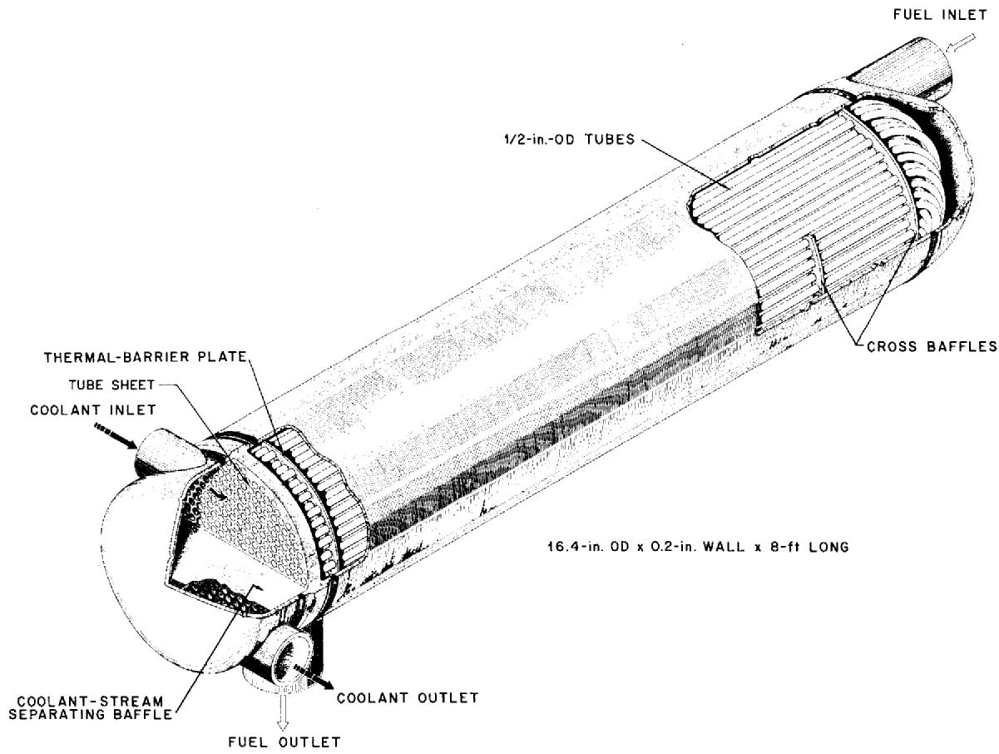  
Fig. 1.8. Primary Heat Exchanger.

Table 1.8. Design Data for Primary Heat Exchanger   

<table><tr><td>Construction material</td><td>INOR-8</td></tr><tr><td>Heat load</td><td>10 Mw</td></tr><tr><td>Shell-side fluid</td><td>Fuel salt</td></tr><tr><td>Tube-side fluid</td><td>Coolant salt</td></tr><tr><td>Layout</td><td>25%-cut cross-baffled shell with U tubes</td></tr><tr><td>Baffle pitch</td><td>12 in.</td></tr><tr><td>Tube pitch</td><td>0.775 in., triangular</td></tr><tr><td>Active shell length</td><td>~6 ft</td></tr><tr><td>Overall shell length</td><td>~8 ft</td></tr><tr><td>Shell diameter</td><td>16 in.</td></tr><tr><td>Shell thickness</td><td>1/2 in.</td></tr><tr><td>Average tube length</td><td>14 ft</td></tr><tr><td>Number of U tubes</td><td>159</td></tr><tr><td>Tube size</td><td>1/2 in. OD; 0.042-in. wall</td></tr><tr><td>Effective heat transfer surface</td><td>259 ft²</td></tr><tr><td>Tube sheet thickness</td><td>1 l/2 in.</td></tr><tr><td>Fuel salt holdup</td><td>6.l ft³</td></tr><tr><td>Design temperature</td><td></td></tr><tr><td>Shell side</td><td>1300°F</td></tr><tr><td>Tube side</td><td>1300°F</td></tr><tr><td>Design pressure</td><td></td></tr><tr><td>Shell side</td><td>55 psig</td></tr><tr><td>Tube side</td><td>90 psig</td></tr><tr><td>Allowable working pressurea</td><td></td></tr><tr><td>Shell side</td><td>75 psig</td></tr><tr><td>Tube side</td><td>125 psig</td></tr><tr><td>Hydrostatic test pressure</td><td></td></tr><tr><td>Shell side</td><td>800 psig</td></tr><tr><td>Tube side</td><td>1335 psig</td></tr><tr><td colspan="2">Terminal temperatures</td></tr><tr><td>Fuel salt</td><td>1225°F, inlet; 1175°F, outlet</td></tr><tr><td>Coolant</td><td>1025°F, inlet; 1100°F, outlet</td></tr><tr><td>Effective log mean temperature difference</td><td>133°F</td></tr><tr><td>Pressure drop</td><td></td></tr><tr><td>Shell side</td><td>28 psi</td></tr><tr><td>Tube side</td><td>27 psi</td></tr><tr><td>Nozzles</td><td></td></tr><tr><td>Shell</td><td>5 in., sched-40</td></tr><tr><td>Tube</td><td>5 in., sched-40</td></tr><tr><td>Fuel-salt flow rate</td><td>1200 gpm</td></tr><tr><td>Coolant-salt flow rate</td><td>850 gpm</td></tr></table>

counter-flow unit, and eliminates a thermal expansion problem. The tubes are welded and back brazed to the tube sheet in order to reduce the probability of leakage between the fuel and coolant. The coolant pressure is kept higher than the fuel pressure to reduce the likelihood of fuel out-leakage in case of a tube failure.

# 1.2.4 Salt-to-Air Radiator

The thermal energy of the reactor is transferred to the atmosphere at a salt-to-air radiator, which is cooled by two 100,000-cfm blowers. The radiator contains 120 tubes (3/4 in. OD, 0.072-in. wall, 30 ft long) and is assembled as shown in Fig. 1.9. Design data for the radiator are listed in Table 1.9.

Several features were incorporated in the design as protection against freezing of coolant salt in the radiator:

1. The tubes are of large diameter.   
2. The heat-removal rate per unit area is kept low by using tubes without fins so that most of the temperature drop is in the air film.   
3. The minimum salt temperature is kept $175^{\circ}\mathrm{F}$ above the freezing point $(850^{\circ}\mathrm{F})$ . A thermocouple is attached to each tube for temperature monitoring.

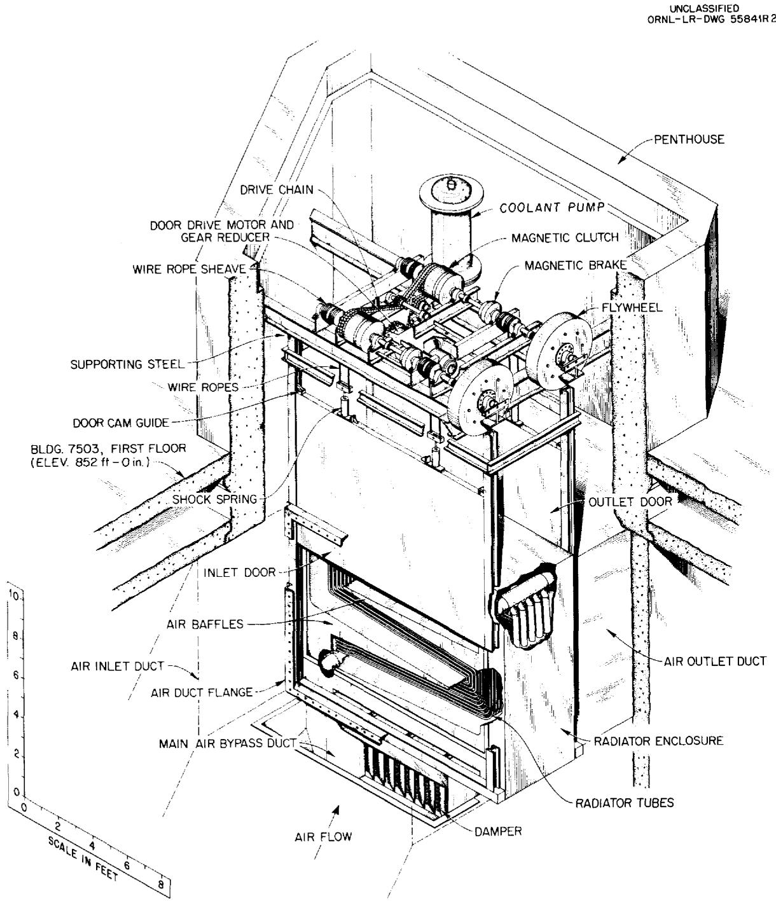  
Fig. 1.9. Salt-to-Air Radiator.

Table 1.9. Design Data for Salt-to-Air Radiator   

<table><tr><td>Structural material</td><td>INOR-8</td></tr><tr><td>Heat load</td><td>10 Mw</td></tr><tr><td>Terminal temperatures</td><td></td></tr><tr><td>Coolant salt</td><td>1100°F, inlet; 1025°F, outlet</td></tr><tr><td>Air</td><td>100°F, inlet; 300°F, outlet</td></tr><tr><td>Air flow</td><td>164,000 cfm at 15 in. H2O</td></tr><tr><td>Salt flow</td><td>850 gpm at avg temperature</td></tr><tr><td>Effective mean temperature difference</td><td>920°F</td></tr><tr><td>Overall coefficient of heat transfer</td><td>53 Btu/hr·ft2·°F</td></tr><tr><td>Heat transfer surface area</td><td>685 ft2</td></tr><tr><td>Design temperature</td><td>1300°F</td></tr><tr><td>Design pressure</td><td>75 psi</td></tr><tr><td>Tube diameter</td><td>0.750 in.</td></tr><tr><td>Wall thickness</td><td>0.072 in.</td></tr><tr><td>Tube matrix</td><td>12 tubes per row; 10 rows deep</td></tr><tr><td>Tube spacing</td><td>1 l/2 in., triangular</td></tr><tr><td>Subheaders</td><td>2 l/2 in., IPS</td></tr><tr><td>Main headers</td><td>8 in., IPS</td></tr><tr><td>Air-side pressure drop</td><td>11.6 in. H2O</td></tr><tr><td>Salt-side pressure drop</td><td>6.5 psi</td></tr></table>

4. The headers are designed to assure even flow distribution between the tubes.   
5. In the event of flow stoppage, doors on the radiator housing can close within 30 sec.   
6. The electric heaters mounted inside the radiator enclosure are never turned off.   
7. The salt can be drained in approximately 10 min.

The layout of the tube matrix will allow movement of the tubes with minimum restraint during thermal expansion. The tubes are pitched to promote drainage.

The radiator is supported and retained in a structural steel frame that is completely enclosed and insulated. Reflective shields protect structural members from excessive temperatures. The frame also provides guides for the two vertical sliding doors, which can be closed to thermally isolate the radiator. The doors are installed on the radiator enclosure, one upstream and one downstream, and they can be raised and lowered at a speed of 10 ft/min during normal operation by a gear-reduced motor driving an overhead line shaft. The doors are suspended from wire rope, which runs over sheaves mounted on the line shaft. The enclosure is capable of sustaining full blower pressure with the doors in any position. The doors may be used to regulate the air flow across the radiator as a means of controlling the reactor load. However, the load is normally controlled by positioning a damper in a bypass duct and by switching fans on and off. More detail of the load-control plan may be found in Section 2.

Emergency closure is effected by de-energizing a magnetic brake on the line shaft; this permits the doors to fall freely. Shock absorbers are provided. Accidental closure has no serious effects except for loss of time; it reduces the reactor power to $< 100$ kw.

# 1.2.5 Drain and Storage Tanks

Five tanks are provided for safe storage of salt mixtures when they are not in use in the reactor and coolant systems. They comprise two fuel drain tanks, a flush salt tank, a fuel-and-flush-salt storage tank, and a coolant drain tank.

Fuel Drain Tanks. The fuel drain tanks serve the important function of subcritical storage of the fuel. They are water cooled for removing fission-product decay heat, and an electric furnace is installed for maintaining the salts molten when the internal heat generation rate is low. Two tanks of the design shown in Fig. 1.l0 are provided; each has a volume of 80 ft³. Each tank can hold an entire fuel charge, so one is for normal use and the other is a spare. The low moderating power of the salt makes criticality very unlikely, even with nearly double the planned U²³⁵ loading (see sec. 7.l.9).

After long-term operation at 10 Mw, sudden draining of the fuel will require that it be cooled at a rate of 100 kw to prevent excessive fuel

UNCLASSIFIED

ORNL-LR-DWG61719

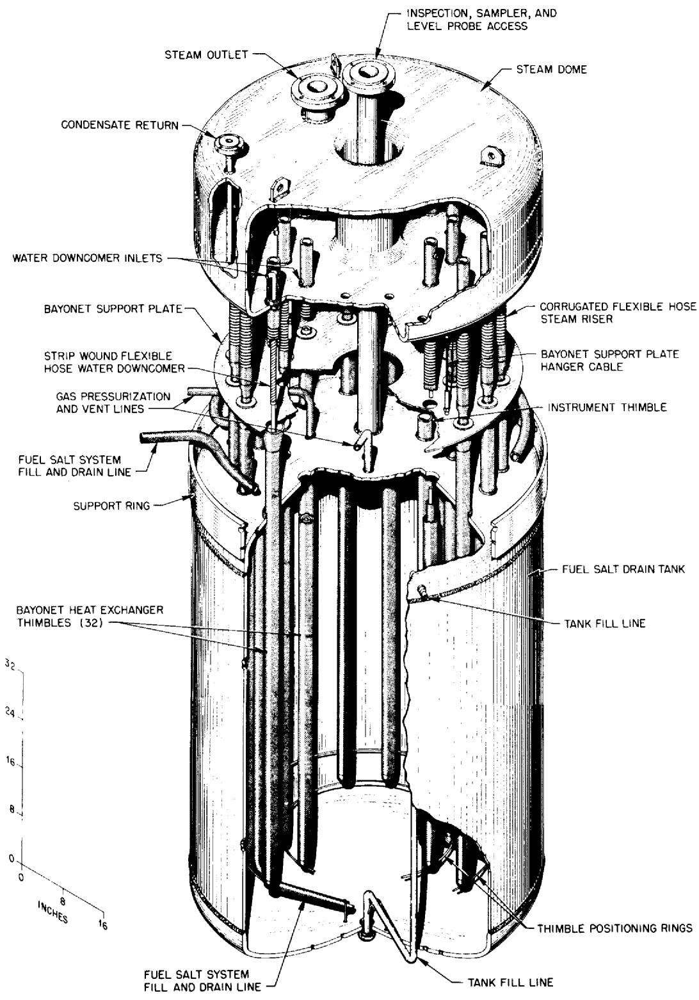  
Fig. 1.l0. Fuel Salt Drain Tank.

temperatures. $^{5}$ Evaporative cooling was chosen over gas or other means on the basis of simplicity and independence from utilities. Heat is removed by 32 bayonet cooling tubes (Fig. l.ll) inserted in thimbles in the tank. Water is fed through the center tube of the bayonet assembly, and steam is generated in the surrounding annulus. Heat is transferred from the thimble to the cooling tube by radiation and conduction. Normally the steam is condensed in a water-cooled condenser, but it can be exhausted to the vapor-condensing system in the event of failure of the coolant supply. A 300-gal feed-water reserve can provide cooling for 6 hr.

The drain tanks have dip-tube fill and drain lines and gas connections for maintaining a helium blanket for ventilating the space over the salt and for pressurizing to transfer the salt. Design data for the drain tanks are presented in Table 1.10.

Flush Salt Tank. The LiF-BeF $_2$ salt mixture with which the fuel system is flushed before maintenance will not accumulate sufficient fission products to require cooling during storage. For this reason the flush salt tank does not have a cooling system. Otherwise its design is similar to that of the fuel drain tanks.

Coolant Drain Tank. A tank (see Table 1.10) of $50\text{-ft}^3$ capacity that is similar to the fuel drain tanks but without cooling tubes is also provided for the coolant salt.

Fuel Storage Tank and Chemical Processing System. Batches of fuel or flush salt removed from the reactor circulating system can be processed in the fuel storage tank and its associated equipment to permit their reuse or to recover uranium. Salts that have been contaminated with oxygen constituents as oxides can be treated with a hydrogen-hydrogen fluoride gas mixture to remove the oxygen as water vapor.

A salt batch unacceptably contaminated with fission products, or one in which it is desirable to drastically change the uranium content, can be treated with fluorine gas to separate the uranium from the carrier salt by volatilization of $\mathrm{UF_6}$ . In some instances the carrier salt will be

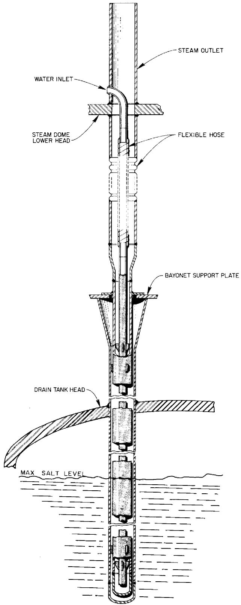  
Fig. 1.11. Bayonet Cooling Thimble for Fuel Drain Tanks.

Table 1.10. Design Data for Fuel Drain Tank, Coolant Drain Tank, and Flush Salt Tank   

<table><tr><td colspan="2">Fuel drain tank</td></tr><tr><td>Material</td><td>INOR-8</td></tr><tr><td>Height</td><td>86 in. (without coolant headers)</td></tr><tr><td>Diameter, outside</td><td>50 in.</td></tr><tr><td>Volume</td><td></td></tr><tr><td>Total</td><td>80.2 ft3</td></tr><tr><td>Fuel (normal)</td><td>73.2 ft3</td></tr><tr><td>Gas blanket (normal)</td><td>~7.0 ft3</td></tr><tr><td>Wall thickness</td><td></td></tr><tr><td>Vessel</td><td>1/2 in.</td></tr><tr><td>Dished head</td><td>3/4 in.</td></tr><tr><td>Design temperature</td><td>1300°F</td></tr><tr><td>Design pressure</td><td>65 psi</td></tr><tr><td>Cooling method</td><td>Boiling water in double-walled thimbles</td></tr><tr><td>Cooling rate</td><td>100 kw</td></tr><tr><td>Coolant thimbles</td><td></td></tr><tr><td>Number</td><td>32</td></tr><tr><td>Diameter, IPS</td><td>1.5 in.</td></tr><tr><td colspan="2">Coolant drain tank</td></tr><tr><td>Material</td><td>INOR-8</td></tr><tr><td>Height</td><td>78 in.</td></tr><tr><td>Diameter, outside</td><td>40 in.</td></tr><tr><td>Volume</td><td></td></tr><tr><td>Total</td><td>50 ft3</td></tr><tr><td>Coolant salt</td><td>~44 ft3</td></tr><tr><td>Gas blanket</td><td>~6 ft3</td></tr><tr><td>Wall thickness</td><td></td></tr><tr><td>Vessel</td><td>3/8 in.</td></tr><tr><td>Dished head</td><td>5/8 in.</td></tr><tr><td>Design temperature</td><td>1300°F</td></tr><tr><td>Design pressure</td><td>65 psi</td></tr><tr><td>Cooling method</td><td>None</td></tr><tr><td colspan="2">Flush salt tank</td></tr><tr><td>Material</td><td>INOR-8</td></tr><tr><td>Height</td><td>84 in.</td></tr><tr><td>Diameter, outside</td><td>50 in.</td></tr><tr><td>Volume</td><td></td></tr><tr><td>Total</td><td>82.2 ft3</td></tr><tr><td>Flush salt</td><td>73.2 ft3</td></tr><tr><td>Gas blanket</td><td>9 ft3</td></tr><tr><td>Wall thickness</td><td></td></tr><tr><td>Vessel</td><td>1/2 in.</td></tr><tr><td>Dished head</td><td>3/4 in.</td></tr><tr><td>Design temperature</td><td>1300°F</td></tr><tr><td>Design pressure</td><td>65 psi</td></tr><tr><td>Cooling method</td><td>None</td></tr></table>

discarded; in others, uranium of a different enrichment, thorium, or other constituents will be added to give the desired composition.

The processing system consists of a $117\text{-ft}^3$ salt storage and processing tank, supply tanks for the $\mathrm{H}_{2}$ , HF, and $\mathbf{F}_2$ treating gases, a high-temperature $(750^{\circ}\mathrm{F})$ sodium fluoride adsorber for decontaminating the $\mathrm{UF}_6$ , several low-temperature portable NaF adsorbers for $\mathrm{UF}_6$ , a caustic scrubber, and associated piping and instrumentation. All except the $\mathrm{UF}_6$ adsorbers (which do not require shielding) are located in the fuel processing cell below the operating floor of Building 7503. The process is described in Part VII of the MSRE Design and Operations Report. After the uranium has been transferred to the $\mathrm{UF}_6$ adsorbers, they will be transported to the ORNL Volatility Pilot Plant, where the $\mathrm{UF}_6$ will be removed and prepared for reuse. The entire processing system is separated from the reactor system with two freeze valves in series to ensure complete isolation.

# 1.2.6 Piping and Flanges

The reactor vessel, pumps, and heat exchanger are interconnected by 5-in.-IPS, sched-40, INOR-8 piping. The 0.258-in. wall is several times the thickness necessary for operation at $1200^{\circ}\mathrm{F}$ and 75 psig. Piping of smaller diameter is used for the drain lines (1 l/2 in.) and other auxiliaries, but no salt lines are smaller than 1/2 in.

The components of the fuel-circulating system are equipped with a special type of flange, called a freeze flange (shown in Fig. 1.12), to permit replacement. These flanges utilize a seal made by freezing salt between the flange faces, in addition to a conventional ring gasket seal which is helium buffered for leak detection.

# 1.2.7 Freeze Valves

The molten salt in both the fuel and coolant circuits will be sealed off from the respective drain tanks by means of freeze valves in the drain lines. These valves (Fig. 1.13) are simply short, flattened sections of pipe which are cooled to freeze the salt in that section. Heaters surround each valve so that the salt can be thawed quickly when necessary to drain the system. The salt can also be thawed slowly without the

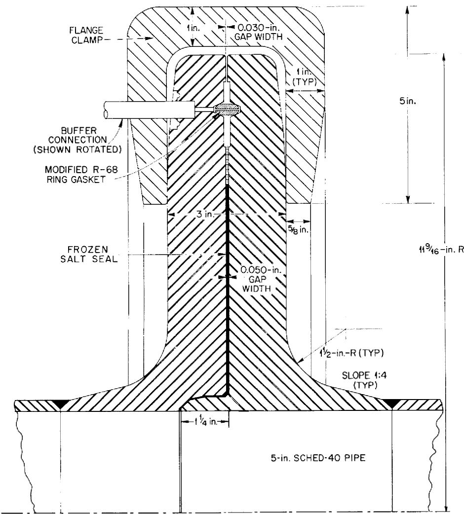  
Fig. 1.12. Freeze Flange.

heaters by stopping the cooling. In addition to the freeze valves in each drain line, freeze valves are also provided in the transfer lines between the drain tanks, flush tank, and the storage tank.

# 1.2.8 Cover-Gas Supply and Disposal

Because the fuel salt is sensitive to oxygen-containing compounds, it must be protected by an oxygen- and moisture-free cover gas at all times. The principal functions of the cover-gas systems are to supply an inert gas for blanketing the salt and for the pressure transfer of

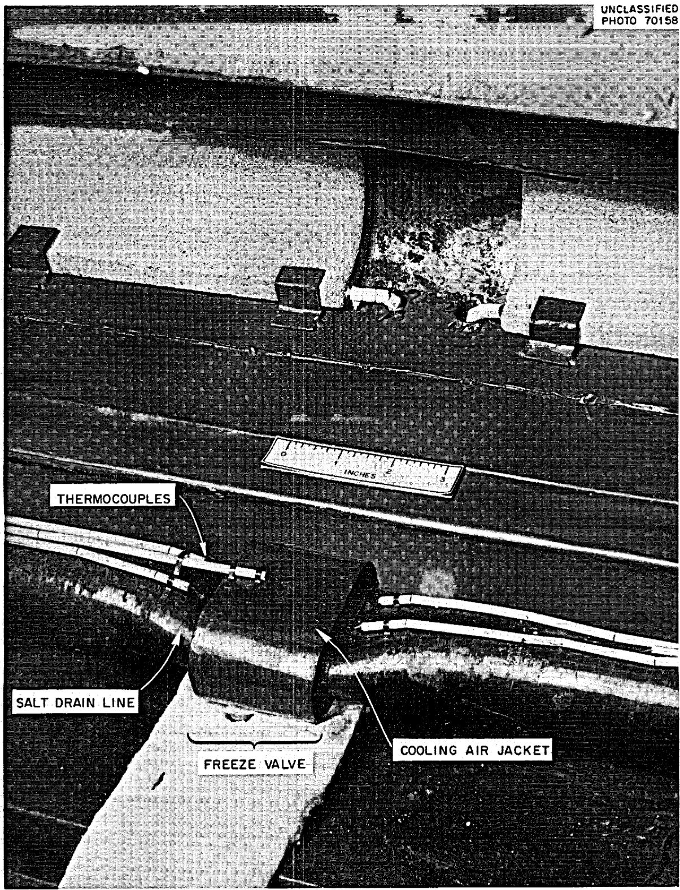  
Fig. 1.l3. Freeze Valve.

salt between components, to provide a means for disposing of radioactive gas, and to maintain a higher gas pressure in the coolant system than in the fuel system. A simplified flow diagram of the system is presented in Fig. 1.14.

The cover gas is helium supplied in cylinders at 2400 psig. It is purified by passage through filters, dryers, and oxygen traps (titanium at high temperature). Purified gas is then sent to two distribution systems, one for the fuel and one for the coolant salt. The total flow is about 10 liters/min (STP) at about 40 psig. A rupture disk protects the reactor against supply pressures greater than 50 psig.

The largest flow of gas is directed to the fuel-circulation pump, the freeze-flange buffer zones, and the fuel drain tanks, where it is in direct contact with the fuel salt. Gas that passes through the fuel pump is circulated through a series of pipes where it is held and cooled for at least 2 hr to dissipate heat from the decay of short-lived fission products. Then it passes through a charcoal bed, where krypton and xenon are retained for at least 8 and 72 days, respectively, and through a filter and blower to the offgas stack. There it is mixed with a flow of 18,000 cfm of air, which provides dilution by a factor of approximately $10^{5}$ and reduces the concentration of $\mathrm{Kr}^{85}$ , the only significant isotope remaining, to $10^{-5}\mu \mathrm{c / cc}$ at the stack exit. The charcoal bed is a series of pipes packed with activated carbon. It and a spare bed are mounted vertically in a scaled, water-filled secondary container; either or both beds may be used.

Fuel salt transfers require more rapid venting of the cover gas, but the heat load is low. A third charcoal bed is provided for venting those gases before they are sent to the stack. Figure 1.15 is the offgas disposal flowsheet.

The cover-gas distribution for the coolant system (also shown on Fig. 1.14) supplies a small flow of helium to the coolant system, the sampler-enricher system, and to the coolant pump. Gas from the coolant system is vented directly through filters to the offgas stack, as indicated in Fig. 1.15. Monitors will stop the flow to the stack on indication of high activity.

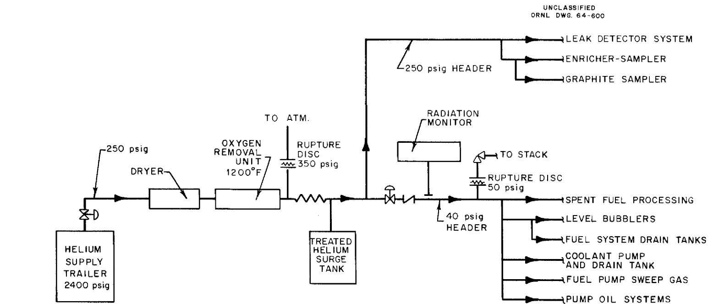

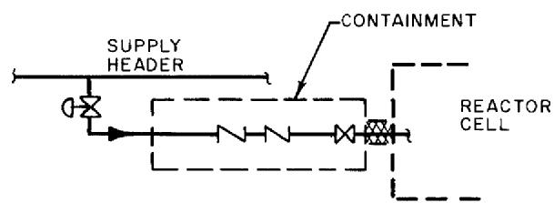  
Fig. 1.14. Cover-Gas System Flow Diagram.

ARRANGEMENT AT CONTAINMENT

CELL WALL TYPICAL FOR SUPPLY TO:

FUEL PUMP SWEEP GAS

FUEL PUMP LEVEL BUBBLERS

FUEL DRAIN TANKS

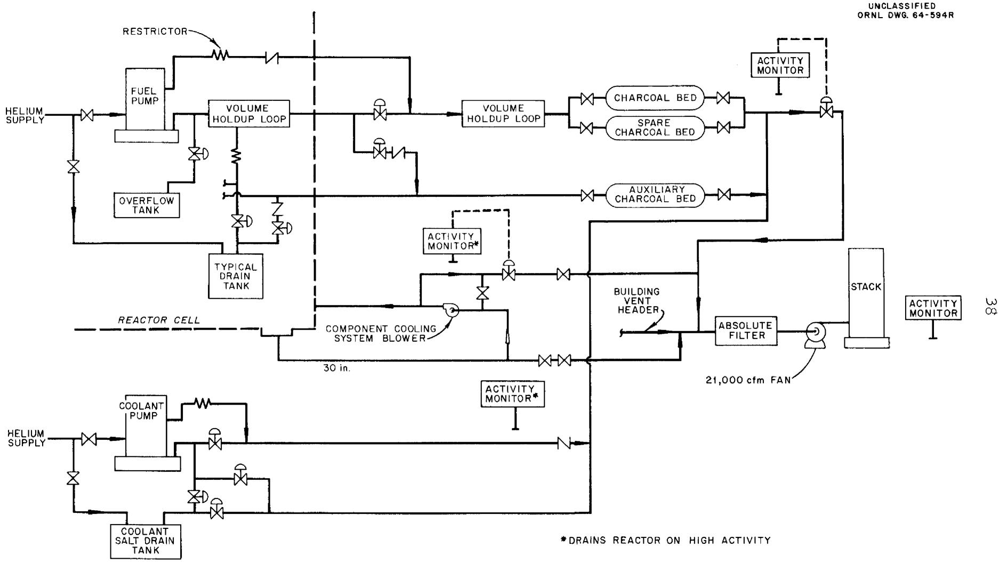  
Fig. 1.15. Off-Gas System Flow Diagram.

# 1.2.9 Sampler-Enricher

Small quantities of fuel can be added to or removed from the fuel system by means of a sampling mechanism that is connected through the top of the fuel pump bowl. As shown in Fig. 1.16, a cable assembly with a motor-driven reel is used to lower and raise a small bucket through a transfer tube into the salt pool in the pump bowl. The drive unit, which is located outside and above the reactor containment vessel, is enclosed in a special containment box (area 1C). A gate valve provides access for the containment box to the pump bowl through the transfer tube. A port is also provided to remove the sample or to insert the enriching capsule

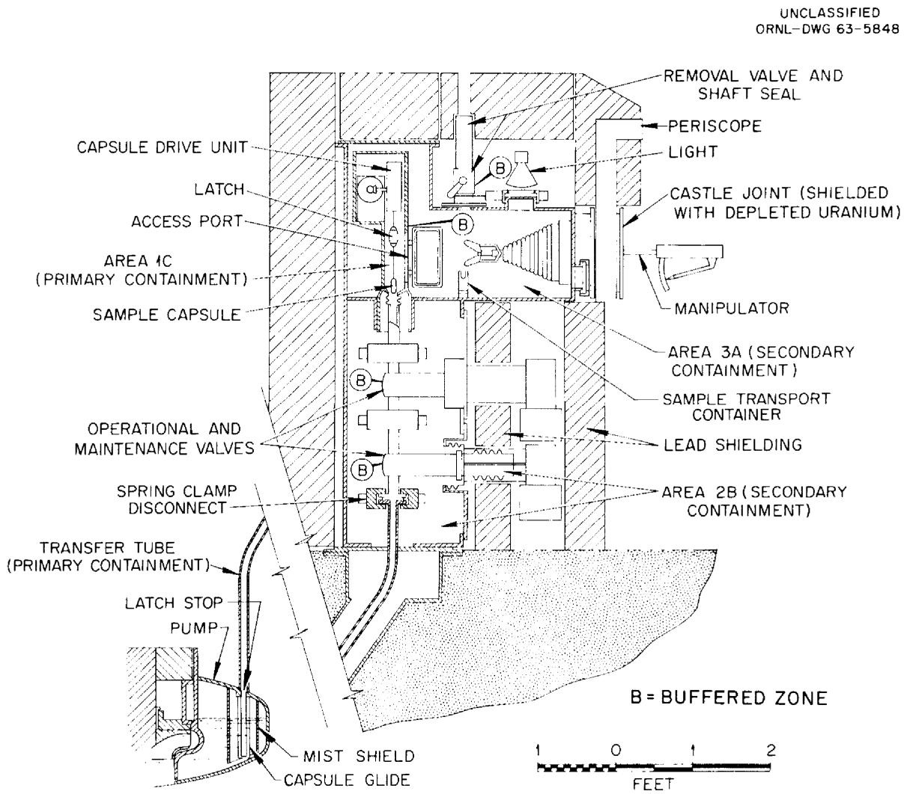  
Fig. 1.16. MSRE Sampler-Enricher.

into the box. This special containment box is further enclosed in a secondary containment area (area 3A), which also serves as a manipulator area in which the sample is prepared for shipment. Access to this manipulator area is obtained with a transport container tube that is inserted through a gas-buffered sliding seal and a ball valve.

All parts of the system that can be opened directly to the pump bowl (the transfer tube and area 1C) are designed for a pressure of 50 psig at $100^{\circ}\mathrm{F}$ and comply with ASME Code Case 1273N-7. These parts are contained in two separate vessels (areas 2B and 3A) designed for 40 psig at $100^{\circ}\mathrm{F}$ and comply with ASME Code Case 1272N-5. Normal operating pressures are 5 psig and atmospheric, respectively. All closures for parts opening into the pump bowl are either welded or doubly sealed with a buffer gas between the seals. Closures in the containment vessel that will be contaminated (area 3A) are also welded or doubly scaled and buffered.

When the system is not in operation, there are three barriers between the pump bowl and atmosphere: (1) the operational valve, (2) the access port, and (3) the removal valve. Each of these barriers contains two seals, with buffer gas between the seals. During sampling, interlocks permit opening only one barrier at any given time. A barrier is considered closed only when the gas pressure in the buffer region can be maintained at or above a predetermined pressure. Each buffered region is supplied with helium through a flow restrictor, which is sized to produce a significant pressure drop at a helium flow rate of 5 cc (STP)/min. If the leakage rate is greater than this, the gas pressure cannot reach the set point, and the barrier is not considered closed.

Fission-product gases released from the sample and from the pump bowl during the time the operational valve is open are later discharged to the auxiliary charcoal bed. Interlocks prevent opening area 1C to the charcoal bed until area 1C is isolated from the pump bowl by the operational valve.

Interlocks also prevent insertion operation of the cable drive unit until both the operational and the maintenance valves are open. Neither valve can be closed until the cable has been withdrawn sufficiently to clear the valve seats. The access port cannot be opened until the pressures on both sides of it are equal, to prevent damage to the equipment.

To prepare a sample for shipment to the analytical hot cell, the sample is sealed inside a transport container tube. A double elastomer seal prevents the escape of fission-product gases from the tube. The tube containing the sample is drawn up into a lead-filled cask and secured in it. The cask is then sealed inside a can, which is bolted to the frame of a truck. Thus, the sample is doubly contained. The cask is secured inside the can so that the sample will remain in place and sealed in case of an accident to the truck.

# 1.2.10 Electric Heaters

External heating of salt-bearing components of the reactor system is necessary (1) to prevent freezing of the salt, (2) to raise the reactor temperature to a subcritical value for experimental convenience, and (3) to heat the salts for reactor startup. Replaceable electric heaters were chosen as the safest, most reliable means of supplying the large ( $\sim 500$ kw) high-temperature requirement. Diesel-driven generators and two separate TVA substations make a complete failure of the heating system extremely unlikely. (Fig. 1.17 is a schematic diagram of the power distribution system.) In the 1000 to $1500^{\circ}\mathrm{F}$ range, nearly all the heat is transferred by radiation. This makes it unnecessary for the heating elements to be in contact with the vessel walls and results in a safer system from the standpoint of overheating and arcing damage. Each heater circuit has an electric current meter to indicate proper functioning. Heat balances of the system are taken at 2-hr intervals.

Thermocouples attached to the piping and vessels are located in relation to the heaters so that maximum temperatures are indicated. The thermocouples are scanned continuously to identify temperatures $100^{\circ}\mathrm{F}$ above or below a chosen standard so that corrective action can be taken.

Different kinds of heaters are applied to different parts of the reactor; most are kept energized continuously during reactor operation. The core vessel, drain tanks, and flush tank are equipped with resistance heaters which fit into wells surrounding the vessels. The piping and the heat exchanger are covered with resistance heater assemblies that are designed for easy removal. Reflective insulation is incorporated in the

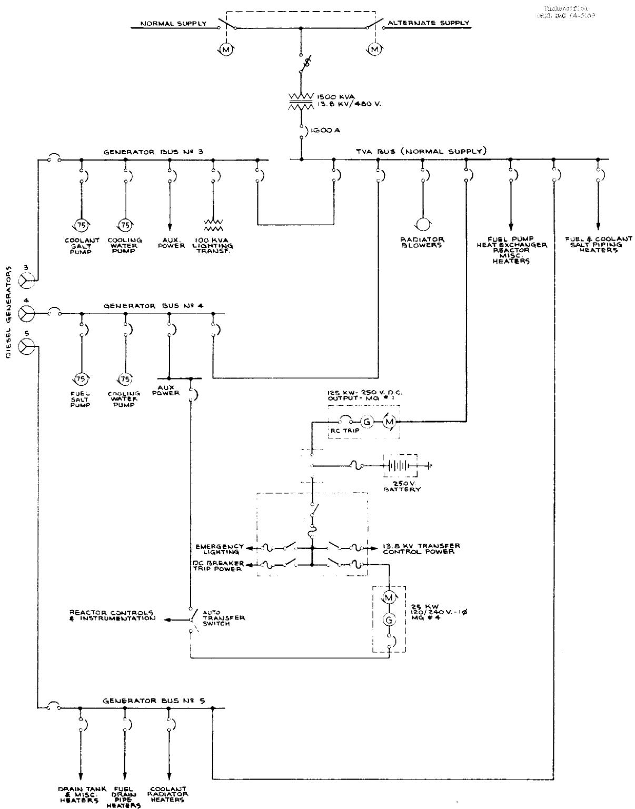  
Fig. 1.17. Single-Line Diagram of MSRE Power System.

design. The coolant system and the radiator are heated by Calrod-type radiant elements, with ordinary insulation, because remote maintenance is not necessary in these areas.

# 1.2.11 Liquid Waste System

The MSRE radioactive aqueous waste is expected to consist mainly of intermediate level waste (10 $\mu$ c to 5 curies per gallon). The quantities of active wastes expected will be low enough to permit dilution in the 11,000-gal liquid waste tank if the allowable concentration is exceeded. The waste will be sampled, neutralized if necessary, and pumped to the Melton Valley Central Station through an underground pipeline.

As shown on the simplified flowsheet of Fig. 1.18, the system consists of a stainless steel storage tank, a sand filter for clarifying the shielding water in the decontamination cell, a stainless steel pump for circulation of water through the filter and for pumping waste to the Central Station, and an offgas blower to prevent pressurization of the waste tank when jetting into the tank.

The sources of radioactive wastes are listed below.

1. There will be fission-product gases from fuel processing. Since the caustic scrubber is mainly for HF neutralization, the efficiency is expected to be low for fission-product removal and the amount of activity collected should not be large.   
2. There will be activity from decontamination of equipment in the decontamination cell. The active liquid can be pumped directly to the waste tank or the activity can be accumulated on the sand filter and be backwashed to the waste tank.   
3. Washdown from the offgas stack and filters will contain a small amount of activity.   
4. In case of a serious spill or leak of radioactive material, considerable activity could result during cleanup operations.

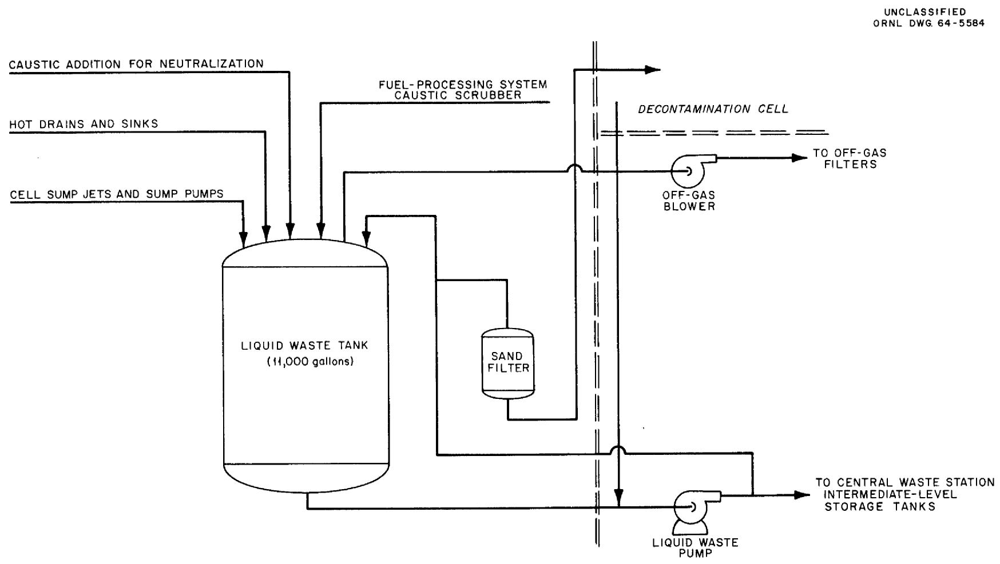  
Fig. 1.18. Simplified Flowsheet of MSRE Liquid Waste System.

# 2. CONTROLS AND INSTRUMENTATION

The control and safety systems of the MSRE are designed to provide (1) means for safe operation of the reactor and the fuel and coolant salt systems under normal conditions, (2) the flexibility needed to do experiments with the reactor, and (3) reliable protection against the reactor hazards usually encountered and against unacceptable damage to the equipment by nuclear accidents or by freezing of the fuel or coolant salts. Nuclear instrumentation and control and safety devices similar to those of other reactor types are required. The use of a mobile fuel that melts at high temperature requires additional control and safety systems for some operations. Some related features reduce the demands on protective devices.

The reactivity required to operate the reactor, starting from the isothermal (at $1200^{\circ}\mathrm{F}$ ) zero-power condition with noncirculating fuel, is shown in Table 2.1. The excess loading is a strong function of the temperatures of the fuel and of the graphite moderator. The overall temperature coefficient for fuel C and the moderator is $-7 \times 10^{-5} (\delta\mathrm{k / k}) / {}^{\circ}\mathrm{F}$ . The excess loading for the clean reactor, critical at zero power and at a temperature of $900^{\circ}\mathrm{F}$ , with noncirculating fuel, is $4.0_{-0.4}^{+1.0}\% \delta\mathrm{k / k}$ . The total worth of the control rods for operation with fuel C is calculated to be $5.7\% \delta\mathrm{k / k}$ .

The loading of the MSRE is subject to rigorous administrative procedures reinforced with special control and safety instrumentation** that limits the rate of fuel addition and reverses the loading by draining the reactor if potential hazards or hazardous conditions develop. Limitation of the inventory of $\mathbf{U}^{235}$ in the reactor, that is, control of the shutdown margin, is effected by instrument or manual drain of the fuel into the drain tanks.

Table 2.1 Reactivity Requirements   

<table><tr><td></td><td>Reactivity, % δk/k</td></tr><tr><td>Loss of delayed neutrons by circulation (power in steady state)</td><td>-0.3</td></tr><tr><td>Power deficit (at design-point power)</td><td>-0.1</td></tr><tr><td>Samarium transientsa and xenon poisoning (equilibrium at 10 Mw)</td><td>-0.8</td></tr><tr><td>Voids from entrained cover gas</td><td>-0.2</td></tr><tr><td>Burnup and margin for regulation</td><td>-0.5</td></tr><tr><td>Uncertainty in estimates</td><td>±1.0</td></tr><tr><td>Total</td><td>1.9+1.0-0.4</td></tr></table>

${}^{a}$ Tabulation does not include reactivity required to compensate for buildup of long-lived ${\mathrm{{Sm}}}^{149}$ ,which levels off at approximately 1.1% 8k/k after 60 days of operation at full power. See MSRP Semiann. Progr. Rept. July 31, 1963, p. 64, USAEC Report ORNL-3529, Oak Ridge National Laboratory.

The permanent nuclear instrumentation provides reactor operating information (power and period) over the entire normal operating range of the system. The initial loading will be preceded by many dry runs using barren salt. These will afford a thorough check of the system, train the operators, and verify the procedures. The initial critical experiments and the regular instruments will be augmented by four channels of $\mathbf{BF}_3$ counting equipment, which will extend the counting range a decade or more below that required for normal startups.

As is true for most reactors, transient responses in the MSRE are strongly influenced by the various temperature coefficients of the fuel and moderator and by the thermal and transport time constants of the system. Over its operating range the power density in the MSRE is low, and the heat capacities of both the fuel and the moderator are large. Hence, the thermal time constants of the reactor system are long. These conditions establish maximum rates of load change without appreciable overshoot

in the amplitudes of such parameters as nuclear power and temperature profile.

Typical parameters that influence the transient response of the MSRE when loaded with fuel C are the following:*

Mean neutron lifetime $2.4 \times 10^{-4}$ sec

Delayed neutron fractions With fuel circulating and power in 0.0036 steady state

With fuel stationary 0.0067

Power densities in fuel at 10-Mw level Maximum, on core center line 31 w/cm³ Mean 14 w/cm³

Temperature coefficients of reactivity Fuel only (fuel C) $-3.3\times 10^{-5}(\delta \mathrm{k / k}) / ^{\circ}\mathrm{F}$ Graphite moderator only $-3.7\times 10^{-5}(\delta \mathrm{k / k}) / ^{\circ}\mathrm{F}$

It was possible, by using analog simulation, to devise an adequate control system which will provide smooth operation over the entire operating range of the plant.

# 2.1 Control Rods and Rod Drives

One of the three control rods and its associated drive unit are shown in Fig. 2.1 as assembled and installed in the reactor. The locations of the rods within the core are shown in Fig. 1.6 (see sec. 1.2.1).

The control rod, Fig. 2.2, consists of approximately 36 poison elements in the form of hollow, cylindrical ceramic slugs of 70 wt % gadolinium oxide and 30 wt % aluminum oxide clad with Inconel. These individual poison elements are stacked around and supported by a flexible stainless steel hose to form a continuous flexible control rod 1.14 in. in diameter and 56 in. long. The use of flexible rods permits offsetting the rod drives to obtain access to the graphite sample penetration and protects against binding from misalignment or thermal expansion.

UNCLASSIFIED ORNLW-684-60C

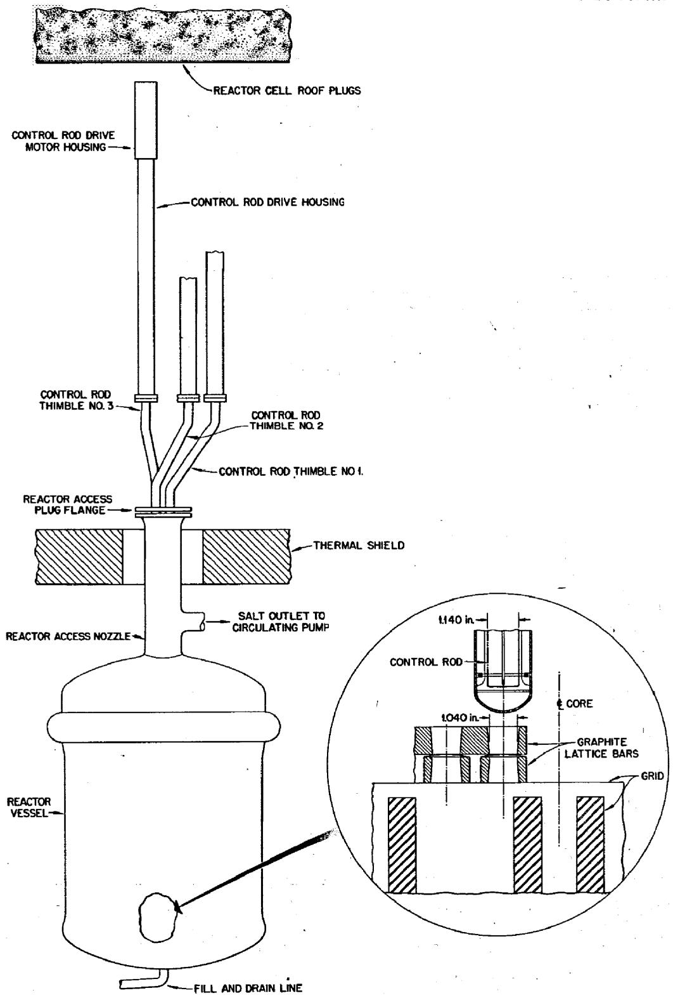  
Fig. 2.1. Control Rod Drive Unit Installed in Reactor.

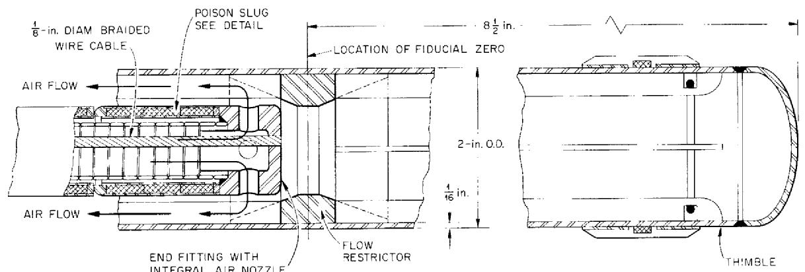

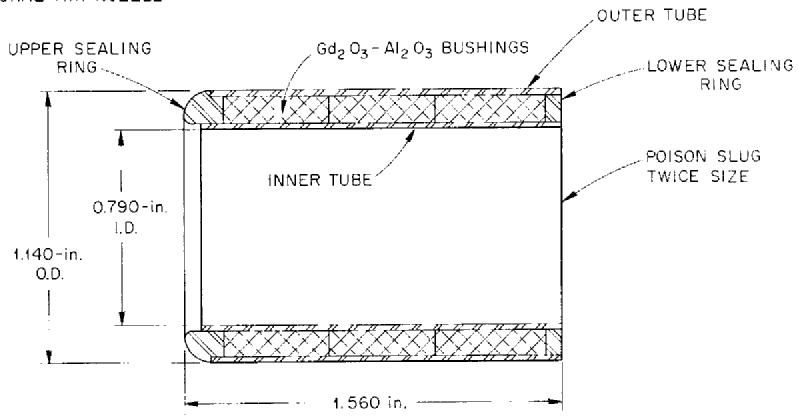  
Fig. 2.2. Diagram of Control Rod.

Analysis indicates that with the reactor at full power, the control rod poison elements will operate at a temperature of about $1500^{\circ}\mathrm{F}$ , if no cooling is provided. This temperature will not damage the rods or the thimbles. The rod drive design is conservative in that provision is made for flow of cooling air, which may be routed down the inside of the flexible hose and the hollow inside of the rod and return up through the annular space between the rod and the thimble, see Fig. 2.2. The need for continuous cooling will be determined during early phases of operation.

An electromechanical diagram of most of the essential elements in the drive train is shown in Fig. 2.3. The shock absorber, limit switches, air flow system, and the pneumatic fiducial zero-positioning device do not appear on this figure. The rod is scrambled by breaking the circuit-supplying current to the electromechanical clutch.

UNCLASSIFIED

ORNL-OWG63-8391

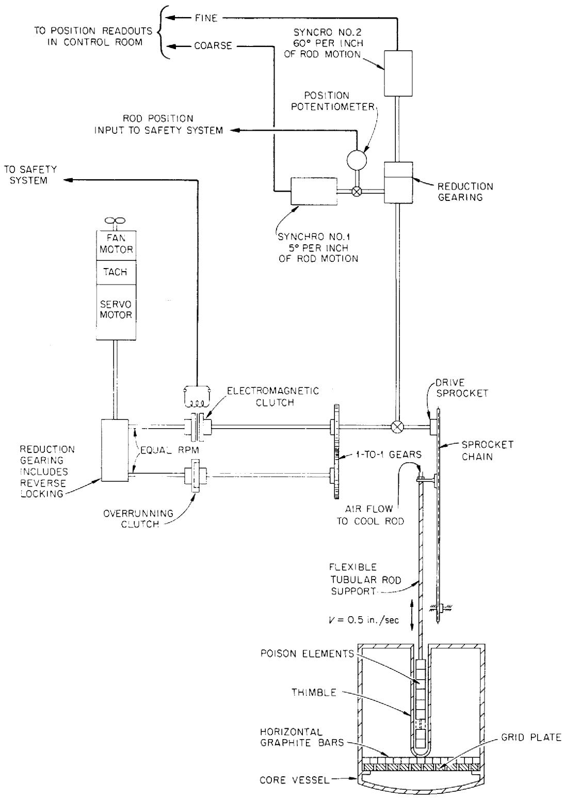  
Fig. 2.3. Electromechanical Diagram of Control Rod Drive Train.

The reactivity worth of a rod as a function of depth of insertion in the core is shown in Fig. 2.4. Other features of the rods and drives pertinent to reactor safety are listed below:

1. The rod velocity during normal motor-driven insertion and withdrawal is 0.5 in./sec (±10%). Maximum stroke is 60 in.   
2. The clutch release time is less than 0.05 sec; the average drop time from a height of 51 in. is 0.79 to 0.81 sec, including release time; and the average acceleration during a 51-in. drop is 13 ft/sec². It has been established, as indicated in Fig. 2.5, that satisfactory scram performance is obtained with two rods dropping with an acceleration of 5 ft/sec² and with a clutch release time of 0.100 sec.   
3. The drive motor is a 115-v, 60 cps, single-phase, capacitor start-and-run, positively reversible unit.

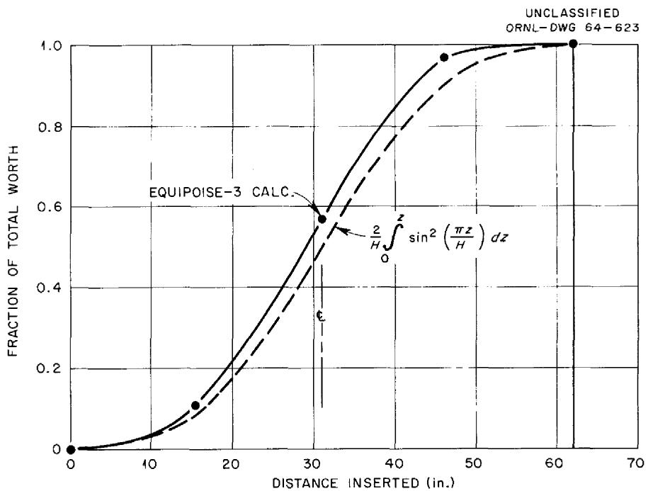  
Fig. 2.4. Reactivity Worth of Control Rod as a Function of Depth of Insertion in Core.

Fig. 2.5. Control Rod Height Versus Time During a Scram.   
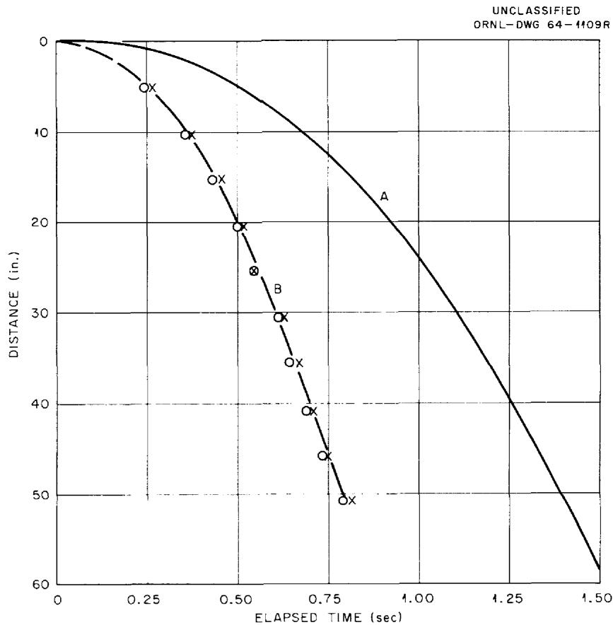  
CURVE A-REFERENCE CURVE OF SATISFACTORY SCRAM PERFORMANCE; BASED ON ACCELERATION OF 5 ft/sec² AND RELEASE TIME OF 0.100 sec  
CURVE B-SCRAM PERFORMANCE FROM TESTS OF JAN.27-28,1964

4. The overrunning clutch transmits drive motor torque in the rod insert direction, and the control system contains an interlock with the safety system that turns the drive motor "on" in the rod-insert direction following a rod scream. This will provide a force in the order of 350 lb to push the rod into the core if it is stuck.   
5. A low-angle, low-efficiency worm and gear between the servo motor and the sprocket locks the drive train so that if an external torque in the direction tending toward rod withdrawal is applied to the drive sprocket, it will not rotate. A conservative stress estimate of elements in the drive train from the worm gear to the sprocket chain gives a value of 463 lb as the safe static torque. This torque is produced by a differential pressure of 450 psi acting on the projected cross-sectional area of the control rod.

6. The electromechanical clutch is a single-plate, flat-disk unit with the driven plate spring loaded; it has a stationary field winding. The clutch is disengaged with no field current.

7. The coarse-position synchro rotates $300^{\circ}$ for full stroke and, hence, provides unambiguous information. The synchros transmit the angular position of the drive-sprocket shaft and do not take into account small changes of rod position caused by stretching of the drive chain and the hollow, flexible, support hose. A pneumatic, single-point, fiducial, zero-position-indicating device is provided that is activated by the change in pressure drop of the cooling air leaving the bottom of the rod. When the rod is at the zero position, the flow of cooling air from the radial exhaust nozzle at the bottom of the rod is impeded by a constricting throat near the bottom of the thimble and the sharp change in differential pressure indicates the location of the rod with respect to the thimble to an accuracy of 0.030 in. Figure 2.2 shows the nozzle and throat. This device will be used for periodic determination of the relation between synchro outputs and the position of the poison elements with respect to the thimble.

8. The shock absorber, Fig. 2.6, is of the spring-loaded "hydraulic" type, but it is unconventional in that the working "fluid" in the cylinder is hardened steel balls. The stroke is adjusted between 2.75 and 4 in. by varying the spring constants and the preloads on the buffer return spring and the ball reset spring. The resultant deceleration during shock absorption is seven times gravity. Tests1 of the prototype rod and rod drive have included more than 1100 screams from full withdrawal without any malfunction of the shock absorber. This is greatly in excess of the duty required in service.

9. The weight of the control rod plus the shock absorber produces an unbalanced weight on the sprocket chain of 18 lb. Static tests² of the prototype show that the internal friction of the drive unit plus the thimble-to-rod friction is equivalent to an upward force of 10 lb on the sprocket chain. This leaves an unbalanced force of 8 lb in the scram direction. This is in good agreement with the acceleration given in paragraph 2 above.

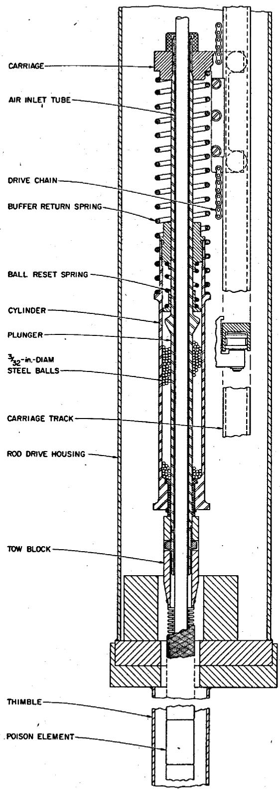  
UNCLASSIFIED RNLWDG46-98   
Fig. 2.6. Control Rod Shock Absorber.

10. The upper and lower limit switches at the ends of the total rod stroke are in independent pairs and are wired independently. All these switches are located at the upper end of the drive unit to eliminate long electrical leads adjacent to moving parts. This is also the most favorable location from the standpoint of temperature and radiation intensity.   
11. A photograph of a prototype thimble is shown in Fig. 2.7. It is substantially the same as the thimble that will be installed in the core vessel. The bottom of the thimble is closed and (see Fig. 2.1) is only 0.5 in. above the graphite stringers on the grid plate. Thus there is ample protection against a rod falling out of the core and initiating a nuclear excursion. The prototype rod drive assembly, supplied by the Yard Division of Royal Industries, Inc., Pasadena, California, is shown in Fig. 2.8.

# 2.2 Safety Instrumentation

The instrumentation and control devices classified as safety equipment are those whose failure to perform their protective function when required would result in an unacceptable hazard to personnel or unacceptable damage to the reactor or its major components.

The following principles were used in the design of the MSRE safety system in order to obtain the maximum degree of reliability:

1. Redundant and independent channels composed of high-grade components were provided for each protective function. Two degrees of redundancy are employed: (a) two independent channels, either of which will produce the required safety action, and (b) three independent channels in two-out-of-three coincidence. The second system requires agreement of any two channels to produce safety action. Removal of any channel for maintenance or operational checks is equivalent to a safety system input from that channel. In these circumstances the three-channel system reverts to a simple two-channel system.   
2. Provisions were made for periodic on-line testing of each channel.   
3. Continuous monitors were provided to disclose certain component failures and malfunctions, power failures, and loss of channel continuity.

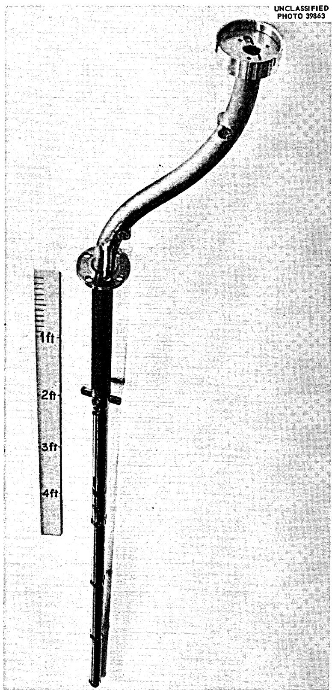  
Fig. 2.7. Control Rod Thimble.

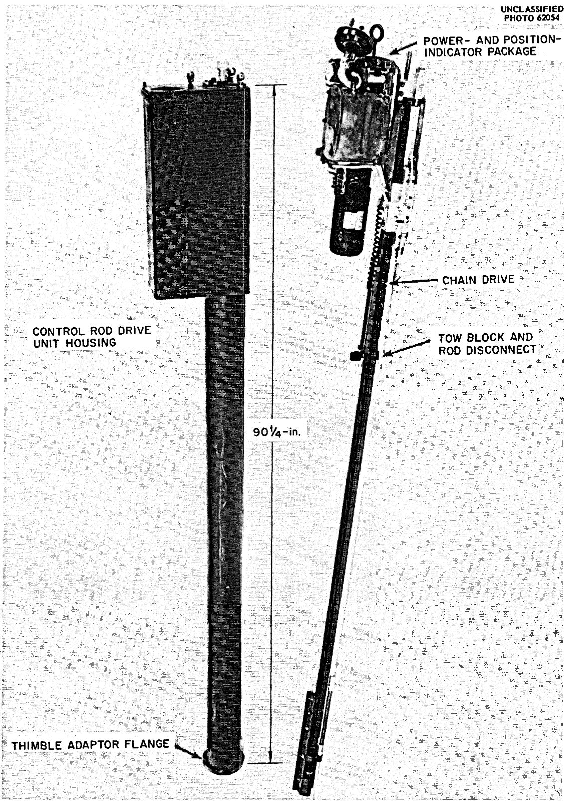  
Fig. 2.8. Prototype Control Rod Drive Assembly.

4. The use of all components in the safety system is restricted to providing safe reactor operation; e.g., modifications to the safety instrumentation for the convenience of data gathering by experimenters is prohibited. Similarly, the addition to the safety system of extra or auxiliary functions that do not contribute to reactor system safety is considered a dilution of safety system effectiveness and is prohibited. Typical alterations in this category are nonsafety interlocks and alarms.

5. Physical protection and separation of all components in each channel (conducting, closed cabinets, etc.) are provided.   
6. All safety-equipment components in each channel were identified as such.

Protection, separation, and identification (items 5 and 6) are incorporated throughout the system. Items 1 through 4 are discussed in detail in the following paragraphs. A simplified block diagram of the MSRE nuclear and process safety system is shown in Fig. 2.9, which displays both the various inputs or conditions used to detect or to indicate the existence of unsafe conditions and the results obtained when these inputs indicate that a hazard, real or potential, exists. The safety system input and output elements, their corrective actions, and the means employed to attain the required reliability are listed in Tables 2.2 and 2.3.

# 2.2.1 Nuclear Safety System

The nuclear safety system is required to decrease the reactivity reliably upon the occurrence either of a high neutron flux or a high reactor outlet temperature. The primary safety elements for accomplishing this are the electromechanical rod-release clutches (for a description of the rod-drive mechanisms, see sec. 2.1). Deenergizing any clutch releases the drive sprocket (Fig. 2.3) from the motor and brake, and the absorber rod falls into its thimble in the core. The instrumentation associated with these clutches and the initiation of a rod drop (scram) is described here.

A block diagram of the nuclear safety system instrumentation is shown in Fig. 2.10. The ranges of the flux safety channels, along with those of the flux channels used for control, are listed in Table 2.4. Details of chamber installations are given in Section 2.3.

UNCLASSIFIED

ORNL-DWG 64-637

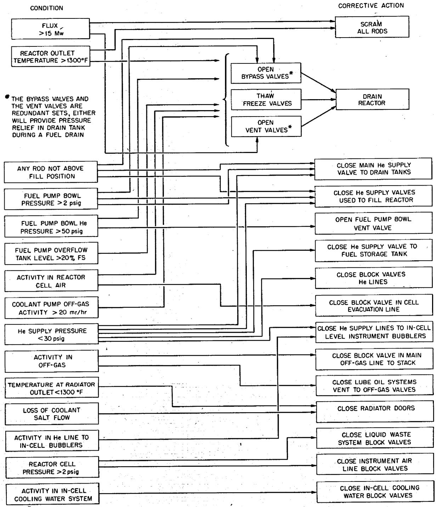  
Fig. 2.9. Functional Diagram of Safety System.

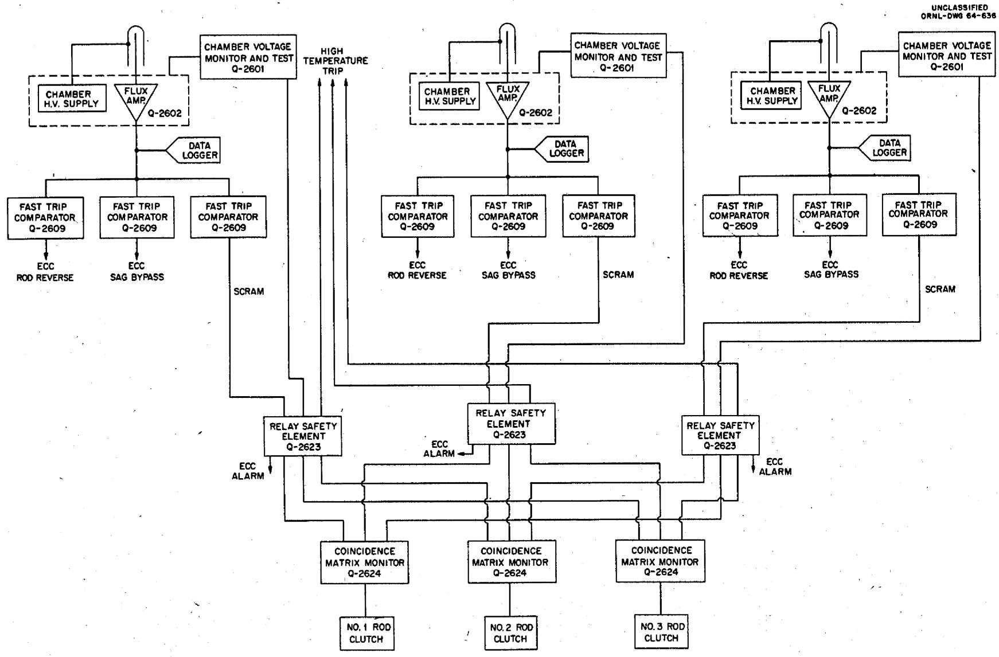  
Fig. 2.10. Block Diagram of Safety Instrumentation for Control Rod Scram.

Table 2.2. MSRE Safety System Inputs   

<table><tr><td>Condition or Situation Which Indicates a Real or Potential Hazard</td><td>Causes of the Hazard, the Consequences, and the Corrective Action</td><td>Supplementary Information</td></tr><tr><td>I. Excess reactor power; φ&gt;15 Mw</td><td>1. Causesa. Uncontrolled rod withdrawalb. Premature criticality during filling (excess U235 due to partial freezing)c. Cold slugd. Unknown or unidentified mechanisms</td><td>1. Redundancy: Three independent channels provide flux information2. Testing: Response of each channel is tested, with the exception of the ion chamber response to flux changes3. Monitoring: System design provides continuous check on circuit continuity and amplifier operation4. Safety only?: Input information used solely for safety and to restrict reactor operation within safe limits5. This system employs two-out-of-three coincidence6. Refer to Section 2.2 and Fig. 2.10</td></tr><tr><td>II. Fuel salt outlet temperature greater than L300°F</td><td>2. ConsequencesExcessively high temperatures; first in the fuel salt loop, and ultimately in the coolant salt loop, with resultant damage to equipment and, if unchecked, loss of primary containment3. Corrective actiona. Scram all rodsb. Open vent valves; relieves filling pressure in fuel drain tank (see lb above)</td><td>1. Redundancy: Three independent channels2. Testing: Response of each individual input channel may be tested3. Monitoring: A thermocouple break or detachment from pipe wall produces upscale reading and safety action in that channel4. Safety only?: Yes5. This system employs two-out-of-three coincidence6. Refer to Section 2.2 and Fig. 2.11</td></tr><tr><td>III. Pump bowl helium pressure greater than 35 psig</td><td>1. Causesa. Rapid unchecked expansion of fuel salt by excess temperature; see I and II above and supplemental informationb. Failure of helium off-gas letdown valve, RCV-522AL, combined with failure of 40-psig inlet helium regulation system and rupture diskc. Unknown or unidentified mechanisms</td><td>1. System design provides 5.0 ft3of overflow capacity, and power level ram and fuel overflow tank level systems (see I and IV, this table) protect against fuel salt expansion caused by power excursion; safety system hold bypass valves (Fig. 2.14) open during operation, in which case the pressure rise will be moderate until all the overflow volume is filled2. Redundancy: Two pressure channels, one in the pump bowl and one in the overflow tank3. Testing: Test procedure checks entire channel, with exception of transmitter bellows (see Fig. 2.15)4. Monitoring: Loss of helium flow to bubblers caused by either low inlet pressure or line blockage is alarmed5. Safety only?: Yes6. Draining (see Figs. 2.9 and 2.14 and Table 2.3) ensures immediate opening of the bypass valves to back up ad-ministrative control. Venting to the auxiliary char-coal bed is less effective but useful backup</td></tr><tr><td>IV. Fuel pump overflow tank level greater than 20% full scale on level instruments</td><td>2. ConsequencesLoss of capacity to handle fuel expansion or overfill3. Corrective actionDrain fuel</td><td>1. This backs up (anticipates) cause la in III (this table)2. Redundancy: Two independent systems provide level information3. Testing: Test procedure checks entire channel with exception of transmitter bellows (see Fig. 2.15)4. Monitoring: Loss of helium flow to bubblers caused by either low inlet pressure or line blockage is alarmed5. Safety only?: Yes</td></tr><tr><td>V. Helium pressure in fuel pump bowl greater than 2 psig during fill</td><td>1. Causes
a. Excess filling rate or overfill
b. Temperature excursion during fill (see I and II, this table)
c. Malfunction in helium letdown system (lines 522, 524, and FCV-522A1, etc., see Fig. 2.14)
d. Closing of HCV-533, normally maintained open by administrative control, during the filling operation
2. Consequences
Not, of itself, a hazard; a release of positive pressure may produce a sudden rise in fuel level during fill and, possibly, a nuclear excursion
3. Corrective action
Drain fuel</td><td>This uses same instrumentation as III (this table)
1. Redundancy: Two channels are used; one in the pump bowl and the other in the overflow tank
2. Testing: See III, this table
3. Monitoring: See III, this table
4. Safety only?: Yes</td></tr><tr><td>VI. Reactor cell air activity greater than 20 mr/hr</td><td>1. Causes
Rupture or leak in the primary containment
2. Consequences
Contamination of secondary containment and increased possibility of contamination of area in the event that secondary containment fails
3. Corrective actions
a. Drain fuel
b. Close in-cell cooling air system vent (to stack) valve</td><td>1. Redundancy: Two independent channels, either will produce safety action
2. Testing: Complete testing of each channel is possible
3. Monitoring: Certain system failures produce alarms
4. Safety only?: Yes</td></tr><tr><td>VII. Coolant pump off-gas activity greater than 20 mr/hr</td><td>1. Causes
Leak in primary heat exchanger
2. Consequences
a. This is a loss in primary containment
b. Contamination of coolant salt, coolant salt loop, and components therein, with possible contamination of area in the event radiator or other coolant system components fail
3. Corrective action
Drain fuel</td><td>1. During normal operation the coolant salt pressure in the heat exchanger is greater than that of the fuel salt; in these circumstances the contamination of the secondary is that resulting from back diffusion through the leak
2. Redundancy: Two independent channels, either will initiate safety action
3. Testing: Complete testing of each channel is possible
4. Monitoring: Certain system failures produce alarms
5. Safety only?: Yes</td></tr><tr><td>VIII. Control rods not above "fill" position during reactor filling</td><td>1. Causes
Administrative
2. Consequences
Failure to have rods cocked during fill is a loss of protection against the fill accident which can lead to a damaging temperature excursion
3. Corrective action
Prohibit filling</td><td>1. Redundancy: Action by any two of the three rods affords protection
2. Testing: This may be tested prior to filling
3. Monitoring: A system test immediately before filling meets requirements
4. Safety only?: Same as I (this table)</td></tr><tr><td>IX. Supply pressure less than 30 psig in helium line 500 which supplies helium to all reactor cell components, drain tank cell, and fuel processing system</td><td>1. CausesLoss of supply helium caused by:a. Empty tankb. Previous overpressure which operates relief valve and breaks rupture diskc. Malfunction of pressure-regulating valve PCV-500G, which maintains supply at design-point value of 40 pslg2. ConsequencesPossible loss of secondary containment (see lb above)3. Corrective actionsBlock all helium lines to reactor and drain tank cells</td><td>1. Redundancy: Three independent channels; any two will initiate safety action2. Testing: Complete testing possible3. Monitoring: Testing meets requirements4. Safety only?: Yes</td></tr><tr><td>X. Activity greater than 20 mr/hr in off-gas line</td><td>1. Causesa. Charcoal beds not operating correctly (overloaded, see III above) or pump seal rupture allowing discharge of activity to lube-oil systemb. Activity in the coolant salt loop2. ConsequencesRadioactive gases discharged up stack3. Corrective actionsa. Close off-gas block valvesb. Close lube-oil systems vent valves</td><td>1. Redundancy: Two independent channels; either will initiate safety action2. Testing: Complete testing possible3. Monitoring: Certain system failures are alarmed4. Safety only?: Yes</td></tr><tr><td>XI. Activity greater than 20 mr/hr in helium line to reactor cell level sensors (bubbles in pump bowl and overflow tank)</td><td>1. CausesReversal of flow in these lines (or back diffusion) from pump bowl, drain tanks, overflow tanks2. ConsequencesRadioactivity inside the helium piping in normally safe areas. This activity will be contained as long as piping is not breached3. Corrective actionClose in-cell block valves</td><td>1. Flow rate, in either direction, is limited by capillaries; check valves, two in series, are used to back up block valves2. Redundancy: Three independent channels; any two will initiate safety action3. Testing: Complete testing of each channel is possible4. Monitoring: Not applicable5. Safety only?: Yes</td></tr><tr><td>XII. Reactor cell pressure greater than 2 psig</td><td>1. Causesa. Maximum credible accidentb. Malfunction of cell pressure control system2. ConsequencesNot, of itself, a direct hazard; during normal operation the reactor cell is maintained at a negative pressure of -2 psig (13 psia) to ensure inflow in the event of a leak; the existence of positive pressure is evidence that a malfunction or misoperation exists; a loss of secondary containment is a possible result3. Corrective actionsa. Close instrument air block valvesb. Close liquid waste system block valve (from reactor cell sump to waste tank)</td><td>1. Redundancy: Three independent channels; any two will initiate safety action2. Testing: Complete testing is possible3. Monitoring: Not applicable, testing meets requirements4. Safety only?: Yes</td></tr><tr><td>XIII. Radioactivity greater than 100 \(mr/hr\) in in-cell cooling water system</td><td>1. CausesMaximum credible accident, which ruptures water sys-tem2. Consequencesa. Local contamination by radioactive water leakb. Loss of secondary containment, with accompanying contamination if radioactive material is dis-charged from the cooling-water system</td><td>1. Redundancy: Three independent channels; any two will initiate safety action2. Testing: Complete testing of each channel is possible3. Monitoring: Certain system failures initiate alarms or produce safety action4. Safety only?: Yes</td></tr><tr><td>XIV. Loss of coolant salt flow</td><td>1. Causesa. Coolant pump stoppageb. Line breakc. Unscheduled coolant salt draind. Plug in line or radiator2. ConsequencesExcept for case VII above, no hazard exists; a flow loss at full power will freeze the radiator in 2 min if no corrective action is taken3. Corrective actionDrop radiator doors</td><td>1. Redundancy: Two direct flow channels which receive information from a common primary element, a venturi, plus two independent pump speed channels (Fig. 2.13)2. Testing: Partial testing possible; a test which includes dropping radiator doors will perturb operation; input elements not tested3. Monitoring: By surveillance and comparison4. Safety only?: Yes</td></tr><tr><td>XV. Low coolant salt temperature, measured at radiator outlet</td><td>1. Causesa. Malfunction of load control system (complex of doors, blowers, and bypass damper)b. Cessation of power generation in core from any cause (scram, drain, rupture in primary contain-ment, etc.)c. Loss of coolant flow (see XIV above)2. ConsequencesNo hazard; warns that potential radiator freezeup may be developing (see XIV above)3. Corrective actionDrop radiator doors</td><td>1. Redundancy: Three independent channels; any two will initiate safety action2. Testing: A complete test of each input channel is pos-sible; complete testing requires dropping doors, which disturbs operation3. Monitoring: A thermocouple break or detachment from pipe will produce safety action in that channel4. Safety only?: Input channels used solely for safety</td></tr></table>

Table 2.3. MSRE Safety System Output Actions   

<table><tr><td>Safety Action</td><td>Results Produced</td><td>Supplementary Notes</td><td>Initiating Condition</td></tr><tr><td>I. Rod scram</td><td>Reduces temperature at which reactor is critical; system is shutdown until new (lover) critical temperature is reached</td><td>Action by any two of the rods is sufficient; rods tested at each shutdown</td><td>1. Flux signal, power greater than 15 Ww2. Fuel salt outlet temperature greater than 1300°F</td></tr><tr><td>II. Reactor emergency drain</td><td>Provides shutdown margin and transfers fuel salt to a safe location</td><td>Complete emergency drain system may be tested during operation if test period does not exceed 5 min</td><td rowspan="3">1. High reactor outlet temperature2. Fuel pump bowl pressure greater than 50 psig3. Fuel salt overflow tank level greater than 20%4. Radioactivity in secondary containment cell air</td></tr><tr><td>1. Close freeze valve cooling air valves HCV-919A and HCV-919B</td><td>Thaps freeze valve FV-103, main drain valve at bottom of reactor vessel</td><td>These valves are a redundant pair; only one must operate</td></tr><tr><td>2. (a) Open bypass valves HCV-544, 545, 546</td><td>Equalizes fill pressure in drain tank and pump bowl pressure</td><td>Eypass valves are kept open during operation by administrative control and hence may be closed to test</td></tr><tr><td>(b) Open vent valves HCV-573, 575, 577</td><td>Reduces pressure in drain and flush salt tanks by venting to charcoal beds</td><td>The vent and bypass valves serving each drain tank form a redundant pair</td><td>5. Radioactivity in coolant pump off-gas from fuel pump bowl pressure in excess of 2 psig</td></tr><tr><td>3. Close helium supply valve PCV-517A1</td><td>Shuts off pressurizing helium (40 psig) in main supply header to drain and flush salt tanks; this valve is closed during reactor operation</td><td>Redundancy obtained in combination with individual supply valves (see II.5 below) and with check valves</td><td>6. During filling, pressure in excess of 2 psig</td></tr><tr><td>4. Close freeze valve cooling air valves HCV-909, HCV-910</td><td>Thaps freeze valves FV-105 and FV-106, which admit fuel salt to drain tanks 1 and 2</td><td>Administrative control is used to keep one of these valves open during operation and to ensure that there are two empty drain tanks to receive fuel</td><td>7. During filling, drawn rods not with-</td></tr><tr><td>5. Close helium supply valves HCV-572A1, HCV-574A1, HCV-576A1</td><td>Shuts off pressurizing helium (40 psig) to individual drain and flush salt tanks; these valves are closed during reactor operation</td><td>See II.3 above; may be tested during operation if PCV-517A is closed and if pump bowl pressure reduced to less than 2 psig; PCV-517A may be tested if these valves are closed and pump bowl pressure is less than 2 psig</td><td></td></tr><tr><td>III. Radiator door scram</td><td>Shuts off air flow across radiator to prevent freezeup</td><td>Complete testing possible but will perturb power generation</td><td>1. Low coolant salt flow2. Low coolant salt flow</td></tr><tr><td>IV. Close helium valves HCV-572, HCV-574, HCV-576</td><td>Preserves containment; shuts off supply of pressurizing helium to individual drain and flush tanks and blocks these lines to prevent escape of radioactive gases</td><td>Redundancy obtained in combination with V (below) and with check valves</td><td>1. Low helium supply pressure (less than 30 psig)2. Fuel pump bowl pressure in excess of 2 psig3. All shim rods not with-drawn</td></tr><tr><td>V. Close helium supply valve PCV-517A in main header serving all drain and flush tanks</td><td>Preserves containment; shuts off 40-psig helium to drain and flush tanks and blocks escape of radioactivity or reverse flow from the drain tanks</td><td>Redundancy obtained in combination with IV (above) and with check valves</td><td>1. Low helium supply pressure (less than 30 psig)2. Fuel pump bowl pressure in excess of 2 psig3. All shim rods not with-drawn</td></tr><tr><td>VI. Close helium supply valve HCV-530 to fuel storage tank</td><td>Preserves containment</td><td></td><td>Low helium supply pressure (less than 30 psig)</td></tr><tr><td>VII. Close valve HCV-516 in helium purge line to fuel pump</td><td>Preserves containment; blocks line 516 and prevents escape of radioactivity from containment</td><td>Basic containment requirements met by this valve and check valves in series; ESV-516A1 and 516A2 provide redundancy</td><td>Low helium supply pressure (less than 30 psig)</td></tr><tr><td>VIII. Close valve HCV-512 in helium purge line to coolant pump</td><td>Preserves containment; blocks line 512 and prevents escape of radioactivity from containment</td><td>Redundancy; 2 barriers, provided by check valves plus heat exchanger</td><td>Low helium supply pressure (less than 30 psig)</td></tr></table>

Table 2.3 (continued)   

<table><tr><td>Safety Action</td><td>Results Produced</td><td>Supplementary Notes</td><td>Initiating Condition</td></tr><tr><td>IX. Block helium supply lines to bub- bler (level instruments in rea- tor cell)1. Close valves HCV-593B1, HCV-593B2, HCV-593B32. Close valves HCV-599B1, HCV-599B2, HCV-599B33. Close valves HCV-595B1, HCV-595B2, HCV-595B3</td><td>Preserves containment; prevents reverse flow of helium in lines to bubblers in the pump bowls and in the overflow tank</td><td>Redundancy provided by two check valves in series with each block valve</td><td>1. Low helium supply pressure (less than 30 psig)2. Radioactivity in lines to fuel salt level instruments (primary sensors)</td></tr><tr><td>X. Close valve HCV-511Al in helium supply line (40 psig) to coolant drain tank</td><td>Preserves containment</td><td></td><td>Low helium supply pressure (less than 30 psig)</td></tr><tr><td>XI. Close HCV-557C; off-gas line from charcoal beds, coolant salt pump, coolant salt drain tank, and fuel and coolant pump lube oil systems</td><td>Preserves containment; blocks helium flow which normally passes out off-gas stack</td><td>Redundancy provided by charcoal bed plus valves PCV-510A2 and PCV-513A2 (see XII below)</td><td>Radioactivity in off-gas line</td></tr><tr><td>XII. Close lube-oil systems vent valves PCV-510A2 (cool pump system) and PCV-513A2 (fuel pump system)</td><td>Preserves containment; blocks helium flow which normally passes out off-gas stack</td><td>Redundancy provided by valve HCV-557C (see XI above) and by pump seals; these valves used for both control and safety</td><td>Radioactivity in off-gas line</td></tr><tr><td>XIII. Close valve PCV-565Al in vent line from reactor cell evacuation line</td><td>Preserves containment; blocks component cooling air flow which would normally pass out through off-gas stack S-1</td><td>Redundancy provided by reactor vessel; this valve forms part of secondary containment barrier</td><td>Radioactivity in reactor cell air</td></tr><tr><td>XIV. Close in-cell cooling water block valves:1. FSV-837-A12. FSV-846-A13. FSV-846-A24. FSV-847-A15. FSV-844-A16. ESV-ST-A</td><td>Preserves containmentBlocks outlet line from drain tank cell space coolerBlocks outlet line from reactor cell space cooler No. 1Blocks outlet line from reactor cell space cooler No. 2Blocks outlet line from thermal shield and fuel pump motorBlocks inlet line to thermal shield and fuel pump motorBlocks vent line from surge tank</td><td>Redundancy of valves 1 to 6, inclusive, provided by ESV-ST-A (6, below)This valve provides redundancy per above</td><td>Radioactivity in cooling water system</td></tr><tr><td>XV. Close liquid waste system block valves1. HCV-343A1 and HCV-343A22. HCV-333A1 and HCV-333A2</td><td>Preserves containment; blocks reactor cell and drain tank cell sump ejector discharge lines to liquid waste storage tank</td><td>These valves normally closed during operation; 1 and 2 are both redundant pairs</td><td>Reactor cell pressure greater than 2 psig</td></tr><tr><td>XVI. Close instrument air line block valves</td><td>Preserves secondary containment</td><td>Redundancy provided by primary containment vessel walls</td><td>Reactor cell pressure greater than 2 psig</td></tr><tr><td>XVII. Open fuel pump bowl vent valve to auxiliary charcoal bed</td><td>Preserves containment</td><td></td><td>Fuel pump bowl pressure exceeds 35 psig</td></tr></table>

Table 2.4. Operating Ranges of MSRE Nuclear Instrument Channels   

<table><tr><td>Channel Type</td><td>Detector Type</td><td>Number of Channels</td><td>Normal Operating Range</td></tr><tr><td>Wide-range counting</td><td>Fission chamber</td><td>2</td><td>Source to five times full power</td></tr><tr><td>Linear power</td><td>Compensated ioniza-tion chamber</td><td>2</td><td>15 w to 15 Mw</td></tr><tr><td>Flux safety</td><td>Noncompensated ionization chamber</td><td>3</td><td>200 kw to 20 Mw</td></tr></table>

The sensors used in the flux safety channels are uncompensated neutron-sensitive ionization chambers. The linear flux amplifier in each channel produces an output signal of 0 to $10\mathrm{v}$ that is proportional to the ionization chamber current. The gain of the flux amplifier and the chamber location is fixed so that at design-point power the flux-amplifier output is $5\mathrm{v}$ ; the setting of the scram point of the fast trip comparator is fixed at $7.5\mathrm{v}$ . During the early phases of MSRE operation, the scram point will be reduced by changes in either gain of the amplifier or chamber position or both. These changes are not routine and are not at the discretion of the operator; they will be accomplished under administrative control and with suitable testing after they are made.

The temperature channels, described in the next section, monitor the reactor outlet salt temperature over a range extending to $1500^{\circ}\mathrm{F}$ . The scram point is adjustable about the nominal $1300^{\circ}\mathrm{F}$ presently intended but only under administrative control.

A scram channel combines one temperature and one flux channel to provide a trip if either temperature or flux exceeds its scram point. The three scram channels thus formed are then arranged so that signals from two of the three scram channels are required to release the safety rods. Relay contacts in the relay safety element are used as the logic elements, with a separate two-of-three matrix being used for each rod. The coincidence matrix monitors are used to display the operation of the relay contacts in the matrices during operation, as well as during tests.

The flux and temperature safety channels are tested and monitored in service in the following ways:

1. A voltage ramp may be applied manually to the system that causes a current to flow through the leads from the ion chamber to the input of the flux amplifier. Channel response is checked by observation of panel meters.

2. A steady-state current may be applied manually to the input of the flux amplifier. Channel response is observed on panel meters or, if the applied current is large enough, it will trip the channel undergoing test and the trip so produced may be verified by observing the operation of relevant relays in all three relay matrices. The operation must reset the scram circuit after a test or, in fact, after any scram signal. Reset cannot be accomplished so long as the scram signal exists. On-line testing of each temperature channel is effected in a similar manner, except for the method of introducing the test signal (described in detail in a following section). Since the flux and temperature safety channels are in two-out-of-three coincidence, testing will not produce a scram.

3. A voltage loss at the ion chamber terminals will produce a safety trip in the channel. This monitoring action is automatic and continuous, and a trip so produced is indicated by a lamp on the front panel.

Throughout the nuclear safety system the three instrumentation channels have been isolated from each other and from circuits used for control. Their components are identified as safety devices and, as safety devices, are subject to the strictest administrative control in their maintenance.

# 2.2.2 Temperature Instrumentation for Safety System Inputs

Both rod scram and radiator door scams require reliable temperature input information. Figure 2.11 gives the details of one of the three identical channels used to provide the required three independent temperature signals to the nuclear safety system shown in Fig. 2.10. The same type of system is used for the temperature input signals to the safety equipment that scams the radiator doors.

The interconnecting wiring of each channel is in its own conduit, and conduit runs are identified as part of the safety system. Each

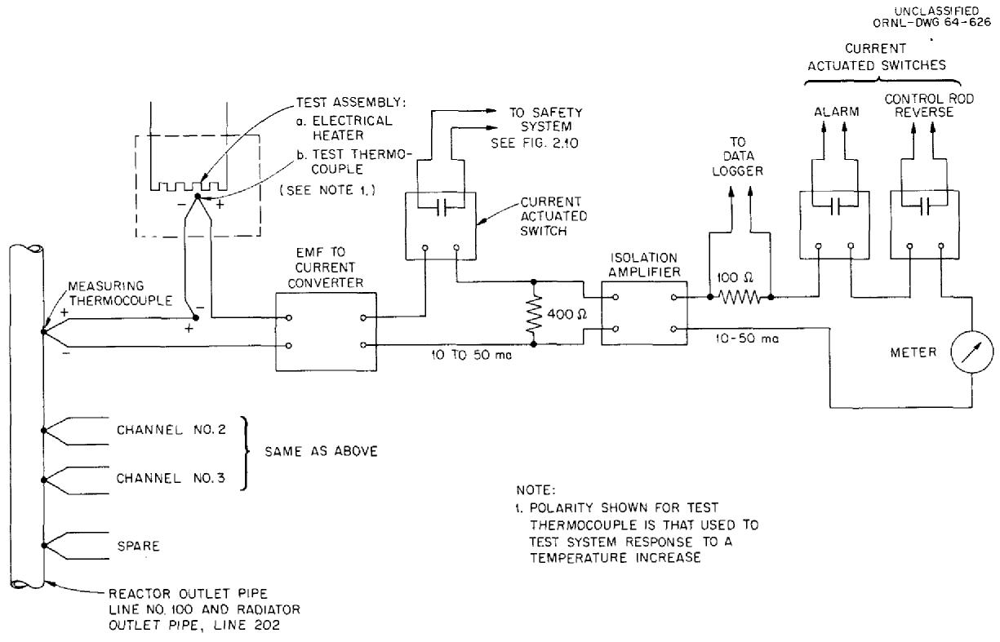  
Fig. 2.11. Typical Temperature-Measuring Channel Used in Safety System.

channel is monitored, logged, alarmed, and periodically tested during operation.

Monitoring of the safety thermocouples is provided by the burnout feature of the emf-to-current converters and comparative surveillance of the three channels. If a thermocouple breaks or becomes detached from the pipe wall, the burnout protection will cause the channel to fail toward safety, i.e., upscale. Wire-to-wire shorts or wire-to-ground shorts at points away from the thermocouple junction are detected by comparing the readings of the three channels. Operational testing of the individual channels is accomplished by use of a thermocouple test assembly (see Fig. 2.11), which consists of a small heated thermocouple assembly connected in series aiding with the reactor thermocouple. When the thermocouple heater is off, the test thermocouple is at the same temperature throughout its length, and its net generated emf will be zero; however, when the heater is on, an emf will be generated that will add to the emf of the reactor

thermocouple and cause the alarms and control circuit interlocks associated with that channel to operate. The use of two-out-of-three coincidence circuitry permits individual channels to be tested without initiating corrective safety action. The thermocouple test unit described above satisfies the requirement that operational testing shall not disable a safety channel during the test and has the advantage of simplicity, reliability, and low cost.

The radiator thermocouple test is similar, except that the test thermocouple is connected in series opposition so that heating the thermocouple reduces the net emf and simulates a temperature reduction in the radiator outlet pipe.

# 2.2.3 Radiator Door Emergency Closure System

The radiator doors are dropped automatically if conditions indicate that there is danger of freezing the salt in the radiator. An analog computer calculation has shown that a loss of coolant salt flow, with the reactor at full power, would freeze the salt in a radiator tube in not less than 44 sec.3 The calculation assumed completely stagnant salt in the radiator and made no allowance for time required for flow deceleration or for natural circulation if the particular situation permitted it.

Two types of input information (see Table 2.2) are used to initiate closure. The low-temperature signal, measured at the radiator outlet, is the primary indication that remedial action is required, regardless of the cause. On loss of flow, where temperature measurements become meaningless, the doors are dropped on low-flow signals from (1) the venturi meter in the coolant salt loop and (2) the pump speed monitors. (The temperature input information safety channels are described in the preceding section.) Also, individual radiator tubes are equipped with thermocouples which are connected to the temperature scan and alarm system.

Coolant salt flow is measured using a single venturi in the coolant salt pipe loop. With the exception of the venturi, two input channels are provided. In a typical channel, differential pressure is converted into

an electrical signal by a NaK-filled transmitter followed by an emf-to-current converter whose output is used to actuate alarm switches that serve as trips to actuate the clutch and brake in the drive mechanism.

Coolant pump speed is measured by an electromagnetic pickup mounted very close to the pump shaft coupling. Teeth, similar to gear teeth, are cut on the periphery of the coupling, and the speed pickup generates a voltage pulse as each tooth moves past it. The count rate, as determined by the speed monitor, is thus an indication of pump speed and is used as an input for alarm and safety.

The two flow signals and the speed signal are fed to a two-out-of-three coincidence matrix such that if any two reach unsafe values they will cause the doors to drop.

The two flow channels are monitored by comparison, one with the other. A loss of flow signal is simulated by shunting a resistor across one leg of the strain-gage bridge in the pressure transmitter and observing the action of the relays in the coincidence circuitry.

The pump-speed channel is tested by using the calibration switch on the speed monitor and observing relay response in the coincidence circuitry. Oscilloscope display of the input pulses affords a check on the integrity of the sensors and the wiring to the speed monitors. Low speed isannunciated.The combined system is diagrammed in Figs.2.l2 and 2.l3. Interlocks are used to turn off the blowers when a safety signal to close the radiator doors is received. The radiator heaters are maintained "on" at all times when there is salt in the coolant loop. Heater current is monitored by operating personnel as a routine administrative procedure.

# 2.2.4 Reactor Fill and Drain System

A simplified diagram is shown in Fig. 2.14 of the reactor vessel, the drain tanks, the interconnecting piping, and the control elements required to fill and drain the reactor system with fuel salt in a safe, orderly way. The control rods are essential to a safe filling procedure but are omitted from this diagram in the interest of simplification.

The reactor is filled by applying helium pressure to the gas space in the selected drain tank and forcing the molten fuel salt up and into the

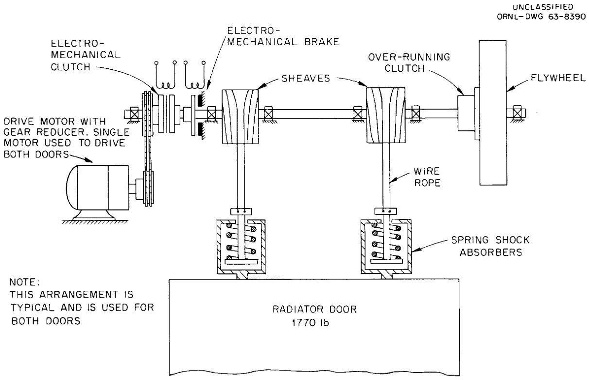  
Fig. 2.12. Radiator Door Emergency Closure System.

core vessel. As a typical example, if the reactor is to be filled from fuel drain tank No. 1 (FDT-1), pressurizing helium is admitted via lines 517 and 572 (see Fig. 2.14). The filling pressure is controlled by pressure-regulating valve PCV-517A. The pressure setting of this valve is controlled by the operator. The upstream capillary in line 517 limits the maximum flow rate in this line. Valves HCV-544 and HCV-573 in pipes which connect the gas space in FDT-1 to the pump bowl and to the charcoal beds are closed. Since the net pressure head available to produce flow decreases as the fuel level rises in the core vessel, the fill rate becomes progressively slower as the fill proceeds if constant inlet helium pressure is maintained and if the pump bowl pressure remains constant.

Helium pressure in the pump bowl is the second component of the differential pressure that drives fuel salt into the core vessel. A sudden reduction in pump bowl pressure during the reactor filling operation would cause an unscheduled rise in salt level in the core. If, at this time, the reactor were on the verge of becoming critical, an unexpected nuclear

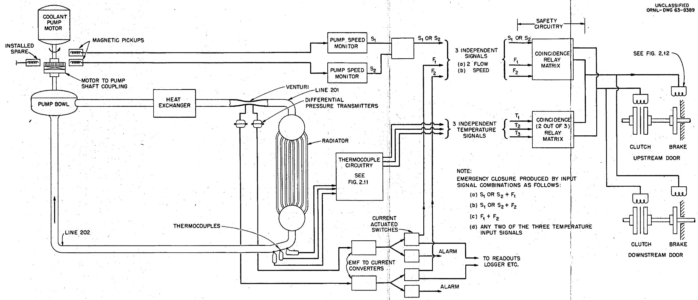  
Fig. 2.13. Pump-Speed Monitoring System.

<table><tr><td rowspan="4">Valve No.</td><td colspan="10">System Condition</td></tr><tr><td colspan="2">Pre-Fill</td><td colspan="7">Operate</td><td rowspan="3">Energ. Drain</td></tr><tr><td rowspan="2">Pre-Fill with Helium</td><td rowspan="2">Circ. No</td><td rowspan="2">Nominal Operation</td><td rowspan="2">Fill from FDT #1</td><td rowspan="2">Fill from FDT #2</td><td rowspan="2">Fill from FFT</td><td colspan="3">Norm Drain Into</td></tr><tr><td>FDT #1</td><td>FDT #2</td><td>FFT</td></tr><tr><td>PCV 517, Fill press regulate</td><td>O</td><td>X</td><td>X</td><td>O</td><td>O</td><td>O</td><td>X</td><td>X</td><td>X</td><td>X</td></tr><tr><td>HCV 572, Pill, FDT #1</td><td>X</td><td>X</td><td>X</td><td>O</td><td>X</td><td>X</td><td>X</td><td>X</td><td>X</td><td>X</td></tr><tr><td>HCV 574, Pill, FDT #2</td><td>X</td><td>X</td><td>X</td><td>X</td><td>O</td><td>X</td><td>X</td><td>X</td><td>X</td><td>X</td></tr><tr><td>HCV 576, Pill, FFT</td><td>X</td><td>X</td><td>X</td><td>X</td><td>X</td><td>O</td><td>X</td><td>X</td><td>X</td><td>X</td></tr><tr><td>HCV 544, By press</td><td>O</td><td>O</td><td>O</td><td>X</td><td>O</td><td>O</td><td>O</td><td>E</td><td>E</td><td>O</td></tr><tr><td>HCV 545, By press</td><td>O</td><td>O</td><td>O</td><td>O</td><td>X</td><td>O</td><td>E</td><td>O</td><td>E</td><td>O</td></tr><tr><td>HCV 546, By press</td><td>O</td><td>O</td><td>E</td><td>O</td><td>O</td><td>X</td><td>E</td><td>E</td><td>O</td><td>O</td></tr><tr><td>HCV 573, Vent</td><td>X</td><td>X</td><td>X</td><td>X</td><td>X</td><td>X</td><td>O</td><td></td><td></td><td>O</td></tr><tr><td>HCV 573, Vent</td><td>X</td><td>X</td><td>X</td><td>X</td><td>X</td><td>X</td><td></td><td>O</td><td></td><td>O</td></tr><tr><td>HCV 577, Vent</td><td>X</td><td>X</td><td>X</td><td>X</td><td>X</td><td>X</td><td></td><td></td><td>O</td><td>O</td></tr><tr><td>HCV 533 AI</td><td>O</td><td>X</td><td>X</td><td>O</td><td>O</td><td>O</td><td>X</td><td>X</td><td>X</td><td>X</td></tr><tr><td>HCV 919 A &amp; B</td><td>X</td><td>X</td><td>O</td><td>X</td><td>X</td><td>X</td><td>X</td><td>X</td><td>X</td><td>X</td></tr><tr><td>HCV 909 AI</td><td>O</td><td>O</td><td>O</td><td>O</td><td>X</td><td>X</td><td>O</td><td>X</td><td>X</td><td>X</td></tr><tr><td>HCV 910 AI</td><td>O</td><td>O</td><td>O</td><td>X</td><td>O</td><td>X</td><td>O</td><td>O</td><td>X</td><td>X</td></tr><tr><td>HCV 519 A &amp; B†</td><td>O</td><td>X</td><td>X</td><td>X</td><td>X</td><td>X</td><td>X</td><td>X</td><td>X</td><td>X</td></tr><tr><td>HCV 523‡</td><td>O</td><td>O</td><td>O</td><td>O</td><td>O</td><td>O</td><td>O</td><td>O</td><td>O</td><td>O</td></tr><tr><td>PCV 522 AL, No fast-down to off-pass</td><td>O</td><td>O</td><td>O</td><td>O</td><td>O</td><td>O</td><td>O</td><td>O</td><td>O</td><td>O</td></tr><tr><td>FV 103, Real drain valve</td><td>O</td><td>O</td><td>X</td><td>O</td><td>O</td><td>O</td><td>O</td><td>O</td><td>O</td><td>O</td></tr><tr><td>FV 105*</td><td>X</td><td>X</td><td>X or O*</td><td>X</td><td>O</td><td>X</td><td>X</td><td>O</td><td>X</td><td>O</td></tr><tr><td>FV 106*</td><td>X</td><td>X</td><td>O or X*</td><td>O</td><td>X</td><td>X</td><td>O</td><td>X</td><td>X</td><td>O</td></tr><tr><td>FV 107</td><td>X</td><td>X</td><td>X</td><td>X</td><td>X</td><td>X</td><td>X</td><td>X</td><td>X</td><td>X</td></tr><tr><td>FV 108</td><td>X</td><td>X</td><td>X</td><td>X</td><td>X</td><td>X</td><td>X</td><td>X</td><td>X</td><td>X</td></tr><tr><td>FV 109</td><td>X</td><td>X</td><td>X</td><td>X</td><td>X</td><td>X</td><td>X</td><td>X</td><td>X</td><td>X</td></tr></table>

X-closed;O-openerE-eitheropenorclosed.

*Dutang marnal, ovation either (but not both) FY 105 or FY 106 is open.

1

H 519 260 400 300 200 100 100 100

.

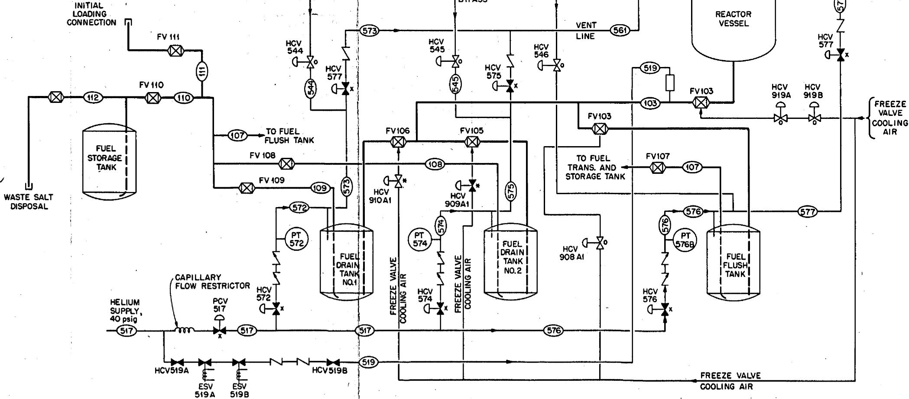  
Fig. 214. Reactor Fill and Drain System Valving.

UNCLASSIFIED ORNL-DWG 63-8395

excursion could not be ruled out. The safeguard provided is to allow filling only when the positive pressure in the pump bowl is equal to or less than +2 psig and thus keep the maximum possible increase in net filling pressure within safe limits. Two causes for a sudden decrease in pump bowl pressure are considered. First, opening valve HCV-533 after reactor filling has started would vent the pump bowl to the auxiliary charcoal beds, which operate at close to atmospheric pressure. The resultant pressure change in the pump bowl would be -2 psi. Administrative control is used to maintain HCV-533 open just before and during filling. Second, a rupture or leak would allow the escape of pump bowl helium to the reactor cell atmosphere, which is held at -2 psig (12.6 psia). This condition would cause a maximum pressure decrease in the pump bowl of 4 psi. If the fuel pump bowl pressure exceeded 2 psig, the safety equipment (1) would initiate a drain by opening the bypass valves, HCV-544, -545, and -546, and equalizing helium pressure in the drain tanks and pump bowl and (2) would shut off the supply of pressurizing helium. This is the helium valve condition shown on Fig. 2.14 and is required by normal operation with the pump bowl at 5 psig; therefore, the 2-psig channel need not be disabled during normal operation. Additional safety considerations involving pressure in the fuel salt system and the instrumentation used for measuring helium pressures is discussed in the following section.

During reactor operation helium pressure in the pump bowl is maintained at 5 psig by means of throttling valve PCV-522A1 (Fig. 2.14), which controls the flow rate of off-gas from the pump bowl. This valve is actuated by a signal from a pressure transmitter, PT-522A, on line 592, which admits helium to the pump bowl.

Excessive pressure (50 psig) in the pump bowl is relieved by opening HCV-533. During reactor operation, with the bypass lines open, one or more of the drain tanks would be subjected to this pressure. Considering the gas volumes involved, a 50-psig overpressure in these circumstances is of questionable credibility. The input signal used to open HCV-533 originates in either of a redundant pair of pressure transmitters, PT-592B or PT-589B, on inlet lines to the pump bowl and overflow tank, respectively. These same input channels provide the +2 psig safety signal discussed in the preceding paragraph.

As a further safeguard during filling, the system requires that all three control rods be partially withdrawn in order to pressurize the drain tanks. The weigh cells on the drain tanks provide information used to monitor the filling rate and the total amount of fuel salt moved into the core vessel.

The possible filling accidents are discussed in Section 7.1.4. Briefly, these accidents are (1) premature criticality during filling caused by an overly high concentration of uranium brought about by selective freezing in the drain tank; (2) premature criticality during filling of low-temperature $(900^{\circ}\mathrm{F})$ fuel salt of normal concentration, whose normal critical temperature is $1200^{\circ}\mathrm{F}$ ; and (3) premature criticality during filling of normal fuel salt at normal temperature with all control rods fully withdrawn. Protective action is the same for all three cases: (1) the control rods are scramed, and (2) the reactor vessel is drained to ensure permanent shutdown. Rod scram is produced and the vent valves HCV-573, -575, and -577 are opened by the excess flux signal. Since the criticality would be occurring before loop circulation was attained, the outlet temperature sensors would be ineffective. The safety system also invokes a reactor emergency drain to enhance containment if there is evidence that radioactivity is escaping from the primary fuel loop. These subsystems are covered in a subsequent section.

Emergency drainage is effected by the following actions (see Fig. 2.14):

1. The freeze valve in line 103 which connects the reactor to the drain tanks is thawed. Thawing is accomplished by closing valves HCV-919A and -919B, a redundant pair, to stop the flow of cooling air. The system is designed with a heat capacity sufficient to thaw the plug in 15 min.   
2. The helium pressures in the fuel drain tank and the unfilled portion of the fuel salt loop are equalized by opening bypass valves HCV-544, -545, and -546.   
3. Vent valves HCV-573, -575, and -577, which release pressurizing helium in the drain tank to the off-gas system, are opened.

4. Pressure regulating valve PCV-517Al in line 517, the inlet header that supplies pressurizing helium to all the drain tanks, is closed and shuts off the supply of pressurizing helium.   
5. The drain tank pressurizing valves HCV-572, -574, and -576 in the helium supply lines are closed to halt further addition of filling pressure.

Actions 2 or 3 are immediately and independently effective in reversing a fill, and hence the valves are redundant. Similarly, PCV-517A2 and the individual pressurizing valves, 4 and 5 above, form series pairs and provide redundancy. For example, it can be seen from Fig. 2.14 that, taking fuel drain tank No. 1 as typical, pressure equalization and venting are accomplished by opening HCV-544 and HCV-573, respectively. Administrative control is used to ensure that, when the reactor is filled with fuel salt, both drain tanks, FDT-1 and FDT-2, are empty and that one of the freeze valves, FV-106 or FV-105, is thawed. The tank condition is monitored by reference to the weigh cell and level instrumentation on each tank.

# 2.2.5 Helium Pressure Measurements in the Fuel Salt Loop

One channel of the instrumentation which measures helium pressure in the fuel pump bowl and the overflow tank is shown in Fig. 2.15. The components and their installation are designed to meet containment requirements. Since the secondary containment is held below atmospheric pressure and since the temperature therein is not closely controlled, it is necessary to use a variable-volume reference chamber to maintain atmospheric pressure on one side of the measuring bellows in the transmitter.

Two channels are used: one in the pump bowl and the other in the overflow tank. These normally operate at the same pressure. Any safety signal from either channel initiates the appropriate safety action. This is discussed in the preceding section and outlined in Tables 2.2 and 2.3.

The system may be tested periodically during reactor operation by (1) observing system response to small operator-induced pressure changes and (2) by shunting the torque motor in the pressure transmitter. These tests will establish that, in the channel undergoing test, the lines from

UNCLASSIFIED

ORNL-DWG 64-627

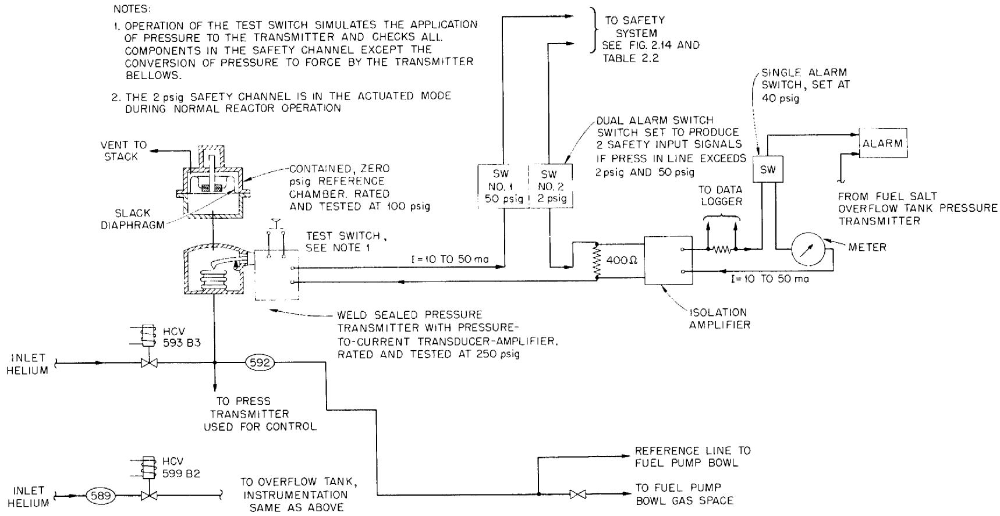  
Fig. 2.15. Typical Instrumentation for Measuring Helium Pressures in the Primary Loop.

the pump bowl (or overflow tank) are clear and that the electronic equipment and associated wiring is capable of operating the output relays. Since it takes 5 min to thaw drain valve FV-103, this time can be used to observe the response of the thermocouples on the freeze valve as it heats up but before actual salt flow begins. The valve can then be refrozen before an actual drain is initiated. In such a test, valve HCV-533 will be opened, and the regulated pressure (5 psig) in the pump bowl will be lost for the duration of the test. The response of HCV-533 can be noted by observing the actuation of the position switch on the valve stem. This test procedure checks the entire safety channel, except the ability of the transmitter measuring bellows and the associated linkage to transmit the pressure.

Monitoring of these channels is accomplished by indicating and alarming the pressure downstream from the hand throttling valves in each helium line serving the primary elements (the bubbler tubes) in the pump bowl and in the overflow tank (see Fig. 2.17 in sec. 2.2.7). A downstream flow stoppage by a blocked line is indicated by a high-pressure alarm; low flow caused by a loss of upstream (supply) pressure, an upstream blockage by foreign matter, or a hand valve closure is indicated by a low-pressure alarm.

The fuel level in the overflow tank is measured by the differential pressure across the helium bubbler probe which dips into the fuel salt in the tank. The design criteria for testing and monitoring these differential-pressure-measuring channels are the same as those which guided the design of the pressure channels described in the preceding paragraphs. The reference chamber is not required. Two channels are employed for safety and either will initiate a reactor drain if the fuel salt level in the overflow tank exceeds $20\%$ of full-scale level indication.

# 2.2.6 Afterheat Removal System

The drain tank afterheat removal system, typically the same for both drain tanks, is shown in Fig. 2.16. Once placed in operation the evaporative cooling system is designed to be self-regulating and to operate without external control. Reliable operation of the afterheat removal system

requires (1) that the feedwater tanks contain a supply of cooling water, (2) that an ample supply of cooling water is available to the condensers, and (3) that the system includes reliable valves to admit feedwater to the

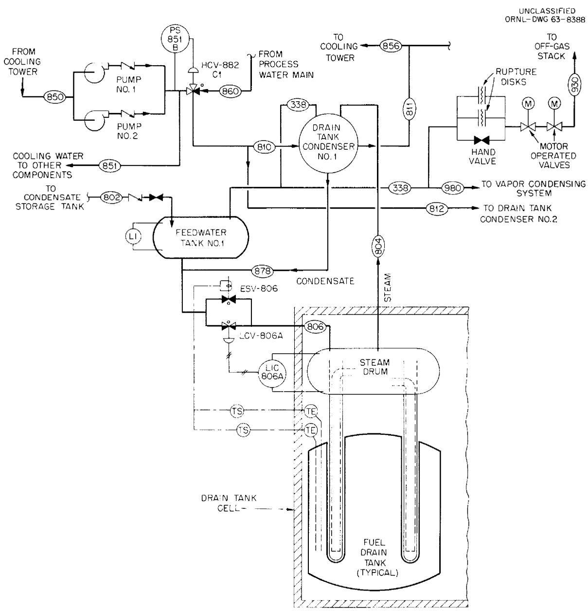  
Fig. 2.16. Afterheat Removal System.

steam drums. Administrative control is relied on to ensure that the feed-water tanks contain water. Valve ESV-806 opens to admit water automatically to the steam drum when the salt temperature in the drain tank exceeds $1300^{\circ}\mathrm{F}$ and recloses at some lower temperature to be determined experimentally. This valve is in parallel with manual valve LCV-806A, and the pair are a redundant means of valving water to the steam drum. Normally the condensers are cooled by tower cooling water, but diversion valve HCV-882C1 provides an alternate supply of condensing water. Loss of tower water is detected by pressure switch PS-851B, which operates diversion valve HCV-882C1 and supplies condenser cooling water from the process water main.

Since it takes over $12\mathrm{hr}$ for excessively high afterheat temperatures to develop after a drain, there is sufficient time to effect a transfer to the other drain tank in the event of a failure or malfunction. This is also ample time to make connections from the cooling water system to a tank truck in the event that the normal water supply is inoperative.

# 2.2.7 Containment System Instrumentation

Containment requirements are met by providing at least two independent reliable barriers, in series, between the interior of the primary system and the atmosphere. For example, the two-barrier concept is fulfilled by:

1. Two independent, reliable, controlled block valves with independent instrumentation.   
2. One controlled block valve plus a restriction such as a charcoal bed which will limit the escape of activity to the stack to less than the maximum permissible concentration.   
3. One controlled block valve plus two check valves.   
4. Two solid barriers (vessel or pipe walls).   
5. One solid barrier and one controlled block valve.   
6. One solid barrier and one check valve.

The general considerations outlined in this section apply to the instrumentation and control equipment used to operate the block valves. Block valves are not located at such a distance from the containment penetration that the lines become tenuous extensions of the containment vessel. Valves and other devices used in lieu of solid barriers will be

routinely tested and demonstrated to be capable of maintaining leakage below the specified tolerance when closed.

Helium Supply Block Valves. A diagram is presented in Fig. 2.17 that shows the helium supply lines to the primary containment vessel and the associated valves used for control and blocking these supply lines against the escape of radioactivity from the primary system as a result of reverse flow or back diffusion. Two types of input signals are used to initiate block-valve closure (see Fig. 2.9). The first, a reduction in the supply pressure from its normal value of 40 psig to 30 psig actuates pressure switches and closes all the inlet helium block valves. The second, excess radiation in any of the helium lines supplying the level probes (bubblers) and pressure-measuring instruments in the pump bowl and overflow tank, closes the block valves in these lines. A reduction in helium supply pressure in line 500 from its regulated value of 40 psig indicates a leaky rupture disk or leaky piping and a loss of primary containment.

In-service testing of the loss of pressure channels is accomplished by opening the hand valves on the lines to the pressure switches on the main supply pipe (line 500), one at a time, and observing the action of the relays in the two-out-of-three coincidence matrix in the control room. Actual block-valve closure is not tested with this procedure. Low- and high-pressure alarms are provided on line 500; these will actuate before the safety system pressure switches close the block valves.

Additional testing of the solenoid block valves in the helium bubbler lines is provided by closing each valve individually and observing the pressure change downstream of the hard throttling valve.

The three radiation-monitoring safety input channels, RM-596A, B, and C, are tested by exposing each individual radiation element to a source and noting the response of the output relays which produce valve closure. Since two-out-of-three coincidence is used, this test will not perturb the system; neither does it provide a valve-closure test.

Off-Gas System Monitoring and Block Valves. The off-gas system, Figs. 2.18 and 2.19, is monitored for excess radiation in four places:

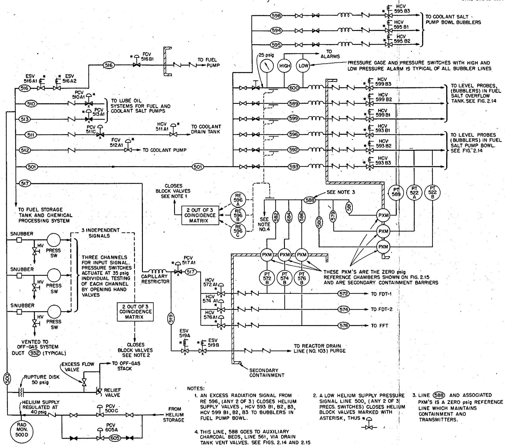  
Fig. 2.17. Helium Supply Block Valving.

UNCLASSIFIED

ORNL-DWG 63-8397

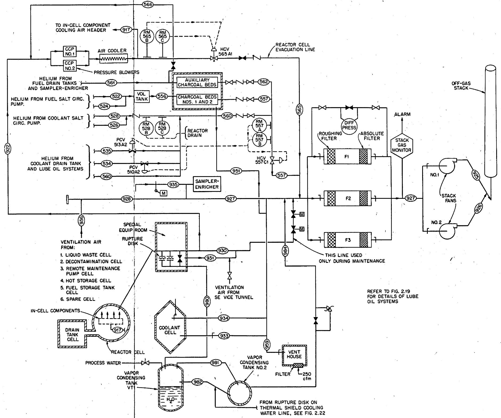  
Fig. 2.18. Off-Gas System Instrumentation and Valving.

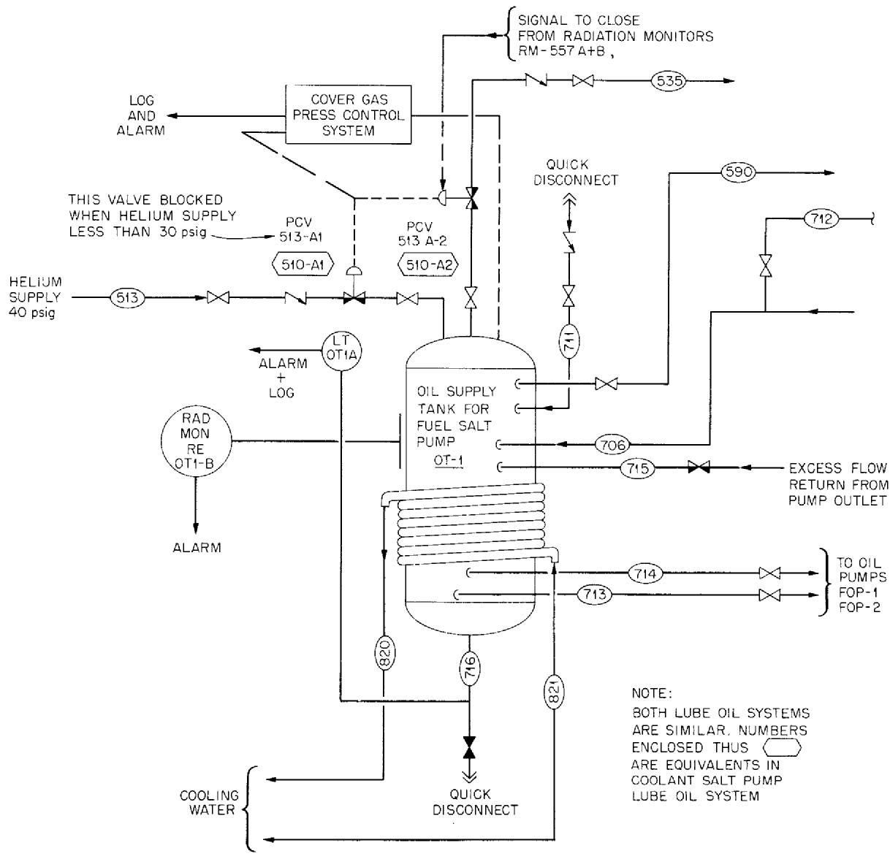  
Fig. 2.19. Lube Oil System Off-Gas Monitors.

1. Line 557, which carries off-gas from (a) all charcoal beds, lines 562, and 557, (b) helium from the coolant salt pump, lines 526, and 528, (c) helium from fuel and coolant salt pump lube-oil systems, lines 534, and 535, and (d) helium from coolant salt drain tank and line 560.   
2. Line 528, which carries helium from the coolant salt pump bowl [duplicates 1 (b) above].

3. Line 565, the reactor cell evacuation line.   
4. Line 927, the main inlet line to the stack fans.

As shown on Fig. 2.9 and Tables 2.2 and 2.3, these different radiation monitors do not have a common output. A high radiation signal from RM-557A or RM-557B in line 557 blocks helium flow from the lube oil systems, Fig. 2.19, by closing valves PCV-510A2 and PCV-513A2. It also closes HCV-557C1 and blocks line 557, which is, in effect, a header carrying the flows listed above. Blocking of the lube-oil-system off-gas is, therefore, redundant. A high radiation signal from the radiation monitors in line 565 closes HCV-565A1 and blocks this line only and thus prevents cell evacuation. A high radiation signal from the radiation monitors in line 528 carrying helium from the coolant pump initiates a drain. This particular monitor is deemed necessary because it provides an indication that there exists a leak in the salt-to-salt heat exchanger (from the fuel salt loop to the coolant salt loop). Such a leak could put fission products in the coolant salt; however, when the coolant salt circulating pump is running, the coolant salt pressure in the heat exchanger tubes is greater than the fuel salt pressure in the shell. The fission-product gases would be carried from the free surface in the coolant salt pump bowl into line 528. This activity would be read by RM-557A or B or both shortly after being first read by RM-528A or B or both. Blocking as described above would then follow and the protection afforded against this heat exchanger leak is thus redundant.

The system is tested by inserting a radiation source in the radiation monitor shields and observing (1) the radiation-monitor indicator, (2) the control circuit relays, and (3) the action of the control valves which provide blocking. The three pairs of radiation monitors, RM-528A and B, RM-557A and B, and RM-565A and B, all operate such that an excess radiation signal from either channel in a pair will produce safety action.

Insertion of a radiation source in any one monitor will cause all block valves associated with that particular monitor to close. Testing of RM-565 or RM-528 will initiate a reactor drain, and unless the test is completed within 5 min, the time required to thaw freeze valve 103,

an actual drain will be established. The other channels may be tested for longer periods of time without affecting operations.

The stack gas monitor (item 4 above) on line 927 monitors off-gas activity from all the other sources just before the filtered off-gas enters the stack blowers. Excess activity is alarmed in the control room and another alarm signal is transmitted to the ORNL Central Monitoring Facility.

In-Cell Liquid Waste and Instrument Air Block Valves. As indicated by Fig. 2.9, the in-cell (secondary containment) liquid waste lines are blocked if the reactor cell pressure exceeds 2 psig (17 psia). The normal operating pressure is 13 psia. Excess cell pressure is a symptom of system malfunction or, at worst, the maximum credible accident (see sec. 8.5).

The system and its operation are shown on Figs. 2.20 and 2.21. Three independent pressure-measuring channels with trips (pressure switches) are employed as inputs. The pressure-switch outputs go to a two-out-of-three coincidence matrix. If any two input channels indicate a positive cell pressure equal to or more than 2 psig, the block valves in the lines from the reactor and drain tank cell sumps to the liquid waste tank are closed. The instrument air lines into the containment vessel are blocked at the same time. Since each pressure-switch contact is connected to a different power source (see Fig. 2.21), any single power failure will not produce blocking, and no single channel or component failure will disable the system.

The pressure switches are mounted close to the cell wall and are accessible during reactor shutdown. The pressure gages and hand valves are mounted on a test panel located in an area which is accessible during power operation. Each pressure switch is connected to a separate tap on the reactor containment vessel. Lengths of lines between the snubber, hand valve, gages, and the switch are as short as is consistent with the location requirements. Wiring in the three channels is run in conduits separate from each other and from control-grade wiring.

The switches are connected to a two-out-of-three solenoid matrix in the manner shown in Fig. 2.21. The circuit shown is a simplified schematic. A relay will be required to operate other block valves.

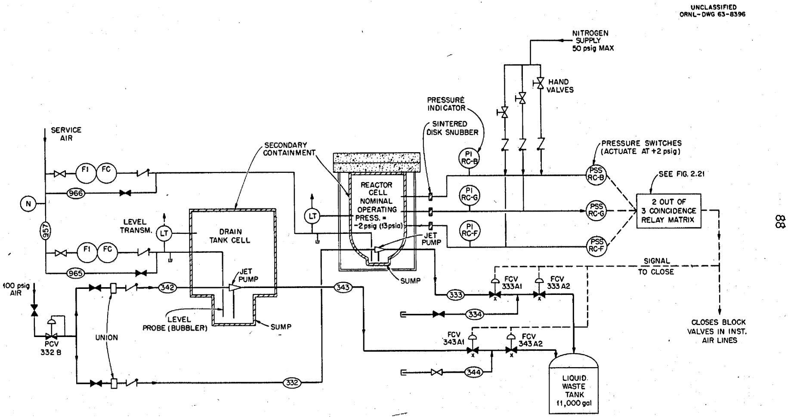  
Fig. 2.20. In-Cell Liquid Waste and Instrument Air Block Valving.

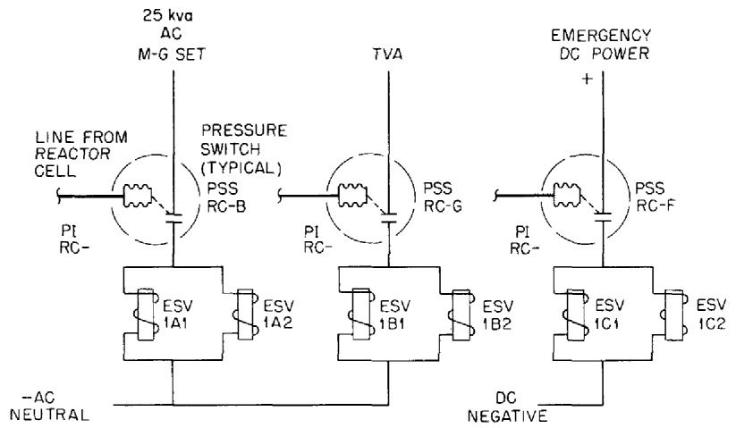  
UNCLASSIFIED ORNL $\equiv$ DWG 63-8392

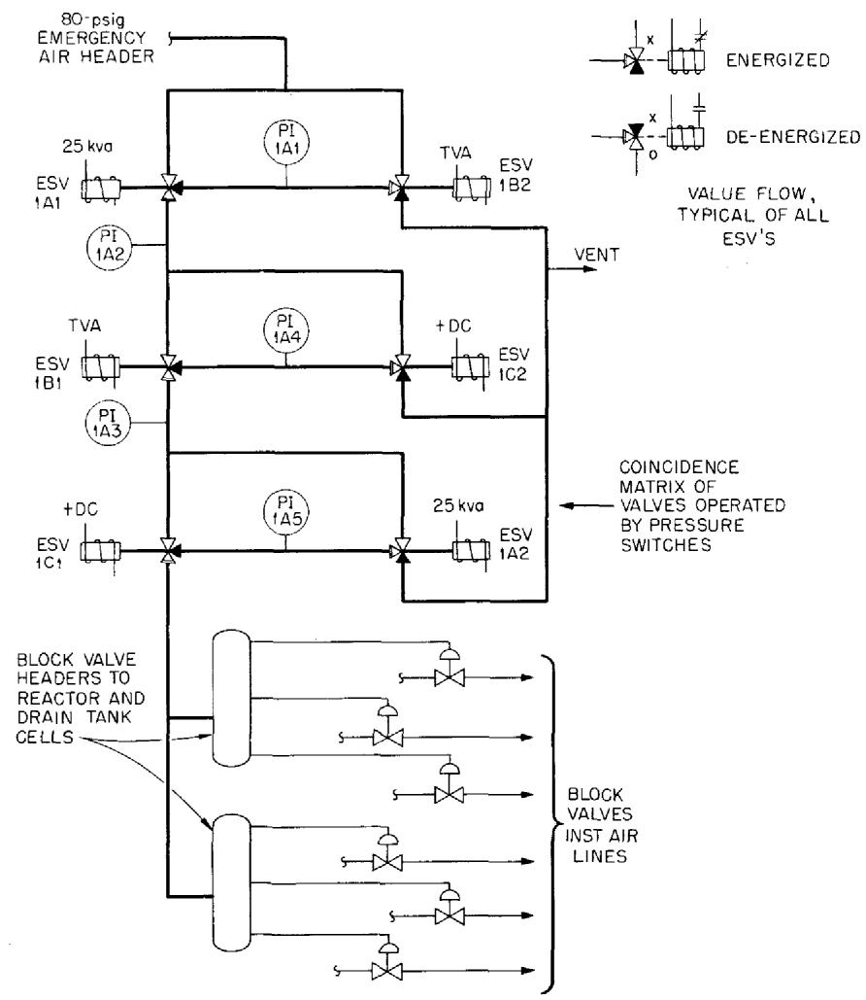  
Fig. 2.21. Pressure Switch Matrix Used with Instrument Air Line Block Valves.

The pressure channels will be tested by slowly opening the hand valves in the nitrogen supply lines, one at a time, and observing pressure changes in the pneumatic circuits that operate the block valves (for example, see Fig. 2.20). If the nitrogen valve in the left hand line is opened, pressure switch PSS-RC-B will be actuated and the actuating pressure may be checked with the gage, PI-RC-B. As shown in Fig. 2.21, actuating this pressure switch deenergizes two solenoid valves, ESV-lA1 and ESV-lA2, in the six-valve matrix. The line carrying PI-lA5 will be vented to the atmosphere, and PI-lA5 will read zero.

The other two channels are tested in a similar way by observing pressure gages PI-1A1 and PI-1A4, respectively. The tests do not actuate the block valves, since the coincidence matrix requires agreement of any two of the three input channels to vent the block valve headers to atmospheric pressure.

In-Cell Cooling-Water Block Valves. A simplified flow diagram of the in-cell cooling-water system, with instrumented block valves, is shown in Fig. 2.22. The signal to close the block valves is provided by an excess radiation level in the pump return header, line 827. Three independent sensors, RE-827A, B, and C, are used that operate in two-out-of-three coincidence; i.e., block valve operation is initiated when any two of the input channels indicate excess radiation in line 827. This system permits the loss of one sensing channel by malfunction or for maintenance. In these circumstances, a signal from either of the remaining channels will actuate the block valves. Operation of the system is apparent from Fig. 2.22. Testing is accomplished during operation by manually inserting a radiation source in the monitor shield and observing that the indicated radiation level increases and that the proper relays operate. The construction of the sensor shield is such that each radiation monitoring channel can be tested individually. Since the monitor contacts are arranged in two-out-of-three coincidence, testing of individual channels does not close the valves. The valves will be tested individually by operating a hand switch and observing that flow stops in the line under test. The complete system can be tested during shutdown.

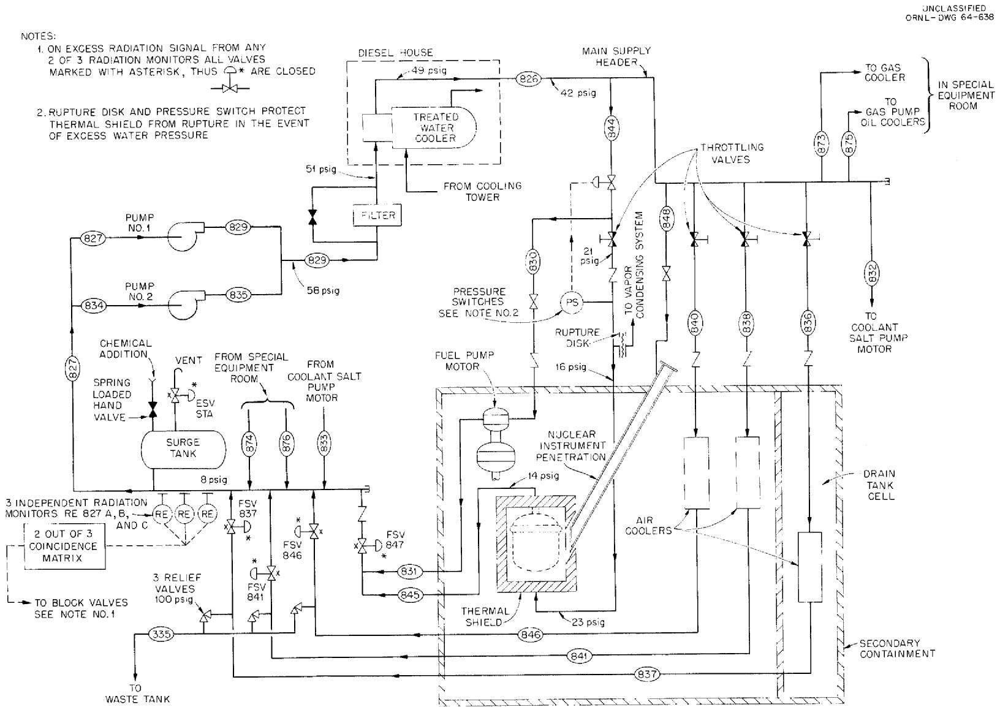  
Fig. 2.22. In-Cell Cooling Water System Block Valving.

Valve ESV-ST-A serves as a backup to FSV-837, FSV-846, FSV-841, and FSV-847 and provides redundant blocking in the system. The thermal shield is protected from excess hydraulic pressure by interlocked blocking of the inlet, line 844. The pressure switch on this line closes valve FSV-844Al. The rupture disk protects against overpressure if a temperature rise takes place when the thermal shield is isolated by the block valves or other flow stoppage. Discharge through the rupture disk passes into the vapor-condensing system and is contained.

# 2.2.8 Health-Physics Radiation Monitoring

The purpose of the radiation monitoring system is to provide personnel protection throughout Building 7503 from radiation hazards due to airborne and fixed-source activity. The monitors composing this system are placed at strategically located points throughout the building (see Fig. 2.23). All the monitors that measure area activity and airborne activity produce signals which are transmitted to a central annunciator and control panel located in the reactor auxiliary control room. These monitors also produce a building-evacuation signal based upon a coincidence of combined monitor operation.

The criteria for the number, location, and arrangement of the Health Physics monitors were established by the ORNL Radiation Safety and Control Office assisted by the reactor operations group. The locations of the monitors in Building 7503 are shown in Figs. 2.23 and 2.24.

The continuous air monitors (seven required) are located within the building so that the air-flow patterns will sweep air past these units to monitor for airborne activity. Two monitors are in the high-bay area, one in the control room office area, and three in the basement working area. A seventh instrument is a mobile unit for special operations. Eight fixed monitrons for low-level gamma detection are located in the same general arrangement as the constant air monitors.

Very sensitive beta-gamma monitors (GM-tube count-rate meters) are used in contamination free areas for clothing and body surveys. Two of these devices are used for process monitoring, one in the cooling water room and one in the vent house.

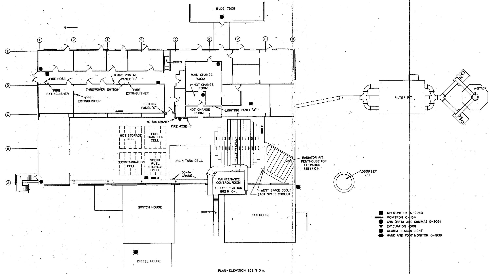

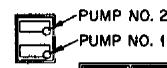  
Fig. 2.23. Reactor Building (7503) at 852-ft Elevation Showing Locations of Monitors.

PUMP NO. 2

PUMP NO.1

#

$\frac{1}{2} =$

中

COOLING TOWER

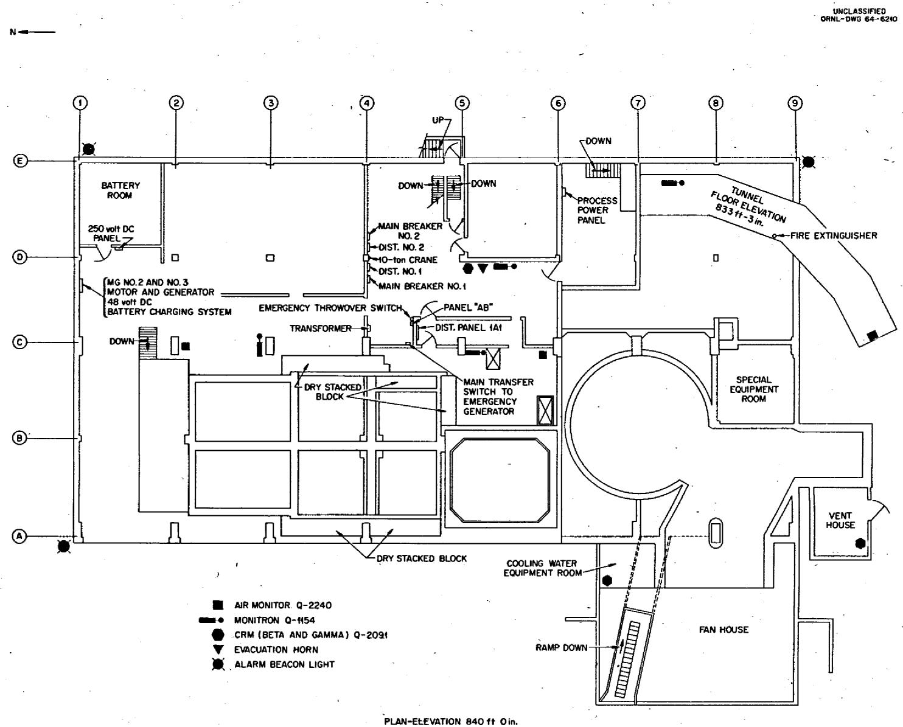  
Fig. 2.24. Reactor Building (7503) at 840-ft Elevation Showing Locations of Monitors.

A selected group of constant air monitors and monitrons form the two input channels, contamination and radiation, respectively, which actuate the building-evacuation system. The output signals from the monitors in each channel are transmitted to a central annunciator panel located in the auxiliary control room.

Excessive radiation signals from two monitors in either the radiation or contamination channel will cause the evacuation siren to sound. At the same time, four beacon lights at the corners of the building will begin flashing and a signal will be sent to Guard Headquarters. Also, a manual evacuation switch is available on the reactor console.

On the constant air monitors and the monitrons, there is an intermediate alarm. When a monitor reaches this set point, the indicator lamp on that monitor input module is lighted and a local buzzer sounded. This buzzer is located in the HP annunciator panel. At the same time this buzzer sounds, an annunciator in the control room indicates that a health physics instrument is in the alarmed state. This alarm signal is also produced by an instrument malfunction, since both the constant air monitors and monitrons produce a signal upon instrument failure.

An administrative procedure involving both reactor operations and health physics is used to ensure adequate protection during reactor maintenance periods without causing false evacuation signals. This is implemented by two key-locked switches, one in the main control room and the second in the maintenance control room (see Fig. 2.39 in sec. 2.6). Operating either of these switches prevents the monitors from actuating the alarm sirens and beacon lights and switches any evacuation signal to Guard Headquarters. The established procedure requires the Chief of Operations to call Guard Headquarters and to evacuate the area of all personnel except those essential to the particular maintenance operation involved. The Chief of Operations then throws the key-locked switches and disables the alarm sirens. The manual evacuation switches can be used to override the alarm cutout should evacuation be required. The individual monitor alarms and the main annunciator still continue to function.

# 2.3 Control Instrumentation

# 2.3.1 Nuclear Instrumentation

The normal operating ranges of the nuclear instrumentation are listed above in Table 2.4, and the safety channels were described in Section 2.2. The nuclear instrumentation used for reactor control consists of two wide-range counting channels and two linear power channels, as described below.

In addition, provision is made for two temporary $\mathbf{BF}_3$ counter channels (Fig. 2.25), which will be used for the initial critical experiments and other low-level nuclear tests. These counters will be located in vertical holes near the inner periphery of the annular thermal shield, as shown in Fig. 2.26. Also, extra tubes are available in the neutron instrument penetration, as described below.

All permanent neutron sensors and a portion of the associated electrical and electronic components shown on Figs. 2.10, 2.27, and 2.28 are located in the nuclear instrument penetration, a 36-in.-diam, water-filled, steel tube. The upper end of the tube terminates on the main floor (852-ft level), and the lower end penetrates the thermal shield at the horizontal midplane of the reactor core. The penetration is inclined at an angle of $42^{\circ}$ from the horizontal; its design and location are depicted in Figs. 2.26 and 2.29.

Each sensing chamber is located and supported within the penetration by an individual aluminum tube. The chamber housings are loose fits in the

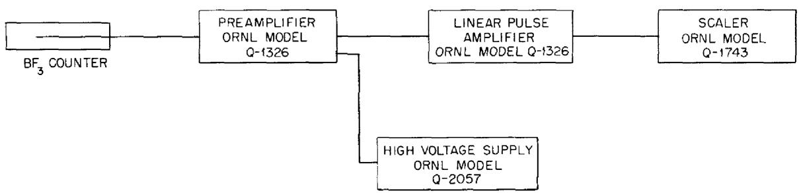  
UNCLASSIFIED ORNL-DWG64-624   
Fig. 2.25. Typical Low-Level $\mathbf{BF}_3$ Counting Channel for Initial Critical Tests.

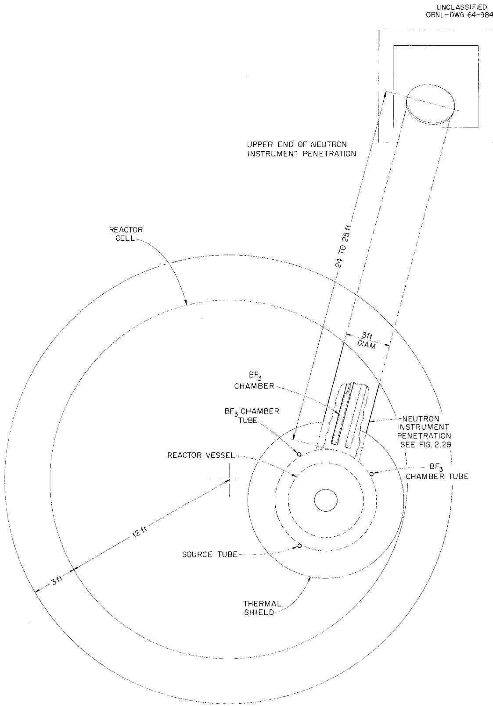  
Fig. 2.26. Locations of $\mathrm{BF}_3$ Chambers.

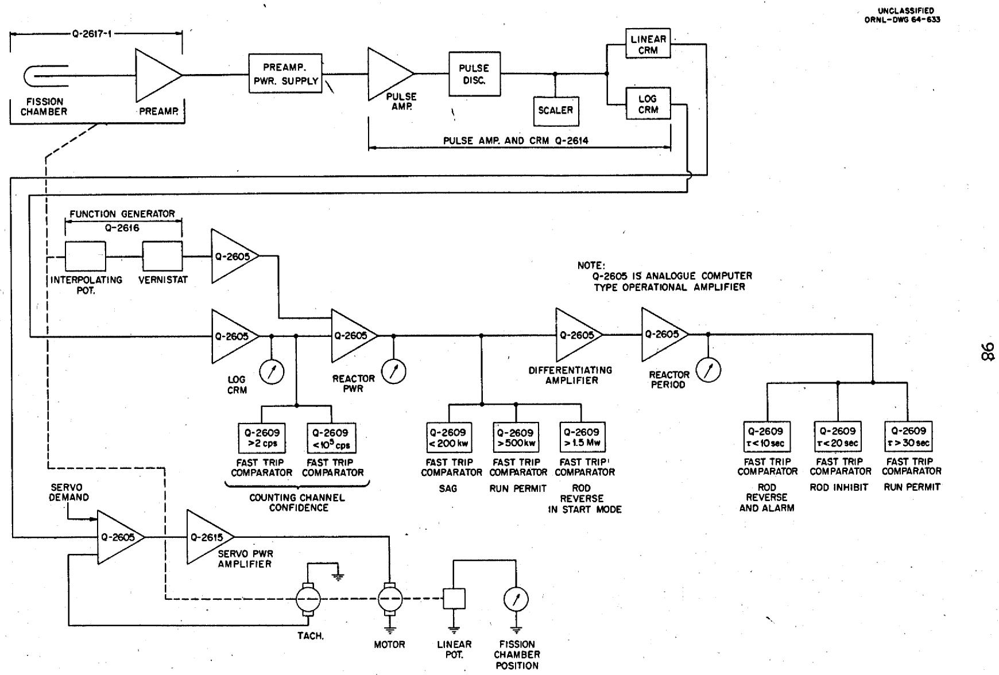  
Fig. 2.27. Wide-Range Counting Channel.

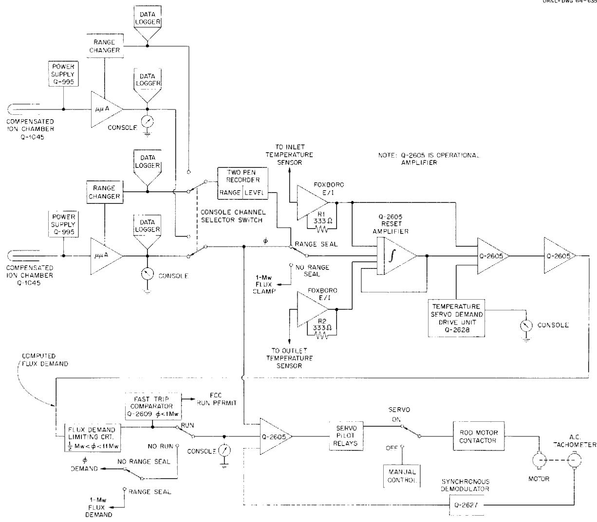  
Fig. 2.28. Linear Power Channels and Automatic Rod Controller.

tubes so that chamber positioning can be accomplished by moving the chamber axially within the tube.

A float-type water-level indicator is used that will alarm on low water level. Water supply to the tube is controlled manually by a hand valve. An overflow pipe near the top of the penetration limits the upper water level.

The normal water level provides ample biological radiation shielding. In addition to the level alarm, monitron No. 2 (see Fig. 2.23) will alarm on an excessive radiation level in the region near the top end of the

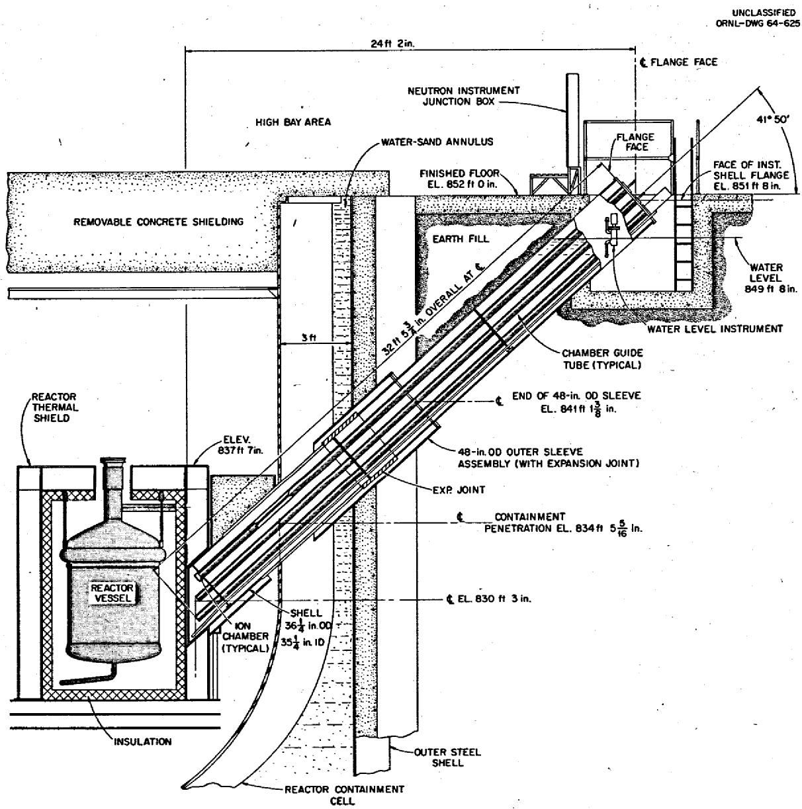  
Fig. 2.29. Nuclear Instrumentation Penetration.

penetration. A similar installation was used successfully in the Homogeneous Reactor Experiment (HRE-2).

Wide-Range Counting Channels. The entire operating range of the reactor is monitored by two counting channels, using automatic positioning of the fission chambers to extend the limited range of the more usual arrangement.4 The block diagram of one such channel is shown in Fig. 2.27. The technique makes use of the variation of neutron flux with detector

position, which is nearly exponential in most shielding configurations. The function generator is used to make the detector-position signal more nearly proportional to the logarithm of the neutron attenuation. Adding this signal to a signal proportional to the logarithm of the counting rate gives a resultant signal proportional to the logarithm of the reactor power. Computing a suitable derivative then yields the reactor period. The chamber is moved by a drive mechanism under the control of a small servo system, whose function is to attempt to maintain a constant counting rate of $10^{4}$ counts/sec.

When the reactor is shut down, the counting rate is much less than $10^{4}$ counts/sec, and the servo drives the detector to its innermost position. As the reactor is started up, the counting rate increases and causes the indicated reactor power to increase correspondingly. As the startup proceeds to higher power, the counting rate reaches $10^{4}$ counts/sec, and the servo withdraws the detector, keeping the counting rate constant; the change in detector position then increases the indicated reactor power.

The servo need only be fast enough to follow normal maneuvers; any transients which are too fast for the servo will change the counting rate, and the channel will read correctly in spite of the lagging servo. The advantages of this technique are the absence of any necessity for range switching or any other action by the operator, the wide range covered, and the elimination of the "dead time" induced when the chamber is withdrawn quickly, as in other methods. Further, operation is always at an optimum counting rate when sufficient flux is available.

Linear Power Channels and Automatic Rod Controller. There are two linear power channels in the MSRE. Each channel consists of a compensated ionization chamber, power supply, and linear picoammeter, with remote range switching. Either of the two channels can be used to provide the flux input signal to the automatic rod controller, and both can be used for monitoring reactor flux level over a range of about six decades. A block diagram of the two flux channels and the automatic rod controller is shown in Fig. 2.28.

The automatic rod controller has two modes of operation. When the reactor is in the "start" mode (see discussion of modes in the next section), the automatic rod controller is a conventional on-off flux servo. The set point, in terms of neutron flux, depends upon the range of the picoammeter selected by the operator. Continuous adjustment is available. The maximum set point attainable in this mode corresponds to a power of approximately 1.5 Mw. At such low power levels the effect of power on temperature is slight; however, the operator must adjust the thermal load to keep the system temperatures within acceptable operating limits. When the reactor is in the "run" mode, the automatic rod controller becomes a reactor temperature controller, with the temperature set point adjustable by the operator.

When the servo controller is operating as a temperature controller its principal function is to augment the natural temperature coefficient of the reactor and to provide the reactivity changes required to compensate the small $[-10^{-4} (8k/k)/Mw]$ power coefficient of reactivity. The average reactor power will, over a period of time, tend to follow the load demands with only small changes in average core outlet temperature. The thermal capacities of the system are large and the power density is low; this, plus the long transport lags in the system, result in long time constants and delayed coupling between the power demand and the power being generated in the core. Analog simulation has shown that without supplementary control, the reactor's response to changes in load are slow and characterized by flux and temperature overshoots and oscillations. The rod control servo, operating to hold core outlet temperature constant, makes up for these deficiencies in inherent control at a rate which causes a minimum of system perturbation.

The servo controller, $^{5,6}$ see Fig. 2.30, compares measured reactor flux, $\phi$ , with the measured temperature rise, $\Delta T$ , in the core and computes

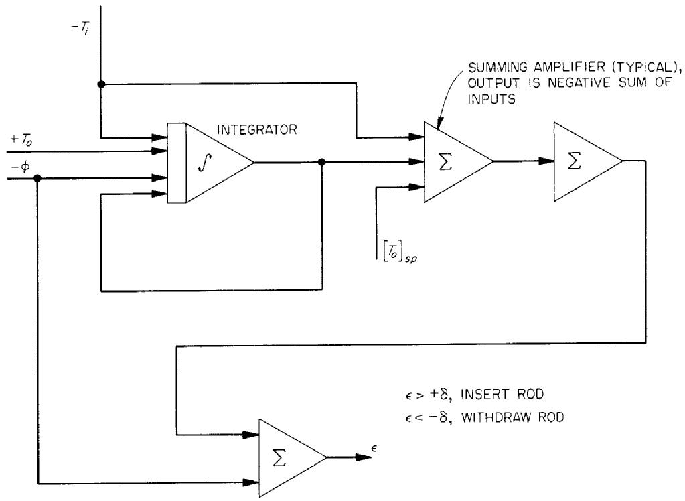

$T_{i} =$ FUEL SALT TEMPERATURE, CORE INLET  
$T_{0} =$ FUEL SALT TEMPERATURE, CORE OUTLET  
$\phi =$ NEUTRONFLUX   
$\left[T_{0}\right]_{sp} =$ SET POINT, FUEL SALT OUTLET TEMPERATURE

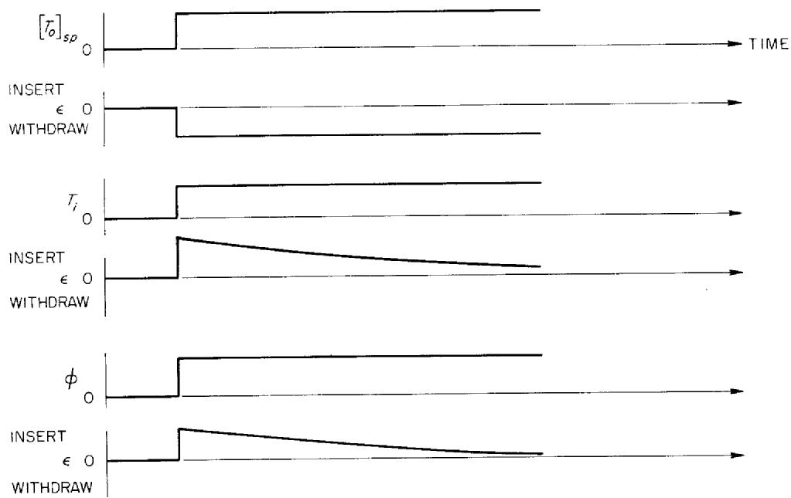  
Fig. 2.30. Computer Diagram for Servo-Controller Simulation.

a flux demand signal which, in turn, is used to produce the appropriate regulating rod motion so that reactor flux is adjusted to meet the load demand at rates equal to the rates of demand changes. The controller includes a slow reset element that corrects (slowly reduces) the error signal on a long time scale. The rate of reset is such that it has little effect on the transient error signal brought about by load changes. This reset element acts so that slow drifts and calibration errors of the temperature and flux sensors do not affect the servo's ability to make the reactor follow changes in load. If, however, the outlet temperature thermocouple drifts, the reactor outlet temperature will follow the drift and system temperatures will be raised or lowered accordingly. Such a change will be apparent to the operator since system temperatures are monitored frequently and in many places.

Figure 2.31 shows the result of an analog simulation of the response of the reactor to step changes in load from 10 to $0\mathrm{Mw}$ and back to $10\mathrm{Mw}$ . The temperature of the salt leaving the reactor shows no appreciable deviation from set point, except after $t = 250$ sec, when the controller is forced by its limiting action to hold the power at $\sim 0.5\mathrm{Mw}$ with no heat loss. The behavior of various system temperatures as the temperature set point is linearly decreased and increased at $5^{\circ} / \mathrm{min}$ , while the load is held constant at $10\mathrm{Mw}$ , is shown in Fig. 2.32.

# 2.3.2 Plant Control

Because of the conflicting control requirements under different operating conditions, the control system has been designed to operate in several modes selected by the operator. These are shown in the block diagram in Fig. 2.33. The "prefill" mode is that mode of operation during which the reactor is empty and certain manipulations of the helium and salt systems are required. This mode provides interlocks to prevent filling of the reactor while allowing transfer of fuel or flush salt between storage tanks. Circulation of helium for cleanup and for heating or cooling can also be maintained. The "operate" mode is used for filling the reactor and for all operations associated with a full reactor. In the "operate" mode the transfer of fuel or flush salt between tanks is prohibited.

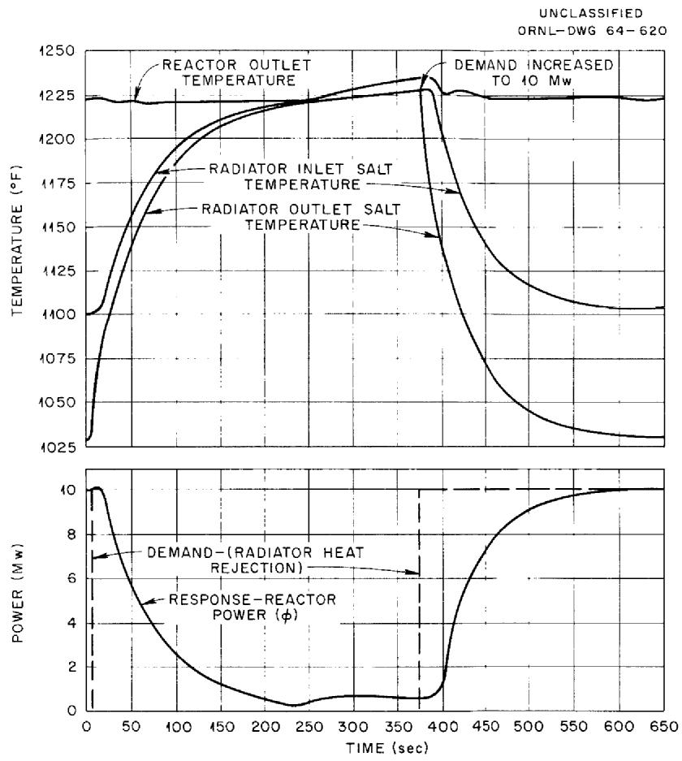  
Fig. 2.31. Results of Analog Simulation of System Response to Step Changes in Power Demand with Reactor on Automatic Temperature Servo Control.

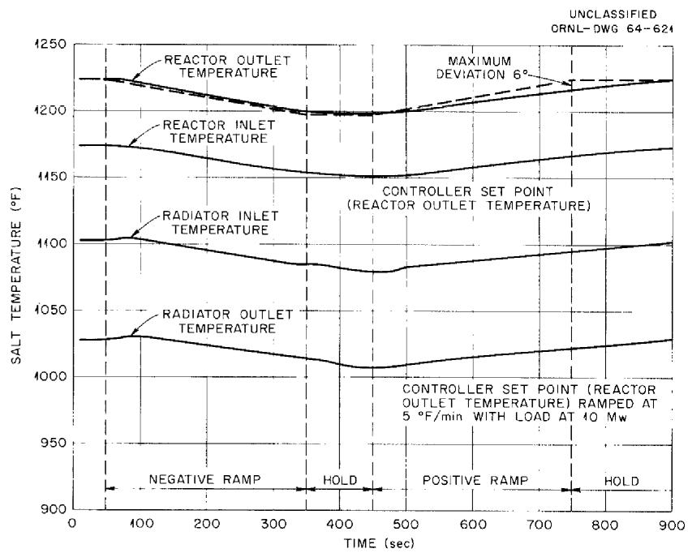  
Fig. 2.32. Results of Analog Simulation of Reactor Response to Ramped Changes in Outlet Temperature Set Point with Reactor Under Automatic Control.

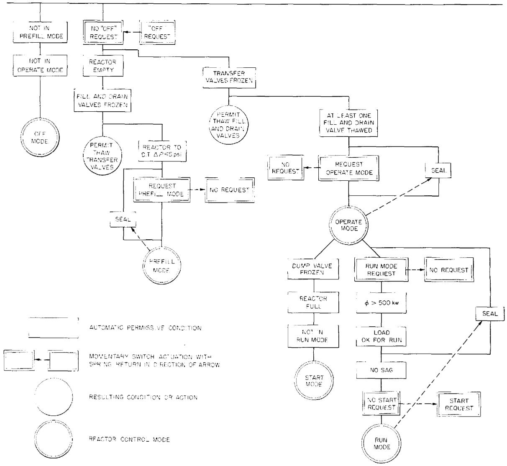  
Fig. 2.33. Simplified Master Plant Control Block Diagram.

Inasmuch as the reactor may be empty, yet conditions for the prefetch mode are not satisfied, or full and the conditions for the operate mode are not satisfied, the third mode is defined as the mode when neither of the other two exists and is called the "off" mode. When the off mode exists, none of the usual operations involving pressurization, circulation of helium or fuel, or manipulation of the control rods is permitted.

For nuclear operation of the reactor it is necessary that the reactor be full, and the fuel should be circulating. Under these conditions the reactor system may be operated in either the "start" mode or the "run"

mode. (These are, in a sense, submodes of the operate mode.) The start mode is used for all power levels up to about 1 Mw, at which point thermal effects become significant. The run mode is used for power levels between 1 Mw and the design point of 10 Mw.

Control of the nuclear operation of the MSRE includes control of heat generation and of heat removal. To attain steady state, it is clear that the two quantities must be made equal. For low-level operation the reactor neutron flux is considered to be the most significant reactor parameter, although system temperatures must be held within safe limits. Inasmuch as at power levels less than about 1 Mw the maximum rate of change of system temperature with no heat loss is of the order of a few degrees per minute, the use of flux control at these power levels does not pose much of a problem in adjusting the cooling capacity of the radiator to control temperature. Therefore, when the reactor system is in the start mode, where the maximum power allowed is 1.5 Mw, the flux and thermal load are independently controlled. The use of an automatic flux controller aids in such independent control by effectively decoupling the flux from any temperature feedback brought about by load changes or by changes in electrical heat input from loop heaters.

In the power range above 1 Mw, the problems of independent control of power and of temperature become more difficult. The control system for high-power operation of the MSRE, with its capability demonstrated by analog analysis, permits the operator to adjust the heat removal rate by manipulation of the radiator components while an automatic rod controller is used to maintain the desired reactor salt outlet temperature. The automatic rod controller has a temperature setpoint that is adjustable by the operator at a maximum rate of a few degrees Fahrenheit per minute. In addition, the control of the load has been programmed so that the operator need only actuate a single switch to increase or decrease the load over the entire range at a rate compatible with the temperature controller's capability. In practice, the automatic rod controller changes its mode of operation from flux to temperature when the reactor operating mode is changed from start to run.

The capability of the automatic rod controller to make the reactor closely follow its load at all power levels from 1 to $10\mathrm{Mw}$ , with independent control of reactor outlet temperature and load, will be a great asset to the reactor operator. However, manual modes of operation have been provided for greater flexibility in the experimental program.

Rod Control. A simplified block diagram of the rod control system is shown in Fig. 2.34. In general, manual withdrawal of the three shim rods is permitted if the reactor period is not shorter than 10 sec and if no automatic rod insertion ("reverse") signal exists. Reverse and the conditions producing it are discussed in a subsequent paragraph.

In addition to manual operation of the rods, there is an automatic rod control, or "servo," mode of operation. In the servo mode, one of the shim rod drive motors is controlled by signals from the automatic rod controller described in the preceding section. In such operation, the operator exercises control over the position of the servo-controlled rod (called the shim regulating rod) by adjustment of the other rods.

The regulating rod limit assembly (Fig. 2.35) is an electromechanical device used to limit the stroke of the servo-controlled rod. Figure 2.36 is a diagram of the associated circuitry. This diagram is a simplified version of the actual control circuits in that it omits administrative and supervisory contacts, upper and lower rod limit contacts, etc.

Referring to Fig. 2.35, it can be seen that, by means of the mechanical differential, the net rotation of the limit switch cam is the resultant of two components: (1) the rotation produced by the balance motor and (2) the rotation of the shim locating motor. When the reactor is in the servo control mode and if the operator is not relocating the position of the regulating rod span, the balance motor, driving through the clutch (the brake is disengaged) and the differential, rotates the limit switch cam through an angle that is directly proportional to the linear motion of the servo-controlled rod. It is assumed for the sake of discussion that the reactor is being operated in steady state and that no fuel is being added. Burnup and poisoning will cause slow withdrawal of the servo controlled rod unless the reactor is manually shimmed by the other two rods. If no

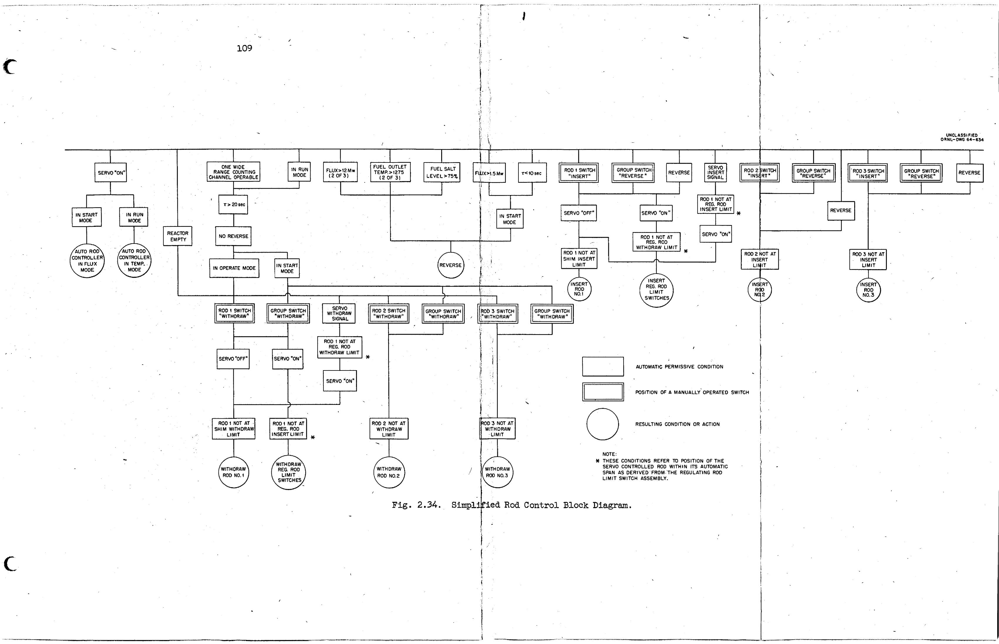

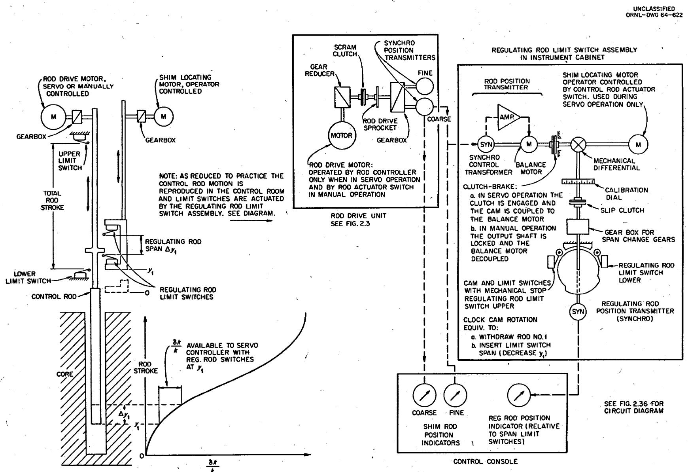  
Fig. 2.35. Regulating Rod Limit Switch Assembly.

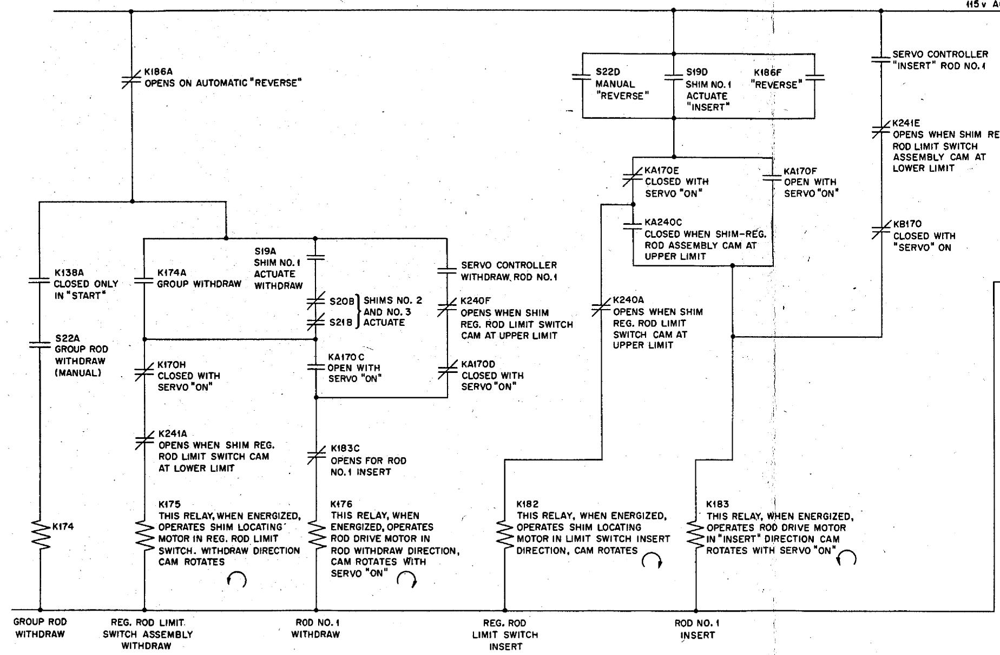

115v AC

Fig. 2.36. Regulating Rod Control Circuit.   
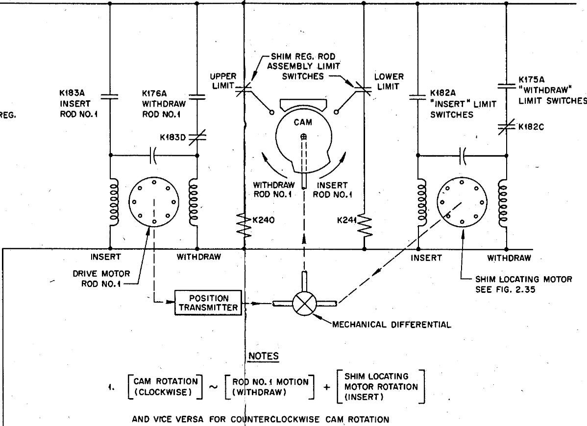  
2. REFER TO FIG. 2.35 FOR DETAILED DIAGRAM OF CAM DRIVE   
3. SWITCH AND RELAY CONTACT ASPECT (OPEN OR CLOSED) ON THIS SKETC K IS FOR FOLLOWING CONDITIONS:   
1. SERVO "ON", ZERO ERROR SIGNAL   
2. REACTOR SYSTEM IN OPERATE-RUN MODES  
3. REGULATING ROD BETWEEN LIMITS

shimming takes place, the limit switch cam will continue to rotate clockwise, and unless the shim locating motor is actuated to produce counterclockwise cam rotation the upper shim regulating rod limit switch will be opened, its associated relay No. K240 will drop out, and contact No. K240F (see Fig. 2.36) will open. This will prevent the servo system withdraw relay from transmitting power to the rod withdraw relay (No. K176). Note that the servo system is not turned off and that it continues to exert control in the "rod insert" direction; i.e., if for any reason the servo calls for the insertion of negative reactivity with the servo rod at the upper limit of the regulating rod span, the rod insert requirement will be transmitted to relay K183, which causes the rod drive motor to insert the rod. This rod No. 1 insert relay, K183, cross interlocks the No. 1 rod withdraw relay, K176, such that an "insert" request from any source overrides all "withdraw" requests. The operator must now shim the reactor. If he chooses to shim by using rod No. 1, the servo controlled rod, he does so by means of the individual rod control switch (S19) used for manual operation. This closes contact S19A and energizes K175, the relay which causes the shim locating motor to turn the cam counterclockwise. The limit switch closes, contact K240F closes, and the servo is in command of rod No. 1. The servo now withdraws rod No. 1 until the upper limit is again reached or until shimming requirements are met. Since the shim relocating motor moves the cam at a slightly lower speed than does the balance motor, the actual withdrawal of rod No. 1, in these circumstances, is a series of start and stop movements until the span of the regulating rod is relocated. The alternate method of shimming is to withdraw either or both manually controlled rods Nos. 2 and 3 until the servo automatically returns rod No. 1 to a suitable place within the regulating rod span.

Should the servo controller malfunction and ask for a continuous out-of-control withdrawal of rod No. 1, the withdrawal will only persist until the upper regulating rod limit is reached. The on-off power amplifier relays in the servo controller do not exert direct control of the rod drive motors (see Fig. 2.36); instead they control the "withdraw" and "insert" relays (Nos. K176 and K183), and a servo malfunction has to be accompanied by failure of other control-grade interlocks to become of consequence.

Should the regulating rod limit switch mechanism misoperate in conjunction with a servo controller malfunction such that the cam fails to rotate as the rod is being withdrawn by the servo, the control system interlocks call for a "reverse" (group insertion of all three rods) for any of the following conditions:

1. Reactor power above 1.5 Mw in start mode.   
2. Reactor power above 12 Mw.   
3. Reactor period less than 10 sec in start mode.   
4. Reactor outlet temperature above $1275^{\circ}\mathrm{F}$ .   
5. Excess fuel level in the overflow tank.

"Reverse" by the control system is independent of the condition of the servo controller and is also invoked should the operator inadvertently withdraw either shim rod so as to produce any of the above listed conditions. "Reverse," while not a safety system action, is used to keep reactor system parameters within well-defined operating limits and away from other limits, such as scram level power, which are classified as safety limits.

If one of the shim regulating rod limit switches remains actuated or if the cam fails to move off the mechanical stop, rod No. 1 is inhibited from further motion in one direction only. The operator can provide control with rods 2 and 3 and can switch over to manual control until the trouble is cleared.

The span, $\Delta y_{1}$ on Fig. 2.35, of the regulating rod limit switch assembly and, hence, the reactivity available to the servo controller is adjusted by means of change gears in the cam drive train. The mechanism is not directly available to operating personnel, and all changes in span are subject to administrative control.

Load Control. Control of the heat removal rate of the MSRE is achieved by controlling the effective area of an air-cooled radiator and the mass flow rate of air through the radiator. Control of the effective area is accomplished by adjusting the positions of a pair of doors, one on either side of the radiator. These doors may be moved individually or together by a single motor through a clutch and brake arrangement. As indicated in Section 2.2, the doors are closed automatically to prevent

freezing of the coolant salt. Control of the mass flow rate is accomplished by the use of one or two main blowers and by adjusting the position of a bypass damper.

In principle it is possible to control the heat rejection rate manually; however, the very long time constants in the system and the complex interactions between the various control devices have led to the development of a programmed sequence for increasing or decreasing load. This sequence consists of a series of steps involving movement of radiator doors, switching blowers on and off, and changing a differential pressure controller set point to regulate the position of a bypass damper. The operator need only operate a single load demand switch to increase or decrease load over the entire range and may interrupt the sequence at any load between 1 and $10\mathrm{Mw}$ . During these load changes the automatic rod controller holds the reactor outlet temperature at its set point. The reactor power follows the load with a time lag resulting primarily from the thermal capacities and transport lags of the salt systems. For added flexibility in experiments, manual control of the various load control devices has also been included, with suitable provisions to limit transients during transfer from manual to programmed operation.

Interlocks and Circuit Jumpers. Throughout the plant there are many control devices designed to assist the operator to attain orderly operation. These provide interlocks that prevent certain undesirable operations under specific conditions but are not necessary for safety. Because the experimental nature of the reactor demands considerable flexibility in the control system, an arrangement has been provided for bypassing these control interlocks. A jumper board located on the main control board is used to facilitate alteration of interlock circuits and to enhance administrative control of such changes.

It is also desirable, when the reactor is not operating, to run operational check tests of the vital components that are subject to safety system control. A typical example is a prestartup test to verify that the radiator doors operate correctly. The safety system maintains the doors closed for either the condition of low salt flow or low salt temperature (see Fig. 2.9) and would prevent such a test in an empty, nonoperating

system. In order to permit such essential tests, the safety system design permits bypassing the necessary safety system contacts by using the jumper board. Jumpering of safety system circuitry is subject to stringent administrative control; i.e., permission of the Chief of Reactor Operations must be obtained before using a jumper. The safety system jumpers and associated circuitry, Fig. 2.37, fulfill design criteria, as follows:

1. Safety circuit isolation and separation are maintained. This is accomplished by the "Bypassing Relay" on Fig. 2.37.   
2. The jumpers (plugs) are readily visible to supervisory and operations personnel in the main control area.   
3. The circuit and its condition (whether or not energized) in each string of contacts is displayed to personnel in the main control area by means of indicating lamps.   
4. The presence of a safety system jumper isannunciated.   
5. If any safety system contact is bypassed by a jumper the control system cannot be put in the "operate" mode (see Fig. 2.33).   
6. Failures of components in the jumper board circuitry will not jeopardize operation of the safety circuits.

Control interlock (nonsafety system) jumpering meets the criteria of items 2, 3, and 6 above.

Figure 2.37 is a much simplified version of a typical safety circuit in that it shows only one relay contact in the safety relay circuit. In an actual circuit there are several contacts, all of which may be wired for jumpers.

In such a string of contacts with indicating lamps to show contact condition, the remote possibility exists that the lamps could bypass enough current around an open contact to keep the safety relay operated. This situation requires that the lamp neutral be open so that the current path through the lamps passes to neutral via the safety relay. All safety contact-indicating lamp circuits contain a dropping resistor and a silicon diode in series with the lamp so that normal current through one lamp is much less than required to maintain the safety relay operated. In the event of an open lamp neutral, the diodes are "back-to-back" in the sneak circuit through the safety relay. A typical silicon diode will pass only

Fig. 2.37. Diagram of Safety System Bypassing with Jumper Board.   
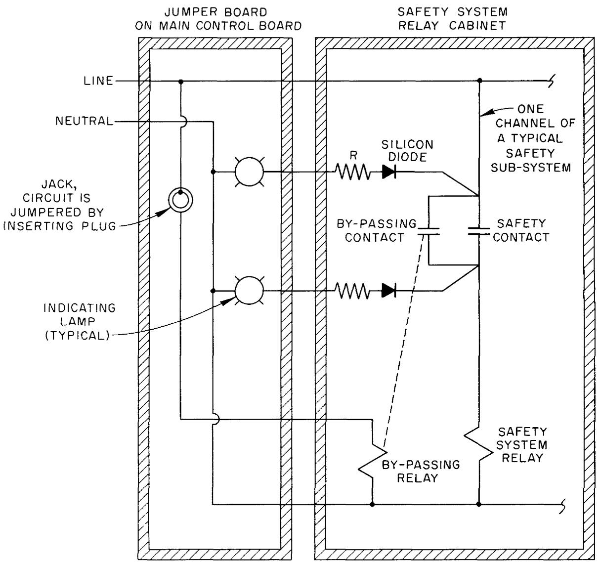  
NOTE: THE JUMPERS AND THE INDICATING LAMPS ARE ON THE MAIN CONTROL PANEL AND VISIBLE FROM THE OPERATOR'S CONSOLE.

a fraction of a milliampere of reverse current. Since relay holding currents are over 100 mmp, the relay will not be prevented from dropping out.

The jumper board presents a graphic display in full view of the operator of all of the circuitry subject to bypassing. The indicating lamps are located on the board between each contact subject to jumpering and provide immediate information as to circuit condition (whether energized or not).

A circuit jumper, requiring administrative formality for its insertion, cannot become a forgotten clip lead.

# 2.4 Neutron Source Considerations

MSRE fuel salts provide a substantial inherent $(\alpha, n)$ source.7 When the core vessel is filled with fuel salt containing sufficient uranium for criticality, this intrinsic source produces more than $10^{5}$ neutrons/sec. The resulting fission rate is such that statistical fluctuations are negligible and the reactor's behavior is accurately described by the well-known kinetic equations. Kinetic calculations have established that this initial fission rate is high enough to make tolerable the worst credible startup accident. This accident is caused by the uncontrolled, simultaneous withdrawal of all three shim-safety rods and is described in detail in Section 7.1.2.

It can be concluded that the inherent $(\alpha, n)$ source is adequate for safe reactor operation. Since this source is intrinsic with the fuel salt, instrumentation is not required to verify its existence.

Subcritical testing will require an external [other than $(\alpha, n)$ in the fuel salt] neutron source and highly sensitive detectors. This external neutron source is also used during normal, routine operation for monitoring the fill and startup procedures and for partial shutdowns and, thereby, provides information required for consistent, orderly operational routines. The control system is interlocked so that a count rate of at least 2 counts/sec is required during fill and startup. During partial shutdowns the fuel salt is maintained at the reactor operating temperature in the reactor primary loop, and the shim-safety rods are inserted. The external source is used to monitor the reactivity deficit.

The source is not located inside the core vessel because (1) typical MSRE temperatures exceed the melting point of antimony and its oxides and the required cooling system would be unduly complex, (2) accessibility and, hence, source removal would be restricted, and (3) an additional in-core

penetration is undesirable. The locations of the source and the sensitive $\mathrm{BF}_3$ counters are shown on Fig. 2.26. An antimony-beryllium source providing $10^{7}$ neutrons/sec is adequate for all purposes. $^8$

The foregoing evaluation of source requirements takes no credit for the large photoneutron source that will be present after the reactor has been operating at power for a relatively short time.

# 2.5 Electrical Power System

A simplified version of the power distribution system for the MSRE is shown in Fig. 1.17 of Section 1. Normally all electrical power is supplied by TVA. Two main 13.8-kv supplies are available. These main supply lines originate at geographically separated locations. Switchover from the "normal" to the "alternate" 13.8-kv bus is done automatically.

Standby power is provided by three diesel-engine-powered generators, and the switching operations required to put the diesels on the line are manual, as is diesel startup. Uninterrupted ac and dc power for the vital instruments, the control system, and emergency lighting and the power to operate the larger circuit breakers is supplied by a motor-generator-battery system that operates continuously. Normally the 250-v battery floats on the output of the motor-generator and is kept charged. Direct-current requirements are supplied from the battery, and a 25-kw motor-generator set powered by the battery provides ac power. This 25-kw motor-generator set is normally connected to its load and is run continuously so that no switchover is required in the event of a TVA outage. This eliminates any momentary interruption that would be produced by switching time and the time required for the 25-kw motor-generator set to pick up its load. Such an interruption would, among other things, scram the control rods unnecessarily.

The power distribution system was not designed for the purpose of insuring uninterrupted, full-power operation of the MSRE. In the event of a TVA outage, the reactor power level will be reduced until the standby diesels are started and are producing sufficient power to run all pumps

and blowers. The reliable storage battery supply described in the preceding paragraph has sufficient capacity to operate for approximately 2 hr. This is ample time to start the diesels. If, after a reasonable period of time, it is not possible to restore sufficient electrical power, either from diesels or TVA, to operate the reactor system in an orderly fashion, the reactor may be drained.

# 2.6 Control Room and Plant Instrumentation Layout

# 2.6.1 Main Control Area

The main control area, shown in Figs. 2.38 and 2.39, contains l2 control panels and the control console. The l2 panels comprise the main control board, which is in the form of an arc centered on the console.

The main control board, Fig. 2.40, provides a full graphic display of the reactor system and its associated instrumentation. These panels contain the instrumentation for the fuel salt system, the coolant salt system, the fuel and coolant pump oil systems, the off-gas system, the jumper board, and a pushbutton station for the various pumps and blowers. The primary recorders for the nuclear control system are also on the main board. The instrumentation on the console consists of position indicators, control switches and limit indicators for the control rods, radiator doors and fission chambers, and other switches required for normal and emergency operation of the reactor. Routine control of the reactor is accomplished from the main control area. Control of some of the auxiliary systems is also accomplished here, with remaining portions controlled from the local panels shown in Figs. 2.38 and 2.41.

# 2.6.2 Auxiliary Control Area

The auxiliary control area, Fig. 2.39, consists of eight auxiliary control boards, five nuclear control boards, one relay cabinet, one thermocouple cabinet, four diesel and switching panels, and a safety relay cabinet. The eight auxiliary panels contain the signal amplifiers, power computer, switches and thermocouple alarm switches, auxiliary indicators not required for immediate reactor operation, the fuel and coolant pump

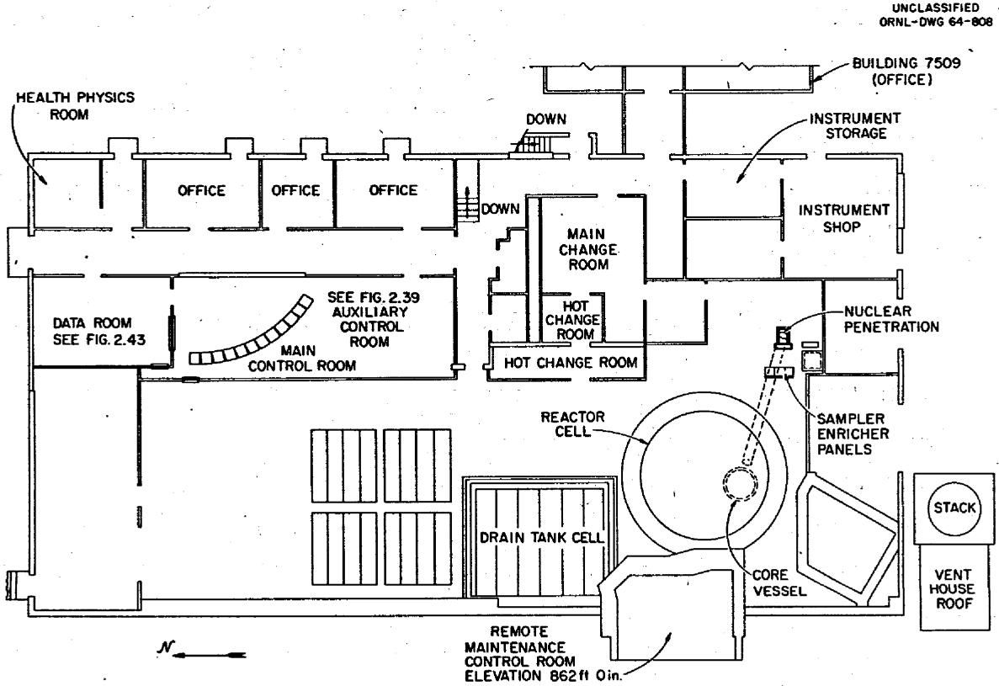  
Fig. 2.38. Main Floor Layout of Building 7503 at 852-ft Elevation.

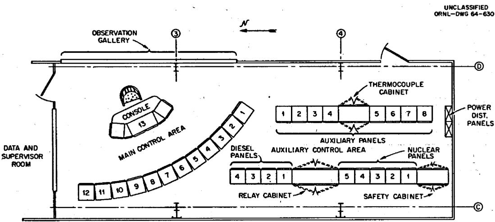  
Fig. 2.39. Main and Auxiliary Control Areas.

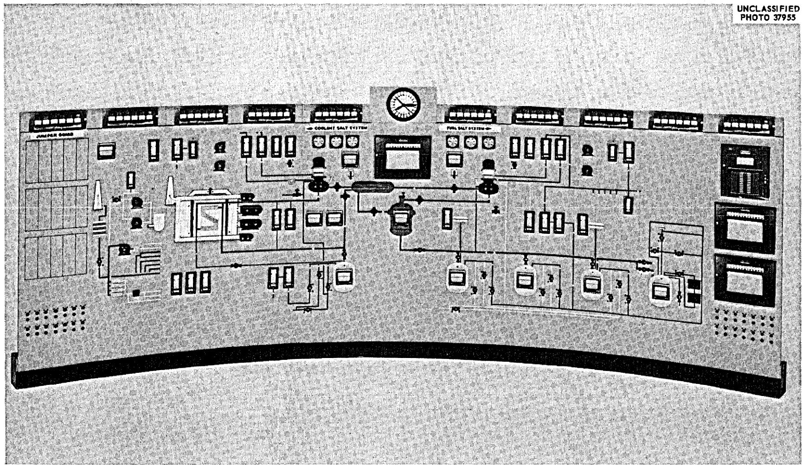  
Fig. 2.40. Main Control Board.

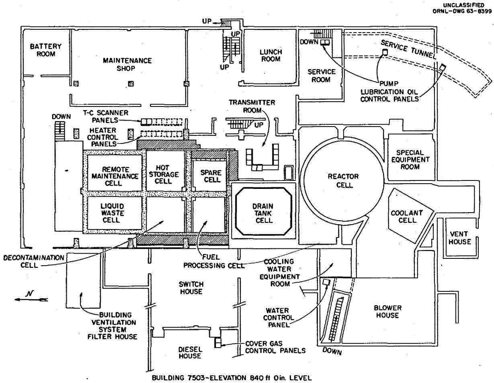  
Fig. 2.41. Layout of Building 7503 at 840-ft Elevation.

microphone amplifier and noise level indicator, and the substation alarm monitors. The relay cabinet contains only the relays for the main control circuitry. The thermocouple cabinet contains a patch panel with pyrometer jacks. All thermocouples in the system except those on the radiator tubes are terminated in this cabinet.

The five nuclear panels contain some of the instrumentation for the process radiation system, the oil system, and the sampling and enriching system. The health physics monitoring alarm system, the high level gamma-chamber electrometers and switching panel, and the reactor control nuclear amplifiers, servo amplifiers, and other equipment for the nuclear control system are also located here. Four panels contain the instrumentation for the operation of the emergency diesel generators. The distribution panels

for the control circuits are located on the south wall of the auxiliary control room.

# 2.6.3 Transmitter Room

The transmitter room, Fig. 2.42, consists of nine control panels, one solenoid power supply rack, and a transmitter rack. Panels 1 and 2 are for the leak detectors system, and panels 3 and 4 are for fuel drain tanks 1 and 2, coolant drain tank, fuel flush tank, and the fuel storage tank weigh instrumentation. Panels 5 and 6 are the fuel and coolant pump bubbler-type level control panels, panel 7 is the freeze valve air control panel, panel 8 is an installed spare panel, and panel 9 is for the sump bubbler system. The solenoid power supply rack contains most of the solenoids for the fuel salt system and the power supplies and distribution panels for the electric transmitters and differential transmitters. The

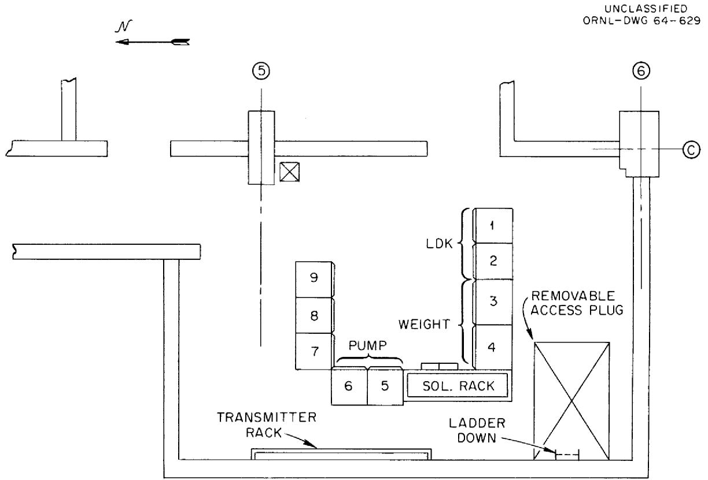  
Fig. 2.42. Transmitter Room.

transmitter rack contains the remote amplifiers for the electric signal transmission system and also the current-to-air transducers.

All electrical and pneumatic lines that connect transmitter room equipment to input signals from the reactor, drain tank, water room, and all other areas outside the building enter through sleeves in the floor. Output signals from the transmitter room equipment are conducted via feeder cable trays to the main cable tray system, which runs north-south in the building on the 840-ft level.

# 2.6.4 Field Panels

Additional panels are required for the auxiliary systems. These (see Figs. 2.38 and 2.41) are located near the subsystems which they serve. Four panels for the cooling oil systems are located in the service room and service tunnel; one cooling and treated water system panel is located in the fan house; three panels are located on elevation 852 ft at column line C-7 for the sampling and enriching system. Two cover gas system panels are located in the diesel house. Two containment air system panels are provided. One is located at the filter pit, and the other is located in the high bay area.

# 2.6.5 Interconnections

The control areas and the controlled systems are interconnected by cable trays and conduit. This system includes the main cable tray system running north-south in the building, with branch trays and conduits joining the main tray. These main trays carry all tubing for the pneumatic system, thermocouple leadwire, and the ac and dc control wiring. Each category of signal runs in a different tray to avoid mixing of the signals. Risers connect the panels and cabinets in the control area on elevation 852 ft with the main trays. No exposed trays are in the main or auxiliary control rooms. Safety system wiring is completely enclosed in conduit and junction boxes and is separated from control and instrumentation wiring.

# 2.6.6 Data Room

The data room (Figs. 2.38 and 2.43) is designed primarily to house the data-handling system, but it also serves as the information processing center for the reactor. The room contains storage space for all types of instrument data and log sheets. It also contains the data-plotting equipment used with the data-handling system and other special data display and processing equipment.

This room is located in the north end of the reactor building next to the main control room. There are entries from the hallway and the main control room. A large glass window is located so that the main control panel can be seen from the room.

The data-handling system is installed along the west and north walls of the room, Fig. 2.43. The data system console is located so that the reactor control panel can be seen by an operator at the console. At least two desks and several tables are located in the room for use of reactor operations and analysis personnel. Data-plotting equipment and record storage cabinets are placed at convenient locations. A typical process computer system is shown in Fig. 2.44.

The input signal cables for the data system are brought up to the bottom of the room in cable trays and conduits. Holes are cut in the floor beneath the signal input cabinet for routing the cables to the cabinet. Cable trays and conduit are also provided beneath the floor for signal lines to and from the main and auxiliary control areas.

The data room is air conditioned by the system which is used for the control room and offices.

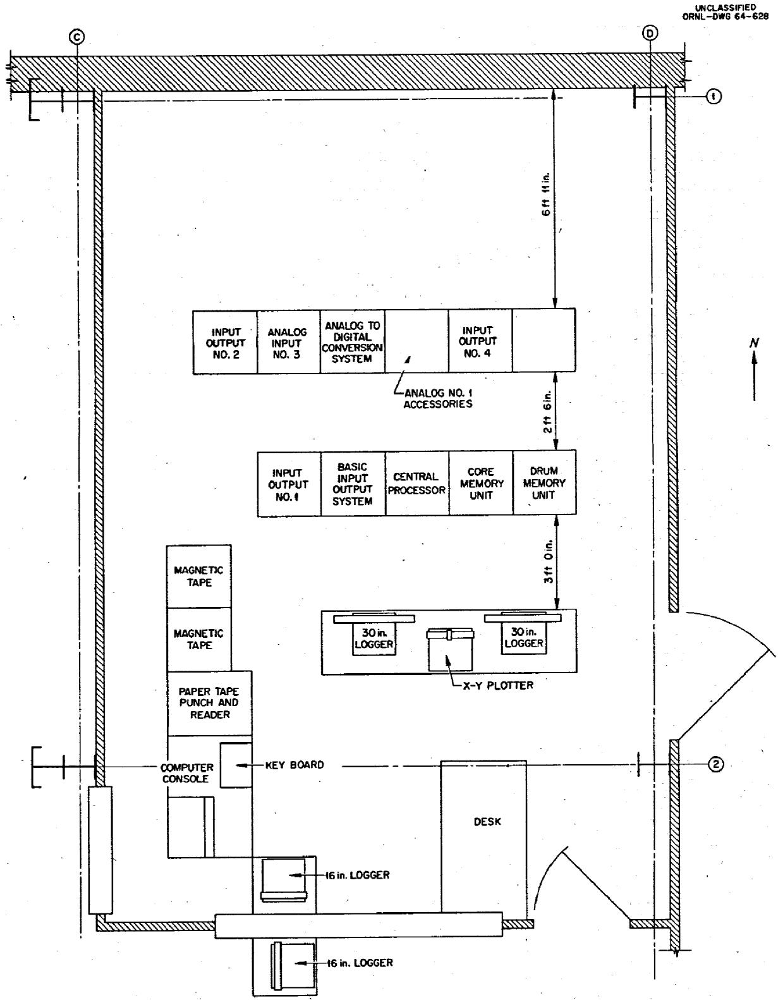  
Fig. 2.43. Layout of Data Room.

PROGRAMMING AND MAINTENANCE STATION   
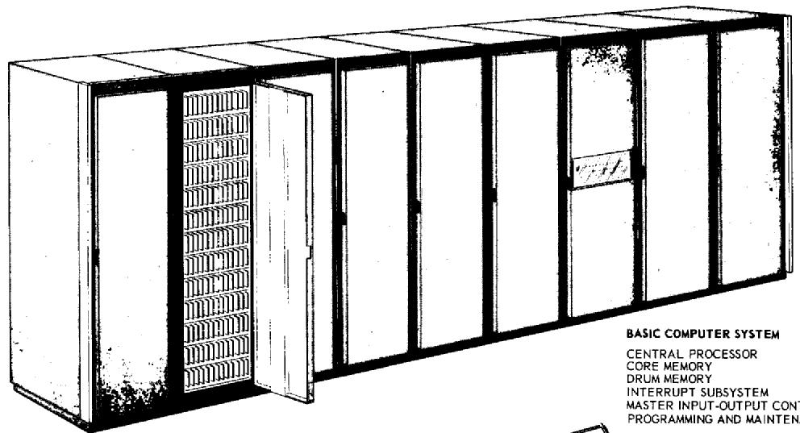  
FLEXWRITER
HIGH SPEED PAPER TAPE PUNCH
HIGH SPEED PAPER TAPE READER

INPUT-OUTPUT SYSTEM   
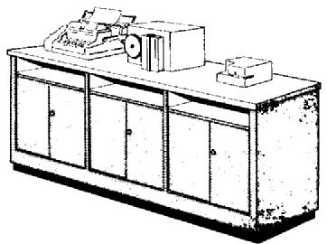  
CENTRAL PROCESSOR  
CORE MEMORY  
DRUM MEMORY  
INTERRUPT SUBSYSTEM  
MASTER INPUT-OUTPUT CONTROL SUBSYSTEM  
PROGRAMMING AND MAINTENANCE PANEL

BASICCOMPUTERSYSTEM

ANALOG INPUT SUBSYSTEM  
ANALOG OUTPUT SUBSYSTEM  
CONTACT CLOSURE INPUT SUBSYSTEM  
CONTACT CLOSURE OUTPUT SUBSYSTEM  
COUNTER SUBSYSTEM

OPERATOR-PROCESS COMMUNICATION STATION

LOGGING TYPEWRITER  
OPERATOR'S CONSOLE  
CONTROL PANEL  
DISPLAY  
INPUT SWITCHES  
FUNCTION SELECTOR  
FUNCTION MATRIX  
ALARM PRINTER

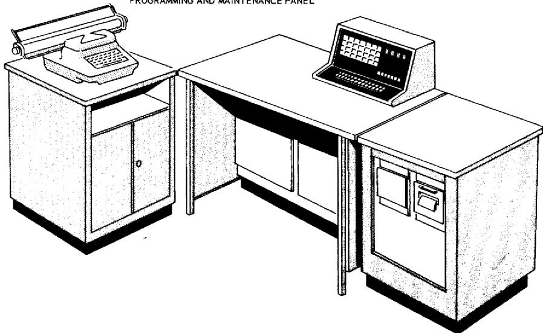  
Fig. 2.44. Typical Process Computer System (TRW-340).

# 3. PLANT LAYOUT

# 3.1 Equipment Arrangement

The general arrangement of Building 7503 is shown in Figs. 3.1 and 3.2. The main entrance is at the north end. Reactor equipment and major auxiliary facilities occupy the west half of the building in the high-bay area. The east half of the building contains the control room, offices, change rooms, instrument and general maintenance shops, and storage areas. Additional offices are provided in a separate building that is east of the main building.

Equipment for ventilating the operating and experimental areas is located south of the main building. A small cooling tower and buildings containing supplies and the diesel-electric emergency power equipment are near the west side of the main building.

The reactor primary system and the drain tank system are installed in shielded, pressure-tight reactor and drain tank cells, which occupy most of the south half of the high-bay area. The reactor cell is 24 ft in diameter and 33 ft in height. It is surrounded by a 30-ft-diam steel tank, and the 3-ft annular space is filled with a shielding mixture of sand and water. The top of the cell is covered with removable shielding blocks that extend 3 1/2 ft above the floor elevation of 852 ft and are sealed with a welded membrane.

Adjoining the reactor cell on the north side is the drain tank cell, which extends 5 ft deeper than the reactor cell to provide gravity flow from the reactor to the drain tanks. This cell is rectangular (17 l/2 × 21 l/2 ft), with 3-ft-thick heavily reinforced concrete walls lined with stainless steel. Access to the equipment is through the removable roof blocks, which are arranged in two layers with a sealing membrane between.

Several other shielded cells are located in the north end of the high-bay area, as shown in Fig. 3.l. They provide shielding and ventilated isolation for the fuel processing cell, the waste cell, and two cells for equipment storage and decontamination.

Fig. 1.3 (see sec. 1.2) shows how the components of the fuel circulating system are arranged in the reactor cell. The reactor tank and the

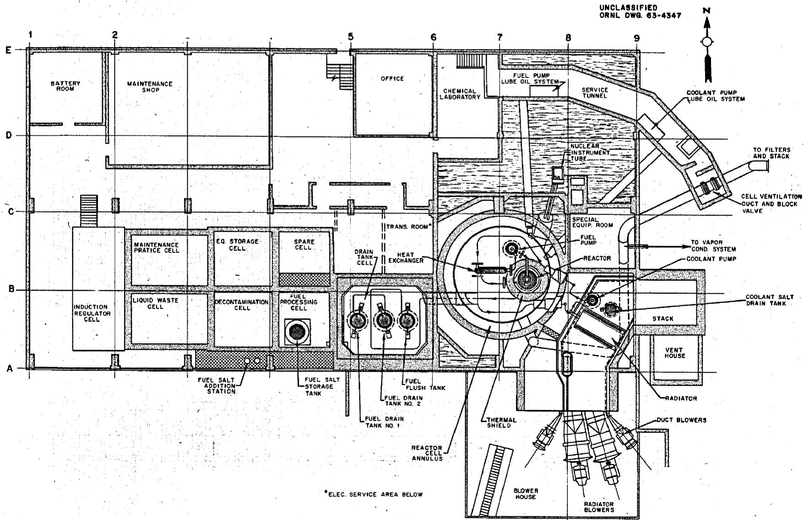  
Fig. 3.1. First Floor Plan of Reactor Building.

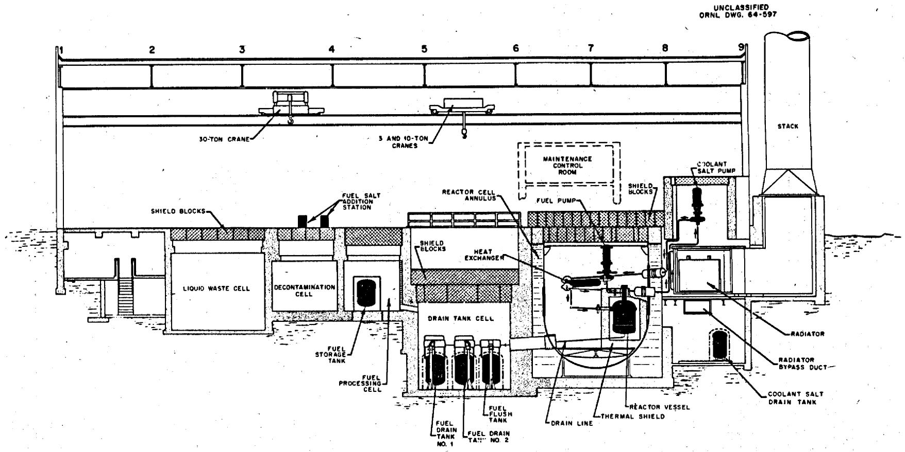  
Fig. 3.2. Elevation Drawing of Reactor Building.

thermal neutron shield are located south of the center of the containment cell, and they rest on the floor. The primary heat exchanger is positioned north of the reactor vessel and above it in elevation. The freeze flanges on the fuel and coolant salt lines attached to the heat exchanger are placed with adequate working space for remote-maintenance operations.

The fuel-circulating pump is mounted east of the reactor vessel and above it and the heat exchanger, so that the free surface of salt within the pump bowl is the highest point in the system. Underneath the bowl is the overflow tank and surrounding it is an electric furnace. All service piping flanges and electrical joints are located close to the pump bowl so that remote replacement of the pump bowl will be easier.

The arrangement of the drain tank cell is illustrated in Fig. 1.3. The flush salt tank is at the south end of the cell, and the two fuel salt tanks are north of it. Space is allowed to the east and west for remote cutting and brazing equipment in case either of the tanks must be removed. In the northwest corner of the cell is a 25-kva transformer, which supplies the power for resistance heating of the $1\mathrm{l} / 2$ -in. drain line connecting the reactor vessel to the tanks.

The coolant cell abuts the reactor cell on the south. It is a shielded area, with controlled ventilation, but it is not sealed.

The coolant salt circulating pump is mounted high in the coolant cell, as shown in Fig. 1.3. The radiator is at a lower elevation, to the west, and confined in the air-cooling duct. The coolant drain tank is underneath the pump and radiator, at the bottom of the cell. The blowers that supply cooling air to the radiator are installed in an existing blower house along the west wall of the coolant cell.

Rooms containing auxiliary and service equipment, instrument transmitters, and electrical equipment are located along the east wall of the reactor, drain tank, and coolant cells. Ventilation of these rooms is controlled, and some rooms are provided with shielding.

The high-bay area of the building over all the cells is lined with metal to minimize inleakage. Ventilation is controlled and the area is normally operated at slightly below atmospheric pressure. The effluent air from this area and from all other controlled-ventilation areas is

filtered and monitored before it is discharged to the atmosphere. The containment ventilation equipment consists of a filter pit, two fans, and a 100-ft-high steel stack. This equipment on the south side of the main building is connected to the building by one ventilation duct to the bottom of the reactor cell and another along the east side of the high bay.

The vent house and charcoal beds for handling the gaseous fission products from the reactor systems are near the southwest corner of the main building. The carbon beds are installed in an existing pit that is filled with water and is covered with concrete slabs. The vent house and pit are also controlled-ventilation areas. Gases from the carbon beds are monitored continuously for radioactivity and are discharged into the ventilation system upstream of the filters.

# 3.2 Biological Shielding

The MSRE work areas are divided into five types based on expected radiation levels: (1) areas with high radiation levels that prohibit entry under any circumstances, such as the reactor and drain tank cells; (2) areas that can be entered a short time after reactor shutdown, such as the radiator area; (3) areas that can be entered at low reactor power levels, such as the special equipment room; (4) areas that are habitable at all times; and (5) the maintenance control room, which is the only habitable area on the site when certain large-scale maintenance operations are being performed.

The MSRE shielding is designed to permit prolonged operation at 10 Mw without exposing personnel to more than a few mrem per week. The areas which will be entered routinely and will have unlimited access will be essentially at the normal background level for the Oak Ridge vicinity. However, there are several class 2 and class 3 areas which will have activity levels considerably above background and which will be entered only occasionally. These are located near the reactor or drain-tank cell penetrations. One such limited access area is the coolant cell, in which the background activity might be as high as 100 mr/hr. The blower house is also a limited access area, since the radiation level may be about 20 mr/hr near the blowers. Although the special equipment room is considered

a limited access area, the radiation field should not exceed about 10 mr/hr. The south electric service area, another limited access portion of the building, will have a generally higher radiation level of approximately 200 mr/hr. All these estimates are based on operation of the reactor at the 10-Mw power level. On the infrequent occasions when these areas must be entered, radiation surveys will be made so that the working time and exposures can be kept to safe levels.

When the reactor is subcritical, all areas, except those of type 1 (the reactor, drain tank, and fuel processing cells), may be entered a few minutes after the reactor is shut down and after a radiation survey is completed. In general, it is expected that access can be on an unlimited basis unless "hot spots" are found.

In any direction from the reactor vessel, a sufficient thickness of shielding material has been provided to reduce the radiation level in habitable areas to background levels. In some directions the shielding exists as several widely separated barriers. The general arrangement is described below, beginning at the reactor vessel.

Reactor Cell. The reactor vessel at the south side of the cell is surrounded by a stainless steel tank with a 16-in. thickness of iron and water. This thermal neutron shield is located within the secondary containment vessel which, in turn, is within another tank to provide a 3-ft-wide annular space, which is filled with magnetite sand and water. The outer tank is surrounded by a cylindrical, monolithic concrete wall 21 in. thick, except in the area facing the coolant cell. In this area special shielding materials are installed to give equivalent protection. There are no equipment or personnel access openings other than those through the top of the cell.

The top of the reactor cell is flat and is covered with two 3 l/2-ft layers of large, removable, concrete blocks, as shown in Fig. 3.3. The bottom layer is high-density (sp gr = 3+) concrete, and the upper layer is ordinary concrete. The joints in the lower layer of blocks are filled with steel plate inserts. A stainless steel sheet (1/8 in. thick) is sandwiched between the two layers and is welded to the edge of the tank to provide a gastight seal.

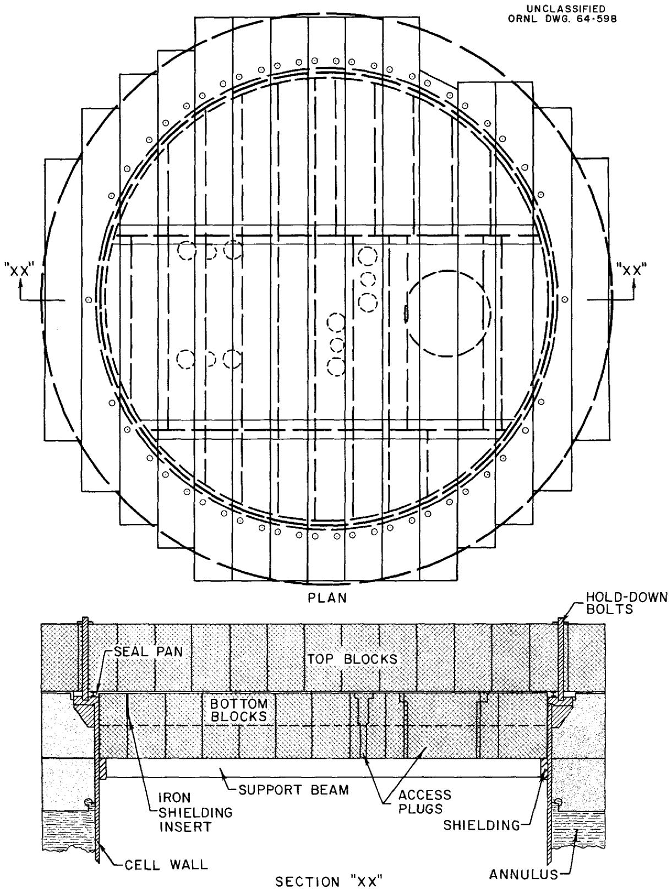  
Fig. 3.3. Arrangement of Shielding Blocks on Top of Reactor.

The service penetrations through the reactor cell walls pass through sleeves filled with magnetite concrete grout or magnetite sand and water. Where possible, these lines have an offset bend. The penetration of the 30-in.-diam air exhaust line through the bottom hemisphere of the containment vessel required special treatment because of the size of the opening. A shadow shield of a 9-in. thickness of steel is provided in front of the opening inside the cell, and a 12-in.-thick wall of stacked blocks is erected outside the cell at the foot of the ramp to the coolant cell.

Coolant Cell. The top and sides of the coolant and coolant drain tank cell provide at least 24 in. of concrete shielding as protection against activity induced in the coolant salt while the reactor is producing power. The large openings provided between the coolant cell and the blower house for the cooling air supply to the radiator, however, make it difficult to shield the blower house from this induced activity. Space has been provided for additional shielding in the form of stacked blocks, should they be found necessary after full power is reached.

Drain Tank Cell. The drain tank cell has a minimum thickness of 3 ft for the magnetite concrete walls facing accessible areas. The top of the cell consists of a layer of 4-ft-thick ordinary-concrete blocks covered by a layer of 3 l/2-ft-thick ordinary-concrete blocks. The pipelines penetrating the cell walls have offsets, and the smaller pipes are cast into the walls. Shielded plugs are provided for the larger penetrations.

Other Shielding. The 1/2-in. offgas line from the reactor cell to the charcoal beds is shielded by 4 in. of lead as it passes through the coolant drain tank cell. Barytes concrete blocks are stacked to a thickness of 5 ft above the line in the vent house, and 17-in.-thick steel plate is provided above the line between the vent house and the charcoal beds. The charcoal beds are covered with two 18-in.-thick by 10-ft-diam barytes concrete blocks and an additional 30-in. thickness of stacked barytes blocks.

The walls of the filter pit for the containment ventilation system are 12 in. thick and the roof blocks over the filters are 18 in. thick.

The thicknesses of the walls and tops of the auxiliary cells are given in Table 3.1. Additional shielding is provided by blocks stacked on the west side of the fuel processing and the decontamination cells.

Equipment in the fuel-circulating and drain tank systems will be repaired or replaced with remote-handling and -viewing equipment. A heavily shielded maintenance control room with viewing windows is located above the operating floor. This room will be used as a protected place to operate remotely controlled equipment when several roof shielding plugs are removed and radioactive equipment is to be transferred to a storage cell.

Equipment in the coolant cell cannot be approached when the reactor is operating, but the induced activity in the coolant salts is sufficiently short lived to permit the coolant cell to be entered for direct maintenance shortly after reactor shutdown.

Table 3.1. Descriptions of Auxiliary Cells   

<table><tr><td rowspan="2">Name of Cell</td><td colspan="2">Location</td><td rowspan="2">Inside Dimensions N-S × E-W</td><td rowspan="2">Floor Elevation</td><td colspan="4">Concrete Wall Thickness</td><td rowspan="2">Thickness of Top Blocks (in.)</td></tr><tr><td>N-S Columns</td><td>E-W Columns</td><td>N (in.)</td><td>S (in.)</td><td>E (in.)</td><td>W (in.)</td></tr><tr><td>Fuel processing cell</td><td>4-5</td><td>A-B</td><td>12 ft 10 in. × 14 ft 3 in.</td><td>831 ft 0 in.</td><td>18</td><td>44</td><td>18a</td><td>12a</td><td>48</td></tr><tr><td>Decontamination cell</td><td>3-4</td><td>A-B</td><td>15 ft 0 in. × 14 ft 3 in.</td><td>832 ft 6 in.</td><td>18</td><td>18</td><td>18</td><td>12</td><td>30</td></tr><tr><td>Liquid waste cell</td><td>2-3</td><td>A-B</td><td>13 ft 0 in. × 21 ft 0 in.</td><td>828 ft 0 in.</td><td>18</td><td>18</td><td>18</td><td>18</td><td>30</td></tr><tr><td>Remote maintenance cell</td><td>2-3</td><td>C-D</td><td>13 ft 0 in. × 21 ft 0 in.</td><td>831 ft 0 in.</td><td>18</td><td>18</td><td>18</td><td>18</td><td>30</td></tr><tr><td>Hot storage cellb</td><td>3-4</td><td>C-D</td><td>15 ft 0 in. × 14 ft 3 in.</td><td>832 ft 6 in.</td><td>18</td><td>18</td><td>12a</td><td>18</td><td>30</td></tr><tr><td>Spare cell</td><td>4-5</td><td>C-D</td><td>13 ft 6 in. × 14 ft 3 in.</td><td>831 ft 0 in.</td><td>18</td><td>12</td><td>12</td><td>18a</td><td>30</td></tr></table>

aPlus additional stacked blocks as required.   
The hot storage cell is lined with ll-gage stainless steel to the elevation of 836 ft 6 in.

# 4. SITE FEATURES*

# 4.1 Location

The Molten-Salt Reactor Experiment is located in the Roane County portion of the Oak Ridge area of Tennessee. The site is owned and controlled by the Atomic Energy Commission. The MSRE is in the Melton Valley area of the Oak Ridge National Laboratory southeast of the Bethel Valley, X-10 area, in Building 7503, which formerly housed the Aircraft Reactor Experiment (ARE). Building 7500, which formerly housed the Homogeneous Reactor Experiment No. 2 (HRE) and which is 2000 ft west-northwest of the MSRE, now houses the Nuclear Safety Pilot Plant (NSPP). The High Flux Isotope Reactor is being constructed 1500 ft south-southeast of the MSRE site. The main laboratory area of X-10, which is approximately 1 mile to the northwest, is separated from the MSRE site by Haw Ridge. Melton Hill bounds the valley on the southern side.

The MSRE site is located within a well-established AEC-controlled area. The AEC Patrol covers the roads and adjacent area to restrict public access to certain designated routes through the controlled land. A perimeter fence encloses the entire area of the MSRE. Approximately 40 people will be present in the exclusion area during the day shift and 6 or 7 on the evening and night shifts.

The location is shown in respectively increasing scale in Figs. 4.1, 4.2, and 4.3.

# 4.2 Population Density

The total population of the four counties (Anderson, Knox, Loudon, and Roane) closest to the MSRE site is 370,145. Of this number, 177,255 people are located in cities with populations greater than 2500 persons. The rural population density in these four counties is about 135 persons per square mile. The average population density within a radius of 27.5 miles of the MSRE site, as determined from the data obtained in the 1960 census, is 147 persons per square mile. Table 4.1 lists the surrounding

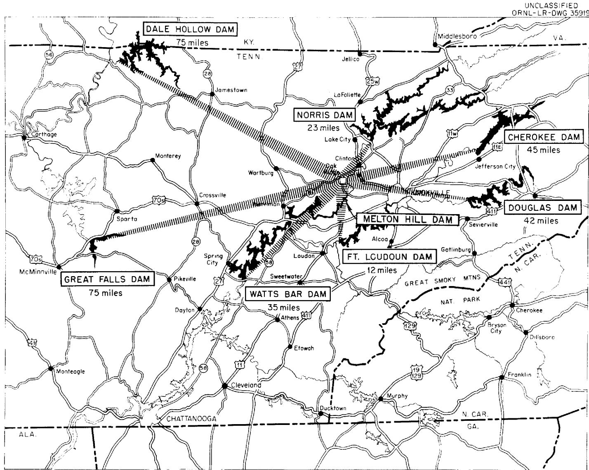  
Fig. 4.l. Area Surrounding MSRE Site.

UNCLASSIFIED

ORNL-LR-DWG 4406R

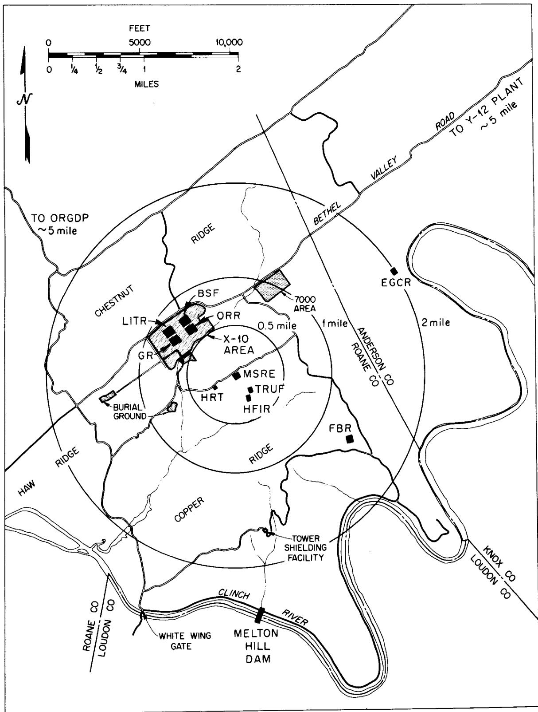  
Fig. 4.2. Contour Map of Area Surrounding MSRE Site.

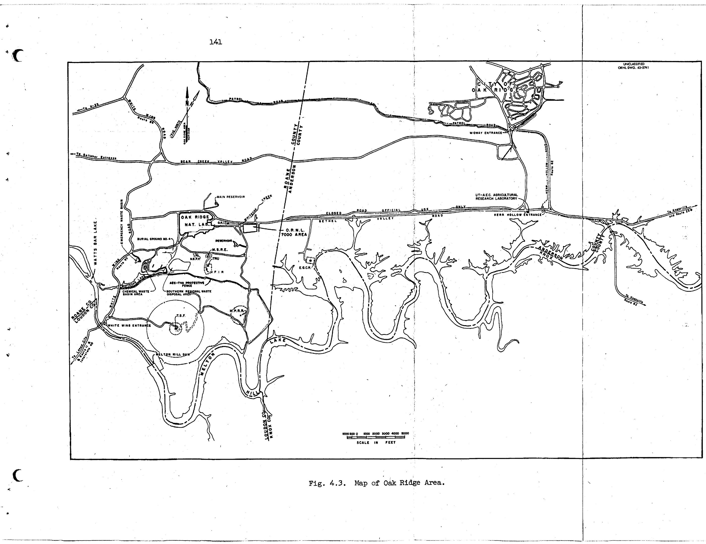

Table 4.1. Population of the Surrounding Towns Based on 1960 Census   

<table><tr><td rowspan="2">City or Town</td><td rowspan="2">Distance from Sitea (miles)</td><td rowspan="2">Direction</td><td rowspan="2">Population</td><td colspan="2">Time Downwind (%)</td></tr><tr><td>Night</td><td>Day</td></tr><tr><td>Oak Ridge</td><td>7</td><td>NNE</td><td>27,124</td><td>5.6</td><td>5.5</td></tr><tr><td>Lenoir City</td><td>9</td><td>SSE</td><td>4,979</td><td>4.3</td><td>6.0</td></tr><tr><td>Oliver Springs</td><td>9</td><td>N by W</td><td>1,163</td><td>2.3</td><td>2.7</td></tr><tr><td>Martel</td><td>10</td><td>SE</td><td>500b</td><td>1.4</td><td>2.8</td></tr><tr><td>Coalfield</td><td>10</td><td>NW</td><td>650b</td><td>0.5</td><td>1.1</td></tr><tr><td>Windrock</td><td>10</td><td>N by W</td><td>550b</td><td>2.3</td><td>2.7</td></tr><tr><td>Kingston</td><td>12</td><td>WSW</td><td>2,010</td><td>9.5</td><td>11.3</td></tr><tr><td>Harriman</td><td>13</td><td>W</td><td>5,931</td><td>2.2</td><td>3.7</td></tr><tr><td>South Harriman</td><td>13</td><td>W</td><td>2,884</td><td>2.2</td><td>3.7</td></tr><tr><td>Petros</td><td>14</td><td>NW by N</td><td>790b</td><td>1.4</td><td>2.8</td></tr><tr><td>Fork Mountain</td><td>15</td><td>NNW</td><td>700b</td><td>2.3</td><td>2.7</td></tr><tr><td>Emory Gap</td><td>15</td><td>W</td><td>500b</td><td>2.2</td><td>3.7</td></tr><tr><td>Friendsville</td><td>15</td><td>SE</td><td>606</td><td>1.4</td><td>2.8</td></tr><tr><td>Clinton</td><td>16</td><td>NE</td><td>4,943</td><td>11.6</td><td>9.0</td></tr><tr><td>South Clinton</td><td>16</td><td>NE</td><td>1,356</td><td>11.6</td><td>9.0</td></tr><tr><td>Powell</td><td>17</td><td>ENE</td><td>500b</td><td>8.3</td><td>6.8</td></tr><tr><td>Briceville</td><td>19</td><td>NNE</td><td>1,217</td><td>5.6</td><td>5.5</td></tr><tr><td>Wartburg</td><td>20</td><td>NW by W</td><td>800b</td><td>1.4</td><td>2.8</td></tr><tr><td>Alcoa</td><td>20</td><td>ESE</td><td>6,395</td><td>2.0</td><td>2.0</td></tr><tr><td>Maryville</td><td>21</td><td>ESE</td><td>10,348</td><td>2.0</td><td>2.0</td></tr><tr><td>Knoxville</td><td>18 to 25</td><td>E</td><td>111,827</td><td>1.5</td><td>2.7</td></tr><tr><td>Greenback</td><td>20</td><td>S by E</td><td>960b</td><td>5.5</td><td>4.9</td></tr><tr><td>Rockwood</td><td>21</td><td>W by S</td><td>5,343</td><td>2.2</td><td>3.7</td></tr><tr><td>Rockford</td><td>22</td><td>SE</td><td>5,345</td><td>1.4</td><td>2.8</td></tr><tr><td>Fountain City</td><td>22</td><td>ENE</td><td>10,365</td><td>8.3</td><td>6.8</td></tr><tr><td>Lake City</td><td>23</td><td>NNE</td><td>1,914</td><td>5.6</td><td>5.5</td></tr><tr><td>Norris</td><td>23</td><td>NNE</td><td>1,389</td><td>5.6</td><td>5.5</td></tr><tr><td>Sweetwater</td><td>23</td><td>SSW</td><td>4,145</td><td>8.4</td><td>12.7</td></tr><tr><td>Neubert</td><td>27</td><td>ENE</td><td>600b</td><td>8.3</td><td>6.8</td></tr><tr><td>John Sevier</td><td>27</td><td>E</td><td>752b</td><td>1.5</td><td>2.7</td></tr><tr><td>Madisonville</td><td>27</td><td>S</td><td>1,812</td><td>5.5</td><td>11.9</td></tr><tr><td>Caryville</td><td>27</td><td>N by E</td><td>1,234b</td><td>9.5</td><td>6.1</td></tr><tr><td>Sunbright</td><td>30</td><td>NW</td><td>600b</td><td>0.5</td><td>1.1</td></tr><tr><td>Jacksboro</td><td>30</td><td>N by E</td><td>577b</td><td>9.5</td><td>6.1</td></tr><tr><td>Niota</td><td>30</td><td>SSW</td><td>679</td><td>8.4</td><td>12.7</td></tr></table>

a. Based on data obtained for HFIR site.   
bTaken from 1950 census.

communities with a population of over 500 and their approximate distance and direction from the site. The rural population density in the four surrounding counties is given in Table 4.2. A number of facilities are located within the AEC-controlled area, and the approximate number of employees at each plant is given in Table 4.3. The numbers of employees indicate the total employment at each facility and do not attempt to show the breakdown according to shifts. However, most of these employees work the normal 40-hr week on the day shift.

Table 4.2. Rural Population in Surrounding Counties   

<table><tr><td rowspan="2">County</td><td rowspan="2">Total Areaa(sq. mile)</td><td rowspan="2">Ruralb Populatio</td><td rowspan="2">Population Density (No. people per sq. mile)</td><td colspan="3">Estimated Population</td></tr><tr><td>Within 10-Mile Radius</td><td>Within 20-Mile Radius</td><td>Within 30-Mile Radius</td></tr><tr><td>Anderson</td><td>338</td><td>26,600</td><td>79</td><td>395</td><td>14,200</td><td>22,800</td></tr><tr><td>Blount</td><td>584</td><td>38,325</td><td>66</td><td>0</td><td>6,720</td><td>23,200</td></tr><tr><td>Knox</td><td>517</td><td>138,700</td><td>238</td><td>13,100</td><td>46,400</td><td>96,000</td></tr><tr><td>Loudon</td><td>240</td><td>18,800</td><td>78</td><td>6,080</td><td>16,900</td><td>18,700</td></tr><tr><td>Morgan</td><td>539</td><td>13,500</td><td>25</td><td>225</td><td>3,625</td><td>8,630</td></tr><tr><td>Roane</td><td>379</td><td>12,500</td><td>33</td><td>3,070</td><td>9,170</td><td>11,110</td></tr></table>

aDoes not include area within Oak Ridge reservation.   
b1960 census; does not include communities with population of 500 or more.

An estimate was made of the distribution of the population in each of the 16 adjacent $22\frac{1}{2^{\circ}}$ sectors of concentric circles originating at the MSRE. Seven different distances were considered from the MSRE site: radii of 0 to 1, 1 to 2, 2 to 3, 3 to 4, 4 to 5, 5 to 10, and 10 to 20 miles. The values obtained, given in Table 4.4, are representative of the population in this area at all times. Very little change is experienced due to either part-time occupancy or seasonal variation. The population density in the area has been reasonably stable for a number of years and is anticipated to remain so.

Table 4.3. Number of Employees in Specific Oak Ridge Areas in June 1963   

<table><tr><td>Area</td><td>Distance from Site (miles)</td><td>Direction</td><td>Total Number of Employees</td><td></td></tr><tr><td>MSRE</td><td></td><td></td><td>35</td><td></td></tr><tr><td>NSPP</td><td>0.4</td><td>WNW</td><td>6</td><td></td></tr><tr><td>HFIR</td><td>0.25</td><td>SSE</td><td>40</td><td></td></tr><tr><td>ORNL</td><td></td><td></td><td>3830</td><td></td></tr><tr><td>X-10 area personnel</td><td>0.75-1.25</td><td>NW</td><td>3327</td><td></td></tr><tr><td>Construction personnel</td><td>0.75-1.25</td><td>NW</td><td>194</td><td></td></tr><tr><td>7000 area personnel</td><td>1.0-1.4</td><td>NNE</td><td>309</td><td></td></tr><tr><td>HPRR</td><td>1.1</td><td>ESE</td><td>12</td><td></td></tr><tr><td>Tower Shielding Facility</td><td>1.4</td><td>S</td><td>15</td><td></td></tr><tr><td>EGCR</td><td>2.0</td><td>NE</td><td>150</td><td></td></tr><tr><td>Melton Hill Dama</td><td>2.25</td><td>S</td><td></td><td></td></tr><tr><td>Construction personnel, June 1964</td><td></td><td></td><td>25</td><td></td></tr><tr><td>Normal operation (remotely controlled)</td><td></td><td></td><td>2</td><td></td></tr><tr><td>K-25 (Gaseous Diffusion Plant)</td><td></td><td></td><td>2751</td><td></td></tr><tr><td>K-25 area personnel</td><td>5.0</td><td>WNW</td><td>2678</td><td></td></tr><tr><td>Construction personnel</td><td></td><td></td><td>73</td><td></td></tr><tr><td>Y-12 (Electromagnetic Separations Plant)</td><td>5.75</td><td>NNE</td><td></td><td>6866</td></tr><tr><td>Y-12 area personnel</td><td></td><td></td><td>5507</td><td></td></tr><tr><td>ORNL personnel</td><td></td><td></td><td>909</td><td></td></tr><tr><td>Construction personnel</td><td></td><td></td><td>450</td><td></td></tr><tr><td>University of Tennessee Agricultural Research Laboratory</td><td>6.5</td><td>NE</td><td></td><td>160</td></tr><tr><td>Bull Run Steam Planta</td><td>11.25</td><td>NE</td><td></td><td></td></tr><tr><td>Construction personnel</td><td></td><td></td><td></td><td></td></tr><tr><td>July 1964</td><td></td><td></td><td>1900</td><td></td></tr><tr><td>December 1964</td><td></td><td></td><td>1500</td><td></td></tr><tr><td>July 1965</td><td></td><td></td><td>1100</td><td></td></tr><tr><td>December 1965</td><td></td><td></td><td>700</td><td></td></tr><tr><td>Normal operation (one unit)</td><td></td><td></td><td>190</td><td></td></tr></table>

Estimated from construction schedules, TVA, Knoxville, Tenn., June 5, 1963.

Table 4.4. Estimated Population Distributiona   

<table><tr><td rowspan="2">Radius(miles)</td><td colspan="16">Population in Given Sector</td></tr><tr><td>N</td><td>NNE</td><td>NE</td><td>ENE</td><td>E</td><td>ESE</td><td>SE</td><td>SSE</td><td>S</td><td>SSW</td><td>SW</td><td>WSW</td><td>W</td><td>WNW</td><td>NW</td><td>NNW</td></tr><tr><td>0-0.5</td><td>0</td><td>0</td><td>0</td><td>0</td><td>0</td><td>0</td><td>0</td><td>0</td><td>0</td><td>0</td><td>0</td><td>0</td><td>0</td><td>6</td><td>0</td><td>35</td></tr><tr><td>0.5-1</td><td>29</td><td>0</td><td>0</td><td>0</td><td>0</td><td>0</td><td>0</td><td>0</td><td>0</td><td>0</td><td>0</td><td>0</td><td>0</td><td>0</td><td>789</td><td>1,445</td></tr><tr><td>1-2</td><td>309</td><td>0</td><td>150</td><td>0</td><td>0</td><td>12</td><td>0</td><td>0</td><td>15</td><td>0</td><td>0</td><td>0</td><td>0</td><td>221</td><td>738</td><td>18</td></tr><tr><td>2-3</td><td>0</td><td>0</td><td>0</td><td>24</td><td>0</td><td>41</td><td>20</td><td>0</td><td>\( 90^b \)</td><td>90</td><td>90</td><td>45</td><td>0</td><td>0</td><td>0</td><td>0</td></tr><tr><td>3-4</td><td>0</td><td>0</td><td>0</td><td>24</td><td>41</td><td>87</td><td>40</td><td>20</td><td>135</td><td>135</td><td>135</td><td>45</td><td>0</td><td>0</td><td>0</td><td>0</td></tr><tr><td>4-5</td><td>0</td><td>0</td><td>0</td><td>87</td><td>87</td><td>90</td><td>60</td><td>40</td><td>180</td><td>180</td><td>180</td><td>45</td><td>2,751</td><td>0</td><td>0</td><td>200</td></tr><tr><td>5-10</td><td>7,944</td><td>20,428</td><td>460</td><td>7,706</td><td>7,706</td><td>7,706</td><td>783</td><td>6,546</td><td>1,567</td><td>1,564</td><td>781</td><td>781</td><td>781</td><td>781</td><td>781</td><td>781</td></tr><tr><td>10-20</td><td>5,320</td><td>13,318</td><td>\( 6,650^c \)</td><td>56,414</td><td>55,914</td><td>23,131</td><td>6,388</td><td>5,660</td><td>4,700</td><td>4,700</td><td>1,563</td><td>3,573</td><td>16,741</td><td>2,542</td><td>1,500</td><td>4,190</td></tr></table>

aIncludes Oak Ridge Plants   
bDoes not include Melton Hill Dam, see Table 4.3.   
cDoes not include Bull Run Steam Plant, see Table 4.3.

# 4.3 Geophysical Features

# 4.3.1 Meteorology

Oak Ridge is located in a broad valley between the Cumberland Mountains, which lie to the northwest of the area, and the Great Smoky Mountains, to the southeast. These mountain ranges are oriented northeast-southwest and the valley between is corrugated by broken ridges 300 to 500 ft high and oriented parallel to the main valley. The local climate is noticeably influenced by topography.

# 4.3.2 Temperature

The coldest month is normally January, but the differences between the mean temperatures of the three winter months of December, January, and February are comparatively small. July is usually the hottest month, but differences between the mean temperatures of the summer months of June, July, and August are also comparatively small. Mean temperatures of the spring and fall months progress orderly from cooler to warmer and warmer to cooler, respectively, without a secondary maximum or minimum. Temperatures of $100^{\circ}\mathrm{F}$ or higher are unusual, having occurred during less than one-half of the years of the period of record, and temperatures of zero and below are rare.

The annual mean maximum and minimum temperatures are 69.4 and $47.6^{\circ}\mathrm{F}$ , respectively, with an annual mean temperature of $58.5^{\circ}\mathrm{F}$ . The extreme low and high temperatures are -5 and $103^{\circ}\mathrm{F}$ , recorded in December 1962 and September 1954, respectively. Table 4.5 lists the average monthly temperature range based on the period 1931 to 1960, adjusted to represent observations taken at the present standard location of the weather station.

Information on the temperature gradient frequency and mean wind speed for each month were presented in a recent report2 on the meteorology of

Table 4.5. X-10 Climatological Standard Normals (1931 to 1960)   

<table><tr><td></td><td>Maximum Temperature</td><td>Minimum Temperature</td><td>Average Temperature</td></tr><tr><td>January</td><td>48.9</td><td>31.2</td><td>40.1</td></tr><tr><td>February</td><td>51.6</td><td>31.8</td><td>41.7</td></tr><tr><td>March</td><td>58.9</td><td>37.0</td><td>48.0</td></tr><tr><td>April</td><td>70.0</td><td>46.3</td><td>58.2</td></tr><tr><td>May</td><td>79.0</td><td>54.8</td><td>66.9</td></tr><tr><td>June</td><td>86.1</td><td>63.3</td><td>74.7</td></tr><tr><td>July</td><td>88.0</td><td>66.7</td><td>77.4</td></tr><tr><td>August</td><td>87.4</td><td>65.6</td><td>76.5</td></tr><tr><td>September</td><td>83.0</td><td>59.2</td><td>71.1</td></tr><tr><td>October</td><td>72.2</td><td>47.7</td><td>60.0</td></tr><tr><td>November</td><td>58.6</td><td>36.5</td><td>47.6</td></tr><tr><td>December</td><td>49.4</td><td>31.3</td><td>40.4</td></tr><tr><td>Annual</td><td>69.4</td><td>47.6</td><td>58.5</td></tr></table>

the Oak Ridge area. The seasonal and annual averages derived from this information are presented in Fig. 4.4.

# 4.3.3 Precipitation

Precipitation in the X-l0 area is normally well distributed throughout the year, with the drier part of the year occurring in the early fall. Winter and early spring are the seasons of heaviest precipitation, with the monthly maximum normally occurring January to March. A secondary maximum occurs in the month of July that is due to afternoon and evening thundershowers. September and October are usually the driest months.

The average and maximum annual precipitation are 51.52 and 66.2 in., respectively. The maximum rainfall in the area in a 24-hr period was 7.75 in., recorded in September 1944. The recurrence interval of this amount of precipitation in a 24-hr period has been estimated to be about 70 years. The maximum monthly precipitation occurs normally in March and has a value of 5.44 in. The average monthly precipitation is given in Table 4.6.

UNCLASSIFIED IL-DWG 63-2543

  
DAY

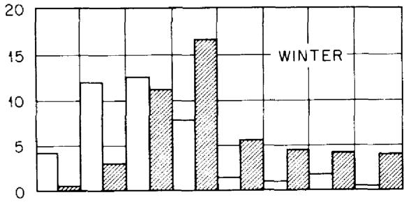

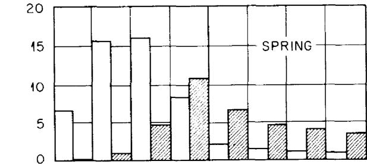

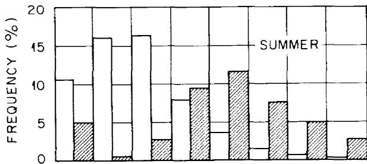

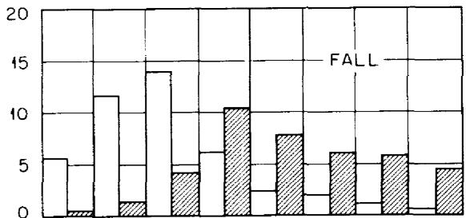

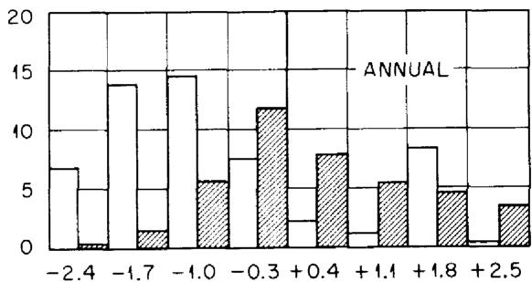  
TEMPERATURE GRADIENT PER 100 ft (°F)  
Fig. 4.4. Seasonal Temperature Gradient Frequency.

Table 4.6. X-10 Average   
Monthly Precipitation Data   

<table><tr><td>Month</td><td>Precipitation (in.)</td></tr><tr><td>January</td><td>5.24</td></tr><tr><td>February</td><td>5.39</td></tr><tr><td>March</td><td>5.44</td></tr><tr><td>April</td><td>4.14</td></tr><tr><td>May</td><td>3.48</td></tr><tr><td>June</td><td>3.38</td></tr><tr><td>July</td><td>5.31</td></tr><tr><td>August</td><td>4.02</td></tr><tr><td>September</td><td>3.59</td></tr><tr><td>October</td><td>2.82</td></tr><tr><td>November</td><td>3.49</td></tr><tr><td>December</td><td>5.22</td></tr></table>

Light snow usually occurs in all months from November through March, but the total monthly snowfall is often only a trace. The total snowfall for some winters is less than 1 in. The average snowfall for the period from 1948 to 1961 is 6.9 in. The maximum snowfall in a 24-hr period was 12 in. in March 1960. The maximum monthly snowfall, 21 in., also occurred in March 1960. The heavy fogs that occasionally occur are almost always in the early morning and are of short duration.

# 4.3.4 Wind

The valleys in the vicinity of the MSRE site are oriented northeast-southwest, and considerable channeling of the winds in the valley may be expected. This is evident in Fig. 4.5, which shows the annual frequency distribution of winds in the vicinity of ORNL. The flags on the wind-rose diagrams point in the direction from which the wind comes. The prevailing wind directions are upvalley from southwest and west-southwest approximately $40\%$ of the time, with a secondary maximum of downvalley winds from

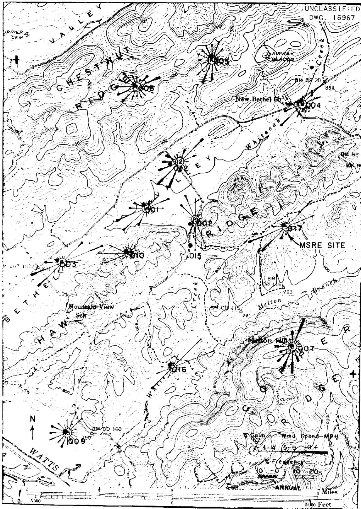  
Fig. 4.5. Annual Frequency Distribution of Winds in the Vicinity of X-10 Area.

northeast and east-northeast $30\%$ of the time. The prevailing wind regimes reflect the orientation of the broad valley between the Cumberland Plateau and the Smoky Mountains, as well as the orientation of the local ridges and valleys. The gradient wind in this latitude is usually southwest or westerly, so the daytime winds tend to reflect a mixing down of the gradient winds. The night winds represent drainage of cold air down the local slopes and the broader Tennessee Valley. The combination of these two effects, as well as the daily changes in the pressure patterns over this area, gives the elongated shape of the typical wind roses.

During inversions, the northeast and east-northeast winds occur most frequently, usually at the expense of the southwest and west-southwest winds. The predominance of light northeast and east-northeast winds under stable conditions is particularly marked in the summer and fall when the lower wind speeds aloft and the smaller amount of cloudiness allow the nocturnal drainage patterns to develop.

Wind roses prepared from 5 years of data, 1956 to 1960, are shown in Figs. 4.6 and 4.7 (ref. 2). These represent the wind direction, frequency, and percentage of calm under inversion and lapse conditions for the X-10 area and are applicable to the MSRE location.

Considerable variation is observed both in wind speed and direction within small distances in Bethel Valley and Melton Valley. It may be said that in nighttime or in stable conditions, the winds tend to be generally northeast and east-northeast and rather light in the valley, regardless of the gradient wind, except that strong winds aloft will control the velocity and direction of the valley winds, reversing them or producing calms when opposing the local drainage. In the daytime, the surface winds tend to follow the winds aloft, with increasing reliability, as the upper wind speed increases. Only with strong winds aloft or winds parallel to the valleys would it be of value to attempt to extrapolate air movements for any number of miles by using valley winds. In the well-developed stable situation, however, a very light air movement will follow the valley as far downstream as the valley retains its structure, even though the prevailing winds a few hundred feet above the ground are in an entirely different direction. In a valley location, the wind is

Unclassified

ORNL-DWG 63-2943

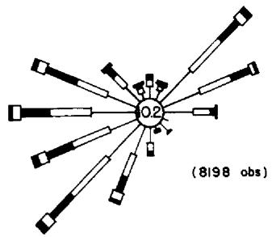  
WINTER

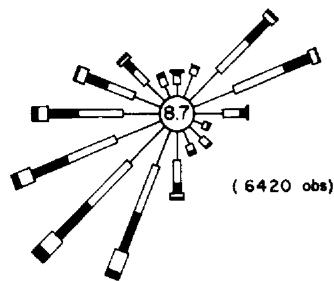  
SPRING   
LAPSE

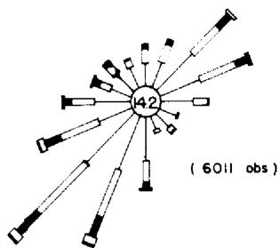  
SUMMER

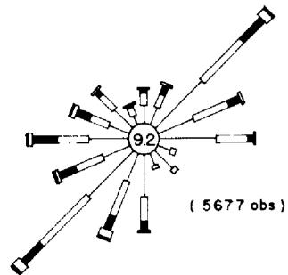  
FALL

Wind speed, mph

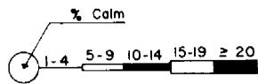

Frequency

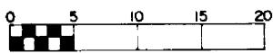  
Fig. 4.6. X-10 Area Seasonal Wind Roses.

1956-1960 Data

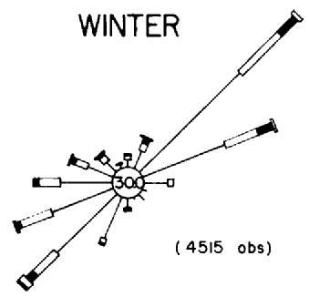

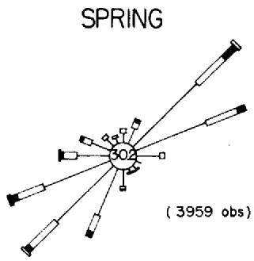

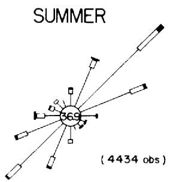  
INVERSION

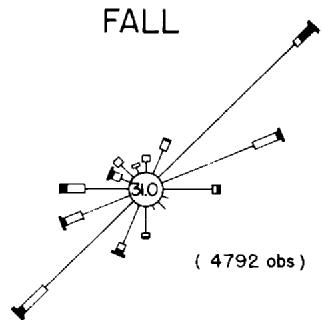

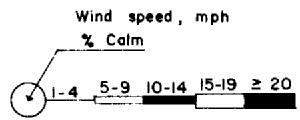

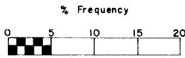  
Fig. 4.7. X-10 Area Seasonal Wind Roses.

governed by the local valley wind regime and the degree of coupling with the upper winds. $^3$

The wind flow between Melton Valley and the X-10 area was investigated in conjunction with the Aircraft Reactor Experiment (ARE) hazards analysis.3 Two patterns of wind flow were assumed to be of significance: (1) from the 7500 area northwest over Haw Ridge to the X-10 area, and (2) from the 7500 area west to White Oak Creek, then northwest through Haw Gap, and finally north to the X-10 area. The frequencies of these patterns during the period September to December 1950 were normalized to the 1944-to-1951 wind record at the X-10 area by a ratio method.3 The normalized frequencies are listed in Table 4.7.

Table 4.7. Frequency of Wind Patterns Between 7500 and X-10 Area   

<table><tr><td></td><td colspan="2">Frequency of Wind Pattern (%)</td></tr><tr><td></td><td>Over Ridge</td><td>Through Gap</td></tr><tr><td>All observations</td><td>2.5</td><td>0.4</td></tr><tr><td>Day (9 am to 5 pm)</td><td>4.3</td><td>0.6</td></tr><tr><td>Night (9 pm to 5 am)</td><td>0.0</td><td>0.4</td></tr><tr><td>Light wind (1 to 4 mph)</td><td>2.6</td><td>0.4</td></tr><tr><td>Stronger wind (5 mph and over)</td><td>2.7</td><td>0.3</td></tr></table>

A comparison of the pibal* observations made throughout 1949 to 1950 at Knoxville and Oak Ridge shows that above about 2000 ft the wind roses are almost identical at these two stations. This identity in the data makes possible the use of the longer period of record (1927 to 1950) from Knoxville to eliminate the abnormalities introduced by the use of the short record at Oak Ridge. Annual wind roses are shown for Knoxville (1927 to 1950) and Nashville (1937 to 1950) in Fig. 4.8. Pibal observations are only made when no clouds, dense fog, or precipitation is occurring and so are not truly representative of the upper wind at all times.

Three years of Rawin* data for Nashville (1947 to 1950) are available that consist of observations taken regardless of the current weather at the time of observation. A comparison of these wind roses for Knoxville and Nashville shows that the mode for winds above 3000 meters mean sea level should be shifted to westerly instead of west-northwest when observations with rain are included in the set. In summer and fall, the winds aloft are lightest and the highest winds occur during the winter months at all levels.

The northeast-southwest axis of the valley between the Cumberland Plateau and the Smoky Mountains continues to influence the wind distribution over the Tennessee Valley up to about 5000 ft, although the variations within the Valley do not extend above about 2000 ft. Above 500 ft, the southwesterly mode gives way to the prevailing westerlies usually observed at these latitudes.

Previous investigation of the relation of wind direction to precipitation indicates that the direction distribution is very little different from that of normal observations. This is consistent with the experience of precipitation forecasters that there is little correlation between surface wind direction and rain, particularly in rugged terrain. Figure 4.8 shows the upper winds measured at Nashville during the period 1948 to 1950, when precipitation was occurring at observation time. In general, the prevailing wind at any given level is shifted to the southwest or south-southwest from west or southwest, and the velocity is somewhat higher during the occurrence of precipitation, with the shift being most marked in the winter.

The percentage of inversion conditions of the total hours for the seasons is given in Table 4.8 (ref. 2).

Tornadoes rarely occur in the valley between the Cumberland and the Great Smokies. It is highly improbable that winds greater than 100 mph would ever be approached at the MSRE site.

Fig. 4.8. Wind Roses at Knoxville and Nashville for Various Altitudes.   

<table><tr><td>KNOXVILLE PIBAL</td><td>NASHVILLE PIBAL</td><td>NASHVILLE RAWIN
ALL OBS.</td><td>UNCLASSIFIED DWG. 16972
NASHVILLE RAWIN
PRECIPITATION</td></tr><tr><td>25659 Obs.</td><td>20321 Obs.</td><td>3341 Obs.</td><td>239 Obs</td></tr><tr><td>1500m</td><td></td><td></td><td></td></tr><tr><td>23449 Obs.</td><td>17940 Obs.</td><td>3269 Obs.</td><td>227 Obs.</td></tr><tr><td>3000m</td><td></td><td></td><td></td></tr><tr><td>14710 Obs.</td><td>12276 Obs.</td><td>3193 Obs.</td><td>217 Obs.</td></tr><tr><td>6000m</td><td></td><td></td><td></td></tr><tr><td>3692 Obs.</td><td>2964 Obs.</td><td>2684 Obs.</td><td>170 Obs.</td></tr><tr><td>10000m</td><td></td><td></td><td></td></tr><tr><td>536 Obs.</td><td>717 Obs.</td><td>1857 Obs.</td><td></td></tr></table>

Table 4.8. Summary of Seasonal Frequency of Inversions   

<table><tr><td>Season</td><td>Frequency of Inversion (%)</td><td>Average Durationa (hr)</td></tr><tr><td>Winter</td><td>31.8</td><td>8</td></tr><tr><td>Spring</td><td>35.1</td><td>9</td></tr><tr><td>Summer</td><td>35.1</td><td>9</td></tr><tr><td>Fall</td><td>42.5</td><td>10</td></tr><tr><td>Annual</td><td>35.9</td><td></td></tr></table>

aW. M. Culkowski, AEC, Oak Ridge, personal communication to T. H. Row, Oak Ridge National Laboratory, July 8, 1963.

# 4.3.5 Atmospheric Diffusion Characteristics

Sutton's $^{4,5}$ methods of calculating the dispersion of airborne wastes require a knowledge of several meteorological parameters. Values of these parameters of the X-10 site were recommended by the Oak Ridge Office of the U.S. Weather Bureau and are listed in Table 4.9. They provide a

40. G. Sutton, "A Theory of Eddy Diffusion in the Atmosphere," Proc. Roy. Soc. (London), 1932.   
5O. G. Sutton, Micrometeorology, McGraw-Hill Co., Inc., New York, 1953.   
6"Final Hazards Summary Report, Experimental Gas-Cooled Reactor," Vol. 1, Book 1, pp. 3-6, USAEC Report OR0-586, Oct. 10, 1962.

Table 4.9. Meteorological Parameter Values for Atmospheric Dispersion Calculations   

<table><tr><td colspan="2">Parameter</td><td>Lapse (weak)</td><td>Inversion</td></tr><tr><td colspan="2">Mean wind velocity, μ (m/sec)</td><td>2.3</td><td>1.5</td></tr><tr><td colspan="2">Stability parameter, n</td><td>0.23</td><td>0.35</td></tr><tr><td colspan="2">Diffusion constant, Cy (m2)</td><td>0.3</td><td>0.3</td></tr><tr><td colspan="2">Diffusion constant, Cz (m2)</td><td>0.3</td><td>0.033</td></tr></table>

reasonably conservative basis for the dispersion calculations in Section 8.7.2 and Appendix C; however, it is recognized that extreme meteorological conditions will occasionally exist and could produce exposures greater than those based on the values in the table.

# 4.3.6 Environmental Radioactivity

Atmospheric contamination by long-lived fission products and fallout occurring in the general environment of the Oak Ridge area is monitored by a number of stations surrounding the area. This system provides data to aid in evaluating local conditions and to assist in determining the spread or dispersal of contamination should a major incident occur. Data on the environmental levels of radioactivity in the Oak Ridge area are given in Tables 4.10, 4.11, 4.12, and 4.13 (ref. 7).

These levels of activity are, of course, strongly influenced by the radioactive wastes discharged by the various facilities at ORNL. The MSRE will normally release only the gaseous wastes xenon and krypton at rates of 0.5 and 6.4 curies/day, respectively, and thus should not make a significant contribution to the existing activity levels.

# 4.3.7 Geology and Hydrology

The bedrock beneath the MSRE site is a dark gray calcareous clay shale with a bearing value of 6 tons/ft² when unweathered. The overburden on this fresh unweathered shale averages 20 ft in thickness and consists of a thin blanket of organic topsoil, generally less than 1 ft in thickness, on top of weathered shale. The latter, if confined, has a bearing value of 3 tons/ft². The strata of the shale are highly folded and faulted, and the dip, although it averages about $35^{\circ}$ toward the south, is irregular and may vary from horizontal to vertical. The Melton Valley in which the MSRE is located is underlain by the Conasauga shale of the Middle and Upper Cambrian Age. The more resistant rock layers of the Rome formation, steeply inclined toward the southwest, are responsible for Haw Ridge, which parallels the valley immediately to the northwest.

Table 4.10. Concentration of Radioactive Materials in Air in $1962^{\mathrm{a}}$   

<table><tr><td rowspan="2">Station Number</td><td rowspan="2">Location</td><td rowspan="2">Long-Lived Activity (μc/cc)</td><td colspan="4">Number of Particles (in dis-integrations per 24 hr) by Activity Rangesb</td><td rowspan="2">Total Number of Particles</td><td rowspan="2">Number of Particles Per 1000 ft3</td></tr><tr><td>&lt;105</td><td>105-106</td><td>106-107</td><td>&gt;107</td></tr><tr><td colspan="9">Laboratory Area</td></tr><tr><td colspan="9">× 10-13</td></tr><tr><td>HP-1</td><td>S 3587</td><td>38</td><td>128</td><td>1.6</td><td>0.00</td><td>0.00</td><td>129</td><td>3.1</td></tr><tr><td>HP-2</td><td>NE 3025</td><td>43</td><td>122</td><td>1.9</td><td>0.04</td><td>0.00</td><td>124</td><td>3.5</td></tr><tr><td>HP-3</td><td>SW 1000</td><td>37</td><td>129</td><td>2.1</td><td>0.10</td><td>0.02</td><td>131</td><td>2.1</td></tr><tr><td>HP-4</td><td>W Settling Basin</td><td>21</td><td>91</td><td>1.2</td><td>0.04</td><td>0.00</td><td>93</td><td>1.6</td></tr><tr><td>HP-5</td><td>E 2506</td><td>51</td><td>115</td><td>1.2</td><td>0.04</td><td>0.04</td><td>117</td><td>3.9</td></tr><tr><td>HP-6</td><td>SW 3027</td><td>33</td><td>136</td><td>1.5</td><td>0.02</td><td>0.02</td><td>137</td><td>2.4</td></tr><tr><td>HP-7</td><td>W 7001</td><td>40</td><td>115</td><td>1.8</td><td>0.00</td><td>0.00</td><td>117</td><td>2.3</td></tr><tr><td>HP-8</td><td>Rock Quarry</td><td>39</td><td>132</td><td>1.5</td><td>0.00</td><td>0.02</td><td>133</td><td>2.5</td></tr><tr><td>HP-9</td><td>N Bethel Valley Rd.</td><td>31</td><td>145</td><td>1.6</td><td>0.00</td><td>0.00</td><td>146</td><td>2.3</td></tr><tr><td>HP-10</td><td>W 2075</td><td>38</td><td>126</td><td>1.3</td><td>0.00</td><td>0.00</td><td>128</td><td>3.1</td></tr><tr><td colspan="2">Average</td><td>37</td><td>124</td><td>1.6</td><td>0.02</td><td>0.01</td><td>125</td><td>2.7</td></tr><tr><td colspan="9">Perimeter Area</td></tr><tr><td>HP-31</td><td>Kerr Hollow Gate</td><td>34</td><td>135</td><td>1.6</td><td>0.04</td><td>0.04</td><td>137</td><td>2.7</td></tr><tr><td>HP-32</td><td>Midway Gate</td><td>37</td><td>132</td><td>2.1</td><td>0.02</td><td>0.00</td><td>134</td><td>2.6</td></tr><tr><td>HP-33</td><td>Gallaher Gate</td><td>32</td><td>113</td><td>1.4</td><td>0.00</td><td>0.02</td><td>114</td><td>2.2</td></tr><tr><td>HP-34</td><td>White Wing Gate</td><td>34</td><td>153</td><td>1.5</td><td>0.00</td><td>0.00</td><td>155</td><td>3.0</td></tr><tr><td>HP-35</td><td>Blair Gate</td><td>39</td><td>168</td><td>1.6</td><td>0.00</td><td>0.02</td><td>169</td><td>3.3</td></tr><tr><td>HP-36</td><td>Turnpike Gate</td><td>39</td><td>158</td><td>2.2</td><td>0.02</td><td>0.04</td><td>161</td><td>3.2</td></tr><tr><td>HP-37</td><td>Hickory Creek Bend</td><td>34</td><td>114</td><td>1.6</td><td>0.02</td><td>0.00</td><td>115</td><td>2.3</td></tr><tr><td colspan="2">Average</td><td>36</td><td>139</td><td>1.7</td><td>0.01</td><td>0.02</td><td>141</td><td>2.8</td></tr><tr><td colspan="9">Remote Area</td></tr><tr><td>HP-51</td><td>Norris Dam</td><td>43</td><td>139</td><td>2.3</td><td>0.04</td><td>0.00</td><td>141</td><td>2.6</td></tr><tr><td>HP-52</td><td>Loudoun Dam</td><td>42</td><td>130</td><td>2.8</td><td>0.10</td><td>0.00</td><td>133</td><td>2.4</td></tr><tr><td>HP-53</td><td>Douglas Dam</td><td>44</td><td>150</td><td>2.6</td><td>0.02</td><td>0.00</td><td>153</td><td>2.8</td></tr><tr><td>HP-54</td><td>Cherokee Dam</td><td>40</td><td>164</td><td>2.4</td><td>0.04</td><td>0.02</td><td>167</td><td>3.0</td></tr><tr><td>HP-55</td><td>Watts Bar Dam</td><td>45</td><td>157</td><td>2.0</td><td>0.04</td><td>0.00</td><td>159</td><td>2.9</td></tr><tr><td>HP-56</td><td>Great Falls Dam</td><td>46</td><td>166</td><td>2.3</td><td>0.00</td><td>0.00</td><td>168</td><td>3.1</td></tr><tr><td>HP-57</td><td>Dale Hollow Dam</td><td>38</td><td>171</td><td>1.6</td><td>0.00</td><td>0.04</td><td>172</td><td>2.9</td></tr><tr><td colspan="2">Average</td><td>43</td><td>154</td><td>2.3</td><td>0.03</td><td>0.01</td><td>157</td><td>2.8</td></tr></table>

${}^{a}$ Averaged weekly from filter paper data.   
bDetermined by filtration techniques.

Table 4.11. Radioparticulate Fallout in $1962^a$   

<table><tr><td rowspan="2">Station Number</td><td rowspan="2">Location</td><td rowspan="2">Long-Lived Activity (μc/ft2)</td><td colspan="4">Number of Particles (in dis-integrations per 24 hr) by Activity Ranges</td><td rowspan="2">Total Number of Particles</td><td rowspan="2">Total Particles per ft2.</td></tr><tr><td>&lt;105</td><td>105-106</td><td>106-107</td><td>&gt;107</td></tr><tr><td colspan="9">Laboratory Area × 10-13</td></tr><tr><td>HP-1</td><td>S 3587</td><td>15</td><td>79</td><td>2.1</td><td>0.12</td><td>0.06</td><td>81</td><td>42</td></tr><tr><td>HP-2</td><td>NE 3025</td><td>17</td><td>88</td><td>2.3</td><td>0.04</td><td>0.06</td><td>91</td><td>49</td></tr><tr><td>HP-3</td><td>SW 1000</td><td>15</td><td>83</td><td>2.0</td><td>0.15</td><td>0.06</td><td>86</td><td>42</td></tr><tr><td>HP-4</td><td>W Settling Basin</td><td>14</td><td>73</td><td>2.3</td><td>0.08</td><td>0.04</td><td>75</td><td>48</td></tr><tr><td>HP-5</td><td>E 2506</td><td>14</td><td>86</td><td>2.0</td><td>0.08</td><td>0.04</td><td>91</td><td>50</td></tr><tr><td>HP-6</td><td>SW 3027</td><td>16</td><td>101</td><td>2.9</td><td>0.02</td><td>0.02</td><td>104</td><td>61</td></tr><tr><td>HP-7</td><td>W 7001</td><td>15</td><td>89</td><td>2.4</td><td>0.02</td><td>0.06</td><td>92</td><td>49</td></tr><tr><td>HP-8</td><td>Rock Quarry</td><td>17</td><td>89</td><td>2.6</td><td>0.00</td><td>0.08</td><td>91</td><td>46</td></tr><tr><td>HP-9</td><td>N Bethel Valley Rd.</td><td>16</td><td>88</td><td>2.9</td><td>0.06</td><td>0.12</td><td>91</td><td>41</td></tr><tr><td>HP-10</td><td>W 2075</td><td>15</td><td>100</td><td>2.3</td><td>0.04</td><td>0.00</td><td>103</td><td>55</td></tr><tr><td colspan="2">Average</td><td>15</td><td>88</td><td>2.4</td><td>0.06</td><td>0.05</td><td>91</td><td>48</td></tr><tr><td colspan="9">Perimeter Area</td></tr><tr><td>HP-31</td><td>Kerr Hollow Gate</td><td>17</td><td>103</td><td>2.13</td><td>0.13</td><td>0.10</td><td>105</td><td>47</td></tr><tr><td>HP-32</td><td>Midway Gate</td><td>16</td><td>99</td><td>2.6</td><td>0.10</td><td>0.06</td><td>102</td><td>46</td></tr><tr><td>HP-33</td><td>Gallaher Gate</td><td>14</td><td>82</td><td>2.4</td><td>0.10</td><td>0.00</td><td>85</td><td>42</td></tr><tr><td>HP-34</td><td>White Wing Gate</td><td>18</td><td>104</td><td>2.2</td><td>0.19</td><td>0.08</td><td>106</td><td>47</td></tr><tr><td>HP-35</td><td>Blair Gate</td><td>15</td><td>124</td><td>2.0</td><td>0.06</td><td>0.04</td><td>126</td><td>50</td></tr><tr><td>HP-36</td><td>Turnpike Gate</td><td>16</td><td>109</td><td>3.5</td><td>0.08</td><td>0.02</td><td>112</td><td>57</td></tr><tr><td>HP-37</td><td>Hickory Creek Bend</td><td>16</td><td>85</td><td>2.3</td><td>0.04</td><td>0.08</td><td>87</td><td>47</td></tr><tr><td colspan="2">Average</td><td>16</td><td>101</td><td>2.5</td><td>0.10</td><td>0.05</td><td>103</td><td>48</td></tr><tr><td colspan="9">Remote Area</td></tr><tr><td>HP-51</td><td>Norris Dam</td><td>14</td><td>86</td><td>2.2</td><td>0.12</td><td>0.04</td><td>89</td><td>36</td></tr><tr><td>HP-52</td><td>Loudoun Dam</td><td>13</td><td>70</td><td>2.7</td><td>0.06</td><td>0.06</td><td>73</td><td>29</td></tr><tr><td>HP-53</td><td>Douglas Dam</td><td>13</td><td>77</td><td>2.7</td><td>0.06</td><td>0.08</td><td>80</td><td>35</td></tr><tr><td>HP-54</td><td>Cherokee Dam</td><td>14</td><td>81</td><td>2.9</td><td>0.13</td><td>0.06</td><td>84</td><td>35</td></tr><tr><td>HP-55</td><td>Watts Bar Dam</td><td>16</td><td>81</td><td>2.2</td><td>0.14</td><td>0.08</td><td>83</td><td>37</td></tr><tr><td>HP-56</td><td>Great Falls Dam</td><td>14</td><td>98</td><td>2.2</td><td>0.06</td><td>0.02</td><td>100</td><td>39</td></tr><tr><td>HP-57</td><td>Dale Hollow</td><td>14</td><td>96</td><td>2.0</td><td>0.08</td><td>0.06</td><td>98</td><td>33</td></tr><tr><td colspan="2">Average</td><td>14</td><td>84</td><td>2.4</td><td>0.09</td><td>0.06</td><td>87</td><td>35</td></tr></table>

${}^{a}$ Averaged weekly from gummied-paper data.

Table 4.12. Concentration of Radioactive Materials in Rain Water in $1962^{\mathrm{a}}$   

<table><tr><td>Station Number</td><td>Location</td><td>Activity in Collected Rain Water (μc/cc)</td></tr><tr><td colspan="3">Laboratory Area</td></tr><tr><td>HP-7</td><td>West 7001</td><td>×10-710.3</td></tr><tr><td colspan="3">Perimeter Area</td></tr><tr><td>HP-31</td><td>Kerr Hollow Gate</td><td>11</td></tr><tr><td>HP-32</td><td>Midway Gate</td><td>12</td></tr><tr><td>HP-33</td><td>Gallaher Gate</td><td>10</td></tr><tr><td>HP-34</td><td>White Wing Gate</td><td>11</td></tr><tr><td>HP-35</td><td>Blair Gate</td><td>11</td></tr><tr><td>HP-36</td><td>Turnpike Gate</td><td>10</td></tr><tr><td>HP-37</td><td>Hickory Creek Bend</td><td>11</td></tr><tr><td colspan="2">Average</td><td>11</td></tr><tr><td colspan="3">Remote Area</td></tr><tr><td>HP-51</td><td>Norris Dam</td><td>14</td></tr><tr><td>HP-52</td><td>Loudoun Dam</td><td>11</td></tr><tr><td>HP-53</td><td>Douglas Dam</td><td>13</td></tr><tr><td>HP-54</td><td>Cherokee Dam</td><td>11</td></tr><tr><td>HP-55</td><td>Watts Bar Dam</td><td>14</td></tr><tr><td>HP-56</td><td>Great Falls Dam</td><td>16</td></tr><tr><td>HP-57</td><td>Dale Hollow Dam</td><td>11</td></tr><tr><td colspan="2">Average</td><td>13</td></tr></table>

${}^{a}$ Averaged weekly by stations.

Table 4.13. Radioactive Content of Clinch River in 1962   

<table><tr><td rowspan="2">Location</td><td colspan="6">Concentration of Nuclides of Primary Concern (μc/cc)</td><td rowspan="2">Average Concentration of Total Radioactivity (μc/cc)</td><td rowspan="2">(MPC)W(μc/cc)a</td><td rowspan="2">Radioactivity as Percentage of (MPC)W</td></tr><tr><td>Sr90</td><td>Ce144</td><td>Cs137</td><td>Ru103-106</td><td>Co60</td><td>Zr95-Nb95</td></tr><tr><td></td><td>×10-8</td><td>×10-8</td><td>×10-8</td><td>×10-8</td><td>×10-8</td><td>×10-8</td><td>×10-8</td><td>×10-6</td><td></td></tr><tr><td>Mile 41.5</td><td>0.16</td><td>0.14</td><td>0.02</td><td>0.78</td><td>(b)</td><td>0.42</td><td>1.5</td><td>0.90</td><td>1.7</td></tr><tr><td>Mile 20.8c</td><td>0.15</td><td>0.02</td><td>0.09</td><td>21</td><td>0.18</td><td>0.09</td><td>34</td><td>4.6</td><td>7.4</td></tr><tr><td>Mile 4.5d</td><td>0.34</td><td>0.20</td><td>0.07</td><td>16</td><td>0.32</td><td>0.54</td><td>17</td><td>3.5</td><td>4.9</td></tr></table>

Weighted average maximum permissible concentration $(\mathsf{MPC})_{\mathsf{w}}$ calculated for the mixture by using values for specific radionuclides recommended in NBS Handbook 69.   
bNone detected.   
Values given for this location are calculated values based on the levels of waste released and the dilution afforded by the river.   
dCenter's Ferry (near Kingston, Tennessee, just above entry of the Emory River into Clinch River).

These layers dip beneath the shales of the Conasauga group in Melton Valley. The shale layers in the area are in keeping with the general structure of the surrounding area, as reported in a geological survey of the area. Conasauga shale, a dark red shale, contains thin layers and lenses of limestone that are generally irregular in distribution. However, there are no persistent limestone beds in the upper strata of the shale layers and, consequently, no underground solution channel or cavern to permit rapid and free underground discharge of water.

The dominantly clay soils of the Oak Ridge area are generally of low permeability, so the surface runoff of water is rapid. Observations in test wells show that the Conasauga shale, although relatively impermeable, is capable of transmitting small amounts of water through the soil a distance of a few feet per week. Furthermore, all the active isotopes, except ruthenium, apparently become fixed in the immediate vicinity of the point of entry into the soil. It is concluded that such ground water flow as may exist below the surface in the soil surrounding the site will be small and slow (a few feet per week) and that natural chemical fixation will reduce the level of the activity of mixed, nonvolatile fission products more than $90\%$ .

The Conasauga shale formation is extensive, quite heterogeneous in structure, and relatively low in permeability. The depth and extensiveness of the formation provide a large capacity for decontamination of any contaminated liquid reaching it, and the slow rate of percolation improves the efficiency of the decontamination by ion exchange and radioactive decay. However, the heterogeneity of the formation makes difficult the prediction of pattern and rate of movement of water and hence of the fission products contained therein. Most of the seepage is along bedding plains parallel to the strike.

Storm drains for the MSRE site will discharge into Melton Branch. The area storm sewers consist of two individual trunk systems. One trunk

system empties directly into Melton Branch (see Fig. 4.5) through a connecting ditch; the second trunk system combines with the cooling tower blowdown and the flow from the process waste pond before discharging into Melton Branch through a connecting ditch. The storm drainage system is based on a runoff coefficient of $30\%$ for unpaved or seeded areas. The high runoff coefficient applied to the unpaved areas is justified by the highly impervious character of the soils present in the plant area.

Downstream from ORNL, numerous uses are made of the Clinch River water by both municipalities and industries, as indicated in Table 4.14. The first downriver water consumer is the K-25 plant, whose water intake is located at river mile 14.4. Representative flows of the Clinch, Emory, and Tennessee Rivers are listed in Table 4.15. The local flow pattern in the Watts Bar reservoir during the period May through September is significantly affected by the differences in water temperature of the Clinch River and the Watts Bar reservoir. When the Clinch River is considerably cooler, stratified flow conditions caused by density differences may exist, with the cooler water flowing on the bottom beneath the warmer water. This phenomenon markedly affects the travel time of water through the reservoir and complicates the analysis of flow. In addition, during the period of stratified flow, some Clinch River water may flow up the Emory River as far as the Harriman water plant intake.

# 4.3.8 Seismology

Information on the frequency and severity of earthquakes in the East Tennessee area is reported in the ART Hazards Report.9 Earthquake forces have not been considered in the design of facilities at ORNL or TVA structures in the East Tennessee area. The Oak Ridge area is currently classified by the U.S. Coast and Geodetic Survey as subject to earthquakes of intensity mm-6 measured on the modified Mercalli Intensity Scale.

Table 4.14. Community Water Systems in Tennessee Downstream from ORNL Supplied by Intakes on the Clinch and Tennessee Rivers or Tributariesa   

<table><tr><td>Community</td><td>Population</td><td>Intake Source Stream</td><td>Approximate Location</td><td>Remarks</td></tr><tr><td>ORGDP - K-25 Area</td><td>2,678b</td><td>Clinch River</td><td>CR Mile 14</td><td>Industrial plant water system</td></tr><tr><td>Harriman</td><td>5,931c</td><td>Emory River</td><td>ER Mile 12</td><td>Mouth of Emory River, CR Mile 4.4</td></tr><tr><td>Kingston Steam Plant (TVA)</td><td>500d</td><td>Clinch River</td><td>CR Mile 4.4</td><td></td></tr><tr><td>Kingston</td><td>2,000d</td><td>Tennessee River</td><td>TR Mile 570</td><td>River used for supplementary supply</td></tr><tr><td>Watts Bar Dam (resort village and TVA steam plant)</td><td>1,000d</td><td>Tennessee River</td><td>TR Mile 530</td><td></td></tr><tr><td>Dayton</td><td>3,500c</td><td>Richland Creek</td><td>RC Mile 3</td><td>Opposite TR Mile 505</td></tr><tr><td>Cleveland</td><td>16,196c</td><td>Hiwassee River</td><td>HR Mile 15</td><td>Mouth of Hiwassee River is at TR Mile 500</td></tr><tr><td>Soddy</td><td>2,000d</td><td>Tennessee River</td><td>TR Mile 488</td><td></td></tr><tr><td>Chattanooga</td><td>130,009c</td><td>Tennessee River</td><td>TR Mile 465</td><td>Metropolitan area served by City Water Company</td></tr><tr><td>South Pittsburg</td><td>4,130c</td><td>Tennessee River</td><td>TR Mile 435</td><td></td></tr><tr><td>Total</td><td>168,061</td><td></td><td></td><td></td></tr></table>

aEGCR Hazards Summary Report, USAEC Report ORO-586, Oak Ridge Operations, Oct. 10, 1962.   
b Based on May 1963 data.   
c1960 Report of U.S. Bureau of the Census.   
$d_{\text{Based on published 1957 estimates}}$ .

Table 4.15. Flows in Clinch, Emory, and Tennessee Rivers, 1945-1951a   

<table><tr><td rowspan="4"></td><td colspan="15">Flow (cfs)</td></tr><tr><td colspan="6">Clinch River</td><td rowspan="2" colspan="3">Emory River, Mile 12.8</td><td colspan="6">Tennessee River</td></tr><tr><td colspan="3">Miles 20.8 and 13.2</td><td colspan="3">Mile 4.4b</td><td colspan="3">Mile 529.9</td><td colspan="3">Mile 465.3</td></tr><tr><td>Maximum</td><td>Mean</td><td>Minimum</td><td>Maximum</td><td>Mean</td><td>Minimum</td><td>Maximum</td><td>Mean</td><td>Minimum</td><td>Maximum</td><td>Mean</td><td>Minimum</td><td>Maximum</td><td>Mean</td><td>Minimum</td></tr><tr><td>January</td><td>22,900</td><td>8,960</td><td>1620</td><td>70,700</td><td>14,400</td><td>2120</td><td>50,000</td><td>4450</td><td>178</td><td>181,000</td><td>47,700</td><td>15,800</td><td>218,000</td><td>63,900</td><td>23,200</td></tr><tr><td>February</td><td>27,700</td><td>10,100</td><td>1230</td><td>88,800</td><td>15,800</td><td>2250</td><td>69,000</td><td>4550</td><td>468</td><td>204,000</td><td>50,800</td><td>17,900</td><td>195,000</td><td>67,900</td><td>19,700</td></tr><tr><td>March</td><td>12,700</td><td>5,850</td><td>690</td><td>26,700</td><td>9,450</td><td>1830</td><td>15,400</td><td>2910</td><td>507</td><td>100,000</td><td>32,400</td><td>13,300</td><td>148,000</td><td>44,200</td><td>19,500</td></tr><tr><td rowspan="2">April</td><td rowspan="2">8,540</td><td>3,400</td><td>306</td><td>13,300</td><td>5,620</td><td>752</td><td>6,600</td><td>1800</td><td>249</td><td>43,700</td><td>23,800</td><td>5,200</td><td>82,000</td><td>27,700</td><td>13,200</td></tr><tr><td>6,600c</td><td></td><td></td><td>9,730c</td><td></td><td></td><td>2520c</td><td></td><td></td><td>34,900c</td><td></td><td></td><td>45,900c</td><td></td></tr><tr><td>May</td><td>8,080</td><td>2,750</td><td>298</td><td>19,700</td><td>4,700</td><td>520</td><td>13,100</td><td>1610</td><td>58</td><td>38,300</td><td>20,000</td><td>3,000</td><td>95,900</td><td>28,800</td><td>17,900</td></tr><tr><td>June</td><td>7,420</td><td>2,820</td><td>224</td><td>9,280</td><td>3,320</td><td>262</td><td>5,300</td><td>396</td><td>14</td><td>32,100</td><td>18,900</td><td>8,200</td><td>32,800</td><td>25,500</td><td>18,900</td></tr><tr><td>July</td><td>7,630</td><td>2,930</td><td>259</td><td>12,800</td><td>3,400</td><td>281</td><td>9,230</td><td>360</td><td>21</td><td>87,500</td><td>19,600</td><td>6,500</td><td>106,000</td><td>26,400</td><td>15,400</td></tr><tr><td>August</td><td>8,390</td><td>4,520</td><td>374</td><td>8,760</td><td>4,800</td><td>378</td><td>3,060</td><td>177</td><td>4</td><td>37,600</td><td>21,400</td><td>9,900</td><td>43,300</td><td>28,100</td><td>17,800</td></tr><tr><td rowspan="2">September</td><td rowspan="2">8,450</td><td>4,620</td><td>341</td><td>13,000</td><td>4,940</td><td>462</td><td>5,500</td><td>224</td><td>2</td><td>39,900</td><td>22,200</td><td>6,900</td><td>54,400</td><td>30,100</td><td>17,100</td></tr><tr><td>3,530d</td><td></td><td></td><td>4,230d</td><td></td><td></td><td>553d</td><td></td><td></td><td>20,400d</td><td></td><td></td><td>27,800d</td><td></td></tr><tr><td>October</td><td>9,200</td><td>5,130</td><td>150e</td><td>14,200</td><td>5,300</td><td>150e</td><td>5,040</td><td>93</td><td>1</td><td>67,100</td><td>23,500</td><td>9,800</td><td>72,800</td><td>29,700</td><td>16,300</td></tr><tr><td>November</td><td>12,700</td><td>4,430</td><td>453</td><td>40,500</td><td>5,830</td><td>556</td><td>27,800</td><td>1100</td><td>2</td><td>128,000</td><td>25,400</td><td>10,300</td><td>167,000</td><td>34,000</td><td>13,600</td></tr><tr><td>December</td><td>27,000</td><td>8,360</td><td>569</td><td>60,300</td><td>11,700</td><td>593</td><td>33,300</td><td>2720</td><td>24</td><td>112,000</td><td>41,000</td><td>11,800</td><td>139,000</td><td>53,600</td><td>21,100</td></tr></table>

aEGCR Hazards Summary Report, USAEC Report ORO-586, Oak Ridge Operations Office, Oct. 10, 1962. Flow data were collected prior to construction of Melton Hill Dam on Clinch River. Although current data are not available, flows are not expected to be significantly changed.   
bFlows shown for Clinch River Mile 4.4 include Emory River flows.   
c Nonstratified flow period.   
dStratified flow period.   
eBy agreement with TVA, a flow of not less than 150 cfs has been maintained in the Clinch River at Oak Ridge since August 28, 1943.

Both Lynch10 of the Fordham University Physics Department and Moneymaker11 of the Tennessee Valley Authority indicate that the earthquakes that occasionally occur in the East Tennessee area are quite common in the rest of the world and are not indicative of undue seismic activity.

An average of one or two earthquakes a year occurs in the Appalachian Valley from Chattanooga to Virginia according to TVA records. The maximum intensity of any of these shocks recorded is 6 on the Woods-Neuman Scale. A quake of this magnitude was experienced in the Oak Ridge area on September 7, 1956, and was barely noticeable by either ambulatory or stationary individuals. Structures were completely unaffected. Disturbances of this type are to be expected only once every few years in the Oak Ridge area.

The Fordham University records indicate a quake frequency below that estimated by TVA. However, the magnitude of the observed quakes is approximately the same. Lynch indicates that "it is highly improbable that a major shock will be felt in the area (Tennessee) for several thousand years to come."

# 5. CONSTRUCTION, STARTUP, AND OPERATION

# 5.1 Construction

Although no special construction practices were employed in assembling the MSRE, many special precautions were taken to ensure a high-quality, clean, and leak-tight assembly. A detailed specification requiring better quality control than that of existing commercial codes was prepared for each component of the system. Nondestructive inspection techniques, such as ultrasonic testing, dye-penetrant inspection, x-ray examination, and helium leak testing, were employed at each fabricator's plant under the supervision of ORNL inspectors. Assembly at the reactor site is being examined similarly. After completion, the separate systems will be leak tested using rate-of-pressure rise, mass-spectrometer, and isotopic-tracer techniques.

During the last stages of construction and for several weeks after construction is completed, the reactor equipment will be checked out for acceptance by the Operations Department. The individual systems, that is, the cover gas, offgas, pump oil, cooling water, component air-cooling systems, etc., will be operated for the first time. Remote maintenance will be practiced during this period also. The successive steps in the startup of the reactor are listed in Table 5.1. The most important phases are discussed below.

# 5.2 Flush-Salt Operation

It is planned to demonstrate the mechanical performance of the assembled reactor by a several-month period of testing with a flush salt in the fuel system. Simultaneously, coolant salt will be circulated in the coolant system. Each piece of equipment will be examined to determine whether it performs as designed, insofar as this can be determined without nuclear heat generation. The flush salt will also serve to scavenge oxygen and to remove other impurities. Another important benefit of the flush-salt test will be the development of the operating skills necessary for satisfactory control of the system variables. Heat-balance methods

Table 5.1. MSRE Startup Plans   

<table><tr><td>Startup Phase</td><td>Month</td></tr><tr><td>Complete Reactor Installation</td><td>0</td></tr><tr><td>Operator and Supervisor Training</td><td>1-6</td></tr><tr><td>Equipment Checkout - Without Salt</td><td>1-3</td></tr><tr><td>1. Heaters, thermocouples, instruments, and logger</td><td></td></tr><tr><td>2. Cover-gas, offgas, pump-oil, cooling-water, component-air-cooling, and radiator-cooling systems</td><td></td></tr><tr><td>3. Air-compressor, containment-ventilation, diesel-power, and electrical systems</td><td></td></tr><tr><td>4. Remote maintenance</td><td></td></tr><tr><td>Flush Salt Operation</td><td>3-6</td></tr><tr><td>1. Coolant and flush-salt loading, inventory, and transfer methods</td><td></td></tr><tr><td>2. Coolant-circulating system</td><td></td></tr><tr><td>3. Fuel-circulating system</td><td></td></tr><tr><td>4. Sampling and leakage detection</td><td></td></tr><tr><td>5. Heat-balance methods, heat-removal systems, and temperature control</td><td></td></tr><tr><td>6. Graphite examination</td><td></td></tr><tr><td>Precritical Shutdown</td><td>6-7</td></tr><tr><td>1. Chemical plant performance (hydrofluorination of flush salt)</td><td></td></tr><tr><td>2. Loading of fuel salt</td><td></td></tr><tr><td>3. Completion of nuclear instrumentation and control-rod tests</td><td></td></tr><tr><td>4. Final maintenance</td><td></td></tr><tr><td>Critical Experiments</td><td>6-9</td></tr><tr><td>1. Check performance of nuclear instrumentation</td><td></td></tr><tr><td>2. Load fuel to critical</td><td></td></tr><tr><td>3. Measure pressure and temperature coefficients of reactivity, control-rod worth, response to flow changes</td><td></td></tr><tr><td>4. Establish baselines for determination of effects of power on chemistry, corrosion, and nuclear performance</td><td></td></tr><tr><td>Postcritical Shutdown</td><td>10</td></tr><tr><td>1. Seal-weld membranes on reactor and drain tank cells</td><td></td></tr><tr><td>2. Final check on containment leakage</td><td></td></tr><tr><td>3. Fill and check out vapor-condensing system</td><td></td></tr><tr><td>Approach to Full Power</td><td>11-14</td></tr><tr><td>1. Heat balances, heat-removal control</td><td></td></tr><tr><td>2. Shield and containment surveys</td><td></td></tr><tr><td>3. Sampling program for chemistry, etc.</td><td></td></tr><tr><td>4. Measurement of power coefficient, xenon poisoning, fuel permeation of graphite, and offgas composition</td><td></td></tr><tr><td>5. Reactor control and logger performance</td><td></td></tr></table>

and temperature control will be practiced, and sampling operations will be tried.

After the flush-salt operating period of one to three months, the flush salt will be transferred to the chemical plant, where it will be treated to remove accumulated oxides in a trial performance of the chemical plant. While the reactor system is shut down, the fuel salt will be loaded into one of the drain tanks, with about two-thirds of the $\mathrm{U}^{235}$ estimated for criticality, and the multiplication of the fuel will be measured at several liquid levels. Also during this shutdown, nuclear instrumentation and control rods will be given a final checkout, and remote-maintenance practice will be completed.

# 5.2.1 Critical Experiments

After the reactor system has been heated to $1200^{\circ}\mathrm{F}$ and neutron counting rates have been measured with the reactor empty, the fuel mixture, with about two-thirds of the final $\mathbf{U}^{235}$ concentration, will be slowly transferred to the reactor. Counting rates will be determined with the control rods in various positions and at several temperatures. If criticality is not attained, the fuel salt will be drained and more $\mathbf{U}^{235}$ will be added and mixed with the original salt before refilling the core. This procedure will be repeated after every fuel addition. When the counting rates indicate that criticality is near, further fuel additions will be made in approximately 10C-g increments at the fuel-circulating pump through the sampling mechanism.

When the critical mass has been determined, the temperature and pressure coefficients will be measured, and the control-rod calibrations will be completed. Next, the effective fraction of delayed neutrons will be studied to learn the fraction lost by circulation. The reactor must be operated at zero power for a period of one to three months to establish baselines for determination of the effects of power operation on salt chemistry, corrosion, and nuclear performance.

# 5.2.2 Power Operation

When the baseline data at zero power are judged to be satisfactory, the power will be increased in increments of several hundred kilowatts

over a period of six to ten weeks. At each successively higher power, samples will be collected and measurements will be made of heat output, power coefficient, radiation levels inside and outside shielding, xenon poisoning, offgas composition, and possible permeation of the graphite by fuel.

# 5.3 Operations Personnel

The operation of the MSRE facility will be the responsibility of the Reactor Division Operations Department. The previous assignments of personnel in this group include the construction, startup, and operation of four other experimental reactors: the Low-Intensity Test Reactor, the Homogeneous Reactor Experiments 1 and 2, and the Aircraft Reactor Experiment.

The experiment will be conducted on a three-shift basis, employing four operating shifts and a day staff for reactor analysis and planning. The organization chart is shown in Fig. 5.1. Each of the four shifts will be headed by a senior-level supervisor for the first few months. A junior engineer and three or four nontechnical operators, many with the previously mentioned reactor experience, will complete the shift organization.

The Reactor Analysis Group will be composed of four to six engineers with broad experience in fluid-fuel reactors. Its function will be principally to plan, supervise, and analyze the experimental program.

Over the years this organization has developed training, operating, $^{1}$ emergency, $^{2}$ and maintenance practices $^{3}$ that especially contribute to experimental reactor safety. The same methods and policies will be applied to the Molten-Salt Reactor Experiment.

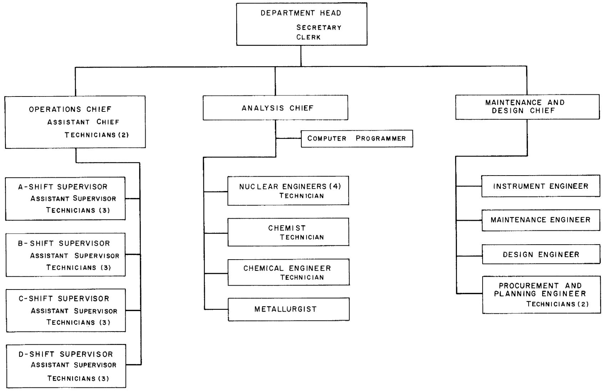  
Fig. 5.1. Reactor Division, Operations Department Organization for the MSRE.

In addition to the capabilities of the Operations Department personnel, the Reactor Division can provide assistance as needed from its larger Design, Development, Analysis, Engineering Science, and Irradiation Engineering Departments. Also, other ORNL research and service divisions are participating in many aspects of the MSRE program.

The engineers and technicians assigned to the MSRE operating group are prepared for their duties as reactor supervisors and operators by a combination of formal classroom work and inservice training. The first undertaking is a two-week period devoted exclusively to lectures and instruction on reactor physics, chemistry of salts, MSRE design, nuclear instruments, etc.

Next, the candidates are assigned to work on circulating-salt loops, a research reactor, or engineering developments, depending on the candidates' previous experience. The next assignment is at the MSRE to assist in calibrations, checkout, and startup of equipment.

Following these tasks the personnel will be organized into shift teams to begin operation with molten salt in the reactor systems. At the end of the several months period of circulating hot salt, both the reactor and the operators should be ready for the uranium loading and the initial critical experiment. However, during the maintenance period (approximately one month) prior to criticality, all the operating teams will be given a refresher series of lectures and an examination to conclude the eight-month training program.

# 5.4 Maintenance

The maintenance practices to be employed on the MSRE are the outgrowth of several years of experience in repairing and replacing parts of the earlier fluid-fuel reactors, the ARE, HRE-1, and HRE-2. Basically the system of maintenance makes use of long-handled tools manipulated by hand through special shielding.

After a fault has been discovered, the reactor will be shut down, drained of salt, and cooled. Plans for the repair will be made and previously prepared procedures modified, if necessary, to cover not only the repair details but safety precautions also. When the system is cool,

a hole will be cut in the top sealing membranes at a location directly above the faulty equipment. The maintenance shield will be set in place and manipulated to permit removal of the shielding blocks below the membrane. Next, the faulty part will be disconnected, using tools through the special shield. If the faulty part is highly radioactive and must be removed from the reactor cell, the operators will retire to the shielded maintenance control room from which the building crane can be operated remotely to remove the part and store it in a safe place. The operators can then return to the area above the cell and install the new part, using the special shield. Viewing windows and remote television are available to assist the operators in all these procedures.

PART 2. SAFETY ANALYSES

#

# 6.1 General Design Considerations

It is required that the containment be adequate to prevent escape of large amounts of radioactivity to the surrounding area during operation and maintenance and in the event of any credible accident. The containment must also prevent the release of dangerous amounts of other hazardous materials and, in general, serve to protect personnel and external equipment from damage.

Any equipment that contains or could contain multicurie amounts of radioactive material must be surrounded by a minimum of two barriers to prevent escape of the radioactivity. During operation of the MSRE, the first barrier, the primary container, consists of the walls of the various components in the system and the connecting piping. The reactor and drain tank cell enclosures provide the secondary containment. These cells are normally operated at subatmospheric pressure to assure inleakage.

The controlled ventilation areas in the high bay and in the various cells constitute a third barrier to the escape of activity during normal operation of the reactor. Air is drawn from the enclosed areas that are at subatmospheric pressure, passed through absolute filters, and monitored for radioactivity before discharge from the 100-ft-high ventilation-system stack located south of Building 7503.

When the reactor or drain tank cells are opened for maintenance, air flows through the openings at velocities in excess of 100 fpm and substitutes as the secondary barrier. The controlled ventilation area of the high bay above the cell is still the third barrier. However, if the primary piping in the cell is opened for maintenance, the air flow through the cell opening becomes the primary barrier and the controlled ventilation area becomes the secondary containment.

In the hypothesis of the maximum credible accident (see sec. 8.5), in which it is assumed that hot fuel salt mixes with the water in the cells to generate steam, the total pressure in the containment vessels

could exceed the design value of 40 psig, if not controlled. A vapor-condensing system is therefore provided that can rapidly condense the steam and also retain the noncondensable gases.

During normal operation, the atmosphere in the reactor and drain tank cells is maintained as an inert mixture $(95\% \mathrm{N}_2, 5\% \mathrm{O}_2)$ to eliminate hazards from combustion of flammable materials in the cell, such as the oil in the lubrication system of the fuel circulating pump.

The overall leak rate of the entire primary system is expected to be less than $1\mathrm{cm}^3$ of salt per day under normal operating conditions. The system is of all-welded construction, and all flanged joints are monitored for leakage; a few joints at the least vulnerable locations have autoclave-type fittings. Pipe lines that pass through the cell walls (i.e., the secondary containment) have check valves or air-operated block valves or both which are controlled by radiation monitors or pressure switches that can sense a rise in cell pressure. The portion of this piping outside the cell, the portion between the cell wall penetration and the check or block valve, and the valves are enclosed to provide the required secondary containment. These auxiliary enclosures are designed to withstand the same maximum pressure (40 psig) as the reactor and drain tank cells.

# 6.1.1 Reactor Cell Design

The reactor cell, shown in Fig. 6.l, is a cylindrical carbon steel vessel 24 ft in diameter and 33 ft in overall height that has a hemispherical bottom and a flat top. The lower 24 l/2 ft was built for the ART in 1956. It was originally designed according to Section VIII of the ASME Boiler and Pressure Vessel Code for 195 psig at $565^{\circ}\mathrm{F}$ and was tested hydrostatically at 300 psig. $^{1}$ The hemispherical bottom is 1 to 1 l/4 in. thick. The cylindrical portion is 2 in. thick, except for the section that contains the large penetrations, which is 4 in. thick.

This vessel was modified for the MSRE in 1962 by lengthening the cylindrical section 8 1/2 ft. Several new penetrations were installed,

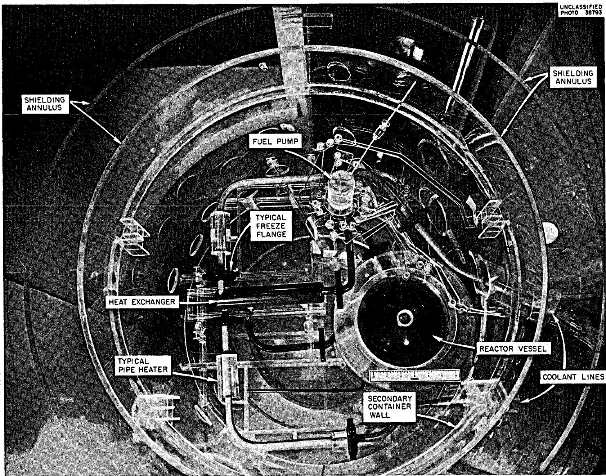  
Fig. 6.1. Reactor Cell Model.

and a 12-in. section of 8-in. sched-80 pipe closed by a pipe cap was welded into the bottom of the vessel to form a sump. The extension to the vessel is 2 in. thick, except for the top section, which was made as a $7\frac{1}{4}$ - by 14-in. flange for bolting the top shield beams in place. The flange and top shield structure are designed to withstand a pressure of 40 psig, and the completed vessel was tested hydrostatically to 48 psig, measured at the top of the cell. Both the original vessel and the extension are made of ASTM A201, grade B or better, fire-box-quality steel.

All the welds on the reactor cell vessel were inspected by magnetic particle methods, if they were in carbon steel, or by liquid penetrant methods, if they were in stainless steel. All butt welds and penetration welds were radiographed. After all the welding was completed, the vessel was stress relieved by heating to between 1150 and $1200^{\circ}\mathrm{F}$ for $7\mathrm{l} / 2\mathrm{hr}$ .

The top of the cell is constructed of two layers of 3 1/2-ft-thick reinforced-concrete blocks, with a stainless steel membrane between. The top layer is ordinary concrete, with a density of $150~\mathrm{lb / ft^3}$ , and the bottom layer is magnetite concrete, with a density of $220~\mathrm{lb / ft^3}$ . The blocks in both layers run east and west. To aid in remote maintenance, the bottom layer is divided into three rows of blocks. Blocks in the outer rows are supported on one end by a 13- by 4-in. channel-iron ring welded to the inside of the cell wall. Two 36-in. I beams provide the rest of the support for the bottom layer of blocks. These beams have angle-iron and steel-plate stiffeners. The cavities are filled with concrete for shielding. The beams rest on a built-up support plate assembly, which is welded to the side of the cell at the 847-ft 7-in. elevation. Offsets 6 1/4 by 26 in. are provided in the ends of the bottom blocks to fit over the support beams. Guides formed by angle iron assure proper alignment. Several of the bottom blocks have stepped plugs for access to selected parts of the cell for remote maintenance.

The sides of the blocks are recessed $\frac{1}{2}$ in. for $\frac{14}{15}$ in. down from the top. With blocks set side by side and with a $\frac{1}{2}$ -in. gap between, a $\frac{1}{2}$ -in. slot is formed at the top. One-inch-thick steel plates $\frac{12}{13}$ in. high are placed in the slots for shielding. The $\frac{11}{12}$ -gage, ASTM-A240, type 304 stainless steel membrane is placed on top of the bottom layer of blocks

and is seal welded to the sides of the cell. Cover plates are provided over each access plug. These are bolted to the membrane and are sealed by neoprene O-rings. A 1/8-in. layer of Masonite is placed on top of the membrane to protect it from damage by the top layer of blocks.

The top blocks are beams that reach from one side of the cell to the other. The ends of these blocks are bolted to the top ring of the cell by fifty 2 l/2-in. studs, 57 l/4 in. long, made from ASTM-A320, grade L7, bolting steel. These studs pass through holes that were formed by casting 3-in. sched-40 pipes in the ends of the blocks.

The reactor cell vessel is installed in another cylindrical steel tank that is referred to here as the shield tank. This tank is 30 ft in diameter by 35 ft high. The flat bottom is thick, and the cylindrical section is 8 in. thick. The shield tank sits on a reinforced concrete foundation. The reactor vessel cell is centered in the shield tank and is supported by a 15-ft-diam, 5-ft-high cylindrical skirt made of l-in.-thick steel plate reinforced by appropriate rings and stiffeners. The skirt is joined to the hemispherical bottom of the reactor cell in a manner that provides for some flexibility and differential expansion.

The annulus between the shield tank and the reactor cell vessel and skirt is filled with magnetite sand and water for shielding. The water contains about 200 ppm of a chromate-type rust inhibitor, Nalco-360. A 4-in.-diam overflow line to the coolant cell controls the water level in the annulus.

The region beneath the reactor cell vessel inside the skirt contains only water, and steam will be produced there if a large quantity of salt is spilled into the bottom of the reactor cell (see sec. 8.6). An 8-in.-diam vent pipe, which has a capacity for three times the estimated steam production rate, extends from the water-filled skirt area under the vessel to the coolant cell, where the steam would be vented.

Numerous large sleeves are required through the walls of the reactor cell and shield tank to provide for process and service piping, electrical and instrument leads, and for other access. The 4- to 36-in.-diam pipesleeves are welded into the walls of the reactor cell and the shield tank.

Since the temperature of the reactor cell will be near $150^{\circ}\mathrm{F}$ when the reactor is operating and the temperature of the shield tank may at times be as low as $60^{\circ}\mathrm{F}$ , bellows were incorporated in most of the sleeves to permit radial and axial movement of one tank relative to the other without producing excessive stress. The bellows are covered to prevent the sand in the shield tank from packing tightly around them.

Several other lines are installed directly in the penetrations, with welded seals at one or both ends, or they are grouped in plugs filled with concrete and inserted in the penetrations. The major openings are the 36-in.-diam neutron instrument tube and drain tank interconnection and the 30-in.-diam duct for ventilating the cell when maintenance is in progress. The original tank contained several other 8- and 24-in.-diam sleeves, and they were either removed or closed and filled with shielding. The smaller penetrations and methods of sealing them are described in Sec. 6.1.3.

# 6.1.2 Drain Tank Cell Design

The rectangular drain tank cell, shown in Fig. 6.2, is 17 ft 7 in. by 21 ft 2 l/2 in., with the corners beveled at $45^{\circ}$ angles for 2 l/2 ft. The flat floor is at the 814-ft elevation. The open pit extends to the 852-ft elevation.

The cell was designed to withstand a pressure of 40 psig, and when completed in 1962 it was hydrostatically tested at 48 psig measured at the elevation of the membrane at $838~1/2$ ft. The bottom and sides have a 3/16-in.-thick stainless steel liner backed up by heavily reinforced concrete. Magnetite concrete is used where required for biological shielding.

Vertical columns in the north and south walls are welded to horizontal beams embedded in the concrete of the cell floor. A 4-in. slot is provided at the top of each horizontal beam so that a steel key may be wedged into it to hold down the top blocks.

The top blocks are arranged in two layers. Both layers of blocks are ordinary concrete (density 150 lb/ft³). The bottom layer is 4 ft thick and the top layer is 3 1/2 ft thick. An ll-gage type 304 stainless

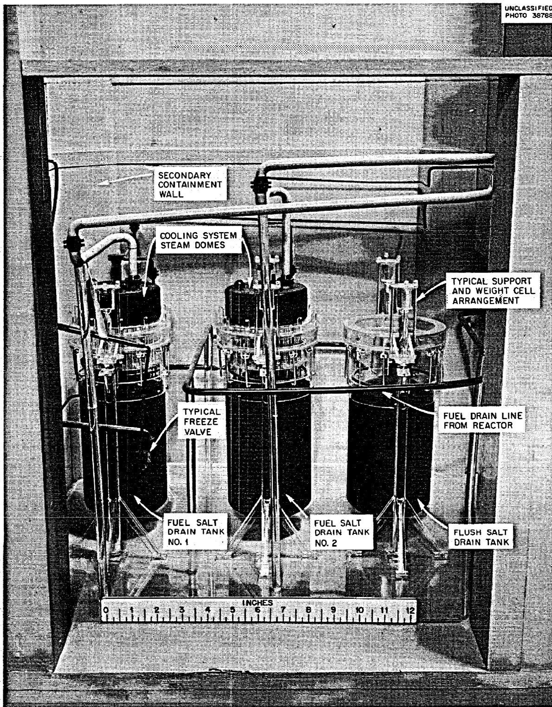  
Fig. 6.2. Drain Tank Cell Model.

steel membrane is placed between the two layers and seal welded to the cell liner at elevation 838 l/2 ft.

# 6.1.3 Penetrations and Methods of Sealing

Piping and wiring penetrations through the cell walls were designed to eliminate possible sources of gas leakage.

All electrical leads passing through the cell walls are in magnesia-filled copper sheaths (Fig. 6.3). The sheaths were sealed to the $3/4$ -in. pipe penetrations by two compression-type fittings, one inside and one outside the cell. The ends of the sheaths that terminate inside the cells were sealed at the disconnect by glass-to-metal welds. The ends that terminate outside were sealed by standard mineral-insulated cable-end seals, such as those manufactured by the General Cable Company. (The seal was formed by compressing a plastic insulating material around the wires.)

All thermocouples have Fiberglas-insulated leads in multiconductor sheathed cables. The sheaths were sealed to the 3/4-in. pipe penetrations inside and outside the cell by using soft solder. The ends of the sheaths terminating inside the cells were sealed at the disconnect with glass-to-metal welds. The ends of the cables outside the cells terminate in epoxy-sealed headers. The headers can be pressurized to test for leaks.

All instrument pneumatic signal lines and instrument air lines are sealed to the 3/4-in. pipe penetrations by two compression type fittings, one inside and one outside the cell. Each of these lines contains a block valve located near the cell wall; the valves close automatically if the cell pressure becomes greater than atmospheric.

Methods of sealing certain lines require special mention, as follows:

1. The 30-in.-diam cell ventilation duct contains two 30-in. motor-operated butterfly valves in series. These valves are under strict administrative control to assure that they remain closed during reactor operation.   
2. The component cooling system blowers are sealed in containment tanks to guard against loss of gas at the shaft seals.

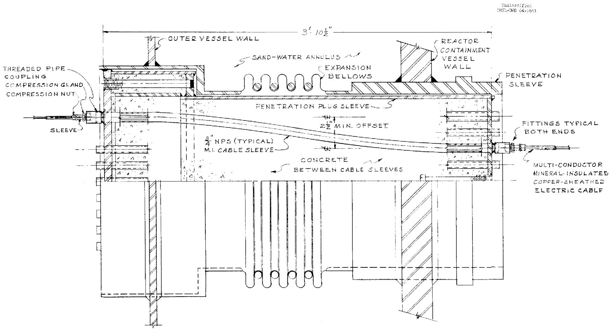  
Fig. 6.3. Typical Electric Lead Penetration of Reactor Cell Wall.

3. The cell evacuation line contains a block valve, HCV565, which automatically closes in the event radioactivity is detected in the line by the radiation monitor.   
4. The air supply lines for the cell sumps contain soft-seated check valves.   
5. Jet discharge lines from the sumps each contain two block valves in series that automatically close if the cell pressure becomes greater than atmospheric. A 1/2-in. connection is provided between the valves to test them for leak tightness.   
6. The fuel sampling and enriching system is interlocked to prevent a direct opening to the atmosphere.   
7. The steam-condensing system used in conjunction with the drain tank heat-removal system is a closed loop, except for the water supply lines, which contain soft-seated check valves, and the vent, which relieves to the cell vapor-condensing system (see sec. 6.2).   
8. All cooling water lines entering the cell have soft-seated check valves or block valves controlled by radiation monitors. All lines leaving the cells are provided with block valves controlled by radiation monitors.   
9. The lubricating-oil system for the fuel circulating pump is a closed circulating loop. Strict supervision is provided during additions of oil or oil sampling to assure that the containment is not violated.   
10. The leak-detector system tubing operates at a higher pressure than the reactor process systems, so no outleakage is anticipated.   
11. Several differential pressure cells and pressure transmitters are located outside the cells but are connected to process piping inside through instrument tubing. The instrument lines are doubly contained. The case of the differential pressure cell provides primary containment. The instrument cases are located inside a chamber designed for an internal pressure of 50 psig to provide the secondary containment.   
12. All helium supply lines connected to process equipment inside the cells contain one or more soft-seated check valves.   
13. Offgas lines that carry gaseous fission products to the charcoal beds are doubly contained for their entire length. The offgas lines from the charcoal beds have a common block valve, which closes on detection of

radioactivity in the line. (For details, see Dwg. D-AA-A-40883, Appendix B.)

The stresses which exist at various penetrations in the containment vessel wall were studied and were found to be within allowable values, with the maximum stresses occurring in the nozzles.[2]

# 6.1.4 Leak Testing

After construction of the reactor and drain tank cells was completed, leak tests were performed after the cells had been hydrostatically tested to 48 psig. The cells were held at 20 psig for 20 hr, and a leakage rate of $0.25\%$ /day was measured. When the reactor is operating, the cells will be kept at 12.7 psia, and the rate of inleakage will be monitored continuously. After each maintenance period, the cell leakage rate will be measured and determined to be less than $1\%$ /day (assumed in dispersion calculations, sec. 8.7.2) before the reactor is started.

The many service penetrations carrying air, water, etc., into the cells are equipped with various closing devices, as described above. The cell leakage test does not, of course, test these devices. It is intended that such closures be tested at intervals not greater than 6 months as verification of their integrity.

# 6.2 Vapor-Condensing System

The MSRE vapor-condensing system is similar in principle to those of the SM-1A plant at Fort Greeley, Alaska, and the Humbolt Bay power plant. In the event of the maximum credible accident, vapor will be discharged from the reactor cell into tanks, where the steam will be condensed in water and the noncondensable gases will be retained. The MSRE system differs from the SM-1A and Humbolt Bay systems in important details, however, because the energy release rates are low and the system is adapted to an existing containment vessel. Design of the vapor-condensing system is based on the following:3,4

1. The volumes of the reactor and drain tank cells are, respectively, 11,300 and 6,700 ft $^3$ . These cells will operate at -2 psig and $150^{\circ}$ F. Calculations have shown that only 7000 ft $^3$ of noncondensable

gas will be discharged to a vapor-condensing system during the maximum credible accident. The free volume of the system was therefore specified as $4500\mathrm{ft}^3$ , which is enough to contain $10,000\mathrm{ft}^3$ of gas from the reactor cell at 30 psig and $140^{\circ}\mathrm{F}$ or $13,500\mathrm{ft}^3$ at 40 psig and $140^{\circ}\mathrm{F}$ .   
2. The vapor-condensing system will contain $1200\mathrm{ft}^3$ of water at $70^{\circ}\mathrm{F}$ or less. The full $5 \times 10^{6}$ Btu calculated to be released by the salt can be absorbed in the water without exceeding $140^{\circ}\mathrm{F}$ .   
3. By the time the reactor cell pressure can reach 40 psig, the steam generation rate will be 16 lb/sec or less. The rate will decrease as the rate of release of salt into the cell decreases. The relief line from the reactor cell to the vapor-condensing tank was specified to pass 16 lb/sec of steam at 40 psig with a pressure drop of 10 psi or less. The discharge end of the line is to be located 6 ft below the surface of the water in the tank to ensure complete condensation of the steam.   
4. It is desirable to keep the vapor-condensing system isolated from the reactor cell and to limit its use to accidents in which the pressure rises above 15 psig. Bursting disks are to be installed in the relief line to the vapor-condensing tank. The disks will burst at about 20-psi pressure difference. Rupture of the disk in the second (smaller) line will not affect the pressure at which the other disk breaks.[5]   
5. Vacuum-relief valves will be installed in the reactor cell relief line at the vapor-condensing tank. This will permit vapors to return to the reactor cell and prevent the pressure in that cell from going below -5 psig when the steam condenses at the end of the accident.   
6. The vapor-condensing system may contain as much as 400,000 curies of gaseous fission products and daughter products 5 min after the beginning of a maximum credible accident and 40,000 curies after 1 hr. In addition,

the water will contain some radioactive solids that will be transferred as entrainment in the vapor. The radiation level at 10 meters from an unshielded tank would be about 2000 rad/hr at 5 min and 200 rad/hr at 1 hr; however, the tanks will be shielded sufficiently to reduce the initial radiation level to below 100 rad/hr. Provision has been made for the controlled discharge of the gases to the atmosphere through the filter system and stack.

The vapor-condensing system will be installed about 40 ft east of Building 7503, as shown in Fig. 6.4. It will consist of two tanks, the vapor-condensing tank and the gas-retention tank. The vapor-condensing tank, sometimes referred to as the water tank, is a vertical cylinder that is normally maintained about two-thirds full of water through which gases forced from the reactor cell in a major accident would be bubbled to condense the steam. The tank contains about $1200\mathrm{ft}^3$ of water plus a corrosion inhibitor. The estimated maximum of $5 \times 10^{6}$ Btu of heat that could be released from the fuel salt in the reactor and drain tank cells would raise the water temperature to about $140^{\circ}\mathrm{F}$ . The noncondensable gases are vented to a large gas storage tank.

The vertical vapor-condensing tank is 10 ft in outside diameter and 23 ft 4 in. high, including the flanged and dished, 1/2-in.-thick, top and bottom heads. The shell is 3/8 in. thick and constructed of SA-300 class I, A-201, grade B firebox steel. There are stiffening rings, 1 in. thick and 3 in. high, located on the exterior about 2 ft 6 in. apart. The 12-in. gas inlet pipe in the top head extends 13 ft 8 in. into the tank to about 6 ft below the normal water level. The tank is installed with the top about 8 ft below the normal grade level of 850 ft and the bottom at an elevation of about 819 ft. Additional earth is mounted above the tank to provide a total of 11 to 13 ft of shielding.

The gas inlet line in the interior of the tank has a pipe cross $(12 \times 12 \times 12 \times 12$ in.) about 3 ft above the water level to which is connected two 12-in. cast-steel-body check valves. These check valves close when the gas flow is into the tank but open and act as vacuum-relief valves to prevent water from being drawn in reverse flow through the inlet line during cooldown of the cell after the accident.

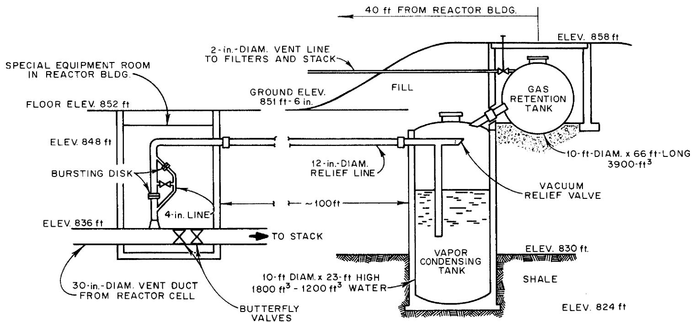  
Fig. 6.4. Vapor-Condensing System.

The noncondensable gases leave the top of the vapor-condensing tank through the 12-in. outlet pipe and flow through the expansion joint in the line to a side nozzle on the gas-retention tank. The gas-retention tank is 10 ft in outside diameter and 66 ft 3 l/2 in. long, including the two 1/2-in.-thick flanged and dished head. The shell is 3/8 in. thick and is reinforced with 1-in.-thick, 3-in.-high rings located about 4 ft 7 in. apart. The tank is fabricated of SA-300 class I, SA-201, grade B, firebox steel. Gases can accumulate in this tank, initially at atmospheric pressure, but should not exceed a pressure of 20 psig. A normally closed hand valve is provided to make possible the venting of gas to the absolute filters and the stack.

The entire vapor condensation system is designed to meet Section VIII of the ASME Boiler and Pressure Vessel Code.

# 6.3 Containment Ventilation System

The third containment barrier, controlled ventilation, is provided for all areas that surround the secondary containment barrier. These areas include the high-bay area above the cells, the auxiliary equipment rooms on the southeast side of the building, the coolant equipment room on the south side, and the instrument room on the north side of the reactor cell (see Fig. 3.1). The high-bay area is lined with steel sheets sealed at the joints to limit the leakage to approximately 1000 cfm at a pressure of 0.3 in. $\mathrm{H}_2\mathrm{O}$ . The other rooms have concrete or steel-lined walls, and each is designed for low leakage. The doors are gasketed; all service penetrations are sealed; and internal heating and cooling are provided.

The general pattern of air flow is from the less hazardous to the potentially more hazardous zones. Each zone is kept at a negative pressure by the ventilating fan and filter system described below. This guarantees that, when the fans are running, activity leaks will be discharged to the atmosphere after filtration. It also keeps outleakage to a minimum if the fans are off; the outleakage is first into the standard building and then to the outdoors.

The driving force for the ventilation system is located outside the reactor building and consists of two 20,000-cfm fans arranged in parallel

so that in case of failure of one fan the other fan starts automatically to provide uninterrupted ventilation. Both fans pull through a bank of CWS filters that are capable of removing particles down to at least 1 micron in size. In a fission-product spill the noble gases are the principal activities which escape from the filters. This type of filter system is employed at other reactor installations at the Oak Ridge National Laboratory. The fans discharge the filtered air to a 100-ft-high stack.

The ventilation system is designed for several purposes:

1. During normal operation when the reactor and drain tank cells are sealed off, the ventilation system exhausts air from the building at a rate of 18,000 cfm and maintains a slight negative pressure ( $\sim$ 0.1 in. $\mathrm{H}_2\mathrm{O}$ ) on the limited leakage zones outside the containment vessel.   
2. During an accident in which fission gases leak from the containment vessel into the high bay, the building inlet supply is stopped and the ventilation fans exhaust only the building inleakage, estimated to be about 1000 cfm at C.3 in. $\mathsf{H}_2\mathsf{O}$ .   
3. During maintenance when the containment cells are opened, the ventilation system maintains an air flow of approximately 100 ft/min through the opening (in the containment cells) through which maintenance work is performed. This 100-fpm flow of air is intended to prevent the transfer of fission-product gases and radioactive particles from inside the containment vessel out into the working area of the building.   
4. During normal operation the ventilation system serves to dilute the small quantity of fission-product gases which are removed from the reactor charcoal beds. Since the stack flow is 20,000 cfm, and only a few cubic centimeters of fission gas are discarded each day, the dilution factor is approximately $10^{11}$ . The stack, as it discharges into the atmosphere, provides another factor of 100 to 1000 dilution, depending on the weather conditions at the time.

The containment ventilation system utilizes either of two 20,000-cfm (nominal capacity) centrifugal fans located at the base of the 100-ft-high discharge stack to induce air flow through the various containment areas in and adjacent to Building 7503. The estimated rates of air removal from these areas during normal reactor operation are shown in Table 6.1.

Table 6.1. Estimated Containment Ventilation System Air Flow Rates During Normal Reactor Operation   

<table><tr><td></td><td>Air Flow Rate (cfm)</td></tr><tr><td>Through supply air filter house</td><td>14,000-17,000</td></tr><tr><td>Through change room</td><td>750-1,000</td></tr><tr><td>Leaving high-bay at sampler enricher</td><td>12,000-15,000</td></tr><tr><td>Through liquid waste cell</td><td>200-400</td></tr><tr><td>Leaving liquid waste tank</td><td>0-100</td></tr><tr><td>Through remote-maintenance pump cell</td><td>200-1,500</td></tr><tr><td>Through decontamination cell</td><td>200-1,500</td></tr><tr><td>Through equipment storage cell</td><td>200-400</td></tr><tr><td>Through fuel-processing cell</td><td>200-400</td></tr><tr><td>Through spare cell</td><td>200-400</td></tr><tr><td>Leaving electrical service areasa</td><td>400-600</td></tr><tr><td>Leaving reactor and drain tank cellsb</td><td>0</td></tr><tr><td>Leaving coolant cell</td><td>800-1,200</td></tr><tr><td>Leaving special equipment room</td><td>200-400</td></tr><tr><td>Through vent house</td><td>200-400</td></tr><tr><td>Leaving charcoal beds cell</td><td>0-100</td></tr><tr><td>Leaving service tunnel</td><td>400-600</td></tr></table>

aElectrical service area includes transmitter room, north service area, and south service area (which includes west tunnel).   
bDuring maintenance periods the air leaves the high bay through the open cell at a rate of 12,000 to 15,000 cfm.

The bulk of the air, 14,000 to 17,000 cfm, enters the main building at the northwest corner through an intake air filter house. In addition to dust filters, this house contains steam heated coils for warming the intake air during the winter months. A bypass damper in the house wall assures an air supply even though the filters become excessively clogged. Another counter-balanced bypass damper prevents the negative pressure in the high-bay area from becoming low enough to collapse the sheet metal liner.

Air from the intake filter house enters the high-bay area at the northwest corner of the bay through an opening about 22 ft above the operating floor level. About 1000 cfm of air is also drawn into the

high-bay area through the change (or locker) room located at the same level.

Exhaust ducts leading to the main intake ducts for the stack fans withdraw air from each of the six small cells located beneath the operating floor level* and cause air to be drawn from the high-bay area down through the openings between the concrete roof blocks covering these cells. The ventilation rates for the cells vary from 200 to 1500 cfm. Another exhaust duct pulls 400 to 600 cfm of air from the electric service area transmitter room, west tunnel, etc.; the air reaches these rooms from the high-bay area through various stairways, passages, etc. The bulk of the air from the high-bay area, 12,000 to 15,000 cfm, is normally exhausted at the operating floor level through two openings that flank the sampler-enricher station area.

Air is drawn from the coolant cell by the same induced circulating system, and it is exhausted from the cell through an opening in the south wall at about the 861-ft elevation. Air also enters the coolant cell through general leakage, etc., from outside the building and is only partially drawn from the high-bay area.

During maintenance operations in the reactor or drain tank cells, air can be exhausted from the cells to cause downflow of air through the openings where concrete roof plugs have been removed. This positive downward movement of 100 fpm, or more, aids in preventing escape of airborne contaminants into occupied building areas. To accomplish this circulation, air is withdrawn, at up to 15,000 cfm flow rates, through a 30-in.-diam opening at the bottom of the southwestern sector of the containment vessel. The air then flows through a 30-in.-diam carbon steel duct across the coolant drain cell and through the special equipment room to a valve pit containing two 30-in.-diam, motor-operated butterfly valves in series. The valves are normally closed during reactor operation and are opened only when roof plugs are removed for maintenance and cell ventilation is required. (A 12-in., sched-40 pipe takes off from the 30-in.-diam duct just upstream of the butterfly valves and leads to the

vapor-condensing system described in Section 6.2.) The 30-in.-diam duct continues underground to the vicinity of the filter pit, where it turns upward to join the main 36-in.-diam duct leading to the pit.

The two motor-driven stack fans and the 100-ft steel stack for discharge of the air are located about 110 ft south of Building 7503. (Off-gas from the charcoal adsorber beds is also vented through the filter pit and stack.)

The containment ventilation system is provided with numerous manually positioned dampers to adjust the air flow. Differential pressure cells indicate direction of air flow, filter resistances, etc.

# 7. DAMAGE TO PRIMARY CONTAINMENT SYSTEM

# 7.1 Nuclear Incidents

There are several conceivable incidents in which nuclear heating could produce undesirably high temperatures and pressures inside the primary system. Some of these incidents are such as might occur in any power reactor, while others are peculiar to the MSRE. In the former category are uncontrolled rod withdrawal* and "cold-coolant" accidents that cause excursions by reactivity increases larger or faster than those normally encountered. Also conceivable are "loss-of-flow" and "loss-of-coolant" accidents in which the temperature increases because the heat removal is drastically reduced. Conceivable incidents associated with particular features of the MSRE involve either premature criticality while the core is being filled with fuel salt or increases in the amount of uranium in the core during operation. Each of these could occur in more than one way.

# 7.1.1 General Considerations in Reactivity Incidents

The severity of the power, temperature, and pressure transients associated with a reactivity incident depends upon the amount of excess reactivity involved, the rate at which it is added, the initial power level, the effectiveness of the inherent shutdown mechanisms, and the efficacy of the reactor safety system. All these factors depend to some extent on the fuel composition, because, as shown in Table 7.l, the composition determines the magnitude of the various reactivity coefficients, the prompt neutron lifetime, and the control rod worth.

In general, equivalent physical situations lead to larger amounts of reactivity and greater rates of addition with fuel B than with either A or C. This is a consequence of the larger values of the reactivity

Table 7.1. Nuclear Characteristics of MSRE with Various Fuels   
Temperature: 1200°F  
Graphite density: 1.86 g/cm³   

<table><tr><td></td><td>Fuel A</td><td>Fuel B</td><td>Fuel C</td></tr><tr><td colspan="4">Uranium concentration, mole %</td></tr><tr><td colspan="4">Clean, noncirculating</td></tr><tr><td>\( U^{235} \)</td><td>0.29</td><td>0.18</td><td>0.29</td></tr><tr><td>Total U</td><td>0.31</td><td>0.19</td><td>0.83</td></tr><tr><td colspan="4">\( Operating^a \)</td></tr><tr><td>\( U^{235} \)</td><td>0.34</td><td>0.20</td><td>0.35</td></tr><tr><td>Total U</td><td>0.36</td><td>0.21</td><td>0.89</td></tr><tr><td colspan="4">Uranium inventory,\( ^b \)kg</td></tr><tr><td colspan="4">Initial criticality</td></tr><tr><td>\( U^{235} \)</td><td>79</td><td>48</td><td>77</td></tr><tr><td>Total U</td><td>85</td><td>52</td><td>220</td></tr><tr><td colspan="4">\( Operating^a \)</td></tr><tr><td>\( U^{235} \)</td><td>91</td><td>55</td><td>92</td></tr><tr><td>Total U</td><td>98</td><td>59</td><td>230</td></tr><tr><td colspan="4">Reactivity \( coefficients^c \)</td></tr><tr><td>Fuel temperature, \( ^oF^{-1} \)</td><td>-3.0 × 10-5</td><td>-5.0 × 10-5</td><td>-3.3 × 10-5</td></tr><tr><td>Graphite temperature, \( ^oF^{-1} \)</td><td>-3.4 × 10-5</td><td>-4.9 × 10-5</td><td>-3.7 × 10-5</td></tr><tr><td rowspan="2">Uranium concentration</td><td rowspan="2">0.25</td><td rowspan="2">0.30</td><td>0.18d</td></tr><tr><td>0.21e</td></tr><tr><td>Fuel-salt density</td><td>0.19</td><td>0.35</td><td>0.18</td></tr><tr><td>Graphite density</td><td>0.76</td><td>0.73</td><td>0.77</td></tr><tr><td>Prompt-neutron lifetime,sec</td><td>2.3 × 10-4</td><td>3.5 × 10-4</td><td>2.4 × 10-4</td></tr><tr><td>Control rod worth, % δk/k</td><td>5.6</td><td>7.6</td><td>5.7</td></tr></table>

aFuel loaded to compensate for $4 \%$ $\delta \mathrm { k } / \mathrm { k }$ in poisons.   
b. Based on 73 ft³ of fuel salt at 1200°F.   
cAt initial critical concentration. Where units are shown, coefficients for variable x are of the form: $(1 / k)(\partial k / \partial x)$ . Other coefficients are of form: $(x / k)(\partial k / \partial x)$   
${}^{d}$ Based on uranium isotopic composition of clean critical reactor.   
${}^{\mathrm{e}}$ Based on highly enriched uranium (93% U235).

coefficients and control rod worth, the absence of the poisoning effect of $\mathsf{Th}^{232}$ or $\mathsf{U}^{238}$ , and the lower inventory of $\mathsf{U}^{235}$ in the core.

The power and temperature transients associated with a given reactivity incident increase in severity as the initial power level is reduced. The reason for this is that, when the reactor becomes critical at very low power, the power must increase through several orders of magnitude before the reactivity feedback from increasing system temperatures becomes effective. Thus, even slow reactivity additions can introduce substantial excess reactivity if the reactor power is very low when $\mathrm{k_{eff}} = 1$ .

The power level when the reactor is just critical depends on the strength of the neutron source, the shutdown margin prior to the approach to criticality, and the rate at which reactivity is added to take the reactor through the critical point. The minimum neutron source strength to be considered is $4 \times 10^{5}$ neutrons/sec, which is the rate of neutron production in the core by $(\alpha, n)$ reactions in the fuel salt. (Ordinarily the effective source will be much stronger, because an external antimony-beryllium source will normally supply about $10^{7}$ neutrons/sec to the core and, after the reactor has operated at high power, fission-product gamma rays will generate up to $10^{10}$ photoneutrons per second in the core.) The physical design of the MSRE limits the maximum credible rate of reactivity addition to about $0.1\%$ sk/k per second. The ratio of the nuclear power at criticality to the source strength varies only $\pm 10\%$ for reactivity addition rates between 0.05 and $0.1\%$ sk/k per second and the maximum shutdown margins attainable in the MSRE. For these conditions, the power level at criticality is about 2 Mw if only the inherent $(\alpha, n)$ source is present; it is proportionately higher with stronger sources. The power level at criticality is also higher for lower rates of reactivity addition.

The principal factor in the inherent shutdown mechanism for the MSRE is the negative temperature coefficient of reactivity of the fuel salt. Since most of the fission heat is produced directly in the fuel, there is no delay between a power excursion and the action of this coefficient. The graphite moderator also has a negative temperature coefficient of reactivity, but this temperature rises slowly during a rapid power transient

because only a small fraction of the energy of fission is absorbed in the graphite. As a result, the action of the graphite temperature coefficient is delayed by the time required for heat transfer from the fuel to the graphite. Since fuel salt B has the largest negative temperature coefficient of reactivity, a given change in reactivity produces smaller excursions with this fuel salt than with either fuel salt A or C.

The MSRE safety system causes the three control rods to drop by gravity when the nuclear power reaches 15 Mw or when the reactor outlet temperature reaches $1300^{\circ}\mathrm{F}$ . In the analysis of reactivity incidents, conservative values were assumed for delay time and rod acceleration, namely, 0.1 sec delay time and 5 ft/sec² acceleration. (As stated in Section 2, tests of the rod system showed that the acceleration was about 12 ft/sec².) It was also assumed that one of the three rods failed to drop.

In the sections which follow it is shown that for all credible reactivity incidents, the combination of the inherent neutron source, the inherent kinetics of the reactor, and the action of the safety system lead to tolerable transients in temperature and pressure.

# 7.1.2 Uncontrolled Rod Withdrawal

It can be postulated that through some combination of misoperation or control system malfunction or both, all the control rods are withdrawn simultaneously, beginning with the reactor subcritical, so that considerable excess reactivity is introduced before inherent or external shutdown mechanisms begin to take effect. This accident is most severe when criticality is achieved with all three control rods moving in unison at the position of maximum differential worth. Since this condition is within the range of combinations of shutdown margin and rod worth for all three fuels, it was used as a basis for analyzing this accident. The maximum rates of reactivity addition by control-rod withdrawal are 0.08, 0.10, and $0.08\%$ $\delta \mathbf{k} / \mathbf{k}$ per sec when the system contains fuels A, B, and C, respectively. The initial transients associated with these ramps were calculated for fuels B and C, starting with the reactor just critical at 0.002 watt and $1200^{\circ}\mathrm{F}$ . (The transients for fuel A would be practically the same as for fuel C.)

The first 15 sec of the transients in some of the variables are shown in Figs. 7.1 and 7.2 for fuels B and C, respectively. The curves illustrate the behavior of the power, the nuclear average temperatures of the fuel and graphite, $\mathbb{T}_{\mathrm{f}}^{*}$ and $\mathbb{T}_{\mathrm{g}}^{*}$ , the temperature of the fuel leaving the hottest channel, $(T_{0})_{\text{Max}}$ , and the highest fuel temperature in the core, $(T_{\mathrm{f}})$ Max.

Although the rate of reactivity addition is smaller for fuel C than for fuel B, the excursions are more severe for fuel C because of the smaller fuel temperature coefficient of reactivity and the shorter prompt neutron lifetime associated with this mixture. The power excursion occurred somewhat later with fuel C because of the greater time required to reach prompt criticality at the lower ramp rate. Peak core pressure rises were 18 and 21 psi for fuels B and C, respectively.

During steady-state operation the maximum fuel temperature occurs at the outlet of the hottest channel. However, during severe power excursions that are short compared with the transit time of fuel through the core, the maximum fuel temperature at a given time may be at a lower elevation in the hottest channel where the power density is relatively higher. This is illustrated by the difference between the maximum fuel temperature and the hot channel outlet temperature during and immediately after the initial power excursion. These two temperatures converge as the fuel is swept from the region of maximum power density toward the core outlet while the power is relatively steady. The rise in the mixed-mean temperature of the fuel leaving the core is about one-half that shown for the hottest fuel channel.

The transient calculations were stopped before the fuel that was affected by the initial power excursion had traversed the external loop and returned to the core. The trends shown in Figs. 7.1 and 7.2 would continue until the core inlet temperature began to rise, about 16 sec after the initial excursion in the outlet temperature. At that time, the power and the outlet temperatures would begin to decrease; the nuclear average temperatures would continue to rise as long as rod withdrawal was continued. However, the rise in graphite temperature resulting from heat transfer from the fuel would reduce the rate of rise of the fuel nuclear average temperature.

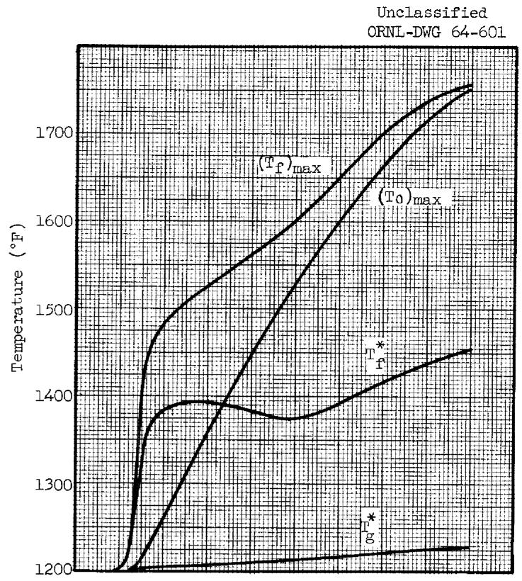

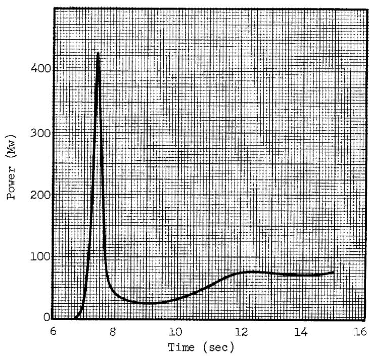  
Fig. 7.1. Power and Temperature Transients Produced by Uncontrolled Rod Withdrawal in Reactor Operating with Fuel B.

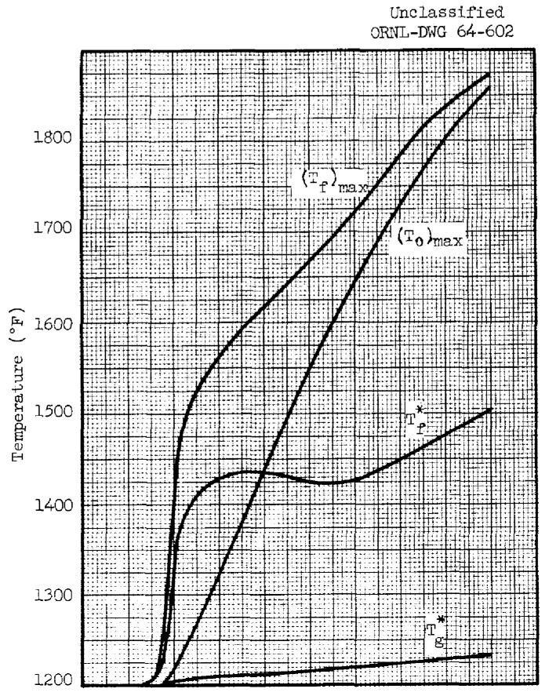

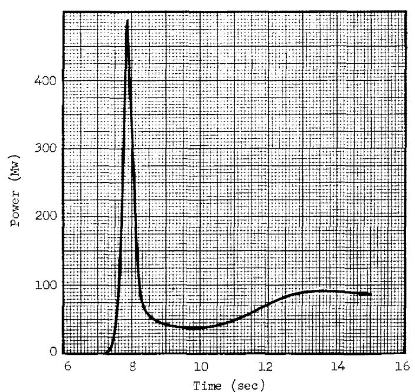  
Fig. 7.2. Power and Temperature Transients Produced by Uncontrolled Rod Withdrawal in Reactor Operating with Fuel C.

It is clear from Figs. 7.1 and 7.2 that intolerably high fuel temperatures would be reached in this accident if complete withdrawal of the control rods were possible. This is prevented by the safety system, which disengages the clutches on all three rod drives when the power reaches 15 Mw and allows the rods to fall into the core.

The adequacy of the high-power safety action was examined by calculations for fuel C. The transients described in Fig. 7.2 were allowed to develop until the power reached $15\mathrm{Mw}$ . The period at this time was 98 msec. At that point it was assumed that two rods were dropped (beginning 0.1 sec after the flux reached $15\mathrm{Mw}$ , with an acceleration of only $5\mathrm{ft/sec}^2$ ), while the third rod continued to withdraw. The power and temperature excursions for this case are shown in Fig. 7.3. The pressure excursion amounted to only 8 psi. It is evident that dropping two control rods in this accident limited the initial excursions to tolerable proportions. The reactor cannot be made critical by the withdrawal of only one control rod. Therefore the safety action is adequate for the postulated accident, and failure of the rod-drop mechanism on one rod does not impair the safety.

# 7.1.3 "Cold-Slug" Accident

The "cold-slug" accident is one in which the mean temperature of the core decreases rapidly because of the injection of fuel at an abnormally low temperature. The reactivity increases in this case because of the fuel's negative temperature coefficient of reactivity.

The design of the MSRE fuel system, with the core at the lowest point of the circulating loop, is conducive to thermal convection, so it is unlikely that the temperature of the fuel outside the core can be reduced much below that in the core. Furthermore, if the fuel pump stops, control system interlocks automatically prevent the pump from being restarted unless the control rods are inserted. The shutdown margin of the rods is enough so that the reactor cannot be made critical by any cold slug. (With the rods in, and the graphite at $1200^{\circ}\mathrm{F}$ , the critical temperature of the fuel is below the freezing point.)

Although the occurrence of a cold slug accident is highly improbable, the consequences of such an accident were calculated. In the calculations

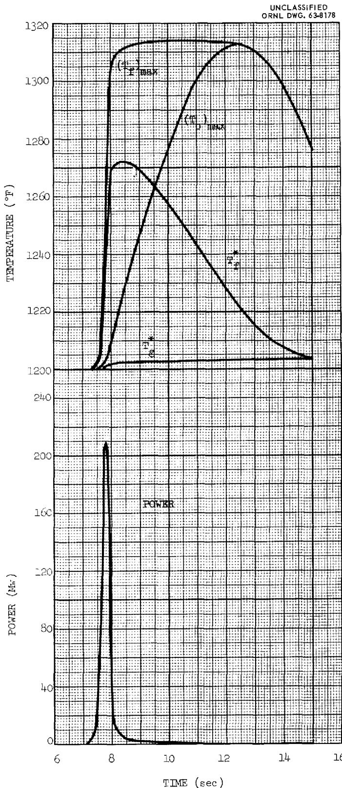  
Fig. 7.3. Effect of Dropping Two Control Rods at 15 Mw During Uncontrolled Rod Withdrawal in Reactor Operating with Fuel C.

it was assumed that one core volume of fuel salt at $900^{\circ}\mathrm{F}$ entered the core at 1200 gpm with the core operating at $1200^{\circ}\mathrm{F}$ and 1 kw. No corrective action was assumed. Calculations for fuels B and C gave pressure excursions of about 6 psi in either case. Power and temperature excursions were larger for fuel B and are shown in Fig. 7.4. The progress of the transients showed that as the front of the cooler salt entered the core, the inlet temperature dropped to $900^{\circ}\mathrm{F}$ . As the volume of the core occupied by the cold slug became larger, the fuel's nuclear average temperature decreased slowly and added reactivity. When the reactivity approached prompt critical, the power rose sharply (on a 110-msec period) and substantial nuclear heating occurred. This caused the fuel's nuclear average temperature to rise sharply and limit the power excursion. The outlet temperature rose at first, reflecting the increased heat generation, and then, as the leading edge of the cold slug reached the top of the core, it dropped sharply. Simultaneously, the reactor inlet salt temperature returned to $1200^{\circ}\mathrm{F}$ as the available amount of cold fluid was exhausted. The channel outlet temperature passed through a maximum upon arrival of the fluid heated at the center of the core by the initial power transient and then decreased until, finally, the rise in the salt's inlet temperature was again reflected (about 9.4 sec later) as a rise in the channel outlet temperature.

# 7.1.4 Filling Accidents

In any shutdown during which the reactor must be cooled, the fuel is drained from the core. Refilling the core with fuel salt is therefore a routine operation. It is conceivable that criticality could be attained before the core was full and that damaging temperatures might be produced in the partially filled core. This could occur in several ways if no safety system were available for protection.

In a normal startup, the reactor and the fuel salt in the drain tank are heated to near the operating temperature before the salt is transferred by gas pressure into the core. The control rods are positioned so that the reactor remains subcritical after the salt fills the core. They are not fully inserted, however, so that they may be dropped if criticality

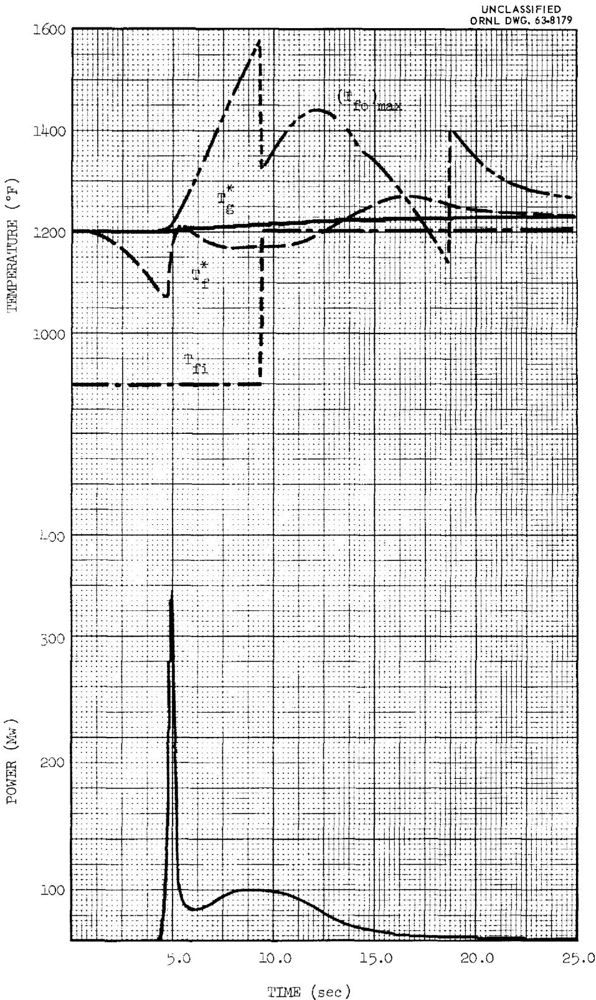  
Fig. 7.4. Power and Temperature Transients Following Injection of Fuel B at $900^{\circ}\mathrm{F}$ into Core at $1200^{\circ}\mathrm{F}$ ; No Corrective Action Taken.

is unexpectedly attained during a fill. Criticality could be reached prematurely while the core is being filled if: (1) the control rods were withdrawn too far, (2) the core temperature were abnormally low, or (3) the fuel were abnormally concentrated in uranium. Interlocks and procedures are designed for effective prevention of premature criticality for any of these reasons. The consequences were examined, however, to determine the adequacy of the safety system for preventing damage should such an accident occur.

The amount of reactivity available in a filling accident and the rate of addition depend on the conditions causing the accident, the characteristics of the fuel salt, and the rate of filling. The filling rate is physically limited by the gas-addition system, which contains a rupture disk to limit the supply pressure and a permanently installed restrictor that controls the gas flow rate into the drain tank. In the case of filling the reactor with the control rods fully withdrawn, the excess reactivity is limited to the amount in the normal fuel loading. Only about $3\%$ $\delta \mathbf{k} / \mathbf{k}$ will be required for normal operation (see sec. 1.3), and the amount of uranium in the fuel will be restricted by administrative control to provide no more than required. Filling at the normal rate (about 0.5 ft³/sec) with all rods fully withdrawn results in a reactivity ramp of $0.010\%$ $\delta \mathbf{k} / \mathbf{k}$ per sec when $\mathbf{k} = 1$ . In filling the core at an abnormally low temperature, excess reactivity is added by means of the negative temperature coefficient of the fuel. For fuel B (the mixture with the largest negative temperature coefficient of reactivity), filling the core with salt at the liquidus temperature ( $840^{\circ}\mathbf{F}$ ) produces a reactivity addition rate at $\mathbf{k} = 1$ of only $0.006\%/\mathrm{sec}$ . The greatest excess reactivity and the highest rates of addition could be encountered if the core were filled with fuel abnormally concentrated in uranium.

Selective freezing of the fuel salt is a mechanism whereby an abnormally high concentration of uranium could be produced. The crystallization paths of the fuel salt mixtures are such that under equilibrium conditions, a fraction of the salt can be solidified before uranium (or thorium) appears in the solid phase. By such selective freezing the uranium concentration can be increased by a factor of 3. This phenomenon can

only be produced by extremely slow cooling; normal freezing does not result in any separation. It is very unlikely that the salt in the drain tanks would be cooled slowly enough to produce uranium separation. It is even more unlikely that the concentrated liquid would be transferred to the core, since the solid phase would remelt if the salt were heated to the normal fill temperature. Nevertheless, the consequences of a severe case of selective freezing were examined.

The reactor vessel is the first part of the fuel loop to be filled, and only $61\%$ of the salt inventory is required to raise the level to the top of the graphite in the core. Therefore it was assumed that all the uranium was concentrated in this amount of salt. (It was assumed that the solid was composed entirely of 6LiF·BeF2·ZrF4.) If the core could be filled with this concentrated salt at $1200^{\circ}\mathrm{F}$ , the excess reactivity would be about $4\%$ 8k/k for fuels A and C and $15\%$ 8k/k for fuel B. (The difference is caused by the absence in fuel B of thorium or much $\mathrm{U}^{238}$ , which acts as poison in the concentrates of fuels A and C.) The reactivity addition rate at k = l also is much the highest for fuel B: $0.025\%$ 8k/k per sec compared with $0.01\%/$ sec for fuels A and C.

The rates of reactivity increase through criticality are high enough that a considerable power excursion will result and cause the safety system to drop the rods at 15 Mw. In the severe filling accident which has been postulated, the excess reactivity available is greater than the shutdown capacity of the control rods. Therefore it is necessary to stop the filling to prevent the reactor from going critical again after the rods are dropped. This is done by manipulation of valves in the reactor gas system.

A simplified flowsheet of the reactor fill, drain, and vent systems, showing only those features that pertain directly to the filling accident, is presented in Fig. 7.5. All valves are shown in the normal positions for pressurizing fuel drain tank No. 1 to force fuel up into the core. Three independent actions are available to stop the addition of fuel to the primary loop:

1. Opening HCV-544 equalizes the loop and drain tank pressures.

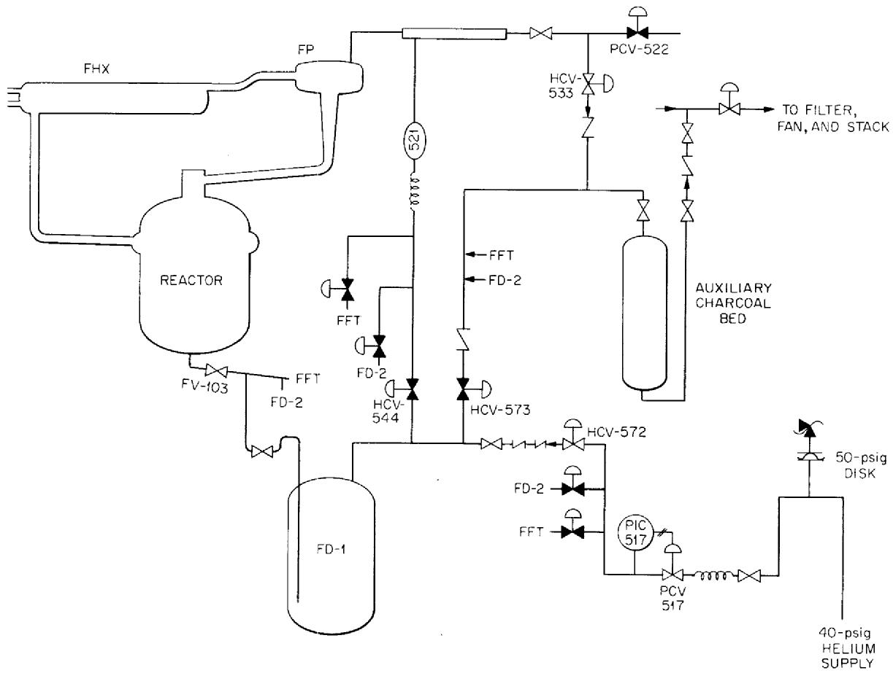  
Fig. 7.5. System Used in Filling Fuel Loop.

2. Opening HCV-573 relieves the pressure in the drain tank by venting gas through the auxiliary charcoal bed to the stack.   
3. Closing HCV-572 stops the addition of helium to the drain tank.

During a filling accident all three actions would be initiated automatically (at 15 Mw) to ensure stopping the fill. Either of the first two actions stops the fill almost immediately and also allows the fuel in the primary loop to run back to the drain tank. If the only action is to stop the gas addition, the fuel does not drain back to the tank, and the level "coasts" up for some distance after the gas is shut off. This "coastup" is a consequence of the pressure drops in the fill line and the offgas line during filling. Because of this, when gas addition is stopped, the fuel level in the primary loop continues to rise until the dynamic head

losses have been replaced by an increase in the static head difference between loop and drain tank.

In the case of a filling accident, the inherent shutdown mechanism for power excursions is less effective than normally because the temperature coefficient of reactivity of the fuel in the partially filled core is substantially less than that in the full system. This is so because, in the full system, the size of the core remains constant, and expansion causes some fuel to be expelled. In the partially full core, on the other hand, fuel expansion increases the effective height of the core, tending to offset the decrease in reactivity due to increased radial neutron leakage. The effective fuel temperature coefficient of reactivity of fuel B with the core $60\%$ full is approximately $-0.4 \times 10^{-5} / {}^{\circ}\mathrm{F}$ compared with $-5.0 \times 10^{-5} / {}^{\circ}\mathrm{F}$ for the full core. The temperature coefficient of the graphite is not significantly affected by the fuel level.

The most severe of the postulated filling accidents was analyzed in detail. It was assumed that the uranium in fuel B was concentrated to 1.6 times the normal value by selective freezing of $39\%$ of the salt in the drain tank, and several other abnormal situations were postulated to occur during the course of the accident, as follows:

1. Only two of the three control rods dropped on request during the initial power excursion.   
2. Two of the three actions available for stopping the fill failed to function. Only the least effective action, stopping the gas addition, was used in the analysis. This allowed the fuel level to coast up and make the reactor critical after the two control rods had been dropped to check the initial power excursion.   
3. The helium supply pressure was 50 psig, the limit imposed by the rupture disk in the supply system, rather than the normal 40 psig. This pressure gave a fill rate of 0.5 ft³/min when criticality was achieved and produced a level coastup of 0.2 ft after gas addition was stopped.

The results of calculations of the power and temperature transients associated with the accident described above are shown in Figs. 7.6 and 7.7. Figure 7.6 shows the externally imposed reactivity transient exclusive of temperature compensation effects. The essential features are the initial, almost-linear rise which produced the first power excursion as

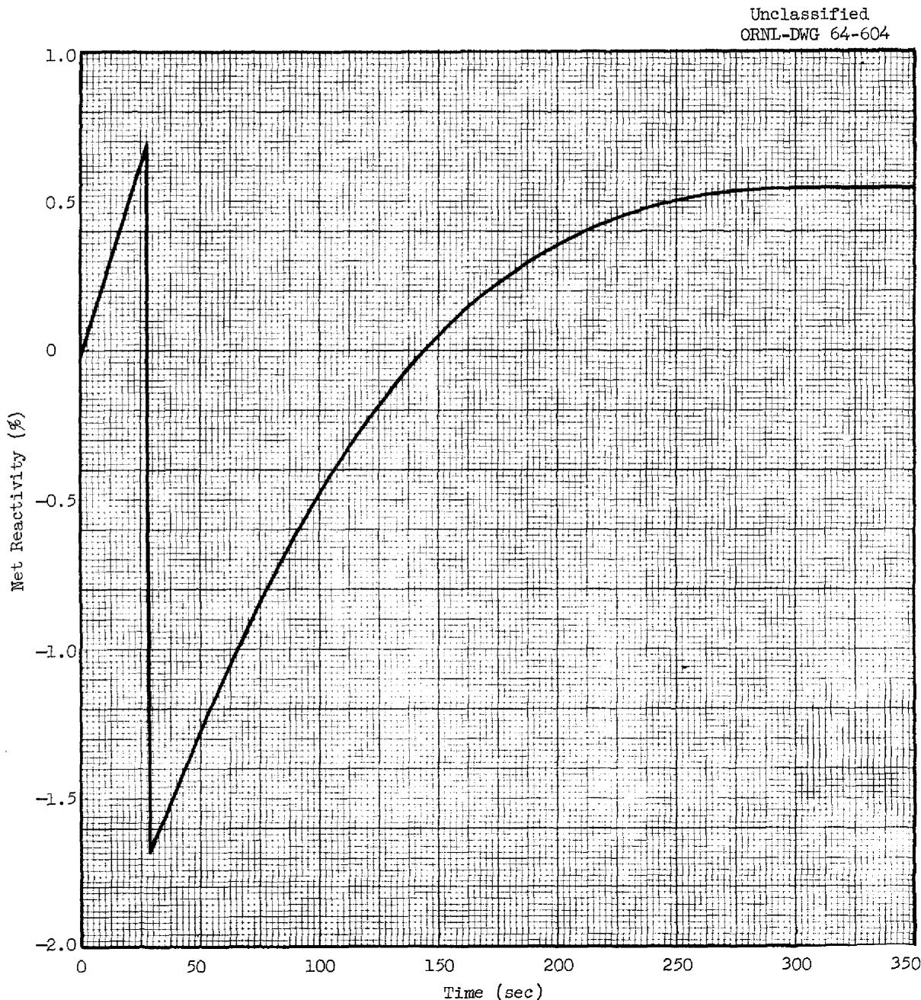  
Fig. 7.6. Net Reactivity Addition During Most Severe Filling Accident.

fuel flowed into the core, the sharp decrease as the rods were dropped, and the final rise as the fuel coasted up to its equilibrium level. Figure 7.7 shows the power transient and some pertinent temperatures. The fuel and graphite nuclear average temperatures are the quantities which ultimately compensated for the excess reactivity introduced by the fuel coastup.

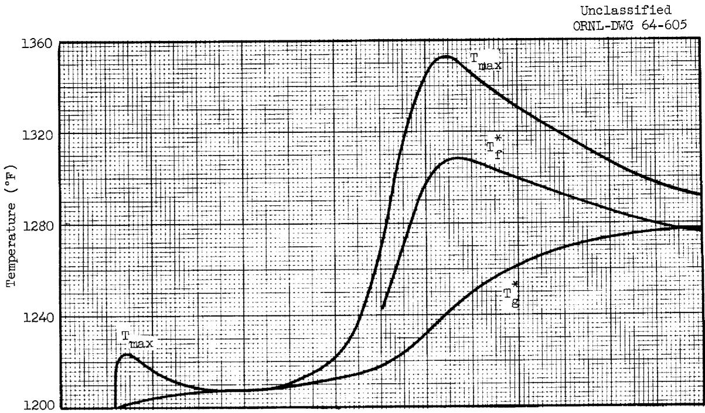

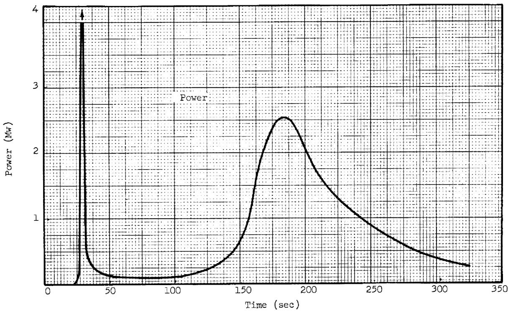  
Fig. 7.7. Power and Temperature Transients Following Most Severe Filling Accident.

The maximum fuel temperature refers to the temperature at the center of the hottest portion of the hottest fuel channel. The power at initial criticality was assumed to be 1 watt. The initial power excursion was limited to 24 Mw by the dropping control rods, which were tripped at 15 Mw. This excursion is not particularly important, since it did not result in much of a fuel temperature rise. After the initial excursion, the power dropped to about 10 kw, and some of the heat that had been produced in the fuel was transferred to the graphite. The resultant increase in the graphite nuclear average temperature helped to limit the severity of the second power excursion. Reactivity was added slowly enough by the fuel coastup that the rising graphite temperature was able to limit the second power excursion to only 2.5 Mw. The maximum temperature attained, $1354^{\circ}\mathrm{F}$ , is well within the range that can be tolerated.

# 7.1.5 Fuel Additions

Small amounts of uranium will be added to the circulating fuel during operation to compensate for $\mathrm{U}^{235}$ burnup and the buildup of long-lived poissons. The design of the fuel-addition system is such that only a limited amount of uranium can be added in any one batch, and it is added in such a way that it mixes gradually into the stream circulating through the core. These limitations ensure that the reactivity transients caused by a normal fuel addition are inconsequential.

Fuel is added during operation through the sampling and enriching mechanism. Frozen salt (73% LiF-27% UF₄) in a perforated container holding at most 120 g of U²³⁵ is lowered into the pump bowl where it melts into the 2.7 ft³ of salt in the bowl. The 65-gpm bypass stream through the pump bowl gradually introduces the added uranium into the main circulating stream. The net increase of reactivity, once the 120 g of U²³⁵ is uniformly dispersed in the 70.5 ft³ of salt in the fuel loop, is 0.07% δk/k for fuel B and 0.03% δk/k for fuels A or C. This increase is automatically compensated for by the servo-driven control rod.

An upper limit on the reactivity transient caused by a fuel addition was estimated by postulating that all $120\mathrm{g}$ of $\mathrm{U}^{235}$ was instantly dispersed throughout the pump bowl, from where it was mixed into the circulating

stream. This produced a step increase in the fuel concentration leaving the pump, and when this fuel began filling the core there was a reactivity increase. The largest reactivity increase would occur in the case of fuel B. (Reactivity effects would be less by a factor of 2 for fuels A and C because of their higher uranium concentrations and smaller concentration coefficients of reactivity.) The maximum rate of reactivity increase for fuel B was only $0.017\% \delta \mathrm{k} / \mathrm{k}$ per sec, which is slower than the rate at which the regulating rod moves. Therefore, with the reactor under servo control, there would be no disturbance in power or temperature. If there were no rod action the maximum reactivity increase would be $0.09\% \delta \mathrm{k} / \mathrm{k}$ , during the first passage of the more concentrated fuel through the core. Only moderate transients in power or temperature could be produced by this much excess reactivity.

# 7.1.6 $\underline{\mathrm{UO}}_2$ Precipitation

The chemical stability of the fuel poses safety problems in a fluid fuel reactor; for if phases which are unusually concentrated in uranium can appear, deposits may collect and cause local overheating or, if they shift position, reactivity excursions. The only known way in which uranium could become concentrated in the MSRE fuel-circulating system is by gross contamination of the salt with oxygen, with consequent precipitation of $\mathrm{UO_2}$ . As discussed in Section 1.l, the fuel salt for the MSRE is protected against oxidation and subsequent precipitation of uranium by the inclusion of $\mathrm{ZrF_4}$ in the fuel salt. The ratio of $\mathrm{ZrF_4}$ to $\mathrm{UF_4}$ in the fuel will be over 5, and more than $3\mathrm{ft^3}$ of water or $9000\mathrm{ft^3}$ of air would have to react with the $70\mathrm{ft^3}$ of fuel salt before so much of the $\mathrm{ZrF_4}$ was converted to oxide that $\mathrm{UO_2}$ would begin to appear. The only way that such quantities of water or air could enter the system in a short period of time would be some failure or accident during maintenance with the system open. During operation, only gradual contamination is at all credible. After any maintenance period and at frequent intervals during operation, fuel salt samples will be examined and analyzed for zirconium and other oxides. Thus oxide contamination should be detected long before the uranium began to precipitate, and appropriate action could be taken to prevent such precipitation.

Although it is extremely unlikely that the precautions against oxygen contamination, the protection of the $\mathrm{ZrF_4}$ , and the surveillance of samples will fail to prevent $\mathrm{UO_2}$ precipitation, the consequences of such precipitation were considered. The most likely regions for precipitated $\mathrm{UO_2}$ to collect are in the heads of the reactor vessel, where velocities are lowest. Collection in the lower head would create the greatest potential for a large, positive reactivity disturbance because the lower head is near the inlet to the core. There is no known way in which a substantial amount of deposited $\mathrm{UO_2}$ could be quickly resuspended, either by physical disturbance or dissolution in the fuel salt. Nevertheless, if some $\mathrm{UO_2}$ were resuspended in the salt below the core, it could pass rapidly through the center of the core and cause a reactivity excursion. The greatest effect would result if it passed up through the high-velocity (2 ft/sec) channels around the center of the core.

Excess uranium introduced at the lower end of a central channel would cause the reactivity to increase to a peak in about 1.5 sec and then decrease over a like period. Calculations were made using the reactivity coefficients and neutron lifetime of fuel C to determine the consequences of such excursions. The temperature and pressure transients caused by this type of reactivity excursion with peaks up to $0.7\%$ $\delta \mathbf{k} / \mathbf{k}$ are tolerable without any control rod action.* Rod drop at a power level of 15 Mw does not raise the tolerable reactivity addition very much in excursions of this kind, because the period at 15 Mw is so short (about 80 msec) that self-shutdown occurs before the rods have time to contribute very much. Calculations for fuel C indicated that the 15-Mw rod drop raised the tolerable reactivity peak from $0.7\%$ to about $0.9\%$ $\delta \mathbf{k} / \mathbf{k}$ .

Rather large amounts of excess uranium would be required to produce the limiting excursions. Assuming that all the uranium passed through a central channel in a single blob, over $700\mathrm{g}$ of U $(0.8\mathrm{kg}$ of $\mathrm{UO}_2)$ would be required to give a peak of $0.7\%$ $\delta \mathrm{k} / \mathrm{k}$ when the fuel is of composition C.

Equivalent excursions would be produced by about $200\mathrm{g}$ of U in fuel A or $100\mathrm{g}$ of U in fuel B.

The question arises: how do these quantities compare with the amount of $\mathrm{UO_2}$ whose separation could be detected by its effect on reactivity? A reactivity effect would be produced if the average nuclear importance of the separated uranium differed from that of the circulating uranium. The low-velocity regions where precipitated $\mathrm{UO_2}$ may collect are at lower-than-average importance, so the reactivity would probably decrease if $\mathrm{UO_2}$ were lost. During critical operation a reactivity balance will normally be made at 5-min intervals. (The on-line digital computer connected to the MSRE is programmed to do this automatically, but operation of the computer is not regarded as a necessary condition for nuclear operation.) In this balance, the calculated effects of temperature, power, xenon, burnup, and control rod positions are included. The minimum change in reactivity, occurring over a period of a few hours, that could be recognized as an anomaly is expected to be about $0.1\%$ $\mathrm{sk / k}$ . The reactivity change caused by deposition of $\mathrm{UO_2}$ where it contributes nothing to the chain reaction in the core is 0.23, 0.45, or $0.066\%$ $\mathrm{sk / k}$ per kg of $\mathrm{UO_2}$ for fuels A, B, or C, respectively. Therefore the minimum amounts of $\mathrm{UO_2}$ separation which could be detected by this means are about 0.4, 0.2, and $1.5\mathrm{kg}$ of $\mathrm{UO_2}$ for fuels A, B, and C, respectively.

It is evident that the reactivity balance cannot be relied on to detect $\mathrm{UO_2}$ loss below the level at which the conceivable effects of complete and sudden recovery become important. Any $\mathrm{UO_2}$ deposits would probably be quite stable, however, so the probability of sudden resuspension of a large fraction of a deposit is very small. (In the HRE-2, where deposits could be dispersed by the movement of the loose core inlet diffusers or by steam formation, and the dispersed material was soluble, the largest "instantaneous" recovery was less than 0.1 of the existing power-dependent deposits of uranium.) Therefore it is probable that if $\mathrm{UO_2}$ precipitation were to develop, it would produce a detectable reactivity decrease before any serious reactivity excursion would have a reasonable chance of occurring. This is only added assurance, however, for the real protection against damaging excursions is provided by the measures which prevent $\mathrm{UO_2}$ formation in the first place.

Abnormal, localized heating would result if a $\mathrm{UO_2}$ deposit (or other solids containing uranium) were located where the neutron flux caused fission heating in the deposit. One place where the reactor vessel would most likely be subject to such heating is the lower head. For this reason thermocouples are attached to the outside of the lower head and the differences between these temperatures and the temperature of the fuel entering the reactor vessel are monitored continuously to detect abnormal heating. This is primarily a means of detecting a deposit of uranium solids rather than a guard against overheating, since, from the standpoint of damage to the vessel, the heating in the lower head is not expected to be serious, even if fairly heavy deposits of uranium collect. The reason is that the specific heat source in the uranium-bearing solids on the lower head would not be intense (3 to 8 w per g of $\mathrm{UO_2}$ when the power is $10\mathrm{Mw}$ ) because the neutron flux would be greatly attenuated by the salt and the INOR grid below the core. Calculated temperature differences at $10\mathrm{Mw}$ are shown in Fig. 7.8. (The differences are proportional to power.) The curves are different for fuels A, B, and C because of differences in flux and uranium enrichment.

Another region susceptible to local heating due to $\mathrm{UO_2}$ deposition is the pocket between the top of the core shell and the reactor vessel, above the core shell support flange. There are passages at 10-in. intervals around the periphery of the support flange which bypass some salt from the vessel inlet for cooling and for providing some rotational flow in this region. Although the vertical component of the velocity in the pocket may not be sufficient to eliminate settling of $\mathrm{UO_2}$ , the swirling motion should result in an even distribution if deposition should occur. The area for deposition is large enough (180 in. $^2$ ) that the loss of uranium from the circulating salt would be detectable before a $\mathrm{UO_2}$ deposit could become deep enough to cause intolerable heating in this region. The maximum vessel temperature in this vicinity was calculated by assuming that enough uranium separated to cause loss of $0.2\%$ $\delta \mathrm{k} / \mathrm{k}$ in reactivity and that all this uranium accumulated as $\mathrm{UO_2}$ on top of the core shell support flange. The calculated maximum temperature in the vessel wall was

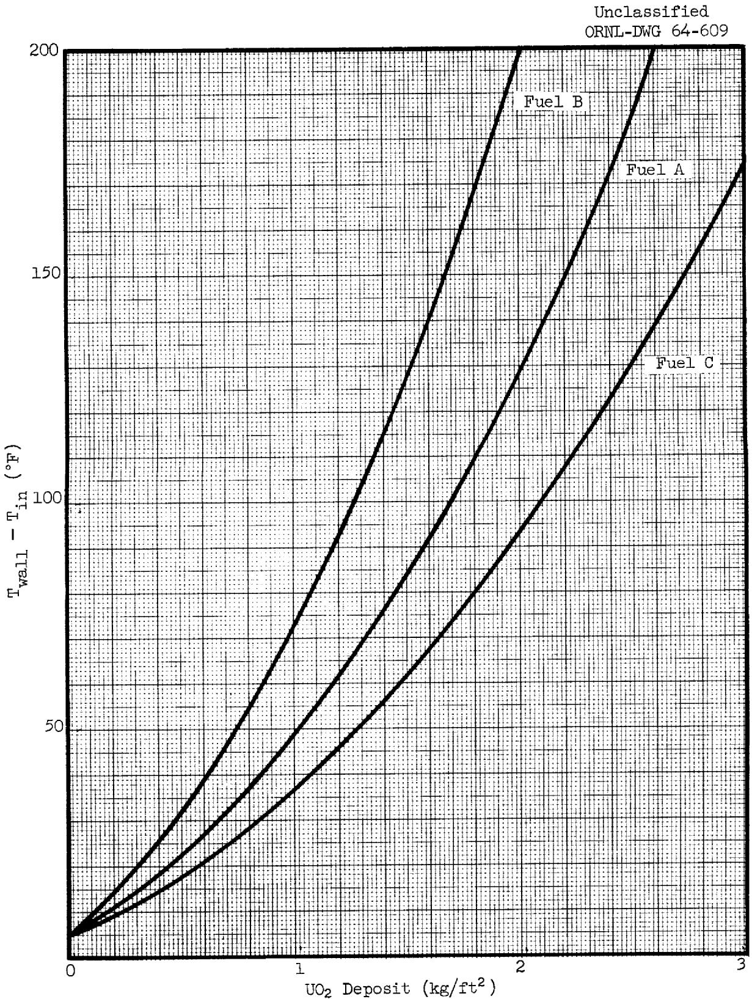  
Fig. 7.8. Effects of Deposited Uranium on Afterheat, Graphite Temperature, and Core Reactivity.

less than $1600^{\circ}\mathrm{F}$ with the reactor at 10 Mw and the core inlet temperature at $1175^{\circ}\mathrm{F}$ .

The possibility of settling on the upper support flange was examined experimentally by examining the flange area of the full scale hydraulic mockup after it had been operated with iron filings in the circulating water, but no preferential settling in this area was observed. In summary, this examination indicates that the consequences of uranium precipitation do not appear to be of a serious nature from the hazards standpoint.

# 7.1.7 Graphite Loss or Permeation

If a small part of the graphite in the core were replaced by an equal volume of fuel salt, the reactivity would increase. The effect would not be large, amounting to less than $0.003\% \delta \mathrm{k} / \mathrm{k}$ per in.3 of graphite replaced by fuel or only $0.13\% \delta \mathrm{k} / \mathrm{k}$ if the entire central stringer were replaced with fuel. The reactivity transients caused by loss of graphite due to credible mechanisms present no hazard.

Minor loss of graphite from the core will occur if chips of graphite break loose and float out of the core. The vertical graphite pieces are fastened at their lower ends and are secured by wire through their upper tips. Thus it is very unlikely that a piece of graphite large enough to cause a noticeable change in reactivity could float out of the core.

Another mechanism whereby fuel replaces graphite in the core is the bowing of the graphite stringers, which causes the volume fraction of the fuel near the center of the core to increase. The bowing is caused by the longitudinal shrinkage of the graphite under fast neutron irradiation. The radial gradient of the neutron flux causes unequal shrinkage on opposite sides of a stringer and produces bowing that is convex in the direction of the gradient. The shrinkage is very slow, and the increase in reactivity due to unrestrained bowing has been estimated at only $0.6\%$ $\delta \mathrm{k} / \mathrm{k}$ per full-power year.

Graphite shrinkage also causes small increases in reactivity because the moderator density is increased and because the lateral shrinkage gradually opens the channels and allows more fuel in the core. These effects are of no concern because they cause less than $0.2\%$ $\delta \mathrm{k} / \mathrm{k}$ increase per full-power year and there is no possibility of rapid changes.

A reactivity increase would also result from fuel salt permeating the pores in the graphite and thus increasing the amount of uranium in the core. There is no known way, however, in which increased permeation could cause a sudden or dangerous increase in reactivity. Tests invariably have shown that the fuel salt does not wet the graphite and that penetration of the fuel into the graphite pores is limited by surface tension, the size of the pores, and the external pressure. Neither of the first two variables is subject to rapid or drastic change. As indicated in Table 1.5 (sec. 1.1.3), the measured permeability of salt in the graphite is only $0.2 \, \text{vol} \, \%$ at 150 psig. The pressure effect on permeation produces little reactivity effect, being less than $5 \times 10^{-6} \, \text{kJ/k per psi}$ and is therefore unimportant either as a means of externally increasing reactivity or as a feedback during transients involving pressure excursions.

Another means for increasing the reactivity of the core is sorption of uranium on the graphite surface. None of the many out-of-pile tests has shown evidence for such sorption. However, uranium in amounts as great as $1\mathrm{mg}$ of uranium per $\mathrm{cm}^2$ of graphite surface has been observed in a relatively thin surface layer on specimens from capsules irradiated for 1500 hr to fission power densities considerably above those expected for the MSRE. Uranium sorption has been observed so far only on graphite from experiments in which copious quantities of $\mathbf{F}_2$ and $\mathrm{CF_4}$ were evolved by radiolysis of the frozen fuel mixture. (Such radiolytic evolution probably occurred several times during the irradiation experiment since the assemblies were cooled through reactor shutdowns many times during their irradiation history.) It is possible that the uranium was laid down on the graphite by reactions such as

$$
4 \mathrm {U F} _ {3} + 2 \mathrm {C} \rightarrow \mathrm {U C} _ {2} + 3 \mathrm {U F} _ {4}
$$

during sudden reheat of the capsule in which the frozen fuel had thus become deficient in $\mathbf{F}_2$ . According to this explanation the sorbed uranium would not be expected in MSRE operation. It is possible, on the other hand, that the sorbed uranium is due to some unknown (and thermodynamically unlikely) effect of irradiation and fission at elevated temperatures and that it can occur under conditions of operation of the MSRE. Uranium in or on the graphite, through whatever mechanism, would increase the

reactivity of the assembly, the graphite temperature during operation, and the quantity of afterheat in the graphite. Figure 7.9 shows each of these effects as calculated for each of the three fuel compositions previously discussed. All effects are considerably smaller when salt C (the first salt proposed for MSRE operation) is used, but the reactivity increase, in any case, is sufficiently large to be hazardous only if it can occur in a short time.

# 7.1.8 Loss of Flow

Interruption of fuel circulation can produce power and temperature excursions through two mechanisms: a reduction in heat removal from the core and an increase in the effective delayed-neutron fraction. When the fuel is circulating normally, delayed-neutron precursors produced in the core are distributed throughout the entire volume of circulating fuel, and nearly half decay outside the core. If the circulation is interrupted at any time, the delayed-neutron effect produces a reactivity effect of $0.3\%$ $\delta k / k$ over a period of many seconds. (The increase in the effective delayed-neutron fraction would be slow, even if the flow could be stopped instantaneously, because of the time required for the precursor concentrations to build up to equilibrium.) A core temperature rise of less than $50^{\circ}F$ is enough to compensate for the increased reactivity and, because of the nature of the reactivity increase, no hazardous power excursion is produced in any case. If the reactor is at high power when circulation is interrupted, the decreases in heat removal from the core and heat transfer to the coolant will cause fuel temperatures to rise and the coolant temperature to fall.

The only likely cause of loss of fuel flow is failure of the power to the fuel pump. The results of a simulated fuel pump power failure at 10 Mw, with no corrective action, are shown in Fig. 7.10. The cooldown in flow after the failure of the pump power was simulated by reducing the circulation rate exponentially with a time constant of 2 sec until it reached the thermal-convection circulation rate determined by the temperature difference across the core. (The flow deceleration was based on pump

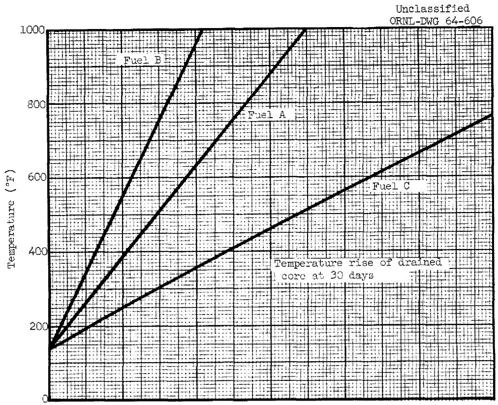

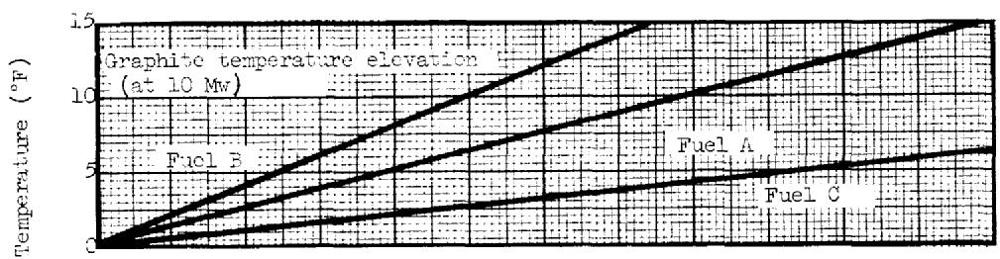

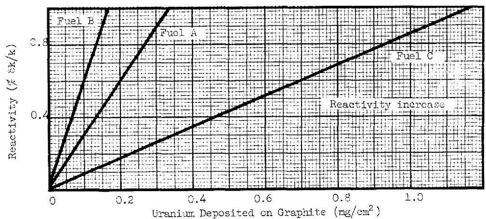  
Fig. 7.9. Power and Temperatures Following Fuel Pump Failure, with no Corrective Action.

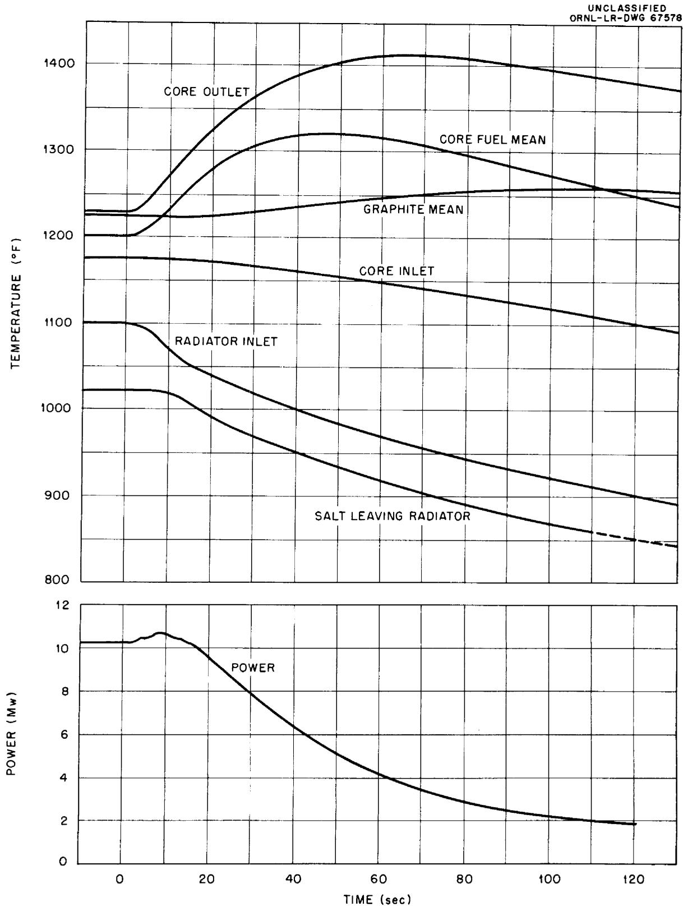  
Fig. 7.10. Power and Temperatures Following Fuel Pump Power Failure. Radiator doors closed and control rods driven in after failure.

loop measurements. $^{1}$ The heat transfer and thermal convection were predicted from basic data.) The initial increase in nuclear power was caused by the delayed-neutron effects. The decrease in heat removal from the core, coupled with the high production, caused the core outlet temperature to rise. As the fuel flow and the heat transfer in the heat exchanger fell, the continued heat extraction at the radiator caused the coolant salt temperature to decrease and reach the freezing point in less than 2 min. The behavior in simulator tests at lower power was similar, but the coolant temperature remained above the freezing point if the air flow through the radiator was such that the initial power was less than 7 Mw.

The effects of a fuel pump power failure are minimized by automatic action of the safety and control systems. At nuclear powers above 1.5 Mw, control interlocks start a rod reverse (insert rods at 0.5 in./sec) as soon as the pump begins to slow down. A rod reverse is called for in any event if the core outlet temperature reaches $1275^{\circ}\mathrm{F}$ . At an outlet temperature of $1300^{\circ}\mathrm{F}$ the safety system drops all rods. These actions hold down the heat generation and core temperatures. The coolant salt is kept from freezing by other action. When the pump stops, an automatic "load reverse" lowers the radiator air flow to about 0.2 of the normal 10-Mw rate. The safety system drops the doors to shut off the air completely if the temperature of the salt leaving the radiator reaches $900^{\circ}\mathrm{F}$ . These actions prevent freezing of the coolant salt in the radiator.

Simulator results that illustrate the effectiveness of actions similar to those designed into the control and safety systems are given in Fig. 7.11. Rod insertion was simulated by a negative reactivity ramp of $-0.075\%$ $\delta \mathbf{k} / \mathbf{k}$ per sec beginning 1 sec after the pump power was cut. The radiator door action in the present control system was not simulated. Instead the simulated heat removal from the radiator tubes was reduced to zero over a period of 30 sec beginning 3 sec after the pump power failure.

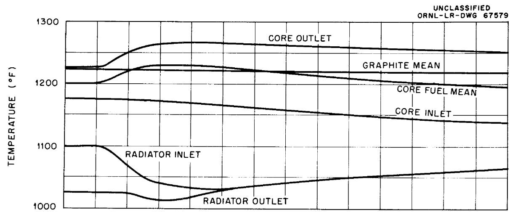

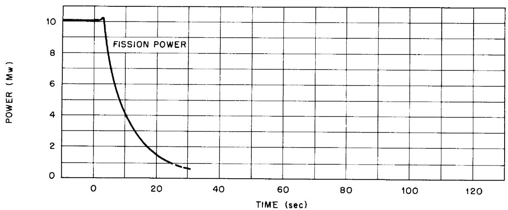  
Fig. 7.11. Effects of Afterheat in Reactor Vessel Filled with Fuel Salt After Operation for 1000 hr at 10 Mw.

# 7.1.9 Loss of Load

The type of incident usually referred to as the loss-of-load accident takes the form, in the MSRE, of interruption of heat removal from the radiator while the reactor is operating at high power. The most likely way for this to occur would be for the radiator doors to drop. Failure of the cooling air blowers would cause less of a load drop because natural draft through the radiator can remove up to 3 Mw of heat.

The thermal and nuclear characteristics of the MSRE are such that core temperatures do not rise excessively in any loss-of-load accident, even with no external control action. Temperature transients are mild

and there is no core pressure surge. This behavior was shown in simulator tests in which the heat removal from the radiator tubes was instantaneously cut off with the reactor initially at 10 Mw. The temperature coefficients of reactivity for fuel C were used and no control rod action was assumed. In these tests the core outlet temperature rose less than $40^{\circ}\mathrm{F}$ , over a period of about 4 min. The average temperature of the coolant salt rose $196^{\circ}\mathrm{F}$ , with $100^{\circ}\mathrm{F}$ of this rise occurring in the first 60 sec. The coolant salt volume increased by 1.0 ft $^3$ , which, if there were no gas vented from the coolant pump bowl, would cause a pressure rise of 20 psi. The pressure control system would be capable of limiting the pressure rise to less than 11 psi.

# 7.1.10 Afterheat

The problems associated with the decay heat from the fission products (afterheat) are quite moderate in the MSRE because of the relatively low specific power in the reactor. Thus temperatures change slowly and no rapid emergency action is required to prevent overheating. This may be illustrated by considering a hypothetical situation in which the reactor vessel remains full of fuel, with the circulation stopped, after long-term, high-power operation. The vessel contains three-fourths of the fuel salt in the system and about three-fourths of the fission products. The total heat capacity of the fuel, the graphite, and the metal vessel is 8030 Btu/°F. The estimated heat loss from the vessel at $1200^{\circ}\mathrm{F}$ is about 30 kw. The effects of fission-product heating in the vessel after 1000 hr at 10 Mw are shown in Fig. 7.12. It appears that no serious increase in temperature will result from afterheat if the fuel is trapped in the core.

After the fuel is drained from the reactor vessel there will still be some afterheat in the core from fission products which remain in the graphite. These products are there because of diffusion of gaseous products into the graphite and because of direct production by fissions in the fuel which had soaked into the graphite. The heating rate in the drained core 1 hr after shutdown from extended operation at 10 Mw is 4.5 kw, most of which is produced by the gaseous fission products and their daughters.

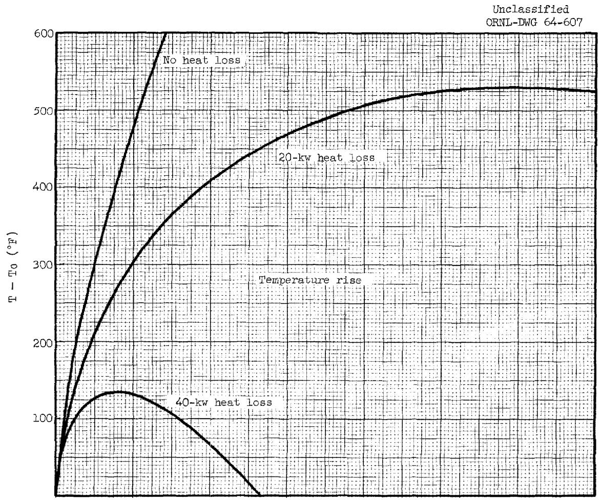

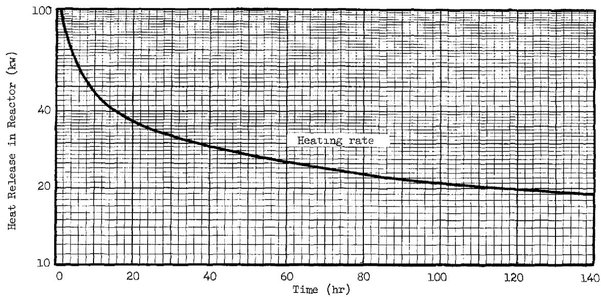  
Fig. 7.12. Temperature Rise of Fuel in Drain Tank Beginning 15 min After Reactor Operation for 1000 hr at 10 Mw.

After 24 hr the heating rate is down to only $0.44\mathrm{kw}$ , so heat losses from the graphite will probably keep the temperatures from rising significantly. But even if there were no heat loss from the core graphite (which has a heat capacity of $3350\mathrm{Btu} / {}^{\circ}\mathrm{F}$ ), the temperature rise would not be hazardous: $27^{\circ}\mathrm{F}$ in one day, $144^{\circ}\mathrm{F}$ in 30 days. These values were calculated by assuming that fuel occupies $0.1\%$ of the graphite volume. For this condition, the fission products produced in situ produce only one-third or less of the total heating, so the results are not very sensitive to the exact amount of permeation.

If the fuel were transferred to a drain tank shortly after high-power operation, the rate of temperature rise in the absence of cooling would be higher than in the core because the total heat capacity connected with the fuel would be less in the drain tank than in the core. However, the drain tanks are provided with cooling tubes designed to remove 100 kw of heat from the salt at $1200^{\circ}\mathrm{F}$ . This heat-removal capacity is adequate to prevent a significant rise in temperature. The predicted heat loss from a drain tank at $1200^{\circ}\mathrm{F}$ is 20 kw. Figure 7.13 shows the expected temperature rise of the fuel charge in a drain tank beginning 15 min after the end of 1000 hr of operation at 10 Mw. (It will take approximately this long to get the salt into the drain tank. The temperature at this time will depend on the manner of shutting down the nuclear power and the radiator heat removal, but it will be near $1200^{\circ}\mathrm{F}$ .) The heat removal rates of 20 and 120 kw correspond, respectively, to heat losses and the heat removal with the cooling system working as designed. The heat capacity of the INOR tank and structure was ignored in computing the temperature rise.

As was described in Section 1.2.5, the cooling system for the drain tanks is based on the evaporation of water, but the water and salt are not in contact with a common wall. The evaporation-condensation circuit is completely closed and requires no pumps because the condensate is returned by gravity. An emergency reservoir of 500 gal is installed to provide cooling for 6 to 8 hr. During this time, hoses could be connected to provide a temporary supply for an indefinite time.

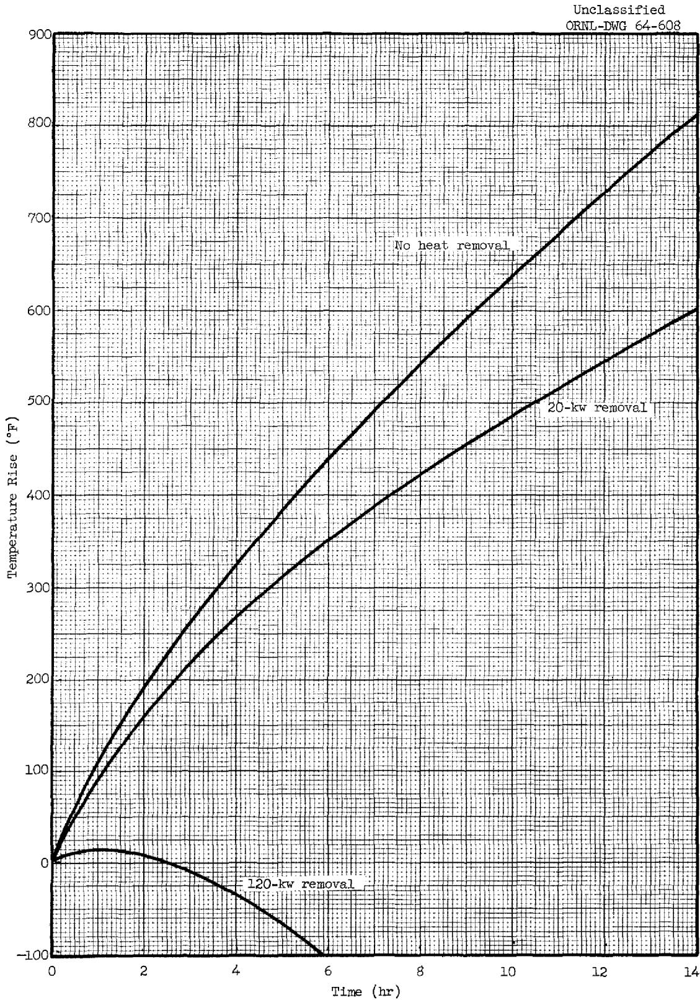  
Fig. 7.13. Heating of Reactor Vessel Lower Head by $\mathrm{UO_2}$ Deposits with Power Level at 10 Mw.

# 7.1.11 Criticality in the Drain Tanks

Fuel salt having the uranium concentration appropriate for power operation of the reactor cannot form a critical mass in a drain tank or in a storage tank under any conditions. Only if there were a large increase in uranium concentration could criticality occur in a tank. The only credible way for this to occur would be for the salt to freeze gradually, leave the $\mathrm{UF}_4$ in the remaining melt, and thereby concentrate the uranium into a fraction of the salt volume. Calculations indicate that concentration by more than a factor of 4 would be necessary for criticality in any such case.[2]

Concentration of the uranium is not impossible; gram-scale studies of equilibrium cooling of fuel salt mixtures indicated that the last phase to freeze was 7LiF·6(Th,U)F₄ containing about three times the uranium concentration of the original mixture.³ However, in a vessel as large as the fuel drain tank, it is unlikely that such gross segregation would occur. Convection currents within the large mass and initial freezing on the many cooling thimbles should keep the segregated salt distributed through the mass. Even so, special measures have been taken to prevent freezing.

Heater failures are not likely to cause accidental freezing, since a temperature of $1200^{\circ}\mathrm{F}$ can be maintained with only about 0.6 of the installed heaters in operation. Even if the heater power should be cut off, more than 24 hr would be required for the heat losses (about 20 kw) to cool the salt to the liquidus temperature of $\S 40^{\circ}\mathrm{F}$ . Fission-product afterheat would extend this time by many hours. A complete power failure for this length of time is extremely unlikely because the reactor area is supplied by two separate feeder lines and there are three emergency diesel-electric generating units in the area, any of which could supply power to the heaters. In the event all these sources failed, or for any reason it should become necessary to allow the fuel salt to solidify and cool to ambient temperature, the risk of criticality due to selective freezing

will be eliminated by dividing the fuel between two tanks, neither of which will contain enough uranium for criticality. This can be done because one drain tank will be kept empty for such an emergency.

Although criticality in the drain tanks is undesirable and can be avoided as described above, the consequences would not be severe. Because criticality could occur only after at least three-fourths of the salt had frozen, the initial temperatures would be moderate. When the concentrating process slowly reached the point of criticality, the power would rise to match the heat losses without any serious power excursion. (The salt contains a strong $(\alpha, n)$ source; the reactivity would be increasing very slowly through the critical point, and there is a negative temperature coefficient of reactivity.) The establishment of a self-sustaining fission chain reaction in a tank should therefore present no threat to the containment of the fuel. Furthermore, the location of the tanks and the shielding around them is such that radiation from a critical tank would not prevent occupancy of the building and emergency work toward restoring heater power.

# 7.2 Nonnuclear Incidents

# 7.2.1 Freeze-Valve Failure

The freezing and thawing of the freeze valves could conceivably result in a rupture of the piping. This is specifically minimized in the design by making the freeze-valve section as short as possible so that there is small danger of bursting as a result of entrapment of liquid between the ends of a plug. Because the salt expands as it thaws, special precautions are taken to apply the heating so that expansion space is always available. A single freeze valve has been frozen and thawed more than 100 times without apparent damage.

# 7.2.2 Freeze-Flange Failure

The flanged joints in the fuel-circulating loop might also fail. The freeze flange was selected as the simplest and most reliable joint available, and the strengths of the bolting and the flange compression members

are considerably in excess of those necessary to maintain a tight joint. Typical flanges have been tested by thermal cycling over a period of more than two years, and there has been no indication of unsatisfactory performance. The helium-pressurized leak-detection system will monitor constantly for leakage and will protect against leakage to the outside.

# 7.2.3 Excessive Wall Temperatures and Stresses

Overheating of pipe and vessel walls might occur because of external electric heating or internal gamma heating. The heater elements have a melting point several hundred degrees above that of the INOR-8, but it is not considered likely that the INOR-8 could be melted by external heating so long as salt was present inside the pipes. If salt were not present, the pipe wall might melt before the heater element melted, but in this case only a small fraction of the activity would be released. Wall temperatures will be measured by hundreds of thermocouples and will be constantly scanned to prevent excessive heating. Also during prestartup testing, the controls of all external heaters and the resistance-heated drain line will be provided with mechanical stops set to limit the power input of each circuit to values that meet the heat input requirements with a small excess capacity.

During reactor operation, various components will be exposed to high gamma fluxes that will cause gamma heating of the components. If this heating produces large temperature gradients, excessive thermal stresses may arise. The effects of gamma heating on the core vessel and the grid structure were investigated because these structures will be in regions of the highest gamma flux.

The gamma heating of the core vessel will result in a temperature difference of only $1.3^{\circ}\mathrm{F}$ across the vessel walls and will produce a calculated thermal stress of 300 psi, which is not serious. The temperature difference across each grid of the support grid structure will be $3.8^{\circ}\mathrm{F}$ , and the resulting thermal stress will be 850 psi, which is also not serious.

Gamma and beta heating of the top of the fuel-pump bowl will result in a maximum thermal stress of about 8000 psi at the junction of the bowl

with the volute support cylinder, with cooling air flowing at 200 cfm across the bowl. The junction temperature under these conditions will be about $1000^{\circ}\mathrm{F}$ . Considerably higher stresses will occur at cooling air flow rates other than 200 cfm during power changes. The highest stress, about 19,000 psi, will occur in changing from 0 to 10 Mw, with the cooling air flowing at 50 cfm. With a gas pressure of 5 psig in the bowl, the maximum combined circumferential and meridional pressure stress will be about 300 psi in the pump bowl and about 400 psi in the volute support cylinder at the junction. The resulting maximum combined stress with cooling air flowing at 200 cfm will be 8400 psi, and, with air flowing at 50 cfm, 19,400 psi.

In a normal thermal cycle after a complete shutdown, the temperature of the reactor will vary between 70 and $1300^{\circ}\mathrm{F}$ . With such a range, there are possibilities for excessive stresses as the piping expands and contracts. Particular attention has therefore been given to providing a flexible layout. Analyses of the extreme conditions have indicated that the maximum stress caused by expansion or contraction is only 7050 psi. Instrumentation is provided to observe the normal rate of heatup or cooldown, which will not exceed $120^{\circ}\mathrm{F/hr}$ . Thus it does not appear reasonable that primary containment failures will occur as a result of excessive temperatures or thermal stresses.

# 7.2.4 Corrosion

Another possible cause for failure of the primary container is corrosion. As reported in Section 1.1.2, the corrosion rates experienced with the INOR-8 alloy have been very low (less than 1 mil/yr) for periods as long as 15,000 hr. All available evidence indicates that it is extremely unlikely that corrosion will be a cause of piping failures.

Numerous corrosion tests have been completed with fuel mixtures of the type to be utilized in the MSRE. Results from 37 INOR-8 thermal-convection loops, 17 of which operated in excess of one year, have shown complete compatibility between INOR-8 and the beryllium-based fluoride systems. Experiments conducted in INOR-8 forced-convection loops for one year or more similarly have shown low corrosion rates in fluoride mixtures

of this type. The operating conditions of these experiments are shown below:

<table><tr><td>Variable</td><td>Forced- Convection Loops</td><td>Thermal- Convection Loops</td></tr><tr><td>Fluid-metal interface temperature</td><td>1300°F</td><td>1350°F</td></tr><tr><td>Fluid temperature gradient</td><td>200°F</td><td>170°F</td></tr><tr><td>Flow rate</td><td>~2 gpm</td><td>~7 fpm</td></tr></table>

Metallographic examinations of INOR-8 surfaces following salt exposure in these loop experiments reveal no significant corrosion effects in time periods up to 5000 hr. At times longer than 5000 hr, a thin (less than 1/2 mil) continuous surface layer develops at the salt-metal interface. Some typical weight-loss data are presented below:

<table><tr><td rowspan="2">Time (hr)</td><td colspan="2">Weight Loss</td></tr><tr><td>mg/cm2</td><td>mg/cm2/mo</td></tr><tr><td>5,000</td><td>1.8</td><td>0.26</td></tr><tr><td>10,000</td><td>2.1</td><td>0.15</td></tr><tr><td>15,000</td><td>1.7</td><td>0.08</td></tr></table>

Sixteen in-pile capsules exposed for 1500 to 1700 hr each and five in-pile fuel-circulating loops which ran a total of 3000 hr have been examined for evidence that corrosion under irradiation is different from that out of pile. Particular attention was paid to the possible effects of free fluorine. No evidence was found which indicated that high irradiation levels altered the normal corrosion pattern.

It has been suggested that the high radiation levels in the control-rod thimbles and in the reactor cell might cause formation of sufficient

nitric acid (from the $\mathbb{N}_2$ , $\mathrm{O}_2$ , and $\mathrm{H}_2\mathrm{O}$ in the cell) to create corrosion problems. A calculation for the most pessimistic conditions indicates that the concentration of nitrogen oxides in the cell atmosphere might reach $1\%$ in 4000 hr, the longest anticipated period of continuous operation. The actual concentration should not be this high. The HRE-2 was operated under similar conditions without observable damage from $\mathrm{HNO}_3$ , so no real problem is expected.

Corrosion in the MSRE will be followed continuously by means of the salt chemistry, which will indicate nickel removal. Salt samples for this purpose will be removed and analyzed daily. At approximately 6-month intervals, the surveillance specimens referred to below will be tested.

# 7.2.5 Material Surveillance Testing

Surveillance specimens of INOR-8 and type CGB graphite will be placed in a central position of the reactor core (as shown in Fig. 1.6) to survey the effects of reactor operations on these materials from which the reactor and moderator are constructed. The specimens will be made from the material stock used to fabricate the reactor primary system and moderator. Separate but identical control specimens will be exposed to a duplicate thermal history while submerged in unirradiated fuel salt in an INOR-8 container to differentiate between the effects of temperature and the effects of irradiation. Specimens will be removed from the reactor and examined after six months of operation and then again after periods of operation that should result in meaningful data based on the results of the first set of specimens. New specimens will replace the material removed.

The analysis of INOR-8 specimens will include metallographic examination for structural changes and corrosion effects, mechanical properties, and a general check for material integrity and dimensional changes. The graphite specimens analysis will include metallographic and radiographic examination for salt permeation and possible wetting effects, mechanical properties tests, dimensional checks for shrinkage effects, chemical analysis for deposits on the graphite, electrical resistivity measurements, and a general inspection for material integrity.

The results from surveillance specimens will be available in plenty of time to guide decisions on the allowable safe exposure of the graphite and INOR at various locations in the reactor.

# 7.3 Detection of Salt Spillage

The escape of activity from the primary container would be detected by radiation monitors. If the spillage were into the secondary container, the activity would be indicated by monitors on a system which will continuously sample the cell atmosphere. Leakage into a service line (e.g., the cooling water) would be detected by monitors attached to the line just outside the cell. In either case, the action of the monitors would be to stop power removal and to insert the control rods. The salt would be drained unless the leak were in a drain tank, in which case it would be transferred to another tank.

# 7.4 Most Probable Accident

Although the chances of any failure are extremely small, one of the above described nonnuclear incidents can be considered as the most likely cause of leakage from the primary containment system. Based on previous experience with fluid-fuel reactors, it is believed that the most probable type of leakage would be a slow drip or spray at a rate of a few cubic centimeters per minute. It is further believed that the leakage would be detected and the reactor shut down before more than 3 or 4 liters had escaped. By this time, about 20,000 curies would have been released into the secondary container. If $10\%$ of the solid fission products (approximately 1400 curies), $10\%$ of the $\mathrm{I}_2$ (approximately 480 curies), and all the xenon and krypton (approximately 3200 curies) were dispersed in the cell atmosphere, the concentration of activity inside the container would be $10^{-5}$ curies/cm³, which would alarm the cell air radiation monitors and shut down the reactor. This activity (neglecting decay, for simplicity) would be pumped from the cell by the container vacuum pumps as they maintained the cell pressure below atmospheric by compensating for the $10^{-6}$ /min

normal inleakage (at 13 psia). The activity would be discharged through line 917 to charcoal bed 3 and then to the absolute filter-stack system.

Assuming that the carbon bed and the absolute filters are reasonably effective, the disposal of the activity would not be a large problem, and concentration could easily be kept below the $\mathsf{MPC}_{\mathsf{a}}$ . Even without the charcoal bed the concentration of iodine would probably be tolerable (see Appendix D).

After an accident such as that described above, it would be necessary to open the secondary container to repair the failure, and the activity would be released at a rate considerably greater than the normal rate of cell inleakage. In this circumstance, the container inleakage would be increased manually, and the concentration of activity in the stack would be increased to levels which would permit maximum discharge without exceeding permissible exposures downwind. In any case, the container would not be opened for repairs until the activity concentration inside was low enough to prevent overexposure in case the cell ventilation system failed.

# 8. DAMAGE TO THE SECONDARY CONTAINER

The possibilities for damage to the secondary container were considered. As indicated below, damage from missiles is unlikely, and protection is provided against the buildup of excessive internal pressure. Site studies have indicated that no problems exist with respect to earthquakes and floods, and protection has been provided against the consequences of arson. The analysis of the maximum credible accident, which involves simultaneous release of the molten fuel and water into the secondary container, led to the incorporation of a vapor-condensing system for limiting the container pressure to 40 psig. The consequences of release of radioactivity from the secondary container after the maximum credible accident were analyzed for two situations: with the stack fan off and with the stack fan still running and passing the effluent through absolute filters. All doses were found to be low enough to allow evacuation of the building or area in reasonable times without overexposure.

# 8.1 Missile Damage

Damage by missiles does not appear to be likely. The maximum pressure expected in the reactor system is less than 100 psig, and the INOR-8 structural material is very ductile at the normal operating temperature. No very large pressure excursion can be envisioned without assuming that the core inlet and exit lines are both frozen. Although missiles with significant velocities are not thought to be credible, the reactor vessel is protected from missiles by the stainless steel thermal shield that completely surrounds it.

# 8.2 Excessive Pressure

# 8.2.1 Salt Spillage

The spillage of the salt at a high temperature does have possibilities for raising the cell pressure to high values. A rapid spill into the cell of all the salt in both the fuel and coolant systems would heat the cell

atmosphere sufficiently to produce a 2.4-psig final pressure. $^{1}$ If the fuel were released as a fine spray, the maximum pressure would be 16.4 psig.

The worst situation would be the simultaneous release of the salt and the inleakage of the correct amount of water to allow the generation of steam without subsequent cooling from additional inleakage of water. This accident is considered to be the maximum credible accident and is discussed in detail in Section 8.6.

# 8.2.2 Oil Line Rupture

The fuel-pump lubrication system contains a maximum of 28 gal of oil, which, in the event of an oil-line rupture, could come into contact with the hot pump bowl and the reactor vessel. With an atmosphere containing the normal $21\%$ of oxygen in the cell, the oil would burn and produce an excessive pressure in the cell, or it would form an explosive mixture that might later be ignited.

To ensure against containment damage by these possibilities, the oxygen content of the cell will be kept below $5\%$ by dilution with nitrogen. Nitrogen will be fed into the cell continuously to maintain the low oxygen content.

# 8.3 Acts of Nature

# 8.3.1 Earthquake

As reported in the site description, Section 4.3.8, earthquakes are not a problem at this site.

# 8.3.2 Flood

The topography of the MSRE site indicates that flooding is highly unlikely.

# 8.4 Sabotage

Severe damage to the reactor by sabotage would be difficult; arson is probably the best possibility. The consequences of fire are minimized by fireproof structures, a sprinkler system, and an alarm system that automatically transmits to the fire-protection headquarters at X-10. Water for this system is supplied to the building sprinklers by the main line from X-10 and two 1.5 million-gallon reservoirs near the site. Only a person with intimate knowledge of the reactor would be capable of inflicting damage that might result in reactor hazards. This possibility is minimized by adequate personnel policies and security regulations, particularly with respect to visitors.

# 8.5 Corrosion from Spilled Salt

In an accident involving contact of water and fluoride salts in the containment vessel, fairly rapid generation of hydrofluoric acid is expected. Part of the HF will be dispersed as vapor in the cell and part of it will dissolve in the water. Corrosion damage resulting from dissolved HF is greatly dependent upon the temperature and the concentration. Corrosion penetrations ranging from 0.009 in. per year to 0.79 in. per year with temperature ranges from 70 to $300^{\circ}\mathrm{F}$ and HF concentrations from 10 to $100\%$ by weight have been reported. Since the bottom hemispherical section of the containment vessel is l-in.-thick plate with a protective paint coating, there is little immediate danger of corrosion-caused weakening of the cell. Provision has been made for the addition of a neutralizing solution in case experiments indicate that the corrosion might damage the vessel within several months after a spill.

# 8.6 Maximum Credible Accident

The maximum credible accident for the MSRE involves release of the molten fuel from the reactor vessel and fuel-circulation system into the

reactor cell. $^3$ This can occur as a result of a break in the 1 l/2-in.-diam drain line or in a 5-in.-diam fuel-circulation line. The fuel circulation lines enter and leave the reactor vessel near the top; so 4000 lb or less of salt would be discharged through a severed line; this could occur in about 15 sec. All 10,000 lb of salt could be discharged through a severed drain line in about 370 sec or through a combination of severed drain and circulation lines in about 280 sec. The calculated quantity of fuel released as a function of time is shown in Fig. 8.l for the latter two conditions.

The pressure produced by the release of salt into the secondary container depends on the reactions with the environment. The oxygen content of the cell atmosphere will be kept low enough (by purging with nitrogen) to prevent fires and explosions. No significant exothermal chemical reactions can occur between the salt and the materials in the reactor cell. Any pressure rise must result from heating of the cell atmosphere and from generation of steam by contact of the salt with water. The actual pressure rise will depend on the rate of release of heat from the salt to the atmosphere and to water and on the rate of dissipation of heat from the atmosphere by space coolers and by transfer through the walls of the reactor and drain-tank cells. Because of the many uncertainties in these rates, the reactor and drain-tank cell pressures were conservatively estimated on the basis of (1) equilibration of the fuel salt with the cell atmosphere and (2) equilibration with an amount of water that would evaporate completely to form saturated steam.

Equilibration of the salt with the cell atmosphere alone would result in a rise in cell pressure to about 18 psig and a gas and salt temperature near $1200^{\circ}\mathrm{F}$ . Because the total heat capacity of the gas is small in comparison with that of the salt, the final temperature and pressure calculated in this manner depend only slightly on the amount of salt spilled if it is in excess of 1000 lb.

Water will be used as the coolant for the cell air coolers and the pump motor, and there will be water in the reactor thermal shield. Thus

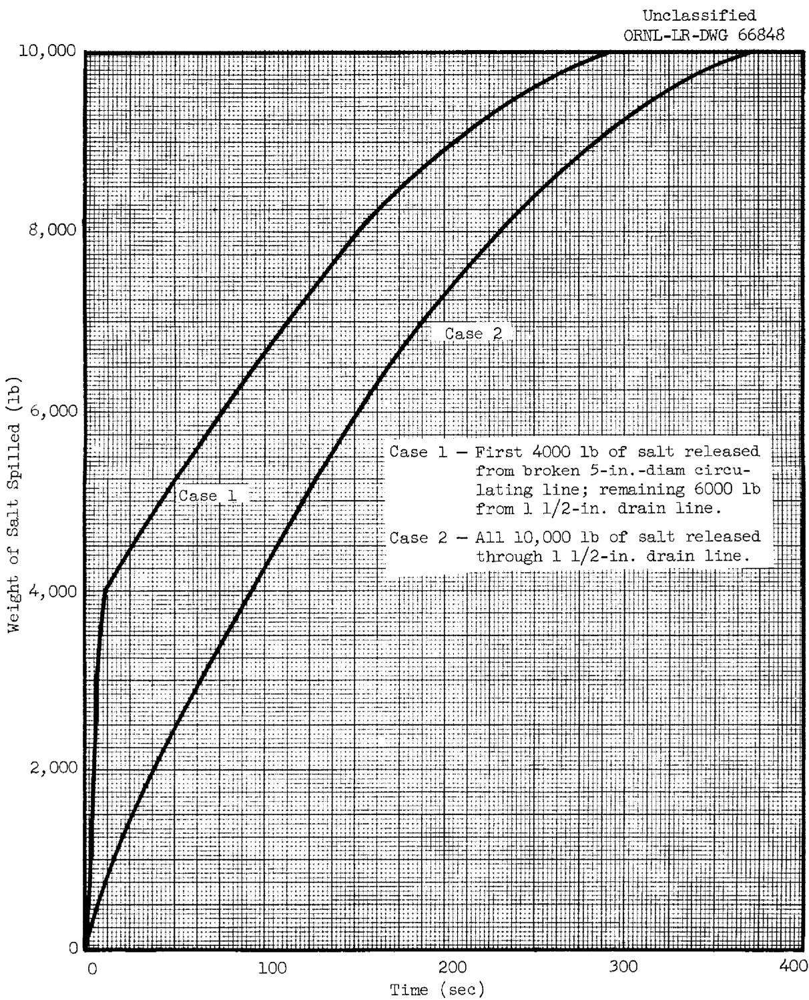  
Fig. 8.1. Release of Fuel Through Severed Lines.

there is a possibility of simultaneous spillage of water and salt into the cell. Equilibration of all the fuel salt with the cell atmosphere and just enough water to form the maximum amount of saturated steam would result in the maximum pressure in the secondary container. The relationship between the amount of salt equilibrated with water and the cell atmosphere and the resulting pressure is shown in Fig. 8.2. With no relief device, pressures as high as 110 psig could result.

The vapor-condensing system described in Section 6.2 is designed with a rupture disk to relieve at 20 psig, so that after an estimated 10 sec,

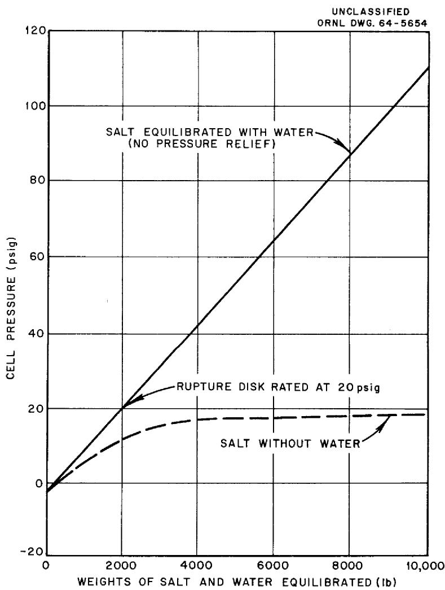  
Fig. 8.2. Relationship Between Cell Pressure and Weights of Fluids Equilibrated.

the steam would flow to the vapor-condensing tank at a rate of about 16 lb/sec. After $5\mathrm{min}^2$ this worst accident should be ended and the pressure approaching normal. The fission product afterheat would be dissipated easily to the vessel and its annulus which has a heat capacity of about 400,000 Btu/°F.

Two relatively large-scale experiments $^4$ were conducted to study some of the consequences of a salt spill. The first test was a 1/20-scale experiment with 500 lb of salt at $1500^{\circ}\mathrm{F}$ . The MSRE containment vessel was represented by a 10-ft-diam spherical vessel with a water-filled annulus. The test demonstrated that large amounts of heat can be transferred at relatively high fluxes (40,000 to 100,000 Btu/hr.ft $^2$ ) from the pool (or cake) of salt to the steel vessel and its annulus without damage to the tank. The average heat transfer rate for this experiment was $3 \times 10^6$ Btu/hr. The temperature of the tank bottom rose to $940^{\circ}\mathrm{F}$ in 75 sec and fell to less than $250^{\circ}\mathrm{F}$ in 6 min.

In the second test, the same quantity of salt (500 lb) was quickly drained (50 sec) into the 10-ft-diam tank filled to a 5-ft depth with water. The salt contained 25 to 50 mc of mixed fission-product activity (6 days old). Although the physical shock to the water and the tank were violent, nothing approaching an explosion was observed. Only a small amount of steam reached the surface of the water. The radioactivity of the water was measured afterwards and was found to account for less than $5\%$ of the original activity.

These relatively crude but very convincing tests indicate that the assumptions made in the maximum credible accident are reasonably conservative, that the containment vessel should withstand the thermal shock of hot salt, and that most of the fission products remain in the salt. As mentioned in Section 6.1.1, and 8-in. vent pipe is installed to relieve the steam which might be formed under the bottom of the MSRE containment vessel in the event of a large salt spill.

# 3.7 Release of Radioactivity from

# Secondary Container

# 8.7.1 Rupture of Secondary Container

It is considered incredible that any single accident (sabotage excluded) could rupture both the primary and secondary containment.

# 8.7.2 Release of Activity After Maximum Credible Accident

As discussed above, the most severe accident considered to be credible is the simultaneous spillage of salt and water into the secondary container. The release of fission products and the consequences of release have been studied, following the general procedure outlined in Part 100 of the Code of Federal Regulations, Title 10, as published in the Federal Register. The specific assumptions on which the calculations were based were the following:

1. The secondary container pressure is vented to the vapor-condensing system at 20 psig. The pressure rises to a maximum of 39 psig and decays to atmospheric pressure as the steam condenses over a 4-hr period (see Appendix E).   
2. The secondary container initial outleakage is $1\%$ per day $(0.04\%)$ per hr) at 39 psig.   
3. The building outage is $10\%$ per day (0.4% per hr).   
4. The iodine release from the salt is $10\%$ or $2.50 \times 10^{5}$ curies, with a $50\%$ plateout on the secondary container surfaces. (Based on experiments in which the solubility of the fuel salt in water was measured, much less iodine is expected to be released.)   
5. The noble gas release is $100\%$ or $3.75 \times 10^{5}$ curies.   
6. The solid fission product released is $10\%$ or $6.8 \times 10^{5}$ curies.

The methods of calculation are given in Appendix A. Two cases were considered: one with the fan off and the other in which the stack fan continued to operate to discharge the contents of the building from the

100-ft-high stack at 15,000 ft³/min. With the fan running, the effluent passes through absolute filters, which have an assumed efficiency of 99.9% for 0.5-µ particles.

Activities Inside Building 7503. The calculated dose rates with the fan running are plotted in Fig. 8.3, which shows that the dose rate reaches a maximum of about $12\mathrm{r / hr}$ after 1.1 hr. With the stack fan off, the peak activity levels inside the building are approximately a factor of 5 higher. The concentrations of the various fission-product constituents inside the building are shown in Fig. 8.4.

Personnel within the building could escape from the building high bay without receiving the maximum permissible doses, as indicated in Table 8.1. Appendix A gives details of the method used for these calculations. The escape times are not affected appreciably by the operation of the fans; the minimum of 6.5 min (for a bone seeker dose of 25 rem) is more than sufficient time for evacuation from any location within the building.

Table 8.1. Building Escape Time Based on Maximum Permissible Dose   

<table><tr><td rowspan="2">Type of Fission Product</td><td rowspan="2">Maximum Permissible Dose</td><td rowspan="2">Inhalation Dose</td><td colspan="2">Escape Time</td></tr><tr><td>Fan On</td><td>Fan Off</td></tr><tr><td>Iodine</td><td>300 rem</td><td>960 μc</td><td>40 min</td><td>33 min</td></tr><tr><td>Noble gases</td><td>25 r ext.</td><td></td><td>∞</td><td>2.2 hr</td></tr><tr><td>Solids</td><td>25 rem</td><td>221 μc</td><td>7.0 min</td><td>6.5 min</td></tr></table>

Dose Rates Outside Building 7503 Following the Maximum Credible Accident. The maximum activity in the building is calculated to be 183 curies at 1.1 hr with the fan on and 932 curies at 4 hr with the fan off (see Appendix A, Tables A.1 and A.2). Figure 8.5 shows the dose rate at various distances from the building due to the activity in the building. The radiation level from the radioactive cloud (normal atmospheric conditions) and the total radiation level are plotted on the same graph.

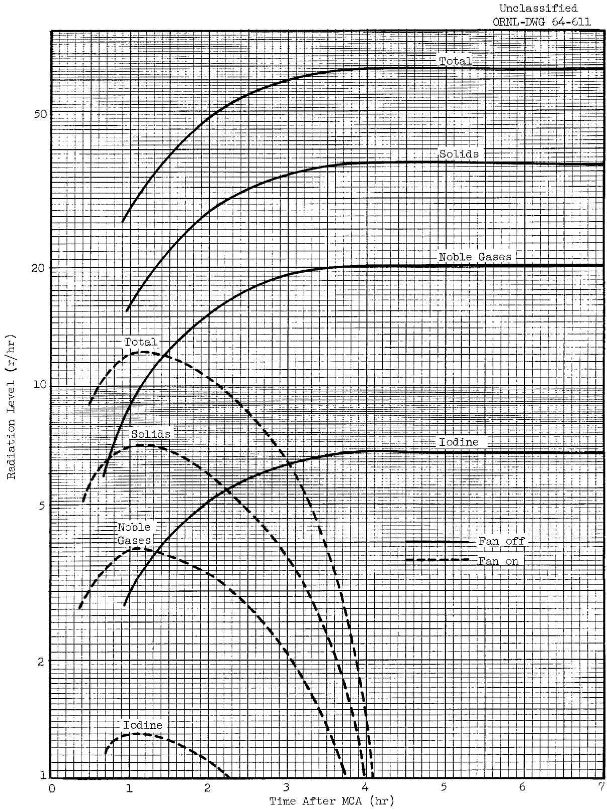  
Fig. 8.3. Radiation Level in Building Following Maximum Credible Accident $(r/hr = 935 \times \mu c/cm^3 \times Mev)$ .

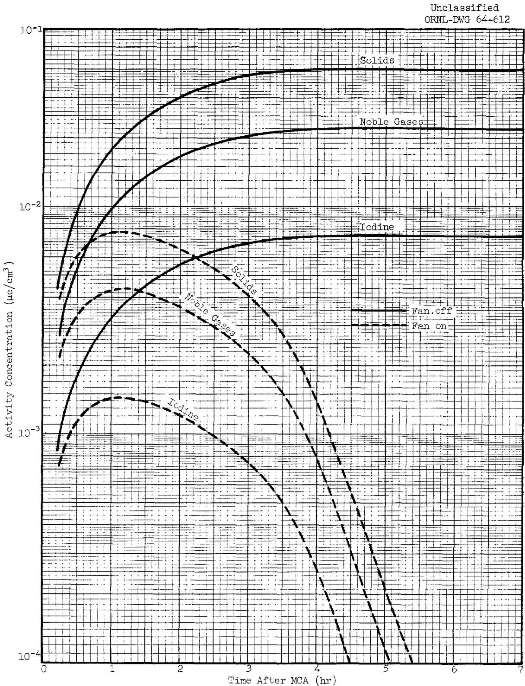  
Fig. 8.4. Activity Concentrations in Building Air Following Maximum Credible Accident.

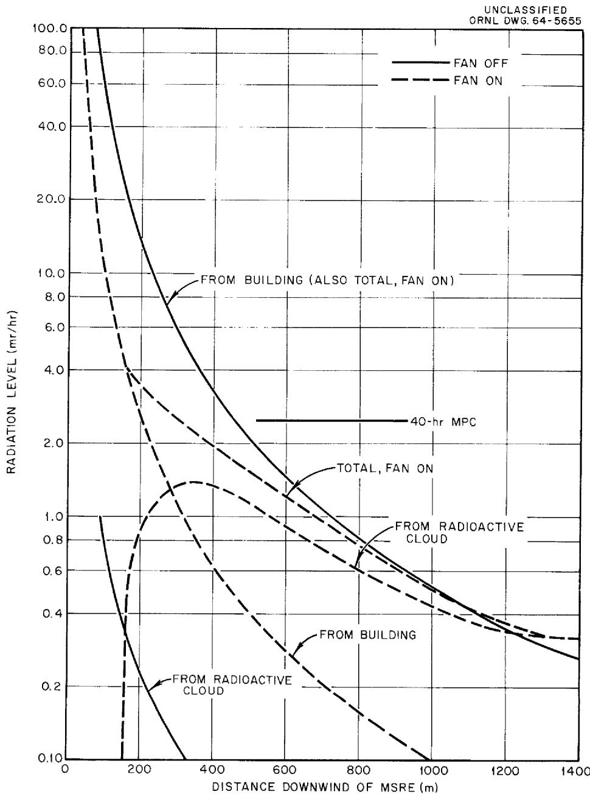  
Fig. 8.5. Noble Gas Activity After Maximum Credible Accident as Function of Distance Downwind.

With the fan off, essentially all the radiation is due to the activity in the building. Beyond 450 meters from the building, which is the approximate distance to the HFIR, the peak radiation level is less than $2.5 \, \text{mr/hr}$ (see Appendix A for calculations).

Release of Activity from the Building. The release of activity from the high-bay area of the building was considered with the fan off and with the fan on and under normal and inversion atmospheric conditions. Since there is an installed spare fan and the fan can be operated from diesel power if necessary, the probability is very low that the fan would be off. Figure 8.6 shows that the activity release rate is an order of magnitude lower 7 hr after the maximum credible accident with the fan running. The meteorological conditions and method of calculation are given in Appendix A.

Figure 8.7 shows the total integrated thyroid and bone dose resulting from the maximum credible accident. It can be seen that the maximum emergency doses of 300 rem to the thyroid and 25 rem to the bone are exceeded only at distances within 300 meters downwind of the MSRE with the fan off. With the fan running the maximum doses are less than 5 rem. The maximum off-site exposure (beyond 3000 meters) is 6 rem from iodine under inversion conditions with the fan off (see Appendix A for calculations).

The peak activity concentrations are plotted in Fig. 8.8 for iodine and solids. These peak levels occur at 1.1 hr after the maximum credible accident with the fan on and 4 hr after the maximum credible accident with the fan off. The change in release rate with time is plotted in Fig. 8.6. It was assumed that $99.9\%$ of the solids would be removed by the filters with the fan on, but there would be no removal of iodine. There is some evidence that iodine in large quantities would be removed by absolute filters by agglomeration of the very fine particles,[6] but no credit was taken for this effect.

In the case of the maximum credible accident coinciding with an unfavorable wind in the direction of one of the nearby sites, such as HFIR (460 meters southeast) or ORNL (800 meters northeast), the possibility was considered that evacuation might be required. A quarterly dose of 8 rem to the thyroid and 1.5 rem to the bone was considered the maximum allowable dose in this case. From Fig. 8.7 it can be seen that the doses at

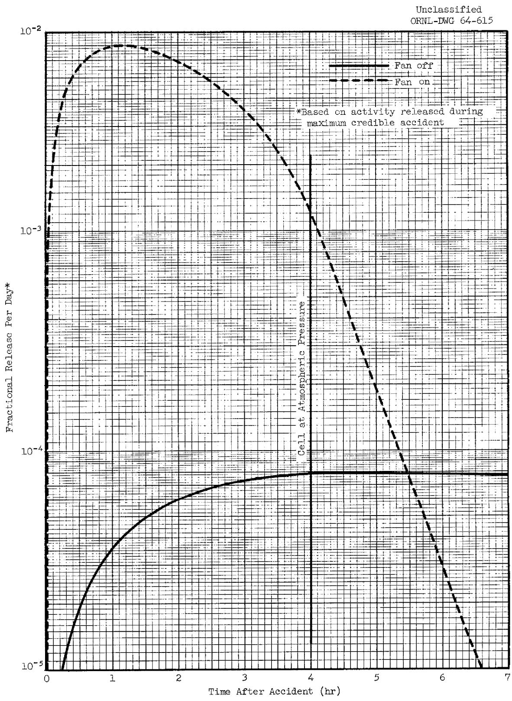  
Fig. 8.6. Change in Rate of Activity Release from Building with Time.

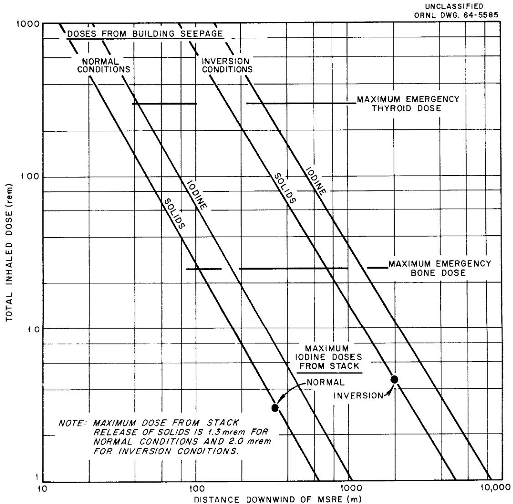  
Fig. 8.7. Total Integrated Doses Following Maximum Credible Accident.

the above two distances do not exceed the maximum doses for continuous occupancy except with the fan off under inversion conditions. Under inversion conditions the total integrated iodine dose at 460 meters would be 13 rem. However, the dose for the first 8 hr would be only 0.75 rem (for a maximum air concentration of $0.16\mu \mathrm{c} / \mathrm{m}^3$ ), and the maximum dose would never be reached with an 8-hr working day and the decreasing release rate. In the case of bone seekers for the same conditions, the first 8-hr integrated dose would approach the 1.5 rem, but unless the

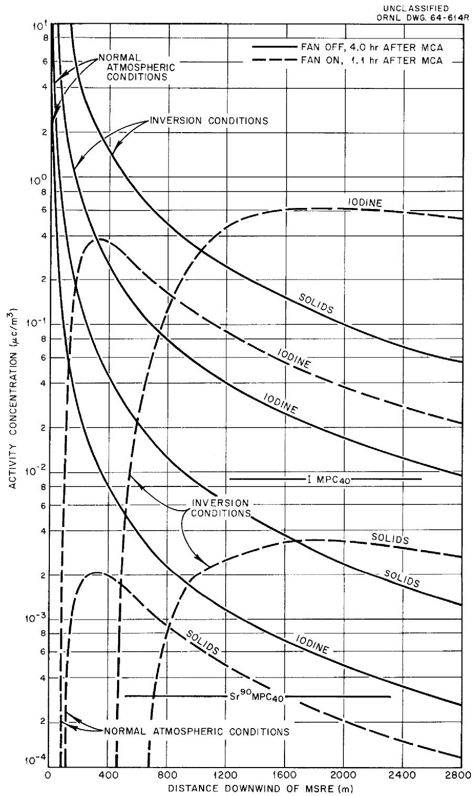  
Fig. 8.8. Peak Iodine and Solids Activities after Maximum Credible Accident as Function of Distance Downwind.

accident occurred at the start of a work period, the dose would be less than 1.5 rem.

Rainout. The hazards associated with the deposition of all the fission products in the radioactive cloud due to rainout were considered for the case of the fan on under normal atmospheric conditions. By integration of the formulas for the amounts of iodine, noble gases, and solids in the building times the release rate with respect to time, a total of approximately 400 curies of activity was found to be released, essentially all in the first 4 hr following the maximum credible accident. The deposition, in curies/m², was determined by using the formula,

$$
\mathrm {W} _ {\mathrm {R} \max } = \frac {\mathrm {Q}}{\pi \mathrm {e} ^ {1 / 2} \mathrm {C} _ {\mathrm {y}} x ^ {2 - n / 2}},
$$

where

$\mathbb{C}_{\bullet}$ emission rate,curies/sec,

$C_{y} =$ crosswind diffusion coefficient, (meters) $^{n/2}$ ,

$\mathbf{x} =$ downwind distance, meters.

The dose rates in rep/hr, given in Table 3.2, were obtained by multiplying

Table 5.2. Dose Rates from Rainout   

<table><tr><td rowspan="2">Distance from Building 7503 (m)</td><td colspan="2">Maximum Deposition (curies/m2)</td><td rowspan="2">Dose Rate (rep/hr)</td></tr><tr><td>Iodine</td><td>Total</td></tr><tr><td>50</td><td>4 × 10-2</td><td>0.168</td><td>1.68</td></tr><tr><td>100</td><td>1 × 10-2</td><td>0.048</td><td>0.48</td></tr><tr><td>200</td><td>3 × 10-3</td><td>0.013</td><td>0.13</td></tr><tr><td>400</td><td>8 × 10-4</td><td>3.5 × 10-3</td><td>0.035</td></tr><tr><td>1,000</td><td>1.4 × 10-4</td><td>6 × 10-4</td><td>0.006</td></tr><tr><td>4,000</td><td>1 × 10-5</td><td>4.5 × 10-5</td><td>0.00045</td></tr><tr><td>10,000</td><td>1.8 × 10-6</td><td>8 × 10-6</td><td>0.00008</td></tr></table>

the surface contamination in curies/m² by 10 (ref. 8). For inversion conditions the deposition is about $30\%$ greater because of the higher stability parameter.

# 8.8 Release of Beryllium from Secondary Container

The volume of fuel salt in the primary loop is $73\mathrm{ft}^3$ , and the weight of beryllium in the primary system is $220\mathrm{kg}$ (salt A). Although it is doubtful that as much as $1\%$ or $2.2\mathrm{kg}$ of the beryllium could be suspended in the secondary container atmosphere, even in the event of the maximum credible accident, this amount was assumed for the hazard calculation. At a $1\%$ per day initial leak rate from the container (with a pressure of 39 psig), the beryllium concentration in the building would reach the maximum permissible concentration for workers without respiratory protection ( $25\mu \mathrm{g}$ of Be per $\mathrm{m}^3$ ) in 150 sec. This is sufficient time to put on masks and to escape from the building. From Fig. 8.9, it can be seen that the beryllium concentrations downwind of Building 7503 would be considerably less than $2.5\mu \mathrm{g} / \mathrm{m}^3$ , the maximum continuous occupational level. The retention of $99.9\%$ of the beryllium on the filters was assumed.

A second possibility is that beryllium might escape from the coolant system radiator and be released up the coolant stack. In this case, because of the high air velocity through the radiator, $10\%$ of the coolant charge of $202\mathrm{kg}$ of beryllium was assumed to be dispersed. Although the released beryllium would be highly dispersed, the maximum downwind contamination levels would be well below the tolerance level, as shown in Fig. 8.8. At a stack velocity of 32 ft/sec, it was calculated that 3-mm-diam particles could be carried up the stack. These and smaller particles, amounting to perhaps half the total weight, would fall out of the stack plume within the first 100 ft of travel. The average ground concentration in this area would be about $5 \times 10^{-3}\mathrm{g/cm}^2$ . The contaminated area

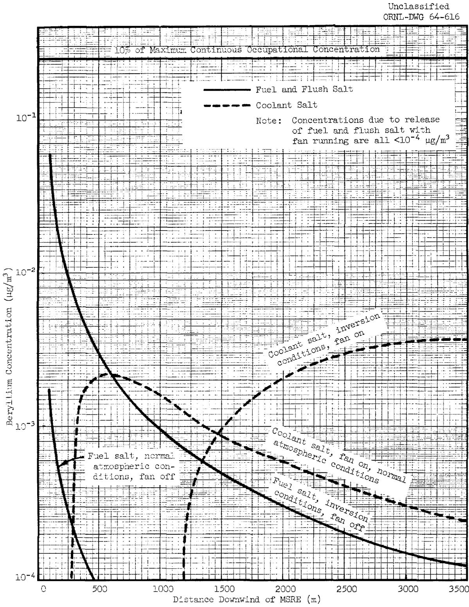  
Fig. 8.9. Beryllium Contamination After Maximum Credible Accident as Function of Distance Downwind.

or a larger area, if necessary, could be roped off and washed down with hoses to reduce the hazard.

Protection against dangerous concentrations of beryllium in the coolant air stream will be provided by a continuous air monitor at the stack; the air inside the building will be monitored by taking frequent air samples from 12 sampling stations. Discharge from the stack can be stopped within a few seconds by stopping the fans and closing the radiator doors. Beryllium concentrations will be followed in a manner similar to that used to monitor radioactivity in the air. The frequent samples will be analyzed and will be reported each day to reactor supervision.

#

APPENDICES

#

# Appendix A

# CALCULATIONS OF ACTIVITY LEVELS

# Calculations of Building Activity Levels

The calculations were based on the following definitions:

a = activity released into cell, in curies,   
$t =$ time after maximum credible accident, in hours,   
$\mathbf{c} =$ activity in building, in curies,   
$k =$ fraction of activity in building released per hour,

0.0004 = initial fraction of activity in cell leaking into building per hour.

It was assumed that the cell pressure would reach atmospheric pressure in 4 hr, at which time leakage into the building would stop. Then $(0.0004 - 0.0001t) =$ fraction of activity in cell leaking into building per hour at t hours, and the curies of activity in the building from O to 4 hr after the accident would be

$$
c = \int_ {0} ^ {t} [ (0. 0 0 0 4 - 0. 0 0 0 1 t) a - k c ] d t;
$$

thus

$$
c = \frac {K e ^ {- k t} + 0 . 0 0 0 4 a k + 0 . 0 0 0 1 a - 0 . 0 0 0 1 a k t}{k ^ {2}}.
$$

When $t = 0$ , $c = 0$ and $K' = K / k^2$ ,

$$
\mathrm {K} ^ {\prime} = - 0. 0 0 0 4 \mathrm {a k} - 0. 0 0 0 1 \mathrm {a}.
$$

For $t = 0$ to $4\mathrm{hr}$

$$
c = a \left[ \left(\frac {0 . 0 0 0 4}{k} + \frac {0 . 0 0 0 1}{k ^ {2}}\right) (1 - e ^ {- k t}) - \frac {0 . 0 0 0 1 t}{k} \right].
$$

For $t > 4$ hr,

$$
c = c _ {4} e ^ {- k (t - 4)}.
$$

With the fan on, $\mathrm{k} = 1.875 \, \mathrm{hr}^{-1}$ , and for $t = 0$ to $4 \, \mathrm{hr}$ ,

$$
c = a \left[ 0. 0 0 0 2 4 0 5 (1 - e ^ {- 1 \cdot 8 7 5 t}) - 0. 0 0 0 0 5 3 4 t \right].
$$

For iodine,

$$
c = 3 0. 2 \left(1 - e ^ {- 1 \cdot 8 7 5 t} - 0. 2 2 0 5 t\right).
$$

For noble gases,

$$
c = 9 0. 6 \left(1 - e ^ {- 1. 8 7 5 t} - 0. 2 2 0 5 t\right).
$$

For solids,

$$
c = 1 6 4. 2 \left(1 - e ^ {- 1. 8 7 5 t} - 0. 2 2 0 5 t\right).
$$

With the fan off, $\mathrm{k} = 0.004\mathrm{hr}^{-1}$ , and for $t = 0$ to $4\mathrm{hr}$

$$
c = a \left[ 6. 3 5 (1 - e ^ {- 0. 0 0 4 t}) - 0. 0 2 5 t \right].
$$

For iodine,

$$
c = 7. 9 5 \times 1 0 ^ {5} (1 - e ^ {- 0. 0 0 4 t} - 3. 9 3 7 \times 1 0 ^ {- 3} t).
$$

For noble gases,

$$
c = 2. 3 8 5 \times 1 0 ^ {6} (1 - e ^ {- 0. 0 0 4 t} - 3. 9 3 7 \times 1 0 ^ {- 3} t).
$$

For solids,

$$
c = 4. 3 2 \times 1 0 ^ {6} (1 - e ^ {- 0. 0 0 4 t} - 3. 9 3 7 \times 1 0 ^ {- 3} t).
$$

Data on the activity in the building are presented in Tables A.1 and A.2.

# Calculation of Exposures and Building Escape Times

The internal exposure was determined from the following expression:

$$
E = \frac {1 0 ^ {6} B}{V} \int_ {0} ^ {t} c d t,
$$

Table A.1. Activity in Building with Fan On   
Cell leak rate: $1\%$ per day or 0.0004 per hr  
Fan discharge rate: 15,000 ft³/min or 1.875 building volumes per hr  
Iodine released in cell: $2.5 \times 10^6 \times 10\% \times 50\% = 1.25 \times 10^5$ curies  
Noble gases released in cell: $3.75 \times 10^5$ curies  
Solids released in cell: $6.8 \times 10^6 \times 10\% = 6.8 \times 10^5$ curies  
Solids released through filters: $0.1\%$ of solids to filters   

<table><tr><td rowspan="2">Time After Accident (hr)</td><td rowspan="2">Fraction of Activity Re-leased from Building per Day</td><td colspan="2">Iodine</td><td colspan="2">Noble Gases</td><td colspan="2">Solids</td></tr><tr><td>Release Rate (curies/day)</td><td>Activity in Building (curies)</td><td>Release Rate (curies/day)</td><td>Activity in Building (curies)</td><td>Release Rate (curies/day)</td><td>Activity in Building (curies)</td></tr><tr><td>0.25</td><td>3.5 × 10-3</td><td>436</td><td>9.7</td><td>1308</td><td>29.1</td><td>2.4</td><td>53</td></tr><tr><td>0.50</td><td>5.4 × 10-3</td><td>675</td><td>15</td><td>2025</td><td>45</td><td>3.7</td><td>82</td></tr><tr><td>0.75</td><td>6.4 × 10-3</td><td>800</td><td>17.8</td><td>2400</td><td>53.4</td><td>4.4</td><td>97</td></tr><tr><td>1.0</td><td>6.8 × 10-3</td><td>855</td><td>19.0</td><td>2565</td><td>57</td><td>4.6</td><td>103</td></tr><tr><td>1.1</td><td>7.0 × 10-3</td><td>874</td><td>19.4</td><td>2622</td><td>58.2</td><td>4.8</td><td>105</td></tr><tr><td>1.2</td><td>6.8 × 10-3</td><td>855</td><td>19.0</td><td>2565</td><td>57</td><td>4.6</td><td>103</td></tr><tr><td>1.5</td><td>6.6 × 10-3</td><td>828</td><td>18.4</td><td>2484</td><td>55.2</td><td>4.5</td><td>100</td></tr><tr><td>2.0</td><td>5.8 × 10-3</td><td>729</td><td>16.2</td><td>2187</td><td>48.6</td><td>3.9</td><td>88</td></tr><tr><td>2.5</td><td>4.75 × 10-3</td><td>594</td><td>13.2</td><td>1782</td><td>39.6</td><td>3.2</td><td>72</td></tr><tr><td>3.0</td><td>3.6 × 10-3</td><td>455</td><td>10.1</td><td>1365</td><td>30.3</td><td>2.5</td><td>55</td></tr><tr><td>3.5</td><td>1.4 × 10-3</td><td>176</td><td>6.8</td><td>528</td><td>20.4</td><td>1.0</td><td>37</td></tr><tr><td>4.0</td><td>1.3 × 10-3</td><td>160</td><td>3.55</td><td>480</td><td>10.65</td><td>0.9</td><td>19.3</td></tr><tr><td>5.0</td><td>1.9 × 10-4</td><td>24.1</td><td>0.535</td><td>72</td><td>1.60</td><td>0.13</td><td>2.9</td></tr><tr><td>6.0</td><td>3.0 × 10-5</td><td>3.8</td><td>0.0845</td><td>11.4</td><td>0.24</td><td>0.02</td><td>0.46</td></tr><tr><td>7.0</td><td>4.7 × 10-6</td><td>0.6</td><td>0.0130</td><td>1.8</td><td>0.039</td><td>0.003</td><td>0.071</td></tr><tr><td>8.0</td><td>7.2 × 10-7</td><td>0.1</td><td>0.0020</td><td>0.3</td><td>0.006</td><td>0.0005</td><td>0.011</td></tr></table>

Table A.2. Activity in Building with Fan Off   
Cell leak rate: $1\%$ per day or 0.0004 per hr  
Building leak rate: $10\%$ per day or 0.004 per hr  
Iodine released in cell: $2.5 \times 10^{6} \times 10\% \times 50\% = 1.25 \times 10^{5}$ curies  
Noble gases released in cell: $3.75 \times 10^{5}$ curies  
Solids released in cell: $6.8 \times 10^{6} \times 10\% = 6.8 \times 10^{5}$ curies   

<table><tr><td rowspan="2">Time After Accident (hr)</td><td rowspan="2">Fraction of Activity Re-leased from Building per Day</td><td colspan="2">Iodine</td><td colspan="2">Noble Gases</td><td colspan="2">Solids</td></tr><tr><td>Release Rate (curies/day)</td><td>Activity in Building (curies)</td><td>Release Rate (curies/day)</td><td>Activity in Building (curies)</td><td>Release Rate (curies/day)</td><td>Activity in Building (curies)</td></tr><tr><td>0.25</td><td>9.7 × 10-6</td><td>1.21</td><td>12.1</td><td>3.63</td><td>36.3</td><td>6.58</td><td>65.8</td></tr><tr><td>0.50</td><td>1.86 × 10-5</td><td>2.33</td><td>23.3</td><td>7.0</td><td>70</td><td>12.7</td><td>127</td></tr><tr><td>0.75</td><td>2.72 × 10-5</td><td>3.39</td><td>33.9</td><td>10.2</td><td>102</td><td>18.4</td><td>184</td></tr><tr><td>1.0</td><td>3.5 × 10-5</td><td>4.37</td><td>43.7</td><td>13.1</td><td>131</td><td>23.8</td><td>238</td></tr><tr><td>1.5</td><td>4.9 × 10-5</td><td>6.07</td><td>60.7</td><td>18.2</td><td>182</td><td>33.0</td><td>330</td></tr><tr><td>2.0</td><td>6.0 × 10-5</td><td>7.48</td><td>74.8</td><td>22.4</td><td>224</td><td>40.6</td><td>406</td></tr><tr><td>2.5</td><td>6.8 × 10-5</td><td>8.54</td><td>85.4</td><td>25.6</td><td>256</td><td>46.4</td><td>464</td></tr><tr><td>3.0</td><td>7.4 × 10-5</td><td>9.30</td><td>93.0</td><td>27.9</td><td>279</td><td>50.5</td><td>505</td></tr><tr><td>3.5</td><td>7.6 × 10-5</td><td>9.49</td><td>94.9</td><td>28.5</td><td>285</td><td>51.6</td><td>516</td></tr><tr><td>4.0</td><td>7.9 × 10-5</td><td>9.88</td><td>98.8</td><td>29.6</td><td>296</td><td>53.7</td><td>537</td></tr><tr><td>5.0</td><td>7.86 × 10-5</td><td>9.84</td><td>98.4</td><td>29.5</td><td>295</td><td>53.5</td><td>535</td></tr><tr><td>8.0</td><td>7.8 × 10-5</td><td>9.71</td><td>97.1</td><td>29.1</td><td>291</td><td>52.8</td><td>528</td></tr><tr><td>10.0</td><td>7.7 × 10-5</td><td>9.63</td><td>96.3</td><td>28.9</td><td>289</td><td>52.4</td><td>524</td></tr><tr><td>16.0</td><td>7.5 × 10-5</td><td>9.40</td><td>94.0</td><td>28.2</td><td>282</td><td>51.1</td><td>511</td></tr><tr><td>24.0</td><td>7.25 × 10-5</td><td>9.08</td><td>90.8</td><td>27.2</td><td>272</td><td>49.4</td><td>494</td></tr></table>

where

$\mathbf{E} =$ internal exposure in $\mu c$

$c =$ activity in building in curies,

V = building volume in $\mathfrak{m}^3$ (13.6 × 10³),

$B =$ breathing rate in $\mathrm{m}^3 /\mathrm{hr}$ (1.8),

$\mathbf{t} =$ time in hr.

The exposures and escape times are given below for the noble gases, iodine, and fission-product solids.

# Noble Gases

The noble gas escape time is based on an external exposure of 25 r. Using the formula $\mathrm{r / hr} = 935 \times \mu \mathrm{c / cm^3} \times \mathrm{Mev}$ (assume $= 1$ ), the radiation level is calculated and the exposure is obtained by integration. With the fan on, $\mathrm{k} = 1.875$ , and the concentration of noble gases in the building in $\mu \mathrm{c / cm^3}$ is

$$
\frac {9 0 . 6}{1 3 . 6 \times 1 0 ^ {3}} (1 - e ^ {- 1. 8 7 5 t} - 0. 2 2 1 t).
$$

The radiation level in $r/hr$ is

$$
6. 2 4 (1 - e ^ {- 1. 8 7 5 t} - 0. 2 2 1 t).
$$

Integrating the radiation level with respect to time, the exposure in roentgens is

$$
6. 2 4 \left[ t + \frac {e ^ {- 1 . 8 7 5 t}}{1 . 8 7 5} - 0. 1 1 0 5 t ^ {2} \right] _ {0} ^ {t},
$$

and the exposure at t hours after the accident in roentgens is

$$
6. 2 4 \left[ t + \frac {e ^ {- 1 . 8 7 5 t} - 1}{1 . 8 7 5} - 0. 1 1 0 5 t ^ {2} \right].
$$

With the fan off, $\mathrm{k} = 0.004$ , and the concentration of noble gases in the building in $\mu \mathrm{c/cm}^3$ is

$$
\frac {2 . 3 8 5 \times 1 0 ^ {6}}{1 3 . 6 \times 1 0 ^ {3}} (1 - e ^ {- 0. 0 0 4 t} - 0. 0 0 3 9 3 7 t).
$$

The radiation level in $r/hr$ is

$$
1. 6 4 \times 1 0 ^ {5} (1 - e ^ {- 0. 0 0 4 t} - 0. 0 0 3 9 3 7 t).
$$

Integrating the radiation level with respect to time, the exposure in roentgens is

$$
1. 6 4 \times 1 0 ^ {5} \left[ t + \frac {e ^ {- 0 . 0 0 4 t}}{0 . 0 0 4} - 0. 0 0 1 9 6 8 5 t ^ {2} \right] _ {0} ^ {t},
$$

and the exposure at t hours after the accident in roentgens is

$$
1. 6 4 \times 1 0 ^ {5} \left[ t + \frac {e ^ {- 0 . 0 0 4 t} - 1}{0 . 0 0 4} - 0. 0 0 1 9 6 8 5 t ^ {2} \right].
$$

# Iodine

The exposure per inhaled microcurie of iodine is given in Table A.3. Based on Table A.3, the permissible total iodine exposure, that is, the exposure for a 300-rem dose, is

$$
\frac {3 0 0 , 0 0 0}{3 1 2 . 6} = 9 6 0 \mu c.
$$

With the fan on,

$$
\begin{array}{l} \text {E x p o s u r e} = 1 3 2 \times 3 0. 2 \int_ {0} ^ {t} (1 - e ^ {- 1 \cdot 8 7 5 t} - 0. 2 2 0 5 t) d t \\ = 3 9 8 0 \left(t + \frac {e ^ {- 1 . 8 7 5 t} - 1}{1 . 8 7 5} - 0. 1 1 t ^ {2}\right). \\ \end{array}
$$

Table A.3. Iodine Exposures   

<table><tr><td>Iodine Isotope</td><td>Ratio of Activity of Isotope to Total Iodine Activity (1-hr decay)</td><td>Exposure per Unit of Activity (mrem/μc)</td><td>Dose per Unit of Total Iodine Activity (mrem/μc)</td></tr><tr><td>I131</td><td>0.115</td><td>1484</td><td>170.8</td></tr><tr><td>I132</td><td>0.170</td><td>53</td><td>9.0</td></tr><tr><td>I133</td><td>0.249</td><td>399</td><td>99.4</td></tr><tr><td>I134</td><td>0.244</td><td>25</td><td>6.1</td></tr><tr><td>I135</td><td>0.222</td><td>123</td><td>27.3</td></tr><tr><td></td><td></td><td>Total</td><td>312.6</td></tr></table>

With the fan off,

$$
\begin{array}{l} \text {E x p o s u r e} = 1 3 2 \times 7. 9 5 \times 1 0 ^ {5} \int_ {0} ^ {t} (1 - e ^ {- 0. 0 0 4 t} - 3. 9 3 7 \times 1 0 ^ {- 3} t) d t \\ = 1. 0 5 \times 1 0 ^ {8} \left(t + \frac {e ^ {- 0 . 0 0 4 t} - 1}{0 . 0 0 4} - 0. 0 0 1 9 6 8 5 t ^ {2}\right). \\ \end{array}
$$

# Solids

The maximum permissible inhalation intake $(\mathsf{MPI}_{\mathsf{b}})$ of solids for a 25-rem bone exposure is $221~\mu \mathrm{c}$ based on an exposure of 113 mrem per inhaled microcurie of fuel irradiated for one full-power year. $^{1,2}$ With the fan on,

$$
\begin{array}{l} \text {E x p o s u r e} = 1 3 2 \times 1 6 4. 2 \int_ {0} ^ {t} (1 - e ^ {- 1. 8 7 5 t} - 0. 2 2 0 5 t) d t \\ = 2. 1 7 \times 1 0 ^ {4} \left(t + \frac {e ^ {- 1 . 8 7 5 t} - 1}{1 . 8 7 5} - 0. 1 1 t ^ {2}\right). \\ \end{array}
$$

With the fan off,

$$
\begin{array}{l} \text {E x p o s u r e} = 1 3 2 \times 4. 3 2 \times 1 0 ^ {6} \int_ {0} ^ {t} (1 - e ^ {- 0. 0 0 4 t} - 3. 9 3 7 \times 1 0 ^ {- 3} t) d t \\ = 5. 7 1 \times 1 0 ^ {8} \left(t + \frac {e ^ {- 0 . 0 0 4 t} - 1}{0 . 0 0 4} - 1. 9 7 \times 1 0 ^ {- 3} t ^ {2}\right). \\ \end{array}
$$

Calculation of Effect of Meteorological Conditions on Diffusion of Activity

Calculations of the diffusion of activity from the stack were made using Sutton's formula for diffusion from a continuous point source:3,4

$$
x = \frac {2 Q}{\mu C _ {y} C _ {z} \overline {{\mu}} x ^ {2 - n}} \exp \left(- \frac {y ^ {2} + h ^ {2}}{C ^ {2} x ^ {2 - n}}\right),
$$

where

$$
Q = \text {e m i s s i o n}
$$

$$
C _ {v} = \text {c r o s s w i n d d i f f u s i o n c o e f f i c i e n t}, (\text {m e t e r s}) ^ {n / 2},
$$

$$
C _ {z} ^ {j} = \text {v e r t i c a l d i f f u s i o n c o e f f i c i e n t}, (\text {m e t e r s}) ^ {n / 2},
$$

$$
\bar {\mu} = \text {w i n d s p e e d}, \text {m e t e r s / s e c},
$$

$$
x = \text {d o w n w i n d}
$$

$$
y = \text {c r o s s w i n d}
$$

$$
\mathrm {h} = \text {h e i g h t o f p l u m e , m e t e r s},
$$

$$
n = \text {s t a b i l i t y}
$$

$$
X = \text {a c t i v i t y} \mu c / \mathrm {c m} ^ {3}, \text {f o r u n i t e m i s s i o n}.
$$

The following parameter values were used as recommended by the U.S. Weather Bureau, Oak Ridge office:

<table><tr><td>Parameter</td><td>Value Under Lapse (Weak) Conditions</td><td>Value Under Inversion Conditions</td></tr><tr><td>μ</td><td>2.3</td><td>1.5</td></tr><tr><td>n</td><td>0.23</td><td>0.35</td></tr><tr><td>Cy</td><td>0.3</td><td>0.3</td></tr><tr><td>Cz</td><td>0.3</td><td>0.033</td></tr></table>

All calculations were made assuming $y = 0$ ; that is, the dispersion was directly downwind of the source. Activity levels from building seepage were made assuming $h = 0$ . The values obtained for $X$ at various distances for both inversion and normal conditions are listed in Table A.4.

Table A.4. Diffusion Factor, X, Versus Distance Downwind   

<table><tr><td rowspan="3">Distance Downwind (m)</td><td colspan="4">X, Diffusion Factora</td></tr><tr><td colspan="2">Inversion Conditions</td><td colspan="2">Normal Conditions</td></tr><tr><td>Ground Release</td><td>Stack Release</td><td>Ground Release</td><td>Stack Release</td></tr><tr><td>100</td><td>2.1 × 10-2</td><td>&lt;10-10</td><td>8.0 × 10-4</td><td>2.9 × 10-7</td></tr><tr><td>160</td><td>9.8 × 10-3</td><td>&lt;10-10</td><td>3.5 × 10-4</td><td>1.1 × 10-5</td></tr><tr><td>200</td><td>6.3 × 10-3</td><td>&lt;10-10</td><td>2.3 × 10-4</td><td>2.3 × 10-5</td></tr><tr><td>325</td><td>3.0 × 10-3</td><td>&lt;10-10</td><td>1.0 × 10-4</td><td>3.7 × 10-5</td></tr><tr><td>500</td><td>1.5 × 10-3</td><td>2.1 × 10-7</td><td>4.7 × 10-5</td><td>3.0 × 10-5</td></tr><tr><td>750</td><td>7.7 × 10-4</td><td>8.2 × 10-6</td><td>2.3 × 10-5</td><td>1.8 × 10-5</td></tr><tr><td>1,000</td><td>4.8 × 10-4</td><td>3.5 × 10-5</td><td>1.4 × 10-5</td><td>1.2 × 10-5</td></tr><tr><td>1,200</td><td>3.5 × 10-4</td><td>4.5 × 10-5</td><td>1.0 × 10-5</td><td>9.1 × 10-6</td></tr><tr><td>2,000</td><td>1.5 × 10-4</td><td>6.2 × 10-5</td><td>4.0 × 10-6</td><td>3.8 × 10-6</td></tr><tr><td>3,000</td><td>7.7 × 10-5</td><td>4.9 × 10-5</td><td>2.0 × 10-6</td><td>2.0 × 10-6</td></tr><tr><td>4,000</td><td>4.8 × 10-5</td><td>3.6 × 10-5</td><td>1.2 × 10-6</td><td>1.2 × 10-6</td></tr><tr><td>5,000</td><td>3.3 × 10-5</td><td>2.7 × 10-5</td><td>8.0 × 10-7</td><td>8.0 × 10-7</td></tr><tr><td>10,000</td><td>1.1 × 10-5</td><td>1.0 × 10-6</td><td>2.3 × 10-7</td><td>2.3 × 10-7</td></tr></table>

$\mathbf{a}_{\mathbf{X}}$ $\times$ release rate (curies/sec) = activity concentration in air $(\mu c / cc)$ .

Calculation of Dose Rates Outside Building

# Dose Rate from Building

The building is assumed to be a point source with radiation of 1-Mev average energy E. The dose rate R (in r/hr) at 1 ft is given by the

formula

$$
\mathrm {R} \cong 6 \mathrm {c E},
$$

were c is activity concentration in $\mu \mathrm{c} / \mathrm{cm}^3$ . With the fan on the maximum activity in the building is 183 curies at 1.1 hr. With the fan off the maximum activity in the building is 932 curies at 4 hr after the maximum credible accident (see Tables A.l and A.2). The radiation level is assumed to vary inversely with the square of the distance.

Dose Rate from Radioactive Cloud

The maximum release rate with the fan on is 350l curies per day at 1.l hr after the maximum credible accident (see Tables A.l and A.2). With the fan off the maximum release rate is 93.2 curies per day at 4 hr after the maximum credible accident. The dose rate R (in r/hr) is calculated from

$$
R = 9 3 5 c E.
$$

The release rate in curies per second multiplied by the diffusion factor, $\chi$ , from Table A.4 is the activity concentration in $\mu \mathrm{c} / \mathrm{cm}^3$ .

# Calculation of Total Integrated Dose

The total integrated thyroid and bone doses are calculated for stack release3 and for building seepage.4

Total Activity Released

For stack release with the fan on the activity released from the building in the first 4 hr is

$$
\int_ {0} ^ {t} \left(\text {c u r i e s i n b u i l d i n g a t t h o u r s}\right) \times \left(\text {r e l e a s e r a t e p e r h o u r}\right).
$$

For iodine (see p. 266) the release in $4\mathrm{hr}$ is

$$
3 0. 2 \int_ {0} ^ {4} (1 - e ^ {- 1. 8 7 5 t} - 0. 2 2 0 5 t) d t \times 1. 8 7 5 = 9 6. 5 \text {c u r i e s}.
$$

After 4 hr, no additional iodine leaks into the building from the cell, and the 3.55 curies in the building at 4 hr (Table A.1) is the only additional release after 4 hr. The total iodine release with the fan on is therefore 100 curies.

For solids the release in 4 hr is

$$
\begin{array}{l} 1 6 4. 2 \int_ {0} ^ {4} (1 - e ^ {- 1. 8 7 5 t} - 0. 2 2 0 5 t) d t \\ \times 1.875 \times 0.001 (99.9\% \text {retained on filters}) = 0.53 \text {curies}, \\ \end{array}
$$

to which $0.1\%$ of the 19.3 curies in the building at 4 hr is added to give a total solids release of 0.55 curies.

For release by building seepage with the fan off the activities are calculated in the same manner.

For iodine the release in the first 4 hr is

$$
7. 9 5 \times 1 0 ^ {5} \int_ {0} ^ {4} (1 - e ^ {- 0. 0 0 4 t} - 3. 9 3 7 \times 1 0 ^ {- 3} t) d t \times 0. 0 0 4 = 1. 0 6 \text {c u r i e s}.
$$

From Table A.2 it is seen that 98.8 curies of iodine are in the building at 4 hr, and it is assumed that this is all released, although a large percentage will undoubtedly plate out on the building walls. The total iodine release is therefore $\sim 100$ curies.

For solids the release in the first 4 hr is

$$
4. 3 2 \times 1 0 ^ {6} \times 0. 0 0 4 \int_ {0} ^ {t} (1 - e ^ {- 0. 0 0 4 t} - 3. 9 3 7 \times 1 0 ^ {- 3} t) d t = 5. 4 3 \text {c u r i e s}.
$$

From Table A.2 it is seen that 537 curies of solids are in the building at 4 hr, and therefore the total release is 543 curies.

# Maximum Permissible Doses

Thyroid: 300 rem (ref. 4); 1484 mrem per microcurie of I $^{131}$ .

Bone: 25 rem (ref. 4); ll3 mrem per microcurie of solids.

These doses are based on an irradiation time of 365 days, using revised exposure values representing current estimates of dose per inhaled component microcurie. $^{1,2}$

# Stack Release

$$
\mathrm {T I D} _ {\max } = \frac {2 Q \times \text {b r e a t h i n g r a t e}}{r \times e \times \text {w i n d s p e e d} \times \text {s t a c k h e i g h t}}.
$$

For iodine,

$$
\frac {2 \times 1 0 0 \times 5 \times 1 0 ^ {- 4}}{3 . 1 4 \times 2 . 7 2 \times 2 . 3 \times (5 0) ^ {2}} = 2. 0 4 \times 1 0 ^ {- 6} \text {c u r i e s}.
$$

For normal atmospheric conditions,

$$
2. 0 4 \times 1 0 ^ {- 6} \times 1. 4 8 4 \times 1 0 ^ {6} = 3 \text {r e m}.
$$

For inversion conditions,

$$
3 \times \frac {2 . 3}{1 . 5} = 4. 6 \mathrm {r e m}.
$$

For solids,

$$
\frac {2 \times 0 . 5 5 \times 5 \times 1 0 ^ {- 4}}{3 . 1 4 \times 2 . 7 2 \times 2 . 3 \times (5 0) ^ {2}} = 1. 1 2 \times 1 0 ^ {- 8} \text {c u r i e s}.
$$

For normal atmospheric conditions,

$$
1. 1 2 \times 1 0 ^ {- 8} \times 0. 1 1 3 \times 1 0 ^ {9} = 1. 3 \mathrm {m r e m}.
$$

For inversion conditions,

$$
1. 3 \times \frac {2 . 3}{1 . 5} = 2 \mathrm {m r e m}.
$$

# Building Seepage

Inhaled curies = Q × breathing rate / π × wind speed × σy × σz

$Q =$ total curies released from building

Breathing rate $= 5 \times 10^{-4} \mathrm{~m}^{3} / \mathrm{sec}$

Wind speed (normal) = 2.3 m/sec

Wind speed (inversion) = 1.5 m/sec

$\sigma_{y}$ (vertical concentration deviation) $= \frac{1}{\sqrt{2}} C_{y} d(1 - n) / 2$

$\sigma_{z}$ (horizontal concentration deviation) $= \frac{1}{\sqrt{2}} C_{z} d^{(1 - n) / 2}$

$C_{y}$ (vertical diffusion coefficient) = 0.3 normal

$= 0.3$ inversion

$C_{z}$ (horizontal diffusion coefficient) $= 0.3$ normal

$= 0.033$ inversion

Table A.5. Doses Resulting from Building Seepage   

<table><tr><td rowspan="3">Distance from Building (m)</td><td rowspan="3">Activity</td><td colspan="4">Quantity of Activity and Dose</td></tr><tr><td colspan="2">Normal Conditions</td><td colspan="2">Inversion Conditions</td></tr><tr><td>μc</td><td>rem</td><td>μc</td><td>rem</td></tr><tr><td>100</td><td>Iodine</td><td>44.6</td><td>66.3</td><td>1075</td><td>1600</td></tr><tr><td>100</td><td>Solids</td><td>242</td><td>27.4</td><td>5840</td><td>660</td></tr><tr><td>200</td><td>Iodine</td><td>13.2</td><td>19.5</td><td>348</td><td>517</td></tr><tr><td>200</td><td>Solids</td><td>13.8</td><td>1.56</td><td>405</td><td>45.8</td></tr><tr><td>1000</td><td>Iodine</td><td>0.75</td><td>1.12</td><td>24.1</td><td>35.8</td></tr><tr><td>1000</td><td>Solids</td><td>4.07</td><td>0.46</td><td>131</td><td>14.8</td></tr></table>

#

# Appendix B

# PROCESS FLOWSHEETS

Process flow sheets follow for the systems listed below:

Flow Sheet No.

System

D-AA-A-40880 Fuel System   
40881 Coolant System   
40882 Fuel-Drain Tank System   
40883 Off Gas System and Containment Ventilation   
40884 Cover Gas System   
40885 Oil Systems for Fuel and Cool-ant Pumps   
40887 Fuel-Processing System   
40883 Liquid Waste System   
40889 Cooling-Water System

#

0

Unclassified

ORNL-DWG 63-7752

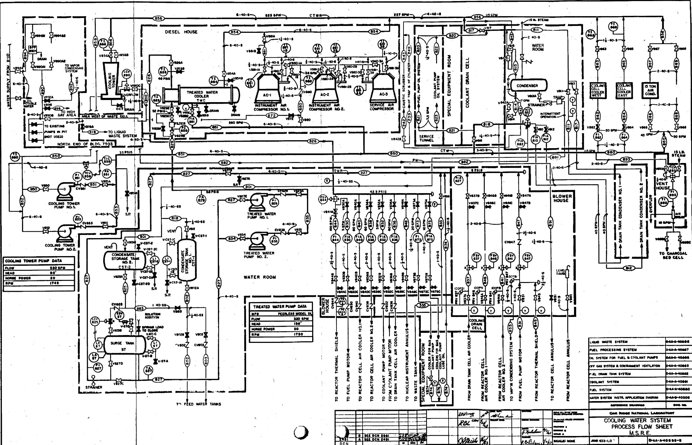

C

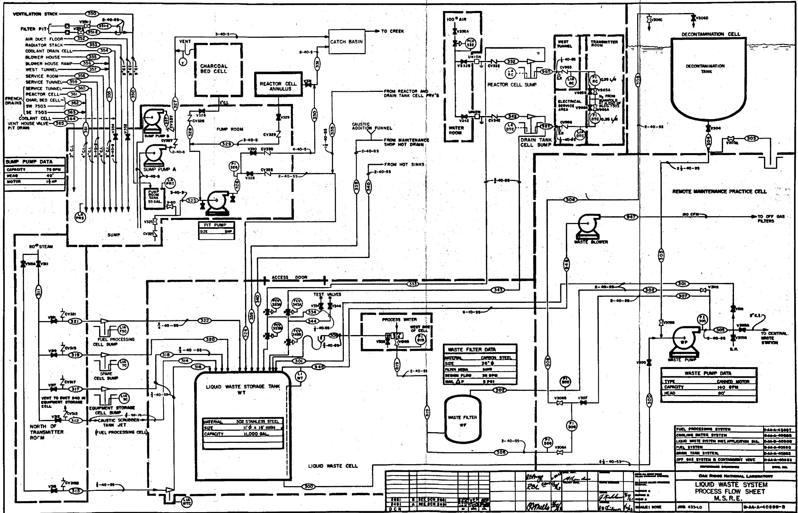

Unclassified

ORNL-DWG 63-7750

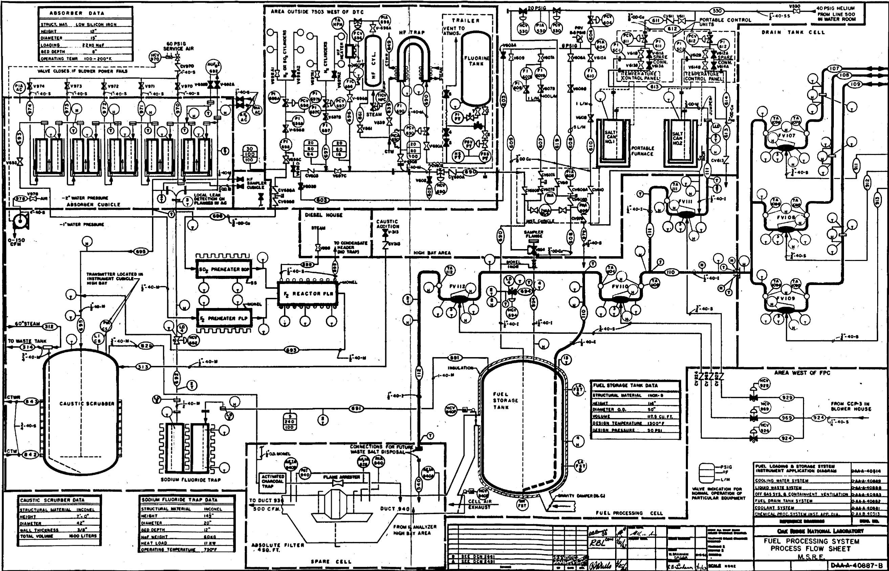

Unclassified

ORNL-DWG 63-7749

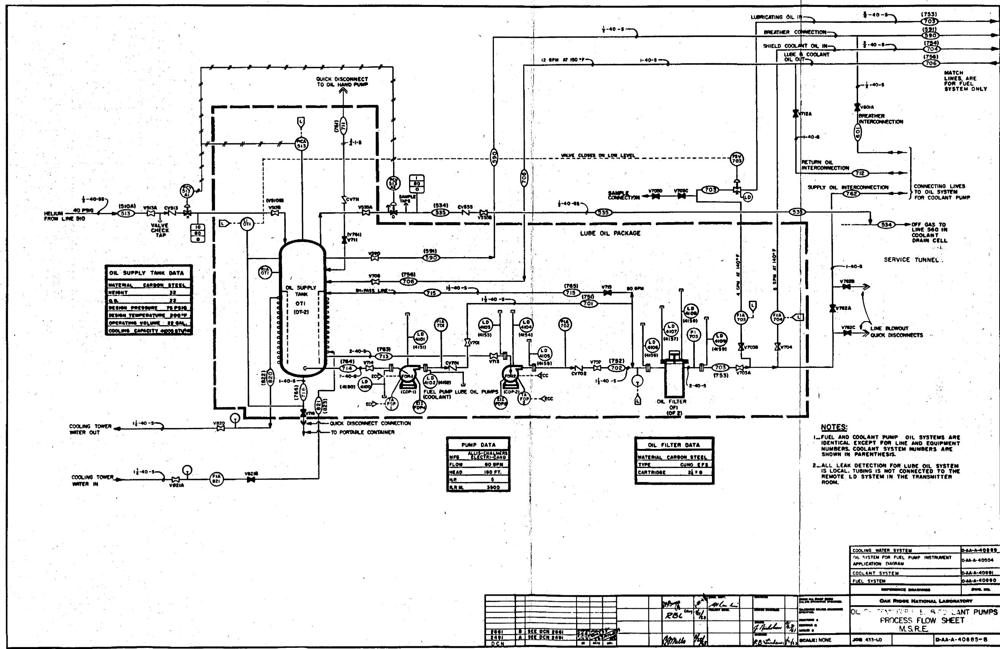

Unclassified

ORNL-DWG 63-7748

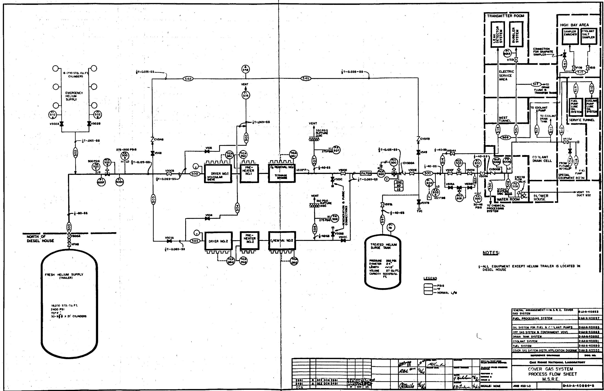

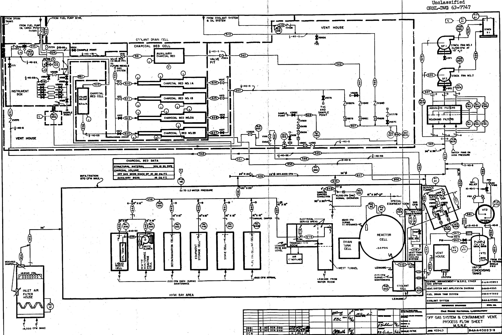

Unclassified

ORNL-DWG 63-7746

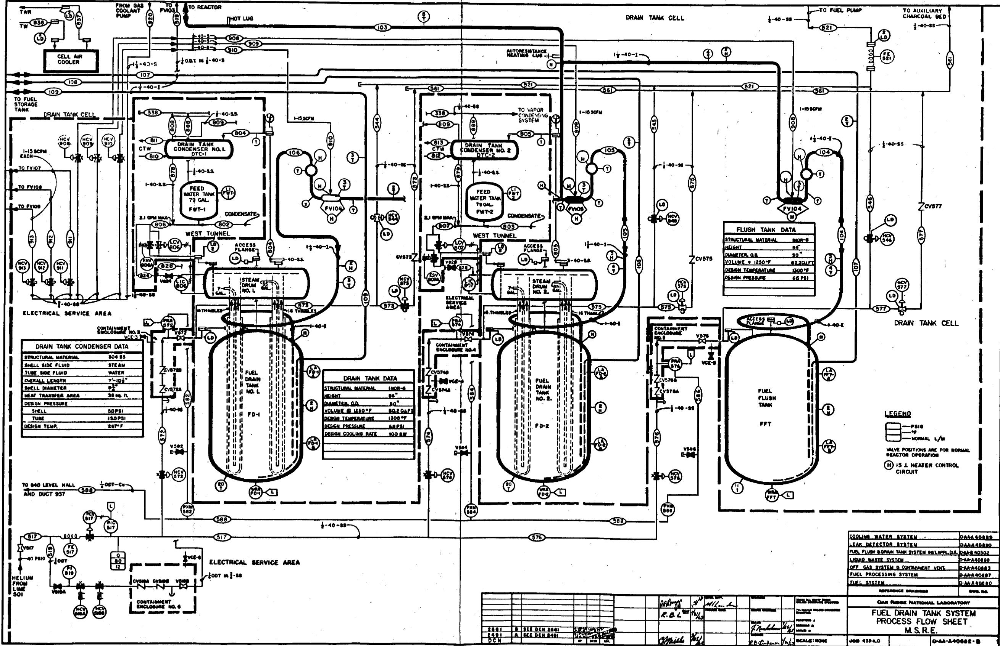

#

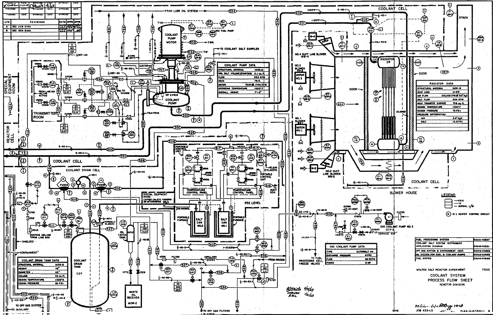

Unclassified

ORNL-DWG 63-7745

Unclassified

ORNL-DWG 63-7744

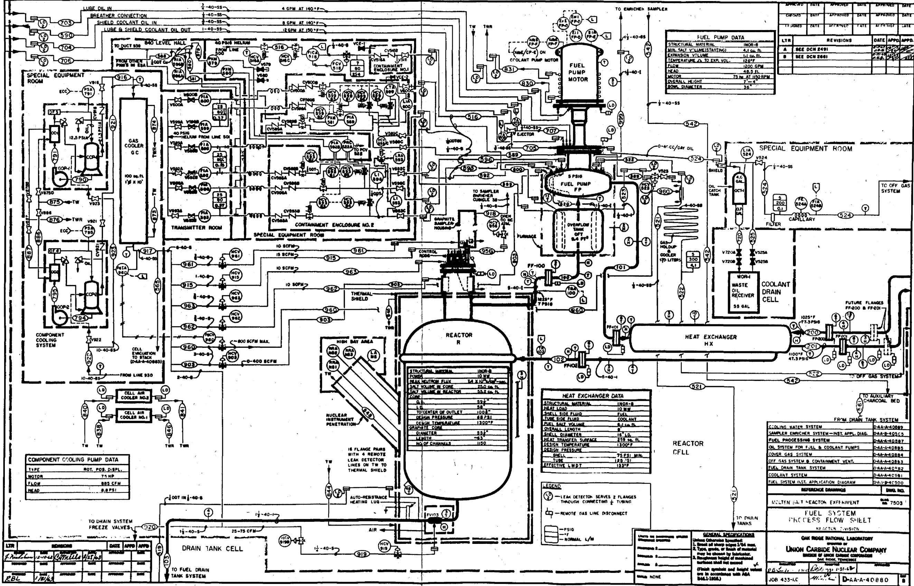

# Appendix C

# COMPONENT DEVELOPMENT PROGRAM IN SUPPORT OF THE MSRE

The reliable performance of components and auxiliary equipment used in the circulation of molten salts was established in over 200,000 hr of accumulated loop operations and formed the basis for the specification of components for the MSRE. As added assurance of reliability and safety, prototypes of critical MSRE components were operated out-of-pile under conditions resembling those of the reactor. Facilities for this testing included salt systems of various sizes and different degrees of complexity and model tests in which hydraulic and mechanical processes were analyzed.

# Core Flow

A one-fifth scale model of the MSRE core was operated with water as an aid in establishing the design. Variations of several design features were investigated in the model before the design was completed. Details of the entrance plenum were studied to assure even circumferential flow distribution into the core-shell cooling annulus, and baffles to kill the swirl produced by the entrance conditions in the lower vessel head were tested. Preliminary measurements were made of the heat transfer coefficient at the surface of the lower head. Upon completion of the design, a full-scale model was constructed and operated with 1250 gpm of water to verify the adequacy of the flow distribution in every section of the core vessel assembly. As a result of these tests, minor modifications were made to the graphite support lattice to correct an uneven flow distribution found between mutually perpendicular channels in the graphite. Tests were also conducted with various sizes and densities of solid particles introduced into the inlet stream to determine the probable distribution in the system. It was found that particles below about $300\mu$ passed through the core vessel adequately; however, particles over $300\mu$ tended to settle out in the lower head and to accumulate around the drain pipe at the vessel center line. The design of this drain pipe was changed to reduce the possibility of plugging.

A few tests were conducted while using a thickening agent in the water to verify the analytical translation of the results with water to the salt conditions. The results of these tests indicate that the flow distribution within the core vessel assembly will provide adequate cooling to all parts of the assembly.

The full-scale core hydraulic model was operated with an analog simulator to study the effect of system pressure oscillations on core reactivity. It was found that power oscillations of less than $1/2\%$ would result if the questionable assumption were made that the pressure oscillations in the core were similar to those in the model. Additional studies are planned in this area.

The possible interaction of fuel salt and full-size core graphite stringers was investigated in the S-in.-diam vessel that is part of the Engineering Test Loop (a facility for testing many MSRE prototype components and operating procedures). The flow conditions in the channels were similar to those in the MSRE, and after 5000 hr of operation at $1200^{\circ}\mathrm{F}$ there were no significant changes in the appearance of the graphite.

# Ieast Exchangers

Heat exchangers as complex as the MSRE exchanger were fabricated in Inconel for the ARE and the ART. The fabricability of INOR-8 into tubes and tube-to-tube sheet assemblies was demonstrated. The MSRE heat exchanger and radiator assemblies, as now designed, do not require high-temperature development beyond that planned in the premolecular operation of the entire system. However, uncertainties in the fluid flow design required that hydraulic tests be conducted on the heat exchanger. An excessive pressure drop was found on the fuel side of the tube bundle and alterations were made to the shell in both the entrance and exit regions to reduce the loss in pressure. Vibrations of a significant amplitude were encountered during the tests, and this condition was corrected by "tightening" the tubes by the insertion of appropriate spacers.

The air-cooled radiator was operated at full air flow without detectable vibration.

# Freeze Flanges

Freeze flanges have been a part of molten-salt engineering development for several years. They were found to be satisfactory in a large circulating salt system - the Remote Maintenance Demonstration Facility. It was shown that the flanges could withstand repeated thermal cycling and the joint could be broken and reassembled. Two flange pairs with integral cooling were cycled between room temperature and $1300^{\circ}\mathrm{F}$ for more than 100 times without failure. Salt leakage from a freeze flange has not been experienced to date, although leakage of helium through the secondary gas buffer seal was encountered in the thermal-cycling tests.

As a result of these preliminary tests, the design of the flanges was improved to provide greater strength toward axial loads, to reduce the thermal stress, to improve the tightness of the buffer seal, and to remove the requirement for integral cooling. Flanges of the improved design were thermal cycled between room temperature and $1300^{\circ}\mathrm{F}$ for more than 100 times, during which the helium leakage from the buffer zone remained less than $5 \times 10^{-4}$ cc (STP)/sec and without any significant dimensional changes that would indicate excessive thermal stress. These flanges were also subjected to severe thermal shock without damage. It was found that a new flange would makeup and seal satisfactorily with a flange that had experienced several room temperature-to- $1300^{\circ}\mathrm{F}$ thermal cycles. Under conditions of pump stoppage, it was found that the salt in the bore of the flange would not freeze solid if the temperature of the pipe on either side of the flange was maintained above $1000^{\circ}\mathrm{F}$ . Equipment has been devised for the remote operation of the clamps, for the replacement of the ring gasket, and for sealing the open pipe during the maintenance period.

In addition to the work on freeze flange disconnects, small, remotely maintainable, buffered seal disconnects were developed for use in the sampler-enricher and in the various gas lines of the MSRE. These disconnects were operated to satisfactorily demonstrate their reliability under extreme temperature conditions of service.

# Freeze Valves

Since no reliable mechanical valve was available at the start of the project, it was decided to use frozen plugs of salt to control the transfer of salt. Development of these "valves" produced a unit in which it is possible to establish and maintain reliably either the open or closed condition. For the normally open valve, approximately 10 min is required to thaw the frozen valve, even under the conditions of a total power failure. The normally closed valves, with the requirement that they remain closed during a power failure, are allowed to cool to ambient temperature, thereby insuring that there is not enough energy to open them, except on demand. The time required to open this type of valve is in excess of 1 hr. Both types of valves require an average of 25 min to freeze.

The freeze valves to be used in the reactor system were designed to ensure that the thawing operation would proceed from the molten zones at the ends of the valve to the frozen zone at the center. The purpose of this feature is to prevent expansion damage to the valve as a result of thawing at the center of an excessively long frozen zone. Prototype valves of this design have been operated through more than 100 freeze-thaw cycles without dimensional change.

# Heaters

Prototype heaters for pipes and vessels have been fabricated and tested for many thousand hours of successful operation. The heaters for the pipes are enclosed in all-metal reflective insulation, which was chosen because of the dusting problem normally encountered with refractory materials where much handling is required. Heater-insulation units of this type have operated with the interior at $1200^{\circ}\mathrm{F}$ for more than 3200 hr without apparent changes in the heat loss of 600 w/lin ft. The heaters are connected in such a way as to reduce the effect of the failure of any one heater on the temperature distribution along the pipe. Additional confidence in the heater design was obtained when one of the heaters shorted to ground and shut itself down without any detectable damage to the empty 5-in. pipe.

A prototype of a single heater for the drain tank has operated at $1200^{\circ}\mathrm{F}$ over 10,000 hr without difficulty. The failure at the beginning of the run of an interconnecting lead wire was attributed to inadequate inspection of a weld. The design and inspection of the weld was improved and no further trouble was encountered.

A mockup of a drain tank cooler for removing afterheat from the fuel was operated through the equivalent of 1000 startups without any indication of damage to the INOR-8 tubes. Previous tests on a system of a slightly different design, constructed of Inconel, had caused failure of the tubes after only 250 startups. The results of the tests indicate that there should be no trouble with these cooler tubes through at least 100 reactor shutdowns from full power.

Power tests on the heater rod to be used in the fuel pump furnace indicated that less than $50\%$ of the rated capacity of the heater would be transferred if the rod surface temperature was to be held to $1400^{\circ}\mathrm{F}$ . As a result, heaters were added to the furnace to prevent overloading of the individual units and to ensure a longer life.

A mockup of a section comprising $15\%$ of the heaters for the reactor furnace was operated for 20,000 hr at $1250^{\circ}\mathrm{F}$ without incident. The experience with the test furnace was incorporated in the design of the reactor furnace.

All the potentially dusty refractory insulation material to be used in the furnaces was examined by activation analysis to eliminate any that would cause a contamination problem by spreading radioactive dust when equipment is removed from the cells.

# Control Rods

A prototype control rod drive was operated in a $150^{\circ}\mathrm{F}$ environment for more than 60,000 cycles of 102-in. travel in each cycle. Several combinations of materials were tested in a worm to worm-gear combination to obtain satisfactory life. Numerous small changes were made to improve the final design.

The prototype control rod was tested at $1200^{\circ}\mathrm{F}$ in conjunction with operation of the drive test. Development of a pneumatic position indicator

for the in-pile end of the control rod was completed, and satisfactory operation was demonstrated.

# Xenon Migration

Experiments designed to measure the xenon stripping efficiency in the fuel pump bowl were conducted on a pump mockup using $\mathrm{CO}_{2}$ and water, and preliminary results indicated that the stripping efficiency could be as low as $25\%$ under normal operating conditions. Using this value of $25\%$ , a study was made of the xenon distribution expected in the MSRE system, and it was found that from 20 to $70\%$ of the xenon could migrate to the graphite of the core, depending on the choice of values for the xenon mass transport through the salt and the xenon diffusion in the graphite. Additional studies of the xenon migration will be made on the MSRE system during precritical operation with salt.

# Engineering Test Loop

The engineering test loop, a collection of simulated MSRE components, was operated for extended periods without serious difficulty. The operability of freeze valves, level indicators, and gas-handling systems was demonstrated under operating conditions. A method was tested for removing oxide from the salt with HF and $\mathbf{H}_2$ treatment in the drain tank. The loop was altered later to include a large container for full-size graphite specimens and was operated with an LiF-BeF $_2$ salt for extended periods without difficulty. The adequacy of a method of gas purging and salt flushing of the system to remove oxide before operation with fuel was demonstrated. The operation of a frozen-salt joint, which provides access to the graphite in the loop, was successfully demonstrated, and a procedure was prepared for operating a similar joint for access to the graphite samples in the MSRE.

The loop was operated with LiF-BeF $_2$ -ZrF $_4$ -UF $_4$ salt in excess of 5000 hr, mainly for testing the sampler-enricher mockup and following the inventory of uranium added to the loop. The uranium concentration was varied from 0.1 mole % at the beginning of the period to about 0.7 mole % at the

end of the period. Metal and graphite samples were removed periodically for examination, and no unusual changes were noticed.

# Helium Purification

A full-scale model of the oxygen-removal unit was tested under maximum flow conditions (10 liters/min) with varying inlet oxygen concentrations and bed temperatures. The results indicated that, with a bed temperature of $1200^{\circ}\mathrm{F}$ and an inlet oxygen concentration of 100 ppm, an outlet concentration of $< 1$ ppm of oxygen was maintained until $58\%$ of the titanium sponge had been consumed. The average oxygen concentration at the inlet to the purifier for the MSRE is not expected to exceed 10 ppm, hence an average bed life of 900 days may be predicted for the oxygen-removal unit.

The performance of a commercial analyzer for the continuous detection of moisture and oxygen in the helium supply was evaluated and found to be satisfactory for use with the MSRE.

# Sampler-Enricher

The sampler-enricher mechanism was mocked up, first in part, to evaluate critical areas for design, and then completely, to test the assembly of parts as a system. The sampler-enricher mockup was tested in conjunction with the engineering test loop during a period of over 5000 hr of operation, during which the uranium concentration was varied from 0.1 mole % to about 0.7 mole % at the end of the period. The sampler-enricher was used to successfully isolate over 50 samples and to make over 25 uranium additions. Correlation of the chemical analysis of the sample with the book inventory and with the results of other methods of sampling were within an experimental error of $1 \frac{1}{2}\%$ . The leakages through the buffer seals in the valves, disconnects, and transport container remained within an acceptable limit throughout the operation. The complete system for sample transport from the sampler-enricher to the analytical chemistry hot cell and for handling the sample in the hot cell was successfully demonstrated. As a result of these studies, the designs of the samplers for both the fuel and coolant salt system were finalized.

# Maintenance

The practicality of the two general methods of maintenance designed into the MSRE has been thoroughly demonstrated during the past 6 years. Entirely remote maintenance, with the aid of stereo-television, an overhead crane, and a General Mills' manipulator, was demonstrated on a special salt system (Remote Maintenance Demonstration Facility) of about the size and degree of complexity of the MSRE. After this system was operated with molten salt, the pump, the dummy core, the heat exchanger, and heaters were removed and replaced with remote means. The system was shown to be operable following the replacement.

Semidirect maintenance with long-handled tools operated through portable shielding has been used successfully on a number of operations at Homogeneous Reactor Experiment No. 2, a reactor of the same general size and activity level as the MSRE.

Although the feasibility of maintenance was regarded as having been established, additional development and practice was required to work out detailed procedures. Because the MSRE was constructed in an existing facility that was not readily adaptable to the manipulator type of remote maintenance, the manipulator was not used in the MSRE. However, some of the procedures include the use of the "remotized" crane, the television system, and viewing windows in carrying out entirely remotized operations.

Procedures, sufficiently detailed to be used by reactor personnel, were written for maintenance of part of the components in the reactor and drain tank cells. Design, fabrication, and testing was completed on over 20 individual long-handled tools. Television requirements for the MSRE were found to be better satisfied by a two-camera orthogonal system rather than the stereo system previously studied because of better reliability, less operator fatigue, and a simpler installation. All maintenance procedures were demonstrated during the construction and preoperational testing of the reactor. Studies were made on methods of handling and disposing of the radioactive components after removal from the reactor cell.

A one-sixth-scale model of the reactor system and maintenance area was built as an aide in maintenance planning both before operation and after operations have begun.

# Appendix D

# CALCULATION OF ACTIVITY CONCENTRATIONS

# RESULTING FROM MOST LIKELY ACCIDENT

# Cell Volume

The total volume of the reactor and drain tank cells is

Reactor cell 11,300 ft³

Drain tank cell 6,700 ft³

Total 18,000 ft³ or $5 \times 10^{8}$ cc

# Leakage Rate of Cells

If the cell pressure is maintained at 13 psia after the most probable accident, the inleakage for the 18,000-ft³ cell volume is a maximum of 0.43 ft³/hr (ref. 1);

$$
0. 4 3 f t ^ {3} / h r = 1. 2 \times 1 0 ^ {4} c c / h r.
$$

Fraction of Total Fission-Product Inventory in 4 Liters of Spilled Salt

$$
\frac {4 \text {l i t e r s}}{7 0 \mathrm {f t} ^ {3} \times 2 8 . 3 \text {l i t e r s} / \mathrm {f t} ^ {3}} = 2 \times 1 0 ^ {- 3}.
$$

Total Fission Product Inventory for the Maximum Credible Accident (see sec. 8.7.2)

Iodine $2.5 \times 10^{6}$ curies

Solids 6.8×106curies

Xenon and krypton $3.75 \times 10^{5}$ curies

Amount of Activity Released from 4 Liters of Spilled Salt

For $10\%$ iodine: $2.5 \times 10^{6} \times 2 \times 10^{-3} \times 0.10 = 0.5 \times 10^{3}$ curies

For $10\%$ solids: $6.8 \times 10^{6} \times 2 \times 10^{-3} \times 0.10 = 1.4 \times 10^{3}$ curies

The xenon and krypton can be neglected.

# Concentration in Cells

Iodine: $0.5 \times 10^{3} \div 5 \times 10^{8} = 10^{-6}$ curies/cc

Solids: $1.4 \times 10^{3} \div 5 \times 10^{8} = 3 \times 10^{-6}$ curies/cc

The $\mathsf{MPC}_{\mathsf{a}}$ for a 40-hr/week exposure is $9 \times 10^{-9} \mu \mathrm{c} / \mathrm{cc}$ for iodine, and thus the concentration of $1 \mu \mathrm{c} / \mathrm{cc}$ must be reduced by a factor of $10^{8}$ ; for the bone seeking solids, the factor is $10^{10}$ .

For the iodine, the removal factors can be expected to be $10^{4}$ for the carbon bed, $10^{6}$ for dilution in the stack, and about $10^{5}$ for dispersion in the atmosphere. Thus even without the charcoal bed, the iodine concentration would be below the $\mathrm{MPC}_{\mathrm{a}}$ .

For the solids, the removal factors can be expected to be $10^{4}$ at the filters, $10^{6}$ in the stack, and $10^{5}$ in the atmosphere. These factors give a total of $10^{15}$ , or $10^{5}$ more than needed to meet the $\mathrm{MPC}_{\mathrm{a}}$ .

# Conclusion

The Most Likely Accident could be tolerated, even if the charcoal bed and the absolute filters were not effective.

# Appendix E

# TIME REQUIRED FOR PRESSURE IN CONTAINMENT VESSEL TO BE LOWERED TO ATMOSPHERIC PRESSURE

The heat content of the steam and gas in the containment vessel at various times after the maximum credible accident has been calculated.1 It was assumed conservatively that the nitrogen was swept from the cell, leaving pure steam at the maximum pressure of 37 psia, and thus the maximum temperature would be $262^{\circ}\mathrm{F}$ . The rupture disk should break after about 4 sec, when the pressure approached 40 psia, and the discharge of steam would be over in about 300 sec. In calculating the time required for the vessel pressure to return to atmospheric, a graphical solution to the problem of heating a semiinfinite slab was used, as suggested by McAdams.2 In the case of the MSRE the containment vessel is the "slab" and the vessel atmosphere is the heat source. It was assumed conservatively that the slab was insulated by the sand-water mixture in the annulus.

Using McAdams' notation,

$$
Y = \frac {t ^ {\prime} - t _ {a}}{t ^ {\prime} - t _ {b}}, \tag {1}
$$

where

$t^{\prime} =$ initial temperature of the cell atmosphere, ${}^{\circ}\mathrm{F},$

$t_{b} =$ initial temperature of the metal wall, ${}^{\circ}\mathbb{F},$

$t_{a} =$ final temperature of the metal wall, ${}^{\circ}\mathrm{F},$

and

$$
m = \frac {K}{r _ {m} U}, \tag {2}
$$

where

K = thermal conductivity of steel, 26 Btu/hr·ft² (°F/ft),

$r_m =$ distance from midpoint to surface, 1/6 ft,

$U =$ film coefficient of heat transfer, assumed to be 50 Btu/hr.ft².°F,

and

$$
X, \text {" R e l a t i v e T i m e " r a t i o ,} = \frac {K \theta}{\rho C _ {p} r ^ {2} m}, \tag {3}
$$

where

$\theta =$ time from start, hr,

$\rho =$ density of solid, $480~\mathrm{lb / ft^3}$ for steel,

$C_p =$ specific heat of solid, 0.12 Btu/lb $^{\circ}$ F,

an estimate was made of the amount of vessel heating that would take place during the time salt was spilling and the vapor-condensing system was in action. Then, taking $t_b$ as the vessel temperature before the accident (150°F) and $t'$ as the maximum steam temperature during the event (262°F), the vessel temperature ( $t_a$ ) at the end of the accident (i.e., $\theta = 300$ sec) was found. For the value $X = 1.32$ , obtained by solving Eq. (3), the value of $Y$ was found from the X-Y plot of Fig. 10 of ref. 2 to be 0.7. Based on these values, Eq. (1) was solved and $t_a$ was found to be about 180°F at the beginning of the cool-down of the cell atmosphere.

As an approximation of the unsteady state of the steam temperature during cooling, Y was calculated at $5^{\circ}\mathrm{F}$ intervals of wall temperature increase. For these calculations, the value of X was taken from Fig. 10 of ref. 2. The heat content per pound of steam remaining in the cell was then determined and the equivalent pressure was read from the Steam Tables. The temperature and pressure of the cell obtained for each interval are given in Table E.l.

Although the input of heat from fission-product decay is not taken into account for this short period, it becomes significant (approximately $10^{6}$ Btu) over the 4-hr period assumed in the release calculation. However, with the salt on the floor of the cell and in contact with the steel, which

Table E.l. Cell Pressure at Various Times After the Maximum Credible Accident   

<table><tr><td colspan="2">Temperature Interval (°F)</td><td rowspan="2">Time (min)</td><td rowspan="2">Cell Pressure (psia)</td><td rowspan="2">Cell Temperature (°F)</td></tr><tr><td>tb</td><td>ta</td></tr><tr><td>180</td><td>180</td><td>0</td><td>37</td><td>262</td></tr><tr><td>180</td><td>185</td><td>0.8</td><td>32</td><td>254</td></tr><tr><td>185</td><td>190</td><td>1.5</td><td>28</td><td>247</td></tr><tr><td>190</td><td>195</td><td>2.3</td><td>24</td><td>238</td></tr><tr><td>195</td><td>200</td><td>3.4</td><td>20</td><td>228</td></tr><tr><td>200</td><td>205</td><td>5.6</td><td>16</td><td>215</td></tr><tr><td>205</td><td>210</td><td>14.4</td><td>14</td><td>210</td></tr></table>

is submerged in water, $^3$ a modest heat flux of 10,000 Btu/hr. $ft^2$ would remove the heat through the bottom of the tank. (In the experiment involving the release of 500 lb of salt into a dished vessel, cited in Section 8.6, heat fluxes greater than 100,000 Btu/hr. $ft^2$ were found.) The 4.4 ft $^3$ /sec (max) steam generated under the hemisphere would be vented through the 8-in. pipe installed for this purpose.

# Internal Distribution

1. R. K. Adams

2. R.G.Affel

3. G.W. Allin

4. A. H. Anderson

5. R.F.Apple

6. C. F. Baes

7. S.J.Ball

8. S.E.Beall

9. M. Bender

10. E. S. Bettis

ll. F. L. Blankenship

12. R. Blumberg

13. A. L. Boch

14. E. G. Bohlmann

15. C. J. Borkowski

16. H. R. Brashear

17. R. B. Briggs

18. G. H. Burger

19. J. A. Conlin

20. W.H.Cook

21. L. T. Corbin

22. W. B. Cottrell

23. J. L. Crowley

24. D. G. Davis

25. G. Dirian

26. S.J.Ditto

27. F. A. Doss

28. J.R.Engel

29. E.P.Epler

30. A. P. Fraas

31. E. N. Fray

32. H. A. Friedman

33. C. H. Gabbard

34. M. J. Gaitanis

35. R.B.Gallaher

36. J. J. Geist

37. W. R. Grimes

38. A. G. Grindell

39. R. H. Guymon

40. S. H. Hanauer

41. P. H. Harley

42. P. N. Haubenreich

43. G. M. Hebert

44. P. G. Herndon

45. V. D. Holt

46. A. Houtzeel

47. T. L. Hudson

48. R.J.Kedl

49. S. S. Kirslis

50. D. J. Knowles

51. A. I. Krakoviak

52. J.W.Krewson

53. C. E. Larson

54. R.B. Lindauer

55. M. I. Lundin

56. R.N.Lyon

57. H. G. MacPherson

58. C. D. Martin

59. H.C.McCurdy

60. W. B. McDonald

61. H.F.McDuffie

62. C. K. McGlothlan

63. H. J. Metz

64. A. J. Miller

65. W.R.Mixon

66. R. L. Moore

67. H.R.Payne

68. A. M. Perry

69. H. B. Piper

70. B. E. Prince

71. J. L. Redford

72. M. Richardson

73. H.C.Roller

74. M. W. Rosenthal

75. T. H. Row

76. H. W. Savage

77. A.W.Savolainen

78. D. Scott, Jr.

79. J.H.Shaffer

80. E. G. Silver

81. M.J. Skinner

82. T. F. Sliski

83. A. N. Smith

84. P. G. Smith

85. I. Spiewak

86. R.C.Steffy

87. H. H. Stone

88. H. J. Stripling

89. J. A. Swartout

90. A. Taboada

91. J. R. Tallackson

92. R.E.Thoma

93. G. M. Tolson

100. G. D. Whitman

94. D. B. Trauger

101. H. D. Willis

95. W.C.Ulrich

102-104. Central Research Library

96. B.H.Webster

105-106. Y-12 Document Reference Section

97. A. M. Weinberg

107-109. Laboratory Records Department

98. K.W. West

110. Laboratory Records, RC

99. J.C. White

# External Distribution

111-170. H. M. Roth, Research and Development Division, ORO

171-172. Reactor Division, ORO

173-187. Division of Technical Information Extension, DTIE