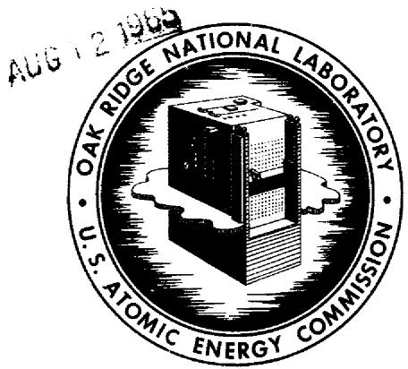

# OAK RIDGE NATIONAL LABORATORY

operated by  
UNION CARBIDE CORPORATION for the

U.S. ATOMIC ENERGY COMMISSION

ORNL-TM-733 (Revised)

COPY NO. - 68

DATE - August 3, 1965

MSRE DESIGN AND OPERATIONS REPORT

Part VI

OPERATING SAFETY LIMITS FOR THE MOLTEN-SALT REACTOR EXPERIMENT

S. E. Beall   
R. H. Guymon

# NOTICE

This document contains information of a preliminary nature and was prepared primarily for internal use at the Oak Ridge National Laboratory. It is subject to revision or correction and therefore does not represent a final report. The information is not to be abstracted, reprinted or otherwise given public dissemination without the approval of the ORNL patent branch, Legal and Information Control Department.

# LEGAL NOTICE

This report was prepared as an account of Government sponsored work. Neither the United States, nor the Commission, nor any person acting on behalf of the Commission:

A. Makes any warranty or representation, expressed or implied, with respect to the accuracy, completeness, or usefulness of the information contained in this report, or that the use of any information, apparatus, method, or process disclosed in this report may not infringe privately owned rights; or   
B. Assumes any liabilities with respect to the use of, or for damages resulting from the use of any information, apparatus, method, or process disclosed in this report.

As used in the above, "person acting on behalf of the Commission" includes any employee or contractor of the Commission, or employee of such contractor, to the extent that such employee or contractor of the Commission, or employee of such contractor prepares, disseminates, or provides access to, any information pursuant to his employment or contract with the Commission, or his employment with such contractor.

# MSRE DESIGN AND OPERATIONS REPORT

# Part VI

# OPERATING SAFETY LIMITS FOR THE MOLTEN-SALT REACTOR EXPERIMENT

S. E. Beall   
R. H. Guymon

This document has been prepared at the request of the U. S. Atomic Energy Commission to set the limits for various parameters related to the Molten-Salt Reactor Experiment. In some cases the limits report the level at which the reactor will be shut down by automatic monitoring devices. In all cases the reactor operators are obligated to take steps intended to correct a parameter which is temporarily outside the specified range indicated herein.

# 1.0 Containment

1.1 Leakage from the primary system as indicated by the reactor and drain-tank-cell air activity will not exceed the equivalent of 4 liters of salt after 120 days of operation at full power, as estimated in the case of the Most Probable Accident. Off-gas activity release will be limited to fission-product concentrations averaging less than $1.5 \times 10^{-4} \mu \mathrm{c} / \mathrm{cc}$ in the stack. Fission product release will be monitored by radiation monitors on the off-gas lines and at the stack.   
1.2 The cover-gas supply pressure will be kept at 30 psig or greater and the leak-detector system pressure above 50 psig to help prevent excessive exposure to operating personnel, as specified in Chapter 0524 of the AEC Manual.3

# 1.0 Containment (continued)

1.3 The radioactivity in the reactor cell service lines will be maintained at a level sufficiently low to prevent excessive exposure to personnel, as specified in Chapter 0524 of the AEC Manual.   
1.4 The pressure in the reactor and drain tank cells will be maintained below atmospheric pressure during reactor operation.   
1.5 The maximum reactor and drain-tank-cell leak rate will not be allowed to exceed $1\%$ of the cell volume per day, calculated for the conditions of the Maximum Credible Accident.1 The in-leakage rate will be determined at least once per week.   
1.6 The maximum vapor-condensing system pressure (under nonaccident conditions) will not exceed 3 psig.   
1.7 The building high-bay pressure will be maintained at slightly less than atmospheric pressure ( $\sim 0.1$ in. $\mathrm{H}_2\mathrm{O}$ ) during all operations in which the high bay serves as the secondary containment.   
1.8 The ventilation system filters will be tested at least annually and after each change of filters.

1.8.1 The measured efficiency of the filters must be greater than $99.9\%$ for $0.5\mu$ and larger particles, as indicated by the standard dioctylphthalate test.

# 2.0 Fuel System

2.1 The maximum steady-state power level is 10 Mw (administrative limit).   
2.2 The power level for safety-rod scram trip is 15 Mw or less.   
2.3 The temperature level for safety-rod scram trip is less than $1400^{\circ}\mathrm{F}$ . Adjustment of the trip between 1300 and $1400^{\circ}\mathrm{F}$ will require administrative approval.   
2.4 The maximum fuel system cover-gas pressure is 50 psig.

2.0 Fuel System (continued)

2.5 The maximum salt fill rate while filling the core is $1.0\mathrm{ft}^3/\mathrm{min}$ .   
2.6 The maximum amount of $^{235}\mathrm{U}$ which will be added at one time is 120 g. During operation fuel will only be added through the sampler enricher.   
2.7 The maximum concentration of fissionable material in the fuel salt will not exceed by more than $5\%$ the minimum required for full-power operation at $1200^{\circ}\mathrm{F}$ with equilibrium xenon and the control rods poisoning $0.6\% \delta \mathrm{k} / \mathrm{k}$ . The fuel salt will be sampled and the concentration measured at least once per week.

R 2.8 At no time during critical operation of the reactor will the reactivity anomaly be allowed to exceed $0.5\% \delta \mathrm{k} / \mathrm{k}$ . A "reactivity anomaly" is defined as a deviation from the reactivity which is expected on the basis of measured reactor physics constants and calculated effects of burnup and fission product accumulation.

R 2.9 A positive period of 1 sec or less will cause a safety-rod scram.

3.0 Coolant System

3.1 The maximum coolant system cover-gas pressure is 50 psig.

4.0 Control Rods

4.1 The normal complement of control rods is three, of which two are required to scream for safety action.   
4.2 The maximum scram time (time from initiation of signal until a rod is on the seat) is 1.3 sec.   
4.3 The rod speed (motor powered) is $0.5 \pm 0.05$ in./sec. This speed permits maximum reactivity additions in "start" of $0.1\% \delta k / k$ per sec and in "run" of $0.05\% \delta k / k$ per sec.

R 4.4 The scream time of the rods will be checked before each fill with fuel salt.

# 5.0 Nuclear Control and Safety Instrumentation

5.1 All nuclear safety instrumentation will be checked for proper operation before each fill.

R 5.2 A minimum of two safety-level channels will be in service during reactor operation.

5.3 A minimum of two reactor fuel outlet temperature signals will be in service during reactor operation.   
5.4 A minimum of one fission chamber with count-rate circuit must be in operation during startup filling operations.

R 5.5 A minimum of two positive period safety channels will be in service during reactor operation.

# 6.0 Personnel Radiation Monitoring

6.1 Radiation level monitors

A minimum of two personnel radiation monitors will be in operation at all times, one in the high-bay area and one in the control-room area.

6.2 Air monitors

A minimum of two air activity monitors will be in operation at all times, one in the high-bay area and one in the office-control-room area.

# 7.0 Personnel and Procedures

7.1 Personnel qualifications

The reactor will be operated only by qualified personnel approved by the Chief of Operations. It will be operated in conformance with documented operating procedures which, in no instance, designate authorization to operate the reactor in excess of any operating safety limits listed above.

# 7.0 Personnel and Procedures

7.2 The minimum staff requirement for operation during any shift is that at least one supervisor and two technicians will be on duty during reactor operation. The control room will not be left unattended while fuel is in the reactor vessel.

# 8.0 Experimental Limits

Experiments will be conducted within the limits specified in this report. Experimental procedures will be approved in advance by the Head of the Operations Department, Oak Ridge National Laboratory Reactor Division, or his authorized assistant.

，

# Internal Distribution

1. G. M. Adamson

2. R.G.Affel

3. S.E.Beall

4. F. F. Blankenship

5. R. Blumberg

6. A. L. Boch

7. C. J. Borkowski

8. R.B.Briggs

9. G.H. Burger

10. W. B. Cottrell

ll. J. L. Crowley

12. F. L. Culler

13. J. R. Engel

14. E.P.Epler

15. A. P. Fraas

16. C. H. Gabbard

17. R. B. Gallaher

18. W. R. Grimes

19. R. H. Guymon

20. P.H.Harley

21. P. N. Haubenreich

22. V. D. Holt

23. T. L. Hudson

24. P. R. Kasten

25. A. I. Krakoviak

26. R. B. Lindauer

27. M. I. Lundin

28. R. N. Lyon

29. H. G. MacPherson

30. H. C. McCurdy

31. W. B. McDonald

32. H. F. McDuffie

33. C. K. McGlothlan

34. A. J. Miller

35. R. L. Moore

36. H. R. Payne

37. A. M. Perry

38. H. B. Piper

39. J. L. Redford

40. H. C. Roller

41. M. W. Rosenthal

42. H. W. Savage

43. Ann Savolainen

44. D. Scott, Jr.

45. M. J. Skinner

46. A. N. Smith

47. I. Spiewak

48. R.C.Steffy

49. A. Taboada

50. J.R.Tallackson

51 R.E.Thomas

52. D. B. Trauger

53. W. C. Ulrich

54. B.H.Webster

55. A. M. Weinberg

56. M. E. Whatley

57. G. D. Whitman

58-59. Central Research Library

60-61. Y-l2 Document Reference Section

62-64. Laboratory Records Department

65. Laboratory Records, RC

66. C. E. Larson

67. S. J. Ditto

# External Distribution

68-82. Division of Technical Information Extension, DTIE

83-84. D. F. Cope, Reactor Division, AEC, ORO

85. R. W. Garrison, AEC, Washington

86-89. H. M. Roth, Division of Research and Development, AEC, ORO

90. W. L. Smalley, Reactor Division, AEC, ORO

91. M. J. Whitman, AEC, Washington