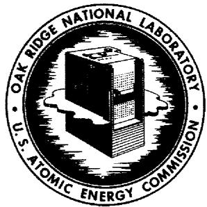

# OAK RIDGE NATIONAL LABORATORY

operated by

# UNION CARBIDE CORPORATION

NUCLEAR DIVISION

for the

U.S. ATOMIC ENERGY COMMISSION

ORNL-TM- 733 (3rd Revision)

COPY NO. -

DATE - July 25, 1969

MSRE DESIGN AND OPERATIONS REPORT

Part VI

OPERATING SAFETY LIMITS FOR THE MOLTEN-SALT

REACTOR EXPERIMENT

R. H. Guymon P. N. Haubenreich

# LEGAL NOTICE

This report was prepared as an account of Government sponsored work. Neither the United States, nor the Commission, nor any person acting on behalf of the Commission:

A. Makes any warranty or representation, expressed or implied, with respect to the accuracy, completeness, or usefulness of the information contained in this report, or that the use of any information, apparatus, method, or process disclosed in this report may not infringe privately owned rights; or   
B. Assumes any liabilities with respect to the use of, or for damages resulting from the use of any information, apparatus, method, or process disclosed in this report.

As used in the above, "person acting on behalf of the Commission" includes any employee or contractor of the Commission, or employee of such contractor, to the extent that such employee or contractor of the Commission, or employee of such contractor prepares, disseminates, or provides access to, any information pursuant to his employment or contract with the Commission, or his employment with such contractor.

# MSRE DESIGN AND OPERATIONS REPORT

Part VI

# OPERATING SAFETY LIMITS FOR THE MOLTEN-SALT REACTOR EXPERIMENT

(Third Revision)

R. H. Guymon

P. N. Haubenreich

This document sets forth limits for certain parameters describing the operating conditions of the Molten-Salt Reactor Experiment. The intent is to include all those items directly related to the health and safety of the public. Some items extend to the safety of the operators and the protection of the Experiment against a severe and disabling accident.

The safety limits shall not be intentionally violated. If any specified parameter goes outside a safety limit, the reactor operators are obligated to take action as specified herein. Any change in the safety limits requires approval of the ORNL management and the AEC-ORO Contract Administrator. Any violation of a safety limit shall be reported not later than the next work day to the AEC-ORO.

This document supersedes MSRE Design and Operations Report, Part VI - Operating Safety Limits for the MSRE, ORNL-TM-733 (2nd Revision).

# 1. Fuel System

1.1 Fill Rate - The rate at which the reactor vessel is filled with fuel salt shall not exceed 1.0 ft³/min. If this rate is exceeded, gas flow into the drain tanks shall be stopped.   
1.2 Pressure — The pressure of the gas in the pump bowl shall not exceed 25 psig whenever fuel salt is in the reactor vessel. If this limit is reached, the pump bowl shall be vented through the charcoal beds to the stack.

1.3 Surge Volume - The total gas volume in the fuel-pump bowl and the overflow tank shall be at least 5.0 ft³ whenever the reactor is critical. If this limit is reached, the reactor shall be taken subcritical until the volumetric inventory of fuel is reduced.

1.4 Excess Reactivity — The reactivity shall be such that the control rods must be withdrawn at least 50 percent of their total worth to make the reactor critical at $1210^{\circ}\mathrm{F}$ . If this limit is reached, the reactor shall be held subcritical until the abnormality is corrected.

1.5 Power — The reactor shall not be operated at a steady power in excess of 8 Mw. If heat balances indicate nuclear power above 8.1 Mw for more than 1 hour, the heat-removal rate shall be reduced to a heat-balance power of 8.0 Mw or less.

1.6 Addition of Fissile Material* - No more than $120\mathrm{g}$ of fissile material shall be added to the fuel in the pump bowl in any single addition.

1.7 Reactivity Anomaly — The reactivity anomaly shall not exceed $0.5\% \delta k / k$ while the reactor is critical. "Reactivity anomaly" is defined as the difference between the observed reactivity and the reactivity predicted on the basis of measured reactor physics characteristics and calculated effects of changes in operating conditions, burnup and fission product accumulation. If this limit is reached, the reactor shall be taken subcritical.

1.8 System Test at Elevated Pressure* The fuel circulating system and fuel drain-tank system shall be pressure-tested at least once a year at a minimum pressure (measured in gas) of 45 psig, a minimum temperature of $1150^{\circ}\mathrm{F}$ , and flush salt being circulated by the fuel pump.

1.9 Corrosion — The chromium concentration in the fuel salt shall not exceed 1000 ppm. If this limit is reached, steps shall be taken to minimize the corrosion rate and to reduce the chromium concentration in the fuel to less than 500 ppm.

2. Control Rods and Safety System

2.1 Scram Circuit Tests* All scram circuits shall be shown to be operating properly by testing before each fill of the reactor vessel with fuel salt.   
2.2 Scram Tests* The scram time for each control rod shall be measured before each fill of the reactor vessel with fuel salt.   
2.3 Scram Time* The reactor shall not be taken critical if the scram time of any control rod is greater than 1.3 sec.   
2.4 Rod Speed — The reactor shall not be taken critical if the motor-driven speed of any control rod is less than 0.45 in./sec or more than 0.55 in./sec. If a rod will not move, the reactor shall be taken subcritical.   
2.5 Control Rod Cooling — Any control rod that is not fully withdrawn shall be supplied with cooling air whenever the reactor is operating at powers above $15\mathrm{kw}$ . Temperatures in the rod drive whose cooling air supply is connected to that for the rod shall be accepted as evidence of air flow through the rod.   
2.6 Instrument Shaft Water — The nuclear instrument shaft shall be filled with water whenever fuel salt is in the reactor vessel. If for any reason the water level cannot be maintained at 849-ft elevation or above, the fuel shall be drained.   
2.7 Nuclear Startup Instrumentation — One neutron count-rate channel shall be in service throughout the filling of the fuel loop with fuel salt and whenever the reactor is being taken critical. If an instrument failure occurs during filling, the fuel shall be returned to the drain tank.   
2.8 Flux Instrumentation\* A minimum of two flux safety channels shall be in service during nuclear operation.

2.9 Period Instrumentation A minimum of two period safety channels shall be in service during nuclear operation.   
2.10 Fuel Temperature Instrumentation** A minimum of two reactor-fuel-outlet temperature safety channels shall be in service during nuclear operation.   
2.11 Flux Trip Point** The reactor power which will cause a safety-rod scram trip shall be 12 Mwt or less during nuclear operation.   
2.12 Flux Trip Point, Fuel Pump Off** The indicated reactor power which will cause a safety rod scram trip shall be 12 kwt or less during nuclear operation when the fuel pump is not operating.   
2.13 Period Trip Point The shortest positive reactor period that will be tolerated without causing a safety rod scram trip shall be no shorter than one second during nuclear operation.   
2.14 Fuel Temperature Trip Point**— The reactor outlet temperature which will cause a safety rod scram trip shall be $1300^{\circ}$ F or less during nuclear operation.

# 3. Coolant System

3.1 System Test at Elevated Pressure* The coolant circulating system and coolant drain-tank system shall be pressure-tested at least once a year at a minimum pressure (measured in gas) of 45 psig, a minimum temperature of $1150^{\circ}\mathrm{F}$ and coolant salt being circulated by the coolant pump.

# 4. Containment

4.1 Cell Shield Blocks* All reactor cell and drain-tank cell shield blocks shall be in place and secured by hold-down devices whenever fuel salt is in the reactor vessel.   
4.2 Cell Oxygen Concentration — The reactor cell and drain-tank cell shall contain a nitrogen-air mixture having an oxygen concentration below 5 percent whenever fuel salt is in the reactor

4.2 (continued)   
vessel. If this limit is reached, the nitrogen purge into the cell shall be increased to bring the oxygen concentration below 5 percent as quickly as is practical.   
4.3 Cell Pressure -- The pressure in the reactor cell and drain-tank cell shall be maintained between -1 psig and -4 psig whenever fuel salt is in the reactor vessel. If either limit is reached and the pressure cannot be brought back into limits within one hour, the fuel shall be drained.   
4.4 Cell Temperature - The average temperature of the atmosphere in the reactor cell and drain-tank cell shall not exceed $350^{\circ}\mathrm{F}$ . If this limit is reached the fuel shall be drained.   
4.5 Cell Leak Rate During Operation - The leak rate of air into the reactor and drain-tank cells shall be determined once per week during reactor operation. It shall not exceed 70 scfd at the normal operating pressure of -2 psig and temperature of $130^{\circ}\mathrm{F}$ . If a measurement indicates a leak rate in excess of this limit, the leak-rate data shall be analyzed without delay and if the analysis does not indicate that the rate is actually within limits, the fuel shall be drained.   
4.6 Cell Leak Test at Elevated Pressure The reactor and drain-tank cells shall be leak-tested at least once per year at a minimum pressure of 20 psig. The leak rate at this pressure shall not exceed 280 scfd.   
4.7 Reactor Cell Annulus Water — The water level in the reactor cell annulus shall be maintained above elevation 844 ft - 9 in. If this limit is reached, steps shall be taken without delay to raise the water level. If the specified level cannot be attained within 4 hours, the reactor shall be taken subcritical.

4.8 Vapor-Condensing System Pressure - The maximum vapor-condensing system pressure shall not exceed 3 psig whenever fuel salt is in the reactor vessel. If this limit is reached and the pressure cannot be brought below 3 psig in one hour, the fuel shall be drained.

4.9 Vapor-Condensing System Water Volume - The volume of water in the vapor-condensing tank shall be between 8000 gallons and 9300 gallons whenever fuel salt is in the reactor vessel. If the volume of water cannot be held in that range, the fuel shall be drained.

4.10 Vapor-Condensing System Test at Elevated Pressure* The vapor-condensing system shall be pressure-tested at least once per year at a minimum pressure of 20 psig.

4.11 Ventilation Filters Test* The high-efficiency particulate filters ("absolute" filters) at the stack shall be tested in place at least once a year and after each change of filter elements. Filters in service shall have an efficiency of $99.9\%$ or greater for 0.3-micron dioctylphthalate particles.

4.12 Ventilation Through Open Cell — When openings are made into the reactor cell or drain-tank cell, a flow of air shall be maintained through each opening from the operating area into the cell. If a net inward flow cannot be maintained, the opening shall be closed or be reduced in size to meet the requirement.

4.13 Fuel System Gas Supply Pressure - The pressure in the headers supplying cover gas to the fuel system shall not be less than 28 psig. If this limit is reached, appropriate block valves shall be closed immediately to guarantee containment.

4.14 Leak Detector Header Pressure - The pressure in leak detector headers connected to flanges in the fuel and fuel offgas systems shall be at least 10 psi above the pressure inside any of the connected flanges whenever fuel salt is in the reactor vessel. If this limit is reached, appropriate block valves shall be closed immediately to guarantee containment.

4.15 Block Valve and Check Valve Test All block valves and check valves that are part of the primary containment of the fuel cover gas and fuel offgas shall be leak-tested at least once a year.   
4.16 Thermal Shield Water Flow — A cooling water flow of at least 15 gpm shall be maintained through the thermal shield whenever the reactor is critical. If the flow drops below this limit while the reactor is critical and cannot be restored within one hour, the reactor shall be taken subcritical.

# 5. Radiation

5.1 Building Radiation Monitors — A minimum of two radiation monitors shall be in operation at all times, one in the high-bay area and one in the office - control-room area. If a failure should occur, steps shall be taken without delay to restore the system. Until the normal system is again operable, equivalent protection shall be provided by use of portable instruments and special procedures.   
5.2 Building Air Monitors — A minimum of two air activity monitors shall be in operation at all times, one in the high-bay area and one in the office - control-room area. If equipment failure should occur, steps shall be taken without delay to restore the system.   
5.3 Stack Release of Radioactivity - The rate of release of radioactive materials from the ventilation stack, averaged over any 12-month period, shall not exceed $0.62\mu \mathrm{c} / \mathrm{sec}$ of iodine, 79 mc/sec of noble gases, and $36~\mu \mathrm{c} / \mathrm{sec}$ of other mixed fission products. If this limit is reached, operations shall be restricted to minimize further releases.   
5.4 Stack Monitors — A system capable of monitoring release of iodine, particulate $\beta - \gamma$ emitters, and particulate $\alpha$ emitters shall be in service on the ventilation stacks at all times. If equipment failure should occur, steps shall be taken to minimize the possibilities for undetected release and to restore the system as soon as possible.

# 6. Staff and Procedures

6.1 Minimum Staff Whenever fuel salt is in the reactor vessel, the minimum staff shall consist of one Supervisor or Chief operator and two technicians.   
6.2 Control Room* Whenever fuel salt is in the reactor vessel, the main control room shall be attended by a certified Supervisor, a certified Chief Operator or a certified Operator.   
6.3 Reactivity Controls* Whenever fuel salt is in the reactor vessel, manipulation of the control rods or reactor power controls shall be done or directly supervised by qualified personnel certified by the Director of the Reactor Division, ORNL.   
6.4 Procedures* The reactor shall be operated in conformance with current MSRE Operating Procedures and test procedures and instructions approved as specified in the Operating Procedures. In no case shall these authorize exceeding the safety limits applicable at the existing reactor conditions.

# Internal Distribution

1. R.G. Affel

2. J. L. Anderson

3. C.F.Baes

4. E.S.Bettis

5. S.E.Beall

6. E.S.Bettis

7. R. Blumberg

8. E. G. Bohlmann

9. C. J. Borkowski

10. R. B. Briggs

11. F. R. Bruce

12. W. B. Cottrell

13. J.A.Cox

14. J. L. Crowley

15. F. L. Culler

16. S.J.Ditto

17. W.P.Eatherly

18. J.R. Engel

19. D. E. Ferguson

20. L. M. Ferris

21. J. K. FranzreB

22. A. P. Fraas

23. C. H. Gabbard

24. W. R. Grimes

25. A. G. Grindell

26. R. H. Guymon

27. P. H. Harley

28-32. P.N.Haubenreich

33. A. Houtzeel

34. T. L. Hudson

64-65. Central Research Library (CRL)

66-67. Y-12 Document Reference Section (DRS)

68-70. Laboratory Records Department (LRD)

71. Laboratory Records Department - Record Copy (LRD-RC)

# External Distribution

72-86. Division of Technical Information Extension (DTIE)   
87-96. H. M. Roth, Division of Research and Development, AEC, ORO   
97-98. T. W. McIntosh, Div. of Reactor Development & Technology, U. S. Atomic Energy Commission, Washington, D. C. 20545   
99. Milton Shaw, Director, Division of Reactor Development and Technology, U. S. Atomic Energy Commission, Washington, D. C. 20545