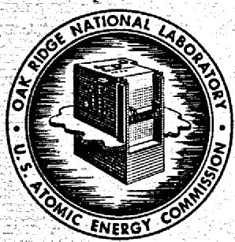

# OAK RIDGE NATIONAL LABORATORY

operated by

UNION CARBIDE CORPORATION

for the

U.S. ATOMIC ENERGY COMMISSION

ORNL-TM-907

114

10

1

MSRE DESIGN AND OPERATIONS REPORT

PART VII

FUEL HANDLING AND PROCESSING PLANT

R. B. Lindauer

PATENT CLEARANCE OBTAINED. RELEASE TO THE PUBLIC IS APPROVED.

ARE ON FILE IN THE DEP.

- IN THE RECEIVING SECTION.

NOTICE This document contains information of a preliminary nature and was prepared primarily for internal use at the Oak Ridge National Laboratory. It is subject to revision or correction and therefore does not represent a final report.

# LEGAL NOTICE

This report was prepared as an account of Government sponsored work. Neither the United States, nor the Commission, nor any person acting on behalf of the Commission:

A. Makes any warranty or representation, expressed or implied, with respect to the accuracy, completeness, or usefulness of the information contained in this report, or that the use of any information, apparatus, method, or process disclosed in this report may not infringe privately owned rights; or   
B. Assumes any liabilities with respect to the use of, or for damages resulting from the use of any information, apparatus, method, or process disclosed in this report.

As used in the above, "person acting on behalf of the Commission" includes any employee or contractor of the Commission, or employee of such contractor, to the extent that such employee or contractor of the Commission, or employee of such contractor prepares, disseminates, or provides access to, any information pursuant to his employment or contract with the Commission, or his employment with such contractor.

ORNL-TM-907

Contract No. W-7405-eng-26

MSRE DESIGN AND OPERATIONS REPORT

Part VII

FUEL HANDLING AND PROCESSING PLANT

R. B. Lindauer

MAY 1965

OAK RIDGE NATIONAL LABORATORY

Oak Ridge, Tennessee

operated by

UNION CARBIDE CORPORATION

for the

U.S. ATOMIC ENERGY COMMISSION

#

#

# PREFACE

This report is one of a series that describes the design and operation of the Molten-Salt Reactor Experiment. All the reports are listed below.

ORNL-TM-728* MSRE Design and Operations Report, Part I, Description of Reactor Design, by R. C. Robertson   
ORNL-TM-729 MSRE Design and Operations Report, Part II, Nuclear and Process Instrumentation, by J. R. Tallackson   
ORNL-TM-730* MSRE Design and Operations Report, Part III, Nuclear Analysis, by P. N. Haubenreich, J. R. Engel, B. E. Prince, and H. C. Claiborne   
ORNL-TM-731 MSRE Design and Operations Report, Part IV, Chemistry and Materials, by F. F. Blankenship and A. Taboada   
ORNL-TM-732* MSRE Design and Operations Report, Part V, Reactor Safety Analysis Report, by S. E. Beall, P. N. Haubenreich, R. B. Lindauer, and J. R. Tallackson   
ORNL-TM-733 MSRE Design and Operations Report, Part VI, Operating Limits, by S. E. Beall and R. H. Guymon   
ORNL-TM-907* MSRE Design and Operations Report, Part VII, Fuel Handling and Processing Plant, by R. B. Lindauer   
ORNL-TM-908** MSRE Design and Operations Report, Part VIII, Operating Procedures, by R. H. Guymon   
ORNL-TM-909** MSRE Design and Operations Report, Part IX, Safety Procedures and Emergency Plans, by R. H. Guymon   
ORNL-TM-910** MSRE Design and Operations Report, Part X, Maintenance Equipment and Procedures, by E. C. Hise and R. Blumberg   
ORNL-TM-911** MSRE Design and Operations Report, Part XI, Test Program, by R. H. Guymon and P. N. Haubenreich   
** MSRE Design and Operations Report, Part XII, Lists: Drawings, Specifications, Line Schedules, Instrumentation Tabulations (Vol. 1 and 2)

*Issued.

**These reports will be the last in the series to be published.

# CONTENTS

Page

# PREFACE 311

1. INTRODUCTION 1   
2. PROCESS DESCRIPTION 2

2.1 $\mathbf{H}_2$ -HF Treatment for Oxide Removal 2

2.1.1 Summary 2   
2.1.2 Hydrofluorination 7   
2.1.3 NaF Trapping 8   
2.1.4 Monitoring for Water 8   
2.1.5 Off-Gas Handling 10   
2.1.6 Liquid Waste Disposal 12

2.2.Uranium Recovery 12

2.2.1 Summary 12   
2.2.2 Fluorination 13   
2.2.3 NaF Trapping 15   
2.2.4 $\mathbf{UF}_6$ Absorption 16   
2.2.5 Excess Fluorine Disposal 17   
2.2.6 Off-Gas Handling 18   
2.2.7 Liquid Waste Disposal 183   
2.2.8 Waste Salt Handling 183

3. EQUIPMENT DESCRIPTION 20

3.1 Plant Layout 20   
3.2 Maintenance 20   
3.3 In-Cell Equipment 25

3.3.1 Fuel Storage Tank 25   
3.3.2 NaF Trap 30   
3.3.3 Cold Trap 32   
3.3.4 Siphon Pot 34   
3.3.5 Caustic Scrubber 34   
3.3.6 NaF Absorbers 36   
3.3.7 Fluorine Disposal System 38   
3.3.8 Cubicle Exhauster 41

3.4 Out-of-Cell Equipment 41

3.4.1 Activated-Charcoal Trap 41   
3.4.2 Flame Arrester 42   
3.4.3 Off-Gas Filters 42   
3.4.4 HF Trap 43   
3.4.5 HF Heater 45   
3.4.6 Salt Sampler 45

3.5 Electrical System 47   
3.6.Helium Supply System 50   
3.7 Instrumentation 50

3.7.1 Thermocouples 50   
3.7.2 Annunciators 52

3.8 Brine System 54

4. SAFETY ANALYSIS 55

4.1 Summary and Conclusions 55   
4.2Bases for Calculations 55

4.2.1 Diffusion Factor 55   
4.2.2 Air Contamination 60   
4.2.3 Activity in Salt 60

4.3 Gaseous Activity 60

4.3.1 Activity Release from the Containment Stack 60

4.3.1.1 Activity Released When Not Processing 60   
4.3.1.2 Activity Released During $\mathbf{H}_2$ -HF Treatment 60   
4.3.1.3 Activity Released During Fluorination 62   
4.3.1.4 Activity Released by Equipment Failure 62

4.3.2 Activity Release to the Operating Area 64

4.3.2.1 Activity Released Through the Roof Plugs 64   
4.3.2.2 Activity Released from the Absorber Cubicle 65   
4.3.2.3 Activity Released from the Cell Penetrations 66   
4.3.2.4 Activity Released from the Salt Sampler 66

# 4.4 Penetrating Radiation 67

# 4.4.1 Normal Levels 67

4.4.1.1 Operating Area 67   
4.4.1.2 Switch House 67   
4.4.1.3 Spare Cell 67   
4.4.1.4 Decontamination Cell 68   
4.4.1.5 Area Surrounding the Waste Cell 68

# 4.4.2 Unusual Radiation Levels 68

4.4.2.1 From Irradiated Salt 68   
4.4.2.2 From Caustic Solution 68   
4.4.2.3 From Radioactive Gas 70

# 5. OPERATING PROCEDURES 71

# Nomenclature 71

# 5.1 H2-HF Treatment 71

5.1.1 System Leak Test 71

5.1.1.1 Close System 71   
5.1.1.2 Apply Pressure and Test 72

# 5.1.2 Absorber and Instrument Cubicle Preparation 72

5.1.2.1 Prepare and Test Piping in Cubicle ... 72   
5.1.2.2 Leak Test Absorber Cubicle 72   
5.1.2.3 Leak Test Instrument Cubicle 73

# 5.1.3 System Preparation 73

5.1.3.1 Charge Caustic Scrubber 73   
5.1.3.2 Purge FST and Gas Piping 74   
5.1.3.3 Transfer Salt Batch to FST 74   
5.1.3.4 AdjustPurgeGasFlows 74   
5.1.3.5 Adjust Temperature 74   
5.1.3.6 Check Instrumentation 74   
5.1.3.7 Start Up Cold Trap System 74

# 5.1.4 Treatment 75

5.1.4.1 Sample Salt 75   
5.1.4.2 Start Gas Flows 75   
5.1.4.3 Treat Salt 75   
5.1.4.4 Iron Reduction 76   
5.1.4.5 Shutdown System 76

# viii

5.1.5 Liquid Waste Disposal 77

5.1.5.1 Radiation Level Monitoring 77   
5.1.5.2 Liquid Waste Sampling 77   
5.1.5.3 Liquid Waste Dilution 77   
5.1.5.4 Transfer to Melton Valley Waste Station 78

5.2 Uranium Recovery 78

5.2.1 System Leak Test 78

5.2.1.1 Close System 78   
5.2.1.2 Apply Pressure and Test 79

5.2.2 Absorber and Instrument Cubicle Preparation 79

5.2.2.1 Install Absorbers 79   
5.2.2.2 Leak Test Absorber Piping 80   
5.2.2.3 Leak Test Absorber Cubicle 80

5.2.3 System Preparation 80

5.2.3.1 Charge Caustic Scrubber.. 80   
5.2.3.2 Purge FST and Gas Piping 81   
5.2.3.3 Transfer Salt Batch to FST 81   
5.2.3.4 AdjustPurgeGasFlows 81   
5.2.3.5 Adjust Temperatures 81   
5.2.3.6 Check Instrumentation 81   
5.2.3.7 Prepare Fluorine Disposal System 82

5.2.4 Fluorine Conditioning 82

5.2.4.1 Sample Caustic Solution 82   
5.2.4.2 Adjust Temperatures 82   
5.2.4.3 Start $\mathbf{SO}_2$ Flow 82   
5.2.4.4 Start Fluorine and Helium Flows 83   
5.2.4.5 Increase Fluorine Concentration to $50\%$ 83   
5.2.4.6 Increase Fluorine Concentration to $75\%$ 83   
5.2.4.7 Increase Fluorine Concentration to 100% 83   
5.2.4.8 Shutdown System 84

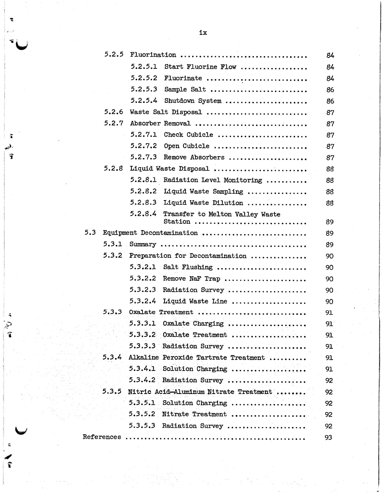

# Part VII

FUEL HANDLING AND PROCESSING PLANT

R. B. Lindauer

# 1. INTRODUCTION

The MSRE fuel-processing system was designed to remove oxides from the fuel, flush, and coolant salts and to recover uranium from fuel and flush salts. The $\mathrm{H}_{2}$ -HF treatment for oxide removal will be used whenever it is suspected that oxide contamination has occurred. The flush salt will be treated after the initial flushing and shakedown operations and after the system has been opened for maintenance. Fuel salt or coolant salt could become contaminated through a leak in the system or difficulties with the helium blanket system. Treatment of the coolant salt will require salt transfer by means of transfer cans or a temporary heated line. A decay time of at least four days will be required for evolution of xenon before treatment of a fully irradiated fuel batch, since the fuel-processing tank is not vented through the large charcoal beds.

Uranium will be recovered by volatilization with fluorine from flush and fuel salts before changing from $35\%$ enriched to highly enriched uranium and at the end of the program before discarding the salt to waste. At the present time there is no developed process for recovery of the LiF and $\mathrm{BeF}_2$ . A decay time of 30 days for flush salt and at least 90 days for a fully irradiated fuel batch is desirable to reduce the amount of volatile fission products.

# 2. PROCESS DESCRIPTION

# 2.1 $\mathbf{H}_2$ -HF Treatment for Oxide Removal

# 2.1.1 Summary

Moisture or oxygen inleakage into the reactor salt system or use of helium cover gas containing moisture or oxygen could cause oxide accumulation in the salt and, eventually, precipitation of solids. In the flush or coolant salts, the precipitated solid would be BeO, which has a solubility of approximately 275 ppm at $1200^{\circ}\mathrm{F}$ (see Fig. 2.1). If the flush salt is contaminated with fuel salt up to approximately 0.01 mole of zirconium per kg of salt ( $\sim$ 1% fuel in flush salt), there would be insufficient zirconium present to exceed the solubility of $\mathrm{ZrO_2}$ at $1112^{\circ}\mathrm{F}$ , and any precipitate would be BeO. Above this zirconium concentration, exceeding the solubility limit would cause $\mathrm{ZrO_2}$ precipitation. The effect of $10\%$ contamination of the flush salt with fuel salt is shown in Fig. 2.1. The solubility of $\mathrm{ZrO_2}$ varies with temperature and zirconium concentration as shown in Figs. 2.1 and 2.2. The dashed lines in Fig. 2.2 indicate extrapolation of data above 0.5 mole of $\mathrm{Zr}^{4+}$ per kg of salt. The oxide solubility in fuel salt is probably not as high as this extrapolation indicates.

Zirconium tetrafluoride was added to the fuel salt as an oxygen getter to prevent small amounts of oxygen from causing uranium precipitation. Table 2.l shows the maximum amount of oxide that can be tolerated before zirconium and uranium oxides precipitate in flush salt containing small amounts of fuel salt. When $\mathrm{UO_2}$ starts to precipitate, $\mathrm{ZrO_2}$ will continue to precipitate. The ratio of zirconium to uranium in the precipitate will be 5:l at $932^{\circ}\mathrm{F}$ or 3.8:l at $1112^{\circ}\mathrm{F}$ . These ratios will be slightly lower if the amount of fuel salt present is large. With pure fuel salt the ratio is 1.5:l, and more than 14,000 ppm of oxide will be required before uranium will precipitate.

Operation of the reactor with precipitated solids is to be avoided. Even operation with high concentrations of dissolved oxides could result in collection of oxides on relatively cold surfaces, such as the tubes

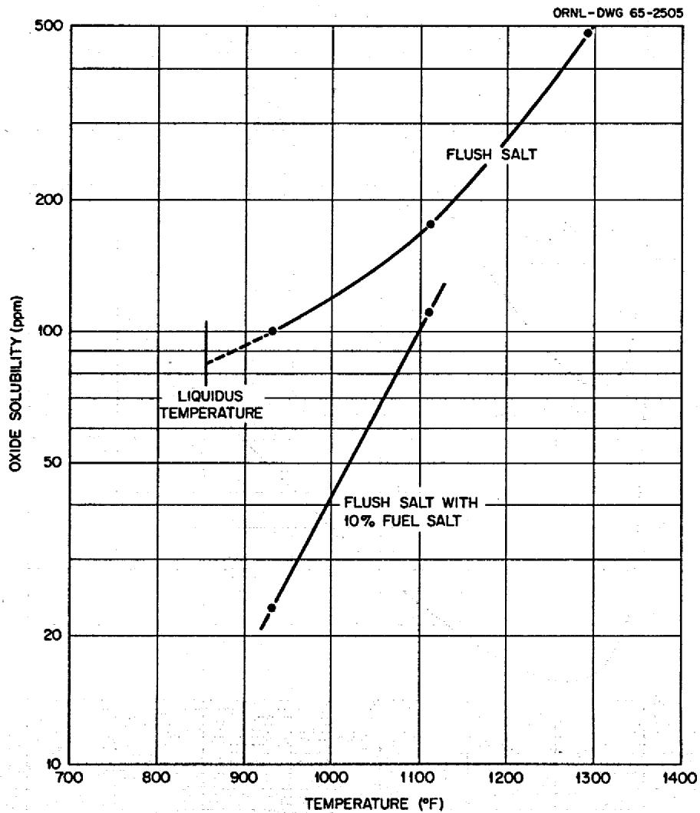  
Fig. 2.1. Solubility of Oxides in Flush Salt as a Function of Temperature.

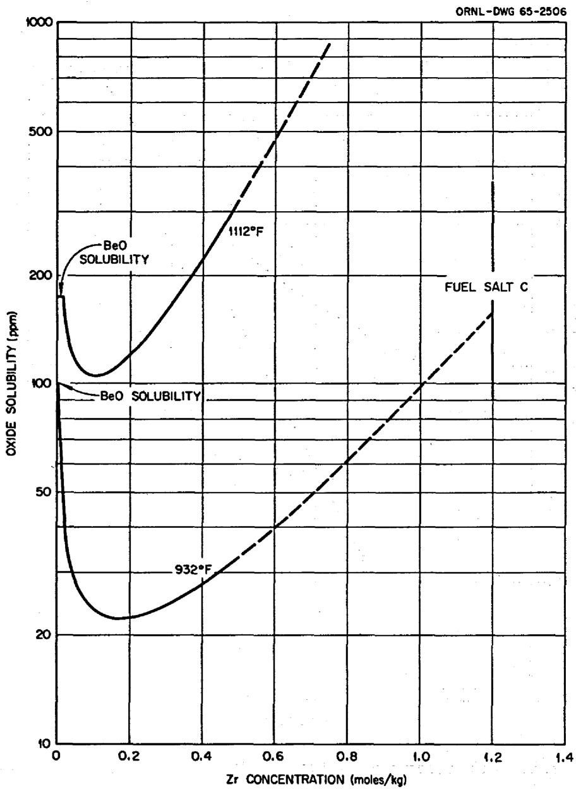  
Fig. 2.2. Solubility of Oxides in Salts as a Function of Zirconium Concentration.

Table 2.1. Oxide Capacity of Molten Salt   

<table><tr><td rowspan="3">Fuel Salt in Flush Salt (%)</td><td colspan="4">Oxide Capacity (ppm)</td></tr><tr><td colspan="2">At 932°F</td><td colspan="2">At 1112°F</td></tr><tr><td>Before Zirconium Precipitation</td><td>Before Uranium Precipitation</td><td>Before Zirconium Precipitation</td><td>Before Uranium Precipitation</td></tr><tr><td>1/2</td><td>74.5</td><td>90.5</td><td>264</td><td>∞a</td></tr><tr><td>1</td><td>53.5</td><td>88.5</td><td>199</td><td>∞a</td></tr><tr><td>1 1/2</td><td>46</td><td>104</td><td>174</td><td>284</td></tr><tr><td>2</td><td>39</td><td>122</td><td>149</td><td>299</td></tr><tr><td>3</td><td>33</td><td>176</td><td>129</td><td>364</td></tr><tr><td>4</td><td>29.2</td><td>241</td><td>118</td><td>444</td></tr><tr><td>5</td><td>27.4</td><td>315</td><td>112</td><td>528</td></tr><tr><td>Fuel salt C</td><td>&gt;33</td><td>&gt;14,000</td><td>&gt;320</td><td>&gt;14,000</td></tr></table>

aInsufficient zirconium and uranium to precipitate. At greater than 175 ppm of oxide, BeO will precipitate.

in the heat exchanger and the access nozzle on the reactor vessel. At present the oxide concentration cannot be measured with sufficient accuracy for us to know whether the salt is saturated. Until the analytical methods are improved, the oxide concentration will be kept low by treating the salt at regular intervals and when there has been an opportunity for considerable moisture to enter the reactor system. Moisture could enter if helium of high moisture content were used for cover gas or if the system were open to the atmosphere during long periods of maintenance.

Oxides will be removed by treating the fuel or flush salt in the fuel storage tank (see Fig. 2.3) with a mixture of $\mathbf{H}_2$ and HF gas. In the treatment process, HF will react with the oxide to form the fluoride and water, which will be evolved along with the hydrogen and excess HF. The $\mathbf{H}_2$ will prevent excessive corrosion of the INOR-8 structural material by maintaining a reducing condition in the salt. The gases will pass through an NaF bed for decontamination before cold trapping for water determination. The gas stream will then pass through a caustic scrubber for neutralization of the HF. The hydrogen will go to the off-gas system.

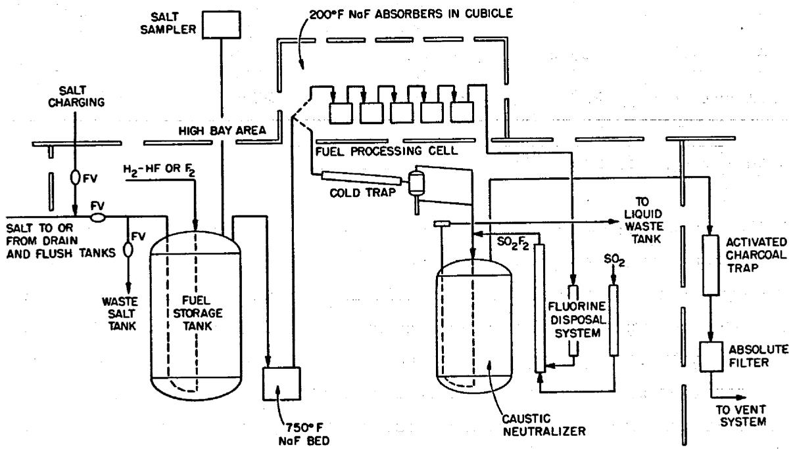  
Fig. 2.3. MSRE Fuel-Processing System.

ORNL-DWG 63-3123AR

The treatment will be terminated when water is no longer detected in the off-gas stream. A final sparging with hydrogen will remove dissolved HF and $\mathsf{FeF_2}$ .

# 2.1.2 Hydrofluorination

Hydrogen fluoride will be obtained in 100-lb cylinders. One cylinder will provide sufficient HF for 92 hr of processing at a flow rate of 9 liters/min ( $H_2:HF = 10:1$ ). The HF cylinder will be partially submerged in a water bath heated with low-pressure steam to provide sufficient pressure for the required flow rate. Since heating of the cylinders above $125^\circ F$ is not recommended, there is a pressure alarm on the exit gas set at 25 psig. The HF gas will pass through an electric heater to raise the temperature above $160^\circ F$ and reduce the molecular weight to 20 for accurate flow metering. The hydrogen flow will be started before the HF flow to minimize corrosion. The hydrogen flow rate will be set at the rotameter at the gas supply station west of the building. The hydrogen fluoride flow rate will be regulated by the controller on the panelboard in the high-bay area. The salt backup prevention valve must be closed with the manual switch until flow is started, at which time the differential pressure switch will maintain the valve in the closed position unless the tank pressure exceeds the $H_2$ -HF pressure.

From experience with an Inconel vessel in the Engineering Test Loop, corrosion is expected to be negligible after the surface is depleted of chromium and iron. The equilibrium amount of nickel in solution with a 10:1 ratio of $\mathbf{H}_2$ to HF is less than 1 ppm.

The off-gas stream leaving the fuel storage tank will consist of hydrogen, water, excess hydrogen fluoride, and helium. Volatilization of fission and corrosion products is expected to be much lower than during fluorination because of the reducing effect of the hydrogen. Fission products that are partially volutilized as fluorides during fluorination, such as ruthenium, niobium, and antimony, are expected to exist in the metallic state. Any chromium in the salt from corrosion is expected to be in the nonvolatile +2 or +3 valence state. The off-gas stream will pass through a heated line to the NaF trap. The line will be heated to $200^{\circ}\mathrm{F}$ to prevent condensation of $\mathrm{H}_{2}\mathrm{O}-\mathrm{HF}$ .

Since corrosion and fission-product volatilization will not be severe during $\mathrm{H}_2$ -HF treatment, the salt will be maintained at $1112 \pm 20^{\circ}\mathrm{F}$ , which is approximately $200^{\circ}\mathrm{F}$ higher than during fluorination. At the higher temperature the conversion of oxide to water will be more rapid.

The hydrogen fluoride flow will be stopped when no more water is detected in the off-gas stream. The salt temperature will then be increased to $1300 \pm 20^{\circ}\mathrm{F}$ and the hydrogen flow will be continued to remove dissolved hydrogen fluoride and to reduce the amount of $\mathrm{FeF_2}$ in solution. It should be possible to reduce the dissolved iron to the 200-ppm level obtained in the salt production operation. Any iron returned to the reactor system will cause corrosion by attacking any exposed chromium. When the salt samples show that further reduction of iron is not practical, the hydrogen flow will be stopped, and the salt will be sparged with nitrogen for 8 hr to purge the gas space of hydrogen.

# 2.1.3 NaF Trapping

A remotely removable NaF bed is provided in the fuel-processing cell to remove small amounts of volutilized fission or corrosion products from the off-gas stream. The trap will be maintained at $750^{\circ}\mathrm{F}$ to prevent adsorption of HF. Since the vapor pressure of HF over NaF is 1 atm at $532^{\circ}\mathrm{F}$ , the trap could be operated at a somewhat lower temperature, but $750^{\circ}\mathrm{F}$ will be required to prevent $\mathrm{UF_6}$ adsorption during fluorination (see Sect. 2.2.3), and this temperature was selected for both operations.

# 2.1.4 Monitoring for Water

The removal of oxides from the salt will be followed by observing the volume of water and HF cold trapped from the off-gas stream. The entire gas stream, consisting of helium, hydrogen, water vapor, and excess hydrogen fluoride, will pass through a cold trap. The temperature can be varied between 0 and $40^{\circ}\mathrm{F}$ . Since the ratio of water to hydrogen fluoride in the off-gas stream leaving the fuel storage tank will be a function of the oxide content of the salt, $^{1}$ the HF utilization versus the oxide content can be calculated from this relationship, as shown in Fig. 2.4. The solubility of oxide in fuel salt is high, and therefore the equilibrium

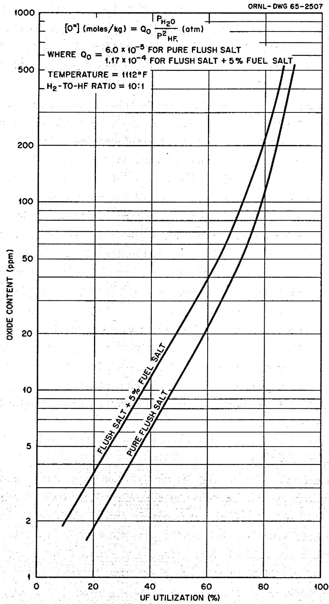  
Fig. 2.4. HF Utilization as a Function of Oxide Content.

HF-to- $\mathrm{H}_2\mathrm{O}$ ratio in the off-gas will be high (low HF utilization). This could result in long treatment times for removing large quantities of oxide from fuel salt. Since accurate solubility data for the fuel salt are still being measured, the utilization curve for fuel salt is not shown.

The amount of water and hydrogen fluoride that will be carried with the hydrogen-helium off-gas stream from the trap can be calculated from the vapor pressure of water and HF over the condensed liquid. By means of a material balance, the amount of condensed liquid to be expected was calculated as a function of the oxide content. The amount of condensed liquid for a cold trap temperature of $0^{\circ}\mathrm{F}$ and an $\mathsf{H}_2$ -to-HF ratio of 10:1 is shown in Fig. 2.5. The condensate volumes in Fig. 2.5 do not include the untrapped water, which should amount to less than $2\%$ and can be ignored. If melts containing very large amounts of oxide are being treated, the HF utilization at the start will be slightly higher than shown due to $\mathsf{Zr(OH)}_4$ formation, but the curve shown should be reasonably accurate at the oxide levels expected.

The condensed $\mathrm{HF - H_2O}$ will be collected in a small pot that will siphon automatically when full. Each siphoning will remove approximately 55 cc. The number of siphonings will be recorded on a temperature recorder that will detect the cold liquid as it passes through the siphon tube to the caustic scrubber. The siphon pot and cold trap will be cooled by circulating brine.

# 2.1.5 Off-Gas Handling

The hydrogen fluoride will be neutralized in a static caustic scrubber tank. Hydrogen and helium from the scrubber will pass through an activated-charcoal trap and a flame arrester before entering the cell ventilation duct. The cell ventilation air will pass through an absolute filter, located in the spare cell, before going to the main filters and stack. As mentioned before, little activity is expected in the off-gas stream during $\mathrm{H}_2$ -HF treatment.

Since the fluorine disposal system will not be used during $\mathbf{H}_2$ -HF treatment but will still be connected to the scrubber inlet line, the

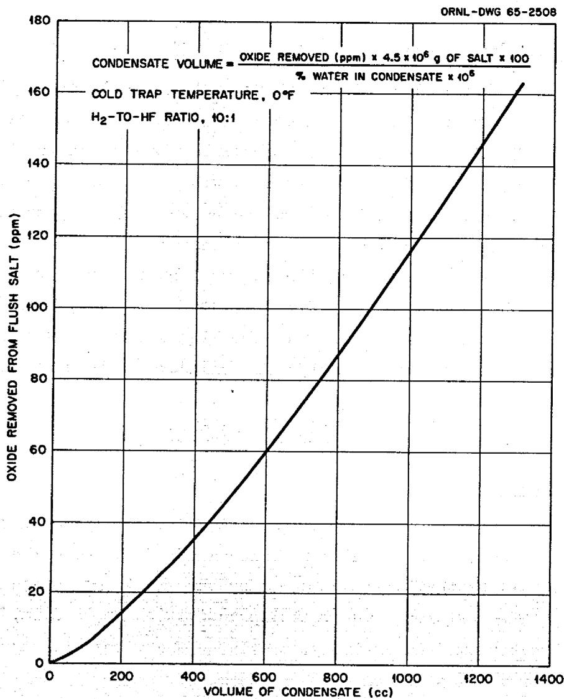  
Fig. 2.5. Condensate Volume as a Function of Amount of Oxide Removed from Flush Salt.

system must be purged to prevent diffusion and condensation of $\mathsf{H}_2\mathsf{O}$ -HF in the disposal system. This will be done by connecting $\mathbb{N}_2$ cylinders at the $\mathsf{SO}_2$ cylinder manifold. As an additional precaution, the $\mathsf{SO}_2$ preheater should be heated, because the stainless steel preheater would be especially subject to corrosion by the wet HF.

# 2.1.6 Liquid Waste Disposal

The caustic scrubber will be charged with 1300 liters of 2 M KOH prepared by dilution of a $45\%$ KOH solution. Three 115-gal batches of 2 M $(10\%)$ KOH will be prepared in a portable mix tank in the high-bay area and charged through a line provided with a manual valve and a check valve. Dilution to 2 M will be required because of the possibility of gel formation in KF solutions of greater than 2 M.

At 9.1-liters/min HF flow, the KOH will have to be replaced every 4 days when the final concentration is $0.35\mathrm{M}$ . It will, therefore, be necessary to jet the KOH solution to the liquid waste tank and replace it with fresh caustic when a 100-lb HF cylinder has been consumed.

# 2.2 Uranium Recovery

# 2.2.1 Summary

The fuel or flush salt should be allowed to decay as long as possible before fluorination to minimize the discharge of the volatile fission-product fluorides that will be formed by the oxidizing action of the fluorine. The most important volatile activities are iodine, tellurium, niobium, ruthenium, and antimony, and large fractions are expected to plate out on metal surfaces of the equipment.

After decay, the salt batch will be fluorinated in the fuel storage tank. The off-gas containing $\mathrm{UF}_6$ , excess fluorine, and volatile activity will pass through a high-temperature NaF trap for decontamination and chromium removal before absorption on low-temperature NaF absorbers. Excess fluorine will be reacted with $\mathrm{SO}_2$ to prevent damage to the Fiberglass filters. Before filtration the off-gas will be further decontaminated by passage through a caustic scrubber and an activated charcoal bed.

The absorbers will be transported to the Volatility Pilot Plant where they will be desorbed and the $\mathrm{UF_6}$ cold trapped and collected in product cylinders.

# 2.2.2 Fluorination

Uranium will be recovered from the molten salt by sparging with fluoro-rine to convert the $\mathrm{UF_4}$ to volatile $\mathrm{UF_6}$ . The fluorine will be diluted with an equal volume of helium when fluorine is detected in the off-gas stream to reduce the number of times the fluorine trailer and the caustic in the scrubber must be changed. This should have little effect on the overall processing time, since utilization is expected to be low after most of the uranium has been volutilized. A total gas flow of about 100 liters/min should provide good agitation. The salt sample line will be purged with helium during fluorination to prevent $\mathrm{UF_6}$ diffusion and will be heated to prevent condensation. The temperature of the melt will be maintained as low as practical (~20 to $30^{\circ}\mathrm{F}$ above the liquidus of $813^{\circ}\mathrm{F}$ ) to keep corrosion and fission-product volutilization to a minimum. Boiling points of some volatile fluorides are listed in Table 2.2. While all the iodine and much of the tellurium is expected to volatilize, only a small fraction of the ruthenium, zirconium, niobium, and antimony should leave the salt. The heaters on the upper half and top of the tank will not be used during fluorination to reduce salt entrainment, but they will be turned on after fluorination to melt down splatter and condensation.

There will be an initial induction period before evolution of $\mathrm{UF}_6$ begins. The extent of this period will depend on the amount of uranium in the salt and the degree of agitation of the salt. A minimum of 0.5 mole of fluorine per mole of uranium will be required to convert all the $\mathrm{UF}_4$ to $\mathrm{UF}_5$ . After this, $\mathrm{UF}_6$ will begin to form and be evolved. At 100 liters/min of fluorine, $\mathrm{UF}_6$ evolution can begin about 2 hr after the start of fluorination. Since the vapor space between the salt and the first absorber is $\sim 1300$ liters, another 15 min will probably be required before absorption begins.

Volatility Pilot Plant data show that essentially no fluorine is evolved until at least 1 mole of fluorine per mole of uranium has been

Table 2.2. Boiling Points of Fluoride Salts   

<table><tr><td>Salt</td><td>Boiling Temperature (%)</td></tr><tr><td>CF4</td><td>-198</td></tr><tr><td>TeF6</td><td>-38</td></tr><tr><td>IF7</td><td>39 (sublime)</td></tr><tr><td>MoF6</td><td>95</td></tr><tr><td>UF6</td><td>130</td></tr><tr><td>Te2F10</td><td>138</td></tr><tr><td>PuF6</td><td>144</td></tr><tr><td>IF5</td><td>212</td></tr><tr><td>CrF5</td><td>243</td></tr><tr><td>SbF5</td><td>300</td></tr><tr><td>MoF5</td><td>440</td></tr><tr><td>NbF5</td><td>444</td></tr><tr><td>RuF5</td><td>518</td></tr><tr><td>TeF4</td><td>543</td></tr><tr><td>SbF3</td><td>554</td></tr><tr><td>CrF4</td><td>567</td></tr><tr><td>RuF4</td><td>595</td></tr><tr><td>ZrF4</td><td>1658 (sublime)</td></tr><tr><td>CrF3</td><td>~2000</td></tr></table>

added or the system has operated 4 hr at 100 liters/min. However, until more is known about the sparging efficiency and the effect of the fuel storage tank geometry and salt composition, the fluorine disposal system should be put in operation 2 hr after the start of fluorine flow with sufficient $\mathrm{SO}_2$ to react with 50 liters of fluorine per minute.

Evolution of $\mathrm{UF_6}$ will be followed by means of the absorber temperatures. Fluorine breakthrough should be detectable by temperature rise in the fluorine reactor. When fluorine breakthrough is detected, the fluorine flow will be reduced to one-half and an equal flow of helium will be started. This will maintain the necessary degree of mixing while providing sufficient fluorine to prevent the back reaction

$$
2 \mathrm {U F} _ {6} \rightarrow 2 \mathrm {U F} _ {5} + \mathrm {F} _ {2}.
$$

Corrosion can consume as much as 9 liters of fluorine per minute (0.5 mil/hr).

With the $35\%$ -enriched uranium fuel salt, it will be necessary to replace the absorbers two times. Before this can be done, the salt must be sparged with helium for 2 hr to remove dissolved $\mathbf{U}\mathbf{F}_6$ and fluorine and to purge the gas space of $\mathbf{U}\mathbf{F}_6$ . At the end of the fluorination, when $\mathbf{U}\mathbf{F}_6$ is no longer detected in the gas stream entering the absorbers, the fluorine flow will be stopped and the batch sparged with nitrogen for 2 hr. After sparging for absorber changes and at the end of fluorination, the salt will be sampled to check on the uranium removal.

It will be necessary to replace the fluorine trailer every 2 hr at a fluorine flow rate of 100 liters/min or every 4 hr with one-half flow. There is sufficient space at the gas supply station to have only one trailer connected at a time. Additional trailers will be at the site, however, so downtime should not be long.

Corrosion will be much more severe under the strongly oxidizing conditions of fluorination than during the $\mathrm{H}_2$ -HF treatment. A corrosion rate of 0.5 mil/hr was experienced in the Volatility Pilot Plant in a nickel vessel. Fluorination of the high-uranium-content salt (fuel salt C) may take as long as 24 hr, but recovery of small amounts of uranium from the flush salt and uranium recovery from highly enriched fuel should require much less time. A 24-hr fluorination would cause an average corrosion of approximately $3\%$ of the fuel storage tank wall at 0.5 mil/hr. Corrosion of the fuel storage tank may be somewhat less because of the smaller surface-to-volume ratio, the use of dilute fluorine, and the lower fluorination temperature; also, corrosion tests indicate that INOR-8 may be more corrosion resistant than nickel.

# 2.2.3 NaF Trapping

The NaF bed will be important during fluorination for uranium recovery because of the greater volatilization of fission and corrosion products than during oxide removal. The bed will again be maintained at $750^{\circ}\mathrm{F}$ , that is, above the decomposition temperature of the $\mathrm{UF_6\cdot 2NaF}$ complex ( $702^{\circ}\mathrm{F}$ at $1000\mathrm{mm}$ ). Any volatilized $\mathrm{PuF_6}$ will absorb on the NaF and provide separation from the uranium. Sodium fluoride at $750^{\circ}\mathrm{F}$ will remove greater than $90\%$ of the niobium and ruthenium from the fluorinator off-gas stream, and these will be the principal activities that

could cause product contamination. More iodine and tellurium will volatilize, but they will not absorb on hot or cold NaF. Essentially all the chromium fluoride will be absorbed. Chromium is troublesome not only because of the gamma activity of the $^{51}\mathrm{Cr}$ formed by neutron activation but also because of the inactive chromium that will collect in valves and small lines and cause plugging and seat leakage. All piping to and from the NaF bed must be heated to above $200^{\circ}\mathrm{F}$ to prevent $\mathrm{UF_6}$ condensation. Table 2.3 shows the expected behavior of the volatile fluorides on NaF.

Table 2.3. Fluoride Absorption on NaF   

<table><tr><td>Fluoride</td><td>Absorption 
at 750°F 
(NaF Trap)</td><td>Absorption 
at 200°F 
(UF6Absorbers)</td></tr><tr><td>Iodine</td><td>No</td><td>No</td></tr><tr><td>Tellurium</td><td>No</td><td>No</td></tr><tr><td>Molybdenum</td><td>No</td><td>Partial breakthrough</td></tr><tr><td>Uranium</td><td>No</td><td>Yes</td></tr><tr><td>Neptunium</td><td>No</td><td>Yes</td></tr><tr><td>Technetium</td><td>No</td><td>Yes</td></tr><tr><td>Zirconium</td><td>Yes</td><td>Less than at 750°F</td></tr><tr><td>Niobium</td><td>Yes</td><td>Less than at 750°F</td></tr><tr><td>Antimony</td><td>Yes</td><td>Less than at 750°F</td></tr><tr><td>Ruthenium</td><td>Yes</td><td>Less than at 750°F</td></tr><tr><td>Plutonium</td><td>Yes</td><td>Less than at 750°F</td></tr><tr><td>Chromium</td><td>Yes</td><td>Less than at 750°F</td></tr></table>

# 2.2.4 UF6 Absorption

The decontaminated $\mathrm{UF_6}$ gas from the $750^{\circ}\mathrm{F}$ NaF bed will flow to five NaF absorbers in series, which are located in a sealed cubicle in the high-bay area. These absorbers will be cooled with air, as required, to prevent uranium loss. At $300^{\circ}\mathrm{F}$ the vapor pressure of $\mathrm{UF_6}$ over the $\mathrm{UF_6\cdot 2NaF}$ complex will be 0.1 mm, and uranium losses will be significant (0.132 g of U per minute with a flow of 100 liters/min). The capacity of NaF for $\mathrm{UF_6}$ varies inversely with the temperature, since the more rapid reaction at higher temperatures inhibits penetration of the $\mathrm{UF_6}$ by sealing off

the external pores with $\mathsf{UF}_6\cdot 2\mathsf{NaF}$ .2 To obtain maximum capacity the cooling air should therefore be turned on as soon as a temperature rise is indicated. Also, with low fluorine concentration at elevated temperatures there could be a reduction of $\mathsf{UF}_6\cdot 2\mathsf{NaF}$ to $\mathsf{UF}_5\cdot 2\mathsf{NaF}$ , which would remain with the NaF when the $\mathsf{UF}_6$ was desorbed from the NaF. The loading of the absorbers can be followed by bed temperatures, and the air can be adjusted as required. The air will be discharged to the cell by a small blower in the cell.

Alpha activity monitors in the cubicle and in the cell and vessel off-gas streams will be used to detect leaks of $\mathrm{UF_6}$ . In the event of a leak in the absorber cubicle, the fluorine flow would be stopped and the cubicle would be purged with air and opened for repairs. The location of the leak should be detectable either visually or with an alpha probe.

When fluorination has been completed, the absorbers will be disconnected and sent to the Volatility Pilot Plant for desorption and cold trapping of the $\mathsf{UF}_6$ . The maximum radiation level at contact will be less than $100~\mathrm{mr/hr}$ . When processing fuel salts A or C, which have higher uranium molarity than salt B, it will be necessary to stop fluorination when the absorbers are loaded and replace the absorbers as noted above. This will require a complete purging of the system to get all $\mathsf{UF}_6$ out of the connecting piping.

# 2.2.5 Excess Fluorine Disposal

Since an average efficiency of less than $25\%$ is expected during fluorination, there will be a large excess of fluorine. If this fluorine were allowed to flow through the off-gas filters, damage to the Fiberglass might result with release of any accumulated activity. To prevent this, the excess fluorine will be reacted with an excess of $\mathrm{SO}_2$ . Both the $\mathrm{SO}_2$ and the $\mathbf{F}_2$ will be preheated electrically to 300 to $400^{\circ}\mathrm{F}$ and then fed into a Monel reactor wrapped with steam coils. The steam will serve the dual purpose of keeping the reactor warm to initiate the reaction and of cooling the reactor after the reaction is started. The reaction is strongly exothermic and proceeds smoothly at $400^{\circ}\mathrm{F}$ . The product is $\mathrm{SO}_2\mathrm{F}_2$ , a relatively inert gas, which will pass through the caustic scrubber, the

activated-charcoal trap, the chemical plant filter, and the main filters and stack.

# 2.2.6 Off-Gas Handling

The fluorination off-gas stream, after reaction of the fluorine with $\mathrm{SO}_2$ will pass through a caustic scrubber. The excess $\mathrm{SO}_2$ and the $\mathrm{SO}_2\mathrm{F}_2$ will be partially neutralized by the caustic. However, the main purpose of scrubbing the fluorination off-gas is for the removal of fission products, since the $\mathrm{SO}_2$ and $\mathrm{SO}_2\mathrm{F}_2$ can be safely passed through the filter system. The scrubber tank off-gas will pass through an activated-charcoal trap for additional fission-product removal before entering the cell ventilation duct just upstream of the absolute filter in the spare cell. The cell air will then go to the main filters and be discharged from the 100-ft containment stack.

# 2.2.7 Liquid Waste Disposal

The caustic scrubber will be charged with 1300 liters of 2 M KOH. This will be sufficient caustic for the complete neutralization of 50 liters of $\mathrm{SO}_2$ per minute for 8 hr with a final molarity of 0.33. Since some of the $\mathrm{SO}_2$ will be consumed by unreacted fluorine and the $\mathrm{SO}_2\mathrm{F}_2$ is expected to hydrolyze slowly, changing the caustic solution every 8 hr should provide a considerable margin of safety against the solution becoming acidic. The 8-hr caustic cycle will begin at the start of $\mathrm{SO}_2$ flow (2 hr after the start of $\mathrm{F}_2$ flow).

When processing has been stopped for replacement of the caustic (and for salt sampling and replacement of the fluorine trailer), the batch will first be sparged with helium for 1 hr to remove dissolved $\mathbf{U}\mathbf{F}_6$ and $\mathbf{F}_2$ and reduce corrosion during downtime. After sparging has been completed, the caustic solution will be jetted to the liquid waste tank, and fresh caustic will be charged to the scrubber.

# 2.2.8 Waste Salt Handling

After removal of uranium from the fuel salt, it is planned to add 0.2 mole % of highly enriched uranium (salt B) to the salt and proceed

with the second phase of the program. After the second phase is complete, thorium and additional uranium will be added to the same salt to form salt A. Unless some unforeseen contamination of the fuel salt occurs that renders it unsuitable for further use, the same salt should be usable for the entire program.

At the end of the program the salt will be held molten in either the fuel storage tank or one of the drain tanks until it is certain the salt will not be required for further operations or samples. A heated, insulated line is provided from the fuel storage tank through the shielding on the east wall to the 'spare cell' for eventual removal of the salt. The disposal method has not been determined at this time. This line can also be used for salt removal if this is required before the end of the program. When not in use the line is sealed by a freeze valve in the fuel-processing cell and a blind flange in the spare cell.

# 3. EQUIPMENT DESCRIPTION

# 3.1 Plant Layout

The main portion of the fuel-handling and -processing system is in the fuel-processing cell, immediately north of the drain tank cell in Building 7503, as shown in Figs. 3.1 and 3.2. The gas supply station is outside the building, west of the drain tank cell. The off-gas filter, hydrogen flame arrester, activated-charcoal trap, and waste salt removal line are in the spare cell east of the fuel-processing cell. The system will be operated from the high-bay area over the cell, where a small instrument panelboard is located. Also in the high-bay area are the salt-charging area, the $\mathrm{UF}_6$ absorber cubicle, the salt sampler for the fuel storage tank, and an instrument cubicle. The instrument cubicle contains the instrument transmitters and check and block valves connected directly to process equipment, and it is sealed and monitored. Figures 3.3 and 3.4 are photographs of the fuel-processing cell and the operating area, respectively.

# 3.2 Maintenance

Since corrosion is expected to be very low during $\mathrm{H}_{2}$ -HF treatment and only two or three fluorinations are planned, maintenance problems are not expected to be severe. The system, with a few exceptions, has therefore been designed for direct maintenance, with savings in cost and complexity of equipment. The exceptions are the NaF trap and two air-operated valves. The NaF trap may become plugged by volatilized chromium fluoride during fluorination and must be removed from the system before aqueous decontamination. It is therefore flanged into the system and has disconnects for thermocouples and electrical power. The valves have flanges with vertical bolts and disconnects for the air lines. The valves and trap are located under roof plugs sized to pass through the portable maintenance shield. This shield can also be used for viewing and for external decontamination of equipment should this be required because of a leak. All heaters in the cell have duplicate spares installed.

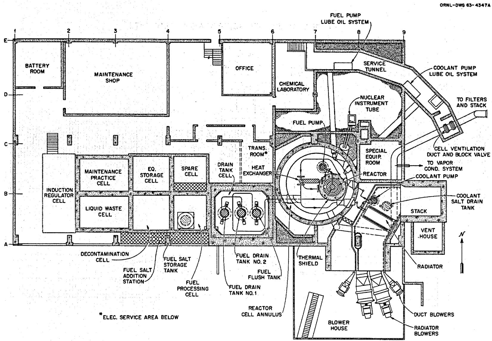  
Fig. 3.1. First Floor Plan of MSRE Building.

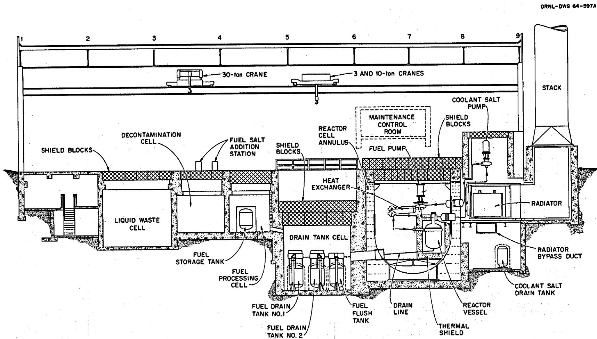  
Fig. 3.2. Elevation Drawing of MSRE Building.

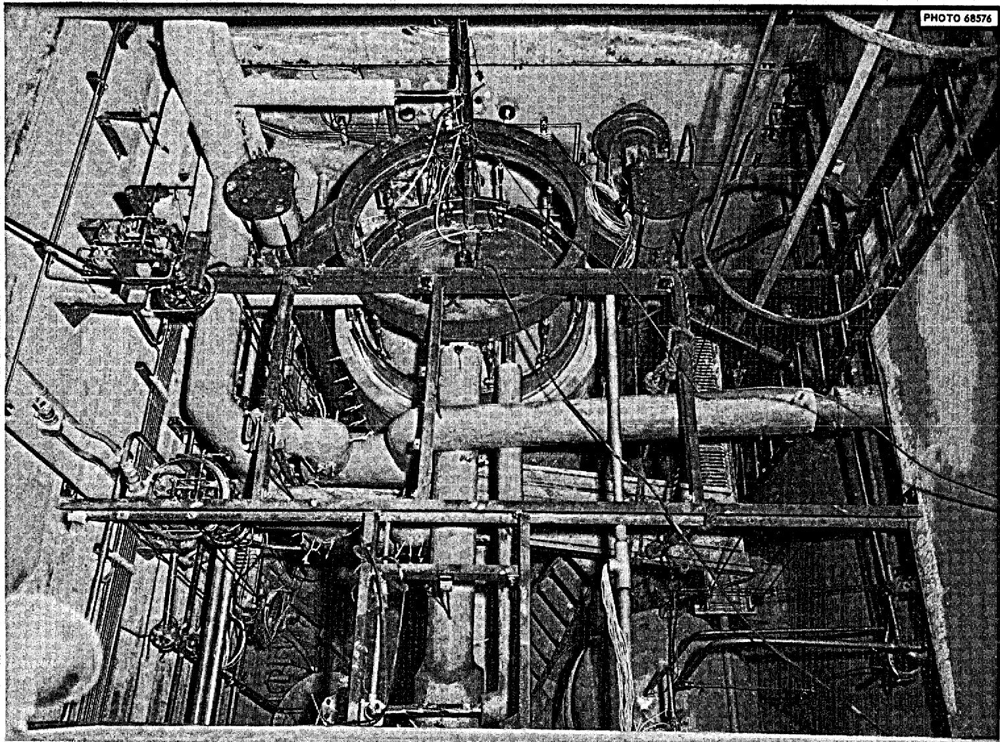  
Fig. 3.3. MSRE Fuel-Processing Cell.

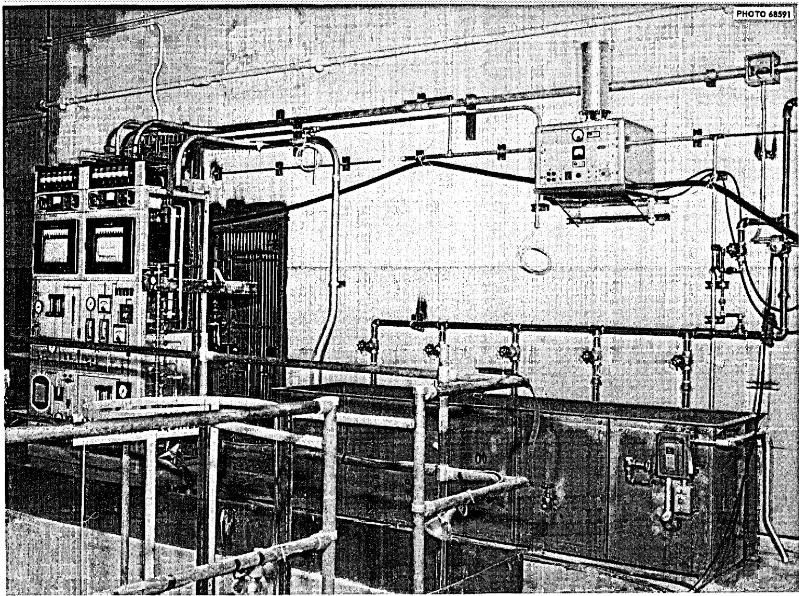  
Fig. 3.4. Operating Area for MSRE Fuel-Processing Cell.

If a piping or equipment leak occurs, or if entrance into the cell is required for other reasons after irradiated fuel has been processed, aqueous decontamination will be required. The recommended method is described in report ORNL-2550 (ref. 3) and consists of (1) barren salt flushes to displace as much as possible of the irradiated salt, (2) aqueous ammonium oxalate flushes to remove the salt film, (3) nitric acid-aluminum nitrate flushes to remove metallic scale from the surfaces, and (4) sodium hydroxide-hydrogen peroxide-sodium tartrate flushes for gas line decontamination. More details on these decontamination procedures are given in Section 5.3.

# 3.3 In-Cell Equipment

# 3.3.1 Fuel Storage Tank

The fuel storage tank in which chemical processing will take place is similar to the reactor drain tanks. The tank is shown in Fig. 3.5, and design data are given in Table 3.1.

The height of the storage tank was increased by 30 in. over the height of the drain and flush tanks to minimize salt carryover due to sparging during chemical processing. About $38\%$ freeboard is provided above the normal liquid level.

The tank is heated by four sets of heaters in the bottom, the lower half, the upper half, and the top of the tank. Each set of heaters is controlled separately with variacs. Every heater has a duplicate installed spare with leads outside the cell. The heaters are mounted on a frame that is supported from the floor to minimize the tare weight on the weigh cells.

The fuel storage tank is provided with air cooling to permit receiving fully irradiated fuel salt after four days decay (the minimum time determined by xenon evolution). Since the fission afterheat load of a fuel batch that has decayed four days after a full-power year of operation will be greater than 25 kw (see Fig. 3.6) and the maximum expected heat loss from the fuel storage tank is approximately 18 kw, some method of cooling was required. If the minimum expected heat loss (5 kw) from the tank were realized, cooling would be required after one full-power year of operation

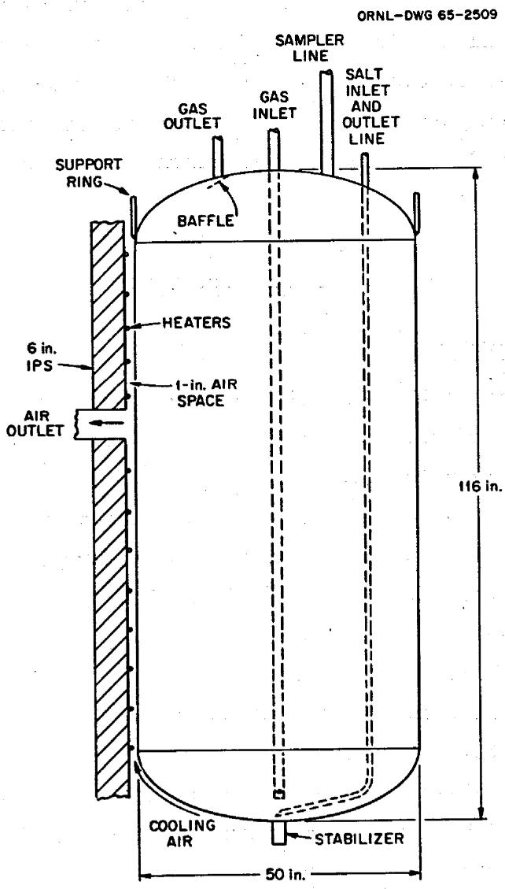  
Fig. 3.5. Fuel Storage Tank.

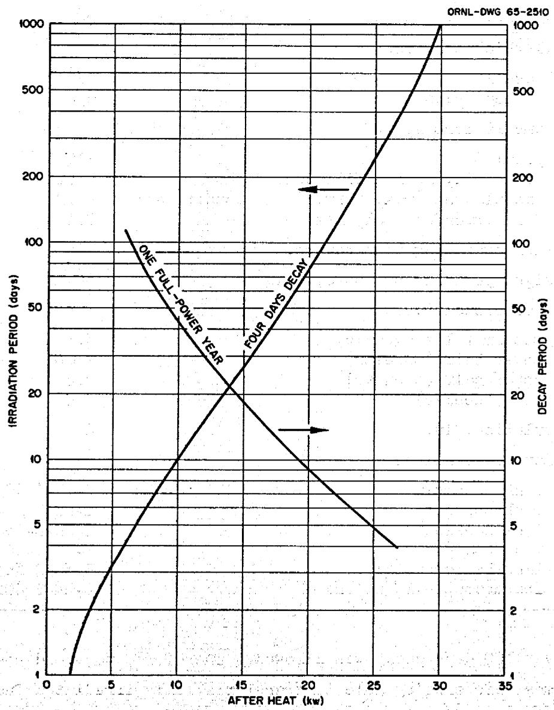  
Fig. 3.6. Fission Afterheat Based on MSRE Operation at 10 Mw.

Table 3.1 Fuel Storage Tank Design Data   

<table><tr><td>Construction material</td><td>INOR-8</td></tr><tr><td>Height, in.</td><td>~116</td></tr><tr><td>Diameter, in.</td><td>50</td></tr><tr><td>Wall thickness, in.</td><td></td></tr><tr><td>Vessel</td><td>1/2</td></tr><tr><td>Dished heads</td><td>3/4</td></tr><tr><td>Volume at 1250°F, ft3</td><td></td></tr><tr><td>Total</td><td>117.5</td></tr><tr><td>Fuel (min, normal fill conditions)</td><td>73.2</td></tr><tr><td>Gas blanket (max, normal fill conditions)</td><td>44.3</td></tr><tr><td>Salt transfer heel, max</td><td>0.1</td></tr><tr><td>Design operating temperature, °F</td><td>1300</td></tr><tr><td>Design operating pressure, psig</td><td>50</td></tr><tr><td>Heater capacity, kw</td><td></td></tr><tr><td>Bottom (flat ceramic)</td><td>5.8</td></tr><tr><td>Lower half (tubular)</td><td>11.6</td></tr><tr><td>Upper half (tubular)</td><td>5.8</td></tr><tr><td>Top (tubular)</td><td>2.0</td></tr><tr><td>Insulation, in.</td><td>6</td></tr><tr><td>Reference drawings</td><td></td></tr><tr><td>Tank assembly</td><td>D-FF-A-40430</td></tr><tr><td>Tank support</td><td>E-NN-D-55432</td></tr><tr><td>Tank housing</td><td>E-NN-D-55433</td></tr><tr><td>Tank heaters</td><td>E-NN-E-56413</td></tr><tr><td>Tank heater details</td><td>E-NN-E-56414</td></tr><tr><td>Thermocouple locations</td><td>D-HH-B-40527</td></tr></table>

unless over 100 days decay was allowed. Therefore, to avoid possible long decay times before being able to transfer a fully irradiated fuel batch to the fuel storage tank for hydrofluorination or in case it was necessary to remove the batch from the drain tank cell to permit maintenance operations, cooling of the fuel storage tank was desirable.

A simpler, less expensive method of cooling than the boiling-water cooling in the drain tanks was desired. A preliminary study4 indicated that cooling by natural air convection was feasible with only $2\mathrm{l} / 2$ hr decay. A maximum heat load of $72\mathrm{kw}$ was assumed with an air temperature

rise from 150 to $660^{\circ}\mathrm{F}$ . However, the cooling requirement in the fuel storage tank will be much less than $72\mathrm{kw}$ for the following reasons:

1. A minimum decay time of four days will be used instead of 2 l/2 hr.   
2. The operating period will probably be less than one full-power year.   
3. Some gaseous fission products will be stripped in the pump bowl and some will plate out on cooler surfaces in the reactor system.   
4. A heat loss of 5 to $18\mathrm{kw}$ is expected through the tank insulation and by radiation.

Instead of natural convection, a positive air flow is provided by routing the cell exhaust air through a l-in. annular space between the fuel storage tank wall and the tubular heaters on the inside of the insulation support can. A thin stainless steel sheet is installed in this annular space about 2 ft from the top of the tank to restrict air flow up the tank wall when the dampers are closed. It will also be necessary to seal all penetrations through the top cover as well as possible to prevent unwanted air flow. A l-ft² opening with a gravity damper is provided at the bottom of the tank. There is a similar opening through the side of the insulation support can at the normal liquid level. This outlet line has a motor-operated damper and is ducted directly to the cell air exhaust. When cooling is not required, this damper is closed and another motorized damper, which allows cell air to bypass the fuel storage tank, is opened. With a 30-kw load and 500 ft³/min of air flow (the nominal cell exhaust rate), an air temperature rise of approximately 200°F has been calculated.

The tank has two dip tubes, one for gas sparging and the other for charging and discharging salt. The sparge line is a 1-in. pipe that is closed at the bottom and has four 1/2-in. holes $90^{\circ}$ apart near the bottom. The salt dip tube lies on the bottom of the tank at the center to minimize holdup (approximately $0.1\%$ of a batch). Liquid level is determined by weighing the tank with two pneumatic weigh cells. The weigh cell calibration can be checked by two single-point level probes. Other instruments provided are 13 surface-mounted thermocouples and a pressure-recorder alarm.

An interlock is provided that prevents salt backup in the gas sparge line in case the tank pressure exceeds the sparge-gas pressure. Another interlock prevents backup of tank off-gas (UF $_6$ , HF, F $_2$ , or fission gases) into the sample line, which is also connected to the pressurization-pressure recorder line in the high-bay area. This is done by closing the HF-F $_2$ valve if the tank pressure exceeds the helium purge pressure. The vent valve in the off-gas line opens if the tank pressure exceeds the design pressure of 50 psi. The tank pressure will alarm above the normal pressure of 5 psi to indicate any plugging in the off-gas line, trap, valves, absorbers, or caustic scrubber.

# 3.3.2 NaF Trap

The NaF trap will be required mainly during fluorination to provide additional decontamination of the $\mathrm{UF_6}$ gas and to remove volatile chromium fluorides from the gas stream. A kilogram or more of chromium fluoride could be volutilized during fluorination, and it would collect in lines and valves and eventually cause plugging. The trap is shown in Fig. 3.7 and design data are given in Table 3.2.

The gas enters on the outside of an internal cylindrical baffle and leaves inside the baffle, and thus the gas path is almost 2 ft for a 12-in. depth of pellets. Gas velocities are kept below 4 ft/min to prevent carryover of fines containing absorbed fission-product fluorides.

The trap has thermowells at the inlet, center, and exit. Heat is controlled by separate variacs for the center and the outside of the bed. Spare heaters are installed.

Since there is a possibility of plugging of this trap with chromium during fluorination, it is designed for remote replacement. The inlet and exit lines are provided with ring-joint flanges at the trap and some distance away to permit removal of sections of the lines for access to the trap. Thermocouple and electrical disconnects are provided on the trap, and a standard lifting bale is mounted on a strap over the trap. Before the first fluorination of radioactive fuel, a spare unit will be fabricated.

ORNL-DWG 65-2511

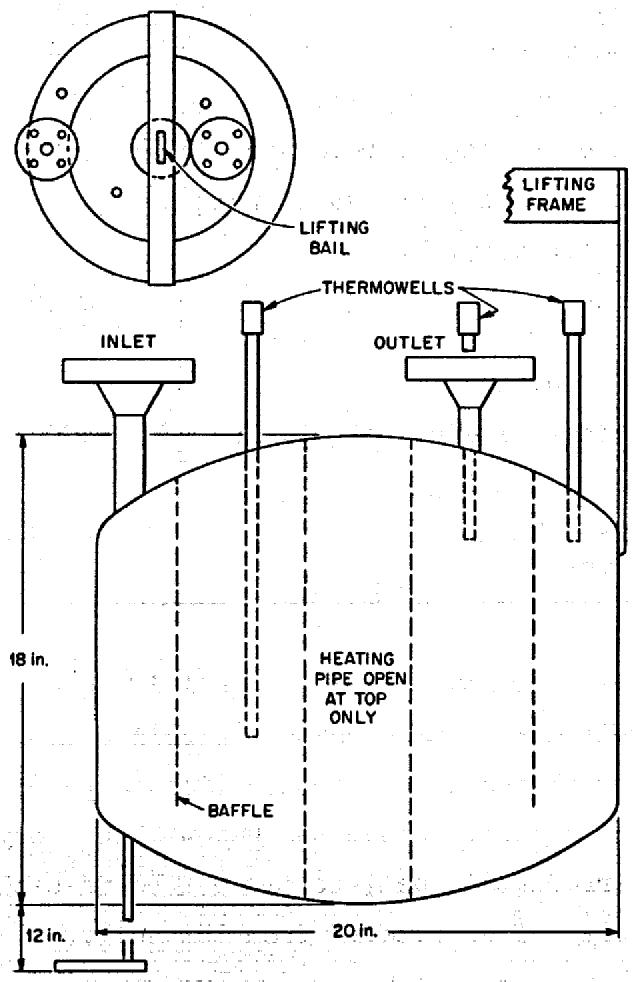  
Fig. 3.7. NaF Trap.

Table 3.2. NaF Trap Design Data   

<table><tr><td>Construction material</td><td>Inconel</td></tr><tr><td>Height, in.</td><td>18</td></tr><tr><td>Diameter, in.</td><td>20</td></tr><tr><td>Wall thickness, in.</td><td></td></tr><tr><td>Sides</td><td>1/8</td></tr><tr><td>Dished heads</td><td>1/4</td></tr><tr><td>Loading, kg of NaF pellets</td><td>70</td></tr><tr><td>Design operating temperature, °F</td><td>750</td></tr><tr><td>Design operating pressure, psig</td><td>50</td></tr><tr><td>Heater capacity, kw</td><td></td></tr><tr><td>Center</td><td>2.25</td></tr><tr><td>Outer surface</td><td>9</td></tr><tr><td>Insulation, in.</td><td>4</td></tr><tr><td>Approximate loaded weight, lb</td><td>500</td></tr><tr><td>Reference drawings</td><td></td></tr><tr><td>Tank details</td><td>D-FF-C-55446</td></tr><tr><td>Heater details</td><td>E-NN-E-56412</td></tr></table>

The trap will be removed from the cell if aqueous decontamination is necessary to permit direct maintenance on cell components. In this case the trap will be replaced with a jumper line to permit flow of solutions through the entire system. Since the bed will be very radioactive after fluorination of irradiated fuel, it may not be feasible to decontaminate and reuse the vessel after removal from the cell.

# 3.3.3 Cold Trap

The extent of oxide removal from the salt during $\mathbf{H}_2$ -HF treatment will be determined by cold trapping the off-gas stream and measuring the volume of water and HF condensed. The cold trap is shown in Fig. 3.8, and design data are given in Table 3.3. The inlet end of the trap is in the northwest corner of the cell and the trap extends eastward with a $3^{\circ}$ slope. The inlet and outlet brine connections are reducing tees at each end of the jacket.

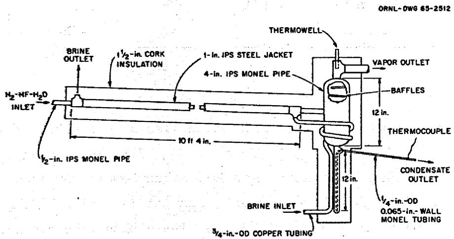  
Fig. 3.8. Cold Trap and Siphon Pot.

Table 3.3. Cold Trap and Siphon Pot Design Data   

<table><tr><td>Construction material</td><td>Monel</td></tr><tr><td>Cold trap</td><td></td></tr><tr><td>Maximum vapor velocity, ft/min</td><td>1800</td></tr><tr><td>Maximum expected heat load, Btu/hr</td><td>2500</td></tr><tr><td>Heat transfer surface area, ft2</td><td>2.3</td></tr><tr><td>Siphon pot volume, cm3</td><td>55</td></tr><tr><td>Brine system</td><td></td></tr><tr><td>Brine</td><td>Freon-11</td></tr><tr><td>Brine flow rate, gpm</td><td>5</td></tr><tr><td>Brine head, ft (max)</td><td>40</td></tr><tr><td>Brine volume, gal (min)</td><td>2.5</td></tr><tr><td>Reference drawing</td><td>E-NN-D-55439</td></tr></table>

# 3.3.4 Siphon Pot

The condensate from the cold trap collects in a pot that automatically siphons when full. The pot is shown in Fig. 3.8, and design data are given in Table 3.3. The exit gas passes over a thermowell for accurate determination of the off-gas temperature. The pot is cooled by the brine before the brine enters the cold-trap jacket. The siphon tube has a surface thermocouple outside of the thermal insulation to detect each siphoning.

# 3.3.5 Caustic Scrubber

The caustic scrubber is shown in Fig. 3.9, and design data are given in Table 3.4. The tank is provided with coils enclosed in a heat-transfer medium. During $\mathrm{H}_2$ -HF treatment, cooling water will be circulated through the coils to remove the heat of HF neutralization. During fluorination, it may be desirable to use steam to maintain the caustic solution at an elevated temperature for better tellurium scrubbing.

The tank is provided with a thermowell, a liquid-level bubbler tube, and a jet suction line. The used caustic is jetted to the liquid-waste tank when the molarity has been reduced from 2.0 to approximately 0.3 M KOH. A caustic charging line is provided from the high-bay area.

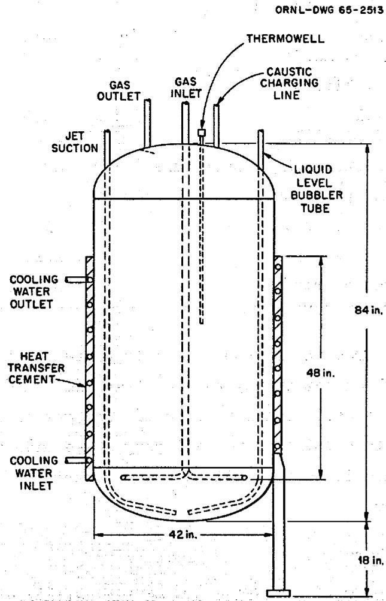  
Fig. 3.9. Caustic Scrubber.

Table 3.4. Caustic Scrubber Design Data   

<table><tr><td>Construction material</td><td>Inconel</td></tr><tr><td>Height, in.</td><td>84</td></tr><tr><td>Diameter, in.</td><td>42</td></tr><tr><td>Wall thickness, in.</td><td></td></tr><tr><td>Vessel</td><td>3/8</td></tr><tr><td>Dished heads</td><td>3/8</td></tr><tr><td>Volume, liters</td><td></td></tr><tr><td>Total</td><td>1600</td></tr><tr><td>Normal fill</td><td>1300</td></tr><tr><td>Design operating temperature, °F</td><td>200</td></tr><tr><td>Design operating pressure, psig</td><td>50</td></tr><tr><td>Heat transfer area, ft2</td><td>45</td></tr><tr><td>Liquid head, psi</td><td>2.15</td></tr><tr><td>Reference drawing</td><td>E-FF-C-55441</td></tr></table>

The off-gas from the scrubber tank is routed to the spare cell where it passes through an activated-charcoal trap and a flame arrester before discharge into the cell ventilation duct. The gas should be free of air or oxygen up to this point, since all purges are made with helium. A sensitive pressure indicator will show any restriction in the off-gas line or flame arrester.

# 3.3.6 NaF Absorbers

The absorbers for collecting $\mathrm{UF}_6$ on NaF pellets are made of carbon steel, which is sufficiently resistant to fluorine for the short exposures involved. The absorbers will be used for processing only one batch and will then be discarded to the burial ground. The absorbers are shown in Fig. 3.10, and design data are given in Table 3.5. A bed depth of 6 to 10 in. (14 to $24\mathrm{kg}$ of NaF) will be used. The actual depth will depend on the amount of uranium to be absorbed. With fuel salt C, three sets of absorbers will be required, while with salt B only one set will be needed.

Each absorber is mounted in an open top container with an air distributor pipe in the bottom. Cooling air flows around the outside and up

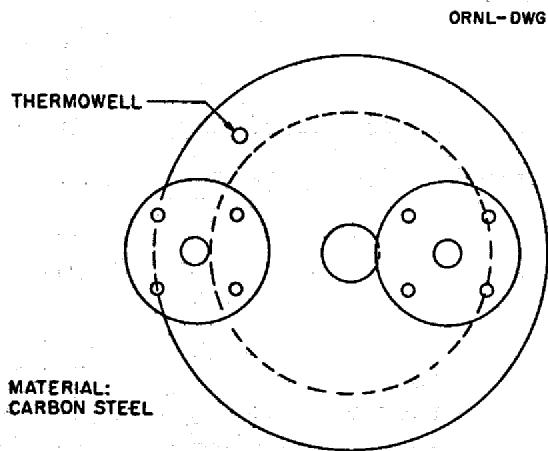

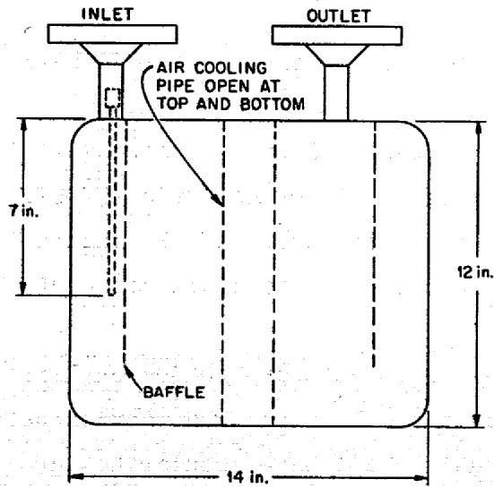  
Fig. 3.10. NaF Absorbers.

Table 3.5. NaF Absorber Design Data   

<table><tr><td>Construction material</td><td>Carbon steel</td></tr><tr><td>Height, in.</td><td>12</td></tr><tr><td>Diameter, in.</td><td>14</td></tr><tr><td>Wall thickness, in.</td><td></td></tr><tr><td>Sides</td><td>1/8</td></tr><tr><td>Dished heads</td><td>3/8</td></tr><tr><td>Design operating temperature, °F</td><td>750</td></tr><tr><td>Design operating pressure, psig</td><td>50</td></tr><tr><td>Loading, kg of NaF pellets</td><td>14-24</td></tr><tr><td>Bed depth, in.</td><td>6-10</td></tr><tr><td>Reference drawings</td><td></td></tr><tr><td>Absorber details</td><td>D-FF-C-55447</td></tr><tr><td>Absorber container details</td><td>D-FF-C-55448</td></tr></table>

through the open 2-in. center pipe. Air can be controlled separately to each absorber.

Each absorber is provided with a thermowell immersed in the NaF pellets near the gas inlet. Since absorption of $\mathrm{UF_6}$ to form $\mathrm{UF_6} \cdot 2\mathrm{NaF}$ liberates 23.9 kcal per mole, the start of $\mathrm{UF_6}$ absorption and the breakthrough to the succeeding absorber in the train can be followed by observing the temperature rise.

The absorbers are connected with jumper lines having ring-joint flanges with pigtails for local leak detection before sealing the cubicle. The lines in the cubicle all have tubular heaters to prevent $\mathrm{UF}_6$ condensation. No spares are installed because the cubicle is accessible to the high-bay area when processing is stopped.

# 3.3.7 Fluorine Disposal System

The excess fluorine is disposed of by reacting it with $\mathrm{SO}_2$ to form $\mathrm{SO}_2\mathrm{F}_2$ , which is a relatively inert gas and can be safely passed through the Fiberglas filters in the off-gas system. Design of the system is based on the system in use at the Goodyear Atomic Corporation at Portsmouth, Ohio. Since the quantity of fluorine to be disposed of is similar,

the same size equipment is used, except for the fluorine preheater. The fluorine at Portsmouth is diluted to about $10\%$ , while the fluorination off-gas will be nearly $100\%$ fluorine toward the end of the processing. The fluorine preheater can therefore be the same size as the $\mathrm{SO}_2$ preheater. Some construction details have been changed to adapt the equipment to remote radioactive service.

The equipment is shown in Fig. 3.11, and design data for the system are given in Table 3.6. Both gas streams are preheated to $400^{\circ}\mathrm{F}$ before contacting in the fluorine reactor. Each preheater has three separate

Table 3.6. Fluorine Disposal System Design Data   

<table><tr><td colspan="2">Construction material</td></tr><tr><td>SO2 preheater</td><td>Type 304L stainless steel</td></tr><tr><td>F2 preheater and reactor</td><td>Monel</td></tr><tr><td>Length, in.</td><td></td></tr><tr><td>Preheaters</td><td>30</td></tr><tr><td>Reactor</td><td></td></tr><tr><td>Overall</td><td>112</td></tr><tr><td>Reaction zone</td><td>96</td></tr><tr><td>Diameter, in. IPS</td><td></td></tr><tr><td>Preheaters</td><td>2</td></tr><tr><td>Reactor</td><td>5</td></tr><tr><td>Design fluorine flow, liters/min</td><td>100</td></tr><tr><td>Design operating temperature, °F</td><td></td></tr><tr><td>Preheaters</td><td>600</td></tr><tr><td>Reactor</td><td>750</td></tr><tr><td>Design operating pressure, psig</td><td>50</td></tr><tr><td>Heat capacity of heaters on each preheater, kw</td><td>1.5</td></tr><tr><td>Insulation, in.</td><td>2</td></tr><tr><td>Reference drawings</td><td></td></tr><tr><td>SO2 preheater</td><td>D-FF-C-55445</td></tr><tr><td>F2 preheater</td><td>D-FF-C-55444</td></tr><tr><td>F2 reactor</td><td>D-FF-C-55442</td></tr><tr><td>Preheater heaters</td><td>E-NN-E-56410</td></tr></table>

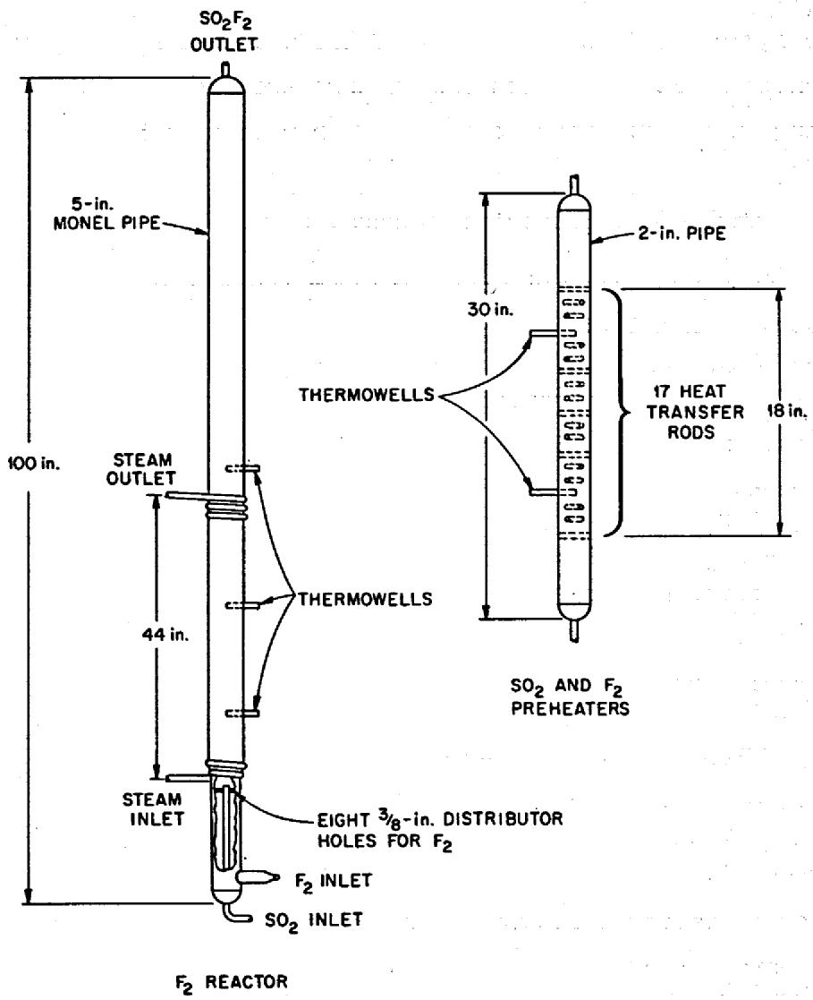  
Fig. 3.l1. Fluorine Disposal System.

heaters with installed spares. Each heater is controlled separately by an off-on switch. The low-pressure steam coil on the inlet half of the fluorine reactor supplies heat at the start to initiate the reaction and acts as a coolant to remove the heat of reaction after the reaction begins. It is desired to keep the temperature below $1000^{\circ}\mathrm{F}$ to minimize corrosion.

# 3.3.8 Cubicle Exhauster

The air in the absorber cubicle is maintained at a 2-in. $\mathrm{H}_2\mathrm{O}$ negative pressure with respect to the high-bay area by an exhauster located in the fuel-processing cell. This is an exhauster with a capacity of 250 cfm at 10.5 in. $\mathrm{H}_2\mathrm{O}$ . It is driven by a 3/4-hp 3450-rpm 440-v 3-phase motor. The suction side is connected to the cubicle by a 4-in. steel pipe routed through the space west of the cell. The discharge is open to the cell without any connecting piping. A 4-in. plug cock is provided in the suction line in the cubicle, with an access flange on the cubicle, to permit closing the valve with the gasketed top in place for leak checking.

The blower is controlled by a manual switch with an interlock to a solenoid valve in the cooling air supply to the absorbers. This ensures that the cooling air cannot be turned on inadvertently with the blower off and thereby pressurize the cubicle.

# 3.4 Out-of-Cell Equipment

# 3.4.1 Activated-Charcoal Trap

An activated-charcoal trap is located in the off-gas line in the spare cell. The main function of this trap is the removal of iodine from the off-gas stream. The trap consists of two 4 3/8-in.-diam, 10 1/2-in.-long canisters in series, each with a charcoal depth of 3/4 in. The canisters are installed in a flanged 6-in. Monel pipe so that they can be replaced if necessary. Each canister contains 1.5 lb of 6-14 mesh charcoal and is rated to process air at a maximum of 25 ft³/min. Each canister has an exposed surface of 1 ft². The pressure drop through one canister at 25 ft³/min is 0.15 in. H₂O.

# 3.4.2 Flame Arrester

Since the system will be completely purged of air before processing begins and all purge and sparge gases will be helium or nitrogen, there is no possibility of producing an explosive mixture with hydrogen in the equipment. The only location involving an explosion hazard should be the point of discharge of the off-gas into the off-gas duct. At this point the maximum concentration of hydrogen in the air is $0.65\%$ with a hydrogen flow rate of 90 liters/min and a cell air exhaust of 500 cfm. This is well below the lower explosive limit of hydrogen in air of $4\%$ . The cell exhaust flow rate will be checked at the time of processing to confirm that there is sufficient detection.

As an added precaution, a flame arrester is installed in the off-gas line between the activated-charcoal trap and the cell exhaust duct in the spare cell with a union downstream for removal for cleaning or replacement. The unit is a Varac model 51A and consists of copper gauze and disk laminations.

# 3.4.3 Off-Gas Filters

The fuel-processing cell ventilation air and the vessel off-gas will pass through a 2-in.-deep 24- by 24-in. Fiberglas prefilter and a 11 1/2-in.-deep 24- by 24-in. Fiberglas absolute filter before passing through the main filters and containment stack. There are three 12-in.-diam butterfly valves for isolation and for bypassing of the filters for replacement. A locally mounted differential-pressure transmitter indicates the pressure drop across the filters on the fuel-processing system panel board. The caustic scrubber off-gas, after passing through the charcoal trap and the flame arrester, discharges into the duct just upstream of the bypass tee.

This equipment is located in the spare cell with sufficient space allowed for the addition of 2 ft of shielding (for a total of $3\frac{1}{2}$ ft) between the filters and the fuel-processing cell. This should be sufficient shielding to permit filter changing with an irradiated fuel batch in the storage tank.

# 3.4.4 HF Trap

The fluorine used will contain up to $5\%$ HF, which could cause plugging of the $\mathrm{UF}_6$ (by formation of NaF·2HF, NaF·3HF, etc.) if not removed. Therefore the trap shown in Fig. 3.12 and described in Table 3.7 is provided in the fluorine line at the gas supply station.

Table 3.7. HF Trap Design Data   

<table><tr><td>Construction material</td><td>Nickel-plated carbon steel</td></tr><tr><td>Height, in.</td><td>32</td></tr><tr><td>Diameter, in. IPS</td><td>8</td></tr><tr><td>Design operating temperature, °F</td><td>250</td></tr><tr><td>Design operating pressure, psig</td><td>75</td></tr><tr><td>Operating temperatures, °F</td><td></td></tr><tr><td>Inlet</td><td>212</td></tr><tr><td>Outlet</td><td>100</td></tr><tr><td>NaF capacity, ft3</td><td>1.9</td></tr><tr><td>Design flow rate, liters/min</td><td>100</td></tr><tr><td>Reference drawing</td><td>D-FF-C-55443</td></tr></table>

The inlet of the trap is maintained at $212^{\circ}\mathrm{F}$ by steam to prevent plugging (by prevention of the formation of the higher hydrogen fluoride complexes) because of the high partial pressure of HF. Farther into the NaF bed, the HF partial pressure is lower and the higher complexes are not formed even at the lower temperature. The exit of the trap is water cooled to about $100^{\circ}\mathrm{F}$ , which is below the operating temperature of the $\mathrm{UF}_6$ absorbers, and the trap should therefore remove any HF that could otherwise collect in the absorbers. The reaction is exothermic and liberates 16.4 kcal per mole of HF absorbed.

With a fluorine flow of 100 liters/min, a processing time of 10 hr, and an HF content of $5\%$ , the trap has sufficient capacity for the fluorination of five batches if only $50\%$ of the NaF is complexed to NaF·HF. Since the average HF content is less than $5\%$ , one loading should have

ORNL-DWG 65-2516

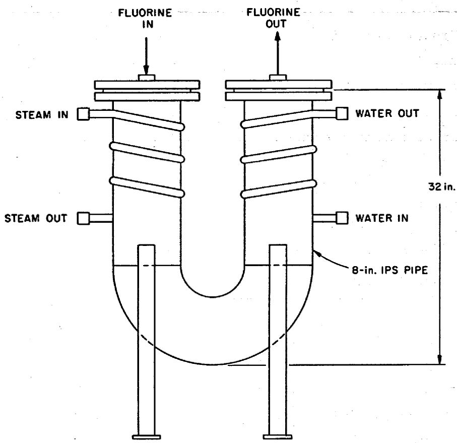  
Fig. 3.12. HF Trap Filled with NaF Pellets.

sufficient capacity for all the fluorinations planned at the MSRE. If necessary, the NaF can be discarded and recharged.

# 3.4.5 HF Heater

The HF heater is installed in the gas line from the HF cylinder after the flow control valve. The purpose of this heater is to dissociate the HF gas to the monomolecular form for accurate flow metering. This requires the addition of approximately 1.2 Btu/liter of gas or approximately 20 Btu/min at the maximum HF flow rate anticipated (17 liters/min). Another 1 Btu/min of sensible heat is required to heat the gas from $120^{\circ}\mathrm{F}$ , the temperature of the gas at 25 psig leaving the cylinder, to $180^{\circ}\mathrm{F}$ , the temperature required to reach the monomolecular form. This 21 Btu/min is equivalent to 370 w. Two tubular heaters are used to provide a total of 1120 w.

The heater is strapped to the outside of a 2-in. Monel pipe about 22 in. long packed with nickel wool for heat transfer. The wool is confined at the ends by 6 mesh Monel cloth. A thermowell is provided near the outlet.

# 3.4.6 Salt Sampler

The salt sampler in the fuel-processing system is mounted on the roof plugs over the fuel-processing cell and is connected directly to the top of the fuel storage tank by a vertical 1 l/2-in. pipe. The sampler is the original fuel-pump sampler-enricher mockup shown in Fig. 3.13. It is the same as the fuel-pump sampler, with the following exceptions:

1. It is designed for a maximum of 14 psig instead of 50 psig. Area 1C is protected from overpressure by a pressure relief valve that vents to area 2B which is vented to the cell through the space around the 1 l/2-in. sampling line.   
2. No maintenance valve is required, since the system can be shut down and purged if maintenance on the sampler is required.   
3. Area 2B will contain the vacuum pumps in addition to the operational valve.   
4. A bellows is installed between the operational valve and the sample line instead of between the valves and area 1C.

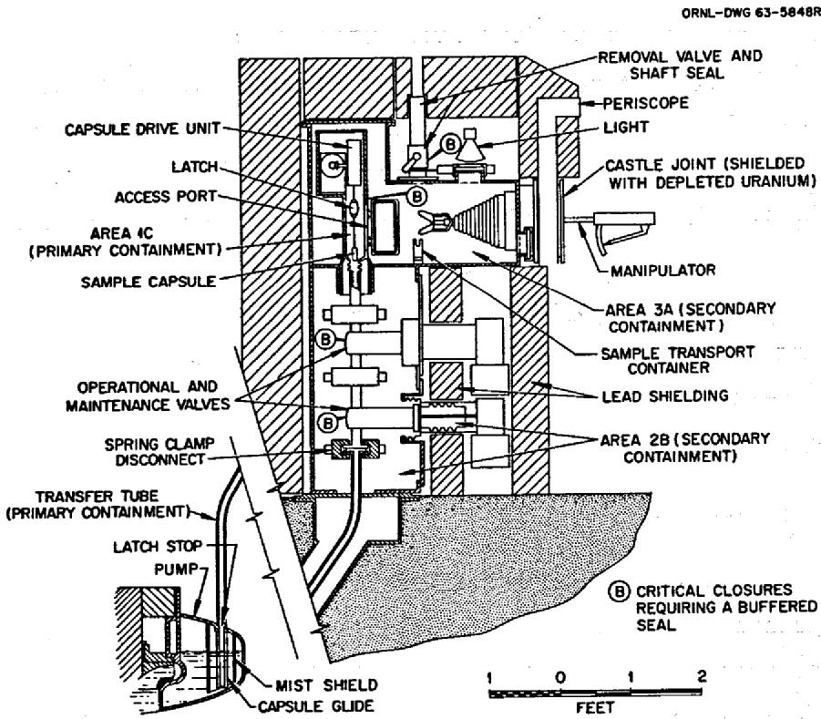  
Fig. 3.13. MSRE Sampler-Enricher.

The sampler will not be used during processing. The fuel storage tank will be purged with helium before the operational valve is opened for sampling. The main purpose of the sampler is to verify that the salt is satisfactory for return to the drain tank after processing. After $\mathrm{H}_2$ -HF treatment the sample will be analyzed to determine that HF and $\mathrm{FeF}_2$ have been reduced to satisfactory levels. After fluorination the sample will verify the complete removal of uranium. Also, sampling of flush salt before processing will indicate the amount of fuel salt pickup.

The sampler will have, in general, the same instrumentation as the fuel-pump sampler and will be operated in the same manner.[5]

# 3.5 Electrical System

Electrical power for the fuel-processing system is supplied by a 750-kva 480/240-v transformer feeding a load center on the east side of the remote maintenance practice cell on the 840-ft level. This 208-v supply feeds two power panels, CP-A and CP-B, and starters for the two motorized dampers for the fuel storage tank cooling air. The starter and switch for the cubicle blower are located at the load center but have a separate supply since the blower requires 440 v. Most of the equipment and pipe heaters are controlled by switches or powerstats located at two heater control panels, HCP-12 and HCP-13, at the south end of the heater control area on the 840-ft level east of the cell block. The pipe heaters in the absorber cubicle are controlled by a switch at the cubicle in the high-bay area. The line and equipment heaters are listed in Tables 3.8 and 3.9.

The pipe line and equipment heater, blower motor, and motorized damper leads are routed from the heater control panels through a junction box on the west side of the decontamination cell on the 840-ft level. At this junction box the spare heaters can be connected to the control panels if necessary. Each control may have from one to nine separate heaters, which are connected as a group at the junction box. Defective heaters can be replaced only by entering the cell. After the cell becomes radioactive, only an entire group can be replaced unless the cell is decontaminated to permit direct maintenance.

Table 3.8. Line Heaters   

<table><tr><td>Heater No.</td><td>Location</td><td>Heat per Control (w)</td><td>Heated Length (ft)</td><td>Heat per Foot (w)</td><td>Maximum Voltage Setting (v)</td><td>Maximum Current Setting (amp)</td></tr><tr><td>H-110-5</td><td>Cell wall penetration</td><td>1020</td><td>5.1</td><td>200</td><td>120</td><td>8.5</td></tr><tr><td>H-110-6</td><td>Cell wall to line lll</td><td>4584</td><td>25</td><td>187</td><td>140</td><td>32.8</td></tr><tr><td>H-110-7</td><td>Freeze valve lll to fuel storage tank</td><td>1496</td><td>8</td><td>187</td><td>140</td><td>10.7</td></tr><tr><td>H-110-4</td><td>End of penetration</td><td>270</td><td></td><td></td><td>90</td><td>3</td></tr><tr><td>H-111-1</td><td>Freeze valve lll to cell wall</td><td>3743</td><td>20</td><td>187</td><td>140</td><td>26.7</td></tr><tr><td>H-111-2</td><td>Cell wall to high bay</td><td>2620</td><td>14</td><td>187</td><td>140</td><td>18.7</td></tr><tr><td>H-112-1</td><td>Line 110 to spare cell</td><td>2432</td><td>13</td><td>187</td><td>140</td><td>17.4</td></tr><tr><td>H-690-1, -2</td><td>Fuel storage tank to valve HCV 694</td><td>2620</td><td>14</td><td>187</td><td>140</td><td>18.7</td></tr><tr><td>H-694-2</td><td>Fuel storage tank to cell wall</td><td></td><td></td><td></td><td></td><td></td></tr><tr><td>H-691-1, -2</td><td>Fuel storage tank to NaF trap</td><td></td><td></td><td></td><td></td><td></td></tr><tr><td>H-692-1 to 4</td><td>NaF trap to absorber cubicle</td><td>1245</td><td>60</td><td>21</td><td>120</td><td>10.4</td></tr><tr><td>H-692-V</td><td>Valve HCV 692</td><td></td><td></td><td></td><td></td><td></td></tr><tr><td>H-692-5 to 12</td><td>Absorber cubicle</td><td>390a</td><td>21</td><td>19</td><td>120</td><td>3.3</td></tr><tr><td>H-694-1</td><td>Valve HCV 694 to line 994</td><td></td><td></td><td></td><td></td><td></td></tr><tr><td>H-994-1, -2</td><td>Fuel storage tank to roof plug</td><td>320a</td><td>16</td><td>20</td><td>120</td><td>2.7</td></tr></table>

Switch controlled; all others controlled by Powerstat.

Table 3.9. Equipment Heaters   

<table><tr><td>Equipment</td><td>Type of Control</td><td>Number of Elements</td><td>Maximum Voltage Setting (v)</td><td>Heat Rating (w)</td></tr><tr><td colspan="5">Fuel storage tank</td></tr><tr><td>Top</td><td>Powerstat</td><td>4</td><td>120</td><td>2,000</td></tr><tr><td>Upper side</td><td>Powerstat</td><td>6</td><td>236</td><td>5,800</td></tr><tr><td>Lower side</td><td>Powerstat</td><td>12</td><td>236</td><td>11,600</td></tr><tr><td>Bottom</td><td>Powerstat</td><td>8</td><td>226</td><td>5,800</td></tr><tr><td colspan="5">NaF trap</td></tr><tr><td>Side</td><td>Powerstat</td><td>2</td><td>240</td><td>9,000</td></tr><tr><td>Center</td><td>Powerstat</td><td>1</td><td>120</td><td>2,250</td></tr><tr><td colspan="5">SO2 preheater</td></tr><tr><td>No. 1</td><td>Switch</td><td>1</td><td>120</td><td>500</td></tr><tr><td>No. 2</td><td>Switch</td><td>1</td><td>120</td><td>500</td></tr><tr><td>No. 3</td><td>Switch</td><td>1</td><td>120</td><td>500</td></tr><tr><td colspan="5">F2 preheater</td></tr><tr><td>No. 1</td><td>Switch</td><td>1</td><td>120</td><td>500</td></tr><tr><td>No. 2</td><td>Switch</td><td>1</td><td>120</td><td>500</td></tr><tr><td>No. 3</td><td>Switch</td><td>1</td><td>120</td><td>500</td></tr><tr><td>HF in-line heater</td><td>Switch</td><td>2</td><td>208</td><td>1,120</td></tr><tr><td colspan="5">Freeze valve lll0</td></tr><tr><td>Valve</td><td>Powerstat</td><td>4</td><td>115</td><td>1,200</td></tr><tr><td>Pots</td><td>Powerstat</td><td>4</td><td>110</td><td>2,210</td></tr><tr><td colspan="5">Freeze valve lll1</td></tr><tr><td>Valve</td><td>Powerstat</td><td>4</td><td>115</td><td>1,200</td></tr><tr><td>Pots</td><td>Powerstat</td><td>2</td><td>115</td><td>1,200</td></tr><tr><td colspan="5">Freeze valve lll2</td></tr><tr><td>Valve</td><td>Powerstat</td><td>4</td><td>115</td><td>1,200</td></tr><tr><td>Pots</td><td>Powerstat</td><td>2</td><td>115</td><td>1,200</td></tr></table>

aAll heaters are tubular except those on freeze valves and fuel storage tank bottom, which are ceramic. Duplicate spares are installed on all equipment except the HF heater. Heater controls are on panels HCP-12 and HCP-13 on the 840-ft level.

# 3.6 Helium Supply System

The helium supply to the fuel-processing system is from the 40-psig helium header in the water room. At the fuel-processing panelboard in the high-bay area, this supply is reduced at a 20-psig transfer header and a 13.5-psig purge and sparge header. The transfer header has an air-operated block valve that cannot be opened unless freeze valve and drain tank vent valve positions are correct to receive a salt batch from the fuel storage tank. The purpose of this interlock is to prevent accidental filling of the reactor or transfer to a tank already containing a salt batch.

The purge and sparge header has sufficient pressure (13.5 psig) to permit sparging a salt batch at 100 liters/min but has insufficient pressure to force salt over the loop in line 110 (14.6 psig, min). This header is provided with a pressure-relief valve set at 14.0 psig, which will reseal at 12.6 psig. Should this valve stick open or the helium supply pressure be lost for any other reason, an interlock on the helium purge flow to the system will close the $\mathrm{H}_2$ -HF- $\mathrm{F}_2$ supply block valve, stop the evolution of fission-product gases, and prevent the possible pressurizing of corrosive or radioactive gases up the sample line to the high-bay area.

Other functions of the low-pressure header are to supply gas for instrument- and sample-line purging, for purging the salt charging line above the freeze valve prior to salt transfer, and for purging the HF and $\mathbf{F}_2$ lines from the gas supply station to the fuel storage tank.

# 3.7 Instrumentation

# 3.7.1 Thermocouples

All the temperature-measuring points in the fuel-processing system are listed in Table 3.10. Two 12-point recorders (0-250°F and 0-1000°F) are installed on the fuel-processing system panelboard that will record all measurements normally required for H₂-HF treatment. For fluorination, additional low-temperature measurements are required, and the high-temperature recorder and another low-temperature recorder temporarily installed for this operation will be used.

Table 3.10. Temperature-Measuring Points   

<table><tr><td rowspan="3">Location</td><td rowspan="3">Number of Points</td><td rowspan="3">Operating Temperature (°F)</td><td colspan="4">Number of Measurements Normally Recorded</td></tr><tr><td colspan="2">H2-HF Treatment</td><td colspan="2">Fluorination</td></tr><tr><td>0-250°F 
Recorder</td><td>0-1000°F 
Recorder</td><td>0-250°F 
Recorder</td><td>0-1000°F 
Recorder</td></tr><tr><td>NaF trap</td><td>3</td><td>750</td><td></td><td>3</td><td></td><td>3</td></tr><tr><td>SO2 preheater</td><td>3</td><td>400</td><td></td><td></td><td></td><td>3</td></tr><tr><td>F2 preheater</td><td>3</td><td>400</td><td></td><td></td><td></td><td>3</td></tr><tr><td>F2 reactor</td><td>3</td><td>400</td><td></td><td></td><td></td><td>3</td></tr><tr><td>Line 691</td><td>2</td><td>200</td><td>2</td><td>1</td><td>2</td><td></td></tr><tr><td>Line 692</td><td>14</td><td>200</td><td>1</td><td>7</td><td>11</td><td></td></tr><tr><td>Valve HCV 692</td><td>1</td><td>200</td><td>1</td><td></td><td>1</td><td></td></tr><tr><td>Line 694</td><td>2</td><td>200</td><td>2</td><td></td><td>2</td><td></td></tr><tr><td>Line 994</td><td>2</td><td>200</td><td>2</td><td></td><td>2</td><td></td></tr><tr><td>Line 695</td><td>3</td><td>200</td><td>1</td><td></td><td></td><td></td></tr><tr><td>Line 696</td><td>1</td><td>180</td><td>1</td><td></td><td></td><td></td></tr><tr><td>NaF absorbers</td><td>5</td><td>100</td><td></td><td></td><td>5</td><td></td></tr><tr><td>Caustic scrubber</td><td>1</td><td>100</td><td></td><td>1</td><td>1</td><td></td></tr><tr><td>Siphon pot</td><td>1</td><td>20</td><td>1</td><td></td><td></td><td></td></tr><tr><td>Line 695 B</td><td>1</td><td>20</td><td>1</td><td></td><td></td><td></td></tr><tr><td>Total</td><td>41</td><td></td><td>12</td><td>12</td><td>24a</td><td>12</td></tr><tr><td>Line 690</td><td>3</td><td>80-1000</td><td></td><td></td><td></td><td></td></tr><tr><td>Line 694</td><td>1</td><td>80-1000</td><td></td><td></td><td></td><td></td></tr><tr><td>Line 992</td><td>1</td><td>0</td><td></td><td></td><td></td><td></td></tr><tr><td>Line 993</td><td>1</td><td>0</td><td></td><td></td><td></td><td></td></tr><tr><td>Fuel storage tank</td><td>13</td><td>900-1200</td><td></td><td></td><td></td><td></td></tr><tr><td>Line 110</td><td>8</td><td>900-1200</td><td></td><td></td><td></td><td></td></tr><tr><td>Line 111</td><td>7</td><td>900-1200</td><td></td><td></td><td></td><td></td></tr><tr><td>Line 112</td><td>3</td><td>900-1200</td><td></td><td></td><td></td><td></td></tr><tr><td>Freeze valve 110</td><td>5</td><td>80-1000</td><td></td><td></td><td></td><td></td></tr><tr><td>Freeze valve 111</td><td>5</td><td>80-1000</td><td></td><td></td><td></td><td></td></tr><tr><td>Freeze valve 112</td><td>5</td><td>80-1000</td><td></td><td></td><td></td><td></td></tr></table>

aAn additional $0 - 250^{\circ}\mathrm{F}$ recorder will be temporarily installed for fluorination.

The readings of the 46 thermocouples installed on the fuel storage tank, salt lines, and freeze valves will be recorded only in the main control room, since they will be required primarily for salt transfer. The fuel storage tank temperatures will be checked occasionally during processing, but changes should be slow.

The four thermocouples on lines 690 and 694 will be used only in case salt backs up in line 690 and the application of heat is required to thaw a plug. The thermocouples on lines 992 and 993 indicate the brine

inlet and outlet temperatures and will be connected for heat balance tests or in case of operating difficulties.

# 3.7.2 Annunciators

The fuel-processing system annunciator points are listed in Table 3.11. There are 11 annunciators on the chemical plant panelboard. In addition there are 3 radiation alarms that indicate high gamma activity in the charcoal absorbers, a high gamma activity in the instrument cubicle, and a high gamma activity in the cell exhaust air. A portable alpha air monitor will alarm on high air activity in the absorber cubicle and there will be a high gamma level alarm on the fuel storage tank sampler line.

Table 3.11. Annunciators   

<table><tr><td rowspan="2">Instrument No.a</td><td rowspan="2">Service</td><td colspan="2">Alarm</td></tr><tr><td>Type</td><td>Setting</td></tr><tr><td>Pdia-AC</td><td>Absorber cubicle to high bay</td><td>Low differential pressure</td><td>1 in. H2O</td></tr><tr><td>PIA-CS</td><td>Caustic scrubber vent</td><td>High pressure</td><td>1 psig</td></tr><tr><td>Pdia-FPC</td><td>Fuel-processing cell to high bay</td><td>Low differential pressure</td><td>0</td></tr><tr><td>PIA-530</td><td>Helium supply</td><td>Low pressure</td><td>17 psig</td></tr><tr><td>PIA-604</td><td>Helium purge header</td><td>Low pressure</td><td>12 psig</td></tr><tr><td>PRA-608</td><td>Fuel storage tank vent</td><td>High pressure</td><td>30 psig</td></tr><tr><td>PICA-690</td><td>Fluorine supply</td><td>Low pressure</td><td>25 psig</td></tr><tr><td>Pdia-694</td><td>Purge to HF-F2supply</td><td>Low differential pressure</td><td>1 psig</td></tr><tr><td>PIA-696</td><td>HF supply</td><td>High pressure</td><td>25 psig</td></tr><tr><td>FIA-608</td><td>Helium purge</td><td>Low flow</td><td>3 liters/min</td></tr><tr><td>TA-HFH</td><td>HF heater</td><td>Low temperature</td><td>200°F</td></tr><tr><td>RIA-994</td><td>Sample line gamma activity</td><td>High activity</td><td></td></tr><tr><td>RIA-IC</td><td>Instrument cubicle gamma activity</td><td>High activity</td><td></td></tr><tr><td>RIA-940</td><td>Cell exhaust air gamma activity</td><td>High activity</td><td></td></tr><tr><td>RIA-AC</td><td>Absorber cubicle air monitor</td><td>High activity</td><td></td></tr><tr><td>AF2IA-940A</td><td>Cell ventilation fluoride content</td><td>High content</td><td>1 ppm</td></tr><tr><td>AF2IA-940B</td><td>Vessel off-gas fluoride content</td><td>High content</td><td>1 ppm</td></tr><tr><td>AF2IA-628</td><td>Filter outlet gas fluoride content</td><td>High content</td><td>1 ppm</td></tr></table>

aThe 14 instruments above the line across the table have panel-mounted annunciators; the other 4 have alarms on the instrument.

The panel-mounted annihilators will serve the following purposes:

Annunciator Designation   
Purpose   

<table><tr><td>PdIA-AC</td><td>Indicate lack of negative pressure in the absorber cubicle, possibly due to blower failure or excessive absorber cooling air</td></tr><tr><td>PIA-CS</td><td>Indicate positive pressure in the scrubber vent, possibly due to plugging of the flame arrester or activated-charcoal traps</td></tr><tr><td>PdIA-FPC</td><td>Indicate lack of negative pressure in the fuel-processing cell, possibly due to fan failure, filter plugging, or excessive air inleakage</td></tr><tr><td>PIA 530</td><td>Indicate a failure in the helium supply system or PCV 530</td></tr><tr><td>PIA 604</td><td>Indicate a failure in the helium supply system or PCV 604</td></tr><tr><td>PRA 608</td><td>Indicate high pressure in the fuel storage tank vapor space; this could be caused by plugging in the off-gas line, NaF trap, valve HCV 692, absorber train, or scrubber inlet</td></tr><tr><td>PICA 690</td><td>Indicate the gas pressure in the fluorine trailer; with a full trailer pressure of 55 psig, an alarm at 20 psig will indicate the consumption of about 12,000 standard liters of fluorine and that replacement of the trailer is required</td></tr><tr><td>PdIA 694</td><td>Indicate that the H2-HF-F2 gas pressure has been reduced to within 1 psig of the pressure in the fuel storage tank vapor space and there is danger of a back up of salt into gas supply line 690</td></tr><tr><td>PIA 696</td><td>Indicate that the HF gas pressure in the cylinder is reaching a dangerous level; this could be caused by failure of the temperature control valve regulating the steam to the hot-water drum around the cylinder</td></tr><tr><td>FIA 608</td><td>Indicate a lack of purge flow to the fuel storage tank and the possibility of backup of gaseous activity to the instrument cubicle; this could be caused by lack of helium pressure or flowmeter plugging or incorrect setting</td></tr><tr><td>TA-HFH</td><td>Indicate insufficient heating of the HF gas, which could result in incorrect flow metering</td></tr></table>

# 3.8 Brine System

The siphon pot and cold trap are cooled by circulating freon brine (trichloromonofluoromethane). The maximum cooling loads are approximately 2500 Btu/hr in the cold trap and an approximately 1200-Btu/hr heat loss from the piping and equipment. A 1 l/2-hp water-cooled refrigeration unit should provide sufficient capacity for brine temperatures as low as $-20^{\circ}\mathrm{F}$ . Brine is circulated by a canned-motor pump through insulated 3/4-in.-OD copper tubing. The refrigeration unit and circulating pump are located on the 840-ft level west of the cell.

# 4. SAFETY ANALYSIS

# 4.1 Summary and Conclusions

A decay period of at least four days should be allowed before transfer of a fully irradiated fuel batch to the fuel storage tank to keep the xenon level at maximum ground concentration below $2.5\mathrm{mr/hr}$ . Under normal atmospheric conditions, this concentration would occur 325 meters from the stack. It would decrease rapidly with distance and decay time, as indicated in Table 4.1 and Fig. 4.1.

Since no irradiated salt has ever been treated with $\mathrm{H}_2$ -HF, the fission-product volatilization to be expected is not known, but it should be very low because of the reducing condition of the salt. Volatilization of iodine and tellurium is the most likely, but reduction and plateout in the gas phase and final adsorption by the activated-charcoal bed should remove most of the volatilized activity. Much greater fission-product volatilization is expected during fluorination, and longer decay times will therefore be allowed before fluorinating flush or fuel salt.

The overall decontamination factors required to limit the release of iodine to $50\%$ of the ORNL weekly limit6 of 1 curie are listed in Table 4.2, along with the decontamination factors for the other volatile activities as determined by the maximum permissible concentration in air. The only fission product of concern in processing with a short decay time would be iodine.

Accidental releases were also considered, and it was found that they would not result in excessive exposures, since the processing operation could be shut down rapidly upon indication of excessive activity in the off-gas stream.

# 4.2 Bases for Calculations

# 4.2.1 Diffusion Factor

Gaseous activity concentrations were calculated using Sutton's equation for diffusion from a continuous point source:

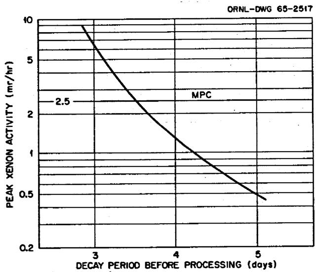  
Fig. 4.1. Radiation Level at Maximum Ground Concentration from Xenon Released During Processing of Fuel.

Table 4.1. Diffusion Factor, X, Versus Distance Downwind   

<table><tr><td rowspan="3">Distance Downwind (m)</td><td colspan="4">X, Diffusion Factora</td></tr><tr><td colspan="2">Inversion Conditions</td><td colspan="2">Normal Conditions</td></tr><tr><td>Ground Release</td><td>Stack Release</td><td>Ground Release</td><td>Stack Release</td></tr><tr><td>100</td><td>2.1 × 10-2</td><td>&lt;10-10</td><td>8.0 × 10-4</td><td>2.9 × 10-7</td></tr><tr><td>160</td><td>9.8 × 10-3</td><td>&lt;10-10</td><td>3.5 × 10-4</td><td>1.1 × 10-5</td></tr><tr><td>200</td><td>6.3 × 10-3</td><td>&lt;10-10</td><td>2.3 × 10-4</td><td>2.3 × 10-5</td></tr><tr><td>325</td><td>3.0 × 10-3</td><td>&lt;10-10</td><td>1.0 × 10-4</td><td>3.7 × 10-5</td></tr><tr><td>500</td><td>1.5 × 10-3</td><td>2.1 × 10-7</td><td>4.7 × 10-5</td><td>3.0 × 10-5</td></tr><tr><td>750</td><td>7.7 × 10-4</td><td>8.2 × 10-6</td><td>2.3 × 10-5</td><td>1.8 × 10-5</td></tr><tr><td>1,000</td><td>4.8 × 10-4</td><td>3.5 × 10-5</td><td>1.4 × 10-5</td><td>1.2 × 10-5</td></tr><tr><td>1,200</td><td>3.5 × 10-4</td><td>4.5 × 10-5</td><td>1.0 × 10-5</td><td>9.1 × 10-6</td></tr><tr><td>2,000</td><td>1.5 × 10-4</td><td>6.2 × 10-5</td><td>4.0 × 10-6</td><td>3.8 × 10-6</td></tr><tr><td>3,000</td><td>7.7 × 10-5</td><td>4.9 × 10-5</td><td>2.0 × 10-6</td><td>2.0 × 10-6</td></tr><tr><td>4,000</td><td>4.8 × 10-5</td><td>3.6 × 10-5</td><td>1.2 × 10-6</td><td>1.2 × 10-6</td></tr><tr><td>5,000</td><td>3.3 × 10-5</td><td>2.7 × 10-5</td><td>8.0 × 10-7</td><td>8.0 × 10-7</td></tr><tr><td>10,000</td><td>1.1 × 10-5</td><td>1.0 × 10-6</td><td>2.3 × 10-7</td><td>2.3 × 10-7</td></tr></table>

$\chi \times$ release rate (curies/sec) = concentration of activity in air ( $\mu c / cc$ ).

Table 4.2. Decontamination Factors Required to Keep Volatile Fission-Product Activity Below Allowable Maximum Ground Concentrationa   

<table><tr><td rowspan="2">Decay Period (days)</td><td colspan="5">Decontamination Factor</td></tr><tr><td>Iodine</td><td>Tellurium</td><td>Niobium</td><td>Ruthenium</td><td>Antimony</td></tr><tr><td>4</td><td>7.0 × 105</td><td>57</td><td>48</td><td>31</td><td>&lt;1</td></tr><tr><td>10</td><td>3.1 × 105</td><td>26</td><td>47</td><td>29</td><td>&lt;1</td></tr><tr><td>20</td><td>1.0 × 105</td><td>14</td><td>46</td><td>20</td><td>&lt;1</td></tr><tr><td>30</td><td>4.0 × 104</td><td>11</td><td>45</td><td>18</td><td>&lt;1</td></tr><tr><td>90</td><td>228</td><td>4</td><td>31</td><td>9</td><td>&lt;1</td></tr></table>

Fuel salt irradiated for one full-power year. Tolerances: iodine, 0.5 curie total release; other fission products, $10\%$ of 40-hr MPC in air; $\chi_{\max} = 3.7 \times 10^{-5}$ $\mu \mathrm{c} / \mathrm{cc}$ for a release of 1 curie/sec at 325 meters from stack.

$$
x = \frac {2 Q}{\pi c ^ {2} \bar {u} x ^ {2 - n}} e ^ {- h ^ {2} / c ^ {2} x ^ {2 - n}},
$$

where

$\mathsf{X} =$ diffusion factor,

$Q =$ release rate,curies/sec,

$\mathbf{x} =$ distance downwind of stack, meters,

$h =$ effective stack height, meters,

$\mathbf{c} =$ diffusion constant,

$\overline{\mathbf{u}} =$ wind velocity, meters/sec,

$\mathbf{n} =$ stability parameter.

The following EGCR site diffusion parameters were used as recommended by the U.S. Weather Bureau:

<table><tr><td>Parameter</td><td>Inversion Conditions</td><td>Normal Conditions</td></tr><tr><td>c2</td><td>0.01</td><td>0.09</td></tr><tr><td>u</td><td>1.5</td><td>2.3</td></tr><tr><td>n</td><td>0.35</td><td>0.23</td></tr></table>

As indicated in Table 4.1, the diffusion factor for a stack release under normal conditions is at a maximum at a distance of 325 meters from the stack, and the ground concentration is a factor of 20 less at the nearest point outside the restricted area, as shown in Fig. 4.2.

The MSRE stack is 100 ft high and has a flow capability of 20,000 ft³/min. An effective stack height of 163 ft, or 50 meters, was calculated:

$$
h _ {v \max } = \frac {4 . 7 7}{1 + 0 . 4 3 \frac {u}{V _ {s}}} \times \frac {Q V _ {s}}{u} = 6 3 f t,
$$

where

$h_{\nu \max} =$ plume height above stack, ft,

$\mathbf{u} =$ mean wind speed, 7.3 ft/sec,

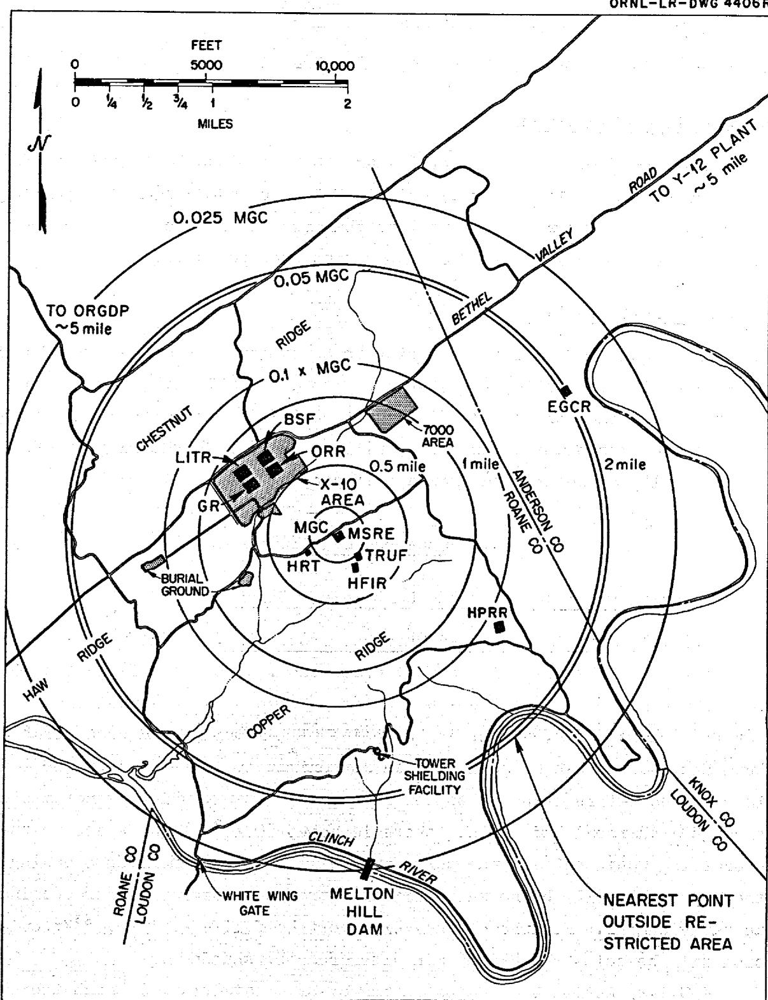  
Fig. 4.2. ORNL Area Map.

$$
V _ {S} = \text {s t a c k v e l o c i t y}, 4 7 f t / s e c,
$$

$$
Q = \text {s t a c k f l o w ,} 3 3 3 \mathrm {f t} ^ {3} / \sec .
$$

Thus the effective height is 100 ft + 63 ft = 163 ft = 50 m.

# 4.2.2 Air Contamination

Exposures from gaseous activity are to be limited to $10\%$ of the MPC for a 40-hr week. All activity emissions will be averaged for a quarter, although processing will require less than two weeks, because irradiated fuel will be processed less frequently than once per quarter.

# 4.2.3 Activity in Salt

The amounts of volatile activity to be expected in a fuel salt batch irradiated for one full-power year are listed in Table 4.3 for various decay times. When processing flush salt containing irradiated fuel salt, the required decontamination factor will be smaller by the ratio of flush to fuel salt, as determined from a salt sample.

# 4.3 Gaseous Activity

# 4.3.1 Activity Release from the Containment Stack

4.3.1.1 Activity Released When Not Processing. A fully irradiated fuel batch will be held in the fuel drain tank, with the off-gas passed to a charcoal bed, until the xenon emission cannot cause a radiation level in excess of $2.5 \, \text{mr/hr}$ at the point of maximum ground concentration. From Fig. 4.1 it can be seen that an approximately four-day decay period is required before transfer to the fuel storage tank, which is not vented through a charcoal bed. Since there is about $50 \, \text{ft}^3$ of gas space in the processing equipment and the purge rate will be low when not processing, there probably will be no xenon emission from the stack until processing actually begins. Because of the very short half life of $^{85}\text{Br}$ , $^{85}\text{Kr}$ emission will be below the MPC $30 \, \text{min}$ after reactor shutdown.

4.3.1.2 Activity Released During $\mathsf{H}_2$ -HF Treatment. Although there has been no work done on fission-product behavior under the highly reducing conditions of the $\mathsf{H}_2$ -HF treatment, very little if any fission-product volatilization is expected. All the fission products that could

Table 4.3. Volatile Activity in Fuel Salt Irradiated for One Full-Power Year   

<table><tr><td rowspan="2">Decay Period (days)</td><td colspan="2">Iodine</td><td colspan="5">Tellurium</td><td rowspan="2">95Nb</td><td rowspan="2">103Ru</td><td rowspan="2">125/127Sb</td></tr><tr><td>131</td><td>132</td><td>127m</td><td>127</td><td>129m</td><td>129</td><td>132</td></tr><tr><td>4</td><td>1.8 × 105</td><td>1.7 × 105</td><td>4.5 × 103</td><td>1.3 × 104</td><td>2.7 × 104</td><td>2.7 × 104</td><td>1.6 × 105</td><td>5.1 × 105</td><td>2.2 × 105</td><td>1.1 × 104</td></tr><tr><td>10</td><td>1.1 × 105</td><td>4.5 × 104</td><td>4.5 × 103</td><td>4.6 × 103</td><td>2.3 × 104</td><td>2.4 × 104</td><td>4.4 × 104</td><td>5.0 × 105</td><td>2.1 × 105</td><td>3.8 × 103</td></tr><tr><td>20</td><td>4.6 × 104</td><td>5.3 × 103</td><td>4.3 × 103</td><td>3.8 × 103</td><td>1.9 × 104</td><td>1.9 × 104</td><td>4.9 × 103</td><td>4.9 × 105</td><td>1.8 × 105</td><td>960</td></tr><tr><td>30</td><td>1.9 × 104</td><td>600</td><td>3.8 × 103</td><td>3.4 × 103</td><td>1.5 × 104</td><td>1.6 × 104</td><td>570</td><td>4.8 × 105</td><td>1.5 × 105</td><td>490</td></tr><tr><td>90</td><td>114</td><td></td><td>2.4 × 103</td><td>2.2 × 103</td><td>4.2 × 103</td><td>4.6 × 103</td><td></td><td>3.3 × 105</td><td>5.5 × 104</td><td>384</td></tr></table>

form volatile fluorides are more noble than the structural metals chromium, iron, and nickel. Nickel, which is the most noble of the structural metals will be limited to less than 1 ppm as NiF $_2$ with a 10:1 H $_2$ -to-HF ratio. Therefore, although no equilibrium quotients are available for the fission-product fluorides, it is unlikely that any niobium, ruthenium, antimony, tellurium, or iodine will exist in the salt as the fluoride. However, it is possible that H $_2$ Te and HI could form and become volatile. The activated charcoal trap should provide good decontamination from these activities.

The first treatment of salt containing fission products will be a treatment of flush salt containing some irradiated fuel salt. This treatment should provide the information needed for deciding on the required decay time for safe processing of a fully irradiated fuel batch. The activity release will be followed both by gas sampling and by radiation monitoring of the off-gas stream.

4.3.1.3 Activity Released During Fluorination. Since considerable volatilization of fission products is to be expected under the oxidizing conditions of fluorination, the maximum possible decay time should be allowed before processing. Based on Chemical Technology Division fluorination experience, decontamination factors of 1 for iodine (complete volatilization), 1 to 10 for tellurium, and 10 to $10^{3}$ for niobium, ruthenium, and antimony can be expected. From Table 4.2 it can be seen that the only fission product that requires much additional decontamination is iodine, and this should be obtained in the activated-charcoal trap. Additional decontamination from most fission products will be obtained by plateout in both the reactor and the fuel-processing system by the $750^{\circ}\mathrm{F}$ NaF trap, by the caustic scrubber, and by the filters.

Total release of the 114 curies of iodine present in the fuel after 90 days of decay, while considerably in excess of the 1 curie/week maximum release as determined by the grass-cow-milk-human chain, would result in an exposure of only 0.3 rem in 8 hr at the point of maximum ground concentration. This is only $3\%$ of the permissible exposure due to accidental or unusual releases.

4.3.1.4 Activity Released by Equipment Failure. Two possible accidents were considered. The first is the simultaneous rupture of the

fuel storage tank and the caustic scrubber, which would result in vaporization of the caustic solution and thereby pressurization of the cell. The second is a gas-space rupture during fluorination.

The simultaneous rupture of both the fuel storage tank and the caustic scrubber and contact of the two volumes could cause a rapid buildup of the cell pressure to approximately 100 psig by vaporizing the 1600 liters of caustic solution and releasing the associated activity to the building and up the stack. Contact is prevented by an 18-in.-high dam that divides the cell. The dam is sealed to the floor and to the north and south walls. The sump is on the aqueous side of the dam, and water lines routed over the salt side are provided with containment lines that drain to the aqueous side.

If there should be a rupture in the gas space of the fuel storage tank or in the off-gas piping or equipment upstream of the caustic scrubber, the most serious release would occur during fluorination when fission-product volatilization is expected to be greater and processing times shorter than during the $\mathrm{H}_{2}$ -HF treatment. If the activity is evolved uniformly over a 10-hr period, $2\%$ of the activity will be in the gas space at any one time. If shutdown requires 6 min, another $1\%$ would be evolved for a total of $3\%$ . Assuming 90 days decay and complete volatilization of tellurium, the exposure at the point of maximum ground concentration would be less than $3\%$ of the permissible quarterly exposure. Ruthenium and niobium releases would be of the same order if the releases occurred upstream of the NaF trap (because of lower volatilization) and would be much lower downstream of the NaF trap, which will provide considerable decontamination for these activities. These exposures are conservative, since much of the activity would plate out or be removed by the filters. The leak would be detected by both cell air monitors and fluoride ion monitors, and it seems reasonable that fluorine flow could be stopped within 6 min.

The causes of an equipment failure that have been considered are corrosion and criticality. Although corrosion rates as high as 0.5 mil/hr during fluorination are expected, the fluorination time will be short and processing will be infrequent, so the total corrosion will be small. Also, corrosion would probably not result in a complete rupture.

A criticality incident is conceivable only if there is a large breakthrough of $\mathrm{UF}_6$ to the caustic scrubber. The NaF trap and the absorbers are critically safe without internal moderation because of the maximum capacity of $0.9\mathrm{g}$ of uranium per gram of NaF. Fluorination will be stopped when uranium starts to load the final absorber, which will serve as a trap to retain any traces of uranium passing the other absorbers. Since absorption will be very rapid and complete, there will be no possibility of breakthrough of more than 1 or $2\mathrm{g}$ of uranium. Loading of the final absorber will be detectable by temperature rise. The fuel storage tank off-gas stream will pass directly from the NaF trap to the caustic scrubber during $\mathrm{H}_2$ -HF treatment when no uranium is being volatilized. This will require two physical changes in the piping to bypass the absorber train and connect the gas supply line to HF instead of $\mathbf{F}_2$ . Administrative control of these piping changes will guarantee that fluorine cannot be used when the absorbers are not in the system.

# 4.3.2 Activity Release to the Operating Area

The high-bay area above the fuel-processing cell will be used for operation of the fuel-processing system. The possible release of gaseous activity into this area during fuel processing through the roof plugs, from the absorber cubicle, from the salt sampler, and from lines penetrating the cell walls was considered. As in Section 4.3.1, the most serious release would be the release of tellurium during fluorination.

4.3.2.1 Activity Released Through the Roof Plugs. Leakage of activity from the fuel-processing cell to the operating area is not considered credible for the following reasons:

1. The cell is tightly sealed. All penetrations, piping, and wiring are grouted and sealed with mastic or pass through sealed boxes. The roof plugs are gasketed at the bearing surfaces, and the joints are caulked.   
2. A negative pressure of 1 in. of water will be maintained during processing. This pressure should be easily attainable considering the size and tightness of the cell. Air inleakage should be less than 500 ft³/min by comparison with a Volatility Pilot Plant cell 50% larger and having considerably more penetrations and maintaining a 2-in. negative

pressure with 300 to 500 ft³/min inleakage. The nominal exhaust from the processing cell will be 500 ft³/min, with 50 to 100 ft³/min of air entering the cell from the absorber cubicle during fluorination.

3. Processing can be quickly stopped. This would be done automatically in case of a power failure, which would close the shutoff valve on the gas supply $(\mathbb{F}_2,\mathbb{H}\mathbb{F},$ and $\mathbf{H}_2)$ . The power failure would also stop the flow of cooling air to the cubicle. This air exhausts to the cell and is the only positive gas flow to the cell. A loss of ventilation not caused by a general power failure is highly improbable since there is a spare stack fan and the fans can be run with diesel power. If the cell should lose its negative pressure, an alarm would sound and processing could be quickly suspended at the instrument panel board by shutting off the main helium purge, which automatically closes the gas supply shutoff valve, and closing the cooling air valve to the absorbers.

4.3.2.2 Activity Released from the Absorber Cubicle. The absorber cubicle is a sealed box of 3/16-in.-thick steel located near the instrument panel board in the high-bay area. It is located in the high-bay area to facilitate handling of the portable absorbers following fluorination. By means of the cubicle blower, the cubicle will be maintained at a negative pressure with respect to the cell, which will be negative to the high-bay area. Failure of power to the blower will close the solenoid valve in the air supply to the cubicle to avoid pressurization.

The maximum cubicle pressure with $100\text{-ft}^3/\text{min}$ air flow will be checked to demonstrate that a pressure greater than 1 psig cannot be obtained with the blower off. If necessary the maximum air flow will be reduced below $100\text{ft}^3/\text{min}$ to prevent exceeding 1 psig. Prior to fluorination the vent valve will be closed, the cubicle pressure will be raised to 1 psig, and the leak rate will be determined. Leakage must be less than $1\%/\text{hr}$ (220 cc/min). This rate of tellurium leakage would allow 14 min of working time in the high-bay area without masks. This is sufficient time to shut down and to evacuate the high-bay area, since the reactor will not be operating during fuel processing.

The presence of gaseous activity in the absorber cubicle will be detected by a monitor that will be continuously sampling the cubicle air during processing. If a leak occurs, processing can be suspended. The

cubicle will then be purged with air to the cell, the cubicle top will be removed, and all joints will be checked for tightness. Smears from each joint should indicate the location of the leak.

4.3.2.3 Activity Released from the Cell Penetrations. All cell penetrations connected directly to process equipment are provided with check valves, most of which are located in a sealed instrument cubicle along with the instrument transmitters. A backup of activity to the check valves would be detected by a radiation monitor in the cubicle and possibly by the area monitors in the high-bay area.

In addition to the lines routed through the instrument cubicle, there are three other penetrations from the cell to the high-bay area: the salt sampler, which is discussed in the next section, the salt-charging line, and the caustic-charging line. The salt-charging line will be sealed with at least one freeze valve and capped when not charging salt. The caustic-charging line to the caustic scrubber is provided with a check valve and a manual valve. Caustic will not be charged during processing, which would be the only time that pressure or activity could be found in the charging line.

The waste-salt line to the spare cell will be sealed by a freeze valve in the processing cell. The method of waste-salt disposal has not yet been determined.

4.3.2.4 Activity Released from the Salt Sampler. The fuel-processing system sampler, as mentioned in Section 3.4.6, is similar to the fuel-pump sampler-enricher. Both samplers have similar instrumentation and will be used with similar operating procedures. The fuel-storage tank will not be sampled during processing. Before sampling, the sampling line and fuel storage tank will be purged of gaseous activity. The sample capsule containing the solid sample will be moved from the primary containment area IC (see Fig. 3.13) to a secondary containment area 3A, where the sample will be sealed inside a transport container tube before being removed from the sampler to a shielded carrier.

# 4.4 Penetrating Radiation

# 4.4.1 Normal Levels

4.4.1.1 Operating Area. The radiation level in the high-bay area over the fuel-processing cell will be less than $10\mathrm{mr/hr}$ through the 4-ft-thick high-density-concrete roof plugs under the most severe conditions with a fully irradiated, four-day-decayed fuel salt batch in the fuel storage tank. Since processing would not be started until the batch had decayed for at least a few weeks, this level above the cell should cause no concern. Operations will be planned to limit exposure of individuals to less than $100\mathrm{mr/week}$ , and signs will be posted indicating radiation levels at various points in the high-bay area.

The salt sampler will be shielded with 4 in. of lead, which should reduce the radiation level from a fuel salt sample to less than $10 \, \text{mr/hr}$ .

It will probably be necessary to shield the absorber cubicle during processing of a fully irradiated fuel batch. As mentioned in Section 2.2.4, the maximum radiation level expected at the surface of each absorber is less than $100 \, \text{mr/hr}$ . In addition there will be some activity plated out on the piping and some gaseous activity in the lines and gas space during processing. The radiation levels will be monitored during processing, shielding will be added, and radiation signs will be posted as required. Permanent shielding will not be installed, since it should not be required during the more frequent $\mathsf{H}_2$ -HF treatment.

4.4.1.2 Switch House. The only fuel-processing cell wall adjacent to an occupied area is the west wall bordering the switch house. The 4-ft area between the switch house and the cell will be filled with stacked concrete blocks. When a fully irradiated fuel batch is in the storage tank, the level at the east wall of the switch house should be less than $5\mathrm{mr/hr}$ .

4.4.1.3 Spare Cell. The east wall of the fuel-processing cell adjoins the spare cell where the activated-charcoal trap, off-gas filters, dampers, differential-pressure transmitter, and hydrogen flame arrester are located. A blanked waste salt line extends into this cell for future removal of waste salt. Two feet of space is provided between the cell

wall and the above equipment for the installation of shielding blocks. This space will provide for sufficient shielding (a total of 3 l/2 ft) to permit replacing the off-gas filters without exceeding planned exposures. The dose rate should be less than 50 mr/hr.

4.4.1.4 Decontamination Cell. The 18-in. north wall of the fuel-processing cell borders the decontamination cell. Depending on the water level, there will probably be a limited working time over the decontamination cell with the roof plugs off and a fully irradiated batch in the fuel storage tank.

4.4.1.5 Area Surrounding the Waste Cell. The maximum activity expected in the caustic solution from the fluorination of a 90-day-decayed fuel batch is 1300 curies of tellurium, assuming $10\%$ removal in the scrubber. During the time this activity is in the liquid waste tank, there must be limited access to the areas above and around the waste cell, and radiation warning signs must be posted.

# 4.4.2 Unusual Radiation Levels

4.4.2.1 From Irradiated Salt. There are two dip tubes in the fuel storage tank into which salt could accidentally back up: the salt transfer line and the gas-sparging line. The salt transfer line is connected to the spare cell by the waste salt line and to the high-bay area by the salt-charging line. Both lines have freeze valves that are normally frozen. In addition, the end of each line will be capped when not in use.

The gas-sparging line passes through the area west of the cell to the instrument cubicle and then to the gas supply station. An air valve located in the instrument cubicle opens if the tank pressure exceeds the purge pressure and vents the line to the top of the tank to prevent salt backup. If a plug should occur, it could be thawed with installed electric heaters without entering the cell.

4.4.2.2 From Caustic Solution. The greatest activity expected in the caustic scrubber tank is from tellurium. Under the reducing conditions of the $\mathrm{H}_{2}$ -HF treatment, very little of the tellurium should reach the scrubber. During fluorination most of the tellurium will probably volatilize, but less than $10\%$ is expected to collect in the caustic

solution. In Volatility Pilot Plant run R-7, only $8\%$ of the tellurium was found in the scrubber, which is a much more efficient unit than the MSRE unit, which is designed primarily for the neutralization of HF. If all the tellurium in a fully irradiated fuel salt batch allowed to decay for 90 days were evolved during the first 8 hr of fluorination (first batch of caustic solution), and $10\%$ were removed in the scrubber, 1300 curies would be collected in about 350 gal of liquid. This is 3.7 curies/gal and could be sent to the intermediate level waste tanks at the Central Collection Station without dilution after being jetted to the MSRE liquid waste tank.

The solution could possibly get into unshielded lines in the following ways:

1. Pressuring of the scrubber tank during processing and plugging of the vent line or flame arrester could force liquid up the jet suction line to the waste tank, which is the normal disposal route for caustic solution and would create no hazard. Some solution might back up the jet steam line, but this line is shielded to approximately 25 ft from the jet and backup this far into a closed line is unlikely with an open line to the waste tank. The pressure alarms on both the fuel storage tank and the caustic scrubber would provide sufficient warning to stop processing before a dangerous pressure was reached.

2. Pressuring of the scrubber tank during jetting plus plugging of the vent line or flame arrester and plugging of the jet discharge line to the waste tank could cause steam to back up through the caustic solution. Considerable time would be required to build up sufficient pressure (7 psig) to force solution up the sparge line to the absorber cubicle. Pressure alarms and radiation monitors would provide warning far in advance of any hazard.

3. A vacuum in the jet line could pull solution into the steam line. If the jet discharge line should plug and jetting should stop, condensing steam could create such a vacuum. A check valve tees into the steam line and will prevent a vacuum from forming in this line. This check valve is vented to the cell ventilation system.

4. Cooling of the fuel storage tank without gas purges to the tank could cause a vacuum in the tank and off-gas piping to the scrubber. A

power failure could cause cooling of the tank but would not stop the helium purges. In the event of a prolonged power failure and cooling of the fuel storage tank, the caustic scrubber would be jetted to the waste tank.

4.4.2.3 From Radioactive Gas. The sampling line is the only gas line from the fuel storage tank to the operating area. Steps will be taken as indicated in Section 4.3.2.4 to keep gaseous activity out of the sampler. Sparging for 1 hr with helium should reduce the activity in the gas space by a factor of $10^{5}$ . Complete filling of the sampler access chamber with atmosphere from the fuel storage tank would result in a radiation level $10^{3}$ times less than that from a fully irradiated fuel salt sample.

# 5. OPERATING PROCEDURES

# Nomenclature

<table><tr><td>FFT</td><td>Fuel flush tank</td></tr><tr><td>FI</td><td>Flow indicator</td></tr><tr><td>FST</td><td>Fuel storage tank</td></tr><tr><td>FV</td><td>Freeze valve</td></tr><tr><td>HCV</td><td>Remotely operated valve</td></tr><tr><td>LIWT</td><td>Waste tank level indicator</td></tr><tr><td>MVWS</td><td>Melton Valley waste station</td></tr><tr><td>PCV</td><td>Pressure control valve</td></tr><tr><td>PdIAFPC</td><td>Fuel-processing cell differential-pressure indicator and alarm</td></tr><tr><td>PIA</td><td>Pressure indicator and alarm</td></tr><tr><td>PMS</td><td>Portable maintenance shield</td></tr><tr><td>PRA</td><td>Pressure recorder and alarm</td></tr><tr><td>V</td><td>Valve</td></tr></table>

# 5.1 $\mathbf{H}_2$ -HF Treatment

# 5.1.1 System Leak Test

# 5.1.1.1 Close System

1. Freeze FV 110. See Section 4I of MSRE Operating Procedures\*   
2. Freeze FV 111. Procedures\*   
3. Freeze FV 112.   
4. Close HCV 690.   
5. Close HCV 692.   
6. Close V 994 and check buffer gas pressure.   
7. Check leak detector flanges on HCV 692, HCV 694, and NaF trap.   
8. Close V 607A.   
9. Close V 608A.   
10. Close V 610A.

# 5.1.1.2 Apply Pressure and Test

1. Set PCV 530 to 20 psig.   
2. Open HCV 530.   
3. When PRA 608 stops rising, close HCV 530.   
4. Pressure should remain constant for 1 hr.   
5. If pressure falls, do the following to find the leak: a. Check end of line 692 in absorber cubicle for leaks. b. Check purge connections in instrument cubicle for leaks. c. Pressurize sampler-valve (V 994) buffer gas supply and note effect on system pressure.   
6. When system is leak free, thaw FV-110 (see Section 4I*) and determine that system is still leak free.   
7. If system leaks, leak check flange on line 111 and check temperatures on FV 107, 108, and 109.   
8. When system is leak-free, close HCV 530.

# 5.1.2 Absorber and Instrument Cubicle Preparation

# 5.1.2.1 Prepare and Test Piping in Cubicle

1. Connect line 692 to line 695 with ell.   
2. Close V 693.   
3. Install blind flange above V 693.   
4. Check the two flanges in line 692 and one flange in line 693 with the "local leak detector." Tighten flanges as required.

# 5.1.2.2 Leak Test Absorber Cubicle

1. Install gasketed cover on absorber cubicle.   
2. Close V 978 and install pipe cap over valve stem.   
3. Open V 970 and V 970B until pressure in cubicle reaches 27 in. $\mathbf{H}_2\mathbf{O}$   
4. Adjust V 970B to 220 cc/min.   
5. Pressure in cubicle should increase slowly. If this is the case, close V 970 and stop the test when the cubicle pressure reaches 30 in. $\mathbf{H}_2\mathbf{O}$

6. If the pressure remains steady, check that the pressure does not fall in $4\mathrm{hr}$ .   
7. If the pressure falls, check the tightness of the gasketed cover, valve cover, and valves to the radiation monitor. If the pressure still falls, soap test all joints until the leaks are found. Build pressure back up to 30 in. if necessary.

# 5.1.2.3 Leak Test Instrument Cubicle

1. Install gasketed cover on instrument cubicle.   
2. Make temporary tubing connection from the outlet of FI 970 to the test tap on the cubicle cover.   
3. Close V 979.   
4. Open V 970B until pressure in cubicle reaches 27 in. $\mathsf{H}_2\mathsf{O}$   
5. Adjust V 970B to 150 cc/min.   
6. Pressure in cubicle, as read on PdIAFPC, should increase slowly. If this is the case, close V 970B and stop the test when the cubicle pressure reaches 30 in. $\mathsf{H}_2\mathsf{O}$   
7. If the pressure remains steady, check that the pressure does not fall in $4\mathrm{hr}$ .   
8. If the pressure falls, soap test the cover and all penetrations to the cubicle.

# 5.1.3 System Preparation

# 5.1.3.1 Charge Caustic Scrubber

1. Add 89 gal of water to the 100-gal makeup tank.   
2. Add 25.3 gal of $45\%$ KOH from a 55-gal drum to the makeup tank.   
3. Mix with agitator for 10 min.   
4. Connect tank to line 313.   
5. Open V 313 and tank drain valve.   
6. Close valves and repeat steps 1 to 3 two times for a total addition of 343 gal of caustic.

# 5.1.3.2 Purge FST and Gas Piping

1. Open HCV 692.   
2. Open V 607A and set flow at 100 liters/min.   
3. When system has been purged for 2 hr, close V 607A.

# 5.1.3.3 Transfer Salt Batch to FST

1. Thaw FV 110 (see Section 4I*).   
2. Transfer salt batch (see Section lIA*).

# 5.1.3.4 Adjust Purge Gas Flows

1. Open V 607A and purge at 1 liter/min.   
2. Open V 608A and purge at 5 liters/min.

# 5.1.3.5 Adjust Temperatures

1. Adjust FST lower half temperatures to $1112 \pm 20^{\circ}\mathrm{F}$ .   
2. Adjust temperature of lines 691, 692, 694, 695, and 994 to 200 to $250^{\circ}\mathbf{F}$ .   
3. Adjust temperature of NaF trap to $750 \pm 20^{\circ}\mathrm{F}$ .   
4. Upper half heaters of FST should be off unless needed to maintain bottom temperature.   
5. Top heaters of FST should be turned on if necessary to keep temperature at line penetrations above $200^{\circ}\mathbf{F}$ .

# 5.1.3.6 Check Instrumentation

1. Flow indicator alarm and radiation monitors in off-gas stream should be in operation.   
2. Absorber and instrument cubicle radiation monitors should be in operation.

# 5.1.3.7 Start Up Cold Trap System

1. Turn on the refrigeration unit.   
2. Start brine recirculation pump.   
3. Adjust temperature of brine to maintain the specified temperature at the outlet of the cold trap.

# 5.1.4 Treatment

5.1.4.1 Sample Salt. The procedures for the fuel-pump sampler-enricher will be modified for this sampler. See Section 6A of MSRE Operating Procedures.*

# 5.1.4.2 Start Gas Flows

1. Connect $\mathbf{N}_2$ cylinders to $\mathbf{N}_2$ -SO $_2$ manifold and start $\mathbf{N}_2$ purge through $\mathbf{F}_2$ disposal system at 5 liters/min.   
2. Place 100-lb HF cylinder in water bath and connect to line 697. Wear face shield, rubber gloves, and apron.   
3. Open steam valve to water bath and adjust temperature controller to $100^{\circ}\mathrm{F}$ . HF cylinder must not be heated above $122^{\circ}\mathrm{F}$ , which is equivalent to the PIA set point of 25 psig.   
4. Turn on HF heater and adjust to 180 to $200^{\circ}\mathrm{F}$ .   
5. Connect $\mathbf{H}_2$ cylinders to manifold and adjust flow to 91 liters/min.   
6. Set FIC 696 at 9 liters/min. Check that HF temperature at flowmeter is $180^{\circ}\mathrm{F}$ . Water bath temperature controller can be raised to a maximum of $122^{\circ}\mathrm{F}$ if necessary to obtain the desired flow rate.

# 5.1.4.3 Treat Salt

1. Record all temperatures and adjust as required every 15 min.   
2. Record all gas flows and adjust as required every 15 min.   
3. When scrubber temperature begins to rise, turn water on line 842 and adjust to maintain scrubber temperature below $120^{\circ}\mathrm{F}$ .   
4. Record cold trap outlet temperature every 15 min.   
5. Check that siphon pot discharge line temperature is being recorded and each discharge is recorded. Frequency of discharges will decrease as treatment progresses.   
6. When molarity of caustic calculated from HF consumption falls to 0.35, stop $\mathbf{H}_2$ and HF flows, jet caustic to waste, charge fresh caustic, and resume treatment. A caustic batch should last for at least four days. The HF cylinder

will also last for approximately four days, so these can both be changed at the same shutdown.

7. When the time between siphons is greater than 1 hr (oxide removal rate less than $2\mathrm{ppm / hr}$ ), heat the upper half and top of the FST to $1000^{\circ}\mathrm{F}$ .   
8. If the siphon rate does not increase in the next hour, turn off the HF flow.   
9. Stop the brine circulation pump and turn off the refrigeration unit.

# 5.1.4.4 Iron Reduction

1. Raise the temperature at the bottom of the FST to $1300 \pm 20^{\circ} \mathrm{F}$ .   
2. Continue the $\mathbf{H}_2$ flow at the normal rate (91 liters/min).   
3. Sample salt every 8 hr until sample analyzes less than 10 ppm iron.   
4. Stop $\mathbf{H}_2$ flow.   
5. Close V 698C in nitrogen line.   
6. Open V 698D and increase nitrogen flow to 50 liters/min.   
7. Again raise temperature of the upper half and top of the FST to $1000^{\circ}\mathbf{F}$ .   
8. After 8 hr, stop the nitrogen flow.   
9. Take final salt samples.

# 5.1.4.5 Shutdown System

1. Turn heat off lines 691, 692, 694, 695, and 994.   
2. Turn off water to line 842.   
3. Jet caustic solution to waste tank.   
4. Turn off steam to HF cylinder heater and disconnect cylinder.   
5. Turn off heat to HF gas heater.   
6. Turn off $\mathbf{H}_2$ flow and disconnect cylinder.   
7. Turn heat off NaF trap.

# 5.1.5 Liquid Waste Disposal

# 5.1.5.1 Radiation Level Monitoring

1. Monitor radiation levels at west and north walls and above liquid waste cell as soon as caustic batch has been jetted to the waste tank.   
2. Post radiation level signs if level exceeds 3 mrem/hr.

# 5.1.5.2 Liquid Waste Sampling

1. Close v 302.   
2. Close V 303B.   
3. Close V 305A.   
4. Close V 305B.   
5. Open V 301.   
6. Open V 300.   
7. Start waste pump and circulate waste solution for 1 hr.   
8. Check radiation level at waste pump. If level does not exceed 100 mrem/hr take two 5-ml samples by carefully opening V 305B. This must be done with Health Physics surveillance when activity is present.   
9. If waste solution is acidic, calculate required causticsolution and neutralize with caustic through line 313.

5.1.5.3 Liquid Waste Dilution. If activity level is greater than 10 curies/gal, water must be added to the liquid waste tank to reduce the activity to this level. If the activity level is too great to permit sampling, dilute to 4000 gal. This should be sufficient to bring the activity level well below 10 curies/gal for the expected activities from a fully irradiated fuel batch decayed for 90 days.

1. Stop waste pump.   
2. Open V 306A.   
3. Open V 307.   
4. Close V 300.   
5. Close V 306B.   
6. Record waste tank level on LIWT.

7. Open V 819A and V 819B.   
8. When LIWT indicates that the required amount of water has been added, close V 819A and V 819B.

# 5.1.5.4 Transfer to Melton Valley Waste Station

1. Contact the Operations Division Waste Disposal Operator and get approval for the waste transfer. Do not proceed until approval has been obtained.   
2. Open V 305A.   
3. Close V 301.   
4. Close V 307.   
5. Open V 300.   
6. Start waste pump. Health physics personnel should be on hand during this transfer. Area above and around waste pump cell should be checked for unusual radiation levels.   
7. Continue pumping until LIWT indicates the tank is empty and the discharge pressure on the pump reads approximately zero.   
8. If necessary to flush the line to the MWs, this can be done by opening V 303A and V 303B.   
9. Stop the waste pump.   
10. Close V 305A.   
11. Close V 300.

# 5.2 Uranium Recovery

# 5.2.1 System Leak Test

# 5.2.1.1 Close System

1. Freeze FV 110. See Section 4I of MSRE Operating Procedures\*   
2. Freeze FV 111. Procedures\*   
3. Freeze FV 112.   
4. Close HCV 690.   
5. Close HCV 692.   
6. Close V 994 and check buffer gas supply.

7. Check leak detector flanges on HCV 692, HCV 694, and NaF trap and tighten if required.   
8. Close V 607A.   
9. Close V 608A.   
10. Close V 610A.

# 5.2.1.2 Apply Pressure and Test

1. Set PCV 530 to 20 psig.   
2. Open HCV 530.   
3. When PRA 608 stops rising, close HCV 530.   
4. Pressure should remain constant for 1 hr.   
5. If pressure falls, do the following to find the leak:

a. Check end of line 692 in absorber cubicle.   
b. Check purge connections in instrument cubicle.   
c. Pressurize sampler-valve buffer gas supply and note effect on system pressure.

6. When system is leak free, thaw FV-ll0 and determine that system is still leak free.   
7. If system leaks, check flange on line 111 and FV 107, 108, and 109.   
8. When system is leak free, close HCV 530.

# 5.2.2 Absorber and Instrument Cubicle Preparation

# 5.2.2.1 Install Absorbers

1. Pretreat 70 to $120\mathrm{kg}$ of NaF pellets by heating to $750^{\circ}\mathrm{F}$ for 1 hr with $\mathbf{N}_2$ purge. Use portable salt-charging furnace.   
2. Load each absorber with 14 to $24\mathrm{kg}$ of NaF pellets, depending on type salt being processed.   
3. Install absorbers in absorber containers in cubicle.   
4. Check air flow to each absorber.   
5. Insert thermocouple in each absorber.   
6. Connect jumpers and piping to absorbers.   
7. Blank flange on line 695.   
8. Connect heaters and check insulation on piping in cubicle.   
9. Turn on heat and check heaters and thermocouples.

# 5.2.2.2 Leak Test Absorber Piping

1. Check all flanges in cubicle with "local leak detector."   
2. Close V 693.   
3. Open HCV 692.   
4. Set PCV 530 to 20 psig.   
5. Open HCV 530.   
6. When PRA 608 stops rising, close HCV 530.   
7. Pressure should remain constant for 1 hr.   
8. If pressure falls, soap check all joints.   
9. Open V 693.

# 5.2.2.3 Leak Test Absorber Cubicle

1. Install gasketed cover on absorber cubicle.   
2. Close V 978 and install pipe cap over valve stem.   
3. Open V 970 and V 97OB until pressure in cubicle reaches 27 in. $\mathbf{H}_2\mathbf{O}$   
4. Adjust V 970B to 200 cc/min.   
5. Pressure in cubicle should increase slowly. If this is the case, close V 970 and stop the test when the cubicle pressure reaches 30 in. $\mathbf{H}_2\mathbf{O}$   
6. If the pressure remains steady, check that pressure does not fall in $4\mathrm{hr}$ .   
7. If the pressure falls, check the tightness of the gasketed cover, valve cover, and valves to the radiation monitor. If the pressure still falls, soap test all joints until the leaks are found. Build pressure back up to 30 in. if necessary.

# 5.2.3 System Preparation

# 5.2.3.1 Charge Caustic Scrubber

1. Add 89 gal of water to the 100-gal makeup tank.   
2. Add 25.3 gal of $45\%$ KOH from a 55-gal drum to the makeup tank.   
3. Mix with agitator for 10 min.

4. Connect tank to line 313.   
5. Open V 313 and tank drain valve.   
6. Close valves and repeat steps 1 to 3 two times for a total of 343 gal of caustic.

# 5.2.3.2 Purge FST and Gas Piping

1. Open HCV 692.   
2. Open V 607A and set flow at 100 liters/min.   
3. When system has been purged for 2 hr, close V 607A.

# 5.2.3.3 Transfer Salt Batch to FST (omit if fluorine conditioning)

1. Thaw FV 110 (see Section 4I*).   
2. Transfer salt batch (see Section 11A*).

# 5.2.3.4 Adjust Purge Gas Flows

1. Open V 607A and set flow at 1 liter/min.   
2. Open V 608A and set flow at 5 liters/min.

# 5.2.3.5 Adjust Temperatures (omit if fluorine conditioning)

1. Adjust FST bottom temperatures to $835 \pm 20^{\circ}\mathrm{F}$ ( $900 \pm 20^{\circ}\mathrm{F}$ if the salt is flush salt).   
2. Adjust HF trap inlet temperature to $212^{\circ}\mathrm{F}$ and exit to $80^{\circ}\mathrm{F}$ .   
3. Adjust temperature of lines 691, 692, 694, and 994 and lines in absorber cubicle to 200 to $250^{\circ}\mathbf{F}$ .   
4. Adjust temperature of NaF trap to $750 \pm 20^{\circ}\mathrm{F}$ .   
5. Upper half heaters of FST should be off unless needed to maintain bottom temperatures.   
6. Top heaters on FST should be turned on if necessary to keep temperature at line penetrations above $200^{\circ}\mathrm{F}$ .

# 5.2.3.6 Check Instrumentation

1. Radiation monitors in off-gas stream should be in operation.   
2. Absorber and instrument cubicle radiation monitors should be in operation.

# 5.2.3.7 Prepare Fluorine Disposal System

1. Turn heat on $\mathbf{SO}_2$ and $\mathbf{F}_2$ preheaters and adjust to $400^{\circ}\mathbf{F}$ .   
2. Open steam valve to $\mathbf{F}_2$ reactor.   
3. Connect four $\mathsf{SO}_2$ cylinders to manifold.

# 5.2.4 Fluorine Conditioning

The system must be treated with fluorine before fluorination and before the system is radioactive. The purpose is to prevent fluorine from contacting grease and causing a leak during processing. If radioactive salt is to be treated with $\mathrm{H}_{2}$ -HF before fluorination, the system should be conditioned prior to that treatment. The fluorine disposal system will also be checked out at this time.

# 5.2.4.1 Sample Caustic Solution

1. Disconnect Monel liquid level tube west of cell and make temporary connection to vacuum pump through large sample bottle ( $\sim 500$ cc).   
2. Start pump and pull approximately 100 cc of KOH into bottle.   
3. Stop pump and reconnect line to level instrument.

# 5.2.4.2 Adjust Temperatures

1. Adjust FST heaters to 200 to $250^{\circ}\mathrm{F}$ at all FST temperature-measuring points.   
2. Adjust HF trap inlet temperature to $212^{\circ}\mathrm{F}$ and exit to $80^{\circ}\mathrm{F}$ .   
3. Adjust temperature of lines 691, 692, 694, and 994 and lines in absorber cubicle to 200 to $250^{\circ}\mathrm{F}$ .   
4. Adjust temperature of NaF trap to 200 to $250^{\circ}\mathrm{F}$ .

# 5.2.4.3 Start $\mathbf{SO}_2$ Flow

1. Open V 698A and set PCV 698 to 20 psig.   
2. Open V 698C and adjust V 698B to flow rate of 6.6 liters/min (5% excess).   
3. Check $\mathbf{SO}_2$ preheater temperature and maintain at $400^{\circ}\mathbf{F}$ .

5.2.4.4 Start Fluorine and Helium Flows

1. Connect fluorine trailer.   
2. Open fluorine trailer valves.   
3. Adjust V 607B for helium flow rate of 13.75 liters/min.  
V 608B is still adjusted for 5 liters/min.   
4. Open V 690A and V 690B. Adjust PCV 690 for fluorine flow of 6.25 liters/min.   
5. Check fluorine preheater temperature and maintain at $400^{\circ}\mathbf{F}$ .   
6. Adjust steam flow to fluorine reactor if necessary to keep temperature below $1000^{\circ}\mathrm{F}$ .   
7. Continue flow for 8 hr, and sample caustic solution (see Sect. 5.2.4.1). Analyze for $\mathbf{F}^{-}$ , $\mathbf{SO}_4^{2-}$ , and KOH molarity.

5.2.4.5 Increase Fluorine Concentration to $50\%$

1. Adjust V 607B for helium flow rate of 7.5 liters/min.   
2. Adjust V 698B for $\mathbf{SO}_2$ flow rate of 13.2 liters/min.   
3. Adjust PCV 690 for fluorine flow rate of 12.5 liters/min.   
4. Maintain preheater temperatures at $400^{\circ}\mathrm{F}$ .   
5. Continue flow for 8 hr, and sample caustic solution.

5.2.4.6 Increase Fluorine Concentration to $75\%$

1. Adjust V 607B for helium flow rate of 1.25 liters/min.   
2. Adjust V 698B for $\mathbf{SO}_2$ flow rate of 19.7 liters/min.   
3. Adjust PCV 690 for fluorine flow rate of 18.75 liters/min.   
4. Maintain preheater temperatures at $400^{\circ}\mathrm{F}$ .   
5. Continue flow for 8 hr and sample caustic solution.

5.2.4.7 Increase Fluorine Concentration to $100\%$

1. Adjust V 607B and V 608B for helium flow rates of l liter/min each.   
2. Adjust V 698B for $\mathbf{SO}_2$ flow rate of 52.25 liters/min.   
3. Adjust PCV 690 for fluorine flow rate of 50 liters/min.   
4. Maintain preheater temperatures at $400^{\circ}\mathbf{F}$ .   
5. Continue flow for 4 hr and sample caustic solution.   
6. Adjust V 698B for $\mathbf{SO}_2$ flow rate of 100 liters/min.

7. Adjust PCV 690 for fluorine flow rate of 95 liters/min.   
8. Maintain preheater temperatures at $400^{\circ}\mathrm{F}$ .   
9. Continue flow for 4 hr, close V 690A, and sample caustic solution.

# 5.2.4.8 Shutdown System

1. Adjust V 607B for helium flow rate of 50 liters/min.   
2. Adjust V 608B for helium flow rate of 5 liters/min.   
3. Continue $\mathbf{SO}_2$ flow for 1 hr after increasing helium flows.   
4. Close V 698A.   
5. Continue helium flows for one more hour.   
6. Close V 607A and V 608A.   
7. Close fluorine trailer valves.   
8. Disconnect fluorine trailer.   
9. Jet caustic solution to liquid waste tank.

# 5.2.5 Fluorination

# 5.2.5.1 Start Fluorine Flow

1. Connect fluorine trailer.   
2. Open fluorine trailer valves.   
3. Open V 690A and V 690B.   
4. Set PCV 690 for flow rate of 100 liters/min.

# 5.2.5.2 Fluorinate

1. Start of $\mathbf{U}\mathbf{F}_6$ evolution is detected by a temperature rise in the first absorber. At this time, do the following:

a. Open V 970 to cool first absorber. Keep temperature as low as possible by increasing air flow. Reduce fluorine flow if temperature reaches $300^{\circ}\mathrm{F}$ .   
b. Start $\mathbf{SO}_2$ flow by opening V 698A, V 698B, and V 698C. Adjust PCV 698 for flow of 50 liters/min.   
c. Check $\mathbf{SO}_2$ and $\mathbf{F}_2$ preheater temperatures and maintain at $400^{\circ}\mathbf{F}$ .

2. Fluorine breakthrough is detected by a temperature rise in the fluorine reactor. At this time, do the following:

a. Reduce fluorine flow rate to 50 liters/min.   
b. Start helium flow to FST by opening V 607A and adjusting V 607B to 50 liters/min.   
c. Turn steam to fluorine reactor on full. Reduce pre-heater temperatures slightly if necessary to keep reactor temperature below $1000^{\circ}\mathbf{F}$ .

3. Follow $\mathbf{U}\mathbf{F}_{6}$ absorption by absorber temperatures. As absorption starts in second absorber, turn air on the second absorber and off the first absorber. Continue in this manner until there is no heat of reaction in the absorbers. If fuel containing low-enrichment uranium or thorium is being processed, five absorbers will not have sufficient capacity for all the uranium, and fluorination will have to be suspended to install new absorbers. When processing salt B this will not be necessary and steps (12) to (18) can be eliminated.

4. When the temperature starts to increase in the last absorber, stop the fluorine flow by closing PCV 690.   
5. Adjust V 607B to 100 liters/min helium sparge for 1 hr. Then close V 607A.   
6. Close V 970, 971, 972, 973, and 974 to stop air flow to the absorber cubicle.   
7. Close V 698A to stop $\mathrm{SO}_2$ flow.   
8. After 15 min, check radiation monitors to see that there is no leak into the absorber cubicle. If activity is present, open V 970 and purge cubicle until there is no air activity in the cubicle.   
9. Close V 608A.   
10. Turn off heat to lines in cubicle.   
11. Remove absorbers (see Sect. 5.2.7).   
12. Install new absorbers (see Sect. 5.2.2).

13. Prepare system to resume fluorination (see Sect. 5.2.3). Certain of these steps, such as transfer of salt, will not be necessary.   
14. Resume fluorination (see Sects. 5.2.5.1 and 5.2.5.2).   
15. When there is no more indication of absorber heating, stop the fluorine flow by closing PCV 690.   
16. Turn off $\mathsf{SO}_2$ flow by closing V 698A.

5.2.5.3 Sample Salt. Since a fluorine trailer will only last 2 hr at 100 liters/min, it will be necessary to stop fluorination before all the $\mathrm{UF_6}$ is volutilized. The salt will be sampled every 2 hr while the trailer is being changed to check on the progress of fluorination. At alternate trailer changes (every 4 hr), it will be necessary to jet the caustic solution to the waste tank and charge fresh caustic.

1. Close PCV 690.   
2. Close V 690A and V 690B.   
3. Adjust V 607B to 100 liters/min helium sparge for 1 hr.   
4. Close V 607B and sample salt (see Section 6A of MSRE operating procedures*).   
5. When uranium concentration is less than 25 ppm, heat the top half and top of the FST to $900^{\circ}\mathrm{F}$ and fluorinate for an additional 30 min.   
6. Stop fluorine flow and repeat helium sparge for 1 hr and resample.   
7. If sample shows less than 15 ppm uranium, the fluorination is complete.   
8. Check sample for free fluorine. Continue helium sparge until below limit of detection.

# 5.2.5.4 Shutdown System

1. Close V 607A, 608A, and 609A.   
2. Open V 312 and jet caustic to waste tank.   
3. Vent fluorine lines at trailer.   
4. Disconnect fluorine trailer and return to K-25.

5. Disconnect $\mathbf{SO}_2$ cylinders.   
6. Turn heat off lines 691, 692, 694, and 994 and lines in absorber cubicle.

# 5.2.6 Waste Salt Disposal

The method of disposal of waste salt has not yet been decided. This procedure will be written some time in the future.

# 5.2.7 Absorber Removal

# 5.2.7.1 Check Cubicle

1. Check that there is no air activity as shown by air monitor.   
2. Check gamma radiation at cubicle and get permissible working time from health physics personnel.

# 5.2.7.2 Open Cubicle

1. With health physics personnel present, remove cover from cubicle.   
2. Check gamma radiation level at contact with absorbers.   
3. Get alpha smears around disconnect joints.

# 5.2.7.3 Remove Absorbers

1. Disconnect heaters.   
2. Remove thermocouples.   
3. Close HCV 692.   
4. Close V 693.   
5. Disconnect jumpers and lines to absorbers.   
6. Blank the flanges on absorbers and check with "local leak detector."   
7. Remove absorbers from absorber containers and bag in plastic after a smear test for alpha activity.   
8. If necessary clean outside of absorbers before bagging.   
9. Ship absorbers to the Volatility Pilot Plant for uranium recovery.

# 5.2.8 Liquid Waste Disposal

# 5.2.8.1 Radiation Level Monitoring

1. Check radiation levels at west and north walls and above liquid waste cell as soon as the caustic batch has been jetted to the waste tank.   
2. Post radiation level signs where necessary.

# 5.2.8.2 Liquid Waste Sampling

1. Close V 302.   
2. Close V 303B.   
3. Close V 305A.   
4. Close V 305B.   
5. Open V 301.   
6. Open V 300.   
7. Start waste pump and circulate waste for 1 hr.   
8. Check radiation level at pump. If level is not too high, take two 5-ml samples by carefully opening V 305B. This must be done with health physics personnel surveillance when activity is present.   
9. If waste solution is acidic, neutralize by adding the calculated amount of caustic through line 313.

5.2.8.3 Liquid Waste Dilution. If activity level is greater than 10 curies/gal, add water to the liquid waste tank to reduce the activity to this level. If the activity level is too great to permit sampling, dilute to 4000 gal. This should be sufficient to bring the activity level well below 10 curies/gal for the expected activities from a fully irradiated fuel batch decayed for 90 days.

1. Stop waste pump.   
2. Open V 306A.   
3. Open V 307.   
4. Close V 300.   
5. Close V 306B.   
6. Record waste tank level on LIWT.

7. Open V 819A and V 819B.   
8. When LIWT indicates that the required amount of water has been added, close V 819A and V 819B.

# 5.2.8.4 Transfer to Melton Valley Waste Station

1. Contact the Operations Division Waste Disposal Operator and get approval for the waste transfer. Do not proceed until approval has been obtained.   
2. Open V 305A.   
3. Close V 301.   
4. Close V 307.   
5. Open V 300.   
6. Start waste pump. Health physics personnel should be on hand during this transfer. Area above and around waste pump cell should be checked for unusual radiation levels.   
7. Continue pumping until LIWT indicates the tank is empty and the discharge pressure on the pump reads approximately zero.   
8. If necessary to flush the line to the MWs, this can be done by opening V 303A and V 303B.   
9. Stop the waste pump.   
10. Close V 305A.   
11. Close V 300.

# 5.3 Equipment Decontamination

# 5.3.1 Summary

As mentioned in Section 3.2, the MSRE fuel-processing system is designed for direct maintenance after decontamination, except for a few remotely maintainable items, such as the two air-operated valves and the NaF trap.

Decontamination will consist of:

1. Flushing of the salt lines and FST with flush salt if the last operation was with fuel salt.   
2. Displacing the salt in the freeze valves with clean salt.

3. Connecting salt line 112 to the caustic scrubber for liquid waste disposal.   
4. Treatment of the salt system with ammonium oxalate solution for salt film removal.   
5. Treatment of the salt system with nitric acid-aluminum nitrate solution for metal film removal.   
6. Treatment of the gas system with alkaline peroxide tartratesolution for decontamination.

Progress will be followed by liquid samples and radiation surveys through the portable maintenance shield.

# 5.3.2 Preparation for Decontamination

# 5.3.2.1 Salt Flushing

1. Heat FST and salt lines to $1200^{\circ}$ F.   
2. Transfer flush salt batch to FST.   
3. Transfer flush salt batch to FFT.   
4. Charge can of flush salt (nat. Li) through line 111.   
5. Connect waste salt can to line 112 in spare cell.   
6. Transfer salt from FST to waste salt can.

# 5.3.2.2 Remove NaF Trap

1. Install PMS over plug No. 5.   
2. Disconnect pipe jumpers, thermocouples, and electric leads on NaF trap.   
3. Remove NaF trap.   
4. Install connecting jumper between upper flanges.

# 5.3.2.3 Radiation Survey

1. Check radiation levels through PMS with long handled probe. Locate major sources of activity.   
2. Move PMS to plug No. 4 if necessary.

# 5.3.2.4 Liquid Waste Line

1. Remove can connector from end of line 112 in spare cell.   
2. Remove activated charcoal trap.

3. Connect line 112 to line 628 to caustic scrubber with temporary 1/2-in. Inconel pipe.   
4. Blank line 628 to duct 940.

# 5.3.3 Oxalate Treatment

# 5.3.3.1 Oxalate Charging

1. Prepare seven 115-gal batches of $0.5\mathrm{M}$ ammonium oxalatesolution in the caustic makeup tank.   
2. Heat FST and salt lines to $200^{\circ}\mathrm{F}$   
3. Add oxalate to FST through line 111.

# 5.3.3.2 Oxalate Treatment

1. Sparge FST with $\mathbf{N}_2$ at 100 liters/min for 4 hr.   
2. Sample solution and check for gross gamma activity (c/min·ml).   
3. Continue sparging for 4 hr more and sample.   
4. If there is no appreciable increase in activity in the sample, pressure solution to caustic scrubber in three 1000-liter batches and jet to the liquid waste tank.   
5. If sample activity increases, continue sparging and sampling until activity levels off.

5.3.3.3 Radiation Survey. Repeat radiation survey as in Section 5.2.2.3 and compare readings. If salt system has highest readings proceed to Section 5.3.5, if gas system has highest readings proceed to Section 5.3.4.

# 5.3.4 Alkaline Peroxide Tartrate Treatment

# 5.3.4.1 Solution Charging

1. Prepare six 115-gal batches of 10 wt % NaOH-2.5 wt % H₂O₂-10 wt % sodium tartrate in the caustic makeup tank.   
2. Connect charging line to flange upstream of V 693 in absorber cubicle and charge two batches to the caustic scrubber at room temperature.

3. Change charging line to line 695 and charge two additional batches.   
4. Jet solution to liquid waste tank.   
5. Connect charging line to line 692 in absorber cubicle and charge two batches.   
6. Pressure from FST to scrubber and jet to waste tank.

# 5.3.4.2 Radiation Survey

1. Repeat radiation survey as in Section 5.2.2.3 to determine the efficiency of the tartrate treatment.   
2. From readings decide on repeating tartrate treatment or using nitric acid-aluminum nitrate treatment of salt system (Sect. 5.3.5).

# 5.3.5 Nitric Acid-Aluminum Nitrate Treatment

# 5.3.5.1 Solution Charging

1. Prepare seven 115-gal batches of 5 wt % HNO₃-5 wt % Al(NO₃)₃ solution in the caustic makeup tank.   
2. Heat FST and salt lines to $200^{\circ}\mathrm{F}$ .   
3. Add solution to FST through line 111.

# 5.3.5.2 Nitrate Treatment

1. Sparge FST with $\mathbf{N}_2$ at 100 liters/min for 1 hr.   
2. Sample solution and analyze for gross gamma activity.   
3. Continue sparging and sampling until activity levels off.   
4. Pressure solution to caustic scrubber.   
5. Neutralize with KOH.   
6. Jet to waste tank.

5.3.5.3 Radiation Survey. Repeat radiation survey to determine the need for continued decontamination and the major sources of activity.

# References

1. Reactor Chemistry Division Annual Progress Report for Period Ending Jan. 31, 1965, USAEC Report ORNL-3789, Oak Ridge National Laboratory (in preparation).   
2. L. E. McNeese, An Experimental Study of Sorption of Uranium Hexafluoride by Sodium Fluoride Pellets and a Mathematical Analysis of Diffusion with Simultaneous Reaction, USAEC Report ORNL-3494, p. 82, Oak Ridge National Laboratory, November 1963.   
3. R. L. Jolley et al., Equipment Decontamination Methods for the Fused Salt-Fluoride Volatility Process, USAEC Report ORNL-2550, Oak Ridge National Laboratory, August 1958.   
4. Letter from J. H. Westsik to R. B. Briggs on Natural Convection Cooling of MSRE Drain Tanks, May 21, 1962.   
5. R. C. Robertson, MSRE Design and Operations Report, Part I, Description of Reactor Design, USAEC Report ORNL-TM-728, p. 244, Oak Ridge National Laboratory, January 1965.   
6. Letter from D. M. Davis to F. R. Bruce on Maximum Values for Planned Releases of 131I, May 19, 1964.   
7. U.S. Department of Commerce Weather Bureau, Meteorology and Atomic Energy, USAEC Report AECU-3066, July 1955.   
8. F. A. Gifford, U.S. Weather Bureau, Oak Ridge, Tennessee, personal communication to L. A. Mann, Oak Ridge National Laboratory, Jan. 27, 1961.

# Internal Distribution

1. R. K. Adams   
2. R.G.Affel   
3. G.W. Allin   
4. A. H. Anderson   
5. R.F.Apple   
6. C.F.Baes   
7. S.J.Ball   
8. S.E.Beall   
9. M. Bender   
10. E. S. Bettis   
11. F. F. Blankenship   
12. R. Blumberg   
13. A. L. Boch   
14. E.G. Bohlmann   
15. C. J. Borkowski   
16. H. R. Brashear   
17. R. B. Briggs   
18. G. H. Burger   
19. J. A. Conlin   
20. W.H.Cook   
21. I. T. Corbin   
22. W. B. Cottrell   
23. J. L. Crowley   
24. D.G.Davis   
25. G. Dirian   
26. S. J. Ditto   
27. F. A. Doss   
28. J.R. Engel   
29. E.P.Epler   
30. A. P. Fraas   
31. E. N. Fray   
32. H. A. Friedman   
33. C. H. Gabbard   
34. M. J. Gaitanis   
35. R. B. Gallaher   
36. J. J. Geist   
37. W.R.Grimes   
38. A.G.Grindell   
39. R. H. Guymon   
40. S. H. Hanauer   
41. P. H. Harley   
42. P. N. Haubenreich   
43. G.M. Hebert   
44. P. G. Herndon   
45. V. D. Holt   
46. A. Houtzeel

47. T. L. Hudson   
48. R. J. Kedl   
49. S. S. Kirslis   
50. D. J. Knowles   
51. A. I. Krakoviak   
52. J. W. Krewson   
53. C. E. Larson   
54. R. B. Lindauer   
55. M. I. Lundin   
56. R. N. Lyon   
57. H. G. MacPherson   
58. C. D. Martin   
59. H.C. McCurdy   
60. W. B. McDonald   
61. H. F. McDuffie   
62. C. K. McGlothlan   
63. H. J. Metz   
64. A. J. Miller   
65. W.R.Mixon   
66. R. L. Moore   
67. H. R. Payne   
63. A.M.Perry   
69. H.B.Piper   
70. B. E. Prince   
71. J. L. Redford   
72. M. Richardson   
73. H.C.Roller   
74. M. W. Rosenthal   
75. T. H. Row   
76. H.W. Savage   
77. A.W. Savolainen   
78. D. Scott, Jr.   
79. J.H.Shaffer   
80. E. G. Silver   
81. M. J. Skinner   
82. T. F. Sliski   
83. A.N. Smith   
84. P.G. Smith   
35. I. Spiewak   
86. R.C. Steffy   
37. H. H. Stone   
38. H. J. Stripling   
89. A. Taboada   
90. J.R.Tallackson   
91. R. E. Thoma   
92. G. M. Tolson

93. D. B. Trauger

99. G. D. Whitman

94. W.C. Ulrich

100. H. D. Wills

95. B.H. Webster

101-102. Central Research Library

96. A. M. Weinberg

103-104. Y-12 Document Reference Section

97. K.W. West

105-109. Laboratory Records Department

98. J. C. White

110. Laboratory Records, RC

# External Distribution

111. Research and Development Division, AEC, ORO   
112-113. Reactor Division, AEC, ORO   
114-128. Division of Technical Information Extension, DTFE