# OAK RIDGE NATIONAL LABORATORY

operated by

# UNION CARBIDE CORPORATION

# NUCLEAR DIVISION

for the

U.S. ATOMIC ENERGY COMMISSION

UNION CARBIDI

ORNL-TM-907 Revised

COPY NO. - 112

DATE - December 28, 1967

MSRE DESIGN AND OPERATIONS REPORT

PART VII

FUEL HANDLING AND PROCESSING PLANT

R.B.Lindauer

# LEGAL NOTICE

This report was prepared as an account of Government sponsored work. Neither the United States, nor the Commission, nor any person acting on behalf of the Commission:

A. Makes any warranty or representation, expressed or implied, with respect to the accuracy, completeness, or usefulness of the information contained in this report, or that the use of any information, apparatus, method, or process disclosed in this report may not infringe privately owned rights; or   
B. Assumes any liabilities with respect to the use of, or for damages resulting from the use of any information, apparatus, method, or process disclosed in this report.

As used in the above, "person acting on behalf of the Commission" includes any employee or contractor of the Commission, or employee of such contractor, to the extent that such employee or contractor of the Commission, or employee of such contractor prepares, disseminates, or provides access to, any information pursuant to his employment or contract with the Commission, or his employment with such contractor.

# PREFACE

This report is one of a series that describes the design and operation of the Molten Salt Reactor Experiment. All the reports have been issued with the exceptions noted.

ORNL-TM-728 MSRE Design and Operations Report, Part I, Description of Reactor Design by R. C. Robertson   
ORNL-TM-729* MSRE Design and Operations Report, Part II, Nuclear and Process Instrumentation, by J. R. Tallackson   
ORNL-TM-730 MSRE Design and Operations Report, Part III Nuclear Analysis, by P. N. Haubenreich, J. R. Engel, B. E. Prince, and H. C. Claiborne   
ORNL-IM-731** MSRE Design and Operations Report, Part IV, Chemistry and Materials, by F. F. Blankenship and A. Taboada   
ORNL-TM-732 MSRE Design and Operations Report, Part V, Reactor Safety Analysis Report, by S. E. Beall, P. N. Haubenreich, R. B. Lindauer, and J. R. Tallackson   
ORNL-TM-2111* MSRE Design and Operations Report, Part V-A, Safety Analysis of Operation with $^{233}\mathrm{U}$ by P. N. Haubenreich, J. R. Engel, C. H. Gabbard, R. H. Guymon, and B. E. Prince   
ORNL-TM-733 MSRE Design and Operations Report, Part VI, (Revised) Operating Limits, by S. E. Beall and R. H. Guymon   
ORNL-TM-907 MSRE Design and Operations Report, Part VII, (Revised) Fuel Handling and Processing Plant, by R. B. Lindauer   
ORNL-TM-908 MSRE Design and Operations Report, Part VIII, Operating Procedures, by R. H. Guymon   
ORNL-TM-909 MSRE Design and Operations Report, Part IX, Safety Procedures and Emergency Plans, by A. N. Smith

# LEGAL NOTICE

This report was prepared as an account of Government sponsored work. Neither the United States, nor the Commission, nor any person acting on behalf of the Commission:   
A. Makes any warranty or representation, expressed or implied, with respect to the accuracy, completeness, or usefulness of the information contained in this report, or that the use of any information, apparatus, method, or process disclosed in this report may not infringe privately owned rights; or   
B. Assumes any liabilities with respect to the use of, or for damages resulting from the use of any information, apparatus, method, or process disclosed in this report.   
As used in the above, "person acting on behalf of the Commission" includes any employee or contractor of the Commission, or employee of such contractor, to the extent that such employee or contractor of the Commission, or employee of such contractor prepares, disseminates, or provides access to, any information pursuant to his employment or contract with the Commission, or his employment with such contractor.

iv

ORNI-TM-910\*\*

MSRE Design and Operations Report, Part X, Maintenance Equipment and Procedures, by E. C. Hise and R. Blumberg

ORNL-TM-911

MSRE Design and Operations Report, Part XI, Test Program, by R. H. Guymon, P. N. Haubenreich, and J. R. Engel

\*\*

MSRE Design and Operations Report, Part XII, Lists: Drawings, Specifications, Line Schedules, Instrument Tabulations (Vol. 1 and 2)

*These reports are in the process of being issued.

**These reports are not going to be issued.

# TABLE OF CONTENTS

1. INTRODUCTION 1   
2. PROCESS DESCRIPTION 1

2.1 H2-HF Treatment for Oxide Removal. 1   
2.2 Uranium Recovery 8

3. EQUIPMENT DESCRIPTION 14

3.1 Plant Layout 14   
3.2 Maintenance 14   
3.3 In-Cell Equipment. 19   
3.4 Out-of-Cell Equipment. 35   
3.5 Electrical System 39   
3.6 Helium Supply System 41   
3.7 Instrumentation. 44   
3.8 Brine System 48

4. SAFETY ANALYSIS 49

4.1 Summary and Conclusions. 49   
4.2 Bases for Calculations 49   
4.3 Gaseous Activity 53   
4.4 Penetrating Radiation. 59

REFERENCES 63

# MSRE DESIGN AND OPERATIONS REPORT

# Part VII

FUEL HANDLING AND PROCESSING PLANT

R.B.Lindauer

# 1. INTRODUCTION

This revision covers changes in equipment and in operating plans over the past 3 years as a result of the following:

(1) Experience during H₂-HF treatment of flush salt in April 1965. (Ref. 1)   
(2) Use of fuel salt containing $230\mathrm{kg}$ of $33\%$ enriched uranium instead of $60\mathrm{kg}$ of $93\%$ enriched uranium.   
(3) The decision to process fuel salt after 30 days instead of 90 days decay.   
(4) Volatilization of noble metal fission products (Mo, Te, Ru, etc.) from the salt during reactor operation.   
(5) The decision to filter the salt after fluorination before returning it to the reactor system.

Also, at the request of the Radiochemical Plants Committee, more detailed information is provided on the maximum credible accident, monitors and alarms and emergency or back-up services.

# 2. PROCESS DESCRIPTION

# 2.1 $\mathbf{H}_2$ -HF Treatment for Oxide Removal

# 2.1.1 Summary

Moisture or oxygen inleakage into the reactor salt system or use of helium cover gas containing moisture or oxygen could cause oxide accumulation in the salt and, eventually, precipitation of solids. In the flush or coolant salts, the precipitated solid would be BeO, which has a solubility of approximately 290 ppm at $1200^{\circ}\mathrm{F}$ (see Fig. 2.1). Zirconium

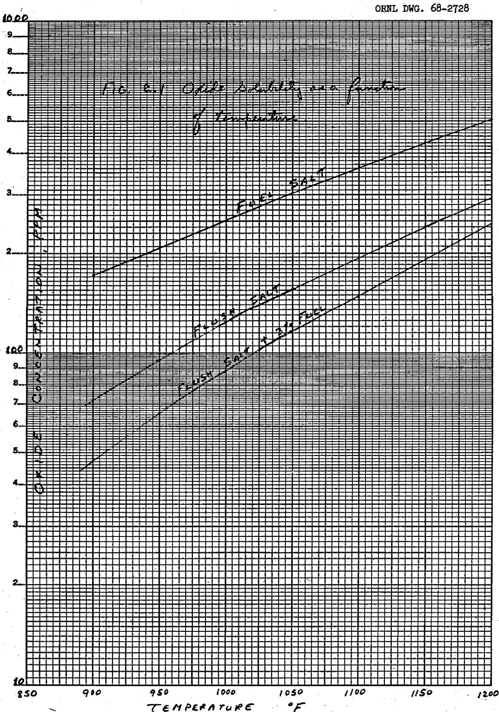  
Figure 2.1. Oxide Solubility as a Function of Temperature.

tetrafluoride was added to the fuel salt as an oxygen getter to prevent small amounts of oxygen from causing uranium precipitation. If the flush salt is contaminated with fuel salt up to approximately 0.01 mole of zirconium per kg of salt (~ 1% fuel in flush salt), there would be insufficient zirconium present to exceed the solubility of $\mathrm{ZrO_2}$ at $1112^{\circ}\mathrm{F}$ , and any precipitate would be BeO. Above this zirconium concentration, exceeding the solubility limit would cause $\mathrm{ZrO_2}$ precipitation. When sufficient $\mathrm{ZrO_2}$ has precipitated to reduce the Zr:U ratio to ~ 5, co-precipitation of $\mathrm{ZrO_2}$ and $\mathrm{UO_2}$ will occur. The effect of $3\%$ contamination of the flush salt with fuel salt is shown in Fig. 2.1.

Oxides will be removed by treating the fuel or flush salt in the fuel storage tank (see Fig. 2.2) with a mixture of $\mathbf{H}_{2}$ and HF gas. In the treatment process, HF will react with the oxide to form the fluoride and water, the water will be evolved along with the hydrogen and excess HF. The $\mathbf{H}_{2}$ will prevent excessive corrosion of the INOR-8 structural material by maintaining a reducing condition in the salt. The gases will pass through an NaF bed for decontamination before monitoring for water determination. The gas stream will then pass through a caustic scrubber for neutralization of the HF. The hydrogen will go to the offgas system. The treatment will be terminated when water is no longer detected in the offgas stream. A final sparging with helium will remove dissolved HF.

# 2.1.2 Hydrofluorination

Hydrogen fluoride will be obtained in 100-lb cylinders. One cylinder will provide sufficient HF for 92 hr of processing at a flow rate of 9 liters/min ( $H_{2}:HF = 10:1$ ). The HF cylinder will be partially submerged in a water bath heated with low-pressure steam to provide sufficient pressure for the required flow rate. Since heating of the cylinders above $125^{\circ}F$ is not recommended, there is a pressure alarm on the exit gas set at 22 psig. The HF gas will pass through an electric heater to raise the temperature above $180^{\circ}F$ and reduce the molecular weight to 20 for accurate flow metering. The hydrogen flow will be started before the HF flow to minimize corrosion. The hydrogen flow rate will be set at the rotameter at the gas supply station west of the building. The hydrogen fluoride flow rate will be regulated by the controller on the

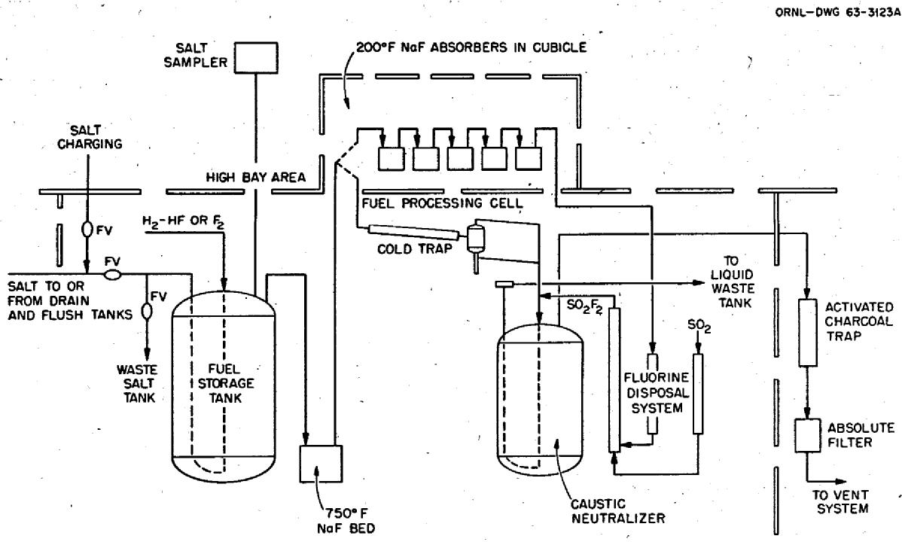  
Figure 2.2. MSRE Fuel-Processing System.

panelboard in the high-bay area. The salt backup prevention valve must be closed with the manual switch until flow is started, at which time the differential pressure switch will maintain the valve in the closed position unless the tank pressure exceeds the $\mathrm{H}_{2}$ -HF pressure.

The offgas stream leaving the fuel storage tank will consist of hydrogen, water, excess hydrogen fluoride, and helium. Volatilization of fission and corrosion products is expected to be much lower than during fluorination because of the reducing effect of the hydrogen. Fission products that are partially volatilized as fluorides during fluorination, such as ruthenium, niobium, and antimony, are expected to exist in the metallic state. Any chromium in the salt from corrosion is expected to be in the nonvolatile +2 or +3 valence state. The offgas stream will pass through a heated line to the NaF trap. The line will be heated to $200^{\circ}\mathrm{F}$ to prevent condensation of $\mathrm{H}_{2}\mathrm{O}-\mathrm{HF}$ .

The salt temperature is not critical during $\mathrm{H}_{2}$ -HF treatment since corrosion and fission product volatilization are not important. For rapid oxide removal it is necessary that all the oxide is in solution. The salt temperature should be adjusted about $50^{\circ}\mathrm{F}$ higher than that indicated by the oxide analysis and solubility curves. The temperature should not be maintained higher than necessary since this lowers the HF solubility and consequently the HF utilization.

The hydrogen fluoride and $\mathbf{H}_{2}$ flow will be stopped when no more water is detected in the offgas stream. The salt will then be sparged with helium to remove dissolved HF and to purge the system of HF and hydrogen. The gas stream will be checked for hydrogen before it enters the offgas duct by passing a small stream through a hydrogen monitor.

# 2.1.3 NaF Trapping

A remotely removable NaF bed is provided in the fuel-processing cell to remove small amounts of volutilized fission or corrosion products from the offgas stream. The trap will be maintained at $750^{\circ}\mathrm{F}$ to prevent adsorption of HF. Since the vapor pressure of HF over NaF is 1 atm at $532^{\circ}\mathrm{F}$ , the trap could be operated at a somewhat lower temperature, but $750^{\circ}\mathrm{F}$ will be required to prevent $\mathrm{UF_6}$ adsorption during fluorination (see Sect. 2.2.3), and this temperature was selected for both operations.

# 2.1.4 Monitoring for Water

The removal of oxides from the salt will be followed by passing a 2 cc/min side stream of the gas stream from the NaF trap through a water monitor (See Fig. 2.3). This monitor consists of an NaF trap for removal of HF from the sample stream before it is passed through an electrolytic hygrometer. The part of the monitor through which the radioactive sample passes is located in the absorber cubicle for containment. Integration of the monitor readings indicates the total amount of oxide removed.

A more elaborate but less accurate method of determining the oxide removal by cold-trapping, was installed before the water monitor was developed. Since the monitor performed very well during the flush salt processing, the cold trap serves only as a backup for the monitor and a qualitative check on the end point. As originally conceived, several runs would have been required under steady operating conditions to obtain data for correlation of cold trap volume with oxide content. Because of the excellent performance of the monitor these runs have not been made. However, the absence of water in the gas stream will be seen in the cold trap system by the termination of condensation and reduced heat load on the trap.

# 2.1.5 Offgas Handling

The hydrogen fluoride will be neutralized in a static caustic scrubber tank. Hydrogen and helium from the scrubber will pass through an activated-charcoal trap and a flame arrester before entering the cell ventilation duct. The cell ventilation air will pass through an absolute filter, located in the spare cell, before going to the main filters and stack. As mentioned before, little activity is expected in the offgas stream during $\mathrm{H}_{2}$ -HF treatment.

Since the fluorine disposal system will not be used during $\mathbf{H}_2$ -HF treatment but will still be connected to the scrubber inlet line, the system must be purged to prevent diffusion and condensation of $\mathbf{H}_2\mathbf{O}$ -HF in the disposal system. This will be done by connecting $\mathbb{N}_2$ cylinders at the $\mathsf{SO}_2$ cylinder manifold. As an additional precaution, the $\mathsf{SO}_2$ preheater

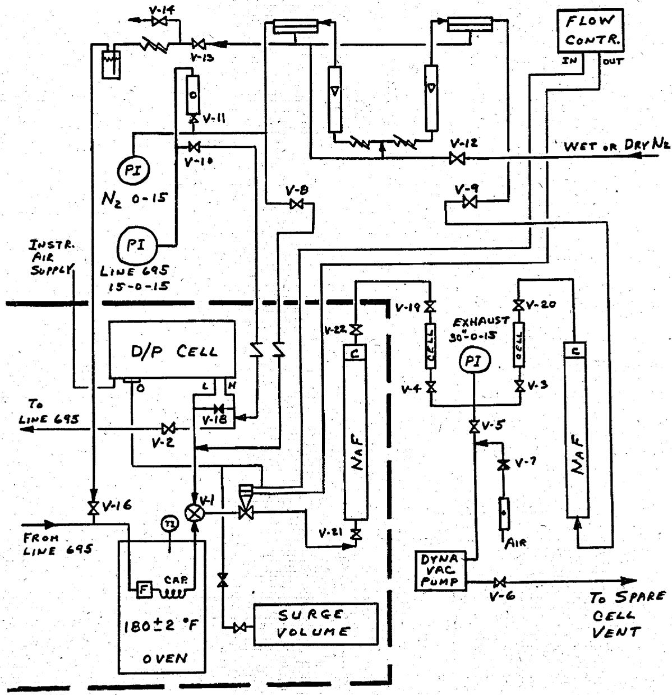  
Figure 2.3. Water Analyzer.

ORNL DWG. 68-2729

should be heated, because the stainless steel preheater would be especially subject to corrosion by the wet HF.

# 2.1.6 Liquid Waste Disposal

The caustic scrubber will be charged with 1300 liters of 2 M KOH prepared by dilution of a $45\%$ KOH solution. Three 115-gal. batches of 2 M $(10\%)$ KOH will be prepared in a portable mix tank in the high-bay area and charged through a line provided with a manual valve and a check valve. Dilution to 2 M will be required because of the possibility of gel formation in KF solutions of greater than 2 M.

At 9.1-liters/min HF flow, the KOH will have to be replaced every 4 days when the final concentration is $0.35\mathrm{M}$ . It will, therefore, be necessary to jet the KOH solution to the liquid waste tank and replace it with fresh caustic when a 100-lb HF cylinder has been consumed.

# 2.2 Uranium Recovery

# 2.2.1 Summary

The fuel or flush salt should be allowed to decay as long as possible before fluorination to minimize the discharge of the volatile fission-product fluorides that will be formed by the oxidizing action of the fluorine. The most important volatile activities are iodine, tellurium, niobium, ruthenium, and antimony. However, salt samples during reactor operation have shown only iodine remaining in the salt in large concentrations.

After decay, the salt batch will be fluorinated in the fuel storage tank. The offgas containing UF6, excess fluorine, and volatile activity will pass through a high-temperature NaF trap for decontamination and chromium removal before absorption on low-temperature NaF absorbers. Excess fluorine will be reacted with $\mathrm{SO}_2$ to prevent damage to the Fiber-glas filters. Before filtration the offgas will be further decontaminated by passage through an activated charcoal bed.

The absorbers will be transported to another facility where they will be desorbed and the UF $_6$ cold trapped and collected in product cylinders.

# 2.2.2 Fluorination

Uranium will be recovered from the molten salt by sparging with fluorine to convert the $\mathrm{UF_4}$ to volatile $\mathrm{UF_6}$ . The fluorine will be diluted with an equal volume of helium when fluorine is detected in the offgas stream to reduce the number of times the fluorine trailer must be changed. This should have little effect on the overall processing time, since utilization is expected to be low after most of the uranium has been volutilized. A total gas flow of about 50 liters/min should provide good agitation. The salt sample line will be purged with helium during fluorination to prevent $\mathrm{UF_6}$ diffusion and will be heated to prevent condensation. The temperature of the melt will be maintained as low as practical ( $\sim$ 30 to $50^{\circ}\mathrm{F}$ above the liquidus of $813^{\circ}\mathrm{F}$ ) to keep corrosion and fission-product volatilization to a minimum. Boiling points of some volatile fluorides are listed in Table 2.2. The heaters on the upper half and top of the tank will not be used during fluorination to reduce salt entrainment but they will be turned on after fluorination to melt down splatter and condensation.

Table 2.2   

<table><tr><td colspan="2">Boiling Points of Fluoride Salts</td></tr><tr><td>Salt</td><td>Boiling Temperature °F</td></tr><tr><td>CF4</td><td>-198</td></tr><tr><td>TeF6</td><td>-38</td></tr><tr><td>IF7</td><td>39 (sublime)</td></tr><tr><td>MoF6</td><td>95</td></tr><tr><td>UF6</td><td>130</td></tr><tr><td>Te2F10</td><td>138</td></tr><tr><td>PuF6</td><td>144</td></tr><tr><td>IF5</td><td>212</td></tr><tr><td>CrF5</td><td>243</td></tr><tr><td>SbF5</td><td>300</td></tr><tr><td>MoF5</td><td>440</td></tr><tr><td>NbF5</td><td>444</td></tr><tr><td>RuF5</td><td>518</td></tr><tr><td>TeF4</td><td>543</td></tr><tr><td>SbF3</td><td>554</td></tr><tr><td>CrF4</td><td>567</td></tr><tr><td>RuF4</td><td>595</td></tr><tr><td>ZrF4</td><td>1658 (sublime)</td></tr><tr><td>CrF3</td><td>~2000</td></tr></table>

There will be an initial induction period before evolution of $\mathrm{UF_6}$ begins. The extent of this period will depend on the amount of uranium in the salt and the degree of agitation of the salt. A minimum of 0.5 mole of fluorine per mole of uranium will be required to convert all the $\mathrm{UF_4}$ to $\mathrm{UF_5}$ . After this, $\mathrm{UF_6}$ will begin to form and be evolved. At 50 liters/min of fluorine, $\mathrm{UF_6}$ evolution can begin about 2 hr after the start of fluorination. Since the vapor space between the salt and the first absorber is $\sim 1300$ liters, another 15 min will probably be required before absorption begins.

Volatility Pilot Plant data show that essentially no fluorine is evolved until at least 1 mole of fluorine per mole of uranium has been added or the system has operated 6 hr at 50 liters/min. However, until more is known about the sparging efficiency and the effect of the fuel storage tank geometry and salt composition, the fluorine disposal system will be put in operation at the start of fluorine flow with sufficient $\mathrm{SO}_2$ to react with 50 liters of fluorine per minute.

Evolution of $\mathbf{U}\mathbf{F}_{6}$ will be followed by means of the absorber temperatures. Fluorine breakthrough should be detectable by temperature rise in the fluorine reactor. When fluorine breakthrough is detected, the fluorine flow will be reduced to one-half and an equal flow of helium will be started. This will maintain the necessary degree of mixing while providing sufficient fluorine to prevent the back reaction

$$
2 \mathrm {U F} _ {6} \rightarrow 2 \mathrm {U F} _ {5} + \mathrm {F} _ {2}.
$$

Corrosion can consume as much as 3 liters of fluorine per minute (0.2 mil/hr).

With the $35\%$ -enriched uranium fuel salt, it will be necessary to replace the absorbers three times. Before this can be done, the salt must be sparged with helium to remove dissolved $\mathrm{UF_6}$ and fluorine and to purge the gas space of $\mathrm{UF_6}$ . After sparging before absorber changes and at the end of fluorination, the salt will be sampled to check on the uranium removal.

It will be necessary to replace the fluorine trailer every 3-1/2 hr at a fluorine flow rate of 50 liters/min or every 7 hr with one-half flow.

There is sufficient space at the gas supply station to have only one trailer connected at a time. Additional trailers will be at the site, however, so downtime should not be long.

Corrosion will be much more severe under the strongly oxidizing conditions of fluorination than during the $\mathrm{H}_{2}$ -HF treatment. A corrosion rate of 0.5 mil/hr was experienced in the Volatility Pilot Plant in a nickel vessel. Fluorination of the high-uranium-content salt (fuel salt C) may take as long as 50 hr, but recovery of small amounts of uranium from the flush salt should require much less time. A 50-hr fluorination would cause an average corrosion of approximately $3\%$ of the fuel storage tank wall at 0.2 mil/hr. Corrosion of the fuel storage tank may be less than in the VPP because of the smaller surface-to-volume ratio, the use of dilute fluorine, and the lower fluorination temperature; also corrosion tests indicate that INOR-8 may be more corrosion resistant than nickel.

# 2.2.3 NaF Trapping

The NaF bed will be important during fluorination for uranium recovery because of the greater volatilization of fission and corrosion products than during oxide removal. The bed will again be maintained at $750^{\circ}\mathrm{F}$ , which is above the decomposition temperature of the $\mathrm{UF_6\cdot 2NaF}$ complex ( $702^{\circ}\mathrm{F}$ at $1000\mathrm{mm}$ ). Any volatilized $\mathrm{PuF_6}$ will absorb on the NaF and provide separation from the uranium. Sodium fluoride at $750^{\circ}\mathrm{F}$ will remove essentially all of the niobium and ruthenium from the fluorinator offgas stream, and these will be the principal activities that could cause product contamination. More iodine will volatize but will not absorb on hot or cold NaF. Essentially all the chromium fluoride will be absorbed. Chromium is troublesome not only because of the gamma activity of the ${}^{51}\mathrm{Cr}$ formed by neutron activation but also because of the inactive chromium that will collect in valves and small lines and cause plugging and seat leakage. All piping to and from the NaF bed must be heated to above $200^{\circ}\mathrm{F}$ to prevent $\mathrm{UF_6}$ condensation. Table 2.3 shows the expected behavior of the volatile fluorides on NaF.

Table 2.3   
Fluoride Absorption on NaF   

<table><tr><td>Fluoride</td><td>Absorption 
at 750°F 
(NaF Trap)</td><td>Absorption 
at 200°F 
(UF6Absorbers)</td></tr><tr><td>Iodine</td><td>No</td><td>No</td></tr><tr><td>Tellurium</td><td>No</td><td>No</td></tr><tr><td>Molybdenum</td><td>No</td><td>Partial breakthrough</td></tr><tr><td>Uranium</td><td>No</td><td>Yes</td></tr><tr><td>Neptunium</td><td>No</td><td>Yes</td></tr><tr><td>Technetium</td><td>No</td><td>Yes</td></tr><tr><td>Zirconium</td><td>Yes</td><td>Less than at 750°F</td></tr><tr><td>Niobium</td><td>Yes</td><td>Less than at 750°F</td></tr><tr><td>Antimony</td><td>Yes</td><td>Less than at 750°F</td></tr><tr><td>Ruthenium</td><td>Yes</td><td>Less than at 750°F</td></tr><tr><td>Plutonium</td><td>Yes</td><td>Less than at 750°F</td></tr><tr><td>Chromium</td><td>Yes</td><td>Less than at 750°F</td></tr></table>

# 2.2.4 UF6 Absorption

The decontaminated $\mathrm{UF_6}$ gas from the $750^{\circ}\mathrm{F}$ NaF bed will flow to five NaF absorbers in series, which are located in a sealed cubicle in the high-bay area. These absorbers will be cooled with air, as required, to prevent uranium loss. At $300^{\circ}\mathrm{F}$ the vapor pressure of $\mathrm{UF_6}$ over the $\mathrm{UF_6\cdot 2NaF}$ complex will be $0.1\mathrm{mm}$ , and uranium losses will be significant (2.4 g of U per hour with a flow of 50 liters/min). The capacity of NaF for $\mathrm{UF_6}$ varies inversely with the temperature, since the more rapid reaction at higher temperatures inhibits penetration of the $\mathrm{UF_6}$ by sealing off the external pores with $\mathrm{UF_6\cdot 2NaF}$ . To obtain maximum capacity the cooling air should therefore be turned on as soon as a temperature rise is indicated. The absorber temperatures should not exceed $250^{\circ}\mathrm{F}$ . Also, with low fluorine concentration at elevated temperatures there could be a reduction of $\mathrm{UF_6\cdot 2NaF}$ to $\mathrm{UF_5\cdot 2NaF}$ , which would remain with the NaF when the $\mathrm{UF_6}$ was desorbed from the NaF. The loading of the absorbers can be followed by bed temperatures, and the air can be adjusted as required. The air will be discharged to the cell by a small blower in the cell.

A portable alpha activity monitor will be used to detect leaks of $\mathbf{U}\mathbf{F}_{6}$ in the cubicle. In the event of a leak in the absorber cubicle, the fluorine flow would be stopped and the cubicle would be purged with air and opened for repairs. The location of the leak should be detectable either visually or with an alpha probe.

When fluorination has been completed, the absorbers will be disconnected and sent to another facility for desorption and cold trapping of the $\mathrm{UF}_{6}$ . It will be necessary to stop fluorination when the absorbers are loaded and replace the absorbers as noted above. This will require a complete purging of the system to remove all $\mathrm{UF}_{6}$ from the connecting piping.

# 2.2.5 Excess Fluorine Disposal

Since an average efficiency of less than $25\%$ is expected during fluorination, there will be a large excess of fluorine. If this fluorine were allowed to flow through the offgas filters, damage to the Fiberglass might result with release of any accumulated activity. To prevent this, the excess fluorine will be reacted with an excess of $\mathrm{SO}_2$ . Both the $\mathrm{SO}_2$ and the $\mathrm{F}_2$ will be preheated electrically to 300 to $400^{\circ}\mathrm{F}$ and then fed into a Monel reactor wrapped with steam coils. The steam will serve the dual purpose of keeping the reactor warm to initiate the reaction and of cooling the reactor after the reaction is started. The reaction is strongly exothermic and proceeds smoothly at $400^{\circ}\mathrm{F}$ . The product is $\mathrm{SO}_2\mathrm{F}_2$ , a relatively inert gas. An activated alumina trap is installed downstream of the $\mathrm{F}_2$ reactor for a backup of the $\mathrm{SO}_2$ system. This trap will dispose of any unreacted fluorine resulting from insufficient $\mathrm{SO}_2$ or other malfunction in the $\mathrm{SO}_2$ system.

# 2.2.6 Offgas Handling

The fluorination offgas stream from the activated alumina trap will then pass through the empty caustic scrubber tank. The scrubber tank offgas will pass through the activated-charcoal traps for additional fission-product removal before entering the cell ventilation duct just upstream of the absolute filter in the spare cell. The cell air will then go to the main filters and be discharged from the 100-ft containment stack.

# 3. EQUIPMENT DESCRIPTION

# 3.1 Plant Layout

The main portion of the fuel-handling and -processing system is in the fuel-processing cell, immediately north of the drain tank cell in Building 7503, as shown in Figures 3.1 and 3.2. The gas supply station is outside the building, west of the drain tank cell. The offgas filter, hydrogen flame arrester, activated-charcoal trap, and waste salt removal line are in the spare cell east of the fuel-processing cell. The system will be operated from the high-bay area over the cell, where a small instrument panelboard is located. Also in the high-bay area are the salt-charging area, the $\mathrm{UF_6}$ absorber cubicle, the salt sampler for the fuel storage tank, and an instrument cubicle. The instrument cubicle contains the instrument transmitters and check and block valves connected directly to process equipment, and it is sealed and monitored. Figures 3.3 and 3.4 are photographs of the fuel-processing cell and the operating area, respectively.

# 3.2 Maintenance

Since corrosion is expected to be very low during $\mathrm{H}_{2}$ -HF treatment and only four fluorinations are planned, maintenance problems are not expected to be severe. The system, with a few exceptions, has therefore been designed for direct maintenance, with savings in cost and complexity of equipment. The exceptions are the NaF trap, activated alumina trap, salt filter, and two air-operated valves. The NaF trap may become plugged by volutilized chromium fluoride during fluorination. In this case it would be moved to one side and a new trap installed. It is therefore flanged into the system and has disconnects for thermocouples and electrical power. The alumina trap and salt filter is also flanged for replacement. The valves have flanges with vertical bolts and disconnects for the air lines. The valves, filter and traps are located under roof plugs sized to pass through the portable maintenance shield. This shield can also be used for viewing and for external decontamination of equipment should this be required because of a leak. All heaters in the cell have duplicate spares installed.

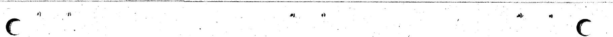

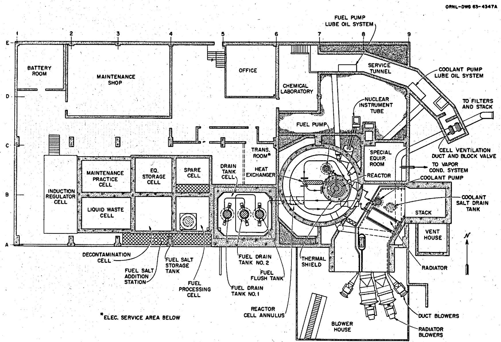  
Figure 3.1. First Floor Plan of MSRE Building.

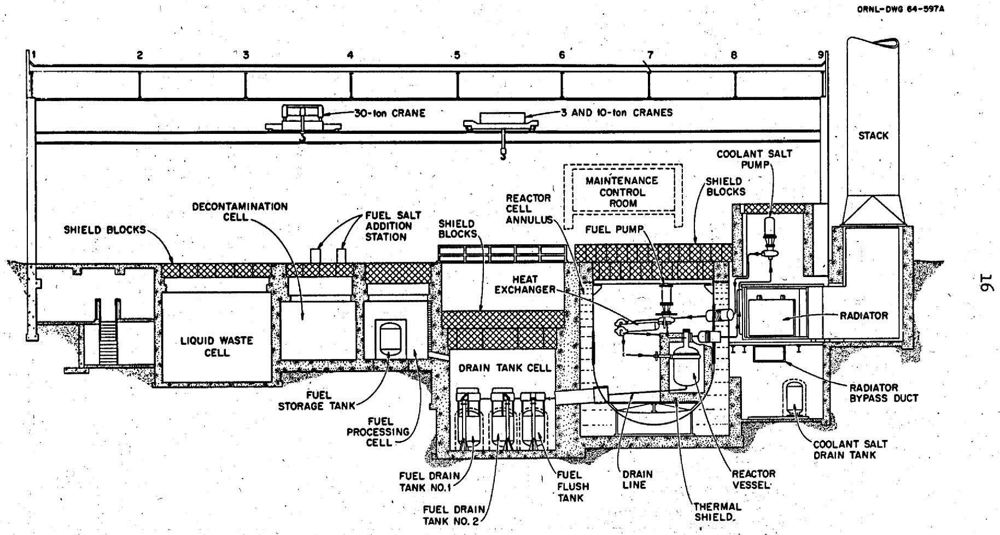  
Figure 3.2. Elevation Drawing of MSRE Building.

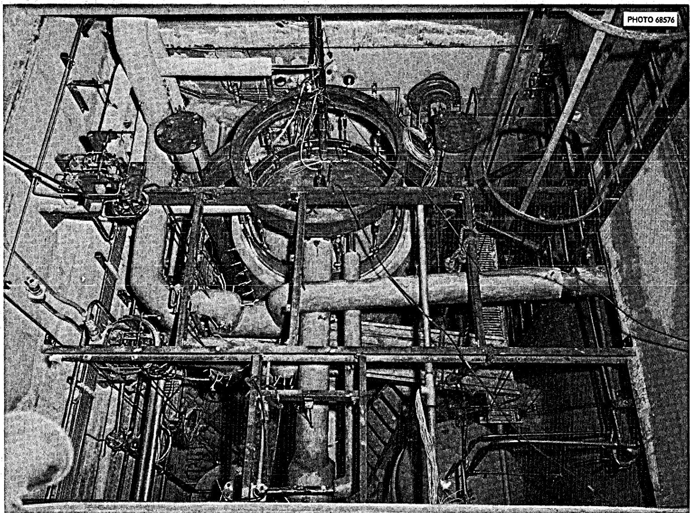  
Figure 3.3. MSRE Fuel-Processing Cell.

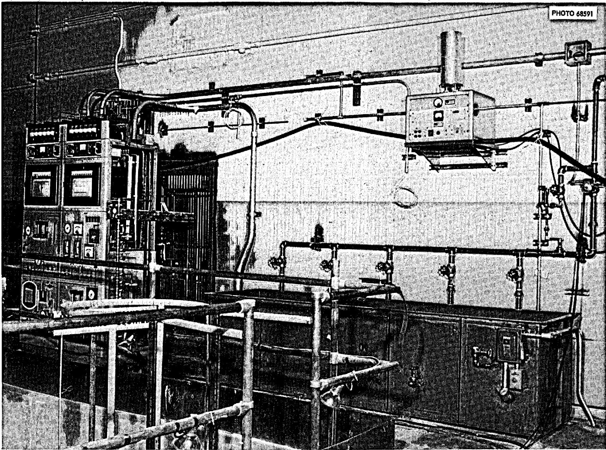  
Figure 3.4. Operating Area for MSRE Fuel-Processing Cell.

If a serious piping or equipment leak occurs before processing has been completed, or if entrance into the cell is required for other reasons after irradiated fuel has been processed, aqueous decontamination may be required. The recommended method is described in Report ORNL-2550 (Ref. 3) and consists of (1) barren salt flushes to displace as much as possible of the irradiated salt, (2) aqueous ammonium oxalate flushes to remove the salt film, (3) nitric acid-aluminum nitrate flushes to remove metallic scale from the surfaces, and (4) sodium hydroxide-hydrogen peroxide-sodium tartrate flushes for gas line decontamination.

# 3.3 In-Cell Equipment

# 3.3.1 Fuel Storage Tank

The fuel storage tank in which chemical processing will take place is similar to the reactor drain tanks. The tank is shown in Figure 3.5, and design data are given in Table 3.1.

The height of the storage tank was increased by 30 in. over the height of the drain and flush tanks to minimize salt carryover due to sparging during chemical processing. About $38\%$ freeboard is provided above the normal liquid level.

The tank is heated by four sets of heaters in the bottom, the lower half, the upper half, and the top of the tank. Each set of heaters is controlled separately with powerstats. Every heater has a duplicate installed spare with leads outside the cell. The heaters are mounted on a frame that is supported from the floor to minimize the tare weight on the weigh cells.

The tank has two dip tubes, one for gas sparging and the other for charging and discharging salt. The sparge line is a 1-in. pipe that is closed at the bottom and has four 1/2-in. holes $90^{\circ}$ apart near the bottom. The salt dip tube lies on the bottom of the tank at the center to minimize holdup (approximately $0.1\%$ of a full batch). Liquid level is determined by weighing the tank with two pneumatic weigh cells. The weigh cell calibration can be checked by an ultrasonic single point probe. When the tank is not being pressurized for salt transfer, the sparge dip tube and PdI-694 provide another continuous salt level indicator. Other instruments provided are 13 surface-mounted thermocouples and a pressure-recorder alarm.

ORNL-DWG 65-2509

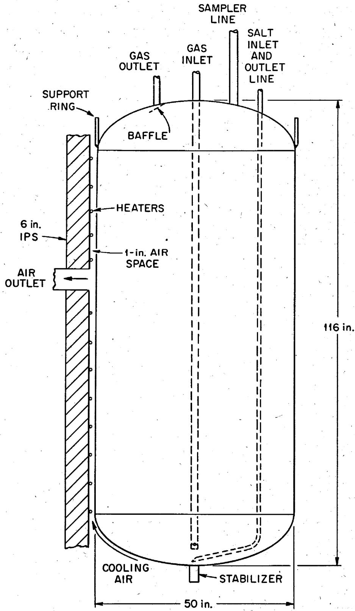  
Figure 3.5. Fuel Storage Tank.

Table 3.1   
Fuel Storage Tank Design Data   

<table><tr><td>Construction material</td><td>INOR-8</td></tr><tr><td>Height, in.</td><td>~ 116</td></tr><tr><td>Diameter, in.</td><td>50</td></tr><tr><td>Wall thickness, in.</td><td></td></tr><tr><td>Vessel</td><td>1/2</td></tr><tr><td>Dished heads</td><td>3/4</td></tr><tr><td>Volume at 1250°F, ft3</td><td></td></tr><tr><td>Total</td><td>117.5</td></tr><tr><td>Fuel (min, normal fill conditions)</td><td>73.2</td></tr><tr><td>Gas blanket (max, normal fill conditions)</td><td>44.3</td></tr><tr><td>Salt transfer heel, max</td><td>0.1</td></tr><tr><td>Design temperature °F</td><td>1300</td></tr><tr><td>Design pressure, psig</td><td>50</td></tr><tr><td>Heater capacity, kw</td><td></td></tr><tr><td>Bottom (flat ceramic)</td><td>5.8</td></tr><tr><td>Lower half (tubular)</td><td>11.6</td></tr><tr><td>Upper half (tubular)</td><td>5.8</td></tr><tr><td>Top (tubular)</td><td>6</td></tr><tr><td>Insulation, in.</td><td>6</td></tr><tr><td>Reference drawings</td><td></td></tr><tr><td>Tank assembly</td><td>D-FF-A-40430</td></tr><tr><td>Tank support</td><td>E-NN-D-55432</td></tr><tr><td>Tank housing</td><td>E-NN-D-55433</td></tr><tr><td>Tank heaters</td><td>E-NN-E-56413</td></tr><tr><td>Tank heater details</td><td>E-NN-E-56414</td></tr><tr><td>Thermocouple locations</td><td>D-HH-B-40527</td></tr></table>

An interlock is provided that prevents salt backup in the gas sparge line in case the tank pressure exceeds the sparge-gas pressure. Another interlock prevents backup of tank offgas (UF6, HF, F2, or fission gases) into the sample line, which is also connected to the pressurization - pressure recorder line in the high-bay area. This is done by closing the HF-F2 valve if the tank pressure exceeds the helium purge pressure. The vent valve in the offgas line opens if the tank pressure exceeds the design

pressure of 50 psi. The tank pressure will alarm above the normal pressure of 5 psi to indicate any plugging in the offgas line, trap, valves, absorbers, or caustic scrubber.

# 3.3.2 NaF Trap

The NaF trap will be required mainly during fluorination to provide additional decontamination of the UF $_6$ gas and to remove volatile chromium fluorides from the gas stream. A kilogram or more of chromium fluoride could be volatilized during fluorination, and it would collect in lines and valves and eventually cause plugging. The trap is shown in Figure 3.6 and design data are given in Table 3.2.

Table 3.2 NaF Trap Design Data   

<table><tr><td>Construction material</td><td>Inconel</td></tr><tr><td>Height, in.</td><td>18</td></tr><tr><td>Diameter, in.</td><td>20</td></tr><tr><td>Wall thickness, in.</td><td></td></tr><tr><td>Sides</td><td>1/8</td></tr><tr><td>Dished heads</td><td>1/4</td></tr><tr><td>Loading, kg of NaF pellets</td><td>70</td></tr><tr><td>Design temperature, °F</td><td>750</td></tr><tr><td>Design pressure, psig</td><td>50</td></tr><tr><td>Heater capacity, kw</td><td></td></tr><tr><td>Center</td><td>2.25</td></tr><tr><td>Outer surface</td><td>9</td></tr><tr><td>Insulation, in.</td><td>4</td></tr><tr><td>Approximate loaded weight, lb</td><td>500</td></tr><tr><td>Reference drawings</td><td></td></tr><tr><td>Tank details</td><td>D-FF-C-55446</td></tr><tr><td>Heater details</td><td>E-NN-E-56412</td></tr></table>

ORNL-DWG 65-2511

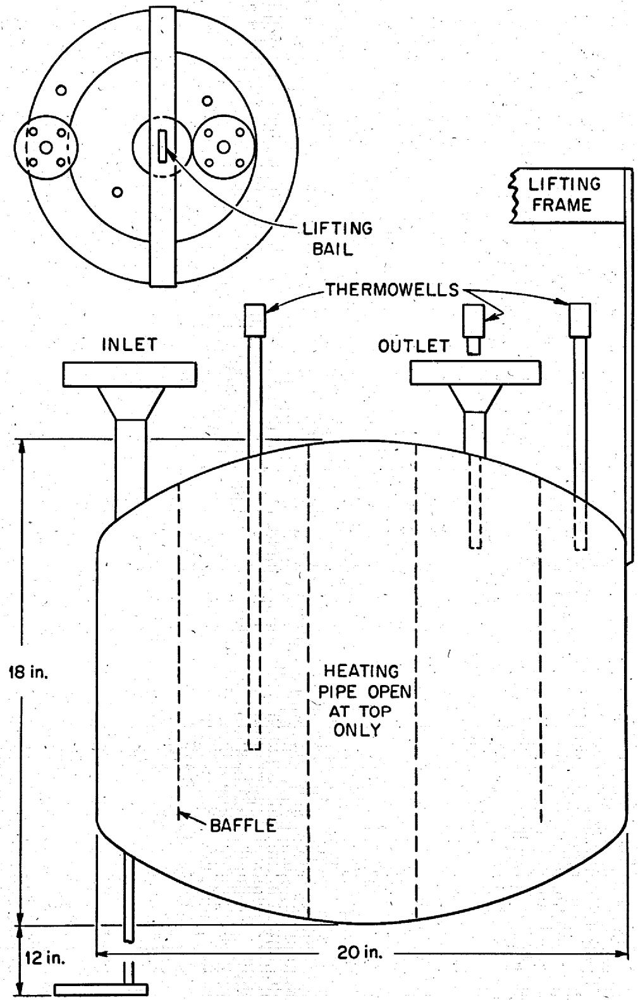  
Figure 3.6. NaF Trap.

The gas enters on the outside of an internal cylindrical baffle and leaves inside the baffle, and thus the gas path is almost 2 ft for a 12-in. depth of pellets. Gas velocities are kept below 4 ft/min to prevent carryover of fines containing absorbed fission-product fluorides.

The trap has thermowells at the inlet, center, and exit. Heat is controlled by separate variacs for the center and the outside of the bed. Spare heaters are installed.

Since there is a possibility of plugging of this trap with chromium during fluorination, it is designed for remote replacement. The inlet and exit lines are provided with ring-joint flanges at the trap and some distance away to permit removal of sections of the lines for access to the trap. Thermocouple and electrical disconnects are provided on the trap, and a standard lifting bail is mounted on a strap over the trap.

Heat generation in the NaF trap at the end of fluorination could be as high as 4000 Btu/hr if all the $^{95}\mathrm{Nb}$ after 30-d decay remains in the salt during reactor operation and collects in the trap during processing. Of this heat, 1100 Btu/hr will be removed by the process gas stream and $\sim$ 2000 Btu/hr through the insulation with the heaters off. To remove the remaining 900 Btu/hr and ensure that the exit half of the bed (internal annulus) does not exceed $800^{\circ}\mathrm{F}$ , air cooling is provided in the center pipe. A heat transfer coefficient of 1 Btu/hr·ft $^{2}$ . $^{\circ}\mathrm{F}$ will remove $\sim$ 1000 Btu/hr with 8 cfm of air.

The trap will be by-passed if aqueous decontamination is necessary to permit direct maintenance on cell components. In this case the trap will be replaced with a jumper line to permit flow of solutions through the entire system.

# 3.3.3 Cold Trap

The extent of oxide removal from the salt during $\mathbf{H}_2$ -HF treatment will be determined by cold trapping the offgas stream and measuring the volume of water and HF condensed. The cold trap is shown in Figure 3.7, and design data are given in Table 3.3. The inlet end of the trap is in the northwest corner of the cell and the trap extends eastward with a $3^{\circ}$ slope. The inlet and outlet brine connections are reducing tees at each end of the jacket.

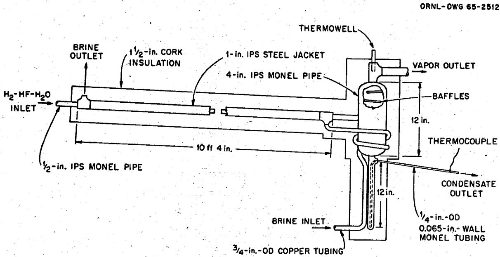  
Figure 3.7. Cold Trap and Siphon Pot.

Table 3.3   
Cold Trap and Siphon Pot Design Data   

<table><tr><td>Construction material</td><td>Monel</td></tr><tr><td>Cold trap</td><td></td></tr><tr><td>Maximum vapor velocity, ft/min</td><td>1800</td></tr><tr><td>Maximum expected heat load, Btu/hr</td><td>2500</td></tr><tr><td>Heat transfer surface area, ft2</td><td>2.3</td></tr><tr><td>Siphon pot volume, cm3</td><td>55</td></tr><tr><td>Brine system</td><td></td></tr><tr><td>Brine</td><td>Freon-11</td></tr><tr><td>Brine flow rate, gpm</td><td>5</td></tr><tr><td>Brine head, ft (max)</td><td>40</td></tr><tr><td>Brine Volume, gal (min)</td><td>2.5</td></tr><tr><td>Reference drawing</td><td>E-NN-D-55439</td></tr></table>

# 3.3.4 Siphon Pot

The condensate from the cold trap collects in a pot that automatically siphons when full. The pot is shown in Fig. 3.7, and design data are given in Table 3.3. The exit gas passes over a thermowell for accurate determination of the offgas temperature. The pot is cooled by the brine before the brine enters the cold-trap jacket. The siphon tube has a surface thermocouple outside of the thermal insulation to detect each siphoning.

# 3.3.5 Caustic Scrubber

The caustic scrubber is shown in Fig. 3.8, and design data are given in Table 3.4. The tank is provided with coils enclosed in a heat-transfer medium. During H2-HF treatment, cooling water will be circulated through the coils to remove the heat of HF neutralization. During fluorination, the tank will be drained.

The tank is provided with a thermowell, a liquid-level bubbler tube, and a jet suction line. The used caustic is jetted to the liquid-waste tank when the molarity has been reduced from 2.0 to approximately 0.3 M KOH. A caustic charging line is provided from the high-bay area.

ORNL-DWG 65-2513

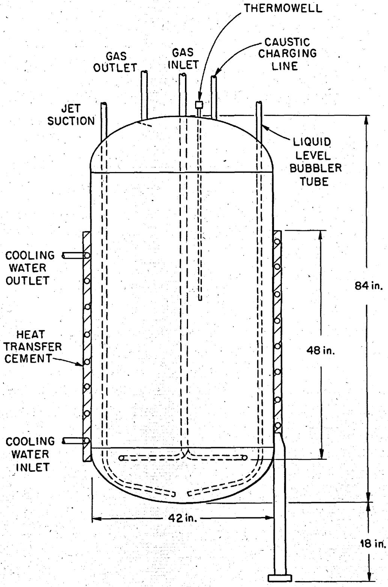  
Figure 3.8. Caustic Scrubber.

Table 3.4   
Caustic Scrubber Design Data   

<table><tr><td>Construction material</td><td>Inconel</td></tr><tr><td>Height, in.</td><td>84</td></tr><tr><td>Diameter, in.</td><td>42</td></tr><tr><td>Wall thickness, in.</td><td></td></tr><tr><td>Vessel</td><td>3/8</td></tr><tr><td>Dished heads</td><td>3/8</td></tr><tr><td>Volume, liters</td><td></td></tr><tr><td>Total</td><td>1600</td></tr><tr><td>Normal</td><td>1300</td></tr><tr><td>Design temperature, °F</td><td>200</td></tr><tr><td>Design pressure, psig</td><td>50</td></tr><tr><td>Heat transfer area, ft2</td><td>45</td></tr><tr><td>Liquid head, psi</td><td>2.15</td></tr><tr><td>Reference drawing</td><td>E-FF-C-55441</td></tr></table>

The offgas from the scrubber tank is routed to the spare cell where it passes through an activated-charcoal trap and a flame arrester before discharge into the cell ventilation duct. The gas should be free of air or oxygen up to this point, since all purges are made with helium. A sensitive pressure indicator will show any restriction in the offgas line or flame arrested.

# 3.3.6 NaF Absorbers

The absorbers for collecting UF $_6$ on NaF pellets are made of carbon steel, which is sufficiently resistant to fluorine for the short exposures involved. The absorbers will be used for processing only one batch and will then be discarded to the burial ground. The absorbers are shown in Fig. 3.9 and design data are given in Table 3.5. A bed depth of 10 in. $(24\mathrm{kg}$ of NaF) will be used.

Each absorber is mounted in an open top container with an air distributor pipe in the bottom. Cooling air flows around the outside and up through the open 2-in. center pipe. Air can be controlled separately to each absorber.

ORNL-DWG65-2514

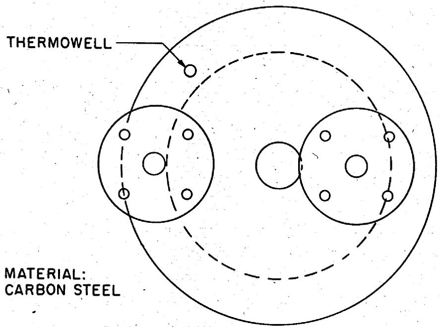

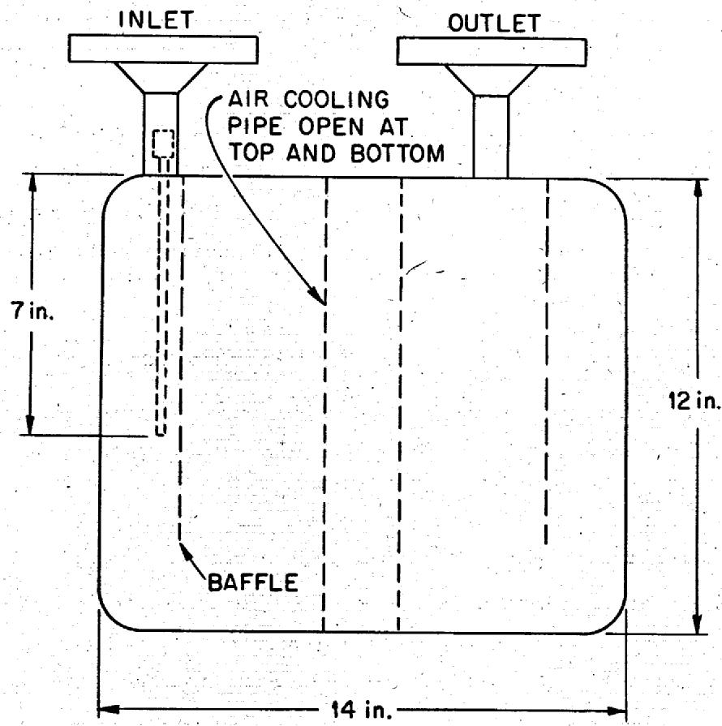  
Figure 3.9. NaF Absorbers.

Table 3.5   
NaF Absorber Design Data   

<table><tr><td>Construction material</td><td>Carbon steel</td></tr><tr><td>Height, in.</td><td>12</td></tr><tr><td>Diameter, in.</td><td>14</td></tr><tr><td>Wall thickness, in.</td><td></td></tr><tr><td>Sides</td><td>1/4</td></tr><tr><td>Dished heads</td><td>3/8</td></tr><tr><td>Design temperature, °F</td><td>750</td></tr><tr><td>Design pressure, psig</td><td>50</td></tr><tr><td>Loading, kg of NaF pellets</td><td>24</td></tr><tr><td>Bed depth, in.</td><td>6 - 9</td></tr><tr><td>Reference drawings</td><td></td></tr><tr><td>Absorber details</td><td>D-FF-C-55447</td></tr><tr><td>Absorber container details</td><td>D-FF-C-55448</td></tr></table>

Each absorber is provided with a thermowell immersed in the NaF pellets near the gas inlet. Since absorption of $\mathrm{UF_6}$ to form $\mathrm{UF_6} \cdot 2\mathrm{NaF}$ liberates 23.9 kcal per mole, the start of $\mathrm{UF_6}$ absorption and the breakthrough to the succeeding absorber in the train can be followed by observing the temperature rise.

The absorbers are connected with jumper lines having ring-joint flanges with pigtails for local leak detection before sealing the cubicle. The lines in the cubicle all have tubular heaters to prevent $\mathrm{UF}_6$ condensation. No spares are installed because the cubicle is accessible to the high-bay area when processing is stopped.

# 3.3.7 Fluorine Disposal System

The excess fluorine is disposed of by reacting it with $\mathrm{SO}_2$ to form $\mathrm{SO}_2\mathrm{F}_2$ , which is a relatively inert gas and can be safely passed through the Fiberglas filters in the offgas system. Design of the system is based on the system in use at the Goodyear Atomic Corporation at Portsmouth, Ohio. Since the quantity of fluorine to be disposed of is similar, the same size equipment is used, except for the fluorine preheater. The

fluorine at Portsmouth is diluted to about $10\%$ , while the fluorination offgas will be nearly $100\%$ fluorine toward the end of the processing. The fluorine preheater can therefore be the same size as the $\mathrm{SO}_2$ preheater. Some construction details have been changed to adapt the equipment to remote radioactive service.

The equipment is shown in Fig. 3.10, and the design data for the system are given in Table 3.6. Both gas streams are preheated to $400^{\circ}\mathrm{F}$ before contacting in the fluorine reactor. Each preheater has three separate heaters with installed spares. Each heater is controlled separately by an off-on switch. The low-pressure steam coil on the inlet half of the fluorine reactor supplies heat at the start to initiate the reaction and acts as a coolant to remove the heat of reaction after the reaction begins. It is desired to keep the temperature below $1000^{\circ}\mathrm{F}$ to minimize corrosion.

An activated alumina trap, Fig. 3.11, is installed downstream of the $\mathbf{F}_2$ reactor as mentioned in Section 2.2.5. The trap is installed with ring-joint flanges and located in an accessible position to facilitate replacement in case of plugging. The trap is constructed of 6-in. inconel pipe and contains $\sim 3\mathrm{ft}^3$ of activated alumina, enough to contain 1 trailer of fluorine. Two thermowells are provided near the inlet to indicate fluorine breakthrough from the $\mathrm{SO}_2$ system. The flanges are connected to the leak detector system outside the cell.

# 3.3.8 Cubicle Exhauster

The air in the absorber cubicle is maintained at a negative pressure with respect to the high-bay area by an exhauster located in the fuel-processing cell. This is an exhauster with a capacity of 250 cfm at 10.5 in. $\mathsf{H}_2\mathsf{O}$ . It is driven by a $3/4$ -hp 3450-rpm 440-v 3-phase motor. The suction side is connected to the cubicle by a 4-in. steel pipe routed through the space west of the cell. The discharge is open to the cell without any connecting piping. A 4-in. plug cock is provided in the suction line in the cubicle, with an access flange on the cubicle, to permit closing the valve with the gasketed top in place for leak checking.

ORNL-DWG 65-2545

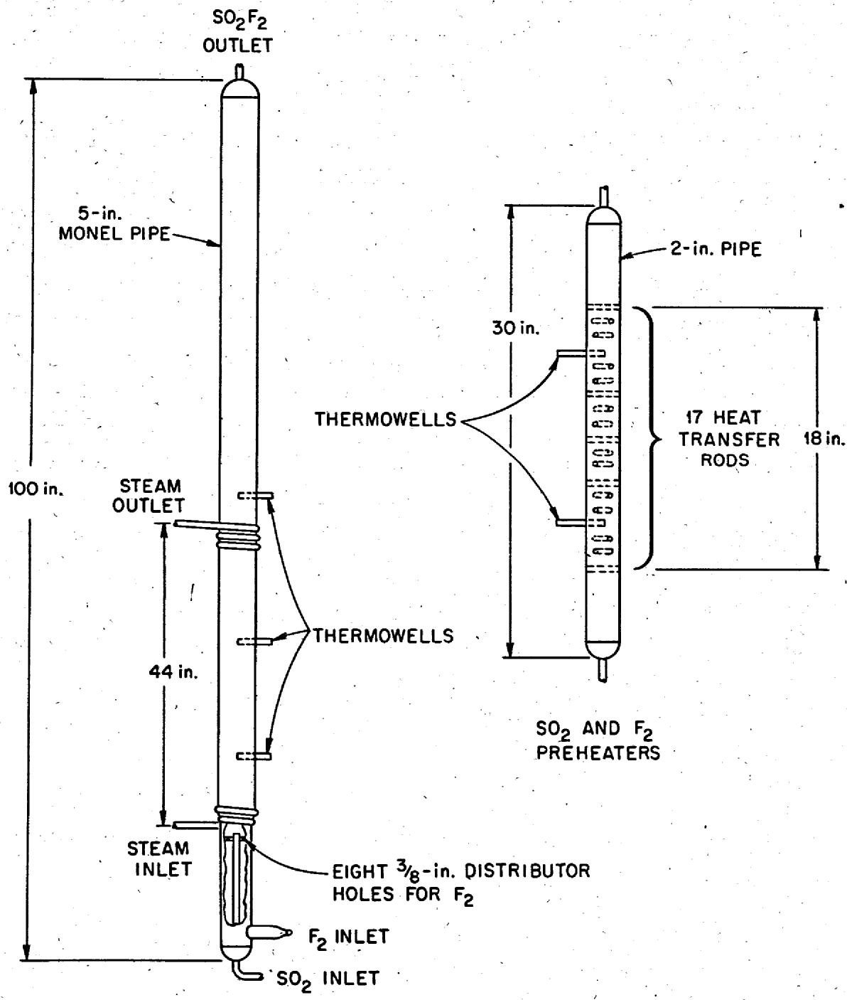  
F2 REACTOR   
Figure 3.10. Fluorine Disposal System.

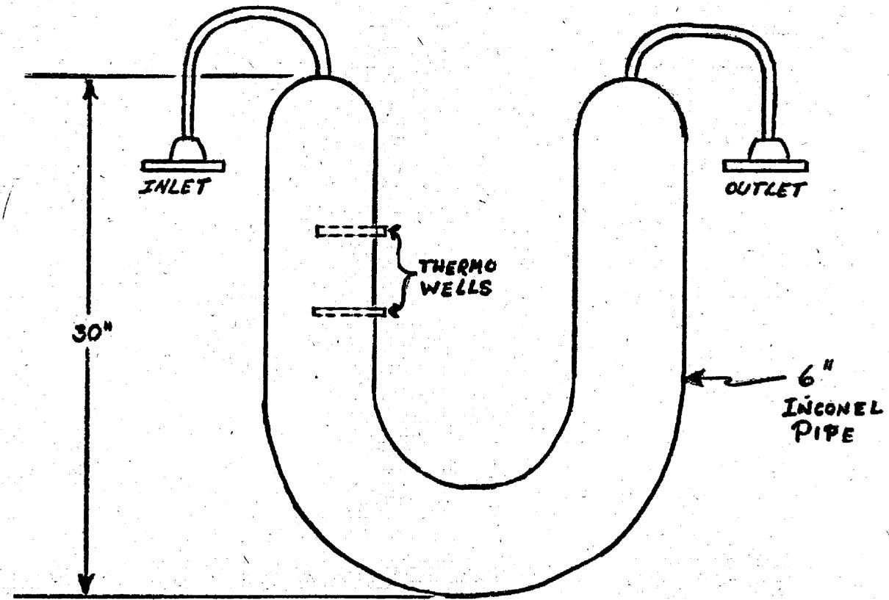  
Figure 3.11. Activated Alumina Trap.

ORNL DWG. 68-2730

Table 3.6   
Fluorine Disposal System Design Data   

<table><tr><td colspan="2">Construction material</td></tr><tr><td>SO2 preheater</td><td>Type 304L stainless steel</td></tr><tr><td>F2 preheater and reactor</td><td>Monel</td></tr><tr><td>Length, in.</td><td></td></tr><tr><td>Preheaters</td><td>30</td></tr><tr><td>Reactor</td><td></td></tr><tr><td>Overall</td><td>112</td></tr><tr><td>Reaction zone</td><td>96</td></tr><tr><td>Diameter, in. IPS</td><td></td></tr><tr><td>Preheaters</td><td>2</td></tr><tr><td>Reactor</td><td>5</td></tr><tr><td>Design fluorine flow, liters/min</td><td>100</td></tr><tr><td>Design temperature, °F</td><td></td></tr><tr><td>Preheaters</td><td>600</td></tr><tr><td>Reactor</td><td>750</td></tr><tr><td>Design pressure, psig</td><td>50</td></tr><tr><td>Heat capacity of heaters on each preheater, kw</td><td>1.5</td></tr><tr><td>Insulation, in.</td><td>2</td></tr><tr><td>Reference drawings</td><td></td></tr><tr><td>SO2 preheater</td><td>D-FF-C-55445</td></tr><tr><td>F2 preheater</td><td>D-FF-C-55444</td></tr><tr><td>F2 reactor</td><td>D-FF-C-55442</td></tr><tr><td>Preheater heaters</td><td>E-NN-E-56410</td></tr></table>

The blower is controlled by a manual switch with an interlock to a solenoid valve in the cooling air supply to the absorbers. This ensures that the cooling air cannot be turned on inadvertently with the blower off and thereby pressurize the cubicle.

# 3.4 Out-of-Cell Equipment

# 3.4.1 Activated-Charcoal Traps

An activated-charcoal trap is located in the offgas line in the spare cell. The main function of this trap is the removal of iodine from the offgas stream. The trap consists of two 2-3/8-in.-diam, 10-1/2-in.-long canisters in series, each with a charcoal depth of 3/4 in. The canisters are installed in a flanged 6-in. Monel pipe so that they can be replaced if necessary. Each canister contains 1.5 lb of 6-14 mesh charcoal and is rated to process air at a maximum of 25 ft³/min. Each canister has an exposed surface of 1 ft². The pressure drop through one canister at 25 ft³/min is 0.15-in. H₂O.

A deep-bed back-up charcoal trap is installed downstream of the 2-canister trap. This second trap contains $\sim$ 3 ft³ of Cheney-727 impregnated charcoal which has a high efficiency for removal of organic iodides even under conditions of high moisture. This trap is constructed of 6-in. monel pipe with construction similar to the activated alumina trap (Figure 3.11).

# 3.4.2 Flame Arrester

Since the system will be completely purged of air before processing begins and all purge and sparge gases will be helium or nitrogen, there is no possibility of producing an explosive mixture with hydrogen in the equipment. The only location involving an explosion hazard should be the point of discharge of the offgas into the offgas duct. At this point the maximum concentration of hydrogen in the air is $1.4\%$ with a hydrogen flow rate of 50 liters/min and a cell air exhaust of 125 cfm. This is well below the lower explosive limit of hydrogen in air of $4\%$ . The cell exhaust flow rate will be checked at the time of processing to confirm that there is sufficient dilution.

As an added precaution, a flame arrester is installed in the offgas line between the activated-charcoal trap and the cell exhaust duct in the spare cell with a union downstream for removal for cleaning or replacement. The unit is a Varac Model 51A and consists of copper gauze and disk laminations.

# 3.4.3 Offgas Filters

The fuel-processing cell ventilation air and the vessel offgas will pass through a 2-in.-deep $24-$ by $24-$ in. Fiberglas prefilter and a $11-1/2-$ in. deep $24-$ by $24-$ in. Fiberglas absolute filter before passing through the main filters and containment stack. There are three 12-in.-diam butterfly valves for isolation and for bypassing of the filters for replacement. A locally mounted differential-pressure transmitter indicates the pressure drop across the filters on the fuel-processing system panel board. The caustic scrubber offgas, after passing through the charcoal trap and the flame arrester, discharges into the duct just upstream of the bypass tee.

This equipment is located in the spare cell with sufficient space allowed for the addition of 2 ft of shielding (for a total of $3 - 1 / 2$ ft) between the filters and the fuel-processing cell. This should be sufficient shielding to permit filter changing with an irradiated fuel batch in the storage tank.

# 3.4.4 HF Trap

The fluorine used will contain up to $5\%$ HF, which could cause plugging of the $\mathrm{UF_6}$ absorbers by formation of NaF·2HF, NaF·3HF, etc.) if not removed. Therefore the trap shown in Fig. 3.12 and described in Table 3.7 is provided in the fluorine line at the gas supply station.

The inlet of the trap is maintained at $212^{\circ}\mathrm{F}$ by steam to prevent plugging (by prevention of the formation of the higher hydrogen fluoride complexes) because of the high partial pressure of HF. Farther into the NaF bed, the HF partial pressure is lower and the higher complexes are not formed even at the lower temperature. The exit of the trap is water cooled to about $100^{\circ}\mathrm{F}$ , which is below the operating temperature of the $\mathrm{UF}_6$ absorbers, and the trap should therefore remove any HF that could otherwise collect in the absorbers. The reaction is exothermic and liberates 16.4 kcal per mole of HF absorbed.

With a fluorine flow of 50 liters/min, a processing time of 20 hr, and an HF content of $5\%$ , the trap has sufficient capacity for the fluorination of five batches if only $50\%$ of the NaF is complexed to NaF·HF. Since the average HF content is less than $5\%$ , one loading should have sufficient capacity for all the fluorinations planned at the MSRE. If necessary, the NaF can be discarded and recharged.

ORNL-DWG 65-2516

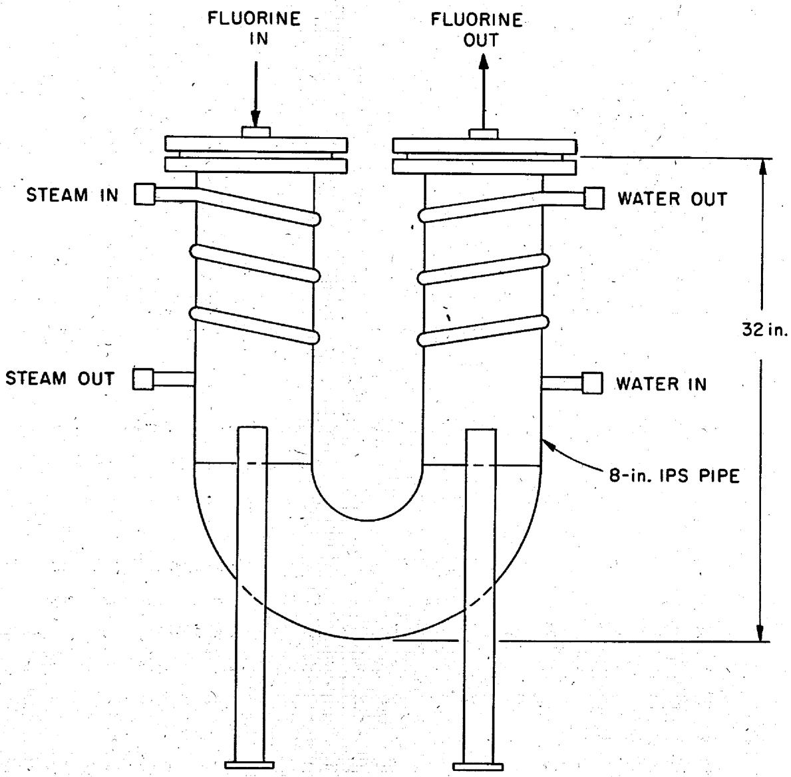  
Figure 3.12. HF Trap filled with NaF Pellets.

Table 3.7   
HF Trap Design Data   

<table><tr><td>Construction material</td><td>Nickel-plated carbon steel</td></tr><tr><td>Height, in.</td><td>32</td></tr><tr><td>Diameter, in. IPS</td><td>8</td></tr><tr><td>Design temperature, °F</td><td>250</td></tr><tr><td>Design pressure, psig</td><td>75</td></tr><tr><td>Operating temperatures, °F</td><td></td></tr><tr><td>Inlet</td><td>212</td></tr><tr><td>Outlet</td><td>100</td></tr><tr><td>NaF capacity, ft3</td><td>1.9</td></tr><tr><td>Design flow rate, liters/min</td><td>100</td></tr><tr><td>Reference drawing</td><td>D-FF-C-55443</td></tr></table>

# 3.4.5 HF Heater

The HF heater is installed in the gas line from the HF cylinder after the flow control valve. The purpose of this heater is to dissociate the HF gas to the monomolecular form for accurate flow metering. This requires the addition of approximately 1.2 Btu/liter of gas or approximately 20 Btu/min at the maximum HF flow rate anticipated (17 liters/min). Another 1 Btu/min of sensible heat is required to heat the gas from $120^{\circ}\mathrm{F}$ , the temperature of the gas at 25 psig leaving the cylinder, to $180^{\circ}\mathrm{F}$ , the temperature required to reach the monomolecular form. This 21 Btu/min is equivalent to 370 w. Two tubular heaters are used to provide a total of 1120 w.

The heater is strapped to the outside of a 2-in. Monel pipe about 22 in. long packed with nickel wool for heat transfer. The wool is confined at the ends by 6-mesh Monel cloth. A thermowell is provided near the outlet.

# 3.4.6 Salt Sampler

The salt sampler in the fuel-processing system is mounted on the roof plugs over the fuel-processing cell and is connected directly to the top of the fuel storage tank by a vertical 1-1/2-in. pipe. The sampler is the original fuel-pump sampler-enricher mockup shown in Fig. 3.13. It is the same as the fuel-pump sampler, with the following exceptions:

1. It is designed for a maximum of $14$ psig instead of 50 psig. Area 1C is protected from overpressure by a pressure relief valve that vents to Area 2B which is vented to the cell through the space around the $1-1/2-1n$ . sampling line.   
2. No maintenance valve is required, since the system can be shut down and purged if maintenance on the sampler is required.   
3. Area 2B will contain the vacuum pumps in addition to the operational valve.   
4. A bellows is installed between the operational valve and the sample line instead of between the valves and Area 1C.

The sampler will not be used during processing. The fuel storage tank will be purged with helium before the operational valve is opened for sampling. The main purpose of the sampler is to verify that the salt is satisfactory for return to the drain tank after processing. After $\mathrm{H}_{2}$ -HF treatment the sample will be analyzed to determine that HF has been reduced to satisfactory levels. After fluorination the sample will verify the complete removal of uranium. Also, sampling of flush salt before processing will indicate the amount of fuel salt pickup.

The sampler will have, in general, the same instrumentation as the fuel-pump sampler and will be operated in the same manner.4

# 3.5 Electrical System

Electrical power for the fuel-processing system is supplied by a 75-kva 480/120 - 208-v $3\phi$ transformer feeding a load center on the east side of the remote maintenance practice cell on the 840-ft level. This supply feeds two power panels, CP-A and CP-B. The starter and switch for the cubicle blower are located at the load center but have a separate

ORNL-DWG 63-5848R

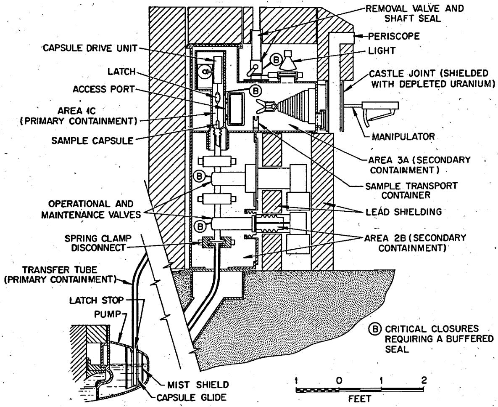  
Figure 3.13. MSRE Sampler Enricher.

supply since the blower requires 440-v. Most of the equipment and pipe heaters are controlled by switches or powerstats located at two heater control panels, HCV-12 and HCP-13, at the south end of the heater control area on the 840-ft level east of the cell block. The pipe heaters in the absorber cubicle are controlled by a switch at the cubicle in the high-bay area. The line and equipment heaters are listed in Tables 3.8 and 3.9.

The pipe line and equipment heater, blower motor, and motorized damper leads are routed from the heater control panels through a junction box on the west side of the decontamination cell on the 840-ft level. At this junction box the spare heaters can be connected to the control panels if necessary. Each control may have from one to nine separate heaters. Leads from each group of heaters are brought out to a junction box. Defective heaters can be replaced only by entering the cell. After the cell becomes radioactive, only an entire group can be replaced unless the cell is decontaminated to permit direct maintenance.

In case of loss of TVA power:

1. All equipment and line heaters and the cubicle blower will be inoperative.   
2. Helium will be available for sparging, purging, and salt transfer.   
3. Diesel generator power will provide absorber cooling and instrument air and standby supply for instrument power.

# 3.6 Helium Supply System

The helium supply to the fuel-processing system is from the 250-psig helium header in the diesel house where it is reduced from 250 psig to 40 psig. At the fuel-processing panelboard in the high-bay area, this supply is reduced at a 20-psig transfer header and a 13.5-psig purge and sparge header. The transfer header has an air-operated block valve that cannot be opened unless freeze valve and drain tank vent valve positions are correct to receive a salt batch from the fuel storage tank. The purpose of this interlock is to prevent accidental filling of the reactor or transfer to a tank already containing a salt batch.

Table 3.8 Line Heaters   

<table><tr><td>Heater No.</td><td>Location</td><td>Heat per Control (w)</td><td>Heated Length (ft)</td><td>Heat per Foot (w)</td><td>Maximum Voltage Setting (v)</td><td>Maximum Current Setting (amp)</td></tr><tr><td>H-110-5</td><td>Cell wall penetration</td><td>1020</td><td>5.1</td><td>200</td><td>120</td><td>8.5</td></tr><tr><td>H-110-6</td><td>Cell wall to Line 111</td><td>4584</td><td>25</td><td>187</td><td>140</td><td>32.8</td></tr><tr><td>H-110-7</td><td>Freeze Valve lllto fuel storage tank</td><td>1496</td><td>8</td><td>187</td><td>140</td><td>10.7</td></tr><tr><td>H-110-4</td><td>End of penetration</td><td>270</td><td></td><td></td><td>90</td><td>3</td></tr><tr><td>H-111-1</td><td>Freeze Valve lll to cell wall</td><td>3743</td><td>20</td><td>187</td><td>140</td><td>26.7</td></tr><tr><td>H-111-2</td><td>Cell wall to high bay</td><td>2620</td><td>14</td><td>187</td><td>140</td><td>18.7</td></tr><tr><td>H-112-1</td><td>Line lll to spare cell</td><td>2432</td><td>13</td><td>187</td><td>140</td><td>17.4</td></tr><tr><td>H-690-1, -2</td><td>Fuel storage tank to Valve HCV-694}</td><td>2620</td><td>14</td><td>187</td><td>140</td><td>18.7</td></tr><tr><td>H-694-2</td><td>Fuel storage tank to cell wall}</td><td></td><td></td><td></td><td></td><td></td></tr><tr><td>H-691-1, -2</td><td>Fuel storage tank to NaF trap}</td><td>1245</td><td>60</td><td>21</td><td>120</td><td>10.4</td></tr><tr><td>H-692-1 to 4</td><td>NaF trap to absorber cubicle}</td><td></td><td></td><td></td><td></td><td></td></tr><tr><td>H-692-V</td><td>Valve HCV-692}</td><td></td><td></td><td></td><td></td><td></td></tr><tr><td>H-692-5 to 12</td><td>Absorber cubicle</td><td>390a</td><td>21</td><td>19</td><td>120</td><td>3.3</td></tr><tr><td>H-694-1</td><td>Valve HCV-694 to Line 994}</td><td>320a</td><td>16</td><td>20</td><td>120</td><td>2.7</td></tr><tr><td>H-994-1, -2</td><td>Fuel storage tank to roof plug}</td><td></td><td></td><td></td><td></td><td></td></tr></table>

Switch controlled; all others controlled by Powerstat.

Table 3.9   
Equipment Heaters   

<table><tr><td>Equipment</td><td>Type of Control</td><td>Number of Elements</td><td>Maximum Voltage Setting (v)</td><td>Heat Rating (w)</td></tr><tr><td colspan="5">Fuel storage tank</td></tr><tr><td>Top</td><td>Powerstat</td><td>4</td><td>120</td><td>2,000</td></tr><tr><td>Upper side</td><td>Powerstat</td><td>6</td><td>236</td><td>5,800</td></tr><tr><td>Lower side</td><td>Powerstat</td><td>12</td><td>236</td><td>11,600</td></tr><tr><td>Bottom</td><td>Powerstat</td><td>8</td><td>226</td><td>5,800</td></tr><tr><td colspan="5">NaF trap</td></tr><tr><td>Side</td><td>Powerstat</td><td>2</td><td>240</td><td>9,000</td></tr><tr><td>Center</td><td>Powerstat</td><td>1</td><td>120</td><td>2,250</td></tr><tr><td colspan="5">SO2 preheater</td></tr><tr><td>No. 1</td><td>Switch</td><td>1</td><td>120</td><td>500</td></tr><tr><td>No. 2</td><td>Switch</td><td>1</td><td>120</td><td>500</td></tr><tr><td>No. 3</td><td>Switch</td><td>1</td><td>120</td><td>500</td></tr><tr><td colspan="5">F2 preheater</td></tr><tr><td>No. 1</td><td>Switch</td><td>1</td><td>120</td><td>500</td></tr><tr><td>No. 2</td><td>Switch</td><td>1</td><td>120</td><td>500</td></tr><tr><td>No. 3</td><td>Switch</td><td>1</td><td>120</td><td>500</td></tr><tr><td>HF in-line heater</td><td>Switch</td><td>2</td><td>208</td><td>1,120</td></tr><tr><td colspan="5">Freeze Valve 110</td></tr><tr><td>Valve</td><td>Powerstat</td><td>4</td><td>115</td><td>1,200</td></tr><tr><td>Pots</td><td>Powerstat</td><td>4</td><td>110</td><td>2,210</td></tr><tr><td colspan="5">Freeze Valve 111</td></tr><tr><td>Valve</td><td>Powerstat</td><td>4</td><td>115</td><td>1,200</td></tr><tr><td>Pots</td><td>Powerstat</td><td>2</td><td>115</td><td>1,200</td></tr><tr><td colspan="5">Freeze Valve 112</td></tr><tr><td>Valve</td><td>Powerstat</td><td>4</td><td>115</td><td>1,200</td></tr><tr><td>Pots</td><td>Powerstat</td><td>2</td><td>115</td><td>1,200</td></tr></table>

aAll heaters are tubular except those on freeze valves and fuel storage tank bottom, which are ceramic. Duplicate spares are installed on all equipment except the HF heater. Heater controls are on Panels HCP-12 and HCP-13 on the 840-ft level:

The purge and sparge header has sufficient pressure (13.5 psig) to permit sparging a salt batch at 100 liters/min but has insufficient pressure to force salt over the loop in Line 110 (14.6 psig, min). This header is provided with a pressure-relief valve set at 14.0 psig, which will reseal at 12.6 psig. Should this valve stick open or the helium supply pressure be lost for any other reason, an interlock on the helium purge flow to the system will close the H₂-HF-F₂ supply block valve, stop the evolution of fission-product gases, and prevent the possible pressurizing of corrosive or radioactive gases up the sample line to the high-bay area.

Other functions of the low-pressure header are to supply gas for instrument- and sample-line purging, for purging the salt charging line above the freeze valve prior to salt transfer, and for purging the HF and $\mathbf{F}_2$ lines from the gas supply station to the fuel storage tank.

# 3.7 Instrumentation

# 3.7.1 Thermocouples

All the temperature-measuring points in the fuel-processing system are listed in Table 3.10. Two 12-pcint recorders (0 - $250^{\circ}\mathrm{F}$ and 0 - $1000^{\circ}\mathrm{F}$ ) and one 24-point recorder (0 - $300^{\circ}\mathrm{F}$ ) are installed at the fuel-processing system panelboard and will record all measurements normally required for processing.

The readings of the 46 thermocouples installed on the fuel storage tank, salt lines, and freeze valves will be recorded only in the main control room, since they will be required primarily for salt transfer. The fuel storage tank temperatures will be checked occasionally during processing, but changes should be slow.

# 3.7.2 Annunciators

The fuel-processing system annunciator points are listed in Table 3.11. There are 11 annunciators on the chemical plant panelboard. In addition there are 3 radiation alarms that indicate high gamma activity in the charcoal absorbers, a high gamma activity in the instrument cubicle, and a

Table 3.10   
Temperature-Measuring Points   

<table><tr><td>Location</td><td>Number of Points</td><td>Operating Temperature (°F)</td><td>Recorder</td></tr><tr><td>From brine</td><td>2</td><td>10 - 13</td><td>3001</td></tr><tr><td>Siphon pot</td><td>1</td><td>40</td><td>0 - 250°F</td></tr><tr><td>Siphon line</td><td>1</td><td>40 - 100</td><td></td></tr><tr><td>Caustic scrubber</td><td>1</td><td>80</td><td></td></tr><tr><td>Activated alumina trap</td><td>2</td><td>100</td><td></td></tr><tr><td>HF flowmeters</td><td>2</td><td>200</td><td></td></tr><tr><td>UF6 flowmeters</td><td>2</td><td>200</td><td></td></tr><tr><td>Cold trap inlet</td><td>1</td><td>200</td><td></td></tr><tr><td>Switch-12 Misc. points</td><td>1</td><td>20 - 1000</td><td>3002</td></tr><tr><td>HF heater</td><td>1</td><td>250</td><td>0 - 1000°F</td></tr><tr><td>F2 disposal system</td><td>7</td><td>400</td><td></td></tr><tr><td>Sodium fluoride trap</td><td>3</td><td>800</td><td></td></tr><tr><td>Absorber cubicle</td><td>1</td><td>100</td><td>3003</td></tr><tr><td>Charcoal trap</td><td>1</td><td>100</td><td>0 - 300°F</td></tr><tr><td>Sodium fluoride absorbers</td><td>5</td><td>100 - 300</td><td></td></tr><tr><td>Process gas lines</td><td>17</td><td>200</td><td></td></tr><tr><td>Fuel Storage Tank</td><td>13</td><td>900 - 1200</td><td>Temporary</td></tr><tr><td>Line 110</td><td>8</td><td>900 - 1200</td><td>recorder in</td></tr><tr><td>Line 111</td><td>7</td><td>900 - 1200</td><td>reactor control</td></tr><tr><td>Line 112</td><td>3</td><td>900 - 1200</td><td>room for</td></tr><tr><td>Freeze Valve 110</td><td>5</td><td>80 - 1000</td><td>salt</td></tr><tr><td>Freeze Valve 111</td><td>5</td><td>80 - 1000</td><td>transfer</td></tr><tr><td>Freeze Valve 112</td><td>5</td><td>80 - 1000</td><td></td></tr></table>

Table 3.11 Annunciators   

<table><tr><td rowspan="2">Instrument No.a</td><td rowspan="2">Service</td><td colspan="2">Alarm</td></tr><tr><td>Type</td><td>Setting</td></tr><tr><td>PdIA-AC</td><td>Absorber cubicle to high bay</td><td>Low differential pressure</td><td>1 in. H2O</td></tr><tr><td>PTA-CS</td><td>Caustic scrubber vent</td><td>High pressure</td><td>1 psig</td></tr><tr><td>PdIA-FPC</td><td>Fuel-processing cell to high bay</td><td>Low differential pressure</td><td>0</td></tr><tr><td>PTA-530</td><td>Helium supply</td><td>Low pressure</td><td>17 psig</td></tr><tr><td>PTA-604</td><td>Helium purge header</td><td>Low pressure</td><td>12 psig</td></tr><tr><td>PRA-608</td><td>Fuel storage tank vent</td><td>High pressure</td><td>30 psig</td></tr><tr><td>PICA-690</td><td>Fluorine supply</td><td>Low pressure</td><td>25 psig</td></tr><tr><td>PdIA-694</td><td>Purge to HF-F2supply</td><td>Low differential pressure</td><td>1 psig</td></tr><tr><td>PTA-696</td><td>HF supply</td><td>High pressure</td><td>25 psig</td></tr><tr><td>FIA-608</td><td>Helium purge</td><td>Low flow</td><td>3 liters/min</td></tr><tr><td>TA-HFH</td><td>HF heater</td><td>Low temperature</td><td>200°F</td></tr><tr><td>RIA-994</td><td>Sample line gamma activity</td><td>High activity</td><td></td></tr><tr><td>RIA-IC</td><td>Instrument cubicle gamma activity</td><td>High activity</td><td></td></tr><tr><td>RIA-940</td><td>Cell exhaust air gamma activity</td><td>High activity</td><td></td></tr><tr><td>RIA-AC</td><td>Absorber cubicle air monitor</td><td>High activity</td><td></td></tr></table>

aThe 14 instruments above the line across the table have panel-mounted annihilators; the other has an alarm on the instrument.

The panel-mounted annunciators will serve the following purposes:

<table><tr><td>Designation</td><td>Purpose</td></tr><tr><td>PdIA-AC</td><td>Indicate lack of negative pressure in the absorber cubi-
cle, possibly due to blower failure or excessive ab-
sorber cooling air.</td></tr><tr><td>PIA-CS</td><td>Indicate positive pressure in the scrubber vent, possibly
due to plugging of the flame arrester or activated-
charcoal traps.</td></tr><tr><td>PdIA-FPC</td><td>Indicate lack of negative pressure in the fuel-processing
cell, possibly due to fan failure, filter plugging, or
excessive air inleakage.</td></tr><tr><td>PIA-530</td><td>Indicate a failure in the helium supply system or PCV-530.</td></tr><tr><td>PIA-604</td><td>Indicate a failure in the helium supply system or PCV-604.</td></tr><tr><td>PRA-608</td><td>Indicate high pressure in the fuel storage tank vapor
space; this could be caused by plugging in the offgas
line, NaF trap, Valve HCV-692, absorber train, or
scrubber inlet.</td></tr><tr><td>PICA-690</td><td>Indicate the gas pressure in the fluorine trailer; with a
full trailer pressure of 55 psig, an alarm at 20 psig
will indicate the consumption of about 12,000 standard
liters of fluorine and that replacement of the trailer
is required.</td></tr><tr><td>PdIA-694</td><td>Indicate that the H2-HF-F2 gas pressure has been reduced
to within 1 psig of the pressure in the fuel storage
tank vapor space and there is danger of a back up of
salt into Gas Supply Line 690.</td></tr><tr><td>PIA-696</td><td>Indicate that the HF gas pressure in the cylinder is
reaching a dangerous level; this could be caused by
failure of the temperature control valve regulating the
steam to the hot-water drum around the cylinder.</td></tr><tr><td>FIA-608</td><td>Indicate a lack of purge flow to the fuel storage tank and
the possibility of backup of gaseous activity to the
instrument cubicle; this could be caused by lack of
helium pressure or flowmeter plugging or incorrect
setting.</td></tr><tr><td>TA-HFH</td><td>Indicate insufficient heating of the HF gas, which could
result in incorrect flow metering.</td></tr><tr><td>RIA-994</td><td>Indicate insufficient helium purge down Sample Line 994.</td></tr><tr><td>RIA-IC</td><td>Indicate backup of activity in Line 609, 690, or 994.</td></tr><tr><td>RIA-940</td><td>Indicate activity leak (probably iodine) into cell or ex-
cessive iodine passing through charcoal traps.</td></tr><tr><td>RIA-AC</td><td>Indicate activity leak in absorber cubicle.</td></tr></table>

high gamma activity in the cell exhaust air. A portable alpha air monitor will alarm on high air activity in the absorber cubicle and there will be a high gamma level alarm on the fuel storage tank sampler line.

# 3.7.3 Instrument Power.

Instrument power is supplied from Instrument Power Panel No. 2 and No. 3. The normal supply for these panels is the 62.5-kva inverter. If there is a loss of the inverter power, there will be an automatic transfer to the standby feeder. Through another automatic transfer switch, TVA or a diesel generator will supply the standby feeder.

# 3.8 Brine System

The siphon pot and cold trap are cooled by circulating freon brine (trichloromonofluoromethane). The maximum cooling loads are approximately 2500 Btu/hr in the cold trap and an approximately 1200-Btu/hr heat loss from the piping and equipment. A 1-1/2-hp water-cooled refrigeration unit should provide sufficient capacity for brine temperatures as low as $-20^{\circ}\mathrm{F}$ . Brine is circulated by a canned-motor pump through insulated 3/4-in.-OD copper tubing. The refrigeration unit and circulating pump are located on the 840-ft level west of the cell.

# 4. SAFETY ANALYSIS

# 4.1 Summary and Conclusions

The maximum credible accident is a gas leak during fluorination. A minimum of 4 minutes is available to stop fluorine flow between detection of $^{131}\mathrm{I}$ in the cell ventilation duct and before leakage of sufficient iodine to produce a l-rem dose at the nearest point outside the controlled area.

During fluorination of fuel salt, less than 0.3 curies of $^{131}\mathrm{I}$ will pass through the charcoal traps under the most severe conditions.

Because of the high loss of noble metal fission products (Te, Mo, Ru, etc.) during reactor operation, the maximum possible release of these isotopes is well within permissible limits.

The greatest penetrating radiation level in the operating area will be from $^{131}\mathrm{I}$ passing through the gas space in the $\mathrm{UF_6}$ absorbers. This can be easily shielded to reasonable levels.

Loss of TVA electrical power (described in Section 3.5) would cause no hazard and would only require suspension of processing until power is regained.

# 4.2 Bases for Calculations

# 4.2.1 Diffusion Factor

Gaseous activity concentrations were calculated using Sutton's equation for diffusion from a continuous point source:5

$$
X = \frac {2 0}{\pi c ^ {2} \bar {u} x ^ {2 - n}} e ^ {- h ^ {2} / c ^ {2} x ^ {2 - n}},
$$

where

$$
X = \text {d i f f u s i o n}
$$

$$
Q = \text {r e l e a s e r a t e}, \text {c u r i e s / s e c},
$$

$$
x = \text {d i s t a n c e}
$$

$$
h = \text {e f f e c t i v e}
$$

$\mathbf{c} =$ diffusion constant,

$\overline{\mathbf{u}} =$ wind velocity, meters/sec,

n = stability parameter.

The following EGCR site diffusion parameters were used as recommended by the U. S. Weather Bureau:6

<table><tr><td>Parameter</td><td>Inversion Conditions</td><td>Normal Conditions</td></tr><tr><td>c2</td><td>0.01</td><td>0.09</td></tr><tr><td>u</td><td>1.5</td><td>2.3</td></tr><tr><td>n</td><td>0.35</td><td>0.23</td></tr></table>

As indicated in Table 4.l, the diffusion factor for a stack release under normal conditions is at a maximum at a distance of 325 meters from the stack, and the ground concentration is a factor of 20 less at the nearest point outside the restricted area, as shown in Fig. 4.l.

The MSRE stack is 100 ft high and has a flow capability of 20,000 ft³/min. An effective stack height of 163 ft, or 50 meters, was calculated:⁵

$$
h _ {v} \max  = \frac {4 . 7 7}{1 + 0 . 4 3 \frac {v}{V _ {s}}} \times \frac {Q V _ {s}}{u} = 6 3 f t,
$$

where

$$
\begin{array}{l} h _ {v \max } = \text {p l u m e h e i g h t a b o v e s t a c k , f t ,} \\ u = \text {m e a n} 7. 3 \text {f t / s e c} \\ V _ {s} = \text {s t a c k v e l o c i t y}, 4 7 f t / s e c \\ Q = \text {s t a c k f l o w}, 3 3 3 f t ^ {3} / \sec . \\ \end{array}
$$

Thus the effective height is 100 ft + 63 ft = 163 ft = 50 m.

# 4.2.2 Maximum Permissible Exposures

For normal operation, the maximum exposure from gaseous activity is limited to $10\%$ of the MPC for each isotope. Since processing will be done no more frequently than once per year, exposures are averaged per quarter for occupational workers and per year for persons outside the controlled area. The limit for occupational workers is, therefore, 130 mrem/isotope. Persons outside the controlled area have a total

Table 4.1   
Diffusion Factor, X, Versus Distance Downwind   

<table><tr><td rowspan="3">Distance Downwind (m)</td><td colspan="4">X, Diffusion Factora</td></tr><tr><td colspan="2">Inversion Conditions</td><td colspan="2">Normal Conditions</td></tr><tr><td>Ground Release</td><td>Stack Release</td><td>Ground Release</td><td>Stack Release</td></tr><tr><td>100</td><td>2.1 × 10-2</td><td>&lt;10-10</td><td>8.0 × 10-4</td><td>2.9 × 10-7</td></tr><tr><td>160</td><td>9.8 × 10-3</td><td>&lt;10-10</td><td>3.5 × 10-4</td><td>1.1 × 10-5</td></tr><tr><td>200</td><td>6.3 × 10-3</td><td>&lt;10-10</td><td>2.3 × 10-4</td><td>2.3 × 10-5</td></tr><tr><td>325</td><td>3.0 × 10-3</td><td>&lt;10-10</td><td>1.0 × 10-4</td><td>3.7 × 10-5</td></tr><tr><td>500</td><td>1.5 × 10-3</td><td>2.1 × 10-7</td><td>4.7 × 10-5</td><td>3.0 × 10-5</td></tr><tr><td>750</td><td>7.7 × 10-4</td><td>8.2 × 10-6</td><td>2.3 × 10-5</td><td>1.8 × 10-5</td></tr><tr><td>1,000</td><td>4.8 × 10-4</td><td>3.5 × 10-5</td><td>1.4 × 10-5</td><td>1.2 × 10-5</td></tr><tr><td>1,200</td><td>3.5 × 10-4</td><td>4.5 × 10-5</td><td>1.0 × 10-5</td><td>9.1 × 10-6</td></tr><tr><td>2,000</td><td>1.5 × 10-4</td><td>6.2 × 10-5</td><td>4.0 × 10-6</td><td>3.8 × 10-6</td></tr><tr><td>3,000</td><td>7.7 × 10-5</td><td>4.9 × 10-5</td><td>2.0 × 10-6</td><td>2.0 × 10-6</td></tr><tr><td>4,000</td><td>4.8 × 10-5</td><td>3.6 × 10-5</td><td>1.2 × 10-6</td><td>1.2 × 10-6</td></tr><tr><td>5,000</td><td>3.3 × 10-5</td><td>2.7 × 10-5</td><td>8.0 × 10-7</td><td>8.0 × 10-7</td></tr><tr><td>10,000</td><td>1.1 × 10-5</td><td>1.0 × 10-6</td><td>2.3 × 10-7</td><td>2.3 × 10-7</td></tr></table>

$\chi \times$ release rate (curies/sec) = concentration of activity in air ( $\mu c / cc$ ).

exposure limit of 520 mrem per year so the limit is therefore 52 mrem/isotope. The release of $^{131}\mathrm{I}$ is limited further to 0.3 curies from any one facility.[7]

For the maximum credible accident, the maximum exposure is limited to 10 rem for occupational workers and 1 rem for persons outside the controlled area.

Normal atmospheric conditions are assumed to prevail during normal operation while an inversion is considered possible during the maximum credible accident.

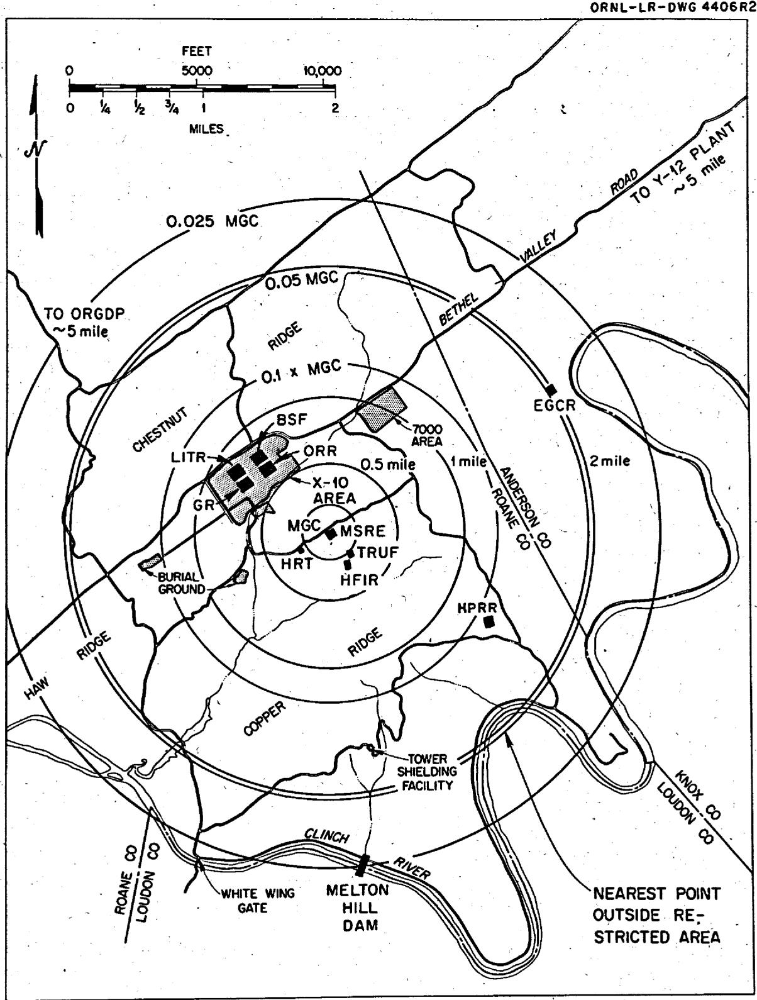  
Figure 4.1. ORNL Area Map.

# 4.3 Gaseous Activity

# 4.3.1 Activity Release from the Containment Stack

4.3.1.1 Activity Released When Not Processing. A fully irradiated fuel batch will be held in the fuel drain tank, with the offgas passed to a charcoal bed, until the xenon emission cannot cause a radiation level in excess of $2.5 \, \text{mr/hr}$ at the point of maximum ground concentration. From Fig. 4.2 it can be seen that an approximately four-day decay period is required before transfer to the fuel storage tank, which is not vented through a charcoal bed. Since there is about $50 \, \text{ft}^3$ of gas space in the processing equipment, an irradiated fuel batch will not be transferred to the fuel storage tank for 10 days at which time the decay rate will equal the production rate and xenon accumulated in the gas space could not result in excessive release when purging is started.

4.3.1.2 Activity Released During H₂-HF Treatment. Although there has been no work done on fission-product behavior under the highly reducing conditions of the H₂-HF treatment, very little if any fission-product volatilization is expected. All the fission products that could form volatile fluorides are more noble than the structural metals, chromium, iron, and nickel. Nickel, which is the most noble of the structural metals will be limited to less than 1 ppm as NiF₂ with a 10:1 H₂-to-HF ratio. Therefore, although no equilibrium quotients are available for the fission-product fluorides, it is unlikely that any niobium, ruthenium, antimony, tellurium, or iodine will exist in the salt as the fluoride. However, it is possible that HI could form and become volatile. The activated charcoal trap will provide good decontamination for HI.

4.3.1.3 Activity Released During Fluorination. Recent "freeze valve" samples of fuel salt have shown $>99\%$ removal of noble metal (Te, Ru, Nb, Mo) fission products during reactor operation. Table 4.2 shows exposures from Te, Nb, and Ru to be below the MPC. Removal of $99\%$ of the Nb and Ru in the NaF trap is expected while no decontamination of Te is allowed for. The charcoal traps will be tested by iodine injection and sampling to demonstrate a removal of at least $99.998\%$ . This removal efficiency limits the $^{131}\mathrm{I}$ release to less than 300 millicuries with 30 days decay.

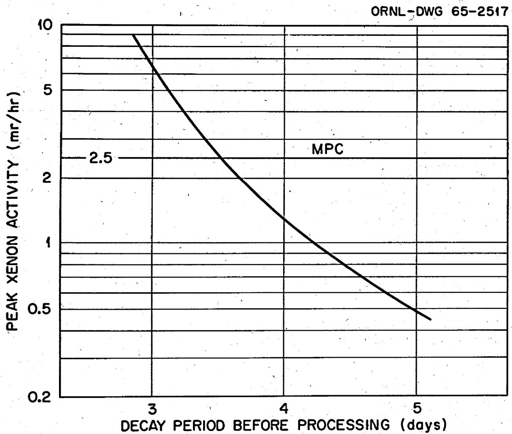  
Figure 4.2. Radiation Level at Maximum Ground Concentration from Xenon Released During Processing of Fuel.

Table 4.2   
Exposures from Volatile Activities in Fuel Salt   

<table><tr><td></td><td>131I</td><td>129mTe</td><td>95Nb</td><td>103Ru</td></tr><tr><td>Curies at 30 days decay</td><td>11,400</td><td>150</td><td>4800</td><td>1500</td></tr><tr><td>Normal Operation</td><td></td><td></td><td></td><td></td></tr><tr><td>Curies released over 40 hr</td><td>0.28</td><td>150</td><td>48</td><td>15</td></tr><tr><td>% of MPC to occupational workers</td><td>0.25</td><td>40</td><td>3.8</td><td>1.5</td></tr><tr><td>% of MPC outside controlled area</td><td>0.23</td><td>36</td><td>4.0</td><td>1.2</td></tr><tr><td>Maximum Credible Accident</td><td></td><td></td><td></td><td></td></tr><tr><td>Curies released in 6.3 min.</td><td>30</td><td>0.4</td><td>12.6</td><td>4.0</td></tr><tr><td>Maximum dose outside controlled area mrad</td><td>1000</td><td>0.4</td><td>3.4</td><td>0.6</td></tr></table>

4.3.1.4 Activity Released by Equipment Failure. The maximum credible accident is believed to be a leak during fluorination in the gas space of the fuel storage tank or in the piping between the FST and the charcoal traps. This could be caused by unusually high localized corrosion. Such a leak would be detected first by the duct 940 radiation monitor. Figure 4.3 shows the time available to turn off the fluorine flow and stop the processing after the alarm has sounded. At the maximum possible leak rate (at the volatilization rate of 4.75 curies of $^{131}\mathrm{I}$ per minute) the monitor would reach alarm in 2 minutes. At the nearest point outside the controlled area (3200 m), the accumulated dose would be 1 rad if 30 curies of $^{131}\mathrm{I}$ were released. This would require 6.3 min or 4.3 minutes after the alarm. This should be ample time to react to the alarm and turn off the fluorine flow. Any leak smaller than this would result in a longer time to reach the alarm point but the allowable reaction time is much greater.

Table 4.2 indicates that the dosages from the other volatile fission products are very small compared with iodine.

ORNL DWG. 68-2731

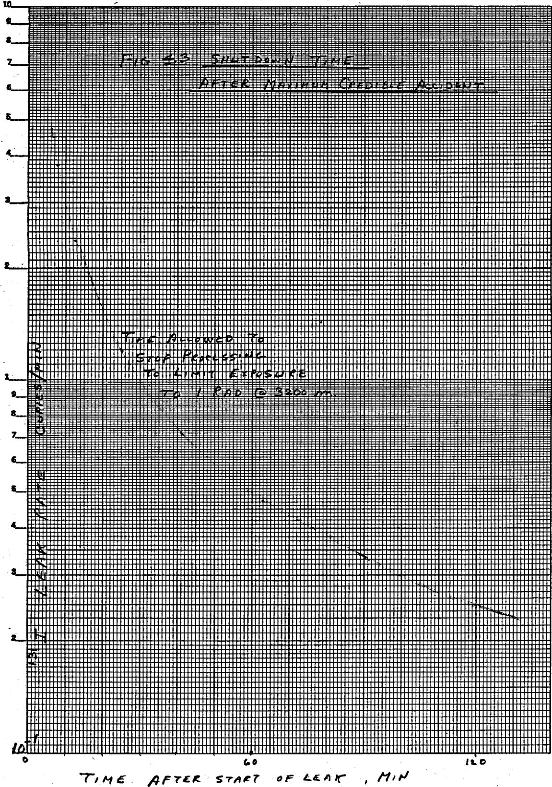  
Figure 4.3. Shutdown Time after Maximum Credible Accident.

# 4.3.2 Activity Release to the Operating Area

The high-bay area above the fuel-processing cell will be used for operation of the fuel-processing system. The possible release of gaseous activity into this area during fuel processing through the roof plugs, from the absorber cubicle, from the salt sampler, and from lines penetrating the cell walls was considered.

4.3.2.1 Activity Released Through the Roof Plugs. Leakage of activity from the fuel-processing cell to the operating area is not considered credible for the following reasons:

1. The cell is tightly sealed. All penetrations, piping, and wiring are grouted and sealed with mastic or pass through sealed boxes.   
2. A negative pressure will be maintained during processing.   
3. Processing can be quickly stopped. This would be done automatically in case of a power failure, which would close the shutoff valve on the gas supply (F2, HF, and H2). The power failure would also stop the flow of cooling air to the cubicle. This air exhausts to the cell and is the only positive gas flow to the cell. A loss of ventilation not caused by a general power failure is highly improbable since there is a spare stack fan and the fans can be run with diesel power.   
4.3.2.2 Activity Released from the Absorber Cubicle. The absorber cubicle is a sealed box of 3/16-in.-thick steel located near the instrument panel board in the high-bay area. It is located in the high-bay area to facilitate handling of the portable absorbers following fluorination. By means of the cubicle blower, the cubicle will be maintained at a negative pressure with respect to the cell, which will be negative to the high-bay area. Failure of power to the blower will close the solenoid valve in the air supply to the cubicle to avoid pressurization.

The maximum cubicle pressure with $100\text{-ft}^3/\min$ air flow will be checked to demonstrate that a pressure greater than 1 psig cannot be obtained with the blower off. If necessary, the maximum air flow will be reduced below $100\text{ft}^3/\min$ to prevent exceeding 1 psig. Prior to fluorination the vent valve will be closed, the cubicle pressure will be raised to 1 psig, and the leak rate will be determined. Leakage must be less than 75 cc/min. This rate of iodine leakage would allow 10 min of working

time in the high-bay area without masks. This is sufficient time to shut down and to evacuate the high-bay area, since the reactor will not be operating during fuel processing.

The presence of gaseous activity in the absorber cubicle will be detected by a monitor that will be continuously sampling the cubicle air during processing. If a leak occurs, processing can be suspended. The cubicle will then be purged with air to the cell, the cubicle top will be removed, and all joints will be checked for tightness. Smears from each joint should indicate the location of the leak.

4.3.4.3 Activity Released from the Cell Penetrations. All cell penetrations connected directly to process equipment are provided with check valves, most of which are located in a sealed instrument cubicle along with the instrument transmitters. A backup of activity to the check valves would be detected by a radiation monitor in the cubicle and possibly by the area monitors in the high-bay area.

In addition to the lines routed through the instrument cubicle, there are three other penetrations from the cell to the high-bay area: the salt sampler, which is discussed in the next section, the salt-charging line, and the caustic-charging line. The salt-charging line will be sealed with at least one freeze valve and capped when not charging salt. The caustic-charging line to the caustic scrubber is provided with two manual valves. Caustic will not be charged during processing, which would be the only time that pressure or activity could be found in the charging line.

The waste-salt line to the spare cell will be sealed by a freeze valve in the processing cell. The method of waste-salt disposal has not yet been determined.

4.3.2.4 Activity Released from the Salt Sampler. The fuel-processing system sampler as mentioned in Section 3.4.6, is similar to the fuel-pump sampler-enricher. Both samplers have similar instrumentation and will be used with similar operating procedures. The fuel-storage tank will not be sampled during processing. Before sampling, the sampling line and fuel storage tank will be purged of gaseous activity. The sample capsule containing the solid sample will be moved from the primary containment area, LC (see Fig. 3.13) to a secondary containment area, 3A, where the sample

will be sealed inside a transport container tube before being removed from the sampler to a shielded carrier.

# 4.4 Penetrating Radiation

# 4.4.1 Normal Levels

4.4.1.1 Operating Area. The radiation level in the high-bay area over the fuel-processing cell will be less than $10\mathrm{mr/hr}$ through the 4-ft-thick high-density-concrete roof plugs under the most severe conditions with a fully irradiated, four-day-decayed fuel salt batch in the fuel storage tank. Since processing would not be started until the batch had decayed for at least a few weeks, this level above the cell should cause no concern. Operations will be planned to limit exposure of individuals to less than $100\mathrm{mr/week}$ , and signs will be posted indicating radiation levels at various points in the high-bay area.

The salt sampler will be shielded with 4 in. of lead, which should reduce the radiation level from a fuel salt sample to less than 10 mr/hr.

It will be necessary to shield the absorber cubicle during processing of a fully irradiated fuel batch. Since "freeze-valve" salt samples have shown that only $\sim 1\%$ of the calculated $^{99}\mathrm{Mo}$ is in the circulating salt stream, absorbed activity is expected to be very low and shielding of the absorbers should not be required. However $^{131}\mathrm{I}$ in the gas space in the absorbers will require that the absorber cubicle be shielded with $1/2$ -in. to $1$ -in. of lead. The radiation levels will be monitored during processing and additional shielding and radiation signs will be posted as required.

4.4.1.2 Switch House. The only fuel-processing cell wall adjacent to an occupied area is the west wall bordering the switch house. The 4-ft area between the switch house and the cell will be filled with stacked concrete blocks. When a fully irradiated fuel batch is in the storage tank, the level at the east wall of the switch house should be less than $5\mathrm{mr/hr}$ .

4.4.1.3 Spare Cell. The east wall of the fuel-processing cell adjoins the spare cell where the activated-charcoal trap, offgas filters,

dampers, differential-pressure transmitter, and hydrogen flame arrester are located. A blanked waste salt line extends into this cell for future removal of waste salt. Two feet of stacked concrete block shielding is provided between the cell wall and the above equipment. This will provide sufficient shielding (a total of 3-1/2 ft) to permit replacing the offgas filters without exceeding planned exposures. The dose rate should be less than 50 mr/hr.

The charcoal beds will be shielded with 16 in. of barytes concrete. This will reduce the radiation level at the filters to $<30 \, \text{mrem/hr}$ with all the iodine from a fuel batch on the beds after 30 days decay.

4.4.1.4 Decontamination Cell. The 18-in. north wall of the fuel-processing cell borders the decontamination cell. There would probably be a limited working time over the decontamination cell with the roof plugs off and a fully irradiated batch in the fuel storage tank.   
4.4.1.5 Area Surrounding the Waste Cell. The maximum activity expected in the caustic solution from the hydrofluorination of a 28-day-decayed fuel batch is 11,000 curies of iodine, assuming complete removal in the scrubber. During the time this activity is in the liquid waste tank, there must be limited access to the areas above and around the waste cell, and radiation warning signs must be posted.

# 4.4.2 Unusual Radiation Levels

4.4.2.1 From Irradiated Salt. There are two dip tubes in the fuel storage tank into which salt could accidentally back up: the salt-transfer line and the gas-sparging line. The salt-transfer line is connected to the spare cell by the waste salt line and to the high-bay area by the salt-charging line. Both lines have freeze valves that are normally frozen. In addition, the end of each line will be capped when not in use.

The gas-sparging line passes through the area west of the cell to the instrument cubicle and then to the gas supply station. An air valve located in the instrument cubicle actuates a valve in the cell which opens if the tank pressure exceeds the purge pressure and vents the line to the top of the tank to prevent salt backup. If a plug should occur, it could be thawed with installed electric heaters without entering the cell.

4.4.2.2 From Caustic Solution. Most of the iodine in the salt may be volutilized as HI during $\mathrm{H}_{2}$ -HF treatment. There will probably be some deposition on metal surfaces before the HI reaches the caustic scrubber but most of the iodine reaching the scrubber will be collected there. The maximum iodine concentration in the scrubber solution will be 2 c/gal from flush salt processing and 40 c/gal from fuel salt processing. The caustic solution can either be diluted to 5 c/gal or allowed to decay for an additional 24 days before transferring to the intermediate level waste system collection tank. The piping and pump containing the radioactive scrubber solution is shielded but masks, protective clothing, and Health Physics surveillance are required for the sampling operation.

The solution could possibly get into unshielded lines in the following ways:

1. Pressuring of the scrubber tank during processing and plugging of the vent line or flame arrester could force some solution up the jet steam line, but this line is shielded to approximately 25 ft from the jet and backup this far into a closed line is unlikely. The pressure alarms on both the fuel storage tank and the caustic scrubber would provide sufficient warning to stop processing before a dangerous pressure was reached.   
2. Pressuring of the scrubber tank during jetting plus plugging of the vent line or flame arrester and plugging of the jet discharge line to the waste tank could cause steam to back up through the caustic solution. Considerable time would be required to build up sufficient pressure (7 psig) to force solution up the sparge line to the absorber cubicle. Pressure alarms and radiation monitors would provide warning far in advance of any hazard.   
3. A vacuum in the jet line could pull solution into the steam line. If the jet discharge line should plug and jetting should stop, condensing steam could create such a vacuum. A check valve tees into the steam line and will prevent a vacuum from forming in this line.   
4. Cooling of the fuel storage tank without gas purges to the tank could cause a vacuum in the tank and offgas piping to the scrubber. A power failure could cause cooling of the tank but would not stop the

helium purges. In the event of a prolonged power failure and cooling of the fuel storage tank, the caustic scrubber would be jetted to the waste tank.

4.4.2.3 From Radioactive Gas. The sampling line is the only gas line from the fuel storage tank to the operating area. Steps will be taken as indicated in Section 4.3.2.4 to keep gaseous activity out of the sampler. Sparging for 1 hr with helium should reduce the activity in the gas space by a factor of $10^{5}$ . Complete filling of the sampler access chamber with atmosphere from the fuel storage tank would result in a radiation level $10^{3}$ times less than that from a fully irradiated fuel salt sample.

# REFERENCES

1. R. B. Lindauer, Preoperational Testing of the MSRE Fuel Processing Facility and Flush Salt Treatment No. 1, ORNL-CF-65-7-36, July, 1965.   
2. L. E. McNeese, An Experimental Study of Sorption of Uranium Hexafluoride by Sodium Fluoride Pellets and a Mathematical Analysis of Diffusion with Simultaneous Reaction, USAEC Report ORNL-3494, p. 82, Oak Ridge National Laboratory, November 1963.   
3. R. L. Jolly, et al., Equipment Decontamination Methods for the Fused Salt-Fluoride Volatility Process, USAEC Report ORNL-2550, Oak Ridge National Laboratory, August 1958.   
4. R. C. Robertson MSRE Design and Operations Report, Part I, Description of Reactor Design, USAEC Report ORNL-TM-728, Oak Ridge National Laboratory, January 1965, p. 244.   
5. U. S. Department of Commerce Weather Bureau, Meteorology and Atomic Energy, USAEC Report AECU-3066, July 1955.   
6. F. A. Gifford, U. S. Weather Bureau, Oak Ridge, Tennessee, Personal Communication to L. A. Mann, Oak Ridge National Laboratory, January 27, 1961.   
7. Letter from F. R. Bruce to Division Directors, February 5, 1965, Subject: Criteria for Controlling Release of $^{131}$ I to the Atmosphere, February 5, 1965.

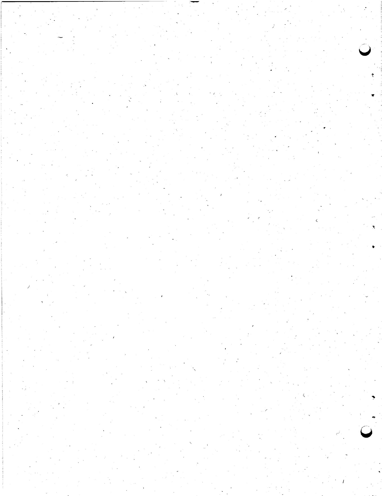

# Internal Distribution

1. R.G.Affel

35. A. I. Krakoviek

2. T.A. Arehart

36-38. R.B.Lindauer

3. C. F. Baes

39. R.N. Lyon

4. S.E Beall

40. H. G. MacPherson

5. E. S. Bettis

41. R. E. MacPherson

6. F. F. Blankenship

42. H. E. McCoy

7. R. Blumberg

43. H.C. McCurdy

8. E. G. Bohlmann

44. H. F. McDuffie

9. R. B. Briggs

45. C. K. McGlothlan

10. R. E. Brooksbank

46. L. E. McNeese

11. T. J. Burnett

47. A. J. Miller

12. W.A.Bush

48. R. R. Minue

13. W. L. Carter

49. R. L. Moore

14. G. I. Cathers

50. E. L. Nicholson

15. W.B.Cottrell

51. L.C.Oakes

16. J. L. Crowley

52. A.M.Perry

17. F. L. Culler, Jr.

53. J. L. Redford

18. R. J. DeBakker

54. M. Richardson

19. S. E. Dismuke

55-64. M. W. Rosenthal

20. S.J.Ditto

65. A.W. Savolainen

21. J. S. Drury

66. R.W. Schaich

22. J.R. Engel

67. D. Scott

23. D. E. Ferguson

68. M. J. Skinner

24. A. P. Fraas

69. I. Spiewak

25. C. H. Gabbard

70. R.C. Steffy, Jr.

26. R. B. Gallaher

71. D. A. Sundberg

27. W. R. Grimes

72. R.E.Thoma

28. A. G. Grindell

73. D. B. Trauger

29. R. H. Guymon

74. A. D. Warden

30. P. H. Harley

75. B.H.Webster

31. P. N. Haubenreich

76. A. M. Weinberg

32. P. G. Herndon

77. J. R. Weir

33. T. L. Hudson

78. M. E. Whatley

34. P. R. Kasten

79. J. C. White

82-83. Central Research Library

80. G. D. Whitman

84-85. Y-12 Document Reference Section

81. W. S. Pappas, ORGDP

86-110. Laboratory Records (LRD)

111. Laboratory Records - Record Copy (IRD-RC)

# External Distribution

112-126. Division of Technical Information Extension (DTIE)

127. Laboratory and University Division (ORO)