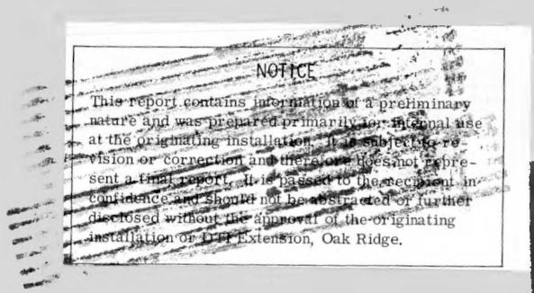

RELEASED FOR ANNOUNCEMENT

IN NUCLEAR SCIENCE ABSTRACTS

MSRE DESIGN AND OPERATIONS REPORT

PART VIII, OPERATING PROCEDURES

R.H. Guymon


# DISCLAIMER

This report was prepared as an account of work sponsored by an agency of the United States Government. Neither the United States Government nor any agency thereof, nor any of their employees, makes any warranty, express or implied, or assumes any legal liability or responsibility for the accuracy, completeness, or usefulness of any information, apparatus, product, or process disclosed, or represents that its use would not infringe privately owned rights. Reference herein to any specific commercial product, process, or service by trade name, trademark, manufacturer, or otherwise does not necessarily constitute or imply its endorsement, recommendation, or favoring by the United States Government or any agency thereof. The views and opinions of authors expressed herein do not necessarily state or reflect those of the United States Government or any agency thereof.

# DISCLAIMER

Portions of this document may be illegible in electronic image products. Images are produced from the best available original document.

# LEGAL NOTICE

This report was prepared as an account of Government sponsored work. Neither the United States, nor the Commission, nor any person acting on behalf of the Commission;

A. Makes any warranty or representation, expressed or implied, with respect to the accuracy, completeness, or usefulness of the information contained in this report, or that the use of any information, apparatus, method, or process disclosed in this report may not infringe privately owned rights; or...   
B. Assumes any liabilities with respect to the use of, or for damages resulting from the use of any information, apparatus, method, or process disclosed in this report.

As used in the above, "person acting on behalf of the Commission" includes any employee or contractor of the Commission, or employee of such contractor, to the extent that such employee or contractor of the Commission, or employee of such contractor prepares, disseminates, or provides access to, any information pursuant to his employment or contract with the Commission, or his employment with such contractor.

# MSRE DESIGN AND OPERATIONS REPORT PART VIII, OPERATING PROCEDURES

R.H. Guymon

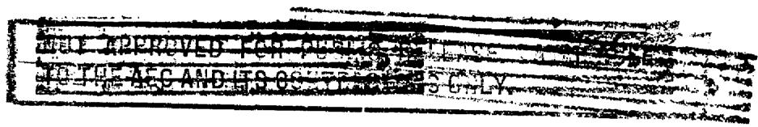

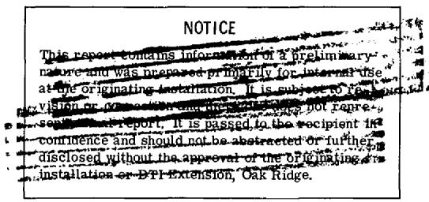

DECEMBER 1965

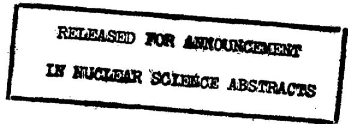

OAK RIDGE NATIONAL LABORATORY

Oak Ridge, Tennessee

Operated by

UNION CARBIDE CORPORATION

for the

UNITED STATES ATOMIC ENERGY COMMISSION

# PREFACE

The report on the Molten-Salt Reactor Experiment (MSRE) has been arranged into twelve major parts as shown below. Each of these covers a particular phase of the project, such as the design, safety analysis, operating procedures, etc. An attempt has thus been made to avoid much of the duplication of material that would result if separate and independent reports were prepared on each of these major aspects.

Detailed references to supporting documents, working drawings, and other information sources have been made throughout the report to make it of maximum value to ORNL personnel. Each of the major divisions of the report contains the bibliographical and other appendix information necessary for that part.

The final volumes of the report, Part XII, contain rather extensive listings of working drawings, specifications, schedules, tabulations, etc. These have been given a limited distribution.

Most of the reference material is available through the Division of Technical Information Extension, Atomic Energy Commission, P.O. Box 62, Oak Ridge, Tennessee. For material not available through this source, such as inter-Laboratory correspondence, etc., special arrangements can be made for those having a particular interest.

None of the information contained in this report is of a classified nature.

All the reports are listed below.

ORNL-TM-728*

MSRE Design and Operations Report, Part I, Description of Reactor Design, by R. C. Robertson


ORNL-TM-729

MSRE Design and Operations Report, Part II, Nuclear and Process Instrumentation, by J. R. Tallackson

ORNL-TM-730*

MSRE Design and Operations Report, Part III, Nuclear Analysis, by P. N. Haubenreich, J. R. Engel, B. E. Prince, and H. C. Claiborne


ORNL-TM-731

MSRE Design and Operations Report, Part IV, Chemistry and Materials, by F. F. Blankenship and A. Taboada

OrNL-TM-732\*

MSRE Design and Operations Report, Part V, Reactor Safety Analysis Report, by S. E. Beall, P. N. Haubenreich, R. B. Lindauer, and J. R. Tallackson

RicciFOrNL-TM-733*

MSRE Design and Operations Report, Part VI, Operating Safety Limits for the Molten-Salt Reactor Experiment, by S. E. Beall and R. H. Guymon

ORNL-TM-907*

MSRE Design and Operations Report, Part VII, Fuel Handling and Processing Plant, by R. B. Lindauer

ORNL-TM-908

MSRE Design and Operations Report, Part VIII, Operating Procedures, by R. H. Guymon

2004 ORNL-TM-909

MSRE Design and Operations Report, Part IX, Safety Procedures and Emergency Plans, by A. N. Smith

ORNI-TM-910

MSRE Design and Operations Report, Part X, Maintenance Equipment and Procedures, by E. C. Hise and R. Blumberg

VORNL-TM-911

MSRE Design and Operations Report, Part XI, Test Program, by R. H. Guymon and P. N. Haubenreich

MSRE Design and Operations Report, Part XII, Lists: Drawings, Specifications, Line Schedules, Instrument Tabulations (Vol. 1 and 2)

# Acknowledgement

The Operating Procedures were written primarily by members of the MSRE Operations Department of the ORNL Reactor Division. Substantial contributions were made by members of the Development Department of the Reactor Division and by members of the Instruments and Controls Division who wrote and reviewed various sections. All contributions are gratefully acknowledged.

# CONTENTS

# Volume I

# PREFACE

# ACKNOWLEDGEMENT

# 1 INTRODUCTION

1A Explanation of Operating Procedures

lB List of Other Material Available

# 2 NUCLEAR ASPECTS OF OPERATION

2A Simplified Reactor Theory

Glossary   
2 Atomic Structure   
3 Radioactivity and Radiation   
4 The Fission Process   
Cross Sections and Reaction Rates   
6 The Fission Chain Reaction in an Infinite Reactor   
7 Effect of Neutron Leakage   
8 Criticality   
9 Extraneous Neutron Sources and Subcritical Multiplication   
10 Reactor Kinetics   
11 Nuclear Instrumentation   
12 Reactor Control   
13 Xenon and Samarium

# 2B MSRE Nuclear Characteristics

Core Reactivity Factors   
2 Heat Generation and Temperature Distributions   
3 Instrumentation   
4 Kinetics and Safety

# 3 OPERATION OF AUXILIARY SYSTEMS

# 3A Electrical System

System Startup   
2 Normal Operation   
3 Emergency and Special Operations   
4 Normal Shutdown

# ix

4 Special Equipment Room   
5 West Tunnel and South Electric Service Area   
6 Charcoal Bed Pit   
7 Filter Pit   
8 Auxiliary Cells

# 3F Ventilation System

1 Startup   
2 Normal Operation   
3 Operation during Maintenance   
4 Special Operations   
5 Shutdown

# 3G Leak-detector System

1 Startup   
2 Normal Operation   
3 Location of Leaking Flanges   
4 Shutdown Procedures

# 3H Instrumentation

1 Controllers and Indicators   
2 Scanner   
3 Computer   
4 Annunciators   
5 Jumper Board   
6 Other Instruments

6.1 FqI-569-A   
6.2 AO2-566-A   
6.3 PdE-RC-E   
6.4 ABe-A-AD3   
6.5 AO2-548   
6.6 $\mathrm{AH}_{2}0 - 548$

# 3I Freeze Valves

l Definitions and Criteria   
2 Basic Operation and Interlocks   
3 Operation of Freeze Valves

3J Liquid Waste System

1 Jetting Reactor Cell and Drain Tank Cell Sumps   
2 Sampling Reactor and Drain Tank Cell Sumps   
3 Jetting Auxiliary Cell Sumps   
4 Building Sump Operation   
5. Pit Pump Operation   
6 Treatment and Disposal of Waste Contents   
7 Clarification of Decontamination Tank or Decontamination Cell Liquid   
8 Backwash of the Waste Filter   
9 General Decontamination and Clean Up

3K Be Monitoring System

1 General Building Air Sampling System   
2 Ventilation System Air Handling   
3 NSL Be Air Monitoring Unit   
4 Coolant System Stack Be Monitoring Unit

4 AUXILIARY SYSTEMS STARTUP CHECK LISTs

4A Electrical System   
4B Instrument Air System   
4C Cooling Water Systems   
4D Component Cooling Systems   
4E Shield and Containment Systems   
4F Ventilation System   
4G Leak-detector System   
4H Instrumentation   
4I Freeze Valves

# Volume II

5 REACTOR STARTUP

5A Furging Oxygen and Moisture from the Salt System   
5B Startup of Cover-gas and Offgas Systems   
5C Heatup of Drain Tank System   
5D Addition of Fuel, Flush, and Coolant Salt to the Drain Tanks   
5E Startup of Lube-oil Systems for the Fuel and Coolant Pumps   
5F Heatup of Fuel and Coolant Systems   
5G Prepare Drain Tank Systems for Reactor Startup   
5H Routine Pressure Test

5I Filling the Fuel and Coolant Systems   
5J Criticality and Power Operation

1 Preparation for Power Operation   
2 Starting Power Operation using Automatic Load Control and Rod Servo   
3 Manual and Special Power Operation

5K Normal Operating Conditions

# 6 SAMPLING AND ADDITIONS

6A Fuel System Sampling and Enriching

1 General Description of Sampling the Fuel System   
2 General Description of Adding Enriching Capsules to the Fuel System   
3 Fuel System Sampling Check List   
4 Fuel System Enriching Check List   
5 Fuel System Sampler Startup   
6 Fuel System Sampler Shutdown   
7 Unusual Operating Conditions for the Sampler Enricher

6B Coolant System Sampling

1 General Description of Sampling the Coolant System   
2 Coolant System Sampling Check List   
3 Coolant System Sampler Startup   
4 Coolant System Sampler Shutdown

6C Water System

1 Treatment of Treated Water or Nuclear Penetration   
2 Treatment of Cooling Tower Water   
3 Condensate   
4 Procedure for Total Inhibitor Analysis   
5 Procedure for Chromate Analysis   
6 Procedure for Hardness Analysis   
7 pH Measurement

6D Cell Air

6E Lube Oil System

1 Sampling of New Oil as Received   
2 Sampling at Oil Packages   
3 Addition of Lube Oil to Oil Packages

6F Cover Gas   
6G Offgas System

# 7 HEAT BALANCE

7A General Description   
7B Computer Heat Balance   
7C Manual Heat Balance

# 8 PERIODIC INSTRUMENT CALIBRATION AND CIRCUIT CHECKS

8A Neutron Level

1 Wide-range Counting Channels   
2 Nuclear Safety Channels   
3 Linear Power Channels

8B Calibration Check of Process Radiation Monitors

1 Preparation   
2 Radiation Monitor 557 (Offgas from Charcoal Beds)   
3 Radiation Monitor 528 (Coolant System Offgas)   
4 Radiation Monitor 565 (Cell Offgas)   
5 Radiation Monitor 500 (Main Helium Supply)   
6 Process Monitor 596 (Outside Transmitter Room)   
7 Process Monitor 827 (Treated Water)   
8 Oil System Process Monitors (Service Tunnel)

8C Calibration of Personnel Monitors and Stack Monitors

1 Routine Source Check   
2 Alarm Matrix Check   
3 Evacuation Alarm Test   
4 Containment Stack Monitor Tests

8D Safety Circuit Checks

Fuel Pump and Overflow Tank Pressure   
2 Helium Supply Pressure   
3 FP and OFT Bubblers   
4 Rod Scram Circuits   
5 Emergency Fuel Drain   
6 High/Low Reactor Cell Pressure   
7 Coolant Pump Speed and Coolant Salt Flow   
8 Sampler-Enricher   
9 Exercise Control Rods

# 9 UNUSUAL OPERATING CONDITIONS

9A Loss of Electrical Power  
1 Loss of Preferred TVA Feeder  
2 Complete Loss of TVA Power - All Diesels Operable  
3 Failure of DG-3 during a TVA Power Outage  
4 Failure of DG-4 during a TVA Power Outage  
5 Failure of DG-5 during a TVA Power Outage  
6 Failure of DG-3 and 4 during a TVA Power Outage  
7 Failure of DG-3 and 5 or 4 and 5 during a TVA Power Outage  
8 Loss of 250v DC Systems  
9 Loss of Instrument Power   
9B Loss of Cooling Water 1 Treated Water System 2 Cooling Tower Water   
9C Loss of Fuel or Coolant Pump 1 Loss of Fuel Pump 2 Loss of Coolant Pump   
9D Loss of Instrument Air 1 Air Compressor Electrical Difficulties 2 Other Air Compressor Difficulties 3 Effects of Loss of Instrument Air   
9E Radiation Increases 1 Personnel Monitors 2 Process Radiation Detectors 3 High Stack Activity   
9F Control-rod Drive Difficulty 9G Loss of Computer   
9H Lube-oil System Difficulties 1 Coolant Salt Pump Lube System Failure 2 Fuel Salt Pump Lube System Failure 3 Total Oil System Failure 4 Excess Oil Seal Leakage   
9I Salt in Overflow Tank   
9J Loss of Helium Purge to the Circulating Pumps   
9K Loss of Component Cooling Blowers

9L Removal of Water from the Steam Domes   
9M Regeneration of Helium Dryer   
9N High Cell Leak Rate Indication

Salt Leaking into the Cell   
2 Water Leaking into the Cell   
3 Loss of Reactor or Drain Tank Space Coolers   
4 Actual High Cell Leak Rate

# LO REACTOR SHUTDOWN

10A Normal Shutdown

1 Power Reduction and Going Subcritical   
2 Draining and Flushing the Fuel System   
3 Draining the Coolant System   
4 Cooldown of Fuel and Coolant Systems   
5 Shutdown of Remaining Equipment

10B Special Shutdown

1 Power Reduction and Going Subcritical   
2 Draining and Flushing the Fuel System   
3 Shutdown of Remaining Equipment

# 11 SHUTDOWN OPERATIONS

llA Fuel or Flush Salt Transfers

1 Preparation for Transfers   
2 Transfer from FD-1 to FST   
3 Transfer from FD-2 to FST   
4 Transfer from FFT to FST   
5 Transfer from FST to FD-1   
6 Transfer from FST to FD-2   
7 Transfer from FST to FFT   
8 Transfer from FD-1 to FD-2   
9 Transfer from FD-2 to FD-1   
10 Heatup of FST   
ll Heatup of Line 111   
12 Heatup of Waste Line 112   
13 Heatup of Fill Line 203   
Heatup of Transfer and Salt Addition Freeze Valve Assemblies

llB Opening Reactor Cell, Drain Tank Cell, and Coolant Cell Shields

1 Reactor Cell Heater Shutdown Check List   
2 Drain Tank Cell Heater Shutdown Check List   
3 Coolant Cell Heater Shutdown Check List   
4 Cooling Water Shutdown Check List   
5 Freeze Valve Shutdown Check List   
6 Component Cooling Air to Components Shutdown Check List   
7 Component Cooling Pumps Shutdown Check List   
8 Electrical Breakers Shutdown Check List   
9 Opening Reactor Cell and Drain Tank Cell   
10 Opening the Coolant Cell

llC Graphite Sampling

llD Routine Inspection and Testing of Equipment

1 Process Systems   
2 Auxiliary Systems   
3 Pressure Relief Valves   
4 Rupture Discs   
5 Reactor Cell and Drain Tank Cell Containment Vessels   
6 Secondary Containment Vessels

12 ROUTINE OBSERVATIONS

12A Logs   
12B Check Lists   
12C Recorders and Indicators   
12D Computer   
12E Tags and Signs

13 MAINTENANCE AND CHANGES

13A Maintenance   
13B Modifications   
13C Changes in Operating Procedures   
13D Changes in Computer Program   
13E Revisions of Approved Documents

# MSRE DESIGN AND OPERATIONS REPORT

Part VIII

OPERATING PROCEDURES

R. H. Guymon

# 1. Introduction

The first draft of the operating procedures was written during design and construction of the reactor as an aid in producing a complete, workable design. This draft was then used during operator training, for prenuclear shakedown of the reactor, and for the zero-power nuclear experiments. During this time, changes were made in the master copy as the need arose. The present issue is the result of a comprehensive review and updating, and incorporates all changes and additions found necessary up to the beginning of power operation.

# LA EXPLANATION OF THE OPERATING PROCEDURES

The prime purpose of this part of the MSRE Design and Operations Report is to aid in the training of operating personnel and to provide readily available reference material needed for operation. Details which are not thought to be needed in normal operation are omitted. These can be found in the other parts of the Design and Operations report and in the material referenced in Section 1B.

Section 2, Nuclear Aspects of Operation, gives a simplified discussion of basic nuclear facts, explains the nuclear behavior of the MSRE and sets down the values of characteristic properties.

Section 3, Operation of the Auxiliary Systems, covers in detail the operation of each auxiliary system. In order to avoid repetition with section 4, not all line, valve, switch or instrument numbers are enumerated, but often they are referred to in general terms or as groups (such as "The cooling water is turned on to all space coolers.") However, when it adds to clarity the numbers are also given. In general, flow rates, temperatures, pressures, etc., are not given but are covered by the startup check lists, log sheets, run instructions, and daily shift instructions.

Section 4, Auxiliary Systems Startup Check Lists, covers the minute details necessary in getting the auxiliary systems ready for startup. The position of each valve and switch is listed, and a test for each instrument under actual or simulated operating conditions is described in detail. The check lists are written in logical order for each system; however, since there is an interdependence between systems, it may be necessary to do portions of one check list before portions of another. When logical sequence permits, all operations in a physical area are listed together in order to expedite completion of these lists. All items in this section must be completed before each startup unless the omission is approved by the operations chief.

Section 5, Reactor Start Up, covers the actual startup of the reactor and operation at power. Each step is outlined in detail. All instrument settings and switch and valve positions are given. This

section is written in chronological sequence and tells what is to be done, when it can be done, why certain precautions are necessary, and suggests corrective action in case of difficulty.

Section 6, Sampling and Adaptations, describes all samples which are to be taken, frequency of sampling, analyses to be made and allowable limits. Details of sampling procedures are given. Salt additions, chemical additions, etc., are described.

Section 7, Heat Balance, describes the method used to determine the power being produced by the reactor.

Section 8, Instrument Calibrations and Operation, gives the procedure used to periodically check the safety circuits and other instrumentation and assure that they are functioning properly.

Section 9, Unusual Operating Conditions, attempts to anticipate possible difficulties and suggest corrective action to be taken.

Section 10, Reactor Shutdown, describes in detail normal and special shutdowns of the reactor and lists possible causes for a shutdown and actions to be taken by operating personnel.

Section 11, Shutdown Operations, provides procedures for operational activities involved while the reactor is shut down including graphite sampling.

Section 12, Routine Observations, describes the taking of data, marking of charts, storing of data, logging equipment, and other routine duties of the shift personnel.

Section 13, Maintenance and Changes, describes the methods used for getting maintenance done safely and for making modification to the system or to approved documents.

# 1B LIST OF OTHER MATERIAL AVAILABLE

The MSRE is well documented with drawings and reports to cover all phases of the design, development, and construction. Not all of this information is needed routinely for operation of the reactor. The following list has been compiled expressly as an aid to operating personnel.

1. MSRE Design and Operations Report

<table><tr><td>ORNL-TM-728</td><td>Part I</td><td>Description of Reactor Design</td></tr><tr><td>ORNL-TM-729</td><td>Part II</td><td>Nuclear and Process Instrumentation</td></tr><tr><td>ORNL-TM-730</td><td>Part III</td><td>Nuclear Analysis</td></tr><tr><td>ORNL-TM-731</td><td>Part IV</td><td>Chemistry and Materials</td></tr><tr><td>ORNL-TM-732</td><td>Part V</td><td>Reactor Safety Analysis Report</td></tr><tr><td>ORNL-TM-733</td><td>Part VI</td><td>Operating Limits</td></tr><tr><td>ORNL-TM-907</td><td>Part VII</td><td>Fuel Handling and Processing Plant</td></tr><tr><td>ORNL-TM-908</td><td>Part VIII</td><td>Operating Procedures</td></tr><tr><td>ORNL-TM-909</td><td>Part IX</td><td>Safety Procedures and Emergency Plans</td></tr><tr><td>ORNL-TM-910</td><td>Part X</td><td>Maintenance Equipment and Procedures</td></tr><tr><td>ORNL-TM-911</td><td>Part XI</td><td>Test Program</td></tr><tr><td></td><td>Part XII</td><td>Lists: Drawings, Specifications, 
Line Schedules, Instrument Tabulations</td></tr></table>

2. Miscellaneous Reports and Literature

MSRE Semi-Annual Reports

MSR 63-36 Line Schedule

CF 60-10-62 I and C Electrical Standards and Graphical Symbols

CF 57-2-1 Instrumentation Flow Plan Symbols

CF 63-6-30 Design Data Sheets

Manufacturer's Literature (File)

Valve Tabulation

Instrument Application Tabulation (Book)

Instrument Specification (Book)

Test Reports (Book)

ORNL Radiation Safety and Control Training Manual (Book)

ORNL Radiation Safety and Control (Book)

ORNL Health Physics Manual (Book)

ORNL Emergency Manual (Book)

3. Miscellaneous Unpublished Information

```txt
Facts Book  
Run Instructions (Book)  
Shift Instructions (Book)  
Calibration Curves (Book)  
Log Books Previous Operations (File)  
Logger Data (File)  
Building Log (File)  
Recorder Charts (File)  
Rough Data From Previous Tests (File)  
Daily Reports (File)  
Run Reports (File)  
Test Memos (File)  
Thermocouple Tabulation Logs (Book)  
Photographs of Construction (File) 
```

4. Drawings

Process Flow Sheets

Fuel System D-AA-A-40880

Coolant System D-AA-A-40881

Fuel Drain Tank System D-AA-A-40882

Off Gas & Containment Ventilation Systems D-AA-A-40883

Cover Gas System D-AA-A-40884

Oil Systems for Fuel & Coolant Pumps D-AA-A-40885

Fuel Processing System D-AA-A-40887

Liquid Waste System D-AA-A-40888

Cooling Water System D-AA-A-40889

Leak Detector System D-AA-A-40890

# Instrument Application Diagrams

Fuel Salt System D-AA-B-40500

Coolant Salt System D-AA-B-40501

Fuel Drain Tank System D-AA-B-40502

Cover Gas System D-AA-B-40503

Oil System for Fuel Salt Pump D-AA-B-40504

Sampler-Enricher System D-AA-B-40505

Liquid Waste System D-AA-B-40506

Oil System for Coolant Salt Pump D-AA-B-40508

Water System D-AA-B-40509

Off Gas & Component Air Coolant Systems D-AA-B-40510

Fuel Loading & Storage System D-AA-B-40513

Chemical Processing System D-AA-B-40514

Containment Air D-AA-B-40515

Nuclear Instrument D-AA-B-40523

# Annunciator Schematics

Main Control Board D-HH-Z-41723 & 41738

Auxiliary Bontrol Board E-HH-Z-41724

Sampler Enricher D-HH-Z-41726

Chem. Processing E-HH-Z-55477

Sampler Enricher D-HH-Z-55575

Nuclear Control Board D-HH-Z-57428

Instrument Power Distribution One Line E-HH-Z-41695

# Maintenance Elementaries

Safety Circuits D-HH-B-57372-3

Containment Circuits D-HH-B-57374-7

Control Interlock Circuits D-HH-B-57378 & 91

Master Control Circuits D-HH-B-57379-83

Radiator Load Control System D-HH-B-57384-6

Rod Control Circuits D-HH-B-57387-9

Fission Chamber Drives D-HH-B-57390

I.A.C.#1,F.O.P.#1&C.O.P.#1 D-HH-B-57357

13 -4

9-2-65;

I.A.C. #1, F.O.P. #2 & C. O. P. #2

Auxiliary A.C. Control Circuits

Cover Gas System

Indicator Lamps

Freeze Valves

D-HH-B-57358

D-HH-Z-57359-63

D-HH-B-41759 & 63

D-HH-B-40516 &

40545

D-HH-B-57345-56

E.C.I. Connection Diagram

Fuel Salt System

D-HH-B-40636

Coolant Salt System

D-HH-B-40637-40

Safety Circuits

D-HH-B-41571

Annunciators

E-HH-Z-41696 &

D-HH-Z-55589-91

Instrument Power Panels

E-HH-D-57369-70&

E-HH-D-57364-67

Engineering Elementaries (Control Schematics)

Safety Circuits

D-HH-B-57312-3

Containment Circuits

D-HH-B-57314-7

Control Interlock Circuits

D-HH-B-57318 &

57327

Master Control Circuits

D-HH-B-57319-21

Radiator Lead Control System

D-HH-B-57322

Rod Control Circuits

D-HH-B-57324-25

Fission Chamber Drives

D-HH-B-57326

Instrument Air Compressors

D-KK-C-41159

I.A.C. # 1 & 2, F.O.P. #1 & 2 & C.O.P.

1 & 2

D-HH-D-57306

Auxiliary A.C. Control Circuits

D-HH-Z-57307-31.1

Freeze Valve Control Circuits

D-HH-B-57300-305

Block Diagrams

D-HH-B-57330-1

Master Control

D-HH-B-57332-3

Rod Control

D-HH-B-57334

Radiator Load Control System

D-HH-B-57335

<table><tr><td>Coolant Salt System</td><td>D-HH-B-57336</td></tr><tr><td>Containment System</td><td>D-HH-B-57337-8</td></tr><tr><td>Auxiliary Process Control Systems</td><td>D-HH-B-57339-41</td></tr><tr><td>Freeze Valves</td><td>D-HH-B-57342</td></tr><tr><td>Electrical-Process Equipment--Locations</td><td>D-KK-C-41139</td></tr><tr><td>Process Equipment Distribution System(one line)</td><td>D-KK-C-41152</td></tr><tr><td>Auxiliary Power System One Line</td><td>D-KK-C-41134</td></tr><tr><td>480v Switchgear</td><td>D-KK-C-41175-6</td></tr></table>

Schematics. Electrical

Electric Heating E-MM-C-51620

Main Power-Electric Heating E-MM-C-40850

Panels FPl, FP2 & RCH3 Reactor Cell Elec. Heating E-MM-C-51618

Panels RCH-4, Hx1, Hx2 & Hx3 Reactor Cell Elec. Heating E-MM-C-51619

Panels RCH-1, 2 & 7 Reactor Cell Elec. Heating E-MM-C-51698

Panels RCH 5 & 6, H 102-2 Reactor Cell Elec. Heating E-MM-C-51699

Elec. Heating Distribution Panels R1-2 & 3 E-MM-C-56234

Fuel Drain & Flush Tank Heating E-MM-C-51655

Elec. Heating - Radiator Inlet & Outlet E-MM-C-40818

Elec. Heating - Radiator E-MM-C-40822

Elec Heating - Radiator E-MM-C-40823

Elec. Heating Distribution Panels H200-13, H201-12, H202-2, Sp-1 & 16 E-MM-C-40840

Panel G5-2-￥ E-MM-C-40828  
Distribution Panels G5-1A1 through E-MM-C-51653

Panel 65-B5 Radiator Heating E-MM-C-40821 Distribution Panels G5-1-C1, C2, & C3 E-MM-C-51654 Distribution Panels G5-1D2, D3, & D4 E-MM-C-40844

Panel T-1-A Elec. Heating E-MM-C-40846

Panel T-1-B Elec. Heating E-MM-C-40847

Panel T-1-C Elec. Heating E-MM-C-40848

Distribution Panels T-2-V1, T-2-W1 & W2 E-MM-C-40841

Panel T-2-Y Elec. Heating E-MM-C-40849

Elec. Heating Flush & Drain Tanks, Panels G5-1-Al & A2 E-MM-C-51662

Panel G5-1-A5 E-MM-C-56236

Panel G5-1-C2 Elec. Heating E-MM-C-51665

Panel G5-1-C3 and D2 Elec. Heating E-MM-C-40845

Panel G5-1-D3 & D4 Elec. Heating E-MM-C-51673

Panel T-2-V1 Elec. Heating E-MM-C-40839

Panel T-2-W2 Elec. Heating E-MM-C-40842

Panel T-2-W1 Elec. Heating E-MM-C-40843

13 KV Automatic Transfer D-KK-C-41177

MG Sets 2 & 3 D-KK-C-55112

# Heater Locations

Fuel and Coolant Salt Systems - Reactor Cell E-MM-A-51600

Coolant Cell - Fill Line 203 D-MM-A-57492

Coolant Salt System E-MM-A-40832

Flush & Drain System - Drain Tank Cell E-MM-A-51660

Radiator Heating E-MM-B-40802

# Thermocouple Locations

Fuel Pump & Overflow Tank D-HH-B-40525

Heat Exchanger D-HH-B-40526

Fuel Storage Tank D-HH-B-40527

Reactor Vessel D-HH-B-40528

Coolant Salt Pump D-HH-B-40529

Coolant Pump Float Level Indicator Sk-JWK-2-16-64

Radiator E-HH-B-56283-4

Radiator Cell D-HH-B-40530

Coolant Drain & Fill Tank D-HH-B-40532

Fuel Fill & Drain Tank No. 1 D-HH-B-40533

Fuel Fill & Drain Tank No. 2 D-HH-B-40534

Fuel Flush Tank D-HH-B-40535

Typical Freeze Flange D-HH-B-40542

Typical Freeze Valve GG-C-55509

Freeze Valves D-HH-B-40543

Fuel & Coolant Salt Systems, Reactor Cell E-HH-B-40536

Coolant Salt System, Coolant Cell E-HH-B-40537

Flush & Drain System, Drain Tank Cell E-HH-B-41771

Fuel Loading & Storage System Salt Lines E-HH-B-40553

Chemical Processing System Gas Lines E-HH-B-40554

Heater and Thermocouple Locations

Fuel Drain Tank Cell E-MM-A-48758

Reactor Cell E-MM-A-48759

Coolant Cell E-MM-A-48760

FD-1, FD-2, and FFT E-MM-A-48762

Radiator E-MM-A-48764

Reactor Vessel E-MM-A-48765

Panel Drawings

Console E-HH-B-40568

Main Control Board E-HH-B-40555

Auxiliary Control Board D-HH-B-40644

Transmitter Panels E-HH-B-40642

Sampler Enricher Panesl D-HH-Z-41720

Water Panel D-HH-B-40645

Oil Panels D-HH-B-41722

Jumper Panel E-HH-B-57400-3

T.C. Scanner Panel D-HH-B-41648 & 61

Cover Gas System Panel D-HH-B-41757 & 61

Containment Air Panel D-HH-Z-40621 & 5559

Diesel Panels - Local & Remote D-KK-C-41178

Diesel Panels - Switch House D-KK-C-55151

Diesel Panels _ Auxiliary Control Room D-KK-C-55152

Heater Control Panels E-MM-Z-51624

Motor Control Center T-1, G3 & T-2 D-KK-C-41160

Motor Control Center G5-1, G4 & G5-2. D-KK-C-41161

MG Sets 2 & 3 Control Panel D-KK-C-55108

# SECTION 2

# NUCLEAR ASPECTS OF OPERATION

Nuclear safety has been designed into the MSRE. Furthermore, qualified operators must have a working understanding of the considerations involved in nuclear operation, in order to operate the reactor in a manner which is both safe and efficient.

The purpose of this section is to provide information to which the operator can conveniently refer for a review of the nuclear aspects of the operation of the MSRE. First, there is a simplified explanation of how uranium can be made to produce heat in a controlled manner through a nuclear fission chain reaction. Then the specific characteristics of the MSRE are discussed briefly. This includes a discussion of how the nuclear instrumentation and controls work, how the nuclear power responds to the controls, and why precautions must be taken in the management of the fuel. The subject of radiation safety and control is not covered completely, since adequate treatment would be lengthy and is readily available to the operator in other publications.

# 2 A SIMPLIFIED REACTOR THEORY

This section, of necessity, gives only a very simplified and somewhat sketchy treatment of reactor theory and those areas of nuclear physics which are important in reactors. Convenient and fairly simple treatments of these fields are given in books by Glasstone<sup>1</sup>;<sup>2</sup> and Stephenson<sup>3</sup>.

# 1 GLOSSARY

Words peculiar to nuclear physics or reactor theory which will be used are defined as follows:

age - a measure of the distance traveled by a neutron while slowing down by collisions with nuclei in a given material.

atom - the smallest particle of matter retaining its chemical identity, composed of a nucleus surrounded by orbital electrons.

atomic weight - the weight of an atom expressed in atomic mass units. The atomic weight is approximately equal to the combined number of protons and neutrons in the nucleus.

atomic mass unit (a.m.u.) - one-sixteenth the weight of an oxygen atom.

barn - a unit of area equal to $10^{-24}$ sq. cm. (This is the order of magnitude of the cross sectional area of a nucleus.)

beta particle - a high-speed electron emitted when a nucleus undergoes certain internal changes.

blanket - a region surrounding the core of a reactor, whose function is the useful absorption of neutrons.

buckling - a factor in the spatial distribution of the neutron flux, characteristic of the size and geometry of a reactor.

capture - an event in which a neutron enters and remains in a nucleus.

Chain reaction - a reaction in which one event triggers or produces another similar event.

core - the heart of a reactor, in which the chain reaction is sustained.

cross section - a measure of the probability of a nuclear reaction.

criticality - a condition in which each fission produces exactly one other fission.

decay - radioactive disintegration.

diffusion length - a measure of the average distance a neutron moves from the time it reaches thermal energy until it is absorbed.

e-folding time - same as period.

electron - a particle with a unit negative charge and a mass of 0.00055 a.m.u.

electron volt (ev) - a quantity of energy equal to 1.52 x $10^{-22}$ Btu.

fission - a reaction in which a nucleus splits into two or more heavy fragments.

fission product - a nuclide produced by fission (most are radioactive).

flux - the product of the number of neutrons per unit volume and their speed.

fuel - fissionalbe material.

gamma ray - high-energy electromagnetic radiation.

generation time - the average time between sequential fissions in a chain reaction.

isotopes - nuclides having the same number of protons but different numbers of neutrons.

moderator - material used to slow down neutrons.

multiplication factor - the ratio of fissions in successive generations of a chain reaction.

neutrino - a neutral particle emitted in conjunction with a beta particle.

neutron - a neutral particle having a mass of about 1 a.m.u.

nucleus - the dense core of an atom, composed of protons and neutrons.

nuclide - a species of atom characterized by the numbers of neutrons and protons it contains.

period - when the neutron density is changing exponentially, the time to change by a factor of $e$ ( $e = 2.72$ ).

prompt neutron lifetime - the average time between the birth of a fission neutron and its ultimate absorption.

proton - a particle with a unit positive charge and a mass of about 1 a.m.u.

radioactive - subject to spontaneous change of the nucleus, usually by emission of a beta particle and gamma rays.

reactivity - the quantity $(k - 1) / k$ where $k$ is the multiplication factor.

reflector - material added on the outside of a reactor to reflect neutrons.

resonance energy - a neutron energy range in which the probability of reaction is very high.

scattering - an event in which a neutron interacts with a nucleus to change its direction and speed.

# 2 ATOMIC STRUCTURE

The world around us is made up of a wide variety of substances. Each "chemically pure" substance is comprised of molecules, each identical with all others of that substance. The molecules in turn are combinations of atoms, an extremely small unit of matter $(\sim 10^{-8}\mathrm{cm})$ . An atom contains a nucleus, whose diameter is only about $1/10,000$ of that of the atom, but which contains nearly all of its mass. Around the nucleus are orbiting electrons, negatively charged particles with little mass. The nucleus, which is positively charged, contains protons and neutrons. The nuclear particles (nucleons) are about equal in mass, but the proton has a positive charge, equal in magnitude to the negative charge of the electron, while the neutron is uncharged. The atom is neutral, having as many negative

electrons as positive protons.

A nuclide is comprised of all atoms having the same number of neutrons and the same number of protons. Naturally occurring nuclides range from normal hydrogen, whose nucleus is simply a proton, to uranium-238, which has 92 protons and 146 neutrons in its nucleus.

Atoms of any one element all have the same number of protons and orbital electrons. Because chemical properties are determined by the orbital electrons, all atoms of an element are chemically alike. But not all atoms of an element necessarily have the same number of neutrons. Nuclides of the same element with different numbers of neutrons are called isotopes of that element.

An example of isotopes is shown in Fig. 2A-1, which depicts schematically the two isotopes of lithium. Both have 3 protons and 3 electrons, and behave alike chemically. But Li has 3 neutrons and Li has 4. (The superscript number on the element symbol is the total number of nucleons or the atomic mass number.) This difference in the number of neutrons causes these isotopes to have quite different nuclear properties--Li is 30,000 times more likely to absorb a neutron, and it is for this reason that separated Li is used in the MSRE salt manufacture. (Natural lithium is comprised of $92.5\%$ Li and $7.5\%$ Li.)

  
Li 6 atom.

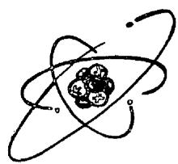  
Li7 atom.   
Fig. 2A-1 Representation of Two Isotopes of Lithium.

The positively charged nucleus is held together by extremely strong short-range forces, while the electrons are much less tightly bound to the atom by attraction to the positive nucleus. In chemical reactions, which involve the orbital electrons, the energy for a reaction is on the order of a few electron volts (ev). Much more energy (on the order of millions of electron volts) is involved in changes in the nucleus because of the stronger forces of attraction. Indeed, so much energy is involved that a nuclear reaction can produce a significant change in mass of the reacting particles as mass is converted to energy, or vice versa. (The conversion follows Einstein's famous $\mathbf{E} = \mathbf{mc}^{2}$ .)

Consider Figure 2A-2, which is a plot of the mass per nucleon (the ratio of nuclear mass to atomic number, or number of nucleons) against atomic number. It is seen that the average mass of nucleons in nuclides of intermediate number is significantly less than the averages at either end. A consequence of this is that if heavy nuclides can be split to form lighter fragments the total mass decreases. The difference appears in the form of energy. This is the basis of power from nuclear fission. (Fusion involves building up from the low-A end of the scale.)

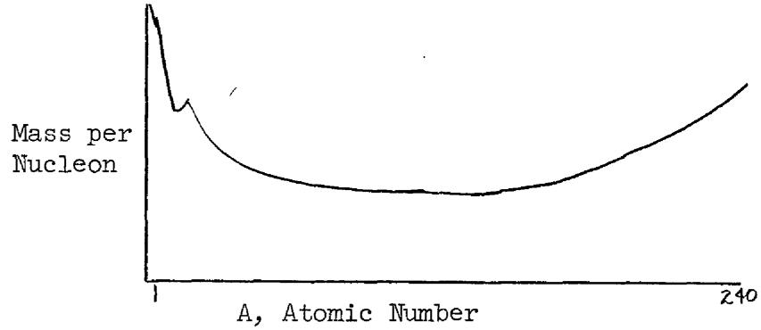  
Fig. 2A-2 Average Mass per Nucleon

# 3 RADIOACTIVITY AND RADIATION

The number of nucleons in naturally occurring nuclides covers a wide range, from 1 to 238. But if one plots the number of neutrons against the number of protons in each naturally occurring nuclide, it is found that all of the points lie in a rather narrow band as shown in Fig. 2A-3.

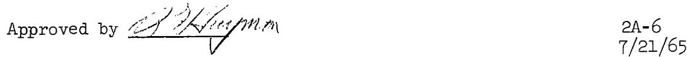

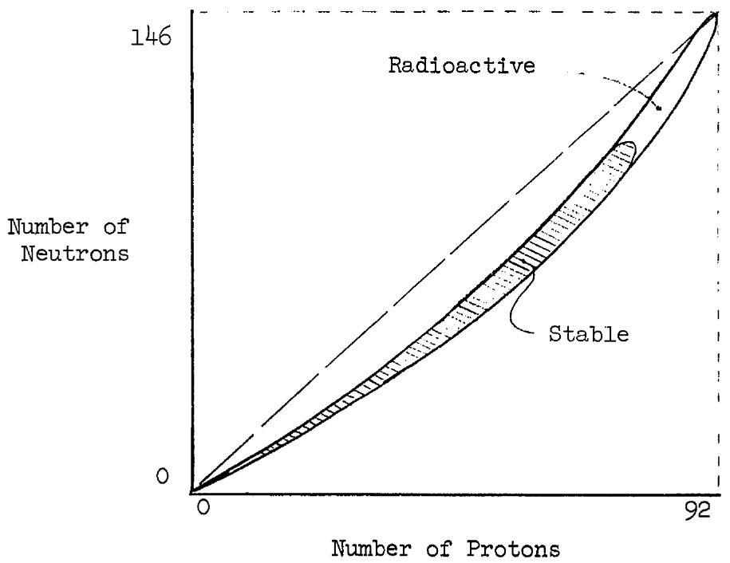  
Fig. 2A-3 Nuclear Composition of Naturally Occurring Nuclides

Some nuclides found in nature are radioactive; that is, the nuclei may spontaneously change, or "decay." Nearly all of these naturally radioactive nuclides are at the heavy end of the band and decay by the emission of an alpha particle from the nucleus. An alpha particle consists of two protons and two neutrons (identical with a helium-4 nucleus), so this type of decay produces a nuclide nearer the stable band.

The fact that the band in Fig. 2A-3 is curved has an important implication. If a heavy nuclide is split, or fissioned, the fission fragment nuclei usually have a composition near the straight line joining the original point to the origin. Thus the primary fission products usually lie outside the stable band, on the side of too many neutrons, and are radioactive. The tendency is for change toward the stable band, sometimes by emission of a neutron from the nucleus but much more often by the process called beta decay. In this process a high-speed electron (beta particle) is emitted from the nucleus, reducing the number of neutrons by one and adding one to the number of protons.

Another process (besides fission) which can produce radioactive nuclides is neutron absorption. A passing neutron may be absorbed in almost any nucleus (the probability of absorption varies widely, however). When this happens, a certain amount of energy, called the binding energy of the added neutron, is immediately released, usually in the form of gamma rays, called capture gammas. The new nucleus, containing the added neutron, may be stable or it may be radioactive. Radioactivity produced by neutron absorption is called induced radioactivity, or the material is said to be activated. Induced radioactivity is usually in the form of beta decay.

Beta decay is always accompanied by the emission of a neutrino. The neutrino is a particle with very small mass, which is so unlikely to interact with matter that it is extremely difficult to detect. Neutrinoes are important in a reactor only in that they carry away a significant amount of energy in a form which is not recoverable.

Most radioactive decay processes, whether they be alpha decay or beta decay, are accompanied by the emission of gamma rays, called decay gammas.

Radioactive decay is a statistical process, that is, the rate can be predicted only for large numbers of nuclei. The probability that a nucleus will decay in a given interval of time is called the decay constant, usually represented by $\lambda$ . Thus, when there are N nuclei of a of a radioactive nuclide present, the rate of decay is $\mathbb{N}\lambda$ disintegrations per unit time. If there are N nuclei at a particular time, then a time t later there will be $\mathrm{N}_{\mathrm{o}}\mathrm{e}^{-\lambda t}$ nuclei remaining.

$$
N = N _ {O} e ^ {- \lambda t}
$$

This formula means that the number of nuclei present (and the rate of disintegration) decreases by a certain fraction in any equal lengths of time. The time required to decrease by a factor of two is the half-life. Half-lives of fission products range from a fraction of a second to many years. Naturally occurring radioactive nuclides are usually very long lived. For example, $U^{235}$ decays by alpha emission with a half life of 700 million years.

Amounts of radioactive material are usually expressed in units of curies. A curie is defined as the amount of material which undergoes $3.7 \times 10^{10}$ disintegrations per second.

Alpha particles, beta particles and gamma rays all deposit energy and cause local damage along their path through matter. This can cause problems of heating, changes in physical properties of materials and biological injury.

Charged particles give up energy as they move through matter by the process of ionization. The charged particles and the orbital electrons exert forces on each other which slow down the moving particle and draw many electrons from their atoms, leaving positively charged atoms or ions. Thousands of ion pairs must be formed in the course of stopping an alpha particle or a beta particle, but in ordinary matter this will occur in a short distance. Thus charged particles have a limited range. For example, a 1-Mev beta can travel 0.14 in. in water (or flesh). Alpha particles produce more dense ionization, and the range of a 1-Mev alpha in water is only 0.0002 in.

Gamma rays do not ionize directly since they are electromagnetic radiation with no charge. They interact through any of three processes to produce high-speed electrons which in turn ionize the medium. The gammas always travel at the speed of light, but their energy can be decreased, even to zero, by scattering collisions with electrons. (It is useful for some purposes to think of gammas as particles since they have direction, energy and momentum and can have collisions.) The linear rate of energy loss by gammas in matter is far less than that of charged particles. Consequently they do not have a definite range. Instead the intensity of a stream of gammas falls off exponentially with distance through matter.

$$
I = I _ {0} e ^ {- \mu x}
$$

Shielding consists of absorbing the energy of radiation in material interposed between the source of the radiation and objects which are to be protected from the effects of the radiation.

# 4 THE FISSION PROCESS

There are some nuclides in which the nucleus will fission, or split into a number of smaller particles, when a neutron collides with it. Some nuclides, such as $\mathrm{U}^{238}$ , will fission only if the neutron is travelling at very high speed; neutrons of any energy will cause certain other nuclides to fission. $\mathrm{U}^{235}$ , which is fissionable with neutrons of any energy, is the fuel in the MSRE.

In the fission process, a neutron enters a nucleus, causing so much disturbance that the forces which hold the nucleus together are overcome and the nucleus splits into two or more smaller nuclei or fission fragments. The exact manner in which $U^{235}$ nuclei split is not always the same, but in most fissions the nucleus (atomic mass 235) breaks up into two unequally-sized particles having atomic mass numbers around 95 and 140. In addition to the fission fragment nuclei, there are many other smaller particles resulting from the fission. These are beta particles, gamma rays, neutrinos and neutrons. On the average, the fission of a $U^{235}$ nucleus gives off 2.5 neutrons and it is this fact which makes a chain reaction possible, since these new neutrons, if they are properly handled, can cause other fissions.

Nuclear fission is important because of the relatively large amount of energy released in the process, compared to the energy available from chemical reactions, which involve only the loosely bound orbital electrons. To illustrate, when a carbon atom burns, or combines chemically with an oxygen molecule, the energy released is 4 ev. In contrast, when a single $U^{235}$ nucleus fissions, the total energy released is about 200,000,000 ev (200 Mev). The distribution of this energy is shown in Table 2A-1. All of this energy eventually appears as heat, but not all of it in places where it can be utilized. The fission fragments are all slowed down and stopped within a few thousandths of an inch, so their energy appears as heat essentially at the point of the fission. Beta particles have a range of only an inch or less. Neutrinoes, on the other hand, travel such great distances without creating heat (or leaving any trace) that as far as power production is concerned they might as well not even exist. A fission neutron usually gives up its energy in a series of collisions

along a zigzag path a few feet long. A gamma ray may penetrate as much as several feet in a straight line before its energy is converted to heat. The available energy in Table 2A-1 is the estimated amount which produces useful heat in the MSRE\*. The rest of the energy escapes and appears as heat in the shield or elsewhere outside the reactor.

Table 2A-1 Distribution of Fission Energy   

<table><tr><td rowspan="2"></td><td colspan="2">Energy, Mev</td></tr><tr><td>Total</td><td>Available</td></tr><tr><td>Kinetic energy of fission fragments</td><td>168</td><td>168</td></tr><tr><td>Kinetic energy of fission neutrons</td><td>5</td><td>4</td></tr><tr><td>Instantaneous gamma rays</td><td>7</td><td>7</td></tr><tr><td>Gamma rays from fission product decay</td><td>6</td><td>5</td></tr><tr><td>Beta particles from fission products</td><td>8</td><td>8</td></tr><tr><td>Neutrinos</td><td>11</td><td>0</td></tr><tr><td></td><td>205</td><td>192</td></tr></table>

Although most of the fission heat is generated practically instantaneously, the beta particles and gamma rays from the fission products are

liberated over a period of time by radioactive decay. The fission products are a mixture of nuclides with half lives ranging from a fraction of a second to many years. Thus, in a nuclear reactor the heat source from the fission product decay decreases after the fission reaction is stopped, rapidly at first, then more slowly and never completely dying out. The energy release after shutdown, called "afterheat", is a serious problem in high-power reactors.

Nearly all of the fission neutrons, are emitted almost instantaneously, but a few are liberated by the decay of certain short-lived fission product isotopes, called precursors. These delayed neutrons comprise only 0.64 per cent of the total neutrons, and they are nearly all emitted within the first minute after a fission, but they play an important part in making the fission chain reaction more easily controlled, as will be seen later.

Although the amount of energy produced per fission is large compared with that in chemical reactions, the absolute amount is so tiny that an extremely large number of fissions must occur to produce a useful amount of heat. (198 Mev is only $3.0 \times 10^{-14}$ Btu. At 198 Mev/fission, the fission rate required to produce 1 watt is $3.16 \times 10^{10}$ fissions/sec.) To illustrate, when the MSRE is operating at a nuclear power of one megawatt, about one trillion ( $10^{12}$ ) fissions occur each second in each cubic inch of fuel salt. The important consequence of such high fission rates is that the laws of probability apply very well, so the analysis of the nuclear behavior of a reactor can be based upon probabilities.

# 5 CROSS SECTIONS AND REACTION RATES

In the calculation of rates of reaction between nuclei and neutrons, use is made of probabilities expressed in terms of nuclear cross sections. The following illustration is helpful in understanding the significance of the term "cross section". Consider a thin element of volume containing a number of spheres (nuclei) as shown in Fig. 2A-4. If a neutron, which can be pictured as a tiny projectile, enters perpendicularly to a face, the chance that it will collide with a sphere is equal to the fraction of the area of a face covered by the circles which are the projections of the spheres.

This fraction is

$$
\frac {\mathrm {N a} ^ {2} \mathrm {d x} \sigma}{\mathrm {a} ^ {2}} = \mathrm {N} \sigma \mathrm {d x}
$$

Since this is the probability that a neutron will suffer a collision while traveling a distance $\text{dx}$ , the probability per unit distance traveled is found by dividing by $\text{dx}$ . This probability of collision per unit neutron path length, $\text{No}$ , is called the macroscopic cross section, symbolized by $\Sigma$ , with dimensions of reciprocal length.

Fig. 2A-4

$$
\begin{array}{l} r = r a d i u s o f s p h e r e \\ \sigma = \pi r ^ {2} = \text {c r o s s s e c t i o n a l} \\ \end{array}
$$

N = number of spheres per unit volume

$\mathrm{Na}^2$ dx = number of spheres in volume element

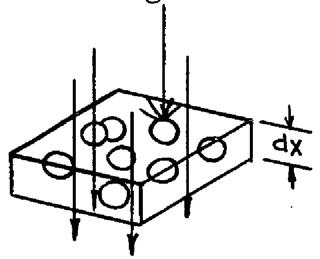

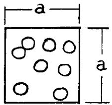

Now picture a box containing nuclei and randomly moving neutrons as shown in Fig. 2A-5. The combined distance traveled each second by all the neutrons in the box is $a^3$ nv. (Assume the neutron density in the box is not changing, so if some of the original neutrons leave, others come in to take their place.) The path length per unit volume per second is $a^3$ nv divided by the volume, $a^3$ . This quantity is called the neutron flux, $\phi$ .

$$
\phi = n v \left(\frac {\text {n e u t r o n s}}{c m ^ {3}}\right) \left(\frac {c m}{s e c}\right) o r \left(\frac {\text {n e u t r o n s}}{c m ^ {2} - s e c}\right)
$$

Since the number of collisions per unit path length is $\Sigma$ , the rate of collisions per unit volume is the product of the path length per unit volume per unit time and the probability of a collision per unit path length:

$$
R \left(\frac {\text {c o l l i s i o n s}}{\mathrm {c m} ^ {3} - \sec} =\right) \phi \quad \left(\frac {\text {n e u t r o n - c m}}{\mathrm {c m} ^ {3} - \sec}\right) \quad x \quad \Sigma \left(\frac {\text {c o l l i s i o n s}}{\text {n e u t r o n - c m}}\right)
$$

n = number of neutrons per unit volume

v = speed of neutrons

$a^3 n =$ number of neutrons in volume element

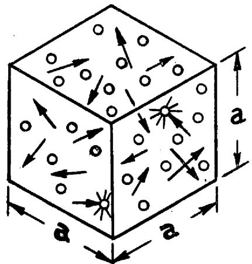  
Fig. 2A-5

The foregoing picture of cross sections is inadequate in several respects.

In the first place, the experimentally determined cross sections show that for most isotopes the effective neutron target area, $\sigma$ , is many times the actual $\pi r^2$ of the nucleus. Further more, $\sigma$ varies with neutron speed, usually in such a way that the nucleus appears to present to passing neutrons a target which becomes larger the slower the neutron.

Another difficulty with the simple picture is that a neutron may undergo any of several different reactions with nuclei of a particular type. The fission reaction has already been mentioned. Another reaction is radiative capture, in which the neutron is absorbed and a gamma ray is emitted from the nucleus. A neutron may also undergo an elastic scattering or "billiard ball" collision with a nucleus. The nucleus has a different probability or cross section for each type of reaction, and in general all the cross sections vary with neutron velocity. Cross sections for different reactions are identified by subscripts; $f$ for fission, $c$ for radiative capture, $a$ for absorption, $s$ for scattering and $t$ for total\*

In view of the inadequacy of the "hard sphere" picture of neutron-nucleus collisions, it is perhaps best to think purely in terms of probability. The probability that a neutron, while passing a unit distance through a region inhabited by N nuclei per unit volume, will undergo a particular reaction is No, where o is a measure of probability whose magnitude depends upon the type of nuclei, the type of reaction and the neutron speed. The probabilities are additive, i.e., the probability that a reaction of some sort will occur is the sum of the probabilities for reactions of all the possible types. For example, in a region containing two types of nuclei identified by subscripts 1 and 2

$$
\Sigma_ {a} = \Sigma_ {a 1} + \Sigma_ {a 2} = N _ {l} \sigma_ {a 1} + N _ {2} \sigma_ {a 2}
$$

$$
\Sigma_ {t} = \mathrm {N} _ {\perp} \left(\sigma_ {\mathrm {a l}} + \sigma_ {\mathrm {s l}}\right) + \mathrm {N} _ {2} \left(\sigma_ {\mathrm {a 2}} + \sigma_ {\mathrm {s 2}}\right)
$$

It follows that the fraction of the absorptions which occur in nuclei of type 1, say, is

$$
\frac {\Sigma_ {a 1}}{\Sigma_ {a}} = \frac {\Sigma_ {a 1}}{\Sigma_ {a 1} + \Sigma_ {a 2}}
$$

# 6 THE FISSION CHAIN REACTION IN AN INFINITE REACTOR

Because each $U^{235}$ fission releases, on the average, 2.5 neutrons the feasibility of a self-sustaining chain reaction would at first seem obvious, since to maintain such a reaction only one of the 2.5 neutrons need cause another fission. However, a practical reactor must contain materials other than fuel and these other materials absorb part of the available neutrons. Furthermore, a certain fraction of the neutrons will escape from the reactor without reacting. Therefore, the primary problem of reactor theory is the specification of materials and an arrangement which will conserve neutrons and result in a self-sustaining chain reaction. Such an assembly is a reactor.

The chances that a neutron will escape from a reactor decrease as the reactor is made larger, of course. The leakage probability is also

reduced as the macroscopic cross section of the materials is increased. Thus a self-sustaining chain reaction is possible in a small reactor if the macroscopic cross section is adequately large. This requires either a high concentration of fuel or a large microscopic cross section. Because fission and absorption cross sections are much larger for slow neutrons than for fast, most reactors utilize slow neutrons. This is done by including in the reactor a substance, having a low atomic weight, a large scattering cross section, and a small absorption cross section. This material, called the moderator, slows down (moderates) the fast neutrons by elastic scattering. It also helps to conserve neutrons by diverting those that are headed out of the reactor. (Sometimes material with a high scattering cross section is added around the outside of a reactor for the sole purpose of scattering back or "reflecting" neutrons which would otherwise escape. This is then called a reflector.)

In order to see how the requirements for a self-sustaining chain reaction can be calculated, let us consider the various fates which may befall a neutron in a reactor which contains fuel, moderator and other neutron-absorbing material. There are several things that can happen and they all affect the chance that one of the neutrons emitted in a fission will survive to cause another fission. First, we will examine how the individual probabilities of the different events combine to give the overall probability of a fission neutron causing another fission. Then we will see how the probabilities are determined by the materials and geometry of the reactor.

For simplicity, first consider the case of a reactor which we imagine is so large that leaRage can be neglected. (Infinite reactor case.) Suppose we begin with a large number, say x, neutrons which have just been born in U235 fissions caused by slow neutrons. (Refer to Fig. 2A-6) Some of these very fast neutrons will collide with uranium nuclei (either U235 or U238) and result in fissions which produce more neutrons. Thus the total number of fast neutrons will be increased by a factor, e, called

the fast fission factor. Now if neutrons which have suffered a few collisions so their energy is in the intermediate range pass near a $U^{238}$ nucleus, the chances are they will be swallowed up in radiative capture.* The probability that neutrons will be slowed down past the resonance energy without being absorbed is called the resonance escape probability, p. After the neutrons have been slowed down to thermal energies, only a fraction are absorbed in $U^{235}$ . This fraction is the thermal utilization factor, f. (In an infinite reactor the remainder of the neutrons are absorbed in other materials.) Some of the absorptions in $U^{235}$ are radiative capture, while others result in fission with a production of $\nu$ neutrons per fission. Thus one cycle is completed. The ratio of the neutrons present after one cycle, or generation, to those present initially is called the infinite multiplication factor or reproduction factor. (It is called infinite because it applies only to a very large reactor where leakage is negligible.)

The average number of fission neutrons produced per neutron absorbed in $U^{235}$ is called eta (η), and for the absorption of thermal neutrons it has a value of 2.08. The fast fission factor is a function of the ratio of moderator to fuel, approaching unity for large values of the ratio. The resonance escape probability also is a function of moderator-to-fuel ratio, increasing to unity as the ratio increases. The thermal utilization factor, in a homogeneous reactor, is just the ratio of the macroscopic absorption cross section of the fuel to the total cross section of all the components in the reactor. Even though only a very small fraction of the atoms in a reactor are $U^{235}$ , the thermal utilization factor is usually greater than 0.8 because the cross section of $U^{235}$ is so high compared with the other nuclides in the core. (Typical values are 690 barns for $U^{235}$ ; less than 0.01 barn for Be, C, or F.) Because in a heterogeneous reactor the fuel, moderator and structure are not exposed to exactly the same flux of neutrons, ε, p, and f are all dependent on the size and spacing of the fuel and moderator regions.

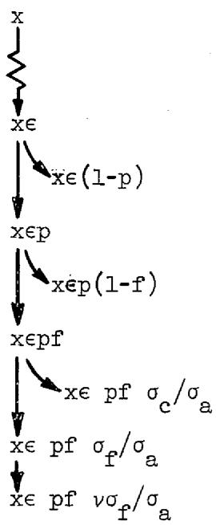  
Fig. 2A-6 Fission Chain in Infinite Reactor (No leakage)

fast neutrons from slow neutron fission of U-235

increase due to fast fissions

fast neutrons from both slow and fast fissions

neutrons absorbed in U-238 in resonance energy range

neutrons slowed down to thermal energy range

thermal neutrons absorbed in materials other than U-235

thermal neutrons absorbed in U-235

radiative captures in U-235

fissions in U-235 caused by slow neutrons

fast neutrons from slow neutron fission of U-235

$$
\begin{array}{l} k _ {\infty} = \frac {x \epsilon p f v \sigma_ {f} / \sigma_ {a}}{x} \\ \eta = \nu \sigma_ {\mathrm {f}} / \sigma_ {\mathrm {a}} \\ k _ {\infty} = \eta \in p f \\ \end{array}
$$

# 7 EFFECT OF NEUTRON LEAKAGE

Because a significant fraction of the neutrons escape from even large reactors, the neutron leakage probabilities must be considered in calculating the multiplication factor which can actually be attained.

Let us suppose that $\mathbf{l} - \mathbf{p}_1$ , is the probability that a fast neutron will leak out of the reactor before it is slowed down or absorbed. Then $\mathbf{P}_1$ is the fast non-leakage probability. There is a probability that a neutron can escape from the reactor after it has become thermalized, and a slow non-leakage probability, $\mathbf{P}_2$ , can be defined. With the inclusion of leakage

probabilities, the diagram of the chain reaction becomes as shown in Fig. 2A-7.

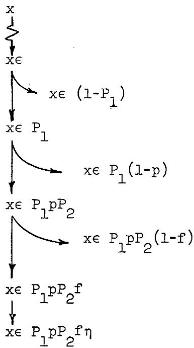  
Fig. 2A-7 Fission Chain Reaction in a Finite Reactor

$$
K = \frac {x \eta \in p f P _ {1} P _ {2}}{x} = k _ {\infty} P _ {1} P _ {2}
$$

The non-leakage probabilities depend on the size and composition of the reactor. Two-group diffusion theory, a simplified mathematical description of neutron slowing down and diffusion, gives the following expressions for $\mathsf{P}_1$ and $\mathsf{P}_2$ in an unreflected (bare) reactor.

$$
P _ {1} = \frac {1}{1 + B ^ {2} \tau}
$$

$$
P _ {2} = \frac {1}{L + L ^ {2} B ^ {2}}
$$

These will serve to illustrate the dependence of $\mathbb{P}_1$ and $\mathbb{P}_2$ on the physical dimensions and properties of the reactor.

The factor $B^2$ , called the buckling, is a function of the reactor size and shape. For a bare, cylindrical reactor of radius $R$ and height $H$ .

$$
B ^ {2} = \left(\frac {2 . 4 0 5}{R}\right) ^ {2} + \left(\frac {\pi^ {2}}{H}\right)
$$

It can be seen that if the dimensions are made larger, $B^2$ decreases rapidly and $P_1$ and $P_2$ increase.

$\tau$ , called the age, is determined primarily by the moderator. It is equal to one-sixth the mean square of the distance traveled by a neutron while slowing down. L is called the thermal diffusion length, and $L^2$ is one-sixth the mean square of the (crow-flight) distance a neutron covers from the time it reaches thermal energy until it is captured. $L^2$ is given approximately by

$$
L ^ {2} = \frac {1}{3 \Sigma_ {s a}}
$$

where $\Sigma_{s}$ and $\Sigma_{a}$ are the scattering and absorption cross sections of the reactor material. Reduction of $\mathfrak{T}$ by introduction of more efficient moderator material and $L^2$ by either better scattering or more absorber reduces $P_1$ and $P_2$ .

# 8 CRITICALITY

In the preceding sections we followed a group of neutrons through one cycle, or generation, and derived a quantity, $k$ , which is the ratio of neutron production in successive generations. It is clear that if $k = 1$ , the fission chain reaction is self-sustaining and the neutron population, the flux, the fission rate, and all reaction rates will be stationary in time, without any contribution from neutron sources other than fission. The critical condition is defined as that in which $k = 1$ . Note that criticality does not imply any particular power level, merely that the chain reaction is exactly self-sustaining.

# 9 EXTRANEOUS NEUTRON SOURCES AND SUBCRITICAL MULTIPLICATION

Besides the fission process, several other nuclear reactions lead to the emission of neutrons. Most important of these are the interaction of high-energy gamma rays or alpha particles with any of several materials, the most important of which is $\mathrm{Be}^9$ .

A neutron source may be constructed using gamma rays from some fission product, a neutron-activated material, or the natural radioactive element, radium. This is called a photoneutron source, and the most common form contains antimony-124 (60-day half-life, produced by neutron irradiation of

$\mathsf{Sb}^{123}$ ) and beryllium. An alpha-n source may contain a mixture of beryllium with 138-day polonium-210 or long-lived radium or plutonium, all of which emit alpha particles in their decay.

The MSRE fuel salt contains an inherent neutron source resulting from interaction of alphas from uranium decay with the beryllium of the salt. In addition, after fission products have built up in the reactor, a strong photoneutron source will result from the fission product decay gammas interacting with the beryllium.

The importance of these extraneous sources of neutrons is that they can be used to maintain some neutron population or fission rate in a reactor even when the fission chain reaction is not self-sustaining.

Consider a reactor which is subcritical, i.e., $k < l$ . On the average, each fast neutron introduced by an extraneous source will produce in the first generation $k$ neutrons; in the second $k^2$ ; and so on. Thus for each source neutron, there eventually appear a number of neutrons $M$ given by

$$
M = 1 + k + k ^ {2} + k ^ {3} + \dots = \frac {1}{1 - k}
$$

If source neutrons are being introduced at a rate S, then the total rate of neutron appearance in the reactor is SM. The population of neutrons in the reactor is the product of the birth rate and the average time a neutron spends in the reactor before being absorbed or leaking out. If the lifetime is a constant in a reactor with an extraneous source, the population and the flux will be proportional to M. For this reason M is called the subcritical multiplication factor.

M becomes very large as $k$ approaches a value of 1. Thus, theoretically, if a source is present, any flux or power could be reached with the reactor slightly subcritical. Practically speaking, however, the source becomes insignificant when the power reaches a few watts or so, and the reactor behaves as if no source were present; i.e., the power rises when the reactor is supercritical ( $k > 1$ ) and decreases when it is subcritical.

# 10 REACTOR KINETICS

Consider a hypothetical reactor in which all of the neutrons have the same generation time, $\hat{z}$ . Neglecting any extraneous source, the fractional change in flux, or power in one generation is $k - 1$ . Thus the rate of change of power is

$$
\frac {\Delta P}{\Delta t} = \frac {P (k - 1)}{l}.
$$

In this case, if $k$ is constant, the power changes exponentially; i.e., for an initial power $P_0$ , the power after a time $t$ is

$$
P = P _ {0} e ^ {t (k - 1) / \ell}.
$$

The quantity $\ell / (k - 1)$ is called the period, or the e-folding time since it is the period required for an e-fold change in power. Somewhat more generally, the period is defined as the instantaneous value of

$$
\frac {1}{P} \quad \frac {d P}{d t} = \frac {d (\ln P)}{d t}
$$

In an actual reactor the generation time is not the same for all neutrons. The lifetime is about the same for all (typically less than a millisecond) but the generation time includes the "gestation period" for the delayed neutrons (on the order of several seconds). The delayed neutrons usually therefore exert a strong slowing down or damping influence on power changes. Although the mathematical expressions for the kinetics become complicated when delayed neutrons are included, the behavior is still basically exponential and an important characteristic of a reactor is the "inhour curve" which relates the inverse period to the reactivity. (Reactivity is defined as $(\mathbf{k} - \mathbf{l}) / \mathbf{k}$ .)

The inverse period increases with reactivity and this increase becomes much sharper above the point where the reactivity equals $\beta$ , the fraction of the neutrons which are delayed. This point is called prompt critical because at higher reactivity, the chain reaction can diverge with prompt neutrons alone, without waiting for the delayed neutrons. At a constant $k$ , above prompt critical the power behavior is approximately given by

$$
P = P _ {0} e ^ {(k - 1 - \beta) t / \ell^ {*}}
$$

where $\ell^*$ is here the prompt neutron lifetime. The reactivity is sometimes measured in "dollars", or multiples of $\beta$ . (One dollar is prompt critical.)

In the normal operation of a reactor the reactivity is adjusted (by means to be described later) to hold to power steady or to go from one power level to another at a reasonable rate.

# 11 NUCLEAR INSTRUMENTATION

The most satisfactory means of continuously monitoring the nuclear power of a reactor is to follow the neutron flux at some point. The detector can be located outside of the reactor itself, because the flux produced by neutrons leaking from the reactor rises and falls with the power inside.

The most common form of neutron detector is the ionization chamber. In such a device, neutrons interact with some material to produce high-speed particles which ionize (strip electrons from atoms) in a gas in the chamber. An electric potential causes the electrons and positive ions to be drawn to opposite electrodes, and appropriate circuitry either counts the pulses of ions or measures the average current.

Boron-10, which emits an ionizing alpha particle upon absorption of a neutron, is commonly used in ion chambers, either as a coating or in the form of $\mathrm{BF}_3$ gas. A form of ion chamber called a fission chamber contains $U^{235}$ , and the fission fragments produce the ionization.

Gamma radiation interferes with the measurement of low fluxes of $j$ neutrons, because the gamma rays also produce ionization and contribute to the current in a neutron-sensitive chamber. This is no problem in a fission chamber because the counting circuit can be made to discriminate between the large pulses caused by fission fragments and the much smaller events caused by individual gamma photons. The compensated ion chamber was developed to provide a current proportional only to neutron flux even in high gamma fields. This type of detector has two chambers which produce equal ionization currents when exposed only to gamma rays. One of the chambers contains a boron coating so that it is sensitive to neutrons as well as to gammas. The desired signal is obtained by bucking or subtracting the currents from the two parts of the detector.

Because the reactor power may vary over many decades from sub-critical source multiplication to full power and because the time variation is often exponential, it is common to use circuitry to produce a signal proportional to the logarithm of the power. This may be a log count rate meter or a

logarithmic current amplifier. In either case the time derivative is the inverse of the period, and, displayed on properly marked dials or charts, provides a useful indication of the period.

Note that the nuclear instruments give a signal which is only proportional to power. The proportionality factor must generally be determined by heat balance measurements and simultaneous nuclear instrument readings.

# 12 REACTOR CONTROL

The function of reactor control is to regulate the power and/or temperature in the desired ranges, to prevent excessive power or temperature, and to shut the fission chain reaction down to very low levels whenever necessary. To do this, the reactivity is varied, usually by the movement of neutron absorbing material (generally called a rod, regardless of shape) into and out of the core.

Small, fairly quick, variations in reactivity (less than a dollar) are required to maintain the power within a narrow band. This is the regulating function and a special rod for this is called a regulating rod.

Rods which can rapidly insert considerable poison if required to prevent power or temperature excursions are called safety rods.

There are several factors affecting reactivity which produce rather slow changes during an operating cycle (startup, power operation and shutdown). At some stages the net effect is a tendency to reduce k; at other times, k tends to increase. In order to keep k at or near l, control rods may be occasionally or gradually adjusted. Rods performing this function are called shim rods.

An important effect on reactivity is that of core temperatures. As temperatures rise, materials grow less dense and microscopic cross sections change. The net effect is usually a negative temperature coefficient of reactivity, so that the reactivity must be increased by some other means if the operating temperature is to be raised. Distinct from shifts in the overall temperature distribution are the changes in temperature distribution accompanying power changes. As the power is raised, temperatures in various parts of the core diverge, and in order to hold some desired temperature (or temperature average) constant it is generally necessary to adjust the reactivity by shim rod movement. The power coefficient of reactivity is the amount of rod motion required to produce the desired effect.

Temperature coefficients of reactivity not only affect shim requirements but also have an important effect on kinetics, since negative reactivity coefficients tend to produce a stable, self-regulating system when the power is high enough to produce a feedback effect.

During power operation, consumption of $\mathrm{U}^{235}$ by fission and by radiative capture tends to reduce reactivity. This burnup effect is slow, since only a very small fraction of the inventory is consumed in a day. Shimrod movement and periodic additions of uranium compensate for this effect.

Another effect of power operation is the production of fission product poisons which tend to reduce k. Most of these poisons are stable and have relatively small cross sections, so they continue to build up. Shim rods compensate for these poisons. (In the MSRE the U<sup>235</sup> inventory is increased.) A few poisons with high cross sections produce transient effects, with time constants on the order of hours, and these effects require the use of the shim rods.

In a circulating-fuel reactor one more effect on reactivity is observed: the loss of delayed neutrons by emission outside of the core. This causes a slight reduction in $\mathbf{k}$ (the effective value of $\nu$ is reduced) but more importantly it affects the kinetics (the value of the "dollar" is reduced).

# 13 XENON AND SAMARTUM

The most important single fission product nuclide is xenon-135. This radioactive nuclide (9-hour half life) has a thermal neutron cross section of about 3 million barns. Most $\mathrm{Xe}^{135}$ is produced by the decay of iodine-135, which has a half-life of 5 hours and a small cross section. When the reactor is operated at power, the $I^{135}$ and then the $\mathrm{Xe}^{135}$ concentrations build up. The $\mathrm{Xe}^{135}$ concentration at power is limited by its natural radioactive decay and by transmutation by neutron absorption. Typically the equilibrium poisoning effect of $\mathrm{Xe}^{135}$ is about 2 to $3\%$ in k. When the reactor power is reduced, the $\mathrm{Xe}^{135}$ concentration at first increases because the destruction by neutron capture decreases before the production by $I^{135}$ decay changes appreciably. Radioactive decay of the $\mathrm{Xe}^{135}$ causes the concentration to begin to decrease after a few hours and eventually it would all disappear.

Xenon is normally a gas, and in fluid-fuel reactors the $\mathrm{Xe}^{135}$ concentration may be significantly affected by mechanisms which remove xenon from the fuel.

Another fission product which has an important effect on the reactivity is samarium-149, a stable nuclide formed by decay of 53-hour promethium-149. Samarium-149 has a cross section of about 40,000 barns, so its concentration is held down by burnup when the reactor is at power. After the power is reduced, the burnup stops, but the $\mathsf{Pm}^{149}$ continues to decay, causing an increase in $\mathsf{Sm}^{149}$ . Being stable, the $\mathsf{Sm}^{149}$ remains high until the power is raised and it comes back to the equilibrium value at power. Typical values of the $\mathsf{Sm}^{149}$ reactivity effect are: equilibrium at full power, $0.9\%$ $\delta \mathbf{k} / \mathbf{k}$ ; and increase at zero power $0.2\%$ $\delta \mathbf{k} / \mathbf{k}$ .

# 2B MSRE NUCLEAR CHARACTERISTICS

The preceding general description of reactor theory is applicable to the MSRE, as it is to all reactors. This section describes the unusual features of the MSRE and provides quantitative information on its nuclear characteristics in a condensed form. A much more detailed treatment is given in MSRE Design and Operations Report - Part III, Nuclear Analysis, ORNL TM-730.

# 1. Core Reactivity Factors

The unique feature of the MSRE, which sets it apart from other reactors, is that the uranium fuel is contained in a molten mixture of fluoride salts which is circulated through a heat exchanger to remove the heat produced by the fission process in the core.

Although the fissionable material is dispersed throughout the fuel system, the fission chain reaction is confined to the core. The fuel is not chain-reacting in the piping because the neutron leakage probability is much too high because of the small dimensions. In the heat exchanger, the parasitic absorption of neutrons by the tubes combines with high leakage to rule out criticality. Even in the drain tanks, the leakage is too high for criticality. (Resonance capture in $^{238}\mathrm{U}$ and absorption in the cooling thimbles also tend to reduce k.) The high leakage and resonance absorption are direct consequences of the poor moderation in the salt. In the core, on the other hand, there is graphite to slow the neutrons down with but little absorption, and with the slow neutrons the vessel is large enough to give a low probability of leakage.

The reactivity of the core is a function of several variables. These are:

1. the concentration of $^{235}\mathrm{U}$ in the fuel salt,   
2. the temperatures of the fuel and the graphite,   
3. the presence of gas bubbles in the core,   
4. the positions of the neutron-absorbing control rods,   
5. the concentrations of neutron poisons in the fuel salt and in the graphite, and

6. the number of neutrons emitted in the core per fission (as affected by the loss of delayed neutrons during fuel circulation).

Each of these variables is discussed separately in this section.

# 1.1 Fuel Salt Concentration

The minimum amount of $^{235}\mathrm{U}$ required for criticality in the MSRE is about 50 kg (in 73 ft $^3$ of salt) or a concentration in the fuel salt of 0.2 mole % of highly enriched uranium. For the first exploratory operation of the MSRE, a higher uranium concentration is desired for reasons of chemistry. (If fluorine loss from the salt should occur, more UF $_4$ could go to UF $_3$ before U precipitation would occur.) Therefore in the original charge of fuel salt the uranium concentration will first be brought up to 0.5 mole % by the addition of 150 kg of depleted uranium. (The $^{235}\mathrm{U}$ fraction of this uranium is only 0.002.) Then, during the initial critical experiment, the $^{235}\mathrm{U}$ concentration will be brought up by addition of highly enriched uranium (93% $^{235}\mathrm{U}$ ) to the "clean critical" concentration. This is the concentration required for criticality with no fission product poisons in the reactor, all control rods fully withdrawn, the fuel salt stationary, and the reactor at a uniform temperature of $1200^{\circ}\mathrm{F}$ . The predicted critical loading is 69 kg of $^{235}\mathrm{U}$ , giving a total uranium concentration in the salt of 0.80 mole % U. This salt is sometimes referred to as fuel C, having a molar composition of 65 LiF-29.2 BeF $_2$ -5.0 ZrF $_4$ -0.8 UF $_4$ . The values quoted later in this section for nuclear parameters apply when the reactor is fueled with this salt.

Addition of highly enriched uranium when the concentration is near the critical value causes an increase of $0.22\%$ $\delta \mathrm{k} / \mathrm{k}$ for each percent increase in $^{235}\mathrm{U}$ concentration. Thus the addition of $85\mathrm{g}^{235}\mathrm{U}$ (the amount in an enriching capsule) would produce an increase of only $0.03\%$ $\delta \mathrm{k} / \mathrm{k}$ .

After the initial critical loading, about $7\mathrm{kg}$ of $^{235}\mathrm{U}$ will be added as highly enriched uranium to bring the fuel salt up to the operating concentration (0.28 mole $\%$ $^{235}\mathrm{U}$ , 0.83 mole $\%$ total U). The increase is required to compensate for effects which will appear when the reactor is operated at high power, namely:

1. elevation of fuel and graphite temperatures,   
2. partial insertion of the control rods to permit power regulation,   
3. fission product poisons,   
4. loss of delayed neutrons due to emission outside the core,

Burnup - When the reactor is operated at power, $^{235}\mathrm{U}$ is consumed by fission and by radiative capture. (The ratio of captures to fissions is 0.18.) The rate amounts to 1.25 g/Mwd, which means that the amount which can be added in one capsule would be consumed in about 7 days at 10 Mw. When the reactor is operated at full power, additions of enriched uranium will be made at intervals of 7 days or less so that not only is the loss due to burnup made up but the $^{235}\mathrm{U}$ inventory is actually increased to compensate for the negative reactivity effects of fission products which are building up.

Non-uniform Uranium Distributions - The coefficient of reactivity for changes in $^{235}\mathrm{U}$ concentration which was quoted above applies to uniform increases in the concentration. Although no significant non-uniformities in uranium concentration are anticipated in operation, the reactivity effects of localized uranium are worth noting. The reactivity effect of a given amount of $^{235}\mathrm{U}$ could be much greater if it were all in the core than if it were evenly dispersed throughout the 75 cu ft of fuel salt. Uranium evenly distributed in the core is worth 3 times as much as the average over the entire loop. A small amount of uranium at the point of maximum importance (near the center of the core) would be worth 15 times as much as the loop average.

# 1.2 Temperature and Power

Changes in fuel temperature and in graphite temperature affect reactivity in different ways. The primary effect of graphite temperature is through its influence on the thermal neutron velocity distribution; an increase in temperature resulting in higher energies and lower cross sections. The reactivity is affected by fuel salt temperature mainly because thermal expansion of the salt reduces the amount of $^{235}\mathrm{U}$ in the

core. Other, less important effects are the decrease in moderation by Li, Be and F as the salt expands and the influence of salt temperature on thermal neutron energies.

If the temperature of the fuel and graphite is uniform throughout the core, an increase in the overall temperature would produce a decrease in reactivity; the ratio is the temperature coefficient of reactivity, $-7.0 \times 10^{-5} \mathrm{~F}^{-1}$ . (To illustrate, a $10^{\circ} \mathrm{F}$ increase over the entire core would cause the reactivity to decrease by $0.07\%$ $\delta \mathrm{k} / \mathrm{k}$ .)

If a uniform change could be produced throughout the fuel in the core without changing the graphite temperature, the reactivity effect would be $-3.3 \times 10^{-5} \mathrm{~F}^{-1}$ . A uniform change in graphite temperature alone would give $-3.7 \times 10^{-5} \mathrm{~F}^{-1}$ . The sum of the fuel coefficient and the graphite coefficient is the total coefficient, $-7.0 \times 10^{-5} \mathrm{~F}^{-1}$ .

When the reactor is operated at power, temperature distributions are established in which the rate of fuel temperature increase as the salt rises along a channel is proportional to the heat generation at the point. The graphite temperature at any point is above that of the fuel by an amount proportional to the local heat generation. (See later section on fluxes, heat generation and temperatures.) As the power is raised and the temperatures depart from isothermal, the net reactivity effects of the change in fuel temperature can be regarded as the product of the fuel temperature coefficient of reactivity and the change in an average temperature which appropriately reflects the reactivity effect of the actual distribution of fuel temperatures. This is called the nuclear average temperature of the fuel (NAT). An NAT can be similarly defined for the graphite: Calculations indicate the fuel and graphite NATs ( $T^*$ and $T^*$ ) are related to the fuel temperatures entering and leaving the reactor vessel as follows:

$$
T _ {f} ^ {*} = \left(\frac {T _ {\text {o u t}} + T _ {\text {i n}}}{2}\right) + 1. 1 P = T _ {\text {o u t}} - 1. 4 P
$$

$$
T _ {g} ^ {*} = \left(\frac {T _ {\text {o u t}} + T _ {\text {i n}}}{2}\right) + 5. 5 P = T _ {\text {o u t}} + 3. 0 P
$$

where $\mathrm{P}$ is the power in megawatts.

The shapes of the temperature distributions at power are characteristics of the physical system. On the other hand, the entire temperature distribution can be shifted up or down simply by moving the control rods to obtain any desired relation of the temperatures at power to the isothermal temperature before the power was raised. (When the rods are moved the entire temperature distribution must shift to produce a compensating effect to keep the reactor just critical.) The amount of reactivity change which must be produced with the rods to obtain the desired temperature response is called the power coefficient of reactivity. The MSRE rod servo system holds the reactor outlet temperature constant. The power coefficient for this mode of operation is $-6 \times 10^{-5} \mathrm{Mw}^{-1}$ .

# 1.3 Control Rod Positions

When the control rods are inserted in the core, they absorb neutrons which might otherwise cause fission, thereby reducing $\mathbf{k}_{\mathrm{eff}}$ . Except when the nuclear power is shut down to practically zero, $\mathbf{k}_{\mathrm{eff}}$ is always kept in the range 1.000 ± 0.001. This is done by adjusting the rods as required to compensate for other changes which tend to take $\mathbf{k}$ out of that range.

The change in reactivity per unit distance of rod movement is the sensitivity. The upper end of the poison section extends out the top of the core at all times, so the movement of a rod is equivalent to adding or removing a length of poison from the core at the lower end of the rod. The reactivity effect of adding poison in the core depends on where it is added, being approximately proportional to the square of the ratio of the local neutron flux to the average flux. The flux distribution from top to bottom of the core is approximately a sine curve. Thus the sensitivity of a control rod varies with the position of its lower end approximately as $(\sin \pi y / L)^2$ , where $L$ is the effective length of the core and $y$ is the distance from the top of the "effective core" to the lower end of the poison. The effective limits of the core are where the flux distributions in the core extrapolate to zero.

The poisoning effect of a rod at any given position is the integral

of its sensitivity from completely out to that position. Thus the poisoning effect is approximately proportional to

$$
w (y) = \frac {2}{L} \int_ {0} ^ {y} \sin^ {2} \left(\frac {\pi y}{L}\right) d y
$$

which is an s-shaped curve as shown in Fig. 2B-1. This expression is only approximate because the insertion of the rod depresses the flux in its vicinity so that the sensitivity does not follow exactly a $\sin^2$ curve. The relation of the actual worth curve to the simple approximation is shown in Fig. 2B-1.

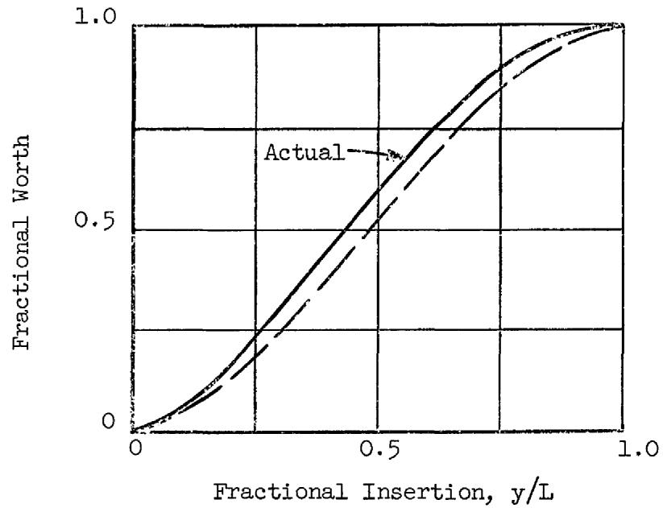  
Fig. 2B-1 Shape of Rod Worth Curves

Table 2B-1 gives the predicted effect of configurations in which rods are either all the way out or all the way in. Rod numbers here identify rod positions in the core, and as indicated by the diagrams, rod 2 is the one diagonally opposite the core sample assembly. (The rod identification numbers on the console may not correspond; the "rod 1" instruments and controls on the console are connected to whichever rod is being used as the regulating rod.) The effective height of the core to which these total-worth values apply is about 78 in. Since the

Table 2B-1   
CONTROL ROD EFFECTIVENESS   
(Initial Critical Conditions)   

<table><tr><td></td><td>Rod 1</td><td>Rod 2</td><td>Rod 3</td><td></td><td>Reactivity
Effect (% δk/k)</td></tr><tr><td>a</td><td>Out</td><td>Out</td><td>Out</td><td>○○</td><td>0</td></tr><tr><td>b</td><td>In</td><td>Out</td><td>Out</td><td>○○</td><td>-2.36</td></tr><tr><td>c</td><td>Out</td><td>In</td><td>Out</td><td>○○</td><td>-2.26</td></tr><tr><td>d</td><td>Out</td><td>In</td><td>In</td><td>○○</td><td>-4.03</td></tr><tr><td>e</td><td>In</td><td>Out</td><td>In</td><td>○○</td><td>-4.33</td></tr><tr><td>f</td><td>In</td><td>In</td><td>In</td><td>○○</td><td>-5.51</td></tr><tr><td></td><td></td><td></td><td></td><td></td><td>Worth (% δk/k)</td></tr><tr><td>a - b</td><td colspan="4">Rod 1 (rods 2 and 3 out)</td><td>2.36</td></tr><tr><td>d - f</td><td colspan="4">Rod 1 (rods 2 and 3 in)</td><td>1.48</td></tr><tr><td>a - c</td><td colspan="4">Rod 2 (rods 1 and 3 out)</td><td>2.26</td></tr><tr><td>e - f</td><td colspan="4">Rod 2 (rods 1 and 3 in)</td><td>1.18</td></tr><tr><td>a - d</td><td colspan="4">Rods 2 and 3 (rod 1 out)</td><td>4.03</td></tr><tr><td>b - f</td><td colspan="4">Rods 2 and 3 (rod 1 in)</td><td>3.15</td></tr></table>

rod travel is only 51 in. between limit switches, the available worth of a rod is only 0.927 of the total. Application of this factor to the total predicted worth of rod 1 gives an available worth of $2.2\% \Delta k / k$ . The first evaluation of the worth of rod 1 gave $2.18\%$ .

Because of the core symmetry, rods 1 and 3 are identical in worth; rod 2 is somewhat less than either because it is more "shadowed" by the other rod thimbles or rods. The worths listed in this table were predicted for the initial, clean core. When fission product poisons build up and more $^{235}\mathrm{U}$ is added to the fuel, the neutron diffusion length in the core is reduced, making the rods worth less. This effect is expected to reduce the figures in Table 2B-1 by about 6 percent.

Any rod can be designated as the regulating rod (rod 1 on the console) by wiring it in to the servo system which controls flux or reactor outlet temperature. The other two rods are the shim rods. Because it is an advantage to be able to shift the regulating function from one rod to another without changing either the regulating rod worth or the shim worth, Rod 1 will be designated as regulating rod initially and if a change is necessary, Rod 3 will become the regulating rod.

The effect of flux depression or "shadowing" which shows in Fig. 2B-1 and Table 2B-1 also causes the sensitivity of a rod to change sharply as its end moves by that of another rod. (Picture a rod moving up into or down out of the "shadow" around another rod.) For this reason the two rods used as shims are kept well above the regulating rod, so that its sensitivity does not change sharply. One reason for this is that the reactivity balance calculation uses approximations for rod worth which fit better when the rod tips are not too close. (See MSR-64-14, "On-Line Computation of Control Rod Effect for Reactivity Balance.") 1.4 Xenon-135

In the MSRE, $^{135}\mathrm{Xe}$ is produced at a rate of 6.3 atoms per 100 fissions. About 97 percent appears first as $^{135}\mathrm{I}$ which decays with a 6.7-hr half-life to $^{135}\mathrm{Xe}$ . The other 3 percent is formed directly in fission. Iodine-135 is uniformly distributed throughout the fuel salt, giving a distributed source of $^{135}\mathrm{Xe}$ . (Any uranium in the graphite gives rise to a localized source of iodine and xenon, but this is

relatively unimportant.) Xenon-135 which appears in the circulating fuel salt may (1) decay to long-lived $^{135}\mathrm{Cs}$ (2) capture a neutron and go to stable $^{136}\mathrm{Xe}$ , (3) be transferred to the gas in the pump bowl or (4) be transferred into the gas-filled pores in the core graphite. Xenon-135 in the graphite may decay, be burned up by neutron capture or move back into the salt.

The time constants for the decay and burnup are well known. The half-life of $^{135}\mathrm{Xe}$ for natural decay is 9.2 hrs., giving a decay constant of $0.075\mathrm{hr}^{-1}$ . The effective cross section (in the MSRE neutron energy spectrum) is 1.5 x $10^{6}$ barns, giving a burnup time constant for $^{135}\mathrm{Xe}$ dispersed around the fuel system of $0.02\mathrm{hr}^{-1}$ . For $^{135}\mathrm{Xe}$ evenly distributed throughout the graphite in the core, the burnup time constant would be $0.07\mathrm{hr}^{-1}$ . (These burnup time constants are at 10 Mw and are proportional to reactor power.) The rate constants for the other processes are not well known, and an important objective of the MSRE operation is to determine values for them. It is expected that the transfer to the pump bowl offgas will be relatively fast, resulting in low steady-state xenon-poisoning (only $0.1\%$ δk/k or less at 10 Mw).

# 1.5 Other Fission Products

If $^{135}\mathrm{Xe}$ poisoning is kept low by gas stripping as expected, the individual fission product contributing most to the neutron poisoning in the MSRE will be $^{149}\mathrm{Sm}$ . The steady state poisoning of $^{149}\mathrm{Sm}$ in the MSRE at any significant power will be about $0.9\%$ $8\mathrm{k / k}$ . (The steady-state level is independent of power because both the burnup time constant, $\phi \sigma$ , and the production rate are proportional to power, and the steady-state level is the ratio.) The initial ingrowth of $^{149}\mathrm{Sm}$ will be slow, so the reactor must be operated at high power for several months before the $^{149}\mathrm{Sm}$ reaches steady state.

The transients in $^{149}\mathrm{Sm}$ poisoning have a much shorter time constant, namely that of the decay of 53-h $^{149}\mathrm{Pm}$ , the precursor of $^{149}\mathrm{Sm}$ . When the power is shut down, the destruction of $^{149}\mathrm{Sm}$ stops and the $^{149}\mathrm{Pm}$ which is present soon decays into $^{149}\mathrm{Sm}$ , increasing its poisoning effect on reactivity. The steady-state amount of $^{149}\mathrm{Pm}$ is proportional to power, and hence so is the size of the $^{149}\mathrm{Sm}$ poisoning transient following a shutdown. When the power is shut down from 10 Mw, the $^{149}\mathrm{Sm}$ transient

will be about $0.03\% \cdot 8k / k$

There are a few other high-cross-section fission products which saturate in roughly the same length of time as $^{149}\mathrm{Sm}$ , and some exhibit similar transients. The combined effect of these will be about 0.2 that of $^{149}\mathrm{Sm}$ .

The large majority of fission products (all those except $^{136}\mathrm{Xe}$ and the "Samarium" group) contribute to a poisoning effect which will grow approximately linearly with integrated power in the MSRE. The rate will be about 1 x $10^{-4}\%$ $\delta\mathrm{k} / \mathrm{k}$ per Mw-day.

# 1.6 Delayed Neutrons

When the fuel salt is stationary all of the delayed neutron precursors decay in the core. When the fuel is circulating, part of the precursors decay outside of the core and these delayed neutrons are lost to the chain reaction.

The delayed neutrons comprise 0.0064 of the total neutrons released by fission. Because their initial energies are lower than the average for all fission neutrons, the delayed neutrons are less apt to leak during slowing down, and the effective fraction of delayed neutrons in the non-circulating case is 0.0067. When the fuel is circulating, the delayed neutrons emitted in the main part of the core are 0.0039 of the total. But because many of the delayed neutrons are now emitted in the reactor-vessel heads, from which some reach the core, the effective fraction is 0.0046. Thus circulation causes an effective loss of 0.0021 of the neutrons, or a decrease in reactivity of $0.21\%$ $\delta \mathrm{k} / \mathrm{k}$ .

The changes in reactivity associated with the delayed neutron precursor transport reach steady state within a minute or two after circulation is stopped or started. When the pump is stopped, the reactivity increases as precursors are no longer swept out of the core. Time constants are those associated with coastdown of the flow and the half-lives for precursor decay which govern the concentration transients. When fuel circulation is first started, the concentrations of precursors will immediately drop below the steady-state values as salt with practically no precursors flows into the core. There will be some small perturbations as the salt which was in the core comes back, but this effect

is smeared out by mixing. Of course when circulation is first started the reactivity changes are unimportant because the reactor is well subcritical. (The rods are inserted before the fuel pump is started.)

# 1.7 Entrained Gas in Fuel

Development testing of the prototype of the fuel circulating pump indicated that undissolved helium bubbles to the extent of $0.5 - 1\%$ by column could be expected to circulate with the fuel salt. These bubbles were introduced by the action of the spray ring in the pump bowl. Operation at the MSRE has showed that essentially no bubbles circulate with the salt if the level in the pump bowl is at the normal operating point or higher ( $>60\%$ ). However a bubble fraction of $2 - 3\%$ was observed at an abnormally low salt level.

When gas bubbles appear in the fuel salt in the core, the density of the salt-gas mixture decreases, the neutron diffusion length increases and as a result, reactivity decreases. The fuel density coefficient of reactivity was calculated to be 0.18. Thus, a bubble fraction of $1\%$ would result in a reactivity decrease of $0.18\% \delta \mathrm{k} / \mathrm{k}$ . The presence of bubbles causes the fuel density, and hence the reactivity to respond to pressure changes. With $\sim 2$ $1/2\%$ bubbles, the pressure coefficient of reactivity was $3 \times 10^{-6} \delta \mathrm{k} / \mathrm{k}$ per psi for slow pressure changes and $1.4 \times 10^{-4}$ for rapid changes.

Since the MSRE will normally operate with no bubbles circulating, the effects described above will not be observable. However, they may appear under abnormal circumstances (low pump-bowl level).

# 2. Heat Generation and Temperature Distributions

About $93\%$ of the heat associated with the fission process in the MSRE is produced within the fuel by fission fragments and the various radiation scattering and capture processes. About $6.5\%$ is generated in the graphite and transferred to the fuel in the core. This leaves only about $0.5\%$ to be absorbed in the thermal shield, biological shield, and structural material in the cells. (About $5\%$ of the energy of fission escapes in the form of neutrinos and never produces any heat; this energy is not included in the above balance.)

# 2.1 Overall Temperature Distribution

The overall temperature distribution in the fuel is determined by the spatial distribution of the power and the flow rate of the salt. At 10 Mw the nominal temperature rise of the fuel from reactor inlet to outlet is $50^{\circ}\mathrm{F}$ . Since about $14\%$ of the power is generated in the upper and lower heads and other peripheral regions of the reactor vessel, the average temperature rise as the fuel passes through the graphite channels is only $43^{\circ}\mathrm{F}$ . The fuel undergoes a $3.5^{\circ}$ temperature rise before it reaches the graphite and another $3.5^{\circ}$ rise between the time it leaves the graphite and the time it leaves the core. The temperatures in the upper and lower heads are expected to be more-or-less uniform because of fluid mixing.

Since most of the heat of fission comes from the fission fragments, the heat-source distribution is essentially the same as the fission distribution which, in turn, has about the same shape as the thermal-neutron flux. The fuel velocity is relatively uniform over most of the core, with a region of high velocity near the center. Since the neutron flux is depressed near the center of the core by the control rods and thimbles, the temperature rise of the fuel in the central channels is much lower than that in channels some distance out from the center. The maximum temperature rise $(\sim 86^{\circ}\mathrm{F})$ occurs in the channels about 8 in. from the core center line. The temperature of fuel in any channel increases continuously from the inlet to the outlet. The rate of increase is proportional to the heat production, or flux; low at the ends and high in the middle. Since the shape of the power distribution along a channel follows approximately a sine curve, the axial temperature distribution of the fuel (proportional to the integral of the flux distribution) has the shape of the general curve (1 - cos x).

The temperature of the graphite at any point in the core is higher than that of the adjacent fuel because the heat produced in the graphite must flow into the fuel. The maximum difference between the mean transverse temperature in a graphite stringer and the mean transverse temperature in a fuel channel is $61^{\circ}\mathrm{F}$ near the midplane of the core. Because of the continuously rising fuel temperature, the absolute maximum graphite

temperature $(\sim 1300^{\circ}\mathsf{F})$ occurs considerably above the core midplane.

# 2.2 Local Temperature Effects

Local overheating is not likely in the MSRE because of the relatively low power density. However, there are some areas in the reactor vessel where local heating must be considered.

The INOR-8 structural parts of the reactor are subject to radiation heating by gamma rays and fast neutrons. For the most part, this heat is efficiently removed by the salt flowing past the surfaces. However, if solids were deposited from the salt, they could inhibit such heat removal (and produce more heat if the deposits contain $^{235}\mathrm{U}$ ) and lead to locally high temperatures. The reactor-vessel lower head and the core-support ring above the inlet volute are areas where solids could accumulate if they form in the fuel salt. The temperatures in these areas are continuously monitored for evidence of local overheating.

The control-rod thimbles are subject to substantial radiation heating because of their location near the center of the core. Under normal conditions they are adequately cooled by the combination of salt on the outside and rod-cooling air on the inside.

Blockage of a fuel channel would require that the heat produced in that channel be transferred through the graphite stringers to the fuel in adjacent channels. The temperatures resulting from this condition would not damage the reactor.

# 3. Instrumentation

The nuclear instrumentation is described in detail in the MSRE Design and Operations Report - Part II, Nuclear and Process Instrumentation, ORNL - TM - 729. A brief summary is given here of the operating principles and functions of those instruments which respond to neutrons or the nuclear power of the reactor.

# 3.l Non-fission Neutron Sources

Neutrons are of course produced by the fission process at a rate proportional to the power-level. But neutrons are also produced in the reactor by other processes. The strength of this fission-independent neutron source is related to safety. It is also closely related to the neutron instruments because whenever the fission rate is very low, it

provides most of the neutrons that are counted by the detectors. Thus the selection of the source and detectors must be coordinated to provide the necessary information for reactor operation.

The prime safety function of a neutron source is to guarantee a sufficiently high neutron population so the statistical nature of the neutronic processes is maintained. In addition the source supports a certain minimum fission rate, or power level, in the subcritical reactor. Since the size of the power excursion for a given reactivity ramp generally increases as the initial power decreases, this minimum level tends to limit the severity of some accidents. Another useful, but not safety, function of an independent neutron source is that it permits monitoring the subcritical multiplication in the reactor as criticality is approached. This is particularly important in the MSRE where keff in the empty reactor starts at zero and each fill with fuel salt is essentially a new critical experiment.

Three types of non-fission neutron sources are important in the MSRE: 1) the inherent alpha-n source in the fuel salt, 2) the external (Am-Cm-Be) source in the thermal-shield source tube, and 3) the photo-neutron $(r,n)$ source which results from the interaction of fission product gammas with beryllium.

# 3.1.1 Inherent Source

The alpha particles emitted by the various uranium isotopes in the fuel interact with the Li, Be, and F to produce neutrons. The alpha particles from $^{234}\mathrm{U}$ acting on Be and F produce about $96\%$ of these neutrons. With the reactor full of fuel salt at the normal operating concentration, the internal source releases about $4 \times 10^{5}$ n/sec in the core. This source is adequate for all the safety requirements of the system. However, since the source is absent when the reactor is empty, it does not meet the requirement for monitoring subcritical multiplication during a fill.

# 3.1.2 External Source

Neutrons are produced in this source by the action of alpha particles from $^{241}\mathrm{Am}$ and $^{242}\mathrm{Cm}$ on $^9\mathrm{Be}$ . The source was produced by mixing 0.6g of $^{241}\mathrm{Am}$ with Be and irradiating the mixture in the

ORR to transmute some of the Am to $^{242}\mathrm{Cm}$ . When fresh, this source emitted about 1.2 x $10^{8}$ n/sec but, since it is installed in the thermal shield, only a fraction (<25%) of these neutrons actually enter the core. More than 99% of the external-source neutrons come from the Cm alphas so the effective half-life of the source is that of $^{242}\mathrm{Cm}$ , 160 days. Thus the intensity of the external source will decrease with time unless the neutron flux from the operating reactor is high enough to keep the Cm concentration high.

Since the external source is independent of the fuel location, these neutrons and their progeny are counted when the reactor is empty and during the initial stages of a fill when the internal source is insignificant.

# 3.1.3 Photoneutron Source

Gamma rays with energies greater than 1.7 MeV are capable of producing neutrons from $^9\mathrm{Be}$ . Since a number of $^{235}\mathrm{U}$ fission products emit gammas with energies above this threshold, the MSRE will have a substantial internal photoneutron source after an inventory of fission products has been established. This mechanism will provide at least $10^7$ n/sec in the core for 100 days after the reactor has operated at 10 Mw for 30 days. The photoneutron source is subject to decay and is not very effective after long shutdowns. Furthermore, it has the same disadvantage as the $(\alpha, \mathrm{n})$ source - it is observable only when the fuel is in the reactor.

# 3.2 Neutron Detectors

Radiation detectors in general consist of a chamber filled with an ionizable gas and devices for collecting the ionic charges. When a particle of ionizing radiation passes through the gas, positive ions and electrons are formed which flow to oppositely charged electrodes producing a small electric current. These small pulses of current can be amplified and registered as discrete events or can be "smeared out" and measured as an average current.

Since neutrons are uncharged, they do not produce any direct ionization in passing through matter. Thus, neutrons as such cannot be detected by ionization chambers. To circumvent this, neutron chambers

contain a material that will interact with neutrons and produce ionizing radiation. This secondary radiation then produces ionization in the chamber which is detected and registered as a neutron event.

The neutron detectors in the MSRE are located in the nuclear instrument shaft some distance from the reactor core. However, the neutrons that leak out of the operating reactor produce a significant neutron flux in and around the various detectors. Since the shape of the neutron flux in the core of the critical reactor is essentially independent of power level, a nearly constant fraction of all the neutrons produced by fissions in the reactor escapes. The fraction of escaped (leakage) neutrons that reaches a given location in the instrument shaft is also independent of the neutron population density. Thus, a neutron detector with a fixed detection efficiency at a fixed location will register neutron events at a rate that is directly proportional to the neutron level (or fission rate, or power level) in the reactor. The conversion factor between neutron-chamber output and reactor power can be established only if the absolute reactor power can be measured by an independent method. The method that is used to measure absolute reactor power is a system heat balance. Thus, once accurate heat balances have been obtained, it will be possible to read absolute power directly from the nuclear instruments.

Four types of neutron detectors are in use in the MSRE. These are fission chambers, $\mathrm{BF}_3$ pulse counters, compensated ion chambers, and boron-coated safety chambers. The basic features of each are described below.

# 3.2.1 Fission Chambers

A fission chamber makes use of the very intense ionization produced by fission fragments to register the passage of neutrons. Some of the interior surfaces of the MSRE fission chambers are coated with $^{235}\mathrm{U}$ (other fissionable materials may be used in other applications) which undergoes fission in a neutron flux. Most of the time at least one of the primary fission fragments escapes from the surfaces and produces a very large pulse of ionization. These pulses are amplified and counted as individual events. Alpha particles from the radioactive decay of the uranium in the chamber

and gamma rays from outside also produce ionization in a fission chamber but the associated pulses are very much smaller than those from fission fragments. Thus with an electronic circuit which counts only the largest pulses, a fission chamber can be made to discriminate against nearly all radiation effects other than from neutrons.

The two fission chambers in use in the MSRE will produce a counting rate of about 0.4 counts/sec in a neutron flux of $1\mathrm{n/cm}^2$ -sec. The normal useful range of a fission chamber is about 4 decades in counting rate. Below about 2 c/s the time response of the count-rate circuitry is too slow to be very useful; above about 20,000 c/s coincidence losses begin to be observable. The useful range of the MSRE chambers has been greatly extended by equipping them with servo-operated positioning devices. Since the neutron flux in the instrument shaft decreases approximately exponentially with distance from the reactor, the logarithm of the ratio of the flux at one point to that at some reference point (say, the bottom of the shaft) is proportional to the distance between the points. That is

$$
\log \left[ \frac {\phi (x)}{\phi (x _ {0})} \right] = - \alpha \left[ x - x _ {0} \right].
$$

Or

$$
\log \phi \left(x _ {0}\right) = \log \phi (x) + \alpha \left(x - x _ {0}\right).
$$

Thus, the log of the count rate or flux (and hence the actual count rate) at some reference point, where it is too high to be measured accurately, can be obtained from the log of the count rate at some other point by adding to it a number proportional to the distance between the points. If the correlation between flux at the reference point and reactor power is known, this approach can be used to indicate the log of the reactor power directly.

The above principle is used to extend the useful range of the MSRE fission chambers to about 10 decades. The chamber travel to accomplish this is about 90 in. This allows them to cover a power

range from well below critical (0.01w) to well above full power (100 Mw). Since the exponential decrease of flux with distance is only approximate, electronic corrections are applied to improve the correlation between log power and the sum of log count rate and position. Even so, these instruments do not give the most precise indication of nuclear power that is available.

# 3.2.2 BF Pulse Counters

A $\mathrm{BF}_3$ chamber is simply a vessel equipped to collect ionization pulses and filled with boron trifluoride gas. This gas, in addition to being ionizable, contains $^{10}\mathrm{B}$ which interacts with neutrons to produce alpha particles. Since the ionization pulses from alphas are large, this chamber can be made relatively insensitive to gamma radiation (but less so than a fission chamber). It also has a high neutron-detection efficiency.

It was originally expected that the fission chambers described above would have sufficient sensitivity to give significant counting rates ( $>2\mathrm{c/s}$ ) with the reactor vessel empty and only the external source present. This was not achieved because of physical limitations on the source intensity and the unfavorable location of the source with respect to the detectors. Therefore, detectors with higher sensitivity were provided for this condition and to monitor the early stages of a reactor fill. (The fission chambers provide a useful indication before the reactor is completely filled with fuel salt.) The chambers used in this application are two $\mathrm{BF}_3$ chambers with sensitivities of $14~\mathrm{c/sec}$ per unit neutron flux ( $1\mathrm{n/cm}^2$ -sec). Because of their high sensitivity, these chambers are subject to rapid depletion of the $^{10}\mathrm{B}$ in high neutron fluxes and must be retracted to a low-flux region when the reactor is in operation.

# 3.2.3 Compensated Ion Chambers

This type of device measures the average current produced by ionizing radiation rather than discrete pulses. The neutron-sensitive portion of a compensated ion chamber is a vessel, fitted with charge-collecting electrodes, filled with an ionizable gas,

and coated on the inside with boron enriched in $^{10}\mathrm{B}$ . Since the gas is ionized by gamma rays as well as by the alphas from the $^{10}\mathrm{B}$ $(n,\alpha)$ reaction, the output of this subchamber is proportional to the total radiation level. When a reactor is operating at power, the contribution to the chamber current from gamma radiation is relatively low and the output of the boron-coated chamber is essentially proportional to the neutron flux (power level). However, when the reactor is shut down, the neutron flux drops to a very low level while the gamma radiation from the fission products remains high. Thus, the indicated current is high relative to the actual power level. In order to compensate for this high reading at low power, a second subchamber is used that is sensitive to gamma rays only; that is, no boron coating is used. If this second chamber has the same characteristics (volume, gas pressure, collection voltage, etc.) as the boron-coated chamber, the currents induced in the two chambers by gamma radiation will be equal. The outputs of these two chambers are connected with opposing polarities (bucking each other) so that the two gamma-induced currents cancel each other and the net current flow is due to neutron-induced ionization. The combination of two subchambers and connecting wiring constitute a single compensated ion chamber. In practice the two subchambers rarely have identical characteristics so one of the chamber volumes is made adjustable so the degree of compensation can be tailored to exactly cancel the gamma ionization currents.

The two compensated ion chambers are used to provide linear indications of the power level. The chamber that feeds the linear power recorder also supplies the flux signal for the control-rod servo mechanism. These chambers have a useful range of about 6 decades and indicate power from a few watts up to $150\%$ of full power (15 Mw). Linear output over this span is achieved by 15 stages of range switching in the output amplifier. The position of the chambers is selected to provide maximum accuracy in the normal power range, 1-10 Mw.

# 3.2.4 Safety Chambers

The principal requirement of neutron detectors in the safety system is high reliability so a relatively simple device is indicated. The chambers in use on the MSRE are uncompensated, ionization chambers utilizing boron for neutron sensitivity. A chamber consists of several concentric cylinders with some of the internal surfaces coated with boron enriched in $^{10}\mathrm{B}$ . The ionizable gas is dry nitrogen at $l$ atm pressure. Each chamber is equipped with two high-voltage leads and two independent signal leads. The chamber output is read as a continuous current rather than individual pulses.

The output from these chambers has a useful range of about 2 decades and the normal readout is 1-20 Mw. The MSRE installations have a special switching arrangement that increases the amplifier output by a factor of $10^{3}$ when the fuel pump is off. Under these conditions the instrument range is 1-20 Kw. Since the safety chambers are uncompensated, they are not highly accurate at very low powers, but accuracy at low power is not a requirement of the safety system.

# 4. Kinetics and Safety

There are several facets to the interest in the kinetics of the MSRE. Is it stable, i.e., do small disturbances cause oscillations which don't die out? Does it respond quickly and smoothly to the controls? Could damaging nuclear excursions result from any conceivable incident?

The dynamic behavior of the MSRE is shaped largely by 1) circulating fuel, 2) separate moderator, 3) negative temperature coefficients of reactivity, 4) relatively low heat generation rate, and 5) loose coupling to the heat sink (air). Circulation of the fuel reduces the delayed neutron fraction, which makes the reactivity-period relation significantly different. This effect is important in the "zero-power" kinetics (where temperature feedback is negligible) and in rapid nuclear excursions. In power excursions, the negative temperature coefficient of the fuel acts promptly as an inherent shutdown mechanism, but the graphite contributes little. Normal power operation reflects primarily the rather

sluggish temperature response. The graphite responds slowly to power changes: a 1-Mw change in reactor power changes the graphite heat generation by only 0.06 Mw and the heat capacity of the graphite is $3.6 \, \text{Mw-sec} /^{\circ}\text{F}$ , giving an initial rate of change of $1^{\circ}\text{F/min}$ . Furthermore the heat transfer to the fuel takes effect slowly: the transfer amounts to $0.02 \, \text{Mw} /^{\circ}\text{F}$ , giving a time constant for the graphite of $3.6 / 0.02 = 180$ sec. The transfer of heat through a considerable resistance to a low-temperature heat sink makes for sluggish response. Some indication of this is the time constant which is the ratio of reactor heat capacity, $12 \, \text{Mw-sec} /^{\circ}\text{F}$ , to the heat transfer in the radiator. At 10 Mw the heat transfer is $10 \, \text{Mw} /1000^{\circ}\text{F} = 0.010 \, \text{Mw} /^{\circ}\text{F}$ and the time constant is 1200 sec. (20 min.). At 1 Mw, the heat transfer area is reduced, giving a time constant of almost 3 hours.

# 4.1 Stability and Transient Response

The MSRE is stable under all conditions. At low power, however, the margin of stability is not great and low-frequency oscillations tend to die out slowly if no external reactivity control is applied. This "wallowing" has a characteristic period of several minutes, so it is easily flattened out by movements of the regulating rod.

Without any rod control, the negative temperature coefficient of reactivity causes the nuclear power to follow changes in heat removal rate and eventually level off at the same value. The servo control system "tightens up" the response causing the nuclear power to follow more quickly with little or no overshoot or undershoot.

# 4.2 Potential Accidents

There are several more or less conceivable incidents in which nuclear heating could produce undesirably high temperatures and pressures inside the fuel salt system. These are described and discussed in detail in ORNL TM-732, The MSRE Safety Analysis Report.

# 4.2.1 Uncontrolled Rod Withdrawal

Perhaps the most severe reactivity excursion which could be considered credible is simultaneous and continued withdrawal of all three rods past the critical positions. If this happened under the worst conditions and there were no corrective action, the

power would surge to between 400 and 500 Mw for a fraction of a second, then drop back to around 50-100 Mw. The fuel temperature would rise very rapidly; within 6 sec. after the peak power, the maximum fuel temperature in the core would be above $1800^{\circ}\mathrm{F}$ . The core would see a pressure surge of about 20 psi. Rod scram on either 1-sec. period or 15-Mw power would limit the excursion to tolerable proportions even if one of the three rods failed to drop.

# 4.2.2 "Cold-Slug"

This is a postulated accident in which the mean temperature of the core decreases rapidly because fuel is injected at an abnormally low temperature, creating a reactivity excursion by virtue of the negative temperature coefficient of reactivity. The most likely way in which such an accident could happen would be for the fuel external to the reactor vessel to be cooled off while the fuel pump is stopped; starting the fuel pump would then inject the cooler fuel. All concern over this kind of cold-slug accident was eliminated by requiring that the control rods be fully inserted before the fuel pump can be started. With the rods down, no possible cold slug could make the reactor critical, much less cause an excursion.

# 4.2.3 Filling Accident

The reactor could go critical with the core only part full of fuel if: (1) the control rods were withdrawn too far, (2) the core temperature were too low, or (3) the fuel were abnormally concentrated in uranium. The position of the control rods will be prescribed for each fill, and it is up to the operator to see they are not withdrawn too far. Administrative control is also used to assure that the temperature is high enough. A control interlock requires that the rods be withdrawn part way before a fill starts. Should the reactor go supercritical during a fill, the rods would scram either on a 1-sec. period or at 15 Kw. This will stop the excursion and if the reason for criticality was either high rods or low temperature, the reactor will not go

critical again. Abnormal concentration of uranium is extremely unlikely, but separation by selective freezing in the drain tank is theoretically possible even to a degree that would make the reactor critical with the rods in. Thus in order to prevent undesirably high core temperatures in the third type of filling accident, safety interlocks stop the fill when the rods drop.

# 4.2.4 $\mathrm{UO_2}$ Precipitation

Separation of uranium from the circulating fuel could lead to local overheating under deposits or reactivity disturbances if the uranium shifts position. The only known way for uranium to become concentrated in the loop is by gross contamination of the salt with moisture to form $\mathrm{UO_2}$ . Precautions against moisture, backed by the presence of $\mathrm{ZrF_4}$ , make $\mathrm{UO_2}$ precipitation extremely unlikely. Nevertheless, the operation will be watched carefully for possible signs of such a condition: temperature differences between the reactor vessel and incoming salt is one indication, another is the reactivity balance which would show the loss of uranium. Rod scram at 15 Mw would protect against excursions caused by fast recovery of up to $700\mathrm{g}$ of uranium or more. The l-sec. scram gives protection against even larger excursions by starting the rods dropping earlier in the excursion.

# 4.2.5 Others

If the fuel pump stops, the reactivity tends to increase, but the change is slow and is easily controlled by the temperature interlocks and the 15-Kw scram with the pump off. Afterheat problems are moderate in the MSRE because the power density in the fuel is low. If the fuel were stopped in the core the temperature rise would increase only $150^{\circ}\mathrm{F}$ over about 20 hours. Fuel in the drain tanks could increase much more, were it not for the heat removal by the thimbles. Criticality in the drain tanks could occur only if the uranium were concentrated near the center of the tank by more than a factor of four. This is very unlikely, if not impossible. However, should such occur, the chain reaction would level off at heat-loss power without causing damage.

# SECTION 3

# OPERATION OF AUXILIARY SYSTEMS

In the normal operation of the MSRE practically all of the installed equipment must function in an integrated manner, with a high degree of interdependence. It is convenient, however, to regard the reactor complex as an assembly of individual systems. The central part of the MSRE operation consists of transferring the fuel salt, circulating it through the core, sustaining a fission chain reaction in the core and removing the heat from the fuel — all under controlled conditions. This part of the operation requires not only the primary components, but absolutely depends upon the operation of the so-called "auxiliary" systems. (These are auxiliary in the sense of being subservient to, or supporting, the primary systems, not in the sense of substitute or reserve. Only a few components are auxiliary in the latter sense.)

The startup and operation of each of these systems are described in this section.

# 3A ELECTRICAL SYSTEM

The 7503 Area is supplied from the ORNL substation by either of two $13.8\mathrm{kv}$ TVA power lines, a preferred line or an alternate. These are separated by two interlocked pole mounted motor operated line switches. Automatic transfer is provided from the preferred line to the alternate line. Both transfer switches can be operated remotely from the auxiliary control room.

The normal AC power enters the 7503 area from the 13.8 kv feeder (between the transfer switches) through two transformer substations. A 1500 kva, 480v, 3-phase substation serves the process equipment, and a 750 kva, 480v, 3-phase auxiliary station is for building services, that is, lighting, ventilation, etc. The auxiliary substation has no emergency source, but the process station has three diesel-generators for emergency AC use. Some of the process area lights can be supplied from either substation.

There are two separate area DC systems, 250v system and a 48v system. These are normally operated by AC-DC motor-generator sets and have battery supplies for emergency use.

This section will cover operation of all equipment from the two 13.8 kv power supply lines to, but not including, the breakers for individual equipment. These breakers will be covered with the equipment involved.

# 1 SYSTEM STARTUP

# 1.1 Alternating Current System

Normal power is supplied to the area by closing motor-operated pole line switch 129 in the preferred feeder, ORNL Circuit 234. This switch can be closed remotely from ACR Panel 11 in the auxiliary control room or manually at Pole B - north of Building 7503. An indicating light on ACR Panel 11 indicates when voltage is available on ORNL Circuit 234, and lights above the control switch indicate whether switch 129 is open or closed. The manual-automatic selector switch should be placed in the automatic position.

# 1.1 (continued)

Power is supplied to the 750-kva auxiliary power substation for building services by closing the manual pole switch located at the sub-station east of Building 7503.

Next, close the manual breakers to the 480v, 3-phase Distribution Panels 1 and 2, which are located at Column D4 on the 840-ft level of the building, this will bring service power into the building. Distribution Panels 1 and 2 breakers can then be closed as required to put equipment in service as indicated in Tables I, II, & III.

Power is supplied to the 1500 kva process power switchgear by closing the manual primary disconnect switch located at the substation west of Building 7503.

The process equipment switchgear and motor control centers are located in the switch house which is west of the main building and south of the process power substation. This room contains most of the breakers for energizing the process equipment. The buses for the process equipment are energized by closing the following breakers from the 1500 kva switchgear in the switch house except as noted below:

1.1.1 Breaker R brings power from the substation to 1500 kva switchgear bus. (TVA BUS)   
1.1.2 Breakers S and Breaker A-1 energizes Bus No. 3. Close Breaker A-1 from DP-3 or DMP-3. (A-1 is interlocked not to close before S.)   
1.1.3 Breaker T and Breaker A-2 energizes Bus No. 4. Close Breaker A-2 from DP-4 or DMP-4. (A-2 is interlocked not to close before T.)   
1.1.4 Breaker Z energizes Bus No. 5. (Close Breaker from DP-5.)

The motor control centers (MCC) can be energized by closing the following breakers:

1.1.5 Breaker L for MCC-G3.   
1.1.6 Breaker F for MCC-G4.

TABLE I   
DISTRIBUTION PANEL NO. 1   

<table><tr><td>Circuit</td><td>Equipment</td><td>Breaker Fuse</td><td>Load (HP)</td><td>Remarks</td></tr><tr><td></td><td>10-ton crane</td><td>70A/90A</td><td>15</td><td>Both cranes on same fuse and breaker</td></tr><tr><td></td><td>3-tone crane</td><td></td><td>7 1/2</td><td></td></tr><tr><td>1</td><td>Spare</td><td>70A</td><td></td><td>Two 30A fused switches</td></tr><tr><td>2</td><td>Fused Sw., 852 L</td><td>25A</td><td></td><td>Two 30A fused switches</td></tr><tr><td>3</td><td>Spare</td><td>25A</td><td></td><td></td></tr><tr><td>4</td><td>Change House Vent Fan &amp; 840 level htr. fan</td><td>15A</td><td>1/2, 3/4</td><td>Vent fan interlocked with Circuit 5</td></tr><tr><td>5</td><td>852&#x27; Htr. Fan</td><td>15A</td><td>1-1/2</td><td></td></tr><tr><td>6</td><td>Spare</td><td>15A</td><td></td><td></td></tr><tr><td>7</td><td>Two 3 Φ Receptacles</td><td>70A</td><td></td><td>(1) High Bay A-4
(2) North ESA</td></tr><tr><td>8</td><td>C. R. Air Cond</td><td>100/60A</td><td>15</td><td>Time delay and two pressure switches</td></tr><tr><td>9</td><td>225 KVA Lighting Transformers
(See Table III)</td><td>400A</td><td></td><td>ΔY, 480/120/208v,
3φ, 4W</td></tr><tr><td>10</td><td>Spare</td><td>400A</td><td></td><td></td></tr><tr><td>11</td><td>Spare</td><td>400A</td><td></td><td></td></tr></table>

TABLE II DISTRIBUTION PANEL NO. 2   

<table><tr><td>Circuit</td><td>Equipment</td><td>Breaker Fuse</td><td>Load (HP)</td><td>Remarks</td></tr><tr><td>1</td><td>Two, 480v, 3Φ Receptacles</td><td>50A</td><td></td><td>In Service Area</td></tr><tr><td>2</td><td>Spare</td><td>50A</td><td></td><td></td></tr><tr><td>3</td><td>Spare</td><td>100A</td><td></td><td></td></tr><tr><td>4</td><td>Spare</td><td>100A</td><td></td><td></td></tr><tr><td>5</td><td>Spare</td><td>100A</td><td></td><td></td></tr><tr><td>6</td><td>Spare</td><td>100A</td><td></td><td></td></tr><tr><td>7</td><td>Two, 480v, 3Φ Receptacles</td><td>70A</td><td></td><td>Switch house, Blower House</td></tr><tr><td>8</td><td>Spare</td><td>100A</td><td></td><td></td></tr><tr><td>9</td><td>Spare</td><td>70A</td><td></td><td></td></tr><tr><td>10</td><td>Spare</td><td>100A</td><td></td><td></td></tr><tr><td>11</td><td>Rollup doors</td><td>30A</td><td>2</td><td>Top, bottom limit switch</td></tr><tr><td>12</td><td>Spare</td><td>30A(F)</td><td></td><td></td></tr><tr><td>13</td><td>Two fans, l heater</td><td>30A(F)</td><td></td><td>South high bay</td></tr><tr><td>14</td><td>Spare</td><td>30A(F)</td><td></td><td></td></tr><tr><td>15</td><td>Spare</td><td>30A(F)</td><td></td><td></td></tr><tr><td>16</td><td>Spare</td><td>30A(F)</td><td></td><td></td></tr></table>

TABLE III   
BUILDING LIGHTING FROM DISTRIBUTION PANEL 1 - CIRCUIT 9  

<table><tr><td colspan="5">Distribution Panel 1A located 840&#x27; level, Col. 4, 5-C</td></tr><tr><td>Circuit</td><td>Light Pan.</td><td>Location</td><td>Emergency*</td><td>Lighting Area</td></tr><tr><td>0</td><td>Pnl. 1</td><td>MCR-852</td><td>No</td><td>Maint. Control Room &amp; RC &amp;</td></tr><tr><td></td><td>Pnl. 2</td><td>MCR-852</td><td>Yes</td><td>DTC Receipt.</td></tr><tr><td>1</td><td>K</td><td>TR</td><td>Yes</td><td>TR-S. ESA, W. Tunnel, Blower House, Vent House, Switch house, C.D. Cell, Waste Fan.</td></tr><tr><td>2</td><td>C</td><td>Comp. R</td><td>No</td><td>Spare</td></tr><tr><td>3</td><td>H</td><td>840, Col. 1-C</td><td>No</td><td>840&#x27; heater distribution area, No ESA 852&#x27; hall, Hi Bay, outside E &amp; SE of Building</td></tr><tr><td></td><td>B</td><td>852, Col. 4-D</td><td>Yes</td><td></td></tr><tr><td>4</td><td>D</td><td>840, Col. 4, 5C</td><td>No</td><td>Spare</td></tr><tr><td>5</td><td>J</td><td>852, Col. 2D</td><td>Yes</td><td>Locker room, Instrument Office &amp; Shop, Hi Bay</td></tr><tr><td>6</td><td>A</td><td>852, Col. 2D</td><td>Yes</td><td>Computer Room, CR, Offices, Outside No. &amp; West</td></tr><tr><td>7</td><td>G</td><td>Hi Bay Col. 5C</td><td>No</td><td>Hi Bay</td></tr><tr><td>8</td><td>AB</td><td>840, Col. 4, 5-C</td><td>Yes</td><td>Bat. Room, 840&#x27; Maintenance Area, East of TR</td></tr></table>

Distribution Panel lAl - located 840' - outside NE door to TR   

<table><tr><td>1-6</td><td colspan="4">Spare</td></tr><tr><td>7</td><td>Comp House</td><td>Comp H</td><td>Yes</td><td>Store Room (Comp House)</td></tr><tr><td></td><td>T</td><td>Diesel H</td><td>Yes</td><td>Diesel H.</td></tr><tr><td>8</td><td>S</td><td>SR</td><td>No</td><td>Service Room &amp; Tunnel</td></tr></table>

1.1.7 Breaker CC for MCC-G5-1. (This breaker also can be operated from Panel DPM-5, ACR.)   
1.1.8 Breaker AA for MCC-G5-2. (This breaker also can be operated from Panel DFM-5, ACR.)   
1.1.9 Breaker X for MCC-T-1.   
1.l.10 Breaker Y for MCC-T-2. These additional breakers should be closed.   
1.1.11 Breaker BB for Heater Distribution Panel G5-BB.   
1.1.12 Breaker M should be closed to supply power for emergency AC lighting. This includes Maintenance Control Room Panel No.2, Lighting Panels K, A, AB, B, and T. Each of these has a selector switch with an A and B position. The A position powers the lights from the auxiliary substation, and the B position powers lights from DG No. 3 Bus. These lighting panels should be operated in the B position.

# 1.2 Direct Current System

Before starting the DC systems, turn on the battery room ventilating fan. Check to be sure that all battery cells are filled with electrolyte to the top of the stippled windows. Measure the specific gravity of each cell. The specific gravity of a fully charged cell is 1.210.

1.2.1 To start the 250v DC system:

1.2.1.1 Close Switchgear Breaker W, from switch gear panel, to supply power to MG-1. Start MG-1 from MG-1 control panel as follows:   
1.2.1.2 Set auto-manual voltage switch in auto position.   
1.2.1.3 Push "AC" start button.   
1.2.1.4 Adjust generator voltage to 260v (floating voltage) if batteries are charged, or to 280v (recharge voltage) if batteries need charging, by use of the auto field rheostat. (Left side) After completing Step 1.2.1.5 and 1.2.1.6 adjust charging rate. Charging rate should not exceed 56 amperes. After batteries are recharged, adjust generator voltage to 260 v.

1.2.1.5 Close the reverse power trip breaker.

1.2.1.6 Push "DC" start button.

1.2.1.7 Close the 250v distribution switches. (840-ft level north)

(a) emergency lights   
(b) breaker trip power   
(c) $\mathbf{MG} - 4$   
(d) 13.8 kv transfer control power.

1.2.1.8 Start the 25 kw DC to AC MG-4 from control panel in MG room as follows: Note; MG-4 will not start if MG-1 voltage is above 270v.

(a) Set auto-manual selector switch in "auto" position.   
(b) Press "start" button.   
(c) Set the generator voltage to 120v by adjusting the "generator" voltage rheostat.   
(d) Set the AC frequency to 60 cycles by adjusting motor rheostat. Any change made in MG-1 voltage also changes frequency of MG-4. Note: After loading, readjust frequency to 60 cycles.   
(e) Set MG-4 main contactor in "on" position.   
(f) Push reset on throwover switch to transfer instrument power from TVA to MG-4.

1.2.1.9 Close breaker MCC G4-31 to energize the alternate power supply for AC instruments.

1.2.2 To start the 48v DC system and charge batteries

In Switch Room:

1.2.2.1 Close MCC G3 Breaker 9 to MG-2.

1.2.2.2 Close MCC G4 Breaker 9 to MG-3.

At 48v DC Panel, 840-ft level:

1.2.2.3 Open generator output contactors for Generator No. 2 and Generator No. 3.

1.2.2.4 Push motor start buttons to start MG-2 and MG-3.   
1.2.2.5 Adjust both generators to 51.6v with field rheostat. (Large dial is for coarse adjustment; small dial is for fine adjustment.)

1.2.2.6 Close equalizer contactor and both Generator No. 2 and No. 3 output contactors.   
1.2.2.7 Adjust battery charging rate not to exceed 69 amps with field rheostats.   
1.2.2.8 After batteries have been recharged (i.e., when specific gravity of each cell is $\geq 1.210$ ), open equalizer contactors and standby generator output contactors. Stop standby MG-2.   
1.2.2.9 If necessary, adjust operating generator voltage to 51.6v, using field rheostat. The charging rate of each generator is limited to 54 amperes.

1.2.3 Startup 48v DC System with Batteries Charged

In Switch Room:

1.2.3.1 Close breakers MCC G3-9 (or G4-9) at 48vDC Panel on 840-ft level.

1.2.3.2 Push start button for MG-2 (or 3).   
1.2.3.3 Adjust operating generator voltage to 51.6v.   
1.2.3.4 Close the operating generator output contactors.

# 1.3 Heater System Preparation

Before starting the reactor or a section of the reactor system, the heater power supply must be checked to be sure all breakers are closed and the heaters are ready to be turned on.

The general procedure will be as follows:

1.3.1 Tabulate all heaters already in service. Have shift supervisor approve this list before proceeding.   
1.3.2 All manual powerstats that are not in service should be set at zero.   
1.3.3 Regulator motor power and control circuit power should be turned on. (See section 4A.3.1.)

1.3.4 All motor-operated powerstats that are not in service should be set at zero.   
1.3.5 All induction regulators that are not in service should be lowered to minimum setting and turned off.   
1.3.6 All heater breakers except breakers tagged open for repairs should be closed. (See section 4A.3.1.) The breakers are:

1.3.6.1 Heater panel breakers, north end 840-ft level.   
1.3.6.2 Transformer breakers on transformer platform, over 830-ft pit.   
1.3.6.3 Distribution panel breakers, north end 840-ft level.   
1.3.6.4 Heater switch gear and MCC breakers in switch house.

1.3.7 All ten induction regulator blowers should be on.

Switches are at each blower.

During and for two hours following the heater startup, a periodic check of all system heater temperatures should be made to ensure that no operating heaters were turned off and no heaters not needed were turned on. The heaters will be turned on as part of the reactor startup, Section 5C and 5F. This can be accomplished from the heater control panels.

# 2 NORMAL OPERATION

2.1 Alternating Current and Direct Current Systems

Normal operation of the AC system involves the occasional use of the switchgear and MCC breakers for testing the emergency equipment (Section 3A.3), which is not normally in operation, or for isolating sections of the electrical system for maintenance.

Periodically the 48v and 250v DC battery banks should be checked for dead cells by checking the liquid specific gravity and proper liquid level.

After excessive use of the 48v DC battery, or when a cell unbalance is indicated by variation in specific gravity of the cells, the battery will be given an equalizing charge as follows:

2.1.1 Using the field rheostat, slowly increase the operating generator voltage to 55.9 volts (2.33v/cell) and hold for eight hours, or until successive readings of specific gravity (over two-hour periods) show no increase.   
2.1.2 If generator amps exceed 54, operate both generators in parallel per Battery Charging Procedure given below: At 48v DC Panel, 840-ft level:   
2.1.2.1 Push motor "start" buttons to start both MG-2 and 3.   
2.1.2.2 Adjust both generators to 55.9 with field rheostat. (Large dial is coarse adjustment; small dial is for fine adjustment.)   
2.1.2.3 Close equalizer contactor and both generator No. 2 and No.3 output contactors.   
2.1.2.4 Adjust battery-charging rate not to exceed 69 amps with field rheostats.   
2.1.2.5 After battery has been recharged (i.e., when specific gravity of each cell is $\geq 1.210$ ), open equalizer contactors and open standby generator output contactors. Stop standby MG set No. 2.   
2.1.2.6 If necessary, adjust operating generator voltage to 51.6v, using field rheostat.

2.1.3 If only one generator is used, upon completion of equalizing, slowly lower voltage to 51.6v.

2.2 Heater System - Normal Operation

Except during reactor system heatup when a higher load is required, most of the heaters will be operated at system heat-loss power.

Periodic checks will be made of the current drawn by each heater circuit to be sure there are no heater failures. When circulating salt, pipe temperatures will not indicate heater conditions. Ground detection meters will be checked once per shift on the normally ungrounded induction regulator circuits.

# 3 EMERGENCY AND SPECIAL OPERATIONS

# 3.1 Alternate Feeder Operation

In the event that electrical power is lost on the preferred feeder, ORNL Circuit 234, and if there is still voltage on the alternate line, ORNL Circuit 294, after a preset time of 1 to 10 sec, switch 129 will open and 229 will close. Switch 129 will not open during an outage of $<6$ sec. Table IV lists breakers and starters which need to be reclosed after a momentary power outage that cannot be closed from the main control board. Start Equipment listed in Tables V and VI that was operating before the momentary loss of TVA power. Note: Use control room and walking logs to determine equipment to be restarted. The starters and breakers will have to be reclosed after momentary outages, or when TVA power is resumed.

Since there is no automatic feature for transferring from the alternate feeder back to the preferred line, this becomes a manual procedure, and should be done as soon as Circuit 234 has been restored. (See section 3A.3.3.2.)

# 3.2 Complete Loss of TVA Power

When voltage is lost on both TVA feeders or if the fault is between switch 129 and 229, switch 129 will open and 229 will not close. Alternating current must then be supplied by the diesel generators. Switch 129 will have to be closed manually when TVA power is restored.

# 3.2.1 Diesel Startup Procedure

3.2.1.1 Dispatch an operator to the diesel house to start at step 3.2.1.8 below, meanwhile:   
3.2.1.2 Push "start" button for Diesel Generator No. 3 on DPM-3. Generator voltage increase on DPM-3 will indicate when unit starts. The diesel will crank for 10 seconds and if not started will repeat after 10 seconds for up to 3 attempts. If diesel fails to start, open fuel ignitor valve and turn on fuel ignitor pump motor switch (both located on west side of diesel) and repeat start.

Table IV   
BREAKERS AND STARTERS NOT OPERATED  
from   
MAIN CONTROL BOARD   

<table><tr><td>BREAKER-STARTER</td><td>EQUIPMENTCONTROLLED</td><td>BREAKER/STARTER LOC.</td><td>TVA or DG</td></tr><tr><td>Reverse Power Breaker</td><td>250 v DC MG-1</td><td>MG-1 in MG Room</td><td>TVA</td></tr><tr><td>Starters</td><td>MG-1</td><td>MG-1 in MG Room</td><td>TVA</td></tr><tr><td>Starters</td><td>H-200-13, H-201-12, H-202-2 Htrs.</td><td>HCP-1, 840&#x27; level</td><td>TVA-MCC-T-1</td></tr><tr><td>Starters</td><td>RCH-1, RCH-2, RCH-3, RCH-4 Htrs.</td><td>HCP-6, 840&#x27; level</td><td>TVA-MCC-T-1</td></tr><tr><td>Starters</td><td>RCH-5, RCH-6, RCH-7, H 102-2 Htrs.</td><td></td><td></td></tr><tr><td></td><td>HX-1, HX-2, HX-3, FP-1, FP-2 Htrs.</td><td>HCP-7, 840&#x27; level</td><td>TVA-MCC-T-1</td></tr><tr><td>Starters</td><td>R-1, R-2, R-3 Htrs.</td><td>HCP-7, 840&#x27; level</td><td>TVA-MCC-T-2</td></tr><tr><td>Starters</td><td>FFT-2, FDI-2, FD2-2 Htrs.</td><td>HCP-8, 840&#x27; level</td><td>TVA-MCC-T-1</td></tr><tr><td>Starters</td><td>MG-2, MG-3 Motor</td><td>48v Panel, 840&#x27; level</td><td>DG-3, DG-4</td></tr><tr><td>Starters</td><td>MG-2, MG-3 Gen. Output</td><td>48v Panel, 840&#x27; level</td><td>DG-3, DG-4</td></tr><tr><td>Starters</td><td>Waste Tank Vent Fan</td><td>Switch in Remote Maint. Processing Cell</td><td>DG-4</td></tr><tr><td>Breaker AA</td><td>MCC G5-2</td><td>DPM-5 in Aux. C.R.</td><td>DG-5, Bus #5</td></tr><tr><td>Breaker CC</td><td>MCC G5-1</td><td>DPM-5 in Aux. C.R.</td><td>DG-5, Bus #5</td></tr><tr><td>Starters</td><td>H-103 Htr.</td><td>HCP-8, 840&#x27; level</td><td>DG-5, MCC G5-2</td></tr><tr><td>Starters</td><td>FFT-1, FDI-1, FD2-1 Htrs.</td><td>HCP-8, 840&#x27; level</td><td>DG-5, Bus #5</td></tr></table>

Table V   
EQUIPMENT SUPPLIED FROM DIESEL GENERATOR No. 3   

<table><tr><td rowspan="2">Equipment</td><td rowspan="2">Description</td><td rowspan="2">Motor Rating (hp)</td><td colspan="2">Operating Load</td><td rowspan="2">TVA Load (kw)</td><td rowspan="2">MCC-G3 Breaker** No</td><td rowspan="2">Size Amps</td><td rowspan="2">Switchgear Breaker</td></tr><tr><td>(hp)</td><td>(kw)</td></tr><tr><td rowspan="2">Cl*</td><td>Inst. Power Panel #5</td><td>30 kva</td><td></td><td>15</td><td>15</td><td>1</td><td>70</td><td></td></tr><tr><td>30-ton Crane</td><td>40</td><td>37</td><td>31.5</td><td></td><td>2</td><td>100</td><td></td></tr><tr><td>SP</td><td>Sump Pump</td><td>5</td><td>5</td><td>4.6</td><td></td><td>3</td><td>30</td><td></td></tr><tr><td>PP</td><td>Pit Pump</td><td>5</td><td>5</td><td>4.6</td><td></td><td></td><td></td><td></td></tr><tr><td rowspan="3">DCC*</td><td>Drain Tk Cell cooler</td><td>10</td><td>?</td><td>?</td><td>?</td><td>5</td><td>?</td><td></td></tr><tr><td>Be Sampling #1</td><td>.5</td><td>.5</td><td>.5</td><td></td><td>7</td><td>15</td><td></td></tr><tr><td>Exhaustor #2</td><td>.5</td><td>.5</td><td>.5</td><td></td><td></td><td></td><td></td></tr><tr><td>CCP-3</td><td>Aux. FV Blower</td><td>7.5</td><td>7.5</td><td>4.6</td><td>4.6</td><td>8</td><td>30</td><td></td></tr><tr><td>MG-2</td><td>48v DC generator</td><td>5</td><td>5</td><td>4.6</td><td></td><td>9</td><td>15</td><td></td></tr><tr><td>RCC-1</td><td>Reactor Cell cooler</td><td>10</td><td>?</td><td>?</td><td>?</td><td>10</td><td>?</td><td></td></tr><tr><td>FOP-1</td><td>FP Lube Oil Pump</td><td>5</td><td>3.5</td><td>4</td><td>4</td><td>11</td><td>20</td><td></td></tr><tr><td>TF-1</td><td>Cooling Tower Fan</td><td>5</td><td>5</td><td>4.6</td><td>4.6</td><td>12</td><td>15</td><td></td></tr><tr><td>HCV-930A</td><td>Vent Valve</td><td>0.75</td><td>.75</td><td>.66</td><td></td><td>13</td><td>30</td><td></td></tr><tr><td>HCV-930B</td><td>Vent Valve</td><td>0.75</td><td>.75</td><td>.66</td><td></td><td>14</td><td>30</td><td></td></tr><tr><td>AC-1</td><td>Inst. Air Compressor</td><td>40</td><td>40</td><td>33.4</td><td>33.4</td><td>15</td><td>100</td><td></td></tr><tr><td>*</td><td>Diesel Aux. Power</td><td>12.2kw</td><td></td><td>12.2</td><td></td><td>16</td><td>100</td><td></td></tr><tr><td rowspan="2">CCC-1</td><td>Coolant Cell cooler</td><td>2</td><td>2</td><td>1.8</td><td>1.8</td><td>17</td><td>15</td><td></td></tr><tr><td>Inst. Power Panel #4</td><td>10 kw</td><td></td><td>6</td><td></td><td>13</td><td>30</td><td></td></tr><tr><td>TWP-1</td><td>Treated Water Pump</td><td>20</td><td>20</td><td>15</td><td>15</td><td>19</td><td>50</td><td></td></tr><tr><td>CTP-1</td><td>Cooling Tower Pump</td><td>20</td><td>20</td><td>17.2</td><td>17.2</td><td>20</td><td>50</td><td></td></tr><tr><td>MB-4</td><td>Annulus Blower</td><td>10</td><td>10</td><td>8.8</td><td>8.8</td><td>23</td><td>30</td><td></td></tr><tr><td>SF-1</td><td>Stack Fan</td><td>50</td><td>50</td><td>41.8</td><td>41.8</td><td>24</td><td>100</td><td></td></tr><tr><td>CCP-1</td><td>Component Cooling Pump</td><td>75</td><td>70</td><td>58</td><td></td><td></td><td></td><td>H</td></tr><tr><td rowspan="2">CP</td><td>Coolant Pump</td><td>75</td><td>46</td><td>39</td><td>39</td><td></td><td></td><td>K</td></tr><tr><td>Lighting Transformer</td><td>100 kva</td><td>33</td><td>33</td><td>33</td><td></td><td></td><td>M</td></tr><tr><td>Total</td><td></td><td></td><td></td><td>344.32</td><td>252.6</td><td></td><td></td><td></td></tr></table>

* Transfer switch to DG No. 4   
\* Breakers No. 4, 6, 21, 22 are spares.

TABLE VI   
EQUIPMENT SUPPLIED FROM DIESEL GENERATOR No. 4   

<table><tr><td rowspan="2">Equipment</td><td rowspan="2">Description</td><td rowspan="2">Motor Rating (hp)</td><td colspan="2">Operating Load</td><td rowspan="2">TVA Load (kw)</td><td rowspan="2">MCC-G4 Breaker No</td><td rowspan="2">Size Amps</td><td rowspan="2">Switch- gear Breaker</td></tr><tr><td>(hp)</td><td>(kw)</td></tr><tr><td>Cl*</td><td>30-ton crane</td><td>40</td><td>37</td><td>31.5</td><td>31.5</td><td>2</td><td>100</td><td></td></tr><tr><td>DCC*</td><td>Drain Tk cell cooler</td><td>1.5</td><td>1.5</td><td>1.4</td><td>1.4</td><td>5</td><td>15</td><td></td></tr><tr><td>MG-3</td><td>48v DC power</td><td>5</td><td>5</td><td>4.6</td><td>4.6</td><td>9</td><td>15</td><td></td></tr><tr><td>COP-1</td><td>CP lube oil pump</td><td>5</td><td>3.5</td><td>4</td><td>4</td><td>11</td><td>20</td><td></td></tr><tr><td>TF-2</td><td>Cooling tower fan</td><td>5</td><td>5</td><td>4.6</td><td>4.6</td><td>12</td><td>15</td><td></td></tr><tr><td>DR-1</td><td>He O2Remover</td><td></td><td></td><td>1.</td><td></td><td>13</td><td>30</td><td></td></tr><tr><td></td><td>Preheater</td><td></td><td></td><td>.6</td><td></td><td></td><td></td><td></td></tr><tr><td></td><td>Dryer</td><td></td><td></td><td>.6</td><td></td><td></td><td></td><td></td></tr><tr><td>*</td><td>Diesel Aux. Power</td><td>12.2</td><td></td><td>12.2</td><td></td><td>16</td><td>100</td><td></td></tr><tr><td>CCC</td><td>Coolant Cell cooler</td><td>2</td><td>2</td><td>1.8</td><td>1.8</td><td>17</td><td>15</td><td></td></tr><tr><td>CTP-2</td><td>Cooling tower pump</td><td>20</td><td>20</td><td>17.2</td><td></td><td>20</td><td>50</td><td></td></tr><tr><td>TWP-2</td><td>Treated water pump</td><td>20</td><td>20</td><td>15</td><td></td><td>21</td><td>50</td><td></td></tr><tr><td>WP</td><td>Waste Pump</td><td>10</td><td>10</td><td>7.5</td><td>7.5</td><td>23</td><td>50</td><td></td></tr><tr><td>RCC-2</td><td>Reactor cell cooler</td><td>10</td><td>?</td><td>?</td><td>?</td><td>24</td><td>?</td><td></td></tr><tr><td>MB-2</td><td>Annulus</td><td>10</td><td>10</td><td>8.8</td><td>8.8</td><td>26</td><td>30</td><td></td></tr><tr><td>DR-2</td><td>He O2remover</td><td></td><td></td><td>1</td><td>1</td><td>27</td><td>30</td><td></td></tr><tr><td></td><td>Preheater</td><td></td><td></td><td>.6</td><td>.6</td><td></td><td></td><td></td></tr><tr><td></td><td>Dryer</td><td></td><td></td><td>.6</td><td>.6</td><td></td><td></td><td></td></tr><tr><td></td><td>Trnsfrmr. Spect. Rm</td><td>25 kva</td><td></td><td>15</td><td>15</td><td>29</td><td>30</td><td></td></tr><tr><td>**</td><td>Inst Panel #2 &amp; 3</td><td>25 kva</td><td></td><td>13</td><td></td><td>31</td><td>100</td><td></td></tr><tr><td>AC-2</td><td>Inst air compressor</td><td>40</td><td>40</td><td>33.4</td><td></td><td>32</td><td>100</td><td></td></tr><tr><td>AC-3</td><td>Ser. air compressor</td><td>40</td><td>40</td><td>33.4</td><td>33.4</td><td>33</td><td>100</td><td></td></tr><tr><td>FP</td><td>Fuel Pump</td><td>75</td><td>45</td><td>38.2</td><td>38.2</td><td></td><td></td><td>D</td></tr><tr><td>CCP-2</td><td>Comp. cooling pump</td><td>75</td><td>70</td><td>58</td><td>58</td><td></td><td></td><td>E</td></tr><tr><td>SF-2</td><td>Stack Fan</td><td>50</td><td>50</td><td>41.8</td><td></td><td></td><td></td><td></td></tr><tr><td>Total</td><td></td><td></td><td></td><td></td><td>212.7</td><td></td><td></td><td></td></tr></table>

*Transfer switch from DC No. 3   
**Transfer from MG No. 4 (250v DC supply)   
\*\*\*Breakers #1, 3, 4, 6, 7, 8, 10, 14, 15, 18, 19, 22, 25, 28, 30 are spares

3.2.1.3 After diesel starts and voltage reaches 480v, open Breaker A-1 and with key close Breaker A-5 from DPM-3. Get OK from technician at diesel generator unit before adding load.

3.2.1.4 Start diesel generator No. 4 by Step 2, observing generator volts on DPM-4.

3.2.1.5 When generator No. $4$ voltage reaches 480v, open Breaker A-2 and with key close Breaker A-3 from DPM-4. Get OK from technician at diesel generator before adding load.

3.2.1.6 Start diesel generator No. 5 by pushing "start" button on DPM-5, observing generator No. 5 voltage on DPM-5. Start switch automatically opens after 10 sec; release to reset.

3.2.1.7 When generator No. 5 voltage on DPM No. 5 reaches $480\mathrm{V}$ , open Breaker Z and with key close Breaker A-4 from DPM-5. Breaker BB load is on line. Get OK from technician at diesel generator before adding load. (See section 3A.3.2.2.)

3.2.1.8 After each diesel starts, check the following items in the diesel house and switch house area.

(a) Louvers are open to each unit;   
(b) No obstructions are in cooling air path to diesels;   
(c) No unusual noises from DG sets;   
(d) Annunciators on Diesel panels are clear;   
(e) Fuel oil level in day tank "50%;

# DIESEL GENERATOR 3 or 4

(f) Lube oil pressure $>20$ psi (normal is 30-40 psi);   
(g) Check that diesel generator 3 and 4 fuel ignitor motor switch is off and fuel ignitor valve is closed;   
(h) Water temperature $< 180^{\circ}\mathrm{F}$ ;

# DIESEL GENERATOR 5

(i) Lube oil pressure - normal operating range;   
(j) Water temperature - normal operating range;   
(k) Fuel pressure - normal operating range;   
(1) Speed - 1200 rpm;   
(m) Starting air pressure - 225 psig;   
(n) Items "e" through "l" should be checked every 30 minutes.   
(o) Keep each generator at 480 volts and 60 cps.

3.2.1.9 After diesel generators 3 and 4 reach speed, check load limit at 5 and diesel generator 5 load limit at 10.

NOTE: If diesel 3 or 4 is heavily loaded or starts to decrease in speed, set load limit at 10. Reduce to 5 when diesel is shut down.

After diesels are started, close the following breakers:

(a) Breaker AA on DFM-5, Auxiliary Control Room;   
(b) Breaker CC on DFM-5, Auxiliary Control Room.

Restart the following heaters supplied from DG-5:   
(c) Heaters FFT-1, FD1-1, FD2-1, H-103 on HCP No. 8; Start the motorized equipment listed on Tables V and VI, using the following guide:

With both diesel generators 3 and 4 running, start equipment with loads listed under column "TVA Load" in Tables V and VI. If diesel generator 3, 4, or 5 cannot be started or fails during operation, the operator should proceed as outlined in section 9A.

3.2.1.10 Call a power house operator to operate diesel units until they are shut down.

After TVA power has been re-established, the power supply should be returned to normal as described under Section 3A.3.3.1.

3.2.2 Heater System - Emergency Operation - Complete Loss of

# TVA Power

When diesel generator No. 5 is started and switched on to Bus 5 by opening Breaker Z and closing Breaker A-4, the

# 3.2.2 (continued)

radarators through 4 are automatically energized through Breaker BB. Power is on to the heater control circuits and the radiator induction regulator blower for CR-1 through 4.

When Breaker AA from the auxiliary control room is closed, the radiator circuits CR-5 through 8 and the induction regulator blower for CR-5 through 8 on the same circuit are on. When Breaker CC is closed, heaters on all freeze valves, drain lines, except L-103 are in operation.

To turn on heaters FFT-1, FDI-1, FD2-1, the three drain tank lower heaters, push the start buttons. Line 103 heater can be turned on by pushing its start button.

# 3.2.3 Emergency Lighting, 250v DC

There is 4 kw of emergency DC lighting located throughout Building 7503. There are twenty-eight 250v DC lights varying from 100w to 300w capacity, distributed as follows:

<table><tr><td>No.</td><td>Location</td><td>Watts/bulb</td></tr><tr><td>13</td><td>840-ft level and ESA</td><td>100</td></tr><tr><td>3</td><td>High-Bay Area</td><td>300</td></tr><tr><td>3</td><td>Control Room</td><td>200</td></tr><tr><td>5</td><td>852-ft level, offices and hall</td><td>100</td></tr><tr><td>1</td><td>Service Tunnel</td><td>200</td></tr><tr><td>1</td><td>Vent House</td><td>100</td></tr><tr><td>1</td><td>Switch House</td><td>100</td></tr><tr><td>1</td><td>Diesel House</td><td>100</td></tr></table>

These lights are supplied from the 250v DC panel Breaker 21 on the 840-ft level through a switch and an AC operated relay. Loss of AC power to the relay automatically energizes the DC lights.

The AC relay is fed from the switch adjacent Lighting Panel H on the north end of the 840-ft level.

# 3.2.3 (continued)

After the emergency AC lights, which are supplied from diesel generator No. 3 come on (see Section 3A1.1), the DC lights should be turned off at the 250v DC distribution panel to lower the load on the 250v battery.

# 3.3 Special Operations

# 3.3.1 Return from Diesel to TVA Power Supply

3.3.1.1 As soon as TVA power is restored, start up the 250v DC system by the Startup Procedure, (Section 3A.1.2).   
3.3.1.2 Start up equipment from MCC T-1 and T-2 as required. See Table IV for heater induction regulator starter.   
3.3.1.3 Parallel diesel generator 3 (or 4) with TVA, and transfer load without interrupting operations as outlined below.

NOTE: Never operate with generator 3 and 4 in parallel with TVA at the same time.

Make transfer in switch house as follows: Generator No. 4 items are listed in parentheses.

(a) Breakers A-1 (A-2) opened, green lights indicating on Panel DP-3 (DP-4);   
(b) Breaker A-5 (A-3) closed, red light indicating on Panel DP-3 (DP-4).   
(c) With removable handle, close Al-SS (A2-SS) on DP-3 (DP-4).   
(d) Set governor speed droop at 50 on DG-3 (DG-4).   
(e) Adjust "running voltage" (generator) to agree with "incoming voltage" (TVA) on Panel DPS by raising or lowering VAR-3 (4) on DP-3 (4) with regulator transfer switch in automatic position. If on manual, use EFR-3 (4).   
(f) Adjust generator speed with GS-3 (GS-4) switch until synchroscope pointer is rotating clockwise at 3 to 10 sec per revolution.

(g) Close Breaker A-1 (A-2) when synchroscope pointer is 5 degrees before "12 o'clock." Red light will come on, and the green light will go off.   
(h) Turn GS-3 (GS-4) to lower and hold until generator wattmeter on DP-3 (DP-4) drops to a low value.   
(i) Open A-5 (A-3). Green light will come on and red light will go off.   
(j) Turn off A1-SS (A2-SS). Operate diesel unloaded for 5 min before stopping.   
(k) Press diesel stop button, DP-3 (DP-4), and hold until diesel stops.   
(1) Go through startup check list. (Section 4A.2).

# 3.3.1.4 Transfer the load from generator 5 to TVA as outlined below.

NOTE: Generator 5 cannot be paralleled with TVA. Therefore, during the transfer from generator 5 to TVA, the heaters supplied by generator 5 have to be off for a short time. Also, all induction regulators will be off because their control voltage is supplied from BUS No. 5. Transfer load from Generator 5 to TVA as follows:

(a) Open AA and CC, on DPM-5, to partially unload diesel.   
(b) Open A-4 to disconnect diesel from Bus 5. Operated diesel for 5 min. at no load before stopping.   
(c) Stop Diesel No. 5. Push button on DP-5 or DPM-5.   
(d) After shutdown of diesel, check that governor has reset. Reset marker should be at white mark. use mirror mounted on manifold.   
(e) Close Breaker Z to tie Bus 5 to TVA bus.   
(f) Close Breaker AA and CC on DPM-5 to restore heater voltage.   
(g) Close all induction regulator heater starters (see Table IV) and reset to walking log settings prior to power outage.   
(h) Go through startup Check List (Section 4A.2).

# 3.3.2 Return to Preferred Feeder from Alternate Feeder Without Loss of Power to Bus No. 3 and No. 4

3.3.2.1 If load on either Bus No. 3 or No. 4 exceeds $300\mathrm{kw}$ as indicated on bus wattmeter on DPM-3 and 4, adjust loads by starting up some standby equipment on the least loaded bus and by stopping the duplicated equipment on the more loaded bus. See Table V and VI for rating of duplicate equipment and supply bus.

NOTE: The diesels can stand $10\%$ overload for two hours.

3.3.2.2 Start up Diesel No. 3 per Emergency Startup Procedure, Steps 3.2.1.1, 3.2.1.2, and 1.2.1.8.   
3.3.2.3 Synchronize, parallel, and transfer load from alternate TVA feeder to generator No. 3 in the switch house as follows:

(a) Breakers S and Al are closed, red lights indicating on DP-3.   
(b) Breaker A-5 is opened, green light indicating on DP-3.   
(c) With removable handle, close switch A5-SS on DP-3.   
(d) Set governor speed droop to 50 on DG-3.   
(e) Adjust "incoming voltage" (generator) to agree with "running voltage" (TVA) by raising or lowering VAR-3 (4) on DP-3 (4), with regulator transfer switch in automatic position. If on manual, use EFR-3 (4).   
(f) Adjust generator speed with GS-3 switch until synchroscope pointer is rotating clockwise at 3 to 10 sec per revolution.   
(g) With key, close breaker A-5 when synchroscope pointer is 5 degrees before "12 o'clock." Red light will come on and the green light will go off.   
(h) Turn GS-3 to "raise" and hold until wattmeter TVA-Al on DP-1 drops to a low value. Set load limit on governor to 10 if required.

(i) Open Al; green light will come on, red light will go off.   
(j) Turn off A5-SS on DP-3.

3.3.2.4 Start up Diesel No. 4 per Emergency Startup Procedure, Steps 3.2.1.1, 3.2.1.4, and 3.2.1.8.

3.3.2.5 Synchronize, parallel, and transfer load from alternate TVA feeder to Generator No. 4 in the switch house as follows:

(a) Breakers T and A-2 are closed, red lights indicating on DP-4.   
(b) Breaker A-3 open, green light indicating on DP-4.   
(c) With removable handle, close switch A3-SS on DP-4.   
(d) Set governor speed droop at 50 on DG-4.   
(e) Adjust "incoming voltage" (Generator) to agree with "running voltage" (TVA) on panel DPS by raising or lowering VAR-3 (4) on DP-3 (4); with regulator transfer switch in automatic position. If on manual use EFR-3 (4).   
(f) Adjust generator speed with GS-4 switch until synchroscope pointer is rotating clockwise at 3 to 10 sec per revolution.   
(g) With key, close breaker A-3 when synchroscope pointer is 5 degrees before "12 o'clock." Red light will come on and the green light will go off.   
(h) Turn GS-4 to "raise" and hold until wattmeter TVA-A2 on DP-1 drops to a low value. Set load limit on governor to 10 if required.   
(i) Open A-2; green light will come on, red light will go off.   
(j) Turn off A3-SS on DP-4.

NOTE: Never operate with generator 3 and 4 in parallel with TVA at the same time.

3.3.2.6 Transfer from alternate TVA bus to preferred TVA bus as follows:

(a) Turn the manual-automatic selector switch to the manual position, ACR Panel ll.   
(b) Open switch 229 and close switch 129 from ACR Panel ll to transfer to preferred feeder.   
(c) Turn the manual-automatic selector switch to the automatic position ACR Panel ll.   
(d) Close the following breakers to restore TVA power to Bus 5:

Breaker AA on DPM-5

Breaker CC on DPM-5

(e) Start MG set #1 per section 3A.1.2.1.   
(f) Transfer load from generator No. 3 to TVA by special operations, Section 3A.3.3.1.   
(g) Transfer load from generator No. 4 to TVA by special operations, Section 3A.3.3.1.

NOTE: The equipment on the following buses will be without power during the switching from ORNL Circuit 294, alternate, to 234, preferred:

TVA Switchgear Bus

Switchgear Bus No. 5

TVA MCC-T1 and T2

MCC G5-1 and G5-2

Auxiliary Substation

(h) Restart all equipment as required having combination starters on the buses noted in the above note. (See Table IV)

3.3.3 Weekly Test Loading of Diesel Generators

3.3.3.1 Diesel Generators No. 3

NOTE: Generator No. 4 items are listed in parentheses.

(a) Start up Diesel Generator No. 3 (4) as follows: 1. Follow steps 3.2.1.1, 3.2.1.2 (3.2.1.4) and 3.2.1.8 of this procedure.

# 3.3.3.1 (continued)

2. After unit starts, run at half throttle for 15 min by setting governor load limit to 5 (located at diesel).   
3. Notify Shift Supervisor before paralleling with TVA.   
4. Set load limits on governor to 10 if required.

(b) Parallel diesel generator 3 (4) with TVA and transfer load to diesel generator 3 (4) without interrupting operations as outlined below. Transfer must be made in switch house.

1. Breaker S(T) and A-1 (A-2) closed, red light indicating on DP-3 (DP-4).   
2. Breaker A-5 (A-3) opened, green light indicating on DP-3 (DP-4).   
3. With removable handle, close switch A5-SS (A3-SS) on DP-3 (DP-4).   
4. Set governor speed droop at 50 on DG-3 (DG-4) (located on diesel).   
5. Adjust "incoming voltage" (generator) to agree with "running voltage," (TVA) on panel DPS by raising or lowering VAR 3 (4) on DP-3 (4) with regulator transfer switch in automatic position. If on manual use EFR 3 (4).   
6. Adjust generator speed with GS-3 (4) switch until synchroscope pointer is rotating clockwise at 3 to 10 sec per revolution.   
7. With key, close breaker A-5 (A-3) when synchro-scope pointer is 5 degrees before "12 o'clock." Red light will come on and the green light will go off.   
8. Turn GS-3 (GS-4) to "raise" and hold until wattmeter TVA-A1 (TVA-A2) on DP-1 drops to a low value. Set load limit to 10 if required.

# 3.3.3.1 (continued)

9. Open A-5 (A-3); green light will come on, red light will go off.   
10. Turn off A1-SS (A2-SS) on DP-3 (DP-4)  
Operate Diesel Generator 3 (4) under load for 30 minutes, then return to TVA power as follows:

(c) Parallel Diesel Generator 3 (4) with TVA, and transfer load without interrupting operations as outlined below.

NOTE: Never operate with Gen. 3 and 4 in parallel with TVA at the same time.

Make transfer in switch house as follows: Generator No. 4 items are listed in parentheses.

1. Breakers A-1 (A-2) opened, green lights indicating on Panel DP-3 (DP-4).   
2. Breaker A-5 (A-3) closed, red light indicating on Panel DP-3 (DP-4).   
3. With removable handle, close A1-SS (A2-SS) on DP-3 (DP-4).   
4. Set turbine governor speed droop at 50 on DG-3 (DG-4).   
5. Adjust "running voltage" (generator) to agree with "incoming voltage" (TVA) on Panel DPS by raising or lowering VAR-3 (4) on DP-3 (4) with regulator transfer switch in automatic position. If on manual, use EFR-3 (4).   
6. Adjust generator speed with GS-3 (GS-4) switch until synchroscope pointer is rotating clockwise at 3 to 10 sec per revolution.   
7. Close Breaker A-1 (A-2) when synchroscope pointer is 5 degrees before "12 o'clock." Red light will come on, and the green light will go off.   
8. Turn GS-3 (GS-4) to lower and hold until generator wattmeter on DP-3 (DP-4) drops to a low value.

# 3.3.3.1 (continued)

9. Open A-5 (A-3). Green light will come on and red light will go off.   
10. Turn off A1-SS (A2-SS). Operate diesel unloaded for 5 min before stopping.   
11. Press diesel stop button, DP-3 (DP-4) and hold until diesel stops.   
12. Complete Diesel Startup Check List. (Section 4A.2)

# 3.3.3.2 Diesel Generator No. 4

Repeat 3.3.3.1 using values in parentheses.

# 3.3.3.3 Diesel Generator No. 5

(a) Check that the governor load limit knob is set at 10.   
(b) Start diesel generator No. 5 as follows:

1. Check that the starting air supply is normal.   
2. Crank the engine by pushing the start button on DPM-5 in Auxiliary Control Room.   
3. Check to see that there is oil pressure indicated on the lubricating oil pressure gauge.

(c) Allow the engine to run for five minutes without changing the control settings.   
(d) Vary the engine speed by turning the governor synchronizer knob clockwise until the engine runs at approximately full governed speed. This will be when the frequency meter indicator on the control panel starts to move.   
(e) Turn the governor switch control handle to vary the engine speed to obtain a 60-cycle reading on the frequency meter.

NOTE: The governor speed droop knob will never be used in a single unit application, so the indicator on this knob should remain pointing at "0".

The governor synchronizer indicator merely indicates how many turns of the synchronizer knob have been made.

# 3.3.3.3 (continued)

(f) The control panel voltmeter must indicate correct generator terminal voltage (480v) with the engine operating at rated speed. To establish the correct voltage reading, turn the adjusting rheostat control knob to left of the voltage regulator. Do not change this setting or the position of the exciter field rheostat after the proper voltage (480 volts) reading is obtained.   
(g) Open Breaker Z and with key close Breaker A-4 to tie Diesel No. 5 to Bus No. 5.   
(h) Close Breakers AA and CC (DPM-5) to restore power to heater, MCC's G5-1 and G5-2.   
(i) Close all induction regulator heater starters (see Table IV) and reset to walking log setting.   
(j) Operate Generator No. 5 under load for $30\mathrm{min}$ .   
(k) Transfer back to TVA as follows: 1. Open Breaker AA, CC, and A-4 in this order. 2. Close Breaker Z.   
(1) Repeat Steps (i) and (j) to restart heaters.   
(m) Stop the engine by pushing the stop push button in and holding it in until the engine has stopped.   
(n) After shutdown of diesel, check that governor has reset. Reset marker should be at white mark. Use mirror mounted on manifold.

3.3.3.4 After the weekly test loading has been completed recheck startup list to be sure diesels are ready for emergency start. (see Section 4A.2)

# 3.3.4 Test of 13.8 KV Automatic Transfer

These tests can be made without interrupting operation. However, a power failure during the test would require that the switch 229 be closed manually at the pole to put the alternate line in operation. Switch 129 should be opened manually and a check be made to insure that there was no fault in the area before closing Switch 229.

Each month P & E Electrical Department will be requested to perform the tests outlined below. The schematic diagram, #C-47278 shows the switch identification.

# 3.3.4.1 Routine Testing Procedure, Automatic Operation

(a) Decouple motor operators #129 and 229 from lines switches by means of decoupler assembly between mechanism and vertical operating pipe at each pole.   
(b) To simulate loss of potential on preferred line (Emergency line energized):

1. Open Switch A and B on TD-1 with S-1 set on automatic.   
2. Automatic operation -- preferred line switch opens after time delay, emergency line switch closes.   
3. Reclose Switch A, B, on TD-1   
4. Set S-1 to manual.   
5. Open Switch 229. Close Switch 129.   
6. Switch S-1 to auto.

(c) To simulate loss of potential of preferred line, (Emergency line Not energized):

1. Open Switches A, B, and J on TD-1 and A on TD-2 with S-1 on automatic.   
2. Automatic operation -- none.   
3. Reclose Switches A, B, J, on TD-1 and A on TD-2.

(d) To simulate overload through CT's, followed by loss of potential on preferred line: (Emergency line energized).

1. Open switch poles D, E, F, G, H, and I on TD-1 with S-1 on automatic.   
2. Manually close overcurrent relay 50-1, 50-2, or 50-3.   
3. Immediately open Switches A and B on TD-1. Automatic operation -- preferred-line switch opens, lockout light remains illuminated.   
4. Reclose all switches A through I on TD-1.

# 3.3.4.1 (continued)

(e) To simulate loss of potential on emergency line after transfer to emergency line:

1. Repeat step (2A)-(b)-1   
2. Open switch poles J on (TD-1) and A on (TD-2) only.   
3. Automatic operation -- emergency line switch opens after time delay.   
4. Reclose J on TD-1 and A on TD-2.   
5. Repeat steps (2D(b)-4 close switch 129, 6.T.

(f) To simulate overcurrent surge through CT's without subsequent potential loss on preferred line:

1. Open switch poles D, E, F, G, H, and I on TD-1 with S-1 on automatic.   
2. Manually close overcurrent relay 50-1, 50-2, or 50-3. Automatic operation: no operation - lockout resets after time delay.   
3. Close switch D, E, F, G, H, and I on TD-1.

(g) Recouple motor operators 129 and 229 after completion of the above tests.

Approximately every 12 months, P & E Electrical Department will test the overcurrent relay settings of 50-1, 50-2, and 50-3 and the undervoltage relay settings of 27-1, 27-2, 27-3, and 27-4. These will be set by standard ORNL procedures. When these relays are being tested, the automatic transfer system will be deenergized by opening switch 108 on ACP #11 and opening 250v DC supply breaker (13.8Kv transfer control) in the 250 v DC supply panel (840' level). If possible the test should be made when the reactor is not in operation.

# 4 NORMAL SHUTDOWN

# 4.1 Alternating Current System

4.1.1 Shut off load on electrical bus to be shut down — see Process Distribution Drawing D-KK-C-41152.

# 4.1.1 (continued)

NOTE: If this is a shutdown of MCC No. G-3 or MCC G-4, or Bus No. 3 or 4, start up duplicate equipment on bus to be left in operation, see Table V and VI, Section 3A.3.2. Equipment which can be operated from either bus should be transferred to the operating bus.

4.1.2 Open breaker supplying bus (or buses) being shut down. Tag breakers that are opened on the supply side of equipment to be repaired to prevent them from being closed by others during maintenance.

# 4.2 Direct Current Systems

A shutdown of either the 48v DC systems or 250v DC systems requires that emergency loads supplied from these systems are not required during the shutdown.

# 4.2.1 48v System

To shut down the 48v system, first open the generator load breaker at the 48v panel outside the battery room. Second, open the battery bank safety switch in the battery room. Then turn off the operating MG set, and open Breakers MCC G3-9 and MCC G4-9 to isolate the supply system. Either 48v MG set can be shut down for normal maintenance by using the alternate unit to keep the control circuits in operation.

# 4.2.2 250v DC System

To shut down the 250v DC system, open the load switches in the 250 v distribution panel outside the battery room; turn off the 250v MG set No. l and then open breaker W in the switch house.

The 250v battery has a two-hour life at full load, but without any other 250v emergency supply this is just sufficient capacity to shut down the reactor any time the MG No. 1 set is off.

# 4.3 Heater System Normal Shutdown

Normal shutdown of all heaters can be made at the heater control panels.

Manual powerstats on the panels are turned to zero. The heater ammeter should read zero amps. Motor-operated powerstats are turned off by holding the "lower" push button until the ammeter reads zero and then 10 additional seconds. The induction regulators are turned off by holding "lower" push button until the minimum ammeter reading and then are turned off by pushing the "off" button. Fill line heater H-103 is turned off by turning manual powerstat to zero and then pushing the "off" push button.

Induction regulator blowers and control power to the panels should not be turned off on a normal shutdown.

# 3B INSTRUMENT AIR AND SERVICE AIR SYSTEMS

The instrument air system supplies clean, dry, compressed air for pneumatic instruments and other special uses. Two Joy compressors AC1 and AC2 are used to compress the air, which then passes through an aftercooler and entrainment separator to a common line supplying two parallel receiving tanks. From the receiving tanks, the air passes through one of two parallel drying stations containing Trinity heatless dryers. The dry air is distributed through headers to locally mounted filter and reducing stations. Two nitrogen cylinder banks provide emergency gas pressure to headers serving the more important equipment.

The service air system supplies air for pneumatic tools, etc. One Joy air compressor and receiver tank are provided. The compressed air without drying is distributed to stations located in various parts of the building. Service air can also be used for emergency cooling of freeze valves normally supplied by component cooling pump No. 3 (see 3D) and can be valved into the instrument air system upstream at the receiver tanks if required.

# 1 STARTUP

# l.l Instrument Air Compressors

1.1.1 Check that the cooling tower water system is in operation and water flow is adequate to each compressor head and after-cooler.   
1.1.2 Check the oil level in each air compressor crank case.   
1.1.3 Check that the electrical and control power is on to each compressor.   
1.1.4 Check the air valving. Open the valves in the compressor discharge lines and the supply and discharge lines to both receiver tanks. (Both instrument air receiver tanks will be left on-stream.)   
1.1.5 Check the drain valves. Open valves in the drain lines from the entrainment separator, receiver tanks, and line filters downstream of the receiver tanks. Close valves in the lines, bypassing the drain line traps.

1.1.6 To start compressors AC1 or AC2, set compressor selector switch (on MBl2) to the compressor being started, and push start button for the selected compressor. (The standby compressor will start automatically if the instrument air pressure drops below the setpoint.)

# 1.2 Instrument Air Dryer

1.2.1 Close the discharge valve and discharge filter drain valves of both dryers.   
1.2.2 Open dryer purge valves and humidity indicator bleed valves.   
1.2.3 Turn on power to dryers and slowly open valves in air supply lines to dryers.   
1.2.4 Adjust purge flows and moisture indicator bleeds to both dryers.   
1.2.5 Let dryers operate until desiccant in indicator window turns blue or through one complete cycle.   
1.2.6 Close the inlet and filter drain valves of the standby dryer.   
1.2.7 Slowly open the valve in the discharge line from the dryer which is to be operated.   
1.2.8 Check the instrument air header moisture analyzer. It should read $< 10\%$ of scale.

# 1.3 Instrument Air Headers

1.3.1 Open all header block valves and set all pressure-reducing valves to the proper discharge pressure. At the reducing stations which have duplicate reducing valves, the valves must be closed which isolate the standby-reducing valves.   
1.3.2 Open all valves to instruments, and close all spare valves to prevent excessive use of air.

# 1.4 Emergency Instrument Air Supply

1.4.1 Check that both banks of 6 nitrogen cylinders are full and all cylinder valves are open.   
1.4.2 Set PIC 9006-1 at 65 psig, so that nitrogen will be used only on loss of normal instrument air pressure.

1.4.3 Open the block valve for one bank and close the block valve in the standby bank.

# 1.5 Service Air Compressor

1.5.1 Check the cooling water flow.   
1.5.2 Check the oil level in the crank case.   
1.5.3 Check the air valving.   
1.5.4 To start the motor, switch the electro-pneumatic selector switch to the "hand" position. The compressor will load up and will subsequently unload and load automatically to maintain the set pressure. If usage is small it may be desirable to set the selector switch to "Auto." The compressor will then start and stop to maintain the desired pressure.

# 2 NORMAL OPERATION

# 2.1 Instrument Air Compressors

One instrument air compressor is normally in operation with the other in standby. Periodic checks should be made to assure that there is adequate cooling water flow to the compressors and aftercoolers, and that the water traps are operating properly. Any abnormal vibration or noise should be investigated.

# 2.2 Instrument Air Dryers

One of the instrument air dryers is normally in operation. The other should be in standby with the power off and valves closed. Periodic checks should be made to see that the purge and dryer bleed flows are adequate, the dryers are cycling, and the air is dry.

# 2.3 Instrument Air Distribution

Periodic checks should be made of the air flow rate and header pressures. The filters will be periodically blown down.

# 2.4 Emergency Instrument Air Supply

The two six cylinder banks of nitrogen cylinders will be full at all times. One bank will be connected to the emergency air headers through PCV 9006, which will be set to open at 65

# 2.4 (continued)

psig. The other will be valved off and in standby. All cylinder valves on both banks will be open.

# 2.5 Service Air Compressor

The service air compressor is not normally in operation unless needed for pneumatic tools or emergency cooling for freeze valves in the coolant cell or fuel processing cell. When in service, periodic checks should be made as described in 2.1 above.

# 3 EMERGENCY OR SPECIAL OPERATIONS

# 3.1 Loss of Instrument Air Pressure

Abnormal air usage or compressor troubles could cause the instrument air pressure to drop. Alarms will occur and the standby compressor will start. If the pressure continues to drop, the critical air headers will be supplied with nitrogen from the emergency nitrogen banks. When the on-stream bank pressure drops to approximately 100 psig, this bank should be isolated and the standby bank put on stream. Cylinders should be replaced as used. Any unnecessary usage should be reduced while operating on emergency supply. When the compressors are put back on stream, normal usage can be resumed. Pipes and valves are provided for cross-tieing the service air compressor with the instrument air compressors upstream of the dryers.

# 3.2 Loss of Cooling Tower Water to the Compressors

Cooling tower water is normally used to cool the compressors and aftercoolers. However, connections are provided for the emergency use of process water. Hand valve 880 must be closed and 872 opened.

# 4 SHUTDOWN

# 4.1 Header Shutdown

Shutdown of any header can be accomplished by closing the header supply valve. The equipment affected should be checked prior to shutdown to be sure that a needed air supply is not

# 4.1 (continued)

terminated.

# 4.2 Shutdown of Entire Instrument Air System

A shutdown of the instrument air system should be made in the following order:

4.2.1 Shut off emergency header block valves if emergency air is not needed during the down period.   
4.2.2 Stop air compressors. Open electrical supply breakers if maintenance work is to be performed on the compressors.   
4.2.3 Close supply discharge and filter drain valves to air dryers to keep desiccant dry during down period. Allow dryers to operate through one complete drying cycle to remove pressure from both drying columns, and then close dryer purge block valve and indicator bleed valve. Turn off the electrical power to both dryers.

# 3C WATER SYSTEM

Potable water as supplied to the MSRE from the X-10 water system is used for drinking and sanitary purposes and for fire protection. After passing through a backflow preventer, the water is called process water and is used in the liquid waste system, in the vapor-condensing system, for general clean-up of equipment, as makeup for the cooling tower water system, and for cooling of the charcoal beds. Two 520-gpm centrifugal pumps are provided for circulating cooling tower water, which is cooled by a two-fan induced draft cooling tower. The cooling tower water is used for air compressors, air conditioners, in the chemical plant, for the lube-oil systems, in the charcoal beds, and for condensing steam from the drain tank steam domes. (Process water can also be used for this.) Cooling tower water is also used in a shell-and-tube heat exchanger to provide cooling for the treated water system. Two 230-gpm centrifugal pumps circulate treated water in a closed loop to cool incell components. Makeup water is supplied by condensing building steam in a shell and tube heat exchanger using cooling tower water as the coolant. Treated water is also used to fill the Nuclear Instrument penetration. This water is continuously recirculated through a closed loop by a 5-gpm pump to maintain uniformity of the water condition throughout the penetration. The water is treated with 2000 ppm of a mixture of $25\%$ potassium tetraborate and $75\%$ potassium nitrite to minimize corrosion. Steam condensate is also used to supply water to the feedwater tanks. This untreated water is used in the drain tank bayonets to remove decay heat from the reactor fuel after the reactor has been drained.

# 1 STARTUP

# 1.1 Potable Water System

This system is started by opening the main supply valve located north of the 7503 building.

# 1.2 Process Water System

1.2.1 Open the main supply valve.   
1.2.2 Put the process water backflow preventer into service and check that it is functioning properly as indicated by little or no leakage from the drain line. Every six months

1.2.2 (continued)

a complete checkout of the backflow preventer should be made by Inspection Engineering per ORNL Standard Practice Procedure No. 14.

1.2.3 Put the liquid waste backflow preventer into service and check that it is functioning properly as indicated by little or no leakage from the drain line. Every six months a complete checkout of the backflow preventer should be made by Inspection Engineering.

1.2.4 Check that the cooling tower makeup valve is operating properly.

1.3 Cooling Tower Water System

1.3.1 Check that the cooling tower basin is full of water and is clean.

1.3.2 Open the supply and discharge valves from both cooling tower pumps.

1.3.3 Start each pump individually and check for leaking packing or hot bearings. Leave one pump running.

1.3.4 Start the cooling tower fans.

1.3.5 Adjust all flows and set the temperature controller as indicated on the building log.

1.4 Treated Water System

1.4.1 Check that the level in both condensate storage tanks, and the surge tank are as indicated in the building log.

1.4.2 Open the supply and discharge valve from both treated water pumps.

1.4.3 Start each pump individually and check for leaking packing or hot bearings. Leave one pump running.

1.4.4 Open the valves at the treated watercooler, and adjust all flows as indicated on the building log.

NOTE: The design pressure of the thermal shield is $< 40$ psig. Extreme caution should be taken to avoid overpressurizing it. Before opening the inlet valve, all valves in the outlet lines must be tagged open.

1.4.5 Check that pressure drop across the filter in the diesel house is less than 10 psi.

# 1.4 Treated Water System (con't)

1.4.6 Check that the pressure drop across the strainer in the water room is less than 8 psig. Switch to other side of the strainer and check that pressure drop is less than 8 psig.

# 1.5 Condensate Makeup

Condensate is made up by opening the steam and cooling watersupply valves to the makeup condenser and by opening the valve to the desired condensate storage tank.

# 1.6 Decay Heat Removal System

1.6.1 Add condensate to each feedwater tank (FWT-1 and FWT-2) until the total volume in each system is approx. 40 gal.   
1.6.2 After a fuel drain the heat removal will start automatically by opening ESV 806 or ESV 807 if the fuel drain tank temperature reaches $1300^{\circ}\mathrm{F}$ .

# 2 NORMAL OPERATION

# 2.1 Potable Water System

No operator action is required for the normal operation of the potable water system other than to prevent freezing. It should be noted that this system is never to be connected to equipment which might be contaminated or which might contain chemicals. Process water should be used for this purpose and for all cleaning and flushing operations.

# 2.2 Process Water System

During normal operation, a periodic check should be made to determine that the main backflow preventer and the waste system backflow preventer are operating properly. Water flow from the drains greater than 1 cc/min would indicate malfunctioning of the backflow preventers.

# 2.3 Cooling Tower Water System

In normal operation the supply and discharge valves from both cooling tower pumps should be open. One pump should be in operation with the other in standby. The operating pump should be checked periodically for leaking packing. The flow and temperature

# 2.3 Cooling Tower Water System (con't)

controller should be set as indicated on the building log. Both cooling tower fans will be operated in the summer; however, in cold weather only one may be needed. Alternating the fans will help prevent excessive icing of the towers.

# 2.4 Treated Water System

In normal operation the supply and discharge valves from both treated water pumps should be open. One pump should be in operation with the other in standby. The operating pump should be checked periodically for leaking packing. The flows should be set as indicated on the building log.

To avoid rupture of the thermal shield, the pressure should not exceed 20 psig. This is equivalent to 12 psig in the water room (PI 844) with no flow or 13 psig on PI 844 at design flow. The treated water filter in the diesel house should be bypassed and cleaned when the pressure drop exceeds 5 psig. The strainer in the water room should be switched to the clean side when the inlet pressure exceeds 8 psig. The treated water should be sampled periodically, and a mixture of $25\%$ potassium tetraborate and $75\%$ potassium nitrite added to keep the concentration greater than 2000 ppm.

# 2.5 Condensate Makeup

After each condensate storage tank has been filled, it should be sampled. If analysis indicates that it is not within limits specified in Section 6C, it should not be used in the treated water system or the steam drums. Water from the alternate tanks should be used while waiting for analytical results.

# 2.6 Decay Heat Removal System

During normal operation of the reactor, the steam drum level and drain tank temperatures should be checked periodically to insure that there is no water leakage to the steam drums.

To remove decay heat from fuel salt, this system will be operated intermittently. The block valves (ESV 806 and 807) in the water supply to the steam drums will open when the drain

# 2.6 Decay Heat Removal System (con't)

tank temperature rises to $1300^{\circ}\mathrm{F}$ and will close when the temperature drops to $950^{\circ}\mathrm{F}$ . The water level must be kept above the top water inlet to the bayonets, approx. 5 in., and below the steam outlet at 7-in. elevation. Other water levels can be used by controlling the water inlet flow using the ICV 806 or ICV 807. However, this increases the stresses and might shorten the life of the bayonets. If the ICV's are used the water flow must be stopped manually when the fuel temperature reaches approx. $950^{\circ}\mathrm{F}$ .

# 3 EMERGENCY OPERATION

# 3.1 Potable and Process Water

No emergency operations are anticipated for these systems.

# 3.2 Cooling Tower System

Low cooling tower water pressure will switch the supply to the drain tank steam drum condensers from the cooling tower water to process water (HCV 882C1). Process water can be turned on manually to the instrument air compressors by opening V 872 and closing V880.

# 3.3 Treated Water System.

Nuclear contamination of the treated water system, monitored by RIA 827, will close block valves in all the discharge water lines from the reactor and drain tank cells. Then high pressure will close HSV 844 in the supply line to the thermal shield. All inlet water lines into the reactor cell and drain tank cell contain check valves which prevent backleakage of activity.

If activity in the cooling water is the only (or most critical) incident at the time, dispatch an operator and H. P. representative to the water room to survey the water piping for activity. Check the common return lines. If radioactive, check the return lines from the RC and DTC space coolers. If one or more are free of activity, close HV's in the supply to and the return from all other in-cell equipment. Then raise the setpoint on the activity monitor (RIA 827) to open the block valve in this line, which will allow space coolers to be operated and prevent buildup

# 3.3 Treated Water System (con't)

of cell pressure.

Expansion of water after the block valves close is released through 100 psi pressure relief valves which discharge to the waste tank except in the case of the thermal shield. Rupture disks in L855 from the thermal shield water lines 844 and 845 relieve at 18 psi to the vapor-condensing system. Also, to prevent damage to the thermal shield if the inlet block valve (FSV 844) leaks, a flow-limiting orifice in L 844 has sufficient $\Delta P$ to carry the entire water capacity at full pump head.

# 3.4 Winterization

All water lines which can be exposed to subfreezing temperatures will be winterized and insulated. This winterizing will consist of tracing pipes with either electric heaters or steam lines.

# 3.5 Decay Heat Removal System

If loss of water from the system indicates a steam or water leak, the fuel can be transferred to the other drain tank where heat removal can be continued.

# 4 NORMAL SHUTDOWN

# 4.1 Cooling Water Systems

Normal shutdown of an entire cooling water system requires that there be no demand on that system during the down time. The circulation of either the CTW system or the TW system can be stopped by stopping the circulating pump on MB No. 2. The cooling tower fans can also be shut off from MB-2.

Any of the parallel paths of the cooling water systems can be isolated by closing supply and discharge hand valves. This allows the rest of the system to continue operation.

# 4.2 Decay Heat Removal System

When the fuel drain tank temperature drops to approx. $950^{\circ}\mathrm{F}$ ; the water control valve, ESV 806 or ESV 807, will close automatically and remain closed until the fuel temperature increases to $1300^{\circ}\mathrm{F}$ . The water in the steam dome will then be boiled out and

# 4.2 Decay Heat Removal System (Con't)

stored in the feedwater tank until needed. The fuel drain tank temperature should be observed to insure that it does not continue to cool and to freeze the fuel salt.

# 3D COMPONENT COOLING SYSTEMS

Cooling is needed to prevent overheating of the reactor neck, control rods, and fuel pump, and for freezing the freeze valves.

Components located in the reactor and drain tank cells are cooled by the primary component coolant system which circulates reactor and drain tank cell air, using rotary type positive displacement blowers. Two blowers (CCP No. 1 and No. 2) are installed, but only one is used at a time. The other serves as an emergency standby unit.

Freeze valves located in the coolant drain tank cell and fuel processing cell are cooled by a secondary system using atomospheric air. The prime mover is another rotary type positive displacement blower (CCP No. 3). Emergency backup is provided by air from the auxiliary air compressor.

# 1 STARTUP

# 1.1 Primary System

1.1.1 Check that the treated water system is in operation and cooling water flow is adequate on the gas cooler and oil coolers.   
1.1.2 Check that the instrument air system is in operation and air is on to the control valves in the component cooling system.   
1.1.3 Open the large suction and discharge valves to both blowers and backseat each of them. This forms part of the reactor cell containment.   
1.1.4 Open the valves which allow gas circulation past the cell radiation monitor and $\mathsf{O}_2$ analyzer.   
1.1.5 Close the valves in the cell evacuation lines and sample lines.   
1.1.6 Start CCP No. 1 or No. 2 by pushing "start" button on MB No. 3. Observe that the system pressure increases and is controlled by PdIC 960A, @ 8.1 psig.   
1.1.7 Leak check the bonnets of the blower discharge valves. These must not leak.   
1.1.8 Start flows to components to be cooled as required and evacuate cells through line 565.

# 1.2 Secondary System

1.2.1 Check the oil level in the blower (CCP No. 3) and add oil if necessary.   
1.2.2 Visually check the suction filter and replace the element if necessary.   
1.2.3 Set PICA 906B to zero. Open V-906A.   
1.2.4 Start CCP No. 3 by pushing the button on MB 12.   
1.2.5 Adjust PICA 906B to 8 psig and observe that PCV 906B controls properly.   
1.2.6 Adjust flows to freeze valves as required for their operation.   
1.2.7 Start the service air compressor.   
1.2.8 Set PCV 967 to control at 8 psig and close the valve upstream from PCV 967.   
1.2.9 Stop the service air compressor if it is not needed for other purposes.

# 2 NORMAL OPERATION

# 2.1 Primary System

Normal operation consists of periodic observation of the temperatures at the gas cooler, water flows, and the differential pressure as indicated by PdIC 960A. A low oil pressure alarm, PA 791 (or 795) monitors the blower lubricating system. During an extended run, when one blower has operated for 4000 hr, it should be put in standby service, and the other blower should be put into operation until the end of the run.

# 2.2 Secondary System

The secondary system blower, CCP No. 3, should be checked periodically for proper oil level, unusual noise, and hot bearing housings. PIC 906 should be checked for proper pressure control.

# 3 EMERGENCY OPERATIONS

# 3.1 Primary System

Upon annunciation of low oil pressure (PA 791 or 795) on either CCP No. 1 or No. 2, low system pressure (PdA 960A) or low cooling water flow (PA 875) to the oil cooler, the condition should be immediately remedied, or the operating blower should be stopped

# 3.1 Primary System (continued)

(if still running). The standby unit should be started by pushing the start button on MB No. 3. It is then an administrative decision whether the reactor should continue to operate without a standby blower available.

# 3.2 Secondary System

Loss of CCP No. 3 for any reason is indicated by a low pressure alarm, PICA 906B. Emergency cooling can be provided to the freeze valves by starting the service air compressor and opening hand valves V-967A and V-967C and closing HV-906A in the blower hour. PCV-967 should be checked and adjusted to 8 psig if necessary.

# 4 SPECIAL OPERATIONS

# 4.1 Reactor Cell Evacuation

4.1.1 Initial or Periodic Cell Evacuation - The reactor and drain tank cells can be evacuated at $\sim 100$ cfm using CCP No. 1 or CCP No. 2 by opening V-565C in the vent house. The periodic evacuation should be started when the cell pressure is $-1.8$ psi (3.6 in. Hg vacuum), and should be stopped at a $-2.2$ psi (4.4 in. Hg). If the component cooling system pressure starts to drop during evacuation, throttle V-565C to get PdIC-960A to control. To stop evacuation, close V-565C.

4.1.2 Continuous Cell Evacuation - If desired, the reactor cell can be kept at a constant vacuum by continually bleeding off gas through line 569. Open V-569A and throttle V-569B until FI 569 indicates a flow equal to the inleakage to the reactor cell plus the $\mathbf{N}_2$ purge rate into the cell through the reactor cell and drain tank cell sump bubbler lines, FI RCC-A and FI DTC-A. FqI 569 will summarize the flow.

4.1.3 Inspection of Primary System Blowers - Since CCP No. 1 and CCP No. 2 are located inside tanks which are part of the reactor cell containment, routine inspection of these blowers should only be made when the reactor is shut down. Valves are provided for isolating each tank and minor repairs

can be made under administrative control.

Plugging of the oil filter appears to be the most likely failure in the system. However, with a clean gas system the oil filter should last $>4000$ hr. At this time the oil level should be checked and oil should be added if necessary. The filter element and oil should be changed if the blower has operated $>2000$ hr since the last change, or if an extended run is planned. Inspection and maintenance of the oil system can be made by opening the 12-in. flanged inspection port on the blower containment tanks. The drive belts should also be examined at this time.

# 5 NORMAL SHUTDOWN

When cooling air is no longer needed, the operating blowers can be shut down by pushing the "stop" button on MB No. 3.

If maintenance is to be performed on part of the system, valves should be closed to isolate that part of the system.

# 3E SHIELD AND CONTAINMENT

The detailed steps in getting the reactor shield ready for operation and checking containment are covered in the Startup Check List, Section 4E. However, the general plan to be followed, reasons for actions taken, etc., are given below for each area.

The maximum credible accident for the MSRE consists of a simultaneous rupture of a molten-salt line or vessel and the presence of the proper amount of water, presumable due to a rupture of one of the cooling-water lines or the thermal shield. In this case the pressure could rise to 110 psig if it were not for the vapor condensing system, which will limit the rise to 39 psig. The maximum allowable leak rate from the reactor and drain tank cells when they are pressurized to 39 psig is $1\%$ of their volume in 24 hours (180 ft³/day). This is checked at a positive pressure (20 psig) after each time the reactor or drain tank cells have been opened for maintenance or inspection. Vapor condensing system is tested simultaneously, but separately, with reactor and drain tank cells. The cells are operated at 12.7 psia, and the leak rate is continuously monitored while the reactor is in operation.

Since any line in the cell could rupture during the maximum credible accident, containment must be provided for each. These are checked periodically as indicated in the Startup Check List, Section 4E.

# 1 REACTOR AND DRAIN TANK CELL

# 1.1 Startup

After all maintenance in the cells is finished, install all lower blocks, weld the seal pans in place, check the seal pans with the cells at 2 psig, and alternate top blocks in place. Maximum spacing between blocks is $2^{\frac{1}{4}}$ inches.

Since the air line block valves close at a cell pressure of 2 psig, careful consideration should be given to the condition of the reactor and drain tank system before starting the cell pressurization. If there are no leaks in the air lines to the air operated valves, they will not change position during the period that the block valves are closed. Therefore, all vent valves from, and equalizing valves between, the reactor

and drain tanks should be opened at the time the block valves close. The drain tank and reactor systems should be vented to atmospheric pressure before closing the block valves. Jumpers in Circuits 33, 34, and 35 will prevent the block valves from closing.

As an added precaution against unintentional transferring of salt, the transfer and fill freeze valves should be frozen. Since the component coolant pump will not be in operation, power to the heaters on the freeze valves should be shut off, and the power to the adjacent line heaters should be reduced. so that the freeze valves remain frozen without coolant air.

When no pan leaks are visible at 2 psig, install all top blocks and pressurize the cell to 20 psig, hold the cell temperature constant, and check the leak rate by observing the cell pressure. (For calculation of leak rate, see Section 3E.1.2., Part VIII, MSRE Operating Procedures). The space coolers should be on at this time if possible.

If the leak rate is above the specified limit (see Table 3E-1 this section), all block and check valves and rupture disks in the lines connecting the cell atmosphere will need to be tested. It may be necessary to retest the seal pans.

When the leak rate is satisfactory, reduce the pressure in the cells to -2 psig, and again check the leak rate. The pressure should not normally be reduced lower than -2.1/2 psig. An alarm will occur at -3 psig, and the block valve (HCV-565) will close. At -4 psig the component coolant pump will automatically be shut off. (The space coolers and component coolant pump should be in operation).

If this leak rate is satisfactory, the pressure will be maintained at -2 psig, and the cell will be purged with nitrogen until the oxygen content is less than $5\%$ .

The procedure outlined above tests only the containment of penetrations directly into the cell atmosphere. It is also necessary to test each line which connects with the reactor or drain-

tank system and extends outside of containment. Also since during an accident any of the service lines entering the reactor or the drain tank cell could be ruptured, it is necessary to provide containment for these lines and to periodically check the adequacy of each of these. The general method of containment is described below. Details of the methods used for checking the containment are given in Section 4E.

TABLE 3E-1   
ALLOWABLE LEAK RATE   
at   
VARIOUS PRESSURES AND TEMPERATURES  

<table><tr><td colspan="2">Cell Pressure</td><td colspan="2">Cell Temperature</td><td colspan="2">Allowable Leak Rate (Ft3/Day)</td></tr><tr><td>Psig</td><td>(Psia)</td><td>OF</td><td>OR</td><td>STP*</td><td>At Cell Pressure and Temperature</td></tr><tr><td>39</td><td>53.7</td><td>285</td><td>745</td><td>434</td><td>180</td></tr><tr><td>20</td><td>34.7</td><td>70</td><td>530</td><td>222</td><td>101</td></tr><tr><td>5</td><td>19.7</td><td>70</td><td>530</td><td>55.5</td><td>44.6</td></tr><tr><td>-2</td><td>12.7</td><td>70</td><td>530</td><td>22</td><td>27.4</td></tr><tr><td>-2</td><td>12.7</td><td>150</td><td>610</td><td>22</td><td>31.6</td></tr></table>

*The allowable leak rate at standard condition of temperature and pressure is assumed to be directly proportional to the pressure differential. Standard T & P are $32^{\circ}\mathrm{F}$ and $14.7$ psia.

All cover gas lines which enter the system contain a minimum of one soft-seated check valve to prevent backflow. Also, the supply header pressure is maintained higher than could conceivably be developed in the system. These are tested by gas pressurization.

All the off-gas lines are blocked by a common block valve which is closed on high activity in the line upstream of the absolute filters in the ventilation system. In addition, those lines which normally contain fission gases are jacketed (double pipe) upstream of the charcoal beds. This is tested by gas pressurization.

The cell evacuation line contains a radiation block valve prior to the absolute filters. This is tested by gas pressurization (see Section 4E, Part VIII, MSRE Operating Procedures).

All cooling water lines which enter the cell have soft-seated check valves to prevent backflow. The cooling water lines which leave the cell contain radiation block valves. Taps are provided to enable pressurization of the in-cell equipment to test the check valves and block valves.

The surge tank also contains a block valve on the vent and a spring closed valve on the chemical addition line. These are tested by air pressurization.

The oil systems are closed systems. They are checked leak-tight periodically by pressurizing the entire systems, and administrative control is used to assure that no changes are made during operation which might violate containment.

The steam condensing system for the drain tank coolers is a closed system except for the water supply lines which contain soft-seated check valves and the vent line which goes to the vapor condensing system. These check valves are tested during testing of the vapor condensing system.

The coolant salt system is a closed system. Auxiliary lines connected to this system have similar containment to the fuel system. These are tested in place by gas pressurization wherever possible; otherwise, they are removed from the system and bench tested.

The cell sump jet supply lines contain soft-seated check valves, and the discharge lines contain two valves in series which close on high cell pressure. The check valves are tested when the cell is at pressure. A test line is provided for

testing the block valves.

All lines to the fuel sampler contain soft-seated check valves, and the supply header pressure is maintained higher than the pressure which could be developed in the sampler. These are tested by gas pressurization.

The leak detector system is a closed system which is operated at a higher pressure than could conceivably be developed in the reactor. Administrative control is used to assure safe operation and maintenance.

The helium supply lines to the fuel pump, fuel overflow tank and fuel and flush salt drain tanks are provided with secondary containment to a point upstream of the check valves in these lines. The containment enclosures are connected to the RC or DTC but sealed off from them. These are leak tested by gas pressurization.

All instrument air lines and valve operator vent lines contain block valves which close on high cell pressure. These are tested by gas pressurization.

When the containment of all the penetrations is known to be satisfactory, the cell leak rate is below permissible limits, and the $O_2$ content of the RC and DTC atmosphere is less than $5\%$ , the RC and DTC are ready for operation.

# 1.2 Normal Operation

The reactor and drain tank cell will be operated at -2 psig. This is accomplished by throttling V 569A. The evacuation rate is measured by $\mathsf{FqI}$ 569 downstream of V 569A. A nitrogen purge will be maintained at a rate such that the oxygen content of the cell does not exceed $5\%$ , as indicated by sampling cell air or use of a continuous $\mathsf{O}_2$ analyzer. The purge nitrogen enters the cells at the sumps and provides the gas for the bubbler level indicator. A probe type level alarm is also installed in each sump. These are tied into a common annunciator. Water cannot be tolerated in either cell and should be jetted immediately. Continued buildup of water will necessitate shutting down and repairing the leak. The procedure for sampling and jetting the sump is given in Section 3J.

The cell leakage should not exceed $1\%$ of the cell volume in 24 hr at 39 psig and $285^{\circ}\mathrm{F}$ . The rate of inleakage to the cell can be calculated from (1) the change in cell pressure and temperature or (2) the change in oxygen content. Several temperature-compensating-reference-volume tanks are located in the cells which when used as references for differential-pressure-measuring instruments eliminate the need for adjusting indicated-cell-pressure changes due to temperature changes.

The leak rate formulas are as follows:

$\mathbf{F}_{1}$ and $\mathbf{F}_{2} = 0_{2}$ analyzer readings at beginning and end of test (fraction of $0_{2}$ in containment atmosphere).

$\mathbb{N} =$ Nitrogen purge rate (SCFH).

$\mathbf{L}_{\mathbb{R}} =$ Leak rate (standard cu ft per day).

$\mathbf{P_1}$ and $\mathbf{P_2} =$ Absolute pressure in containment at the beginning and end of the test (psia).

$\Delta P =$ Change in pressure during the test (in of $\mathbf{H}_20$ ).

$t =$ Time duration of test (hrs).

$\mathbf{T_1}$ and $\mathbf{T_2} =$ Average cell temperature at beginning and end of test (R).

Tare = Average cell temperature during test

$$
\frac {\left(\mathrm {T} _ {1} + \mathrm {T} _ {2}\right)}{2} (^ {\circ} \mathrm {R}).
$$

V = Volume of containment (ft³) (18000 cuft).

W = Gas evacuated at $F_{q}I$ 569 (SCF).

A - When pressure testing the cell, there will be no evacuation and no nitrogen purge.

(1) The leak-rate out of the cell in standard cu ft per day based on pressure and temperature measurements would be:

$$
I _ {R} = \frac {1 4 . 5 x 1 0 6}{t} \left(\frac {P _ {1}}{T _ {1}} - \frac {P _ {2}}{T _ {2}}\right)
$$

(2) When the temperature-compensating drum is used and the time is short, the leak-rate out of the cell in standard cu ft per day based on the differential-pressure instrument would be:

$$
L _ {R} = \frac {5 . 2 5 x 1 0 ^ {5}}{t} (\frac {\Delta P}{T a r e})
$$

B - When the cell is less than atmospheric pressure, there may be a nitrogen purge and/or evacuation at $F_{q}I$ 569.

(1) The leak-rate into the cell in standard cu ft per day based on pressure and temperature measurements would be:

$$
L _ {R} = \frac {1 4 . 5 \times 1 0 ^ {6}}{t} \left(\frac {P _ {2}}{T _ {2}} - P _ {1} / T _ {1}\right) + \frac {2 4 W}{t} - 2 4 N
$$

(2) When the temperature compensating volume is used and the time is short, the leak-rate into the cell is standard cu ft per day based on the differential pressure instrument would be:

$$
\mathrm {L} _ {\mathrm {R}} = \frac {5 . 2 5 \times 1 0 ^ {5}}{\mathrm {t}} \frac {\Delta \mathrm {P}}{\text {T a r e}} + \frac {2 4 \mathrm {W}}{\mathrm {t}} - 2 4 \mathrm {N}
$$

(3) If the leak rate is constant and the evacuation rate at $F_{q}I$ 569 is constant, then the leak-rate into the cell in standard cu ft/day based on oxygen analysis readings would be:

$$
\mathrm {L} _ {\mathrm {R}} = \frac {5 3 8 \frac {\mathrm {T} _ {1}}{\mathrm {P} _ {1}} \left(\mathrm {F} _ {2} - \mathrm {F} _ {1}\right) + 1 2 \mathrm {W F} _ {1}}{t \left(. 2 - \mathrm {F} _ {2}\right)}
$$

(4) If there is no evacuation at $\mathbf{F}_{\mathbf{q}} \mathbf{I}$ 569, the leak-rate into the cell in standard cu ft/day based on oxygen analysis readings would be:

$$
\mathrm {L} _ {\mathrm {R}} = \frac {5 3 8 \frac {\mathrm {T} _ {1}}{\mathrm {P} _ {1}} \left(\mathrm {F} _ {2} - \mathrm {F} _ {1}\right)}{\mathrm {t} \left(. 2 - \mathrm {F} _ {2}\right)}
$$

During operation the average temperature of the cells is maintained at $150^{\circ}\mathrm{F}$ or less by controlling the water flow to the three space coolers.

The cell air activity and oxygen concentration is monitored in the component coolant system, line 565, and therefore the pump must be in operation at all times.

# 1.3 Emergency or Special Operation

Cell air activity will stop the cell evacuation by closing HCV-565, and will give an emergency fuel drain. A rupture of in-cell piping or the loss of cooling water to the space coolers will cause the cell pressure to rise. When the pressure reaches 16.7 psia, all block valves will close. No automatic blocking action occurs on the valves in the cell ventilation lines, HCV-930A, HCV-930B, V-955A, or V-955B, and therefore these are tagged closed at the start of each run. It is highly important that they never be opened during operation.

If the pressure rises to 15 psig, the $3''$ rd ruptures and at $\sim 20$ psig the $12''$ rupture disc to the vapor condensing system will break, relieving the cell pressure.

Residual air activity in the cells can be purged through the auxiliary charcoal beds by opening V-571A and V-571B.

# 1.4 Shutdown

Shutdown of the reactor and drain tank cells consists essentially of shutting off the cell evacuation valves and venting the system to atmospheric pressure. This is best done by opening HV-955A and B, which bypass the 30 inch motor-operated valves (HCV-930A and B) in the cell ventilation line. When the cell has been vented, the motor-operated valves can be opened to provide ventilation for maintenance operations.

# 2. VAPOR-CONDEXING SYSTEM

# 2.1 Startup

Putting the vapor-condensing system in condition for operation consists of filling VT 1 two-thirds full of corrosion-inhibited water, checking that the rupture disk bypass valve, V-980, the vent valve, V-984, are tagged "closed".

# 2.2 Normal Operation

The vapor-condensing system should require little or no attention during operation. Should the water level in VT 1 drop below the lower intermediate probe, it should be replenished.. Approval of the operations chief should be obtained before filling. If the level continues to drop, it will be necessary to shut down the reactor and determine the source of leaks. (See Section 3E.2.4 Part VIII, MSRE Operating Procedures). If the system pressure rises above 15 psia as indicated by PIA VT 2, the system should be vented to the stack through HV-984. This valve should not be opened without the shift supervisor's permission and should be closed and tagged after venting.

# 2.3 Emergency and Special Operations

If the pressure in the reactor cell has increased to 15 psig, the 3" rupture disc will break, and at 20 psig the 12" rupture disc will break. Vapors from the reactor and drain tank cells will be discharged into VT 1, where the gases will be scrubbed and any steam condensed; the noncondensables will be retained in VT 2 and the vapor space of VT 1. The activity in the vicinity of the vapor condensing system may be as high

as 100 rads/hr at this time.

As the reactor cell cools, its pressure will decrease, and the gases will be pulled back into the cell through CV's 980A and 980B. Any remaining pressure in VT-2 can be vented to the stack through V-984. However, any gas pressure remaining in VT-2 will be disposed of after the situation has been carefully reviewed. Special instructions will be issued at the time covering any other operations.

# 2.4 Shutdown Operation

A periodic leak test of this system will be performed and the leak-rate shall not exceed $1\%$ of the volume in 24 hours at 39 psig and $140^{\circ}\mathrm{F}$ . The leak test when performed will be performed simultaneously with the RC and DTC leak test but as a separate test.

For this operation V-980 shall be opened when pressurizing the RC and DTC and then closed for the leak tests. The detailed steps for the leak test are given in Section 4E, Part VIII, MSRE Operating Procedures. The allowable leak rate is given in Table 3E-2.

Leak rate formulas are as follows:

$$
L _ {R} = \text {L e a k r a t e (s c f d)}
$$

$\mathbb{P}_1$ & $\mathbb{P}_2 =$ Absolute pressures at beginning and end of test (psia).

$\mathbf{T}_{1}$ & $\mathbf{T}_{2} =$ Absolute temperatures at beginning and end of

$$
\begin{array}{l} \text {t e s t (° R) .} \\ \text {t = T i m e d u r a t i o n o f t e s t (h r s)} \end{array}
$$

$$
I _ {R} = \frac {3 . 7 2 5}{t} \times 1 0 ^ {6} \left(\frac {P _ {1}}{T _ {1}} - \frac {P _ {2}}{T _ {2}}\right)
$$

# TABLE 3E-2

# VCS ALLOWABLE LEAK RATE

at

# VARIOUS TEMPERATURES AND PRESSURES

<table><tr><td colspan="2">System Pressure</td><td colspan="2">System Temperature</td><td colspan="2">Allowable Leak Rate</td></tr><tr><td>Psig</td><td>Psia</td><td>°F</td><td>°R</td><td>STP*</td><td>At System Temperature &amp; Pressure</td></tr><tr><td>39</td><td>53.7</td><td>140</td><td>600</td><td>139</td><td>46</td></tr><tr><td>20</td><td>34.7</td><td>70</td><td>530</td><td>71</td><td>32</td></tr><tr><td>5</td><td>19.7</td><td>70</td><td>530</td><td>18</td><td>17</td></tr><tr><td>-2</td><td>12.7</td><td>70</td><td>530</td><td>7</td><td>6.7</td></tr></table>

* The allowable leak rate at standard condition of temperature and pressure is assumed to be directly proportional to the pressure differential. Standard T & P are $32^{\circ}\mathrm{F}$ and 14.7 psia.

# 3 COOLANT CELL AND COOLANT DRAIN TANK CELL

# 3.1 Startup

Preparation for operation consists of installing blocks on the top of the penthouse; closing the doors between the coolant drain tank cell and the west tunnel, between the coolant drain tank cell and the blower house and between the coolant cell and the blower house (These doors should be locked and signs should be installed to prevent entry by personnel during operation.); putting the two coolant cell space coolers in operation; and providing adequate ventilation as described in 3F.

# 3.2 Normal Operation

In normal operation the radiation level in these areas will be too high for personnel entry. The cell temperature should be maintained at $150^{\circ}\mathrm{F}$ , or less, with the space coolers.

Water leaking into the cell will flow by gravity to the sump pump pit and will be automatically pumped to the catch basin.

# 3.3 Emergency or Special Operation

A leak of salt from the coolant or coolant drain tank systems into the cell would probably be detected by losses in coolant salt inventory. Air samples taken from the ventilation duct may show an increase in beryllium concentration. In case of a rupture of a salt line, it would be possible if water were present to develop a slight pressure and release some beryllium to the high bay, blower house, west tunnel or special equipment room. However, since these areas are vented to the containment stack, the amount of atmospheric contamination would be small. In case of an accident of this nature, gas masks should be worn until the conditions have been adequately analyzed.

# 3.4 Shutdown

After the reactor has been shut down for 15 minutes, access to the area is possible before the coolant salt is drained. Adequate health physics and beryllium surveys could be made before entry.

# 4 SPECIAL EQUIPMENT ROOM

The special equipment room may be entered from the coolant drain tank cell or by removing blocks from above. During operation at power the radiation level is too high for continued occupancy; however, by entering through the top, short term operations or maintenance jobs can be done. A health physics survey is necessary before entry.

# 5 WEST TUNNEL AND SOUTH ELECTRICAL SERVICE AREA

These areas are not accessible during operation of the reactor, but they may be entered when the reactor is drained. Positive personnel barriers and warning signs must be provided before startup. A health physics survey is necessary before entry after shutdown.

# 6 CHARCOAL BED PIT

The shielding blocks on the charcoal bed pit should not be removed without administrative approval. Air leakage into this pit is vented to the ventilation stack. An inleakage will be limited by caulking around the blocks.

# 7 FILTER PIT

The ventilation system filters are installed in a pit south of the building. Top shielding is provided by means of concrete blocks, which are caulked to prevent air or rain leaking in.

Entry should be necessary only for maintenance and should be done with administrative approval.

# 8 AUXILIARY CELLS

The liquid waste cell, remote-maintenance practice cell, fuel storage cell, decontamination cell, equipment storage cell, and a spare cell are located below the 852 ft level in the high-bay area north of the drain tank cell.

The activity levels in these cells are independent of the reactor operation. Entry should be made only after a health physics survey.

# 3F VENTILATION SYSTEM

The ventilation system provides ventilation to all areas where radioactive contamination or beryllium dust is likely to occur. The relative pressures are maintained so that the flow of air is from the less hazardous to the more hazardous areas. Dampers are provided in the discharge ducts from each area to enable balancing the flow for the specific operation in progress. Air flows from the ducts to a header which feeds three filter banks connected in parallel. Suction to the filter banks is provided by either of two parallel 19,000-cfm stack fans which discharge to a 100-ft high containment stack.

# 1 STARTUP

# 1.1 Stack Fans and Filters

1.1.1 Open all inlet and outlet dampers to the three filter banks.   
1.1.2 Start stack fan No. 1 by pushing the start button in the control room.   
1.1.3 Push the start button for the No. 2 stack fan. (The No. 2 stack fan will start automatically on high pressure at the suction of the filters.)   
1.1.4 Check that the discharge damper from stack fan No. 1 is open and from No. 2 is closed.

# 1.2 Ventilation Distribution

1.2.1 Open the damper in the duct that supplies air to the high bay from the inlet air filter house.   
1.2.2 Check that the supply air filters are in good condition.   
1.2.3 Start steam to the coils in the supply air if heating is required.   
1.2.4 Adjust dampers to the various areas to minimize possible spread of contamination and start waste blower. (See Normal Operation and Special Operations.)

# 2 NORMAL OPERATION

Normal operation of the ventilation is considered to be when the reactor and drain tank cells are closed and the reactor is in operation.

# 2.1 Stack Fans and Filters

Stack fan No. 1 will normally be in service with No. 2 in standby ready for automatic startup. NOTE: Stack fan No. 1 will not start automatically. All three filters should be operated in parallel. Periodic checks should be made of the stack flow, suction pressure, filter pressure drop, and stack radiation monitor. Any abnormal vibration or noise should be investigated.

# 2.2 Ventilation Distribution

The reactor and drain cells will be sealed and held at a negative pressure (12.7 psia) using the component coolant pumps. The two block valves in the 30-in. reactor cell ventilation line will be closed. The coolant cell, coolant drain tank cell, special equipment room, south electric service area, fuel processing cell, and liquid waste cell will normally be closed and caulked. The decontamination cell, equipment storage cell, and spare cell may be open or closed depending upon conditions in that cell. The high-bay supply air damper should be open and doors to the high-bay closed. HCV 935A in the discharge from the high-bay area should be open. The high-bay area will be maintained at a negative pressure of -0.1 to -0.3 in. of water. The dampers in the exhaust lines from the coolant cell, coolant drain tank cell, special equipment room, fuel processing cell, and liquid waste cell will be open to maintain these at a lower pressure than the high bay. The waste blower should be in operation. The dampers to the decontamination cell, equipment storage cell, and spare cell will be adjusted to assure a flow of air from the high bay into these cells if they contain potentially hazardous material. Normally the dampers in the exhaust ducts from the transmitter room and north electric service area should be closed and the dampers in the duct from the south electric service area should be open. This will cause the air to flow from the 840-ft level to the transmitter room, then to the north electric service area, then to the south electric service area and subsequently to the stack. The dampers in the ducts from the service tunnel and vent house will be adjusted to keep

them at a lower pressure than atmospheric. There are no dampers or valves in the ventilation lines from the off-gas containment boxes or charcoal beds.

Periodic checks should be made of the relative pressures and air flows. Due to possible cave-in of the high bay, the vacuum should not exceed $-0.3$ in. of water.

2.3 Other areas and equipment are ventilated by separate ventilating fans in the respective locations. They are as follows:

2.3.1 The "Sump Room" is ventilated by means of an exhaust blower. The on-off switch is located at the entrance to the sump on the 852 level. The blower should run continuously and should be checked on before entering sump room.   
2.3.2 An exhaust fan mounted in the west wall of the MG #1 and #4 room provides ventilation for the motor generator sets. This fan should run at all times. The off-on switch is located at the fan.   
2.3.3 The induction regulators of the salt piping heaters are ventilated by blowers which are to run continuously during operations. Groups of four or six induction regulators are each ventilated by a blower in conjunction with a small duct system. The on-off switches for these blowers are located at the respective blowers. There is a total of nine (9) blowers located in the induction regulator area just north of the "Heater Control Panel" on the 840 level.   
2.3.4 The battery room is ventilated by an exhaust blower in the east wall. Continuous ventilation in this room is mandatory because of the evolution of hydrogen from the batteries. The on-off switch for this blower is located in Panel H switch #18 on the north wall of the 840 level.   
2.3.5 The remote maintenance area is ventilated by a small exhaust blower in the west wall of the room. This blower

should be operated when needed. The on-off switch is located at the blower.

2.3.6 The main disconnect panel in the motor control center is ventilated by means of an exhaust fan. The fan is located in the south wall of the motor control center room with the off-on switch located in the southwest corner of the room. This fan should be maintained running at all times.

# 3 OPERATION DURING MAINTENANCE

The flow of air should continue to be from the less hazardous to the more hazardous areas as described in 2.1 and 2.2 of this section. Many different damper settings may be required, depending upon the operating conditions. When increasing the air flow from one area, caution should be used not to decrease it below tolerance in another area. Several anticipated conditions are described below.

# 3.1 Maintenance in the Reactor and/or Drain Tank Cells

Before opening either cell a check should be made of the cell air activity, Monitor RE-565. During maintenance, both valves in the cell exhaust line 930 will be open, and the velocity through any opening will be maintained at no less than 100 ft/min. When the openings into the cell are large, the high bay exhaust valve HCV-935A will be closed. With smaller openings, it will be necessary to open HCV-935A to provide necessary ventilation in the high bay and maintain the high-bay pressure at -0.1 to -0.3 in. of water.

# 3.2 Maintenance in the Coolant or Coolant Drain Tank Cells

Direct maintenance is possible in equipment located in these cells. A check of the radioactivity should be made by the health physicist, and a check of beryllium contamination should be made by the industrial hygienist before entering the cell. The dampers in line 933 and $934$ should be opened to provide maximum ventilation.

3.3 Maintenance in Auxiliary Cells, South Electric Service Area, and Special Equipment Room

Normally the dampers or valves in the exhaust lines from these areas will be fully opened before opening the area for entrance. A check must be made and approval given by the Health Physics group before anyone enters these areas.

# 4. SPECIAL OPERATIONS

4.1 Failure of Stack Fans

Should fan No. 1 stop due to mechanical or electrical failure, fan No. 2 controls are designed to start it automatically. The discharge damper from stack fan No. 1 will close and the damper from stack fan No. 2 will open. Should this fail or should No. 2 stack fan fail while running and before No. 1 has been repaired, all personnel will be evacuated from the high-bay area and other limited access areas until proper ventilation is restored. The areas should be kept closed as much as possible when the ventilation is lost. If both blowers stop, the waste blower will also stop and will have to be restarted after either fan is in operation.

4.2 Replacement of Exhaust Filters

Whenever the stack filter pressure drop exceeds 4 in. of water, the filters will be replaced one bank at a time while the fan continues to operate. The auxiliary cells and other limited access areas will be closed with their shield blocks and doors to assure sufficient exhaust from the high-bay area while replacing the filters. The inlet and outlet dampers of the bank to be replaced will be closed. The filter will be replaced with filters which have already been subjected to the Laboratory standard DOP smoke test, and the DOP smoke test will be repeated on the installation. See paragraph 4.4.

4.3 Excess Stack Activity

If the stack instrumentation indicates excess stack activity, the source of which is not indicated by other radiation detectors, a survey of each branch of the duct work and piping

leading to the fans will be made with portable instruments to locate the source. Gas masks should be worn. Inlets to all areas should be closed to reduce the release of activity out of the stack.

# 4.4 Test of the Filters by the DOP Smoke Test

The filters will be tested to determine their efficiency for removing particulate matter by the ORNL standard DOP smoke test (see ORNL 3442, "Tests of High Efficiency Filters and Filter Installations at ORNL"). The test will be performed by the Inspection Engineering Department on replacement filters before they are installed in the system and the installation will be observed by Inspection Engineering personnel. The complete filter bank will be tested after each filter change and annually if the filters were not replaced during the preceding twelve months. They will also be tested at any time the efficiency of the filters is suspected to be less than $99.95\%$ . The test on the system will be conducted with a flow of $\sim 20,000$ cfm with only one fan operating and the dampers to all filters open. This test will be performed by the Inspection Engineering Department and they will determine the amount of dioctyl phthalate required for the test. The smoke will be introduced into the system at the high-bay area exhaust duct. Samples will be taken from the sample ports in the three filter inlet ducts and the three filter outlet ducts. A photometer analysis will be performed on each filter bank and should indicate a filtering efficiency of $\geq 99.95\%$ .

# 5 SHUTDOWN

Depending on conditions at the time of shutdown, it may be necessary to close and caulk some of the auxiliary cells. After this is complete, the waste blower in the remote maintenance cell will be stopped and the stack fans stopped.

# 3G LEAK-DETECTOR SYSTEM

This system is a pressurized helium system consisting of eight valve manifolds or headers supplied from a common helium pressure-reducing station. Each header has from 4 up to 10 leak detector lines which serve in-cell flanges. Each leak detector line monitors from one to four pairs of ring-joint flanges.

A reference tank and sensitive DP cell are connected through appropriate valves to the eight headers so that small leaks from any one header can be measured.

Flange leakage can be tolerated at a rate of 6 cc/min for all interconnected flanges (all headers connected). This is equivalent to a 0.66 psi per hour pressure drop (see Sect. 11.3 of the Design Report, Part I).

All data calculations and leak rates should be recorded in the leak-detector log.

# 1 STARTUP

As each leak-detector flange or group of flanges are tightened, the leak-detector line monitoring that flange, or group of flanges, should be purged of air and put into service by the following procedure:

Note: Leak detector line 420 serves two flanges in line 516 and it is used as an example (numbers in parenthesis).

# 1.1 Purging O, From Leak-Detector Headers

Headers containing oxygen should be purged as outlined below before being put into normal service.

1.1.1 Before opening the supply valves to the leak-detector lines, open the helium supply valves and the valve to the header to be purged.   
1.1.2 Pressurize the header to 100 psi and close the valve upstream of $\mathsf{O}_2$ contaminated section (V 514C or header supply valve).   
1.1.3 Vent the header into the containment cell by opening a spare leak-detector line valve (L 430 on header 403 is a spare until the thermal shield water piping is cut and flanged).   
1.1.4 After venting, close the valve in the spare leak-detector line.

1.1.5 To complete the purge, repeat the pressurizing and venting three times.   
1.1.6 Then pressurize the header and, leaving the header supply valve open, open all leak-detector line valves except spares.   
1.1.7 Open the supply valve to all other leak-detector headers, restoring them to normal service.

# 1.2 Purge Leak-Detector Lines as follows:

1.2.1 Make up all flanges served by the leak-detector, but do not tighten bolts. (On leak-detector line 420, this is two flanges in line 516.)   
1.2.2 Close all "A" leak-detector valves on the header (420A through 429A).   
1.2.3 Isolate all other headers from the pressurizing line (close V 401A and 403A through 408A).   
1.2.4 Pressurize header being tested to 100 psig, then close headers supply valve. (PI 402 reads 100 psig--V 514C, 514D open, and V 402A closed).   
1.2.5 Open or check open the "B" (maintenance valve) to the flanges being made up (V 420B).   
1.2.6 Slowly open the "A" valve to the flanges being made up until the header pressure drops 1 to 5 psi per min. This is equivalent to a purge of 100 to 55 cc/min.   
1.2.7 Open header supply valve to purge line while all flanges are tightened (open V 402A while two flanges in line 516 are tightened).

# 1.3 Leak Check Flanges as Follows:

1.3.1 Close all "A" leak-detector valves on the header except for line to be checked. (Close V 421A through V 429A, and open V 420A)   
1.3.2 Isolate all other headers from the leak test DP cell (Close V 401B and 403B through 408B).   
1.3.3 Set valves to connect header to DP cell, and open equalizing valve (V 400) at DP cell. (Open V 402B)   
1.3.4 Pressurize header (Open V 402A)

1.3.5 When header pressure is at 100 psig and steady, isolate header (Close V-402A).   
1.3.6 Put DP cell in service by closing equalizing valve (V-400).   
1.3.7 Unless gross leakage is indicated, record PdI 400 at 10-min intervals until leak rate is established. Record at least three 10 to 15 minute checks without equalizing. Acceptable leak rate is $10^{-3}$ cc/sec. which is approximately equivalent to a change in PdI 400 of $7\%$ in 10 min.   
1.3.8 If leak rate is not satisfactory, open the DP cell equalizing valve (V-400) and re-pressurize header (Open V-402A).   
1.3.9 After retorquing flange, test as per 1.3.4 through 1.3.8.   
1.3.10 If leak rate is satisfactory, open DP equalizing valve, V-400, and all "A" leak-detector valves on the header except spares. (Open V-420A and 422A through 429A and close V-421A).   
1.3.11 Isolate header from DP cell (Close V-402B).   
1.3.12 Repressurize header to 100 psig and put in normal operation. (Open V-402A until PI-402 indicates 100 psig.)   
1.3.13 Close supply valve and tie all headers together. (Close V-514D and open V-401A through 408A.)

# 2 NORMAL OPERATION

During normal operation the DP equalizing valve (V-400) is open. All headers are isolated from the DP cell (V-401B through 408B closed). All headers are tied together (V-401A through 408A open). All "A" and "B" leak-detector-line valves 410 through 489 (except spares) are open. The pressure drop of PIA 514 is an indication of the leak rate of the total leak-detector system. PIA 514 annunciates at 90 and 110 psig.

When low annunciation occurs, the system pressure (PIA 514) should be recorded in the leak detector log and the leak rate calculated. If leak rate is normal (<0.66 psi/hr pressure drop) repressurize system (V-514D) and record time and pressure.

If calculated pressure drop is greater than 0.66 psi/hr, determine the location of leak as described in Section 3.

# 3 LOCATION OF LEAKING FLANGES

3.1 Pressurize all headers to 100 psig.   
3.2 Open DP equalizing valve and open V 401B to connect header 401 to the DP cell.   
3.3 Close all header supply valves (V 401A through 408A)。   
3.4 Close V 400 to put DP cell in service on header 401.   
3.5 Record all header pressures.   
3.6 Determine which header is leaking, based on decrease in header pressures or from DP cell measurements. (DP instrument can be switched from one header to another.)   
3.7 When leaking header has been located, put other headers in normal service.   
3.8 Close off half of the valves on the leaking header, and using DP cell determine which half the leaking flange is on.   
3.9 Determine leaking flange by checking each individual line on the leaking half of the header.   
3.10 Determine leak rate on the leaking flange using the DP cell. The corrective action which will be taken when a leaking flange is located will be an administrative decision, depending on the rate of leakage, and the system into which the leakage occurs. Until a decision is made, open all valves on the header and keep pressurized above 50 psig.

# 4. SHUTDOWN PROCEDURES

# 4.1 Reactor Shutdown

During a reactor shutdown the leak-detector system will remain in operation as described in Section 2.

# 4.2 Leak-Detector Header Shutdown

A header may need to be shut down to repair an item connecting directly to the header, that is, a damaged valve, leaking fitting, etc. To shut down and vent a header, proceed as follows:

4.2.1 With the system at pressure and the header supply valves open, close all valves to the header except the valve needing repairs.

4.2.2 Close the header supply valve if this will isolate the section to be maintained from the helium supply. If a header supply valve needs repairing, close all other headers supply valves ("A" valves) and open the "B" valves to L 400 for all headers except the one to be repaired.   
4.2.3 Close V 514B and C. Note: If repairs are being made during reactor operation, they should be completed before L 400 pressure drops to the 90 psi alarm point.   
4.2.4 Vent the header to be repaired by opening a spare leak-detector line into the contained cells. When the header pressure reaches zero, close the spare leak-detector line valve.   
4.2.5 After repairs have been completed, flush the section contaminated by oxygen by procedure given in 1.1 & 1.2 of this Shutdown of One Leak-Detector Line.

# 4.3 Shutdown of One Leak-Detector Line

To shut down one leak-detector line, close valve supplying that line. The leak-detector line will vent as the flanges being monitored are opened. Note: The maintenance personnel should be informed that there is pressure on the flange being disconnected. When the flange joint is reconnected, the lines should be purged and leak checked per 1.1 and 1.2 of this Section.

# 3H INSTRUMENTATION

Many instruments at the MSRE are the same or similar to those used in other plants and loops. The operation of these is common knowledge of operating personnel and is not described here. This section describes the operation of the more complicated or less commonly used instruments.

# 3H INSTRUMENTATION

# 1 CONTROLLER AND INDICATORS

There are a number of different types of recorder/indicator controllers at the MSRE. The maintenance and adjustment of these is the responsibility of the instrument department. Changing of control action settings will not normally be done by the operations personnel. If it is necessary to make changes these should be noted in the console log and punch listed for the instrument department to check.

The following is a brief description of the primary functions, means of adjustment and method of setting the variables. The Foxboro Company Consotrol Stabilog and Hyper-Reset Type as used on the drain tank recorders is used as an example.

# 1.1 Types of Control Action

Automatic process control functions may be enumerated as follows: 1) On-Off, 2) Proportional Band (throttling range), 3) Reset Action, and 4) Derivative Action (rate action). One or more of these functions may be combined in a single controller to produce a desired control action, and this action (input to output) may be reversed as required. Whether these functions are accomplished manually or automatically will depend upon the frequency of the process change and the speed and dexterity of the operator.

# 1.2 Reversal of Control Action

Item 1 of Fig. 2 indicates the desired controller output (V port) for a given controller input $(\mathbf{E}_1$ port). As shown, for an increase in element (signal transmitter) pressure there will be a corresponding increase in controller output pressure. As an example, this mode known as "direct" action, is desired in the case of the pressurizer level control. As the level increases it is necessary to increase the pressure applied to the "air to open" letdown valve in order to reduce the sure applied to the "air to open" letdown valve in order to reduce the level. Likewise, the opposite mode (reverse action) is required to decrease the heater on-time when the fuel pressure increases.

Before describing the control actions, it is necessary to define an "error signal" as that change in relation between the pen (Item 1, Fig. 1, Input Signal) and the setting index (Item 3, Fig. 1).

# 1.3 ON-OFF

This action may be described as a $100\%$ change in output for an incremental error signal either positive or negative.

# 1.4 Proportional Band

Items 2 and 3, Fig. 2, show the proportional band scale and adjustment lever, respectively. Proportional action may be defined as the change in controller OUTPUT air pressure proportional to the amplitude of the error signal within the limits of the measurement scale range.

Figure 3 shows graphically the relation between the INPUT signal and the OUTPUT pressure (valve position, Item 2, Fig. 1), assuming that the setting index is at $50\%$ scale range and the action of the controller is "direct." The intersection of the curves at the output scale midpoint is attributable to the fundamental design of the proportioning mechanisms.

The $100\%$ curve requires the pen to move over its entire range to produce a $100\%$ change in output pressure. The $0\%$ curve indicates that an infinitesimal error signal will produce a $100\%$ change in output, i.e., on-off control. A study of the $200\%$ curve indicates that the output pressure will not reach its minimum or maximum even with a $100\%$ change in pen position. Observe the indicated range of the letdown valve. With a proportional band setting of $>200\%$ , the valve would never full close (or open) and with $50\%$ the error signal need be only 1.5 psi ( $12.5\%$ ) to full close (or open) the valve.

Figure 4 shows the same relationship with the set point at $25\%$ scale range. Note now, with a proportional band $>100\%$ , the valve would never full close even with the maximum negative error signal of 3 psi $(25\%)$ .

Figure 7 indicates schematically the floating disk action of the controller proportional adjustment. An increasing back pressure on the nozzle, by closing the air gap, is amplified in the relay for

for final control element operation, and is also fed back to the proportional bellows. A total air gap change of .0006" is sufficient to produce the 3-15 psi change in output pressure. Assuming the controller to be in equilibrium with 9 psi set and input pressures with a $100\%$ proportional band setting, the output and proportional bellows will be at 9 psi. The balance spring will be exerting a force equivalent to the 9 psi in the P bellows. If a sudden pressure increase in M occurs, the nozzle bleed will temporarily be restricted and the output will increase to meet the demand. However, the output pressure will increase along the $100\%$ proportional band curve because of the feed back to P which is opposing the action of M about the fulcrum. A decreasing measurement signal will likewise cause a decrease in output. Note that if the proportional band setting were $0\%$ any feed back to P would have a very limited effect on the back pressure at the nozzle. The converse is true if the band setting were $500\%$ . Reversal of control action is accomplished by interchanging the signals to the set and measurement bellows.

The proportional band adjustment is made by moving the level horizontally to the desired point on the scale which is graduated from 0 to 500, indicating the proportional band width in percentage range of the recorder scale, Item 4, Fig. 1.

# 1.5 Reset Action (+ Proportional Band)

Items 4 and 5 of Fig. 2 show the reset scale and adjustment screw, respectively. Reset action may be described as a shift of the proportional band position with regards to the original set point and is a function of the elapsed time and amplitude of the error signal.

Figure 5 indicates graphically a specific action of the reset control. Again using the let down valve as an example, assume that the pumping rate has slowly increased to such a value as to require the valve to be some $92\%$ open to maintain control and would thus stabilize the measurement pen at $60\%$ of scale when following the

original set point $50\%$ proportional band curve. The addition of the reset action produces the effect of shifting the proportional band to such an extent that with the new requirement of valve position, the measurement pen will remain in alignment with the set point index. The opposite reset action will occur if the pumping rate were to decrease. The reset action is not a result of the fact that the valve requirement is now $92\%$ open, but is a result of the amplitude of the error signal produced by the pen movement and the time required for this movement, which in turn produces the new valve position. If reset action is present during startup, while the measurement pen is at or near $0\%$ , the proportional band will be shifted until it rests entirely above the $50\%$ set point, and there will be no control action until the pen reaches set point. Excessive reset will cause an overshoot of the pen in the opposite direction. Reset action is considered a slow type action of control and will have little or no effect on rapid process oscillations.

Figure 8 shows the addition of the reset bellows to the floating disk mechanism along with the reset capacity tank and restrictor valve arrangement. The feed point of the reset network is in parallel with the proportional bellows but its action is in opposition. Assuming that there exists a pressure balance between the four bellows, the action may be described as follows for a specific measurement increase condition; an increase in $M$ pressure will produce an increased output pressure which will follow the preset proportional band range but will be shifted to an even greater output by the RC time controlled increase in pressure in $R$ . The resulting action of a pressure rise in $R$ will produce the same proportional band shift as would a decrease of pressure in the set point bellows $S$ . In some controllers the reset action is not automatic, but once a process is stable, the measurement may be brought into alignment with the set point by a mechanical adjustment of the balance spring, shown in Fig. 7.

The reset action adjustment screw is rotated CW for maximum control effect and CCW for minimum to the desired setting on the

rotating scale which is graduated from .l to 50, indicating the reset time constant in minutes. With a setting of .l minutes (restrictor valve full open), the reset bellows will essentially cancel out the action of the proportional bellows, and the control will be on-off.

# 1.6 Derivative Action (+ Proportional Band)

Items 6 and 7 of Fig. 2 show the derivative scale and adjustment screw, respectively. Derivative action may be described as an automatic proportional band range adjustment which temporarily narrows the band and depends upon the rate of change of the error signal. This action may also be considered as maintaining a linear relationship between the first derivative of the error signal and the output signal.

Figure 6 shows graphically a transient condition for a specific derivative action. The $200\%$ proportional band setting is chosen to show more clearly the resulting action when considering the letdown valve. If a positive error signal of $5\%$ were to arise as a result of an increase in measurement, the valve would only open some $2\%$ along the $200\%$ curve with no derivative action. Introduction of the derivative action produces a fast response narrowing of the proportional band to some temporary range, which in this case will open the valve wide (+12 psi output), thus attempting to restore the process to normal by fast letdown before the error signal becomes excessive. The derivative control is sometimes called "anticipatory control." A loss of measurement signal will cause a like narrowing of the proportional band in an attempt to close the valve rapidly.

The above description concerns only "direct" derivative action which is most often used with a relatively long process lag, and which allows the use of a wider proportional band for stability and still retains the advantage of narrow band control for sudden process upsets. "Inverse" derivative has the opposite action in that it automatically widens the throttling band in proportion to the rate

of change of the error signal. It is most often used in a short time-constant process in allowing narrow proportional band action for good control and wide band action for stability.

The derivative action adjustment screw is rotated CCW for maximum control effect and CW for minimum to the desired setting on the rotating scale which is graduated from .1 to 50, indicating the derivative time constant in minutes. A setting of 50 will introduce such a long time lag into the proportional bellows that the control action will be essentially on-off.

Note that the error signals do not achieve the magnitude as depicted graphically in Figs. 5 and 6, but are limited immediately by the reset action sensing the amplitude and elapsed time and derivative action sensing the rate of change.

1.7 Foxboro Hyper-Reset Control Adjustment Procedure

1) Adjust the reset time to its maximum value and the derivative time to its minimum value.   
2) Set the proportional band at some high value (+ 100%) and then reduce it in successive steps, leaving the pointer at each setting long enough to observe the resulting control. Continue to reduce the proportional band until cycling is just perceptible.   
3) Increase the derivative time until this cycling is removed. Narrow the proportional band slightly, and again increase the derivative time until cycling is removed. Repeat until further increase of derivative time fails to eliminate the cycling introduced by the narrowing of the proportional band. Maintain this setting of derivative time and widen the proportional band until the cycling is removed.   
4) Set the reset time to the same value as the derivative time.

For controllers with reset only, follow steps (1) and (2) but leave the proportional band position in a stable and not a cycling condition. Then reduce the reset time in steps, watching the error signal decrease to zero. Too much reset will cause a cycling action, and therefore should be set above this value.

# 1.8 Frequency Response

Figure 10 shows graphically the theoretical frequency response of a typical controller. Curve "A" indicates the gain vs frequency of a proportional controller with a proportional band setting of $100\%$ . The gain will be linear with frequency up to about 100 cycles/min. Curve "B" indicates the theoretical response of a proportional + reset + derivative controller with a proportional band setting of $50\%$ , a reset time of .1 min and a derivative time of .01 min. The actual curve "C" follows the general slope of the reset and derivative, but changes slope about the intersecting time-constant points and follows the proportional band. The roll-off at high frequencies is a function of the limiting mechanical components of the controller.

Curve "A" of Fig. 11 shows the phase angle vs the frequency of a proportional controller. As would be expected, the output lags the input at the higher frequencies due to mechanical limitations. Curve "B" is a typical theoretical phase shift curve with a reset time of .1 min and a derivative time of .01 min. Curve "C" is a more likely actual phase shift picture in that the change of slope is not as sharply defined. The change in slope at the higher frequencies will finally achieve a $180^{\circ}$ phase shift which will induce a positive feedback oscillation in the controller.

The response and phase shift curves shown here are, of course, for a controller only. In order to obtain a complete picture of automatic process control action, it is necessary to have the amplitude and phase characteristics of the process system, as well as the established response of the controller.

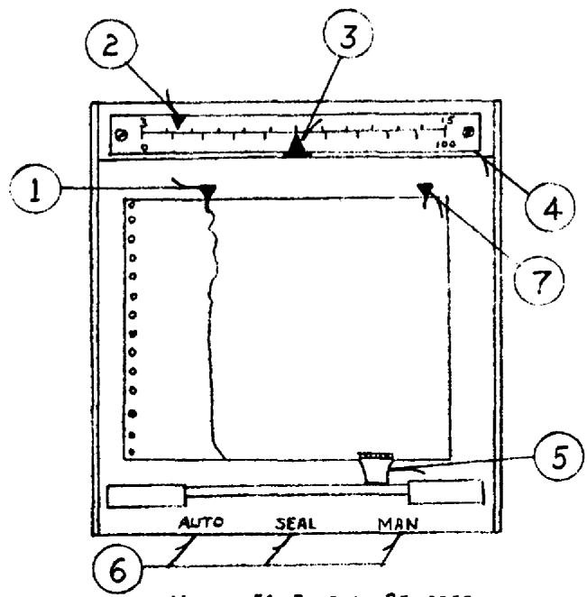  
MODEL 54 FoxBox Record

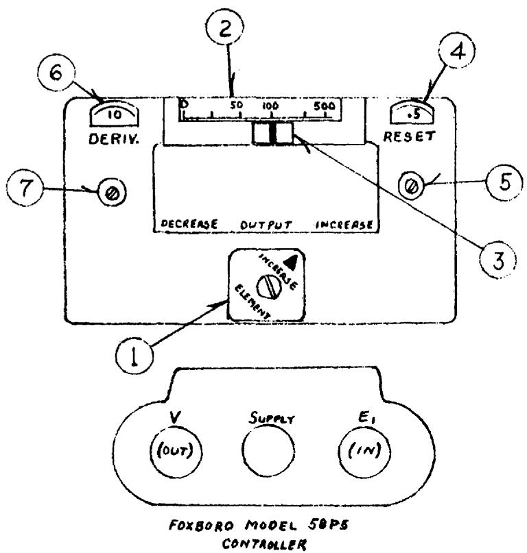  
FIG. 1   
FIG. 2

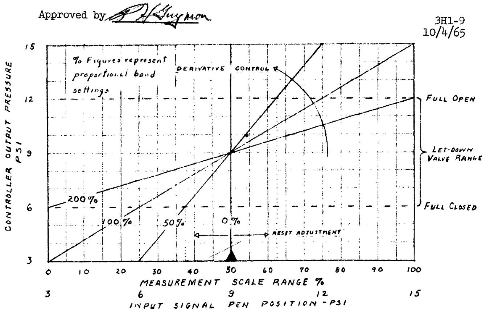  
F/G. 3

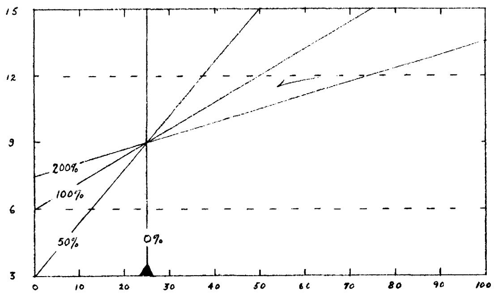  
FIG. 4

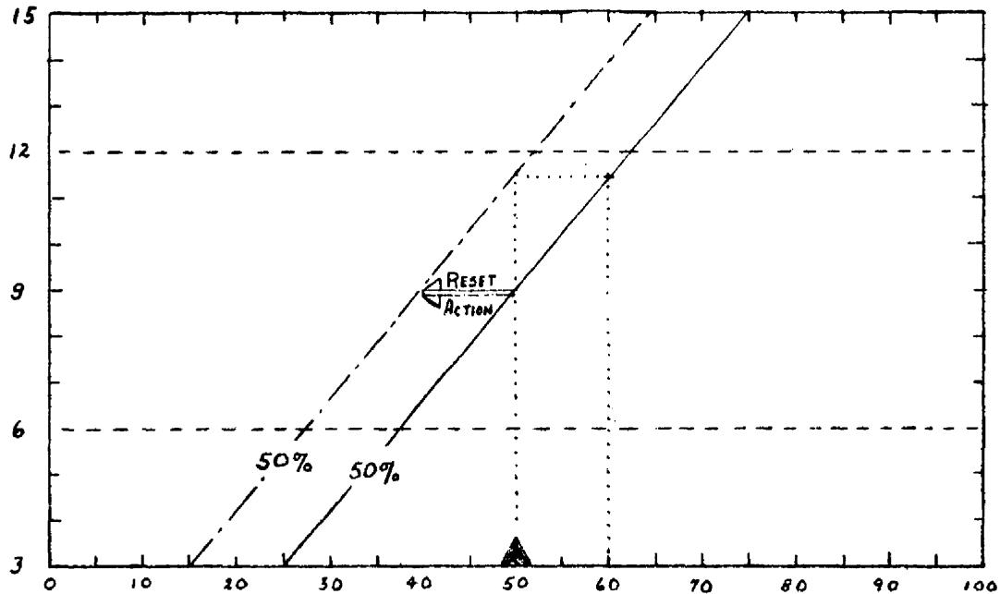  
FIG. 5

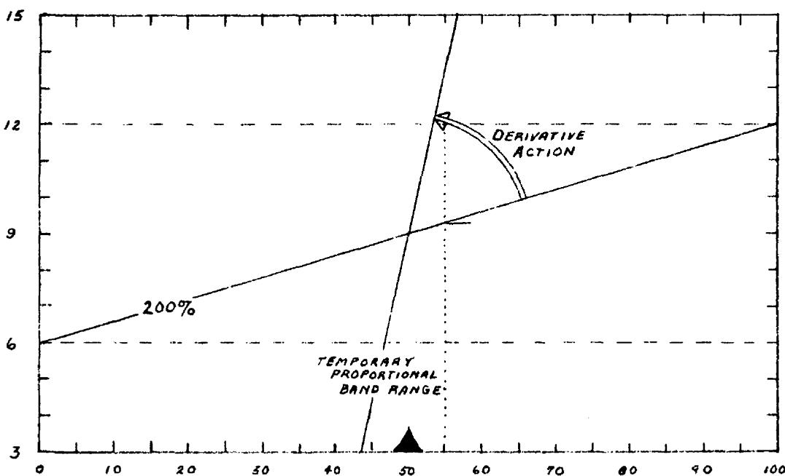  
F/G.G

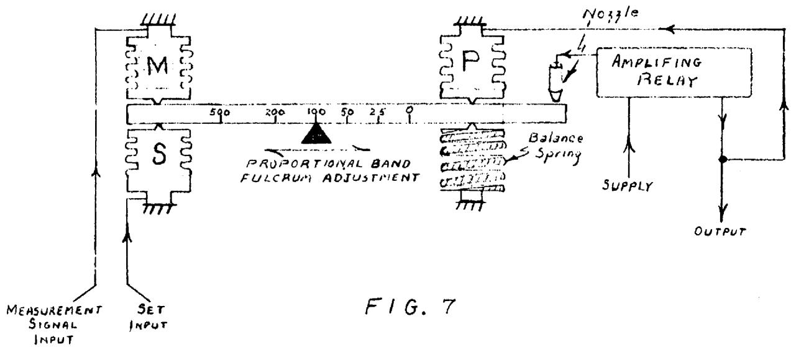

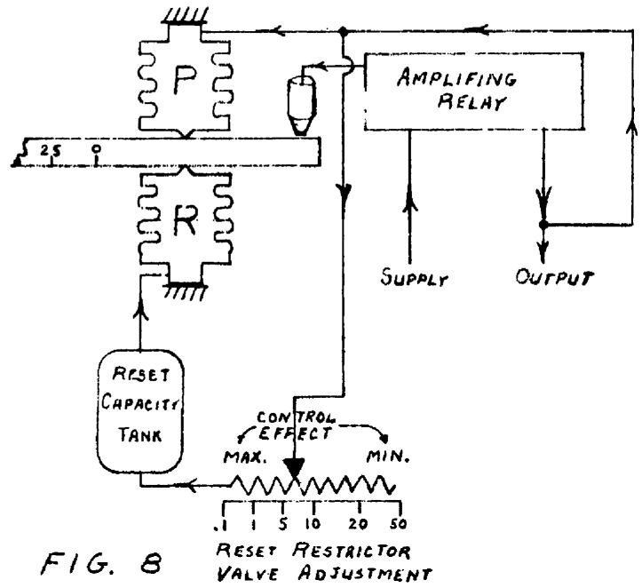

DO NOT SCALE

POSITIONS OR

MOMENT ARMS

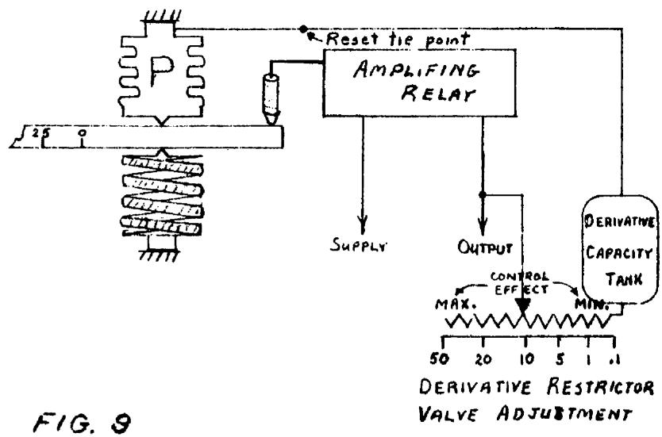

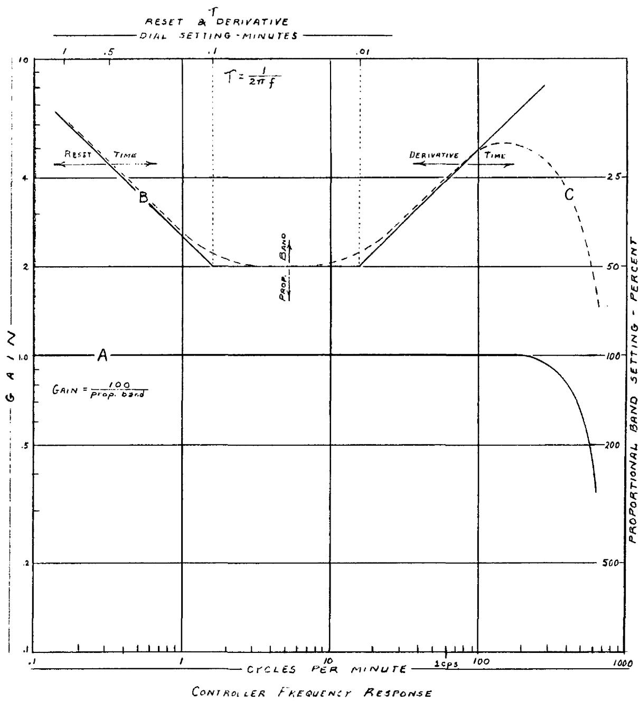  
FIG.10

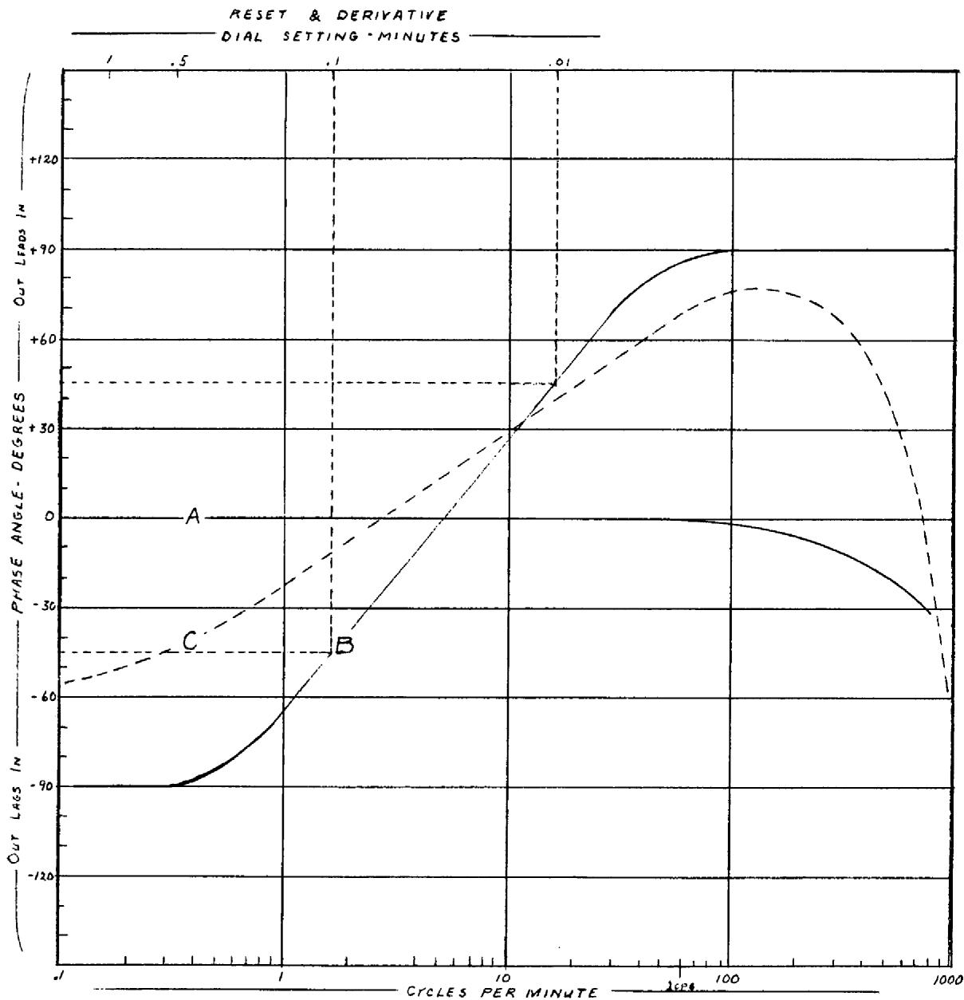  
CONTROLLER PHASE SHIFT   
F/G.11

# 2 SCANNER

The scanner system, made up of five "scanners," provides alarm monitoring and readout for groups of thermocouples. The system consists of rotating mercury switches through which combinations of thermocouples are compared with a reference thermocouple and read out on an oscilloscope. The block diagram, figure 3H2-1 shows the various components of this system and their relationship to each other.

Since portions of the salt system must remain heated at all times, the scanners will be in continuous operation except for necessary shutdowns for repairs. Due to the many possible operating conditions of the salt system, considerable flexibility was built into the scanners which allow easy changing of inputs. Whenever a portion of the salt system is cooled, the associated thermocouple signals should be removed from the scanner so that the alarm feature will not be inactivated. It is necessary that all points on all operating scanners be connected to a thermocouple or millivolt signal. Noise from a disconnected point can completely saturate the amplifier and make the channel inoperable and can damage the amplifier. When changes of input are made, these should be logged in both sections of the thermocouple log showing swinglink connections, multipoint connections, etc. (See details below.)

The spare to the reference thermocouple for scanners A, B, and C should always be connected to a temperature recorder and point 100 on each scanner should be jumpered at the scanner panel to the reference thermocouple. The scanner gain should always be set as high as possible to increase the readability of temperatures and narrow the range in which an alarm will occur. After heatup the gain can usually be set at 100 which will give a reading of $50^{\circ}\mathrm{F}$ per inch and will alarm at $\pm 150^{\circ}\mathrm{F}$ from the reference.

The reference signal for scanner D and E will be from a potentiometer located at the scanner panel. During heatup this is varied by a vernastat knob, and the equivalent temperature in $^{\circ}\mathbf{F}$ can be read out from the vernastat setting. During coolant salt circulation, the switch should be in the position to give a constant $1100^{\circ}\mathbf{F}$ input signal. The gain should be set at 100 (50°F per inch).

An alarm should occur at $950^{\circ}\mathrm{F}$ and $1250^{\circ}\mathrm{F}$ .

Periodic calibrations should be made of each scanner to assure that there has been no change in the gain or vertical size of the scope. This is accomplished by plugging a known EMF signal into a point of the scanner and comparing it with the reference as indicated by point 100. The vertical multiplier on the scope and the fine gain on the differential amplifier should be adjusted to alarm at $\pm 3$ inches from the reference line on any gain setting and indicate on the scope as follows:

<table><tr><td>Gain</td><td>°F/inch</td></tr><tr><td>25</td><td>200</td></tr><tr><td>50</td><td>100</td></tr><tr><td>100</td><td>50</td></tr><tr><td>250</td><td>20</td></tr></table>

In order to increase the life of the mercury jet scanning switch, a continuous purge of nitrogen should be maintained as indicated on the building log.

There are only a few adjustments of the scanners necessary for routine operations. These are: dc amplifier, course gain, oscilloscope vertical and horizontal position, focus, brightness and point locator.

The thermocouple input to the scanner system is from 314 plug-ins on pyrometer panels and, and 120 coolant cell thermocouples which are permanently tied into the scanner system. The 314 pyrometer panel plug-ins provide an input of 300 thermocouples, 9 duplicated thermocouples, and 5 reference thermocouples. The following is a detailed description of each component of the scanner (see figure 3H2-1 and drawings D-HH-B-41658, D-HH-B-41659, D-HH-B-41660, D-HH-B-41661, D-HH-B-41662, E-HH-B-41663, E-HH-B-41664, E-HH-B-41665, E-HH-B-41666).

2.1 909 thermocouples terminate with plug-in receptacles at "thermocouple jack panel#" located in the auxiliary control room on the 852 level. Hand plug-in leads are used to continue all of these thermocouples to the scanner system.

2.2 "Pyrometer panels #1 and #2," also located on the 852 level just below the thermocouple jack panel, provide 300 scanner input receptacles, 100 each to scanners A, B, and C, to receive hand plug-in leads from the "thermocouple jack panel." A thermocouple log is necessary at the pyrometer panel.

2.3 "Thermocouple scanner panel #1" is located on the 840 level just southeast of column C-3. The thermocouple leads from the pyrometer panel route to the "thermocouple scanner panel #1." The following is the sequence circuit routing of the leads and a description of the components within the "thermocouple scanner panel #1."

2.3.1 The 300 thermocouple leads enter the "scatterer panel #" by connection to three terminal strips with "swing links." See table 3H2-1 for lead identification on the terminal strips.

A terminal strip is a strip of insulation through which two parallel rows of screw terminals have been mounted and which will accommodate 103 leads. Swing links are metal bars which permit circuit continuity between terminal strip terminals. Normally the thermocouple leads connect to one row of screw terminals and continue the circuit by the "swing links" across the terminal strip to the other row of screw terminals. There are 300 leads leaving the three terminal strips which provide circuitry to the remainder of the scanner system. The "swing links" can be rotated 90 degrees in order to couple the scanner terminals together, thus paralleling two or more of the scanner leads on a given terminal strip. A thermocouple log is necessary at the terminal strip.

The "swing link" terminal strips are constructed as shown on drawing E-HH-B-41663, "detail B." The swing link conductor bars are held in place by the terminal nuts, thus requiring a tool to rearrange them.

TABLE 3H2-1   

<table><tr><td>Pyrometer Panel Receptacle</td><td>Scanner No.</td><td>Scanner Panel #1 Terminal Strip No. + Pole</td><td>Scanner Panel #1 Terminal Strip No. - Pole</td><td>Scanner Panel #1 Terminal Strip Terminal No.</td><td>Scanner Panel #1 25 Lead Polarized Connector Receptacle No.</td></tr><tr><td>421 through 445</td><td>A</td><td>TSPI-E</td><td>TSPI-F</td><td>1 through 25</td><td>J-A-1</td></tr><tr><td>446 through 470</td><td>A</td><td>TSPI-E</td><td>TSPI-F</td><td>26 through 50</td><td>J-A-2</td></tr><tr><td>471 through 495</td><td>A</td><td>TSPI-E</td><td>TSPI-F</td><td>51 through 75</td><td>J-A-3</td></tr><tr><td>496 through 520</td><td>A</td><td>TSPI-E</td><td>TSPI-F</td><td>76 through 100</td><td>J-A-4</td></tr><tr><td>521 through 545</td><td>B</td><td>TSPI-C</td><td>TSPI-D</td><td>1 through 25</td><td>J-B-1</td></tr><tr><td>546 through 570</td><td>B</td><td>TSPI-C</td><td>TSPI-D</td><td>26 through 50</td><td>J-B-2</td></tr><tr><td>571 through 595</td><td>B</td><td>TSPI-C</td><td>TSPI-D</td><td>51 through 75</td><td>J-B-3</td></tr><tr><td>596 through 620</td><td>B</td><td>TSPI-C</td><td>TSPI-D</td><td>76 through 100</td><td>J-B-4</td></tr><tr><td>621 through 645</td><td>C</td><td>TSPI-A</td><td>TSPI-B</td><td>1 through 25</td><td>J-C-1</td></tr><tr><td>656 through 670</td><td>C</td><td>TSPI-A</td><td>TSPI-B</td><td>26 through 50</td><td>J-C-2</td></tr><tr><td>671 through 695</td><td>C</td><td>TSPI-A</td><td>TSPI-B</td><td>51 through 75</td><td>J-C-3</td></tr><tr><td>696 through 720</td><td>C</td><td>TSPI-A</td><td>TSPI-B</td><td>76 through 100</td><td>J-C-4</td></tr></table>

2.3.2 The 300 scanner leads from the terminal strips are then routed to twelve 50-point connector receptacles to form group connectors accommodating 25 leads each.

The connector receptacles are the polarized multipoint type, and are rectangular in shape. Two rows of 25 connector points make up the two major sides of the rectangle receptacle. The scanner leads are connected to the receptacle in sequential order with the plus pole on one side and the minus pole on the other side. See table 3H2-1 for lead identification to the 25 lead polarized receptacles.

2.3.3 The circuitry is then continued from the lead polarized receptacles by means of polarized connector plug-ins to another group of twelve 50-point connector receptacles as listed in table 3H2-2.   
2.3.4 Any of the connector plug-ins as listed in table 3H2-2, "scatterer panel #1 25 lead polarized connector plug-in" can be inserted into the connector receptacles listed in table 3H2-1. It is important to maintain a record of the effects of any changes made of these plug-ins in both sections of the thermocouple log.

This second group of receptacles are identical in construction to the ones described in 2.3.2 above, except all 50 points of each receptacle are connected to the same pole of 50 scanner leads. This segregates the 300 scanner leads into six 50-point receptacles of plus polarity and six 50-point receptacles of minus polarity. See table 3H2-2 for lead identification to the scanner lead segregated pole receptacles.

2.3.5 The scanner leads continue by means of the 50-point connector plug-ins to 3 rotating mercury switches of the scanner system. A rotating mercury switch is a device for cyclic switching of the signal from 100 thermocouples. A mercury stream rotating at 1200 rpm serves as a brush to perform the switching of each lead at a rate of 20 times

TABLE 22-2   

<table><tr><td>Scanner Panel #1
25 Lead Polarized
Connector Plug-in</td><td>Scanner Panel #1
50 Pt. Segregated Pole
Connector Receptacles
+ Pole</td><td>Scanner Panel #1
50 Pt. Segregated Pole
Connector Receptacles
-Pole</td></tr><tr><td>F-A-1</td><td>J-A-8</td><td>J-A-10</td></tr><tr><td>P-A-2</td><td>J-A-8</td><td>J-A-10</td></tr><tr><td>P-A-3</td><td>J-A-9</td><td>J-A-11</td></tr><tr><td>P-A-4</td><td>J-A-9</td><td>J-A-11</td></tr><tr><td>P-B-1</td><td>J-B-8</td><td>J-B-10</td></tr><tr><td>P-B-2</td><td>J-B-8</td><td>J-B-10</td></tr><tr><td>P-B-3</td><td>J-B-9</td><td>J-B-11</td></tr><tr><td>P-B-4</td><td>J-B-9</td><td>J-B-11</td></tr><tr><td>P-C-1</td><td>J-C-8</td><td>J-C-10</td></tr><tr><td>P-C-2</td><td>J-C-8</td><td>J-C-10</td></tr><tr><td>P-C-3</td><td>J-C-9</td><td>J-C-11</td></tr><tr><td>P-C-4</td><td>J-C-9</td><td>J-C-11</td></tr></table>

# 2.3.5 (continued)

per second. Each rotating mercury switch has two separate switch sections which are synchronized by the same motor shaft. This provides switching for both the plus and minus pole of the thermocouple lead. Both the plus and the minus switch bank are each lead adapted by two 50-point connector plug-ins of the rectangular type. See table 3H2-3 for lead identification to the mercury switch. The connector plugins from the lower section of each rotating mercury switch are for the negative pole and the plug-ins from the top section are for the positive pole. All the connector plugins of table 3H2-3 are identical so they can be plugged into any of the receptacles of table 3H2-3. It is imperative that the plug-ins of table 3H2-3 be oriented such that polarity and synchronization are not disrupted. This is done by pairing the even or the odd numbered plug-ins of a given mercury switch and then plugging into receptacles listed in table 3H2-2 that have been grouped similarly. It is further necessary to maintain pole continuity by noting polarity listed in tables 3H2-2 and 3H2-3. Any even or odd numbered pair of plug-ins may be plugged into any even or odd numbered pair of connector receptacles as long as the above mentioned pairing and polarity of each has been complied with.

The mercury switch motors are energized by plugging into the 120v AC outlets A15, B15, C15, D15, E15, located next to each mercury switch motor on "scatterer panel #1." The mercury switches are purged by nitrogen continuously to prevent oxidation of the mercury.

2.4 The output leads of the mercury switches each route to a separate signal bucking network located on scanner panel# 2. The rotating mercury switch signal is bucked against a reference thermocouple signal to give a difference signal output. The difference signal output routes to individual "D.C. amplifiers."

TABLE 3H2-3   

<table><tr><td>Scanner Panel #1
50 Pt. Connector Plug-In
- Pole</td><td>Scanner Panel #1
50 Pt. Connector Plug-in
+ Pole</td><td>Scanner Panel #1
Mercury Switch</td></tr><tr><td>P-A-10</td><td>P-A-8</td><td>A</td></tr><tr><td>P-A-11</td><td>P-A-9</td><td>A</td></tr><tr><td>P-B-10</td><td>P-B-8</td><td>B</td></tr><tr><td>P-B-11</td><td>P-B-9</td><td>B</td></tr><tr><td>P-C-10</td><td>P-C-8</td><td>C</td></tr><tr><td>P-C-11</td><td>P-C-9</td><td>C</td></tr></table>

The D.C. amplifier outputs each route to an "alarm discrimination" and also parallel to a selector switch called "selector scanner."

The "alarm discriminators" and the "selector scanner" switch are located on "scatter panel #2." "scatter panel #2" is located next to "scatter panel #1."

The selected signal from the selector switch is routed to an oscilloscope. The light beam across the face of the oscilloscope made up of 100 incremental steps displays the visual readout of a scanner within the scanner system. The amplitudes of the increments represent the temperatures based on a reference thermocouple. The following is a more detailed description of the "alarm discriminator," D.C. amplifier, and the oscilloscope.

2.4.1 The "alarm discriminators" of "scanners A, B, C, D, and E" are located on "scatterer panel #2."

An "alarm discriminator" is an electronic device for triggering an alarm if the temperature difference between a reference thermocouple and a thermocouple exceeds a preset limit. This limit is preset by adjusting the "amplifier gain" knob of the "D.C. amplifier." It should be noted that false alarm will occur for a given scanner if there is not full circuit input to the mercury rotating switch.

The alarm discriminators have individual scanner annihilators located in "scatterer panel #1" on the 840'level. The annunciation is by individual light indicators and a common alarm. An acknowledgement button is provided on "scatterer panel #2" to silence the alarm, but the light indicator remains on until the out-of-limit temperature is corrected.

A Scanner System annunciator is provided in the main control panel on the 852'level. This provides a general alarm and general light indication at the main control panel on the 852'level for an out-of-limit thermocouple

# 2.4.1 (continued)

within the scanner system. This annunciator is also provided with an acknowledgement button to silence the alarm which is located on the main control console on the 852' level.

2.4.2 The "D.C. amplifiers," located on "scatterer panel #2," amplify the difference signal from the "alarm discriminators." The oscilloscope readout is calibrated by adjusting the "amplifier gain" knobs on the "differential D.C. amplifiers" and the vertical multiplier on the oscilloscope to give the beam amplitude corresponding to a known thermocouple input to the scanner system. Adjustment should be as follows:

<table><tr><td>Gain</td><td>Oscilloscope 
Reading 
(°F/in)</td><td>Scanner 
Alarm 
(°F)</td></tr><tr><td>25</td><td>200</td><td>± 600</td></tr><tr><td>50</td><td>100</td><td>± 300</td></tr><tr><td>100</td><td>50</td><td>± 150</td></tr><tr><td>250</td><td>20</td><td>± 60</td></tr></table>

2.4.3 There are two oscillosopes within the scanner system; one on the 840'level at scanner panel #2, and the other is on the 852'level in the main control panel. The oscilloscope on the 840 level is a console unit and plugs into the two receptacles on "scatterer panel #2." The oscilloscope on the 852'level is mounted in the main control panel. Both oscillosopes are provided with a "thermocouple identification marker." This is controlled from the 840'level and can be used on the 852'level oscilloscope only when both oscillosopes are set on the same scanner position.

The six (6) control knobs located on the front of the oscilloscope to control the display of the light beam area as follows:

2.4.3.1 "Vertical adjustment"-used to move display up or down for centering reference line.   
2.4.3.2 Horizontal adjustment--used to move display to either side for centering.   
2.4.3.3 Focus adjustment--used to adjust the display to maximum sharpness.   
2.4.3.4 Intensity--used to vary the light intensity of the display. This should be maintained at a good low intensity to minimize burning the cathod ray tube phosphorescent coating.   
2.4.3.5 Thermocouple identification marker--the "thermocouple identification marker" serves to identify the incremental section of light beam on the oscilloscope corresponding to each of the programmed input thermocouples. The marker is a dot of light that appears just in the increment in question. The position of the marker dot is identified and controlled by a heli-pot selector switch called "thermocouple identification marker." The switch indicates the positions from 1 to 100, position 1 is the extreme left increment on the face of the oscilloscope and position 100 is the extreme right increment on the face of the oscilloscope.   
2.4.3.6 Light beam amplitude control--normally this control is set to read a full scale amplitude with an input signal of $\pm 1$ volt. This control is used when it is desired to change the calibration of the scope without changing the alarm calibration. (Refer to alarm discriminator for alarm calibration, section 2.4.1).

2.5 Reference thermocouples are thermocouples that have a known readout and are introduced into the scanner system to provide a datum temperature. Thermocouples are then readout by comparison with a reference thermocouple.

Each scanner has an input receptacle for a reference thermocouple at the "pyrometer panel." The circuitry of the reference thermocouple lead routes from the pyrometer panel to a terminal strip in "scatterer panel #2." Then the reference thermocouple lead continues to the signal bucking network where the signal is bucked against the analytical thermocouples signal as previously described.

The reference thermocouple input can be simulated with an external electronic source and coupled into the scanner system at the pyrometer panel.

Table 3H2-4 details the routing of the reference thermocouple leads within the scanner system.

2.6 The scanner system has designed within circuitry that permits single input thermocouple signal to be read out on 25 consecutive increments of the oscilloscope display. This permits a more accurate examination of an individual thermocouple. Again it should be noted that false alarm will occur if the 100 points of a given scanner are not activated. Signal input can be either four (4) 25 duplicated thermocouple inputs or 100 single thermocouple inputs, or any combination thereof.

There are nine duplicated thermocouple input receptacles on the pyrometer panel as listed in table 3H2-5; 3 each to scanners A, B, and C.

The thermocouples to be read out on the duplicated scanner are introduced at the pyrometer panel by jumper leads from the "patch panel" as previously described. The leads from the pyrometer panel then proceed to the terminal strips with swing links in "scatter panel #1."

The swing links permit the paralleling of duplicated leads at the terminal strips.

The leads then continue from the terminal strips of "scatterer panel #1" to the nine 25-point connector receptacle of "scatterer panel #1." Each lead connects to all 25 points of a connector receptacle.

Table 3H2-4   
REFERENCE THERMOCOUPLES   

<table><tr><td rowspan="2">Pyrometer
Panel
Receptacle
No.</td><td rowspan="2">Scanner
Panel #2
Terminal
Strip
No.</td><td>Scanner
Panel #2
Terminal
Strip
No.</td><td>Scanner
Panel #2
Terminal
Strip
No.</td><td rowspan="2">Alarm
Discriminator</td></tr><tr><td>+ Pole</td><td>- Pole</td></tr><tr><td>56</td><td>TSP2-C</td><td>1</td><td>2</td><td>A</td></tr><tr><td>57</td><td>TSP2-C</td><td>3</td><td>4</td><td>B</td></tr><tr><td>58</td><td>TSP2-C</td><td>5</td><td>6</td><td>C</td></tr><tr><td>59</td><td>TSP2-C</td><td>7</td><td>8</td><td>D</td></tr><tr><td>60</td><td>TSP2-C</td><td>9</td><td>10</td><td>E</td></tr></table>

TABLE 3H2-5   
Duplicated Thermocouples   

<table><tr><td>Pyrometer Panel 
Duplicate 
Thermocouple 
Receptacle No.</td><td>Normal 
Scanner 
Designation 
No.</td><td>Scanner Panel #1 
Terminal Strip 
No. + Pole</td><td>Scanner Panel #1 
Terminal Strip 
No. - Pole</td><td>Scanner Panel #1 
Terminal Strip 
With Swing Lengths 
Terminal No.</td><td>Scanner Panel #1 
Duplicate 
Thermocouple 
25 Point Polarized 
Connector 
Receptacle No.</td></tr><tr><td>172</td><td>A</td><td>TSPI-E</td><td>TSPI-F</td><td>101</td><td>J-A-5</td></tr><tr><td>173</td><td>A</td><td>TSPI-E</td><td>TSPI-F</td><td>102</td><td>J-A-6</td></tr><tr><td>174</td><td>A</td><td>TSPI-E</td><td>TSPI-F</td><td>103</td><td>J-A-7</td></tr><tr><td>175</td><td>B</td><td>TSPI-C</td><td>TSPI-D</td><td>101</td><td>J-B-5</td></tr><tr><td>176</td><td>B</td><td>TSPI-C</td><td>TSPI-D</td><td>102</td><td>J-B-6</td></tr><tr><td>177</td><td>B</td><td>TSPI-C</td><td>TSPI-D</td><td>103</td><td>J-B-7</td></tr><tr><td>178</td><td>C</td><td>TSPI-A</td><td>TSPI-B</td><td>101</td><td>J-C-5</td></tr><tr><td>179</td><td>C</td><td>TSPI-A</td><td>TSPI-B</td><td>102</td><td>J-C-6</td></tr><tr><td>180</td><td>C</td><td>TSPI-A</td><td>TSPI-B</td><td>103</td><td>J-C-7</td></tr></table>

The connector receptacles are identical to the others previously described so any scanner connector plug-in can be coupled into them. Table 3H2-5 details the circuitry of the duplicated thermocouple facility.

2.7 The radiator temperature control is of crucial importance so scanners D and E are semi-permanently connected to 120 radiator thermocouples.

The thermocouple circuitry of scanners D and E is similar to that of scanners A, B, and C except that the 120 thermocouples couple directly into the terminal strips on "scatterer panel #1" of scanner D and E.

Scanners D and E each readout 60 thermocouples, the first 40 of which are duplicated to activate all 100 points of the scanner.

The thermocouple leads route from their origin within the radiator section of the project to two terminal strips in "scatterer panel #1." A parallel lead for each thermocouple also routes to the "patch panel" to provide duplicate readout. The terminal strips are equipped with swing link conductors so that one thermocouple lead can be paralleled into more than one scanner readout circuit within a given terminal strip. When swing lengths are used, sections of the thermocouple log should be corrected to indicate this.

The leads continue within the "scatterer panel #1" from the terminal strip in sequence to eight 50-point pole segregated connector receptacles which are the same rectangular type that was explained in Section 2.3.2. The leads are pole segregated into four 50-point plus pole and four 50-point negative pole receptacles. Table 3H2-6 details routing of the radiator thermocouple leads within the scanner system.

Scanner mercury switches D and E "located on scanner panel #1" are plugged in at this point and are identical as described in Section 2.3.5. Again it is emphasized that the mercury switch connector plug-ins be paired by even or odd numbers and

TABLE 3H2-6   

<table><tr><td rowspan="2">Thermocouple
Nos.</td><td rowspan="2">Scanner
No.</td><td colspan="2">Scanner Panel #1
Terminal Strip No.</td><td colspan="2" rowspan="2">Scanner Panel #1
Terminal Strip
Terminal No.</td><td colspan="2">Scanner Panel #1
50 Pt. Connector</td></tr><tr><td>+ Pole</td><td>- Pole</td><td>+ Pole</td><td>-Pole</td></tr><tr><td>CR- 1</td><td>D</td><td>TSPI-G</td><td>TSPI-H</td><td colspan="2">1 &amp; 61</td><td>JDL &amp; JD2</td><td>JD4 &amp; JD5</td></tr><tr><td>CR- 3</td><td>D</td><td>TSPI-G</td><td>TSPI-H</td><td colspan="2">2 &amp; 62</td><td>JDL &amp; JD2</td><td>JD4 &amp; JD5</td></tr><tr><td>CR- 5</td><td>D</td><td>TSPI-G</td><td>TSPI-H</td><td colspan="2">3 &amp; 63</td><td>JDL &amp; JD2</td><td>JD4 &amp; JD5</td></tr><tr><td>CR- 7</td><td>D</td><td>TSPI-G</td><td>TSPI-H</td><td colspan="2">4 &amp; 64</td><td>JDL &amp; JD2</td><td>JD4 &amp; JD5</td></tr><tr><td>CR- 9</td><td>D</td><td>TSPI-G</td><td>TSPI-H</td><td colspan="2">5 &amp; 65</td><td>JDL &amp; JD2</td><td>JD4 &amp; JD5</td></tr><tr><td>CR- 11</td><td>D</td><td>TSPI-G</td><td>TSPI-H</td><td colspan="2">6 &amp; 66</td><td>JDL &amp; JD2</td><td>JD4 &amp; JD5</td></tr><tr><td>CR- 13</td><td>D</td><td>TSPI-G</td><td>TSPI-H</td><td colspan="2">7 &amp; 67</td><td>JDL &amp; JD2</td><td>JD4 &amp; JD5</td></tr><tr><td>CR- 15</td><td>D</td><td>TSPI-G</td><td>TSPI-H</td><td colspan="2">8 &amp; 68</td><td>JDL &amp; JD2</td><td>JD4 &amp; JD5</td></tr><tr><td>CR- 17</td><td>D</td><td>TSPI-G</td><td>TSPI-H</td><td colspan="2">9 &amp; 69</td><td>JDL &amp; JD2</td><td>JD4 &amp; JD5</td></tr><tr><td>CR- 19</td><td>D</td><td>TSPI-G</td><td>TSPI-H</td><td colspan="2">10 &amp; 70</td><td>JDL &amp; JD2</td><td>JD4 &amp; JD5</td></tr><tr><td>CR- 21</td><td>D</td><td>TSPI-G</td><td>TSPI-H</td><td colspan="2">11 &amp; 71</td><td>JDL &amp; JD2</td><td>JD4 &amp; JD5</td></tr><tr><td>CR- 23</td><td>D</td><td>TSPI-G</td><td>TSPI-H</td><td colspan="2">12 &amp; 72</td><td>JDL &amp; JD2</td><td>JD4 &amp; JD5</td></tr><tr><td>CR- 25</td><td>D</td><td>TSPI-G</td><td>TSPI-H</td><td colspan="2">13 &amp; 73</td><td>JDL &amp; JD2</td><td>JD4 &amp; JD5</td></tr><tr><td>CR- 27</td><td>D</td><td>TSPI-G</td><td>TSPI-H</td><td colspan="2">14 &amp; 74</td><td>JDL &amp; JD2</td><td>JD4 &amp; JD5</td></tr><tr><td>CR- 29</td><td>D</td><td>TSPI-G</td><td>TSPI-H</td><td colspan="2">15 &amp; 75</td><td>JDL &amp; JD2</td><td>JD4 &amp; JD5</td></tr><tr><td>CR- 31</td><td>D</td><td>TSPI-G</td><td>TSPI-H</td><td colspan="2">16 &amp; 76</td><td>JDL &amp; JD2</td><td>JD4 &amp; JD5</td></tr><tr><td>CR- 33</td><td>D</td><td>TSPI-G</td><td>TSPI-H</td><td colspan="2">17 &amp; 77</td><td>JDL &amp; JD2</td><td>JD4 &amp; JD5</td></tr><tr><td>CR- 35</td><td>D</td><td>TSPI-G</td><td>TSPI-H</td><td colspan="2">18 &amp; 78</td><td>JDL &amp; JD2</td><td>JD4 &amp; JD5</td></tr><tr><td>CR- 37</td><td>D</td><td>TSPI-G</td><td>TSPI-H</td><td colspan="2">19 &amp; 79</td><td>JDL &amp; JD2</td><td>JD4 &amp; JD5</td></tr><tr><td>CR- 39</td><td>D</td><td>TSPI-G</td><td>TSPI-H</td><td colspan="2">20 &amp; 80</td><td>JDL &amp; JD2</td><td>JD4 &amp; JD5</td></tr><tr><td>CR- 41</td><td>D</td><td>TSPI-G</td><td>TSPI-H</td><td colspan="2">21 &amp; 81</td><td>JDL &amp; JD2</td><td>JD4 &amp; JD5</td></tr><tr><td>CR- 43</td><td>D</td><td>TSPI-G</td><td>TSPI-H</td><td colspan="2">22 &amp; 82</td><td>JDL &amp; JD2</td><td>JD4 &amp; JD5</td></tr><tr><td>CR- 45</td><td>D</td><td>TSPI-G</td><td>TSPI-H</td><td colspan="2">23 &amp; 83</td><td>JDL &amp; JD2</td><td>JD4 &amp; JD4</td></tr><tr><td>CR- 47</td><td>D</td><td>TSPI-G</td><td>TSPI-H</td><td colspan="2">24 &amp; 84</td><td>JDL &amp; JD2</td><td>JD4 &amp; JD4</td></tr><tr><td>CR- 49</td><td>D</td><td>TSPI-G</td><td>TSPI-H</td><td colspan="2">25 &amp; 85</td><td>JDL &amp; JD2</td><td>JD4 &amp; JD4</td></tr><tr><td>CR- 51</td><td>D</td><td>TSPI-G</td><td>TSPI-H</td><td colspan="2">26 &amp; 86</td><td>JDL &amp; JD2</td><td>JD4 &amp; JD4</td></tr><tr><td>CR- 53</td><td>D</td><td>TSPI-G</td><td>TSPI-H</td><td colspan="2">27 &amp; 87</td><td>JDL &amp; JD2</td><td>JD4 &amp; JD4</td></tr><tr><td>CR- 55</td><td>D</td><td>TSPI-G</td><td>TSPI-H</td><td colspan="2">28 &amp; 88</td><td>JDL &amp; JD2</td><td>JD4 &amp; JD4</td></tr><tr><td>CR- 57</td><td>D</td><td>TSPI-G</td><td>TSPI-H</td><td colspan="2">29 &amp; 89</td><td>JDL &amp; JD2</td><td>JD4 &amp; JD4</td></tr><tr><td>Thermocouple
Nos.</td><td>Scanner
No.</td><td>Scanner
Panel #1
Terminal Strip No.
+ Pole</td><td>Scanner
Panel #1
Terminal Strip
- Pole</td><td colspan="2">Scanner
Panel #1
Terminal Strip
Terminal No.</td><td>Scanner
Panel #1
50 Pt. Connector
+ Pole</td><td>- Pole</td></tr><tr><td>CR- 59</td><td>D</td><td>TSPI-G</td><td>TSPI-H</td><td colspan="2">30 &amp; 90</td><td>JDL &amp; JD2</td><td>JD3 &amp; JD4</td></tr><tr><td>CR- 61</td><td>D</td><td>TSPI-G</td><td>TSPI-H</td><td colspan="2">31 &amp; 91</td><td>JDL &amp; JD2</td><td>JD3 &amp; JD4</td></tr><tr><td>CR- 63</td><td>D</td><td>TSPI-G</td><td>TSPI-H</td><td colspan="2">32 &amp; 92</td><td>JDL &amp; JD2</td><td>JD3 &amp; JD4</td></tr><tr><td>CR- 65</td><td>D</td><td>TSPI-G</td><td>TSPI-H</td><td colspan="2">33 &amp; 93</td><td>JDL &amp; JD2</td><td>JD3 &amp; JD4</td></tr><tr><td>CR- 67</td><td>D</td><td>TSPI-G</td><td>TSPI-H</td><td colspan="2">34 &amp; 94</td><td>JDL &amp; JD2</td><td>JD3 &amp; JD4</td></tr><tr><td>CR- 69</td><td>D</td><td>TSPI-G</td><td>TSPI-H</td><td colspan="2">35 &amp; 95</td><td>JDL &amp; JD2</td><td>JD3 &amp; JD4</td></tr><tr><td>CR- 71</td><td>D</td><td>TSPI-G</td><td>TSPI-H</td><td colspan="2">36 &amp; 96</td><td>JDL &amp; JD2</td><td>JD3 &amp; JD4</td></tr><tr><td>CR- 73</td><td>D</td><td>TSPI-G</td><td>TSPI-H</td><td colspan="2">37 &amp; 97</td><td>JDL &amp; JD2</td><td>JD3 &amp; JD4</td></tr><tr><td>CR- 75</td><td>D</td><td>TSPI-G</td><td>TSPI-H</td><td colspan="2">38 &amp; 98</td><td>JDL &amp; JD2</td><td>JD3 &amp; JD4</td></tr><tr><td>CR- 77</td><td>D</td><td>TSPI-G</td><td>TSPI-H</td><td colspan="2">39 &amp; 99</td><td>JDL &amp; JD2</td><td>JD3 &amp; JD4</td></tr><tr><td>CR- 79</td><td>D</td><td>TSPI-G</td><td>TSPI-H</td><td colspan="2">40 &amp; 100</td><td>JDL &amp; JD2</td><td>JD3 &amp; JD4</td></tr><tr><td>CR- 81</td><td>D</td><td>TSPI-G</td><td>TSPI-H</td><td colspan="2">41</td><td>J-D-1</td><td>J-D-3</td></tr><tr><td>CR- 83</td><td>D</td><td>TSPI-G</td><td>TSPI-H</td><td colspan="2">42</td><td>J-D-1</td><td>J-D-3</td></tr><tr><td>CR- 85</td><td>D</td><td>TSPI-G</td><td>TSPI-H</td><td colspan="2">43</td><td>J-D-1</td><td>J-D-3</td></tr><tr><td>CR- 87</td><td>D</td><td>TSPI-G</td><td>TSPI-H</td><td colspan="2">44</td><td>J-D-1</td><td>J-D-3</td></tr><tr><td>CR- 89</td><td>D</td><td>TSPI-G</td><td>TSPI-H</td><td colspan="2">45</td><td>J-D-1</td><td>J-D-3</td></tr><tr><td>CR- 91</td><td>D</td><td>TSPI-G</td><td>TSPI-H</td><td colspan="2">46</td><td>J-D-1</td><td>J-D-3</td></tr><tr><td>CR- 93</td><td>D</td><td>TSPI-G</td><td>TSPI-H</td><td colspan="2">47</td><td>J-D-1</td><td>J-D-3</td></tr><tr><td>CR- 95</td><td>D</td><td>TSPI-G</td><td>TSPI-H</td><td colspan="2">48</td><td>J-D-1</td><td>J-D-3</td></tr><tr><td>CR- 97</td><td>D</td><td>TSPI-G</td><td>TSPI-H</td><td colspan="2">49</td><td>J-D-1</td><td>J-D-3</td></tr><tr><td>CR- 99</td><td>D</td><td>TSPI-G</td><td>TSPI-H</td><td colspan="2">50</td><td>J-D-1</td><td>J-D-3</td></tr><tr><td>CR-101</td><td>D</td><td>TSPI-G</td><td>TSPI-H</td><td colspan="2">51</td><td>J-D-2</td><td>J-D-4</td></tr><tr><td>CR-103</td><td>D</td><td>TSPI-G</td><td>TSPI-H</td><td colspan="2">52</td><td>J-D-2</td><td>J-D-4</td></tr><tr><td>CR-105</td><td>D</td><td>TSPI-G</td><td>TSPI-H</td><td colspan="2">53</td><td>J-D-2</td><td>J-D-4</td></tr><tr><td>CR-107</td><td>D</td><td>TSPI-G</td><td>TSPI-H</td><td colspan="2">54</td><td>J-D-2</td><td>J-D-4</td></tr><tr><td>CR-109</td><td>D</td><td>TSPI-G</td><td>TSPI-H</td><td colspan="2">55</td><td>J-D-2</td><td>J-D-4</td></tr><tr><td>CR-111</td><td>D</td><td>TSPI-G</td><td>TSPI-H</td><td colspan="2">56</td><td>J-D-2</td><td>J-D-4</td></tr><tr><td>CR-113</td><td>D</td><td>TSPI-G</td><td>TSPI-H</td><td colspan="2">57</td><td>J-D-2</td><td>J-D-4</td></tr><tr><td>CR-115</td><td>D</td><td>TSPI-G</td><td>TSPI-H</td><td colspan="2">58</td><td>J-D-2</td><td>J-D-4</td></tr><tr><td>CR-117</td><td>D</td><td>TSPI-G</td><td>TSPI-H</td><td colspan="2">59</td><td>J-D-2</td><td>J-D-4</td></tr><tr><td>CR-119</td><td>D</td><td>TSPI-G</td><td>TSPI-H</td><td colspan="2">60</td><td>J-D-2</td><td>J-D-4</td></tr><tr><td rowspan="2">Thermocouple
Nos.</td><td rowspan="2">Scanner
No.</td><td colspan="2">Scanner Panel #1
Terminal Strip No.</td><td rowspan="2">Scanner Panel #1
Terminal Strip
Terminal No.</td><td colspan="3">Scanner Panel #1
50 Pt. Connector</td></tr><tr><td>+ Pole</td><td>- Pole</td><td>+ Pole</td><td colspan="2">- Pole</td></tr><tr><td>CR- 2</td><td>E</td><td>TSPI-J</td><td>TSPI-K</td><td colspan="2">1 &amp; 61</td><td>JE1 &amp; JE2'</td><td>JE3 &amp; JE4</td></tr><tr><td>CR- 4</td><td>E</td><td>TSPI-J</td><td>TSPI-K</td><td colspan="2">2 &amp; 62</td><td>JE1 &amp; JE2</td><td>JE3 &amp; JE4</td></tr><tr><td>CR- 6</td><td>E</td><td>TSPI-J</td><td>TSPI-K</td><td colspan="2">3 &amp; 63</td><td>JE1 &amp; JE2</td><td>JE3 &amp; JE4</td></tr><tr><td>CR- 8</td><td>E</td><td>TSPI-J</td><td>TSPI-K</td><td colspan="2">4 &amp; 64</td><td>JE1 &amp; JE2</td><td>JE3 &amp; JE4</td></tr><tr><td>CR- 10</td><td>E</td><td>TSPI-J</td><td>TSPI-K</td><td colspan="2">5 &amp; 65</td><td>JE1 &amp; JE2</td><td>JE3 &amp; JE4</td></tr><tr><td>CR- 12</td><td>E</td><td>TSPI-J</td><td>TSPI-K</td><td colspan="2">6 &amp; 66</td><td>JE1 &amp; JE2</td><td>JE3 &amp; JE4</td></tr><tr><td>CR- 14</td><td>E</td><td>TSPI-J</td><td>TSPI-K</td><td colspan="2">7 &amp; 67</td><td>JE1 &amp; JE2</td><td>JE3 &amp; JE4</td></tr><tr><td>CR- 16</td><td>E</td><td>TSPI-J</td><td>TSPI-K</td><td colspan="2">8 &amp; 68</td><td>JE1 &amp; JE2</td><td>JE3 &amp; JE4</td></tr><tr><td>CR- 18</td><td>E</td><td>TSPI-J</td><td>TSPI-K</td><td colspan="2">9 &amp; 69</td><td>JE1 &amp; JE2</td><td>JE3 &amp; JE4</td></tr><tr><td>CR- 20</td><td>E</td><td>TSPI-J</td><td>TSPI-K</td><td colspan="2">10 &amp; 70</td><td>JE1 &amp; JE2</td><td>JE3 &amp; JE4</td></tr><tr><td>CR- 22</td><td>E</td><td>TSPI-J</td><td>TSPI-K</td><td colspan="2">11 &amp; 71</td><td>JE1 &amp; JE2</td><td>JE3 &amp; JE4</td></tr><tr><td>CR- 24</td><td>E</td><td>TSPI-J</td><td>TSPI-K</td><td colspan="2">12 &amp; 72</td><td>JE1 &amp; JE2</td><td>JE3 &amp; JE4</td></tr><tr><td>CR- 26</td><td>E</td><td>TSPI-J</td><td>TSPI-K</td><td colspan="2">13 &amp; 73</td><td>JE1 &amp; JE2</td><td>JE3 &amp; JE4</td></tr><tr><td>CR- 28</td><td>E</td><td>TSPI-J</td><td>TSPI-K</td><td colspan="2">14 &amp; 74</td><td>JE1 &amp; JE2</td><td>JE3 &amp; JE4</td></tr><tr><td>CR- 30</td><td>E</td><td>TSPI-J</td><td>TSPI-K</td><td colspan="2">15 &amp; 75</td><td>JE1 &amp; JE2</td><td>JE3 &amp; JE4</td></tr><tr><td>CR- 32</td><td>E</td><td>TSPI-J</td><td>TSPI-K</td><td colspan="2">16 &amp; 76</td><td>JE1 &amp; JE2</td><td>JE3 &amp; JE4</td></tr><tr><td>CR- 34</td><td>E</td><td>TSPI-J</td><td>TSPI-K</td><td colspan="2">17 &amp; 77</td><td>JE1 &amp; JE2</td><td>JE3 &amp; JE4</td></tr><tr><td>CR- 36</td><td>E</td><td>TSPI-J</td><td>TSPI-K</td><td colspan="2">18 &amp; 78</td><td>JE1 &amp; JE2</td><td>JE3 &amp; JE4</td></tr><tr><td>CR- 38</td><td>E</td><td>TSPI-J</td><td>TSPI-K</td><td colspan="2">19 &amp; 79</td><td>JE1 &amp; JE2</td><td>JE3 &amp; JE4</td></tr><tr><td>CR- 40</td><td>E</td><td>TSPI-J</td><td>TSPI-K</td><td colspan="2">20 &amp; 80</td><td>JE1 &amp; JE2</td><td>JE3 &amp; JE4</td></tr><tr><td>CR- 42</td><td>E</td><td>TSPI-J</td><td>TSPI-K</td><td colspan="2">21 &amp; 81</td><td>JE1 &amp; JE2</td><td>JE3 &amp; JE4</td></tr><tr><td>CR- 44</td><td>E</td><td>TSPI-J</td><td>TSPI-K</td><td colspan="2">22 &amp; 82</td><td>JE1 &amp; JE2</td><td>JE3 &amp; JE4</td></tr><tr><td>CR- 46</td><td>E</td><td>TSPI-J</td><td>TSPI-K</td><td colspan="2">23 &amp; 83</td><td>JE1 &amp; JE2</td><td>JE3 &amp; JE4</td></tr><tr><td>CR- 48</td><td>E</td><td>TSPI-J</td><td>TSPI-K</td><td colspan="2">24 &amp; 84</td><td>JE1 &amp; JE2</td><td>JE3 &amp; JE4</td></tr><tr><td>CR- 50</td><td>E</td><td>TSPI-J</td><td>TSPI-K</td><td colspan="2">25 &amp; 85</td><td>JE1 &amp; JE2</td><td>JE3 &amp; JE4</td></tr><tr><td>CR- 52</td><td>E</td><td>TSPI-J</td><td>TSPI-K</td><td colspan="2">26 &amp; 86</td><td>JE1 &amp; JE2</td><td>JE3 &amp; JE4</td></tr><tr><td>CR- 54</td><td>E</td><td>TSPI-J</td><td>TSPI-K</td><td colspan="2">27 &amp; 87</td><td>JE1 &amp; JE2</td><td>JE3 &amp; JE4</td></tr><tr><td>CR- 56</td><td>E</td><td>TSPI-J</td><td>TSPI-K</td><td colspan="2">28 &amp; 88</td><td>JE1 &amp; JE2</td><td>JE3 &amp; JE4</td></tr><tr><td>CR- 58</td><td>E</td><td>TSPI-J</td><td>TSPI-K</td><td colspan="2">29 &amp; 89</td><td>JE1 &amp; JE2</td><td>JE3 &amp; JE4</td></tr><tr><td>CR- 60</td><td>E</td><td>TSPI-J</td><td>TSPI-K</td><td colspan="2">30 &amp; 90</td><td>JE1 &amp; JE2</td><td>JE3 &amp; JE4</td></tr><tr><td>Thermocouple
Nos.</td><td>Scanner
No.</td><td>Scanner Panel #1
Terminal Strip No.
+ Pole</td><td>Scanner Panel #1
Terminal Strip
- Pole</td><td colspan="2">Scanner Panel #1
Terminal Strip
Terminal No.</td><td>Scanner Panel #1
50 Pt. Connector
+ Pole</td><td>- Pole</td></tr><tr><td>CR-62</td><td>E</td><td>TSPI-J</td><td>TSPI-K</td><td colspan="2">31 &amp; 91</td><td>JE1 &amp; JE2</td><td>JE3 &amp; JE4</td></tr><tr><td>CR-64</td><td>E</td><td>TSPI-J</td><td>TSPI-K</td><td colspan="2">32 &amp; 92</td><td>JE1 &amp; JE2</td><td>JE3 &amp; JE4</td></tr><tr><td>CR-66</td><td>E</td><td>TSPI-J</td><td>TSPI-K</td><td colspan="2">33 &amp; 93</td><td>JE1 &amp; JE2</td><td>JE3 &amp; JE4</td></tr><tr><td>CR-68</td><td>E</td><td>TSPI-J</td><td>TSPI-K</td><td colspan="2">34 &amp; 94</td><td>JE1 &amp; JE2</td><td>JE3 &amp; JE4</td></tr><tr><td>CR-70</td><td>E</td><td>TSPI-J</td><td>TSPI-K</td><td colspan="2">35 &amp; 95</td><td>JE1 &amp; JE2</td><td>JE3 &amp; JE4</td></tr><tr><td>CR-72</td><td>E</td><td>TSPI-J</td><td>TSPI-K</td><td colspan="2">36 &amp; 96</td><td>JE1 &amp; JE2</td><td>JE3 &amp; JE4</td></tr><tr><td>CR-74</td><td>E</td><td>TSPI-J</td><td>TSPI-K</td><td colspan="2">37 &amp; 97</td><td>JE1 &amp; JE2</td><td>JE3 &amp; JE4</td></tr><tr><td>CR-76</td><td>E</td><td>TSPI-J</td><td>TSPI-K</td><td colspan="2">38 &amp; 98</td><td>JE1 &amp; JE2</td><td>JE3 &amp; JE4</td></tr><tr><td>CR-78</td><td>E</td><td>TSPI-J</td><td>TSPI-K</td><td colspan="2">39 &amp; 99</td><td>JE1 &amp; JE2</td><td>JE3 &amp; JE4</td></tr><tr><td>CR-80</td><td>E</td><td>TSPI-J</td><td>TSPI-K</td><td colspan="2">40 &amp; 100</td><td>JE1 &amp; JE2</td><td>JE3 &amp; JE4</td></tr><tr><td>CR-82</td><td>E</td><td>TSPI-J</td><td>TSPI-K</td><td colspan="2">41</td><td>J-E-1</td><td>J-E-3</td></tr><tr><td>CR-84</td><td>E</td><td>TSPI-J</td><td>TSPI-K</td><td colspan="2">42</td><td>J-E-1</td><td>J-E-3</td></tr><tr><td>CR-86</td><td>E</td><td>TSPI-J</td><td>TSPI-K</td><td colspan="2">43</td><td>J-E-1</td><td>J-E-3</td></tr><tr><td>CR-88</td><td>E</td><td>TSPI-J</td><td>TSPI-K</td><td colspan="2">44</td><td>J-E-1</td><td>J-E-3</td></tr><tr><td>CR-90</td><td>E</td><td>TSPI-J</td><td>TSPI-K</td><td colspan="2">45</td><td>J-E-1</td><td>J-E-3</td></tr><tr><td>CR-92</td><td>E</td><td>TSPI-J</td><td>TSPI-K</td><td colspan="2">46</td><td>J-E-1</td><td>J-E-3</td></tr><tr><td>CR-94</td><td>E</td><td>TSPI-J</td><td>TSPI-K</td><td colspan="2">47</td><td>J-E-1</td><td>J-E-3</td></tr><tr><td>CR-96</td><td>E</td><td>TSPI-J</td><td>TSPI-K</td><td colspan="2">48</td><td>J-E-1</td><td>J-E-3</td></tr><tr><td>CR-98</td><td>E</td><td>TSPI-J</td><td>TSPI-K</td><td colspan="2">49</td><td>J-E-1</td><td>J-E-3</td></tr><tr><td>CR-100</td><td>E</td><td>TSPI-J</td><td>TSPI-K</td><td colspan="2">50</td><td>J-E-1</td><td>J-E-3</td></tr><tr><td>CR-102</td><td>E</td><td>TSPI-J</td><td>TSPI-K</td><td colspan="2">51</td><td>J-E-2</td><td>J-E-4</td></tr><tr><td>CR-104</td><td>E</td><td>TSPI-J</td><td>TSPI-K</td><td colspan="2">52</td><td>J-E-2</td><td>J-E-4</td></tr><tr><td>CR-106</td><td>E</td><td>TSPI-J</td><td>TSPI-K</td><td colspan="2">53</td><td>J-E-2</td><td>J-E-4</td></tr><tr><td>CR-108</td><td>E</td><td>TSPI-J</td><td>TSPI-K</td><td colspan="2">54</td><td>J-E-2</td><td>J-E-4</td></tr><tr><td>CR-110</td><td>E</td><td>TSPI-J</td><td>TSPI-K</td><td colspan="2">55</td><td>J-E-2</td><td>J-E-4</td></tr><tr><td>CR-112</td><td>E</td><td>TSPI-J</td><td>TSPI-K</td><td colspan="2">56</td><td>J-E-2</td><td>J-E-4</td></tr><tr><td>CR-114</td><td>E</td><td>TSPI-J</td><td>TSPI-K</td><td colspan="2">57</td><td>J-E-2</td><td>J-E-4</td></tr><tr><td>CR-116</td><td>E</td><td>TSPI-J</td><td>TSPI-K</td><td colspan="2">58</td><td>J-E-2</td><td>J-E-4</td></tr><tr><td>CR-118</td><td>E</td><td>TSPI-J</td><td>TSPI-K</td><td colspan="2">59</td><td>J-E-2</td><td>J-E-4</td></tr><tr><td>CR-120</td><td>E</td><td>TSPI-J</td><td>TSPI-K</td><td colspan="2">60</td><td>J-E-2</td><td>J-E-4</td></tr></table>

plugged into receptacles that are paired similarly. It is also imperative that polar continuity is maintained. Table 3H2-7 describes the connector plug-ins of mercury switches D and E.

TABLE 3H2-7   

<table><tr><td>Connector
Plug-In
No.
Negative Pole</td><td>Connector
Plug-In
No.
Plus Pole</td><td>Mercury
Switch
No.</td></tr><tr><td>P-D-3</td><td>P-D-1</td><td>D</td></tr><tr><td>P-D-4</td><td>P-D-2</td><td>D</td></tr><tr><td>P-E-3:</td><td>P-E-1</td><td>E</td></tr><tr><td>P-E-4</td><td>P-E-2</td><td>E</td></tr></table>

# 3H INSTRUMENTATION

# 3. COMPUTER

The operation of the computer for collecting, recording, and processing reactor data is largely automatic and will require little attention. However, there are a few functions that must be performed by the reactor operators on a routine basis to keep the computer system operating properly under normal conditions. In addition, special operator actions are required when computer failures occur.

A large amount of published information is available which describes the computer and its operation at all technical levels. The principal documents and their general contents on these subjects are listed below for reference.

1) MSRE Design and Operations Report, Part II, Nuclear and Process Instrumentation, by J. R. Tallackson, ORNL-TM-729. This document contains a description of the hardware and the system capability, along with information concerning its use on the MSRE.   
2) MSRE Reactor Operators' Computer Manual, by C. D. Martin, et al. This contains all the information normally required by reactor operations personnel to make full use of the computer. Because of its bulk and specific applicability, this document is separated from the rest of the reactor operating manual. Since the signal tabulations and other details within the computer are subject to change, an up-to-date copy of this report is kept at the computer console.   
3) MSRE Computer System Report, by C. D. Martin, et al. This report is a complete description of the application of the computer to the MSRE. It includes engineering descriptions of the calculations as well as computer flow charts and program listings.   
4) BR-340 System Manual, supplied by Bunker-Ramo Corporation. This is a highly detailed description of the entire 340 computer system. It is intended for use primarily by the computer programmers and maintenance personnel.

Since there is a separate operating manual for the computer (Computer Manual, item 2 above), the purpose of this part of the reactor operators' manual is to emphasize those functions that must be performed routinely.

# 3.1 Log Forms

The routine-logs typewriter, Typer No. 2, uses a pre-printed form which is completed each shift. The first information is typed on this form 15 minutes after the start of a shift and the last information appears about 15 minutes before the end of the shift. A new form must be inserted in this type per shortly after the start or shortly before the end of each shift. Detailed instructions for inserting and aligning the forms are given in the Computer Manual.

# 3.2 Calendar Date

Although the computer contains an internal device for generating clock time, there is no provision for calculating the calendar date. Since the computer makes frequent use of the date in storing data, this information must be manually entered each day shortly after midnight. Detailed instructions for entering "Date" are given in the Computer Manual,

The calendar date in the computer is typed automatically as part of the routine logs on Typers No. 2. It is NOT typed automatically by the other 3 typers. Therefore, the procedure for typing the date on each of Typers No. 1, 3, and 4 must be executed near the beginning of each shift. This procedure is detailed in the Computer Manual.

# 3.3 Magnetic Tape

During normal operation, the computer will store data on the magnetic tape on one of the two drive units; the second unit will be in standby with a full reel of blank tape. When the first reel is filled, the computer will automatically switch to the standby unit and announce the fact on Typer No. 1. When this occurs, a reactor operator will rewind the completed tape and replace it with another reel of blank tape.

Occasionally it will be desirable to remove a tape before it is completely filled. On these occasions, the operator will manually switch to the standby unit before rewinding and removing the "in-use" reel. Detailed procedures for switching tape units and for rewinding and changing tape reels are given in the Computer Manual. The handling and storage of new and completed magnetic tapes is described in 12D of this manual,

# 3.4 Computer Failure

There are two areas which will require special attention in the event of a failure of the computer. These are (1) the continued operation of the reactor system without data from the computer and (2) the restoration of computer operation.

When the computer is out of service, it will be necessary to collect a large amount of data manually in order to maintain adequate surveillance of the reactor systems. The changes in reactor operation for this condition are described in 9G of this manual.

Restoration of computer operation will usually require the attention of a programmer (ORNL) and/or a computer maintenance engineer (Bunker-Ramo). Once the computer is again operational, the way in which it is put in service depends on the condition of the reactor system and the duration of the outage. If no power change has occurred during the outage and the down time is less than 30 minutes, all the computer functions will be reactivated. If the reactor was in steady state with regard to xenon and samarium transients prior to the outage and no power changes occurred, all the computer functions will be reactivated even if the down time is greater than 30 minutes. If a xenon or samarium transient was in progress prior to an outage of more than 30 minutes or if a power change occurred, only part of the computer functions will be activated. The notable exception in this case is the

the reactivity balance which must be corrected for changes during the outage. The details of restarting the computer under various circumstances are described in the Computer Manual.

# 3.5 Procedure for Changes

One of the features which makes the computer so useful is its flexibility. Changes can be made in the form of calculations, the constants which are used, the form of output, and so on, to meet the changing needs of reactor operations and analysis or to improve the performance of the computer. Changes in such a complex system must be handled carefully, however. It is imperative that proposed changes be reviewed thoroughly before they are made and that changes be properly documented when they are made. To this end the following procedures will be adhered to.

Recommendations for changes will normally originate within the MSRE Operations Department, in either the operations group, the analysis group or the computer group. Any recommended change will be described by the person originating it on a Change Request Form. Changes originating in the operations group must be approved by the Operations Chief or Assistant Operations Chief. The head of the nuclear and mechanical analysis group, J. R. Engel, will evaluate and screen recommended changes and will coordinate computer changes and reactor operation. All changes must be approved by Engel and by the head of the MSRE Operations Department. The computer group will advise on the amount of effort involved in proposed changes and will make those changes which have been approved.

Requests originating in the operations group will go first to the Operations Chief (or Assistant Operations Chief). If he considers the change desirable, he will forward the request to Engel. Requests originating in the Analysis group will go directly to Engel. After he has evaluated the usefulness and desirability of any requested change from the standpoint

of operations and analysis, Engel may return a request to the originator with an explanation of why it should not be made. Other requests he will pass on to the computer group for an estimate of the effort required to make the change. Recommendations for changes may be originated in the computer group. These will generally be of such a nature as to make more efficient use of the computer or to improve the accuracy of a particular calculation. They will submit their recommended changes with an estimate of the effort and improvement to Engel. After receiving an estimate from the computer group, Engel will evaluate the utility and cost of the change. If he decides the change is not worthwhile, he will file the Change Request, the estimate of effort, and pertinent notes and will notify the originator. If he approves the change, it will go to the department head for approval. If he approves the change, it will be sent to the computer group for action. Upon receiving an approved Change Request, the computer group will proceed as follows:

1. Program the recommended change if applicable. If the change involves only altering a constant or similar word in the computer skip steps 2 and 3.   
2. Assemble/compile the program on line and execute through On-Line Program Development.   
3. Completely de-bug the program exercising all program options and check for correct answers.   
4. Advise J. R. Engel when the change is ready for inclusion in the system and inform him of the amount of time the computer will have to be off line to incorporate the change.   
5. Engel will give the go-ahead to take the computer offline to make the change or he will advise to wait until the next scheduled reactor shut-down or computer routine maintenance shut-down to make the change.   
6. Make the change when advised by Engel.

7. Correct the master copy of the Reactor Operator's Computer Manual (on computer console) to reflect the change.   
8. Enter time, date, and nature of the change in the computer log and the reactor log.   
9. Enter the change in the master copy of the Computer System Report and list on the running list of changes to the computer system report for periodic publication.   
10. Notify operations and the analysis group of the fact that the change has been made in the system.

There are certain constants (thermocouple bias corrections) which may vary from time to time requiring changes in the conversion-equation table code words to reflect the current bias. Certain other constants of similar nature may also need to be changed from time to time. Minor changes of this type will be verbally referred to J. R. Engel (if not originated by him) for approval to make the changes without following the above procedure. The only documentation required is that outlined in steps 7, 8, and 9 above.

If there is any doubt as to whether a change may be made following the abbreviated procedure, J. R. Engel will decide which procedure is to be used.

# 3H4 ANNUNCIATORS

Visible and/or audible annihilators are provided to alert the operator when any of the important parameters are out of the prescribed limits.

In general, when a variable deviates from the normal value, an alarm first occurs on the computer and its value is typed on the alarm typewriter. If the variable deviates further from the normal, a conventional alarm will occur which will be indicated by a light above the main board and an audible signal. If the variable deviates still further, control action will occur.

There are fifteen different types or combinations of annihilators at the MSRE. These are outlined in Table 3 H4-1 and Fig. 3H4-1 and described in the following pages.

Table 3H4-2 is a list of each annunciator. The cause of the annunciation is described, the automatic control actions which are initiated by the condition causing the annunciation are enumerated and suggested remedial actions to be taken by the operator are given. Table 3H4-3 gives similar information for the Electro-system Temperature switches and alarms. It should be emphasized that the suggested operator action does not always apply. Consideration should be given to the condition of the system, what tests are in progress, and other pertinent information.

Table 3H4-4 describes the various audible alarms.

4.1 Type I - Annunciations coming Direct to the Control Room

These may contain one or more switches in series or parallel which will actuate the system. During normal operation the red and white lights above the main control board will be on dim indicating that the bulbs are good. There will be no audible alarm.

When a sustained abnormal condition occurs there will be an audible alarm in the main control room and the associated red and white lights above the main board will be on bright. Pushing the acknowledge button on the console will turn off

the white light and audible signal. The red light will remain on. If the condition clears the red light will go off and the white light will come on. If the condition reoccurs the lights will come on bright and there will be an audible signal. If the reset button on the console is pushed before the condition reoccurs, the white light will go off.

4.2 Type II - Annunciators coming direct to the Auxiliary Control Boards with no Common Visual Alarm on the Main Control Board.

These may contain one or more switches in series or parallel which will actuate the system. During normal operation the white lights above the auxiliary control board will be off and there will be no audible alarm.

When an abnormal condition occurs there will be an audible alarm in the auxiliary control room. Both of the white lights above the auxiliary control board will be flashing. Pushing the acknowledge button on the auxiliary control board will turn off the flasher and audible signals. Both white lights will remain on if the abnormal condition is sustained. If the condition clears both of the white lights will go off. If the condition reoccurs the lights will flash and there will be an audible signal.

The lamp test button will turn all lights on to periodically test that they are operable.

4.3 Type III Annunciators Coming Direct to the Auxiliary Control Board with a Common Visual Alarm on the Main Control Board.

These may contain one or more switches in series or parallel which actuate the system on the sampler panel or on the auxiliary control board. Any one of several alarms will annunciate on a common annunciator in the main-control room. During normal operation the white lights above the auxiliary-control board will be off and the red and white lights above the main-control will be on dim indicating that the bulbs are good. There will be no audible alarm.

When an abnormal condition occurs there will be an audible alarm in the main control room and in the auxiliary control room. The associated red and white lights above the main board will be on bright and the associated white lights above the auxiliary control board will be flashing. Pushing the acknowledge button on the console will turn off the main-control board white light and audible signal. The red light on the main-control board and the audible alarm and flashing lights on the auxiliary control board will remain on. Pushing the acknowledge button at the auxiliary control board will turn off the flasher and the audible signal but will leave both white lights on at the auxiliary control room. The associated main-control board lights will change from red to white. Pushing the reset button on the console will clear the main board.

If, at any time after the auxiliary control board acknowledge button has been pushed, the condition clears and reoccurs or another abnormal condition occurs the lights will flash and there will be an audible signal in both the main control room and the auxiliary control board. When the condition has cleared, the white lights will be off above the auxiliary control board.

4.4 Type IV Annunciators Coming Direct to the Sampler, Scanner, Vapor Condensing System, or Chemical Processing Panel with a Common Visual Alarm on the Main Control Board.

These may contain one or more switches in series or parallel which actuate the system on the sampler, scanner, vapor condensing system, or chemical processing panel. Any one of several alarms will annunciate on a common annunciator in the main control room. During normal operation the red and white lights above the local panel, main control board will be on dim indicating that the bulbs are good. There will be no audible alarm.

When an abnormal condition occurs there will be an audible alarm in the main control room and at the local penel. The

associated red and white lights above the main board will be on bright and the associated red and white lights above the local panel will be on bright. Pushing the acknowledge button on the console will turn off the main control board white light and audible signal. The red light on the main control board and the audible alarm and red and white lights on the local panel will remain on. Pushing the acknowledge button at the local panel will turn off the white light and the audible signal but will leave the red light on at the local panel. The associated main control board lights will change from red to white. Pushing the reset button on the console will clear the main board.

If, at any time after the sampler, scanner, vapor condensing system, or chemical processing board acknowledge button has been pushed, the condition clears and reoccurs or another abnormal condition occurs the red and white lights will come on and there will be an audible signal in both the main control room and at the local panel. After acknowledgment and when the condition has cleared, pushing the reset button on the local panel will clear the white light.

The vapor condensing panel differs from the others in that it has a test button which, when pushed, will cause an annunciation in the MCR.

# 4.5 Type V - VII Annunciators Coming Through The Auxiliary Control Room Temperature Modules

A number of temperature signals are connected to Electro System temperature switches. These are used to initiate annunciations or in some cases are in control circuits. The power supply switch should be on at all times as indicated by the amber light at the upper left hand corner. The manual-auto switch at the right hand side of the panel should be in the manual position. Some power supply panels have red lights, the red light will go on when an associated alarm module is actuated. All power supplies have reset buttons. Some not needed for present assignment of modules but would be needed if an alarm module

(Type ET-4200) were added. There are several variations in the way that this alarm system operates. These are described below:

With the exception of TS FD-1-19B and TS FD-2-19B which do not alarm, the operation of TX-3001 and TS-AD3-5B and AD3-7B is as follows:

# Type V

During normal operation the power supply amber light is on and the red (alarm) light is off. The red lights on the modules are on dim. When an abnormal condition occurs there will be an audible alarm in the main control room and the associated red and white lights above the main board will be on bright. The red light on the power supply and the red light on the module will be on bright. Pushing the acknowledge button on the console will turn off the white light and audible signal in the main control room. The red light on the main control board will remain on and the lights in the auxiliary control room will not change. If another abnormal condition occurs, the associated module light will come on but there will be no audible or visual alarm in the main control room. When the abnormal condition clears, nothing will happen. Pushing the reset on the power supply will turn off the red lights on the module and switch from red to amber on the power supply. The red light on the main board will go off and the white light will be on. Pushing the reset on the console will clear the main board.

# Type VI

With the exception of TS FD-1-20B and TS FD-2-20B which do not alarm, the operation of TX-3002 is as follows:

During normal operation the module red lights are on dim. When an abnormal condition occurs there will be an audible alarm in the main control room and auxiliary control room. The associated red and white lights above the main control board will be on bright and white lights above the auxiliary control board will be flashing. The red light on the module will be on. Pushing the acknowledge button on the console will turn off

the white light and audible signal in the main control room. The red light on the main control board and the audible alarm and flashing lights and module red lights in the auxiliary control room will remain on. Pushing the acknowledge button in the auxiliary control room will turn off the flasher and audible signal but will leave the white light above the auxiliary board and red module light on. The associated main control board light will change from red to white. Pushing the reset button on the console will clear the main board. If another abnormal condition occurs on TX-3002 or if the condition clears and reoccurs, or if an abnormal condition occurs on TX-3002 and an abnormal condition already exists (for that particular FV) on TX-3003 through TX-3010, the associated module light will come on but there will be no audible or visual alarm in the main control room.

When the abnormal conditions clear nothing will happen. Pushing the reset on the power supply after the abnormal condition has cleared will turn off the red lights on the module and turn off the white light above the auxiliary control board. Type VII

The remaining Electro System temperature switches are associated with freeze valves. Each temperature module has 2 lights. A bright amber light indicating that the temperature is in alarm and a green light indicating that the temperature is normal. Depending on the requested condition of the valve (frozen or thawed) either light could be on under normal conditions.

These temperature switch signals are included in an alarm (and control) circuit and will alarm if the temperature is outside the limits set for the selected condition of the freeze valve. Operation would be as follows:

During normal operation the main control board and auxiliary control board lights would be off and there would be no audible annunciation. When an abnormal condition occurs there will be an audible alarm in the main control room and auxiliary control

room. The associated red and white lights above the main control board will be on bright and the white lights above the auxiliary control board will be flashing. To determine the switch module causing the alarm it will be necessary to consider all associated switches (i.e. all on FV-104) and the requested condition of this particular freeze valve. Pushing the acknowledge button on the console will turn off the white light and audible signal in the main control room. The red light on the main control board and the audible alarm and flashing lights in the auxiliary control room will remain on.

Pushing the acknowledge button in the auxiliary control room will turn off the flasher and audible signal but will leave both white lights above the auxiliary board on. The module lights will not change. Pushing the reset button on the console will clear the main board. If another abnormal condition occurs on the same freeze valve there will be no audible or visual alarm in the main control room. If the alarm clears the module lights will change and the white light above the auxiliary control board will go off. Another annunciation will then give an audible and visual alarm in the main control room.

An alarm on another freeze valve while the initial alarm condition exists will alarm in the normal manner.

# 4.6 Type VIII Annunciators Coming Through Rochester Alarm Substation Modules

A number of signals are connected to Rochester substations modules in the auxiliary control room and have common annihilators in the main control room. Operation of these are as follows:

During normal operation, the module selector switch should be in the operate position. The module light will be on. When an abnormal condition occurs there will be an audible alarm in the main control room and the associated red and white lights above the main board will be on bright. The light at the module

will go off. Pushing the acknowledge button on the console will turn off the white light and audible signal in the main control room. The red light on the main control board will remain on. If another abnormal condition occurs there will be no visual or audible alarm in the main control room. Switching the module switch to "disable" will turn the module light on dim and will change the lights above the main control board from red to white. Pushing the reset button on the console will clear the main board. Other Rochester units on the same common annunciator can now cause an annunciation.

If the abnormal condition clears and the switch is on "disable" the module light will turn from dim to bright. Switching the module switch to operate prepares the module to cause an annunciation should another abnormal condition occur.

# 4.7 Type IX Annunciators Coming Through Personnel Radiation Monitors to the Main Control Board

During normal operation the annunciator lights will be on dim. There will be no audible alarms in the main control room or at the personnel radiation alarm center in the auxiliary control room. When an abnormal condition occurs there will be an audible alarm in the main control room and the associated red and white lights above the main control board will be on bright. There will be an audible alarm at the personnel monitor center in the auxiliary control room and one of the three lights on the personnel monitor module will be on bright. The three lights indicate high level activity, intermediate level activity and trouble with the instrument. Pushing the acknowledge button on the console stops the control room audible alarm and turns off the white light. Pushing the buzzer reset button will stop the instrument audible alarm and change the associated main control board lights from red to white. Pushing the reset button on the console will clear the main board. If the condition causing alarm clears and reoccurs nothing will happen. If another condition occurs (another monitor) there will be an

audible signal in the main control room and the associated red and white lights above the main control board will be on bright. One of the three lights on the associated personnel monitor module will be on bright.

When the alarmed condition clears, nothing will happen. Pushing the reset button at the personnel radiation module will clear the bright lights on the module and reduce them to dim.

If 2 out of 6 monitrons or 2 out of 4 CAM's alarm, the group light on the personnel monitor panel will go on and the plant evacuation siren will be actuated.

4.8 Type X Annunciation coming from Process Monitor to the Auxiliary Control Board and Subsequently to the Main Control Board. (GM Tubes on Q-1916 Indicators)

During normal operation the power light on the unit and the reset light on the reset panel will be on. When an abnormal condition occurs there will be an audible signal in the main control room and auxiliary control room. The red and white lights above the main control board will be on bright and the white lights above the nuclear panel will be flashing. The reset light will be off and the alarm light on the module will be on. Pushing the acknowledge button on the console will turn off the white light and audible signal in the main control room. The red light will remain on.

Pushing the acknowledge button on the auxiliary control board will turn off the flasher, and the audible signal at the auxiliary control board. The associated main control board lights will change from red to white. Pushing the reset button on the console will clear the main board. If the abnormal condition returns to normal and then reoccurs the only indication will be on the dial indicator on the process radiation panel.

If another Q-1916 unit monitoring the same process point exceeds the setpoint there will be no alarm. Other monitors will alarm in the main control room and the nuclear panel because they are connected to different nuclear panel alarm units.

When the condition clears, the only indication will be on the dial indicator on the process radiation panel. Pushing the reset button on this panel will turn on the reset light, turn off the alarm light on the instrument panel and turn off the white light above the nuclear panel.

4.9 Type XI Annunciation coming from the Process Monitors to the Auxiliary Control Board and Subsequently to the Main Control Board. (Ion Chambers and 202 Electrometer.)

During normal operation the power light will be on. When an abnormal condition occurs there will be an audible signal in the main control room and auxiliary control room. The red and white lights above the main control board will be on bright and the white lights above the nuclear panel will be flashing. Pushing the acknowledge button on the console will turn off the white light and audible signal in the main control room. The red light will remain on.

Pushing the acknowledge button in the auxiliary control room will turn off the flasher, and the audible signal at the auxiliary control board. The associated main control board lights will change from red to white. Pushing the reset button on the console will clear the main board. If the condition clears and reoccurs nothing will happen.

If another electrometer unit monitoring the same location exceeds the setpoint there will be no alarm. Other monitors will alarm in the main control room and the nuclear panel because they are connected to different nuclear panel alarm units.

When the condition clears, nothing will happen. Pushing the reset button on the process radiation panel will turn off the white light above the nuclear panel and release the pointer.

4.10 Type XII Diesel Annunciators

There will be no annunciation indicating loss of TVA or that the diesels are in operation.

When an abnormal condition occurs while operating a diesel, there will be an audible alarm in the main control room and the associated red and white lights above the main board will be on

bright. A light indicating which diesel has an abnormal condition will be actuated on the diesel panels in the auxiliary control room and an annunciator flag will be showing on the diesel panels in the switch house. There will be an audible alarm in the switch house. Pushing the acknowledge button on the console will turn off the main control board white light and audible signal. The red light on the main control board will remain on.

Actuating the signal reset on the diesel panels in the switch house will turn off the audible alarm in the switch house and the light in the auxiliary control room. The light above the main board will change from red to white. Pushing the reset button on the console after the alarm has been acknowledged at the diesel panel or after the abnormal condition has cleared will clear the main board. If the condition clears and reoccurs nothing will happen. If another abnormal condition occurs there will be an audible signal in the main control room and the lights above the main control board will be on bright. The light on the diesel panel in the auxiliary control room will be on. Another annunciator flag will be showing on the diesel panel in the switch house and there will be an audible alarm in the switch house.

When the condition has cleared, actuating the drop reset in the switch house will reset the flags. If the condition has not cleared, actuating the drop reset will initiate another annunciation at all locations.

# 4.11 Type XIII Annunciation Coming from Computer to the Main Control Board

During normal operation the main control board lights will be on dim, indicating that the bulbs are intact and there will be no audible annunciation. When an abnormal condition occurs there will be an audible signal in the main control room and the red and white lights above the main control board will be on bright. The data point or condition which is out of limits

will be typed out in red on the "out of limits" typewriter. Pushing the acknowledge button on the console will turn off the white light and audible signal in the main control room; the red light will remain on. If the alarm condition clears and realarms or if another point goes out of limits, each will be annihilated on the main control board visually and audibly; each out of limits condition will also be typed out in red on Typewriter No.1. If the alarm condition clears, the data point or condition will be typed out in black on Typewriter No.1. The red light above the main control board will go off and the white light will come on. Pushing the reset button on the console will clear the main board.

4.12 Type XIV Annunciation Coming from Nuclear Power Panel to the Auxiliary Control Board and Subsequently to the Main Control Board (Wide-Range Counting Channel to Fast Trip Comparators).

During normal operation, the normal light (white or green) will be on bright at the Fast Trip Comparators (Q 2609-1). When an abnormal condition occurs, there will be an audible alarm in the main control room and auxiliary control room. The associated red and white lights above the main control board will be on bright and the white lights above the auxiliary control board will be flashing. The normal light will go off and the Trip and Latch lights will come on at the fast trip comparator module. Pushing the acknowledge button on the console will turn off the white light and audible signal in the main control room. The red light on the main control board and the audible alarm and flashing lights in the auxiliary control room will remain on. Pushing the acknowledge button in the auxiliary control room will turn off the flasher and audible signal but will leave the white lights above the auxiliary board on. Pushing the console reset button will clear the main board.

When the alarm condition clears the Trip and Latch lights will go off and the normal light will come on at the modules;

this will also clear the white lights above the auxiliary control board. On the Scram Module only, the latch light will remain on while the trip light will clear and normal light will come on. The latch light will remain on until the reset button is pushed. If the alarm condition clears, and reappears or if another alarm condition in the same group occurs, then another audible and visual annunciation will be generated at the auxiliary and main control boards.

# 4.13 Type XII Annunciation Coming from Computer to the Computer Console

During normal operation the computer will be on constantly and perform its programmed functions. It will annunciate on the main board and type out on Typewriter No. 1 any abnormal reactor condition (See Type XIII alarm). In addition, the computer also checks its own internal timer and circuitry every $1/4$ second. An abnormal condition in the computer per se will be annihilated in the computer room by a flashing red alarm light - push button combination on the computer console and a repeating-gong audible alarm. Pushing the alarm light button combination will silence the audible alarm but leave a steady red alarm light on at the computer console. The computer will not perform any more of its programmed functions until restarted. When the computer malfunction is corrected and restarted the alarm light will clear.

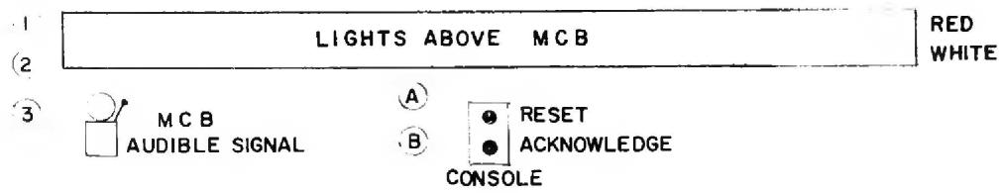


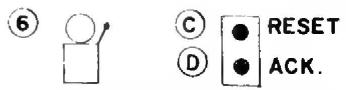  
SCANNER, SAMPLER, AND CHEMICAL PROCESSING

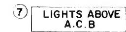

  
AUX.CONTROL BOARD

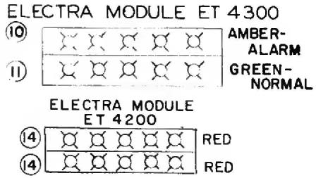

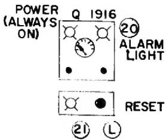

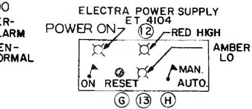

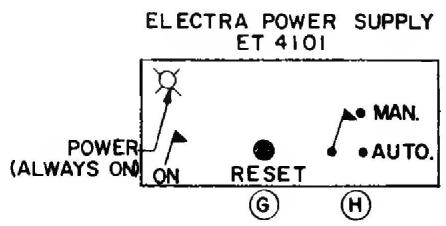

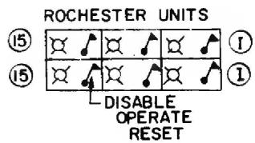

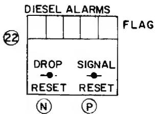


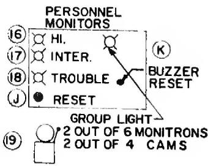

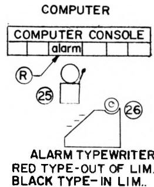

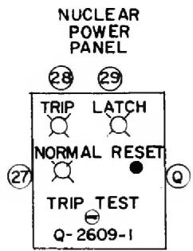

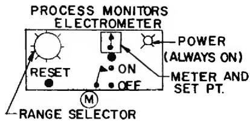  
NOTES: LETTERS = SWITCHES
NUMBERS = LIGHTS,FLAGS,
OR AUDIBLE ALARMS   
MSRE ANNUNCIATORS   
Fig.3H4-1

TABLE 3H 4.1 SEQUENCE OF ANNUNCIATORS   

<table><tr><td></td><td rowspan="2">DESCRIPTION</td><td colspan="2">NO ABNORM COND.</td><td colspan="7">ABNORMAL CONDITIONOTHER ACKNOWLEDGEMENT</td><td colspan="2">ABNORMAL COND. CLEARED</td></tr><tr><td>TYPENo.</td><td>SWITCHSETTING</td><td>LTS.</td><td>AN ON AIM COND</td><td>MCEACK BCLEAR</td><td>PUSHBUTTON</td><td>COND AFTACTION</td><td>(A)CLEARSCMB</td><td>ACT IF ALRMCLEAR &amp;REALARMS</td><td>ACT ON ANOTHER ALRMIN SAME GROUP*</td><td>ACTION ONCLEARING</td><td>TO CLEAR ALLINDICATORS</td></tr><tr><td>I</td><td>Direct to MCB</td><td>None</td><td></td><td>1,2,3</td><td>2,3</td><td>None</td><td>1</td><td>No</td><td>1-2-1,2,3</td><td></td><td>1-2</td><td>Push A</td></tr><tr><td>II</td><td>Direct to ACB</td><td>None</td><td></td><td>7,8,9</td><td>None</td><td>F</td><td>7</td><td>Clear</td><td>7-clear-7,8,9</td><td></td><td>7-clear</td><td>None</td></tr><tr><td>III</td><td>To ACB→MCB</td><td>None</td><td></td><td>1,2,3,7,8,9</td><td>2,3</td><td>F</td><td>2,7</td><td>Yes</td><td>7→clear-1,2,3,7,8,9</td><td>1,2,3,7&#x27;,8&#x27;,9&#x27;,7</td><td>7→clear</td><td>None</td></tr><tr><td>IV</td><td>To SamplerTo ScannerTo Chem ProcessingTo Vapor Condensing System</td><td>None</td><td></td><td>1,2,3,4,5,6</td><td>2,3</td><td>D</td><td>2,4</td><td>Yes</td><td>4→5→1,2,3,4,5,6</td><td>1,2,3,4&#x27;,5&#x27;,6&#x27;,5</td><td>4→5,4&#x27;→5</td><td>Push C</td></tr><tr><td>V</td><td>Electra Mod. ET4200→ET4104→MCB</td><td>Pvr. OnH-Man</td><td></td><td>1,2,3,12,14</td><td>2,3</td><td>None</td><td>1,12,14</td><td>No</td><td>None</td><td>14&#x27;</td><td>None</td><td>Pugh G &amp; A</td></tr><tr><td>VI</td><td>Electra Mod. ET4200→ET4101→MCB</td><td>Pvr. OnH-Man</td><td></td><td>1,2,3,7,8,9,14</td><td>2,3</td><td>F</td><td>2,7,14</td><td>Yes</td><td>None</td><td>1,2,3,7&#x27;,8&#x27;,9,14&#x27;,14,7</td><td>None</td><td>Push G</td></tr><tr><td>VII</td><td>Electra Mod. ET4300→(ET4101 or ET4104)→MCB</td><td>Pvr. OnH-Man</td><td>10 or 11</td><td>1,2,3,7,8,9,10</td><td>2,3</td><td>F</td><td>2,7,10</td><td>Yes</td><td>7,10→clear→1,2,3,7,8,9,10</td><td>10&#x27;</td><td>10→11</td><td>None</td></tr><tr><td>VIII</td><td>Rochester Mod to MCB</td><td>I inOperate</td><td>15 on</td><td>1,2,3,15 off</td><td>2,3</td><td>None</td><td>1,15 off</td><td>No</td><td>None</td><td>15&#x27; off</td><td>None</td><td>I→Reset→Oper &amp; Push A</td></tr><tr><td>IX</td><td>Personnel Mon. to MCB</td><td>None</td><td></td><td>1,2,3(16,17,or 18)19</td><td>2,3</td><td>K</td><td>2,(16,17,or 18)</td><td>Yes</td><td>None</td><td>1,2,3(16&#x27;,17&#x27;,or18&#x27;)19&#x27; (16,17,or 18)</td><td>None</td><td>Push J</td></tr><tr><td>X</td><td>Process Rad, GM or Q1916→MCB</td><td>None</td><td>21</td><td>1,2,3,7,8,9,20,21 off</td><td>2,3</td><td>F</td><td>2,7,20,21off</td><td>Yes</td><td>Dial Change</td><td>1,2,3,7&#x27;,8&#x27;,9,20&#x27;,20</td><td>Dial Change</td><td>Push L</td></tr><tr><td>XI</td><td>Process Rad, Ion Ch, 202Elect-NP-MCB</td><td>None</td><td></td><td>1,2,3,7,8,9</td><td>2,3</td><td>F</td><td>2,7</td><td>Yes</td><td>None</td><td>None</td><td>None</td><td>Push M</td></tr><tr><td>XII</td><td>Diesel Alarm-DM(ACR)-MCB</td><td>Pvr. On</td><td></td><td>1,2,3,22,23,24</td><td>2,3</td><td>P</td><td>2,22</td><td>Yes</td><td>None</td><td>1,2,3,22,23,24</td><td>None</td><td>Switch N</td></tr><tr><td>XIII</td><td>Computer→MCB</td><td>None</td><td></td><td>1,2,3,26 red</td><td>2,3</td><td>None</td><td>1,26 red</td><td>No</td><td>1,26 red→2,26 black→1,2,3,26 red</td><td>1,2,3,26&#x27;red</td><td>1,26 red→2,26 black</td><td>Push A</td></tr><tr><td>XIV</td><td>Nuclear Power Panel→ACB-MCB</td><td></td><td>27</td><td>1,2,3,7,8,9,28,29</td><td>2,3</td><td>F</td><td>2,7,28,29</td><td>Yes</td><td>7,28,29→clear-1,2,3,7,8,9,28,29</td><td>1,2,3,7&#x27;,8&#x27;,9&#x27;,28&#x27;,29&#x27;</td><td>28,29→27</td><td>Push Q (OnScream ModuleOnly)</td></tr><tr><td>XV</td><td>Computer (Computer Room)</td><td></td><td></td><td>25,R</td><td>None</td><td>R</td><td>R1</td><td>Clear</td><td></td><td></td><td></td><td>Restart Computer</td></tr></table>

TABLE 3H4.2 ANNUNCIATORS   

<table><tr><td>Location and Annunciator Number</td><td>Actuated by</td><td>Annunciates on (for setpoints see Switch Tab)</td><td>Control Action*</td><td>Operator Action</td></tr><tr><td colspan="5">MCB-1</td></tr><tr><td>XA 4000-1</td><td>XA 4029</td><td>Sump levels (Common)</td><td>Note 1</td><td>Note 1 Check XA 4029-1 to 8 in ACB 3</td></tr><tr><td>XA 4000-2</td><td>XA 4030-31</td><td>Instrument Air (Common)</td><td>Note 1</td><td>Note 1 Check XA 4030-1 to 11 &amp; XA 4031-1 to 12 on ACB 4</td></tr><tr><td>XA 4000-3</td><td>XA 4026-27</td><td>Cooling water (Common)</td><td>Note 1</td><td>Note 1 Check XA 4026-1 to 12 &amp; XA 4027-1-9 on ACB 3</td></tr><tr><td>XA 4000-4</td><td>PS 400 or 514</td><td>Hi Lo Leak Detector Pressure</td><td>None</td><td>Repressurize or vent &amp; hunt for leaks</td></tr><tr><td>XA 4000-5</td><td>XA-4019, TVA Feeder, Diesel Pnl.</td><td>Electrical power (Common)</td><td>None</td><td>Note 1 Check XA-4019. Check and restart electrical equipment</td></tr><tr><td>XA 4000-6</td><td>K 1073A on XA 4017</td><td>Containment Air (Common)</td><td>Note 1</td><td>Note 1 Check XA 4017-1 to 5 on ACB 2</td></tr><tr><td colspan="5">MCB-2</td></tr><tr><td>XA 4001-1</td><td>K-1072A on XA 4016, 4018</td><td>Misc. Aux. Bd. Alarm</td><td>Note 1</td><td>Note 1 Check XA 4016, XA 4018</td></tr><tr><td>XA 4001-2</td><td>PA 9006-1</td><td>Lo N2Pressure Initial (Instrument Air)</td><td>None</td><td>Change banks and replace used cylinders</td></tr><tr><td>XA 4001-3</td><td>PA 9006-2</td><td>Lo N2Pressure Final (Instrument Air)</td><td>None</td><td>Change banks, replace cylinders &amp; prepare to drain</td></tr><tr><td>XA 4001-4</td><td></td><td>Selected Drain tank not ready</td><td>None</td><td>Check that (1)FV 105 &amp; 106 are thawed &amp; FV 104 frozen (if FFT selected, FV 104 thawed &amp; 105, 106frozen) (2) selected DT equalizers are open</td></tr><tr><td>XA 4001-5</td><td>K-1028A</td><td>Chem process common</td><td>Note 1</td><td>Note 1 Check XA 4051 and XA 4052 on Chem processing panel</td></tr></table>

Note 1: See individual Annunciators (Aux. C. R., Sampler, Chem. Plant, Etc.)   
*Annunciation and control action do not necessarily occur at the same time.

TABLE $3\mathrm{H}4.2$ (continued)   

<table><tr><td>Location and Annunciator Number</td><td>Actuated by</td><td>Annunciates on (for set points see Switch Tab)</td><td>Control Action</td><td>Operator Action</td></tr><tr><td colspan="5">MCB-2</td></tr><tr><td>XA 4001-6</td><td>A-Be S1010-A1</td><td>Hi Be in radiator stack when in operation. Hi local Be during shutdown</td><td>None</td><td>Evacuate vicinity of monitor - Consult industrial hygienist</td></tr><tr><td colspan="5">MCB-3</td></tr><tr><td>XA 4002-1</td><td>PdA 960Al</td><td>Lo differential pressure. CCP 1 or 2</td><td>None</td><td>Stop running CCP, start alternate CCP &amp; check PdIC 960A</td></tr><tr><td>XA 4002-2</td><td>PS 906B</td><td>Lo discharge pressure CCP 3</td><td>None</td><td>Check PC 906B in blower house or valve in auxiliary air compressor</td></tr><tr><td>XA 4002-3</td><td>PS 791B and 795B</td><td>Lo oil pressure CCP 1 or 2</td><td>Stops CCP</td><td>Start alternate CCP</td></tr><tr><td>XA 4002-4</td><td>SS CP G-1 or 2</td><td>Lo coolant pump speed</td><td>Stops FP - It &amp; Low Coolant flow screams radiator doors</td><td>Restart CP, stop radiator blowers &amp; start up per procedures</td></tr><tr><td>XA 4002-5</td><td>PS 9013-2</td><td>Lo pressure to block valves</td><td>Blocks lines to cells causing start of drain, etc.</td><td>Check cell pressure</td></tr><tr><td>XA 4002-6</td><td>PSRCA-1 or 2 K-98C KC 84G K-30, K-31 K-32, KB84G KA84G</td><td>Li-Lo R. C. pressure</td><td>At 12.2 psia closes HCV 565. At 16.7 psia 2 out of 3 PSS closes Liq. waste Block valves and inst. air to Penetration block valves</td><td>Check cell pressure &amp; temperature. If Hi pressure, open V-565C; check RCC-1,2</td></tr><tr><td colspan="5">MCB-4</td></tr><tr><td rowspan="3">XA 4003-1</td><td>RS-SI A1</td><td rowspan="3">Hi containment air Stack activity</td><td rowspan="3">None</td><td rowspan="3">If lo cell pressure - close 565C &amp; V-569A, determine source &amp; shut down system involved</td></tr><tr><td>RS-SI B1</td></tr><tr><td>RS-SI C1</td></tr><tr><td>XA 4003-2</td><td>TX 3003</td><td>Hi radiator annulus temperature</td><td>None</td><td>Note 1 Check TX 3003-19 &amp; 20 on ACB-5</td></tr><tr><td>XA 4003-3</td><td>TS 202-A, B, or C</td><td>Lo radiator outlet temperature</td><td>2 out of 3 scrams radiator doors &amp; starts coolant drain</td><td>Increase heat to radiator &amp; coolant system. Close radiator doors &amp; stop radiator blowers. A coolant drain may be necessary. If FV-204 or 206 do not thaw, turn off CCP 3.</td></tr><tr><td>XA 4003-4</td><td>PS 510 A-1 or 2</td><td>Hi Lo coolant oil tank pressure</td><td>None</td><td>Check PIC-510A &amp; ECC-45 &amp; 74</td></tr><tr><td>XA 4003-5</td><td>LSOT 2-A3</td><td>Lo coolant oil tank level</td><td>Close FSV 753A-1 (Cool-ant lube oil)</td><td>Check Oil tank (OT-2) &amp; oil catch tank (OCT-2) levels. Pump seal leakage may necessitate a drain. Alarm set-point may need changing.</td></tr><tr><td>XA 4003-6</td><td>PS 751Bl &amp; 752Bl</td><td>Lo coolant oil pump pressure</td><td>Starts alternate pump</td><td>Start alternate pump - check &amp; stop defective pump. Be prepared to tie in fuel lube oil system (Section 6D)</td></tr><tr><td colspan="5">MCB-5</td></tr><tr><td>XA 4004-1</td><td>TSCOP-1 or 2</td><td>Hi motor temperature COP 1 or 2</td><td>None</td><td>Investigate and consider switching to alternate pump.</td></tr><tr><td>XA 4004-2</td><td>K-350A</td><td>Coolant sampler common</td><td>None</td><td>Check buffer header &amp; glove box pressures. Adjust as necessary.</td></tr><tr><td>XA 4004-3</td><td>FS-512A</td><td>Lo cover gas flow to CP</td><td>None</td><td>Check supply pressure. FIC 512 &amp; ECC-128</td></tr><tr><td colspan="5">MCB-5</td></tr><tr><td>XA 4004-4</td><td>FS 526C</td><td>Lo upper gas flow from CP</td><td>None</td><td>Check CP pressure. Plugged line may be opened by increasing CP pressure. Shut-down may be necessary.</td></tr><tr><td>XA 4004-5</td><td>WSCDT-C1</td><td>Lo CDT wt. (adjustable)</td><td>None</td><td>Check WR-CDT-C. Adjust alarm set point.</td></tr><tr><td>XA 4004-6</td><td>FS-511-D1 or D2</td><td>Hi-Lo CDT pressure</td><td>Hi closes He supply (HCV-511A) &amp; opens vent (HCV-547A).</td><td>Check PIC-511C. For Hi pressure, vent CDT. For Lo pressure, add helium.</td></tr><tr><td colspan="5">MCB-6</td></tr><tr><td>XA 4005-1</td><td>FS-753A or 754A</td><td>Lo lube or coolant oil flow to CP</td><td>Prevents starting CP</td><td>Check lube-oil pumps &amp; adjust flows. See Section 6D.</td></tr><tr><td>XA 4005-2</td><td>FS 528 A-1 or A-2</td><td>Hi-Lo CP pressure:</td><td>Hi closes supply valve FCV-512 A-1</td><td>Check PRC-528, FIC-512A, and FI-526C</td></tr><tr><td>XA 4005-3</td><td>LS-595 C-2 or C-3</td><td>Hi-Lo CP level (Bubblers or float)</td><td>Hi opens CDT vent &amp; closes He supply valve. Lo stop CP</td><td>Check all level instruments. Lo level may indicate salt leak &amp; necessitate drain</td></tr><tr><td>XA 4005-4</td><td>FS-594-A1,A2 595-A1,A2 598-A1,A2</td><td>Hi-Lo gas flow to CP bubbler</td><td>None</td><td>Adjust flows &amp; check ECC-75, 76, &amp; 77, check that lines are not plugged.</td></tr><tr><td>XA 4005-5</td><td>FS-201-A or B</td><td>Lo coolant salt flow</td><td>Stops FP. 2 out of 2 Lo flows or one Lo flow &amp; one Lo speed screams radiator doors</td><td>Restart CP - Stop radiator blowers &amp; start up per procedures</td></tr><tr><td>XA 4005-6</td><td>XpS 201-A</td><td>Hi reactor power at radiator</td><td>None</td><td>Check nuclear power. Close radiator doors if in doubt.</td></tr><tr><td colspan="5">MCB-8</td></tr><tr><td>XA 4006-1</td><td>RS-8100-1A-1B</td><td>Hi-Lo Linear Power Level</td><td>None</td><td>Change ranges on selector switch</td></tr><tr><td colspan="5">MCB-8</td></tr><tr><td>XA 4006-2</td><td>SSFPE-1 or -2</td><td>Lo FP speed</td><td>Switches from run, lowers heat &amp; nuc-lear power to &lt;1.5 Mw</td><td>Insert rods, lower heat load and start up per procedures</td></tr><tr><td>XA 4006-3 TS-100-1 TS-100-A1 TS-100-A2 TS-100-A3</td><td></td><td>Hi reactor outlet temperature</td><td>Rod reverse on 2 out of 3 channels</td><td>Insert rods</td></tr><tr><td>XA 4006-4</td><td>LS 593-C2 or C-3</td><td>Hi-Lo FP level (bubblers)</td><td>Hi opens FD-1, FD-2, &amp; FFT vents and closes supply valves Control Rod reverse Lo stops FP</td><td>Check Lo-Hi level instruments. Lo level may indicate salt leak &amp; necessitate a drain, or indicate a fuel system temperature decrease</td></tr><tr><td>XA 4006-5</td><td>PS 522 A1 or A2, 589A or 592B</td><td>Hi Lo FP pressure</td><td>Opens FP vent, FDT vents, equal. valves Starts drain</td><td>Check FP pressure. Determine cause of pressure</td></tr><tr><td>XA 4006-6</td><td>PS 592-600</td><td>Hi, Lo gas flow to FP &amp; overflow tank bubblers</td><td>None</td><td>Adjust flows &amp; check ECC-63-68 Check that lines are not plugged</td></tr><tr><td colspan="5">MCB-9</td></tr><tr><td>XA 4007-1</td><td>FS 703A or 704A</td><td>Lo Lube or coolant oil flow to FP</td><td>Prevents starting FP</td><td>Check lube-oil pumps &amp; adjust flows. See Section 6D</td></tr><tr><td>XA 4007-2</td><td>LS-599B or 600B</td><td>Hi level in FP overflow tank</td><td>Emergency drain</td><td>Check FP and OFT levels. See Section 6D.</td></tr><tr><td>XA 4007-3</td><td>W9 FD1 C4 or FD2 C4</td><td>Hi fill rate from FD-1 or FD-2</td><td>Stops He addition &amp; opens vent from FD-1 or FD-2</td><td>Stop He addition, vent DT or open equalizing valve if necessary</td></tr><tr><td colspan="5">MCB-9</td></tr><tr><td>XA 4007-4</td><td>WS FD-1, C5 FD-2 C5 or FFT C1</td><td>Lo FD-1, FD-2, or FFT wt. (adjustable)</td><td>None</td><td>Check WRFD-1, FD-2 &amp; FFT - Adjust alarm setpoint</td></tr><tr><td>XA 4007-5</td><td>FS-516B</td><td>Lo cover gas flow to FP</td><td>None</td><td>Check supply pressure, FIC 516 &amp; ECC-129</td></tr><tr><td>XA 4007-6</td><td>FS-524B</td><td>Lo upper gas flow from FP</td><td>None</td><td>Check FP pressure. Plugged line may be opened by increasing FP pressure. Shut-down may be necessary</td></tr><tr><td colspan="5">MCB-10</td></tr><tr><td>XA 4008-1</td><td>K-149C</td><td>Safety Circuit jumpered</td><td>Prohibits Operate Mode</td><td></td></tr><tr><td>XA 4008-2</td><td>KC-881A</td><td>Fuel Sampler (common)</td><td>Note 1</td><td>Note 1 Check XA-4035 to 37 - 1 to 4 at SE panels 1 to 3</td></tr><tr><td>XA 4008-3</td><td>TS FOP 1 or 2</td><td>Hi motor temperature. FOP 1 or 2</td><td>None</td><td>Investigate and consider switching to alternate pump</td></tr><tr><td>XA 4008-4</td><td>PS 513A-1 or A-2</td><td>Hi-Lo fuel oil tank pressure</td><td>None</td><td>Check PIC 513A &amp; ECC 44 &amp; 73</td></tr><tr><td>XA 4008-5</td><td>LS OT1 A-3</td><td>Lo fuel oil tank level</td><td>Closes FSV-703 (fuel lube oil)</td><td>Check oil tank (OT-1) &amp; oil catch tank (OCT-1) levels. Pump seal leakage may necessitate a drain. Alarm set-point may need changing</td></tr><tr><td>XA 4008-6</td><td>PS 701B2 &amp; PS 702 B1</td><td>Lo FOP discharge pressure</td><td>Starts alternate pump</td><td>Start alternate - check &amp; stop defective pump. Be prepared to tie in coolant lube oil system (Section 6D)</td></tr><tr><td colspan="5">MCB-11</td></tr><tr><td>XA 4009-1</td><td>PS 574B1 or B2</td><td>Li Lo FD-2 pressure</td><td>Hi closes He supply (HCV-574) &amp; opens vent (HCV-575)</td><td>Check PIC-517A. For Hi pres-sure vent FD-2. For Lo pressure add He</td></tr><tr><td>XA 4009-2</td><td>PS-572 B1 or B2</td><td>Hi Lo FD-1 pressure</td><td>Hi closes (HCV-572) &amp; opens vent (HCV 573)</td><td>Check PIC-517A. For Hi pres-sure vent FD-1. For Lo pressure add He</td></tr><tr><td>XA 4009-3</td><td>PS-576 B1 or B2</td><td>Hi Lo FFT pressure</td><td>Hi closes (HCV-576) &amp; opens vent (HCV 577)</td><td>Check PIC-517A. For Hi pres-sure vent FFT. For Lo pressure add He</td></tr><tr><td>XA 4009-4</td><td>PS 608 B2 or B3</td><td>Hi Lo FST pressure</td><td>Hi closes (HCV 530) &amp; opens vent (HCV 692)</td><td>Check PIC-530. For Hi pres-sure vent FST. For Lo pres-add He</td></tr><tr><td>XA 4009-5</td><td>WS FST-C1</td><td>Lo FST Weight (adjustable)</td><td>None</td><td>Check WR FST - Adjust alarm set points</td></tr><tr><td>XA 4009-6</td><td>XA 4028</td><td>Cover gas system (common)</td><td>Note 1</td><td>Note 1 - Check XA 4028-1 to 10 on ACB 3</td></tr><tr><td colspan="5">MCB-12</td></tr><tr><td>XA 4010-1</td><td>RS-7023</td><td>Hi activity - personnel monitors</td><td>Note 1</td><td>Note 1 - Check CAM &amp; Monitron modules on NP 5</td></tr><tr><td>XA 4010-2</td><td>K-1060A</td><td>Hi activity - pro-cess monitors</td><td>Note 1</td><td>Note 1 - Check XA 4043 on NP 4</td></tr><tr><td>XA 4010-3</td><td>K-1074A on XA 4020-22</td><td>Freeze valve temperature. (common)</td><td>Note 1</td><td>Note 1 - Check XA 4020 to 22-1 to 4 on ACT 5 to 7 also TX 3002 through TX 3010</td></tr><tr><td>XA 4010-4</td><td>TX 3001</td><td>Freeze Flange temperature (common)</td><td>Note 1</td><td>Note 1 - Check TX 3001 on ACB-5</td></tr><tr><td colspan="5">MCB-12</td></tr><tr><td>XA 4010-5</td><td>K 1036A</td><td>Scanner (common)</td><td>None</td><td>Check XA 4053-1 to 6 on Scanner Panel (840 level)</td></tr><tr><td>XA 4010-6</td><td>Computer</td><td>Computer (common)</td><td>None</td><td>Note 1.</td></tr><tr><td colspan="5">MCB-6</td></tr><tr><td rowspan="3">XA 4011-1</td><td>KB 139H</td><td rowspan="3">Φ &gt;1.5 Mw in start mode</td><td rowspan="3">Control rod reverse</td><td rowspan="3">Check Nuclear Panel. Adjust flux</td></tr><tr><td>RXS-NCC1 A8B</td></tr><tr><td>RXS-NCC2 A8B</td></tr><tr><td>XA 4011-2</td><td>KA 1048A</td><td>Φ &gt; 12 Mw common</td><td>Two out of three chan-nels give control rod reverse</td><td>Adjust flux</td></tr><tr><td>XA 4011-3</td><td>KB 1048B</td><td>Period &lt; 10 sec</td><td>Control rod reverse if not in Run Mode</td><td>Adjust control rods</td></tr><tr><td>XA 4011-4</td><td>KB 161C</td><td>Load set back</td><td>Lowers radiator doors, decreases ΔP set-point and stops one main blower per pro-grammed sequence.</td><td>Check radiator outlet tempera-ture. Check NP(Φ &gt;12 Mw) Adjust load.</td></tr><tr><td>XA 4011-5</td><td>KB 11D KB 12D</td><td>Load scram</td><td>Scrams both radiator doors. Stops MB-1 &amp; MB-3</td><td>Check radiator outlet tempera-ture, CP speed &amp; coolant salt flow</td></tr><tr><td>XA 4011-6</td><td>KA 140D KA 141D</td><td>Emergency coolant salt drain</td><td>Opens CDT vent and by-pass valve. Closes CDT He supply valve. Scrams both radiator doors. Stops MB-1 &amp; MB-2. Thaws FV-204 &amp; 206</td><td>Check radiator outlet tempera-ture</td></tr><tr><td colspan="5">MCB-8</td></tr><tr><td>XA-4012-1</td><td>KA 18G KA 19G</td><td>Emergency fuel salt drain</td><td>Opens all vent and by-pass valves &amp; closes all He supply valves to FD-1, FD-2, FFT. Thaws FV-103, 105, 106.</td><td>Reduce power to zero, reduce heat load to zero. Check Tro, FP pressure, OFT level, RE-565, RE-528</td></tr><tr><td>XA-4012-2</td><td>K248E K249E K 250E</td><td>Control Rod Scram</td><td>Two out of three safety channels screams all rods. Opens DT vent valves.</td><td>Lower radiator doors and re-start per procedure. Checks for circuit trouble in flux channels, τ &lt;1 sec, Tro, Φ &gt;15 kw, Φ &gt;15 Mw, reset latch on rod scram module</td></tr><tr><td>XA-4012-3</td><td>K 207D</td><td>To demand rod set back</td><td>Group insert of control rods</td><td>Check TSS-100A1-2, TSS-100A2-2 TSS-100A3-2</td></tr><tr><td>XA-4012-4</td><td>K-186E</td><td>Control Rod reverse</td><td>Group insert of control rods</td><td>Check Φ &gt;1.5 Mw, τ &lt;10 sec</td></tr><tr><td>XA-4012-5</td><td>K-204D K-205D K-206D</td><td>To &gt;1275°F</td><td>Two out of three thermocouples gives rod reverse and decrease reactor temp. demand</td><td>Lower reactor temperature demand setpoint if in temp. servo. If not, lower flux.</td></tr><tr><td>XA-4012-6</td><td>K-241B</td><td>Reg. Rod @ L.L.</td><td>Prevents transfer to Run Mode if servo is on</td><td>Lower reg rod limit switch. If servo is on, lower rods 2 &amp; 3</td></tr><tr><td colspan="5">MCB-9</td></tr><tr><td>XA-4013-1</td><td>K-1054A</td><td>High temperature control rod housing</td><td>None</td><td>Shut down and drain reactor</td></tr><tr><td>XA-4013-2</td><td>TS-OFT-6A</td><td>Low Temperature FP OFT</td><td>None</td><td>Check TE-OFT-6B, Scanner A, ad-just heaters, consider a reactor drain</td></tr><tr><td>MCB-9</td><td></td><td></td><td></td><td></td></tr><tr><td>XA-4013-3</td><td></td><td>Spare</td><td></td><td></td></tr><tr><td>XA-4013-4</td><td></td><td>Spare</td><td></td><td></td></tr><tr><td>XA-4013-5</td><td></td><td>Spare</td><td></td><td></td></tr><tr><td>XA-4013-6</td><td></td><td>Spare</td><td></td><td></td></tr><tr><td>MCB-5</td><td></td><td></td><td></td><td></td></tr><tr><td>XA-4014-1</td><td></td><td>Spare</td><td></td><td></td></tr><tr><td>XA-4014-2</td><td></td><td>Spare</td><td></td><td></td></tr><tr><td>XA-4014-3</td><td>XA-4032</td><td>Low air flow, Battery room exhaust Induction Regulator Cooling Air</td><td>None</td><td>Note 1. Check fans, switches and power supplies</td></tr><tr><td>XA-4014-4</td><td></td><td>24v DC power off HP Radiation Monitor</td><td>None</td><td>Check instrument power panel #5</td></tr><tr><td>XA-4014-5</td><td>K-1114A</td><td>Vapor Condensing Tank Common</td><td>None</td><td>Note 1. Check XA-4054 out JB #151 at Vapor Condensing Tank area</td></tr><tr><td>XA-4014-6</td><td>K-85A</td><td>Low Pressure Reactor cell. Safety Interlocks</td><td>Closes HCV-565. Stops CCP-1 &amp; 2 thus initiating reactor drain</td><td>Check to see that HCV-565, V-571, V-569 are closed. Increase N2to RC (sump bubblers) and possibly add air via 342 &amp; 332. Restart CCP-1 &amp; 2 as soon as possible</td></tr><tr><td>ACB-1</td><td></td><td></td><td></td><td></td></tr><tr><td>XA-4016-1</td><td>TS-3100</td><td>Hi miscellaneous temperature TRA-3100</td><td>None</td><td>Check TR-3100 on MCB-12 - Adjust heat</td></tr></table>

9/26   
OT-2·TH

TABLE 3H4.2 (continued)   

<table><tr><td>Location and Annunciator Number</td><td>Actuated by</td><td>Annunciates on (for set points see Switch Tab)</td><td>Control Action</td><td>Operator Action</td></tr><tr><td colspan="5">ACB-1</td></tr><tr><td>XA-4016-2</td><td>TS-3400A1 or 2</td><td>Hi-Lo coolant salt flow meter temperature. TR-3400</td><td>None</td><td>Check TR-3400 on SP-2 (840 level) Adjust heat.</td></tr><tr><td>XA-4016-3</td><td>PS-S-X10</td><td>Lo steam supply pressure</td><td>None</td><td>Condensate make-up rate may be too high. Check gage on steam header north of 7503. Call Utilities Dept.</td></tr><tr><td>XA-4016-4</td><td>TS-3500A1 or 2</td><td>Hi-Lo drain line temperature TRA-3500</td><td>None</td><td>Check TR-3500 or ACB-2. Adjust heat. Prepare to drain system before salt freezes.</td></tr><tr><td>XA-4016-5</td><td>K 2A</td><td>Hi-Temp sample surveillance test</td><td>None</td><td>Check to see that computer is in operation. Adjust heat if necessary.</td></tr><tr><td colspan="5">ACB-2</td></tr><tr><td>XA-4017-1</td><td>FS-HB-A1 or A2</td><td>Hi-Lo High Bay pressure</td><td>None</td><td>Check doors and dampers</td></tr><tr><td>XA-4017-2</td><td>Pds-936A</td><td>Lo auxiliary cell ventilation duct Diff.</td><td>None</td><td>Check auxiliary cell pressures &amp; adjust dampers</td></tr><tr><td>XA-4017-3</td><td>Pds-927B</td><td>Hi filter pit Diff. pressure</td><td>None</td><td>Check dampers - filter replacement may be necessary.</td></tr><tr><td>XA-4017-4</td><td>FS-S1-A</td><td>Lo ventilation stack flow</td><td>None</td><td>Check dampers, filters, ΔP etc.</td></tr><tr><td>XA-4017-5</td><td>PS-927-A1 or A2</td><td>Containment air Duct 927 Vacuum pressure &lt;1.5" H2O</td><td>Starts stand-by containment air fan (SF-2)</td><td>Switch to alternate stack fan blower. Check blowers, motor and dampers</td></tr><tr><td>ACB-3</td><td></td><td></td><td></td><td></td></tr><tr><td rowspan="2">XA-4018-1</td><td>TS-705</td><td rowspan="2">Hi fuel pump oil temperature</td><td rowspan="2">None</td><td rowspan="2">Check temperature on logger, check flows, lower power if necessary. Check cooling water flow &amp; temp. Possibly increase by-pass oil flow.</td></tr><tr><td>TS-707</td></tr><tr><td rowspan="2">XA-4018-2</td><td>TS-755</td><td rowspan="2">Hi coolant pump oil temperature</td><td rowspan="2">None</td><td rowspan="2">Check temperature on logger, check flows, lower power if necessary. Check cooling water flow &amp; temp. Possibly increase by-pass oil flow.</td></tr><tr><td>TS-757</td></tr><tr><td rowspan="2">XA-4018-3</td><td>PS-9012-1A</td><td rowspan="2">Lo Press. sump bubar and scanner N2 supply</td><td rowspan="2">None</td><td rowspan="2">Check N2supply press. at 840 level. Switch to alternate bank. Change out empty bottles</td></tr><tr><td>1B, 1C</td></tr><tr><td>XA-4018-4</td><td>PxS-579, 580,581, 582, 584, 586</td><td>Hi pressure in PT reference</td><td>None</td><td>Consider draining fuel system (violation of primary comment)</td></tr><tr><td>XA-4018-5</td><td>PS-918-A1</td><td>Graphite Sampler blower inlet Hi pressure</td><td>None</td><td>Check N2purge</td></tr><tr><td>ACB-4</td><td></td><td></td><td></td><td></td></tr><tr><td>XA-4019-1</td><td>UVR(48v DC)</td><td>Lo voltage 48v DC bus</td><td>None</td><td>Check MG sets. Check for ground. Start alternate MG possibly initiate emergency drain</td></tr><tr><td colspan="5">ACB-4</td></tr><tr><td rowspan="2">XA-4019-2</td><td>MG #2 off</td><td>48v DC MG-2 or</td><td>None</td><td>Check MG sets. Start alternate MG</td></tr><tr><td>MG #3 off</td><td>MG-3 off</td><td></td><td></td></tr><tr><td>XA-4019-3</td><td>Position switch on reverse current breaker handle</td><td>Reverse current trip breaker open</td><td>None</td><td>Check MG-1 and try to restart. If running, check reverse current trip and reset. If unsuccessful, shut down MG-4 (which transfers load to TVA)</td></tr><tr><td>XA-4019-4</td><td>UVR MG-4 (time delay)</td><td>Lo voltage MG-4</td><td>None. However, if voltage continues to drop, automatic transfer to TVA will occur</td><td>Check MG-4 voltage, frequency, etc. Make adjustments if necessary.</td></tr><tr><td>XA-4019-5</td><td>UVR open on low breaker trip voltage UVR open on low 13.8 KV feeder control voltage 250v batteries low or breaker "W" open.</td><td>Lo voltage at any of the 4 locations in left column</td><td>Would prevent 480v equipment trip, or prevent transfer to AH feeder</td><td>Check operation of MG-1. Check fuses and breakers at 250v panel. Check condition of 250v batteries.</td></tr><tr><td colspan="5">ACB-5</td></tr><tr><td>XA-4020-1</td><td>TS-FV-103-1A2 KA-652C, TS-FV-103-3A2 (K-659A and K-660A)</td><td>FV-103 Hi &amp; Lo temp. for thaw &amp; freeze</td><td>Turns air on or off as required ECC-650-660</td><td>Check TX-3003-1-6, TX-3004, 1-6. Adjust air and see Table 3H.4.3-2, 3</td></tr><tr><td>XA-4020-2</td><td>KA-663C, KB-663C, KG-665D, (KA-670 &amp; K-671)</td><td>FV-104, Hi, Lo temp. for thaw &amp; freeze</td><td>Turns air on or off as required. Permissive to thaw ECC-661-671</td><td>Check TX-3002-1, TX-3005, 1-6, 19, TX-3006-1-6. Adjust air see Table 3H.4.3-2, 3, 4</td></tr><tr><td colspan="5">ACB-5</td></tr><tr><td>XA-4020-3</td><td>KA-674C, KB-674C, KA-675B, KB-675B, K-681A&amp; K-682A</td><td>FV-105 Hi &amp; Lo temperature</td><td>Turns air on or off as required. Permis-sive to thaw. ECC-672-682</td><td>Check TX-3002-2, TX-3005 7-12 TX-3006 7-12, TX-3005-20 See Table 3H.4.3-2, 3, 4</td></tr><tr><td>XA-4020-4</td><td>KA-685C, KB-685C, KA-686B, KB-686B, KA-692A &amp; K-693A</td><td>FV-106 Hi &amp; Lo temperature</td><td>Turns air on or off as required, permissive to thaw ECC-683-693</td><td>Check TX-3002-3, TX-3005 13-18 TX-3006 13-18. See Table 3H.4.3-2, 4</td></tr><tr><td>XA-4020-5</td><td>TS-3300</td><td>FV End Temperature Hi</td><td>None</td><td>Check TR-3300. Adjust heat</td></tr><tr><td>XA-4021-1</td><td>KA-762C, KB-762C, K-763B, K-769A &amp; K-770A</td><td>FV-204 Hi &amp; Lo temperature</td><td>Turns air on &amp; off, permissive to thaw. ECC 760-770</td><td>Check TX-3002-10, TX-3003, 7-12 TX-3004, 7-12. See Table 3H.4.3-2, 3</td></tr><tr><td>XA-4021-2</td><td>KA-773C, KB-773C, K-774B K-780A and K-781A</td><td>FV-206. Hi &amp; Lo temperature</td><td>Turns air on and off, permissive to thaw ECC 771-781</td><td>Check TX-3002-10, TX-3003, 13-18, TX-3004, 13-18 See Table 3H.4.3-3</td></tr><tr><td>XA-4021-3</td><td>KA-696B, KB-696B, KA-698D, K-703A &amp; K-704A</td><td>FV-107. Hi &amp; Lo temperature</td><td>Turns air on &amp; off. Permissive to thaw ECC 694-704</td><td>Check TX 3002-4, TX 3007 1-6 TX 3008, 1-6. See Table 3H.4.3-2, 4, 5</td></tr><tr><td>XA-4021-4</td><td>KA-707B, KB-707B, KB-709D, K-714A &amp; K-715A</td><td>FV-108. Hi &amp; Lo temperature</td><td>Turns air on &amp; off. Permissive to thaw ECC 705-715</td><td>Check TX 3002.5, TX 3007 7-12 TX 3008, 7-12. See Table 3H.4.3-2, 4, 5</td></tr><tr><td>XA-4021-5</td><td>Spare</td><td></td><td></td><td></td></tr><tr><td>XA-4022-1</td><td>KA-718B, KB-718B, KB-720D, K-725A &amp; K-726A</td><td>FV-109. Hi &amp; Lo temperature</td><td>Turns air on &amp; off, permissive to thaw ECC 716-726</td><td>Check TX 3002-6, TX 3007 13-18 TX 3008, 13-18. See Table 3H.4.3-2, 4, 5</td></tr><tr><td>XA-4022-2</td><td>KA-729B, KB-729B, KB-731D, K-736A &amp; K-737A</td><td>FV-110. Hi &amp; Lo temperature</td><td>Turns air on &amp; off, permissive to thaw ECC 727-737</td><td>Check TX 3002-7, TX 3009, 1-6 TX 3010, 1-6. See Table 3H.4.3-2, 5</td></tr><tr><td>XA-4022-3</td><td>KA-740B, KB-740B, KB-742D, K-747A &amp; K-748A</td><td>FV-111. Hi &amp; Lo temperature</td><td>Turns air on &amp; off. Permissive to thaw ECC 738-748</td><td>Check TX 3002-8, TX 3009, 7-12 TX 3010, 7-12. See Table 3H.4.3-2, 5</td></tr><tr><td>XA-4022-4</td><td>KA-751B, KB-751B KB-753D, K-758A &amp; K-759A</td><td>FV-112. Hi &amp; Lo temperature</td><td>Turns air on &amp; off. Permissive to thaw ECC 749-759</td><td>Check TX 3002-9, TX 3009, 13-18 TX 3010, 13-18. See Table 3H.4.3-2, 5</td></tr><tr><td colspan="5">ACB-3</td></tr><tr><td>XA-4026-1</td><td>FS-844A</td><td>Lo water flow to thermal shield</td><td>None</td><td>Adjust flow, check ECC 56, 58, &amp; 475 &amp; TE 845. May be necessary to drain &amp; cool reactor</td></tr><tr><td colspan="5">ACB-3</td></tr><tr><td>XA-4026-2</td><td>FS-810A</td><td>Lo water flow to DT condenser #1</td><td>None</td><td>Adjust flow</td></tr><tr><td>XA-4026-3</td><td>FS-812A</td><td>Lo water flow to DT condenser #2</td><td>None</td><td>Adjust flow</td></tr><tr><td>XA-4026-4</td><td>TS-826</td><td>Hi treated water temperature</td><td>None</td><td>Check CTW flow, TIC-858, CT fans, etc.</td></tr><tr><td>XA-4026-5</td><td>K-113 from FS-830A</td><td>Lo water flow to FP motor</td><td>Time delay to stop FP</td><td>Adjust flow, check ECV-56, 58, &amp; 475 &amp; TE 831-1. May be necessary to stop FP</td></tr><tr><td>XA-4026-6</td><td>K-114 from FS-832A</td><td>Lo water flow to CP motor</td><td>Time delay to stop CP</td><td>Adjust flow, check TE 833-1, may be necessary to stop CP</td></tr><tr><td>XA-4026-7</td><td>FS-836A</td><td>Lo water flow to DT space cooler</td><td>None</td><td>Adjust flow, check cell temperature &amp; pressure &amp; ECC 53</td></tr><tr><td>XA-4026-8</td><td>FS-838A</td><td>Lo water flow to RC space cooler 1</td><td>None</td><td>Adjust flow, check cell temperature &amp; pressure &amp; ECC 53</td></tr><tr><td>XA-4026-9</td><td>FS-840A</td><td>Lo water flow to RC space cooler 2</td><td>None</td><td>Adjust flow, check cell temperature &amp; pressure &amp; ECC 53</td></tr><tr><td>XA-4026-10</td><td>PS-829B</td><td>Lo TW pump dis- charge pressure</td><td>None (Check Inst. Ap. ECC)</td><td>Start alternate pump. Check flows. Check ECC (TS pressure)</td></tr><tr><td>XA-4026-11</td><td>PS-851B2 K-143</td><td>Lo CTW pump dis- charge pressure</td><td>Switches DT steam dome condensors from CTW to PW</td><td>Start alternate pump &amp; check flows</td></tr><tr><td>XA-4026-12</td><td>PS-882B</td><td>Lo process water pressure</td><td>None</td><td>Check back flow preventer, cur-tail unnecessary water usage so that cooling tower can be kept in operation</td></tr><tr><td>XA-4027-1</td><td>FS-851C</td><td>Lo CTW flow to treated water cooler</td><td>None</td><td>Adjust flow, start alternate CTW pump</td></tr><tr><td>ACB-3</td><td></td><td></td><td></td><td></td></tr><tr><td>XA 4027-2</td><td>FS-873A</td><td>Lo TW flow to com- ponent gas cooler</td><td>None</td><td>Adjust flow, start alternate TW pump</td></tr><tr><td>XA-4027-3</td><td>FS-875A</td><td>Lo TW flow to CCP 1 &amp; 2 oil coolers</td><td>None</td><td>Adjust flow, start alternate TW pump</td></tr><tr><td>XA-4027-4</td><td>FS-821A</td><td>Lo CTW flow to oil supply of fuel oil system</td><td>None</td><td>Adjust flow, start alternate CTW pump</td></tr><tr><td>XA-4027-5</td><td>FS-823A</td><td>Lo CTW flow to oil supply of coolant oil system</td><td>None</td><td>Adjust flow, start alternate CTW pump</td></tr><tr><td>XA-4027-6</td><td>LA FWT-1A or 2A</td><td>Lo feed water tank 1 or 2 level</td><td>None</td><td>This may indicate that drain tank steam domes are in service. Check temperatures. If not, add condensate to prescribed level</td></tr><tr><td>XA-4027-7</td><td>IA ST-A</td><td>Lo treated water surge tank level</td><td>Condensate will be added from condensate tanks.</td><td>Check condensate tanks levels and valving</td></tr><tr><td>XA-4027-8</td><td>PSS-844B2</td><td>Hi H2O Pressure Re-actor Thermal Shield</td><td>Closes TS cooling water inlet block valve</td><td>Check that FSV 847 is open also check rupture discs and reset FSV-844</td></tr><tr><td>XA-4027-9</td><td>LS NP</td><td>Lo nuclear instru-ment penetration water level</td><td>None</td><td>Physically check level &amp; add water through line 848</td></tr><tr><td>XA-4028-1</td><td>PS-500E</td><td>Lo He storage tank pressure</td><td>None</td><td>Check He trailer-valve in emergency cylinders</td></tr><tr><td>XA-4028-2</td><td>PS-500B1 or B2</td><td>Hi-Lo He header pressure</td><td>None</td><td>Check PRV 500G</td></tr><tr><td>XA-4028-3</td><td>FS-500J</td><td>Hi He flow</td><td>None</td><td>Check FIC 500J - Curtail unnecessary usage</td></tr><tr><td>XA-4028-4</td><td>PS 500K</td><td>Lo treated helium surge tank pressure</td><td>None</td><td>Check FIC 500J - Curtail unnecessary usage</td></tr><tr><td>XA-4028-5</td><td>PS 500 L-1 or L-2</td><td>Hi-Lo regulated He pressure</td><td>None</td><td>Check PCV-500C (or 605A). Change to alternate regula-tor. Curtail unnecessary usage</td></tr><tr><td>XA-4028-6</td><td>PS-508A</td><td>Hi rupture disc dis-charge pressure (Line 508)</td><td>None</td><td>Excess He leakage through re-lief valve may necessitate a shutdown</td></tr><tr><td>XA-4028-7</td><td>PS-506</td><td>Hi pressure at O2 removal No. 2 (Line 506)</td><td>None</td><td>Relieve pressure. Replace rupture disc if necessary</td></tr><tr><td>XA-4028-8</td><td>PS-507</td><td>Hi pressure at O2 removal No. 1 (Line 507)</td><td>None</td><td>Relieve pressure. Replace rupture disc if necessary</td></tr><tr><td>XA-4028-9</td><td>K-46F, K-47F, K-48F</td><td>Lo He supply pres-sure safety channels</td><td>Closes all He Sup-ply block valves</td><td>Check He surge tank pressure, FIC-500J, He trailer sup-ply pressure valve in Emergency He cylinders</td></tr><tr><td>XA-4028-10</td><td>K-400B K-404B K-408B K-412B K-416B,K=420B</td><td>Hi Heater temp. or open thermocouple at He treating station</td><td>Turns heater off and prevents restarting heater at He pre-heater, dryers, or O2removers</td><td>Adjust heaters or repair thermocouple. Consider changing helium treating station</td></tr><tr><td>XA-4029-1</td><td>LS-RC-C LS-RC-D</td><td>Hi level RC sump</td><td>None</td><td>Jet to liquid waste tank. Determine source and leak rate. Prepare for reactor shutdown</td></tr><tr><td>XA-4029-2</td><td>LS-DTC-A LS-DTC-B</td><td>Hi Level DTC sump</td><td>None</td><td>Jet to liquid waste tank. Determine source and leak rate. Prepare for reactor shutdown</td></tr><tr><td>XA-4029-3</td><td>LS-PRT</td><td>Hi Level Pump Room Tank</td><td>None</td><td>If radioactive, pump to liquid waste storage tank. Otherwise pump to catch basin.</td></tr><tr><td>XA-4029-4</td><td>LS-FSC-A</td><td>Hi Level FSC Sump</td><td>None</td><td>Jet to Liquid waste storage tank</td></tr><tr><td>XA-4029-5</td><td>LS-PRS-C</td><td>Hi Level PR &amp; CDC sump</td><td>Operates jet syphon in CDTC sump</td><td>Check sump pumps 1 &amp; 2. Check 60# steam supply header in filter house</td></tr><tr><td>XA-4029-6</td><td>LS-SC-A</td><td>Hi Level Euipment storage cell sump</td><td>None</td><td>Jet to liquid waste storage tank</td></tr><tr><td>XA-4029-7</td><td>LS-TC-A</td><td>Hi Level spare cell</td><td>None</td><td>Jet to liquid waste storage tank</td></tr><tr><td>XA-4029-8</td><td>LS-WTC-A</td><td>Hi Level waste tank cell sump</td><td>None</td><td>Jet to Liquid waste storage tank</td></tr><tr><td>ACB-4</td><td></td><td></td><td></td><td></td></tr><tr><td>XA-4030-1</td><td>PS 9001-1</td><td>Lo Instrument air pressure - MCB-20 psig</td><td>None</td><td>Check pressure reducing valve and usage</td></tr><tr><td>XA-4030-2</td><td>PS 9002-1</td><td>Lo instrument air pressure transmitter room 30 psig</td><td>None</td><td>Switch to alternate PCV if possible</td></tr><tr><td>XA-4030-3</td><td>PS 9002-3</td><td>Lo instrument air pressure transmitter room 20 psig</td><td>None</td><td>Switch to alternate PCV if possible</td></tr><tr><td>XA-4030-4</td><td>PS 9002-4</td><td>Lo instrument air pressure transmitter room 20 psig</td><td>None</td><td>Switch to alternate PCV if possible</td></tr></table>

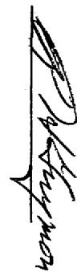

TABLE 3H4.2 (continued)   

<table><tr><td>Location and Annunciator Number</td><td>Actuated by</td><td>Annunciates on (for set points see Switch Tab)</td><td>Control Action</td><td>Operator Action</td></tr><tr><td>ACB-4</td><td></td><td></td><td></td><td></td></tr><tr><td>XA-4030-5</td><td>PS 9003-1</td><td>Lo instrument air pressure maintenance control room 20 psig Hdr</td><td>None</td><td>Switch to alternate PCV if possible</td></tr><tr><td>XA-4030-6</td><td>PS 9004-1</td><td>Lo instrument air pressure service room 20 psig Hdr</td><td>None</td><td>Switch to alternate PCV if possible</td></tr><tr><td>XA-4030-7</td><td>PS 9005-2</td><td>Lo instrument air pressure water room 20 psig Hdr</td><td>None</td><td>Switch to alternate PCV if possible</td></tr><tr><td>XA-4030-8</td><td>PS 9005-1</td><td>Lo instrument air pressure water room 60 psig (Supplier WR, Filter Pit, &amp; Chem. Processing)</td><td>None</td><td>Switch to alternate PCV if possible</td></tr><tr><td>XA-4030-9</td><td>PS 9000-1</td><td>Lo instrument air pressure Main Supply 80 psig Hdr</td><td>Starts alternate compressor</td><td>Check air compressors &amp; air usage</td></tr><tr><td>XA-4030-10</td><td>PS 9013-1</td><td>Lo instrument air pressure block valve Hdr. 80 psig</td><td>None, however low pressure (&lt;20 psig) causes block valves to fail in closed position</td><td>Check air compressors &amp; emergency nitrogen</td></tr><tr><td>XA-4030-11</td><td>K-302 &amp; K-307</td><td>AC-1, AC-2 permissible Hi temperature. Lo oil pressure</td><td>Hi Comp. temperatures, Lo oil pressure. Stops compressor</td><td>Check AC cooling water, oil level S-53 not manual</td></tr><tr><td>XA-4031-1</td><td>PS 9007-3</td><td>Lo instrument air pressure MCB &amp; transmitter room &lt;18 psig</td><td>None</td><td>Check pressure, reducing valve &amp; air usage. Switch to alternate PRV if possible</td></tr><tr><td>XA-4031-2</td><td>PS 9007-4</td><td>Lo instrument air pressure, transmitter room, 30 psig Hdr</td><td>None</td><td>Check pressure, reducing valve &amp; air usage. Switch to alternate PRV if possible</td></tr><tr><td>XA-4031-3</td><td>PS 9007-1</td><td>Lo instrument air pressure, transmitter room &amp; MCR 60 psig Hdr</td><td>None</td><td>Check pressure, reducing valve &amp; air usage. Switch to alternate PRV if possible</td></tr><tr><td>XA-4031-4</td><td>PS 9008-1</td><td>Lo instrument air pressure, MCR &amp; transmitter room, 20 psig Hdr</td><td>None</td><td>Check pressure, reducing valve &amp; air usage. Switch to alternate PRV if possible</td></tr><tr><td>XA-4031-5</td><td>PS 9009-1</td><td>Lo instrument air pressure, Sampler Enricher 30 psig</td><td>None</td><td>Check pressure, reducing valve &amp; air usage. Switch to alternate PRV if possible</td></tr><tr><td>XA-4031-6</td><td>PS 9010-1</td><td>Lo instrument air pressure service room 30 psig Hdr</td><td>None</td><td>Check pressure, reducing valve &amp; air usage. Switch to alternate PRV if possible</td></tr><tr><td>XA-4031-7</td><td>PS 9010-2</td><td>Lo instrument air pressure service room 20 psig Hdr</td><td>None</td><td>Check pressure, reducing valve &amp; air usage. Switch to alternate PRV if possible</td></tr><tr><td>XA-4031-8</td><td>PS 9011-1</td><td>Lo instrument air pressure water room, service room &amp; filter pit - 60 psig</td><td>None</td><td>Check pressure, reducing valve switch to alternate PRV if possible</td></tr><tr><td>XA-4031-9</td><td>PS-9011-2</td><td>Lo instrument air pressure water room. 30 psig</td><td>None</td><td>Check pressure, reducing valve &amp; air usage. Switch to alternate PRV if possible</td></tr><tr><td>XA-4031-10</td><td>PS-9011-3</td><td>Lo instrument air pressure water room. 20 psig</td><td>None</td><td>Check pressure, reducing valve &amp; air usage. Switch to alternate PRV if possible</td></tr><tr><td>XA-4031-11</td><td>PS-9011-4</td><td>Lo instrument air pressure water room. 30 psig</td><td>None</td><td>Check pressure, reducing valve &amp; air usage. Switch to alternate PRV if possible</td></tr><tr><td>XA-4031-12</td><td>PS-9011-5</td><td>Lo instrument air pressure filter pit. 20 psig</td><td>None</td><td>Check pressure, reducing valve &amp; air usage. Switch to alternate PRV if possible</td></tr><tr><td>XA-4032-1</td><td>PS-9011-6</td><td>Chem. process. Emergency instru-ment air header, lo pressure</td><td>None</td><td>Switch to alternate PCV</td></tr><tr><td>XA-4032-2</td><td>Spare</td><td></td><td></td><td></td></tr><tr><td>XA-4032-3</td><td>Spare</td><td></td><td></td><td></td></tr><tr><td>XA-4032-4</td><td>Spare</td><td></td><td></td><td></td></tr><tr><td>XA-4032-5</td><td>Spare</td><td></td><td></td><td></td></tr><tr><td>XA-4032-6</td><td>Spare</td><td></td><td></td><td></td></tr><tr><td>XA-4032-7</td><td>Spare</td><td></td><td></td><td></td></tr><tr><td>XA-4032-8</td><td>Spare</td><td></td><td></td><td></td></tr><tr><td>XA-4032-9</td><td>Spare</td><td></td><td></td><td></td></tr><tr><td>XA-4032-10</td><td>Spare</td><td></td><td></td><td></td></tr><tr><td colspan="5">ACB-4</td></tr><tr><td>XA-4032-11</td><td>FS</td><td>Lo flow, Battery Room Exh</td><td>None</td><td>Check blower switch &amp; power</td></tr><tr><td>XA-4032-12</td><td>FS</td><td>Lo flow, Induction Regulator</td><td>None</td><td>Check blower switch &amp; power</td></tr><tr><td colspan="5">SAMPLER-ENRICHER SE-1</td></tr><tr><td>XA-4035-1</td><td>PS-590A</td><td>Lo pressure He supply</td><td>None</td><td>Check main He supply</td></tr><tr><td>XA-4035-2</td><td>PS-650C</td><td>Hi rupture pressure access port supply</td><td>None</td><td>Set PV-650A to 80 psig; Replace rupture disc</td></tr><tr><td>XA-4035-3</td><td>PS-509D</td><td>Lo Pressure Regulated He header</td><td>None</td><td>Check main He supply and PV-509B setting</td></tr><tr><td>XA-4035-4</td><td>PS-674A</td><td>Hi rupture pressure Regulated He header</td><td>None</td><td>Set PV-509B to 40 psig. Replace rupture disc</td></tr><tr><td>XA-4035-5</td><td>PS-664B</td><td>Lo pressure leak detector Header #1</td><td>None</td><td>Repressurize through HV-664 If pressure fails to rise, find leak</td></tr><tr><td colspan="5">SE-1</td></tr><tr><td>XA-4035-6</td><td>PS-644B</td><td>Lo pressure leak detector header #2</td><td>None</td><td>Repressurize through HV-644. If pressure fails to rise, find leak</td></tr><tr><td colspan="5">SE-2</td></tr><tr><td>XA-4036-1</td><td>K-360D</td><td>Lo buffer pressure to removal valve</td><td>Prevents opening access port, operating valve or maintenance valve</td><td>If not caused by opening valve, find leak and correct</td></tr><tr><td>XA-4036-2</td><td>K-369D</td><td>Lo buffer pressure to access port</td><td>Prevents opening operating valve, maintenance valve, or removal valve</td><td>If not caused by opening port, find leak and correct</td></tr><tr><td>XA-4036-3</td><td>K-363D &amp; K-366D</td><td>Lo buffer pressure to operating &amp; maintenance valve</td><td>Prevents opening access port, removal valve, or offgas lines</td><td>If not caused by opening valves, find leak and correct</td></tr><tr><td>XA-4036-4</td><td>K-393B</td><td>Hi Boot Pressure</td><td>Closes HSV677-A</td><td>If pressurizing, throttle HV-663</td></tr><tr><td>XA-4036-5</td><td>PdS-lCe</td><td>Area 1C pressure greater than Area 3A</td><td>Prevents opening access port</td><td>Acknowledge alarm. No action unless 1C pressure rising rapidly</td></tr><tr><td>XA-4036-6</td><td>PS-683A</td><td>Lo pressure buffer header</td><td>None</td><td>Open HV-683, check He supply, look for leak</td></tr><tr><td colspan="5">SE-3</td></tr><tr><td>XA-4037-1</td><td>PS-1CE</td><td>Hi pressure Area 1C</td><td>None</td><td>Vent pressure to offgas system Find leak causing pressure rise</td></tr><tr><td>XA-4037-2</td><td>PS-AR3A</td><td>Hi pressure Area 3A</td><td>None</td><td>Vent pressure to offgas system Find leak causing pressure rise</td></tr></table>

9/∠2/6 n-2·nHS

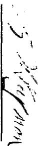

TABLE 3H4.2 (continued)   

<table><tr><td>Location and Annunciator Number</td><td>Actuated by</td><td>Annunciates on (for set points see Switch Tab)</td><td>Control Action</td><td>Operator Action</td></tr><tr><td colspan="5">SE-3</td></tr><tr><td>XA-4037-3</td><td>PS-659A</td><td>Hi Pressure Area 2B</td><td>None</td><td>Find leak causing pressure rise</td></tr><tr><td>XA-4037-4</td><td>PS-522A3</td><td>Hi pressure fuel pump bowl</td><td>Closes HSV-680E, HSV-668B, HSV-655B, HSV-657D. Prevent opening access port, operating valve, or maintenance valve</td><td>Acknowledge alarm. Do not sample</td></tr><tr><td>XA-4037-5</td><td>RS-675A or RS-675B</td><td>Hi activity containment areas</td><td>Close HSV-678A, 678B, HSV-677A, ESV-542A, HSV-675A, HSV-659B, HSV-657D, HSV-668B, and HSV-655B</td><td>Reset the radiation indicator. Locate source of activity.</td></tr><tr><td>XA-4037-6</td><td>RS-678C or RS-678D</td><td>Hi activity offgas</td><td>None</td><td>Acknowledge alarm. Determine reason for high activity</td></tr><tr><td colspan="5">MB #11 &amp; NBI</td></tr><tr><td>XA-4040-1</td><td>K-200C</td><td>Φ &gt;12 Mw Channel #1</td><td>None, however two out of 3 channels give load set back &amp; rod reverse</td><td>Check RSS-NSC1-A2</td></tr><tr><td>XA-4040-2</td><td>K-201C</td><td>Φ &gt;12 Mw Channel #2</td><td>None, however two out of 3 channels give load set back &amp; rod reverse</td><td>Check RSS-NSC2-A2</td></tr><tr><td>XA-4040-3</td><td>K-202C</td><td>Φ &gt;12 Mw Channel #3</td><td>None, however two out of 3 channels give load set back &amp; rod reverse</td><td>Check RSS-NSC3-A2</td></tr><tr><td>MB #11 &amp; NB-1</td><td></td><td></td><td></td><td></td></tr><tr><td>XA-4040-4</td><td>RXS-NCC-1-A3B</td><td>Period &lt;10 sec</td><td>Rod reverse if not in Run Mode</td><td>Insert control rods</td></tr><tr><td>XA-4040-5</td><td>RXS-NCC2-A3B</td><td>Period &lt;10 sec</td><td>Rod reverse if not in Run Mode</td><td>Insert control rods</td></tr><tr><td>NB-2</td><td></td><td></td><td></td><td></td></tr><tr><td rowspan="2">XA-4041-1</td><td>TS-NRR1-A1</td><td rowspan="2">Hi-temperature Control Rod #1</td><td rowspan="2">None</td><td rowspan="2">Shut down and drain reactor</td></tr><tr><td>TS-NRR1-A2</td></tr><tr><td rowspan="2">XA-4041-2</td><td>TS-NRR2-A1</td><td rowspan="2">Hi-temperature Control Rod #2</td><td rowspan="2">None</td><td rowspan="2">Shut down and drain reactor</td></tr><tr><td>TS-NRR2-A2</td></tr><tr><td rowspan="2">XA-4041-3</td><td>TS-NRR3-A1</td><td rowspan="2">Hi-temperature Control Rod #3</td><td rowspan="2">None</td><td rowspan="2">Shut down and drain reactor</td></tr><tr><td>TS-NRR3-A2</td></tr><tr><td>XA-4041-4</td><td></td><td>Spare</td><td></td><td></td></tr><tr><td>XA-4041-5</td><td></td><td>Spare</td><td></td><td></td></tr></table>

TABLE 3H4.2 (continued   

<table><tr><td>Location and Annunciator Number</td><td>Actuated by</td><td>Annunciates on (for set points see Switch Tab)</td><td>Control Action</td><td>Operator Action</td></tr><tr><td>NB-3</td><td></td><td></td><td></td><td></td></tr><tr><td rowspan="3">XA-4042-1</td><td>RS-827-A2</td><td rowspan="3">Cooling H2O Hi Activity</td><td rowspan="3">Closes in-cell cooling water block valves</td><td rowspan="3">Locate &amp; isolate source, open block valves if necessary. Initiate a drain</td></tr><tr><td>RS-827-B2</td></tr><tr><td>RS-827-C2</td></tr><tr><td rowspan="2">XA-4042-2</td><td>RS-OT1-B</td><td>Fuel &amp; coolant salt pump oil supply</td><td rowspan="2">None</td><td rowspan="2">Violation of primary contain-ment. Reduce power to zero</td></tr><tr><td>RS-OT2-B</td><td>Hi Activity</td></tr><tr><td>NB-4</td><td></td><td></td><td></td><td></td></tr><tr><td rowspan="3">XA-4043-1</td><td>RS-596-A2</td><td>FP bubbler He supply</td><td rowspan="2">Closes He supply line to in-cell bubblers</td><td rowspan="2">Reduce power to zero and and consider draining</td></tr><tr><td>RS-596-B2</td><td>Hi Activity</td></tr><tr><td>RS-596-C2</td><td>Helium gas supply</td><td rowspan="2">None</td><td rowspan="2">Determine source. Consider reducing power to zero and draining reactor</td></tr><tr><td>XA-4043-2</td><td>RS-500D</td><td>Hi Activity</td></tr><tr><td rowspan="2">XA-4043-3</td><td>RS-557-A2</td><td rowspan="2">Fuel salt system offgas Hi Activity</td><td rowspan="2">Closes block valve in main offgas line to stack</td><td rowspan="2">Determine source and reduce power if necessary</td></tr><tr><td>RS-557-B2</td></tr><tr><td rowspan="2">XA-4043-4</td><td>RS-528-B2</td><td rowspan="2">Coolant salt system offgas Hi Activity</td><td rowspan="2">Reactor Drain &amp; Stop FP</td><td rowspan="2">Check RS-528 to drain</td></tr><tr><td>RS-528-C2</td></tr><tr><td rowspan="2">XA-4043-5</td><td>RS-565-B2</td><td rowspan="2">Reactor cell air Hi Activity</td><td rowspan="2">Reactor Drain. Closes cell evacuation block valve</td><td rowspan="2">Initiate a drain</td></tr><tr><td>RS-565-C2</td></tr><tr><td colspan="5">CHEMICAL PROCESSING Panel #1</td></tr><tr><td>XA-4051-1</td><td>Spare</td><td></td><td></td><td></td></tr><tr><td>XA-4051-2</td><td>PS-604C</td><td>Helium supply to Line 111 Lo pressure</td><td>None</td><td>Check He supply valve and and He supply pressure</td></tr><tr><td>XA-4051-3</td><td>FS-608A1</td><td>Helium to top of FST Low Flow</td><td>Closes HCV-690</td><td>Check He supply pressure and valves</td></tr><tr><td>XA-4051-4</td><td>PS-608B1</td><td>FST Hi pressure</td><td>Opens FST vent valve Closes FST He supply valve</td><td>Determine cause of Hi pres-ure. Check HCV-692</td></tr><tr><td>XA-4051-5</td><td>PdS-694-A2</td><td>Lo pressure Line 690</td><td>Opens HCV-694</td><td>Check flow from GSS</td></tr><tr><td>XA-4051-6</td><td>FS 940</td><td>Offgas low flow</td><td>Close HCV-692</td><td>Turn off H2supply valve. Check fans, duct flow, and 940 damper</td></tr><tr><td colspan="5">CP Panel #2</td></tr><tr><td>XA-4052-1</td><td>PS-690B</td><td>F2supply Hi Pressure</td><td>None</td><td>Check FST and CS pressure. Check for restriction down-stream of PS-690 and that HCV-694 is closed</td></tr><tr><td>XA-4052-2</td><td>(Remote) PS-696-A</td><td>HF Supply Hi pressure</td><td>None</td><td>Check temperature of water bath. Turn off steam supply at GSS</td></tr><tr><td>XA-4052-3</td><td>TS HFHTSS SOPTS FLP</td><td>HF heater Lo SO2pre-heater Hi F2pre-heater Hi</td><td>None</td><td>Check power to HF heater. Check SO2and F2flow, check for excessive power to heaters</td></tr><tr><td colspan="5">CP Panel #2</td></tr><tr><td rowspan="2">XA-4052-4</td><td>PS SFA-C1</td><td rowspan="2">Hi pressure instru-ment cubicle Hi pressure absorber cubicle</td><td rowspan="2">None</td><td rowspan="2">Check to see that V979 is open. Check to see that cubicle blower is on and V-978 is open</td></tr><tr><td>PS CP3-B1</td></tr><tr><td>XA-4052-5</td><td>PS-CS-A1</td><td>Hi pressure caustic scrubber</td><td>None</td><td>Check for restriction in line 628. Check N2flow to bubbler</td></tr><tr><td rowspan="3">XA-4052-6</td><td>RS-940G</td><td rowspan="3">Hi activity in fuel-processing system</td><td rowspan="3">None</td><td rowspan="3">Check for source of activity and prepare for possible shutdown</td></tr><tr><td>RS-CP3-A</td></tr><tr><td>RS SFA-A</td></tr><tr><td>SCANNER PANEL</td><td>RS-994</td><td></td><td></td><td></td></tr><tr><td>XA-4053-1</td><td>TS-5001-A</td><td>Hi-Lo temperature Scanner A</td><td>None</td><td>Check Scanner A temperature trace</td></tr><tr><td>XA-4053-2</td><td>TS-5002-A</td><td>Hi-Lo temperature Scanner B</td><td>None</td><td>Check Scanner B temperature trace</td></tr><tr><td>XA-4053-3</td><td>TS-5003-A</td><td>Hi-Lo temperature Scanner C</td><td>None</td><td>Check Scanner C</td></tr><tr><td>XA-4053-4</td><td>TS-5004-A</td><td>Hi-Lo Temperature Scanner D</td><td>None</td><td>Check Scanner D Lower load</td></tr><tr><td>XA-4053-5</td><td>TS-5005-A</td><td>Hi Lo temperature Scanner E</td><td>None</td><td>Check Scanner E Lower load</td></tr><tr><td>XA-4053-6</td><td>PS-5000-A</td><td>N2supply pressure Lo to scanner</td><td>None</td><td>Switch supply banks and change out empty cylinders</td></tr><tr><td>JUNCTION BOX #151</td><td></td><td></td><td></td><td></td></tr><tr><td>XA-4054-1</td><td>LS-VT1-B1</td><td>Lo-water level Vapor Condensing Tank. FINAL</td><td>None</td><td>Prepare to shut down reactor and add water</td></tr><tr><td>XA-4054-2</td><td>LS-VT1-B2</td><td>Lo-water level Vapor Condensing Tank. INITIAL</td><td>None</td><td>Punch list for water addition during next shutdown</td></tr><tr><td>XA-4054-3</td><td>LS-VT1-B3</td><td>Hi-water level Vapor Condensing Tank. INITIAL</td><td>None</td><td>Check thermal shield rupture disc</td></tr><tr><td>XA-4054-4</td><td>LS-VT1-B4</td><td>Hi-water level Vapor Condensing Tank. Final Spare</td><td>None</td><td>Prepare to shut down and remove water</td></tr><tr><td>XA-4054-5</td><td></td><td></td><td></td><td></td></tr><tr><td>XA-4054-6</td><td>PS-VT1-C</td><td>Hi pressure Vapor Condensing Tank</td><td>None</td><td>Release excess pressure through V-984. Do not leave valve open</td></tr></table>

# CODE FOR TEMPERATURE SWITCHES, TABLE 3H4.3

The code letters or numbers listed describe the automatic control action and Operator action to be taken when a module alarm condition exists.

# CONTROL ACTION DESCRIPTION

A Air Off   
B None unless lAl or 3Al exceeds setpoint at which time interlocks (1) shuts off FP and (2) precludes start mode.   
C High air and green flashing light on at Freeze Valve switch when valve is in the freeze position.   
D None   
E Red flashing light on at freeze valve switch when valve is in thaw position.   
F Prevents closing of cooling-air control valve thus prevents thaw of freeze valve   
G Center Heater and red flashing light on at freeze valve switch when valve is in thaw position.   
H Opens ESV-806A -- Water to Steam Dome of FD-1   
I Opens ESV-807A -- Water to Steam Dome of FD-2

# OPERATOR ACTION DESCRIPTION

1 Increase hold air (decrease heat as last resort).   
2 Check air off (raise shoulder heater as last resort).   
3 Lower hold air (increase heat as last resort).   
4 None   
5 Turn on or raise line-heater power. Check adjacent line temperatures.   
6 Check other thermocouples of freeze flange. Possibly adjust heat on adjacent heaters.   
7 Check other thermocouples on reactor neck. Possibly adjust coolant air flow.   
8 Check Drain Tank temperature, possibly turn off heaters or lower setting.   
9 Check lube oil cooling water, lube oil flows. Lower reactor power if necessary.   
10 Check that MB-2 and MB-4 are on.   
11 Increase FP heaters or prepare to shut down reactor.

TABLE 3 H.4.3 TEMPERATURE SWITCHES  

<table><tr><td rowspan="2">Number</td><td rowspan="2">TE-No.</td><td rowspan="2">Description</td><td colspan="2">Module Light</td><td rowspan="2">Approximate Set Pointa(°F)</td><td rowspan="2">Control Action</td><td rowspan="2">Operator Action</td></tr><tr><td>Above Set Point</td><td>Below Set Point</td></tr><tr><td>TX 3001-1</td><td>FF 100-1</td><td>Freeze Flange Temperature</td><td>Red</td><td>---</td><td>Hi 975</td><td>B</td><td>6</td></tr><tr><td>-2</td><td>FF 100-3</td><td>Freeze Flange Temperature</td><td>---</td><td>Red</td><td>Lo 700</td><td>B</td><td>6</td></tr><tr><td>-3</td><td>FF 101-1</td><td>Freeze Flange Temperature</td><td>Red</td><td>---</td><td>Hi 975</td><td>B</td><td>6</td></tr><tr><td>-4</td><td>FF 101-3</td><td>Freeze Flange Temperature</td><td>---</td><td>Red</td><td>Lo 700</td><td>B</td><td>6</td></tr><tr><td>-5</td><td>FF 102-1</td><td>Freeze Flange Temperature</td><td>Red</td><td>---</td><td>Hi 1050</td><td>B</td><td>6</td></tr><tr><td>-6</td><td>FF 102-3</td><td>Freeze Flange Temperature</td><td>---</td><td>Red</td><td>Lo 700</td><td>B</td><td>6</td></tr><tr><td>-7</td><td>FF 200-1</td><td>Freeze Flange Temperature</td><td>Red</td><td>---</td><td>Hi 975</td><td>B</td><td>6</td></tr><tr><td>-8</td><td>FF 200-3</td><td>Freeze Flange Temperature</td><td>---</td><td>Red</td><td>Lo 700</td><td>B</td><td>6</td></tr><tr><td>-9</td><td>FF 201-1</td><td>Freeze Flange Temperature</td><td>Red</td><td>---</td><td>Hi 975</td><td>B</td><td>6</td></tr><tr><td>-10</td><td>FF 201-3</td><td>Freeze Flange Temperature</td><td>---</td><td>Red</td><td>Lo 700</td><td>B</td><td>6</td></tr><tr><td>-11</td><td>R 42 B</td><td>Reactor Neck Temp. (lower)</td><td>Red</td><td>---</td><td>Hi 800</td><td>B</td><td>7</td></tr><tr><td>-12</td><td>R 45 B</td><td>Reactor Neck Temp. (upper)</td><td>Red</td><td>---</td><td>Hi 400</td><td>B</td><td>7</td></tr><tr><td>-13</td><td>R-33</td><td>Reactor Neck Temp. (lower)</td><td>Red</td><td>---</td><td>Hi 300</td><td>B</td><td>7</td></tr><tr><td>-14</td><td>R 46 B</td><td>Reactor Neck Temp. (upper)</td><td>Red</td><td>---</td><td>Hi 400</td><td>B</td><td>7</td></tr><tr><td>15 &amp; 16</td><td>FD-1-19B</td><td>Bayonette Temperature</td><td>Red</td><td>---</td><td>Hi 1300</td><td>H</td><td>8</td></tr><tr><td>17 &amp; 18</td><td>FD-2-19B</td><td>Bayonette Temperature</td><td>Red</td><td>---</td><td>Hi 1300</td><td>I</td><td>8</td></tr><tr><td>...</td><td></td><td></td><td></td><td></td><td></td><td></td><td></td></tr><tr><td>...</td><td></td><td></td><td></td><td></td><td></td><td></td><td></td></tr><tr><td>-19</td><td></td><td></td><td></td><td></td><td></td><td></td><td></td></tr><tr><td>-20</td><td></td><td></td><td></td><td></td><td></td><td></td><td></td></tr></table>

aSee Switch Tabulation for current set point. Switches with two temperatures alarm at the high temperature and clear at the low temperature,

TABLE 3 H.4.3 (con't)   

<table><tr><td rowspan="2">Number</td><td rowspan="2">TE-No.</td><td rowspan="2">Description</td><td colspan="2">Module Lightb</td><td rowspan="2">Approximate Set Pointa(°F)</td><td rowspan="2">Control Action</td><td rowspan="2">Operator Action</td></tr><tr><td>Above Set Point</td><td>Below Set Point</td></tr><tr><td>TX 3002-1</td><td>FV 104-5A</td><td>Freeze valve pot temperature</td><td>---</td><td>Red</td><td>Lo 900</td><td>F</td><td>5</td></tr><tr><td>-2</td><td>FV 105-5A</td><td>Freeze valve pot temperature</td><td>---</td><td>Red</td><td>Lo 785</td><td>F</td><td>5</td></tr><tr><td>-3</td><td>FV 106-5A</td><td>Freeze valve pot temperature</td><td>---</td><td>Red</td><td>Lo 900</td><td>F</td><td>5</td></tr><tr><td>-4</td><td>FV 107-5A</td><td>Freeze valve pot temperature</td><td>---</td><td>Red</td><td>Lo 900</td><td>F</td><td>5</td></tr><tr><td>-5</td><td>FV 108-5A</td><td>Freeze valve pot temperature</td><td>---</td><td>Red</td><td>Lo 900</td><td>F</td><td>5</td></tr><tr><td>-6</td><td>FV 109-5A</td><td>Freeze valve pot temperature</td><td>---</td><td>Red</td><td>Lo 900</td><td>F</td><td>5</td></tr><tr><td>-7</td><td>FV 110-5A</td><td>Freeze valve pot temperature</td><td>---</td><td>Red</td><td>Lo 900</td><td>F</td><td>5</td></tr><tr><td>-8</td><td>FV 111-5A</td><td>Freeze valve pot temperature</td><td>---</td><td>Red</td><td>Lo 900</td><td>F</td><td>5</td></tr><tr><td>-9</td><td>FV 112-5A</td><td>Freeze valve pot temperature</td><td>---</td><td>Red</td><td>Lo 900</td><td>F</td><td>5</td></tr><tr><td>-10</td><td>FV 204-5A</td><td>Freeze valve pot temperature</td><td>---</td><td>Red</td><td>Lo 900</td><td>F</td><td>5</td></tr><tr><td>11 &amp; 12</td><td>FD-1-20B</td><td>FD-1 Bayonette temperature</td><td>Amber</td><td>Green</td><td>Hi 1300</td><td>H</td><td>8</td></tr><tr><td>13 &amp; -14</td><td>FD-2-20B</td><td>FD-2 Bayonette temperature</td><td>Amber</td><td>Green</td><td>Hi 1300</td><td>I</td><td>8</td></tr><tr><td>-15</td><td>705-1B</td><td>FP lube oil return</td><td>Red</td><td>---</td><td>Hi 150</td><td>B</td><td>9</td></tr><tr><td>-16</td><td>707-1B</td><td>FP coolant oil return</td><td>Red</td><td>---</td><td>Hi 150</td><td>B</td><td>9</td></tr><tr><td>-17</td><td>755-1B</td><td>CP lube oil return</td><td>Red</td><td>---</td><td>Hi 150</td><td>B</td><td>9</td></tr><tr><td>-18</td><td>757-1B</td><td>CP coolant oil return</td><td>Red</td><td>---</td><td>Hi 150</td><td>B</td><td>9</td></tr><tr><td>19 &amp; 20</td><td>OFT-6A</td><td>Temperature at Bottom of Overflow tank</td><td>Green</td><td>Amber</td><td></td><td>D</td><td>11</td></tr><tr><td>TX 3003-1 &amp;-2</td><td>FV 103-1Al</td><td>Shoulder temperature, outside box, Reactor side</td><td>Yellow</td><td>Green</td><td>Hi 960-910</td><td>C</td><td>1</td></tr><tr><td>-3 &amp;-4</td><td>FV 103-2Al</td><td>Center temperature in air box</td><td>Green</td><td>Yellow</td><td>Lo 900</td><td>E</td><td>2</td></tr></table>

b. Yellow light is alarm condition for freeze valve modules. Take operator action if alarm persists at equilibrium.

TABLE 3 H.4.3 (con't)   

<table><tr><td rowspan="2">Number</td><td rowspan="2">TE-No.</td><td rowspan="2">Description</td><td colspan="2">Module Lightb</td><td rowspan="2">Approximate Set Pointa (°F)</td><td rowspan="2">Control Action</td><td rowspan="2">Operator Action</td></tr><tr><td>Above Set Point</td><td>Below Set Point</td></tr><tr><td>TX 3003-5&amp;6</td><td>FV 103-3A2</td><td>Shoulder temperature,outside</td><td>Green</td><td>Yellow</td><td>Lo 620</td><td>A</td><td>3</td></tr><tr><td>-7&amp;8</td><td>FV 204-1A1</td><td>Cobox DT side</td><td>Yellow</td><td>Green</td><td>Hi 800-750</td><td>C</td><td>1</td></tr><tr><td>-9&amp;10</td><td>FV 204-2A1</td><td>Center temperature</td><td>Green</td><td>Yellow</td><td>Lo 1000</td><td>E</td><td>12</td></tr><tr><td>-11&amp;12</td><td>FV 204-3A2</td><td>Shoulder temp., C.D.T. side</td><td>Green</td><td>Yellow</td><td>Lo 650</td><td>A</td><td>3</td></tr><tr><td>-13&amp;14</td><td>FV 206-1A1</td><td>Shoulder temperature, coolant system side</td><td>Yellow</td><td>Green</td><td>Hi 800-750</td><td>C</td><td>1</td></tr><tr><td>-15&amp;16</td><td>FV 206-2A1</td><td>Center temperature</td><td>Green</td><td>Yellow</td><td>Lo 1000</td><td>E</td><td>12</td></tr><tr><td>-17&amp;18</td><td>FV 206-3A2</td><td>Shoulder temp., C.D.T. side</td><td>Green</td><td>Yellow</td><td>Lo 650</td><td>A</td><td>3</td></tr><tr><td>-19</td><td>AD3-5B</td><td>Radiator duct temperature</td><td>Red</td><td>---</td><td>Hi 1000</td><td>B</td><td>10</td></tr><tr><td>-20</td><td>AD3-7B</td><td>Radiator duct temperature</td><td>Red</td><td>---</td><td>Hi 800</td><td>B</td><td>10</td></tr><tr><td>TX 3004-1&amp;2</td><td>FV 103-1A2</td><td>Shoulder temp. - Reactor side</td><td>Green</td><td>Yellow</td><td>Lo 675</td><td>A</td><td>3</td></tr><tr><td>-3&amp;4</td><td>FV 103-2A2</td><td>Center Temp., in air box</td><td>Yellow</td><td>Green</td><td>Hi 550</td><td>B</td><td>1</td></tr><tr><td>-5&amp;6</td><td>FV 103-3A1</td><td>Shoulder temp., DT side</td><td>Yellow</td><td>Green</td><td>Hi 765-715</td><td>C</td><td>1</td></tr><tr><td>-7&amp;8</td><td>FV 204-1A2</td><td>Shoulder temp., Coolant system</td><td>Green</td><td>Yellow</td><td>Lo 650</td><td>A</td><td>3</td></tr><tr><td>-9&amp;10</td><td>FV 204-2A2</td><td>Center temperature</td><td>Yellow</td><td>Green</td><td>Hi 550</td><td>D</td><td>1</td></tr><tr><td>-11&amp;12</td><td>FV 204-3A1</td><td>Shoulder temp., C.D.T. side</td><td>Yellow</td><td>Green</td><td>Hi 800-750</td><td>C</td><td>1</td></tr><tr><td>-13&amp;14</td><td>FV 206-1A2</td><td>Shoulder temp., Coolant system side</td><td>Green</td><td>Yellow</td><td>Lo 650</td><td>A</td><td>3</td></tr><tr><td>-15&amp;16</td><td>FV 206-2A2</td><td>Center temperature</td><td>Yellow</td><td>Green</td><td>Hi 550</td><td>D</td><td>1</td></tr><tr><td>-17&amp;18</td><td>FV 206-3A1</td><td>Shoulder temp. C.D.T. side</td><td>Yellow</td><td>Green</td><td>Hi 800-750</td><td>C</td><td>1</td></tr><tr><td>TX 3005-1&amp;2</td><td>FV 104-1A1</td><td>Shoulder temp. F.F.T. side</td><td>Yellow</td><td>Green</td><td>Hi 645-595</td><td>C</td><td>1</td></tr><tr><td>-3&amp;4</td><td>FV 104-2A1</td><td>Center temperature</td><td>Green</td><td>Yellow</td><td>Lo 925</td><td>E</td><td>2</td></tr><tr><td>-5&amp;6</td><td>FV 104-3A2</td><td>Shoulder temp. - Reactor side</td><td>Green</td><td>Yellow</td><td>Lo 700</td><td>A</td><td>3</td></tr><tr><td>-7&amp;8</td><td>FV 105-1A1</td><td>Shoulder temp., F.D.T. side</td><td>Yellow</td><td>Green</td><td>Hi 900-850</td><td>C</td><td>1</td></tr><tr><td>-9&amp;10</td><td>FV 105-2A1</td><td>Center temperature</td><td>Green</td><td>Yellow</td><td>Lo 825</td><td>E</td><td>2</td></tr><tr><td>-11&amp;12</td><td>FV 105-3A2</td><td>Shoulder temp. Reactor side</td><td>Green</td><td>Yellow</td><td>Lo 845</td><td>A</td><td>3</td></tr></table>

9/π/0T

H

TABLE 3 H.4.3 (con't)   

<table><tr><td rowspan="2">Number</td><td rowspan="2">TE-No.</td><td rowspan="2">Description</td><td colspan="2">Module Lightb</td><td rowspan="2">Approximate Set Pointa (°F)</td><td rowspan="2">Control Action</td><td rowspan="2">Operator Action</td></tr><tr><td>Above Set Point</td><td>Below Set Point</td></tr><tr><td>TX 3005-13 &amp;14</td><td>FV 106-1A1</td><td>Shoulder temp., F.D.T. side</td><td>Yellow</td><td>Green</td><td>Hi 750-700</td><td>C</td><td>1</td></tr><tr><td>-15&amp;16</td><td>FV 106-2A1</td><td>Center temperature</td><td>Green</td><td>Yellow</td><td>Lo 950</td><td>E</td><td>2</td></tr><tr><td>-17&amp;18</td><td>FV 106-3A2</td><td>Shoulder temp. reactor side</td><td>Green</td><td>Yellow</td><td>Lo 765</td><td>A</td><td>3</td></tr><tr><td>-19</td><td>FV 104-6A</td><td>Vertical line temperature Reactor side</td><td></td><td>Red</td><td>Lo 900</td><td>F</td><td>5</td></tr><tr><td>-20</td><td>FV 105-6A</td><td>Vertical line temperature Reactor side</td><td></td><td>Red</td><td>Lo 900</td><td>F</td><td>5</td></tr><tr><td>TX 3006-1&amp;2</td><td>FV 104-1A2</td><td>Shoulder temp., F.F.T. side</td><td>Green</td><td>Yellow</td><td>Lo 520</td><td>A</td><td>3</td></tr><tr><td>-3&amp;4</td><td>FV 104-2A2</td><td>Center temperature</td><td>Yellow</td><td>Green</td><td>Hi 550</td><td>D</td><td>1</td></tr><tr><td>-5&amp;6</td><td>FV 104-3A1</td><td>Shoulder temp. reactor side</td><td>Yellow</td><td>Green</td><td>Hi 795-745</td><td>C</td><td>1</td></tr><tr><td>-7&amp;8</td><td>FV 105-1A2</td><td>Shoulder temp. FD2 side</td><td>Green</td><td>Yellow</td><td>Lo 820</td><td>A</td><td>3</td></tr><tr><td>-9&amp;10</td><td>FV 105-2A2</td><td>Center temperature</td><td>Yellow</td><td>Green</td><td>Hi 550</td><td>D</td><td>1</td></tr><tr><td>-11&amp;12</td><td>FV 105-3A1</td><td>Shoulder temp., Reactor side</td><td>Yellow</td><td>Green</td><td>Hi 930-880</td><td>C</td><td>1</td></tr><tr><td>-13&amp;14</td><td>FV 106-1A2</td><td>Shoulder temp., FD l side</td><td>Green</td><td>Yellow</td><td>Lo 670</td><td>A</td><td>3</td></tr><tr><td>-15&amp;16</td><td>FV 106-2A2</td><td>Center temperature</td><td>Yellow</td><td>Green</td><td>Hi 550</td><td>D</td><td>1</td></tr><tr><td>-17&amp;18</td><td>FV 106-3A1</td><td>Shoulder temp., Reactor side</td><td>Yellow</td><td>Green</td><td>Hi 865-815</td><td>C</td><td>1</td></tr><tr><td>TX 3007-1&amp;2</td><td>FV 107-1A1</td><td>Shoulder temp., F.F.T. side</td><td>Yellow</td><td>Green</td><td>Hi 800-750</td><td>C</td><td>1</td></tr><tr><td>-3&amp;4</td><td>FV 107-2A1</td><td>Center temperature</td><td>Green</td><td>Yellow</td><td>Lo 1000</td><td>E</td><td>2</td></tr><tr><td>-5&amp;6</td><td>FV 107-3A2</td><td>Shoulder temp. L l10 side</td><td>Green</td><td>Yellow</td><td>Lo 600</td><td>D</td><td>3</td></tr><tr><td>-7&amp;8</td><td>FV 108-1A1</td><td>Shoulder temp. FD 2 side</td><td>Yellow</td><td>Green</td><td>Hi 800-750</td><td>C</td><td>1</td></tr><tr><td>-9&amp;10</td><td>FV 108-2A1</td><td>Center temperature</td><td>Green</td><td>Yellow</td><td>Lo 1000</td><td>E</td><td>2</td></tr><tr><td>-11&amp;12</td><td>FV 108-3A2</td><td>Shoulder temp. L l10 side</td><td>Green</td><td>Yellow</td><td>Lo 600</td><td>D</td><td>3</td></tr><tr><td>-13&amp;14</td><td>FV 109-1A1</td><td>Shoulder temp. FD l side</td><td>Yellow</td><td>Green</td><td>Hi 800-750</td><td>C</td><td>1</td></tr><tr><td>-15&amp;16</td><td>FV 109-2A1</td><td>Center temperature</td><td>Green</td><td>Yellow</td><td>Lo 1000</td><td>E</td><td>2</td></tr><tr><td>-17&amp;18</td><td>FV 109-3A2</td><td>Shoulder temp. L l10 side</td><td>Green</td><td>Yellow</td><td>Lo 600</td><td>D</td><td>3</td></tr><tr><td>TX 3008-1&amp;2</td><td>FV 107-1A2</td><td>Shoulder temp. FFT side</td><td>Green</td><td>Yellow</td><td>Lo 600</td><td>D</td><td>3</td></tr><tr><td>-3&amp;4</td><td>FV 107-2A2</td><td>Center temperature</td><td>Yellow</td><td>Green</td><td>Not in Use</td><td>D</td><td>4</td></tr></table>

TABLE 3 H.4.3 (con't)   

<table><tr><td rowspan="2">Number</td><td rowspan="2">TE-No.</td><td rowspan="2">Description</td><td colspan="2">\(Module\ Light^b\)</td><td rowspan="2">Approximate Set \(Point^a\) (°F)</td><td rowspan="2">Control Action</td><td rowspan="2">Operator Action</td></tr><tr><td>Above Set Point</td><td>Below Set Point</td></tr><tr><td>TX 3008-5&amp;6</td><td>FV 107-3A1</td><td>Shoulder temp. L l10 side</td><td>Yellow</td><td>Green</td><td>Hi 800-750</td><td>C</td><td>1</td></tr><tr><td>-7&amp;8</td><td>FV 108-1A2</td><td>Shoulder temp. FD 2 side</td><td>Green</td><td>Yellow</td><td>Lo 600</td><td>D</td><td>3</td></tr><tr><td>-9&amp;10</td><td>FV 108-2A2</td><td>Center temperature</td><td>Yellow</td><td>Green</td><td>Hi Not Used</td><td>D</td><td>4</td></tr><tr><td>-11&amp;12</td><td>FV 108-3A1</td><td>Shoulder temp., L l10 side</td><td>Yellow</td><td>Green</td><td>Hi 800-750</td><td>C</td><td>1</td></tr><tr><td>-13&amp;14</td><td>FV 109-1A2</td><td>Shoulder temp., FD 1 side</td><td>Green</td><td>Yellow</td><td>Lo 600</td><td>D</td><td>3</td></tr><tr><td>-15&amp;16</td><td>FV 109-2A2</td><td>Center temperature</td><td>Yellow</td><td>Green</td><td>Hi Not Used</td><td>D</td><td>4</td></tr><tr><td>-17&amp;18</td><td>FV 109-3A1</td><td>Shoulder temp., L l10 side</td><td>Yellow</td><td>Green</td><td>Hi 800-750</td><td>C</td><td>1</td></tr><tr><td>TX 3009-1&amp;2</td><td>FV 110-1A1</td><td>Shoulder temp., L l10 side</td><td>Yellow</td><td>Green</td><td>Hi 800-750</td><td>C</td><td>1</td></tr><tr><td>-3&amp;4</td><td>FV 110-2A1</td><td>Center temperature</td><td>Green</td><td>Yellow</td><td>Lo 1000</td><td>E</td><td>2</td></tr><tr><td>5&amp;6</td><td>FV 110-3A2</td><td>Shoulder temp., F.S.T. side</td><td>Green</td><td>Yellow</td><td>Lo 600</td><td>D</td><td>3</td></tr><tr><td>-7&amp;8</td><td>FV 111-1A1</td><td>Shoulder temp., Add. side</td><td>Yellow</td><td>Green</td><td>Hi 800-750</td><td>C</td><td>1</td></tr><tr><td>-9&amp;10</td><td>FV 111-2A1</td><td>Center temperature</td><td>Green</td><td>Yellow</td><td>Lo 1000</td><td>E</td><td>2</td></tr><tr><td>-11&amp;12</td><td>FV 111-3A2</td><td>Shoulder temp., L l10 side</td><td>Green</td><td>Yellow</td><td>Lo 600</td><td>D</td><td>3</td></tr><tr><td>-13&amp;14</td><td>FV 112-1A1</td><td>Shoulder temp., L l10 side</td><td>Yellow</td><td>Green</td><td>Hi 800-750</td><td>C</td><td>1</td></tr><tr><td>-15&amp;16</td><td>FV 112-2A1</td><td>Center temperature</td><td>Green</td><td>Yellow</td><td>Lo 1000</td><td>E</td><td>2</td></tr><tr><td>-17&amp;18</td><td>FV 112-3A2</td><td>Shoulder temp., Waste side</td><td>Green</td><td>Yellow</td><td>Lo 600</td><td>D</td><td>3</td></tr><tr><td>TX 3010-1&amp;2</td><td>FV 110-1A2</td><td>Shoulder temp., L l10 side</td><td>Green</td><td>Yellow</td><td>Lo 600</td><td>D</td><td>3</td></tr><tr><td>-3&amp;4</td><td>FV 110-2A2</td><td>Center temperature</td><td>Yellow</td><td>Green</td><td>Hi Not Used</td><td>D</td><td>4</td></tr><tr><td>-5&amp;6</td><td>FV 110-3A1</td><td>Shoulder temp., F.S.T. side</td><td>Yellow</td><td>Green</td><td>Hi 800-750</td><td>C</td><td>1</td></tr><tr><td>-7&amp;8</td><td>FV 111-1A2</td><td>Shoulder temp., Add. side</td><td>Green</td><td>Yellow</td><td>Lo 600</td><td>D</td><td>3</td></tr><tr><td>-9&amp;10</td><td>FV 111-2A2</td><td>Center temperature</td><td>Yellow</td><td>Green</td><td>Hi Not Used</td><td>D</td><td>4</td></tr><tr><td>-11&amp;12</td><td>FV 111-3A1</td><td>Shoulder temp., L l10 side</td><td>Yellow</td><td>Green</td><td>Hi 800-750</td><td>C</td><td>1</td></tr><tr><td>-13&amp;14</td><td>FV 112-1A2</td><td>Shoulder temp., L l10 side</td><td>Green</td><td>Yellow</td><td>Lo 600</td><td>D</td><td>3</td></tr><tr><td>-15&amp;16</td><td>FV 112-2A2</td><td>Center temperature</td><td>Yellow</td><td>Green</td><td>Hi Not Used</td><td>D</td><td>4</td></tr><tr><td>-17&amp;18</td><td>FV 112-3A1</td><td>Shoulder temp., Waste side</td><td>Yellow</td><td>Green</td><td>Hi 800-750</td><td>C</td><td>1</td></tr></table>

# 5 JUMPER BOARD

On the MSRE there are many interlocking features of control circuits and safety circuits to prevent undesirable and dangerous events from taking place. To provide for necessary flexibility under other-than-normal operating conditions, provisions are made to by-pass certain interlocks under strict administrative control. The jumper board provides this flexibility along with a visual indication of the condition of all circuits represented thereon. The location of the jumper board in the main control room provides both accessibility and ease of administrative control of any jumpers used.

5.1 Design Criteria, from operations standpoint, are as follows:

5.1.1 Safety circuit isolation is maintained by means of by-passing relays. Instead of insertion of a jumper pin directly into the circuit, as with non-safety circuits, the safety jumper pin operates a relay which indirectly by-passes the circuit function.   
5.1.2 The jumper board displays the condition of circuits by means of indicating lamps. These lamps (white) are placed between the schematic contacts of the circuits and will indicate whether the circuit to this point is energized or de-energized. A brief notation of the condition required to energize the circuit is given at each schematic contact.   
5.1.3 All jumper board safety circuits are designed so that failures of jumper board components will not jeopardize operation of the circuits. The indicator lamps described above are connected with diodes in series so that current cannot "back feed" through the lamps to maintain a circuit. For further information on the hookup of these diodes (or check valves) see the maintenance elementary drawings of jumper board safety circuits. Note that all circuits are not thus provided.   
5.1.4 Jumper pin openings in safety circuits are distinguished by their red color. The presence of a safety system (red)

# 5.1.4 (continued)

jumper is annihilated (MB-10, XA 4008-1) and also will prevent entry into "operate" mode. If system is already in "operate" mode, the insertion of a safety jumper will cause system to go to "off." Other jumpers (block openings) will not give an annunciation when inserted.

# 5.2 Use of Jumper Board

5.2.1 Although the jumper board is provided for flexibility of operation it must be remembered that the use of jumpers violates the normal designed operational interlock functions. The use of jumpers is under strict administrative control. No jumper should be inserted without the permission of the Operations Chief or Operations Department Head.

5.2.2 To determine the condition of the circuits shown schematically on the jumper board observe the white lights located between contacts. The notations at all of the contacts down to a particular lamp give the conditions which must be met for the lamp to be on. If all white lamps in a circuit are on the end condition lamp (red, green, or amber) will be on to signify the action or condition notation at the bottom of the circuit. Some circuits give condition when de-energized - e.g. circuits 20 and 21 indicate fill restrict condition when de-energized. The color of indicating lamps is also of significance. During power operation in RUN mode all RED lights will be OFF, all GREEN lights will be ON, the AMBER lights may be ON or OFF as required.

5.3 Other information displayed on the jumper board involves freeze valves and instrument power circuits.

5.3.1 The freeze valve permissive lights on the lower jumper board (#4) give indication of system conditions which would allow thawing of the particular valve. Note that these lights do not indicate permission to thaw from the standpoint of the valve itself - i.e. temperature of pot or

# 5.3.1 (continued)

shoulders. For example - a permissive light on jumper board for fill valves (FV-104, FV-105, FV-106) requires that all transfer freeze valves be frozen and the $\Delta P$ between tank and the FP be low. For a permissive light on transfer valves requires that all fill valves be frozen, the tank pressure low, and the reactor system be empty of salt. For details on FV permissive lights see block diagram D-HH-B-5733l or circuit diagrams for the individual freeze valves.

5.3.2 The IPP (instrument power) lights on the lower board (#4) indicate whether or not power is available to certain circuits in IPP-1, IPP-2, and IPP-4. See Table 3H5.l for listing of these circuits and what is supplied by them. For details on these and other instrument power circuits see Drawing E-HH-Z-41695.

INSTRUMENT POWER CIRCUITS INDICATED ON JUMPER BOARD #4   

<table><tr><td>Panel No.</td><td>Fed by</td><td>Circuit</td><td>Equipment On Circuit</td></tr><tr><td rowspan="8">IPP-1</td><td rowspan="8">48v DC</td><td>1</td><td>Safety Circuits</td></tr><tr><td>2</td><td>Safety Circuits</td></tr><tr><td>3</td><td>Safety Circuits</td></tr><tr><td>4</td><td>Safety Circuits</td></tr><tr><td>6</td><td>Safety Circuits</td></tr><tr><td>7</td><td>Safety Circuits, Channel #3</td></tr><tr><td>8</td><td>Control Circuits</td></tr><tr><td>9</td><td>Control Circuits</td></tr><tr><td rowspan="9">IPP-2</td><td rowspan="9">MG-4orTVA BUS 4</td><td>1</td><td>FV-103, FV-104, FV-105, FV-106</td></tr><tr><td>2</td><td>FV-107, FV-108, FV-109</td></tr><tr><td></td><td>FV-110, FV-111, FV-112</td></tr><tr><td>3</td><td>FV-204, FV-206</td></tr><tr><td>4</td><td>AC#1, FOP#1, COP#1</td></tr><tr><td>5</td><td>AC #2, FOP#2, COP#2</td></tr><tr><td>7</td><td>Safety Circuits, Channel #1</td></tr><tr><td>8</td><td>Radiator Load Control</td></tr><tr><td>9</td><td>Control Rod Drives</td></tr><tr><td>IPP-4</td><td>TVA BUS 3</td><td>1</td><td>Safety Circuits, Channel #2</td></tr></table>

# 6 OTHER INSTRUMENTS

6.1 FqI-569-A, Reactor Cell Air Bleed Line Flow Totalizer (Wet Test Meter)

This instrument will be used to measure the amount of reactor cell and drain-tank cell in-leakage by bleeding it off to the containment stack. It is connected in parallel with line 565 which connects the component coolant pump discharge to the containment stack inlet. After the reactor and drain-tank cells have been brought to the desired operating pressure, HV-565-C will be closed and flow established through FqI-565-A to maintain the containment cell pressure within proper limits.

The instrument is an American Meter Controls, Inc. standard precision, positive displacement, wet test meter with a capacity of $5\ell/\min$ .

Init. Date/Time

6.1.1 Preparing the meter for use:

6.1.1.1 Level the meter by adjusting the leveling screws at the base until the bubble in the spirit level is exactly in the center.

6.1.1.2 Fill the meter with distilled water until the water level is slightly above the tip of the pointer in the gage glass.

6.1.1.3 Make sure all connections are tight.

6.1.1.4 After the reactor cell leak rate has been determined, open HV-569-A and HV-569-B and close HV-565-C. Throttle HV-569-B until the flow rate through rotameter FI-569 is equal to the

Init. Date/Time

6.1.1.4 (continued) cell leak rate plus the cell nitrogen-purge rate. Cell leak rate +cell nitrogen-purge rate $= \frac{1}{2}\cdot \frac{1}{2} m$ through FI-569. Pass the gas to be measured through the wet test meter until the water is saturated.At normal rates of flow and room temperature, the approximate time required is one hour for a meter in which the water or gas has been changed.

6.1.1.5 Disconnect the tubing leading to the meter so that both inlet and outlet are under atmospheric pressure. Draw off water through the small pet cock at the base of the water line gage until the center of the concave meniscus in the gage glass coincides exactly with the tip of the pointer. Usually this may best be accomplished by viewing the pointer through a magnifying glass from below with the aid of a flashlight, if necessary. The image of the pointer will be visible on the underside of the meniscus and the tip of the image should just touch the tip of the pointer when sufficient water has been withdrawn.

6.1.1.6 Reconnect the tubing.   
6.1.1.7 Place meter in service.

Init. Date/Time

6.1.1.8 For extended runs, the gas entering the meter should pass through a saturator to prevent a change of liquid level in the meter during the run. Fill saturator with distilled water.

6.1.2 Reading the instrument:

6.1.2.1 One revolution on the large dial is 1 liter. Subdivisions are 0.01 liter. The totalizing dials read 10,000 liters, maximum.

6.2 $\mathrm{AO_2 - 566 - A}$ , Reactor Cell Oxygen Analyzer

The purpose of this instrument will be to monitor the oxygen concentration in the reactor and drain-tank cell atmosphere and to provide a means for calculating the containment cell in-leakage. A bypass flow will be circulated through the analyzer which is connected in parallel with line 566, the return line from the reactor cell air-bleed line to the component cooling pump suction.

The instrument is a Beckman Instruments, Inc., model F3, oxygen analyzer that continuously measures oxygen concentration in gaseous streams based on the magnetic susceptibility of the gas being analyzed. Two ranges, 0 to $10\%$ and 0 to $25\%$ are provided; and the accuracy is claimed to be $\pm 1\%$ of full scale.

The general formula for calculating the leak rate is taken from Section 3E 1.2 B(3) of the Operating Procedures:

$$
L _ {R} = \frac {5 3 8 \frac {T _ {1}}{P _ {1}} \left(F _ {2} - F _ {1}\right) + 1 2 W F _ {1}}{t (0 . 2 - F _ {2})} f t ^ {3} / d a y
$$

$F_{1}$ and $F_{2} =$ oxygen analyzer readings at beginning and end of test (fraction of oxygen in containment atmosphere)

$$
\begin{array}{l} L _ {R} = \text {L e a k r a t e , f t} ^ {3} / \text {d a y} \\ \mathrm {P} _ {1} = \text {a b s o l u t e p r e s s u r e i n c o n t a i n m e n t a t b e g i n n i n g o f} \\ t = \text {t i m e} \\ \mathrm {T} _ {1} = \text {a b s o l u t e} ^ {\circ} \text {R} \\ W = \text {e v a c u a t e d g a s r a t e} F q I - 5 6 9 - A, f t ^ {3} / h r \\ \end{array}
$$

# 6.2.1 Operating Controls

The instrument is provided with three operating controls: the Range Switch, the Zero Control, and the Span Control. The Range Switch sets the zero point of the scale and the Span Control sets the span point, a reference point at the opposite end of the scale from the zero point. The setting to which the operator must turn the Zero Control in order to establish a correct zero point (down scale standardization point) depends on several factors, two of the most important of which are the particular response

# 6.2.1 (continued)

characteristics of the individual instrument and the magnetic susceptibilities of the various background gases in the sample.

Similarly, the setting to which the operator must turn the Span Control in order to establish a correct span point (up scale standardization point) depends on several factors, of which the one most subject to change is the pressure in the analysis cell. This pressure can vary because of a change in either the pressure at which the incoming sample enters the instrument or the pressure against which the outgoing sample is discharged. If both Span and Zero Control adjustments are to be made, the zero adjustment must be made first.

# 6.2.2 Reference Gases

For calibration, the instrument requires two reference gases -- a zero gas and a span gas -- each of accurately known oxygen content.

# 6.2.2.1 Zero Gas

The terms "zero point" and "zero gas" as applied to the analyzer, are used in a specialized sense. The two terms, which relate to the electronic circuitry, refer to the potential on the suspension. The zero point is a reference point on that end of the readout scale which corresponds to a potential of zero on the suspension; the zero gas is a reference gas, the oxygen content of which is such that this gas can be used to establish the zero point. Note that the term "zero point" is not synonymous with "zero-percent oxygen point." Although in some instruments these two points coincide, in others they do not. In this instrument, zero voltage on the suspension corresponds to a reading at the low endpoint of the scale.

The zero gas (nitrogen) used with this instrument has an oxygen content of zero, or very nearly zero.

# 6.2.2.2 The Span Gas

The span point is set with a gas having a known oxygen content. Clean dry air, which contains $20.93\%$ oxygen, is a convenient span gas; however, the span gas that will be used was specially made up and analyzed spectrographically. This gas, which contains $4.82\%$ oxygen, will be used to set the span point of the analyzer.

# 6.2.3 Preliminary Procedure

Supply power to the instrument for 24 hours before standardizing it. This warm-up period is necessary because a reliable calibration can be obtained only after the analyzer has reached a stable operating temperature. Moreover, the resultant elevated temperature will help to prevent moisture from condensing in the analysis cell and damaging it. After the instrument has reached operating temperature, run gas through it until the reading ceases to drift. Ordinarily, approximately one hour will be required.

Init. Date/Time

6.2.3.1 Close or check closed the follow-

ing valves:

HV-566-A1

HV-566-A2

Zero gas valve

Span gas valve

6.2.3.2 Instrument turned on at

6.2.3.3 At least 24 hours after the instru-

ment was turned on and with CCP No.

1 or No. 2 running, open or check open

the following valves:

HV-566-A1 HCV-566-A2

HV-566-A2 HCV-566-A3

HCV-566-A1 HCV-566-A4

Init. Date/Time

6.2.3.4 Set back-pressure regulator to control at 1 atmosphere.

6.2.3.5 Close or check closed zero gas and span gas valves.

6.2.3.6 Open or check open sample valve, analyzer bypass valve, and turn the 3-way valve (ahead of analyzer FI) to sample gas position. Using sample valve and analyzer bypass valve, adjust flow of sample gas to analyzer to 250 cc/min. and 22 psia.

6.2.3.7 Pass gas through the analyzer until reading ceases to drift, but for at least one hour before taking readings.

6.2.4 Calibrating Instrument

Calibration of the instrument consists of two procedures, the zero-point adjustment and the span-point adjustment.

6.2.4.1 Zero Adjustment

6.2.4.1.1 Close HV-565-Al , the sample gas valve , and the analyzer bypass flow valve

6.2.4.1.2 Set the range switch to the lower range.

6.2.4.1.3 Open or check open HCV-566-A3 , and -A4 and HV-566-A2

6.2.4.1.4 Set back-pressure regulator to control at 1 atmosphere.

6.2.4.1.5 Turn the 3-way valve to the zero gas position , open

# Init. Date/Time

6.2.4.1.5 (continued)   
the zero gas valve and set the zero gas flow to 250 cc/min. at 22 psia   
6.2.4.1.6 Allow zero gas to purge the analyzer for a minimum of three minutes.   
6.2.4.1.7 Set zero control so that reading shown by recorder or indicator is equal to oxygen content of zero gas.   
6.2.4.1.8 Close the zero gas valve.   
6.2.4.2 Span Adjustment   
6.2.4.2.1 Set the range switch to the upper range if air is used as the span gas, or to the lower range if the special span gas is used.   
6.2.4.2.2 Turn the 3-way valve to the span gas position , open the span gas valve and set the span gas flow to 250 cc/min. at 22 psia   
6.2.4.2.3 Allow span gas to purge the analyzer for a minimum of three minutes.   
6.2.4.2.4 Set span control so that reading shown by recorder or indicator is equal to oxygen content of span gas: 20.93 if air is used, or 4.82 if special span gas is used.

6.2.4.2.5 Close span gas valve.

Init. Date/Time

# 6.2.5 Routine Operation

After standardizing the instrument, run the sample gas through it at the same flow rate at which the zero and span gases were admitted. The instrument will automatically and continuously record the oxygen content of the sample:

6.2.5.1 Open or check open the following valves:

HV-566-A1 HCV-566-A2

HV-566-A2 HCV-566-A3

HCV-566-A1 HCV-566-A4

6.2.5.2 Close or check closed the zero gas and span gas valves   
6.2.5.3 Turn the 3-way valve to the sample gas position , open the analyzer bypass flow valve , and open the sample gas valve   
6.2.5.4 Set the back pressure regulator to control at 1 atmosphere.   
6.2.5.5 Using the analyzer bypass valve and the sample gas valve, adjust the flow of gas through the analyzer to 250 cc/min. at 22 psia.

# 6.3 PdE-RC-E, Reactor Cell Differential Pressure

Element (Hook Gage)

This instrument will be used to measure the differential pressure between the reactor and drain tank cell and the four reference volumes located in the cells for determining the containment cell in-leakage. It is identified as an F. W. Dwyer Mfg. Company No. 1420 transparent Hook Gage.

The general formula for calculating the leak rate is taken from Section 3E 1.2 B(2) of the Operating Procedures:

$$
L _ {R} = \frac {5 . 2 5 \times 1 0 ^ {5}}{t} \cdot \frac {\Delta P}{T a v g .} + \frac {2 4 W}{t} - 2 4 N f t ^ {3} / d a y
$$

short test time, where

$\mathbf{L}_{\mathbb{R}} =$ leak rate, ft3/day

$t =$ time duration of test, hrs

$\Delta P =$ change in pressure from beginning to end of test, psi

$\mathbb{N} =$ nitrogen purge rate, ft³/hr

W = evacuated gas rate at FqI-569-A, ft³/hr

T avg = average cell temperature, $^\circ \mathrm{R}$

Init. Date/Time

6.3.1 Close the valves to the reactor cell and to the reference volumes.   
6.3.2 Open the equalizing valve between the two columns of the gage. Be certain no air is contained in the connecting tube between the wells. Bleed by slightly loosening the machine screw plug if necessary.   
6.3.3 Check level before using. Set both micrometers at zero position.   
6.3.4 Loosen both zero adjustment locking rings and turn hook handles until both hooks just dimple water surface. (observing from below, the bright

Init. Date/Time

# 6.3.4 (continued)

mirror-like surface of the water will slightly distort at the moment of contact, or the image of the pointer will be visible on the underside of the meniscus and the tip of the image should just touch the tip of the hook). Lock zero adjustment rings, making sure both micrometers still read zero.

6.3.5 Close equalizing valve and open the valves to the reactor cell and reference volumes. Turn both micrometers until each hook again dimples the water surface. Read each micrometer, and add the readings together:

left micrometer in.

right micrometer in.

total in.

6.4 A-Be-A-AD3, Beryllium Monitors

There will be two beryllium monitors in use, one in the vent house, and one in the high bay. Although these will be their normal locations, the monitors can be moved to other areas if desired. The instrument located in the vent house, designated the ORNL beryllium monitor model 1, will be used to monitor the air in the radiator stack when the reactor is operating, and the coolant-cell atmosphere during maintenance periods. This is a spectrographic monitor in which the air being sampled is drawn through a spark which excites any beryllium atoms which are present. The resulting ultraviolet radiation that is emitted is spectrographically analyzed for the characteristic beryllium wavelength. The beryllium concentration in the air is displayed on a strip chart on the instrument.

The other beryllium monitor, a model Sa-103 made by the National Spectrographic Laboratory, will normally be used in the southeast corner of the high bay. Air is drawn into the unit through a filter paper tape that moves under the arc of a spectrograph which analyzes the light emission for the characteristic beryllium wavelength. The beryllium concentration is integrated and recorded on a strip chart on the instrument.

6.4.1 ORNL Beryllium Monitor Model 1

6.4.1.1 General Precautions

6.4.1.1.1 Always assume that the air sampling system is beryllium contaminated. Use appropriate caution.   
6.4.1.1.2 To avoid blowback of beryllium dust in the piping system, never operate the auxiliary air blast unless the sampling blower is on.   
6.4.1.1.3 Never leave the spark supply voltage on unless spark discharges are occurring, as the spark transformer may be destroyed.

Init. Date/Time

6.4.1.2 Operation

6.4.1.2.1 Check sample piping connections and exhaust piping connections for tightness.   
6.4.1.2.2 Connect the power cord to a suitable source of 115 volt 60 cycle ac.   
6.4.1.2.3 Check for adequate air pressure by adjusting the regulator to the rear of the right-hand side of the left-hand cabinet. An indication of 1 - 2 scale divisions on the air pressure gage above the regulator is satisfactory. Use a mirror to read the gage if necessary.

Init. Date/Time

6.4.1.2.4 Turn "Power" switch on.

"Power On" light comes on, samp

ling and cooling blowers start.

CAUTION: Do not leave air on unless blowers are running.

6.4.1.2.5 Turn "Spark Power" switch

on. Spark starts, "Spark On"

light comes on, "Spark Transformer

Primary Current" meter indicates

3.0 to 3.5 ampees.

6.4.1.2.6 Recorder starts inkig.

6.4.2 National Spectrographic Laboratory

Model Sa-103 Beryllium Monitor

6.4.2.1 Check tape mechanism to be sure

paper is not fouled.

6.4.2.2 Check sample piping connections

for proper installation, especially

the slipjoint above the tape advancing

mechanism.

6.4.2.3 Connect the power cord to a

suitable source of 115 volt 60

cycle ac.

6.4.2.4 Turn both standby, switches to

"on" position, and turn master

switch to "on" position.

6.4.2.5 After allowing the electronic

circuits to warm up ( $\sim$ 2 minutes),

zero the instrument:

NOTE: If spark light is on, wait until it goes out

before proceeding to zero the instrument.

6.4.2.5.1 Turn black knob to "cali-

brate" position and zero the

meter with the potentiometer

marked "calibrate."

Init. Date/Time

6.4.2.5.2 Depress zero check and adjust meter to zero with potentiometer marked "zero."

6.4.2.5.3 Reset black knob to "integrate" position.

6.4.2.6 If filter-paper tape runs out, place both standby switches in "standby" position.

6.4.2.7 If reload light is on, check condition of filter-paper tape. Reset by momentarily turning off the master switch.

# 6.5 Cover Gas Oxygen Analyzer

A 100 cc/min. stream of helium cover gas is passed through a Lockwood and McLorie, Inc. model O-1000 oxygen analyzer to determine the oxygen concentration in the cover gas. The analyzer electrolytically determines the oxygen in the sample stream by first reducing it according to the equation

$$
O _ {2} + 2 H _ {2 0} + 4 e \rightarrow 4 O H ^ {-},
$$

and then measuring the electrolysis current. The amount of current is directly proportional to the oxygen concentration in the sample and is indicated on a meter on the instrument.

# 6.5.1 General Precautions

6.5.1.1 The potassium hydroxide used in the various cells of the analyzer should be handled carefully. After the analyzer is in operation, the reagent is in a pressurized system making the caustic even more hazardous. Do not disconnect sample lines, cells, or any fittings in the analyzer without first depressurizing the analyzer. Wear goggles or safety glasses when handling the caustic. Flush with copious amounts of water any areas of the skin, clothing, or working spaces accidentally brought into contact

# 6.5.1.1 (continued)

with the reagent. Follow with a dilute acetic acid or vinegar rinse.

6.5.1.2 The lid on the reagent tank should be kept on at all times. The valve with the red handle at the base of the prescrubber should never be opened when the prescrubber is under pressure.

# 6.5.2 Operation

Init. Date/Time

# 6.5.2.1 Prescrubber Cell

6.5.2.1.1 Fill the stainless steel reagent reservoir with about 1000 cc of $25\%$ KOH solution.

6.5.2.1.2 Open toggle valve with white handle. Then open toggle valve with red handle. Observe drain at bottom of analyzer case or transparent plastic section in drain line. When reagent is observed flowing down the drain, close valve with red handle, then valve with white handle in that order.

6.5.2.1.3 To change reagent after analyzer has been in operation, shut down analyzer by closing off both the sample and reference gas lines. Depressurize the system by opening valve on the trap at the lower left-hand side of the analyzer. Open toggle valve with white handle slowly, then open valve with blue handle. When the cell has been completely

Init. Date/Time

6.5.2.1.3 (continued)

drained, close valve with blue handle. To refill, repeat procedure in above paragraph.

6.5.2.2 Set Up

After the performance checks have been carried out as per the following instructions, the analyzer can be switched to the unknown sample gas.

6.5.2.2.1 Make certain drain valve at the bottom of the $1/4$ "pipe nipple trap on the left side of the analyzer is closed.   
6.5.2.2.2 Open valve in sample line or reference gas line, if used, on right-hand side of case. Open this valve slowly. If the valve is opened rapidly, the solution in the cell may be blown forward into the connecting lines and flow control system creating a maintenance problem.   
6.5.2.2.3 Adjust the gas flow through the analyzer to 300 cc/minute.   
6.5.2.2.4 The recorder will be reading off scale at this point due to the high concentration of oxygen in the analyzer. Reduce the "Span Adjust" setting until the recorder just comes on scale.   
6.5.2.2.5 As the analyzer is gradually purged of air, the recorder reading will decrease. The "Span

Init. Date/Time

6.5.2.2.5 (continued)

Adjust" setting may at the same time be increased if it is desired.

6.5.2.2.6 After a period of time, the recorder indication will level out at some value representing the oxygen content of the sample.

6.5.2.2.7 Reduce flow rate to 100 cc/minute and wait until recorder again levels out.

6.5.2.3 Performance Check

Since under normal operating conditions, the analyzer performs in accordance with Faraday's law, the following sensitivities can be expected at $l$ atmosphere at $25^{\circ}C$ .

# Flow Rate

50 cc/min

100 cc/min

150 cc/min

200 cc/min*

250 cc/min*

300 cc/min*

# Sensitivity per ppm $O_2$

13.15 Microamps

26.3 Microamps

39.45 Microamps

52.6 Microamps

65.75 Microamps

78.9 Microamps

*For samples containing more than 100 ppm $O_2$ , the analyzer should not be operated at flow rates greater than 150 cc/minute in order to avoid appreciable deviation from quantitative behavior. On occasion, certain silver electrodes may also deviate somewhat from quantitative behavior at lower concentrations with flow rates over 200 cc/min. while others will perform well up to 400 cc/min. In a properly functioning analyzer, all

# 6.5.2.3 (continued)

electrodes exhibit good quantitative behavior up to 200 cc/min. with gases below 100 ppm.

# 6.5.2.3.1 Span Adjustment

After the recorder has leveled out, the span may be adjusted in accordance with the above sensitivities.

To illustrate, if the flow rate is 100 cc/min., the sensitivity of the analyzer will be 26.3 micro-amps per ppm $O_2$ .

With a 5 mv recorder and a desired full scale range of 20 ppm, the adjustment of the span adjustment potentiometer may be calculated as follows. Substitute in Ohm's Law.

Where $\mathbf{E} =$ Recorder full scale range in volts

$\mathbf{R} =$ Resistance in analysis cell circuit

I = Desired full scale range in amps,  
Therefore $\frac{5\mathrm{mv}}{1000} = \mathrm{R}\times \frac{(20\mathrm{ppm}\times 26.3\mathrm{microamps})}{1,000,000}$

or $R = 9.5$ ohms.

Since the span adjustment potentiometer is 25 ohms with a dial of 1000 divisions, 380 divisions on the dial would be equivalent to 9.5 ohms $(0.380 \times 25 = 9.5)$ or the resistance required to give a full scale range of 20 ppm at a flow rate of 100 cc/min. Similar calculations can be made for other ranges and flow rates or see Appendix II for different ranges. Therefore,

$$
\mu a = \frac {\% \text {s c a l e}}{\text {s p a n}} x 2 x 1 0 ^ {3}.
$$

# 6.5.2.3.2 Zero Check

The above span adjustment does not take into account the zero or background current of the instrument. Normally, this zero or background

# 6.5.2.3.2 (continued)

amounts to about four to six microamps and may be disregarded except in the most critical applications.

The zero or background of the instrument may be checked as follows:

The method is based on the fact that when no gas is flowing through the instrument, there should be no output from the cell. When no gas is flowing, any reading on the recorder then is the zero or background of the instrument.

Init. Date/Time

6.5.2.3.2.1 Set the recorder

span adjustment at 380 (20 ppm, or 760, 10 ppm).

6.5.2.3.2.2 Place a tubing cap

over the vent of the analyzer or close shut-off valve in the vent line if provided.

6.5.2.3.2.3 Even through the

flowmeter reads zero, there still may be appreciable flow through the electrode to give a false zero. Sufficient times should be allowed for the pressure to equalize on both sides of the silver electrode.

6.5.2.3.2.4 Leaks may also

cause false or high zeroreadings in that they willpermit a flow through the

Init. Date/Time

6.5.2.3.2.4 (continued) analysis cell even though the analyzer is apparently shut down.

6.5.2.3.2.5 The analyzer should not be left without gas flowing through the analysis cell for any appreciable length of time as the silver electrode may become plugged. The flow should only be closed off sufficiently long to accomplish a suitable no-flow zero and then returned to normal operating conditions.

6.5.2.3.2.6 Occasionally, after the zero has been checked by the no-flow method, the analyzer will become noisy when returned to its normal operating conditions. This noise can usually be removed by setting the flow rate to a maximum for a short period and then returning it to its normal flow rate. If the noise does not disappear, after several hours, it means the electrode has become plugged and will require cleaning or replacing.

Init. Date/Time

6.5.2.3.2.7 If a suitable zero is not obtained, consult the procedures to follow under trouble shooting, Section 6 of the manufacturer's instruction book.

# 6.5.2.3.3 Sensitivity Check

The sensitivity of the analyzer may be checked by use of the coulometric generator which will add oxygen to the sample stream.

6.5.2.3.3.1 The span of the analyzer should be adjusted so that the full-scale range of the instrument is at least 10 ppm greater than the oxygen content of the sample or reference gas. It is preferable to use a reference gas of stable oxygen content rather than the sample. Set flow rate at 100 cc/min.

6.5.2.3.3.2 Turn coulometric generator switch to the on position.

6.5.2.3.3.3 Set the coulometric generator adjustment so that the meter on the control box reads 263 microamps, the equivalent of 10 ppm.

Init. Date/Time

6.5.2.3.3.4 Within a minute the reading on the recorder will begin to rise.

6.5.2.3.3.5 Allow the recorder to level off.

6.5.2.3.3.6 The point at which the recorder levels off should represent about $80\%$ of the calculated amount of oxygen that was added by the generator. In other words, the recorder will only increase about 8 ppm above the analysis of the sample or reference gas.

6.5.2.3.3.7 If the recorder shows only a corresponding rise of less than 5 ppm or $50\%$ , see Section 6, on trouble shooting, and Section 6.2, Loss of Sensitivity, of the manufacturer's instruction book.

6.5.2.4 Analysis of Sample Gas

6.5.2.4.1 After the above zero and sensitivity checks have been performed and familiarization is gained with the operation of the analyzer, the analyzer may be shifted over to the sample line.

6.5.2.4.2 The reference gas valves should be shut off and the valve in the sample line opened slowly.

Init. Date/Time

6.5.2.4.3 Even though the sample may contain a low amount of oxygen, chances are the analyzer will run off scale because of atmospheric oxygen in the sample line. This will eventually purge out of the system and the recorder will level out at a point representing the analysis of the sample stream.

6.5.2.4.4 The span of the recorder should be set at the desired level following the procedure outlined in Step 6.5.2.4 or by referring to the table in Appendix II of the manufacturer's instruction book. In critical applications, the zero can also be compensated for either by deducting the zero from the final analysis or by compensating for the zero in making the span adjustment.

# 6.6 Cover Gas Moisture Analyzer

A 100 cc/min. stream of helium covergas is passed through a Manufacturers Engineering and Equipment Corporation (Meco) model W electrolytic moisture analyzer to determine the moisture concentration in the cover gas. The moisture is absorbed from the gas stream flowing through the electrolytic cell and an electrolytic current is established. This current depends on the rate of absorption of moisture and is directly connected with decomposition of this moisture. The decomposition products, hydrogen and oxygen, are carried off in the gas system. The metering circuitry is arranged so that the meter reads in parts per million by volume of moisture in the gas stream.

Init. Date/Time

# 6.6.1 Operation

6.6.1.1 Adjust the sample flow depending on which meter is in use as follows:

<table><tr><td>Meter Number</td><td>Sample Inlet Pressure, psig</td><td>Flowmeter Setting</td></tr><tr><td>1527</td><td>-----</td><td>95</td></tr><tr><td>1764</td><td>0</td><td>102</td></tr><tr><td>1764</td><td>10</td><td>70</td></tr><tr><td>1764</td><td>20</td><td>53</td></tr><tr><td>1764</td><td>30</td><td>43</td></tr></table>

6.6.1.2 Turn the analyzer power switch on and set the range switch to the maximum range position. For standard range operation, this is 1000 ppm. An off-scale indication will occur during the initial dry-down period. This is normal. Leave the power switch on.

6.6.1.3 Depress the power check test button and note that the power supply is $70 \pm 5$ volts.

6.6.1.4 Depress the cell check test button and note that the cell voltage is $>2$ volts.

# 6.6.2 Reading the Instruments

Since the analyzers are presumed to operate in accordance with Faraday's law, the reading is directly proportional to the mass of water passing through the cell per unit time. If $C =$ concentration of water, $F =$ sample flow, and $I =$ current

# 6.6.2 (continued)

or meter reading, the I = KCF, where K incorporates all necessary conversion factors. If F, sample flow, is maintained constant, the reading is directly proportional to the concentration. This is the normal mode of operation since concentration in ppm $\mathrm{H}_2\mathrm{O}$ may be read directly only when a constant flow is maintained. The range of the meter may be varied by varying the sample flow rate: assume the moisture level is constant at 500 ppm with the range set on O-1000 and a normal flow of 100 cc/min.; the reading would be $50\%$ of full scale. Now assume that the flow is cut to 50 cc/min. The throughput of water would be $1/2$ as much and the reading should drop to $25\%$ of full scale. Since the moisture content of the gas did not change, the full scale range would then be four times 500, or 2000 ppm. Thus, the actual full scale range is inversely proportional to the flow rate:

$$
\text {a c t u a l} = \text {i n d i c a t e d} x \frac {1 0 0}{\text {a c t u a l f l o w r a t e}},
$$

where indicated range means the range at 100 cc/min.

For example, if the range is set at 1000 and the flow is set at 10 cc/min., the actual range would be

$$
1 0 0 0 \times \frac {1 0 0}{1 0} = 1 0, 0 0 0.
$$

Changes in ambient temperature usually affect the reading because of disturbance of the absorbed moisture equilibrium.

# 3I FREEZE VALVE OPERATION

Isolation of the salt in the MSRE drain, circulating, and processing systems is controlled by freezing a short plug of salt in a flattened section of $1\frac{1}{2}$ pipe called a "freeze valve." A combination of cooling air piped to a shroud attached to the flattened section of pipe and electrical heaters adjacent to the freeze valve is used to freeze or thaw the valve. Siphon break pots are provided on one or both sides of the freeze valves to prevent blowing all the salt out of the valve during transfers and drains.

The electrical heat is manually controlled for the desired condition. The coolant air is automatically switched between "off," "hold" and "blast" condition by temperature moduler or switches which obtain signals from thermocouples attached to the center or either shoulder of the freeze valve. In the "thaw" condition, all air is turned off. In the hold condition, sufficient air is supplied to the valve to keep it frozen. On FV's 104 and 107 through 112, the amount of air is manually adjusted using HIC's which throttle the cooling air valves. On FV's 103, 105, 106, 204 and 206, temperature indicator controllers are provided which regulate the "hold" cooling air to maintain a constant freeze valve shoulder temperature. The temperature setpoint is manually adjustable. When the temperature controller is in the manual position, it functions like the HIC's on the other freeze valve.

# DEFINITIONS & CRITERIA

# 1.1 Deep Frozen

When a freeze valve is deep frozen, the cooling air will be turned off and the salt frozen by lowering or turning off the electrical heaters.

Fluorine evolution can occur if salt which is in a high radiation field is cooled below $400^{\circ}\mathrm{F}$ . Therefore FV 104 through 109 will be maintained above this temperature. The upper limit has been arbitrarily set at about $600^{\circ}\mathrm{F}$ .

Freeze valve 103 is emptied completely during a drain and therefore can be cooled to ambient temperature. Freeze valves

# 1.1 (continued)

110, 111, 112, 204 and 206 can also be cooled to ambient temperature since they are located in cells having less radiation.

# 1.2 Frozen

Freeze valves are considered frozen when the heaters, cooling air and temperature controllers have been adjusted so that a frozen plug exists and turning off the cooling air will thaw the valve. Freeze valves 103, 204 and 206 have an additional requirement that they must thaw within 15 minutes if electrical power fails.

# 1.3 Thawed

A freeze valve is considered thawed when all portions of it are above the freezing point of the salt. In general, the heaters will be on and the cooling air off.

# 2 BASIC OPERATION AND INTERLOCKS

# 2.1 Freeze

On each freeze valve, modules 1A1, 1A2, 3A1 and 3A2 are in circuits which control the cooling air flow to the valve.

If the freeze valve is in the normal thawed condition and the manually operated valve switch is set to freeze, the green light at the switch on the main control board will start flashing. The red light will also be on until the center valve temperature drops to Module 2Al setpoint $(\sim 1000^{\circ}\mathrm{F})$ . When switched to freeze blast air flow will come on and stay on until the both shoulder temperatures drop to Module 1Al and 3Al setpoints $(\sim 750^{\circ}\mathrm{F})$ . At this point Module 1Al and 3Al open circuits which stops the high air flow but lets the hold air flow to continue. The green light will be on steady. As each shoulder temperature decreases below $850^{\circ}\mathrm{F}$ , its module green light comes on and the amber light goes off. Hold air flow will be automatically regulated to maintain the preset temperature on FV 103, 105, 106, 204 and 204. On other freeze valves, the hold air is adjusted manually.

# 2.1 (continued)

If the valve shoulder temperatures continue to decrease to $\sim 650^{\circ}\mathrm{F}$ , either module lA2 or 3A2 with either lAl or 3Al will stop all air flow, and the amber module light will be on until the temperature increases to above this setpoint. Temperature above $\sim 800^{\circ}\mathrm{F}$ will actuate the lAl or 3Al module and turn on the high air to prevent valve melt-out. The green light will start flashing. Either module can actuate the high air mechanism and the air will continue on until both shoulder temperatures decrease to normal conditions.

Modules 1Al and 3Al have $\sim$ 50F hysteresis;and therefore, if the air flow is adjusted to hold the shoulder temperatures between $\sim$ 650 and $800^{\circ}\mathrm{F}$ , no alarm or control action should occur. For a control action to be initiated by a freeze valve requires that a combination of 2 modules be in alarm - either 3Al and 1Al, 3Al and 2A2, or 1Al and 2A2.

# 2.2 Thaw Operation

When the manual operating switch is turned to thaw, all air to the valve is cut off, the red indicating light starts flashing, and the green light is on until both shoulder temperatures reach approximately $800^{\circ}\mathrm{F}$ (Modules 1Al and 3Al).

When the 2Al module thermocouple reaches the setpoint $(\sim 1000^{\circ}\mathrm{F})$ , the red light at the freeze valve switch will stop flashing and be a steady red.

# 2.3 Additional Interlock

In addition to the FV control modules, interlocks are provided to prevent thawing when the syphon break (pots) or vertical pipe on either side of the freeze valve are below $1000^{\circ}\mathrm{F}$ and when there is excessive $\Delta P$ between the drain tank and the circulating system.

# 3 OPERATION OF FREEZE VALVES

# 3.1 Adjustment and Startup

All freeze valves can be adjusted so that turning the freeze valve switch on the main board is all that is necessary

# 3.1 (continued)

to change from normal thawed to normal frozen position or from normal frozen to normal thawed position. To accomplish this, the heaters are first adjusted to obtain desired temperatures with the freeze valve in the thawed position. The freeze valve control is then switched to the freeze position and the air flow controllers set to control the desired temperatures. (For details see 4I.)

# 3.2 Normal Operation of Freeze Valves

During reactor shutdowns, salt transfers or additions may be made. The transfer freeze valves, FV 107 through 112, will be adjusted as described in 3.l. Thawing or freezing will be done using the freeze valve switch. After a transfer and prior to freezing a valve, it will be necessary to adjust differential pressures to assure that salt is in the flat portion of the freeze valve. Details of this are covered in other sections of this report. During shutdown periods, FV 103 through 106 and 204 and 206 will be deep frozen.

During a startup, FV 103, 104, 204 and 206 will be thawed to allow filling the reactor and coolant system. FV 105 through 112 will be deep frozen. During circulation of flush and coolant salt, FV 103, 204 and 206 will be in the normal frozen condition. After the flush salt is drained, FV 104 will be deep frozen. FV 105 or 106 will be thawed to fill the fuel system with fuel salt. After filling and during all power operations, FV 103, 204 and 206 will be normally frozen, FV 105 and 106 will be thawed, and FV 107 through 112 will be deep frozen.

# 3J LIQUID WASTE SYSTEM

The liquid waste system is designed to accumulate and dispose of radioactive aqueous waste material. Facilities are provided for sampling, diluting, neutralizing, and transferring these to the Melton Valley waste handling system. This system is also used for clarifying the shielding water used in the decontamination cell and tank.

Waste handling procedures are given in the following sections. 1 JETTING REACTOR CELL AND DRAIN TANK CELL SUMPS

Any water which accumulates in the sumps of the reactor or drain tank cells is removed by air jets which discharge to the liquid waste storage tank. These jets are permanently mounted in the drain tank cell. Pumping is started by simultaneously opening the air supply valve and air operated discharge valves. The operation must be well coordinated because opening either air supply or jet discharge valves prematurely allows air to be blown or sucked into the cells which are normally below atmospheric pressure.

The sumps would be jetted as part of the reactor startup procedure if there is any liquid in them and during operations whenever a high sump level is indicated. The procedure requires two technicians. Details are given below:

1.1 To Jet the Reactor Cell Sump to the Waste Tank

<table><tr><td></td><td>Init.</td><td>Date/Time</td></tr><tr><td>(Transmitter Room)</td><td></td><td></td></tr><tr><td>1.l.l Record sump level, LIA-RC</td><td>_</td><td>_</td></tr><tr><td>1.l.2 Record waste tank level LI-WT</td><td>_</td><td>_</td></tr><tr><td>(Remote Maintenance Practice Cell)</td><td></td><td></td></tr><tr><td>1.l.3 Check that waste blower is on.</td><td>_</td><td>_</td></tr><tr><td>(Water Room)</td><td></td><td></td></tr><tr><td>1.l.4 Open block valve, V-332A.</td><td>_</td><td>_</td></tr><tr><td>1.l.5 Adjust PCV-332 to 30 psig.</td><td>_</td><td>_</td></tr><tr><td>1.l.6 Open V-332C and blow out any accumu-lated moisture. Close V-332C.</td><td>_</td><td>_</td></tr></table>

1.1.7 Jet sump by simultaneously opening V-332B (water room) and FCV-333A1 and A2 (HS-333A1 in Pos 4 TB 9). The two operators should be in contact by the intercom system and should notify the control room when jetting is started and stopped.

1.1.8 Stop jetting when LIA-RC reads zero or when PI-332 pressure drops or fluctuates, indicating loss of liquid suction. Close V-332B and then immediately close FCV-333Al & A2 (HS-333Al in Pos. 2 TB 9).

(Transmitter Room)

1.1.9 Record levels LIA-RC , LI-WT

1.2 To Jet Drain Tank Cell Sump to the Waste Tank

(Transmitter Room)

1.2.1 Record level of LIA-DTC

1.2.2 Record level of LI-WT

(Remote Maintenance Practice Cell)

1.2.3 Check to be sure waste blower is on.

(Water Room)

1.2.4 Open valve V-332A.

1.2.5 Adjust PCV-332 to 30 psig.

1.2.6 Open V-332C and blow out any accumulated moisture. Close V-332C.

1.2.7 Jet sump by simultaneously opening FCV-343A1 & A2 (HS-343 Al Pos 4 TR Panel 9) and V-342 (in water room). The two operators should be in contact with each other on the intercom system, and should notify the control room when jetting is started and stopped.

1.2.8 When pump is empty, as indicated by zero level on LIA-DTC, or fluctuation in pressure of PI-332 (PCV), stop jetting by closing V-342 and immediately close FCV-343Al and A2 (HS-343 Al Pos...2).

(Transmitter Room)

1.2.9 Close air supply valve, V-332A

1.2.10 Record time and level of

LIA-DTC.

1.2.11 Record level of LI-WT

2 SAMPLING REACTOR AND DRAIN TANK CELL SUMPS

The reactor and drain tank cell sumps are sampled during jetting by bypassing the flow from the jets through a sample bomb attached to lines 334 and 344.

Details are given below:

NOTE: Protective clothing, rubber gloves, and a face shield shall be worn during the sampling. All sampling operations shall be monitored by Industrial Hygiene and Health Physics personnel.

(Remote Maintenance Practice Cell)

2.1 Attach a liquid waste sampling bomb between lines 334 and 344.

2.2 Open V-334 and 344.

(Transmitter Room)

2.3 Set valves to sample sumps as follows:

2.3.1 To sample Reactor sump, open FCV-333A1 and close FCV-333A2 (HS-333A Pos. 1) and open FCV-343A2 (HS-343A1 Pos. 3) and keep it open while jetting reactor cell sump as given in 3J-1.1.

Init. Date/Time

2.3.2 To sample drain tank sump, open FCV-343A1 and close FCV-343A2 (HS-343 A-1) Pos 1 and open FCV-333A2 (HS-333 A-1 Pos 3) and keep it open while jetting Drain Tank cell sump as given in 3J-1.2.

(Remote Maintenance Practice Cell)

2.4 When jetting is complete close V-334 and 344, and bomb valve.   
2.5 Cautiously remove sample bomb. Catch drippings and put these into the liquid wastestorage tank. Have Health Physics coverage.

3 JETTING AUXILIARY CELL SUMPS

The sumps in the fuel processing cell, equipment storage cell, liquid waste cell, and spare cell have steam jet pumps for the transfer of liquid to the waste tank. Each of these sumps will be emptied when a high level for that sump is annihilated. All process cell sumps have a common annunciator on the main control board (XA 4000-1) and individual indicator lights in the auxiliary control room (XA 4029) which can be deactivated to clear the common alarm. Details of jetting these sumps are given below. (840 Level)

3.1 Open V-311 at the 60-psi steam header.   
3.2 Record name of cell ______ sump level ______ and liquid waste tank level ______ (see table below).   
3.3 Open jet supply valve (see table below).   
3.4 When jetting is complete, close jet supply valve.   
3.5 Record sump level ______ and liquid waste tank level ______.

<table><tr><td>Cell</td><td>Level Indicator</td><td>Jet Supply Valve</td></tr><tr><td>Fuel Processing</td><td>LIA-FSC</td><td>V-321</td></tr><tr><td>Equipment Storage</td><td>LIA-SC</td><td>V-317</td></tr><tr><td>Liquid Waste</td><td>LIA-WTC</td><td>V-315</td></tr><tr><td>Spare</td><td>LIA-TC</td><td>V-319</td></tr></table>

# 4 BUILDING SUMP OPERATION

The main building sump, with a bottom at the 812-ft level, is accessible from the pump room located below the Special Equipment Room. The sump serves the building floor drains and French drains. There are two 1-1/2 hp sump pumps which are started and stopped automatically by integral float level switches. One starts pumping when the water level reaches 815' 8" and the other 816 ft. elevation. A start switch located at Col. C-9, 852-ft level, must be on to activate both sump pumps. Normally no operator action is required. A high sump level will be alarmed, IA-PRS-A, at 818 ft 6 in. elevation. This alarm can indicate pump trouble, pumps off or just insufficient pumping capacity. The sump alarm is connected to the common alarm, XA 4000-1, on the main control board with the cell sumps and individual indicator module on XA 4029 in the ACR. A switch activates a high coolant cell sump level alarm and energizes a solenoid valve, LCV 809 to a 1 in. steam jet located in the coolant drain cell at elevation 818' 6". This jet takes suction from coolant drain cell sump which has a bottom elevation of 817 ft., and is connected to the building sump at the 818 ft. elevation. The float level switch turns off jet when level drops to the 818 foot elevation.

The steam supply is through V-309 at the 100 psi steam reducing station, north of the filter house. The jet discharges to the sewer in the west tunnel. No level indicator is provided.

# 5 PIT FUMP OPERATION

The pit pump, located in the pump room, is used to transfer water from the 55-gal. tank in the pump room to the waste tank. The 55-gal. drum receives water from the ventilation stack and filter pit, and may be contaminated. A transfer should be made whenever an alarm occurs on LAPRT (XA 4029). To transfer, open valves V-SD and V-326 in the pump room and close V-325 and V-330. Start the pump from Col. C-9 on the 852-ft level. The pump should be stopped when the transfer is completed. If a large quantity of water accumulates in this tank and a radiation survey indicates no activity, the water can be pumped to the catch basin by closing V-326 and opening V-330. If activity is found in the main building sump, the pit pump can be used to pump from the sump to the waste tank by closing valve V-SD and opening V-325 and V-326. The pit pump can be used to empty the reactor cell annulus or the charcoal bed cell into the catch basin by V-330 and either V-329 (RC annulus) or V-328 (CB cell).

If the water is contaminated it can be pumped to the waste tank by opening V-326 and closing V-330.

# 6 TREATMENT AND DISPOSAL OF WASTE TANK CONTENTS

The general procedure for handling the contents of the waste tank will be to circulate and sample contents, dilute if activity is too high ( $>5$ curies/gal.), adjust pH to $>7$ by caustic addition, mix thoroughly, resample, and transfer to Melton Valley Waste Station.

Init. Date/Time

6.1 Circulation and Sampling of Waste Tank Contents (Remote Maintenance Practice Cell)

6.1.1 The following valves should be closed or checked closed.

V-302 , V-305A , V-303B

V-305B ，V-307

6.1.2 The following valves should be opened or checked open.

V-300 , V-301

6.1.3 Check waste blower on

6.1.4 Start waste pump Check waste pump area for radiation.   
6.1.5 Throttle V-301 until PI-305 reads 35 psi.

NOTE: Operator should wear protective clothing and face shield and have a health physics survey during sampling.

6.1.6 After circulating the waste tank contents for one hour or more, carefully flush 1 liter through the sample line, and take two 200-cc samples at V-305B. Take samples approximately 30 minutes apart.   
6.l.7 Submit to the laboratory for total activity (millicuries/cc), pH, and vol of O.lN NaOH to neutralize 100 cc of sample.   
6.1.8 Put flush back into the waste storage tank via the caustic addition funnel.

6.2 Dilution of Waste Tank Solution

If the waste tank sample analysis for total activity is $>1.3$ millicuries/cc, dilute the contents by the following procedure.

(Transmitter Room)

6.2.1 Record LI-WT level, ft = V1 gal.   
6.2.2 Calculate final vol $= V_{2}(\mathrm{ft}) =$ $\frac{\mathrm{V}_{1}\mathrm{C}_{1}\text{(analysis)}}{1.3\text{millicuries / cc}}$ $\mathrm{V}_{2} = \mathrm{\_ft}$

(Remote Maintenance Practice Cell)

6.2.3 Stop waste pump.

6.2.4 Close the following valves:

V-300 , V-302 , V-303B ,

V-305A , V-305B , V-306

6.2.5 Open the following valves:

V-306A , V-307 , V-301

(840 Level, North End)

6.2.6 Open V-819 to start process water

addition.

6.2.7 Close V-819 to stop water addition

when LI-WT indicates the proper increase

in level.

(Transmitter Room)

6.2.8 Record LI-WT = ft. (V2).

6.3 Neutralization of Waste Tank Solution

If neutralization is necessary, proceed as

follows:

6.3.1 From sample analysis, calculate pounds

of NaOH to neutralize contents of waste

tank as follows: $3.5 \times 10^{-4} \mathrm{XY} = 1\mathrm{b}$ of

NaOH to add. Y = vol of liquid in waste

tank, gal. $X = \text{vol of } 0.1 \text{ NaOH to}$

neutralize 100-cc sample.

(High Bay)

6.3.2 Dissolve NaOH calculated above in

water and add to waste tank through funnel

in the high bay (L-339). Wear face

masks, rubber gloves, and rubber apron

while handling caustic.

6.3.3 Rinse out line 339 with water fol

lowing caustic addition.

6.4 Resampling

If neutralization is not necessary circulate and sample waste tank per Section 6.1.

# 6.5 Transfer to Melton Valley Waste System

6.5.1 Call Melton Valley Waste Station (Telephone ______) and report activity, pH, and volume to be pumped

6.5.2 When permission to transfer is obtained, set valves as follows:

(Remote Maintenance Practice Cell)

V-300 open

V-301 closed

V-302 closed

V-303B closed

V-305A closed

V-305B closed

V-307 closed

(Transmitter Room)

6.5.3 Record WT level

(Remote Maintenance Practice Cell)

6.5.4 Start the waste pump.

6.5.5 Throttle V-305A to give flow acceptable at Melton Valley Waste Station. PI-305 should not exceed psig. See curve in calibration book.

6.5.6 When desired amount has been transferred, stop pump.

6.5.7 Close V-300 and 305A.

(Transmitter Room)

6.5.8 Record waste tank level

# 7 CLARIFICATION OF DECONTAMINATION TANK OR DECONTAMINATION CELL LIQUID

A waste filter has been provided to clarify the water in the decontamination tank (or cell) to improve visibility for inspection or underwater repairs.

NOTE: This is a sand and gravel filter and should not be used to filter acid solution.

To clarify water in the Decontamination Tank (Decontamination Cell valves in parentheses) proceed as follows:

(Remote Maintenance Practice Cell)

7.1 Check that the waste pump is off.

7.2 Check valves as follows:

(High Bay)

306C (or 306D) closed

303A (or 304) closed

306D (or 306c) open

304 (or 303A) open

(Remote Maintenance Practice Cell)

300 closed

301 closed

305A closed

305B closed

302 closed

306A open

307 open

306B open

303B open

7.3 Start waste pump. Adjust flow to 30 gpm on FI-306 by opening V-302 and throttling V-307. (Check periodically and keep flow adjusted to 30 gpm.)   
7.4 Record pressures of PI-302 PI-306 Record $\Delta P$ (PI-302 minus PI-306) (<5 psi).   
7.5 Upon completion of filtration or when filter $\Delta P \geq 5$ psi, stop the waste pump.   
7.6 Close the following valves: V-302 ,V-303B ,V-306B , V-306A ,V-307

(High Bay)

7.7 Close V-306D , (V-306c),

V-304 (V-303A)

# 8 BACKWASH OF THE WASTE FILTER

Use process water to backwash filter to wastetank. Proceed as follows:

(Remote Maintenance Practice Cell)

8.1 Close the following valves: V-300 ,V-305A ,V-305B V-306A ,V-307 ,V-308

8.2 Open V-302 ,V-301

(Transmitter Room)

8.3 Record LI-WT.

(841 Level, North end)

8.4 Open V-819 very slowly (2 to 5 min) until PI-819 reaches 15 psi. Check $\Delta P$ of PI-306-PI-302 $< 6$ psi = (\~ 140 gpm).

(Transmitter Room)

8.5 Check rate of level increase on LI-WT

(Remote Maintenance Practice Cell)

8.6 Catch a sample at V-305B every 5 minutes. (Flush sample line before sampling. Add flush to waste tank via the caustic addition funnel in high bay.)

(840 Level, North End)

8.7 When sample is clear, or after 15 minutes of flushing, start closing V-819. Take 2 to 5 minutes to close V-819 to allow filter bed to settle slowly.

(Remote Maintenance Practice Cell)

8.8 Close V-302 ,V-301

# 9 GENERAL DECONTAMINATION AND CLEAN UP

Periodically the building should be checked for contamination by health physicists and industrial hygienists. When radioactive contamination or beryllium is found, the area should be isolated and marked. A survey should be made to determine source of contamination or beryllium. A cleanup should be started as soon as practical. Where water will not damage equipment in the area, plenty of hot water, detergent, scouring powder or soap should be used to scrub the area. Then the area should be rinsed. This procedure should be repeated as necessary until the area is approved by health physics.

Caution should be used to prevent spread of the contamination. Contaminated or beryllium containing water should be put into the liquid waste storage tank through the caustic addition funnel in the high bay.

Electrical equipment, instruments, and panels containing equipment which cannot be wetted, should be wiped clean with damp sponges and detergent or scouring powder and followed by a damp sponge rinse. Many repetitions of washing and rinsing may be required. Used sponges, etc. should be put into the hot Dempster Dumpster or hot cans provided.

Equipment having porous coverings, such as insulation which would absorb moisture should be cleaned, using an approved vacuum cleaner. When possible the air from the vacuum cleaner should be discharged into a ventilation duct.

# 3K Be MONITORING SYSTEM

The Be Monitoring system consists of four units which take air samples from various areas of the MSRE facility and the Be concentration in the sample is determined. The operation and maintenance of this system is the responsibility of the IH (Industrial Hygiene) Department; however, the operations group will provide assistance as described in the following parts of this procedure.

# GENERAL BUILDING AIR SAMPLING SYSTEM

1.1 One of the units consists of two air pumps, only one of which is in operation at any one time, with 15 sample points connected to it. The sample points are located as shown on dwg. D-ZZ-Z 56399. Each has a paper-type filter which removes the particulate matter from the air sample drawn through it. The filter is removed and analyzed for Be periodically by the IH Department. The MSRE Operations personnel will check the air pumps periodically to assure that one is operating and pulling a vacuum of $\sim 1.8''$ Hg. If the pump has stopped, the standby pump will be started and the IH Department informed of the failure. A low vacuum (<1.8" Hg.) would indicate an open line on the pump suction side or the pump is not operating properly. In this event the operating pump will be stopped, the standby pump started and the IH Department notified. If the trouble can be corrected by personnel available when it is discovered, it will be done. This pump becomes the standby pump when the trouble is corrected.

# 2 VENTILATION SYSTEM AIR SAMPLING

2.1 The second unit consists of a small air pump with the single sample point. It also uses a paper-type filter to collect the particulate matter and takes the air sample from the main building ventilation duct upstream of the filter pit. It is operated in essentially the same manner as the 15 sample point system. Since there is no standby pump, any trouble developing will be corrected as soon as it is practical. The IH Department

# 2.1 (continued)

will be notified of any difficulties developing.

# 3 NSL Be AIR MONITORING UNIT

3.1 The third unit consists of an NSL Be Air Monitor. This instrument collects an air sample from the duct upstream of the ventilation filter pit and makes an analysis for Be concentration once per hour automatically. A local alarm occurs if the Be concentration is $\geq 2\mu \mathrm{g} / \mathrm{m}^3$ . Operations personnel will check the instrument periodically and inform the IH Department as soon as possible if an alarm has occurred due to a Be level. If the alarm is due to instrument trouble and the shift instrument mechanic cannot correct it, the IH Department will be informed as soon as possible if it occurs between the hours of 0800 and 1630. Otherwise, it will be put on standby and the IH Department informed at 0800. Operations personnel will check and service the instrument in accordance with the instructions of the IH Department.

# 4 COOLANT SYSTEM STACK Be MONITORING UNIT

4.1 The fourth unit is an Atomic Instrument Co. Be Air Monitor which normally monitors the air in the coolant system stack. The instrument is located in the vent house and takes its air sample through a tube connected to the stack. During shutdown operations it can be connected to tubes which take the air sample from the coolant cell. This will be done during maintenance operations which require that the salt containing pipe and equipment be opened. Air samples are taken and analyzed on a continuous basis. A high Be level $(\geq 2\mu \mathrm{g} / \mathrm{m}^3)$ or instrument trouble will give an alarm in the CR. If it is due to instrument trouble which the shift instrument mechanic cannot correct or a high Be level, the IH Department will be notified as soon as possible regardless of the time when the alarm occurs. The instrument will be checked and serviced by the operations personnel as instructed by the IH Department.

# SECTION 4

# AUXILIARY SYSTEMS STARTUP CHECK Lists

Successful operation of the reactor depends upon all essential equipment and instrumentation functioning properly. Prior to each startup all equipment is checked to assure that it is in the proper operating condition, all necessary motors are started, all valve and breaker positions are set and operational tests are made on all essential instrumentation.

The check lists covering these operations are given in this section. Items are listed by systems rather than chronologically and except where there is interdependence these can be completed in any order. Where possible items are grouped by areas to facilitate completion of the lists.

All operations listed must be completed before each reactor start-up unless their deletion is approved by the operations chief.

# 4A ELECTRICAL STARTUP CHECK LIST

The purpose of this section is to prepare the electrical system for startup, that is; motors are ready to be turned on, diesel ready for remote start and heaters ready to be turned on from heater control panel.

Init. Date/Time

# 1 ELECTRICAL CHECK LIST (EXCLUDING HEATERS)

# 1.1 Main Control Board

```txt
Note that breakers are energized as indicated by lights at push buttons.  
Stack Fan 1 and 2 (SF 1 and 2)  
Component Coolant Pump 1 and 2 (CCP 1 and 2)  
HCV 93OA (BKR G3-13)* and HCV 93OB (BKR G3-14)  
HCV 935* (T-2-S)  
Coolant Oil Pumps 1 and 2 (COP 1 and 2)  
Radiator Blowers MB1 and MB3  
Duct Annulus Blowers MB2 and MB4  
Radiator Bypass Damper  
Coolant Pump  
Fuel Pump  
Fuel Oil Pumps 1 and 2 (FOP 1 and 2)  
Treated Water Pumps 1 and 2 (TWP 1 and 2)  
Cooling Tower Pumps 1 and 2 (CTP 1 and 2)  
Tower Fans 1 and 2 (TF 1 and 2)  
Coolant Cell Coolers 1 and 2 (CCC 1 and 2)  
Reactor Cell Coolers 1 and 2 (RCC 1 and 2)  
Drain Tank Cell cooler (DCC 1)  
Component Coolant Pump No. 3 (CCP 3)  
Instrument Air Compressor No. 1 and No. 2 (AC 1 and 2) 
```

# 1.2 Console Control Power Breakers

```txt
Control Rod Drives 1, 2, and 3  
*If breaker lights are not on, check closed breakers at switch house. 
```

Init. Date/Time

# 1.2 (continued)

Radiator Door Drive Motor  
Radiator Door Brake  
Radiator Door Clutch

# 1.3 13.8 kv Panel (Auxiliary Control Room)

Note that circuits are energized by lights.

Pref. Line Potential

Switch 129 Closed and Energized

Emergency Line Potential

Switch 229 Open and Energized

Manual, Auto Switch set to automatic

Breaker 108 On and Tagged On

TD-1 - Switches A through J closed

TD-2 - Switches A, B, D through J closed

Lock out Light Off

North of Building

Motor to Switch 129 connected

Motor to Switch 229 connected

# 1.4 Diesel Panel (Auxiliary Control Room)

DPM3 S Closed A-1 Closed A-5 open

DPM4 T Closed A-2 Closed A-3 open

DPM5 Z Closed AA Closed BB closed

CC Closed A-4 Open

# 1.5 48v System (840 ft. level, north)

1.5.1 Check MG No. 2 energized.

1.5.2 Check MG No. 3 energized.

1.5.3 Number of MG set running

1.5.4 Check running MG set Generator Switch closed.

1.5.5 Check ground detector lights dim.

1.5.6 Check low dc voltage light dim.

In Battery Room:

1.5.7 Check 48v battery switch closed and tagged.

Init. Date/Time

# 1.5 (continued)

1.5.8 Check all battery cells electrolyte level.   
1.5.9 Check specific gravity of each cell to be 1.210. Give cells balancing charge if necessary.

# 1.6 250v DC System

At 250v DC Panel (840 ft. level North)

check the following switches closed.

1.6.1 250v Panel Supply Switch   
1.6.2 MG4 Supply (25 kw Gen.)  
1.6.3 13.8 kv Control Power   
1.6.4 Emergency Lights   
1.6.5 Breaker DC Trip Power (480v Swgr. trip)

# In Battery Room

1.6.6 Check Battery Cells electrolyte level.   
1.6.7 Check Cell Specific Gravity $= 1.210$ . Give cells equalizing charge if necessary.

# In MG Room

1.6.8 MG-1 Running (Breaker "W" closed)   
1.6.9 Generator switch (Reverse power trip) closed.   
1.6.10 MG-4 running   
1.6.11 MG-4 generator breaker closed.   
1.6.12 Instrument Panel No. 2 and 3 Disc. Switch closed.   
1.6.13 Process Power Panel No. 2 disconnect switch closed.   
1.6.14 Diesel No. 5 control power disconnect closed.

# 1.7 Switch House

Close the following breakers:

Init. Date/Time

# 1.7 (continued)

# MCC-G-4

1.7.1 Breaker 13, Panel DR-2

1.7.2 Breaker 16, Diesel Auxiliary

Transfer Switch Supply (G3 or G4)

1.7.3 Breaker 27 - Panel DR 1

1.7.4 Breaker 29 - Spect. Room Transformer

1.7.5 Breaker 31 Inst. Power Trans. No. 1

1.7.6 Breaker 33 - Air Compressor No. 3

# MCC-G3

1.7.7 Breaker 3 - Sump Pump and Pit Pump

1.7.8 Breaker 16 - Diesel Auxiliary Power

1.7.9 Breaker 18 - Inst. Panel No. 2

# Switch Gear Bus 3

1.7.10 Breaker M - Lighting Transformer

# TVA Switch Gear

1.7.11 Breaker MB-1 closing coil breaker   
1.7.12 Breaker MB-3 closing coil breaker   
1.7.13 Breaker FP closing coil breaker   
1.7.14 Breaker CP closing coil breaker   
1.7.15 Breaker CCP-1 closing coil breaker   
1.7.16 Breaker CCP-2 closing coil breaker   
1.7.17 Breaker MB-1 trip coil breaker   
1.7.18 Breaker MB-3 trip coil breaker   
1.7.19 Breaker FP trip coil breaker   
1.7.20 Breaker CP trip coil breaker   
1.7.21 Breaker CCP-1 trip coil breaker   
1.7.22 Breaker CCP-2 trip coil breaker

NOTE: These control power breakers are inside the main breaker compartment.

# 1.8 Emergency ac Lighting

The following Lighting Panels should be supplied from Process Power Transformer (M).

Init. Date/Time

1.8 (continued)

Switch each to B Position.

1.8.1 Panel 2 (861 ft level in maintenance C. R.)   
1.8.2 Lighting Panel K (840 ft level, TR)   
1.8.3 Lighting Panel B (852' level, Hall)   
1.8.4 Lighting Panel A (852' level, Hall)   
1.8.5 Lighting Panel AB (840' level outside T. R.)   
1.8.6 Lighting Panel T (Switch House)

1.9 Emergency DC Lighting

1.9.1 Tag switch adj, lighting panel H closed, North end, 840 ft level.   
1.9.2 Tag DC light switch, 250v DC Dist. Panel closed. (CKT No. 21)

2 DIESEL STARTUP CHECK LIST (This prepares the diesels for quick startup.)

2.1 Fuel Supply (See Figure 4A.2-1)

2.l.l Check all fuel oil valves open as listed below:

Supply Valve at Storage Tank VS

V3-1 ,V3-2 ,V3-3

Diesel No. 3 oil system.

V4-1 ,V4-2 ,V4-3

Diesel No. 4 oil system.

V5-1 ,V5-2 ,V5-3

Diesel No. 5 oil system.

2.1.2 Check Oil Storage Tank Level gal. $(>1000)$   
2.1.3 Close and tag P-3 Switch Close and tag P-4 Switch Close and tag P-5 Switch   
2.1.4 Check and Record Oil Level in Day Tanks DT 3 ,DT 4 ,DT 5

Init. Date/Time

2.1.5 Drain sludge and water from Fuel Oil Supply Filters on DT 3 and DT 4, DT 5.

# 2.2 Cooling Water

2.2.1 Check Radiators level of D3 , D4 , D5   
2.2.2 Check specific gravity for antifreeze. Note: If water is added, add antifreeze.   
2.2.3 Close Heater Switch to all three Diesels: Diesel 3 ,Diesel4 ,Diesel5.   
2.2.4 Check Diesel water temperature Gauge $>90^{\circ}\mathrm{F}$ on Diesel 3 ,Diesel 4 , Diesel 5   
2.2.5 Check to see there are no obstructions north of diesel units outside building.   
2.2.6 Check that air inlet louvers south side of building can be opened. (Open these louvers when diesels are running.)

# 2.3 Batteries on Diesels No. 3 and No. 4

2.3.1 Turn on battery chargers D3 and $\mathbf{D}_{4}^{+}$   
2.3.2 Check and record electrolyte in Battery D3 and D4.   
2.3.3 Check for dead cells in each battery.

# 2.4 Local Manual-automatic Switch on Diesel

No. 3 and No. 4   
2.4.1 Turn switch to automatic position and tag. D3 D4

# 2.5 Air System on Diesel No. 5 (See Sketch 4A-2.1)

2.5.1 Open or check open and tagged: V 5-4 and V 5-5   
2.5.2 Close or check closed starting switch to compressor C 5

2.5.3 Check PI discharge of air receiver $>150$ psi.

2.6 Diesel Units (See Diesel Operation Manual)

2.6.1 Check crank case oil level D3 , D4 , D5 . Should be full (or above).   
2.6.2 Check or fill Fuel Injection Pump. D3 ,D4 ,D5   
2.6.3 Check oil level in air cleaners. D3 ,D4 ,D5 . Check governor oil level D3 ,D4 ,D5

2.6.4 Set the Diesel Governor settings as follows: Speed droop = 0  
D3 , D4 , D5 .  
Load Limit, Setpoint and Dial indicat approximately as follows.  
D3 = 5 , D4 = 5 , D5 = 10  
Synchronizer Indicator at Scribed Mark  
D3 , D4 , D5 .

2.7 Additional Checks for Diesel No. 5

2.7.1 Check oil level in oiler of airstarting motor.   
2.7.2 Oil pressure alarm switch should be in the "on" position.   
2.7.3 Check that governor has reset. Reset marker should be at white mark. Use mirror mounted on manifold.

2.8 Diesel Auxiliary Panel (Diesel Room)

Close or check closed the following breakers:

2.8.1 Bkr. No. 1 Gen. No. 5 Fuel pump and heater.

Init. Date/Time

2.8.2 Bkr. No. 2 Gen. No. 4 Fuel pump and heater.   
2.8.3 Bkr. No. 3 Gen. No. 3 Fuel pump and heater.   
2.8.4 Bkr. No. 6 Gen. No. 5 air compressor.

# 2.9 Lighting Panel T

Close or check closed the following breakers:

2.9.1 Bkr. No. 7 and No. 9. Gen No. 4 battery charge.

2.9.2 Bkr. No. 11 and No. 13. Gen. No. 3 battery charge.

# 3 HEATER PRESTARTUP CHECK LIST

This section is to be completed to ensure the following objectives:

(1) that all heater controllers are at the lowest setting before breakers are closed;   
(2) that all breakers are closed;   
(3) that induction regulator blowers are on;   
(4) heaters are ready when required.

# 3.1 Procedure for Completing Heater Check List

3.1.1 Check all heater controllers on Heater Control Panels. Circle in Red all heaters (in tables) which have amps indicated on the ammeters. These heaters should be left on during completion of the check list.   
3.1.2 Have Shift Supervisor approve list before proceeding.   
3.1.3 Set all manual powerstats to zero that are not circled in red. Circle each heater number as the controller is checked at or set to zero using black pencil. Note: Check with Shift Supervisor

# 3.1.3 (continued)

before turning off any heaters (not checked in No. 1) which show current on ammeters.

3.1.4 Check that heater control power and induction regulator motor power is on; that is, the following breakers are closed:

3.1.4.1 Switch gear Breaker No. Z   
3.1.4.2 Switch gear Breaker BB   
3.1.4.3 Safety Switch G 5-1-D (adj. transformer GS-1-D)   
3.1.4.4 Heater Panel Breakers G5-1-D3-1, 2, 4, 5, 6, 8, 9, 10, 12.   
3.1.4.5 Heater Panel Breakers G5-1-D4-1, 2, 5, 6, 9, 10.

NOTE: Circle heater panel breaker numbers which are closed or as they are closed.

Check that all induction regulators and motor operated powerstats are at the lowest setting before closing the heater breakers.

Init. Date/Time

G5-1-A CIRCUITS   

<table><tr><td>HEATER</td><td>CONTROL*</td><td>HEATER
CONTROL
PANEL</td><td>HEATER
PANEL
BREAKERS</td><td>INIT.</td><td>DATE/TIME</td></tr><tr><td>FV 103</td><td>P</td><td>8</td><td>G5-1-A4-2</td><td></td><td></td></tr><tr><td>H 103</td><td>P</td><td>8</td><td>G5-1-A4-4</td><td></td><td></td></tr><tr><td>H 104-1</td><td>P</td><td>8</td><td>G5-1-A1-1</td><td></td><td></td></tr><tr><td>FV 104-1</td><td>P</td><td>9</td><td>G5-1-A1-9</td><td></td><td></td></tr><tr><td>FV 104-1A</td><td>P</td><td></td><td>G5-1-A4-1</td><td></td><td></td></tr><tr><td>FV 104-3</td><td>P</td><td>9</td><td>G5-1-A1-11</td><td></td><td></td></tr><tr><td>H 104-5</td><td>P</td><td>9</td><td>G5-1-A1-3</td><td></td><td></td></tr><tr><td>H 104-6</td><td>P</td><td>9</td><td>G5-1-A1-5</td><td></td><td></td></tr><tr><td>FV 105-1</td><td>P</td><td>9</td><td>G5-1-A1-6</td><td></td><td></td></tr><tr><td>FV 105-1A</td><td>P</td><td></td><td>G5-1-A1-10</td><td></td><td></td></tr><tr><td>FV 105-3</td><td>P</td><td>9</td><td>G5-1-A1-8</td><td></td><td></td></tr><tr><td>H 105-1</td><td>P</td><td>9</td><td>G5-1-A1-2</td><td></td><td></td></tr><tr><td>H 105-4</td><td>P</td><td>9</td><td>G5-1-A1-4</td><td></td><td></td></tr><tr><td>FV 106-1</td><td>P</td><td>9</td><td>G5-1-A2-5</td><td></td><td></td></tr><tr><td>FV 106-1A</td><td>P</td><td></td><td>G5-1-A4-3</td><td></td><td></td></tr><tr><td>FV 106-3</td><td>P</td><td>9</td><td>G5-1-A2-7</td><td></td><td></td></tr><tr><td>H 106-1</td><td>P</td><td>9</td><td>G5-1-A2-1</td><td></td><td></td></tr><tr><td>H 106-4</td><td>P</td><td>9</td><td>G5-1-A2-3</td><td></td><td></td></tr><tr><td>H 107-1</td><td>P</td><td>10</td><td>G5-1-A2-2</td><td></td><td></td></tr><tr><td>H 107-2</td><td>P</td><td>10</td><td>G5-1-A2-4</td><td></td><td></td></tr><tr><td>H 107-3</td><td>P</td><td>10</td><td>G5-1-A2-6</td><td></td><td></td></tr><tr><td>FV 107-1</td><td>P</td><td>10</td><td>G5-1-A2-8</td><td></td><td></td></tr><tr><td>FV 107-3</td><td>P</td><td>10</td><td>G5-1-A2-12</td><td></td><td></td></tr><tr><td>H 108-1</td><td>P</td><td>11</td><td>G5-1-A3-1</td><td></td><td></td></tr><tr><td>H 108-2</td><td>P</td><td>11</td><td>G5-1-A3-3</td><td></td><td></td></tr><tr><td>H 108-3</td><td>P</td><td>11</td><td>G5-1-A3-5</td><td></td><td></td></tr><tr><td>FV 108-1</td><td>P</td><td>11</td><td>G5-1-A3-11</td><td></td><td></td></tr><tr><td>FV 108-3</td><td>P</td><td>11</td><td>G5-1-A3-7</td><td></td><td></td></tr><tr><td>H 109-1</td><td>P</td><td>11</td><td>G5-1-A3-2</td><td></td><td></td></tr><tr><td>H 109-2</td><td>P</td><td>11</td><td>G5-1-A3-4</td><td></td><td></td></tr><tr><td>HEATER</td><td>CONTROL*</td><td>HEATER
CONTROL
PANEL</td><td>HEATER
PANEL,
BREAKERS</td><td>INIT.</td><td>DATE/TIME</td></tr><tr><td>H 109-3</td><td>P</td><td>11</td><td>G5-1-A3-6</td><td></td><td></td></tr><tr><td>FV 109-1</td><td>P</td><td>11</td><td>G5-1-A3-12</td><td></td><td></td></tr><tr><td>FV 109-3</td><td>P</td><td>11</td><td>G5-1-A3-8</td><td></td><td></td></tr><tr><td>H 110-1</td><td>P</td><td>11</td><td>G5-1-A2-9</td><td></td><td></td></tr><tr><td>RAN-1</td><td>P</td><td>7A</td><td>G5-1-A5-1</td><td></td><td></td></tr><tr><td>RAN-2</td><td>P</td><td>7A</td><td>G5-1-A5-2</td><td></td><td></td></tr></table>

Breaker G5-1-A

$\ast \mathbb{P} =$ Powerstat

G5-1-C CIRCUITS   

<table><tr><td>HEATER</td><td>CONTROL*</td><td>HEATER
CONTROL
PANEL</td><td>HEATER
PANEL
BREAKERS</td><td>INIT.</td><td>DATE/TIME</td></tr><tr><td>H 104-2</td><td>P(m)</td><td>10</td><td>G5-1-C1-1</td><td></td><td></td></tr><tr><td>H 104-3</td><td>P(m)</td><td>10</td><td>G5-1-C1-3</td><td></td><td></td></tr><tr><td>H 104-4</td><td>P(m)</td><td>10</td><td>G5-1-C1-5</td><td></td><td></td></tr><tr><td>H 105-2</td><td>P(m)</td><td>10</td><td>G5-1-C1-4</td><td></td><td></td></tr><tr><td>H 105-3</td><td>P(m)</td><td>10</td><td>G5-1-C1-6</td><td></td><td></td></tr><tr><td>H 104-7</td><td>P(m)</td><td>10</td><td>G5-1-C1-7</td><td></td><td></td></tr><tr><td>H 110-2</td><td>P(m)</td><td>10</td><td>G5-1-C1-2</td><td></td><td></td></tr><tr><td>H 110-3</td><td>P(m)</td><td>10</td><td>G5-1-C1-8</td><td></td><td></td></tr><tr><td>H 203-1</td><td>P(m)</td><td>4</td><td>G5-1-C2-8</td><td></td><td></td></tr><tr><td>H 204-1</td><td>P(m)</td><td>4</td><td>G5-1-C2-6</td><td></td><td></td></tr><tr><td>H 206-1</td><td>P(m)</td><td>4</td><td>G5-1-C2-5</td><td></td><td></td></tr><tr><td>CDT-1</td><td>P(m)</td><td>4</td><td>G5-1-C2-4</td><td></td><td></td></tr><tr><td>H 106-2</td><td>P(m)</td><td>10</td><td>G5-1-C2-2</td><td></td><td></td></tr><tr><td>H 106-3</td><td>P(m)</td><td>10</td><td>G5-1-C2-7</td><td></td><td></td></tr><tr><td>H 204-2</td><td>P</td><td>3</td><td>G5-1-C3-5</td><td></td><td></td></tr><tr><td>FV 204-1</td><td>P</td><td>4</td><td>G5-1-C3-5</td><td></td><td></td></tr><tr><td>FV 204-1A</td><td>P</td><td>3</td><td>G5-1-C3-9</td><td></td><td></td></tr><tr><td>FV 204-2</td><td>P</td><td>4</td><td>G5-1-C3-4</td><td></td><td></td></tr><tr><td>FV 204-3</td><td>P</td><td>3</td><td>G5-1-C3-6</td><td></td><td></td></tr><tr><td>FV 206-1</td><td>P</td><td>4</td><td>G5-1-C3-1</td><td></td><td></td></tr><tr><td>FV 206-1A</td><td>P</td><td>4</td><td>G5-1-C3-3</td><td></td><td></td></tr><tr><td>Receptacles</td><td></td><td>HCP-1-7A</td><td>G5-1-C3-8</td><td></td><td></td></tr><tr><td>Receptacles</td><td></td><td>HCP-8-12</td><td>G5-1-C3-7</td><td></td><td></td></tr></table>

Breaker G5-1-C

G5-BB CIRCUITS   

<table><tr><td colspan="3">HEATER CONT.* HCP</td><td>HEATER PANEL BREAKERS</td><td>TRANSFORMER BREAKERS</td><td>DIST. PANEL BREAKERS</td><td>INIT. DATE/TIME</td></tr><tr><td>CR1</td><td>I</td><td>1</td><td>CR1 - 1,2,3,4,5</td><td>CR1</td><td>G5-BB-3</td><td></td></tr><tr><td>CR2</td><td>I</td><td>1</td><td>CR2 - 1,2,3,4,5</td><td>CR2</td><td>G5-BB-5</td><td></td></tr><tr><td>CR3</td><td>I</td><td>1</td><td>CR3 - 1,2,3,4,5</td><td>CR3</td><td>G5-BB-7</td><td></td></tr><tr><td>CR4</td><td>I</td><td>1</td><td>CR4 - 1,2,3,4,5</td><td>CR4</td><td>G5-BB-9</td><td></td></tr><tr><td>FFT-1</td><td>I</td><td>8</td><td>FFT-1-1,2,3,4,5</td><td>FFT-1</td><td>G5-BB-6</td><td></td></tr><tr><td>FD1-1</td><td>I</td><td>8</td><td>FD1-1-1,2,3,4,5</td><td>FD1-1</td><td>G5-BB-10</td><td></td></tr><tr><td>FD2-1</td><td>I</td><td>8</td><td>FD2-1-1,2,3,4,5</td><td>FD2-1</td><td>G5-BB-8</td><td></td></tr><tr><td colspan="5">Ind. Regulator Blower Started</td><td>G5-BB-1</td><td></td></tr><tr><td colspan="5">Ind. Regulator Blower Started</td><td>G5-BB-2</td><td></td></tr><tr><td rowspan="3">Ind. Regulator Motors</td><td>1</td><td>G5-1-D3-1</td><td></td><td></td><td></td><td></td></tr><tr><td>6</td><td>G5-1-D3-5</td><td></td><td></td><td></td><td></td></tr><tr><td>8</td><td>G5-1-D3-9</td><td></td><td></td><td></td><td></td></tr><tr><td rowspan="5">Ind. Regulator Cont. Circuits</td><td>1</td><td>G5-1-D3-2</td><td></td><td></td><td></td><td></td></tr><tr><td>6</td><td>G5-1-D3-4</td><td></td><td></td><td></td><td></td></tr><tr><td>7</td><td>G5-1-D3-6</td><td></td><td></td><td></td><td></td></tr><tr><td>8</td><td>G5-1-D3-8</td><td></td><td></td><td></td><td></td></tr><tr><td>4</td><td>G5-1-D3-10</td><td></td><td></td><td></td><td></td></tr><tr><td>Powerstat Motor</td><td>10</td><td>G5-1-D3-12</td><td></td><td></td><td></td><td></td></tr><tr><td rowspan="6">Ind. Regulator Motors</td><td>1</td><td>G5-1-D4-1</td><td></td><td></td><td></td><td></td></tr><tr><td>1</td><td>G5-1-D4-2</td><td></td><td></td><td></td><td></td></tr><tr><td>1</td><td>G5-1-D4-5</td><td></td><td></td><td></td><td></td></tr><tr><td>1</td><td>G5-1-D4-9</td><td></td><td></td><td></td><td></td></tr><tr><td>7</td><td>G5-1-D4-6</td><td></td><td></td><td></td><td></td></tr><tr><td>7</td><td>G5-1-D4-10</td><td></td><td></td><td></td><td></td></tr></table>

$^{*}$ I - Induction Regulator   
NOTE: Circle heater panel breaker numbers which are closed or as they are closed.

G5-2-Y CIRCUITS   

<table><tr><td>HEATER</td><td>CONT.</td><td>HCP</td><td>HEATER PANEL BREAKERS</td><td>TRANSFORMER BREAKERS</td><td>DIST. PANEL BREAKERS</td><td>INIT.</td><td>DATE/TIME</td></tr><tr><td>CR5</td><td>I</td><td>1</td><td>CR5-1,2,3,4,5</td><td>CR5</td><td>G5-2-Y 3</td><td></td><td></td></tr><tr><td>CR6</td><td>I</td><td>1</td><td>CR6-1,2,3,4,5</td><td>CR6</td><td>G5-2-Y 4</td><td></td><td></td></tr><tr><td>CR7</td><td>I</td><td>1</td><td>CR7-1,2,3,4,5</td><td></td><td>G5-2-Y 5</td><td></td><td></td></tr><tr><td>CR8</td><td>I</td><td>1</td><td>CR8-1,2,3,4,5</td><td></td><td>G5-2-Y 6</td><td></td><td></td></tr><tr><td colspan="5">Induction Regulator Blower Started</td><td>G5-2-Y-1</td><td></td><td></td></tr><tr><td colspan="5">Breaker G5-2-X</td><td></td><td></td><td></td></tr><tr><td colspan="5">Breaker G5-2-Y</td><td></td><td></td><td></td></tr></table>

NOTE: Circle heater Panel breaker numbers which are closed or as they are closed.

T-1-A AND T-1-B CIRCUITS   

<table><tr><td>HEATER</td><td>CONT.</td><td>PANEL</td><td>HEATER PANEL BREAKERS</td><td>TRANSFORMER BREAKERS</td><td>DIST. PANEL BREAKERS</td><td>INIT.</td><td>DATE/TIME</td></tr><tr><td>H200-13</td><td>I</td><td>1</td><td>H200-13-1,2,3 4,5,6</td><td>H200-13 _</td><td>T-1-A-5 _</td><td></td><td></td></tr><tr><td>H201-12</td><td>I</td><td>1</td><td>H201-12-1,2,3 4,5,6</td><td>H2-1-12 _</td><td>T-1-A-7 _</td><td></td><td></td></tr><tr><td>H202-2</td><td>I</td><td>1</td><td>H202-2-1,2,3 4,5,6</td><td>H202-2 _</td><td>T-1-A-9 _</td><td></td><td></td></tr><tr><td>RCH-3</td><td>I</td><td>6</td><td>RCH-3-1,2,3</td><td></td><td>T-1-A-6 _</td><td></td><td></td></tr><tr><td>FP-1</td><td>I</td><td>7</td><td>FP-1-1,2,3 4,5</td><td>FP-1 _</td><td>T-1-A-10 _</td><td></td><td></td></tr><tr><td>FP-2</td><td>I</td><td>7</td><td>FP-2-1,3,4,5 6</td><td>FP-2 _</td><td>T-1-A-8 _</td><td></td><td></td></tr><tr><td>Induction</td><td colspan="2">Regulator</td><td>Blower Started _</td><td></td><td>T-1-A-1 _</td><td></td><td></td></tr><tr><td>Induction</td><td colspan="2">Regulator</td><td>Blower Started _</td><td></td><td>T-1-A-2 _</td><td></td><td></td></tr><tr><td>RCH-4</td><td>I</td><td>6</td><td>RCH-4-1,2,3 4</td><td></td><td>T-1-B-6 _</td><td></td><td></td></tr><tr><td>HX1</td><td>I</td><td>7</td><td>HX1-1</td><td></td><td>T-1-B-9 _</td><td></td><td></td></tr><tr><td>HX2</td><td>I</td><td>7</td><td>HX2-1</td><td></td><td>T-1-B-10 _</td><td></td><td></td></tr><tr><td>HX3</td><td>I</td><td>7</td><td>HX3-1</td><td></td><td>T-1-B-8 _</td><td></td><td></td></tr><tr><td>FFT-2</td><td>I</td><td>8</td><td>FFT2-1,2,3,4 5,6,7,8</td><td>FFT-2 _</td><td>T-1-B-7 _</td><td></td><td></td></tr><tr><td>FD1-2</td><td>I</td><td>8</td><td>FD1-2-1,2,3,4 5,6,9</td><td>FD1-2 _</td><td>T-1-B-3 _</td><td></td><td></td></tr><tr><td>FD2-2</td><td>I</td><td>8</td><td>FD2-2-1,2,3,4 5,6,7,8</td><td>FD2-2 _</td><td>T-1-B-5 _</td><td></td><td></td></tr><tr><td>Induction</td><td colspan="2">Regulator</td><td>Blower Started _</td><td></td><td>T-1-B-1 _</td><td></td><td></td></tr><tr><td>Induction</td><td colspan="2">Regulator</td><td>Blower Started _</td><td></td><td>T-1-B-2 _</td><td></td><td></td></tr><tr><td colspan="8">Breaker T-1-A</td></tr><tr><td colspan="8">Breaker T-1-B</td></tr></table>

NOTE: Circle heater panel breaker numbers which are closed or as they are closed.

T-1-C CIRCUITS   

<table><tr><td colspan="6">HEATER CONT. PANEL HEATER PANEL BREAKERS TRANSFORMER BREAKERS DIST. PANEL BREAKERS INIT. DATE/TIME</td></tr><tr><td>RCH-1</td><td>I</td><td>6</td><td>RCH-1-1,2,3</td><td>T-1-C-7</td><td>_ _</td></tr><tr><td>RCH-2</td><td>I</td><td>6</td><td>RCH-2-1,2</td><td>T-1-C-9</td><td>_ _</td></tr><tr><td>RCH-5</td><td>I</td><td>7</td><td>RCH-5-1,2</td><td>T-1-C-10</td><td>_ _</td></tr><tr><td>RCH-6</td><td>I</td><td>7</td><td>RCH-6-1,2,3</td><td>T-1-C-8</td><td>_ _</td></tr><tr><td>RCH-7</td><td>I</td><td>7</td><td>RCH-7-1,2</td><td>T-1-C-5</td><td>_ _</td></tr><tr><td>H102-2</td><td>I</td><td>7</td><td>H102-2-1,2</td><td>T-1-C-6</td><td>_ _</td></tr><tr><td colspan="4">Induction Regulator Blower Started</td><td>T-1-C-1</td><td>_ _</td></tr><tr><td colspan="4">Induction Regulator Blower Started</td><td>T-1-C-2</td><td>_ _</td></tr><tr><td colspan="4">Breaker T-1-C</td><td></td><td></td></tr></table>

NOTE: Circle heater panel breaker numbers which are closed or as they are closed.

T-2-V AND T-2-Y CIRCUITS   

<table><tr><td>HEATER</td><td>CONT.</td><td>HCP</td><td>HEATER PANEL BREAKERS</td><td>TRANSFORMER BREAKERS</td><td>DIST. PANEL BREAKERS</td><td>INIT.</td><td>DATE/TIME</td></tr><tr><td>H200-15</td><td>P</td><td>2</td><td>T-2-V1-22</td><td></td><td></td><td></td><td></td></tr><tr><td>H200-16</td><td>P</td><td>7A</td><td>T-2-V1-17</td><td></td><td></td><td></td><td></td></tr><tr><td>H201-10</td><td>P</td><td>2</td><td>T-2-V1-18</td><td></td><td></td><td></td><td></td></tr><tr><td>H201-14</td><td>P</td><td>7A</td><td>T-2-V1-19</td><td></td><td></td><td></td><td></td></tr><tr><td>CDT-2</td><td>P</td><td>4</td><td>T-2-V1-2</td><td></td><td></td><td></td><td></td></tr><tr><td>CDT-3</td><td>P</td><td>4</td><td>T-2-V1-6</td><td></td><td></td><td></td><td></td></tr><tr><td>CP1</td><td>P</td><td>4</td><td>T-2-V1-10</td><td></td><td></td><td></td><td></td></tr><tr><td>CP2</td><td>P</td><td>4</td><td>T-2-V1-14</td><td></td><td></td><td></td><td></td></tr><tr><td>H100-1</td><td>P</td><td>5</td><td>T-2-V1-1</td><td></td><td></td><td></td><td></td></tr><tr><td>H100-2</td><td>P</td><td>6</td><td>T-2-V1-5</td><td></td><td></td><td></td><td></td></tr><tr><td>H101-2</td><td>P</td><td>6</td><td>T-2-V1-9</td><td></td><td></td><td></td><td></td></tr><tr><td>H101-3</td><td>P</td><td>6</td><td>T-2-V1-13</td><td></td><td></td><td></td><td></td></tr><tr><td>R1</td><td>I</td><td>7</td><td>R1-1,2,3</td><td>R1</td><td>T-2-Y-3</td><td></td><td></td></tr><tr><td>R2</td><td>I</td><td>7</td><td>R2-1,2,3</td><td>R2</td><td>T-2-Y-5</td><td></td><td></td></tr><tr><td>R3</td><td>I</td><td>7</td><td>R3-1,2,3</td><td>R3</td><td>T-2-Y-6</td><td></td><td></td></tr><tr><td colspan="5">Induction Regulator Blower Started</td><td>T-2-Y-1</td><td></td><td></td></tr><tr><td colspan="8">Breaker T-2-V</td></tr><tr><td colspan="8">Breaker T-2-Y</td></tr></table>

T-2-W CIRCUITS   

<table><tr><td>HEATER</td><td>CONTROL</td><td>HEATER
CONTROL
PANEL</td><td>HEATER
PANEL
BREAKERS</td><td>INIT.</td><td>DATE/TIME</td></tr><tr><td>H200-14</td><td>P</td><td>2</td><td>T2-W1-2</td><td></td><td></td></tr><tr><td>H201-11</td><td>P</td><td>2</td><td>T2-W1-5</td><td></td><td></td></tr><tr><td>H201-13</td><td>P</td><td>2</td><td>T2-W1-9</td><td></td><td></td></tr><tr><td>H201-14</td><td>P</td><td></td><td></td><td></td><td></td></tr><tr><td>H202-1</td><td>P</td><td>3</td><td>T2-W1-20</td><td></td><td></td></tr><tr><td>H205-1</td><td>P</td><td>3</td><td>T2-W1-18</td><td></td><td></td></tr><tr><td>FT201A-1</td><td>P</td><td>3</td><td>T2-W1-2</td><td></td><td></td></tr><tr><td>FT201A-2</td><td>P</td><td>3</td><td>T2-W1-4</td><td></td><td></td></tr><tr><td>FT201A-3</td><td>P</td><td>3</td><td>T2-W1-6</td><td></td><td></td></tr><tr><td>FT201A-4</td><td>P</td><td>3</td><td>T2-W1-8</td><td></td><td></td></tr><tr><td>FT201B-1</td><td>P</td><td>3</td><td>T2-W1-10</td><td></td><td></td></tr><tr><td>FT201B-2</td><td>P</td><td>3</td><td>T2-W1-12</td><td></td><td></td></tr><tr><td>FT201B-3</td><td>P</td><td>3</td><td>T2-W1-14</td><td></td><td></td></tr><tr><td>FT201B-4</td><td>P</td><td>3</td><td>T2-W1-16</td><td></td><td></td></tr><tr><td>H 203-2*</td><td>P</td><td>3</td><td>T2-W1-17</td><td></td><td></td></tr><tr><td>H200-1</td><td>P</td><td>5</td><td>T2-W2-2</td><td></td><td></td></tr><tr><td>H200-11</td><td>P</td><td>5</td><td>T2-W2-6</td><td></td><td></td></tr><tr><td>H200-12</td><td>P</td><td>5</td><td>T2-W2-10</td><td></td><td></td></tr><tr><td>H201-1</td><td>P</td><td>5</td><td>T2-W2-14</td><td></td><td></td></tr><tr><td>H201-2</td><td>P</td><td>5</td><td>T2-W2-18</td><td></td><td></td></tr><tr><td>H201-9</td><td>P</td><td>5</td><td>T2-W2-17</td><td></td><td></td></tr><tr><td>H102-5</td><td>P</td><td>7A</td><td>T2-W2-13</td><td></td><td></td></tr><tr><td>H102-1</td><td>P</td><td>7A</td><td>T2-W2-5</td><td></td><td></td></tr><tr><td>H102-4</td><td>P</td><td>7A</td><td>T2-W2-9</td><td></td><td></td></tr><tr><td colspan="6">Breaker T-2-W</td></tr><tr><td>LE-CP-1P</td><td>P</td><td>3</td><td>T2-W1-15</td><td></td><td></td></tr><tr><td>LE-CP-2P</td><td>P</td><td>3</td><td>T2-W-19</td><td></td><td></td></tr></table>

*Fill line disconnected, leave heater off

All items on the Electrical Startup Check List are complete.

Shift Supervisor Date

# 4 INSTRUMENT POWER PANEL CHECK LIST

This section is to be completed to ensure all instrument power breakers are turned on.

Init. Date/Time

4.1 Instrument Power Panel #1 (48v DC)

4.1.1 Close breakers 1, 2, 3, 4, 5, 6, 7, 8, 9, 10.

4.2 Instrument Power Panel #Al (48v DC converted

to 120v AC)

4.2.1 Close breakers 1, 2, 3.

4.3 Instrument Power Panel #2 (115v AC)

4.3.1 Close breakers 1, 2, 3, 4, 5, 7, 8,

9, 10, 11, 12, 13, 14, 15, 16, 17,

18, 20.

4.4 Instrument Power Panel #3 (115v AC)

4.4.1 Close breakers 1, 2, 3, 4, 6, 7, 8,

9, 10, 11, 13, 15.

4.5 Instrument Power Panel #A3 (Regulated 115v AC)

4.5.1 Close breakers 1, 2, 3, 4.

4.6 Instrument Power Panel #4 (115v AC-TVA Bus)

4.6.1 Close breakers 1, 2, 3, 4, 5, 6, 7,

8, 9, 10, 11, 16.

4.7 Instrument Power Panel #A4 (Regulated 115v AC)

4.7.1 Close breakers 1, 2, 3.

4.8 Instrument Power Panel #5 (120/208v AC 3ø-TVA)

4.8.1 Close breakers 1, 2, 3, 4, 5, 6, 7, 8,

9, 10, 11, 12, 13, 14, 15, 16, 17, 18,

19, 20, 21, 25, 27, 29.

4.9 Instrument Power Panel #6 (120/208v AC 3φ - TVA)

4.9.1 Close breakers 1, 2, 3, 4, 5, 6, 9,

11, 12, 17, 18, 23, 24, 25, 26, 28.

All items on the Instrument Power Check List are complete.

Shift Supervisor Date

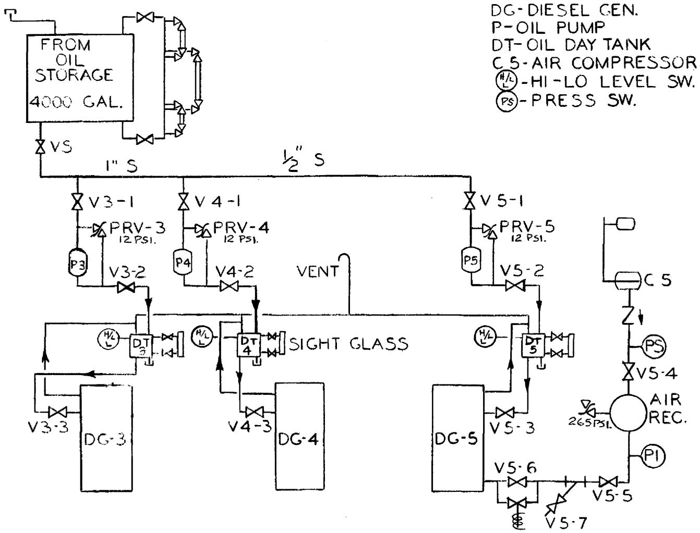  
FIG. 4A2-1 DIESEL GENERATOR OIL AND AIR PIPING

# 4B INSTRUMENT AIR SYSTEM STARTUP CHECK LIST

The instrument air system will normally be operated with one instrument air compressor, one air dryer and both air receivers in service, with the second instrument air compressor and air dryer in standby.

This check list covers the startup of the instrument air system for normal operation, and assumes that related portions of the electric system check list have been completed. Some portions of the system may already be in service; however, each item listed should be checked.

Instrument AIR COMPRESSORS AND DRYERS (Diesel House)

Init. Date/Time

1.1 Close, or check closed the cooling water drain valve, V-881-B.   
1.2 Close, or check closed, the following valves in the instrument air compressor and after cooler cooling water circuits:

V-880-1C V-880-2C   
V-881-1C V-881-2C

1.3 Open, or check open, the following valves in the instrument air compressor and after cooler cooling water circuits:

V-881-A V-881-1A V-881-1B   
V-881-2A V-881-2B V-880-1B\*   
V-880-2B\* V-880-1A V-880-1D\*\*   
V-880-2A V-880-2D\*\*

1.4 If the cooling tower water system is in operation, close, or check closed, V-872

If this system is not in operation, open, or check open, V-872

NOTE: If the instrument air compressor is already in operation, the valves marked * should be left throttled, and the valves marked ** should be left closed.

Init. Date/Time

1.5 Check that the oil level is visible in the bulls eye of both instrument air compressors. No. 1 No. 2

1.6 Close or check closed, the following valves in the air system: V-9110-C V-9113-C V-9113-E V-9113-F V-9114-C V-9114-E V-9114-F V-9115-E V-9116 V-9119* V-9120-C V-9123-C V-9123-E V-9123-F V-9124-C V-9124-E V-9124-F V-9125-E V-9126 V-9129* V-9130 V-9132 V-9000-3 V-9000-4 V-9000-5

*NOTE: If an instrument air compressor and air dryer are already in operation, either V-9119 or V-9129 will be open, and should be left open.

1.7 Open, or check open, the following valves in the air system:

V-AC1-A V-AC1-B V-AC1-C

V-9110-A V-9110-B V-9111

V-D1 V-9113-A V-9113-B

V-9113-F V-9114 V-9114-A

V-9114-B V-9114-D V-R1

V-9115-A V-AC2-A V-AC2-B

V-AC2-C V-9120-A V-9120-B

V-9121 V-D2 V-9123-A

V-9123-B V-9123-D V-9124

V-9124-A V-9124-B V-9124-D

V-R2 V-9125-A V-9000

V-9000-1 V-9000-2 V-9001

(Control Room)

1.8 Check that instrument air compressor

Init. Date/Time

1.8 (continued)

selector switch (S-53) is set to the compressor which is in operation, or to the compressor to be operated and start the compressor selected.

(Diesel House)

1.9 After the instrument air compressor has been started, check that the cooling water flow to the compressor has been established. Close the temperature control valve by-pass valves V-880-1D and V-880-2D   
1.10 Turn the electric power on to both air dryers and note that both air dryers are cycling. Lighting panel T, Bkrs. 15 and 17.   
1.11 Adjust the purge flow through both air dryers to 19 C F M (4.5 on rotameter).   
1.12 Adjust the bleed, from the moisture indicator petcocks, on both air dryers to a small bleed.   
1.13 When the moisture indicators on both air dryers are blue, open or check open valve V-9119 to place air dryer No. 1 in service, or V-9129 to place air dryer No. 2 in service.   
1.14 Momentarily open valves V-9116 and V-9126 to blow down the filters downstream of the air dryers.   
1.15 Close V-9129, V-9125-A if dryer unit No. 1 is to remain in service, or close V-9119, V-2115-A, if dryer unit No. 2 is to remain in service. Dryer unit No. ______ is in service Close bleed petcock on standby dryer De-energize:standby dryer

Lighting Panel T Bkr. 15 for Dryer No. 1.  
Lighting Panel T Bkr. 17 for Dryer No. 2.

Init. Date/Time

1.16 Check that moisture indicator XmI-9000 in line 9000 is less than $20\%$ .   
1.17 Check that the instrument air pressure as indicated on PI-AC1-K and PI-AC2-K is between 70 and 85 psig.

2 TEST AUTOMATIC START OF STANDBY INSTRUMENT AIR

COMPRESSOR

(Diesel House)

2.1 With the instrument air pressure as indicated on PI-AC1-K and PI-AC2-K above 70 psig, open the blow down valve at the separator outlet of the operating instrument air compressor (V-9l10-C if instrument air compressor No.1 is operating or V-9l20-C if instrument air compressor No. 2 is operating.)   
2.2 Observe PI-AC1-K if instrument air compressor No. 1 is operating, or PI-AC2-K if instrument air compressor No. 2 is operating. The standby instrument air compressor should start and XA-4030-9 should annunciate when the instrument air pressure drops to 70 psig. Record the instrument air pressure when the standby instrument air compressor starts: _ psig and when XA-4030-9 annunciates _ psig.

NOTE: If the time required to decrease the instrument air pressure to 70 psig is excessive, the operating instrument air compressor may be momentarily stopped from the control room and restarted after the standby instrument air compressor starts.

2.3 Close valve V-9110-C or V-9120-C, whichever was opened in Step 2.1 above.

(Main Control Room)

2.4 After annunciator XA-4030-9 clears, stop

Init. Date/Time

2.4 (continued)

the air compressor which had been selected in Step 1.8, and change the instrument air compressor selector switch (S-53) to the other instrument air compressor.

2.5 Start the selected instrument air compressor. (Diesel House)

2.6 With the instrument air pressure as indicated on PI-AC1-K and PI-AC2-K above 70 psig, open the blow down valve at the separator outlet of the operating instrument air compressor (V-9l10-C if instrument air compressor No. 1 is operating or V-9l20-C if instrument air compressor No. 2 is operating.)

2.7 Observe PI-AC1-K if instrument air compressor No. 1 is operating, or PI-AC2-K if instrument air compressor No. 2 is operating. The standby instrument air compressor should start and XA-4030-9 should annunciate when the instrument air pressure drops to 70 psig. Record the instrument air pressure when the standby instrument air compressor starts: psig and when XA-4030-9 annunciates psig.

NOTE: If the time required to decrease the instrument air pressure to 70 psig is excessive, the operating instrument air compressor may be momentarily stopped from the control room and restarted after the standby instrument air compressor starts.

2.8 Close valve V-9110-C or V-9120-C, whichever was opened in Step 2.6 above.

(Control Room)

2.9 Note that annunciator XA-4030-9 clears and stop the standby instrument air compressor.

Init. Date/Time

2.10 Note the position of the instrument air compressor selector switch (S-53) and which instrument air compressor is in operation: S-53 position: IAC-1 MANUAL IAC-2 Operating instrument air compressor: IAC-1 IAC-2

3 INSTRUMENT AIR PRESSURE REDUCTION AND DISTRIBUTION (Auxiliary Control Room)

3.1 Control Room Instrument Air Reducing Station

3.1.1 Close or check closed the following

```txt
valves:   
Line 9001-1 vent valve Line 9007-1 vent valve PCV-9001-1 filter blow down valve PCV-9001-2 filter blow down valve PCV-9007-1 filter blow down valve PCV-9007-2 filter blow down valve PCV-9001-2 inlet valve and outlet PCV-9007-2 inlet valve and outlet 
```

3.1.2 Open, or check open, the following valves:

```txt
Valve to PI-9001-1 Valve to PI-9001-2  
Valve to PI-9007-1 Valve to PI-9007-2  
Valve to PI-9007-4 Valve to PI-9007-5  
PCV-9001-1 inlet valve and outlet valve  
PCV-9007-1 inlet valve and outlet valve 
```

Init. Date/Time

3.1.2 (continued)

PCV-9007-3 inlet valve and outlet valve

PCV-9007-5 inlet valve and outlet valve

Line 9001-1 shut off valve

Line 9007-1 shut off valve

3.1.3 While observing PI-9001-2, slowly

increase PCV-9001-1 setting until HSV-9001-1

opens. (30 psig). Record PI-9001-2

psig.

3.1.4 Reset PSV-9001-1 at 20 psig as indi-

ated by PI-9001-2.

3.1.5 Set PCV-9007-1 at 60 psig as indicated

by PI-9007-2.

3.1.6 While observing PI-9007-4, slowly in

crease PCV-9007-3 setting until HSV-9007-1

opens (30 psig). Record PI-9007-4

psig.

3.1.7 Reset PCV-9007-3 at 20 psig as indi

cated by PI-9007-4.

3.1.8 While observing PI-9007-5, slowly in

crease PCV-9007-5 setting until HSV-9007-2

opens (40 psig). Record PI-9007-5

psig.

3.1.9 Reset PCV-9007-5 at 30 psig as indicated

by PI-9007-5.

3.1.10 Check that the following annihilators

are clear:

XA-4030-1 XA-4031-1

XA-4031-2 XA-4031-3

3.2 Control Room Instrument Air Distribution

Init. Date/Time

3.2.1 Behind Main Panel 12, open, or check open, all valves on the following headers that are permanently connected to instrument lines. :Header 9001-1 ____ Header 9007-1 ____ Header 9008-1 ____   
3.2.2 Behind Main Panel 11, open, or check open, all valves on the following headers that are permanently connected to instrument lines. Header 9001-1 ________________ Header 9007-1 ________________ Header 9008-1 ________________.   
3.2.3 Behind Main Panel 10, open, or check open, all valves on the following headers that are permanently connected to instrument lines. Header 9001-1 ________________ Header 9007-1 ________________ Header 9008-1 ________________.   
3.2.4 Behind Main Panel 9, open, or check open, all valves on the following headers that are permanently connected to instrument lines. Header 9001-1 ________________ Header 9007-1 ________________ Header 9008-1 ________________.   
3.2.5 Behind Main Panel 8, open, or check open, all valves on the following headers that are permanently connected to instrument lines. Header 9001-1 __ __ ________________. Header 9007-1 __ __ ________________. Header 9008-1 __ __ ________________.   
3.2.6 Behind Main Panel 7, open, or check open, all valves on the following headers that are permanently connected to instrument lines. Header 9001-1 ________________ Header 9007-1 ________________ Header 9008-1 ________________.   
3.2.7 Behind Main Panel 6, open, or check open, all valves on the following headers that are permanently connected to instrument

Init. Date/Time

3.2.7 (continued)

lines. Header 9001-1 Header 9007-1 Header 9008-1

3.2.8 Behind Main Panel 5, open, or check open, all valves on the following headers that are permanently connected to instrument lines. Header 9001-1 __ Header 9007-1 __ Header 9008-1 __.   
3.2.9 Behind Main Panel 4, open, or check open, all valves on the following headers that are permanently connected to instrument lines. Header 9001-1 __ Header 9007-1 __ Header 9008-1 __.   
3.2.10 Behind Main Panel 3, open, or check open, all valves on the following headers that are permanently connected to instrument lines. Header 9001-1 ________________ Header 9007-1 ________________ Header 9008-1 ________________.

(High Bay)

3.3 Sampler Enricher Instrument Air Reducing Station

3.3.1 Close, or check closed, the following valves: Line 9009-1 vent valve PCV-9009-1 filter blow down valve PCV-9009-2 filter blow down valve PCV-9009-2 inlet valve PCV-9009-2 outlet valve

3.3.2 Open or check open, the following valves:  
Valve to PI-9009-1 __  
Valve to PI-9009-2 __  
PCV-9009-1 inlet valve __ and outlet valve __  
Line 9009-1 shut off valve __

Init. Date/Time

3.3.3 While observing PI-9009-2, slowly increase PCV-9009-1 setting until HSV-9009-1 opens (40 psig). Record PI-9009-2 psig.   
3.3.4 Reset PCV-9009-1 at 30 psig as indicated by PI-9009-2.   
3.3.5 Check with the control room that annihilator XA-4031-5 is clear.

3.4 High Bay Area Instrument Air Distribution

3.4.1 Behind Sampler Enricher Panel 1, open, or check open, the yellow-handled valves that supply air to HSV-675 and HSV-678, and the black-handled valve that supplies air to the removal valve

NOTE: The startup of the instrument air system for the Chemical Processing Plant is covered in the Chemical Processing Plant Startup Procedure. (Filter Pit)

3.5 Containment Air Panel 1 Instrument Air

Distribution

3.5.1 Behind Containment Air Panel 1, open, or check open, the valve on header 9005-3 that supply air to the following: FCV-925-A FCV-926-A   
3.5.2 Behind Containment Air Panel 1, open, or check open, the valves on header 9011-5 that supply air to the following: Line Sl-Al FCV-934-A

(Blower House)

3.6 Blower House Instrument Air Reducing Station

3.6.1 Close, or check closed, the following valves:

Page(s) Missing

from

Original Document

(Main Control Room)

Init. Date & Time

14. Stop the component coolant pumps after the FV's in the DTC have cooled to the point where they will not thaw on loss of air.   
(High Bay)   
15. Place the necessary masonite sheets in place for alternate top shield blocks on both cells.   
16. Place alternate top shield blocks in place on the masonite, and bolt in place.

(Water Room)

17. Set the pressure control valve PCV 332 for 2 psig.   
18. Open V 332 A & B and V 342.

(High Bay)

19. When the cell pressure reaches 2 psig as indicated by PI-RC-B, check all accessible membrane welds with leak detector solution.   
(Water Room)   
20. Close V 332 A   
(Service Tunnel)   
21. Open V 955 A & B   
22. When the cell reaches atmospheric pressure as indicated by PI-RC-B close V 955 A & B   
(High Bay)   
23. Remove the top shield blocks and masonite sheets put in place in steps 4E 14.   
24. Place in their proper place the masonite sheets not placed in step 4E 14.   
25. Place the corresponding top shield blocks on these sheets of masonite and bolt in place.   
(Water Room)   
26. Open V 332 A

(High Bay)

Init. Date & Time

27. When the cell pressure reaches 2 psig check the remaining membrane welds with leak detector solution.   
28. When all leaks in the membrane have been repaired place all masonite and top shield blocks in place.   
29. Bolt down the upper shield blocks.   
30. A leak rate test of the RC and DTC will be performed at 20 psig prior to start-up after either of the cells has been opened. A number of the valves will also be tested while the cells are at 20 psig pressure. These are HCV's 930 A & B, V 930 C, V's 955 A, B, & C, CV 332, CV 342, FCV's 333 A & B, FCV's 343 A & B, CV 965, and CV 966. Open V 980 A & B before pressurizing.

There are numerous other valves, penetrations and lines which require periodic leak testing at a cell pressure of 20 psig. When these are to be tested it will be done while the cells are at 20 psig for the leak rate test. Others requiring the periodic leak test which can be performed with the cells at 0 psig will be tested when the cells are depressurized after the 20 psig leak rate test. The penetrations and their locations are given in tables 4.1 and 4.2 in the MSRE Design and Operations Report, Part VIII.

The detailed steps for the leak tests follow. The first group is tested each time a leak rate test at 20 psig is performed. The second group is tested periodically during one of the 20 psig leak rate tests. The third group is tested periodically with the second group following the 20 psig leak rate test.

Check

31. HCV 930 A & B and V 930 C in the following

manner.

HP coverage and gas masks are required.

(Control Room)

31.1 Check to see that the following freeze

valves are frozen.

FV 104

FV 105

FV 106

FV 107

FV 108

FV 109

31.2 Check to see that the space coolers are

in operation.

31.3 Check to see that the component coolant pumps

are stopped.

(Transmitter Room)

31.4 Check the drain tank weight indicators to see

that all the salt is in the tanks.

(Water Room)

31.5 Set PCV 332 for 20 psig.

31.6 Open V 332 A.

(Special Equipment Room)

31.7 Close V 980 A & B after the cell pressure

reaches 20 psig.

31.8 Close V 332 A.

(Service Tunnel)

31.9 Connect an instrument air line with a

pressure regulator having a gauge of 0 to

50 psi minimum range and a rotameter having

a range of 0-100 cc/min to valve 930 C.

31.10 Connect a 0-10 cc/min range rotameter to

the lantern ring plug on HCV 930 A.

31.11 Connect a 0-10 cc/min range rotameter to the

lantern ring plug on HCV 930 B.

Init. Date & Time

31.12 Open V 930 C.   
31.13 Pressurize the region between HCV 930 A and HCV 930 B to 20 psig.   
31.14 Check the external parts of V 930 C, HCV 930 A and HCV 930 B with leak detector solution. No leakage acceptable.   
31.15 Flow through V 930 C   
31.16 Leakage from lantern ring on HCV 930 A Acceptable leakage 5: scc/min   
31.17. Leakage from lantern ring on HCV 930 B ______. Acceptable leakage 5 scc/min   
31.18 Subtract the sum of the leakage through the lantern rings from the leakage through V 930 C. This is the leakage through HCV 930 B. Leakage _______. The acceptable leakage is 50 scc/min.   
31.19 If the leakages exceed the acceptable values make repairs and recheck as above.   
31.20 Close V 930 C.   
31.21 Disconnect the instrument air line and reverse the rotameter connection to V 930 C. Do not reconnect the air line.   
31.22 Connect a bleed line from V 930 C to exhaust into line 931. Open V 930 C slowly to relieve the pressure between HCV 930 A and HCV 930 B.   
31.23 With V 930 C open and pressure relieved read the rotameter. This is the leakage through HCV 930 A. Leakage _____. The acceptable leakage is 50 scc/min.   
31.24 Close V 930 C and cap.   
31.25 If repairs on HCV 930 A are required which necessitates opening the 30 in. duct (line 930) complete all other containment checks

Init. Date & Time

Init. Date & Time

31.25 (Continued)   
required at a cell pressure of 20 psig before lowering this pressure to make required repairs.   
31.26 If the leakage rates on HCV 930 A & B and V 930 C are now acceptable tag the valves closed.   
32. Check V 955 A, B, & C in the following manner after testing HCV 930 A & B and V 930 C. HP coverage and gas masks are required. (Control Room)   
32.1 Check PI-RC-B to see that the cell pressure is 20 psig.   
32.2 Connect the instrument air line with a pressure regulator having a gauge of 0-50 psi minimum range and a rotameter having a range of 0-10 cc/min to valve V 955 C.   
32.3 Open V 955 C.   
32.4 Pressurize the line between V 955 A, V 955 B to 20 psig with the air.   
32.5 Leak test the exterior of V 955 A, B, & C with leak detector solution. No leakage acceptable.   
32.6 If repairs are required on V 955 A the cell will have to be vented to atmospheric pressure. All other containment tests to be performed at a cell pressure of 20 psig should be completed prior to venting the cell.   
32.7 When the no leak requirement of step 32.5 is satisfied read the rotameter. This is the leakage through V 955 B.   
32.8 Close V 955 C.   
32.9 Disconnect the air line and reverse the rotameter connection. Do not reconnect the air line.

32.10 Open V 955 B to relieve the pressure between V 955 B and V 955 A then close V 955 B.

Init. Date & Time

32.11 Slowly open V 955 C and read the rotameter. This is the leakage through V 955 A. Leakage ______. Acceptable leakage 2 cc/min.

32.13 Close V 955 C, cap and tag closed.

(Water Room)

33. Check CV 332 in the following manner. HP coverage and gas masks are required. The RC should be at 20 psig.

33.1 Close V 332B.   
33.2 Connect a 0-10 cc/min rotameter to the tap upstream of CV 332.   
33.3 Read the leakage through CV 332. Acceptable leakage 2 scc/min. Leakage   
33.4 Disconnect the rotameter and cap the tap.

34. Check CV 342 in the following manner. HP coverage and gas masks are required. The RC should be at 20 psig.

34.1 Close V 342.   
34.2 Connect a 0-10 cc/min rotameter to the tap upstream of CV 342.   
34.3 Read the leakage through CV 342. Acceptable leakage 2 scc/min. Leakage   
34.4 Disconnect the rotameter and cap the tap.

35. Check FCV 333 A1 & A2 and V 334 in the following manner. HP coverage and gas masks are required. The RC should be at 20 psig. (Liquid Waste Cell)

35.1 Connect a 0-10 cc/min rotameter to V 334 (rotameters outlet to the valve and the valve closed).

(Transmitter Room)

35.2 Open FCV 333 A2

(Liquid Waste Cell)

35.3 Pressurize V 334 with air to 20 psig. Leakage ______. Acceptable leakage 2 scc/min.

(Transmitter Room)

35.4 Close FCV 333 A2

(Liquid Waste Cell)

35.5 Open V 334. This pressurizes FCV 333 A2. Leakage Acceptable leakage 2 scc/min.

35.6 Close V 334 disconnect the air line and reverse the rotameter connection.

35.7 Connect a $1/4''$ Copper tube to the rotameter and extend it into the ventilation duct pullout.

35.8 Slowly open V 334 to relieve the pressure then read the rotameter for leakage through FCV 333 A1. Leakage ______. Acceptable leakage 2 scc/min.

35.9 Close V 334, disconnect the tube and rotameter and cap the valve tag FCV 333 A1 & A2 and V 334 closed.

36. Check FCV 343 A1 & A2 and V 344 in the following manner. HP coverage and gas masks are required. The RC should be at 20 psig. (Liquid Waste Cell)

36.1 Connect a 0-10 cc/min rotameter to V 344 (rotameter outlet to the valve and the valve closed).

36.2 Connect the instrument air line with a pressure regulator having a gauge of 0-50 psi minimum range to the rotameter.

Init. Date & Time

(Transmitter Room)

36.3 Open FCV 343 A2.

(Liquid Waste Cell)

36.4 Pressurize V 344 with air to 20 psig.

Leakage . Acceptable leakage

2 scc/min.

(Transmitter Room)

36.5 Close FCV 343 A2

(Liquid Waste Cell)

36.6 Open V 344. This pressurizes FCV 343 A2.

Leakage .Acceptable leakage

2 scc/min.

36.7 Close V 344, disconnect the air line and

reverse the rotameter connection.

36.8 Connect a 1/4" copper tube to the rotameter

and extend it into the ventilation duct

pul1out.

36.9 Slowly open V 344 to relieve the pressure

then read the rotameter for leakage through

FCV 343 A1. Leakage Acceptable

leakage 2 scc/min.

36.10 Close V 344, disconnect the tube and rota-

meter and cap the valve. Tag FCV 343, A1

& A2 and V 344 closed.

# (West Tunnel)

37. Check CV 965 in the following manner. Check while

the RC is at 20 psig. HP coverage and gas masks

required.

37.1 Connect a 0-10 cc/min rotameter to the tap

upstream of CV 965 with a tube leading from

the rotameter to the ventilation duct.

37.2 Read the rotameter for leakage. Leakage

Acceptable leakage 2 scc/min.

Init. Date & Time

37.3 Disconnect the rotameter, $1 / 4''$ tube, and cap the tap.   
37.4 Check lines RCC-6, RCC-10, and LT RC-c with leak detector solutions. No leakage acceptable.

# (Electric Service Area)

38. Check CV 966 in the following manner while the cell is at 20 psig. HP coverage required.

38.1 Connect a 0-10 cc/min rotameter to the tap upstream of CV 966 with a tube leading from the rotameter to the ventilation duct.   
38.2 Read the rotameter for leakage. Leakage Acceptable leakage 2 scc/min.   
38.3 Disconnect the rotameter, tube, and cap the tap.   
38.4 Check lines DTC-6 and DTC-10 and LT DTC with leak detector solution. No leakage acceptable.

39. The following lines, valves, and containment items will be leak checked periodically with the RC and DTC at 20 psig. (Par. 40 through Par. 51)

# (Special Equipment Room)

40. Check CV's 516 A & B, ESV 516 A1, ESV 516 A2 and Cont. Encl. No. l in the following manner. HP coverage and gas masks required.

40.1 Open V CE-1 and check the valve outlet with leak detector solution. No leakage acceptable. Leakage may come from the helium supply or RC which is at 20 psig.   
40.2 If leakage occurs open CE No. 1 and leak check the valves fitting and connections leading to the RC with leak detector solutions.

Init. Date & Time

40.3 Repair the Leaks.   
(Diesel House)   
40.4 Close V 500 G and allow the pressured downstream to relieve itself.   
(Special Equipment Room)   
40.5 Close V 516.   
40.6 Remove CV's 516 A & B from the system and bench test at 40 psig with He. Leakage Acceptable leakage 1 scc/min.   
40.7 Reinstall CV's 516 A & B and break line 516 upstream of ESV 516 A1 and downstream of ESV 516 A2.   
40.8 Connect a He cyl.. to the downstream side of ESV 516 A2 with a regulator and 0-50 psi minimum range gauge, and connect a 0-10 cc/min rotameter to the inlet side of ESV 516 A1.   
40.9 Pressurize downstream of ESV 516 A2 to 40 psig and read the rotameter. Acceptable leakage 1 scc/min. Leakage   
40.10 Reconnect all lines. (Diesel House)   
40.11 Open V 500 G.   
40.12 Check to see that FCV 516.is open or partially open.   
40.13 Check line 516 (all valves fittings etc.) from ESV 516 Al to V 516 with leak detector solutions. No leakage acceptable. The cover gas supply must be in operation at this time and pressure on this section of the line. See Section 4.4 of the MSRE Operating Procedures.   
40.14 Open V 516 and close CE No. 1.   
40.15 Connect the helium line to V CE-1 and pressurize CE No. 1 to 20 psig.

Init. Date & Time

Init. Date & Time

40.16 Check the entire enclosure and V CE-1 with leak detector solution. No leakage acceptable.   
40.17 Close V CE-1 while the enclosure is pressurized and disconnect the line.   
40.18 Check the outlet of V CE-1 for leaks with leak detector solutions. No leakage acceptable.   
40.19 Open V CE-1 to relieve the pressure. Close V CE-1 and tag closed.

41. Check CV's 592 A & B, CV's 593 A & B, CV's 596 A & B, CV's 589 A & B, CV's 599 A & B, CV's 600 A & B, HCV's 593 B1, 593 B2 and 593 B3, HCV's 599 B1, 599 B2, and 599 B3 and Containment Enclosure No. 2 which contains the above valves, in the following manner. HP coverage and gas masks are required.

(Special Equipment Room)

41.1 Open V CE-2 and check the valve outlet with leak detector solution. No leakage acceptable. Leakage may come from the helium supply or RC which is at 20 psig.   
41.2 If leakage occurs open CE No. 2 and leak check the valves, fittings, and connections leading to the RC to locate the leaks with leak detector solution.   
41.3 Repair the leaks.

(Transmitter Room)

41.4 Close V 501. (Special Equipment Room)   
41.5 Close V 589 C, V 592 C, V 593 C, V 596 C, V 599 C, and V 600 C.

(Control Room)

41.6 Close HCV's 593 B1, B2, B3, and open HCV's 593 B4, and B5 (S36 in OFF position).

Init. Date & Time

(Special Equipment Room)

41.7 Remove CV's 589 A & B, 592 A & B, 593 A & B, 596 A & B, 599 A & B, and 600 A & B from the system but do not break the connection between the A & B valves.   
41.8 Disconnect line 593 at the upstream side of V 593 C and connect the He CYL., with regu-lator and gauge used in step 40.6,to line 593.   
41.9 Pressurize through line 593 to 20 psig. This pressurizes the downstream side of HCV 593 B1, B2, and B3.   
41.10 Connect a short piece of plastic tube to the upstream side of HCV 593 B1 and check the open end of this tube with leak detector solution. No leakage acceptable.   
41.11 Repeat step 41.10 on HCV 593 B2. No leakage acceptable.   
41.12 Repeat step 41.10 on HCV 593 B3. No leakage acceptable.   
41.13 Disconnect the He cyl... from line 593 and reconnect the line to V 593 C.   
41.14 Disconnect line 589 upstream of V 589 C and connect the He cyl. with regulator and gauge to it.

(Transmitter Room)

41.15 Hold S38 in Ref. Block position.   
(Special Equipment Room)   
41.16 Pressurize line 589 to 20 psig and repeat: step 41.10 on HCV 599 B2. No leakage acceptable..   
41.17 Disconnect the He cyl. and reconnect line 589. Disconnect line 599 upstream of V 599 C and connect the He cyl. to this line.

Init. Date & Time

(Transmitter Room)

41.18 Hold S38 in the No. 1 Block position.

(Special Equipment Room)

41.19 Pressurize line 599 to 20 psig and repeat step 41.10 on HCV 599 Bl. No leakage acceptable.   
41.20 Disconnect the He cyl. and reconnect line 599. Disconnect line 600 upstream of V 599 C and connect the He cyl.. to this line.

(Transmitter Room)   
41.21 Hold S38 in No. 2 Block position.   
(Transmitter Room)   
41.22 Pressurize line 600 to 20 psig and repeat step 41.10 for HCV 599 B3. No leakage acceptable.   
41.23 Disconnect the He cyl. and reconnect the line.   
41.24 Check CV's 589 A & B simultaneously by connecting the He cyl. with regulator and gauge to the downstream side of CV 589 B and pressurizing to 20 psig. Connect a short piece of plastic tube to the upstream side of CV 589 A. Check for leakage over the entire assembly with leak detector solution. No leakage acceptable.   
41.25 Check CV's 592 A & B in the same manner as used on CV's 589 A & B. No leakage acceptable..   
41.26 Check CV's 593 A & B in the same manner as used on CV's 589 A & B. No leakage acceptable.   
41.27 Check CV's 596 A & B in the same manner as used on CV's 589 A & B. No leakage acceptable..

41.28 Check CV's 599 A & B in the same manner as used on CV's 589 A & B. No leakage acceptable..   
41.29 Check CV's 600 A & B in the same manner as used on CV's 589 A & B. No leakage acceptable..   
41.30 Install the check valves tested in 41.24 through 41.29 back in the containment enclosure.

(Transmitter Room)

41.31 Open V 501.   
41.32 Set S38 in the OFF position.

(Control Room)

41.33 Set S36 in the No. 1 position.   
(Special Equipment Room)   
41.34 Leak test all valves, fittings, and connections in CE No. 2 with leak detector solution. No leakage acceptable.   
41.35 Open V 589 C, 592 C, 593 C, 596 C, 599 C, and 600 C.   
41.36 Close CE No. 2 and connect the He cy. 1 with regulator and gauge to V CE-2.   
41.37 Pressurize the CE No. 2 to 20 psig and check all possible sources of leaks with leak detector solution. No leakage acceptable.   
41.38 Close V CE-2 while the enclosure is pressurized and disconnect the He cyl. Test V CE-2 inlet for leakage with leak detector solution. No leakage acceptable.   
41.39 Open V CE-2 to relieve the pressure, reclose and tag the valve closed.

(N. Elec. Ser. Area)

42. Check CV's 519 A & B, HCV's 519 A & B and Containment Enclosure No. 6 in the following manner. HP coverage and gas masks are required.

Init. Date & Time

Init. Date & Time

42.1 Open V CE-6 and check the outlet of this valve with leak detector solution. No leakage acceptable. Leakage may come from the helium supply or RC which is at 20 psig.   
42.2 If leakage occurs, open CE No. 6 and leak check the valves, fittings, and connection leading to the RC with leak detector solution.   
42.3 Repair the leaks.   
42.4 Close V 519 A and V 519 B.   
42.5 Close HCV's 519 A and B.   
(N. Elec. Service Area)   
42.6 Connect a He cyl. with regulator and a gauge having a 0-50 psi minimum range to the tap upstream of V 519 B.   
42.7 Break line 519 at the downstream side of HCV 519 B, at the upstream side of HCV 519 A and between HCV 519 A and B.   
42.8 Connect a small piece of plastic tubing to line 519 coming from the check valves. Pressurize the check valves to 20 psig and check for leakage at the plastic tubing with leak detector solution. Leakage ______. Acceptable leakage 1 scc/min.   
42.9 Connect the He cyl. with regulator and gauge to the downstream side of HCV 519 B and connect the short piece of plastic tube to the upstream side. Pressurize HCV 519 B to 20 psig and check for leakage at the plastic tube with leak detector solution. No leakage acceptable.

42.10 Connect the He cyl. regulator and gauge to the downstream side of HCV 519 A and the plastic tube with leak detector solution. No leakage acceptable.   
42.11 Reconnect all breaks in line 519 and cap the tap. Open V 519 A.   
42.12 Open HCV's 519 A and B. (N. Elec. Service Area)   
42.13 Check all connections, valves, and fittings from V 519 A to V 519 B with leak detector solution. No leakage acceptable.   
42.14 Close V 519 A, close HCV's 519 A and B, open V 519 B, and close CE No. 6.   
42.15 Connect the He cyl. with regulator and gauge to V CE-6 and pressurize to 20 psig.   
42.16 Check CE No. 6 for leaks with leak detector solution. No leakage acceptable.   
42.17 Close V CE-6 with the enclosure pressurized and disconnect the He cyl.   
42.18 Check V CE-6 outlet for leaks with leak detector solution. No leakage acceptable.   
42.19 Open V CE-6 to relieve the pressure, close V CE-6 and tag closed.

43. Check CV's 572 A & B and CE No. 3 in the following manner. HP coverage and gas masks required. (Control Room)

43.1 Open HCV 573 A1 and set PIC 517 A for 5 psig.   
(N. Elec. Ser. Area)   
43.2 Open V 517.   
43.3 Open HCV 572 A1 by operating HCV 572 A2 with a jumper from the 48v DC supply 1P3. Leave open for 5 minutes and then close.

Init. Date & Time

43.4 Close V 517.   
43.5 Open V CE-3, CE No. 3 and close V 572.   
43.6 Disconnect PT 572 B and connect the He cyl. with regulator and gauge to line 572 at this point. Uncap the tap upstream of CV 572 A.   
43.7 Pressurize the line to 20 psig and check for leaks at the tap with leak detector solution. No leakage acceptable.   
43.8 Disconnect the He cyl. and reconnect PT 572 B.   
43.9 Open V 517. (Control Room)   
43.10 Set PIC 517 A for 20 psig. (N. Elec. Ser. Area)   
43.11 Open HCV 572 A1 by operating HCV 572 A2 with a jumper from the 48 VDC supply IP3.   
43.12 Check all valves and fittings from HCV 572  
Al to V 572 with leak detector solution.  
No leakage acceptable.   
43.13 Close HCV 572 Al, open V 572 and close the containment enclosure.   
43.14 Connect the He cyl. with regulator and gauge to V CE-3 and pressurize CE No. 3 to 20 psig.   
43.15 Check the CE with leak detector solution. No leakage acceptable.   
43.16 Close V CE-3 while the CE is pressurized and disconnect the He cyl.. Check the outlet of VCE-3 with leak detector solution. No leakage acceptable.   
43.17 Open V CE-3 to relieve the pressure then close and tag closed.

Init. Date & Time

Init. Date & Time

44. Check CV's 574 A & B and CE No. 4 in the following manner. HP coverage and gas masks required. (Control Room)

44.1 Open HCV 575 A1 and set PIC 517 A for 5 psi.   
(N. Elec. Ser. Area)   
44.2 Open V 517.   
44.3 Open HCV 574 A1 by operating HCV 574 A2 with a jumper from the 48 V DC supply LP3. Leave open for 5 minutes and then close.   
44.4 Close V 517.   
44.5 Open V CE-4, CE-No. 4 and close V 574.   
44.6 Disconnect PT 574 B and connect the He cyl. with regulator and gauge to line 574 at this point. Uncap the tap upstream of CV 574 A.   
44.7 Pressurize the line to 20 psig and check for leaks at the tap with leak detector solution. No leakage acceptable.   
44.8 Disconnect the He cyl.. and reconnect PT 574 B.   
44.9 Open V 517.

(Control Room)   
44.10 Set PIC 517 A for 20 psig.   
(N. Elec. Serv. Area)   
44.11 Open HCV 574 A1 by operating HCV 574 A2 with a jumper from the 48V DC supply 1P3.   
44.l2 Check all valves and fittings from HCV 574 Al to V 574 with leak detector solution. No leakage acceptable.   
44.13 Close HCV 574 Al, open V 574 and close CE No. 4.   
44.14 Connect the He cyl. with regulator and gauge to V CE-4 and pressurize the CE to 20 psig.

Init. Date & Time

44.15 Check the CE with leak detector solution. No leakage acceptable.   
44.16 Close V CE-4 while the CE is pressurized and disconnect the He cyl.. Check the outlet of V CE-4 with leak detector solution. No leakage acceptable.   
44.17 Open V CE-4 to relieve the pressure then close and tag closed.

45. Check CV's 576 A & B and CE No. 5 in the following manner. HP coverage and gas masks required. (Control Room)

45.1 Open HCV 577 A1 and set PIC 517 A for 5 psi. (N. Elec. Serv. Area)   
45.2 Open V 517.   
45.3 Open HCV 576 A1 by operating HCV 576 A2 with a jumper from the 48V DC supply 1P3. Leave open for 5 minutes and then close.   
45.4 Close V 517.   
45.5 Open V CE-5, CE No. 5 and close V 576.   
45.6 Disconnect PT 576 B and connect the He cyl. with regulator and gauge to line 576 at this point. Uncap the tap upstream of CV 576 A.   
45.7 Pressurize the line to 20 psig and check for leak at the tap with leak detector solution. No leakage acceptable.   
45.8 Disconnect the He cyl. and reconnect PT 576 B.   
45.9 Open V 517. (Control Room)   
45.10 Set PIC 517 A for 20 psig. (N. Elec. Serv. Area)   
45.11 Open HCV 576 A1 by operating HCV 576 A2 with a jumper from the 48V DC supply lP3.

45.12 Check all valves and fittings from HCV 576. Al to V 576 with leak detector solution. No leakage acceptable.   
45.13 Close HCV 576 A1, open V 576 and close CE No. 5.   
45.14 Connect the He cyl. with regulator and gauge to V CE-5 and pressurize the CE to 20 psig.   
45.15 Check the CE with leak detector solution. No leakage acceptable.   
45.16 Close V CE-5 while the CE is pressurized and disconnect the He cyl. Check the outlet of V CE-5 with leak detector solution. No leakage acceptable.   
45.17 Open V CE-5 to relieve the pressure then close and tag closed.

46. Tables 4.1 and 4.2 of the MSRE Design and Operations Report lists all the penetrations of the RC and DTC. Using a copy of these tables as a check sheet, check each line through these penetrations at the point where it leaves the penetration, except lines 200 in penetrations XII, and 201 in XIX, and check all accessible penetration welds with leak detector solution while the cells are at 20 psig for leak testing.

47. Check the blind flange on line 918 in the following manner. Gas masks and HP coverage required. (Special Equipment Room)

47.1 With the RC at 20 psig check the flange with leak detector solution. No leakage acceptable.

48. Check HCV 565 Al in the following manner. HP coverage and gas masks required. This test is made while the RC is at 20 psig.

Init. Date & Time

Init. Date & Time

(Control Room)

48.1 Close HCV 656 A1 by HS 565 A.   
(Vent House)   
48.2 Open V 566.   
48.3 Connect a 0-10 cc/min rotameter to V 565 B (rotameter inlet to valve) and open V 565 B. Read the rotameter. Acceptable leakage 5 scc/min.   
48.4 Disconnect the rotameter and cap V 565 B, open V 566.

49. Check CV's 802, 803 in the following manner when the vapor condensing system is at 20 psig.

(Water Room)

49.1 Close V 802 A, 803, 883.   
49.2 Open V 802 B.   
49.3 Remove the cap on the tap upstream of V 803 and catch the leakage through CV 802. Acceptable leakage 5 cc/min. Leakage ____.   
49.4 Close V 802 B and open V 803.   
49.5 Catch the leakage through CV 803 at the tap upstream of V 803. Acceptable leakage 5 cc/min. Leakage   
49.6 Close V 803, cap the tap and open V 802 A.

50. Check HSV RC E 1, HSV RC E 2, PT RC A, PdT RC E and the equalizing valve across PdT RC E in the following manner. HP coverage and gas masks are required.

50.1 Open HSV RC E 1, HSV RC E 2 and the equalizing valve across PdT RC E.   
50.2 Check with leak detector solution all connections in the piping connecting HSV RC E 1, HSV RC E 2, PT RC A, PdT RC E and the equalizing valve across PdT RC E and check the above item where leakage is possible. No leakage acceptable.

Init. Date & Time

51. Check HV RC B, HV RC G, HV RC F the CV's in series with these valves, PxM RC B, PxM RC F, PxM RC G, PSS RC B, PSS RC F, PSS RC G, PI RC B, PI RC F, and PI RC G in the following manner. HP coverage and gas masks required.

51.1 Close HV RC B, HV RC G, and HV RC F.   
51.2 Disconnect the lines to these valves at the upstream side and check with leak detector solution. No leakage acceptable.

52. Check leakage from the thermocouple pressurization headers when the reactor and drain tank cells are at 20 psig. Proceed as follows:

52.1 Close inlet valves to each header.   
52.2 Open each vent to bleed off pressure.   
52.3 Close vents and record pressure and time.   
52.4 After 4 hours record pressures and calculate leak rate.

53. Check 9020-1 Block Valve in NESA and the vent lines connected to it in the following manner. The fuel system must be empty, HP coverage and gas mask required. (Control Room)

53.1 Jumper the block valve closed.   
(NESA)   
53.2 Connect an $\mathbf{N}_2$ cylinder to the tap upstream of the block valve with a regulator and O-50 psi minimum range pressure gauge and pressurize the header to 20 psig.   
53.3 Check the following lines with leak detector solution from the header to the penetrations. No leakage acceptable.

Line 544-4

Line 545-4

Line 546-4

Line 573-4

Line 575-4

Line 577-4

Line FFT Cl - 5

Line FFT C2 - 5

Line FD 1 Cl - 5

Line FDL C2 - 5

Line FD2 C1 - 5

Line FD2 C2 - 5

53.4 Disconnect line 9020-1 where it joins the ventilation duct and connect a 0-10 cc/min rotameter to it with line 9020-1 at 20 psig upstream of the block valve.   
53.5 Read the rotameter. Acceptable leakage 10 scc/min. Leakage   
53.6 Disconnect the $\mathbf{N}_2$ cyl., cap the tap, and reconnect line 9020-1 to the ventilation duct.

54. Check 9020-1 block valve in SESA and the vent lines connected to it in the following manner. The fuel system must be empty, HP coverage and gas masks are required.

(Control Room)

54.1 Jumper (the block valve) closed.   
(SESA)   
54.2 Connect an $\mathbf{N}_2$ cylinder to the tap upstream of the block valve with a regulator and 0-50 psi minimum range pressure gauge and pressurize the header to 20 psig.   
54.3 Check the following lines with leak detector solution from the header to the penetrations. No leakage acceptable.

Line 903-4   
Line 915-4   
Line 523-4   
Line 956-4   
Line 961-4   
Line 962-4   
Line 963-4

54.4 Disconnect line 9020-1 where it joins the ventilation duct and connect a O-10 cc/min rotameter to it with line 9020-1 at 20 psig upstream of the block valve.   
54.5 Read the rotameter. Acceptable leakage 10 scc/min. Leakage   
54.6 Disconnect the $\mathbf{N}_2$ cylinder, cap the tap and reconnect line 9020-1 to the ventilation duct.

55. Check the fuel pump and coolant pump oil system for containment in the following manner. HP coverage and gas masks are required. (Service Tunnel)

55.1 Close V 513A, V 711, V 703A, V 762 A, B, & C, V 716, V 706, V 590, V 535.

Init. Date & Time

55.2 Connect a He cyl. with regulator and 0-50 psi minimum range pressure gauge to the tap upstream of PCV 513 A2.   
55.3 Connect a 0-10 cc/min rotameter to the tap upstream of CV 513.   
(Control Room)   
55.4 Set PIC 513 A for 25 psig. (Service Tunnel)   
55.5 Open V 513 B and V 535 A.   
55.6 Pressurize OT-1 to 20 psig with the He.   
55.7 Read the rotameter upstream of CV 513. Acceptable leakage 5 scc/min. Leakage _.   
55.8 Open V 711 and check the disconnect upstream of CV 711 for leakage with leak detector solution. No leakage acceptable. Reclose V 711.   
55.9 Check V 716, 703C & D, 762 B & C for visible oil leakage. No leakage acceptable.   
55.10 Connect a O-10 cc/min rotameter to the tap downstream of PCV 513 A2.   
55.11 Read the rotameter. Acceptable leakage 5 scc/min. Leakage   
55.12 Turn off the He, disconnect the rotameter downstream of PCV 513 A2 and cap the tap. Open V 535 B to relieve the pressure and close V 535 B.   
55.l3 Disconnect the He cyl. and reinstall the rotameter downstream of PCV 513 A2. (Control Room)   
55.14 Set PIC 513 A for O psig. (Service Tunnel)   
55.15 Open V 513 A, read the rotameter downstream of PCV 513 A2. This is the leakage through PCV 513 A1 from the He supply line 510 at

Init. Date & Time

55.15 (Continued)

40 psig. Acceptable leakage 10 scc/min.

Leakage

55.16 Close V 513 A, open V 535 B to relieve the

pressure then close V 535 B.

55.17 Close V 510 A, V 761, V 753, V 766, V 756,

V 591, V 534 B.

55.18 Connect a He cyI. with regulator and a 0-50

psi minimum range pressure gauge to the tap

upstream of CV 510.

55.19 Connect a 0-10 cc/min rotameter to the tap

upstream of CV 510.

(Control Room)

55.20 Set PIC 510 A for 25 psig.

(Service Tunnel)

55.21 Open V 510 B and V 534 A.

55.22 Pressurize OT-2 to 20 psig with the He.

55.23 Read the rotameter upstream of CV 510.

Acceptable leakage 5 scc/min. Leakage

55.24 Open V 761 and check the disconnect upstream

of CV 761 for leakage with leak detector

solution. No leakage acceptable. Reclose

V 761.

55.25 Check V 766, V 753 D for visible oil leakage.

No leakage acceptable.

55.26 Connect a 0-10 cc/min rotameter to the tap

downstream of PCV 510 A2.

55.27 Read the rotameter. Acceptable leakage

5 SCC/min. Leakage.

55.28 Turn off the He, disconnect the rotameter

downstream of PCV 510 A2 and cap the tap.

Open V 534 to relieve the pressure and close

V 535 B.

55.29 Disconnect the He cyl. and reinstall the rotameter downstream of PCV 510 A2.

Init. Date & Time

(Control Room)   
55.30 Set PIC 510 A for O psig.   
55.31 Open V 510 A, read the rotameter downstream of PCV 510 A2. This is the leakage through PCV 510 A1 from the He supply at 40 psig. Acceptable leakage 10 scc/min. Leave the rotameter connected to check CV 534. Leakage   
55.32 Close V 510 A, open V 534 B to relieve the pressure then close V 534 B.   
55.33 Close V's 534 A & B and 535 A.

(Vent House)   
55.34 Close V 560 B, connect a He cyl. with regulator and a 0-50 psi minimum range gauge to V 560 A.   
55.35 Open V 560 A and pressurize the line to 20 psig.

(Service Tunnel)

55.36 Open V 534 B and read the rotameter downstream of PCV 510 A2. Acceptable leakage 5 scc/min. Leakage   
55.37 Close V 534 B disconnect the rotameter. Cap the tap and open V 534 B.   
55.38 Connect the rotameter to the tap upstream of CV 535 and open V 535 B.   
55.39 Read the rotameter for leakage through CV 535. Acceptable leakage 5 scc/min. Leakage   
55.40 Close V 535 B. Disconnect the rotameter, cap the tap and open V 535 B.

(Vent House)

55.41 Close V 560A, disconnect the He cyl., cap the valve outlet and open V 560 B.

56. Check the following valves, fittings, lines, etc., with the RC at atmospheric pressure.   
57. To check HSV FDI C1 A and line to WT FDI C1 the fuel systems must be empty. HP coverage and gas masks are required.

(ESA)

57.1 Disconnect line FD1 Cl-27 at HSV FD1 Cl A and plug the line temporarily to stop air leakage.   
(Transmitter Room)   
57.2 Disconnect line FD1 Cl-1 at TB 3 x 30.   
57.3 Connect a 0-10 cc/min rotameter and $\mathbb{N}_2$ cyl. with regulator and O-50 psig minimum range gauge to the end of the line to HSV FDI Cl A and pressurize to 40 psig.   
57.4 Read the rotameter. Acceptable leakage 4 scc/min. Leakage

(ESA)   
57.5 Reconnect line FDL Cl-27 to HSV FDL Cl A while line FDL Cl-1 is at 40 psig. Leak check line FDL Cl-1 from HSV FDL Cl A to the penetration with leak detector solution. No leakage acceptable.

(Transmitter Room)

57.6 Disconnect $\mathbf{N}_2$ cyl. and reconnect line FDL Cl-1.

58. To check HSV FDI C1 B and line to WT FDI C1 the fuel system must be empty. HP coverage and gas masks are required.

Init. Date & Time

Init. Date & Time

# (ESA)

58.1 Disconnect line FD1 Cl-28 at HSV FD1 Cl B and plug the line temporarily to stop air leakage.   
58.2 Disconnect line Fd1 Cl-2 at TD3 x 29.   
58.3 Connect a 0-10 cc/min rotameter and $\mathbf{N}_2$ cyl. with regulator and 0-50 psig minimum range gauge to the end of the line to HSV FD1 Cl B and pressurize to 40 psig.   
58.4 Read the rotameter. Acceptable leakage 4 scc/min. Leakage   
58.5 Reconnect line FD1 Cl-28 to HSV FD1 Cl B while Line FD1 Cl-2 is at 40 psig. Leak check line FD1 Cl-2 from HSV FD1 Cl B to the penetration with leak detector solution. No leakage acceptable.

# (Transmitter Room)

58.6 Disconnect the $\mathbf{N}_2$ cyl... and reconnect line FD1 C1-2.

59. To check HSV FDI C1 C and line to FDI the fuel systems must be empty. HP coverage and gas masks are required.

# (ESA)

59.1 Disconnect line FD1 Cl-29 at HSV FD 1 Cl C and plug the line temporarily to stop air leakage.

# (Transmitter Room)

59.2 Disconnect line Fd1 C1-3 at TB3 x 28.   
59.3 Connect a 0-10 cc/min rotameter and $\mathbf{N}_2$ cyl. with regulator and 0-50 psig minimum range gauge to the end of the line to HSV FD1 Cl C and pressurize to 40 psig.   
59.4 Read the rotameter. Acceptable leakage 4 scc/min. Leakage

Init. Date & Time

(ESA)

59.5 Reconnect line FDI Cl-29 to HSV FDI Cl C while line FDI Cl-3 is at 40 psig. Leak check line FDI Cl-3 from HSV FDI Cl C to the penetration with leak detector solution. No leakage acceptable.

(Transmitter Room)

59.6 Disconnect the $\mathbf{N}_2$ cyl. and reconnect line FD1 Cl-3.

60. To check HSV FDI C1 D and line to WT FDI C1 the fuel system must be empty. HP coverage and gas masks are required.

(ESA)

60,l Disconnect line FDI Cl-30 at HSV FDI Cl D and plug the line temporarily to stop air leakage.   
60.2 Connect a 0-10 cc/min rotameter and $\mathbf{N}_2$ with regulator and 0-50 psig minimum range gauge to the outlet of HSV FDI Cl D and pressurize to 40 psig.   
60.3 Read the rotameter. Acceptable leakage 4 scc/min. Leakage   
60.4 Reconnect line FD1 Cl-30 to HSV FD1 Cl D while line FD1 Cl-8 is at 40 psig. Leak check line FD1 Cl-8 from HSV FD1 Cl D to the penetration with leak detector solution. No leakage acceptable.

61. To check HSV FDI C2 A and line to WT FDI C2 the fuel system must be empty. HP coverage and gas masks are required.

(ESA)

61.1 Disconnect line FD1 C2-12 at HSV FD1 C2 A and plug the line temporarily to stop air leakage.

Init. Date & Time

(Transmitter Room)

61.2 Disconnect line FD1 C2-1 at TB3 x 24.

61.3 Connect a 0-10 cc/min rotameter and $\mathbf{N}_2$ cyl. with regulator and 0-50 psig minimum range gauge to the end of the line to HSV FDI C2 A and pressurize to 40 psig.

61.4 Read the rotameter. Acceptable leakage 4 scc/min. Leakage

(ESA)

61.5 Reconnect line FD1 C2-12 to HSV FD1 C2 A while line FD1 C2-1 is at 40 psig. Leak check line FD1 C2-1 from HSV FD1 C2 A to the penetration with leak detector solution. No leakage acceptable.

(Transmitter Room)

61.6 Disconnect $\mathbb{N}_2$ cyl. and reconnect line FD1 C2-1.

62. To check HSV FDI C2 B and line to WT FDI C2 the fuel system must be empty. HP coverage and gas masks are required.

(ESA)

62.1 Disconnect line FD1 C2-13 at HSV FD1 C2 B and plug the line temporarily to stop air leakage.

Init. Date & Time

# (Transmitter Room)

62.2 Disconnect line FD1 C2-2 at TB3 x 26.   
62.3 Connect a 0-10 cc/min rotameter and $\mathbf{N}_2$ cyl. with regulator and 0-50 psig minimum range gauge to the end of the line to HSV FD1 C2 B and pressurize to 40 psig.   
62.4 Read the rotameter. Acceptable leakage 4 scc/min. Leakage

(ESA)

62.5 Reconnect line FD1 C2-13 to HSV FD1 C2 B while line FD1 C2-2 is at 40 psig. Leak check line FD1 C2-2 from HSV FD1 C2 B to the penetration with leak detector solution. No leakage acceptable.

(Transmitter Room)

62.6 Disconnect the $\mathbf{N}_2$ cyl. and reconnect line FD1 C2-2.

63. To check HSV FDI C2 C and line to WT FDI C2 the fuel system must be empty HP coverage and gas masks are required.

(ESA)

63.1 Disconnect line FD1 C2-14 at HSV FD1 C2 C and plug the line temporarily to stop air leakage.

(Transmitter Room)

63.2 Disconnect line FD3 C2-3 at TB3 x 25.   
63.3 Connect a 0-10 cc/min rotameter and $\mathbf{N}_2$ cyl. with regulator and 0-50 psig minimum range gauge to the end of the line to HSV FD1 C2 C and pressurize to 40 psig.   
63.4 Read the rotameter. Acceptable leakage 4 scc/min. Leakage

Init. Date & Time

(ESA)

63.5 Reconnect line FD1 C2-14 to HSV FD1 C2 C while line FD1 C2-3 is at 40 psig. Leak check line FD1 C2-3 . from HSV FD1 C2 C to the penetration with leak detector solution. No leakage acceptable.

(Transmitter Room)

63.6 Disconnect $\mathbf{N}_2$ cyl. and reconnect line FD1 C2-3.

64. To check HSV FDI C2 D and lines to WT FDI C2 the fuel system must be empty. HP coverage and gas masks are required.

(ESA)

64.1 Disconnect line FDI C2-31 at HSV FDI C2 D and plug the line temporarily to stop air leakage.   
64.2 Connect a 0-10 cc/min rotameter and $\mathbf{N}_2$ with regulator and 0-50 psig minimum range gauge to the outlet of HSV FD1 C2 D and pressurize to 40 psig.   
64.3 Read the rotameter. Acceptable leakage 4 scc/min. Leakage   
64.4 Reconnect line FD1 C2-31 to HSV FD1 C2 D while line FD1 C2-8 is at 40 psig. Leak check line FD1 C2-8 from HSV FD1 C2 D to the penetration with leak detector solution. No leakage acceptable.

65. To check HSV FD2 Cl A and line to WT FD2 4 the fuel system must be empty. HP coverage and gas masks are required. (ESA)

65.1 Disconnect line FD2 Cl-27 at HSV FD 2 Cl A and plug the line temporarily to stop air leakage.

Init. Date & Time

# (Transmitter Room)

65.2 Disconnect line FD2 Cl-1 at TB3 x 24.   
65.3 Connect a 0-10 cc/min rotameter and N2 cyl. with regulator and 0-50 psig minimum range gauge to the end of the line to HSV: FD2 C1 A and pressurize to 40 psig.   
65.4 Read the rotameter. Acceptable leakage 4 scc/min. Leakage   
65.5 Reconnect line FD2 Cl-27 to HSV FD2 Cl A while line FD2 Cl-1 is at 40 psig. Leak check line FD2 Cl-1 from HSV FD2 Cl A to the penetration with leak detector solution. No leakage acceptable.

# (Transmitter Room)

65.6 Disconnect the $\mathbf{N}_2$ cyl.. and reconnect line FD2 C1-1.

66. To check HSV FD2 C1 B and line to WT FD2 C1 the fuel system must be empty. HP coverage and gas masks are required.

# (ESA)

66.1 Disconnect line FD2 C2-28 at HSV and plug the line temporarily to stop air leakage.

# (Transmitter. Room)

66.2 Disconnect line FD2 Cl-2 at TB3 x 23.   
66.3 Connect a 0-10 cc/min rotameter and $\mathbf{N}_2$ cyl.. with regulator and 0-50 psig minimum range gauge to the end of the line to HSV FD2 C1 B and pressurize to 40 psig.   
66.4 Read the rotameter. Acceptable leakage 4 scc/min. Leakage   
66.5 Reconnect line FD2 Cl-28 to HSV FD2 Cl B while line FD2 Cl-2 is at 40 psig. Leak check line FD2 Cl-2 from HSV FD2 Cl B to the penetration with leak detector solution. No leakage acceptable.

Init. Date & Time

(Transmitter Room)

66.6 Disconnect $\mathbf{N}_2$ cyl. and reconnect line FD2 C1-2.

67. To check HSV FD2 C1 C and line to WT FD2 C1 the fuel system must be empty. HP coverage and gas masks are required.

(ESA)

67.1 Disconnect line FD2 Cl-29 at HSV FD2 Cl C and plug the line temporarily to stop air leakage.

(Transmitter Room)

67.2 Disconnect line FD2 Cl-3 at TB 3 x 22.

67.3 Connect a 0-10 cc/min rotameter and $\mathbf{N}_2$ cyl... with regulator and 0-50 psig minimum range gauge to the end of the line to HSV FD2 Cl C and pressurize to 40 psig.

67.4 Read the rotameter. Acceptable leakage 4 scc/min. Leakage

(ESA)

67.5 Reconnect line FD2 Cl-29 to HSV FD2 Cl C while line FD2 Cl-3 is at 40 psig. Leak check line FD2 Cl-3 from HSV FD2 Cl C to the penetration with leak detector solution. No leakage acceptable.

(Transmitter Room)

67.6 Disconnect $\mathbf{N}_2$ cyl. and reconnect line FD2 Cl-3.

68. To check HSV FD2 C1 D and line to WT FD2 C1 the fuel system must be empty. HP coverage and gas masks are required.

(ESA)

68.1 Disconnect line FD2 Cl-30 at HSV FD2 Cl D and plug the line temporarily to stop air leakage.

Init. Date & Time

68.2 Connect a 0-10 cc/min rotameter and $\mathbf{N}_2$ cyl. with regulator and 0-50 psig minimum range gauge to the outlet of HSV FD2 Cl D and pressurize to 40 psig.   
68.3 Read the rotameter. Acceptable leakage 4 scc/min. Leakage.   
68.4 Reconnect line FD2 Cl-30 to HSV FD2 Cl D while line FD2 Cl-8 is at 40 psig. Leak check line FD2 Cl-8 from HSV FD2 Cl D to the penetration with leak detector solution. No leakage acceptable.

69. To check HSV FD2 C2 A and line to WT FD2 C2 the fuel system must be empty. HP coverage and gas masks are required.

(ESA)

69.1 Disconnect line FD2 C2-12 at HSV FD2 C2 A and plug the line temporarily to stop air leakage.   
(Transmitter Room)   
69.2 Disconnect line FD2 C2-1 at TB3 x 21.   
69.3 Connect a 0-10 cc/min rotameter and $\mathbf{N}_2$ cyl, with regulator and 0-50 psig minimum range gauge to the end of the line to HSV FD2 C2 A and pressurize to 40 psig.   
69.4 Read the rotameter. Acceptable leakage 4 scc/min. Leakage   
(ESA)   
69.5 Reconnect line FD2 C2-12 to HSV FD2 C2 A while line FD2 C2-1 is at 40 psig. Leak check line FD2 C2-1 from HSV FD2 C2 A.to the penetration with leak detector solution. No leakage acceptable.

(Transmitter Room)

69.6 Disconnect $\mathbf{N}_2$ cyl. and reconnect line FD2 C2-1.

Init. Date & Time

70. To check HSV FD2 C2 B and line to WT FD2 C2 the fuel system must be empty. HP coverage and gas masks are required.

(ESA)

70.1 Disconnect line FD2 C2-13 at HSV FD2 C2 B and plug the line temporarily to stop air leakage.

(Transmitter Room)

70.2 Disconnect line FD2 C2-2 at TB3 x 20.

70.3 Connect a 0-10 cc/min rotameter and $\mathbf{N}_2$ cyl. with regulator and 0-50 psig minimum range gauge to the end of the line to HSV FD2 C2 B and pressurize to 40 psig.

70.4 Read the rotameter. Acceptable leakage 4 scc/min. Leakage

(ESA)

70.5 Reconnect line FD2 C2-13 to HSV FD2 C2 B while line FD2 C2-2 is at 40 psig. Leak check line FD2 C2-2 from HSV FD2 C2 B to the penetration with leak detector solution. No leakage acceptable.

(Transmitter Room)

70.6 Disconnect $\mathbf{N}_2$ cyl. and reconnect line FD2 C2

71. To check HSV FD2 C2 C and line to WT FD2 C2 the fuel system must be empty. HP coverage and gas masks are required.

(ESA)

71.1 Disconnect line FD2 C2-29 at HSV FD2 C2 C and plug the line temporarily to stop air leakage.

(Transmitter Room)

71.2 Disconnect line FD2 C2-3 at TB3 x 19.

Init. Date & Time

71.3 Connect a 0-10 cc/min rotameter and $\mathbf{N}_2$ cyl. with regulator and 0-50 psig minimum range gauge to the end of the line to HSV F D2 C2 C and pressurize to 40 psig.   
71.4 Read the rotameter. Acceptable leakage 4 scc/min. Leakage

(ESA)   
71.5 Reconnect line FD2 C2-29 to HSV FD2 C2 C while line FD2 C2-3 is at 40 psig. Leak check line FD2 C2-3 from HSV FD2 C2 C and pressurize to 40 psig.

(Transmitter Room)

71.6 Disconnect $\mathbf{N}_2$ cyl. and reconnect line FD2 C2-3.

72. To check HSV FD2 C2 D and line to WT FD2 C2 the fuel system must be empty. HP coverage and gas masks are required.

(ESA)

72.1 Disconnect line FD2 C2-31 at HSV FD2 C2 D and plug the line temporarily to stop air leakage.   
72.2 Connect a 0-10 cc/min rotameter and $\mathbf{N}_2$ cyl... with regulator and 0-50 psig minimum range gauge to the end of the line to HSV FFT Cl A and pressurize to 40 psig.   
72.3 Read the rotameter. Acceptable leakage 4 scc/min. Leakage   
72.4 Reconnect line FD2 C2-31 to HSV FD2 C2D while line FD2 C2-8 is at 40 psig. Leak check line FD2 C2-8 from HSV FD2 D to the penetration with leak detector solution. No leakage acceptable.

Init. Date & Time

73. To check HSV FFT Cl A and line to WT FFT Cl the fuel system must be empty. HP coverage and gas masks are required.

(ESA)

73.1 Disconnect line FFT Cl-17 at HSV FFT Cl A and plug the line temporarily to stop air leakage.   
(Transmitter Room)   
73.2 Disconnect line FFT Cl-1 at TB 3 x 16.   
73.3 Connect a 0-10 cc/min rotameter and $\mathbb{N}_2$ cyl. with regulator and 0-50 psig minimum range gauge to the end of the line to HSV FFT Cl A and pressurize to 40 psig.   
73.4 Read the rotameter. Acceptable leakage 4 scc/min. Leakage   
73.5 Reconnect line FFT Cl-17 to HSV FFT Cl A while line FFT Cl-1 is at 40 psig. Leak check line FFT Cl-1 from HSV FFT Cl A to the penetration with leak detector solution. No leakage acceptable.   
73.6 Disconnect $\mathbb{N}_2$ cyl. and reconnect line FFT Cl-1.

74. To check HSV FFT Cl B and line to WT FFT Cl the fuel system must be empty. HP coverage and gas masks are required.

(ESA)   
74.1 Disconnect line FFT Cl-18 at HSV FFT Cl B and plug the line temporarily to stop air leakage.   
(Transmitter Room)   
74.2 Disconnect line FFT Cl-2 at TB 3 x 18.   
74.3 Connect a 0-10 cc/min rotameter and $\mathbb{N}_2$ cyl. with regulator and 0-50 psig minimum range gauge to the end of the line to HSV FFT C1 B and pressurize to 40 psig.

74.4 Read the rotameter. Acceptable leakage 4 scc/min. Leakage

(ESA)

74.5 Reconnect line FFT Cl-18 to HSV FFT Cl B while line FFT Cl-2 is at 40 psig. Leak check line FFT Cl-2 from HSV FFT Cl B to the penetration with leak detector solution. No leakage acceptable.

(Transmitter Room)

74.6 Disconnect $\mathbb{N}_2$ cyl. and reconnect line FFT Cl-1.

75. To check HSV FFT Cl C and line to WT FFT Cl, the fuel system must be empty. HP coverage and gas masks are required.

(ESA)

75.l Disconnect line FFT Cl-19 at HSV and plug the line temporarily to stop air leakage. (Transmitter Room)

75.2 Disconnect line FFT C1-3 at TB3 x 17.

75.3 Connect a 0-10 cc/min rotameter and $\mathbf{N}_2$ cyl. with regulator and 0-50 psig minimum range gauge to the end of the line to HSV FFT Cl C and pressurize to 40 psig.

75.4 Read the rotameter. Acceptable leakage 4 scc/min. Leakage

(ESA)

75.5 Reconnect line FFT Cl-19 to HSV FFT Cl C while line FFT Cl-3 is at 40 psig. Leak check line FFT Cl-3 from HSV FFT Cl C to the penetration with leak detector solution. No leakage acceptable.

(Transmitter Room)

75.6 Disconnect the $\mathbf{N}_2$ cyl. and reconnect line FFT Cl-3.

Init. Date & Time

76. To check HSV FFT C1 D and line to WT FFT C1 the fuel system must be empty. HP coverage and gas masks are required.

(ESA)

76.1 Disconnect line FFT Cl-20 at HSV FFT Cl D and plug the line temporarily to stop air leakage.   
76.2 Connect a 0-10 cc/min rotameter and $\mathbf{N}_2$ cyl. with regulator and 0-50 psig minimum range gauge to the outlet of HSV FFT Cl D and pressurize to 40 psig.   
76.3 Read the rotameter. Acceptable leakage 4 scc/min. Leakage   
76.4 Reconnect line FFT Cl-20 to HSV FFT Cl D while line FFT Cl-8 is at 40 psig. Leak check line FFT Cl-8 from HSV FFT Cl D to the penetration with leak detector solution. No leakage acceptable.

77. To check HSV FFT C2 A and line to WT FFT C2 the fuel system must be empty. HP coverage and gas masks are required.

(ESA)

77.1 Disconnect line FFT C2-12 at HSV FFT C2 A and plug the line temporarily to stop air leakage.   
(Transmitter Room)   
77.2 Disconnect line FFT C2-1 at TB3 x 13.   
77.3 Connect a 0-10 cc/min rotameter and $\mathbf{N}_2$ cyl. with regulator and 0-50 psig minimum range gauge to the end of the line to HSV FFT C2 A and pressurize to 40 psig.   
77.4 Read the rotameter. Acceptable leakage 4 scc/min. Leakage

Init. Date & Time

(ESA)

77.5 Reconnect line FFT C2-12 to HSV FFT C2 A while line FFT C2-1 is at 40 psig. Leak check line FFT C2-1 from HSV FFT C2 A to the penetration with leak detector solution. No leakage acceptable.

(Transmitter Room)

77.6 Disconnect the $\mathbf{N}_2$ cyl. and reconnect line FFT C2 1.

78. To check HSV FFT C2 B and line to WT FFT C2 the fuel system must be empty. HP coverage and gas masks are required.

(ESA)

78.1 Disconnect line FFT C2-13 at HSV FFT C2 B and plug the line temporarily to stop air leakage.

(Transmitter Room)

78.2 Disconnect line FFT C2-2 at TB3 x 15.

78.3 Connect a 0-10 cc/min rotameter and $\mathbf{N}_2$ cyl. with regulator and 0-50 psig minimum range gauge to the end of the line to HSV FFT C2 B and pressurize to 40 psig.

78.4 Read the rotameter. Acceptable. leakage 4 scc/min. Leakage

(ESA)

78.5 Reconnect line FFT C2-13 to HSV FFT C2 B while line FFT C2-2 is at 40 psig. Leak check line FFT C2-2 from HSV FFT C2 B to the penetration with leak detector solution. No leakage acceptable.

(Transmitter Room)

78.6 Disconnect the $\mathbf{N}_2$ cyl. and reconnect line FFT C2-2.

Init. Date & Time

79. To check HSV FFT C2 C and line to WT FFT C2 the fuel system must be empty. HP coverage and gas masks are required.

(ESA)

79.1 Disconnect line FFT C2-14 at HSV FFT C2 6 and plug the line temporarily to stop air leakage.

(Transmitter Room)

79.2 Disconnect line FFT C2-3 at TB3 x 14.

79.3 Connect a 0-10 cc/min rotameter and $\mathbf{N}_2$ cyl. with regulator and 0-50 psig minimum range gauge to the end of the line to HSV FFT C2 C and pressurize to 40 psig.

79.4 Read the rotameter. Acceptable leakage 4 scc/min. Leakage

(ESA)

79.5 Reconnect line FFT C2-14 to HSV FFT C2 C while line FFT C2-3 is at 40 psig. Leak check line FFT C2-3 from HSV FFT C2 C to the penetration with leak detector solution. No leakage acceptable.

(Transmitter Room)

79.6 Disconnect $\mathbf{N}_2$ cyl. and reconnect line FFT C2-3.

80. To check HSV FFT C2 D and line to WT FFT C2 the fuel system must be empty. HP coverage and gas masks are required.

(ESA)

80.1 Disconnect line FFT C2-21 at HSV FFT C2 D and plug the line temporarily to stop air leakage.

80.2 Connect a 0-10 cc/min rotameter and 0-50 psig minimum range gauge to the outlet of HSV FFT C2 D and pressurize to 40 psig.

Init. Date & Time

80.3 Read the rotameter. Acceptable leakage 4 scc/min. Leakage   
80.4 Reconnect line FFT C2 21 to HSV FFT C2 D while line FFT C2-8 is at 40 psig. Leak check line FFT C2-8 from HSV FFT C2 D to the penetration with leak detector solution. No leakage acceptable.

81. To check HSV 544 A and lines to HSV 544 A1 the fuel system must be empty. HP coverage and gas masks are required.

(ESA)

81.1 Disconnect line 544-3 at HSV 544 A and plug the line temporarily to stop air leakage.   
(Transmitter Room)   
81.2 Close the valve in line 544-1 off header 9007-4 and disconnect line 544-2 at SR x 26.   
81.3 Connect a 0-10 cc/min rotameter and $\mathbf{N}_2$ cyl. with regulator and 0-50 psig minimum range gauge to the end of the line to HSV 544 A and pressurize to 40 psig.   
81.4 Read the rotameter. Acceptable leakage 4 scc/min. Leakage

(ESA)   
81.5 Reconnect line 544-3 to HSV 544 A while line 544-2 is at 40 psig. Leak check line 544-2 from HSV 544 A to the penetration with leak detector solution. No leakage acceptable.

(Transmitter Room)

81.6 Disconnect the $\mathbf{N}_2$ -cyl., reconnect line 544-2 and open the valve in line 544-1 off header 9007-4.

Init. Date & Time

82. To check HSV 545 A and lines to HCV 545 the fuel system must be empty. HP coverage and gas masks are required.

(ESA)

82.1 Disconnect line 545-3 at HSV 545 A and plug the line temporarily to stop air leakage. (Transmitter Room)   
82.2 Close the valve in line 545-1 off header 9007-4 and disconnect line 545-2 at SR x 29   
82.3 Connect a 0-10 cc/min rotameter and $\mathbf{N}_2$ cyl. with regulator and 0-50 psig minimum range gauge to the end of the line to HSV 545 A and pressurize to 40 psig.   
82.4 Read the rotameter. Acceptable leakage 4 scc/min. Leakage

(ESA)

82.5 Reconnect line 545-3 to HSV 545 A while line 545-2 is at 40 psig. Leak check line 545-2 from HSV 545 A to the penetration with leak detector solution. No leakage acceptable.

(Transmitter Room).

82.6 Disconnect $\mathbf{N}_2$ cy1, reconnect line 545-2, and open the valve in line 545-1 off header 9007-4

83. To check HSV 546 A and lines to HCV 546 A1 the fuel system must be empty. HP coverage and gas masks are required.

(ESA)

83.1 Disconnect line 546-3 at HSV 546-A and plug the line temporarily to stop air leakage.

(Transmitter Room)

83.2 Close the valve in line 546-1 off header 9007-4 and disconnect line 546-2 at SR x 23.

Init. Date & Time

83.3 Connect a 0-10 cc/min rotameter and $\mathbb{N}_2$ cyl. with regulator and O-50 psig minimum range gauge to the end of the line to HSV 546 A and pressurize to 40 psig.   
83.4 Read the rotameter. Acceptable leakage 4 scc/min. Leakage

(ESA)

83.5 Reconnect line 546-3 to HSV 546 A while line 546-2 is at 40 psig. Leak check line 546-2 from HSV 546 A to the penetration with leak detector solution. No leakage acceptable.   
(Transmitter Room)   
83.6 Disconnect the $\mathbf{N}_2$ cyl., reconnect line 546-2 and open the valve in line 546-1 off header 9007-4.

84. To check HSV 573 A and lines to HCV 573 A1 the fuel system must be empty. HP coverage and gas masks are required.

(ESA)

84.1 Disconnect line 573-3 at HSV and plug the line temporarily to stop air leakage.

(Transmitter Room)

84.2 Close the valve in line 573-1 off header 9007-4 and disconnect line 573-2 at SR x 32.   
84.3 Connect a 0-10 cc/min rotameter and $\mathbf{N}_2$ cyl. with regulator and 0-50 psig minimum range gauge to the end of the line to HSV 573 A and pressurize to 40 psig.   
84.4 Read the rotameter. Acceptable leakage 4 scc/min. Leakage

Init. Date & Time

(ESA)

84.5 Reconnect line 573-3 to HSV 573 A while line 573-2 is at 40 psig. Leak check line 573-2 from HSV 573 A to the penetration with leak detector solution. No leakage acceptable.

84.6 Disconnect $\mathbf{N}_2$ cyl.. Reconnect line 573-2 and open the valve in line 573-1 off header 9007-4.

85. To check HSV 575 A and line to HCV 575 the fuel system must be empty. HP coverage and gas masks are required. (ESA)

85.1 Disconnect line 575-3 at HSV 575 A and plug the line temporarily to stop air leakage. (Transmitter Room)

85.2 Close the valve in line 575-1 off header 9007-4 and disconnect line 575-2 at SR x 35.

85.3 Connect a 0-10 cc/min rotameter and $\mathbf{N}_2$ cyl. with regulator and 0-50 psig minimum range gauge to the end of the line to HSV 575 A and pressurize to 40 psig.

85.4 Read the rotameter. Acceptable leakage 4 scc/min. Leakage

86. To check HSV 577 A and lines to HCV 577 Al, the fuel system must be empty. HP coverage and gas masks are required. (ESA)

86.1 Disconnect line 577-3 at HSV 577 A and plug the line temporarily to stop air leakage. (Service Room)

86.2 Close the valve in line 577-1 off header 9007-4 and disconnect line 577-2 at SR x 38.

86.3 Connect a 0-10 cc/min rotameter and $\mathbf{N}_2$ cyl. with regulator and 0-50 psig minimum range

Init. Date & Time

86.3 (Continued)

gauge to the end of the line to HSV 577 A and pressurize to 40 psig.

86.4 Read the rotameter. Acceptable leakage 4 scc/min. Leakage

(ESA)

86.5 Reconnect line 577-3 to HSV 577 A while line 577-2 is at 40 psig. Leak check line 577-2 from HSV 577 A to the penetration with leak detector solution. No leakage acceptable.

(Transmitter Room)

86.6 Disconnect the $\mathbf{N}_2$ cyl., reconnect line 577-2,and open the valve in line 577-1 off header 9007-4.

87. To check HSV 903 A and lines to HCV 903 the fuel system must be empty. HP coverage and gas masks are required.

(SESA)

87.l Disconnect line 903-3 at HSV 903 A and plug the line temporarily to stop air leakage.

(Transmitter Room)

87.2 Close the valve in line 903-1 off header

9008-2 and disconnect line 903-2 at TB6 x 6.

87.3 Connect 0-10 cc/min rotameter and $\mathbf{N}_2$ cyl... with regulator and 0-50 psig minimum range gauge to the end of the line to HSV-903-A and pressurize to 40 psig.

87.4 Read the rotameter. Acceptable leakage 4 scc/min. Leakage

(SESA)

87.5 Reconnect line 903-3 to HSV 903 A while line 903-2 is at 40 psig. Leak check line 903-2 from HSV 903 A to the penetration with leak detector solution. No leakage acceptable.

(Transmitter Room)

87.6 Disconnect $\mathbb{N}_2$ cyl., reconnect line 903-2;

open valve in line 903-1 off header 9008-2.

88. To check HSV 915 A and lines to HCV 915 A the fuel

system must be empty. HP coverage and gas masks are

required.

(ESA)

88.1 Disconnect line 915-5 at HSV 915 A and plug

the line temporarily to stop air leakage.

(Transmitter Room)

88.2 Close the valve in line 915-1 off header 9008-2

and disconnect line 915-3 at TB 6 x 12.

88.3 Connect a O-10 cc/min rotameter and $\mathbb{N}_2$ cyl.

with regulator and 0-50 psig minimum range

gauge to the end of the line to HSV 915 A

and pressurize to 40 psig.

88.4 Read the rotameter. Acceptable leakage

4 scc/min. Leakage

(ESA)

88.5 Reconnect line 915-5 to HSV 915A while

line 915-3 is at 40 psig. Leak check line

915-3 from HSV 915 A to the penetration with

leak detector solution. No leakage

acceptable.

(Transmitter Room)

88.6 Disconnect $\mathbb{N}_2$ cyl., reconnect line line 915-3

and open the valve in line 915-1 off

header 9008-2.

89. To check HSV 956 A and line to HCV 956A the fuel

system must be empty. HP coverage and gas masks

are required.

(ESA)

89.1 Disconnect line 956-3 at HSV 956 A and plug

the line temporarily to stop air leakage.

Init. Date & Time

(Transmitter Room)

89.2 Close the valve in line 956-1   
89.3 Connect a 0-10 cc/min rotameter and $\mathbf{N}_2$ cyl. with regulator and 0-50 psig minimum range gauge to the end of the line to HSV 956 A and pressurize to 40 psig.   
89.4 Read the rotameter. Acceptable leakage 4 scc/min. Leakage

(ESA)   
89.5 Reconnect line 956-3 to HSV 956-2 while line 956-2 is at 40 psig. Leak check line 956-2 from HSV 956 A to the penetration with leak detector solution. No leakage acceptable.

(Transmitter Room)

89.6 Disconnect $\mathbb{N}_2$ cyl. Reconnect line 956-2 and open valve in line 956-1 off header 9008-2.

90. To check HSV 960 A1, HSV 960 A2, FE 960 A and line to these items, the fuel system must be empty. HP coverage and gas masks are required. (SESA)

90.1 Disconnect line 960-7 at HSV 960 A1 and plug the line temporarily to stop air leakage.   
90.2 Disconnect line 960-12 at SR x 74.   
90.3 Connect a 0-10 cc/min rotameter and $\mathbb{N}_2$ cyl. with regulator and 0-50 psig minimum range gauge to the end of the line to HSV 960 A1 and pressurize to 40 psig.

90.4 Read the rotameter. Acceptable leakage 4 scc/min. Leakage   
(SESA)   
90.5 Reconnect line 960-7 to HSV 960 Al while line 960-13 is at 40 psig. Leak check line 960-12 from HSV 960 Al to the penetration with leak detector solution. No leakage acceptable.   
90.6 While line 960-12 is at 40 psig, check line 960-9, FE 960 A, line 960-10 and line 960-8 with leak detector solution. No leakage acceptable.   
90.7 Disconnect the line from HSV 960 A2 to header 9020-1 at the valve and connect a 0-10 cc/min rotameter to the valve while line 960-12 is at 40 psig.   
90.8 Read the rotameter. Acceptable leakage 4 scc/min. Leakage

(SESA and Transmitter Room)

90.9 Disconnect the $\mathbf{N}_2$ cyl. and reconnect lines 960-12 and the line from HSV 960 $A_{z}$ to header 9020-1

91. To check HSV 961 A and lines to HCV 961 A1 the fuel system must be empty. HP coverage and gas masks are required. (SESA)

91.1 Disconnect line 961-3 at HSV 961 A and plug the line temporarily to stop air leakage. (Transmitter Room)

91.2 Close the valve in line 96l-1 off header 9008-2 and disconnect line 96l-1 at TB 5 x 8.

Init. Date & Time

91.3 Connect a 0-10 cc/min rotameter and $\mathbf{N}_2$ cyl.. with regulator and 0-50 psig minimum range pressure gauge to the end of the line to HSV 961 A and pressurize the line to 40 psig.   
91.4 Read the rotameter. Acceptable leakage 4 scc/min. Leakage

(SESA)

91.5 Reconnect line 961-3 to HSV 961 A while line 961-2 is at 40 psig.   
91.6 Leak check line 961-2 from HSV 961 A to the penetration with leak detector solution. No leakage acceptable.

(Transmitter Room)   
91.7 Disconnect $\mathbf{N}_2$ cyl... Reconnect line 961-2 and open valve in line 961-1 off header 9008-2.

92. To check HSV 919 A1, HSV 919 A2, FE 919 A, HSV 919 B1, HSV 919 B2, and FE 919 B the fuel system must be empty. HP coverage and gas masks are required.

(Control Room)

92.1 Close the B port of HCV 919 A2.

(Transmitter Room)

92.2 Disconnect line 919-6 at TB7 x 3.

(SESA)

92.3 Disconnect line 919-7 at HSV 919 Al and temporarily plug the line to stop air leakage.

(Transmitter Room).

92.4 Connect a 0-10 cc/min rotameter and $\mathbf{N}_2$ cyl. with regulator and 0-50 psig minimum range pressure gauge to the end of line 919-6 going to HSV 919 A1 and pressurize to 40 psig.

Init. Date & Time

92.5 Read the rotameter. Acceptable leakage 4 scc/min, Leakage

(Transmitter Room and ESA)

92.6 Relieve the pressure on line 919-6, reconnect line 919-7 to the valve, and disconnect line 919-18 from HSV 919 A2. Cap the line temporarily to stop air leakage.   
92.7 Pressurize HSV 919 A2 through line 919-6 to 40 psig. Read the rotameter. Acceptable leakage 4 scc/min. Leakage   
92.8 Check FE 919 A, lines 919-15, 919-16, 919-6 from HSV 919 A1 to the penetration and 919-8 from HSV 919 A2 to the penetration with leak detector solution while pressurized to 40 psig. in step 92.7. No leakage acceptable.   
92.9 Disconnect the $\mathbf{N}_2$ cyl. and reconnect all lines.

(Control Room)   
92.10 Close the B port of HCV 919 B2 by setting S3 in the drain position.

(Transmitter Room)

92.11 Disconnect line 919-10 at SR x 65.   
(SESA)   
92.12 Disconnect line 919-17 at HSV 919 B1 and temporarily plug the line to stop air leakage.

(Transmitter Room)

92.13 Connect a 0-10 cc/min rotameter and $\mathbf{N}_2$ cyl. with regulator and 0-50 psig minimum range pressure gauge to the end of line 919-10 going to HSV 919 B1 and pressurize to 40 psig.

Init. Date & Time

92.14 Read the rotameter. Acceptable leakage 4 scc/min. Leakage

(SESA & Transmitter Room)

92.15 Relieve the pressure on line 919-10, reconnect line 919-17 to the valve, and disconnect line 919-19 from HSV 919-B2. Cap the line temporarily to stop air leakage.

(Transmitter Room)

92.16 Pressurize HSV 919 B2 through line 919-10 to 40 psig. Read the rotameter. Acceptable leakage 4 scc/min. Leakage

(SESA)

92.17 Check FE 919 B, line 919-13, 919-14, 919-11 from HSV 919 B1 to the penetration and 919-12 from HSV 919 B2 to the penetration with leak detector solution. No leakage acceptable.

(Transmitter Room and SESA)

92.18 Disconnect the $\mathbf{N}_2$ cyl... and reconnect all lines. To check HSV 962 A and lines to HCV 962 A the fuel system must be empty. HP coverage and gas masks are required.

(ESA)

92.19 Disconnect line 962-3 at HSV 962 A and plug the line temporarily to stop air leakage.

(Transmitter Room)

92.20 Close the valve in line 962-1 off header 9008-2 and disconnect line 962-2 at TB5 x 7.

92.21 Connect a 0-10 cc/min rotameter and $\mathbf{N}_2$ cyl. with regulator and 0-50 psig minimum range gauge to the end of the line to HSV 962 A and pressurize to 40 psig.

92.22 Read the rotameter. Acceptable leakage 4 scc/min. Leakage

Init. Date & Time

(ESA)

92.23 Reconnect line 962-3 to HSV 962 A while line 962-1 is: at 40 psig. Leak check line 962-2 at TB 5 x 6.

(Transmitter Room)

92.24 Disconnect $\mathbf{N}_2$ cylinder. Reconnect line 962-2 and open valve in line 962-1 off header 9008-2.

93. To check HSV 963 A and line to HCV 963 A the fuel system must be empty. HP coverage and gas masks are required.

(ESA)

93.l Disconnect line 963-3 at HSV 962 A and plug the line temporarily to stop air leakage.

(Transmitter Room)

93.2 Close the valve in line 963-1 off header 9008-2 and disconnect line 963-2 at TB 5 x 6.

93.3 Connect a 0-10 cc/min rotameter and $\mathbf{N}_2$ cy!. with regulator and 0-50 psig minimum range gauge to the end of the line to HSV 963 A and pressurize to 40 psig.

93.4 Read the rotameter. Acceptable leakage 4 scc/min. Leakage

(ESA)

93.5 Reconnect line 963-3 to HSV 963 A while line 963-2 is at 40 psig. Leak check line 963-2 from HSV 963 A to the penetration with leak detector solution. No leakage acceptable.

(Transmitter Room)

93.6 Disconnect $\mathbf{N}_2$ cyl..., reconnect 962-2 and open valve in line 963-1 of header 9008-2.

Init. Date & Time

94. Check CV 524, CV 557 A & B, CV 560 D, CV 562, HCV 557 C, V 557 C, CV 565, and CV 566 in the following manner. HP coverage and gas masks required.

(Special Equipment Room)

94.1 Close V's 500 J and V 524 A.   
(Vent House)   
94.2 Close V's 522 B, 561, 620, 621, 622, 623.   
94.3 Connect a O-10 cc/min rotameter to the sample pt. at V 524 B.   
94.4 Connect a He Cylinder with regulator and 0-50 psi minimum range gauge to the sample point at V 518 F.   
94.5 Open V's 518 E, 518 D, 518 F, 524 B.   
94.6 Slowly pressurize the line with He to 40 psig while observing the rotameter. Constant surveillance by the HP at the rotameter outlet is required. If the activity reaches 2 mr/hr close V 524 B immediately. The acceptable leakage is 5 scc/min at 40 psig. If this limit is reached before the 40 psig He pressure is reached discontinue the test. Leakage   
94.7 Close the valve on the He cylinder. Close V 524 B. Disconnect the rotameter and cap the valve outlet.   
94.8 Open V's 620, 621, and 561.   
94.9 Open V 522 B, V 500 J if it was open when step 1 was performed and V 524 A.   
94.10 Close V's 518 F, 518 D, and 518E. Disconnect the He Cyl. and cap the sample point.

Init. Date & Time

(Diesel House)   
94.11 Check to see if the He supply from line 500 to all systems downstream of V 500 H may be discontinued. When this condition is met close V 500 H.   
(Service Tunnel)   
94.12 Close V 534 B and V 535 B. (Control Room)   
94.13 Jumper K4, K5, and K6.   
94.14 Set S 95 in the no drain position.   
94.15 Close HCV's 536 and 547 with HS 536 A and HS 547 A respectively.   
94.16 Set PRC 528 A for 5 psig. (Vent House, Valve Pit)   
94.17 Close V's 562 A, 624, 625, 626, and 627. (Vent House)   
94.18 Close V's 557 B, 560 B, and 562 C. (Control Room)   
94.19 Close HCV 557 Cl with HS 557 C. (Vent House)   
94.20 Remove CV 557 B from the system and connect a 0-10 cc/min rotameter to V 557 C (rotameter outlet to valve). Connect a He cyl. with regulator and a 0-50 psi minimum range gauge to the rotameter.   
94.21 Open V 557 C and pressurize line 557 to 40 psig with the He cyl..   
94.22 Read the rotameter. Practically all of this leakage will be through HCV 557 C. Acceptable leakage 10 scc/min. Leakage   
94.23 Open V 557 B. Uncap the outlet on V 557 A and open the valve. Read the rotameter at V 557 C. Subtract the leakage in step 22 above. Acceptable leakage 10 scc/min. Leakage through CV 557 A

Init. Date & Time

94.24 Close and cap V 557 A, close V 557 B.

94.25 Open V 560 B. Uncap and open V 560 A. Read the rotameter at V 557 C. Subtra the leakage in step 23. Acceptable leakage 10 scc/min. Leakage through CV 560

94.26 Close and cap V 560 A, close V 560 B.

94.27 Open V 562 C, uncap and open V 562 B. Read the rotameter at V 557 C. Subtract the leakage in step 23. Acceptable leakage 10 scc/min. Leakage through CV 562

94.28 Close V 557 C and read the rotameter. Acceptable leakage 5 scc/min. Leakage through V 557 C

94.29 Close and cap V 562 B, close V 562 C.

94.30 Close V 557 C and disconnect the He cyl., reinstall CV 557 B.

94.31 Connect the He cyl. with regulator, gauge and rotameter to CV 557 B.

(Control Room)

94.32 Open HCV 557 C1 by HS 557 C.

(Vent House)

94.33 Pressurize CV 557 to 40 psig and read the rotameter. Acceptable leakage 5 scc/min. Leakage

94.34 Disconnect the He cyl. and rotameter and cap CV 557 B.

94.35 Open V's 557 B, 560 B, and 562.

(Vent House Pit)

94.36 Open V's 562 A, 624, 625.

(Service Tunnel)

94.37 Open V 534 B and V 535 B.

(Diesel House)

94.38 Open V 500 H.

Init. Date & Time

(Control Room)

94.39 Stop the component cooling blowers.

(Vent House)

94.40 Close V's 565 A, 565 C, HCV 565 and V 566.

94.41 Remove CV's 565 and 566 from the system and bench check at 20 psig. Acceptable leakage 5 scc/min. Leakage CV 565

Leakage CV 566

95. Check CV 511 and CV 512 in the following manner.

HP coverage and gas masks required.

(Control Room)

95.1 Set FIC 512 A for O psig.

(Coolant Cell)

95.2 Close V's 511 A & B and V 512.

95.3 Remove CV 511 and CV 512 from the system and bench check at 40 psig. Acceptable leakage 5 scc/min. Leakage CV 511

(Coolant Cell)

95.4 Reinstall CV's 511 & 512 and open V's 511 A & B and V 512.

95.5 Check the valves with leak detector solution (supply pressure must be on line 511). No leakage acceptable.

96. Check CV's 594, 595, 598, and HCV's 959 B1, B2, and B3 in the following manner. HP coverage and gas masks required. He supply pressure must be on line 501.

(Transmitter Room)

96.1 Close V 594 A, 595 A, V 598 A.

(Control Room)

96.2 Set S 39 for LT 598 C.

(Coolant Cell)

96.3 Remove CV 595 from the system and connect a 0-10 cc/min rotameter to the upstream side of HCV 595 B2.

Init. Date & Time

(Transmitter Room)

96.4 Open V 594 A.

(Coolant Cell)

96.5 Read the rotameter for leakage through HCV 595 B2. Acceptable leakage 2 scc/min. Leakage

96.6 Bench check CV 595 at 40 psig. Acceptable Leakage 2 scc/min. Leakage

(Coolant Cell)

96.7 Reinstall CV 595.

(Control Room)

96.8 Set S 39 for LT 595 C.

(Coolant Cell)

96.9 Remove CV 598 from the system and attach the 0-10 cc/min rotameter to the upstream side of HCV 595 B3.

96.10 Read the rotameter for leakage through HCV 595 B3. Acceptable leakage 2 scc/min. Leakage

96.11 Bench check CV 598 at 40 psig. Acceptable leakage 2 scc/min. Leakage

96.12 Reinstall CV 598.

(Transmitter Room)

96.13 Close V 594 A.

96.14 Open V 595 A.

(Control Room)

96.15 Set S 39 in LE CP A position.

(Coolant Cell)

96.16 Check all connections from CV's 594, 595, and 598 to V's 594 C, 595 C, and 598 C. No leakage acceptable.

96.17 Open V's 594 C, 595 C, and 598 C.

Init. Date & Time

97. Check CV's 830, 836, 838, 840, 844, 845, 846; FSV's 837 A1, 841 A1, 844 A1, 846 A1, 847 A1, in the following manner. (Control Room)

97.1 Stop the TWP's No. 1 & 2.

(Water Room)

97.2 Close V 830 A & B and V 844 A & B.

(Blower House)

97.3 Close V 847 A.

97.4 Open V 831 and V 845.

97.5 Close the valve in the air line to FSV 847 A2 which comes off air supply leader 9011-4.

97.6 Break line 855 at the relief valve and connect a small positive displacement pump (Sprague or similar) to the end which leads to line 847 with a 0-25 psi minimum range pressure gauge.

97.7 Pressurize to 15 psig with water from the treated water system and hold this pressure.

(Water Room)

97.8 Open V 830 C and collect the leakage through CV 830. Acceptable leakage 3 cc/min. Leakage

97.9 Close V 830 C, open V 844 C and collect the leakage through CV 844. Acceptable leakage 3 cc/min. Leakage

97.10 Close V 844 C, open V 847 B and collect the leakage through FSV 847 A1. Acceptable leakage 3 cc/min. Leakage

(Blower House)

97.11 Disconnect the pressurizing pump from line 855, leave the line open, and connect the pump to V 847 B.

Init. Date & Time

97.12 Open the valve in the air lineto FSV 847 A2 and check FSV 847 Al to see that it is open.   
97.13 Pressurize through V 847 B to 15 psig and collect the leakage through CV 847 at the relief valve in line 855. Acceptable leakage 3 cc/min. Leakage

(Water Room)

97.14 Check to see that FSV 844 has closed due to the pressure imposed on line 847.

(Control Room)   
97.15 Start TWP No. 1.   
(Water Room)   
97.16 Open V 844 A & B and collect the leakage through FSV 844 A1 at V 844 C.   
97.17 Acceptable leakage 10 scc/min. Leakage

(Control Room)

97.18 Stop TWP No. 1

(Water Room)

97.19 Close V's 836 B and 837 B.

(Blower House)

97.20 Open V 837 A.   
97.21 Connect the small positive displacement pump to V 837 C, open V 837 C and pressurize to 20 psig with treated water and hold the pressure.

(Water Room)

97.22 Open V 836 C and collect the leakage through CV 836. Acceptable leakage 5 cc/min. Leakage   
(Water Room & Blower House)   
97.23 Close V 836 C and disconnect the pump from V 837 C, leave V 837 C open.   
(Water Room)   
97.24 Open V 836 A & B.

Init. Date & Time

(Blower House)

97.25 Close the valve in the air line to FSV 837 A2 off header 9011-4 and check to see that FSV 837 A1 closed.

(Water Room and Blower House)

97.26 Start TWP No. 1 and collect the leakage at V 837 C. Acceptable leakage 20 cc/min through FSV 837 Al. Leakage

97.27 Close V 837 C and stop TWP No. 1.

97.28 Open V 837 A and the valve in the air line to FSV 837 A2.

(Water Room)

97.29 Close V's 838 B and 841 B.

(Blower House)

97.30 Open V 841 A.

97.31 Connect the pressurizing pump to V 841 C, open V 841 C and pressurize to 20 psig with treated water and hold the pressure.

(Water Room)

97.32 Open V 838 C and collect the leakage through CV 838. Acceptable leakage $4 \mathrm{cc} / \mathrm{min}$ . Leakage

(Water Room and Blower House)

97.33 Close V 838 C and disconnect the pump from V 841 C, leave V 841 C open.

(Water Room)

97.34 Open V's 838 A and B.

(Blower House)

97.35 Close the valve in the air line to FSV 841 A2 off header 9011-4 and check to see that FSV 841 Al is closed.

Init. Date & Time

(Water Room & Blower House)   
97.36 Start TWP No. 1 and collect the leakage at V 841 C. Acceptable leakage 20 cc/min through FSV 841 A1. Leakage   
97.37 Close V 841 C.   
(Control Room)   
97.38 Stop TWP No. 1.   
(Blower House)   
97.39 Open V 841 A and the valve in the air line to FSV 841 A2.   
(Water Room)   
97.40 Close V's 840 B and 846 B.   
(Blower House)   
97.41 Close the valve in the air line to FSV 846 A2 off header 9011-4 and check to see that FSV 846 A1 closes.   
(Control Room)   
97.42 Start TWP No. 1   
(Blower House)   
97.43 Collect the leakage through FSV 846 Al at V 846 C. Acceptable leakage 20 cc/min. Leakage   
97.44 Close V 846 C, open V 846 A and open the valve in the air line to FSV 846 A1.   
(Control Room)   
97.45 Stop TWP No. 1.

98. Check CV 825, ESV ST A, and solution addition point in the following manner.

(Control Room)

98.l Stop the TWP's No. 1 and No. 2

(Water Room)

98.2 Close V's 802 A, 825 A, 827 C, D, & E and 834.

Init. Date & Time

98.3 Open V's 802 B, 803, 825 B, 883, V ST D, and LCV 825 by increasing the setting of LC ST A, to drain lines 802, 803, 825, and 883.   
98.4 Close V's 802 B, 803, 883, and ESV ST A by disconnecting one lead wire.   
98.5 Connect an instrument air line with 0-50 psi minimum range pressure gauge and pressure regulator to V ST A.   
98.6 Pressurize the surge tank with instrument air by opening V ST A and V ST C to 20 psig and hold the pressure.   
98.7 Connect a 0-10 cc/min range rotameter to the tap upstream of V 803. Open V 883 and read the rotameter for leakage through CV 825. Acceptable leakage 5 cc/min. Leakage   
98.8 Close V 883 and cap the tap, connect the rotameter to ESV ST A and read the rotameter to ESV ST A and read the rotameter for leakage through this valve. Acceptable leakage 2 scc/min. Leakage   
98.9 Move the rotameter to the solution addition point and read the meter for leakage through this valve. Acceptable leakage 2 scc/min. Leakage   
98.10 Close V ST A and disconnect the air line. Vent the pressure through ESV ST A by re- connecting the lead wire to open the valve. Leave the valve open.   
98.11 Open V's 802 A, 825 A, 827 C, D, & E and reset LC ST to its original position.

# 4F VENTILATION SYSTEM

# STARTUP CHECK LIST

The ventilation system provides adequate flow of air from the less hazardous to more hazardous areas to prevent spread of radioactive contamination or beryllium. This check list covers the valve and damper settings normally used. Different auxiliary cell conditions may require deviations from the procedure as written. All deviations should be noted and approved by the shift supervisor.

Init. Date/Time

# 1 STACK FAN AND FILTERS

# (Stack Area)

1.1 Tag the three dampers in the inlet and the three dampers in the outlet of the stack filters open (Line 927).   
1.2 Check that top of filter pit is closed and caulked.

NOTE: Caulking shall be done as follows: Set the shield blocks so that the crevice between them is 1/2 inch or less. Caulk with a 5/8 inch dia. nylon rope, inserting the rope 1 inch below the block surface. Leave 12 inches of one end of each rope extending out of the crevice. Fill the crevice above the rope with "Atlas CK Weatherproof Sealing Compound" or equal. Pour hot and flush with the top of the blocks. (Control Room)

1.3 Start stack fan No. 1 by pushing start button on MB-3.   
1.4 Place stack fan No. 2 in standby by pushing start button on MB-3.

# (Stack Area)

1.5 Perform standby fan operational check by closing hand valve in line to PS-927, and open vent to raise pressure indication.

# 1.5 (continued)

Check that PS-927A stops Fan No. 1, closes FCO-925A completely, starts Fan No. 2, and opens FCO-926A, all automatically. Record PI-927A at which fan switching occurs, in $\mathsf{H}_2\mathsf{O}$ . Check that this agrees with switch tabulation.

# (Control Room)

1.6 Stop Fan No. 2.   
1.7 Start Fan No. 1.   
1.8 Place Fan No. 2 on standby by pushing start button.

# (Remote Maintenance Cell)

1.9 Start the waste blower in the remote maintenance cell.

# 2 AREA PREPARATION

2.1 Shield blocks should be in place and caulked on the following cells or areas:

# (High Bay)

Coolant cell (penthouse)

Fuel processing cell

Liquid waste cell

Transmitter room (Between transmitter room and high bay)

Special equipment room

# (Transmitter Room)

South electric service (between south electric service area and transmitter room)

# (Vent House Area)

Charcoal bed cell

2.2 Check that blocks are in place if needed for existing conditions in the following areas:

# 2.2 (continued)

# (High Bay)

Equipment storage cell

Remote maintenance cell

Decontamination cell

Spare cell

Vent house

# (Coolant Cell)

2.3 All openings into the coolant and coolant drain tank cell have been closed, caulked, and tagged to keep closed during operation.Warnings are posted of electrical power and for presence of Beryllium or activity.

# (High Bay)

2.4 All doors and openings into the high-bay are closed. Each door except through the hot change room has a sign on the outside and inside, stating that it is an emergency exit only. Entrance and exit should always be through the hot change room.

# 3 VENTILATION DISTRIBUTION

# (Supply Air Filter House)

3.1 Tag open the damper in line 953 and check that the two gravity dampers in the inlet air filter house are free to operate.   
3.2 Set the dampers or valves in the following lines as indicated:

# (Vent House Area)

933 Tag open.   
934 Tag open.

# (Service Tunnel)

931 Tag open.

HCV-930A Tag closed.

HCV-930B Tag closed.

(Transmitter Room)

938 - 939 Tag open to south electric service area.

(Control Room)

HCV-935A Tag open.

HCV-930A Tag closed.

HCV-930B Tag closed.

(High Bay)

935 Diverter - Set to split flow approximately equal.

944 Tag open.

940 Tag open.

937 Tag open.

3.3 Check that ventilation is adequate for existing conditions in the following areas. Dampers in exhaust lines should be closed and tagged as far as possible to give additional ventilation to other areas.

Equipment storage cell (Line 942)

Decontamination cell (Line 943)

Spare cell (Line 941)

3.4 Adjust damper in Line 953 at the inlet filter house until the high bay pressure PI HBA is 0.2 in. of water.

3.5 Check that the following read less than atmospheric pressure and record reading:

(High Bay)

PdI-946A - in. $\mathsf{H}_{\geq 0}$

PdI-945A - in. $\mathrm{H}_2\mathrm{O}$

PdI-943A - in. $\mathsf{H}_2\mathsf{O}$

PdI-942A - in. $\mathrm{H}_2\mathrm{O}$

PdI-941A - in. $\mathbf{H}_{2}\mathbf{O}$

PdI-940A… in. $\mathbf{H}_2\mathbf{O}$

PdIFPC - in. $\mathbf{H}_{\geq 0}$

(Service Tunnel)

PI STD - in. $\mathbf{H}_2\mathbf{O}$

# 3.5 (continued)

(Transmitter Room)

PdI-937A in. $\mathbf{H}_2\mathbf{O}$

PdI-938A in. $\mathsf{H}_2\mathsf{O}$

(Vent House)

PdI 950A - in. $\mathbf{H}_2\mathbf{O}$

PdI VHA - in. $\mathsf{H}_2\mathsf{O}$

(Above SER)

PdI SER A - in. $\mathbf{H}_{2}\mathbf{O}$

PdI 933 - in. $\mathbf{H}_2\mathbf{O}$

If any of the above pressures are greater than -0.1 in. $\mathsf{H}_2\mathsf{O}$ , list below and obtain shift supervisor's approval of these.

Instrument No. S.S. Init.

3.6 Check that stack flow FI S1A is greater than 19,000 cfm. Record FI S1A ________.

3.7 Pressure drop through the roughing filter should be less than 1.0 in. $\mathbf{H}_{\geq 0}$ . Record the following:

(Stack Area)

PdI FI Al in. $\mathbf{H}_{\geq 0}$

PdIF2A1 in.H2O

PdI P3 A1 in. $\mathbf{H}_{2}\mathbf{O}$

3.8 Pressure drop through the absolute filters should be less than 3.0 in. $\mathsf{H}_2\mathsf{O}$ . Record the following:

# 3.8 (continued)

Init. Date/Time

# (Stack Area)

PdI FI A2 in. $\mathbf{H}_2\mathbf{O}$

PdIF2A2 in. $\mathbf{H}_2\mathbf{O}$

PdI P3 A3 in. $\mathrm{H}_2\mathrm{O}$

3.9 Over-all pressure drop through filters should be less than 4.0 in. $\mathsf{H}_2\mathsf{O}$ . Record the following:

# (Stack Area)

PdI 927 Bl in. $\mathbf{H}_2\mathbf{O}$

PdI 927 B2 in. $\mathrm{H}_2\mathrm{O}$

# (Auxiliary Control Room)

3.10 Ventilation suction as indicated by PI-927A (at stack area) should be greater than 1.5 in. $\mathsf{H}_2\mathsf{O}$ . Record PI-927A in. $\mathsf{H}_2\mathsf{O}$ .   
3.11 If necessary to re-adjust flows, recheck 3.3 through 3.11.   
3.12 Start the 10 blowers that ventilate the salt piping electric power induction regulators.   
3.13 Start the exhaust blower for the battery room.   
3.14 Start the exhaust blower that ventilates the "Sump Room."   
3.15 Start the exhaust fan that ventilates the room that contains MG #1 and MG #4.   
3.16 Start the exhaust fan that ventilates the main disconnect panel in the "Motor Control Center."   
3.17 Start the exhaust fan that ventilates the "Remote Maintenance Area."

# 4G LEAK-DETECTOR STARTUP CHECK LIST

Before the reactor is started, complete the following check list to ensure proper operation of the leak-detector system.

# 1 MAIN LEAK-DETECTOR SYSTEM

Init. Date/Time

# 1.1 Helium Supply

(Transmitter Room)

1.1.1 Check V-514B and V-514A open

1.1.2 Check closed: V-514C _, V-514D _, V-514E _, V-514E (capped) _.

1.1.3 Check PI-514 reading 100 psig. Adjust PSV-514 if necessary.

1.2 Line 400

1.2.1 Check V-400 open. Open 403A and 403B.  
1.2.1.A Check Ann. XA-4000-4 clear.

1.2.2 Check the following valves closed: V-401B ,V-402B ,V-403B , V-404B ,V-405B ,V-406B , V-407B ,V-408B .

1.3 Headers - Front of Panels

1.3.1 Header 401. Check V-401A open . Check that PI-401 is between 90 and 100 psig. Check all used LD line valves open. Check all spare LD line valves closed

1.3.2Header402．CheckV-402Aopen Check thatPI-402is between90and 100psig.CheckallusedLDline valves open.Check all spare LD line valves closed

1.3.3 Header 403. Check V 403A open.

Check that PI 403 is between 90 and 100 psig.

Check all used LD line valves open.

Check all spare LD line valves closed.

1.3.4 Header 404. Check V 404A open.

Check that PI 404 is between 90 and 100 psig.

Check all used LD line valves open.

Check all spare LD line valves closed.

1.3.5 Header 405. Check V 405A open.

Check that PI 405 is between 90 and 100 psig.

Check all used LD line valves open.

Check all spare LD line valves closed.

1.3.6 Header 406. Check V 406A open.

Check that PI 406 is between 90 and 100 psig.

Check all used LD line valves open.

Check all spare LD line valves closed.

1.3.7 Header 407. Check V 407A open.

Check that PI 407 is between 90 and 100 psig.

Check all used LD line valves open.

Check all spare I.D line valves closed.

1.3.8 Header 408. Check V 408A open.

Check that PI 408 is between 90 and 100 psig.

Check all used LD line valves open.

Check all spare LD line valves closed.

# 1.4 Headers, Back of Panel

1.4.1 Header 402. Check all LD line "B" valves open.   
1.4.2 Header 404. Check all LD line "B" valves open.   
1.4.3 Header 405. Check all LD line "B" valves open.   
1.4.4 Header 407. Check all LD line "B" valves open.   
1.4.5 Header:401. Check all LD line "B" valves open.

# 2 LUBE OIL SYSTEM LEAK DETECTORS

2.1 Check the following LD lines capped and no indication of oil leakage:

<table><tr><td>Fuel Lube Oil Package</td><td>Location</td></tr><tr><td>L 4100</td><td>L 714</td></tr><tr><td>L 4101</td><td>FOP-1</td></tr><tr><td>L 4102</td><td>L 701</td></tr><tr><td>L 4103</td><td>L 713</td></tr><tr><td>L 4104</td><td>FOP-2</td></tr><tr><td>L 4105</td><td>L 702</td></tr><tr><td>L 4106</td><td>Inlet OF 1</td></tr><tr><td>L 4107</td><td>OF 1</td></tr><tr><td>L 4108</td><td>Cap OF 1</td></tr><tr><td>L 4109</td><td>Outlet OF 1</td></tr><tr><td>L 4110</td><td>FSV 703</td></tr></table>

<table><tr><td>Coolant Lube Oil Package</td><td>Location</td></tr><tr><td>L 4150</td><td>Line 764</td></tr><tr><td>L 4151</td><td>COP-1</td></tr><tr><td>L 4152</td><td>L 751</td></tr><tr><td>L 4153</td><td>L 763</td></tr><tr><td>L 4154</td><td>COP-2</td></tr><tr><td>L 4155</td><td>L 752</td></tr><tr><td>L 4156</td><td>Inlet,OF 2</td></tr><tr><td>L 4157</td><td>OF 2</td></tr><tr><td>L 4158</td><td>Cap, OF 2</td></tr><tr><td>L 4159</td><td>Outlet,OF 2</td></tr><tr><td>L 4160</td><td>FSV 753</td></tr></table>

2.2 If any flanges in either lube oil system have been opened, they should be leak checked as outlined below.

2.2.1 Connect the protable leak-detector rig to the leak-detection nipple. (The rig consists of a helium cylinder, pressure regulator, Hoke type 482 block valve, and O-to 100 psig pressure gauge connected with 1/4-in., .035-in. wall tubing.)   
2.2.2 Pressurize the leak-detector line to 100 psig.   
2.2.3 Soap check leak-detector line connection.   
2.2.4 Close block valve and check pressure over an 8-hour period.   
2.2.5 Record initial and final pressure. A pressure drop of $< 1$ psi/hr is acceptable (.04 to .05 cc of He/min.).   
2.2.6 Disconnect leak-detector rig and cap leak-detector nipple.

ALL ITEMS ON THE LEAK-DETECTOR STARTUP CHECK LIST ARE

COMPLETE Shift Supervisor Date

# 4H INSTRUMENTATION

# STARTUP CHECK LIST

Detailed procedures are given in this section for testing each instrument and each control circuit. Where possible, abnormal conditions are simulated and the control or alarm action is allowed to occur. Some of these tests can only be done at specific stages of operation, and this fact is cross-referenced here and in other parts of the operating procedures:

a. Steps of this section (4H) which can be done at any time: 1, 2, 3, 4, 5, 8, 9, 13, 14, 15, 16, 18, 19, 20, 22, 23, 24, 25, 26, 27, 28, 29, 30, 31, 32, 33, 34, 35, 36, 37, 38, 39, 40, 41, 42, 43, 45, 46, 47, 48, 52, 53, 54, 55, 56, 57, 58, 59, 60, 63, 64, 65, 66, 68, 69, 72, 76, 77, 78, 79, 80, 81, 82, 83, 84, 85, 86, 87, 88, 89, 90, 91, 92, 93, 94, 95, 96, 97, 99.   
b. Steps of this section which can be done only after the reactor and drain tank cells are sealed: 6, 7, 17, 21, 61, 62.   
c. Steps which should be done before systems are heated: 10, 11, 75, 100   
d. Steps which require Operations Chief approval before starting: 44, 49, 50, 51, 74.   
e. Steps which can be done with the salt systems at temperature but empty: 12, 67, 70, 71, 98   
f. Steps which can be done only with salt circulating: 73, 74.

Not all portions of this check list will be done at each startup; however, the need for doing each one will be carefully considered before omission.

Details are also given for putting each instrument into service and assuring that the alarm and interlock setpoints are properly set.

# STEAM SUPPLY

1.1 Close the 15 psig steam supply valve (3 in. gate valve) to the water room located on the 840' level just west of column E-4 and note that PS-SX10 annunciates on XA-4016-3 per switch tabulation. (It may also be necessary to open the condenser steam inlet valve.) Open the 15 psig steam supply valve previously closed and note that annunciation clears.

# 2 INSTRUMENT AIR SYSTEM

2.1 Check that the Instrument Department has checked the following prior to placing the air compressors in operation: Compressor No. 1 Unloading Valve Compressor No. 1 Temp. Sw. AC1-A Compressor No. 1 Temp. Sw. AC1-B Compressor No. 1 Oil Press. Sw. AC1-C Compressor No. 2 Unloading Valve Compressor No. 2 Temp. Sw. AC2-A Compressor No. 2 Temp. Sw. AC2-B Compressor No. 2 Oil Press. Sw. AC2-C Compressor No. 3 Temp. Sw. AC3-A Compressor No. 3 Oil Press. Sw. AC3-B Compressor No. 3 Unloading Valve AC3-C

2.2 With the instrument air system in normal operation, close all HV's on the emergency nitrogen cylinders. Leave HV's in line 9006 open. While observing PI-9006-2, slowly raise the setpoint on PIC-9006-1 and note that PS-9006-1 annunciates on XA-4001-2 per Sw. Tab. Record PI-9006-2

2.3 Continue to relieve pressure and note that PS-9006-2 annunciates on XA-4001-3 per Sw. Tab . Record PI-9006-2   
2.4 Lower the setpoint on PIC-9006-1 to its previous value. Open cylinder valves and note that both alarms clear . Low final clear psig, PI-9006-2. Low initial clear psig PI-9006-2.   
2.5 Close HV-9119 and/or HV-9129, whichever is open, at the air dryer outlet filter and note that PS-900-1 annunciates on XA-4030-9 and XA-4000-2 per Sw. Tab . Record PI-9000 . PS-900-2 should start standby compressor per Sw. Tab . Record PI-9000 . Open HV-9119 and/or HV-9129, previously closed. Reset Rochester alarm units and note that annunciators clear. Stop the standby compressor by pushing the stop button on MB-12.   
2.6 At the instrument air reducing station in the transmitter room, close the HV in line 9013-1 upstream of PI-9013-1 . While observing PI-9013-1 note that PS-9013-1 annunciates on XA-4030-10 per Sw. Tab . Record PI-9013-1 . Allow the pressure indicated on PI-9013-1 to continue to decrease and note that PS-9013-2 annunciates on XA-4002-5 per Sw. Tab . Record PI-9013-1, Open HV in line 9013-1 upstream of PI-9013-1 and note that both alarms clear.

NOTE: After closing HV in line 9013-1 upstream of PI-9013-1, it may be necessary to crack the vent HV in order to obtain a decrease in pressure in line 9013-1.

2.7 Close the HV ahead of the pressure-reducing valve in each instrument air line and note that alarms occur as indicated in Table 4H-1. Open HV, reset Rochester alarm units and note that annunciation clears. XA-4000-2 will also annunciate and clear each time.

Table 4H-1   

<table><tr><td>LOCATION</td><td>LINE No.</td><td>SERVICE (psig)</td><td>SWITCH No.</td><td>Pb Sw</td><td>ALARM No.</td><td>ALARM PI-No.</td><td>AT psig</td><td>Alm.clrd</td><td>Init.</td></tr><tr><td rowspan="4">Control Room</td><td>9007-1</td><td>20-Emerg</td><td>PS-9007-3</td><td></td><td>XA-4031-1</td><td>PI-9007-4</td><td></td><td></td><td></td></tr><tr><td>9007-4</td><td>30-Emerg</td><td>PS-9007-4</td><td></td><td>XA-4031-2</td><td>PI-9007-5</td><td></td><td></td><td></td></tr><tr><td>9007-1</td><td>60-Emerg</td><td>PS-9007-1</td><td></td><td>XA-4031-3</td><td>PI-9007-2</td><td></td><td></td><td></td></tr><tr><td>9001-1</td><td>20-Norm</td><td>PS-9001-1</td><td></td><td>XA-4030-1</td><td>PI-9001-2</td><td></td><td></td><td></td></tr><tr><td rowspan="7">Blower House</td><td>9011-2</td><td>15-Emerg</td><td>PS-9011-2</td><td></td><td>XA-4031-9</td><td>PI-9011-3</td><td></td><td></td><td></td></tr><tr><td>9011-3</td><td>20-Emerg</td><td>PS-9011-3</td><td></td><td>XA-4031-10</td><td>PI-9011-4</td><td></td><td></td><td></td></tr><tr><td>9011-4</td><td>30-Emerg</td><td>PS-9011-4</td><td></td><td>XA-4031-11</td><td>PI-9011-5</td><td></td><td></td><td></td></tr><tr><td>9011-5</td><td>20-Emerg</td><td>PS-9011-5</td><td></td><td>XA-4031-12</td><td>PI-9011-6</td><td></td><td></td><td></td></tr><tr><td>9011-1</td><td>60-Emerg</td><td>PS-9011-1</td><td></td><td>XA-4031-8</td><td>PI-9011-2</td><td></td><td></td><td></td></tr><tr><td>9005-2</td><td>20-Norm</td><td>PS-9005-2</td><td></td><td>XA-4030-7</td><td>PI-9055-3</td><td></td><td></td><td></td></tr><tr><td>9005-1</td><td>60-Norm</td><td>PS-9005-1</td><td></td><td>XA-4030-8</td><td>PI-9005-2</td><td></td><td></td><td></td></tr><tr><td rowspan="4">Transmitter Room</td><td>9008-1</td><td>20-Emerg</td><td>PS-9008-1</td><td></td><td>XA-4031-4</td><td>PI-9008-2</td><td></td><td></td><td></td></tr><tr><td>9002-4</td><td>20-Norm</td><td>PS-9002-4</td><td></td><td>XA-4030-4</td><td>PI-9002-5</td><td></td><td></td><td></td></tr><tr><td>9002-3</td><td>20-Norm</td><td>PS-9002-3</td><td></td><td>XA-4030-3</td><td>PI-9002-4</td><td></td><td></td><td></td></tr><tr><td>9002-1</td><td>30-Norm</td><td>PS-9002-1</td><td></td><td>XA-4030-2</td><td>PI-9002-2</td><td></td><td></td><td></td></tr><tr><td rowspan="3">Service Room</td><td>9010-2</td><td>20-Emerg</td><td>PS-9010-2</td><td></td><td>XA-4031-7</td><td>PI-9010-3</td><td></td><td></td><td></td></tr><tr><td>9010-1</td><td>30-Emerg</td><td>PS-9010-1</td><td></td><td>XA-4031-6</td><td>PI-9010-2</td><td></td><td></td><td></td></tr><tr><td>9004-1</td><td>20-Norm</td><td>PS-9004-1</td><td></td><td>XA-4030-6</td><td>PI-9004-2</td><td></td><td></td><td></td></tr><tr><td>Sampler Enricher</td><td>9009-1</td><td>30-Emerg</td><td>PS-9009-1</td><td></td><td>XA-4031-5</td><td>PI-9009-2</td><td></td><td></td><td></td></tr><tr><td>Maint. Control Room</td><td>9003-1</td><td>20-Norm</td><td>PS-9003-1</td><td></td><td>XA-4030-5</td><td>PI-9003-2</td><td></td><td></td><td></td></tr></table>

3 With No. 1 stack fan in operation and No. 2 stack fan in "stand-by" (Start button depressed), slowly close hand dampers on down-stream side of filters and note that Pds-936-A annunciates on XA-4017-2 per Sw. Tab. Record PI-927-A (located on Containment Air Panel 1). Note that PS-HB-Al annunciates on XA-4017-1 and XA-4000-6 per Sw. Tab. Record PI-HB-A (located on Aux. Board 1) and PI-927-A (located on Containment Air Panel 1). Note that FS-S1-A annunciates on XA-4017-4 and XA-4000-6 per Sw. Tab. Record FI-S1-A (located on Main Panel 3). PS-927-A1 and A2 start No. 2 stack fan and stop No. 1 stack fan per Sw. Tab. Record PI-927-A when stack Fan No. 2 starts. Note that Pds-927-B annunciates on XA-4017-3 and XA-4000-6 per Sw. Tab. Record PdI-927-B2 (on Containment Air Panel 1). Open dampers Stop stack fan No. 2 Start stack fan No. I Place stack fan No. 2 in standby by depressing start button.

4 Apply a slight vacuum to high bay tap of PT-HB-A and note that PS-HB-A2 annunciates on XA-4017-1 and XA-4000-6 annunciates per Sw. Tab. Record PI-HB-A (located on Aux. Board 1). Remove vacuum and note that alarms clear.   
5 At the containment block valve header (located in the North Electric Service Area), note that PI-9013-1A1 through 1A6 all indicate greater than 50 psi. Slowly open HV-RC-B to increase pressure on PI-RC-B (do not exceed 5 psi) until HCV-9013-1A1 and 9013-1A2 operate. Record PI-RC-B. Note that PI-9013-1A5 drops to zero and all other pressure gauges in the

Init. Date/Time

# 5 (continued)

9013 series do not change. Close HV-RC-B and note that all 9013 series pressure gauges are greater than 70 psi. Slowly open HV-RC-F to increase pressure on PI-RC-F (Do not exceed 5 psi) until HCV-9013-1B1 and 9013-1B2 operate. Record PI-RC-F. Note that PI-9013-1Al drops to zero and all other pressure gauges in the 9013 series do not change. Close HV-RC-F and note that all 9013 series pressure gauges are greater than 70 psi.

Slowly open HV-RC-G to increase pressure on PI-RC-G (do not exceed 5 psi) until HCV-9013-1C1 and 9013-1C2 operate. Record PI-RC-G. Note that PI-9013-1A4 drops to zero. All other pressure gauges in the 9013 series do not change.

Slowly open HV-RC-B to increase pressure on PI-RC-B (do not exceed 5 psi) until HCV-9013-1A1 and 9013-1A2 operate. Record PI-RC-B. Note that PS-9013-2 annunciates on XA-4002-5 per Sw. Tab. Record PI-9013-1A6 at time of alarm. Note that PI-9013-1A4, 1A5, and 1A6 drop to zero. Note that PI-9013-1A1, 1A2, and 1A3 do not change. Close HV-RC-B. Note that annunciator XA-4002-5 clears.

Slowly open HV-RC-F to increase pressure on PI-RC-F (do not exceed 5 psi) until HCV-9013-1B1 and 9013-1B2 operate. Record PI-RC-F. Note that PS-9013-2 annunciates on XA-4002-5 per Sw. Tab. Record PI-9013-1A6 at time of alarm. Note that PI-9013-1A1, 1A3, 1A4, 1A5, and 1A6 drop to zero. Note that PI-9013-1A2 does not change. Close HV-RC-G. Note that annunciator XA-4002-5 clears.

Slowly open HV-RC-B to increase pressure on PI-RC-B (do not exceed 5 psi) until HCV-9013-1A1 and 9013-1A2 operate. Record PI-RC-B. Note that PS-9013-2 annunciates on XA-4002-5 per Sw. Tab. Record PI-9013-1A6 at time of alarm. Note that PI-9013-1A1, 1A2, 1A3, 1A4,

# 5 (continued)

1A5, and 1A6 all drop to zero. Close HV-RC-F. Note that annunciator XA-4002-5 clears

Close HV-RC-B. Note that all pressure gauges in the 9013 series read about 50 psig

Slowly open HV-RC-K and raise the pressure on PSS-RC-K. Slowly open HV-RC-H and raise the pressure on PSS-RC-H. Note that the following actions occur:

XA-4002-5 alarms

CCP #1 or CCP #2 stops

Reactor cell evacuation valve HCV-565-A1 closes

Close HV-RC-H and note that XA-4002-5 clears. Start CCP #1 or #2. Slowly open HV-RC-J and raise pressure on PSS-RC-J.

Note that the following actions occur:

XA-4002-5 alarms

CCP #1 or CCP #2 stops

Reactor cell evacuation valve HCV-565-A1 closes

Close HV-RC-K and note that XA-4002-5 clears. Start CCP #1 or #2

Slowly open HV-RC-H and raise pressure on PSS-RC-H.

Note that the following actions occur:

XA-4002-5 alarms

CCP#1 or CCP #2 stops

Reactor cell evacuation valve HCV-565-Al closes

Close HV-RC-J and note that XA-4002-5 clears Close HV-RC-H

6 When the reactor and drain tank cells are pressurized for leak testing:

Note that PS-RC-A1 annunciates on XA-4002-6 per

# 6 (continued)

Sw. Tab. Record PI-RC-A (on Main Panel 3). Check that FCV-333-A1, FCV-333-A2, FCV-343-A1, and FCV-343-A2 can not be opened. (This can be done in the transmitter room by turning their switches to the "on" position, one at a time and feeling the solenoid valve to determine if they are energized.

NOTE: Be sure all switches are returned to the "off" position when check is completed.

7 When cell is evacuated, check that PS-RC-A2 annunciates on XA-4002-6 per Sw. Tab. Record PI-RC-A (on main board 3).

# 8 EVACUATION ALARM

8.1 Announce a test of the building evacuation alarm on the PA system, and notify plant supervisor that tests are to be made on the evacuation alarm system.   
8.2 Close the nitrogen supply valves at all four evacuation horn stations.   
8.3 Operate building evacuation alarm using switch 109 on console.   
8.4 Make sure all evacuation horn solenoid valves are closed after above test.   
8.5 Check that monitrons and CAM's actuate the building evacuation alarm as follows:

8.5.1 Pressurize the lines up to the solenoid valves at each horn station by opening the nitrogen supply valves momentarily and then closing them.

8.5.2 Actuate the building evacuation system with a radioactive source in the following way: (See also Step 43.)

Init. Date/Time

8.5.2.1 Using the source, alarm the monitron in the CR.   
8.5.2.2 Acknowledge the alarm, but do not reset the CR monitron alarm module.   
8.5.2.3 Using the source, alarm the monitron in the HB (west). (This should actuate the evacuation horns.)   
8.5.2.4 Acknowledge the alarm, reset the HB (west) monitron alarm module, but do not reset the CR monitron alarm module.   
8.5.2.5 Check that the solenoid valves at the horn stations are closed.   
8.5.2.6 Repeat steps 8.5.1 through 8.5.2.5 substituting the following combinations of monitrons and CAM's for CR and HB (west).

# MONTRONS

a. CR and HB (south)   
b. CR and HCP   
c. CR and TR   
d. CR and Horn Hall. (Reset CR module, but not the Horn Hall module)   
e. Horn Hall and TR   
f. Horn Hall and HCP   
g. Horn Hall and HB (south)   
h. Horn Hall and HB (west) (Reset Horn Hall module, but not HB (west) module).   
i. HB (west) and TR   
j. HB (west) and HCP   
k. HB (west) and HB (south) (Reset HB (west) module, but not HB (south) module.)

# MONITRONS (continued)

1. HB (south) and TR   
m. HB (south) and HCP (Reset HB (south) module, but not HCP module.)

n. HCP and TR. (Reset both modules.)

CAM's   
o. CR (located in hallway of 7503 office area) and 840 level (north).   
p. CR and TR   
q. CR and Service Tunnel (Reset CR module, but not Service Tunnel module.)   
r. Service Tunnel and TR   
s. Service Tunnel and 840 level (north) (Reset Service Tunnel module, but not 840 level (north) module.)   
t. 840 level (north) and TR (Reset both modules)   
8.6 After the above tests have been completed, check that all evacuation horn solenoid valves are closed and that all alarm modules have been reset.   
8.7 Open nitrogen supply valves to all evacuation horns.   
8.8 Test building evacuation alarm system by pushing button in ACR and allow cylinders to completely run down. Check that alarm can be heard in all areas.   
8.9 Reset alarm and check that all solenoid valves at horns are closed.   
8.10 Replace nitrogen cylinders at all horn stations and check that supply valves are open.   
8.11 Announce completion of test over PA system and notify plant shift supervisor.   
8.12 Announce a test of the building evacuation siren over the PA system.

8.13 Test evacuation siren by turning switch 111 on console to "On". Check that siren can be heard in all areas.   
8.14 Announce completion of test over FA system.

# 9 THERMOCOUPLE ELEMENTS

9.1 The instrument department will periodically test the resistance to ground and to each lead of all thermocouples. The results will be kept in the instrument department Thermocouple Resistance Log Book. This log should be reviewed by the shift supervisor and any thermocouple failures noted in the operations department "Thermocouple Tabulation Log Book." Initial when this is complete.

9.2 Check that each thermocouple is plugged in as indicated in the Thermocouple Tabulation Log Book (both sections). Check that the listing in the Thermocouple Tabulation Log Book has been approved by the Operations Chief.   
9.3 Check that the Instrument Department has checked out the temperature scanners and has completed the scanner check lists and set the following switches per switch tabulation:

TS-5001-A   
TS-5002-A   
TS-5003-A   
TS-5004-A   
TS-5005-A

9.4 Check that the nitrogen flows to the scanner switches are as indicated on the building log.   
9.5 Check that the proper range and alarm points have been selected for each scanner. (See

9.5 (continued)

Shift Supervisor.) (Details of startup and

operation of the scanner are given in the

scatter Alignment and Calibration Procedures.)

9.6 The Instrument Department has checked out

the logger; all calibration and cross checks

have been made in accordance with the logger

check list. The readout and setpoints are

as given in the logger tabulation.

NOTE: The logger tabulation should be approved by the

Analysis Chief before starting the tests.

10 RADIATOR DOORS

With no salt in the coolant system and with

no heat on the radiator, perform the following

tests on the radiator doors:

10.1 Insert jumpers in circuits 162 and 164.   
10.2 The door position indicators on MB-13

(Console Panel III) are as follows:

# 10.2 (continued)

<table><tr><td>B1
(UL)</td><td>B2
(UL)</td></tr><tr><td>D1
(SL)</td><td>C1
(LL)</td></tr></table>

<table><tr><td>PdI</td></tr><tr><td>AD2</td></tr><tr><td>Al</td></tr><tr><td>and</td></tr><tr><td>A2</td></tr></table>

<table><tr><td colspan="2">Inlet Door</td></tr><tr><td>Bl
(UL)</td><td>B2
(UL)</td></tr><tr><td>Cl
(LL)</td><td>D1
(SL)</td></tr></table>

  
ZI-OD-A

  
ZI-ID-A

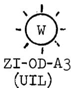

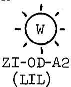

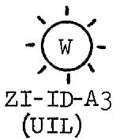

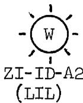

and on $\mathbf{MB}^{-1}$ are:

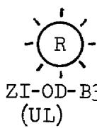

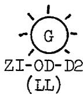

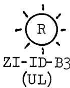

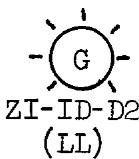

10.3 Check both doors closed:

10.3.1 Inlet Door

Switch No.

Position Indicator Light

ZI- $\mathbf{ID - A}$ ，in.

ZS-ID-D1 and D2

ZI-ID-D1 on

ZS-ID-C1 and C2

ZI-ID-C1 on

ZS-ID-D1 and D2

ZI-ID-D2 on

10.3.2 Outlet Door

Switch No.

Position Indicator Light

ZI-OD-A, in.

ZS-OD-D1 and D2

ZI-OD-D1 on

ZS-OD-C1 and C2

ZI-OD-C1 on

ZS-OD-D1 and D2

ZI-OD-D2 on

10.4 Slowly raise the inlet door and record ZI-ID-A when the following occur:

ZI-1D-A in.

Switch No.

Position Indicator Light

Raising Lowering

ZS-ID-D1 and D2

ZI-ID-B1 off

ZS-ID-C1 and C2

ZI-ID-Cl off

ZS-ID-D1 and D2

ZI-ID-D2 off

ZS- $\mathbf{\bar{I}}\mathbf{D}$ -A1

ZI-ID-A2 on

ZS-1D-A2

ZI-1D-A3 on

ZS-1D-B2

ZI-1D-B3 on

ZS-1D-B1

ZI-1D-B1 on

ZS-1D-B2

ZI-1D-B2 on

10.5 Slowly lower the inlet door and record ZI-ID-A (Above) when position indicator lights change aspect.

Init. Date/Time

10.6 Repeat Steps 11.4 and 11.5 for the outlet door:

Init. Date/Time

ZI-OD-A, in.

Switch No.

Position Indicator Light

Raising

Lowering

ZS-OD-D1 and D2

ZI-OD-D1 off

ZS-OD-C1 and C2

ZI-OD-C1 off

ZS-OD-D1 and D2

ZI-OD-D2 off

ZS-OD-A1

ZI-OD-A2 on

ZS-OD-A2

ZI-OD-A3 on

ZS-OD-B2

ZI-OD-B3 on

ZS-OD-B1

ZI-OD-B1 on

ZS-OD-B2

ZI-OD-B2 on

10.7 Leave doors closed.

11 BYPASS DAMPER

ll.l Check bypass damper closed:

Switch No.

Position Indicator Light

PdM-AD2-A1,%

PdI-AD2-A3,%

ZS-AD2-A2

ZI-AD2-A2 (green light) on

ZS-AD2-A1

ZI-AD2-A1 (red light) off

11.2 Slowly open bypass damper and record damper position when following

actions occur:

Switch No.

Position Indicator Light

PdM-AD2-A1,%

PdI-AD2-A3,%

ZS-AD2-A1

ZI-AD2-A1 comes on

ZS-AD2-A2

ZI-AD2-A2 goes off

11.3 Slowly close the bypass damper and record damper position when

following actions occur:

Switch No.

Position Indicator Light

PdM-AD2-A1,%

PdI-AD2-A3,%

ZS-AD2-A2

ZI-AD2-A2 comes on

ZS-AD2-A1

ZI-AD2-A1 goes off

11.4 Leave bypass damper open.

# 12 CONTROL RODS

The following list should be done only when there is no fuel or flush salt in the reactor and with the nuclear instruments in service.

12.1 Check that all control rods are fully inserted.   
12.2 Slowly raise one rod and record rod positions when upper and lower limit lights change aspect. Lower the rod and again record rod positions when the lights change. Repeat for the other two rods and enter results in table below. The position indicator locations are as follows:

MB-13 (Console Panel III)   

<table><tr><td>A1
(UL)</td><td>A2
(UL)</td></tr><tr><td>A3
(IL)</td><td>A4
(LL)</td></tr></table>

<table><tr><td>A1
(UL)</td><td>A2
(UL)</td></tr><tr><td>A3
(LL)</td><td>A4
(LL)</td></tr></table>

<table><tr><td>A1
(UL)</td><td>A2
(UL)</td></tr><tr><td>A3
(LL)</td><td>A4
(LL)</td></tr></table>


ZI-NRR1-A6


ZI-NCR-2A


ZI-NCR3-A

# MB-7


ZI-NRR1-A5

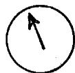

ZI-NCR2-A5


ZI-NCR3-A5

<table><tr><td>Rod</td><td>Condition</td><td>Switch No.</td><td>Position Indicator Light</td><td>Rod Position, in.</td></tr><tr><td>1</td><td>Inserted</td><td>ZS-NRR1-A1</td><td>ZI-NRR1-A1 off _</td><td>ZI-NRR1-A5 _, -A6 _</td></tr><tr><td>1</td><td>"</td><td>"A2</td><td>"A2 off _</td><td>"A5 _, A6 _</td></tr><tr><td>1</td><td>"</td><td>"A3</td><td>"A3 on _</td><td>_, " _</td></tr><tr><td>1</td><td>"</td><td>"A4</td><td>"A4 on _</td><td>_, " _</td></tr><tr><td>1</td><td>Raising</td><td>"A3</td><td>"A3 off _</td><td>_, " _</td></tr><tr><td>1</td><td>"</td><td>"A4</td><td>"A4 off _</td><td>_, " _</td></tr><tr><td>1</td><td>"</td><td>"A1</td><td>"A1 on _</td><td>_, " _</td></tr><tr><td>1</td><td>"</td><td>"A2</td><td>"A2 on _</td><td>_, " _</td></tr><tr><td>1</td><td>Lowering</td><td>"A1</td><td>"A1 off _</td><td>_, " _</td></tr><tr><td>1</td><td>"</td><td>"A2</td><td>"A2 off _</td><td>_, " _</td></tr><tr><td>1</td><td>"</td><td>"A3</td><td>"A3 on _</td><td>_, " _</td></tr><tr><td>1</td><td>"</td><td>"A4</td><td>"A4 on _</td><td>_, " _</td></tr><tr><td>2</td><td>Inserted</td><td>ZS-NCR2-A1</td><td>ZI-NCR2-A1 off _</td><td>ZI-NCR2-A5 _, -A _</td></tr><tr><td>2</td><td>"</td><td>"A2</td><td>"A2 off _</td><td>_, " _</td></tr><tr><td>2</td><td>"</td><td>"A3</td><td>"A3 on _</td><td>_, " _</td></tr><tr><td>2</td><td>"</td><td>"A4</td><td>"A4 on _</td><td>_, " _</td></tr><tr><td>2</td><td>Raising</td><td>"A3</td><td>"A3 off _</td><td>_, " _</td></tr><tr><td>2</td><td>"</td><td>"A4</td><td>"A4 off _</td><td>_, " _</td></tr><tr><td>2</td><td>"</td><td>"A1</td><td>"A1 on _</td><td>_, " _</td></tr><tr><td>2</td><td>"</td><td>"A2</td><td>"A2 on _</td><td>_, " _</td></tr><tr><td>2</td><td>Lowering</td><td>"A1</td><td>"A1 off _</td><td>_, " _</td></tr><tr><td>2</td><td>"</td><td>"A2</td><td>"A2 off _</td><td>_, " _</td></tr><tr><td>2</td><td>"</td><td>"A3</td><td>"A3 on _</td><td>_, " _</td></tr><tr><td>2</td><td>"</td><td>"A4</td><td>"A4 on _</td><td>_, " _</td></tr><tr><td>3</td><td>Inserted</td><td>ZS-NCR3-A1</td><td>ZI-NCR3-A1 off _</td><td>ZI-NCR3-A5 , -A _</td></tr><tr><td>3</td><td>"</td><td>"A2</td><td>"A2 off _</td><td>" , "</td></tr><tr><td>3</td><td>"</td><td>"A3</td><td>"A4 on _</td><td>" , "</td></tr><tr><td>3</td><td>"</td><td>"A4</td><td>"A4 on _</td><td>" , "</td></tr><tr><td>3</td><td>Raising</td><td>"A3</td><td>"A3 off _</td><td>" , "</td></tr><tr><td>3</td><td>"</td><td>"A4</td><td>"A4 off _</td><td>" , "</td></tr><tr><td>3</td><td>"</td><td>"A1</td><td>"A1 on _</td><td>" , "</td></tr><tr><td>3</td><td>"</td><td>"A2</td><td>"A2 on _</td><td>" , "</td></tr><tr><td>3</td><td>Lowering</td><td>"A1</td><td>"A1 off _</td><td>" , "</td></tr><tr><td>3</td><td>"</td><td>"A2</td><td>"A2 off _</td><td>" , "</td></tr><tr><td>3</td><td>"</td><td>"A3</td><td>"A3 on _</td><td>" , "</td></tr><tr><td>3</td><td>"</td><td>"A4</td><td>"A4 on _</td><td>" , "</td></tr></table>

12.3 Check that all rods are fully inserted when test is complete.

Init. Date/Time

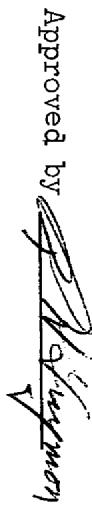

12.4 Before filling system but after heat-up, raise Rod #1 until lights at bottom of ECC 20 and 21 on jumper board go on. Lower rod until lights go out.

Repeat for Rod #2 and Rod #3. Record results in table below and compare with switch tabulation.

<table><tr><td rowspan="3">Rod #</td><td colspan="3">Rod Position When Light in Ckt. Goes Out 
Sw. Tab.</td><td colspan="3">Rod Position When Light in Ckt. Goes on 
Sw. Tab.</td><td rowspan="3">Initial</td><td rowspan="3">Date</td></tr><tr><td></td><td colspan="2">Actual</td><td></td><td colspan="2">Actual</td></tr><tr><td></td><td>Ckt. 20</td><td>Ckt. 21</td><td></td><td>Ckt. 20</td><td>Ckt. 21</td></tr><tr><td>1</td><td></td><td></td><td></td><td></td><td></td><td></td><td></td><td></td></tr><tr><td>2</td><td></td><td></td><td></td><td></td><td></td><td></td><td></td><td></td></tr><tr><td>3</td><td></td><td></td><td></td><td></td><td></td><td></td><td></td><td></td></tr></table>

Init. Date/Time

12.5 With the system hot, but before adding salt, check the control rod reference location. Check that cell air activity is not high: record RM-565-B and RM-565-C. Also check radiation level in TR: record CAM and Monitron. Do not proceed if cell air activity is $>$ The two rods not being tested should be above

12.5.1 Set valves as follows:

HV-985-A2 open

HV-987-A2 open

HV-987-A3 closed

HV-986-A open

12.5.2 Open HV-986, 987, or 989. Throttle

HV-985-A1 and HV-989-A until ZI-987-A

indicates approximately $50\%$ .

12.5.3 Establish communications between TR and Control Room.   
12.5.4 Insert Control Rod and determine control rod reference position.

Record rod position when maximum dp is obtained. Determine position indications for each rod being inserted and for each being withdrawn.

<table><tr><td rowspan="3">Rod #</td><td rowspan="3">Valve Open</td><td rowspan="3" colspan="2">Valves Closed</td><td colspan="3">CONTROL ROD POSITION</td><td rowspan="3">Initial</td><td rowspan="3">Date</td></tr><tr><td rowspan="2">Should Be</td><td colspan="2">Actual</td></tr><tr><td>Inserting</td><td>Withdrawing</td></tr><tr><td>1</td><td>986-A</td><td>987-A1</td><td>989-A</td><td></td><td></td><td></td><td></td><td></td></tr><tr><td>2</td><td>987-A1</td><td>986-A</td><td>989-A</td><td></td><td></td><td></td><td></td><td></td></tr><tr><td>3</td><td>989-A</td><td>986-A</td><td>987-A1</td><td></td><td></td><td></td><td></td><td></td></tr><tr><td></td><td></td><td></td><td></td><td></td><td></td><td></td><td></td><td></td></tr></table>

12.5.5 Open HV-987-A3.   
12.5.6 Close HV-985-A1, 989-A, 986-A, 987-A1, and 989-A1.

12.6 After the system is hot and before adding salt check the drop time of each rod.

12.6.1 Raise #1 rod to 50 inches above the rod position where the first lower indicator light lit up. (13.5)   
12.6.2 Plug in the rod drop timer and set to zero.   
12.6.3 Actuate the rod scram switch.   
12.6.4 Repeat with Rod #2 and Rod #3 and record results in table.

<table><tr><td>Rod #</td><td>Starting Position</td><td>Rod Drop Time Should Not Exceed 1.0 Sec.</td><td>Initial</td><td>Date</td></tr><tr><td>1</td><td></td><td></td><td></td><td></td></tr><tr><td>2</td><td></td><td></td><td></td><td></td></tr><tr><td>3</td><td></td><td></td><td></td><td></td></tr></table>

Init. Date/Time

12.7 Raise all three rods 12 to 15".   
12.8 Push HS-100-A1 and A2 and note the 4th light in ECC-174 goes out and first light in ECC-183, 184, and 185 goes on and rods scram.   
12.9 Reset and raise rods. Push HS-100-A1 and A3 and note that 4th light in ECC-174 goes out and first light in ECC-183, 184, and 185 goes on and rods scram. Reset and raise rods.   
12.10 Push HS-100-A2 and A3 and note that 4th light in ECC-174 goes out and first light in ECC-183; 184, and 185 goes on and rods scram. Reset and raise rods.   
12.11 Push trip test switch on RSS-NSC1-A2 and RSS-NSC2-A2 and note that 4th light in ECC-174 goes out and first light in ECC-183, 184, and 185 goes on.   
12.12 Push trip test switch on RSS-NSC1-A2 and RSS-NSC3-A2 and note that 4th light in ECC-174 goes out and first light in ECC-183, 184, and 185 goes on.   
12.13 Push trip test switch on RSS-NSC2-A2 and RSS-NSC3-A2 and note that 4th light in ECC-174 goes out and first light in ECC-183, 184, and 185 goes on.

# 13 FUEL PUMP, FUEL PUMP OVERFLOW TANK AND COOLANT PUMP BUBBLER SYSTEMS FLOW ALARM CHECKS

13.1 On jumper boards 2, 3, and 4, check that the green lamps are on in circuits 40 , 41 , 128 , and 129   
13.2 On main panels 6 and 8, check that annihilators $\text{XA-4005-4}$ ______ and $\text{XA-4006-6}$ ______ are clear.   
13.3 Referring to the following tables, set the fuel-pump selector switch (S-36, on main panel 8), coolant-pump selector switch (S-39, on main panel 6), fuel-pump level test switch (S-37, on transmitter panel 5), fuel-pump overflow tank level test switch (S-38, on transmitter panel 5) and coolant-pump level test switch (S-40, on transmitter panel 6) as indicated, open the indicated supply valve and note when the low flow (or high pressure) alarm occurs. Then, while maintaining the test switch position, close the supply valve. After the supply valve has been closed, return the test switch to the "off" position and note the time required for the flow indicator to drop from 35 psi to 20 psi. Also, record the pressure at which the high flow (or low pressure) alarm occurs.

Table 4H-2   
FUEL PUMP LEVEL SYSTEM   
Table 4H-3   

<table><tr><td rowspan="3">Selector SwitchS-36</td><td rowspan="3">TestSwitchS-37</td><td rowspan="3">SupplyValveNumber</td><td colspan="5">Hi &amp; Low Flow Alarm XA-4006-6</td><td rowspan="3">Time (sec.)for FI todrop from35 to 20</td></tr><tr><td colspan="2">Switch</td><td rowspan="2">Hi orLow</td><td colspan="2">Flow Indicator</td></tr><tr><td>Number</td><td>Set PointPer Sw Tab</td><td>Number</td><td>AlarmReading</td></tr><tr><td rowspan="2">Position3</td><td rowspan="2">Position2</td><td rowspan="2">HV596-B</td><td>PS596-A2</td><td></td><td>Low</td><td rowspan="2">FI596-A</td><td></td><td rowspan="2"></td></tr><tr><td>PS596-A1</td><td></td><td>Hi</td><td></td></tr><tr><td rowspan="2">Position2</td><td rowspan="2">Position4</td><td rowspan="2">HV592-B</td><td>PS592-A2</td><td></td><td>Low</td><td rowspan="2">FI592-A</td><td></td><td rowspan="2"></td></tr><tr><td>PS592-A1</td><td></td><td>Hi</td><td></td></tr><tr><td rowspan="2">Position2</td><td rowspan="2">Position5</td><td rowspan="2">HV593-A1</td><td>PS593-A2</td><td></td><td>Low</td><td rowspan="2">FI593-A</td><td></td><td rowspan="2"></td></tr><tr><td>PS593-A1</td><td></td><td>Hi</td><td></td></tr></table>

FUEL PUMP OVERFLOW TANK LEVEL SYSTEM   

<table><tr><td rowspan="3">Test Switch S-38</td><td rowspan="3">Supply Valve Number</td><td colspan="5">Hi &amp; Low Flow Alarm XA-4006-6</td><td rowspan="3">Time (sec.) for FI to drop from 35 to 20</td></tr><tr><td colspan="2">Switch</td><td rowspan="2">Hi or Low</td><td colspan="2">Flow Indicator</td></tr><tr><td>Number</td><td>Set Point Per Sw Tab</td><td>Number</td><td>Alarm Reading</td></tr><tr><td rowspan="2">Position 2</td><td rowspan="2">HV 599-B</td><td>PS 599-A2</td><td></td><td>Low</td><td rowspan="2">FI 599-A</td><td></td><td rowspan="2"></td></tr><tr><td>PS 599-A1</td><td></td><td>Hi</td><td></td></tr><tr><td rowspan="2">Position 4</td><td rowspan="2">HV 589-B</td><td>PS 589-A2</td><td></td><td>Low</td><td rowspan="2">FI 589-A</td><td></td><td rowspan="2"></td></tr><tr><td>PS 589-A1</td><td></td><td>Hi</td><td></td></tr><tr><td rowspan="2">Position 5</td><td rowspan="2">HV 600-B</td><td>PS 600-A2</td><td></td><td>Low</td><td rowspan="2">FI 600-A</td><td></td><td rowspan="2"></td></tr><tr><td>PS 600-A1</td><td></td><td>Hi</td><td></td></tr></table>

Table 4H-4 COOLANT PUMP LEVEL SYSTEM  

<table><tr><td rowspan="3">Selector SwitchS-39</td><td rowspan="3">TestSwitchS-40</td><td rowspan="3">SupplyValveNumber</td><td colspan="5">Hi &amp; Low Flow Alarm XA-4005-4</td><td rowspan="3">Time (sec)for FI todrop from35 to 20</td></tr><tr><td colspan="2">Switch</td><td rowspan="2">Hi orLow</td><td colspan="2">Flow Indicator</td></tr><tr><td>Number</td><td>Set PointPer Sw Tab</td><td>Number</td><td>AlarmReading</td></tr><tr><td rowspan="2">Position4</td><td rowspan="2">Position2</td><td rowspan="2">HV598-B</td><td>PS598-A2</td><td></td><td>Low</td><td rowspan="2">FI598-A</td><td></td><td rowspan="2"></td></tr><tr><td>PS598-A1</td><td></td><td>Hi</td><td></td></tr><tr><td rowspan="2">Position4</td><td rowspan="2">Position4</td><td rowspan="2">HV594-B</td><td>PS594-A2</td><td></td><td>Low</td><td rowspan="2">FI594-A</td><td></td><td rowspan="2"></td></tr><tr><td>PS594-A1</td><td></td><td>Hi</td><td></td></tr><tr><td rowspan="2">Position2</td><td rowspan="2">Position5</td><td rowspan="2">HV595-B</td><td>PS595-A2</td><td></td><td>Low</td><td rowspan="2">FI595-A</td><td></td><td rowspan="2"></td></tr><tr><td>PS595-A1</td><td></td><td>Hi</td><td></td></tr></table>

Init. Date/Time

13.4 Set the fuel pump, fuel pump overflow tank and coolant pump bubbler system gas flows as given in the building log.

Supply Value Log Value Actual Reading After Setting

HV-596-B FI-596-A

HV-592-B FI-592-A

HV-593-B FI-593-A

HV-599-B FI-599-A

HV-589-B FI-589-A

HV-600-B FI-500-A

HV-598-B FI-598-A

HV-594-B FI-594-A

HV-595-B FI-595-A

14 FUEL PUMP OVERFLOW TANK BUBBLER SYSTEM: LEVEL

INDICATION AND INTERLOCK CHECKS

NOTE: In order to complete these checks Containment

Enclosure 2 must be open.

Init. Date/Time

14.1 Check that annihilator XA-4006-5 is clear.   
14.2 Check that lights in Circuit 21 on jumper board 2 are burning.   
14.3 While observing PI-589-A (Aux Panel 8), slowly close HV-589-C (Containment Enclosure 2) and record PI-589-A and FI-589 when the following actions occur:

Switch No. Sw Tab Setting Action PI-589-A FI-589

PSS-589-A2 Turn out

light in

Ckt. 21

PSS-589-A2 Alarm

XA-4006-5

\*NOTE: If alarm does not occur, check HV-589C closed and slowly open HV-589B to increase pressure on PI-589A.

14.4 Open HV-589C and note that the alarm and circuit lights clear.

NOTE: The action of PSS-589-A1 is checked during the routine fuel system pressure tests.

14.5 Check that annihilator $\mathbf{X}\mathbf{A} - 4007 - 2$ is clear.   
14.6 Check that the top light in circuit 19 on jumper board 2 is burning.   
14.7 Close HV-599B (Transmitter Panel 5)   
14.8 While observing LI-599-B1 (Auxiliary Panel 8) and LI-599-B2 (Transmitter Panel 5) slowly close HV-599-C and record LI-599-B1 and LI-599-B2 when the following actions occur:

Swch. No. Sw. Tb. Vl Action LI-599-B1 LI-599-B2

IS-599-B AlarmXA-4007-2

ISS-599-B Turn out top light in Ckt 19

Init. Date/Time

14.9 Open HV-599-C and note that the alarm and circuit light clear.   
14.10 Check that the top light in circuit 18 on jumper board 2 is burning.   
14.11 Close HV-600-B (Transmitter Panel 5).   
14.12 While observing LI-600Bl (Auxiliary Panel 8) and LI-600-B2 (Transmitter Panel 5) slowly close HV-600-C and record LI-600-B1 and LI-600-B2 when the following actions occur:

Swch. No. Sw. Tb. V1 Action LI-600-B1 LI-600-B2

LS-600-B AlarmXA-4007-2

LSS-600-B Turn out top light in Ckt 18

14.13 Open HV-600-C and note that the alarm and circuit light clear.   
14.14 Set HV-589-B, HV-599-B, and HV-600-B as per building log. (See item 13.4 this procedure.)

15 FUEL PUMP BUBBLER SYSTEM: LEVEL INDICATION AND

INTERLOCK CHECKS

NOTE: In order to complete these checks Containment

Enclosure 2 must be open.

15.1 Check that the lights in circuit 20 on jumper board 2 are burning.   
15.2 Check that the lights in circuit 129 on jumper board 2 are burning.   
15.3 Check that there is cover gas flow to the fuel pump as indicated by FIC-516-B (Main Panel 9) and Record FIC-516-B ________.   
15.4 Check that annihilators XA-4006-5 and XA-4007-5 are clear.

15.5 While observing PI-522-A (Sampler Enricher Panel 2), PRC-522-A (Main Panel 8), PI-592-B (Auxiliary Panel 8) and FIC-516-B (Main Panel 8) slowly close HV-592-C (Containment Enclosure 2) and record the data in the following table as the indicated action occurs:

<table><tr><td>Action</td><td>Switch No.</td><td>Sw Tab V1</td><td>Record</td></tr><tr><td rowspan="3">Turn out lights in Circuit 20</td><td rowspan="3">PSS-592-B2</td><td></td><td>PI-522-A</td></tr><tr><td></td><td>PI-592-B</td></tr><tr><td></td><td>PRC-522-A</td></tr><tr><td rowspan="6">Alarm XA-4006-5</td><td rowspan="3">PS-522-A2*</td><td></td><td>PI-522-A</td></tr><tr><td></td><td>PI-592-B</td></tr><tr><td></td><td>PRC-522-A</td></tr><tr><td rowspan="3">PS-592-B*</td><td></td><td>PI-522-A</td></tr><tr><td></td><td>PI-592-B</td></tr><tr><td></td><td>PRC-522-A</td></tr><tr><td rowspan="3">Turn out lights in Circuit 129</td><td rowspan="3">PSS-522-A</td><td></td><td>PI-522-A</td></tr><tr><td></td><td>PI-592-B</td></tr><tr><td></td><td>PRC-522-A</td></tr><tr><td rowspan="4">Alarm XA-4007-5</td><td rowspan="4">FS-516-B</td><td></td><td>PI-522-A</td></tr><tr><td></td><td>PI-592-B</td></tr><tr><td></td><td>PRC-522-A</td></tr><tr><td></td><td>FIC-516-B</td></tr></table>

*An instrument mechanic may be required to determine that both switches cause the alarm.

NOTE: The action of PSS-592-B1 is checked during the routing fuel system pressure test.

15.6 Check that FIC-516-B is indicating zero flow and that FCV-516-B2 (on solenoid rack) is deenergized.

15.7 Slowly open HV-592-C (Containment Enclosure 2) until XA-4007-5 clears and then close HV-592-C ______. Note that the flow, as indicated by FIC-516-B returns to normal ______.   
15.8 While observing PI-522-A (Sampler Enricher Panel 2) and PRC-522-A (Main Panel 8) open HV-592-C just enough to produce a slow pressure decrease, and when PS-522-Al causes XA-4006-5 to alarm record the following: Switch Tabulation value for PS-522-Al , PRC-522-A , PI-522-A   
15.9 Open HV-592-C fully . Set HV-592-B per building log (see item 14.4 this procedure). Check that the annihilators and circuit lights clear   
15.l0 Check that the Normal Fuel Drain Switch (S-7) on console panel III, is in the "off" position.   
15.11 Check that the following freeze valves indicate that they are frozen.

FV-103 FV-104

FV-105 FV-106

15.12 Set the fuel-pump selector switch (S-36) on main panel 8, to position 2.   
15.13 Check that the following circuits on jumper panel 1 are as follows:

Ckt. 117: Top three (3) white lights burning

Ckt. 118: Top three (3) white lights burning

Ckt. 119: Top three (3) white lights burning

15.13 (continued)

Circuit 138: Top white light burning

(jumper "A" may be inserted if required) and the second white light out.

15.14 Check that the top white light in circuit 147 on jumper panel 2 is burning (jumper "A" may be inserted if required) and the second white light is out.   
15.15 Insert jumper in top jumper of circuit 150 on jumper panel 4 and check that the first white light is out.   
15.16 Note that annunciator XA-4006-4 is in the alarm condition.   
15.17 While observing LR-593-C (main panel 8) and LI-596-B (transmitter panel 5), slowly close HV-596-C to allow the fuel pump level indicator to increase very slowly and record LR-593-C, LI-596-B and the switch tabulation valves for the indicated switches as the following actions occur:

Action

LR-593-C LI-596-B

SW. No.

Sw.

Tab

Va1

Second white light in circuits 138 and 147 comes on and the first white light in circuit 150 comes on.

Annunciator XA-4006-4 clears

Annunciator XA-4006-4 alarms

Third white light in circuits 117, 118, and 119 goes out.

ISS-593-C1

LS-593-C3

LS-593-C2

LSS-593-C2

15.18 While observing LR-593-C (Main panel 8) and LI-596-B (Transmitter panel 5) slowly open HV-596-C to allow the fuel pump level indication to decrease very slowly and record LR-539-C, LI-596-B and the switch tabulation values for the indicated switches as the following actions occur:

Action LR-593-C LI-596-B Sw. No. Sw. Tab Vl

Third white

light in Ckts.

117, 118, &

119 comes on ISS-593-C2

Annunciator

XA-4006-4

clears IS-593-C2

Annunciator

XA-4006-4

alarms IS-593-C3

First white

light in ckt.

150 goes out

and the second

white light in

ckts 138 &

147 goes out. ISS-593-C1

15.19 Open HV-596-C fully and set HV-596-B

per building log (see item 14.4 of this

procedure).

15.20 Set the fuel pump selector switch (S-36)

on main panel 8 to position 3.

15.21 Check that the following circuits on jumper

panel 1 are as follows:

Top three (3) white lights burning in

circuits 117 , 118 , and 119

Top white light burning ____ (jumper "A"

may be inserted if required) and the second

white light out in circuit 138.

15.22 Check that the top white light in circuit 147 on jumper panel 2 is burning (jumper "A" may be inserted if required) and the second white light is out.   
15.23 Check that the top white light in circuit 150 on jumper panel 4 is out (jumper "A" may be inserted if required).   
15.24 Note that annunciator XA-4006-4 is in the alarm condition.   
15.25 While observing LI-593-C (transmitter panel 5) and LR-593-C (main panel 8) slowly close HV-593-C to allow the fuel pump bowl level indication to increase very slowly and record LR-593-C, LI-593-C and the switch tabulation values indicated as the following actions occur:

Action

LR-593-C

LI-593-C

SW. No.

Tab.

Val.

Second white light in ckt. 138 & 147 comes on and the first white light in ckt. 150 comes on.

Annunciator XA-4006-4 clears

Annunciator XA-4006-4 alarms

Third white light in ckts. 117, 118, & 119 goes out.

ISS-593

LS-593-C3

LS-593-C2

ISS-593-C2

15.26 While observing LR-593-C (main panel 8) and LI-593-C (transmitter panel 5) slowly open HV-593-C to allow the fuel pump level indication to decrease very slowly and record LR-593-C, LI-593-C and the switch tabulation values for the indicated switches as the following actions occur:

<table><tr><td>Action</td><td>LR-593-C</td><td>LI-596-B</td><td>Sw. No.</td><td>Val</td><td>Sw. Tab</td></tr><tr><td>Third white light in ckts. 117, 118, &amp; 119 comes on.</td><td></td><td></td><td>ISS-593-C2</td><td></td><td></td></tr><tr><td>Annunciator XA-4006-4 clears</td><td></td><td></td><td>IS-593-C2</td><td></td><td></td></tr><tr><td>Annunciator XA-4006-4 alarms</td><td></td><td></td><td>IS-593-C3</td><td></td><td></td></tr><tr><td>First white light in ckt. 150 goes out and the second white light in ckts 138 &amp; 147 goes out.</td><td></td><td></td><td>ISS-593-C1</td><td></td><td></td></tr></table>

15.27 Open HV-593-C fully and set HV-593-B per building log (see item 14.4 this procedure).   
15.28 Remove the "A" jumpers from ckts 138, 147, and/or 150.   
16 COOLANT PUMP BUBBLER SYSTEM: LEVEL INDICATION AND INTERLOCK CHECKS  
NOTE: In order to complete these checks the coolant cell must be open.   
16.1 Set the coolant pump selector switch (S-39) on main panel 6 to position 2 (B2).   
16.2 Check that the lights in circuit 128 on jumper panel 2 are burning.   
16.3 Check that there is cover gas flow to the coolant pump as indicated by FIC-512-A (main panel 5) and record FIC-512-A ________.   
16.4 Check that annihilator $\mathsf{XA - 4004 - 3}$ is clear.   
16.5 While observing FIC-512-A (main panel 5) and PRC-528-A (main panel 6) slowly close HV-594-C to allow the pressure indicated by PRC-528-A to increase very slowly and record

# 16.5 (continued)

PRC-528-A, FIC-512-A and the switch tabu-lation values indicated as the following actions occur:

<table><tr><td>Action</td><td>Switch No.</td><td>Sw Tab Val</td><td>Record</td></tr><tr><td>Annunciator XA-4005-2 clears</td><td>PS-528-A2</td><td></td><td>PRC-528-A</td></tr><tr><td>Annunciator XA-4005-2 alarms</td><td>PS-528-A1</td><td></td><td>PRC-528-A</td></tr><tr><td>Lights in circuit 128 go out</td><td>PSS-528-A</td><td></td><td>PRC-528-A</td></tr><tr><td>Annunciator XA-4004-3 alarms</td><td>FS-512-A</td><td></td><td>FIC-512-A</td></tr></table>

16.6 Check that FIC-512-A is indicating zero flow and that FCV-512-A2 (on solenoid rack) is de-energized   
16.7 While observing PRC-528-A (main panel 6) slowly open HV-594-C (coolant cell) to allow the pressure indicated by PRC-528-A to decrease very slowly and record PRC-528-A, FIC-512-A and the indicated switch tabulation values as the following actions occur:

<table><tr><td>Action</td><td>Switch No.</td><td>Sw Tab Val</td><td>Record</td></tr><tr><td>Annunciator XA-4004-3 clears</td><td>PS-512-A</td><td></td><td>FIC-512-A</td></tr><tr><td>Lights in circuit 128 come on</td><td>PSS-528-A</td><td></td><td>PRC-528-A</td></tr><tr><td>Annunciator XA-4005-2 clears</td><td>PS-528-A1</td><td></td><td>PRC-528-A</td></tr><tr><td>Annunciator XA-4005-2 alarms</td><td>PS-528-A2</td><td></td><td>PRC-528-A</td></tr></table>

16.8 Note that the cover gas flow to the coolant pump as indicated by FIC-512-A returns to normal (see item 17.3) and open HV-594-C (coolant cell) fully

Init. Date/Time

16.9 Set HV-594-B per building log (see item 14.4 this procedure).   
16.10 Depress the Off Mode button (S-8) on console panel 1.   
16.11 Check that the lights on circuit 142 on jumper panel 3 are off.   
16.12 Check that the top white lights in circuits 121 and 126 on jumper panel 3 are burning.   
16.13 While observing LR-595-C (main panel 6) and LI-598-C3 (transmitter panel 6) slowly close HV-598-C to allow the level indicated on LR-595-C and LI-598-C3 to increase very slowly and record LR-595-C, LI-598-C3 and the switch tabulation values indicated as the following actions occur:

Action

Switch No. Sw Tab Value Record

Annunciator

XA-4005-3 clears LS-595-C2 LR-595-C LI-598-C3

Top light in circuit 142 con on

LSS-595-C1 LR-595-C

LI-598-c3

Annunciator

XA-4005-3 alarms LS-595-C3 LR-595-C LI-598-C3

Lights in circuits

121&126 go out ISS-595-C2 LR-595-C LI-598-C3

16.14 While observing LR-595-C (main panel) and LI-598-C3 (transmitter panel 6) slowly open HV-598-C (coolant cell) to allow the level indicated on LR-595-C and LI-598-C3 to decrease very slowly and record LR-595-C and

16.14 (continued)

LI-598-C3 and the switch tabulation values

as the following actions occur:

Action

Switch No. Sw Tab Val

Record

The top lights in

ckts. 121 & 126

come on.

ISS-595-C2

LR-595-C

LI-598-C3

Annunciator

XA-4005-3 clears

LS-595-C3

LR-595-C

LI-598-C3

Lights in circuit

142 go out

LSS-595-C1

LR-595-C

LI-598-C3

Annunciator

XA-4005-3alarms

LS-595-C2

LR-595-C

LI-598-C3

16.15 Open HV-598-C (coolant cell) fully

and set HV-598-B (transmitter panel 6) per

building log. (See item 14.4 this

procedure.)

16.16 Set the coolant-pump selector switch (S-39)

on main panel 6 to position 4. (Bl)

16.17 Check that the top white lights in circuits

121 and 126 on jumper panel 3 are

burning.

16.18 While observing LR-595-C (main panel 6)

and LI-595-C3 (Transmitter panel 6) slowly

close HV-595-C to allow the level indicated

on LR-595-C and LI-595-C3 to increase very

slowly and record LR-595-C, LI-595-C3 and the

switch tabulation values indicated as the

following actions occur:

Init. Date/Time

Action Switch No. Sw Tab Val Record

Annunciator  
XA-4005-3 clears LS-595-C2 LR-595-C  
LI-595-C3

Top light in circuit 142 comes on LSS-595-C1 LR-595-C LI-595-C3

Annunciator  
XA-4005-3 alarms LS-595-C3 LR-595-C  
LI-595-C3

Lights in circuits 121 & 126 go out LSS-595-C2 LR-595-C LI-595-C3

16.19 While observing LR-595-C (main panel) and LI-595-C3 (transmitter panel 6), slowly open HV-595-C (coolant cell) to allow the level indicated on LR-595-C and LI-595-C3 to decrease very slowly and record LR-595-C, LI-595-C3 and the switch tabulation values indicated as the following actions occur:

Action Switch No. Sw Tab Val Record

The top white lights in circuits 121 & 126 come on LSS-595-C2 LR-595-C LI-595-C3

Annunciator  
XA-4005-3 clears LS-595-C3 LR-595-C  
LI-595-C3

Lights in circuit 142 go out LSS-595-C1 LR-595-C LI-595-C3

Annunciator  
XA-4005-3 alarms LS-595-C2 LR-595-C  
LI-595-C3

16.20 Open HV-595-C (coolant cell) fully and set HV-595-B (transmitter panel 6) per building log (see item 14.4 this procedure.)

17 If the containment-startup-check-list tests have been completed, check that the following valves are open and install the flanges on the containment enclosures. Test the containment enclosure per containment-startup-check list.

Valve Init. Valve Init.

HV-600C HV-572A

HV-599C HV-571-A

HV-589C HV-576-A

HV-592C HV-516

HV-596C HV-519B

HV-593C

18 DRAIN, FUSH AND STORAGE TANK PRESSURES

Check that the drain tank receiver selector switch (S-4) is not switched to FST and reactor is in prefill mode. Referring to Table 4H-5, one at a time close the listed HV in the helium supply to the tank. Then slowly add pressure through the listed supply HCV by adjusting the PIC and note that the pressure switches listed cause the control action or annunciation listed per Sw. Tab. Record the pressure readings when these occur. Insert jumper and change drain-tank selector switch where indicated. Remove jumper and change selector switch to the original position before starting next test. Also open HV's in the helium supply to the tanks that were initially closed.

19 LOW PRESSURE ALARMS ON DRAIN TANKS, FUEL PUMP AND COOLANT FUMP

The Instrument Department should apply pressure on the reference side of the transmitters listed in Table 4H-6. The low pressure alarms should occur at an equivalent pressure to that given in the Sw. Tab. As the test is made fill out Table 4H-6.

TABLE 4H-5   

<table><tr><td></td><td colspan="4">TANK</td></tr><tr><td></td><td>FD-1</td><td>FD-2</td><td>FFT</td><td>CDT</td></tr><tr><td>Close HV</td><td>572-A</td><td>574-A</td><td>576-A</td><td>511-B</td></tr><tr><td>Open HCV</td><td>572-A1</td><td>574-A1</td><td>576-A1</td><td>511-A1</td></tr><tr><td>Adjust PIC</td><td>517A</td><td>517A</td><td>517A</td><td>511-B</td></tr><tr><td>PdSS or PSS No.</td><td>1000-A1</td><td>1000-B1</td><td>1000-C1</td><td>511-D1</td></tr><tr><td>Sw. Tab. Value</td><td></td><td></td><td></td><td></td></tr><tr><td>Turn out lights in circuit</td><td>687</td><td>676</td><td>665</td><td>121, 126</td></tr><tr><td>Pressure indicator</td><td>PR-572-B</td><td>PR-574-B</td><td>PR-576-B</td><td>PR-511-D</td></tr><tr><td>Pressure reading</td><td></td><td></td><td></td><td></td></tr><tr><td>Insert jumper &quot;A&quot; in circuit</td><td>115</td><td>115</td><td>115</td><td></td></tr><tr><td>PSS No.</td><td>572-B2</td><td>574-B2</td><td>576-B2</td><td></td></tr><tr><td>Sw. Tab. Value</td><td></td><td></td><td></td><td></td></tr><tr><td>Turn out lights in circuit</td><td>720</td><td>709</td><td>698</td><td></td></tr><tr><td>Pressure indicator</td><td>PR-572-B</td><td>PR-574-B</td><td>PR-576-B</td><td></td></tr><tr><td>Pressure reading</td><td></td><td></td><td></td><td></td></tr><tr><td>Switch DT selector (S-4) to FST</td><td></td><td></td><td></td><td></td></tr><tr><td>PS No.</td><td>572-B2</td><td>574-B2</td><td>576-B2</td><td>511-D1</td></tr><tr><td>Sw. Tab. Value</td><td></td><td></td><td></td><td></td></tr><tr><td>Alarm on XA</td><td>4009-2</td><td>4009-1</td><td>4009-3</td><td>4004-6</td></tr><tr><td>Pressure indicator</td><td>PR-572-B</td><td>PR-574-B</td><td>PR-576-B</td><td>PR-511-D</td></tr><tr><td>Pressure reading</td><td></td><td></td><td></td><td></td></tr><tr><td>PSS No.</td><td>572-B1</td><td>574-B1</td><td>576-B1</td><td></td></tr><tr><td>Sw. Tab. Value</td><td></td><td></td><td></td><td></td></tr><tr><td>Turn out lights in circuit</td><td>115, 117</td><td>115, 118</td><td>115, 119</td><td></td></tr><tr><td>Pressure indicator</td><td>PR-572-B</td><td>PR-574-B</td><td>PR-576-B</td><td></td></tr><tr><td>Open HV</td><td>572-A</td><td>574-A</td><td>576-A</td><td>511-B</td></tr><tr><td>Remove jumper &quot;A&quot; in circuit</td><td>115</td><td>115</td><td>115</td><td></td></tr></table>

TABLE 4H-6   

<table><tr><td>Pressure Transmitter</td><td>PS No.</td><td>Sw. Tab Val</td><td>Annunciator</td><td>Pressure Recorder</td></tr><tr><td>PT-522-A</td><td>522-A1</td><td></td><td>XA-4006-5</td><td>PR-522-A</td></tr><tr><td>PT-572-B</td><td>572-B1</td><td></td><td>XA-4009-2</td><td>PR-572-B</td></tr><tr><td>PT-574-B</td><td>574-B1</td><td></td><td>XA-4009-1</td><td>PR-574-B</td></tr><tr><td>PT-576-B</td><td>576-B1</td><td></td><td>XA-4009-3</td><td>PR-576-B</td></tr><tr><td>PT-528-A</td><td>528-A2</td><td></td><td>XA-4005-2</td><td>PRC-528-A</td></tr><tr><td>PT-511-D</td><td>511-D2</td><td></td><td>XA-4004-6</td><td>PR-511-D</td></tr></table>

20 The Instrument Department has checked that the following rolling diaphragm seals on the transmitter vents are properly set and alarm on XA-4018-4 and the test lines have been capped.

<table><tr><td>Diaphragm Seal</td><td>Sw. No.</td><td>Press. Transm.</td><td>Alarm on XA-4018-4</td><td>Init.</td></tr><tr><td>PXM-580</td><td>PXS-580</td><td>PT-592-B</td><td></td><td></td></tr><tr><td>PXM-579</td><td>PXS-579</td><td>PT-522-A</td><td></td><td></td></tr><tr><td>PXM-581</td><td>PXS-581</td><td>PT-589-A</td><td></td><td></td></tr><tr><td>PXM-582</td><td>PXS-582</td><td>PT-572-B</td><td></td><td></td></tr><tr><td>PXM-584</td><td>PXS-584</td><td>PT-574-B</td><td></td><td></td></tr><tr><td>PXM-586</td><td>PXS-586</td><td>PT-576-B</td><td></td><td></td></tr></table>

21 Check that all containment enclosures opened for the above tests have been closed and have been tested as described in the containment startup check lists.   
22. Lower the setting of FIC-516-B and note that FS-516-B annunciates on XA-4007-5 per Sw. Tab. Record FIC-516-B FS-524-B should also annunciate on XA-4007-6 per Sw. Tab. Record FI-524-B

Init. Date/Time

23 Lower setting on FIC-512-A and note that FS-512-A annunciates on XA-4004-3 per Sw. Tab. Record FIC-512-A FS-526-C should also annunciate on XA-4004-4 per Sw. Tab. Record FIC-512-A Reset FIC-516-B as found.   
NOTE: It may be necessary to slowly close HV-512 to get the desired actions. If so, be sure to open it when check is completed.   
24 Close HV-500-K and note that PS-500-E annunciates per Sw. Tab. on XA-4028-1. Record PI-500-G1 Open HV-500-K.   
25 Increase PCV-500-G and note that PS-500-B2 annunciates on XA-4028-2, , PS-506 annunciates on XA-4028-7 , and PS-507 annunciates on XA-4028-8 as per Sw. Tab. Record PI-500-G2 . Reduce PCV-500-G and note that annunciations clear and PS-500-B1 reannunciates per Sw. Tab. on XA-4028-2 . Record PI-500-G2 . Set PCV-500-G as found   
26 Close HV-500-E and note that PS-500-K annunciates on XA-4028-4 and PS-509-A annunciates on XA-4035-1 (at S-E panel) per Sw. Tab. _. Record PI-500-A.   
27 Note that PS-509-B annunciates on XA-4035-3 (at S-E Panel) per Sw. Tab. Record PI-500-A. Install temporary pressure gages and hand valves (per sketch below) on the vents of HV-500-N1, N2, and N3.

Init. Date/Time

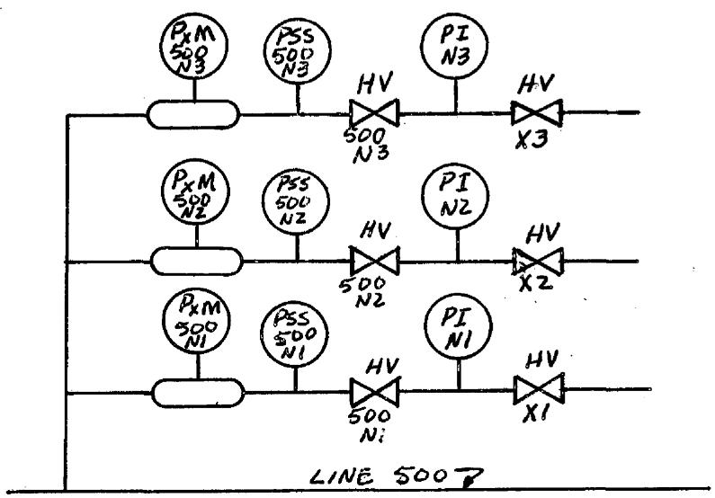

Purge out oxygen, then close HV-X1, X2, and X3, leave HV-500-N1, N2, and N3 open. Open X1 until PI-N1 reads approximately 25 psig. Slowly open temporary HV-X2 and note that PSS-500-N2 turns out lights on ECC-40 and 41 per Sw. Tab. Record PI-N2

Close HV-X2 and slowly open HV-X3. Note that PSS-500-N3 turns out lights in ECC-40 and 41 per Sw. Tab. Record PI-N3.

Close HV-X1 and slowly open HV-X1. Note that PSS-500-N1 turns out lights in ECC-40 and 41 per Sw. Tab. Record PI-N1 Close HV-400-N1, -N2, and -N3 and tag closed.

28

Check that there is flow indicated on FIC-516-B and 512-A and check that there is flow through each bubbler. Record PCV-500-C

Increase PCV-500-C and note that PS-500-L2 annihilates on XA-4028-5 per Sw. Tab.

Init. Date/Time

28 (continued)

Record PI-500-M

Decrease PCV-500-C and note that PS-500-L1 annunciates on XA-4028-5 per Sw. Tab. . Note that lights are out in circuits 40, 41, 115, 116, 126, and 127. Use jumpers as necessary to check this, then remove jumpers.

Note that flow has stopped on the following:

FIC-516-B FI-599-A

FIC-512-A FI-589-A

FI-596-A FI-600-A

FI-592-A FI-598-A

FI-593-A FI-595-A

FI-594-A

Open HV-519-A and note that PI-519 rises. Close HV-519-A and note that HS-519-A will not open HCV-519-A and B as indicated by the pressure remaining high on PI-519. Close HS-519-A.

Raise setting on PIC-510-A and PIC-513-A and note that pressure does not increase. Return to settings as found.

Raise PCV-500-C to values found at start of test. Set FIC-516-B, 512-A, and bubblers as found. Increase FIC-500-J and note that FS-500-J annunciates on XA-4028-3 per Sw. Tab. Record FIC-400-J

NOTE: PS-508-A annunciation on XA-4028-6 is tested during routine system pressure test.

29 Adjust the pressure controllers on the oil supply tanks and note that the alarms occur per Sw. Tab. and record pressures in table below.

Init. Date/Time

<table><tr><td>TANK
NO.</td><td>PIC
NO.</td><td>PRESSURE
SW. NO.</td><td>SW. TAB.
VALUE</td><td>PRESSURE</td><td>ANNUN.
NO.</td></tr><tr><td>OT-1</td><td>513-A</td><td>513-A2</td><td></td><td></td><td>XA-4008-4</td></tr><tr><td>OT-1</td><td>513-A</td><td>513-A1</td><td></td><td></td><td>XA-4008-4</td></tr><tr><td>OT-2</td><td>510-A</td><td>510-A2</td><td></td><td></td><td>XA-4003-4</td></tr><tr><td>OT-2</td><td>510-A</td><td>510-A1</td><td></td><td></td><td>XA-4003-4</td></tr></table>

30 Set TIC-PH1-1 and TIC- $O_2R1-1$ (TIC-PH2-1 and TIC- $O_2R2-1$ ) to turn heat onto preheaters and $O_2$ removal units. Adjust setpoint on TS-PH1-2, TS- $O_2R1-2$ , TS-PH2-2 and $\mathsf{TSO}_2\mathsf{R}2-2$ per Sw. Tab.   
31 Lower HIC-915-A to zero, open HCV-565-A and note that there is flow through FqI-569-A

Lower the setpoint on RS-565-B and note that lights go out in ECC-18 and ECC-80 __ __ __ __ __ __ __ __ __ __ __ __ __ __ __ __ __ __ __ __ __ __ __ __ __ __ __ __ __ __ __ __ __ __ __ __ __ __ __ __ __ __ __ __ __ __ __ __ __ __ __ __ __ __ __ __ __ __ __ __ __ __ __ __ __ __ __ __ __ __ __ __ __ __ __ __ __ __ __ __ __ __ __ __ __ __ __ __ __ __ __ __ __ __ __ __ __ __ __ __ _ _
Light comes on at monitor panel _, HCV-565 closes as indicated by light on MB-3 and flow stops through FqI-569-A.

While observing temperatures on control rods (R36, 37, 38, 39, 40, or 41), raise setpoint on HIC-915-A. Valve should not open and temperatures should not change. Raise setpoint of RS-565-B and push reset button. Valve should open and temperatures change. Reset RS-565-B setpoint as found.

32 Open HCV-565-Al. Lower the setpoint on RS-565-C and note that lights go out in ECC-19, _, annunciation occurs on XA-4010-2 _, and light comes on at monitor panel _. Raise setpoint on RS-565-C and push reset button. Note that conditions clear.

Init. Date/Time

33 Lower setpoint on RS-528-B and note that lights in ECC-18 and 147 go out, _, annunciation occurs on XA-4010-2 _, and light comes on at monitor panel _. Raise setpoint to value as found and push reset button. _. Note that conditions clear.

34 Repeat with RS-582-C.   
35 Check that there is flow indicated on FI-836-A, FI-838-A, FI-840-A, FI-830-A, and FI-844-A.

Lower setpoint on RS-827-A and note that annunciation occurs on XA-4010-2 and light comes on at monitor panel.

Lower setpoint on RS-827-B and note that flows on FI-836-A, 838-A, 840-A, 830-A, and 844-A go to zero, and ESV-ST-A closes (physically check). Raise setpoint on RS-827-A and push reset. Note that flows start but annunciator does not clear

Lower setpoint on RS-827-C and note that flows stop. Raise setpoint on RS-827-B and note that flows start but annunciator does not clear

Lower setpoint on RS-827-A and note that flows stop. Physically check that both FSV-847-A1 and FSV-844-A2 are closed.

Raise setpoint on RS-827-A and push reset button. Note that flows start but annunciators do not clear. Raise setpoint on RS-827-C and push reset button. Note that annunciators clear.

36 Check that HS-557-C is open. Record alarm setpoint on RS-557-A ______. Lower the setpoint on RS-557-A and note that annunciation occurs on

Init. Date/Time

36 (continued)

XA-4010-2, light comes on at monitor panel and HCV-557-C1 closes as indicated by light on main board and visual observation. Visually observe that HCV-510-A2 and HCV-513-A2 do not open when PIC-510-A and PIC-531-A setpoints are lowered. Raise PIC-510 and 513-A setpoint to values as found.

Raise RS-557-A setpoint to value as found and note that conditions clear.

37 Repeat with RS-557-B.   
38 Check that flow is indicated on FI-596, FI-592, FI-593, FI-599, FI-589, and FI-600. Record alarm setpoints on RS-596-A _, RS-596-B _ and RS-596-C _.

Lower the setpoint on RS-596-A and note that annunciation occurs on XA-4010-2 and light comes on at monitor panel.

Lower setpoint on RS-596-B and note that flows on FI-596, FI-592, FI-593, FI-599, FI-589, and FI-600 go to zero. Raise setpoint on RS-596-A and push reset. Note that flows start but annunciation does not clear.

Lower setpoint on RS-596-C and note that flows stop (i.e. pressures increase). Raise setpoint on RS-596-B, push reset and note that flows start but annunciator does not clear.

Lower setpoint on RS-596-A and note that flows stop. Raise setpoint on RS-596-A and note that flows start but annunciator does not clear

Raise setpoint on RS-596-C and note that annihilators clear.

Init. Date/Time

39 Have the instrument mechanic complete the process radiation instrument check list and check out all alarms, setpoints, and control actions using a source at each element.   
40 The process monitors are in service, the primary element is properly located and the setpoint agrees with master copy of process radiation check list. See Table 4H-7.   
41 The Instrument Department has put the neutron instruments in service and has completed the neutron instrument check list.   
42 High level gamma instruments are in service.   
43 The Health Physics Department will check the functioning of each personnel radiation monitor with a source. When this check is made, complete Table 4H-8, checking that each monitor gives a local indication and alarm and causes an alarm in the auxiliary and main control rooms.   
44 NOTE: The following should be approved by the Operations Chief before proceeding. Health Physics personnel should monitor the operations.

Open FCV-703 and then drain the oil from OT-1. Note that LS-OT1-A3 annunciates on XA-4008-5 and that LSS-OT1-A3 closes FSV-703 per Sw. Tab. Record LI-OT1-A for each action. Completely drain tank.

Add a total of _ of oil and note that LI-OT-1 reads approximately $55\%$ . Record level OT-1.

If lines to the salt pump are empty, add additional oil, which should bring level to $95\%$ . If lines are full, do not add more oil. Record

TABLE 4H-7   

<table><tr><td>NO.</td><td>LOCATION</td><td>POSITION OF MONITOR</td><td>SETPOINT</td><td>READING</td><td>INIT.</td><td>DATE</td></tr><tr><td>RE-596-A</td><td>840&#x27; Level</td><td></td><td></td><td></td><td></td><td></td></tr><tr><td>RE-596-B</td><td>840&#x27; Level</td><td></td><td></td><td></td><td></td><td></td></tr><tr><td>RE-596-C</td><td>840&#x27; Level</td><td></td><td></td><td></td><td></td><td></td></tr><tr><td>RE-528-B</td><td>Vent House</td><td></td><td></td><td></td><td></td><td></td></tr><tr><td>RE-528-C</td><td>Vent House</td><td></td><td></td><td></td><td></td><td></td></tr><tr><td>RE-500-D</td><td>Water Room</td><td></td><td></td><td></td><td></td><td></td></tr><tr><td>RE-675-A</td><td>Sampler</td><td></td><td></td><td></td><td></td><td></td></tr><tr><td>RE-675-B</td><td>Sampler</td><td></td><td></td><td></td><td></td><td></td></tr><tr><td>RE-DT-1B</td><td>Service Tunnel</td><td></td><td></td><td></td><td></td><td></td></tr><tr><td>RE-DT-2B</td><td>Service Tunnel</td><td></td><td></td><td></td><td></td><td></td></tr><tr><td>RE-565-B</td><td>Vent House</td><td></td><td></td><td></td><td></td><td></td></tr><tr><td>RE-565-C</td><td>Vent House</td><td></td><td></td><td></td><td></td><td></td></tr><tr><td>RE-557-B</td><td>Vent House</td><td></td><td></td><td></td><td></td><td></td></tr><tr><td>RE-557-C</td><td>Vent House</td><td></td><td></td><td></td><td></td><td></td></tr><tr><td>RE-678-A</td><td>Sampler</td><td></td><td></td><td></td><td></td><td></td></tr><tr><td>RE-678-B</td><td>Sampler</td><td></td><td></td><td></td><td></td><td></td></tr><tr><td>RE-827-A</td><td>Blower House</td><td></td><td></td><td></td><td></td><td></td></tr><tr><td>RE-827-B</td><td>Blower House</td><td></td><td></td><td></td><td></td><td></td></tr><tr><td>RE-827-C</td><td>Blower House</td><td></td><td></td><td></td><td></td><td></td></tr></table>

TABLE 4H-8   

<table><tr><td colspan="3">PERSONNEL RADIATION MONITOR</td><td rowspan="2">LOCAL ALARM</td><td rowspan="2">LOCAL INDCT.</td><td rowspan="2">AUX. ICR. ALARM</td><td rowspan="2">MCR. AIM. XA-4010-1</td><td rowspan="2">DATE</td></tr><tr><td>NO.</td><td>TYPE</td><td>LOCATION</td></tr><tr><td>3</td><td>C.A.M.</td><td>Control Room</td><td></td><td></td><td></td><td></td><td></td></tr><tr><td>1</td><td>Monitron</td><td>Control Room</td><td></td><td></td><td></td><td></td><td></td></tr><tr><td>2</td><td>Monitron</td><td>Hi Bay (West)</td><td></td><td></td><td></td><td></td><td></td></tr><tr><td>3</td><td>Monitron</td><td>Hi Bay (South)</td><td></td><td></td><td></td><td></td><td></td></tr><tr><td>1</td><td>C.A.M.</td><td>Hi Bay (South)</td><td></td><td></td><td></td><td></td><td></td></tr><tr><td>2</td><td>C.A.M.</td><td>Hi Bay (West)</td><td></td><td></td><td></td><td></td><td></td></tr><tr><td>5</td><td>Monitron</td><td>840&#x27; Level (HCP)</td><td></td><td></td><td></td><td></td><td></td></tr><tr><td>6</td><td>Monitron</td><td>840&#x27; Level (Horn Hall)</td><td></td><td></td><td></td><td></td><td></td></tr><tr><td>4</td><td>C.A.M.</td><td>840&#x27; Level</td><td></td><td></td><td></td><td></td><td></td></tr><tr><td>5</td><td>C.A.M.</td><td>Transmitter Room</td><td></td><td></td><td></td><td></td><td></td></tr><tr><td>7</td><td>Monitron</td><td>Transmitter Room</td><td></td><td></td><td></td><td></td><td></td></tr><tr><td>8</td><td>Monitron</td><td>Service Tunnel</td><td></td><td></td><td></td><td></td><td></td></tr><tr><td>6</td><td>C.A.M.</td><td>Service Tunnel</td><td></td><td></td><td></td><td></td><td></td></tr></table>

Init. Date/Time

44 (continued)

oil added gal and LI-OT1-A

Tag fill and drain valves closed.

45 With FOP-2 in operation, slowly close HV-713 and note that PS-702-B annunciates on XA-4008-6 and FOP-1 starts per Sw. Tab. Record PI-702-A Open HV-713.

Slowly close HV-714 and note that PS-701-B annihilates on XA-4008-6 and FOP-2 starts per Sw. Tab. Record PI-701-A Open HV-714

46 Slowly close HV-703-B and note that FS-703-A annunciates on XA-4007-1 per Sw. Tab. Record FI-703-A . FSS-703-A should turn out lights in ECC 147 per Sw. Tab. (Jumper's may be used

Init. Date/Time

46 (continued) where needed.) Record FI-703-A_. Readjust flows and note that alarm clears. _ Remove jumpers.   
47 :Slowly close HV-704 and note that FS-704-A annunci  
ciates on XA-4007-1 per Sw. Tab. Record FI-704-A FSS-704-A should turn out lights in ECC 147. (Jumpers may be used where needed.) Record FI-704-A Readjust flows and note that alarm clears. Remove jumpers.   
48 Repeat test for COP-1 and COP-2.   
49 NOTE: Obtain Operations Chief's permission before doing the following:

Remove temperature switches from all four oil pumps (TS-FOP-1, TS-FOP-2, TS-COP-1, and TS-COP-2) and immerse in an oil bath and check that TS-FOP-1, TS-FOP-2, TS-COP-1, and TS-COP-2 annunciate on XA-4008-3 or 4004-1 per Sw. Tab. Record temperatures. TS-FOP-1 TS-FOP-2 TS-COP-1 TS-COP-2

Reinstall temperature switches and seal. 50 The following should be approved by the Operations Chief before proceeding.

Health Physics coverage should be provided.

Open HV-720-A, 720-B, 525-A and 525-B, and drain OCT-1 to WOR-1.

Close 720-B and 525-B. Disconnect 720 line from WOR-1. Attach a temporary line to line 720 and add liters of oil to OCT-1. LI-524-C should indicate %, and LS-524-C should cause the light at OCT-1 on MB to burn. Record oil added .

Init. Date/Time

50 (continued)

Drain oil to WOR-1 until OCT-1 reads 5 to $10\%$ . Record initial and final levels on LI-524 to

Tag HV-720-A, HV-720-B, HV-525-A, and HV-525-B closed.

51 Repeat test for the coolant oil package.   
52 Close HV-825-B and note that LS-ST-A annunciates on XA-4027-7 and XA-4000-3 per Sw. Tab. as level is lowered by removing water from the system at a sample point or other convenient location. (Have HP check for activity in the water.) Record LI-ST-B . Close the valve used to lower the level in CST and open HV-825-B. HCV-825-A should close when surge tank level is approximately %   
53 With No. 1 TW pump in operation, throttle HV-829-A and note that PS-829-B annunciates on XA-4026-10 and XA-4000-3 per Sw. Tab. Record PI-829-A Open HV-829-A.   
54 Close HV-890-B and check that water is flowing through FI-810-A. Note that PS-882-B alarms on XA-4026-12. With No. 1 CT pump in service, throttle HV-851-A and note that PS-851-B2 annunciates on XA-4026-11 and flow stops in FI-810-A, indicating that PS-851-B1 has switched HCV-882 to process water. (If No. 2 CT pump is in service, throttle HV-853 for above test). Record PI-851-A. Open HV-890-B and note flow is indicated on FI-810-A. Open HV-851-A.   
55 With the cooling tower water system in operation, throttle HV-851-C and note that FS-851-C annihilates on XA-4027-1 and on XA-4000-3 per

Init. Date/Time

55 (continued)

Sw. Tab. Record FI-851-C.

Continue throttling HV-851-C and note that high treated water temperature TS-826 annunciates on XA-4026-4 per Sw. Tab. Record TI-829-1 Open HV-851-C.

56 With TW system in operation, adjust flows to the following and note that annunciations occur as listed in Table 4H-9. Readjust flows as found and note that alarms clear. XA-4000-3 should also alarm and clear each time.

56.1 While observing PI-844 to be sure that it does not exceed 16 psig, close FSV-847 and note that PSS-844-B1 closes FSV-844, FS-844-A alarms on XA-4026-1 and PS-844-B2 alarms on XA-4027-8.   
56.2 Close HV-830-A and note that FS-830-A operates time-delay relay K-113 to stop FP in circuit 147. Use jumper if necessary.   
56.3 Slowly close HV-840-A and note that FS-840-A alarms on XA-4026-9.   
56.4 Slowly close HV-838-A and note that FS-838-A alarms on XA-4026-8.   
56.5 Close HV-832-A and note that FS-832-A operates time-delay relay K-114 to stop CP in circuit 142. (Use jumper if necessary.)   
56.6 Slowly close HV-836-A and note that FS-836-A alarms on XA-4026-7.   
56.7 Open HV-848-A and HV-848-B and slowly add TW to the nuclear instrument penetration until LS-NP alarms on XA-4027-9 . Close both valves and remove water from penetration until LS-NP alarms on XA-4027-9. Refill penetration.

TABLE 4H-9   

<table><tr><td>SW. NO.</td><td>SW. TAB. SETTING</td><td>ALARM</td><td>ALARMED AT</td><td>OTHER ACTION</td></tr><tr><td>PSS-844-B1</td><td></td><td rowspan="2">XA-4026-1</td><td rowspan="2">_</td><td rowspan="2">Closes FSV-844</td></tr><tr><td>FS-844-A</td><td></td></tr><tr><td>PS-844-B2</td><td></td><td>XA-4027-8</td><td>_</td><td>Stops FP (15 min time delay)</td></tr><tr><td>FS-830-A</td><td></td><td rowspan="2">XA-4026-9</td><td rowspan="2">_</td><td rowspan="12">Stops CP (15 min time delay)</td></tr><tr><td>FS-840-A</td><td></td></tr><tr><td>FS-838-A</td><td></td><td>XA-4026-8</td><td>_</td></tr><tr><td>FS-832-A</td><td></td><td rowspan="2">XA-4026-7</td><td rowspan="2">_</td></tr><tr><td>FS-836-A</td><td></td></tr><tr><td>LS-NP</td><td></td><td>XA-4027-9</td><td>_</td></tr><tr><td>FS-873-A</td><td></td><td>XA-4027-2</td><td>_</td></tr><tr><td>FS-875-A</td><td></td><td>XA-4027-3</td><td>_</td></tr><tr><td>LS-FWT-1A</td><td></td><td>XA-4027-6</td><td>_</td></tr><tr><td>LS-FWT-2A</td><td></td><td>XA-4027-6</td><td>_</td></tr><tr><td>FS-821-A</td><td></td><td>XA-4027-4</td><td>_</td></tr><tr><td>FS-823-A</td><td></td><td>XA-4027-5</td><td>_</td></tr></table>

Init. Date/Time

56.8 Slowly close HV-873-A and note that FS-873-A alarms on XA-4027-2.   
56.9 Slowly close HV-875-A and note that FS-875-A alarms on XA-4027-3.   
56.10 Close HV's between FWT-1 and LT-FWT-1A. Drain water from LT and note that LS-FWT-1A alarms on XA-4027-6. Record level _____. Close drain valve and open HV's and note that alarm clears. Record level _____.   
56.11 Repeat for FWT-2. Alarms at level .. Casks at level

56.12 Slowly close HV-821-B and note that FS-821-A alarms on XA-4027-4.   
56.13 Slowly close HV-823-B and note that FS-823-A alarms on XA-4027-5.   
56.14 Remove jumpers.

57 Check that LI-806-A and 807-A indicate that the steam domes are empty. If not, add water to top leg of each DP cell by opening HV-824 (or HV-828) until level reads zero or until it stops changing, indicating that leg is full.

NOTE: Indicated level will decrease as water level increases until the top leg overflows. The water will then go into the steam dome proper and indicated level will increase.

Close the hand valves in both legs of the DP cells (LT-806 and 807) and open the equalizing valve. These are located in the north electric service area. LI-806 and 807 should indicate that the steam domes are full. Record LIC-806-A and LIC-807-A.

Close the two equalizing valves and open the four supply valves to LT-806-A and 807-A.

NOTE: Hold the following tests to a minimum to avoid putting too much water in the steam dome. Have an instrument mechanic apply a millivolt signal to TS-FDL-19B and note that ESV-806-A opens per Sw. Tab. as indicated by LI-FWT-1 or LIC-806-A. Record temperature equivalent to millivolt signal needed.

Remove millivolt signal and repeat, using TS-FDL-20B. Record temperature equivalent . Remove millivolt signal and plug TE's back into patch panel. Have a millivolt signal applied to TS-FD2-19B and note that ESV-807-A opens per Sw.

Init. Date/Time

Init. Date/Time

57 (continued)

Tab., as indicated by LI-FWT-2 or LIC-807-A. Record temperature equivalent to millivolt signal needed.

Remove millivolt signal and repeat using TS-FD2-20B. Record temperature equivalent . Remove millivolt signal and plug TE's back into patch panel. Shift supervisor should check that the four TE's are properly installed at the patch panel. Shift Supervisor's initials . Raise the setpoint on LIC-806-A and note (physically observe) that LCV-806-A opens. Lower the setpoint. Raise the setpoint on LIC-807-A and note (physically observe) that LCV-807-A opens . Lower the setpoint.

58.1 With both component coolant pumps running, lower the setpoint on PdIC-960-A and note that Pds-960-Al alarms on XA-4002-1 per Sw. Tab. Record PdIC-960-A   
58.2 Check that Pds-960-A2 opens PdCV-960-A2 per Sw. Tab. by turning off both component cooling pumps momentarily . Record PdIC-960-A Raise setpoint to value in building log.   
58.3 Stop CCP-1 and note that PS-791-B alarms on XA-4002-3 ______. Start pump and note that alarm clears ______.   
58.4 Stop CCP-2 and note that PS-795-B alarms on XA-4002-3. Start pump and note that alarm clears.   
58.5 Leave CCP-1 running and put CCP-2 in standby.

59 Lower the setpoint on PIC-906-B on WP and note that PS-906-B annunciates per Sw. Tab. on XA-4002-2. Record PI-906-B Raise setpoint to value given

Init. Date/Time

59 (continued)

in building log

60 Reduce setpoint on PIC-514, and note that PS-514-Al annihilates on XA-4000-4 per Sw. Tab. Record PIC-514 Raise setpoint on PIC-514 and note that PS-514-A2 annihilates on XA-4000-4 per Sw. Tab. Record PIC-514 Restore to normal

Reduce pressure on line 400 and note that PS-400-A1 annunciates on XA-4000-4 per Sw. Tab. Record PI-401 Raise pressure on line 400 and note that PS-400-A2 annunciates on XA-4000-4 per Sw. Tab. Record PI-401 Restore to normal.

61 With the reactor and drain tank cells at normal operating pressure (12.7 psia), jet both sumps to the waste tank . Close HV-332-B and 342, and stop $\mathbf{N}_2$ flow to RC and DTC sump bubblers. Check with Operations Chief before proceeding. Remove the cap from line 332 west of the building. Add water to the sump and note that LS-RC-D annunciates on XA-4029-1 per Sw. Tab. Record water added . Do not exceed liters. Replace cap and jet sump. Alarm cleared . Check with Operations Chief before proceeding. Remove 'cap from line 342. Add water to sump and note that LS-DTC-B annunciates on XA-4029-2 per Sw. Tab. Record water added . Do not exceed liters. Replace cap and jet sump. Alarm cleared .

Increase flow on LI-RC-C or open HV-965 and note that LS-RC-C annunciates on XA-4029-2 per Sw. Tab. Record LI-DTC-A. Decrease flow to normal.

Init. Date/Time

62 If possible, add approximately 1 gal. of water to lines 315, 317, 319, and 321, and note that alarms clear.

Alarms Clears Sw. No. Sw. Tab.

<table><tr><td colspan="4">Liquid Waste
Cell</td></tr><tr><td>Equipment</td><td>XA-4029-8</td><td></td><td>LS-WTC-A</td></tr><tr><td>Storage Cell</td><td>XA-4029-6</td><td></td><td>LS-SC-A</td></tr><tr><td>Spare Cell</td><td>XA-4029-7</td><td></td><td>LS-TC-A</td></tr><tr><td colspan="4">Fuel</td></tr><tr><td>Processing
Cell</td><td>XA-4029-4</td><td></td><td>LS-FSC-A</td></tr></table>

63 Turn off power to sump pump and pit pump in sump room below special equipment room.

Add water to sump drum and note that LS-PRT annihilates on XA-4029-3. Turn power onto pit pump and note that alarm clears

Add water to sump and note that IS-PRS-B annunciates on XA-4029-5. Turn power onto sump pump and note that alarm clears.

64 Check the adjustable low weight alarm by raising the alarm setpoint and checking that $\mathrm{XA - 4007 - 4}$ alarms for FD 1, FD 2, and FFT at the indicated tank weight, that $\mathrm{XA - 4004 - 5}$ alarms for CDT, and $\mathrm{XA - 4009 - 5}$ for FST.

Check the high and low level probes vs the indicated weight as salt is transferred to or from a tank. Record results in Table 4H-10 and 4H-11.

Init. Date/Time

<table><tr><td>TANK</td><td>SW. NO.</td><td>SW. TAB.</td><td>WEIGHT AT ALARM</td></tr><tr><td>FD-1</td><td>WS-FD1-C2</td><td></td><td></td></tr><tr><td>FD-2</td><td>WS-FD2-C2</td><td></td><td></td></tr><tr><td>FFT</td><td>WS-FFT-C3</td><td></td><td></td></tr><tr><td>CDT</td><td>WS-CDT-C1</td><td></td><td></td></tr><tr><td>FST</td><td>WS-FST-C1</td><td></td><td></td></tr></table>

65

Remove lines FDL-C1-14 and FDL-C1-31 from output side of WM-FDL-C5 on TB-3 and cap fittings on WM. Tee lines FDL-C1-14 and -31 together and connect ramp generator to other side of tee. Introduce a decreasing signal from ramp generator into system and note that WS-FDL-C4 alarms XA-4007-3 at $46\%$ on WI-FDL-C1 on TB-3 . (This corresponds to a dw/dt decrease of 95 lb/min) and that WS-FDL-C3 turns out lights in circuits 116 and 117 at $41\%$ on WI-FDL-C1 . (This corresponds to a dw/dt decrease of 140 lb/min.)

Restore lines as found.

Remove lines FD2-C1-14 and FD2-C1-31 from output side of WM-FD2-CT on TB-3 and cap fittings on WM. Tee lines FD2-C1-14 and FD2-C1-31 together and connect ramp generator to other side of tee. Introduce a decreasing signal from ramp generator into system and note that WS-FD2-C4 alarms XA-4007-3 at $46\%$ on WI-FD2-C1 on TB-3. (This corresponds to a dw/dt decrease of 95 lb/min) and that WS-FD2-C3 turns out lights in circuits 116 and 118 at $41\%$ on WI-FD2-C1. (This corresponds to a dw/dt decrease of 140 lb/min).

Restore lines as found.

Init. Date/Time

TABLE 4H-10

Record weight when high level light is actuated on changing level.

FD-1 FD-2 FFT FST CDT   
TABLE 4H-11   

<table><tr><td>Recorder</td><td></td><td></td><td></td><td></td><td></td></tr><tr><td>Live Manometer</td><td></td><td></td><td></td><td></td><td></td></tr><tr><td>Tare Manometer</td><td></td><td></td><td></td><td></td><td></td></tr><tr><td>Decreasing or Increasing Level</td><td></td><td></td><td></td><td></td><td></td></tr><tr><td>Date</td><td></td><td></td><td></td><td></td><td></td></tr><tr><td>Initial</td><td></td><td></td><td></td><td></td><td></td></tr></table>

Record weight when high level light is actuated on changing level.

FD-1 FD-2 FFT FST CDT   

<table><tr><td>Recorder</td><td></td><td></td><td></td><td></td><td></td></tr><tr><td>Live Manometer</td><td></td><td></td><td></td><td></td><td></td></tr><tr><td>Tare Manometer</td><td></td><td></td><td></td><td></td><td></td></tr><tr><td>Decreasing or Increasing Level</td><td></td><td></td><td></td><td></td><td></td></tr><tr><td>Date</td><td></td><td></td><td></td><td></td><td></td></tr><tr><td>Initial</td><td></td><td></td><td></td><td></td><td></td></tr></table>

66 Open HCV-544, 545, and 546. Switch HS-573-A, 575-A, 577-A to open.

Switch receiver selector to FD-1. Introduce a false air signal to the input of WR-FD-1 and note that WSS-FDL-C1 turns on light in ECC 115 per Sw. Tab. Record WR-FD-1. Close HCV-544 and note that ZS-544-A turns light out in ECC 115 and

Init. Date/Time

66 (continued)

turns light on in ECC 117. Open HCV-544 and reset tare to normal

Switch the receiver selector switch to FD-2. Introduce a false air signal into the input of WR-FD2 and note that WSS-FD2-C1 turns on light in ECC 115 per Sw. Tab. Record WR-FD2 Close HCV-545 and note that ZS-545-A turns light out in ECC 115 and turns light on in ECC 118 Open HCV-545 and reset tare to normal.

Switch the receiver selector to FFT. Introduce a false air signal into the input of WR-FFT and note that WSS-FFD-Cl turns on light in ECC 115 per Sw. Tab. Record WR-FFT Close HCV-546 and note that ZS-546-A turns light out in ECC 115 and turns light on in ECC 119 Open HCV-546 and reset tare to normal. Set HCV-544, 545, 546, 573, 575, and 577 as found.

67 With fuel pump on and no salt in fuel system, push calibrate button on SIT-FP-E1 and note that SS-FP-E1 annunciates on XA-4006-2 and SSS-FP-E1 turns lights out in ECC 139 and ECC 150, and turns one light on in ECC 116. Use jumper where required.

Release calibrate button and note that conditions clear

Push calibrate button on SIT-FP-E2 and note that SS-FP-E2 annunciates on XA-4006-2 and SSS-FP-E2 turns lights out in ECC 139.

Release calibrate button and note that conditions clear

Push both calibrate buttons SIT-FP-E1 and SIT-FP-E2 and note that XA-4006-2 alarms and that two lights come on in ECC 116 and lights are out

Init. Date/Time

67 (continued)

in ECC 139 and 150 . Remove jumpers.

Disconnect the FP's speed element input from SIT-FP-E1 or E2 and connect it to an oscilloscope. If the FP is rotating in the proper direction, the pulses will appear in the following order: long, medium, short.

Reconnect the input to SIT-FP-E1 or E2.

68 As various freeze valves are thawed and frozen, note that the interlocks and position indicators function as indicated in Table 4H-12 and Table 4H-12a. Indicate that the interlock functions by the use of check marks.   
69 Temperature Alarms -- The following tests will be done in conjunction with the instrument department. For each of the alarms listed in Table 4H-13, provide a millivolt signal at the patch panel and note that annunciation occurs at the millivolts equivalent to temperatures listed in the Sw. Tab. Adjust the setpoints if they deviate more than $\pm$ $2\%$ . Be sure to plug TE back in when test is complete. Shift Supervisor check TE's properly plugge   
70 When system is at temperature, activate test switch HS-100-A1 under TI-100-A1 and note that TS-100-A1 annunciates on XA-4006-3 per Sw. Tab. Record TI-100-A1 . Also note that TSS-100-A1-1 turns out safety channel No. 1 light on MB-13 (console). Record TI-100-A1.

Activate test switch HS-100-A2 under TI-100-A2 and note that TS-100-A2 annunciates on XA-4006-3 per Sw. Tab. Record TI-100-A2 . Also note that TSS-100-A2-1 turns out safety channel No. 2 light on MB-13 (console). Record TI-100-Al

TABLE 4H-12   

<table><tr><td colspan="2">Freeze Valve</td><td rowspan="2">Other Conditions Required</td><td rowspan="2">Check that Listed Circuit Lights go out as FV completes thawing or freezing</td><td rowspan="2">TS No. TS-FV-</td><td rowspan="2">Sw. Tab. Value</td></tr><tr><td>No.</td><td>Condition</td></tr><tr><td rowspan="2">103</td><td>Thawing</td><td>In Operate Mode</td><td>147-1</td><td>1A1,2A2 &amp; 3A1</td><td></td></tr><tr><td>Freezing</td><td>In Operate Mode</td><td>116-2</td><td>2A1</td><td></td></tr><tr><td rowspan="2">104</td><td>Thawing</td><td>FV-107 &amp; 110 frozen, FV-105 &amp; 106 thawed.</td><td>116-A2 &amp; B2, 119-1 120-1, &amp; 134-2</td><td>1A1,2A2 &amp; 3A1</td><td></td></tr><tr><td>Freezing</td><td>FV-105 &amp; 106 frozen and S-6 set to FFT</td><td>116-C1 &amp; 136-2</td><td>1A1,2A2 &amp; 3A1</td><td></td></tr><tr><td rowspan="2">105</td><td>Thawing</td><td>FV-104 &amp; 106 frozen. FV-108 &amp; 110 thawed.</td><td>116-A1 &amp; C1, 118-1 120-1 &amp; 134-2</td><td>1A1,2A2 &amp; 3A1</td><td></td></tr><tr><td>Freezing</td><td>FV-104 &amp; 106 frozen &amp; S-6 FV-109 &amp; 110 thawed.</td><td>116-B2 120-1 &amp; 134-2</td><td>1A1,2A2 &amp; 3A1</td><td></td></tr><tr><td rowspan="2">106</td><td>Thawing</td><td>FV-104 &amp; 105 frozen, FV-109 &amp; 110 thawed.</td><td>116-B2 &amp; C1, 117-1 120-1 &amp; 134-2</td><td>1A1,2A2 &amp; 3A1</td><td></td></tr><tr><td>Freezing</td><td>FV-104 &amp; 105 frozen &amp; S-6 set to FD-1</td><td>116-A2</td><td>1A1,2A2 &amp; 3A1</td><td></td></tr><tr><td rowspan="2">107</td><td>Thawing</td><td>FV-108 &amp; 109 frozen, FV-104 &amp; 110 thawed, S-4 or S-5 set to FST</td><td>115-1, 119-1, 120-1 &amp; 136-1</td><td>1A1,2A1 &amp; 3A1</td><td></td></tr><tr><td>Freezing</td><td>S-4 set to FFT, FV-108, 109, 110, 111 frozen S-5 set to FFT &amp; S-4 not set to FFT. FV-108,109, 110,111 frozen</td><td>115-3</td><td>1A1,2A1 &amp; 3A1</td><td></td></tr><tr><td rowspan="2">108</td><td>Thawing</td><td>FV-107 &amp; 109 frozen, FV-105 &amp; 110 thawed. S-4 or S-5 set to FST</td><td>115-1, 118-1, 120-1 &amp; 136-1</td><td>1A1,2A1 &amp; 3A1</td><td></td></tr><tr><td>Freezing</td><td>S-4 set to FD-2, FV-107, 109,110,111 frozen S-5 set to FD-2 &amp; s-4 not set to FD-2. FV-107, 109, 110, 111 frozen</td><td>115-3 115-4</td><td>1A1,2A1 &amp; 3A1</td><td></td></tr><tr><td colspan="2">Freeze Valve
No. Condition</td><td>Other Conditions Required</td><td>Check that Listed Circuit Lights go out as FV completes thawing or freezing</td><td>TS No.
TS-
FV-</td><td>Sw. Tab.
Value</td></tr><tr><td rowspan="2">109</td><td>Thawing</td><td>FV-107 &amp; 108 frozen, 
FV-106 &amp; 110 thawed. S-4 or S-5 set for FST</td><td>115-1,117-1,120-1 &amp; 136-1</td><td>1A1,2A1 &amp; 3A1</td><td></td></tr><tr><td>Freezing</td><td>S-4 set to FD-1. FV-107, 108, 110, 111 frozen.
S-5 set to FD-1 &amp; S-4 not set to FD-1, FV-107, 108, 110, 111 frozen.</td><td>115-3
115-4</td><td></td><td></td></tr><tr><td rowspan="2">110</td><td>Thawing</td><td>FV-104, 105, 106, 107, 108, or 109 thawed.</td><td>115-1 &amp; 120-1</td><td>1A1,2A1 &amp; 3A1</td><td></td></tr><tr><td>Freezing</td><td>S-4 set to FST, FV-107, 108, 109, 111 frozen
S-5 set to FST &amp; S-4 not set to FST. FV-107, 108, 109, 111 frozen.</td><td>115-3
115-4</td><td></td><td></td></tr><tr><td>111</td><td>Thawing</td><td>FV-107, 108, 109, 111 frozen.</td><td>115-2</td><td>1A1,2A1 &amp; 3A1</td><td></td></tr><tr><td>204</td><td>Thawing</td><td></td><td>142-2</td><td>1A1,2A2 &amp; 3A1</td><td></td></tr><tr><td>206</td><td>Thawing</td><td>FV-204 frozen.</td><td>142-3</td><td>1A1,2A2 &amp; 3A1</td><td></td></tr></table>

TABLE 4H-12a   

<table><tr><td>Position Indicator</td><td>Color of Light</td><td>Temperature Sw. No.</td><td>Sw. Tab. Value</td></tr><tr><td>ZI-FV-206-2A</td><td>Red</td><td>TS-FV-206-2A1</td><td></td></tr><tr><td>-2B</td><td>Green</td><td>-1A1, 3A1</td><td></td></tr><tr><td>204-2A</td><td>Red</td><td>204-2A1</td><td></td></tr><tr><td>-2B</td><td>Green</td><td>-1A1, 3A1</td><td></td></tr><tr><td>112-2A</td><td>Red</td><td>112-2A1</td><td></td></tr><tr><td>-2B</td><td>Green</td><td>-1A1, 3A1</td><td></td></tr><tr><td>111-2A</td><td>Red</td><td>111-2A1</td><td></td></tr><tr><td>-2B</td><td>Green</td><td>-1A1, 3A1</td><td></td></tr><tr><td>110-2A</td><td>Red</td><td>110-2A1</td><td></td></tr><tr><td>-2B</td><td>Green</td><td>-1A1, 3A1</td><td></td></tr><tr><td>109-2A</td><td>Red</td><td>109-2A1</td><td></td></tr><tr><td>-2B</td><td>Green</td><td>-1A1, 3A1</td><td></td></tr><tr><td>108-2A</td><td>Red</td><td>108-2A1</td><td></td></tr><tr><td>-2B</td><td>Green</td><td>-1A1, 3A1</td><td></td></tr><tr><td>107-2A</td><td>Red</td><td>107-2A1</td><td></td></tr><tr><td>-2B</td><td>Green</td><td>-1A1, 3A1</td><td></td></tr><tr><td>106-2A</td><td>Red</td><td>106-2A1</td><td></td></tr><tr><td>-2B</td><td>Green</td><td>-1A1, 3A1</td><td></td></tr><tr><td>105-2A</td><td>Red</td><td>105-2A1</td><td></td></tr><tr><td>-2B</td><td>Green</td><td>-1A1, 3A1</td><td></td></tr><tr><td>104-2A</td><td>Red</td><td>104-2A1</td><td></td></tr><tr><td>-2B</td><td>Green</td><td>-1A1, 3A1</td><td></td></tr><tr><td>103-2A</td><td>Red</td><td>103-2A1</td><td></td></tr><tr><td>-2B</td><td>Green</td><td>-1A1, 3A1</td><td></td></tr></table>

TABLE 4H-13   

<table><tr><td>TE and TS No.</td><td>Switch No.</td><td>Sw. Tab. Value</td><td>Alarm No.</td><td>Alarm Point</td><td>Alarm Point Reset to</td><td>Date</td><td>Init.</td></tr><tr><td>FF-100-1</td><td>TX-3001-1</td><td></td><td>XA-4010-4</td><td></td><td></td><td></td><td></td></tr><tr><td>FF-100-3</td><td>-2</td><td></td><td>XA-4010-4</td><td></td><td></td><td></td><td></td></tr><tr><td>FF-101-1</td><td>-3</td><td></td><td>XA-4010-4</td><td></td><td></td><td></td><td></td></tr><tr><td>FF-101-3</td><td>-4</td><td></td><td>XA-4010-4</td><td></td><td></td><td></td><td></td></tr><tr><td>FF-102-1</td><td>-5</td><td></td><td>XA-4010-4</td><td></td><td></td><td></td><td></td></tr><tr><td>FF-102-3</td><td>-6</td><td></td><td>XA-4010-4</td><td></td><td></td><td></td><td></td></tr><tr><td>FF-200-1</td><td>-7</td><td></td><td>XA-4010-4</td><td></td><td></td><td></td><td></td></tr><tr><td>FF-200-3</td><td>-8</td><td></td><td>XA-4010-4</td><td></td><td></td><td></td><td></td></tr><tr><td>FF-201-1</td><td>-9</td><td></td><td>XA-4010-4</td><td></td><td></td><td></td><td></td></tr><tr><td>FF-201-3</td><td>-10</td><td></td><td>XA-4010-4</td><td></td><td></td><td></td><td></td></tr><tr><td>R-42B</td><td>-11</td><td></td><td>XA-4010-4</td><td></td><td></td><td></td><td></td></tr><tr><td>R-45B</td><td>-12</td><td></td><td>XA-4010-4</td><td></td><td></td><td></td><td></td></tr><tr><td>R-33</td><td>-13</td><td></td><td>XA-4010-4</td><td></td><td></td><td></td><td></td></tr><tr><td>R-46B</td><td>-14</td><td></td><td>XA-4010-4</td><td></td><td></td><td></td><td></td></tr><tr><td>FD1-19B</td><td>-15</td><td></td><td>XA-4010-4</td><td></td><td></td><td></td><td></td></tr><tr><td></td><td>-16</td><td></td><td>XA-4010-4</td><td></td><td></td><td></td><td></td></tr><tr><td>FD2-19B</td><td>-17</td><td></td><td>XA-4010-4</td><td></td><td></td><td></td><td></td></tr><tr><td></td><td>-18</td><td></td><td>XA-4010-4</td><td></td><td></td><td></td><td></td></tr><tr><td></td><td>-19</td><td></td><td>XA-4010-4</td><td></td><td></td><td></td><td></td></tr><tr><td></td><td>-20</td><td></td><td>XA-4010-4</td><td></td><td></td><td></td><td></td></tr><tr><td>FV-104-5A</td><td>TX-3002-1</td><td></td><td>XA-4020-2</td><td></td><td></td><td></td><td></td></tr><tr><td>FV-105-5A</td><td>-2</td><td></td><td>-3</td><td></td><td></td><td></td><td></td></tr><tr><td>FV-106-5A</td><td>-3</td><td></td><td>-4</td><td></td><td></td><td></td><td></td></tr><tr><td>FV-107-5A</td><td>-4</td><td></td><td>XA-4021-3</td><td></td><td></td><td></td><td></td></tr><tr><td>FV-108-5A</td><td>-5</td><td></td><td>-4</td><td></td><td></td><td></td><td></td></tr><tr><td>FV-109-5A</td><td>-6</td><td></td><td>XA-4022-1</td><td></td><td></td><td></td><td></td></tr><tr><td>FV-110-5A</td><td>-7</td><td></td><td>-2</td><td></td><td></td><td></td><td></td></tr><tr><td>FV-111-5A</td><td>-8</td><td></td><td>-3</td><td></td><td></td><td></td><td></td></tr></table>

(continued)

TABLE 4H-13   

<table><tr><td>TE and TS No.</td><td>Switch No.</td><td>Sw. Tab. Value</td><td>Alarm No.</td><td>Alarm Point</td><td>Alarm Point Reset to</td><td>Date</td><td>Init.</td></tr><tr><td>FV-112-5A</td><td>-9</td><td></td><td>-4</td><td></td><td></td><td></td><td></td></tr><tr><td>FV-204-5A</td><td>-10</td><td></td><td>XA-4021-1</td><td></td><td></td><td></td><td></td></tr><tr><td>FD-1-20B</td><td>TX-3002-11</td><td></td><td>None</td><td></td><td></td><td></td><td></td></tr><tr><td></td><td>-12</td><td></td><td></td><td></td><td></td><td></td><td></td></tr><tr><td>FD-2-20B</td><td>-13</td><td></td><td>None</td><td></td><td></td><td></td><td></td></tr><tr><td></td><td>-14</td><td></td><td></td><td></td><td></td><td></td><td></td></tr><tr><td>705</td><td>-15</td><td></td><td>XA-4018-1</td><td></td><td></td><td></td><td></td></tr><tr><td>707</td><td>-16</td><td></td><td>XA-4018-1</td><td></td><td></td><td></td><td></td></tr><tr><td>755</td><td>-17</td><td></td><td>-2</td><td></td><td></td><td></td><td></td></tr><tr><td>757</td><td>-18</td><td></td><td>XA-4018-2</td><td></td><td></td><td></td><td></td></tr><tr><td>OFT-6A</td><td>-19</td><td></td><td></td><td></td><td></td><td></td><td></td></tr><tr><td></td><td>-20</td><td></td><td></td><td></td><td></td><td></td><td></td></tr><tr><td>FV-103-1A1</td><td>TX-3003-1</td><td></td><td>XA-4020-1</td><td></td><td></td><td></td><td></td></tr><tr><td>FV-103-2A1</td><td>-2</td><td></td><td>XA-4020-1</td><td></td><td></td><td></td><td></td></tr><tr><td>FV-103-3A2</td><td>-3</td><td></td><td>XA-4020-1</td><td></td><td></td><td></td><td></td></tr><tr><td>FV-204-1A1</td><td>-4</td><td></td><td>XA-4021-1</td><td></td><td></td><td></td><td></td></tr><tr><td>FV-204-2A1</td><td>-5</td><td></td><td>XA-4021-1</td><td></td><td></td><td></td><td></td></tr><tr><td>FV-204-3A2</td><td>-6</td><td></td><td>XA-4021-1</td><td></td><td></td><td></td><td></td></tr><tr><td>FV-206-1A1</td><td>-7</td><td></td><td>XA-4021-2</td><td></td><td></td><td></td><td></td></tr><tr><td>FV-206-2A1</td><td>-8</td><td></td><td>XA-4021-2</td><td></td><td></td><td></td><td></td></tr><tr><td>FV-206-3A2</td><td>-9</td><td></td><td>XA-4021-2</td><td></td><td></td><td></td><td></td></tr><tr><td>AD-3-5B</td><td>-10</td><td></td><td>XA-4003-2</td><td></td><td></td><td></td><td></td></tr><tr><td>AD-3-7B</td><td>-11</td><td></td><td>XA-4003-2</td><td></td><td></td><td></td><td></td></tr><tr><td>FV-103-1A2</td><td>TX-3004-1</td><td></td><td>XA-4020-1</td><td></td><td></td><td></td><td></td></tr><tr><td>FV-103-2A2</td><td>-2</td><td></td><td>XA-4020-1</td><td></td><td></td><td></td><td></td></tr><tr><td>FV-103-3A1</td><td>-3</td><td></td><td>XA-4020-1</td><td></td><td></td><td></td><td></td></tr><tr><td>FV-204-1A2</td><td>-4</td><td></td><td>XA-4021-1</td><td></td><td></td><td></td><td></td></tr></table>

(continued)

TABLE 4H-13   

<table><tr><td>TE and TS No.</td><td>Switch No.</td><td>Sw. Tab. Value</td><td>Alarm No.</td><td>Alarm Point</td><td>Alarm Point Reset to</td><td>Date</td><td>Init.</td></tr><tr><td>FV-204-2A2</td><td>-5</td><td></td><td>XA-4021-1</td><td></td><td></td><td></td><td></td></tr><tr><td>FV-204-3A1</td><td>-6</td><td></td><td>XA-4021-1</td><td></td><td></td><td></td><td></td></tr><tr><td>FV-206-1A2</td><td>-7</td><td></td><td>XA-4021-2</td><td></td><td></td><td></td><td></td></tr><tr><td>FV-206-2A2</td><td>-8</td><td></td><td>XA-4021-2</td><td></td><td></td><td></td><td></td></tr><tr><td>FV-206-3A1</td><td>-9</td><td></td><td>XA-4021-2</td><td></td><td></td><td></td><td></td></tr><tr><td></td><td>-10</td><td></td><td>XA-4021-2</td><td></td><td></td><td></td><td></td></tr><tr><td>FV-104-1A1</td><td>TX-3005-1</td><td></td><td>XA-4020-2</td><td></td><td></td><td></td><td></td></tr><tr><td>FV-104-2A1</td><td>-2</td><td></td><td>XA-4020-2</td><td></td><td></td><td></td><td></td></tr><tr><td>FV-104-3A2</td><td>-3</td><td></td><td>XA-4020-2</td><td></td><td></td><td></td><td></td></tr><tr><td>FV-105-1A1</td><td>TX-3005-4</td><td></td><td>XA-4020-3</td><td></td><td></td><td></td><td></td></tr><tr><td>FV-105-2A1</td><td>-5</td><td></td><td>XA-4020-3</td><td></td><td></td><td></td><td></td></tr><tr><td>FV-105-3A2</td><td>-6</td><td></td><td>XA-4020-3</td><td></td><td></td><td></td><td></td></tr><tr><td>FV-106-1A1</td><td>-7</td><td></td><td>XA-4020-4</td><td></td><td></td><td></td><td></td></tr><tr><td>FV-106-2A1</td><td>-8</td><td></td><td>XA-4020-4</td><td></td><td></td><td></td><td></td></tr><tr><td>FV-106-3A2</td><td>-9</td><td></td><td>XA-4020-4</td><td></td><td></td><td></td><td></td></tr><tr><td>FV-104-6A</td><td>-10</td><td></td><td>XA-4020-2</td><td></td><td></td><td></td><td></td></tr><tr><td>FV-105-6A</td><td>-11</td><td></td><td>XA-4020-3</td><td></td><td></td><td></td><td></td></tr><tr><td>FV-104-1A2</td><td>TX-3006-1</td><td></td><td>XA-4020-2</td><td></td><td></td><td></td><td></td></tr><tr><td>FV-104-2A2</td><td>-2</td><td></td><td>XA-4020-2</td><td></td><td></td><td></td><td></td></tr><tr><td>FV-104-3A1</td><td>-3</td><td></td><td>XA-4020-2</td><td></td><td></td><td></td><td></td></tr><tr><td>FV-105-1A2</td><td>-4</td><td></td><td>XA-4020-3</td><td></td><td></td><td></td><td></td></tr><tr><td>FV-105-2A2</td><td>-5</td><td></td><td>XA-4020-3</td><td></td><td></td><td></td><td></td></tr><tr><td>FV-105-3A1</td><td>-6</td><td></td><td>XA-4020-3</td><td></td><td></td><td></td><td></td></tr><tr><td>FV-106-1A2</td><td>-7</td><td></td><td>XA-4020-4</td><td></td><td></td><td></td><td></td></tr><tr><td>FV-106-2A2</td><td>-8</td><td></td><td>XA-4020-4</td><td></td><td></td><td></td><td></td></tr><tr><td>FV-106-3A1</td><td>-9</td><td></td><td>XA-4020-4</td><td></td><td></td><td></td><td></td></tr><tr><td></td><td>-10</td><td></td><td></td><td></td><td></td><td></td><td></td></tr></table>

(continued)

TABLE 4H-13   

<table><tr><td>TE and TS No.</td><td>Switch No.</td><td>Sw. Tab. Value</td><td>Alarm No.</td><td>Alarm Point</td><td>Alarm Point Reset to</td><td>Date</td><td>Init.</td></tr><tr><td>FV-107-1A1</td><td>TX-3007-1</td><td></td><td>XA-4021-3</td><td></td><td></td><td></td><td></td></tr><tr><td>FV-107-2A1</td><td>-2</td><td></td><td>XA-4021-3</td><td></td><td></td><td></td><td></td></tr><tr><td>FV-107-3A2</td><td>-3</td><td></td><td>XA-4021-3</td><td></td><td></td><td></td><td></td></tr><tr><td>FV-108-1A1</td><td>-4</td><td></td><td>XA-4021-4</td><td></td><td></td><td></td><td></td></tr><tr><td>FV-108-2A1</td><td>-5</td><td></td><td>XA-4021-4</td><td></td><td></td><td></td><td></td></tr><tr><td>FV-108-3A2</td><td>-6</td><td></td><td>XA-4021-4</td><td></td><td></td><td></td><td></td></tr><tr><td>FV-109-1A1</td><td>-7</td><td></td><td>XA-4022-1</td><td></td><td></td><td></td><td></td></tr><tr><td>FV-109-2A1</td><td>-8</td><td></td><td>XA-4022-1</td><td></td><td></td><td></td><td></td></tr><tr><td>FV-109-3A2</td><td>-9</td><td></td><td>XA-4022-1</td><td></td><td></td><td></td><td></td></tr><tr><td></td><td>-10</td><td></td><td></td><td></td><td></td><td></td><td></td></tr><tr><td>FV-107-1A2</td><td>TX-3008-1</td><td></td><td>XA-4021-3</td><td></td><td></td><td></td><td></td></tr><tr><td>FV-107-2A2</td><td>-2</td><td></td><td>XA-4021-3</td><td></td><td></td><td></td><td></td></tr><tr><td>FV-107-3A1</td><td>-3</td><td></td><td>XA-4021-3</td><td></td><td></td><td></td><td></td></tr><tr><td>FV-108-1A2</td><td>-4</td><td></td><td>XA-4021-4</td><td></td><td></td><td></td><td></td></tr><tr><td>FV-108-2A2</td><td>-5</td><td></td><td>XA-4021-4</td><td></td><td></td><td></td><td></td></tr><tr><td>FV-108-3A1</td><td>-6</td><td></td><td>XA-4021-4</td><td></td><td></td><td></td><td></td></tr><tr><td>FV-109-1A2</td><td>TX-3008-7</td><td></td><td>XA-4022-1</td><td></td><td></td><td></td><td></td></tr><tr><td>FV-109-2A2</td><td>-8</td><td></td><td>XA-4022-1</td><td></td><td></td><td></td><td></td></tr><tr><td>FV-109-3A1</td><td>-9</td><td></td><td>XA-4022-1</td><td></td><td></td><td></td><td></td></tr><tr><td></td><td>-10</td><td></td><td></td><td></td><td></td><td></td><td></td></tr><tr><td>FV-110-1A1</td><td>TX-3009-1</td><td></td><td>XA-4022-2</td><td></td><td></td><td></td><td></td></tr><tr><td>FV-110-2A1</td><td>-2</td><td></td><td>XA-4022-2</td><td></td><td></td><td></td><td></td></tr><tr><td>FV-110-3A2</td><td>-3</td><td></td><td>XA-4022-2</td><td></td><td></td><td></td><td></td></tr><tr><td>FV-111-1A1</td><td>-4</td><td></td><td>XA-4022-3</td><td></td><td></td><td></td><td></td></tr><tr><td>FV-111-2A1</td><td>-5</td><td></td><td>XA-4022-3</td><td></td><td></td><td></td><td></td></tr><tr><td>FV-111-3A2</td><td>-6</td><td></td><td>XA-4022-3</td><td></td><td></td><td></td><td></td></tr><tr><td>FV-112-1A1</td><td>-7</td><td></td><td>XA-4022-4</td><td></td><td></td><td></td><td></td></tr><tr><td>FV-112-2A1</td><td>-8</td><td></td><td>XA-4022-4</td><td></td><td></td><td></td><td></td></tr></table>

(continued)

TABLE 4H-13   

<table><tr><td>TE and TS No.</td><td>Switch No.</td><td>Sw. Tab. Value</td><td>Alarm No.</td><td>Alarm Point</td><td>Alarm Point Reset to</td><td>Date</td><td>Init.</td></tr><tr><td rowspan="2">FV-112-3A2</td><td rowspan="2">-9</td><td></td><td rowspan="2">XA-4022-4</td><td rowspan="2"></td><td rowspan="2"></td><td rowspan="2"></td><td rowspan="2"></td></tr><tr><td>-10</td></tr><tr><td>FV-110-1A2</td><td>TX-3010-1</td><td></td><td>XA-4022-2</td><td></td><td></td><td></td><td></td></tr><tr><td>FV-110-2A2</td><td>-2</td><td></td><td>XA-4022-2</td><td></td><td></td><td></td><td></td></tr><tr><td>FV-110-3A1</td><td>-3</td><td></td><td>XA-4022-2</td><td></td><td></td><td></td><td></td></tr><tr><td>FV-111-1A2</td><td>-4</td><td></td><td>XA-4022-3</td><td></td><td></td><td></td><td></td></tr><tr><td>FV-111-2A2</td><td>-5</td><td></td><td>XA-4022-3</td><td></td><td></td><td></td><td></td></tr><tr><td>FV-111-3A1</td><td>-6</td><td></td><td>XA-4022-3</td><td></td><td></td><td></td><td></td></tr><tr><td>FV-112-1A2</td><td>-7</td><td></td><td>XA-4022-4</td><td></td><td></td><td></td><td></td></tr><tr><td>FV-112-2A2</td><td>-8</td><td></td><td>XA-4022-4</td><td></td><td></td><td></td><td></td></tr><tr><td rowspan="2">FV-112-3A1</td><td>-9</td><td></td><td rowspan="2">XA-4022-4</td><td rowspan="2"></td><td rowspan="2"></td><td rowspan="2"></td><td rowspan="2"></td></tr><tr><td>-10</td><td></td></tr></table>

Init. Date/Time

# 70 (continued)

Activate test switch HS-100-A3 under TI-100-A3 and note that TS-100-A3 annunciates on XA-4006-3 per Sw. Tab. Record TI-100-A3 . Also note that TSS-100-A3-1 turns out safety channel No. 3 light on MB-13 (console). Record TI-100-A3

Check that lights are on in circuits 18, 19, and 176.

Simultaneously push two of the test switches and note in Table 4H-14 when the following actions occur:

TABLE 4H-14   

<table><tr><td>Test Switches</td><td>Temperature Switches</td><td>Turns out Lights in Circuit</td><td>Temperature Ind. Readings</td></tr><tr><td>HS-100-A1</td><td>TSS-100-A1-2</td><td rowspan="2">176</td><td rowspan="2"></td></tr><tr><td>HS-100-A2</td><td>TSS-100-A2-2</td></tr><tr><td>HS-100-A1</td><td>TSS-100-A1-1</td><td rowspan="2">18 and 19</td><td rowspan="2"></td></tr><tr><td>HS-100-A2</td><td>TSS-100-A2-1</td></tr><tr><td>HS-100-A1</td><td>TSS-100-A1-2</td><td rowspan="2">176</td><td rowspan="2"></td></tr><tr><td>HS-100-A3</td><td>TSS-100-A3-2</td></tr><tr><td>HS-100-A1</td><td>TSS-100-A1-1</td><td rowspan="2">18 and 19</td><td rowspan="2"></td></tr><tr><td>HS-100-A3</td><td>TSS-100-A3-1</td></tr><tr><td>HS-100-A2</td><td>TSS-100-A2-2</td><td rowspan="2">176</td><td rowspan="2"></td></tr><tr><td>HS-100-A3</td><td>TSS-100-A3-2</td></tr><tr><td>HS-100-A2</td><td>TSS-100-A2-1</td><td rowspan="2">18 and 19</td><td rowspan="2"></td></tr><tr><td>HS-100-A3</td><td>TSS-100-A3-1</td></tr></table>

Unplug TS-100-1 at thermocouple patch panel, feed in a false signal and record temperature when XA-4006-3 alarms

71 With the coolant system at temperature, test the low radiator temperature interlocks as follows:

Actuate the test switch HS-202-A under TI-202-A and note that TS-202-A annunciates on XA-4003-3 per Sw. Tab. Record TI-202-A

Actuate the test switch HS-202-B under TI-202-B and note that TS-202-B annunciates on XA-4003-3 per Sw. Tab. Record TI-202-B

Actuate the test switch HS-202-C under TI-202-C and note that TS-202-C annunciates on XA-4003-3 per Sw. Tab. Record TI-202-C

Init. Date/Time

# 71 (continued)

Check that lights are on in circuits 11, 12, 140, and 141.

Simultaneously push two of the test switches and note in Table 4H-15 when the following actions occur:

TABLE 4H-15   

<table><tr><td>Test Switches</td><td>Temperature Switches</td><td>Turns out Lights in Circuits</td><td>Temperature Ind. Readings</td></tr><tr><td>HS-202-A</td><td>TSS-202-A1</td><td rowspan="2">11 and 12</td><td rowspan="2"></td></tr><tr><td>HS-202-B</td><td>TSS-202-B1</td></tr><tr><td>HS-202-A</td><td>TSS-202-A2</td><td rowspan="2">140 and 141</td><td rowspan="2"></td></tr><tr><td>HS-202-B</td><td>TSS-202-B2</td></tr><tr><td>HS-202-A</td><td>TSS-202-A1</td><td rowspan="2">11 and 12</td><td rowspan="2"></td></tr><tr><td>HS-202-C</td><td>TSS-202-C1</td></tr><tr><td>HS-202-A</td><td>TSS-202-A2</td><td rowspan="2">140 and 141</td><td rowspan="2"></td></tr><tr><td>HS-202-C</td><td>TSS-202-C2</td></tr><tr><td>HS-202-B</td><td>TSS-202-B1</td><td rowspan="2">11 and 12</td><td rowspan="2"></td></tr><tr><td>HS-202-C</td><td>TSS-202-C1</td></tr><tr><td>HS-202-B</td><td>TSS-202-B2</td><td rowspan="2">140 and 141</td><td rowspan="2"></td></tr><tr><td>HS-202-C</td><td>TSS-202-C2</td></tr></table>

72 The Instrument Department has checked that the following are set per the Sw. Tab. and annunciation occurs as indicated;

Switch Ann. At. Initial FS-201-A XA-5005-5

FSS-201-A xx XpS-201-A XA-4005-6

FS-201-B XA-4005-5

Init. Date/Time

72 (continued)

<table><tr><td>Switch</td><td>Ann. At.</td><td>Initial</td></tr><tr><td>FSS-201-B</td><td>xx</td><td></td></tr><tr><td>SS-CP-G1</td><td>XA-4002-4</td><td></td></tr><tr><td>SS-CP-G2</td><td>XA-4002-4</td><td></td></tr><tr><td>SSS-CP-G1</td><td>xx</td><td></td></tr><tr><td>SSS-CP-G2</td><td>xx</td><td></td></tr></table>

Return all circuitry to normal.

73 With the coolant salt circulating, activate the calibrate buttons in the following combinations and note that the lights in the circuits listed go out. Clear circuits between each test.

<table><tr><td colspan="2">Calibrate Button</td><td>ECC</td><td>Initial</td></tr><tr><td>FSS-201-A,</td><td>FSS-201-B</td><td>11, 12</td><td></td></tr><tr><td>FSS-201-A,</td><td>SSS-CP-G1</td><td>11, 12</td><td></td></tr><tr><td>FSS-201-A,</td><td>SSS-CP-G2</td><td>11, 12, 147</td><td></td></tr><tr><td>FSS-201-B,</td><td>SSS-CP-G1</td><td>11, 12, 147</td><td></td></tr><tr><td>FSS-201-B</td><td>SSS-CP-G2</td><td>11, 12</td><td></td></tr><tr><td>SSS-CP-G2</td><td></td><td>150</td><td></td></tr></table>

Return system to normal.

Disconnect the CP speed element input from SIT-CP-G and connect it to an oscilloscope. If the CP is rotating in the proper direction, the pulses will appear in the following order: long, medium, short.

Reconnect the input to SIT-CP-G.

74 The following requires permission of the Operations Chief

With coolant salt circulating, raise both the radiator doors a small amount. Actuate HS-201-A and HS-201-B simultaneously. Note that doors drop. Return conditions to normal. Raise doors,

Init. Date/Time

74 (continued)

actuate HS-201-A and HS-201-B simultaneously and note that doors drop. Return system to normal.

75 With no salt in system, have the instrument department set ZS-AD2-A1 and A2 per Sw. Tab. Note that ZI-AD2-A1 (green light) is on . Open damper and note that ZI-AD2-A2 (red light) comes on . and ZI-AD2-A1 (green light) goes out

Close damper and note that ZI-AD2-A2 (red light) goes out and ZI-AD2-Al (green light) comes on. Open by-pass damper fully and adjust $\Delta P_{\mathfrak{sp}} = 0$ . Note that sixth light in ECC 150 is on, bottom light in ECC 151 is out , and tenth light in ECC 139 is on . Increase $\Delta P_{\mathfrak{sp}} > 0$ and note that there is no change in ECC 150 . Increase $\Delta P_{\mathfrak{sp}} = 100\%$ and note that fourth light in ECC 153 goes out.

76 S AMPLER

76.1 Close HV-509-A and PV-509-B

Open HV-672 and slowly open PCV-672-A (area 3A purge) and lower the pressure until PS-509-D alarms on XA-4035-3 and XA-4008-2 per switch tabulation. Record PI-509-C Clear XA-4008-2 . Also note that PS-683-A alarms on XA-4036-6 and XA-4008-2 per switch tabulation. Record PI-509-C Clear XA-4008-2. Slowly open PV-509-B until PS-509-A alarms on XA-4035-1 and XA-4008-2 per switch tabulation. Record PV-409-B Close HV-672 , PCV-672-A , and PV-409-B Open HV-509-A . Reset PV-509-B to 40 psig and clear alarms.

Init. Date/Time

76.2 Check that the permissive lights in the main control room and at the sampler enricher panel are actuated by the permissive switch on MB-8. Leave on. Check that sampler light works.   
76.3 Close capsule access door (HS-651), removal valve (HS-RV), operational valve (HS-OV), and HCV-678. Maintenance valve should be open and cable drive withdrawn. Buffer pressure should be applied to RV, OV, MV and AD.   
76.4 Note that removal valve motor will not operate but that operational valve will operate.   
76.5 Close operational valve. Note that maintenance valve will close. Leave closed. Note that access port will open. Close door. Note that there is a 15 second time delay on HSV-652.   
76.6 Insert capsule rod into sampler access tube and open HCV-666. Note that removal valve can be opened.   
76.7 With removal valve open, note that access port operational valve, and maintenance valve will not open.   
76.8 Close removal valve and note that access port will open. Leave open.   
76.9 Check that removal valve, operational valve, and maintenance valve will not open.   
76.10 Close access port and note that operational and maintenance valves will open. Leave both valves open.   
76.11 Check that removal valve, access port and HCV-678 will not open. Cable drive motor will operate. Withdraw cable.

Init. Date/Time

76.12 Close maintenance valve and note that cable will not operate but HCV-678 will open. Open maintenance valve. HCV-678 should close.   
76.13 Close operational valve and note that cable will not operate but HCV-678 will open. Leave open.   
76.14 Open HCV-675, HSV-660, and HSV-659 and access door. Activate RS-675-A and RS-675-B with a source and note that HCV-678, HCV-679, HSV-660, HSV-569, and access door close and XA-4037-2 and XA-4008-2 annihilate.   
76.15 Remove source and note that none of the valves reopened and access door remains closed.   
76.16 Open HCV-678 and note that operational valve will not open.   
76.17 Close maintenance valve and note that it will not open.   
76.18 Close HCV-678 and open operational valve and maintenance valve.   
76.19 Insert cable $4''$ and note that neither the operational valve or the maintenance valve will close.   
76.20 Insert cable and note that drive automatically stops and green light comes on.   
76.21 Remove cable and note that it automatically stops and red light comes on.   
76.22 Close operational valve, open HV-657 and pressurize Area 1C until XA-4037-4 alarms.   
76.23 Open HCV-678 to relieve pressure.   
76.24 Operate the following and note that indicator lights are functioning properly:

HS-RV HCV-679

HS-OV HSV-678

Init. Date/Time

76.24 (continued)

HS-MV ECV-677

HCV-666 HCV-667

HCV-675 HCV-678-2

76.25 With manipulator cover on, pressurize area

3A until PS-AR-3A alarms on XA-4037-1 and

XA-4008-2 per switch tabulation. Record

PR-AR-3A.

76.26 With access door closed, pressurize area lC

until PS-1C-3 alarms on XA-4037-1 and XA-4008-2

per switch tabulation. Record PR-1C-E

NOTE: Check with Operations Chief before proceeding.

76.27 Close HV-542 in area 3B, open HSV-678-A,

HSV-678-B1, HCV-667-A, and ESV-542-A. Pressur

ize area 1C and note that PSS-542-B and PSS-542-C

both operate to close ESV-542-A. Record PR-1C-E

NOTE: Check with Operations Chief before proceeding.

76.28 Disconnect line 650 at FE-650-C and slowly

back pressurize line 650 until PS-650-C alarms

on XA-4035-2 and PS-674-A alarms on XA-4035-4

per switch tabulation. Use a temporary gage

and record pressures when above actions occur.

76.29 Allow leak detector header No. 2 to decrease

in pressure until PS-655-B alarms on XA-4035-6

and XA-4008-2 per switch tabulation. Record

PI-644-B

76.30 Allow leak detector header No. 1 to decrease

in pressure until PS-664-B alarms on XA-4035-5

and XA-4008-2 per switch tabulation. Record

PI-664-B

76.31 Make a temporary connection to HSV-659-B in

area 4A and pressurize area 2B slowly until

Init. Date/Time

# 76.31 (continued)

PS-659-A alarms on XA-4037-3 and XA-4008-2 per

switch tabulation. Use a temporary gage and

record pressure when above action occurs

77 As various systems are put into service, check

that the following position switches actuate the

corresponding position indicators per switch

tabulation:

LS-FP-A1 ZS-841-A

LS-FP-A2 ZS-844-A

LS-FST ZS-846-A

ZS-MB1-A1 ZS-847-A1

ZS-MB1-A2 ZS-847-A2

ZS-MB2-A1 XSS-930-A1

ZS-MB2-A2 XSS-930-A2

ZS-MB3-A1 ZS-930-A1

ZS-MB3-A2 ZS-930-A2

ZS-MB4-A1 ZS-930-A3

ZS-MB4-A2 ZS-930-A4

LS-OT1-A2 ZS-930-A5

LS-OT1-A3 ZS-930-A6

LS-OT2-A2 ZS-930-A7

LS-OT2-A3 ZS-930-A3

LS-PRS-A XSS-930-B1

LS-PRS-C1 XSS-930-B2

LS-PRS-C2 ZS-930-B1

ZS-511-A ZS-930-B2

LS-524-C ZS-930-B3

LS-526-A ZS-930-B4

ZS-527-A ZS-930-B5

ZS-533-A ZS-930-B6

ZS-536-A ZS-930-B7

Init. Date/Time

77 (continued)

ZS-547-A ZS-930-B8

ZS-557-C XSS-935-A1

ZS-565-A XSS-935-A2

ZS-572-A ZS-935-A1

ZS-573-A ZS-935-A2

ZS-574-A ZS-935-A3

ZS-575-A ZS-935-A4

ZS-576-A ZS-935-A5

ZS-577-A ZS-935-A6

ZS-837-A1 ZS-935-A7

ZS-935-A8

78 SAFETY INSTRUMENTATION

Check all safety instrumentation per operating procedure 8D.

79 TEMPERATURE REORDER ALARMS

Check that the instrument department has set the following switches per switch tabulation:

TS-3100

TS-3300

TS-3400-A1

TS-3400-A2

TS-3500-A1

TS-3500-A2

80 STACK MONITORS

Check that the stack monitoring group has set the following switches per switch tabulation:

RS-SI-Al

RS-SI-A2 (spare)

Init. Date/Time

80 (continued)

RS-SI-BI

RS-SI-B2 (spare)

RS-SI-Cl

RS-SI-C2 (spare)

81 HELIUM DRYERS

Set the following switches at the helium treatment station per switch tabulation:

TIC-DR1-1

TS-DR1-2

TIC-DR2-1

TS-DR2-2

82 FUEL STORAGE TANK

Have an instrument mechanic check the settings on the following switches per switch tabulation:

PSS-608-B1 PS-608-C1

PSS-608-B2 PS-608-C2

83 COMPONENT COOLING SYSTEM

Have an instrument mechanic check the settings on the following switches per switch tabulation:

PS-791-A PS-795-A

84 THERMAL SHIELD COOLING WATER

Close HV-855-A, open HV-855-B and slowly apply pressure through HV-855-B and note that PS-855 closes FSV-844 per switch tabulation. Record PI-855. Restore valves to proper positions.

85 DRAIN TANK CONDenser COOLING WATER

Slowly close HV-810 and note that FS-810-A alarms on XA-4026-1 per switch tabulation. Record FI-810-A. Slowly close HV-812 and note that FS-812-A alarms on XA-4026-2 per switch tabulation. Record FI-812-A. Set flows per building

Init. Date/Time

85 (continued)

log.

86 SUMMATION OF DRAIN TANK WEIGHTS

Raise tare settings on FD-1 and/or FD-2 and note that WqSS-1002 turns lights out in ECC-134 per switch tabulation _____. Record WqI-1002 located behind TB-4 _____. Reset tares _____.

87 SCANNER NITROGEN PURGE

Slowly close PCV-5000-A at scanner panel and note that PS-5000-A alarms per switch tabulation. Record PI-5000-A . Readjust PCV-5000-A

88 NORMAL (SCANNER) NITROGEN SUPPLY SYSTEM

Close off both nitrogen bank header valves and note that PS-9012-1A alarms on XA-4018-3 per switch tabu-. lation and that PS-9014 alarms on per switch tabulation . Put one bank back in service and clear alarm .. Slowly close PCV-9012-1A and note that PS-9012-lC alarms on XA-4018-3 per switch tabulation .. Slowly open PCV-9012-lA and note that alarm clears and that PS-9012-lB alarms on XA-4018-3 per switch tabulation .. Readjust PCV-9012-1A per building log .. Alarm should clear

89 Check that the following Foxboro recorders are inking and the settings are per switch tabulation:

Instru. No. Location Setting Record Set Point

PRC-528 MB-6 Auto psig

XpR-201 MB-6 xxxxx

FR-201 MB-6 xxxxx

WR-CDT MB-6 Auto 1b. below

salt wt.

TR-100 MB-7 xxxxx

Init. Date/Time

# 89 (continued)

<table><tr><td>Instru. No.</td><td>Location</td><td>Setting</td><td>Record Set Point</td></tr><tr><td>PRC-522</td><td>MB-8</td><td>Auto</td><td>psig</td></tr><tr><td>WR-FD-2</td><td>MB-8</td><td>Auto</td><td>lb below salt wt.</td></tr><tr><td>WR-FFT</td><td>MB-9</td><td>Auto</td><td>lb below salt wt.</td></tr><tr><td>WR-FDL</td><td>MB-10</td><td>Auto</td><td>lb below salt wt.</td></tr><tr><td>WR-FST</td><td>MB-11</td><td>Auto</td><td>lb below salt wt.</td></tr><tr><td>PR-669-B</td><td>S-E</td><td>xxxx</td><td>xxxx</td></tr><tr><td>PR-3A</td><td>S-E</td><td>xxxx</td><td>xxxx</td></tr><tr><td>PR-655-C</td><td>S-E</td><td>xxxx</td><td>xxxx</td></tr></table>

90 Check that the following Brown recorders are inking, the instrument power, chart drive and light switches are on, and the battery is good. The setpoint should be adjusted by the instrument department per switch tabulation:

<table><tr><td>Instru. No.</td><td>Location</td><td>Record Set Point</td></tr><tr><td>RR-8100</td><td>MB-7</td><td>xxxx</td></tr><tr><td>RR-8200</td><td>MB-12</td><td>xxxx</td></tr><tr><td>TRA-3100</td><td>MB-12</td><td>and _F</td></tr><tr><td>TRA-3500</td><td>AB-2</td><td>and _F</td></tr><tr><td>TR-3600</td><td>AB-3</td><td>xxxx</td></tr><tr><td>A-Be-R-1010</td><td>VH</td><td>xxxx</td></tr><tr><td>LR-CP-A</td><td>TB-8</td><td>xxxx</td></tr><tr><td>TRA-3300</td><td>ACP</td><td>and _F</td></tr><tr><td>TRA-3400</td><td>ACP</td><td>and _F</td></tr><tr><td>TR-CTSS</td><td>HB</td><td></td></tr></table>

Init. Date/Time

91 Check that the following Foxboro indicators are in service and set per switch tabulation:

<table><tr><td>Instru. No.</td><td>Location</td><td>Setting</td><td>Record Set Point</td></tr><tr><td>PdIC-960-A</td><td>MB-3</td><td>Auto</td><td>psig</td></tr><tr><td>PIC-510-A</td><td>MB-4</td><td>Auto</td><td>psig</td></tr><tr><td>FIC-512-A</td><td>MB-5</td><td>Per S.S.</td><td>l/m</td></tr><tr><td>PIC-511-C</td><td>MB-5</td><td>Auto</td><td>psig</td></tr><tr><td>LIC-807-A</td><td>MB-8</td><td>Auto</td><td>%</td></tr><tr><td>FIC-516-B</td><td>MB-9</td><td>Per S.S.</td><td>l/m</td></tr><tr><td>PIC-517</td><td>MB-9</td><td>Auto</td><td>psig</td></tr><tr><td>PIC-513-A</td><td>MB-10</td><td>Auto</td><td>psig</td></tr><tr><td>LIC-806-A</td><td>MB-10</td><td>Auto</td><td>%</td></tr></table>

92 Check that all Rochester units on AB 3 and 4 are in the operate condition. List those which are not and have S.S. approve these.   
S.S. approval   
93 Check that the power switch is on and the reset selector switch on manual reset on all ten Electro System power supply in ACR.   
94 Check that there are no jumper pins in the jumper board other than those approved in the run or shift instructions.   
95 Check that all green lights on the jumper board are on except those approved by the S.S.

<table><tr><td>Circuit</td><td>S.S. Approval</td><td>Date</td></tr><tr><td></td><td></td><td></td></tr><tr><td></td><td></td><td></td></tr><tr><td></td><td></td><td></td></tr><tr><td></td><td></td><td></td></tr><tr><td></td><td></td><td></td></tr></table>

Init. Date/Time

95 (continued)

Circuit S.S.Approval Date

96 Check that the scanner is in operation and will

alarm.

97 Check that the logger is in operation and will

alarm.

98 CONTROL ROD DRIVE TEMPERATURES

With the fuel system at temperature but empty,

close HCV-915-Al (HIC-915-A) and record the

length of time it takes for the control rod

drive temperatures to rise to the alarm point:

Rod Annunciator Time to Alarm

Time to Alarm

Should be Less

Than.

1 XA-4041-1 min.

2 XA-4041-2 min.

3 XA-4041-3 min.

Each also annunciates on XA-4013-1

Reset HIC-915-A to its previous value

99 VAPOR CONDENSING SYSTEM LEVEL

Vapor condensing tank VTL is equipped with a four-

point float-operated level switch. The water level

under normal conditions will be midway between the

two center switches which are 4 in. apart, and mid

way between the other pair of switches which are

12 in. apart. Thus, the switches will give alarms

locally and on $\mathrm{XA - 4014 - 5}$ if the water level goes

2 in. above, 6 in. above, 2 in. below, or 6 in.

below normal. The tank also has a 1/8 in. NPS

level.dip tube for determining the water level in

the tank, but this system will not normally be used.

Init. Date/Time

# 99 (continued)

Water can be added to or removed from the tank by removing the 6 in. blank flange next to the instrument installation. The water will have to be added with a hose and removed by siphoning or by means of a self-priming pump.

Remove the 9/16 in. Autoclave plug from the level diptube in the 6 in. instrument installation flange and connect a temporary airline equipped with a U-tube manometer to the level diptube:

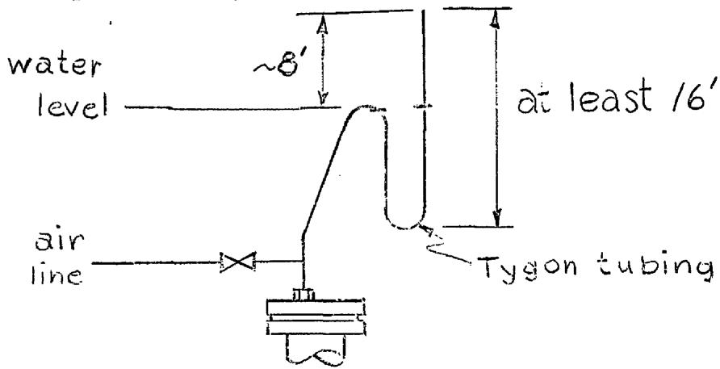

With the water in VTL at the normal level of 14 ft.  
ll in., add water to the tank and record the levels when the upper level switches actuate the alarms.  
Lower the level in the tank and record the levels when the upper alarms clear, and the lower alarms are actuated. Refill tank to normal level and record levels when Lower alarms clear.

Init. Date/Time

Adding or

Removing Water Switch Alarm Clear Bubbler Level

LSVT1-B3 Lower upper ft in.

Adding LSVT1-B4 Upper upper

LSVT1-B4 Removing Upper upper

LSVT1-B3 Lower upper

LSVT1-B2 Removing Upper lower

LSVT1-B1 Removing Lower lower

LSVT1-B1 Adding Lower lower

LSVT1-B2 Adding Upper lower

Remove temporary equipment, replace level diptube

plug, replace and leak check 6 in. blank flange.

100 Radiator Door Scram Time

With coolant system empty, check the scram time of the radiator doors as follows:

100.1 Raise inlet door to upper limit. Simultaneously start a stop watch and turn switch S-2 (load scram) to scram position.

Stop the stop watch when lower limit lights come on. Record time

100.2 Repeat with outlet door. Record time

Leave doors closed.

ALL ITEMS ON THE INSTRUMENTATION STARTUP CHECK LIST ARE

COMPLETE. Shift Supervisor Date

# 4I Freeze Valves

The following check list covers the complete startup of each freeze valve and adjusting each so that freezing and thawing can be accomplished using the freeze valve switch on the main control board. This does not need to be done on each valve on each startup. If a number of transfers or additions are to be made, it may be desirable to set up FV-107 through 112 in this manner. However, for a single transfer it may be easier to go directly from deep freeze to the thaw condition using heaters and manual control of the air. When transfers are complete, the valves will be deep frozen.

During a normal startup, FV-104 through 106 will normally be either deep frozen or thawed, and no extensive adjustments are required. The thawing of these is described in Section 5I.

On each startup, FV-103, 204 and 206 must be set up so that they will thaw when required. These are also covered in Section 5I.

The setting of the temperature switches, and freeze valve HIC's and TIC's are covered in Section 4H.

The following is a detailed description of the steps necessary in setting up a freeze valve for automatic operation. Table 4I-1 and 2 should be used for recording the data obtained.

# 1 DETAILED PROCEDURE

1.1 Obtain shift supervisor's permission to proceed. (Column 1.1)   
1.2 Check that the associated lines are heated. Thaw or check that the freeze valve is in the thaw position (Check that interlocks are clear). (Column 1.2)   
1.3 Adjust plug control heaters to give the temperature listed. Record final temperatures. (Column 1.3)   
1.4 Check that pressure on both sides of FV is balanced. Switch freeze valve to freeze position and set blast air HIC to value given. (Column 1.4)   
1.5 When both shoulder thermocouples reach $\sim 750^{\circ}\mathrm{F}$ , the alarm will clear and the cooling air will be reduced from blast to hold. Set TIC's on automatic. Adjust hold air HIC or set TIC to

# 1.5 (continued)

give the shoulder temperatures listed. Record final HIC setting and shoulder temperatures. (Column 1.5)

1.6 When the freeze valve is thawed, note time required for valve to thaw. Accurate indication of thaw time can only be obtained by salt flow as indicated by rapid change in FV temperatures. Less accurate indications can be obtained from the thermocouples without salt flow. Record any results obtained (Column 1.6).

STARTUP OF FREEZE VALVES 103, 104, 105, 106, 204, and 206

TABLE 4I-1   

<table><tr><td>StepNo.</td><td colspan="2">DESCRIPTION OFDATA</td><td>FV-103</td><td>FV-104</td><td>FV-105</td><td>FV-106</td><td>FV-204</td><td>FV-206</td></tr><tr><td>1.1</td><td colspan="2">Permission to Start(SS Initials)</td><td></td><td></td><td></td><td></td><td></td><td></td></tr><tr><td>1.2</td><td colspan="2">Line Hot and FV inThaw Position</td><td></td><td></td><td></td><td></td><td></td><td></td></tr><tr><td rowspan="9">1.3</td><td rowspan="2">FV ShoulderHeaters</td><td>ReactorSide</td><td>Note 1</td><td>H-FV-104-1</td><td>H-FV-105-1</td><td>H-FV-106-1</td><td>H-FV-204-1</td><td>H-FV-206-1</td></tr><tr><td>Drain TankSide</td><td>Note 1</td><td>H-FV-104-1A</td><td>H-FV-105-1A</td><td>H-FV-106-1A</td><td>H-FV-204-1A</td><td>H-FV-206-1A</td></tr><tr><td rowspan="2">Adjust toAverageTemp.</td><td>Drain Tk SideTE-A4</td><td>1200°F</td><td>1200°F</td><td>1200°F</td><td>1200°F</td><td>1200°F</td><td>1200°F</td></tr><tr><td>Reactor SideTE-B4</td><td>1200°F</td><td>1200°F</td><td>1200°F</td><td>1200°F</td><td>1200°F</td><td>1200°F</td></tr><tr><td rowspan="5">FinalTemp.withAirOff</td><td>TE-A4</td><td></td><td></td><td></td><td></td><td></td><td></td></tr><tr><td>TE-B4</td><td></td><td></td><td></td><td></td><td></td><td></td></tr><tr><td>TE-1</td><td></td><td></td><td></td><td></td><td></td><td></td></tr><tr><td>TE-2</td><td></td><td></td><td></td><td></td><td></td><td></td></tr><tr><td>TE-3</td><td></td><td></td><td></td><td></td><td></td><td></td></tr><tr><td rowspan="3">1.4</td><td rowspan="3">BlastAirHIC</td><td>HIC No.</td><td>919 A-1</td><td>908 A-1</td><td>909 A-1</td><td>910 A-1</td><td>906 A-1</td><td>907 A-1</td></tr><tr><td>Setting</td><td>16</td><td>20</td><td>20</td><td>20</td><td>20</td><td>20</td></tr><tr><td>Initial</td><td></td><td></td><td></td><td></td><td></td><td></td></tr><tr><td rowspan="6">1.5</td><td rowspan="6">HoldAirController</td><td>ControllerNo.</td><td>TIC919 A-2</td><td>HIC908 A-2</td><td>TIC909 A-2</td><td>TIC910 A-2</td><td>TIC906 A-2</td><td>TIC907 A-2</td></tr><tr><td>Shoulder:TE-1</td><td>910°F-992°F</td><td>800°F-850°F</td><td>800°F-850°F</td><td>800°F-850°F</td><td>850°F-950°F</td><td>850°F-950°F</td></tr><tr><td rowspan="2">Temps.Note 2</td><td></td><td></td><td></td><td></td><td></td><td></td></tr><tr><td>700°F-764°F</td><td>800°F-850°F</td><td>800°F-850°F</td><td>800°F-850°F</td><td>850°F-950°F</td><td>850°F-950°F</td></tr><tr><td>ControllerSetting</td><td>960°F</td><td></td><td>825°F</td><td>825°F</td><td>825°F</td><td>825°F</td></tr><tr><td>Initial</td><td></td><td></td><td></td><td></td><td></td><td></td></tr><tr><td rowspan="4">1.6</td><td rowspan="2">ThawTime (sec)</td><td>TE-1</td><td></td><td></td><td></td><td></td><td></td><td></td></tr><tr><td>TE-2</td><td></td><td></td><td></td><td></td><td></td><td></td></tr><tr><td rowspan="2">When Tempreaches850°</td><td>TE-3</td><td></td><td></td><td></td><td></td><td></td><td></td></tr><tr><td>When salt</td><td></td><td></td><td></td><td></td><td></td><td></td></tr></table>

Note 1:- FV-103 is heated by the reactor vessel heaters.   
Note 2:- Record equilibrium values for TE-1 and TE-3.   
Note 3:- Record setting necessary to hold shoulder temperatures listed.

STARTUP OF FREEZE VALVES 107, 108, 109, 110, 111, and 112

TABLE 4I-2   

<table><tr><td>StepNo.</td><td colspan="3">DESCRIPTION OFDATA</td><td>FV-107</td><td>FV-108</td><td>FV-109</td><td>FV-110</td><td>FV-111</td><td>FV-112</td></tr><tr><td>1.1</td><td colspan="3">Permission to Start(SS Initials)</td><td></td><td></td><td></td><td></td><td></td><td></td></tr><tr><td>1.2</td><td colspan="3">Line Hot and FV inThaw Position</td><td></td><td></td><td></td><td></td><td></td><td></td></tr><tr><td rowspan="7">1.3</td><td colspan="3">FV Shoulder HeaterControlsBoth Shoulders</td><td>H-FV-107-1</td><td>H-FV-108-1</td><td>H-FV-109-1</td><td>H-FV-110-1</td><td>H-FV-111-1</td><td>H-FV-112-1</td></tr><tr><td colspan="3">Adjust to AverageTemperatureTE-A4and B4</td><td>1200°F</td><td>1200°F</td><td>1200°F</td><td>1200°F</td><td>1200°F</td><td>1200°F</td></tr><tr><td rowspan="5" colspan="2">FinalTemperatureWithAirOff</td><td>TE-A4</td><td></td><td></td><td></td><td></td><td></td><td></td></tr><tr><td>TE-B4</td><td></td><td></td><td></td><td></td><td></td><td></td></tr><tr><td>TE-1</td><td></td><td></td><td></td><td></td><td></td><td></td></tr><tr><td>TE-2</td><td></td><td></td><td></td><td></td><td></td><td></td></tr><tr><td>TE-3</td><td></td><td></td><td></td><td></td><td></td><td></td></tr><tr><td rowspan="3">1.4</td><td rowspan="3" colspan="2">BlastAirHIC</td><td>HIC No.</td><td>911 A-1</td><td>912 A-1</td><td>913 A-1</td><td>969 A-1</td><td>929 A-1</td><td>924 A-1</td></tr><tr><td>Setting</td><td>0</td><td>0</td><td>0</td><td>0</td><td>0</td><td>0</td></tr><tr><td>Initial</td><td></td><td></td><td></td><td></td><td></td><td></td></tr><tr><td rowspan="6">1.5</td><td rowspan="6">HoldAirController</td><td colspan="2">HIC No.</td><td>911 A-2</td><td>912 A-2</td><td>913 A-2</td><td>969 A-2</td><td>929 A-2</td><td>924 A-2</td></tr><tr><td rowspan="3">ShoulderTemps*</td><td rowspan="2">TE-1</td><td>800°F-850°F</td><td>800°F-850°F</td><td>800°F-850°F</td><td>800°F-850°F</td><td>800°F-850°F</td><td>800°F-850°F</td></tr><tr><td></td><td></td><td></td><td></td><td></td><td></td></tr><tr><td>TE-3</td><td>800°F-850°F</td><td>800°F-850°F</td><td>800°F-850°F</td><td>800°F-850°F</td><td>800°F-850°F</td><td>800°F-850°F</td></tr><tr><td colspan="2">Controller**Setting</td><td></td><td></td><td></td><td></td><td></td><td></td></tr><tr><td colspan="2">Initial</td><td></td><td></td><td></td><td></td><td></td><td></td></tr><tr><td rowspan="4">1.6</td><td rowspan="4" colspan="2">ThawTime (Sec)WhenTemperatureReaches850°F</td><td>TE-1</td><td></td><td></td><td></td><td></td><td></td><td></td></tr><tr><td>TE-2</td><td></td><td></td><td></td><td></td><td></td><td></td></tr><tr><td>TE-3</td><td></td><td></td><td></td><td></td><td></td><td></td></tr><tr><td>When SaltFlows</td><td></td><td></td><td></td><td></td><td></td><td></td></tr></table>

*Record equilibrium values for TE-1 and TE-3.   
*Record setting necessary to hold shoulder temperatures listed.

# Internal Distribution

# Bound Copies

1. R.G.Affel   
2. T. Arnwine   
3. S.E.Beall   
4. N. E. Bolton   
5. R. B. Briggs   
6. G. H. Burger   
7. R. L. Clark   
8. J. L. Crowley   
9. J. R. Engel   
10. E. N. Fray   
ll. R. B. Gallaher   
12. A. F. Gillen   
13. E. H. Guinn   
14-18. R.H.Guymon   
19-23. P. N. Haubenreich   
24. C.C.Hurtt   
25. A. I. Krakoviak   
26. R. B. Lindauer   
27. C. D. Martin   
28. C. K. McGlothlan   
29. R. L. Moore   
30. W.W.Ogg

31. H. B. Piper   
32. B. E. Prince   
33. L.P.Pugh   
34. W.E.Ramsey   
35. M. Richardson   
36. H.C.Roller   
37. D. Scott   
38. A. N. Smith   
39. W. Spencer   
40. R.C. Steffy   
41. J. R. Tallackson   
42. R.E.Thoma   
43. R.W.Tucker   
44. J. L. Underwood   
45. J.A. Watts   
46. B.H. Webster   
47. K. W. West   
48. S.R.West

49-52. Central Research Library   
53-54. Y-12 Document Reference Section   
55-58. Laboratory Records Department   
59. Laboratory Records, RC

# External Distribution

# Bound Copies

60. D. F. Cope, AFC, ORO   
61. H.M.Roth   
62. R. W. Garrison, AEC, Washington   
63. Bruce Deering, AEC   
64-78. Division of Technical Information Extension, DTIE   
79. Wayne Smalley, AEC Administration Building