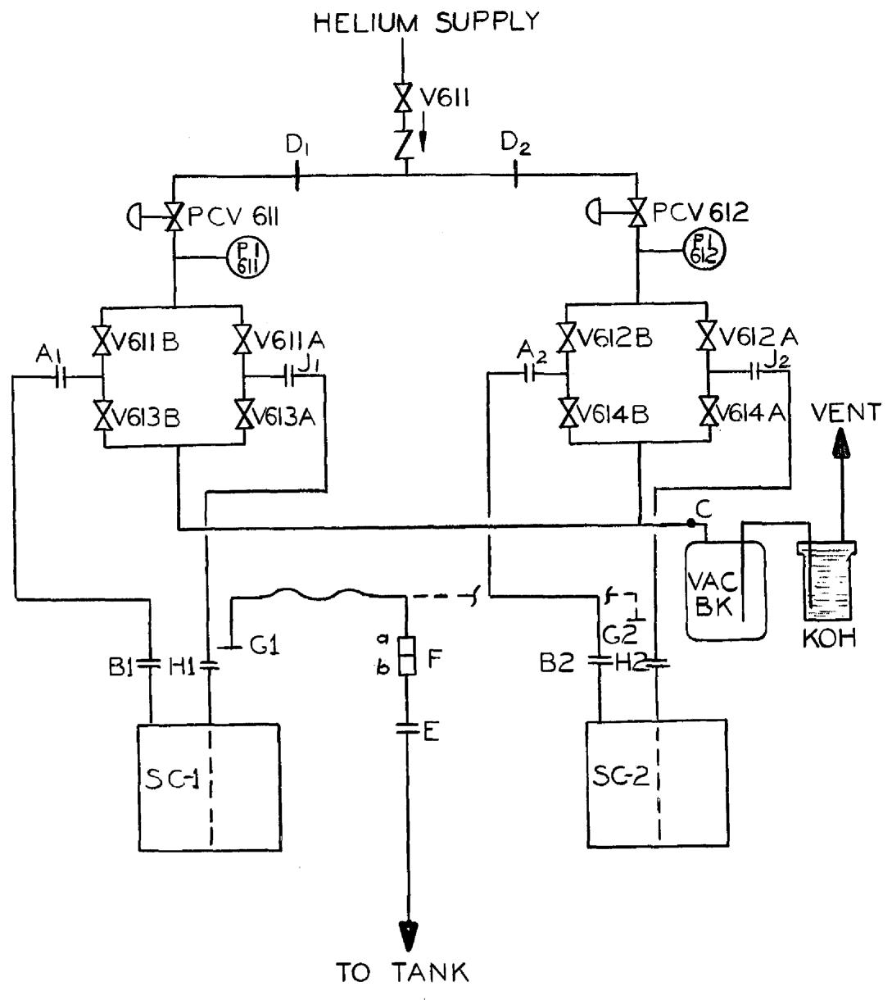
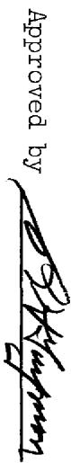
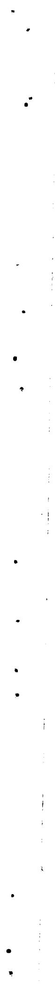
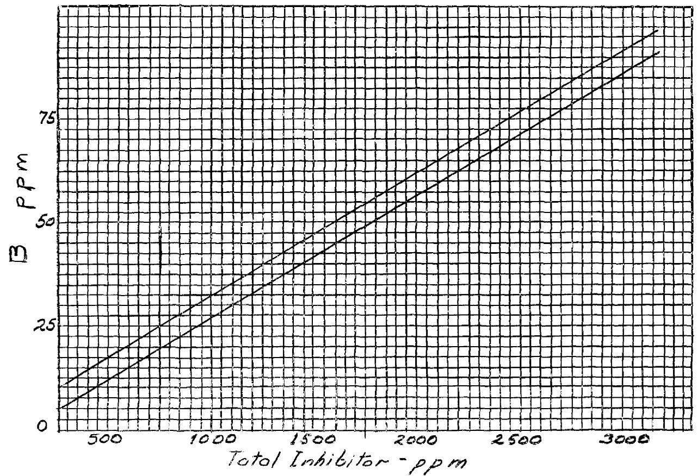
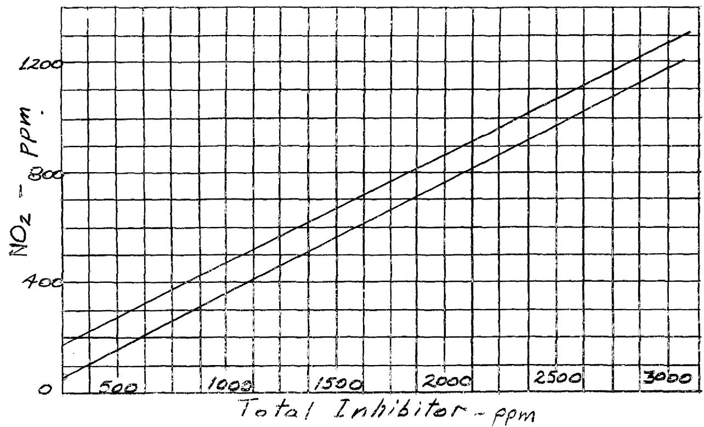
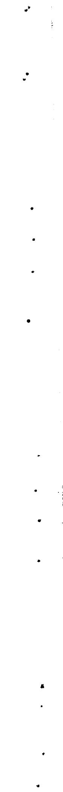
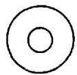
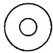

OAK RIDGE NATIONAL LABORATORY LIBRARIES


#

OAI 3445605494514 , LABORATORY

operated by

UNION CARBIDE CORPORATION

for the

U.S. ATOMIC ENERGY COMMISSION


ORNL-TM-908,

Volume II

of 9

MSRE DESIGN AND OPERATIONS REPORT

PART VIII, OPERATING PROCEDURES

R.H. Guymon


# LEGAL NOTICE

This report was prepared as an account of Government sponsored work. Neither the United States, nor the Commission, nor any person acting on behalf of the Commission:

A. Makes any warranty or representation, expressed or implied, with respect to the accuracy, completeness, or usefulness of the information contained in this report, or that the use of any information, apparatus, method, or process disclosed in this report may not infringe privately owned rights; or   
B. Assumes any liabilities with respect to the use of, or for damages resulting from the use of any information, apparatus, method, or process disclosed in this report.

As used in the above, "person acting on behalf of the Commission" includes any employee or contractor of the Commission, or employee of such contractor, to the extent that such employee or contractor of the Commission, or employee of such contractor prepares, disseminates, or provides access to, any information pursuant to his employment or contract with the Commission, or his employment with such contractor.

ORNL-TM-908,

Volume II

MSRE DESIGN AND OPERATIONS REPORT

PART VIII, OPERATING PROCEDURES

R.H. Guymon

JANUARY 1966

OAK RIDGE NATIONAL LABORATORY

Oak Ridge, Tennessee

Operated by

UNION CARBIDE CORPORATION

for the

UNITED STATES ATOMIC ENERGY COMMISSION

# PREFACE

The report on the Molten-Salt Reactor Experiment (MSRE) has been arranged into twelve major parts as shown below. Each of these covers a particular phase of the project, such as the design, safety analysis, operating procedures, etc. An attempt has thus been made to avoid much of the duplication of material that would result if separate and independent reports were prepared on each of these major aspects.

Detailed references to supporting documents, working drawings, and other information sources have been made throughout the report to make it of maximum value to ORNL personnel. Each of the major divisions of the report contains the bibliographical and other appendix information necessary for that part.

The final volumes of the report, Part XII, contain rather extensive listings of working drawings, specifications, schedules, tabulations, etc. These have been given a limited distribution.

Most of the reference material is available through the Division of Technical Information Extension, Atomic Energy Commission, P.O. Box 62, Oak Ridge, Tennessee. For material not available through this source, such as inter-Laboratory correspondence, etc., special arrangements can be made for those having a particular interest.

None of the information contained in this report is of a classified nature.

All the reports are listed below.

ORNL-TM-728* MSRE Design and Operations Report, Part I, Description of Reactor Design, by R. C. Robertson

ORNL-TM-729 MSRE Design and Operations Report, Part II, Nuclear and Process Instrumentation, by J. R. Tallackson

ORNL-TM-730* MSRE Design and Operations Report, Part III, Nuclear Analysis, by P. N. Haubenreich, J. R. Engel, B. E. Prince, and H. C. Claiborne

ORNL-TM-731 MSRE Design and Operations Report, Part IV, Chemistry and Materials, by F. F. Blankenship and A. Taboada

ORNL-TM-732* MSRE Design and Operations Report, Part V, Reactor Safety Analysis Report, by S. E. Beall, P. N. Haubenreich, R. B. Lindauer, and J. R. Tallackson   
ORNL-TM-733* MSRE Design and Operations Report, Part VI, Operating Safety Limits for the Molten-Salt Reactor Experiment, by S. E. Beall and R. H. Guymon   
ORNL-TM-907* MSRE Design and Operations Report, Part VII, Fuel Handling and Processing Plant, by R. B. Lindauer   
ORNL-TM-908 MSRE Design and Operations Report, Part VIII, Operating Procedures, by R. H. Guymon   
ORNI-TM-909 MSRE Design and Operations Report, Part IX, Safety Procedures and Emergency Plans, by A. N. Smith   
ORNL-TM-910 MSRE Design and Operations Report, Part X, Maintenance Equipment and Procedures, by E. C. Hise and R. Blumberg   
ORNL-TM-911 MSRE Design and Operations Report, Part XI, Test Program, by R. H. Guymon and P. N. Haubenreich   
MSRE Design and Operations Report, Part XII, Lists: Drawings, Specifications, Line Schedules, Instrument Tabulations (Vol. 1 and 2)

# Acknowledgement

The Operating Procedures were written primarily by members of the MSRE Operations Department of the ORNL Reactor Division. Substantial contributions were made by members of the Development Department of the Reactor Division and by members of the Instruments and Controls Division who wrote and reviewed various sections. All contributions are gratefully acknowledged.

#

4

# CONTENTS

# Volume I

# PREFACE

# ACKNOWLEDGEMENT

# 1 INTRODUCTION

1A Explanation of Operating Procedures   
IB List of Other Material Available

# 2. NUCLEAR ASPECTS OF OPERATION

2A Simplified Reactor Theory

Glossary   
2 Atomic Structure   
3 Radioactivity and Radiation   
4 The Fission Process   
Cross Sections and Reaction Rates   
6 The Fission Chain Reaction in an Infinite Reactor   
7 Effect of Neutron Leakage   
8 Criticality   
9 Extraneous Neutron Sources and Subcritical Multiplication   
l0 Reactor Kinetics   
11 Nuclear Instrumentation   
12 Reactor Control   
13 Xenon and Samarium

# 2B MSRE Nuclear Characteristics

1 Core Reactivity Factors   
2 Heat Generation and Temperature Distributions   
3 Instrumentation   
4 Kinetics and Safety

# 3 OPERATION OF AUXILIARY SYSTEMS

# 3A Electrical System

System Startup   
2 Normal Operation   
3 Emergency and Special Operations   
4 Normal Shutdown

3B Instrument Air and Service Air Systems

1 Startup   
2 Normal Operation   
3 Emergency or Special Operation   
4 Shutdown

3C Water System

1 Startup   
2 Normal Operation   
3 Emergency Operation   
4 Normal Shutdown

3D Component Cooling Systems

1 Startup   
2 Normal Operation   
3 Emergency Operations   
4 Special Operations   
5 Shutdown

3E Shield and Containment

1 Reactor and Drain Tank Cells

1.1 Startup   
1.2 Normal Operation   
1.3 Emergency or Special Operation   
1.4 Shutdown

2 Vapor Condensing System

2.1 Startup   
2.2 Normal Operation   
2.3 Emergency and Special Operations   
2.4 Shutdown Operation

3 Coolant Cell and Coolant Drain Tank Cell

3.1 Startup   
3.2 Normal Operation   
3.3 Emergency or Special Operations   
3.4 Shutdown

4 Special Equipment Room   
5 West Tunnel and South Electric Service Area   
6 Charcoal Bed Pit   
7 Filter Pit   
8 Auxiliary Cells

# 3F Ventilation System

1. Startup   
2 Normal Operation   
3 Operation during Maintenance   
4 Special Operations   
5 Shutdown

# 3G Leak-detector System

1 Startup   
2 Normal Operation   
3 Location of Leaking Flanges   
4 Shutdown Procedures

# 3H Instrumentation

1 Controllers and Indicators   
2 Scanner   
3 Computer   
4 Annunciators   
5 Jumper Board   
6 Other Instruments

6.1 FqI-569-A   
6.2 AO-566-A   
6.3 PdE-RC-E   
6.4 ABe-A-AD3   
6.5 $A O_{2} = 548$   
6.6 AH2O-548

# 3I Freeze Valves

1 Definitions and Criteria   
2 Basic Operation and Interlocks   
3 Operation of Freeze Valves

3J Liquid Waste System

1 Jetting Reactor Cell and Drain Tank Cell Sumps   
2 Sampling Reactor and Drain Tank Cell Sumps   
3 Jetting Auxiliary Cell Sumps   
4 Building Sump Operation   
5 Pit Pump Operation   
6 Treatment and Disposal of Waste Contents   
7 Clarification of Decontamination Tank or Decontamination Cell Liquid   
Backwash of the Waste Filter   
9 General Decontamination and Clean Up

3K Be Monitoring System

1 General Building Air Sampling System   
2 Ventilation System Air Handling   
3 NSL Be Air Monitoring Unit   
4 Coolant System Stack Be Monitoring Unit

4 AUXILIARY SYSTEMS STARTUP CHECK LIST

4A Electrical System   
4B Instrument Air System   
4C Cooling Water Systems   
4D Component Cooling Systems   
4E Shield and Containment Systems   
4F Ventilation System   
4G Leak-detector System   
4H Instrumentation   
4I Freeze Valves

# Volume II

5 REACTOR STARTUP

5A Purging Oxygen and Moisture from the Salt System   
5B Startup of Cover-gas and Offgas Systems   
5C Heatup of Drain Tank System   
5D Addition of Fuel, Flush, and Coolant Salt to the Drain Tanks   
5E Startup of Lube-oil Systems for the Fuel and Coolant Pumps   
5F Heatup of Fuel and Coolant Systems   
5G Prepare Drain Tank Systems for Reactor Startup   
5H Routine Pressure Test

5I Filling the Fuel and Coolant Systems   
5J Criticality and Power Operation

1 Preparation for Power Operation   
2 Starting Power Operation using Automatic Load Control and Rod Servo   
3 Manual and Special Power Operation

5K Normal Operating Conditions

# 6 SAMPLING AND ADDITIONS

6A Fuel System Sampling and Enriching

1 General Description of Sampling the Fuel System   
2 General Description of Adding Enriching Capsules to the Fuel System

3 Fuel System Sampling Check List   
4 Fuel System Enriching Check List   
5 Fuel System Sampler Startup   
6 Fuel System Sampler Shutdown   
7 Unusual Operating Conditions for the Sampler Enricher

6B Coolant System Sampling

1 General Description of Sampling the Coolant System   
2 Coolant System Sampling Check List   
3 Coolant System Sampler Startup   
4 Coolant System Sampler Shutdown

6C Water System

Treatment of Treated Water or Nuclear Penetration   
2 Treatment of Cooling Tower Water   
3 Condensate   
4 Procedure for Total Inhibitor Analysis   
5 Procedure for Chromate Analysis   
6 Procedure for Hardness Analysis   
7 pH Measurement

6D Cell Air

6E Lube Oil System

1 Sampling of New Oil as Received   
2 Sampling at Oil Packages   
3 Addition of Lube Oil to Oil Packages

6F Cover Gas   
6G Offgas System

# 7 HEAT BALANCE

7A General Description   
7B Computer Heat Balance   
7C Manual Heat Balance

# 8 PERIODIC INSTRUMENT CALIBRATION AND CIRCUIT CHECKS

# 8A Neutron Level

1 Wide-range Counting Channels   
2 Nuclear Safety Channels   
3 Linear Power Channels

# 8B Calibration Check of Process Radiation Monitors

1 Preparation   
2 Radiation Monitor 557 (Offgas from Charcoal Beds)   
3 Radiation Monitor 528 (Coolant System Offgas)   
4 Radiation Monitor 565 (Cell Offgas)   
5 Radiation Monitor 500 (Main Helium Supply)   
6 Process Monitor 596 (Outside Transmitter Room)   
7 Process Monitor 827 (Treated Water)   
8 Oil System Process Monitors (Service Tunnel)

# 8C Calibration of Personnel Monitors and Stack Monitors

Routine Source Check   
2 Alarm Matrix Check   
3 Evacuation Alarm Test   
4 Containment Stack Monitor Tests

# 8D Safety Circuit Checks

Fuel Pump and Overflow Tank Pressure   
2 Helium Supply Pressure   
3 FP and OFT Bubblers   
4 Rod Scram Circuits   
5 Emergency Fuel Drain   
6 High/Low Reactor Cell Pressure   
7 Coolant Pump Speed and Coolant Salt Flow   
8 Sampler-Enricher   
9 Exercise Control Rods

# 9 UNUSUAL OPERATING CONDITIONS

```txt
9A Loss of Electrical Power  
1 Loss of Preferred TVA Feeder  
2 Complete Loss of TVA Power - All Diesels Operable  
3 Failure of DG-3 during a TVA Power Outage  
4 Failure of DG-4 during a TVA Power Outage  
5 Failure of DG-5 during a TVA Power Outage  
6 Failure of DG-3 and 4 during a TVA Power Outage  
7 Failure of DG-3 and 5 or 4 and 5 during a TVA Power Outage  
8 Loss of 250v DC Systems  
9 Loss of Instrument Power 
```

```txt
9B Loss of Cooling Water 1 Treated Water System 2 Cooling Tower Water 
```

```txt
9C Loss of Fuel or Coolant Pump 1 Loss of Fuel Pump 2 Loss of Coolant Pump 
```

```txt
9D Loss of Instrument Air 1 Air Compressor Electrical Difficulties 2 Other Air Compressor Difficulties 3 Effects of Loss of Instrument Air 
```

```txt
9E Radiation Increases 1 Personnel Monitors 2 Process Radiation Detectors 3 High Stack Activity 
```

```txt
9F Control-rod Drive Difficulty 
```

```txt
9G Loss of Computer 
```

```txt
9H Lube-oil System Difficulties 1 Coolant Salt Pump Lube System Failure 2 Fuel Salt Pump Lube System Failure 3 Total Oil System Failure 4 Excess Oil Seal Leakage 
```

```txt
9I Salt in Overflow Tank   
9J Loss of Helium Purge to the Circulating Pumps   
9K Loss of Component Cooling Blowers 
```

9L Removal of Water from the Steam Domes   
9M Regeneration of Helium Dryer   
9N High Cell Leak Rate Indication

Salt Leaking into the Cell   
2 Water Leaking into the Cell   
3 Loss of Reactor or Drain Tank Space Coolers   
4 Actual High Cell Leak Rate

# 1.0 REACTOR SHUTDOWN

1OA Normal Shutdown

1 Power Reduction and Going Subcritical   
2 Draining and Flushing the Fuel System   
3. Draining the Coolant System   
4 Cooldown of Fuel and Coolant Systems   
5 Shutdown of Remaining Equipment

10B Special Shutdown

1 Power Reduction and Going Subcritical   
2 Draining and Flushing the Fuel System   
3 Shutdown of Remaining Equipment

# 11 SHUTDOWN OPERATIONS

llA Fuel or Flush Salt Transfers

1 Preparation for Transfers   
2 Transfer from FD-1 to FST   
3 Transfer from FD-2 to FST   
4 Transfer from FFT to FST   
5 Transfer from FST to FD-1   
6 Transfer from FST to FD-2   
7 Transfer from FST to FFT   
8 Transfer from FD-1 to FD-2   
9 Transfer from FD-2 to FD-1   
10 Heatup of FST   
ll Heatup of Line lll   
12 Heatup of Waste Line 112   
13 Heatup of Fill Line 203   
14 Heatup of Transfer and Salt Addition Freeze Valve Assemblies

11B Opening Reactor Cell, Drain Tank Cell, and Coolant Cell Shields

1 Reactor Cell Heater Shutdown Check List   
2 Drain Tank Cell Heater Shutdown Check List   
3 Coolant Cell Heater Shutdown Check List   
4 Cooling Water Shutdown Check List   
5 Freeze Valve Shutdown Check List   
6 Component Cooling Air to Components Shutdown Check List   
7 Component Cooling Pumps Shutdown Check List   
8 Electrical Breakers Shutdown Check List   
9 Opening Reactor Cell and Drain Tank Cell   
10 Opening the Coolant Cell

llC Graphite Sampling   
llD Routine Inspection and Testing of Equipment

1 Process Systems   
2 Auxiliary Systems   
3 Pressure Relief Valves   
4 Rupture Discs   
5 Reactor Cell and Drain Tank Cell Containment Vessels   
6 Secondary Containment Vessels

12 ROUTINE OBSERVATIONS

12A Logs   
12B Check Lists   
12C Recorders and Indicators   
12D Computer   
12E Tags and Signs

13 MAINTENANCE AND CHANGES

13A Maintenance   
13B Modifications   
13C Changes in Operating Procedures   
13D Changes in Computer Program   
13E Revisions of Approved Documents

# SECTION 5

# REACTOR STARTUP

After the auxiliary startup check lists have been completed, there is still a considerable number of operations to be done prior to power operation. The details of these are given in this section in chronological order. In each section a general description is given as to what is to be done, what precautions are necessary and suggests corrective action in case of difficulty. This is followed by detailed check lists.

Section 5K describes the normal operation of the plant. Information is given as to what equipment should be operated and in general how it is to be operated. The operational limits are covered by the Building Log. (12A-2A or 12A-2B)

#

#

1

#

After any appreciable amount of atmospheric contamination has occurred, as when a system is opened for maintenance, it will be necessary to purge out most of the oxygen and moisture before heat-up.

By evacuation and refilling the coolant system with helium, the oxygen and moisture content can be reduced to a tolerable ( $\sim 100$ ppm) level. However, evacuation cannot be used on the fuel or fuel drain tank systems because fission gases would be released from the charcoal beds. Oxygen and moisture will be removed from the fuel system by purging a sufficient amount of helium while mixing with the fuel pump. Since mixing during a continuous purge is not possible in the fuel drain tanks, alternate pressure-vent cycles will be used.

# 1 PURGING THE FUEL SYSTEM

Init. Date & Time

Purging of the fuel system after maintenance will consist of introducing helium into as many openings as possible, circulating it with the fuel pump, and venting continuously through the main charcoal beds. A minimum of 9 fuel system volumes ( $\sim$ 675 ft³) of helium will be required to lower the oxygen concentration from atmospheric to $<$ 100 ppm. Details are given below:

i.l Close or check that the following valves are closed:

(High Bay Area)   
Sampler-enricher operational valve ,   
(Main Board)   
F P vent HCV 533 ,   
Bypass valves HCV 544 ,   
HCV 545 ,   
HCV 546 ,

(Vent House) Sample Station V 518A , and V-518E (Coolant Drain Cell) WOR V 720A and V 72CB V 525A and V 525B

Init. Date & Time

(Electric Service Area)

V-519A

1.2 Check that freeze valves 104, 105, and 106

are deep frozen

1.3 Set up maximum helium flows through the four

bubble tubes and the pump (FP) as follows:

(Diesel House)

1.3.1 Check helium supply of 40 psig on lines

501 and 516

(Main Board)

1.3.2 Set PCV-522 to 5 psig.

1.3.3 Set FP bubbler selector switch S-36

"both bubbler" position

(Vent House)

1.3.4 Open V-522B and V-557B

1.3.5 Open two of the following pairs of

valves and close the other two pairs:

V-620 and V-624

V-621 and V-625

V-622 and V-626

V-623 and V-627

1.3.6 Open or check open the following:

(Special Equipment Room)

V-524A

(Transmitter Room)

V-592A V-600A

V-596A V-599A

V-593A V-589A

1.3.7 Adjust bubbler throttle valves to ob-

tain flows as given in building log.

(Transmitter Room)

FP bubblers:

V-592B for FI-592

V-596B for FI-596

V-593B for FI-593

OFT bubblers:

V 600B for FI 600

V 599B for FI 599

V 589B for FI 589

NOTE: The OFT bubblers may be plugged because

of a frozen heel of salt. This will be indicated

by a high pressure on FI 599 and FI 600 (alarms

on XA 4006-6) and a false high level indication

on LI 599 and LI 600 (alarm on XA 4007-2). In

this event close block valves HV 599 and HV 600.

It would then be necessary to relieve the pressure

by turning test switch S-38 momentarily to

"equalizer No. 1" and then to "equilizer No. 2"

positions. Wait until the OFT temperature is

above salt liquidus before placing plugged bubblers

back ito service. Indicate condition of bubblers:

1.3.7 Set FIC 516 to maximum flow $(\sim 5 \, \text{l/m})$ .

1.4 In preparation for running the fuel pump to aid in mixing the purge gas, check the following:

(Control Room)

1.4.1 Oil level on LI-OT-1 > 50 % ,

PIC 513 set for 7 psig

F.O.P.No. running

Shield oil flow 8 gpm on FI 704

Seal oil flow of $4\mathrm{gpm}$ on FI 703

(Water Room)

1.4.2 Motor cooling water 5 gpm on FI 830

(Control Room)

1.4.3 Start fuel pump.

1.5 Determine the required purge time required before heat up is begun as follows:

1.5.1 Determine total helium flow being introduced into the fuel system. Refer to calibration curves available to convert indicator readings to l/min.

(Transmitter Room)

FI 592 psig = 1/m,

FI 596 psig = l/m,

FI 593 psig = l/m,

FI 600 psig = 1/m,

FI 599 psig = l/m,

FI 589 psig = 1/m,

(Main Board)

FI 516 $\% = \frac{1}{m}$

Total Flow 1/m.

1.5.2 Determine time required to purge 7 system

volumes at the flow established in step 1.5.l by:

Time (hrs) = $\frac{75\mathrm{ft}^3 / \mathrm{vol}\times 7\mathrm{vol}}{\mathrm{Flow}1 / \mathrm{m}\times\frac{60}{28.3}} = \frac{248}{\mathrm{Flow}1 / \mathrm{m}} =$ hrs.

Purging helium at the rate in 1.5.l while mixing with the fuel pump, for the time above should reduce oxygen contamination to $< 500$ ppm.

1.6 After purging for the length of time determined

above (approx 30 hrs), reduce the purge to normal

flow rate (see section 5.I.2.8 and 5.I.2.9).

1.7 Continue the normal purge rate (total approx

4.2 1/m) during reactor startup to further

reduce oxygen concentration in the gas to below

100 ppm which would represent $< 1$ ppm oxide in

8,800 lbs of salt.

# 2 PURGING THE FUEL DRAIN TANKS

Purging of a fuel system drain tank after it has been opened to atmosphere for any reason consists of alternately pressurizing and venting of helium. Pressure

changes of 5 psi will be made by alternately pressurizing to 7 psig and venting to 2 psig. To reduce the oxygen concentration from atmospheric to $< 500$ ppm before heat up is begun will require 24 cycles. An additional 6 cycles will be performed during heat up to lower oxygen concentration to $< 100$ ppm. Each pressure cycle will require in excess of an hour due to flow limitations of FE 517. The theoretical number of $\Delta P$ cycles to reduce oxygen concentration to any desired value may be determined by:

$$
N = \frac {\ln \frac {C o}{C}}{\ln \frac {P _ {2}}{P _ {1}}}
$$

where $N =$ number of pressure cycles purge gas required

Co = beginning concentration $O_{2}$ in ppm

C = desired or end concentration $O_2$ in ppm

$\mathbb{P}_{1} =$ end vent cycle pressure, psia

$\mathbb{P}_{2} =$ end pressure cycle, psia.

2.1 Check that the cover gas system is in operation.   
2.2 Check that the drain tank, associated fill and transfer piping, and freeze valves, to be purged are at room temperature (Mark through tank(s) not to be purged).

FDL

FD2

FFT

<table><tr><td>Line 109</td></tr><tr><td>FV 109</td></tr><tr><td>Line 106</td></tr><tr><td>FV 106</td></tr></table>

<table><tr><td>Line 108</td></tr><tr><td>FV 108</td></tr><tr><td>Line 105</td></tr><tr><td>FV 105</td></tr></table>

<table><tr><td>Line 107</td></tr><tr><td>FV 107</td></tr><tr><td>Line 104</td></tr><tr><td>FV 104</td></tr></table>

(Control Room)

2.3 Close the bypass valve(s).

<table><tr><td>HCV 544</td></tr></table>

<table><tr><td>HCV 545</td></tr></table>

<table><tr><td>HCV 546</td></tr></table>

2.4 Close the vent valve(s).

<table><tr><td>HCV 573</td></tr></table>

<table><tr><td>HCV 575</td></tr></table>

<table><tr><td>HCV 577</td></tr></table>

2.5 Set PIC 517 to 8 psig. Note that fuel system

pressure must be $< 2$ psig for this valve to open.

2.6 Open tank supply valve by checking that:

2.6.1 Receiver selector S-4 in FST position

2.6.2 FV 111, FV 107, FV 108, FV 109 are

frozen

2.6.3 Two jumpers placed in circuit 115 Permission to insert jumpers   
2.6.4 Request open valve:

HCV 572 HCV 574 HCV 576

2.7 Complete pressure-vent cycles of 7 psig to 2 psig as follows:

2.7.1 When pressure in tank reaches 7 psig, close supply valve and open vent valve.

Close HCV 572 Close HCV 574 Close HCV 576 Open HCV 573 Open HCV 575 Open HCV 577

2.7.2 When pressure in tank reaches 2 psig, close vent valve and open supply valve:

Close HCV 573 Close HCV 575 Close HCV 577 Open HCV 572 Open HCV 574 Open HCV 576

2.8 Repeat above cycle (step 7) 24 times before heat up is begun. Record data in Table 5A-1.   
2.9 Continue above during reactor startup (Sections 5A and 5B). There should be a total of at least 30 cycles. Record data in table 5A-2.   
2.10 Remove jumpers in circuit 115

TABLE 5A-1 DRAIN TANK PURGE CYCLES BEFORE HEATUP   

<table><tr><td colspan="2">Pressure Cycle, Step 2.7.1</td><td colspan="2">Vent Cycle, Step 2.7.2</td></tr><tr><td>Date and Time</td><td>Max. Pressure</td><td>Date and Time</td><td>Min. Pressure</td></tr><tr><td></td><td></td><td></td><td></td></tr><tr><td></td><td></td><td></td><td></td></tr><tr><td></td><td></td><td></td><td></td></tr><tr><td></td><td></td><td></td><td></td></tr><tr><td></td><td></td><td></td><td></td></tr><tr><td></td><td></td><td></td><td></td></tr><tr><td></td><td></td><td></td><td></td></tr><tr><td></td><td></td><td></td><td></td></tr><tr><td></td><td></td><td></td><td></td></tr><tr><td></td><td></td><td></td><td></td></tr><tr><td></td><td></td><td></td><td></td></tr><tr><td></td><td></td><td></td><td></td></tr><tr><td></td><td></td><td></td><td></td></tr><tr><td></td><td></td><td></td><td></td></tr><tr><td></td><td></td><td></td><td></td></tr><tr><td></td><td></td><td></td><td></td></tr><tr><td></td><td></td><td></td><td></td></tr><tr><td></td><td></td><td></td><td></td></tr></table>

TABLE 5A-2 DRAIN TANK PURGE CYCLES DURING HEATUP   

<table><tr><td colspan="3">Pressure Cycle Step 2.7.1</td><td colspan="3">Vent Cycle Step 2.7.2</td></tr><tr><td>Date and Time</td><td>Max. Pressure</td><td>Ave. Temp.</td><td>Date and Time</td><td>Min. Pressure</td><td>Ave. Temp.</td></tr><tr><td></td><td></td><td></td><td></td><td></td><td></td></tr><tr><td></td><td></td><td></td><td></td><td></td><td></td></tr><tr><td></td><td></td><td></td><td></td><td></td><td></td></tr><tr><td></td><td></td><td></td><td></td><td></td><td></td></tr><tr><td></td><td></td><td></td><td></td><td></td><td></td></tr><tr><td></td><td></td><td></td><td></td><td></td><td></td></tr><tr><td></td><td></td><td></td><td></td><td></td><td></td></tr><tr><td></td><td></td><td></td><td></td><td></td><td></td></tr><tr><td></td><td></td><td></td><td></td><td></td><td></td></tr><tr><td></td><td></td><td></td><td></td><td></td><td></td></tr><tr><td></td><td></td><td></td><td></td><td></td><td></td></tr><tr><td></td><td></td><td></td><td></td><td></td><td></td></tr><tr><td></td><td></td><td></td><td></td><td></td><td></td></tr><tr><td></td><td>1</td><td></td><td></td><td></td><td></td></tr><tr><td></td><td></td><td></td><td></td><td></td><td></td></tr><tr><td></td><td></td><td></td><td></td><td></td><td></td></tr><tr><td></td><td></td><td></td><td></td><td></td><td></td></tr><tr><td></td><td></td><td></td><td></td><td></td><td></td></tr><tr><td></td><td></td><td></td><td></td><td></td><td></td></tr><tr><td></td><td></td><td></td><td></td><td></td><td></td></tr><tr><td></td><td></td><td></td><td></td><td></td><td></td></tr></table>

# 3 PURGING OF THE COOLANT PIPING AND DRAIN TANK

Purging of the coolant piping system and coolant drain tank will consist of evacuation of 0.5 psia or less and refilling with helium. Provisions will be made for the prevention of beryllium contamination from the vacuum system.

If the coolant system or coolant drain tank system are to be purged separately, the applicable portions of this procedure will be used.

3.1 Check that the entire coolant system, coolant drain lines, FV 204 and FV 206 are at room temperature.   
3.2 Check that the drain tank (CDT) is: emptied of salt and cold or, full of frozen salt

(Vent House)

3.3 Install a vacuum pump at V 560A. The vacuum pump is to be either fitted with an absolute filter on the exhaust or connected to building exhaust. Tag the pump as being beryllium contaminated. Include a vacuum gauge to indicate system pressure.

(Control Room)

3.4 Turn the CP bubbler selector S-39 to "off." (This closes HCV 595 B1, B2, B3 and opens HCV 595 B4 and B5.)   
3.5 Close or check closed the following valves:

(Coolant Drain Cell)

V511A V770

V512 V529

(Transmitter Room)

V594A , V595A , V598A ,

(High Bay)

Coolant sampler valve HCV 998

Init. Date & Time

(Special Equipment Room)

3.6 Check that line 203 is blanked.   
3.7 Open the following valves:

(Coolant Drain Cell)

V511B V526

(Control Room)

HCV 511A , FIC 512 , HCV 527

HCV 511B , PCV 528 , HCV 536

HCV 547

(Vent House)

3.8 Close V 560B

(Vent House)

3.9 Turn on vacuum pump and throttle open V 560A according to capacity of the pump. As pressure drops, open valve completely.

3.10 Evacuate the system to $\sim 0.5$ psia and hold for 4 hours. Record time 4-hour period started ___________, stopped ___________.

(Diesel House)

3.11 Check or install a temporary line from V 500C to V 597B to bypass FCV 500 if fast purge is desired.

3.12 Start coolant pump, cover gas purge and coolant drain tanks, purge as follows:

(Coolant Drain Cell)

3.12.1 Open V 512 and V 511 A

(Control Room)

3.12.2 Set FIC 512 to $0.6 \, \text{l/m}$ .

3.12.3 Throttle HCV 511B open slightly (there is no flow indicator on this line) so that there is a small purge through the drain tank.

3.13 Purge for two hours, then close V 560A and stop vacuum pump

Init. Date & Time

3.14 Continue purge during remainder of reactor startup. Remove bypass around FCV 500 . Open V 560B when system reaches atmospheric pressure   
3.15 Remove vacuum pump from vent house. Handle as if it were beryllium contaminated equipment until it has been cleared by Industrial Hygiene. Drain the oil and have a sample analyzed for beryllium content. Flush out the pump with clean oil. Dispose of all used oil in approved beryllium containers marked for burial. Oil sample contains $\mu \mathrm{g} / \mathrm{cc}$ beryllium.

#

# 5B STARTUP OF COVER GAS AND OFFGAS SYSTEMS

The cover and offgas systems may remain essentially in full operation during shutdown periods. However, they are important enough that at each startup all valves, equipment, and instrumentation will be checked. The following detailed procedure is designed to provide a supply to all necessary locations and put each system in a standby condition.

NOTE: Position of valves marked "\*" may depend upon conditions of the system. If possible, set these as indicated. If not, shift supervisor should approve deviation.

Init. Date/Time

1. Put two sections of the main charcoal beds on stream. Shift supervisor should decide which two are to be used.

1.1 Open two of the following pairs of valves and close the other two pairs. Tag all eight valves and note their position.

(Vent House) V-620 and 624 V-621 and 625 V-622 and 626 V-623 and 627

1.2 Set the following valves as shown:

V-522A tag open V-518C2 tag closed

V-522B tag open V-518C3 tag closed

V-518A tag closed V-518D tag closed

V-518G tag open V-518E tag closed

V-518B1 tag closed V-518F tag closed

V-518B2 tag closed V-557A tag closed

V-518B3 tag closed V-557B tag open

V-518C1 tag closed V-537 tag closed

V-524B tag closed V-538A and B tag closed

V-566A and D tag closed

2 Put the auxiliary charcoal bed on stream by setting

hand valves as follows:

V-561A Tag open

V-571A Tag closed

V-571B Tag closed

V-562A Tag open

V-562B Tag closed

V-562C Tag open

3 Set up valves for the coolant system and oil

systems as follows:

V-560A Tag closed

V-560B Tag open

(Service Tunnel)

V-534A Tag open

V-534B Tag open

V-535A Tag open

V-535B Tag open

\*V-513A Closed

V-513B Tag open

\*V-51OA Closed

V-51OB Tag open

NOTE: The setting of all evacuation valves in line

565 are covered in Section 4E.

4 Check to see that the offgas monitor RIA-557 and

stack monitor RIA-S-1 are in service.

5 Set the fuel drain tank valving as follows:

(NESA)

V-519A Closed

\*HCV-573 Closed

(Main Control Room)

\*HCV-575 closed

\*HCV-577 closed

"HCV-5144 closed

# 5 (continued)

\*HCV 545 closed   
\*HCV-546 closed   
\*HCV-572 closed   
\*HCV-574 closed   
\*HCV-576 closed   
\*HCV-533 closed

NOTE: V-572, 574, and 576 are opened on containment

check list.

6 Set fuel system valves as follows:

*FCV-516 closed.

PCV-522 closed

(Special Equipment Room)

V-524A tag open

V-500J tag open

V-554 tag closed and cap line

(Transmitter Room)

\*V-592A closed V-589B open

V-592B open V-599A closed

\*V-593A closed V-599B open

V-593B open V-600A closed

\*V-596A closed V-600B open

V-596B open V-501 tag open

V-589A closed

NOTE: V-516, V-592C, 593C, 596C, 589C, 599C, 600C,

and 519B are opened on containment check list.

V-523 is in the reactor cell and should be opened

before cell is sealed.

7 Set coolant system valves as follows:

\*V-594A closed

V-594B open

\*V-595A closed

V-595B open

\*V-598A closed

V-598B open

7 (continued)

(Coolant Cell)

V-594C tag open

V-595C tag open

V-598c tag open

V-512 tag open

V-511A tag open

V-511B tag open

(Main Control Room)

\*HCV-511A closed

*FCV-512 closed

\*HCV-527 closed

\*HCV-536 closed

\*HCV-547 closed

8 Valves to fuel sampler enricher should be set as follows:

(High Bay)

V-509 tag open V-650 closed

\*V-672 closed V-645 closed

\*V-664 closed V-646 closed

\*V-666 closed V-655 open

V-671 closed V-668 open

\*V-657 closed V-670 open

\*V-683 closed V-669 open

V-644 closed

9 Set valves to coolant system sampler as follows:

V-515 open and tagged

VC-650 closed

VC-651 closed

VC-670 closed

10 Set chemical processing valves as follows:

V-530 open

PCV-530 set at 20 psig

\*V-611 closed

\*V-607A closed

\*V-607C closed

\*V-608A closed

\*V-610A closed

V-603A closed

(Main Control Room)

HCV-530 closed

\*HCV-692 closed

1.1 Valves in supply to leak-detector system are set

as follows:

(Diesel House)

V-514A tag open

(Transmitter Room)

V-514B tag open

\*V-514C closed

PCV-514 set at 100 psig

12 Connect helium trailer to line 500.1

Open all valves on trailer.

13 Set valves in helium supply headers as follows:

V-FHS open

V-500A open

V-500D open

V-500E tag open

\*V-500F closed

\*V-597A closed

V-597B tag closed

\*V-549 open

\*V-605A closed

V-500 N-1 closed

13 (continued)

V-500 N-2 closed

V-500 N-3 closed

14 Check to see that helium dryer and oxygen removal

unit No. 2 are ready to operate but valved off and

instandby.

V-500B open

V-504 tag closed

V-503A tag open

V-503B tag closed

V-503C tag closed

TIC-DR2-1 set at zero

TIC-PH2-1 set at $800^{\circ}\mathrm{F}$

TIC- $\mathsf{O}_2\mathbb{R}2 - 1$ set at $800^{\circ}\mathsf{F}$

15 Put helium dryer and oxygen removal unit No. 1

in service.

15.1 Set valves as follows:

V-500C tag closed

V-500D tag open

V-505A tag closed

V-505B closed

15.2 Set heater controllers as follows:

TIC-DR1-1 set at zero

TIC-PH1-1 set at $800^{\circ}\mathrm{F}$

TIC- $\mathbf{O}_2\mathbf{R}\mathbf{l} - 1$ set at $1200^{\circ}\mathrm{F}$

15.3 Periodically open V-549 to vent pressure.

16 Check to see that all emergency cylinders are

connected to headers and headers are above 1500 psig.

Tag closed V-502A and V-502B.

17 Check to see that the pressure in the normal

helium supply header is above 500 psig and is in

service (PI-500F).

Init. Date/Time

18 Set PCV-500G at 250 psig (PI-500H).   
19 Set FIC-500 at 0.35 cfm. This will limit the helium flow to the capacity of the dryer and $O_{2}$ removal units.   
20 Continue to purge through line 549 until the moisture content is less than $1\mathrm{ppm}0_{2}$ and $6\mathrm{ppmH}_{2}\mathrm{O}$ . Set flow to oxygen and $\mathsf{H}_2\mathsf{O}$ analyzers at 100 cc/min.   
21 When the No. 1 dryer and $O_2$ removal units are functioning satisfactorily, set up remaining valves as follows: V-597A tag open V-605A open V-605B open V-500F closed V-500H tag open   
22 Set PCV-605 at 35 psig.   
23 If PCV-605 does not function properly, have it repaired and recheck operation.   
24 When PCV-605 does function properly, set valves as follows: V-605A tag closed V-605B tag closed V-500F tag open V-500G tag open   
25 Set PCV-500C at 35 psig.   
26 Check to see that RIA-500D is in service.

# 5C HEATUP OF DRAIN TANK SYSTEM

This section covers the heatup of FD-1, FD-2, FFT, and associated lines. In general, whenever a tank is heated, the lines will be heated and kept hot from this drain tank to the first freeze valves. From this point the lines can be heated or cooled depending on the operation in progress. Heatup of lines necessary for salt addition will be covered in 5D; heatup of the fuel and coolant systems and the fill lines will be covered in 5F, and heatup of the transfer lines and fuel storage tank will be covered in 1IA.

In this procedure, the details of the heatup of each tank are listed separately; however, all can be heated simultaneously if desired. When possible the TE's on lines and vessels which are being heated should be monitored continuously. Equipment previously heated should be monitored at least twice per shift to prevent overheating or freezing.

In normal operation FD-1, FD-2, FFT and CDT will be maintained at 1100 to $1200^{\circ}\mathrm{F}$ . The FST may be cooled if desired. The transfer freeze valves and other pockets of salt located in a high gamma field shall be maintained at $400^{\circ}\mathrm{F}$ to $600^{\circ}\mathrm{F}$ to prevent the excessive evolution of fluorine. The empty lines may be cooled to ambient temperature.

It is assumed that the tanks and lines being heated may contain salt. To prevent rupture due to the expansion of the salt as it is heated, the tank will be heated first followed by the section of pipe next to the tank and continued in this order until the line is heated to the freeze valve. The maximum permissible heatup or cooldown rate is $100^{\circ}\mathrm{F}$ per hour.

# 1 HEATUP OF FD-1 AND ADJACENT LINES

This section covers the heatup of FD-1, line 106 to FV-106, and line 109 from FD-1 to the surge pot nearest FD-1.

Init. Date/Time

1.1 Check that the following FV's are switched to freeze and that temperatures indicate that they are frozen.

FV-104 FV-107 FV-110

FV-105 FV-108 FV-111

FV-106 FV-109

1.2 Unplug the thermocouples listed in Table 5C-1 and plug them into the special recorders so the heatup may be closely followed. Finish filling out Table 5C-1. Swing link the scanner "C" points which are removed and plug different thermocouples into the recorders in place of the ones put on the special recorders. Keep the thermocouple tabulations up to date.   
1.3 Close the following valves.. HCV-544 HCV-572 Depending upon operation, it is possible that jumpers may be needed in circuits 20 and 21 in order to close HCV-544.Approval to insert jumpers   
1.4 As the tank heats up, keep a careful watch on PR-572B to prevent overpressurizing the tank. Periodically vent through HCV-573 when necessary to keep the pressure between 3 and 7 psig.   
1.5 If they are not on, push the "start" button on the following induction regulator blowers. G5BB-2 T1B-1   
1.6 If FD-1 is already hot, start heating up lines 106 and 109 by turning on H-106-1 and H-109-1 to give a heatup rate of $100^{\circ}\mathrm{F/hr}$ on TE-106-1 and TE-109-1 then skip to step 1.8. If the tank is cold, turn on heaters FD1-1 and FD1-2 to $75\%$ of their $1200^{\circ}\mathrm{F}$ current setting (amperage) and continue with step 1.7.   
1.7 The tank temperature should be followed primarily by watching the points listed in Table 5C-1. Additional tank temperatures are indicated on scanner "C". When the tank

1.7 (continued)

temperature is approximately $400^{\circ}\mathrm{F}$ , turn on H-106-1 and H-109-1 to $50\%$ of their $1200^{\circ}\mathrm{F}$ current setting. After they are turned on, make any adjustment necessary to keep the pipes under these heaters lagging the tank by $\sim 200^{\circ}\mathrm{F}$ until the thawing temperature is exceeded $(850^{\circ}\mathrm{F})$ . H-FDL-1 and H-FDL-2 should be increased to their $1200^{\circ}\mathrm{F}$ setting when the tank gets to $600^{\circ}\mathrm{F}$ or whenever the heat-up rate starts leveling off.

1.8 When TE-106-1 reaches $400^{\circ}\mathrm{F}$ , start filling out Table 5C-4 and turn on heater H-106-2. Keep TE-106-2 about $200^{\circ}\mathrm{F}$ less than TE-106. Also set H-FDL-1 and H-FDL-2 to their 1200 settings.   
1.9 When TE-109-1 reaches $400^{\circ}\mathrm{F}$ , turn on heaters H-109-2 and H-109-3. Due to the heater arrangement on line 109, it will be impossible to heat it up in a step-wise manner. Keep all of the thermocouples under heaters H-109-2 and H-109-3 as close together as possible and lagging TE-109-1 about $200^{\circ}\mathrm{F}$ .   
1.10 Continue the procedure of turning on successive heaters on line 106 out to the freeze valve. The last heater turned on should be H-FV-106-3. Keep the temperature under each successive heater about $200^{\circ}\mathrm{F}$ lower than the adjacent heater to it on the tank side until $850^{\circ}\mathrm{F}$ is exceeded.   
1.11 Level the temperatures out between $1100^{\circ}\mathrm{F}$ and $1200^{\circ}\mathrm{F}$ .

1.12 After the lines are heated, place the thermocouples listed in Table 5C-1 back on their normal readouts. Keep the thermocouple logs up to date.   
1.13 If jumpers were inserted in step 1.3, remove them.

# 2 HEATUP OF FD-2 AND ADJACENT LINES

This section covers the heatup of FD-2,

line 105 to FV-105, and line 108 from FD-2 to the surge pot nearest FD-2.

2.1 Check that the following FV's are switched to freeze and that temperatures indicate that they are frozen.

FV-104 FV-108

FV-105 FV-109

FV-106 FV-110

FV-107 FV-111

2.2 Unplug the thermocouples listed in Table 5C-2 and plug them into the special recorders so the heatup may be closely followed. Finish filling out Table 5C-2. Swing link the scanner "C" points which are removed and plug different thermocouples into the recorders in place of the ones put on the special recorders. Keep the thermocouple tabulations up to date.   
2.3 Close the following valves.

HCV-545 HCV-574

Depending upon operation, it is possible that jumpers may be needed in circuits 20 and 21 in order to open HCV-545. Approval to insert jumpers

2.4 As the tank heats up, keep a careful watch on PR-574B to prevent overpressurizing the tank. Periodically vent through HCV-575 when necessary to keep the pressure between 3 and 7 psig.   
2.5 If not already on, push the "start" button on following induction regulator blowers. G5BB-2 T1B-1   
2.6 If FD-2 is already hot, start heating up lines 105 and 108 by turning on H-105-1 and H-108-1 to give a heat-up rate of $100^{\circ}\mathrm{F/hr}$ on TE-105-1 and TE-108-1 then skip to step 2.8. If the tank is cold, turn on heaters FD2-1 and FD2-2 to $75\%$ of their $1200^{\circ}\mathrm{F}$ current setting (amperage) and continue with step 2.7.   
2.7 The tank temperature should be followed primarily by watching the points listed in Table 5C-2. Additional tank temperatures are indicated on scanner "C". When the tank temperature is approximately $400^{\circ}\mathrm{F}$ , turn on H-105-1 and H-108-1 to $50\%$ of their $1200^{\circ}\mathrm{F}$ current setting. After they are turned on, make any adjustment necessary to keep the pipes under these heaters lagging the tank by $\sim 200^{\circ}\mathrm{F}$ until the thawing temperature is exceeded $(850^{\circ}\mathrm{F})$ . H-FD2-1 and H-FD2-2 should be increased to their $1200^{\circ}\mathrm{F}$ setting when the tank gets to $600^{\circ}\mathrm{F}$ or when the heat-up rate starts leveling off.   
2.8 When TE-105-1 reaches $400^{\circ}\mathrm{F}$ , start filling out Table 5C-5 and turn on heater H-105-2. Keep TE-105-2 about $200^{\circ}\mathrm{F}$ less than TE-105-1. Also set H-FD2-1 and H-FD2-2 to their $1200^{\circ}\mathrm{F}$ settings.

2.9 When TE-108-1 reaches $400^{\circ}\mathrm{F}$ , turn on heaters H-108-2 and H-108-3. Due to the heater arrangement on line 108, it will be impossible to heat it up in a stepwise manner. Keep all of the thermocouples under heaters H-108-2 and H-108-3 as close together as possible and lagging TE-108-1 about $200^{\circ}\mathrm{F}$ .   
2.10 Continue the procedure of turning on successive heaters on line 105 out to the freeze valve. The last heater turned on should be H-FV-105-3. Keep the temperature under each successive heater about $200^{\circ}\mathrm{F}$ lower than the adjacent heater to it on the tank side until $850^{\circ}\mathrm{F}$ is exceeded.   
2.11 Level all temperatures out between $1100^{\circ}\mathrm{F}$ and $1200^{\circ}\mathrm{F}$ .   
2.12 After the lines are heated, place the thermocouples listed in Table 5C-2 back on their normal readouts. Keep the thermocouple logs up to date.   
2.13 If jumpers were inserted in step 2.3, remove them.

# 3. HEATUP OF FFT AND ADJACENT LINES

This section covers the heatup of FFT, line 104 to FV-104, and line 107 from FFT to the surge pot nearest FFT.   
3.1 Check that the following FV's are switched to freeze and that temperatures indicate that they are frozen.

FV-104 FV-108   
FV-105 FV-109   
FV-106 FV-110   
FV-1.07 FV-111

3.2 Unplug the thermocouples listed in Table 5C-3 and plug them into the special recorders so the heatup may be closely followed. Finish filling out Table 5C-3. Swing link the scanner "C" points which are removed and plug different thermocouples into the recorders in place of the ones put on the special recorders. Keep the thermocouple tabulations up to date.   
3.3 Close the following valves.. HCV-546 HCV-576 Depending upon operation, it is possible that jumpers may be needed in circuits 20 and 21 in order to open HCV-546.Approval to insert jumpers   
3.4 As the tank heats up, keep a careful watch on PR-576B to prevent overpressurizing the tank. Periodically vent through HCV-577 when necessary to keep the pressure between 3 and 7 psig.   
3.5 If not already on, push the "start" button on the following induction regulator blowers. G5BB-2 T1B-1   
3.6 If FFT is already hot, start heating up line 104 by turning on H-104-1 and H-107-1 to give a heat-up rate of 100°F/hr on TE-104-1 and TE-107-1 then skip to step 3.7. If the tank is cold, turn on heaters FFT-1 and FFT-2 to 75% of their 1200°F current setting (amperage) and continue with step 3.7.   
3.7 The tank temperature should be followed primarily by watching the points listed in Table 5C-3. Additional tank temperatures are indicated on scanner "C". When the tank

3.7 (continued)

temperature is approximately $400^{\circ}\mathrm{F}$ , turn on H-106-1 and H-109-1 to $50\%$ of their $1200^{\circ}\mathrm{F}$ current setting. After they are turned on, make any adjustment necessary to keep the pipes under these heaters lagging the tank by $\sim 200^{\circ}\mathrm{F}$ until the thawing temperature is exceeded $(850^{\circ}\mathrm{F})$ . H-FTT-1 and H-FFT-2 should be increased to their $1200^{\circ}\mathrm{F}$ settings when the tank gets to $600^{\circ}\mathrm{F}$ or when the heatup rate starts leveling off.

3.8 When TE-104-1 reaches $400^{\circ}\mathrm{F}$ , start filling out Table 5C-6 and turn on heater H-104-2. Keep TE-104-2 about $200^{\circ}\mathrm{F}$ less than TE-104-1. Also set H-FFT-1 and H-FFT-2 to their $1200^{\circ}\mathrm{F}$ settings if the tank is not already hot.   
3.9 When TE-107-1 reaches $400^{\circ}\mathrm{F}$ , turn on heaters H-107-2 and H-107-3. Due to the heater arrangement on line 107, it will be impossible to heat it up in a stepwise manner. Keep all of the thermocouples under heaters H-107-2 and H-107-3 as close together as possible and lagging TE-107-1 about $200^{\circ}\mathrm{F}$ .   
3.10 Continue the procedure of turning on successive heaters on line 107 out to the freeze valve. The last heater turned on should be H-FV-107-3. Keep the temperature under each successive heater about $200^{\circ}\mathrm{F}$ lower than the adjacent heater to it on the tank side until $850^{\circ}\mathrm{F}$ is exceeded.   
3.11 Level off all temperatures between $1100^{\circ}\mathrm{F}$ and $1200^{\circ}\mathrm{F}$ .

3.12 After the lines are heated, place the thermocouples listed in Table 5C-3 back on their normal readouts. Keep the thermocouple logs up to date.   
3.13 If jumpers were inserted in step 3.3, remove them.

# 4 HEATUP OF CDT

This section covers the heatup of CDT and

line 204 to the shoulders of FV-204 and FV-206.

4.1 Check that freeze valves 204 and 206 are switched to freeze and that temperatures indicate that they are frozen.   
4.2 Unplug the thermocouples listed in Table 5C-7 and plug them into a special recorder so the heatup may be closely followed. Finish filling out Table 5C-7. Swing link the scanner "C" points which are removed. Keep both thermocouple logs up to date.

4.3 Close the following valves.

HCV-511 HCV-547

Depending upon operation, it is possible that jumpers may be needed in circuits 140 and 141 in order to close HCV-547. Approval to insert jumpers

4.4 As the tank heats up, keep a careful watch on PR-511D to prevent overpressurizing the tank. Periodically vent through HCV-527 when necessary to keep the pressure between 3 and 7 psig.   
4.5 If the CDT is already hot, start heating up line 204 by turning on H-204-2 to give a heat-up rate of $\sim 100^{\circ}\mathrm{F/hr}$ on TE-204-8A and TE-204-B7A then skip to step 4.7. If the tank

4.5 (continued)   
is cold and empty, turn on heaters CDT-1, 2, and 3 to $75\%$ of their $1200^{\circ}\mathrm{F}$ current setting and continue with step 4.6.   
4.6 The tank heat-up may be followed by watching the points listed in Table 5C-7. Additional tank temperatures may be observed on scanner "C". When the tank temperature is approximately $400^{\circ}\mathrm{F}$ , turn on H-204-2. Keep the line temperature less than the tank temperature.   
4.7 When the temperature under heater 204-2 reaches $\sim 400^{\circ}\mathrm{F}$ , turn on heater FV-204-3. Keep the temperature of the freeze valve pot about $200^{\circ}\mathrm{F}$ less than the temperatures under H-204-2 until the pot exceeds $850^{\circ}\mathrm{F}$ .   
4.8 The coolant drain tank heaters should be set to their $1200^{\circ}\mathrm{F}$ settings when the coolant drain tank heat-up rate begins to level off.   
4.9 Turn on H-FV-204-2 when TE-FV-204-5B reaches $400^{\circ}\mathrm{F}$ . Keep TE-FV-204-5B at least $200^{\circ}\mathrm{F}$ above TE-206-7 until TE-206-7 exceeds $850^{\circ}\mathrm{F}$ .   
4.10 Make adjustments necessary to level the temperatures out at $1200^{\circ}\mathrm{F}$ . However, do not exceed the $1200^{\circ}\mathrm{F}$ setting on H-FV-204-2. Since this heater is next to a section of frozen salt, it may not reach $1200^{\circ}\mathrm{F}$ until the freeze valve heaters are turned on.   
4.11 If jumpers were inserted in step 4.3, remove them.   
4.12 After the tank and lines are heated, place the thermocouples listed in Table 5C-7 back to their normal readout. Keep the thermocouple logs up to date.

HEATUP OF FD-1, LINE 106 to FV-106

and

LINE 109 to FV-109

TABLE 5C-1   

<table><tr><td rowspan="2">TE No.</td><td rowspan="2">Heater No.</td><td colspan="2">NORMALREADOUT</td><td colspan="2">TEMPORARYREADOUT</td></tr><tr><td>Readout</td><td>Pt.</td><td>Recorder</td><td>Point</td></tr><tr><td>FD1-1B</td><td>FD1-2</td><td>Scanner &quot;C&quot;</td><td>1</td><td></td><td></td></tr><tr><td>FD1-3B</td><td>FD1-1</td><td>&quot;</td><td>14</td><td></td><td></td></tr><tr><td>FD1-5</td><td>FD1-1</td><td>&quot;</td><td>13</td><td></td><td></td></tr><tr><td>FD1-6</td><td>FD1-2</td><td>&quot;</td><td>3</td><td></td><td></td></tr><tr><td>FD1-9</td><td>FD1-2</td><td>&quot;</td><td>6</td><td></td><td></td></tr><tr><td>FD1-18B</td><td>FD1-1 &amp; FD1-2</td><td>None</td><td>None</td><td></td><td></td></tr><tr><td>106-1</td><td>106-1</td><td>Scanner &quot;C&quot;</td><td>15</td><td></td><td></td></tr><tr><td>106-2</td><td>106-2</td><td>&quot;</td><td>16</td><td></td><td></td></tr><tr><td>106-3</td><td>106-3</td><td>&quot;</td><td>17</td><td></td><td></td></tr><tr><td>106-4</td><td>FV-106-3</td><td>&quot;</td><td>18</td><td></td><td></td></tr><tr><td>FV-106-5B</td><td>FV-106-3</td><td>TR-3300</td><td>24</td><td></td><td></td></tr><tr><td>109-1</td><td>109-1</td><td>Scanner &quot;C&quot;</td><td>20</td><td></td><td></td></tr><tr><td>109-2</td><td>109-2</td><td>&quot;</td><td>21</td><td></td><td></td></tr><tr><td>109-3</td><td>109-2</td><td>&quot;</td><td>22</td><td></td><td></td></tr><tr><td>109-4</td><td>109-3</td><td>&quot;</td><td>23</td><td></td><td></td></tr><tr><td>109-FL</td><td>109-3</td><td>&quot;</td><td>24</td><td></td><td></td></tr><tr><td>109-5</td><td>109-3</td><td>&quot;</td><td>25</td><td></td><td></td></tr><tr><td>109-6</td><td>109-2</td><td>&quot;</td><td>26</td><td></td><td></td></tr></table>

HEATUP OF FD-2, LINE 105 TO FV-105

and

LINE 108 to FV-108

TABLE 5C-2   

<table><tr><td rowspan="2">TE No.</td><td rowspan="2">Heater No.</td><td colspan="2">NORMALREADOUT</td><td colspan="2">TEMPORARYREADOUT</td></tr><tr><td>Readout</td><td>Pt.</td><td>Recorder</td><td>Point</td></tr><tr><td>FD2-3B</td><td>FD2-1</td><td>Scanner &quot;C&quot;</td><td>42</td><td></td><td></td></tr><tr><td>FD2-5</td><td>FD2-1</td><td>&quot;</td><td>41</td><td></td><td></td></tr><tr><td>FD2-6</td><td>FD2-2</td><td>&quot;</td><td>31</td><td></td><td></td></tr><tr><td>FD2-9</td><td>FD2-2</td><td>&quot;</td><td>34</td><td></td><td></td></tr><tr><td>FD2-18B</td><td>FD2-1 &amp; FD2-2</td><td>None</td><td>None</td><td></td><td></td></tr><tr><td>105-1</td><td>105-1</td><td>Scanner &quot;C&quot;</td><td>43</td><td></td><td></td></tr><tr><td>105-2</td><td>105-2</td><td>&quot;</td><td>44</td><td></td><td></td></tr><tr><td>105-3</td><td>105-3</td><td>&quot;</td><td>45</td><td></td><td></td></tr><tr><td>105-4</td><td>105-4</td><td>&quot;</td><td>46</td><td></td><td></td></tr><tr><td>105-5</td><td>FV-105-3</td><td>&quot;</td><td>47</td><td></td><td></td></tr><tr><td>FV-105-5B</td><td>FV-105-3</td><td>TR-3300</td><td>23</td><td></td><td></td></tr><tr><td>108-1</td><td>108-1</td><td>Scanner &quot;C&quot;</td><td>48</td><td></td><td></td></tr><tr><td>108-2</td><td>108-2</td><td>&quot;</td><td>49</td><td></td><td></td></tr><tr><td>108-3</td><td>108-2</td><td>&quot;</td><td>50</td><td></td><td></td></tr><tr><td>108-4</td><td>108-3</td><td>&quot;</td><td>51</td><td></td><td></td></tr><tr><td>108-FL</td><td>108-3</td><td>&quot;</td><td>52</td><td></td><td></td></tr><tr><td>108-5</td><td>108-3</td><td>&quot;</td><td>53</td><td></td><td></td></tr><tr><td>108-6</td><td>108-2</td><td>&quot;</td><td>54</td><td></td><td></td></tr></table>

# TABLE 5C-3

HEATUP OF FFT, LINE 104 to FV-104

and

LINE 107 to FV-107

<table><tr><td rowspan="2">TE No.</td><td rowspan="2">Heater No.</td><td colspan="2">NORMAL READOUT</td><td colspan="2">TEMPORARY READOUT</td></tr><tr><td>Readout</td><td>Pt.</td><td>Recorder</td><td>Point</td></tr><tr><td>FFT-2B</td><td>FFT-1</td><td>Scanner &quot;C&quot;</td><td>65</td><td></td><td></td></tr><tr><td>FFT-4</td><td>FFT-1</td><td>&quot;</td><td>64</td><td></td><td></td></tr><tr><td>FFT-6</td><td>FFT-2</td><td>&quot;</td><td>59</td><td></td><td></td></tr><tr><td>FFT-9</td><td>FFT-2</td><td>&quot;</td><td>60</td><td></td><td></td></tr><tr><td>FFT-11</td><td>FFT-1</td><td>&quot;</td><td>62</td><td></td><td></td></tr><tr><td>104-1</td><td>104-1</td><td>&quot;</td><td>66</td><td></td><td></td></tr><tr><td>104-2</td><td>104-2</td><td>&quot;</td><td>67</td><td></td><td></td></tr><tr><td>104-3</td><td>104-3</td><td>&quot;</td><td>68</td><td></td><td></td></tr><tr><td>104-A4</td><td>104-4</td><td>&quot;</td><td>69</td><td></td><td></td></tr><tr><td>104-B4</td><td>FV-104-3</td><td>&quot;</td><td>70</td><td></td><td></td></tr><tr><td>FV-104-5B</td><td>FV-104-3</td><td>TR-3300</td><td>22</td><td></td><td></td></tr><tr><td>107-1</td><td>107-1</td><td>Scanner &quot;C&quot;</td><td>74</td><td></td><td></td></tr><tr><td>107-2</td><td>107-2</td><td>&quot;</td><td>75</td><td></td><td></td></tr><tr><td>107-3</td><td>107-3</td><td>&quot;</td><td>76</td><td></td><td></td></tr><tr><td>107-FL</td><td>107-3</td><td>&quot;</td><td>77</td><td></td><td></td></tr><tr><td>107-4</td><td>107-3</td><td>&quot;</td><td>78</td><td></td><td></td></tr><tr><td>107-5</td><td>107-2</td><td>&quot;</td><td>79</td><td></td><td></td></tr></table>

TABLE 5C-4

RECORD THE FOLLOWING THERMOCOUPLES TEMPERATURES

WHEN TE-106-1 IS AT THESE TEMPERATURES

TABLE 5C-5   
RECORD THE FOLLOWING THERMOCOUPLE   

<table><tr><td>TE-106-1</td><td>400°F</td><td>600°F</td><td>800°F</td><td>1000°F</td><td>1200°F</td></tr><tr><td>TE-106-2</td><td></td><td></td><td></td><td></td><td></td></tr><tr><td>TE-106-3</td><td></td><td></td><td></td><td></td><td></td></tr><tr><td>TE-106-4</td><td></td><td></td><td></td><td></td><td></td></tr><tr><td>TE-FV-106-5B</td><td></td><td></td><td></td><td></td><td></td></tr></table>

TEMPERATURES WHEN TE-105-1 IS AT THE INDICATED TEMPERATURES

TABLE 5C-6   
RECORD THE FOLLOWING THERMOCOUPLE TEMPERATURES  

<table><tr><td>TE-105-1</td><td>400°F</td><td>600°F</td><td>800°F</td><td>1000°F</td><td>1200°F</td></tr><tr><td>TE-105-2</td><td></td><td></td><td></td><td></td><td></td></tr><tr><td>TE-105-3</td><td></td><td></td><td></td><td></td><td></td></tr><tr><td>TE-105-4</td><td></td><td></td><td></td><td></td><td></td></tr><tr><td>TE-105-5</td><td></td><td></td><td></td><td></td><td></td></tr><tr><td>TE-FV-105-5B</td><td></td><td></td><td></td><td></td><td></td></tr></table>

WHEN TE-104-1 IS AT THE INDICATED TEMPERATURES

<table><tr><td>TE-104-1</td><td>400°F</td><td>600°F</td><td>800°F</td><td>1000°F</td><td>1200°F</td></tr><tr><td>TE-104-2</td><td></td><td></td><td></td><td></td><td></td></tr><tr><td>TE-104-3</td><td></td><td></td><td></td><td></td><td></td></tr><tr><td>TE-104-A4</td><td></td><td></td><td></td><td></td><td></td></tr><tr><td>TE-104-B4</td><td></td><td></td><td></td><td></td><td></td></tr><tr><td>TE-FV-104-5B</td><td></td><td></td><td></td><td></td><td></td></tr></table>

TABLE 5C-7   
HEATUP OF CDT AND LINE 204 to FV-204 and 206   

<table><tr><td rowspan="2">TE No.</td><td rowspan="2">Heater No.</td><td colspan="2">NORMAL READOUT</td><td colspan="2">TEMPORARY READOUT</td></tr><tr><td>Readout</td><td>Pt.</td><td>Recorder</td><td>Point</td></tr><tr><td>CDT-1B</td><td>204-2</td><td>Scanner &quot;C&quot;</td><td>91</td><td></td><td></td></tr><tr><td>CDT-4</td><td>CDT-1, 3</td><td>&quot;</td><td>89</td><td></td><td></td></tr><tr><td>CDT-5B</td><td>CDT-3</td><td>None</td><td>None</td><td></td><td></td></tr><tr><td>CDT-6</td><td>CDT-2</td><td>Scanner &quot;C&quot;</td><td>86</td><td></td><td></td></tr><tr><td>CDT-2B</td><td>CDT-1</td><td>&quot;</td><td>85</td><td></td><td></td></tr><tr><td>204-8A</td><td>204-2</td><td>&quot;</td><td>92</td><td></td><td></td></tr><tr><td>204-B7A</td><td>204-2</td><td>&quot;</td><td>93</td><td></td><td></td></tr><tr><td>204-A7A</td><td>FV-204-3</td><td>&quot;</td><td>94</td><td></td><td></td></tr><tr><td>FV-204-5B</td><td>FV-204-3</td><td>&quot;</td><td>95</td><td></td><td></td></tr><tr><td>206-7</td><td>FV-204-2</td><td>&quot;</td><td>96</td><td></td><td></td></tr></table>

# SD ADDITION OF FUEL, FLUSH AND COOLANT SALT TO THE DRAIN TANKS

NOTE: If no salt is to be added, section 5D can be omitted.

Fuel, flush, and coolant salt will be prepared by the Reactor Chemistry Division and will be stored as a solid under a helium blanket until it is charged to the system. Nonuranium salt will be handled in cans holding 250 to 300 lb each. Uranium will be charged as the $\mathrm{UF}_4$ - $\mathrm{LiF}_4$ eutectic (27 mole % $\mathrm{UF}_4$ ) from smaller cans containing 30 to 50 lb.

Two portable furnaces and control units furnished by the Reactor Chemistry Division will be used for heating the salt. Each can will be weighed, heated, pressurized to the system, cooled and reweighed.

Fuel or flush salt can be charged directly to the fuel drain tanks, fuel flush tank, or to the fuel storage tank from the charging station in the high bay. Charging after criticality will be done via the fuel storage tank to provide an additional freeze valve between the reactor and the charging station. The charging line will be blanked off at the 852-ft elevation when not in use. To minimize intermixing of different salts, lines to all other tanks will be prefilled before addition and will be emptied afterward. Special instructions will be issued when needed.

Coolant salt will be charged directly to the coolant drain tank from the coolant salt charging station, located above the special equipment room. The same furnaces and control units used for charging fuel will be used for the coolant salt. The charge line will be blanked off at the coolant drain tank when not in use.

Details of both charging operations follow.

Fuel and Flush Salt Charging (Fig. 5D-1)

(Note: This procedure assumes that the freeze valves have been filled with salt and oxygen has been purged from the system.)

1.1 Set up two portable furnaces and control units Init. Date and Time at the fuel-charging station.

1.2 Check that receiving tanks, transfer lines, salt addition lines and purge line 610, are heated above $1000^{\circ}\mathrm{F}$ (Section 5C, l1A1 and l1A15).

1.3 Prefill salt lines as required. (Special instructions will be issued.)

1.4 Place a weighed salt can in each furnace. Check that all openings on the can are plugged when received.

1.5 Connect helium jumpers between the control unit (A1 and A2) and a vent connection on the top of

  
FIG. 5D-1 SALT ADDITION STATION

each can (B1 and B2). These jumpers should contain an electric insulating section so that the salt can is not grounded through control units   
1.6 Connect a KOH bubbler and a back siphon relief trap to the control unit as shown at C.   
1.7 Close HV 611A, 611B, 613A, 612A, 612B and 614A.   
1.8 Open HV 613B and 614B.   
1.9 Connect helium supply to control unit at D1 and D2.   
1.10 Open V 611 and set PCV 611 and 612 at 8 psig.   
1.11 Set furnace temperature controllers at $1300^{\circ}\mathrm{F}$ , and heat up the salt. (Temperature controllers and thermocouples are integral parts of the charging unit.)   
1.12 Attach a 4-in. dia. flexible hose to V 978 in the absorber cubicle for use as a portable vent. Turn on the absorber blower at the fuel processing control panel. Always have the suction of this hose near any salt containing lines which are open.   
1.13 Check that FV lll is frozen.   
1.14 Set PCV 604 at 2 psig and open V 610A and 610B. Flow should be stopped by FV 111   
GAS MASKS ARE REQUIRED FOR MOST OF THE FOLLOWING OPERATIONS. BERYLLIUM SAMPLER SHOULD BE IN OPERATION.  
1.15 Remove the blank from line lll and install weighed adapter flange at E.   
1.16 Install weighed salt addition jumper at F.   
1.17 Purge jumper, thru L610 and then cap line at Gl.   
1.18 Attach resistance heater lugs to heat salt addition jumper. Ground connection should be at F.   
1.19 Install purgej jumper at Jl, crack open V 611A and purge air from line and then cap line at $\mathsf{H}_{\perp}$   
1.20 When salt can in furnace No. 1 is at 1000 to $1200^{\circ}\mathrm{F}$ , and can is at atmospheric pressure (PI SC1), remove blanks at H-1.   
1.21 Install weighed dip tube to bottom of can and attach to purge jumper at H-1.

Init. Date and Time

1.22 Open V 611A and bubble helium through the salt in Can No. l for approximately 5 min at a rapid rate as indicated by the KOH bubbler. This mixes the salt and assures that it is completely melted.   
1.23 Close V 611A.   
1.24 Check that pressure in selected receiver tank is equal to or less than atmospheric.   
1.25 Record drain tank inventory (FD-1, FD-2, FFT, and FST).   
1.26 At G-1; remove cap from salt addition jumper (purge will be provided by line 610), remove control unit purge line, J1 to H1, and attach dip tube to salt addition jumper (H1 to G1).   
1.27 Using resistance heater, heat salt addition jumper to cherry red.   
1.28 Thaw FV lll and FV to selected receiver tank.   
1.29 Open vent valve on selected receiver tank.   
1.30 Close V 613B and open V 611B to transfer salt in furnace No. 1.   
1.31 When transfer is complete as indicated by PI SCl and receiver tank weight, close V 6llB. NOTE: Record weight indication when probe light level indicator or receiver tank comes on.   
1.32 Turn off heat to salt addition jumper.   
1.33 When receiver tank pressure is equal to or is less than atmospheric, open V 613B.   
1.34 When PI SCl is at approximately atmospheric pressure, close V 613B and disconnect vent at B-1.   
1.35 Disconnect salt addition line at G-1 and plug ends at Gl, Fa and Fb.   
1.36 Remove salt can from furnace No. 1. Rewise when cool. If dip tube is removed before weighing, be sure to note this and record its weight also.   
1.37 Place a new weighed salt can in furnace No. 1 and connect to vent line at B-1.   
1.38 Open V 613B。

Init. Date and Time

1.39 Connect purge jumper at J2 and crack open V 612A to purge line.   
1.40 When salt can in furnace No. 2 is at 1000 to $1200^{\circ} \mathrm{F}$ and can is at atmospheric pressure (PI SC2), remove blank at H-2.   
1.41 Install weighed dip tube to bottom of can and attach to purge line at H-2.   
1.42 Open V 612A and bubble helium through the salt in can No. 2 for approximately 5 min at a rapid rate as indicated by the KOH bubbler. This mixes the salt and assures that it is completely melted.   
1.43 Close V 612A。  
1.44 Check that pressure in selected receiver tank is less than atmospheric.   
1.45 Record drain tank inventory (FD-1, FD-2, FFT, and FST). (Check List 12B5)   
1.46 At G-1, remove cap from salt addition jumper and remove control unit purge line. Attach dip tube to salt addition jumper (G-2 to H-2).   
1.47 Using resistance heater, heat salt addition jumper to cherry red.   
1.48 Close V 614B and open V 612B to transfer salt can in furnace No. 2.   
1.49 When transfer is complete as indicated by PI SC2 and receiver tank weight, close V 612B.

Init. Date and Time 1

NOTE: Record weight indication when probe light level indicator changes.

1.50 Turn off heat to salt addition jumper.

1.51 When receiver tank pressure is equal to or less than atmospheric, open V 614B.

1.52 When PI SC2 is at atmospheric pressure, close V 614B and disconnect vent at B-2.

1.53 Disconnect salt addition line at G-2 and plug ends (G and $F_{a}F_{b}$ ).

1.54 Remove salt can from furnace No. 2. Rereigh when cool. If dip tube is removed before reweighing, be sure to note this and record its weight also.

1.55 Place a new weighed salt can in furnace No. 2 and connect to vent line at B-2.

1.56 Open V 614B.   
1.57 Repeat Step 1.10 to Step 1.56 until all salt has been added.   
1.58 After last salt has been added, turn off heat to furnace and salt addition line.   
1.59 Remove salt addition line at G-1 (or G-2) and $\mathbf{F}_{\vartheta}$ and reweigh.   
1.60 Cap line lll at F or E.   
1.61 Turn off V 610A and B.   
1.62 Flush the salt addition line. (A special procedure will be issued.)   
1.63 Turn off helium supply to charging unit and disconnect unit.   
1.64 Have area smeared for beryllium contamination.   
1.65 Blow out transfer lines per Section 5G.

Coolant Salt Charging (Fig. 5D-1)

(Note: This procedure assumes that the freeze valves have been filled with salt and oxygen has been purged from the system.)

2.1 Set up two portable furnaces and control units at the fuel-charging station.   
2.2 Check that salt addition lines, purge line 630, and coolant drain tank are connected and heated above $1000^{\circ}\mathrm{F}$ (Section 5C and 11A17).   
2.3 Place a weighed salt can in each furnace. Check that all openings on the can are plugged when received.   
2.4 Connect jumpers between the control unit (A1 and A2) and a vent connection on the top of each can (B1 and B2). These jumpers should contain an electric insulating section so that the salt can is not grounded.   
2.5 Connect a KOH bubbler and a back siphon relief trap to the control unit as shown at C1.   
2.6 Close HV 611A, 611B, 613A, 612A, 612B and 614A.   
2.7 Open HV 613B and 614B.   
2.8 Connect cylinder helium supply to control unit at D1, D2, and D3.   
2.9 Open V 615 and set PCV 611 and 612 at 8 psig.

Init. Date and Time

2.10 Set furnace temperature controllers at $1300^{\circ}\mathrm{F}$ , and heat up the salt. (Temperature controllers and thermocouples are integral parts of the charging unit.   
2.11 Attach a 4-in. flexible hose to L934 outside building for use as a portable vent. Always have the suction of this hose near any salt containing lines which are open.   
2.12 Check that FV204 and 206 are frozen.   
2.13 Check B 60. Flow should be stopped by FV 111. GAS MASKS ARE REQUIRED FOR MOST OF THE FOLLOWING OPERATIONS. BERYLLIUM SAMPLER SHOULD BE IN OPERATION.   
2.14 Remove the blank from line 203 and install weighed adapter flange at E.   
2.15 Install weighed salt addition jumper at F.   
2.16 Purge jumper thru L 630 and cap jumper line at Gl.   
2.17 Open vent valve on selected receiver tank.   
2.18 Attach resistance heater lugs to heat salt addition jumper. Ground connections should be at F.   
2.19 Install purge jumper at J-1, crack open V 611A and purge air from line and then cap line at $\mathbf{H}_{\perp}$   
2.20 When salt can in furnace No. 1 is at 1000 to $1200^{\circ}\mathrm{F}$ , and can is at atmospheric pressure (PI SC1), remove blanks at H-1.   
2.21 Install weighed dip tube to bottom of can and attach to purge jumper at H-1.   
2.22 Open V 611A and bubble helium through the salt in Can No. 1 for approximately 5 min at a rapid rate as indicated by the KOH bubbler. This mixes the salt and assures that it is completely melted.   
2.23 Close V 611A。  
2.24 Check that pressure in selected receiver tank is equal to or less than atmospheric.   
2.25 Record CDT inventory.   
2.26 At G-1; remove cap from salt addition jumper (purge will be provided by line 610), remove control unit purge line, Jl to Hl, and attach dip tube to salt addition jumper (H1 to G1).

Init. Date and Time

2.27 Using resistance heater, heat salt addition jumper to cherry red.   
2.28 Close V 613B and open B 611B to transfer salt in furnace No. 1.   
2.29 When transfer is complete as indicated by PI SCl and receiver tank weight, close V 611B. NOTE: Record weight indication when probe light level indicator CDT comes on.   
2.30 Turn off heat to salt addition jumper.   
2.31 When receiver tank pressure is equal to or less than atmospheric, open V 613B.   
2.32 When PI SCI is at approximately atmospheric pressure, close V 613B and disconnect vent at B-1.   
2.33 Disconnect salt addition line at G-1 and plug ends at Gl, Fa and Fb   
2.34 Remove salt can from furnace No. 1. Reweigh when cool. If dip tube is removed before reweighing, be sure to note this and record its weight also.   
2.35 Place a new weighed salt can in furnace No. 1 and connect to vent line at B-1.   
2.36 Open V 613B.   
2.37 Connect purge jumper at J-2 and crack open V 612A to purge line. When salt can in furnace No. 2 is at 1000 to $1200^{\circ}\mathrm{F}$ and can is at atmospheric pressure (PI SC2), remove blank at H-2.   
2.38 Install weighed dip tube to bottom of can and attach to purge line at H-1.   
2.39 Open V 612A and bubble helium through the salt in can No. 2 for approximately 5 min at a rapid rate as indicated by the KOH bubbler. This mixes the salt and assures that it is completely melted.   
2.40 Close V 612A。  
2.41 Record CDT inventory.   
2.42 At $G = 1$ , remove cap from salt addition jumper and remove control unit purge line. Attach dip tube to salt addition jumper (Check GW to HZ).   
2.43 Using resistance heater, heat salt addition jumper to cherry red.

Init. Date and Time

2.44 Close V 614B and open V 612B to transfer salt Init. Date and Time can in furnace No. 2.   
2.45 When transfer is complete as indicated by PI SC2 and receiver tank weight, close V 612B.

NOTE: Record weight indication when probe light level indicator changes.

2.46 Turn off heat to salt addition jumper.   
2.47 When receiver tank pressure is equal to or less than atmospheric, open V 614B.   
2.48 When PI SC2 is at atmospheric pressure, close V 614B and disconnect vent at B-2.   
2.49 Disconnect salt addition line at G-2 and plug ends (G and $F_{a b}$ ).   
2.50 Remove salt can from furnace No. 2. Reweigh when cool. If dip tube is removed before reweighing, be sure to note this and record its weight also.   
2.51 Place a new weighed salt can in furnace No. 2 and connect to vent line at B-2.   
2.52 Open V 614B。  
2.53 Repeat Step 2.9 to Step 2.52 until all salt has been added.   
2.54 After last salt has been added, turn off heat to furnace and salt addition line.   
2.55 Remove salt addition line at G-1 (or G-2) and F, and reweigh.   
2.56 Cap line 203 at F or E.   
2.57 Turn off V 630.   
2.58 Flush the salt addition line. (A special procedure will be issued.)   
2.59 Turn off helium supply to charging unit and disconnect unit.   
2.60 Have area smeared for beryllium contamination.   
2.61 Turn off heaters on L 203 and CTD, Table 5C4 and tag off.   
2.62 Disconnect L 203 from CDT and install blank flange on CDT. Blank off each end of L 203.   
2.63 Leak check flange on CDT with portable LD unit.   
2.64 Remove tag on CDT heaters Table 5C4 and turn heaters on.

# 5E STARTUP OF LUBE OIL SYSTEMS

# for the

# FUEL AND COOLANT CIRCULATING PUMPS

The lube oil systems must be in operation before the fuel and coolant pumps are started and/or heated. The pressure on the lube oil storage tank should be maintained at 2 to 8 psi above the pump pressures. Normally, FOP-2 and COP-2 will be in operation with FOP-1 and COP-1 in standby. The lube oil systems are considered to be closed systems, and therefore, have no block valves to isolate them from the cell. Therefore, no valve from the oil systems to the atmosphere should be opened while the reactor is in operation without written approval of the operation chief.

To start up the lube oil systems, oil is added to the supply tank, the tanks are purged and pressurized with helium, the valves are set, the pumps started and flows adjusted. It may be also necessary to drain the oil from the oil-catch tanks.

1 DETAILS FOR STARTUP OF LUBE OIL SYSTEMS

Init. Date/Time

(Auxiliary Control Room)

1.1 Check both OCT levels:

LI-524 %,

LI-526 %

(Coolant Drain Tank Cell)

1.2 Drain oil from OCT-1 and OCT-2 into WOR-1 or 2 until the level is 5 to $10\%$ .

(Auxiliary Control Room)

1.3 Record LI-524 %,

LI-526 %

1.4 Calculate and record in console log and on WOR-1, WOR-2 inventory cards the amount of oil drained from OCT-1 to WOR-1 and from OCT-2 to WOR-2.

1.5 Drain oil from syphon pot into WOR-1

Init. Date/Time

1.6 Calculate the amount of oil drained from syphon pot to WOR-1. Record this on syphon pot and WOR-1 inventory cards and in console log.   
1.7 Isolate WOR-1 and 2 by tagging the following valves closed:

V-720A V-525A

V-529 V-720-2A

V-720B V-525B

V-770 V-720-2B

(Service Tunnel)

1.8 Fill the oil supply tanks (OT-1 and OT-2) with Gulfspin-35 oil through V-711 and 761. Normal starting level as indicated by LI-OT-1-A3 and LI-OT-2-A3 is 55 to $60\%$ if lines are full and 80 to $90\%$ if lines are empty. Record the following:

LI-OT-l-A3 before filling

LI-OT-2-A3 before filling

LI-OT-l-A3 after filling

LI-OT-2-A3 after filling

Oil added to OT-1 (measured)

Oil added to OT-2 (measured)

NOTE: Do not allow air to get into the oil catch tanks.

1.9 Check that all flanges removed for maintenance are leaktight and all leak-detector lines are capped.   
1.l0 Remove cover from the oil filters, OF-1 and OF-2; turn handle three full turns, then replace cap.

OF-1

OF-2

Init. Date/Time

1.11 Leak check flanges by pressurizing leak detector to 100 psig. Allowable pressure drop is 1 psi per hour for an 8-hour period.

<table><tr><td></td><td>OF-1</td><td>OF-2</td></tr><tr><td>Time start</td><td>—</td><td>—</td></tr><tr><td>Pressure start</td><td>—</td><td>—</td></tr><tr><td>Time stop</td><td>—</td><td>—</td></tr><tr><td>Pressure stop</td><td>—</td><td>—</td></tr><tr><td>Pressure drop, psi/hr</td><td>—</td><td>—</td></tr><tr><td>LKD line capped</td><td>—</td><td>—</td></tr></table>

1.12 Set oil valves as follows:

V-712A tag closed

V-601A tag closed

V-762A tag closed

V-762B tag closed

V-762C tag closed

# Fuel Oil System

V-703A tag open

V-702 tag open

V-701 tag open

V-713 tag open

V-714 tag open

V-715 open

V-703B closed

V-704 closed

V-703C tag closed

V-703D tag closed

V-590 tag open

V-706 tag open

V-711 tag closed

V-716 tag closed

# Coolant Oil System

V-753A tag open

V-752 tag open

V-751 tag open

V-763 tag open

V-764 tag open

V-765 open

V-753B closed

V-754 closed

V-753C tag closed

V-753D tag closed

V-591 tag open

V-756 tag open

V-761 tag closed

V-766 tag closed

Init. Date/Time

1.13 Pressurize the systems with helium as follows:

V-513A tag open V-510A tag open

V-513B tag open V-510B tag open

V-513C tag open V-510C tag open

V-513D tag open V-510D tag open

V-535A tag open V-534A tag open

V-535B tag open V-534B tag open

V-531 tag open V-551 tag open

V-532 tag open V-552 tag open

1.14 Check to be sure FI-821 and FI-823 read 7 to 10 gpm.   
(Main Control Room) Set PIC-513 on Auto at 7 psig, Set PIC-510 on Auto at 7 psig   
1.15 Start FOP No. 2, and note that discharge pressure (PI-702) >60 psig.   
1.16 Start COP No. 2, and note that discharge pressure (PI-752) >60 psig.   
(Service Tunnel)   
1.17 Open V-704 to full open position.   
1.18 Throttle V-703B to give a flow of 3.5 gpm on FI-703.   
1.l9 Simultaneously throttle V-715 and V-703B to give a flow of 3.5 gpm on FI-703 and 6.5 gpm on FI-704 (as V-715 is throttled down, flows on FI-703 and FI-704 will increase).   
1.20 Readjust V-703B if necessary.   
1.21 Notify shift supervisor if V-715 needs to be throttled down more than 3 3/4 turns from full open position.   
1.22 Open V-754 to full open position.   
1.23 Throttle V-753B to give a flow of 3.5 gpm on FI-753.

Init. Date/Time

1.24 Simultaneously throttle V-765 and V-753B to give a flow of 3.5 gpm on FI-753 and 6.5 gpm on FI-754 (as V-765 is throttled down, flow on FI-753 and FI-754 will increase).   
1.25 Readjust V-753B if necessary.   
1.26 Notify shift supervisor if V-765 needs to be throttled down more than 3 7/8 turns from full open position.   
1.27 Stop FOP-2 and COP-2 by opening breakers FOP-2 and COP-2 in the service tunnel and note that FOP-1 and COP-1 start.   
1.28 Reset and close breakers FOP-2 and COP-2. (Switch House)   
1.29 Stop FOP-1 and COP-1 by opening breakers G3-ll and G4-ll and note that FOP-2 and COP-2 start.   
1.30 Reset and close breakers G3-11 and G4-11. (Service Tunnel)   
1.31 Readjust flows if necessary (Steps 17 through 24).   
1.32 The oil supply tank levels should be 50 to $60\%$ . Record:  
LI-OT-1-A3 _,  
LI-OT-2-A3 _.   
1.33 Set LI-OT-1-A3 and OT-2 to alarm at $1\%$ below the operating level and to close FSV-703 and FSV-753 at $1\%$ below the operating level. Record the following:

<table><tr><td></td><td>Level Reading</td><td>Alarm Setpoint</td><td>Valve Control Setpoint</td></tr><tr><td>LI-OT-1-A3</td><td></td><td></td><td></td></tr><tr><td>LI-OT-2-A3</td><td></td><td></td><td></td></tr></table>

1.34 Check that the oil tank radiation monitors

are in place and in operation:

RIA-OT-1

RIA-OT-2

Init. Date/Time

# 5F HEATUP OF FUEL AND COOLANT SYSTEMS

The heatup rate of the fuel and coolant systems should not exceed $100^{\circ}\mathrm{F}$ per hour, and since the two systems are connected at the heat exchanger, the temperature range of all points on both systems should be kept as close as is practical. The circulating pumps will run during heatup, and the helium purge flow will be kept at the normal rate. This is to aid in heating up the graphite and help purge out any remaining oxygen.

To minimize thermal stresses, the component coolant air flow should be flowing to the control rods and reactor neck during the heatup.

Details of the operation are given below.

# 1 PREPARATION FOR HEATUP

(Main Control Room)

Init. Date/Time

1.1 Open HCV-523, V-961A, and V-961B to provide a vent for the overflow tank and reactor neck annulus.   
1.2 Set FIC-516A and FIC-512 per building log to purge system during heatup.   
1.3 Set PRC-522A and PRC-528A on automatic at 5 psig.

(Coolant Cell)

1.4 Physically check that the radiator doors are closed.   
1.5 Physically check that the bypass dampers are closed.   
1.6 Close the hatch between the coolant drain tank cell and the radiator duct (Downstream of radiator).   
1.7 Close both doors between the blower house and the radiator duct. (Upstream of the radiator).

(Main Control Room)

1.8 Perform operations necessary to make up Circuit 134 (Prefill mode).   
1.9 Check that No. 1 and No. 3 blowers are off.   
1.10 Fully insert all three control rods.

CR-1   
CR-2   
CR-3

l.ll Start the coolant pump while listening for unusual noises on the mike (Xdb E CP D).   
1.12 Record the following:

EII-CP-D (should be 19 amps)   
EwI-CP-D (should be 2 Kw)

SI-CP-G (should be 1750 rpm)

(Transmitter Room)

SI-CP-G1 (should be 1750 rpm)   
SI-CP-G2 (should be 1750 rpm)

NOTE: Taps to the flow indicator FR-201 will be frozen, and therefore, this instrument will not be in operation. (Main Control Room)

1.13 Start the fuel pump while listening for unusual noises on the mike. (Xdb E FPF).   
1.14 Record the following:  
EiI-FP-D (should be 19 amps)  
EwI-FP-D (should be 2 Kw)  
SI-FP-E (should be 1150 rpm)

(Transmitter Room)

SI-FP-E1 (should be 1150 rpm)   
SI-FP-E2 (should be 1150 rpm)

1.15 Check that the thermocouples listed in Table 5F-1, 5F-2, and 5F-3 are plugged into the readout instruments listed and the instruments are in service.

Init. Date/Time

1.16 Start the air flows to the control rods and the reactor neck. Set as per the building log.

Control rods HIC-915

Reactor Neck HIC-961

HIC-962

HIC-963

1.17 Push the start buttons on all the induction regulator blowers and check to see that they start.

TIC-1 TIC-2

TIA-1 TIA-2

TIB-1 TIB-2

G5-BB-1 G5-BB-2

G5-2Y-1 T2-Y-1

2 HEATUP

2.1 Set the reactor heaters (R-1, R-2, and R-3) at $50\%$ of their $1200^{\circ}\mathrm{F}$ current setting.   
2.2 The reactor vessel will be the most slowly heated component due to its large mass. Turn on and adjust the remainder of the heaters listed in Tables 5F-1, 5F-2, and 5F-3 so as to keep the temperatures under these heaters more than the reactor but within $150^{\circ}\mathrm{F}$ of the reactor. The heater calibration curves may be used as a guide in making heater adjustments.

NOTE: Part of the method of monitoring the radiator heatup will be Scanners "D" and "E." Note that these have variable references and will need to be adjusted as the heatup progresses.

Init. Date/Time

2.3 Each time the reactor heatup rate begins to slacken, increase the reactor heaters' current settings. The settings should be increased from $50\%$ to $75\%$ ; from $75\%$ to $90\%$ , and from $90\%$ to $105\%$ of their $1200^{\circ}\mathrm{F}$ amperage settings.

Init. Date/Time

Increased to $75\%$

Increased to $90\%$

Increased to $105\%$

2.4 As the heatup progresses, the temperature of the penetrations should be given special attention. Try to keep the piping temperature on both sides of the penetration as close to the pipe temperature in the penetration as is possible. Record the temperatures as indicated in Table 5F-5.

2.5 When the temperatures indicated by TE-CR-124 and TE-CR-122 (points 34 and 35 on Scanner B) are above $900^{\circ}\mathrm{F}$ , the flow element should be heated. The following steps should be used.

2.5.1 Record the following temperatures:

TE-CR-124 (Scanner B Pt.34) $\mathbf{\Omega}^{\mathrm{O}}\mathbf{F}$

TE-CR-123 (Ti-3200 Pt.7) F

TE-CR-122 (Scanner B Pt. 35) $\mathbf{\Omega}^{\mathrm{O}}\mathbf{F}$

2.5.2 If CR-124 and CR-122 indicate tem

peratures above $900^{\circ}\mathrm{F}$ , turn on the flow element heaters. These are list in Table 5F-4.

2.5.3 Adjust the heaters to give a heatup rate of $\sim 200^{\circ}\mathrm{F/hr}$ . Try to keep the temperatures of the thermocouples

Init. Date/Time

2.5.3 (continued) listed in Table 5F-4 within $\pm 100^{\circ}\mathbf{F}$ of each other.

2.5.4 When the temperature of the flow elements reaches that of line 20l, level off the heatup rate of the flow elements and keep at the same temperature as line 20l.

2.6 When the temperature indicated by TE-103-13 is above $900^{\circ}\mathrm{F}$ , start heating the short section of line 106 as follows.

2.6.1 Plug the thermocouples listed in Table 5F-6 into one of the special recorders so heatup of this section of line may be closely followed. Finish filling out Table 5F-6A. Keep thermocouple logs up to date.

2.6.2 When TE-103-13 is above $900^{\circ}\mathrm{F}$ , turn on H-106-4. Adjust to give a heatup rate of $\leq 100^{\circ}\mathrm{F/hr}$ . This section of line must be heated very carefully due to the likely presence of salt in the lines. Do not allow the temperature of TE-106-5A to exceed TE-FV-105-6B. Table 5F-7 should be filled in to aid the operator in keeping up with the temperatures of the thermocouples.

2.6.3 Do not exceed the $1200^{\circ}\mathrm{F}$ setting on heater 106-4. The temperatures of TE-106-5A or TE-FV-105-6B may

Init. Date/Time

# 2.6.3 (continued)

neither come up to their normal valve until the freeze valve shoulder heaters are turned on. Leave the thermocouples listed in Table 5F-6 readingout on the special recorder until the freeze valve shoulder heaters are turned on and/or the temperature of all thermocouples in 5F-6 are above $1100^{\circ}\mathrm{F}$ . See Procedure 5I for freeze valve heatup.

2.7 Level all temperatures in the loops at 1100 to $1200^{\circ}\mathrm{F}$ . Make heater adjustments necessary to accomplish this (such as lowering the reactor heaters from $105\%$ to $100\%$ of their $1200^{\circ}\mathrm{F}$ setting).

GENERAL NOTE: The heatup of the drain tanks and lines out to the freeze valves is covered in Procedure 5C. Heatup of the freeze valves shoulders is covered in the fill Procedure (5I).

TABLE 5F-1 THERMOCOUPLES AND HEATHERS FOR REACTOR CELL COMPONENTS  

<table><tr><td>READOUT</td><td>POINT</td><td>TE NUMBER</td><td>HEATER NUMBER</td><td>CONTROLLER NUMBER</td><td>CONTROL PANEL</td><td>OTHER HEATERS ON THIS CONTROLLER</td></tr><tr><td>Scanner "A"</td><td>1</td><td>R-1</td><td>R-2</td><td>R-2</td><td>HCP-7</td><td></td></tr><tr><td>""</td><td>2</td><td>R-3</td><td>R-1</td><td>R-1</td><td>HCP-7</td><td></td></tr><tr><td>""</td><td>3</td><td>R-4B</td><td></td><td></td><td>HCP-7</td><td></td></tr><tr><td>""</td><td>4</td><td>R-5B</td><td>R-1, R-2, R-3</td><td>R-1, R-2, R-3</td><td>HCP-7</td><td></td></tr><tr><td>""</td><td>5</td><td>R-6B</td><td></td><td></td><td>HCP-7</td><td></td></tr><tr><td>""</td><td>6</td><td>R-11</td><td>R-2</td><td>R-2</td><td>HCP-7</td><td></td></tr><tr><td>""</td><td>7</td><td>R-12</td><td>R-1</td><td>R-1</td><td>HCP-7</td><td></td></tr><tr><td>""</td><td>8</td><td>R-13</td><td>R-3</td><td>R-3</td><td>HCP-7</td><td></td></tr><tr><td>""</td><td>9</td><td>R-14</td><td>R-2</td><td>R-2</td><td>HCP-7</td><td></td></tr><tr><td>""</td><td>10</td><td>R-15B</td><td>R-2, R-3</td><td>R-2, R-3</td><td>HCP-7</td><td></td></tr><tr><td>""</td><td>11</td><td>R-16</td><td>R-1</td><td>R-1</td><td>HCP-7</td><td></td></tr><tr><td>""</td><td>12</td><td>R-18B</td><td>R-3</td><td>R-3</td><td>HCP-7</td><td></td></tr><tr><td>""</td><td>13</td><td>R-19</td><td>R-2</td><td>R-2</td><td>HCP-7</td><td></td></tr><tr><td>""</td><td>14</td><td>R-20B</td><td>R-2</td><td>R-2</td><td>HCP-7</td><td></td></tr><tr><td>""</td><td>15</td><td>R-21</td><td>R-2, R-3</td><td>R-2, R-3</td><td>HCP-7</td><td></td></tr><tr><td>""</td><td>16</td><td>R-22</td><td>R-1</td><td>R-1</td><td>HCP-7</td><td></td></tr><tr><td>""</td><td>17</td><td>R-23B</td><td>R-1</td><td>R-1</td><td>HCP-7</td><td></td></tr><tr><td>""</td><td>18</td><td>R-24</td><td>R-3</td><td>R-3</td><td>HCP-7</td><td></td></tr><tr><td>""</td><td>19</td><td>R-25B</td><td>R-2</td><td>R-2</td><td>HCP-7</td><td></td></tr><tr><td>""</td><td>20</td><td>R-26B</td><td>R-1, R-2, R-3</td><td>R-1, R-2, R-3</td><td>HCP-7</td><td></td></tr><tr><td>Scanner "A"</td><td>21</td><td>R-27B</td><td>R-1, R-2, R-3</td><td>R-1, R-2, R-3</td><td>HCP-7</td><td></td></tr><tr><td>""</td><td>22</td><td>R-28B</td><td>R-1, R-2, R-3</td><td>R-1, R-2, R-3</td><td>HCP-7</td><td></td></tr><tr><td>""</td><td>23</td><td>R-29B</td><td>R-1, R-2, R-3</td><td>R-1, R-2, R-3</td><td>HCP-7</td><td></td></tr><tr><td>""</td><td>24</td><td>R-30B</td><td>R-1, R-2, R-3</td><td>R-1, R-2, R-3</td><td>HCP-7</td><td></td></tr><tr><td>""</td><td>25</td><td>R-31B</td><td>R-1, R-2, R-3</td><td>R-1, R-2, R-3</td><td>HCP-7</td><td></td></tr><tr><td>""</td><td>Reference</td><td>R-32B</td><td>R-1, R-2, R-3</td><td>R-1, R-2, R-3</td><td>HCP-7</td><td></td></tr><tr><td>""</td><td>26</td><td>100-1B</td><td></td><td></td><td></td><td></td></tr><tr><td>""</td><td>27</td><td>100-2B</td><td>H 100-1</td><td>H 100-1</td><td>HCP-5</td><td></td></tr><tr><td>""</td><td>28</td><td>100-3B</td><td>H 100-2</td><td>H 100-2</td><td>HCP-6</td><td></td></tr><tr><td>""</td><td>29</td><td>100-4</td><td>FP-1, FP-2</td><td>FP-1, FP-2</td><td>HCP-7</td><td></td></tr><tr><td>""</td><td>30</td><td>100-5</td><td>FP-1, FP-2</td><td>FP-1, FP-2</td><td>HCP-7</td><td></td></tr><tr><td>""</td><td>31</td><td>FP-7B</td><td>FP-1, FP-2</td><td>FP-1, FP-2</td><td>HCP-7</td><td></td></tr><tr><td>""</td><td>32</td><td>FP-8B</td><td>FP-1, FP-2</td><td>FP-1, FP-2</td><td>HCP-7</td><td></td></tr><tr><td>""</td><td>33</td><td>OFT-2A</td><td>FP-1, FP-2</td><td>FP-1, FP-2</td><td>HCP-7</td><td></td></tr><tr><td>""</td><td>34</td><td>OFT-3</td><td>FP-1, FP-2</td><td>FP-1, FP-2</td><td>HCP-7</td><td></td></tr><tr><td>""</td><td>35</td><td>OFT-5</td><td>FP-1, FP-2</td><td>FP-1, FP-2</td><td>HCP-7</td><td></td></tr><tr><td>""</td><td>36</td><td>101-1</td><td>H 101-1</td><td>RCH-7</td><td>HCP-7</td><td>H-102-3</td></tr><tr><td>""</td><td>37</td><td>101-2B</td><td>H 101-2</td><td>H-101-2</td><td>HCP-6</td><td></td></tr><tr><td>""</td><td>38</td><td>101-3B</td><td>H 101-3</td><td>H 101-3</td><td>HCP-6</td><td></td></tr><tr><td>""</td><td>39</td><td>HX-3B</td><td>H 101-3</td><td>H 101-3</td><td>HCP-6</td><td></td></tr><tr><td>""</td><td>40</td><td>HX-6</td><td>HX-1</td><td>HX-1</td><td>HCP-7</td><td></td></tr></table>

Page 3 of 5

TABLE 5F-1 (continued)   

<table><tr><td>READOUT</td><td>POINT</td><td>TE NUMBER</td><td>HEATER NUMBER</td><td>CONTROLLER NUMBER</td><td>CONTROL PANEL</td><td>OTHER HEATHERS ON THIS CONTROLLER</td></tr><tr><td>Scanner "A"</td><td>41</td><td>HX-7B</td><td>HX-1</td><td>HX-1</td><td>HCP-7</td><td></td></tr><tr><td>""</td><td>42</td><td>HX-8</td><td>HX-2</td><td>HX-2</td><td>HCP-7</td><td></td></tr><tr><td>""</td><td>43</td><td>HX-9B</td><td>HX-2</td><td>HX-2</td><td>HCP-7</td><td></td></tr><tr><td>""</td><td>44</td><td>HX-10</td><td>HX-2</td><td>HX-2</td><td>HCP-7</td><td></td></tr><tr><td>""</td><td>45</td><td>HX-2B</td><td>HX-3</td><td>HX-3</td><td>HCP-7</td><td></td></tr><tr><td>""</td><td>46</td><td>HX-5</td><td>HX-3</td><td>HX-3</td><td>HCP-7</td><td></td></tr><tr><td>""</td><td>47</td><td>102-1B</td><td>H 102-1</td><td>H 102-1</td><td>HCP-7A</td><td></td></tr><tr><td>""</td><td>48</td><td>102-A2</td><td>H 102-2A</td><td>H 102-2</td><td>HCP-7</td><td></td></tr><tr><td>""</td><td>49</td><td>102-B2</td><td>H 102-2B</td><td>H 102-2</td><td>HCP-7</td><td></td></tr><tr><td>""</td><td>50</td><td>102-3B</td><td>H-102-3</td><td>RCH-7</td><td>HCP-7</td><td>H-101-1</td></tr><tr><td>""</td><td>51</td><td>102-A4B</td><td>H-102-4</td><td>H-102-4</td><td>HCP-7A</td><td></td></tr><tr><td>""</td><td>52</td><td>102-B4B</td><td>H-102-5</td><td>H-102-5</td><td>HCP-7A</td><td></td></tr><tr><td>""</td><td>53</td><td>102-5B</td><td></td><td></td><td></td><td></td></tr><tr><td>""</td><td>54</td><td>200AS-A1A</td><td>H-200-16</td><td>H-200-16</td><td>HCP-7A</td><td></td></tr><tr><td>""</td><td>55</td><td>200-A9A</td><td>H-200-1, 16</td><td>H-200-1, 16</td><td>HCP-5, 7A</td><td></td></tr><tr><td>""</td><td>56</td><td>200-B9A</td><td>H-200-1</td><td>H-200-6</td><td>HCP-5</td><td></td></tr><tr><td>""</td><td>57</td><td>200-10</td><td>H-200-2</td><td>RCH-1</td><td>HCP-6</td><td></td></tr><tr><td>""</td><td>58</td><td>200-11A</td><td>H-200-3</td><td>RCH-1</td><td>HCP-6</td><td></td></tr><tr><td>""</td><td>59</td><td>200-12</td><td>H-200-4</td><td>RCH-1</td><td>HCP-6</td><td></td></tr><tr><td>""</td><td>60</td><td>200-13</td><td>H-200-5</td><td>RCH-2</td><td>HCP-6</td><td>H-201-8</td></tr><tr><td>READOUT</td><td>POINT</td><td>TE NUMBER</td><td>HEATER NUMBER</td><td>CONTROLLER NUMBER</td><td>CONTROL PANEL</td><td>OTHER HEATERS ON THIS CONTROLLER</td></tr><tr><td>Scanner "A"</td><td>61</td><td>200-14B</td><td>H-200-6</td><td>RCH-3</td><td>HCP-6</td><td></td></tr><tr><td>""</td><td>62</td><td>200-15</td><td>H-200-7</td><td>RCH-3</td><td>HCP-6</td><td></td></tr><tr><td>""</td><td>63</td><td>200-16A</td><td>H-200-8</td><td>RCH-3</td><td>HCP-6</td><td></td></tr><tr><td>""</td><td>64</td><td>200-A17</td><td>H-200-9</td><td>RCH-4</td><td>HCP-6</td><td>H-201-4</td></tr><tr><td>""</td><td>65</td><td>200-B17</td><td>H-200-9</td><td>RCH-4</td><td>HCP-6</td><td>H-201-4</td></tr><tr><td>""</td><td>66</td><td>200-18</td><td>H-200-10</td><td>RCH-5</td><td>HCP-7</td><td>H-201-3</td></tr><tr><td>""</td><td>67</td><td>200-19B</td><td>H-200-11</td><td>H-200-11</td><td>HCP-5</td><td></td></tr><tr><td>""</td><td>68</td><td>200-20B</td><td>H-200-12</td><td>H-200-12</td><td>HCP-5</td><td></td></tr><tr><td>""</td><td>69</td><td>HX-1B</td><td>HX-1</td><td>HX-1</td><td>HCP-7</td><td></td></tr><tr><td>""</td><td>70</td><td>HX-4B</td><td></td><td></td><td></td><td></td></tr><tr><td>""</td><td>71</td><td>201-1A</td><td>H-201-1</td><td>H-201-1</td><td>HCP-5</td><td></td></tr><tr><td>""</td><td>72</td><td>201-2A</td><td>H-201-2</td><td>H-201-2</td><td>HCP-5</td><td></td></tr><tr><td>""</td><td>73</td><td>201-3</td><td>H-201-3</td><td>RCH-5</td><td>HCP-7</td><td>H-200-10</td></tr><tr><td>""</td><td>74</td><td>201-A4</td><td>H-201-4</td><td>RCH-4</td><td>HCP-6</td><td>H-200-9</td></tr><tr><td>""</td><td>75</td><td>201-B4</td><td>H-201-4</td><td>RCH-4</td><td>HCP-6</td><td>H-200-9</td></tr><tr><td>""</td><td>76</td><td>201-5B</td><td>H-201-5</td><td>RCH-6</td><td>HCP-7</td><td></td></tr><tr><td>""</td><td>77</td><td>201-6</td><td>H-201-6</td><td>RCH-6</td><td>HCP-7</td><td></td></tr><tr><td>""</td><td>78</td><td>201-7A</td><td>H-201-7</td><td>RCH-6</td><td>HCP-7</td><td></td></tr><tr><td>""</td><td>79</td><td>201-8</td><td>H-201-8</td><td>RCH-2</td><td>HCP-6</td><td>H-200-5</td></tr><tr><td>""</td><td>80</td><td>201-A9A</td><td>H-201-9</td><td>H-201-9</td><td>HCP-5</td><td></td></tr><tr><td>Scanner "A"</td><td>81</td><td>201-B9A</td><td>H-201-9, 14</td><td>H-201-9, 14</td><td>HCP-5, 7A</td><td></td></tr><tr><td>""</td><td>82</td><td>201AS-A1A</td><td>H-201-14</td><td>H-201-14</td><td>HCP-7A</td><td></td></tr><tr><td>""</td><td>83</td><td>103-A1A</td><td>H-FV-103</td><td>H-FV-103</td><td>HCP-8</td><td></td></tr><tr><td>""</td><td>84</td><td>103-B1</td><td>H 103</td><td>H 103</td><td>HCP-8</td><td></td></tr><tr><td>""</td><td>85</td><td>103-2</td><td>H 103</td><td>H 103</td><td>HCP-8</td><td></td></tr><tr><td>""</td><td>86</td><td>103-3</td><td>H 103</td><td>H 103</td><td>HCP-8</td><td></td></tr><tr><td>""</td><td>87</td><td>103-4</td><td>H 103</td><td>H 103</td><td>HCP-8</td><td></td></tr><tr><td>""</td><td>88</td><td>103-A5</td><td>H 103</td><td>H 103</td><td>HCP-8</td><td></td></tr><tr><td>""</td><td>89</td><td>103-B5</td><td>H 103</td><td>H 103</td><td>HCP-8</td><td></td></tr><tr><td>""</td><td>90</td><td>103-7</td><td>H 103</td><td>H 103</td><td>HCP-8</td><td></td></tr><tr><td>""</td><td>91</td><td>103-9</td><td>H 103</td><td>H 103</td><td>HCP-8</td><td></td></tr><tr><td>""</td><td>92</td><td>103-10</td><td>H 103</td><td>H 103</td><td>HCP-8</td><td></td></tr><tr><td>""</td><td>93</td><td>103-A11</td><td>H 103</td><td>H 103</td><td>HCP-8</td><td></td></tr><tr><td>""</td><td>94</td><td>103-12</td><td></td><td></td><td></td><td></td></tr><tr><td>""</td><td>95</td><td>103-13</td><td>H 104-7</td><td>H 104-7</td><td>HCP-10</td><td></td></tr><tr><td>""</td><td>96</td><td>103-14A</td><td>H 104-7</td><td>H 104-7</td><td>HCP-10</td><td></td></tr><tr><td>""</td><td>97</td><td>104-B6</td><td>H 104-7</td><td>H 104-7</td><td>HCP-10</td><td></td></tr><tr><td>""</td><td>98</td><td>104-A6</td><td>H 104-6</td><td>H 104-6</td><td>HCP-9</td><td></td></tr><tr><td>""</td><td>99</td><td>104-5A</td><td>H 104-5</td><td>H 104-5</td><td>HCP-9</td><td></td></tr><tr><td>""</td><td>100</td><td>R-32B</td><td>R-1, R-2, R-3</td><td>R-1, R-2, R-3</td><td>HCP-7</td><td></td></tr><tr><td colspan="7">Reference</td></tr></table>

Page 1 of 4

TABLE 5F-2 T/C's AND HEATHERS FOR COOLANT SYSTEM OUT OF REACTOR CELL   

<table><tr><td>READOUT</td><td>POINT</td><td>TE NUMBER</td><td>HEATER NUMBER</td><td>CONTROLLER NUMBER</td><td>CONTROL PANEL</td></tr><tr><td>Scanner &quot;B&quot;</td><td>1</td><td>CP-6B</td><td>CP1</td><td>CP1</td><td>HCP-4</td></tr><tr><td>&quot;&quot;</td><td>2</td><td></td><td></td><td></td><td></td></tr><tr><td>&quot;&quot;</td><td>3</td><td>CP-9B</td><td>CP2</td><td>CP2</td><td>HCP-4</td></tr><tr><td>&quot;&quot;</td><td>4</td><td>LE-A1</td><td>LECP-2</td><td>LECP-2</td><td>HCP-3</td></tr><tr><td>&quot;&quot;</td><td>5</td><td>LE-A3</td><td>LECP-1</td><td>LECP-1</td><td>HCP-3</td></tr><tr><td>&quot;&quot;</td><td>6</td><td>200-1</td><td>H-200-13</td><td>H-200-13</td><td>HCP-1</td></tr><tr><td>&quot;&quot;</td><td>7</td><td>200-2</td><td>H-200-13</td><td>H-200-13</td><td>HCP-1</td></tr><tr><td>&quot;&quot;</td><td>8</td><td>200-3</td><td>H-200-13</td><td>H-200-13</td><td>HCP-1</td></tr><tr><td>&quot;&quot;</td><td>9</td><td>200-4</td><td>H-200-13</td><td>H-200-13</td><td>HCP-1</td></tr><tr><td>&quot;&quot;</td><td>10</td><td>200-5</td><td>H-200-13</td><td>H-200-13</td><td>HCP-1</td></tr><tr><td>&quot;&quot;</td><td>11</td><td>200-6</td><td>H-200-13</td><td>H-200-13</td><td>HCP-1</td></tr><tr><td>&quot;&quot;</td><td>12</td><td>200-A7A</td><td>H-200-14</td><td>H-200-14</td><td>HCP-2</td></tr><tr><td>&quot;&quot;</td><td>13</td><td>200-B7A</td><td>H-200-14</td><td>H-200-14</td><td>HCP-2</td></tr><tr><td>&quot;&quot;</td><td>14</td><td>200-C7B</td><td>H-200-14</td><td>H-200-14</td><td>HCP-2</td></tr><tr><td>&quot;&quot;</td><td>15</td><td>200-D7A</td><td>H-200-14</td><td>H-200-14</td><td>HCP-2</td></tr><tr><td>&quot;&quot;</td><td>16</td><td>200-A8A</td><td>H-200-15</td><td>H-200-15</td><td>HCP-2</td></tr><tr><td>&quot;&quot;</td><td>17</td><td>200-B8A</td><td></td><td></td><td></td></tr><tr><td>&quot;&quot;</td><td>18</td><td>200-C8A</td><td></td><td></td><td></td></tr><tr><td>&quot;&quot;</td><td>19</td><td>201-A10A</td><td></td><td></td><td></td></tr><tr><td>&quot;&quot;</td><td>20</td><td>201-B10A</td><td></td><td></td><td></td></tr></table>



Page 2 of 4

TABLE 5F-2 (continued)   

<table><tr><td>READOUT</td><td>POINT</td><td>TE NUMBER</td><td>HEATER NUMBER</td><td>CONTROLLER NUMBER</td><td>CONTROL PANEL</td></tr><tr><td>Scanner &quot;B&quot;</td><td>21</td><td>201-C10A</td><td>H-201-10</td><td>H-201-10</td><td>HCP-2</td></tr><tr><td>&quot;&quot;</td><td>22</td><td>201-A11A</td><td>H-201-11</td><td>H-201-11</td><td>HCP-2</td></tr><tr><td>&quot;&quot;</td><td>23</td><td>201-B11A</td><td>H-201-11</td><td>H-201-11</td><td>HCP-2</td></tr><tr><td>&quot;&quot;</td><td>24</td><td>201-C11A</td><td>H-201-11</td><td>H-201-11</td><td>HCP-2</td></tr><tr><td>&quot;&quot;</td><td>25</td><td>201-D11A</td><td>H-201-11</td><td>H-201-11</td><td>HCP-2</td></tr><tr><td>&quot;&quot;</td><td>26</td><td>201-12</td><td>H-201-12</td><td>H-201-12</td><td>HCP-1</td></tr><tr><td>&quot;&quot;</td><td>27</td><td>201-13</td><td>H-201-12</td><td>H-201-12</td><td>HCP-1</td></tr><tr><td>&quot;&quot;</td><td>28</td><td>201-14</td><td>H-201-12</td><td>H-201-12</td><td>HCP-1</td></tr><tr><td>&quot;&quot;</td><td>29</td><td>201-15</td><td>H-201-12</td><td>H-201-12</td><td>HCP-1</td></tr><tr><td>&quot;&quot;</td><td>30</td><td>201-16</td><td>H-201-12</td><td>H-201-12</td><td>HCP-1</td></tr><tr><td>&quot;&quot;</td><td>31</td><td>201-17</td><td>H-201-12</td><td>H-201-12</td><td>HCP-1</td></tr><tr><td>&quot;&quot;</td><td>32</td><td>205-1</td><td>H-205-1</td><td>H-205-1</td><td>HCP-3</td></tr><tr><td>&quot;&quot;</td><td>33</td><td>205-2</td><td>H-205-1</td><td>H-205-1</td><td>HCP-3</td></tr><tr><td>&quot;&quot;</td><td>34</td><td>CR-124</td><td>H-201-13</td><td>H-201-13</td><td>HCP-2</td></tr><tr><td>&quot;&quot;</td><td>35</td><td>CR-122</td><td>H-201-13</td><td>H-201-13</td><td>HCP-2</td></tr><tr><td>&quot;&quot;</td><td>36</td><td>CR-128</td><td>CR-7</td><td>CR-7</td><td>HCP-1</td></tr><tr><td>&quot;&quot;</td><td>37</td><td>CR-129</td><td>CR-7</td><td>CR-7</td><td>HCP-1</td></tr><tr><td>&quot;&quot;</td><td>38</td><td>CR-126</td><td>CR-1, 2, 3, 4, 5, 6</td><td>CR-1, 2, 3, 4, 5, 6</td><td>HCP-1</td></tr><tr><td>&quot;&quot;</td><td>39</td><td>CR-127</td><td>CR-1, 2, 3, 4, 5, 6</td><td>CR-1, 2, 3, 4, 5, 6</td><td>HCP-1</td></tr><tr><td>&quot;&quot;</td><td>40</td><td>CR-130</td><td>CR-8</td><td>CR-8</td><td>HCP-1</td></tr><tr><td>&quot;&quot;</td><td>41</td><td>CR-131</td><td>CR-8</td><td>CR-8</td><td>HCP-1</td></tr></table>

Page 3 of 4

TABLE 5F-2 (continued)   

<table><tr><td>READOUT</td><td>POINT</td><td>TE NUMBER</td><td>HEATER NUMBER</td><td>CONTROLLER NUMBER</td><td>CONTROL PANEL</td></tr><tr><td>Scanner "B"</td><td>42</td><td>CR-125A</td><td>H-202-1</td><td>H-202-1</td><td>HCP-3</td></tr><tr><td>''</td><td>43</td><td>CR-132</td><td>CR-1, 2, 4, 5, 6</td><td>CR-1, 2, 4, 5, 6</td><td>HCP-1</td></tr><tr><td>''</td><td>44</td><td>CR-133</td><td>CR-1, 2, 4, 5, 6</td><td>CR-1, 2, 4, 5, 6</td><td>HCP-1</td></tr><tr><td>''</td><td>45</td><td>CR-134</td><td>CR-1, 2, 4, 5, 6</td><td>CR-1, 2, 4, 5, 6</td><td>HCP-1</td></tr><tr><td>''</td><td>46</td><td>CR-135</td><td>CR-1, 2, 4, 5, 6</td><td>CR-1, 2, 4, 5, 6</td><td>HCP-1</td></tr><tr><td>''</td><td>47</td><td>CR-136</td><td>CR-1, 2, 4, 5, 6</td><td>CR-1, 2, 4, 5, 6</td><td>HCP-1</td></tr><tr><td>''</td><td>48</td><td>CR-137</td><td>CR-1, 2, 4, 5, 6</td><td>CR-1, 2, 4, 5, 6</td><td>HCP-1</td></tr><tr><td>''</td><td>49</td><td>CR-138</td><td>CR-1, 2, 3, 4, 5, 6</td><td>CR-1, 2, 3, 4, 5, 6</td><td>HCP-1</td></tr><tr><td>''</td><td>50</td><td>CR-139</td><td>CR-1, 2, 3, 4, 5, 6</td><td>CR-1, 2, 3, 4, 5, 6</td><td>HCP-1</td></tr><tr><td>''</td><td>51</td><td>CR-140</td><td>CR-1, 2, 3, 4, 5, 6</td><td>CR-1, 2, 3, 4, 5, 6</td><td>HCP-1</td></tr><tr><td>''</td><td>52</td><td>CR-141</td><td>CR-1, 2, 3, 4, 5, 6</td><td>CR-1, 2, 3, 4, 5, 6</td><td>HCP-1</td></tr><tr><td>''</td><td>53</td><td>CR-142</td><td>CR-1, 2, 3, 4, 5, 6</td><td>CR-1, 2, 3, 4, 5, 6</td><td>HCP-1</td></tr><tr><td>''</td><td>54</td><td>CR-143</td><td>CR-1, 2, 3, 4, 5, 6</td><td>CR-1, 2, 3, 4, 5, 6</td><td>HCP-1</td></tr><tr><td>''</td><td>55</td><td>CR-144</td><td>CR-1, 3, 4, 5, 6</td><td>CR-1, 3, 4, 5, 6</td><td>HCP-1</td></tr><tr><td>''</td><td>56</td><td>CR-145</td><td>CR-1, 3, 4, 5, 6</td><td>CR-1, 3, 4, 5, 6</td><td>HCP-1</td></tr><tr><td>''</td><td>57</td><td>CR-146</td><td>CR-1, 3, 4, 5, 6</td><td>CR-1, 3, 4, 5, 6</td><td>HCP-1</td></tr><tr><td>''</td><td>58</td><td>CR-147</td><td>CR-1, 3, 4, 5, 6</td><td>CR-1, 3, 4, 5, 6</td><td>HCP-1</td></tr><tr><td>''</td><td>59</td><td>CR-148</td><td>CR-1, 3, 4, 5, 6</td><td>CR-1, 3, 4, 5, 6</td><td>HCP-1</td></tr><tr><td>''</td><td>60</td><td>CR-149</td><td>CR-1, 3, 4, 5, 6</td><td>CR-1, 3, 4, 5, 6</td><td>HCP-1</td></tr><tr><td>''</td><td>61</td><td>202-A2</td><td>H-202-2</td><td>H-202-2</td><td>HCP-1</td></tr><tr><td>''</td><td>62</td><td>202-B2</td><td>H-202-2</td><td>H-202-2</td><td>HCP-1</td></tr><tr><td>Scanner "B"</td><td>63</td><td>202-3</td><td>H-202-2</td><td>H-202-2</td><td>HCP-1</td></tr><tr><td>""</td><td>64</td><td>202-A4</td><td>H-202-2</td><td>H-202-2</td><td>HCP-1</td></tr><tr><td>""</td><td>65</td><td>202-A5</td><td>H-202-2</td><td>H-202-2</td><td>HCP-1</td></tr><tr><td>""</td><td>66</td><td>202-6</td><td>H-202-2</td><td>H-202-2</td><td>HCP-1</td></tr><tr><td>TRA-3500</td><td>1</td><td>204-1B</td><td>204-1</td><td>204-1</td><td>HCP-4</td></tr><tr><td>""</td><td>2</td><td>204-2B</td><td>204-1</td><td>204-1</td><td>HCP-4</td></tr><tr><td>""</td><td>3</td><td>204-3B</td><td>204-1</td><td>204-1</td><td>HCP-4</td></tr><tr><td>""</td><td>4</td><td>204-4B</td><td>204-1</td><td>204-1</td><td>HCP-4</td></tr><tr><td>""</td><td>5</td><td>204-5B</td><td>204-1</td><td>204-1</td><td>HCP-4</td></tr><tr><td>""</td><td>6</td><td>204-6B</td><td>204-1</td><td>204-1</td><td>HCP-4</td></tr><tr><td>""</td><td>9</td><td>206-1B</td><td>206-1</td><td>206-1</td><td>HCP-4</td></tr><tr><td>""</td><td>10</td><td>206-2B</td><td>206-1</td><td>206-1</td><td>HCP-4</td></tr><tr><td>""</td><td>11</td><td>206-3B</td><td>206-1</td><td>206-1</td><td>HCP-4</td></tr><tr><td>""</td><td>12</td><td>206-4B</td><td>206-1</td><td>206-1</td><td>HCP-4</td></tr><tr><td>""</td><td>13</td><td>206-5B</td><td>206-1</td><td>206-1</td><td>HCP-4</td></tr><tr><td>""</td><td>14</td><td>206-6B</td><td>206-1</td><td>206-1</td><td>HCP-4</td></tr></table>

TABLE 5F-3 T/C's AND HEATHERS AT RADIATOR RISERS   

<table><tr><td>Location</td><td>SCANNER
POINT</td><td>TE
NUMBER</td><td>HEATER
NUMBER</td><td>CONTROLLER
NUMBER</td><td>CONTROL
PANEL</td></tr><tr><td>Riser-15</td><td>D-1, D-61</td><td>CR-51</td><td>CR-8*</td><td>CR-8*</td><td>HCP-1</td></tr><tr><td>''''</td><td>D-2, D-62</td><td>CR-53</td><td>CR-8*</td><td>CR-8*</td><td>HCP-1</td></tr><tr><td>''''</td><td>D-3, D-63</td><td>CR-55</td><td>CR-8*</td><td>CR-8*</td><td>HCP-1</td></tr><tr><td>''''</td><td>D-4, D-64</td><td>CR-57</td><td>CR-8*</td><td>CR-8*</td><td>HCP-1</td></tr><tr><td>''''</td><td>D-5, D-65</td><td>CR-59</td><td>CR-8*</td><td>CR-8*</td><td>HCP-1</td></tr><tr><td>Riser-16</td><td>D-6, D-66</td><td>CR-61</td><td>CR-8*</td><td>CR-8*</td><td>HCP-1</td></tr><tr><td>''''</td><td>D-7, D-67</td><td>CR-63</td><td>CR-8*</td><td>CR-8*</td><td>HCP-1</td></tr><tr><td>''''</td><td>D-8, D-68</td><td>CR-65</td><td>CR-8*</td><td>CR-8*</td><td>HCP-1</td></tr><tr><td>''''</td><td>D-9, D-69</td><td>CR-67</td><td>CR-8*</td><td>CR-8*</td><td>HCP-1</td></tr><tr><td>''''</td><td>D-10, D-70</td><td>CR-69</td><td>CR-8*</td><td>CR-8*</td><td>HCP-1</td></tr><tr><td>''''</td><td>D-11, D-71</td><td>CR-71</td><td>CR-8*</td><td>CR-8*</td><td>HCP-1</td></tr><tr><td>Riser-17</td><td>D-12, D-72</td><td>CR-73</td><td>CR-8*</td><td>CR-8*</td><td>HCP-1</td></tr><tr><td>''''</td><td>D-13, D-73</td><td>CR-75</td><td>CR-8*</td><td>CR-8*</td><td>HCP-1</td></tr><tr><td>''''</td><td>D-14, D-74</td><td>CR-77</td><td>CR-8*</td><td>CR-8*</td><td>HCP-1</td></tr><tr><td>''''</td><td>D-15, D-75</td><td>CR-79</td><td>CR-8*</td><td>CR-8*</td><td>HCP-1</td></tr><tr><td>''''</td><td>D-16,</td><td>CR-81</td><td>CR-8*</td><td>CR-8*</td><td>HCP-1</td></tr><tr><td>''''</td><td>D-17</td><td>CR-83</td><td>CR-8*</td><td>CR-8*</td><td>HCP-1</td></tr><tr><td>Riser-18</td><td>D-18</td><td>CR-85</td><td>CR-8*</td><td>CR-8*</td><td>HCP-1</td></tr><tr><td>''''</td><td>D-19</td><td>CR-87</td><td>CR-8*</td><td>CR-8*</td><td>HCP-1</td></tr><tr><td>''''</td><td>D-20</td><td>CR-89</td><td>CR-8*</td><td>CR-8*</td><td>HCP-1</td></tr><tr><td>''''</td><td>D-21</td><td>CR-91</td><td>CR-8*</td><td>CR-8*</td><td>HCP-1</td></tr><tr><td>''''</td><td>D-22</td><td>CR-93</td><td>CR-8*</td><td>CR-8*</td><td>HCP-1</td></tr><tr><td>''''</td><td>D-23</td><td>CR-95</td><td>CR-8*</td><td>CR-8*</td><td>HCP-1</td></tr><tr><td>Riser-19</td><td>D-24</td><td>CR-97</td><td>CR-8*</td><td>CR-8*</td><td>HCP-1</td></tr><tr><td>''''</td><td>D-25</td><td>CR-99</td><td>CR-8*</td><td>CR-8*</td><td>HCP-1</td></tr><tr><td>Riser-11</td><td>D-26, D-86</td><td>CR-1</td><td>CR-8*</td><td>CR-8*</td><td>HCP-1</td></tr><tr><td>LOCATION</td><td>SCANNER
POINT</td><td>TE
NUMBER</td><td>HEATER
NUMBER</td><td>CONTROLLER
NUMBER</td><td>CONTROL
PANEL</td></tr><tr><td>Riser-11</td><td>D-27, D-87</td><td>CR-3</td><td>CR-8*</td><td>CR-8*</td><td>HCP-1</td></tr><tr><td>"''</td><td>D-28, D-88</td><td>CR-5</td><td>CR-8*</td><td>CR-8*</td><td>HCP-1</td></tr><tr><td>"''</td><td>D-29, D-89</td><td>CR-7</td><td>CR-8*</td><td>CR-8*</td><td>HCP-1</td></tr><tr><td>"''</td><td>D-30, D-90</td><td>CR-9</td><td>CR-8*</td><td>CR-8*</td><td>HCP-1</td></tr><tr><td>"''</td><td>D-31, D-91</td><td>CR-11</td><td>CR-8*</td><td>CR-8*</td><td>HCP-1</td></tr><tr><td>Riser-12</td><td>D-32, D-92</td><td>CR-13</td><td>CR-8*</td><td>CR-8*</td><td>HCP-1</td></tr><tr><td>"''</td><td>D-33, D-93</td><td>CR-15</td><td>CR-8*</td><td>CR-8*</td><td>HCP-1</td></tr><tr><td>"''</td><td>D-34, D-94</td><td>CR-17</td><td>CR-8*</td><td>CR-8*</td><td>HCP-1</td></tr><tr><td>"''</td><td>D-35, D-95</td><td>CR-19</td><td>CR-8*</td><td>CR-8*</td><td>HCP-1</td></tr><tr><td>"''</td><td>D-36, D-96</td><td>CR-21</td><td>CR-8*</td><td>CR-8*</td><td>HCP-1</td></tr><tr><td>"''</td><td>D-37, D-97</td><td>CR-23</td><td>CR-8*</td><td>CR-8*</td><td>HCP-1</td></tr><tr><td>Riser-13</td><td>D-38, D-98</td><td>CR-25</td><td>CR-8*</td><td>CR-8*</td><td>HCP-1</td></tr><tr><td>"''</td><td>D-39, D-99</td><td>CR-27</td><td>CR-8*</td><td>CR-8*</td><td>HCP-1</td></tr><tr><td>"''</td><td>D-40</td><td>CR-29</td><td>CR-8*</td><td>CR-8*</td><td>HCP-1</td></tr><tr><td>"''</td><td>D-41, D-51</td><td>CR-31</td><td>CR-8*</td><td>CR-8*</td><td>HCP-1</td></tr><tr><td>"''</td><td>D-42, D-52</td><td>CR-33</td><td>CR-8*</td><td>CR-8*</td><td>HCP-1</td></tr><tr><td>"''</td><td>D-43, D-53</td><td>CR-35</td><td>CR-8*</td><td>CR-8*</td><td>HCP-1</td></tr><tr><td>Riser-14</td><td>D-44, D-54</td><td>CR-37</td><td>CR-8*</td><td>CR-8*</td><td>HCP-1</td></tr><tr><td>"''</td><td>D-45, D-55</td><td>CR-39</td><td>CR-8*</td><td>CR-8*</td><td>HCP-1</td></tr><tr><td>"''</td><td>D-46, D-56</td><td>CR-41</td><td>CR-8*</td><td>CR-8*</td><td>HCP-1</td></tr><tr><td>"''</td><td>D-47, D-57</td><td>CR-43</td><td>CR-8*</td><td>CR-8*</td><td>HCP-1</td></tr><tr><td>"''</td><td>D-48, D-58</td><td>CR-45</td><td>CR-8*</td><td>CR-8*</td><td>HCP-1</td></tr><tr><td>"''</td><td>D-49, D-59</td><td>CR-47</td><td>CR-8*</td><td>CR-8*</td><td>HCP-1</td></tr><tr><td>Riser-15</td><td>D-50, D-60</td><td>CR-49</td><td>CR-8*</td><td>CR-8*</td><td>HCP-1</td></tr><tr><td>Riser-13</td><td>D-51, D-41</td><td>CR-31</td><td>CR-8*</td><td>CR-8*</td><td>HCP-1</td></tr><tr><td>"''</td><td>D-52, D-42</td><td>CR-33</td><td>CR-8*</td><td>CR-8*</td><td>HCP-1</td></tr><tr><td>"''</td><td>D-53, D-43</td><td>CR-35</td><td>CR-8*</td><td>CR-8*</td><td>HCP-1</td></tr><tr><td>Riser-13</td><td>D-54, D-44</td><td>CR-37</td><td>CR-8*</td><td>CR-8*</td><td>HCP-1</td></tr><tr><td>Riser-14</td><td>D-55, D-45</td><td>CR-39</td><td>CR-8*</td><td>CR-8*</td><td>HCP-1</td></tr><tr><td>''</td><td>D-56, D-46</td><td>CR-41</td><td>CR-8*</td><td>CR-8*</td><td>HCP-1</td></tr><tr><td>''</td><td>D-57, D-47</td><td>CR-43</td><td>CR-8*</td><td>CR-8*</td><td>HCP-1</td></tr><tr><td>''</td><td>D-58, D-48</td><td>CR-45</td><td>CR-8*</td><td>CR-8*</td><td>HCP-1</td></tr><tr><td>''</td><td>D-59, D-49</td><td>CR-47</td><td>CR-8*</td><td>CR-8*</td><td>HCP-1</td></tr><tr><td>Riser-15</td><td>D-60, D-50</td><td>CR-49</td><td>CR-8*</td><td>CR-8*</td><td>HCP-1</td></tr><tr><td>''</td><td>D-61, D-1</td><td>CR-51</td><td>CR-8*</td><td>CR-8*</td><td>HCP-1</td></tr><tr><td>''</td><td>D-62, D-2</td><td>CR-53</td><td>CR-8*</td><td>CR-8*</td><td>HCP-1</td></tr><tr><td>''</td><td>D-63, D-3</td><td>CR-55</td><td>CR-8*</td><td>CR-8*</td><td>HCP-1</td></tr><tr><td>''</td><td>D-64, D-4</td><td>CR-57</td><td>CR-8*</td><td>CR-8*</td><td>HCP-1</td></tr><tr><td>''</td><td>D-65, D-5</td><td>CR-59</td><td>CR-8*</td><td>CR-8*</td><td>HCP-1</td></tr><tr><td>Riser-16</td><td>D-66, D-6</td><td>CR-61</td><td>CR-8*</td><td>CR-8*</td><td>HCP-1</td></tr><tr><td>''</td><td>D-67, D-7</td><td>CR-63</td><td>CR-8*</td><td>CR-8*</td><td>HCP-1</td></tr><tr><td>''</td><td>D-68, D-8</td><td>CR-65</td><td>CR-8*</td><td>CR-8*</td><td>HCP-1</td></tr><tr><td>''</td><td>D-69, D-9</td><td>CR-67</td><td>CR-8*</td><td>CR-8*</td><td>HCP-1</td></tr><tr><td>''</td><td>D-70, D-10</td><td>CR-69</td><td>CR-8*</td><td>CR-8*</td><td>HCP-1</td></tr><tr><td>''</td><td>D-71, D-11</td><td>CR-71</td><td>CR-8*</td><td>CR-8*</td><td>HCP-1</td></tr><tr><td>Riser-17</td><td>D-72, D-12</td><td>CR-73</td><td>CR-8*</td><td>CR-8*</td><td>HCP-1</td></tr><tr><td>''</td><td>D-73, D-13</td><td>CR-75</td><td>CR-8*</td><td>CR-8*</td><td>HCP-1</td></tr><tr><td>''</td><td>D-74, D-14</td><td>CR-77</td><td>CR-8*</td><td>CR-8*</td><td>HCP-1</td></tr><tr><td>''</td><td>D-75, D-15</td><td>CR-79</td><td>CR-8*</td><td>CR-8*</td><td>HCP-1</td></tr><tr><td>''</td><td>D-76</td><td>CR-101</td><td>CR-8*</td><td>CR-8*</td><td>HCP-1</td></tr><tr><td>''</td><td>D-77</td><td>CR-103</td><td>CR-8*</td><td>CR-8*</td><td>HCP-1</td></tr><tr><td>''</td><td>D-78</td><td>CR-105</td><td>CR-8*</td><td>CR-8*</td><td>HCP-1</td></tr><tr><td>''</td><td>D-79</td><td>CR-107</td><td>CR-8*</td><td>CR-8*</td><td>HCP-1</td></tr><tr><td>Riser-20</td><td>D-80</td><td>CR-109</td><td>CR-8*</td><td>CR-8*</td><td>HCP-1</td></tr><tr><td>''</td><td>D-81</td><td>CR-111</td><td>CR-8*</td><td>CR-8*</td><td>HCP-1</td></tr><tr><td>''</td><td>D-82</td><td>CR-113</td><td>CR-8*</td><td>CR-8*</td><td>HCP-1</td></tr><tr><td>Riser-20</td><td>D-83</td><td>CR-115</td><td>CR-8*</td><td>CR-8*</td><td>HCP-1</td></tr><tr><td>"''</td><td>D-84</td><td>CR-117</td><td>CR-8*</td><td>CR-8*</td><td>HCP-1</td></tr><tr><td>"''</td><td>D-85</td><td>CR-119</td><td>CR-8*</td><td>CR-8*</td><td>HCP-1</td></tr><tr><td>Riser-11</td><td>D-86, D-26</td><td>CR-1</td><td>CR-8*</td><td>CR-8*</td><td>HCP-1</td></tr><tr><td>"''</td><td>D-87, D-27</td><td>CR-3</td><td>CR-8*</td><td>CR-8*</td><td>HCP-1</td></tr><tr><td>"''</td><td>D-88, D-28</td><td>CR-5</td><td>CR-8*</td><td>CR-8*</td><td>HCP-1</td></tr><tr><td>"''</td><td>D-89, D-29</td><td>CR-7</td><td>CR-8*</td><td>CR-8*</td><td>HCP-1</td></tr><tr><td>"''</td><td>D-90, D-30</td><td>CR-9</td><td>CR-8*</td><td>CR-8*</td><td>HCP-1</td></tr><tr><td>"''</td><td>D-91, D-31</td><td>CR-11</td><td>CR-8*</td><td>CR-8*</td><td>HCP-1</td></tr><tr><td>Risér-12</td><td>D-92, D-32</td><td>CR-13</td><td>CR-8*</td><td>CR-8*</td><td>HCP-1</td></tr><tr><td>"''</td><td>D-93, D-33</td><td>CR-15</td><td>CR-8*</td><td>CR-8*</td><td>HCP-1</td></tr><tr><td>"''</td><td>D-94, D-34</td><td>CR-17</td><td>CR-8*</td><td>CR-8*</td><td>HCP-1</td></tr><tr><td>"''</td><td>D-95, D-35</td><td>CR-19</td><td>CR-8*</td><td>CR-8*</td><td>HCP-1</td></tr><tr><td>"''</td><td>D-96, D-36</td><td>CR-21</td><td>CR-8*</td><td>CR-8*</td><td>HCP-1</td></tr><tr><td>"''</td><td>D-97, D-37</td><td>CR-23</td><td>CR-8*</td><td>CR-8*</td><td>HCP-1</td></tr><tr><td>Riser-13</td><td>D-98, D-38</td><td>CR-25</td><td>CR-8*</td><td>CR-8*</td><td>HCP-1</td></tr><tr><td>"''</td><td>D-99, D-39</td><td>CR-27</td><td>CR-8*</td><td>CR-8*</td><td>HCP-1</td></tr><tr><td>"''</td><td>D-100</td><td>Reference</td><td>CR-8*</td><td>CR-8*</td><td>HCP-1</td></tr><tr><td>Riser-15</td><td>E-1, E-61</td><td>CR-52</td><td>CR-8*</td><td>CR-8*</td><td>HCP-1</td></tr><tr><td>"''</td><td>E-2, E-62</td><td>CR-54</td><td>CR-8*</td><td>CR-8*</td><td>HCP-1</td></tr><tr><td>"''</td><td>E-3, E-63</td><td>CR-56</td><td>CR-8*</td><td>CR-8*</td><td>HCP-1</td></tr><tr><td>"''</td><td>E-4, E-64</td><td>CR-58</td><td>CR-8*</td><td>CR-8*</td><td>HCP-1</td></tr><tr><td>"''</td><td>E-5, E-65</td><td>CR-60</td><td>CR-8*</td><td>CR-8*</td><td>HCP-1</td></tr><tr><td>Riser-16</td><td>E-6, E-66</td><td>CR-62</td><td>CR-8*</td><td>CR-8*</td><td>HCP-1</td></tr><tr><td>"''</td><td>E-7, E-67</td><td>CR-64</td><td>CR-8*</td><td>CR-8*</td><td>HCP-1</td></tr><tr><td>"''</td><td>E-8, E-68</td><td>CR-66</td><td>CR-8*</td><td>CR-8*</td><td>HCP-1</td></tr><tr><td>"''</td><td>E-9, E-69</td><td>CR-68</td><td>CR-8*</td><td>CR-8*</td><td>HCP-1</td></tr><tr><td>"''</td><td>E-10, E-70</td><td>CR-70</td><td>CR-8*</td><td>CR-8*</td><td>HCP-1</td></tr><tr><td>Riser-16</td><td>E-11, E-71</td><td>CR-72</td><td>CR-8*</td><td>CR-8*</td><td>HCP-1</td></tr><tr><td>Riser-17</td><td>E-12, E-72</td><td>CR-74</td><td>CR-8*</td><td>CR-8*</td><td>HCP-1</td></tr><tr><td>"''</td><td>E-13, E-73</td><td>CR-76</td><td>CR-8*</td><td>CR-8*</td><td>HCP-1</td></tr><tr><td>"''</td><td>E-14, E-74</td><td>CR-78</td><td>CR-8*</td><td>CR-8*</td><td>HCP-1</td></tr><tr><td>"''</td><td>E-15, E-75</td><td>CR-80</td><td>CR-8*</td><td>CR-8*</td><td>HCP-1</td></tr><tr><td>"''</td><td>E-16,</td><td></td><td>CR-82</td><td>CR-8*</td><td>HCP-1</td></tr><tr><td>"''</td><td>E-17</td><td></td><td>CR-84</td><td>CR-8*</td><td>HCP-1</td></tr><tr><td>Riser-18</td><td>E-18</td><td></td><td>CR-86</td><td>CR-8*</td><td>HCP-1</td></tr><tr><td>"''</td><td>E-19</td><td></td><td>CR-88</td><td>CR-8*</td><td>HCP-1</td></tr><tr><td>"''</td><td>E-20</td><td></td><td>CR-90</td><td>CR-8*</td><td>HCP-1</td></tr><tr><td>"''</td><td>E-21</td><td></td><td>CR-92</td><td>CR-8*</td><td>HCP-1</td></tr><tr><td>"''</td><td>E-22</td><td></td><td>CR-94</td><td>CR-8*</td><td>HCP-1</td></tr><tr><td>"''</td><td>E-23</td><td></td><td>CR-96</td><td>CR-8*</td><td>HCP-1</td></tr><tr><td>Riser-19</td><td>E-24</td><td></td><td>CR-98</td><td>CR-8*</td><td>HCP-1</td></tr><tr><td>"''</td><td>E-25</td><td></td><td>CR-100</td><td>CR-8*</td><td>HCP-1</td></tr><tr><td>Riser-11</td><td>E-26, E-86</td><td></td><td>CR-2</td><td>CR-8*</td><td>HCP-1</td></tr><tr><td>"''</td><td>E-27, E-87</td><td></td><td>CR-4</td><td>CR-8*</td><td>HCP-1</td></tr><tr><td>"''</td><td>E-28, E-88</td><td></td><td>CR-6</td><td>CR-8*</td><td>HCP-1</td></tr><tr><td>"''</td><td>E-29, E-89</td><td></td><td>CR-8</td><td>CR-8*</td><td>HCP-1</td></tr><tr><td>"''</td><td>E-30, E-90</td><td></td><td>CR-10</td><td>CR-8*</td><td>HCP-1</td></tr><tr><td>"''</td><td>E-31, E-91</td><td></td><td>CR-12</td><td>CR-8*</td><td>HCP-1</td></tr><tr><td>Riser-12</td><td>E-32, E-92</td><td></td><td>CR-14</td><td>CR-8*</td><td>HCP-1</td></tr><tr><td>"''</td><td>E-33, E-93</td><td></td><td>CR-16</td><td>CR-8*</td><td>HCP-1</td></tr><tr><td>"''</td><td>E-34, E-94</td><td></td><td>CR-18</td><td>CR-8*</td><td>HCP-1</td></tr><tr><td>"''</td><td>E-35, E-95</td><td></td><td>CR-20</td><td>CR-8*</td><td>HCP-1</td></tr><tr><td>"''</td><td>E-36, E-96</td><td></td><td>CR-22</td><td>CR-8*</td><td>HCP-1</td></tr><tr><td>"''</td><td>E-37, E-97</td><td></td><td>CR-24</td><td>CR-8*</td><td>HCP-1</td></tr><tr><td>Riser-13</td><td>E-38, E-98</td><td>CR-26</td><td>CR-8*</td><td>CR-8*</td><td>HCP-1</td></tr><tr><td>''''</td><td>E-39, E-99</td><td>CR-28</td><td>CR-8*</td><td>CR-8*</td><td>HCP-1</td></tr><tr><td>''''</td><td>E-40,</td><td>CR-30</td><td>CR-8*</td><td>CR-8*</td><td>HCP-1</td></tr><tr><td>''''</td><td>E-41, E-51</td><td>CR-32</td><td>CR-8*</td><td>CR-8*</td><td>HCP-1</td></tr><tr><td>''''</td><td>E-42, E-52</td><td>CR-34</td><td>CR-8*</td><td>CR-8*</td><td>HCP-1</td></tr><tr><td>''''</td><td>E-43, E-53</td><td>CR-36</td><td>CR-8*</td><td>CR-8*</td><td>HCP-1</td></tr><tr><td>Riser-14</td><td>E-44, E-54</td><td>CR-38</td><td>CR-8*</td><td>CR-8*</td><td>HCP-1</td></tr><tr><td>''''</td><td>E-45, E-55</td><td>CR-40</td><td>CR-8*</td><td>CR-8*</td><td>HCP-1</td></tr><tr><td>''''</td><td>E-46, E-56</td><td>CR-42</td><td>CR-8*</td><td>CR-8*</td><td>HCP-1</td></tr><tr><td>''''</td><td>E-47, E-57</td><td>CR-44</td><td>CR-8*</td><td>CR-8*</td><td>HCP-1</td></tr><tr><td>''''</td><td>E-48, E-58</td><td>CR-46</td><td>CR-8*</td><td>CR-8*</td><td>HCP-1</td></tr><tr><td>''''</td><td>E-49, E-59</td><td>CR-48</td><td>CR-8*</td><td>CR-8*</td><td>HCP-1</td></tr><tr><td>Riser-15</td><td>E-50, E-60</td><td>CR-50</td><td>CR-8*</td><td>CR-8*</td><td>HCP-1</td></tr><tr><td>Riser-13</td><td>E-51, E-41</td><td>CR-32</td><td>CR-8*</td><td>CR-8*</td><td>HCP-1</td></tr><tr><td>''''</td><td>E-52, E-42</td><td>CR-34</td><td>CR-8*</td><td>CR-8*</td><td>HCP-1</td></tr><tr><td>''''</td><td>E-53, E-43</td><td>CR-36</td><td>CR-8*</td><td>CR-8*</td><td>HCP-1</td></tr><tr><td>Riser-14</td><td>E-54, E-44</td><td>CR-38</td><td>CR-8*</td><td>CR-8*</td><td>HCP-1</td></tr><tr><td>''''</td><td>E-55, E-45</td><td>CR-40</td><td>CR-8*</td><td>CR-8*</td><td>HCP-1</td></tr><tr><td>''''</td><td>E-56, E-46</td><td>CR-42</td><td>CR-8*</td><td>CR-8*</td><td>HCP-1</td></tr><tr><td>''''</td><td>E-57, E-47</td><td>CR-44</td><td>CR-8*</td><td>CR-8*</td><td>HCP-1</td></tr><tr><td>''''</td><td>E-58, E-48</td><td>CR-46</td><td>CR-8*</td><td>CR-8*</td><td>HCP-1</td></tr><tr><td>''''</td><td>E-59, E-49</td><td>CR-48</td><td>CR-8*</td><td>CR-8*</td><td>HCP-1</td></tr><tr><td>Riser-15</td><td>E-60, E-50</td><td>CR-50</td><td>CR-8*</td><td>CR-8*</td><td>HCP-1</td></tr><tr><td>''''</td><td>E-61, E-1</td><td>CR-52</td><td>CR-8*</td><td>CR-8*</td><td>HCP-1</td></tr><tr><td>''''</td><td>E-62, E-2</td><td>CR-54</td><td>CR-8*</td><td>CR-8*</td><td>HCP-1</td></tr><tr><td>''''</td><td>E-63, E-3</td><td>CR-56</td><td>CR-8*</td><td>CR-8*</td><td>HCP-1</td></tr><tr><td>''''</td><td>E-64, E-4</td><td>CR-58</td><td>CR-8*</td><td>CR-8*</td><td>HCP-1</td></tr><tr><td>''''</td><td>E-65, E-5</td><td>CR-60</td><td>CR-8*</td><td>CR-8*</td><td>HCP-1</td></tr><tr><td>Riser-16</td><td>E-66, E-6</td><td>CR-62</td><td>CR-8*</td><td>CR-8*</td><td>HCP-1</td></tr><tr><td>Riser-16</td><td>E-67, E-7</td><td>CR-64</td><td>CR-8*</td><td>CR-8*</td><td>HCP-1</td></tr><tr><td>"''</td><td>E-68, E-8</td><td>CR-66</td><td>CR-8*</td><td>CR-8*</td><td>HCP-1</td></tr><tr><td>"''</td><td>E-69, E-9</td><td>CR-68</td><td>CR-8*</td><td>CR-8*</td><td>HCP-1</td></tr><tr><td>"''</td><td>E-70, E-10</td><td>CR-70</td><td>CR-8*</td><td>CR-8*</td><td>HCP-1</td></tr><tr><td>"''</td><td>E-71, E-11</td><td>CR-72</td><td>CR-8*</td><td>CR-8*</td><td>HCP-1</td></tr><tr><td>Riser-17</td><td>E-72, E-12</td><td>CR-74</td><td>CR-8*</td><td>CR-8*</td><td>HCP-1</td></tr><tr><td>"''</td><td>E-73, E-13</td><td>CR-76</td><td>CR-8*</td><td>CR-8*</td><td>HCP-1</td></tr><tr><td>"''</td><td>E-74, E-14</td><td>CR-78</td><td>CR-8*</td><td>CR-8*</td><td>HCP-1</td></tr><tr><td>"''</td><td>E-75, E-15</td><td>CR-80</td><td>CR-8*</td><td>CR-8*</td><td>HCP-1</td></tr><tr><td>Riser-19</td><td>E-76</td><td>CR-102</td><td>CR-8*</td><td>CR-8*</td><td>HCP-1</td></tr><tr><td>"''</td><td>E-77</td><td>CR-104</td><td>CR-8*</td><td>CR-8*</td><td>HCP-1</td></tr><tr><td>"''</td><td>E-78</td><td>CR-106</td><td>CR-8*</td><td>CR-8*</td><td>HCP-1</td></tr><tr><td>"''</td><td>E-79</td><td>CR-108</td><td>CR-8*</td><td>CR-8*</td><td>HCP-1</td></tr><tr><td>Riser-20</td><td>E-80</td><td>CR-110</td><td>CR-8*</td><td>CR-8*</td><td>HCP-1</td></tr><tr><td>"''</td><td>E-81</td><td>CR-112</td><td>CR-8*</td><td>CR-8*</td><td>HCP-1</td></tr><tr><td>"''</td><td>E-82</td><td>CR-114</td><td>CR-8*</td><td>CR-8*</td><td>HCP-1</td></tr><tr><td>"''</td><td>E-83</td><td>CR-116</td><td>CR-8*</td><td>CR-8*</td><td>HCP-1</td></tr><tr><td>"''</td><td>E-84</td><td>CR-118</td><td>CR-8*</td><td>CR-8*</td><td>HCP-1</td></tr><tr><td>"''</td><td>E-85</td><td>CR-120</td><td>CR-8*</td><td>CR-8*</td><td>HCP-1</td></tr><tr><td>Riser-11</td><td>E-86, E-26</td><td>CR-2</td><td>CR-8*</td><td>CR-8*</td><td>HCP-1</td></tr><tr><td>"''</td><td>E-87, E-27</td><td>CR-4</td><td>CR-8*</td><td>CR-8*</td><td>HCP-1</td></tr><tr><td>"''</td><td>E-88, E-28</td><td>CR-6</td><td>CR-8*</td><td>CR-8*</td><td>HCP-1</td></tr><tr><td>"''</td><td>E-89, E-29</td><td>CR-8</td><td>CR-8*</td><td>CR-8*</td><td>HCP-1</td></tr><tr><td>"''</td><td>E-90, E-30</td><td>CR-10</td><td>CR-8*</td><td>CR-8*</td><td>HCP-1</td></tr><tr><td>"''</td><td>E-91, E-31</td><td>CR-12</td><td>CR-8*</td><td>CR-8*</td><td>HCP-1</td></tr><tr><td>Riser-12</td><td>E-92, E-32</td><td>CR-14</td><td>CR-8*</td><td>CR-8*</td><td>HCP-1</td></tr><tr><td>"''</td><td>E-93, E-33</td><td>CR-16</td><td>CR-8*</td><td>CR-8*</td><td>HCP-1</td></tr><tr><td>Riser-12</td><td>E-94, E-34</td><td>CR-18</td><td>CR-8*</td><td>CR-8*</td><td>HCP-1</td></tr><tr><td>"''"</td><td>E-95, E-35</td><td>CR-20</td><td>CR-8*</td><td>CR-8*</td><td>HCP-1</td></tr><tr><td>"''"</td><td>E-96, E-36</td><td>CR-22</td><td>CR-8*</td><td>CR-8*</td><td>HCP-1</td></tr><tr><td>"''"</td><td>E-97, E-37</td><td>CR-24</td><td>CR-8*</td><td>CR-8*</td><td>HCP-1</td></tr><tr><td>Riser-13</td><td>E-98, E-38</td><td>CR-26</td><td>CR-8*</td><td>CR-8*</td><td>HCP-1</td></tr><tr><td>"''"</td><td>E-99, E-39</td><td>CR-28</td><td>CR-8*</td><td>CR-8*</td><td>HCP-1</td></tr><tr><td>"''"</td><td>E-100</td><td>Reference</td><td>CR-8*</td><td>CR-8*</td><td>HCP-1</td></tr></table>

*Although Heater H-CR-8 will be most important, the other heaters on the radiator will have a significant effect on the temperatures of the thermocouples listed in this Table.

TABLE 5F-4   
THERMOCOUPLES AND HEATERS   
FOR   
HEATUP OF THE COOLANT SYSTEM FLOW VENTURI   

<table><tr><td>LOCATION</td><td>TR-3400
POINT</td><td>TE
NUMBER</td><td>HEATER
NUMBER</td><td>CONTROLLER
NUMBER</td><td>CONTROL
PANEL</td></tr><tr><td>Stem</td><td>1</td><td>FT-201A-1A</td><td>*</td><td></td><td></td></tr><tr><td>Body</td><td>2</td><td>FT-201A-2A</td><td>FT-201A-1</td><td>FT-201A-1</td><td>HCP-3</td></tr><tr><td>Body</td><td>3</td><td>FT-201A-3A</td><td>FT-201A-2</td><td>FT-201A-2</td><td>HCP-3</td></tr><tr><td>Stem</td><td>4</td><td>FT-201A-4A</td><td>*</td><td></td><td></td></tr><tr><td>Body</td><td>5</td><td>FT-201A-5A</td><td>FT-201A-3</td><td>FT-201A-3</td><td>HCP-3</td></tr><tr><td>Body</td><td>6</td><td>FT-201A-6A</td><td>FT-201A-4</td><td>FT-201A-4</td><td>HCP-3</td></tr><tr><td>Stem</td><td>7</td><td>FT-201B-1A</td><td>*</td><td></td><td></td></tr><tr><td>Body</td><td>8</td><td>FT-201B-2A</td><td>FT-201B-1</td><td>FT-201B-1</td><td>HCP-3</td></tr><tr><td>Body</td><td>9</td><td>FT-201B-3A</td><td>FT-201B-2</td><td>FT-201B-2</td><td>HCP-3</td></tr><tr><td>Stem</td><td>10</td><td>FT-201B-4A</td><td>*</td><td></td><td></td></tr><tr><td>Body</td><td>11</td><td>FT-201B-5A</td><td>FT-201B-3</td><td>FT-201B-3</td><td>HCP-3</td></tr><tr><td>Body</td><td>12</td><td>FT-201B-5A</td><td>FT-201B-4</td><td>FT-201B-4</td><td>HCP-3</td></tr></table>

*The thermocouples located on the stem are heated by both H-201-13-1 (controller no. H-201-13) and the body heater nearest them.

IMPORTANT: The following data is taken at only two temperatures during heatup, but the operator should continually check the penetration temperatures (at least every 30 minutes).

TABLE 5F-5   
RECORD THE TEMPERATURE OF THE THERMOCOUPLES LISTED BELOW  
AT THE   
TEMPERATURES OF THE REACTOR VESSEL AS INDICATED.  

<table><tr><td colspan="2">REACTOR VESSEL 
TEMPERATURE</td><td colspan="2">THERMOCOUPLE 
READOUT</td><td>HEATER 
CONTROLLER</td></tr><tr><td>TE 
NUMBER</td><td>500°F</td><td>1000°F</td><td></td><td></td></tr><tr><td>201-A9A</td><td></td><td>Scanner &quot;A&quot;</td><td>Point 80</td><td>H-201-9</td></tr><tr><td>201-B9A</td><td></td><td>Scanner &quot;A&quot;</td><td>Point 81</td><td>H-201-14</td></tr><tr><td>201AS-A1A</td><td></td><td>Scanner &quot;A&quot;</td><td>Point 82</td><td>H-201-14</td></tr><tr><td>201-A10A</td><td></td><td>Scanner &quot;B&quot;</td><td>Point 19</td><td>H-201-14 and 10</td></tr><tr><td>201-B10A</td><td></td><td>Scanner &quot;B&quot;</td><td>Point 20</td><td>H-201-11</td></tr><tr><td>201-C10A</td><td></td><td>Scanner &quot;B&quot;</td><td>Point 21</td><td>H-201-11</td></tr><tr><td>201-B11A</td><td></td><td>Scanner &quot;B&quot;</td><td>Point 23</td><td>H-201-11</td></tr><tr><td>201-D11A</td><td></td><td>Scanner &quot;B&quot;</td><td>Point 25</td><td>H-201-11</td></tr><tr><td>201-12</td><td></td><td>Scanner &quot;B&quot;</td><td>Point 26</td><td>H-201-12</td></tr><tr><td>200-B9A</td><td></td><td>Scanner &quot;A&quot;</td><td>Point 56</td><td>H-200-1</td></tr><tr><td>200-A9A</td><td></td><td>Scanner &quot;A&quot;</td><td>Point 55</td><td>H-200-16</td></tr><tr><td>200AS-A1A</td><td></td><td>Scanner &quot;A&quot;</td><td>Point 54</td><td>H-200-16</td></tr><tr><td>200-B8A</td><td></td><td>Scanner &quot;B&quot;</td><td>Point 17</td><td>H-200-15 and 16</td></tr><tr><td>200-A8A</td><td></td><td>Scanner &quot;B&quot;</td><td>Point 16</td><td>H-200-15</td></tr><tr><td>200-C7B</td><td></td><td>Scanner &quot;B&quot;</td><td>Point 14</td><td>H-200-14</td></tr><tr><td>200-A7A</td><td></td><td>Scanner &quot;B&quot;</td><td>Point 12</td><td>H-200-14</td></tr><tr><td>200-6</td><td></td><td>Scanner &quot;B&quot;</td><td>Point 11</td><td>H-200-13</td></tr></table>

TABLE 5F-6 FOR HEATUP OF SHORT SECTION OF LINE 106  
TABLE 5F-7 DATA ON HEATUP OF LINE 106  

<table><tr><td rowspan="2">TE</td><td colspan="2">NORMAL READOUT</td><td colspan="2">TEMPORARY READOUT</td></tr><tr><td>READOUT</td><td>POINT</td><td>RECORDER</td><td>POINT</td></tr><tr><td>103-13</td><td>Scanner &quot;A&quot;</td><td>95</td><td></td><td></td></tr><tr><td>103-14B</td><td>TRA-3500</td><td>15</td><td></td><td></td></tr><tr><td>FV-105-6B</td><td>None</td><td></td><td></td><td></td></tr><tr><td>106-5B</td><td>TRA-3500</td><td>16</td><td></td><td></td></tr></table>

Recommended Recording Frequency - 1 hour

<table><tr><td>INITIAL</td><td>DATE AND TIME</td><td>TE-103-13</td><td>TE-103-14B</td><td>TE-FV-105-6</td><td>TE-106-5B</td></tr><tr><td></td><td></td><td></td><td></td><td></td><td></td></tr><tr><td></td><td></td><td></td><td></td><td></td><td></td></tr><tr><td></td><td></td><td></td><td></td><td></td><td></td></tr><tr><td></td><td></td><td></td><td></td><td></td><td></td></tr><tr><td></td><td></td><td></td><td></td><td></td><td></td></tr><tr><td></td><td></td><td></td><td></td><td></td><td></td></tr><tr><td></td><td></td><td></td><td></td><td></td><td></td></tr><tr><td></td><td></td><td></td><td></td><td></td><td></td></tr><tr><td></td><td></td><td></td><td></td><td></td><td></td></tr></table>

# 5G PREPARE DRAIN TANK SYSTEMS FOR REACTOR STARTUP

Before starting to fill the fuel or coolant system, the gas valving and freeze valves in the drain tank systems should be checked. All freeze valves in the fuel drain tank transfer lines will be deep frozen during operation. Normally FD-1, FD-2, FFT and CDT will be maintained at 1000 to 1200 degrees F, the equalizing valves (HCV-544, HCV-545 and HCV-546) will be open, and the vent valves on the tanks (HCV-573, HCV-575 and HCV-577) will be closed.

Details of startup preparations are given below:

1 Blow Salt Out of Transfer Lines as Follows:

NOTE: If transfer lines are known to be free of salt, proceed to step 5G-2.

Init. Date/Time

1.1 Vent FST to 15.7 psia (PR-608) through

HCV-692 and leave the valve open.

1.2 Close the following hand valves in the fuel

processing system:

V-608A

V-607A

V-609

V-61OB

V-690B

1.3 Blank line lll or have a charging can attached

and valved off.

1.4 Check to see that the salt in the transfer

lines is molten and FV-104 , FV-105

FV-106 FV-107

FV-108 , FV-109 , FV-112

are frozen.

1.5 Thaw FV-110 and FV-111

1.6 Close PCV-604.

1.7 Open V-610B to blow out lines l10 and l11

Init. Date/Time

1.7 (continued) by increasing PCV-604. PI-604 and PR-608 should be observed to determine when lines are free of salt.   
1.8 Close V-610A. Increase pressure on FST $\sim 1 / 2$ psi and freeze FV-ll0.   
1.9 Vent FD-1 , FD-2 , FFT and FST to less than 15 psia by opening HCV-573 , HCV-575 HCV-577 , and HCV-692 . Leave these valves open.

IF FUEL HAS BEEN TRANSFERRED PRIOR TO STARTUP PROCEED AS

FOLLOWS: If flush salt has been transferred, use the alternate plan below.

1.10 Thaw FV-108 or 109 to allow the salt to be blown from the lines to the tank containing fuel salt (i.e. FD-1 or FD-2).   
1.11 Close PCV-604.   
1.12 Open V-610B to blow out line 108 or 109 by increasing PCV-604.   
1.13 Close HV-610B. Increase pressure on FD-1 or FD-2 ~ 1/2 psi and freeze FV-108 or 109. Jumpers approved   
1.14 Thaw freeze valve to other drain tank (FV-109 or 108).   
1.15 Repeat steps 1.11 through 1.14.   
1.16 Thaw FV-107.   
1.17 Open V-610B and adjust PCV-604 to blow out line 107. PI-604 and FFT pressure (PI-576B) should be observed to determine when the line is free of salt.   
1.18 Close V-6lOA and B. Increase pressure on FFT $\sim 1 / 2$ psi and freeze FV-107.

Init. Date/Time

1.19 Pressurize through V-610 to determine that FV's are frozen.   
1.20 Freeze FV-lll.

IF FLUSH SALT HAS BEEN TRANSFERRED PRIOR TO THE STARTUP,

USE THE ALTERNATE PROCEDURE GIVEN BELOW:

l.10 Alternate: Thaw FV-107 to allow salt to be blown from the lines to the fuel flush tank.   
1.11 Alternate: Close PCV-604.   
1.12 Alternate: Open V-610B and adjust PCV-604 to blow out line 107. PI-604 and FFT pressure (PR-576B) should be observed to determine when the line is free of salt.   
1.13 Alternate: Close V-61OB. Increase FFT pressure ~ 1/2 psi and freeze FV-107. Jumpers approved   
1.14 Alternate: Thaw FV-108.   
1.15 Alternate: Close PCV-604.   
1.16 Alternate: Open V-610B and adjust PCV-604 to blow out line 108. PI-604 and PR-574B should be observed to determine when the line is free of salt.   
1.17 Alternate: Close V-610B. Increase FD-2 pressure $\sim 1 / 2$ psi and freeze FV-108. Jumpers approved   
1.18 Alternate: Thaw FV-109.   
1.19 Alternate: Close PCV-604.   
1.20 Alternate: Open V-61OB to adjust PCV-604 to blow out line 109. PI-604 and PR-572B should be observed to determine when the line is free of salt.   
1.21 Alternate: Close V-610A and B. Increase pressure on FD-1 ~ 1/2 psi and freeze FV-109. Jumpers approved

Init. Date/Time

1.22 Alternate: Pressurize through line 610 to test FV's are frozen.   
1.23 Alternate: Freeze FV-111.

2 Deep freeze the transfer freeze valves and lines. Switch FV-107, 108, 109, 110, 111, 112 to freeze. Turn off all heaters that are given in Tables 11A 1 to 4.   
3 Check to see that FD-1, FD-2, FFT and CDT are at 1000 to 1200 degrees F and that the TE's given in Tables 5C 1, 2, 3 and 4 are being scanned.   
4 The thermocouples in Table 5Gl monitor portions of the lines which are filled with salt during operation and also are needed to drain the fuel or coolant systems. Do not allow these to cool below 950 degrees F at any time during operation. Check that the thermocouples are plugged into the readout instrument listed. The bypass switch on TRA 3500 should be tagged open.   
5 The fuel storage tank may be cooled and put into deep freeze condition (i.e., all heaters off) or it may be heated. FV-110 and 112 should be frozen. The lines between the tank and these freeze valves should be maintained at approximately the same temperature as the tank. If the tank is to be heated the thermocouples listed in Table 11A2 should be monitored.   
6 Close or check closed helium supply valves HCV-572 574 , 576 , and 511 . If FST is not being used, close V-608B , 609B , and 690B . Indicate condition   
7 To prevent possible back diffusion of oxygen into the salt, all vents on the tanks should be closed. Close HCV-573 , 575 , and 577 . If FST is not being used, close HCV-692

TABLE 5G-1   
THERMOCOUPLE READOUT FOR DRAIN LINES  

<table><tr><td>TE
No.</td><td>TE Jack Panel
No.</td><td>Pyrometer
Panel
No.</td><td>Instrument and
Point No.</td></tr><tr><td>204-1B</td><td>830</td><td>207</td><td>TR 3500-1</td></tr><tr><td>204-2B</td><td>832</td><td>208</td><td>TR 3500-2</td></tr><tr><td>204-3B</td><td>834</td><td>209</td><td>TR 3500-3</td></tr><tr><td>204-4B</td><td>836</td><td>210</td><td>TR 3500-4</td></tr><tr><td>204-5B</td><td>838</td><td>211</td><td>TR 3500-5</td></tr><tr><td>204-6B</td><td>840</td><td>212</td><td>TR 3500-6</td></tr><tr><td>204-B7B</td><td>927</td><td>213</td><td>TR 3500-7</td></tr><tr><td>204-8B</td><td>842</td><td>214</td><td>TR 3500-8</td></tr><tr><td>206-1B</td><td>846</td><td>215</td><td>TR 3500-9</td></tr><tr><td>206-2B</td><td>848</td><td>216</td><td>TR 3500-10</td></tr><tr><td>206-3B</td><td>850</td><td>217</td><td>TR 3500-11</td></tr><tr><td>206-4B</td><td>852</td><td>218</td><td>TR 3500-12</td></tr><tr><td>206-5B</td><td>854</td><td>219</td><td>TR 3500-13</td></tr><tr><td>206-6B</td><td>856</td><td>220</td><td>TR 3500-14</td></tr><tr><td>103-14B</td><td>402</td><td>221</td><td>TR 3500-15</td></tr><tr><td>106-5B</td><td>420</td><td>222</td><td>TR 3500-16</td></tr><tr><td>FV-105-A4</td><td>274</td><td>27</td><td>TR 3300-3</td></tr><tr><td>FV-105-B4</td><td>275</td><td>28</td><td>TR 3300-4</td></tr><tr><td>FV-106-A4</td><td>286</td><td>29</td><td>TR 3300-5</td></tr><tr><td>FV-106-B4</td><td>287</td><td>30</td><td>TR 3300-6</td></tr><tr><td>FV-204-A4</td><td>713</td><td>42</td><td>TR 3300-18</td></tr><tr><td>FV-204-B4</td><td>714</td><td>43</td><td>TR 3300-19</td></tr><tr><td>FV-206-A4</td><td>723</td><td>44</td><td>TR 3300-20</td></tr><tr><td>FV-206-B4</td><td>724</td><td>45</td><td>TR 3300-21</td></tr></table>



# 5H ROUTINE PRESSURE TEST

The fuel system will be periodically tested (approximately every year) at 65 psig and $1200^{\circ}\mathrm{F}$ and after opening any system. The coolant system will be tested at 65 psig and $1200^{\circ}\mathrm{F}$ . The test procedure is designed to provide (1) a strength test of the reactor piping and equipment, (2) a rough indication of any leakage from the reactor piping, and (3) an operating check of pressure switches which are actuated during the course of the test.

In order to thoroughly test the heat exchanger, the fuel system will be pressurized to 65 psig with the coolant system at essentially atmospheric pressure, and the coolant system will be pressurized to 65 psig after the fuel system is at atmospheric pressure. Since FD-1, FD-2, and FFT will be connected to the fuel system during operation, they will be included in the test. The FST will not be included but will be tested prior to any chemical processing. The CDT will be included when the coolant system is tested. To avoid excessive pressure on the pump seals, the lube oil systems will be pressurized. Valves will be closed in the offgas lines upstream of the charcoal beds, thus isolating them from the test. The fuel and coolant samples will be tested during the sampler startup.

Prior to starting the test, the salt piping and equipment must be at $1200^{\circ}\mathrm{F}$ , the reactor and drain cell must be sealed and evacuated to 12.7 psia. To prevent transfer of salt, the necessary freeze valves will be frozen, and the gas spaces of the various systems will be interconnected. The test may be run with the systems empty or with coolant salt in the coolant system and flush salt in the fuel system.

Details of the procedure are given below:

1. Check that all auxiliary systems startup operations listed in Sections 4A through 4I have been completed, or the Operations Chief has approved items omitted. Operations Chief's approval to proceed with system empty or with salt circulating.

Date

# (Main Control Room)

2. Open the following valves to equalize pressure between the fuel and FDT systems. HCV-544 , HCV-545 , HCV-546   
3. Open HCV-527 to equalize pressure between the coolant system and the CDT system.   
4. Close the following: PCV-517, HCV-572 , HCV-574 , HCV-576   
5. Close V-605A and 605B. Replace PCV-605 with a PCV with at least 65 psig capacity and a 70 psig relief valve downstream of the PCV.   
6. Set the new regulator at 40 psig and start regulating through it.

# (Water Room)

7. Remove cap from line upstream of PX-508 and attach a helium cylinder with low-pressure regulator. Set the pressure at zero.   
8. Close the following to prevent helium addition to the coolant system.

(Transmitter Room) V-594A V-595A V-598A

(Coolant Drain Cell) V-512

(Main Control Room) HCV-511A FCV-512

# (Vent House)

9. Close HCV-547 and HCV-536 to prevent moisture from OT-1 or 2 getting into coolant system.

10. Close the following:

V-561 V-522V

V-534A V-535A

V-518A

(Special Equipment Room)

V-524A

(Main Control Room)

11. Check that FV-103 is frozen.

If test is to be made with salt circulating

(See Step 1) it will be necessary to install

clip lead jumpers around the following points:

SC1C3 to SC1D3 and SC2E3 to SC2F3. Permission

to insert jumpers. This will

prevent emergency drain on high pump bowl

pressure (25 psig) from thawing FV-103.

12. Check that the following freeze valves are deep frozen.

FV-107 FV-109

FV-108 FV-110

FV-1.1.1

FV-112

(Diesel House)

13. Increase the back pressure on the rupture disc in line 508 to 35 psig. It will be necessary to increase the flow until the excess flow valve 508 closes.

14. Increase PCV-605 to 65 psig.

(North Electric Service Area)

15. If the test is to be made with salt circulating (See approval at step 1) check that FP is on and coolant pump is off.

Approval to insert prefetch jumper in ECC-147.

16. Start adding helium to the fuel system at maximum rate through Line 519 and the fuel bubblers. Set S-36 on Position 2. Open V-592, 593, 596, 589, 599, and 600 A and B.

NOTE: Do not allow PI-500M to drop below 30 psig. Throttle HV-519A if necessary. Keep OT-1 less than fuel system (within 5 psig), keep the fuel system pressure (PRC-522), and the drain tank pressures (PR 572, 574, and 576) within 5 psi of each other. Neither coolant pressure (PR-528) nor FST pressure (PR-608) should increase. It may be necessary to close V-510A to keep OT-2 from pressurizing.

17. Record alarms and control actions that occur as indicated in Table 5H-1.

NOTE: When pressure gets to 45 psig stop pressurizing and put a 20 psig back pressure on PT-522. This will give PR-522 a range of 20-70 psig. Tag PR-522 with Caution Tag. This will also feed a false signal to all 522 Pressure switches. However action of all switches should have been checked in Table 4H-1 before 45 psig is reached. Do not check further switch action until back pressure is removed.

18. When pressure reaches 63-65 psig, in all systems, close off helium supply. Close V-519A , V-592A , V-593A , V-596A , V-589A , V-599A , and V-600A

(If necessary to vent V-561 or V-522B will need to be opened.)

19. Record time and pressures at 5-min intervals as follows:

<table><tr><td>INTERVAL</td><td>TIME</td><td>PR-522</td><td>PI-500M</td><td>*PI-701 or PI-702</td><td>INITIAL</td></tr><tr><td>START</td><td></td><td></td><td></td><td></td><td></td></tr><tr><td>5 min</td><td></td><td></td><td></td><td></td><td></td></tr><tr><td>10 min</td><td></td><td></td><td></td><td></td><td></td></tr><tr><td>15 min</td><td></td><td></td><td></td><td></td><td></td></tr></table>

* Record Discharge pressure of pump which is not in service.

20. Data is satisfactory. Shift Supervisor's initials:   
21. Lower the pressure in the fuel system; set valves as follows:

(Vent House) V-561 Tag open V-522B Tag open

(Special Equipment Room)  
V-524A Tag open  
Throttle V-535A to keep OT-1 pressure 5 psig less than fuel system.

NOTE: Keep pressure on OT-1, fuel system (PR-522), and FDT system (PR-572, 574, and 576) within 5 psi of each other. When pressure gets to 45 psig remove the back pressure from PR-522. This should cause 522 pressure switches to go into alarm condition.

22. As pressure decreases from this point on, record alarms and control actions that occur as indicated in Table 5H-1. When 20 psig is reached remove jumpers if they were inserted in step 11.   
23. When fuel system reaches 5 psig stop venting fuel system. Close operational and maintenance valves at sampler, and lower "lC" pressure to O psig. Turn off permissive switch in control room.   
24. If the test is to be made with salt circulating (see approval at step 1) turn the FP off and start the CP.   
25. Close Valve 560B, start pressurizing coolant system at maximum rate through PCV-511, FCV-512, and the coolant bubblers. Set S-39 to Position 2. Open V-594, V-595, and V-598A and B, and V-512.

NOTE: Do not allow PI-500M to drop below 30 psig. Throttle FCV-512 and HCV-511B if necessary. Keep OT-2 pressure, coolant system pressure (PRC-528), and the coolant drain tank pressure (PR-511D) within 5 psi of each other.

26. Record alarms and control actions that occur as indicated in Table 5H-2.   
27. When coolant system pressure gets to 30 psig, HCV-511 will close due to action of PSS-511D1. After this action has been verified, have instrument mechanic increase setting on this pressure switch. This will reopen HCV-511. Continue adding helium until pressure reaches approximately 40 psig.

28. When 40 psig is reached, FCV-512 should close. At this point stop adding pressure and put a back pressure of 30 psig on PT-528. This will give PR-528 a range of 30-80 psig and allow the system pressure to be monitored all the way to 65 psig. Attach caution tag to PR-528. Note that all 528 pressure switches will see a false signal and no actions need be recorded until the back pressure is removed from PT-528. Instrument mechanic may need to continue increasing set point on PSS-511D1 to allow flow through HCV-511.   
29. When coolant system pressure reaches 65 psig, close off helium supply. Close PCV-511, FCV-512 , V-512 , V-594A , V-595A , V-598A . (Do not overpressurize due to heatup of helium. If necessary to vent, use V-560B.)   
30. Record PR-528 at 5-min intervals for 15 minutes.

<table><tr><td>Interval</td><td>Clock Time</td><td>PR-528</td><td>* PI-751 or PI-752</td><td>Initials</td></tr></table>

Start

5 min

10 min

15 min

* Record discharge pressure of pump which is not in service.

31. Data is satisfactory. Shift supervisor's initials.

# (Vent House)

32. Start lowering the coolant system pressures by opening V-560B (Tag open). Keep pressure on OT-2, coolant system (PR-528) and CDT (PR-511D) within 5 psig of each other. Throttle through V-535A to lower OT-2 pressure.   
33. As coolant system pressure is lowered, lower the setting on PSS-511D1 until 40 psig is reached. Reset the pressure switch at 40 psig by alternately raising and lowering the pressure in the coolant system until a 40 psig setting is obtained.   
34. When pressure gets to 40 psig, remove back pressure from PT-528.   
35. Record alarms and control actions which occur as indicated in Table 5H-2 until 5 psig is reached.   
36. Start CP and remove jumper in ECC-147.   
37. Lower setpoint on PCV-605 to 40 psig as indicated by PI-500M.   
38. Remove helium cylinder from PA-508 and reinstall PX-508. (Check PX-508 and XA-4028-6 before reinstalling.)   
39. Replace PCV-605 with original PCV and put spare parts in spare parts cabinet.   
40. Open bubbler valves, A and B.  
V-589 , V-593 , V-598 , V-592 , V-594 , V-599 , V-595 , V-600 , V-596 .

41. Check that V-534A and V-535A have been opened.   
42. Reset pressures and flows in all systems to values which are compatible to the present situation.

Table 5H.1 FUEL SYSTEM ANNUNCIATIONS AND CONTROL ACTIONS   

<table><tr><td rowspan="2">CAUSE</td><td rowspan="2">CIRCUIT</td><td rowspan="2" colspan="2">ACTION AND AFFECTED CIRCUIT</td><td colspan="2">INDICATION OR OPERATOR CHECK POINT1</td></tr><tr><td>PRESSURE INCREASING</td><td>PRESSURE DECREASING</td></tr><tr><td>Fuel Pump &gt;2 psig</td><td>20</td><td colspan="2">Open HCV 544, 545, 546. Close PCV 517, HCV 572, 574, 576</td><td>In Circuit 20 light on Jumper Board off</td><td>Light on</td></tr><tr><td>Overflow Tank &gt;2 psig</td><td>21</td><td colspan="2">Circuit 131, 132, 133, 127, 115, and 116</td><td>In Circuit 21 light on Jumper Board off</td><td>Light on</td></tr><tr><td>FD 1 &gt;5 psig</td><td>89</td><td colspan="2">Closes HCV 572, FV 109 permissive off, Circuit 115, A-720</td><td>In Circ. 115 light FD 1 Press. Light off</td><td>Light on</td></tr><tr><td>FD 2 &gt;5 psig</td><td>90</td><td colspan="2">Close 2 of 3 HCV 574, FV 108 permissive off Circuit 115, A 709</td><td>In Circ. 115 light FD 2 Press. Light off</td><td>Light on</td></tr><tr><td>FFT &gt;5 psig</td><td>91</td><td colspan="2">Close 2 of 3 FV 107 permissive off, Circuit 115, A-698</td><td>In Circ. 115 light FFT Press. Light off</td><td>Light on</td></tr><tr><td rowspan="2">FD 1 &gt;30 psig</td><td rowspan="2">109</td><td rowspan="2" colspan="2">Close HCV 572, Open HCV 573, Circuit 115, 117</td><td>In Circ. 117 FD1 Press. light off</td><td>Light on</td></tr><tr><td>In Circ. 115 FD1 Press. light off</td><td></td></tr><tr><td rowspan="2">FD 2 &gt;30 psig</td><td rowspan="2">110</td><td rowspan="2" colspan="2">Close HCV 574. Open HCV 575 Circuit 115, 118</td><td>In Circ. 118 FD 2 Press. light off</td><td>Light on</td></tr><tr><td>In Circ. 115 FD 2 Press. light off</td><td>Light on</td></tr><tr><td rowspan="2">FFT &gt;30 psig</td><td rowspan="2">111</td><td rowspan="2" colspan="2">Close HCV 576. Open HCV 577 Circuit 115, 119</td><td>In Circ. 119 FFT Press. light off</td><td>Light on</td></tr><tr><td>In Circ. 115 FFT Press. light off</td><td>Light on</td></tr><tr><td>Fuel Pump &gt;40</td><td>129</td><td colspan="2">Close FCV 516. Circuit 129</td><td>In Circ. 129 He Press. light off</td><td>Light on</td></tr><tr><td>HI Press RD-L508</td><td>AOB3</td><td>XA4028-6 ~ 10 psi Common on MB-2 XA-4001-1</td><td>Alarm</td><td>Audio and light on</td><td>Ann. clear</td></tr><tr><td>Hi-Lo Fuel Pump Press.</td><td>MB 8</td><td>XA-4006-5 ~ 1 - 10 psi</td><td>Alarm</td><td>Audio and light on high</td><td>Alarm lo</td></tr><tr><td>Hi-Lo OT-1 Press.</td><td>MB 10</td><td>XA-4008-4 ~ 5 - 15 psi</td><td>Alarm</td><td>Audio and light on high</td><td>Alarm lo</td></tr><tr><td>Hi FD 1 Press</td><td>MB 11</td><td>XA 4009-2 25 psig</td><td>Alarm</td><td>Audio and light on High</td><td>Ann. Clear</td></tr><tr><td>Hi FD 2 Press</td><td>MB 11</td><td>XA 4009-1 25 psig</td><td>Alarm</td><td>Audio and light on high</td><td>Ann. Clear</td></tr><tr><td>Hi FFF Press.</td><td>MB 11</td><td>XA 4009-3 25 psig</td><td>Alarm</td><td>Audio and light on high</td><td>Ann. Clear</td></tr><tr><td>Cover Gas Pressure</td><td>MB 11</td><td>XA 4009-6 Common - from Aux. Bd. 3 XA 4028</td><td>Alarm</td><td>Audio and light on high</td><td>Ann. Clear</td></tr><tr><td>Lo He Treated Pressure</td><td>AB-3</td><td>XA 4028-4 (100 psig)</td><td>Alarm</td><td>Audio and light on</td><td></td></tr><tr><td>Hi Lo He Pressure</td><td>AB-3</td><td>XA 4028-5 (PA 500L) (30 - 41 psig)</td><td>Alarm</td><td>Audio and light on high</td><td></td></tr><tr><td>FP &gt;25 psig</td><td>22 &amp; 23</td><td colspan="2">Cause Emergency Drain, opens HCV 533 A1</td><td>In circuits 22 &amp; 23 light on, Jumper board off</td><td>Ann. Clear</td></tr></table>

1 Where possible, record pressure at which action occurs.   
Sampler Common   
PS-1C-E   
35 psia   
PdS-1C-3   
Press in 1C >3A   
$\Delta \mathrm{P} = 1$ psig)   
Increasing   
AIARM   
ALARM   
Decreasing   
CLEAR   
CLEAR

Table 5H.2 COOLANT SYSTEM ANNUNCIATOR AND CONTROL ACTION   

<table><tr><td rowspan="2">CAUSE</td><td rowspan="2">CIRCUIT</td><td rowspan="2">CONTROL ACTION</td><td colspan="2">OPERATOR CHECK1</td></tr><tr><td>PRESSURE INCREASING</td><td>PRESSURE DECREASING</td></tr><tr><td rowspan="2">CDT &gt;30 psig</td><td rowspan="2">107</td><td>Open HCV 547</td><td>In Circuit 121, CDT Press. light off</td><td>In Circuit 121 CDT Press. light on</td></tr><tr><td>Close HCV 511</td><td>In Circuit 126 CDT Press. light off</td><td>In Circuit 126 CDT Press. light on</td></tr><tr><td rowspan="2">CP &gt;40 psig</td><td rowspan="2">128</td><td rowspan="2">Close FCV 512</td><td>In Circuit 128 He Supply light off</td><td>In Circuit 128 He Supply Light on</td></tr><tr><td>FCV 512 closed</td><td>FCV may open, operator should close</td></tr><tr><td>CP Hi-Lo Press.</td><td rowspan="3">XA 4005-2</td><td>Hi alarm 10 psi</td><td rowspan="3">Annunciation</td><td rowspan="3">Annunciation</td></tr><tr><td rowspan="2">Ann.</td><td>Lo alarm 2 psi</td></tr><tr><td>M B 6</td></tr><tr><td rowspan="2">CDT-Hi Press</td><td rowspan="3">XA 4004-6</td><td>Hi alarm 25 psi</td><td rowspan="3">Annunciation</td><td rowspan="3">No annunciation</td></tr><tr><td>Lo alarm 1 psi</td></tr><tr><td>Ann.</td><td>M B 5</td></tr></table>

1 When possible record pressure at which action occurs.

# 5I FILLING THE FUEL AND COOLANT SYSTEMS

When the coolant system temperatures reach 1000 to $1100^{\circ}\mathrm{F}$ , it will be filled with salt, the freeze valves will be frozen, and circulation of coolant salt will be started. When the fuel and coolant system temperatures reach 1150 to $1200^{\circ}\mathrm{F}$ and the graphite temperatures are above $1100^{\circ}\mathrm{F}$ , the fuel system will be filled with either flush salt or fuel salt depending on condition of the system. It is estimated that heatup should take about 36 hours which is sufficient time to heat up the graphite. The outlet gas temperature is essentially the same as the top graphite temperature and therefore could be a good indication of graphite heatup rate. However, the installed thermocouples will probably be affected more by the heater temperatures than by the gas temperature in the system.

After the fuel system has been filled with flush salt, FV-103 will be frozen, the reactor access nozzle freeze joint will be established, and the fuel pump will be started. The flush salt will be circulated for at least two hours and sampled prior to draining to the fuel flush tank.

The fuel system will then be filled with fuel salt. The filling will be done with all three control rods withdrawn to the prefill elevation. The reactor will be filled in several steps, with sufficient time delay between steps for neutron multiplication to be determined. If criticality appears feasible, filling will be discontinued.

When the proper level is reached in the pump bowl, FV-103 will be frozen and the fuel pump started.

Details of the operations are given below:

# 1 FILLING THE COOLANT SYSTEM

(Main Control Room)

Init. Date/Time

1.1 When coolant system temperatures are above $1000^{\circ}\mathrm{F}$ , stop the coolant pump.   
1.2 Check that the coolant drain tank salt temperatures are between 1100 and $1200^{\circ}\mathrm{F}$ .

Init. Date/Time

1.3 Adjust the CDT wt. alarm to annunciate when 1500 lb of salt have been transferred to the coolant system.

NOTE: Step 2.1 can be done simultaneously with Steps 1.4 and 1.5 in preparation for adding flush salt to the fuel system.

(Heater Control Panel)

1.4 With FV-204 and 206 in the freeze position, heat up the shoulders to approximate operating temperatures with heater settings as listed in the building log. The heaters are controlled by FV 204-1 and FV 204-1A on HCP-2, FV 206-1 and FV 206-1A on HCP-3. Temperatures of TE FV 204-A4 and FV 204-B4 are recorded on TRA 3300-18 and 19. Temperatures of TE FV 206-A4 and FV 206-B4 are recorded on TRA 3300-20 and 21.   
1.5 When FV-204 and 206 shoulder temperatures have been adjusted, plug TE FV 204-5B into Scanner c, Point 95.   
1.6 Put coolant pump bubbler level instrument in service as follows:

(Main Control Room)

1.6.1 Set selector switch (S-39) on Position 2 which is "Record LT-598, Bubbler No. 1, and No. 2 on."

(Transmitter Room)

1.6.2 Check that test switch (S-40) is in the "Off" position.

1.6.3 Open the following:

V-594A

V-595A

V-598A

Init. Date/Time

1.6.4 Adjust V-594B, V-595B, and V-598B so

that the following read 25 psig.

FI-594

FI-595

FI-598

1.7 Record CDT weight: on salt inventory and transfer date sheet Table 12B-5. Attach sheet to this procedure and identify data per step number of this procedure.

(Main Control Room)

1.8 Set FCV-512 on auto at 0.6 l/m.   
1.9 Thaw FV-204 and FV-206 and adjust FV heaters to control TE 204-A4, 204-B4, 206-A4, and 206-B4 at 1200 to $1225^{\circ}\mathrm{F}$ .   
1.10 Set valves as follows: Equalizer HCV-527 closed CDT vent HCV-547 closed CP vent HCV-536 open CDT supply HCV-511A closed Set PIC-511C on auto at 27 psig   
1.11 Stop the coolant pump (CP).   
1.12 Adjust HIC-511B to approximately $50\%$ and open HCV-511A to begin filling coolant system. Note coolant system calibration and do not stop fill at FF-200 or FF-201 (reasons of thermal stress).   
1.13 As system is filled, record WRCDT when the upper tank probe light goes off and when lower probe light goes off   
1.14 Note time when salt fills FF-200. This will be after approximately 1500 lbs. of salt have been transferred. Reset CDT wt. alarm to annunciate when 4800 lbs. have been transferred to the coolant system.

Init. Date/Time

NOTE: The following components will be filled after transfer of the following amounts of coolant salt (approximate) (See coolant system calibration.) HX ~ 1200 lbs, CR ~ 4500 lbs entering CP at ~ 4700 lbs, CP full at ~ 5300 lbs.

1.15 The desired operating level in the coolant pump is $58\% \pm 2\%$ at $1060^{\circ}\mathrm{F}$ . To compensate for level changes caused by trapped gas, filling of pump internals and temperature changes, estimate the initial fill level as follows: (See also coolant pump levels vs salt temperature in calibration note book.)   
1.15.1 Desired operating level at $1060^{\circ}\mathrm{F}$ +58%   
1.15.2 Coolant system trapped gas pocket (Consider if not previously swept out.). +9%   
1.15.3 Filling internals of CP. +4%   
1.15.4 Change in level due to difference between average salt temperature and $1060^{\circ}\mathrm{F}$ equals 0.07 x average salt temperature $(^{0}\mathrm{F}) - 1060^{0}\mathrm{F})$ ±%   
1.15.5 Desired fill level, CP off (Total of items above. Note correct sign on item 1.15.4.)

NOTE: Average salt temperature after fill (Estimate from Scanner B.) must be between $\sim 1000$ and $\sim 1140^{\circ}\mathrm{F}$ .

1.16 When desired level in coolant pump is approached, close HCV-511A. Note that there may be coast up of level of from $4 \%$ to $6 \%$ on LR-595 after HCV-511A is closed.   
1.17 Record the following when desired level is

Init. Date/Time

1.17 (continued)

reached:

PR-511

PR-528

LR-595

WR CDT

1.18 Freeze FV-204 and FV-206 and record LR-595

1.19 Test FV's by venting CDT about 1 psi. Open HCV-547 momentarily while observing LR-595.

If level drops below minimum start level, readjust level and refreeze.

1.20 After allowing $\sim 1$ hour for temperatures to reach equilibrium, check the thaw time of FV-204 and 206 as follows or obtain the operations chief permission to omit the test

1.20.1 Record the following temperatures

TE FV 204-1B TE FV 206-1B

TE FV 204-2B TE FV 206-2B

TE FV 204-3B TE FV 206-3B

TE FV 204-A4 TE FV 206-A4

TE FV 204-B4 TE FV 206-B4

1.20.2 Record air loading to HCV-906

(TIC 906-A2) and to HCV-907

(TIC 907-A2)

1.20.3 Simultaneously turn off heaters

FV-204-1, 204-1A, 206-1, and 206-1A and

switch FV-204 and 206 to thaw. Record

time

1.20.4 Note time when the freeze valves thaw.

FV-204 FV-206

NOTE: The CP level will decrease when the first FV thaws.

Init. Date/Time

Temperatures will be used to determine when the other

FV thaws.

1.20.5 If thaw time of either valve is longer than 15 minutes, refreeze, adjust FV temperatures and retest. See that new valves of heater settings are added to building log.

1.20.6 Refill and refreeze per steps 1.15 to 1.19.

1.21 Close HCV-536 and adjust coolant pump pressure (PR-528) to 5 psig. Record LR-595   
1.22 To lessen thermal stresses in FF-200 and 20l, wait until 3 hours after Step 1.14 before starting CP. While observing the pump motor speed, amps, and watts, as well as coolant salt flow meter FR-20l and loop temperatures; start coolant pump (CP).   
1.23 Check the CP level with salt circulating to see that it is within limits of Step 1.15. The calculated level at $1060^{\circ}\mathrm{F}$ should be between 56 and $60.5\%$ level at $1060^{\circ}\mathrm{F} = \text{LR-595 - .07 (T - 1060^{\circ}\mathrm{F})}$ where; LR-595 is present level in $\%$ , T is present temperature of coolant salt. If not within above limits, refill as follows:

1.23.1 Open HCV-536 CP vent.

1.23.2 Check that the $\Delta P$ (PR-511-PRC-528) is less than at Step 1.17. (Vent CDT slightly through HCV-547.) Record: PR-511 PRC-528

1.23.3 While observing pump bowl level and CDT wt., thaw FV-206.

Init. Date/Time

1.23.4 Estimate new fill level according to information in Step 1.15 except that 1.15.2 is disregarded. Fill level should be %

1.23.5 Readjust level by throttling HCV-5llB and opening HCV-5llA to refill to above level. Close HCV-5llA

1.23.6 Record the following: PR-511 PRC-528 LR-595 WR-CDTC

1.23.7 Refreeze FV-206 and record LR-595

1.23.8 Test the FV's by venting the CDT and observing LR-595.

1.23.9 Close HCV-536 and adjust the coolant pump pressure (PRC-528) to 5 psig. Record LR-595

1.23.10 While observing the pump motor speed (SICPG) amps (EiICPD) and watts (EwICPD) as well as the coolant salt flow (FE-201) and the loop temperatures; start the coolant pump. Recheck the CP level. It should be between 56 and $60.5\%$ at $1060^{\circ}\mathrm{F}$ . Level at $1060^{\circ} = \text{LR-595 - .07 (T - 1060^{\circ}F)}$ where: LR-595 = present level in $\%$ , T = present temperature of coolant salt.

When the level is within limits with the pump running, vent the CDT through HCV-547 to 5 psig.

Close HCV-547 and open HCV-527 to connect the CDT to the coolant system. With this arrangement, thawing FV-204 and 206 is all that is necessary to drain the coolant system.

Init. Date/Time

1.26 Record the following:

LR-595

WRCDT

(Transmitter Room)

1.27 Record CDT inventory on salt inventory and transfer data sheet Table 12B-5 attached.   
1.28 If necessary, adjust the heaters to maintain $1175^{\circ}\mathrm{F}$ in the coolant system. Using the heater calibration curves as a guide, adjust each heater by approximately the same % change in current to avoid overheating any one heater.   
1.29 Within one hour after starting the CB, sample the coolant salt according to Procedure 6B3 and enter into salt sample log.

2 FILL FUEL SYSTEM WITH FLUSH SALT

2.1 Set FV-104 in the freeze position, set HIC 908-A2 at $\sim$ 5 (Check building log.), and heat up the shoulders to approximate operating temperature with htr settings as listed on the building log. The heaters are controlled by FV-104-1, FV-104-1A on HCP-9. Temperatures of TE FV 104-A4 and TE FV 104-B4 are recorded on TRA 3300-1 and 2.

2.2 Set valves as follows:  
FFT Vent HCV-577 closed  
FFT Eq. HCV-546 open  
FP Vent HCV-533 open  
FFT Supply HCV-576 closed  
FDI Eq. HCV-544* open  
FD2 Eq. HCV-545* open

Set PIC-517A on auto at 21 psig.  
*These can be left closed if conditions in the tanks so dictate.

Init. Date/Time

2.3 When the graphite temperatures are estimated to be above $1100^{\circ}\mathrm{F}$ and all other fuel system temperatures are above $1150^{\circ}\mathrm{F}$ , switch drain tank selected to FFT, start thawing FV-103 and FV-104, and prepare for filling the fuel system with flush salt.   
2.4 Check that all the neutron instruments are in service and that $\mathbf{BF}_3$ chamber confidence contact in circuit 174 has been satisfied. Observe $\mathbf{BF}_3$ and other neutron instruments during the fill.   
2.5 Check that all three control rods are at 24 inches.   
2.6 Check that the FFT temperatures are all above $1150^{\circ}\mathrm{F}$ .   
2.7 Check that FV-105, 106, 107, 108, 109, 110, 111, and 112 are deep frozen. This is to prevent inadvertant transfer between tanks or mixing of the fuel and flush salt through the fill lines.   
2.8 Set the FFT weight alarm to annunciate when $\sim 9000$ lbs. have been transferred to the fuel system.   
2.9 Put fuel pump bubblers level instruments in service as follows:

2.9.1 Set the selector switch (S-36) on Position 2 which is "Record LT-596 - Bubbler No. 1 and No. 2 on."

(Transmitter Room)

2.9.2 Check that test switch (S-37) is in the "Off" position.

2.9.3 Open the following:

Init. Date/Time

2.9.3 (continued)

V-592A

V-593A

V-596A

2.9.4 Adjust V-592B, V-593B, and V-596B

so that the following read 25 psig:

FI-592

FI-593

FI-596

2.10 Put the overflow tank bubbler level instru

ment in service as follows:

2.10.1 Check that the test switch (S-38) is

in the "Off" position.

2.10.2 Open the following:

V-589A

V-599A

V-600A

2.10.3 Adjust V-589B, V-599B and V-600 so that

the following read 25 psig:

FI-589A

FI-599A

FI-600A

2.10.4 Check that the OFT is empty as indi-

ated by LI-589 and LI-600.

(Main Control Room)

2.11 When FV-104 is thawed, push operate mode button.

Light will stay on. Adjust FV heaters to con

trol temperatures to $\sim$ $1200^{\circ}\mathrm{F}$ .

2.12 Take a complete salt inventory (Check list

12B5.) attached.

2.13 When ready to begin fill, stop FP, close

HCV-546, and open HCV-576.

Init. Date/Time

NOTE: If a freeze joint is not already established on the reactor neck, it will be necessary to do so during the filling with flush salt. To establish a freeze joint, cooling air should be turned off at this time. With shift supervisor's permission, close the following. These should be left open if a freeze joint has already been established.

(Transmitter Room)

HIC-961 inside 2" sample access (air closes)

HIC-962 outside RAN (air closes)

HIC-963 inside RAN (air closes)

(Main Control Room)

2.14 As the system is filled, record WR-FFT when the upper flush tank probe light goes off and when the lower light goes off.

NOTE: FE-517 will limit the flow to less than 22 scfh with a 40 psi pressure drop. Filling of the fuel system will take approximately 3 1/2 hours. Thermocouples on piping and vessels may be helpful in following the fill. Do not overfill the fuel pump. The fuel drain tanks, fuel flush tank, and fuel storage tank weights should be observed to assure that salt is not flowing to them. The fission count rate should be observed to be sure that fuel was not inadvertently mixed with the flush salt. The reactor neck flange temperatures TER-34 and TER-35 should not exceed $400^{\circ}\mathrm{F}$ . Refer to fuel system calibration curves to determine the pressure differential and/or weight of salt necessary to fill to various elevations. Do not stop fill while salt is midway in freeze flanges.

2.15 Determine the desired FP fill level for normal operation at $59\% \pm 3\%$ as follows: Refer

Init. Date/Time

2.15 (continued)

to the graph of "fuel system fill level"

in the calibration curve notebook. Estimate

the average salt temperature in the fuel

system from Scanner A $\mathbf{\sigma}_{\mathrm{F}}^{\circ}$ According

to the graph the desired fill level is

$\%$ Note that the fill salt temper

ature should be between $1150^{\circ}\mathrm{F}$ and $1225^{\circ}\mathrm{F}$ .

2.16 As soon as LR-593 indicates salt has reached

FP bowl, turn on cooling air to FP shroud.

Adjust HIC-903A (TR) for 20 SCFM cooling

air as indicated on FI-903.

2.17 Note time that FF-101 is filled; ie when

level in FP reaches $\sim 50\%$ on LR-593.

2.18 Before desired level is reached, close

HCV-576. Allow for coast up of $\sim$

5% on LR-593 after HCV-576 is closed.

NOTE: If salt inadvertently overflows into the over-

flow tank, refer to Section 9I.

2.19 Record the following:

(Main Control Room)

PR-576A

PRC-522

LR-593

WR-FFT

(Auxiliary Control Room)

LI-599

LI-600

2.20 Freeze FV-103 and record LR-593

2.21 Test the freeze valve by venting FFT slightly.

Open HCV-577 momentarilyily while observing

LR-593. If the level drops too far according

to fill level graph, readjust level and re-

freeze.

Init. Date/Time

2.22 If a freeze joint is to be established in the reactor neck, proceed as follows; if not, proceed to Step 2.24.

2.22.1 Set PRC-522 at 15 psig.   
2.22.2 Close HRC-533 and HCV-577.   
2.22.3 Open HCV-544, 545 and 546.   
2.22.4 If the equilibrium pressure is less than 10 psig, repressurize using PRC-522 or through line 519. Set PRC-522 at the final pressure ( $\overline{>10}$ psig) and record PRC-522

2.22.5 Open the following valves and establish freeze joints. (This will take at least 30 minutes.)

HCV-962

HCV-961 HCV-963

(Main Control Room)

2.22.6 When frozen record the following temperatures:

TE R-7A TE R-44B

TE R-8A TE R-45A

TE R-9 TE R-46A

TE R-10 TE R-47

TE R-33 TE R-42A

TE R-34 TE R-43A

2.22.7 Reduce the pressure (PRC-522A) to 5 psig using PCV-522. Set on auto at 5 psig.

2.23 When the fuel pump pressure (PRC-522A) reaches 5 psig, record LR-593

2.24 If a freeze joint does not need to be established, proceed as follows. Shift supervisor's permission

Init. Date/Time

2.24.1 Vent FFT through HCV-577 to a pressure such that when HCV-544, 545, and 546 are opened, the equilibrium pressure will be $\sim 5$ psig.   
2.24.2 Close ECV-533 and 577.   
2.24.3 Set PRC-522 at 5 psig.   
2.24.4 Open HCV-544, 545 and 546.

2.25 Wait at least 3 hours after FF-101 was filled with salt. Step 2.17 start end   
2.26 Fully insert all three control rods.   
2.27 While observing the pump motor speed (SI-FPE), amps (EiI-FPE), and watts (EwI-FPE) as well as loop temperatures; start the fuel pump.

NOTE: It is desirable to start the pump as soon as possible to avoid freezing salt in a cold spot. (Electric Service Area)

2.28 Purge salt from line 103 as follows:

2.28.1 Check V-519A closed   
2.28.2 Push and hold in HS-519-Al   
2.28.3 Observe PI-519 (will be sub-atmospheric if DT has been vented).   
2.28.4 Throttle open V-519A to introduce small amount of helium into line 519. Close to observe pressure on PI-519   
2.28.5 Repeat small additions of helium and observation of pressure change with V-519A closed. As soon as further additions fail to show increase in pressure, line 103 has blown through to the drain tank.   
2.28.6 Close V-519A . Release HS 519-A1

2.29 Adjust heaters to maintain $1175^{\circ}\mathrm{F}$ .   
2.30 Take salt inventory (Check list 12B5.).   
2.31 Sample from FP (Check list 6A3) and make entry in sample log.

# 3 DRAIN OF FLUSH SALT

3.1 When flush salt operation is complete (minimum of 2 hours of circulation) and sample has been taken, check that FV-105, 106, 107, 108, 109, 110, 111, and 112 are deep frozen, FV-104 is thawed, and drain tank selector is to FFT position.   
3.2 Take a salt inventory - (Check list 12B5).   
3.3 Check the thaw time of FV-103 as follows:

3.3.1 Record the following temperatures:  
TE FV 103-1B  
TE FV 103-2B  
TE FV 103-3B  
TE 102-5C (1170 - 1180°F)  
TE R-32 (1170 - 1180°F)

3.3.2 Record air loading to HCV-919 (TIC 919-A2)   
3.3.3 Simultaneously turn off reactor heaters R1, R2, and R3, and switch the fuel drain switch to drain. Record time   
3.3.4 Note time when FV-103 thaws as indicated by FP level decrease.   
3.3.5 If thaw time is longer than 15 minutes, adjust FV temperatures, and retest.   
3.3.6 Turn on heater R1, R2, and R3 at same setting as 3.3.3.

NOTE: The bulk of the salt will drain in approximately 40 minutes. While the flush salt is draining, start

Init. Date/Time

heating FV-105 and 106 as given in 4.1 and 4.2 or 5.1 and 5.2. Do not allow FV's to thaw.

3.4 When salt has left FP, turn off cooling air to FP shroud with HIC-903.   
3.5 When the bulk of the salt has drained, switch fuel salt drain switch to "Off."   
3.6 Open HCV-577.   
3.7 Continue purging through FCV-516 and the bubblers until all of the salt has been blown down to the FFT as indicated by WR-FFT-C and by closing HCV-577 to note pressure buildup in FFT.   
3.8 When all salt has been drained, there will be sufficient pressure on fuel system to bubble through FFT. Reduce fuel system thru HCV-533 by $\sim 0.5$ psi to position salt in FV-104.   
3.9 Switch FV-104 to freeze position.   
3.10 Reduce HIC 908-A2 to zero. (see Control Panel)   
3.11 Adjust heater controller FV-104-1 and FV-104-1A located on HCP-9 to deep freeze FV-104. TE FV 104-A4 and B4 should be maintained at 400 to $600^{\circ}\mathrm{F}$ .   
3.12 Take a system inventory (Check list 12B5.).   
3.13 Push prefetch button, and start fuel pump. FILL FUEL SYSTEM WITH FUEL SALT FROM FD-1 (For filling from FD-2, see Section 5.).   
4.1 Check that heater H-106-4 is on at normal operation setting. Heatup Procedure 5F calls for all drain line heaters being on, with exception of the FV shoulders. Because of the configuration of pipe and heaters in this area, this temperature is dependent also

Init. Date/Time

# 4.1 (continued)

upon FV-105 and FV-106 shoulder heaters. Note that TS FV 105-6A (temperature at the "Tee") must be above $900^{\circ}\mathrm{F}$ before valve can be thawed. The temperature of the lower end of line 103 and the "tee" may be read out on special record See Procedure 5F, Step 2.6 and Table 5F-6 as used for this heatup. As valve shoulders are heated in the next step, check that temperature gradient is such that the "Tee" reaches melting temperature before the FV shoulders.

4.2 With FV-106 in the freeze position, heat up FV-106 shoulders to approximate operating temperatures with htr. settings as listed in the building log. FV-105 and FV-104 will be kept in deep freeze above $400^{\circ}\mathrm{F}$ . FV-106 shoulder temperatures are controlled by FV-106-1 and FV-106-1A on HCP-9 and temperatures are indicated by TE FV 106-A4A and TE FV 106-B4A on TR 3300-5 and 6. FV-106 and FV-105 will be kept in deep freeze but above $400^{\circ}\mathrm{F}$ . While shoulder temperatures are being adjusted, observe FV-106-5B on TR 3300-24. Pot temperature must be up to $900^{\circ}\mathrm{F}$ or value will not thaw.

4.3 When temperatures of line 103 and the "Tee" are above low alarm setpoint of TR 3500, connect TE's listed in Table 5F-6 of Procedure 5F to their normal readout.   
4.4 Check that FV-104, FV-105, 107, 108, 109, 110, 111, and 112 are deep frozen. This is to prevent inadvertant transfer between tanks or mixing of the fuel and flush salt through the fill lines.

Init. Date/Time

(Main Control Room)

4.5 Check that safety interlocks as follows:

4.5.1 Vent fuel system pressure by opening HCV-533.

4.5.2 As soon as lights go on in circuit 20 and 21, close HCV-533. Add helium pressure to fuel system via FCV-516 and bubblers. Note pressure on PI-589A psig when light goes out in ckt. 21. Note pressure on PI-592 psig when light goes out in ckt. 20.

4.5.3 Above pressures agree with switch tabulation settings of PSS 589-A2 psig and PSS 592-B2 psig.

4.5.4 Prepare for thawing FV-106 by venting fuel system and FD-1. Open HCV-533 Open HCV-573

4.5.5 Check prefetch rod position switches in circuits 20 and 21 for each rod, and record results in the table below. Compare results with switch tabulation. (BF₃ chamber confidence is required to raise the rods.)

Sw. Tab. Actual

ZSS N RR1-A2

ZSS NCR 2-A2

ZSS NCR 3-A2

Raising rod lights ON in ckt. 21.

ZSS RR1-A1

ZSS CR2-A1

ZSS CR3-A1

Init. Date/Time

4.5.6 Check safety high sensitivity setpoint as follows:

4.5.6.1 The FP must be off, and all safety channels in-tripped. Note that the galloping safety lights on console are green indicating high sensitivity mode (15 KW).

4.5.6.2 Set the "current adjust" dial to zero on the "test module" of safety channel No. 1 (on NB2).

4.5.6.3 Push "low current" push button on the test module and hold in while adjusting current adjust dial.

4.5.6.4 Increase setting on current adjust dial until flux amplifier panel meter reads $150\%$ . If it will not go to $150\%$ , it may indicate that the safety flux setting has not been switched to the 15 KW range.

4.5.6.5 Check that the safety channel scram occurs at above set point $\pm 2\%$ .

4.5.6.6 Reset channel No.1.

4.5.6.7 Repeat Steps 1 through 6 above for safety channel No. 2.

4.5.6.8 Repeat Steps 1 through 6 for safety channel No. 3.

4.5.7 Check file for last execution of safety procedure 8A and 8D4. Record dates: 8A 8D4. Repeat these if it has been longer than 1 month

Init. Date/Time

4.5.7 (continued) since 8A has been done or longer than 1 week since 8D4 was done.   
4.5.8 Check rod drop times as follows: 4.5.8.1 Raise No. 1 rod to 50 ln above the rod position where the first lower indicator light lit up.   
4.5.8.2 Plug in rod drop times and set to zero.   
4.5.8.3 Activate rod scram switch.   
4.5.8.4 Repeat for rods No. 2 and No. 3, and record results.

<table><tr><td>Rod</td><td>Start Position</td><td>Drop Time (&lt; sec)</td><td>Init. Date</td></tr><tr><td>1</td><td></td><td></td><td></td></tr><tr><td>2</td><td></td><td></td><td></td></tr><tr><td>3</td><td></td><td></td><td></td></tr></table>

4.5.9 Check the control rods fidacial zero by procedure given in 4H-12.5.

4.6 Switch drain tank selector to FD-1 and start thawing FV-106.   
4.7 Check that FP and OFT bubblers are in service per Step 2.9 and 2.10 and that OFT is empty according to LI-589 and LI-600.   
4.8 Check that all neutron instruments are in service and the $\mathbf{BF}_3$ chamber confidence interlock in circuit 174 has been satisfied.   
4.9 Check that all three control rods are at the fill position specified by analysis group. Position . Initial   
4.10 Check that FD-1 temperatures are all above $1100^{\circ}\mathrm{F}$ (average should be 1175 to $1225^{\circ}\mathrm{F}$ ).

Init. Date/Time

4.11 Take a 10-minute count on the $\mathbf{BF}_3$ chamber and on both fission chambers. $\mathbf{BF}_3$ should be $>10$ cps and the fission chamber should be $>0.1$ cps. Record data in Tables 5I-1, 5I-2, and 5I-3 at Step 0.

NOTE: The ratio between the $\mathbf{BF}_3$ count rate and the fission chamber count rate should be about 100. All nuclear instruments should be observed during the fill. However, the $\mathbf{BF}_3$ instrument will be the most useful during this period. If the $\mathbf{BF}_3$ instrument shows a rapid increase or if the ratio between the $\mathbf{BF}_3$ count rate and the fission chamber count rate is greater than 500 or less than 20, the fill should be stopped.

4.12 When FV-106 is thawed, FP will stop. Push operate button. Light will stay on.

4.13 Set valves as follows:  
FD1 vent HCV-573 closed

FDI Eq. HCV-544 open FP vent HCV-533 open

FD1 supply HCV-572 closed
FD2 Eq. HCV-545* open

FFT Eq. HCV-546* open Set FCV-516 at 2.4 l/m on auto. *These can be left closed if conditions in the tanks so dictate.

4.14 Take a complete inventory on check list 12B-5. Identify inventory readings with this step number.   
4.15 When ready to fill, set PCV-517A at 20 psig, and close HCV-544.

NOTE: FE-517 will limit the flow to less than 22 scfh with a 40 psi pressure drop. Thermocouples on the piping and vessels may be helpful in following the fill.

Init. Date/Time

Do not overfill the fuel pump. The other fuel drain tank, fuel flush tank and fuel storage tank weights should be observed to assure that no salt is flowing to them. The reactor neck flange temperatures TE R-34 and TE R-35 should not exceed $400^{\circ}\mathrm{F}$ . To avoid unnecessary thermal stress on freeze flanges, do not stop the fill midway of flanges.

4.16 As the system is filled, record WR-FD-1 when the upper probe light goes off and when the lower probe light goes off.

The reactor will be filled in steps as given in Table 5I-1. (See fuel system calibration curve for pressure differential vs weight of salt necessary to fill to various elevations.) The drain tank weight alarm should be set to annunciate just before the required amount has been transferred. The drain tank helium supply valve (HCV-572) will then be opened for sufficient time to fill to the required elevation. After recording the data in Tables 5I-2 and 5I-3, the next fill step should be started as described above.

Plot CR/CR vs. Salt level (ft) to aid in assuring that the reactor will not go critical during the fill.

4.17 After the reactor vessel is full, raise setpoint on PIC-517-A and continue filling.   
4.18 Determine the desired FP fill level for normal operation of $59\% \pm 3\%$ at $1200^{\circ}\mathrm{F}$ as follows: Refer to graph of "fuel pump fill and operate level" in the FP section of calibration curve notebook. Estimate the average salt temperature in the fuel system from scanner A at

Init. Date/Time

4.18 (continued)

$^{\circ} \mathrm{F}$ . According to the graph the desired fill level is $\%$ . Note that fill salt temperature should be between $1150^{\circ} \mathrm{F}$ and $1225^{\circ} \mathrm{F}$ .   
4.19 As soon as LR-593 indicates salt has reached FP bowl, turn on cooling air to FP shroud. Adjust HIC-903A (TR) for 20 scfm cooling air as indicated on FI-903.   
4.20 Note time that FF-101 is filled, ie when level in FP reaches $\sim 50\%$ on LR-593.   
4.21 Before desired level is reached, close HCV-572. Allow for coast up of $\sim 5\%$ on LR-593 after HCV-572 is closed

NOTE: If salt inadvertently overflows to the overflow tank (approximately 90% on LR-593), refer to Section 9I.

4.22 Record the following:

```txt
(Main Control Room) PR-572 PRC-522 LR-593 WR-FDI (Auxiliary Control Room) LI-599Bl LI-600Bl 
```

4.23 Freeze FV-103 and record LR-593   
4.24 Test the freeze valve by venting FDI slightly. Open HCV-573 momentarily, while observing IR-593. If it drops too far according to fill level graph, readjust level and refreeze.   
4.25 Vent FD-1 through HCV-573 to a pressure such that when HCV-544, 545, and 546 are opened, the equilibrium pressure will be $\sim 5$ psig.

Init. Date/Time

4.26 Close HCV-573 and HCV-533.   
4.27 Open HCV-544, 545, and 546 and set PCV-522 on auto at 5 psig.   
4.28 Check that the fission chamber count rate is $>2$ cps. (Should be 30 to 40 cps).   
4.29 Fully withdraw the BF chamber.   
4.30 Note that lights in circuits 116 and 174 indicate FC confidence.   
4.31 Wait at least 3 hours after FF-101 was filled with salt. Step 4.20 Start End   
4.32 Fully insert all three control rods.   
4.33 While observing the pump motor speed (SI-FPE), amps (EiI-FPE), and watts (EwI-FPE) as well as loop temperatures; start the fuel pump.

NOTE: It is desirable to start the pump as soon as possible to avoid freezing salt in a cold spot. With the fuel circulating at zero power, the calculated level at $1200^{\circ}\mathrm{F}$ should be between 56 and $62\%$ . See chart in calibration curves notebook.

Level at $1200^{\circ}\mathrm{F} = \mathrm{LR}593\% - .12(\mathrm{T} - 1200^{\circ}\mathrm{F})$

where; LR-593 is present level in %

T is present reactor outlet in ${}^{o}$ F.

If not between these levels, consideration should be given to adjustment of level.

(Electric Service Area)

Purge salt from line 103 as follows:

4.34 Check V-519A closed   
4.35 Push and hold in HS-519Al   
4.36 Observe PI-519 (will be sub-atmospheric if DT has been vented).   
4.37 Throttle open V-519A to introduce small amount of helium into line 519. Close to observe

Init. Date/Time

4.37 (continued)

pressure on PI-519

4.38 Repeat small additions of helium and observation of pressure change with V-519A closed.

As soon as further additions fail to show increase in pressure, line 103 has blown through to the drain tank.

4.39 Close V-519A . Release HS-519Al   
4.40 If necessary, adjust both fuel and coolant heaters to maintain 1225 F.   
4.41 Take salt inventory (Check list 12B-5.).   
4.42 Sample from FP. (Check list 6A-3.) and make entry in sample log.   
4.43 With FV-105 in the freeze position, heatup FV-105 shoulders to normal approximate temperatures with htr settings as listed in the building log. FV-105 shoulder temperatures are controlled by FV-105-1 and FV-105-1A on HCP-9. Temperatures are indicated by TE FV 105-A4A and TE FV 105-B4A on TR 3300-3 and 4.   
4.44 When shoulders are heated to normal temperature, turn FV-105 to thaw.   
4.45 Adjust FV heaters to control temperature at $\sim 1200^{\circ}\mathrm{F}$ .

NOTE: When FV-105 and FV-106 are thawed, an emergency drain will drain to both FDI and FD2. Therefore, if sufficient time is available before a drain is necessary, FV-105 should be frozen first.

4.46 Push the reset buttons (switches 121, 122, and 123) on the console which change the safety chamber control actions from kilowatts to megawatts (ie they change the rod scram settings from 15 KW to 15 MW.)

Init. Date/Time

NOTE: Whenever the FP stops, the safety interlock settings are automatically lowered by a factor of 1000. When the pump is started, it is necessary to push the reset buttons in order to change to the higher settings. The lights on the console indicate which settings are in service. (Green for kilowatt and red for megawatt.)

5 FILL FUEL SYSTEM WITH FUEL SALT FROM FD-2 (For filling from FD-1, see Section 4.)

5.1 Check that heater H-106-4 is on at normal operating setting. Heatup Procedure 5F calls for all drain line heaters being on with exception of the FV shoulders. Because of the configuration of pipe and heaters in this area, this temperature is dependent also upon FV-105 and FV-106 shoulder heaters. Note that TS FV 105-6A (temperature at the "Tee") must be above $900^{\circ}\mathrm{F}$ before valve can be thawed. The temperature of the lower end of line 103 and the "Tee" may be read out on special recorder. See Procedure 5F, Step 26 and Table 5F-6 as used for this heatup. As valve shoulders are heated in the next step, note that temperature gradient is such that the "Tee" reaches melting temperature before the FV shoulders.

5.2 With FV-105 in the freeze position, heat up FV-105 shoulders to approximate operating temperatures with htr settings as listed in the building log. FV-105 shoulder temperatures are controlled by FV-105-1 and FV-105-1A on HCP-9

Init. Date/Time

5.2 (continued)

and temperatures are indicated by TE FV 105-A4A and TE FV 105-B4A on TR 3300-3 and 4. FV-106 and FV-104 will be kept in deep freeze but above $400^{\circ}\mathrm{F}$ . While shoulder temperatures are being adjusted, observe TE FV 105-5B on TR 3300-23. Pot temperature must be up to $900^{\circ}\mathrm{F}$ or valve will not thaw.

5.3 When temperatures of line 103 and the "Tee" are above low alarm setpoint of TR 3500, connect TE's listed in Table 5F-6 of Procedure 5F to their normal readout.   
5.4 Check that FV-104, 106, 107, 108, 109, 110, 111, and 112 are deep frozen. This is to prevent inadvertant transfer between tanks or mixing of the fuel and flush salt through the fill lines.

(Main Control Room)

5.5 Check that safety interlocks in circuits 20 and 21 function properly as follows:

5.5.1 Vent fuel system pressure by opening HCV-533.   
5.5.2 As soon as lights go on in circuit 20 and 21, close HCV-533. Add helium pressure to fuel system via FCV-516 and bubblers. Note pressure on PI-589A psig when light goes out in circuit 21. Note pressure on PI-592 psig when light goes out in circuit 20.

5.5.3 Above pressures agree with switch tabulation settings of PSS-589A2 psig and PSS-592B2 psig.

Init. Date/Time

5.5.4 Prepare for thawing FV-105 by venting

fuel system and FD-2. Open HCV-533

Open HCV-575

5.5.5 Check prefetch rod position switches

in circuits 20 and 21 for each rod, and

record results in the table below. Com-

pare results with switch tabulation.

Raising rod - lights ON in circuit 20

Sw.

Tab. Actual

ZSS N RR1-A2

ZSS NCR2-A2

ZSS NCR3-A2

Raising rod lights ON in circuit 21

ZSS RR1-A1

ZSS CR2-A1

ZSS CR3-A1

5.5.6 Check safety high sensitivity setpoint

as follows:

5.5.6.1 The FP must be off, all safety

channels in-tripped. Note that the

galloping safety lights on console

are green indicating high sensitivity

mode (15 KW).

5.5.6.2 Set the "current adjust" dial to

zero on the "test module" of safety

channel No. 1 (on NB2).

5.5.6.3 Push "low current" push button

on the test module and hold in while

adjusting current adjust dial.

5.5.6.4 Increase setting on current

adjust dial until flux amplifier

panel meter reads $150\%$ . If it

will not go to $150\%$ , it may indicate

Init. Date/Time

5.5.6.4 (continued)

that the safety flux setting has not been switched to the 15 KW range.

5.5.6.5 Check that the safety channel

scram occurs at above setpoint $\pm 2\%$ .

5.5.6.6 Reset channel No.1.

5.5.6.7 Repeat Steps 1 through 6 above

for safety channel No. 2.

5.5.6.8 Repeat Steps 1 through 6 for

safety channel No. 3.

5.5.7 Check file for last execution of safety

procedure 8D. Date has been longer

than 1 week since this was done, repeat

Step 4 of 8D.

5.5.8 Check rod drop times as follows:

5.5.8.1 Raise No. 1 rod to 50 in. above

the rod position where the first

lower indicator light lit up.

5.5.8.2 Plug in rod drop times and set

to zero.

5.5.8.3 Actuate rod scram switch.

5.5.8.4 Repeat for rods No. 2 and No. 3

and record results.

<table><tr><td>Rod</td><td>Start Position</td><td>Drop Time (&lt;1 sec)</td><td>Init. Date</td></tr><tr><td>1</td><td></td><td></td><td></td></tr><tr><td>2</td><td></td><td></td><td></td></tr><tr><td>3</td><td></td><td></td><td></td></tr></table>

5.5.9 Check the control rod fiducial zero

by procedure given in 4H-12.5.

5.6 Switch drain tank selector to FD-2 and start

thawing FV-105.

Init. Date/Time

5.7 Check that FP and OFT bubblers are in operation per Steps 2.9 and 2.10 and that OFT is empty according to LI-599 and LI-600.   
5.8 Check that all neutron instruments are in service and the $\mathbf{BF}_3$ chamber confidence interlock in circuit 174 has been satisfied.   
5.9 Check that all three control rods are at the fill position specified by the analysis group. Position ___. Initial ___.   
5.10 Check that FD-2 temperatures are all above $1150^{\circ}\mathrm{F}$ (average should be 1175 to $1225^{\circ}\mathrm{F}$ ).   
5.11 Take a 10-minute count on the $\mathbf{BF}_3$ chamber and on both fission chambers. $\mathbf{BF}_3$ should be $>10$ cps and the fission chamber should be $>0.1$ cps. Record data in Tables 5I-2 and 5I-3 at Step 0.

NOTE: The ratio between the $\mathbf{BF}_3$ count rate and the fission chamber count rate should be about 100. All nuclear instruments should be observed during the fill. However, the $\mathbf{BF}_3$ instrument will be the most useful during this period. If the $\mathbf{BF}_3$ instrument shows a rapid increase or if the ratio between the $\mathbf{BF}_3$ count rate and the fission chamber count rate is greater than 500 or less than 20, the fill should be stopped.

5.12 When FV-105 is thawed, FP will stop. Push operate button. Light will stay on.

5.13 Set valves as follows:  
FD2 vent HCV-575 closed  
FD2 Eq. HCV-545 open  
FP vent HCV-533 open  
FD2 supply HCV-574 closed  
FDl Eq. HCV-544* open

Init. Date/Time

5.13 (continued)

FFT Eq. HCV-546* open

Set FCV-516 at 2.4 l/m on auto.

*These can be left closed if conditions

in the tank so dictate.

5.14 Take a complete inventory on Check List 12B-5

attached. Identify inventory readings with

this step number.

5.15 When ready to fill, set PCV-517A at 20 psig,

and close HCV-545.

NOTE: FE-517 will limit the flow to less than 22 scfh

with a 40 psi pressure drop. Thermocouples on the

piping and vessels may be helpful in following the

fill. Do not overfill the fuel pump. The other

fuel drain tank, fuel flush tank and fuel storage

tank weights should be observed to assure that no

salt is flowing to them. The reactor neck flange

temperatures TE R-34 and RE R-35 should not exceed

$400^{\circ}\mathrm{F}$ . To avoid unnecessary thermal stress on

freeze flanges do not stop the fill midway of flanges.

5.16 As the system is filled, record WR-FD-2 when

the upper probe light goes off and when

the lower probe light goes off

The reactor will be filled in steps as

given in Table 5I-1. (See fuel system cali

bration curve for pressure differential vs

weight of salt necessary to fill to various

elevations.) The drain tank weight alarm

should be set to annuncaite just before the

required amount has been transferred. The

drain tank helium supply valve (HCV-572)

will then be opened for sufficient time to

fill to the required elevation. After

Init. Date/Time

5.16 (continued)

recording the data in Table 5I-2 and 5I-3, the next fill step should be started as described above.

Plot CR/CR vs. Salt level (ft) to aid in assuring that the reactor will not go critical during the fill.

5.17 After the reactor vessel is full, raise setpoint on PIC-517A and continue filling.   
5.18 Determine the desired FP fill level for normal operation of $59\% \pm 3\%$ at $1200^{\circ}\mathrm{F}$ as follows: Refer to the graph of "fuel pump fill and operate level" in the FP section of the calibration curve notebook. Estimate the average salt temperature in the fuel system from Scanner A at ${}^{\circ}\mathrm{F}$ . According to the graph the desired fill level is $\%$ . Note that fill salt temperature should be between 1150 and $1225^{\circ}\mathrm{F}$ .   
5.19 As soon as LR-593 indicates salt has reached FP bowl, turn on cooling air to FP shroud. Adjust HIC-903A (in TR) for 20 scfm cooling air as indicated on FI-903.   
5.20 Note time that FF-101 is filled; ie when level in FP reaches $\sim 50\%$ on LR-593.   
5.21 Before desired level is reached, close HCV-574. Allow for coast up of $\sim 5\%$ on LR-593 after HCV-574 is closed

NOTE: If salt inadvertently overflows to the overflow tank (approximately $90\%$ on LR-593) refer to Section 9I.

Init. Date/Time

5.22 Record the following:

(Main Control Room)

PR-574

PRC-522

LR-593

WR-FD2

(Auxiliary Control Room)

LI-599

LI-600

5.23 Freeze FV-103 and record LR-593   
5.24 Test the freeze valve by venting FD2 slightly. Open HCV-575 momentarily while observing LR-593. If it drops too far according to fill level graph, readjust level and refreeze.   
5.25 Vent FD-2 through HCV-575 to a pressure such that when HCV-544, 545, and 546 are opened, the equilibrium pressure will be $\sim 5$ psig.   
5.26 Close HCV-575 and HCV-533.   
5.27 Open HCV-544, 545, and 546 and set PCV-522 on auto at 5 psig.   
5.28 Check that the fission chamber count rate is $>2$ cps. (Should be 30 to 40 cps).   
5.29 Fully withdraw the $\mathbf{BF}_3$ chamber.   
5.30 Note that lights in circuits 116 and 174 indicate FC confidence.   
5.31 Wait at least 3 hours after FF-101 was filled with salt. See Step 5.26. Start ____ End ____   
5.32 Fully insert all three control rods.   
5.33 While observing the pump motor speed (SI FPE), amps (EII FPE), and watts (EwI FPE) as well as loop temperatures; start the fuel pump.

Init. Date/Time

NOTE: It is desirable to start the pump as soon as possible to avoid freezing salt in a cold spot. With the fuel circulating at zero power, the calculated level at $1200^{\circ}\mathrm{F}$ should be between 56 and $62\%$ . See chart in calibration curves notebook.

Level at $1200^{\circ}\mathrm{F} = \mathrm{LR - }593\%$ - .12 (T - 1200°F), where T is present reactor outlet temperature ( $^\circ \mathrm{F}$ ) and LR-593% is present level.

If not between these limits, consideration should be given to adjustment of level.

(Electric Service Area)

Purge salt from line 103 as follows:

5.34 Check V-519A closed   
5.35 Push and hold in HS-519Al   
5.36 Observe PI-519 (will be sub-atmospheric if DT has been vented).   
5.37 Throttle open V-519A to introduce small amount of helium into line 519. Close to observe pressure on PI-519   
5.38 Repeat small additions of helium and observation of pressure change with V-519A closed. As soon as further additions fail to show increase in pressure, line 103 has blown through to the drain tank.   
5.39 Close V-519A . Release HS-519Al   
5.40 If necessary, adjust fuel and coolant system heaters to maintain $1225^{\circ}\mathrm{F}$ .   
5.41 Take salt inventory (Check List 12B-5.).   
5.42 Sample from FP. (Check List 6A-3.) Make entry into sample log.   
5.43 With FV-106 in freeze position, heat up FV-106 shoulders to approximate operating temperature with htr. settings as listed in building log.

Init. Date/Time

5.43 (continued)

FV-106 shoulder temperatures are controlled by FV-106-1 and FV-106-1A on HCP 9. Temperatures are indicated by TE FV 106-A4A and TE FV 106-B4A on TR 3300-5 and 6.

5.44 When shoulders are heated to normal temperature, turn FV-106 to thaw.   
5.45 Adjust FV heaters to control temperatures of $\sim 1200^{\circ}\mathrm{F}$ .

NOTE: When FV-105 and FV-106 are thawed, an emergency drain will drain to both FD1 and FD2. Therefore, if sufficient time is available before a drain is necessary, FV-106 should be frozen first.

5.46 Push the reset buttons (switches 121, 122, and 123) on the console which change the safety chamber control actions from kilowatts to megawatts (ie they change the rod scram settings from 15 KW to 15 MW.)

NOTE: Whenever the FP stops, the safety interlock settings are automatically lowered by a factor of 1000. When the pump is started, it is necessary to push the reset buttons in order to change to the higher settings. The lights on the console indicate which settings are in service. (Green for kilowatt and red for megawatt)

# 5I-1 RECOMMENDED STOPPING POINTS

# FOR

# ROUTINE FILL WITH FUEL SALT

<table><tr><td rowspan="2">Step*</td><td colspan="4">STOPPING POINT</td><td rowspan="2">Initial</td><td rowspan="2">Date and Time</td></tr><tr><td>Weight Transferred (lbs)</td><td>Z/H</td><td>Location</td><td>Salt Level (ft)</td></tr><tr><td>0</td><td>0</td><td>0</td><td>Salt in D.T.</td><td>---</td><td></td><td></td></tr><tr><td></td><td></td><td></td><td></td><td></td><td></td><td></td></tr><tr><td></td><td></td><td></td><td></td><td></td><td></td><td></td></tr><tr><td></td><td></td><td></td><td></td><td></td><td></td><td></td></tr><tr><td>1</td><td>3500</td><td>0.4</td><td>---</td><td>830.2</td><td></td><td></td></tr><tr><td>2</td><td>4200</td><td>0.6</td><td>---</td><td>831.2</td><td></td><td></td></tr><tr><td>3</td><td>5100</td><td>0.8</td><td>Bottom of Volute</td><td>832.4</td><td></td><td></td></tr><tr><td>4</td><td>6150</td><td>0.93</td><td>Top of Volute</td><td>833.1</td><td></td><td></td></tr><tr><td>5</td><td>6550</td><td>1.0</td><td>Top of Graphite</td><td>833.5</td><td></td><td></td></tr><tr><td>6</td><td>8350</td><td>---</td><td>Vessel Full</td><td>834.5</td><td></td><td></td></tr><tr><td></td><td></td><td></td><td></td><td></td><td></td><td></td></tr><tr><td></td><td></td><td></td><td></td><td></td><td></td><td></td></tr><tr><td></td><td></td><td></td><td></td><td></td><td></td><td></td></tr><tr><td></td><td></td><td></td><td></td><td></td><td></td><td></td></tr><tr><td></td><td></td><td></td><td></td><td></td><td></td><td></td></tr><tr><td></td><td></td><td></td><td></td><td></td><td></td><td></td></tr></table>

*If additional points are needed, record the data at proper places in the table. Decision to take additional will be at the discretion of the shift supervisor or day shift personnel.

5I-2 FUEL SALT FILL DATA   

<table><tr><td rowspan="2">Step</td><td colspan="4">ACTUAL FILL DATA</td><td rowspan="2">Initial</td><td rowspan="2">Date and Time</td></tr><tr><td>DT Wt. (1bs)*</td><td>Weight Transferred (1bs)</td><td>Salt Level From Curve (ft)</td><td>ΔP (DT - FP) (psi)**</td></tr><tr><td>0</td><td></td><td></td><td></td><td></td><td></td><td></td></tr><tr><td></td><td></td><td></td><td></td><td></td><td></td><td></td></tr><tr><td></td><td></td><td></td><td></td><td></td><td></td><td></td></tr><tr><td></td><td></td><td></td><td></td><td></td><td></td><td></td></tr><tr><td>1</td><td></td><td></td><td></td><td></td><td></td><td></td></tr><tr><td>2</td><td></td><td></td><td></td><td></td><td></td><td></td></tr><tr><td>3</td><td></td><td></td><td></td><td></td><td></td><td></td></tr><tr><td>4</td><td></td><td></td><td></td><td></td><td></td><td></td></tr><tr><td>5</td><td></td><td></td><td></td><td></td><td></td><td></td></tr><tr><td>6</td><td></td><td></td><td></td><td></td><td></td><td></td></tr><tr><td></td><td></td><td></td><td></td><td></td><td></td><td></td></tr><tr><td></td><td></td><td></td><td></td><td></td><td></td><td></td></tr><tr><td></td><td></td><td></td><td></td><td></td><td></td><td></td></tr><tr><td></td><td></td><td></td><td></td><td></td><td></td><td></td></tr><tr><td></td><td></td><td></td><td></td><td></td><td></td><td></td></tr></table>

* From WR FD-1 or WR FD-2   
**This is differential pressure required to hold the salt at this elevation. (PR-572B - PR-522A or PR-574B - PR-522A).

# 5I-3 COUNTING RATE DATA

<table><tr><td rowspan="2">Step</td><td colspan="4">BF3 CHAMBER*</td><td colspan="4">FC No. 1</td><td colspan="4">FC No. 2</td><td rowspan="2">Initial</td><td rowspan="2">Date And Time</td></tr><tr><td>Counts</td><td>Elapsed Time (min)</td><td>Count Rate (cps)</td><td>CR/CR0</td><td>Counts</td><td>Elapsed Time (min)</td><td>Count Rate (cps)</td><td>CR/CR0</td><td>Counts</td><td>Elapsed Time (min)</td><td>Count Rate (cps)</td><td>CR/CR0</td></tr><tr><td>0</td><td></td><td></td><td></td><td></td><td></td><td></td><td></td><td></td><td></td><td></td><td></td><td></td><td></td><td></td></tr><tr><td></td><td></td><td></td><td></td><td></td><td></td><td></td><td></td><td></td><td></td><td></td><td></td><td></td><td></td><td></td></tr><tr><td></td><td></td><td></td><td></td><td></td><td></td><td></td><td></td><td></td><td></td><td></td><td></td><td></td><td></td><td></td></tr><tr><td></td><td></td><td></td><td></td><td></td><td></td><td></td><td></td><td></td><td></td><td></td><td></td><td></td><td></td><td></td></tr><tr><td>1</td><td></td><td></td><td></td><td></td><td></td><td></td><td></td><td></td><td></td><td></td><td></td><td></td><td></td><td></td></tr><tr><td>2</td><td></td><td></td><td></td><td></td><td></td><td></td><td></td><td></td><td></td><td></td><td></td><td></td><td></td><td></td></tr><tr><td>3</td><td></td><td></td><td></td><td></td><td></td><td></td><td></td><td></td><td></td><td></td><td></td><td></td><td></td><td></td></tr><tr><td>4</td><td></td><td></td><td></td><td></td><td></td><td></td><td></td><td></td><td></td><td></td><td></td><td></td><td></td><td></td></tr><tr><td>5</td><td></td><td></td><td></td><td></td><td></td><td></td><td></td><td></td><td></td><td></td><td></td><td></td><td></td><td></td></tr><tr><td>6</td><td></td><td></td><td></td><td></td><td></td><td></td><td></td><td></td><td></td><td></td><td></td><td></td><td></td><td></td></tr><tr><td></td><td></td><td></td><td></td><td></td><td></td><td></td><td></td><td></td><td></td><td></td><td></td><td></td><td></td><td></td></tr><tr><td></td><td></td><td></td><td></td><td></td><td></td><td></td><td></td><td></td><td></td><td></td><td></td><td></td><td></td><td></td></tr><tr><td></td><td></td><td></td><td></td><td></td><td></td><td></td><td></td><td></td><td></td><td></td><td></td><td></td><td></td><td></td></tr><tr><td></td><td></td><td></td><td></td><td></td><td></td><td></td><td></td><td></td><td></td><td></td><td></td><td></td><td></td><td></td></tr><tr><td></td><td></td><td></td><td></td><td></td><td></td><td></td><td></td><td></td><td></td><td></td><td></td><td></td><td></td><td></td></tr></table>

$\star \mathrm{BF}_{3}$ Scaler should be timed 10 minutes or 10000 counts.   
Fission chamberScaler should be timed for 10 minutes or 1000 counts.

# 5J CRITICALITY AND POWER OPERATION

The fuel and coolant salt will be circulated subcritically in the loops until power operation is desired, at which time the control rods will be withdrawn to obtain criticality.

During normal power operation, programming of the heat removal apparatus and positioning of the control rods will be done by a preset instrumented system. However, if desired for special tests, complete manual control is possible.

# 1 PREPARATION FOR POWER OPERATION

Prior to taking the reactor critical the system should be checked to assure that all pertinent equipment and instrumentation are functioning properly. The amount of testing depends upon the length of the shutdown prior to startup and what was done during the shutdown. If the reactor has been subcritical for as long as a day, 1.l through 1.4 should be completed. If the shutdown has been extensive, all items listed below should be completed.

Init. Date/Time

1.1 Check rod drop time for each rod to be less than 1 second. (Check List 4H-12.6).   
1.2 Check fiducial zero of each rod (Check List 4H-12.5).   
1.3 Check flux, period, temperature, and voltage scram on each channel (Check List 8D-4).   
1.4 Check that thermocouples on the radiator outlet tubes are plugged into Scanner D and E and that the gain on both scanners is set at 100 so that an alarm will occur at $950^{\circ}\mathrm{F}$ or $1250^{\circ}\mathrm{F}$ .   
1.5 Complete the entire safety circuits (Check List 8D).   
1.6 Complete the neutron instruments (Check List 8A).

1.7 Complete the process monitor's (Check List 8B).   
1.8 Complete the personnel monitor's (Check List 8c).   
1.9 All annunciators should be clear or approved by the shift supervisor. Shift Supervisor's Approval

Init. Date/Time

# 2 STARTING POWER OPERATION USING AUTOMATIC LOAD CONTROL

# AND ROD SERVO

The rods will be withdrawn manually to attain criticality. When the flux demand setpoint is reached, the servo controller will manipulate the regulating rod to control the power at the setpoint.

To increase the nuclear power, the flux demand will be increased. This may cause the regulating rod to withdraw until the regulating-rod limit is reached. The limit can be changed by operating the regulating-rod drive switch or the shim rods can be manually withdrawn which will cause the regulating rod to insert.

As the flux demand is increased, the nuclear power will cause the system temperatures to rise necessitating removal of heat at the radiator. Number one blower will be started and the resultant $\Delta P$ across the radiator will cause the bypass damper to open. Switching the load-demand switch to the "increase" position will cause the radiator doors to open. The reactor-outlet temperature will be maintained constant by manually balancing the load and flux demand. Interlocks prevent automatically raising the power above $1\mathrm{mw}$ unless the reactor is in "run."

Before pushing the run button, the powers should be between 0.5 and 1 Mw; both range selectors should be in the 1.5 Mw range, and the temperature-demand setpoint should be slightly lower than the outlet temperature. The regulating rod should be in the center portion of its useful range and not at either the insert or withdraw limit. When the reactor is switched to the "run" mode, the range selector will be sealed in the 15 Mw range, and the rod-control

circuitry will be changed from flux servo to temperature servo. Under these conditions, the regulating rod will be automatically inserted or withdrawn to maintain the reactor-outlet temperature constant. The temperature can be changed by adjusting the temperature-demand setpoint. The load-demand switch will be held in the increase position to increase the heat-removal rate at the radiator to the desired power. The sequence of operations, which automatically occur as the heat-removal rate is increased is as follows:

The doors will open completely. This will set up the circuitry to start raising the $\Delta P$ setpoint resulting in the bypass damper closing. When the damper is completely closed, No. 3 blower will start automatically. This will increase the $\Delta P$ above the $\Delta P$ setpoint, and the bypass damper will reopen. Further increase in load demand will increase the $\Delta P$ setpoint, and the bypass damper will close. Operation at 10 mw will be reached with both doors open, both blowers in operation and the bypass damper partially closed. If the regulating rod reaches the withdraw limit, No. 2 and No. 3 rod will have to be manually withdrawn or the limit will have to be raised. Rod 2 and 3 should always be withdrawn the same amount (within 1 inch of each other).

Details of the procedure are given below:

Init. Date/Time

2.1 Set bypass-damper controller (PdM AD2A) on MB-4 on automatic.   
2.2 Manually lower $\Delta P$ setpoint (PdIAD2Al) on console to zero using S-27.   
2.3 Switch load control to automatic using S-23 on console. Note that light on console indicates load control automatic.   
2.4 Note that the bypass dampers are fully open. Check indicator and position light on MB-4 and position indicator on console.

Init. Date/Time

2.5 Put rod control on servo using servo-mode selector switch (S-16). Note that lights on console indicate that the flux servo control is on.   
2.6 Set servo flux channel selector switch (S-17) to No. 1 or No. 2 channel.   
2.7 Set flux demand on selected channel as desired using range selector switch (RXNARCA 5), and flux-demand knob (RXNARC-A6). Do not exceed 100 kw.   
2.8 Set other channel range selector switch at lowest possible range.   
2.9 Check that regulating rod is at the upper regulating-rod limit.   
2.10 Set fission-chamber selector switch (S-15) as desired. No. 1 No. 2 Both   
2.11 Set fission-chamber No. 1 mode selector switch (S-13) to automatic (pushed in).   
2.12 Set fission-chamber No. 2 mode selector switch (S-14) to automatic (pushed in).   
2.13 Withdraw the shim rods (No. 2 and No. 3) to in.   
2.14 Switch regulating-rod actuator switch (S-19) to withdraw. This will raise the regulating-rod limit switch allowing the flux servo to withdraw the regulating rod. Continue regulating-rod withdrawal until criticality is attained and desired flux is reached. When critical the regulating rod should be within the range of 8 to 39 inches and should be at least $4''$ below the shim rods.

NOTE: As flux increases change the range on the alternate picoammeter as required and observe the linear

Init. Date/Time

flux indicator. Also observe the period meters on the console.

2.15 When the flux reaches the flux demand setpoint, the servo will stop withdrawing the regulating rod. The regulating rod actuator switch S-19 should be released when the regulating rod is near the center of the regulating rod limit switches.

2.16 While maintaining the reactor at this power, take a reactivity balance. Check that the balance indicates a net reactivity of less than $\pm$ _____. Shift Supervisor's permission to increase power _____.

2.17 Increase the power to $\sim 1$ Mw and start heat removal at the radiator to maintain the reactor outlet temperature at $1225^{\circ}\mathrm{F}$ as follows:

2.17.1 Increase nuclear flux to approximately 1 Mw by increasing the setting on the selected picoammeter range switch and/or changing the flux demand knob. The alternate picoammeter range switch should also be adjusted as power is increased.

2.17.2 Start MB-1.

2.17.3 Switch the load-demand switch to the "increase" position. This will open the inlet and outlet radiator doors.

2.17.4 Manually adjust the flux demand and the load demand to maintain the reactor-outlet temperature at $1225^{\circ}\mathrm{F}$ .

2.18 Adjust the temperature-demand setpoint to $1225^{\circ}\mathrm{F}$ (or slightly less) using XSNARCA.   
2.19 Check that both range selectors on the pico-ammeters are in the 1.5 Mw range.

Init. Date/Time

2.20 Adjust the regulating-rod limit switches so that the regulating rod is approximately in the center of its range.   
2.21 Push the run button (S-11). This seals the reactor in run and switch to temperature servo. Check that lights on the console indicate this.   
2.22 Increase the radiator power withdrawal to Mw by holding the load-demand switch in the "increase" position. The rod servo controller should manipulate the rods to keep the reactor-outlet temperature at

1225°F. Note that the following occurs:   
2.22.1 Both radiator doors open to the upper limit.   
2.22.2 The $\Delta P$ setpoint increase and the dampers close completely.   
2.22.3 MB-3 starts.   
2.22.4 The $\Delta P$ increases causing the bypass dampers to partially open.   
2.22.5 The $\Delta P$ setpoint increases causing the bypass damper to close until desired power is attained.

# 3 MANUAL AND SPECIAL POWER OPERATION

The reactor heat load and flux can be adjusted manually in a number of different ways. These may be desirable for special tests. Details procedures will be written when needed.

The control rods can be manipulated manually to attain criticality and adjust power using the individual actuator switches. The regulating-rod limits have no function when in manual control. Group insertion is possible at all times and group withdrawal can be done when in the start mode. Rods 2 and 3 will normally be withdrawn and inserted the same amount within 1 in. of each other.

Rod 1 will be kept at least $4''$ below rod 2 and rod 3 and within the range of 8 to 39 withdrawn.

At very low powers it may be necessary to adjust power removal by adjusting the electrical heaters or it may be advantageous to raise one or both radiator doors with the blower off. At higher power with one or both of the blowers on, fine adjustment may be made by setting the doors at a fixed position and changing the bypass-damper position. The damper control may be set on automatic which will hold a constant radiator $\Delta P$ or on manual which will maintain a fixed damper position.

# 5K NORMAL OPERATING CONDITIONS

Normal operation of the reactor is considered to be when fuel salt is circulating in the fuel system and coolant salt in the coolant system. The nuclear power will depend on the experimental program. Normal values for other monitored variables are given in the building logs or on the computer log sheets, details of experiments in progress are outlined in the run instructions, and operating limits are listed in Part VI. A general description of the operations is given below.

The reactor outlet temperature will normally be held at $1225^{\circ}\mathrm{F}$ and other circulating salt temperatures be allowed to vary with power. The nuclear power and the heat removal rate will be adjusted to attain steady state. Normally the heat load will be adjusted through the auto load-control system. (At times manual control will be exercised over the doors, damper, and blowers.) Nuclear power will normally be controlled by the servo system: below about 1 Mw the system will be in the "start" mode and the servo will hold the power at a selected setpoint; at higher powers, the system will normally be in "run" and the servo will adjust the nuclear power as required to maintain the selected reactor outlet temperature. In this mode the nuclear power will be brought to the prescribed level by adjusting the heat load.

Capsules of enriching salt will be added at intervals of approximately one week or longer to compensate for $^{235}\mathrm{U}$ burnup and the slow growth of long-lived fission-product poisons. The regulating rod (under servo control) and the shim rods will be adjusted to compensate for shorter-term effects associated with changes in power level. The shim rods will be adjusted as necessary to keep the regulating rod within its most effective range, 8 to 39-inch withdrawal, and at least 4 inches below the two shim rods. The two shim rods will be kept even with each other. As the regulating rod is automatically inserted or withdrawn, the servo limit switches will be adjusted as necessary to prevent the rod from encountering either limit.

The logger-computer will ordinarily be in service, if not, normal operation can continue but with an increase in manual surveillance and logging. In particular, if the computer is out of service, special

attention must be given to the reactivity behavior to watch for abnormal behavior. (When the computer is in service, a reactivity balance will be computed every 5 minutes, monitoring for any deviation of the reactivity from the normal behavior.)

The heaters on lines and equipment in the fuel and coolant systems will be kept at approximately the same settings as required to hold the temperatures in the system at $1225^{\circ}\mathrm{F}$ when subcritical except for the fuel-pump heaters which will be reduced in order to increase their usable life.

FV-103, 204, and 206 will be frozen, but the temperatures will be maintained so that they will thaw upon loss of electrical power in less than 15 min. FV-105 and FV-106 will be thawed, and either drain tank shall have sufficient free space to drain the entire reactor system. FV-104 and 107 through 112 will be deep frozen and will not thaw upon loss of electrical power. However, all salt subjected to high radiation (if in reactor or drain tank cells) will be kept above $400^{\circ}\mathrm{F}$ to prevent fluorine evolution.

Temperatures in FD-1, FD-2, FFT, and the CDT will be kept above $1000^{\circ}\mathrm{F}$ . The FST may be cooled to ambient temperature if required. No salt processing will be done while fuel or flush salt is in reactor. All drain lines in the fuel and coolant system will be kept above the freezing point of the salt.

The proper water level will be maintained in the feedwater tank for Nos. 1 and 2 steam drums, and cooling-tower water will be run continuously through the condensers so that the afterheat removal system is in standby condition.

Cover gas and bubbler flows will be maintained to the fuel and coolant pumps. The offgas from the fuel pump will be sent to the main charcoal beds, and the coolant-pump offgas will go directly to the containment-ventilation filters. The equalizer valves HCV-544, 545, and 546 between the fuel drain and the flush tanks and the fuel pump as well as HCV-527 between the coolant-drain tank and the coolant pump will be open. The helium-supply and vent valves on FD-1, FD-2, FFT, and CDT will be closed. The FST will normally be maintained at a slight positive pressure.

The fuel system, coolant system, FD-1, FD-2, FFT, and CDT will be maintained at about 5 psig pressure by throttling PCV-522 and PCV-528 in the offgas flow from the pumps. Two sections of the main charcoal beds will be on stream at all times with the others valved off and in standby.

Lubrication and coolant oil will be circulated through the fuel pump using FOP 1 or 2 and through the coolant pump using COP 1 or 2. The pumps will be alternated weekly. The over-pressure on the oil supply tanks will be maintained at 7 psig. The oil level in the supply tank will be maintained above $40\%$ . Upon a gross leak in a pump seal, it is desirable for the oil supply to the bearings to be shut off immediately; however, a small leak can be tolerated indefinitely. It will, therefore, be necessary to periodically change the level setpoint, on LI-OT-1-A3 and LI-OT-2-A3. This should never exceed $2\%$ below indicated level.

The level in the oil catch tanks gives an indication of the leakage through the seals. The large diameter upper portion of the tank is provided for shutdown margin in case of gross seal leakage. Therefore, the oil level in the catch tanks will be kept below the upper portions. (<50% on LI-524 or LI-526).

The cover-gas supply will be from a helium trailer with a bank of 6 standard helium cylinders in standby. One of the main helium dryers and oxygen-removal units will be in service, and the others will be valved off and at reduced temperature in standby. The auxiliary dryer downstream of the main units will be in service.

All leak-detector headers will be pressurized to approximately 100 psig with all valves to in-cell flanges open. All header "A" valves will be open and "B" valves closed.

Component coolant pump No. 1 or No. 2 will be in service for keeping in-cell freeze plugs frozen and for cooling the fuel-pump bowl, control rods, and reactor-access plug. Component coolant pump No. 2 will be operated for the first full (7 day) week of each month to insure proper operation and will be kept in standby to replace CCP No. 1 the rest of the time. The No. 3 component coolant pump will be in operation to keep the freeze valves in the coolant system and transfer lines frozen. (Deep-frozen freeze valves may not require coolant air.) The service

air compressor provides emergency cooling air and will be operated when needed.

The reactor and drain-tank cell pressure will be held constant at about 12.7 psia, using the component coolant pump No.1 or No.2. Valves in the evacuation line (569) will be throttled to hold the pressure within limits. Nitrogen will be continuously added to the cells to keep the oxygen content below $5\%$ . The cell leak rate as indicated by the cell pressures or oxygen balance shall not exceed $1\%$ of the cell volume per day at conditions of the maximum credible accident.

Containment ventilation stack fan No. 1 will be in operation with No. 2 fan in standby. Dampers will be adjusted to maintain air flow from less hazardous to more hazardous locations. All three stack filters will be in service at all times.

The vapor-condensing system water tank will be 2/3 full, and the pressure will be approximately atmospheric.

One cooling-tower pump will be in operation and the other in standby. Each Monday the operating pump will be stopped and the standby pump started and kept in operation for the next week. The cooling-tower fans will be operated as needed to hold the water temperature within limits. During freezing weather, the fans will be alternated to minimize icing of the tower. When the ambient temperature is above freezing and only one fan is required to control the water temperature, the fans will be alternated weekly. One treated-water pump will be in operation, and the other will be in standby. These will be alternated weekly.

The two space coolers in the reactor cell, the one in the fuel drain tank cell, and the two in the coolant cell will be in continuous operation to maintain the temperatures in the cells below $150^{\circ}\mathrm{F}$ .

Any water accumulating in the sumps of the reactor cell, drain-tank cell, or other cells will be jetted to the waste tank. Accumulated liquid waste will be pumped periodically to the Melton Valley waste disposal plant.

Both radiator-duct blowers (MB 2 and MB 4) will be in operation at all times.

One instrument air compressor and one air dryer will be in operation and the other units in standby. Each Monday the standby air compressor and dryer will be put into operation for the following week and the operating compressor and dryer put in standby. One bank of 6 nitrogen cylinders for emergency instrument air will be floating on the line with another bank of 6 on standby.

The 125 kw ac-dc motor generator (MG 1) will be in operation. This operates the 25 kw dc-ac motor generator (MG 4) and keeps the 250v battery bank charged. The battery bank provides emergency power for MG 4 in case MG 1 fails. MG 4 provides emergency power for the sampler enricher, FOP No. 2, COP No. 2 and the l10v instrumentation.

One 48v ac- dc motor generator, MG2 or MG3, will be on line and the other in standby. These provide 48v dc instrument power and keep the 48v battery bank charged. The battery bank supplies emergency instrument power in case both MG 2 and MG 3 fail. The MG sets will be alternated weekly.

The batteries in the 250v and 48v system will be checked periodically to assure that they are in good condition.

The diesel generators will not normally be in operation, but will be tested periodically to assure that they are ready for operation.

A periodic operational check will be made of all safety interlocks.

The five scanners will be used to continuously monitor the system temperatures. Scanners D and E will be set on a gain of 100 and have the reference set at $1100^{\circ}\mathrm{F}$ .

All process and personnel radiation monitors will be in service at all times. Periodic checks will be made to determine that they are operating properly.

The coolant stack will be monitored for beryllium at all times. Beryllium sampling stations will be in service and the filtered samples will be removed daily and checked by the industrial hygienist. One beryllium blower will be in operation with the other in standby. These will be alternated weekly.

The jumper board will have no jumpers not authorized by chief or assistant chief of operations. There will be no red indicator lights on jumper board above 1Mw operation (Run mode).

# 6 SAMPLING AND ADDITIONS

Various systems are sampled and analyzed periodically to determine corrosion rate, build-up of contaminants, loss of corrosion-inhibiting chemicals, etc. Details of sampling and/or additions are given in the following sections.

Table 6-1 lists the various samples routinely taken, giving the normal frequency of analysis, numbering system used, and other pertinent information. Any sample taken which does not logically fit into the categories listed will be considered a miscellaneous sample and will be numbered consecutively and preceded by an "M". (i.e. M-1, M-2, etc.)

When a sample is taken to the analytical laboratory, a "Request for Control Analysis" form X-324 (Figure 6-1) should be filled out as completely as possible and submitted with the sample. Cross out statement regarding fissionable material if it does not apply. If rush analysis is required on a particular analysis, this should be so indicated giving priority if more than one rush analysis is needed. Results from rush analyses will be phoned to the shift supervisor when completed. Pertinent information should be entered in the sample log when sample is taken and when results are received. If results are questionable, advise the analytical laboratory so that they can check their results.

TABLE 6-1 SAMPLING SCHEDULE   

<table><tr><td rowspan="2">Material 
Sampled</td><td rowspan="2">Sample 
Number</td><td rowspan="2">Sample 
Point</td><td rowspan="2">Sample 
Size</td><td rowspan="2">Normal 
Frequency</td><td rowspan="2">Sampling 
Procedure 
Used</td><td colspan="2">Deliver Sample 
To</td><td rowspan="2">Analysis 
Normally 
Requested</td><td rowspan="2">Normal Limits</td></tr><tr><td>Eldg.</td><td>Chemist</td></tr><tr><td>Fuel Salt</td><td>FP-**</td><td>Fuel Pump</td><td>10 g</td><td>Daily</td><td>6A</td><td>2026</td><td>Lamb</td><td>7Li 
Be 
Zr 
238U 
235U 
Σ U 
F 
Fe 
Cr 
Ni 
Mo 
O</td><td>~ 10.3 wt % 
~ 6.7 wt % 
~ 11.11 wt % 
~ 3.0 wt % 
~ 1.6 wt % 
~ 4.6 wt % 
~ 68.9 wt % 
&lt;200 ppm 
&lt;100 ppm. 
Cr should increase and Fe and Ni decrease during a run.</td></tr><tr><td>Flush Salt</td><td>FP-*</td><td>Fuel Pump</td><td>9g</td><td>Weekly</td><td>6A</td><td>2026</td><td>Lamb</td><td>7Li 
Be 
Zr 
238U 
235U 
Σ U 
F 
Fe 
Cr 
Ni 
Mo 
O</td><td>~ 13.1 wt % 
~ 9.7 wt % 
~ 77.1 wt % 
&lt;200 ppm 
&lt;100 ppm 
&lt;100 ppm</td></tr><tr><td rowspan="2">Material 
Sampled</td><td rowspan="2">Sample 
Number</td><td rowspan="2">Sample 
Point</td><td rowspan="2">Sample 
Size</td><td rowspan="2">Normal 
Frequency</td><td rowspan="2">Sampling 
Procedure 
Used</td><td colspan="2">Deliver 
To</td><td rowspan="2">Analysis 
Normally 
Requested</td><td rowspan="2">Normal Limits</td></tr><tr><td>Bldg.</td><td>Chemist</td></tr><tr><td>Fuel Salt</td><td>FST-*-</td><td>Fuel Storage Tank</td><td>10g</td><td>As 
Requested</td><td>TM-907 
Part VII 
of Design 
&amp; Operations 
Report</td><td>2026</td><td>Lamb</td><td>7Li 
Be 
Zr 
238U 
235U 
Σ U 
F 
Fe 
Cr 
Ni 
Mo 
O</td><td>~ 10.3 wt % 
~ 6.7 wt % 
~ 11.11 wt % 
~ 3.0 wt % 
~ 1.6 wt % 
~ 4.6 wt % 
~ 68.9 wt % 
&lt;200 ppm 
Cr should increase and Fe and Ni decrease during a run. 
&lt;100 ppm 
&lt;100 ppm 
1100 ± 970 ppm</td></tr><tr><td>Flush Salt</td><td>FST-*-</td><td>Fuel Storage Tank</td><td>9g</td><td>As 
Requested</td><td>TM-907 
Part VII 
of Design &amp; Operations 
Report</td><td>2026</td><td>Lamb</td><td>7Li 
Be 
Zr 
238U 
235U 
Σ U 
F 
Fe 
Cr 
Ni 
Mo 
O</td><td>~ 13.1 wt % 
~ 9.7 wt % 
~ 77.1 wt % 
&lt;200 ppm 
&lt;100 ppm 
&lt;100 ppm 
1100 ± 970 ppm</td></tr><tr><td rowspan="2">Material 
Sampled</td><td rowspan="2">Sample 
Number</td><td rowspan="2">Sample 
Point</td><td rowspan="2">Sample 
Size</td><td rowspan="2">Normal 
Frequency</td><td rowspan="2">Sampling 
Procedure 
Used</td><td colspan="2">Deliver 
Sample 
To</td><td rowspan="2">Analysis 
Normally 
Requested</td><td rowspan="2">Normal Limits</td></tr><tr><td>Bldg.</td><td>Chemist</td></tr><tr><td rowspan="8">Coolant Salt</td><td rowspan="8">CP-**</td><td rowspan="8">Coolant Pump</td><td rowspan="8">9g</td><td rowspan="8">Weekly</td><td rowspan="8">6B</td><td rowspan="8">4500</td><td rowspan="8">Laing</td><td>7Li</td><td>~13.1 wt %</td></tr><tr><td>Be</td><td>~9.7 wt %</td></tr><tr><td>F</td><td>~77.1 wt %</td></tr><tr><td>Fe</td><td>&lt;200 ppm</td></tr><tr><td>Cr</td><td>&lt;100 ppm</td></tr><tr><td>Ni</td><td>&lt;100 ppm</td></tr><tr><td>Mo</td><td>&lt;2ppm</td></tr><tr><td>O</td><td>&lt;2ppm</td></tr><tr><td rowspan="7">Treated 
Water from 
Loop</td><td rowspan="7">TW-**</td><td rowspan="7">V-826B</td><td rowspan="7">250 ml</td><td rowspan="7">Note 1</td><td rowspan="7">6C</td><td rowspan="7">4500</td><td rowspan="7">Laing</td><td>Total Inhibitor 
pH</td><td>1600-2100 ppm</td></tr><tr><td>Hardness CaCO3</td><td>8.8 - 9.2</td></tr><tr><td>NO2</td><td>No increase</td></tr><tr><td>B</td><td>650 to 866 ppm (1200-1600 ppm potassium nitrite)</td></tr><tr><td>Al</td><td>46 to 57 ppm (400-500 ppm potassium tetra borate)</td></tr><tr><td>Fe</td><td>&lt;2ppm</td></tr><tr><td></td><td>&lt;2ppm</td></tr><tr><td rowspan="6">Treated 
Water from 
Nuclear 
Penetration</td><td rowspan="6">NPW-**</td><td rowspan="6">V-848F</td><td rowspan="6">250 ml</td><td rowspan="6">Note 1</td><td rowspan="6">6C</td><td rowspan="6">4500</td><td rowspan="6">Laing</td><td>Total Inhibitor 
pH</td><td>1600-2100 ppm</td></tr><tr><td>Hardness CaCO3</td><td>8.8 - 9.2</td></tr><tr><td>NO2</td><td>No increase</td></tr><tr><td>B</td><td>650 to 856 ppm (1200-1600 ppm potassium nitrite)</td></tr><tr><td>Al</td><td>46 to 57 ppm (400-500 ppm potassium tetra borate)</td></tr><tr><td>Fe</td><td>&lt;2ppm</td></tr></table>

*Insert the run number at * and number consecutively for fuel and flush salt during each run (i.e. FP-4-1, FP-4-2, FP-4-3, etc. could be first flush salt sample from Run 4 and the first and second fuel-salt sample).   
**Number consecutively (do not include run number).

Note 1: Samples are analyzed twice weekly by operation personnel for pH and total inhibitor and hardness and are not normally submitted to analytical chemistry. Complete analysis listed, except total inhibitor, is run weekly by analytical chemistry.

Table 6-1 (continued)   

<table><tr><td rowspan="2">Material 
Sampled</td><td rowspan="2">Sample 
Number</td><td rowspan="2">Sample 
Point</td><td rowspan="2">Sample 
Size</td><td rowspan="2">Normal 
Frequency</td><td rowspan="2">Sampling 
Procedure 
Used</td><td colspan="2">Deliver Sample 
To</td><td rowspan="2">Analysis 
Normally 
Requested</td><td rowspan="2">Normal Limits</td></tr><tr><td>Bldg.</td><td>Chemist</td></tr><tr><td>Cooling Tower 
Water from 
Circulating 
System</td><td>CTW-**</td><td>V-829D</td><td>250ml</td><td>Note 2</td><td>6C</td><td>4500</td><td>Laing</td><td>pH 
Chromate 
Hardness CaCO3 
Fe</td><td>7.0 - 8.0 
30 - 50 ppm 
&lt;2x process water 
&lt;2 ppm</td></tr><tr><td>Process 
Water</td><td>FW-**</td><td>V-890D</td><td>250ml</td><td>Note 3</td><td>6C</td><td>4500</td><td>Laing</td><td>pH 
Hardness CaCO3 
Fe</td><td>6.5 - 8.0 
&lt;125 ppm (arbitrary) 
&lt;1 ppm</td></tr><tr><td>Condensate</td><td>W-**</td><td>Condensate Storage 
Tank No. 1 
V-CST-1A</td><td>250ml</td><td>When filled</td><td>6C</td><td>4500</td><td>Laing</td><td>Hardness CaCO3</td><td>&lt;5 ppm</td></tr><tr><td>Condensate</td><td>W-**</td><td>Condensate Storage 
Tank No. 2 
V-CST-2A</td><td>250ml</td><td>When filled</td><td>6C</td><td>4500</td><td>Laing</td><td>Hardness CaCO3</td><td>&lt;5 ppm</td></tr><tr><td>Reactor and 
Drain Tank 
Cell Air</td><td>CA-**</td><td>V-565B</td><td>250ml</td><td>Weekly</td><td>6D</td><td>2026</td><td>Lamb</td><td>Be 
O2 
D/M/ml 
Gamma Spec</td><td></td></tr></table>

**Number consecutively (do not include run number).   
Note 2: Samples are analyzed daily by operations personnel for pH, chromate, and hardness. Complete analysis is run weekly by Analytical Chemistry. Note 3: Samples are analyzed twice weekly by operations personnel for pH and hardness. Complete analysis is run weekly by Analytical Chemistry.

Table 6-1 (continued)   

<table><tr><td rowspan="2">Material 
Sampled</td><td rowspan="2">Sample 
Number</td><td rowspan="2">Sample 
Point</td><td rowspan="2">Sample 
Size</td><td rowspan="2">Normal 
Frequency</td><td rowspan="2">Sampling 
Procedure 
Used</td><td colspan="2">Deliver 
Sample 
To</td><td rowspan="2">Analysis 
Normally 
Requested</td><td rowspan="2">Normal Limits</td></tr><tr><td>Bldg.</td><td>Chemist</td></tr><tr><td>Lube oil 
Fuel &amp; 
Coolant</td><td>LO-**</td><td>703D and 
753D 
(or Drum)</td><td>250 ml</td><td>Each new 
drum and 
when 
required</td><td>6E</td><td>2026</td><td>Lamb</td><td>Carbon 
Sulphur 
Moisture 
Total Solids 
Bromine number 
Acid number 
Flashpoint viscosity 
at 100°F &amp; 210°F 
Interfacial tension 
at 77°F 
Infrared spectro-
photometric and 
spectrographic 
analyses</td><td>66 SSU at 100°F, 36 SSV at 210°F</td></tr><tr><td></td><td></td><td></td><td></td><td>Weekly during 
power opera-
tion only</td><td>6E</td><td>2026</td><td>Lamb</td><td>Acid No. (ASTM-974) 
Interfacial tension at 
77°F</td><td>322°F</td></tr><tr><td>Fuel and 
Coolant 
Pump Lube 
Oil Cover 
Gas</td><td>LOG-**</td><td>Line 535 
(or 534)</td><td>250 ml</td><td>When 
required</td><td>6E</td><td>2026</td><td>Lamb</td><td>D/M/ml 
Gamma Spec</td><td>0.06 
18 dynes/cm</td></tr><tr><td>Cover Gas</td><td>CG-**</td><td>He Trailer</td><td></td><td>Note 4</td><td></td><td></td><td></td><td></td><td></td></tr><tr><td>Untreated 
Cover Gas 
From 
Trailer</td><td>CG-**</td><td>Line 548</td><td></td><td>When 
required</td><td>5F</td><td>9735</td><td>Sites</td><td>O2H2O</td><td>&lt;1 ppm &lt;6 ppm</td></tr></table>

**Number consecutively (do not include run number).   
Note 4: The trailer will be analyzed at Y-12 each time after it is filled.


Table 6-1 (continued)   

<table><tr><td rowspan="2">Material 
Sampled</td><td rowspan="2">Sample 
Number</td><td rowspan="2">Sample 
Point</td><td rowspan="2">Sample 
Size</td><td rowspan="2">Normal 
Frequency</td><td rowspan="2">Sampling 
Procedure 
Used</td><td colspan="2">Deliver Sample 
To</td><td rowspan="2">Analysis 
Normally 
Requested</td><td rowspan="2">Normal Limits</td></tr><tr><td>Bldg.</td><td>Chemist</td></tr><tr><td rowspan="2">Cover Gas 
from Dryers 
&amp; O2 
Removal Units</td><td rowspan="2">CG-**</td><td rowspan="2">Line 549</td><td rowspan="2"></td><td rowspan="2">When 
required</td><td rowspan="2">5F</td><td rowspan="2">9735</td><td rowspan="2">Sites</td><td>O2</td><td>&lt;1 ppm</td></tr><tr><td>H2O</td><td>&lt;6 ppm</td></tr><tr><td>Offgas from 
the FP</td><td>OG-**</td><td>V-518F</td><td></td><td>When 
required</td><td>5G</td><td></td><td></td><td></td><td></td></tr><tr><td>Liquid from 
reactor (or 
drain tank) 
Cell Sump</td><td>CS-**</td><td>V-334 
(or 344)</td><td></td><td>When jetted</td><td>3J</td><td>2026</td><td>Lamb</td><td>D/M/ml 
Gamma Spec.</td><td></td></tr><tr><td>Liquid from 
Sumps and 
the Pump 
Room Tank</td><td>CS-**</td><td>Misc. Cell 
Sumps</td><td>250 ml</td><td>When 
required</td><td>Dip 
Sample</td><td>2026</td><td>Lamb</td><td>D/M/ml 
Gamma Spec</td><td></td></tr><tr><td rowspan="2">Liquid in 
Waste Tank</td><td rowspan="2">WT-**</td><td rowspan="2">V-305B</td><td rowspan="2">250 ml</td><td rowspan="2">Before 
Emptying 
Tank</td><td rowspan="2">3J</td><td rowspan="2">2026</td><td rowspan="2">Lamb</td><td>pH 
NaOH required to 
neutralize. 
Millicuries/ml</td><td>&gt;7</td></tr><tr><td>&lt;1.3 millicuries/cc</td><td></td></tr></table>

**Number consecutively (do not include run number).

x·324

CONTROL NO.

# REQUEST FOR CONTROL ANALYSIS

This form is to be used only for samples containing less than 50 milligrams concentration of fissionable material.

DATE SUBMITTED

NAME SERIES NUMBER   

<table><tr><td>SAMPLE CODE</td><td></td><td>DESIRED ANALYSIS</td><td>ESTIMA-TION OF CONCEN-TRATION</td><td>PREVIOUS HISTORY OF SAMPLE</td><td>NATURE AND ESTIMATION OF ACTIVITY</td><td>CONCENTRATION OF ALL CONSTITUENTS IN SAMPLE</td></tr><tr><td></td><td></td><td></td><td></td><td></td><td></td><td></td></tr></table>

Requestor

# 6A FUEL SYSTEM SAMPLING AND ENRICHING

The main parts of the sampler-enricher are: a transfer tube connected to the pump bowl through which the sample capsule is lowered to obtain a sample, a shielded transfer box on the 852' level, a manipulator used to handle the sample, helium supply and vacuum pumps used for purging, and the transport conatiners and transport casks. Interlocks are provided to maintain containment and minimize harmful or dangerous operations. A brief description of the manipulation necessary to remove a sample or add an enrichment capsule is given in Section 6A-1 and 6A-2. Precautions are taken to keep moisture and oxygen out of the sample and out of the fuel system and to keep radioactivity in. The purging necessary to do this is not given in the general description but is covered along with other details in the sampling check lists 6A-3 and 6A-4. The checkout and startup of the sampler-enricher after a long shutdown is covered by 6A-5. Securing the sampler-enricher for a long shutdown is covered by 6A-6. Unusual operating conditions are given in 6A-7.

Since sampling is potentially hazardous, two operators are required for most of the manipulations. In general, one person reads out loud each step in the procedure, observes the other operator as he does the operations and then checks off the check list. Where one operator is sufficient, this is indicated on the check lists.

# GENERAL DESCRIPTION OF SAMPLING THE FUEL SYSTEM

Except for long shutdowns or sampler-enricher maintenance, the sampler-enricher will be in standby condition when not in use. The permissive switch in the control room will be off, and the vacuum pumps will not be running. An empty sample capsule will be hanging on the latch in Area 1C, the operational or maintenance valve will be closed, the access port will be closed, the manipulator cover will be on, and the removal valve will be closed so that a sample can be isolated quickly.

The first step in taking a sample is to turn the permissive switch on. This turns on the instrument control power and permits operation of the vacuum pump used in purging. A check is made to

assure that all pressures are within limits and all valves are in the proper position. The operational and/or maintenance valve is then opened, and the capsule is inserted into the pump bowl and the sample withdrawn using the capsule-drive motor. When the sample is in Area 1C, the operational or the maintenance valve is closed.

Working in the glove box near the sampler-enricher, a clean capsule is weighed and placed in a decontaminated transport container. The transport container is then lowered through a transport cask on top of the sampler-enricher into the removal seal area. The removal valve is then opened and the transport container lowered into Area 3A. The top of the transport container is unscrewed and then is partially withdrawn, and the removal valve is closed. The capsule is removed from the lower part of the transport container and placed on the floor in Area 3A.

The access port is then opened, and the sample is removed from the latch using the manipulator, and is placed in the bottom portion of the transport container in Area 3A. The empty capsule is hung on the latch, and the access port is closed. The removal valve is opened, the top is lowered back into Area 3A and threaded onto the bottom of the transport container, and it is withdrawn into the carrier cask. The removal valve is then closed, and the permissive switch turned off. The transport cask is loaded onto a truck and taken to the analytical laboratory for analysis.

A decontaminated transport container and a transport cask are brought back to the MSRE on the return trip. The transport container is placed in the glove box, and the cask is placed on top of the sampler-enricher.

# 2 GENERAL DESCRIPTION OF ADDING ENRICHING CAPSULES TO THE FUEL SYSTEM

The enriching salt as received at the MSRE is in arrays of 7 samples which are in sealed cans. These are stored in an approved safe. The safe should be locked at all times except when removing capsules. The safe can be opened by the head of the operations department, the MSRE engineer responsible for SS accountability or the ORNL shift supervisors. The engineer responsible for SS

accountability will take care of the preliminary preparations of the capsules. This will consist of opening the can, weighing the array, cutting the capsules apart, weighing each individual capsule, and attaching a latch key to each. These will then be put back into the safe.

When it is necessary to add a capsule to the system, written instructions will be issued giving the capsule number to be added. This capsule is then removed from the safe and transferred to the glove box. After weighing, holes are drilled through the capsule to allow the salt to drain when inserted into the fuel pump. The capsule is then reweighed and placed in a transport container. The sampler-enricher permissive switch is turned on, and the transport container is lowered through a transport cask on top of the sampler into the removal seal area. The removal valve is then opened, and the transport container lowered into Area 3A. The top of the transport container is unscrewed and then is partially withdrawn, and the removal valve is closed. The access port is then opened, and the empty sampling capsule is removed from the latch and placed in Area 3A. The enriching capsule is hung on the latch, and the access door is closed. The operational and/or the maintenance valve is opened, and the capsule is inserted into the pump bowl. After allowing sufficient time for the salt to melt, the capsule is withdrawn into Area 1C, and the operational or maintenance valve is closed. The access port is then opened. The empty enricher capsule is placed in the bottom part of the transport container, and the empty sample capsule is hung on the latch in Area 1C. The access port is closed, and the removal valve is opened. The top is threaded onto the bottom of the transport container, and it is withdrawn into the carrier cask. The removal valve is then closed, and the permissive switch turned off. The transport cask is loaded onto a truck and taken to the analytical laboratory for weighing of the empty enriching capsule. A decontaminated transport container and a transport cask are brought to the MSRE on the return trip. The transport container is placed in the glove box, and the cask is placed on top of the sampler-enricher.

# 6A FUEL SYSTEM SAMPLING AND ENRICHING

Advise Analytical Lab.

Sample No. Date Time

# 3 FUEL SYSTEM SAMPLING CHECK LIST

# Initial

3.1 Prepare to use sampler-enricher. (One operator can do

3.1.) (Control Room)

3.1.1 Notify shift supervisor (or control room supervisor) that sampling is ready to start.

3.1.1.1 Turn permissive switch on.

3.1.1.2 Check prior check list for number of the capsule that is on the latch. Capsule Number is Wt. of capsule

(Sampler Enricher)

NOTE: 3.1.2.1 and 3.1.2.2 are to be omitted except for the first sample taken each week.

3.1.2 Check initial conditions.

3.1.2.1 Read pressures at sampler.

Removal valve buffer (Green pen 670B)

Access port buffer (Red pen 669B)

Area 3A (Green pen AR 3A)

Area 1C (Red pen 1CE)

Operational valve buffer (Red pen 668c)

Maintenance valve buffer (Green pen 655C)

PI-590 He supply (hold at 40 $\pm$ 1 psig)

PI-664B (#1 Leak Detector)

PI-666B (hold at $20 \pm 1$ psig)

PI-644B (#2 leak detector)

PI-522B Pump bowl - must be less than

10 psig before continuing.

Initial   

<table><tr><td>3.1.2.2 Check valves</td><td>Open</td><td>Closed</td></tr><tr><td>V-664</td><td></td><td></td></tr><tr><td>V-686</td><td></td><td></td></tr><tr><td>V-673</td><td></td><td></td></tr><tr><td>V-687</td><td></td><td></td></tr><tr><td>V-641</td><td></td><td></td></tr><tr><td>V-662</td><td></td><td></td></tr><tr><td>V-676</td><td></td><td></td></tr><tr><td>V-661</td><td></td><td></td></tr><tr><td>V-668</td><td></td><td></td></tr><tr><td>V-672</td><td></td><td></td></tr><tr><td>V-666</td><td></td><td></td></tr><tr><td>V-644</td><td></td><td></td></tr><tr><td>V-654</td><td></td><td></td></tr><tr><td>V-642</td><td></td><td></td></tr><tr><td>V-643</td><td></td><td></td></tr><tr><td>V-665</td><td></td><td></td></tr><tr><td>V-640</td><td></td><td></td></tr><tr><td>V-685</td><td></td><td></td></tr><tr><td>V-683</td><td></td><td></td></tr><tr><td>V-645</td><td></td><td></td></tr><tr><td>V-646</td><td></td><td></td></tr><tr><td>V-669</td><td></td><td></td></tr><tr><td>V-670</td><td></td><td></td></tr><tr><td>V-668</td><td></td><td></td></tr><tr><td>V-655</td><td></td><td></td></tr><tr><td>V-657</td><td></td><td></td></tr><tr><td>V-671</td><td></td><td></td></tr><tr><td>HS-668B</td><td></td><td>ZI-668B on_</td></tr><tr><td>HSV-678A</td><td></td><td></td></tr><tr><td>HSV-678B2</td><td></td><td></td></tr></table>

Time Initial

Open Closed

HSV-677A

HSV-667A

HSV-678E

HSV-659B

3.1.2.3 Prepare equipment

Turn illuminator from 50v to 120v

Turn vacuum pump #1 on

Turn vacuum pump #2 on

Adjust manipulator cover pressure FI-680 to

6" Hg vacuum. If high, open V-680 to adjust.

Open

V-650 PI-650@80 psig

HS-542A ZI-542A on

HS-675A ZI-675A on

3.2 Isolate sample. (2 operators required)

3.2.1 Purge area 1C.

3.2.1.1 "Off-gas permissive" light on.

3.2.l.2 Evacuate area lC for 2 minutes by opening

HCV-678E

HSV-678B2

HSV-678A

Check that PR-1C pressure starts decreasing

Time started Stopped

3.2.1.3 Close HSV-678A

HSV-678B2

HSV-678E

3.2.1.4 Pressurize using V-657 until PR-lC reads

15 psia.

3.2.2 Insert capsule into pump bowl.

3.2.2.1 Pump bowl pressure PI-522A reads

psig.

# Time

# Initial

3.2.2.2 Adjust pressure in area 1C to pump bowl pressure $\pm 1$ psi using V-657. Read on PR-1C in psia (14 + psig).   
3.2.2.3 Manipulator cover on. PI-680 reads 6 in. Hg. vacuum.   
3.2.2.4 "Removal valve closed" light on.   
3.2.2.5 "Access port closed" light on.   
3.2.2.6 Open operational valve by turning switch to open and hold until closed position light goes off.   
3.2.2.7 Closed position light for maintenance valve must be off. If it is not off, open valve by turning switch to open and holding until closed position light goes off.   
3.2.2.8 Turn capsule drive motor switch to insert and hold until capsule position indicator reads 17 ft 5 in. or until upper limit goes off, whichever is first. Time

3.2.3 Partially withdraw and freeze sample.

3.2.3.1 Leave capsule in pump bowl one minute.   
3.2.3.2 Withdraw capsule $18 \pm 1$ inches by turning capsule drive motor switch to withdraw until capsule position indicator reads 15 ft 11 in. If position indicator should stop at any time, immediately release switch and notify shift supervisor. Time

3.2.3.3 Wait 10 minutes for salt to solidify.

Time start Time stop

3.2.4 Finish withdrawal and isolate capsule.

3.2.4.1 Finish withdrawing capsule into Area 1C by turning capsule drive motor switch to withdraw and holding. If position indicator should stop at any time, immediately release switch

Time Initial

and notify shift supervisor. Release switch when position indicator reads 0 or lower limit light goes off, whichever is first.

3.2.4.2 Close operational valve by turning switch to close and holding until open position light goes off.

3.2.4.3 Notify control room that sample is in Area 1C.

3.2.5 Prepare to move capsule into Area 3A.

(Glove Box)

3.2.5.1 Obtain a clean capsule and carefully weigh it. Capsule number Weight

3.2.5.2 Obtain decontaminated transport container.

3.2.5.3 Remove bottom part of transport container.

3.2.5.4 Check that O-rings are in good condition.

3.2.5.5 Place capsule into bottom piece with cable extending above the sides.

3.2.5.6 Insert bottom part containing the capsule into the top and engage about one thread.

(High Bay)

3.2.5.7 Attach removal tool to transport container using gasket to seal the joint.

3.2.5.8 Check that the pieces are aligned and tightly joined together.

(Sample Enricher)

NOTE: Any time personnel enter restricted area on top of S. E.,

H. P. procedures must be followed.

3.2.5.9 Check that transport cask is in place on top of sampler-enricher.

3.2.5.10 Check the alignment.

3.2.5.11 Open bottom drawer of transport cask.

3.2.5.12 Insert transport container and removal tool into the transport cask.

# Time Initial

3.2.5.13 Lower transport container through removal seal and lock in position.   
3.2.5.14 Open HCV-666D, removal seal buffer.   
3.2.5.15 Evacuate removal area for 1 min. using HCV-679A. PI-67LB should respond immediately.   
3.2.5.16 Pressurize removal area to $7 \pm 2$ psig using V-67l.   
3.2.5.17 Repeat steps 15. Repeat steps 16.

3.2.6 Purge Area 1C.

3.2.6.1 "Off-gas permissive" light on.   
3.2.6.2 Read RI-678C RI-678D  
3.2.6.3 Purge Area 1C with helium for 5 minutes by opening HSV-667A HSV-678B2 HSV-678A V-657

(a) Time started   
(b) After $\sim 30$ sec. read RI-678C RI-678D   
(c) After $\sim 5$ min. read RI-678C RI-678D . If not less than 30 MR/hr notify the shift supervisor   
(d) Time purge stopped

3.2.6.4 Close V-657 HSV-667A

3.2.6.5 Evacuate Area 1C for 2 minutes by opening HCV-678E  
HSV-678B2  
HSV-678A  
Check that PR-1C responds immediately.

3.2.6.6 Close HSV-678A HSV-678B2

Time Initial

3.2.6.7 Pressurize through V-657 until PR-1C reads 15 psia.

3.3.1 Purge Area 3A.

3.3.1.1 "Off-gas permissive" light on.   
3.3.1.2 Evacuate buffer between boots until PI-682 stops decreasing by opening HV-682 Close V-682   
3.3.1.3 Evacuate manipulator cover to 8 in. Hg. vacuum by opening V-680   
3.3.1.4 Evacuate Area 3A until PR-3A $< 2$ psia by opening V-680 , HCV-678E , and HSV-677A

IMPORTANT: Watch boot to see that the pressure differential between cover and 3A does not burst the boots. If boot starts enlarging, close HSV-677A until it starts to collapse.

3.3.1.5 Close HCV-678E HSV-677A V-680   
3.3.1.6 Pressurize by opening V-672 and throttling through V-663 until PI-680 reads O psig and PR-3A reads 14 psia.

IMPORTANT: Watch boot to prevent it from enlarging too much. If it starts swelling throttle through V-663. When pressurized, boot must not be collapsed against manipulator.

3.3.1.7 Close V-663 when PI-680 reads O psig. Close V-672 when PR-3A reads 14 psia.

3.3.2 Move capsule into Area 3A.

3.3.2.1 Evacuate buffer between manipulator boots until PI-682 stops decreasing using V-682.   
3.3.2.2 Adjust Area 3A pressure to O psig.   
3.3.2.3 Adjust manipulator cover pressure to Opsig using V-663 and V-672.   
3.3.2.4 Remove manipulator cover.

# Time Initial

3.3.2.5 Remove manipulator arm retainer.   
3.3.2.6 Check that manipulator arm moves freely through slide. Do not force. If it does not, check that boot is not collapsed against arm. If it is, reduce pressure slightly by opening HCV-678E and HSV-677A briefly.   
3.3.2.7 "Access port closed" light on.   
3.3.2.8 "Maintenance or Operating valve" closed light on.   
3.3.2.9 "Removal seal closed" light on.   
3.3.2.10 Open removal valve by holding switch to open until close position light goes off.   
3.3.2.11 Lower transport container into Area 3A. It must fit over cross on floor. Use the manipulator if necessary to guide into position. The transport container should move freely through the seal.   
3.3.2.12 Open transport container by turning removal tool counterclockwise until the threads are disengaged.   
3.3.2.13 Carefully withdraw the top of the transport container through the removal valve and lock in position. Check that the bottom part remains on the cross. Use manipulator if necessary. Check that the capsule remains in the bottom.   
3.3.2.14 Close the removal valve by holding switch to close until open position light goes off.   
3.3.3 Move full capsule into Area 3A.   
3.3.3.1 Check that PR-3A is 14 psia.   
3.3.3.2 Remove empty capsule from transport container.   
3.3.3.3 Adjust Area 1C pressure to O psig.

Time Initial

(a) If PR-1C is less than 14 psia, adjust using IV-657 until PR-1C reads 14 psia.   
(b) If PR-lC is greater than 14 psia, adjust using HCV-678E
HSV-678B2
HSV-678A
until PR-lC reads 14 psia.   
3.3.3.4 "Lo diff. pressure - Area lC" alarm must be off.   
3.3.3.5 "Main. or Oper. valve closed" light on.   
3.3.3.6 "Removal valve closed" light on.   
3.3.3.7 Open access port by turning HS-651A to open.   
3.3.3.8 Check that access port is open. If access port does not open, see unusual operating procedures. (6A-7)   
3.3.3.9 Lift full capsule out of Area 10 into Area 3A.   
3.3.3.10 Release full capsule key from latch.   
3.3.3.11 Does this capsule contain salt? If capsule does not contain salt, notify shift supervisor.   
3.3.3.12 Place the full capsule into the bottom of transport container. Insert empty capsule key into drive unit latch while the capsule remains outside access port and in Area 3A. After checking that key is in vertical position, place capsule in Area 1C being certain that key remains in place before capsule is released from manipulator.   
3.3.3.13 Check that key is in latch and that cap-sule is hanging straight down.

# Time

# Initial

3.3.3.14 Withdraw manipulator hand from Area 1C so that it will not interfere with shutting door.   
3.3.3.15 Close access port by turning HS-651 to close and hold for 15 seconds to allow both sets of clamps to close.   
3.3.3.16 Check that all six clamps are closed.

3.3.4 Move capsule out of Area 3A.

3.3.4.1 "Operational or Maintenance valve" closed light on.   
3.3.4.2 "Removal seal closed" light on.   
3.3.4.3 "Access port closed" light on.   
3.3.4.4 Open removal valve by turning switch to open and holding until closed position light goes off.   
3.3.4.5 Slowly insert removal tool into Area 3A observing that the top of the transport container fits over the bottom and the capsule wire remains inside in place.   
3.3.4.6 Seal the two pieces together by rotating the removal tool handle clockwise until the top touches the stop on the bottom.   
3.3.4.7 Withdraw removal tool assembly through removal valve and lock in position. (HP surveillance required for steps 3.3.4.7 through 3.3.4.12.)   
3.3.4.8 Close the removal valve by turning switch to close and holding until open position light goes off.   
3.3.4.9 Finish withdrawing transport container into cask. Do not pull transport container above the cask. Lock in top position.

Time Initial

3.3.4.10 Close drawer in cask.   
3.3.4.11 Remove removal tool.   
3.3.4.12 Lock transport container in cask.   
3.3.4.13 Close HCV-666D, removal seal buffer.   
3.3.4.14 Replace retainer on manipulator arm.   
3.3.4.15 Replace cover on manipulator.   
3.3.4.16 Adjust manipulator cover to 6" Hg vacuum using V-680.

3.3.5 Purge Area 1C.

3.3.5.1 "Off-gas permissive" light on.   
3.3.5.2 Evacuate Area 1C for 2 minutes by opening

HCV-678E

HSV-678B2

HSV-678A

PR-1C should respond immediately.

3.3.5.3 Close HSV-678A

HSV-678B2

HCV-678E

3.3.5.4 Pressurize using HV-657 until PR-1C

reads 15 psia.

3.3 Prepare for stand-by conditions. (One operator can

do 3.3, 3.4, and 3.5.)

3.3.1 Prepare Equipment

Turn illuminator to 50v.

Turn off vacuum pump #1.

Turn off vacuum pump #2.

Turn off HS-542A, HS-675A, V-650A.

3.3.2 Nofity shift supervisor (or control room

supervisor) that sampling is finished.

3.3.2.1 Give time sample isolated. (This is the

time recorded in step 3.2.3.2).

3.3.2.2 Give sample number.

3.3.2.3 Turn off permissive switch.

# Time Initial

3.4 Removing sample from MSRE Area.

3.4.1 Remove transport cask from top of sampler with crane. Lower the transport cask through the Bliko doors at the south end of High Bay into the special can on truck.   
3.4.2 Bolt transport cask inside can.   
3.4.3 Bolt lid in place on top of can.   
3.4.4 Have H.P. okay removing container from MSRE Area.   
3.4.5 Take sample to Building 2026. Have HP or another operator follow the sample truck to the analytical lab. If this is not possible, notify control room supervisor upon leaving 7503, and call him immediately on arrival at 2026. If the lapsed time is longer than 10 minutes, the control room supervisor is responsible for immediately determining if difficulty was encountered en route.

3.5 Return to 7503.

3.5.1 Bring a decontaminated transport container and a transport cask back to 7503.   
3.5.2 Place transport container in glove box; take it apart and turn on helium purge.   
3.5.3 Place transport cask on sampler-enricher.

# 6A FUEL SYSTEM SAMPLING AND ENRICHING

Time

Initial

Advise Analytical Lab.

4 FUEL SYSTEM ENRICHING CHECK LIST

(Glove Box)

4.1 Prepare enriching capsule (one operator can do   
4.1 and 4.2)   
4.1.1 Obtain the proper capsule from the safe (re-lock safe) and place it in the glove box.   
4.1.2 Weigh the capsule. Capsule number; Weight   
4.l.3 Drill 5 holes in the enriching capsule, 7/32 in. dia in the center of the bottom and 2 rows of 2 holes each 7/32 in. dia in the sides. The rows shall be about 1-1/2 and 4 in. from the bottom. Great care must be taken in drilling to remove as little salt as possible.   
4.1.4 Catch all shavings and store as salvage.   
4.1.5 Inspect each hole for metal chips. Remove if found.   
4.1.6 Determine and record the weight of the capsule assembly after drilling the holes. g.   
4.1.7 Obtain decontaminated transport container.   
4.1.8 Remove bottom part of transport container.   
4.1.9 Check that O-rings are in good condition.   
4.1.10 Place capsule into bottom piece with cable extending above the sides.   
4.1.11 Insert bottom part containing capsule into top and engage about one thread.

4.2 Prepare to use sampler-enricher.

(Control Room)

4.2.1 Notify shift supervisor (or control room supervisor) that enriching is ready to start.

4.2.1.1 Turn permissive switch on.

(High Bay Area)

4.2.2 Prepare equipment.  
Turn illuminator from 50v to 120v.  
Turn vacuum pump #1 on.  
Turn vacuum pump #2 on.

Open: V-650 PI-650 @ 80 psig

HS-542A ZI-542 on

HS-675A ZI-675 on

4.3 Move capsule into enriching position (2 operators required).

4.3.1 Prepare to move capsule into area 3A.

(High Bay Area)

4.3.1.1 Attach removal tool to transport container using gasket to seal the joint.   
4.3.1.2 Check that the pieces are aligned and joined together.   
4.3.1.3 Check that the transport cask is in place on top of sampler-enricher in proper alignment.   
4.3.1.4 Check the alignment.   
4.3.1.5 Open bottom drawer of transport cask.   
4.3.1.6 Insert transport container and removal tool into transport cask.   
4.3.1.7 Lower transport container through removal seal and lock in position.   
4.3.1.8 Open HCV-666D, removal seal buffer.   
4.3.1.9 Evacuate removal area using HCV-679A for about 1 minute. PI-671B should respond immediately.   
4.3.1.10 Pressurize removal area to $7 \pm 2$ psig through HV-671.   
4.3.1.11 Repeat steps 10 , 11

Time

Initial

4.3.2 Move capsule into area 3A.

4.3.2.1 Evacuate buffer between manipulator boots until PI-682 stops decreasing using V-682.

4.3.2.2 Area 3A pressure $0 \pm 1$ psig.

(a) If PR-3A is less than 14 psia, adjust by opening V-663 and V-672 until PR-3A is 14 psia.   
(b) If PR-3A is greater than 14 psia adjust by opening HCV-678E , HSV-677A , and V-680 until PR-3A is 14 psia and PI-680 is O psig.

Close V-680

Close HCV-678E

Close HSV-677A

4.3.2.3 Adjust manipulator cover pressure to O psig by opening V-663 and V-672.   
4.3.2.4 Remove manipulator cover.   
4.3.2.5 Remove manipulator arm retainer.   
4.3.2.6 Check that manipulator arm moves freely through slide. Do not force. If it does not, check that boot is not collapsed against arm. If it is, reduce pressure in area 3A slightly by opening HCV-678E and HSV-677A momentarily.   
4.3.2.7 "Access port closed" light on.   
4.3.2.8 "Main or oper. valve closed" light on.   
4.3.2.9 "Removal seal closed" light on.   
4.3.2.10 Open removal valve by holding switch to open until closed position light goes off.   
4.3.2.11 Lower transport container into area 3A. It must fit over cross on floor. Use the manipulator if necessary to guide into position. The transport container should move freely through the seal.

Time

Initial

4.3.2.12 Open transport container by turning removal tool counterclockwise until the threads are disengaged.   
4.3.2.13 Carefully withdraw the top of the transport container through the removal valve but not the seal. Check that the bottom part remains on the cross. Use the manipulator if necessary. Check that the capsule remains in the bottom.   
4.3.2.14 Lock the removal tool in position.   
4.3.2.15 Close the removal valve by holding switch to close until open position light goes off.

4.3.3 Move capsule into Area 1C.

4.3.3.1 Check that PR-3A is 14 psia.   
4.3.3.2 Adjust Area 1C pressure to 14 psia.

(a) If PR-1C is less than 14 psia, adjust using V-657 until PR-1C reads 14 psia.   
(b) If PR-1C is greater than 14 psia, adjust using HCV-678E  
HSV-678B2  
HSV-678A  
until PR-1C reads 14 psia.

4.3.3.3 "Lo diff. pressure-area lC" alarm must be off. If on, reduce area lC pressure per step 4.3.3.2(b).

4.3.3.4 "Main. or oper. valve closed" light on.   
4.3.3.5 "Removal valve closed" light on.   
4.3.3.6 Open access port by turning HS-671A to open.   
4.3.3.7 Check that access port is open. If access port does not open, see unusual operating procedures (6A6).

Time

Initial

4.3.3.8 Remove sample capsule from latch and place in Area 3A.   
4.3.3.9 Remove enriching capsule from transport container. Insert enriching capsule key into drive unit latch while the capsule remains outside access port and in Area 3A. Check that key is in vertical position. Then place capsule in Area 1C being certain that key remains in place before capsule is released from manipulator.   
4.3.3.10 Check that key is in the latch and that capsule is hanging straight down.   
4.3.3.11 Withdraw manipulator hand from area 1C so it does not interfere with access port closing.   
4.3.3.12 Close access port by turning HS-651A to close and hold for 15 seconds to allow both sets of clamps to close.   
4.3.3.13 Check that all six clamps are closed.   
4.3.3.14 Replace manipulator arm retainer.   
4.3.3.15 Replace manipulator cover.   
4.3.3.16 Adjust manipulator cover to 6" Hg vacuum by opening V-680.

4.3.4 Purge Area 1C.

4.3.4.1 "Offgas permissive" light on.

4.3.4.2 Evacuate Area 1C for 2 minutes by opening HCV-678E

HSV-678B2

HSV-678A

Area 1C pressure should respond immediately.

4.3.4.3 Close HSV-678A

HSV-678B2

HCV-678E

4.3.4.4 Pressurate using V-657 until PR-1C reads 14 psia.

Initial.

4.4 Add enriching salt.

4.4.1 Insert capsule into pump bowl.   
4.4.1.1 Obtain permission of control room supervisor to insert the capsule at this time.   
4.4.1.2 Pump bowl pressure PI-522A reads __psig.   
4.4.1.3 Adjust pressure in Area 1C to pump bowl pressure $\pm 1$ psi using V-657. Read on PR-1C in psia (14 + psig).   
4.4.1.4 Manipulator cover on. PI-680 reads 6" Hg vacuum.   
4.4.1.5 "Removal valve closed" light on.   
4.4.1.6 "Access port closed" light on.   
4.4.1.7 Open operational valve by turning switch to open and hold until closed position light goes off.   
4.4.1.8 Closed position light for maintenance valve must be off. If not, open valve by turning switch to open and holding until closed position light goes off.   
4.4.1.9 Turn capsule drive motor switch to insert and hold until capsule position indicator reads 17 ft 4 in. or upper limit light goes off whichever is first. Time capsule reaches lower limit

4.4.2 Melt enriching salt from capsule.

4.4.2.1 Leave capsule in pump bowl for five minutes. Start Stop

Time capsule removed from pump bowl

4.4.2.2 Withdraw capsule about 12 inches.   
4.4.2.3 Reinsert the capsule into the pump bowl.   
4.4.2.4 Leave capsule in pump bowl for one minute.

Time

Initial

4.4.3 Withdrawal and isolate capsule.

4.4.3.1 Withdraw capsule into Area lC by turning capsule-drive-motor switch to withdraw and and holding. If position indicator should stop at any time, immediately release switch and notify shift supervisor. Release switch when position indicator reads O or lower limit light goes off whichever is first.

4.4.3.2 Close operational valve by turning switch to close and holding until open position light goes off.

4.4.3.3 Notify control room supervisor that addition is complete.

4.4.4 Purge Area 1C.

4.4.4.1 Offgas permissive light on.  
4.4.4.2 Read RI-678C RI-678D

4.4.4.3 Purge Area 1C with helium for 5 minutes by opening HSV-667A HSV-678B2 HSV-678A V-657

(a) Time started   
(b) After $\sim 30$ sec read RI-678C RI-678D   
(c) After $\sim 5$ min. read RI-678C RI-678D . If not less than 30 MR/hr notify shift supervisor.   
(d) Time purge stopped

4.4.4.4 Close V-675 ,HSV-667A

Time

Initial

4.4.4.5 Evacuate area 1C for 2 minutes by opening:

HCV-678E

HSV-678B2

HSV-678A

PR-1C should respond immediately.

4.4.4.6 Close HSV-678A ,HSV-678B2

4.4.4.7 Pressurize using V-657 until PR-1C reads 14 psia.

4.4.5 Purge Area 3A.

4.4.5.1 "Offgas permissive" light on.   
4.4.5.2 Evacuate buffer between boots until PI-682 stops decreasing using V-682   
4.4.5.3 Evacuate manipulator cover to 8 in. Hg vacuum by opening V-680   
4.4.5.4 Evacuate area 3A until PR-3A $< 2$ psig using V-680, _, HCV-678E and HSV-677A

IMPORTANT: Watch boot to see that the pressure differential between cover and 3A does not burst the boots. If boot starts enlarging, close HSV-677A until it starts to collapse.

4.4.5.5 Close HCV-678E , HSV-677A V-680   
4.4.5.6 Pressurize Area 3A by opening V-672 and throttling through V-663 until PI-680 reads 0 psig and PR-3A reads 14 psia.

IMPORTANT: Watch boot to prevent it from enlarging too much. If it starts swelling, throttle through V-663. When pressurized, boot must not be collapsed against manipulator.

4.4.5.7 Close V-663 when PI-680 reads 0 psig. Close V-672 when PR-3A reads 14 psia.

4.5 Remove capsule from sampler.

4.5.1 Move capsule into area 3A.

4.5.1.1 Area 3A pressure $0 \pm 1$ psig (PR-3A = 14 psia) (see section 4.3.2.2 if adjustment necessary).

4.5.1.2 Evacuate buffer between manipulator boots until PI-682 stops decreasing using V-682.

4.5.1.3 Remove manipulator cover.

4.5.1.4 Remove manipulator arm retainer.

4.5.1.5 Area lC pressure $0 \pm 1$ psig (see Section 4.3.3.2 if adjustment necessary).

4.5.1.6 "Lo differential pressure-area lc" alarm off.

4.5.1.7 "Removal valve closed" light on.

4.5.1.8 "Operational or maintenance valve closed" light on.

4.5.1.9 Open access port by turning switch to open.

4.5.1.10 Check that access port is open.

4.5.1.11 Life capsule out of Area 1C into Area 3A.

4.5.1.12 Release capsule key from latch.

4.5.1.13 Does the capsule contain salt? If "Yes" notify shift supervisor.

4.5.1.14 Place the capsule into bottom of transport container upside down.

4.5.1.15 Attach empty sample capsule to latch being certain capsule key is properly locked in place and the capsule is hanging properly.

4.5.1.16 Close access port by turning switch to close and holding for 15 sec to allow both sets of clamps to close.

4.5.1.17 Check that all six clamps did close.

# Time

# Initial

4.5.2 Move capsule into transport cask.   
4.5.2.1 "Operational or maintenance valve closed" light on.   
4.5.2.2 "Removal seal closed" light on.   
4.5.2.3 "Access port closed" light on.   
4.5.2.4 Open removal valve by turning switch to open and holding until closed position light goes out.   
4.5.2.5 Slowly insert removal tool into Area 3A observing that the top of the transport container fits over the bottom.   
4.5.2.6 Seal the two pieces together by rotating the removal tool handle clockwise until the top touches the stop at the bottom.   
4.5.2.7 Withdraw removal tool assembly through removal valve, but not removal seal, lock in position. (HP surveillance required for steps 4.5.2.7 through 4.5.2.12)   
4.5.2.8 Close the removal valve by turning switch to close and holding until open position light goes out.   
4.5.2.9 Finish withdrawing transport container into cask. Do not pull the transport container above the cask! Lock in top position.   
4.5.2.10 Close drawer in cask.   
4.5.2.11 Remove removal tool.   
4.5.2.12 Lock transport container in cask.   
4.5.2.13 Close HCV-666D, removal seal buffer.   
4.5.2.14 Replace retainer on manipulator arm.   
4.5.2.15 Replace cover on manipulator.

4.5.3 Purge Area 1C.

4.5.3.1 "Offgas permissive" light on.

Initial

4.5.3.2 Evacuate Area 1 C for 2 minutes by opening HCV-678E , HSV-67832 , HSV-678A

PR-1C should respond immediately.

4.5.3.3 Close HSV-678A _, HSV-678B2 _, HSV-678E_.

4.5.3.4 Pressurize using V-657 until PR-1C reads 15 psia.

4.6 Prepare for standby conditions. (One operator can do 4.6, 4.7 and 4.8.)

4.6.1 Prepare equipment.

Turn illuminator to 50v

Turn off vacuum pump #1

Turn off vacuum pump #2

Turn off HS-542A, HS-675A, V-650A

4.6.2 Notify shift supervisor (or control room supervisor) that enriching is finished.

4.6.2.1 Give time salt added _______. (This is time recorded in 4.4.2.1.)

4.6.2.2 Give Capsule No.

4.6.2.3 Turn off permissive switch.

4.7 Removing sample from MSRE Area.

4.7.1 Remove transport cask from top of sampler with crane. Lower the transport cask through the Bilko Doors at the south end of high bay into the special can on truck.

4.7.2 Bolt transport cask inside can.

4.7.3 Bolt lid in place on top of can.

4.7.4 Have HP okay removing container from MSRE Area.

4.7.5 Take empty capsule to Building 2026 for weighing. Have HP or another operator follow the sample truck to the analytical lab. If this is not possible, notify control room supervisor upon leaving 7503, and call him immediately on arrival

Time

Initial

4.7.5 (continued)

at 2026. If the lapsed time is longer than 10 minutes, the control room supervisor is responsible for immediately determining if difficulty was encountered en route.

4.8 Return to 7503.

4.8.1 Bring a decontaminated transport container and a transport cask back to 7503.   
4.8.2 Place transport container in glove box; take it apart and turn on helium purge.   
4.8.3 Place transport cask on sampler-enricher.

Date Time

Init.

# 6A FUEL SYSTEM SAMPLING AND ENRICHING

# 5 FUEL SYSTEM SAMPLER STARTUP

If the sampler enricher has been shut down for long periods or extensive maintenance has been performed on the sampler, a thorough check should be made to assure that it is in condition to take samples.

# 5.1 Startup Check List

(Control Room)

5.1.1 Notify shift supervisor of the start of startup procedures.

(High Bay Area)

5.1.2 Check that no work is in progress in the sampler-enricher panel boards or junction boxes. All junction box covers should be closed.

(Control Room)

5.1.3 Energize the following circuits and remove the "do not operate" tags:

IPP A3 Cir 2 (Foxboro ECI power)

IPP 5 Cir 21 (vacuum pumps)

IPP 5 Cir 25, 27, 29 (208v 3 $\phi$ power)

IPP 1 Cir 10 (48v DC power)

IPP 2 Cir 16, 18 (Control power)

(High Bay Area)

5.1.4 Open the following valves:

V-664 V-644 V-683

V-673 V-654 V-669

V-641 V-642 V-670

V-662 V-643 V-668

V-676 V-665 V-655

V-661 V-640

V-688

Init.

5.1.5 Reset the following:

RM-678C

RM-678D

RM-675A light 1A 377 on

RM-675A light 1B 377 on

5.1.6 Turn on HS-668B light ZI 668B on   
5.1.7 Purge area 1C per check list 6A3 sec. 3.2.1.   
5.1.8 Purge area 3A per check list 6A3 sec. 3.3.1.   
5.1.9 Check that the vacuum pump is turned off.   
5.1.10 Check out all instrumentation per section 4H.

Date Time

Init.

# 6A FUEL SYSTEM SAMPLING AND ENRICHING

# 6 FUEL SYSTEM SAMPLER SHUTDOWN

If the sample enricher is to be shut down for long periods or extensive maintenance is to be done on the sampler, precautions should be taken to assure that the sampler is adequately secured.

# 6.1 Shutdown Check List

(Control Room)

6.1.1 Notify shift supervisor of the start of shutdown procedures.

(High Bay Area)

6.1.2 Close the maintenance valve by holding HS-MV at close until the open position light goes off.

6.1.3 Check that the operational and removal valves are closed and the access port is shut.

6.1.4 Adjust the pressure in area 1C to O psig.

6.1.5 Adjust the pressure in area 3A and the manipulator cover to O psig.

6.1.6 Close all hand valves that are located in the sampler-enricher panel boards.

(Control Room)

6.1.7 Turn off the following electrical circuits and tag each "do not operate".

IPP A3 Cir 2 (Foxboro ECI power)

IPP 5 Cir 21 (vacuum pumps)

IPP 5 Cir 25, 27, 29 (208v 3 power)

IPP 1 Cir 10 (48v DC power)

IPP 2 Cir 16, 18 (Control power)

# 6A7 UNUSUAL OPERATING CONDITIONS for the SAMPLER-ENRICHER

During operation of the sampler-enricher, one or more of the components may fail to operate properly. The following procedure attempts to list the failures most likely to occur and gives operator action to be used to overcome the difficulty. Whenever corrective action is required, an entry should be made in the console log describing action taken.

7.1 The access port fails to open when HS-651A is turned to "open".

7.l.l If all six Knu-Vise operators have opened and the access port remains closed, increase the pressure in Area 1C to about 2 psi above the pressure in Area 3A using V-657. Should the port still remain closed, check again for some obstruction in Area 3A that would prevent opening.

7.1.2 If one or more of the Knu-Vise operators fail to open when HS-65lA is turned to "open", turn the switch to "closed" and hold it for 15 sec to allow all operators to close. Wait about 2 minutes for the pressure in line 650 to build up through FE-650D. Then, turn HS-65lA to "open" again. If the operators still fail to open, gently push the knob on the center pin of the operator linkage which remained closed with the manipulator while holding HS-65lA at "open". The operator should open easily.

7.1.3 If all six operators fail to open, check that all interlock circuits are satisfied: "removal valve closed" light on, "operational or maintenance valve closed" light on, "lC pressure greater than 3A" alarm off, and fuel-pump bowl pressure is less than 10 psig. Next, check that PI-650B indicates at least 75 psig. Check that HSV-651A, 652A, and 653A function properly. Failure of any of these to seat or to open properly will cause a malfunction of the operators. Also check that HSV-675A1 is open.

7.2 The access port fails to close when HS-651A is turned to "close".

7.2.1 If the Knu-Vise operators fail to close properly, check that PI-650B indicates at least 75 psig, HSV-651A, 652A, and 653A are seating and opening properly, HSV-675A1 is open, and there are no obstructions in the way.

7.3 The access port buffer pressure fails to increase properly when the access port is closed.

7.3.1 If the buffer pressure fails to increase properly, turn HS-651A to "close" and hold for 15 sec to seal any operators that had failed to lock shut.

7.3.2 If step 7.3.1 fails to correct the difficulty, open the access port and check for dirt or damage on the sealing surface on the gaskets.

7.4 Removal valve fails to open or close.

7.4.1 If the removal valve fails to open when HS-RV-A is turned to open, check that all interlocks are satisfied: "removal seal buffer pressure" light on, "access port closed" light on, and "operational or maintenance valve closed" light on. If the interlocks are satisfied, check the HCV-RV-Al and HCV-RV-A2 are operating properly. A flow of air from the vent port indicates a valve failure. Another possible cause of trouble would be slipping of the air operator on the valve body. Failure of the limit switches would indicate improper valve operation when it is actually working satisfactorily.

7.4.2 If the valve fails to close properly, check for an obstruction in the valve.

7.5 The buffer gas pressure to the maintenance or the operational valve decreases slowly during standby.

7.5.1 The pressure should bleed down only if the supply is blocked. Block valves in the helium lines to the operational and maintenance valves close upon receiving high radiation in the sampler offgas and/or high fuel-pump bowl pressure (>10 psig). If radiation caused the trip, reset the monitors by pushing reset

# 7.5.1 (continued)

buttons S-ll3 and/or S-ll4. If the radiation level is low this will reopen the valves. If the FP bowl pressure is high, the pressure receding below 10 psig will automatically reopen the valves.

7.6 Failure of the manipulator-boot buffer to hold a vacuum indicates a leak in the buffer system. If all tubing fittings are leak tight, one or both boots have a hole and must be replaced.   
7.7 High radiation in the containment areas which will be detected by RE-675A and RE-675B indicates a release of gaseous activity to the building ventilation system. Block valves on all sources of gaseous activity close when either element trips. The following valves close: HSV-678A; HSV-678B2; HSV-677A; ESV-542A; HSV-675A; HSV-659B; HSV-657D; HSV-668B; and HSV-655B. To determine the source of activity, close the hand switches controlling each of these valves. When the radiation level area 4A decreases sufficiently, reset the circuits using S-113 and S-114. Lights 1A-377 and 1B-377 must be on. Then open each possible source of activity one at a time waiting to see if that was the one. A suggested order to use is HS-668B which opens HSV-668B, HSV-655B, HSV-657D, and HSV-657D, then HS-675A, HS-659B, HS-542A, and HS-675A. HS-678B and HS-677 should be opened one at a time with HS-678A closed. Corrective action will be determined by the source of activity.

# 6B COOLANT SYSTEM SAMPLING

The coolant sampler is designed to allow sampling without contaminating the salt with moisture or oxygen or endangering personnel due to beryllium release. The primary components of the coolant sampler are: a glove box located above the coolant cell, a transfer tube connected to the coolant pump bowl, helium supply and vacuum pumps to be used for purging, and a sample carrier which attaches to the top of the glove box for inserting empty capsules and extracting full capsules.

Interlocks are provided to minimize dangerous operations. The interlocking system is a "key interlock" system in which one key must be inserted and turned before the key necessary for the next operation can be removed. The keys and locks are color coded to aid the operator.

A brief description of the manipulations necessary to remove a sample is given in Section 6A 1. Purging operations which are utilized are not covered in this description but are given in detail in the sampling check list 6A 2. Startup of the coolant sampler is covered in startup check list 6B 3, and shutdown of the coolant sampler for a sustained duration is covered in 6B 4.

Since coolant sampling is considerably less hazardous than fuel sampling, one operator is considered sufficient for normal coolant sampling operations.

# GENERAL DESCRIPTION OF SAMPLING THE COOLANT SYSTEM

Except for long reactor shutdowns or sampler maintenance, the coolant sampler will be in standby condition when not in use. The key which must be used to start the sampling operations will be in a lock switch on the main control board. An empty capsule will be hanging on the latch in the glove box. The glove port access will be locked closed, and the vacuum pump and light will be turned off.

At the start of the sampling operation, the key is removed from the main board. At the coolant sampler, a check is made to insure that pressures and valves are set properly to start the sampling. Lights and vacuum pump are turned on.

A clean, empty capsule is weighed in the dry box (near the sampler-enricher). The capsule is placed in the sample carrier and taken to the coolant sampler. It is then attached to the top of the glove box.

The key which was removed from the control room is inserted in the proper lock (the only one it will fit). Unlocking this lock allows the removal of a key which is necessary in the next operation.

Using the key interlock system, valves are opened which connect the pump bowl to the glove box. The empty capsule is lowered into the pump bowl, a sample is obtained, and the salt-filled capsule is withdrawn into the glove box. The valves opening into the pump bowl are closed.

When the sample is isolated in the glove box, the glove port access is opened. The empty capsule in the sample carrier atop the glove box is inserted into the glove box. Using the glove the operator switches places with the empty and full capsules. The full capsule is then pulled into the sample carrier and the valves are closed to isolate it. The glove part is relocked and the coolant pump sampler is prepared for standby conditions.

The sample carrier with the full sample is taken to analytic chemistry and the sample removed from the carrier. The carrier is returned to the MSRE area so it may be utilized again when needed.

# 6B COOLANT SYSTEM SAMPLING

Sample No. Date Time

Advise Analytical Lab.

2 COOLANT SYSTEM SAMPLING CHECK LIST

2.1 Preparation For Sampling

(Control Room)

2.1.1 Notify shift supervisor (or control room supervisor) of start of sampling.   
2.1.2 Obtain KL from lock on MB-6.   
2.1.3 Read pump bowl pressure PI-528 psig. Pump bowl pressure must be between 4 and 6 psig before proceeding.   
2.1.4 Check prior check list for number of the capsule that is on the latch. Capsule No. Weight of capsule

(Hi Bay Area)

2.1.5 At the coolant pump sampler record the following pressures:

PI-CS-A

PI-C651

2.1.6 Close red valves C-654

C-657

C-661

2.1.7 Turn on light and start the vacuum pump.   
2.1.8 Obtain capsule from glove box.

Capsule No. ________ Capsule Weight ________.

2.1.9 Open ball valve on carrier, push $\frac{1}{4}$ rod down until hook is through valve, hang capsule on hook, withdraw rod and capsule into carrier, and close ball valve.   
2.1.10 Place sample carrier in place above V-3.   
2.1.11 Connect flexible line (C-664) to valve C-669 and open valve C-669 and ball valve on carrier.

Init.

2.1.12 Evacuate carrier for about 1 minute by opening valves C-664 and C-662.   
2.1.13 Close valve C-664 and watch PIC-664. An increase in pressure indicates a leak either at the sliding seal or the connection between the ball valves. Stop leaks.   
2.1.14 Pressurize carrier to about 5 psig using valve C-670.   
2.1.15 Close valves C-669, C-670, C-662, and carrier ball valve.

2.2 Sampling

2.2.1 To purge glove box atmosphere ending with box at pump bowl pressure:

2.2.1.1 Insert K1 in V1, unlock open V1, lock open with K2, and remove K2.   
2.2.1.2 Insert K2 in V2, unlock, and open V2.   
2.2.1.3 Open blue valve C-662.   
2.2.1.4 Evacuate for 4 minutes. Start Stop   
2.2.1.5 Close blue valve C-662.   
2.2.1.6 Close V2, lock closed with K2, remove K2.   
2.2.1.7 Insert K2 in Vl, unlock, close, lock closed with Kl, and remove Kl.   
2.2.1.8 Pressurize glove box to pump bowl pressure $\pm 0.2$ psig using red and blue valve C-650. Read on PI-CS-A

2.2.2 In order to insert capsule into pump bowl:

2.2.2.1 Insert $\mathbf{K}1$ into No. 2 lock switch, unlock, and remove $\mathbf{K}4$ .   
2.2.2.2 Insert K4 in V4, unlock, open V4, lock open with K5 and remove K5.   
2.2.2.3 Insert K5 in V5, unlock, open V5 slowly, lock open with K6, and remove K6.

2.2.2.4 Insert K6 in No. 3 lock switch and unlock.   
2.2.2.5 Insert capsule into pump bowl by turning capsule drive switch clockwise to insert. Watch cable during insertion. If cable does not remain straight, stop inserting, withdraw partly and reinsert. Lower limit switch will stop motor when capsule is fully inserted. Release switch when cable stops moving.

2.2.3 Leave capsule in pump bowl one minute.   
2.2.4 Withdraw capsule until amber light comes on (\~ 25 seconds required). Time withdrawal started

2.2.5 Allow at least 10 minutes for salt to solidify. Start Stop   
2.2.6 To withdraw capsule into glove box:

2.2.6.1 Turn drive unit motor switch counterclockwise to withdraw. Watch cable. If it stops moving before being fully withdrawn, immediately release switch and notify shift supervisor.

2.2.6.2 Lock No. 3 lock switch with K6 and remove K6.   
2.2.6.3 Insert K6 in V5, unlock, close, lock closed with K5, and remove K5.   
2.2.6.4 Insert K5 in V4, unlock, close, lock closed with K4, and remove K4.   
2.2.6.5 Insert K4 in No. 2 lock switch, lock switch, and remove K1.

2.2.7 In order to purge glove box atmosphere ending with box at O psig:

2.2.7.1 Insert K1 in Vl, unlock, open Vl, lock open with K2, and remove K2.   
2.2.7.2 Insert K2 in V2, unlock, and open V2.   
2.2.7.3 Open blue valve C-662.

Init.

2.2.7.4 Evacuate for 4 minutes. Start Stop

2.2.7.5 Close blue valve C-662.   
2.2.7.6 Close V2, lock closed with K2, remove K2, and insert in No. 1 lock switch on glove port.   
2.2.7.7 Pressurize glove box to $3 \pm 1/2$ inches vacuum using red and blue valve C-650. Read on PI-CS-A   
2.2.7.8 Vent glove port by opening blue valve C-665 until PI-CS-A indicates $0 \pm 1/2$ psig.   
2.2.7.9 Close blue valve C-665.

2.2.8 To remove capsule and seal in sample carrier:   
2.2.8.1 Unlock No. 1 lock switch, remove K3, and insert in V3.   
2.2.8.2 Open glove port. Lower all three parts carefully into their open position.   
2.2.8.3 Unlock and open V3.   
2.2.8.4 Open ball valve on capsule carrier.   
2.2.8.5 Push $\frac{1}{4}$ rod through packing gland until about $14$ of rod remain exposed.   
2.2.8.6 Using the glove open the Plexiglas door, remove capsule from latch, hang it on the rod.   
2.2.8.7 Look at capsule. Does it contain salt? Notify S.S. if no salt is in capsule.   
2.2.8.8 Remove empty capsule from the rod, hang it on the latch and close the Flexiglas door.   
2.2.8.9 Check capsule on latch to be certain key is secure in latch and the capsule is hanging straight down.   
2.2.8.10 Withdraw $\frac{1}{4}$ rod into carrier.   
2.2.8.11 Close ball valve on bottom of carrier.   
2.2.8.12 Close V3 and lock closed with K3.   
2.2.8.13 Close glove port cover being certain glove

Init.

2.2.8.13 (continued)

is inside and cover fits over dowel pin.

Pull clamps together until lock blocks are about $1/16$ apart.

2.2.8.14 Remove K3 from V3, insert in No. 1 lock

switch, lock shut, and remove K2.

2.2.9 To purge glove box atmosphere ending with box at pump bowl pressure:

2.2.9.1 Insert K2 in V2, unlock, and open V2.

2.2.9.2 Open blue valve C-662.

2.2.9.3 Evacuate for 4 minutes. Start

Stop

2.2.9.4 Close blue valve C-662.

2.2.9.5 Close V2, lock closed with K2, and remove K2.

2.2.9.6 Insert K2 in Vl, unlock, close, lock closed with Kl, and remove Kl.

2.2.9.7 Pressurize glove box to pump bowl pressure $\pm 0.2$ psig using red and blue valve C-650.

Read on PI-CS-A

2.3 Preparing The Sampler For Standby Condition

2.3.1 Turn off vacuum pump.

light.

2.3.2 Open red valve C-654

C-657

C-661

2.3.3 Adjust buffer header pressure to 40 psig by opening red valve C-651.

2.3.4 Close red valve C-651. PIC-651 reads

2.3.5 Return KL to lock on MB-6 and notify shift supervisor (or control room supervisor) of completion of sampling.

Init.

IMPORTANT: Do not leave carrier on top of sampler with rod withdrawn. The rod interferes with the operation of the overhead crane.

2.3.6 Remove sample carrier from sampler and cover opening above V3 with pipe cap.

Date Time

2.4 Handling Of Sample And Carrier

2.4.1 Deliver the assembly to analytical chemistry (Bldg. 4500). Date and time delivered   
2.4.2 Using analytic chemistry's procedures, remove the sample from the carrier and return the carrier to Bldg. 7503.

Date Time

Init.

# 6B COOLANT SYSTEM SAMPLING

# 3 COOLANT SYSTEM SAMPLER STARTUP

If the coolant sampler has been shutdown for long periods or extensive maintenance has been done on the sampler, a thorough check should be made to assure that it is in condition to take samples.

# 3.1 Startup Check List

(Control Room)

3.1.1 Notify shift supervisor of startup.   
3.1.2 Check that no work is in progress connected with the sampler.   
3.1.3 Turn on circuit breaker No. 14 in IPP-2 and remove tag.

(At Sampler)

3.1.4 Record PI-651

PI-CS-A

3.1.5 Connect line C-664 to valve C-669.   
3.1.6 Close valve C-669.   
3.1.7 Start vacuum pump.   
3.1.8 Open valves C-662

C-664   
c-670   
c-651   
C-661   
c-653   
C-652   
C-654   
c-656   
c-655   
c-657   
C-658

Init.

3.1.9 Evacuate buffer header for 10 minutes.

Start Stop

3.1.10 Close valves C-670

C-664

C-662

3.1.11 Stop vacuum pump.

3.1.12 Open main helium supply valve V-515. (Near Sampler-Enricher).

3.1.13 When PI-65l reads 40 psig, close valve C-65l.

Date Time

Date Time

Init.

# 6B COOLANT SYSTEM SAMPLING

# 4 COOLANT SYSTEM SAMPLER SHUTDOWN

If the coolant sampler is to be shut down for long periods or extension maintenance is to be done on the sampler, precautions should be taken to assure that the sampler is adequately secured.

# 4.1 Shutdown Check List

(Control Room)

4.1.1 Notify operations chief and control room supervisor of shutdown of sampler.   
4.1.2 Close main helium supply valve V-515. (Near sampler-enricher)

(At Coolant Sampler)

4.1.3 Close valves C-661   
C-653   
C-652   
C-654   
C-656   
C-655   
C-657   
C-658   
C-651

4.1.4 Read PI-651

PI-CS-A

4.1.5 Turn off circuit breaker in Panel No. 2.

Circuit No. 14 in control room and tag off.

# 6C WATER SYSTEM

The water system is sampled and analyzed as listed in Table 6-1 to assure that the proper concentration of chemicals are present for corrosion protection. The sample lines should be flushed before each sample is taken. Use one-pint or 2 sample-line volumes (whichever is largest). Due to possible induced activity, the treated water and nuclear penetration water should be handled as contaminated waste. The sample points are located as follows:

Treated Water System V-826B Diesel House

Nuclear Instrument Penetration V-848F High Bay

Tower Water V-829D Diesel House

Process Water V-890D Cooling Tower

CST-1 V-CST-LA Water Room

CST-2 V-CST-2A Water Room

The analytical procedures to be used by the MSRE operators are described in the following sections:

Total Inhibitor - Section 6C-4

Chromate -Section6C-5

Total Hardness - Section 6C-6

PH -Section6C-7

Init. Date/Time

# 1 TREATMENT OF TREATED WATER OR NUCLEAR PENETRATION

# WATER

1.1 If analysis indicates that the total inhibitor is low (Section 6C-4), chemical adjustments are calculated as follows:

NOTE: Always add the calculated amount of both chemicals to the system.

Treated Water System (4000 gallons capacity)

Pounds of KNO2 to add $= 0.0225[1900 - \text{Total}]$

inhibitor (ppm)] =

Pounds of $\mathbf{K}_2\mathbf{B}_4\mathbf{O}_7\cdot 5\mathbf{H}_2\mathbf{O}$ to add $= 0.375x$

pounds of $\mathbf{KNO}_2$ added $=$

Nuclear Penetration Water (1700 gallons capacity)

Pounds of $\mathsf{KNO}_2$ to add $= 0.0096$ [1900 - total]

inhibitor (ppm)] $=$

Pounds of $\mathrm{K}_2\mathrm{B}_4\mathrm{O}_7\cdot 5\mathrm{H}_2\mathrm{O}$ to add $= 0.375\mathrm{x}$

pounds $\mathbf{KNO}_2$ added $=$

1.2 If either boron $(\mathsf{B}^{- - })$ or nitrite $(\mathsf{NO}_2^-)$

from the Lab analyses are low based on curves

of Figure 6c-1, adjustments can be calcu

lated as follows:

Treated Water System (4000 gallons capacity)

Pounds of $\mathrm{K}_2\mathrm{B}_4\mathrm{O}_7\cdot 5\mathrm{H}_2\mathrm{O}$ to add $= 0.0075$

[total inhibitor (ppm) -

（ppm）x2000]57

Pounds of $\mathbf{KNO}_2$ to add $= 0.0225$ [total]

inhibitor (ppm) - $\frac{\mathrm{NO}_2(\mathrm{ppm})\times 2000}{812} =$

Nuclear Penetration (1700 gallons capacity)

Pounds of $\mathrm{K}_2\mathrm{B}_4\mathrm{O}_7\cdot 5\mathrm{H}_2\mathrm{O}$ to add $= 0.0032$

[total inhibitor (ppm) -

B (ppm) x 2000] =

Pounds of $\mathsf{KNO}_2$ to add $= 0.0096$ [total]

inhibitor (ppm) -

NO（ppm）x2000 812

1.3 If pH, Fe, or Al analysis are above limits or

if turbidity appears in samples, notify the

responsible chemist (Paul Neumann or R. Thoma).

${6c} - 3$

10-21-65

  
Figure 6C1 Boron + YO2 vs Total Inhibitor



# 2 TREATMENT OF COOLING TOWER WATER

2.1 Add two balls of Nalco 360 to basin addition tube each day after sampling. If chromate analysis is low, add an extra chromate ball (Nalco 360) to addition tube. If $>100$ ppm chromate, add only one chromate ball instead of two.   
2.2 If total hardness is greater than 2 x total hardness of raw water, increase blowdown from tower basin to maintain a ratio near 2:1.   
2.3 If pH, or Fe are out of limits when hardness is within limits, notify the responsible chemist (Paul Neumann or Roy Thoma). The process water analysis is used as a guide for CTW limits.   
2.4 Check cooling tower for algae. If algae are present as indicated by green growth on cooling tower, add one ball of Nalco No. 21S to basin.

# 3 CONDENSATE

3.1 Condensate samples should be analyzed before use. If the total hardness exceeds the limit, the tank should be drained. The source of the hardness, probably a leaking condenser tube, should be located and repaired as soon as possible.

# 4 PROCEDURE FOR TOTAL INHIBITOR ANALYSIS USING

# CS ANALYSIS KIT

4.l Add water sample to the mark on bottle (10ml).   
4.2 Add 1 dipperful of CS Reagent No. 1A, cap bottle, and mix until reagent is dissolved (2 grams).

4.3 Immediately add CS Reagent No. 2 rapidly a drop at a time with dropper vertical, swirling bottle after each drop. Continue addition until the pink color remains for one-half minute.   
4.4 The number of drops required times 200 equals ppm Corrosion Inhibitor CS present in the water.

# 5 PROCEDURE FOR CHROMATE ANALYSIS USING NALCO

# CHROMATE TEST KIT

5.l Determine the proper size of sample from the table below:

<table><tr><td>Expected Chromate Content</td><td>Sample Size</td></tr><tr><td>20 ppm</td><td>200 ml</td></tr><tr><td>50 ppm</td><td>100 ml</td></tr><tr><td>100 ppm</td><td>50 ml</td></tr><tr><td>200 ppm</td><td>25 ml</td></tr><tr><td>400 ppm</td><td>12.5 ml</td></tr></table>

5.2 Using the 50 ml graduate, measure out the sample into the Erlenmeyer flask.   
5.3 Add 5 ml C-1 (Sol 290) to the sample, using the 2.5 ml pipette dropper, and mix well.   
5.4 Add 5 ml C-2 (Sol 291) to the sample, using the 2.5 ml pipette dropper, and mix.   
5.5 Add 1 ml C-3 (Sol 292) with pipette dropper.*   
5.6 While agitating the sample in the flask, add C-4 (Sol 293) one drop at a time with the pipette held in a vertical position. Count the drops used until the sample just loses its blue or blue-black color. The color of the sample will then be near its original color.

5.7 Chromate content of the sample in ppm as

$\mathrm{CrO}_4$ may be calculated as follows:

200 ml sample - multiply drops C-4 used by 2.5

100 ml sample - multiply drops C-4 used by 5

50 ml sample - multiply drops C-4 used by 10

25 ml sample - multiply drops C-4 used by 20

12.5 ml sample - multiply drops C-4 used by 40

6

# PROCEDURE FOR HARDNESS ANALYSIS USING COLORIMETRIC

# HARDNESS KIT

6.1 Take $50\mathrm{ml}$ sample of clear water at room temperature. Filter if necessary and add to clean casserole or to the $250\mathrm{ml}$ flask.   
6.2 Add 1 ml of H-2 (Sol. 275) solution, mix and add H-3 (Sol. 277), indicator power. The correct quantity of indicator will be obtained by inverting the special container over casserole with a single "salt shaker" motion.   
6.3 Titrate with H-1 (Sol. 274). The color change is from red to blue with an intermediate purple color. The end point is obtained when the last purple coloration is just discharged. Thorough mixing or stirring is necessary after the addition of each reagent and during the titration.   
6.4 The number of milliliters of H-1 solution used multiplied by 20 equals parts per million total soluble hardness as calcium carbonate.

# 7 pH MEASUREMENT

Measure the pH of water samples using the instructions on the pH meter and the following:

7.1 Rinse electrodes with condensate and wipe dry with tissue before use.   
7.2 Standardize the pH meter with a standard buffer solution. For TW and NIP water use buffer with pH of 10. For CTW and condensate use buffer with pH of 7.   
7.3 Be sure to rinse beaker with condensate and then rinse twice with small portions of the sample before measuring pH.   
7.4 After measuring pH, rinse and leave electrodes standing in a beaker of condensate.   
7.5 Leave pH meter in neutral after use.

# 6D CELL AIR

During nuclear operations the in-cell atmosphere will be controlled to give it a low $\mathrm{O_2}$ content, 5% by volume or less. A continuous oxygen analyzer is installed to determine the $\mathrm{O_2}$ content. To check the analyzer and to determine the type of activity in case of accidents, the cell air will be sampled periodically. The sample station is located in the vent house and is a part of lines 569 and 565. A portable sample bomb with a valve at each end will be used to take the sample. The details of sampling are given below.

Init. Date/Time

1. Connect the sample bomb between valves V-565B and V-569C.   
2. Open the valves at the ends of the bomb.   
3. Open V's 565B and 569C. Close V-569A and check closed V-565C.   
4. After 5 minutes, close the valves at the ends of the bomb.   
5. Open V-569A and close V-565B and V-569C.   
6. Remove the sample from the sample station and submit for analysis.

NOTE: Be sure that the cell is being evacuated during sampling as indicated by FqI-569.

# 6E LUBE OIL SYSTEM

# 1 SAMPLING OF NEW OIL AS RECEIVED

The lubricating oil (Gulfspin 35) for both the fuel and coolant systems will be sampled (~ 500 ml per sample) on arrival at MSRE. Before use each drum of oil will be analyzed chemically for carbon, sulfur, bromine number, acid number, flash point, and moisture; viscosity determinations will be made at $100^{\circ}\mathrm{F}$ and $210^{\circ}\mathrm{F}$ . Interfacial tension of the oil will be determined at $77^{\circ}\mathrm{F}$ . Also spectrographic and infrared spectrophotometric analyses will be made before approval for use is given by the operations chief. Each drum will be tagged with a waterproof covered tag showing identification, sample number, analysis, certification and current inventory. The oil will be stored in the Flammable Materials Storage Building, west of the offgas vent stack.

The acid number (a measure of the oxidation inhibition in the oil) and the interfacial tension at $77^{\circ}\mathrm{F}$ will be determined on a weekly basis during power operations whereas the remainder of the analyses listed above will be made annually or when required.

# 2 SAMPLING AT OIL PACKAGES

The lube oil in the fuel and coolant system will be sampled weekly during power operation into 250 ml bottles from V-703D and V-753D. (depleting each oil system ~ 3 gal~yr). In the event of radioactive contamination of the lube oil, the entire lube oil package will be shielded with lead bricks. The oil will be sampled with HP surveillance into an evacuated metal container equipped with an autoclave fitting and a compound gage. The valves, autoclave fittings, and sample container may require extended handles or additional shielding for the sampling operation. Details of procedure are given below.

Init. Date/Time

# (Service Tunnel)

2.1 Attach evacuated sample bomb to autoclave fitting at V-703D (V-753D).

Init. Date/Time

2.2 Open valve on evacuated sample bomb and check that pressure in bomb does not increase. If pressure increases, disconnect, re-evacuate and repeat Steps 1 and 2.   
2.3 Open V-703D (V-753D).   
2.4 Slowly throttle V-703C (V-753C) until bomb pressure increases to 2 in. Hg.   
2.5 Close V-703C (V-753C) when pressure reaches 2 in. Hg.   
2.6 After 10 minutes drainage time close V-703D (753D).   
2.7 Close valve on sample bomb and disconnect at autoclave fitting.   
2.8 Record sample number on bomb, in sample log, and in console log.   
2.9 Readjust alarm and control setpoints on LI OT-1 (LI OT-2) according to building log.

3 ADDITION OF LUBE OIL TO THE OIL PACKAGES

Since the oil system is considered secondary containment, addition of oil to the lube oil system during operation will be made with HP surveillance and without opening the system to the atmosphere. Details of procedure are given below.

3.1 Mount a hand-operated barrel pump onto the oil supply drum.   
3.2 Connect metering pump discharge to quick disconnect 711 (761).   
3.3 Open V-711 (V-761).   
3.4 Add oil until LI OT-1 or (-2) reads $60\%$ while pump is running (95% when pump is off).   
3.5 Close V-711 (761).   
3.6 Remove oil drum from oil package at quick

Init. Date/Time

3.6 (continued)

disconnect. Drain oil from horizontal line between quick disconnect and CV-711 (CV-761) into a catch pan.

3.7 Record on oil drum inventory card and in console log the amount of oil (gal.) transferred.

# 6F SAMPLE COVER GAS

The Cover Gas System will be sampled for spectrographic analysis each time a new trailer of helium is obtained. Two samples should be collected, one from L-548 and one from L-549.

# 1 SAMPLE FROM LINE 548

Initial Date/Time

1.1 Evacuate a $30\mathrm{ml}$ sample bomb to $< 500~\mu$ and close the valve at each end of the bomb.   
1.2 Close analyzer valves (V-548-A) red and blue.   
1.3 Close analyzer valves (V-548-B) red and blue.   
1.4 Install evacuated bomb between valves (548-A) and (548-B).   
1.5 Open valve (548-A) - red and upstream bomb valve.   
1.6 After bomb is pressurized open down stream bomb valve and check fittings for leaks.   
1.7 Open analyzer valves (548-B) red and blue end adjust moisture analyzer and $O_2$ analyzer flows to 100 cc/min.   
1.8 Purge through bomb until moisture analyzer reaches equilibrium (~ 8 - 24 hrs).   
1.9 Isolate the sample by closing: Analyzer valves (548-A) red and blue Analyzer valves (548-B) red and blue Bomb inlet valve outlet valve   
1.10 Disconnect bomb and submit for spectrographic analysis, $\mathbb{H}_2\mathbb{O}$ , $\mathbb{O}_2$ , $\mathbb{N}_2$ , $\mathbb{CO}_2$ content.

# 2 SAMPLE FROM LINE 549

2.1 Evacuate a 30 ml sample bomb to $<500\mu$ and close the valve at each end of the bomb.   
2.2 Close analyzer valves (548-A) red and blue.   
2.3 Close analyzer valves (548-B) red and blue.   
2.4 Install evacuated bomb between valves (548-A) and (548-B).

Initial Date/Time

2.5 Open valve (548-A) blue and upstream bomb valve.   
2.6 After bomb is pressurized open down stream bomb valve and check fittings for leaks.   
2.7 Open analyzer valves (548-B) red and blue and adjust moisture analyzer and $\mathsf{O}_2$ analyzer flows to 100 cc/min.   
2.8 Purge through bomb until moisture analyzer reaches equilibrium ( $\sim 8 - 24$ hrs).   
2.9 Isolate the sample by closing: Analyzer valves (548-A) red and blue Analyzer valves (548-B) red and blue Bomb inlet valve outlet valve   
2.l0 Disconnect bomb and submit for spectrographic analysis, $\mathsf{H}_2\mathsf{O}$ , $\mathsf{O}_2$ , $\mathsf{N}_2$ , $\mathsf{CO}_2$ content.

# 6G SAMPLING OFFGAS SYSTEM

Normal samples of the offgas system shall be taken at the "line 518" sampling station in the vent house. The offgas samples will be radioactive so special precautions must be taken when removing the samples.

Init. Date/Time

# 1 TO ISOLATE A SAMPLE

1.l At least 1 week before a sample is to be

isolated, check the following valves:

Tag open

V-518-A

V-518-E V-518-D

V-518-B\* V-518-C\*

*Tag open the B and C valves to the volume holdup which is to be used.

Close

V-522-B , V-518-F , V-518-G

V-518-H and the remaining 518 B and

C valves V-518-B ,V-518 C

V-518-B , V-518C

1.2 In order to isolate a sample, merely close

the valves on both sides of the holdup volume.

Tag closed:

V-518-B

V-518-C

Open

V-522-B

# 2 TO REMOVE A SAMPLE FROM THE SYSTEM

NOTE: The following procedure must be done one

item at a time in the order listed.

2.1 Evacuate the carrier sample bomb to less than

500 microns and close V-518-K Attach

2.1 (continued)

the bomb to line 518 at the special fitting.

2.2 Have helium cylinder attached downstream of

V-518-H

2.3 Before proceeding further, health physics

coverage is necessary.

H.P. man present

2.4 Open or check open V-522-B

Close or check closed:

V-518-A V-518-G

V-518-E V-518-F

V-518-D V-518-H

V-518-B1 V-518-C1

V-518-B2 V-518-C2

V-518-B3 V-518-C3

2.5 Open V-518-F ,V-518-G,and

V-518-H

Using helium bottle, pressurize this section

of line to 25 psig.

Close V-518-F and V-518-G

Open V-518-E , and V-518-D

Close V-518-E , and V-518-D

Repeat step 2.5 five (5) times.

1,2，3，4，5

2.6 In order to reduce the pressure between valves

518-G and 518-K close V-518-H

Open V-518-G and V-518-F .Leave open

a few seconds then close V-518-F and V-518-G

Open V-518-D and V-518-E. Leave

open a few seconds, then close V-518-D and

V-518-E. Repeat step 2.6 three times.

1,2，3

2.7 Check the following valves closed.

V-518-B1 V-518-C1

V-518-B2 V-518-C2

V-518-B3 V-518-C3

V-518-D V-518-E

V-518-H V-518-K

2.8 Open:

V-518-F

V-518-G

V-518-C (1, 2, or 3 depending on which sample bomb the sample is to taken from.) Note which

2.9 Open V-518-K and leave open $\sim 10$ seconds.

Close V-518-K ,V-518-G ,V-518-F

Close the "C" valve which was opened in step 2.8 . The sample is now in the sample carrier bomb.

2.10 Repeat steps 2.5 and 2.6 in order

to purge the radioactive gasses from line 518.

2.11 While wearing masks and with close health

physics surveillance, disconnect the carrier

sample bomb at the special connection and

transport the sample to the lab. Cap both

ends of line disconnected.

# 7. HEAT BALANCE

Heat balances will be taken periodically to determine the thermal power that is generated by the reactor. The heat balance results will be used to keep a close check on the calibration of more direct methods of power indication, i.e. flow times $\Delta T$ of the coolant salt, and the various neutron level instruments.

# 7A GENERAL DESCRIPTION

The heat balance will be made by considering the walls of the Reactor and Drain Tank Cells as an envelope into which heat is added or from which heat is taken. The net heat removal, whether positive or negative, represents the thermal power of the reactor. Terms in the heat balance, either heat sources or heat sinks, may vary from a few watts, as is the case with control rod drive motors, to $\sim 10$ megawatts which may be removed by the coolant salt at full power. The terms are many and varied in value so only the most significant ones are calculated, i.e. those greater than about 5 to 10 kilowatts. There are other terms, especially heat sink terms, which cannot be measured directly, i.e. heat losses through the cell walls to the earth, concrete, etc. The terms that are not evaluated individually will be evaluated collective-ly as a single correction term which will be called "heat losses."

There will be a total of nine terms to be evaluated for the heat balance. These terms will be listed here and described later. Heat sink terms will be:

l. Heat removal from the reactor cell by the coolant salt, 0.l $\rightarrow$ 10 Mw. (Computer notation QCSR)   
2. Heat removal by cooling water (treated), 0.1 → 0.5 Mw. (Computer notation QCWT)   
3. Heat removal by component cooling air, $0.02 \rightarrow 0.06 \mathrm{Mw}$ . (Computer notation QCCA)   
4. Heat removal by fuel pump oil system, both lube and shield cooling, $0.005 \rightarrow 0.01 \mathrm{Mw}$ . (Computer notation QFP)   
5. Heat losses, this will be a collection of unevaluated terms which will be used as a correction term for the overall heat balance, -0.1 → 0.5 Mw. (Computer notation QLQS)

Heat Source terms will be:

1. Power added by the fuel pump, $0.027 \rightarrow 0.035 \mathrm{Mw}$ . (Computer notation FFP)   
2. Total power added by electric heaters, $0.0 \rightarrow 0.2 \mathrm{Mw}$ . (Computer notation QRCH)   
3. Heat energy added by coolant pump impeller, $0.02 \rightarrow 0.03$ Mw. (Computer notation QCP)   
4. Power added by the space cooler motors, Mw. (Computer notation PSC)

1. Heat Balance Terms

1.1 Heat Removed by the Coolant Salt. At any significant power this will be the largest and therefore the most important term in the heat balance calculation. Since this is true, considerable effort has been made to provide reliable and precise instrumentation for the measurement of this term. Thermocouples located in wells at the inlet and outlet of the radiator will be used to calculate average radiator inlet (ARAIT) and average radiator outlet (ARAOT) temperatures. A venturi flow meter is located just upstream of the radiator; information from this device will be used in the calculation of the coolant flow rate. Knowing the heat capacity of the salt, the flow rate, and the temperature difference across the radiator, the total heat removed at the radiator may be calculated.

1.2 Heat Removed by Cooling Water. Five significant heat sinks are included in this term. They comprise heat removed by cooling water from:

1. Drain-Tank-Cell Air cooler (DTCAC),   
2. Reactor-Celi Air cooler #1 (RCACl),   
3. Reactor-Cell Air Cooler #2 (RCAC2),   
4. Fuel-Pump Motor Cooler (FPMC) and   
5. Thermal Shield (TSC).

In each of these five cases the temperature rise of the cooling water is measured, the cooling water flow rate is set and assumed

to remain constant. Knowing these quantities the heat removal may be calculated.

1.3 Heat Removed by Component Cooling Air. Energy is removed from the component cooling air both by the reduction of the gas stream temperature and by the work done compressing the gas. Since this is true, not only must the temperature change and the flow rate of gas be determined, but also the change in pressure which takes place across the compressor. By using the cooling water $\Delta T$ and flow rate and the gas stream $\Delta T$ the gas flow rate is established. Now using the gas flow rate $F_{g}$ , the absolute gas outlet temperature $T$ , the temperature difference between the cell air and the gas outlet $\Delta T_{g}'$ , the cell pressure $P_{c}$ , the pressure rise across the compressor $\Delta P$ , and the constants, heat capacity of the gas $C_{pg}$ , the universal gas constant $R$ , and the molecular weight of the cell gas $M$ , the total heat removed may be calculated by the following equation:

$$
Q = F _ {g} \left(C _ {p g} \Delta T _ {g} ^ {\prime} + \frac {R}{M} T ^ {*} \ln \frac {P _ {c} + \Delta P}{P _ {c}}\right)
$$

1.4 Heat Removed by the Fuel Oil System. The flow rate and temperature rise for the Lube Oil stream and the Shield Cooling oil stream are measured. The heat removal by the oil stream is calculated, assuming that the heat capacity for oil is a constant. The heat removed by the two oil streams is calculated separately and the results are then combined.

1.5 Heat Losses. At a time when the system is hot and circulating but no power is being produced an evaluation of the heat-loss term can be made. This may be accomplished by measuring the energy added to the envelope by heaters, fuel circulating pump, space cooler motors, etc., and the energy removed by cooling water, coolant salt, cooling oil, cooling air, etc.; the difference between these two energy tabulations will be the

term in question. This term will be evaluated several times both before and after power operation has begun. By the time this measurement has been made several times the value should be known with good statistical confidence.

1.6 Heat Added by the Fuel Pump Motor. The power that is required by the fuel pump will contribute to the total heat in the reactor cell. This quantity may be read directly from the fuel pump watt meter, E_M-FPD.   
1.7 Heat Added by the Electric Heaters. The total heat input to the Reactor and Drain Tank Cells and to the coolant salt loop outside the Reactor Cell will be taken into account in a heat balance. A value for this heat source will be obtained by tabulating the current drawn by the heaters that are in service. Any changes in heater settings or in heaters in or out of service will affect the heat balance results. In general, this will be considered as a constant with a correction for variation in line voltage.   
1.8 Heat Added by the Coolant Pump. Only that heat which is introduced to the coolant salt as work will be considered. The power that is used by the coolant pump will be read from E_M-CPD. Some fraction of this value will be used. The value of the fraction will be established.   
1.9 Heat Added by the Space Coolers. The heat that is added to the system by the space cooler motors (3) will be determined by measuring the power required under normal conditions, for the operation of each motor. This will be done by using a "clamp-on" ammeter to measure the current. This will be done several times to establish the power, then the value will be rechecked periodically.

# 7B Computer Heat Balance

# 1. Routine Calculation.

A heat balance will be calculated routinely by the on-line computer every 4 hours. The results will consist of one line on the preprinted form in hyper number 2 and will include, in the order stated, the following (The nomenclature used for each term on the preprinted form is given in parentheses):

1) Time   
2) Net power (Power)   
3) Average radiator inlet temperature (ARAIT)   
4) Average radiator outlet temperature (ARAΦT)   
5) Radiator $\Delta T$ (RADT)   
6) Coolant salt flow rate (CSFL0)   
7) Heat removed by the radiator (QCSRA)   
8) Heat removed by cooling water (treated) (QCWT)   
9) Heat removed by component cooling air (QCCA)   
10) Heat removed by fuel pump oil system (QFP0)   
11) Fuel salt flow rate (FSFI)

The next seven entries will be ratios of Net Power (item 2 above) to the power indicated by the each of the following nuclear instrument channels.

12) Linear power #1 (NPFL1)   
13) Linear power #2 (NPFL2)   
14) Log power #1 (NFF1)   
15) Log power #2 (NPFF2)   
16) Safety channel #1 (NPPS1)   
17) Safety channel #2 (NPPS2)   
18) Safety channel #3 (NPPS3)

# 2. Requested Calculation.

A heat balance may be requested at any time and as often as one might wish to do so. The requested heat balance will not interfere with the calculation of the routine heat balance. The

results of the requested heat balance will consist of two lines of data, without identifiers, on type number 3. The first line will have the same order and content as listed above under "Routine Calculation", the second line will include, in the order stated, the following:

19) Radiator inlet $\Delta T$ (difference between two thermocouples in the same well)   
20) Radiator outlet $\Delta T$ (difference between two thermocouples in the same well)   
21) Heat removed by drain-tank-cell air cooler   
22) Heat removed by reactor-cell air cooler #1   
23) Heat removed by reactor-cell air cooler #2   
24) Heat removed by fuel pump motor cooler   
25) Heat removed by thermal shield cooler   
26) Component-cooling-air flow rate   
27) Heat removed by fuel-pump lube oil   
28) Heat removed by fuel-pump shield cooling oil   
29) Radiator air flow rate   
30) Heat added by electric heaters   
31) Heat added by fuel circulating pump   
32) Heat added by cell air cooler motors   
33) Heat added by coolant circulating pump   
34) Heat lost from the Reactor and drain tank cells.

# 3. Operator Requirements.

The computer will read many variables for each heat balance and use these variables together with constants that have been established to complete the calculation. Many of the constants that are used for the computer calculation are controllable by the reactor operators, for example: the various treated cooling water flow rates are assumed by the computer to be set at some constant value, in reality this value may drift or be changed by an operator thus yielding an erroneous result.

The following is a list of flow rates that are assumed by the computer (these will be modified if the operating conditions change):

<table><tr><td>FIA-836</td><td>60 gpm</td></tr><tr><td>FIA-840</td><td>60 gpm</td></tr><tr><td>FIA-838</td><td>60 gpm</td></tr><tr><td>FIA-830</td><td>5 gpm</td></tr><tr><td>FI -844</td><td>60 gpm</td></tr><tr><td>FI -873</td><td>20 gpm</td></tr></table>

The computer also assumes that some constant amount of power is being added by heaters. If a heater fails or if heater current settings are changed then the power added by the heaters changes and an erroneous heat balance results. The total power added to the system by heaters will be about 200 kw.

The computer also assumes that all three cell air coolers are in operation. These should be checked "on".

Routine heat balances are calculated six times daily beginning at 0230 and every 4 hours thereafter. The operator must check and if necessary adjust water flows approximately 15 minutes before the heat balance is made. He must also note if any heater settings have been changed and if any of the cell air coolers are off.

# 7C MANUAL HEAT BALANCE

Manual calculation of heat balances will be done to check out the operation of the computer. It may also be necessary to make several manual heat balances during the zero power experiments since the computer may not be in full operation by that time. The calculations necessary are identical to those done by the computer, those calculations are described in the "Computer Systems Report." The part of the manual heat balance that has the greatest importance to the operator is the taking of data necessary for its calculation. The following list is to be used for collecting this data.

Run No. Date Time Initials

# ELECTRIC POWER

Switch House

TVA bus voltage #1 #2 #3

Main Control Room

POWER TO SPACE COOLER MOTORS

Check Space Coolers "On"

DTCAC

RCAC#1

RCAC#2

POWER TO PUMPS

Fuel Pump Power EWR-FPD kw

Coolant Pump Power EWR-CPD kw

Heater Panel

POWER TO HEATHERS

# Heater Current

CR-1, Amps

1.   
2.   
3.   
CR-2, Amps   
1.   
2.   
3.

TX-3790 (6-65)

CR-3,Amps

1.   
2.   
3.

CR-4,Amps

1.   
2.   
3.

CR-5,Amps

1.   
2.   
3.

CR-6,Amps

1.   
2.   
3.

CR-7，Amps

7.   
2.   
3.

CR-8,Amps

1.   
2.   
3.

H-200-13, Amps

1.   
2.   
3.

H-201-12, Amps

1.   
2.   
3.

H-202-2, Amps

1.

2.

3.

Heaters Powerstat Setting and Current

<table><tr><td>H-200-14</td><td></td></tr><tr><td>Setting</td><td></td></tr><tr><td>Amps</td><td></td></tr><tr><td>H-200-15</td><td></td></tr><tr><td>Setting</td><td></td></tr><tr><td>Amps</td><td></td></tr><tr><td>H-201-10</td><td></td></tr><tr><td>Setting</td><td></td></tr><tr><td>Amps</td><td></td></tr><tr><td>H-201-11</td><td></td></tr><tr><td>Setting</td><td></td></tr><tr><td>Amps</td><td></td></tr><tr><td>H-201-13</td><td></td></tr><tr><td>Setting</td><td></td></tr><tr><td>Amps</td><td></td></tr><tr><td>H-202-1</td><td></td></tr><tr><td>Setting</td><td></td></tr><tr><td>Amps</td><td></td></tr><tr><td>H-204-2</td><td></td></tr><tr><td>Setting</td><td></td></tr><tr><td>Amps</td><td></td></tr><tr><td>H-205-1</td><td></td></tr><tr><td>Setting</td><td></td></tr><tr><td>Amps</td><td></td></tr><tr><td>FV-204-3</td><td></td></tr><tr><td>Setting</td><td></td></tr><tr><td>Amps</td><td></td></tr></table>

FT-201A-1

Setting

Amps

FT-201A-3

Setting

Amps

FT-201A-2

Setting

Amps

FT-201A-4

Setting

Amps

FT-201B-1

Setting

Amps

FT-201B-3

Setting

Amps

FT-201B-2

Setting

Amps

FT-201B-4

Setting

Amps

IECP1

Setting

Amps

IE CP 2

Setting

Amps

FV-204-1

Setting

Amps

$\frac{1}{2}x - 1 = \frac{3}{2}x + 4$

__________

(1)

一

$\frac{1}{2} =$

一

$\frac{1}{2} =$

一

一

$\frac{1}{2} =$

$\frac{1 + u}{7} = {70}\frac{1}{9}$

__________

$\frac{1}{2}x - 1 > 0$

#

#

#

$\frac{1}{2} =$

一

__________

__________

#

FV-204-2

FV-204-A2

Setting

Setting

Amps

Amps

FV-206-1

FV-206-A2

Setting

Setting

Amps

Amps

FV-206-2 (SP-16)

Setting

Amps

H-204-1

Amps

H-206-1

Amps

CP-1

Setting

Amps

CP-2

Setting

Amps

H-200-1

Setting

Amps

H-200-11

Setting

Amps

H-200-12

Setting

Amps

H-201-1

Setting

Amps

H-201-2

Setting

Amps

H-201-9

Setting

Amps

H-100-1

Setting

Amps

RCH-1 (Amps)

1.   
2.   
3.

RCH-2 (Amps)

1.   
2.   
3.

RCH-3 (Amps)

1.   
2.   
3.

RCH-4 (Amps)

1.   
2.   
3.

H-100-2

Setting

Amps

H-101-2

Setting

Amps

H-101-3

Setting

Amps

RCH-5, Amps

1.   
2.   
3.

RCH-6,Amps

1.   
2.   
3.

RCH-7, Amps

1.   
2.   
3.

H-102-2, Amps

1.   
2.   
3.

R-1, Amps

1.   
2.   
3.

R-2, Amps

1.   
2.   
3.

R-3, Amps

1.   
2.   
3.

EX-1, Amps

1.   
2.   
3.

HX-2,amps

1.   
2.   
3.

HX-3,Amps

1.   
2.   
3.

FP-1, Amps

1.   
2.   
3.

FP-2,amps

1.   
2.   
3.

RAN-1

Setting

Amps

RAN-2

Setting

Amps

H-102-3

Setting

Amps

H-102-1

Setting

Amps

H-102-4

Setting

Amps

H-102-5

Setting

Amps

H-103

Setting

Amps

FV-103

Setting

Amps

H-104-1

Setting

Amps

FFT-1, Amps

1.

2.

3.

FFT-2, .Amps

1.

2.

3.

FD-1-1, Amps

1.

2.

3.

FD-1-2, Amps

1.

2.

3.

FD-2-1, Amps

1.

2.

3.

FD-2-2,amps

1.

2.

3.

FV-104-1 Setting

Amps

FV-104-3

Setting

Amps

H-104-5 Setting

Amps

H-104-6 Setting

Amps

FV-105-1 Setting

Amps

FV-105-3 Setting Amps

H-105-1 Setting Amps

H-105-4 Setting Amps

FV-106-1 Setting Amps

FV-106-3 Setting Amps

H-106-1 Setting Amps

<table><tr><td>H-106-4</td><td></td><td>FV-104-1A</td></tr><tr><td>Setting</td><td></td><td>Setting</td></tr><tr><td>Amps</td><td></td><td>Amps</td></tr><tr><td>H-104-2</td><td></td><td>FV-105-1A</td></tr><tr><td>Amps</td><td></td><td>Setting</td></tr><tr><td>H-104-3</td><td></td><td>Amps</td></tr><tr><td>Amps</td><td></td><td>FV-106-1A</td></tr><tr><td>H-104-4</td><td></td><td>Setting</td></tr><tr><td>Amps</td><td></td><td>Amps</td></tr><tr><td>H-105-2</td><td></td><td></td></tr><tr><td>Amps</td><td></td><td></td></tr><tr><td>H-105-3</td><td></td><td></td></tr><tr><td>Amps</td><td></td><td></td></tr><tr><td>H-104-7</td><td></td><td></td></tr><tr><td>Amps</td><td></td><td></td></tr><tr><td>H-106-2</td><td></td><td></td></tr><tr><td>Amps</td><td></td><td></td></tr><tr><td>H-106-3</td><td></td><td></td></tr><tr><td>Amps</td><td></td><td></td></tr><tr><td>H-110-2</td><td></td><td></td></tr><tr><td>Amps</td><td></td><td></td></tr><tr><td>H-110-3</td><td></td><td></td></tr><tr><td>Amps</td><td></td><td></td></tr><tr><td>H-107-1</td><td></td><td></td></tr><tr><td>Setting</td><td></td><td></td></tr><tr><td>Amps</td><td></td><td></td></tr><tr><td>H-107-2</td><td></td><td></td></tr><tr><td>Setting</td><td></td><td></td></tr><tr><td>Amps</td><td></td><td></td></tr><tr><td>H-107-3</td><td></td><td></td></tr><tr><td>Setting</td><td></td><td></td></tr><tr><td>Amps</td><td></td><td></td></tr></table>

FV-107-1

Setting

Amps

FV-107-3

Setting

Amps

H-108-1

Setting

Amps

H-108-2

Setting

Amps

H-108-3

Setting

Amps

FV-108-1

Setting

Amps

FV-108-3

Setting

Amps

H-109-1

Setting

Amps

H-109-2

Setting

Amps

H-109-3

Setting

Amps

FV-109-1

Setting

Amps

__________

__________

FV-109-3

Setting

Amps

H-110-1

Setting

Amps

#

__________

THERMOCOUPLES   

<table><tr><td></td><td>Thermocouple</td><td>Jack
Panel
No.</td><td>Temperature
°F</td></tr><tr><td colspan="4">COOLANT SALT TEMPERATURES</td></tr><tr><td>Radiator Inlet</td><td>TE-201-A-1A</td><td>805</td><td></td></tr><tr><td>Radiator Inlet</td><td>TE-201-A-1B</td><td>806</td><td></td></tr><tr><td>Radiator Outlet</td><td>TE-201-A-2A</td><td>807</td><td></td></tr><tr><td>Radiator Outlet</td><td>TE-201-A-2B</td><td>808</td><td></td></tr><tr><td colspan="4">COMPONENT COOLING AIR TEMPERATURES</td></tr><tr><td>Component cooling air at outlet of cooler</td><td>TE-917</td><td>898</td><td></td></tr><tr><td>Component cooling air at inlet to cooler</td><td>TE-916</td><td>897</td><td></td></tr><tr><td>Component cooling air at inlet to system</td><td>TE-922</td><td>899</td><td></td></tr><tr><td colspan="4">OIL SYSTEM TEMPERATURES</td></tr><tr><td>Lube and Shield cooling oil inlet</td><td>TE-702-1B</td><td>872</td><td></td></tr><tr><td>Lube Oil outlet</td><td>TE-705-1A</td><td>873</td><td></td></tr><tr><td>Shield cooling oil outlet</td><td>TE-707-1A</td><td>875</td><td></td></tr><tr><td colspan="4">TREATED COOLING WATER TEMPERATURES</td></tr><tr><td>Cooling water in</td><td>TE-826-1</td><td>887</td><td></td></tr><tr><td>Outlet from Drain Tank cell cooler</td><td>TE-837-1</td><td>890</td><td></td></tr><tr><td>Outlet from Reactor cell cooler #1</td><td>TE-846-1</td><td>893</td><td></td></tr><tr><td>Outlet from Reactor cell cooler #2</td><td>TE-841-1</td><td>891</td><td></td></tr><tr><td>Outlet from Fuel Pump cooler</td><td>TE-831-1</td><td>886</td><td></td></tr><tr><td>Outlet from Thermal Shield</td><td>TE-845-1</td><td>892</td><td></td></tr><tr><td>Outlet from Component air cooler</td><td>TE-874-1</td><td>895</td><td></td></tr></table>

FLOWS   

<table><tr><td>Auxiliary Control Room</td><td>Transmitter</td><td>Read-out</td></tr><tr><td>COOLANT SALT FLOWS</td><td></td><td></td></tr><tr><td>Coolant Salt Flow</td><td>FT-201-A</td><td>FI-201-A __ gpm</td></tr><tr><td>Coolant Salt Flow</td><td>FT-201-B</td><td>FI-201-B __ gpm</td></tr><tr><td>Main Control Room</td><td></td><td></td></tr><tr><td>OIL FLOWS</td><td></td><td></td></tr><tr><td>Lube Oil Flows</td><td>FT-703-A</td><td>FI-703-A-1 __ gpm</td></tr><tr><td>Shield cooling oil flows</td><td>FT-704-A</td><td>FI-704-A-1 __ gpm</td></tr><tr><td>COOLING WATER FLOWS</td><td></td><td>Reading gpm</td></tr><tr><td>Water Room</td><td></td><td></td></tr><tr><td>Drain tank cell cooler</td><td></td><td>FI-836 __ x 7 = __</td></tr><tr><td>Reactor cell cooler #1</td><td></td><td>FI-840 __ x 7 = __</td></tr><tr><td>Reactor Cell cooler #2</td><td></td><td>FI-838 __ x 7 = __</td></tr><tr><td>Fuel Pump Motor cooler</td><td></td><td>FI-844 __ x 7 = __</td></tr><tr><td>Thermal Shield cooler</td><td></td><td>FI-830 __ x 7 = __</td></tr><tr><td>Component Cooling Air cooler</td><td></td><td>FI-873 __</td></tr><tr><td>PRESSURES</td><td></td><td></td></tr><tr><td>Main Control Room</td><td></td><td></td></tr><tr><td>Reactor Cell Pressure</td><td></td><td>PI-RC-A __ psia</td></tr><tr><td>Blower ΔP</td><td></td><td>PdIC-960-A __ psig</td></tr><tr><td>NUCLEAR POWER</td><td></td><td></td></tr><tr><td>Linear Power #1 Range</td><td></td><td>HXNLC1A __ watts</td></tr><tr><td>Reading</td><td></td><td>RINLC1A1 __ %</td></tr><tr><td>Linear Power #2 Range</td><td></td><td>HXNLC2A __ watts</td></tr><tr><td>Reading</td><td></td><td>RINLC2A1 __ %</td></tr><tr><td colspan="3">Linear Chamber selected (S 17) #1 __ or #2 __</td></tr><tr><td rowspan="2">Linear Power on chamber selected</td><td>Range</td><td>RR-3600 __ watts</td></tr><tr><td>Reading</td><td>RR-3600 __ %</td></tr><tr><td>Log Power #1 (Red Pen)</td><td></td><td>RR-3700 __ watts</td></tr><tr><td>Log Power #2 (Green Pen)</td><td></td><td>RR-3700 __ watts</td></tr><tr><td>Safety Channel #1</td><td></td><td>RMNSC1A1 __ %</td></tr><tr><td>Safety Channel #2</td><td></td><td>RMNSC2A1 __ %</td></tr><tr><td>Safety Channel #3</td><td></td><td>RMNSC3A1 __ %</td></tr><tr><td colspan="3">Date __ Time __ Initials</td></tr></table>

# 8 PERIODIC INSTRUMENT CALIBRATION

AND

CIRCUIT CHECKS

During each startup of the MSRE the instrumentation will be tested to assure that it is functioning properly as described in Section 4H. These startup tests will include a thorough checkout of all instrumentation and circuitry. Due to the importance of some instruments or circuits, they will also be tested periodically during operation. Details of these tests are given in the following section. The frequency of testing is given in Table 8-1.

If the tests indicate that the instrumentation has failed in an unsafe manner, consideration should be given to manually actuating the safety action. In the case of 2 out of 3 circuitry, this will not interfere with normal operation. It will require extra steps during the testing of the other two channels. In the case of one out of two channels, it may be possible to increase the frequency of testing of the other channel and using other administrative controls. In most cases the operations chief should be consulted.

TABLE 8-1 PERIODIC ON-LINE CHECKING OF INSTRUMENTATION   

<table><tr><td>PROCEDURE</td><td>INSTRUMENTATION</td><td>REMARKS</td><td>FREQUENCY</td></tr><tr><td>8A-1</td><td>Nuclear Wide Range Counting Channel</td><td>Instrument Calibration</td><td>Monthly</td></tr><tr><td>8A-1.3, 1.4, 1.7 and 1.8</td><td>Log Count Rate, Log Power and Period</td><td>Instrument Calibration</td><td>Weekly</td></tr><tr><td>8A-2</td><td>Nuclear Safety Channels</td><td>Instrument Calibration</td><td>Monthly</td></tr><tr><td>8A-3</td><td>Linear Power Channels</td><td>Instrument Calibration</td><td>Monthly</td></tr><tr><td>8B</td><td>Process Radiation GM Tubes</td><td>Surveillance Check</td><td>8 Hours</td></tr><tr><td>8B</td><td>Process Radiation GM Tubes</td><td>Instrument Calibration</td><td>8 Hours</td></tr><tr><td>8B</td><td>Process Radiation ION Chamber</td><td>Surveillance Check</td><td>8 Hours</td></tr><tr><td>8B</td><td>Process Radiation ION Chamber</td><td>Zero Check</td><td>8 Hours</td></tr><tr><td>8B-2</td><td>Process Radiation GM Tubes RM 557</td><td>Source Check</td><td>Weekly</td></tr><tr><td>8B-3</td><td>Process Radiation GM Tubes RM 528</td><td>Source Check</td><td>Weekly</td></tr><tr><td>8B-4</td><td>Process Radiation GM Tubes RM 565</td><td>Source Check</td><td>Weekly</td></tr><tr><td>8B-5</td><td>Process Radiation GM Tubes RM 500</td><td>Source Check</td><td>Weekly</td></tr><tr><td>8B-6</td><td>Process Radiation GM Tubes RM 596</td><td>Source Check</td><td>Weekly</td></tr><tr><td>8B-7</td><td>Process Radiation ION Chamber RM 827</td><td>Source Check</td><td>Weekly</td></tr><tr><td>8B-8</td><td>Process Radiation GM Tube RM OT 1 and 2</td><td>Source Check</td><td>Weekly</td></tr><tr><td>8C-1</td><td>Personnel Monitors</td><td>Source Check</td><td>Weekly</td></tr><tr><td>8C-2</td><td>Personnel Monitors</td><td>Alarm Matrix Check</td><td>Monthly</td></tr><tr><td>8C-3</td><td>Personnel Monitors</td><td>Evacuation Alarm Check</td><td>Biannually</td></tr></table>

(continued)

TABLE 8-1   

<table><tr><td>PROCEDURE</td><td>INSTRUMENTATION</td><td>REMARKS</td><td>FREQUENCY</td></tr><tr><td>8C-4</td><td>Containment Stack Monitors</td><td>Source Check</td><td>Weekly</td></tr><tr><td>8D-1</td><td>FP and OFT Pressure</td><td>Electronic Simulation Check and Surveil-lance Check</td><td>Weekly</td></tr><tr><td>8D-2</td><td>Helium Supply Pressure</td><td>Relay Check</td><td>Weekly</td></tr><tr><td>8D-3</td><td>FP and OFT Bub-blers</td><td>Flow and Level Checks</td><td>Weekly</td></tr><tr><td>8D-4</td><td>Rod Scram</td><td>Fast Trip Comparator Checks</td><td>Daily</td></tr><tr><td>8D-5</td><td>Emergency Drain</td><td>Simulated Temperature and Levels Checks</td><td>Weekly</td></tr><tr><td>8D-6</td><td>Reactor Cell Pressure</td><td>Simulated Pressure Checks</td><td>Weekly</td></tr><tr><td>8D-7</td><td>Coolant Pump Speed and Coolant Flow</td><td>Relay Check</td><td>Weekly</td></tr><tr><td>8D-8</td><td>Sampler</td><td>Interlocks Check</td><td>Monthly</td></tr><tr><td>8D-9</td><td>Exercise Control Rods</td><td>Surveillance Check</td><td>Weekly</td></tr></table>

# 8A NEUTRON LEVEL

Due to the complexity of the nuclear instrumentation and the possibility of it drifting, all components are given periodic on line tests. These tests as described in this section are done mainly by instrument technicians; however, operational personnel should follow the work closely. No jumpers should be installed without the prior approval of the operations chief.

Obtain Shift Supervisor's permission before starting this procedure

Init. Date/Time

# 1 WIDE RANGE COUNTING CHANNELS

Since only one counting channel is required, the following tests can be performed on a single channel while the reactor is in service. The other channel should be in service before starting this check if reactor power is less than 1 Mw.

# 1.1 Reference Voltages Channel 1

Measure all DC voltages with a digital voltmeter at the tests points indicated. If adjustments are required, follow the procedure given in the individual module manual. The regulated supply voltages should be adjusted only when measured in drawer W-2 (RX-NCC 1-A4).

1.1.1 Make sure channel to be tested is not the one selected for operation.

1.1.2Drawer W-2 (RX NCC1-A4) (Reference drawing RC13-13-57A)

<table><tr><td>Test Blk</td><td>Voltage</td><td>Ground</td><td>Rdng.</td><td>Adj. Rdng.</td></tr><tr><td>A-1</td><td>+10v ± 10mv</td><td>± Ov Reg.</td><td>_</td><td>_</td></tr><tr><td>A-3</td><td>-10v ± 10mv</td><td>± Ov Reg.</td><td>_</td><td>_</td></tr><tr><td>A-5</td><td>-15v ± 10mv</td><td>± Ov Reg.</td><td>_</td><td>_</td></tr><tr><td>A-7</td><td>-25v ± 10mv</td><td>± Ov Reg.</td><td>_</td><td>_</td></tr><tr><td>A-9</td><td>+15v ± 10mv</td><td>± Ov Reg.</td><td>_</td><td>_</td></tr></table>

Init. Date/Time

# 1.1.2 (continued)

<table><tr><td>Test Blk</td><td>Voltage</td><td>Ground</td><td>Rng.</td><td>Adj. Rdng.</td></tr><tr><td>A-11</td><td>+25v ± 10mv</td><td>± Ov Reg.</td><td></td><td></td></tr><tr><td>A-17</td><td>+32v ± 100mv</td><td>± Ov Batt.</td><td></td><td></td></tr><tr><td>A-19</td><td>-32v ± 100mv</td><td>± Ov Batt.</td><td></td><td></td></tr></table>

# 1.1.3Drawer W-3 (RX-NCC1-A6) (Reference drawing RC13-13-58A)

<table><tr><td>Test Blk</td><td>Voltage</td><td>Ground</td><td>Rdng.</td></tr><tr><td>TP4-9</td><td>-10v ± 10mv</td><td>± Ov Reg.</td><td>_</td></tr><tr><td>TP4-16</td><td>+10v ± 10mv</td><td>± Ov Reg.</td><td>_</td></tr><tr><td>TP4-12</td><td>-15v ± 10mv</td><td>± Ov Reg.</td><td>_</td></tr><tr><td>TP4-18</td><td>+15v ± 10mv</td><td>± Ov Reg.</td><td>_</td></tr><tr><td>TP4-14</td><td>-25v ± 10mv</td><td>± Ov Reg.</td><td>_</td></tr><tr><td>TP4-20</td><td>+25v ± 10mv</td><td>± Ov Reg.</td><td>_</td></tr><tr><td>TP4-4</td><td>-32v ± 100mv</td><td>± Ov Batt.</td><td>_</td></tr></table>

Measure the preamp and fission chamber supply voltages at the test points located in the transformer shield enclosure mounted on the rear panel. Adjust per procedure given in Q-2617-5 manual (RX-NCC1-A7).

<table><tr><td>Test Point</td><td>Voltage</td><td>Reading</td><td>Adj. Reading</td></tr><tr><td>1</td><td>0v*</td><td></td><td></td></tr><tr><td>2</td><td>-22v</td><td></td><td></td></tr><tr><td>3</td><td>0v**</td><td></td><td></td></tr><tr><td>4</td><td>+110v</td><td></td><td></td></tr><tr><td>5</td><td>+300v</td><td></td><td></td></tr></table>

\*Return for -22v   
\*\*Return for 110 and 300v Measure chopper supply voltage (6.3 v ac $\pm 0.5$ ) between TP6-3 and TP6-6 with Triplett meter or equal.

# 1.2 Operational Amplifier Balance Channel 1 Balance each operational amplifier by

Init. Date/Time

# 1.2 (continued)

depressing "Bal" push button on top of the module and adjusting the adjacent trim potentiometer until the meter in the left rear corner of the drawer indicates zero. All operational amplifiers are located in drawer W-3 (RX-NCC1-A6). These are RM NCC1-A5, A6, A7, A8, A9, and A10.

# 1.3 Log Count Rate and Log Power Calibration

# Channel 1

1.3.1 Place channel 2 switch (S-14) in automatic mode and turn chamber selector switch (S-15) to position 2.   
1.3.2 Place channel 1 in manual mode.   
1.3.3 Position "operate-calibrate" switch located on pulse amplifier to "10 cps" position; note output of "reactor power" amplifier , measured between TP5-19 and HQ ground. The "log count rate" panel meter should indicate 10 cps, and the output of the "log count rate" amplifier should measure -2 volts between TP3-6 (W-3) and H. G. ground

1.3.4 Position "operate-calibrate" switch to "10^4 cps _, and the "log count rate" amplifier output should be -8 volts _. The "reactor power" amplifier output should increase by +3 volts _, while the "reactor power" panel meter indication goes up 3 decades _.

1.3.5 Measure the counting rate using the scalar with the 10 and $10^4$ cps test signal applied:

# 1.3.5 (continued)

Test SignalScaler Rdg.TimeScaler cps

10 cps

104 cps

# 1.4 Fast-Trip Comparator SetPoints

The fast-trip comparator (Q-2609) set points may be visually checked by verifying the reference potentiometer settings as tabulated below. (Dial reads directly in volts.)

<table><tr><td colspan="2">Fast Trip Comparator</td><td>Potentiometer Dial Setting</td><td>Check</td></tr><tr><td>RXS-NCC1-A2</td><td>1 (&lt;50 K cps)</td><td>9.4</td><td></td></tr><tr><td>RXS-NCC1-A1</td><td>2 (&gt;2 cps)</td><td>0.6</td><td></td></tr><tr><td>RXS-NCC1-A6</td><td>3 (&lt;200 kw)</td><td>7.3</td><td></td></tr><tr><td>RXS-NCC1-A7</td><td>4 (&gt;500 kw)</td><td>7.7</td><td></td></tr><tr><td>RXS-NCC1-A8</td><td>5 (&gt;1.5 Mw)</td><td>8.18</td><td></td></tr><tr><td>RXS-NCC1-A3</td><td>6 (&lt;10 sec)</td><td>5.71</td><td></td></tr><tr><td>RXS-NCC1-A4</td><td>7 (&lt;20 sec)</td><td>3.57</td><td></td></tr><tr><td>RXS-NCC1-A5</td><td>8 (&gt;30 sec)</td><td>2.86</td><td></td></tr></table>

# 1.4.1 Log Count Rate FTC's

The counting rate may be adjusted over the instruments entire range by adjustment of the pulse amplifier gain and/or the discriminator level.

With the digital voltmeter connected between TP3-13 in drawer W-4 (RX-NCC1-A8) and H. G. ground, increase the counting rate, by increasing the pulse amplifier gain and decreasing the PHS setting, until the 50 kcps fast-trip comparator changes state (RXS-NCC1-A2). Voltmeter should indicate -9.4v ± 0.05v Decrease

# 1.4.1 (continued)

Init. Date/Time

the counting rate by decreasing the pulse amplifier gain and increasing the PHS setting until the 2 cps fast-trip comparator operates (RXS-NCCL-A1) voltmeter should indicate -0.6v ± 0.05v . RetuPHS dial to proper setting record:

# 1.4.2 Log Power FTC's

The setpoint of the power fast-trip comparator is determined by applying a calibrated voltage to their inputs. This signal is adjusted with a potentiometer located inside drawer W-1 (RX-NCCL-A5). The output of the potentiometer is applied to the log power amplifier.

Connect digital voltmeter between TP3-15 and H. Q. ground in drawer W-4 (RX-NCCL-A8). Set "operate-calibrate" switch to "period." Depress "power test" push button inside drawer W-1 (RX-NCCL-A5). Adjust adjacent potentiometer to check trip points as tabulated below:

# Trip Voltmeter Indication Pot. Setting

200 Kw RXS-NCC1-A6 7.3 ± 0.05v

500 Kw RXS-NCC1-A7 7.7 ± 0.05v

1.5 Kw RXS-NCC1-A8 8.18 ± 0.05v

# 1.4.3 Period FTC's

The period trips are tested by applying calibrated voltage ramps to the function generator amplifier. These ramps are selected to generate period signals slightly larger than the set points.

Connect digital voltmeter between TP3-17 in drawer W-4 (RX-NCC1-A8) and H. G.

Init. Date/Time

# 1.4.3 (continued)

ground. Set "cperate-calibrate" switch to "period." Set "test" selector switch inside drawer W-1 (RX-NCC1-A5) to the desired period (10, 20, or 30 sec.).

# Trip

# Voltmeter Indication

10 sec. RXS-NCC1-A3 $\sim +6.0$

20 sec. RXS-NCC1-A4 $\sim +3.7$

30 sec. RXS-NCC1-A5 $\sim + 3.0$

# 1.5 Reference Voltages Channel 2

Measure all DC voltages with a digital voltmeter at the tests points indicated. If adjustments are required, follow the procedure given in the individual module manual. The regulated supply voltages should be adjusted only when measured in drawer W-2 (RX-NCC2-A4).

1.5.1 Make sure channel to be tested is not the one selected for operation.   
1.5.2Drawer W-2 (RX-NCC2-A4) (Reference drawing RC13-13-57A)

Test Bulk

Voltage

Ground

Rang.

Adj. Rdng.

A-1 +10v ± 10mv ± Ov Reg.   
A-3 -10v ± 10mv ± Ov Reg.   
A-5 -15v ± 10mv ± Ov Reg.   
A-7 -25v ± 10mv ± Ov Reg.   
A-9 +15v ± 10mv ± Ov Reg.   
A-11 $+25\mathrm{v}\pm 10\mathrm{m}\mathrm{v}$ $\pm 0\mathrm{V}$ Reg.   
A-17 $+32\mathrm{v}\pm 100\mathrm{mv}$ $\pm$ Ov Batt.   
A-19 -32v ± 100mv ± Ov Batt.

1.1.3Drawer W-3 (RX-NCC2-A6) (Reference

drawing RC13-13-58A)

Init. Date/Time

1.1.3 (continued)   

<table><tr><td>Test Blk</td><td>Voltage</td><td>Ground</td><td>Rdng.</td></tr><tr><td>TP4-9</td><td>-10v ± 10mv</td><td>± Ov Reg.</td><td>_</td></tr><tr><td>TP4-16</td><td>+10v ± 10mv</td><td>± Ov Reg.</td><td>_</td></tr><tr><td>TP4-12</td><td>-15v ± 10mv</td><td>± Ov Reg.</td><td>_</td></tr><tr><td>TP4-18</td><td>+15v ± 10mv</td><td>± Ov Reg.</td><td>_</td></tr><tr><td>TP4-14</td><td>-25v ± 10mv</td><td>± Ov Reg.</td><td>_</td></tr><tr><td>TP4-20</td><td>+25v ± 10mv</td><td>± Ov Reg.</td><td>_</td></tr><tr><td>TP4-4</td><td>-32v ± 100mv</td><td>± Ov Batt.</td><td>_</td></tr></table>

Measure the preamp and fission chamber supply voltages at the test points located in the transformer shield enclosure mounted on the rear panel. Adjust per procedure given in Q-2617-5 manual (RX-NCC2-A7).

<table><tr><td>Test Point</td><td>Voltage</td><td>Reading</td><td>Adj. Reading</td></tr><tr><td>1</td><td>0v*</td><td></td><td></td></tr><tr><td>2</td><td>-22v</td><td></td><td></td></tr><tr><td>3</td><td>0v**</td><td></td><td></td></tr><tr><td>4</td><td>+110v</td><td></td><td></td></tr><tr><td>5</td><td>+300v</td><td></td><td></td></tr></table>

\*Return for -22v

**Return for 110 and 300v

Measure chopper supply voltage (6.3 v ac ± 0.5) between TP6-3 and TP6-6 with Triplett meter or equal.

# 1.6 Operational Amplifier Balance Channel 2

Balance each operational amplifier by depressing "Bal" push button on top of the module and adjusting the adjacent trim potentiometer until the meter in the left rear corner of the drawer indicates zero. All operational amplifiers are located in

Init. Date/Time

1.6 (continued)

drawer W-3 (RX-NCC2-A6). These are

RM NCC 2-A5, A6, A7, A8, A9, and A10.

1.7 Log Count Rate and Log Power Calibration

# Channel 2

1.7.1 Place channel 2 switch (S-14) in automatic mode and turn chamber selector switch (S-15) to position 2.

1.7.2 Place channel 1 in manual mode.

1.7.3 Position "operate-calibrate" switch located on pulse amplifier to "10 cps" position; note output of "reactor power" amplifier , measured between TP5-19 and HQ ground. The "log count rate" panel meter should indicate 10 cps , and the output of the "log count rate" amplifier should measure -2 volts between TP3-6 (W-3) and H. G. ground

1.7.4 Position "operate-calibrate" switch to "10 $^{4}$ cps , and the"log count rate" amplifier output should be -8 volts . The "reactor power" amplifier output should increase by +3 volts , while the "reactor power" panel meter indication goes up 3 decades

1.7.5 Measure the counting rate using the scalar with the 10 and $10^4$ cps test signal applied:

Test SignalScaler Rdg.TimeScaler cps 10 cps 104 cps

1.8 Fast-Trip Comparator Set Points Channel 2 The fast-trip comparator (Q-2609) set

Init. Date/Time

# 1.8 (continued)

points may be visually checked by verifying the reference potentiometer settings as tabulated below. (Dial reads directly in volts.)

<table><tr><td colspan="2">Fast Trip Comparator</td><td>Potentiometer Dial Setting</td><td>Check</td></tr><tr><td>RXS-NCC2-A2</td><td>1 (&lt;50 K cps)</td><td>9.4</td><td></td></tr><tr><td>RXS-NCC2-A1</td><td>2 (&gt;2 cps)</td><td>0.6</td><td></td></tr><tr><td>RXS-NCC2-A6</td><td>3 (&lt;200 kw)</td><td>7.3</td><td></td></tr><tr><td>RXS-NCC2-A7</td><td>4 (&gt;500 kw)</td><td>7.7</td><td></td></tr><tr><td>RXS-NCC2-A8</td><td>5 (&gt;1.5 Mw)</td><td>8.18</td><td></td></tr><tr><td>RXS-NCC2-A3</td><td>6 (&lt;10 sec)</td><td>5.71</td><td></td></tr><tr><td>RXS-NCC2-A4</td><td>7 (&lt;20 sec)</td><td>3.57</td><td></td></tr><tr><td>RXS-NCC2-A5</td><td>8 (&gt;30 sec)</td><td>2.86</td><td></td></tr></table>

# 1.8.1 Log Count Rate FTC's

The counting rate may be adjusted over the instruments entire range by adjustment of the pulse amplifier gain and/or the discriminator level.

With the digital voltmeter connected between TP3-13 in drawer W-4 (RX-NCC2-A8) and H. G. ground, increase the counting rate, by increasing the pulse amplifier gain and decreasing the PHS setting, until the 50 kcps fast-trip comparator changes state (RXS-NCC2-A2). Voltmeter should indicate -9.4v ± 0.05v . Decrease the counting rate by decreasing the pulse amplifier gain and increasing the PHS setting until the 2 cps fast-trip comparator operates (RXS-NCC2-Al) voltmeter should indicate -0.6v ± 0.05v

Return PHS dial to proper setting record:

Init. Date/Time

# 1.8.2 Log Power FTC's

The set point of the power fast-trip comparator is determined by applying a calibrated voltage to their inputs. This signal is adjusted with a potentiometer located inside drawer W-1 (RX-NCC2-A5). The output of the potentiometer is applied to the log power amplifier.

Connect digital voltmeter between TP3-15 and H. Q. ground in drawer W-4 (RX-NCC2-A8). Set "operate-calibrate" switch to "period". Depress "power test" push button inside drawer W-1 (RX-NCC2-A5). Adjust adjacent potentiometer to check trip points as tabulated below:

Trip Voltmeter Indication Pot. Setting

200 Kw RXS-NCC2-A6 7.3 ± 0.05v

510 Kw RXS-NCC2-A7 7.7 ± 0.05v

1.5 Kw RXS-NCC2-A8 8.18 ± 0.05v

# 1.8.3 Period FTC's

The period trips are tested by applying calibrated voltage ramps to the function generator amplifier. These ramps are selected to generate period signals slightly larger than the set points.

Connect digital voltmeter between TP3-17 in drawer W-4 (RX-NCC2-A8) and H. G. ground. Set "operate-calibrate" switch to "period." Set "test" selector switch inside drawer W-1 (RX-NCC2-A5) to the desired period (10, 20, or 30 sec.)

Init. Date/Time

# 1.8.3 (continued)

# Trip

10 sec. FXS-NCC2-A3

20 sec. RXS-NCC2-A4

30 sec. RXS-NCC2-A5

# Voltmeter Indication

\~+6.0

$\sim +3.7$

$\sim +3.0$

# 2 NUCLEAR SAFETY CHANNELS

2.1 Since the MSRE safety system has three separate channels connected in a 2/3 arrangement, the following tests may be performed on a single channel while the reactor is in service; however, it is imperative that all three safety channels are in the untripped condition before testing is started since the channel under test must be tripped.

# 2.2 Reference Voltages: Channel 1

2.2.1Drawer S-1 (RX-NSCl-Al) (Reference drawing RC13-9-56A)

Measure the supply voltage at the indicated test points with a digital voltmeter. Adjust the regulators as required, following the adjustment procedure described in the individual module manual.

<table><tr><td>Test Block A</td><td>Voltage</td><td>Return</td><td>Rdg.</td><td>Adj. Rdg.</td></tr><tr><td>Pin 18</td><td>+32v ± 100mv</td><td>± Ov Batt</td><td></td><td></td></tr><tr><td>Pin 19</td><td>-32v ± 100mv</td><td>± Ov Batt</td><td></td><td></td></tr><tr><td>Pin 1</td><td>+10v ± 10mv</td><td>± Ov Reg.</td><td></td><td></td></tr><tr><td>Pin 3</td><td>-10v ± 10mv</td><td>± Ov Reg.</td><td></td><td></td></tr><tr><td>Pin 5</td><td>-15v ± 10mv</td><td>± Ov Reg.</td><td></td><td></td></tr><tr><td>Pin 7</td><td>-25v ± 10mv</td><td>± Ov Reg.</td><td></td><td></td></tr><tr><td>Pin 10</td><td>+15v ± 10mv</td><td>± Ov Reg.</td><td></td><td></td></tr><tr><td>Pin 11</td><td>+25v ± 10mv</td><td>± Ov Reg.</td><td></td><td></td></tr></table>

Init. Date/Time

# 2.2.2Drawer S-2 (RX-NSV1-A6) (Reference drawing RC13-9-57A)

Measure the supply voltages at the indicated test points with a digital voltmeter.

<table><tr><td>Test Block</td><td>Voltage</td><td>Return</td><td>Rdng.</td></tr><tr><td>TPL-A</td><td>+32v ± 100mv</td><td>± 9v Batt (TPL-K)</td><td></td></tr><tr><td>TPL-U</td><td>-32v ± 100mv</td><td>± Ov Batt</td><td></td></tr><tr><td>TPL-F</td><td>+10v ± 10mv</td><td>± Ov Reg (TPL-H)</td><td></td></tr><tr><td>TPL-N</td><td>-10v ± 10mw</td><td>± Ov Reg (TPL-H)</td><td></td></tr><tr><td>TPL-R</td><td>-15v ± 10mv</td><td>± Ov Reg. (TPL-H)</td><td></td></tr><tr><td>TPL-6</td><td>-25v ± 10mv</td><td>± Ov Reg. (TPL-H)</td><td></td></tr><tr><td>TPL-D</td><td>+15v ± 10mv</td><td>± Ov Reg (TPL-H)</td><td></td></tr><tr><td>TPL-B</td><td>+25v ± 10mv</td><td>± Ov Reg (TPL-H)</td><td></td></tr></table>

# 2.2.3 Chamber High Voltage Supply

Measure the chamber high voltage supply with a Triplett meter at the test points located in the module. The white point (TP3) is ground; the red point is the high-voltage output test point (TP2). The voltage should read $+250\mathrm{v} \pm 25\mathrm{v}$ .

# 2.3 Instrument Balance Channel 1

The instruments requiring balancing are the Flux Amplifier (RM-NSCl-A1) and the Period Safety Module (RM-NSCl-A3).

# 2.3.1 Flux Amplifier Balance

A zero-center balance meter on the top of the module is visible with the drawer pulled out. The meter is used with the zero push button and zero adjustment located at the edge of the printed circuit board to correct for drift. Depress the zero push button and observe balance meter.

# 2.3.1 (continued)

Init. Date/Time

If the meter reads anywhere on scale with the pushbutton depressed, the balance is satisfactory. If adjustment is necessary, turn zero-adjustment.

# 2.3.2 Period Safety Balance

With the drawer withdrawn, there are visible on top of the module, five test points, and three "Bal" potentiometers.

2.3.2.1 Place a jumper between TP1 and TP2 (Brown) and measure the voltage between TP3 and TP4 (Black) with a Triplett meter. Operations Chief's approval Adjust "Bal l"until the voltage is zero.

2.3.2.2 Place jumper between TP3 and TP4 (Black) and TP6 (Yellow). Operations Chief's approval Adjust "Bal 2" until the voltage between TP5 (Red) and TP6 (Yellow) is zero.

2.3.2.3 The period amplifier may be zeroed by adjusting "Bal 3" until the front-panel meter indicates "∞."

2.3.2.4 Remove jumpers. Shift Supervisor's approval

2.4 "Reverse" Fast-Trip Comparator (RSS-NSCL-A2) Channel 1 and "Level Scram" Fast-Trip Comparator (RSS-NSCL-A3) Calibration.

The purpose of this section is to check the trip point of the above comparators. It is assumed that the safety system is in the low sensitivity mode (15 Mw scram).

Init. Date/Time

# 2.4 (continued)

This test injects a test current into the Flux amplifier which is adjusted to cause the comparators to just operate. The potentiometer and push button referred to hereafter are located on the Monitor and Test Unit (RM-NSCL-A2).

Connect the digital voltmeter to the Flux Amplifier output, (TP1-W and H. Q. ground). With the "current adjust" potentiometer set to zero, depress the "high current" push button, adjust the potentiometer and observe at what voltage the comparators change state.

<table><tr><td>Fast Trip Comparator</td><td>Potentiometer Dial Setting</td><td>Flux Ampl. Output at Trip Point</td><td>Rdg. Ad. Rdg.</td></tr><tr><td>1 (scram)</td><td>7.50</td><td>-715v ± 0.05v</td><td></td></tr><tr><td>2 (reverse and load set-back)</td><td>6.00</td><td>-6.0v ± 0.05v</td><td></td></tr><tr><td colspan="4">Return potentiometer to zero setting.</td></tr></table>

# 2.5 Period Calibration Test Channel 1

Depressing the "period calibration" test button on the test module causes a voltage ramp to be applied to the log current amplifier. Differentiation of this ramp by the period amplifier produces a constant voltage output for the duration of the ramp. Two ramp rates are available: one produces a period of approximately 2 sec and one a period slightly shorter than 1 sec.

2.5.1 Connect a digital voltmeter between TP2-3 (period output) and H. Q. ground.

Init. Date/Time

2.5.2 Depress the "2 sec period" push button. The "period" front panel meter should show an approximate 2 sec indication. Record period . Record voltage (should be $500\mathrm{mv}\pm 50$   
2.5.3Depress the "1 sec period" push button and record period indicated Record voltage (should be 1.lv $\pm$ 100mv).

2.6 "Period" Fast-Trip Comparator Channel 1

2.6.1 Depress the "l sec period" push button and observe that the "period scream" fast-trip comparator does change state (trip).   
2.6.2 Observe that when the "2 sec period" push button is depressed that the trip comparator does not remain tripped after the initial transient. (Momentary trip).

2.7 Caution Before proceeding to the next channel or section, make sure that all channels are reset (untripped). In addition, observe that all meters are indicating correctly and all latch lights are reset.

2.8 Reference Voltages: Channel 2

2.8.1Drawer S-1 (RX-NSC2-A1) (Reference drawing RC13-9-56A)

Measure the supply voltage at the indicated test points with a digital voltmeter. Adjust the regulators as required, following the adjustment procedure described in the individual module manual.

Init. Date/Time

# 2.8.1 (continued)

Test Block A Voltage Return Rdg. Adj. Rdg.

Pin 18 $+32\mathrm{v}\pm 100\mathrm{mv}\pm \mathrm{Ov}$ Batt

Pin 19 -32v ± 100mv ± Ov Batt

Pin 1 +1Ov ± 10mv ± Ov Reg.

Pin 3 -10v ± 10mv ± Ov Reg.

Pin 5 -15v ± 10mv ± Ov Reg.

Pin 7 -25v ± 10mv ± Ov Reg.

Pin 10 $+15\mathrm{v}\pm 10\mathrm{mv}\pm \mathrm{OvReg}.$

Pin 11 $+25\mathrm{v}\pm 10\mathrm{mv}$ $\pm$ Ov Reg.

2.8.2Drawer S-2 (RX-NSV2-A6) (Reference drawing RC13-9-57A)

Measure the supply voltages at the indicated test points with a digital voltmeter.

Test Block Voltage Return Rdng.

TP1-A +32v ± 100mv ± 9v Batt (TP1-K)

TP1-U -32v ± 100mv ± 0v Batt

TP1-F +10v ± 10mv ± Ov Reg (TP1-H)

TPl-N -1Ov ± 1Omw ± Ov Reg (TPL-H)

TPL-R -15v ± 10mv ± Ov Reg (TPL-H)

TP2-6 -25v ± 10mv ± Ov Reg (TPL-H)

TP1-D +15v ± 1Omv ± Ov Reg (TP1-H)

TPl-B +25v ± 1Omv ± Ov Reg (TPL-H)

2.8.3 Chamber High Voltage Supply

Measure the chamber high voltage supply with a Triplett meter at the test points located in the module. The white point (TP3) is ground; the red point is the high-voltage output test point (TP2). The voltage should read $250\mathrm{v} \pm 25\mathrm{v}$ .

Init. Date/Time

# 2.9 Instrument Balance Channel 2

The instruments requiring balancing are the Flux Amplifier (RM-NSC2-A1) and the Period Safety Module (RM-NSC2-A3).

# 2.9.1 Flux Amplifier Balance

A zero-center balance meter on the top of the module is visible with the drawer pulled out. The meter is used with the zero push button and zero adjustment located at the edge of the printed circuit board to correct for drift. Depress the zero push button and observe balance meter. If the meter reads anywhere on scale with the pushbutton depressed, the balance is satisfactory. If adjustment is necessary, turn zero-adjustment.

# 2.9.2 Period Safety Balance

With the drawer withdrawn, there are visible on top of the module, five test points, and three "Bal" potentiometers.

2.9.2.1 Place a jumper between TPl and TP2 (Brown) and measure the voltage between TP3 and TP4 (Black) with a Triplett meter. Operations Chief's approval . Adjust "Bal 1" until the voltage is zero.

2.9.2.2 Place jumper between TP3 and TP4 (Black) and TP6 (Yellow). Operations Chief's approval Adjust "Ball 2" until the voltage between TP5 (Red) and TP6 (Yellow) is zero.

2.9.2.3 The period amplifier may be zero by adjusting "Bal 3" until the frontpanel meter indicates "∞".

2.9.2.4 Remove jumpers. Shift Supervisor's check

2.10 "Reverse" Fast-Trip Comparator (RSS-NSC2-A2)  
Channel 2 and "Level Scram" Fast-Trip Comparator (RSS-NSC2-A3) Calibration.

The purpose of this section is to check the trip point of the above comparators. It is assumed that the safety system is in the low sensitivity mode (15 Mw scram).

This test injects a test current into the Flux amplifier which is adjusted to cause the comparators to just operate. The potentiometer and push button referred to hereafter are located on the Monitor and Test Unit (RM-NSC2-A2).

Connect the digital voltmeter to the Flux Amplifier output. (TPI-W and H. Q. ground). With the "current adjust" potentiometer set to zero, depress the "high current" push button, adjust the potentiometer and observe at what voltage the comparators change state.

Fast Trip Comparator

Potentiometer Dial Setting

Flux Ampl. Output at Trip Point

Rdg. Ad. Rdg.

1 (scram)

7.50

-715v ± 0.05v

2 (reverse and load setback)

6.00

-6.0v ± 0.05v

Return potentiometer to zero setting.

Init. Date/Time

# 2.11 Period Calibration Test Channel 2

Depressing the "period calibration" test button on the test module causes a voltage ramp to be applied to the log current amplifier. Differentiation of this ramp by the period amplifier produces a constant voltage output for the duration of the ramp. Two ramp rates are available: one produces a period of approximately 2 sec and one a period slightly shorter than 1 sec.

2.11.1 Connect a digital voltmeter between TP2-3 (period output) and H. Q. ground.

2.11.2 Depress the "2 sec period" push button. The "period" front panel meter should show an approximate 2 sec indication. Record period _____. Record voltage (should be $500 \, \text{mV} \pm 50$ ) _____.

2.11.3Depress the "1 sec period" push button and record period indicated Record voltage (should be 1.lv $\pm$ 100 mv).

# 2.12 "Period" Fast-Trip Comparator Channel 12

2.12.1 Depress the "1 sec period" push button and observe that the "period scram" fast trip comparator does change state (trip).

2.12.2 Observe that when the "2 sec period" push button is depressed that the trip comparator does not remain tripped after the initial transient. (Momentary trip.)

2.13 Caution Before proceeding to the next channel or section make sure that all channels are reset (untripped). In addition, observe that all meters are indicating correctly and all latch lights are reset.

Init. Date/Time

# 2.14 Reference Voltages: Channel 3

2.14.1 **Drawer S-1 (RX-NSC3-A1) (Reference drawing RCl3-9-56A)

Measure the supply voltage at the indicated test points with a digital voltmeter. Adjust the regulators as required, following the adjustment procedure described in the individual module manual.

# Test Block A Voltage Return Rdg. Adj. Rdg.

Pin 18 +32v ± 10Cmv ± Ov Batt

Pin 19 -32v ± 100mv ± Ov Batt

Pin1 +IOv ± 1Omv ± Ov Reg

Pin 3 -10v ± 10mv ± Ov Reg

Pin 5 -15v ± 10mv ± Ov Reg

Pin 7 -25v ± lOmv ± Ov Reg

Pin 10 +15v ± 10mv ± Ov Reg

Pin11 +25v ± 10mv ± Ov Reg

2.14.2Drawer S-2 (RX-NSV3-A6) (Reference drawing RC13-9-57A)

Measure the supply voltages at the indicated test points with a digital voltmeter.

# Test Block Voltage Return Rdng.

TPL-A $+32\mathrm{v}\pm 100\mathrm{mv}\pm 9\mathrm{v}$ Batt (TPL-K)

TPL-U -32v ± 100mv ± 0v Batt

TP1-F +10v ± 10mv ± Ov Reg (TP1-H)

TP1-N -10v ± 10mw ± 0v Reg (TP1-H)

TP1-R -15v ± 10mv ± Ov Reg (TP1-H)

TP2-6 -25v ± 10mv ± Ov Reg (TP1-H)

TP1-D +15v ± 10mv ± 0v Reg (TP1-H)

TP1-B +25v ± 10mv ± Cv Reg (TP1-H)

Init. Date/Time

# 2.14.3 Chamber High Voltage Supply

Measure the chamber high voltage supply with a Triplett meter at the test points located in the module. The white point (TP3) is ground; the red point is the high-voltage output test point (TP2). The voltage should read $250 \, \text{v} \pm 25 \, \text{v}$ .

# 2.15 Instrument Balance Channel 3

The instruments requiring balancing are the Flux Amplifier (RM-NSC3-Al) and the Period Safety Module (RM-NSC3-A3).

# 2.15.1 Flux Amplifier Balance

A zero-center balance meter on the top of the module is visible with the drawer pulled out. The meter is used with the zero push button and zero adjustment located at the edge of the printed circuit board to correct for drift. Depress the zero push button and observe balance meter. If the meter reads anywhere on scale with the pushbutton depressed, the balance is satisfactory. If adjustment is necessary, turn zero-adjustment.

# 2.15.2 Period Safety Balance

With the drawer withdrawn, there are visible on top of the module, five test points, and three "Bal" potentiometers.

2.15.2.1 Place a jumper between TP1 and TP2 (Brown) and measure the voltage between TP3 and TP4 (Black) with a Triplett meter. Operations Chief's

Init. Date/Time

2.15.2.1 (continued) approval . Adjust "Bal 1" until the voltage is zero.   
2.15.2.2 Place jumper between TP3 and TP4 (Black) and TP6 (Yellow). Operations Chief's approval Adjust "Bal 2" until the voltage between TP5 (Red) and TP6 (Yellow) is zero.   
2.15.2.3 The period amplifier may be zero by adjusting "Bal 3" until the frontpanel meter indicates "00".   
2.15.2.4 Remove jumpers. Shift Supervisor's check

2.16 "Reverse" Fast-Trip Comparator (RSS-NSCl-A2) Channel 3 and "Level Scram" Fast-Trip Comparator (RSS-NSC3-A3) Calibration.

The purpose of this section is to check the trip point of the above comparators. It is assumed that the safety system is in the low sensitivity mode (15 Mw scram).

This test injects a test current into the Flux amplifier which is adjusted to cause the comparators to just operate. The potentiometer and push button referred to hereafter are located on the Monitor and Test Unit (RM-NSC1-A2).

Connect the digital voltmeter to the Flux Amplifier output. (TPl-W and H. Q. ground). With the "current adjust" potentiometer set to zero, depress the "high current" push button, adjust the potentiometer and observe at what voltage the comparators change state.

Init. Date/Time

# 2.16 (continued)

Fast Trip Comparator

Potentiometer Dial Setting

Flux Ampl. Output at

Rdg. Ad. Rdg.

1 (scram)

7.50

-715v ± 0.05v

2 (reverse and load setback)

6.00

-6.0v ± 0.05v

Return potentiometer to zero setting.

2.17 Period Calibration Test Channel 3

Depressing the "period calibration" test button on the test module causes a voltage ramp to be applied to the log current amplifier. Differentiation of this ramp by the period amplifier produces a constant voltage output for the duration of the ramp. Two ramp rates are available: one produces a period of approximately 2 sec and one a period slightly shorter than 1 sec.

2.17.1 Connect a digital voltmeter between TP2-3 (period output) and H. Q. ground.

2.17.2 Depress the "2 sec period" push button. The "period" front panel meters should show an approximate 2 sec indication. Record period _____. Record voltage (should be $500 \, \text{mv} \pm 50$ ).

2.17.3Depress the "1 sec period" push button and record period indicated Record voltage (should be 1.1v $\pm$ 100 mv).

2.18 "Period" Fast-Trip Comparator Channel 3

2.18.1 Depress the "1 sec period" push button and observe that the "period scram" fast-trip comparator does change state (trip).

Init. Date/Time

2.18.2 Observe that when the "2 sec period" push button is depressed that the trip comparator does not remain tripped after the initial transient. (Momentary Trip)

2.19 Caution Before proceeding to the next channel or section, make sure that all channels are reset (unripped). In addition, observe that all meters are indicating correctly and all latch lights are reset.

2.20 General: Channels 1, 2, and 3

The purpose of this section is to determine that when a single channel is tripped, the proper two branches of the relay matrices are opened. This test is also designed to detect partial shorts around the matrix relay contacts. The front panel meters on the coincidence matrix monitors (drawing S-3) (RX-NSCl-A7) indicate the total clutch current as well as the current through each branch of the matrix. At all times the total clutch current must equal the sum of the three currents through the individual matrix, as indicated by the panel meters. The following table gives the proper meter indication for all conditions. Any deviation from the values may indicate improper operning or closing of relay contacts. Record currents.

2.20.1 Trip the channel by depressing the "test" push button on the Relay Safety Element. CAUTION: Make sure all channels are reset before pushing the test button.

Init. Date/Time

2.20.1 (continued)   

<table><tr><td rowspan="2">Tripped Channel</td><td colspan="3">Total Clutch Current ma</td></tr><tr><td>Rod 1</td><td>Rod 2</td><td>Rod 3</td></tr><tr><td>None</td><td>150 _</td><td>150 _</td><td>150 _</td></tr><tr><td>1</td><td>133 _</td><td>133 _</td><td>133 _</td></tr><tr><td>2</td><td>133 _</td><td>133 _</td><td>133 _</td></tr><tr><td>3</td><td>133 _</td><td>133 _</td><td>133 _</td></tr></table>

<table><tr><td rowspan="3">Tripped Channel</td><td colspan="4">Rod 1 Clutch Current ma</td></tr><tr><td rowspan="2">Total</td><td colspan="3">Branch Currents</td></tr><tr><td>AB</td><td>BC</td><td>CA</td></tr><tr><td>None</td><td>150</td><td>50</td><td>50</td><td>50</td></tr><tr><td>1</td><td>133</td><td>0</td><td>133</td><td>0</td></tr><tr><td>2</td><td>133</td><td>0</td><td>0</td><td>133</td></tr><tr><td>3</td><td>133</td><td>133</td><td>0</td><td>0</td></tr></table>

<table><tr><td rowspan="3">Tripped Channel</td><td colspan="4">Rod 2 Clutch Current ma</td></tr><tr><td rowspan="2">Total</td><td colspan="3">Branch Currents</td></tr><tr><td>AB</td><td>BC</td><td>CA</td></tr><tr><td>None</td><td>150 _</td><td>50 _</td><td>50 _</td><td>50 _</td></tr><tr><td>1</td><td>133 _</td><td>0 _</td><td>133 _</td><td>0 _</td></tr><tr><td>2</td><td>133 _</td><td>0 _</td><td>0 _</td><td>133 _</td></tr><tr><td>3</td><td>133 _</td><td>133 _</td><td>0 _</td><td>0 _</td></tr></table>

Init. Date/Time

2.20.1 (continued)

<table><tr><td rowspan="3">Tripped Channel</td><td colspan="4">Rod 3 Clutch Current ma</td></tr><tr><td rowspan="2">Total</td><td colspan="3">Branch Currents</td></tr><tr><td>AB</td><td>BC</td><td>CA</td></tr><tr><td>None</td><td>150</td><td>50</td><td>50</td><td>50</td></tr><tr><td>1</td><td>133</td><td>0</td><td>133</td><td>0</td></tr><tr><td>2</td><td>133</td><td>0</td><td>0</td><td>133</td></tr><tr><td>3</td><td>133</td><td>133</td><td>0</td><td>0</td></tr></table>

# 3 LINEAR POWER CHANNELS

3.1 Reference Voltages

3.1.1 Drawer R-1 (RX-NARC-A2)

Reference drawing RC13-12-56A

Measure the supply voltages at

the indicated test points with a digital

voltmeter. Adjust as required.

Test Block A Voltage Return Rdng. Adj. Rdng.

Pin 18 +32v ± 100mv ± Ov Batt

Pin 19 -32v ± 100mv ± Ov Batt

Pin 1 +10v ± 10mv ± Ov Reg

Pin 3 -10v ± 10mv ± 0v Reg

Pin 5 -15v ± lOmv ± Ov Reg

Pin 7 -25v ± lOmv ± Ov Reg

Pin 10 $+15\mathrm{v}\pm 1\mathrm{Omv}$ $\pm$ Ov Reg

Pin 11 $+25\mathrm{v}\pm 10\mathrm{mv}$ $\pm 0\mathrm{v}$ Reg

Adjust the regulators as required, follow

procedure given in individual module manual.

3.1.2Drawer R-2 (RX-NARC-Al)

Reference drawing RC13-12-57A.

Measure the supply voltages at the

indicated test points with a digital voltmeter.

3.1.2 (continued)   

<table><tr><td>Test Point</td><td>Voltage</td><td>Return</td><td>Rdg.</td></tr><tr><td>TP2-15</td><td>-32v ± 100mv</td><td>± Ov Batt (TP2-10)</td><td>_</td></tr><tr><td>TP3-3</td><td>+25v ± 10mv</td><td>± Ov Reg</td><td>_</td></tr><tr><td>TP2-1</td><td>+15v ± 10mv</td><td>± Ov Reg</td><td>_</td></tr><tr><td>TP3-5</td><td>-25v ± 10mv</td><td>± Ov Reg</td><td>_</td></tr><tr><td>TP2-3</td><td>-15v ± 10mv</td><td>± Ov Reg</td><td>_</td></tr><tr><td>TP2-19</td><td>+10v ± 10mv</td><td>± Ov Reg</td><td>_</td></tr><tr><td>TP3-1</td><td>-10v ± 10mv</td><td>± Ov Reg</td><td>_</td></tr></table>

Init. Date/Time

Measure the chopper supply voltage

with a Triplett meter or equivalent, between

test point TPl-1 and TPl-3. Voltage should

be approximately 6.3 VAC. $\pm 0.5\mathrm{v}$

# 3.1.3 Chamber High Voltage Supply

Observe the chamber high voltage as

indicated on front panel meters of the

supply. (Supplies are located in Nuclear

Board.4).

+HV- - - - 600 volts

-HV- -300 volts

# 3.2 Operational Amplifier Balance

List amplifier by number. Balance each

operational amplifier by depressing the "Bal" push buttons on top of the module and adjusti the adjacent trim potentiometer until the met in the left rear corner of the drawer indicat zero.

RM-NARC-AL

RM-NARC-A2

RM-NARC-A3

RM-NARC-A

# 8B CALIBRATION CHECK

OF

# PROCESS RADIATION MONITORS

# INTRODUCTION

It will be necessary to check periodically the calibration of the process radiation monitors and associated equipment to insure their reliability for the protection of personnel and as a warning system of radioactive escape. Two methods are used for checking this system. One method is a frequent check of the readout instruments, and the other is a check of the entire system using a known source.

A finite reading on the readout instruments, from both the G-M tubes and ion chambers, is usually an indication that the system is operating properly. The readings of these instruments are checked periodically as well as the calibration of the G-M tubes and the zero on the electrometers.

The system check-out using a source will consist of removing a plug from the shield around the detectors, inserting a source, and checking that the appropriate readings and alarms are received. Details are given below. Frequency of testing is given in Table 8-1.

Init. Date/Time

# 1 PREPARATION

1.1 Obtain permission from shift supervisor to test calibration of process radiation equipment. Shift Supervisor's initials   
1.2 Check and adjust if necessary the calibrate and alarm setpoints on all radiation monitors (Q-1916-1R3).   
1.3 Obtain source in lead carrier from instrument shop. Read the specifications carefully. The source is Cobalt-60 which has a half-life of $\sim 5$ 1/3 years.   
1.4 Establish communications between Auxiliary Control Room and sensor location.

Init. Date/Time

# 2 RADIATION MONITOR 557 (OFF GAS FROM CHARCOAL BEDS)

# VENT HOUSE

2.1 Push alarm buttons on RM-557-A and RM-557-B and check that alarm settings are 20 mr/hr. Adjust if necessary.   
2.2 When the source is inserted to give the alarm on RE-557, control action will close HCV-557-C1, PCV-510-A2 and PCV-513-A2. Before proceeding further, make certain that this will not adversely affect operations.   
2.3 Remove the source plug from the shield.   
2.4 Place position plug in place of the source plug.   
2.5 Insert source fully and record readings indicated on RI-557 A and B. Readings should be 25-35 mr/hr above background. Check that this causes alarms on XA-4043-3 in ACR and XA 4010-2 in MCR.

<table><tr><td rowspan="3">SENSOR</td><td rowspan="3">READING</td><td colspan="4">CHECK THAT</td></tr><tr><td>ALARMS</td><td>HCV 557 C1</td><td>PCV 510 A2</td><td>PCV 513 A2</td></tr><tr><td>OCCUR</td><td>Closes</td><td>Closes</td><td>Closes</td></tr><tr><td>RM-557-A</td><td></td><td></td><td></td><td></td><td></td></tr><tr><td>RM-557-B</td><td></td><td></td><td></td><td></td><td></td></tr></table>

2.6 Remove source and position plug from lead shield.   
2.7 Replace source plug.   
2.8 Reset RM-557-A and RM-557-B and check that alarms clear and HCV-557-C1, PCV-510-A2 and PCV-513-A2 open.

Init. Date/Time

# 3 RADIATION MONITOR 528 (COOLANT SYSTEM OFF GAS)

# VENT HOUSE

3.1 Check that alarm settings on RM-528-B and RM-528-C are 20 mr/hr by pressing alarm buttons. Adjust if necessary.   
3.2 When the source is inserted to test RE-528-B and RE-528-C, control action will instigate an emergency drain and will stop the fuel pump. Before proceeding further, make certain that this will not adversely affect operations. Insert jumpers around RE-528 in ECC 147.   
3.3 Remove the shield plug from the lead shield.   
3.4 Place position plug in place of the source plug.   
3.5 Insert source fully, and record readings indicated on RI-528-B and RI-528-C. Readings should be between 25-35 mr/hr above background. Check that this causes alarms on XA-4043-4 in ACR and XA-4010-2 in MCR.

<table><tr><td rowspan="3">SENSOR</td><td rowspan="3">READING</td><td colspan="2">CHECK THAT</td></tr><tr><td>ALARMS</td><td>EMERGENCY</td></tr><tr><td>OCCUR</td><td>DRAIN INITIATED*</td></tr><tr><td>RM-528-B</td><td></td><td></td><td></td></tr><tr><td>RM-528-C</td><td></td><td></td><td></td></tr></table>

*As indicated by lights going out in Ckt. 18 and 19.

3.6 Remove source and position plug from lead shield.   
3.7 Replace source plug.   
3.8 Reset RM-528-B and RM-528-C and check that alarms clear. Ckt. 18 and 19 is made up.

Init. Date/Time

3.9 Remove jumpers from ECC 147.

4 RADIATION MONITOR 565 (CELL OFF GAS)

VENT HOUSE

4.1 Check that alarm settings on RM-565-B and RM-565-C are 20 mr/hr by pressing alarm buttons. Adjust if necessary.   
4.2 When the source is inserted to test RE-565-B and RE-565-C, control action will instigate an emergency drain, close HCV 565, close HCV-915-A1 which shuts off cooling air to the control rods, and close RC oxygen analyzer block valves HCV-566-A1 and HCV-566-A3. Before proceeding further, make certain that this will not adversely affect operations.

CAUTION: This section of the procedure should be performed as quickly as possible to insure that the control rods do not overheat.

4.3 Remove the shield plug from the lead shield.   
4.4 Insert source fully and record readings indicated on RI-565-B and RI-565-C. Readings should be 30-40 mr/hr above background. Check that this causes alarms on XA-4043-5 in ACR and on XA-4010-2 in MCR.

<table><tr><td rowspan="2">SENSOR</td><td rowspan="2">READING</td><td colspan="4">CHECK THAT</td></tr><tr><td>ALARMS OCCUR</td><td>EMERGENCY DRAIN IS INITIATED*</td><td>HCV 565 Closes</td><td>HCV 566 AL AND A3 CLOSE</td></tr><tr><td>RM-565-B</td><td></td><td></td><td></td><td></td><td></td></tr><tr><td>RM-565-C</td><td></td><td></td><td></td><td></td><td></td></tr></table>

*As indicated by lights going out in Ckt. 18 and 19.

4.5 Remove source from lead shield.   
4.6 Replace source plug.   
4.7 Reset RM-565-B and RM-565-C and check that alarms clear. Ckt. 18 and 19 is made up and HCV 565 opens.

# 5 RADIATION MONITOR 500 (MAIN HELIUM SUPPLY)

# WATER ROOM

5.1 Check that alarm setting on RM-500D is set on 20 mr/hr by pressing alarm button. Adjust if necessary.   
5.2 Remove the shield plug from the lead shield.   
5.3 Place position plug in place of the source plug.   
5.4 Insert source fully and record reading indicated on RI-500-D. Reading should be 25-35 mr/hr above background. This should cause alarm on XA-4043-2 in ACR and on XA-4010-2 in MCR.

<table><tr><td>SENSOR</td><td>READING</td><td>CHECK THAT
ALARMS OCCUR</td></tr><tr><td>RM-500-D</td><td></td><td></td></tr></table>

5.5 Remove source and position plug from lead shield.   
5.6 Replace source plug.   
5.7 Check that alarms clear.

# 6 PROCESS MONITOR 596 (OUTSIDE TRANSMITTER ROOM)

6.1 Push alarm buttons on RM-596-A, RM-596-B, and RM-596-C. Check that the alarm setpoints are at 20 mr/hr.

# Init. Date/Time

6.2 These three elements are checked individually and should not give control action. If two elements are set off, the helium supply to the fuel pump and overflow tank bubblers will be blocked.   
6.3 Check that shield is completely assembled.   
6.4 Insert source in a hole and record the reading indicated on that channel. Reading should be $28 \pm 5 \mathrm{mr/hr}$ above background. Check that this channel causes an alarm on XA-4043-1 in ACR and on XA-4010-2 in MCR.   
6.5 Remove the source.   
6.6 Reset the monitor and check that alarms clear.   
6.7 After alarms clear and readings have returned to their previous valve, repeat 6.4 through 6.6 on the other two channels.

<table><tr><td>Sensor</td><td>Reading</td><td>CHECK THAT
Alarms Occur</td></tr><tr><td>RM-596-A</td><td></td><td></td></tr><tr><td>RM-596-B</td><td></td><td></td></tr><tr><td>RM-596-C</td><td></td><td></td></tr></table>

# 7 PROCESS MONITOR 827 (TREATED WATER)

# WATER ROOM

7.1 Check that the alarm setpoints (red pointers) on RM-827-A, B and C are indicating a current that is equivalent to $20 \, \text{mr/hr}$ .   
7.2 Control action is initiated by two of the three monitors going into alarm condition. This should not happen, but if it does it will close block valves in all return water lines which are from in-cell components.

Init. Date/Time

7.3 Check that shield is completely assembled before proceeding.   
7.4 Insert the source in one hole and record the reading indicated on that channel. Reading should be ______. Check that this channel causes an alarm on XA-4042-1 in ACR and XA-4010-2 in MCR.   
7.5 Remove the source.   
7.6 Reset the electrometer and check that alarms clear.   
7.7 After alarms clear and readings return to their original valve, repeat 7.4 through 7.6 on the other two channels.

<table><tr><td>Sensor</td><td>Reading</td><td>CHECK THAT
Alarms Occur</td></tr><tr><td>RM-827-A</td><td></td><td></td></tr><tr><td>RM-827-B</td><td></td><td></td></tr><tr><td>RM-827-C</td><td></td><td></td></tr></table>

# 8 OIL SYSTEM PROCESS MONITORS (SERVICE TUNNEL)

8.1 Check that alarm settings on RM-OT-1B and RM-OT-2B (located in service room) are set at 20 mr/hr. Adjust if necessary.   
8.2 Place source in special source support beside the detector at OT-1B. RM-OT-1B should read 25 to $30\mathrm{mr / hr}$ with the source 1 $3 / 4''$ from the detector. Record reading. Alarms should be received on $\mathrm{XA - 4042 - 1}$ in the ACR and $\mathrm{XA - 4042 - 2}$ in the MCR.   
8.3 Repeat 8.2 at OT-2. RM-OT-2B should read $25 - 30\mathrm{mr / hr}$ with the source 1 $3 / 4''$ from the detector. Record reading and check that the same alarms are received as before.

Init. Date/Time

8.4 Check that alarms clear when source is removed.

<table><tr><td>Sensor</td><td>Reading</td><td>CHECK THAT 
Alarms Occur</td></tr><tr><td>RM-OT-1B</td><td></td><td></td></tr><tr><td>RM-OT-2B</td><td></td><td></td></tr></table>

# 8C CALIBRATION OF PERSONNEL MONITORS AND STACK MONITORS

It will be necessary to periodically check the calibration and operability of all fixed radiation monitors, personnel radiation alarm units, and the evacuation alarm system. This will be done in conjunction with the health physics department. The calibration and operability of the stack monitor will be checked in conjunction with the Laboratory Facilities Department. Details of the tests and data to be taken are described below.

# 1 ROUTINE SOURCE CHECK

Init. Date/Time

1.1 Have Health Physicist test each fixed radiation monitor with a source to assure that each responds properly and gives local and/or control room alarms. Record data in Table 8c1-1.

1.2 Reset alarm after each test.

2 ALARM MATRIX CHECK

The following test requires that the evacuation alarm system be disabled. Therefore, if two radiation monitors alarm, (other than those activated by the test), the evacuation alarm should be manually actuated.

2.1 Shift supervisor's permission to proceed.   
2.2 Notify the emergency control center, then turn the key operated switch to disable. Operations Chief's permission to disable.   
2.3 Have Health Physicist activate the monitron in the control room (RE-7011) with a source.   
2.4 Have the Health Physicist activate each of the other monitrons (see Table 8C2-1) with a source and note that the matrix would have caused an evacuation as indicated by the

2.4 (continued) evacuate light in the auxiliary control room. Reset the module before the next instrument is tested. Do not reset RE-7011. Record results in Table 8C2-1.   
2.5 When finished reset RE-7011.   
2.6 Have Health Physicist activate the office CAM (RE-7002) with a source.   
2.7 Have the Health Physicist activate each of the other CAM's (see table 8C2-2) with a source and note that the matrix would have caused an evacuation as indicated by the evacuate light in the auxiliary control room. Do not reset RE-7002. Record results in Table 8C2-2.   
2.8 When finished, reset RE-7002.   
2.9 Switch key switch from disable to normal and put key in drawer of console.

# 3. EVACUATION ALARM TEST

3.1 Operations Chief and Shift Supervisor approval to proceed.   
3.2 Have a spare nitrogen cylinder located at each evacuation horn.   
3.3 Notify the emergency control center.   
3.4 Manually sound evacuation alarm.   
3.5 Note that all 4 horns alarmed and that everyone evacuated.   
3.6 Reset and valve in standby nitrogen cylinder.   
3.7 Announce all clear.   
3.8 Replace used nitrogen bottles.

# 4 CONTAINMENT STACK MONITOR TESTS

4.1 Have Laboratory Facilities Department personnel check each monitor with a source and note that the recorder responds properly and that an alarm occurs in the control room. Record data in Table 8C4-1.   
4.2 Reset alarm after each test.

TABLE 8C1-1   
SOURCE CHECK OF FIXED RADIATION MONITOR   

<table><tr><td>Type</td><td>Number</td><td>Location</td><td>Local Check Satisfactory</td><td>Proper Aux. Control Room Alarm</td><td>Control Room Alarm (XA-4010-1)</td><td>Reset Alarm</td></tr><tr><td>Monitron</td><td>RE-7011</td><td colspan="2">Control Room</td><td></td><td></td><td></td></tr><tr><td>&#x27;&#x27;</td><td>RE-7012</td><td>High Bay - South</td><td></td><td></td><td></td><td></td></tr><tr><td>&#x27;&#x27;</td><td>RE-7013</td><td>High Bay - West</td><td></td><td></td><td></td><td></td></tr><tr><td>&#x27;&#x27;</td><td>RE-7014</td><td>840&#x27; level -North</td><td></td><td></td><td></td><td></td></tr><tr><td>&#x27;&#x27;</td><td>RE-7015</td><td>Transmitter Room</td><td></td><td></td><td></td><td></td></tr><tr><td>&#x27;&#x27;</td><td>RE-7016</td><td>Basement - Center</td><td></td><td></td><td></td><td></td></tr><tr><td>&#x27;&#x27;</td><td>RE-7017</td><td>Service Tunnel</td><td></td><td></td><td></td><td></td></tr><tr><td>CAM</td><td>RE-7000</td><td>High Bay - West</td><td></td><td></td><td></td><td></td></tr><tr><td>&#x27;&#x27;</td><td>RE-7001</td><td>High Bay - South</td><td></td><td></td><td></td><td></td></tr><tr><td>&#x27;&#x27;</td><td>RE-7002</td><td>Offices</td><td></td><td></td><td></td><td></td></tr><tr><td>&#x27;&#x27;</td><td>RE-7003</td><td>Basement - North</td><td></td><td></td><td></td><td></td></tr><tr><td>&#x27;&#x27;</td><td>RE-7004</td><td>Transmitter Room</td><td></td><td></td><td></td><td></td></tr><tr><td>&#x27;&#x27;</td><td>RE-7005</td><td>Service Tunnel</td><td></td><td></td><td></td><td></td></tr><tr><td>&#x27;&#x27;</td><td>RE-7006</td><td>Mobile Unit</td><td></td><td>XXXX</td><td>XXXX</td><td>XXXX</td></tr><tr><td>Q-2091</td><td></td><td>7 instruments</td><td></td><td>XXXX</td><td>XXXX</td><td>XXXX</td></tr><tr><td>Q-1939</td><td></td><td>7503 Hall</td><td></td><td>XXXX</td><td>XXXX</td><td>XXXX</td></tr><tr><td></td><td></td><td></td><td></td><td></td><td></td><td></td></tr></table>

TABLE 8C2-1   
MONITRON ALARM MATRIX CHECK   

<table><tr><td>Monitron Number</td><td>Matrix Functioned Properly</td><td>Alarm Was Reset</td></tr><tr><td>RE-7012</td><td></td><td></td></tr><tr><td>RE-7013</td><td></td><td></td></tr><tr><td>RE-7014</td><td></td><td></td></tr><tr><td>RE-7015</td><td></td><td></td></tr><tr><td>RE-7016</td><td></td><td></td></tr><tr><td>RE-7017</td><td></td><td></td></tr></table>

TABLE 8C2-2   
CAM ALARM MATRIX CHECK   

<table><tr><td>CAM Number</td><td>Matrix Functioned Properly</td><td>Alarm Was Reset</td></tr><tr><td>RE-7003</td><td></td><td></td></tr><tr><td>RE-7004</td><td></td><td></td></tr><tr><td>RE-7005</td><td></td><td></td></tr></table>

TABLE 8C4-1   
STACK RADIATION MONITOR CHECKS   

<table><tr><td>Type</td><td>Number</td><td>Counts per Minute</td><td>Proper Aux. Control Room Alarm</td><td>MCR Alarm</td><td>Alarm</td></tr><tr><td></td><td></td><td></td><td></td><td>XA-4003-1</td><td></td></tr><tr><td>Beta Gamma</td><td>RM SL-A</td><td></td><td></td><td></td><td></td></tr><tr><td>Alpha</td><td>RM SL-B</td><td></td><td></td><td></td><td></td></tr><tr><td>Iodine</td><td>RM SL-C</td><td></td><td></td><td></td><td></td></tr></table>

# 8D SAFETY CIRCUIT CHECKS

Additional periodical on-line checks will be made of the safety instrumentation. Details of these tests are described in this section.

Init. Date/Time

# 1 FUEL PUMP AND OVERFLOW TANK PRESSURE

1.1 Record system pressures.

PRC-522-A (MB-8)

PI-522-A (S-E Panel 3)

PI-589-A1 (AB-8)

PI-589-A2 (TB-5)

PI-592-B (AB-8)

1.2 Depress test button on PM-589 and PM-592

(in ACR) one at a time, and note that actions

listed below occur.

<table><tr><td rowspan="2">XA-4006-5 annunciates</td><td colspan="2">TEST BUTTON DEPRESSED</td></tr><tr><td>PM-589</td><td>PM-592</td></tr><tr><td>Second light out in ECC 18</td><td>xxxx</td><td></td></tr><tr><td>Second light out in ECC 19</td><td></td><td>xxxx</td></tr><tr><td>FV-103 starts to thaw*</td><td></td><td></td></tr><tr><td>FV-105 or 106 starts to thaw**</td><td></td><td></td></tr><tr><td>HCV-573, 575, and 577 open (MB Lights)</td><td></td><td></td></tr><tr><td>HCV-533 open (MB Lights)</td><td></td><td></td></tr></table>

*Check TR 3600

**Both may be in thawed condition; if so, it is not necessary to check this.

1.3 Reduce system pressure from 5 psig to 4.5 psig, as indicated by PRC-522-A. Record:

PRC-522-A

PI-522-A

1.3 (continued)

PI-589-A1

PI-589-A2

PI-592-B

1.4 Note that each changed at least 0.5 psig from Step 1.1.   
1.5 Reset PRC-522-A to 5 psig.

# 2 HELTUM SUPPLY PRESSURE

2.1 While observing relay K-46, have HV-500-N1 A and B opened and observe that relay K-46 opens.   
2.2 Close HV-500-M1 A and B and note that relay closes.   
2.3 While observing relay K-47, have HV-500-N2 A and B opened and observe that relay K-47 opens.   
2.4 Close HV-500-N2 A and B and note that relay closes.   
2.5 While observing relay K-48, have HV-500-N3 A and B opened and observe that relay K-48 opens.   
2.6 Close HV-500-N3 A and B and note that relay K-48 closes.

# 3 FP AND OFT BUBBLERS

3.1 Switch OFT test switch S-38 to No. l equalizer and note that OFT level indicators LI-599-B and LI-599-B2 to approximately zero and return to original value when test switch is released.   
3.2 Switch OFT test switch S-38 to No. 2 equalizer and note that OFT level indicators LI-600-B and LI-600-B2 to approximately zero and return to original value when test switch is released.   
3.3 Actuate HS-599 and note that LI-599 increases and emergency drain is initiated as indicated by lights in ECC 19 at $\sim 20\%$ level. Record

Init. Date/Time

3.3 (continued)   
level   
3.4 Actuate HS-600 and note that LI-600 increases and emergency drain is initiated as indicated by lights in ECC 18 at $\sim 20\%$ level. Record level   
3.5 Switch fuel pump selector switch S-36 to record LT-596.   
3.6 Switch fuel pump test switch S-37 to No. 2 block and note that valve closes as indicated by FI-593-A increasing to line pressure.   
3.7 Release test switch and note that pressure on FI-593-A returns to normal.   
3.8 Switch FP test switch S-37 to reference block and note that valve closes as indicated by FI-592-A increasing to line pressure.   
3.9 Release test switch and note that pressure on FI-592-A return to normal.   
3.10 Switch fuel pump selector switch S-36 to record LT-593.   
3.11 Switch FP selector switch S-37 to No. 1 block and note that valve closes as indicated by FI-596-A increasing to line pressure.   
3.12 Release test switch and note that pressure on FI-596-A returns to normal.   
3.13 Switch overflow tank test switch S-38 to No. 1 block and note that valve closes as indicated by FI-599-A increasing to line pressure.   
3.14 Release test switch and note that pressure on FI-599-A returns to normal.   
3.15 Switch OFT test switch to Reference block and note that valve closes as indicated by FI-589-A increasing to line pressure.

Init. Date/Time

3.16 Release test switch and note that pressure on FI-589-A returns to normal.   
3.17 Switch OFT test switch to No. 2 block and note that valve closes as indicated by FI-600-A increasing to line pressure.   
3.18 Release test switch and note that pressure on FI-600-A returns to normal.

4 ROD SCRAM CIRCUITS

4.1 Check that all three safety channels are un-tripped.   
4.2 Push HS-100-A1 and note that safety channel No. 1 trips at approximately $1300^{\circ}\mathrm{F}$ . Record temperature   
4.3 Reset safety channel No. 1.   
4.4 Push HS-100-A2 and note that safety channel No. 2 trips at approximately $1300^{\circ}\mathrm{F}$ . Record temperature   
4.5 Reset safety channel No. 2.   
4.6 Push HS-100-A3 and note that safety channel No. 3 trips at approximately $1300^{\circ}\mathrm{F}$ . Record temperature   
4.7 Reset safety channel No. 3.   
4.8 Push voltage monitor test switch on RM-NSCL-A2 (Monitor and Test Unit) and note that safety channel trips.   
4.9 Push reset on RM-NSCL-A2, RSS-NSCL-4 and on RSS-NSCL-A6.   
4.10 Push test switch on RM-NSC2-A2 and note that safety channel trips.   
4.11 Push reset on RM-NSC2-A2, RSS-NSC2-A4 and on RSS-NSC2-A6.   
4.12 Push test switch on RM-NSC3-A2 and note that safety channel trips.

4.13 Push reset on RM-NSC3-A2, RSS-NSC3-A4 and on RSS-NSC3-A6.   
4.14 Push "test" on RSS-NSCl-A4 and note that all "A" control rod amps. go to zero.   
4.15 Reset RSS-NSC1-A4.   
4.16 Push "test" on RSS-NSC2-A4 and note that all "B" control rod amps. go to zero.   
4.17 Reset RSS-NSC2-A4.   
4.18 Push "test" on RSS-NSC3-A4 and note that all "C" control rod amps. go to zero.   
4.19 Reset RSS-NSC3-A4.   
4.20 Push "1 sec. period" on RSS-NSCL-A2 and check that $\sim 1$ sec period will trip RSS-NSCL-A6.   
4.21 Reset RSS-NSCL-A4 and A6.   
4.22 Push "1 sec. period" on RSS-NSC2-A2 and check that $\sim 1$ sec. period will trip RSS-NSC2-A6.   
4.23 Reset RSS-NSC2-A4 and A6.   
4.24 Push "1 sec. period" button on RSS-NSC3-A2 and check that $\sim 1$ sec. period will trip RSS-NSC3-A6.   
4.25 Reset RSS-NSC3-A2 and A6.   
4.26 Push "high current" button on RSS-NSCL-A2. Adjust "adjust knob" on RSS-NSCL-A2, and note that RSS-NSCL-A3 trips at $\sim 150\%$ on RM-NSCL-A1.   
4.27 Record vernier setting on RSS-NSCI-A2.   
4.28 Reset all channel No. 1 trips.   
4.29 Push "high current" button on RSS-NSC2-A2. Adjust "adjust knob" on RSS-NSC2-A2, and note that RSS-NSC2-A3 trips at $\sim 150\%$ on RM-NSC2-A1.   
4.30 Record vernier setting on RSS-NSC2-A2.   
4.31 Reset all channel No. 2 trips.   
4.32 Push "high current" button on RSS-NSC3-A2.

Init. Date/Time

Init. Date/Time

4.32 (continued)

Adjust "adjust knob" on RSS-NSC3-A2, and note that RSS-NSC3-A3 trips at $\sim 150\%$ on RM-NSC3-A1.

4.33 Record vernier setting on RSS-NSC3-A2.   
4.34 Reset all channel No. 3 trips.

# 5 EMERGENCY FUEL DRAIN

Initiate an emergency fuel drain by the following procedures, and check that the actions listed occur. Keep the time of drain test to a minimum to avoid thawing FV-103 and venting drain tanks. Monitor the freeze valves temperatures on TR 3600 to assure that this does not occur.

5.1 Switch the emergency drain switch on the console to drain, and note the following:

5.1.1 Lights go out in circuits 18 and 19.   
5.1.2 The drain tank vent valves, HCV-573-Al, HCV-575-Al and HCV-577-Al, open (Check lights on MB 8, 9, and 10.).   
5.1.3 The drain tank bypass valves, HCV-544-Al, HCV-545-Al and HCV-546-Al are closed, check that they open.   
5.1.4 If the drain tank helium supply valves, HCV-572-Al, HCV-574-Al, HCV-576-Al and PCV-517-Al are open, check that they close.   
5.1.5 The air block valves to FV-103, HCV-919-Al, HCV-919-BI, close as indicated by FV 103 temperature.

5.2 Check high temperature scram as follows.

5.2.1 Push HS 100-Al and hold in. Note that temperature indicates above $1300^{\circ}\mathrm{F}$ .   
5.2.2 Push HS 100-A2 and note that lights in ECC 18 and 19 go out when temperature

Init. Date/Time

5.2.2 (continued) indication reaches $1300^{\circ}\mathrm{F}$ . Record temperature

5.2.3 Release HS 100-A1 and depress.HS 100-A3. Note that lights in ECC 18 and 19 go out when temperature indication reaches $1300^{\circ}\mathrm{F}$ . Record temperature

5.2.4 Release HS 100-A2 and depress HS 100-Al. Note that the lights in ECC 18 and 19 go out when temperature reaches $1300^{\circ}\mathrm{F}$ . Record temperature

5.2.5 Release HS 100-A1 and A3 and note that lights in ECC 18 and 19 are on.

5.2.6 Observe FV 103 temperatures until conditions are normal.

5.3 Push OFT level test switches HS-599-B and HS-600-B, one at a time, and note that lights in ECC 18 and 19 go off when level exceeds $20\%$ . Record LI-599-B1 and LI-600-B1.

6 HIGH/LOW REACTOR CELL PRESSURE

6.1 Reactor cell pressure $< 10.5$ psia on $2/3$ of PSS-RC-H, PSS-RC-J and PSS-RC-K causes the following control actions to occur:

6.1.1 CCP No. 1 and CCP No. 2 to stop.

6.1.2 Cell evacuation valve HCV-565-Al to close.

6.2 Reactor cell pressure >16.7 psia on 2/3 of PSS-RC-B, PSS-RC-F and PSS-RC-G causes the following control actions to occur:

6.2.1 Emergency containment block which closes instrument air line block valves and liquid waste block valves.

Init. Date/Time

6.2.2 Cell evacuation valve HCV-565-A1 to open (or stay open).

6.3 Reactor cell pressure $< 10.5$ psia:

6.3.1 At the valve panel in the North Electric Service Area, slowly open HV-RC-K and raise the pressure on PSS-RC-K until XA-4002-5 alarms. (Do not exceed 5 psig on PI-RC-K.)   
6.3.2 Slowly open HV-RC-H and raise the pressure on PSS-RC-H. (Do not exceed 5 psig on PI-RC-H.) Note that CCP 1 or CCP 2 stops and reactor cell evacuation valve (HCV-565-Al) closes when the difference between DP back pressure + cell pressure is 4 psi. (PI-RCH minus PI-RC-B = ).   
6.3.3 Close HV-RC-H Start CCP No.1 or No.2   
6.3.4 Slowly open HV-RC-J and raise pressure on PSS-RC-J. (Do not exceed 5 psig on PI-RC-J.) Note that CCP 1 or CCP 2 stops and reactor cell evacuation valve (HCV-565-Al) closes when the difference between DP back pressure and cell pressure is 4 psi. (PI-RC-J minus PI-RC-B = ).   
6.3.5 Close HV-RC-K. Start CCP No. 1 or No. 2   
6.3.6 Slowly open HV-RC-K and raise pressure on PSS-RC-K. (Do not exceed 5 psig on PI-RC-K.) Note that CCP 1 or CCP 2 stops and reactor cell evacuation valve (HCV-565-A1) closes when the difference between DP back pressure and cell pressure is 4 psi. (PI-RC-K minus PI-RC-B = _.

Init. Date/Time

6.3.7 Close HV-RC-J and HV-RC-H and note that XA-4002-5 clears.

6.3.8 Start CCP No. 1 or No. 2

6.4 Reactor cell pressure 16.7 psia:

6.4.1 Slowly open HV-RC-G and increase pressure on PI-RC-G until XA-4002-5 alarms. (Do not exceed 5 psig on PI-RC-G.) Record PI-RC-G. Note that PI-9013-1A4 drops to zero and all other gages in the 9013 series do not change. Slowly open HV-RC-B and increase pressure on PI-RC-B (Do not exceed 5 psig on PI-RC-B.) until HCV-9013-1A1 and 9013-1A2 operate. Record PI-RC-B.

Note that the following actions occur:

6.4.1.1 Instrument air line block valves close . (PI-9013-1A6 goes to zero.)

6.4.1.2 Liquid waste block valves close: FCV-333-A1 FCV-343-A1 FCV-333-A2 FCV-343-A2

6.4.1.3 Reactor cell evacuation valve HCV-565-A1 opens (or remains opened)

6.4.2 Close HV-RC-B. Slowly open HV-RC-F and increase pressure on PI-RC-F (Do not exceed 5 psig on PI-RC-F.) until HCV-9013-1B1 and 9013-1B2 operate. Record PI-RC-F. Note that the actions listed in 6.4.1.1 through 6.1.4.3 occur:

6.4.1.1

6.4.1.2

6.4.1.3

Init. Date/Time

```txt
6.4.3 Close HV-RC-G . Slowly open HV-RC-B and increase pressure on PI-RC-B (Do not exceed 5 psig on PI-RC-B.) until HCV-9013-1A1 and 9013-1A2 operate . Record PI-RC-B . Note that the actions listed in 6.4.1.1 through 6.4.1.3 occur: 6.4.1.1 6.4.1.2 6.4.1.3 
```

```txt
6.4.4 Close HV-RC-F and HV-RC-B ______ and note that XA-4002-5 clears and that all pressure gages in the 9013 series read about 50 psig ______. 
```

7 COOLANT PUMP SPEED AND COOLANT SALT FLOW

```txt
7.1 Actuate the following test switches one at a time and observe that the corresponding relays drop out: 
```

```txt
SWITCH RELAY HS-202-A K4 HS-202-B K5 HS-202-C KA6 and KB6 HS-201-A K7 HS-201-B K8 
```

```txt
7.2 Push the calibrate buttons on the following instruments one at a time and observe that the corresponding relays drop out: 
```

```txt
INSTRUMENT RELAY SI-CP-G1 K9 SI-CP-G2 KIO 
```

8 SAMPLER-ENRICHER

8.1 Check that the permissive lights in the main control room and at the sampler enricher panel

Init. Date/Time

8.1 (continued)

are actuated by the permissive switch on MB-8. Leave on.

8.2 Close capsule access port (HS-651-A)

removal valve (HS-RV-A), operational valve (HS-0V-A), and HSV-678-A.

Maintenance valve should be open , cable

drive fully withdrawn , fuel pump bowl

pressure less than 10 psig, cover on

manipulator , and area lC at the same

pressure as area 3A. RE-675-A and

RE-675-B must not be in alarm condition

Buffer pressure should be applied to RV, OV,

MV, and AP

8.3 Note that removal valve will not open.

8.4 Insert transport container through removal

seal and open HCV-666-D. After "removal

seal closed" light comes on (ZI-666-E),

note that removal valve can be opened.

8.5 Close removal valve. Before buffer pressure

reaches 50 psia (PR-670-B), note that access

port and operational valve will not open.

8.6 After "removal valve closed" light (ZI-670-B)

comes on, note that access port will open.

8.7 Close access port. Note that there is a 15-

second time delay on HSV-653-A.

8.8 Before buffer pressure reaches 50 psia

(PR-669-B), note that removal valve and

operational valve will not open.

8.9 Increase pressure in area 1C to pump bowl

pressure using HV-657 or until PdS-lC-E

alarms XA-4036-5 and XA-4008-2 whichever

is higher. Note difference in pressure

Init. Date/Time

8.9 (continued) between area 3A and area 1C at which alarm sounds. Record $\Delta P$   
8.10 Note that access port will not open when Pds-1C-E is in alarm condition.   
8.11 Note that capsule drive motor will not insert.   
8.12 After "access port closed" light (ZI-669-B) comes on, open operational valve until closed light (ZI-OV-A2) goes off.   
8.13 Note that capsule drive motor will operate when closed light on operational valve (ZI-0V-A2) and on maintenance valve (ZI-MV-A2) are off.   
8.14 Insert cable more than 6 inches. Note that operational and maintenance valves will not close

IMPORTANT: Should either or both valves start to close, release the switch immediately or there will be permanent damage to drive unit cable and to valve.

8.15 Withdraw cable and note that drive motor stops automatically and lower limit light (ZI-CD-A3) goes off.   
8.16 Close maintenance valve leaving operational valve open. Before buffer pressure reaches 35 psia (PR-655-C), note that HSV-678-A will not open.   
8.17 Before PR-655-C reaches 50 psia, note that access port and removal valve will not open and cable drive will not insert.   
8.18 After "operational or maintenance valve closed" light comes on (ZI-0V-MV-C), open and close removal valve. Before buffer pressure reaches 50 psia (PR-670-B), note that maintenance valve and access port will not operate.

Init. Date/Time

8.19 Reduce pressure in area 1C to that of area 3A through HSV-678-A. Note that alarm XA-4036-5 clears.   
8.20 After "removal valve closed" light (ZI-670-B) comes on, open and close access port. Before buffer pressure reaches 50 psia (PR-669-B) note that maintenance valve and removal valve will not open.   
8.21 Open HSV-678-A. Note that it will close when either the operational or maintenance valve is opened.   
8.22 Pressurize area 1C until PS-1C-E activates  
XA-4037-1 and XA-4008-2 per switch tabulation.  
Record pressure reading of PR-1C-E ____.   
8.23 Pressurize area 3A, and manipulator cover until PS-AR-3A activates XA-4037-2 and XA-4008-2 per switch tabulation. Record pressure reading of PE-AR-3A   
8.24 Activate RS-678-C and RS-678-D, one at a time, with a source. Note that XA-4037-6 and XA-4008-2 annihilate each time.   
8.25 Activate RS675-A and RS-675-B, one at a time, with a source. Note that XA-4037-5 and XA-4008-2 annihilate and HSV-678-A, HSV-678-B2, HSV-677-A, HSV-542-A, HSV-668-B, HSV-655-B, HSV-657-D, HSV-680-B, HSV-675-A2, and HSV-659-B, close each time.   
8.26 Check with Operations Chief before proceeding: Increase fuel pump bowl pressure until PS-522-A3 alarms XA-4037-4 and XA-4008-2 per switch tabu-lation. Note that HSV-668-B , HSV-655-B , HSV-657-D , and HSV-680-B close

Init. Date/Time

8.26 (continued)

and that access port , operational valve , and maintenance valve will not open.

8.27 In area 3B carefully close HV-542

NOTE: This is a soft-seated valve.

Open HSV-678-A ,HSV-678-B1 , HCV-667-A

and ESV-542-A. Pressurize area 1C

and note that PSS-542-B and PSS-542-C both

operate to close ESV-542-A per switch tabulation.

Record pressure Open HV-542.

# EXERCISE CONTROL RODS

9.1 Record control rod position.

Rod No. 1 Rod No. 2 Rod No. 3

9.2 While observing control rod motor current in

NESA, raise rod No. 2 and No. 3 approximately

2 inches. Adjust rod No. 1 (manually or by

servo) to maintain reactivity constant. Record

control rod motor currents while rods are

moving.

Rod No. 1 Rod No. 2 Rod No. 3

9.3 Record control rod positions

Rod No. 1 Rod No. 2 Rod No. 3

9.4 Readjust rods to desired positions.

# 9 UNUSUAL OPERATING CONDITIONS

During operation difficulties of various kinds and severity may be encountered. To plan in advance for all possible troubles would be impractical. In this section an attempt is made to anticipate some of the more probable or more serious ones; and suggest remedial actions. Conditions at the time may alter the action to be taken. In some cases it may be possible to instigate strict administrative control as a substitute for control or even safety interlocks. In this case it will usually be desirable to consult the Operations Chief.

The sections are written as check lists to aid in recording the action taken. However they need not be filled out until the situation is under control.

All personnel should be thoroughly familiar with the suggested corrective action.

# 9A LOSS OF ELECTRICAL POWER

Various degrees of loss of electrical power are possible at the MSRE. The operator actions required and control actions which will occur are given in the sections below.

# 1 LOSS OF PREFERRED TVA FEEDER

If power is lost on the preferred feeder (line 234), the motor-operated pole-line switch No. 129 will open. Following a 6-second delay the alternate feeder (line 294) motor-operated pole-line switch No. 229 will close and power will be resumed. It will be necessary to restart some of the equipment as described in section 3A 3.1. After this, operation can continue until voltage return on the preferred feeder. To avoid overloading the alternate feeder, the radiator blowers should not be operated at this time.

# 2 COMPLETE LOSS OF TVA POWER - ALL DIESELS OPERABLE

If power is lost on both TVA feeders, the two motor-operated pole-line switches (No. 129 and 229) will open. The operator should proceed as follows:

Init. Date/Time

2.1 Start all three diesel generators and restart the equipment as given in section 3A 3.2. The radiator blowers cannot be operated on the generators. The scanners, chart drives and control room clock will be automatically transferred to motor generator 4.   
2.2 Continue operation at heat loss power or lower until the voltage from the 250v battery bank drops below acceptable limits. At which time, the fuel and coolant systems should be drained, and if necessary, the afterheat removal system put into service.   
2.3 Since the life expectancy of the 250v batteries is approximately 2 hours, reduce all unnecessary load.

Init. Date/Time

(Main Control Room)

2.3.1 Stop FOP-2 and COP-2 and start FOP-1 and COP-1. This will transfer 4-8kw to the diesel generator.

(Outside Battery Room)

2.3.2 Open the 250 VDC light breaker in the 250v distribution panel. This will remove the emergency DC lights from the batteries. This amounts to approximately $4\mathrm{kw}$ . (A portable battery operated light should be in the control room at this time.)

3 FAILURE OF DIESEL GENERATOR NO. 3 DURING A TVA POWER

# OUTAGE

If diesel generator No. 3 cannot be started or fails during operation, the operator should proceed as follows:

(Outside Battery Room)

3.1 The fuel and coolant pumps will not be operable. Refer to section 9C for details of operation.

3.2 Close the 250v Dc light breaker in the 250v distribution panel to supply emergency Dc lighting if lights are not already on.

(Main Control Room)

3.3 Check that FOP-2 is in operation. (FOP-1 cannot be operated unless diesel generator No. 3 has power.)

3.4 Stop COP-2 and start COP-1. This will conserve 250v battery life.

3.5 Where alternate equipment is powered by both diesel generator No. 3 and No. 4, start the equipment on diesel generator No. 4 (Sec. 3A, Table VI).

(Switch House)

Init. Date/Time

3.6 Check that the drain-tank space-cooler DCC transfer switch (located near entrance to M G room) is set to MCC-G4. Restart DCC if necessary.   
3.7 Since component coolant pump No. 3 will not be operable, emergency air from the auxiliary air compressor will be needed to keep FV-204 and 206 frozen as well as fuel processing freeze valves if they are not deep frozen.

(Diesel House)

3.7.1 Start the service air compressor.

(Water Room)

3.7.2 Open V-967A.   
3.7.3 Set PCV-967 to 8 psig.

3.8 Since one of the reactor cell space coolers (RCC 1) will not be in operation, the cell temperature will increase with resulting increase in pressure. Operator should proceed as follows:

(Water Room)

3.8.1 Close V-838A to shut off the water flow to RCC 1.   
3.8.2 Open V-840A, V-836A and V-873A to give maximum water flow to RCC 2 and DCC and the component coolant heat exchanger.

(Vent House)

3.8.3 If the cell pressure increases due to the temperature rise, increase the rate of evacuation by opening V-569A and V-569B or V-565C to control pressure at 12.7 psia.

NOTE: When TVA power is resumed or when diesel generator

Init. Date/Time

No. 3 is in operation, RCC-1 can be put back in service. The water flow (V-838A) should be increased gradually in order to avoid pulling too high a vacuum on the cell. Flow to RCC 2, DCC and component coolant heat exchanger should be decreased to normal flow rate (V-840A, 836A and 873-A).

3.9 When the voltage from the 250v battery drops to 212v or the cell air temperature rises to 200 degrees F, the fuel and coolant systems should be drained.   
3.l0 One of the tower fans, TF 1, will not be in operation. During periods of high heat load during the summer this could increase the cooling tower water temperature and subsequently heat the treated water. All equipment should be watched for overheating. (See section 9B.)

4. FAILURE OF DIESEL GENERATOR NO. 4 DURING A TVA POWER

# OUTAGE

If diesel generator No. 4 cannot be started or fails during operation, the operator should proceed as follows:

(Main Control Room)

4.1 The fuel pump will not be operable. Refer to section 9C for details of operation.   
4.2 Check that COP-2 is in operation (COP-1 cannot be operated unless diesel generator buss No. 4 has power).   
4.3 Stop FOP-2 and start FOP-1. This will conserve 250v battery life.   
4.4 Where alternate equipment is powered by generator No. 3 and No. 4, start the equipment on generator No. 3. (See section 3A, Table V.)

Init. Date/Time

# (Switch House)

4.5 Check that DCC transfer switch (located near entrance to MG room) is set to MCC-G3. Restart DCC if necessary.   
4.6 Since one of reactor cell coolers (RCC-2) will not be in operation, the cell temperature will increase with a resulting increase in pressure. The operator should proceed as follows:

# (Water Room)

4.6.1 Close V-84CA to shut off water to RCC-2.   
4.6.2 Open V-838A, V-836A, and V-873A to give a maximum flow to RCC-1, DCC and component coolant heat exchanger.   
4.6.3 If the cell pressure increases due to the temperature rise, increase the rate of cell evacuation by opening V-569A and V-569B or V-565C to control pressure at 12.7 psia.

NOTE: When TVA power is resumed or when diesel generator No. 4 is in operation, RCC-2 can be put back in service. The water flow (V-840A) should be throttled and increased gradually to avoid pulling too high a vacuum on the cell. Flow to RCC-1, DCC and component cooling heat exchangers should be decreased to the normal flow rate (V-838A, V-836A and V-873A).

4.7 When the 250v battery drops to 212v or the cell air temperature rises to 200 degrees F, the fuel and coolant systems should be drained.   
4.8 One of the tower fans, TF-2, will not be in operation. During periods of high heat load during the summer, this could increase the cooling tower water temperature and subsequently heat the treated water. All equipment

Init. Date/Time

4.8 (continued)

should be watched for overheating. (See

section 9B.)

5. FAILURE OF DIESEL GENERATOR NO. 5 DURING A TVA

POWER OUTAGE

This diesel furnishes all emergency electrical

heat to the process system. Continued operation

on emergency power without diesel generator No. 5

would endanger the ability to drain the system by

cooling the thawed FV in the reactor system drain

line and FV's in the coolant system.

The operator should proceed as follows:

5.1 If diesel generator No. 5 cannot be started

within two minutes after a power outage,

switch FV-103, FV-204, and FV-206 to thaw.

5.2 Continue to try and start diesel generator

No. 5. If diesel generator No. 5 starts or

TVA power is regained before the drain begins,

freeze FV-204, 206 and 103 and resume operation.

5.3 Since the life expectancy of the 250v

batteries is approximately 2 hours, reduce

all unnecessary load.

(Main Control Room)

5.3.1 Stop FOP-2 and COP-2 and start FOP-1

and COP-1. This will transfer 4-8 kw to

the diesel generator.

(Outside Battery Room)

5.3.2 Open the 250v Dc light breaker in the

250v distribution panel. This will remove

the emergency Dc lights from the batteries.

This amounts to approximately 4 kw.

6 FAILURE OF DIESEL GENERATOR NO. 3 AND DIESEL

GENERATOR NO. 4 DURING A TVA POWER OUTAGE

Init. Date/Time

6.1 This automatically drains both systems as no cooling air is provided to keep the FV's frozen.   
6.2 Continue attempts to start these diesels to get equipment back into operation (See section 9A3 and 9A4.).

7 FAILURE OF DIESEL GENERATOR 3 AND DIESEL GENERATOR

5 OR DIESEL GENERATOR 4 AND DIESEL GENERATOR 5

DURING A TVA POWER OUTAGE

7.1 Start a drain of both fuel and coolant system if DG No. 5 fails to start within two minutes.   
7.2 Operator should switch FV-204, 206, and 103 to thaw (section 9A5).   
7.3 Operate equipment on DG No. 3 or No. 4 depending on which is operating. (See Section 9A3 or 9A4.)

NOTE: If operating on Diesel Emergency power if possible do not transfer to TVA alternate line, Feeder 294. Wait until preferred line is restored, then return to TVA as outlined in section 3A 3.3.1.

8 LOSS OF 250v Dc SYSTEMS

8.1 Loss Of 13.8 KV Control Power

If the 13.8 KV control power is lost, no operation of the preferred or alternate feeder switches can be made from the ACR panel ll. If the 13.8 KV control power is lost and there is an outrage on the preferred feeder, the operator should proceed as follows:

8.1.1 Start all three diesel generators and restart the equipment as given in Section 3A 3.2 "Complete Loss Of TVA Power."

8.1.2 Continue operation on diesel emergency power if possible. If it is necessary to

# 8.1.2 (continued)

transfer to the alternate feeder, call the electrical utility group to make the transfer to the alternate feeder manually at pole E after permission to make the transfer has been given by the switch house group.

8.1.3 Transfer load from Generator 3 and 4 without loss of power to bus No. 3 and No. 4. After transfer shut down generator 3 and 4. Transfer load from Generator 5 to bus 5. Continue operation on alternate feeder until voltage is restored on the preferred feeder.

# 8.2 Loss Of 250v DC Trip Power For Process Power

# Breakers

If the 250v DC trip power is lost, the following breakers will have to be tripped manually at the switch house until the 250v DC voltage is restored. Since the control circuits will not function, consideration should be given to stopping MB1, MB3, FP and CP.

# Breaker

# Equipment

Q MB No.3

P MB No.1

R TVA Bus Main Breaker

Z Bus No. 5 Tie Breaker

AA Gen. No. 5-2 MCC

CC Gen. No. 5-1 MCC

Init. Date/Time

# Breaker

# Equipment

D

Fuel Pump

E

C.C.P.No.2

H

C.C.P.No.1

K

Coolant Pump

A-1

Bus No. 3 Tie Breaker

A-2

Bus No. 4 Tie Breaker

A-3

Gen. No. 4 Main Breaker

A-4

Gen. No. 5 Main Breaker

A-5

Gen. No. 3 Main Breaker

# 8.3 Loss Of 250v DC To Motor Generator No. 4

The loss of 250v DC to motor generator No. 4 will stop the generator, thus causing the loss of the emergency 120/240v AC power. FOP No. 2 and COP No.2 will stop and the instrument power panel No. 2 and No. 3 will be automatically transferred to TVA. FOP No.1 and COP No.1 will automatically start due to low oil pressure. Check and restart required equipment listed in Tables IV, V, and VI, Section 3A that was operating before the momentary loss of control power. Use control room and walking logs to determine equipment to be restarted.

# 9 LOSS OF INSTRUMENT POWER

The many possible combinations of loss of instrument power make it difficult to recommend corrective action. The following is a list of various instrument breakers and the instruments which they serve. This can be used as a guide in restoring instrument power.

Instrument power is supplied from 9 panels. Instrument power panel No. 1 and No. A1 are supplied from 48v DC system. Instrument power panel No. 2, No. 3, and No. A3 are supplied from MG No. 4 with

# 9 (continued)

automatic transfer to MCC-G4. To transfer back to MG No. 4, push reset button mounted above transfer switch. Instrument power panel No. 4, No. A4, No. 5, and No. 6 are supplied from MCC-G3. System supplied from individual breakers are as follows:

# 9.1 Instrument Power Panel No. 1 (48v DC)

<table><tr><td>Breaker No.</td><td>System</td></tr><tr><td>1</td><td>Safety Circuits</td></tr><tr><td>2</td><td>Safety Circuits</td></tr><tr><td>3</td><td>Safety Circuits</td></tr><tr><td>4</td><td>Safety Circuits</td></tr><tr><td>5</td><td>IPP Al</td></tr><tr><td>6</td><td>Safety Circuits</td></tr><tr><td>7</td><td>Safety Circuits
Channel No. 3</td></tr><tr><td>8</td><td>Control Circuits</td></tr><tr><td>9</td><td>Control Circuits</td></tr><tr><td>10</td><td>Sampler-Enricher</td></tr><tr><td>11</td><td>Spare</td></tr><tr><td>12</td><td>Spare</td></tr><tr><td>13</td><td>Spare</td></tr><tr><td>14</td><td>Spare</td></tr></table>

# 9.2 Instrument Power Panel Al (48v DC to 120v AC)

<table><tr><td>Breaker</td><td>System</td></tr><tr><td>1</td><td>Process Radiation 
Monitors Channel No. 3</td></tr><tr><td>2</td><td>Radiator Outlet Temp. Modules 
Reactor Outlet Temp. Modules 
Coolant Salt Flow Meters</td></tr><tr><td>3</td><td>Recorder Drives 
Control Room Clock 
Control Room Scanner 
Standby Power</td></tr><tr><td>4</td><td>Spare</td></tr></table>

9.3 Instrument Power Panel No. 2 (115v AC - Reliable)   

<table><tr><td>Breaker No.</td><td>System</td></tr><tr><td>1</td><td>Control Circuit
FV 103, 104, 105, 106</td></tr><tr><td>2</td><td>Control Circuit
FV 107, 108, 109, 110, 111, and 112</td></tr><tr><td>3</td><td>Control Circuit
FV 204, 206</td></tr><tr><td>4</td><td>Control Circuit
AC No. 1, FOP No. 1, COP No. 1</td></tr><tr><td>5</td><td>Control Circuit
AC No. 2, FOP No. 2, COP No. 2</td></tr><tr><td>6</td><td>Spare</td></tr><tr><td>7</td><td>Safety Circuits
Channel No. 1</td></tr><tr><td>8</td><td>Radiator
Load Control</td></tr><tr><td>9</td><td>Rod Drives
Interlock Relays</td></tr><tr><td>10</td><td>Rochester Alarms
Substation Power Supplies</td></tr><tr><td>11</td><td>Annunciators Main Board and
TS FOP 1 and 2, TS COP 1 and 2</td></tr><tr><td>12</td><td>Indicator Lamps</td></tr><tr><td>13</td><td>Annunciators
(Aux., Nuclear, and TSP Boards)</td></tr><tr><td>14</td><td>Coolant Salt Sampler</td></tr><tr><td>15</td><td>Annunciators
Fuel System</td></tr><tr><td>16</td><td>Sampler-Enricher</td></tr><tr><td>17</td><td>Control Circuits
Fuel System</td></tr><tr><td>18</td><td>Annunciators
Sampler-Enricher</td></tr><tr><td>19</td><td>Spare</td></tr><tr><td>20</td><td>Bell Telephone Intercom System</td></tr></table>

9.4 Instrument Power Panel No. 3 (115v AC - Reliable)   

<table><tr><td>Breaker No.</td><td>System</td></tr><tr><td>1</td><td>Beryllium Monitor Oxygen Analyzer</td></tr><tr><td>2</td><td>TM 202 A5-B5-C5 TM 100 A11-A21-A31</td></tr><tr><td>3</td><td>Temperature Scanner Standby Power</td></tr><tr><td>4</td><td>Spare</td></tr><tr><td>5</td><td>Spare</td></tr><tr><td>6</td><td>FV Temp. Switches, High Level Gamma Monitors Fuel Pump Speed, Coolant Pump Level</td></tr><tr><td>7</td><td>RX NCl-A, RX NC2-A</td></tr><tr><td>8</td><td>IPP A3</td></tr><tr><td>9</td><td>Nuclear Instrument</td></tr><tr><td>10</td><td>ECI Power Supplies Safety Channel No. 1</td></tr><tr><td>11</td><td>Nuclear Instrument</td></tr><tr><td>12</td><td>Spare</td></tr><tr><td>13</td><td>Nuclear Instrument</td></tr><tr><td>14</td><td>Spare</td></tr><tr><td>15</td><td>Chemical Processing</td></tr><tr><td>16</td><td>Spare</td></tr><tr><td>17</td><td>Spare</td></tr><tr><td>18</td><td>Spare</td></tr><tr><td>19</td><td>Spare</td></tr><tr><td>20</td><td>Spare</td></tr></table>

9.5 Instrument Power Panel No. A3 (Regulated 115v AC)   

<table><tr><td>Breaker No.</td><td>System</td></tr><tr><td>1</td><td>Process Radiator Monitors
Safety Channel No. 1</td></tr><tr><td>2</td><td>Sampler-Enricher</td></tr><tr><td>3</td><td>Safety Channel No. 1</td></tr><tr><td>4</td><td>ECI Control</td></tr><tr><td>5</td><td>Spare</td></tr><tr><td>6</td><td>Spare</td></tr></table>

9.6 Instrument Power Panel No. 4 (115v AC - TVA Bus)   

<table><tr><td>Breaker No.</td><td>System</td></tr><tr><td>1</td><td>Safety Circuit
Channel No. 2</td></tr><tr><td>2</td><td>IPP A4</td></tr><tr><td>3</td><td>Power Supplies
Safety Channel No. 2</td></tr><tr><td>4</td><td>Cabinet Lights</td></tr><tr><td>5*</td><td>Recorder Drives
Control Room Clock
Control Room Scanner
Normal Power</td></tr><tr><td>6**</td><td>Temperature Scanner
Normal Power</td></tr><tr><td>7</td><td>Safety Circuits
O2 Analyzer Block Valves</td></tr><tr><td>8</td><td>Coolant Drain Cell
Sump Pump</td></tr><tr><td>9</td><td>HCV-934A</td></tr><tr><td>10</td><td>Reactor &quot;On&quot; Lights</td></tr><tr><td>11</td><td>??</td></tr><tr><td>12</td><td>Spare</td></tr><tr><td>13</td><td>Spare</td></tr><tr><td>14</td><td>Spare</td></tr><tr><td>15</td><td>Spare</td></tr><tr><td>16</td><td>??</td></tr><tr><td>17</td><td>Spare</td></tr><tr><td>18</td><td>Spare</td></tr><tr><td>19</td><td>Spare</td></tr><tr><td>20</td><td>Spare</td></tr></table>

* IPP No. 4 - Breaker No. 5 normal supply, with automatic transfer to IPP No. Al - Breaker No. 3 on loss of voltage on load side of IPP No. 4 - Breaker No. 5. Will automatically transfer back when voltage is restored to IPP No. 4 - Breaker No. 5.
** IPP No. 4 - Breaker No. 6 normal supply, with automatic transfer to IPP No. 3 - Breaker No. 3 on loss of voltage on load side of IPP No. 4 - Breaker No. 6. Will automatically transfer back when voltage is restored to IPP No. 4 - Breaker No. 6.

9.7 Instrument Power Panel No. A4 (Regulated 115v AC)   

<table><tr><td>Breaker No.</td><td>System</td></tr><tr><td>1</td><td>Process Radiation Monitors</td></tr><tr><td></td><td>Safety Channel No. 2</td></tr><tr><td>2</td><td>ECI Connectors</td></tr><tr><td></td><td>Safety Channel No. 2</td></tr><tr><td>3</td><td>RQ NCCIA</td></tr><tr><td></td><td>RQ NCC 2A</td></tr><tr><td>4</td><td>Spare</td></tr></table>

9.8 Instrument Power Panel No. 5 (120/208v AC 3φ - TVA)   

<table><tr><td>Breaker No.</td><td>System</td></tr><tr><td>1</td><td>RM-7015-A2</td></tr><tr><td>2</td><td>RM-7016-A2</td></tr><tr><td>3</td><td>RM-7017-A2</td></tr><tr><td>4</td><td>RM-7011-A2</td></tr><tr><td>5</td><td>RM-7012-A2</td></tr><tr><td>6</td><td>RM-7013-A2</td></tr><tr><td>7</td><td>RM-7014-A2</td></tr><tr><td>8</td><td>RM-7000-A2</td></tr><tr><td>9</td><td>RM-7001-A2</td></tr><tr><td>10</td><td>RM-7002-A2</td></tr><tr><td>11</td><td>RM-7003-A2</td></tr><tr><td>12</td><td>RM-7004-A2</td></tr><tr><td>13</td><td>RM-7005-A2</td></tr><tr><td>14</td><td>RA-7025 Alarm Buzzer</td></tr><tr><td>15</td><td>Stack Light
Stack Receptacle
Stack Tape Deck Receptacle</td></tr><tr><td>16</td><td>Stack Sample Pump Receptacle</td></tr><tr><td>17</td><td>Stack Sample Pump Receptacle</td></tr><tr><td>18</td><td>Stack Sample Pump Receptacle</td></tr><tr><td>19</td><td>RM-SIA-2A
RM-SIB-2A
RM-SIC-2A</td></tr><tr><td>20</td><td>Coolant Sampler
Vacuum Pump</td></tr><tr><td>21</td><td>Sampler-Enricher Controls</td></tr><tr><td>22</td><td>Spare</td></tr><tr><td>23</td><td>Spare</td></tr><tr><td>24</td><td>Spare</td></tr><tr><td>25, 27, 29*</td><td>Maintenance and Operational Valve Motors</td></tr><tr><td>26</td><td>Spare</td></tr><tr><td>28</td><td>Spare</td></tr><tr><td>30</td><td>Spare</td></tr></table>

* Breaker handles linked together for 3 Ø circuit.

9.9 Instrument Power Panel No. 6 (120/208v AC - 3φ - TVA)   

<table><tr><td>Breaker No.</td><td>System</td></tr><tr><td>1, 3, 5**</td><td>Tape Drive</td></tr><tr><td>2, 4, 6**</td><td>Tape Drive</td></tr><tr><td>7</td><td>Spare</td></tr><tr><td>8</td><td>Spare</td></tr><tr><td>9</td><td>Input - Output No. 1</td></tr><tr><td>10</td><td>Spare</td></tr><tr><td>11</td><td>X-Y Plotter</td></tr><tr><td>12</td><td>Logger No. 2 and No. 3</td></tr><tr><td>13</td><td>Spare</td></tr><tr><td>14</td><td>Blank</td></tr><tr><td>15</td><td>Blank</td></tr><tr><td>16</td><td>Spare</td></tr><tr><td>17</td><td>Tape Punch and Console</td></tr><tr><td>18</td><td>Loggers No. 1 and No. 4</td></tr><tr><td>19, 20, 21, 22</td><td>Spare</td></tr><tr><td>23</td><td>Core Memory</td></tr><tr><td>25</td><td>Core Memory</td></tr><tr><td>24, 26, 28**</td><td>Main</td></tr><tr><td>27</td><td>Blank</td></tr></table>

\*\*Each a 3-pole breaker.

# 9B LOSS OF COOLING WATER

# 1 TREATED WATER SYSTEM

The loss of all treated water flow could lead to serious damage to equipment if operation were continued too long. On loss of flow the operator should proceed as follows:

1.1 Start standby pump.   
1.2 Determine reason for failure of first pump. Put repair request on punch list or proceed to get pump back in service.   
1.3 If both treated water pumps are out of service, take necessary steps to repair the less damaged one as soon as possible.   
1.4 Determine time needed for repairs and proceed to protect the equipment listed below within the time limit specified.

1.4.1 Fuel Pump and Coolant Pump Motors can be run without cooling for $\sim 10$ -15 minutes. After this time the flow switch will stop the pumps. Keep a check on system temperatures and drain systems if freezing appears to be possible.

1.4.2 Reactor Cell and Drain Tank Cell Space Coolers can be without water for $\sim 20$ minutes before the cell temperature reaches 200 degrees F. During this period the cell can be kept below atmospheric pressure by evacuating through L-569 or L-565. When cell reaches 200 degrees F drain the system and turn off all heaters in RC and DTC. Close V-836A, V-838A, V-840A. Do not allow salt to freeze in the drain or flush tanks. Periodically turn on heaters or transfer salt to the fuel storage tank if necessary. When water flow is restarted, throttle flow to the space coolers and put one cooler in service at a time to prevent over-evacuating the cells. Increase nitrogen purge and if necessary to avoid evacuating cell below 10 psia add air to the cells through sump jet supply. Keep discharge from jets closed. Stop cell evacuation until cell temperature returns to normal.

1.4.3 Thermal Shield water can be off ~ 110 minutes at full power or 270 minutes at zero power before boiling starts. If at power take the reactor subcritical. If water flow cannot be restored within time limit, drain the system and shut off heaters in reactor cell.

# 1.5 Radiation Block

Radiation in the cooling water would block all flow to the RC and DTC equipment. The operator should proceed as follows:

1.5.1 Take reactor to heat loss power.   
1.5.2 Determine which water line contains the source of radiation. Isolate this system by closing hand valves in the supply and discharge lines.   
1.5.3 Reset RIA 827 and FSV-844A1 to allow block valves to open and restore circulation to other equipment.   
1.5.4 Observe time limits in step 1.4 to various equipment for continued operation.

# 2 COOLING TOWER WATER

Although the cooling tower water is less critical than the treated water, certain equipment cannot be kept in operation after loss of cooling tower water flow. Therefore both pumps should be kept in good operating condition. On loss of flow the operator should proceed as follows:

2.1 On loss of one pump, the stand-by pump should be started immediately. As soon as possible repairs should be made to the damaged pump.   
2.2 On loss of both pumps determine the time needed for repairs. Based on the repair time, proceed as follows:

2.2.1 Check and adjust water flow to Drain Tank Condensers, V-810 and V-812 in water room. (Transfer to process water is automatic.)

2.2.2 Manually transfer instrument air compressor to process water. Close V-880 and open V-872 in Diesel House.

2.2.3 The Fuel and Coolant Tube Oil Packages can be without cooling for 10-20 minutes. If water will be off longer than this, shut down reactor and drain fuel and coolant system. Do not shut off lube oil pumps.

2.2.4 With tower water off the treated water would heat at $\sim 2$ degrees F/minute and the charcoal beds $\sim 1/4$ degrees F/minute. This could cause some heating of equipment in treated water system, see Sect. 9B l. If charcoal bed is fully loaded the increasing temperature could cause some increase in stack activity. If stack activity exceeds allowable limits, open standby charcoal bed and isolate operating bed.

# 9C LOSS OF FUEL OR COOLANT PUMP

# 1 LOSS OF FUEL PUMP

# 1.1 Causes of loss of fuel pump

1.1.1 Loss of fuel pump level. This could be caused by low salt temperature, loss of pump bubble helium flow, bubblers switch in the off position or a leak in the system.   
1.1.2 Loss of coolant pump - see Section 9C-2.   
1.1.3 Loss of treated cooling water flow - see Section 9B-1. Low cooling water flow could be caused by mis-operation of throttling valves, or a plugged line. A time delay relay will allow the pump to operate for 15 minutes without water.   
1.1.4 Electrical trouble. This could include accidental pushing of the stop button or opening breaker D on switchgear Bus #4. Other electrical trouble should be investigated and traced to its source.   
1.1.5 Coolant off-gas activity. This would indicate a leak in the fuel heat exchanger (or malfunction of the radiation monitor) and automatically would initiate an emergency drain.   
1.1.6 Thawing of FV-103. This could be caused by loss of FV cooling air supply, failure of HCV-919A or HCV-919B in airlines, or malfunction in the FV control circuits, ECC 640-660.

# 1.2 Alarm and control action

1.2.1 Any of these items will give an alarm.   
1.2.2 Loss of fuel pump will cause a rod scram if above 15 kw, take reactor out of run mode and automatic load control.

# 1.3 Operator Action

While determining and correcting the cause of the pump failure the operator should proceed as follows:

1.3.1 Turn on Scanner A and scan all points for low temperature. Keep loop temperature balanced in preparation for restarting pump. This can be done with loop heaters. Drain fuel system if temperatures indicate salt may freeze.

1.3.2 Following coolant system off-gas activity which initiates an emergency fuel drain, the coolant system should be drained after fuel is below HX.

# 2 LOSS OF COOLANT FUMP

2.1 Causes of loss of coolant pump

2.1.1 Low coolant pump level. This could be caused by loss of bubbler helium flow, bubbler selector switch being off, by low salt temperature or coolant salt leak. Thawing of FV-204 and 206 would cause low level and drain system. This could be initiated by failure of CCP #3 or valves HCV-906 or HCV-907, or malfunction of control circuits.   
2.1.2 Low cooling water flow. This could be caused by mis-operation of throttling valve or loss of treated cooling water, Section 9B-1.   
2.1.3 Electrical trouble. This includes accidental pushing stop button or opening breaker K on Switchgear Bus #3. Any real electrical trouble should be investigated and repairs made.

2.2 Alarm and Control Action

2.2.1 Any of these items will give an alarm.   
2.2.2 Loss of coolant pump will stop the fuel pump, Section 9C-1 and cause a load scram and put load control on manual.

2.3 Operator Action

While determining and correcting the difficulty, the operator should proceed as follows:

2.3.1 Start and operate Scanners A and B, D, E, F. Adjust heaters on fuel and coolant system to keep loop temperatures balanced.   
2.3.2 If temperature indicates salt may freeze in any portion of the system the fuel and or coolant system should be drained.

# 9D LOSS OF INSTRUMENT AIR

The instrument air system consists of an operating Joy Compressor and a stand-by unit which starts automatically on low supply pressure. On loss of both instrument air compressors, the service air compressor can be manually put on stream. If it should also fail, two banks of nitrogen cylinders with a capacity of 20 to 30 minutes will supply gas to critical pneumatic instruments.

# 1 AIR COMPRESSOR ELECTRICAL DIFFICULTIES

The electrical power for AC No. 1 is from MCC-G3 (TVA or DG3) and for AC No. 2 is from Bus MCC-G4 (TVA or D64). The control power is normally from IPP2 (MG4) but is transferred to MCC-G4 (TVA or DG4) on loss of MG4. Loss of either primary power or control power will stop the compressors.

Operator action in case of various power loses is given below: Init. Date/Time

l.l After momentary loss of power, restart the desired air compressor.   
1.2 If only $\mathrm{DG}^{\downarrow}$ is operating, start AC No. 2.   
1.3 If only DG3 is operating, start AC No. 1. MG4 must be operating to supply control power.   
1.4 If MG4 is lost the air compressor will stop before the control power is transferred to MCC-G4. Restart either air compressor.

# 2 OTHER AIR COMPRESSOR DIFFICULTIES

2.1 If the operating instrument air compressor stops, start the other one.   
2.2 If neither of the instrument air compressors will operate, start the service air compressor and valve it in.   
2.3 If the pressure at the compressors decreases below the setpoint, the compressors cannot be restarted from the control room. Push

# 2.3 (continued)

the reset button on the south wall of the diesel house and then restart.

2.4 If all three compressors are out of service emergency nitrogen will supply critical instruments.

2.4.1 Check that valves are set properly to supply nitrogen to the emergency air header.

2.4.2 Change cylinders as required until reactor has been drained.

# EFFECTS OF LOSS OF INSTRUMENT AIR

Loss of instrument air will initiate a drain by closing the air valves which keep FV's 104, 105 and 106 frozen (FV 104 is deep frozen during normal operation.). In addition to this, air-operated valves will go to their fail position, all air line block valves will close, and the pneumatic instruments will not function. This will include weigh cells, cell sump level indicators' pressure controller and some cooling water flow indicators. The operator should take the following steps to assure a drain before salt freezes.

3.1 Scram the rods.   
3.2 Switch to emergency drain.   
3.3 Increase the heat on FV 103, 204 and 206 if necessary.   
3.4 If FV 103, 204, or 206 do not thaw, turn off CCP No. 1, No. 2, and No. 3.

# 9E RADIATION INCREASES

Due to the hazardous nature of radiation, any radiation increases should be given prompt and careful consideration, and if necessary, action taken to insure that no harm is incurred by personnel. The following procedure will attempt to guide the operating personnel in case of high and/or increasing radiation as indicated on the personnel monitors, process radiation monitors, and stack monitors.

# 1 PERSONNEL MONITORS

The handling of radiation increases is described in the Safety Procedures and Emergency Plans (Part IX of Design and Operations Report). The general philosophy to be followed is given below.

Init. Date/Time

1.1 The person discovering a high and/or increasing radiation field should:

1.l.l Evacuate personnel from the immediate area.

1.1.2 Take any local action which would alleviate the hazard.

1.1.3 Notify the control room as rapidly as possible.

1.2 The control room operator upon receiving notification of high and/or increasing radiation should:

1.2.1 Notify the shift supervisor and other members of the local emergency squad.

1.2.2 Maintain control of the reactor, making changes in operation as required by the situation.

1.2.3 Take any other action necessary to insure personnel safety (such as actuating the evacuation alarm).

1.3 The shift supervisor should:

1.3.1 Direct the efforts of all operating

Init. Date/Time

# 1.3.1 (continued)

personnel to determine the source of activity, prevent the spread of contamination and/or reduce the intensity or area of the radiation zone.

1.3.2 Set up contamination and radiation zones immediately. If entry is necessary, a change area should be established with clear instructions posted describing in detail what precautions are necessary, where the contamination zone ends and the clean area begins.

1.3.3 Direct the cleanup operations.

# 2 PROCESS RADIATION DETECTORS

# 2.1 RM-827 (Treated Water) (2 out of 3 monitors causes control action.)

A rapid large increase in treated water activity would probably be caused by a major component failure in-cell. In case of treated water activity increase, the operator should proceed as follows:

2.1.1 Evacuate non-operating personnel from the water room. Use the P. A. System.   
2.1.2 Try resetting the instruments. This would correct the problem if it were caused by an instrument power surge. If possible have instrument mechanic check the instrument.

NOTE: Electrometers will not indicate above the alarm set point. Therefore, to determine the actual radiation level, change to a less sensitive scale and push the reset button.

Init. Date/Time

2.1.3 Check other process radiation monitors. In case of a major in-cell release, RM-565 (cell offgas) should respond. Personnel monitors (cams and monitrons) may also show increases. Check the FP level. A system leak might be seen here.   
2.1.4 If other radiation monitors show significant increases, see the section of this procedure which deals with the monitor of interest.   
2.1.5 After these preliminary actions are taken, refer to Procedure 9B, Step 1.5, which gives operator action for a radiation block of water to in-cell components.

# 2.2 RM-565 (Cell Air) (1 out of 2 monitors causes control action.)

Any large changes in radiation in the cell could be reflected by small changes in the cell offgas activity. (Note that changes in power should only produce slight changes in cell air activity.)

Any fast or large increases of activity $(>20\mathrm{mr / hr})$ in the offgas may be a sign of serious component failure. The operator should proceed as follows:

2.2.1 Initiate an emergency drain if the control circuits have failed to do this.   
2.2.2 Actuate the evacuation horn to remove non-operating personnel from the area.   
2.2.3 If possible have an instrument mechanical check the instrument.   
2.2.4 If the instrument is at fault and can be corrected quickly, try to reset the

Init. Date/Time

# 2.2.4 (continued)

alarms and stop the drain. If it is truly radiation, allow the system to drain.

2.2.5 Take any steps possible to reduce the leakage such as reducing the pressure on various components or stopping the fuel pump.   
2.2.6 Take data which might be used in determining the location of the leaks such as levels, weights, effects of pressure changes, etc.   
2.2.7 When the system indicates that it has drained, switch the freeze valves to freeze. Any action beyond this point will have to be determined at the time and will depend upon the situation.

# 2.3 RM-528 (Coolant System Offgas) (1 out of 2 causes control action.)

Significant increases in coolant offgas activity $(>20\mathrm{mr / hr})$ would probably be caused by a leak in the primary heat exchanger. Activity in the coolant offgas should automatically give an emergency drain and stop the fuel pump.

Upon notification of coolant offgas activity, the operator should proceed as follows:

2.3.1 Check that an "emergency fuel drain" has been initiated and the fuel pump stopped. If not, the operator should instigate these actions.   
2.3.2 Drain the coolant system after the fuel system has drained.

Init. Date/Time

2.3.3 Further action will be determined at the time of the incident. The next actions would probably be concerned with checking the heat exchanger for a leak. A method which might be used for this would be to pressurize the coolant systems and watch for pressure buildup in the fuel system.

# 2.4 RM-500 (Main Helium Supply) (Alarms Only)

Activity in the line at RM-500 would indicate a failure in the containment system. This may necessitate shutting down the helium system which in turn destroys the reliability of level indication in both the pump bowls and the overflow tank. Since the overflow tank level is considered safety, loss of it requires a reactor shutdown.

In case of high and/or increasing activity at RM-500, the operator should:

2.4.1 Make a hasty check to determine if the indication is real. Take a portable radiation detector and measure the activity at the line, and have an instrument mechanic check the instruments.   
2.4.2 Any actual activity in the line would probably be caused by high pressure in the system involved or low supply pressure. If possible adjust pressures, purge out the lines and valve off the system or component involved.   
2.4.3 If source of activity cannot be located and isolated, consider taking the reactor subcritical and stopping the fuel and coolant pumps.

Init. Date/Time

2.4.4 If it is necessary to stop the helium flow to the FP bubblers, a reliable level indication in the pump bowls and overflow tank will be lost. This necessitates draining both the fuel and coolant systems.

2.4.5 Continue efforts to determine which line allowed the backflow of activity.

2.5 RM-596 (Helium Supply To FP Bubblers) (1 out of 2 monitors causes control action.)

Activity in the line at RM-596 indicates a breakdown in containment. High radiation level at RM-596 automatically closes the block valves in the bubbler lines. This destroys the reliability of the fuel salt level indicators in both the pump bowl and the overflow tank. The overflow tank level is considered part of the safety system, and loss of this necessitates a shutdown.

Upon receiving high radiation indication on RM-596, the operator should proceed as follows:

2.5.1 Quickly attempt to determine if the activity is real. Using a portable radiation instrument, measure the activity of the lines next to the process monitor, and have an instrument mechanic check the instruments.

2.5.2 If the activity is real, take the reactor subcritical and stop the fuel pump. Adjust pressures to prevent further backup of activity.

2.5.3 Switch the fuel pump bubbler switch to "off" position.

Init. Date/Time

2.5.4 Close all of the fuel system bubbler A and B valves.   
2.5.5 Since it would be necessary to violate containment to replace or repair the check valves in the bubbler lines with salt in the pump bowl, proceed with a normal drain of the fuel system.   
2.5.6 Upon completion of the drain, freeze the freeze valves.

# 2.6 RM-OT-1 and RM-OT-2 (Lube Oil Tanks) (Alarms only)

Activity in OT-1 may increase as the approach to full power is made. This would probably be due to fission product diffusion across the pump seals into the oil stream. This increase in radiation should be small unless the pump seals start leaking excessively. In case of high and/or increasing radiation at either or both of the lube oil packages, the operator should proceed as follows:

2.6.1 Check with a portable radiation instrument to verify the indications received on the monitors.   
2.6.2 Check the level of the oil catch tank which is attached to the system of interest. A seal leaking badly enough to allow rapid radiation increases in the oil tank may cause an increase of oil level in the oil catch tank.   
2.6.3 If the oil catch-tank level is increasing, refer to Procedure 9H.

Init. Date/Time

2.6.4 Check that the main helium flow to the pump in question (line 512 or 516) is set at the value given in the building log. The bulk of the gas flowing through these lines flows down the pump shafts and should help prevent fission product gasses from reaching the oil seals.

2.6.5 If it is verified that the radiation indicated is real and reading above limits at the tank, take the reactor subcritical and stop the salt pump.

2.6.6 If RM-557 increases close valves in the offgas lines from the oil system to prevent automatic closing of RCV-557.

2.6.7 If there is an abnormal increase in the OCT level, proceed as described in 9H. Consideration should be given to reducing the shield oil flow rate to minimize suction from the shield oil outlet jet.

2.6.8 If there is no abnormal oil leakage as indicated by OCT level, continue oil flow to the pump bearings.

2.6.9 To prevent over heating of the fuel pump, keep an oil flow to the shield plug until the reactor is drained or until the amount of activity in the oil system endangers personnel.

2.7 RM-557 (Main Offgas To Stack Filters)

The three most likely methods by which activity might reach RM-557 are; a breakthrough in the charcoal beds, a fuel pump seal failure, or a heat exchanger failure

Init. Date/Time

allowing fuel salt to get into the coolant salt system.

If high and/or increasing radiation is noted on RIA-557A or RIA-557B, the operator should proceed as follows:

2.7.1 Check with a portable radiation instrument to determine if the activity indication is real. Have an instrument mechanical check the instruments.   
2.7.2 If the activity increases above limits, check that the control circuits close HCV-557, PCV-513-A2, and PCV-510-A2. If the control circuits fail, close these manually.   
2.7.3 Check RM-528A and B. If these are reading high, consult Section 9E 2.3 of this procedure.   
2.7.4 Check RM-OT-1 and RM-OT-2. If these are reading high, consult Section 9E 2.6 of this procedure.   
2.7.5 Try to determine the source of the activity. Use a portable radiation indicator and check the following lines individually.

562 - from auxiliary charcoal bed  
557 - from main charcoal beds  
560 - from oil system and coolant system.

2.7.6 Close the hand valve in the line which shows activity. Then try to reset RM-557A and B. If these will reset, operations using the other lines may continue. However, if the activity is from the coolant

Init. Date/Time

2.7.6 (continued)   
system or the main charcoal beds, operation will continue only long enough to shut down.   
2.7.7 If the activity is from the main charcoal beds and/or if HCV-557 will not reopen, take the reactor subcritical and consider stopping the fuel pump. If necessary stop the helium flow to the pump. The bubblers may remain in operation until pressure starts building up in the charcoal beds.   
2.7.8 If repairs are needed or an excessive amount of time is involved before the situation can be corrected, it may be desirable to drain the system.

3 HIGH STACK ACTIVITY

It is conceivable that highly radioactive contaminants could be expelled to the stack, then on to the atmosphere. This is a particularly hazardous situation because the entire surrounding area could be involved.

Instrumentation is provided on the offgas stack for detecting beta, gamma, and alpha activity. A charcoal trap is also provided to aid in the detection of iodine. These detectors are all of the type which collect contaminants on filter paper or in the charcoal; therefore, they may continually show a slight increase in activity. It is fast and/or large increases in the detector readings which should warn the operator of trouble.

The stack monitors are set to alarm upon receiving an increase of $20\%$ on the beta-gamma detector, $30\%$ on the alpha detector, and $80\%$ on the iodine detector. These are percentages of full scale with full scale normally being 250 count/min. The scale may be changed to meet the operating conditions; however, when the scale

needs to be changed, notify the stack monitoring group before making the switch except in emergency cases. Under unusual conditions the Laboratory Facilities Department may request MSRE personnel to change ranges. If the shift supervisor agrees, these requests should be complied with.

The percentages of increase listed previously must be within a 15 minute period before the Laboratory Facilities Department will notify the operator of abnormal release. If this increase persists for another 30 minutes, the laboratory shift supervisor will be notified, and he may request a reactor shutdown. His requests must be followed to insure the safety of the entire ORNL Area.

The tapes of these detectors are advanced every 8 hours. The percentage of increase listed previously (20% for Beta-gamma, 30% for alpha, 80% for iodine) within this time period will cause the respective module to go into alarm condition. Even though a slow increase over an 8-hour period would not be considered hazardous, each stack activity alarm must be investigated promptly.

It seems logical to expect that stack increases will be either very rapid or very slow. The following steps are to aid the operator for these cases. Any intermediate increases should be handled in such a way as to insure personnel safety. The shift supervisor should assess the situation and made decisions concerning operations with this in mind.

Init. Date/Time

# 3.1 High Stack Activity Check List

Upon receiving a stack activity alarm or notification of high stack activity, the operator should check the chart of the instrument giving the high activity indication. Verify the reading by contacting the stack monitoring group. Phone No. 3-6234. If the activity is increasing rapidly (greater than alarm set point in 15 minutes) with no signs of leveling off, assume that hazardous quantities of activity are being released, and

Init. Date/Time

proceed as follows:

3.1.1 Take the reactor subcritical.   
3.1.2 Report the incident to the Emergency Control Center (Phone No. 3-6358).   
3.1.3 Ask the Emergency Control Center to send Health Physics Surveyors if surveyors are not already on hand.   
3.1.4 Announce the emergency over the P. A. and request all personnel (except those involved in combating the emergency) to assemble at the northwest corner of the 7503 building basement (840-ft level), if this action appears necessary.   
3.1.5 Dispatch two Emergency Squad Members equipped with assault masks and portable radiation meters to check outside the building and assess the nature and extent of the hazard. Further action depends upon the assessment of the hazard.   
3.1.6 In case the activity is increasing slowly (greater than the set point in 4 hours), the operator should proceed as follows:   
3.1.6.1 Ask the stack monitoring group to advance the tape. This should reduce the chart to background.   
3.1.6.2 Keep a careful watch on the instrument for further increases.

# 9F CONTROL ROD DRIVE DIFFICULTY

Due to the dependence placed on control rod reliability, any anomalous control rod behavior must be considered very serious in nature. If any irregularity in control rod behavior is noted, the reactor should be taken subcritical by inserting all rods and the cause of the malfunction should be corrected if possible. If repairs can not be made a reactor drain may be necessary.

Suggested corrective actions to be taken under various circumstances are given below:

Init. Date/Time

1 INABILITY TO WITHDRAW ROD(s)

1.1 If a control rod will not withdraw, check the jumper board. If control action is inhibiting the withdrawal, change the operating conditions to satisfy the interlocks   
1.2 If control action is not preventing the rods from withdrawing, insert all rods to their lower limit. If necessary, scram the rods.   
1.3 If any rod fails to insert to lower limit, consider draining the fuel system.   
1.4 If all rods drop to lower limit, determine the cause of the difficulty and take necessary action to correct it.

2 INABILITY TO INSERT ROD(s)

2.1 If a control rod does not insert upon request, when not already on lower limit, scram the rods. Failure of a control rod to insert is a potentially dangerous situation.   
2.2 After scrambling the rods check that all rods dropped to the lower limit. If all did not, consider draining the fuel system.

Init. Date/Time

2.3 If all rods drop to lower limit, determine the cause of the difficulty and take necessary action to correct it.

# 3 SERVO DIFFICULTY

3.1 If the servo were to start oscillating excessively, fail to withdraw or insert, or in any other manner become erratic or unreliable in behavior, the operator should switch to manual control.   
3.2 Determine the cause of the difficulty and correct it.

CAUTION: Erratic servo behavior could possibly be caused by some anomalous nuclear behavior so the operator should be especially watchful for excursions, etc.

# 4 UNCONTROLLED ROD ACTION

4.1 Control rod withdrawal or insertion due to an unknown reason may indicate trouble in the circuitry. Insert the rods immediately.   
4.2 Correct the trouble if possible and test the rods one at a time to regain confidence in them.   
4.3 Consider draining the reactor if unable to correct the difficulty.

# 9G LOSS OF COMPUTER

One normally-operating component which is operated in conjunction with the reactor is the "on-line" computer, a Bunker-Ramo 340. When in operation, the computer will log system data, scan selected variables to see that they remain within limits, and perform routine calculations such as heat balances. It is estimated that the computer will be "on line" about $99\%$ of the time. During the time when the computer is not in operation, part of its duties must be performed manually. There are two hours of maintenance scheduled for the computer every two weeks. This is not considered abnormal, and with the exception of being especially alert for abnormalities, the operator will not normally have any added duties at this time.

Init. Date/Time

# 1 CHECK LIST WHEN COMPUTER IS ABNORMALLY SHUT DOWN

It is especially important to make log entries as thorough and exact as possible since some information normally on the logger will not be available.

1.1 Start taking the abnormal control-room log (12A-2B).   
1.2 Start using the addendum to the check lists 12B 1.l (shift supervisor's check list) as well as the regular check lists. This addendum includes such things as calculating heat balances and reactivity balances.   
1.3 If the anticipated shutdown of the computer is to be longer than 2 days, transfer the following thermocouples to the special recorders so they may be watched closely. Finish filling out the following table. For short periods when the computer is shut down, these will be recorded periodically on the building log. These will be read out by momentarily plugging each into T 13200 or a portable readout instrument.

<table><tr><td rowspan="2">TE NUMBER</td><td rowspan="2">JACK PANEL NUMBER</td><td colspan="2">NORMAL READOUT</td><td colspan="2">SPECIAL READOUT</td><td rowspan="2">INITIAL</td><td rowspan="2">DATE AND TIME</td></tr><tr><td>INSTRUMENT</td><td>P. P. NUMBER</td><td>RECORDER</td><td>POINT</td></tr><tr><td>826-1</td><td>887</td><td>Logger</td><td>363</td><td></td><td></td><td></td><td></td></tr><tr><td>831-1</td><td>888</td><td>Logger</td><td>364</td><td></td><td></td><td></td><td></td></tr><tr><td>833-1</td><td>889</td><td>Logger</td><td>373</td><td></td><td></td><td></td><td></td></tr><tr><td>837-1</td><td>890</td><td>Logger</td><td>367</td><td></td><td></td><td></td><td></td></tr><tr><td>841-1</td><td>891</td><td>Logger</td><td>360</td><td></td><td></td><td></td><td></td></tr><tr><td>845-1</td><td>892</td><td>Logger</td><td>368</td><td></td><td></td><td></td><td></td></tr><tr><td>846-1</td><td>893</td><td>Logger</td><td>371</td><td></td><td></td><td></td><td></td></tr><tr><td>851-1</td><td>894</td><td>Logger</td><td>361</td><td></td><td></td><td></td><td></td></tr><tr><td>707-1A</td><td>875</td><td>Logger</td><td>349</td><td></td><td></td><td></td><td></td></tr><tr><td>757-1A</td><td>881</td><td>Logger</td><td>346</td><td></td><td></td><td></td><td></td></tr><tr><td>R-2</td><td>2</td><td>Logger</td><td>391</td><td></td><td></td><td></td><td></td></tr><tr><td>R-26A</td><td>39</td><td>Logger</td><td>239</td><td></td><td></td><td></td><td></td></tr><tr><td>R-27A</td><td>41</td><td>Logger</td><td>254</td><td></td><td></td><td></td><td></td></tr><tr><td>R-28A</td><td>43</td><td>Logger</td><td>258</td><td></td><td></td><td></td><td></td></tr><tr><td>R-29A</td><td>45</td><td>Logger</td><td>243</td><td></td><td></td><td></td><td></td></tr><tr><td>R-30A</td><td>47</td><td>Logger</td><td>262</td><td></td><td></td><td></td><td></td></tr><tr><td>R-31A</td><td>49</td><td>Logger</td><td>240</td><td></td><td></td><td></td><td></td></tr><tr><td>R-49</td><td>20</td><td>Logger</td><td>227</td><td></td><td></td><td></td><td></td></tr><tr><td>R-50</td><td>28</td><td>Logger</td><td>224</td><td></td><td></td><td></td><td></td></tr><tr><td>R-51</td><td>36</td><td>Logger</td><td>228</td><td></td><td></td><td></td><td></td></tr></table>

Approved by 9G-2 V 9/20/65

# 9H LUBE OIL SYSTEM DIFFICULTIES

Due to the importance of the lube oil supply to the pumps, considerable redundancy has been built into the system. Suggested corrective action for some of the difficulties which could be encountered are given below:

# 1. COOLANT SALT PUMP LUBE SYSTEM FAILURE

The operator should connect the fuel pump, lube oil system to the coolant salt pump as follows:

Init. Date/Time

# (Service Tunnel)

1.1 Record LI-OT1-A2 LI-OT2-A2   
1.2 Lower set points on LI-OTl-A3 $\sim 20\%$ .   
1.3 Close V-753A (downstream of filter).   
1.4 Open breather interconnection V-601.   
1.5 Close breather valve V-591.   
1.6 Close oil return V-756.   
1.7 Open return interconnection V-712A.   
1.8 Open supply interconnection V-762A.   
1.9 Adjust flows per walking log.

F1703   
F1 704   
F1753   
F1 754

1.10 Record LI-OT1-A2 LI-OT2-A2   
1.11 Adjust level setpoints per walking log.

LI-OT1-A3 red (alarm)

purple (operates valve)

LI-OT2-A3 red (alarm)

purple (operates valve)

1.12 Check oil levels frequently for leakage from one system to the other. Check oil and cooling water temperatures to maintain oil supply temperature $< 150^{\circ}\mathrm{F}$ .

# 2 FUEL SALT PUMP LUBE SYSTEM FAILURE

The operator should connect the coolant lube oil system to the fuel salt pump as follows:

Init. Date/Time

(Service Tunnel)

2.1 Record LI-OT1-A2 LI-OT2-A2   
2.2 Lower setpoints on LI-OT2-A3 $\sim 20\%$   
2.3 Close V-703A (downstream of filter).   
2.4 Open breather inter-connection V-601.   
2.5 Close breather valve V-590.   
2.6 Close oil return valve V-706.   
2.7 Open return inter-connection V-712A.   
2.8 Open supply inter-connection V-762A.   
2.9 Adjust flows per walking log.

FI-703

FI-704

FI-753

FI-754

2.10 Record LI-OT1-A2 LI-OT2-A2   
2.11 Adjust level setpoints per walking log.

LI-OT1-A3 red (alarm)  
purple (operates valve)

LI-OT2-A3 red (alarm)  
purple (operates valve)

2.12 Check oil levels frequently for leakage from one system to the other. Check oil and cooling water temperatures to maintain oil supply temperature $< 150^{\circ}\mathrm{F}$ .

# 3 TOTAL OIL SYSTEM FAILURE

In event of loss of all lube and coolant oil flow at both oil packages, initiate emergency drain of fuel and coolant salts. Turn off heaters CP-1, CP-2, FP-1, FP-2 immediately after salt drains from pump bowls.

# 4 EXCESS OIL SEAL LEAKAGE

4.1 Normal oil seal leakage is 0 to 40 cc/day; however, a larger seal leakage can be tolerated. If the oil leakage across the seal exceeds 100 cc/day, notify the operations chief and prepare for a normal reactor shutdown per Procedure 10A.   
4.2 Should a gross leak develop (>1000 cc/hr), drain reactor per Procedure 10B (special shutdown).

NOTE: Assuming that the syphon pot is full and the lower section of the OCT is $\frac{1}{2}$ full, a leak rate of 1000 cc/hr allows ~ 2 shifts for fuel drain refill with flush salt and drain before OCT's is full.

In addition, the operator should do the following:

4.2.1 Reduce pressure differential between oil supply tank and salt system to zero psi.   
4.2.2 Reduce bearing oil flow (FI-703, 753) to $\sim 1$ gpm.   
4.2.3 Turn off fuel or coolant pump heaters when pump bowl is empty.   
4.2.4 Turn off oil flow to pump bearings when thermocouples at bottom and side of pump bowl drop below $400^{\circ}\mathrm{F}$ or when OCT indicates full, whichever occurs first.

# 9I SALT IN OVERFLOW TANK

Fuel salt can enter the OFT by overfilling the pump bowl, by splashing during pump operation and by a volume expansion due to a temperature excursion. Whenever the $10\%$ level alarm point of the OFT or the FP low level alarm point is reached, the salt must be emptied from the OFT. If the reactor is at power, it must first be reduced to zero by the procedure in Section 10A of the Operating Procedures. The OFT off-gas line will then be closed and the bubbler gas will build up pressure and force the salt to the pump bowl. If the FP stops when the gas pressure in the OFT is released through the overflow line into the pump bowl, the pump should be restarted.

Init. Date/Time

# 1 DETAILED PROCEDURE FOR EMPTYING THE OFT

1.1 Reduce the reactor power level to zero by Procedure 10A. Do not stop the FP. Fully insert all three control rods. After-heat generation will continue to heat the fuel salt; therefore, the reactor outlet temperature must be observed and the coolant system operated in such a manner as to prevent overheating. Raising the outlet radiator door should be sufficient to remove this heat. If not, raise the inlet door as required after the outlet door is full open. Observe the reactor and radiator outlet temperatures repeatedly and make the necessary changes in operating conditions to prevent overheating or overcooling either system.

1.2 Transmitter Room Record

LI-593

LI-599

LI-596

LI-600

Init. Date/Time

1.3 Control Room Record

LR-593 Switch 36 Position 2

LR-593 Switch 36 Position 3

1.4 Install the jumper tube in air line to

HCV-523 and close HCV-523.

1.5 When the pressure builds up sufficiently

to force gas into the FP bowl, the FP will

probably stop. Restart it.

1.6 Repeat Step 1.5

1.7 Transmitter Room

1.7.1 Open HCV-523, remove the jumper

tube and cap the open ends of the air

line.

1.7.2 Record LI-599 LI-600

LI-593 LI-596

1.8 Control Room Record

LR-593 Switch 36 Position 2

LR-593 Switch 36 Position 3

# 9J LOSS OF He FURGE TO THE CIRCULATING PUMPS

Loss of He purge to the circulating pumps could result from low supply pressure which closes the supply valves, radioactivity in the FP bubbler lines which closes the block valves, or failure of the valves or valve operators.

# 1 LOSS OF FLOW THROUGH LINE 516

The most critical situation occurs when flow through line 516, the FP purge line, stops during power operation. Radioactive gas could migrate up the annulus around the shaft to the bearing lube oil and salt mist could migrate up the annulus and freeze. This could clog the annulus and seize the pump rotary element. The pump should not be operated longer than $1/2$ hour or after the radioactivity level in the lube oil exceeds $20 \mathrm{mr/hr}$ , the low level alarm point. If the reactor is at power, it should be taken to the zero power level by the normal shutdown procedure section 10A, before stopping the pump. The system temperatures must be observed carefully after stopping the pump and the system drained if it appears they will exceed $1300^{\circ}\mathrm{F}$ . Drain the fuel system only and do not flush at this time.

# 2 LOSS OF FLOW TO THE OVERFLOW TANK BUBBILERS

A loss of flow to the overflow tank bubblers will be annunciated in the control room. Unless flow can be reestablished the fuel system should be drained.

# 3 LOSS OF FLOW TO THE FP BUBBILERS

If flow is lost to one of the FP bubblers, the other bubbler can be selected and normal operation can continue. However, if both bubblers are inoperative the system must be shut down and drained. Drain fuel system only and do not flush.

# 4 LOSS OF FLOW THROUGH LINE 512

If flow stops in line 512 and can not be reestablished, the coolant pump should be stopped within $\frac{1}{2}$ hour. The power should be

reduced to zero. If the system temperatures exceed $1300^{\circ}\mathrm{F}$ , drain the fuel system but do not flush.

# 5 LOSS OF FLOW TO THE COOLANT PUMP BUBBLERS

If flow is lost to both bubblers, operation can continue by selecting the float level element. If no level indicator is operable on the coolant pump, the power should be reduced until a level element is in operation.

# 9K LOSS OF COMPONENT COOLING BLOWERS

# 1 LOSS OF EITHER CCP-1 or CCP-2

The loss of the operating CCP will be indicated by low $\Delta P$ on PdI 960 and/or low CCP oil pressure. These are annunciated on MB-2.

On loss of one CCP, the alternate blower should be started. The stop button of the malfunctioning blower may have to be pushed before starting the stand-by unit.

A delay in starting the stand-by unit will contribute to the following actions:

1. Thermocycle of fuel pump bowl.   
2. Damage to control rod drive motors.   
3. Thawing FV-103 and draining the fuel system.   
4. Loss of cooling to reactor neck and control rods.

After starting the stand-by blower, the Chief of Operations should be notified. Continued operation without an alternate blower will be an administrative decision.

# 2 LOSS OF CCP-1 and CCP-2

Loss of both blowers will initiate a drain when FV-103 thaws.

Since loss of cooling air can damage the control rod motors and pump bowl an effort should be made to get at least one of the blowers back in service as soon as possible.

# 3 LOSS OF CCP #3

Loss of this blower will cause thawing of FV-204 and FV-206 which will drain the coolant system and terminate operations. Service air from AC-3 ( or Instrument Air Compressors) should be valved into line 906 at V-967A. PCV-967 should be set at 8 psig to maintain normal air flow to the freeze valves.

# 9L REMOVAL OF WATER FROM THE STEAM DOMES

If water from the FWT's is inadvertently dumped into the steam domes it could cause the fuel salt to freeze. The presence of the water will be indicated by the steam dome level indicators on the main instrument panels, by the FWT level indicators in the water room and a decrease in temperature in the drain tanks. The operator should remove the water from the steam domes and refill the feed water tanks in the following manner; a radiation survey meter should be used to monitor the operation. 1 DETAILED PROCEDURE FOR REMOVING WATER FROM STEAM DOMES

Init. Date/Time

(NESA)

1.1 Determine which steam dome the water is in. Steam Drum No.   
1.2 Check V-806-3 closed and open V-806-2 if the water is in Steam Dome No. 1 (FD-1) or V-807-2 if it is in Steam Dome No. 2 (FD-2).   
1.3 Start the steam dome water removal pump, and pump the water to the drum.   
1.4 Monitor the drum into which the water is being pumped with the radiation survey meter.   
1.5 When the steam dome is empty stop the pump.   
1.6 Close or check closed V-806-2 and 807-2.   
1.7 If the water shows no activity, open V-806-3 and drain the tank, and then close this valve.   
1.8 If there is radioactivity in the water, take a sample and dispose of it as directed by the Operations Chief.   
1.9 Determine and correct the trouble.   
1.10 Refill the FWT's by Section 4C-5.

# 9M REGENERATION OF HELTUM DRYER

When the water concentration in the helium cover gas from the purification system exceeds 1 ppm the molecular sieve (helium dryer) must be regenerated. The regeneration consists of putting the stand-by purification system in service, then heating and back-purging the dryer which needs regeneration.

Details of the regeneration procedure are as follows:

NOTE: The procedure is written for regeneration of #1 dryer. To regenerate #2 dryer, use the number in parenthesis.

Init. Date/Time

1. Prepare the No. 1 (No. 2) Dryer, Pre-Heater and $O_2$ . Remove for operation by the procedure given in Section 5B.   
2. Open V-503A and V-503C (V-500B and V-500D).   
3. Close V-500B and V-500D (V-503A and V-503C).   
4. Connect a helium supply cylinder to line 500 (503) at V-500C (V-503B) with a pressure regulator and gauge having a range of 0 to 100 psi. Purge the line thoroughly as the connection is being made. Check for leaks with leak detector solution.   
5. Open V-505 (V-504) and bleed pressure off system by setting needle valve on FI-505 wide open then close V-505 (V-504).   
6. Open V-500C (V-503B) and set the regulator on the helium cylinder at 5-10 psig.   
7. Set the temperature controller on Dryer, TIC DR-1 (TIC DR-2).   
8. Open V-505 (V-504) adjust purge of approximately 1.0 l/min as indicated by FI-505 (full scale) using FI-505 needle valve.   
9. Check the dryer and preheater temperatures at 30-minute intervals and continue the purge for at least 2 hours after the dryer reaches 500 degrees F. Record time temperature reached 500 degrees F.

Init. Date/Time

10. When 2 hour purge is finished, close V-505 (V-504).   
11. Turn off heater to dryer.   
12. Close V-500C (V-503B) and slowly open V-500B (V-503A) to bring pressure up to 250 psig.

CAUTION: Do not place regenerated bed on stream until TICA DR-1 (DR-2) returns to room temperature.

# 9N HIGH CELL LEAK RATE INDICATION

A high RC leak rate indication could result from a high leak rate, an increase in cell ambient temperature or water leaking into the cell and vaporizing. A rise in the RC pressure will be indicated by an alarm and pressure indication in the main control room.

The cell evacuation rate should be increased to maintain a negative pressure and the cause of the difficulty investigated and corrective action taken as given below:

# 1 SALT LEAKING INTO THE CELL

This would be indicated by high cell air activity or a loss of fuel salt level (FV-103 still frozen) or a loss of coolant salt level (FV-204 and 206 still frozen). The operator should drain the fuel and/or coolant systems immediately. See Section 10B of the MSRE Operating Procedures.

# 2 WATER LEAKING INTO THE CELL

This would be indicated by the reactor or drain tank sump bubbler and/or sump level probes. There would also be a decrease in level in the condensate tank in use or in the treated water surge tank. The operator should valve off the leaking line and proceed accordingly.

2.1 If a cell space cooler water line is leaking, proceed as described in 9N-3.   
2.2 If the water line to the fuel pump motor is leaking, the motor may overheat. Monitor the thermocouple on the motor TE-FFM-l and drain the fuel system to prevent the temperature from exceeding $150^{\circ}\mathrm{F}$ . If it is necessary to shut off the motor, it can probably be restarted after draining the pump to aid in afterheat removal. The power required to circulate helium is a small fraction of that required to circulate salt; therefore, the motor should not require as much cooling.   
2.3 If the leak is in the water lines to the thermal shield, the reactor should be drained and the fuel system cooled.

# 3 LOSS OF REACTOR OR DRAIN TANK SPACE COOLERS

This would be indicated by a loss of cooling water flow, lights at the motor starter for the space coolers or high cell temperatures. The operator should monitor the cell temperatures while trying to correct the trouble. If the average cell temperature reaches $200^{\circ}\mathrm{F}$ , the reactor should be drained and as many heaters shut off as possible. If it is necessary to keep the RC pressure below atmospheric while correcting the trouble, evacuate through line 565 by opening V-565-C in the VH. When the cell cooler is restarted, observe the cell pressure carefully. To avoid depressurizing the cell below -3 psig, connect a $\mathbf{N}_2$ cylinder to line 332 in the water room and add $\mathbf{N}_2$ to the cell through it, or if necessary, add compressed air through line 332.

# 4 ACTUAL HIGH CELL LEAK RATE

This would be indicated by the cell pressure increasing and the inability to find any reason for this such as given above. The operator should take the reactor subcritical by the procedure of Section 10A and start evacuating through line 565 to maintain a -2 psig in the RC. He should attempt to locate the source of the leak and repair it if possible without draining the system. Otherwise, he should continue with the shutdown as given in Section 10A.

# SECTION 10

# REACTORSHUTDOWN

Periodical normal shutdowns are planned for the reactor to sample the graphite, make equipment modifications and change fuel salt composition. The shutdowns may be necessary due to equipment failures or abnormal conditions. Shutdown, as described in this section, consists of storing the molten fuel salt in the drain tanks and freezing the freeze valves to isolate it from the fuel system.

# 1OA NORMAL SHUTDOWN

Normal shutdown as described in this section consists of lowering the reactor power from 10 Mw, draining the salt to the drain tanks, flushing the fuel system with flush salt, and cooling the fuel and coolant systems to ambient temperature. Salt in the drain tanks will normally be kept molten. Freeze valves will be frozen to isolate each tank from the rest of the system. If it is necessary to quickly drain the reactor without removing the afterheat, follow procedure given in 10B.

# 1 POWER REDUCTION AND GOING SUBCRITICAL

The power removal rate will be lowered by lowering the air flow through the radiator. The nuclear power will be reduced to maintain a constant reactor outlet temperature. The manipulations necessary depend on the mode of operation. Two possible modes are described below.

# 1.1 Load Control Automatic and Control Rods on Servo Control

Under these conditions the power removal rate is reduced by switching the load control switch to decrease. The servo controller will manipulate the rods to maintain a constant outlet temperature. The radiator doors will not go below the intermediate limit (corresponding to approximately 1 Mw). Manual load control and rod manipulation will be necessary below this level. Steps involved are listed below:

Init. Date/Time

1.1.1 Switch load demand (S24) to decrease load and hold. Note that the $\Delta P$ set point will lower causing the bypass dampers to open until fully opened. The $\Delta P$ set point will stop changing and the automatic blower will stop. This will cause the $\Delta P$ to decrease below the set point. The dampers will start closing and the $\Delta P$ set point start decreasing. When $\Delta P$ and $\Delta P$ set point are equal, the $\Delta P$ set point will

# Init. Date/Time

# 1.1.1 (continued)

continue to decrease which will cause the dampers to reopen. When they are fully open again, the inlet and outlet doors will start lowering. When they reach the intermediate position, they will stop. During this time, check that the servo control manipulates the rods to maintain a constant reactor outlet temperature. Manually adjust the shim rods as necessary.

1.1.2 Switch the load control mode selector switch (S23) to manual.   
1.1.3 Push the "run off" button (S-12) which will put the reactor in the "start" mode. This will switch the rod servo to flux servo and will control the flux at 1 Mw or at the flux demand if both pico ammeter range switches are in the 1.5 Mw range.   
1.1.4 Check that both pico ammeter ranges switches are in 1.5 Mw range and adjust flux demand to hold the outlet temperature constant.   
1.1.5 Manually turn off the operating radiator blower.   
1.1.6 Fully insert all three control rods and manually adjust the outlet and/or inlet doors to maintain the fuel and coolant systems at approximately $1225^{\circ}\mathrm{F}$ . If temperature decreases it may be necessary to increase the input to the electrical heaters.

Init. Date/Time

1.1.7 Continue salt circulation for 5 hours to take care of the afterheat and avoid overheating the graphite.   
1.1.8 Take a fuel sample.

1.2 Load Control Manual and Control Rod Servo Off.

Under these conditions the power removal rate can be decreased by various sequences of operation of the dampers, doors, or blowers. Steps for the preferred sequence are given below.

1.2.1 Manually open the bypass damper and manipulate control rods to maintain the reactor outlet temperature approximately constant.

NOTE: Keep the two shim rods approximately equal and the regulating rod at least 6" lower.

1.2.2 Stop one of the main radiator blowers and manipulate the control rods to maintain the reactor outlet temperature approximately constant.   
1.2.3 Manually lower both radiator doors to the intermediate position and manipulate control rods to maintain the reactor outlet temperature approximately constant.   
1.2.4 Push the "run off" button (S-12) which will put the reactor in the "start" mode.   
1.2.5 Manually turn off the other main radiator blower.   
1.2.6 Fully insert all three control rods and manually adjust the outlet and/or inlet doors to maintain the fuel and

Init. Date/Time

# 1.2.6 (continued)

coolant systems at approximately $1225^{\circ}\mathrm{F}$ .

If temperature decreases it may be necessary to increase the input to the electrical heaters.

1.2.7 Continue salt circulation for 5 hours to take care of the afterheat and avoid overheating the graphite.

1.2.8 Take a fuel sample.

# 2 DRAINING AND FLUSHING FUEL SYSTEM

The fuel will be drained to the selected drain tank, and the fuel system will be flushed with flush salt. No flush is provided for the coolant system. Details of the procedure are given below:

2.1 Take a complete inventory (check list 12B-5).   
2.2 Check that FV-105 or 106 to selected drain tank is thawed. FV-105 ______ or FV-106 ______.   
2.3 Deep freeze FV-106 or 105 to other drain tank. FV-106 or FV-105   
2.4 Check that all other FV's are deep frozen.  
FV-104 _, FV-107 _, FV-108 _,  
FV-109 _, FV-110 _, FV-111 _,  
FV-112 _.   
2.5 Check that HCV-544 , HCV-545 and HCV-546 are open.   
2.6 Thaw FV-103 by switching drain switch to "drain" and allow the salt to flow to the selected drain tank.   
2.7 Check that the fuel pump stops on low level. (The coolant pump should continue to operate.)

Init. Date/Time

2.8 When the FP stops, close HCV-903 (set HIC-903 to maximum) to shut off the air to the FP shroud.   
2.9 Continuously scan the fuel system for cold spots or hot spots from fission products.   
2.10 When the bulk of the salt has drained (approximately 40 minutes), switch FV-103 to thaw and the drain switch to "off."   
2.11 Jumper the prefill mode in ECC-147 and run the Fuel Pump for a few minutes to shake off the salt. Permission to insert jumper   
2.12 Shut Fuel Pump off and remove jumper.   
2.13 Raise the control rods to the fill position.   
2.14 Close HCV-544 or 545. (Equalizer on Tank containing fuel). Specify   
2.15 Open HCV-573 or 575. (Vent on Tank containing fuel). Specify   
2.16 Continue purging through FCV-516 and the bubblers until all of the salt has blown down to the drain tank.   
2.17 Close FCV-516 and the bubblers and allow pressures to come to equilibrium.   
2.18 Close HCV-573 or 575 and pressurize FD-1 or FD-2 (tank containing fuel) approximately $\frac{1}{2}$ psi higher than at equilibrium.   
2.19 Deep freeze FV-105 and FV-106.   
2.20 When valves indicate frozen, reactor will drop out of operate mode and CP will stop. Push prefill mode button and start coolant pump.   
2.21 Set up flows through FCV-516 and bubblers to increase FP pressure to 2 psig and open

Init. Date/Time

2.21 (continued)

HCV-573 or 575 to reduce drain tank pressure to test Freeze Valves.

2.22 Close HCV-573 or 575 and open HCV-544 or 545.   
2.23 Take a complete inventory (check list 12B-5).

NOTE: If drain tank afterheat removal system is in service, the water in the steam domes will be included in the drain tank weight.

2.24 Adjust the drain tank heaters to maintain the temperature at $1200 \pm 1000^{\circ}\mathrm{F}$ . If temperatures continue to rise, it will be necessary to put the drain tank cooling system into operation. This will occur automatically when the drain tank temperature (FD-1-19B or 20B or FD-2-19B or 20B) exceeds $1300^{\circ}\mathrm{F}$ . Check that sufficient water is available and cooling water to heat exchanger is at value given in building log.   
2.25 If the inventory is satisfactory, fill the fuel system with flush salt as outlined in Section 5I-2.   
2.26 Sample the flush salt after 1 to 2 hrs of circulation.   
2.27 Check that the equalizing valves (HCV-544, 545, and 546) are open, FFT pressure and pump bowl pressure are approximately equal and FV-104 is thawed. (FV-105 through FV-112 should be deep frozen.)   
2.28 Thaw FV-103 by switching "drain" switch to drain and allow the salt to flow to the FFT.

NOTE: The coolant system can also be drained at this time. (See section 3 below.)

Init. Date/Time

2.29 Check that the fuel pump stops on low level. (The coolant pump should continue to operate.)   
2.30 When the FP stops set HIC-903 to maximum to shut off the air to the FP shroud.   
2.31 Continuously scan the fuel system for cold spots or hot spots from fission products.   
2.32 When the bulk of the salt has drained (approximately 40 min.), switch FV-103 to thaw and the drain switch to "off."   
2.33 Jumper the prefill mode in ECC-147 and run the fuel pump for a few minutes to shake off the salt. Permission to insert jumper   
2.34 Shut fuel pump off and remove jumper.   
2.35 Raise the rods to the fill position.   
2.36 Close HCV-546.   
2.37 Open HCV-577.   
2.38 Continue purging through FCV-516 and the bubblers until all of the salt has been blown down to the drain tank.   
2.39 Close FCV-516 and the bubblers and allow pressure to come to equilibrium.   
2.40 Close HCV-577 and pressurize FFT approximately 1/2 psi higher than at equilibrium.   
2.41 Deep freeze FV-104.   
2.42 When valves indicate frozen, reactor will drop out of operate mode and coolant pump will stop. Push prefill mode button and start coolant pump if coolant drain is not in progress.   
2.43 Set up flows through FCV-516 and bubblersto increase FP pressure and open HCV-577 toreduce fuel flush tank pressure to test

# Init. Date/Time

2.43 (continued) freeze valve

2.44 Close HCV-577 and open HCV-546.   
2.45 Take a complete inventory (Check List 12B-5)   
2.46 Start fuel pump and maintain normal helium flows and pressures in fuel system and fuel drain tank system.

# 3 DRAINING COOLANT SYSTEM

3.1 Check that HCV-527 is open and CDT pressure and CP pressures are approximately equal.   
3.2 Switch coolant drain switch to drain. This will thaw FV-204 and FV-206 and drain the coolant salt to the coolant drain tank. Since the system will be in the prefill mode, the coolant pump will not stop on low level and must be manually stopped.   
3.3 When the bulk of the coolant salt has drained (approximately 30 minutes), run the coolant pump for a few minutes to shake off the salt. Then stop the pump.   
3.4 Close HCV-527 and open HCV-547.   
3.5 Continue purging through FCV-512 and the bubblers until all of the salt has been blown down to the drain tank.   
3.6 Close FCV-512 and the bubblers and allow pressures to come to equilibrium.   
3.7 Close HCV-547 and pressurize CDT approximately 1/2 psi higher than that at equilibrium.   
3.8 Deep freeze FV-204 and 206.   
3.9 When freeze valves indicate frozen set up flows through FCV-512 and the bubblers to increase CP pressure to 2 psig and open

3.9 (continued)

HCV-547 to reduce CDT pressure to test

freeze valves.

3.10 Close HCV-547 and open HCV-527.

3.11 Take a complete inventory (Check List

12B-5)

3.12 Start CP and maintain normal flows and

pressures.

4 COOLDOWN OF FUEL AND COOLANT SYSTEMS

Lower the heater settings or turn off the heaters to cool down the fuel and coolant systems. The circulating pumps will be used to circulate helium during cooldown to help equalize temperature and cool down the graphite. Cooldown rate should be limited to approximately $300^{\circ}\mathrm{F}$ per hour to allow time for the graphite to cool. Helium purge rate will be kept maintained to avoid a vacuum on the systems. The drain tanks will not normally be cooled. If maintenance is necessary on them, precautions will be necessary in safely storing the salt. Special instructions will be issued when needed.

4.1 If inventories are satisfactory, check that the CP and FP are in operation.   
4.2 Maintain FIC-516 and 512 at normal rate. See Building Log. Increase flows if necessary to avoid pulling a vacuum.   
4.3 Turn off reactor heaters listed in Table 5F-1, 2, 3, and 4; and allow the system to cool. Put individual heaters back in service if necessary to maintain all temperatures within $\pm 300^{\circ}\mathrm{F}$ , to hold the cooling rate to a maximum of $300^{\circ}\mathrm{F}$ per hour and to avoid pulling

Init. Date/Time

Init. Date/Time

4.3 (continued)

a vacuum on the fuel or coolant systems. Minimize temperature gradients at the penetrations.

4.4 When the radiator annulus and coolant system temperatures are less than $500^{\circ}\mathrm{F}$ , turn off the radiator annulus blowers No. 2 and No. 4.   
4.5 When all temperatures have been less than $2000\mathrm{F}$ for at least four hours, turn off the CP and FP and all heaters which have been put back into service.

5 SHUT DOWN OF REMAINING EQUIPMENT

The lube oil systems can be shut down at this time, and the helium purge can be turned off from the fuel and coolant systems and the drain tanks if desired. Details are given below:

5.1 Shut off the lube oil pumps (FOP-1, FOP-2, COP-1, and COP-2).   
5.2 Leave the pressure on the oil tanks (OT-1 and OT-2) at normal (PIC-513A and 510A).   
5.3 Adjust the fuel system and fuel drain tank system pressure at 1 to 5 psig to prevent inleakage of moisture. Unless maintenance is to be done on either system, they should be inter-connected. Set valves as follows:

Control Room

HCV-572 closed HCV-573 closed HCV-544 open

HCV-574 closed HCV-575 closed HCV-545 open

HCV-576 closed HCV-577 closed HCV-546 open

FCV-516 closed HCV-533 closed

# NESA

HCV-519 closed

# Transmitter Room

V-592A closed V-589A closed

V-593A closed V-599A closed

V-596A closed V-600A closed

# Vent House

V-522B closed

(Maintain pressures by periodically opening FCV-516 or HGV-573, 574, or 575)

5.4 Adjust the coolant system and coolant drain tank system pressure at 2 to 5 psig to prevent inleakage of moisture. Unless maintenance is to be done on either system, they should be inter-connected. Set valves as follows:

# Control Room

FCV-512 closed HCV-547 closed

HCV-536 closed HCV-511A closed

HCV-527 open

# Transmitter Room

V-594A closed

V-595A closed

V-598A closed

# Vent House

V-560B closed Maintain pressures by periodically opening HCV-511A or HCV-547 and V-560B.

5.5. When afterheat removal is no longer needed in the drain tank steam domes, drain all water from the steam domes by the procedure given in Section 9L.

答：

。

# 10B SPECIAL SHUTDOWNS

There are a number of known conditions which will cause some degree of automatic shutdown (see Part II on process instrumentation) or which will make it desirable to take some action toward shutting down the reactor (see Section 9 of this part). If it is necessary to quickly drain the reactor without removing the afterheat, the procedure is somewhat different than a normal shutdown. Details of the procedure are given below:

# 1 POWER REDUCTION AND GOING SUBCRITICAL

If an automatic or manual emergency drain has been initiated, FV-103, 105, and 106 will start to thaw and the vent valves on the drain and flush tanks will open. When fuel salt starts to drain, the fuel pump will stop which will scram the control rods if the power is greater than $15\mathrm{kw}$ . The coolant radiator outlet temperatures will decrease causing a load scream and coolant drain. After a drain request has been initiated there will be 10 or 15 minutes before FV-103 thaws. The operator should do the following:

Init. Date/Time

1.1 Determine the cause of the drain request and remedy the situation if possible. If not possible, record all information which might aid in future evaluation of the difficulty.   
1.2 Isolate a fuel sample.   
1.3 Record FD-1 and FD-2 weigh cell readings.   
1.4 Scram the control rods and note that they are fully inserted.   
1.5 Lower power removal by stopping both blowers (MB-1 and 3) and closing both radiator doors.   
1.6 Adjust radiator doors if necessary to remove afterheat.

# 2 DRAINING AND FLUSHING The : FUEL SYSTEM

If time permits, Section 10A-2 should be followed including flushing with flush salt. In addition the following should be done.

2.1 Check temperatures of FV-103 to determine that the valve is thawing. If it appears that component cooling air is still on to the valve, shut off both component coolant pumps until the valve thaws. Then restart a component coolant pump to restore cooling to the other freeze valves and control rods.

NOTE: Stopping the component coolant pumps should be avoided if possible because it thermal cycles the pump bowl. Close HCV-903 (set HIC-903 at maximum) before starting component coolant pumps.

2.2 The drain tank cooling system will automatically go into operation if the drain tank temperature exceeds $1300^{\circ}\mathrm{F}$ . However, the following should be done to assure proper operation. Check that adequate condensate is available in the feed water tanks and cooling water to the drain tank condensers.   
2.3 Check that the drain tank temperatures are controlled between $1350^{\circ}\mathrm{F}$ and $900^{\circ}\mathrm{F}$ .   
2.4 Take a complete inventory (check list 12B-5) if possible. At least record FD-1 and FD-2 manometers when drain is complete.   
2.5 If it is not possible to flush the system with flush salt, switch to prefill and start the fuel pump to circulate helium, which will aid in the removal of afterheat. The fuel system temperatures should be continuously scanned for hot spots from fission products.

# 3 SHUTDOWN OF REMAINING EQUIPMENT

As soon as possible drain the coolant system and shut down the remaining equipment as described in Section 10B-2.

During periods when the reactor is shut down, a variety of operations may be necessary. Due to the fact that these are not done routinely and that the manner of accomplishing them may change from shutdown to shutdown, it is extremely important that the operating crew be alert to all possible hazardous or otherwise undesirable conditions. As during operation, the shift supervisor is in charge of and is responsible for all work done in the area. As the daily cost of shutdown is quite high, all unnecessary delays should be avoided. However, it should be emphasized that a wrong decision made hastily may be costly in time or money.

During shutdown an abbreviated log will be taken. This should be used as a guide only, and the person taking the log should be alert to undesirable conditions which might exist.

Detailed procedures are given below for some of the foreseeable shutdown operations. Remote maintenance procedures are given in Part IX of the MSRE Design of Operations Report.

# 11A FUEL OR FLUSH SALT TRANSFERS

No salt transfers will be made while the reactor is in operation or when there is salt in the fuel system. Most transfers will be made with the reactor and drain tank cells at 12.7 psia; however, transfers can be made with the seal pans removed but with all lower cell blocks in place. Controlled ventilation would then serve as the secondary containment. No fuel should be transferred to FST until 4 days after a drain to allow for Xenon decay.

The transfer operations consist of:

(a) Heating the transfer lines and tanks,   
(b) Taking inventory,   
(c) Thawing or freezing the necessary freeze valves,   
(d) Pressurizing the supply tank and venting the receiver tank until the transfer is complete,   
(e) Blowing the salt out of the transfer lines,   
(f) Freezing the freeze valves,   
(g) Taking another inventory.

Details of the transfer operations are given below. Descriptions are given for transferring to and from FD-1, FD-2, FFT, and FST. Instructions for fuel or flush salt removal to the waste storage tank or removal of coolant salt will be issued at the time this is to be done.

The following procedures are based on the assumption that the transfer lines contain no salt other than that at or near the freeze valves. If salt is known to be in the lines, special instructions will be issued.

Init. Date/Time

# 1 PREPARATION FOR TRANSFERS

1.1 Check that the reactor has been drained. FV-104, 105, and 106 are deep frozen and reactor is in the prefill mode.

1.2 Heat up the two tanks involved in the transfer to $1200^{\circ}\mathrm{F}$ . Details of the heatup as well as a listing of the heaters and thermocouples are given in paragraph 5C for tanks in the drain tank cell and paragraph 11A-14 for the fuel storage tank.

# Init. Date/Time

1.3 Heat up the transfer lines as described below.

This section covers the heatup of I-107, 108,

109, 110, 111 in the area isolated by the

freeze valves in these lines.

1.3.1 Check to see that records indicate

that no salt is in the lines other than

at the freeze valves.

1.3.2 Check that the following FV's are set

in the freeze position and frozen.

FV-107 FV 110

FV-108 FV-111

FV-109

1.3.3 Plug in the thermocouples listed in

Table 11A-1 into a readout device and

record readout in Col. 3 & 4.

1.3.4 Set S-4 to receiver tank selected for

the transfer and S-5 to the supply tank.

1.3.5 Check Syphon Break Temperatures on

FV-107, 108, 109, 110, and 111 to be

$>900^{\circ}\mathrm{F}$ (These are heated with tanks in-

volved, see step 1.2).

1.3.6 Turn on shoulder heaters to the re

ceiver tank freeze valve and heat to. $\mathbb{F}$

1.3.7 When shoulder temperatures of receiver

tank freeze valve exceeds $900^{\circ}\mathrm{F}$ , thaw

Receiver Tank Freeze Valve to vent gas

from heatup of lines.

1.3.8 Turn on heaters listed in Table 11A-1

to $10\%$ of normal value.

1.3.9 Increase controllers to heat transfer

lines to $1200^{\circ}\mathrm{F}$ . Set controllers at $30\%$ ,

75%, 90%, and 105% of $1200^{\circ}\mathrm{F}$ setting. Do

not exceed $200^{\circ}\mathrm{F / hr}$ . The A4 and B4

Init. Date/Time

1.3.9 (continued) thermocouples on the freeze valves should be heated above $950^{\circ}\mathrm{F}$ .

1.3.10 When transfer lines reach $1200^{\circ}$ F freeze Receiver Tank Freeze Valve.

1.4 Check that shield blocks are in place on reactor cell, drain tank cell, and fuel processing cell and no maintenance work is in progress in these cells. Set FV-103 to freeze and monitor FV-103 temperatures to assure that no salt is transferred to the reactor. Shift Supervisor's approval to proceed.

# 2 TRANSFER FROM FD-1 TO FST

2.1 After completing l1A-1, take a complete inventory. (Check list 12B-5).   
2.2 Check that the switches for FV-106, 107, 108, 109, lll, and ll2 are in the frozen position and the temperatures indicate that they are frozen (all associated alarms cleared).   
2.3 Check that HCV-692 is open and the FST pressure (PR-608) is less than 2 psig. Check that FST has been purged of air.   
2.4 Close HV-607B , HV-608B , HCV-530 and HCV-690   
2.5 If FD-1 pressure (PR-572) is greater than 2 psig, vent through line 573 and then close HCV-573.   
2.6 Close HCV-544 , HCV-545 , and HCV-546   
2.7 Set S-4 to FST (Receiver). Set S-5 to FD-1 (Supply Tank). Thaw FV-109 and FV-110.   
2.8 Check all rods at the fill position.

Init. Date/Time

2.9 Check pump bowl pressure $< 1$ psi (PRC-522A)   
2.10 Adjust PIC-517, open HCV-572 and pressurize FD-1 to transfer the salt. (A $\triangle P$ of 20 psi is needed to start the transfer and 29 psi when FD-1 is empty and FST contains $\sim 70$ ft $^3$ of fuel salt.)   
2.11 When transfer is complete, reduce FD-1 pressure $\sim 1/2$ psi through HCV-573 and freeze FV-110.   
2.12 Take system inventory. (Check list 12B-5)   
2.13 FV-109 should be frozen at this time if the transfer lines are not to be deep frozen.   
2.14 Vent FD-1 pressure to 5 psig through HCV-573.

3 TRANSFER FROM FD-2 TO FST

3.1 After completing lla-1 take a complete inventory. Check list 12B-5.   
3.2 Check that the switches for FV-105, 107, 108, 109, lll, and ll2 are in the frozen position and the temperatures indicate that they are frozen (all associated alarms cleared).   
3.3 Check that HCV-692 is open and FST pressure PR-608 is less than 2 psig.   
3.4 Close HV-607B, HV-608B, HCV-530, and HCV-690.   
3.5 If FD-2 pressure (PR-574) is greater than 2 psig, vent through line 575 and then close HCV-575.   
3.6 Close HCV-544 , HCV-545 and HCV-546   
3.7 Set S-4 to FST (Receiver). Set S-5 to FD-2 (Supply Tank). Thaw FV-108 and 110.   
3.8 Check all rods at the fill position.   
3.9 Check PRC-522 $< 1$ psig.

3.10 Pressurize FD-2 and transfer the salt (A ΔP of 20 psi is needed to start the salt transfer and 29 psi when FD-2 is empty and FST contains approximately 70 ft³ of fuel salt.)   
3.11 When the transfer is complete, reduce FD-2 pressure $\sim 1/2$ psi through HCV-575 and freeze FV-110.   
3.12 Take system inventory, Check list 12B-5.   
3.13 FV-108 should be frozen at this time if the transfer lines are not to be deep frozen.   
3.14 Vent FD-2 pressure to 5 psig through HCV-573.

# 4 TRANSFER FROM FFT TO FST

4.1 After completing l1A-1, take a complete inventory, Check list 12B-5.   
4.2 Check that the switches for FV-104, 107, 108, 109, 111 are in the frozen position and the temperatures indicate that they are frozen (all associated alarms cleared).   
4.3 Check that HCV-629 is open and FST pressure (PR-608) is less than 2 psig.   
4.4 Close HV-607B, HV-608B, HCV-530, and HCV-690.   
4.5 If FFT pressure (PR-576) is greater than 2 psig, vent through line 577 and then close HCV-577.   
4.6 Close HCV-544 , HCV-545 & HCV-546   
4.7 Set S-4 to FST (Receiver)  
Set S-5 to FFT (Supply Tank)  
Thaw FV-107 and 110.   
4.8 Check all control rods at the fill position.   
4.9 Check PRC-522 $< 1$ psig.   
4.10 Pressurize FFT and transfer the salt. (A $\Delta P$ of 17 psi is needed to start the transfer and 25 psi when FFT is empty and FST contains approximately 70 ft $^3$ of flush salt.)

4.11 When transfer is complete, reduce FFT pressure $\sim 1/2$ psi through HCV-577 and freeze FV-110.   
4.12 Take system inventory, check list 12B-5.   
4.13 FV-107 should be frozen at this time if the transfer lines are not to be deep frozen.   
4.14 Vent FFT pressure to 5 psig through HCV-577.

# 5 TRANSFER FROM FST TO FD-1

5.1 After completing l1A-1, take a complete inventory, check list 12B-5.   
5.2 Check that the switches for FV-106, 107, 108, 110, 111, and 112 are in the frozen position and temperatures indicate that they are frozen (all associated alarms cleared).   
5.3 Check that HCV-544 and HCV-533 are open and FD-1 pressure (PR-572) and FP pressure (PR-522) are less than 1 psig.   
5.4 If FST pressure (PR-608) is greater than 2 psig, vent through line 692 and then close HCV-692.   
5.5 Close HV-607A, HV-608A, and HCV-530 and HCV-690.   
5.6 Set S-4 to FD-1 (receiver). Set S-5 to FST (supply). Thaw FV-110 and 109.   
5.7 Pressurize FST by adjusting PCV-530 to opening HCV-530, and transfer the salt. (A $\triangle P$ of 16 psi is needed to start the transfer and then it should continue unless the syphon is lost or the back pressure equals the salt head of 20 psi.   
5.8 When the transfer is complete, reduce FST pressure $\sim 1/2$ psi through HCV-692 and freeze FV-109.

Init. Date/Time

5.9 Take a system inventory, Check list 12B-5.   
5.l0 FV-ll0 should be frozen at this time if the transfer lines are not to be deep frozen.   
5.11 Vent pressure in FST to 5 psig through HCV-692.

# 6 TRANSFER FROM FST TO FD-2

6.1 After completing lla-1 take a complete inventory, Check List 12B-5.   
6.2 Check that the switches for FV-105, 107, 109, 110, 111, and 112 are in the frozen position and temperatures indicate that they are frozen (all associated alarms cleared).   
6.3 Check that HCV-545 and HCV-533 are open and FD-2 pressure (PR-574) and FP pressure (PR-522) are less than 1 psig.   
6.4 If FST pressure (PR-608) is greater than 2 psig, vent through line 692, and then close HCV-692.   
6.5 Close HV-607A, HV-608A, HCV-530, and HCV-690.   
6.6 Set S-4 to FD-2 (Receiver)  
Set S-5 to FST (Supply Tank)  
Thaw FV-110 and 108.   
6.7 Pressurize FST by adjusting PCV-530 and opening HCV-530 and transfer the salt. (A $\Delta P$ of 16 psi is needed to start the transfer and then it should continue unless the syphon is lost or the back pressure equals the salt head (20 psi).   
6.8 When the transfer is complete, reduce FST pressure $\sim 1/2$ psig through HCV-692 and freeze FV-108.   
6.9 Take a system inventory, Check List 12B-5.   
6.l0 FV-110 should be frozen at this time if the transfer lines are not to be deep frozen.

6.11 Vent pressure in FST to 5 psig through HCV-692.

# 7 TRANSFER FROM FST TO FFT

7.1 After completing llA-1, take a complete inventory, Check List 12B-5.   
7.2 Check that the switches for FV-104, 108, 109, 110, 111, and 112 are in the frozen position and temperatures indicate that they are frozen (all associated alarms cleared).   
7.3 Check that HCV-546 and HCV-533 are open and FFT pressure (PR-576) and FP pressure (PR-522) are less than 1 psig.   
7.4 If FST pressure (PR-608) is greater than 17 psia, vent through line 692 and then close HCV-692.   
7.5 Close HV-607A, HV-608A, HCV-530, and HCV-690.   
7.6 Set S-4 to FFT (Receiver)  
Set S-5 to FST (Supply Tank)  
Thaw FV-110 and 107.   
7.7 Pressurize FST by adjusting PCV-530 and opening HCV-530 and transfer the salt. (A $\Delta P$ of 14 psi is needed to start the transfer and then it should continue unless the syphon is lost or the back pressure is greater than the salt head (17 psi).   
7.8 When the transfer is complete, reduce FST pressure $\sim 1/2$ psi through HCV-592 and freeze FV-107.   
7.9 Take a system inventory, Check List 12B-5.   
7.10 FV-110 should be frozen at this time if the transfer lines are not to be deep frozen.   
7.11 Vent pressure in FST to 5 psig through HCV-592.

# 8 TRANSFER FROM FD-1 TO FD-2

8.1 After completing l1A-1, take a complete inventory, Check List 12B-5.   
8.2 Check that the switches for FV-105, 106, 107, 109, and 110 are in the frozen position and the temperatures indicate that they are frozen (all associated alarms cleared).   
8.3 Check that HCV-575 is open and FD-2 pressure (PR-574) is less than 2 psig.   
8.4 If FD-1 pressure (PR-573) is greater than 2 psig, vent through line 573 and then close HCV-573.   
8.5 Close HCV-544 , HCV-545 , & HCV-546   
8.6 Set S-4 to FD-2 (Receiver)  
Set S-5 to FD-1 (Supply)  
Thaw FV-108 and 109.   
8.7 Check all control rods at the fill position.   
8.8 Pressurize FD-1 and transfer the salt (A $\Delta P$ of 7 psi is needed to start the transfer and 11 psi to complete transfer.)   
8.9 When the transfer is complete, reduce FD-1 pressure $\sim 1/2$ psi through HCV-573 and freeze FV-108.   
8.10 Take a system inventory, Check List 12B-5.   
8.11 FV-109 should be frozen at this time if the transfer lines are not to be deep frozen.   
8.12 Vent pressure in FD-1 to 5 psig through HCV-573.

# 9 TRANSFER FROM FD-2 TO FD-1

9.1 After completing l1A.l, take a complete inventory, Check List 12B-5.   
9.2 Check that the switches for FV-105, 106, 107, 108, and 110 are in the frozen position and the temperatures indicate that they are frozen (all associated alarms cleared).

9.3 Check that HCV-573 is open and FD-1 pressure (PR-572) is less than 2 psig.   
9.4 If FD-2 pressure (PR-574) is greater than 2 psig, vent through line 575 and then close HCV-575.   
9.5 Close HCV-544 , HCV-545 , HCV-546   
9.6 Set S-4 to FD-1 (Receive)  
Set S-5 to FD-2 (Supply)  
Thaw FV-108 and 109.   
9.7 Check all control rods at the fill position.   
9.8 Pressurize FD-2 and transfer the salt. (A $\triangle P$ of 2 psi is needed to start the transfer and 11 psi to complete transfer.)   
9.9 When the transfer is complete, reduce FD-2 pressure $\sim 1/2$ psi through HCV-575 and freeze FV-109.   
9.10 Take a system inventory, Check List 12B-5.   
9.11 FV-108 should be frozen at this time if the transfer lines are not to be deep frozen.   
9.12 Vent pressure in FD-2 to 5 psig through HCV-576.

# 10 HEATUP OF FST

This section covers the heatup of FST, line 110 to the surge pot of FV-110, line 111 to FV-111, includes both surge pots of FV-110 and H-110-7 on both sides of FV-110.

10.1 Check that oxygen has been purged from the system.   
10.2 Check to see that records indicate that no salt is in the lines other than at the freeze valves.   
10.3 Check that the following FV's are set in the freeze position and frozen. FV-110 , FV-111 , FV-112   
10.4 Open HCV-692.

10.5 Set V-608B to maintain a flow of 0.5 $\ell /m$ on FIA-608. This will purge the tank and will prevent activity from backing up the line.   
10.6 Check that the thermocouples listed in Table 11A-2 are plugged into a readout instrument and that these are in operation. Record Inst. No. and T.E. Readout Points.   
10.7 Set controllers listed in Table at $10 \%$ of their maximum setting and start heating the system. (Push start button on induction regulators.)   
10.8 Using the heater calibration curves as guides, heat the system at approximately $100^{\circ}\mathrm{F}$ per hour. Maintain temperatures within $\pm 100^{\circ}\mathrm{F}$ of each other if possible.   
10.9 Adjust controllers to level out the temperatures at approximately $1200^{\circ}\mathrm{F}$ .   
10.10 Close V-608 and HCV-692. Maintain PR-608 at 1 to 5 psig.

1.1 HEATUP OF FILL LINE 1.11

This section covers the heatup of the fill line from the disconnect flange to FV-111. Details of the procedure are given below.

ll.l Check to see that the line does not contain any salt.   
11.2 Connect the thermocouples listed for the fill line in Table 11A-3 to a readout inst. Record instrument and point number in Table 11A-3.   
11.3 Increase the setting on the controllers given in Table 11A-3 to give approximately $200^{\circ}\mathrm{F/hr}$ heatup.   
11.4 Adjust the controllers to level out the temperature at approximately $1200^{\circ}\mathrm{F}$ .

12 HEATUP OF WASTE LINE 112

This section covers the heatup of L-112 from the tee in L-110 to the capped penetration.

12.1 Check L-110 empty of salt or salt molten.   
12.2 Connect the TE's listed in Table 11A-4 to a read out instrument. Record instrument and point number in Table 11A-4.   
12.3 Adjust heater control H-112-1 to heat line. Since line will contain salt do not heat up faster than $50^{\circ}\mathrm{F/hr}$ .   
12.4 Adjust controller to level temperature out at $1200^{\circ}\mathrm{F}$ .

# 13 HEATUP OF FILL LINE 203

This section covers the heatup of the fill line from the disconnect flange to the CDT.

13.1 Check to see that the line does not contain any salt.   
13.2 Connect line 203 to the CDT. Open HCV-511B to purge L-203. CAUTION: Line may contain salt which could present a beryllium hazard. Take proper precautions. Then blank the top end of the line to exclude oxygen or have it connected to a shipping container. Close HCV-511B.   
13.3 Connect the thermocouples listed for the fill line in Table 11A-5 to a readout instrument. Record instrument and point number in Table 11A-5.   
13.4 Increase the setting on the controllers given in Table 11A-5 to give approximately $200^{\circ}\mathrm{F} / \mathrm{hr}$ heatup.   
13.5 Adjust the controller to level out the temperatures at approximately $1200^{\circ}\mathrm{F}$ .

# 14 HEATUP OF TRANSFER AND SALT ADDITION FREEZE VALVE ASSEMBLIES

When a freeze valve is frozen to obstruct flow, only a small volume of salt near the center of the valve is frozen. Occasionally it will be desirable

# 14 (continued)

or necessary to cool the surge pots and piping associated with the freeze valve. Since it is not possible to remove all of the salt (except for FV-103), special precautions must be taken to prevent rupturing the pipe due to expansion of the salt as it is heated. The outside areas are heated first to melt the salt so that there is room for expansion. In all cases it is assumed that the adjacent pipe does not contain salt or that the salt is molten. Interlocks on TE's prevent thawing of the FV's if the pot temperatures are less than $950^{\circ}\mathrm{F}$ . Other interlocks prevent thawing FV's under certain conditions.

# 14.1 Heatup of Freeze Valve Assemblies FV-107, 108, 109, 110, 111, and 112.

To prevent possible rupture of the assemblies, the freeze valve Syphon break on adjacent lines should be heated to above $900^{\circ}\mathrm{F}$ before thawing the valve. The valve heater controllers will then have to be adjusted for normal operation (See Section 4I).

The thermocouples and heaters involved are listed below:

<table><tr><td>FV
No.</td><td>TE No.</td><td>Heater No.</td><td>Controller
No.</td><td>HCP</td></tr><tr><td>107</td><td>FV-107-A4 &amp; B4</td><td>FV-107-2A,B,C,D</td><td>FV-107-3</td><td>10</td></tr><tr><td>108</td><td>FV-108-A4 &amp; B4</td><td>FV-108-2A,B,C,D</td><td>FV-108-3</td><td>11</td></tr><tr><td>109</td><td>FV-109-A4 &amp; B4</td><td>FV-109-2A,B,C,D</td><td>FV-109-3</td><td>11</td></tr><tr><td>110</td><td>FV-110-A4 &amp; B4</td><td>FV-110-2A,B,C,D</td><td>FV-110-3</td><td>12</td></tr><tr><td>111</td><td>FV-111-A4 &amp; B4</td><td>FV-111-2A,B,C,D</td><td>FV-111-3</td><td>12</td></tr><tr><td>112</td><td>FV-112-A4 &amp; B4</td><td>FV-112-2A,B,C,D</td><td>FV-112-3</td><td>12</td></tr></table>

14.2 Heatup of Freeze Valve Assemblies FV-204 and 206.

The vertical sections of the lines near the freeze valves must be heated before the freeze valve shoulders. These lines will normally be heated as the coolant system is heated (see Section 5F) and the FV pot is heated with the CDT (See Section 5C). Details of the procedure is given below.

14.2.1 Check to see that temperatures at TE-204-6, TE-206-6, and TE-FV-204-5B are above $1100^{\circ}\mathrm{F}$ .   
14.2.2 Heat up shoulders of FV-204 and 206 by raising the setting on controllers FV-204-2 and 206-2.   
14.2.3 When the temperatures at TE FV-204-A4, B4 and TE FV-206-A4, B4 are above $1000^{\circ}\mathrm{F}$ on TR-3300, the freeze valves can be operated without rupturing the lines. It will be necessary to adjust the freeze valve heaters for normal operation (See Section 3I).

TRANSFER LINE THERMOCOUPLES AND HEATER CONTROL  

<table><tr><td rowspan="2">TE
NO.</td><td rowspan="2">PATCH PNL
NO.</td><td colspan="2">TE READOUT</td><td rowspan="2">HEATER
NO.</td><td rowspan="2">CONTROLLER
NO.</td><td rowspan="2">HCP
NO.</td></tr><tr><td>Inst</td><td>Point</td></tr><tr><td>FV 107-A4</td><td>296</td><td>TRA 3300</td><td>7</td><td>FV 107-1A, B</td><td>FV 107-1</td><td>10</td></tr><tr><td>FV 107-B4</td><td>297</td><td>&quot;</td><td>8</td><td>FV 107-3A, B</td><td>FV 107-3</td><td></td></tr><tr><td>FV 108-A4</td><td>308</td><td>&quot;</td><td>9</td><td>FV 107-1C, D</td><td>FV 107-1</td><td></td></tr><tr><td>FV 108-B4</td><td>309</td><td>&quot;</td><td>10</td><td>FV 107-3C, D</td><td>FV 107-3</td><td>11</td></tr><tr><td>FV 109-A4</td><td>320</td><td>&quot;</td><td>11</td><td>FV 108-3C, D</td><td>FV 108-3</td><td></td></tr><tr><td>FV 109-B4</td><td>321</td><td>&quot;</td><td>12</td><td>FV 109-1A, B</td><td>FV 109-1</td><td>11</td></tr><tr><td>FV 110-A4</td><td>332</td><td>&quot;</td><td>13</td><td>FV 109-3C, D</td><td>FV 109-3</td><td></td></tr><tr><td>FV 110-B4</td><td>333</td><td>&quot;</td><td>14</td><td>FV 110-2A, B</td><td>FV 110-2</td><td>12</td></tr><tr><td>FV 111-A4</td><td>344</td><td>&quot;</td><td>15</td><td>FV 110-2C, D</td><td>FV 110-2</td><td>12</td></tr><tr><td>FV 111-B4</td><td>345</td><td>&quot;</td><td>16</td><td>FV 111-3A, B</td><td>FV 111-3</td><td>12</td></tr><tr><td>108-7</td><td>433</td><td></td><td></td><td>H 111-1-1</td><td>H 111-1</td><td>12</td></tr><tr><td>109-7</td><td>441</td><td></td><td></td><td>H-110-1-1A</td><td>H 110-1</td><td>11</td></tr><tr><td>110-1</td><td>443</td><td></td><td></td><td>H-110-1-2A</td><td>H 110-1</td><td>11</td></tr><tr><td>110-2</td><td>444</td><td></td><td></td><td>H 110-2-2A</td><td>&quot;</td><td>10</td></tr><tr><td>110-A3</td><td>445</td><td></td><td></td><td>H 110-2-3A</td><td>&quot;</td><td>10</td></tr><tr><td>110-B3</td><td>471</td><td></td><td></td><td>H110-3-1A</td><td>110-3</td><td>10</td></tr><tr><td>110-C3</td><td>472</td><td></td><td></td><td>H 110-3-2A</td><td>&quot;</td><td>10</td></tr><tr><td>110-4A</td><td>446</td><td></td><td></td><td>H 110-4</td><td>H-100-4</td><td>12</td></tr><tr><td>110-5A</td><td>448</td><td></td><td></td><td>H 110-5</td><td>H 110-5</td><td>12</td></tr><tr><td>110-6</td><td>450</td><td></td><td></td><td>H 110-6-1</td><td>H-110-6</td><td>12</td></tr><tr><td>110-7</td><td>451</td><td></td><td></td><td>H 110-6-2</td><td>&quot;</td><td>&quot;</td></tr><tr><td>110-8</td><td>452</td><td></td><td></td><td>H 110-6-3</td><td>&quot;</td><td>&quot;</td></tr><tr><td>110-9</td><td>453</td><td></td><td></td><td>H 110-6-4</td><td>&quot;</td><td>&quot;</td></tr><tr><td>110-A10</td><td>454</td><td></td><td></td><td>H 110-7-1</td><td>H 110-7</td><td>&quot;</td></tr><tr><td>110-B10</td><td>464</td><td></td><td></td><td>H 110-7-1</td><td>&quot;</td><td>&quot;</td></tr><tr><td>111-7</td><td>463</td><td></td><td></td><td>H 110-7-1</td><td>&quot;</td><td>&quot;</td></tr></table>

Table 11 A-2   
FUEL STORAGE TANK THERMOCOUPLES AND HEATER CONTROLLERS   

<table><tr><td>TE
NO.</td><td>PATCH PNL
NO.</td><td colspan="2">TE READOUT
Inst Point</td><td>HEATER
No.</td><td>CONTROLLER
NO.</td><td>HCP
No.</td></tr><tr><td>FST - 1A</td><td>214</td><td></td><td></td><td>FST-4</td><td>FST-4</td><td>13</td></tr><tr><td>FST - 1B</td><td>215</td><td>TR 3002</td><td>11</td><td>1A,B,2A,B</td><td></td><td></td></tr><tr><td>FST - 2A</td><td>216</td><td></td><td></td><td>&quot;</td><td></td><td></td></tr><tr><td>FST - 2B</td><td>217</td><td>TR 3002</td><td>12</td><td>&quot;</td><td></td><td></td></tr><tr><td>FST - 3A</td><td>218</td><td></td><td></td><td></td><td></td><td></td></tr><tr><td>FST - 4A</td><td>220</td><td></td><td></td><td></td><td></td><td></td></tr><tr><td>FST - 4B</td><td>221</td><td>TR 3002</td><td>14</td><td></td><td></td><td></td></tr><tr><td>FST - 5</td><td>222</td><td></td><td></td><td>FST-3</td><td>FST-3</td><td>13</td></tr><tr><td></td><td></td><td></td><td></td><td>1A,B</td><td></td><td></td></tr><tr><td>FST - 8</td><td>225</td><td></td><td></td><td>2A,B</td><td></td><td></td></tr><tr><td></td><td></td><td></td><td></td><td>3A,B</td><td></td><td></td></tr><tr><td>FST - 6</td><td>223</td><td>TR 3002</td><td>15</td><td>&quot;</td><td></td><td></td></tr><tr><td>FST - 9</td><td>226</td><td></td><td></td><td>&quot;</td><td>FST-2</td><td>13</td></tr><tr><td></td><td></td><td></td><td></td><td>FST-2</td><td></td><td></td></tr><tr><td>FST - 7</td><td>224</td><td></td><td></td><td>1A,B</td><td></td><td></td></tr><tr><td></td><td></td><td></td><td></td><td>2A,B</td><td></td><td></td></tr><tr><td>FST - 10</td><td>227</td><td></td><td></td><td>&quot;</td><td>FST-1</td><td></td></tr><tr><td></td><td></td><td></td><td></td><td>4A,B</td><td></td><td></td></tr><tr><td>FST - 11</td><td>228</td><td></td><td></td><td>FST-1</td><td>FST-1</td><td></td></tr><tr><td>FST - 12</td><td>229</td><td></td><td></td><td>1-8</td><td>&quot;</td><td></td></tr><tr><td></td><td></td><td></td><td></td><td>&quot;</td><td>&quot;</td><td></td></tr><tr><td>FST - 13</td><td>230</td><td>TR 3002</td><td>16</td><td>110-7-1</td><td>H-110-7</td><td></td></tr><tr><td>110-A10</td><td>454</td><td></td><td></td><td>110-7-1</td><td></td><td>12</td></tr><tr><td>110-B10</td><td></td><td></td><td></td><td>110-7-1</td><td></td><td></td></tr><tr><td>111-7</td><td>463</td><td></td><td></td><td>110-7-1</td><td></td><td></td></tr><tr><td>110-11</td><td>455</td><td></td><td></td><td>110-7-2</td><td></td><td>12</td></tr><tr><td>110-12</td><td>456</td><td></td><td></td><td></td><td></td><td></td></tr></table>

Table 11A-3   
LINE 111 THERMOCOUPLES AND HEATER CONTROL  
Table 11A-4   

<table><tr><td>TE
NO.</td><td>PATCH PNL
NO.</td><td colspan="2">TE READOUT
Inst Point</td><td>HEATER
NO.</td><td>CONTROLLER
NO.</td><td>HCP
NO.</td></tr><tr><td>111-1</td><td>457</td><td></td><td></td><td>111-2-2</td><td>H-111-2</td><td>#12</td></tr><tr><td>111-2</td><td>458</td><td></td><td></td><td>111-2-1</td><td>&quot;</td><td></td></tr><tr><td>111-3</td><td>459</td><td></td><td></td><td></td><td></td><td></td></tr><tr><td>111-4</td><td>460</td><td></td><td></td><td>111-1-3</td><td>H-111-1</td><td>12</td></tr><tr><td>111-5</td><td>461</td><td></td><td></td><td>111-1-2</td><td>&quot;</td><td></td></tr><tr><td>111-6</td><td>462</td><td></td><td></td><td>111-1-1</td><td>&quot;</td><td></td></tr></table>

LINE 112 THERMOCOUPLES AND HEATER CONTROLS  

<table><tr><td>TE
NO.</td><td>PATCH PNL
NO.</td><td colspan="2">TE READOUT
Inst Point</td><td>HEATER
NO.</td><td>CONTROLLER
NO.</td><td>HCP
NO.</td></tr><tr><td>112-A1</td><td>464</td><td></td><td></td><td>H 112-1-1</td><td>H 112-1</td><td>#12</td></tr><tr><td>112-B1</td><td></td><td></td><td></td><td>H 112-1-2</td><td>&quot;</td><td></td></tr><tr><td>112-B2</td><td>466</td><td></td><td></td><td>H 112-1-3</td><td>&quot;</td><td></td></tr><tr><td>112-B3</td><td>467</td><td></td><td></td><td>H 112-1-4</td><td>&quot;</td><td></td></tr><tr><td>FV 112-5B</td><td></td><td></td><td></td><td>FV 112-3A,B</td><td>FV 112-3</td><td></td></tr></table>

Table 11A-5   
LINE 203 THERMOCOUPLES AND HEATER CONTROLLER  

<table><tr><td rowspan="2">TE
NO.</td><td rowspan="2">PATCH PNL
NO.</td><td colspan="2">TE READOUT</td><td rowspan="2">HEATER
NO.</td><td rowspan="2">CONTROLLER
NO.</td><td rowspan="2">HCP
NO.</td></tr><tr><td>Inst</td><td>Point</td></tr><tr><td>203-1</td><td>821</td><td></td><td></td><td>H 203-1A</td><td>H 203-1</td><td>4</td></tr><tr><td>203-2</td><td>822</td><td></td><td></td><td>H 203-1B</td><td>&quot;</td><td>&quot;</td></tr><tr><td>203-3</td><td>823</td><td></td><td></td><td>H 203-1C</td><td>&quot;</td><td>&quot;</td></tr><tr><td>203-4</td><td>824</td><td></td><td></td><td>H 203-1D</td><td>&quot;</td><td>&quot;</td></tr><tr><td>203-5</td><td>825</td><td></td><td></td><td>H 203-1E</td><td>&quot;</td><td>&quot;</td></tr><tr><td>203-6</td><td>826</td><td></td><td></td><td>H 203-1F</td><td>&quot;</td><td>&quot;</td></tr><tr><td>203-7</td><td>827</td><td></td><td></td><td>H 203-2</td><td>H 203-2</td><td>3</td></tr></table>

# 1.1B OPENING REACTOR CELL, DRAIN TANK

# CELL AND COOLANT CELL

After a power operation considerable radioactivity may be present in the reactor cell, drain tank cell and coolant cell. Therefore, great care must be exercised when opening the shields. The fuel should be drained into one of the drain tanks. Since a rupture in the drain tank afterheat-removal thimbles could cause a release of considerable steam and radioactivity, it is desirable to allow sufficient time after shutdown so that cooling is no longer required. The cooling thimbles should be boiled dry and the water stored in the FWT's. The coolant salt should also be drained. All heaters except those required to keep the salts molten in the tanks should be off if the shutdown is to be a lengthy one.

Since secondary containment is provided by inflow of air when the shields are opened, the stack must run continuously. In order to maintain the required 100 ft/min flow into the cells, the maximum open area is restricted to approximately 130 sq ft.

Each shutdown will involve different operations, and it is difficult to write specific instructions in advance. Therefore, it is especially important for the operator to be alert for hazards or other items which have been overlooked. It is desirable to shut off all electrical power not required in order to reduce shock hazard during maintenance operations. Other equipment and systems such as water and oil systems should be shut down if not needed. "Do not operate" tags should be attached to all valves and breakers involved. These tags should state that the reason for tagging is a reactor shutdown. Shift supervisor's permission should be given as the condition required to remove them. In case a specific piece of equipment is to be worked on, an additional tag should be attached giving the work request number.

The white slips should be attached to a copy of this section of the Operating Procedures and should be removed at the end of the shutdown when the shield is closed.

Care should be taken to valve out the leak detector to any flange before it is opened. When it is closed, a leak check should be started immediately.

The following is a check list covering most of the operations which may be required before opening the shield. Do only parts which apply depending on the maintenance which is to be done.

Init. Date/Time

# 1 RC HEATER SHUTDOWN CHECK LIST

Open and tag distribution breakers which apply.

1.1 Heater FV-103 G5-1-A4-2   
1.2 Heater H-103 G5-1-A4-4   
1.3 Heater RAN-1 G5-1-A5-1   
1.4 Heater RAN-2 G5-1-A5-2   
1.5 Heater RCH-3 T-1-A-6   
1.6 Heater FP-1 T-1-A-10   
1.7 Heater FP-2 T-1-A-8   
1.8 Heater RCH-4 T-1-B-6   
1.9 Heater Hx1 T-1-B-9   
1.10 Heater HX2 T-1-B-10   
1.11 Heater HX3 T-1-B-8   
1.12 Heater RCH-1 T-1-C-7   
1.13 Heater RCH-2 T-1-C-9   
1.14 Heater RCH-5 T-1-C-10   
1.15 Heater RCH-6 T-1-C-8   
1.16 Heater RCH-7 T-1-C-5   
1.17 Heater H-102-2 T-1-C-6   
1.l8 Heater H-200-15 T-2-V1-22   
1.19 Heater H-200-16 T-2-V1-17   
1.20 Heater H-201-10 T-2-V1-18   
1.21 Heater H-201-14 T-2-V1-19   
1.22 Heater H-101-2 T-2-V1-9   
1.23 Heater H-100-1 T-2-V1-1   
1.24 Heater H-100-2 T-2-V1-5   
1.25 Heater H-10l-3 T-2-V1-13   
1.26 Heater R1 T-2-Y-3   
1.27 Heater R2 T-2-Y-5   
1.28 Heater R3 T-2-Y-6

1.29 Heater H-200-14 T2-W1-2   
1.30 Heater H-201-11 T2-W1-5   
1.31 Heater H-200-1 T2-W2-2   
1.32 Heater H-200-11 T2-W2-6   
1.33 Heater H-20C-12 T2-W2-10   
1.34 Heater H-201-1 T2-W2-14   
1.35 Heater H-201-2 T2-W2-18   
1.36 Heater H-201-9 T2-W2-17   
1.37 Heater H-102-5 T2-W2-13   
1.38 Heater H-102-1 T2-W2-5   
1.39 Heater H-102-4 T2-W2-9

# 2 DTC HEATER SHUTDOWN CHECK LIST

Open and tag distribution breakers which apply.

2.1 Heater FV-103 G5-1-A4-2   
2.2 Heater H-104-1 G5-1-A1-1   
2.3 Heater FV-104-1 G5-1-A1-9   
2.4 Heater FV-104-1A G5-1-A4-1   
2.5 Heater FV-104-3 G5-1-A1-11   
2.6 Heater H-104-5 G5-1-Al-3   
2.7 Heater H-104-6 G5-1-A1-5   
2.8 Heater FV-105-1 G5-1-Al-6   
2.9 Heater FV-105-1A G5-1-Al-10   
2.10 Heater FV-105-3 G5-1-A1-8   
2.11 Heater H-105-1 G5-1-A1-2   
2.12 Heater H-105-4 G5-1-Al-4   
2.13 Heater FV-106-1 G5-1-A2-5   
2.14 Heater FV-106-1A G5-1-A4-3   
2.15 Heater FV-106-3 G5-1-A2-7   
2.16 Heater FV-106-1 G5-1-A2-1   
2.17 Heater H-106-4 G5-1-A2-3   
2.18 Heater H-107-1 G5-1-A2-2   
2.19 Heater H-107-2 G5-1-A2-4   
2.20 Heater H-107-3 G5-1-A2-6

Init. Date/Time

2.21 Heater FV-107-1 G5-1-A2-8

2.22 Heater FV-107-3 G5-1-A2-12

2.23 Heater H-108-1 G5-1-A3-1

2.24 Heater H-108-2 G5-1-A3-3

2.25 Heater E-108-3 G5-1-A3-5

2.26 Heater FV-108-1 G5-1-A3-11

2.27 Heater FV-108-3 G5-1-A3-7

2.28 Heater H-109-1 G5-1-A3-2

2.29 Heater H-109-2 G5-1-A3-4

2.30 Heater H-109-3 G5-1-A3-6

2.31 Heater FV-109-1 G5-1-A3-12

2.32 Heater FV-109-3 G5-1-A3-8

2.33 Heater H-110-1 G5-1-A3-9

2.34 Heater H-104-2 G5-1-C1-1

2.35 Heater H-104-3 G5-1-C1-3

2.36 Heater H-104-4 G5-1-C1-5

2.37 Heater H-105-2 G5-1-C1-4

2.38 Heater H-105-3 G5-1-C1-6

2.39 Heater H-104-7 G5-1-C1-7

2.40 Heater H-110-2 G5-1-C1-2

2.41 Heater H-110-3 G5-1-C1-8

2.42 Heater H-106-2 G5-1-C2-2

2.43 Heater H-106-3 G5-1-C2-7

2.44 Heater FFT-1 G5-BB-6

2.45 Heater FDL-1 G5-BB-10

2.46 Heater FD2-1 G5-BB-8

2.47 Heater FFT-2 T-1-B-7

2.48 Heater FD1-2 T-1-B-3

2.49 Heater FD2-2 T-1-B-5

CCHEATERSHUTDOWNCHECKLIST

Open and tag distribution breakers which apply.

3.1 Heater H-203-1 G5-1-C2-8   
3.2 Heater H-204-1 G5-1-C2-6

Init. Date/Time

3.3 Heater H-206-1 G5-1-C2-5   
3.4 Heater CDT-1 G5-1-C2-4   
3.5 Heater H-204-2 G5-1-C3-5   
3.6 Heater FV-204-1 G5-1-C3-5   
3.7 Heater FV-204-1A   
3.8 Heater FV-204-2 G5-1-C3-4   
3.9 Heater FV-204-3 G5-1-C3-6   
3.10 Heater FV-206-1 G5-1-C3-1   
3.11 Heater FV-206-1A   
3.12 Heater FV-206-2 G5-1-C3-3   
3.13 Heater CR1 G5-BB-3   
3.14 Heater CR2 G5-BB-5   
3.15 Heater CR3 G5-BB-7   
3.16 Heater CR4 G5-BB-9   
3.17 Heater CR5 G5-2-Y-3   
3.18 Heater CR6 G5-2-Y-4   
3.19 Heater CR7 G5-2-Y-5   
3.20 Heater CR8 G5-2-Y-6   
3.21 Heater H-200-13 T-1-A-5   
3.22 Heater H-201-12 T-1-A-7   
3.23 Heater H-202-2 T-1-A-9   
3.24 Heater H-201-13 T2-W1-9   
3.25 Heater H-202-1 T2-W1-20   
3.26 Heater H-205-1 T2-W1-18   
3.27 Heater FT-201A-1 T2-W1-2   
3.28 Heater FT-201A-2 T2-W1-4   
3.29 Heater FT-201A-3 T2-W1-6   
3.30 Heater FT-201A-4 T2-W1-8   
3.31 Heater FT-201B-1 T2-W1-10   
3.32 Heater FT-201B-2 T2-W1-12   
3.33 Heater FT-201B-3 T2-W1-14   
3.34 Heater FT-201B-4 T2-W1-16  
3.35 Heater H-203-2 T2-W1-17

Init. Date/Time

<table><tr><td></td><td></td><td>Init.</td><td>Date/Time</td></tr><tr><td>3.36 Heater CDT-2</td><td>T-2-V1-2</td><td></td><td></td></tr><tr><td>3.37 Heater CDT-3</td><td>T-2-V1-6</td><td></td><td></td></tr><tr><td>3.38 Heater CPI</td><td>T-2-V1-10</td><td></td><td></td></tr><tr><td>3.39 Heater CP2</td><td>T-2-V1-14</td><td></td><td></td></tr><tr><td colspan="4">4 COOLING WATER SHUTDOWN CHECK LIST</td></tr><tr><td colspan="4">Close and tag those that apply.</td></tr><tr><td colspan="4">(WR, BH, CC, SER)</td></tr><tr><td>4.1 Fuel Pump</td><td>V-830-A</td><td></td><td></td></tr><tr><td>4.2 Fuel Pump</td><td>V-831</td><td></td><td></td></tr><tr><td>4.3 Thermal Shield</td><td>V-844-A</td><td></td><td></td></tr><tr><td>4.4 Thermal Shield</td><td>V-844C-A</td><td></td><td></td></tr><tr><td>4.5 Thermal Shield</td><td>V-845</td><td></td><td></td></tr><tr><td>4.6 RC Cooler No. 1</td><td>V-840-A</td><td></td><td></td></tr><tr><td>4.7 RC Cooler No. 1</td><td>V-846-A</td><td></td><td></td></tr><tr><td>4.8 RC Cooler No. 2</td><td>V-838-A</td><td></td><td></td></tr><tr><td>4.9 RC Cooler No. 2</td><td>V-841-A</td><td></td><td></td></tr><tr><td>4.10 Drain Cell Cooler</td><td>V-836-A</td><td></td><td></td></tr><tr><td>4.11 Drain Cell Cooler</td><td>V-837-A</td><td></td><td></td></tr><tr><td>4.12 Coolant Pump</td><td>V-832-A</td><td></td><td></td></tr><tr><td>4.13 Coolant Pump</td><td>V-833-A</td><td></td><td></td></tr><tr><td>4.14 Gas Cooler</td><td>V-873-A</td><td></td><td></td></tr><tr><td>4.15 Gas Cooler</td><td>V-874-A</td><td></td><td></td></tr><tr><td>4.16 CCP No. 1</td><td></td><td></td><td></td></tr><tr><td>(Lube Oil)</td><td>V-875-D</td><td></td><td></td></tr><tr><td>4.17 CCP No. 1</td><td></td><td></td><td></td></tr><tr><td>(Lube Oil)</td><td>V-876</td><td></td><td></td></tr><tr><td>4.18 CCP No. 2</td><td></td><td></td><td></td></tr><tr><td>(Lube Oil)</td><td>V-886</td><td></td><td></td></tr><tr><td>4.19 CCP No. 2</td><td></td><td></td><td></td></tr><tr><td>(Lube Oil)</td><td>V-887</td><td></td><td></td></tr></table>

# 5 FREEZE VALVES SHUTDOWN CHECK LIST

Deep freeze valves that apply per Section 3I.4.

5.1 FV-104

Init. Date/Time

5.2 FV-105   
5.3 FV-106   
5.4 FV-107   
5.5 FV-108   
5.6 FV-109   
5.7 FV-110   
5.8 FV-111   
5.9 FV-112   
5.10 FV-204   
5.11 FV-206

6 COMPONENT COOLING AIR TO COMPONENTS SHUTDOWN CHECK

LIST

Shut off and tag cooling air supply valves that apply.

(TR)

6.1 Fuel Pump HCV-903   
6.2 Reactor Neck HCV-962   
6.3 Reactor Neck HCV-963   
6.4 Graphite Sampler HCV-961   
6.5 Control Rod Drives HCV-915   
6.6 FV-103 Close HIC-919-Al   
6.7 FV-104 Close HIC-908-Al   
6.8 FV-105 Close HIC-909-Al   
6.9 FV-106 Close HIC-910-A1   
6.10 FV-107 Close HIC-911-Al  
6.11 FV-108 Close HIC-912-Al   
6.12 FV-109 Close HIC-913-Al   
6.13 FV-204 Close HIC-906-A1   
6.14 FV-206 Close HIC-907-A1

7 COMPONENT COOLING PUMPS SHUTDOWN CHECK LIST

(Breaker House and SER)

7.1 CCP-1 Open and Tag Breaker   
7.2 Close and Tag V-922   
7.3 Close and Tag V-916

Init. Date/Time

7.4 CCP-2 Open and Tag Breaker   
7.5 Close and Tag V-923   
7.6 Close and Tag V-921

8 ELECTRICAL BREAKERS SHUTDOWN CHECK LIST

Open or rack out the breakers and tag those which apply.

(Breaker House)

8.1 Fuel Pump Bus 4 Breaker D   
8.2 Reactor Cell cooler No.1 G3-10   
8.3 Reactor Cell Cooler No. 2 G4-24   
8.4 FOP-1 (Local)   
8.5 FOP-2 (Local)   
8.6 Drain Tank Cell Cooler G3-5 and G4-5   
8.7 Component Cooling Pump No. 1 Bus 3-H   
8.8 Component Cooling Pump No. 2 Bus 4-E   
8.9 Coolant Pump   
8.10 Coolant Cell cooler No. 1 G3-17   
8.11 Coolant Cell cooler No. 2 G4-17   
8.12 Radiator Door Drive T2-X   
8.13 COP-1 (Local)   
8.14 COP-2 (Local)   
8.15 Control Rod Drive No. 1 (Process Power Panel No. 2)   
8.16 Control Rod Drive No. 2 (Process Power Panel No. 2)   
8.17 Control Rod Drive No. 3 (Process Power Panel No. 2)

9. OPENING RC AND DTC

If the RC or DTC is to be opened proceed as follows:

9.1 Close V-565C, V-965C and 966C. Open V's 955A and B and raise the cell pressure to atmospheric as indicated by PIA-RC-A, then close V's 955-A and B.   
9.2 Check that the steam drums have been boiled dry.

9.3 Open HCV's 930-A and B.   
9.4 Remove the necessary blocks of the top layer.   
9.5 Close HCV-935 $\sim$ half.   
9.6 Have HP survey made to assure it is safe to work on membrane.   
9.7 Remove that portion of the membrane seal as necessary for the removal of the lower plugs or shield blocks.   
9.8 Close HCV-935A and with HP approval, remove the plugs or blocks needed for maintenance.   
9.9 When remote maintenance shield has been installed, adjust HCV-935A as required.

# 10 OPENING THE COOLANT CELL

If the coolant cell is to be entered, proceed as follows:

10.1 Open dampers in ducts 933 and $934$ .   
10.2 Remove the caulking from the shield blocks as required.   
10.3 With HP approval remove shield blocks and open doors as required. Have IH take air samples to check for Be. Wear masks and protective clothing as required by HP and IH when entering the cell. Keep the number and size of the openings in the cell to a minimum.

# 11C GRAPHITE SAMPLING

At times to be specified, a graphite sample will be removed from the reactor core through the 2 l/2 inch opening provided for this purpose. This section gives the procedure for preparing the system for this operation. 1 DETAILS OF THE PREPARATION FOR GRAPHITE SAMPLING ARE AS FOLLOWS.

1.1 Shut down the reactor as described in Section 10A.   
1.2 Prepare for opening the shield by Section 11B through Step 1.9.6.   
1.3 Remove the standpipe cover plate and plug under it. While this is in progress, proceed with Step 1.4, 1.5, and 1.6 of this section.

(SER)

1.4 Check that V-918A is closed.   
1.5 With HP and IH coverage, remove the blank flanges from line 918 and install the spool piece. Gas masks are required for this operation.

(SER and ST)

1.6 Open V-918A and 918B.

(HB and ST)

1.7 After the special work plug has been put in place and the purge gas line connected, start the purge gas flow and the standpipe evacuating blower at about the same time.   
1.8 Maintain the purge on the standpipe throughout the sampling operation.   
1.9 When the sampling is complete, allow the purge to continue 1/2 hour after all operations inside the special work shield have been complete.

(HB and ST)

Init. Date/Time

Init. Date/Time

1.10 Stop the purge and standpipe evacuating blower, and close V-918B.

(SER)

1.11 Close V-918A and with HP and IH coverage remove the spoolpiece in L-918 and blank off the openings. Gas masks are required for this operation.   
1.12 Remove the special work shield, replace the plug and the standpipe cover plate, and leak test by the procedure of Section 4E.

Periodically all pressure containing equipment will be inspected and tested to insure the safety of personnel, prevent spread of contamination, prevent damage to equipment, and reduce the number of unnecessary shut downs.

# 1. PROCESS SYSTEMS

The process systems will be tested by gas pressurizing to 65 psig at temperature or $1200^{\circ}\mathrm{F}$ as outlined in Operating Procedure, Section 5ii.

# 2. AUXILIARY SYSTEMS

All systems and components will be hydrostatically tested where safety or equipment integrity requires such a test. The requirements of Section VIII of the ASME Unfired Pressure Vessel Code will be adhered to. See Table 1. Commercial gas equipment will be tested or returned to the supplier for testing by procedures governed by plant policy and I.C.C. No. 73.34 J.

# 3. PRESSURE RELIEF VALVES

Table 2 lists all pressure relief valves that are protective devices, the normal setting, test limits and frequency of testing. Valves affecting personnel safety will be tested annually and valves protecting only equipment will be tested biannually.

# 4. RUMENTURE DISCS

The rupture discs in the MSRE are tabulated in Table 3. Unless frequent pressure fluctuations are observed which might affect the accuracy of the discs, all rupture discs will be changed after every two years of operation.

# 5. R. C. and D. T. C. CONTAINMENT VESSELS

The Reactor Cell and Drain Tank Cell were hydrostatically tested upon completion to 48 psig and pneumatically tested to 20 psig.

With equipment now installed, it is impossible to hurostatically test the cells again. However, the cell leak rate (at a -2 psig pressure differential) is monitored continuously during operation, and the cells will be tested at 20 psig after each time they are opened. The vapor condensing system will be pneumatically tested along with the reactor and drain tank cells.

# 6. SECONDARY CONTAINMENT VESSELS

All small secondary containment vessels which are isolated from the main cells will be tested about every two years with a pneumatic test to 1.25 times the design pressure, see containment vessels, Table 4.

Table 1   
ROUTINE PRESSURE TEST OF EQUIPMENT  

<table><tr><td rowspan="2">EQUIPMENT</td><td rowspan="2">SYSTEM</td><td colspan="2">DESIGN</td><td colspan="3">TEST AND INSPECTION</td></tr><tr><td>Press.</td><td>Temp.</td><td>Type</td><td>Press.</td><td>Freq.</td></tr><tr><td>Air Compressor 1,2,3</td><td>Inst. Air</td><td>100</td><td>100</td><td>Hydro</td><td>150</td><td>Biannual</td></tr><tr><td>Air Receiver 1,2,3</td><td>Inst. Air</td><td>100</td><td>100</td><td>Hydro</td><td>150</td><td>Biannual</td></tr><tr><td>Air Dryer, 1,2</td><td>Inst. Air</td><td>100</td><td>100</td><td>Hydro</td><td>150</td><td>Biannual</td></tr><tr><td>Diesel #5 Air Comp. &amp; Tank</td><td>Electrical</td><td>250</td><td>100</td><td>Hydro</td><td>375</td><td>Biannual</td></tr><tr><td>Helium Trailer</td><td>Cover Gas</td><td>2400</td><td>80</td><td>Hydro</td><td>3600</td><td>5 years</td></tr><tr><td>Helium Cylinders, emergency</td><td>Cover Gas</td><td>2400</td><td>80</td><td>Hydro</td><td>3600</td><td>5 years</td></tr><tr><td>Helium Dryer</td><td>Cover Gas</td><td>400</td><td>70</td><td>Pneu.</td><td>500</td><td>Biannual</td></tr><tr><td>Helium O2Remover</td><td>Cover Gas</td><td>1400</td><td>1000</td><td>Pneu.</td><td>700</td><td>Annual</td></tr><tr><td>He Storage</td><td>Cover Gas</td><td>500</td><td>80</td><td>Pneu.</td><td>310</td><td>Biannual</td></tr><tr><td>Oil Tank 1,2</td><td>Lube Oil</td><td>75</td><td>200</td><td>Pneu.</td><td>65</td><td>Biannual</td></tr><tr><td>Surge Tank</td><td>Water</td><td>50</td><td>120</td><td>Hydro</td><td>85</td><td>Biannual</td></tr><tr><td>Treated Water cooler</td><td>Water</td><td>50</td><td>120</td><td>Hydro</td><td>85</td><td>Biannual</td></tr><tr><td>Feed Water Tank 1,2</td><td>Heat Removal</td><td>50</td><td>298</td><td>Pneu.</td><td>31</td><td>Biannual</td></tr><tr><td>Drain Tank Condenser 1,2</td><td>Heat Removal</td><td>50</td><td>298</td><td>Pneu.</td><td>31</td><td>Biannual</td></tr><tr><td>Steam Domes 1,2</td><td>Heat Removal</td><td>25</td><td>298</td><td>Pneu.</td><td>31</td><td>Biannual</td></tr><tr><td>N2Cylinders</td><td>Inst. Air</td><td>2400</td><td>80</td><td>Hydro</td><td>3600</td><td>5 years</td></tr></table>

<table><tr><td>P. R. V. Valve No.</td><td>Setting</td><td>Test Limits</td><td>Frequency</td></tr><tr><td colspan="4">INST. AIR SYSTEM</td></tr><tr><td>9110</td><td>90</td><td>± 3 psi</td><td>Annual</td></tr><tr><td>9120</td><td>90</td><td>± 3 psi</td><td>Annual</td></tr><tr><td>Rec #1</td><td>90</td><td>± 3</td><td>Annual</td></tr><tr><td>Rec #2</td><td>90</td><td>± 3</td><td>Annual</td></tr><tr><td>9006 A</td><td>90</td><td>± 3</td><td>Biannual</td></tr><tr><td>9006 B</td><td>90</td><td>± 3</td><td>Biannual</td></tr><tr><td>9005-1</td><td>30</td><td>± 2</td><td>Biannual</td></tr><tr><td>9002-1</td><td>40</td><td>± 2</td><td>Biannual</td></tr><tr><td>9002-2</td><td>25</td><td>± 2</td><td>Biannual</td></tr><tr><td>9001-1</td><td>30</td><td>± 2</td><td>Biannual</td></tr><tr><td>9007-1</td><td>30</td><td>± 2</td><td>Biannual</td></tr><tr><td>9007-2</td><td>40</td><td>± 2</td><td>Biannual</td></tr><tr><td>9008-1</td><td>25</td><td>± 2</td><td>Biannual</td></tr><tr><td>9009-1</td><td>40</td><td>± 2</td><td>Biannual</td></tr><tr><td>9010-1</td><td>40</td><td>± 2</td><td>Biannual</td></tr><tr><td>9010-2</td><td>25</td><td>± 2</td><td>Biannual</td></tr><tr><td>9011-1</td><td>25</td><td>± 2</td><td>Biannual</td></tr><tr><td>9011-2</td><td>25</td><td>± 2</td><td>Biannual</td></tr><tr><td>9011-3</td><td>40</td><td>± 2</td><td>Biannual</td></tr><tr><td>9011-4</td><td>25</td><td>± 2</td><td>Biannual</td></tr><tr><td colspan="4">DIESEL #5 AIR SYSTEM</td></tr><tr><td>Rec</td><td>275</td><td>± 8</td><td>Biannual</td></tr><tr><td colspan="4">COMPONENT AIR SYSTEM</td></tr><tr><td>CCP-1</td><td>12</td><td>± 2</td><td>Annual</td></tr><tr><td>CCP-2</td><td>12</td><td>± 2</td><td>Annual</td></tr><tr><td>CCP-3</td><td>10</td><td>± 2</td><td>Annual</td></tr><tr><td rowspan="2">P. R. V. 
Valve No.</td><td rowspan="2">Setting</td><td colspan="2">Test</td></tr><tr><td>Limits</td><td>Frequency</td></tr><tr><td colspan="4">COVER GAS SYSTEM</td></tr><tr><td>508</td><td>40</td><td>± 2</td><td>Biannual</td></tr><tr><td colspan="4">COOLING WATER SYSTEM</td></tr><tr><td>837</td><td>100</td><td>± 3</td><td>Biannual</td></tr><tr><td>841</td><td>100</td><td>± 3</td><td>Biannual</td></tr><tr><td>846</td><td>100</td><td>± 3</td><td>Biannual</td></tr><tr><td>847</td><td>100</td><td>± 3</td><td>Biannual</td></tr></table>

TABLE 3 MSRE RUCTURE DISC TABULATION   

<table><tr><td>Location</td><td>Rating</td><td>Op. Press</td><td>Inspection Change Freq.</td></tr><tr><td rowspan="2">L 980-3&quot;</td><td colspan="3">VENTILLATION SYSTEM</td></tr><tr><td>20 psig</td><td>-2 psig</td><td>2 years</td></tr><tr><td>L 980-10&quot;</td><td>20 psig</td><td>-2 psig</td><td>2 years</td></tr><tr><td colspan="4">COVER GAS SYSTEM</td></tr><tr><td>L 508</td><td>50</td><td>40</td><td>2 years</td></tr><tr><td>L 507</td><td>350</td><td>250</td><td>2 years</td></tr><tr><td>L 506</td><td>350</td><td>250</td><td>2 years</td></tr><tr><td colspan="4">COOLING WATER</td></tr><tr><td>L 845</td><td>18</td><td>10.5</td><td>1 year</td></tr><tr><td>L 844</td><td>18</td><td>12</td><td>1 year</td></tr></table>

TABLE CONTAINMENT TANKS   

<table><tr><td rowspan="2" colspan="2">TANK</td><td rowspan="2">LOCATION</td><td colspan="2">DESIGN</td><td rowspan="2" colspan="2">TYPE PRESS</td><td rowspan="2">TESTFREQ.</td></tr><tr><td>PRESS</td><td>TEMP</td></tr><tr><td colspan="2">Cont. Enclos. 1</td><td>Sp. Eq. Room</td><td>40</td><td>80</td><td>Pneu.</td><td>50</td><td>Biannual</td></tr><tr><td>&quot;</td><td>&quot; 2</td><td>Sp. Eq. Room</td><td>40</td><td>150</td><td>Pneu.</td><td>50</td><td>Biannual</td></tr><tr><td>&quot;</td><td>&quot; 3</td><td>No. E. S. A.</td><td>40</td><td>80</td><td>Pneu.</td><td>50</td><td>Biannual</td></tr><tr><td>&quot;</td><td>&quot; 4</td><td>No. E. S. A.</td><td>40</td><td>80</td><td>Pneu.</td><td>50</td><td>Biannual</td></tr><tr><td>&quot;</td><td>&quot; 5</td><td>No. E. S. A.</td><td>40</td><td>80</td><td>Pneu.</td><td>50</td><td>Biannual</td></tr><tr><td>&quot;</td><td>&quot; 6</td><td>No. E. S. A.</td><td>40</td><td>80</td><td>Pneu.</td><td>50</td><td>Biannual</td></tr><tr><td colspan="2">V T-1</td><td>So. of Bldg.</td><td>40</td><td></td><td>Pneu.</td><td>20</td><td>Annually</td></tr><tr><td colspan="2">V T-2</td><td>So. of Bldg.</td><td>40</td><td></td><td>Pneu.</td><td>20</td><td>Annually</td></tr><tr><td colspan="2">Sampler Enricher</td><td>High Bay</td><td>40</td><td>80</td><td>Pneu.</td><td>50</td><td>Annually</td></tr><tr><td colspan="2">Sampler Enricher V. Box</td><td>High Bay</td><td>40</td><td>80</td><td>Pneu.</td><td>50</td><td>Annually</td></tr></table>

# SECTION 12

# ROUTINE OBSERVATIONS

The most important functions of the operating crew are to carry out the prescribed program in a logical manner and record adequate data.

The acquisition of data can be accomplished in a number of different ways; however, with an operation such as the MSRE, which is manned on all three shifts, it is necessary to standardize this as much as possible. The following describes the method to be used at the MSRE.



# 12A LOGS

# 1 CONTROL ROOM LOG BOOK

The control room log book is a journal in which the time and nature of all operations are recorded. This log provides a record of operations for evaluation of the performance of the reactor, for keeping operating personnel mutually informed, and particularly for providing each oncoming shift (and day supervision) with a record of what the previous shifts have done.

The log is normally kept by a control room technician; however, each member of the operating crew must be sure that a record of all significant operations which he performs or observes is adequately entered in the log. Each entry should begin with the time the operation took place, and should be initialed.

The log must be a complete record of all significant operations, but be as free as possible of unnecessary details. It is better to put too much in the log than to leave out details which may later prove to be significant. Operations personnel are responsible for adequately recording all activities that occur on each shift. This includes activities of non-operating personnel.

At the start of each shift, enter in the log the personnel assignments for the shift, and the reactor conditions at shift change. Enter the date and shift at the top of each page. This makes it convenient to find who worked a given shift and what work was in progress. Conclude the shift entries with a "status," which should include a summary of the reactor operating conditions for the previous 8 hours, a list of all important changes in operations, and sufficient information about operations in progress to enable the next shift to take over smoothly.

New log books are kept in the operations file cabinet. Since the page numbering continues from log to log, care should be taken that the proper new log book is selected. Completed logs are also filed in the operations office. A carbon copy is made for use by non-operating personnel and is filed in the operations office.

Xerox copies are provided for the coordinator and the department head.

The shift supervisor is responsible for reviewing the log at the end of his shift to be certain that all significant occurrences are adequately recorded.

1.1 Items which should be included in the log are:

Equipment started or stopped.

Valves opened or closed.

Switches or breakers opened or closed.

Procedures or parts of procedures started, worked on, or completed.

Changes in settings of controls or valves.

Major changes in settings of heater controllers.

Annunciations, and action taken.

Abnormal conditions or malfunctioning equipment found.

Purpose of a given series of operations, unless obvious or routine.

Observations, interpretations, and conclusions drawn from operating results.

Samples taken.

Significant maintenance and other non-operational jobs done.

1.2 Items which need not be recorded in this log are:

Those which are recorded elsewhere except for especially important items which may be repeated for emphasis.

Details of operations covered by a written procedure or check list. Any exception to the procedure should be noted as well as time references and results if of significance.

2 CONTROL ROOM AND BUILDING LOGS

All pertinent temperatures, flows, pressures, etc., not recorded elsewhere are recorded on the control room and building logs. When the computer is not in operation, it is necessary to manually record some items normally recorded by the computer. These extra items are on the control room log. Therefore, 2 control room log forms are provided. Since the building log does not change, only one

building log form is required.

12A-2A Control Room Log (Computer in Operation), 12A-2B

Control Room Log (Computer not in Operation), 12A-3 Building Log.

Where possible the normal reading for each item is given at the head of each data column. The person initiating a new log should correct it to agree with the master log, located in "Master Forms" file drawer.

Each person taking a log must report any abnormal conditions to the shift supervisor promptly. In addition, he must be alert for signs of trouble or malfunctioning equipment as he makes the rounds of the area.

Completed log sheets are placed in data holder in the control room and are subsequently filed in the operations office by day personnel.

# 3 LEAK-DETECTOR LOG

Since the operation of the leak-detector system is somewhat independent of the rest of the reactor, operations done on this system are recorded in a seperate log.

It is particularly important to note the status of any leak-hunting operations and all valves that are closed at the end of each shift.

# 4 THERMOCOUPLE TABULATION LOG (12A-4)

There are some 900 thermocouples and 700 temperature readout locations at the MSRE. Since the readout of any thermocouple (except for 120 on the coolant radiator) can be easily changed at the patch panel, a thermocouple tabulation log will be maintained. In the "Thermocouple to Instrument" log, the thermocouples are listed numerically along with a brief description of their locations in the system. Columns are provided to enter the "readout" location of each thermocouple. When the "readout" of any thermocouple is changed, this fact should be entered along with the date, time, and initial of the person making the entry.

The "Instrument to Thermocouple" log lists the "readout" instruments and "readout" points in numerical order along with the location of the instrument in the building. Columns are provided for indicating which thermocouple is attached to each point. When a change is made on the input to any instrument, this fact should be entered along with the date, time, and initial of the person making the entry. Thus it is possible to determine where any thermocouple was recorded at any time or what thermocouple was recorded on any instrument.

# 5 HEATER CONTROLLER SETTINGS LOG (12A-5)

The heater controller settings will be recorded periodically on the building log; however, a chronological history of the settings will be helpful to operations. A log is available at the heater control area with columns for entering date, time and controller setting. As these are strictly an operational guide, they may be discarded after use.

# 6 FLANGELOG

A history of all reactor system flanges monitored by the leak detector system will be kept jointly by operations and maintenance. Pertinent information on closing of these flanges such as torque and leak rates will be kept in this log.

In the back of this log will be kept a list of any fittings which have been opened which require helium leak testing. This list will be in the form of a punch list requesting the leak checks of a particular fitting. These punch lists are accumulated and all leak tested by maintenance during shutdown.

# 7 SAMPLE LOGS

A record of all samples taken from all systems will be kept in the sample logs in the operations office. Entries will be made in these logs both when the sample is taken and when the analysis result is obtained. A sample number will be assigned according to the last previous record in the sample log. The sample log will also contain information on the allowable limits for analysis of desired (or undesirable) contents.

# 8 DIESEL LOG

This log is maintained in the switch room, and entries will be made for any operations involving the diesel generators.

12A-2A

CONTROL ROOM LOG

(Computer in Operation)

CONSOLE

Record every 4 hours starting at 0830 unless otherwise indicated.

<table><tr><td rowspan="2">Init.</td><td rowspan="2">Time</td><td colspan="2">RADIATOR DOOR POSITION</td><td colspan="2">RADIATOR</td><td rowspan="2">By-Pass Duct Damper Position ZI-AD-2</td></tr><tr><td>OUTLET ZI-OD-A</td><td>INLET ZI-ID-A</td><td>ΔP PiTAD2A2</td><td>ΔP Demand PiTAD2A1</td></tr><tr><td></td><td></td><td></td><td></td><td></td><td></td><td></td></tr><tr><td></td><td></td><td></td><td></td><td></td><td></td><td></td></tr><tr><td></td><td></td><td></td><td></td><td></td><td></td><td></td></tr><tr><td></td><td></td><td></td><td></td><td></td><td></td><td></td></tr><tr><td></td><td></td><td></td><td></td><td></td><td></td><td></td></tr><tr><td></td><td></td><td></td><td></td><td></td><td></td><td></td></tr><tr><td></td><td></td><td></td><td></td><td></td><td></td><td></td></tr></table>

<table><tr><td rowspan="3">Init.</td><td rowspan="3">Time</td><td colspan="2">REACTOR OUTLET</td><td colspan="6">COMP. ION CHAMBER</td></tr><tr><td rowspan="2">Temperature 
TI 100-</td><td rowspan="2">Temperature 
Demand 
XTINARC A2</td><td colspan="2">Ammeter.</td><td colspan="2">Range</td><td colspan="2">Ring Seal 
Light</td></tr><tr><td>#1</td><td>#2</td><td>#1</td><td>#2</td><td>#1</td><td>#2</td></tr><tr><td></td><td></td><td>1200°F ± 50°</td><td>1200°F ± 50°F</td><td></td><td></td><td></td><td></td><td></td><td></td></tr><tr><td></td><td></td><td></td><td></td><td></td><td></td><td></td><td></td><td></td><td></td></tr><tr><td></td><td></td><td></td><td></td><td></td><td></td><td></td><td></td><td></td><td></td></tr><tr><td></td><td></td><td></td><td></td><td></td><td></td><td></td><td></td><td></td><td></td></tr><tr><td></td><td></td><td></td><td></td><td></td><td></td><td></td><td></td><td></td><td></td></tr><tr><td></td><td></td><td></td><td></td><td></td><td></td><td></td><td></td><td></td><td></td></tr><tr><td></td><td></td><td></td><td></td><td></td><td></td><td></td><td></td><td></td><td></td></tr></table>

Date Started

Record every 4 hours starting at 0830 unless otherwise indicated.

<table><tr><td rowspan="3">Init.</td><td rowspan="3">Time</td><td rowspan="3">Flux Demand</td><td rowspan="3">Regulating Rod Position</td><td rowspan="3">Servo Mode Light</td><td rowspan="3">Servo Flux Channel Selector</td><td colspan="3">CONTROL ROD POSITION*</td></tr><tr><td colspan="3">Total</td></tr><tr><td>#1</td><td>#2</td><td>#3</td></tr><tr><td></td><td></td><td></td><td>25 - 75%</td><td></td><td>#1 or #2</td><td></td><td></td><td></td></tr><tr><td></td><td></td><td></td><td></td><td></td><td></td><td></td><td></td><td></td></tr><tr><td></td><td></td><td></td><td></td><td></td><td></td><td></td><td></td><td></td></tr><tr><td></td><td></td><td></td><td></td><td></td><td></td><td></td><td></td><td></td></tr><tr><td></td><td></td><td></td><td></td><td></td><td></td><td></td><td></td><td></td></tr><tr><td></td><td></td><td></td><td></td><td></td><td></td><td></td><td></td><td></td></tr><tr><td></td><td></td><td></td><td></td><td></td><td></td><td></td><td></td><td></td></tr></table>

*Read coarse position indicator to nearest printed number below pointer. Add fine reading to this and record the sum.

<table><tr><td rowspan="2">Init.</td><td rowspan="2">Time</td><td rowspan="2">Load 
Scram 
Lights 
On</td><td rowspan="2">Safety 
Channel 
Lights 
On</td><td colspan="2">FISSION CHAMBER #1</td><td colspan="2">FISSION CHAMBER #2</td><td rowspan="2">Chamber 
Selected</td></tr><tr><td>Position</td><td>Count Rate</td><td>Position</td><td>Count Rate</td></tr><tr><td></td><td></td><td>None</td><td>None</td><td></td><td>104CPS*</td><td></td><td>104CPS*</td><td></td></tr><tr><td></td><td></td><td></td><td></td><td></td><td></td><td></td><td></td><td></td></tr><tr><td></td><td></td><td></td><td></td><td></td><td></td><td></td><td></td><td></td></tr><tr><td></td><td></td><td></td><td></td><td></td><td></td><td></td><td></td><td></td></tr><tr><td></td><td></td><td></td><td></td><td></td><td></td><td></td><td></td><td></td></tr><tr><td></td><td></td><td></td><td></td><td></td><td></td><td></td><td></td><td></td></tr><tr><td></td><td></td><td></td><td></td><td></td><td></td><td></td><td></td><td></td></tr></table>

*If at low power counts may be $< 10^{4}$ cps.

Record every 8 hours starting at 0830 unless otherwise indicated.

<table><tr><td>Init.</td><td>Time</td><td>Containment Stack Flow FI SI</td><td>Stack Fan On</td><td>Standby Stack Fan Light</td><td>Comp. Coolant Pump On</td><td>CCP ΔP PDIC 960A</td><td>Cell Pressure PI-RCA</td><td>OT-2 Pressure PIC-510A</td></tr><tr><td></td><td></td><td>&gt;60%</td><td>#1</td><td>On</td><td>#1 or #2</td><td>8 psi</td><td>-2 psig</td><td>7 psig</td></tr><tr><td></td><td></td><td></td><td></td><td></td><td></td><td></td><td></td><td></td></tr><tr><td></td><td></td><td></td><td></td><td></td><td></td><td></td><td></td><td></td></tr><tr><td></td><td></td><td></td><td></td><td></td><td></td><td></td><td></td><td></td></tr></table>

<table><tr><td rowspan="2">Init.</td><td rowspan="2">Time</td><td rowspan="2">OT-2 Level LI-OT2</td><td rowspan="2">Coolant Oil Pump On</td><td colspan="2">Prime Stand-by Oil Pump</td><td rowspan="2">Bypass Damper Position %</td><td rowspan="2">Annulus Blowers On</td><td rowspan="2">Radiator Blowers On*</td></tr><tr><td>COP</td><td>Time</td></tr><tr><td></td><td></td><td>&gt;50</td><td>#1 or #2</td><td></td><td>&lt;10 sec</td><td></td><td>#2 &amp; #4</td><td></td></tr><tr><td></td><td></td><td></td><td></td><td></td><td></td><td></td><td></td><td></td></tr><tr><td></td><td></td><td></td><td></td><td></td><td></td><td></td><td></td><td></td></tr><tr><td></td><td></td><td></td><td></td><td></td><td></td><td></td><td></td><td></td></tr></table>

* Depending upon operation one or both radiator blowers may be on or off.

<table><tr><td rowspan="2">Init.</td><td rowspan="2">Time</td><td rowspan="2">Stack Flow FT-AD-3A</td><td colspan="2">RADIATOR TEMPERATURE</td><td colspan="2">HELIUM FLOW</td></tr><tr><td>Outlet TI-AD3-8A</td><td>Inlet TI-AD1-1A</td><td>From CP FI-526C</td><td>To CP FIC-512A</td></tr><tr><td></td><td></td><td></td><td></td><td>Ambient</td><td>&gt;.04ø/m</td><td>.55 to .65ø/m</td></tr><tr><td></td><td></td><td></td><td></td><td></td><td></td><td></td></tr><tr><td></td><td></td><td></td><td></td><td></td><td></td><td></td></tr><tr><td></td><td></td><td></td><td></td><td></td><td></td><td></td></tr></table>

Record every 8 hours except as otherwise indicated.

<table><tr><td rowspan="2">Init.</td><td rowspan="2">Time</td><td colspan="2">OIL FLOW TO CP</td><td rowspan="2">OCT-2
LIGHT
(On or OFF)</td><td rowspan="2">Radiator
Temperature
Difference
TdT-201-A</td><td></td></tr><tr><td>Shield
FI 754</td><td>Bearings
FI 753</td><td></td></tr><tr><td></td><td></td><td>6 to 9 gpm</td><td>3 to 5 gpm</td><td>Off</td><td></td><td></td></tr><tr><td></td><td></td><td></td><td></td><td></td><td></td><td></td></tr><tr><td></td><td></td><td></td><td></td><td></td><td></td><td></td></tr><tr><td></td><td></td><td></td><td></td><td></td><td></td><td></td></tr></table>

<table><tr><td rowspan="3">Init.</td><td rowspan="3">Time</td><td rowspan="3">Radiator Outlet Temperature TI-202 A2</td><td colspan="5">COOLANT PUMP</td><td rowspan="3">CP Pressure PRC 528-A (Green)</td></tr><tr><td rowspan="2">Speed</td><td colspan="2">Amps</td><td colspan="2">Watts</td></tr><tr><td>Salt</td><td>No Salt</td><td>Salt</td><td>No Salt</td></tr><tr><td></td><td></td><td>&gt;1000°F</td><td>1750 rpm</td><td>52</td><td>19 amp</td><td>38</td><td>2 kw</td><td>5 psig</td></tr><tr><td></td><td></td><td></td><td></td><td></td><td></td><td></td><td></td><td></td></tr><tr><td></td><td></td><td></td><td></td><td></td><td></td><td></td><td></td><td></td></tr><tr><td></td><td></td><td></td><td></td><td></td><td></td><td></td><td></td><td></td></tr></table>

<table><tr><td>Init.</td><td>Time</td><td>CP Level LR 595C (Red)</td><td>CP Level Selector S-39</td><td>Radiator Power XpR-201</td><td>Coolant Flow FR-201 % Scale</td><td>CDT Pressure PR 511D (Green)</td><td></td></tr><tr><td></td><td></td><td>56 to 72%</td><td>2, 3, or 4</td><td></td><td>80</td><td>5 psig</td><td></td></tr><tr><td></td><td></td><td></td><td></td><td></td><td></td><td></td><td></td></tr><tr><td></td><td></td><td></td><td></td><td></td><td></td><td></td><td></td></tr><tr><td></td><td></td><td></td><td></td><td></td><td></td><td></td><td></td></tr></table>

Record every 8 hours except as otherwise indicated.

<table><tr><td rowspan="2">Init.</td><td rowspan="2">Time</td><td rowspan="2">CDI Weight WR-CDT-C1 (Red)*</td><td rowspan="2">Reactor Power RR-8100 (Watts)</td><td colspan="2">REACTOR TEMPERATURE</td><td rowspan="2"></td></tr><tr><td>Red Pen Outlet TR-100-A5</td><td>Green Pen Inlet TR-102-5C</td></tr><tr><td></td><td></td><td>&lt;8%</td><td></td><td>1200°F ± 50°</td><td>1200°F ± 50°</td><td></td></tr><tr><td></td><td></td><td></td><td></td><td></td><td></td><td></td></tr><tr><td></td><td></td><td></td><td></td><td></td><td></td><td></td></tr><tr><td></td><td></td><td></td><td></td><td></td><td></td><td></td></tr></table>

*If coolant drain tank is full, WR-CDT should read ~ 55%.

<table><tr><td rowspan="3">Init.</td><td rowspan="3">Time</td><td colspan="4">FUEL PUMP</td><td></td><td></td></tr><tr><td colspan="2">WATTS</td><td colspan="2">AMPS</td><td rowspan="2">SPEED</td><td rowspan="2">SPEED</td></tr><tr><td>Salt</td><td>No Salt</td><td>Salt</td><td>No Salt</td></tr><tr><td></td><td></td><td>36</td><td>2 kw</td><td>49</td><td>19 amp</td><td>1200 ± 50 rpm</td><td></td></tr><tr><td></td><td></td><td></td><td></td><td></td><td></td><td></td><td></td></tr><tr><td></td><td></td><td></td><td></td><td></td><td></td><td></td><td></td></tr><tr><td></td><td></td><td></td><td></td><td></td><td></td><td></td><td></td></tr></table>

Record every 8 hours except when otherwise indicated.

<table><tr><td>Init.</td><td>Time</td><td>FP Pressure PRC-522A (Green)</td><td>FP Level IR-593C (Red)</td><td>FP Level Selector S-36</td><td>FD-2 Steam Dome Level LIC-807A</td><td></td></tr><tr><td></td><td></td><td>5 psig</td><td>56-65%</td><td>2 or 3</td><td></td><td></td></tr><tr><td></td><td></td><td></td><td></td><td></td><td></td><td></td></tr><tr><td></td><td></td><td></td><td></td><td></td><td></td><td></td></tr><tr><td></td><td></td><td></td><td></td><td></td><td></td><td></td></tr></table>

<table><tr><td rowspan="2">Init.</td><td rowspan="2">Time</td><td rowspan="2">FD-2 Pressure PR-574B (Green)</td><td rowspan="2">FD-2 Weight WR-FD-2C (Red)*</td><td colspan="2">OTL TO FP</td><td rowspan="2"></td></tr><tr><td>BEARINGS FT-703A</td><td>SHIELD FI-704A</td></tr><tr><td></td><td></td><td>5 psig</td><td>&lt;8%</td><td>3-5/gpm</td><td>6-9/gpm</td><td></td></tr><tr><td></td><td></td><td></td><td></td><td></td><td></td><td></td></tr><tr><td></td><td></td><td></td><td></td><td></td><td></td><td></td></tr><tr><td></td><td></td><td></td><td></td><td></td><td></td><td></td></tr></table>

If FDT #2 is full, WR-FD-2 should read ~ 82%.

<table><tr><td rowspan="2">Init.</td><td rowspan="2">Time</td><td rowspan="2">OCT #1
Light
(On or Off)</td><td colspan="2">HELICUM FLOW</td><td rowspan="2">FFT
Pressure
PR-576B
(Green)</td><td rowspan="2">FFT
Weight
WR-FFT-C
(Red)*</td></tr><tr><td>To FP
FT-516B</td><td>From FP
FT-524B</td></tr><tr><td></td><td></td><td>Cff</td><td>2.2 - 2.6
ε/m</td><td>7.04 ζ/m</td><td>5 psig</td><td>70%</td></tr><tr><td></td><td></td><td></td><td></td><td></td><td></td><td></td></tr><tr><td></td><td></td><td></td><td></td><td></td><td></td><td></td></tr><tr><td></td><td></td><td></td><td></td><td></td><td></td><td></td></tr></table>

*If flush salt is being used, WR-FFT should read <8%.

Record every 8 hours except when otherwise indicated.

<table><tr><td rowspan="2">Init.</td><td rowspan="2">Time</td><td rowspan="2">FUEL OIL PUMP ON</td><td rowspan="2">QT-1 LEVEL LF-OT-1</td><td rowspan="2">QT-1 PRESSURE PT-513-A</td><td colspan="2">PRIME STAND- BY OTG PUMP</td><td rowspan="2">HELIUM HEADERS PRESSURE PT-500-A</td></tr><tr><td>FOP #</td><td>Time Req.</td></tr><tr><td></td><td></td><td>#1 or #2</td><td>&gt;50</td><td>7 pelg</td><td></td><td>&lt;10 sec</td><td>150 to 250 pelg</td></tr><tr><td></td><td></td><td></td><td></td><td></td><td></td><td></td><td></td></tr><tr><td></td><td></td><td></td><td></td><td></td><td></td><td></td><td></td></tr><tr><td></td><td></td><td></td><td></td><td></td><td></td><td></td><td></td></tr></table>

<table><tr><td>Init.</td><td>Time</td><td>FD-1 STEAM DOME LEVEL LLC-806-A</td><td>FD-1 PRESSURE PR-572-3 (Green)</td><td>FD-1 WEIGHT WR-FDI-C (Red)*</td><td>FST PRESSURE PR-608</td><td>FST WEIGHT WR-FST</td><td>LOG POWER RR-8200 (Watts)</td></tr><tr><td></td><td></td><td></td><td>5 psig</td><td>&lt;8%</td><td>1 to 5 psig</td><td>&lt;5%</td><td></td></tr><tr><td></td><td></td><td></td><td></td><td></td><td></td><td></td><td></td></tr><tr><td></td><td></td><td></td><td></td><td></td><td></td><td></td><td></td></tr><tr><td></td><td></td><td></td><td></td><td></td><td></td><td></td><td></td></tr></table>

*If FDT #1 is full, WR-FDT-1 should read 50-55%.

<table><tr><td>Init.</td><td>Time</td><td>TWF On</td><td>CYP On</td><td>TF On</td><td>CCU</td><td>RCC</td><td>DCG</td><td>OCP-3</td><td>AC</td><td>S-53 Position</td></tr><tr><td></td><td></td><td>1 or 2</td><td>1 or 2</td><td></td><td>1 &amp; 2</td><td>1 &amp; 2</td><td>#1</td><td>On</td><td>1 or 2</td><td>Oper. Comp</td></tr><tr><td></td><td></td><td></td><td></td><td></td><td></td><td></td><td></td><td></td><td></td><td></td></tr><tr><td></td><td></td><td></td><td></td><td></td><td></td><td></td><td></td><td></td><td></td><td></td></tr><tr><td></td><td></td><td></td><td></td><td></td><td></td><td></td><td></td><td></td><td></td><td></td></tr></table>

Observe Temperature Recorders every 4 hours starting at 0830 and record any abnormal temperatures.

<table><tr><td>Init.</td><td>Time</td><td>TR3100</td><td>TR3500</td><td></td><td>Record Unusual Temperatures</td></tr><tr><td></td><td></td><td>&gt;950&lt;1300</td><td>&gt;950&lt;1300</td><td></td><td></td></tr><tr><td></td><td></td><td></td><td></td><td></td><td></td></tr><tr><td></td><td></td><td></td><td></td><td></td><td></td></tr><tr><td></td><td></td><td></td><td></td><td></td><td></td></tr><tr><td></td><td></td><td></td><td></td><td></td><td></td></tr><tr><td></td><td></td><td></td><td></td><td></td><td></td></tr></table>

# AUXILIARY CONTROL ROOM

Record every 8 hours starting at 0830 unless otherwise indicated.

<table><tr><td>Init.</td><td>Time</td><td>OCT-1 Level LI-524-C</td><td>MCB ΔP PdI-556-A</td><td>OCT-2 Level LI-526-A</td><td>Filter ΔP PdI-927-B2</td><td>Waste Tank Level LI-WT-A</td></tr><tr><td></td><td></td><td>&lt;50%</td><td>&lt;2 psi</td><td>&lt;50%</td><td>&lt;4&quot; water</td><td>&lt;135&quot;</td></tr><tr><td></td><td></td><td></td><td></td><td></td><td></td><td></td></tr><tr><td></td><td></td><td></td><td></td><td></td><td></td><td></td></tr><tr><td></td><td></td><td></td><td></td><td></td><td></td><td></td></tr></table>

Record every 8 hours unless otherwise indicated:

<table><tr><td rowspan="2">Init.</td><td rowspan="2">Time</td><td rowspan="2">Hi-Bay Pressure PI-HB-A</td><td colspan="4">VOLTMETERS</td></tr><tr><td>TVA</td><td>Bus 3</td><td>Bus 4</td><td>Bus 5</td></tr><tr><td></td><td></td><td>0.1&quot; to 0.3&quot;H2O</td><td>400-440</td><td>400-440</td><td>400-440</td><td>400-440</td></tr><tr><td></td><td></td><td></td><td></td><td></td><td></td><td></td></tr><tr><td></td><td></td><td></td><td></td><td></td><td></td><td></td></tr><tr><td></td><td></td><td></td><td></td><td></td><td></td><td></td></tr></table>

<table><tr><td rowspan="2">Init.</td><td rowspan="2">Time</td><td colspan="3">SAFETY
Reactor Outlet
Temperature</td><td rowspan="2"></td></tr><tr><td>TI-100-A1</td><td>TI-100-A2</td><td>TI-100-A3</td></tr><tr><td></td><td></td><td>1200°F ± 50°</td><td>1200°F ± 50°</td><td>1200°F ± 50°</td><td></td></tr><tr><td></td><td></td><td></td><td></td><td></td><td></td></tr><tr><td></td><td></td><td></td><td></td><td></td><td></td></tr><tr><td></td><td></td><td></td><td></td><td></td><td></td></tr></table>

<table><tr><td rowspan="3">Init.</td><td rowspan="3">Time</td><td colspan="5">SAFETY</td></tr><tr><td colspan="3">Radiator OutletTemperature</td><td colspan="2">Coolant SaltFlow</td></tr><tr><td>TI-202-A</td><td>TI-202-B</td><td>TI-202-C</td><td>FI-201-A</td><td>FI-201-B</td></tr><tr><td></td><td></td><td>1200°F ± 50°</td><td>1200°F ± 50°</td><td>1200°F ± 50°</td><td>~ 80%</td><td>~ 80%</td></tr><tr><td></td><td></td><td></td><td></td><td></td><td></td><td></td></tr><tr><td></td><td></td><td></td><td></td><td></td><td></td><td></td></tr><tr><td></td><td></td><td></td><td></td><td></td><td></td><td></td></tr></table>

Record every 8 hours unless otherwise indicated:

<table><tr><td rowspan="3">Init.</td><td rowspan="3">Time</td><td colspan="4">SAFETY</td><td rowspan="3"></td></tr><tr><td colspan="2">Fuel Pressure</td><td colspan="2">OFT Level</td></tr><tr><td>PI-592</td><td>PI-589</td><td>LI-599-B</td><td>LI-600-B</td></tr><tr><td></td><td></td><td>5 psig</td><td>5 psig</td><td>&lt;10%</td><td>&lt;10%</td><td></td></tr><tr><td></td><td></td><td></td><td></td><td></td><td></td><td></td></tr><tr><td></td><td></td><td></td><td></td><td></td><td></td><td></td></tr><tr><td></td><td></td><td></td><td></td><td></td><td></td><td></td></tr></table>

<table><tr><td rowspan="2">Init.</td><td rowspan="2">Time</td><td colspan="5">WIDE RANGE COUNTING CHANNEL #1</td></tr><tr><td>Power RXI-NCC-1A3</td><td>Log CR RI-NCC-1A1</td><td>Chamber Position RI-NCC-1A4</td><td>Oper-Calib Sw. Setting</td><td>PHS Sw. Setting</td></tr><tr><td></td><td></td><td></td><td>104 cps*</td><td></td><td>0.3</td><td>174</td></tr><tr><td></td><td></td><td></td><td></td><td></td><td></td><td></td></tr><tr><td></td><td></td><td></td><td></td><td></td><td></td><td></td></tr><tr><td></td><td></td><td></td><td></td><td></td><td></td><td></td></tr></table>

*If at low power, counts may be $< 10^{4}$ cps.

<table><tr><td rowspan="2">Init.</td><td rowspan="2">Time</td><td colspan="5">WIDE RANGE COUNTING CHANNEL #2</td></tr><tr><td>Power RXI-NCC-2A3</td><td>Log CR RI-NCC-2A1</td><td>Chamber Position RI-NCC-2A4</td><td>Oper-Calib Sw. Setting</td><td>PES Sw. Setting</td></tr><tr><td></td><td></td><td></td><td>104*</td><td></td><td>0.3</td><td>174</td></tr><tr><td></td><td></td><td></td><td></td><td></td><td></td><td></td></tr><tr><td></td><td></td><td></td><td></td><td></td><td></td><td></td></tr><tr><td></td><td></td><td></td><td></td><td></td><td></td><td></td></tr></table>

* If at low power, counts may be $< 10^{4}$ cps.

<table><tr><td rowspan="2">Init.</td><td rowspan="2">Time</td><td colspan="4">POWER SUPPLY</td><td rowspan="2"></td></tr><tr><td>Upper Volts</td><td>Amps</td><td>Lower Volts</td><td>Amps</td></tr><tr><td></td><td></td><td>31-33</td><td>~ 4</td><td>31-33</td><td>~ 7.5</td><td></td></tr><tr><td></td><td></td><td></td><td></td><td></td><td></td><td></td></tr><tr><td></td><td></td><td></td><td></td><td></td><td></td><td></td></tr><tr><td></td><td></td><td></td><td></td><td></td><td></td><td></td></tr></table>

<table><tr><td rowspan="2">Init.</td><td rowspan="2">Time</td><td colspan="3">SAFETY CHANNELS</td><td colspan="4">CLUTCH CURRENT
ROD #1</td></tr><tr><td>#1 Flux
RM-HSC-1A1</td><td>#2 Flux
RM-NSC-2A1</td><td>#3 Flux
RM-NSC-3A1</td><td>BC</td><td>CA</td><td>AB</td><td>Clutch
Cur.</td></tr><tr><td></td><td></td><td>%</td><td>%</td><td>%</td><td>50-60</td><td>50-60</td><td>50-60</td><td>~ 165</td></tr><tr><td></td><td></td><td></td><td></td><td></td><td></td><td></td><td></td><td></td></tr><tr><td></td><td></td><td></td><td></td><td></td><td></td><td></td><td></td><td></td></tr><tr><td></td><td></td><td></td><td></td><td></td><td></td><td></td><td></td><td></td></tr></table>

<table><tr><td rowspan="3">Init.</td><td rowspan="3">Time</td><td colspan="8">Clutch CURRENT</td><td colspan="2">PICOAMMETERS</td></tr><tr><td colspan="4">Rod #2</td><td colspan="4">Rod #3</td><td>Channel #1</td><td>Channel #2</td></tr><tr><td>BC</td><td>CA</td><td>AB</td><td>Clutch Cur.</td><td>BC</td><td>CA</td><td>AB</td><td>Clutch Cur.</td><td>RINIC 1A1</td><td>RINIC 2A1</td></tr><tr><td></td><td></td><td>50-60</td><td>50-60</td><td>50-60</td><td>~175</td><td>50-60</td><td>50-60</td><td>50-60</td><td>~175</td><td></td><td></td></tr><tr><td></td><td></td><td></td><td></td><td></td><td></td><td></td><td></td><td></td><td></td><td></td><td></td></tr><tr><td></td><td></td><td></td><td></td><td></td><td></td><td></td><td></td><td></td><td></td><td></td><td></td></tr><tr><td></td><td></td><td></td><td></td><td></td><td></td><td></td><td></td><td></td><td></td><td></td><td></td></tr></table>

On the first log of each shift, list any nuclear modules which have the normal and the latch light on. Then push reset button and note that latch light clears.

<table><tr><td rowspan="2">Init.</td><td rowspan="2">Time</td><td colspan="2">0800-1600</td><td colspan="2">1600-2400</td><td colspan="2">2400-0800</td></tr><tr><td>Normal + Latch Lt. On</td><td>Cleared When Reset</td><td>Normal + Latch Lt. On</td><td>Cleared When Reset</td><td>Normal + Latch Lt. On</td><td>Cleared When Reset</td></tr><tr><td></td><td></td><td></td><td></td><td></td><td></td><td></td><td></td></tr><tr><td></td><td></td><td></td><td></td><td></td><td></td><td></td><td></td></tr><tr><td></td><td></td><td></td><td></td><td></td><td></td><td></td><td></td></tr></table>

Record every 8 hours starting at 0830 unless otherwise indicated. Push the neutralize button and zero the instrument before reading. Be sure to read scale for range selected.

<table><tr><td rowspan="2">Init.</td><td rowspan="2">Time</td><td colspan="2">RM-827A</td><td colspan="2">RM-827B</td><td colspan="2">RM-827C</td><td colspan="3">RM 827 Alarm Set Point</td></tr><tr><td>Range</td><td>Reading</td><td>Range</td><td>Reading</td><td>Range</td><td>Reading</td><td>A</td><td>B</td><td>C</td></tr><tr><td></td><td></td><td>3x10-12</td><td></td><td>3x10-12</td><td></td><td>3x10-12</td><td></td><td>20mr/hr</td><td>20mr/hr</td><td>20mr/hr</td></tr><tr><td></td><td></td><td></td><td></td><td></td><td></td><td></td><td></td><td></td><td></td><td></td></tr><tr><td></td><td></td><td></td><td></td><td></td><td></td><td></td><td></td><td></td><td></td><td></td></tr><tr><td></td><td></td><td></td><td></td><td></td><td></td><td></td><td></td><td></td><td></td><td></td></tr></table>

Record every 8 hours starting at 0830 unless otherwise indicated.

<table><tr><td rowspan="3">Init.</td><td rowspan="3">Time</td><td rowspan="2" colspan="2">RM 6010</td><td colspan="12">RM 6000*</td></tr><tr><td colspan="2">Pos. 1</td><td colspan="2">Pos. 2</td><td colspan="2">Pos. 3</td><td colspan="2">Pos. 4</td><td colspan="2">Pos. 5</td><td colspan="2">Pos. 6</td></tr><tr><td>Range</td><td>Rdg</td><td>Range</td><td>Rdg</td><td>Range</td><td>Rdg</td><td>Range</td><td>Rdg</td><td>Range</td><td>Rdg</td><td>Range</td><td>Rdg</td><td>Range</td><td>Rdg</td></tr><tr><td></td><td></td><td></td><td></td><td></td><td></td><td></td><td></td><td></td><td></td><td></td><td></td><td></td><td></td><td></td><td></td></tr><tr><td></td><td></td><td></td><td></td><td></td><td></td><td></td><td></td><td></td><td></td><td></td><td></td><td></td><td></td><td></td><td></td></tr><tr><td></td><td></td><td></td><td></td><td></td><td></td><td></td><td></td><td></td><td></td><td></td><td></td><td></td><td></td><td></td><td></td></tr><tr><td></td><td></td><td></td><td></td><td></td><td></td><td></td><td></td><td></td><td></td><td></td><td></td><td></td><td></td><td></td><td></td></tr></table>

*NOTE: Read each on lowest possible range. Switch to zero and change to next position. Do not go below $3 \times 10^{-12}$ .

Date Started

Record every 8 hours starting at 0830 unless otherwise indicated.

Check and reset calibration of all Q-1916 instruments at

(0.25 to 0.35) mr/hr before reading.

<table><tr><td>Init.</td><td>Time</td><td>RM-596A</td><td>RM-596B</td><td>RM-596C</td><td>RM-500D</td><td>RM-557A</td><td>RM-557B</td></tr><tr><td></td><td></td><td>&lt;.5</td><td>&lt;.5</td><td>&lt;.5</td><td>&lt;.5</td><td></td><td></td></tr><tr><td></td><td></td><td></td><td></td><td></td><td></td><td></td><td></td></tr><tr><td></td><td></td><td></td><td></td><td></td><td></td><td></td><td></td></tr><tr><td></td><td></td><td></td><td></td><td></td><td></td><td></td><td></td></tr></table>

<table><tr><td>Init.</td><td>Time</td><td>RM-528C</td><td>RM-528B</td><td>RM-565B</td><td>RM-565C</td><td>Check Q-1916 Set Points</td><td>RMS1A,B,C Int Time (sec)</td></tr><tr><td></td><td></td><td>&lt;.5</td><td>&lt;.5</td><td></td><td></td><td>10 - 20 mr/hr</td><td></td></tr><tr><td></td><td></td><td></td><td></td><td></td><td></td><td></td><td></td></tr><tr><td></td><td></td><td></td><td></td><td></td><td></td><td></td><td></td></tr><tr><td></td><td></td><td></td><td></td><td></td><td></td><td></td><td></td></tr></table>

<table><tr><td rowspan="2">Init</td><td rowspan="2">Time</td><td colspan="3">RMS1A</td><td colspan="3">RMS1B</td><td colspan="3">RMS1C</td></tr><tr><td>Range Sw (CPM)</td><td>Rdg. (CPM)</td><td>Alarm Point</td><td>Range Sw (CPM)</td><td>Rdg. (CPM)</td><td>Alarm Point</td><td>Range Sw (CPM)</td><td>Rdg. (CPM)</td><td>Alarm Point</td></tr><tr><td></td><td></td><td>&lt;1000</td><td>&lt;800</td><td>*</td><td>&lt;1000</td><td>&lt;800</td><td>*</td><td>&lt;1000</td><td>&lt;800</td><td>*</td></tr><tr><td></td><td></td><td></td><td></td><td></td><td></td><td></td><td></td><td></td><td></td><td></td></tr><tr><td></td><td></td><td></td><td></td><td></td><td></td><td></td><td></td><td></td><td></td><td></td></tr><tr><td></td><td></td><td></td><td></td><td></td><td></td><td></td><td></td><td></td><td></td><td></td></tr></table>

*Alarm should be set at Reading X2 but should be >150 and <1000.

List Jumper inserted in Jumper Board at start of each shift and have Shift Supervisor approve list.

<table><tr><td colspan="2">0800-1600 Shift</td><td colspan="2">1600-2400 Shift</td><td colspan="2">2400-0800 Shift</td></tr><tr><td>Jumper</td><td>Circuit No.</td><td>Jumper</td><td>Circuit No.</td><td>Jumper</td><td>Circuit No.</td></tr><tr><td></td><td></td><td></td><td></td><td></td><td></td></tr><tr><td></td><td></td><td></td><td></td><td></td><td></td></tr><tr><td></td><td></td><td></td><td></td><td></td><td></td></tr><tr><td></td><td></td><td></td><td></td><td></td><td></td></tr><tr><td></td><td></td><td></td><td></td><td></td><td></td></tr><tr><td></td><td></td><td></td><td></td><td></td><td></td></tr><tr><td></td><td></td><td></td><td></td><td></td><td></td></tr><tr><td></td><td></td><td></td><td></td><td></td><td></td></tr></table>

List Red Lights which are on on Jumper Board

<table><tr><td rowspan="10"></td><td>Light</td><td>Circuit No.</td><td>Light</td><td>Circuit No.</td><td>Light</td><td>Circuit No.</td></tr><tr><td></td><td></td><td></td><td></td><td></td><td></td></tr><tr><td></td><td></td><td></td><td></td><td></td><td></td></tr><tr><td></td><td></td><td></td><td></td><td></td><td></td></tr><tr><td></td><td></td><td></td><td></td><td></td><td></td></tr><tr><td></td><td></td><td></td><td></td><td></td><td></td></tr><tr><td></td><td></td><td></td><td></td><td></td><td></td></tr><tr><td></td><td></td><td></td><td></td><td></td><td></td></tr><tr><td></td><td></td><td></td><td></td><td></td><td></td></tr><tr><td></td><td></td><td></td><td></td><td></td><td></td></tr><tr><td>Initial</td><td colspan="2"></td><td colspan="2"></td><td colspan="2"></td></tr><tr><td>Time</td><td colspan="2"></td><td colspan="2"></td><td colspan="2"></td></tr><tr><td>S. S. Approval</td><td colspan="2"></td><td colspan="2"></td><td colspan="2"></td></tr><tr><td>Time</td><td colspan="2"></td><td colspan="2"></td><td colspan="2"></td></tr></table>

List Annunciator lights that are on in Main Control Room and Auxiliary Control Room at start of each shift and have Shift Supervisor approve list. (Check Rochesters, Lights above all panels, Radiation Monitors, etc.) Also list annunciator relays which have been removed.

<table><tr><td>0800-1600 Shift Annunciator</td><td>1600-2400 Shift Annunciator</td><td>2400-0800 Shift Annunciator</td><td></td></tr><tr><td></td><td></td><td></td><td></td></tr><tr><td></td><td></td><td></td><td></td></tr><tr><td></td><td></td><td></td><td></td></tr><tr><td></td><td></td><td></td><td></td></tr><tr><td></td><td></td><td></td><td></td></tr><tr><td></td><td></td><td></td><td></td></tr><tr><td></td><td></td><td></td><td></td></tr><tr><td></td><td></td><td></td><td></td></tr><tr><td></td><td></td><td></td><td></td></tr><tr><td></td><td></td><td></td><td></td></tr><tr><td></td><td></td><td></td><td></td></tr><tr><td></td><td></td><td></td><td></td></tr><tr><td></td><td></td><td></td><td></td></tr><tr><td></td><td></td><td></td><td></td></tr><tr><td></td><td></td><td></td><td></td></tr><tr><td></td><td></td><td></td><td></td></tr><tr><td></td><td></td><td></td><td></td></tr><tr><td>Initial</td><td></td><td></td><td></td></tr><tr><td></td><td></td><td></td><td></td></tr><tr><td>Time</td><td></td><td></td><td></td></tr><tr><td>S. S. Approval</td><td></td><td></td><td></td></tr><tr><td>Time</td><td></td><td></td><td></td></tr></table>

Check the following at approximate time indicated.

<table><tr><td></td><td>Normal</td><td>0930</td><td>1230</td><td>1730</td><td>2030</td><td>0130</td><td>0430</td></tr><tr><td>All Charts Inking</td><td></td><td></td><td></td><td></td><td></td><td></td><td></td></tr><tr><td>Time All Charts</td><td></td><td></td><td></td><td></td><td></td><td></td><td></td></tr><tr><td>MCR Ann. Lamp Check</td><td></td><td></td><td></td><td></td><td></td><td></td><td></td></tr><tr><td>ACR Ann. Lamp Check</td><td></td><td></td><td></td><td></td><td></td><td></td><td></td></tr><tr><td>Sampler Permissive Switch Record On or Off</td><td>Off</td><td></td><td></td><td></td><td></td><td></td><td></td></tr><tr><td>All Computer Typewriters Printing Properly</td><td></td><td></td><td></td><td></td><td></td><td></td><td></td></tr><tr><td>Record Computer Time</td><td></td><td></td><td></td><td></td><td></td><td></td><td></td></tr><tr><td>Record Clock Time</td><td></td><td></td><td></td><td></td><td></td><td></td><td></td></tr><tr><td>Initial</td><td></td><td></td><td></td><td></td><td></td><td></td><td></td></tr></table>

TI-3200

Record once per shift.

<table><tr><td>Point</td><td>TE</td><td>Normal</td><td></td><td></td><td></td><td>Point</td><td>TE</td><td>Normal</td><td></td><td></td><td></td></tr><tr><td>1</td><td>AD1-3</td><td></td><td></td><td></td><td></td><td>25</td><td>R-7A</td><td></td><td></td><td></td><td></td></tr><tr><td>2</td><td>CC-1</td><td></td><td></td><td></td><td></td><td>26</td><td>R-10</td><td></td><td></td><td></td><td></td></tr><tr><td>3</td><td>CP-B2A</td><td></td><td></td><td></td><td></td><td>27</td><td>R-34</td><td></td><td></td><td></td><td></td></tr><tr><td>4</td><td>CP-5A</td><td></td><td></td><td></td><td></td><td>28</td><td>R-36A</td><td></td><td></td><td></td><td></td></tr><tr><td>5</td><td>CPLE-A5</td><td></td><td></td><td></td><td></td><td>29</td><td>R-37A</td><td></td><td></td><td></td><td></td></tr><tr><td>6</td><td>CPLE-A6</td><td></td><td></td><td></td><td></td><td>30</td><td>R-38A</td><td></td><td></td><td></td><td></td></tr><tr><td>7</td><td>CR-123</td><td></td><td></td><td></td><td></td><td>31</td><td>R-39A</td><td></td><td></td><td></td><td></td></tr><tr><td>8</td><td>FD1-17A</td><td></td><td></td><td></td><td></td><td>32</td><td>R-40A</td><td></td><td></td><td></td><td></td></tr><tr><td>9</td><td>FD1-19A</td><td></td><td></td><td></td><td></td><td>33</td><td>R-41A</td><td></td><td></td><td></td><td></td></tr><tr><td>10</td><td>FD1-20A</td><td></td><td></td><td></td><td></td><td>34</td><td>FP-1B</td><td></td><td></td><td></td><td></td></tr><tr><td>11</td><td>FD2-17A</td><td></td><td></td><td></td><td></td><td>35</td><td>100-1A</td><td></td><td></td><td></td><td></td></tr><tr><td>12</td><td>FD2-19A</td><td></td><td></td><td></td><td></td><td>36</td><td>100-2A</td><td></td><td></td><td></td><td></td></tr><tr><td>13</td><td>FD2-20A</td><td></td><td></td><td></td><td></td><td>37</td><td>102-5A</td><td></td><td></td><td></td><td></td></tr><tr><td>14</td><td>FF-100-2</td><td></td><td></td><td></td><td></td><td>38</td><td>103-6</td><td></td><td></td><td></td><td></td></tr><tr><td>15</td><td>FF-101-2</td><td></td><td></td><td></td><td></td><td>39</td><td>103-B11</td><td></td><td></td><td></td><td></td></tr><tr><td>16</td><td>FF-102-2</td><td></td><td></td><td></td><td></td><td>40</td><td>512-1</td><td></td><td></td><td></td><td></td></tr><tr><td>17</td><td>FF-200-2</td><td></td><td></td><td></td><td></td><td>41</td><td>516-1</td><td></td><td></td><td></td><td></td></tr><tr><td>18</td><td>FF-201-2</td><td></td><td></td><td></td><td></td><td>42</td><td>101-3A</td><td></td><td></td><td></td><td></td></tr><tr><td>19</td><td>FFT-5A</td><td></td><td></td><td></td><td></td><td>43</td><td></td><td></td><td></td><td></td><td></td></tr><tr><td>20</td><td>FP-2B</td><td></td><td></td><td></td><td></td><td>44</td><td></td><td></td><td></td><td></td><td></td></tr><tr><td>21</td><td>FP-3B</td><td></td><td></td><td></td><td></td><td>45</td><td></td><td></td><td></td><td></td><td></td></tr><tr><td>22</td><td>CP-9A</td><td></td><td></td><td></td><td></td><td>46</td><td></td><td></td><td></td><td></td><td></td></tr><tr><td>23</td><td>FP-12A</td><td></td><td></td><td></td><td></td><td>47</td><td></td><td></td><td></td><td></td><td></td></tr><tr><td>24</td><td>H-103</td><td></td><td></td><td></td><td></td><td>48</td><td></td><td></td><td></td><td></td><td></td></tr></table>

Recorded by

Time

# 12A-2B

# CONTROL ROOM LOG

(Computer Not in Operation)

# CONSOLE

Record every 2 hours starting at 0830 unless otherwise indicated.

<table><tr><td rowspan="2">Init.</td><td rowspan="2">Time</td><td colspan="2">RADIATOR DOOR POSITION</td><td colspan="2">RADIATOR</td><td rowspan="2"></td><td></td></tr><tr><td>OUTLET ZI-OD-A</td><td>INLET ZI-ID-A</td><td>ΔP PdIAD2A2</td><td>ΔP Demand PdIAD2A1</td><td></td></tr><tr><td></td><td></td><td></td><td></td><td></td><td></td><td></td><td></td></tr><tr><td></td><td></td><td></td><td></td><td></td><td></td><td></td><td></td></tr><tr><td></td><td></td><td></td><td></td><td></td><td></td><td></td><td></td></tr><tr><td></td><td></td><td></td><td></td><td></td><td></td><td></td><td></td></tr><tr><td></td><td></td><td></td><td></td><td></td><td></td><td></td><td></td></tr><tr><td></td><td></td><td></td><td></td><td></td><td></td><td></td><td></td></tr><tr><td></td><td></td><td></td><td></td><td></td><td></td><td></td><td></td></tr><tr><td></td><td></td><td></td><td></td><td></td><td></td><td></td><td></td></tr><tr><td></td><td></td><td></td><td></td><td></td><td></td><td></td><td></td></tr><tr><td></td><td></td><td></td><td></td><td></td><td></td><td></td><td></td></tr><tr><td></td><td></td><td></td><td></td><td></td><td></td><td></td><td></td></tr><tr><td></td><td></td><td></td><td></td><td></td><td></td><td></td><td></td></tr><tr><td></td><td></td><td></td><td></td><td></td><td></td><td></td><td></td></tr></table>

Date Started

Record every 2 hours starting at 0830 unless otherwise indicated.

<table><tr><td rowspan="3">Init.</td><td rowspan="3">Time</td><td colspan="2">REACTOR OUTLET</td><td colspan="5">COMP. ION CHAMBER</td></tr><tr><td rowspan="2">TemperatureTI 100-</td><td rowspan="2">TemperatureDemandXTINARC A2</td><td colspan="2">Ammeter</td><td colspan="2">Range</td><td>Ring SealLight</td></tr><tr><td>#1</td><td>#2</td><td>#1</td><td>#2</td><td>#1 #2</td></tr><tr><td></td><td></td><td>1200°F ± 50°F</td><td>1200°F ± 50°F</td><td></td><td></td><td></td><td></td><td></td></tr><tr><td></td><td></td><td></td><td></td><td></td><td></td><td></td><td></td><td></td></tr><tr><td></td><td></td><td></td><td>XX</td><td></td><td></td><td></td><td></td><td></td></tr><tr><td></td><td></td><td></td><td></td><td></td><td></td><td></td><td></td><td></td></tr><tr><td></td><td></td><td></td><td>XX</td><td></td><td></td><td></td><td></td><td></td></tr><tr><td></td><td></td><td></td><td></td><td></td><td></td><td></td><td></td><td></td></tr><tr><td></td><td></td><td></td><td>XX</td><td></td><td></td><td></td><td></td><td></td></tr><tr><td></td><td></td><td></td><td></td><td></td><td></td><td></td><td></td><td></td></tr><tr><td></td><td></td><td></td><td>XX</td><td></td><td></td><td></td><td></td><td></td></tr><tr><td></td><td></td><td></td><td></td><td></td><td></td><td></td><td></td><td></td></tr><tr><td></td><td></td><td></td><td>XX</td><td></td><td></td><td></td><td></td><td></td></tr></table>

Record every 2 hours starting at 0830 unless otherwise indicated.

<table><tr><td rowspan="3">Init.</td><td rowspan="3">Time</td><td rowspan="3">Flux Demand</td><td rowspan="3">Regulating Rod Position</td><td rowspan="3">Servo Mode Light</td><td rowspan="3">Servo Flux Channel Selector</td><td colspan="3">CONTROL ROD POSITION*</td><td rowspan="3"></td></tr><tr><td colspan="3">Total</td></tr><tr><td>#1 or #2</td><td>#2</td><td>#3</td></tr><tr><td></td><td></td><td></td><td>25 - 75%</td><td></td><td>#1 or #2</td><td></td><td></td><td></td><td></td></tr><tr><td></td><td></td><td></td><td></td><td></td><td></td><td></td><td></td><td></td><td></td></tr><tr><td></td><td></td><td></td><td></td><td></td><td></td><td></td><td></td><td></td><td></td></tr><tr><td></td><td></td><td></td><td></td><td></td><td></td><td></td><td></td><td></td><td></td></tr><tr><td></td><td></td><td></td><td></td><td></td><td></td><td></td><td></td><td></td><td></td></tr><tr><td></td><td></td><td></td><td></td><td></td><td></td><td></td><td></td><td></td><td></td></tr><tr><td></td><td></td><td></td><td></td><td></td><td></td><td></td><td></td><td></td><td></td></tr><tr><td></td><td></td><td></td><td></td><td></td><td></td><td></td><td></td><td></td><td></td></tr><tr><td></td><td></td><td></td><td></td><td></td><td></td><td></td><td></td><td></td><td rowspan="4"></td></tr><tr><td></td><td></td><td></td><td></td><td></td><td></td><td></td><td></td><td></td></tr><tr><td></td><td></td><td></td><td></td><td></td><td></td><td></td><td></td><td></td></tr><tr><td></td><td></td><td></td><td></td><td></td><td></td><td></td><td></td><td></td></tr></table>

*Read coarse position indicator to nearest printed number below pointer. Add fine reading to this and record the sum.

Record every 2 hours starting at 0830 unless otherwise indicated.

<table><tr><td rowspan="2">Init.</td><td rowspan="2">Time</td><td colspan="3">CONTROL ROD
CLUTCH CURRENT</td><td rowspan="2">Load
Scram
Lights
On</td><td rowspan="2">Safety
Channel
Lights
On</td><td colspan="2">FISSION CHAMBER
#1</td><td></td></tr><tr><td>#1</td><td>#2</td><td>#3</td><td>Position</td><td>Count
Rate</td><td></td></tr><tr><td></td><td></td><td>~165a</td><td>~175a</td><td>~175a</td><td>None</td><td>None</td><td></td><td>10^4 cps*</td><td></td></tr><tr><td></td><td></td><td></td><td></td><td></td><td></td><td></td><td></td><td></td><td></td></tr><tr><td></td><td></td><td></td><td></td><td></td><td></td><td></td><td></td><td></td><td></td></tr><tr><td></td><td></td><td></td><td></td><td></td><td></td><td></td><td></td><td></td><td></td></tr><tr><td></td><td></td><td></td><td></td><td></td><td></td><td></td><td></td><td></td><td></td></tr><tr><td></td><td></td><td></td><td></td><td></td><td></td><td></td><td></td><td></td><td></td></tr><tr><td></td><td></td><td></td><td></td><td></td><td></td><td></td><td></td><td></td><td></td></tr><tr><td></td><td></td><td></td><td></td><td></td><td></td><td></td><td></td><td></td><td></td></tr><tr><td></td><td></td><td></td><td></td><td></td><td></td><td></td><td></td><td></td><td></td></tr><tr><td></td><td></td><td></td><td></td><td></td><td></td><td></td><td></td><td></td><td></td></tr><tr><td></td><td></td><td></td><td></td><td></td><td></td><td></td><td></td><td></td><td></td></tr><tr><td></td><td></td><td></td><td></td><td></td><td></td><td></td><td></td><td></td><td></td></tr><tr><td></td><td></td><td></td><td></td><td></td><td></td><td></td><td></td><td></td><td></td></tr></table>

*If at low power, counts may be $< 10^{4}$ cps.

Record every 2 hours starting at 0830 unless otherwise indicated.

<table><tr><td rowspan="2">Init.</td><td rowspan="2">Time</td><td colspan="2">FISSION CHAMBER#2</td><td rowspan="2">ChamberSelected</td><td rowspan="2"></td></tr><tr><td>Position</td><td>CountRate</td></tr><tr><td></td><td></td><td></td><td>104 cps*</td><td></td><td></td></tr><tr><td></td><td></td><td></td><td></td><td></td><td></td></tr><tr><td></td><td></td><td></td><td></td><td></td><td></td></tr><tr><td></td><td></td><td></td><td></td><td></td><td></td></tr><tr><td></td><td></td><td></td><td></td><td></td><td></td></tr><tr><td></td><td></td><td></td><td></td><td></td><td></td></tr><tr><td></td><td></td><td></td><td></td><td></td><td></td></tr><tr><td></td><td></td><td></td><td></td><td></td><td></td></tr><tr><td></td><td></td><td></td><td></td><td></td><td></td></tr><tr><td></td><td></td><td></td><td></td><td></td><td></td></tr><tr><td></td><td></td><td></td><td></td><td></td><td></td></tr><tr><td></td><td></td><td></td><td></td><td></td><td></td></tr><tr><td></td><td></td><td></td><td></td><td></td><td></td></tr></table>

*If at low power, counts may be $< 10^{4}$ cps.

Record every 4 hours starting at 0830 unless otherwise indicated.

MAIN CONTROL BOARD   

<table><tr><td>Init.</td><td>Time</td><td>Containment
Stack Flow
FI SI</td><td>Stack
Fan
On</td><td>Standby
Stack Fan
Light</td><td>Comp.
Coolant
Pump On</td><td>CCP ΔP
PDIC 960A</td><td>Cell1
Pressure
PI-RCA</td><td>OT-2
Pressure
PIC-510A</td></tr><tr><td></td><td></td><td>&gt;60%</td><td>#1</td><td>On</td><td>#1 or #2</td><td>8 psi</td><td>-2 psig</td><td>7 psig</td></tr><tr><td></td><td></td><td></td><td></td><td></td><td></td><td></td><td></td><td></td></tr><tr><td></td><td></td><td></td><td>XX</td><td>XX</td><td>XX</td><td></td><td></td><td></td></tr><tr><td></td><td></td><td></td><td></td><td></td><td></td><td></td><td></td><td></td></tr><tr><td></td><td></td><td></td><td>XX</td><td>XX</td><td>XX</td><td></td><td></td><td></td></tr><tr><td></td><td></td><td></td><td></td><td></td><td></td><td></td><td></td><td></td></tr><tr><td></td><td></td><td></td><td>XX</td><td>XX</td><td>XX</td><td></td><td></td><td></td></tr></table>

<table><tr><td>Init.</td><td>Time</td><td>OT-2 Level LI-OT2</td><td>Coolant Oil Pump On</td><td>Prime Standby Oil Pump COP</td><td>Bypass Damper Position</td><td>Annulus Blowers On</td><td>Radiator Blowers On</td><td>Coolant Stack Flow FIAD3A</td></tr><tr><td></td><td></td><td>&gt;50%</td><td># or #2</td><td></td><td>%</td><td>#2 #4</td><td>*</td><td></td></tr><tr><td></td><td></td><td></td><td></td><td></td><td></td><td></td><td></td><td></td></tr><tr><td></td><td></td><td></td><td>XX</td><td></td><td></td><td>XX</td><td></td><td></td></tr><tr><td></td><td></td><td></td><td></td><td></td><td></td><td></td><td></td><td></td></tr><tr><td></td><td></td><td></td><td>XX</td><td></td><td></td><td>XX</td><td></td><td></td></tr><tr><td></td><td></td><td></td><td></td><td></td><td></td><td></td><td></td><td></td></tr><tr><td></td><td></td><td></td><td>XX</td><td></td><td></td><td>XX</td><td></td><td></td></tr></table>

*Depending on operation, one or both radiator blowers may be on or off.

Record every 4 hours except as otherwise indicated.

<table><tr><td rowspan="2">Init.</td><td rowspan="2">Time</td><td colspan="2">RADIATOR TEMPERATURE</td><td colspan="2">HELIUM FLOW</td><td rowspan="2"></td></tr><tr><td>OUTLETTI AD3-8A</td><td>INLETTI AD1-1A</td><td>From CPFI 526C</td><td>To CPFIC 512A</td></tr><tr><td></td><td></td><td></td><td>Ambient</td><td>&gt;.042/m</td><td>.55 to .652/m</td><td></td></tr><tr><td></td><td></td><td></td><td></td><td></td><td></td><td></td></tr><tr><td></td><td></td><td></td><td></td><td></td><td></td><td></td></tr><tr><td></td><td></td><td></td><td></td><td></td><td></td><td></td></tr><tr><td></td><td></td><td></td><td></td><td></td><td></td><td></td></tr><tr><td></td><td></td><td></td><td></td><td></td><td></td><td></td></tr><tr><td></td><td></td><td></td><td></td><td></td><td></td><td></td></tr></table>

<table><tr><td rowspan="2">Init.</td><td rowspan="2">Time</td><td colspan="2">OIL FLOW TO CP</td><td rowspan="2">OCT-2
LIGHT
(On or Off)</td><td rowspan="2">Radiator Temperature Difference TdI-201-A</td><td></td></tr><tr><td>Shield FI 754</td><td>Bearings FI 753</td><td></td></tr><tr><td></td><td></td><td>6 to 9 gpm</td><td>3 to 5 gpm</td><td>Off</td><td></td><td></td></tr><tr><td></td><td></td><td></td><td></td><td></td><td></td><td></td></tr><tr><td></td><td></td><td></td><td></td><td>XX</td><td></td><td></td></tr><tr><td></td><td></td><td></td><td></td><td>XX</td><td></td><td></td></tr><tr><td></td><td></td><td></td><td></td><td>XX</td><td></td><td></td></tr><tr><td></td><td></td><td></td><td></td><td>XX</td><td></td><td></td></tr><tr><td></td><td></td><td></td><td></td><td>XX</td><td></td><td></td></tr></table>

Record every 4 hours except as otherwise indicated.

<table><tr><td rowspan="3">Init.</td><td rowspan="3">Time</td><td rowspan="3">Radiator Outlet Temperature TI-202 A2</td><td colspan="5">COOLANT PUMP</td><td rowspan="3">CP Pressure PRO 528-A (Green)</td></tr><tr><td rowspan="2">Speed</td><td colspan="2">Amps</td><td colspan="2">Watts</td></tr><tr><td>Salt</td><td>No Salt</td><td>Salt</td><td>No Salt</td></tr><tr><td></td><td></td><td>&gt;1000°F</td><td>1750 rpm</td><td>52</td><td>19 amp</td><td>38</td><td>2 kw</td><td>5 psig</td></tr><tr><td></td><td></td><td></td><td></td><td></td><td></td><td></td><td></td><td></td></tr><tr><td></td><td></td><td></td><td>XX</td><td>XX</td><td>XX</td><td>XX</td><td>XX</td><td>XX</td></tr><tr><td></td><td></td><td></td><td>XX</td><td>XX</td><td>XX</td><td>XX</td><td>XX</td><td></td></tr><tr><td></td><td></td><td></td><td>XX</td><td>XX</td><td>XX</td><td>XX</td><td>XX</td><td>XX</td></tr><tr><td></td><td></td><td></td><td>XX</td><td>XX</td><td>XX</td><td>XX</td><td>XX</td><td></td></tr><tr><td></td><td></td><td></td><td>XX</td><td>XX</td><td>XX</td><td>XX</td><td>XX</td><td>XX</td></tr></table>

<table><tr><td>Init.</td><td>Time</td><td>CP Level LR 595G (Red)</td><td>CP Level Selector S-39</td><td>Radiator Power XpR-201</td><td>Coolant Flow FR-201</td><td>CDD Pressure PR 511D (Green)</td><td></td></tr><tr><td></td><td></td><td>56 to 72%</td><td>2, 3, or 4</td><td></td><td>800 gpm</td><td>5 psig</td><td></td></tr><tr><td></td><td></td><td></td><td></td><td></td><td></td><td></td><td></td></tr><tr><td></td><td></td><td></td><td></td><td></td><td></td><td>xx</td><td></td></tr><tr><td></td><td></td><td></td><td></td><td></td><td></td><td></td><td></td></tr><tr><td></td><td></td><td></td><td></td><td></td><td></td><td>xx</td><td></td></tr><tr><td></td><td></td><td></td><td></td><td></td><td></td><td></td><td></td></tr><tr><td></td><td></td><td></td><td></td><td></td><td></td><td>xx</td><td></td></tr></table>

Record every 4 hours except as otherwise indicated.

<table><tr><td rowspan="2">Init.</td><td rowspan="2">Time</td><td rowspan="2">GDT Weight WR-CDT-Cl (Red)*</td><td rowspan="2">Linear Power RR-8100 (Watts)</td><td colspan="2">REACTOR TEMPERATURE</td><td rowspan="2"></td></tr><tr><td>Red. Pen Outlet TR-100-A5</td><td>Green Pen Inlet TR-102-5C</td></tr><tr><td></td><td></td><td>&lt;3%</td><td></td><td>1200°F ± 50°F</td><td>1200°F ± 50°F</td><td></td></tr><tr><td></td><td></td><td></td><td></td><td></td><td></td><td></td></tr><tr><td></td><td></td><td>XX</td><td></td><td></td><td></td><td></td></tr><tr><td></td><td></td><td></td><td></td><td></td><td></td><td></td></tr><tr><td></td><td></td><td>XX</td><td></td><td></td><td></td><td></td></tr><tr><td></td><td></td><td></td><td></td><td></td><td></td><td></td></tr><tr><td></td><td></td><td>XX</td><td></td><td></td><td></td><td></td></tr></table>

*If coolant drain tank is full, WR-CDT-G1 should read ~ 55%.

<table><tr><td rowspan="3">Init.</td><td rowspan="3">Time</td><td colspan="5">FUEL PUMP</td><td rowspan="3"></td></tr><tr><td colspan="2">WATTS</td><td colspan="2">AMPS</td><td rowspan="2">SPEED</td></tr><tr><td>Salt</td><td>No Salt</td><td>Salt</td><td>No Salt</td></tr><tr><td></td><td></td><td>36</td><td>2 kw</td><td>49</td><td>19 amp</td><td>1200 ± 50 rpm</td><td></td></tr><tr><td></td><td></td><td></td><td></td><td></td><td></td><td></td><td></td></tr><tr><td></td><td></td><td>xx</td><td>xx</td><td>xx</td><td>xx</td><td>xx</td><td></td></tr><tr><td></td><td></td><td>xx</td><td>xx</td><td>xx</td><td>xx</td><td>xx</td><td></td></tr><tr><td></td><td></td><td>xx</td><td>xx</td><td>xx</td><td>xx</td><td>xx</td><td></td></tr><tr><td></td><td></td><td>xx</td><td>xx</td><td>xx</td><td>xx</td><td>xx</td><td></td></tr><tr><td></td><td></td><td>xx</td><td>xx</td><td>xx</td><td>xx</td><td>xx</td><td></td></tr></table>

Record every 4 hours except when otherwise indicated.

<table><tr><td>Init.</td><td>Time</td><td>FP Pressure 
PRC 522A 
(Green)</td><td>FP 
Level 
IR-5930 
(Red)</td><td>FP 
Level 
Selector 
S-36</td><td>FD-2 
Steam Dome 
Level 
LIC-807A</td><td></td></tr><tr><td></td><td></td><td>5 psig</td><td>56 - 65%</td><td>2 or 3</td><td></td><td></td></tr><tr><td></td><td></td><td></td><td></td><td></td><td></td><td></td></tr><tr><td></td><td></td><td></td><td></td><td></td><td>XX</td><td></td></tr><tr><td></td><td></td><td></td><td></td><td></td><td></td><td></td></tr><tr><td></td><td></td><td></td><td></td><td></td><td>XX</td><td></td></tr><tr><td></td><td></td><td></td><td></td><td></td><td></td><td></td></tr><tr><td></td><td></td><td></td><td></td><td></td><td>XX</td><td></td></tr></table>

<table><tr><td rowspan="2">Init.</td><td rowspan="2">Time</td><td rowspan="2">FD-2 Pressure PR-574B (Green)</td><td rowspan="2">FD-2 Weight WR-FD-2C (Red)*</td><td colspan="2">OIL TO FP</td><td rowspan="2"></td></tr><tr><td>BEARINGS FI-703A</td><td>SHIELD FI-704A</td></tr><tr><td></td><td></td><td>5 psig</td><td>&lt;8%</td><td>3-5/gpm</td><td>6-9/gpm</td><td></td></tr><tr><td></td><td></td><td></td><td></td><td></td><td></td><td></td></tr><tr><td></td><td></td><td>XX</td><td>XX</td><td></td><td></td><td></td></tr><tr><td></td><td></td><td></td><td></td><td></td><td></td><td></td></tr><tr><td></td><td></td><td>XX</td><td>XX</td><td></td><td></td><td></td></tr><tr><td></td><td></td><td></td><td></td><td></td><td></td><td></td></tr><tr><td></td><td></td><td>XX</td><td>XX</td><td></td><td></td><td></td></tr></table>

*If FDT No. 2 is full, WR-FD-2C should read ~ 82%.

Record every 4 hours except when otherwise indicated.

<table><tr><td rowspan="2">Init.</td><td rowspan="2">Time</td><td rowspan="2">OUT No. 1
LIGHT
(On cr Off)</td><td colspan="2">HELIUM FLOW</td><td rowspan="2">FET
PRESSURE
PR-576-B
(Green)</td><td rowspan="2"></td></tr><tr><td>To FP
FI-516-B</td><td>From FP
FI-524-B</td></tr><tr><td></td><td></td><td>Off</td><td>2.2 - 2.6k/m</td><td>&gt;0.4k/m</td><td>5 psig</td><td></td></tr><tr><td></td><td></td><td></td><td></td><td></td><td></td><td></td></tr><tr><td></td><td></td><td>XX</td><td></td><td></td><td>XX</td><td></td></tr><tr><td></td><td></td><td>XX</td><td></td><td></td><td></td><td></td></tr><tr><td></td><td></td><td>XX</td><td></td><td></td><td>XX</td><td></td></tr><tr><td></td><td></td><td>XX</td><td></td><td></td><td></td><td></td></tr><tr><td></td><td></td><td>XX</td><td></td><td></td><td>XX</td><td></td></tr></table>

<table><tr><td>Init.</td><td>Time</td><td>FTT Weight WR FET-C (Red)*</td><td>Fuel Oil Pump On</td><td>OT-1 Level LI-OT-1</td><td>OT-1 Pressure PI-513-A</td><td>Helium Headers Pressure PI-500-A</td><td>Prime Standby Oil Pump FOP No.</td></tr><tr><td></td><td></td><td>70%</td><td>#1 or #2</td><td>&gt;50%</td><td>7 psig</td><td>150 to 250 psig</td><td></td></tr><tr><td></td><td></td><td></td><td></td><td></td><td></td><td></td><td></td></tr><tr><td></td><td></td><td>XX</td><td>XX</td><td></td><td></td><td></td><td>XX</td></tr><tr><td></td><td></td><td></td><td></td><td></td><td></td><td></td><td>XX</td></tr><tr><td></td><td></td><td>XX</td><td>XX</td><td></td><td></td><td></td><td>XX</td></tr><tr><td></td><td></td><td></td><td></td><td></td><td></td><td></td><td>XX</td></tr><tr><td></td><td></td><td>XX</td><td>XX</td><td></td><td></td><td></td><td>XX</td></tr></table>

*If flush salt is in the reactor, WR-FFT-C should be <8%.

Record every 4 hours except when otherwise indicated.

<table><tr><td>Init.</td><td>Time</td><td>FD-1 Steam Dome Level LIC-806-A</td><td>FD-1 Pressure PR-572-B (green)</td><td>FD-1 Weight WR-FDL-C (Red)</td><td>FST Pressure PR-608</td><td>FST Weight WR-FST</td><td>Log Power RR-8200 (Watts)</td></tr><tr><td></td><td></td><td></td><td>5 psig</td><td>3%</td><td>1 to 5 psig</td><td>&lt;5%</td><td></td></tr><tr><td></td><td></td><td></td><td></td><td></td><td></td><td></td><td></td></tr><tr><td></td><td></td><td>xx</td><td>xx</td><td>xx</td><td>xx</td><td>xx</td><td></td></tr><tr><td></td><td></td><td></td><td></td><td></td><td></td><td></td><td></td></tr><tr><td></td><td></td><td>xx</td><td>xx</td><td>xx</td><td>xx</td><td>xx</td><td></td></tr><tr><td></td><td></td><td></td><td></td><td></td><td></td><td></td><td></td></tr><tr><td></td><td></td><td>xx</td><td>xx</td><td>xx</td><td>xx</td><td>xx</td><td></td></tr></table>

Record which are on every 8 hours starting at 0830:

<table><tr><td>Init.</td><td>Time</td><td>TWP On</td><td>CYP On</td><td>TF On</td><td>OGC</td><td>ROC</td><td>DGC</td><td>GCP-3</td><td>AC</td><td>S-53 Position</td></tr><tr><td></td><td></td><td>1 or 2</td><td>1 or 2</td><td></td><td>1 &amp; 2</td><td>1 &amp; 2</td><td>#1</td><td>On</td><td>1 or 2</td><td>Oper. Comp</td></tr><tr><td></td><td></td><td></td><td></td><td></td><td></td><td></td><td></td><td></td><td></td><td></td></tr><tr><td></td><td></td><td></td><td></td><td></td><td></td><td></td><td></td><td></td><td></td><td></td></tr><tr><td></td><td></td><td></td><td></td><td></td><td></td><td></td><td></td><td></td><td></td><td></td></tr></table>

Observe Temperature Recorders every 2 hours starting at 0830 and record any abnormal temperatures.

<table><tr><td>Init.</td><td>Time</td><td>TR3100</td><td>TR3500</td><td>TR3600</td><td>Record unusual temperatures</td></tr><tr><td></td><td></td><td>&gt;950&lt;1300</td><td>&gt;950&lt;1300</td><td></td><td></td></tr><tr><td></td><td></td><td></td><td></td><td></td><td></td></tr><tr><td></td><td></td><td>XX</td><td>XX</td><td>XX</td><td></td></tr><tr><td></td><td></td><td></td><td></td><td></td><td></td></tr><tr><td></td><td></td><td>XX</td><td>XX</td><td>XX</td><td></td></tr><tr><td></td><td></td><td></td><td></td><td></td><td></td></tr><tr><td></td><td></td><td>XX</td><td>XX</td><td>XX</td><td></td></tr><tr><td></td><td></td><td></td><td></td><td></td><td></td></tr><tr><td></td><td></td><td>XX</td><td>XX</td><td>XX</td><td></td></tr><tr><td></td><td></td><td></td><td></td><td></td><td></td></tr><tr><td></td><td></td><td>XX</td><td>XX</td><td>XX</td><td></td></tr><tr><td></td><td></td><td></td><td></td><td></td><td></td></tr><tr><td></td><td></td><td>XX</td><td>XX</td><td>XX</td><td></td></tr><tr><td></td><td>XX</td><td>XX</td><td>XX</td><td>XX</td><td></td></tr></table>

# AUXILIARY CONTROL ROOM

Record every 4 hours starting at 0830 unless otherwise indicated.

<table><tr><td>Init.</td><td>Time</td><td>OCT-1 Level LI-524-C</td><td>MCB ΔP PdI-556-A</td><td>OCT-2 Level LI-526-A</td><td>Filter ΔP PdI-927-B2</td><td>Waste Tank Level LI-WT-A</td><td></td></tr><tr><td></td><td></td><td>&lt;50%</td><td>&lt;2 psi</td><td>&lt;50%</td><td>&lt;4&quot; water</td><td>&lt;135&quot; H2O</td><td></td></tr><tr><td></td><td></td><td></td><td></td><td></td><td></td><td></td><td></td></tr><tr><td></td><td></td><td>XX</td><td>XX</td><td>XX</td><td>XX</td><td>XX</td><td></td></tr><tr><td></td><td></td><td></td><td></td><td></td><td>XX</td><td>XX</td><td></td></tr><tr><td></td><td></td><td>XX</td><td>XX</td><td>XX</td><td>XX</td><td>XX</td><td></td></tr><tr><td></td><td></td><td></td><td></td><td></td><td>XX</td><td>XX</td><td></td></tr><tr><td></td><td></td><td>XX</td><td>XX</td><td>XX</td><td>XX</td><td>XX</td><td></td></tr></table>

Record every 4 hours unless otherwise indicated.

<table><tr><td rowspan="2">Init.</td><td rowspan="2">Time</td><td rowspan="2">Hi-Bay Pressure PI-HB-A</td><td colspan="3">VOLTMETERS</td><td></td><td rowspan="2"></td></tr><tr><td>TVA</td><td>Bus 3</td><td>Bus 4</td><td>Bus 5</td></tr><tr><td></td><td></td><td>0.1 to 0.3 H2O</td><td>&gt;420</td><td>&gt;420</td><td>&gt;420</td><td>&gt;420</td><td>v</td></tr><tr><td></td><td></td><td></td><td></td><td></td><td></td><td></td><td></td></tr><tr><td></td><td></td><td>XX</td><td>XX</td><td>XX</td><td>XX</td><td>XX</td><td></td></tr><tr><td></td><td></td><td></td><td></td><td></td><td></td><td></td><td></td></tr><tr><td></td><td></td><td>XX</td><td>XX</td><td>XX</td><td>XX</td><td>XX</td><td></td></tr><tr><td></td><td></td><td></td><td></td><td></td><td></td><td></td><td></td></tr><tr><td></td><td></td><td>XX</td><td>XX</td><td>XX</td><td>XX</td><td>XX</td><td></td></tr></table>

Record the following every 4 hours unless otherwise indicated.

<table><tr><td rowspan="3">Init.</td><td rowspan="3">Time</td><td colspan="3">SAFETY</td><td rowspan="3"></td></tr><tr><td colspan="3">Reactor OutletTemperature</td></tr><tr><td>TI-100-A1</td><td>TI-100-A2</td><td>TI-100-A3</td></tr><tr><td></td><td></td><td>1200 ± 50°F</td><td>1200 ± 50°F</td><td>1200 ± 50°F</td><td></td></tr><tr><td></td><td></td><td></td><td></td><td></td><td></td></tr><tr><td></td><td></td><td>XX</td><td>XX</td><td>XX</td><td></td></tr><tr><td></td><td></td><td></td><td></td><td></td><td></td></tr><tr><td></td><td></td><td>XX</td><td>XX</td><td>XX</td><td></td></tr><tr><td></td><td></td><td></td><td></td><td></td><td></td></tr><tr><td></td><td></td><td>XX</td><td>XX</td><td>XX</td><td></td></tr></table>

Record every 4 hours unless otherwise indicated:

<table><tr><td rowspan="3">Init.</td><td rowspan="3">Time</td><td colspan="5">SAFETY</td></tr><tr><td colspan="2">Radiator OutletTemperature</td><td colspan="3">Coolant SaltFlow</td></tr><tr><td>TI-202-A</td><td>TI-202-B</td><td>TI-202-C</td><td>FI-201-A</td><td>FI-201-B</td></tr><tr><td></td><td></td><td>1200 ± 50°F</td><td>1200 ± 50°F</td><td>1200 ± 50°F</td><td>~80%</td><td>~80%</td></tr><tr><td></td><td></td><td></td><td></td><td></td><td></td><td></td></tr><tr><td></td><td></td><td>XX</td><td>XX</td><td>XX</td><td>XX</td><td>XX</td></tr><tr><td></td><td></td><td></td><td></td><td></td><td></td><td></td></tr><tr><td></td><td></td><td>XX</td><td>XX</td><td>XX</td><td>XX</td><td>XX</td></tr><tr><td></td><td></td><td></td><td></td><td></td><td></td><td></td></tr><tr><td></td><td></td><td>XX</td><td>XX</td><td>XX</td><td>XX</td><td>XX</td></tr></table>

Record every 4 hours unless otherwise indicated.

<table><tr><td rowspan="3">Init.</td><td rowspan="3">Time</td><td colspan="4">SAFETY</td><td rowspan="3"></td></tr><tr><td colspan="2">Fuel Pressure</td><td colspan="2">OFT Level</td></tr><tr><td>PI-592</td><td>PI-589</td><td>LI-599-B</td><td>LI-600-B</td></tr><tr><td></td><td></td><td>5 psig</td><td>5 psig</td><td>&lt;10%</td><td>&lt;10%</td><td></td></tr><tr><td></td><td></td><td></td><td></td><td></td><td></td><td></td></tr><tr><td></td><td></td><td>XX</td><td>XX</td><td>XX</td><td>XX</td><td></td></tr><tr><td></td><td></td><td></td><td></td><td></td><td></td><td></td></tr><tr><td></td><td></td><td>XX</td><td>XX</td><td>XX</td><td>XX</td><td></td></tr><tr><td></td><td></td><td></td><td></td><td></td><td></td><td></td></tr><tr><td></td><td></td><td>XX</td><td>XX</td><td>XX</td><td>XX</td><td></td></tr></table>

Record every 8 hours starting at 0830 unless otherwise indicated.

<table><tr><td rowspan="2">Init.</td><td rowspan="2">Time</td><td colspan="5">WIDE RANGE COUNTING CHANNEL, #1</td></tr><tr><td>Power RXI-NCC-1A3</td><td>Log CR RI-NCC-1A1</td><td>Chamber Position RI-NCC-1A4</td><td>Oper-Calib Sw. Setting</td><td>PHS Sw. Setting</td></tr><tr><td></td><td></td><td></td><td>104 cps*</td><td></td><td>0.3</td><td>174</td></tr><tr><td></td><td></td><td></td><td></td><td></td><td></td><td></td></tr><tr><td></td><td></td><td></td><td></td><td></td><td></td><td></td></tr><tr><td></td><td></td><td></td><td></td><td></td><td></td><td></td></tr></table>

*If at low power, counts may be $< 10^{4}$ cps.

Record every 8 hours starting at 0830 unless otherwise indicated.

<table><tr><td rowspan="2">Init.</td><td rowspan="2">Time</td><td colspan="5">WIDE RANGE COUNTING CHANNEL #2</td></tr><tr><td>Power RXI-NCC-2A3</td><td>Log CR RI-NCC-2A1</td><td>Chamber Position RI-NCC-2A4</td><td>Oper-Calib Sw. Setting</td><td>PHS Sw. Setting</td></tr><tr><td></td><td></td><td></td><td>104 cps*</td><td></td><td>0.3</td><td>174</td></tr><tr><td></td><td></td><td></td><td></td><td></td><td></td><td></td></tr><tr><td></td><td></td><td></td><td></td><td></td><td></td><td></td></tr><tr><td></td><td></td><td></td><td></td><td></td><td></td><td></td></tr></table>

*If at low power, counts may be $< 10^{4}$ cps.

Record every 8 hours starting at 0830 unless otherwise indicated.

<table><tr><td rowspan="3">Init.</td><td rowspan="3">Time</td><td colspan="4">POWER SUPPLY</td><td rowspan="3"></td></tr><tr><td colspan="2">Upper</td><td colspan="2">Lower</td></tr><tr><td>Volts</td><td>Amps</td><td>Volts</td><td>Amps</td></tr><tr><td></td><td></td><td>31-33</td><td>~4</td><td>31-33</td><td>~7.5</td><td></td></tr><tr><td></td><td></td><td></td><td></td><td></td><td></td><td></td></tr><tr><td></td><td></td><td></td><td></td><td></td><td></td><td></td></tr><tr><td></td><td></td><td></td><td></td><td></td><td></td><td></td></tr></table>

Record every 8 hours starting at 0830 unless otherwise indicated.

<table><tr><td rowspan="2">Init.</td><td rowspan="2">Time</td><td colspan="3">SAFETY CHANNELS</td><td colspan="4">CLUTCH CURRENT RCD #1</td></tr><tr><td>#1 Flux RM-NSC-1A1</td><td>#2 Flux RM-NSC-2A1</td><td>#3 Flux RM-NSC-3A1</td><td>BC</td><td>CA</td><td>AB</td><td>Cluteh Gur.</td></tr><tr><td></td><td></td><td>%</td><td>%</td><td>%</td><td>47-53 ma</td><td>47-53 ma</td><td>47-53 ma</td><td>135-165 ma</td></tr><tr><td></td><td></td><td></td><td></td><td></td><td></td><td></td><td></td><td></td></tr><tr><td></td><td></td><td></td><td></td><td></td><td></td><td></td><td></td><td></td></tr><tr><td></td><td></td><td></td><td></td><td></td><td></td><td></td><td></td><td></td></tr></table>

<table><tr><td rowspan="3">Init.</td><td rowspan="3">Time</td><td colspan="8">CLUTCH CURRENT</td></tr><tr><td colspan="4">Rod #2</td><td colspan="4">Rod #3</td></tr><tr><td>BC</td><td>CA</td><td>AB</td><td>Clutch 
Cur.</td><td>BC</td><td>CA</td><td>AB</td><td>Clutch 
Cur.</td></tr><tr><td></td><td></td><td>47-53 
ma</td><td>47-53 
ma</td><td>47-53 
ma</td><td>135-165 
ma</td><td>47-53 
ma</td><td>47-53 
ma</td><td>47-53 
ma</td><td>135-165 
ma</td></tr><tr><td></td><td></td><td></td><td></td><td></td><td></td><td></td><td></td><td></td><td></td></tr><tr><td></td><td></td><td></td><td></td><td></td><td></td><td></td><td></td><td></td><td></td></tr><tr><td></td><td></td><td></td><td></td><td></td><td></td><td></td><td></td><td></td><td></td></tr></table>

Record every 4 hours unless otherwise indicated.

<table><tr><td rowspan="2">Init.</td><td rowspan="2">Time</td><td colspan="2">PICOAMMETERS</td><td rowspan="2"></td></tr><tr><td>Channel #1RINLC-1A1</td><td>Channel #2RINLC-2A1</td></tr><tr><td></td><td></td><td></td><td></td><td></td></tr><tr><td></td><td></td><td></td><td></td><td></td></tr><tr><td></td><td></td><td></td><td></td><td></td></tr><tr><td></td><td></td><td></td><td></td><td></td></tr><tr><td></td><td></td><td></td><td></td><td></td></tr><tr><td></td><td></td><td></td><td></td><td></td></tr><tr><td></td><td></td><td></td><td></td><td></td></tr></table>

Every 4 hours list any nuclear modules which have the normal and the latch light on. Then push reset button and note that latch light clears.

<table><tr><td rowspan="2">Init.</td><td rowspan="2">Time</td><td colspan="2">0800-1600</td><td colspan="2">1600-2400</td><td colspan="2">2400-0800</td></tr><tr><td>Normal + Latch Lt. On</td><td>Cleared When Reset</td><td>Normal + Latch Lt. On</td><td>Cleared When Reset</td><td>Normal + Latch Lt. On</td><td>Cleared When Reset</td></tr><tr><td></td><td></td><td></td><td></td><td></td><td></td><td></td><td></td></tr><tr><td></td><td></td><td></td><td></td><td></td><td></td><td></td><td></td></tr><tr><td></td><td></td><td></td><td></td><td></td><td></td><td></td><td></td></tr><tr><td></td><td></td><td></td><td></td><td></td><td></td><td></td><td></td></tr><tr><td></td><td></td><td></td><td></td><td></td><td></td><td></td><td></td></tr><tr><td></td><td></td><td></td><td></td><td></td><td></td><td></td><td></td></tr></table>

Record every 4 hours starting at 0830 unless otherwise indicated. Push the neutralize button and zero the instruments before reading.

<table><tr><td rowspan="2">Init.</td><td rowspan="2">Time</td><td colspan="9">RM-827A RM-827B RM-827C RM-827 Alarm Set Point</td></tr><tr><td>Range</td><td>Rdg</td><td>Range</td><td>Rdg</td><td>Range</td><td>Rdg</td><td>A</td><td>B</td><td>C</td></tr><tr><td></td><td></td><td>3 x 10-12</td><td></td><td>3 x 10-12</td><td></td><td>3 x 10-12</td><td></td><td>20 mr</td><td>20 mr</td><td>20 mr</td></tr><tr><td></td><td></td><td></td><td></td><td></td><td></td><td></td><td></td><td></td><td></td><td></td></tr><tr><td></td><td></td><td></td><td></td><td></td><td></td><td></td><td></td><td>xx</td><td>xx</td><td>xx</td></tr><tr><td></td><td></td><td></td><td></td><td></td><td></td><td></td><td></td><td></td><td></td><td></td></tr><tr><td></td><td></td><td></td><td></td><td></td><td></td><td></td><td></td><td>xx</td><td>xx</td><td>xx</td></tr><tr><td></td><td></td><td></td><td></td><td></td><td></td><td></td><td></td><td></td><td></td><td></td></tr><tr><td></td><td></td><td></td><td></td><td></td><td></td><td></td><td></td><td>xx</td><td>xx</td><td>xx</td></tr></table>

Record every 8 hours starting at 0830 unless otherwise indicated.

<table><tr><td rowspan="2">Init.</td><td rowspan="2">Time</td><td colspan="3">RM 6010</td><td colspan="6">RM 6000*</td></tr><tr><td>Range</td><td>Rdg</td><td>Pos..1 Range</td><td>Rdg</td><td>Pos..2 Range</td><td>Rdg</td><td>Pos..3 Range</td><td>Rdg</td><td></td></tr><tr><td></td><td></td><td></td><td></td><td></td><td></td><td></td><td></td><td></td><td></td><td></td></tr><tr><td></td><td></td><td></td><td></td><td></td><td></td><td></td><td></td><td></td><td></td><td></td></tr><tr><td></td><td></td><td></td><td></td><td></td><td></td><td></td><td></td><td></td><td></td><td></td></tr><tr><td></td><td></td><td></td><td></td><td></td><td></td><td></td><td></td><td></td><td></td><td></td></tr></table>

*Read each on lowest possible range. Switch to zero and change to next position. Do not go below $3 \times 10^{12}$ .

<table><tr><td rowspan="3">Init.</td><td rowspan="3">Time</td><td colspan="6">RM 6000*</td></tr><tr><td colspan="2">Pos. 4</td><td colspan="2">Pos. 5</td><td colspan="2">Pos. 6</td></tr><tr><td>Range</td><td>Rdg</td><td>Range</td><td>Rdg</td><td>Range</td><td>Rdg</td></tr><tr><td></td><td></td><td></td><td></td><td></td><td></td><td></td><td></td></tr><tr><td></td><td></td><td></td><td></td><td></td><td></td><td></td><td></td></tr><tr><td></td><td></td><td></td><td></td><td></td><td></td><td></td><td></td></tr><tr><td></td><td></td><td></td><td></td><td></td><td></td><td></td><td></td></tr></table>

*Read each on lowest possible range. Switch to zero and change to next position. Do not go below 3 x $10^{-12}$ .

Date Started

Record every 4 hours starting at 0830 unless otherwise indicated. Check and reset calibration of all Q-1916 instruments at (0.25 to 0.35) mr/hr before reading.

<table><tr><td>Init.</td><td>Time</td><td>RM-596A</td><td>RM-596B</td><td>RM-596C</td><td>RM-500D</td><td>RM-557A</td><td>RM-557B</td><td></td></tr><tr><td></td><td></td><td>&lt;.5</td><td>&lt;.5</td><td>&lt;.5</td><td>&lt;.5</td><td></td><td></td><td></td></tr><tr><td></td><td></td><td></td><td></td><td></td><td></td><td></td><td></td><td></td></tr><tr><td></td><td></td><td></td><td></td><td></td><td></td><td></td><td></td><td></td></tr><tr><td></td><td></td><td></td><td></td><td></td><td></td><td></td><td></td><td></td></tr><tr><td></td><td></td><td></td><td></td><td></td><td></td><td></td><td></td><td></td></tr><tr><td></td><td></td><td></td><td></td><td></td><td></td><td></td><td></td><td></td></tr></table>

Record every 8 hours.   

<table><tr><td>Init.</td><td>Time</td><td>RM-528C</td><td>RM-528B</td><td>RM-565B</td><td>RM-565C</td><td>Check all Q 1916 Set Points</td><td>RMS1A,B,C Int. Time (sec)</td></tr><tr><td></td><td></td><td>&lt;.5</td><td>&lt;.5</td><td></td><td></td><td>10 - 20 mr/hr</td><td>21</td></tr><tr><td></td><td></td><td></td><td></td><td></td><td></td><td></td><td></td></tr><tr><td></td><td></td><td></td><td></td><td></td><td></td><td>xx</td><td></td></tr><tr><td></td><td></td><td></td><td></td><td></td><td></td><td></td><td></td></tr><tr><td></td><td></td><td></td><td></td><td></td><td></td><td>xx</td><td></td></tr><tr><td></td><td></td><td></td><td></td><td></td><td></td><td></td><td></td></tr><tr><td></td><td></td><td></td><td></td><td></td><td></td><td>xx</td><td></td></tr></table>

<table><tr><td rowspan="2">Init</td><td rowspan="2">Time</td><td colspan="3">RMS1A</td><td colspan="3">RMS1B</td><td colspan="3">RMS1C</td></tr><tr><td>Range Sw (CPM)</td><td>Rdg. (CPM)</td><td>Alarm Point</td><td>Range Sw (CPM)</td><td>Rdg. (CPM)</td><td>Alarm Point</td><td>Range Sw (CPM)</td><td>Rdg. (CPM)</td><td>Alarm Point</td></tr><tr><td></td><td></td><td>&lt;1000</td><td>&lt;800</td><td>*</td><td>&lt;1000</td><td>&lt;800</td><td>*</td><td>&lt;1000</td><td>&lt;800</td><td>*</td></tr><tr><td></td><td></td><td></td><td></td><td></td><td></td><td></td><td></td><td></td><td></td><td></td></tr><tr><td></td><td></td><td></td><td></td><td></td><td></td><td></td><td></td><td></td><td></td><td></td></tr><tr><td></td><td></td><td></td><td></td><td></td><td></td><td></td><td></td><td></td><td></td><td></td></tr></table>

*Alarm should be set at Reading X2 but should be >150 and <1000.   
Date Started

List Jumpers found inserted in Jumper Board at start of each shift and have Shift Supervisor approve list.

<table><tr><td rowspan="2"></td><td colspan="2">0800-1600 Shift</td><td colspan="2">1600-2400 Shift</td><td colspan="2">2400-0800 Shift</td></tr><tr><td>Circuit No.</td><td>Jumper</td><td>Circuit No.</td><td>Jumper</td><td>Circuit No.</td><td>Jumper</td></tr><tr><td></td><td></td><td></td><td></td><td></td><td></td><td></td></tr><tr><td></td><td></td><td></td><td></td><td></td><td></td><td></td></tr><tr><td></td><td></td><td></td><td></td><td></td><td></td><td></td></tr><tr><td></td><td></td><td></td><td></td><td></td><td></td><td></td></tr><tr><td></td><td></td><td></td><td></td><td></td><td></td><td></td></tr><tr><td></td><td></td><td></td><td></td><td></td><td></td><td></td></tr><tr><td></td><td></td><td></td><td></td><td></td><td></td><td></td></tr><tr><td></td><td></td><td></td><td></td><td></td><td></td><td></td></tr></table>

List the Red Lights which are on the Jumper Board.

<table><tr><td rowspan="25">Initial</td><td>Circuit No.</td><td>Light</td><td>Circuit No.</td><td>Light</td><td>Circuit No.</td><td>Light</td><td></td></tr><tr><td></td><td></td><td></td><td></td><td></td><td></td><td></td></tr><tr><td></td><td></td><td></td><td></td><td></td><td></td><td></td></tr><tr><td></td><td></td><td></td><td></td><td></td><td></td><td></td></tr><tr><td></td><td></td><td></td><td></td><td></td><td></td><td></td></tr><tr><td></td><td></td><td></td><td></td><td></td><td></td><td></td></tr><tr><td></td><td></td><td></td><td></td><td></td><td></td><td></td></tr><tr><td></td><td></td><td></td><td></td><td></td><td></td><td></td></tr><tr><td></td><td></td><td></td><td></td><td></td><td></td><td></td></tr><tr><td></td><td></td><td></td><td></td><td></td><td></td><td></td></tr><tr><td></td><td></td><td></td><td></td><td></td><td></td><td></td></tr><tr><td></td><td></td><td></td><td></td><td></td><td></td><td></td></tr><tr><td></td><td></td><td></td><td></td><td></td><td></td><td></td></tr><tr><td></td><td></td><td></td><td></td><td></td><td></td><td></td></tr><tr><td></td><td></td><td></td><td></td><td></td><td></td><td></td></tr><tr><td></td><td></td><td></td><td></td><td></td><td></td><td></td></tr><tr><td></td><td></td><td></td><td></td><td></td><td></td><td></td></tr><tr><td></td><td></td><td></td><td></td><td></td><td></td><td></td></tr><tr><td></td><td></td><td></td><td></td><td></td><td></td><td></td></tr><tr><td></td><td></td><td></td><td></td><td></td><td></td><td></td></tr><tr><td></td><td></td><td></td><td></td><td></td><td></td><td></td></tr><tr><td></td><td></td><td></td><td></td><td></td><td></td><td></td></tr><tr><td></td><td></td><td></td><td></td><td></td><td></td><td></td></tr><tr><td>S. S. Approval</td><td></td><td></td><td></td><td></td><td></td><td></td></tr><tr><td>Time</td><td></td><td></td><td></td><td></td><td></td><td></td></tr></table>

Date Started

List Annunciator Lights that are on in Main Control Room and Auxiliary Control Room at start of each shift and have Shift Supervisor approve list. (Check Rochesters, Lights Above all Panels, Radiation Monitors, etc.) Also list annunciator relays which have been removed.

<table><tr><td rowspan="2"></td><td>0800-1600 Shift</td><td>1600-2400 Shift</td><td>2400-0800 Shift</td><td rowspan="2"></td></tr><tr><td>Annunciator</td><td>Annunciator</td><td>Annunciator</td></tr><tr><td></td><td></td><td></td><td></td><td></td></tr><tr><td></td><td></td><td></td><td></td><td></td></tr><tr><td></td><td></td><td></td><td></td><td></td></tr><tr><td></td><td></td><td></td><td></td><td></td></tr><tr><td></td><td></td><td></td><td></td><td></td></tr><tr><td></td><td></td><td></td><td></td><td></td></tr><tr><td></td><td></td><td></td><td></td><td></td></tr><tr><td></td><td></td><td></td><td></td><td></td></tr><tr><td></td><td></td><td></td><td></td><td></td></tr><tr><td></td><td></td><td></td><td></td><td></td></tr><tr><td></td><td></td><td></td><td></td><td></td></tr><tr><td></td><td></td><td></td><td></td><td></td></tr><tr><td></td><td></td><td></td><td></td><td></td></tr><tr><td></td><td></td><td></td><td></td><td></td></tr><tr><td></td><td></td><td></td><td></td><td></td></tr></table>

Check the following at approximate time indicated.

<table><tr><td></td><td>Normal</td><td>0930</td><td>1230</td><td>1730</td><td>2030</td><td>0130</td><td>0430</td><td></td></tr><tr><td></td><td></td><td></td><td></td><td></td><td></td><td></td><td></td><td></td></tr><tr><td>All Charts Inking</td><td></td><td></td><td></td><td></td><td></td><td></td><td></td><td></td></tr><tr><td>Time All Charts</td><td></td><td></td><td></td><td></td><td></td><td></td><td></td><td></td></tr><tr><td>MCR Ann. Lamp Check</td><td></td><td></td><td></td><td></td><td></td><td></td><td></td><td></td></tr><tr><td>ACR Ann. Lamp Check</td><td></td><td></td><td></td><td></td><td></td><td></td><td></td><td></td></tr><tr><td>Sampler Permissive Switch Record On or Off CP/FP</td><td>Off/Off!</td><td></td><td></td><td></td><td></td><td></td><td></td><td></td></tr></table>

# MISCELLANEOUS

# TEMPERATURES ON TI-3200

Record once per shift.

<table><tr><td>POINT</td><td>TE</td><td>8-4</td><td>4-12</td><td>12-8</td><td>POINT</td><td>TE</td><td>8-4</td><td>4-12</td><td>12-8</td><td></td></tr><tr><td>1</td><td>AD1-3</td><td></td><td></td><td></td><td>25</td><td>R-7A</td><td></td><td></td><td></td><td></td></tr><tr><td>2</td><td>CC-1</td><td></td><td></td><td></td><td>26</td><td>R-10</td><td></td><td></td><td></td><td></td></tr><tr><td>3</td><td>CP-B2A</td><td></td><td></td><td></td><td>27</td><td>R-34</td><td></td><td></td><td></td><td></td></tr><tr><td>4</td><td>CP-5A</td><td></td><td></td><td></td><td>28</td><td>R-36A</td><td></td><td></td><td></td><td></td></tr><tr><td>5</td><td>CPLE-A5</td><td></td><td></td><td></td><td>29</td><td>R-37A</td><td></td><td></td><td></td><td></td></tr><tr><td>6</td><td>CPLE-A6</td><td></td><td></td><td></td><td>30</td><td>R-38A</td><td></td><td></td><td></td><td></td></tr><tr><td>7</td><td>CR-123</td><td></td><td></td><td></td><td>31</td><td>R-39A</td><td></td><td></td><td></td><td></td></tr><tr><td>8</td><td>FD1-17A</td><td></td><td></td><td></td><td>32</td><td>R-40A</td><td></td><td></td><td></td><td></td></tr><tr><td>9</td><td>FD1-19A</td><td></td><td></td><td></td><td>33</td><td>R-41A</td><td></td><td></td><td></td><td></td></tr><tr><td>10</td><td>FD1-20A</td><td></td><td></td><td></td><td>34</td><td></td><td></td><td></td><td></td><td></td></tr><tr><td>11</td><td>FD2-17A</td><td></td><td></td><td></td><td>35</td><td>100-1A</td><td></td><td></td><td></td><td></td></tr><tr><td>12</td><td>FD2-19A</td><td></td><td></td><td></td><td>36</td><td>100-2A</td><td></td><td></td><td></td><td></td></tr><tr><td>13</td><td>FD2-20A</td><td></td><td></td><td></td><td>37</td><td>102-5A</td><td></td><td></td><td></td><td></td></tr><tr><td>14</td><td>FF-100-2</td><td></td><td></td><td></td><td>38</td><td>103-6</td><td></td><td></td><td></td><td></td></tr><tr><td>15</td><td>FF-101-2</td><td></td><td></td><td></td><td>39</td><td>103-B11</td><td></td><td></td><td></td><td></td></tr><tr><td>16</td><td>FF-102-2</td><td></td><td></td><td></td><td>40</td><td>512-1</td><td></td><td></td><td></td><td></td></tr><tr><td>17</td><td>FF-200-2</td><td></td><td></td><td></td><td>41</td><td>516-1</td><td></td><td></td><td></td><td></td></tr><tr><td>18</td><td>FF-201-2</td><td></td><td></td><td></td><td>42</td><td></td><td></td><td></td><td></td><td></td></tr><tr><td>19</td><td>FFT-5A</td><td></td><td></td><td></td><td>43</td><td></td><td></td><td></td><td></td><td></td></tr><tr><td>20</td><td>FP-2B</td><td></td><td></td><td></td><td>44</td><td></td><td></td><td></td><td></td><td></td></tr><tr><td>21</td><td>FP-3B</td><td></td><td></td><td></td><td>45</td><td></td><td></td><td></td><td></td><td></td></tr><tr><td>22</td><td>CP-9A</td><td></td><td></td><td></td><td>46</td><td></td><td></td><td></td><td></td><td></td></tr><tr><td>23</td><td>FP-12A</td><td></td><td></td><td></td><td>47</td><td></td><td></td><td></td><td></td><td></td></tr><tr><td>24</td><td>H-103</td><td></td><td></td><td></td><td>48</td><td></td><td></td><td></td><td></td><td></td></tr></table>

8-4 Initial Time

4-12 Initial Time

12-8 Initial Time

Date Started

# CELL TEMPERATURES

Record once per shift.

Read out on spare point on TI-3200 or on a 0 - 200°F recorder.

<table><tr><td rowspan="2">TE No.</td><td rowspan="2">P. P. No.</td><td colspan="3">TEMPERATURE*</td><td rowspan="2">TE No.</td><td rowspan="2">P. P. No.</td><td colspan="3">TEMPERATURE*</td></tr><tr><td>8-4</td><td>4-12</td><td>12-8</td><td>8-4</td><td>4-12</td><td>12-8</td></tr><tr><td>RC-1</td><td>81</td><td></td><td></td><td></td><td>RC-9</td><td>89</td><td></td><td></td><td></td></tr><tr><td>RC-2</td><td>82</td><td></td><td></td><td></td><td>RC-10</td><td>90</td><td></td><td></td><td></td></tr><tr><td>RC-3</td><td>83</td><td></td><td></td><td></td><td>DTC-1</td><td>208</td><td></td><td></td><td></td></tr><tr><td>RC-4</td><td>84</td><td></td><td></td><td></td><td>DTC-2</td><td>209</td><td></td><td></td><td></td></tr><tr><td>RC-5</td><td>85</td><td></td><td></td><td></td><td>DTC-3</td><td>210</td><td></td><td></td><td></td></tr><tr><td>RC-6</td><td>86</td><td></td><td></td><td></td><td>DTC-4</td><td>211</td><td></td><td></td><td></td></tr><tr><td>RC-7</td><td>87</td><td></td><td></td><td></td><td>DTC-5</td><td>212</td><td></td><td></td><td></td></tr><tr><td>RC-8</td><td>88</td><td></td><td></td><td></td><td>DTC-6</td><td>213</td><td></td><td></td><td></td></tr></table>

*These should all be below $150^{\circ}\mathrm{F}$ . Any variations ( $>5^{\circ}\mathrm{F}$ ) should be reported to the shift supervisor.

8-4 Initial Time

4-12 Initial Time

12-8 Initial Time

# WATER AND OIL TEMPERATURES

Record the following every 8 hours.

<table><tr><td rowspan="2">TE
No.</td><td rowspan="2">PP
No.</td><td rowspan="2">Special
Recorder</td><td rowspan="2">Readout
Point</td><td colspan="3">TEMPERATURES*</td></tr><tr><td>8-4</td><td>4-12</td><td>12-8</td></tr><tr><td></td><td></td><td></td><td></td><td></td><td></td><td></td></tr><tr><td>826-1</td><td>887</td><td></td><td></td><td></td><td></td><td></td></tr><tr><td>831-1</td><td>888</td><td></td><td></td><td></td><td></td><td></td></tr><tr><td>833-1</td><td>889</td><td></td><td></td><td></td><td></td><td></td></tr><tr><td>837-1</td><td>890</td><td></td><td></td><td></td><td></td><td></td></tr><tr><td>841-1</td><td>891</td><td></td><td></td><td></td><td></td><td></td></tr><tr><td>845-1</td><td>892</td><td></td><td></td><td></td><td></td><td></td></tr><tr><td>846-1</td><td>893</td><td></td><td></td><td></td><td></td><td></td></tr><tr><td>851-1</td><td>894</td><td></td><td></td><td></td><td></td><td></td></tr><tr><td>707-1A</td><td>875</td><td></td><td></td><td></td><td></td><td></td></tr><tr><td>757-1A</td><td>881</td><td></td><td></td><td></td><td></td><td></td></tr></table>

*Any Temperature variation greater than $5^{\circ}\mathrm{F}$ should be reported to the shift supervisor.

8-4 Initial Time

4-12 Initial Time

12-8 Initial Time

Date Started

△T - FUEL INLET TO LOWER HEAD AND SUPPORT FLANGE ANNULUS

These temperatures will be read either from a special recorder or may be plugged into an indicator depending on estimated time of computer shutdown.

FUEL INLE TEMPERATURE

<table><tr><td rowspan="2">RDT</td><td rowspan="2">TE NO.</td><td rowspan="2">PP NO.</td><td rowspan="2">BIAS</td><td colspan="2">0800 - 1600</td><td colspan="2">1600 - 2400</td><td colspan="2">0000 - 0800</td></tr><tr><td>IND. TEMP</td><td>ACTUAL TEMP*</td><td>IND. TEMP</td><td>ACTUAL TEMP*</td><td>IND. TEMP</td><td>ACTUAL TEMP*</td></tr><tr><td></td><td>102-</td><td></td><td></td><td></td><td></td><td></td><td></td><td></td><td></td></tr><tr><td></td><td>50</td><td>385</td><td></td><td></td><td></td><td></td><td></td><td></td><td></td></tr></table>

$\triangle \mathrm{T}$ AND LOWER HEAD AND SUPPORT FLANGE ANNULUS TEMPERATURES

<table><tr><td rowspan="2">RDT</td><td rowspan="2">TE NO.</td><td rowspan="2">PP NO.</td><td rowspan="2">BIAS</td><td colspan="3">0800 - 1600</td><td colspan="3">1600 - 2400</td><td colspan="3">0000 - 0800</td></tr><tr><td>IND. TEMP</td><td>ACTUAL TEMP*</td><td>ΔT **</td><td>IND. TEMP</td><td>ACTUAL TEMP*</td><td>ΔT **</td><td>IND. TEMP</td><td>ACTUAL TEMP*</td><td>ΔT **</td></tr><tr><td></td><td>R-2</td><td>2</td><td></td><td></td><td></td><td></td><td></td><td></td><td></td><td></td><td></td><td></td></tr><tr><td></td><td>R-26A</td><td>39</td><td></td><td></td><td></td><td></td><td></td><td></td><td></td><td></td><td></td><td></td></tr><tr><td></td><td>R-27A</td><td>41</td><td></td><td></td><td></td><td></td><td></td><td></td><td></td><td></td><td></td><td></td></tr><tr><td></td><td>R-28A</td><td>43</td><td></td><td></td><td></td><td></td><td></td><td></td><td></td><td></td><td></td><td></td></tr><tr><td></td><td>R-29A</td><td>45</td><td></td><td></td><td></td><td></td><td></td><td></td><td></td><td></td><td></td><td></td></tr><tr><td></td><td>R-30A</td><td>47</td><td></td><td></td><td></td><td></td><td></td><td></td><td></td><td></td><td></td><td></td></tr><tr><td></td><td>R-31A</td><td>49</td><td></td><td></td><td></td><td></td><td></td><td></td><td></td><td></td><td></td><td></td></tr><tr><td></td><td>R-49</td><td>20</td><td></td><td></td><td></td><td></td><td></td><td></td><td></td><td></td><td></td><td></td></tr><tr><td></td><td>R-50</td><td>28</td><td></td><td></td><td></td><td></td><td></td><td></td><td></td><td></td><td></td><td></td></tr><tr><td></td><td>R-51</td><td>36</td><td></td><td></td><td></td><td></td><td></td><td></td><td></td><td></td><td></td><td></td></tr></table>

*To get actual temperature, subtract the bias from the indicated tempera-ture.

**To get $\Delta T$ , subtract actual fuel inlet temperature from actual temperatures in this table. If $\Delta T$ is more than $\mathrm{F}$ , notify the shift supervisor.

8-4 Initial Time

4-12 Initial Time

12-8 Initial Time

Date Started

# 12A-3 BUILDING LOG

# SERVICE TUNNEL

Record every 4 hours starting at 08:30 unless otherwise indicated.

<table><tr><td rowspan="2">Init.</td><td rowspan="2">Time</td><td colspan="2">Personnel Monitors</td><td rowspan="2">FT-753</td><td rowspan="2">FT-754</td><td colspan="2">OT-2 Water Temperature</td><td rowspan="2">Flow FI-823-A</td></tr><tr><td>Monitron RE 7017</td><td>CAM RE 7005</td><td>Out TT 822-1</td><td>In TI 823-1</td></tr><tr><td></td><td></td><td>&lt;3 mr/hr</td><td>&lt;1000 cpm</td><td>3-5 gpm</td><td>6-9 gpm</td><td>~ 85°F</td><td>~ 80°F</td><td>7.5 gpm</td></tr><tr><td></td><td></td><td></td><td></td><td></td><td></td><td></td><td></td><td></td></tr><tr><td></td><td></td><td></td><td></td><td></td><td></td><td>XX</td><td>XX</td><td>XX</td></tr><tr><td></td><td></td><td></td><td></td><td></td><td></td><td></td><td></td><td></td></tr><tr><td></td><td></td><td></td><td></td><td></td><td></td><td>XX</td><td>XX</td><td>XX</td></tr><tr><td></td><td></td><td></td><td></td><td></td><td></td><td></td><td></td><td></td></tr><tr><td></td><td></td><td></td><td></td><td></td><td></td><td>XX</td><td>XX</td><td>XX</td></tr></table>

<table><tr><td rowspan="2">Init.</td><td rowspan="2">Time</td><td colspan="2">Coolant Oil Pump Pressure*</td><td rowspan="2">Filter ΔPPI-752-CMinusPI-753-C</td><td colspan="2">OT-1 Water Temperature</td><td rowspan="2">FlowFI 821-A</td></tr><tr><td>#1PI 751A</td><td>#2PI 752A</td><td>OutTI 820-1</td><td>InTI 821-1</td></tr><tr><td></td><td></td><td>**</td><td>**</td><td>ΔP&lt;5 psi</td><td>~ 85°F</td><td>~ 80°F</td><td>7.5 gpm</td></tr><tr><td></td><td></td><td></td><td></td><td></td><td></td><td></td><td></td></tr><tr><td></td><td></td><td>XX</td><td>XX</td><td>XX</td><td>XX</td><td>XX</td><td>XX</td></tr><tr><td></td><td></td><td></td><td></td><td>XX</td><td></td><td></td><td></td></tr><tr><td></td><td></td><td>XX</td><td>XX</td><td>XX</td><td>XX</td><td>XX</td><td>XX</td></tr><tr><td></td><td></td><td></td><td></td><td>XX</td><td></td><td></td><td></td></tr><tr><td></td><td></td><td>XX</td><td>XX</td><td>XX</td><td>XX</td><td>XX</td><td>XX</td></tr></table>

* Call control room and aid in priming standby oil pumps.  
** Discharge pressure from the pumps which are on should be >60 psig.

Date Started

Record every 4 hours starting at 0830 unless otherwise indicated.

<table><tr><td rowspan="2">Enit.</td><td rowspan="2">Time</td><td colspan="2">Fuel Oil Pump Pressure*</td><td rowspan="2">Filter ΔP PI-702-C Minus PI-703-C</td><td rowspan="2">FI-703</td><td rowspan="2">FI-704</td><td rowspan="2"></td></tr><tr><td>#1 PI 701-A</td><td>#2 PI 702-A</td></tr><tr><td></td><td></td><td>**</td><td>**</td><td>&lt;5 psi</td><td>3-5 gpm</td><td>6-9 gpm</td><td></td></tr><tr><td></td><td></td><td></td><td></td><td></td><td></td><td></td><td></td></tr><tr><td></td><td></td><td>XX</td><td>XX</td><td>XX</td><td></td><td></td><td></td></tr><tr><td></td><td></td><td></td><td></td><td>XX</td><td></td><td></td><td></td></tr><tr><td></td><td></td><td>XX</td><td>XX</td><td>XX</td><td></td><td></td><td></td></tr><tr><td></td><td></td><td></td><td></td><td>XX</td><td></td><td></td><td></td></tr><tr><td></td><td></td><td>XX</td><td>XX</td><td>XX</td><td></td><td></td><td></td></tr></table>

*Call control room and aid in priming standby oil pumps.   
** Discharge pressure from the pumps which are on should be $>60$ psig.

# SERVICE AREA

Record every 4 hours starting at 0830 unless otherwise indicated.

<table><tr><td rowspan="2">Init.</td><td rowspan="2">Time</td><td colspan="2">F. Oil Supply Tank</td><td colspan="2">C. Oil Supply Tank</td><td colspan="2">Process Monitor*</td></tr><tr><td>Reading LIOT1A3</td><td>Set Point</td><td>Reading LIOT2A3</td><td>Set Point</td><td>RM OT-1</td><td>RM OT-2</td></tr><tr><td></td><td></td><td>&gt;50%</td><td>Reading -2%</td><td>&gt;50%</td><td>Reading -2%</td><td>&lt;.5 mr/hr</td><td>&lt;.5 mr/hr</td></tr><tr><td></td><td></td><td></td><td></td><td></td><td></td><td></td><td></td></tr><tr><td></td><td></td><td>XX</td><td>XX</td><td>XX</td><td>XX</td><td></td><td></td></tr><tr><td></td><td></td><td></td><td></td><td></td><td></td><td></td><td></td></tr><tr><td></td><td></td><td>XX</td><td>XX</td><td>XX</td><td>XX</td><td></td><td></td></tr><tr><td></td><td></td><td></td><td></td><td></td><td></td><td></td><td></td></tr><tr><td></td><td></td><td>XX</td><td>XX</td><td>XX</td><td>XX</td><td></td><td></td></tr></table>

*Set calibration at 0.25 to 0.35 mr/hr before reading.

Record every 4 hours starting at 0830 unless otherwise indicated.

<table><tr><td rowspan="2">Init.</td><td rowspan="2">Time</td><td colspan="4">Lube Oil Pump Current</td><td rowspan="2"></td></tr><tr><td>FOP-1</td><td>FOP-2</td><td>COP-1</td><td>COP-2</td></tr><tr><td></td><td colspan="5">PUMP RUNNING 7-9 amps</td><td></td></tr><tr><td></td><td></td><td></td><td></td><td></td><td></td><td></td></tr><tr><td></td><td>XX</td><td>XX</td><td>XX</td><td>XX</td><td></td><td></td></tr><tr><td></td><td></td><td></td><td></td><td></td><td></td><td></td></tr><tr><td></td><td>XX</td><td>XX</td><td>XX</td><td>XX</td><td></td><td></td></tr><tr><td></td><td></td><td></td><td></td><td></td><td></td><td></td></tr><tr><td></td><td>XX</td><td>XX</td><td>XX</td><td>XX</td><td></td><td></td></tr></table>

Record every 8 hours starting at O830 unless otherwise indicated.

<table><tr><td rowspan="2">Init.</td><td rowspan="2">Time</td><td colspan="3">Instrument Air Station #9</td><td colspan="2">Instrument Air Station #4</td><td rowspan="2">Cont. Air PaI ST-D</td></tr><tr><td>PI 9010-3</td><td>PI 9010-2</td><td>PI 9010-1</td><td>PI 9004-2</td><td>PI 9004-1</td></tr><tr><td></td><td></td><td>20</td><td>30</td><td>70-80</td><td>20</td><td>70-80</td><td>&gt;0</td></tr><tr><td></td><td></td><td></td><td></td><td></td><td></td><td></td><td></td></tr><tr><td></td><td></td><td>xx</td><td>xx</td><td>xx</td><td>xx</td><td>xx</td><td>xx</td></tr><tr><td></td><td></td><td>xx</td><td>xx</td><td>xx</td><td>xx</td><td>xx</td><td>xx</td></tr></table>

# HORN HALL

Record every 4 hours starting at 0830 unless otherwise indicated.

<table><tr><td rowspan="3">Init.</td><td rowspan="3">Time</td><td colspan="3">PERSONNEL MONITOR</td><td rowspan="3">AIR CONDITIONER COMPRESSOR 3 Gages Within Limits</td><td colspan="4">BUILDING EVACUATION</td></tr><tr><td rowspan="2">Monitron RE 7016</td><td colspan="2">Q-2091 RE 7029</td><td colspan="2">Horn Pressure RA 7023-A2</td><td colspan="2">Cylinder and Supply Valves</td></tr><tr><td>Scale</td><td>Reading</td><td>High</td><td>Low</td><td>Tagged Open</td><td>Closed</td></tr><tr><td></td><td></td><td>&lt;3 mr/hr</td><td>Lowest Possible</td><td>&lt;3/4 scale</td><td>As Marked*</td><td>&gt;1500</td><td>~ 100</td><td>N or S</td><td>N or S</td></tr><tr><td></td><td></td><td></td><td></td><td></td><td></td><td></td><td></td><td></td><td></td></tr><tr><td></td><td></td><td></td><td></td><td></td><td></td><td>xx</td><td>xx</td><td>xx</td><td>xx</td></tr><tr><td></td><td></td><td></td><td></td><td></td><td></td><td></td><td></td><td></td><td></td></tr><tr><td></td><td></td><td></td><td></td><td></td><td></td><td>xx</td><td>xx</td><td>xx</td><td>xx</td></tr><tr><td></td><td></td><td></td><td></td><td></td><td></td><td></td><td></td><td></td><td></td></tr><tr><td></td><td></td><td></td><td></td><td></td><td></td><td>xx</td><td>xx</td><td>xx</td><td>xx</td></tr></table>

*If running and out of limits, turn off and punch list.

TRANSMITTER ROOM   

<table><tr><td rowspan="2">Init.</td><td rowspan="2">Time</td><td colspan="2">PERSONNEL MONITOR</td><td colspan="2">LEAK DETECTOR PRESSURE</td><td rowspan="2"></td></tr><tr><td>Monitron RE 7015</td><td>CAM RE 7004</td><td>PI 407</td><td>Other PI If Isolated</td></tr><tr><td></td><td></td><td>&lt;3 mr/hr</td><td>&lt;1000 cpm</td><td>90-110 psig</td><td>90-110 psig</td><td></td></tr><tr><td></td><td></td><td></td><td></td><td></td><td></td><td></td></tr><tr><td></td><td></td><td></td><td></td><td>XX</td><td>XX</td><td></td></tr><tr><td></td><td></td><td></td><td></td><td></td><td></td><td></td></tr><tr><td></td><td></td><td></td><td></td><td>XX</td><td>XX</td><td></td></tr><tr><td></td><td></td><td></td><td></td><td></td><td></td><td></td></tr><tr><td></td><td></td><td></td><td></td><td>XX</td><td>XX</td><td></td></tr></table>

Record every 4 hours starting at 0830 unless otherwise indicated.

NOTE: Record all readings to the nearest 0.01 in. Hg. Tare setting need only to be within 0.1 in. of Hg.

<table><tr><td rowspan="3">Init.</td><td rowspan="3">Time</td><td colspan="4">FD-1</td><td colspan="4">FD-2</td><td colspan="4">FFT</td></tr><tr><td colspan="2">Pos 1</td><td colspan="2">Pos 2</td><td colspan="2">Pos 3</td><td colspan="2">Pos 4</td><td colspan="2">Pos 5</td><td colspan="2">Pos 6</td></tr><tr><td>Tare</td><td>Live</td><td>Tare</td><td>Live</td><td>Tare</td><td>Live</td><td>Tare</td><td>Live</td><td>Tare</td><td>Live</td><td>Tare</td><td>Live</td></tr><tr><td></td><td></td><td>80.3</td><td></td><td>80.4</td><td></td><td>83.5</td><td></td><td>80.7</td><td></td><td>43.9</td><td></td><td>44.0</td><td></td></tr><tr><td></td><td></td><td>XX</td><td>XX</td><td>XX</td><td>XX</td><td>XX</td><td>XX</td><td>XX</td><td>XX</td><td>XX</td><td>XX</td><td>XX</td><td>XX</td></tr><tr><td></td><td></td><td></td><td></td><td></td><td></td><td></td><td></td><td></td><td></td><td></td><td></td><td></td><td></td></tr><tr><td></td><td></td><td>XX</td><td>XX</td><td>XX</td><td>XX</td><td>XX</td><td>XX</td><td>XX</td><td>XX</td><td>XX</td><td>XX</td><td>XX</td><td>XX</td></tr><tr><td></td><td></td><td></td><td></td><td></td><td></td><td></td><td></td><td></td><td></td><td></td><td></td><td></td><td></td></tr><tr><td></td><td></td><td>XX</td><td>XX</td><td>XX</td><td>XX</td><td>XX</td><td>XX</td><td>XX</td><td>XX</td><td>XX</td><td>XX</td><td>XX</td><td>XX</td></tr><tr><td></td><td></td><td></td><td></td><td></td><td></td><td></td><td></td><td></td><td></td><td></td><td></td><td></td><td></td></tr></table>

<table><tr><td rowspan="3">Init.</td><td rowspan="3">Time</td><td colspan="4">FST</td><td colspan="4">CDT</td><td rowspan="3"></td></tr><tr><td colspan="2">Pos 1</td><td colspan="2">Pos 2</td><td colspan="2">Pos 3</td><td colspan="2">Pos 4</td></tr><tr><td>Tare</td><td>Live</td><td>Tare</td><td>Live</td><td>Tare</td><td>Live</td><td>Tare</td><td>Live</td></tr><tr><td></td><td></td><td>48.82</td><td></td><td>49.31</td><td></td><td>71.1</td><td></td><td>76.2</td><td></td><td></td></tr><tr><td></td><td></td><td>XX</td><td>XX</td><td>XX</td><td>XX</td><td>XX</td><td>XX</td><td>XX</td><td>XX</td><td></td></tr><tr><td></td><td></td><td></td><td></td><td></td><td></td><td></td><td></td><td></td><td></td><td></td></tr><tr><td></td><td></td><td>XX</td><td>XX</td><td>XX</td><td>XX</td><td>XX</td><td>XX</td><td>XX</td><td>XX</td><td></td></tr><tr><td></td><td></td><td></td><td></td><td></td><td></td><td></td><td></td><td></td><td></td><td></td></tr><tr><td></td><td></td><td>XX</td><td>XX</td><td>XX</td><td>XX</td><td>XX</td><td>XX</td><td>XX</td><td>XX</td><td></td></tr><tr><td></td><td></td><td></td><td></td><td></td><td></td><td></td><td></td><td></td><td></td><td></td></tr></table>

Record every 4 hours starting at 0830 unless otherwise indicated.

<table><tr><td rowspan="2">Init.</td><td rowspan="2">Time</td><td colspan="3">OFT BUBBLER FLOWS</td><td colspan="2">CFT LEVEL</td><td rowspan="2">PI-589-A2</td><td rowspan="2">PI-501A</td></tr><tr><td>FI-599</td><td>FI-589</td><td>FI-600</td><td>LI-599B</td><td>LI-600B</td></tr><tr><td></td><td></td><td>20-30 psig</td><td>20-30 psig</td><td>20-30 psig</td><td>&lt;10%</td><td>&lt;10%</td><td></td><td>35 psig</td></tr><tr><td></td><td></td><td></td><td></td><td></td><td></td><td></td><td></td><td></td></tr><tr><td></td><td></td><td></td><td></td><td></td><td>XX</td><td>XX</td><td>XX</td><td>XX</td></tr><tr><td></td><td></td><td></td><td></td><td></td><td></td><td></td><td></td><td></td></tr><tr><td></td><td></td><td></td><td></td><td></td><td>XX</td><td>XX</td><td>XX</td><td>XX</td></tr><tr><td></td><td></td><td></td><td></td><td></td><td></td><td></td><td></td><td></td></tr><tr><td></td><td></td><td></td><td></td><td></td><td>XX</td><td>XX</td><td>XX</td><td>XX</td></tr></table>

<table><tr><td rowspan="2">Init.</td><td rowspan="2">Time</td><td colspan="3">FP HUBBLER FLOWS</td><td colspan="2">FP LEVEL</td></tr><tr><td>FI-596</td><td>FI-592</td><td>FI-593-A</td><td>LI-593C</td><td>LI-596B</td></tr><tr><td></td><td></td><td>23-27 psig</td><td>23-27 psig</td><td>23-27 psig</td><td>5.6-6.5 in.</td><td>5.6-6.5 in.</td></tr><tr><td></td><td></td><td></td><td></td><td></td><td></td><td></td></tr><tr><td></td><td></td><td></td><td></td><td></td><td>XX</td><td>XX</td></tr><tr><td></td><td></td><td></td><td></td><td></td><td></td><td></td></tr><tr><td></td><td></td><td></td><td></td><td></td><td>XX</td><td>XX</td></tr><tr><td></td><td></td><td></td><td></td><td></td><td></td><td></td></tr><tr><td></td><td></td><td></td><td></td><td></td><td>XX</td><td>XX</td></tr></table>

Record every 4 hours starting at 0830 unless otherwise indicated.

<table><tr><td rowspan="2">Init.</td><td rowspan="2">Time</td><td colspan="3">CP BUBBLER FLOWS</td><td colspan="3">CP LEVEL</td></tr><tr><td>FI-598</td><td>FI-594</td><td>FI-595</td><td>LI-595C</td><td>LI-598C</td><td>Float</td></tr><tr><td></td><td></td><td>20-30 psig</td><td>20-30 psig</td><td>20-30 psig</td><td>5.6 to 7.2 in.</td><td>5.6 to 7.2 in.</td><td>5.6 to 7.2 in.</td></tr><tr><td></td><td></td><td></td><td></td><td></td><td></td><td></td><td></td></tr><tr><td></td><td></td><td></td><td></td><td></td><td>XX</td><td>XX</td><td>XX</td></tr><tr><td></td><td></td><td></td><td></td><td></td><td></td><td></td><td></td></tr><tr><td></td><td></td><td></td><td></td><td></td><td>XX</td><td>XX</td><td>XX</td></tr><tr><td></td><td></td><td></td><td></td><td></td><td></td><td></td><td></td></tr><tr><td></td><td></td><td></td><td></td><td></td><td>XX</td><td>XX</td><td>XX</td></tr></table>

Record HIC Settings every 8 hours starting at 0830 unless otherwise indicated.

<table><tr><td rowspan="2">Init.</td><td rowspan="2">Time</td><td colspan="3">REACTOR NECK AIR FLOW*</td><td rowspan="2">FP HIC 903A</td><td rowspan="2">FI-903 SCALE x 10 = CFM</td><td rowspan="2">Control Rod 915 A</td></tr><tr><td>Sampler 961 A</td><td>Outside 962 A</td><td>Inside 963 A</td></tr><tr><td></td><td></td><td>0</td><td>0</td><td>0</td><td></td><td>***</td><td>**</td></tr><tr><td></td><td></td><td></td><td></td><td></td><td></td><td></td><td></td></tr><tr><td></td><td></td><td></td><td></td><td></td><td></td><td></td><td></td></tr><tr><td></td><td></td><td></td><td></td><td></td><td></td><td></td><td></td></tr></table>

*Set HIC's at minimum to give maximum air flow.   
** Set HIC at Maximum to get maximum air flow   
*** 20 scfm if salt is in FP. Zero CFM if salt is not in FP.

Record HIC Settings every 8 hours starting at 0830 unless otherwise indicated.

<table><tr><td rowspan="3">Init.</td><td rowspan="3">Time</td><td colspan="9">FREEZE VALVES</td></tr><tr><td colspan="3">103</td><td colspan="3">106</td><td colspan="3">105</td></tr><tr><td>919 A1</td><td>919-A2Temp.</td><td>SetPoint</td><td>910 A1</td><td>910-A2Temp.</td><td>SetPoint</td><td>909-A1Temp.</td><td>909-A2Temp.</td><td>SetPoint</td></tr><tr><td></td><td></td><td></td><td></td><td></td><td></td><td></td><td></td><td></td><td></td><td></td></tr><tr><td></td><td></td><td></td><td></td><td></td><td></td><td></td><td></td><td></td><td></td><td></td></tr><tr><td></td><td></td><td>XX</td><td></td><td></td><td>XX</td><td></td><td></td><td>XX</td><td></td><td></td></tr><tr><td></td><td></td><td>XX</td><td></td><td></td><td>XX</td><td></td><td></td><td>XX</td><td></td><td></td></tr></table>

<table><tr><td rowspan="4">Init.</td><td rowspan="4">Time</td><td colspan="7">FREEZE VALVES</td><td></td></tr><tr><td colspan="2">104</td><td colspan="3">204</td><td colspan="2">110</td><td></td></tr><tr><td rowspan="2">908 A1</td><td rowspan="2">908 A2</td><td rowspan="2">906 A1</td><td colspan="2">906 A2</td><td rowspan="2">969 A1</td><td rowspan="2">969 A2</td><td></td></tr><tr><td>Temp.</td><td>Set Point</td><td></td></tr><tr><td></td><td></td><td></td><td></td><td></td><td></td><td></td><td></td><td></td><td></td></tr><tr><td></td><td></td><td></td><td></td><td></td><td></td><td></td><td></td><td></td><td></td></tr><tr><td></td><td></td><td>XX</td><td>XX</td><td>XX</td><td></td><td></td><td>XX</td><td>XX</td><td></td></tr><tr><td></td><td></td><td>XX</td><td>XX</td><td>XX</td><td></td><td></td><td>XX</td><td>XX</td><td></td></tr></table>

<table><tr><td rowspan="3">Init.</td><td rowspan="3">Time</td><td colspan="6">FREEZE VALVES</td><td rowspan="3"></td></tr><tr><td colspan="2">112</td><td colspan="2">109</td><td colspan="2">108</td></tr><tr><td>924 A1</td><td>924 A2</td><td>913 A1</td><td>913 A2</td><td>919 A1</td><td>919 A2</td></tr><tr><td></td><td></td><td></td><td></td><td></td><td></td><td></td><td></td><td></td></tr><tr><td></td><td></td><td></td><td></td><td></td><td></td><td></td><td></td><td></td></tr><tr><td></td><td></td><td>XX</td><td>XX</td><td>XX</td><td>XX</td><td>XX</td><td>XX</td><td></td></tr><tr><td></td><td></td><td>XX</td><td>XX</td><td>XX</td><td>XX</td><td>XX</td><td>XX</td><td></td></tr></table>

Record HIC Settings every 8 hours starting at 0830 unless otherwise indicated.

<table><tr><td rowspan="3">Init.</td><td rowspan="3">Time</td><td colspan="7">FREEZE VALVES</td></tr><tr><td colspan="2">107</td><td colspan="3">206</td><td colspan="2">111</td></tr><tr><td>911 A1</td><td>911 A2</td><td>907 A2Temp.</td><td>SetPoint</td><td>907 A1</td><td>929 A1</td><td>929 A2</td></tr><tr><td></td><td></td><td></td><td></td><td></td><td></td><td></td><td></td><td></td></tr><tr><td></td><td></td><td></td><td></td><td></td><td></td><td></td><td></td><td></td></tr><tr><td></td><td></td><td>XX</td><td>XX</td><td></td><td></td><td>XX</td><td>XX</td><td>XX</td></tr><tr><td></td><td></td><td>XX</td><td>XX</td><td></td><td></td><td>XX</td><td>XX</td><td>XX</td></tr></table>

<table><tr><td rowspan="2">Init.</td><td rowspan="2">Time</td><td rowspan="2">Power Supply for Drain Tank Level Probe</td><td colspan="2">REACTOR CELL SUMP</td><td colspan="2">DRAIN TANK CELL SUMP</td></tr><tr><td>N2Flow FCRC-C</td><td>Level LI RC-C</td><td>N2Flow FC DTC-A</td><td>Level LI DTC-A</td></tr><tr><td></td><td></td><td>40-45v</td><td>0.75 scfh</td><td>0</td><td>0.75 scfh</td><td>0</td></tr><tr><td></td><td></td><td></td><td></td><td></td><td></td><td></td></tr><tr><td></td><td></td><td></td><td></td><td></td><td></td><td></td></tr><tr><td></td><td></td><td></td><td></td><td></td><td></td><td></td></tr></table>

<table><tr><td rowspan="2">Init.</td><td rowspan="2">Time</td><td colspan="2">FUEL PROCESSING CELL SUMP</td><td colspan="2">SPARE CELL SUMP</td><td colspan="2">STORAGE CELL SUMP</td></tr><tr><td>FC-FSC-A</td><td>LI-FSC*</td><td>FC-TCA</td><td>LI-PSC*</td><td>FC-SCA</td><td>LI-FSC*</td></tr><tr><td></td><td></td><td>0.4 scfh</td><td>0</td><td>0.4 scfh</td><td>0</td><td>0.4 scfh</td><td>0</td></tr><tr><td></td><td></td><td></td><td></td><td></td><td></td><td></td><td></td></tr><tr><td></td><td></td><td></td><td></td><td></td><td></td><td></td><td></td></tr><tr><td></td><td></td><td></td><td></td><td></td><td></td><td></td><td></td></tr></table>

*Read manometer when sump of interest only is valved into manometer.

Date Started

Record every 8 hours unless otherwise specified.

<table><tr><td rowspan="2">Init.</td><td rowspan="2">Time</td><td rowspan="2">WASTE TANK FC-WI-A</td><td colspan="2">WASTE TANK CELL SUMP</td><td colspan="2">CONTAINMENT AIR</td></tr><tr><td>FC-WIC-A</td><td>LI-FSC*</td><td>TR to 840 ΔP PdI 937A</td><td>SESA to TR ΔP PdI 938A</td></tr><tr><td></td><td></td><td>0.4 scfh</td><td>0.4 scfh</td><td>0</td><td>&gt;0</td><td>&gt;0</td></tr><tr><td></td><td></td><td></td><td></td><td></td><td></td><td></td></tr><tr><td></td><td></td><td></td><td></td><td></td><td></td><td></td></tr><tr><td></td><td></td><td></td><td></td><td></td><td></td><td></td></tr></table>

Read manometer when sump of interest only is valved into manometer.

Record every 4 hours unless otherwise specified.

<table><tr><td rowspan="3">Init.</td><td rowspan="3">Time</td><td colspan="3">Reactor Cell ΔP
PdI-RC-E</td><td rowspan="3"></td></tr><tr><td colspan="2">Dial Readings*</td><td rowspan="2">ΔP
(Left + Right)</td></tr><tr><td>Right</td><td>Left</td></tr><tr><td></td><td></td><td></td><td></td><td></td><td></td></tr><tr><td></td><td></td><td></td><td></td><td></td><td></td></tr><tr><td></td><td></td><td></td><td></td><td></td><td></td></tr><tr><td></td><td></td><td></td><td></td><td></td><td></td></tr><tr><td></td><td></td><td></td><td></td><td></td><td></td></tr><tr><td></td><td></td><td></td><td></td><td></td><td></td></tr><tr><td></td><td></td><td></td><td></td><td></td><td></td></tr></table>

* Record dial readings at point where needles touch liquid surface. Right side is connected to cell, left side is connected to reference volume.

Record every 8 hours unless otherwise specified.

<table><tr><td rowspan="2">Init.</td><td rowspan="2">Time</td><td colspan="6">ECI Power Supplies XEM 1001-</td><td rowspan="2"></td></tr><tr><td>-A1</td><td>-E1</td><td>-C1</td><td>-D1</td><td>-E1</td><td>-F1</td></tr><tr><td></td><td></td><td>60-65</td><td>60-65</td><td>60-65</td><td>60-65</td><td>60-65</td><td>60-65</td><td></td></tr><tr><td></td><td></td><td></td><td></td><td></td><td></td><td></td><td></td><td></td></tr><tr><td></td><td></td><td></td><td></td><td></td><td></td><td></td><td></td><td></td></tr><tr><td></td><td></td><td></td><td></td><td></td><td></td><td></td><td></td><td></td></tr></table>

# NESA

Record every 4 hours unless otherwise specified.

<table><tr><td rowspan="2">Init.</td><td rowspan="2">Time</td><td colspan="3">CONTROL ROD DRIVE
Fan Motor Lights*</td><td rowspan="2"></td></tr><tr><td>#1</td><td>#2</td><td>#3</td></tr><tr><td></td><td></td><td>Out</td><td>Out</td><td>Out</td><td></td></tr><tr><td></td><td></td><td></td><td></td><td></td><td></td></tr><tr><td></td><td></td><td></td><td></td><td></td><td></td></tr><tr><td></td><td></td><td></td><td></td><td></td><td></td></tr><tr><td></td><td></td><td></td><td></td><td></td><td></td></tr><tr><td></td><td></td><td></td><td></td><td></td><td></td></tr></table>

*If any light is on, contact the Shift Supervisor immediately. A light on indicates that the fuse is blown in the fan-motor circuit.

# NESA.

# TEHEADER TEST\*

Record every 8 hours unless otherwise indicated.

<table><tr><td>Init.</td><td>Time</td><td>JBl-1</td><td>JBl-2</td><td>JBl-3</td><td>JB 10-1</td><td>JB 10-2</td><td>JB 10-3</td><td>JB2-1</td><td>JB2-2</td><td>JB2-3</td><td>JB2-4</td></tr><tr><td></td><td></td><td></td><td></td><td></td><td></td><td></td><td></td><td></td><td></td><td></td><td></td></tr><tr><td></td><td></td><td></td><td></td><td></td><td></td><td></td><td></td><td></td><td></td><td></td><td></td></tr><tr><td></td><td></td><td></td><td></td><td></td><td></td><td></td><td></td><td></td><td></td><td></td><td></td></tr><tr><td></td><td></td><td></td><td></td><td></td><td></td><td></td><td></td><td></td><td></td><td></td><td></td></tr></table>

*All pressures on headers should be >5 psig. If any header is below 5 psig repressurize to 50 psig. Header valves should normally be closed.

Blow down Line 519 once per day on 8:00 to 4:00 shift.

<table><tr><td rowspan="2">Init.</td><td rowspan="2">Time</td><td colspan="2">PI-519</td><td colspan="3">CONTAINMENT</td></tr><tr><td>Before</td><td>After</td><td>PI-RC-B</td><td>PI-RC-F</td><td>PI-RC-G</td></tr><tr><td></td><td></td><td>~2 psig</td><td>~2 psig</td><td colspan="3">~4&#x27;&#x27; Hg Vac.</td></tr><tr><td></td><td></td><td></td><td></td><td></td><td></td><td></td></tr><tr><td></td><td></td><td>XX</td><td>XX</td><td></td><td></td><td></td></tr><tr><td></td><td></td><td>XX</td><td>XX</td><td></td><td></td><td></td></tr></table>

Record every 8 hours unless otherwise indicated.

<table><tr><td rowspan="2">Init.</td><td rowspan="2">Time</td><td colspan="4">INSTRUMENT AIR STATION #2</td><td rowspan="2"></td></tr><tr><td>PI 9002-4</td><td>PI 9002-5</td><td>PI 9002-2</td><td>PI 9002-1</td></tr><tr><td></td><td></td><td>25</td><td>20</td><td>30</td><td>70-80</td><td></td></tr><tr><td></td><td></td><td></td><td></td><td></td><td></td><td></td></tr><tr><td></td><td></td><td>XX</td><td>XX</td><td>XX</td><td>XX</td><td></td></tr><tr><td></td><td></td><td>XX</td><td>XX</td><td>XX</td><td>XX</td><td></td></tr></table>

Date Started

Record every 8 hours unless otherwise indicated.

<table><tr><td rowspan="2">Init.</td><td rowspan="2">Time</td><td colspan="2">INST. AIR STA. #8</td><td colspan="2">INST. AIR STA. #13</td></tr><tr><td>PI 9008-2</td><td>PI 9008-1</td><td>PI 9013-1</td><td></td></tr><tr><td></td><td></td><td>20</td><td>70-80</td><td>75-80</td><td></td></tr><tr><td></td><td></td><td></td><td></td><td></td><td></td></tr><tr><td></td><td></td><td>XX</td><td>XX</td><td>XX</td><td></td></tr><tr><td></td><td></td><td>XX</td><td>XX</td><td>XX</td><td></td></tr></table>

<table><tr><td rowspan="3">Init.</td><td rowspan="3">Time</td><td colspan="4">BERYLLIUM DETECTION SYSTEM</td><td></td></tr><tr><td colspan="2">#1 Blower</td><td colspan="2">#2 Blower</td><td></td></tr><tr><td>On-Off</td><td>Pressure</td><td>Off-On</td><td>Pressure</td><td></td></tr><tr><td></td><td></td><td>On*</td><td>1.8&quot; Eg Vac</td><td>Off*</td><td>1.8&quot; Eg Vac</td><td></td></tr><tr><td></td><td></td><td></td><td></td><td></td><td></td><td></td></tr><tr><td></td><td></td><td>XX</td><td>XX</td><td>XX</td><td>XX</td><td></td></tr><tr><td></td><td></td><td>XX</td><td>XX</td><td>XX</td><td>XX</td><td></td></tr></table>

$^{\star}\# 2$ Blower is standby for #1. if #1 is off #2 should be on.

# HEATER CONTROL PANEL

Record all values on one log of each shift, preferably the first log.

8:00-4:00 Initial Time Started

4:00 - 12:00 Initial Time Started

12:00 - 8:00 Initial Time Started

<table><tr><td colspan="17">HEATER CURRENT</td><td></td></tr><tr><td colspan="3">CR-1</td><td colspan="3">CR-2</td><td colspan="3">CR-3</td><td colspan="3">CR-4</td><td colspan="3">CR-5</td><td colspan="2">CR-6</td><td></td></tr><tr><td>1</td><td>2</td><td>3</td><td>1</td><td>2</td><td>3</td><td>1</td><td>2</td><td>3</td><td>1</td><td>2</td><td>3</td><td>1</td><td>2</td><td>3</td><td>1</td><td>2</td><td>3</td></tr><tr><td></td><td></td><td></td><td></td><td></td><td></td><td></td><td></td><td></td><td></td><td></td><td></td><td></td><td></td><td></td><td></td><td></td><td></td></tr><tr><td></td><td></td><td></td><td></td><td></td><td></td><td></td><td></td><td></td><td></td><td></td><td></td><td></td><td></td><td></td><td></td><td></td><td></td></tr><tr><td></td><td></td><td></td><td></td><td></td><td></td><td></td><td></td><td></td><td></td><td></td><td></td><td></td><td></td><td></td><td></td><td></td><td></td></tr><tr><td></td><td></td><td></td><td></td><td></td><td></td><td></td><td></td><td></td><td></td><td></td><td></td><td></td><td></td><td></td><td></td><td></td><td></td></tr></table>

<table><tr><td colspan="15">HEATER CURRENT</td><td></td></tr><tr><td colspan="3">CR-7</td><td colspan="3">CR-8</td><td colspan="3">H-200-13</td><td colspan="3">H-201-12</td><td colspan="3">H-202-2</td><td></td></tr><tr><td>1</td><td>2</td><td>3</td><td>1</td><td>2</td><td>3</td><td>1</td><td>2</td><td>3</td><td>1</td><td>2</td><td>3</td><td>1</td><td>2</td><td>3</td><td></td></tr><tr><td></td><td></td><td></td><td></td><td></td><td></td><td></td><td></td><td></td><td></td><td></td><td></td><td></td><td></td><td></td><td></td></tr><tr><td></td><td></td><td></td><td></td><td></td><td></td><td></td><td></td><td></td><td></td><td></td><td></td><td></td><td></td><td></td><td></td></tr><tr><td></td><td></td><td></td><td></td><td></td><td></td><td></td><td></td><td></td><td></td><td></td><td></td><td></td><td></td><td></td><td></td></tr><tr><td></td><td></td><td></td><td></td><td></td><td></td><td></td><td></td><td></td><td></td><td></td><td></td><td></td><td></td><td></td><td></td></tr></table>

<table><tr><td rowspan="3"></td><td colspan="11">GROUND DETECTOR VOLTAGE</td><td></td></tr><tr><td colspan="3">CR-1</td><td colspan="3">CR-4</td><td colspan="3">CR-5</td><td colspan="3">CR-6</td></tr><tr><td>1</td><td>2</td><td>3</td><td>1</td><td>2</td><td>3</td><td>1</td><td>2</td><td>3</td><td>1</td><td>2</td><td>3</td></tr><tr><td></td><td></td><td></td><td></td><td></td><td></td><td></td><td></td><td></td><td></td><td></td><td></td><td></td></tr><tr><td></td><td></td><td></td><td></td><td></td><td></td><td></td><td></td><td></td><td></td><td></td><td></td><td></td></tr><tr><td></td><td></td><td></td><td></td><td></td><td></td><td></td><td></td><td></td><td></td><td></td><td></td><td></td></tr><tr><td></td><td></td><td></td><td></td><td></td><td></td><td></td><td></td><td></td><td></td><td></td><td></td><td></td></tr></table>

Date Started

<table><tr><td colspan="9">HEATERS POWERSTAT SETTING AND CURRENT</td></tr><tr><td colspan="2">H-200-14</td><td colspan="2">H-200-15</td><td colspan="2">H-201-10</td><td colspan="2">H-201-11</td><td></td></tr><tr><td>Setting</td><td>Amps</td><td>Setting</td><td>Amps</td><td>Setting</td><td>Amps</td><td>Setting</td><td>Amps</td><td></td></tr><tr><td></td><td></td><td></td><td></td><td></td><td></td><td></td><td></td><td></td></tr><tr><td></td><td></td><td></td><td></td><td></td><td></td><td></td><td></td><td></td></tr><tr><td></td><td></td><td></td><td></td><td></td><td></td><td></td><td></td><td></td></tr><tr><td></td><td></td><td></td><td></td><td></td><td></td><td></td><td></td><td></td></tr></table>

<table><tr><td colspan="8">HEATERS POWERSTAT SETTING AND CURRENT</td><td></td></tr><tr><td colspan="2">H-201-13</td><td colspan="2">H-202-1</td><td colspan="2">H-204-2</td><td colspan="2">H-205-1</td><td></td></tr><tr><td>Setting</td><td>Amps</td><td>Setting</td><td>Amps</td><td>Setting</td><td>Amps</td><td>Setting</td><td>Amps</td><td></td></tr><tr><td></td><td></td><td></td><td></td><td></td><td></td><td></td><td></td><td></td></tr><tr><td></td><td></td><td></td><td></td><td></td><td></td><td></td><td></td><td></td></tr><tr><td></td><td></td><td></td><td></td><td></td><td></td><td></td><td></td><td></td></tr><tr><td></td><td></td><td></td><td></td><td></td><td></td><td></td><td></td><td></td></tr></table>

<table><tr><td colspan="8">HEATERS POWER STAT SETTING AND CURRENT</td><td></td></tr><tr><td colspan="2">FV-204-3</td><td colspan="2">FT-201A-1</td><td colspan="2">FT-201A-3</td><td colspan="2">FT-201A-2</td><td></td></tr><tr><td>Setting</td><td>Amps</td><td>Setting</td><td>Amps</td><td>Setting</td><td>Amps</td><td>Setting</td><td>Amps</td><td></td></tr><tr><td></td><td></td><td></td><td></td><td></td><td></td><td></td><td></td><td></td></tr><tr><td></td><td></td><td></td><td></td><td></td><td></td><td></td><td></td><td></td></tr><tr><td></td><td></td><td></td><td></td><td></td><td></td><td></td><td></td><td></td></tr><tr><td></td><td></td><td></td><td></td><td></td><td></td><td></td><td></td><td></td></tr></table>

<table><tr><td colspan="9">HEATERS POWERSTAT SETTING AND CURRENT</td></tr><tr><td colspan="2">FT-201A-4</td><td colspan="2">FT-201B-1</td><td colspan="2">FT-201B-3</td><td colspan="2">FT-201B-2</td><td></td></tr><tr><td>Setting</td><td>Amps</td><td>Setting</td><td>Amps</td><td>Setting</td><td>Amps</td><td>Setting</td><td>Amps</td><td></td></tr><tr><td></td><td></td><td></td><td></td><td></td><td></td><td></td><td></td><td></td></tr><tr><td></td><td></td><td></td><td></td><td></td><td></td><td></td><td></td><td></td></tr><tr><td></td><td></td><td></td><td></td><td></td><td></td><td></td><td></td><td></td></tr><tr><td></td><td></td><td></td><td></td><td></td><td></td><td></td><td></td><td></td></tr><tr><td colspan="2">FT-201B-4</td><td colspan="2">H-203-2</td><td colspan="2">FV-204-1A</td><td colspan="2">LE-CP-1</td><td></td></tr><tr><td>Setting</td><td>Amps</td><td>Setting</td><td>Amps</td><td>Setting</td><td>Amps</td><td>Setting</td><td>Amps</td><td></td></tr><tr><td></td><td></td><td></td><td></td><td></td><td></td><td></td><td></td><td></td></tr><tr><td></td><td></td><td></td><td></td><td></td><td></td><td></td><td></td><td></td></tr><tr><td></td><td></td><td></td><td></td><td></td><td></td><td></td><td></td><td></td></tr><tr><td></td><td></td><td></td><td></td><td></td><td></td><td></td><td></td><td></td></tr></table>

<table><tr><td colspan="9">HEATERS POWERSTAT SETTING AND CURRENT</td></tr><tr><td colspan="2">LE-CP-2</td><td colspan="2">FV-204-1</td><td colspan="2">FV-204-2</td><td colspan="2">FV-206-1</td><td></td></tr><tr><td>Setting</td><td>Amps</td><td>Setting</td><td>Amps</td><td>Setting</td><td>Amps</td><td>Setting</td><td>Amps</td><td></td></tr><tr><td></td><td></td><td></td><td></td><td></td><td></td><td></td><td></td><td></td></tr><tr><td></td><td></td><td></td><td></td><td></td><td></td><td></td><td></td><td></td></tr><tr><td></td><td></td><td></td><td></td><td></td><td></td><td></td><td></td><td></td></tr><tr><td></td><td></td><td></td><td></td><td></td><td></td><td></td><td></td><td></td></tr></table>

<table><tr><td colspan="9">HEATERS POWERSTAT SETTING AND CURRENT</td></tr><tr><td colspan="2">FV-206-1A</td><td>H-204-1</td><td>H-206-1</td><td>CDT-1</td><td>H-203-1</td><td colspan="2">CDT-2</td><td></td></tr><tr><td>Setting</td><td>Amps</td><td>Amps</td><td>Amps</td><td>Amps</td><td>Amps</td><td>Setting</td><td>Amps</td><td></td></tr><tr><td></td><td></td><td></td><td></td><td></td><td></td><td></td><td></td><td></td></tr><tr><td></td><td></td><td></td><td></td><td></td><td></td><td></td><td></td><td></td></tr><tr><td></td><td></td><td></td><td></td><td></td><td></td><td></td><td></td><td></td></tr><tr><td></td><td></td><td></td><td></td><td></td><td></td><td></td><td></td><td></td></tr></table>

<table><tr><td colspan="10">HEATERS POWERSTAT SETTING AND CURRENT</td></tr><tr><td colspan="2">CDT-3</td><td colspan="2">CP-1</td><td colspan="2">CP-2</td><td colspan="2">H-200-1</td><td colspan="2">H-200-11</td></tr><tr><td>Setting</td><td>Amps</td><td>Setting</td><td>Amps</td><td>Setting</td><td>Amps</td><td>Setting</td><td>Amps</td><td>Setting</td><td>Amps</td></tr><tr><td></td><td></td><td></td><td></td><td></td><td></td><td></td><td></td><td></td><td></td></tr><tr><td></td><td></td><td></td><td></td><td></td><td></td><td></td><td></td><td></td><td></td></tr><tr><td></td><td></td><td></td><td></td><td></td><td></td><td></td><td></td><td></td><td></td></tr><tr><td></td><td></td><td></td><td></td><td></td><td></td><td></td><td></td><td></td><td></td></tr><tr><td colspan="2">H-200-12</td><td colspan="2">H-201-1</td><td colspan="2">H-201-2</td><td colspan="2">H-201-9</td><td colspan="2">H-100-1</td></tr><tr><td>Setting</td><td>Amps</td><td>Setting</td><td>Amps</td><td>Setting</td><td>Amps</td><td>Setting</td><td>Amps</td><td>Setting</td><td>Amps</td></tr><tr><td></td><td></td><td></td><td></td><td></td><td></td><td></td><td></td><td></td><td></td></tr><tr><td></td><td></td><td></td><td></td><td></td><td></td><td></td><td></td><td></td><td></td></tr><tr><td></td><td></td><td></td><td></td><td></td><td></td><td></td><td></td><td></td><td></td></tr><tr><td></td><td></td><td></td><td></td><td></td><td></td><td></td><td></td><td></td><td></td></tr></table>

<table><tr><td colspan="12">HEATHERS POWERSTAT SETTING AND CURRENT</td></tr><tr><td colspan="3">RCH-1</td><td colspan="3">RCH-2</td><td colspan="3">RCH-3</td><td colspan="3">RCH-4</td></tr><tr><td>1</td><td>2</td><td>3</td><td>1</td><td>2</td><td>3</td><td>1</td><td>2</td><td>3</td><td>1</td><td>2</td><td>3</td></tr><tr><td></td><td></td><td></td><td></td><td></td><td></td><td></td><td></td><td></td><td></td><td></td><td></td></tr><tr><td></td><td></td><td></td><td></td><td></td><td></td><td></td><td></td><td></td><td></td><td></td><td></td></tr><tr><td></td><td></td><td></td><td></td><td></td><td></td><td></td><td></td><td></td><td></td><td></td><td></td></tr><tr><td></td><td></td><td></td><td></td><td></td><td></td><td></td><td></td><td></td><td></td><td></td><td></td></tr></table>

<table><tr><td colspan="9">GROUND DETECTOR VOLTAGE</td><td rowspan="3"></td></tr><tr><td colspan="3">R-1</td><td colspan="3">R-2</td><td colspan="3">R-3</td></tr><tr><td>1</td><td>2</td><td>3</td><td>1</td><td>2</td><td>3</td><td>1</td><td>2</td><td>3</td></tr><tr><td></td><td></td><td></td><td></td><td></td><td></td><td></td><td></td><td></td><td></td></tr><tr><td></td><td></td><td></td><td></td><td></td><td></td><td></td><td></td><td></td><td></td></tr><tr><td></td><td></td><td></td><td></td><td></td><td></td><td></td><td></td><td></td><td></td></tr><tr><td></td><td></td><td></td><td></td><td></td><td></td><td></td><td></td><td></td><td></td></tr></table>

<table><tr><td colspan="12">HEATERS POWERSTAT SETTING AND CURRENT</td></tr><tr><td colspan="2">H-100-2</td><td colspan="2">H-101-2</td><td colspan="2">H-101-3</td><td colspan="3">RCH-5</td><td colspan="3">RCH-6</td></tr><tr><td>Setting</td><td>Amps</td><td>Setting</td><td>Amps</td><td>Setting</td><td>Amps</td><td>1</td><td>2</td><td>3</td><td>1</td><td>2</td><td>3</td></tr><tr><td></td><td></td><td></td><td></td><td></td><td></td><td></td><td></td><td></td><td></td><td></td><td></td></tr><tr><td></td><td></td><td></td><td></td><td></td><td></td><td></td><td></td><td></td><td></td><td></td><td></td></tr><tr><td></td><td></td><td></td><td></td><td></td><td></td><td></td><td></td><td></td><td></td><td></td><td></td></tr><tr><td></td><td></td><td></td><td></td><td></td><td></td><td></td><td></td><td></td><td></td><td></td><td></td></tr></table>

<table><tr><td colspan="17">HEATERS POWERSTAT SETTING AND CURRENT</td><td></td></tr><tr><td colspan="3">RCH-7</td><td colspan="3">H-102-2</td><td colspan="3">R-1</td><td colspan="3">R-2</td><td colspan="3">R-3</td><td colspan="3">HX-1</td></tr><tr><td>1</td><td>2</td><td>3</td><td>1</td><td>2</td><td>3</td><td>1</td><td>2</td><td>3</td><td>1</td><td>2</td><td>3</td><td>1</td><td>2</td><td>3</td><td>1</td><td>2</td><td>3</td></tr><tr><td></td><td></td><td></td><td></td><td></td><td></td><td></td><td></td><td></td><td></td><td></td><td></td><td></td><td></td><td></td><td></td><td></td><td></td></tr><tr><td></td><td></td><td></td><td></td><td></td><td></td><td></td><td></td><td></td><td></td><td></td><td></td><td></td><td></td><td></td><td></td><td></td><td></td></tr><tr><td></td><td></td><td></td><td></td><td></td><td></td><td></td><td></td><td></td><td></td><td></td><td></td><td></td><td></td><td></td><td></td><td></td><td></td></tr><tr><td></td><td></td><td></td><td></td><td></td><td></td><td></td><td></td><td></td><td></td><td></td><td></td><td></td><td></td><td></td><td></td><td></td><td></td></tr></table>

<table><tr><td colspan="13">HEATERS POWERSTAT SETTING AND CURRENT</td><td></td></tr><tr><td colspan="3">HX-2</td><td colspan="3">HX-3</td><td colspan="3">FP-1</td><td colspan="3">FP-2</td><td colspan="2">RAN-1</td></tr><tr><td>1</td><td>2</td><td>3</td><td>1</td><td>2</td><td>3</td><td>1</td><td>2</td><td>3</td><td>1</td><td>2</td><td>3</td><td>Setting</td><td>Amps</td></tr><tr><td></td><td></td><td></td><td></td><td></td><td></td><td></td><td></td><td></td><td></td><td></td><td></td><td></td><td></td></tr><tr><td></td><td></td><td></td><td></td><td></td><td></td><td></td><td></td><td></td><td></td><td></td><td></td><td></td><td></td></tr><tr><td></td><td></td><td></td><td></td><td></td><td></td><td></td><td></td><td></td><td></td><td></td><td></td><td></td><td></td></tr><tr><td></td><td></td><td></td><td></td><td></td><td></td><td></td><td></td><td></td><td></td><td></td><td></td><td></td><td></td></tr></table>

<table><tr><td colspan="9">HEATERS POWERSTAT SETTING AND CURRENT</td></tr><tr><td colspan="2">RAN-2</td><td colspan="2">H-200-16</td><td colspan="2">H-201-14</td><td colspan="2">H-102-1</td><td></td></tr><tr><td>Setting</td><td>Amps</td><td>Setting</td><td>Amps</td><td>Setting</td><td>Amps</td><td>Setting</td><td>Amps</td><td></td></tr><tr><td></td><td></td><td></td><td></td><td></td><td></td><td></td><td></td><td></td></tr><tr><td></td><td></td><td></td><td></td><td></td><td></td><td></td><td></td><td></td></tr><tr><td></td><td></td><td></td><td></td><td></td><td></td><td></td><td></td><td></td></tr><tr><td></td><td></td><td></td><td></td><td></td><td></td><td></td><td></td><td></td></tr></table>

<table><tr><td colspan="9">HEATERS POWERSTAT SETTING AND CURRENT</td></tr><tr><td colspan="2">H-102-4</td><td colspan="2">H-102-5</td><td colspan="2">H-103</td><td colspan="2">FV-103</td><td></td></tr><tr><td>Setting</td><td>Amps</td><td>Setting</td><td>Amps</td><td>Setting</td><td>Amps</td><td>Setting</td><td>Amps</td><td></td></tr><tr><td></td><td></td><td></td><td></td><td></td><td></td><td></td><td></td><td></td></tr><tr><td></td><td></td><td></td><td></td><td></td><td></td><td></td><td></td><td></td></tr><tr><td></td><td></td><td></td><td></td><td></td><td></td><td></td><td></td><td></td></tr><tr><td></td><td></td><td></td><td></td><td></td><td></td><td></td><td></td><td></td></tr></table>

<table><tr><td colspan="12">HEATERS POWERSTAT SETTING AND CURRENT</td></tr><tr><td colspan="2">H-104-1</td><td colspan="2">FV-104-1A</td><td colspan="2">FV-105-1A</td><td colspan="3">FFT-1</td><td colspan="3">FFT-2</td></tr><tr><td>Setting</td><td>Amps</td><td>Setting</td><td>Amps</td><td>Setting</td><td>Amps</td><td>1</td><td>2</td><td>3</td><td>1</td><td>2</td><td>3</td></tr><tr><td></td><td></td><td></td><td></td><td></td><td></td><td></td><td></td><td></td><td></td><td></td><td></td></tr><tr><td></td><td></td><td></td><td></td><td></td><td></td><td></td><td></td><td></td><td></td><td></td><td></td></tr><tr><td></td><td></td><td></td><td></td><td></td><td></td><td></td><td></td><td></td><td></td><td></td><td></td></tr><tr><td></td><td></td><td></td><td></td><td></td><td></td><td></td><td></td><td></td><td></td><td></td><td></td></tr></table>

<table><tr><td colspan="14">HEATERS POWERSTAT SETTING AND CURRENT</td></tr><tr><td colspan="3">FD 1-1</td><td colspan="3">FD 1-2</td><td colspan="3">FD 2-1</td><td colspan="3">FD 2-2</td><td colspan="2">FV-104-1</td></tr><tr><td>1</td><td>2</td><td>3</td><td>1</td><td>2</td><td>3</td><td>1</td><td>2</td><td>3</td><td>1</td><td>2</td><td>3</td><td>Setting</td><td>Amps</td></tr><tr><td></td><td></td><td></td><td></td><td></td><td></td><td></td><td></td><td></td><td></td><td></td><td></td><td></td><td></td></tr><tr><td></td><td></td><td></td><td></td><td></td><td></td><td></td><td></td><td></td><td></td><td></td><td></td><td></td><td></td></tr><tr><td></td><td></td><td></td><td></td><td></td><td></td><td></td><td></td><td></td><td></td><td></td><td></td><td></td><td></td></tr></table>

<table><tr><td colspan="9">HEATERS POWERSTAT SETTING AND CURRENT</td></tr><tr><td colspan="2">FV-104-3</td><td colspan="2">H-104-5</td><td colspan="2">H-104-6</td><td colspan="2">FV-105-1</td><td></td></tr><tr><td>Setting</td><td>Amps</td><td>Setting</td><td>Amps</td><td>Setting</td><td>Amps</td><td>Setting</td><td>Amps</td><td></td></tr><tr><td></td><td></td><td></td><td></td><td></td><td></td><td></td><td></td><td></td></tr><tr><td></td><td></td><td></td><td></td><td></td><td></td><td></td><td></td><td></td></tr><tr><td></td><td></td><td></td><td></td><td></td><td></td><td></td><td></td><td></td></tr><tr><td></td><td></td><td></td><td></td><td></td><td></td><td></td><td></td><td></td></tr></table>

<table><tr><td colspan="9">HEATERS POWERSTAT SETTING AND CURRENT</td></tr><tr><td colspan="2">FV-105-3</td><td colspan="2">H-105-1</td><td colspan="2">H-105-4</td><td colspan="2">FV-106-1</td><td></td></tr><tr><td>Setting</td><td>Amps</td><td>Setting</td><td>Amps</td><td>Setting</td><td>Amps</td><td>Setting</td><td>Amps</td><td></td></tr><tr><td></td><td></td><td></td><td></td><td></td><td></td><td></td><td></td><td></td></tr><tr><td></td><td></td><td></td><td></td><td></td><td></td><td></td><td></td><td></td></tr><tr><td></td><td></td><td></td><td></td><td></td><td></td><td></td><td></td><td></td></tr><tr><td></td><td></td><td></td><td></td><td></td><td></td><td></td><td></td><td></td></tr><tr><td colspan="2">FV-106-3</td><td colspan="2">H-106-1</td><td colspan="2">H-106-4</td><td colspan="2">FV-106-1A</td><td></td></tr><tr><td>Setting</td><td>Amps</td><td>Setting</td><td>Amps</td><td>Setting</td><td>Amps</td><td>Setting</td><td>Amps</td><td></td></tr><tr><td></td><td></td><td></td><td></td><td></td><td></td><td></td><td></td><td></td></tr><tr><td></td><td></td><td></td><td></td><td></td><td></td><td></td><td></td><td></td></tr><tr><td></td><td></td><td></td><td></td><td></td><td></td><td></td><td></td><td></td></tr><tr><td></td><td></td><td></td><td></td><td></td><td></td><td></td><td></td><td></td></tr></table>

<table><tr><td colspan="8">HEATHERS POWERSTAT SETTING AND CURRENT</td></tr><tr><td></td><td>H-104-2</td><td>H-104-3</td><td></td><td>H-104-4</td><td>H-105-2</td><td>H-105-3</td><td>H-104-7</td></tr><tr><td></td><td>Amps</td><td>Amps</td><td></td><td>Amps</td><td>Amps</td><td>Amps</td><td>Amps</td></tr><tr><td></td><td></td><td></td><td></td><td></td><td></td><td></td><td></td></tr><tr><td></td><td></td><td></td><td></td><td></td><td></td><td></td><td></td></tr><tr><td></td><td></td><td></td><td></td><td></td><td></td><td></td><td></td></tr><tr><td></td><td></td><td></td><td></td><td></td><td></td><td></td><td></td></tr></table>

<table><tr><td colspan="8">HEATERS POWERSTAT SETTING AND CURRENT</td></tr><tr><td rowspan="2">Amps</td><td>H-106-2</td><td>H-106-3</td><td>H-110-2</td><td>H-110-3</td><td colspan="2">H-107-1</td><td></td></tr><tr><td>Amps</td><td>Amps</td><td>Amps</td><td>Amps</td><td>Setting</td><td>Amps</td><td></td></tr><tr><td></td><td></td><td></td><td></td><td></td><td></td><td></td><td></td></tr><tr><td></td><td></td><td></td><td></td><td></td><td></td><td></td><td></td></tr><tr><td></td><td></td><td></td><td></td><td></td><td></td><td></td><td></td></tr><tr><td></td><td></td><td></td><td></td><td></td><td></td><td></td><td></td></tr></table>

<table><tr><td colspan="9">HEATHERS POWERSTAT SETTING AND CURRENT</td></tr><tr><td colspan="2">H-107-2</td><td colspan="2">H-107-3</td><td colspan="2">FV-107-1</td><td colspan="2"></td><td></td></tr><tr><td>Setting</td><td>Amps</td><td>Setting</td><td>Amps</td><td>Setting</td><td colspan="4">Amps</td></tr><tr><td></td><td></td><td></td><td></td><td></td><td></td><td></td><td></td><td></td></tr><tr><td></td><td></td><td></td><td></td><td></td><td></td><td></td><td></td><td></td></tr><tr><td></td><td></td><td></td><td></td><td></td><td></td><td></td><td></td><td></td></tr><tr><td></td><td></td><td></td><td></td><td></td><td></td><td></td><td></td><td></td></tr></table>

Date Started

<table><tr><td colspan="9">HEATERS POWERSTAT SETTING AND CURRENT</td></tr><tr><td colspan="2">FV-107-3</td><td colspan="2">H-108-1</td><td colspan="2">H-108-2</td><td colspan="2">H-108-3</td><td></td></tr><tr><td>Setting</td><td>Amps</td><td>Setting</td><td>Amps</td><td>Setting</td><td>Amps</td><td>Setting</td><td>Amps</td><td></td></tr><tr><td></td><td></td><td></td><td></td><td></td><td></td><td></td><td></td><td></td></tr><tr><td></td><td></td><td></td><td></td><td></td><td></td><td></td><td></td><td></td></tr><tr><td></td><td></td><td></td><td></td><td></td><td></td><td></td><td></td><td></td></tr><tr><td></td><td></td><td></td><td></td><td></td><td></td><td></td><td></td><td></td></tr></table>

<table><tr><td colspan="9">HEATHERS POWERSTAT SETTING AND CURRENT</td></tr><tr><td colspan="2">FV-108-1</td><td colspan="2"></td><td colspan="2">FV-108-3</td><td colspan="2">H-109-1</td><td></td></tr><tr><td>Setting</td><td>Amps</td><td></td><td></td><td>Setting</td><td>Amps</td><td>Setting</td><td>Amps</td><td></td></tr><tr><td></td><td></td><td></td><td></td><td></td><td></td><td></td><td></td><td></td></tr><tr><td></td><td></td><td></td><td></td><td></td><td></td><td></td><td></td><td></td></tr><tr><td></td><td></td><td></td><td></td><td></td><td></td><td></td><td></td><td></td></tr><tr><td></td><td></td><td></td><td></td><td></td><td></td><td></td><td></td><td></td></tr></table>

<table><tr><td colspan="9">HEATERS POWERSTAT SETTING AND CURRENT</td></tr><tr><td colspan="2">H-109-2</td><td colspan="2">H-109-3</td><td colspan="2">FV-109-1</td><td></td><td></td><td></td></tr><tr><td>Setting</td><td>Amps</td><td>Setting</td><td>Amps</td><td>Setting</td><td>Amps</td><td></td><td></td><td></td></tr><tr><td></td><td></td><td></td><td></td><td></td><td></td><td></td><td></td><td></td></tr><tr><td></td><td></td><td></td><td></td><td></td><td></td><td></td><td></td><td></td></tr><tr><td></td><td></td><td></td><td></td><td></td><td></td><td></td><td></td><td></td></tr><tr><td></td><td></td><td></td><td></td><td></td><td></td><td></td><td></td><td></td></tr></table>

<table><tr><td colspan="5">HEATHERS POWERSTAT SETTING AND CURRENT</td></tr><tr><td colspan="2">FV-109-3</td><td colspan="2">H-110-1</td><td></td></tr><tr><td>Setting</td><td>Amps</td><td>Setting</td><td>Amps</td><td></td></tr><tr><td></td><td></td><td></td><td></td><td></td></tr><tr><td></td><td></td><td></td><td></td><td></td></tr><tr><td></td><td></td><td></td><td></td><td></td></tr><tr><td></td><td></td><td></td><td></td><td></td></tr></table>

# HEATER CONTROL PANEL

8:00 - 4:00 Initial

Time Finished

4:00-12:00 Initial

Time Finished

12:00 - 8:00 Initial

Time Finished

Record every 4 hours starting at 0830 unless otherwise indicated.

<table><tr><td rowspan="2">Init.</td><td rowspan="2">Time</td><td colspan="5">NITROGEN FLOW To Scanners scfh</td><td rowspan="2">Purge Pressure</td><td colspan="5">SCANNER GAINS</td><td rowspan="2">Scanner Selected*</td></tr><tr><td>A</td><td>B</td><td>C</td><td>D</td><td>E</td><td>A</td><td>B</td><td>C</td><td>D</td><td>E</td></tr><tr><td></td><td></td><td colspan="5">.15 to .25</td><td>5-10 psig</td><td>50</td><td>50</td><td>50</td><td>100</td><td>100</td><td>A</td></tr><tr><td></td><td></td><td></td><td></td><td></td><td></td><td></td><td></td><td></td><td></td><td></td><td></td><td></td><td></td></tr><tr><td></td><td></td><td>XX</td><td>XX</td><td>XX</td><td>XX</td><td>XX</td><td>XX</td><td>XX</td><td>XX</td><td>XX</td><td>XX</td><td>XX</td><td>XX</td></tr><tr><td></td><td></td><td></td><td></td><td></td><td></td><td></td><td></td><td></td><td></td><td></td><td></td><td></td><td></td></tr><tr><td></td><td></td><td>XX</td><td>XX</td><td>XX</td><td>XX</td><td>XX</td><td>XX</td><td>XX</td><td>XX</td><td>XX</td><td>XX</td><td>XX</td><td>XX</td></tr><tr><td></td><td></td><td></td><td></td><td></td><td></td><td></td><td></td><td></td><td></td><td></td><td></td><td></td><td></td></tr><tr><td></td><td></td><td>XX</td><td>XX</td><td>XX</td><td>XX</td><td>XX</td><td>XX</td><td>XX</td><td>XX</td><td>XX</td><td>XX</td><td>XX</td><td>XX</td></tr></table>

*In order to get best results from scanner in control room, leave "A" as the scanner selected at scanner panel.

Record every 8 hours starting at 0830 unless otherwise indicated.

<table><tr><td rowspan="3">Init.</td><td rowspan="3">Time</td><td colspan="11">RECORD MAXIMUM AND MINIMUMSCANNER TEMPERATURES</td></tr><tr><td colspan="2">A</td><td colspan="2">B</td><td colspan="2">C</td><td colspan="2">D</td><td colspan="2">E</td><td></td></tr><tr><td>High</td><td>Low</td><td>High</td><td>Low</td><td>High</td><td>Low</td><td>High</td><td>Low</td><td>High</td><td>Low</td><td></td></tr><tr><td></td><td></td><td></td><td></td><td></td><td></td><td></td><td></td><td></td><td></td><td></td><td></td><td></td></tr><tr><td></td><td></td><td></td><td></td><td></td><td></td><td></td><td></td><td></td><td></td><td></td><td></td><td></td></tr><tr><td></td><td></td><td></td><td></td><td></td><td></td><td></td><td></td><td></td><td></td><td></td><td></td><td></td></tr><tr><td></td><td></td><td></td><td></td><td></td><td></td><td></td><td></td><td></td><td></td><td></td><td></td><td></td></tr></table>

Date Started

SCANNER SPAN -- Obtain from Instrument Mechanic (Daily)

<table><tr><td>Init.</td><td>Time</td><td>Scanner</td><td>Gain</td><td>°F/in.</td></tr><tr><td></td><td></td><td></td><td></td><td></td></tr><tr><td></td><td></td><td>A</td><td></td><td></td></tr><tr><td></td><td></td><td>B</td><td></td><td></td></tr><tr><td></td><td></td><td>C</td><td></td><td></td></tr><tr><td></td><td></td><td>D</td><td></td><td></td></tr><tr><td></td><td></td><td>E</td><td></td><td></td></tr></table>

Record every 8 hours unless otherwise indicated.

<table><tr><td rowspan="2">Init.</td><td rowspan="2">Time</td><td colspan="3">TEMPERATURE RECORDERS</td></tr><tr><td>TR-3300</td><td>TR-3400</td><td>Record Unusual Temperatures</td></tr><tr><td></td><td></td><td>*</td><td>&gt;950°F &lt;1300°F</td><td></td></tr><tr><td></td><td></td><td></td><td></td><td></td></tr><tr><td></td><td></td><td></td><td></td><td></td></tr><tr><td></td><td></td><td></td><td></td><td></td></tr></table>

*On TR-3300, points 1, 2, and 7 through 17 should read $400^{\circ}\mathbf{F}$ to $600^{\circ}\mathbf{F}$ . The remainder of the points should read between $1000^{\circ}\mathbf{F}$ and $1200^{\circ}\mathbf{F}$ .

Record every 4 hours starting at 0830 unless otherwise indicated.

<table><tr><td rowspan="2">Init.</td><td rowspan="2">Time</td><td colspan="2">PERSONNEL MONITORS</td></tr><tr><td>Monitor RE-7014</td><td>CAM RE-7003</td></tr><tr><td></td><td></td><td>&lt;3 mr/hr</td><td>&lt;1000 cpm</td></tr><tr><td></td><td></td><td></td><td></td></tr><tr><td></td><td></td><td></td><td></td></tr><tr><td></td><td></td><td></td><td></td></tr><tr><td></td><td></td><td></td><td></td></tr><tr><td></td><td></td><td></td><td></td></tr><tr><td></td><td></td><td></td><td></td></tr></table>

Check blowers to induction regulators every 4 hours unless otherwise noted.

<table><tr><td>Finit.</td><td>Time</td><td>TIC-1</td><td>TIC-2</td><td>TIA-1</td><td>TIA-2</td><td>TIB-1</td><td colspan="2">G5 TIB-2 BB-1</td><td>G5 BB-2</td><td>G5 2Y-1</td><td>T2 Y-1</td><td></td></tr><tr><td></td><td></td><td>ON</td><td>ON</td><td>ON</td><td>ON</td><td>ON</td><td>ON</td><td>ON</td><td>ON</td><td>ON</td><td>ON</td><td></td></tr><tr><td></td><td></td><td>XX</td><td>XX</td><td>XX</td><td>XX</td><td>XX</td><td>XX</td><td>XX</td><td>XX</td><td>XX</td><td>XX</td><td></td></tr><tr><td></td><td></td><td></td><td></td><td></td><td></td><td></td><td></td><td></td><td></td><td></td><td></td><td></td></tr><tr><td></td><td></td><td>XX</td><td>XX</td><td>XX</td><td>XX</td><td>XX</td><td>XX</td><td>XX</td><td>XX</td><td>XX</td><td>XX</td><td></td></tr><tr><td></td><td></td><td></td><td></td><td></td><td></td><td></td><td></td><td></td><td></td><td></td><td></td><td></td></tr><tr><td></td><td></td><td>XX</td><td>XX</td><td>XX</td><td>XX</td><td>XX</td><td>XX</td><td>XX</td><td>XX</td><td>XX</td><td>XX</td><td></td></tr><tr><td></td><td></td><td></td><td></td><td></td><td></td><td></td><td></td><td></td><td></td><td></td><td></td><td></td></tr></table>

48v DC CONTROL PANEL

Record every 8 hours starting at 0830 unless otherwise indicated.

<table><tr><td rowspan="3">Init.</td><td rowspan="3">Time</td><td colspan="10">MOTOR GENERATORS #2 and #3</td><td rowspan="3">Battery Room Fan</td></tr><tr><td colspan="2">Gv. Its</td><td colspan="4">CURRENT</td><td colspan="3">VOLTAGE</td><td>M.G.</td></tr><tr><td>#2</td><td>#3</td><td>Batt.</td><td>#2</td><td>#3</td><td>Load.</td><td>Gen #2</td><td>Batt.</td><td>Gen #3</td><td>On</td></tr><tr><td></td><td></td><td>Dim</td><td>Dim</td><td>&gt;0</td><td></td><td></td><td></td><td>52v</td><td></td><td>52v</td><td>*2 or #3</td><td>On</td></tr><tr><td></td><td></td><td></td><td></td><td></td><td></td><td></td><td></td><td></td><td></td><td></td><td></td><td>xx</td></tr><tr><td></td><td></td><td></td><td></td><td></td><td></td><td></td><td></td><td></td><td></td><td></td><td></td><td>xx</td></tr><tr><td></td><td></td><td></td><td></td><td></td><td></td><td></td><td></td><td></td><td></td><td></td><td></td><td></td></tr></table>

# N. WALL 840! LEVEL

Record every 8 hours starting at 0830 unless otherwise indicated.

<table><tr><td rowspan="2">Init.</td><td rowspan="2">Time</td><td colspan="2">Scanner
N2 Header
Pressure*</td><td rowspan="2">Header
In
Service</td><td rowspan="2">Header
Pressure
PI-9012</td><td></td></tr><tr><td>West</td><td>East</td><td></td></tr><tr><td></td><td></td><td>&gt;250 psig</td><td>&gt;250 psig</td><td>W or E</td><td>50 psig</td><td></td></tr><tr><td></td><td></td><td></td><td></td><td></td><td></td><td></td></tr><tr><td></td><td></td><td></td><td></td><td></td><td></td><td></td></tr><tr><td></td><td></td><td></td><td></td><td></td><td></td><td></td></tr></table>

<table><tr><td rowspan="2">Init.</td><td rowspan="2">Time</td><td colspan="2">Emergency N2Header Pressure*</td><td rowspan="2">Header In Service</td><td rowspan="2">Emergency N2Controller Set Point PIC 9006-1 A &amp; B</td><td rowspan="2">Emergency Air Flow FI-9006</td></tr><tr><td>West PI 9006-1</td><td>East PI 9006-2</td></tr><tr><td></td><td></td><td>&gt;500</td><td>&gt;500</td><td>W or E</td><td>65 psig</td><td></td></tr><tr><td></td><td></td><td></td><td></td><td></td><td></td><td></td></tr><tr><td></td><td></td><td></td><td></td><td></td><td></td><td></td></tr><tr><td></td><td></td><td></td><td></td><td></td><td></td><td></td></tr></table>

*Standby headers should be at 1500 psig or greater.

Record every 4 hours starting at 0830 unless otherwise indicated.

<table><tr><td rowspan="3">Init.</td><td rowspan="3">Time</td><td colspan="4">MG-1</td><td rowspan="3">MG-4
Transfer
Switch
Red-TVA
Green-MG-4</td><td rowspan="3">MG-4
Blower
On
(Light)</td></tr><tr><td colspan="2">Voltmeter</td><td rowspan="2">Amps DC</td><td rowspan="2">Gnd Det
Lights
On-Dim-Off</td></tr><tr><td>Gen.</td><td>Bat.</td></tr><tr><td></td><td></td><td>260v</td><td></td><td></td><td>Dim</td><td>Green</td><td>On</td></tr><tr><td></td><td></td><td></td><td></td><td></td><td></td><td></td><td></td></tr><tr><td></td><td></td><td></td><td></td><td></td><td></td><td></td><td></td></tr><tr><td></td><td></td><td></td><td></td><td></td><td></td><td></td><td></td></tr><tr><td></td><td></td><td></td><td></td><td></td><td></td><td></td><td></td></tr><tr><td></td><td></td><td></td><td></td><td></td><td></td><td></td><td></td></tr><tr><td></td><td></td><td></td><td></td><td></td><td></td><td></td><td></td></tr></table>

<table><tr><td rowspan="2">Init.</td><td rowspan="2">Time</td><td colspan="4">MG-4</td><td rowspan="2">TVA Bus Voltage 1 2 3</td><td colspan="3">Gd. Det Lts Sect. 5 Dim-Bit-Out</td></tr><tr><td>Volts AC</td><td colspan="2">Amps</td><td>Cycles</td><td>1</td><td>2</td><td>3</td></tr><tr><td></td><td></td><td>120 ± 2</td><td></td><td></td><td>60</td><td>450 to 480</td><td>Dim</td><td>Dim</td><td>Dim</td></tr><tr><td></td><td></td><td></td><td></td><td></td><td></td><td></td><td></td><td></td><td></td></tr><tr><td></td><td></td><td></td><td></td><td></td><td></td><td></td><td></td><td></td><td></td></tr><tr><td></td><td></td><td></td><td></td><td></td><td></td><td></td><td></td><td></td><td></td></tr><tr><td></td><td></td><td></td><td></td><td></td><td></td><td></td><td></td><td></td><td></td></tr><tr><td></td><td></td><td></td><td></td><td></td><td></td><td></td><td></td><td></td><td></td></tr><tr><td></td><td></td><td></td><td></td><td></td><td></td><td></td><td></td><td></td><td></td></tr></table>

Record every 4 hours starting at 0830 unless otherwise indicated.

<table><tr><td colspan="2">Horn Pressure
RA 7023A3</td><td colspan="2">Cylinder and
Supply Valves</td></tr><tr><td>High</td><td>Low</td><td>Tagged
Open</td><td>Closed</td></tr><tr><td>&gt;1500</td><td>~ 100</td><td>N or S</td><td>N or S</td></tr><tr><td></td><td></td><td></td><td></td></tr><tr><td>XX</td><td>XX</td><td>XX</td><td>XX</td></tr><tr><td></td><td></td><td></td><td></td></tr><tr><td>XX</td><td>XX</td><td>XX</td><td>XX</td></tr><tr><td></td><td></td><td></td><td></td></tr><tr><td>XX</td><td>XX</td><td>XX</td><td>XX</td></tr></table>

Record every 8 hours unless otherwise specified.

<table><tr><td>Init.</td><td>Time</td><td>Blow Down AC #3 (Valve East of South Door)</td><td>DG #5 Air Tank Pressure</td><td>Pressure #3 Receiver</td><td>Inst. Air Moisture Content (%)*</td><td>Inst. Air Flow FI-9000</td></tr><tr><td></td><td></td><td></td><td>&gt;200 psig</td><td></td><td></td><td>15-30%</td></tr><tr><td></td><td></td><td></td><td></td><td></td><td></td><td></td></tr><tr><td></td><td></td><td></td><td></td><td></td><td></td><td></td></tr><tr><td></td><td></td><td></td><td></td><td></td><td></td><td></td></tr></table>

*Turn switch to "Adj. 100" and adjust indicator to read $100\%$ . Then switch to "Operate" and record reading.

Record every 8 hours unless otherwise specified.

<table><tr><td rowspan="2">Init.</td><td rowspan="2">Time</td><td colspan="2">AC #3</td><td rowspan="2">HEADER
PI-9000-1</td><td colspan="2">DG #4</td><td rowspan="2"></td></tr><tr><td>Cooler
881-3B</td><td>Head
881-3A</td><td>Load
Limit</td><td>Speed
Droop</td></tr><tr><td></td><td></td><td>&lt;110°F</td><td>&lt;115°F</td><td>80 psig</td><td>5</td><td>0</td><td></td></tr><tr><td></td><td></td><td></td><td></td><td></td><td></td><td></td><td></td></tr><tr><td></td><td></td><td></td><td></td><td></td><td>XX</td><td>XX</td><td></td></tr><tr><td></td><td></td><td></td><td></td><td></td><td>XX</td><td>XX</td><td></td></tr></table>

<table><tr><td rowspan="2">Init.</td><td rowspan="2">Time</td><td colspan="2">PRESSURES</td><td colspan="2">DG #3</td><td rowspan="2"></td></tr><tr><td>#1 Receiver PI-R1</td><td>#2 Receiver PI-R2</td><td>Load Limit</td><td>Speed Droop</td></tr><tr><td></td><td></td><td>~80 psig</td><td>~80 psig</td><td>5</td><td>0</td><td></td></tr><tr><td></td><td></td><td></td><td></td><td></td><td></td><td></td></tr><tr><td></td><td></td><td></td><td></td><td>XX</td><td>XX</td><td></td></tr><tr><td></td><td></td><td></td><td></td><td>XX</td><td>XX</td><td></td></tr></table>

<table><tr><td rowspan="3">Init.</td><td rowspan="3">Time</td><td colspan="4">AIR COMPRESSORS
OUTLET WATER TEMPERATURE</td><td rowspan="3"></td></tr><tr><td colspan="2">AC-2</td><td colspan="2">AC-1</td></tr><tr><td>Cooler
881-2B</td><td>Head
881-2A</td><td>Cooler
881-1B</td><td>Head
881-1A</td></tr><tr><td></td><td></td><td>&lt;110°F</td><td>&lt;115°F</td><td>&lt;110°F</td><td>&lt;115°F</td><td></td></tr><tr><td></td><td></td><td></td><td></td><td></td><td></td><td></td></tr><tr><td></td><td></td><td></td><td></td><td></td><td></td><td></td></tr><tr><td></td><td></td><td></td><td></td><td></td><td></td><td></td></tr></table>

Record every 4 hours starting at 0830 unless otherwise indicated.

<table><tr><td rowspan="3">Init.</td><td rowspan="3">Time</td><td colspan="6">He TREATING STATION TEMPERATURES</td></tr><tr><td colspan="3">Station #1</td><td colspan="3">Station #2</td></tr><tr><td>PreheaterTIC-PH-1</td><td>TIC-O2-R1</td><td>TS-O2-R1-2</td><td>PreheaterTIC-PH-2</td><td>TIC-O2-R-2</td><td>TS-O2-R2-2</td></tr><tr><td></td><td></td><td>800°F</td><td>*1200°F</td><td>&lt;1000°F</td><td>800°F</td><td>*1200°F</td><td>&lt;1000°F</td></tr><tr><td></td><td></td><td></td><td></td><td></td><td></td><td></td><td></td></tr><tr><td></td><td></td><td></td><td></td><td></td><td></td><td></td><td></td></tr><tr><td></td><td></td><td></td><td></td><td></td><td></td><td></td><td></td></tr><tr><td></td><td></td><td></td><td></td><td></td><td></td><td></td><td></td></tr><tr><td></td><td></td><td></td><td></td><td></td><td></td><td></td><td></td></tr><tr><td></td><td></td><td></td><td></td><td></td><td></td><td></td><td></td></tr></table>

*Standby unit should be held at $800^{\circ}\mathrm{F}$ .

<table><tr><td rowspan="2">Init.</td><td rowspan="2">Time</td><td colspan="2">Emergency He Pressure</td><td colspan="3">He SUPPLY HEADERS</td><td rowspan="2">He Flow FIC-500-J</td></tr><tr><td>PI-502A</td><td>PI-502B</td><td>Trailer PI-500-F</td><td>Treating Station PI-500-H</td><td>Low Pressure PI-500-M</td></tr><tr><td></td><td></td><td>&gt;500 psig</td><td>&gt;500 psig</td><td>&gt;500 psig</td><td>250</td><td>35</td><td>&lt;10 l/m</td></tr><tr><td></td><td></td><td></td><td></td><td></td><td></td><td></td><td></td></tr><tr><td></td><td></td><td></td><td></td><td></td><td></td><td></td><td></td></tr><tr><td></td><td></td><td></td><td></td><td></td><td></td><td></td><td></td></tr><tr><td></td><td></td><td></td><td></td><td></td><td></td><td></td><td></td></tr><tr><td></td><td></td><td></td><td></td><td></td><td></td><td></td><td></td></tr><tr><td></td><td></td><td></td><td></td><td></td><td></td><td></td><td></td></tr></table>

Record every 4 hours starting at 0830 unless otherwise indicated.

<table><tr><td rowspan="2">Init.</td><td rowspan="2">Time</td><td colspan="3">MOISTURE ANALYZER</td><td colspan="4">OXYGEN ANALYZER</td><td rowspan="2">Line Monitored</td><td rowspan="2">He STATION Ambient Temp. at Moisture Analyzer</td></tr><tr><td>Flow</td><td>Range</td><td>Moist. (ppm)</td><td>Flow</td><td>Span Adj.</td><td>Rdg.</td><td>O2 Cont. PPM</td></tr><tr><td></td><td></td><td>100 cc/min</td><td></td><td>&lt;10 ppm</td><td>100 cc/min</td><td></td><td></td><td></td><td>548 or 549</td><td>oF</td></tr><tr><td></td><td></td><td></td><td></td><td></td><td></td><td></td><td></td><td></td><td></td><td></td></tr><tr><td></td><td></td><td></td><td></td><td></td><td></td><td></td><td></td><td></td><td></td><td></td></tr><tr><td></td><td></td><td></td><td></td><td></td><td></td><td></td><td></td><td></td><td></td><td></td></tr><tr><td></td><td></td><td></td><td></td><td></td><td></td><td></td><td></td><td></td><td></td><td></td></tr><tr><td></td><td></td><td></td><td></td><td></td><td></td><td></td><td></td><td></td><td></td><td></td></tr></table>

Record every 8 hours starting at 0830 unless otherwise indicated.

<table><tr><td rowspan="2">Init.</td><td rowspan="2">Time</td><td colspan="3">TREATED WATER COOLER °F</td><td colspan="2">TW FILTER PRESSURE</td><td rowspan="2"></td></tr><tr><td>TW In TI 829</td><td>TW Out TI 826</td><td>CINW Out TI 854</td><td>In PI 829</td><td>Out</td></tr><tr><td></td><td></td><td></td><td></td><td></td><td colspan="2">ΔP &lt;20 psig</td><td></td></tr><tr><td></td><td></td><td></td><td></td><td></td><td></td><td></td><td></td></tr><tr><td></td><td></td><td></td><td></td><td></td><td></td><td></td><td></td></tr><tr><td></td><td></td><td></td><td></td><td></td><td></td><td></td><td></td></tr></table>

Record every 4 hours unless otherwise specified.

<table><tr><td>Init.</td><td>Time</td><td>PERSONNEL MONITORQ-2091RE-7030Scale</td><td>Reading</td><td>TWCoolerFI-851-C</td><td>DTCCoolerFI-836-A</td><td>RCCooler#1FI-838-A</td><td>RCCooler#2FI-840-A</td></tr><tr><td></td><td></td><td>LowestPossible</td><td>&lt;3/4 Scale</td><td>260 gpm</td><td>&gt;50 gpm</td><td>&gt;50 gpm</td><td>&gt;50 gpm</td></tr><tr><td></td><td></td><td></td><td></td><td></td><td></td><td></td><td></td></tr><tr><td></td><td></td><td></td><td></td><td></td><td></td><td></td><td></td></tr><tr><td></td><td></td><td></td><td></td><td></td><td></td><td></td><td></td></tr><tr><td></td><td></td><td></td><td></td><td></td><td></td><td></td><td></td></tr><tr><td></td><td></td><td></td><td></td><td></td><td></td><td></td><td></td></tr></table>

<table><tr><td>Init.</td><td>Time</td><td>ThermalShieldFI-844-A</td><td>LI-FWT-1A</td><td>LI-FWT-2A</td><td>PI-906-B2</td><td></td></tr><tr><td></td><td></td><td>50 gpm</td><td></td><td></td><td>9 psig</td><td></td></tr><tr><td></td><td></td><td></td><td></td><td></td><td></td><td></td></tr><tr><td></td><td></td><td></td><td></td><td></td><td></td><td></td></tr><tr><td></td><td></td><td></td><td></td><td></td><td></td><td></td></tr><tr><td></td><td></td><td></td><td></td><td></td><td></td><td></td></tr><tr><td></td><td></td><td></td><td></td><td></td><td></td><td></td></tr><tr><td></td><td></td><td></td><td></td><td></td><td></td><td></td></tr></table>

Record every 4 hours unless otherwise specified.

<table><tr><td rowspan="2">Init.</td><td rowspan="2">Time</td><td colspan="2">C.T. TEMPERATURE TIC 858</td><td rowspan="2">LI-CST-2</td><td rowspan="2">LI-ST-B</td><td rowspan="2">#2 FI-812</td><td rowspan="2">#1 FI-810</td></tr><tr><td>Set Point</td><td>Reading</td></tr><tr><td></td><td></td><td>79°F</td><td>85°F</td><td>50-150 gal</td><td></td><td>40 gpm</td><td>40 gpm</td></tr><tr><td></td><td></td><td></td><td></td><td></td><td></td><td></td><td></td></tr><tr><td></td><td></td><td></td><td></td><td></td><td></td><td></td><td></td></tr><tr><td></td><td></td><td></td><td></td><td></td><td></td><td></td><td></td></tr><tr><td></td><td></td><td></td><td></td><td></td><td></td><td></td><td></td></tr><tr><td></td><td></td><td></td><td></td><td></td><td></td><td></td><td></td></tr><tr><td></td><td></td><td></td><td></td><td></td><td></td><td></td><td></td></tr></table>

<table><tr><td>Init.</td><td>Time</td><td>LI-CST-1</td><td>Fuel Pump FI-830</td><td>Coolant Pump FI-832</td><td>C.C.P. Oil FI-875</td><td>CP Cooler FI-873</td><td>PI-829-A or PI-835-A</td></tr><tr><td></td><td></td><td>150-190 gal</td><td>4.5 gpm</td><td>5 gpm</td><td>10 gpm</td><td>20 gpm</td><td>&gt;60 psig</td></tr><tr><td></td><td></td><td></td><td></td><td></td><td></td><td></td><td></td></tr><tr><td></td><td></td><td></td><td></td><td></td><td></td><td></td><td>xx</td></tr><tr><td></td><td></td><td></td><td></td><td></td><td></td><td></td><td>xx</td></tr><tr><td></td><td></td><td></td><td></td><td></td><td></td><td></td><td>xx</td></tr><tr><td></td><td></td><td></td><td></td><td></td><td></td><td></td><td>xx</td></tr><tr><td></td><td></td><td></td><td></td><td></td><td></td><td></td><td>xx</td></tr></table>

Record every 4 hours starting at 0830 unless otherwise indicated.

<table><tr><td>Init.</td><td>Time</td><td>Thermal Shield Slides FI-859</td><td>Cell Anulus</td><td>PI-844-D</td><td></td></tr><tr><td></td><td></td><td>17% (3.6 gpm)</td><td>In.</td><td>&lt;13 psig</td><td></td></tr><tr><td></td><td></td><td></td><td></td><td></td><td></td></tr><tr><td></td><td></td><td></td><td></td><td></td><td></td></tr><tr><td></td><td></td><td></td><td></td><td></td><td></td></tr><tr><td></td><td></td><td></td><td></td><td></td><td></td></tr><tr><td></td><td></td><td></td><td></td><td></td><td></td></tr></table>

Record every 8 hours starting at 0830 unless otherwise indicated.

<table><tr><td rowspan="2">Init.</td><td rowspan="2">Time</td><td colspan="3">INSTRUMENT AIR Station #5</td><td rowspan="2"></td></tr><tr><td>PI-9005-1</td><td>PI-9005-2</td><td>PI-9005-3</td></tr><tr><td></td><td></td><td>70-80</td><td>60</td><td>20</td><td></td></tr><tr><td></td><td></td><td></td><td></td><td></td><td></td></tr><tr><td></td><td></td><td></td><td></td><td></td><td></td></tr><tr><td></td><td></td><td></td><td></td><td></td><td></td></tr></table>

<table><tr><td rowspan="2">Init.</td><td rowspan="2">Time</td><td colspan="6">INSTRUMENT AIR Station #10</td></tr><tr><td>PI 9011-1</td><td>PI 9011-2</td><td>PI 9011-6</td><td>PI 9011-5</td><td>PI 9011-3</td><td>PI 9011-4</td></tr><tr><td></td><td></td><td>70-80</td><td>60</td><td>20</td><td>30</td><td>30</td><td>20</td></tr><tr><td></td><td></td><td></td><td></td><td></td><td></td><td></td><td></td></tr><tr><td></td><td></td><td>XX</td><td>XX</td><td>XX</td><td>XX</td><td>XX</td><td>XX</td></tr><tr><td></td><td></td><td>XX</td><td>XX</td><td>XX</td><td>XX</td><td>XX</td><td>XX</td></tr></table>

# COOLING TOWER

Record every 4 hours starting at 0830 unless otherwise indicated.

<table><tr><td>Init.</td><td>Time</td><td>PI-851-A</td><td>PI-853-A</td><td colspan="3">POWER TO FREEZE PROTECTION LIGHTS*</td></tr><tr><td rowspan="2"></td><td rowspan="2"></td><td rowspan="2">35 psig</td><td rowspan="2">35 psig</td><td>White</td><td>Green</td><td>Red</td></tr><tr><td>On</td><td colspan="2">On Off</td></tr><tr><td></td><td></td><td></td><td></td><td></td><td></td><td></td></tr><tr><td></td><td></td><td>XX</td><td>XX</td><td></td><td></td><td></td></tr><tr><td></td><td></td><td></td><td></td><td></td><td></td><td></td></tr><tr><td></td><td></td><td>XX</td><td>XX</td><td></td><td></td><td></td></tr><tr><td></td><td></td><td></td><td></td><td></td><td></td><td></td></tr><tr><td></td><td></td><td>XX</td><td>XX</td><td></td><td></td><td></td></tr></table>

*Record these every 4 hours November through March.

# VENT HOUSE

Record every 4 hours starting at 0830 unless otherwise indicated.

<table><tr><td>Init.</td><td>Time</td><td>PI-950-A</td><td>PI-VH-A</td><td></td></tr><tr><td></td><td></td><td>&gt;0</td><td>&gt;0</td><td></td></tr><tr><td></td><td></td><td>XX</td><td>XX</td><td></td></tr><tr><td></td><td></td><td></td><td></td><td></td></tr><tr><td></td><td></td><td>XX</td><td>XX</td><td></td></tr><tr><td></td><td></td><td></td><td></td><td></td></tr><tr><td></td><td></td><td>XX</td><td>XX</td><td></td></tr><tr><td></td><td></td><td></td><td></td><td></td></tr></table>

# VENT HOUSE

Record every 4 hours unless otherwise specified.

<table><tr><td>Init.</td><td>Time*</td><td colspan="2">PERSONNEL MONITORQ-2091RE-7031Scale Reading</td><td>TowerWater toCharcoalBedFI-893</td><td>ProcessWater toCharcoalBedFI-895</td><td>Wet TestMeterFQI-569-A*</td></tr><tr><td></td><td></td><td>LowestPossible</td><td>&lt;3/4 Scale</td><td></td><td></td><td></td></tr><tr><td></td><td></td><td></td><td></td><td></td><td></td><td></td></tr><tr><td></td><td></td><td></td><td></td><td></td><td></td><td></td></tr><tr><td></td><td></td><td></td><td></td><td></td><td></td><td></td></tr><tr><td></td><td></td><td></td><td></td><td></td><td></td><td></td></tr><tr><td></td><td></td><td></td><td></td><td></td><td></td><td></td></tr></table>


Time to be recorded is the time that FQI-569-A is read.

<table><tr><td>Init.</td><td>Time</td><td>FQI-569 Water Level</td><td>FI-569</td><td></td></tr><tr><td></td><td></td><td>At Pointer</td><td></td><td></td></tr><tr><td></td><td></td><td></td><td></td><td></td></tr><tr><td></td><td></td><td></td><td></td><td></td></tr><tr><td></td><td></td><td></td><td></td><td></td></tr><tr><td></td><td></td><td></td><td></td><td></td></tr><tr><td></td><td></td><td></td><td></td><td></td></tr></table>

Record every 8 hours starting at 0830 unless otherwise indicated.

<table><tr><td rowspan="2">Init.</td><td rowspan="2">Time</td><td rowspan="2">Calibrate O2 Analyzer*</td><td colspan="4">OXYGEN ANALYZER</td></tr><tr><td>Analyzer Flow</td><td>Pressure</td><td>Scale</td><td>O2 Content</td></tr><tr><td></td><td></td><td></td><td>50-250 cc/min</td><td></td><td>0-10%</td><td>&lt;5%</td></tr><tr><td></td><td></td><td>xx</td><td></td><td></td><td></td><td></td></tr><tr><td></td><td></td><td></td><td></td><td></td><td></td><td></td></tr><tr><td></td><td></td><td>xx</td><td></td><td></td><td></td><td></td></tr></table>

*Analyzer should be calibrated per Procedure 3H, Step 6.2.

CHARCOAL BED TEMPERATURES: All should be between ${}^{ \circ  }\mathrm{F}$ and ${}^{ \circ  }{\mathrm{F}}^{ \circ  }$ . Record daily on 12-8 shift.

<table><tr><td>THERMOCOUPLE</td><td>TEMPERATURE</td><td>THERMOCOUPLE</td><td>TEMPERATURE</td><td></td></tr><tr><td></td><td></td><td></td><td></td><td></td></tr><tr><td>TE-CB-1A-1</td><td></td><td>TE-CB-2B-1</td><td></td><td></td></tr><tr><td>TE-CB-1A-2</td><td></td><td>TE-CB-2B-2</td><td></td><td></td></tr><tr><td>TE-CB-1A-3</td><td></td><td>TE-CB-2B-3</td><td></td><td></td></tr><tr><td>TE-CB-1B-1</td><td></td><td>TE-AC-B1-1</td><td></td><td></td></tr><tr><td>TE-CB-1B-2</td><td></td><td>TE-AC-52-1</td><td></td><td></td></tr><tr><td>TE-CB-1B-3</td><td></td><td>TE-CBW-3</td><td></td><td></td></tr><tr><td>TE-CB-2A-1</td><td></td><td>TE-CBN-1</td><td></td><td></td></tr><tr><td>TE-CB-2A-2</td><td></td><td>TE-CBN-2</td><td></td><td></td></tr><tr><td>TE-CB-2A-3</td><td></td><td></td><td></td><td></td></tr></table>

# BERYLLIUM MONITOR

Record every 4 hours unless otherwise indicated.

<table><tr><td rowspan="2">Init.</td><td rowspan="2">Time</td><td rowspan="2">Amperage</td><td rowspan="2">Voltage Scale Selector</td><td rowspan="2">High Voltage</td><td rowspan="2">Spark**</td><td colspan="2">RECORDER</td></tr><tr><td>Beryllium Level (Sparking)</td><td>Elect. Zero (No Spark)</td></tr><tr><td></td><td></td><td>~3 amps*</td><td>Volts</td><td>800v-1000v</td><td>Yes</td><td>&lt;85%</td><td>%</td></tr><tr><td></td><td></td><td></td><td></td><td></td><td></td><td></td><td></td></tr><tr><td></td><td></td><td></td><td></td><td></td><td></td><td></td><td></td></tr><tr><td></td><td></td><td></td><td></td><td></td><td></td><td></td><td></td></tr><tr><td></td><td></td><td></td><td></td><td></td><td></td><td></td><td></td></tr><tr><td></td><td></td><td></td><td></td><td></td><td></td><td></td><td></td></tr><tr><td></td><td></td><td></td><td></td><td></td><td></td><td></td><td></td></tr></table>

*When sparking.

**If monitor is operating on "continuous" the spark should be continuous. If operation is "intermittent" listen through one complete cycle for unusual noises.

# STACK PANEL

Record every 8 hours unless otherwise indicated.

<table><tr><td>Init.</td><td>Time</td><td></td><td>PI-927A</td><td>PI-927C</td><td>PdI F1A1</td><td>PdI-F1A2</td></tr><tr><td></td><td></td><td></td><td></td><td></td><td></td><td></td></tr><tr><td></td><td></td><td></td><td></td><td></td><td></td><td></td></tr><tr><td></td><td></td><td></td><td></td><td></td><td>XX</td><td>XX</td></tr><tr><td></td><td></td><td></td><td></td><td></td><td>XX</td><td>XX</td></tr></table>

<table><tr><td>Init.</td><td>Time</td><td>PdI-Fe2A1</td><td>PdI-Fe2A2</td><td>PdI-Fe3A1</td><td>PdI-Fe3A2</td><td>PI-927-B1</td><td>Small Beryllium Blower</td></tr><tr><td></td><td></td><td></td><td></td><td></td><td></td><td></td><td>On</td></tr><tr><td></td><td></td><td></td><td></td><td></td><td></td><td></td><td></td></tr><tr><td></td><td>XX</td><td>XX</td><td>XX</td><td>XX</td><td>XX</td><td></td><td></td></tr><tr><td></td><td>XX</td><td>XX</td><td>XX</td><td>XX</td><td>XX</td><td></td><td></td></tr></table>

# ABOVE SPECIAL EQUIPMENT ROOM

Record every 4 hours starting at 0830 unless otherwise indicated.

<table><tr><td rowspan="2">Init.</td><td rowspan="2">Time</td><td rowspan="2">East CCC Water Flow FI-864-A</td><td colspan="2">CONTAINMENT AIR PRESSURE</td><td colspan="2">PERSONNEL MONITOR Q-2091 RE-7027</td></tr><tr><td>Coolant Cell PdI-933</td><td>Special Equipment Room PI SER B</td><td>Scale</td><td>Reading</td></tr><tr><td></td><td></td><td>20 gpm</td><td>&gt;0</td><td>&gt;0</td><td>Lowest Possible</td><td>&lt;3/4 Scale</td></tr><tr><td></td><td></td><td></td><td></td><td></td><td></td><td></td></tr><tr><td></td><td></td><td>xx</td><td>xx</td><td>xx</td><td></td><td></td></tr><tr><td></td><td></td><td></td><td></td><td></td><td></td><td></td></tr><tr><td></td><td></td><td>xx</td><td>xx</td><td>xx</td><td></td><td></td></tr><tr><td></td><td></td><td></td><td></td><td></td><td></td><td></td></tr><tr><td></td><td></td><td>xx</td><td>xx</td><td>xx</td><td></td><td></td></tr></table>

<table><tr><td>Init.</td><td>Time</td><td>PI-VT-1</td><td>Annunciators</td><td></td></tr><tr><td></td><td></td><td>0 psig</td><td>None</td><td></td></tr><tr><td></td><td></td><td></td><td></td><td></td></tr><tr><td></td><td></td><td></td><td></td><td></td></tr><tr><td></td><td></td><td></td><td></td><td></td></tr></table>

SOUTH SIDE OF OFFICE BUILDING   

<table><tr><td rowspan="3">Init.</td><td rowspan="3">Time</td><td colspan="4">BUILDING EVACUATION</td><td rowspan="3"></td></tr><tr><td colspan="2">HORN PRESSURE RA-7023-A4</td><td colspan="2">CYLINDER AND SUPPLY VALVES</td></tr><tr><td>High</td><td>Low</td><td>Tagged</td><td>Closed</td></tr><tr><td></td><td></td><td>&gt;1500</td><td>~ 100</td><td>E or W</td><td>E or W</td><td></td></tr><tr><td></td><td></td><td></td><td></td><td></td><td></td><td></td></tr><tr><td></td><td></td><td>XX</td><td>XX</td><td>XX</td><td>XX</td><td></td></tr><tr><td></td><td></td><td></td><td></td><td></td><td></td><td></td></tr><tr><td></td><td></td><td>XX</td><td>XX</td><td>XX</td><td>XX</td><td></td></tr><tr><td></td><td></td><td></td><td></td><td></td><td></td><td></td></tr><tr><td></td><td></td><td>XX</td><td>XX</td><td>XX</td><td>XX</td><td></td></tr></table>

# HOT CHANGE ROOM AND HIGH BAY

<table><tr><td rowspan="2">Init.</td><td rowspan="2">Time</td><td colspan="2">CHANGE ROOM
Q-2091
RE-7028</td><td rowspan="2"></td></tr><tr><td>Scale</td><td>Reading</td></tr><tr><td></td><td></td><td>Lowest
Possible</td><td>&lt;3/4 Scale</td><td></td></tr><tr><td></td><td></td><td></td><td></td><td></td></tr><tr><td></td><td></td><td></td><td></td><td></td></tr><tr><td></td><td></td><td></td><td></td><td></td></tr><tr><td></td><td></td><td></td><td></td><td></td></tr><tr><td></td><td></td><td></td><td></td><td></td></tr><tr><td></td><td></td><td></td><td></td><td></td></tr></table>

# BERYLLIUM MONITOR

Check following every 4 hours.

<table><tr><td>Init.</td><td>Time</td><td>Reload3 Light</td><td>Re-Zero1</td><td>Indicator Readings</td><td></td></tr><tr><td></td><td></td><td>Off</td><td></td><td></td><td></td></tr><tr><td></td><td></td><td></td><td></td><td></td><td></td></tr><tr><td></td><td></td><td></td><td></td><td></td><td></td></tr><tr><td></td><td></td><td></td><td></td><td></td><td></td></tr><tr><td></td><td></td><td></td><td></td><td></td><td></td></tr><tr><td></td><td></td><td></td><td></td><td></td><td></td></tr></table>

$^{1}$ Re-zero instrument every 4 hours (about) by following the procedure:

A) Turn black knob to CAL. position and zero with potentiometer marked CAL.   
B) Depress zero check and adjust meter to zero with potentiometer marked zero.   
C) Reset black knob to integrate position.

2If Spark light is lit, wait and re-zero.   
3If reload light is on or machine is not operating properly, turn off and punch list for day shift to repair.

Date Started

Record every 4 hours starting at 0830 unless otherwise indicated.

<table><tr><td rowspan="2">Init.</td><td rowspan="2">Time</td><td rowspan="2">Nuc Pen Recycle Pump Press PI-848</td><td colspan="2">PERSONNEL MONITORS</td><td rowspan="2">West CCC Water Flow FI-862-A</td><td colspan="3">PERSONNEL MONITORS</td></tr><tr><td>HB-S CAM RE-7001</td><td>HB-S Monitron RE-7012</td><td>HB-W Monitron RE-7013</td><td>EBW CAM RE-7000</td><td>H.E. CAM RE-7006</td></tr><tr><td></td><td></td><td>&gt;5 psig</td><td>&lt;1000 cpm</td><td>&lt;3 mr/hr</td><td>20 gpm</td><td>&lt;3 mr/hr</td><td>&lt;1000 cpm</td><td>&lt;1000 cpm</td></tr><tr><td></td><td></td><td></td><td></td><td></td><td></td><td></td><td></td><td></td></tr><tr><td></td><td></td><td></td><td></td><td></td><td>xx</td><td></td><td></td><td></td></tr><tr><td></td><td></td><td></td><td></td><td></td><td></td><td></td><td></td><td></td></tr><tr><td></td><td></td><td></td><td></td><td></td><td>xx</td><td></td><td></td><td></td></tr><tr><td></td><td></td><td></td><td></td><td></td><td></td><td></td><td></td><td></td></tr><tr><td></td><td></td><td></td><td></td><td></td><td>xx</td><td></td><td></td><td></td></tr></table>

# HIGH BAY

Record every 4 hours starting at 0830 unless otherwise indicated.

<table><tr><td rowspan="2">Init.</td><td rowspan="2">Time</td><td colspan="7">CONTAINMENT AIR PRESSURE</td></tr><tr><td>Fuel Processing Cell FI-940</td><td>Spare Cell PdI-941A</td><td>Fuel Processing Cell PdI-940A</td><td>Storage Cell PdI-942A</td><td>Decon. Cell PdI-943A</td><td>Maint. Practice Cell PdI-945A</td><td>Waste Cell PdI-946A</td></tr><tr><td></td><td></td><td></td><td>&gt;0</td><td>&gt;0</td><td>&gt;0</td><td>&gt;0</td><td>&gt;0</td><td>&gt;0</td></tr><tr><td></td><td></td><td>XX</td><td>XX</td><td>XX</td><td>XX</td><td>XX</td><td>XX</td><td>XX</td></tr><tr><td></td><td></td><td></td><td></td><td></td><td></td><td></td><td></td><td></td></tr><tr><td></td><td></td><td>XX</td><td>XX</td><td>XX</td><td>XX</td><td>XX</td><td>XX</td><td>XX</td></tr><tr><td></td><td></td><td></td><td></td><td></td><td></td><td></td><td></td><td></td></tr><tr><td></td><td></td><td>XX</td><td>XX</td><td>XX</td><td>XX</td><td>XX</td><td>XX</td><td>XX</td></tr><tr><td></td><td></td><td></td><td></td><td></td><td></td><td></td><td></td><td></td></tr></table>

Record every 4 hours starting at 0830 unless otherwise indicated.

<table><tr><td rowspan="3">Init.</td><td rowspan="3">Time</td><td colspan="4">BUILDING EVACUATION</td><td rowspan="3"></td></tr><tr><td colspan="2">Horn Pressure RA-7023A1</td><td colspan="2">Cylinder and Supply Valves</td></tr><tr><td>High</td><td>Low</td><td>Tagged Open</td><td>Closed</td></tr><tr><td></td><td></td><td>&gt;1500</td><td>~ 100</td><td>E or W</td><td>E or W</td><td></td></tr><tr><td></td><td></td><td></td><td></td><td></td><td></td><td></td></tr><tr><td></td><td></td><td></td><td></td><td></td><td></td><td></td></tr><tr><td></td><td></td><td></td><td></td><td></td><td></td><td></td></tr><tr><td></td><td></td><td></td><td></td><td></td><td></td><td></td></tr><tr><td></td><td></td><td></td><td></td><td></td><td></td><td></td></tr><tr><td></td><td></td><td></td><td></td><td></td><td></td><td></td></tr></table>

# 852 LEVEL

Record every 4 hours starting at 0830 unless otherwise indicated.

<table><tr><td rowspan="2">Init.</td><td rowspan="2">Time</td><td colspan="2">PERSONNEL MONITORS</td><td rowspan="2"></td></tr><tr><td>(Office Hall) CAM RE-7002</td><td>(Control Room) Monitron RE-7011</td></tr><tr><td></td><td></td><td>&lt;1000 cpm</td><td>&lt;3 mr/hr</td><td></td></tr><tr><td></td><td></td><td></td><td></td><td></td></tr><tr><td></td><td></td><td></td><td></td><td></td></tr><tr><td></td><td></td><td></td><td></td><td></td></tr><tr><td></td><td></td><td></td><td></td><td></td></tr><tr><td></td><td></td><td></td><td></td><td></td></tr><tr><td></td><td></td><td></td><td></td><td></td></tr></table>

# CONTROL ROOM

Record every 8 hours starting at 0830 unless otherwise indicated.

<table><tr><td rowspan="2">Init.</td><td rowspan="2">Time</td><td colspan="2">Instrument Air Station 1</td><td colspan="4">Instrument Air Station #6</td></tr><tr><td>PI-9001-1</td><td>PI-9001-2</td><td>PI-9007-1</td><td>PI-9007-4</td><td>PI-9007-5</td><td>PI-9007-2</td></tr><tr><td></td><td></td><td>70-80</td><td>20</td><td>70-80</td><td>20</td><td>30</td><td>60</td></tr><tr><td></td><td></td><td></td><td></td><td></td><td></td><td></td><td></td></tr><tr><td></td><td></td><td>XX</td><td>XX</td><td>XX</td><td>XX</td><td>XX</td><td>XX</td></tr><tr><td></td><td></td><td>XX</td><td>XX</td><td>XX</td><td>XX</td><td>XX</td><td>XX</td></tr></table>

# 852 LEVEL

Record every 4 hours starting at 0830 unless otherwise indicated.

<table><tr><td rowspan="2">Init.</td><td rowspan="2">Time</td><td colspan="2">PERSONNEL MONITOR(N. of HB)Q-2091RE-7026</td><td rowspan="2"></td></tr><tr><td>Scale</td><td>Reading</td></tr><tr><td></td><td></td><td>LowestPossible</td><td>&lt;3/4 Scale</td><td></td></tr><tr><td></td><td></td><td></td><td></td><td></td></tr><tr><td></td><td></td><td></td><td></td><td></td></tr><tr><td></td><td></td><td></td><td></td><td></td></tr><tr><td></td><td></td><td></td><td></td><td></td></tr><tr><td></td><td></td><td></td><td></td><td></td></tr><tr><td></td><td></td><td></td><td></td><td></td></tr></table>

# 12B CHECK Lists

Check lists are provided for detailed operations which are repeated often. When properly completed, these serve as data sheets and are placed with other logs and completed data in the holder in the control room. These are subsequently filed by day personnel in the operations office. Available check lists are listed below:

4A to 4I Auxiliary Systems Startup Check Lists

5A to 5K Reactor Startup

6A to 6H Sampling Check Lists

8A Neutron Level Detector Check List

8B Process Monitor's Check List

8C Personnel Monitor's Check List

8D Safety Circuits Check List

9A to 9N Unusual Operating Conditions

10 Reactor Shutdown

11 Shutdown Operations

12A-2A Control Room Log

12A-2B Control Room Log

12A-3 Building Log

12B-1.1 Shift Supervisor's Check List

12B-1.2 Assistant Shift Supervisor's Check List

12B-2.1 12-8 Weekly Check List

12B-2:2 8-4 Weekly Check List

12B-2.3 4-12 Weekly Check List

12B-3 Operations Supplies Check List

12B-4 Salt Inventory

The check lists are filed in procedures file in the operations file. Before using these, they should be corrected to agree with the master copy, which is also kept in the operations office.

TABLE 12B 1.1 SHIFT SUPERVISOR'S CHECK LIST

The following should be done each shift unless otherwise indicated:

0000 - 0800 0800 - 1600 1600 - 2400

1. Read console log.   
2. Review building log, control room log and computer typed logs.   
3. Review scanner photos.   
4. Review auxiliary control room for bypassed alarms, etc.   
5. Review TI 3200 temperatures.   
6. Review console log summary.

Initial when all items are complete.

If the computer is out of operation, see Table 12B 1.1 Addendum 1.

# TABLE 12B 1.1 ADDENDUM 1

# SHIFT SUPERVISOR'S CHECK LIST

The following items are to be done whenever the reactor is in operation but the computer is not. These are "must" items and should be performed each shift unless otherwise indicated.

0000 - 0800 0800 - 1600 1600 - 0000

1. Calculate a reactivity balance (This need not be done if the reactor is subcritical.).   
2. Calculate a heat balance if the reactor power is greater than 1 MW.   
3. If any changes in power are made, check that a reactivity balance and heat balance (if $>1\text{MW}$ ) are calculated before and after the power change.   
4. Review the temperatures of the reactor cell, drain tank cell, TW return lines and oil return lines. These are recorded on the last few pages of the control room log.

Initial when all items are complete.

# TABLE 12B 1.2

# ASSISTANT SHIFT SUPERVISOR'S CHECK LIST

The following should be done each shift.

1. Check out work requests for day shift maintenance.   
2. Review all punch list items.   
3. Read console log.   
4. Isolate salt sample from FP (Check list 6A-3). This will be done weekly if flush salt is circulating.   
5. Isolate a cooling tower water sample according to check list 6C, make entry in sample log, analyze for items listed in Table 6-1 and make additions if out of limits. If not possible to sample on designated shift punch list for following shift. Cooling tower water (CTW).   
6. Tour entire building.   
7. Check out completed work requests.   
8. Check that all required samples are taken.   
9. Read console log.   
10. Review weekly check list.

Initial when complete.

# 12B 2.1

# 12-8 SHIFT WEEKLY CHECK LIST

Perform the following each week (If possible these should be done on Sunday or Monday unless otherwise indicated) on 12-8 shift.

Init. Date/Time

1. Blow down instrument air filters:

Service area, Stations No. 9 and 4;

Transmitter room, Stations No. 2 and 7;

Blower House, Stations No. 5 and 10;

High Bay, South wall of change room, Station

No. 8;

Behind, ACP in Main Control room, Stations No.

1 and 6.

2. Check that traps are working on entrainment separators.

# Sight Glass Level

AC No. 1

AC No. 2

AC No. 3

Should $\mathsf{H}_2\mathsf{O}$ level appear in any sight glass, the level should be recorded, reported to the shift supervisor, and the entrainment separator should be blown down by opening the drain valve upstream of the condensate trap. The entrainment separator should then be checked each two hours and blow down as necessary.

3. Check that air compressor receiver tank traps are working by opening the drain valve upstream of each trap and recording the volume of $\mathrm{H}_{2} \mathrm{O}$ drained from each tank. Should the volume be in excess of about $300 \mathrm{ml}$ , notify the shift supervisor, determine the rate at which the $\mathrm{H}_{2} \mathrm{O}$ is collecting in the receiver tank and blow down as necessary.

# 3 (continued)

Init. Date/Time

Vol.

Receiver Tank No. 1

Receiver Tank No. 2

Receiver Tank No. 3

4. Check that all emergency lights operate 1st week of each month.

No.

Location

13 840 ft. level and ESA   
3 High bay area   
3 Control room   
5 852 ft level, offices and hall   
1 Service tunnel   
1 Vent house   
Switch house   
1 Diesel house

These emergency lights can be operated by opening holding coil at right of lighting panel H on the North end of the 840-ft level.

5. Record the following timers.

Reading

(Max. = 4000 hr) CCP-1 (Switch House)

(Max. = 4000 hr) CCP-2 (Switch House)

CCP-3

FP (Switch House)

CP (Switch House)

FOP-1 (Switch House)

COP-1 (Switch House)

FOP-2 (Service tunnel) (zero = 3314 hr)

COP-2 (Service tunnel) (zero = 5218 hr)

AC1 (Diesel House) (zero $= 4790$ hr)

AC 2 (Diesel House) (zero = 5308 hr)

6. Record all TC's not monitored. Plug portable instrument into each patch panel point not

6 (continued)

filled except scanners D and E patch panel No. 505 to 624. Data sheets and master in "Master Forms" drawer in operations office.

7. Check that thermocouples TE-200AS-BIB and TE-201AS-BIB are between $500^{\circ}\mathrm{F}$ and $700^{\circ}\mathrm{F}$ . Adjust heaters (if necessary) H-200-16 and H-201-14 respectively.

JPO.936 TE-20OAS-BIB F JP No. 940 TE-2OLAS-BIB F

8. Check that battery room fan is operating properly.

9. Check that there is essentially no water leaking from the back flow preventers vents.

BFP 809-1 BFP 819

10. Check the ventilation air inlet house for steam leaks and sticking louvers. Check the weighted damper action by operating the attached rope.

11. Isolate and analyze the following water samples semi-weekly. Use sample check list 6c, making entry in sample log, analyze for items listed in Table 6-1. If out of limits, make additions as necessary on Saturday and Wednesday of each week. Sample:

Treated Water System (TW) Process Water System (PW) Nuclear Penetration (NPW)

12. A number of samples need to be taken on a weekly basis, and submitted to the proper lab for analysis. Take these samples per the check list in parenthesis and make entry in sample log.

Init. Date/Time

12 (continued)

Fuel pump (6A-3)*

Coolant pump (6B-2)

Treated water, loop (6C)

Treated water, nuclear penetration (6C)

Cooling tower water, loop (6C)

Cell air (6D)

Coolant lube oil (6E)

Fuel lube oil (6E)

*When flush salt is in the pump bowl.

Init. Date/Time

# 12B 2.2

# 8-4 SHIFT WEEKLY CHECK LIST

Init. Date/Time

Perform the following (If possible these should be done on Sunday or Monday unless otherwise indicated.).

1. Change caustic in $O_{2}$ analyzer.   
2. Check level of Diesel oil storage tank.   
3. Check that "Day Tank" levels are normal for all three diesels.   
4. Check or clean cooling tower basin.   
5. Parallel DG No. 3 with TVA and load.

This is to be done during the weekly check of diesels on the first week of the month.

6. Parallel DG No. 4 with TVA and load.

This is to be done during the weekly check of diesel on the second week of the month.

7. Load DG No. 5.

This is to be done during the weekly check of diesel on the third week of the month.

8. Check that voltmeter for DT level probes (on TB-8) is between 40 and 60 volts.

# 12B 2.3

# 4-12 SHIFT WEEKLY CHECK LIST

Init. Date/Time

1. Each Friday have the Shift Instrument man check all recorders. Ink all those nct printing and make any other necessary adjustments.   
2. Perform a housekeeping and safety inspection tour of the building. During the tour make note of any of the following conditions:

(a)Trash and unnecessary clutter in areas,also overflowing trash cans.   
(b) Safety hazards such as unroped openings, high voltage cables on floor, gas cylinders improperly secured, etc.   
(c) Unmarked hazard areas such as radiation, electrical circuits energized, etc.   
(d) Fire hazards: Check for existence of extinguishers where indicated, oil in lubesystem pans,oily rags, fire doors blocked open,etc.

(e) Most of the areas are equipped with a clock. Set each clock to agree with the control room time.

Init. Date/Time

3. Areas inspected for housekeeping and safety.

(a) Control room and data room   
(b) Offices and HP room   
(c) Change Rooms   
(d) High Bay 852   
(e) Transmitter room and area.   
(f) Service tunnel and area   
(g) Heater control area   
(h) Nitrogen bottle rack area.   
(i) Switch room   
(j) Diesel House   
(k) Blower House   
(1) Water Room   
(m) Vent house and area.   
(n) Exterior

4. Check that cutie pies and victoreens are located in the following areas:

Control room

HP office

(Cutie Pie only) Guard Shack

5. Check that there is a flashlight for emergency use in MCR.   
6. Items noted requiring attention have either been corrected or punch listed.   
7. Each Monday, switch the units which are operating to standby and put the standby unit in operation.

# 7. (continued)

<table><tr><td>UNIT</td><td>STARTED</td><td>STOPPED</td><td>TIME</td></tr><tr><td>CCP*</td><td></td><td></td><td></td></tr><tr><td>CTP</td><td></td><td></td><td></td></tr><tr><td>TF**</td><td></td><td></td><td></td></tr><tr><td>TWP</td><td></td><td></td><td></td></tr><tr><td>AC (INST.)</td><td></td><td></td><td></td></tr><tr><td>AIR DRYER</td><td></td><td></td><td></td></tr><tr><td>MG SET (48v)</td><td></td><td></td><td></td></tr><tr><td>Be BLOWERS</td><td></td><td></td><td></td></tr><tr><td>FOP</td><td></td><td></td><td></td></tr><tr><td>COP</td><td></td><td></td><td></td></tr></table>

*CCP No. 2 should be operated for seven days each month. (First Monday to second Monday)   
**Switch TF's only when heat load permits operating only one fan.

8. Calculate the cell leak rate. See procedure 3E for model.

Leak Rate ft³/hr

# 12B-3

# OPERATIONS SUPPLIES CHECK LIST

(To be taken weekly by day shift technicians)

Work order number to be used for supplies is A-50865-95.

Init. Date/Time

1. Check for adequate supply of Polaroid film and reorder when down to 50 packs. (ASA 3000 type 47 from Chem. Stores.)   
2. Check supply of gases.

# Helium

2.1 Bottle - keep minimum of 10 (Order from Mr. Simpson - phone 3-6476.).   
2.2 Trailer - reorder when pressure reaches 500 psig. (Mr. Easter - phone 3-6674.)   
2.3 Nitrogen - keep minimum of 20 bottles. (Mr. Simpson - phone 3-6476.)

3. Check operations supply cabinets (electrical area 840') for the following items and reorder if necessary.

3.1 Rubber gloves.   
3.2 Sample bottles.   
3.3 Rubber coat and apron.   
3.4 Plastic bags, large and small.   
3.5 Operations tags.

4. Check the hot change house for the following items and order if necessary.

4.1 Plastic bags - large.   
4.2 Plastic bags - small.   
4.3 Cleaning gauze.   
4.4 Clean filter masks (minimum of 10) (Bldg. 3550).   
4.5 Caps and coveralls.   
4.6 Tape.   
4.7 Shoe covers.   
4.8 Soap and towels.   
4.9 Rubber gloves.   
4.10 Cotton gloves.   
4.11 Cleaning rags.

5. Check for supplies in the HP emergency cabinet (MCR) for items listed on the inventory card.   
6. Check in operations office for following items and order as necessary.

6.1 Adequate supply of check lists and operating procedures - especially ones used often.   
6.2 Control room and building logs 12A-2A, 12A-2B.   
6.3 Console log books. (Order from S. B. Newman Printing Co., P. O. Box 2029, Knoxville.)

Init. Date/Time

6.4 Thermocouple log sheets (forms UNC 6676 UNC 6677).   
6.5 MSRE data sheets and punch lists (forms UNC 5928, UNC 5929, UNC 5879).   
6.6 Sample analysis request forms (UNC 1910).   
6.7 Radiation work permit (UNC 2779).

7. Check for adequate supply (one month) of water treatment chemicals stored in the diesel house.

7.1 NAICO 360 (balls).   
7.2 NAICO 215 (balls).   
7.3 Potassium nitrite $(\mathsf{KNO}_2)$   
7.4 Potassium tetraborate $(\mathsf{K}_2\mathsf{B}_4\mathsf{O}_7)$

8. Check for adequate supply of $25\%$ KOH (stored behind $O_2$ analyzer in diesel house). Order from Laing's Lab., Building 4500-SM, Rm. S-156, phone - 3-1511.

Before transfer or drain, check that level probe voltage is 40 to 60 volts (On TB-8).

<table><tr><td rowspan="5">FDT1</td><td rowspan="2"></td><td colspan="2">Pos. #1</td><td colspan="2">Pos. #2</td><td rowspan="2">Calc. Wt.</td><td rowspan="2">WR-FDL</td><td rowspan="2">Procedure &amp; Step No.</td><td rowspan="2">Date &amp; Time</td><td rowspan="2">Init.</td></tr><tr><td>Tare 80.3</td><td>Live --</td><td>Tare 80.4</td><td>Live --</td></tr><tr><td>Start</td><td></td><td></td><td></td><td></td><td></td><td></td><td></td><td></td><td></td></tr><tr><td>Finish</td><td></td><td></td><td></td><td></td><td></td><td></td><td></td><td></td><td></td></tr><tr><td>Transferred</td><td></td><td></td><td></td><td></td><td></td><td></td><td></td><td></td><td></td></tr></table>

<table><tr><td rowspan="5">FDT2</td><td rowspan="2"></td><td colspan="2">Pos. #3</td><td colspan="2">Pos. #4</td><td rowspan="2">Calc. Wt.</td><td rowspan="2">WR-FD2</td><td rowspan="2">Procedure &amp; Step No.</td><td rowspan="2">Date &amp; Time</td><td rowspan="2">Init.</td></tr><tr><td>Tare 83.5</td><td>Live</td><td>Tare 80.7</td><td>Live</td></tr><tr><td>Start</td><td></td><td></td><td></td><td></td><td></td><td></td><td></td><td></td><td></td></tr><tr><td>Finish</td><td></td><td></td><td></td><td></td><td></td><td></td><td></td><td></td><td></td></tr><tr><td>Transferred</td><td></td><td></td><td></td><td></td><td></td><td></td><td></td><td></td><td></td></tr></table>

<table><tr><td rowspan="5">FFT</td><td rowspan="2"></td><td colspan="2">Pos. #5</td><td colspan="2">Pos. #6</td><td rowspan="2">Calc. Wt.</td><td rowspan="2">WR-FFT</td><td rowspan="2">Procedure &amp;
Step No.</td><td rowspan="2">Date &amp;
&amp; Time Init.</td></tr><tr><td>Tare
43.9</td><td>Live</td><td>Tare
44.0</td><td>Live</td></tr><tr><td>Start</td><td></td><td></td><td></td><td></td><td></td><td></td><td></td><td></td></tr><tr><td>Finish</td><td></td><td></td><td></td><td></td><td></td><td></td><td></td><td></td></tr><tr><td>Transferred</td><td></td><td></td><td></td><td></td><td></td><td></td><td></td><td></td></tr></table>

<table><tr><td rowspan="5">FST</td><td rowspan="2"></td><td colspan="2">Pos. #1</td><td colspan="2">Pos. #2</td><td rowspan="2">Calc. Wt.</td><td rowspan="2">WR-FST</td><td rowspan="2">Procedure &amp; Step No.</td><td rowspan="2">Date &amp; Time Init.</td></tr><tr><td>Tare 48.8</td><td>Live</td><td>Tare 49.3</td><td>Live</td></tr><tr><td>Start</td><td></td><td></td><td></td><td></td><td></td><td></td><td></td><td></td></tr><tr><td>Finish</td><td></td><td></td><td></td><td></td><td></td><td></td><td></td><td></td></tr><tr><td>Transferred</td><td></td><td></td><td></td><td></td><td></td><td></td><td></td><td></td></tr></table>

<table><tr><td rowspan="5">CDT</td><td rowspan="2"></td><td colspan="2">Pos. #3</td><td colspan="2">Pos. #4</td><td rowspan="2">Calc. Wt.</td><td rowspan="2">WR-CDT</td><td rowspan="2">Procedure &amp; Step No.</td><td rowspan="2">Date &amp; Time Init.</td></tr><tr><td>Tare 71.1</td><td>Live --</td><td>Tare 76.2</td><td>Live --</td></tr><tr><td>Start</td><td></td><td></td><td></td><td></td><td></td><td></td><td></td><td></td></tr><tr><td>Finish</td><td></td><td></td><td></td><td></td><td></td><td></td><td></td><td></td></tr><tr><td>Transferred</td><td></td><td></td><td></td><td></td><td></td><td></td><td></td><td></td></tr></table>

This form is to be used for all transfers, fills, and drains. The tares should be set per master copy of building log before each reading. Assuming that the tares have been set, the weight is calculated as follows: Wt. = (x + y - 12.26) × F where x & y are live manometer readings. F = 78.0 for FD-1, FD-2, FFT, & FST. F = 58.3 for CDT. (Tare factors are 38.3 & 19.6 respectively.)

# 12C RECORDERS AND INDICATORS

Numerous recording and indicating instruments are used throughout the plant. In general, indicators are used where needed as guides to operation and where only periodic records are necessary. Recorders are used where a continuous record of the variable is required or when a trend would be helpful to operating personnel. In order that the recorder charts are of maximum value, proper functioning of the instrument must be assured. This necessitates periodic inspection to assure that the instrument is running, chart paper is installed properly and is tracking, and that the pen is marking (or points printing). It is, of course, highly important that the instrument never runs out of chart paper without immediate replacement.

Since no timing devices are installed, the time should be carefully marked on all operating charts at least twice per shift. This should be at the start and near the middle of the shift. When operating conditions are changed or disturbances occur, the time and probable reason for the disturbance or change should be noted.

The 12-8 shift will routinely remove charts from all operating recorders each day at approximately O700 (exception -cams). If a special experiment is in progress, it may be desirable to remove them at different intervals. All charts removed on a given date are filed together in a pigeonhole file in Building 7503. Charts are held in this file for three weeks after removal from the recorders. Then they are placed in boxes and sent to Laboratory Records for storage in Building 4500. Each chart file box is given an identification number and can be checked out through Laboratory Records at any time for study of the contents. A file index is kept so that the location of the chart from any instrument covering any period of time can be determined. When special experiments are being run, the person in charge of the experiment may have sections of chart removed at any time if this will facilitate analysis of the experiment. However, these sections of chart should be filed in the same manner as other charts.

One person will be placed in charge of the chart filing system. It is his duty to do the following:

1. Each day check all newly removed charts to see that they are properly marked with recorder number, time and date of installation and removal.   
2. Twenty-one days after removal from recorder, place charts in a chart file box.   
3. When a file box is full, transmit to Laboratory Records for storage. Record the dates covered by the charts. Laboratory Records will record the identification number of the file box in the Chart File Index.

# Referring to Charts.

Recent charts can be found in the pigeonhole file under the date of removal. When a chart is removed, a slip telling who borrowed what must be placed in the pigeon hole. Charts should be replaced as soon as possible.

Charts not filed in the pigeonholes should be obtained from the Analysis Group.

# Details of Recorder and Indicator Operations are as follows:

1. Avoid parallax when reading.   
2. Record pen reading rather than pointer on recorders. (Exception - beryllium monitor in vent house.)   
3. Mark charts where pen is inking.   
4. Push reset buttons once per shift.   
5. When a chart is removed, mark it with the recorder number, time, and date of removal. If the chart covers some particular experiment or test, record this information also.   
6. When installing a new chart, mark it with the recorder number, time, and date of installation.   
7. If a chart is cut in two, mark both edges with the time, date, and recorder number.

# 12D COMPUTER

The normal, permanent output of the computer is in the form of typewritten sheets from each of the four typewriters and full, or partly full, reels of magnetic tape. During special experiments, graphs may be produced on the X-Y plotter as part of the output. In general, all of this material will be permanently stored at the reactor site with special arrangements as required.

# 1 TYPER OUTPUT

The preprinted log sheets used in Typer 2 must be replaced once each shift using the detailed procedure in the Reactor Operators' Computer Manual. The completed sheets from the other typers may be removed at the convenience of the operators, depending on the volume of paper generated. It is the responsibility of the operators to insure that each sheet contains a calendar date to identify the data. All typer sheets will be placed in the box for completed data forms. Day personnel will file and subsequently bind the sheets in chronological order by typer number and run number for permanent storage.

# 2 MAGNETIC TAPES

Magnetic tapes will be removed from the drives, as required, according to the procedure in the computer manual. The identification and removal of magnetic tapes should be recorded in the control room log book as a backup for other records. The operators are responsible for adequate identification of all magnetic tapes which they remove. In general, all magnetic tapes will be stored in the tape cabinet in the computer room; full tapes will be filed chronologically in the top of the cabinet, and blank tapes will be stored in the bottom. Groups of partially filled tapes will be consolidated periodically on single tapes and the partial tapes returned to blank-type storage. Special arrangements will be made if the storage capacity of the tape cabinet is exceeded.

# 3 GRAPHS

Graphs of reactor parameters may be made at will by reactor operators or other personnel. Any graphs that are pertinent to the reactor operation or experimental program will be stored at the reactor site with other run data. The original graphs may be stored as such or they may become the property of individual experiments. If original graphs are to be permanently removed, properly identified copies must be made for the reactor files.

# 12E TAGS AND SIGNS

It is the policy of all personnel at the MSRE to honor all tags and signs and assume that they are valid until definitely proven otherwise. When it is determined that tags or signs no longer apply, they should be removed. Removing them often requires the permission of the person who installed them.

# 1 TAGS

There are only 3 types of official tags in use at the MSRE. Others should be used only in emergency and should be replaced by an official tag as soon as possible. Tags should be installed by operations personnel only.

# 1.1 Operational Tags

During operation there are certain valves, electrical breakers, etc. which are normally open or closed. When these are extremely important or could cause operational difficulties or hazards if improperly operated, an operational tag is attached. (See Figure 12E-1 and 12E-2.) In keeping with the color scheme used at the MSRE, tags on closed valves or switches which are off (Figure 12E-1) are green, and those on open valves or switches which are on (Figure 12E-2) are red. As indicated the shift supervisor's permission is required to remove the tag or operate the valve or switch. An entry is made in the console log when an operational tag is removed, and the tag is discarded.

# 1.2 "Do Not Operate" Tags

During maintenance it is often necessary to tag out valves or switches for the safety of the reactor or personnel. A "do not operate" tag is used for this purpose. (See Figure 12E-3.) These tags are also used for special procedures etc. where additional information needs to be included on the tag or on the procedure. The tag is red cardboard. The bottom half has a white paper on top with carbon paper between it and the red cardboard. After the blanks have been filled in,



# KEEP VALVE CLOSED OR SWITCH OFF

This is the normal position for this valve or switch during operation. It should not be operated without permission of the shift supervisor.

Item No.: Date

Signed

UCN - 5924

(3 7-64)

Figure 12E-1

  
Figure 12E-2

# KEEP VALVE CLOSED OR SWITCH OFF

This is the normal position for this valve or switch during operation. It should not be operated without permission of the shift supervisor.

Item No.: Date

Signed

UCN-5923

(3 7-64)

# DO NOT OPERATE

UCN-5925   
(3 7-64)

Item No. ________ Work Order No. ________   
Description   
Location   
Reason for Tagging   
Conditions Required to Remove Tag

Signed   
Date

RED CARDBOARD

WHITE PAPER WITH

RED CARDBOARD

BEHIND AND CARBON

PAPER BETWEEN

# 1.2 (continued)

the white sheets and carbon paper are removed. The whitesheets are filed with the work request or the procedure. When the work or the procedure has been completed, all tags areremoved. These are cross checked with the white slips to assure that none were missed and are then discarded. The valves or switches are then free to be operated as needed.

# 2 SIGNS

All signs should be kept current at all times. Permanent signs, if not applicable, should be removed or covered until they again are applicable. When temporary signs are installed, the reason for the sign should be clearly stated, signed, and dated.

#

。

.

.

.

.

$\therefore m = \frac{3}{11}$ ;

。

#

.

#

# 13 MAINTENANCE AND CHANGES

Responsibilities of the MSRE operations group with regard to maintenance include recognizing the need, requesting the necessary work, and coordinating operations and maintenance. The maintenance group of the MSRE staff will schedule and arrange for the necessary materials and manpower to do the work.

Because the MSRE is an experiment, operation will inevitably show the need for some changes. These will be approved, made, and documented with care equal to that exercised in the original design.

This section contains procedures whose object is to insure that maintenance and changes are made in an orderly, efficient, and safe manner.

# 13A MAINTENANCE

# DEFINITION

Maintenance means repair or replacement of defective components, servicing of equipment, and alterations or additions which do not come under the definition of modifications given in 13B.

# 2 PROCEDURE

The following procedure applies to all maintenance except for emergencies which require immediate "first-aid."

# 2.1 Initial Request

The initial request for maintenance is made through the Punch List. Anyone seeing a need for maintenance describes it on a punch list form (Fig. 13.1), available in the reactor control room. The following instructions apply to filling out the punch list form:

(a) Enter date of request.   
(b) Describe location, equipment and work as specifically as possible, using sketches where they would clarify the request.   
(c) At end of description, state when the job needs to be finished.   
(d) List any precautions known to be needed.   
(e) Sign on line above "SIGNED."

Normally the requestor leaves the completed form on the punch list clipboard in the reactor control room. If a high priority is needed, the requestor contacts the Operations Chief (OC) or Assistant Operations Chief (AOC) to expedite action.

# 2.2 Handling by Operations Group

The Shift Supervisor periodically reviews the punch list and assigns suitable jobs to shift craftsmen. A job is suitable for this type of handling if the job is straightforward, has no wide-reaching effects and can be handled by the shift craftsmen without interference with their primary function,

PUNCH LIST

FIGURE 13.1   

<table><tr><td>TO</td><td>PRIORITY</td><td>DATE</td></tr><tr><td colspan="3">LOCATION</td></tr><tr><td colspan="3">EQUIPMENT, LINE NO., ETC..</td></tr><tr><td colspan="3">DESCRIPTION</td></tr><tr><td colspan="3">PRECAUTIONS</td></tr><tr><td colspan="3">SIGNED:Approval for Shift Craftsman to proceed or Work Request to be written</td></tr><tr><td colspan="3">Shift Craftsman has completed job</td></tr></table>

UCN-5879 1-65

which is to take care of emergency or essential work.

At the beginning of each day shift, the OC or AOC reviews the punch list and removes jobs which will not be done by shift craftsmen. He puts aside requests which he cannot approve and notifies the requester of the reasons for denying approval. He signs the punch list forms for approved requests, checks priorities and passes the forms on to the MSRE Maintenance Supervisor. Priority may be one of these three:

(a) Urgent

The work is or could become the critical path and should be completed as soon as possible.

(b) Medium

The work should be completed as soon as it can be done without delaying work having an URGENT priority.

(c) Low

The scheduling of this work is at the convenience of the craft groups.

# 2.3 Execution of Simple Jobs

"Simple" here means that the job is not hazardous to the craftsmen, does not interfere with reactor operations, and does not otherwise require extensive arrangements. No form other than the punch list is used for these jobs. The procedure is as follows.

(a) The Maintenance Supervisor checks that the priority is in line with other work in progress, and resolves any conflict with the OC or AOC.   
(b) If necessary, the Maintenance Supervisor checks that the required material is available.   
(c) The Maintenance Supervisor addresses the punch list form and turns it over to the executing group (normally P and E or I and C).   
(d) Immediately after the work is finished, the craft foreman initials the form and returns it to the

(d) (continued)

Maintenance Supervisor.

(e) The Maintenance Supervisor checks the job, marks the punch list form "completed" and returns it to the control room.

# 2.4 Execution of Complicated Jobs

A job is "complicated" if it could interfere with the operation of the reactor or is hazardous. A form called "MSRE Work Request" (Fig. 13.2) is used in connection with this type job. The procedure is as follows.

(a) The Maintenance Supervisor checks the priority as in "simple" jobs.

(b) The reactor maintenance group assigns a work request number and enters this on the Work Request form along with a description based on the punch list description. Where necessary, "CAUTION - CHECK WITH OPERATIONS BEFORE PROCEEDING" is stamped on the work request. The original of the work request is held in the Maintenance Supervisor's file; copies are made as necessary. One copy of the work request goes to the craft group involved, one to the AOC and one to the OC.

(c) The Maintenance Supervisor, after consultation with the executing craft group, estimates the time required and passes this information on to the Operations Chief.

(d) The OC reviews the request, initials his copy and passes it on to the MSRE Shift Supervisor.

(e) If the job has a high priority, the Maintenance Supervisor coordinates preparations of the craft group and operations. Otherwise the craft supervision will schedule the work on the basis of requested date of completion, relative priorities of other jobs, and available manpower. In such cases the craft supervision notifies the Shift Supervisor

MSRE WORK REQUEST   

<table><tr><td>WORK ORDER NUMBER</td><td>WORK REQUEST NUMBER</td><td>PRIORITY</td><td>DATE</td></tr><tr><td colspan="2">ISSUED TO</td><td colspan="2">EQUIPMENT, SYSTEM, ETC.</td></tr></table>

DESCRIPTION OF WORK

APPROVED MAINTENANCE

APPROVED OPERATIONS

PRECAUTIONS

SHIFT SUPERVISOR'S APPROVAL TO PROCEED   

<table><tr><td>STARTING DATE OR TIME</td><td>ENDING DATE OR TIME</td><td>SIGNED</td></tr><tr><td></td><td></td><td></td></tr><tr><td></td><td></td><td></td></tr><tr><td></td><td></td><td></td></tr><tr><td></td><td></td><td></td></tr><tr><td></td><td></td><td></td></tr><tr><td></td><td></td><td></td></tr><tr><td></td><td></td><td></td></tr></table>

<table><tr><td></td><td>CRAFTSMAN</td><td>I &amp; C - P &amp; E SUPERVISOR</td><td>REACTOR DIVISION MAINTENANCE</td><td>REACTOR DIVISION OPERATIONS</td></tr><tr><td>WORK COMPLETED</td><td></td><td></td><td></td><td></td></tr><tr><td>WORK INSPECTED</td><td></td><td></td><td></td><td></td></tr><tr><td>WORK APPROVED</td><td></td><td></td><td></td><td></td></tr></table>

REMARKS

UCN-3824

(3 1-65)

DATE COMPLETED

FIGURE 13.2

(e) (continued)

a day in advance of scheduled work.

(f) Before work starts, the MSRE Shift Supervisor will make necessary preparations such as shutting down machinery, closing valves and opening switches. He uses MSRE tags where advantageous, and attaches the white copy of the tag to the Control Room copy of the work request. (MSRE tags and their use are described in Section 12E.)

(g) When all preparations have been made, the Shift Supervisor signs control room copy and the craftsman's copy of the work request, permitting the crafts to proceed.

Columns are provided for indicating when the work can be started and when the work must be completed or stopped. The shift supervisor enters this information and any additional precautions or restrictions on the craftman's copy as well as the control room copy.

(h) As soon as the work is completed, inspected, and approved by craft supervision and the MSRE Maintenance Supervisor, the signed copy is turned over to the Shift Supervisor.

(i) The Shift Supervisor removes tags, compares these with the white slips attached to the WR, and makes an operational check of the job.

He changes control room copies of affected drawings and indicates this on the work request and briefly states what was done to check out the job. The work requests are then turned over to the Assistant Operations Chief or Operations Chief. Should the operational check show that more work needs to be done, the Shift Supervisor contacts the Maintenance Supervisor who arranges for the completion

(i) (continued)

of the job.

(j) The Maintenance Supervisor keeps a record of all completed work requests. In addition, on any job relevant to the performance or service of important machinery or equipment, he files a copy of the completed work request in the folder for that piece of equipment.

$\therefore m = \frac{3}{11}$

#

.

# 13B MODIFICATIONS

# DEFINITION

A modification is defined as a change in the physical plant which produces a significantly different characteristic or function in any component or system.

# 2 PROCEDURE

# 2.1 Request

A person should formally request any modification which he believes to be worthwhile or to possess advantages at least worth considering. The requester describes the change on an MSRE Change Request Form (Fig. 13.3) and submits it to the MSRE Design Liaison Engineer.

# 2.2 Review

No modification will be made before adequate review and approval. To insure that all aspects are considered, a person responsible for each area affected by the change will be asked to review and approve the change. The MSRE Operations Department Head will review all requests and will determine what other reviewers are necessary.

When the Design Liaison Engineer (DLE) receives a request, he assigns it a number. He then has the request typed on a Change Request Form. A copy of the typed request goes to the MSRE Project Director for his consideration. The typed request goes to the Department Head, who checks the appropriate boxes under "Approval to Proceed" and routes the request to reviewers in the MSRE area (Buildings 7503 and 7509). When the internal review is completed, the form comes back to the DLE, who sends it out for external reviews which may be required. After external reviews, the request is again returned to the DLE. He sends a copy of the request, with approvals and comments of the reviewers, to the Reactor Division Director for his information.

MSRE CHANGE REQUEST   

<table><tr><td>SUBJECT</td><td></td><td>NUMBER</td></tr><tr><td></td><td></td><td>DATE REQUESTED</td></tr><tr><td>TYPE CHANG</td><td></td><td>REQUESTOR</td></tr><tr><td colspan="2">□ PERMANENT □ TEMPORARY FROM TO</td><td>DATE NEEDED</td></tr></table>

DESCRIPTION AND PURPOSE

DOCUMENTS AFFECTED

APPROVAL TO PROCEED   

<table><tr><td></td><td>INIT.</td><td>DATE</td><td></td><td>INIT.</td><td>DATE</td></tr><tr><td>□MSRE OPERATIONS</td><td></td><td></td><td>□</td><td></td><td></td></tr><tr><td>□MSRE MAINTENANCE</td><td></td><td></td><td>□</td><td></td><td></td></tr><tr><td>√MSRE DEPT. HEAD</td><td></td><td></td><td>□</td><td></td><td></td></tr><tr><td>□RD DEVELOPMENT</td><td></td><td></td><td>□MSR PROJECT DIRECTOR</td><td></td><td></td></tr><tr><td>□I &amp; C DESIGN</td><td></td><td></td><td>□REACTOR DIV. DIRECTOR</td><td></td><td></td></tr></table>

COMMENTS OF REVIEWERS

ASSIGNMENTS   

<table><tr><td colspan="4">STATUS</td></tr><tr><td></td><td>DATE</td><td></td><td>DATE</td></tr><tr><td>DESIGN INITIATED</td><td></td><td>WORK COMPLETED</td><td></td></tr><tr><td>DESIGN COMPLETED</td><td></td><td>ORIGINAL DOCUMENTS CHANGED</td><td></td></tr><tr><td>PROCUREMENT INITIATED</td><td></td><td>CONTROL ROOM DOCUMENTS CHANGED</td><td></td></tr></table>

REMARKS

UCN-6820

（3 7·65）

FIGURE 13.3

Any reviewer may either approve or not and may suggest alternatives. If he disapproves he should indicate his reasons under "Comments" or on a separate sheet which becomes part of the request. The reviewer may register his views on alternatives in the same way.

The DLE will maintain a file of change requests which will reveal the status of all requests at any time.

# 2.3 Action

If all reviewers approve a change, the DLE will arrange for necessary design work; on jobs requiring no design, he will arrange with the MSRE Maintenance Supervisor to get the work done. Changes not unanimously approved or for which alternatives are proposed must be arbitrated. The DLE will attempt to obtain agreement, but if this is impossible the MSRE Department Head or the Project Director will decide what to do about the change.

On change requests where only the desired result is specified, "Approval the Proceed" means merely that the reviewer approves study or design of means to the desired end. Responsibilities for design will be listed under "Assignments." After the design is completed, the MSRE Department Head or the Project Director must approve the design before the change is actually made.

When a modification is completed, the DLE is responsible for seeing that affected documents are changed. Changes in Control Room documents will be made by the MSRE Operations Chief or his assistant.

# 13C CHANGES IN OPERATING PROCEDURES

These operating procedures are for the instruction of and routine use by reactor operators; the copies being put to this use must, therefore, be kept up-to-date, reflecting changes in the system or in its operation. Changes must be made only after adequate review and approval, and it must be possible to tell if a copy contains all authorized changes. The procedure described in the following paragraphs is aimed at this goal.

The operating procedures used during prenuclear testing were written by members of the MSRE Operations Department, most of whom had participated in the design and development of the MSRE. A review of existing, tried procedures was made after Run PC-1 by the operating engineers, and recommended changes were incorporated as approved by the Operations Chief. After Run 3, all sections of the Operating Procedures were completed and approved, and copies were issued. Copies were either bound or loose-leaf, according to the needs of the recipients.

There is one loose-leaf copy of the Operating Procedures, the Master Copy, in which changes are made only by the Operations Chief (or the Assistant Operations Chief acting in his stead). The Master Copy is kept in the Operations Office (Room 3, Building 7503). Each of the four crews has a Crew Copy, in which changes are made only by the Shift Supervisor.

Anyone seeing the need for a change in the Operating Procedures submits a request to the Operations Chief on an MSRE Change Request Form. A brief description of the purpose of and justification for the change must go on the form.

The Operations Chief reviews each request and may ask others to review it and give their approval or advice. If he approves a change, the Operations Chief enters the change in the Master Copy and notifies the Shift Supervisors by means of a list on the Control Room Bulletin Board. The list includes date of change, location (page numbers), brief description of change, whether or not revised pages will be issued, and a place for each Shift Supervisor to initial.

As soon as possible after notice of a change is posted, each shift supervisor will study the change in the Master Copy. If the change is

brief, he will write in the change in the Crew Copy of the Operating Procedures. (An up-to-date Crew Copy will be maintained by each crew for its information and use.) If it is a lengthy change, the Shift Supervisor will circle with red pencil the superseded portion in the Crew Copy and mark it "Revised -- See Master," with the date. The Shift Supervisor will then instruct his crew with regard to the change. After each crew member has been instructed and has read the change, the Shift Supervisor will initial the change list on the bulletin board. When revised sheets are distributed, marked pages in the Crew Copy will be replaced by the Shift Supervisor.

Whether or not revised sheets are issued depends mainly on the length of the change. If a change can be easily and clearly transcribed by the Shift Supervisors to the Crew Copies, retyping and issuing revised pages is not compulsory or desirable. If pages are retyped, copies will be sent to persons who need to have an up-to-date version of the Procedures.

Every page of the Operating Procedures has the approval and date at the top, as on this page. Revised pages bear the revision date; this applies to retyped pages and also to marked pages in the Master Copy and Crew Copies, where the date is changed when the change is written in. Holders of loose-leaf copies of the Procedures can tell if their copy is up-to-date by comparing page dates with those in the Master Copy.

# 13D CHANGES IN COMPUTER PROGRAM

One of the advantages of the computer-logger over conventional recorders is that its functions can be readily changed to meet the changing needs of the Reactor Experiment or to improve the operation of the computer. Changes in the computer program are made by a programmer after proper approval.

Anyone recognizing the need for a change, describes it on a Change Request Form. Requests from the Operations Group go first to the Operations Chief; others send their requests to the head of the Nuclear and Mechanical Analysis Group of the MSRE Operations Department. Requests are handled as described in Section 3H of the Operating Procedures.

#

# 13E REVISION OF APPROVED DOCUMENTS

The MSRE has been the subject of many documents of all kinds, many of them preliminary and now out-of-date. "Approved documents" are those which are intended to give an accurate, up-to-date description of the MSRE and its operation. Because the operator needs to make use of these documents in training and operation, they must be revised to keep up as nearly as is practical with changes in the system.

A set of up-to-date approved documents will be kept on file at the MSRE. They include:

(a) all published parts of the MSRE Design and Operations Report,   
(b) drawings,   
(c) instrument application tabulations,   
(d) instrument specifications,   
(e) switch tabulations,   
(f) line schedule,   
(g) thermocouple tabulations,   
(h) design data sheets.

Revision of these documents to reflect modifications in the system is routinely handled as part of the procedure for modifications (Section 13B, These Procedures). Other revisions will be in the nature of corrections. Anyone discovering an error or recognizing a need to bring an approved document up-to-date should notify the MSRE Department Head in writing of the required change. He will arrange for errata sheets or other corrections.

# Internal Distribution

# Bound Copies

1. R.G.Affel

2. T. Arnwine

3. S.E.Beall

4. N. E. Bolton

5. R. B. Briggs

6. G.H. Burger

7. R. L. Clark

8. J. L. Crowley

9. J. R. Engel

10. E. N. Fray

11. R. B. Callaher

12. A. F. Gillen

13. E. H. Guinn

18. R. H. Guymon

19-23. P.N.Haubenreich

24. C.C.Hurtt

25. A. I. Krakoviak

26. R. B. Lindauer

27. C. D. Martin

28. C. K. McGlothlan

29. R. L. Moore

30. W.W.Ogg

31. H.B.Piper

32. B. E. Prince

33. L.P.Pugh

34. W. E. Ramsey

35. M. Richardson

36. H.C.Roller

37. D. Scott

38. A. N. Smith

39. W. Spencer

40. R.C.Steffy

41. J. R. Tallackson

42. R.E.Thoma

43. R. W. Tucker

44. J. L. Underwood

45. J.A.Watts

46. B.H.Webster

47. K. W. West

48. S.R.West

49-52. Central Research Library

53-54. Y-12 Document Reference Section

55-58. Laboratory Records Department

59. Laboratory Records, RC

# External Distribution

# Bound Copies

60. D. F. Cope, AEC, ORO   
61. H. M. Roth   
62. R. W. Garrison, AEC, Washington   
63. Bruce Deering, AEC   
64-78. Division of Technical Information Extension, DTIE   
79. Wayne Smalley, AEC Administration Building