MSRE DESIGN AND OPERATIONS REPORT

PART IX

SAFETY PROCEDURES AND EMERGENCY PLANS

A.N. Smith

# LEGAL NOTICE

This report was prepared as an account of Government sponsored work. Neither the United States, nor the Commission, nor any person acting on behalf of the Commission:

A. Makes any warranty or representation, expressed or implied, with respect to the accuracy, completeness, or usefulness of the information contained in this report, or that the use of any information, apparatus, method, or process disclosed in this report may not infringe privately owned rights; or   
B. Assumes any liabilities with respect to the use of, or for damages resulting from the use of any information, apparatus, method, or process disclosed in this report.

As used in the above, "person acting on behalf of the Commission" includes any employee or contractor of the Commission, or employee of such contractor, to the extent that such employee or contractor of the Commission, or employee of such contractor prepares, disseminates, or provides access to, any information pursuant to his employment or contract with the Commission, or his employment with such contractor.

ORNL-TM-909

Contract No. W-7405-eng-26

Reactor Division

MSRE DESIGN AND OPERATIONS REPORT

PART IX

SAFETY PROCEDURES AND EMERGENCY PLANS

A. N. Smith

JUNE 1965

OAK RIDGE NATIONAL LABORATORY

Oak Ridge, Tennessee

operated by

UNION CARBIDE CORPORATION

for the

U.S. ATOMIC ENERGY COMMISSION

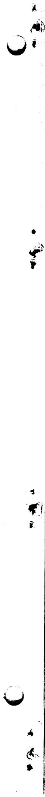

# PREFACE

The report on the Molten-Salt Reactor Experiment (MSRE) has been arranged into twelve major parts as shown below. Each of these covers a particular phase of the project, such as the design, safety analysis, operating procedures, etc. An attempt has thus been made to avoid much of the duplication of material that would result if separate and independent reports were prepared on each of these major aspects.

Detailed references to supporting documents, working drawings, and other information sources have been made throughout the report to make it of maximum value to ORNL personnel. Each of the major divisions of the report contains the bibliographical and other appendix information necessary for that part.

The final volumes of the report, Part XII, contain rather extensive listings of working drawings, specifications, schedules, tabulations, etc. These have been given a limited distribution.

Most of the reference material is available through the Division of Technical Information Extension, Atomic Energy Commission, P.O. Box 62, Oak Ridge, Tennessee. For material not available through this source, such an inter-Laboratory correspondence, etc., special arrangements can be made for those having a particular interest.

None of the information contained in this report is of a classified nature.

All the reports are listed below.

ORNL-TM-728* MSRE Design and Operations Report, Part I, Description of Reactor Design, by R. C. Robertson

ORNL-TM-729 MSRE Design and Operations Report, Part II, Nuclear and Process Instrumentation, by J. R. Tallackson

ORNL-TM-730* MSRE Design and Operations Report, Part III, Nuclear Analysis, by P. N. Haubenreich, J. R. Engel, B. E. Prince, and H. C. Claiborne

ORNL-TM-731 MSRE Design and Operations Report, Part IV, Chemistry and Materials, by F. F. Blankenship and A. Taboada

ORNL-TM-732* MSRE Design and Operations Report, Part V, Reactor Safety Analysis Report, by S. E. Beall, P. N. Haubenreich, R. B. Lindauer, and J. R. Tallackson

ORNL-TM-733* MSRE Design and Operations Report, Part VI, Operating Safety Limits for the Molten-Salt Reactor Experiment, by S. E. Beall and R. H. Guymon

ORNL-TM-907* MSRE Design and Operations Report, Part VII, Fuel Handling and Processing Plant, by R. B. Lindauer

ORNL-TM-908** MSRE Design and Operations Report, Part VIII, Operating Procedures, by R. H. Guymon

ORNL-TM-909* MSRE Design and Operations Report, Part IX, Safety Procedures and Emergency Plans, by A. N. Smith

ORNL-TM-910** MSRE Design and Operations Report, Part X, Maintenance Equipment and Procedures, by E. C. Hise and R. Blumberg

ORNL-TM-911** MSRE Design and Operations Report, Part XI, Test Program, by R. H. Guymon and P. N. Haubenreich

** MSRE Design and Operations Report, Part XII, Lists: Drawings, Specifications, Line Schedules, Instrument Tabulations (Vol. 1 and 2)

# Acknowledgments

In the preparation of this report, the author has made extensive use of the efforts and experience of many of those associated with the MSRE Project and with the overall problem of safety at the Laboratory. All contributions are hereby gratefully acknowledged.

<table><tr><td>Preface</td><td>iii</td></tr><tr><td>Acknowledgment</td><td>v</td></tr><tr><td>List of Figures</td><td>ix</td></tr><tr><td>1. Introduction</td><td>1</td></tr><tr><td>2. Basic Plan</td><td>1</td></tr><tr><td>3. Emergency Philosophy</td><td>1</td></tr><tr><td>4. Organization and Responsibilities</td><td>2</td></tr><tr><td>4.1. Local Emergency Supervisor</td><td>2</td></tr><tr><td>4.2. Local Emergency Squad</td><td>3</td></tr><tr><td>4.3. Emergency Service Units</td><td>3</td></tr><tr><td>4.4. Laboratory Emergency Director</td><td>3</td></tr><tr><td>4.5. Emergency Control Center</td><td>3</td></tr><tr><td>4.6. Local Administration</td><td>4</td></tr><tr><td>5. Emergency Procedures</td><td>4</td></tr><tr><td>5.1. General</td><td>4</td></tr><tr><td>5.2. Personnel Evacuation Procedures</td><td>5</td></tr><tr><td>6. Description of Possible Local Emergencies and Plans of Action</td><td>8</td></tr><tr><td>6.1. Fire</td><td>8</td></tr><tr><td>6.2. Radiation Emergency</td><td>9</td></tr><tr><td>6.3. High Stack Activity</td><td>11</td></tr><tr><td>6.4. Beryllium Release</td><td>12</td></tr><tr><td>6.5. Gross Leak into Reactor Cell</td><td>13</td></tr><tr><td>7. Background Information</td><td>14</td></tr><tr><td>7.1. General Site and Plant Description</td><td>14</td></tr><tr><td>7.2. Personnel Access Control</td><td>18</td></tr><tr><td>7.3. Communication Systems</td><td>23</td></tr><tr><td>7.4. Radiation Monitoring Systems</td><td>25</td></tr><tr><td>7.5. Beryllium Control Program</td><td>34</td></tr><tr><td>7.6. Containment Ventilation System</td><td>38</td></tr><tr><td>7.7. Reactor Off-Gas System</td><td>38</td></tr><tr><td>7.8. Fire Protection System</td><td>38</td></tr></table>

viii

References 44

Bibliography 44

# List of Figures

Fig. No. Title Page

Fig. 5.1 Emergency Evacuation Routes   
Fig. 7.1 ORNL Area Map 15   
Fig. 7.2 Plot Plan - Molten Salt Reactor Experiment 16   
Fig. 7.3 Building 7503 Layout at 852-ft Elevation 17   
Fig. 7.4 Building 7503 Layout at 840-ft Elevation 19   
Fig. 7.5 Entrances to MSRE Area 20   
Fig. 7.6 Headings of Category I and Category II Lists 22   
Fig. 7.7 Reactor Building (7503) Showing Location of Radiation Monitors at 852-ft Level 26   
Fig. 7.8 Reactor Building (7503) Showing Location of Radiation Monitors at 840-ft Level 27   
Fig. 7.9 Functional Block Diagram of MSRE Stack Monitoring System   
Fig. 7.10 Functional Block Diagram of MSRE Radiation and Contamination Warning System 32   
Fig. 7.11 Evacuation Horn Control Box for MSRE Radiation Warning System 35   
Fig. 7.12 Building 7503 Permanent Beryllium Sampling Station Locations 37   
Fig. 7.13 Schematic Diagram of MSRE Containment Ventilation System   
Fig. 7.14 Schematic Diagram of Off-Gas System 40   
Fig. 7.15 Fire Alarm Control and Annunciator System 41

# MSRE DESIGN AND OPERATIONS REPORT

# Part IX

# SAFETY PROCEDURES AND EMERGENCY PLANS

A. N. Smith

# 1. Introduction

The operation of the Molten Salt Reactor Experiment (MSRE) is subject to normal industrial hazards, such as fire, explosion, and airborne contamination, as well as to hazards peculiar to the production of nuclear energy. Emergencies may arise involving danger to personnel or damage to property.

The purpose of this section of the Design and Operations Report is to provide basic guidelines, procedures, and background information that will assist MSRE and supporting personnel in the anticipation, prevention, and handling of emergencies.

# 2. Basic Plan

The basic emergency plan for the MSRE is the Laboratory-wide ORNL emergency plan set forth in the ORNL Emergency Manual. All the material presented here either emphasizes basic precepts of the Laboratory-wide plan or covers items specific to the MSRE. The ORNL Emergency Manual is considered part of and the basic guide for all MSRE emergency plans.

# 3. Emergency Philosophy

The fundamental concepts of the ORNL emergency plan are:

1. Effective planning and preparation

(a) Anticipation of foreseeable hazards   
(b) Adoption of preventive measures   
(c) Preparation for emergencies by adequate organization and training of personnel

2. Effective handling of emergencies

(a) Prompt local action   
(b) Coordination of emergency efforts, both local and Laboratory wide   
(c) Definite assignment of responsibilities

For all personnel involved in the discovery and subsequent handling of an emergency, the primary considerations shall be:

1. Protection of personnel.   
2. Protection of property.

It is recognized that situations may arise wherein it will be difficult to evaluate the potential hazards. The policy shall be to handle doubtful cases conservatively; that is, it will be better to risk an occasional "false alarm" than to risk exposing personnel and property to unnecessary danger. The incidence of such occasions will be minimized by adequate preparation and training.

# 4. Organization and Responsibilities

4.1 Local Emergency Supervisor

The Local Emergency Supervisor will be the MSRE Shift Supervisor on duty. The first alternate will be the MSRE Assistant Shift Supervisor, and the second alternate will be the MSRE Control Room Operator.

The responsibilities of the Local Emergency Supervisor are:

1. To become thoroughly familiar with local and Laboratory-wide emergency procedures.   
2. To organize and train Local Emergency Squad members who are under his jurisdiction.   
3. To direct the efforts of the Local Emergency Squad in the handling of local emergencies.   
4. To keep the Laboratory Emergency Director and MSRE Operations Chief fully informed of the status of the emergency.

# 4.2. Local Emergency Squad

The Local Emergency Squad will consist of the members of the operating crew on duty and the local Health Physics Division surveyor on duty. The responsibility of the Local Emergency Squad is to carry out emergency duties as assigned (or preassigned) by the Local Emergency Supervisor or the Laboratory Emergency Director. Some or all of the operating crew members will be assigned duties as wardens or searchers. (See ORNL Emergency Manual.) The Health Physics Surveyor(s) will be responsible for checking for personnel contamination and overexposure.

# 4.3. Emergency Service Units

Emergency service units (fire, ambulance, health physics, etc.) are available to assist in handling emergencies (see Part III-F in ORNL Emergency Manual). Some units will respond automatically upon receipt of a given emergency signal. Any unit may be summoned by calling the Laboratory Emergency Control Center (phone 3-6358) or the Laboratory Emergency Director (phone 3-6606).

# 4.4. Laboratory Emergency Director

During an emergency the Laboratory Shift Supervisor on duty will become the Laboratory Emergency Director. The responsibilities of the Laboratory Emergency Director are outlined in Part III-B, ORNL Emergency Manual.

# 4.5. Emergency Control Center

As used herein, the term Emergency Control Center refers to the permanent communication, alarm, and dispatching facility at Building 2500, which is operated by the Guard Department. The emergency command post at the MSRE will be referred to as the Local Emergency Control Center, which will normally be the MSRE Control Room. If the MSRE Control Room must be evacuated, the Local Emergency Control Center will be set up at the nearest suitable location, normally on Melton Valley Drive directly to the north of Building 7503, and the Laboratory Emergency

Director or the Emergency Control Center will be requested to furnish a radio-equipped vehicle for transmission of communications.

# 4.6. Local Administration

The administration of emergency plans and procedures at the MSRE will be under the direction of the MSRE Operations Chief. His responsibilities in this regard will be to coordinate and supervise the overall planning and training program, including

1. Anticipation of potential emergencies.   
2. Adoption of preventive measures.   
3. Training of personnel.   
4. Review and updating of emergency procedures.   
5. Inspection and maintenance of emergency equipment.

# 5. Emergency Procedures

Procedures for handling emergencies at the MSRE shall be as noted in the General Emergency Plan (see ORNL Emergency Manual). The following procedures are intended to incorporate the basic principles of the General Emergency Plan as applied to the MSRE operation.

# 5.1. General

The person who discovers an emergency will

1. Evacuate personnel from the immediate danger area.   
2. Take any possible action to control the emergency.   
3. Notify the MSRE Control Room by the fastest method, normally the intercom or telephone.

The MSRE Control Room Operator will

1. Notify the Local Emergency Supervisor and the Local Emergency Squad,   
2. Maintain control of the reactor; make any changes in the operation of the reactor or the chemical processing plant required by the emergency; and keep the MSRE Shift Supervisor informed, in advance, if possible.   
3. Take any other immediate action required by the emergency, such as activation of fire or radiation alarms.

The Local Emergency Supervisor will

1. Proceed to the Local Emergency Control Center, which is normally the MSRE Control Room. If the 7503 Building must be evacuated, the Local Emergency Control Center will be set up on the road directly to the north of Building 7503, and the Laboratory Emergency Director will be requested to furnish communications facilities (radio car).   
2. Take additional action as required by the emergency, including issuance of evacuation instructions over the public address (PA) system and direction of the Local Emergency Squad.   
3. Notify MSRE Operations Chief and the Laboratory Shift Supervisor as soon as possible.   
4. Meet and orient the Laboratory Emergency Director and Emergency Service Units (fire department, ambulance) when they arrive on the scene.

The Local Emergency Squad Members, unless directly involved in combating the emergency or in carrying out preassigned emergency duties, will report at once to the Local Emergency Control Center for assignment to emergency duty by the Local Emergency Supervisor.

All other day and shift personnel will

1. Observe the prescribed building evacuation procedure.   
2. Assist in handling the emergency if and as requested by the Local Emergency Supervisor.

# 5.2. Personnel Evacuation Procedures

5.2.1. Local Emergency. A given emergency may require the evacuation of (1) all MSRE personnel or (2) only nonoperating personnel. The signal for local evacuation of personnel may be given in one of three ways:

1. Fire alarm horn.   
2. Radiation alarm horn and beacon light.   
3. Building public address system.

Sounding of either alarm will normally be followed by appropriate instructions over the PA system. (Note: The signal for a Laboratory-wide evacuation is a siren-like wail followed by instructions over the PA system.)

The alarm and PA systems are described in Section 7. Upon hearing the evacuation signal

1. All personnel, except Local Emergency Squad members, will leave the building.   
2. Local Emergency Squad members, barring PA system instructions to the contrary, will proceed at once, as noted above, to the Local Emergency Control Center for assignment to emergency duty by the Local Emergency Supervisor.

In general, the direction taken by evacuating personnel shall be the shortest path away from the danger zone. Subject to this condition and barring contrary instructions over the PA system, the normal evacuation routes are as noted below and as illustrated on Fig. 5.1:

1. Personnel in Building 7509 will leave by the east door.   
2. Personnel in the office section of Building 7503 (852-ft level) will leave by the door at the north end of the office section corridor.   
3. Personnel in the high bay area of Building 7503 (852-ft level) will leave by the nearest door (north or east). Those leaving by the east door will proceed as in item 2 above.   
4. Personnel in the basement area of Building 7503 will leave by the nearest door (exterior stairway) on east side or door at northwest corner.   
5. Personnel in outlying buildings (vent house, storeroom, diesel house) will proceed to Melton Valley Drive through the west crash gate or through the north turnstile via the stairway at the northwest corner of Building 7503.   
6. All personnel will assemble at the parking area outside the north gate (Assembly Point No. 1) and await further instructions from the Local Emergency Supervisor. If the evacuation was initiated by a radiation alarm and if immediate instructions are not forthcoming from the Local Emergency Supervisor, all personnel will proceed as rapidly as possible along Melton Valley Drive in the upwind or crosswind direction (east or west, whichever more closely agrees with the direction pointed to by the weathervane located on top of the pole approximately 50 ft north of east end of the office building, 7509).

SECURITY FENCE

TURNSILE (OUTBOUND ONLY)   
ASSEMBLY POINT NO. 1 AND ALTERNATE LOCAL EMERGENCY CONTROL CENTER

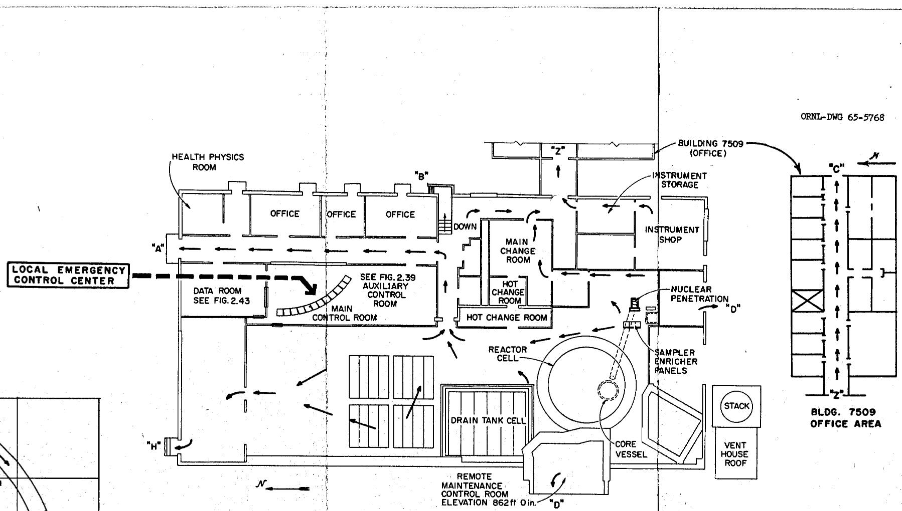  
BLDG. 7503 - 852' LEVEL

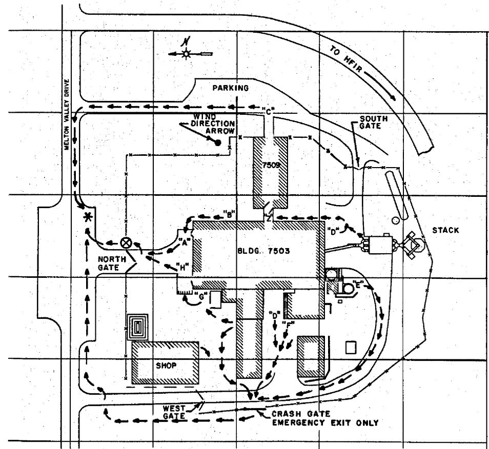  
PLOT PLAN - MSRE AREA

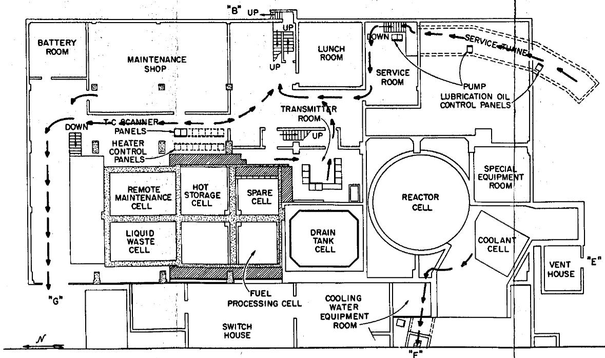  
BLDG. 7503 - 840' LEVEL

  
Fig. 5.l. Emergency Evacuation Routes.

5.2.2. Nonlocal Emergency. Interarea or Laboratory-wide situations may arise, for example, a radiation incident at the HFIR or an air alert, which might require short-term or long-term evacuation of personnel from the MSRE area. The procedure in these cases will be as outlined in the ORNL Emergency Manual, with emphasis on the following key points:

1. If time permits, the reactor and other operating equipment will be shut down or otherwise secured.   
2. Personnel will then proceed in accordance with the Laboratory Emergency Director's instructions.

The Local Emergency Supervisor will be responsible for coordinating the execution of these instructions.

Instructions and emergency signals (see Part IV-B of ORNL Emergency Manual) from the Laboratory Emergency Director will be transmitted over the MSRE PA system (see Sect. 7.3).

# 6. Description of Possible Local Emergencies and Plans of Action

It is assumed that the general emergency plan will be followed in meeting any of the following possible emergencies; therefore only special information and suggestions applying to each particular emergency are given.

# 6.1. Fire

The known fire hazards are the lube-oil packages in the servicetunnel, the diesel-generator oil-storage tank, and the hydrogen-storage tanks and piping in the fuel processing system. Prompt action can keep a small fire from growing into a large one. However, safety of the personnel must always come first. No one may enter an area alone where he might be trapped or overcome; he must wait until assisting personnel arrive to stand by with reserve extinguishers and other equipment as required. The alerting of personnel will normally be by means of the fire alarm horn supplemented by an announcement over the PA system (see Sect. 7 for description of fire protection and communications systems).

The person who discovers a fire will take immediate action to protect personnel and property. Normal action will be as follows:

1. Pull the nearest auxiliary fire alarm box.   
2. Remove personnel from the immediate danger zone. Depending on circumstances this step may supersedes step 1.   
3. Call the Local Emergency Supervisor (normally the fastest method will be to call the control room operator who will relay the message) and give a brief description of the location and the nature of fire. The Local Emergency Supervisor will   
1. Call the fire department (if not already done) by actuating one of the auxiliary fire alarm boxes.   
2. Dispatch an operator to the road on the north side of Building 7503 to meet the firemen and direct them to the scene of the fire.   
3. Alert all personnel via the PA system and, if necessary, issue instructions for evacuation.   
4. Order any changes in reactor operation necessitated by the emergency.   
5. Take any possible steps to control the fire until the fire department arrives.   
6. When the fire department arrives, coordinate efforts of the Local Emergency Squad with those of the fire department.

# 6.2. Radiation Emergency

The amount of radiation absorbed will vary directly with the time of exposure and inversely as the square of the distance from the source (refer to the ORNL Radiation Safety and Control Training Manual). Therefore, in a radiation emergency, personnel must be moved to a safe distance as rapidly as possible.

High radiation in the building may come either from a confined source or from airborne radioactive materials. The former may be detected by one or more of the Monitrons and the latter by one or more of the constant air monitors (CAM). (Refer to Sect. 7 for a discussion of the radiation instruments and alarm system.) The circuits are arranged so that coincident high-level signals to two Monitrons or two CAM's will

actuate the building evacuation alarm. In addition, switches for manual activation of the building evacuation system are provided. (See Sect.

7.4.4)

The person who discovers high radiation (should such a situation arise without automatic alarm response) will actuate the building evacuation alarm manually or notify the Local Emergency Supervisor.

The Local Emergency Supervisor will

1. Actuate the building evacuation alarm (if not already actuated).   
2. Announce "Radiation Emergency - All Nonoperating Personnel Evacuate" three times over the PA system.   
3. Dispatch two men to determine the sources and extent of the hazard. These men should wear assault masks until they have determined that there is no airborne activity. They will carry portable radiation detection instruments and will check the air monitoring instruments immediately.   
4. Check to make sure that the Health Physics Surveyor has been notified (normally, the building evacuation alarm will be relayed automatically to the Emergency Control Center, which will notify the Health Physics Department and the Laboratory Emergency Director).   
5. Assign an Emergency Squad Member as a group leader for nonoperating personnel. The group leader will check the radiation level at the assembly point, issue or interpret evacuation instructions, and where necessary, render first aid or request additional help.   
6. Dispatch Emergency Squad Members to check the area to make sure personnel have been evacuated.   
7. Make any operating changes, such as scrambling the reactor or shutting down ventilating fans, necessitated by the emergency.

Upon hearing the building evacuation alarm or the PA system announcement, Emergency Squad Members, unless already engaged in combating the emergency, will report immediately to the Local Emergency Control Center, and all nonoperating personnel will leave the building immediately and assemble at the roadside directly north of Building 7503. If immediate instructions to the contrary are not received from an Emergency Squad Member or over the PA system, the nonoperating personnel will proceed as

rapidly as possible away from the area in the upwind or crosswind direction and keep going until advised by an Emergency Squad Member or a Health Physics Surveyor that they are out of the danger zone. (Note: A wind direction arrow that points in the upwind direction is located on a pole near the northeast corner of the 7509 Office Building.)

The following rules will be observed regarding radiation exposure levels:

1. Nonoperating personnel must evacuate any area when level is $\geq 7.5$ mrem/hr on the Monitrons or $\geq 1000$ counts/min on the CAM's.   
2. All personnel must evacuate from any area where the total absorbed dose is likely to exceed 300 mrem, except that the Local Emergency Supervisor and the Control Room Operator may remain long enough to shut down the reactor, provided their radiation dosage will not exceed 3000 mrem.

As soon as the level and extent of the radiation have been determined by portable survey meters, the Local Emergency Supervisor will

1. Issue additional instructions regarding personnel evacuation.   
2. Take any additional steps necessary to limit the radiation release and to prevent overexposure to personnel.   
3. See that health physics checks are provided for all personnel involved in the incident.

# 6.3. High Stack Activity

A situation might occur (for example, a gross leak in the charcoal bed piping) whereby hazardous quantities of radioactivity would be released to the off-gas stack. The dangers involved may be direct exposure to penetrating radiation (as from a cloud of activity), inhalation of active particles from the contaminated atmosphere, or both. Immediate action must be taken to

1. Minimize the quantity of activity released.   
2. Protect personnel from overexposure to external and internal radiation.

High stack activity will be detected by the stack monitoring instrumentation (see Sect. 7.4.3) and indicated by an annunciator and re

corders in the MSRE Control Room and an annunciator and recorders at the Waste Monitoring Control Center at Building 3105 (see Sect. 7.4.3). For the purpose of the following discussion, high stack activity will be assumed to be due to the release of hazardous quantities of activity, as reflected by instrument readings at Building 3105 and related evidence at the MSRE.

Upon indication of high stack activity, the Local Emergency Supervisor will

1. Reduce the reactor power level to zero.   
2. Report the incident to the Emergency Control Center.   
3. Ask the Emergency Control Center to send Health Physics Surveyors (if surveyors are not already on hand).   
4. Use PA system to announce the emergency and to request all personnel (except those involved in combating the emergency) to assemble at the northwest corner of the 7503 building basement (840-ft level) if this action appears necessary.   
5. Dispatch two Emergency Squad Members equipped with assault masks and portable radiation meters to check outside the building and assess the nature and extent of the hazard.

Further action will depend on an assessment of the hazard that incorporates the combined judgment of the Local Emergency Supervisor, the Laboratory Emergency Director, the Health Physics Surveyors and the Laboratory Facilities Representative. Possible steps might be to

1. Switch to the standby charcoal bed.   
2. Drain the reactor.   
3. Shut down the ventilating fans.   
4. Evacuate all personnel from the site.

Coordination of emergency action for neighboring facilities, towns, etc. that might be endangered by the release will be handled by the Laboratory Emergency Director.

# 6.4. Beryllium Release

Beryllium is an extremely toxic material. Toxic effects may result from inhalation or from contact with the skin. Current concentration

limits for beryllium (see Sect. 7.5) for workers without respiratory protection are as follows:

Continuous exposure (40-hr week) $\leqslant 2\mu \mathrm{g} / \mathrm{m}^3$

Short-term exposure (≤30 min) Not greater than 25 μg/m³

Situations might occur whereby hazardous quantities of beryllium would be released; for example, by rupture of a radiator tube with subsequent discharge of coolant salt from the radiator stack or rupture of the coolant pump discharge line. Evidence of beryllium release may be given by the radiator stack beryllium monitor or may be implied by responses of various operational instruments.

The person who discovers a real or apparent beryllium release will immediately notify the Local Emergency Supervisor, who will

1. Announce the emergency over the PA system, instruct personnel who must remain in the danger zone to put on suitable respiratory protection and protective clothing, and ask all remaining personnel to evacuate from the danger zone (see Sect. 5.2). Evacuees will be asked to report to a convenient assembly point to be screened for overexposure and clothing contamination.   
2. Call the Emergency Control Center and ask the dispatcher to notify the Industrial Hygiene Department and the Laboratory Emergency Director.   
3. Make any operating changes required by the emergency.   
4. With the advice and assistance of the Industrial Hygiene Department, take any additional steps necessary to define the level and extent of the danger zone and protect personnel from overexposure.

# 6.5. Gross Leak into Reactor Cell

Rupture of a portion of the fuel-circulating system might result in conditions approaching the so-called maximum credible accident (see Part V of this report). Large quantities of activity might leak into the high bay area and thence to the atmosphere. An emergency of this type would be evidenced by

1. A sudden rise in secondary containment cell pressure to some point above atmosphere.

2. A sudden rise in secondary containment cell temperature.   
3. Sudden decrease in fuel pump bowl level and pressure.   
4. Activation of building evacuation alarm system. This will be a delayed reaction dependent on the rate of escape of activity from the cell.

In view of the possible serious consequences to personnel, the simultaneous occurrence of symptoms 1, 2, and 3 should be treated as a maximum credible accident unless absolute assurance to the contrary is available.

In the event of an accident of the maximum credible type, the Local Emergency Supervisor will

1. Actuate the building evacuation alarm.   
2. Announce "Major Release in Reactor Cell - All Nonoperating Personnel Evacuate" three times over the PA system (see Sect. 5.2).   
3. Dispatch two Emergency Squad Members wearing assault masks and carrying radiation survey instruments to make a rapid check of all buildings and insure that all personnel have evacuated.   
4. Notify the Emergency Control Center of the nature of the emergency and, if necessary, request additional help.

If radiation levels will permit (see Sect. 6.2), the Local Emergency Supervisor will also take any operational steps possible to minimize the extent of the release. If the radiation exceeds tolerable levels, he will evacuate all remaining personnel to a safe distance from the site.

# 7. Background Information

This section includes background information pertinent to the handling of emergencies at the MSRE. Much of the necessary background material is, or will be, covered in detail in other parts of the MSRE Design and Operations Report, referred to hereunder as "this report" (see Preface). Cross references will be used wherever practical.

# 7.1. General Site and Plant Description

Figure 7.1, ORNL Area Map, and Fig. 7.2, Plot Plan-Molten Salt Reactor Experiment, illustrate the site location and layout, and Figs. 7.3

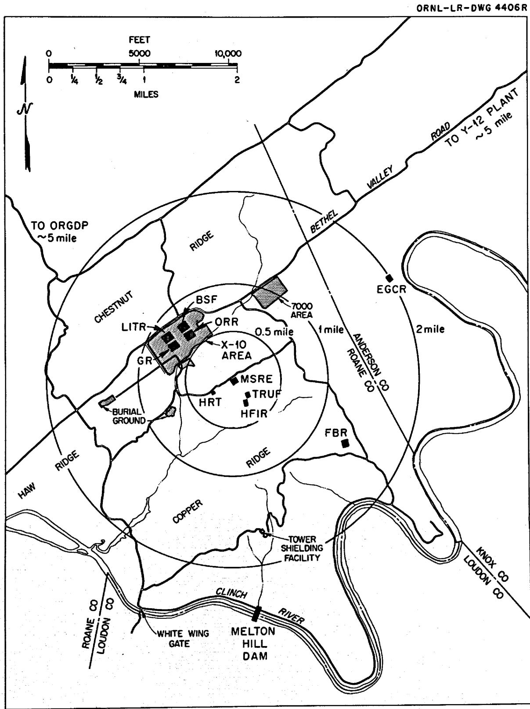  
Fig. 7.1. ORNL Area Map.

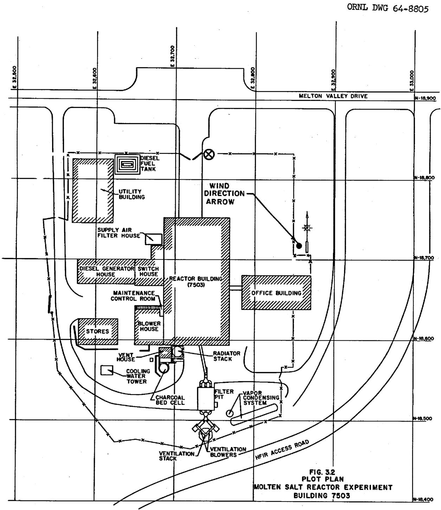  
Fig. 7.2. Plot Plan - Molten Salt Reactor Experiment.

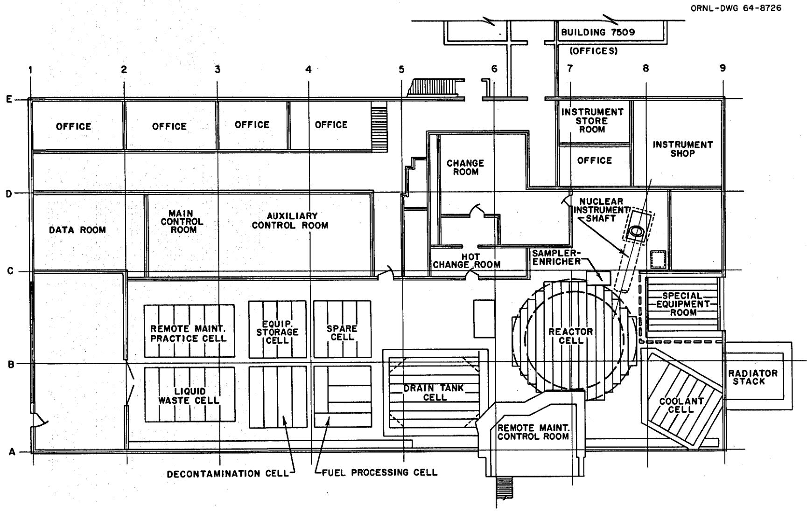  
Fig. 7.3. Building 7503 Layout at 852-ft Elevation.

and 7.4 show the layout of Building 7503 at two elevations. Detailed descriptions of the site, including geophysical features, may be found in Parts I and V of this report.

# 7.2. Personnel Access Control

7.2.1. Purpose. During zero-power nuclear experiments, experimental operation at low power, and thereafter, access to the MSRE operations area will be controlled in the interests of safety and security. The specific purposes of access controls are

1. To insure that any person in the area has at least a minimal acquaintance with area regulations and conditions.   
2. To avoid interference with operations or undue distraction of the operators.   
3. To prevent unauthorized removal of material or equipment.

(With regard to the last point, there will be no classified documents in the area and the SS material will be in either an inaccessible form or locked in a safe.)

7.2.2. Bounds of MSRE Operations Area. Figure 7.5 shows the layout of the MSRE area, with emphasis on the fences and the openings for vehicles and personnel. The North Gate is a wide vehicular gate with a pedestrian turnstile beside it. A wide paved area extends directly into the crane bay of the reactor building for convenient delivery of heavy loads. The West and South Gates are vehicular gates. A crash gate in the west fence provides an emergency exit in that direction.

The office building provides a route into and out of the area on the east. For the purposes of personnel access control, the office building is regarded as being outside the area. This makes the door between the 7509 office area and the vestibule the boundary of the MSRE area.

7.2.3. Categories of Personnel. The people who may at one time or another be in the area can be divided into three categories:

# I. Persons Regularly Working in Area

These are people with full-time work assignments in the area and others who require regular or frequent access to the area. For

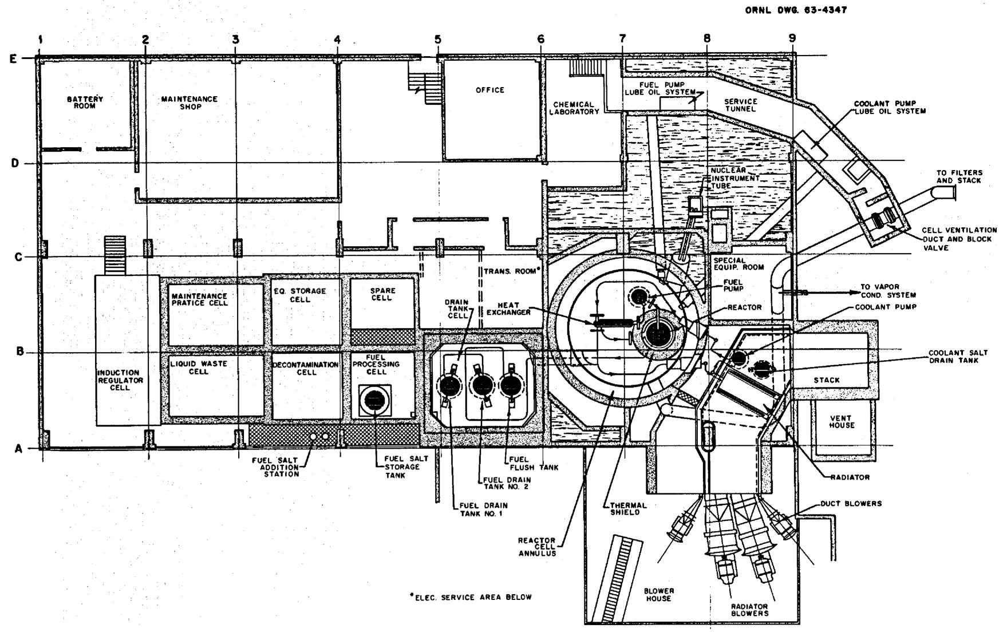  
Fig. 7.4. Building 7503 Layout at 840-ft Elevation.

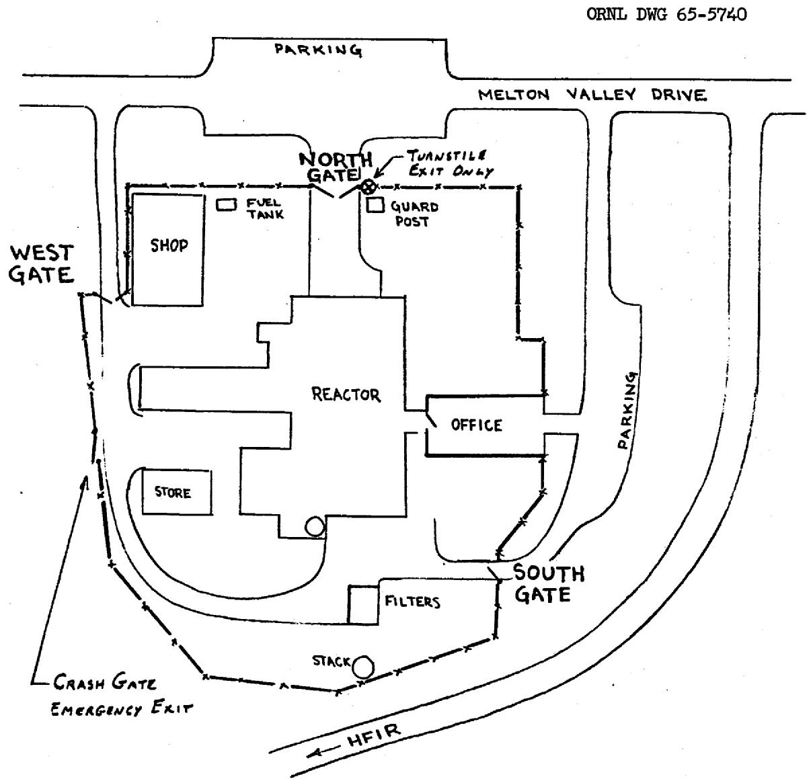  
Fig. 7.5. Entrances to MSRE Area.

a person to be in this category it is also a requirement that his assignment be relatively long-term (more than one month). Persons in Category I must be acquainted with the layout of the area, the nature of the hazards associated with MSRE operation, emergency evacuation signals and procedures, and the procedures and restrictions that apply to his work in the area. These persons are also expected to be informed on the status of operations, particularly with regard to any special hazards that may exist or any special restrictions that may be in effect.

# II. Persons Temporarily or Infrequently in Area

These are people who are assigned to work in the area for a short time (one month or less) or who may need to enter the area only infrequently (once a week or less).

# III. Visitors

These are people who enter the area and are not in Categories I or II.

7.2.4. Authorizations. Lists of Category I persons will be posted at the guard post, in the reactor control room, and beside the door from the office building into the area. These lists will be updated as necessary by the head of the MSRE Operations Department.

Lists of Category II people will be kept at the same locations. When changes are necessary, the lists will updated. Figure 7.6 shows typical headings for the Category I and Category II lists.

7.2.5. Procedure. Category I and II persons will be admitted at any time, and they can move freely about the area (within the limits imposed by radiation and contamination, of course). Category III persons will be admitted only when their visit is specifically authorized at the time by someone with the proper authority. The people who can authorize entry of Category III persons are certain Category I persons designated by the Operations Department Head and so indicated on the Category I lists. When one of these people authorizes the entry of a Category III person, he is responsible for seeing that the visitor is properly escorted and that his movements are properly controlled.

# PERSONS PERMANENTLY ASSIGNED OR FREQUENtLY ENTERING

THE MSRE AREA

April 30, 1965

The following persons are authorized to enter the MSRE area at any time.

Any person whose name is preceded by an asterisk (*) can authorize the entry of a visitor, with the understanding that he is responsible for seeing that the visitor is escorted or his movements otherwise safely controlled.

This list will remain in effect until superseded.

Paul N. Haubenreich /s/

Head, MSRE Operations Department

# PERSONS TEMPORARILY ASSIGNED TO THE MSRE AREA

April 30, 1965

The following persons are authorized to enter the MSRE Area at any time prior to 1600, May 11, 1965. A new list will be issued by that time.

Paul N. Haubenreich /s/

Head, MSRE Operations Department

Fig. 7.6. Headings of Category I and Category II Lists.

The West and the South Gates will be kept locked except when a vehicle must enter or leave. The North Gate will also be locked except while attended by a guard. The East (outer) door of the office building will be locked at night and on weekends when the normal staff is not present. The doors between the office building and the reactor building will not be locked.

While a guard is on duty, he will admit authorized personnel through the North Gate or the West Gate. (Traffic through the West Gate will be held to a minimum.) Persons on either Category I or Category II Lists will be admitted at once. When others seek admittance, the guard will use the phone to contact someone in the area who can authorize the visitor's entrance.

Control of traffic through the office building at times when the East door is unlocked will depend on signs posted in the office building. A large sign, "CONTROLLED ACCESS AREA - DO NOT ENTER WITHOUT PERMISSION," will be on the door from the office building to the vestibule. Instructions for visitors, radiation meter requirements, and current lists of authorized persons will be posted beside this door.

When the guard is not on duty, the MSRE Shift Supervisor will be responsible for controlling access to the area. Persons wishing to enter during off hours must come to the East door of the office building, where there is a switch that sounds a doorbell in the reactor control room. One of the operating crew will admit the person and, if he is an unlisted visitor, will escort him to the MSRE Shift Supervisor. If a vehicle must enter or exit through the North Gate or West Gate, the MSRE Shift Supervisor will call the Guard Department (phone 3-6646), and a guard will come and unlock the gate. (The security locks on these gates can be opened only by a guard.)

# 7.3. Communications Systems

Three systems are available at the MSRE for transmitting local communications (see Dwg. D-KK-C-55114).

7.3.1. Intercom Phones. The intercommunication phones form an essentially closed-circuit "hot line" (referred to as the "common line").

In other words, communication may be effected between any and all stations by merely lifting the respective receivers. One station may call another by dialing the desired station number (the bell rings once each time the number is dialed), but it is not necessary to dial to connect to the line.

The normal power for the intercom phones comes from the TVA line (panel 2, Auxiliary Control Room). Backup power is available from the 250-v battery station and from the diesel-generator station.

A white signal light is located at each phone station. The lights at all stations are energized whenever the intercom line is in service.

7.3.2. Public Address System. Loudspeakers are located so as to permit the transmission of messages to all parts of the MSRE area, both indoors and outdoors. The system is normally used for paging and routine announcements. In an emergency the system is used for transmitting emergency information and instructions. Emergency announcements would normally be made from the MSRE Control Room, but they could be made from any of the several phone sets equipped with the PA system switch. All PA system phones also serve as intercom phones (some units are three-purpose, i.e., PA, intercom, and standard dial). In order to use a phone for public address, it is necessary to turn (depress on some units) the PA selector switch to the proper position and then hold a second switch (or bar) in the depressed position while making the announcement.

A system is provided to permit the Laboratory Emergency Director, Building 5000, or the Emergency Control Center, Building 2500, to make announcements or to sound emergency signals (see Part IV-B of ORNL Emergency Manual) over the MSRE PA system. This might be necessary, for example, in the event of a Laboratory-wide emergency. The circuit to the MSRE also includes the other Melton Valley facilities (HFIR, Tower Shielding, 7500, HPRR). Announcements from the Laboratory Emergency Director or the Emergency Control Center will override local MSRE announcements, except those made from the MSRE Control Room PA station.

7.3.3. Standard Dial Phones. Standard Bell System dial telephones are located in the MSRE Control Room and in all offices.

# 7.4. Radiation Monitoring Systems

Radiation detecting instruments at the MSRE are of three types: (1) health physics instrumentation for personnel protection; (2) process monitoring instrumentation to provide information relative to the operating condition of various components and to indicate the validity of the containment system, and (3) off-gas stack monitors to guard against the discharge of excessive quantities of radioactivity to the atmosphere.   
7.4.1. Health Physics Instrumentation. The purpose of the health physics instrumentation is to protect MSRE personnel from overexposure to radiation due to airborne and fixed-source activity. The instruments fall into two general classes.   
1. Fixed monitors, which require a 110-v ac power supply, are stationed at specific, strategic locations. The models currently in use at the MSRE are:

Continuous air monitor (CAM), model Q-2240

Monitron, model Q-1154-B

Count rate meter, model Q-2091

Hand and foot counter, model Q-1939B

Locations of the various units are shown on Figs. 7.7 and 7.8.

The count rate meters are placed in contamination-free areas for use in making clothing and body surveys. However, when not used for this purpose, they are left operating and serve as backup monitors for the Monitrons. In two places, the water room and the vent house, their primary purpose is area monitoring. The CAM's and Monitrons are used for area monitoring; the CAM registers airborne activity and the Monitron fixed-source activity. The CAM's and Monitrons provide visible and audible alarm response, both locally and in the MSRE Control Room. The Control Room alarm setup includes a system of lights to denote various instrument conditions (see Table 7.1). In addition to the local and Control Room alarm systems, certain CAM's and certain Monitrons are connected to the building evacuation alarm system (see Sect. 7.4.4). Each CAM and each Monitron has two alarm settings, as follows:

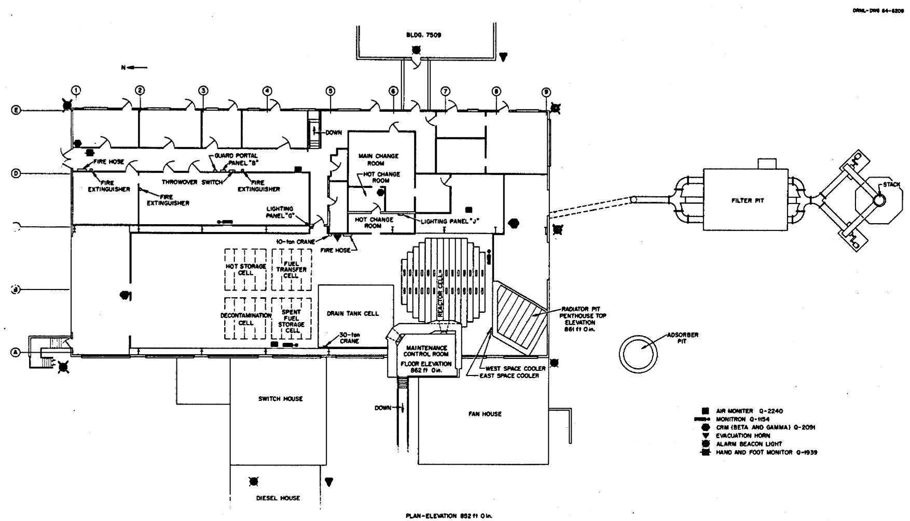

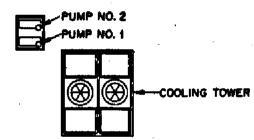  
Fig. 7.7. Reactor Building (7503) Showing Locating of Radiation Monitors at 852-ft Level.

ORNL-DWG 64-6240

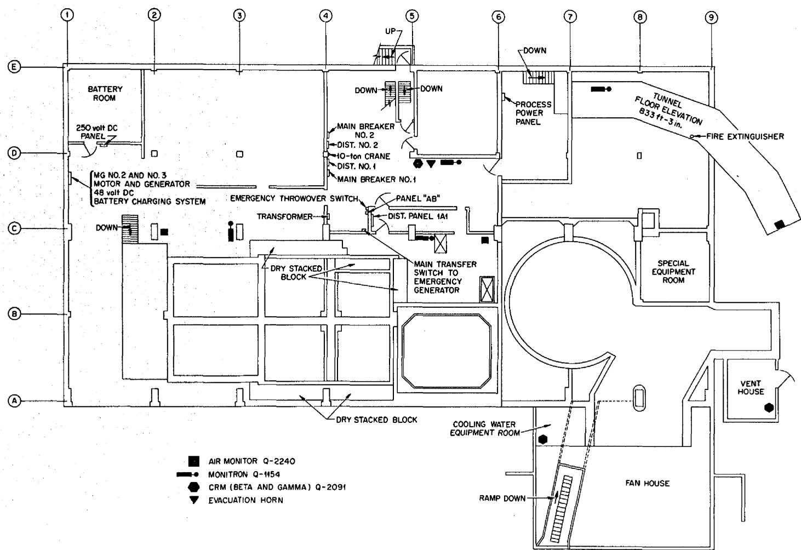  
PLAN-ELEVATION 840 ff Oin.   
Fig. 7.8. Reactor Building (7503) Showing Location of Radiation Monitors at 840-ft Level.

Alarm Setting   

<table><tr><td>Condition</td><td>CAM (counts/min)</td><td>Monitron (mr/hr)</td></tr><tr><td>Caution</td><td>1000</td><td>7.5</td></tr><tr><td>High level</td><td>4000</td><td>23</td></tr></table>

2. Portable monitors, which are self-contained units, may be carried or worn by the user. Included in this category are:

Cutie Pie  
G-M survey meter  
ORNL badge meter  
Personal radiation monitor  
Pocket ionization chamber

Portable meters (one cutie pie and one G-M survey meter) for emergency use are kept in a box in the MSRE Control Room and at the guard house at the North Gate.

Table 7.1. Control Room Panel Alarm Indications for Monitrons and Air Monitors   

<table><tr><td rowspan="2">Instrument Condition</td><td colspan="3">Lamp Intensities</td></tr><tr><td>Red</td><td>Amber</td><td>White</td></tr><tr><td>Normal operation</td><td>Dim</td><td>Dim</td><td>Dim</td></tr><tr><td>Caution levela</td><td>Dim</td><td>Bright</td><td>Dim</td></tr><tr><td>High levelb</td><td>Bright</td><td>Bright</td><td>Dim</td></tr><tr><td>Instrument inoperative</td><td>Dim</td><td>Dim</td><td>Bright</td></tr><tr><td>Instrument removedc</td><td>Bright</td><td>Bright</td><td>Bright</td></tr></table>

aCaution level for a beta-gamma air monitor is 1000 counts/min and for a Monitron is 7.5 mr/hr.   
bHigh level for a beta-gamma air monitor is 4000 counts/min; and for a Monitron, $23\mathrm{mr / hr}$   
cLamp intensities remain until a maintenance connection is made that gives an "inoperative" indication.

7.4.2. Process Monitoring Instrumentation. The process radiation monitoring system is designed to monitor certain key points in the reactor system to aid in the control and operation of the reactor. Detectors are located on or near pipes and components to indicate radiation levels and to produce alarm or control signals when these levels exceed a preset value. Fourteen G-M tubes and 12 ion chamber detectors are used for process monitoring. For a detailed description of the process monitoring system, refer to Part II of this report.

7.4.3. Off-Gas Stack Monitoring System. A radiation detection system provides continuous monitoring of the gases passing out through the off-gas stack (see Off-Gas Disposal System and Containment Ventilation System, Part I of this report). Operation and maintenance of the system is handled entirely by the Laboratory Facilities Department. This system is part of a Laboratory-wide system designed to control, within prescribed limits, the rate of discharge of radioactive contaminants to the atmosphere.

Three pumps serve to maintain three continuously recirculating gas sampling streams. Each stream is withdrawn from the stack at a point about 40 ft above the base, passes through the monitoring (or collecting) device and the sample pump, and is then returned to the stack near the base (see Fig. 7.9). One stream passes in series through a beta-gamma monitor and an iodine monitor; one stream passes through an alpha monitor; and the remaining stream passes through a sample-collecting cartridge.

The alpha and beta-gamma streams are passed through filter-papertapes, and the particulate matter collected is monitored continuously by count rate meters. The iodine is collected in a charcoal trap, which is monitored by a count rate meter. The signals from the count ratemeters (displayed and recorded in the MSRE Auxiliary Control Room) are transmitted by telemetry to recorders in the Waste Monitoring Control Center at Building 3105. The recorders are monitored visually on a 24-hr basis by Laboratory Facilities personnel.

The Laboratory Facilities Department will notify MSRE Operations whenever there is an indication of an abnormal increase in activity

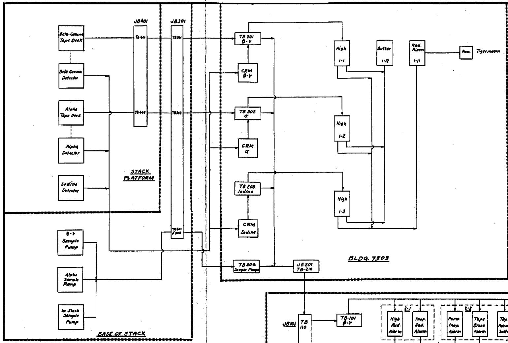

Q-2370-2R1

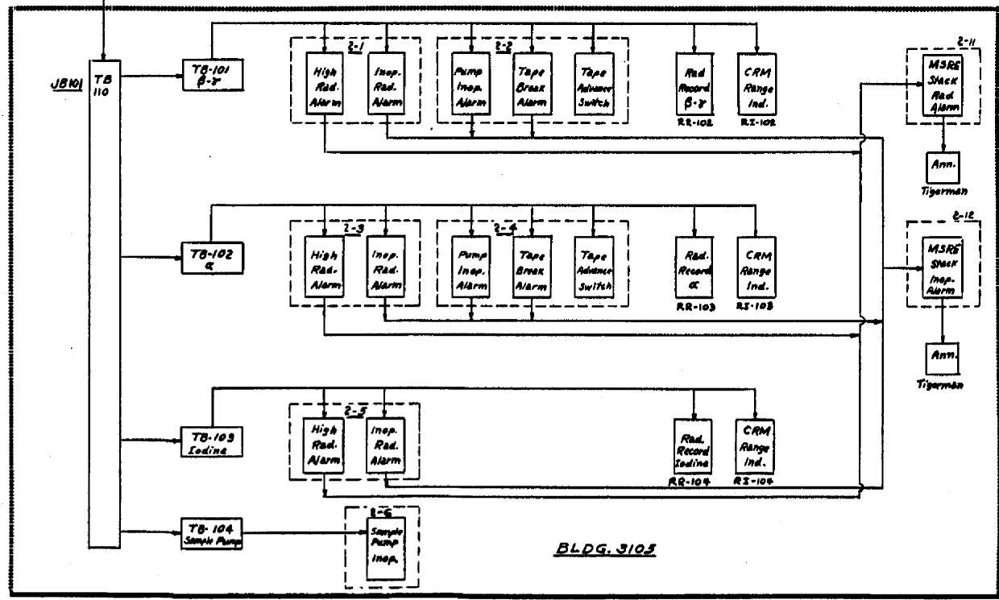  
Fig. 7.9. | Functional Block Diagram of MSRE Stack Monitoring System.

passing through the off-gas stack. Such notification will normally be given in the following instances:

<table><tr><td>Activity</td><td>Increase in a 15-min Period (%)</td></tr><tr><td>Beta-gamma</td><td>20</td></tr><tr><td>Alpha</td><td>30</td></tr><tr><td>Iodine</td><td>80</td></tr></table>

If the indicated beta-gamma increase persists for 30 min, the Laboratory Shift Superintendent will be notified. The signal from the count rate meters is also transmitted to an alarm module in the MSRE Auxiliary Control Room and thence to the main MSRE Control Room panel annunciator. The alarm will be set to respond, as nearly as possible, in accordance with the above-listed activity increase rates.

The tape advance for the alpha and beta-gamma monitors is controlled remotely (may also be done at the instrument) by the Laboratory Facilities Department (from Bldg. 3105). The tapes are normally advanced at the start of each shift. The iodine trap is of the cartridge type and may be easily replaced in case of saturation. The sample-collecting cartridge is changed once per day during reactor critical operation, and the used cartridge is scanned for activity.

The count rate meters are multirange units. The Laboratory Facilities Department will request MSRE Operations to make range changes when necessary.

7.4.4. Building Evacuation Alarm System. A system of audible and visible alarms is provided to alert personnel to the necessity for evacuation from the MSRE area (see Fig. 7.10). The alarms may be actuated manually or automatically.

There are three switches for manual actuation of the alarms: one on the main console in the MSRE Control Room, one on the alarm module in the MSRE Auxiliary Control Room, and one in the Maintenance Control Room. If a manual switch has been used to actuate the alarm, the "reset" button on the control module must be depressed to restore the system to the normal conditions.

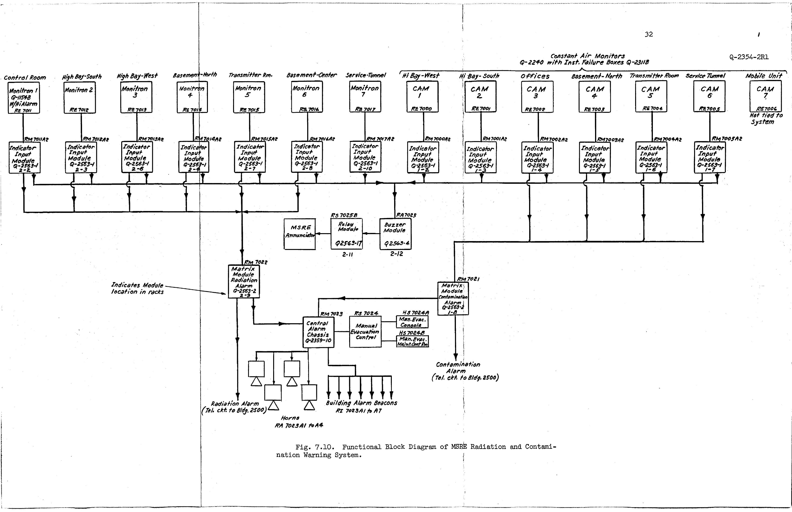

For automatic actuation, four of the CAM's and six of the Monitrons (see Sect. 7.4.1) are connected to respective coincidence alarm modules in the MSRE Auxiliary Control Room. Coincident actuation of any two high level alarms in one or the other of the two groups will cause automatic actuation of the building evacuation alarm system (see Table 7.2).

Table 7.2. Monitrons and Continuous Air Monitors in Building 7503   

<table><tr><td rowspan="2">Type</td><td colspan="2">Monitrons</td><td colspan="2">Continuous Air Monitors</td></tr><tr><td>Location</td><td>Instrument No.</td><td>Location</td><td>Instrument No.</td></tr><tr><td rowspan="6">Building evacuation systema</td><td>Control room</td><td>1</td><td>Office corridor 7503</td><td>3</td></tr><tr><td>High bay - south</td><td>2</td><td>Basement - north</td><td>4</td></tr><tr><td>High bay - west</td><td>3</td><td>Transmitter room</td><td>5</td></tr><tr><td>Basement - north</td><td>4</td><td>Service tunnel</td><td>6</td></tr><tr><td>Basement - center</td><td>5</td><td></td><td></td></tr><tr><td>Transmitter room</td><td>6</td><td></td><td></td></tr><tr><td rowspan="2">Local alarm only</td><td>Service tunnel</td><td>7</td><td>High bay - west</td><td>1</td></tr><tr><td></td><td></td><td>High bay - south</td><td>2</td></tr></table>

$^\mathrm{a}$ Coincidence of any two high-level alarms in the Monitron group or the CAM group will cause automatic actuation of the building evacuation alarm system.

A key-operated switch labeled "Normal-Disable" and located on the control module in the Auxiliary Control Room may be used to disconnect the alarms from the automatic circuit. This switch is for use during periods when high radiation levels would normally be anticipated (for example, during removal of radioactive equipment from the reactor cell) and where personnel safety may be insured by application of strict administrative control. The Emergency Control Center receives an alarm signal (and should receive prior notification) when the switch is moved to or from the disable position. The alarms may be sounded manually regardless of the position of the Normal-Disable switch.

The audible alarm is given by four evacuation horns located as shown on Figs. 7.7 and 7.8. The horns are activated by nitrogen gas, and each horn has its own gas bottle supply and control box (see Fig. 7.11). The control box contains a pressure valve, pressure switches which monitor tank and regulated pressures, and a solenoid valve that is opened by an electrical signal from the coincidence module. A momentary signal will open the solenoid valve, and the valve will remain open until it is closed manually by depressing the mushroom head of the valve stem. Normal gas pressures are:

Tank pressure, psig $\geqslant 1500$

Supply to solenoid, psig 80 to 120

Abnormal pressures are indicated by alarms in the Control Room. The gas supply for each horn consists of two high-pressure nitrogen-gas bottles, only one of which is normally valved "on." The valve position on each bottle is supervised by means of a lead-and-wire meter seal. One bottle at $\geq 1500$ psig contains sufficient gas to operate the horn for approximately 4 minutes.

The visible alarm is given by seven magenta-colored beacon lights located as shown on Figs. 7.7 and 7.8. They are automatically stopped when the coincidence module has returned to a normal condition.

For a comprehensive discussion of the MSRE radiation and contamination detection and alarm system, see ref. 2.

# 7.5. Beryllium Control Program

A program for the control of beryllium hazards at the MSRE has been established by the Industrial Hygiene Department. A detailed description of the program may be found in ref. 3. A brief outline is presented below.

# 1. Potential Beryllium Hazards

a. Effect of Particle Size Range on Extent of Lung Deposition   
b. Effects of Acute Inhalation   
c. Effects of Chronic Inhalation   
d. Skin Effects

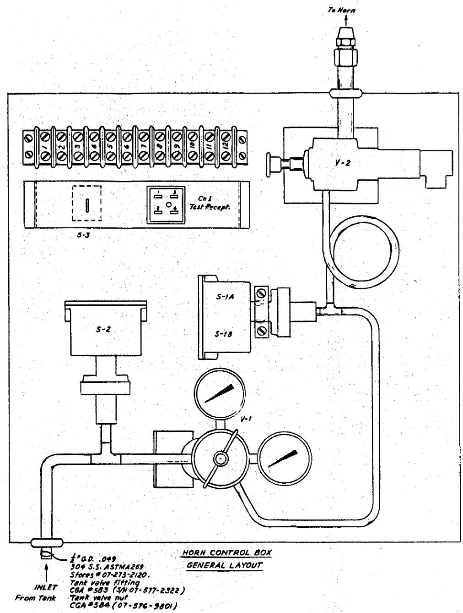

Q-2358-7R5

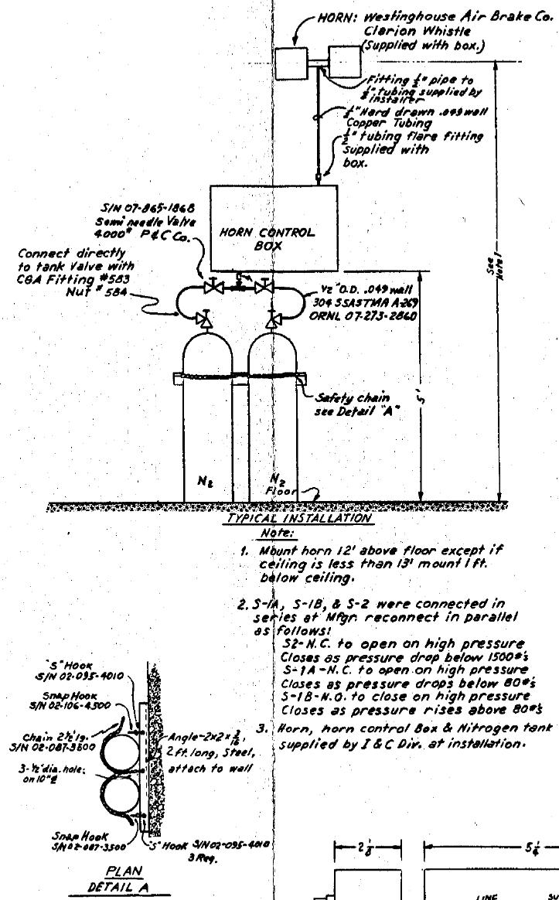

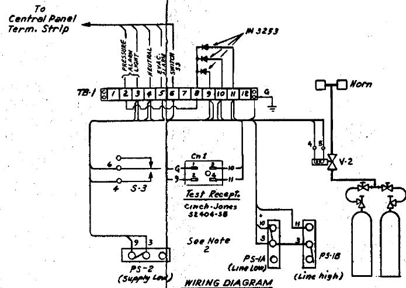

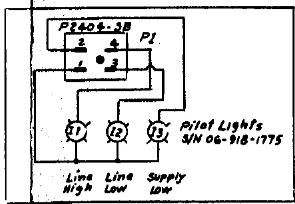  
Test Box

MATERIAL LIST-MAJOR PARTS ONLY   
1A,1B Switch,Pressure,Barksdale Model#09822-0-WA   
2" " "09612-3-WA   
3 Switch, Lever-Mossman #4103   
1 Terminal Strip Cinch-Jones #8-42   
1 Oxygen Regulator Linde Purox Model#R202   
2 Valve, Versa Model V10-2521-15-52 (110/60M)   
cr Columbia Type A,24X24X10,W+AI,plate dock   
1 Connector-Female-4 Contacts-Clinch-Jones S2404-SB

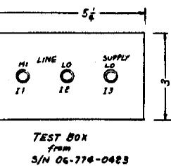  
Sepia copy of this drawing on file in E&M Div. Transmit Sepia copy to E&M of all revisions. E&M Dwg. No. D-54448.   
Fig. 7.11. Evacuation Horn Control Box for MSRE Radiation Warning System.

2. Threshold Hold Limit Values

a. Acute Exposure Level. It is recognized that there will be short periods of an operational nature when the concentration will be relatively high. The maximum permissible concentration for acute exposure for workers without respiratory protection should not exceed $25\mu \mathrm{g}$ of Be per cubic meter and the time limit for such exposure should be less than 30 min.   
b. Chronic Exposure Level. $\leqslant 2\mu \mathrm{g} / \mathrm{m}^3$ for an 8-hr, 5-day week.   
c. Environmental Air Concentration Levels. $0.01 \mu \mathrm{g} / \mathrm{m}^3$ for in-plant or "neighborhood" samples.   
d. Surface Contamination Levels. Walls, floors, and equipment within the beryllium control area, $\leqslant 25\mu \mathrm{g}$ per 12 in.². For equipment being transferred to a nonberyllium control area, $\leqslant 4\mu \mathrm{g} / \mathrm{ft}^2$ .

3. Methods of Control

a. Good Housekeeping and Personal Cleanliness   
b. Protective Equipment   
c. Engineering Controls   
d. Sampling

Fifteen permanent air-sampling stations will be used for routine monitoring of Building 7503 atmosphere; the locations of these stations are shown on Fig. 7.12. An NSL Automatic Continuous Beryllium Monitor will be used to monitor the radiator stack during periods of reactor operation and the coolant pit area during reactor shutdown periods. Four environmental sampling stations will be established in the general area surrounding the MSRE. Smear samples and additional atmospheric samples will be taken as required.

4. Responsibilities   
5. Specific Procedures

a. Industrial Hygiene Procedures   
b. Health Procedures   
c. Engineering Procedures

Transfer or Removal of Equipment   
Containment   
Filter Change   
Beryllium Release

d. Sampling Equipment

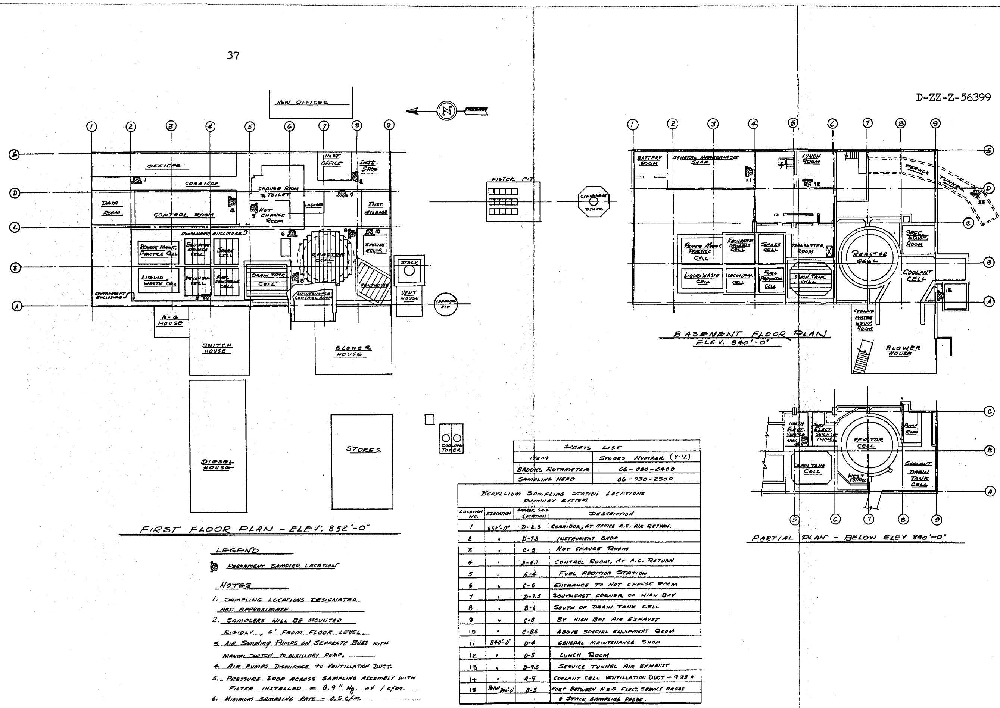  
Fig. 7.12. Building 7503 Permanent Beryllium Sampling Station Locations.

# 7.6. Containment Ventilation System

A schematic diagram of the containment ventilation system is shown on Fig. 7.13. This system provides for the control of air flow and pressure in the secondary containment zone (the reactor and fuel drain tank cells) and in the areas surrounding the secondary containment zone (the high bay area, special equipment room, etc.).

During reactor operation, the primary air flow is through the high bay area, which is maintained at a slight negative pressure. The reactor cell is maintained at -2 psig by bleeding inleakage to the stack from the component coolant pump discharge.

During reactor shutdowns, air may be exhausted from the reactor cell or other areas by adjustment of valves or dampers. A minimum face velocity of 100-ft/min is required through the opening into any contaminated cell.

For a complete discussion of the containment ventilation system, see Parts I and V of this report.

# 7.7. Reactor Off-Gas System

The reactor off-gas system includes piping, components, and instrumentation needed to handle the gas flow from the pumps, drain tanks, and certain other points in the fuel and coolant systems (see Fig. 7.14).

For a complete discussion of the off-gas system, see Parts I and V of this report.

# 7.8. Fire Protection System

A combination manual fire alarm and automatic fire detection system is provided (see Fig. 7.15). Manual actuation of the fire alarm may be effected at the master box (near driveway on north side of Building 7503) or at any one of the auxiliary boxes located as follows:

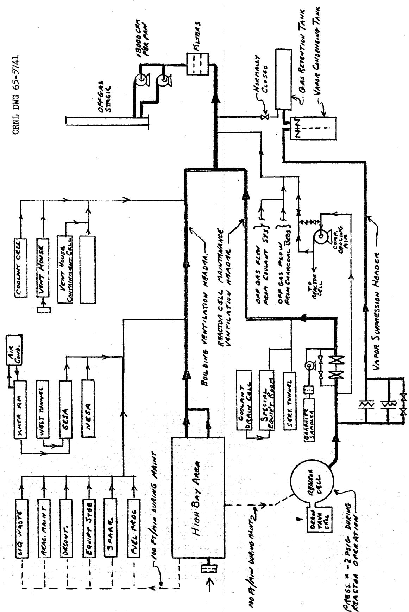  
Fig. 7.13. Schematic Diagram of MSRE Containment Ventilation System.

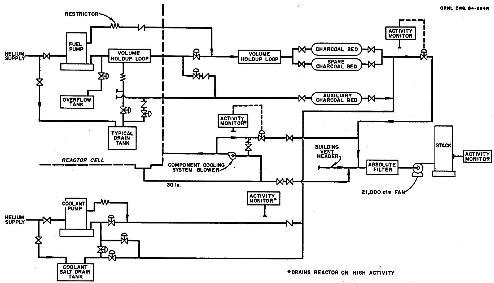  
Fig. 7.14. Schematic Diagram of Off-Gas System.

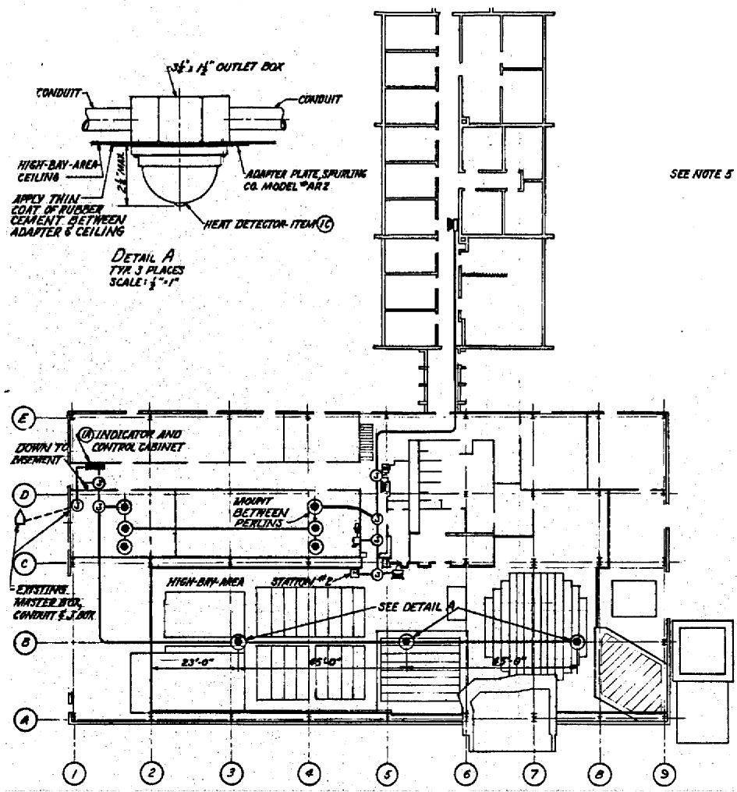  
41

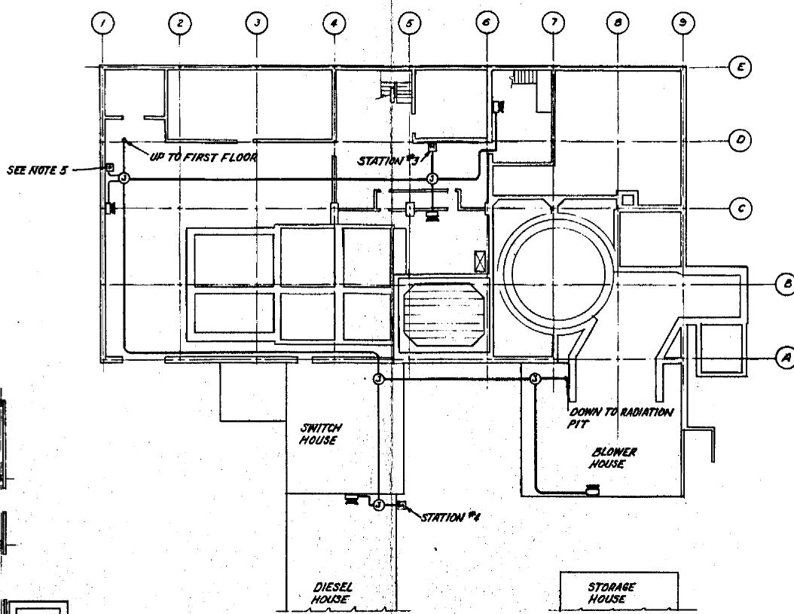  
BASEMENT PLAN @ ELEV 840'0" SCALE: 1/4"1'0"

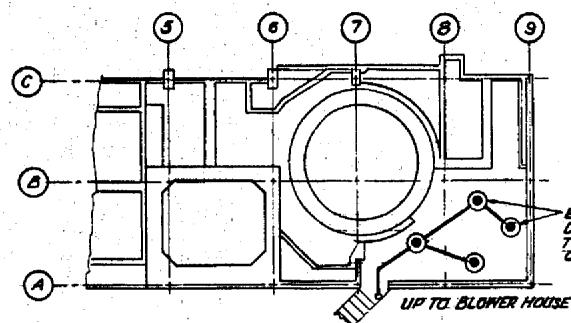  
FIRST FLOOR PLAN @ ELEV 852'-0" SCALE:1/6-1/20"   
PARTIAL PLAN BELOW 840-0" ELEV. SCALE: %°=1/°

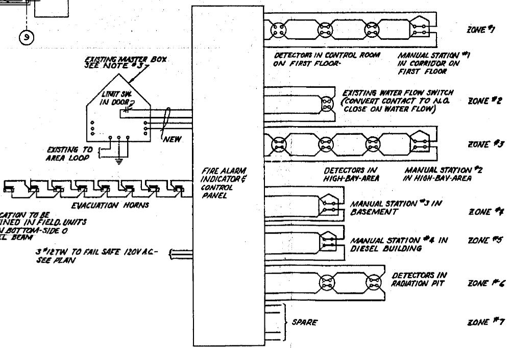  
Fig. 7.15. Fire Alarm Control and Annunciator System.

FIRE ALARM AND ANAUNCIATION SYSTEM FUNCTIONAL DIAGRAM

# D-KKC-55167-D

# #

1. INSTALL DINGLE FOLDS, 30 AM, I.D. SAFETY SN AND TIN TO PIL EN, PAINT SN END WITH THE LETTERS T.A. IN VILLAGE OF SN COVER.   
2. CONDUCTORS SIZE, EXACT EQUIPMENT, NUMBER AND SIZE OF CONDUCTORS SHALL BE DETERMINED AT THE MANUFACTURER'S APPROVED SPECIFICATIONS AND DETAILS.   
5. GORD WELL CONFERTIESTED GAMMERSALL NO. GOOD SHORE THE MATTER BX TO LOCAL EMPLOYE AND PROVELED LIGHT SWITCH IN DOOR TO SOUND BARS WHERE MATTER BX IS STRIPPED MANually.   
4. FAIPT ALL COVERS OF JUNCTION BOXES BED   
5. DISCONTECT EXISTING WATER FLOW SM. FROM NASTER BOX AND CONNECT TO INDICATOR COFFINOL PANEL.   
6. CONFRONTS TO VERS FROM THE MASTER BOX WILL BE NATHIN BY CENL.

# LIO

1. CONSTRUCTION MANUAL THE ALIEN AND AUTOMATIC TEST DETECTION SYSTEM. ALL KINDS SHALL BE AS HELDED TO THE UNDERWEIGHTS' LADDERINGSTANDS AND SHALL COMPLY IN FEET EXCEPT WITH THE REDECESSIVE OF THE LEAST LONG ISUE OF EVA TO 2 (CHAPTER 2 AND 3); APPLICATE 4/0 OF CHAPTER 4; AND ANTILOGICAL 4/0 OF CHAPTER 4 AS IT PROVING FOR AUTOMATIC IMPROXMENT OPERATION OF CLASSES A STEDING DURING A SINGLE BRAK AND GROoved PAUSE CONDITION IN AM LONG. THE SYSTEM SHALL CONSIST OF:

1A 1 BACK FIVE ALARM CLOCK INDICATOR AND CONTROL CANDIDNT. THE CONTROL CARDIOT SHALL BE UNIDIRECTIONAL LABORATORY ARTIFICIAED OF AND OF THE LOSS AND/ORATION TYP. ETCN (T) FIVE ALARM CLOCK SHALL BE PRODUCED. EACH CLOCK SHALL BE SOSTERRED AGAINST OBSERVES AND GROUNDS AND SUSTAINABLE SIGNALS, BOTH OBSERVES AND VISIBLE, SHALL BE PROVIDED. IN ADDITION, IN THE EVENT OF A COMINING OFF OR GROUNDS CONDITION ON ART LINE THE CONTROL CARDIOT SHALL AUTOMATICALLY COORDINATE ITSELF TO PROVIDE FOR EMERGENCY OPERATION OF THAT LINE ON A POSITITIVE FIVE CONOITION. ALSO, PANEL SHALL COAST FACTORY PLANNING TO SEAL IN ALL ALARM, OR THROULE, VISIBLE SIGNALS ENTIL FROM REFLECT FROM INSIDE OF PANEL. STILLING SWITCH SHALL BE PROVIDED TO CUT OFF AIDDLE SIGNALS AND TRANSFER TO PILOT LOUGES TO INDICATE SILENCED CONDITION. THROULE ALARM SILENCING SUSTAINABLE SHALL BE OPERABLE FROM OUTSIDE OF PANEL AND SUSTAINABLE SHALL BE SUPERVIVIFIED TO INDICATE OFF POSITION WHEN ALARM CONDITION IS NOT FURNISHED. IT SHALL BE ELECTRICALLY DEFORDED TO RISE HAMBER BOX WITH ANY FIVE ALARM SILENCED SWITCH IN THE OFF POSITION OR ANT STIRING SWITCH IN THE FIRST POSITION. A SYSTEM THAT SWITCH SMALL IS PRODUCED TO ALLOW SELECTION OF AIDDLE ALARM DURING TRAP. COPIPTON PANEL SHALL COAST A VOLUME SUPPLIED BY THAT WILL TRIP THE MARTER JOX ON A DECREASE IN VOLUME TO SO PER CFT OF FULL VOLUME FOR 30 SECONDS IF FOURS IS STILL AVAILABLE.   
THE ROUTING CARDIOT SHALL ALSO COVPEAT FACILITIES TO AFROMANATICALL TRIP A LOCAL HEVERSE GAMSHELL SO, 500 MARTER BOX AND PROVIDE SUPPRESSION OF THE STRONG ROUTOY.A CONSOLIDATIO PRF AND SUPPRESSOR CIRCUIT FOR SHOOTING AND RETRICTOR OPDRATION AND NON-OPERATION OF THE MARTER JOX SHALL BE FURNISHED. PACIFICITY SHALL BE PRODUCED TO INITIALS AND CONTROL AN ANGLES INTRODUCTION SYSTEM WITH SILENCING SWITCH AND SYSTEM START SWITCH TO ALLOW SETTING WITHOUT SOUNDING ALARs. PANEL SHALL BE SIMILAR TO SOUNDING ATTCULARI CLAS "A", VENDER SHALL SUPPLY DIFFERENT VIRADING DIAGNOSIS OF ALL PANELS, COMPLETE NADIMINEANCE AND OPERATING INFORMATION, PARTS LIST, AND KUMANSHANT SCIENTIFIC CONTROL DIAGNOSIS COVERING ALL CONFORMERS OF SYSTEM.

#

10   
CONTOYS,130F, FOR OUTST 50 NOUNTING. SPOCKING FID ALAN AND INTECRADE CONTOYS MODEL 20-31, ON EQUAL. TO BE COMPATIBLE WITH IA.   
10 10   
图

# Auxiliary Box No.

# Location

1

852-ft level, column lines D and 5

2

852-ft level, column lines C and 5

3

840-ft level, column lines D and 5

4

Diesel house, near south door

Automatic actuation of the fire alarm may be effected by either of two detecting systems:

1. Combination rate of rise and fixed-temperature heat-actuated detector. Three groups of these detectors are provided: a group of six over the control room and data logger areas, a group of three over the high bay area, and a group of four over the coolant drain pit area.   
2. Flow-detector switch in the sprinkler system water supply line. The switch is located on the 840-ft level near the north wall.

Actuation of a manual station or an automatic detector transmits a signal to the fire alarm zone indicator and control cabinet (located at the north end of the Building 7503 office corridor), which, in turn, causes the following action:

1. Actuation of the fire alarm horns. (If the alarm was initiated by the sprinkler system, the sprinkler system alarm gongs will also sound.)   
2. Transmission of a signal to the Fire Station and to the Emergency Control Center.   
3. Illumination (on the control cabinet) of a light that indicates the affected zone.

In addition to zone lights, the control cabinet contains lights to indicate normal, alarm, and test conditions and a switch to silence the horns while the system is being tested.

A fusible-plug automatic sprinkler system serves the entire MSRE area, with the following exceptions:

1. The Switch House.   
2. The shielded cells (reactor, drain tank, etc.) under the high bay.   
3. The Control Room and Data Logger Room (fusible plugs have been removed).   
4. The 7509 (Office) Building (classed as fireproof).

The water supply lines to the sprinklers in the high bay area and the special equipment room-coolant pit area are normally valved off. These valves will be opened by Fire Department personnel only, normally after consultation with the MSRE Local Emergency Supervisor or the MSRE Operations Supervisor. The valves are supervised by valve position indicators with a signal telemetered to the Fire Department.

In the Diesel House and Stores areas, the sprinkler piping is protected from cold weather damage by "dry" piping systems. A special control system keeps exposed portions filled with gas. If a fusible plug melts, water is admitted, and the sprinklers operate in the normal fashion.

Water supply for the sprinkler system comes from the potable water main (840-ft level, north end of Building 7503). A connection is also provided on the north side of Building 7503 (852-ft level, outside) for a supplementary water supply (see Part I of this report).

Six hose cabinets (four on the 852-ft level and two on the 840-ft level) plus strategically located portable extinguishers provide additional fire-fighting capacity. Each hose cabinet is equipped with 75 ft of hose and a 15-lb $\mathrm{CO}_{2}$ extinguisher.

Operation and maintenance of the fire protection system is handled entirely by the Fire Department. (The hose cabinets and portable extinguishers may, if necessary, be operated by MSRE personnel.) The pumper truck, the emergency truck, and available Fire Department personnel will normally respond to all fire alarms.

# References

1. D. M. Davis and E. G. Gupton, Health Physics Instrument Manual, USAEC Report ORNL-332, 3rd ed., May 20, 1963.   
2. J. A. Russell, Jr. and D. J. Knowles, Description of Facility Radiation and Contamination Alarm Systems Installed in the Molten-Salt Reactor Experiment, Bldg. 7503, USAEC Report ORNL-TM-1127, June 1965.   
3. N. E. Bolton and T. C. Whitson, Revised Beryllium Control Program for MSRE, unpublished internal document, November 1963.

# Bibliography

1. ORNL Emergency Manual.   
2. ORNL Radiation Safety and Control Manual.   
3. G. C. Cain and J. H. Greene, Multiplant Radiation Emergency Drill Oak Ridge National Laboratory, October 20, 1964, USAEC Report ORNL-TM-1068, April 1965.   
4. J. C. Hart, Applied Health Physics Assignments and Responsibilities During Laboratory Emergency Operations, unpublished internal document, July 1962.

# Internal Distribution

1. R.G. Affel   
2. A. H. Anderson   
3. R. F. Apple   
4. C. F. Baes   
5. S.J.Ball   
6. S. E. Beall   
7. B. M. Beeler   
8. M. Bender   
9. F. L. Blankenship   
10. R. Blumberg   
11. A. L. Boch   
12. N. E. Bolton   
13. H. R. Brashear   
14. R. B. Briggs   
15. G. H. Burger   
16. R. L. Clark   
17. L. T. Corbin   
18. W.B.Cottrell   
19. J. L. Crowley   
20. D. G. Davis   
21. S. J. Ditto   
22. J. R. Engel   
23. A. P. Fraas   
24. E. N. Fray   
25. C. H. Gabbard   
26. R. B. Gallaher   
27. J. J. Geist   
28. W. R. Grimes   
29. R. H. Guymon   
30. P. H. Harley   
31. P. N. Haubenreich   
32. P. G. Herndon   
33. V. D. Holt   
34. A. Houtzeel   
35. T. L. Hudson   
36. T. W. Hungerford   
37. R. S. Jackson   
38. P. R. Kasten   
39. R. J. Kedl   
40. D. J. Knowles   
41. A. I. Krakoviak   
42. J. W. Krewson   
43. C. E. Larson (K-25)

44. R. B. Lindauer   
45. M. I. Lundin   
46. R. N. Lyon   
47. H. G. MacPherson   
48. H. C. McCurdy   
49. W. B. McDonald   
50. H. F. McDuffie   
51. C. K. McGlothlan   
52. A. J. Miller   
53. R. L. Moore   
54. K. Z. Morgan   
55. H. R. Payne   
56. A. M. Perry   
57. H. B. Piper   
58. J. L. Redford   
59. M. Richardson   
60. H. C. Roller   
61. M. W. Rosenthal   
62. J. A. Russell, Jr.   
63. H. W. Savage   
64. A. W. Savolainen   
65. D. Scott, Jr.   
66. J. H. Shaffer   
67. M. J. Skinner   
68. A. N. Smith   
69. W. F. Spencer   
70. I. Spiewak   
71. R. C. Steffy   
72. J. R. Tallackson   
73. R.E.Thoma   
74. D. B. Trauger   
75. W. C. Ulrich   
76. B. H. Webster   
77. A. M. Weinberg   
78. K. W. West   
79. J. C. White   
80. G. D. Whitman   
81. H. D. Wills   
83. Laboratory Shift Superintendent   
85. Central Research Library   
87. Y-12 Document Reference Section   
92. Laboratory Records Department   
93. Laboratory Records, RC

# External Distribution

94-95. H. M. Roth, Research and Development Division, ORO

96-100. Reactor Division, ORO

101-115. Division of Technical Information Extension, DTIE