MSRE DESIGN AND OPERATIONS REPORT

PARTX

MAINTENANCE EQUIPMENT AND PROCEDURES

R. Blumberg

E. C. Hise

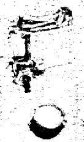

NOTICE This document contains information of a preliminary nature and was prepared primarily for internal use at the Oak Ridge National Laboratory. It is subject to revision or correction and therefore does not represent a final report.

# LEGAL NOTICE

This report was prepared as an account of Government sponsored work. Neither the United States, nor the Commission, nor any person acting on behalf of the Commission:

A. Makes any warranty or representation, expressed or implied, with respect to the accuracy, completeness, or usefulness of the information contained in this report, or that the use of any information, apparatus, method, or process disclosed in this report may not infringe privately owned rights; or   
B. Assumes any liabilities with respect to the use of, or for damages resulting from the use of any information, apparatus, method, or process disclosed in this report.

As used in the above, "person acting on behalf of the Commission" includes any employee or contractor of the Commission, or employee of such contractor, to the extent that such employee or contractor of the Commission, or employee of such contractor prepares, disseminates, or provides access to, any information pursuant to his employment or contract with the Commission, or his employment with such contractor.

ORNI-TM-910

Contract No. W-7405-eng-26

Reactor Division

MSRE DESIGN AND OPERATIONS REPORT

PART X

MAINTENANCE EQUIPMENT AND PROCEDURES

R. Blumberg E. C. Hise

JUNE 1968

OAK RIDGE NATIONAL LABORATORY

Oak Ridge, Tennessee

operated by

UNION CARBIDE CORPORATION

for the

U.S. ATOMIC ENERGY COMMISSION

e aen en ane ean ane ane ane ane ane ane ane ane ane ane ane ane ane ane ane ane ane ane ane ane ane ane ane ane ane ane ane ane ane ane ane ane ane ane ane ane ane ane ane ane ane ane ane ane ane ane ane ane ane ane anee aeaeene ee eaeene eaeene eaeene eaeene eaeene eaeene eaeene eaeene eaeene eaeene eaeene eaeene eaeene eaeene eaeene eaeene eaeene eaeene eaeene eaeene eaeene eaeene eaeene eaeene eaeene eaeene eaeene eaeene eaeene eaeene eaeene eaeene eaeene eaeene

# PREFACE

A record of the methods of maintaining the radioactive portions of the Molten Salt Reactor Experiment (MSRE) is presented in this report. In Section 2, overall descriptions are given of the components and the methods of maintenance. Section 3 presents the procedures written from the standpoint of the people who perform the work. The Appendix lists reference material that will be useful when detailed information is required.

The report was originally prepared before the MSRE began power operation and thus before there was any experience in radioactive maintenance of it. Since that time, the MSRE has been operated and maintained successfully, and we have had the opportunity to observe how our maintenance plans have worked. In general, our basic methods and original planning have served quite well.

There is one aspect of our experience, however, that bears on the material contained herein. We have found that changes in tools, methods, reactor equipment, and administration of the maintenance operation make it necessary to prepare new and fully detailed procedures for most shutdown work. These procedures are then used to implement the functioning of a complex operation involving many people. Therefore the procedures in this report reflect present methods but not the full detail that is actually required.

# ACKNOWLEDGEMENT

We wish to acknowledge the contributions of other members of the Reactor Division to this report. P. P. Holz did the original design and description of the portable maintenance shield. B. H. Webster did the same for the graphite-sampling technique. J. R. Shugart not only wrote and rewrote many procedures, but also made them work at the MSRE. R. B. Briggs and Dunlap Scott reviewed the original manuscript and provided many helpful suggestions for the preparation of the finished report.

# INDEX TO REPORT SERIES

This report is one of a series that describes the design and operation of the Molten-Salt Reactor Experiment. All the reports are listed below.

ORNL-TM-728 MSRE Design and Operations Report, Part I, Description of Reactor Design by R. C. Robertson   
ORNL-TM-729 MSRE Design and Operations Report, Part II, Nuclear and Process Instrumentation, by J. R. Tallackson   
ORNL-TM-730 MSRE Design and Operations Report, Part III, Nuclear Analysis, by P. N. Haubenreich and J. R. Engel, B. E. Prince, and H. C. Claiborne   
ORNL-TM-732 MSRE Design and Operations Report, Part V, Reactor Safety Analysis Report, by S. E. Beall, P. N. Haubenreich, R. B. Lindauer, and J. R. Tallackson   
ORNL-TM-733 MSRE Design and Operations Report, Part VI, Operating Limits, by S. E. Beall and R. H. Guymon   
ORNL-TM-907 MSRE Design and Operations Report, Part VII, Fuel Handling and Processing Plant, by R. B. Lindauer   
ORNL-TM-908 MSRE Design and Operations Report, Part VIII, Operating Procedures, by R. H. Guymon   
ORNL-TM-909 MSRE Design and Operations Report, Part IX, Safety Procedures and Emergency Plans, by R. H. Guymon   
ORNL-TM-910 MSRE Design and Operations Report, Part X, Maintenance Equipment and Procedures, by E. C. Hise and R. Blumberg

# CONTENTS

Page

# ABSTRACT xi

1. INTRODUCTION 1   
2.DESCRIPTION OF THE MAINTENANCE SYSTEM 4

2.1 Maintenance Equipment and General Methods 4   
2.2 Maintenance Control Room and Facilities for Remote Operation 5   
2.3 Portable Maintenance Shield 7   
2.4 Jigs and Fixtures for Assembling MSRE Components 15   
2.5 Freeze-Flange Maintenance 15   
2.6 Fuel-Pump Maintenance 23   
2.7 Graphite Sampler and Control Rods 23   
2.8 Braze Joint 28   
2.9 Maintenance of the Sampler-Enricher 37   
2.10 Miscellaneous Long-Handled Tools 37

3. DETAILED MAINTENANCE PROCEDURES 41

3.1 The Radiation and Contamination Problem 41   
3.2 Maintenance Control Room and Remote Facilities 42   
3.3 Procedure for Use with the Portable Maintenance Shield 43   
3.4 Procedures for Using Freeze-Flange Manipulating Tools 45   
3.5 Fuel-Pump Maintenance 51   
3.6 Procedures for Handling Surveillance Samples and Control Rods 53   
3.7 Procedure for Brazing a Joint 62   
3.8 Procedures for Maintenance of the Sampler-Enricher 67

Appendix A. LIST OF REMOTE MAINTENANCE REFERENCE INFORMATION 71   
Appendix B. MSRE PORTABLE MAINTENANCE SHIELD 72   
Appendix C. GRAPHITE SAMPLER AND CONTROL ROD MAINTENANCE FACILITY 74   
Appendix D. LONG-HANDLED TOOLS AND MISCELLANEOUS EQUIPMENT 75   
Appendix E. IN-CELL EQUIPMENT 77   
Appendix F. JIGS AND FIXTURES 78

# ABSTRACT

A record of the methods of maintaining the radioactive portions of the Molten Salt Reactor Experiment (MSRE) is presented. The maintenance system utilizes long-handled tools operated through a movable shield for most of the in-cell manipulations. For some radioactive transfer and setup tasks that cannot be handled otherwise, a crane that is operated remotely from a shielded control room is used. Overall descriptions are given of the components and the methods of maintenance, the procedures written from the standpoint of the people who perform the work are presented. Reference material that will be useful when detailed information is required is included.

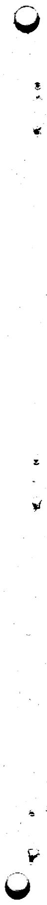

# 1. INTRODUCTION

The MSRE is a 7.5-Mwt circulating-fuel reactor in which ${}^{235}\mathrm{U}$ fuel dissolved in a solution of lithium and beryllium fluorides is pumped around a closed loop at ${1200}^{ \circ  }\mathrm{F}$ . A drawing of the reactor arrangement is shown in Fig. l. The reactor plant was completely described in this series of reports by Robertson. Some of the advantages of this reactor concept are related directly to the liquid nature of the fuel and are due to the ease of moving the bulk of the fuel inside piping systems, removing reactor poisons, reprocessing to remove fission products, and adding new fissionable material to make up for burnup. However, the same liquid property causes radioactivity to be distributed throughout the primary systems. Therefore special means are required for maintaining all the equipment that comes in contact with or is physically near the fuel salt and off-gas systems. The demonstration of capability in this area became one of the primary objectives of the program.

The maintenance system includes many different kinds of equipment located both in and out of the radioactive areas. Besides physical equipment, a certain amount of information must also be considered as part of our maintenance system. This information exists as written procedures, drawings, photographs, and "know-how" of trained experienced personnel.

Early in the program it was recognized that the design of each component had to include provisions for maintenance, and the steps in the achievement of this goal included a design surveillance program. Thus those who had the maintenance responsibility had an opportunity to influence the system and component design in the early stages. This activity took varying degrees of participation from consultation and approval to detailed designs and layouts. Surveillance of the design was followed by a similar program during the construction, assembly, and installation stages. Accompanying the field work of installing reactor components was a demonstration and practice program in which selected components were handled with remote-maintenance tools and methods. Many corrections were made during this period to improve the basic designs and to correct fabrication errors and maintenance techniques. In general, the process consisted of doing whatever was necessary to make the system maintainable. The surveillance program and the demonstration program were logical methods of assuring the maintainability of the system before power operation. These programs had the further result of producing a nucleous of experienced personnel at the beginning of power operation at the MSRE, which has since been expanded in the course of several shutdowns to an adequate and

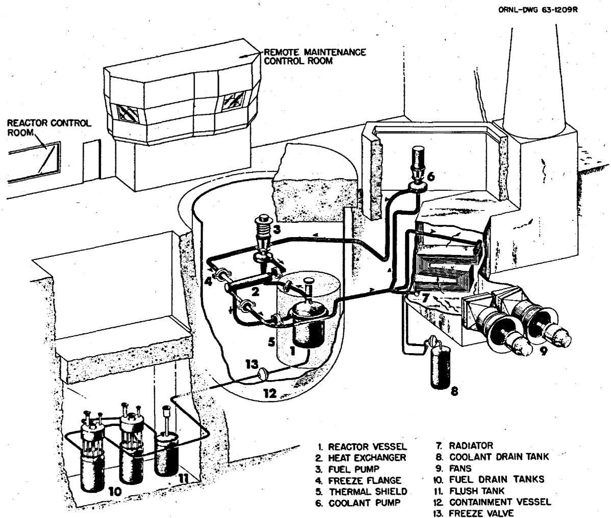  
Fig. 1. Sketch of MSRE Arrangement and Flow Diagram.

competent group. The recognition of the individual component nature of the maintenance problem, the design and construction surveillance effort, the demonstration program at the reactor, and the utilization of developed personnel skills are parts of the approach used to assure the maintainability of the MSRE.

# 2. DESCRIPTION OF THE MAINTENANCE SYSTEM

# 2.1 Maintenance Equipment and General Methods

The system provided to maintain the MSRE is based on the requirement that any failed component be replaceable with a new interchangeable spare. Decontamination and subsequent repair of failed components have been found to be possible and economically attractive. However, decontamination and repair are not considered to be the primary methods for maintenance. Little effort has been made to effect in-place repair. A major effort was made however to achieve good component reliability. As the result of a combination of many influences, the maintenance system was made flexible, simple, rugged, and low cost. All the equipment that can be approached directly is designed for conventional maintenance. This report is concerned only with the equipment that cannot be approached directly because of radioactivity.

The four principal locations where remote maintenance is required are the reactor cell, the drain tank cell, the venthouse, where there is access to the off-gas system components, and the fuel-processing cell. Fairly uniform methods are used for all these cells. The ability to remove and replace every operating component in these areas has been accomplished through the use of appropriate disconnects and mountings. The 5-in. circulating-system piping is joined by mechanical disconnects consisting of the freeze flange developed especially for molten-salt service. The 1-1/2-in. fill-and-drain system piping is of all-welded construction. Future joints will be made by cutting and brazing with a technique developed especially for this service. Piping conducting other fluids is connected by ring-joint flanges or cone-seal disconnects. Electrical and instrument wiring has plug-in disconnects constructed of materials suited to the environment. All the joints and disconnects are designed to be readily operable from directly overhead. They are described in detail later. The major components, such as the reactor vessel, the heat exchanger, the pump, and the drain tank, as well as the smaller components, such as the pipe and vessel heaters, valves, and motors, are so disposed and mounted that after being disconnected they can be removed by lifting straight upward.

The maintenance equipment design provides for the operation of all the disconnects and the replacement of the smaller components by the use of relatively simple long-handled tools operated directly through the portable maintenance shield. The portable maintenance shield can be placed over and will cover the opening left by the removal of two of the lower shield plugs, a space 4 ft. wide and up to 10 long. There are a variety of penetrations for inserting lighting, viewing devices, and tools. An opening can also be created through which small components will pass. A penetration may be placed anywhere in the opening covered by the shield by a

series of controlled movements. The design and use of the portable maintenance shield are described in detail later. The major components are too large to pass through an opening 4 ft. wide and their removal thus requires that a large portion of the cell top shielding be removed and that remote-handling techniques be used. For this operation, a shielded maintenance control room, remotely operated cranes, and closed-circuit television were provided. The maintenance control room (Fig. 2) overlooks the reactor cell, the drain tank cell, and the building interior through shielding windows. It contains controls for the 30-ton crane, the 10-ton crane, and the monitors for the television system. Lift fixtures are provided that can be picked up by crane and which, in turn, will pick up, transport, and release the lower shield blocks and beams and each of the major components.

# 2.2 Maintenance Control Room and Facilities for Remote Operation

The maintenance control room and facilities for remote operation consist of the remote maintenance control room; 30- and 10-ton cranes operable from the control room; lift tongs for the lower shield blocks for the reactor cell and drain-tank cell; lift fixtures for the reactor vessel, heat exchanger, fuel pump, and drain tanks; and a closed-circuit television system. The remote facilities are to be used during any maintenance operation that requires the simultaneous removal of more than two lower shield blocks. Anticipated operations in this category are replacement of the reactor vessel, the heat exchanger, the pump bowl, and the drain and flush tanks.

The maintenance control room has 3-1/2-ft-thick concrete walls to provide adequate shielding for any maintenance operation; three windows to provide a view of the cells and building interior; crane, television, and lighting controls; and radiation monitors, ventilation, sanitary facilities and lights. Its floor is 10 ft. above the building main floor and its interior dimensions are 14 by 19 ft. Personnel access to the room is by an outside stairway on the west side of the building. Equipment access is by a 4 x 4-ft hatch in the ceiling.

The ten-ton crane has five speeds in each of six directions controllable directly from a push-button pendant in the main building or from a dial and toggle-switch console in the maintenance control room. The signals from the maintenance control room to the crane travel via a trailing cable that must be connected by a cannon-type plug located at the west end of the bridge when remote control is desired; it is disconnected at all other times. This crane was rereeled for a hook travel from 875 ft 10-1/2 in. to 823 ft 6 in. elevation and is now actually rated at 7-1/2 tons.

The 30-ton crane has five speeds in each direction controllable from the cab and three speeds in each direction controllable from a dial and toggle-switch console in the maintenance control room. It also has a power-driven rotating hook controllable from either point, and a load cell with an indicator in the maintenance control

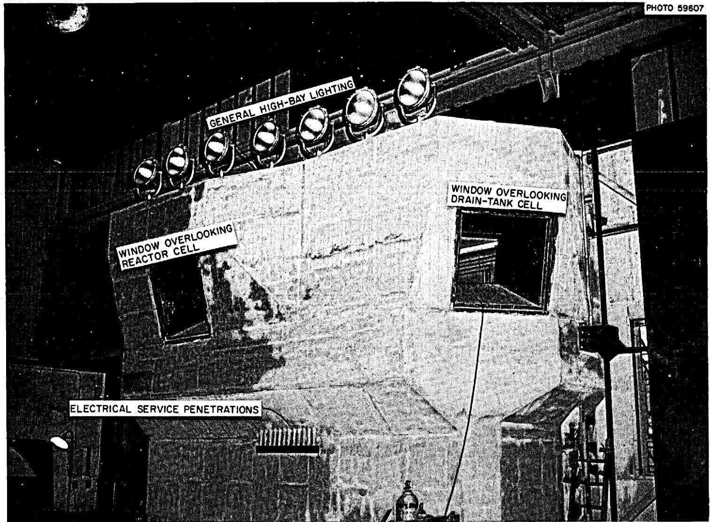  
Fig. 2. High-Bay Side of Remote-Maintenance Control Room.

room. The remote-control signals are transmitted via trolley wire and need not be disconnected. The main circuit breaker for both cranes is in a shielded area under the maintenance control room and is accessible during a remote-maintenance operation.

There are four-point (Fig. 3) and two-point lifting tongs for the lower shield blocks, and a lifting tong for the lower shield beams. The tails fit the hook of the 30-ton crane. The tongs lock alternately in the open and closed positions each time they are picked up and set down. The sequence of operations for the tongs is as follows: engage the crane hook in the bail and raise the tongs (now locked in the open position); lower the tongs onto the plug with the hooks in the lifting points until the tong weight is off the crane; raise the tongs, which will automatically lock in the closed position, and raise the shield plug; transport the load and lower it until the tong weight is off the crane hook; raise the tongs, which will now automatically lock in the open position, and release the load.

A lifting fixture is provided for each of the major components. Each fixture can be picked up and released by the crane and can in turn pick up and release its component through use of the remotely operated crane. These fixtures are on hand and have been used.

The television system consists of three cameras mounted on pan and tilt mechanisms, two monitors, and a set of controls. For a remote-maintenance operation the cameras are mounted in the building on movable stands, as shown in Fig. 4, so as to command two views of the operation which, along with the direct view through the shielding window, provide complete coverage of the work area. The use of orthogonal positioning of the cameras provides a feeling of depth. The remote controls operate the pan, tilt, focus, zoom, and iris.

# 2.3 Portable Maintenance Shield

A portable maintenance shield was designed and fabricated to provide shielding for maintenance operations with long-handled tools. It shields the access area produced when any two adjacent lower roof blocks are removed from the reactor or the drain tank cells. It accommodates the long-handled tools, the lower shield blocks in both reactor and drain tank cells, and some of the in-cell equipment, and it is operated from the remote-maintenance control room. Figures 5 through 8 show various views of this equipment.

The portable maintenance shield consists of four basic components: slide, modules, frame, and track. The slide is a slab of shielding whose dimensions are 12 in. thick by 5 ft wide and either 8-1/2 or 13 ft long depending on the usage. The slide includes a circular cutout that accommodates a 35-in.-diam. geared plug. The plug, in turn, has a series of cutouts for lights, windows, and tools.

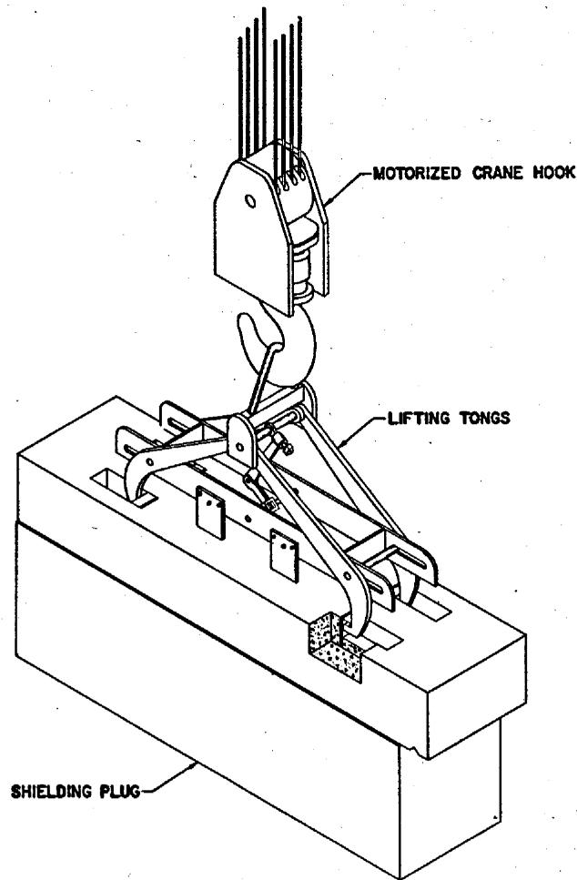  
Fig. 3. Remotely Operated Lifting Tongs for Shielding Plugs.

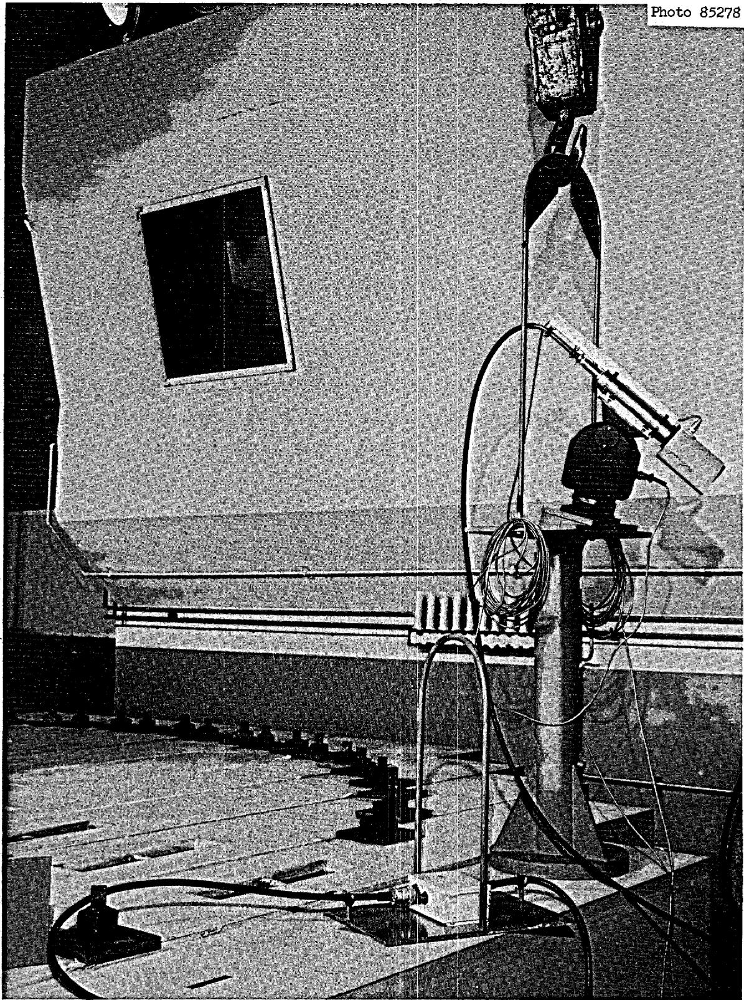  
Fig. 4. Television Camera on Movable Stand.

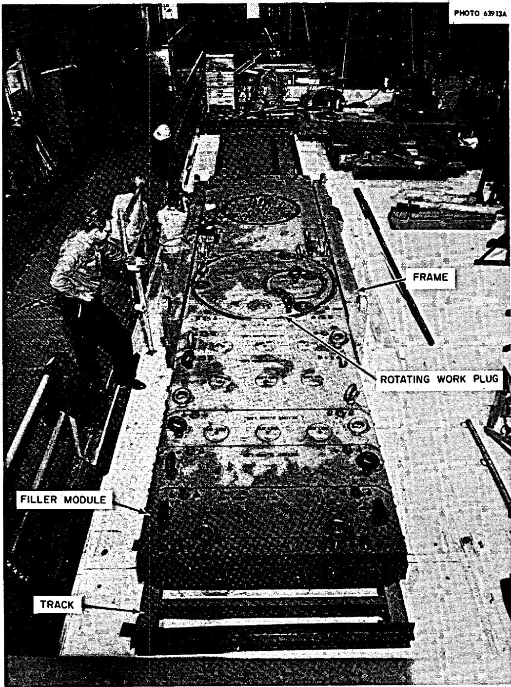  
Fig. 5. MSRE Maintenance Shield.

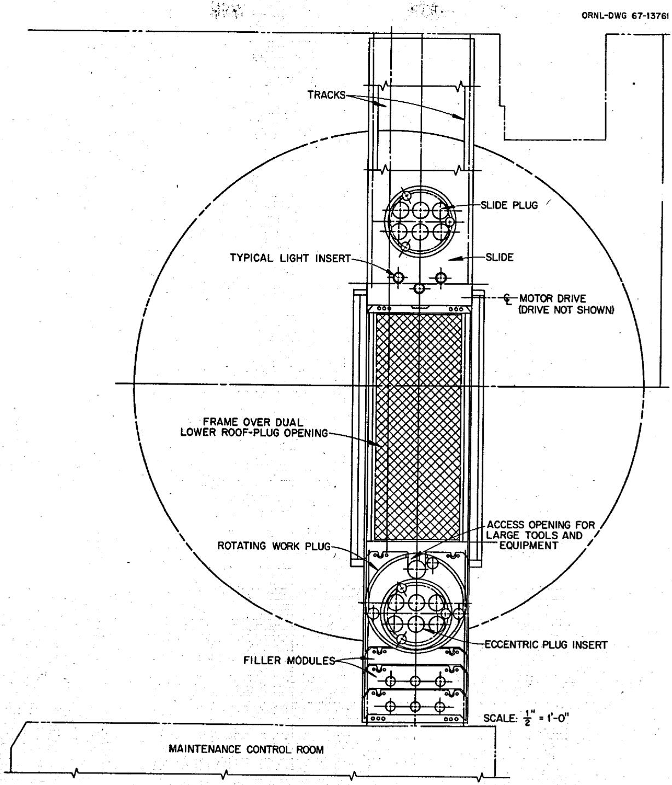  
Fig. 6. Typical Plan View of Setup of Maintenance Shield.

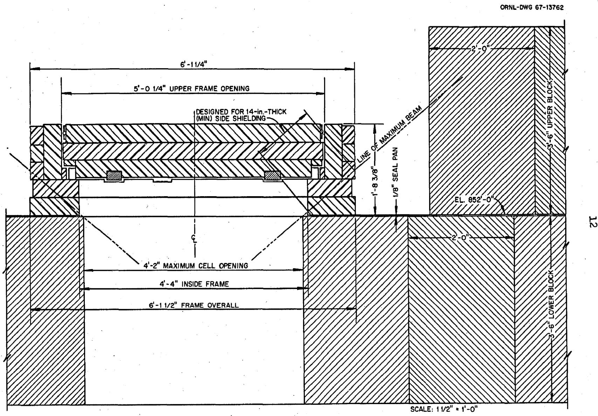  
Fig. 7. Cross Section Through Frame and Slide of Maintenance Shield.

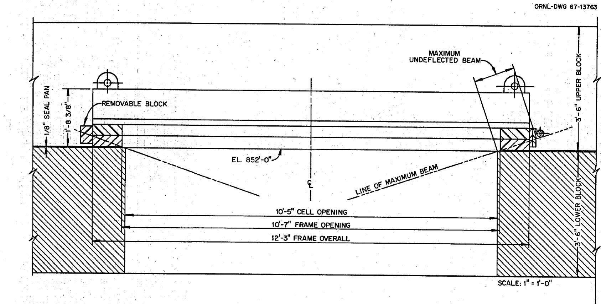  
Fig. 8. Cross Section Through Frame of Maintenance Shield.

The slide rolls on wheels and is moved by a drive motor.

The filler modules are additional short sections of shielding that can be added to the main slide to allow positioning of tool holes above the desired work area. Most of the long-handled tool operations are done through a module referred to as the rotating work plug. This module, which is assembled next to the slide, contains a 22-in. diameter rotatable-plug mounted eccentrically within a 50-in.-diam. plug. This arrangement provides the necessary reach to permit tool access over any point within the block opening. A special hole layout within the inner plug permits multiple tool access to the reactor freeze flanges, as specifically required for flange maintenance. The plugs are operated manually through a geared drive to allow precise positioning of their multiple openings. A tool access cutout is located on the edge of the rotating work plug to provide means of inserting or withdrawing large tools or items of equipment. This is sometimes called the "split section of the rotating plug." All modules and plugs are 12 in. thick and fabricated from carbon steel.

The frame, constructed of heavy steel plate, serves as the support for the slide. After the frame is installed over a pair of lower shield blocks, the slide is moved to an end track to permit the removal of the blocks, and an opening 52 by 127 in. is provided. The plugs are removed by operating the cranes from the remote-maintenance control room and then returning the slide to a position over the cell opening to provide complete shielding for personnel. A 3/4-hp motor and gearbox combination mounted on the frame moves the slide through a rack-and-pinion arrangement. The rate of travel is about 2 in./sec. Electrical limit stops, backed up by movable mechanical stops, are provided to limit travel as desired. The motor controls are connected to the maintenance control room operating station with a cable.

The track is an extension to the frame that can be mounted at either end of the frame and on which the slide and module rollers move. It consists of "I" beams with channel and angle bracing.

A shielding thickness of 12 in. of steel is provided throughout (slides, modules, and frame sides and ends). This shielding is sufficient to limit radiation levels 24 hr following reactor shutdown to about 10 mr/hr.

The series of holes through the shielding that are used for long-handled tools, lights, and windows are provided with various fillers or inserts. Some of these contain 150-w lighting fixtures. Some are of a split-bushing design to accommodate tools of various diameters. Some inserts contain a drilled lead ball through which tools may be inserted and "swung" into positions other than directly underneath the work hole. One 8-in.-diam. and one 5-1/2 in.-diam. lead-glass window can be mounted simultaneously for direct viewing.

# 2.4 Jigs and Fixtures for Assembling MSRE Components

The philosophy of remote maintenance involves the replacement of failed components; therefore connection members and mounting dimensions must be the same for the failed and the replacement components. Jigs and fixtures are used to make it possible to replace the major components in the reactor and drain-tank cells. The following components were fitted to a jig as they were assembled or, a jig was fabricated to fit the as-built component.

# 2.4.1 Reactor Cell Components

The major reactor cell components that can be removed and replaced are the reactor vessel, the heat exchanger, the pump bowl, the rotary element of the pump, and the pump motor. A jig was designed for these major components so that all replacement components could be fabricated on the one jig assembly, or the jig could be broken down into sections to accommodate single components. A separate jig is available for use if only the pump rotary element or the pump is to be replaced. This jig makes it possible to duplicate the auxiliary flanges and disconnects in their existing locations. After the space coolers were installed in the reactor and drain tank cells and all piping and electrical connections were made, they were removed and a jig was built to fit the unit. This jig makes it possible to duplicate the flange and electrical disconnects, as well as the support steel for the unit.

The basic parts of a jig were also prepared for the component cooling valves. After the valves were installed and all piping was completed the valves were removed and placed on the jigs, and holes were drilled to locate flanges, air lines, disconnects, etc. These holes were identified for each valve and thus any valve in the system can be duplicated.

# 2.4.2 Drain-Tank Cell Components

A jig was used to assemble the drain tanks and steam domes, and the elevations and orientations of all piping flanges and thermocouple disconnects were established with fixtures attached to the jig. The fill-and-flush tank was assembled in the same jig, and the helium valves were fitted to the valve jig described for the component cooling-air valves.

# 2.5 Freeze-Flange Maintenance

The major components in the reactor cell are connected by the five 5-in. freeze flanges described previously by Robertson.

These flanges are designed so that they can be separated and remade remotely with tooling operated through the portable maintenance shield. The layout of the reactor system piping, imposed by other factors, dictates that the sequence of opening the flanges for replacement of any component be limited to opening the flanges on the coolant end of the heat exchanger first, then on the fuel end of the heat exchanger, and finally the flange that connects the reactor to the suction of the pump. This sequence is responsible for the rather lengthy procedure required to remove a defective gasket in freeze flange FF 100, and must be taken into account whenever planning a specific maintenance task.

# 2.5.1 Operations Required for Gasket Replacement

The operations of breaking and making a flanged joint involve the following procedure, which is broken down into steps corresponding to the tool used. The disassembly consists of

1. Forcing clamp off the flange and thus relieving all gasket sealing force.   
2. Hanging the clamp assembly on a bracket installed in the cell,   
3. Jacking the faces of the flanges apart to get at the gasket and to provide clearance for displacing components.   
4. Removing the ring-gasket assembly,   
5. Covering the open flanges to prevent spread of contamination.

The reassembly procedure, which is the reverse of the above, and which is done with the same tools, has one extra requirement: the flange faces must be realigned as they are being jacked together (reverse of step 3) to assure good gasket sealing. Throughout these steps, viewing is provided principally by the periscope, with its various lenses. The periscope is supplemented by windows in the shield and, when necessary, by long-handled mirrors.

# 2.5.2 Realignment and Gasket Sealing

The freeze flange assembly, which is shown in Fig. 9, consists of the flange body containing the gasket groove, the gasket assembly, the clamps, the guide rods, the disassembly beams, and the lifting eyes. The gasket loading force is derived from the strain in the horseshoe section of the clamp, which is sprung open a nominal 0.100 in. when the clamp is forced onto the flange. Forces encountered in seating the clamp on assembly and disassembly operations range from 16 to 34 tons. It is necessary to put the clamps on symmetrically for two reasons. First, symmetrical loading produces the best gasket-sealing condition, and second, unsymmetrical assembly would cause galling and "digging in" and thereby increase the required

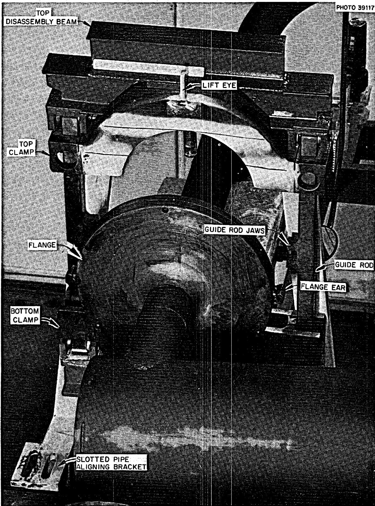  
Fig. 9. View of Mockup Freeze Flange with Clamp in Stowed Position.

assembly forces. Symmetrical assembly is achieved by using care in handling and operating the remote tooling. Also there are guide rods that help center the clamp through their close engagement with the ears on the flange. The guide rods also serve to connect the upper and lower half of the clamp assembly so that it can be handled as one unit. The disassembly beams carry the loads imparted by the remote tooling from the clamps into the flange when taking the clamps off. The lift eyes are provided to handle the clamp assembly.

# 2.5.3 Permanently Installed Maintenance Equipment

Some items of equipment that in general serve to simplify the remote maintenance operation were permanently installed at each freeze flange. For example, under the piping at each flange there is a 5-ton worm-gear screw jack that terminates in a remotely operable hex head, complete with hook, supports, and drive trains. This jack provides forces in the axial direction of the piping to spread apart or bring together the flange faces. There are also permanently installed, slotted brackets that act as anchor points to align flange faces in the radial direction, and there are supports that hold the freeze-flange clamp assembly in the stowed position when the flanges are separated.

# 2.5.4 Hydraulic Clamp Operator

As mentioned above, the horseshoe-shaped section of a fully seated clamp is sprung open a nominal 0.100 in. to produce a gasket load of approximately 200,000 lb. The force required to seat a clamp ranges from 16 to 34 tons and is applied remotely by the pair of hydraulic clamp operator tools shown in Fig. 10. Each consists of a long mast carrying a 20-ton 13-1/2 in. stroke hydraulic ram. Its cylinder is attached to a stationary outer frame, and the piston is attached to an inner frame. Extending the ram moves the inner frame down toward the stationary member. By engaging the outer frame under appropriate surfaces on the clamp assembly and the inner frame over them, the tool can accomplish the required jobs of assembly and disassembly. These are shown in Fig. 10. Engaging the tools onto these surfaces remotely is made somewhat easier by aligning assembly marks on the tool with the proper surface on the in-cell equipment.

# 2.5.6 Clamp-Handling Tool

When the clamps have been separated, the "clamp handling" tool is used to transport the clamp assembly out of the way and to store it so that the flanges can be spread apart. This tool consists of a pair of hooks installed on the end of a long mast and spaced to engage a pair of eyes on the upper clamp. When the hooks are engaged the tool is raised slowly, and it lifts the upper clamp until it contacts the underside of the upper beam. Because of the restricted vertical clearance between the guide-rod jaws and the flange ears,

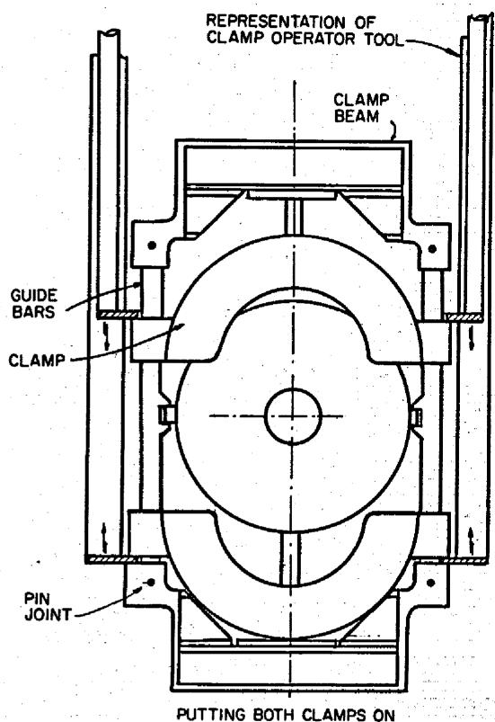

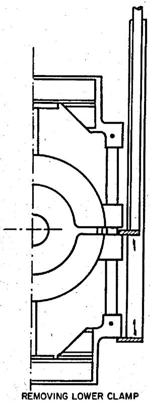

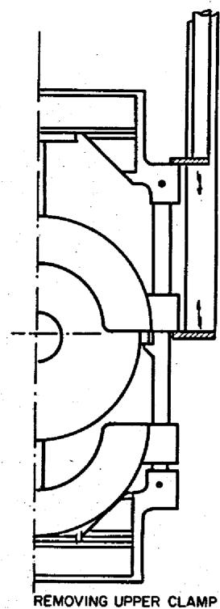  
Fig. 10. Freeze Flange Clamping Frame Showing Assembly and Disassembly Steps.

ORNL-DWG 64-8821

the motion is precisely controlled until the entire weight of the flange clamp assembly is carried by the tool. The assembly is then moved horizontally back along the piping and hung on the clamp stowing bracket, as shown in Figs. 9 and 11.

# 2.5.7 Flange-Jacking Equipment

After the clamp assembly has been stowed the flanged joint may be separated. This is accomplished with the jacks (Dwg. E-GG-E-41865) mounted in the cell beneath the piping. As mentioned above, these are 5-ton worm-gear screw jacks that are engaged and operated remotely by rotating hex-head drives with ordinary socket wrenches on long handles. The jack hook engages with and transmits force through jack bars mounted on the piping-support installation (Dwg. E-GG-E-41860). To avoid restricting the motion of the piping due to thermal expansion, the jacks must be left disengaged during reactor operation. For maintenance they must be engaged to the piping to provide the forces required for opening flanges and for moving components.

# 2.5.8 Gasket-Handling Tool

The gasket handling tool is used to replace a ring-gasket assembly. The tool is long-handled pliers with a stationary upper jaw. The movable lower jaw which is operated from the top of the tool, engages slots on the inside of the ring away from the four sealing surfaces. On the vertical center line of the gasket there is a small bracket that carries a pin to lock the gasket to the flange until the flanges are pushed together. This detail is shown in Fig. 12. The pin has 0.045 in. clearance inside a hole tapped in the flange at a corresponding location. Thus, the pin can be slipped into the hole readily by means of the handling tool. The pin has threads on its lower side that match those of the hole, and the weight of the gasket assembly is supported by the pin which is kept in place by the engaged threads. When the other flange is brought into place the ring groove caps the ring upward; this motion disengages the threads on the pin and the tapped hole and allows the ring to move into the proper sealing position in the groove. For removal, the assembly is raised so that the smooth upper surface of the pin contacts the top of the hole. This disengages the threads and allows the pin to be withdrawn.

# 2.5.9 Flange-Cover-Handling Tool

In order to reduce the release of radioactive particles from the system and the entrance of air, covers are placed over the open flanges. A cover consists of a steel plate with a raised gasket surface, a wedge device for tightening it up against the flange face, a bracket to hang it on the flange ear, and a handling bail. The cover is shown on drawing MSRE-SK-D-263. The seal occurs just inside the ring gasket groove but outside the expected salt-cake area, and it is not expected to be a high-quality seal. The handling tool contains a hook with a lock and a pair of remotely operated sockets for operating the wedge. The covers require 4 in. of clearance

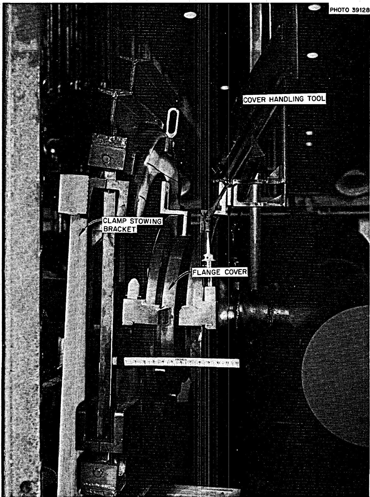  
Fig. 11. Freeze Flange with Covers and Handling Tool.

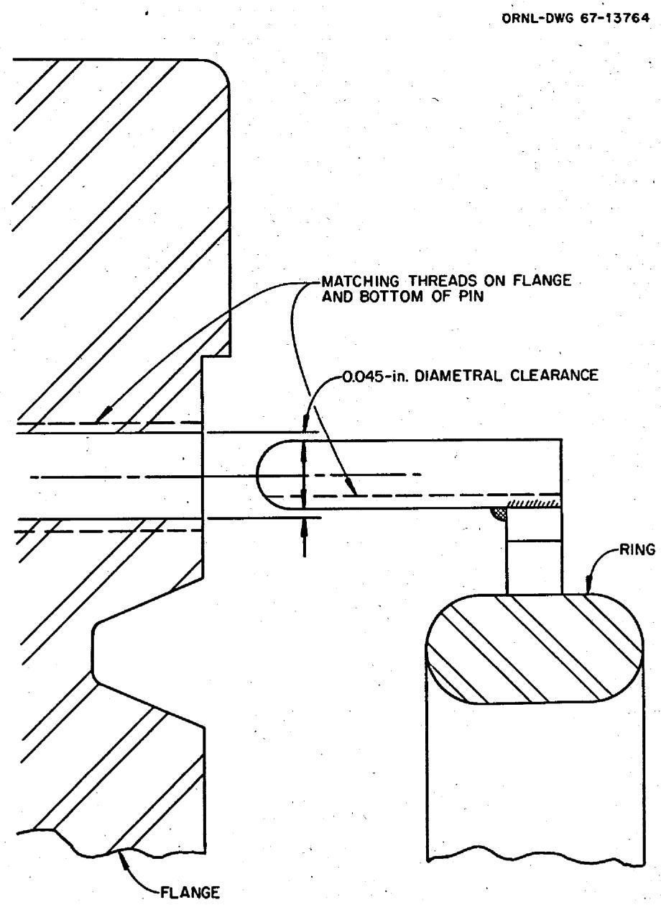  
Fig. 12. Detail of Arrangement for Locking Ring to Flange During Maintenance.

between the flange faces for remote installation. For freeze flange FF-200 a special offset tool is required because the open flange is under a shield support beam. Further, because of interferences with the stowed clamp, the covers must be partly installed as the flanges are being jacked apart. The handling tool, installed covers, and stowed clamp are shown on Fig. 11.

# 2.6 Fuel-Pump Maintenance

The MSRE fuel pump is made up of the pump bowl, the rotary element, and the motor stacked vertically and joined by bolted gasketed joints. The pump bowl assembly consists of the pump tank, the volute, the suction and discharge lines from freeze flanges FF-100 to FF-101, the furnace, the support plates, and a number of flanges for disconnecting the pump auxiliary systems. The rotary element consists of the pump shaft, impeller, shield block, bearings, bearing housing, and various auxiliary lines with flanges. The motor has a power lead-in on top and two cooling water lines with flanges. All these flanges for the pump auxiliaries are on a common radius from the center line of the pump and are mounted at three specific elevations. The bolts that hold the three units together are arranged to allow the choice of removing first the motor and then the rotary element or both of these together. Jacking screws are provided to force the rotary element off the pump bowl in the event of a stuck gasket.

The procedure for removing either of the two upper parts is to disconnect the electrical power lead and the auxiliary flanges, unscrew all the pump flange bolts, and finally operate the jack bolts to make sure the parts will separate. The preparatory work is done with long-handled socket wrenches and hooks inserted through the portable shield. A lifting yoke is inserted through the split section of the rotating plug and engaged in the trunnions provided on both the motor and the bearing housing, and the unit is lifted clear of all the close fitting attachments. The part is then lifted by the crane until it is just below the portable maintenance shield. At this point it is necessary to go into the remote-maintenance control room, open the slide of the portable shield, and pull the part up into the high bay for storage in one of the pits or for disposal. Plastic covering or other containment is used to prevent contamination of the high bay area. Installing a replacement part requires the reverse of the removal procedure, with the addition of the extra care that must be exercised when engaging the mating surfaces of the pump.

# 2.7 Graphite Sampler and Control Rods

The term "graphite sampler" refers to a collection of both permanently installed and removable equipment used to maintain three important components of the reactor that are physically located near the center line of the core. These components are the graphite-Hastelloy N surveillance samples, the 2-in. removable graphite stringers, and the control rods.

# 2.7.1 Surveillance Samples

Among the important results to be gained from operating the MSRE are the chemical and metallurgical data to be obtained from examining specimens of graphite and metal exposed in the central region of the core for long periods of operation. (This program has been described in detail.) Figure 13 shows features of the sample assembly and its location in the core. This sample assembly, which is roughly a 5-ft-long 2-in.-diam. cylinder, consists of an array of graphite bars, Hastelloy N tensile specimens, and flux-measuring wire inside a basket of perforated sheet metal. End fittings accommodate installation, coolant flow, and handling requirements. After exposure in the operating reactor, the specimen is removed with long-handled tools and taken in a shielded carrier to a hot cell where some of the samples are taken from the basket for chemical and metallurgical examination. The basket is then reloaded with new and exposed samples, returned to the reactor, and reinstalled in the core.

The graphite sampler, which was designed primarily for the operation of removing and replacing surveillance samples, is shown in Fig. 14, and consists of the following components:

1. A 48-in.-wide lower shield block, which has a $39 - 1 / 2$ -in.-diam. hole over the center of the reactor vessel. During reactor operation a filler plug is installed in the $39 - 1 / 2$ -in.-diam. hole.   
2. A 20-in.-diam. standpipe attached to the bottom of the 48-in. shield block by means of a flange and a bolting ring and to the 2-1/2-in. reactor access flange. An expansion bellows is used between the standpipe and the access flange to allow for movement due to thermal expansion. The standpipe is attached slightly off center at the top to leave access room for control rod maintenance.   
3. A cylinder 36-in. high by $47 - 1 / 2$ -in. in diameter with 4-in. thick walls (of canned-lead construction), which is installed when preparing to take a sample. This shield is sealed at the bottom by the weight resting on a flat gasket. It is designated the graphite-sampler work shield, but it is sometimes simply called the work shield.   
4. A geared work plug, 38-in. diam. by 10-1/2-in. thick, is inserted into the work shield (item 3 above). This plug has a Teflon ring that acts as a seal and bearing surface. The work plug Fig. 15, has a smaller geared plug eccentric to the large plug, and seven various sized tool plugs, viewing ports, and lighting inserts. Teflon gaskets and neoprene "O" rings are used throughout

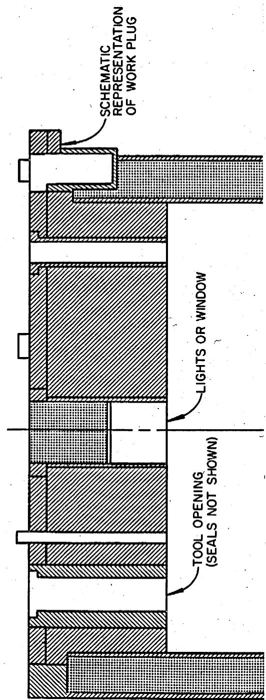  
2188-t9 5Mg-7NHO

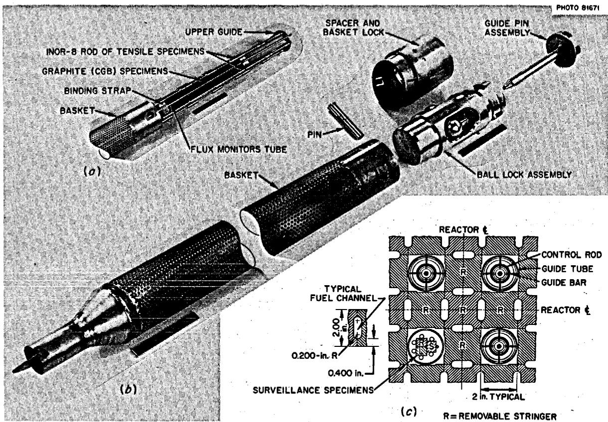  
Fig. 13. Surveillance Sample Assembly and Location.

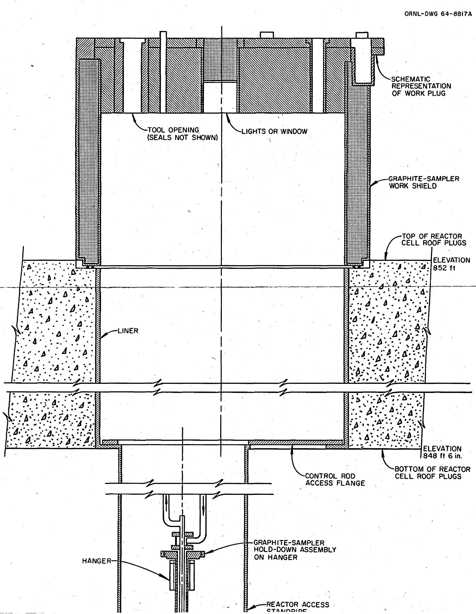

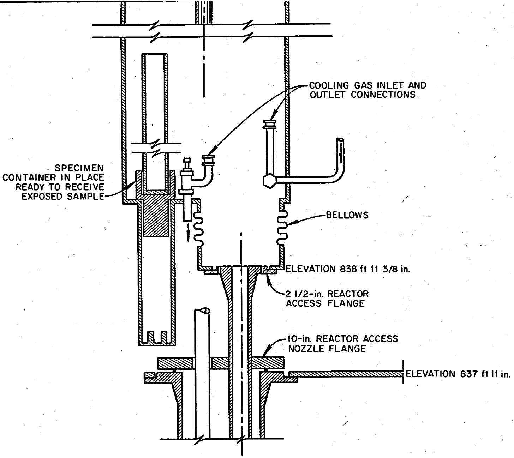  
Fig. 14. Graphite Sampler Assembly.

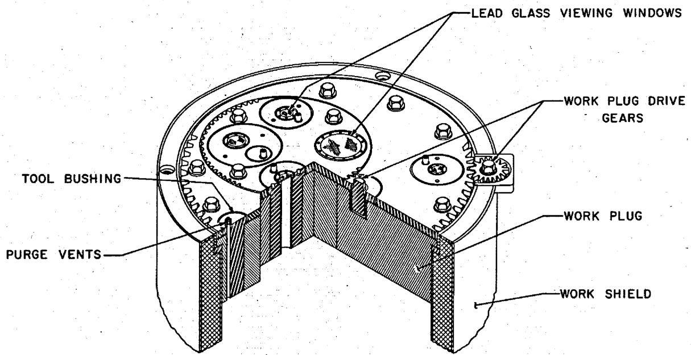  
Fig. 15. Work Shield for Graphite Sampler.

ORNL-DWG.64-6745

to make the overall assembly gastight.

5. The standpipe atmosphere-control system. This consists of a nitrogen supply, a control panel, an exhaust blower and a filter. When items 1 through 4 are assembled, a sealed compartment is formed above the reactor, through which personnel operating long-handled tools, can open the reactor and withdraw a radioactive sample. By feeding a purge of nitrogen into the compartment and maintaining a negative pressure inside it, two purposes are served. Air is kept out of the reactor vessel, and contamination is kept out of the personnel working area.

6. Miscellaneous equipment. Once the shielding, containment, and atmosphere control have been set up, the physical handling of the in-cell equipment can proceed. With long-handled tools and a variety of standard and special hardware, the reactor access port is opened, and the sample is withdrawn and put into a sealed container within the standpipe. The container is pulled upward out of the standpipe into a carrier with 6-in.-thick shield walls for its trip to the hot cell. In practice, a lengthy and detailed step-by-step written procedure is followed by the personnel doing the work.

# 2.7.2 The 2-in. Graphite Core Stringers

There are five stringers (moderator blocks) located in the center of the core that can be removed for examination. They are equipped with fittings for handling. However, access to remove them is gained only after the removal of the control rods and drive housings, the substitution of a 36-in.-diam. standpipe for the 20-in. standpipe, and finally the removal of the control-rod thimble assembly. There are no plans to remove these stringers until the conclusion of reactor operation.

# 2.7.3 Control Rods

Figure 16 shows the top view of the three control rod drive housings and the 20-in. standpipe. The control-rod access flange has been removed. The view is similar to that of looking down through a window in the graphite-sampler work plug. For maintenance the control-rod drive housing is removed first. Induced radiation and contamination of this unit is low so that repairs can be made with ordinary-methods after minor cleanup. A control rod can be removed only after the drive housing is out of the way. The rods have much induced activity and are generally replaced rather than repaired. All the necessary work is done with long-handled tools.

# 2.8 Braze Joints

The 1-1/2-in. Hastelloy N piping for the salt fill-and-drain system is of all-welded construction. Component replacement is to be accomplished by cutting the pipe at predetermined points, removing the component, preparing the in-cell pipe stub, installing the new

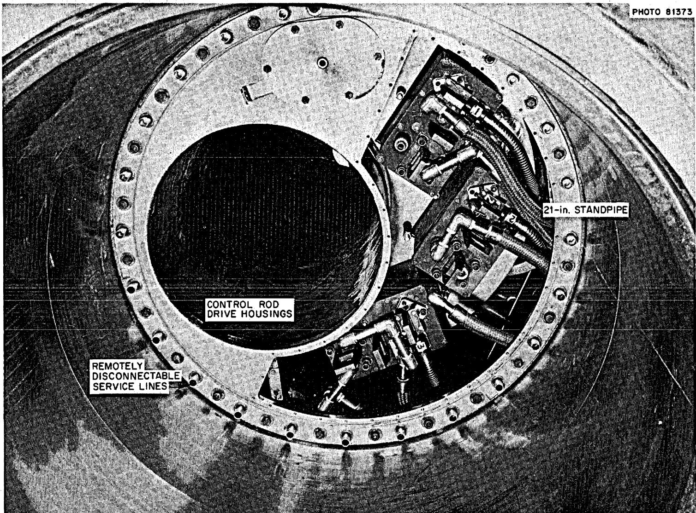  
Fig. 16. Top View of Standpipe and Control Rod Drive Housings.

component with a prepared fitting, and brazing the stub into the fitting. The technique, as developed for the MSRE, requires a permanent 2-by 3-ft base plate located at each possible future joint, four tools that can be placed and operated through the maintenance shield, and a 4200-cps 30-kw induction generator.

Figure 17 shows an unassembled joint and a section of a brazed joint. The in-cell pipe stub is machined to a taper, like the piece on the right. The new component is installed with a prepared end, like the piece shown on the left, and with the gold-nickel sheet-metal braze preform, shown in the center, fastened in it. The two are pressed together while being heated to $1900^{\circ}\mathrm{F}$ to form the completed joint. Figure 18 is the positioning vise suspended from its lifting bail. It is lowered over a continuous piece of pipe, positioned on the base plate by dowels, bolted down, and the three-jaw chuck is closed to grip the pipe. Figure 19 shows the pipe cutter in operation. It is lowered, in the open position, over a continuous piece of pipe and onto its mounting plate on the positioning vise. The knife is fed into contact with the pipe and the cutter is rotated, with automatic knife feed, until the pipe is cut. The cutter is then removed. After the component is completely disconnected and removed the taper cutter is placed on the base plate, Fig. 20. The taper cutter is driven through an extension shaft by an air motor while the positioning vise is used to drive the pipe stub into it. A $6^{\circ}$ included-angle taper l-in. long is machined on the pipe. The taper cutter is then removed, and the furnace with induction heating leads and purge-gas connection is placed on the pipe stub as shown in the left side of Fig. 21. The new component with the prepared braze fitting, thermocouples, and furnace end piece is put into place. The fixed vise is then lowered over the pipe, fastened to the base plate, and closed to grip the pipe as in the right side of Fig. 21. The positioning vise is then operated to drive the stub into the braze fitting so that matching tapers jam. The furnace is closed as in Fig. 22 and the inert gas purge is begun. After an appropriate purge period, the induction generator is turned on and the joint is heated to $1700^{\circ}\mathrm{F}$ in about 2 min. Axial pressure is maintained on the joint with the positioning vise during heating, and at about $1750^{\circ}\mathrm{F}$ the braze metal melts and the pipe stub travels about $1/8$ -in. further in. This reduces the joint thickness from 0.005 to less than 0.001 in. The joint is held at $1900^{\circ}\mathrm{F}$ for about one minute to assure complete melting and wetting and then permitted to cool. The furnace is then opened, the thermocouples are removed, and the joint is inspected. If the joint does not pass inspection, the furnace can be closed, the joint heated to $1900^{\circ}\mathrm{F}$ and separated. If it does pass inspection, the furnace is removed by breaking up the insulation and cutting loose the coils, the vises are removed, and the line is restored to service.

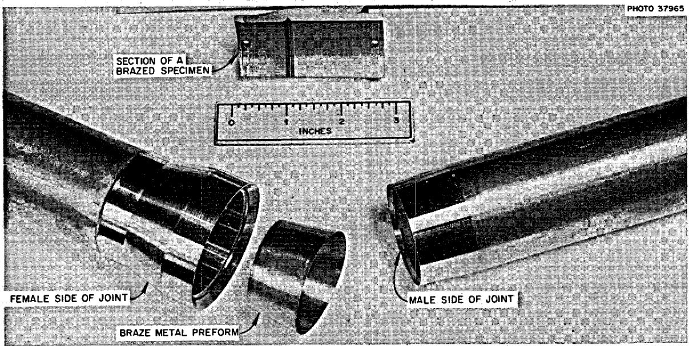  
Fig. 17. Braze Joint Details.

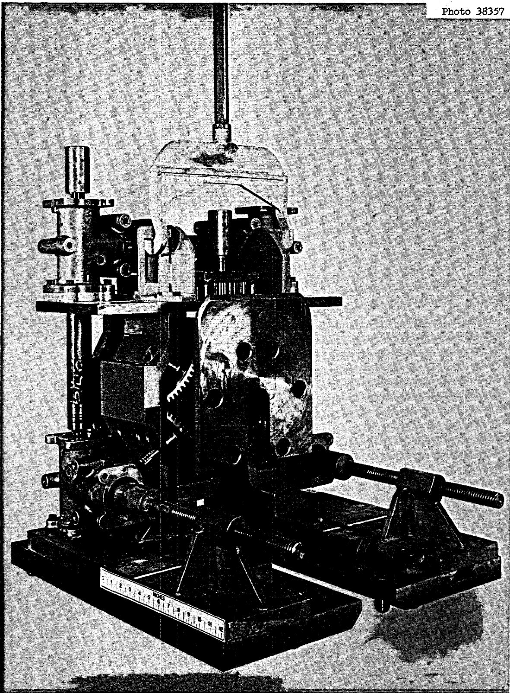  
Fig. 18. Positioning Vise for Remote Brazing.

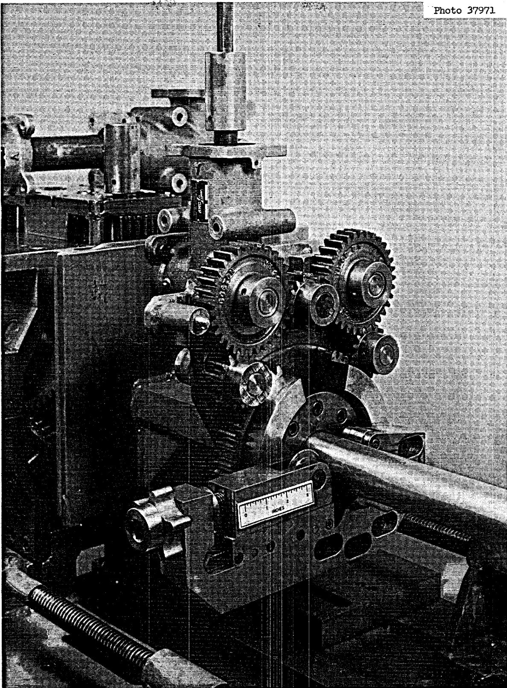  
Fig. 19. Pipe Cutter for Remote Brazing.

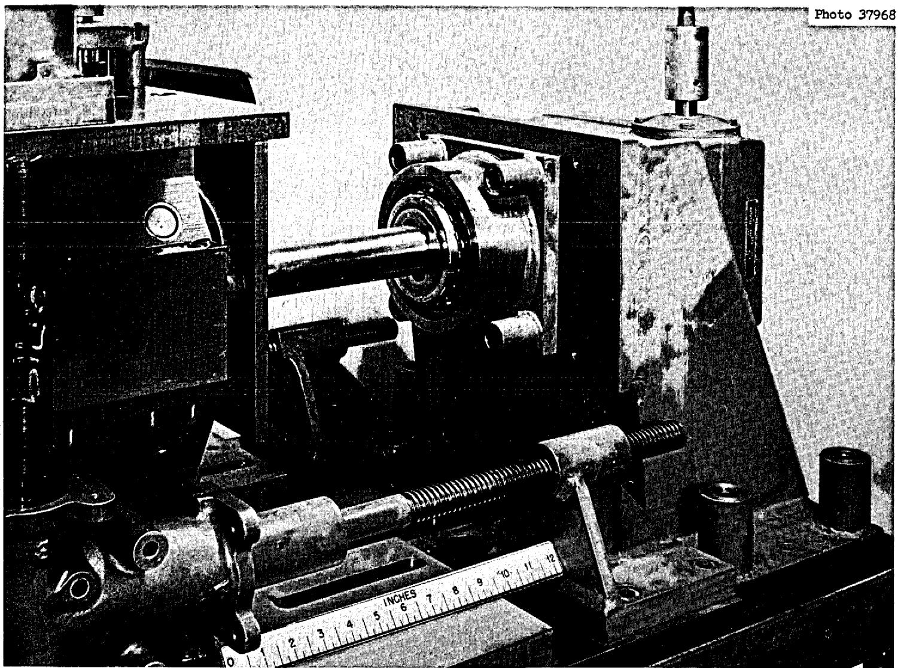  
Fig. 20. Equipment for Remotely Tapering Stub End of Pipe.

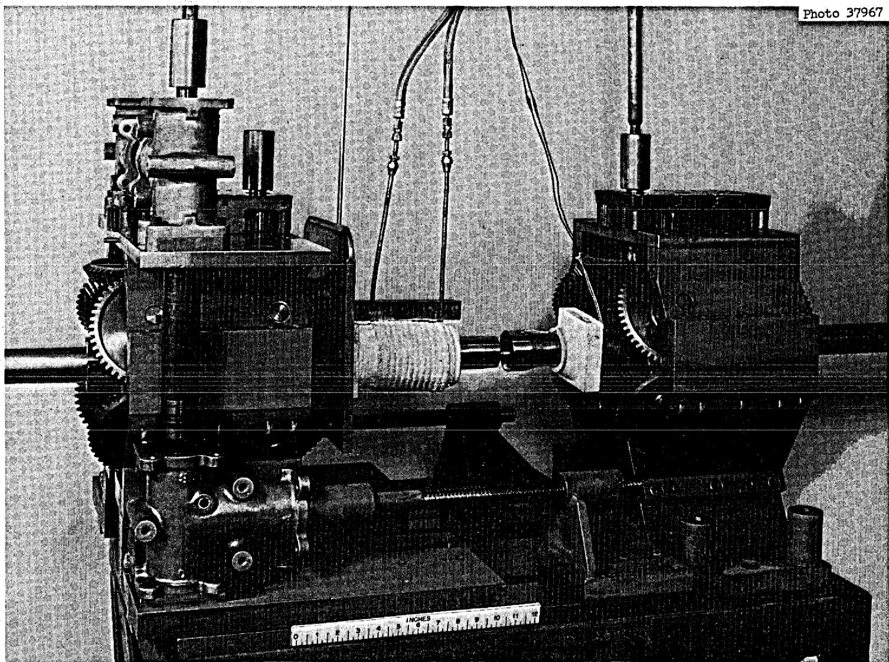  
Fig. 21. Furnace Installed on Cut Pipe.

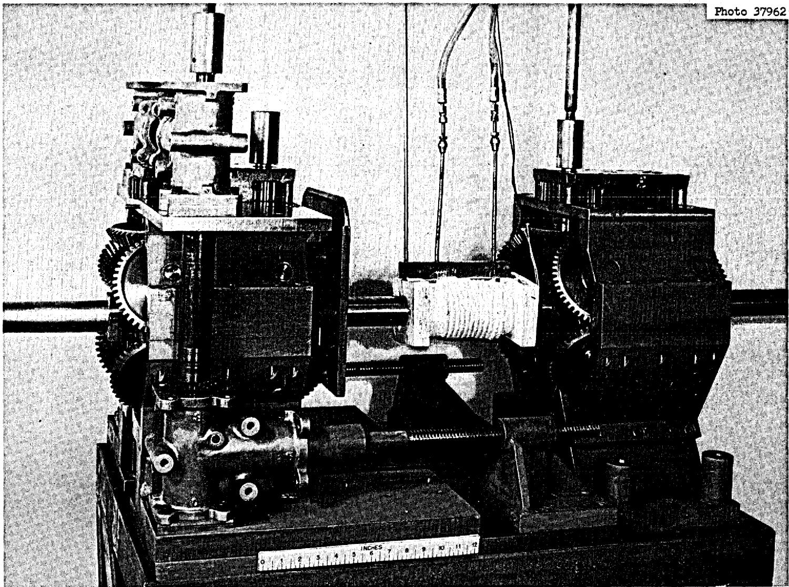  
Fig. 22. Furnace Closed and in Position for Brazing.

# 2.9 Maintenance of the Sampler-Enricher

The sampler-enricher system provides the means whereby samples of salt are removed from the reactor for analysis and additions are made to enrich or poison the fuel. This system was described in more detail previously. A shell of 8-in. of lead has been built around the equipment for shielding during reactor operation. Portions of this shell must be removed for access, and other portions are utilized as shielding during maintenance. The maximum source strength can be assumed to be no more than that of 2 radioactive samples of salt. (Presumably one sample would be associated with the equipment failure and the other due to the accumulation of deposits and spills from the routine handling of many samples.) A radiation level of $400\mathrm{r / hr}$ at 12 in. has been estimated for this.

The arrangement of the components of the sampler is such that there are seven distinct areas that may be worked on more or less independently. The operating panel board and parts are shown in Figs. 23 and 24. Maintenance will be accomplished with hand tools and direct methods with advantage taken of the shielding that can be provided by local stacking of lead bricks. The designs of the connectors, fasteners, and movable shielding have, to a large extent, facilitated this approach. When the particular unit has been disconnected, it will be transported to a decontamination cell to be cleaned up as much as possible before further work. Distance, shadow shielding, and the maintenance control room will be used, depending on the radiation level and the complexity of the particular task.

# 2.10 Miscellaneous Long-Handled Tools

# 2.10.1 Heater and Thermocouple Maintenance Tools

The tools for the maintenance of the heaters and the thermocouple disconnects are, in general, long-handled lifting hooks working inside a centering guide or socket. In operation the hook is engaged in the bail on the equipment and the socket is brought down over the bail to lock it inside the tool. At this point the unit is transported and released at its destination. The tool is then removed. The heaters and electrical disconnects have identical bails, which fit the socket on the end of the tool. The thermocouple disconnect tool however requires a different-sized socket and, in addition, a frame of guide rails attached to the socket which acts in aligning the two halves of the disconnect before the electrical contacts have engaged.

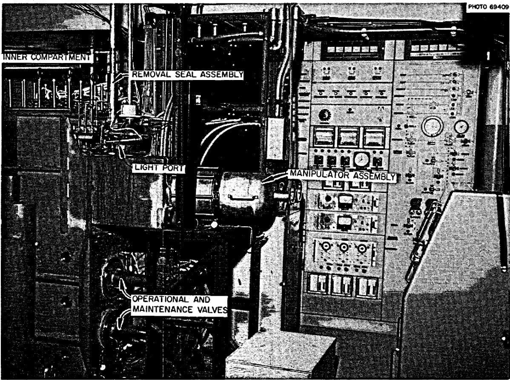  
Fig. 23. Sampler-Enricher Installation Prior to Erecting Shielding.

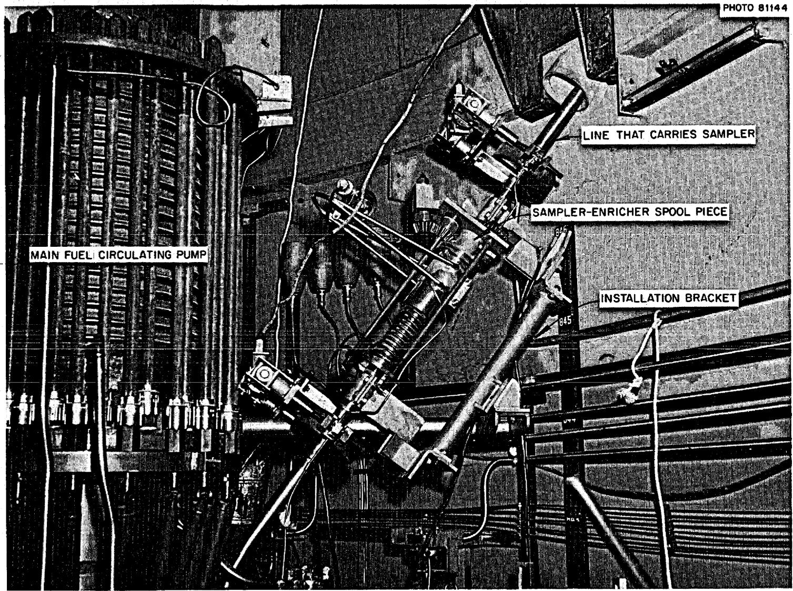  
Fig. 24. Installed Sampler-Enricher Spool Piece.

# 2.10.2 Leak-Detector Disconnect Wrench and Handling Tool

A remotely operable joint consisting of a pair of mating conical surfaces forced together by a single bolt mounted in a pivoted yoke is used in the MSRE in the leak detector lines and in pneumatic lines that feed the weigh cells in the drain tank cell. This joint is known as the leak-detector disconnect. The procedure to disconnect it is to use the leak detector disconnect wrench to unscrew the bolt, and with the attached hook, to pivot the yoke back out of the way. Then by using the same tool as a long handled "C" clamp, the pipe or tube that comes into the top of the disconnect is grasped, separated from its mate, and moved clear of the area. In the case where it is necessary to hold both parts of the joint, an additional "C" clamp tool is utilized.

# 3. DETAILED MAINTENANCE PROCEDURES

The operating procedure in a radioactive maintenance situation, in the interest of safety and economy, includes

(1) the maintenance operation and the tools involved,   
(2) the protection of personnel and equipment,   
(3) the manipulation of reactor equipment, such as the ventilation system, and   
(4) the measures required to maintain cleanliness both in the cell and in the high-bay area.

Details of a procedure depend on knowledge of the reactor, its operating history, the effects of its radioactivity, and the maintenance operations. It would be impractical to try to anticipate all the needs of a procedure; therefore, the procedures that follow pertain only to the operation of the maintenance tools, and the check out of the equipment for function, calibration, and defects. In general, attention to detail and good cooperation among all involved are required for good results.

The verb "insert" as used in the procedures refers to the entire operation, which consists of picking up the tool on the crane, threading it through the proper hole in the portable shield, carefully lowering it into position with whatever manipulations are required to clear in-cell equipment and finally using the proper bushing to close up the gap in the shielding.

Motion or displacement of the tools or equipment is accomplished generally by moving the portable shield with the tool attached to it. Motions in the long direction of the shield blocks (east and west in the reactor cell and the drain tank cell) are simple translations of the slide. Motions across the slide are made with a more complex combination of plug rotation and slide translation. Small movements may be accomplished by utilizing the clearance between the outside of the mast of the tool and the hole in the shield into which it is inserted. The long tools with relatively heavy lower ends act very much like pendulums, so the operator cannot exert total, positive control. For this reason all movements of these tools must be made as slowly, smoothly, and deliberately as possible to retain control, avoid violent oscillations, and prevent damage to equipment.

# 3.1 The Radiation and Contamination Problem

Radiation and contamination levels vary widely in the MSRE. There are situations where tools can be inserted and removed repeatedly without becoming radioactive, and there are also occasions in which everything in the vicinity of the operation will be highly

contaminated. Therefore no one simple written procedure will adequately cover all situations. However, the following guide lines are generally applicable:

1. Written health physics procedures and precautions must be provided for each job.   
2. A health physicist must be present at the start of each operation to survey and to evaluate hazards.   
3. Anything below the shielding (i.e., in a radioactive area) must be assumed to be a radioactive hazard until proven otherwise. It must be wiped, monitored, and/or contained as it is being pulled up through the shield.   
4. Techniques for contamination control, such as containment and personnel shielding, must be considered during the preparation of the remote-maintenance procedures.   
5. Radioactive, contaminated equipment can be disposed of in several ways. It can be taken to the hot-equipment storage cell or the decontamination cell at the MSRE, the radioactive burial ground on a hot truck, or to any of a number of hot cells at ORNL. The choice depends on a number of factors, such as the value of the part, the use of the part, how radioactive it is, and what facilities are available for handling it. However, containment must be provided to prevent the spread of airborne contamination, and shielding must be provided for gamma radiation to protect personnel.

# 3.2 Maintenance Control Room and Remote Facilities

The maintenance control room is used for limited operations; for example when it is necessary to move highly radioactive materials from one cell to another or out of the high-bay area of the building, and when openings made in the shielding are so large that the resulting radiation levels preclude normal occupancy of the high-bay area. During the actual use of the maintenance control room, all operations must be accomplished by using the two cranes and, further, the high bay may not be accessible. Complete inaccessibility represents an extreme situation. Usually the high-bay area can be entered, and personnel using distance and/or shadow shielding to reduce exposure can work for short times to assist with operations and to remedy troubles.

Because this work presents special hazards, the following should be done to assure that the operation proceeds smoothly:

1. The written procedure should be gone over thoroughly before starting to check that the procedure is workable and that all necessary equipment (lift fixtures, camera and light stands, equipment supports, etc.) are on hand and are located where the

crane hooks can get to them.

2. All the operating equipment should be tested just prior to the actual operation. The cranes should be operated in all directions, at all the control settings. The lift fixtures should be visually inspected, lubricated, and tested under load. Television cameras and lights should all be warmed up and functioning, and for a test they should be moved about with the crane to demonstrate their portability.   
3. During operation there should be at least three people but less than seven in the maintenance control room.   
4. After completing the maintenance operations, the high bay should be thoroughly surveyed by the health physicist and contamination should be cleaned up before semidirect operations are resumed.

# 3.3 Procedure for Use with the Portable Maintenance Shield

Detailed procedures are outlined on Dwg. LL-D-D40663, MSRE Main Cell Plan View Shield Setups Reference Drawing, and on Dwg. LL-D-D40669, MSRE Drain Tank Cell Plan View Shield Setup Reference Drawing. Ten separate drawings (LL-D-D-40663 through LL-D-D-40672) are available that show the many possible setups to be used in specific locations, including drawing LL-D-D-40668, Shield Setups Over MSRE Freeze Flanges.

The usual procedures for use with the maintenance facility are listed in the sequence of preparations, operations, and closure as follows:

# 3.3.1 Preparations

1. Select proper setup drawing to determine applicable shield, module, plug, and track component requirements.   
2. Remove sufficient upper roof blocks to allow lower roof blocks to be lifted out.   
3. Cut membrane (1/8-in. stainless steel).   
4. Set the frame over the lower roof blocks to be removed. (Setup as determined in Step 1, above). Allow $3/4$ -in minimum side-and-end clearances for the lower roof plugs to be pulled through.   
5. Attach tracks and motor base. Level tracks with shims as required. Place slide and module arrangements as indicated on the reference drawing.

# 3.3.2 Operations

1. Verify the following by operating the slide with the motor drive:

a. that sufficient clearance exists for removing the blocks,   
b. that the device which couples the slide to the rotating work plug operates, and   
c. that the slide travels smoothly on the frame and the track,

2. Clear the opening in the frame for lower shield block removal.   
3. Attach the block-lifting tongs to one of the blocks to be removed.   
4. Connect the motor drive power lead into the remote-maintenance room receptacle (located on the wall just west of the reactor cell).   
5. Evacuate the high-bay area and continue the operation from the remote-maintenance control room.   
6. Remove both shield blocks through the frame to a designated parking area. This operation can be done with the crane operator watching through the windows and one man observing the weigh-cell indicator.   
7. Energize the slide drive motor, and return the slide to cover the cell opening. Return to the high bay.   
8. Use as many modules as required to keep the cell opening covered.   
9. Move the rotating work plug over the desired area and proceed with semidirect operations.   
10. To handle large pieces of equipment, the slide and rotating work plug are separated, the equipment hanging on a long-handled tool is passed through the opening, and the slide is closed around the mast of the tool at the cutout built into the edge of the rotating plug. Depending on the radiation level, some of these operations may have to be done from the remote-maintenance control room.

# 3.3.3 Closure*

1. Remove all long-handled tools, close holes, and clear the top of the slide and rotating work plug.

*The purpose of this operation is to replace the lower shield blocks in the roof of the cell.

2. Locate the slide so that it alone covers the opening in the frame.   
3. Uncouple the slide from the rotating work plug.   
4. Connect the motor drive power lead into the remote-maintenance control room receptacle.   
5. Evacuate the high-bay area and continue procedure from the remote-maintenance control room.   
6. Energize the slide drive motor and move the slide until the opening is uncovered.   
7. Replace both shield blocks into their places in the roof of the cell.   
8. Return to the high bay.   
3.4 Procedures for Using Freeze-Flange Manipulating Tools

3.4.1 Hydraulic Clamp Operator   
3.4.1.1 Equipment Required. The portable maintenance shield must be set up with the special freeze-flange rotating plug (see Dwg. LL-D-40668), periscope with sheath, rod light, left-hand and right-hand hydraulic clamp operating tools with pump, an A frame, and an overhead crane. (See Fig. 9 for flange nomenclature.)   
3.4.1.2 Assembling the Clamps Onto the Flange   
1. Insert the periscope with the right-angle lens in a convenient hole. Lower it until it is looking at the top disassembly beam.   
2. Insert one hydraulic tool with the jaws opened to the calibration marks on the inner and outer frames.   
3. Lower the tool till the upper jaw (the movable one) is just above the upper surface of the clamp ear. The lower stationary jaw is then under the ear on the lower clamp.   
4. Engage the tool by moving it horizontally toward the flange. This may be done with a lever-like action with the mast of the tool used as the lever and the portable shield as the fulcrum.   
5. Repeat steps 2, 3, and 4 for the other side.   
6. Attach the hydraulic pumps to the fitting on top of the mast.   
7. Operate the pumps to force the two clamp halves together. While the tool's upper jaw moves, the lower jaw is stationary,

therefore the mast must be raised to compensate for this. The entire process is monitored with the use of the periscope to make adjustments in the travel of the clamp to keep it level and to keep the spacing between the clamps uniform.

8. Disengage the tools and remove them from the cell.   
3.4.1.3 Removing the Bottom Clamp from the Flange   
1. Insert the periscope with the right-angle lens in a convenient hole. Lower it until it is looking at the top disassembly beam.   
2. Insert one hydraulic tool with the jaws opened to the proper calibration mark.   
3. Lower the tool till the upper jaw (the movable one) is just above the upper surface of the lower clamp ear. This is between the two clamps and approximately on the center line of the flange. The lower jaw of the tool, the stationary one, is then under the proper surface of the lower beam.   
4. Engage the tool by moving it horizontally toward the flange. This may be done with a lever-like action with the mast of the tool used as the lever and the portable shield as the fulcrum.   
5. Repeat steps 2, 3, and 4 for the other side.   
6. Attach the hydraulic pumps at the fitting on the top of the mast.   
7. Operate the pumps to force the lower clamp off the flange. This should require approximately 2 in. of power stroke and then the clamp should fall of its own weight. A provision is made on the tool for catching the clamp. The tool is then lowered until the lower clamp is resting on the beam.   
8. Disengage the tools and remove them from the cell.   
3.4.1.4 Removing the Top Clamp from the Flange   
1. Insert the periscope, with the right-angle lens in a convenient hole. Lower it until it is looking at the top disassembly beam.   
2. Insert one hydraulic tool with the jaws opened to the proper calibration mark.   
3. Lower the tool until the upper jaw (the movable one) is just above the proper surface of the top disassembly beam and the lower stationary jaw is under the upper clamp.

4. Engage the tool by moving it horizontally toward the flange. This is done with a lever-like action with the mast of the tool used as the lever and the portable shield as the fulcrum.   
5. Repeat steps 2, 3, and 4 for the other side.   
6. Attach the hydraulic pumps at the fitting on top of the mast.   
7. Operate the pumps to force the upper clamp off of the flange.   
8. Disengage the tools and remove them from the cell.

# 3.4.2 The Clamp-Handling Tool

1. Insert the tool directly over the center of the flange (in the plan view).   
2. Engage the hooks on the tool in the eyes on the upper clamp.   
3. Lift the top clamp until it begins to pick up on the top disassembly beam.   
4. Raise the clamp assembly very slowly. When the slack has been taken out of the pin joint between the beam and the guide rod the tool is supporting the weight of the entire clamp assembly and there is onlyl/8 in. vertical clearance between the guide rod jaws and the flange ears. Thus a movement of 1/16 in. is required to gain clearance to move the clamp.   
5. When the clamp assembly is free of the flange, move the tool horizontally along the center line of the pipe toward the clamp stowing bracket. At the instant the lifting motion frees the restriction, the clamp assembly will probably come off the flange ears in a twisting motion so that one side is upstream and the other side is downstream. When this occurs move the clamp assembly over so that the offending side may be swung outboard and around the flange ear. The same method applies when the entire clamp assembly is on the wrong side of the flange.   
6. Raise the tool enough to clear the front edge of the stowing bracket. Move the clamp assembly back against the stop on the stowing bracket and lower it into place.   
7. Before releasing the hook examine the clamp's position with all available means (monocular through window in portable shield, periscope, and auxiliary mirrors) to assure that it is seated properly on the bracket.   
8. Disengage the tool and remove it from the cell.

# 3.4.3 Flange Jacking and Aligning Tools

3.4.3.1 Equipment Required. The jacking system consists of in-cell equipment at each flange operated by simple rotation of two hex-head screws. One screw operates the jack that generates the push-pull forces and, in general, is located outboard of the other screw, which operates a latch bar used only for the pulling operation. Both hex heads are the same size (1-1/2 in. across the flats), and they are located close to one another. Drawing E-GG-E-41878 should be consulted to assure that the operator can identify each screw. All the jack operators will push the flange closed when turned clockwise. Operation of the latch bar varies, and the installation drawing should be consulted for each installation.

# 3.4.3.2 Pulling the Flanges Apart

1. Insert the tool onto the jack hex head.

2. Rotate until contact is made between the bar on the pipesupport and the pad on the jaw of the jack. This operation should be viewed, whenever possible, with the periscope.

3. Remove tool from the jack hex head and engage it onto the hook hex head.

4. Rotate to close the hook latch around the jack bar to permit pulling with the jack. This should never require high torque, and if high torques are encountered, they indicate that the stop has been reached or that there is a malfunction which should be investigated.

5. Switch the hook back to the jack hex head and rotate counter clockwise to pull the flanges apart. In this case the torque is proportional to the load.

6. Remove the tool.

# 3.4.3.3 Pushing the Flanges Together While Using the Pipe-Alignment Tool

1. Insert tool onto jack hex head and rotate clockwise until there is only 1 in. between flange faces.   
2. Insert pipe aligning tool so that the arrow-head-shaped guide on the tool will go into the slot in the pipe-aligning bracket.   
3. Rotate the tool toward the flange, and adjust the height and the horizontal distance of the pin on the tool until it is aligned with the hole in the ear of the flange.

4. Engagethe pin in the flange ear.   
5. Using the drive rods on top of the tool, raise, lower, or align the flange being jacked with its mate. Check this with the viewing equipment.   
6. Resume pushing with the jack operator, and adjust the alignment as necessary until the flanges are seated.   
7. Back the jack hook 4 in. away from the bar on the support to avoid restriction to thermal-expansion movements.   
8. Remove the tools.

3.4.4 The Gasket-Handling Tool

3.4.4.1 Removing an Existing Gasket

1. With the flanges spread apart 4 in. or more, lower the gasket-handling tool, with jaws open, into the space between the flanges on the center line of the pipe.   
2. Using the periscope with the right-angle lens and binoculars from above, carefully line up the tool and the vertical center line of the gasket.   
3. Move the tool horizontally into position with the upper jaw approximately 1/4 in. above the locking-pin bracket.   
4. Lower the tool so that the upper jaw contacts the locking pin bracket.   
5. Slowly move the lower jaw up into locking position by lowering the handle on the upper end of the tool. Lock the tool to the gasket through the engagement of the lower jaws in slots in the ring.   
6. Raise the tool slightly to clear the threads on the locking pin and move the tool, with the gasket, back from the flange face. A minimum of $1 - 1/2$ in. travel is required to clear the male guide on the flange.   
7. Raise the assembly until it clears the flange.   
8. Gasket and tool are now ready for the "hot pull" operation.   
3.4.4.2 Installing a New Gasket

1. Install the new gasket in the jaws of the gasket-handling tool, and make sure that it is securely placed.

2. Lower the gasket into the space between the open flanges until the locking pin is in line with the tapped hole in the flange.   
3. Move horizontally, and insert the pin into the tapped hole. (The gasket should always be installed on the down-hill flange.)   
4. Lower the assembly onto the threads of the locking pin.   
5. Open the jaws on the tool.   
6. Raise the tool approximately $1/4$ in.   
7. Move the tool away from the gasket.   
8. Raise the tool carefully so that it does not hang on the installed gasket and is clear of the flange.   
9. Remove the tool from the cell.

# 3.4.5 The Flange-Cover-Handling Tool

# 3.4.5.1 Installing Flange Covers

1. Place the cover for the male flange in the tool securely, and make sure that the wedges are fully retracted (i.e., maximum opening in the bracket).

2. Lower it into the cell between the open flanges until the rim of the cover is past the male guide.

3. Move horizontally toward the flange so that the bracket hooks over the ears on the flange and then lower it until it is seated there.

4. Release the hook and lower the tool so that the sockets engage the hex heads.

5. Tighten up the cover by rotating the hex heads counterclockwise.

6. Disengage the tool and remove it from the cell.   
7. Repeat entire sequence for the female flange.

# 3.4.5.2 Removing Flange Covers

1. Lower the tool into the cell and engage hook in bail of female cover.   
2. Lower sockets down onto hex heads and loosen wedges all the way.

3. Pick up tool and lock hook around bail.   
4. Pick up cover and prepare for "hot pull."   
5. Repeat sequence for male cover.

# 3.5 Fuel-Pump Maintenance

# 3.5.1 Removing the Fuel-Pump Motor

1. Drain and blow out auxiliary lines.   
2. Disconnect auxiliary flanges, electrical power, and thermocouple leads and stow.   
3. Loosen the bolts holding the motor housing to the rotary element housing. Use a torque indicator on the socket extension tool.   
4. Remove all tools except the periscope.   
5. Insert pump lifting yoke through split in portable shield.   
6. Engage hooks on yoke in trunnions on motor.   
7. Record two items of information to be used in the replacement operation:

(a) the elevation of the mast with respect to the operating floor and   
(b) the azimuth location of the center line of the crane hook.

8. Lift the motor straight up to a position beneath the portable shield. There is engagement between rotary element and motor for the first 7 in. of this travel.   
9. If the radioactivity level requires it, evacuate the high-bay area and continue the operation from inside the shielded remote-maintenance control room.   
10. Open the slide on the portable shield and pull the motor up with the crane and take it to the storage area.

# 3.5.2 Removing the Fuel-Pump Rotary Element

1. Drain and blow out auxiliary lines.   
2. Disconnect auxiliary flanges, thermocouple, and speed indicator.   
3. Loosen the bolts holding the housing to the pump bowl.

4. Remove all tools except periscope.   
5. Insert pump-lifting yoke through split in portable shield.   
6. Engage hooks on yoke in trunnions on rotary element.   
7. Record for use in the replacement operation the elevation of the mast with respect to the operating floor and the azimuth of the crane hook.   
8. The initial lift is accomplished by screwing the 4 jack bolts on the outer bolt circle down against the pump bowl flange. This jacks the rotary element up and off the bowl.   
9. Lift the rotary element straight up to a position beneath the shield. The lowest part of the impeller does not clear the pump flange until after the first 22-1/2 in. of travel, so the lifting must be done slowly and carefully.   
10. If the radioactivity level requires it, evacuate the high-bay area and continue the operation from inside the shielded remote-maintenance control room.   
11. Open the slide on the portable shield, pull the rotary element up with the crane, and take it to the storage area.   
12. Install pump bowl cover.

# 3.5.3 Replacing the Fuel-Pump Rotary Element

1. Remove the pump bowl cover plate.   
2. Pick up the new unit on the crane with the lifting yoke oriented in reactor position. Locate the crane over the center line of the pump from measurements made in the removal process.   
3. Open the portable maintenance shield, (from the control room, if necessary), and lower the tool and new unit. Close the shield as soon as the round mast section is in the shield.   
4. Proceed with semidirect techniques. Insert periscope.

5. Lower the rotary element down onto the pump bowl. The last 22-1/2 in. of travel must be slow, since the impeller enters the bore of the pump bowl flange at this point. To assist the operation, there should be on hand a drawing showing how the rotary element fits the pump bowl. This is to be used with appropriate calibration marks on the tool, which are referenced to the elevation mark of the final seated position of the rotary element.

6. Insert the long-handled sockets and torque the flange bolts to the desired loading with a torque indicator.   
7. Reconnect all auxiliaries.

# 3.5.4 Replacing the Fuel-Pump Motor

1. Pick up the replacement motor on the crane with the lifting yoke oriented in reactor position. Locate the crane over the center line of the pump from measurements made in the removal process.   
2. Open the portable maintenance shield (from the control room if necessary), and lower the tool and motor. Close shield as soon as the round mast section is in the shield.   
3. Proceed with semidirect techniques. Insert periscope.

4. Lower the motor onto the rotary element. At the start of the last 7 in. of travel, pins in the motor housing engage a slotted cone on top of the rotary element to provide radial guidance. At the last 2 in. of travel the mating parts of the splined coupling engage. If the splines meet tooth to tooth, it is necessary to twist the motor through the clearance between the pin and the slots in the cones. This is sufficient to allow the splines to mate properly.

5. Torque the flange bolts to the desired loading according to a torque indicator on the long-handled sockets.   
6. Reconnect all auxiliaries.   
3.6 Procedures for Handling Surveillance Samples and Control Rods

# 3.6.1 Removing the Surveillance Sample from the Core

1. Assemble tools and equipment.   
2. Check out the operation of all the long-handled tools, the portable maintenance shield, the crane's remote control, the graphite-sampler work shield and work plug, and the sample carrier.   
3. Set up the nitrogen supply system and the exhaust blower, and check out its operation.   
4. Remove the upper shield blocks and cut the membrane at the graphite-sampler access. Reactor must be shut down and drained.   
5. Set up the portable maintenance shield over the graphite-sampler access.   
6. Remove the filler plug (Dwg. D-KK-D-40970) and the top control-rod shield piece.

7. Clean up any contaminated equipment left from the previous sampling operation.   
8. Insert, into the standpipe, the equipment to be used in transferring the sample from the reactor core to the standpipe. Some of this equipment is shown in Fig. 25.   
9. Open the portable maintenance shield slide and set up the graphite sampler.work shield.   
10. Disconnect the thermocouple and cooling air line in the standpipe. Turn off the valves in this air line.   
11. Remove the heater-access flange (Dwg. E-EB-B-40595) and 2 captive bolts with 7/8-in. hex heads, and hang this assembly on the hook.   
12. Insert the heater tool (Dwg. E-LL-D-56392) into position.   
13. Tighten up the two bolts on the heater tool.   
14. Connect power leads from a variac supply to the heater leads, and hook up the thermocouple on the heater tool. Turn the power on. Bring the temperatures in the reactor access nozzle (thermocouples R-33, R-42, and R-43) to approximately $1100^{\circ}\mathrm{F}$ . Do not allow the temperature of the tool to go above $1600^{\circ}\mathrm{F}$ . Maintain this condition for a minimum of 3 hr or longer if possible.   
15. Turn the power off and remove the heater tool from the standpipe.   
16. Reinstall heater access flange.   
17. Turn on blower and the nitrogen purge of the standpipe atmosphere-control system. Check operations to make sure that the helium pressure inside the reactor is as low as possible (vented).   
18. Loosen the four bolts in the reactor access flange and hang the holddown assembly (Dwg. E-BB-B-40595) on the standpipe hook.   
19. Install the primary container base piece on top of the reactor access flange.   
20. Install the primary container in the base piece, and remove the lid of the primary container.   
21. Insert the sample tool down through the primary container, and engage the sample with a clockwise twist. Make an elevation measurement for use when replacing the sample.

ORNL-DWG 67-13765

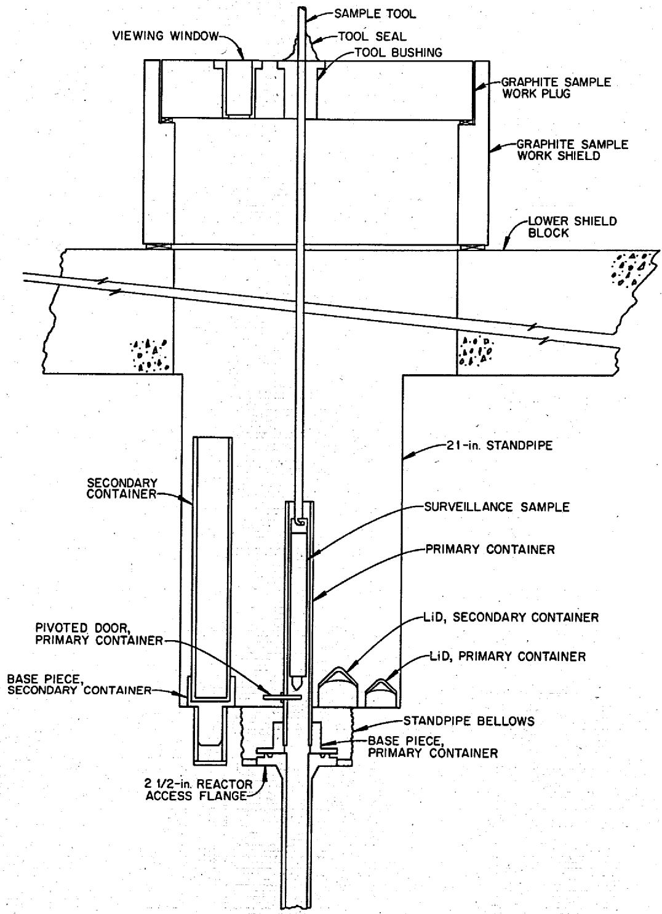  
Fig. 25. Equipment for Handling the Surveillance Sample.

22. Pull the sample upward into the primary container. Figure 25 illustrates this point in the procedure and shows the equipment in use.   
23. Use the long-handled socket wrench tool to close the pivoted door in the lower end of the primary container.   
24. Release the sample tool from the sample.   
25. Put the lid on the primary container, put the primary container inside the secondary container, and put the lid on the secondary container, all with a single hook-type tool. The sample is now contained completely.   
26. Remove the primary container base piece from the top of the reactor access flange, and stow it in the standpipe.   
27. Install the blank flange on the reactor access flange. The primary system is now closed.   
28. Remove all the long-handled tools from the standpipe. Use precautions for radioactive handling, especially for the sample removal tool.   
29. At this point the sample is ready to be transferred to the shielded carrier from the standpipe. Set the spool piece over an open tool hole on the graphite-sampler work plug.   
30. Rig the shielded carrier on the crane as shown in Fig. 26.   
31. Engage the hook of the special pull-up cable in the eye of the secondary container.   
32. Lower carrier onto top of spool piece. Do not allow the full weight to rest on the spool piece. Tape plastic bags as shown.   
33. Pull container up into carrier and close the door.   
34. Pick carrier up high enough to cut plastic bags and seal the ends.   
35. Load the carrier on the hot truck, and deliver it to the hot cell.

At the hot cell the sample is disassembled and one-third of the specimens are removed. New specimens replace those removed and the sample is then reassembled, loaded into the shielded carrier, and returned to the MSRE.

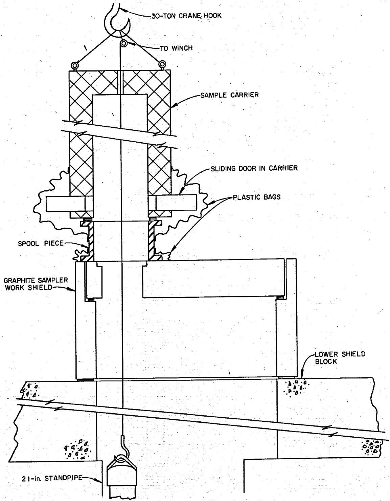  
Fig. 26. Equipment for Transferring Sample Container Into Carrier.

# 3.6.2 Replacing the Surveillance Sample in the Core

The process of replacing the surveillance sample in the core consists basically of the reverse of the removal process. A list of the general activities is given below.

1. The sample is transferred out of the shielded carrier into the standpipe.   
2. An inert atmosphere is established in the standpipe.   
3. The reactor access is opened and the sample is transferred into the core.   
4. The holddown assembly is reinstalled. The flange must pass the standard leak test.   
5. The thermocouple and air-cooling lines are reconnected.   
6. The equipment and long-handled tools are removed from the standpipe.   
7. The standpipe and the various pieces of shielding are put back into the condition for reactor operation.

# 3.6.3 Procedures for Removing and Replacing the 2-in. Square Graphite Stringers

In order to remove and replace the 2-in. square graphite stringers (Dwg. BB-B-40416, Items 7, 60, and 61) in the center of the core, the same control must be maintained over the leakage into or out of the reactor, the cell, and the working area as that used while removing the surveillance sample assembly. An additional standpipe large enough to accommodate the removal and replacement of these stringers has been designed and fabricated (Dwg. D-BB-C-40659).

The following are the necessary steps for the installation of the standpipe and the subsequent removal of the graphite:

1. Drain and flush the reactor system, and bleed off the pressure.   
2. Remove 5 upper shield blocks.   
3. Go through the entire procedure for removing the surveillance sample assembly with two exceptions. Insert a dummy with an appropriate handling fitting in place of the usual sample assembly. Remove the flange and holddown assembly and substitute a blind flange.

4. Set up the portable maintenance shield, and remove the graphite-sampler work shield.   
5. Remove the three control rod assemblies, housings, drives, and rods.   
6. Remove 20-in. standpipe (sometimes referred to as standpipe No.1).   
7. Remove the balance of the control-rod drive shielding, including the lead parts and the supporting columns.   
8. Disconnect line 936 (Dwg. E-GG-D-56377) and flange in line 956 and move piping outside the bolting ring of the 36-in. standpipe (referred to as standpipe No. 2).   
9. Disconnect 5 thermocouple boxes and move jumper leads aside.   
10. Install 36-in. standpipe, tied in at the top by the notched flange and at the bottom by a flange on top of the reactor access nozzle.   
ll. Set up work shield, remove portable shield, and establish inert atmosphere.   
12. Remove the bolts in the 10-in. flange on the reactor access nozzle.   
13. Lift the access nozzle plug and control-rod thimble assembly and place on support bracket inside the standpipe.   
14. Place dummy stringers in the three empty spaces left by the control rod thimbles to prevent the other stringers from getting out of position.   
15. Remove the spacer fitting that holds the tops of the five graphite stringers, and stow it in the bottom of the standpipe. There are several options from here on depending upon how many samples are to be removed, the type of replacement, the timing (how long between removal and replacement), and other operations that are likely, such as inspection and retrieval of material from the core.   
16. Remove one stringer and place in an empty container. The fitting on top of the stringer is a male half of a quick disconnect fitting.   
17. Transfer lid from container with new stringer to the one with an exposed stringer.   
18. Take new sample out of can and put it in position in the core.

19. Repeat for as many stringers as can be stowed in the 36-in. standpipe, or as the program requires.   
20. Replace plug and thimble assembly in reactor access nozzle, torque bolts, and have operations personnel check for leaks.   
21. Clean up external surfaces with long-handled swabs.   
22. Transfer containers to shipping casks with the crane operated from the control room.   
23. Remove all tools and remaining equipment from standpipe.   
24. Set up portable maintenance shield and remove work shield.   
25. Remove 36-in. standpipe.   
26. Reinstall all equipment required to bring reactor back to operating condition. See steps 5 through 9.

# 3.6.4 Removing Control Rod Units

Access to the control rod units has been provided through the upper flange of the 20-in. graphite-sampler standpipe. The following general procedure is used for removing parts of the control rod and drive assembly.

1. Remove five upper roof plugs.   
2. Assemble the following tools: (a) the work shield (Dwg. E-BB-C-40646, items 1 and 2; (see also Figs. 15 and 16), (b) work plug and associated tool holders, viewing ports, light receptacles, etc. (see assembly drawing E-BB-C-40646), (c) wrenches and extension handles for bolts, disconnects, etc. on the drive assembly; install the short tools in the work plug.   
3. Blanket the area around the work area with plastic sheet and set up air monitors and other health physics equipment.   
4. Remove the cover flange and the 39 1/2 in.-diam. filler plug (Dwg. D-BB-C-40651, 49662).   
5. Set up the portable maintenance shield. Remove the control rod drive shielding (Dwg. D-BB-C-56367).   
6. Remove the half-moon shaped access flange and deposit the flange over the standpipe opening.   
7. Disconnect the electrical and air connections.   
8. Remove the rod drive access flange. Lift flange through

access port and place on top of access flange listed above. This requires loosening 4 captive hex-head bolts.

9. Lower the extension wrench into position and disconnect the two captive bolts connecting the drive unit to the control rod. These two bolts have hex socket heads with funnel-shaped guides.   
10. Disconnect the 3 captive bolts that attach the drive unit lower flange to the rod thimble flange. Remove the extension wrench.   
ll. Replace the rod drive access flange removed in step 8. Bolt it down.   
12. Lower a pickup hook through the split section of the rotating work plug.   
13. Engage hook in lift bail and pull housing up slowly.   
14. Open the portable maintenance shield at the split section and complete the pull.   
15. Use plastic bags to contain any loose contamination.

Replacement of the control-rod drive housing consists of doing the above procedure in the reverse order. However, when the repair to the drive mechanism has been completed it must be assembled with a new control-rod-thimble flange-seal ring and with only one captive screw in the flange that connects the drive to the rod. Also the following steps are required to attach the control rod to the drive. These steps replace step 9.

a. Insert the threaded rod tool into the drive housing and thread it through one of the threaded holes in the flange on the drive. It will go completely through these thread until the smooth shank on the tool is in the threads.   
b. Lower it until it gets to the control rod.   
c. Screw it into the threads on the control rod.   
d. Pull the control rod upward as far as it will come.   
e. Insert the wrench tool onto the captive bolt on the other side of the flange.   
f. Screw this bolt in. Now the control rod is tied to the drive.   
g. Unscrew the threaded tool and remove it.

h. Insert the remaining captive bolt on the end of a wrench tool and screw it into the control rod.   
1. The rod is now joined to the drive. The tools may be withdrawn. Continue procedure at step 8.

# 3.6.5. Removing the Control Rod

16. Insert a threaded tool in the threads on the control-rod flange.   
17. Lift control rod to within 1 ft of the bottom of the portable maintenance shield.   
18. Clamp off tool and cut off excess length of tool.   
19. Pull the control rod into a plastic bag. The upper end will not be too radioactive, but the lower end that has been in the reactor will be very hot, probably above 200 r/hr, and precautions must be taken to deal with this source.   
20. Disposethecontrolrodordropitintoashieldedcarrier.

Replacement of the control rod is accomplished with the reverse of the above procedure, steps 1 to 20.

# 3.7 Procedure for Brazing a Joint

The tools and equipment listed below are required for brazing a joint.

1. Equipment put into cell for brazing operation:

a. positioning vise   
b. fixed vise   
c. pipe cutter   
d. pipe taperer   
e. furnishce

2. Long-handled tools used:

a. handling tool   
b. extension wrench   
c. extension drive   
d. furnace installation hook   
e. air motor (no. 315R Chicago, pneumatic, Cat. 22-387-3283).

3. Auxiliary equipment and supplies used external to cell only for brazing operation:

a. l-ton chain hoist   
b. Ajax 3200-cps 30-kw induction generator

c. 25-ft induction heating leads   
d. pure argon or helium with drier   
e. $2000^{\circ}\mathbf{F}$ indicating or recording instruments for the joint thermocouples   
f. one complete dummy female braze fitting with 18-in. nipple

4. General-purpose equipment:

a. 10-ton crane   
b. maintenance shield.

Perform a test braze in the following manner to determine that the equipment is in working order and to qualify the procedure:

1. Inspect all tools and equipment to make sure they are on hand, clean, and in working order. The pipe cutter knife must read R.C. 60 or better on the blade.   
2. Mount the positioning vise on the spare base plate. Put a piece of 1 l/2-in. Hastelloy N pipe in the positioning vise and clamp it tightly. Mount the cutter and cut the pipe. The proper procedure for cutting is the following:

a. Rotate the tool drive until the knife feed wheel is up.   
b. Feed the knife in until it is snug on the pipe.   
c. Rotate the tool until the knife feed wheel contacts the pin but does not pass it.   
d. Rotate the tool back until the wheel touches from the other side.   
e. Make four complete oscillations and then pass the pin to advance the knife feed.

f. Continue in this fashion (four oscillations and then a revolution) until the pipe is cut. The progress of the cut and the condition of the knife can be determined from the torque (feel) of the tool drive and should be observed carefully during the practice cut.   
g. Feed the knife all the way out, rotate the tool so that the opening is down, and remove the tool from the vise.   
h. Examine the cutter knife, and if it is not damaged, use it for the in-cell operation.

3. Position the vise all the way to the back (i.e., away from the slide feed nuts), and mount the pipe taperer on the base plate. While turning the taperer drive by hand advance the pipe into the cutter by moving the positioning vise forward until you feel the cut begin. This is the starting point of the tapering cut. Carefully mark the position of the feed handle and count revolutions from this point. Place the air motor on the taperer drive, set the pressure to 25 psi, and turn on the air motor. It is necessary to hold the air motor by hand to feel the torque and to advance the vise feed by the torque feel. Too heavy a feed will result in chipped cutter teeth. The operation should take 2 to 3 hr. After the feed has advanced 5 l/2 turns, the cut is complete. Let the air motor run 10 min with no further feeding to obtain a smooth finish. Back the pipe out. Remove the taperer. Clean the taper with a thoroughly degreased brush. Do not touch the machined surface with anything else. A finger-print will produce an unbonded area.

4. Slide the furnace over the tapered stub.

5. Thoroughly degrease the dummy female braze fitting with thermcouples and furnace end attached, as well as the braze preform. Assemble the preform into the fitting and fasten it with several spot welds. Use white gloves and extreme care. A fingerprint will cause an unbonded area.

6. Clamp the fitting in the fixed vise so that the end of the fitting projects 4 1/2-in. past the end of the jaws. Place the vise on the base plate and bolt it down.

7. Bottom the pipe stub in the fitting by operating the positioning vise and then back the stub out one-fourth turn for a purge gap. Close the furnace over the joint. Place pipe plugs in the pipe ends. Connect argon purge to the furnace and one pipe plug. Purge at 40 cfh. Connect the thermocouple leads to the indicators. Connect the furnace leads to the Ajax generator. Set the capacitor control to 15. Start the machine, bring it up to about 5 kw to heat the joint to $500^{\circ}\mathrm{F}$ , and then adjust the power to hold the joint at $500^{\circ}\mathrm{F}$ while purging for 1 hr to bake out and off-gas the system. Adjust the capacitor control if necessary to obtain a power factor of one at 5 kw.

8. Operate the positioning vise to firmly seat the stub in the fitting. While one operator maintains pressure on the positioning vise drive, the second operator raises the machine power to 60 amp, which results in readings of approximately $140\mathrm{~V}$ and $11\mathrm{~kw}$ . The joint heats to $1750^{\circ}\mathrm{F}$ in about $1\mathrm{~l} / 2$ min, at which time the vise operator drives the stub in $1/8$ in. or about three-fourths turn and again seats the stub firmly in the fitting. The machine operator watches the temperature indicator carefully, and when the temperature reaches $1900^{\circ}\mathrm{F}$ , he immediately cuts the power to 3 to $4\mathrm{~kw}$ and carefully adjusts it to hold $1900^{\circ}\mathrm{F}$ for $1\mathrm{~min}$ .

Then he turns the power off and permits the joint to cool. The vise operator holds pressure on the joint throughout the operation and until the joint cools to $600^{\circ}\mathrm{F}$ .   
9. After the joint has cooled, it is removed and inspected.   
If the operation was successful, the equipment and operators are ready to proceed to the remote braze in accordance with the following:   
10. Set the portable maintenance shield over the braze point and remove the pipe heaters and any other interferences. Attach the chain hoist to the crane.   
11. Put the positioning vise in its full forward position with its jaws fully open. Attach the 20-ft lift bail to the chain hoist and to the vise. Suspend the vise over the base plate oriented so it will grip the pipe that is to remain in the cell. Open the shield slide, lower the vise through, and close the shield on the lift rod. Lower the vise by use of the chain hoist and carefully set it on the base plate while guiding the dowels into their holes. Disengage and remove the lift bail. Insert the extension wrench and bolt the vise to the base plate. Operate the positioning drive to center the vise in its travel as indicated by marks. Close the jaws on the pipe tightly. If the pipe slips in the jaws during a later operation, the reference point will be lost.   
12. Attach the lift bail to the chain hoist and to the pipe cutter. Suspend the cutter over its mounting plate on the wise. Make sure the cutter is in the open position so that it will pass over the pipe. Open the shield slide, lower the cutter, and close the slide on the bail rod. Lower the cutter and guide it onto the mounting plate (the plate is $3^{\circ}$ off vertical). Use the chain hoist for final lowering. Disconnect and remove the lift bail. Insert the extension wrench. Turn the cutter drive until the knife feed wheel is up. Put the extension wrench in the feed wheel and fit the cutter knife snugly onto the pipe (counterclockwise). Cut the pipe following the procedure in paragraphs 2 c. through 2 e, and remove the cutter as in paragraph 2 g.   
13. With the extension wrench, operate the positioning vise drive ll turns to the rear so that the pipe stub will be clear for later operations.   
14. Complete the disconnection and removal of the component by the appropriate procedures.

15. Examine the pipe taperer to be sure it is clean, the cutter is in good condition, and the brush and pilot ball assembly is tack-welded and cannot come off. Attach the lift bail to the chain hoist and the taperer and insert it through the maintenance shield. Lower it onto the base plate, remove the lift bail, and bolt it down. Perform the tapering operation as in paragraph 3; however, note in addition, the total number of turns of the positioning vise from its position in paragraph 13 to the completion of the cut and return the vise to that position after the completion of the cut. Remove the taperer from the cell. Gross particulate contamination is to be expected.

16. Examine the furnace carefully. Attach the induction heating leads, the purge gas line, and the handling bail, and tie off the leads and purge line to the top of the bail. Attach the bail to the chain fall, and insert the furnace in the cell. Carefully slide the furnace over the stub and against the plate of the vise. Untie the leads from the bail and secure them on the shield. Remove the bail. Thoroughly degrease the nylon brush which will pass over the pipe stub, attach the long handle to it, insert it into the cell, and brush off the machined surface. Remove the brush.

17. Examine the new component to assure that the braze fitting is accurately located, is clean, the braze preform is in place, the thermocouples with 25-ft flexible leads coiled on the furnace bail are in place and checked electrically, and the furnace end with thermocouple leads is in place. Install the new component by appropriate procedures.

18. Examine the fixed vise to see that it is operating properly and that the jaws are fully open. Attach the lift bail to the chain hoist and to the vise, and insert it into the cell. Place it on the base plate very carefully to avoid striking the furnace end. Remove the lift bail, bolt down the vise, and clamp the vise jaws on the pipe tightly.

19. Retrieve the thermocouple leads with the retrieval hook.

20. Proceed with the braze as in steps 7 and 8 with the generator power settings obtained in the test braze. The purge to the inside of the pipe will have to be inserted at some convenient place in the salt system. In the case of a drain-tank replacement, the normal helium connection to the drain tank can be used.

21. After the joint is completed, open the furnace and examine the joint visually with the periscope to check the quality of the fillet and wetting around the joint. Then inspect it with ultrasonic tools and techniques provided by the Metals and Ceramics Division.

22. Destructively remove the furnace, and then remove the tools.

# 3.8 Procedures for Maintenance of the Sampler-Enricher

There are nine parts of the sampler-enricher that will be in contact with the radioactive salt. Therefore radiation will be a factor at the time of maintenance. The specific parts are (1) the inner compartment, (2) the manipulator arm assembly, (3) the removal seal assembly, (4) the light bulb, (5) the maintenance valve, (6) the operational valve, (7) the hot vacuum pump, (8) the containment housing, and (9) the spool piece connecting the pump bowl with the sampler. Except for items 5, 6, and 8, these items are independent and can be removed from the assembly by themselves. Item 5, the maintenance valve cannot be removed without first removing items 1 and 6. Similarly, item 6 cannot be removed without removal of 1. Parts of the sampler-enricher are shown in Figs. 23 and 24.

Radiation levels affecting maintenance will depend on the duration and power levels of reactor operation, the amount of spillage, deposits from gaseous activity, and whether there is a radioactive sample within the sampler that must be removed in a nonroutine manner. Thus, the range of conditions that might be encountered is large. While the reactor is operating, approximately 8 in. of lead shielding covers the unit. This provides protection for personnel during the normal sampling operation. The shielding is mostly in the form of stacked lead brick. Several cast prices are used where complex shapes are needed. Doors and windows were built into the shell for maintenance access.

A generalized version of the maintenance procedure follows. Details for each individual piece of equipment vary and have to be applied as required. Item 9, the spool piece, however, is an exception because it is located within the reactor shield; the portable maintenance shield and long-handled tools are used for maintaining it.

1. Shut down the equipment. This includes the reactor and the various subsystems of the sampler-enricher.   
2. Remove shield blocks to give clearance and working room.   
3. Gather, clean, and prepare tools, shielded carriers, equipment, and the decontamination cell.   
4. Spread out blotter paper and plastic, and set up contamination control measures for the high bay.   
5. Remove outer pieces of shielding.   
6. Take health physics precautions throughout remainder of procedure.

7. Decontaminate as much as possible and pass cleaning swabs through the removal seal assembly by using the sampler-enricher manipulator to pickup the radioactive material.   
8. Remove sufficient shielding for access to the attachments.   
9. Disconnect mechanical, electrical, and piping connections. Use hand tools, extensions, and stacked lead brick shielding. Radiation surveys should be made to locate and correct local streaming.   
10. Attach lifting devices.   
ll. Rig shielded carrier and plastic bags to encase the equipment as it clears the structure of the sampler.   
12. Transport to decontamination cell for cleanup.   
13. Decontaminate and repair the unit. If decontamination is not possible, prepare a new replacement.   
14. Install the repaired or the new component.   
15. Reconnect all fittings and attachments.   
16. Replace the shielding.

APPENDICES

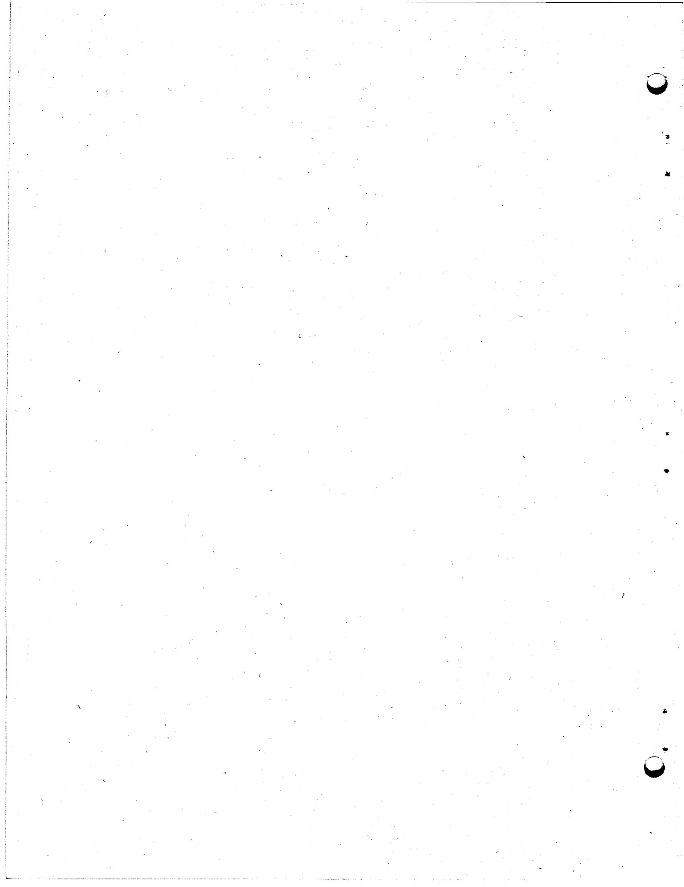

# Appendix A

# LIST OF REMOTE MAINTENANCE REFERENCE INFORMATION

1. R. Blumberg, Remote Maintenance of the MSRE, MSRP Semiann. Progr. Rept. July 31, 1964, USAEC Report ORNL-3708, pp 190-200, ORNL.   
2. E. C. Hise, F. W. Cooke, and R. G. Donnelly, Remote Fabrication of Brazed Structural Joints in Radioactive Piping, ASME-63-WA-53, American Society of Mechanical Engineers, New York.   
3. Unpublished book of detailed maintenance procedures for MSRE.   
4. Unpublished catalog of MSRE maintenance tools (contains tool description and method of operation); compiled by J. R. Shugart.   
5. Collection of photographs taken in reactor cell, drain cell sampler, etc. (There are three loose leaf binders.)

NOTE: Items 3, 4, and 5 are available from J. R. Shugart at the MSRE.

# Appendix B

# MSRE PORTABLE MAINTENANCE SHIELD

LL-D

Drawing No.

E 40660

D 40661

D 40662

D 40663

D 40664

D 40665

D 40666

D 40667

D 40668

D 40669

D 40670

D 40671

D 40672

D 40673

D 40674

D 40675

D 40676

D 40677

D 40678

D 40679

D 40680

D 40681

D 40682

D 40683

D 40684

D 40685

D 40686

D 40687

Title

Module Assembly, Cross-Sections

" , Index

Cutting Schedule

Layout Plan - General - Reactor Cell

Layout Plan - Reactor Cell - S. Ctr. Bays

Layout Plan - Reactor Cell - N. Str. and W. Bays

E. Bay at Sampler

E. Bays

" Over Freeze Flanges

" General - Drain Tank Cell, Mid Bays

" Drain Tank Cell - End Bays

" Corner Bays

Typical Track Assembly

Track Details - Sheet 1

" Sheet 2

" Sheet 3

Ball Plug, Lights, Special Mod. Insert

Frame and Motor Drive - Assembly - Sections

Details, Sheet 1

" Sheet 2

Special Attachment Module

14 in. Fill Module

2 ft 6 1/2 in. Fill Module

Eccentric Plug Module - Sheet 1

Eccentric Plug Module - Sheet 2

General Information Layout, Ecc. Plug Module

Plugs A and A' - Sub Assemblies

Details

LL-D

Drawing No.

Title

D 40688

Plugs B and B' - Sub Assemblies

D 40689

Plugs B and B' - Details

D 40690

Long Slide and Slide Inserts

D 40691

Short Slide and Slide Extension Spacer

D'40692

Hole Inserts - Misc. Plugs - Sheet 1

D 40693

" Sheet 2, Ball Plugs

B/M 40694

Master Bill of Materials, Portable Shield

D 40695

Lead Glass Window Plugs

# Appendix C

# GRAPHITE SAMPLER AND CONTROL ROD MAINTENANCE FACILITY

<table><tr><td>Number</td><td>Title</td></tr><tr><td>E-EB-C-40646</td><td>7/8&quot; Graphite Sampler - Gen. Assembly</td></tr><tr><td>40647</td><td>Graphite Sampler Detail, Tool Bushing and Pb.
Glass Holder</td></tr><tr><td>40648</td><td>Graphite Sampler Work Plug No. 1, Alternate Constr.</td></tr><tr><td>40649</td><td>&quot; Work Plug No. 2, Assembly and Details</td></tr><tr><td>40650</td><td>Airline Piping for 7/8&quot; Graphite Sampler</td></tr><tr><td>40651</td><td>Graphite Sampler Detail - Shield Plug and Insert</td></tr><tr><td>40652</td><td>&quot; Work Plug No. 1 Assy. and Details</td></tr><tr><td>40653</td><td>7/8&quot; Graphite Sampler Details</td></tr><tr><td>40654</td><td>Gaskets for 7/8&quot; Graphite Sampler</td></tr><tr><td>40655</td><td>Graphite Sampler, Details Floodlights and Pb
Glass Holder</td></tr><tr><td>40656</td><td>Graphite Sampler Detail, Tool Bushings and Seals</td></tr><tr><td>40657</td><td>Work Shield, Graphite Sampler</td></tr><tr><td>40658</td><td>Details Standpipe No. 2, Sheet 2 Assy and Details</td></tr><tr><td>40659</td><td>Graphite Sampler, Standpipe No. 2 Assy. and Details,
Sheet 1</td></tr></table>

Vard Corp.

Drawings

F-114729 Housing Assembly, Drive Unit

F-114800 Drive Unit Assembly, MSRE Control Rod

F-114786 Plate Assy. MSRE Drive Unit Access Hatch Plate

# Appendix D

# LONG-HANDLED TOOLS AND MISCELLANEOUS EQUIPMENT

# MSRE-SK-No. Title

250

E251 Handling Tool for Freeze Flange Gaskets

E252 Freeze Flange Cover Handling Tool, for FF-200

D253 1 , Details

E254 Clamp Stowing Tool

E256 Adjustable Lifting Bail for Maintenance Tools

E257 Offset Handling Tool for Electric Heaters

E260 Television Camera Stand for Remote Maintenance

E261 Portable Shield Limit Switch

E262 Ring Gasket Handling Tool for Auxiliary Flanges

D263 Freeze Flange Covers, Assembly

D264 , Details

D265 Thermocouple Disconnect Tool with Guide

D266 Fuel Pump Rotary Element Lifting Tool

D267 " " Motor Lifting Tool

D268 Remote Maintenance All Purpose Handling Tool

D269 Heater Unit Handling Tool

D270 Remote Maintenance Socket Extension Tool and Bolt Retainer

D271 Assembly and Details, 1/2" and 1/8" Auxiliary Piping Tool

D-272 " for Leak Detector Disconnect Handling Tool

D-273 Handling Tool for Drain Tank Cell, Space Cooler Support Hanger

C274 Valve Handling Tool

D276 Gear Tool for Jacking Pump Assembly

D277 Portable Shield, Eccentric Plug Module Drive Mechanism

C278 Freeze Flange Clamp Operator Assembly.

# MSRE-SK-No. Title

C279 Freeze Flange Clamp Operator Details

1

D281 Lifting Bails and Masts for Freeze Flange Clamp Operating Tools

C282 Handling Tools for Breco Fittings

C283 Tool Calibration for Freeze Flange Maintenance

D286 Rod Light for Remote Maintenance

E287 Alignment Tool for Freeze Flange 100, Assembly

1

Detail

E289 MSRE Pipe Alignment Tool Assembly

1

Details

C293 Freeze Flange Clamp Aligning Gage for Clamp Operating Tool

D-297 Valve Support Beam Handling Tool

D298 Offset Handling Tool for Drain Cell Pipe Vise

D301 Freeze Flange Clamp Stowing Tool for FF100 and 102

E302 Remote Maintenance Gantry

D303 Handling Tool for Snap-tite Disconnects

D304 Handling Tool for 2 in. Graphite Samples

D305 Offset Socket Drive Tool

D306 Lifting Bail for 1-1/4" Pipe Mast Tools

E308 Salt Plug Heater Tool Assembly

1

Details

# Appendix E

# IN CELL EQUIPMENT

<table><tr><td>Number</td><td>Title</td></tr><tr><td>E-GG-E-41868</td><td>Equipment Installation, Freeze Flange Maintenance</td></tr><tr><td>41869</td><td>Freeze Flange Jack, Installation and Assy.</td></tr><tr><td>41870</td><td>Pipe Jack Mounts, Freeze Flange FF-100, 102, 200, and 201</td></tr><tr><td>E-BB-E-41872</td><td>Heat Exchanger Jack, Pipe Alignment Bracket, FF-101</td></tr><tr><td>E-BB-Z-41873</td><td>Reactor Cell Equipment Supporting Steel, Sheet 2</td></tr><tr><td>D-GG-E-41874</td><td>Clamp Stowing, Pipe Alignment Bracket, FF-200</td></tr><tr><td>D-GG-E-41875</td><td>FF-201</td></tr><tr><td>E-GG-E-41876</td><td>Freeze Flange Jack, Modification Details</td></tr><tr><td>D-GG-E-41895</td><td>Flange Jacking Hook, Support Pedestal Assy. and Details</td></tr><tr><td>E-GG-C-40610</td><td>5 in. Freeze Flange No. 100, 102, 200, and 201 Assy.</td></tr><tr><td>E-GG-C-40609</td><td>101 Assy.</td></tr><tr><td>D-GG-C-40607</td><td>5 in. Freeze Flange Details</td></tr><tr><td>D-GG-C-40608</td><td>Weldment, Rough Machine</td></tr><tr><td>D-GG-C-40466</td><td>5 in. Freeze Flange No. 101, Bottom Clamp Weldment</td></tr><tr><td>E-CC-C-41450</td><td>Fuel Pump Support Assembly</td></tr><tr><td>D-CC-C-41453</td><td>Fuel Pump Support Details</td></tr><tr><td>D-CC-C-41511</td><td>Arrangement</td></tr><tr><td>E-EE-C-41491</td><td>Heat Exchanger Support Assembly</td></tr><tr><td>E-EE-D-41492</td><td>Heat Exchanger Support</td></tr><tr><td>E-DD-D-41493</td><td>Primary Heat Exchanger Support Suspension Beams</td></tr><tr><td>E-DD-D-40742</td><td>Heat Exchanger Support Detail</td></tr><tr><td>D-LL-E-40734</td><td>Quick Disconnect Block and Yoke Details</td></tr><tr><td>E-BB-D-40724</td><td>Reactor Thermal Shield Assembly and Sections</td></tr></table>

# Appendix F

# JIGS AND FIXTURES

# Number

# Title

E-LL-E-56269

Valve Clamp Jig Parts, PCV-960, HCV-903

56270

" , HCV 915, 956, 961, 962

F-GG-D-55417

Assembly Fixture Fuel Pump, Aux. Flanges Assembly

55418

" , Aux. Flanges, Body Weld

55419

Assembly Fixture Fuel Pump Aux. Flange Details

55484

Fuel Pump Aux. Flange Motor Adapter

E-LL-E-41830

Drain Cell Component Jig, D.T. No. 1

41831

" , Fuel Drain Tank No. 2

41832

" , Fuel Salt: Flush Tank

41833

" , Detail Sheet No. 1

E-LL-E-41836

Assy Fixture Major Components, Elevation

41837

" , Plan

41838

, Pedestal Weldment

41839

" , Freeze Flange Nests FF-101

41840

" , Freeze Flang

Stand

41841

" , Details

# Internal Distribution

1. G. M. Adamson   
2. L. G. Alexander   
3. D. D. Ausmus   
4. J.M.Baker   
5. F. Barnes   
6. H. F. Bauman   
7. S. E. Beall   
8. M. Bender   
9. C. E. Bettis   
10. E. S. Bettis   
11. R.E.Blanco   
12. R. Blumberg   
13. E. G. Bohlman   
14. C. J. Borkowski   
15. G. E. Boyd   
16. R. B. Briggs   
17. G. D. Brunton   
18. D. A. Canonico   
19. W. L. Carter   
20. G. I. Cathers   
21. O. B. Cavin   
22. W. R. Cobb   
23. C. W. Collins   
24. E. L. Compere   
25. W. H. Cook   
26. D. F. Cope (AEC-ORNL)   
27. W. B. Cottrell   
28. J. L. Crowley   
29. F. L. Culler   
30. D. G. Davis   
31. R. J. DeBakker   
32. S.J.Ditto   
33. W. P. Eatherly   
34. J. R. Engel   
35. D. E. Ferguson   
36. A. P. Fraas   
37. H. A. Friedman   
38. J. H. Frye, Jr.   
39. C. H. Gabbard   
40. R. B. Gallaher   
41. H. E. Goeller   
42. W. R. Grimes   
43. A. G. Grindell   
44. R. H. Guymon   
45. B. A. Hannaford   
46. P. H. Harley

47. P. N. Haubenreich   
48. P. G. Herndon   
49. D. N. Hess   
50. E.C.Hise   
51. H. W. Hoffman   
52. P. P. Holz   
53. T. L. Hudson   
54. R. S. Jackson   
55. P. R. Kasten   
56. R. J. Kedl   
57. H. T. Kerr   
58. S. S. Kirslis   
59. J. W. Koger   
60. A. I. Krakoviak   
61. J. W. Krewson   
62. R. B. Lindauer   
63. A. P. Litman   
64. G. H. Llewellyn   
65. E. L. Long   
66. M. I. Lundin   
67. R. N. Lyon   
68. H. G. MacPherson   
69. R. E. MacPherson   
70. T. H. Mauney   
71. H. McClain   
72. R.W.McClung   
73. H. E. McCoy   
74. H.C. McCurdy   
75. H.F.McDuffie   
76. C. K. McGlothlan   
77. J. R. McWherter   
78. A. J. Miller   
79. R.R.Minue   
80. R. L. Moore   
81. H. H. Nichol   
82. E. L. Nicholson   
83. L. C. Oakes   
84. A. M. Perry   
85. T. W. Pickel   
86. H. M. Poly   
87. G. L. Ragan   
88. J. L. Redford   
89. M. Richardson   
90. R.C.Robertson   
91. H. C. Roller   
92. M. W. Rosenthal

93. H.C.Savage   
94. A. W. Savolainen   
95. Dunlap Scott   
96. H. E. Seagren   
97. J. H. Shaffer   
98. J.R.Shugart   
99. W.H.Sides   
100. M. J. Skinner   
101. G. M. Slaughter   
102. A. N. Smith   
103. G.P. Smith   
104. O. L. Smith   
105. P. G. Smith   
106. I. Spiewak   
107. R.C.Steffy   
108. W.C. Stoddard   
109. D. Sundberg   
110. J. R. Tallackson   
111. W. Terry

112. R.E.Thoma   
113. W. D. Todd   
114. D. B. Trauger   
115. R.W.Tucker   
116. H. L. Watts   
117. B. H. Webster   
118. A. M. Weinberg   
119. J. R. Weir   
120. M. E. Whatley   
121. G. D. Whitman   
122. L. V. Wilson   
123. F. C. Zapp

124-125. Central Research Library   
126-127. Document Reference Section   
128-130. Laboratory Records Department   
131. Laboratory Records (RC)

# External Distribution

132. C. B. Deering, AEC, ORO   
133. A. Giambusso, AEC, Washington, D.C.   
134. W. J. Larkin, AEC, ORO   
135. T. W. McIntosh, AEC, Washington, D.C.   
136. H. M. Roth, AEC, ORO   
137. M. Shaw, AEC, Washington, D.C.   
138. W. L. Smalley, AEC, ORO   
139. Laboratory and University Division, AEC, ORO   
140-154. Division of Technical Information Extension