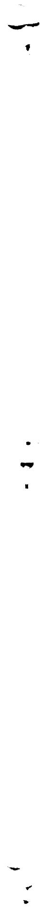
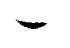
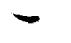

# OAK RIDGE NATIONAL LABORATORY

operated by

# UNION CARBIDE CORPORATION

NUCLEAR DIVISION

for the

U.S. ATOMIC ENERGY COMMISSION

ORNL-TM-911

RELEASED FOR ANNouncement

THE NUCLEAR SCIENCE ABSTRACTS

MSRE DESIGN AND OPERATIONS REPORT

Part XI

TEST PROGRAM

R.H. Guymon

P.N. Haubenreich

J.R. Engel

THIS DOCUMENT HAS BEEN REVIEWED.

E0W

TO THE A&G. ANO LUCED THERE

NOTICE This document contains information of a preliminary nature and was prepared primarily for internal use at the Oak Ridge National Laboratory. It is subject to revision or correction and therefore does not represent a final report.

# LEGAL NOTICE

This report was prepared as an account of Government sponsored work. Neither the United States, nor the Commission, nor any person acting on behalf of the Commission:

A. Makes any warranty or representation, expressed or implied, with respect to the accuracy, completeness, or usefulness of the information contained in this report, or that the use of any information, apparatus, method, or process disclosed in this report may not infringe privately owned rights; or   
B. Assumes any liabilities with respect to the use of, or for damages resulting from the use of any information, apparatus, method, or process disclosed in this report.

As used in the above, "person acting on behalf of the Commission" includes any employee or contractor of the Commission, or employee of such contractor, to the extent that such employee or contractor of the Commission, or employee of such contractor prepares, disseminates, or provides access to, any information pursuant to his employment or contract with the Commission, or his employment with such contractor.

# RELEASED FOR ANNOUNCEMENT IN NUCLEAR SCIENCE ABSTRACTS

MSRE DESIGN AND OPERATIONS REPORT

Part XI

TEST PROGRAM

R.H.Guymon P.N.Haubenreich J.R.Engel

NOVEMBER 1966

# LEGAL NOTICE

This report was prepared as an account of Government sponsored work. Neither the United States, nor the Commission, nor any person acting on behalf of the Commission: A. Makes any guarantee or warranty that the following are true:

The accuracy of representation, expressed or implied, with respect to the accuracy, completeness, or usefulness of the information contained in this report, or that the use

of any information, apparatus, method, or process disclosed in this report may not infringe privately owned rights; or

B. Assumes any liabilities with respect to the use of, or for damages resulting from the use of any information, apparatus, method, or process contained in the material herein presented.

As used in the above, "person acting on behalf of the Commission" includes any pr

Such employee or contractor of the Commission, or employee of such contractor, to the extent that

disseminates, or provides access to, any information pursuant to his employment or contract with the Commission, or his employment with such contractor.

OAK RIDGE NATIONAL LABORATORY Oak Ridge, Tennessee operated by UNION CARBIDE CORPORATION for the U.S. ATOMIC ENERGY COMMISSION

# PREFACE

This report is one of a series that describes the design and operation of the Molten-Salt Reactor Experiment. All the reports are listed below.

ORNL-TM-728* MSRE Design and Operations Report, Part I, Description of Reactor Design by R. C. Robertson

ORNL-TM-729 MSRE Design and Operations Report, Part II, Nuclear and Process Instrumentation, by J. R. Tallackson

ORNL-TM-730* MSRE Design and Operations Report, Part III, Nuclear Analysis, by P. N. Haubenreich and J. R. Engel, B. E. Prince, and H. C. Claiborne

ORNL-TM-731 MSRE Design and Operations Report, Part IV, Chemistry and Materials, by F. F. Blankenship and A. Taboada

ORNI-TM-732* MSRE Design and Operations Report, Part V, Reactor Safety Analysis Report, by S. E. Beall, P. N. Haubenreich, R. B. Lindauer, and J. R. Tallackson

ORNL-TM-733* MSRE Design and Operations Report, Part VI, Operating Limits, by S. E. Beall and R. H. Guymon

ORNL-TM-907* MSRE Design and Operations Report, Part VII, Fuel Handling and Processing Plant, by R. B. Lindauer

ORNL-TM-908* MSRE Design and Operations Report, Part VIII, Operating Procedures, by R. H. Guymon

ORNL-TM-909* MSRE Design and Operations Report, Part IX, Safety Procedures and Emergency Plans, by A. N. Smith

ORNL-TM-910 ** MSRE Design and Operations Report, Part X, Maintenance Equipment and Procedures, by E. C. Hise and R. Blumberg

ORNL-TM-911\*

MSRE Design and Operations Report, Part XI, Test Program, by R. H. Guymon, P. N. Haubenreich, and J. R. Engel

\*\*

MSRE Design and Operations Report, Part XII, Lists: Drawings, Specifications, Line Schedules, Instrument Tabulations (Vol.1 and 2)

# FOREWORD

The reader of this report should be aware that the date of issue is somewhat misleading - this description of the MSRE test program was written before the fact and has not been updated. Preparation of this document began in 1964 and continued through 1965, each section being issued in draft form as it was completed and before operations entered that phase of the program. Inevitably some situations arose (the offgassystem troubles, for example) that added some tests and some time to the planned program. No major deviation from the broad outline has occurred, however, and we believe it worthwhile to issue this report as a convenient record of what was planned for the MSRE. For an account of what actually transpired, the reader should turn to the Molten Salt Reactor Project semiannual progress reports.

# CONTENTS

Page

# 1. INTRODUCTION 1-1

1.1 OBJECTIVES 1-1   
1.2 AREAS TO BE INVESTIGATED. 1-1

1.2.1 Chemistry and Materials. 1-1   
1.2.2 Engineering 1-2   
1.2.3 Reactor Physics 1-2

1.3 PHASES OF PROGRAM 1-3   
1.4 DOCUMENTATION 1-4

# 2. NONNUCLEAR TESTING 2-1

2.1 OBJECTIVES 2-1   
2.2 EXPLANATION OF PROCEDURES 2-1   
2.3 PROCEDURES 2-2

2.3.1 Fuel System 2-2   
2.3.2 Fuel-Drain-Tank System 2-5   
2.3.3 Coolant System 2-7   
2.3.4 Coolant Drain-Tank System 2-10   
2.3.5 Cover-Gas and Offgas Systems 2-11   
2.3.6 Oil Systems 2-12   
2.3.7 Chemical Processing System 2-13   
2.3.8 Leak-Detector System 2-14   
2.3.9 Cooling-Water Systems 2-15   
2.3.10 Component-Cooling Systems 2-16   
2.3.11 Instrument-Air and Auxiliary-Air Systems.... 2-17   
2.3.12 Instrumentation 2-18   
2.3.13 Electrical System 2-20   
2.3.14 Shield and Containment 2-21   
2.3.15 Ventilation System 2-23   
2.3.16 Liquid-Waste System 2-24   
2.3.17 Samplers 2-25   
2.3.18 Control Rods 2-25   
2.3.19 Heaters 2-26

2.3.20 Freeze Valves 2-27   
2.3.21 Miscellaneous 2-27   
2.3.22 Entire Plant 2-28

# 3. ZERO POWER EXPERIMENTS 3-1

3.1 OBJECTIVES 3-1   
3.2 PROCEDURES 3-2

3.2.1 Initial Critical Experiment.. 3-2   
3.2.2 Calibration of Control Rods. 3-4   
3.2.3 Evaluation of Nuclear Parameters 3-8   
3.2.4 Preliminary Studies of Dynamics 3-9   
3.2.5 Evaluation of Neutron Sources and Future Requirements of the External Source 3-14   
3.2.6 Chemical Analyses 3-15

# 4. LOW POWER MEASUREMENTS 4-1

4.1 OBJECTIVES 4-1   
4.2 PROCEDURES 4-2

4.2.1 Shielding and Containment Surveys 4-2   
4.2.2 Calibration of Nuclear-Power Instruments 4-4   
4.2.3 Power Coefficient of Reactivity 4-7   
4.2.4 Xenon Poisoning 4-8   
4.2.5 On-Line Analysis of Operation 4-9   
4.2.6 Establishment of Baseline for Chemical Analyses.... 4-12   
4.2.7 Intermediate Dynamics Studies 4-13

# 5. REACTOR CAPABILITY INVESTIGATIONS - APPROACH TO FULL POWER 5-1

5.1 OBJECTIVES 5-1   
5.2 PROCEDURES 5-2

5.2.1 Performance of Control Systems 5-2   
5.2.2 Shielding and Containment Adequacy 5-3   
5.2.3 Calibration of Power Instruments 5-4   
5.2.4 Xenon Poisoning 5-5   
5.2.5 On-Line Analysis of Operation 5-5   
5.2.6 Thermal Effects of Power Operation 5-6   
5.2.7 Capability and Performance of Heat Transfer Systems 5-7

5.2.8 Chemical Effects of Power Operation 5-8   
5.2.9 Dynamics Studies 5-9

# 6. SYSTEM CAPABILITY INVESTIGATIONS - EXTENDED OPERATION 6-1

6.1 OBJECTIVES 6-1   
6.2 PROCEDURES 6-2

6.2.1 Fuel Chemistry 6-2   
6.2.2 Materials Compatibility.. 6-2   
6.2.3 Changes in Dynamics.. 6-5   
6.2.4 Performance of Components and Equipment.. 6-5

# SECTION 1

# INTRODUCTION

# 1.1 OBJECTIVES

The purpose of the Molten Salt Reactor Experiment, stated broadly, is to demonstrate that many of the desirable features of molten salt reactors can presently be embodied in a practical reactor which can be operated safely and reliably, and can be serviced without undue difficulty. The program which has been laid out for the MSRE is intended to provide that demonstration in a safe, efficient and conclusive manner.

Although the complete success of the MSRE depends in part on the reactor being able to operate for long periods at full power, the test program recognizes that the success of a reactor experiment is not measured solely in megawatt-days. The tests and the experiments are designed to be penetrating and thorough, so that when the experiment is concluded not only will reliable operation and reasonable maintenance have been demonstrated, but there will be as many conclusive answers as possible to the important questions pertaining to the practicability of molten salt reactors of this general type.

# 1.2 AREAS TO BE INVESTIGATED

# 1.2.1 Chemistry and Materials

Some of the most important questions have to do with the behavior and interactions of the fuel salt, the graphite, and the container material in the reactor environment. The major points to be investigated in this area are:

1. fuel stability,   
2. penetration of the graphite by the fuel salt,   
3. graphite damage,   
4. xenon retention and removal,   
5. corrosion,   
6. behavior of corrosion products and non-volatile fission products.

The principal means of investigation used during operation will be regular sampling and chemical analysis of the fuel salt, analysis of the

long-term reactivity behavior, and determination of the isotopic composition of the xenon in the offgas. Periodically, during shutdowns, specimens of graphite and of INOR will be removed from the core for examination.

# 1.2.2 Engineering

The MSRE incorporates some novel features and components which have been developed and designed specifically for molten salt reactors. The test program will obtain performance data on these items, permitting evaluation of ideas and principles which could be employed in future reactors.

The broad heading of Engineering also covers the extensive startup program which must be devoted to the checkout, calibration and preliminary testing of the many more or less conventional devices and systems in the MSRE.

# 1.2.3 Reactor Physics

From the standpoint of reactor physics, the MSRE core is unique. But the nuclear design posed no serious problems. One reason for this apparent paradox is the simplicity of the core, which makes simple spatial approximations valid. Another is that the demands for accuracy in the predictions are not severe. This follows because the fuel is fluid, permitting easy adjustment of the uranium loading and eliminating hot spot problems associated with heat transfer from fuel to core coolant. For these reasons the design did not employ extremely sophisticated calculational procedures and there were no preliminary critical experiments. Instead, the physics part of the reactor test program is relied on to provide such accurate information on nuclear characteristics as may be required.

The program of reactor physics measurements begins with the experimental loading of uranium to attain criticality. Following this will be experiments to verify that the system is stable and safe. Accurate measurements of rod worth and reactivity coefficients will be made to facilitate later analysis of the reactivity behavior during power operation. This analysis will be concerned, among other things, with the transient behavior of $^{135}\mathrm{Xe}$ . The reactivity behavior will also be scrutinized for possible anomalies, which might indicate changes in conditions within the core.

# 1.3 PHASES OF PROGRAM

The testing and experimental operation of the MSRE fall naturally into different phases which must follow in sequence. They are:

1. precritical testing,   
2. initial critical measurements,   
3. low-power measurements,   
4. reactor capability investigations.

The precritical testing phase begins with the new operators, as part of their training, checking the location of equipment and comparing the installed piping against the flowsheets. As systems are completed, leak testing, purging, filling, calibrating and test operation are started. The precritical testing culminates in shakedown operation of the entire reactor system, with flush salt in the fuel system and coolant salt in the coolant system.

In the initial critical experiments, fuel salt will be loaded and enriched uranium will be added in increments to bring the concentration up to that required for operation. During this phase the control rods will be calibrated and fuel concentration, temperature and pressure coefficients of reactivity will be measured. Baseline data on the fuel chemistry and corrosion will also be obtained during this period.

Following the critical experiments, which will be conducted at a few watts of nuclear power, the power will be raised to permit certain tests. These will include tests of the nuclear power servo control system, the automatic load control system, the calibration of power indicators and surveys of the biological shielding. The nuclear power will be less than 2 Mw during this period.

Capability investigations consist of two parts: The first, a stepwise approach to full power; the second, extended operation. During the approach to full power, temperatures, radiation levels and the nuclear power noise will be observed to determine if any unforeseen condition exists which would restrict the attainable power level. Extended operation will test the reliability of equipment and long-term corrosion and fission-product behavior. Maintenance will be carried out as required and the reactor will be shut down periodically for removal of samples

from the core. Long-range-plans include chemical processing of the fuel salt and operation with different fuel salt compositions.

# 1.4 DOCUMENTATION

This report describes, in rather general terms, the experiments to be performed with some discussion of the methods to be used and the type of results expected. It provides the basic plan for the day-to-day experimental program.

Each experiment or test, prior to its performance, is the subject of a Test Memo which describes that particular experiment in complete detail. A stepwise procedure with references to applicable established operating procedures is included. If they are required, supplementary check lists and sample data sheets are made a part of the Test Memo. The Test Memos must be internally reviewed and approved before the experiment is performed. Since the procedural details are of limited interest, these documents are distributed only to personnel and supervision directly connected with the experiment.

As soon as possible after the completion of an experiment, a Test Report is written to describe the results. This report summarizes the test experience and data obtained and presents any conclusions that can be drawn. The scope and importance of the individual experiments determine the nature and distribution of the Test Reports.

# 2.1 OBJECTIVES

Prior to full-scale operation the MSRE will undergo a number of shakedown runs and tests. The purposes are:

1. to assure that the design is adequate and that the equipment and instrumentation function as designed;   
2. to obtain information which may be needed for future operation or analysis of the reactor (calibration of instruments and equipment, dimensional changes, etc.);   
3. to discover and correct weak points of the system to assure that it is safe and operable (This includes long term integrated runs to allow for early failure of defective equipment.);   
4. to develop sampling techniques and determine the adequacy of analysis procedures;   
5. to train operating personnel and check out the operating procedures;   
6. to determine the effects of equipment or instrument failures or maloperation.

# 2.2 EXPLANATION OF PROCEDURES

Most of the nonnuclear tests will be performed before the reactor is made critical for the first time. However, the testing of some equipment will be completed at a later date. For example, the vapor-condensing system and the final closure of the containment vessel will not be completed before the critical experiment so the testing of these items will be performed after the zero-power nuclear tests. Thus, the order in which the tests are listed does not indicate the chronological order of testing.

Because of the large number of nonuclear tests, a numbering system was adopted to facilitate the maintenance of records. The various test memos and operating procedures that are applicable are referred to by number in the descriptions which follow.

# 2.3 PROCEDURES

# 2.3.1 Fuel System

The fuel system consists of the reactor, the fuel pump, the overflow tank, the heat exchanger, and associated piping.

# 2.3.1.1 Initial Heatup

Prior to and during early heatups, the fuel system and graphite will be purged of moisture. The necessary heater settings for various average system temperatures will be determined along with temperature gradients, cool down rates, and adequacy of spring piping supports.

Purge — Oxygen and moisture must be removed from the system prior to heatup or addition of salt to the system. This will be done by evacuating and refilling the system with helium. The system will be evacuated through a temporary connection to line llo in the drain-tank cell. Since there will be no salt in the freeze valves at this time, the entire drain-tank system is purged also. Since a large quantity of moisture is expected to be released from the graphite during heatup, the moisture content of the helium will be monitored and further evacuations performed during heatup if necessary. Although evacuation will be from line llo at the drain-tank cell, the venting of purge helium will be through the offgas system charcoal beds. Details are given in Test Memo XI 2.3.l.l-A.

Heater Settings — During early heatups, all the reactor-cell piping will be heated concurrently. At least that portion of the coolant-salt system in the reactor cell must be heated concurrently due to thermal expansion of piping. Thermocouples will be monitored and excessive thermal gradients, such as might occur at the cell penetrations, will be minimized by proper heater adjustment. Heater-control settings will be determined for holding the system at various temperatures. The rate of cooldown and temperature gradients during a simulated power outage will be checked. Details are given in Test Memo XI 2.3.1.1-B.

Thermal Stress in Piping and Equipment - The thermal growth of the piping system and the operation of the fuel-pump and piping supports will be noted during heatup. The piping heaters will be observed while at operating temperature to detect any apparent difficulties due to the

expansion of the piping system. Temperature gradients at points of stress will be analyzed and strain gages will be used if necessary. Details are given in Test Memo XI 2.3.1.1-C.

# 2.3.1.2 Initial Fill and Operation

During the initial fill, the normal fill procedure, Section 5I, Part VIII, Operating Procedures, will be used and no calibration data, as such, will be taken. Salt will be circulated and sampled for a period to gain both operating experience and continuous-operation sample data. The system will then be drained and refilled during which the system will be calibrated vs the amount of salt added, rate of fill determined, overflow tank calibrated, cooling tests performed and drain time established.

Calibration — During the calibration fill, the fuel-system level and volume will be calibrated vs the amount of salt added as the drain-tank pressure is increased by increments. After each partial addition the approximate level in the system and weight of salt in the drain tank will be determined. From previously obtained drain-tank calibrations the weight of salt in the fuel system vs elevation will be plotted. The fuel pump will be overfilled to determine the location of the overflow inlet. Some salt will be transferred to the overflow tank to test the level indicators. Details are given in Test Memo XI 2.3.1.2-A.

Fuel-Pump Tests - The tests to be performed on the fuel pump include checking operation of the bubble-tube level indicators and determination of load and no-load power requirements of the fuel-pump motor. Details are also given in Test Memo XI 2.3.1.2-A.

Cooling Rates — Cooling rates for both the coolant and fuel systems will be determined from a starting condition of $1200^{\circ}\mathrm{F}$ to a minimum of $1000^{\circ}\mathrm{F}$ . Recorder charts and photographs of scanner traces will be used to determine cold spots and cooling rates. Details are given in Test Memo XI 2.3.1.2-C.

Drain Times — Drain times will be determined at both minimum and maximum circumstances — the slowest drain time being that with only the drain-tank vent open. Details are given in Test Memo XI 2.3.1.2-A.

Initial Operation — The preliminary fill will be done according to a normal fill procedure which includes the freezing of a salt plug in the reactor access nozzle. The system will be filled, the freeze valve frozen, and salt circulation begun. Circulation and normal operating conditions will be established for a period of days during which salt samples for chemical analysis will be withdrawn from the fuel pump through a temporary sampler. Details of the preliminary fill are given in Section 5I, Part VIII, Operating Procedures.

# 2.3.1.3 Krypton Injection

Calculation of a reactivity balance at frequent intervals provides a valuable indication of conditions in the core during nuclear operation. Whenever the power is significant (above a few kilowatts), the poisoning of $^{135}\mathrm{Xe}$ is an important term in the reactivity balance. Constants which are used in the computation of the $^{135}\mathrm{Xe}$ poisoning must therefore be available at the outset of nuclear operation.

The $^{135}\mathrm{Xe}$ poisoning depends strongly on the amount of gas bubbles circulating with the salt, the stripping in the pump bowl and the mass transfer of xenon between the salt and the graphite in the core. The effect of these mechanisms can be predicted from theory, basic data and pump-loop experiments, but the uncertainties are undesirably large. Therefore, during the precritical testing an experiment will be done with radioactive krypton to provide further information on the behavior of noble gases in the MSRE.

Radioactive $^{85}\mathrm{Kr}$ (10.4 y half-life) will be injected with the helium flow into the fuel pump while flush salt is being circulated. The offgas is diverted, just after leaving the pump bowl, past a radiation measuring device. Sampling connections for trapping krypton on charcoal are also provided at this point. Normally the flow bypasses the sampling bombs, back into the offgas line, through the charcoal beds and up the ventilation stack.

Basically the experiment consists of saturating the salt and graphite with krypton, then stopping the inflow and observing the rate at which

the krypton is eliminated from the system.

The operation will be done in three phases. The first will be a short run (about 10 hr) to calibrate the equipment. The second run, of about 2 days duration, will yield approximate values for the constants which are to be measured. The results of these two runs will be used to decide on the rate of krypton injection and the duration of a third, long run. The anticipated rate of injection is 6 curies/day or less and the duration, chosen to allow $^{85}\mathrm{Kr}$ concentrations to reach steady state, is expected to be about 20 days.

At the end of the prescribed period, the input of $^{85}\mathrm{Kr}$ will be stopped and the decreasing $^{85}\mathrm{Kr}$ concentration in the offgas will be followed closely until the level becomes insignificant. The concentration will decrease rapidly at first as most of the krypton in the salt is stripped, then more slowly as krypton diffuses out of the graphite into the salt and thence into the offgas stream.

The transients in the $^{85}\mathrm{Kr}$ concentration in the offgas stream will be analyzed to yield values for fuel salt-gas holdup, stripping rate and the rate of transfer from the graphite to the salt. These quantities can then be used rather directly to predict values for xenon. These values will be incorporated in the $^{135}\mathrm{Xe}$ reactivity calculation for the nuclear startup.

# 2.3.2 Fuel-Drain-Tank System

The fuel-drain-tank system consists of fuel drain tank No. 1 (FD-1), fuel drain tank No. 2 (FD-2), fuel flush tank (FFT), and associated piping. The two drain-tank afterheat-removal systems are also included. Precritical testing will include the following items.

# 2.3.2.1 Calibration of Steam Drums

The steam drums will be calibrated by adding known increments of water from the previously calibrated feed-water tanks and by comparing the amount added with the indicated level. The calibration curves thus obtained will be used to set the operating parameters. Details are given in Test Memo XI 2.3.2.2.

# 2.3.2.2 Initial Heatup

During the initial heatup the system will be purged and stress relieved, the thermal growth of the piping will be checked, the heatup

and cooldown rates will be determined, and the necessary heater settings for various operating conditions will be obtained.

Purge — The system will be purged at the same time as the fuel system. Details are given in Test Memo XI 2.3.1.1-A.

Heater Settings — The heater-control settings will be determined for holding the system at various temperatures. During cooldown, the effect of loss of electrical power will be checked. From this information, operating conditions can be established. Mechanical limits will be put on heater controllers to prevent overheating during future operation. Possible temperature effects on the weigh-cell readings will be noted. Details are given in Test Memo XI 2.3.2.2-B.

Thermal-Expansion Effects — Prior to heating the system, key measurements will be taken on the piping and equipment. Stress relieving will be accomplished by holding the temperatures at $1300^{\circ}\mathrm{F}$ for a minimum of 100 hours. While hot and after cooling down, the key measurements will be rechecked to determine movement which could cause trouble in the future. Details are given in Test Memo XI 2.3.2.2-C.

# 2.3.2.3 Initial Salt Fill

A small amount of flush salt will be added to the system and will be used to fill the freeze valves. The remainder of the flush salt will then be added to fuel drain tank No. 1. Weigh cells will be calibrated when the tanks are cold by adding known increments of weight. They will be recalibrated as the salt is added. The weigh-cell readings when the level probes are actuated will be noted. Using the probe locations as baselines, the elevations of salt in the tank will be plotted vs weight of salt added and weigh-cell readings. The fuel drain tank No. 2 and the fuel flush tank will be calibrated by transferring the salt in increments and by observing the tank weights and level probes. From these curves, the weight and elevation of the salt in the fuel system can be determined during fill operations. Details are given in Test Memo XI 2.3.2.3.

# 2.3.2.4 Cooldown_Rates (Salt in Drain Tank)

In order to determine how soon salt will freeze in a drain tank if electric power is lost, the power will be turned off all heaters and the salt will be allowed to cool approximately $200^{\circ}\mathrm{F}$ . The curve will be

extrapolated to determine the freezing time. Details are given in Test Memo XI 2.3.2.4.

# 2.3.2.5 Heat Removal by Steam Drums

Sufficient cooling capacity is needed to remove fission-product afterheat from the fuel when it is drained to the drain tanks. With flush salt in a drain tank, the steam drums will be put into service and the heat removal rate determined by the cooldown rate of the salt. The test will be terminated before the salt freezes. Details are given in Test Memo XI 2.3.2.5.

# 2.3.3 Coolant System

The coolant system consists of the radiator, coolant pump, heat exchanger, and associated piping. Precritical testing will consist of the following items.

# 2.3.3.1 Initial Heatup

During the initial heatup the system will be purged and stress relieved. The thermal growth of the piping will be checked, the heatup and cooldown rates, as well as temperature gradients, will be determined, and the necessary heater settings for various operating conditions will be obtained.

Purge — Before any salt-containing equipment is heated or salt added, the entire system will be purged to remove oxygen and moisture. This will be done by first evacuating and filling the system with helium followed by an extended purge which will continue through the heatup. Purging will be conducted in a sequence to insure purging of all gas and salt piping. The coolant pump will be operated to circulate helium through the main loop. Since there will be no salt in the freeze valves, the coolant drain tanks will be purged along with the coolant system. Purging of the coolant oil system is also included at this time. If possible, the fuel system, fuel-drain-tank system, cover-gas system, and offgas system will be purged at the same time. Details are given in Test Memo XI 2.3.3.1-A.

Heater Settings — During the initial heatup all thermocouples will be monitored to assure that no cold spots or excessive temperature gradients exist. Necessary adjustments of the heater controllers will be made using, as a guide, previously prepared graphs of the indicated

heater current vs the estimated power per square foot of surface. Heater-control settings will be determined for holding the system at various temperatures. The rate of cooldown and temperature gradients during a power outage will also be checked. From this information mechanical limits can be put on the controllers, curves can be made to show the interrelationship between heater current and equipment temperature, and the normal control settings can be established. Details are given in Test Memo XI 2.3.3.1-B.

Thermal Growth — Stress relief of individual components and piping welds will be performed during assembly. However, as part of the initial heatup the entire system will be held at $1300^{\circ}\mathrm{F}$ for 100 hours for additional stress relief. The thermal growth of the piping system and the operation of the constant-load pipe supports will be noted before, during and after the initial heatup. The piping heaters inside the reactor cell will be observed while at operating temperature to detect any apparent difficulties due to the shifting of the piping system. Details are given in Test Memo XI 2.3.3.1-C.

# 2.3.3.2 Initial Fill and Operation

During the initial fill the level in the system will be calibrated vs the amount of salt added. The rate of fill will be determined, various coolant-pump tests will be made, and the rate of cooling will be checked under various conditions. The effect of temperature on the coolant-salt flow meter will be investigated.

Level Calibration — The initial fill of the coolant system will be made by increasing the drain-tank pressure in increments. After each partial addition, the level of the salt as indicated by the $\Delta P$ , the loop pipe temperatures, and the weight of the salt in the coolant drain tank will be determined. From this information and the calibration of the coolant drain tank vs the elevation made previously, the weight in the coolant system vs the elevation will be plotted. In order to establish future operating parameters, the rate of fill will be determined at various settings of the drain-tank helium-supply valves and at various salt elevations. The salt level in the pump bowl will be calibrated using the float indicator and both bubblers. Details are given in Test Memo XI 2.3.3.2-A.

Salt Flowmeter — The effects of loop temperatures and temperatures of the NaK-filled differential-pressure cells on the flow indicated by the coolant-salt flowmeter will be determined for baseline information. Details are given in Test Memo XI 2.3.3.2-B.

Cooling Rates — The cooldown rate upon loss of electric power will be determined with salt circulating in the system and without salt circulation. The response time needed to stop the system cooldown and start heating will be checked. Tests will also be made to determine the temperature response with and without circulation using only the emergency electric-power supply. From this information, the operating policies during power outages can be finalized. Details are given in Test Memo XI 2.3.3.2-C.

Freeze-Valve Thaw Rate — The rate at which the drain valves (FV 204 and 206) will thaw with and without electric power and the rate of drain of the salt from the coolant system will be determined under various operating conditions. From this information operating procedures can be established which will prevent freezing of the salt in the radiator. Inventory checks will be made after each drain to determine the heel left in the coolant system. Details are given in Test Memo XI 2.3.3.2-D.

# 2.3.3.3 Radiator_and_Heat-Removal_System

The radiator doors, blowers, and dampers will be checked to assure that they operate as designed and that the control circuits function properly. The stack flowmeter will be calibrated.

Radiator Door Tests — The operation of the radiator doors will be tested. Most of these tests will be made with the coolant system at ambient temperature. They include: rate of raise, rate of lowering under power and during a load scream, and position change with blowers on. The operation of the doors will also be checked while at $1200^{\circ}\mathrm{F}$ . Warpage will be determined after the heating and cooling cycles. Details are given in Test Memo XI 2.3.3-3-A.

Radiator Cooling — Tests will be made to determine the cooling rate which would occur if both radiator doors were dropped with salt in the system. Details of this are given in Test Memo XI 2.3.3-3-B.

Damper Position — The measured damper position vs indicated position will be measured and the reproducibility checked before heatup. Several points will be rechecked after heatup and cooldown. The rate of movement of the dampers will be determined. The operation of the dampers will be checked while the system is at $1200^{\circ}\mathrm{F}$ . Details are given in Test Memo XI 2.3.3.3-C.

Stack Flow Rates — The stack air-flow instrument will be calibrated over the range of 20,000 to 200,000 scfm by measuring velocity profiles. Flow rates at various combinations of blowers, door positions, and damper positions will be determined for future reference. Details are given in Test Memo XI 2.3.3.3-D.

Radiator Air Leakage — Ventilation is provided to maintain the coolant cell at a lower pressure than the high-bay area. Tests will be made at various door and damper positions with both radiator blowers in operation to assure that leakage does not pressurize the cell. Details are given in Test Memo XI 2.3.3.3-E.

# 2.3.4 Coolant Drain-Tank System

The coolant drain-tank system consists of the coolant drain tank and associated piping. Precritical testing will consist of the following items.

# 2.3.4.1 Initial Heatup

During the initial heatup the system will be purged and stress relieved, the thermal growth of the piping will be checked, the heatup and cooldown rates will be determined, and the necessary heater settings for various operating conditions will be obtained.

Purge — The system will be purged at the same time as the coolant system. Details are given in Test Memo XI 2.3.3.1-A.

Heater Settings — The heater control settings will be determined for holding the system at various temperatures. Attempts will be made to hold all temperatures within $\pm 100^{\circ}\mathrm{F}$ of each other. During cooldown, the effect of loss of electric power will be checked. From this information operating conditions can be established. Mechanical limits will be put on heater controllers to prevent overheating during future operation. Possible temperature effects on the weigh-cell readings will be noted. Details are given in Test Memo XI 2.3.4.2-B.

Thermal Growth — Prior to heating the system, key measurements will be taken on the piping and equipment. Stress relieving will be accomplished by holding the temperatures at $1300^{\circ}\mathrm{F}$ for a minimum of 100 hours. While hot and after cooling down, the key measurements will be rechecked to determine movement which could cause trouble in the future. Details are given in Test Memo XI 2.3.4.2-C.

# 2.3.4.2 Initial Salt Fill and Calibration

A small amount of coolant salt will be added to the system and will be used to fill the freeze valves. The remainder of the salt will then be added to coolant drain tank. The weigh cells will be calibrated when the tank is cold by adding known increments of weight. They will be recalibrated vs the weight of salt added. The weigh cell-readings when the level probes are actuated will be noted. Using the probe locations as baselines, the elevations of salt in the tank will be plotted vs weight of salt added and weigh-cell readings. From these curves, the weight and elevation of the salt in the coolant system can be determined during fill operations. Details are given in Test Memo XI 2.3.4.3.

# 2.3.4.3 Cooldown_Rates_(Salt in Drain Tank)

In order to determine how soon salt will freeze in the drain tank if electric power is lost, the power will be turned off all heaters and the salt will be allowed to cool approximately $200^{\circ}\mathrm{F}$ . The curve will be extrapolated to determine the freezing time. Details are given in Test Memo XI 2.3.4.4.

# 2.3.5 Cover-Gas and Offgas Systems

The cover-gas system provides a helium supply to purge the salt systems, to transfer salt by pressurization, and to provide an inert atmosphere. The offgas system provides holdup for the fission gasses from the fuel system and fuel-drain-tank system. It also includes vent lines from the coolant system, coolant-drain-tank system, and lube-oil system to the stack.

# 2.3.5.1 Purging the System

Before purging the fuel and coolant systems, the cover-gas system will be purged of air by evacuating and then pressurizing with cylinder helium. The purge will be continued with cylinder helium during the initial purge of fuel and coolant systems and then with treated helium

during the final purge of the fuel and coolant systems. The offgas system is purged when the systems which it vents are purged. The detailed procedure for evacuating and pressurizing the cover-gas system is given in Test Memo XI 2.3.5.1.

# 2.3.5.2 Charcoal-Bed_Retention_Time

The helium purge from the fuel pump flows through the main charcoal beds which are designed to hold up the associated fission-product gases long enough to allow them to decay sufficiently so that they can be discharged safely from the stack to the atmosphere. The required holdup for Kr at 10 Mw operation is 7 l/2 days at design carrier-gas flow rates.

To determine that the beds meet the design requirements, a burst of $^{85}\mathrm{Kr}$ will be charged into the bed inlet and the discharge stream will be monitored for activity to determine the holdup time in the bed. Various helium carrier-gas flow rates will be used during the test. Details are given in Test Memo XI 2.3.5.2.

# 2.3.5.3 Charcoal_Bed_Pressure_Drop

The pressure drop across the main charcoal beds will be measured over the expected flow range using installed instrumentation. This will check the design calculations and assist in determining the bed condition during reactor operations. Details of the test are given in Test Memo XI 2.3.5.3.

# 2.3.5.4 Oxygen-Remover_and_Dryer_Pformance

Exact prototype units of both the oxygen-remover and dryer were used in the development program for the cover-gas system. The performance of the installed units will be determined by analyzing the inlet and outlet helium for oxygen and moisture during system purging and precritical testing. No loading tests are planned at the reactor site for either the oxygen-removal unit or the dryer.

# 2.3.6 Oil Systems

The two oil systems are auxiliaries of the fuel and coolant salt pumps. They provide both lubricating oil, for bearings and seals, and cooling oil for the pump radiation shields. The test program will consist of various tests and calibrations necessary for proper operation. Both systems will be given a general shakedown before startup of the salt pumps.

# 2.3.6.1 Final Leak Test

The oil systems are parts of the secondary containment and will be helium leak tested in conjunction with the fuel and coolant systems. For details see Test Memo XI 2.3.1.3.

# 2.3.6.2 Calibration of_Supply and Oil_Catch_Tanks

During normal operation there will be a small amount of oil leakage through the salt pump seal. This is collected and measured in the oil catch tank. A serious oil leak here or elsewhere in the system will show up as a decrease in oil level in the supply tank. Therefore both the supply-tank and catch-tank level indicators will be calibrated prior to operation. Details are given in Test Memo XI 2.3.6.2

# 2.3.6.3 Emergency Supply

It is important that the systems supplying oil to the salt pumps be reliable. Details are given in the operating procedures for startup of standby pumps under various operating conditions, operating with one oil pump supplying both salt pumps, and adding oil during operation without violating containment. The adequacy of the design will be tested by simulating abnormal conditions and by operating the systems as detailed in Section 9H, Part VIII, Operating Procedures.

# 2.3.6.4 Heat-Exchanger_Test

The cooling systems on the oil supply tanks are designed with sufficient capacity for the operation of both salt pumps at full reactor power with one oil system. Fouling of the surfaces could reduce the heat transfer capability below the design value. Therefore, periodic checks will be made to detect changes in the overall heat transfer coefficient. Shortly after startup of the system, tests will be made at several water and oil flows and heat-removal rates to obtain base information. Details are given in Test Memo XI 2.3.6.4.

# 2.3.7 Chemical Processing System

The chemical processing system consists of the fuel storage tank, transfer lines for moving salt from the drain-tank system and a gas sparging system for removal of oxygen or uranium from the salt.

Equipment Preparation — The entire chemical processing system will be helium leak checked during construction and component fabrication.

After leak testing, the salt-handling part of the system will be purged with nitrogen gas, to remove all moisture and oxygen. When the moisture and $O_2$ have been removed, the system will be heated to $1200^{\circ}\mathrm{F}$ and pressure tested.

Tank Calibrations — Prior to operation, the caustic neutralizer and caustic-addition tanks will be calibrated using water. The fuel-storage-tank weighing system and ultrasonic probe will be calibrated during the initial salt addition from the fuel flush tank by comparing the weight of salt in the two tanks.

$\mathrm{O_2}$ Removal Calibration — Two methods of determining the amount of oxygen removed from the salt as water vapor during $\mathrm{H_2 - HF}$ processing consist of an electrolytic hygrometer to measure moisture in the offgas and a syphon pot to measure increments of condensed water vapor. These will be calibrated and compared during a test using a mixture of water vapor and nitrogen.

Flush-Salt Treatment — The final system test will consist of removing the oxygen from the flush salt which is used during the precritical operation of the fuel system. This test will determine the system efficiency and indicate any modifications which are needed before the system is contaminated by processing fuel salt.

# 2.3.8 Leak-Detector System

This system consists of eight headers, each of which is connected to a common helium supply on one end and by means of stainless steel tubing to the ring grooves of in-cell flanges on the other end. Normally the leak-detector system will be at a higher pressure than the systems being monitored. The system will detect flange leaks, by a drop in system pressure, and prevent outleakage by maintaining a buffer of helium. Pre-critical testing will consist of the following items.

# 2.3.8.1 Calibration

In order to convert the pressure changes to volumetric leak rates, it is necessary to know the volume of various segments of the system. Each header, leak-detector line, etc., will be calibrated by equalizing pressure with a bomb of known volume. The volumes of the system will be calculated from changes in pressure. For calibration details, see Test Memo XI 2.3.8.1.

# 2.3.8.2 Furging

Before putting the leak detector system into operation, the headers and lines will be purged of oxygen. The headers will be purged by pressurizing to 100 psig with helium and venting three times. The lines will be purged by bleeding gas through the leak detector lines to the flanges before the flanges are sealed.

# 2.3.9 Cooling Water Systems

Potable water is supplied to the MSRE from the X-10 area. After passing through a backflow preventer, it is called process water and is used as makeup for the cooling tower and for other out-of-cell cooling and process uses. Cooling-tower water which is circulated centrifugal pumps provides cooling for the treated-water cooler and other out-of-cell equipment. All in-cell cooling is done by treated water which is circulated by centrifugal pumps. Precritical testing will consist of the following items.

# 2.3.9.1 Potable-Water System

More than adequate supply is available to the area; however, this will be verified during reactor startup.

# 2.3.9.2 Process_Water_System

The backflow preventers will be tested in accordance with ORNL Standard Practice Procedure No. 14. For details see Section 4C, Part VIII, Operating Procedures.

# 2.3.9.3 Cooling-Tower System

The cooling-tower system will be filled and operated to assure the adequacy and reliability of the components. Details are given in Test Memo XI 2.3.9.3.

# 2.3.9.4 Treated-Water System

The treated-water system will be filled with condensate and all equipment operated when the heat transfer coefficient of the treated-water cooler is measured. Also, the condensate makeup rate will be measured and calibrations of the system and tank volumes will be made.

Condensate Makeup — The condensate makeup rate will be determined by measuring the time to produce a measured amount of condensate from the normal steam supply. Condensate will be used to calibrate the various

tanks by adding or removing measured amounts of condensate. These calibrations will be used to determine the rate of water usage. Details of these tests are given in Test Memo XI 2.3.9.4-A.

Volume Calibration — The system volume calibration will be made by comparing the water analysis before and after addition of known amounts of a corrosion inhibitor. The calibrations will be used in calculating chemical additions required to maintain the proper water treatment. Details are given in Test Memo XI 2.3.9.4-B.

Treated-Water Cooler — The heat transfer coefficient of the treated water cooler will be determined to provide a baseline figure which can be used if tube fouling is suspected. Details are given in Test Memo XI 2.3.9.4-C.

Effect of Water Flow on Cell Temperature and Pressure — The effect of closing the radiation block valves on cell temperature and pressure will be tested. After the cells are closed and sealed, the water to the space coolers will be shut off and the rate of pressure and temperature increase will be measured.

When the surge-tank vent valve closes on activity in the treated water, the system becomes an unvented system. The effect on water makeup and circulation will be tested with the vent closed. Details of testing the block valve effects are given in Test Memo XI 2.3.9.4-D.

Thermal Shield — The permissible pressure in the reactor thermal shield is quite low. During the initial startup of the treated-water system, tests will be conducted to insure that the thermal shield is adequately protected against excessive pressures.

# 2.3.10 Component-Cooling Systems

The primary component-cooling-air system consists of a circulating system in which gas from the reactor and drain-tank cells is compressed, cooled, and reused to cool in-cell components (freeze valves, pump bowl, control rods, reactor neck, and graphite-sampler neck). A secondary cooling-air system supplies air for cooling the freeze valves located outside the reactor and drain-tank cells. Precritical testing will consist of the following items.

# 2.3.10.1 Leak Testing

The section of the primary component-cooling system which is outside the main cells is part of the reactor containment enclosure. All flanged joints in this section will be soap checked for leaks and will be re-checked during the containment leak test. Each component will be hydrostatically tested during manufacture, and the entire system will be pneumatically tested after installation. Details are given in Test Memo XI 2.3.10.1.

# 2.3.10.2 Heat_Transfer Coefficient of_Heat Exchanger

A heat balance will be made on the heat exchanger, and the heat transfer coefficient will be calculated. This will be used as a basis for subsequent evaluation of the heat-exchanger performance. Details are given in Test Memo XI 2.3.10.2.

# 2.3.10.3 Fuel-Pump Cooling-Air Flow_Calibration

The effect of the cooling-air flow rate to the fuel-pump bowl on the temperature distribution will be determined. This will allow selection of the optimum flow to minimize thermal stresses on the pump bowl. Details are given in Test Memo XI 2.3.10.3.

# 2.3.10.4 Flow_Adjustment

The flow to the freeze valves and other equipment served by both the primary and secondary component-cooling-air systems will be set to give the desired freeze valve operating characteristic and equipment cooling. Details are given in Section 4I, Part VIII, Operating Procedures.

# 2.3.10.5 Flow_Stability

The stability of air flows will be checked by observing the system pressure and monitored thermocouples on the equipment during periods when air flow is being changed, such as during operation of freeze valves, or the evacuation of the cell. Details are given in Test Memo XI 2.3.10.5.

# 2.3.11 Instrument-Air and Auxiliary-Air Systems

Clean, dry, compressed air is supplied to the MSRE instruments by a reciprocating compressor and heatless air dryer with a spare compressor and dryer in a standby. Cylinders of nitrogen provide emergency gas pressure to the more important instruments. Auxiliary compressed air is

supplied by a third reciprocating air compressor for the operation of pneumatic tools and other plant uses. Precritical testing will consist of the following items.

# 2.3.11.1 Capacity_of_Air_Compressors

In order to establish a base for comparing the future performance of the compressors, the capacity of each instrument-air compressor will be checked while new. Flow rates as indicated by the installed instruments will be recorded with the system operating at steady-state design conditions. The relative loading and unloading times will also be determined at various flow rates. Details are given in Test Memo XI 2.3.11.1.

# 2.3.11.2 Dryer Performance

To ensure proper operation of the pneumatic instruments, the dryers must reduce the moisture content of the air to a dewpoint of $-20^{\circ}\mathrm{F}$ . The moisture content of the discharge air from each dryer will be monitored with installed instruments. At design operating conditions the automatic timing cycle of each dryer will also be checked. Details are given in Test Memo XI 2.3.11.2.

# 2.3.11.3 Emergency Supply

Sufficient emergency instrument-air capacity should be available to assure an orderly shutdown of the reactor in case of loss of both instrument-air compressors. Both compressors will be stopped and the rate of pressure drop will be determined. Times will be noted when various annunciations or instrument failures occur. Comparison of these with the time necessary to drain the system should indicate whether the emergency supply is adequate. Detailed procedures are given in Test Memo XI 2.3.11.3.

# 2.3.12 Instrumentation

All instruments will be thoroughly checked prior to operation to ensure that they function properly.

# 2.3.12.1 Instrument_Calibration

All instruments will be calibrated following fabrication. Each will be checked to ensure that the transmitted signal covers the proper range. The system recorders and indicators will be checked with a precision instrument to ensure the proper value is read out.

# 2.3.12.2 Temperature

Each thermocouple will be checked for continuity and resistance. Temperature readout instruments will be calibrated by feeding in milli-volt signals which correspond to the temperature range to be covered.

# 2.3.12.3 Control Circuits

All control circuits and control loops will be checked following installation for continuity and proper control action. These are covered by the instrument startup check list, Section 4H, Part VIII, Operating Procedures.

# 2.3.12.4 Computer

The computer to be used for scanning, recording, and processing reactor data will be checked out and tested independently of the reactor system. However, a complete checkout of the computer will require, not only operation of the reactor system, but the production of nuclear power. Therefore, it may be expected that some corrections and modifications of the computer system and/or programs will be required after the system is nominally in service.

The pre-operational testing of the computer will be performed in two stages. The first stage will take place at the vendor's plant prior to shipping and the second will take place at the reactor site after installation of the equipment. Both stages will be a joint effort by members of the ORNL staff and representatives of the computer manufacturer. After completion of the second stage of testing, the computer system will be placed in normal operation and made available to the reactor operating staff. Substantial on-line operating experience will be accumulated so that complete reliance can be placed on all aspects of the computer operation.

The first phase of the checkout will begin with the normal checks, by the manufacturer, of quality, workmanship, and operability of the computer itself and all the associated subsystems and peripheral devices. This will be followed by assembly and checkout of all programs to be used in the computer. Operation of the system will then be tested with fixed values for all input parameters; values that are expected to be typical for both full-power and low-power operation of the reactor will be used.

In cases where a computational program may follow any of several paths depending on the input value, a variety of values will be used to allow all possibilities to be checked. This phase will be concluded with a series of customer-acceptance tests to demonstrate that the computer meets all requirements.

The second phase of the checkout will be conducted after the computer system has been installed at the reactor site and all of the reactor-system signals have been connected to it. This will permit complete testing of all aspects of the computer operation except those associated with nuclear-power operation of the reactor.

The details of the procedures used in checking the computer are the joint responsibility of ORNL and the computer manufacturer. Since the initial checkout is not directly associated with the reactor system and does not involve operating personnel, it will be described separately. The periodic checks to be performed by operating personnel will be published as part of the operating procedure for the computer.

# 2.3.13 Electrical System

# 2.3.13.1 TVA Feeder_Switchover

The 7503 Area is supplied by two 13.8-kv feeders, a preferred line (ORNL Circuit 234) and an alternate (ORNL Circuit 294). Low voltage on Circuit 234 will initiate an automatic transfer to Circuit 294 after a 1- to 10-sec delay, providing there is voltage on Circuit 294 and no fault between the two motor-operated switches. Details are given in Test Memo XI 2.3.13.1 and in 3A, Part VIII, Operating Procedures.

# 2.3.13.2 Operation of Diesels_3, 4, and 5

Diesel Generators 3 and 4 supply 480-v AC current after the loss of both TVA feeders for operating motorized process equipment, some lighting, and some instrument power. Generator 5 supplies 480-v AC power for operating process electric heaters. Tests will be run to determine the preoperational settings to bring the units to power safely from the remote start. The actual operating load of each diesel will be compared to the tabulated load. Parallel operation of Generators 3 and 4 with TVA will also be tested. Details are given in Test Memo XI 2.3.13.2

# 2.3.13.3 48-Volt System

The 48-v system is used to supply uninterrupted power for critical instrumentation. This power is normally supplied from either of two 3-kw, AC-DC M. G. sets with a battery "floating" on-line to furnish emergency power after a loss of the normal electrical supply. A test will be made to determine the actual time during which the batteries will supply adequate power to the instruments. Details are given in Test Memo XI 2.3.13.3. The two M. G. sets must be operated in parallel to charge the battery. This procedure (Section 3A, Part VIII, Operating Procedures) will be tested.

# 2.3.13.4 250-v Supply

The 250-v DC system supplies power for DC emergency lights, breaker trip power, feeder transfer power, and a 25-kw DC-AC M. G. set. This system is normally supplied from a 125-kw AC-DC M. G. set, and has a battery capable of supplying emergency power for two hours under full load. Low voltage from the 25-kw M. G. set will throw an automatic switch, transferring the power for Instrument Panels 2 and 3 to Generator 4. The effective life of the battery will be tested under various loads, and the automatic transfer of the instrument power will be tested as outlined in Test Memo XI 2.3.13.4.

# 2.3.13.5 Emergency Lights

Emergency DC lights come on automatically on loss of AC power to Lighting Panel H. The DC lights will be tested by opening the Lighting Supply Breaker and a check will be made to assure that all areas are adequately lighted.

# 2.3.14 Shield and Containment

# 2.3.14.1 Initial Cell Testing

The construction of the reactor cell and drain-tank cell are part of a major building-modification contract. Upon completion of these cells, and prior to acceptance by ORNL, the cells will be sealed and hydrostatically tested to 48 psig and then pneumatically leak tested at 20 psig and -5 psig. Details of the test are outlined in Test Memo XI 2.3.14.1.

# 2.3.14.2 Prepower_Leak Test

The reactor cell, drain-tank cell, and certain appendages comprise the secondary containment of the reactor system. All piping entering or

leaving the containment is protected against out-leakage of activity during an accident by check valves or automatic block valves. These containment check valves and block valves will be leak tested prior to operation. The secondary containment of the reactor will be leak tested at 20 psig, 10 psig, 5 psig, 2 psig and -2 psig. The data will be extrapolated to the expected leakage for the maximum credible accident and must not exceed $1\%$ of the cell volume in 24 hours at 39 psig. Details of the leak test are covered by Shield and Containment Check Lists, (Section 4E, Part VIII, Operating Procedures).

# 2.3.14.3 Vapor-Condensing_System

The vapor-condensing system is isolated from the reactor cell by two rupture discs. This system is designed to limit the secondary-containment pressure to 39 psig during the maximum credible accident. This system will be leak tested at the same time as the reactor and drain-tank cells and to the same specifications.

# 2.3.14.4 Compensating_Volume

The compensated volume consists of several sealed pipe volumes in the reactor and drain-tank cells into which the cell pressure can be admitted. The compensating volume can then be isolated from the cells and cell leak rate determined by measuring the differential pressure between the cells and this volume using a sensitive gage. Since this leak-tight volume is inside the cells and at thermal equilibrium, the leak rate measured should be independent of changes in cell temperature. The compensating volume will be leak tested during fabrication. The effectiveness of the temperature compensation will be determined during the prepower leak testing. Details of the test are given in Test Memo XI 2.3.14.4.

# 2.3.14.5 Calibration of Sumps

Sumps are provided in the reactor cell and drain-tank cell to collect the leakage from any in-cell water-containing equipment. Both sump levels are measured by bubbler-type level indicators. The sumps will be calibrated for volume and liquid depth versus instrument reading. Details are given in Test Memo XI 2.3.14.5.

# 2.3.15 Ventilation System

The ventilation system is designed to ventilate all areas where the potential hazard from radioactive contamination is high. Subatmospheric pressures are maintained in these areas by the stack fan. The air exhausted from these areas passes through an absolute filter before it is discharged to the containment ventilation stack. The following tests of this system will be performed.

# 2.3.15.1 Filter_Test

A DOP smoke test will be performed on the absolute filters to determine their efficiency. This test will be performed at the normal, operating flow conditions. Briefly the DOP smoke test consists of introducing dioctyl phthalate smoke upstream of the filters, taking air samples on both sides of the filters and determining the percentage of the smoke removed by the filters. This test is described in Section 3F, Part VIII, Operating Procedures and in ORNL-3442, "Tests of High Efficiency Filters and Filter Installations at ORNL."

# 2.3.15.2 Standby Fan Operation

The design of the stack-fan control system is such that if Fan No. 1 or its discharge damper should fail, resulting in a pressure rise (less negative) in the suction line, Fan No. 2 will be started automatically to maintain ventilation. The operation of the system will be thoroughly tested and the controls set to start Fan No. 2 when the pressure in the main ventilation header rises above limits. This test is described in detail in Section 4F, Part VIII, Operating Procedures.

# 2.3.15.3 Stack-Flow_Indicator_Calibration

The stack-flow indicator will be calibrated so that the amount of activity released can be determined. The flow indicator will also provide information regarding the condition of the absolute filters. Details of this calibration are given in Test Memo XI 2.3.15.3.

# 2.3.15.4 Damper_and_Valve_Settings

The dampers and ventilation-control valves will be set for normal operation as described in Section 4F, Part VIII, Operating Procedures. All ventilated areas will be checked for adequate ventilation. The effect on the ventilation in various areas caused by operating dampers or doors

will be checked. Installed and supplementary portable instruments will be used in making these tests. Details of these tests are given in Test Memo XI 2.3.15.4.

# 2.3.15.5 High-Bay_Leakage

During maintenance, when the reactor cell and drain-tank cell are open, and during possible accidents, the high bay is considered as secondary containment. Excessive leakage in the high bay could prevent keeping the area at a negative pressure when the ventilating system is operating. Also upon loss of the stack fans during an accident, excessive leakage could cause contamination of the building and surrounding area. The leakage into the high bay will be measured by closing all inlet vents and doors and all exit vents except one which leads to the stack. The one vent will be throttled to give the desired negative pressure in the high bay and the flow measured with portable instruments. Details are given in Test Memo XI 2.3.15.5.

# 2.3.16 Liquid-Waste System

The liquid-waste system is used to transfer and store aqueous waste material which may contain radioactivity or beryllium. This liquid waste is pumped periodically to the Melton Valley waste-handling system. The liquid-waste system is also used for clarifying shielding water used in the decontamination cell and tank. Precritical testing will consist of the following items.

# 2.3.16.1 Leak Testing

In order to assure that none of the tanks, cells, and piping leak, they will be filled with water and physically observed or will be physically checked during other tests described below. No pneumatic or hydrostatic tests are projected. Details are given in Test Memo XI 12.3.16.1.

# 2.3.16.2 Tank_Calibration_and_Waste_Pump Flow_Rates

To facilitate future calculations of the amount of activity present and the amount of caustic necessary for neutralization, the waste-tank volume will be calibrated vs the level indicator. The waste pump will be calibrated to determine the flow rate vs discharge pressure. Details are given in Test Memo XI 12.3.16.2

# 2.3.16.3 Waste Filter

To determine the proper operating conditions for the waste filter, shake down tests will be made. Details are given in Test Memo XI 2.3.16.3.

2.3.16.4 Transfer_to_Melton_Valley_Waste_System

Several practice runs will be made to test the ability to transfer waste to the Melton Valley waste system. Procedures given in Section 3J, Part VIII, Operating Procedures will be followed.

2.3.17 Samplers

2.3.17.1 Fuel, Coolant, and Fuel-Processing-System Samplers

The fuel and coolant salt samplers of the MSRE were developed and tested by the Development Section of the Reactor Division and are described in ORNL semiannual progress reports from 1961 to 1965. The only testing on site will be the equipment leak check and operational tests of the assembled unit during operator training.

# 2.3.17.2 Graphite_Sampler

The removal of graphite and INOR-8 samples from the reactor core will be tested by using remote procedures before going into power operation. The procedure to be used is Remote Maintenance Procedure No. 21, Part X, Maintenance Equipment and Procedures.

# 2.3.17.3 Offgas_Sampling

The offgas sampling system consists of in-line conductivity measurements and a chromatograph and also cells for liquifying and removing samples in shielded containers. This system is being designed by the Reactor-Division Development Section and will be bench tested before installation. The system will also be checked after installation by addition of known mixtures of gases for testing and calibration.

# 2.3.18 Control Rods

The three control rods used in the MSRE were designed and thoroughly tested by the Reactor-Division Development Section before delivery to the MSRE. After installation they will be tested to assure that they function properly.

# 2.3.18.1 Rate_of_Fall

The rate of fall of each control rod will be used as a guide to the mechanical condition of the rod. The drop time, which is less than one second, will be tested as described in Test Memo XI 2.3.18.1.

# 2.3.18.2 Position_Indicator

The position of each control rod is indicated by syncro position indicators. The lower positions of the rods are also indicated by changes in back pressure on the component coolant air as each rod passes through a restriction. This is called the fiducial zero. The syncro position indication will be checked against the fiducial zero for each rod. Future periodic checks of this relationship will provide information about possible stretching of the rod mechanism or other difficulties.

# 2.3.19 Heaters

Electric heaters are provided for all parts of the systems, in order to preheat all components before the addition of the salt and to maintain the temperature of the salt during zero-power operation.

# 2.3.19.1 Installation

To permit proper operation and maintenance, the location of each heater must be known as well as the routing of the power leads through the breakers, controllers, junction boxes, and disconnects. Tests will be made during construction and precritical testing to ascertain that these are installed as designed. Measurements will be taken of the heater-circuit resistance, the resistance to ground, and the thermocouple response. The details of these tests for the reactor cell are given in Test Memo XI 2.3.19.1-A, for the drain-tank cell in Test Memo XI 2.3.19.1-B, and for the coolant cell in Test Memo XI 2.3.19.1-C.

# 2.3.19.2 Power Regulation_and_Maximum_Setting

Control of the electrical input to the heaters is entirely manual, in response to system temperature. Powerstat and induction-regulator voltage controllers are used. Since the heaters have excess installed capacity, the powerstats will be provided with mechanical stops and the induction-regulator limit switches will be adjusted to limit the system temperature to $1300^{\circ}\mathrm{F}$ or below. During the first few heatups of the

systems the settings and the ammeter readings of each controller will be determined. The details of these tests are given in Test Memos XI 2.3.1.l-B, XI 2.3.2.2-B, and XI 2.3.3.l-B.

# 2.3.20 Freeze Valves

The freeze valves were tested by the Development Section of the Reactor Division prior to installation. On-site testing will consist of adjusting heater settings and air loadings to give the proper thawing and freezing characteristics for each freeze valve.

# 2.3.21 Miscellaneous

# 2.3.21.1 Leak_Check_of_Equipment_and_Piping

Prior to critical operation, all process piping and equipment must be essentially leak tight. Other piping not directly connected to salt lines must not leak excessively. Testing will start with components as they are completed and will continue throughout construction and early operation. The following is a description of the tests which will be performed.

Salt Piping — All reactor-cell, drain-tank-cell, fuel-processing-cell, and coolant-cell piping and equipment which is prefabricated and assembled outside the cells will be evacuated and given a standard helium leak test to $<10^{-8}$ cc of helium per second. All salt piping and welds not tested before installation will be pressurized with helium after installation, and leak tested in the cell. To increase the sensitivity, the sections to be leak checked will be sealed in plastic, and the inside of the plastic will be surveyed with a helium leak detector. Any indicated leakage will be located and repaired.

Auxiliary Systems — Both in-cell and out-of-cell equipment and piping will be pressurized and soap checked or helium leak tested. In addition to the pressure test the cover-gas system will be checked to assure that there are no leaks which would allow back diffusion of moisture into the cover-gas system. An increase in moisture between the treating station and the cell penetrations would be an indication of this.

Both in-cell and out-of-cell theater-water piping will be hydrostatically tested for leaks. The thermal shield will be valved off during this test. All spool pieces between sections of the thermal shield will be helium leak tested before installation, and all field welds which connect to the thermal shield will be x-rayed to ensure that no leaks exist.

The leak-detector headers will be pressurized to 125 psig and observed for time-dependent pressure drop. Leaks will be located by soap testing. The leak-detector lines will be assumed to be leak tight unless the closure monitored by any leak detector cannot meet satisfactory leak rates. If the leak is not located at the flanged joint, the leak-detector line will be inspected.

# Lines and equipment in these systems will be tested by soap testing. 2.3.21.2 External Source Measurements

The MSRE will use an external neutron source of curium and americium. This source will be located outside the reactor and on the opposite side from the neutron-detecting instruments. The source has to be of sufficient strength to give a finite reading on the wide-range counting channels with the reactor empty. To properly size the neutron source to be used during operation, an available source of known strength will be used to obtain preliminary readings with the reactor empty before fabricating a source for the reactor. Details are given in Test Memo XI 2.3.21.2.

# 2.3.22 Entire Plant

When construction is complete, the entire integrated plant will be operated to test every aspect of the reactor except the nuclear behavior. A number of the tests described above for the various systems require the entire plant to be in operation. These will be completed at that time. Oxygen will be purged from the equipment and the entire system tested to assure that it is leak tight.

A number of normal startups and runs will be made to correct errors in operating procedures, check adequacy of the integrated design, shake down equipment, and train operating personnel.

When operation is reasonably stable and equipment and instrumentation are functioning properly, tests will be made to determine the effect of other operating conditions or modes. Baseline data will be obtained; adequacy of instrumentation will be checked; thermocouple biases will be determined; and inventory methods will be evaluated. Several heat balances will be taken and at least one routine pressure test will be made. Fuel- and coolant-system samples will be taken to test the operation of the samplers and to investigate inleakage of oxygen and other contaminants or changes in the composition of the salt. Salt additions using the samplers will be tested.

At the end of the series of integrated runs, samples of the graphite will be removed to determine salt permeation and physical damage.

Before adding the fuel, internal and external examinations will be made for indications of excessive wear or corrosion. All in-cell modifications and repairs will be completed before criticality.

Details of these integrated runs will be given in the daily shift instructions and in the run instructions.

# 2.3.22.1 Heat_Balance

Heat balances will be made on the MSRE system to determine the thermal power that is generated and to provide a check on the other methods of indicating power.

The heat balance will be made by considering the reactor cell and the drain-tank cell as an envelope and measuring all the energy that is added to or taken from this envelope, the net energy removed being the thermal power generated by the reactor.

There will be some heat sources and sinks that will be small and therefore not evaluated, i.e. heat removed by the cover-gas system and heat removed by keeping cell pressure below atmospheric are negligibly small. There will be others, especially heat sinks, that cannot be measured directly and are not individually included in the evaluation. These terms are evaluated collectively in a correction term called "heat losses."

At a time when the system is hot and circulating but no power is being produced an evaluation of the heat-loss term can be made. This may be accomplished by measuring the energy added to the envelope by heaters, fuel-circulating pump, space-cooler motors, etc., and the energy removed by cooling water, cooling salt, cooling oil, cooling air, etc.; the difference between these two energy tabulations will be the term in question. This term will be evaluated several times both before and after power operation has begun. By the time this measurement has been made several times the value should be known with good statistical confidence.

The heat balance will be calculated periodically (normally, every 4 hours) by the on-line computer. Hand calculations of the heat balance will be made for comparison with computer results. The details of the method used for calculating a heat balance are essentially the same for both the manual and computerized approaches. These details are described in Test Memo 2.3.22.4.

# 3.1 OBJECTIVES

After the non-nuclear operation of the reactor system has been adequately demonstrated, a program will be started whose ultimate objective is the operation of the reactor at full power. The initial phase of this program is a series of experiments to establish the basic nuclear and related characteristics of the system at essentially zero power. The actual power level for these experiments can not be precisely defined because accurate power calibrations will not be available until after the system has operated at substantial powers. In general, the power level during this phase of the operation will be a few watts with a limit of about 10 kw. (The power will be kept low to minimize the activity of the fuel in the shutdown preceding power operation.)

The first of these experiments is the initial critical experiment. During this experiment, enriched uranium in concentrated form will be added to the fuel carrier salt in a carefully controlled manner to bring the $^{235}\mathrm{U}$ concentration up to the minimum required for criticality at $1200^{\circ}\mathrm{F}$ (no circulation, rods fully withdrawn). One purpose is to check the calculations of clean critical concentration. Preliminary information on the concentration coefficient of reactivity and the effects of circulation will also be obtained. Finally, from the base point established in this experiment, the $^{235}\mathrm{U}$ additions necessary to bring the concentration up to the operating level can be made with confidence.

The additions of fuel to establish the operating concentration will be used to compensate for control-rod insertion in experiments to establish rod worths as functions of position, temperature, uranium concentration, and pressure. In addition measurements will be made to evaluate the reactivity coefficients of the various parameters. Enough enriched uranium will be added in these experiments to permit calibration of one control rod over its entire range of travel.

Numerous samples of the fuel salt will be analyzed during the course of the uranium additions. The primary purpose is verification

of the uranium concentration at each point in the experiment, but the samples will also yield valuable data on salt composition and corrosion.

An extensive dynamics testing program will be started during this phase of the operation. The purpose of this program is to investigate system stability and to obtain information about the reactor that is not available otherwise from static measurements. The separate temperature coefficients of reactivity of the fuel and the graphite, for example, could not be determined from static measurements. However, since the transient temperature response characteristics of the fuel salt and the graphite moderator are quite different (the graphite temperature responding much slower), a dynamic measurement may be analyzed such that the two effects can be isolated. Determination of other important reactor parameters, such as coefficients of fuel-to-graphite heat transfer, and heat exchanger, radiator, and piping heat transfer coefficients will also be attempted by dynamic tests. Another function of these tests is to determine the forms of mathematical models which adequately describe the transient behavior of the system.

Noise analyses will also be made of the neutron flux to evaluate the mechanisms causing random perturbations in reactivity.

# 3.2 PROCEDURES

# 3.2.1 Initial Critical Experiment

This experiment basically consists of adding increments of enriched uranium concentrate to the fuel salt mixture and observing the progress toward the critical concentration by the increased source multiplication. Successive additions of kilogram quantities of $^{235}\mathrm{U}$ to the salt in the drain tanks, followed each time by a fill of the core and multiplication measurements, will comprise about 98 percent of the critical amount (69 kg $^{235}\mathrm{U}$ ). The remainder will be added in 85-g batches through the sampler-enricher.

A removable external source $(^{241}\mathrm{Am} - ^{242}\mathrm{Cm} - \mathrm{Be})$ emitting $10^9$ n/sec will be used. (In the later stages the alpha-n source in the fuel salt will

enter into the experimental procedure.) Four neutron counting channels will be used: two fission chambers in the instrument shaft, a $\mathbb{E}\mathbb{F}_3$ chamber in the instrument shaft, and another $\mathbb{E}\mathbb{F}_3$ chamber in the thermal shield.

At the beginning of the experiment, drain tank 2 (FD-2) will contain salt lacking only the addition of enriched uranium concentrate to reach the specified operating composition. The enriched concentrate (molar composition, $73\%$ LiF- $27\%$ UF $_4$ , in which the uranium is $93\%$ ${}^{235}\mathrm{U}$ ) can be added directly to FD-2 from storage cans, each containing $15\mathrm{kg}$ of ${}^{235}\mathrm{U}$ . The amount added from a can can be positively limited by adjustment of a dip tube.

The temperature of the core will be maintained at $1200^{\circ}\mathrm{F}$ throughout the experiment. Except for the very last step, the count rates used in predicting the critical condition will be taken with all 3 control rods withdrawn to their upper limits. The rods will be partially inserted while the salt level is rising in the core and while uranium is being added through the sampler-enricher and will be fully inserted when the fuel circulating pump is being started.

Reference count rates will be determined with the barren salt at 4 levels in the core and with the reactor vessel full. During each fill of the reactor following an addition of $235\mathrm{U}$ in the drain tank, count rates will be measured at these same levels. Count rates will also be measured with barren salt circulating, when the core density is reduced by the presence of entrained gas.

The first addition of enriched concentrate to FD-2 will contain $45\mathrm{kg}$ of ${}^{235}\mathrm{U}$ , or $64\%$ of the predicted critical amount. The sizes of later additions through FD-2 will be specified on the basis of extrapolation of plots of inverse count rates vs amount of ${}^{235}\mathrm{U}$ in the salt. The intention is to make four additions through FD-2, bringing the ${}^{235}\mathrm{U}$ concentration to 64, 87, 94, and $98\%$ of the minimum critical value.

After count rates have been measured with the salt levels in the reactor vessel, the loop will be filled and circulated. The purpose in this is to insure complete mixing, to obtain samples for uranium analysis from the pump bowl, and to observe the reactivity effects of circulation

(loss of delayed neutrons and entrainment of gas in the circulating salt). After the third and fourth additions, the external source will be temporarily removed, to permit observation of the multiplication of the internal source.

When the count rate plots show that the $^{235}\mathrm{U}$ inventory is less than 1.5 kg below the critical loading (expected after the fourth addition through FD-2), the remainder of the concentrate will be added through the sampler-enricher.

During the addition of the remaining $^{235}\mathrm{U}$ in 85-g increments, count rates will be determined at intervals with circulation stopped and the rods fully withdrawn. Plots of inverse count rate vs $^{235}\mathrm{U}$ concentration will be used to extrapolate to the critical point for these conditions. As an aid to this extrapolation, count rates will be measured with the salt circulating after each 85-g addition and plots made. (The circulating points will be displaced in k from the non-circulating points because of the delayed neutron and entrained gas effects.)

Count rates will be measured both with the external source and without it. The count rates without the external source will be used later to evaluate the internal alpha-n source (after count rate-fission rate correlations have been established).

When the extrapolations indicate that one more capsule will raise the $^{235}\mathrm{U}$ concentration above the minimum critical value, the increment will be added, circulation will be stopped, and the reactor made critical by rod withdrawal.

# 3.2.2 Calibration of Control Rods

The theoretically desirable objective of the control-rod calibration experiments is to measure the reactivity worth of each rod as a function of the positions of the other two rods, the uranium concentration in the salt, the core temperature, fission-product poison distribution, and the volume of entrained gas in the salt. In the practical sense, separation of several of these effects is difficult, and some compromise has to be made in determining the effects most important to the MSRE operation. Because of the fluid nature of the fuel and the fact

that, once added to the salt, removal of uranium is inconvenient, the basis for the experimental work relating to rod calibration must be the sequential addition of uranium leading to the amount required for full power operation. In general, therefore, after a specified uranium addition the experiments will be designed to measure the effects of the important variables other than uranium concentration on reactivity and control-rod worth and to provide experimental cross checks on the measured worth at the new concentration.

Several considerations enter into the specific design of the rod calibration experiments. It is anticipated that during normal operation of the reactor all three control rods will be partly inserted. The two shim rods will be stationary, except for occasional adjustments following power changes. The regulating rod may be driven up and down for short distances rather frequently as the servo controller holds the power or temperature at the set point. Present plans are to keep the shim rods well above the regulating rod during normal operation. The reason is that if the rods were kept at about the same level, there would be sharp changes in regulating-rod sensitivity as the regulating rod moved into and out of the shadow of the nearby rods. In addition to operating the regulating rod out of the shim rod shadow, it will be practical to require that the shim rods always be held at nearly equal positions.

The maximum amount of uranium to be added to the fuel salt is that amount required to attain full power operation, with maximum poisoning and burnup occurring when all rods are withdrawn to the limits of their operating ranges. Since this amount depends on the xenon poisoning and several other effects which will not be known with precision in advance of the approach-to-power tests, the maximum uranium added to the salt will be initially limited to the amount required to calibrate one rod over its entire length with the other two rods fully withdrawn ( $\sim 2.3\% \Delta k / k$ ). More uranium will be added and the rod calibrations continued if it proves necessary during the approach-to-power tests.

The general techniques which will be used in the calibration experiments will be rod bump-stable period measurements to obtain differential

worth data for a single rod with the other two rods held at fixed positions, and rod drop-subcritical counting rate measurements to obtain the integral worth of a specific rod configuration.

The sequence of measurements in the rod calibration experiments is expected to be as follows. An initial series of uranium additions to the fuel salt will be made to bring the reactor critical with the fuel stationary at the nominal operating temperature of $1200^{\circ}\mathrm{F}$ , and with all three rods fully withdrawn. In subsequent calibration tests, the external neutron source will be reinserted in order to provide significant counting rates in subcritical measurements. With the initial condition of rods fully withdrawn and the neutron level high enough to make the contribution from the external source negligible ( $\sim 10$ watts), one of the rods will be dropped with the other two held fixed, and the subcritical counting rate will be measured as a function of time. The rod will then be withdrawn again and the measurement repeated by dropping another of the three rods. After the individual worth of each of the three rods has been measured, the rods will be dropped in succession and then as a group to determine the cumulative worth.

Upon completion of the initial rod-drop tests, circulation will be established and small additions of highly enriched uranium to the salt will be made by dissolution in the pump bowl. The total amount added will be that required to reattain criticality with one rod inserted a small distance in the core (approximately $10\%$ of total insertion). With the core critical and the fuel stationary at $1200^{\circ}\mathrm{F}$ , rod-bump measurements will be made by moving the rod upward a small distance from the critical position and observing the stable reactor period which ensues. It is anticipated that practical stable periods for these tests will range from a lower limit of 30 seconds to an upper limit determined by the uncertainties in the rod positions.

After the first rod-bump measurements are completed, the circulating pump will be started and the change in rod position required to reattain criticality will be determined. With the fuel circulating at the isothermal temperature of $1200^{\circ}\mathrm{F}$ , the rod bump-stationary period measurement will again be made.

The sequence of tests involving uranium addition, period measurement with fuel stationary, and period measurement with fuel circulating will be repeated for several additions of uranium until the rod being calibrated is inserted approximately $25\%$ of its total travel. At this point, with the fuel stationary the rod bump-period measurement will be repeated for the other two rods, each time with two of the rods fully withdrawn and one rod inserted to attain criticality. Also at this point, calibration measurements for one rod at intermediate insertion positions of the other two rods will be initiated. For example, a critical configuration will be obtained with the two shim rods inserted equal, small distances in the core, somewhat less than the rod being calibrated, and the rod bump-period measurements will be repeated.

Upon completion of the above tests, rod drop measurements will be repeated for this intermediate uranium concentration. First, the partially inserted rod will be dropped while the other two remain fully withdrawn. Then the rods will again be dropped in succession.

For the next test in the series of the calibration experiments at the specified intermediate uranium concentration, the isothermal temperature of the system will be varied by manipulation of the external heating elements on the circulating loop. This experiment will be limited to a range of approximately $1100^{\circ}\mathrm{F}$ to $1250^{\circ}\mathrm{F}$ , which corresponds to a calculated reactivity change of about $1.4\% \Delta \mathrm{k} / \mathrm{k}$ in the initial MSRE fuel. Temperature changes produced in this manner are very slow, so that it will be practical to heat the loop until either the rod is withdrawn to its upper limit or the upper limiting temperature is reached. Then the loop will be allowed to cool slowly, and the position of insertion of the rod as a function of the temperature will be recorded. At the upper and lower limits of the temperature cycle, stable-period and rod-drop measurements will again be made in order to determine the change in reactivity worth of the rods produced by the change in reactor temperature.

The final phase in this series of tests will provide information relating to the pressure coefficient of reactivity. In this connection, the overpressure in the pump bowl will be increased by several psi above the normal value of 5 psig and the steady-state critical rod

configuration will be recorded. The vapor space in the fuel loop will then be isolated from the drain tanks and the drain tanks vented to provide a pressure sink. Then, with the drain-tank vents closed, the interconnection to the fuel loop can be reopened to produce a rapid decrease in overpressure. The control-rod motion required to maintain criticality will provide some information about the prompt pressure coefficient as well as a check on the long-term pressure effect.

The series of measurements described above can be considered to comprise those tests which correspond to a substantial addition or uranium to the salt. This series will be repeated for several sequences of uranium additions. The terminations of these sequences are anticipated to correspond to insertions of $40\%$ , $50\%$ , $60\%$ , $75\%$ , and $100\%$ of the rod being calibrated.

The rod calibration program outlined here has the advantages of requiring no special equipment and of providing a maximum amount of calibration data at each stage of the tests. As the data is accumulated, the influence of the important variables affecting the reactivity can be separated and the rod worth for a fixed set of core conditions can be determined by integration of the data.

# 3.2.3 Evaluation of Nuclear Parameters

Part of the task in the zero-power control-rod calibration experiments will be to determine the separate reactivity coefficients corresponding to changes in uranium concentration, in isothermal temperature of the core, in effective delayed neutron fraction and bubble entrainment when steady-state circulation is established, and in system overpressure. As these changes are introduced, the quantity directly measured is the change in rod position which compensates for the associated reactivity increment and results in a new critical configuration. The reactivity coefficients of each variable must be determined by correcting the measured reactivity increment for the change in the total worth of the rod. Thus the complete analysis of these experiments requires an "unwinding" of the data obtained from both rod bump-period measurements and the rod-drop measurements. For the important case of uranium addition in the range required to calibrate the rods, theoretical

calculations indicate that this coupling effect will be very small. Hence the equivalent fuel addition corresponding to a given insertion of the rods should provide a reliable standard of comparison for the direct measurement techniques used in obtaining the rod worths.

# 3.2.4 Preliminary Studies of Dynamics

A variety of dynamic tests is planned for the zero-power run for the purpose of determining system parameters, verifying mathematical models describing the reactor kinetic behavior, and measuring the characteristics of the reactivity-perturbing functions. Extensive use will be made of the on-line computer in these tests (and throughout the dynamic testing program) for the acquisition of data. Some variations from the normal mode of operation of the computer will be required in some cases to provide the data required.

# 3.2.4.1 Non-Nuclear Tests

A number of non-nuclear tests will be performed during the flushing operations prior to the initial critical experiment. These tests are designed to produce background and reference information to be used in the analysis of subsequent experiments. Specifically, tests will be run to:

1. determine transient salt flowrates for pump startup and coastdown;   
2. determine the effects of the loop heaters on loop temperatures and on nearby thermocouple readings;   
3. measure the transient thermal-response characteristics of various loop components and thermocouples; and   
4. measure the non-nuclear background noise in the detection channels to be used for flux-noise measurements.

Transient Flow Rate Measurements — Since the coolant-loop flow rate is monitored by a venturi meter with two readout devices, a direct measurement of flow startup and cooldown can be made. Since the startup transient will be fast, however, it will be necessary to monitor the output of the flow transmitters directly, because there are two magnetic-amplifier devices between each transmitter and the computer.

For the cooldown test, it is necessary to have the loop isothermal (as will be the case at zero power) so as to avoid thermal-convection flow. The pump speed transients will also be recorded.

To determine the fuel-loop flowrate transients, it will be necessary to extrapolate from coolant-loop measurements. It is expected that salt flowrate and pump speed will coast down "in unison" in both loops; if this is verified by coolant-loop measurements, then the fuel flow coast-down can be determined from fuel-pump speed. If not, more sophisticated calculations may be required.

A gamma-ray densitometer, which will be installed about 8 feet upstream of the reactor vessel inlet, will be used to monitor the transient effects of pump startup and cooldown on the behavior of bubbles entrained in the fuel salt. The densitometer output will depend on how much gas is held up in the loop (both static and circulating) at the start of the transients. There is a possibility of bubbles agglomerating in the loop after a flow stoppage; this may be detected by monitoring the densitometer after flow is restarted.

Effects of Loop Heaters — Steady-state heat loss data (at several temperatures) may be useful for correcting low-power test results. The transient response of circulating-loop salt temperatures (with the other loop static) to a change in power of a group of heaters will indicate the time response of coupling between heaters and salt. This will be done in both the primary and secondary loops, since the heaters are different. At the same time, the transient effects of the heater power changes on nearby thermocouple readings may be measured.

Temperature Response Measurements — Temperature response measurements of various components in the fuel and coolant loops and of thermocouples will be made by introducing temperature pulses into the loops.

A hot-slug pulse will be introduced in the fuel loop as follows: achieve thermal equilibrium (as nearly as practical) with the fuel loop stagnant and the coolant loop circulating at a higher temperature. The fuel in the heat exchanger will then be heated to coolant-loop temperature. Since the heat exchanger is high in the fuel loop, convection

flow should be negligible. When the fuel pump is started, this hotter fuel slug will pass through the cooler sections of the loop giving the temperature pulse. By measuring reactor inlet and outlet temperatures, its thermal transfer function can be determined. Comparison of the response of the thermocouple in the well at the reactor outlet with nearby thermocouples on the outside of the piping will indicate the response time of the pipe thermocouples.

A temperature pulse in the coolant loop will be introduced in the same manner; here, however, the static coolant salt in the heat exchanger should be cooler than the rest of the coolant loop, since the heat exchanger is approximately at the low point of the coolant loop. Since there is some piping below the heat exchanger, there may be convection flow problems. This cold-slug test will be used to measure the radiator salt-side transfer function and to check the response of the thermocouples on the pipes by comparison with those in the wells at the radiator inlet and outlet.

Background Noise Measurements — Preliminary tests will be made to determine background levels for the low-power flux-noise measurements. A special flux-measurement channel that was designed especially for sensitive noise measurements will be used. The detector will be inserted in a spare hole in the nuclear instrument shaft. Analog tape recordings of the channel output noise will be taken both with and without fuel circulation. Analysis of this data will reveal any effects of vibration or electromagnetic radiation that will be present in later nuclear tests. The noise output of the regular flux-measurement channels will be compared with that of the special noise detector channel.

# 3.2.4.2 Tests in Critical Reactor

Various nuclear characteristics will be measured by dynamic tests performed with the reactor critical. The neutron kinetic behavior will be affected by fuel circulation due to both the effects of a loss of delayed-neutron precursors from the core (i.e. a reduction in $\beta$ ) and of the entrained gas in the fuel salt. The tests will be designed to determine the separate effects of each. The effects of fuel-loop overpressure on reactivity via changes in fuel density will also be

measured. Determination of the zero-power neutron-kinetics transfer function and of separate temperature coefficients of reactivity for the fuel and graphite will be attempted.

Effects of Flow Transients on Neutron Kinetics — One test will be made with the reactor critical, fuel and coolant loops isothermal, fuel loop static, coolant loop circulating, and the flux servo controller on. The fuel pump will then be started, and the densitometer reading and rod reactivity addition required to keep the flux level constant will be monitored. Assuming that the flux controller keeps the reactor critical, the rod reactivity changes will be equal (and opposite) to the reactivity effects of circulation. Since the effects of delayed-neutron precursor losses will appear quickly compared to the more gradual buildup of voids in the loop, the two effects may be separable. After density equilibrium is attained, the fuel pump will be shut off again, and the rod motion monitored. The effects on reactivity of the increase in $\beta$ and of the bubbles floating up out of the core will then be measured.

The steady-state high-frequency fluctuations in density (as measured by the densitometer) are not expected to affect the steady-state neutron-level fluctuations due to the Ion (i.e. 8-sec) fuel residence time in the core, which will "average out" these higher-frequency fluctuations. Neutron-level fluctuations with hydrodynamic-pressure fluctuations in the core are expected to be much greater since they would modulate the entire core gas volume; however, the fuel-salt pressure cannot be monitored. A cross power-spectral-density analysis will be made to see if there is any correlation between the densitometer output and the neutron level.

Should pockets of entrained voids be present in the static fuel loop, starting the fuel pump may sweep fairly large void volumes into the core. This would show up in the densitometer signal, and a few seconds later as a negative reactivity pulse. If this occurs, it may be possible to determine a reactivity-to-void transfer function.

Effect of Fuel Loop Overpressure on Reactivity — A rapid increase in pressure in the core will compress the entrained gas, increase the fuel density, and thus increase the reactivity. A slow increase in pump-bowl

pressure, however, will increase the density of the gas entrained in the fuel salt, and (assuming the rate of the gas volume entrainment in the bowl is constant) will result in a net increase in core void volume, hence a decrease in reactivity. The transient characteristics of these effects will be studied by slowly building up the pressure in the fuel-pump bowl, then quickly venting the bowl to a previously vented drain tank through the by-pass line.

Zero-Power Neutron-Kinetics Measurements — Dynamic tests will be made to give information about the neutron-kinetics transient-response characteristics and transfer functions. These experiments will involve transients induced by small changes in control-rod position. The tests will be made both for stagnant fuel and flowing fuel.

The first test will be a control-rod pulse. A total reactivity insertion of no greater than $0.02\% \Delta k / k$ is considered adequate unless the flux noise level is high. This will require a rod motion of 1/2 to 2 inches, depending on the location of the rod tip. Pulses ranging from 5 seconds duration to 30 seconds duration will be used. At the end of the pulse, the rod will be returned to its initial location. Tests on the control-rod mock-up indicate that rods can be positioned with sufficient accuracy. An automatic timing device will control the rod drive motor for this test.

Another set of tests will use pseudo-random binary input. The control rod will move a preset distance using the automatic timing device. The test will involve a series of rod motions in which the rod is moved in and out around the critical position. The pattern of pulsing will have special properties that will facilitate the frequency-response analysis. The tests will use pulses of 1 to 60 seconds with reactivity insertions of less than $0.02\%$ .

Flux noise spectrum measurements will also be made. These should give good information in the high frequency range (1-10 cycles per second) where the transfer function roll-off occurs. Since this roll-off is determined by the valve of $\beta / \ell^{*}$ , it will furnish additional information for separating the relative effects of bubble circulation and precursor circulation.

Determination of Separate Fuel and Graphite Temperature Coefficients

of Reactivity — By introducing a hot-fuel-slug pulse into the core (as described previously), but with the reactor critical and on flux-servo control, the effects of fuel and graphite temperature on reactivity may be determined. The reactivity added by the rods would be equal (and opposite) to that due to the temperature changes, and to the effects of a reduction in $\beta$ and void entrainment. Since these last two effects will have been measured previously, the temperature effects may be separable.

3.2.5 Evaluation of Neutron Sources and Future Requirements of the

# External Source

The external source is one in which alpha particles from americium-241 and curium-242 interact with beryllium to produce neutrons. The source was fabricated by encapsulating a mixture of beryllium with 2 curies of $^{241}\mathrm{Am}$ (462-y half-life). It was then irradiated for 21 days in the ORR to build up about 380 curies of $^{242}\mathrm{Cm}$ (163-day half-life). The resulting source emitted about $10^{9}$ n/sec just after irradiation. Because most of the neutrons come from $^{242}\mathrm{Cm}$ alphas, the source initially decays with the 163 day half-life and is expected to become inadequate for MSRE startup requirements in about one year if it is not reirradiated. The source will be exposed to a flux of approximately $1 \times 10^{12}$ n/cm² sec when the MSRE is at 10 Mw, but this is not high enough to maintain an adequate source when the target is only 2 curies of $^{241}\mathrm{Am}$ . The intention is to install a new source after one year, containing enough $^{241}\mathrm{Am}$ target so that the flux in the source tube can keep an adequate amount of $^{242}\mathrm{Cm}$ built up.

Since the reliability of the flux calculation is limited for positions far away from the core (\(20" from the core, \)50" from the center of the core), the amount of Am needed for an adequate source cannot be specified accurately. The high cost of Am (\(1600/g) makes it desirable to specify the smallest practical amount of Am for the permanent source. Therefore, it will be necessary to make measurements of the flux in the source tube at low power so that the useful life of the initial source and the future requirements may be calculated. This will be accomplished

by withdrawing the source while the reactor is operating at $\sim 10$ Kw and inserting an array of gold and copper foils into the source tube. This will determine the flux at the specified power. Since the flux is proportional to power, the degree of activation of the Am can be calculated for any given period of operation. With this information we can determine the amount of Am needed to make a source that will have a minimum cost and a maximum practical life.

Another experiment planned for this time is the establishment of the intensity of the internal (inherent) neutron source of the clean salt in the core. This will be accomplished by measuring count rates at various detectors when the reactor is only slightly subcritical, both with and without the external source present. The relations between counting rates of the detectors and fission rate (neutron production in the core) will be determined, at power levels where the source contribution is negligible, by heat balance and other calibration techniques. These relations will be applied to the subcritical data (because the spatial flux distribution and neutron leakage probabilities in the core do not change much between the high-multiplication, subcritical condition and the critical condition) to evaluate the effective, in-core neutron sources from both the external and the inherent sources.

# 3.2.6 Chemical Analyses

During the course of the zero-power experiments numerous samples of the fuel salt will be analyzed for uranium. The analytical data will be used to support and supplement the calculations of uranium concentrations from inventory considerations.

The fuel solvent will be sampled prior to the initial critical experiment both while it is in the drain tank and while it is circulating in the fuel system. In addition, many of the fuel samples taken during the experiments will be analyzed for many other constituents besides uranium. The coolant system will also be sampled. The purpose of this program will be to establish analytical base levels of constituents and contaminants to compare with analyses in subsequent stages of the MSR experiment.

Analyses will be obtained for the component metal fluorides and also for the dissolved metals which would result from corrosion — iron, chromium, nickel, and molybdenum. Chemical analyses will also be obtained for the oxide content and the reducing power of the salt. It must be pointed out that in the beginning stages of the experiment, "reducing power" of the salt should not be inferred to represent concentration of reduced uranium species because finely divided iron and nickel, probably present as impurities, can also give rise to "reducing power" values. Petrographic examinations will be made of fuel solvent and fuel specimens in the early stages of the zero-power test period to afford a baseline for optical data since the petrographic method may have unique application in later stages of the Molten-Salt Reactor Experiment.

# SECTION 4

# LOW POWER MEASUREMENTS

# 4.1 OBJECTIVES

After the zero-power experiments, the reactor system will be shut down to make the final preparations for operation at significant power levels. These preparations will include the hermetic sealing and testing of the secondary containment, installation of all shielding known to be required, final modification and adjustment of the heat-rejection system, and any maintenance work which may be required. This work will be followed by the next, or low-power, phase of the test program.

The power level of the reactor will be limited to about 1 Mw during this phase of the program to avoid most of the effects of power and still permit the determination of the required information. This power level is the point, in routine operation, at which a transition is made from automatic control of the neutron flux (with independent, manual control of temperature) to control of both temperature and flux.

This phase of the operation will afford the first opportunity to evaluate many of the power-associated characteristics of the system. All of these characteristics will be studied in more detail and evaluated more accurately as the power level is increased but the measurements at low power provide the information on which the power increases are based. In this connection:

1. The biological shielding and containment will be surveyed for adequacy and to locate area which may be of questionable adequacy at higher powers.   
2. The nuclear power instruments will be calibrated and adjusted to provide the desired ranges of applicability.   
3. Preliminary values will be obtained for the power coefficient of reactivity.   
4. The behavior of the noble gases will be observed and xenon poisoning will be measured.

In addition to the items mentioned above, an extensive program will be put in effect to evaluate the nuclear, thermal, and mechanical

performance of the system. Much of this work will make use of the online computer for the acquisition and processing of data. The various computer programs will have been checked out, but this operation will permit evaluation of the mathematical treatments used in the programs. Of particular interest will be the programs which calculate the reactivity balance, heat balance, and salt inventories.

The experimental analysis of the kinetics of the system, which was started at zero power will be continued in all areas where useful information can be gained. The objectives will be essentially the same as those described for the zero-power operation, but it is expected that the earlier parameter and model estimates can be upgraded.

Samples of the circulating salts will be removed periodically during this, as well as all other, phases of the program. These operations will provide an opportunity to evaluate and modify, if necessary, the techniques and procedures for handling radioactive samples. The results of the sample analyses will be used in conjunction with earlier results to establish baselines for the study of the effects of power operation.

# 4.2 PROCEDURES

# 4.2.1 Shielding and Containment Surveys

Surveys will be made in all areas that are accessible during reactor operation; these surveys will be carried out at all power levels including the highest expected during any run.

Except for the top plugs, the shielding around the reactor cell is essentially that which was installed for the ART. Calculations indicate that before the MSRE is operated at full power, additional shielding will be required in some areas. Space was left (on the outside of the shield) for supplementary shielding, but none was installed because difficult source and shield geometries made it impossible to predict accurately the requirements. Instead, radiation levels measured in low-power operation will be extrapolated to high power to determine the amount of additional shielding actually required.

One area where stacked block shielding will be added is on the southwest of the reactor cell. There the original shielding is thinner in the vicinity of the coolant piping penetrations and high dose rates are expected in the coolant cell, the blower house, and outside the blower house. Another area which will be given special attention is the north electric service area. There penetrations in the wall of the south electric service area will be monitored to determine if local shielding is required. (The south electric service area is shielded from the reactor cell only by the cell annulus, and entry will be prohibited during power operation.)

Surveys will also cover all other areas, for example: the water room, the special equipment room, the sump room, transmitter room, service room, and service tunnel. The fuel system sampler-enricher will receive special attention in this survey because it not only is a shielding problem but one of containment as well. Shielding surveys will be made during the sampling operation and in the manipulation of the sample after it has been withdrawn.

The top of the reactor cell will not be occupied during power operation, but radiation levels will be measured there to complete the survey of the shield and also to provide data which can be used for simple checks of the shielding calculations.

The primary accident containment, i.e. the Reactor and Drain-Tank Cells, will be hermetically sealed and maintained at a pressure of 2 psi below atmospheric (12.7 psia). Containment integrity will be monitored by a system of reference vessels installed in the cells to measure pressure changes, by monitoring the oxygen content of the containment atmosphere, and by determining the amount of exhaust from the vacuum pumps.

Since the cell atmosphere will be kept at some low oxygen concentration (< 5%) by injection of nitrogen at a measured rate, it should be practicable to analyze for oxygen and relate the increase in oxygen concentration to cell inleakage. If a continuous pump down of the cell is necessary to maintain the desired negative pressure, then that which is exhausted from the vacuum pumps may be measured and this, when corrected

for nitrogen injection, will represent the inleakage. The reference-vessel technique for measuring containment leakage has been used quite extensively and is described in ORNL-CF-64-11-31. All of the above monitoring methods will be used until good confidence is established in our ability to continuously determine the cell leakage.

The high bay of Building 7503 will be another containment barrier in case of an activity release. The building will be kept at a negative pressure ( $\sim 0.1$ H $_2$ O) with reference to atmosphere. The magnitude of this negative pressure will be measured in the high bay as well as in individual cells and areas that are serviced by the building ventilation system. It should be assured that air movement will be from the less contaminated to the more contaminated parts of the building.

# 4.2.2 Calibration of Nuclear-Power Instruments

The neutron-sensitive instruments which give signals proportional to nuclear power are the two wide-range counting channels, the two linear power channels and the three safety channels. The objective in the calibrations is to establish relationships between reactor power, instrument output, and chamber location. Preliminary values will have been established prior to and during the zero power tests, but as the power is raised to 1 Mw the greater precision with which reactor power can be measured will permit more accurate determinations. The final relations will be determined later at high power, when heat balances will be more accurate, but the calibrations at low power are necessary to make the neutron instruments useful during the approach to full power.

Calibration data will be obtained on the various instruments at several power levels up to 1000 kw. Below about 200 kw the most useful nuclear-power data will probably be obtained from changes in the power to the electric heaters. Rates of change of system temperature will yield good information at powers above about 100 kw. System heat balances will give good results above about 500 kw.

# 4.2.2.1 Power Measurements

Measurements of the change in instrument output as a function of power will be made with the sensing elements in fixed locations. In

this condition, the relation between the two parameters will be essentially linear. However, only the slopes of the relations will be obtained because changes in power, rather than absolute power, will be measured, particularly at low levels. Since the instrument signals are (ideally, at least) zero at zero power, the curves can be translated parallel to themselves until they pass through the origin to produce absolute calibrations. Once these absolute relationships have been established, the chambers can be located to produce the required signal strength for a given power.

Changes in Heater Power - The energy input to any heater or group of heaters can be determined from the current flow and the known resistance of the heater elements. If all other conditions are held constant, any decrease in heater power input must be accompanied by an equivalent increase in nuclear power to maintain steady temperatures. Thus, the change in heater input is a direct measure of the change in nuclear power. Various amounts of electric heat, up to about 200 kw, will be shut off to obtain data. (The limit of 200 kw is imposed on this method by the fact that this is the normal heater requirement for steady-state operation at zero power.)

Measurements involving only changes in heater power require that the system temperature remain constant with time. If this is not the case, corrections based on the rate of change of temperature and the system heat capacity will be applied. The direct correspondence between changes in heater power and nuclear power is valid only if the heat losses from the circulating loops are independent of the heater status. This independence is expected to be an adequate approximation for the early calibrations.

Changes in System Temperature — If the heat removal from (or addition to) the circulating loops remains constant in time, any variation in the rate of change of system temperature is related to a change in nuclear power through the heat capacity of the circulating systems. A series of arbitrary changes in nuclear power will be made and the rates of change of system temperature will be observed to obtain power calibration data. Significant variations in the rate of change of temperature will result

from power changes of 100 kw or more. These data will be used in conjunction with the other measurements to establish the instrument calibrations. It is anticipated that adequate data will be obtained with no more than $20^{\circ}\mathrm{F}$ change in system temperature so that the system heat losses will not change significantly.

Heat Balances — Heat balances will be calculated at all power levels (including zero power) to determine absolute powers for comparison with other measurements. These calculations will give the absolute nuclear power when the system is at steady state. However, since any heat balance contains some errors which are not power dependent, the accuracy of this method of power measurement will improve with increasing power. It is expected that the accuracy of the heat balance will become comparable to that of the other methods of power measurement at 0.5 to 1 Mw.

# 4.2.2.2 Position_Correlations

Since the safety chambers and the linear-power chambers will remain in fixed positions during normal operation, it will be necessary only to locate the position for each chamber that gives the desired ratio of output current to nuclear power. This is the product of the ratio of the chamber current to neutron flux and the ratio of neutron flux to nuclear power. The latter ratio is a function of position and is practically constant at any position. On the other hand, the current/flux ratio will probably not be linear over the entire range of fluxes to be encountered in reactor operation. Therefore, these chambers will be positioned to give maximum fidelity in the normal power range, 1 to 10 Mw. Measurements will be made to determine the extent of any deviations from linearity at lower powers.

The principle of operation of the wide-range counting channels derives from the approximately exponential decrease in neutron flux along the instrument shaft. Because the flux/power ratio does not decrease perfectly exponentially, an electronic function generator is included in each wide-range counting channel to produce a function of chamber position that is linearly related to the log of the flux. The initial settings of parameters in the function generators will be based on calculations, but additional adjustments will be required after the actual

relations between flux and chamber position in the reactor installation have been determined. These relations will be determined at constant power by measuring count rates on each of the fission chambers as functions of chamber position. Two or more power levels differing by about three orders of magnitude may be required to cover the entire range of travel of the fission chambers.

Since the fission chambers will be moved during normal operation, any flux perturbations (which may be caused by other chambers) through which the fission chambers must move must also be compensated for by the function generators. If the other chambers produce significant effects along the paths of the fission chambers, the function generators will be readjusted as necessary each time the other chambers are moved. In this same connection efforts will be made to identify any effects on other chamber signals as the fission chambers move past them.

# 4.2.2.3 Other Correlations

It is not anticipated that conditions in the reactor, such as control-rod configuration or system temperature within the normal operating range, will significantly affect the relations between nuclear power and instrument signal. However, the data will be analyzed for evidence of any relations that may exist.

The degree of compensation of the compensated ion chambers in the linear power channels can be adjusted if necessary. The data taken when the power is lowered and then raised (changing the ratio of gamma to neutrons) will be analyzed to determine the need for such adjustments.

# 4.2.3 Power Coefficient of Reactivity

If the reactor outlet temperature is held constant as the power is raised, the temperature distributions in the core result in effective, or nuclear-average, temperatures in both the fuel and graphite which differ from the isothermal temperature of the zero-power system. The net reactivity effect of these changes in temperature is such that the control rods must be withdrawn slightly as the power is raised in order to maintain the desired outlet temperature. This reactivity effect is expected to be approximately linear with power level and will be described in system analyses in terms of a power coefficient of reactivity.

The most precise measurements of the power coefficient of reactivity will be made later in the program when rapid power changes of several megawatts can be imposed on the system. At 1 Mw, the effect of the power coefficient of reactivity is expected to approach the lower limit of detection capability, so some preliminary measurements will be made. The calculated power coefficient for constant outlet temperature is -0.006 (\% sk/k)Mw and the maximum differential worth of a single control rod is 0.08 (\% sk/k)in., implying a change in critical rod position of only about 0.1 in. between zero power and 1 Mw. Therefore, measurements of this parameter at 1 Mw will be quite crude, but wide deviations from the expected value should be detectable.

The achievement of steady-state temperatures is much more rapid than other effects of power operation (such as buildup of xenon and other fission products or fuel burnup). There the power coefficient can be determined from short-term changes in critical control-rod position associated with changes in power. These changes will be converted to reactivity with the aid of control-rod calibration data.

# 4.2.4 Xenon Poisoning

The Xenon-135 poisoning effect is of particular interest in this reactor because of the presence of the unclad graphite moderator. Information is required about the distribution of $^{135}\mathrm{Xe}$ in the primary system as well as the total poisoning; part of the xenon that contributes to the poisoning will be circulating with the fuel salt, while the remainder is absorbed in the graphite. The xenon concentration in the fuel salt depends strongly on the efficiency of the stripping mechanism in the pump bowl. This, in turn, is influenced by circulating gas bubbles in the fuel system and the level of the salt in the pump bowl. The xenon concentration in the graphite depends on the mass-transfer coefficient for xenon between the fuel salt and the graphite, the concentration in the circulating salt, and the diffusion of xenon through graphite.

As described in section 2.3.1.3 (Krypton Stripping), experiments were performed to measure the stripping efficiency in the pump bowl and the mass transfer coefficient for gas transport from the graphite to the circulating salt using $^{85}\mathrm{Kr}$ . These results were used to estimate the

behavior of xenon in the reactor system; i.e. the stripping of xenon in the pump bowl and the mass transfer of this gas from the salt to the graphite. On this basis, the xenon poisoning is expected to be of the order of 0.005 to 0.05 (\% $\delta\mathrm{k} / \mathrm{k}$ )/Mw (compared to $\sim$ 0.2 (\% $\delta\mathrm{k} / \mathrm{k}$ )/Mw for a stationary-fuel reactor with the same core composition). This means that during the low-power tests, the reactivity effects of xenon may be too small for significant measurement. Nevertheless, the reactivity effects of changes in power will be analyzed for evidence of xenon poisoning.

In addition to the direct observation of reactivity effects, the determination of the $^{136}\mathrm{Xe} - ^{134}\mathrm{Xe}$ ratio in the fuel system offgas gives information on the poisoning by $^{135}\mathrm{Xe}$ . The provisions and the techniques for sampling the offgas and analyzing for the xenon isotopic ratios will first be put to use during the low-power operation.

# 4.2.5 On-Line Analysis of Operation

An important function of the on-line computer will be the reduction and analysis, on a real-time or current basis, of reactor data as they are accumulated from the operating system. These operations will be performed in addition to, and concurrent with, the routine signal-monitoring and data-acquisition functions of the computer.

The operation of the computer and the mechanical performance of the various computations in the programs will have been checked out during earlier phases of the program. (See 2.3.12.2). However, many of the programs are designed to evaluate the performance of the reactor system during power operation. The mathematical treatments and the values of parameters in the initial versions of these programs are based partly on theoretical considerations and partly on empirical results of earlier operations. Therefore, the adequacy with which these calculations describe the operating reactor can be determined only under operating conditions. It is expected that operation at power levels approaching 1 Mw will provide the first opportunity to check out the calculations that will be used later to monitor reactor behavior. (It is quite likely that full-power operation for some time will be required before the final versions of some programs are established.)

# 4.2.5.1 Reactivity_Balance

The ultimate function of the reactivity balance is to reveal any deviations or anomalies in the reactivity behavior of the critical reactor. Such balances will be calculated every 5 minutes (and on demand) and excessive deviations will be called to the attention of the operators. Under normal circumstances, the results of the reactivity balance are printed out once an hour and all other results are stored on magnetic tape.

The reactivity balance sums all the reactivity changes, both positive and negative, from a reference condition and compares the result to the expected result, namely zero. The reference condition for the MSRE is the just-critical, clean, zero-power reactor at $1200^{\circ}\mathrm{F}$ with all control rods fully withdrawn. With this basis, the only positive reactivity term (provided the reactor outlet temperature is $1200^{\circ}\mathrm{F}$ or greater) is that due to excess uranium concentration. The program computes the sum of all uranium additions after the achievement of initial criticality and corrects this for burnup to obtain the current concentration. The following negative contributions to the reactivity balance are considered:

1. power effect, computed from power level and the empirically determined power coefficient of reactivity,   
2. temperature effect, computed from the reactor outlet temperature and the isothermal temperature coefficient of reactivity,   
3. control-rod poisoning, computed from rod-position data and empirical calibrations,   
4. xenon poisoning, computed from the power history of the reactor,   
5. samarium poisoning, computed from the power history, and   
6. poisoning due to other fission products, computed from the power history.

The only parameters that will be known with any degree of certainty at the start of low-power operation are the temperature coefficient and the control-rod worth. All the other parameters and, in the cases of Xe and Sm, the models for describing transient behavior must be verified

or adjusted on the basis of operating experience. If there is no other evidence of anomalous behavior at powers up to $1\mathrm{Mw}$ , the reactivity balance will be adjusted to give zero net reactivity for all conditions. Since most of the reactivity effects will be small at $1\mathrm{Mw}$ , the adjustments made during this phase of operation will certainly have to be refined when higher powers are achieved.

# 4.2.5.2 Heat_Balance

A heat balance will be calculated and printed out by the computer every 4 hours (and on demand). It is expected that heat-balance calculations at zero power will have resulted in a good value for unmeasurable heat-loss terms (see 2.3.22.4). This term will then be used in heat balances at power to evaluate the net nuclear power. The heat-balance result will be compared with manual calculations and other power calibrations to demonstrate its adequacy. Term-by-term comparisons will permit modification of the computer program in any areas in which it is inadequate.

# 4.2.5.3 Salt_Inventory_

Inventories of fuel, flush, and coolant salts will be calculated every 8 hours (and on demand). The purpose of these calculations is to reveal any changes in inventory which may indicate salt losses. Therefore, it is essential that the calculations properly account for the changes in bulk-average temperature in the non-isothermal loops when the reactor is at power. The adequacy of these calculations will be checked under no-loss conditions (which can be verified by returning to the isothermal state) and modified to give the required results.

# 4.2.5.4 Other On-Line Calculations

The computer will also perform a number of other calculations whose results may depend on the reactor power level. These include:

1. tabulation of the number of power-induced thermal cycles on the fuel pump tank,   
2. the temperature difference between the fuel inlet and the lower head of the reactor vessel,   
3. the temperature difference between the fuel inlet and the core-support flange,

4. cell-air average temperatures, and   
5. nuclear average temperatures of the fuel and graphite.

All these calculations will be examined at low power, first to determine the adequacy with which they reflect actual occurrences, and second to determine their potential value in revealing operating anomalies.

# 4.2.5.5 Processing_Old_Data

In addition to the reduction of current data in real time, the computer has the capability for retrieving and processing previously recorded information. This work, including preparation of the necessary programs, can be carried out while the computer is on-line without interfering with the on-line functions. (The possibility also exists for adding to the on-line functions of the machine.) Since the nature of the data processing that will be required depends on the operating experience with the reactor, it is not possible to specify the calculations that will be performed. In cases where advance specification was possible, the calculations were included in the on-line functions.

# 4.2.6 Establishment of Baseline for Chemical Analyses

During the low-power operation the program of sampling and analyzing the fuel salt, started during the zero-power experiments, will be extended and broadened. At all power levels, information concerning the intrinsic stability of the fuel as well as that vis-a-vis INOR-8, graphite, and fission products, will be furnished by the results of chemical analyses. One important goal, therefore, will be to prepare for the study of power effects by establishing with maximum confidence the concentrations of those constituents which will be of interest during later operation at higher power.

A fuel salt sample will be taken routinely once a day for analysis in the High Radiation Level Analytical Facility (HRLAF). Analyses will include the primary salt constituents, corrosion products, oxygen, and the reducing power of the salt.

Growth of fission products into the fuel during reactor operation will be followed by measuring the characteristic activity spectra of salt specimens. This type of analysis will be instituted during the

low-power operation and the results will be related to calculations of burnup and fission product growth.

The operation at low power will also be used to further evaluate and prove all of the other techniques and procedures involved in handling radioactive samples.

# 4.2.7 Intermediate Dynamics Studies

Dynamic tests will be made at each power level during low power testing. These tests will use control-rod perturbations to give reactivity pulses and pseudo-random binary reactivity inputs. The procedure will be the same as for the zero-power tests discussed in 3.2.3.

The observed transient response will be compared with the calculated transient response. Methods are being developed to automatically adjust the parameters in the theoretical model to agree with the experimental results.

The transient response results will be Fourier analyzed to give the frequency response. The frequency response as well as the transient response will be used in the automatic parameter adjustment routine. The effect of reactivity feedback due to temperature changes will begin to appear at these low power levels. Analysis of the frequency response data will give some indication of the validity of the feedback model used in the theoretical calculations.

The inherent fluctuations in the flux level will be analyzed and the spectral density of these fluctuations will be determined. The spectral density gives the product of the square of the system transfer function and the spectral density of the input. Since the system transfer function will be known from the pulse tests and pseudo-random binary input tests, it may be possible to isolate the spectral density of the input. This will help in determining the cause of the fluctuations.

These tests will indicate the stability performance of the system at a particular power level. Also, the trends in the stability performance with power level will be determined by comparison with previous results. These results, along with theoretical results using a model updated with latest information, will be used to predict system stability at the next power level before the power is changed.

#

# SECTION 5

# REACTOR CAPABILITY INVESTIGATIONS

# APPROACH TO FULL POWER

# 5.1 OBJECTIVES

This phase of the test program is the logical extension of the operation at low powers. The primary objective is to raise the power level, in steps, to the design power of 10 Mw.

The principal difference between the operation in this phase and earlier operations is in the mode of power control. The load on the reactor will be established by adjusting the rate of heat extraction at the radiator while both the nuclear power and the primary-system temperature are controlled automatically.

Although the primary objective is to increase the power, the objective of each of the individual tests is to determine whether or not there is any aspect of the operation that might restrict the attainment of the primary objective. Therefore, experiments will be performed at each power step to establish the mechanical, thermal, nuclear, and chemical performance of the system. This performance will be analyzed in the light of theoretical and design predictions, observations at lower powers, and extrapolations of earlier results. Any unexpected or anomalous behavior that may be observed will be resolved before the next power increase. If any limitations are approached that can be relieved (for example, by improving shielding, cooling, or heating), the necessary corrective measures will be taken at the same time.

In addition to permitting evaluation of the reactor system, operation at intermediate powers will permit the refinement of calculational models, techniques, and parameters to be used in predicting the behavior at successively higher powers. Since a number of factors, and hence the accuracy with which they can be evaluated, depend on power, time at power, or just time, it is expected that improvements in the ability to evaluate the system will continue throughout the operation.

The anticipated steps in the approach to 10 Mw are: 1.5, 3.0, 5.0, and 7.5 Mw. Before the power is raised above 5 Mw, the reactor will be

operated at that power long enough to discern any short-term effects on the fuel salt. This will require about 15 days from the beginning of 5 Mw operation until the power is raised to 7.5 Mw. At 1.5, 3.0, and 7.5 Mw about 5 days will elapse between power increases. These times are, of course, based on the assumption of no difficulties or anomalous behavior to be investigated. If such appear, the schedule will be revised as necessary.

# 5.2 PROCEDURES

# 5.2.1 Performance of Control Systems

The reactor power level, above $1\mathrm{Mw}$ , is determined by the heat removal rate at the radiator which is set by a combination of the radiator-door and bypass-damper positions, and the number of main blowers operating. The automatic temperature-control servo then adjusts the reactor power to meet this load demand while maintaining the reactor outlet temperature constant at some preselected value.

The controller has been tested and the required adjustments have been made using an analog computer. The test program, therefore, consists of insuring that the control system will maintain the proper control of the reactor power and outlet temperature at various power levels, and that the control system has adequate response to cover the normal transients which may occur.

With the system operating on temperature servo and with the temperature set point at $1200^{\circ}\mathrm{F}$ , the system will be operated at a constant load demand at the radiator for a period of time sufficient to determine if the outlet temperature remains constant or if there is a long-term temperature drift. The system will also be observed for outlet-temperature or flux cycling and for excessive control-rod "hunting". The steady-state operating tests will be conducted at each power level. Steady-state operation will also be reviewed to determine if the small changes in radiator load demand resulting from changes in ambient air temperature can be detected by changes in the neutron flux level.

A series of tests will also be run at the same power levels to determine the control system performance under transient conditions. The control action and the reactor system response will be observed during transients introduced in the following manner to determine if the transients are satisfactorily controlled and to determine if the "computed-flux-demand" limitation of $\frac{1}{2}$ to $11\mathrm{Mw}$ is adequate. The temperature set point will be changed from $1200$ to $1225^{\circ}\mathrm{F}$ at the normal motor-driven rate of $5^{\circ}\mathrm{F}$ per minute and held there until the reactor system reaches steady state. The set point will then be returned to $1200^{\circ}\mathrm{F}$ . A rapid load-demand change of about $2\mathrm{Mw}$ will be made at the radiator by changing door position or by changing the bypass-damper position. With the reactor operating at steady-state conditions under manual control, the system will be switched to temperature servo with both a positive and a negative $5^{\circ}\mathrm{F}$ differential between the reactor outlet temperature and the set-point temperature. The test will then be repeated using a $25^{\circ}\mathrm{F}$ temperature differential.

Adjustments will be made on the controller to correct any areas of poor performance which are found by the above tests, and the test program will be repeated.

If unsatisfactory operation is found at certain power levels which cannot be corrected by adjustment of the controller, further tests will be performed to define the range of satisfactory performance.

# 5.2.2 Shielding and Containment Adequacy

The shielding surveys that were carried out at low power (4.2.2) will be continued at all power levels up through 10 Mw. Particular attention will be given to the two areas mentioned in 4.2.1; the north electric-service area and the south-west side of the facility building. Continued intense surveillance will be carried out for the purpose of locating points at which dose rates are higher than expected.

As reactor power is increased the radiation source is increased proportionally because of the fission process. In addition, operation for long periods of time will result in an increase in the radiation source because of fission-product buildup in the salt. Since both of

these factors affect the dose rate outside of the biological shield, it may be difficult to extrapolate dose-rate measurements taken with clean salt at low power (<1 Mw) to the fission-product-contaminated salt at high power. Therefore, careful dose-rate measurements will be made in all areas to verify the extrapolations that were made from the low-power measurements. As the reactor operates, accumulating fission products, the charcoal beds will become a progressively greater radiation source which will produce measurable dose rates only after the reactor has operated for some period of time. Continued monitoring of those beds will be carried out in the approach to full power.

For the reasons outlined in the previous paragraphs, the sampler-enricher will come under close scrutiny as power is increased. Dose rates during the sampling operation may increase with time and power level; this will be monitored.

Continued monitoring of the containment in-leakage and of the building ventilation system will be carried on as outlined in 4.2.1.

# 5.2.3 Calibration of Power Instruments

Calibration measurements on all the nuclear power instruments will be continued throughout the approach to full power. The purpose of these measurements is to determine the final adjustments in chamber position required to produce the optimum correlation between indicated power and actual thermal power. Measurements will also be made to demonstrate the adequacy of the wide-range counting channels over the entire power range.

The data to be obtained is essentially the same as that outlined in 4.2.2. However, the exclusive calibration standard in this phase of the operation will be the system heat balance. Therefore, the heat balances will be carefully checked to ensure that no avoidable errors are introduced, either in the data or the calculations.

The largest single term in the heat balance is the heat removal by the coolant salt. This term accounts for more than $95\%$ of the total nuclear power. A small, special-purpose, analog device is installed to continuously compute and record the coolant-salt heat removal from

the measured salt flow rate and temperature drop at the radiator. Operation at powers above 1 Mw will enable us to check the output of this device against the heat balance and to adjust its fixed parameters to produce agreement between it and the standard. Another check on the heat removal at the radiator is the heat absorbed by the air flowing through the radiator enclosure. Since the coolant-air stack will be calibrated, the product of air flow and temperature rise (coupled with the heat capacity of the air) will be compared with the other calculations.

# 5.2.4 Xenon Poisoning

The behavior of Xenon-135 will be studied during the approach to full power by observation of reactivity effects and by isotopic analysis of the xenon in the offgas.

Reactivity changes will be observed after the power is stepped up or down between a few kilowatts and several megawatts. The steady-state change in reactivity will be corrected for the temperature effects (which occur more rapidly than the xenon effects) to get the net poisoning effect of the $^{135}\mathrm{Xe}$ . The xenon poisoning transients will be analyzed to determine the best mathematical representation. If this is a significant improvement over the xenon computation programmed in the computer, the computer program will be modified.

The ratio of $^{136}\mathrm{Xe}$ to $^{134}\mathrm{Xe}$ will be determined in samples of the offgas. Comparison with the fission yields of these isotopes will show the increase in $^{136}\mathrm{Xe}$ due to captures in $^{135}\mathrm{Xe}$ . Steady-state information will be compared with the net reactivity effect observed independently. Offgas samples during transients may give information on transfer between the salt and graphite. Ratios of radioisotopes of xenon (and of krypton) will give a measure of the "age" of the gases or how quickly they are removed from the reactor.

# 5.2.5 On-Line Analysis of Operation

The on-line, computerized analysis of the reactor operation that was started at low power (see Sec. 4.2.5) will be continued throughout this and all subsequent phases of the program. The principal purpose during

the early part of the approach to full power is the refinement of the calculations and the establishment, if possible, of their final forms. However, since the possibility of anomalous or undesired behavior of the reactor exists at all power levels, any differences between observed reactivity behavior and that predicted by the computer program will be examined with great care. If such disagreements occur and can definitely be attributed to inadequacies in the calculations of known reactivity factors, the calculations will be modified or compensated for before the next power increase. If, on the other hand, the evidence is inconclusive or points to anomalous behavior of the reactor system itself, the experimental operation will aim at resolving the anomaly before the power is raised further.

# 5.2.6 Thermal Effects of Power Operation

As the reactor power is increased from a low level to the design power of 10 Mw, significant changes in temperature will occur throughout the system. These temperature changes should follow the predictable changes in fluid temperature which result from heat generation in the fuel in the reactor vessel, heat transfer to the coolant system in the heat exchanger, and heat removal from the coolant salt in the radiator. However, if abnormal conditions develop, certain fuel-system temperatures, especially in the reactor vessel, may deviate from the expected trends.

The increase in power from 1 Mw to 10 Mw will be made in several increments, and a complete set of thermocouple readings will be taken at each power level after the system has reached steady-state conditions. The temperatures will be compared with the values from the previous power level, and the change in temperature will be compared with the expected change. Particular attention will be paid to areas where solids might possibly accumulate (if they form). The core-support ring and the lower head of the reactor vessel are two such regions; these have sufficient thermocouples attached to the walls so that overheating caused by solids deposition should be detectable. If any excessively high temperatures are encountered or if any trends are observed which would lead to

excessively high temperatures at full power, the reactor power level will be held at/or below that particular power until a more detailed investigation of the specific problem can be completed.

One of the areas most sensitive to the normal thermal effects of power operation is the fuel-pump tank. Detailed temperature-distribution and thermal-stress calculations have been completed for zero and full power operation and a cooling air flow has been selected to maintain the thermal stress within acceptable limits. The pump-tank temperatures will be observed at each power level, and adjustments will be made on the cooling-air flow rate as required.

# 5.2.7 Capability and Performance of Heat Transfer Systems

It is the purpose of this program to determine whether or not any heat removal system will limit the power level or in any other way curtail the success of this experiment. The primary heat exchanger (fuel to coolant) and the radiator (coolant to air) are the most important heat transfer systems in the plant. The proper performance of the reactor depends directly upon these two components. Because of this, careful evaluation of the initial heat transfer capability and long term performance are planned. Evaluation of some auxiliary systems is also planned.

# 5.2.7.1 Primary Heat Exchanger

Use of the on-line computer allows rapid accumulation of data from which the value for the overall heat transfer coefficient can be calculated. The calculation will utilize a large number of thermocouple readings on the fuel and coolant piping at several different power levels to reduce the effects of individual thermocouple bias which would prevent meaningful calculation of heat transfer coefficient from a single set of readings. This program will be continued throughout the operating life of the MSRE. The data taken during the initial approach to power will be used to calculate a value for the overall coefficient which will indicate the performance of the heat exchanger at the outset and will provide base-line data for the program discussed in 6.2.4.

# 5.2.7.2 The Radiator

Following the changes in heat transfer characteristics that might occur in the radiator will be more difficult than with the primary heat exchanger. At various power conditions, the heat transfer area and the air velocity across the radiator will change, making it impractical to compute the overall heat transfer coefficient. Since this is true, a value for the product of the overall heat transfer coefficient and the surface area will be used for analysis. This value will be computed at various times with radiator door position (which governs the heat transfer area) and air velocity across the tubes specified. It is expected that the most meaningful data will be taken at/or near maximum power because under these conditions the overall heat transfer coefficient can be calculated. The on-line computer will be used in the analysis of the radiator data.

# 5.2.7.3 Auxiliary Coolers

Cooling for in-cell components is provided by three auxiliary cooling systems.

1. The component-cooling-air system provides cooling for the fuel pump bowl and for freeze valves in the reactor and drain tank cells.   
2. The cell air coolers will be expected to maintain cell ambient temperature below $150^{\circ}\mathrm{F}$ at all power levels.   
3. The treated water cooler provides a heat sink for several in-cell components including the thermal shield, cell air coolers, component-cooling-air cooler, and other smaller items.

Inlet and outlet temperatures and flow rates to the coolers will be measured and this together with a value for the heat transfer surface area will be used to evaluate the overall heat transfer coefficient.

It is planned to obtain data for initial evaluation of the performance of these coolers to provide a basis for future surveillance.

# 5.2.8 Chemical Effects of Power Operation

The evidence of the in-pile testing programs indicates that the thermal and radiation environment attending power operation of the MSRE will have no deleterious effect on the fuel salt or the compatibility of the salt, graphite, and INR-8. Nevertheless, the fuel salt will be sampled frequently during the approach to full power and the analytical

results will be studied and tested statistically to determine if there are discernible effects of power level or integrated power.

# 5.2.9 Dynamics Studies

The tests made during low-power operation (see 4.2.7) will be continued throughout the approach to full power. As in the low-power tests, these tests will serve to determine system stability and to furnish information on system parameters and the validity of calculational methods.

The power level during this phase will be high enough that the effect of power level on system temperatures, and thus reactivity, will become important. Analysis of these tests will furnish an improved characterization of the feedback effects in the theoretical model.

The increased power level will also make it possible to introduce system perturbations by load changes as well as by control-rod positioning. This will be accomplished by adjustment of position of the radiator doors and the observed temperature transients will be compared with predictions. The procedure for automatic adjustment of appropriate system parameters to cause agreement between theoretical and experimental results will be used. This can be used to give direct information on the feedback transfer function.

#

# 6.1 OBJECTIVES

Once the operability and stability of the reactor system have been demonstrated at full power, the next logical step is sustained operation at high power levels. The general objectives of this phase of the operation are to demonstrate the durability of the reactor system and to permit investigation of any effects of long-term operation.

Samples of the fuel and coolant salts will be removed at regular intervals for detailed analysis. These will be used to study the behavior of the major constituents of the salts as well as the effects of fission products, corrosion products, and any other contaminants that may be introduced. Specimens of graphite and INOR-8 will be removed from the core periodically to provide further data about the compatibility of these materials with the salts during long-term irradiation. These specimens will also aid in projecting the operating life of the system.

Many of the components in use at the MSRE were developed specifically for this application and are similar to components that would be used on larger molten-salt reactors. Therefore, component performance will be carefully monitored and evaluated to provide reference data for continuing development.

An important aspect of the long-term operation of the reactor system is the ability to perform maintenance on the equipment. We expect that component failures will occur and that remote maintenance techniques will be required to repair or replace the failed items. Demonstration that remote repairs can be made without excessive expenditures of time and effort is a necessary part of the overall feasibility demonstration.

The fuel to be used in the initial operation of the MSRE contains $^{235}\mathrm{U}$ as the fissionable material with some diluent $^{238}\mathrm{U}$ . However, the salts for breeder reactors will contain $^{233}\mathrm{U}$ and thorium. Therefore, consideration will be given to operating the MSRE with a fuel mixture containing $^{233}\mathrm{U}$ and Th to demonstrate the compatibility of these constituents and to provide development information. Operation with the modified fuel mixture would follow successful operation with the initial fuel charge.

# 6.2.1 Fuel Chemistry

A substantial amount of information about the behavior of molten fluoride-salt mixtures in an environment like that of the MSRE has been obtained from out-of-pile loop experiments and from short-term, high-intensity in-pile tests. All of this information indicates that the chemistry of the MSRE salt mixtures is satisfactory for long-term operation. The extended operation of the reactor will provide an opportunity to study the effects, if any, of irradiation exposure for long periods of time. It will also test the adequacy of the operating procedures with regard to keeping the salts free from external contaminants.

Detailed chemical analyses will be performed on all the salt samples that are obtained. Analytical information will be sought in the following areas:

1. concentrations of major constituents (Li, Be, Zr, U, F),   
2. concentrations of fission products,   
3. concentrations of corrosion products,   
4. oxide contamination,   
5. contamination by other foreign species, and   
6. reducing power of the melt.

We do not anticipate that the fuel chemistry will impose any operating limitations on the reactor but all the results will be closely examined for any unexpected behavior.

# 6.2.2 Materials Compatibility

The demonstration of suitable compatability of the fuel salt with graphite and with INOR-8 is one of the more important objectives of the MSRE. It is also desirable to determine the fission and corrosion product distribution within the reactor system and to determine any changes which occur in the mechanical properties of the graphite or INOR-8 as a result of the long-term exposure to the fuel salt and to a high neutron flux.

A sample assembly containing INOR-8 and graphite specimens is installed near the vertical center line of the reactor core. The INOR-8 and graphite samples extend the full length of the core so that the various specimens will be exposed to different levels of neutron flux. A portion

of the samples will be removed at various times throughout the entire life of the reactor, with the first samples being removed after a period of six months to a year. New specimens will be installed to replace those that are removed.

A series of control samples, identical to the INOR-8 and graphite samples in the reactor core, will be exposed to fuel salt in the absence of radiation. The control samples will be subjected to the reactor thermal and salt-exposure history concurrently with the reactor. Control samples will be removed and examined on the same schedule as the reactor samples.

# 6.2.2.1 Graphite

The graphite samples will be examined for shrinkage effects, any tendency toward salt permeation, changes in physical or mechanical properties, and for deposition or absorption of fission or corrosion products.

Carefully machined, measured, and weighed specimens are included from both the axial and transverse direction of a graphite stringer. These will be checked for weight gain or loss and for dimensional changes. Changes in the mechanical properties will be evaluated by bend tests on premachined specimens. Electrical conductivity measurements will also be made to indicate changes in the physical properties.

Metallographic examinations will be made to determine if there is any evidence of salt penetration into the graphite or if there is any surface deposition of fission or corrosion products. Autoradiography will also be used to indicate if salt penetration has occurred.

Sample drillings will be analyzed spectographically and chemically to determine the identity and quantity of any fission products which may be present either as a surface deposit or as a result of diffusion into the graphite.

# 6.2.2.2 INOR-8

There are six INOR-8 rods in the sample assembly, and each rod has been machined to form 32 tensile specimens when cut at the proper locations. A portion of these specimens will be tensile tested at various temperatures to determine the ultimate and yield strengths and the ductility. Creep tests at $1250^{\circ}\mathrm{F}$ will be run on the other specimens to determine the creep and stress-rupture properties and to determine the creep

ductility. There are four specimens in the sample assembly made from weld-deposited metal which will also be used in tensile and creep tests.

The specimens will be examined metallographically to determine if any changes in microstructure have occurred and to evaluate any evidence of corrosion by subsurface leaching. The specimens will also be examined for fission-product deposition by spectographic and chemical analysis.

# 6.2.2.3 Fuel_and_Coolant_Salt

The fuel and coolant salt samples will be chemically analyzed for the build-up corrosion products and oxides. The fuel samples will also be examined by gamma spectroscopy for the build-up of certain fission products. Chemical separations are possible for various fission products, but this type of analysis will not be done unless a specific need develops.

# 6.2.2.4 Fuel System Offgas

The helium offgas stream from the fuel system may contain a variety of contaminants ranging from the rare-gas fission products (xenons and kryptons) to decomposition products of the lubricating oil used in the fuel circulating pump. Facilities will be provided for removing samples of this gas both at the operating concentration and after concentrating the contaminants on molecular sieve material. The samples will be subjected to mass- and gamma-spectrographic analyses to identify the contaminants and measure their concentrations. Measurements of the $^{134}\mathrm{Xe}$ to $^{136}\mathrm{Xe}$ ratio in the offgas will provide independent data on the $^{135}\mathrm{Xe}$ poisoning in the reactor as well as some information on the dynamics of rare-gas stripping. The analyses may also provide information about other volatile fission products. The exact nature of the information that is obtained will depend on the identity of the species that appear in the offgas.

If a sufficient quantity of fission products is deposited on the gas-exposed surfaces of the fuel pump, their presence could be detected by an increase in pump-tank temperature during shutdown periods.

The equilibrium temperatures of the upper pump-tank surface will be recorded with the cooling air off and with the system heated and drained during each shutdown period. The temperatures after power operation will then be compared with the original values for evidence of an additional energy source. The fuel pump must be drained and the pump-tank helium

purged to eliminate the heating from the fission products in the gas and in the fuel salt which would tend to mask the heating by surface deposits. 6.2.3 Changes in Dynamics

The tests made during the low-power phase (see 4.2.7) and intermediate power phase (see 5.2.9) will be repeated at the start of full-power operation.

In addition, tests will be made periodically during full-power operation. These will be primarily for the purpose of detecting any possible unexpected changes in the dynamic characteristics. Measurement of the noise spectrum will be used for this if statistically reliable information can be obtained around the resonant frequency ( $\sim$ 0.01 cycles/sec). It is expected, however, that it will be necessary to use control-rod pulse experiments as the primary means for these tests.

# 6.2.4 Performance of Components and Equipment

The components and equipment exposed to fuel and coolant salt are almost all of a unique design and are constructed of a unique material (INOR-8). Many of the component designs have been tested in test loops at or near reactor conditions, but there is no actual long-term reactor operating experience of either the components or the material of construction. It is therefore important to monitor the performance of these components to reveal any unforeseen changes in performance or incipient mechanical failure. It is also important to monitor the performance of some of the more conventional equipment so that the failure of these components during important phases of reactor operation can be avoided as nearly as possible. The areas of particular interest are outlined below.

# 6.2.4.1 Heat_Transfer_Equipment

Several components in the reactor system and in the auxiliary systems must provide adequate heat transfer for continued operation of the reactor at full power. The heat-removal rate from the reactor depends directly on the heat-transfer characteristics of the primary fuel-to-coolant heat exchanger and the coolant-system radiator. Any loss in heat transfer, either by the buildup of scale, loss of flow, or by blockage of tubes, will result in a decrease in the maximum power level at which the reactor can be operated for a given reactor outlet temperature. (The ultimate

limitation is the minimum safe temperature of the coolant salt at the radiator outlet, $>900^{\circ}\mathrm{F}$ .) The heat-transfer characteristics of the heat exchanger will be determined periodically by taking temperature data at several different power levels. A computerized procedure is available which eliminates any constant bias in the thermocouple readings and yields an averaged, overall heat-transfer coefficient for all the power levels. By observing these heat-transfer coefficients over a period of time, any tendency toward fouling or plugging of the heat exchanger can be detected.

Since the radiator has an almost infinite variety of combinations of air flow and tube exposure for any given power level, a true heat-transfer coefficient cannot be determined. However an effective coefficient can be defined and calculated using standardized procedures. This effective coefficient will be evaluated at several power levels using preselected door and bypass-damper positions, and the radiator performance over a period of time can be compared to the original performance.

The fuel-drain-tank coolers are required to remove the fission-product afterheat from the fuel salt after a sustained run at relatively high power. There is not a sufficient heat source available to permit the cooling system to be tested at full load prior to nuclear operation at full power. However, a transient test using the heat capacity of the salt as a heat source indicated a heat-removal capability of $140\mathrm{kw}$ , which is more than adequate. A heat-removal test will be conducted after the reactor has operated for a period of time at part load to determine the steady-state heat-removal capability.

Other pieces of heat-exchange equipment which are required for the continued operation of the reactor are the reactor-, coolant-, and drain-cell space coolers, the treated-water cooler, the cooling tower, the component-cooling-pump oil coolers, the component-cooling-pump gas cooler, and the lube oil coolers. The performance of this equipment will be observed throughout the life of the reactor to insure that adequate performance is maintained for the continued operation of the reactor.

# 6.2.4.2 Thermocouples

Thermocouples are used throughout the system as control signals, to monitor the operating temperature of all the high-temperature components.

Thermocouple errors may be introduced by actual failure of the thermocouple, by long-term drift caused by the high temperatures, by changes in heat-transfer characteristics, or by nuclear-radiation effects. Some of the thermocouples may also be influenced by local nuclear-radiation heating which would cause them to give an apparently high reading. Although separation of the various types of error would be difficult, overall changes in the thermocouple performance throughout the reactor system can be determined by statistical methods.

A complete set of readings at isothermal (zero power) conditions for all thermocouples reading fuel- or coolant-salt temperature will be taken, and a statistical analysis can be made to determine the mean temperature and the standard deviation. Similar analyses will be run during the operating life of the reactor, and the mean temperatures and standard deviations will be observed for changes in thermocouple performance. Probability plots will also be made to determine if significant new mechanisms occur during the operating life which cause statistical variation of the readings. The thermocouple readings will also be reviewed to determine whether the individual thermocouples maintain their same positions relative to the mean.

Preliminary data has indicated that the thermocouples on the radiator should be grouped and analyzed separately from those on the remainder of the fuel and coolant systems. Additional groupings will be made as required to obtain a maximum of information. For example, it may be reasonable to separate those in high radiation fields from those in lower fields to assess the radiation-exposure effect.

Records will also be maintained of the actual failures and the causes of the failures where these are known.

# 6.2.4.3 Heaters and Insulation

All the reactor piping and components which are exposed to either fuel or coolant salt are heated electrically to insure that the metal surfaces in contact with the molten salt remain above the freezing point of the salt. Three general types of insulation are used in the system. The main piping inside the reactor cell and the heat exchanger use removable heater units with integral reflective insulation. The other components

in the reactor and drain-tank cells are enclosed in furances which are insulated with more conventional low-conductivity insulation. Some of the piping, particularly in the coolant cell where direct maintenance is feasible, has permanently installed Calrod heaters and conventional insulation.

The heat loss of the reflective insulation is expected to increase about $10\%$ because of changes in emissivity. The performance of the low-conductivity insulation, and also the reflective type, may change because of cracks and crevices developing through the insulation and through the joints of the component furnaces. Any increases in heat loss from either type insulation will be determined during shutdown periods by setting all the heaters back to their original $1200^{\circ}\mathrm{F}$ settings and recording the equilibrium temperatures with the system drained. The resulting temperatures will then be compared to the original reading, and any decrease in temperature is an indication of increased heat loss. While it would be possible to determine a quantitative number for the increase in heat loss by setting the heaters to obtain the original temperatures, the time required to make these adjustments throughout the system is prohibitively long. Some quantitative information about the overall performance may also be gained from observation of the heat loads on the space coolers in the cells.

Records will also be kept of heater or power-lead failures and of the conditions and causes of these failures.

# 6.2.4.4 Circulating Pumps and Lube_Oil_Packages

The fuel circulating pumps may be subject to five types of slow deterioration of performance. These are (1) a slow wearing of the bearings and oil seals, (2) a buildup of scale in the cooling-oil passages in the shield plug and the shaft, (3) fatigue damage due to temperature cycling, (4) a slow plugging of the xenon-stripper jets, and (5) radiation damage effects to the drive-motor electrical insulation and to the motor-bearing lubricant. The coolant pump is susceptible to only the first three of the above items. Unless a completely unprecedented corrosive or erosive attach occurs on the hydraulic parts, a loss in hydraulic performance is not anticipated.

The lubricating-oil packages associated with each of the main circulating pumps may also be subject to a slow deterioration of performance by a decrease in heat transfer at the cooler or by a plugging of the filter to an extent that it cannot be cleared by standard procedures. There are standby oil pumps with independent power supplies on each oil package so that the electrical or mechanical failure of one pump does not require a reactor shutdown.

The circulating-pump-motor power input and speed, the pump temperatures, and the rate of seal-oil leakage will be monitored for long-term changes in the circulating-pump performance. A thermal-cycle history of the pumps will also be maintained to insure that the calculated safe life of the pumps will not be exceeded and to determine if there are any premature failures.

Although all the damaging and wear processes are generally continuous, most of them have threshold values, and the probability of detecting an incipient failure with a significantly long advance warning is relatively small. The wearing of the lower oil seal and the decrease in heat transfer from the shield plug are possible exceptions where a trend could be followed.

# 6.2.4.5 Freeze_Valves

Freeze valves are used to prevent the undesired transfer of salt from one part of the system to another. Freeze valves 103, 204, and 206, which hold the fuel and coolant salt in their respective systems, are also required to melt within specified times. Each freeze valve has a series of control modules which maintain the valve parts at the proper temperatures.

The performance of the freeze valves and modules will be evaluated by maintaining a history of the freeze and thaw cycles and a history of the adjustments and replacements of the control modules. A history will also be maintained of any unintentional thaws and any other malfunctions which might occur.

# 6.2.4.6 Freeze_Flanges

The main fuel- and coolant-system piping inside the reactor cell is connected with a total of five pairs freeze flanges so that the major

components can be removed and replaced. The flanges have a buffer-gas and leak-detector system which insures that any leakage is gas leakage into the system and also permits the measurement of the total leakage rate of buffer gas from the flange joint.

The long-term performance of the freeze flanges will be evaluated by maintaining a history of the buffer-gas leakage rates and a history of the opening and closing of the flanges. A thermal-cycle history will also be maintained to insure that the calculated safe life is not exceeded and to determine if there are any premature failures.

# 6.2.4.7 Radiator_and_Radiator Enclosure

The radiator and radiator enclosure provide the heat-load demand and the load control of the reactor. The load demand is determined by the combination of door position, bypass-damper position, and the number of main blowers operating. The load may be set by either manually setting the door and damper positions and by manually energizing the proper blowers, or by using an automatic load-demand switch that actuates the doors, the damper, and the blowers in a preprogrammed sequence. The radiator doors may also be closed relatively rapidly to remove the heat load from the reactor.

The performance of the radiator is partially covered in Sections 6.2.4.1, .2, and .3, and therefore the mechanical performance of the doors, the door-actuating mechanism, the bypass damper, the main blowers, and the automatic loading system will be considered in this section. The performance of these components will be evaluated by periodically checking that the doors and the damper actuate smoothly and at the prescribed rates under both normal and scram conditions and by checking to insure that the position indicators agree with the actual positions. The automatic loading system will be checked to insure a relatively smooth increase and decrease in load over the range of operation. A detailed history will be maintained of any failures which occur and of any adjustments which are required on any of the radiator components.

# 6.2.4.8 Instrumentation

A large variety of both nuclear and process instruments and controls are present in the reactor and the auxiliary systems. These

instruments and controls will be calibrated and adjusted periodically during shut-down periods and also at any time an instrument appears to be excessively in error.

A detailed record will be maintained on each instrument of the changes that occur from calibration to calibration, the adjustments that are made during the calibration, and of any actual failures which occur.

# 6.2.4.9 Control Rods and Drives

The nuclear characteristics of the reactor are such that fast-acting control rods were not required. A flexible design was chosen so that a single vessel penetration could be used and the rod thimbles could be bent to avoid interference with the graphite sampler. The rods are a series of short, cylindrical poison elements slipped over a flexible core. Development tests have shown that the rods may stretch during the early life of the control-rod assemblies. A position calibration point was built into the control-rod thimbles which will be used to periodically check the rods for elongation. The rod position indicators will also be calibrated at the same time.

The flexible design with two bends prevents a free gravity rod drop which is the common method for scrambling a reactor. However, the rods have been specified to, and do, drop with a minimum acceleration of $12\mathrm{ft} / \mathrm{sec}^2$ . Tests will be conducted throughout the reactor life to insure that this acceleration is maintained and to observe any changes from the original value. The rods will also be observed for erratic motion which would be an indication of sticking or binding.

When the reactor is operated at power for sustained periods of time, the control-rod worth will eventually begin to decrease because of the "burnup" of the poison material. Rod-drop tests to evaluate the control-rod worth will be conducted at appropriate intervals. A more accurate calibration of the control-rod worth will be made, if the results of the rod-drop tests indicate that this is needed.

The control-rod drives operate in a high radiation field inside the biological shielding and have been specified to operate in a field of $10^{5}$ rad/hr. The drives will be observed for radiation damage effects on the electrical insulation, the lubricants, and the switches. The drives will also be observed for mechanical failure or other malfunction.

# 6.2.4.10 Reactor Vessel_Asssembly

The normal surveillance of the reactor vessel and core graphite is done by the examination of the graphite-and-INOR-8 sample assembly as outlined in Section 6.2.2. However, should the need arise, the 10-inch access flange can be removed which, will allow five of the graphite stringers to be removed and will permit a visual examination of parts of the vessel interior using remote viewing techniques.

The capability also exists for making a more limited visual inspection each time the graphite sample assembly is removed. These inspections will be made at times when deemed necessary or desirable and not on a scheduled basis.

# Internal Distribution

1. MSRP Director's Office Rm. 219, 9204-1   
2. R. K. Adams   
3. G. M. Adamson   
4. R.G.Affel   
5. L.G. Alexander   
6. R.F.Apple   
7. C. F. Baes   
8. J.M.Baker   
9. S.J.Ball   
10. W. Barthold   
11. H. F. Bauman   
12. S.E.Beall   
13. M. Bender   
14. E. S. Bettis   
15. F. F. Blankenship   
16. R. Blumberg   
17. E. G. Bohlmann   
18. C.J. Borkowski   
19. G. H. Burger   
20. S. Cantor   
21. W. L. Carter   
22. G. I. Cathers   
23. E. L. Compere   
24. W.H.Cook   
25. L. T. Corbin   
26. J. L. Crowley   
27. F. L. Culler   
28. J.M.Dale   
29. D. G. Davis   
30. S.J.Ditto   
31. R. G. Donnelly   
32. F.A.Doss   
33. J.R. Engel   
34. E. P. Epler   
35. D. E. Ferguson   
36. E. N. Fray   
37. A. P. Fraas   
38. H.A.Friedman   
39. J. H. Frye, Jr.   
40. C. H. Gabbard   
41. R. B. Gallaher   
42. W.R.Grimes   
43. A. G. Grindell   
44. R. H. Guymon   
45. P. H. Harley   
46-55. P.N.Haubenreich   
56. G.M. Hebert   
57. F. A. Heddleson   
58. P.G. Herndon   
59. V. D. Holt   
60. T. L. Hudson   
61. P.R. Kasten   
62. R.J. Kedl   
63. M. J. Kelly   
64. C. R. Kennedy   
65. T. W. Kerlin   
66. H. T. Kerr   
67. S.S. Kirslis   
68. D. J. Knowles   
69. A. I. Krakoviak   
70. J. W. Krewson   
71. J.A. Lane   
72. R. B. Lindauer   
73. M. I. Lundin   
74. R. N. Lyon   
75. H. G. MacPherson   
76. R.E. MacPherson   
77. C. D. Martin   
78. C. E. Mathews   
79. H.E.McCoy   
BO. H.C. McCurdy   
81. H.F.McDuffie   
32. C. K. McGlothlan   
33. L.E.McNeese   
34. A. S. Meyer   
35. A.J.Mil   
36. R. L. Moore   
37. P. Patriarca   
38. E.R.Payne   
39. A.M. Perry   
90. H. B. Piper   
91. B.E. Prince   
92. J. L. Redford

# Internal Distribution

# (continued)

<table><tr><td>93.</td><td>M. Richardson</td><td>110.</td><td>R. E. Thoma</td></tr><tr><td>94.</td><td>R. C. Robertson</td><td>111.</td><td>G. M. Tolson</td></tr><tr><td>95.</td><td>H. C. Roller</td><td>112.</td><td>D. B. Trauger</td></tr><tr><td>96.</td><td>M. W. Rosenthal</td><td>113.</td><td>W. C. Ulrich</td></tr><tr><td>97.</td><td>H. W. Savage</td><td>114.</td><td>B. H. Webster</td></tr><tr><td>98.</td><td>A. W. Savolainen</td><td>115.</td><td>A. M. Weinberg</td></tr><tr><td>99.</td><td>D. Scott</td><td>116.</td><td>J. R. Weir, Jr.</td></tr><tr><td>100.</td><td>H. E. Seagren</td><td>117.</td><td>K. W. West</td></tr><tr><td>101.</td><td>J. H. Shaffer</td><td>118.</td><td>M. E. Whatley</td></tr><tr><td>102.</td><td>M. J. Skinner</td><td>119.</td><td>G. D. Whitman</td></tr><tr><td>103.</td><td>A. N. Smith</td><td>120.</td><td>J. C. White</td></tr><tr><td>104.</td><td>P. G. Smith</td><td>121.</td><td>H. D. Wills</td></tr><tr><td>105.</td><td>W. F. Spencer</td><td>122.</td><td>L. V. Wilson</td></tr><tr><td>106.</td><td>I. Spiewak</td><td>123-124.</td><td>Central Research Library</td></tr><tr><td>107.</td><td>R. C. Steffy</td><td>125-126.</td><td>Document Reference Section</td></tr><tr><td>108.</td><td>H. H. Stone</td><td>127-129.</td><td>Laboratory Records</td></tr><tr><td>109.</td><td>J. R. Tallackson</td><td>130.</td><td>Laboratory Records - RC</td></tr></table>

# External Distribution

<table><tr><td>131.</td><td>A. Giambusso, AEC-Washington</td></tr><tr><td>132.</td><td>C. L. Matthews, AEC ORO</td></tr><tr><td>133.</td><td>T. W. McIntosh, AEC Washington</td></tr><tr><td>134.</td><td>H. M. Roth, Division of Research and Development, AEC-ORO</td></tr><tr><td>135.</td><td>W. L. Smalley, Reactor Division, AEC-ORO</td></tr><tr><td>136.</td><td>R. F. Sweek, AEC Washington</td></tr><tr><td>137-138.</td><td>Reactor Division, AEC ORO</td></tr><tr><td>139-153.</td><td>Division of Technical Information Extension</td></tr></table>

ORNL-TM-911