ORNL-TM-935

COPY NO. - 86

DATE- September 11, 1964

MASTER .

MSRE NEUTRON SOURCE REQUIREMENTS

J. R. Engel   
P. N. Haubenreich   
B. E. Prince

# NOTICE

This document contains information of a preliminary nature and was prepared primarily for internal use at the Oak Ridge National Laboratory. It is subject to revision or correction and therefore does not represent a final report. The information is not to be abstracted, reprinted or otherwise given public dissemination without the approval of the ORNL patent branch, Legal and Information Control Department.

# LEGAL NOTICE

This report was prepared as an account of Government sponsored work. Neither the United States, nor the Commission, nor any person acting on behalf of the Commission:

A. Makes any warranty or representation, expressed or implied, with respect to the accuracy, completeness, or usefulness of the information contained in this report, or that the use of any information, apparatus, method, or process disclosed in this report may not infringe privately owned rights; or   
B. Assumes any liabilities with respect to the use of, or for damages resulting from the use of any information, apparatus, method, or process disclosed in this report.

As used in the above, "person acting on behalf of the Commission" includes any employee or contractor of the Commission, or employee of such contractor, to the extent that such employee or contractor of the Commission, or employee of such contractor prepares, disseminates, or provides access to, any information pursuant to his employment or contract with the Commission, or his employment with such contractor.

# CONTENTS

Page

Introduction 1

Internal Source 2

Provision for External Source 7

Neutron Detectors 7

Flux in Subcritical Reactor 8

Flux Due to Internal Source 9

Flux Due to External Source 10

Effect of k on Flux 12

Safety Requirements 16

Initial Startup Experiments 19

Normal Operational Requirements 24

Partial and Complete Shutdown and Startup 26

Second Stage Startup Requirement 26

First Stage Startup Requirement 27

Limiting Requirement on Source Strength 28

Other Considerations 28

Recommendations 29

Appendix: Calculation of Flux from an External Source 30

Geometric Approximations 30

Nuclear Approximations 31

# MSRE NEUTRON SOURCE REQUIREMENTS

J. R. Engel, P. N. Haubenreich and B. E. Prince

# ABSTRACT

The alpha-n source inherent in the fuel salt meets all the safety requirements for a neutron source in the MSRE.

Subcritical flux distributions were calculated to determine the combination of external source strength and detector sensitivity required for monitoring the reactivity. If more sensitive detectors than the servo-driven fission chambers are installed in the instrument shaft to monitor the filling operation, the calculations indicate that the required source strength can be reduced from $4 \times 10^{7}$ n/sec to $7 \times 10^{6}$ n/sec. An antimony-beryllium source with an initial strength of $4 \times 10^{8}$ n/sec would still produce $7 \times 10^{6}$ n/sec one year after installation.

Because there is considerable uncertainty in the calculated fluxes, the final specification of source and type should be made after preliminary flux measurements have been made in the reactor.

# INTRODUCTION

Some source of neutrons that is independent of the fission chain reaction is essential to the safe and orderly operation of the MSRE.

The primary requirement for such a source is to insure that whenever the reactor is subcritical, the neutron population in the reactor is still high enough that in any conceivable reactivity excursion the inherent shutdown mechanisms and the action of the safety system become effective in time to prevent damaging power and temperature excursions.

Besides the safety requirements for a source, there is another, related to the convenient and orderly operation of the reactor. This is that the neutron flux at the detectors be high enough that the fission chain reaction in the core can be monitored at all times. The source strength required for this purpose depends on the experiment

being conducted or the condition of the reactor and the location and sensitivity of the detectors.

This report describes the conditions that will exist in the MSRE during the initial critical experiment and during subsequent startups, both before and after extended operation at power. The source requirements for the various conditions are described and the extent to which these are satisfied by the inherent, internal sources is discussed. The requirements for an external source to supplement the inherent source are analyzed and recommendations are made for an external source and mode of startup operation that satisfy the requirements in a reasonable fashion.

# INTERNAL SOURCE

The fuel salt itself provides a substantial source of neutrons in this reactor.1 In the clean fuel the largest contribution to the internal source is from the alpha-n reactions of uranium alpha particles with the fluorine and beryllium in the salt. Neutrons from spontaneous fission of the uranium add to the internal source but this contribution is much smaller than the alpha-n contribution.

The uranium in the fuel salt is a mixture of four isotopes, U234, U235, U236, and U238; the proportions depend on the choice of fuel to be used in the reactor. Table 1 gives the compositions of three mixtures that have been considered, along with the isotopic composition of the uranium in each. All of the uranium isotopes undergo alpha decay and any of the uranium alphas can interact with the fluorine and beryllium in the salt to produce neutrons. The more energetic of the alpha particles can also produce neutrons by interaction with lithium, but the yield is negligible in comparison with that from fluorine and beryllium. Table 2 gives the neutron source in the core due to the various uranium isotopes

Table 1 Composition of MSRE Fuel Salt Mixtures   

<table><tr><td>Fuel Type</td><td>A</td><td>B</td><td>C</td></tr><tr><td colspan="4">Compositiona(mole %)</td></tr><tr><td>LiFb</td><td>70</td><td>67</td><td>65</td></tr><tr><td>BeF2</td><td>23.7</td><td>29</td><td>29.2</td></tr><tr><td>ZrF4</td><td>5</td><td>3.8</td><td>5</td></tr><tr><td>ThF4</td><td>1</td><td>0</td><td>0</td></tr><tr><td>UF4</td><td>0.3</td><td>0.2</td><td>0.8</td></tr><tr><td colspan="4">Uranium Isotopic Composition (Atom %)</td></tr><tr><td>U234</td><td>1</td><td>1</td><td>0.3</td></tr><tr><td>U235</td><td>93</td><td>93</td><td>35</td></tr><tr><td>U236</td><td>1</td><td>1</td><td>0.3</td></tr><tr><td>U238</td><td>5</td><td>5</td><td>64.4</td></tr><tr><td colspan="4">aClean, critical condition.</td></tr><tr><td colspan="4">b99.9926% Li7, 0.0074% Li7</td></tr></table>

Table 2 Inherent Neutron Source in Clean MSRE Fuel   

<table><tr><td>Fuel Type</td><td>A</td><td>B</td><td>C</td></tr><tr><td>α, n Source (n/sec)</td><td></td><td></td><td></td></tr><tr><td>U234</td><td>4.5 x 105</td><td>3.1 x 105</td><td>3.8 x 105</td></tr><tr><td>U235</td><td>9.2 x 103</td><td>6.4 x 103</td><td>9.9 x 103</td></tr><tr><td>U236</td><td>3.2 x 103</td><td>2.3 x 103</td><td>2.8 x 103</td></tr><tr><td>U238</td><td>5</td><td>4</td><td>2.0 x 102</td></tr><tr><td>Spontaneous Fission Source (n/sec)</td><td></td><td></td><td></td></tr><tr><td></td><td>40</td><td>23</td><td>2.4 x 102</td></tr><tr><td>Total</td><td>4.6 x 105</td><td>3.2 x 105</td><td>3.9 x 105</td></tr></table>

a"Effective" core, containing 25 ft³ of fuel salt of clean critical concentration.

for the clean, critical loading with the three different fuels. About $97\%$ of the alpha-n neutrons are produced by alpha particles from $\mathbf{U}^{234}$ ; thus, this source is proportional to the amount of $\mathbf{U}^{234}$ in the fuel.

The most active of the available uranium isotopes from the standpoint of spontaneous fission is $\mathbf{U}^{238}$ . As a result, Fuel C, which contains a much larger proportion of $\mathbf{U}^{238}$ than the other two mixtures, has a substantially larger source of neutrons from spontaneous fission. The inherent neutron source from spontaneous fission is listed in Table 2 for each of the three fuel salt mixtures.

The MSRE will operate first with Fuel C, and the initial critical experiment will consist of adding fully enriched uranium to a salt already containing depleted uranium to bring the composition up to that shown in Table 1. At the beginning of the critical experiment the salt will contain $97\%$ of the $\mathbf{U}^{238}$ but only about $0.5\%$ of the $\mathbf{U}^{234}$ and $\mathbf{U}^{235}$ in the critical loading. The combined alpha-n and spontaneous fission source in the core at this point will be about $2\times 10^{3}\mathrm{n / sec}$ .

After the MSRE has been operated at high power, the fuel will produce a significant number of photoneutrons from the interaction of fission-product decay gammas with beryllium. The threshold photon energy for this source is 1.67 MeV, so this type of source is insignificant before operation when only the uranium decay gammas are present. Since the concentrations of fission products and beryllium do not vary widely with the choice of fuel, the photoneutron source is approximately the same for all three fuels. Figures 1 and 2 show the rate of photoneutron production in the MSRE core after operation at 10 Mw for periods of 1 day, 1 week, and 1 month. The source is proportional to the power, and the source after periods of non-uniform power operation can be estimated by superposition of sources produced by equivalent blocks of steady-power operation.

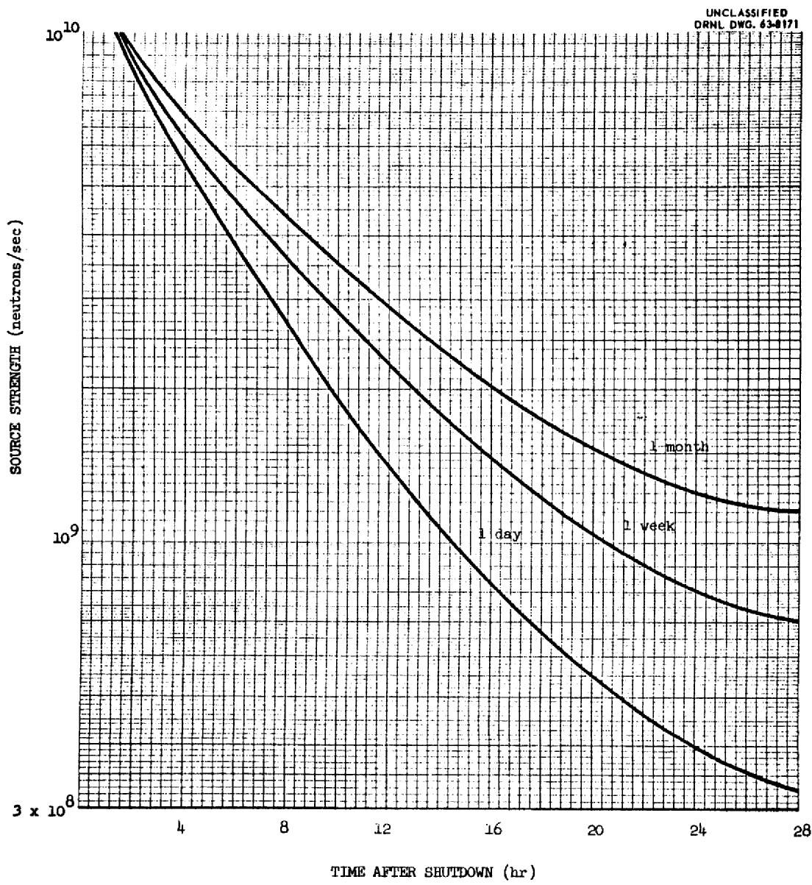  
Fig. 1. Photoneutron Source in MSRE Core Shortly After Various Periods at 10 Mw.

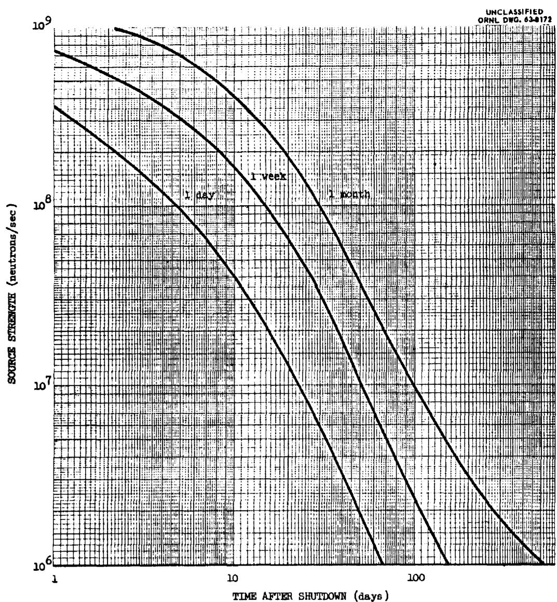  
Fig. 2. Photoneutron Source in MSRE Core After Various Periods at 10 Mw.

The gamma-ray source used in the calculations is group IV of Blomeke and Todd, which includes all gamma rays above 1.70 MeV. The probability of one of these gamma rays producing a photoneutron was approximated by the ratio of the $\mathrm{Be}^9 (\gamma ,\mathrm{n})$ cross section to the total cross section for gamma ray interaction in a homogeneous mixture with the composition of the core. A $\mathrm{Be}^9 (\gamma ,\mathrm{n})$ microscopic cross section of 0.5 millibarns was used, and the total cross section was evaluated at 2 MeV. These assumptions lead to a conservatively low estimate of neutron source strength.

# PROVISION FOR EXTERNAL SOURCE

For reasons which will be discussed later, it is desirable to supplement the inherent internal source with a removable source. Therefore a thimble is provided in the thermal shield, on the opposite side of the reactor from the nuclear instrument shaft. The thimble is a 1-1/2 inch, sch. 40 pipe of 304 stainless steel, extending vertically down to about 2 ft below the midplane of the core. It is mounted as close as possible to the inner surface of the thermal shield for maximum effectiveness. Location of the source thimble in the thermal shield provides water cooling and avoids the high temperatures associated with the reactor.

# NEUTRON DETECTORS

All the permanently-installed core- neutron detecting instruments are located in the nuclear instrument shaft. This is a water-filled, 3 ft-diameter tube which slopes down to the inner surface of the thermal shield with separate inner tubes for the various chambers. Among the permanent instruments in this tube are two servo-positioned fission chambers which will be used to monitor routine startups as well as to record the entire power range of the reactor. These chambers are about 1 in. in diameter

by 6 in. long and have a rather low counting efficiency of 0.026 counts per neutron/cm². (Other chambers in the tube which have no bearing on the source requirement are 2 compensated ion chambers and 3 uncompensated safety chambers.)

Two vertical thimbles, similar to the source thimble but made of 2 in. sch. 10 pipe, are installed in the thermal shield to accommodate temporary detectors. The two detector thimbles are located $120^{\circ}$ and $150^{\circ}$ from the source thimble, one on either side of the permanent nuclear instrument shaft. The advantage of these vertical thimbles is that they place the entire length of a chamber close to the inner surface of the thermal shield, whereas a long chamber in the sloping instrument shaft would extend back into a lower -flux region and thus be exposed to a lower average flux.

In addition to these provisions, there are spare tubes in the nuclear instrument shaft which could accommodate additional detectors.

# FLUX IN SUBCRITICAL REACTOR

In planning the use of source and detectors in reactor experiments and operation, an important quantity is the ratio of counting rate to source strength under various conditions. The counting rate is the product of the counting efficiency of the chamber and the average flux to which the chamber is exposed. The flux at the chamber depends on the source—its strength, the energy of its neutrons, and, in the case of an external source, its location. The flux also depends on the amount of multiplication by fissions and the shape of the neutron flux distribution in the core, which is determined by the location of the source and the value of $k$ in the core.

The flux distributions in and around the reactor have been calculated for several different cases to provide a basis for planning for the source and detectors. Many approximations had to be made to render the computations manageable and consequently the probable error in the results is quite large, perhaps as much as a factor of ten. Unless specifically stated otherwise, the fluxes and source strength requirements described in this report do not contain any allowance for probable error.

# Flux Due to Internal Source

With an internal, distributed source of $S_{\text{in}}$ n/sec in the core, the steady-state production rate will be approximately $S_{\text{in}} / (1 - k_{\text{eff}})$ n/sec. The flux at any point is then

$$
\phi = \frac {\mathrm {f} _ {\text {i n}} \mathrm {S} _ {\text {i n}}}{(1 - \mathrm {k} _ {\text {e f f}})}
$$

The factor $f_{in}$ for a given location depends on the shape of the flux. For a flat source and low multiplication, $f_{in}$ at an external detector would be somewhat higher than at high multiplication, when neutrons are, on the average, produced nearer to the center of the core.

When the multiplication is high, i.e., when $(1 - k_{\mathrm{eff}})$ is quite small, most of the neutrons are produced by fissions in the core, with a spatial source distribution close to the fission distribution in a critical reactor. The relation between the core power, or fission rate, in the critical core and the flux in the thermal shield was calculated in the course of the thermal shield design, using DSN, $^4$ a multigroup, transport-theory code. For the case of a thick, water-filled thermal shield, when the core power is $10\mathrm{Mw}$ , the predicted thermal neutron flux reaches a peak, $l$ inch inside the water, of $1.2\times 10^{12}\mathrm{n/cm}^2$ -sec. The ratio of peak flux to power is thus $1.2\times 10^5\mathrm{n/cm}^2$ -sec per watt, or $1.5\times 10^{-6}\mathrm{n/cm}^2$ -sec per n/sec produced in the core. It was estimated that a chamber, $6\mathrm{in}$ , long, at maximum insertion in the instrument shaft would be exposed to an average flux of roughly $1\times 10^{-7}\mathrm{n/cm}^2$ -sec per n/sec produced. A chamber $26\mathrm{in}$ , long in the instrument shaft would see an average flux only a third as high because the shaft slopes away from the core. The flux in one of the vertical thimbles near the inner wall of the thermal shield would be about $3\times 10^{-7}$ n/cm $^2$ -sec per n/sec produced. Thus as $k_{\mathrm{eff}}$ approaches unity, $f_{\mathrm{in}}$ approaches $1\times 10^{-7}$ , $3\times 10^{-8}$ and $3\times 10^{-7}$ cm $^{-2}$ for a 6-in. chamber in the shaft, a 26-in chamber in the shaft and any chamber in a thimble, respectively.

# Flux Due to External Source

If a large fraction of the neutrons come from an external source, the flux shape will differ markedly from the critical shape. Flux distributions in the subcritical reactor with a strong external source were computed by a two-group neutron diffusion method. Equipoise Burnout, $^{5}$ a two-group, two-dimensional diffusion-theory program was used. The reactor was represented by a model in which the cross section of the reactor and thermal shield at the midplane of the core was approximated in x-y geometry and the axial leakage was represented by an equivalent buckling. In order to make the annular gap between the reactor and thermal shield manageable by the diffusion program, the materials in the gap (electric heaters, heater thimbles, insulation, and insulation cladding) were uniformly dispersed in it. The source was represented by a localized neutron-producing region just inside the thermal shield. $^{6}$ Two-group fluxes were calculated by this method for two cases — with no fuel salt in the core and with the core filled with salt containing enough $U^{235}$ to give a keff of 0.91 (about 0.76 of the critical concentration).

Although the neutron detectors respond primarily to thermal neutrons, it is enlightening to look at the fast neutron distributions because most of the thermal neutrons reach the vicinity of the detector as fast neutrons and are slowed down locally. Figure 3 shows the fast flux (normalized to one neutron from the external source) at the core midplane along a diameter which intercepts the locations of the neutron source and the fission chambers. With no fuel in the reactor, the fast flux was higher in the gap between the reactor and thermal shield, on the opposite side of the reactor from the source, than in either of the immediately adjacent regions. This implies that, under these conditions, most of the fast neutrons that reached the vicinity of the fission chambers arrived by way of the annular gap and that very few were transmitted through the core.

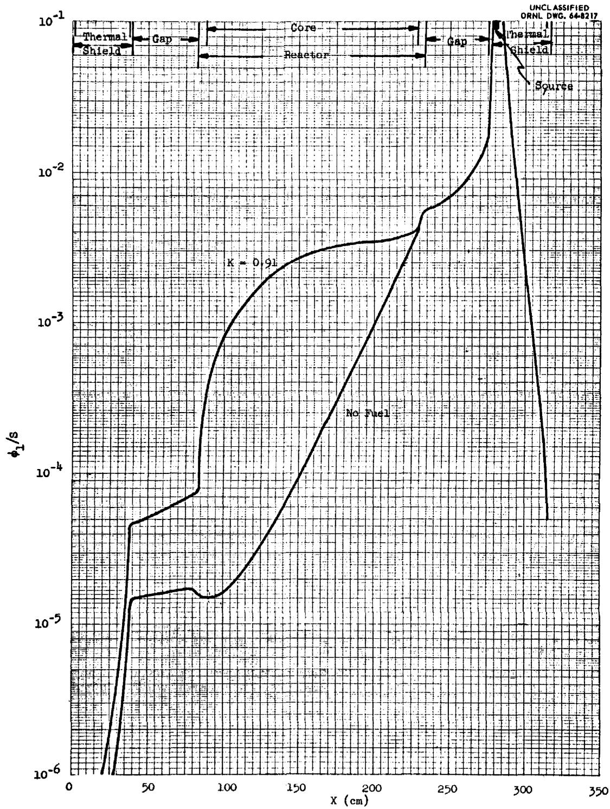  
Fig. 3. Fast Flux Profiles at Midplane of MSRE Core Along a Diameter Through the External Source.

The addition of fuel to the core increased the fast neutron source by adding fission neutrons and leakage of some of these neutrons from the core raised the fast flux near the fission chambers by a factor of 3. The fast fluxes on the source side of the reactor vessel were not affected by the addition of fuel at this concentration. (It was assumed that the external source was strong enough that internal non-fission sources were negligible in comparison).

Figures 4 and 5 show parts of several thermal flux contours at the core midplane with no fuel salt in the reactor (Fig. 4) and with salt containing 0.76 of the critical $U^{235}$ concentration (Fig. 5). The contour lines are superimposed on scaled drawings of the reactor model used in the calculations and the relative positions of the external source and the neutron detectors are indicated.

Table 3 gives the ratio of the thermal neutron flux at a chamber to the external source strength. In the cases of the $120^{\circ}$ and $150^{\circ}$ vertical thimble locations the flux is that at the center of the thimble. For the tubes in the instrument shaft, which slope away from the reactor, the average flux seen by a chamber depends on its length.

Comparison of the two figures and the numbers in the table shows quite clearly that the thermal neutron flux in the gap and in the thermal shield, for a considerable distance from the source, is highly insensitive to conditions in the core. As a result the counting rate of a chamber in the $120^{\circ}$ thimble is a much poorer indication of changes in the core than is the counting rate of a chamber in the instrument shaft.

# Effect of k eff on Flux

An approximate relation between the flux, or counting rate, and $\mathbf{k}_{\text{eff}}$ can be obtained by interpolation of the results calculated for $\mathbf{k}_{\text{eff}}$ of 0, 0.91 and 1.0.

The manner in which the flux varies with $k_{\text{eff}}$ can be approximated in the following way. Represent the flux at a particular location by

$$
\phi = \mathrm {b S} _ {\mathrm {x}} + \frac {\mathrm {f} _ {\mathrm {x}} \mathrm {S} _ {\mathrm {x}}}{1 - \mathrm {k}} + \frac {\mathrm {f} _ {\text {i n}} \mathrm {S} _ {\text {i n}}}{1 - \mathrm {k}} \tag {1}
$$

UNCLASSIFIED ORNL DWG,64-8218

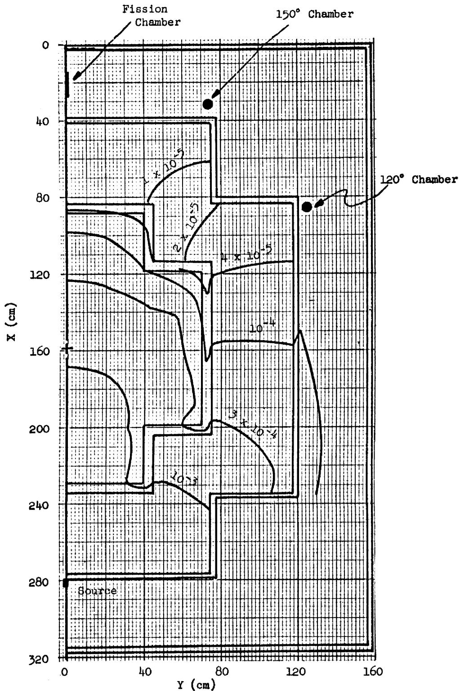  
Fig. 4. Thermal Flux Contours, Per Unit Source Strength, Midplane of MSRE (No Fuel Salt in Reactor).

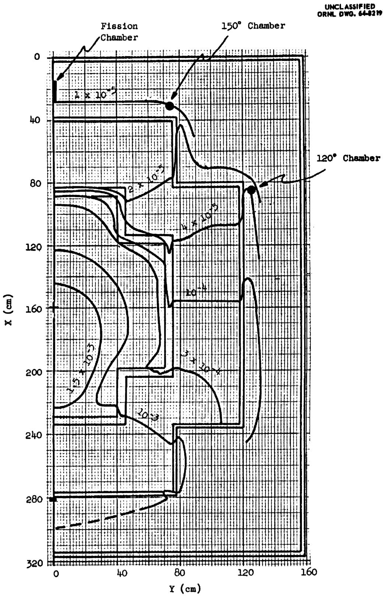  
Fig. 5. Thermal Flux Contours, Per Unit Source Strength, at Midplane of MSRE. (k_eff = 0.91)

Table 3. Thermal Flux From an External Source   

<table><tr><td rowspan="2">Location</td><td rowspan="2">Chamber Length (in.)</td><td colspan="2">Av. Flux/Source Strength [(n/cm2-sec)/(n/sec)]</td></tr><tr><td>no fuel</td><td>k_eff = 0.91</td></tr><tr><td>120° thimble</td><td>any</td><td>13 x 10-6</td><td>18 x 10-6</td></tr><tr><td>150° thimble</td><td>any</td><td>4 x 10-6</td><td>9 x 10-6</td></tr><tr><td>Instr. Shaft (~180°)</td><td>6</td><td>2 x 10-6</td><td>7 x 10-6</td></tr><tr><td>Instr. Shaft</td><td>26</td><td>6 x 10-7</td><td>1.7 x 10-6</td></tr></table>

The term $\mathrm{bS}_{\mathrm{x}}$ is the flux due to neutrons bypassing the core and should be insensitive to $\mathrm{k}_{\mathrm{eff}}$ . The factor $\mathrm{f}_{\mathrm{x}}$ includes the probability that external source neutrons will get into the core and also a shape factor for the fission neutrons produced. Its value will depend on $\mathrm{k}_{\mathrm{eff}}$ , and is probably quite low at $\mathrm{k}_{\mathrm{eff}} = 0$ , reflecting the low probability that source neutrons will be transmitted through the core. Assume a linear increase with $\mathrm{k}_{\mathrm{eff}}$ . The value of $\mathrm{f}_{\mathrm{in}}$ should not change as much with $\mathrm{k}_{\mathrm{eff}}$ , so assume that it is constant. With these assumptions

$$
\phi = \left(b + \frac {a k}{1 - k}\right) S _ {x} + \frac {c S _ {i n}}{1 - k}, \tag {2}
$$

where a, b and c are constants.

The value of $c$ for each chamber location can be calculated from the critical flux distributions. Values for $a$ and $b$ can be calculated from the two Equipoise Burnout results at $k = 0$ and $k = 0.91$ . Values for the various proposed locations are given in Table 4. These relations were used to estimate the reactor behavior and source requirements under subcritical conditions.

Table 4. Flux/Source Factors   

<table><tr><td>Location</td><td>Chamber Length (in.)</td><td>a(cm-2)</td><td>b(cm-2)</td><td>c(cm-2)</td></tr><tr><td>120° thimble</td><td>any</td><td>5 x 10-7</td><td>13 x 10-6</td><td>3 x 10-7</td></tr><tr><td>150° thimble</td><td>any</td><td>5 x 10-7</td><td>4 x 10-6</td><td>3 x 10-7</td></tr><tr><td>Instr. Shaft</td><td>6</td><td>4 x 10-7</td><td>2 x 10-6</td><td>1 x 10-7</td></tr><tr><td>Instr. Shaft</td><td>26</td><td>1 x 10-7</td><td>6 x 10-7</td><td>3 x 10-8</td></tr></table>

Note: See text for definition of a, b and c.

# SAFETY REQUIREMENTS

When excess reactivity is added to a reactor which is initially operating at a very low power, the fission rate must increase by several orders of magnitude before the inherent shutdown mechanism of the negative temperature coefficient of reactivity becomes effective or a rod drop is initiated by the high-level safety circuits. (There is no period scram on the MSRE.) Since this power increase takes some time, a substantial amount of excess reactivity may be added by a continuing reactivity ramp and the power may be increasing with a very short period by the time the various shutdown mechanisms begin to act. In the so-called "startup accident" so much excess reactivity is added that severe power and temperature transients may be produced despite the action of the shutdown mechanisms.

In such accidents, provided the fission rate follows the behavior predicted by the nuclear kinetics equations, the severity of the temperature excursion is uniquely determined by the rate of reactivity increase, the characteristics of the inherent and mechanical shutdown mechanisms, and the initial power (the mean value of the initial fission rate). If, however, the initial fission rate is extremely low, statistical fluctuations about the mean may permit wide variations in the amount of excess reactivity which can be introduced before the power reaches a significant

level. The problem is described by Hurwitz et al. in a recent paper7 as follows. "When a reactor is started up with an extremely weak source, there will be an initial period of time during which the power level is so low that statistical fluctuations are important. Eventually the power level will rise to a sufficiently high level so that further statistical fluctuations have negligible effect. The influence of the statistical fluctuations in the early stage of the startup will, however, persist through the high level stage in the sense that the early statistical fluctuations determine the initial conditions for the high level stage." In the case of the MSRE, the inherent alpha-n source produces more than $10^{5}$ neutrons/sec in the core whenever the uranium required for criticality is present, and the fission rate is already in the high level stage (statistical fluctuations unimportant) at the outset of any startup accident. Furthermore, kinetics calculations have shown that the initial fission rate sustained by the inherent alpha-n source is high enough to make tolerable the worst credible startup accident, which is described in the following paragraphs.

The maximum rate of reactivity addition that can be achieved in the MSRE results from the uncontrolled, simultaneous withdrawal of all three control rods. The rate of reactivity addition depends on the type of fuel in the reactor (which determines the control-rod worth) and the position of the rods with respect to the differential-worth curve. The most severe rod-withdrawal accident involves fuel C and the maximum rate of reactivity addition is $0.08\% \delta k / k$ per sec. (A higher reactivity addition rate, $0.10\%$ per sec, can be obtained with fuel B, but this mixture also has a larger negative temperature coefficient of reactivity so the resultant power excursion is less severe.)

For shutdown margins greater than $2\%$ $\delta k / k$ and reactivity ramps between 0.05 and $0.1\%$ per sec, the power level of the reactor when $k = 1$ is about 2 milliwatts if only the inherent alpha-n source ( $4 \times 10^{5} \mathrm{n/sec}$ ) is present. Figure 6 shows the power and temperature excursions that result with fuel C when all three control rods are moving in the region of maximum

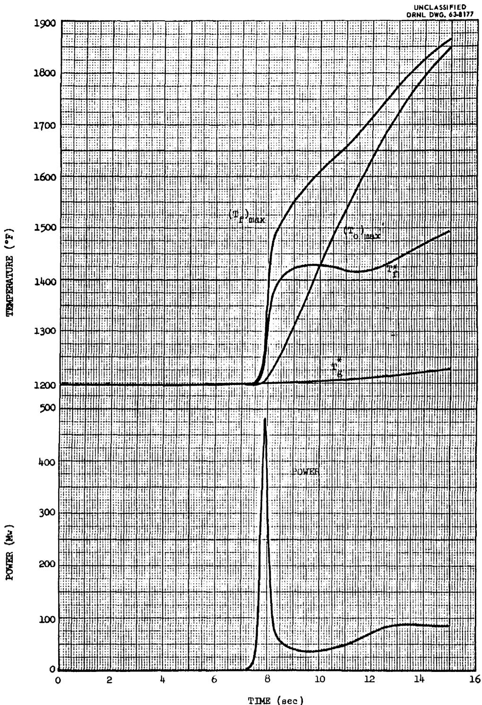  
Fig. 6. Power and Temperature Transients Produced by Uncontrolled Rod Withdrawal, Fuel C.

differential worth when $k = 1$ for this condition. In this calculation the nuclear power reached 15 Mw (the level at which the reactor safety curcuits initiate corrective action) 7.5 sec after criticality was achieved. At that time $0.6\%$ excess reactivity had been added and, since the nuclear average temperature of the fuel $(\mathbf{T}_{\mathrm{f}}^{\star})$ had risen less than $2^{\circ}\mathbf{F}$ , almost none had been compensated by the temperature coefficient; the reactor period was 0.1 sec. In the absence of action by the safety system, intolerably high fuel temperatures would be produced by this accident, not as a result of the initial excursion but as a result of the continued rapid rod withdrawal afterwards.

Figure 7 shows the results of a calculation of the same accident in which two of the three control rods were dropped (with a 0.1-sec delay time and an acceleration of $5\mathrm{ft} / \mathrm{sec}^2$ ) when the power reached 15 Mw. The temperatures reached in this case would cause no damage. Thus the inherent alpha-n neutron source is adequate from the standpoint of reactor safety.

Because the startup accident is safely limited with only the inherent source in the reactor, it is not a safety requirement that any additional source be present during startup. Nor is it necessary for safety that instrumentation capable of "seeing" the inherent source be installed, because its presence is certain and does not have to be confirmed before each startup.

# INITIAL STARTUP EXPERIMENTS

Although it is not a safety requirement, the presence of a source-detector combination which permits monitoring of the fission rate in the subcritical core is necessary for convenient and orderly experimentation and operation.

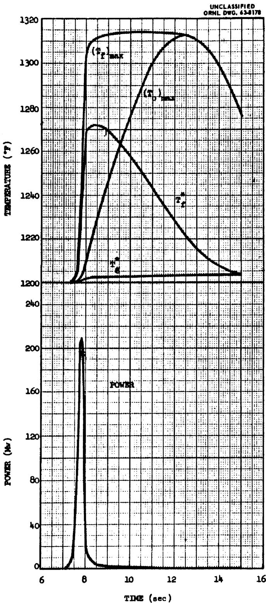  
Fig. 7. Effect of Dropping Two Control Rods at 15 Mw During Uncontrolled Rod Withdrawal, Fuel C.

More subcritical observations will be made during the initial nuclear startup experiments than at any other time. For these experiments it was expected that temporary neutron counting channels would be set up, using sensitive detectors. The thimbles in the thermal shield were included for this purpose, to obtain a higher average flux at the chambers than could be obtained in the nuclear instrument shaft and also to provide for installation of detectors at more than one location.

The vertical thimbles will accomodate 30-in-long $\mathrm{BF}_3$ chambers, with a counting efficiency of 14 counts per $\mathrm{n/cm}^2$ . Even with these sensitive chambers, the inherent source in the salt (containing only the depleted uranium) before the addition of the enriched uranium is inadequate to give a significant count rate. Because it is desirable to have a reference count rate at practically zero multiplication, an extraneous source is required for the critical experiment. Furthermore, in the determination of the critical point and possibly in the calibration of the control rods, it is convenient to be able to remove the major neutron source and observe the decay of the flux. For these reasons, a removable external source should be provided for these experiments.

The flux at the various chamber locations, from an external source, at any value of $\mathbf{k}_{\mathrm{eff}}$ can be estimated from Eq. 2 and the factors in Table 4. The internal source strength increases linearly with the amount of enriched uranium in the core, reaching about $4 \times 10^{5}$ n/sec at the clean critical concentration. The flux from this source can also be estimated from Eq. 2 and Table 4. The predicted variation of $\mathbf{k}_{\mathrm{eff}}$ with enriched U concentration is necessary for this calculation, and this relation is shown in Fig. 8.

The method of attaining the critical concentration will be to add increments whose sizes are determined by a plot of inverse count rate vs amount of enriched uranium already added. Fig. 9 is such a plot, generated from the flux calculations described above and the k vs C relationship from Fig. 8. Neutrons from both the internal source and an external source of $10^{7}$ n sec are included.

The bowing of the curves in Fig. 9 reflects the contribution of neutrons which are scattered around the outside of the reactor from the source to the detectors. As would be expected, the error is largest for

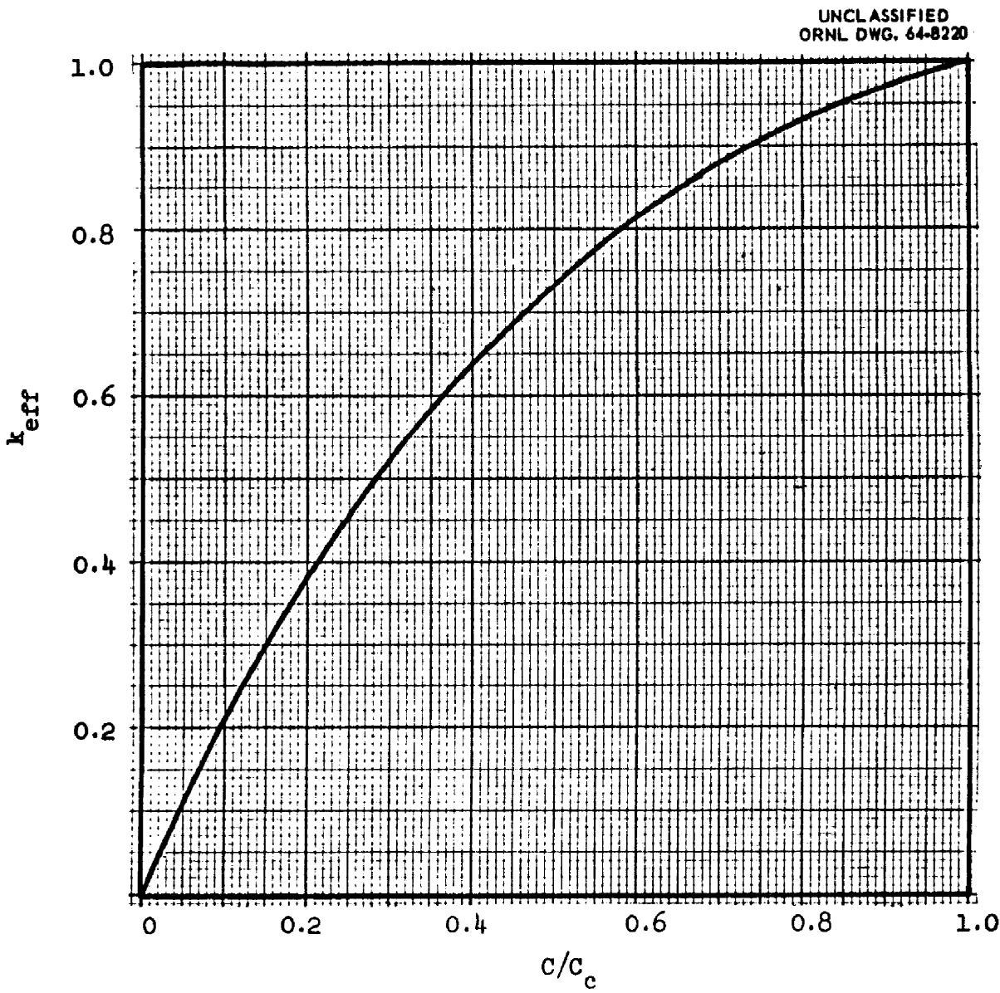  
Fig. 8. Variation of $\mathrm{k}_{\mathrm{eff}}$ with Fuel U235 Concentration.

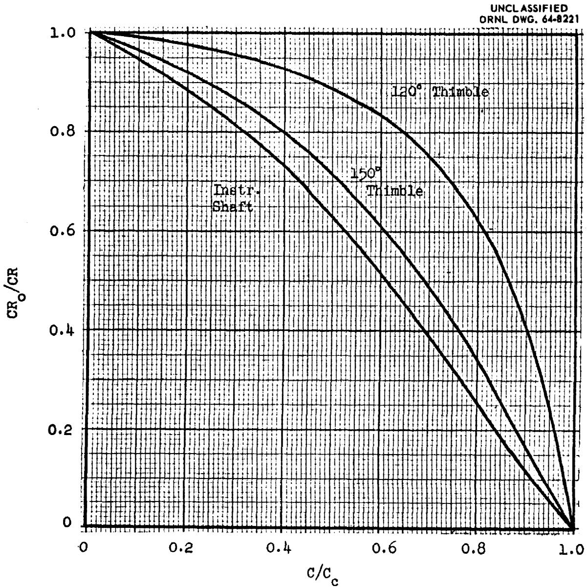  
Fig. 9. Inverse Count Rates vs $\mathrm{U}^{235}$ Concentration. External Source Strength: $10^7$ n/sec.

the detector located nearest the source. Because the bowing makes extrapolation less accurate, the instrument shaft is the most suitable location for detectors in the approach to critical. Therefore the external source for the critical experiment should be at least strong enough to give a conveniently high count rate at a chamber in the instrument shaft before any enriched uranium is added. A source of $1 \times 10^{6} \mathrm{n} / \mathrm{sec}$ would give a count rate of $10 \mathrm{c} / \mathrm{sec}$ on a chamber with a counting efficiency of $14 \mathrm{c} / \mathrm{sec} / \mathrm{n} / \mathrm{cm}^{2}$ -sec under these conditions.

The strength requirement just stated is a minimum for starting the critical experiment. The initial approach to criticality will include experimental determinations of control-rod worth and concentration coefficient of reactivity. These determinations are based on count-rate measurements with and without the external source present. Therefore, it must be possible to obtain a substantial difference in count rate by removing the external source. Since the internal, alpha-n source increases in intensity with increasing uranium concentration, the external source must be strong enough to make the contribution from the internal source small by comparison when the uranium concentration is near the critical value. The flux calculations indicate that an external source of $1 \times 10^{7} \mathrm{n/sec}$ would produce a flux in the instrument shaft at least 100 times that from the internal source at all points during the approach to critical. The differences in count rate which can be obtained with a source of this strength are illustrated in Fig. 10. This figure shows the reciprocals of the count rates predicted for a $\mathrm{BF}_{3}$ chamber (counting efficiency of 14) in the instrument shaft as the critical point is approached. The two curves are for the internal source alone (external source withdrawn) and with both the internal source and the external source.

# NORMAL OPERATIONAL REQUIREMENTS

An external source of neutrons is required during normal operation of the reactor to permit the convenient monitoring of the reactivity during routine startups. (The safety requirements for a source are satisfied by the inherent alpha-n source.)

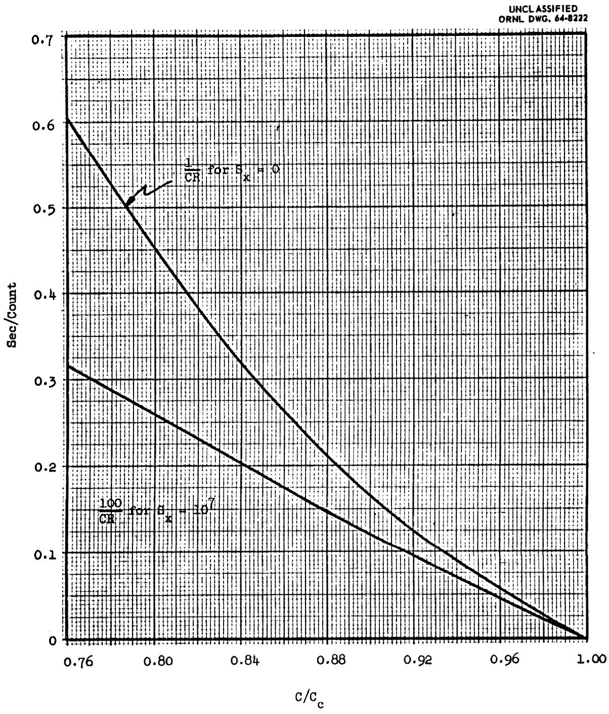  
Fig. 10. Inverse Count Rates vs $U^{235}$ Concentration Near Critical. BF₃ Chamber in Instrument Shaft.

# Partial and Complete Shutdown and Startup

There are two degrees of normal shutdown in the MSRE — partial and complete. In a partial shutdown, the fission chain reaction is shutdown by inserting the control rods to take the reactor subcritical, while the fuel salt continues to circulate at the normal operating temperature. (Electric heaters maintain the temperature.) The reactivity shutdown margin is between 2 and $5\% \delta k / k$ , depending mainly on the amount of xenon in the core. Such partial shutdowns will occur frequently during experimental operation of the reactor. Less frequently, the reactor will be completely shutdown by inserting the rods and draining the fuel from the core into a drain tank.

A startup from a completely shutdown condition will involve two stages, and the source and detector requirements are different for the two stages. The first stage involves preheating, filling the core, and beginning circulation. The second (which is the only step in starting up from a partial shutdown) involves withdrawing the control rods to take the reactor critical and on up to the desired power level.

# Second Stage Startup Requirement

For the second stage, it is desirable that one instrument follow the flux continuously, from the beginning of rod withdrawal until the reactor is operating at full power. The servo-driven fission chambers serve this purpose. Therefore the external source should at least be strong enough to give a significant count rate on the fission chambers when the core is full of salt but subcritical by the maximum margin attainable with the control rods (5% δk/k). A control interlock requires that one of the fission chambers have a count rate of 2 c/sec before the rods can be withdrawn in this stage of the operation. The calculated flux distributions indicate that to obtain the required count rate on the fission chambers, an external source of at least 7 x $10^8$ n/sec is required. An internal source of 4 x $10^7$ n/sec in the core would also clear the interlock and permit rod withdrawal. As shown in Fig. 2, the fission products would produce photoneutrons at a rate greater than this for several weeks after a few days' operation at 10 Mw.

# First Stage Startup Requirements

In the first stage, the reactivity must be monitored from the time fuel begins to enter the core until the core is completely filled. Before a fill can begin it is required that the rods be withdrawn to such a position that $k_{\text{eff}}$ will reach about 0.98 when the core becomes full. This procedure allows abnormalities to be detected, while retaining some reactivity control which is instantly available by dropping the rods. To insure that the monitoring system of source and detectors is operative, there are two control interlocks which require a count rate of at least 2 c/sec. One is on rod withdrawal and the other is on drain tank pressurization. An external source of 4 x $10^{7}$ n/sec would be necessary to give 2 c/sec on the fission chambers with no fuel in the core, according to the flux calculations. Note that this is over five times the source strength required for the second stage. If $\mathrm{BF}_3$ chambers with an active length of 26 in. and a counting efficiency of 14 (c/sec)/(n/cm²-sec) are used in the instrument shaft, a count rate of 2 c/sec with no fuel in the core would be produced by an external source of only 2 x $10^{5}$ n/sec. (The factor by which the required source strength is reduced is less than the ratio of counting efficiencies because the longer $\mathrm{BF}_3$ chambers are exposed to a lower average flux.)

Use of the $\mathbf{BF}_3$ chambers to monitor the filling operation would require some changes in the reactor control circuits. The operational interlock on control-rod withdrawal prior to filling could be bypassed by an interlock which permits rod withdrawal if all (or most) of the fuel salt is in the drain tank (as indicated by drain-tank weight, for instance). This would allow withdrawal of the rods to start the fill but would prohibit further withdrawal with the reactor even partly full unless the fission chambers were indicating reliably. The count-rate confidence interlock which must be satisfied before helium can be admitted to the drain tank to start the fill could be based on a signal from the channels served by the $\mathbf{BF}_3$ chambers.

# Limiting Requirement on Source Strength

If the more sensitive chambers are used in place of the servo-driven fission chambers for monitoring the fill, the limiting requirement on the external source is set by the second stage interlock on rod withdrawal at $7 \times 10^{6}$ n/sec.

Because the second-stage rod-withdrawal interlock is encountered after the fuel is in the core, the presence of an internal source strong enough to clear the interlock would eliminate this particular requirement for an external source. Thus for many startups after high power operation it would be possible to depend on the fission-product photoneutrons to clear the rod-withdrawal interlock and the external source requirement would be set by the first-stage, filling interlock.

# Other Considerations

Because the MSRE is expected to operate for several years, several factors must be considered in the choice of an external source.

An antimony-beryllium source has the advantages of low initial cost, ready availability in strengths well above $10^{8}$ n/sec (irradiated in the LITR) and freedom from the hazards of accidental release of alpha activity. The most serious drawback is its short half-life. There is no significant regeneration of $\mathsf{Sb}^{124}$ in the low neutron flux at the source tube, so the initial strength must allow for the decay of the source with a 60-day half-life. Even so it will be necessary to replace the source periodically throughout the life of the reactor. For example, in order to have $7\times 10^{6}$ n/sec after 12 months decay, an Sb-Be source with an initial strength of $4\times 10^{8}$ n/sec would be necessary. Although Sb-Be sources even stronger than this can be produced in the LITR, it is probably more economical to use a pair of smaller sources which are alternately used in the MSRE and regenerated in the LITR.

The decay of the source is not a problem if a plutonium-beryllium source (24,000 year half-life) is used. Standard Pu-Be sources which are obtainable contain from 1 to 10 curies of $\mathsf{Pu}^{239}$ and produce from $1.6 \times 10^{6}$ to $1.6 \times 10^{7} \mathrm{n/sec}$ . (The largest sources are too big to fit

into the MSRE source tube, however.) Although the problem of source decay is avoided, the Pu-Be source has several disadvantages. The initial cost is high and plutonium containment must be guaranteed at all times. Also, the heat generation by fission in the plutonium (about 10 kw at a reactor power of 10 Mw) would probably require that the source be retracted during high-power operation.

# RECOMMENDATIONS

1. Install in the spare tubes in the instrument shaft two additional neutron chambers with a much higher counting efficiency than the servo-driven fission chambers. Use these during the initial critical experiments and for monitoring the filling stage of routine startups. Change the interlock requiring a dependable count rate prior to filling from the servo-driven-fission chambers to these chambers.   
2. As soon as the installation of the reactor and equipment permits, check the flux/source ratio calculated for the core with no fuel. (This will greatly reduce the uncertainty in the source strength requirements.) Any source of $10^6$ n/sec or more will serve for this preliminary experiment.   
3. Procure or manufacture a source which will meet the operational requirements. The choice of the source type and its strength must be based on the observed flux/source strength ratio and the considerations described in the preceding section. If the actual flux/source ratio is near that calculated, the choice for a source would be either a 5-curie Pu-Be source (8 x $10^{6}$ n/sec) or a pair of Sb-Be sources which would produce 3 to 5 x $10^{8}$ n/sec (from about 125 curies of $\mathsf{Sb}^{124}$ ) after an 8-week irradiation in the LITR. After one Sb-Be source had been in the MSRE for about 10 months, the other would be placed in the LITR for irradiation to be ready for exchange when required. If the Sb-Be sources are used, it will be desirable to modify the existing provisions for source insertion and removal to make the operation less time-consuming and costly. Specifically, an access port should be provided through the steel cell cover and the lower shield plug directly over the source tube.

# APPENDIX

# CALCULATION OF FLUX FROM AN EXTERNAL SOURCE

The neutron source for the MSRE will be installed in a thimble in the thermal shield, about 20 in. from the outside of the reactor vessel. The various neutron detectors will also be, in effect, in the thermal shield at different circumferential positions. This results in a highly unsymmetrical cylindrical geometry for conditions in which neutrons from the source contribute substantially to the neutron flux. The source is also short, compared to the height of the reactor, so an accurate calculation of the flux at the detectors resulting from the source would require the use of 3-dimensional, cylindrical (r, e, z) geometry. Since there is no reactor program available for treating this problem, a number of approximations were made to reduce the problem to one which could be handled with existing programs.

# Geometric Approximations

The program used for the flux calculations was the Equipoise Burn-out Code, a 2-group, 2-dimension neutron diffusion calculation with provisions for criticality search. This code uses rectangular (X-Y) geometry and is limited to 1600 mesh points.

In order to treat the azimuthal non-symmetry, the calculations were made in a horizontal plane through the reactor and thermal shield at the midplane of the core. The axial dimension of the reactor was represented by a constant geometric buckling in that direction. Perturbations caused by the neutron detectors were neglected, so the plane of the calculation had an axis of symmetry along the diameter which intercepts the positions of the source and the fission chambers. Therefore, it was necessary to describe only one-half of the plane in the mathematical model. The limitation to X-Y geometry required that the various regions be represented as collections of rectangles. The main portion of the core was made equal in cross-sectional area to the actual core with the transverse dimensions equal to core radii. These

two requirements determined the size of the "cutouts" at the corners of the otherwise square core. The regions surrounding the core (i.e. the peripheral regions of the reactor, the gap between the reactor and thermal shield, and the thermal shield) were assigned transverse dimensions equal to the radial dimensions of the actual components. Figure 11 is a diagram of the resultant model.

Because of the mesh point limitation in the Equipoise Burnout program, it was necessary to omit some physical detail in the calculational model. The control rod thimbles near the center of the core were neglected in this model, as were the variations in fuel fraction and graphite fraction in that region; the main portion of the core was treated as a single homogeneous mixture. The peripheral regions of the reactor, including the core can, the fuel annulus, and the reactor vessel wall, were all homogenized into a single region (reactor shell in Fig. 11). The materials in the gap between the reactor and the thermal shield (heaters, heater thimbles, insulation and insulation liner) were all homogenized and uniformly distributed throughout the gap. All the structural material inside the thermal shield was also neglected. A total of 1225 mesh points in a 49-by-25 array were used to describe the calculational model.

# Nuclear Approximations

# Two-Group Constants

The Equipoise Burnout program has provisions for calculating 2-group nuclear constants if the necessary microscopic cross-section data are supplied as input. In this case, however, it was more expedient to calculate the 2-group constants separately using MODRIC, a 1-dimensional, 33-group calculation. Multi-group cross sections were prepared for the MODRIC program using GAM-1 and the existing cross-section library for that program. A radial criticality calculation was then made with MODRIC for the reactor model with fuel salt containing 0.6 of the critical concentration of $U^{235}$ ; the presence

UNCLASSIFIED ORNL DWG,64-8223

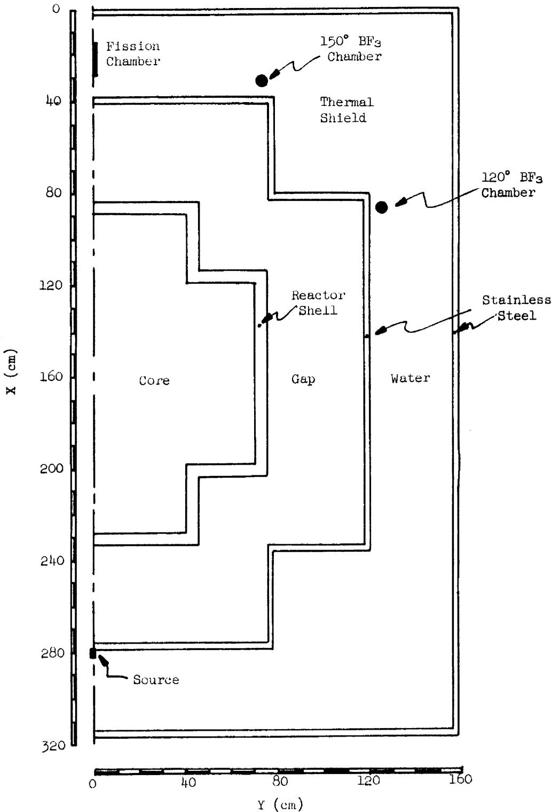  
Fig. 11. Cross Section of Model Used in Subcritical Flux Calculations.

of the external source was neglected in this calculation. The 2-group constants generated by MODRIC were then used to calculate the flux distribution in the 2-dimensional model with the source present.

MODRIC calculations were also used to estimate the 2-group constants for the case with no fuel salt in the reactor. In order to get group constants for the core with only the graphite moderator present, calculations were made for the normal density of the dilute fuel and for densities that were 0.5, 0.25, and 0.1 of the normal value. The 2-group constants obtained from these calculations were plotted as a function of fuel density and extrapolated to zero density to get constants for the reactor containing no fuel (only graphite).

For several reasons, the above procedure does not lead to completely accurate values for the 2-group constants. The fast-group constants in a given region depend, to some extent, on the energy distribution of the neutrons in the region. This energy distribution is different if all of the neutrons are born in the core (as was assumed in the MODRIC calculations) than if a substantial number are born in an external source region (as was the case in the 2-dimensional calculations). Some additional error is introduced by the fact that neutrons born in the reactor and those born in the external source have different energy distributions at birth. Neutrons born in the reactor are products of the fission process and have an energy distribution that corresponds to the fission distribution; the fast-group constants were calculated for this birth-energy distribution (10 to 0.011 Mev with an average of about 2 Mev in the MODRIC program used). The energy distribution of neutrons produced by a source depends on the nature of the source. For an Sb-Be source, the average neutron energy is about $34\mathrm{Kev}$ . In the Equipoise Burnout calculation the fast-group constants calculated for fission-source neutrons were applied to all the fast neutrons, regardless of their point of origin. Since absorption cross sections generally increase with decreasing neutron energy, this treatment overestimated the neutron flux at the chambers for a given neutron source.

# Source Configuration

In the Equipoise Burnout calculation, the source region was treated as a slender (2 cm by 2.6 cm) prism extending along the entire height of the reactor model. This is a consequence of applying a constant axial buckling to all regions. As a result, this source is less efficient in terms of producing a neutron flux at the core midplane than a short source of the same total strength located near the midplane. No correction was applied for the higher efficiency of the short source because this underestimate tended to counteract the over-estimate inherent in the cross-section treatment.

# Composition of Thermal Shield

The thermal shield is filled with steel balls to provide a mixture that is approximately $50\%$ iron and $50\%$ water. However, this mixture does not fill all portions of the thermal shield. The source thimble and the special counter thimbles are protected by half-sections of 8-in. pipe which were welded to the inside of the shield to prevent damage to the thimbles during the addition of the steel balls. As a result, each of the thimbles is surrounded by a layer of pure water. The nuclear instrument shaft, which extends to the inner wall of the thermal shield, contains no steel balls. The only material in this shaft, other than water, is the aluminum in the guide tubes for the neutron chambers. The neutron flux at the various chambers is influenced more by the water layer immediately adjacent to the thimbles than by the iron-water mixture in the rest of the thermal shield. Therefore, the presence of the steel balls was neglected in the flux calculations. This leads to highly erroneous fluxes everywhere in the thermal shield except in the immediate vicinity of the neutron chambers.

# Use of Diffusion Theory

The Equipoise Burnout program which was used to compute the flux distributions is based on a diffusion theory treatment of the neutron transport problem. This program was used because it was the only one

judged to be practical for an approximate calculation of the external source requirements for the MSRE. It is well known that diffusion theory has limitations which are imposed by the basic assumptions in the development of the mathematical treatment. These limitations restrict the accuracy of the theory in regions with high absorption cross section, near region boundaries and in regions where the neutron mean free paths are long. Since all of these factors were present in the calculational model, the results of the calculations can be regarded as no more than preliminary estimates. It is likely that the calculated fluxes are at least within an order of magnitude of the correct values but it is not possible to define the limits of the probably error.

.

INTERNAL DISTRIBUTION   
EXTERNAL DISTRIBUTION   

<table><tr><td>1.</td><td>MSRP Director&#x27;s Office</td><td>39.</td><td>R. B. Lindauer</td></tr><tr><td></td><td>Rm. 219, 9204-1</td><td>40.</td><td>C. D. Martin</td></tr><tr><td>2.</td><td>R. K. Adams</td><td>41.</td><td>H. G. MacPherson</td></tr><tr><td>3.</td><td>R. G. Affel</td><td>42.</td><td>H. C. McCurdy</td></tr><tr><td>4.</td><td>L. G. Alexander</td><td>43.</td><td>W. B. McDonald</td></tr><tr><td>5.</td><td>A. H. Anderson</td><td>44.</td><td>H. F. McDuffie</td></tr><tr><td>6.</td><td>S. J. Ball</td><td>45.</td><td>C. K. McGlothlan</td></tr><tr><td>7.</td><td>S. E. Beall</td><td>46.</td><td>R. L. Moore</td></tr><tr><td>8.</td><td>E. S. Bettis</td><td>47.</td><td>H. R. Payne</td></tr><tr><td>9.</td><td>R. Blumberg</td><td>48.</td><td>A. M. Perry</td></tr><tr><td>10.</td><td>C. J. Borkowski</td><td>49.</td><td>H. B. Piper</td></tr><tr><td>11.</td><td>H. R. Brashear</td><td>50.</td><td>B. E. Prince</td></tr><tr><td>12.</td><td>G. H. Burger</td><td>51.</td><td>J. L. Redford</td></tr><tr><td>13.</td><td>J. L. Crowley</td><td>52.</td><td>M. Richardson</td></tr><tr><td>14.</td><td>S. J. Ditto</td><td>53.</td><td>R. C. Robertson</td></tr><tr><td>15.</td><td>N. E. Dunwoody</td><td>54.</td><td>H. C. Roller</td></tr><tr><td>16-20.</td><td>J. R. Engel</td><td>55.</td><td>D. Scott</td></tr><tr><td>21.</td><td>E. P. Epler</td><td>56.</td><td>J. H. Shaffer</td></tr><tr><td>22.</td><td>E. N. Fray</td><td>57.</td><td>M. J. Skinner</td></tr><tr><td>23.</td><td>C. H. Gabbard</td><td>58.</td><td>A. N. Smith</td></tr><tr><td>24.</td><td>R. B. Gallaher</td><td>59.</td><td>I. Spiewak</td></tr><tr><td>25.</td><td>J. J. Geist</td><td>60.</td><td>R. C. Steffy</td></tr><tr><td>26.</td><td>R. H. Guymon</td><td>61.</td><td>J. A. Swartout</td></tr><tr><td>27.</td><td>S. H. Hanauer</td><td>62.</td><td>A. Taboada</td></tr><tr><td>28.</td><td>P. H. Harley</td><td>63.</td><td>J. R. Tallackson</td></tr><tr><td>29.</td><td>P. N. Haubenreich</td><td>64.</td><td>R. E. Thoma</td></tr><tr><td>30.</td><td>P. G. Herndon</td><td>65.</td><td>W. C. Ulrich</td></tr><tr><td>31.</td><td>E. C. Hise</td><td>66.</td><td>B. H. Webster</td></tr><tr><td>32.</td><td>V. D. Holt</td><td>67.</td><td>A. M. Weinberg</td></tr><tr><td>33.</td><td>P. P. Holz</td><td>68.</td><td>K. W. West</td></tr><tr><td>34.</td><td>A. Houtzeel</td><td>69-70.</td><td>Central Research Library</td></tr><tr><td>35.</td><td>T. L. Hudson</td><td>71-72.</td><td>Document Reference Section</td></tr><tr><td>36.</td><td>R. J. Kedl</td><td>73-74.</td><td>Reactor Division Library</td></tr><tr><td>37.</td><td>A. I. Krakoviak</td><td>75-77.</td><td>Laboratory Records</td></tr><tr><td>38.</td><td>J. W. Krewson</td><td>78.</td><td>ORNL-RC</td></tr></table>

<table><tr><td>79-80.</td><td>D. F. Cope, Reactor Division, AEC, ORO</td></tr><tr><td>81.</td><td>R. W. Garrison, AEC, Washington</td></tr><tr><td>82.</td><td>R. L. Philippone, Reactor Division, AEC, ORO</td></tr><tr><td>83.</td><td>H. M. Roth, Division of Research and Development, AEC, ORO</td></tr><tr><td>84.</td><td>W. L. Smalley, Reactor Division, AEC, ORO</td></tr><tr><td>85.</td><td>M. J. Whitman, AEC, Washington</td></tr><tr><td>36-100.</td><td>Division of Technical Information Extension, AEC, ORO</td></tr></table>