# OAK RIDGE NATIONAL LABORATORY

operated by

UNION CARBIDE CORPORATION

for the

U.S. ATOMIC ENERGY COMMISSION

ORNL-TM-1005

EFFECT OF ELEVATED TEMPERATURE IRRADIATION ON THE

STRENGTH AND DUCTILITY OF THE NICKEL-BASE ALLOY, HASTELLOY N

W.R.Martin

J.R.Weir

CENTRAL RESEARCH LIBRARY

DOCUMENT COLLECTION

LIBRARY LOAN COPY

DO NOT TRANSFER TO ANOTHER PERSON

If you wish someone else to see this

document, send in name with document

and the library will arrange a loan.

# NOTICE

This document contains information of a preliminary nature and was prepared primarily for internal use at the Oak Ridge National Laboratory. It is subject to revision or correction and therefore does not represent a final report. The information is not to be abstracted, reprinted or otherwise given public dissemination without the approval of the ORNL patent branch, Legal and Information Control Department.

# LEGAL NOTICE

This report was prepared as an account of Government sponsored work. Neither the United States, nor the Commission, nor any person acting on behalf of the Commission:

A. Makes any warranty or representation, expressed or implied, with respect to the accuracy, completeness, or usefulness of the information contained in this report, or that the use of any information, apparatus, method, or process disclosed in this report may not infringe privately owned rights; or   
B. Assumes any liabilities with respect to the use of, or for damages resulting from the use of any information, apparatus, method, or process disclosed in this report.

As used in the above, "person acting on behalf of the Commission" includes any employee or contractor of the Commission, or employee of such contractor, to the extent that such employee or contractor of the Commission, or employee of such contractor prepares, disseminates, or provides access to, any information pursuant to his employment or contract with the Commission, or his employment with such contractor.

ORNL-TM-1005

Contract No. W-7405-eng-26

METALS AND CERAMICS DIVISION

EFFECT OF ELEVATED TEMPERATURE IRRADIATION ON THE STRENGTH AND DUCTILITY OF THE NICKEL-BASE ALLOY, HASTELLOY N

W. R. Martin and J. R. Weir

FEBRUARY 1965

OAK RIDGE NATIONAL LABORATORY Oak Ridge, Tennessee operated by UNION CARBIDE CORPORATION for the U.S. ATOMIC ENERGY COMMISSION

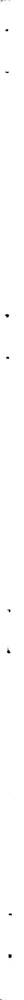

# CONTENTS

Abstract 1   
Introduction 1   
Experimental Procedures and Test Conditions 2   
Influence of Deformation Temperature 4   
Strain Rate Sensitivity at Elevated Temperature 6   
Postirradiation Annealing 8   
Discussion 8   
Acknowledgments 16

# EFFECT OF ELEVATED TEMPERATURE IRRADIATION ON THE STRENGTH AND DUCTILITY OF THE NICKEL-BASE ALLOY, HASTELLOY N

W. R. Martin and J. R. Weir

# ABSTRACT

The tensile properties of Hastelloy N have been determined after irradiation at $700^{\circ}\mathrm{C}$ to a dose level of $7 \times 10^{20}$ nvt (E > 1 MeV) and $9 \times 10^{20}$ nvt (thermal). The strength and ductility of the material were determined as functions of deformation temperature for the range of 20 to $900^{\circ}\mathrm{C}$ . These properties were also examined as functions of strain rate within the limits of 0.002 and 0.2 in./min for deformation temperatures of 500, 600, 700, and $800^{\circ}\mathrm{C}$ .

The stress-strain relationship is not affected by irradiation at $700^{\circ}\mathrm{C}$ . Ductility, as measured by the true uniform and fracture strains, is reduced for deformation temperatures of $500^{\circ}\mathrm{C}$ and above. The loss in ductility results in a reduction in the true tensile strength. This loss is more significant at test conditions resulting in intergranular failure, such as low strain rates at elevated temperature. Postirradiation annealing of the irradiated alloy does not result in improved ductility. These data are compatible with the experiments suggesting helium generation from the $(\mathfrak{n},\alpha)$ reaction of boron as the cause of low ductility.

The low ductility of irradiated alloys in general is described in terms of the present knowledge of intergranular fracture. Means of improving the ductility are discussed.

# INTRODUCTION

Nickel-base alloys and stainless steels are used extensively in nuclear reactors because of their resistance to corrosion, suitable mechanical properties, and fabricability. Because of the lack of consistent data on the strength and ductility of material irradiated at well-defined conditions, the design of reactor components is usually based on the mechanical properties of unirradiated material with appropriate safety factors. Investigations of the mechanical properties of irradiated material are needed to establish confidence in that element of safety.

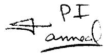

Postirradiation tensile tests are considered useful tools for evaluation of irradiation damage. We have shown1 reduction in ductility for irradiated stainless steel by using the tensile test technique. Hastelloy N has been irradiated at $700^{\circ}\mathrm{C}$ and the pre- and postirradiation tensile data compared to determine the irradiation effect. Tensile test temperature and strain rate are two variables markedly affecting the apparent strength and ductility of an alloy and both are considered in this investigation.

# EXPERIMENTAL PROCEDURES AND TEST CONDITIONS

To evaluate the type and extent of irradiation damage at elevated temperature, Hastelloy N was irradiated at $700^{\circ}\mathrm{C}$ in the B-8 lattice position of the Oak Ridge Research Reactor (ORR) to an exposure of about $7 \times 10^{20}$ nvt ( $E > 1$ MeV) and $9 \times 10^{20}$ nvt (thermal). The composition of Hastelloy N is as follows:

<table><tr><td>Element</td><td>Weight Percent</td></tr><tr><td>Mo</td><td>16.87</td></tr><tr><td>Cr</td><td>7.43</td></tr><tr><td>Fe</td><td>3.35</td></tr><tr><td>C</td><td>0.03</td></tr><tr><td>W</td><td>0.03</td></tr><tr><td>Si</td><td>0.60</td></tr><tr><td>Mn</td><td>0.55</td></tr><tr><td>V</td><td>0.26</td></tr><tr><td>P</td><td>0.001</td></tr><tr><td>S</td><td>0.006</td></tr><tr><td>Al</td><td>0.010</td></tr><tr><td>Ti</td><td>0.01</td></tr><tr><td>B</td><td>0.004</td></tr><tr><td>Co</td><td>0.07</td></tr><tr><td>Cu</td><td>0.02</td></tr><tr><td>Ni</td><td>Balance</td></tr></table>

Figure 1 shows a photograph of the irradiation rig. After irradiation the tensile samples (Fig. 2) are removed from the chamber and tested in an Instron tensile machine. The mechanical property data generated from these tests are then compared to data generated from unirradiated

material given a similar thermal history and deformed at identical conditions. The uniform elongation is the strain at maximum load. The true fracture strain is calculated using the formula,

$$
\overline {{\epsilon}} _ {f} = 2 \ln \frac {D _ {o}}{D _ {f}}, \tag {1}
$$

where

$$
\overline {{\epsilon}} _ {f} = \text {t r u e f r a c t u r e s t r a i n},
$$

$$
D _ {0} = \text {i n i t i a l d i a m e t e r}, \text {a n d}
$$

$$
D _ {f} = \text {f i n a l d i a m e t e r}.
$$

The true tensile strength is defined as the true stress at the ultimate engineering stress and is calculated as given by Dieter.2

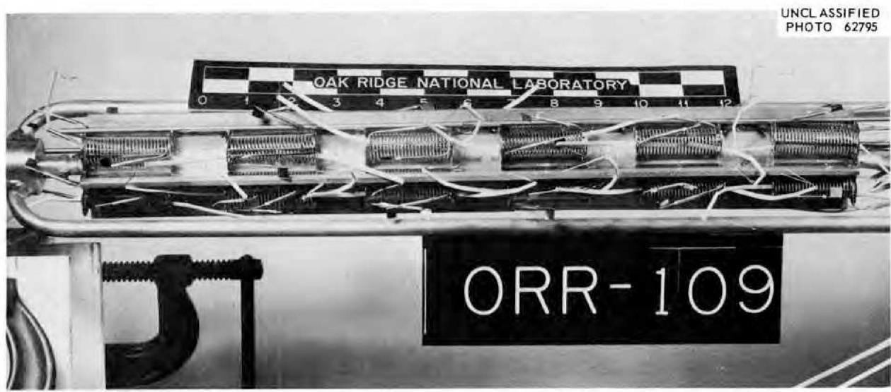  
Fig. 1. Photograph of In-Reactor Irradiation Rig Showing Tensile Specimens in Furnaces.

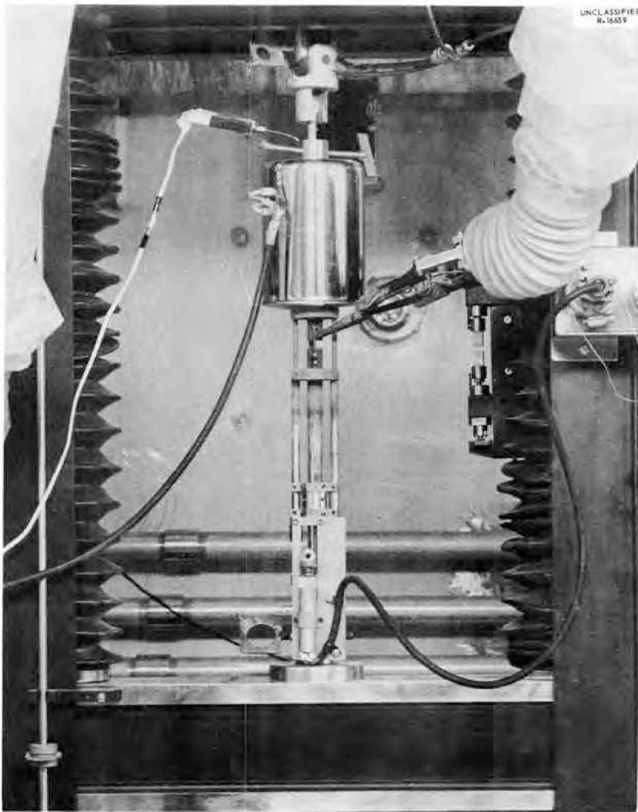  
Fig. 2. Testing of Specimens in Instron Tensile Machine.

# INFLUENCE OF DEFORMATION TEMPERATURE

The data for Hastelloy N strained at a rate of $2\%$ per min are given in Table 1 for irradiated and unirradiated material as a function of postirradiation deformation temperature. The $0.2\%$ offset yield stress was not significantly affected by irradiation. The deviations in the true tensile strength are believed to be insignificant except for deformation temperatures of $500^{\circ}\mathrm{C}$ and above. The true tensile stress was reduced about $50\%$ at $700^{\circ}\mathrm{C}$ . Ductility of the alloy, as measured by the true uniform and fracture strains, $\epsilon$ , was affected at deformation temperatures of $500^{\circ}\mathrm{C}$ and above. The true fracture strain of the unirradiated

Table 1. Tensile Strength and Ductility of Irradiated and Unirradiated Hastelloy N   

<table><tr><td rowspan="3">Deformation Temperature, °C</td><td colspan="4">Stress, psi</td><td colspan="4">Ductility, %</td></tr><tr><td colspan="2">Yield Strength</td><td colspan="2">True Tensile Strength</td><td colspan="2">True Uniform Strain</td><td colspan="2">True Fracture Strain</td></tr><tr><td>Irrad.</td><td>Unirrad.</td><td>Irrad.</td><td>Unirrad.</td><td>Irrad.</td><td>Unirrad.</td><td>Irrad.</td><td>Unirrad.</td></tr><tr><td></td><td>×103</td><td>×103</td><td>×103</td><td>×103</td><td></td><td></td><td></td><td></td></tr><tr><td>Room temperature</td><td>46.3</td><td>45.5</td><td>168.6</td><td>166.5</td><td>42.3</td><td>40.6</td><td>42.5</td><td>39.0</td></tr><tr><td>100</td><td>43.9</td><td>43.9</td><td>159.5</td><td>161.0</td><td>40.1</td><td>40.3</td><td>44.6</td><td>37.2</td></tr><tr><td>200</td><td>38.4</td><td>40.7</td><td>150.6</td><td>157.5</td><td>40.3</td><td>41.9</td><td>42.5</td><td>50.7</td></tr><tr><td>300</td><td>36.0</td><td>40.7</td><td>154.3</td><td>147.0</td><td>42.2</td><td>37.9</td><td>44.6</td><td>41.4</td></tr><tr><td>400</td><td>35.0</td><td>40.7</td><td>146.9</td><td>153.0</td><td>40.2</td><td>39.3</td><td>42.5</td><td>46.9</td></tr><tr><td>500</td><td>35.8</td><td>35.8</td><td>129.5</td><td>144.0</td><td>35.3</td><td>42.4</td><td></td><td></td></tr><tr><td>600</td><td>32.5</td><td>36.2</td><td>82.4</td><td>109.0</td><td>11.8</td><td>26.7</td><td>21.9</td><td>31.6</td></tr><tr><td>700</td><td>31.0</td><td>34.1</td><td>53.4</td><td>102.8</td><td>8.0</td><td>30.8</td><td>11.6</td><td>42.1</td></tr><tr><td>800</td><td>28.5</td><td>30.9</td><td>38.4</td><td>59.9</td><td>3.7</td><td>12.2</td><td>6.9</td><td>86.6</td></tr></table>

material exhibits a minimum at elevated temperature. This minimum is typical for the alloy and is reflected in the reduction of area and total elongation measurements normally reported. However, no ductility minimum is observed for the irradiated alloy, and the ductility as measured by either uniform or fracture strain decreases with increasing deformation temperature.

# STRAIN RATE SENSITIVITY AT ELEVATED TEMPERATURE

The strength and ductility of the irradiated and unirradiated alloy are given in Table 2 as functions of strain rate for deformation temperatures of $500^{\circ}\mathrm{C}$ and above. The ductility decreases with decreasing strain rate. The ductility of the irradiated material is particularly low at $800^{\circ}\mathrm{C}$ and $0.2\%$ per min strain rate. The effects of irradiation on the uniform and fracture strains, shown in Fig. 3., are approximately equivalent in magnitude. However, the effect on uniform strains appears to saturate, whereas the magnitude of the irradiation effect on the fracture strains continues to increase with increasing deformation temperature.

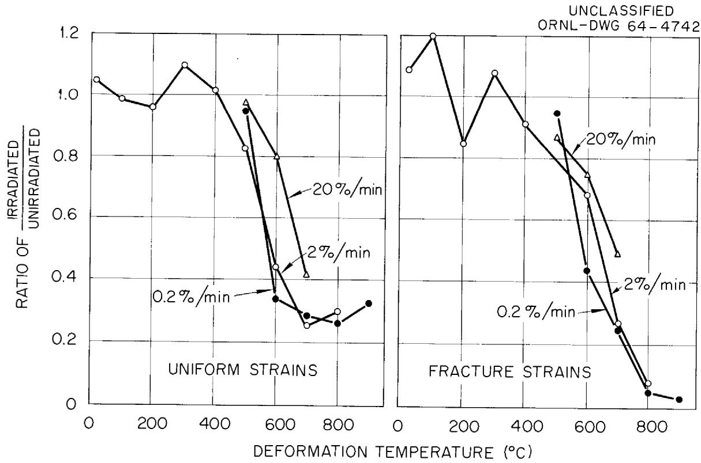  
Fig. 3. Effect of Irradiation on Ductility of Hastelloy N as a Function of Strain Rate and Deformation Temperature.

Table 2. Strain Rate Sensitivity of Irradiated and Unirradiated Hastelloy N   

<table><tr><td rowspan="3">Deformation Temperature, °C</td><td rowspan="3">Strain Rate, per min</td><td colspan="4">Stress, psi</td><td colspan="4">Ductility, %</td></tr><tr><td colspan="2">Yield Strength</td><td colspan="2">True Tensile Strength</td><td colspan="2">True Uniform Strain</td><td colspan="2">True Fracture Strain</td></tr><tr><td>Irrad.</td><td>Unirrad.</td><td>Irrad.</td><td>Unirrad.</td><td>Irrad.</td><td>Unirrad.</td><td>Irrad.</td><td>Unirrad.</td></tr><tr><td></td><td></td><td>×103</td><td>×103</td><td>×103</td><td>×103</td><td></td><td></td><td></td><td></td></tr><tr><td>500</td><td>0.2</td><td>32.7</td><td>34.9</td><td>136.1</td><td>145.6</td><td>41.2</td><td>42.3</td><td>46.6</td><td>53.4</td></tr><tr><td>500</td><td>0.02</td><td>35.8</td><td>35.8</td><td>129.5</td><td>144.0</td><td>35.3</td><td>42.4</td><td></td><td>51.4</td></tr><tr><td>500</td><td>0.002</td><td>34.4</td><td>37.4</td><td>122.5</td><td>131.5</td><td>32.3</td><td>33.3</td><td>36.5</td><td>34.2</td></tr><tr><td>600</td><td>0.2</td><td>32.9</td><td>34.1</td><td>112.7</td><td>134.4</td><td>31.2</td><td>38.9</td><td>36.5</td><td>48.7</td></tr><tr><td>600</td><td>0.02</td><td>32.5</td><td>36.2</td><td>82.4</td><td>109.0</td><td>17.7</td><td>26.7</td><td>21.9</td><td>31.6</td></tr><tr><td>600</td><td>0.002</td><td>34.2</td><td>34.6</td><td>63.1</td><td>106.0</td><td>10.3</td><td>29.9</td><td>13.2</td><td>29.7</td></tr><tr><td>700</td><td>0.2</td><td>30.5</td><td>30.9</td><td>66.8</td><td>106.5</td><td>13.5</td><td>32.2</td><td>19.2</td><td>39.2</td></tr><tr><td>700</td><td>0.02</td><td>31.0</td><td>34.1</td><td>53.4</td><td>102.8</td><td>8.0</td><td>30.8</td><td>11.6</td><td>42.1</td></tr><tr><td>700</td><td>0.002</td><td>32.1</td><td>33.7</td><td>47.0</td><td>80.5</td><td>5.6</td><td>20.0</td><td>7.8</td><td>29.0</td></tr><tr><td>800</td><td>0.2</td><td>29.3</td><td>29.3</td><td>45.7</td><td>79.8</td><td>6.7</td><td></td><td>11.6</td><td></td></tr><tr><td>800</td><td>0.02</td><td>28.5</td><td>30.9</td><td>38.4</td><td>59.9</td><td>3.7</td><td>12.2</td><td>6.9</td><td>86.6</td></tr><tr><td>800</td><td>0.002</td><td>29.3</td><td>32.5</td><td>32.2</td><td>42.9</td><td>1.8</td><td>6.5</td><td>4.9</td><td>93.7</td></tr></table>

# POSTIRRADIATION ANNEALING

The effect of postirradiation heat treatment of the alloy at the recommended solid solution temperature of $1175^{\circ}\mathrm{C}$ for 1 hr is shown in Table 3. The elevated temperature ductility of the irradiated alloy is not improved by the heat treatment, thereby indicating the thermal stability of the configuration causing the reduced ductility. Since the heat treatment results in resolution of carbide precipitates, any influence of irradiation on the precipitation of these carbides is not responsible for the observed ductility reduction.

Table 3. Effect of Postirradiation Heat Treatment of Irradiated Hastelloy N at $1175^{\circ}\mathrm{C}$ for 0.5 hr   
( tested at a strain rate of 0.002% per min)   

<table><tr><td rowspan="2">Deformation Temperature, °C</td><td rowspan="2">Condition</td><td colspan="2">Stress, psi</td><td colspan="2">Ductility, %</td></tr><tr><td>0.2% Offset Yield</td><td>True Tensile</td><td>True Uniform</td><td>True Fracture</td></tr><tr><td></td><td></td><td>×103</td><td>×103</td><td>.</td><td></td></tr><tr><td>700</td><td>Unirradiated</td><td>33.7</td><td>80.5</td><td>20.0</td><td>29.0</td></tr><tr><td>700</td><td>Irradiated</td><td>32.1</td><td>47.0</td><td>5.6</td><td>7.8</td></tr><tr><td>700</td><td>Irradiated plus postirradiation heat treatment</td><td>30.5</td><td>44.2</td><td>6.3</td><td>6.9</td></tr><tr><td>900</td><td>Unirradiated</td><td>21.8</td><td>22.2</td><td>1.2</td><td>70.0</td></tr><tr><td>900</td><td>Irradiated</td><td>23.2</td><td>23.2</td><td>&lt; 0.4</td><td>&lt; 0.4</td></tr><tr><td>900</td><td>Irradiated plus postirradiation heat treatment</td><td>23.5</td><td>23.5</td><td>&lt; 0.6</td><td>&lt; 0.7</td></tr></table>

# DISCUSSION

The results indicate that the effect of irradiation at elevated temperature on the strength and ductility of Hastelloy N is qualitatively the

same as that reported for stainless steel. $^{3,4}$ The stress-strain relationship at elevated temperature is not affected by irradiation at $600^{\circ}\mathrm{C}$ and above. This is in contrast to irradiation below $600^{\circ}\mathrm{C}$ , where the stress-strain relationship is affected by irradiation, $^{3}$ as shown in Fig. 4.

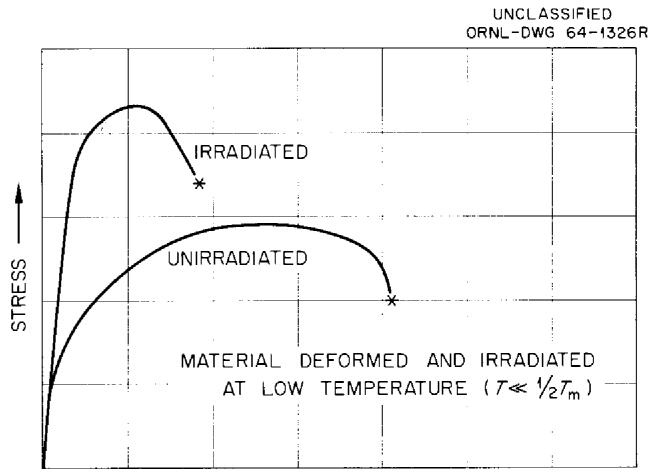

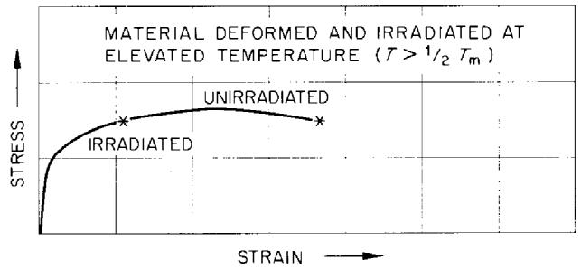  
Fig. 4. Effect of Irradiation on the Stress-Strain Curves.

The defects introduced by fast neutrons annealed during irradiation at the elevated temperatures. The reduction in tensile strength at elevated temperatures is a result of the inability of the irradiated alloy to strain plastically. The fracture at a reduced strain therefore decreases the true tensile strength, and the magnitude of the reduction increases as the test conditions are altered to increase the strain-hardening coefficient (i.e., increased strain rates). If the alloy is irradiated at elevated temperature, the reduction in ductility occurs only for deformation at elevated temperatures. Metallographic examination by the

light microscope shows that the deformation temperature at which the irradiated alloy becomes embrittled is associated with the transition from transgranular to the intergranular mode of fracture. When the irradiated and unirradiated specimens fracture transgranularly, no loss of ductility is observed (Fig. 5). Figure 6 shows that grain boundary

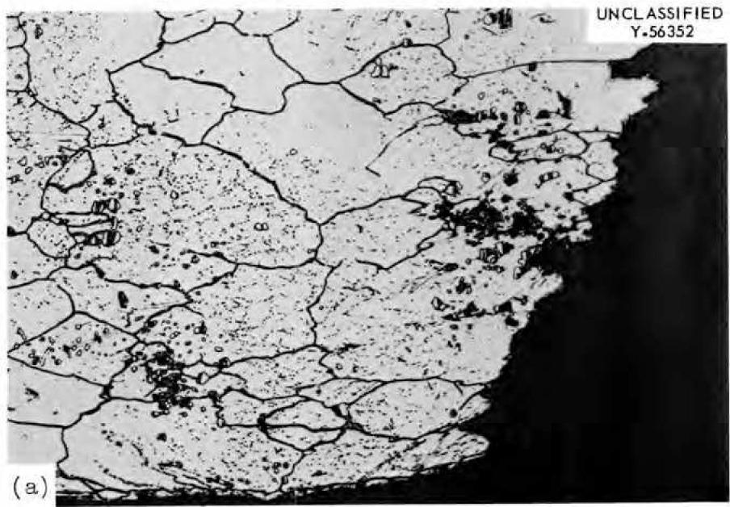

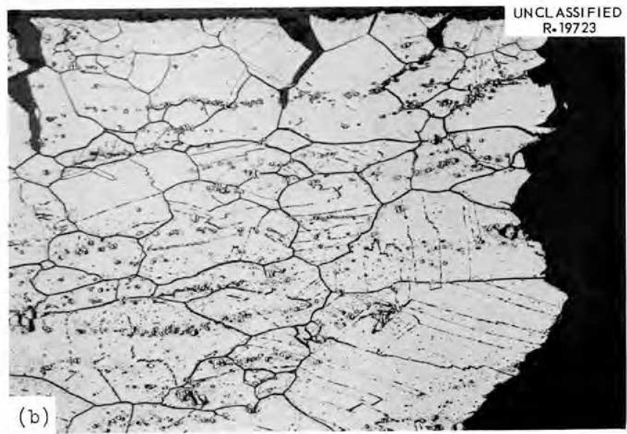  
Fig. 5. Comparison of the Fracture of Irradiated and Unirradiated Hastelloy N at Approximately $35\%$ Strain. Tested at a strain rate of $0.2\%$ per min and $500^{\circ}\mathrm{C}$ . Etchant: aqua regia. $100\times$ . (a) Unirradiated Hastelloy N shows no grain boundary failure at $46.6\%$ strain and specimen rupture by a transgranular mode. (b) Irradiated alloy shows intergranular surface cracks but specimen failure by a transgranular mode.

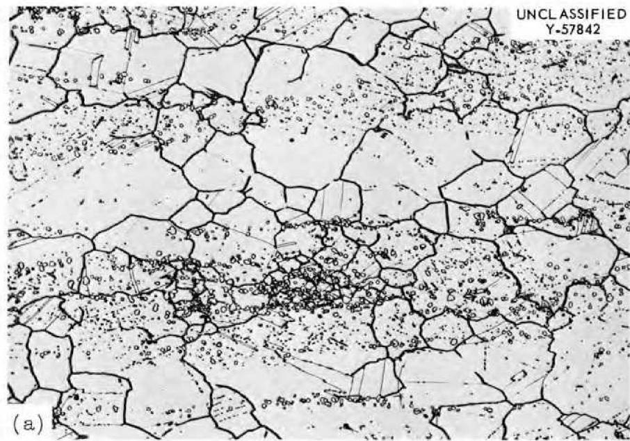

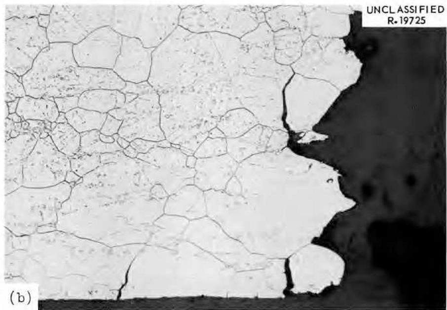  
Fig. 6. Comparison of Irradiated and Unirradiated Hastelloy N at $29\%$ Strain. No fractures are observed in unirradiated sample tested at $700^{\circ}\mathrm{C}$ and $0.2\%$ per min strain rate. Etchant: aqua regia. $100\times$ (a) Unirradiated. (b) Irradiated.

cracks are found in the irradiated material at smaller strains than in the unirradiated alloy when observed at $100 \times$ using the light microscope. These cracks propagate along the boundary rather than widen in the irradiated material and cause complete specimen rupture at a considerably reduced strain, as shown in Fig. 7. Therefore, it would appear that both the nucleation and propagation of cracks are affected.

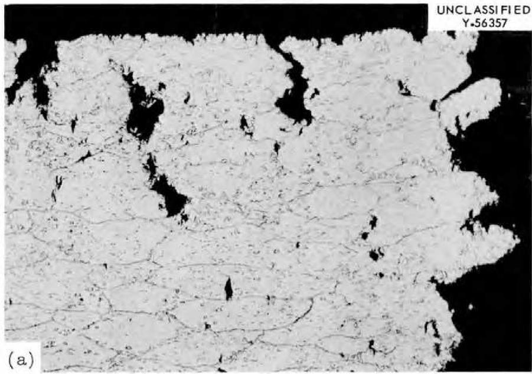

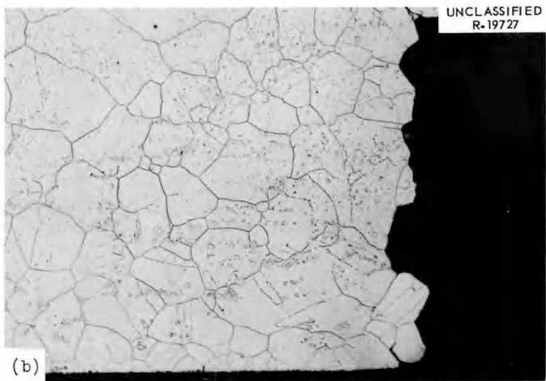  
Fig. 7. Comparison of the Grain Boundary Cracks at Fracture for Unirradiated and Irradiated Alloy Strain at $900^{\circ}\mathrm{C}$ and at a Strain Rate of $0.2\%$ per min. Etchant: aqua regia. $100 \times$ (a) Unirradiated alloy fracture at $70\%$ strain. (b) Irradiated alloy fracture at approximately $0.4\%$ strain.

Thus, the influence of irradiation at elevated temperature is one affecting only the fracture of grain boundaries. Intergranular fracture is classified into two types:

1. wedge type that originate at triple points,

2. cavity type in which small cavities are nucleated along grain boundaries.

The intergranular tensile test fractures observed for the irradiated and unirradiated alloys have been of the wedge type. These type cracks are formed on boundaries transverse, and on occasion oblique, to the direction of the stress applied to the bulk specimen. Although many questions need to be answered about intergranular wedge-type fracture, it is generally believed that a prerequisite is grain boundary sliding. Localized deformation along the boundaries results in stress concentrations that nucleate fracture if not dissipated by boundary migration or recrystallization. Any mechanism proposed for the reduced ductility of irradiated alloys must be one that does not increase the effectiveness of the boundaries as dislocation barriers. Grain boundary sliding could be affected by irradiation either reducing the magnitude of boundary deformation that an aggregate can accommodate before fracture or by increasing the rate of boundary sliding. Measurement of grain boundary deformation, perhaps by the Rachinger method, needs to be determined as a function of stress for irradiated and unirradiated alloys. Certainly, the reduced ductility could be related to factors governing the rate of extension of the cracks. Electron fractography is required to elucidate this area.

The elevated temperature embrittlement has been reported by Roberts and Harries to be related to thermal rather than fast neutrons. Slow neutrons, apart from scattering, show four types of capture reactions:

1. emission of gamma radiation $(n,\gamma)$ ,   
2. ejection of an alpha particle $(n,\alpha)$ ,   
3. ejection of a proton $(n,p)$ , and   
4. fission (n,f).

Of the four reactions, the $(n,\alpha)$ reactions appears the most likely to cause the embrittlement. This reaction, producing helium localized at the grain boundary, could affect the nucleation of cracks at the grain

boundary and, conceivably, crack propagation. The thermal stability of the defect, as indicated by the postirradiation heat treatment data, is compatible with the hypothesis of helium generation. The thermal stability of this defect is in sharp contrast with data by Bailey and others that show that the low-temperature $(< 500^{\circ}\mathrm{C})$ damage caused by fast neutrons can be annealed at 400 to $980^{\circ}\mathrm{C}$ . However, the concentration of the species necessary for $(n,\alpha)$ reaction is in the parts per million range for stainless steel and nickel-base alloys. Boron-10 and lithium-6 are two such species, given by Barnes,[11] that generate large specific volumes of gas. If the boron is concentrated at the grain boundaries, the atomic fraction of the helium produced can be large even with the average concentration of $^{10}\mathrm{B}$ in the 1- to 10-ppm range. Studies by other investigators[12] indicate boron segregation in the grain boundaries of austenitic alloys. The grain boundary concentration of helium necessary to cause embrittlement is unknown although it can be estimated from the beryllium irradianations[13] to be $< 0.7\times 10^{-4}$ .

Studies $^{14,15}$ to examine the influence of boron content on the properties of irradiated alloys show complex relationships between boron content and ductility for the alloy deformed at elevated temperature. However, these studies are complicated by the fact that boron for the concentrations investigated influences the strength and ductility of

$^{9}$ R. E. Bailey and M. A. Silliman, *Symposium on Radiation Effects of Materials*, vol. 3, ASTM Special Technical Publication 223, 1958.   
10W. E. Murr and F. R. Shober, Annealing Studies on Irradiated Type 347 Stainless Steel, BMI-1621 (March 1963).   
$^{11}$ R. S. Barnes and G. W. Greenwood, Proc. U. N. Intern. Conf. Peaceful Uses At. Energy, 2nd, Geneva, 1958 5, 481 (1958).   
$^{12}$ C. Crussard, J. Plateau, and G. Henry, Proceedings of the Joint International Conference on Creep, pp. 1-91, vol. 1, Institution of Mechanical Engineers, London, 1963.   
13J. R. Weir, Proceedings of the International Conference on the Metallurgy of Beryllium, London, 1961, pp. 395-409, Chapman & Hall, London, 1963.   
$^{14}$ N. Hinkle, W. E. Brundage, and J. C. Zukas, Solid State Div. Ann. Progr. Rept. Aug. 31, 1960, ORNL-3017, p. 120.   
15High-Temperature Materials Program Progr. Rept., Jan. 24, 1964, GEMP No. 31, Part A, p. 30.

the unirradiated alloy. The influence of boron on the solubility of carbon, alteration of precipitate distribution, and grain size is well documented. $^{12,16,17}$

Of course, the foregoing discussion is dependent on the embrittlement being related to thermal neutrons and helium generation. The data generated, to date, is indirect evidence. However, if the ductility is a result of helium generation, the problem of embrittlement of irradiated materials deformed at elevated temperature will have to be solved by removing the species undergoing $(n,\alpha)$ reaction from the grain boundaries. Several approaches are available:

1. The average concentration may be lowered by electron-beam melting.   
2. Distribute the boron within the grain as stable precipitates, such as borides and combination precipitation of $\mathrm{Fe}_{23}(\mathrm{BC})_6$ . Helium atoms and/or bubbles may be trapped at the precipitate, thereby greatly reducing the concentration of helium bubbles in the grain boundary.   
3. Lower the concentration at the boundary by increasing the number of boundaries on which the specie precipitates or segregates.

The characteristics of the damage caused by irradiation at elevated temperature are as follows:

1. Yield stress and tensile strength are not affected.   
2. Ductility of material is reduced.   
3. The reduction in ductility is noted by large decreases in the uniform and fracture strain and by small decreases in the true tensile and fracture stresses.   
4. The reduction in ductility is more significant at test conditions resulting in intergranular failure, such as low strain rates at elevated temperature.   
5. Heat treatments that anneal the damage causing the low-temperature irradiation effect do not improve the ductility at elevated temperature.

# ACKNOWLEDGMENTS

The authors wish to acknowledge the following from the Metals and Ceramics Division of the Oak Ridge National Laboratory for their work on this study: J. W. Woods, V. R. Bullington, and D. G. Gates for the design and installation of the irradiation experiments; J. C. Zukas for the flux determinations; K. W. Boling for the mechanical property tests; and E. H. Lee and Z. R. McNutt for the metallography.

# INTERNAL DISTRIBUTION

1-2. Central Research Library

3. Reactor Division Library

4-5. ORNL - Y-12 Technical Library Document Reference Section

6-15. Laboratory Records Department

16. Laboratory Records, ORNL RC

17. ORNL Patent Office

18. R. G. Berggren

19. G. E. Boyd

20. R. B. Briggs

21. J. E. Cunningham

22. W.W.Davis

23. D. A. Douglas, Jr.

24. J. H Frye, Jr.

25. W. O. Harms

26-28. M.R.Hill

29. C. F. Leitten, Jr.

30. H. G. MacPherson

31. H. E. McCoy, Jr.

32-41. W.R.Martin

42. E.C.Miller

43. P. Patriarca

44. G. M. Slaughter

45. A. Taboada.

46-65. D. B. Trauger

66. J. T. Venard

67. J. R. Weir

68. M. S. Weschler

69. J.W.Woods

# EXTERNAL DISTRIBUTION

70. C. M. Adams, Massachusetts Institute of Technology   
71. J. Brunhouse, Aerojet, General Nucleonics   
72. D. B. Coburn, General Atomic   
73-74. D. F. Cope, AEC, Oak Ridge Operations Office   
75. F. Comprelli, General Electric, San Jose   
76. P. Fortescue, General Atomic   
77. J. E. Irwin, General Electric, Hanford   
78-79. V. B. Lawson, Atomic Energy of Canada Limited, Chalk River   
80. J. Motif, General Electric, NMPO, Cincinnati   
81. R. E. Schreiber, Du Pont Company, Savannah River Laboratory   
82. F. Shober, Battelle Memorial Institute   
83. A. A. Shoudy, Atomic Power Development Associates, Inc.   
84-86. J. M. Simmons, AEC, Washington   
87. J. C. Tobin, General Electric, Hanford   
88. S. R. Vandenberg, General Electric, San Jose   
89. Division of Research and Development, AEC, ORO   
90-104. Division of Technical Information Extension