ORNL-TM-1017

120

MAster

TENSILE AND CREEP PROPERTIES OF INOR-8 FOR

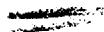

THE MOLTEN-SALT REACTOR EXPERIMENT

J. T. Venard

PATENT CLEARANCE OBTAINED. RELEASE TO THE PUBLIC IS APPROVED. PROGEDURES ARE ON FILE IN THE RECEIVING SECTION.

# LEGAL NOTICE

This report was prepared as an account of Government sponsored work. Neither the United States, nor the Commission, nor any person acting on behalf of the Commission:

A. Makes any warranty or representation, expressed or implied, with respect to the accuracy, completeness, or usefulness of the information contained in this report, or that the use of any information, apparatus, method, or process disclosed in this report may not infringe privately owned rights; or   
B. Assumes any liabilities with respect to the use of, or for damages resulting from the use of any information, apparatus, method, or process disclosed in this report.

As used in the above, "person acting on behalf of the Commission" includes any employee or contractor of the Commission, or employee of such contractor, to the extent that such employee or contractor of the Commission, or employee of such contractor prepares, disseminates, or provides access to, any information pursuant to his employment or contract with the Commission, or his employment with such contractor.

Contract No. W-7405-eng-26

METALS AND CERAMICS DIVISION

TENSILE AND CREEP PROPERTIES OF INOR-8 FOR THE MOLTEN-SALT REACTOR EXPERIMENT

J. T. Venard

FEBRUARY 1965

OAK RIDGE NATIONAL LABORATORY

Oak Ridge, Tennessee

operated by

UNION CARBIDE CORPORATION

for the

U.S. ATOMIC ENERGY COMMISSION

# TENSILE AND CREEP PROPERTIES OF INOR-8 FOR THE MOLTEN-SAIT REACTOR EXPERIMENT

J. T. Venard

# ABSTRACT

Tensile and creep-rupture testing has been carried out on three heats of INOR-8 selected from those used for the Molten-Salt Reactor Experiment construction. The primary aim was to develop strength information representative of the reactor construction material and to compare the data on these commercial heats with that from early experimental heats.

The data reported are ultimate tensile strength, $0.2\%$ offset yield strength, percent elongation, and percent reduction in area vs temperature from room temperature to $982^{\circ}\mathrm{C}$ ( $1800^{\circ}\mathrm{F}$ ). Creep-rupture behavior was investigated at 593, 704, and $816^{\circ}\mathrm{C}$ (1100, 1300, and $1500^{\circ}\mathrm{F}$ ).

In general, the commercial MSRE construction material shows greater strength and ductility than did earlier heats of the alloy. Additional confidence in the MSRE design strength values is thus in order.

# INTRODUCTION

The decision to build the Molten-Salt Reactor Experiment necessitated the procurement of some 100 tons of INOR-8 (Ref. 1). Since some minor chemistry changes had been made to ensure weldability in these commercial heats² and because of a desire to have strength information representative of MSRE construction material, a series of tensile and creep tests were performed.

Three heats of material were selected from the 27 heats used in the reactor. This material was used for tensile tests in the range of $21^{\circ}\mathrm{C}$ $(70^{\circ}\mathrm{F})$ to $982^{\circ}\mathrm{C}$ $(1800^{\circ}\mathrm{F})$ . Creep-rupture tests were performed at 593, 704, and $816^{\circ}\mathrm{C}$ (1100, 1300, and $1500^{\circ}\mathrm{F}$ ).

# MATERIAL AND SPECIMENS

The alloy INOR-8 was developed especially for use in molten-salt systems. The following tabulation gives the nominal composition of this alloy.

<table><tr><td>Element</td><td>Weight Percent4</td></tr><tr><td>Nickel</td><td>Balance</td></tr><tr><td>Molybdenum</td><td>15.00-18.00</td></tr><tr><td>Chromium</td><td>6.00-8.00</td></tr><tr><td>Iron</td><td>5.00</td></tr><tr><td>Carbon</td><td>0.04-0.085</td></tr><tr><td>Manganese</td><td>1.0</td></tr><tr><td>Silicon</td><td>1.0</td></tr><tr><td>Tungsten</td><td>0.50</td></tr><tr><td>Aluminum + Titanium</td><td>0.50</td></tr><tr><td>Copper</td><td>0.35</td></tr><tr><td>Cobalt</td><td>0.20</td></tr><tr><td>Phosphorus</td><td>0.015</td></tr><tr><td>Sulfur</td><td>0.020</td></tr><tr><td>Boron</td><td>0.010</td></tr><tr><td>Vanadium</td><td>0.50</td></tr></table>

The three heats of material selected for testing were in the form of plate. Their compositions are given in Table 1. Note that there is little difference in the composition of the three heats. The major differences are in the chromium, iron and manganese content of heat 5075.

Metallographically, the three heats of material look quite the same, as is seen in Figs. 1 through 3. Note the stringers of precipitated material which are aligned with the plate rolling direction. This kind of structure is typical of this alloy in the wrought condition.

Table 1. Chemical Analysis From Certified Test Reports   

<table><tr><td rowspan="2">Designation</td><td colspan="15">Composition (wt %)</td><td></td></tr><tr><td>Ni</td><td>Mo</td><td>Cr</td><td>Fe</td><td>C</td><td>Mn</td><td>Si</td><td>W</td><td>Al</td><td>Ti</td><td>Cu</td><td>Co</td><td>P</td><td>S</td><td>B</td><td>V</td></tr><tr><td>Heat 5055</td><td>Bal</td><td>16.20</td><td>7.86</td><td>3.76</td><td>0.06</td><td>0.69</td><td>0.61</td><td>0.03</td><td>0.06</td><td>0.02</td><td>0.01</td><td>0.10</td><td>0.006</td><td>0.008</td><td>0.005</td><td>0.21</td></tr><tr><td>Heat 5075</td><td>Bal</td><td>16.14</td><td>6.76</td><td>4.03</td><td>0.06</td><td>0.42</td><td>0.59</td><td>0.04</td><td>0.01</td><td>0.01</td><td>0.01</td><td>0.08</td><td>0.003</td><td>0.007</td><td>0.001</td><td>0.28</td></tr><tr><td>Heat 5081</td><td>Bal</td><td>16.87</td><td>7.43</td><td>3.35</td><td>0.07</td><td>0.55</td><td>0.60</td><td>0.03</td><td>0.01</td><td>0.01</td><td>0.02</td><td>0.07</td><td>0.001</td><td>0.006</td><td>0.004</td><td>0.26</td></tr></table>

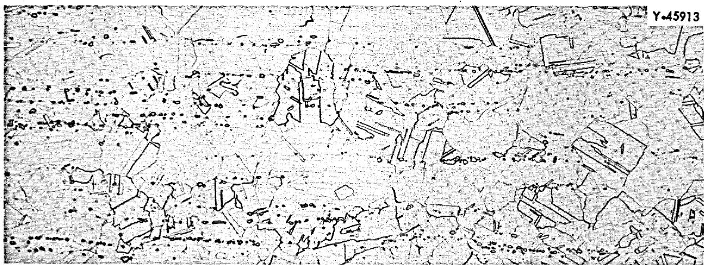  
Fig. 1. As-Received INOR-8 Heat 5055. Etchant: aqua regia. 100x.

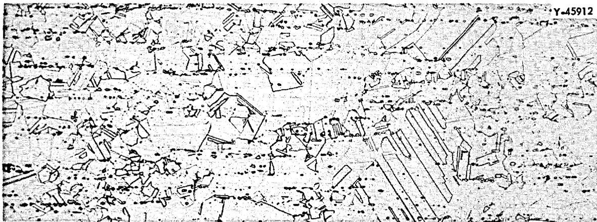  
Fig. 2. As-Received INOR-8 Heat 5075. Etchant: aqua regia. 100x.

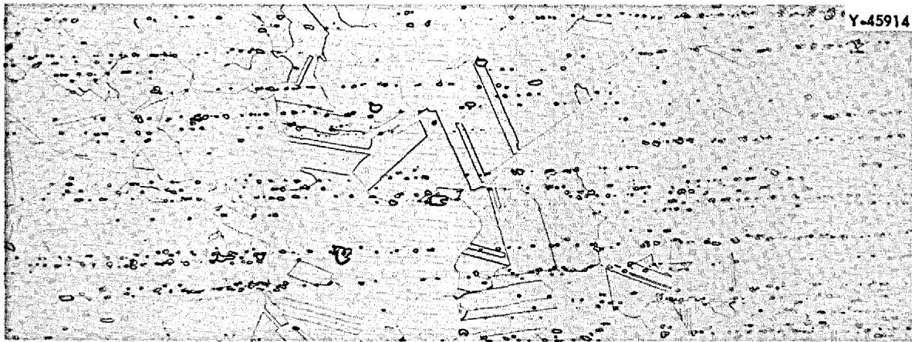  
Fig. 3. As-Received INOR-8 Heat 5081. Etchant: aqua regia. 100x.

The specimens for the test program were cut both parallel and normal to the plate rolling direction. A drawing of the specimen is shown in Fig. 4.

ORNL-DWG 64-7808

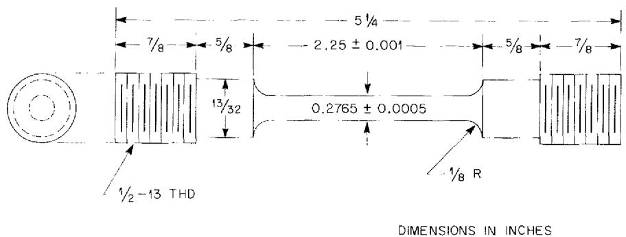  
Fig. 4. Creep and Tensile Specimen, INOR-8.

# TESTING METHODS AND RESULTS

All tensile tests were run in a 12,000-lb capacity Baldwin Hydraulic Testing Machine at a crosshead speed of 0.05 in./min. Stress-strain curves were obtained through load cell-deflectometer outputs. In the case of elevated-temperature tests, $1/2$ hr was allowed for the specimen to reach equilibrium before loading was begun.

Average tensile data for heats 5075 and 5081 are shown in Table 2. Two specimens of each heat were run at every temperature.

Table 2. Average Tensile Properties for INOR-8, Heats 5075 and 5081   

<table><tr><td>Tempera-ture (°C)</td><td>Ultimate Tensile Strength (psi)</td><td>0.2% Offset Yield Strength (psi)</td><td>Elongation (%)</td><td>Reduction of Area (%)</td></tr><tr><td>21</td><td>70</td><td>113,600</td><td>46,500</td><td>53.1</td></tr><tr><td>315</td><td>600</td><td>103,300</td><td>36,000</td><td>55.0</td></tr><tr><td>427</td><td>800</td><td>100,100</td><td>35,000</td><td>53.3</td></tr><tr><td>538</td><td>1000</td><td>96,000</td><td>33,200</td><td>53.3a</td></tr><tr><td>649</td><td>1200</td><td>74,800</td><td>32,600</td><td>22.0a35.8b</td></tr><tr><td>760</td><td>1400</td><td>61,800</td><td>31,800</td><td>21.0a30.5b</td></tr><tr><td>871</td><td>1600</td><td>36,400</td><td>31,600</td><td>23.0a39.8b</td></tr><tr><td>982</td><td>1800</td><td>20,300</td><td>20,000</td><td>27.9</td></tr></table>

aHeat 5075   
Heat 5081

Creep tests were run in Arcweld Lever Arm Testing Machines and strain data obtained through dial-gage extensometers attached to the specimen shoulders.

Detailed tabulations of the creep-rupture test results are given in Tables 3, 4, and 5.

# DISCUSSION OF RESULTS

The tensile properties of heats 5075 and 5081 are plotted in Figs. 5, 6, 7, and 8. These figures show ultimate tensile strength, $0.2\%$ offset yield strength, elongation, and reduction of area vs temperature. The scatter bands for experimental heats of INOR-8 shown in these figures were developed from data generated some time ago.[6,7]

The ultimate and yield strengths show no significant variation with the heat tested nor did they vary with specimen-plate orientation. The ductility values, however, indicate that above approximately $538^{\circ}\mathrm{C}$ $(1000^{\circ}\mathrm{F})$ heat 5075 is less ductile than heat 5081.

Creep and rupture curves plotted as log time to reach a total strain of 0.2, 0.5, 1.0, 2.0, and $5.0\%$ and log time-to-rupture vs log stress are given in Figs. 9 through 17. The elongation at fracture for each test is noted by the numbers in parentheses.

Comparison of the various creep ductility values show that, as in the tensile tests, heat 5075 was less ductile than the other heats tested.

A stress-rupture plot for all three heats is shown in Fig. 18. The results for heats 5055 and 5081 have been fitted with a single curve, while heat 5075 shows a somewhat lower rupture strength. It should be pointed out that the weakest of these heats, heat 5075, is as strong as the strongest experimental heats previously reported.[6]

It is interesting to note from Fig. 19, which plots log minimum creep rate vs log stress, that the creep rates of all three heats are the same.

Table 3. Creep and Rupture Data for INOR-8 Tested in $Air^a$   

<table><tr><td rowspan="2">Test Number</td><td rowspan="2">Test Temperature (°C)</td><td rowspan="2">Stress (psi)</td><td colspan="6">Time to Reach Strain Level (hr)</td><td rowspan="2">Minimum Creep Rate (hr-1)</td><td rowspan="2">Elongation at Fracture (%)</td></tr><tr><td>0.2%</td><td>0.5%</td><td>1.0%</td><td>2.0%</td><td>5.0%</td><td>Rupture</td></tr><tr><td>2267</td><td>593</td><td>1100</td><td>81,000</td><td></td><td></td><td></td><td>0.80</td><td>5.1</td><td>7.8 × 10-3</td><td>37.2</td></tr><tr><td>2262</td><td>593</td><td>1100</td><td>70,000</td><td>0.10</td><td>0.15</td><td>0.20</td><td>0.40</td><td>32.2</td><td>33.5</td><td>6.5 × 10-4</td></tr><tr><td>2248</td><td>593</td><td>1100</td><td>61,000</td><td>0.50</td><td>2.0</td><td>14.0</td><td>53.0</td><td></td><td>140.4</td><td>2.2 × 10-4</td></tr><tr><td>2201</td><td>593</td><td>1100</td><td>50,000</td><td>10.0</td><td>18.0</td><td>40.0</td><td>100.0</td><td>875</td><td>1040.7</td><td>2.3 × 10-5</td></tr><tr><td>1833</td><td>593</td><td>1100</td><td>35,000</td><td>500</td><td>1800</td><td>3350</td><td>5350</td><td>9325</td><td>9818.7</td><td>2.6 × 10-6</td></tr><tr><td>2273</td><td>704</td><td>1300</td><td>52,000</td><td></td><td></td><td>0.10</td><td>0.40</td><td>1.6</td><td>6.2</td><td>3.5 × 10-2</td></tr><tr><td>2264</td><td>704</td><td>1300</td><td>39,000</td><td>0.20</td><td>1.0</td><td>2.7</td><td>6.2</td><td>13.8</td><td>29.8</td><td>3.4 × 10-3</td></tr><tr><td>2254</td><td>704</td><td>1300</td><td>34,000</td><td>0.50</td><td>2.5</td><td>5.2</td><td>11.0</td><td>26.2</td><td>68.3</td><td>1.9 × 10-3</td></tr><tr><td>2246</td><td>704</td><td>1300</td><td>31,000</td><td>2.0</td><td>5.0</td><td>12.0</td><td>25.0</td><td>64.0</td><td>160.3</td><td>7.8 × 10-4</td></tr><tr><td>1840</td><td>704</td><td>1300</td><td>27,500</td><td>4.0</td><td>14.0</td><td>30.0</td><td>60</td><td>144</td><td>346.7</td><td>3.5 × 10-4</td></tr><tr><td>2200</td><td>704</td><td>1300</td><td>25,000</td><td>5.0</td><td>15</td><td>30</td><td>60</td><td>160</td><td>859.7</td><td>3.0 × 10-4</td></tr><tr><td>2144</td><td>704</td><td>1300</td><td>22,000</td><td>5.0</td><td>14</td><td>34</td><td>75</td><td>185</td><td>526.4</td><td>2.6 × 10-4</td></tr><tr><td>1982</td><td>704</td><td>1300</td><td>20,000</td><td>10</td><td>30</td><td>95</td><td>210</td><td>530</td><td>1707.3</td><td>9.4 × 10-5</td></tr><tr><td>1842</td><td>704</td><td>1300</td><td>18,000</td><td>5</td><td>70</td><td>160</td><td>400</td><td>950</td><td>2682.2</td><td>5.0 × 10-5</td></tr><tr><td>2274</td><td>816</td><td>1500</td><td>23,000</td><td>0.1</td><td>0.3</td><td>0.6</td><td>1.2</td><td>3.0</td><td>13.9</td><td>1.8 × 10-2</td></tr><tr><td>2272</td><td>816</td><td>1500</td><td>15,000</td><td>1.0</td><td>4.0</td><td>6.0</td><td>11</td><td>22</td><td>93.5</td><td>2.8 × 10-3</td></tr><tr><td>2253</td><td>816</td><td>1500</td><td>12,500</td><td>1.0</td><td>4.0</td><td>8.0</td><td>16</td><td>42</td><td>189.0</td><td>1.2 × 10-3</td></tr><tr><td>2239</td><td>816</td><td>1500</td><td>10,500</td><td>1.0</td><td>5.0</td><td>20</td><td>40</td><td>120</td><td>390.9</td><td>4.2 × 10-4</td></tr><tr><td>2188</td><td>816</td><td>1500</td><td>8,200</td><td>2.5</td><td>5.0</td><td>40</td><td>120</td><td>340</td><td>909.1</td><td>1.5 × 10-4</td></tr><tr><td>2263</td><td>816</td><td>1500</td><td>5,600</td><td>56</td><td>250</td><td>550</td><td>1250</td><td>3500</td><td>7593.8</td><td>1.1 × 10-5</td></tr><tr><td>1986</td><td>816</td><td>1500</td><td>5,600</td><td>100</td><td>280</td><td>660</td><td>1660</td><td></td><td>2377.1b</td><td>9.0 × 10-4</td></tr></table>

Specimens of heat 5055 cut parallel to plate rolling direction.   
b Discontinued.

Table 4. Creep and Rupture Data for INOR-8 Tested in Air   

<table><tr><td rowspan="2">Test Numberb</td><td rowspan="2">Test Temperature (°C)</td><td rowspan="2">Stress (psi)</td><td colspan="6">Time to Reach Strain Level (hr)</td><td rowspan="2">Minimum Creep Rate (hr-1)</td><td rowspan="2">Elongation at Fracture (%)</td></tr><tr><td>0.2%</td><td>0.5%</td><td>1.0%</td><td>2.0%</td><td>5.0%</td><td>Rupture</td></tr><tr><td>3142(P)</td><td>593</td><td>1100</td><td>64,000</td><td></td><td>0.1</td><td>0.3</td><td>0.8</td><td>6.7</td><td>8.9</td><td>6.0 × 10-4</td></tr><tr><td>3127(P)</td><td>593</td><td>1100</td><td>59,000</td><td>0.2</td><td>0.5</td><td>1.2</td><td>3.0</td><td>18.0</td><td>23.5</td><td>2.0 × 10-4</td></tr><tr><td>2547(T)</td><td>593</td><td>1100</td><td>55,000</td><td>0.2</td><td>0.3</td><td>0.6</td><td>1.2</td><td>75.0</td><td>78.6</td><td>5.0 × 10-5</td></tr><tr><td>2427(P)</td><td>593</td><td>1100</td><td>48,500</td><td>33.0</td><td>103</td><td>133</td><td>135</td><td></td><td>135.6</td><td>5.5 × 10-5</td></tr><tr><td>2564(T)</td><td>593</td><td>1100</td><td>47,000</td><td>40.0</td><td>130</td><td>200</td><td>203</td><td></td><td>205.5</td><td>3.5 × 10-5</td></tr><tr><td>2826(T)</td><td>593</td><td>1100</td><td>42,000</td><td>130</td><td>465</td><td>732</td><td></td><td></td><td>885.2</td><td>6.0 × 10-6</td></tr><tr><td>2782(P)</td><td>593</td><td>1100</td><td>39,000</td><td>250</td><td>625</td><td>732</td><td></td><td></td><td>749.5</td><td>3.0 × 10-6</td></tr><tr><td>3097(T)</td><td>593</td><td>1100</td><td>31,000</td><td>400</td><td>1400</td><td>2600</td><td>3890</td><td></td><td>3927.0</td><td>1.6 × 10-6</td></tr><tr><td>2982(T)</td><td>704</td><td>1300</td><td>35,000</td><td>0.3</td><td>2.0</td><td>4.4</td><td>10.0</td><td></td><td>22.6</td><td>2.0 × 10-3</td></tr><tr><td>2952(P)</td><td>704</td><td>1300</td><td>26,000</td><td>1.5</td><td>4.5</td><td>11.0</td><td>50.0</td><td></td><td>75.7</td><td>2.1 × 10-4</td></tr><tr><td>2944(T)</td><td>704</td><td>1300</td><td>23,000</td><td>2.0</td><td>10.0</td><td>25.0</td><td>60.0</td><td>133</td><td>135.3</td><td>1.3 × 10-4</td></tr><tr><td>2637(P)</td><td>704</td><td>1300</td><td>22,000</td><td>25.0</td><td>48.0</td><td>77.0</td><td>114</td><td></td><td>137.9</td><td>1.3 × 10-4</td></tr><tr><td>2997(T)</td><td>704</td><td>1300</td><td>18,500</td><td>1.0</td><td>6.0</td><td>67.0</td><td>193.0</td><td>451.0</td><td>491.2</td><td>8.3 × 10-5</td></tr><tr><td>2998(P)</td><td>704</td><td>1300</td><td>16,500</td><td>10.0</td><td>50.0</td><td>126</td><td>305</td><td>645</td><td>680.2</td><td>5.1 × 10-5</td></tr><tr><td>2888(T)</td><td>704</td><td>1300</td><td>15,000</td><td>10.0</td><td>65.0</td><td>195</td><td>450</td><td>855</td><td>924.8</td><td>4.2 × 10-5</td></tr><tr><td>2783(P)</td><td>704</td><td>1300</td><td>14,000</td><td>10.0</td><td>150</td><td>350</td><td>750</td><td>1410</td><td>1505.1</td><td>2.6 × 10-5</td></tr><tr><td>2951(P)</td><td>704</td><td>1300</td><td>13,000</td><td>10.0</td><td>100</td><td>300</td><td>820</td><td>1605</td><td>1698.8</td><td>1.8 × 10-5</td></tr><tr><td>3086(T)</td><td>816</td><td>1500</td><td>19,000</td><td>0.1</td><td>0.4</td><td>0.9</td><td>2.0</td><td>6.5</td><td>20.6</td><td>6.3 × 10-3</td></tr><tr><td>3025(P)</td><td>816</td><td>1500</td><td>12,000</td><td>0.5</td><td>2.0</td><td>4.5</td><td>11.5</td><td>35.0</td><td>148.6</td><td>1.3 × 10-3</td></tr><tr><td>2977(T)</td><td>816</td><td>1500</td><td>10,000</td><td>2.0</td><td>11.0</td><td>20.0</td><td>46.0</td><td>121</td><td>358.1</td><td>3.9 × 10-4</td></tr><tr><td>2565(P)</td><td>816</td><td>1500</td><td>7,200</td><td>15.0</td><td>45.0</td><td>90.0</td><td>185</td><td>385</td><td>486.4</td><td>5.8 × 10-5</td></tr><tr><td>2948(T)</td><td>816</td><td>1500</td><td>6,700</td><td>1.0</td><td>45.0</td><td>105</td><td>230</td><td>555</td><td>1034.3</td><td>8.3 × 10-5</td></tr><tr><td>2892(P)</td><td>816</td><td>1500</td><td>4,900</td><td>40.0</td><td>105</td><td>360</td><td>930</td><td>2175</td><td>2757.4</td><td>1.9 × 10-5</td></tr></table>

Specimens of heat 5075.   
b(P) indicates specimen cut parallel to plate rolling direction and (T) indicates specimen cut transverse to plate rolling direction.

Table 5. Creep and Rupture Data for INOR-8 Tested in $Air^a$   

<table><tr><td rowspan="2">Test Numberb</td><td rowspan="2">Test Temperature (°C)</td><td rowspan="2">Stress (psi)</td><td colspan="6">Time to Reach Strain Level (hr)</td><td rowspan="2">Minimum Creep Rate (hr-1)</td><td rowspan="2">Elongation at Fracture (%)</td></tr><tr><td>0.2%</td><td>0.5%</td><td>1.0%</td><td>2.0%</td><td>5.0%</td><td>Rupture</td></tr><tr><td>3137(T)</td><td>593</td><td>1100</td><td>74,000</td><td>0.1</td><td>0.2</td><td>0.3</td><td>0.6</td><td>16.0</td><td>24.1</td><td>1.4 × 10-3</td></tr><tr><td>3119(P)</td><td>593</td><td>1100</td><td>66,000</td><td>0.1</td><td>0.3</td><td>0.4</td><td>0.5</td><td>72.0</td><td>93.4</td><td>2.8 × 10-4</td></tr><tr><td>3105(T)</td><td>593</td><td>1100</td><td>63,000</td><td>5.0</td><td>22.0</td><td>46.0</td><td>88.0</td><td>121</td><td>122.9</td><td>2.1 × 10-4</td></tr><tr><td>3103(P)</td><td>593</td><td>1100</td><td>57,000</td><td></td><td></td><td>0.1</td><td>0.4</td><td>340</td><td>377.5</td><td>3.5 × 10-5</td></tr><tr><td>2478(P)</td><td>593</td><td>1100</td><td>52,000</td><td>20.0</td><td>75.0</td><td>220</td><td>425</td><td>602</td><td>609.4</td><td>3.0 × 10-5</td></tr><tr><td>2466(T)</td><td>593</td><td>1100</td><td>50,000</td><td></td><td></td><td></td><td></td><td></td><td>786.2</td><td>1.8 × 10-5</td></tr><tr><td>2571(P)</td><td>593</td><td>1100</td><td>46,000</td><td></td><td>400</td><td>800</td><td>1300</td><td>1612</td><td>1615.3</td><td>1.2 × 10-5</td></tr><tr><td>2991(T)</td><td>704</td><td>1300</td><td>48,000</td><td></td><td>0.1</td><td>0.2</td><td>0.5</td><td>3.0</td><td>13.2</td><td>1.3 × 10-2</td></tr><tr><td>2958(P)</td><td>704</td><td>1300</td><td>39,500</td><td>0.5</td><td>1.5</td><td>3.0</td><td>6.5</td><td>16.0</td><td>53.3</td><td>3.2 × 10-3</td></tr><tr><td>2943(T)</td><td>704</td><td>1300</td><td>28,500</td><td>2.0</td><td>9.0</td><td>19.0</td><td>39.0</td><td>92.0</td><td>150.9</td><td>5.1 × 10-4</td></tr><tr><td>2968(P)</td><td>704</td><td>1300</td><td>25,500</td><td>5.0</td><td>20.0</td><td>42.0</td><td>82.0</td><td>200</td><td>469.3</td><td>2.6 × 10-4</td></tr><tr><td>2559(T)</td><td>704</td><td>1300</td><td>20,500</td><td>10.0</td><td>40.0</td><td>80.0</td><td>175</td><td>460</td><td>1194.6</td><td>1.1 × 10-4</td></tr><tr><td>1958(P)</td><td>704</td><td>1300</td><td>20,000</td><td>60.0</td><td>135</td><td>270</td><td>425</td><td>910</td><td>1152.1</td><td>3.7 × 10-5</td></tr><tr><td>2900(P)</td><td>704</td><td>1300</td><td>19,300</td><td>10.0</td><td>50.0</td><td>120</td><td>280</td><td>735</td><td>1596.7</td><td>6.8 × 10-5</td></tr><tr><td>3067(T)</td><td>816</td><td>1500</td><td>21,000</td><td></td><td>0.2</td><td>0.8</td><td>2.0</td><td>5.0</td><td>25.2</td><td>9.0 × 10-3</td></tr><tr><td>3072(P)</td><td>816</td><td>1500</td><td>16,000</td><td>0.5</td><td>1.0</td><td>2.5</td><td>5.5</td><td>12.0</td><td>52.8</td><td>4.3 × 10-3</td></tr><tr><td>3014(T)</td><td>816</td><td>1500</td><td>14,000</td><td>1.0</td><td>4.5</td><td>6.5</td><td>13.5</td><td>34.0</td><td>125.2</td><td>1.4 × 10-3</td></tr><tr><td>2976(T)</td><td>816</td><td>1500</td><td>11,000</td><td>2.0</td><td>6.0</td><td>15.0</td><td>35.0</td><td>95.0</td><td>422.8</td><td>5.1 × 10-4</td></tr><tr><td>2949(P)</td><td>816</td><td>1500</td><td>8,700</td><td>5.0</td><td>20.0</td><td>45.0</td><td>100</td><td>275</td><td>834.2</td><td>1.8 × 10-4</td></tr><tr><td>2575(T)</td><td>816</td><td>1500</td><td>8,000</td><td>5.0</td><td>30.0</td><td>65.0</td><td>145</td><td>385</td><td>1429.8</td><td>1.1 × 10-4</td></tr><tr><td>3071(P)</td><td>816</td><td>1500</td><td>6,300</td><td>12.0</td><td>50.0</td><td>150</td><td>325</td><td>1330</td><td>4896.3</td><td>2.3 × 10-5</td></tr></table>

Specimens of heat 5081.   
b(T) indicates specimen cut transverse to plate rolling direction and (P) indicates specimen cut parallel to plate rolling direction.

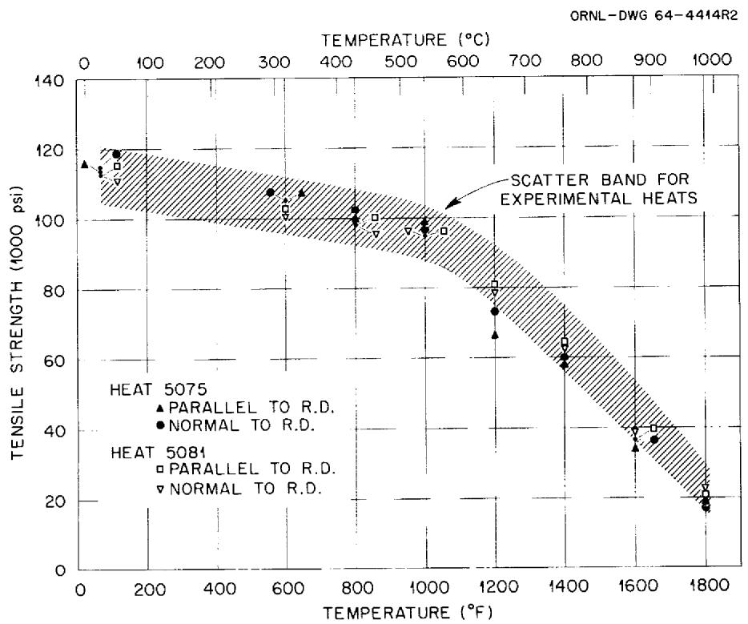  
Fig. 5. Ultimate Tensile Strength of MSRE INOR-8.

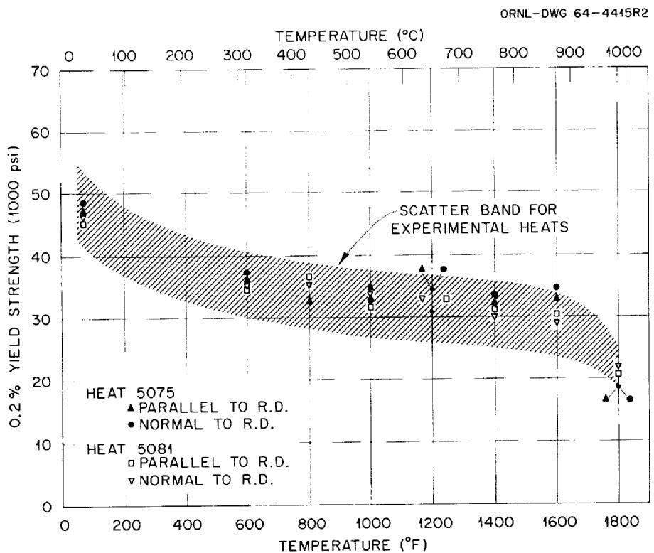  
Fig. 6. Two Percent Yield Strength of MSRE INOR-8.

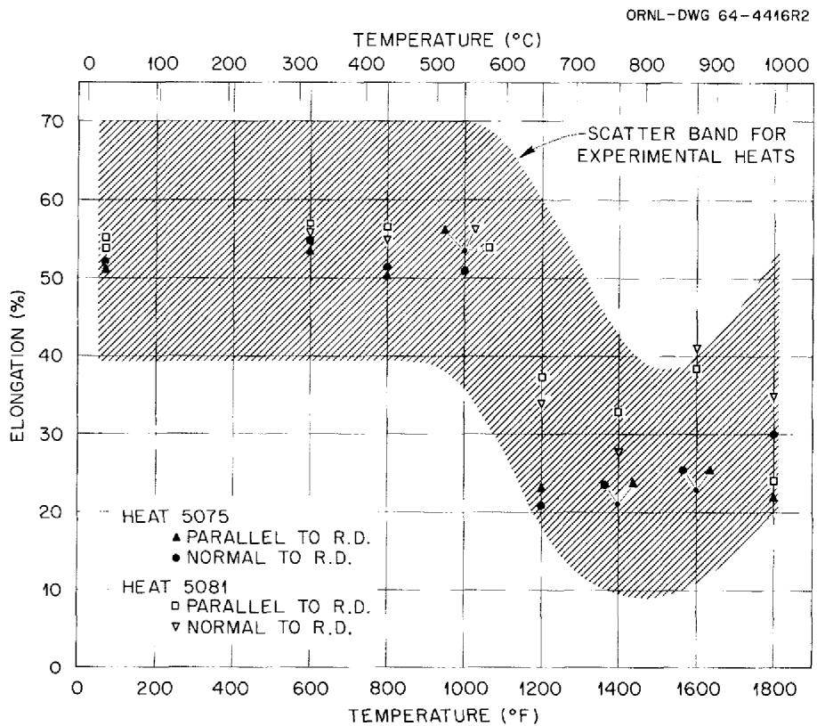  
Fig. 7. Elongation in 2 in. of MSRE INOR-8.

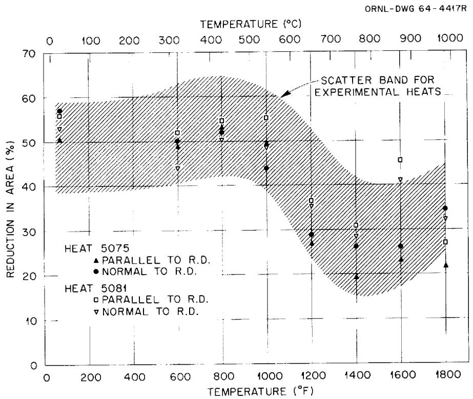  
Fig. 8. Reduction of Area of MSRE INOR-8.

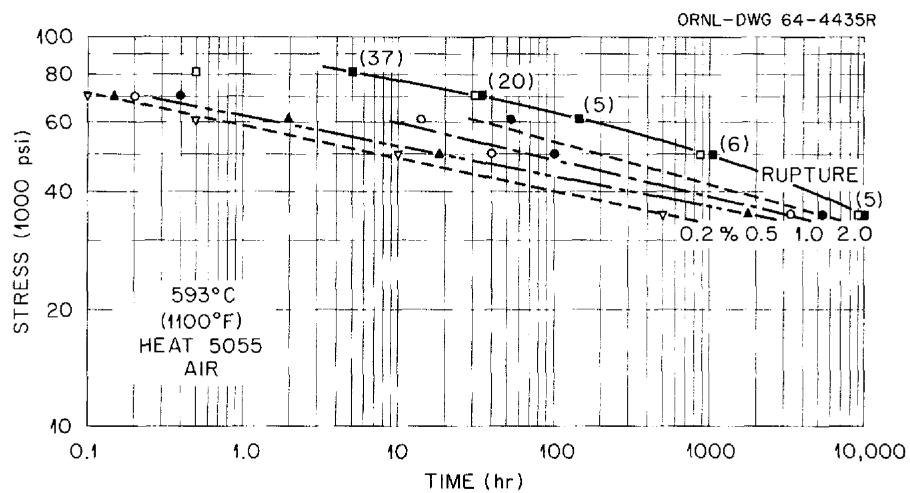  
Fig. 9. Creep and Rupture Data for MSRE INOR-8.

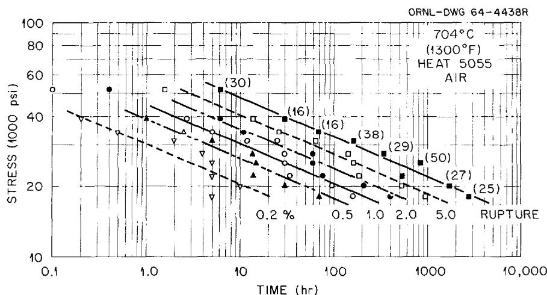  
Fig. 10. Creep and Rupture Data for MSRE INOR-8.

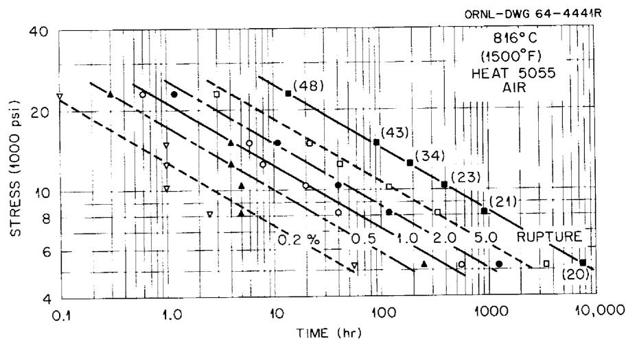  
Fig. 11. Creep and Rupture Data for MSRE INOR-8.

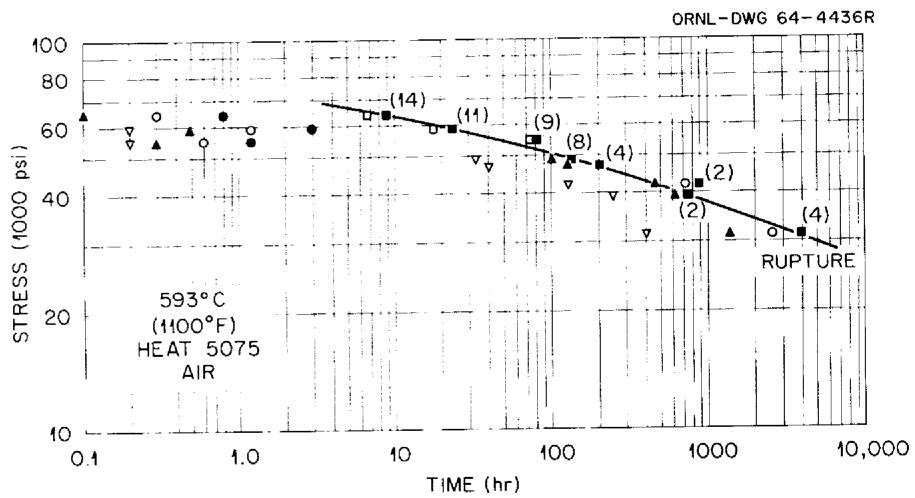  
Fig. 12. Creep and Rupture Data for MSRE INOR-8.

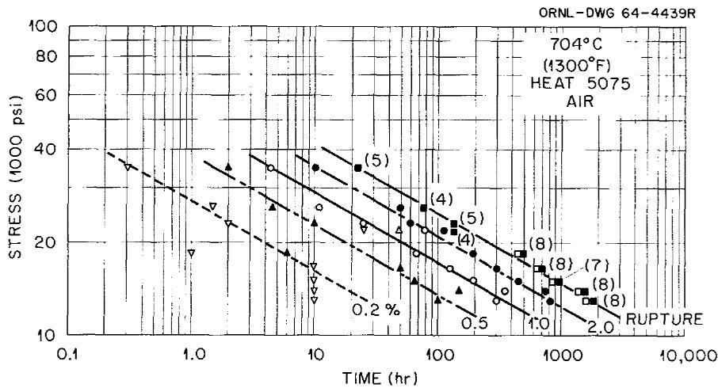  
Fig. 13. Creep and Rupture Data for MSRE INOR-8.

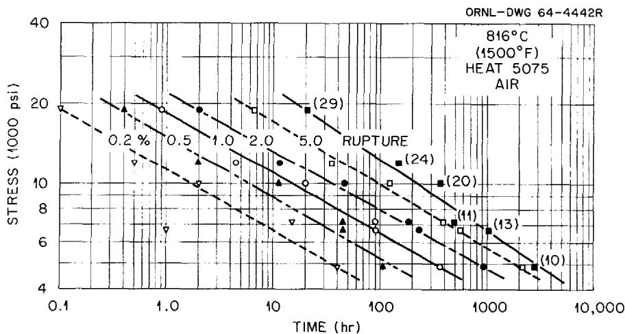  
Fig. 14. Creep and Rupture Data for MSRE INOR-8.

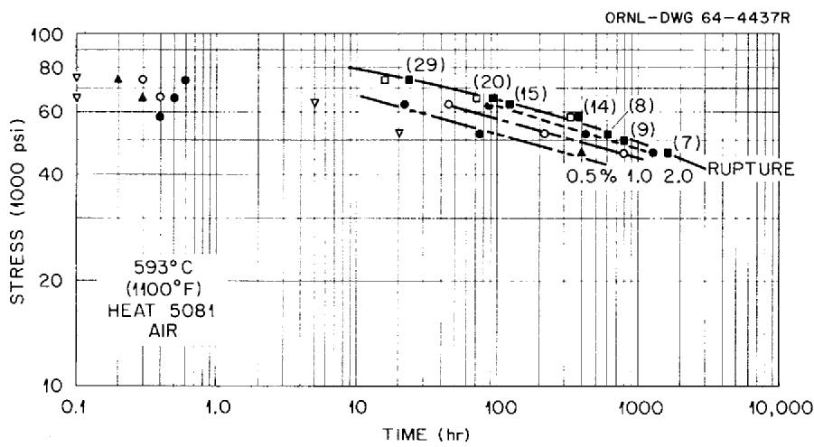  
Fig. 15. Creep and Rupture Data for MSRE INOR-8.

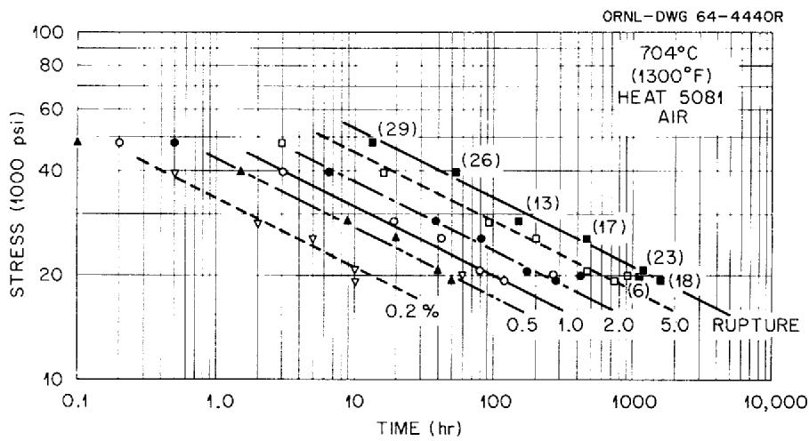  
Fig. 16. Creep and Rupture Data for MSRE INOR-8.

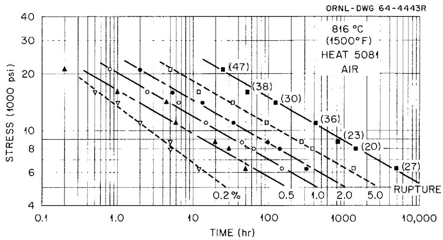  
Fig. 17. Creep and Rupture Data for MSRE INOR-8.

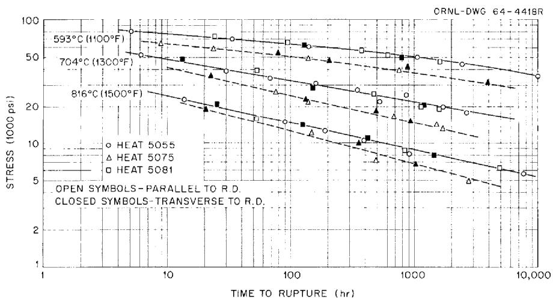  
Fig. 18. Stress-Rupture Behavior of MSRE INOR-8.

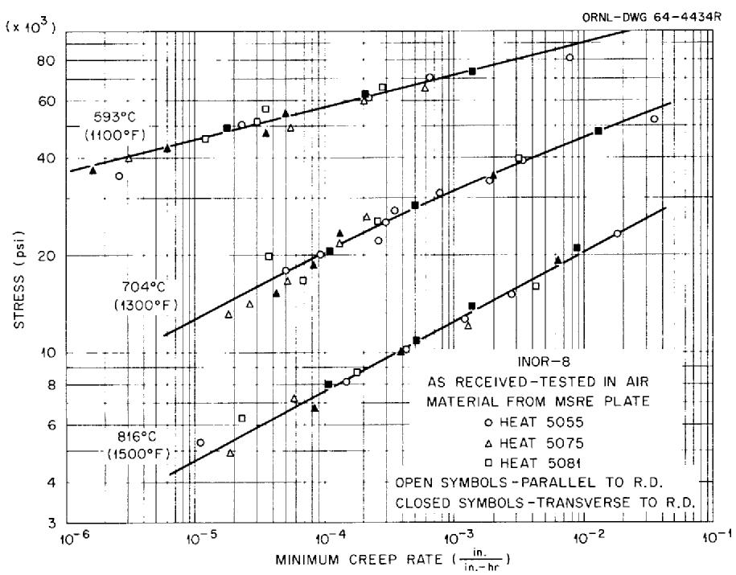  
Fig. 19. Creep Behavior of MSRE INOR-8.

# CONCLUSIONS

These experiments on three heats of INOR-8 used in the MSRE construction can be summarized with the following conclusions:

1. The tensile properties are equivalent to those for earlier experimental heats of INOR-8.   
2. The three heats tested show no tensile strength variation with plate orientation or with heat.   
3. One heat (5075) exhibited somewhat less ductility at temperatures above approximately $538^{\circ}\mathrm{C}$ ( $1000^{\circ}\mathrm{F}$ ) compared with heats 5055 and 5081.   
4. Rupture strength in creep for these 3 heats is somewhat better than those for the earlier heats.   
5. The minimum creep rate behavior of all three heats is the same.

Since the design of the MSRE was based on the data from earlier experimental heats of INOR-8, it would appear that an extra measure of confidence in the integrity of the INOR-8 components of the reactor components is in order.

# ACKNOWLEDGEMENTS

The author wishes to express his appreciation to the Graphic Arts Department and the Metals and Ceramics Division Reports Office for their help in preparing this document. The work of C. W. Walker, who ran the creep experiments; C. W. Dollins, who ran the tensile tests; and V. G. Lane, who helped prepare the data, is also appreciated.

# INTERNAL DISTRIBUTION

<table><tr><td>1-2.</td><td>Central Research Library</td><td>53.</td><td>E.</td><td>C.</td><td>Hise</td></tr><tr><td>3.</td><td>ORNL - Y-l2 Technical Library</td><td>54.</td><td>H.</td><td>W.</td><td>Hoffman</td></tr><tr><td></td><td>Document Reference Section</td><td>55.</td><td>P.</td><td>P.</td><td>Holz</td></tr><tr><td>4-6.</td><td>Laboratory Records</td><td>56.</td><td>L.</td><td>N.</td><td>Howell</td></tr><tr><td>7.</td><td>Laboratory Records, ORNL RC</td><td>57.</td><td>P.</td><td>R.</td><td>Kasten</td></tr><tr><td>8.</td><td>ORNL Patent Office</td><td>58.</td><td>R.</td><td>J.</td><td>Kedl</td></tr><tr><td>9.</td><td>G. M. Adamson, Jr.</td><td>59.</td><td>C.</td><td>R.</td><td>Kennedy</td></tr><tr><td>10.</td><td>L. G. Alexander</td><td>60.</td><td>B.</td><td>W.</td><td>Kinyon</td></tr><tr><td>11.</td><td>S. E. Beall</td><td>61.</td><td>R.</td><td>W.</td><td>Knight</td></tr><tr><td>12.</td><td>C. E. Bettis</td><td>62.</td><td>V.</td><td>G.</td><td>Lane</td></tr><tr><td>13.</td><td>E. S. Bettis</td><td>63.</td><td>M.</td><td>I.</td><td>Lundin</td></tr><tr><td>14.</td><td>D. S. Billington</td><td>64.</td><td>H.</td><td>G.</td><td>MacPherson</td></tr><tr><td>15.</td><td>F. F. Blankenship</td><td>65.</td><td>E.</td><td>R.</td><td>Mann</td></tr><tr><td>16.</td><td>G. E. Boyd</td><td>66.</td><td>W.</td><td>R.</td><td>Martin</td></tr><tr><td>17.</td><td>A. L. Boch</td><td>67.</td><td>H.</td><td>E.</td><td>McCoy</td></tr><tr><td>18.</td><td>S. E. Bolt</td><td>68.</td><td>W.</td><td>B.</td><td>McDonald</td></tr><tr><td>19.</td><td>C. J. Borkowski</td><td>69.</td><td>C.</td><td>K.</td><td>McGlothlan</td></tr><tr><td>20.</td><td>E. J. Breeding</td><td>70-72.</td><td>E.</td><td>C.</td><td>Miller</td></tr><tr><td>21.</td><td>F. R. Bruce</td><td>73.</td><td>R.</td><td>L.</td><td>Moore</td></tr><tr><td>22.</td><td>O. W. Burke</td><td>74.</td><td>J.</td><td>C.</td><td>Moyers</td></tr><tr><td>23.</td><td>D. O. Campbell</td><td>75.</td><td>C.</td><td>W.</td><td>Nestor</td></tr><tr><td>24.</td><td>S. Cantor</td><td>76.</td><td>T.</td><td>E.</td><td>Northup</td></tr><tr><td>25.</td><td>W. G. Cobb</td><td>77.</td><td>L.</td><td>F.</td><td>Parsly</td></tr><tr><td>26.</td><td>J. A. Conlin</td><td>78.</td><td>P.</td><td>Patriarca</td><td></td></tr><tr><td>27.</td><td>W. H. Cook</td><td>79.</td><td>H.</td><td>R.</td><td>Payne</td></tr><tr><td>28.</td><td>L. T. Corbin</td><td>80.</td><td>W.</td><td>B.</td><td>Pike</td></tr><tr><td>29.</td><td>G. A. Cristy</td><td>81.</td><td>M.</td><td>R.</td><td>Richardson</td></tr><tr><td>30.</td><td>J. L. Crowley</td><td>82.</td><td>R.</td><td>C.</td><td>Robertson</td></tr><tr><td>31.</td><td>F. L. Culler</td><td>83.</td><td>T.</td><td>K.</td><td>Roche</td></tr><tr><td>32.</td><td>J. E. Cunningham</td><td>84.</td><td>H.</td><td>W.</td><td>Savage</td></tr><tr><td>33.</td><td>W. W. Davis</td><td>85.</td><td>J.</td><td>H.</td><td>Shaffer</td></tr><tr><td>34.</td><td>J. H. Devan</td><td>86.</td><td>G.</td><td>M.</td><td>Slaughter</td></tr><tr><td>35.</td><td>C. W. Dollins</td><td>87.</td><td>A.</td><td>N.</td><td>Smith</td></tr><tr><td>36.</td><td>R. G. Donnelly</td><td>88.</td><td>P.</td><td>G.</td><td>Smith</td></tr><tr><td>37.</td><td>D. A. Douglas, Jr.</td><td>89.</td><td>I.</td><td>Spiewak</td><td></td></tr><tr><td>38.</td><td>E. P. Epler</td><td>90.</td><td>R.</td><td>L.</td><td>Stephenson</td></tr><tr><td>39.</td><td>W. K. Ergen</td><td>91.</td><td>R.</td><td>W.</td><td>Swindeman</td></tr><tr><td>40.</td><td>A. P. Fraas</td><td>92.</td><td>A.</td><td>Taboada</td><td></td></tr><tr><td>41.</td><td>J. H Frye, Jr.</td><td>93.</td><td>J.</td><td>R.</td><td>Tallackson</td></tr><tr><td>42.</td><td>C. H. Gabbard</td><td>94.</td><td>A.</td><td>E.</td><td>Thoma</td></tr><tr><td>43.</td><td>W. R. Gall</td><td>95.</td><td>D.</td><td>B.</td><td>Trauger</td></tr><tr><td>44.</td><td>R. B. Gallaher</td><td>96-101.</td><td>J.</td><td>T.</td><td>Venard</td></tr><tr><td>45.</td><td>R. G. Gilliland</td><td>102.</td><td>W.</td><td>C.</td><td>Ulrich</td></tr><tr><td>46.</td><td>W. R. Grimes</td><td>103.</td><td>J.</td><td>R.</td><td>Weir</td></tr><tr><td>47.</td><td>A. G. Grindell</td><td>104.</td><td>C.</td><td>W.</td><td>Walker</td></tr><tr><td>48.</td><td>D. G. Harmon</td><td>105.</td><td>D.</td><td>C.</td><td>Watkin</td></tr><tr><td>49.</td><td>C. S. Harrill</td><td>106.</td><td>A.</td><td>M.</td><td>Weinberg</td></tr><tr><td>50-52.</td><td>M. R. Hill</td><td>107.</td><td>J.</td><td>H.</td><td>Westsik</td></tr></table>

108. L. V. Wilson   
109. C. H. Wödtke   
110. J.W.Woods

# EXTERNAL DISTRIBUTION

111. C. M. Adams, Jr., Massachusetts Institute of Technology   
112-113. A. E. Carden, University of Alabama   
114-115. David F. Cope, AEC, ORO   
116-118. J. Simmons, AEC, Washington   
119. Research and Development, AEC, ORO   
120-134. Division of Technical Information Extension