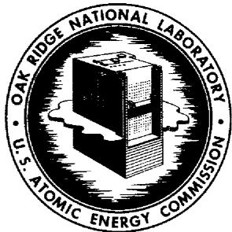

# OAK RIDGE NATIONAL LABORATORY

operated by  
UNION CARBIDE CORPORATION for the

U.S. ATOMIC ENERGY COMMISSION

ORNL-TM-1023

61

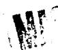

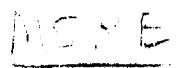

TUBE PLUGGING IN THE MOLTEN-SALT REACTOR EXPERIMENT

PRIMARY HEAT EXCHANGER

R. G. Donnelly

# NOTICE

This document contains information of a preliminary nature and was prepared primarily for internal use at the Oak Ridge National Laboratory. It is subject to revision or correction and therefore does not represent a final report. The information is not to be abstracted, reprinted or otherwise given public dissemination without the approval of the ORNL patent branch, Legal and Information Control Department.

# LEGAL NOTICE

This report was prepared as an account of Government sponsored work. Neither the United States, nor the Commission, nor any person acting on behalf of the Commission:

A. Makes any warranty or representation, expressed or implied, with respect to the accuracy, completeness, or usefulness of the information contained in this report, or that the use of any information, apparatus, method, or process disclosed in this report may not infringe privately owned rights; or   
B. Assumes any liabilities with respect to the use of, or for damages resulting from the use of any information, apparatus, method, or process disclosed in this report. As used in the above, "person acting on behalf of the Commission" includes any employee or contractor of the Commission, or employee of such contractor, to the extent that such employee or contractor of the Commission, or employee of such contractor prepares, disseminates, or provides access to, any information pursuant to his employment or contract with the Commission, or his employment with such contractor.

Contract No. W-7405-eng-26

METALS AND CERAMICS DIVISION

TUBE PLUGGING IN THE MOLTEN-SALT REACTOR EXPERIMENT PRIMARY HEAT EXCHANGER

R. G. Donnelly

FEBRUARY 1965

OAK RIDGE NATIONAL LABORATORY

Oak Ridge, Tennessee

operated by

UNION CARBIDE CORPORATION

for the

U. S. ATOMIC ENERGY COMMISSION

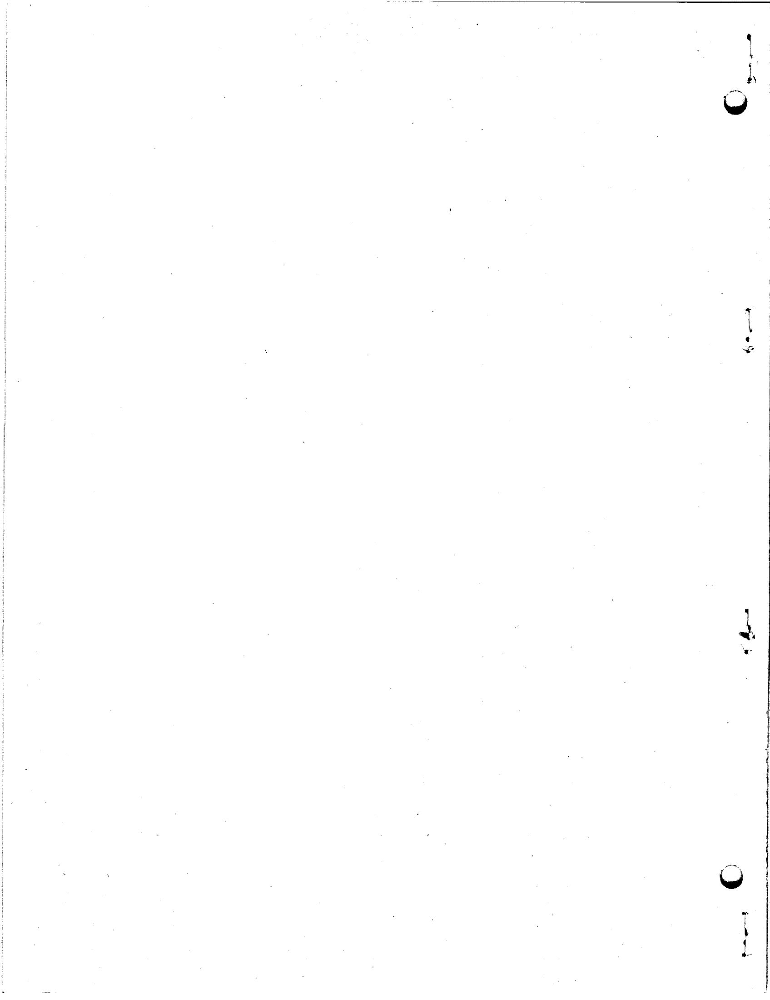

# TUBE PLUGGING IN THE MOLTEN-SALT REACTOR EXPERIMENT PRIMARY HEAT EXCHANGER

R. G. Donnelly

# ABSTRACT

In order to reduce the pressure drop through the shell side of the Molten-Salt Reactor Experiment primary heat exchanger, it was decided to remove four of the outer U-tubes. This required sealing the eight tube stubs produced.

A plug design and seal welding procedure were developed to assure a high-integrity seal between the molten fuel salt on the shell side and the coolant salt on the tube side of the heat exchanger. The plugs were made to have a slight interference fit (0.0000 to 0.0002 in.) with the tubes and were machined for edge-welding. The plug material was INOR-8 as was the entire heat exchanger.

The procedure for making the seals was to manually weld the tube end to the plug with a gas tungsten-arc torch. The welding conditions were adjusted to provide weld metal penetration equivalent to at least the thickness of the tube wall.

Visual, dye-penetrant, and radiographic examinations of the welds gave every indication that high-integrity welds had been made that would successfully isolate the fuel salt from the coolant salt during the planned operation of the heat exchanger.

# INTRODUCTION

During preinstallation flow testing of the primary heat exchanger for the Molten-Salt Reactor Experiment (MSRE), the pressure drop through the shell side was found to be significantly greater than was desired and required modification. The heat exchanger is of the conventional U-tube design (See Fig. 1), with tubes being 0.50-in. OD × 0.042-in. wall. All 326 tube ends are joined to a 17-in. diam × 1.50-in. thick tube sheet by welding and back brazing. $^{1}$

The containment material is the commercially available alloy, INOR-8

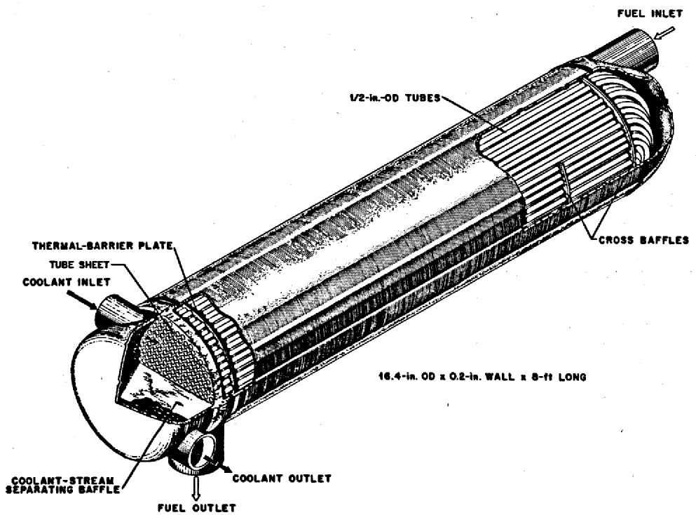  
Fig. 1. Molten-Salt Reactor Experiment Primary Heat Exchanger.

(Ni-17 Mo-7 Cr-4 Fe, wt %). This alloy is a nonage-hardenable high-strength material which possesses excellent corrosion resistance to the molten salts and good oxidation resistance. It also exhibits good general weldability. However, it has shown a tendency toward microfissuring under certain welding conditions. Thus, the welding procedure and joint design were more critical than usual.

The method approved for reducing the pressure drop was to remove the four outer U-tubes which were situated directly at the mouth of the shell-side inlet and outlet nozzles. After removal of the shell, the four tubes were cut, leaving eight stubs to be plugged. This was accomplished by pressing in INOR-8 plugs and seal welding.

The development of procedures, qualification of the welder, and the actual tube plugging operation are described.

# DEVELOPMENTAL WORK

# Joint Design

Due to the low-pressure differential (50 psi) between the tube and shell sides of the heat exchanger, the plug was not required to have great strength; however, a leak-tight joint was essential. Therefore, with these facts in mind and taking into account the proximity of the adjacent U-tubes, an edge-type weld preparation was made on the plugs as shown in Fig. 2.

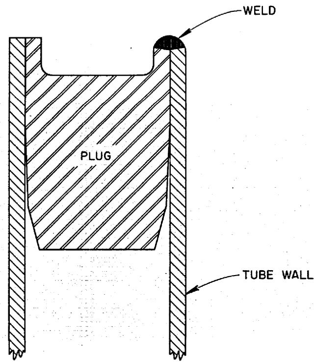  
UNCLASSIFIED ORNL-DWG 64-11   
Fig. 2. Schematic of Tube Plugging Design.

Each plug was positioned flush with the tube end. It was felt that a qualified welder with a small gas tungsten-arc torch could more easily make a high-quality weld on this type of joint than on any other. Since the edge-type weld design also readily allows the tube end to be joined to a member of similar thickness, adequate joint penetration is more easily assured.

Both the square-edge design and beveled-edge design were investigated. The thickness of the lip on the plug was also varied; the amounts being 1, 1 1/4, and 1 1/2 times the tube-wall thickness. In addition, joints were welded by single-pass fusion, single pass with filler, and by a combination of fusion and filler passes. In the end, no combination proved better than the square-edge design with a lip thickness equal to the tube-wall thickness welded in one fusion pass. However, a lip thickness of 1 1/4T was ultimately chosen to assure a minimum of 1T weld penetration in any section of the weld.

The plugs were tapered and machined for each individual tube to provide a slight interference fit (Fig. 3). An interference of 0.0005-in. was found to cause difficulty in fitting in some cases, so a value of +0.0002 -0.0000 -in. was chosen. With such a tight fit none of the 30 samples examined metallographically exhibited any indication of root cracking.

# Welding Procedures

With the joint and plug designs chosen, the welding parameters of arc current, travel speed, and electrode orientation were varied in an effort to determine the optimum combination. In addition, a copper chill was fitted to the tubes at a distance of about 0.070 in. from the top of the joint. It was felt that this would tend to even out the thermal gradients between the tube and plug.

Welding current was varied from 30 to 45 amps, and time for one revolution was varied from 40 to 77 sec. An overlap of 3/16 to 1/4-in. was made at full amperage, and a foot-operated current tapering device was used at the beginning and end of each weld to eliminate weld craters. The conditions giving the best penetration and weld configuration were:

Electrode material: W + 2% thoria

Electrode diameter: 1/16-in.

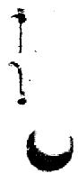

Fig. 3. Tube Plug for MSRE Heat Exchanger.   
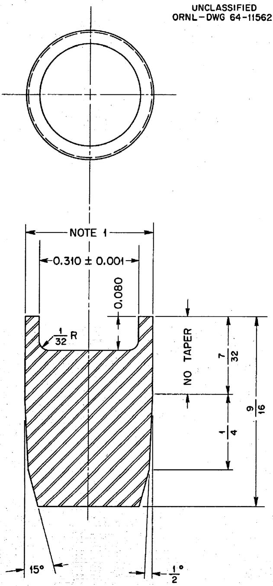  
NOTE 1: MAXIMUM TUBE I.D. +0.0002 -0.0000   
MATERIAL: INOR-8 ROD

DIMENSIONS ARE IN INCHES

Inert gas: argon (99.995% purity)

Gas flow rate: 17 cfh

Welding current: (34 ±1)amp

Welding speed: 40 to 55 sec/joint

The position of the electrode with respect to the joint was found to have an effect on the configuration and, therefore, the effective penetration of the weld. The best results were obtained by holding the electrode tip on the outside edge of the tube. This required that the welder touch the adjacent tubes with the electrically insulated parts of the torch. A photomicrograph of a typical joint welded under these conditions is presented in Fig. 4.

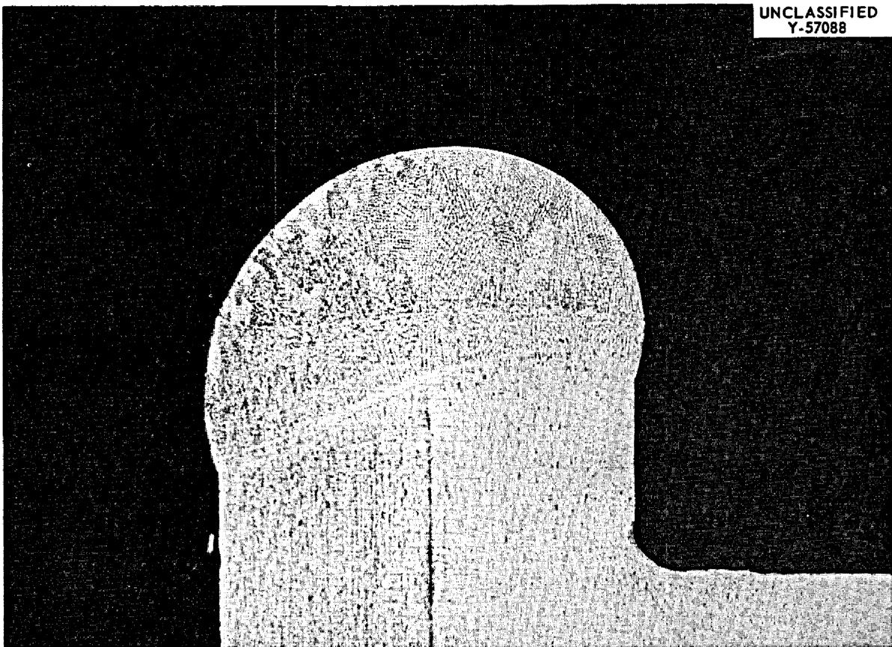  
Fig. 4. Photomicrograph of a Qualification Test Sample. $40 \times$

# WELDER QUALIFICATION

The welder was qualified on joints in a setup which simulated the configuration of the actual heat exchanger. The mockup is shown in Fig. 5. The welder had been previously qualified for gas tungsten-arc welding of INOR-8 in accordance with ORNL Operator's Qualification Test QTS-25.

The qualification welds were required to have the following: (1) uniform weld contour with no visual evidence of cracking or porosity, (2) no positive dye-penetrant indications, (3) weld penetration of at least one times the tube-wall thickness as evidenced by metallographic examination, and (4) no porosity of a size greater than $10\%$ of the tube-wall thickness when radiographed in accordance with paragraph UW-51, Section 8, ASME Boiler and Pressure Vessel Code. All requirements were met, and no porosity of any size was revealed.

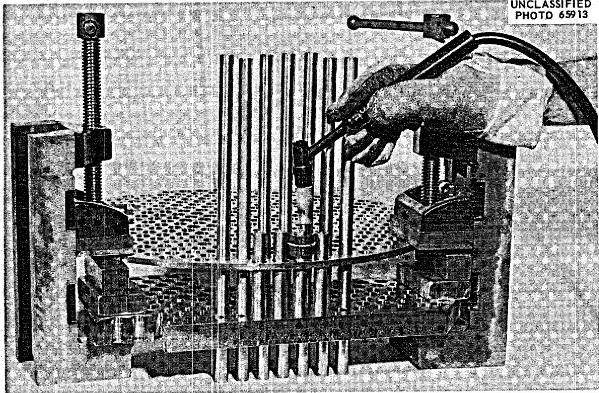  
Fig. 5. Mockup of Heat Exchanger Used in Welder's Qualification Test.

Prior to making the welds on the heat exchanger, the welder was also required to make one or more sample welds for visual examination as required by the welding inspector.

# THE TUBE PLUGGING OPERATION

The first item in the procedure was to remove the four outer U-tubes. Heavy metal bars were clamped to the four tubes to act as guides for the pneumatically operated abrasive wheel that was used for the cutting operation. Metal plates were also used between the tubes being cut and adjacent tubes to prevent any damage by the cutting wheel. The cuts were made 1 l/8 in. from the barrier plate. This allowed sufficient room for the chill block and also for repreparation of a tube end should this be necessary

In addition to the four U-tubes, four adjacent baffle support rods were also removed to provide access for the welding torch. These rods were not replaced.

The resultant eight tube stubs were squared off, deburred, and cleaned of all oxides for at least 1 in. from their ends. The inside diameter of each tube end was then measured, and the maximum reading for each recorded. The results are listed in Table 1 along with the plug diameters for their respective tubes. It will be noted that the plug for tube "E" was 0.0002 in. greater than the $+0.0002$ in. range desired. Nevertheless, the plug was fitted without difficulty.

Immediately before fitting a plug, both the tube and the plug were degreased with acetone. The plug was then set into the tube stub with a cleaned punch. A shoulder on the punch stopped the plug flush with the tube end. After fitting the chill block, the welding sequence discussed previously was followed and the joint visually inspected. The process was repeated for each tube.

Visual examination revealed two welds that had areas of questionable penetration. After demonstrating repair operations on sample welds, the welder went over the two areas at full amperage to assure sufficient penetration.

Table 1. Tube and Plug Measurements   

<table><tr><td>Tube Designation</td><td>Tube Inside Diameter Maximum (in.)</td><td>Plug Outside Diameter (in.)</td></tr><tr><td>A</td><td>0.4151</td><td>0.4153</td></tr><tr><td>B</td><td>0.4157</td><td>0.4157</td></tr><tr><td>C</td><td>0.4176</td><td>0.4176</td></tr><tr><td>D</td><td>0.4133</td><td>0.4134</td></tr><tr><td>E</td><td>0.4142</td><td>0.4146a</td></tr><tr><td>F</td><td>0.4162</td><td>0.4162</td></tr><tr><td>G</td><td>0.4156</td><td>0.4156</td></tr><tr><td>H</td><td>0.4134</td><td>0.4135</td></tr></table>

$^{a}0.0002$ in. oversize.

All welds were then inspected by dye-penetrant and radiographic methods. No imperfections were revealed. A photograph of four of the sealed tubes is presented in Fig. 6.

# CONCLUSIONS

As a result of this work, it is felt that the tube plugging procedures and joint design developed are consistent with the operating requirements of the heat exchanger.

The use of these procedures, coupled with a specially qualified welder, has resulted in sound welded joints which give every indication of successfully sealing the molten fuel salt from the coolant salt during the planned operation of the heat exchanger.

# ACKNOWLEDGMENT

The author would like to thank the following people who contributed to this work and whose personal interest in high-quality workmanship are appreciated: R. G. Shooster of the Welding and Brazing Group, Metals and Ceramics Division; T. R. Housley and J. W. Hunley of the Plant and Equipment Division, Welding Inspection Group; and W. H. Brown, welder with the Plant and Equipment Division, Research Services Group. The metallographic assistance of E. R. Boyd of the Metals and Ceramics Division's Metallography Group is also acknowledged.

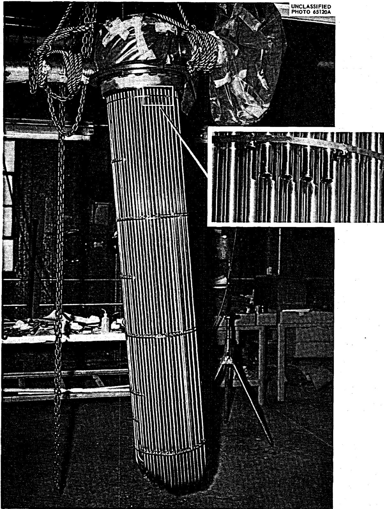  
Fig. 6. Four of the Sealed Tubes Inverted from Welding Position (see inset).

# INTERNAL DISTRIBUTION

1-3. Central Research Library 37. W. R. Gall   
4. Reactor Division Library 38. R. G. Gilliland   
5-6. ORNL - Y-12 Technical Library 39-41. M. R. Hill   
Document Reference Section 42. T. R. Housley   
7-16. Laboratory Records Department 43. H. G. MacPherson   
17. Laboratory Records, ORNL RC 44. W. B. McDonald   
18. ORNL Patent Office 45. W. R. Martin   
19. G.M.Adamson 46.R.W.McClung   
20. E.S.Bettis 47.P.Patriarca   
21. G.E. Boyd 48. G.M.Slaughter   
22. R.B.Briggs 49.A.Taboada   
23. K.V.Cook 50.J.R.Tallackson   
24. J.E.Cunningham 51.W.C.Thurber   
25-34. R.G.Donnelly 52.A.M.Weinberg   
35. C.W.Fox 53.J.H.Westsik   
36. J. H Frye, Jr.

# EXTERNAL DISTRIBUTION

54. C. M. Adams, Jr., Massachusetts Institute of Technology   
55-56. D.F.Cope,AEC,Oak Ridge Operations Office   
57. J. L. Gregg, Bard Hall, Cornell University   
58. J. Simmons, AEC, Washington   
59. E. E. Stansbury, University of Tennessee   
60. Research and Development Division, AEC,ORO   
61-75. Division of Technical Information Extension