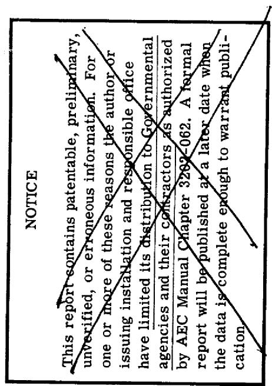
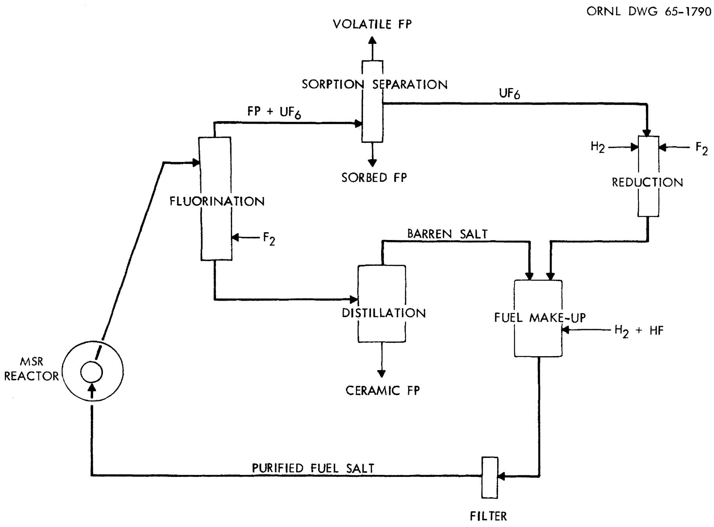
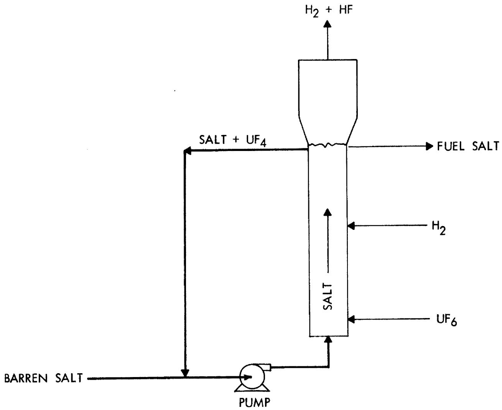
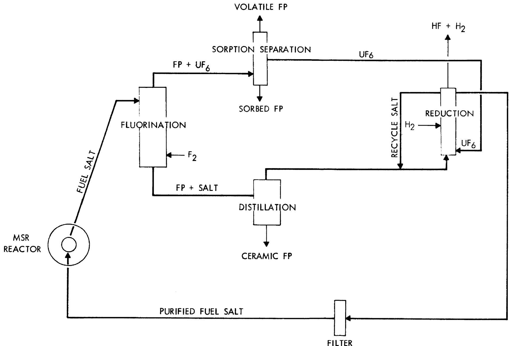
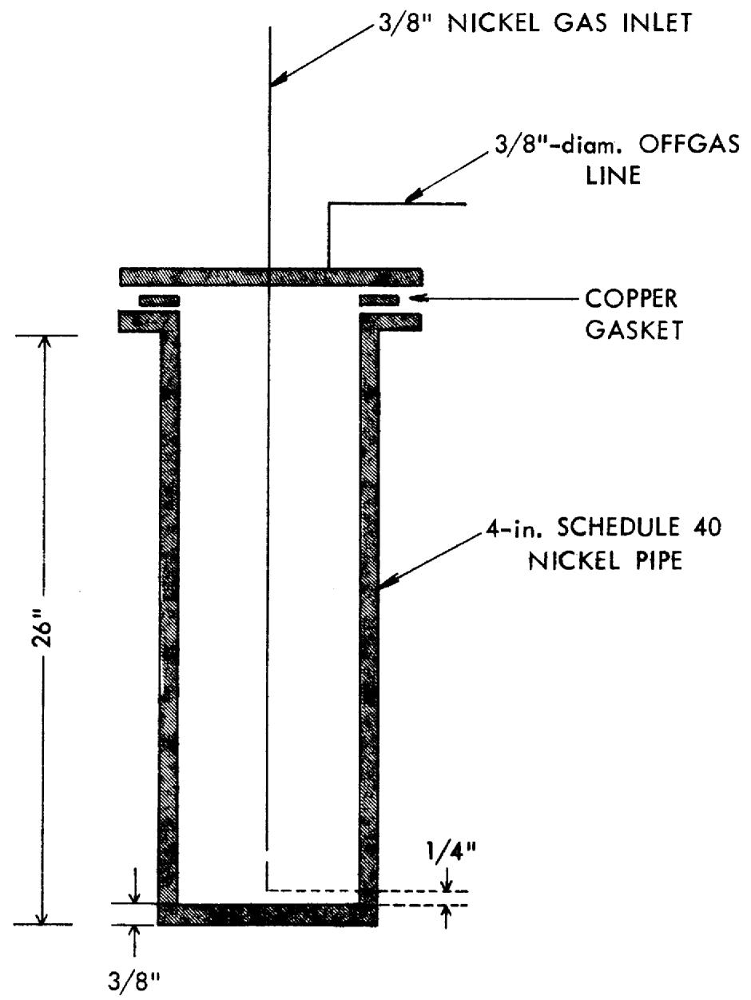
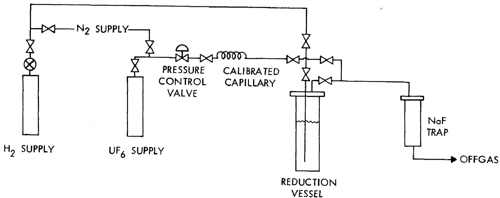

# OAK RIDGE NATIONAL LABORATORY

operated by

UNION CARBIDE CORPORATION

for the

U.S. ATOMIC ENERGY COMMISSION

ORNL-TM-1051

COPY NO. -

DATE-March 11,1965

RECONSTITUTION OF MSR FUEL BY REDUCING UF 6 GAS TO UF 4 IN A MOLTEN SALT

L. E. McNeese

C. D. Scott

NOT FOR PUBLIC RELEASE OFFICIAL DISTRIBUTION MAY BE MADE OFFICIAI REQUESTS MAY BE PIELED REPORT CONTAINS PATENT INTEREST PROCEDURE ON EILE IN RECEIVING SECTION.

DISTRIBUTION OF THIS DOCUMENT UNLIMITED

# LEGAL NOTICE

This report was prepared as an account of Government sponsored work. Neither the United States, nor the Commission, nor any person acting on behalf of the Commission:

A. Makes any warranty or representation, expressed or implied, with respect to the accuracy, completeness, or usefulness of the information contained in this report, or that the use of any information, apparatus, method, or process disclosed in this report may not infringe privately owned rights; or   
B. Assumes any liabilities with respect to the use of, or for damages resulting from the use of any information, apparatus, method, or process disclosed in this report.

As used in the above, "person acting on behalf of the Commission" includes any employee or contractor of the Commission, or employee of such contractor, to the extent that such employee or contractor of the Commission, or employee of such contractor prepares, disseminates, or provides access to, any information pursuant to his employment or contract with the Commission, or his employment with such contractor.

CHEMICAL TECHNOLOGY DIVISION

RECONSTITUTION OF MSR FUEL BY REDUCING UF6 GAS TO UF4 IN A MOITEN SALT

by

L. E. McNeese

C. D. Scott

# NOTICE

This report was prepared as an account of work sponsored by the United States Government. Neither the United States nor the United States Energy Research and Development Administration, nor any of their employees, nor any of their contractors, subcontractors, or their employees, makes any warranty, express or implied, or assumes any legal liability or responsibility for the accuracy, completeness or usefulness of any information, apparatus, product or process disclosed, or represents that its use would not infringe privately owned rights.

OAK RTDGE NATIONAL LABORATORY

Oak Ridge, Tennessee

operated by

UNION CARBIDE CORPORATION

for the

U.S. ATOMIC ENERGY COMMISSION

#

#

# CONTENTS

Abstract 1

Introduction 1

Proposed Process and Application to MSR Processing 2

Experimental Equipment and Procedure 4

Discussion of Experimental Results 10

Conclusion and Recommendations 13

References 14

# RECONSTITUTION OF MSR FUEL BY REDUCING

UF 6 GAS TO UF 4 IN A MOLTEN SALT

L. E. McNeese

C. D. Scott

# ABSTRACT

The direct reduction of $\mathbf{U}\mathbf{F}_{6}$ to $\mathbf{U}\mathbf{F}_{4}$ in a molten salt is proposed as a step in the purification of fuel salt from a molten salt reactor. This step would replace the conventional method of reduction in which $\mathbf{U}\mathbf{F}_{6}$ is reduced to $\mathbf{U}\mathbf{F}_{4}$ powder in a $\mathbf{H}_{2} - \mathbf{F}_{2}$ flame. Reduction of the $\mathbf{U}\mathbf{F}_{6}$ in a molten salt will result in a shorter and more direct process for fuel salt purification. The reduction is to be effected in two steps which consist of absorption of $\mathbf{U}\mathbf{F}_{6}$ into a molten salt containing $\mathbf{U}\mathbf{F}_{4}$ and of reduction of the resulting intermediate fluorides to $\mathbf{U}\mathbf{F}_{4}$ with hydrogen. Experimental data on the absorption step are presented and information concerning the reduction of intermediate fluorides is considered.

# INTRODUCTION

One proposed processing step for Molten Salt Reactor (MSR) fuel is the reduction of purified $\mathsf{UF}_6$ to $\mathsf{UF}_4$ , so that the $\mathsf{UF}_4$ can be returned to barren, purified fuel salt. The usual method for reducing $\mathsf{UF}_6$ to $\mathsf{UF}_4$ is by use of $\mathsf{H}_2$ in a $\mathsf{H}_2$ - $\mathsf{F}_2$ flame:

$$
\mathrm {U F} _ {6} + \mathrm {H} _ {2} \xrightarrow {\left(\mathrm {H} _ {2} + \mathrm {F} _ {2}\right)} \mathrm {U F} _ {4} + 2 \mathrm {H F}.
$$

This reduction is carried out in a tall column where the $\mathbf{U}\mathbf{F}_6$ and $\mathbf{H}_2$ are introduced into a $\mathbf{H}_2$ - $\mathbf{F}_2$ flame and dry $\mathbf{U}\mathbf{F}_4$ powder (finely divided) is collected. It is a routine production operation and there is much available operating information. $^{(2,3)}$ Such a process would not be desirable for remote operation. It involves a solids handling problem which routinely requires equipment access and process control is sometimes difficult.

It would be desirable to reduce the $\mathbf{U}\mathbf{F}_{6}$ to $\mathbf{U}\mathbf{F}_{4}$ in a molten salt environment, and thus circumvent the problems of solids handling and fuel make-up. Past experience of other workers has indicated the

feasibility of absorbing $\mathsf{UF}_6$ into molten salt which contains $\mathsf{UF}_4$ and reducing the absorbed $\mathsf{UF}_6$ to $\mathsf{UF}_4$ by sparging with $\mathsf{H}_2$ . Kirslis found that corrosion was not severe in absorption of $\mathsf{F}_2$ by molten salt containing U until the intermediate fluoride of uranium had a fluoride content greater than $\mathsf{UF}_5$ . Long found that $\mathsf{H}_2$ would reduce $\mathsf{UF}_4$ to $\mathsf{UF}_3$ in a molten salt and Blood has reduced various metal fluorides in molten salts by use of $\mathsf{H}_2$ .

This report presents a proposed continuous processing method for the reduction of $\mathsf{UF}_6$ to $\mathsf{UF}_{4}$ in a molten salt environment by absorption of $\mathsf{UF}_6$ in the salt and reduction with $\mathsf{H}_2$ . The results from a scouting test are analyzed to indicate process feasibility.

# PROPOSED PROCESS AND APPLICATION TO MSR PROCESSING

The current scheme for processing Molten Salt Reactor (MSR) fuel consists of removal of uranium as UF6 and volatile fission products (FP) from the salt by fluorination, separation of refractory FP from the salt by distillation, and recombination of the volutilized uranium and purified barren salt for return to the MSR (Fig. 1)(1). During the fluorination step, both uranium and volatile fission products are removed from the salt by the reactions:

$$
\begin{array}{l} \mathrm {U F} _ {4} (\text {i n m o l t e n s a l t}) ^ {+} \mathrm {F} _ {2} \longrightarrow \mathrm {U F} _ {6}, \\ F P (i n \text {m o l t e n s a l t}) + F _ {2} \rightarrow \text {v o l a t i l e} F P f l u o r i d e s. \\ \end{array}
$$

The $\mathsf{UF}_6$ and volatile FP fluorides will be separated by sorption techniques and the uranium will then be reintroduced as $\mathsf{UF}_4$ to the purified barren salt to form the MSR fuel. Thus, there must be a method for reducing $\mathsf{UF}_6$ to $\mathsf{UF}_4$ .

Since the end result of the $\mathsf{UF}_6$ reduction will be a solution of $\mathsf{UF}_4$ in molten salt rather than $\mathsf{UF}_4$ as a dry powder, it is attractive to carry on the reduction in a molten salt environment and preferably in the purified barren salt. To achieve this requirement, $\mathsf{UF}_6$ can be contacted with a molten fluoride salt containing some uranium as $\mathsf{UF}_4$ where it will be absorbed by reaction with the $\mathsf{UF}_4$ to form an equivalent intermediate fluoride of uranium, such as $\mathsf{UF}_5$ , in the salt:

  
Fig. 1. MSR Fuel Processing with Conventional UF $_6$ Reduction.

$$
\mathrm {U F} _ {4 (\text {s a l t})} + \mathrm {U F} _ {6} \longrightarrow \mathrm {U F} _ {5 (\text {s a l t})}
$$

This intermediate fluoride will then be reduced to $\mathbf{U}\mathbf{F}_{4}$ in the salt by means of $\mathbf{H}_{2}$ :

$$
\mathrm {U F} _ {5 (\text {s a l t})} + \frac {1 / 2 \mathrm {H}}{2} \longrightarrow \mathrm {U F} _ {4 (\text {s a l t})} + \mathrm {H F}.
$$

Such a process could be carried out continuously in a column in which the barren salt and $\mathsf{UF}_6$ are introduced at the bottom of the column along with salt containing $\mathsf{UF}_4$ which is recycled from the top of the column (Fig. 2). As the salt and $\mathsf{UF}_6$ progress up the column, the $\mathsf{UF}_6$ will be absorbed in the salt and subsequently reduced to $\mathsf{UF}_4$ as it passes into the $\mathsf{H}_2$ reduction section. The column off-gas will be a mixture of $\mathsf{H}_2$ and HF and a side stream of the overhead molten salt will be ready for return to the nuclear reactor core after filtration since the HF and $\mathsf{H}_2$ sparge usually given make-up salt will have been achieved in the reduction column. When this reduction step is incorporated into the flowsheet, the resulting process is more direct and shorter (Fig. 3).

Initial tests (next sect.) indicate that the absorption step is very rapid, however, it will be desirable to keep the fluoride content of the intermediate fluoride below that equivalent to $\mathsf{UF}_5$ in order to minimize corrosion. The rate of the hydrogen reduction reaction is not known, although the limited data available looks favorable. In studying the reduction of $\mathsf{UF}_4$ to $\mathsf{UF}_3$ in molten salt by $\mathsf{H}_2$ by the reaction:

$$
\mathrm {U F} _ {4 (\text {s a l t})} + 1 / 2 \mathrm {H} _ {2} \longrightarrow \mathrm {U F} _ {3 (\text {s a l t})} + \mathrm {H F},
$$

Long(5) observed that equilibrium was established between a $\mathsf{H}_2$ -HF stream and molten salt containing uranium fluorides after the gas bubbles had risen a few inches through the salt. His data also indicate only $1\%$ reduction of $\mathsf{UF}_4$ to $\mathsf{UF}_3$ by a gas stream containing $1\%$ HF in $\mathsf{H}_2$ at a pressure of 1 atm at $600^{\circ}\mathsf{C}$ .

# EXPERIMENTAL EQUIPMENT AND PROCEDURE

The experimental equipment was assembled from existing equipment available as a result of work in support of the Molten Salt Fluoride Volatility Process. Means were provided for contacting $\mathbf{U}\mathbf{F}_{4}$ , dissolved in molten salt, with $\mathbf{U}\mathbf{F}_{6}$ in the first step of the reduction process and

ORNL DWG 65-1791

  
Fig. 2. Continuous Reduction of $\mathsf{UF}_6$ by $\mathsf{H}_2$ in a Molten Salt.

  
Fig. 3. MSR Fuel Processing with Continuous $\mathsf{UF}_6$ Reduction in Molten Salt.

for contacting the resulting uranium fluoride with hydrogen in the second step. Details of the experimental equipment and of the procedure for testing the reduction process are discussed in the following sections.

# EQUIPMENT AND MATERIALS

The reduction test was carried out in the vessel shown schematically in Fig. 4. The vessel was constructed from 4-in.-diam Sch 40 nickel pipe and was 26 inches in length. A $3/8$ -in. nickel inlet line was located in the center of the vessel and terminated $1/4$ -in. from the bottom of the vessel. A $3/4$ -in. fitting on the top flange allowed the insertion of a cold, $3/8$ -in. nickel rod which was used for sampling the salt. The vessel was heated by two nichrome wire resistance furnaces.

A flow diagram for the equipment used in the test is shown in Fig. 5. The equipment included a UF $_6$ metering system, a hydrogen metering system, means for purging both the UF $_6$ system and H $_2$ system with N $_2$ , the reduction vessel, and a NaF trap downstream from the vessel for absorbing UF $_6$ or HF from the off-gas of the reduction vessel.

The salt charge was prepared by mixing LiF, $\mathrm{ZrF}_4$ and $\mathrm{UF}_4$ . The LiF was reagent grade and contained $< 0.23 \text{wt} \%$ impurities (mostly NaF). The zirconium content of the $\mathrm{ZrF}_4$ was found by analysis to be $54.78 \%$ which compares favorably with the stoichiometrical value of $54.6 \%$ the uranium content of the $\mathrm{UF}_4$ was found to be $76.9 \%$ which also compares favorably with the stoichiometrical value of $75.8 \%$ and the uranium hexafluoride contained less than 200 ppm impurities. Hydrogen that was used contained less than 0.005 vol fraction impurities.

# EXPERIMENTAL PROCEDURE

A salt charge consisting of $5320\mathrm{g}$ $\mathrm{ZrF}_4$ , $863\mathrm{g}$ LiF, and $61.8\mathrm{g}$ $\mathrm{UF}_4$ (0.197 g mole $\mathrm{UF}_4$ ) was placed in the reduction vessel and heated to $600^{\circ}\mathrm{C}$ . At this temperature the depth of molten salt was 12 inches. The salt mixture had a $\mathrm{UF}_4$ concentration of $1\mathrm{wt}\%$ and a melting point of approximately $510^{\circ}\mathrm{C}$ . A salt sample (UR-1) was taken by insertion of a cold 3/8-in.-diam nickel rod into the molten salt. A $\mathrm{UF}_6$ flow of $1.5\mathrm{g/min}$ was then fed through the by-pass around the reduction vessel for 16

ORNL DWG 65-1793

  
Fig. 4. Vessel Used for Reduction of $\mathsf{UF}_6$ to $\mathsf{UF}_4$ in a Molten Salt.

ORNL DWG 65-1794

  
Fig. 5. Flow Diagram for Equipment Used in Reduction of $\mathsf{UF}_6$ to $\mathsf{UF}_4$ in a Molten Salt.

minutes in order to free the system of $\mathbb{N}_2$ . The UF $_6$ flow was then diverted into the dip line of the reduction vessel and was continued for 25 minutes. At this time, the UF $_6$ flow was stopped and the system was purged with $\mathbb{N}_2$ for 5 minutes after which a salt sample (UR-2) was taken. The quantity of UF $_6$ fed to the system during this step was $38.2\mathrm{~g}$ (0.108 gmoles). The salt was then purged with $\mathbb{H}_2$ at the rate of 95 st. $\mathrm{cm}^3/\mathrm{min}$ for 25 minutes. A total of 0.107 gmoles $\mathbb{H}_2$ was added during this step. After the system was purged with $\mathbb{N}_2$ for 10 min, a salt sample (UR-3) was taken. The system was then allowed to cool down overnight. The following day the system was heated to $600^{\circ}\mathrm{C}$ and a salt sample was taken (UR-4). The salt was then sparged with $\mathbb{H}_2$ at a rate of 85 st. $\mathrm{cm}^3/\mathrm{min}$ for 20 min during which a total of 0.076 gmoles $\mathbb{H}_2$ was fed to the system. The system was then purged with $\mathbb{N}_2$ for 10 min and a salt sample (UR-5) was taken. The system was then cooled and the test concluded.

# DISCUSSION OF EXPERIMENTAL RESULTS

Two questions related to the experimental work are of primary interest. These are (1) the fraction of $\mathrm{UF}_6$ which was absorbed by the molten salt and (2) the valence of the uranium in the resulting mixture. Also, of interest are the concentration level of trace impurities such as Ni and $O_2$ .

The composition of the various salt samples is given in Table 1. The uranium concentration in the initial salt (UR-1) was found by analysis to be $0.666 \, \text{wt\%}$ which is $11.2\%$ lower than the calculated uranium concentration of $0.75 \, \text{wt\%}$ . The calculated uranium concentration for complete absorption of the $\mathsf{UF}_6$ bubbled through the salt during the 25 min addition period was $1.15 \, \text{wt\%}$ . The average uranium concentration after the $\mathsf{UF}_6$ addition was found by analysis to be $1.07 \, \text{wt\%}$ which is $7\%$ lower than the calculated value. It was concluded that, within the accuracy of the experimental data, complete absorption of the $\mathsf{UF}_6$ had occurred.

It is believed that the addition of $\mathrm{UF}_6$ to a salt containing $\mathrm{UF}_4$ results in the formation of dissolved fluorides of uranium with a valence intermediate between $+4$ and $+6$ . This behavior is indicated by

Table 1. Composition of Salt Samples Taken During Uranium Reduction Experiment   

<table><tr><td>Sample</td><td>U wt %</td><td>U+4 wt %</td><td>U+6 wt %</td><td>Zr wt %</td><td>Li wt %</td><td>Ni ppm</td><td>O2ppm</td><td>Remarks</td></tr><tr><td>UR-1</td><td>0.666</td><td></td><td></td><td>46.65</td><td>3.64</td><td>874</td><td>4045</td><td>Initial salt melt</td></tr><tr><td>UR-2</td><td>1.05</td><td>.954</td><td>&lt; .01</td><td></td><td></td><td>933</td><td>4695</td><td>After UF6 addition</td></tr><tr><td>UR-3</td><td>1.01</td><td>1.074</td><td>&lt; .01</td><td></td><td></td><td>1002</td><td>4940</td><td>After 1st H2addition</td></tr><tr><td>UR-4</td><td>1.07</td><td>0.990</td><td>&lt; .01</td><td></td><td></td><td>1007</td><td>3060</td><td>After cooling over-night and remelting</td></tr><tr><td>UR-5</td><td>1.14</td><td>0.922</td><td>&lt; .01</td><td></td><td></td><td>862</td><td>3245</td><td>After 2nd H2sparge</td></tr></table>

the fact that quantities of $\mathbf{F}_2$ sufficient for the formation of $\mathbf{U}\mathbf{F}_5$ can be absorbed by molten salt containing $\mathbf{U}\mathbf{F}_4$ without the evolution of $\mathbf{U}\mathbf{F}_6$ . A similar behavior is also noted in reactions between $\mathbf{U}\mathbf{F}_4$ and $\mathbf{U}\mathbf{F}_6$ in the absence of molten salt to yield intermediate fluorides such as $\mathbf{U}_{4}\mathbf{F}_{17}$ . It is assumed that uranium present in a molten salt as an intermediate fluoride will appear as $\mathbf{U}^{+4}$ and $\mathbf{U}^{+6}$ after dissolution in phosphoric acid in preparation for analysis. (7)

The concentration of $\mathbf{U}^{+6}$ in the sample after $\mathbf{UF}_6$ addition was below the limit of detection of 0.01 wt % and the $\mathbf{U}^{+4}$ concentration was 0.95 wt % (Table 1). After the first and second hydrogen sparges, the $\mathbf{U}^{+4}$ concentration was found to be 1.07 wt % and 0.922 wt %, respectively. Although differences in $\mathbf{U}^{+4}$ concentration were observed, it is felt that these are within the limits of analytical error and are not meaningful. Reduction of the $\mathbf{U}^{+6}$ to $\mathbf{U}^{+4}$ probably occurred during the addition of $\mathbf{UF}_6$ by reaction of the intermediate fluoride with nickel from the vessel wall or with reduced fluorides of nickel, chromium, or iron initially present in the salt. The nickel concentration increased from 874 ppm initially to approximately 1000 ppm during the $\mathbf{UF}_6$ addition and the initial hydrogen treatment. This increase in Ni concentration of approximately 130 ppm is sufficient for the reduction of approximately 15% of the $\mathbf{UF}_6$ added. The concentration of oxide in the salt during the test was approximately 4000 ppm.

In the absence of conclusive information on the reduction of uranium fluorides intermediate between $\mathsf{UF}_4$ and $\mathsf{UF}_6$ , reference can be made to data on materials having similar characteristics. The equilibrium between $\mathsf{UF}_4$ and $\mathsf{UF}_3$ in molten mixtures of LiF and $\mathsf{BeF}_2$ has been studied by Long $^{(5)}$ by observing the concentration of HF in $\mathsf{H}_2$ in equilibrium with the salt. Equilibrium was observed to have been established during the rise of $\mathsf{H}_2$ bubbles through a few inches of molten salt. The data indicated that reduction of $\mathsf{UF}_4$ to $\mathsf{UF}_3$ could be achieved over a wide range of operating conditions.

The reduction of $\mathrm{NiF}_2$ , $\mathrm{CrF}_2$ , $\mathrm{FeF}_2$ to the metals by hydrogen is utilized for removal of these contaminants from molten salt. It was also observed that molten salts containing uranium fluoride with a valence $>5$

are quite corrosive toward nickel metal. (4) Since the reactions:

$$
2 \mathrm {U F} _ {5} + \mathrm {N i} \rightarrow 2 \mathrm {U F} _ {4} + \mathrm {N i F} _ {2}
$$

$$
\mathrm {N i F} _ {2} + \mathrm {H} _ {2} \longrightarrow \mathrm {N i} + 2 \mathrm {H F}
$$

are known to occur in molten salts, it is felt that the reaction:

$$
\mathrm {U F} _ {5} + 1 / 2 \mathrm {H} _ {2} \longrightarrow \mathrm {U F} _ {4} + \mathrm {H F}
$$

will also occur.

# CONCLUSIONS AND RECOMMENDATIONS

The following conclusions have been made on the basis of the material presented in the preceding sections.

1. Uranium hexafluoride is absorbed rapidly by molten fluoride salt containing approx. $1 \, \text{wt\%} \, \text{UF}_4$ at $600^{\circ}\text{C}$ . It is believed that the absorption results in the formation of an intermediate fluoride of uranium.   
2. It is likely that reduction of the intermediate fluoride to $\mathrm{UF}_4$ can be accomplished by contact with hydrogen.   
3. Incorporation of the proposed reduction step into the flowsheet for MSR processing results in a shorter and more direct process.

It is recommended that experimental work on the reduction of $\mathsf{UF}_6$ to $\mathsf{UF}_4$ in a molten salt environment be continued with emphasis in the following areas:

1. rate of reduction of intermediate uranium fluoride to $\mathsf{UF}_4$ by hydrogen.   
2. corrosivity of molten fluoride melts containing intermediate uranium fluorides.   
3. adaptation of the reduction process to continuous operation.

# REFERENCES

1. W. L. Carter and C. D. Scott, MSBR Fuel and Fertile Stream Processing. Preliminary Design and Evaluation of a Reactor Integrated Plant, ORNL-3791 (in press).   
2. H. C. Francke, Y-12 Plant, Union Carbide Corp., Oak Ridge, Tenn., Personal communications (1965).   
3. S. H. Smiley, D. C. Brater and R. H. Nemmo, Development of the Continuous Method for the Reduction of Uranium Hexafluoride with Hydrogen - Process Development - Cold Wall Reactor, K-1243(Del) (1959).   
4. S. S. Kirslis, personal communications (1965).   
5. G. Long, Stability of $\mathbf{U}\mathbf{F}_3$ , (in preparation).   
6. C. M. Blood, Solubility and Stability of Structural Metal Di-fluorides in Molten Fluoride Mixtures, ORNL CF 61-5-4 (1961).   
7. W. R. Laing, personal communication (1965).

# Internal Distribution

1. H. F. Baumann

2. S. E. Beall

3. M. R. Bennett

4. E. S. Bettis

5.R.E.Blanco

6. F. F. Blankenship

7. R. B. Briggs

8. R. E. Brooksbank

9. K. B. Brown

10. W. H. Carr

11. W. L. Carter

12. G. I. Cathers

13. F. L. Culler, Jr.

14. D. E. Ferguson

15. L. M. Ferris

16. H. C. Francke

17. H. E. Goeller

18. W. R. Grimes

19. C. E. Guthrie

20. R.W. Horton

21. R. L. Jolley

22.P.R.Kasten

23. S. S. Kirslis

24. F. G. Kitts

25. M. J. Kelly

26. R. B. Lindauer

27. G. Long

28. W. B. McDonald

29. H. F. McDuffie

30. L. E. McNeese

31. H. G. McPherson

32. S. Mann

33. F. W. Miles

34. R. P. Milford

35. W. R. Musick

36. A. M. Perry

37. W. W. Pitt, Jr.

38. M. W. Rosenthal

39. A. D. Ryon

40. J.B.Ruch

41. C. E. Schilling

42.C.D.Scott

43. J. H. Shaffer

44. S. H. Smiley

45. R. E. Thoma

46. J. W. Ullman

47. G. M. Watson

48. M. E. Whatley

49. R. G. Wymer

50. E. L. Youngblood

51. Patent Office

52-53. Document Reference Section

54-55. Central Research Library

56-57-58. Laboratory Records Department

59. Laboratory Records Department (R.C.)

# External Distribution

60. E. L. Anderson, Jr. (AEC, Washington)

61. D. C. Davis (AEC-ORO)

62.0.E.Dwyer(BNL)

63. L. P. Hatch (BNL)

64. S. Lavraski (ANL)

65. 0. Roth (AEC, Washington)

66. R.C. Vogel (ANL)

67. Research and Development Division (AEC-ORO)

68-82. DTIE