ORNL-TM-1060

171

MOLTEN SALT CONVERTER REACTOR

DESIGN STUDY AND POWER COST ESTIMATES FOR A 1000 Mwe STATION

L.G.Alexander   
W. L. Carter   
C.W.Craven   
D. B. Janney   
T.W.Kerlin   
R.Van Winkle

RELEASED FOR ANNOUNCER!

IN NUCLEAR SCIENCE ABSTRACTS

# LEGAL NOTICE

This report was prepared as an account of Government sponsored work. Neither the United States, nor the Commission, nor any person acting on behalf of the Commission:

A. Makes any warranty or representation, expressed or implied, with respect to the accuracy, completeness, or usefulness of the information contained in this report, or that the use of any information, apparatus, method, or process disclosed in this report may not infringe privately owned rights; or   
B. Assumes any liabilities with respect to the use of, or for damages resulting from the use of any information, apparatus, method, or process disclosed in this report.

As used in the above, "person acting on behalf of the Commission" includes any employee or contractor of the Commission, or employee of such contractor, to the extent that such employee or contractor of the Commission, or employee of such contractor prepares, disseminates, or provides access to, any information pursuant to his employment or contract with the Commission, or his employment with such contractor.

Contract No. W-7405-eng-26

REACTOR DIVISION

MOLTEN SALT CONVERTER REACTOR

Design Study and Power Cost Estimates for a 1000 Mwe Station

L. G. Alexander, W. L. Carter, C. W. Craven, D. B. Janney, T. W. Kerlin, and R. Van Winkle

SEPTEMBER 1965

OAK RIDGE NATIONAL LABORATORY

Oak Ridge, Tennessee

Operated by

UNION CARBIDE CORPORATION

for the

U. S. ATOMIC ENERGY COMMISSION

# FOREWORD

A molten-salt-breeder reactor was evaluated at the Oak Ridge National Laboratory beginning in 1959. Because a number of the features postulated had not been demonstrated at that time, the realization of a breeder appeared to lie rather far in the future. Accordingly, the study of the near-term, one-region, one-fluid molten-salt converter described in this report was begun in July 1961 and completed in December 1962. Since then, several advances have been made in molten-salt technology which make the breeder reactor much less remote and modify some of the conclusions in this report.

Briefly, these advances include:

1. Progress in core graphite design which greatly simplifies previous problems of separating the core into two regions - one for the uranium-bearing fuel salt and one for the thorium-bearing blanket salt. The new design utilizes a liquid-lead seal around the tops of graphite tubes containing fuel salt that allows the tubes to expand or contract freely while maintaining an absolute seal between fuel and blanket fluids.* The addition of a blanket results in a much better conversion than obtained in this report and leads directly to an attractive breeder.   
2. Thermal engineering studies which show that the Loeffler boiler system can advantageously be replaced by a supercritical boiler. Thermal stress problems are reduced, overall thermodynamic efficiency is increased, and capital costs are considerably reduced. In addition, studies of sodium metal and of mixtures of alkali carbonates show that if either of these inexpensive materials can be safely used for the intermediate coolant in place of the costly lithium-beryllium fluoride mixtures postulated in this study, then further large cost reductions can be realized. $^{\dagger}$

3. A fuel purification process based on simple distillation which not only reduces processing costs but permits reuse of the carriers salts - an advantage not assumed in this study.

As a result of these developments, we believe that fuel cycle costs for a two-region breeder based on 1965 technology will be only 0.3 to 0.4 mill\*\* compared to the 0.68 mill/kwhr shown in Table 6.10 for the MSCR.

# ABSTRACT 1

# 1. SUMMARY 1

1.1 Description 3   
1.2 Fuel Reprocessing 3   
1.3 Nuclear and Thermal Performance 3   
1.4 Fuel Cycle Cost 4   
1.5 Power Costs 5   
1.6 Advanced MSCR 6   
1.7 Post Script - January 1965 7

# 2. INTRODUCTION 8

2.1 Purpose, Scope, and Method of Approach 8

2.1.1 Figure of Merit 8   
2.1.2 Reactor Concept 8   
2.1.3 Procedure 8

2.2 Status of Molten Salt Reactor Development 9

2.2.1 Early Work 9   
2.2.2 The Molten Salt Reactor Program 10   
2.2.3 Fuel Development 10   
2.2.4 Container Development 12   
2.2.5 Moderator Development 13   
2.2.6 Component Development 14   
2.2.7 Reactor Vessel 14   
2.2.8 Molten Salt Pumps 14   
2.2.9 Molten Salt Heat Exchangers and Steam Boilers 14   
2.2.10 Freeze Valves and Freeze Flanges 15   
2.2.11 Molten Salt Instrumentation and Special Equipment 16   
2.2.12 Remote Maintenance 16   
2.2.13 Chemical Processing of Molten Salt Fuels 18   
2.2.14 Fluoride Volatility and HF Solution Processes 18   
2.2.15 Thorex Process 19

# vi

# CONTENTS (continued)

# Page

2.2.16 Fractional Crystallization Process 20   
2.2.17 Other Processes 20   
2.2.18 Molten Salt Reactor Studies 21

# 2.3 Molten Salt Reactor Experiment 22

# 3. BASES AND ASSUMPTIONS 23

# 3.1 Design Bases 23

3.1.1 Reactor Concept 23   
3.1.2 Design Calculations 23   
3.1.3 Station Power 23   
3.1.4 Plant Utilization Factor 24   
3.1.5 Thermal Efficiency 24   
3.1.6 Fueling Cycle 24   
3.1.7 Processing 24   
3.1.8 Feed and Recycle 25   
3.1.9 Isotopic Composition of Lithium 25   
3.1.10 Energy Conversion System 25   
3.1.11 Primary Heat Exchanger Requirements 26   
3.1.12 Minimum Salt Temperatures 26

# 3.2 Cost Bases 26

3.2.1 Value of Fissile Isotopes 26   
3.2.2 Value of Thorium 27   
3.2.3 Value of LiF(99.995% ${}^{7}\mathrm{Li}$ ) 27   
3.2.4 Value of $\mathbf{BeF}_2$ 27   
3.2.5 Value of Base Salt 27  
3.2.6 Cost of Compounding and Purifying Fuel Salt 27   
3.2.7 INOR-8 Cost 27   
3.2.8 Moderator Graphite Cost 28   
3.2.9 Annual Fixed Charges 28   
3.2.10 Central Fluoride Volatility Plant Processing Charges 29

# 3.3 Special Assumptions 29

3.3.1 Permeation of Graphite by Salt 29

# vii

# CONTENTS (continued)

# Page

3.3.2 Permeation of Graphite by 135Xenon 30   
3.3.3 Corrosion Products 30   
3.3.4 Approach to Equilibrium 31

# 4. DESCRIPTION OF MSCR CONCEPT 32

4.1 General Description 32   
4.2 Site Plan 32   
4.3 Structures 40

4.4 Primary System Components 44

4.4.1 Reactor Vessel 44   
4.4.2 Moderator Structure 45   
4.4.3 Fuel-Salt Circulating Pumps 45   
4.4.4 Primary Heat Exchanger 48

4.5 Intermediate Cooling System 51

4.5.1 Introduction 51   
4.5.2 Coolant Salt Pumps 51   
4.5.3 Steam Superheaters 51   
4.5.4 Steam Reheaters 53

4.6 Power Generation System 53

4.6.1 Introduction 53   
4.6.2 Loeffler Boiler System 54   
4.6.3 Steam Circulators 55   
4.6.4 Turbogenerator 57

4.7 Reactor Control System 57

4.7.1 Introduction 57   
4.7.2 Shim Control 58   
4.7.3 Emergency Control 58

4.8 Salt Handling Systems 59

4.8.1 Introduction 59   
4.8.2 Fuel Salt Preparation 59   
4.8.3 Coolant Salt Preparation 61   
4.8.4 Reactor Salt Purification 61   
4.8.5 Coolant-Salt Purification 62

# viii

# CONTENTS (continued)

# Page

4.8.6 Reactor Salt Charging System 63   
4.8.7 Intermediate Coolant Charging System 63   
4.8.8 UF4Addition Facility 63   
4.8.9 Fuel Salt Drain and Storage System 64   
4.8.10 Coolant Salt Drain System 66   
4.8.11 Spent Fuel Withdrawal System 66   
4.8.12 High Level Radioactive Salt Sampler 67   
4.8.13 Coolant Salt Sampling 69   
4.8.14 Freeze Valves 69

# 4.9 Auxiliary Services and Equipment 70

4.9.1 Introduction 70   
4.9.2 Helium Cover Gas Supply and Distribution System 70   
4.9.3 Reagent Gas Supply and Disposal System 72   
4.9.4 Waste Gas System 72   
4.9.5 Liquid Waste Disposal System 73   
4.9.6 Coolant Pump Lubricating Oil Systems 74   
4.9.7 Preheating System 74   
4.9.8 Auxiliary Power 74   
4.9.9 Service Water System 75   
4.9.10 Control and Station Air Systems 75   
4.9.11 Cranes and Hoists 75   
4.9.12 Instrumentation and Control 76   
4.9.13 Plant Utilities 76

# 4.10 MSCR Design Specifications 77

# 5. FUEL PROCESSING 91

5.1 Reprocessing System 91   
5.2 Fluoride Volatility Central Plant 91

5.2.1 Process Design 92   
5.2.2 Shipping 94   
5.2.3 Prefluorination Storage Tanks 94   
5.2.4 Fluorinator 96   
5.2.5 CRP Trap and NaF Absorbers 98

# CONTENTS (continued)

# Page

5.2.6 Cold Traps 100   
5.2.7 Reduction Reactor 100   
5.2.8 Transfer Tanks 100   
5.2.9 Waste Storage Tanks 100   
5.2.10 Freeze Valves 102   
5.2.11 Samplers 102   
5.2.12 Biological Shield 102   
5.2.13 Process Equipment Layout 102   
5.2.14 Plant Layout 105   
5.2.15 Capital Cost Estimate 105   
5.2.16 Operating and Maintenance Cost Estimates 113   
5.2.17 MSCR Irradiated Fuel Shipping Cost 113   
5.2.18 MSCR Unit Processing Cost 117

5.3 Thorex Central Plant 118

5.3.1 Head-End Treatment 119   
5.3.2 Solvent Extraction 121   
5.3.3 Tail-End Treatment 121   
5.3.4 Processing Costs 123

5.4 Comparison of Processing Cost Estimates 125

6. FUEL CYCLE ANALYSIS 127

6.1 Analysis of Nuclear System 127

6.1.1 Computer Programs 127   
6.1.2 Reactor Physics Model 129   
6.1.3 Cross Section Data 129

6.2 Analysis of Thermal and Mechanical System 130

6.2.1 Maximum Fuel Temperature 131   
6.2.2 Minimum Fuel Temperature 131   
6.2.3 Velocity 131   
6.2.4 Fuel Volume 133

6.3 Analysis of Chemical System 134

6.3.1 Thorium-232 134   
5.3.2 Protactinium-233 135

# CONTENTS (continued)

# Page

6.3.3 Uranium-233 135   
6.3.4 Uranium-234 135   
6.3.5 Uranium-235 136   
6.3.6 Uranium-236 136   
6.3.7 Neptunium-237 136   
6.3.8 Uranium-238 136   
6.3.9 Neptunium-239 and Plutonium Isotopes 136   
6.3.10 Salt 136   
6.3.11 Xenon-135 and Related Isotopes 137   
6.3.12 Noble Metal Fission Products 137   
6.3.13 Other Fission Products 137   
6.3.14 Corrosion Products 137

6.4 Fuel Cycle Optimization 138   
6.5 Reference Design Reactor 141

6.5.1 Specifications 142   
6.5.2 Neutron Economy 143   
6.5.3 Inventories and Processing Rates 147   
6.5.4 Fuel Cycle Cost 148

6.6 Parameter Studies 150

6.6.1 Processing Cost as Parameter 150   
6.6.2 Effect of Xenon Removal 152   
6.6.3 Effect of Product Sale Without Recycle 153

6.7 Alternative Design and Cost Bases 154

6.7.1 Thorex Processing Cost Estimates 154   
6.7.2 Reactor-Integrated Fluoride Volatility Processing 155   
6.7.3 Reactor-Integrated Precipitation Process 156

6.8 Evolution of a Self-Sustaining MSCR 156

6.8.1 Reduction of Leakage 157   
6.8.2 Reduction of Xenon Captures 157   
6.8.3 Reduction of Fission Product Poisoning 158   
6.8.4 Improvement of Mean Eta and Reduction of $^{236}\mathrm{U}$ Captures 158

# CONTENTS (continued)

6.8.5 Ultimate Breeding Potential of MSCR 158

# 7. MSCR CAPITAL INVESTMENT, FIXED CHARGES,AND OPERATING EXPENSE 160

7.1 Introduction 160   
7.2 Summary of MSCR Capital Investment 160   
7.3 MSCR Fixed Charges 162   
7.4 MSCR Operating and Maintenance Cost Estimate 164

7.4.1 Labor and Materials 164   
7.4.2 Operation and Maintenance Cost 165

# 8. RESULTS AND CONCLUSIONS 168

8.1 Fuel Cost 168   
8.2 Fixed Charges 169   
8.3 Operation and Maintenance Expense 170   
8.4 Cost of Power 170   
8.5 Breeding Potential of the MSCR 171   
8.6 Conclusions 173   
8.7 Recommendations 173

8.7.1 Title 1 Design Study of MSCR 173   
8.7.2 Conceptual Design Studies of Advanced Breeder Reactors 174   
8.7.3 Fundamental Studies of Alternative Chemical Processes 174   
8.7.4 Engineering Laboratory Study of Precipitation Processing 174   
8.7.5 Pilot Plant Study of HF Dissolution Process 175

# APPENDICES 177

# Appendix A - MULTIGROUP CROSS SECTIONS FOR MSCR CALCULATIONS 179

# Appendix B - EFFECTIVE THORIUM RESONANCE INTEGRAIS 196

Introduction 196   
Analysis 197   
Sample Calculation 200   
Results 201  
Symbols 201  
References 204

# CONTENTS (continued)

# Page

Appendix C - ENERGY DEPENDENCE OF ETA OF $^{233}\mathrm{U}$ 205

Summary 205

References 208

Appendix D - THE MERC-1 EQUILIBRIUM REACTOR CODE 209

Introduction 209

Theory 209

References 220

Appendix E - FISSION PRODUCT NUCLEAR DATA 221

References 224

Appendix F - TREATMENT OF DELAYED NEUTRONS 225

Summary 225

References 229

Appendix G - TREATMENT OF XENON ABSORPTION IN GRAPHITE 230

Introduction 230

Analysis 231

Reference 234

Appendix H - THE EQUILIBRIUM STATE AS A BASIS FOR ECONOMIC EVALUATION OF THORIUM REACTORS 235

Introduction 235

Methods 236

1. Fission Products 236   
2. Uranium-233 237   
3. Uranium-234 239   
4. Uranium-235 239   
5. Uranium-236 240   
6. Uranium-238 241

# Results and Conclusions 242

1. Fission Products 242   
2. Uranium-233 249   
3. Uranium-234 249   
4. Uranium-235 249   
5. Uranium-236 249   
6. Uranium-238 249

# CONTENTS (continued)

Page

Appendix I - ESTIMATES OF PHYSICAL PROPERTIES OF LITHIUMBERYLLIUM MSCR FUEL AND COOLANT SALTS 252

Introduction 252   
Viscosity 253   
Heat Capacity 256   
Thermal Conductivity 256   
Density 258   
Liquidus Temperature 258   
References 260

Appendix J - FUEL AND CARRIER SALT COST BASES 261

Introduction 261   
Bases for Establishing Prices 269   
General Comments on Price Quotations 269   
Thorium Fluoride 269   
Zirconium Fluoride 269   
Beryllium Fluoride 270   
Sodium Fluoride 270   
Thorium Oxide 270   
Lithium Fluoride 270

Recommended Values for Molten Salt Fuel 271   
$\text{R e f e r e n c e s}$ 272

Appendix K - MSCR POWER LIMITATION RESULTING FROM MODERATOR THERMAL STRESS 273

Summary 273   
References 279

Appendix L - VOLUMES OF FUEL SALT AND INTERMEDIATE COOLANT SALT FOR 1000 Mwe MOLTEN SALT CONVERTER REACTOR 280

Introduction 280   
Fuel Salt Volume 280   
Coolant Salt Volume 282

Appendix M - EVALUATION OF A GRAPHITE REFLECTOR FOR THE MOLTEN SALT CONVERTER REACTOR 285

Introduction 285

# xiv

# CONTENTS (continued)

# Page

Results 286   
Conclusions 288

Appendix N -DETAILED ESTIMATE OF 1000 Mwe MSCR CAPITAL

INVESTMENT 289

Summary 289   
Investment Requirements 290

Appendix O - DESIGN REQUIREMENTS FOR THE MSCR MODERATOR 328

Introduction 328   
Moderator 330   
Void Fraction 330   
Permeation of Graphite by Salt 331   
Graphite Shrinkage 332   
Graphite Replacement 333   
Differential Expansion 335   
References 336

BIBLIOGRAPHY 337

# ACKNOWLEDGMENTS

The comments, suggestions, and critical reviews of R. B. Briggs, P. R. Kasten, J. A. Lane, H. G. MacPherson, E. S. Bettis, A. M. Perry, and S. E. Beall are gratefully acknowledged. The computer programming was performed by J. Lucius, ORGDP Computing Center, and many of the drawings were prepared by H. MacColl. The capital costs were estimated by C. A. Hatstat of Sargent and Lundy, Engineers. R. P. Milford and W. G. Stockdale, ORNL Chemical Technology Division, assisted the chemical processing cost studies. Roy Robertson and I. Spiewak, ORNL Reactor Division, assisted the design and analysis of the energy conversion systems. Special studies reported in the Appendix were performed by R. H. Chapman, J. W. Miller, and C. W. Nestor of the ORNL Reactor Division, and D. B. Janney of ORGDP.

# MOLTEN SALT CONVERTER REACTOR

Design Study and Power Cost Estimates

for a 1000 Mwe Station

L. G. Alexander, W. L. Carter, C. W. Craven, D. B. Janney,

T. W. Kerlin, and R. Van Winkle

# ABSTRACT

The MSCR is a one-region, one-fluid, graphite-moderated converter reactor fueled with a mixture of the fluorides of thorium uranium, lithium-7, and beryllium which is circulated through the 20-ft-diam core to an external heat exchanger. Heat is transferred through an intermediate salt-coolant to steam at 2400 psi, $1000^{\circ}\mathrm{F}$ in a Loeffler boiler system having a net thermal efficiency of $41.5\%$ . Spent fuel is processed by fluorination (at 0.08 mill/kwhe) for recycle of isotopes of uranium. The stripped salt is discarded.

A capital investment of $143/kwe (3.0 mills/kwhe), an operation and maintenance annual expense of $2.1 million (0.3 mill/kwhe), and a minimum fuel cycle cost of 0.7 mill/kwhe (optimum conversion ratio is ~0.9) were estimated, giving a net power cost of 4.0 mills/kwhe. All costs were based on 1962 bases ground rules.

Second generation plants may have capital costs as low as $125/kwe. Conversion ratios slightly greater than one can be obtained in advanced designs.

This study was completed in December 1962 and does not reflect increased feasibility and superior performance of two-region, two-fluid molten salt breeder reactors made possible by recent (January 1965) advances in core design, heat transfer, and fuel-salt processing.

# 1. SUMMARY

The Molten Salt Converter Reactor (MSCR) is a one-region, one-fluid, near-term reactor that does not require any technology beyond the scale-up of that already developed at ORNL or to be demonstrated in the MSRE. Sa-lient characteristics are given in Table 1.1.

Table 1.1. Characteristics of the Molten Salt Converter Reactor   

<table><tr><td>Thermal capability</td><td>2500 Mw</td></tr><tr><td>Net thermal efficiency</td><td>41.5%</td></tr><tr><td>Diameter and height of core</td><td>20 × 20 ft</td></tr><tr><td>Moderator</td><td>Graphite</td></tr><tr><td>Volume fraction of fuel in core</td><td>0.10</td></tr><tr><td>Composition of fuel carrier salt (mole-percentages)</td><td>68-LiF, 22-BeF2, 9-ThF4, l-UF4</td></tr><tr><td>Density of fuel salt</td><td>190 lb/ft3</td></tr><tr><td>Heat capacity of fuel salt</td><td>0.35 Btu/lb·°F</td></tr><tr><td>Velocity of fuel salt</td><td>6 fps</td></tr><tr><td>Inlet temperature</td><td>1100°F</td></tr><tr><td>Outlet temperature</td><td>1300°F</td></tr><tr><td>Flow rate</td><td>160 ft3/sec</td></tr><tr><td>Volume of circulating stream</td><td>2500 ft3</td></tr><tr><td>Power density in core (av)</td><td>14 w/cm3</td></tr><tr><td>Power density in fuel salt (av)</td><td>35 w/cm3</td></tr><tr><td>Thorium specific power</td><td>30 Mwt/tonne</td></tr><tr><td>Fissile material specific power</td><td>0.9 Mwt/kg</td></tr><tr><td>Fertile material exposure</td><td>47 Mw days/kg</td></tr><tr><td>Intermediate coolant (mole-per-centages)</td><td>63-LiF, 37-BeF2</td></tr><tr><td>Steam conditions</td><td>2400 psi, 1000°F</td></tr><tr><td>C: Th atom ratio</td><td>~300</td></tr><tr><td>Th: U atom ratio</td><td>~30</td></tr><tr><td>Mean neutron productions (ηε)</td><td>2.21</td></tr><tr><td>Optimum conversion ratio</td><td>0.9</td></tr></table>

# 1.1 Description

The reactor vessel is fabricated of INOR-8 alloy and is filled with cylindrical graphite logs 8 inches in diameter and 24 inches long. The fuel, a mixture of the fluorides of $^{7}\mathrm{Li}$ , Be, Th, and U flows upward through the passages around the logs and is discharged through eight pumps to an equal number of heat exchangers where the heat is transferred to an intermediate-salt coolant. Saturated steam is superheated in a shell-and-tube exchanger; part of the steam is routed to the turbines; the rest is recirculated to Loeffler boilers where saturated steam is generated by injecting the superheated steam into water. Thus, thermal contact of the coolant salt with subcooled, boiling water is avoided, and thermal stress in the tube walls is tolerable. The thermal efficiency is in excess of $40\%$ . Twenty-five hundred Mw of heat are extracted from a single core at average power densities in the fuel salt of not more than $35~\mathrm{W/cm^3}$ .

# 1.2 Fuel Reprocessing

Irradiated fuel is removed from the reactor daily, collected into processing batches, and treated with fluorine for recovery of isotopes of uranium (fully decontaminated) as the hexafluoride. The stripped salt is discarded. Recovered $\mathsf{UF}_6$ is reduced to $\mathsf{UF}_4$ , blended with fresh salt, and recycled to the reactor. Net burnup and loss of fissile material are compensated by addition of $95\%$ enriched $^{235}\mathsf{U}$ .

# 1.3 Nuclear and Thermal Performance

The limiting criteria (e.g., maximum allowable fuel temperature, maximum allowable thermal stress in graphite, etc.) were chosen conservatively throughout, and provide considerable margin for improvement in later designs. The key variables (core diameter, volume fraction of fuel in core, carbon/thorium ratio, and processing rate) were optimized with respect to the fuel cycle cost. Characteristics of the optimized system are listed in Table 1.1 where it is seen that the optimum conversion ratio is 0.9, with slightly permeable graphite that absorbs $^{135}\mathrm{Xe}$ only slowly.

# 1.4 Fuel Cycle Cost

The estimation of inventory and replacement charges for the MSCR is straightforward. Processing costs are less well defined; however, the processing contributes only a small part of the total fuel cost, and the aggregate is not sensitive to large errors in the processing cost estimates.

A central Fluoride Volatility facility capable of processing 30 ft³/day of salt was designed and costed. Only isotopes of uranium are recovered; carrier salt and thorium are discarded along with fission products. Unit costs and the components of the fuel cycle cost are listed in Table 1.2.

Cost Bases

Capital investment in processing plant: $26 million

Annual operating expense: $2 million

Turn-around-time: 2 days

Batch size: 6000 kg

Unit processing cost: $27/kg Th

Shipping costs: $10/kg Th

Purchase price ThF4: $19/kg Th

Carrier salt purchase price: $1130/ft³

Fissile isotopes: $12/gram

Table 1.2. Fuel Cycle Cost in 1000 Mwe Molten Salt Converter Reactor Plant   

<table><tr><td rowspan="2">Material</td><td colspan="3">Charges, mills/kwhre</td><td rowspan="2">Total</td></tr><tr><td>Inventory</td><td>Replacement</td><td>Processing</td></tr><tr><td>Th232</td><td>0.033</td><td>0.043</td><td></td><td></td></tr><tr><td>Pa233</td><td>0.008</td><td></td><td></td><td></td></tr><tr><td>U233</td><td>0.183</td><td></td><td>0.082</td><td></td></tr><tr><td>U235</td><td>0.037</td><td>0.156</td><td></td><td></td></tr><tr><td>Total</td><td>0.262</td><td>0.199</td><td>0.082</td><td>0.54</td></tr><tr><td>Salt</td><td>0.062</td><td>0.079</td><td></td><td>0.14</td></tr><tr><td colspan="4">Total charges, mills/kwhre</td><td>0.7</td></tr></table>

# 1.5 Power Costs

The cost of power was obtained by combining fuel-cycle costs with estimates of capital charges prepared by Sargent and Lundy, Engineers (95,96), from a design study conducted at ORNL. Equipment was sized and specified in sufficient detail that costs might be estimated by usual procedures. Plant arrangement drawings were prepared from which costs of buildings, piping, services, etc. were estimated. Operation and maintenance costs were estimated according to standard procedures (52). A summary of the principal items is given in Table 1.3.

Table 1.3. 1000-Mwe Molten Salt Converter Reactor Construction Costs   

<table><tr><td colspan="2">Direct construction costs</td></tr><tr><td>Structures and improvements</td><td>$ 5,997,950</td></tr><tr><td>Reactor plant equipment</td><td>51,324,350</td></tr><tr><td>Turbine-generator units</td><td>26,843,700</td></tr><tr><td>Accessory electric equipment</td><td>4,375,300</td></tr><tr><td>Miscellaneous power plant equipment</td><td>799,900</td></tr><tr><td>Total direct construction costs</td><td>89,341,200</td></tr><tr><td>Indirect costs</td><td>9,083,300</td></tr><tr><td>Engineering design and inspection costs</td><td>15,080,300</td></tr><tr><td>Miscellaneous charges</td><td>35,370,800</td></tr><tr><td>GRAND TOTAL</td><td>$148,875,600</td></tr><tr><td>Net station power</td><td>1038 Mwe</td></tr><tr><td>Unit capital cost</td><td>$143/Kwe</td></tr></table>

The fixed charges (14.46%) on the capital investment contribute 3.0 mills/kwhre to the power cost.

The uncertainty in this cost might run as high as $15 - 20\%$ , and the fixed charges might range up to 3.5 mills/kwhre.

Operation and maintenance contribute 0.3 mills/kwhre to the total power cost (Table 1.4). Because of the many uncertainties, this estimate may be low, and the cost might run as high as 0.5 mills/kwhre.

Table 1.4. 1000-Mwe Molten Salt Converter Reactor Operating and Maintenance Cost   

<table><tr><td>Wages and salaries</td><td>$ 872,000</td></tr><tr><td>Routine materials</td><td>220,000</td></tr><tr><td>Maintenance</td><td>800,000</td></tr><tr><td>Management</td><td>262,000</td></tr><tr><td>Total</td><td>$2,154,000</td></tr></table>

The various contributions to the cost of power have been summed in Table 1.5.

Table 1.5. Cost of Power in a 1000-Mwe Molten Salt Converter Reactor   

<table><tr><td>Item</td><td>Charge, mills/kwhre</td></tr><tr><td>Fuel cycle cost</td><td>0.7</td></tr><tr><td>Fixed charges</td><td>3.0</td></tr><tr><td>Operation and maintenance</td><td>0.3</td></tr><tr><td>Cost of power, mills/kwhre</td><td>4.0</td></tr></table>

Taking the upper bound on these three items estimated above (fuel cost $\sim 1.0$ , fixed charges $\sim 3.5$ , operation and maintenance $\sim 0.5$ ) gives an upper limit on the cost of power of 5.0 mills/kwhre.

# 1.6 Advanced MSCR

The system evaluated above was based on the scale-up of current technology, and was conservatively designed in every respect. There are several obvious improvements that could be incorporated into a "second generation" design. If the design criteria were relaxed, metallic sodium could be substituted for the intermediate salt coolant (saving about $10 million in capital costs. This would also permit the use of "conventional"

once-through sodium-heated boilers and reduce the cost of the energy conversion system by about another $10 million. The total cost would then be ~$125/kwe. By careful design and development the fuel volume might be reduced from 2500 ft³ to 1800 ft³. Separated 92Mo could be used to clad the graphite and so reduce absorption of xenon therein and also as a structural material by means of which a blanket of ThF₄ bearing salt could be added at the periphery of the core to reduce neutron leakage. The use of Fluoride Volatility coupled with the HF Solution Process to remove rare earths could reduce the fission product poisoning to very low levels while permitting recycle of carrier salt (but not thorium). Preliminary calculations show that these improvements (all within reach of modest development programs) might increase the conversion ratio above 1.0, and, with the reduction in capital costs noted, result in a power cost of 3.4 mills/kwhre.

# 1.7 Post Script - January 1965

This study was completed in December 1962, and does not reflect increased feasibility and superior performance of two-region, two-fluid molten salt breeders made possible by the recent advances (January 1965) in core design, heat transfer, and fuel-salt processing alluded to in the Foreword.

# 2. INTRODUCTION

# 2.1 Purpose, Scope, and Method of Approach

The purpose of this study was to evaluate the economic potential of a near-term molten salt power reactor. "Near-term" characterizes a system which utilizes only techniques or equipment currently under development.

# 2.1.1 Figure of Merit

The economic potential of power reactors is measured by the net cost of electric power.

Fuel cycle cost, although not definitive, is also an important index of economic potential. Moreover, the optimization of the fuel cycle is a required first step in the detailed design of both reactor and electric plants. In this study, the reactor and its associated heat transfer system, the energy conversion system, and the fuel reprocessing plant were designed in detail sufficient to permit the optimization of the fuel cycle.

# 2.1.2 Reactor Concept

A concept was selected for evaluation, which, judging from previous experience, would satisfy the "near-term" requirement and yet would exhibit attractive fuel costs: A single-fluid, single-region, graphite-moderated molten-salt reactor generically related to the Molten Salt Reactor Experiment. Since the breeding ratio was expected to be less than unity, the system was designated the "Molten Salt Converter Reactor" (MSCR).

# 2.1.3 Procedure

In a series of preliminary calculations, the limitations on reactor design imposed by consideration of allowable temperature, pressures, velocities, thermal stress, etc., were determined. Design and cost bases were established, and the fuel cycle cost was minimized by optimization of the key variables, which in the MSCR are the core diameter, carbon/thorium ratio, volume fraction of fuel in the core, and spent fuel

processing rate. For the optimum conditions, the fuel cycle costs resulting from alternate bases and assumptions (e.g., removal of xenon) were determined. Finally, the ultimate performance resulting from a concatenation of all favorable assumptions and potentially low processing costs was estimated.

# 2.2 Status of Molten Salt Reactor Development

# 2.2.1 Early Work

Molten salt fuels were conceived originally as a means of satisfying the requirements for very high temperature and extremely high power density necessary for aircraft propulsion. A very large amount of work on the physical, chemical, and engineering characteristics of uranium and thorium bearing molten fluorides was carried out as part of the ANP program at Oak Ridge National Laboratory.

The technology of molten salt reactors was first introduced into the open literature in 1957 by Briant and Weinberg (14). Papers by Bettis et al. (6,7) and Ergen et al. (31) reported the Aircraft Reactor Experiment, a beryllium-moderated reactor fueled with $\mathrm{UF_4}$ dissolved in a mixture of the fluorides of sodium and zirconium, and contained in Inconel. The reactor was successfully operated in 1954 for about 90,000 kwhr without incident at powers up to 2.5 Mwt and temperatures as high as $1650^{\circ}\mathrm{F}$ .

The potential usefulness of molten salt fuels for civilian power was recognized from the start. The features that attracted attention were the high temperature of the fuel (permitting use of modern steam technology and attainment of high thermal efficiency) combined with a low vapor pressure, the high stability of halide salts under radiation, and the advantages that a fluid fuel provides. These include a negative temperature coefficient of reactivity, absence of the need for initial excess reactivity and of neutron wastage in control elements, no limitation to fuel exposure due to radiation damage or fuel burnup, the absence of a complicated structure in the reactor core, removal of the heat transfer operation from the core to an external heat exchanger, and the potential for a low-cost fuel cycle. In addition, suitable molten salt mixtures exhibit a

solubility for thorium fluoride sufficient for all reactor applications; moreover, these mixtures may be economically and rapidly processed for the recovery of $^{233}\mathrm{U}$ by means of the well-developed Fluoride Volatility Process.

Studies of power reactors utilizing molten salts have been reported by Wehmeyer (109), Jarvis (49), Davies (27), and Bulmer (15). Davidson and Robb (26) conceived many of the features of one-region thorium converter reactors and anticipated some of the development problems.

# 2.2.2 The Molten Salt Reactor Program

The molten salt reactor program was inaugurated at ORNL in 1956 (57, 58) to exploit the technology of molten salt fuels for purposes of economic civilian power. Several parts of the program were: (a) a reactor evaluation study to select the most promising concepts for civilian power and to pinpoint specific development problems; (b) an extensive materials development program for fuels, containers, and moderators; (c) an equally extensive program for the development of components, especially pumps, valves, and flanges suitable for extended use with molten salts at $1300^{\circ}\mathrm{F}$ ; (d) a modest program for the discovery of supplementary chemical processes for recovering valuable components (other than uranium) from spent fuel; (e) a program for the development and definitive demonstration of the feasibility of completely remote maintenance of molten salt reactor systems; and presently (f) the Molten Salt Reactor Experiment (MSRE).

# 2.2.3 Fuel Development

The program for the development of molten salt fuels in the Reactor Chemistry Division at ORNL has been highly successful (56). The five-component mixtures (fluorides of Li, Be, Th, U, and Zr) developed for the MSRE (12) have many exceptional features. They have melting points well below $1000^{\circ}\mathrm{F}$ , with ample solubility for $\mathrm{UF_4}$ , $\mathrm{ThF_4}$ , and fission product fluorides. They are thermodynamically stable with vapor pressures less than 0.1 atm at temperatures well above $2000^{\circ}\mathrm{F}$ , and, being ionic liquids, are not subject to permanent radiation damage (e.g., radiolytic dissociation) when in the liquid state. The parasitic capture cross sections of the base elements ( $^{7}\mathrm{Li}$ , $^{9}\mathrm{Be}$ , and $^{19}\mathrm{F}$ ) are satisfactorily low, and $^{7}\mathrm{Li}$

is available at attractive prices in grades containing as little as $0.005\%$ Li-6. The high volumetric heat capacities of salt mixtures make them better heat transfer media than most liquid metals in spite of the higher film conductances obtainable with the latter.

These mixtures do not appreciably attack the container material (INOR-8), corrosion rates being less than 1 mil/year (possibly as low as 1/2 mil/year) at temperatures below $1300^{\circ}\mathrm{F}$ (28). Although it is not now anticipated that it will be necessary to use INOR in the neutron active zone, since the moderator material (graphite) is suitably self-supporting, experiments have shown that the corrosion is not appreciably accelerated by radiation. A long life (10-30 years) is predicted for all components constructed of INOR (reactor vessel, pumps, heat exchangers, etc.) because resistance to corrosion does not depend on maintenance of a protective film but stems from the inertness of the base metal toward the salt.

Molten salt fuel mixtures are compatible with graphite. Tests of a typical grade show that the salt does not wet the graphite and penetration is mostly confined to the surface layers (84, p. 93). Some $\mathrm{CF_4}$ has been observed in post-irradiation examination of in-pile experiments. Since $\mathrm{CF_4}$ is thermodynamically unstable with respect to the salt, it is thought that its formation resulted from attack on graphite by free fluorine produced by radiolysis of solid salt. Since the fuel-salt must be maintained in the liquid state for other reasons, free fluorine would not normally be present in the circulating stream.

Xenon is not adsorbed appreciably on graphite (17) at reactor temperatures, though it will saturate the voids present because of its extremely low solubility in salt (107). However, it may be possible to exclude Xe from the graphite by treating the surface to close the pores there and render interior pores inaccessible (5). Purging the salt with a stream of helium in the pump bowl or in a special contactor would then maintain the Xe concentration at a very low level (Section 6.8). Iodine remains in the ionic state and is not absorbed. Noble metal fission products are expected to be reduced by INOR outside the core.

The phase behavior of a great many mixtures has been investigated (108). Proposed mixtures containing up to 40 mole $\%$ BeF $_2$ have viscosities

adequately low and dissolve heavy metal fluorides (UF $_4$ , ThF $_4$ , or ZrF $_4$ ) in concentrations up to 15 mole % with liquidus temperatures less than $1000^{\circ}$ F (56). Additions of 5 mole % of ZrF $_4$ to the base salt satisfactorily reduces the sensitivity of the fuel mixture toward precipitation of $\mathrm{UO}_2$ by oxygenated contaminants (e.g., air, water, lubricating oils) which will be difficult to exclude entirely from a large reactor system. Graphite is readily de-oxygenated by in situ decomposition of $\mathrm{NH}_4\mathrm{F}-\mathrm{HF}$ vapor, which shows negligible attack on the INOR.

Thermophysical properties of the important salt mixtures have been measured (8,24) in detail sufficient to permit reliable calculation of pumping and heat transfer characteristics, which are good. No evidence of the deposition of scale or dendrites in the heat exchangers has been found.

# 2.2.4 Container Development

The development of nickel-molybdenum base alloys (INOR series) for containment of molten fluorides was conducted jointly by ORNL and International Nickel Company. In addition to the resistance to corrosion mentioned above, the alloys have good-to-excellent mechanical and thermal characteristics, (superior to those of many austenitic stainless steels) and are virtually unaffected by long-term exposure to salts or to air at $1300^{\circ}\mathrm{F}$ (12). The alloy has been made by several major manufacturing companies, and it is presently available on a limited commercial basis in the form of tubing, plates, bars, forgings, and castings. Exhaustive tests at ORNL have shown that its tensile properties, ductility, creep strength, cyclic fatigue strength (both thermal and mechanical) are adequate for molten salt reactor applications when judged in accordance with criteria used in the ASME Boiler Code (75-87). INOR is weldable by conventional techniques using welding rods of the same composition as the base metal. A gold-nickel alloy has been developed at ORNL suitable for remote brazing of reactor components. INOR begins to soften above $2000^{\circ}\mathrm{F}$ and melts at $2500^{\circ}\mathrm{F}$ . The thermal conductivity is about 12 Btu/hr·ft·°F at $1200^{\circ}\mathrm{F}$ . No major difficulties have been encountered in the design and fabrication of reactor components, including pumps and heat exchangers (12).

# 2.2.5 Moderator Development

Graphite, because of its good moderating properties, low neutron capture cross section, compatibility with fluoride salts and INOR, and excellent high-temperature physical properties is a superior moderator for molten salt reactors. The graphite proposed for use in the MSRE has a density of 1.8 g/cc and a kerosene-accessible porosity of $6\%$ . About half the pore volume is accessible from the surface. However, as mentioned above, molten fluorides do not wet graphite and permeation of MSRE grade graphite by the salt is less than $0.5\%$ by volume at 150 psi (84, p. 93). The coefficient of permeability by helium at $30^{\circ}\mathrm{C}$ is $10^{-5} \mathrm{~cm}^{2} / \mathrm{sec}$ , and Xe will be adsorbed rapidly. However, techniques for reducing permeability are being developed. Samples of high-density graphite having permeabilities at least two orders of magnitude lower have been made (107).

Development of graphites and graphite bodies is being carried out cooperatively with National Carbon Company. Pieces of graphite are presently available in sections up to 20 in. square and 20 ft long. Graphite having outstanding mechanical properties is available in the form of readily machinable rods, tubes, slabs, and spheres. The effects of nuclear radiations on this material are not fully known. The thermal conductivity declines, but probably not below 15 Btu/hr·ft·°F. Thermal stress considerations thus affect the design of moderator elements; the allowable stress is thought to be at least 2000 psi and the allowable strain at least 0.1%. These limits appear to be compatible with the thermal and nuclear requirements of optimum core design. However, experimental verification of these values is needed.

At the temperatures encountered in molten salt reactors, graphite will shrink during exposure to fast neutrons. Where large gradients in the fast neutron flux exist, the resulting differential shrinkage will result in deformations, or, if these are restrained, in stresses. The problem of designing a long-lived core structure of large pieces of graphite is presently unresolved. The bowing of graphite stringers might be restrained by use of molybdenum hoops, but this solution may not be suitable for large power reactors.

# 2.2.6 Component Development

Development of components for molten salt reactors has been in progress for over ten years. The most notable achievements to date are the demonstration of the long-term reliability of pumps operating at $1300^{\circ}\mathrm{F}$ , including pumps having molten-salt-lubricated bearings, and the demonstration of the reliability and maintainability of remotely operated freeze flanges and freeze valves.

# 2.2.7 Reactor Vessel

No difficulties were encountered in the design or fabrication of the reactor vessel for the MSRE. In large power reactors provision to limit thermal stress by means of thermal shields may be necessary, but mechanical stresses are not important because pressures greater than 200 psi are not encountered anywhere in the systems. Corrosion does not appear to be a problem.

# 2.2.8 Molten Salt Pumps

Molten salt pumps have been operated continuously for 33 months at temperatures above $1200^{\circ}\mathrm{F}$ . A sump-type pump having one salt-lubricated journal bearing has logged more than 12,000 hours of operation at $1225^{\circ}\mathrm{F}$ , 1200 rpm, and 75 gpm. After it was stopped and restarted 82 times, examination of the bearings disclosed no discernible attack. The use of salt-lubricated bearings will enable the shaft to be lengthened so that shielding may be interposed between the pump bowl and the motor with its oil-lubricated bearings. The impellers of these pumps also withstand attack indefinitely under operating conditions. It is believed that pumps of the types developed can be made in large sizes for use in large molten salt reactor plants and that these can operate at the temperatures required.

# 2.2.9 Molten Salt Heat Exchangers and Steam Boilers

The design and fabrication of exchangers for transferring heat from fuel salt to an intermediate coolant salt are straightforward. Heat

transfer experiments conducted at ORNL with unirradiated salt verify the correlations used to predict the performance. Scale did not form on the heat transfer surfaces.

The Loeffler boiler seems especially suited for use with molten salts. Here dry saturated steam is superheated in a salt-to-steam exchanger; part of the superheated steam is routed to the turbines, and part is recirculated through an evaporator producing saturated steam for recycle to the exchanger. Problems in boiling burnout, thermal stress in the exchanger tubes, and freezing of the salt are thus avoided.

However, a fuel-salt boiler presently in the conceptual stage has many potential advantages. In this concept, the fuel downcomer annulus inside the reactor vessel is widened to accommodate several hundred INOR thimbles. Bayonet tubes, into which water is introduced, are inserted into the thimbles, but are separated from the thimble walls by a narrow annulus filled with an inert salt. Calculations show that the heat transfer is adequate to produce steam at $1000^{\circ}\mathrm{F}$ and 2000 psi. Yet the salt and steam systems are isolated from direct contact and the salt system is under negligible pressure. Should either system leak, this would be detected immediately by monitors in the inert salt system.

Such a boiler has many advantages, including the complete elimination of one cooling loop and its associated pumps, heat exchanger, etc. In addition, the fuel circuit is appreciably shortened in comparison to a "spread-out" system. The steam produced will be considerably less radioactive than that produced in a direct cycle boiling-water reactor.

# 2.2.10 Freeze Valves and Freeze Flanges

Although the high melting point of a molten salt reactor fuel (800-1000°F) is a disadvantage in that the system must be preheated before filling and provision must be made to avoid freezing, there are also benefits that accrue. Among these is the fact that if a leak does occur there is little tendency for the material to disperse rapidly. Noble gas fission products do not accumulate in the liquid, and the fluorides of the remaining fission products have negligible vapor pressure and are retained.

The ready solidification of salts has also been put to use in the development of flanges and valves. The remote manipulation of reliable freeze flanges has been successfully demonstrated in many tests and in a remote maintenance development facility. Freeze valves have no moving parts, no seals, and have been demonstrated to be satisfactory in salt transfer and drain pipes.

# 2.2.11 Molten Salt Instrumentation and Special Equipment

Conventional equipment is adequate for measuring the nuclear behavior of molten salt reactors; however, special equipment for handling molten salts was developed at ORNL for the MSRE. For measuring liquid level in the pump bowls, for example, a ball-flat suspending an iron bob whose position is sensed by an external induction coil was developed. A single point electrical probe device has also been developed for use in the fill-and-drain tanks to calibrate the weighing system.

A sampler-enricher device is being tested whereby fresh fuel may be added to the fuel stream during operation, and a sample of spent fuel may be removed without contamination of the fuel stream by air or water vapor and without the uncontrolled escape of any radioactive material from the reactor.

Clam-shell electrical pipe heaters for lines carrying molten salt have been developed.

# 2.2.12 Remote Maintenance

Because of fission-product contamination and induced activity in components and piping, the fuel-containing portions of molten salt reactors cannot be approached for direct maintenance even after draining and flushing. Semi-direct maintenance through a shield plug with long-handled tools is possible for some items, but it is necessary to develop completely remote tools and methods for many of the larger components. These include tools, techniques, and procedures for removing and replacing all major reactor components, including the heat exchanger, primary fuel-pump and motor, reactor vessel, and fill-and-drain tank. Such equipment and techniques successfully demonstrated in the Molten Salt Remote Maintenance Development Facility at ORNL (65). This facility simulated a

20-Mwt molten salt reactor system and comprised a mockup of the reactor vessel, a mockup of the heat exchanger, together with full-scale pumps, flanges, valves, electrical heaters, thermocouples, etc. All maintenance operations were performed by a single operator from a remotely located control center, using closed-circuit stereo-television for viewing. The manipulator was a general purpose, medium duty, electro-mechanical "arm" which performed a variety of functions easily and efficiently. It was used to connect and disconnect tube and electrical connections, to carry loads weighing up to 750 lbs and to manipulate tools. Eight basic motions, five for the arm and three for the crane bridge, were controlled independently by two pistol-grip handles on the control console. Two types of remotely interchangeable grasping devices permitted a variety of objects to be handled.

Tools developed for remote manipulation included impact wrenches, a torque tool and bolt runner, screw jacks on the heat exchanger for working the freeze flanges, and miscellaneous devices such as lifting slings, socket extensions, hooks, fingers, etc. All these were operated by the manipulator. In addition, a reactor-lifting jig, a pump-lifting eye, and socket extensions for the torque tool and bolt runner were positioned by the manipulator, but operated by the crane or by their own power.

The installation of microphones at strategic locations inside the reactor cell to enable the operator to listen to pneumatic and electric motor sounds was found to be helpful.

Reliable, quickly acting disconnects for electric, pneumatic, oil, and other services were adapted or developed.

The components of the Remote Maintenance Facility were removed and replaced several times before the system was filled with salt in order to develop procedures and test the tools. Finally, the system was filled with salt, brought to temperature with salt circulating freely, then shut down and drained. All equipment was then removed and replaced remotely, and tested. The salt was replaced and brought to temperature again. Items "maintained" in this way included the pump motor, the fuel pump, the reactor vessel, the heat exchanger, the fill-and-drain tank, electrical pipe heaters, and thermocouples. The demonstration was entirely successful.

Maintenance of the MSRE will be accomplished by means of the techniques and tools developed and supplemented with some semi-direct maintenance operations through a portable shield having a rotatable plug. Long-handled tools may be inserted through this plug and manipulated by hand. These means of maintenance will be thoroughly tested in a full-scale mockup of the MSRE now being constructed at ORNL.

# 2.2.13 Chemical Processing of Molten Salt Fuels

The use of fluid fuels in nuclear reactors provides an opportunity for continuously removing fission products and replacing fissile isotopes at power. Thus, it is possible to hold fission-product neutron losses to low levels and to eliminate capture of neutrons in control rods.

The "Fluoride Volatility Process" is in an advanced stage of development; a pilot plant for general application is now in operation at ORNL. Other processes are being sought, and prospects are good that simple and economic means can be found to separate fission products continuously from spent fuel salt.

# 2.2.14 Fluoride Volatility and HF Solution Processes

While the fluoride volatility process was not developed specifically for use with molten salt fuels, it has been verified in laboratory experiments conducted at ORNL that it is applicable for removal of uranium from fluoride mixtures containing $\mathrm{ThF_4}$ (16). In this process, elemental fluorine, diluted with an inert gas, is bubbled through the salt. $\mathrm{UF_4}$ is converted to $\mathrm{UF_6}$ which is volatile at the temperature of operation (500-700°C) and passes out of the contactor to be absorbed reversibly in a bed of sodium fluoride. The off-gas is cooled, stripped of $\mathbf{F}_2$ in a scrubber, and passed through charcoal beds where fission product gases are absorbed.

The fluorides of a few of the fission products are also volatile but these are irreversibly absorbed in the sodium fluoride beds. Thus, by heating the beds, $\mathrm{UF}_6$ is brought over in a very pure state, completely decontaminated and with losses less than $0.1\%$ .

The $\mathrm{UF}_6$ is reduced to $\mathrm{UF}_4$ in a hydrogen-fluorine flame, and is collected as a powder in a cyclone separator backed up by gas filters. Losses

routinely are smaller than random errors in the assays, and the process has been used successfully for many years in the manufacture of enriched $^{235}\mathrm{U}$ from natural uranium in the production plants at Oak Ridge.

The Fluoride Volatility Process alone is sufficient for the economical operation of a molten salt converter reactor. Spent fuel containing $\mathrm{UF}_4$ , $\mathrm{ThF}_4$ , $^{233}\mathrm{Pa}$ , as well as fission products is removed from the reactor periodically and fluorinated for recovery of uranium isotopes. The stripped salt is discarded (stored in INOR cylinders indefinitely) to purge the system of fission products. Although the discarded salt contains valuable components ( $^{7}\mathrm{Li}$ , Be, $^{232}\mathrm{Th}$ , $^{233}\mathrm{Pa}$ ), the cost of discarding these is offset by the improvement in conversion ratio:

The steps described above appear to be especially attractive for integration with the reactor plant. That is, they are all high-temperature, non-aqueous processes, and could conveniently be carried out in the reactor cell, utilizing the same shielding and sharing in the use of remote maintenance equipment. The waste product (fuel salt stripped of itotopes of uranium) is in a form conveniently stored for decay of radioactivity. After a period measured in years, the waste could conveniently be removed to another location for recovery of thorium, lithium, beryllium, and other valuable components in a relatively low-level-radiation facility.

The HF Solution Process (16) under study at ORNL provides one means of separating rare earths (which constitute the bulk of important non-volatile fission products, including isotopes of samarium) from the base salt, after uranium has been removed. The separation is effected by dissolving solidified salt in liquid HF containing up to $10\%$ water. The rare earths, thorium, and related materials precipitate and may be separated by filtration or decantation, permitting reuse of the salt. The HF Solution Process is presently in the laboratory stage of development.

# 2.2.15 Thorex Process

While the Fluoride Volatility process appears attractive if integrated with the reactor plant, it is not obvious that it is superior in a central facility to alternative modes of processing, such as Thorex.

This uncertainty is due in part to paucity of reliable information on costs of on-site and central Fluoride Volatility process plants, and in part to the limitations of the method in respect to recovery of lithium and thorium. On the other hand, the costs of Thorex plants are rather better known, and, with suitable modifications, Thorex appears to permit economic recovery of all valuable components of the fuel salt only moderately contaminated with certain fission products (e.g., cesium). The costs associated with a modified Thorex process as described in Section 5.3 were used in an alternate evaluation of the MSCR.

# 2.2.16 Fractional Crystallization Process

Studies by Ward et al. (108, 106, 80, p. 80) provide a basis for evaluating the feasibility of removing rare earth fluorides from the fuel salt by partial freezing. A brief description is given in Section 6.7.3. The process is not suitable for a breeder reactor inasmuch as the fission product concentration cannot be lowered much below 0.2 mole%; however, much higher concentrations can be tolerated in a converter. In the reference design studied here, the concentration is approximately 0.5 mole%.

# 2.2.17 Other Processes

Solvents which will selectively dissolve either $\mathrm{ThF_4}$ or rare earth fluorides are being sought at ORNL. Solutions of $\mathrm{SbF_5}$ in HF show some promise.

The capture of a neutron by an atom of $^{233}\mathrm{Pa}$ results in a double loss – that of the neutron and of the fissile atom of $^{233}\mathrm{U}$ that would have been formed by decay of the Pa. A process is needed that can quickly and economically remove $^{233}\mathrm{Pa}$ from the circulating salt stream so that it may be held outside the reactor until it decays to $^{233}\mathrm{U}$ . There is a possibility that exposing the fertile stream to beds of $\mathrm{ThO}_2$ pellets might accomplish this. There is some evidence that thorium from the beds will exchange with Pa in the solution, and the latter will be immobilized until it decays, after which it might, as $^{233}\mathrm{U}$ , exchange with thorium in the salt, and so become available for recovery by fluorination. Other oxides, e.g., BeO, are also under study.

# 2.2.18 Molten Salt Reactor Studies

The status of the Molten Salt Reactor Program was reviewed in 1958 for the second Geneva Conference by MacPherson et al. (56). At that time a homogeneous molten salt reactor having only a limited capability for fuel regeneration was under consideration. Further studies of this system were reported by Alexander et al. (1), and a 30-Mwt experimental reactor was described (2).

Also, in 1958, good indications were obtained that the system INOR-graphite-salt is chemically stable in radiation fields and attention was accordingly shifted to graphite-moderated systems. MacPherson et al. (60) described a one-region single-fluid reactor utilizing slightly enriched uranium and a highly enriched feed. Many features of his concept were incorporated in the present study.

The potential of graphite-moderated molten-salt reactors for breeding in the Th-233U cycle was investigated and the associated development problems were identified by MacPherson in a series of papers (61-63). Several conceptual designs for one- and two-region breeders were proposed. One of these (the MSBR) was evaluated in comparison with four other thermal breeders by the Thorium Breeder Reactor Evaluation Group at ORNL (3); this system employed a fuel salt (contained in graphite bayonet tubes and circulated through external heat exchangers) together with a fertile salt stream (containing all the thorium) surrounding the moderated core region. The major problems associated with this concept were the development of a reliable graphite-metal joint for connecting the bayonet tubes to an INOR header and the uncertain behavior of the core structure for long periods under irradiation at high power densities.

It was estimated that the MSBR could achieve fuel yields up to about $7\%$ /year (doubling time about 14 years) at fuel cycle costs not greater than 1.5 mills/kwhr; and that fuel costs as low as 0.7 mills/kwhr could be achieved by sacrificing the fuel yield in favor of lower processing costs (3).

# 2.3 Molten Salt Reactor Experiment

The favorable results obtained in the various evaluation and development programs led to the initiation in May 1960 of preliminary design of the Molten Salt Reactor Experiment (12,5). Construction and installation of the entire system are scheduled for completion in mid-1964 and criticality late in 1964, or early 1965.

The MSRE is expected to demonstrate the long-term reliability of components and the compatibility of materials under actual operating conditions, including the dimensional stability of the graphite and its resistance to permeation by fuel salt in the presence of radiations and the maintainability of the system after operation at power.

The reactor will produce up to 10 megawatts of heat in a fuel consisting of a solution of highly enriched $^{235}\mathrm{U} \cdot \mathrm{F}_4$ dissolved in a mixture of the fluorides of lithium (99.990% Li), beryllium, and zirconium having a liquidus temperature of $842^{\circ}\mathrm{F}$ . The salt enters a volute around the upper part of the cylindrical vessel at $1175^{\circ}\mathrm{F}$ and flows at the rate of 1200 gpm down through an annular plenum between the wall of the vessel and up the graphite core-matrix. This is constructed by pinning 2-in-square bars loosely to INOR beams lying across the bottom of the vessel. The salt flows up among the bars at a velocity of 0.7 ft/sec. (Reynolds number 1000) and exits at $1225^{\circ}\mathrm{F}$ .

The fuel pump, a sump-type having a bowl 36 in. in diameter and 12 in. high, is driven by a 75 hp motor and develops a head of 48.5 ft at 1200 gpm. All parts are constructed of INOR.

The heat exchanger, also constructed of INOR, has 165 tubes 14 ft long by 1/2 in. OD with walls 0.042 in. thick, and provides 259 ft² of heat transfer surface (heat flux 130,000 Btu/hr·ft² at a IMTD of 133°F). The reactor heat is transferred to a secondary salt coolant from whence it is discharged to the atmosphere in an air-cooled radiator.

Initially, the MSRE will contain no thorium, since the power level is too low for significant amounts of $^{233}\mathrm{U}$ to be produced in a reasonable time. Thorium may be added later to permit verification of nuclear calculations of critical mass, etc., and to discover if there are any unforeseen compatibility or stability problems.

# 3. BASES AND ASSUMPTIONS

# 3.1 Design Bases

# 3.1.1 Reactor Concept

The concept selected for study was modeled closely after that proposed by MacPherson et al. (60), and is essentially a scale-up of the Molten Salt Reactor Experiment (12,5) plus necessary auxiliary equipment for generation of electricity, etc. Briefly, the core consists of a vertical bundle of unclad graphite logs contained in an INOR vessel. Fuel salt containing thorium and uranium flows up through the bundle into a plenum, thence through several pumps in parallel to the shell side of multiple shell-and-tube heat exchangers, and then back to the reactor.

# 3.1.2 Design Calculations

These were performed only in sufficient detail to permit the estimation of the capital cost. Problems of control, shielding, hazards analysis, etc., were ignored. Attention was centered on the nuclear performance and processing costs. The energy conversion system was designed to provide a basis for estimating the volume of the fuel salt circulating in the primary heat system, the net thermal efficiency, and the capital investment.

# 3.1.3 Station Power

An electrical capability of 1000 Mw was selected to permit direct comparison with systems previously evaluated at the same plant capacity. Preliminary calculations indicated that the core should be $\sim 20$ ft in diameter for satisfactory nuclear performance. At a power of 1000 Mwe, power densities are only $14\mathrm{kw / liter}$ of core and $35\mathrm{kw / liter}$ of salt (average). A lower plant output would result in inefficient utilization of the fuel inventory.

# 3.1.4 Plant Utilization Factor

The standard factor of 0.8 was used as recommended in the "Guide" (52).

# 3.1.5 Thermal Efficiency

Several different energy conversion schemes were considered in sufficient detail (see Section 4.3) to show that even the least efficient system (Loeffler boiler) would have, when fully optimized, a thermal efficiency not less than $40\%$ . This efficiency was therefore adopted for use in the fuel cost optimization calculations.

# 3.1.6 Fueling Cycle

For the purposes of optimization calculations, it was assumed that make-up fuel was added and spent fuel was removed quasi-continuously, and that, with three exceptions, the concentrations of the various nuclides in the circulating salt system were in equilibrium with respect to feed rates, nuclear reactions, and processing rates. The exceptions were $^{234}\mathrm{U}$ and $^{238}\mathrm{U}$ (which are initially present in amounts substantially lower than the equilibrium value, and whose concentrations increase with time) and $^{236}\mathrm{U}$ (the concentration of which starts at zero and reaches only about $3/4$ of its equilibrium values in 30 years). For these three isotopes, concentrations that approximated the average over a life of 30 years starting with the reactor charged with $^{235}\mathrm{U}$ (95% enrichment) were used. Other important isotopes appear to approach their equilibrium concentrations in times short compared to the reactor life. The use of equilibrium concentrations for these, especially for slowly equilibrating fission products, is discussed in Appendix H.

# 3.1.7 Processing

The processing rate was optimized with respect to the fuel cycle cost. In the selected process, spent fuel is accumulated, shipped to a central Fluoride Volatility Plant, cooled for a minimum of 90 days, and treated for recovery of uranium. Undecayed $^{233}\mathrm{Pa}$ , along with $^{232}\mathrm{Th}$ , $^{7}\mathrm{Li}$ , and $^{9}\mathrm{Be}$ are lost in the waste.

# 3.1.8 Feed and Recycle

In the optimization calculations, it was assumed that isotopes of uranium recovered from irradiated fuel are recycled, and that deficiencies in the breeding ratio are compensated by additions of $95\%$ -enriched $^{235}\mathrm{U}$ .

The effects of a few feed and recycle schemes on the optimum reactor were studied (Section 6.9), such as the use of feeds containing a mixture of uranium isotopes (e.g., spent fuel from the Consolidated Edison Reactor at Indian Point, New York). The sale of irradiated fuel to the AEC as an alternate to recycle was also investigated.

# 3.1.9 Isotopic Composition of Lithium

It was assumed that lithium (as the hydroxide) would be available in grades containing up to \(99.995\%\) 7Li at a price no greater than that quoted in reference 67 (\(120/kg of lithium). The choice of this composition (rather than one having a lower cost) resulted from a compromise between cost of neutron losses to 6Li and the cost of discarding the salt enriched in 7Li with a processing rate of about 2 ft\(^3\)/day.

# 3.1.10 Energy Conversion System

Although it would be difficult to establish a complete set of requirements for coupling of the reactor system with the energy conversion system prior to the preparation of a detailed design, nevertheless, it is necessary to fix some of these in order that the fuel cycle cost may be estimated. The most important requirement appears to be a necessity to isolate the fuel salt from the thermodynamic fluid, at least when that fluid is water. The hazards associated with the possibility that high pressure steam might leak into the fuel system cannot be tolerated, since such leakage would result in the rapid formation of $\mathrm{UO_2}$ (81, p. 63). This is only slightly soluble in the base salt, although its solubility can be increased somewhat by additions of $\mathrm{ZrF_4}$ and of $\mathrm{ThF_4}$ (84, p. 96). Isolation of the steam and fuel systems is achieved by interposing a compatible third fluid, either as a stagnant layer or as a separate stream circulated between primary and secondary heat exchangers.

The intermediate coolant (third fluid) must be chemically compatible with fuel salt, and in addition, it is desirable that it be inert with respect to steam. Also, it should either not be a nuclear poison, or else it should be readily removable from fuel salt. For the reference design, a salt 66 mole % LiF (99.995% 7Li) and 34 mole % BeF $_2$ was selected (Table 3.4) as the intermediate fluid.

# 3.1.11 Primary Heat Exchanger Requirements

It is important that the external portion of the fuel salt circulating system shall have as small a volume as possible in order to reduce the inventory of valuable materials. However, the reliability and maintainability of the system cannot be compromised in favor of small volume. A requirement for maintainability, which includes replaceability, implies that the primary heat exchanger shall be drainable of fuel salt. This requirement is most easily and certainly met by putting the fuel salt in the shell-sides of the heat exchangers and grouping these about the reactor in a vertical position so that the heads may be removed and the tube bundles lifted out easily.

# 3.1.12 Minimum Salt Temperatures

To provide a margin of safety in regard to possible freezing of both fuel salt and intermediate coolant salt, it was decided that the operating temperature of any salt stream should not be at a temperature less than the liquidus temperature of the fuel salt.

# 3.2 Cost Bases

# 3.2.1 Value of Fissile Isotopes

Unirradiated, highly enriched $^{235}\mathrm{U}$ was valued at $\$ 12.01/$ gram of contained $^{235}\mathrm{U}$ (52). Mixtures of isotopes were valued according to the formula V = f(E) $\$ 12/$ gram of contained fissile isotope ( $^{233}\mathrm{U},$ $^{235}\mathrm{U}$ ), where f(E) is an enrichment factor found by dividing the value of enriched $^{235}\mathrm{U}$ having the same composition as the mixture in question by $\$ 12.01/$ gram. The enrichment, E, of the mixture is found by dividing the sum of the

atomic concentrations of $^{235}\mathrm{U}$ and $^{233}\mathrm{U}$ (and $^{233}\mathrm{Pa}$ , if any) by the sum of atomic concentrations of all isotopes of uranium in the mixture (thus lumping $^{234}\mathrm{U}$ and $^{236}\mathrm{U}$ with $^{238}\mathrm{U}$ as diluents).

# 3.2.2 Value of Thorium

Inquiries directed to several vendors elicited only one reply (Appendix J); however, the quotation given (\(6/1b of ThF₄) agreed well with a 1959 estimate by Orrosion (89) and led to the adoption of a price of \)19.00/kg of thorium as ThF₄ (\(6.50/1b ThF₄).

# 3.2.3 Value of LiF(99.995% 7Li)

This was taken to be $120/kg of contained lithium (Appendix J) or $32.30/kg of LiF.

# 3.2.4 Value of $\mathbf{BeF}_2$

Inquiries cited in Appendix J led to adoption of a price of $15.40/kg of BeF $_2$ .

# 3.2.5 Value of Base Salt

This varied with the composition, but the base salt in the optimum reactor contained 68 moles of LiF per 23 moles of $\mathrm{BeF}_2$ giving a value of $25.97/kg.

# 3.2.6 Cost of Compounding and Purifying Fuel Salt

The operation of blending recycle uranium with make-up uranium and fresh lithium, beryllium, and thorium fluoride and purifying is to be performed on-site. The cost was therefore excluded from the operating and capital charges of the processing plant and included in the capital and operating charges of the reactor plant.

# 3.2.7 INOR-8 Cost

The following cost information supplied by A. Taboada of ORNL is based on quantity production. Manufacturing experience to date with fabrication of the listed forms has not indicated the existence of any

serious problems and therefore pricing safety factors in the costs shown may be pessimistic.

<table><tr><td>Plate</td><td>$3 per lb</td></tr><tr><td>Round Rod</td><td>$4.25 per lb</td></tr><tr><td>Welding Rod</td><td>$8 per lb</td></tr><tr><td>Pipe (Seamless)</td><td>$10 per lb</td></tr><tr><td>Pipe (Welded)</td><td>$5 per lb</td></tr><tr><td>Tubing (Seamless)</td><td>$12 per lb</td></tr><tr><td>Tubing (Welded)</td><td>$6 per lb</td></tr><tr><td>Simple Forgings</td><td>$4.50 per lb (e.g., tube sheets)</td></tr><tr><td>Fabricated Plate</td><td>$10 per lb (e.g., pressure vessel shells)</td></tr><tr><td>Dished Heads</td><td>$5.50 per lb</td></tr><tr><td>Forged Pipe Fittings</td><td>$50 per lb</td></tr><tr><td>Castings</td><td>$2 per lb</td></tr></table>

# 3.2.8 Moderator Graphite Cost

The cost of graphite such as would be used in the MSCR core has been established at \(6.00 per lb. This is from informal discussion with vendors.

# 3.2.9 Annual Fixed Charges

For fissile isotopes, the use charge was taken at $4.75\%/\text{yr}$ in accordance with the "Guide" (52). Other components of the fuel mixture were carried as depreciating assets (since only the isotopes of uranium and thorium are recoverable). For such the "Guide" recommends (Table 3.1) an annual rate of $14.46\%$ for an investor-owned public utility (IOPU). This rate, however, includes $0.35\%$ for interim replacement when the rate of replacement is not known. In the present instance, the replacement rates for base salt were calculated and the corresponding costs listed separately; therefore, the annual charge for the above items was set at $14.11\%/\text{yr}$ . This included also $1.11\%/\text{yr}$ for amortization by means of a $30-\text{yr}$ sinking fund with cost of money at $6.75\%/\text{yr}$ ; hence, a charge for replacement of salt at the end of 30 years was not made either separately or as part of the final processing to recover the uranium inventory.

# 3.2.10 Central Fluoride Volatility Plant Processing Charges

The schedule given below was extracted from the estimates presented in Table 5.9 and apply to a plant capable of processing \(30\mathrm{ft}^3\) of salt per day (about \(1000 / \mathrm{kg}\) day of thorium for the reference design salt) for recovery of isotopes of uranium. The barren salt is discarded. Capital investment (\(25.5 million) was estimated by scaling from a study by Carter, Milford, and Stockdale (21) of two smaller on-site plants (1.2 and \(12\mathrm{ft}^3/\mathrm{day}\)), and adding costs of other facilities required in a central plant (receiving, outside utilities, land improvements, etc.). The plant is large enough to service about fifteen \(1000\mathrm{Mw}\) molten salt converter plants. A turn-around-time of two days was allowed. Shipping charges (\(10.30/kg thorium) were estimated separately (Table 5.8).

Table 3.1. MSCR Reference Design One Ton/Day Central Fluoride Volatility Plant Cost Schedule   

<table><tr><td>Production Rate
kg/day of Thorium
from Reactor</td><td>Processing Cost*
$/kg Thorium</td></tr><tr><td>320</td><td>23.0</td></tr><tr><td>160</td><td>24.0</td></tr><tr><td>80</td><td>25.3</td></tr><tr><td>40</td><td>26.1</td></tr><tr><td>53.3</td><td>26.6</td></tr><tr><td>40</td><td>27.6</td></tr><tr><td>26.7</td><td>30.0</td></tr></table>

*Excluding shipping.

# 3.3 Special Assumptions

# 3.3.1 Permeation of Graphite by Salt

Tests with MSRE fuel salt at $1300^{\circ}\mathrm{F}$ and 150 psi in MSRE graphite showed penetrations of the order of $0.02\%$ in 100 hours (86, p. 93). Most of the absorbed salt was contained in pockets lying at the surface of the graphite, and presumably in communication with bulk liquid. From a metallographic examination of thin sections, it was concluded that penetrations

considerably less than $0.12\%$ would be encountered in the MSRE at the maximum pressure of 65 psia. For the purposes of evaluating the MSCR, it was assumed the penetration would be $0.1\%$ , and that only pores lying at the surface would contain salt. Thus, in a core 90 volume $\%$ graphite the volume of salt absorbed in the graphite would be slightly less than $1\%$ of the volume of salt in the core. This absorbed salt was assumed to have the same composition as the circulating stream.

# 3.3.2 Permeation of Graphite by $^{135}$ Xenon

The solubility of xenon and other noble fission product gases in fuel salt is very low (107); also, their adsorption on graphite at $1200^{\circ}\mathrm{F}$ appears to be negligible (17). However, there remains the possibility that gaseous xenon may diffuse into the pores in graphite at a rate large compared to that at which it can be removed from the salt by sparging or spraying. The mathematical treatment of the case at hand has been presented by Watson, et. al. (107), who also established probable ranges for the diffusion coefficient. For the purposes of a reference calculation having a reasonable degree of plausibility, a value of $10^{-6}$ ( $\mathrm{cm}^2/\mathrm{sec}$ ) was selected for the diffusion coefficient and a value of 0.01 for the porosity of graphite to noble gases. Further, it was assumed to be feasible to by-pass 10% of the fuel salt ( $16\mathrm{ft}^3/\mathrm{sec}$ ) through the pump bowls or through a sparge chamber, and that this by-pass steam would give up substantially all of its xenon to the sweep gas.

# 3.3.3 Corrosion Products

Tests in a forced convection INOR loop using a salt (62-LiF, 36.5-BeF $_2$ , 0.5-UF $_4$ , 1.0-ThF $_4$ ) very similar (except for thorium content) to that proposed for the MSCR, show that after a period of initial attack (occurring generally in the equipment in which the batch of salt is prepared) the concentration of structural-element cations reaches equilibrium values (84, p. 79). The temperature of the salt was $1300^{\circ}\mathrm{F}$ in the hot leg, $1100^{\circ}\mathrm{F}$ in the cold leg, and was circulated for a total of almost 15,000 hours. The concentration of nickel, after rising to a maximum of 80 ppm in about a thousand hours, reached an equilibrium value of about

50 ppm at 2000 hours. Chromium concentration fluctuated between 400 and 600 ppm, averaging about 500 ppm, while iron averaged about 250 ppm. Molybdenum was said to be negligible and was not reported.

Apparently the concentration of chromium is in equilibrium with respect to the rate with which chromium is oxidized by $\mathsf{UF_4}$ to $\mathsf{CrF_2}$ at the hot metal surfaces and the rate with which it is reduced to $^0\mathsf{Cr}$ at the cold surfaces (75, p. 39). In the MSCR, large areas of INOR are exposed to the salt at all temperatures between $1100^{\circ}\mathsf{F}$ and $1300^{\circ}\mathsf{F}$ . Although the rate of diffusion of chromium in INOR has been determined at various temperatures, it is not possible to calculate the chromium concentration in the salt until the temperature profile is known.

In the calculations performed here, a neutron-poison allowance was made for corrosion products, amounting to 0.008 neutrons per atom of fuel destroyed. This loss is comparable to the loss that would result if the concentrations of Ni, Cr, and Fe were 50, 500, and 250 ppm, as in the loop-corrosion test cited above (Section 6.3).

# 3.3.4 Approach to Equilibrium

The nuclear performance was calculated by means of MERC-1, an equilibrium reactor code. Thus the performance of the reactor during the approach to equilibrium, when concentrations of isotopes of uranium and of fission products are changing, was not considered, except in regard to $^{234}\mathrm{U}$ , $^{236}\mathrm{U}$ , and $^{238}\mathrm{U}$ . These were averaged over a fuel lifetime of 30 years; $^{233}\mathrm{U}$ , $^{235}\mathrm{U}$ , and fission products were taken at their equilibrium values.

In cases where adequate supplies of $^{233}\mathrm{U}$ are unavailable the reactor would be fueled initially with enriched $^{235}\mathrm{U}$ . This is inferior to $^{233}\mathrm{U}$ in respect to eta and also forms a non-fertile daughter, $^{236}\mathrm{U}$ . These disadvantages are offset by initially-low concentrations of fission products and $^{236}\mathrm{U}$ . While a calculation of the time-dependent behavior is desirable in such cases, it does not appear that the error introduced by assuming equilibrium conditions is important. The matter is explored further in Appendix H.

# 4. DESCRIPTION OF MSCR CONCEPT

# 4.1 General Description

The MSCR is a single-region, unreflected, graphite-moderated fluid-fuel reactor utilizing a mixture of molten fluorides of lithium, beryllium, thorium, and uranium as the fuel and primary coolant. A sketch of the reference design reactor is shown in Fig. 4.1. As seen in this figure, the reactor consists of a 20-ft-diam by 20-ft-high cylindrical core made up of 8-in.-diam graphite cylinders. The fuel salt enters through a bottom grid, flows upward through the spaces between the cylinders and is discharged into one of eight primary heat removal circuits located around the reactor. The arrangement of these circuits is shown in Fig. 4.2. The heat generated in fuel salt is transferred to an intermediate coolant salt consisting of a mixture of barren lithium and beryllium fluoride containing no uranium or thorium. The coolant salt is used to superheat saturated steam produced in a Loeffler boiler and also to reheat steam from the turbogenerators. The reactor vessel, internals and all primary and secondary system components in contact with fuel salt and coolant salt are constructed of INOR-8. The specifications are tabulated in section 4.10. Part of the superheated steam is sent to a high-pressure turbine and the rest is injected into the Loeffler boilers to generate saturated steam. This saturated steam is recirculated to the superheater by steam-driven axial compressors using steam drawn from the high-pressure turbine discharge. A flowsheet of this heat removal-power generation system is shown in Fig. 4.3.

Design data and operating characteristics for the reference design are given in Table 4.1.

# 4.2 Site Plan

The site plan of the MSCR plant is shown in Fig. 4.4 based on conditions specified in the AEC Cost Evaluation Guide (52). The 1200-acre grass-covered site has level terrain and is located on the bank of a river. Grade level of the site is 40 ft above the river low water level

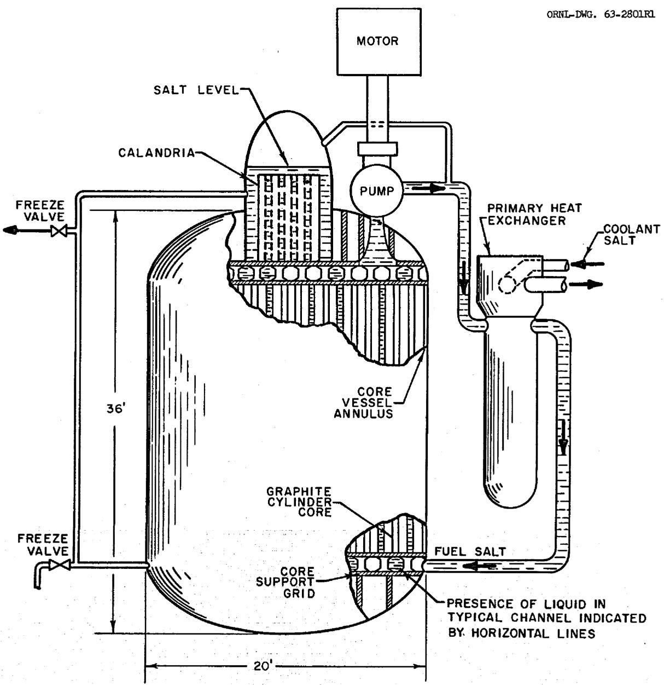  
Fig. 4.l. MSCR Vessel and Heat Exchanger.

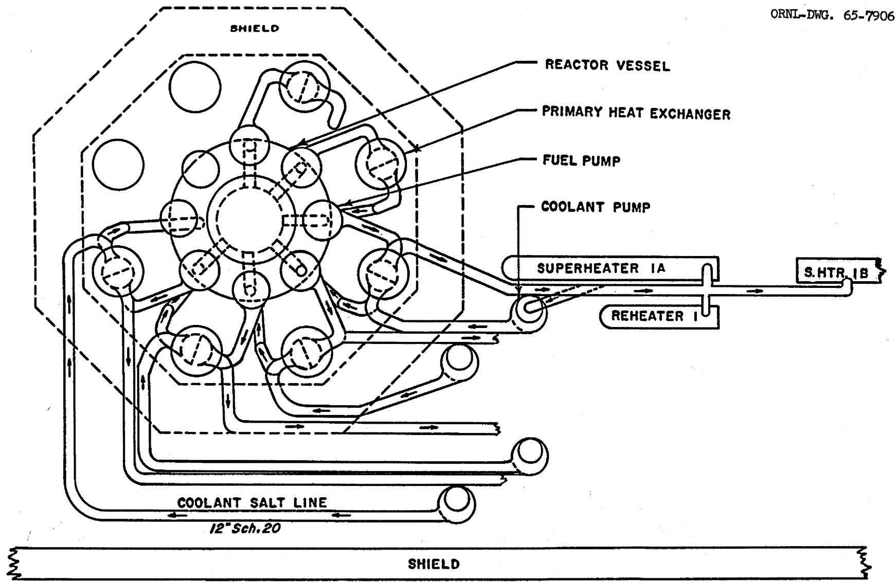  
Fig. 4.2. MSCR Heat Transfer Flow Diagram.

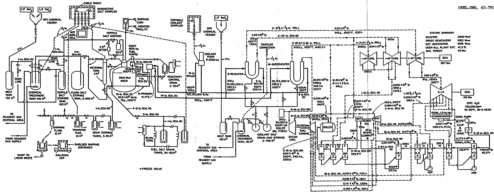  
Fig. 4.3. MSCR Composite Flow Diagram.

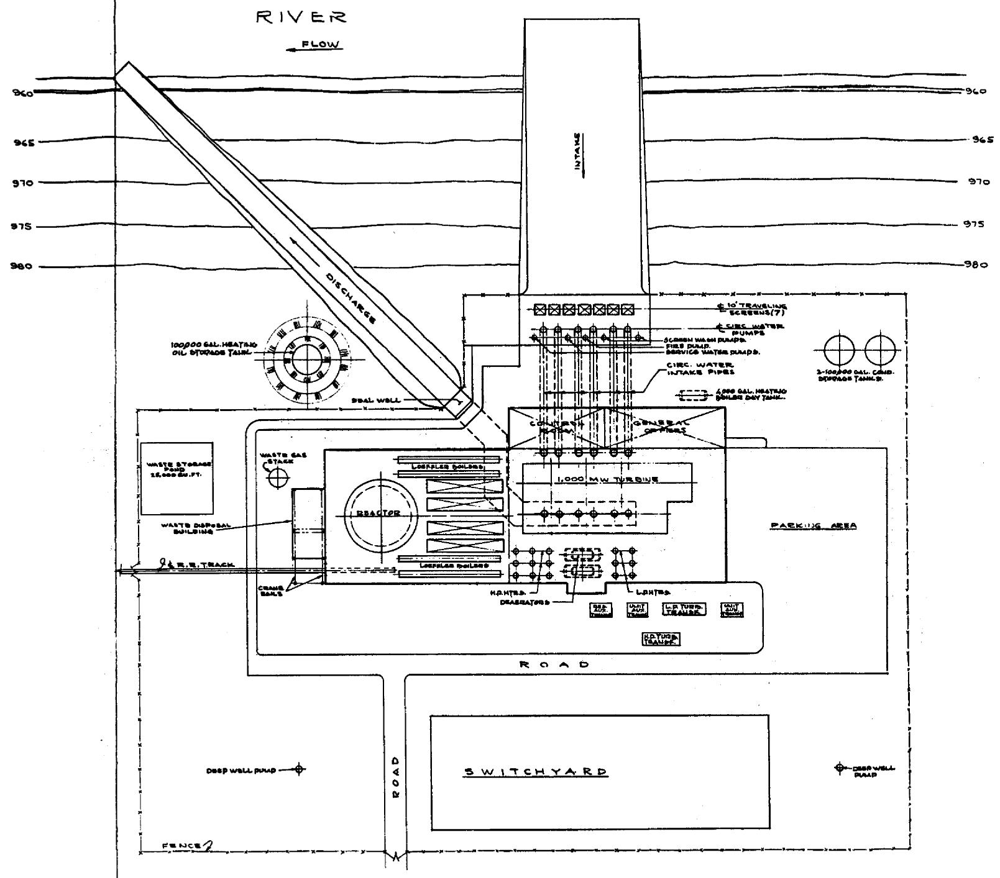  
Fig. 4.4. MSCR Plant Plot Plan. (Sargent and Lundy Drawing)

Table 4.1. Design Characteristics of the 1000 Mwe Molten Salt Converter Reference Reactor   

<table><tr><td colspan="2">General</td></tr><tr><td>Thermal power</td><td>2500 Mw</td></tr><tr><td>Net thermal efficiency</td><td>41.5%</td></tr><tr><td>Net electrical power</td><td>1038 Mw</td></tr><tr><td>Core geometry</td><td>Cylindrical, 20 ft × 20 ft</td></tr><tr><td>Moderator</td><td>Unclad graphite</td></tr><tr><td>Form</td><td>Cylinders</td></tr><tr><td>Dimensions</td><td>8 in. diam, 24 in. long</td></tr><tr><td>Weight</td><td>335 tons</td></tr><tr><td>Volume fraction in core</td><td>0.9</td></tr><tr><td>Porosity accessible to salt (assumed)</td><td>0.1%</td></tr><tr><td>Porosity accessible to gas (assumed)</td><td>1.0%</td></tr><tr><td>Gas diffusion coefficient (assumed)</td><td>10-6cm2/sec</td></tr><tr><td>Graphite density</td><td>1.9 g/cm3</td></tr><tr><td>Radiation heating (max.)</td><td>5.2 watts/cm3</td></tr><tr><td>Maximum temperature rise</td><td>520°F</td></tr><tr><td>Reactor vessel</td><td>INOR-8</td></tr><tr><td>Inside diameter</td><td>20 ft-2 in.</td></tr><tr><td>Thickness</td><td>1.7 in.</td></tr><tr><td>Maximum temperature</td><td>1400°F</td></tr><tr><td>Weight, including internals</td><td>125 tons</td></tr><tr><td>Radiation heating in support plates</td><td>2 watts/cm3</td></tr><tr><td>Radiation heating in vessel wall</td><td>0.6 watts/cm3</td></tr><tr><td>Maximum temperature rise in wall</td><td>40°F</td></tr><tr><td colspan="2">Fuel stream</td></tr><tr><td colspan="2">Composition</td></tr><tr><td>Base salt (LiF-BeF2-ThF4)</td><td>68-22-9 mole %</td></tr><tr><td>UF4(fissile)</td><td>0.3 mole %</td></tr><tr><td>Fission products</td><td>0.5 mole %</td></tr><tr><td>Corrosion products</td><td>750 ppm</td></tr><tr><td>Liquidus temperature of base salt</td><td>887°F</td></tr><tr><td>Density of base salt at 1200°F</td><td>3.045 g/cc</td></tr><tr><td>Mean heat capacity of base salt at 1200°F</td><td>0.383 Btu/lb·°F</td></tr><tr><td>Fraction of core occupied by fuel salt</td><td>0.1</td></tr><tr><td>Fuel stream inlet temperature</td><td>1100°F</td></tr><tr><td>Fuel stream outlet temperature</td><td>1300°F</td></tr><tr><td>Flow rate</td><td>160 ft3/sec</td></tr><tr><td>Velocity in channels in core (avg.)</td><td>6 ft/sec</td></tr><tr><td>Velocity in piping</td><td>35 ft/sec</td></tr><tr><td>Velocity in heat exchanger</td><td></td></tr><tr><td>Shell side</td><td>20 ft/sec</td></tr><tr><td>Tube side</td><td>31 ft/sec</td></tr><tr><td colspan="2">Fuel Stream (continued)</td></tr><tr><td colspan="2">Pressure, psia</td></tr><tr><td>Pump discharge</td><td>190</td></tr><tr><td>Heat exchanger inlet</td><td>185</td></tr><tr><td>Heat exchanger outlet</td><td>95</td></tr><tr><td>Reactor inlet</td><td>80</td></tr><tr><td>Reactor outlet</td><td>35</td></tr><tr><td>Pump suction</td><td>22.5</td></tr><tr><td colspan="2">Power density in fuel salt</td></tr><tr><td>In core (max.)</td><td>510 w/cc</td></tr><tr><td>Average over entire fuel volume</td><td>35 w/cc</td></tr><tr><td colspan="2">Volume of fuel salt</td></tr><tr><td>In active core</td><td>630 ft3</td></tr><tr><td>In top and bottom plena</td><td>540 ft3</td></tr><tr><td>In fuel annulus adjacent to vessel wall</td><td>105 ft3</td></tr><tr><td>In surge tank</td><td>85 ft3</td></tr><tr><td>In pumps</td><td>130 ft3</td></tr><tr><td>In heat exchangers</td><td>575 ft3</td></tr><tr><td>In connective piping</td><td>320 ft3</td></tr><tr><td>In dump tanks and reactivity control tanks</td><td>115 ft3</td></tr><tr><td>TOTAL</td><td>2500 ft3</td></tr><tr><td>Volume of fuel in active core</td><td>650 ft3</td></tr><tr><td colspan="2">Primary heat transfer loop</td></tr><tr><td>Primary pumps; number and type</td><td>8 - Salt Lubricated</td></tr><tr><td>Pressure at pump discharge</td><td>200 psi</td></tr><tr><td>Primary heat exchangers</td><td>8 - Shell and Tube</td></tr><tr><td>Total heat transfer area</td><td>53,000 ft2</td></tr><tr><td>Average heat flux</td><td>160,000 Btu/hr·ft2</td></tr><tr><td>Material</td><td>INOR-8</td></tr><tr><td>Weight</td><td>36,000 lb each</td></tr><tr><td colspan="2">Secondary heat transfer loop</td></tr><tr><td>Coolant salt composition (mole %)</td><td>66-LiF; 34-BeF2</td></tr><tr><td>Coolant salt inlet temperature</td><td>950°F</td></tr><tr><td>Coolant salt outer temperature</td><td>1100°F</td></tr><tr><td>Coolant salt flow rate</td><td>203 ft3/sec</td></tr><tr><td>Coolant salt pump discharge pressure</td><td>350 psi</td></tr><tr><td>Coolant salt volume</td><td>5600 ft3</td></tr><tr><td colspan="2">Energy conversion loop</td></tr><tr><td>Superheaters</td><td>16 - U-Shell and U-Tube</td></tr><tr><td>Materials</td><td>INOR-8 and alloy steel</td></tr><tr><td>Heat flux</td><td>52,440 Btu/hr·ft2</td></tr><tr><td>Heat transfer area</td><td>8,850 ft2</td></tr><tr><td>Weight</td><td>~50,000 lbs</td></tr><tr><td>Inlet steam temperature</td><td>670°F</td></tr><tr><td>Steam flow rate</td><td>1.3 × 106lb/hr</td></tr><tr><td>Reheaters</td><td>8 - Shell and U-Tube</td></tr><tr><td>Materials</td><td>INOR-8 and alloy steel</td></tr><tr><td>Heat flux</td><td>37,250 Btu/hr·ft2</td></tr><tr><td>Heat transfer area</td><td>3,543 ft2</td></tr><tr><td>Weight (approx.)</td><td>22,000 lbs</td></tr><tr><td>Inlet steam temperature</td><td>635°F</td></tr><tr><td>Steam flow rate</td><td>0.7 × 106lb/hr</td></tr><tr><td>Loeffler boilers</td><td>4</td></tr><tr><td>Length</td><td>100 ft</td></tr><tr><td>Diameter (ID)</td><td>6 ft</td></tr><tr><td>Weight (approx.)</td><td>600,000 lbs</td></tr><tr><td>Inlet steam conditions</td><td>2430 psia/1000°F</td></tr><tr><td>Steam flow rate</td><td>3.1 × 106lb/hr</td></tr><tr><td>Inlet feedwater conditions</td><td>2520 psia/545°F</td></tr><tr><td>Feedwater flow rate</td><td>2.0 × 106lb/hr</td></tr><tr><td>Discharge steam conditions</td><td>2400 psia/662°F (sat.)</td></tr><tr><td>Steam circulators</td><td>4 (turbine driven)</td></tr><tr><td>Flow rate</td><td>20.5 × 106lb/hr</td></tr><tr><td>Power</td><td>5,100 BHP</td></tr><tr><td>Steam temperature</td><td>670°F</td></tr><tr><td>Steam pressure</td><td>2,480 psia</td></tr><tr><td>Turbine</td><td>1 (CC6F-RH)</td></tr><tr><td>Flow rate</td><td>8.04 × 106lb/hr</td></tr><tr><td>Generator output</td><td>1083 Mw</td></tr><tr><td>Steam temperature</td><td>1000/1000°F</td></tr><tr><td>Steam pressure</td><td>2400/545 psia</td></tr><tr><td>Exhaust</td><td>1.5 in. Hg</td></tr><tr><td colspan="2">Processing system</td></tr><tr><td>Processing method</td><td>Central Fluoride Volatility</td></tr><tr><td>Salt processing rate</td><td>1.67 ft3/day</td></tr><tr><td>Production rate</td><td>53.3 kg Thorium/day</td></tr><tr><td>Cooling time (average)</td><td>~90 days</td></tr></table>

Table 4.1 (continued)

Processing system (continued)

Hold-up time (total)

Processing batch size

Processing plant capacity

Turn-around time

1.16 days

$\sim 6,000$ kg Thorium

1,000 kg/day

2 days

and 20 ft above the high water level. An adequate source of raw water for the ultimate station capacity is assumed to be provided by the river with an average maximum temperature of $75^{\circ}\mathrm{F}$ and an average minimum temperature of $40^{\circ}\mathrm{F}$ .

# 4.3 Structures

Plan views of the reactor and turbine building are shown in Figs. 4.5 and 4.6 and vertical sections in Fig. 4.7. As seen in these figures, the reactor building and turbine building are adjacent, the secondary shield wall forming a separation from grade to the main floor. The buildings are two-level structures with the grade floors of the turbine and reactor buildings at an elevation of one foot above grade, and the main floor at 36 feet above grade. The secondary shield wall extends to the main floor and forms the walls of the lower part of the reactor and auxiliary building.

The turbine building and the upper level of the reactor and auxiliary buildings are steel frame structures, with insulated metal panel siding. The arrangement of the equipment within the buildings is indicated on the general arrangement drawings, Figs. 4.5 and 4.7.

A three-level steel frame and insulated metal-panel structure adjoining the turbine building houses the administrative offices, control room, switchgear, batteries, plant heating boiler and makeup water demineralization plant. Lockers, showers, and toilets for plant personnel are also located in this building.

A 200-ft waste gas stack is provided for dispersal of plant ventilating air and waste gases from the various reactor and reactor equipment rooms.

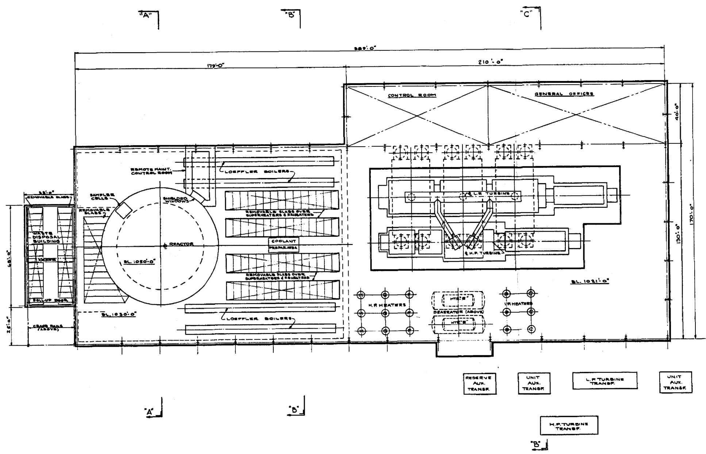  
Fig. 4.5. MSCR Plant General Arrangement. (Sargent and Lundy Drawing)

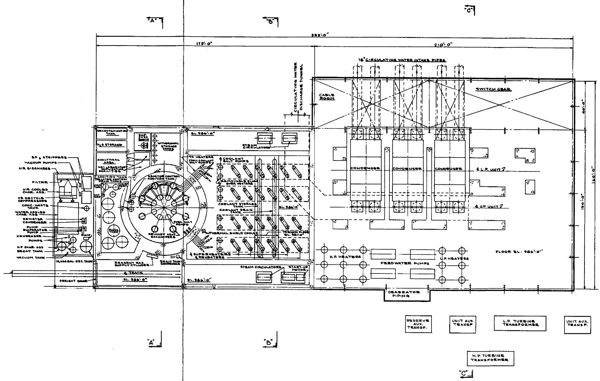  
Fig. 4.6. MSCR Plant - Plan. (Sargent and Lundy Drawing)

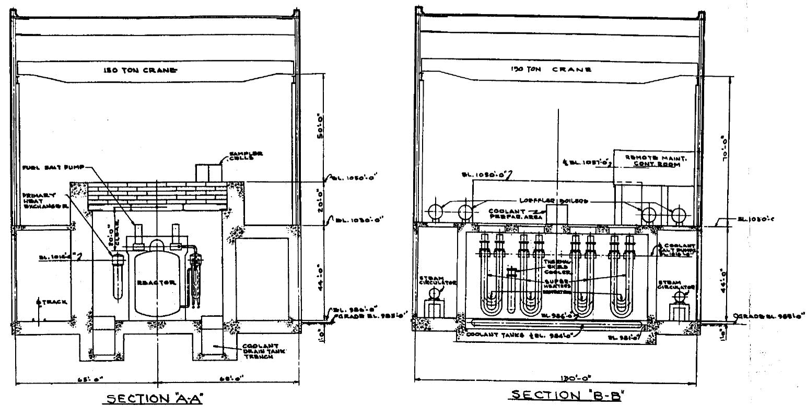

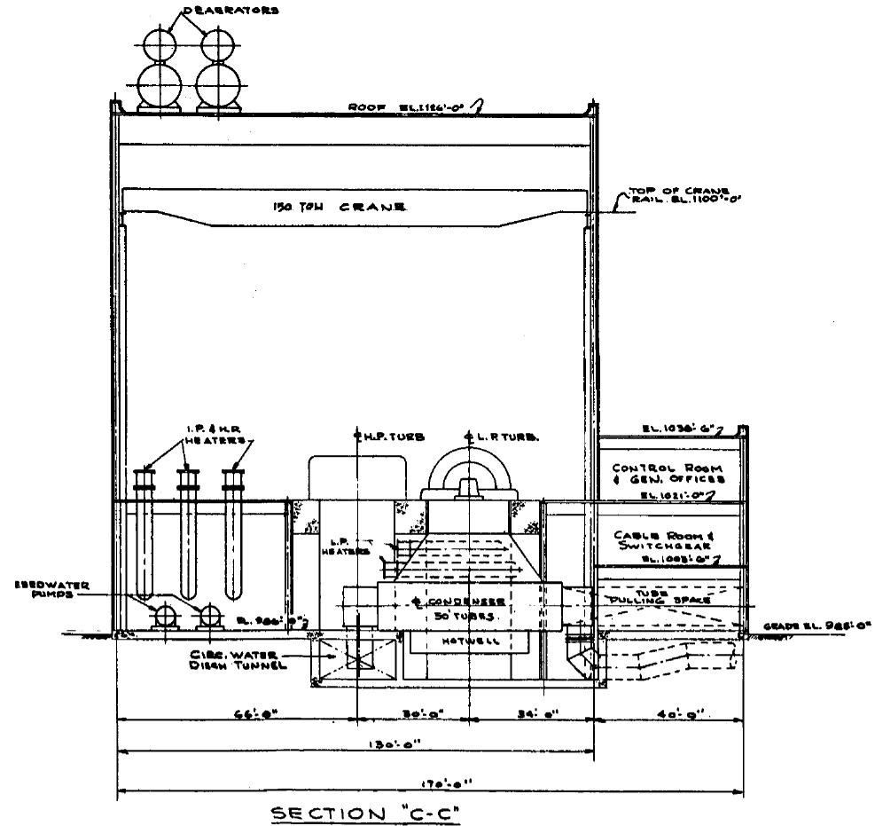  
Fig. 4.7. MSCR Plant - Elevation. (Sargent and Lundy Drawing)

# 4.4 Primary System Components

The primary system components consist of the reactor vessel, moderator, fuel salt pumps and fuel salt-to-intermediate coolant salt heat exchanger. The arrangement of these components is shown in Figs. 4.1 and 4.2. Design and performance characteristics are summarized in the following paragraphs.

# 4.4.1 Reactor Vessel

The reactor vessel is 20 ft in diameter and 37 ft high (including expansion dome) as shown in Fig. 4.l. The vessel wall is fabricated of 2-in.-thick INOR-8. No thermal shield is required since the gamma heating of the vessel wall does not exceed $0.6\mathrm{w / cc}$ . The thickness of the external vessel insulation and salt flow through the core-vessel annulus can be adjusted as necessary to avoid excessive thermal stresses in the vessel wall and at the same time minimize heat loss to the external containment space.

A 6-ft diam expansion dome at the top of the reactor vessel not only provides surge volume but serves as the fuel salt volatiles purge location, the $\mathrm{UF_4}$ pellet injection point and salt sampler location. Circulation of fuel salt in the dome is accomplished by recirculation of salt from each pump discharge through an orificed 2-in. line to a point below the normal liquid level in the dome. This level is maintained by adjusting the pressure of the helium cover gas. To minimize holdup of salt, $50\%$ of the volume of the dome is occupied by 2-in. diam sealed INOR-8 tubes.

The reactor vessel is provided with eight inlet nozzles which discharge fuel salt radially into the bottom plenum, eight outlet nozzles leading to the pumps, together with bottom and top INOR-8 grids for support and restraint of the graphite core. These grids in turn are supported by columns or stanchions attached to the reactor vessel.

The reactor vessel specifications are given in Section 4.10.

# 4.4.2 Moderator Structure

The graphite matrix is composed of cylindrical logs 8 in. in diameter and 24 in. long, as shown in Fig. 4.8. These are stacked in a vertical position and alligned by means of axial pins and sockets. Fuel-salt flows up through the cusp-shaped passages between logs.

The "pile" is centered in the vessel by metal pins protruding from the support plates at the bottom and top of the vessel. These are located near the axis of the vessel and mate with a corresponding moderator log. Initially the pile rests on the lower support grid; as the reactor is filled with salt, the pile floats up against the upper grid. The pins, while allowing this vertical motion, keep the central logs centered in the vessel. The remaining logs are bound to these by means of metal hoops passing around the peripheral logs. These hoops are fabricated from mol-ybdenum, which has about the same coefficient of expansium as graphite. This arrangement allows the support grids to expand independently of the moderator as the reactor is brought to operating temperature. Also, the increase in height of the vessel on expansion is accommodated.

The radial profile of temperature in the fuel-salt is flattened by proper distribution of the flow, which is accomplished by orificing the flow channels. The bottom row of moderator logs is machined from hexagonal pieces. A 4-in. section of the end in contact with the support grid is not machined. If close-packed in a triangular lattice, these ends would block completely the flow path of the fuel salt. Therefore, the corners of the hexagons are cut away to provide orifices of appropriate diameter for each channel.

# 4.4.3 Fuel-Salt Circulating Pumps

Circulation of the fuel salt flowing at 9075 gpm is maintained by a centrifugal pump as shown in Fig. 4.9 in each of the eight independent heat exchange circuits. Because the system has no valves or other means of equipment isolation, the pumps are installed at the highest elevation (and the highest temperature region) of the circuit between the reactor and the primary heat exchanger. By this means it is possible to avoid the hazard of seal flooding and reverse rotation at standstill and to

ORNL-LR-DWG 63-2803

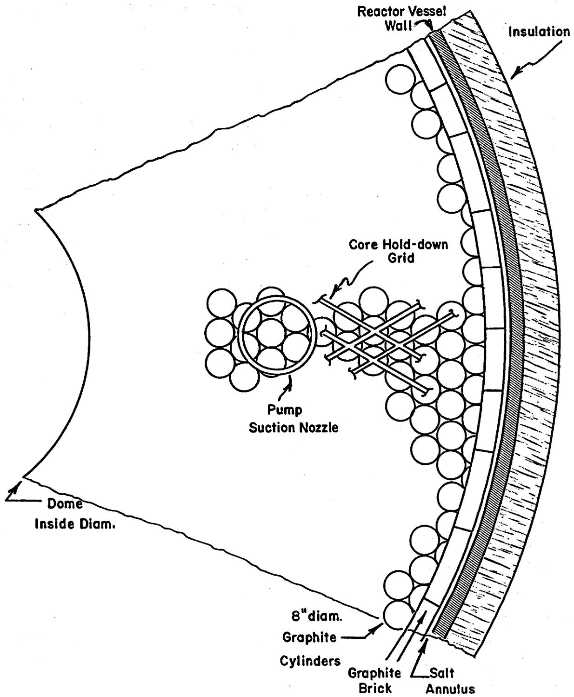  
Fig. 4.8. MSCR Core Configuration.

ORNL-LR-DWG 41765A

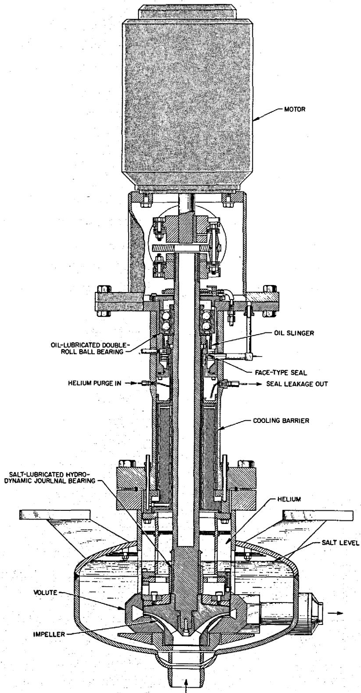  
Fig. 4.9. Molten Salt Journal Bearing Pump.

minimize some design problems related to thermal expansion, shaft seal and guide bearings, and maintenance accessibility. Locating the pumps so close to the reactor, however, introduces the problem that the organic materials used in the motor winding insulation and bearing lubricant must be shielded from radiation. Also the pump motor and oil-lubricated bearings must be located at some distance from the salt region. In the design shown, the motor and oil-bearings are positioned above the pumps for easy maintenance and a lower salt lubricated bearing provided to take the radial thrust. Circulation of salt through this bearing is accomplished by allowing salt to leak upwards around the shaft and out a small vent line. A cylindrical casing above the impeller provides expansion volume and a volatile fission product purging surface. The surface of salt in this casing is maintained at the same level as that in the expansion dome under a helium cover gas at 22 psi. This gas overpressure also helps prevent impeller cavitation.

Detailed specifications of the MSCR pumps are given in Section 4.10.

# 4.4.4 Primary Heat Exchanger

The design of the heat exchanger for transferring heat from the fuel salt to the intermediate coolant salt is shown in Fig. 4.10. This shell and tube heat exchanger is of a U tube configuration designed particularly for accessibility to the tube sheet from above without disturbing connecting piping. Removal of the tube bundle through the top head is also possible with the given design. With this configuration, however, the more valuable fuel salt, which normally would be circulated through the tubes, is put on the shell side to permit ready drainage. The tube bundle and associated baffles, which can slide into the shell from above, hang from the tube-sheet which rests on a shelf machined into the shell. A circumferential seal weld joins the tube sheet to the shell and separates the coolant from the fuel salt. A hold-down ring keeps the tube sheet in place in case pressure on the shell side should exceed pressure on the tube side. Normal design conditions require that the coolant salt (tube side) be kept at a pressure higher than that of the fuel salt.

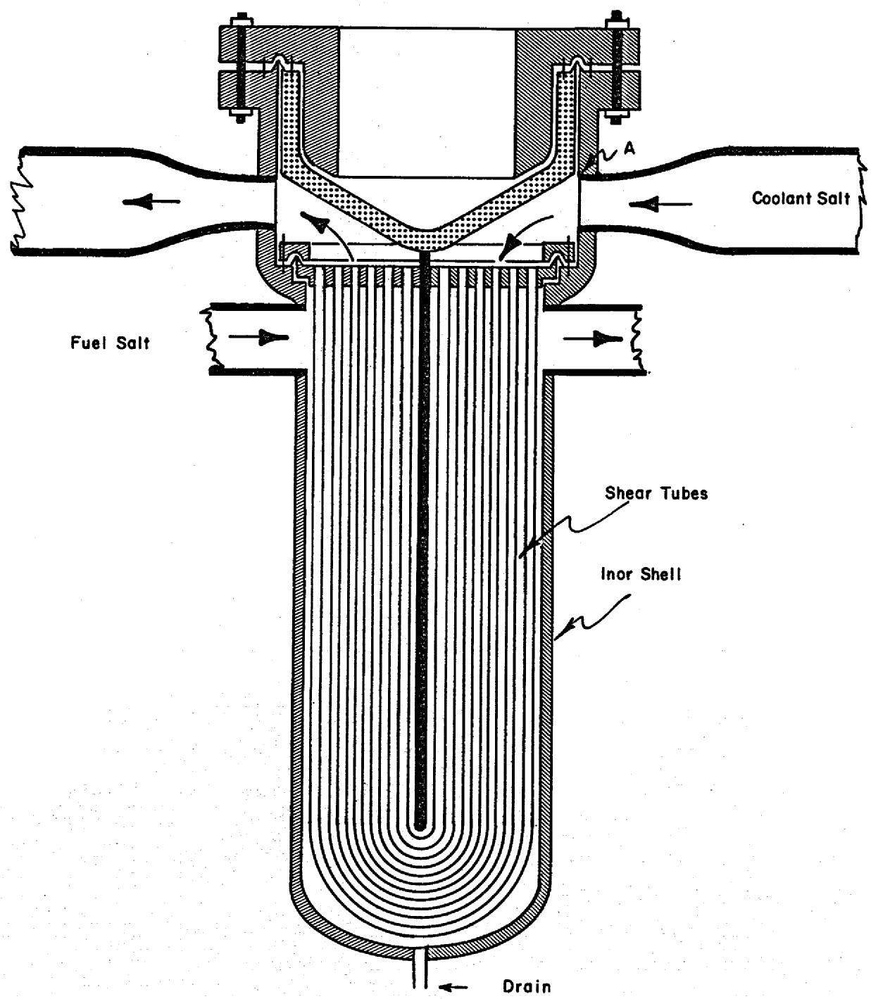  
Fig. 4.10. MSCR Primary Heat Exchanger.

The end-closure may be sealed against leakage of coolant salt to the outside in several ways. A bearing and sealing surface (much like a valve seat) is provided at point "A" shown on Fig. 4.10. A frozen salt seal is maintained in the annulus above "A". A seal weld could be made at the top between the flange on the shell side and the inverted head. Or lastly, double-gaskets on circles inside and outside of the seal weld lip could confine leakage if the seal weld, or other seals ahead of the seal weld, should fail. A massive hold-down flange bolted to the top flange provides the strength necessary to hold the inverted head against the several hundred pound pressure of the coolant salt.

A partition attached to the inverted heat fits closely into a diametrical slot in the tube sheet to separate the inlet coolant salt plenum from the outlet plenum. A small amount of by-pass flow may occur through the very small gap between the slot and the partition. The inverted head is shaped so as to minimize the volume of coolant salt in the tube-sheet distribution plenums. The inlet and outlet coolant nozzles are noncircular in cross section (flattened and broadened so as to minimize head-space without sacrificing flow area).

Not shown are cooling and heating provisions for the top head, heating provisions for the shell or the insulation which must be provided.

In order to avoid excessive thermal stresses in the tube sheet it may be necessary to reduce the thermal gradient across the tube sheet by providing insulation between it and the fuel salt.

An appreciable heel of coolant salt will remain in the tubes after draining. In order that the salt-containing internals of the heat exchanger be exposed only to inert atmospheres when the top closure is removed, the upper portion of the heat exchanger (above the coolant nozzle) is provided with a gas-tight caisson that extends from the heat exchanger to the locality of the maintenance equipment.

The specifications given in Section 4.10 are based on eight heat ex-changers per reactor, each with a heat load of $1.006 \times 10^{9}$ Btu/hr per unit.

# 4.5 Intermediate Cooling System

# 4.5.1 Introduction

Leakage of steam into the fuel salt would result in precipitation of uranium; therefore, a material which has good heat transfer properties and is compatible with both fuel salt and steam must be interposed between these two materials. Of the various possible choices, a barren salt of $\mathrm{LiF - BeF_2}$ appears to be the most promising and is used as a basis for the present MSCR design involving a Loeffler steam generation system. In this design the intermediate cooling system consists of the heat exchanger already described, coolant salt pumps, steam superheaters and steam reheaters.

# 4.5.2 Coolant Salt Pumps

The coolant salt pumps are similar in design to the fuel salt pumps but have a higher capacity and head. Eight pumps serve the sixteen superheaters and four reheaters and each pump circulates 13,900 gpm of coolant salt at a temperature of $950^{\circ}\mathrm{F}$ and the primary heat exchanger inlet pressure of 300 psia. The developed head of the pump is approximately 270 ft. Additional specifications for the coolant pumps are given in Section 4.10.

# 4.5.3 Steam Superheaters

Steam from the superheaters is divided among several streams. About $20\%$ is used to drive the turbogenerators for the production of electricity; a much smaller fraction is used to drive other turbines which power feedwater pumps and the steam circulators. The balance is mixed with feedwater in the Loeffler boiler to produce saturated steam required in the super-heater.

A U-tube in U-shell arrangement with fixed tube sheets and counter-current flow of coolant salt and steam is shown in Fig. 4.11. Coolant salt is on the shell-side, and steam flows through the tubes. The unit is mounted on its side to minimize floor space. The shell-side is unbaffled to minimize pressure drop. The heat transfer coefficient with near-laminar flow of coolant salt is about $15\%$ less than for baffled flow, and requires

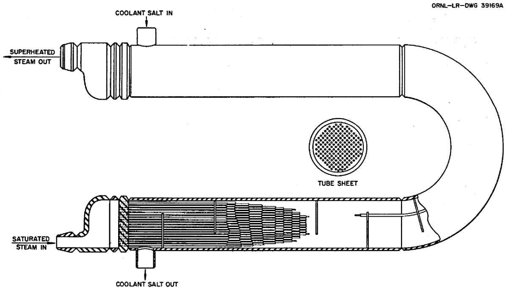  
Fig. 4.11. MSCR Steam Superheater.

more tubing. To prevent freezing of the salt, the superheater is brought up to operating temperature by steam generated in an auxiliary, oil-fired boiler.

Coolant salt operating between 950 and $1100^{\circ}\mathrm{F}$ circulates through the shell-side. Steam enters at $670^{\circ}\mathrm{F}$ and 2490 psi, and leaves at $1000^{\circ}\mathrm{F}$ and 2465 psi.

# 4.5.4 Steam Reheaters

In order to provide greater energy availability for the turbine work cycle and to provide lower pressure steam to drive auxiliary turbines, the high pressure turbine exhaust steam is directed to the reheaters, the auxiliary turbines, and the second feedwater heaters. The same general design criteria apply to the reheaters as to the superheaters, although the steam is at a lower pressure.

As with the superheaters, the reheaters are constructed of INOR-8 and alloy steel. Eight units provide the desired heat transfer surface. Again, the coolant salt flows in the shell countercurrently to the steam passing through the tubes. Comparable pressure drop and heat transfer conditions exist in the reheater as in the superheaters, although baffling (to improve heat transfer) on the shell introduces a pressure drop of about 40 psi.

# 4.6 Power Generation System

# 4.6.1 Introduction

Before selecting the power generation system for the MSCR a number of alternative approaches were considered in some detail. These included the use of (a) a mercury boiler, (b) a "Kinyon" boiler, (c) a "Bettis" boiler, and (d) a "Loeffler" boiler. The characteristics of these alternative steam generation systems are summarized as follows.

The use of binary mercury-steam power cycles for power generation from solid fuel reactors has been studied by Bradfute et al. (13) and Randall et al. (92). Kinyon and Romie (55) considered application of the binary cycle to molten salt reactors. The binary system, in addition to

mitigating the thermal stress problem, has the further advantage of a higher thermal efficiency (95). On the other hand, bimetallic heat ex-changers are required at the high temperature end, and it is not obvious that the fuel salt volume will be small compared to that involved in the Loeffler system.

The "Kinyon" boiler (53) employs bayonet elements composed of three concentric tubes. Water is introduced in the annular passage surrounding the innermost tube and is boiled by heat transferred from superheated steam flowing downward in the outer annulus. Vapor is separated from the liquid at the top of the inner annulus; the liquid is routed down the central tube to a plenum from which it is recycled to the boiling annulus. Vapor passes down the outer annulus; it is superheated by salt surrounding the bayonet element and in turn boils the water rising in the inner annulus. This arrangement results in tolerable thermal stresses in the tubing. The system avoids the use of steam recirculators. Furthermore, the bayonet tube boiler may be more compact and less expensive than the equivalent superheaters and boilers in the Loeffler system. It is not clear, however, that the required rate of vapor-liquid separation can be achieved with present technology.

The "Bettis" boiler is a modification of the "Lewis" boiler (59,55) wherein a bayonet tube containing water and steam is inserted into a thimble extending down into the fuel salt. An inert buffer salt occupies the annular space between the pressure tube and the thimble, providing thermal contact along with physical isolation. This system avoids use of steam circulators and also eliminates the necessity for pumping the intermediate salt.

# 4.6.2 Ioeffler Boiler System

In the system selected for the reference design, four boilers generate steam by direct contact between the steam from the superheaters and the feed water from the turbine cycle. Four steam compressors circulate the saturated steam from the boilers through the superheaters of the inert salt system, providing steam at 2400 psia, $1000^{\circ}\mathrm{F}$ at the turbine throttle and at the superheated steam inlet of the Loeffler boilers.

These boilers, shown in Fig. 4.12, consist of cylindrical drums with an inside diameter of about 72 in., with distribution pipes for superheated steam and feed water located on the vertical centerline and below the horizontal centerline of each drum. Conventional cyclone steam separators, located above the horizontal centerline and arranged in four parallel rows along the inside of the drum, separate the steam from the boiling water. A system of scrubber-type steam driers occupies the upper part of the drum. In operation, superheated steam and feed water are mixed as they leave the two distribution pipes and boiling occurs. The boiling water is guided by internal baffles through the cyclone separators where the water is removed by centrifugal force. Steam and a small amount of moisture flow through the scrubbers, where the steam is dried to approximately 99.7 quality. The drums are fabricated of carbon steel and are designed for a pressure of 2625 psia. A wall thickness of 7 in. is required for an inside diameter of 72 in. and a temperature of $650^{\circ}\mathrm{F}$ . Each drum is about 100 ft in length and has hemiellipsoidal heads.

# 4.6.3 Steam Circulators

The steam circulators are single-stage axial compressors suitable for a steam flow of approximately five million lb/hr at a discharge pressure of 2480 psia. The circulators are driven by steam turbines, using steam from the cold reheat lines of the main turbine-generator. At design conditions, each circulator requires a power input of 4750 BHP. Steam from the turbines is returned to the cycle through the feed-water heaters. One circulator has a motor drive suitable for full flow at design pressure to be used during start-up shutdown. An oil-fired package boiler, designed for a saturated steam flow of 50,000 lb/hr at 300 psia, is provided for startup purposes.

The system is designed to operate as four $1/4$ capacity units; each unit consists of one Loeffler boiler, one steam circulator and four superheaters. Valves are located according to this philosophy. Interconnections between various units are not provided except at the inlet to the boilers and the discharge from the superheaters.

Fig. 4.12. MSCR Loeffler Boiler.   
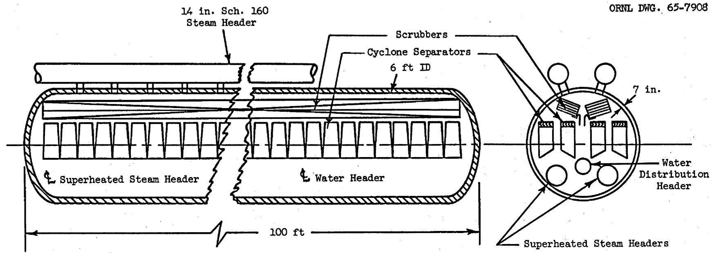  
Operating Conditions (one unit):   
Inlet Water $2 \times 10^{6}$ lb/hr @ $545^{\circ}\mathrm{F},$ 2500 psi   
Inlet Steam $3.1 \times 10^{6} \mathrm{lb/hr} @ 1000^{\circ}\mathrm{F}, 2450 \mathrm{psi}$   
Outlet Steam $5.1 \times 10^{6} \mathrm{lb/hr}$ , sat. @ 2400 psi

# 4.6.4 Turbogenerator

The turbogenerator is a standard CC6F-RH unit operating at 2400 psia $1000^{\circ}\mathrm{F}$ and producing a gross electrical output of 1083 Mw. As shown in Fig. 4.3 the units consist of three turbines: two double-flow high pressure units and one double-flow intermediate pressure unit on one shaft with a 667 Mw net output plus three double-flow low pressure units on another shaft with a 416 Mw net output.

The plant auxiliaries have a maximum coincidental loading of 45,000 kw; this power results in a net station output of 1038 Mwe to the station main power transformers.

Other characteristics of the power generation system are given in Fig. 4.3 and summarized in Section 4.10.

# 4.7 Reactor Control System

# 4.7.1 Introduction

The specifications for the MSCR control system depend on the unique properties of its fluid-fuel. The main mode of shim control is by adding $\mathrm{UF}_4$ to increase reactivity and by replacement of fuel salt with a salt containing no fissile isotopes to decrease reactivity. This control is supplemented by operational control with $\mathrm{BF}_3$ gas, which is sufficiently soluble that adequate concentrations may be obtained in the salt by regulating the partial pressure of $\mathrm{BF}_3$ over the salt surface in the dome.

Fuel is added to compensate burnup and fission product accumulation. Greater reactivity control is required during startup and shutdown. The startup procedure involves a gradual increase in power, during which the rising xenon poisoning (controlled by the flux level) is compensated by the addition of new fuel. After shutdown, the reactor is sub-critical for forty hours while $^{135}\mathrm{Xe}$ grows in. If longer shutdown is required, then fifty cubic feet of fuel salt must be removed and replaced by non-fissile salt.

Emergency shutdown, such as that required in a loss-of-flow accident, is provided by injecting $\mathrm{BF}_3$ gas through tubes opening into the core just above the bottom support grid. The $\mathrm{BF}_3$ will displace fuel, will rapidly

dissolve in the salt, and will diffuse into the graphite. All of these processes will result in a rapid and large decrease in reactivity.

# 4.7.2 Shim Control

For shim control by fuel addition or removal, two reactivity-control drain tanks of 50 cubic ft capacity each and a shim-control salt-addition tank of 50 cubic ft capacity are located in the reactor containment cell. All tanks are provided with vents to the reactor dome, gas connections to the helium pressurizing system, and several 100 kw electric heaters for initial vessel heating and maintaining stored salt temperature. The addition tank is essentially in parallel with the 2 cubic ft salt-addition metering tank. The drain tank is connected to the reactor vessel upper plenum and is installed with respect to the reactor dome liquid level so that overfilling will not be possible. Freeze valves are used to isolate the tanks from the reactor. The reactivity control drain tanks must have, in addition to heating coils, decay heat removal facilities similar to the fuel salt drain tanks. They have an independent steam condenser and heat removal system which will be 1/20 the size of the fuel drain tank heat removal system.

# 4.7.3 Emergency Control

The $\mathrm{BF}_3$ addition system comprises pressure cylinders manifold to a heater. $\mathrm{BF}_3$ flow control and quick-acting injection valves are incorporated in the supply line connected to the bottom plenum of the reactor vessel. The flow control facility is operated from the shim control instrumentation and the quick-acting injection system is operated from the "scram" circuits.

The $\mathrm{BF}_3$ gas is stored in six 330 cubic ft, 2000 psi cylinders located outside and adjacent to the east wall of the reactor building. The specifications for the reactivity-control drain tanks and the reactivity-control salt-addition tank are given in Section 4.10.

# 4.8 Salt Handling Systems

# 4.8.1 Introduction

Facilities for handling both fresh and spent fuel salt and intermediate coolant salt constitute the heart of the MSCR complex. The functions which must be performed include melting, purifying, charging, removal, storage, and sampling of the salt. These are accomplished by means of the following systems and facilities shown in Fig. 4.13.

a. Fuel salt preparation   
b. Coolant salt preparation   
c. Reactor salt purification   
d. Coolant salt purification   
e. Reactor salt charging system   
f. $\mathbf{UF}_4$ addition facility   
g. Fuel salt drain and storage system   
h. Coolant salt drain system   
i. Spent fuel withdrawal system   
j. High level radioactive sampling   
k. Coolant salt sampling

# 4.8.2 Fuel Salt Preparation

Fuel salt is received in solid form and must be liquified prior to processing. Barren salt, having the same composition as the intermediate coolant salt, i.e., $66\%$ LiF and $34\%$ $\mathrm{BeF}_2$ , with a liquidus temperature of $851^{\circ}\mathrm{F}$ is used for preoperational testing and system flushing before and after maintenance activity. A solid mixture having this composition is charged initially. Sufficient LiF and $\mathrm{ThF}_4$ are added to form composition $68\%$ LiF, $23\%$ $\mathrm{BeF}_2$ and $9\%$ $\mathrm{ThF}_4$ . All mixtures are processed through the same equipment. After routine operation is established, flush salt is the base material for the lithium/thorium addition process. In this manner, flush salt contaminated by fission products may be consumed and special treatment for removal of fission products will be unnecessary.

A 12-ft-high, 150 cubic ft tank enclosed by an 8-ft-high, 150 kw furnace receives solid salt for melting. The furnace, located in the

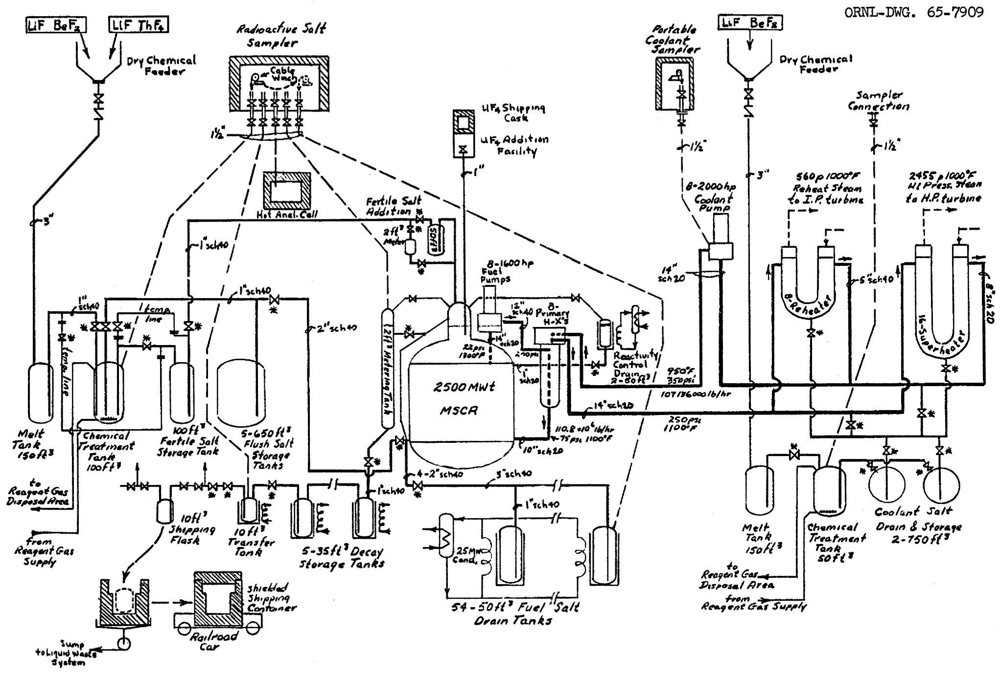  
Fig. 4.13. MSCR Fuel Handling Storage Diagram.

flush-salt storage area, is designed for melting approximately 7 ft³/hr. Molten salt is transferred by pressure siphoning.

Solid salt is added by means of a tube extending from the floor above the storage area to the melt tank. The top of the tube is flanged and sealed. A valve is located just below the flange. The tube takes a devious route and is provided with a helium purge to prevent back-flow of radioactive material and intolerable radiation levels at the open feed point. A check valve just below the flange allows purge gas to be directed into the melt tank. A portable hopper is connected to the flange face to receive salt from the shipping containers. A portable shed covers the work area to prevent the spread of toxic dust resulting from the feed operation.

# 4.8.3 Coolant Salt Preparation

Equipment and system design are similar to that of fuel-salt melt tank and solid salt feed. The melt tank is located in the heat exchanger room near the chemical treatment tank. Solid salt is fed from the floor above.

# 4.8.4 Reactor Salt Purification

The reactor fuel and flush salts are purified in the molten state prior to charging or storing. This is done initially to remove oxides, and subsequently, to remove oxides and other contaminants.

In normal operation, a chemical treatment tank of 100 cubic ft capacity located in the flush-salt storage area receives the molten salt. After a one-day holdup for purification, the salt is transferred to storage tanks. By the addition of LiF and $\mathrm{ThF_4}$ to flush salt in the melt tank, fertile salt is formed; this is then transferred to the fertile salt purification tank where gaseous HF and $\mathbf{H}_2$ are bubbled through the liquid to remove oxides. Subsequently, the treated salt is transferred to the 100 cubic ft salt-storage tank installed at the same location. Flush-salt make-up is processed in the same manner, and through the same equipment. After treatment, it is transferred to a spare flush-salt tank.

For the initial charges of flush salt and fertile salt for the reactor system, greater purifying capacity is required in order to avoid delay

in preoperational testing and power production. To fulfill this condition, HF and $\mathbf{H}_2$ bubbling facilities are provided in the fertile salt storage tank and temporary flanged lines arranged so that the fertile salt tank may receive molten salt from the melt tank, perform partial purification and allow transfer of the salt to the normal treatment tank. In this manner the two tanks, fertile storage and chemical treatment, are placed in series to double both the purification rate and the system salt charging rate. This procedure does not increase the sampling or analysis requirements over those necessary for normal operation.

# 4.8.5 Coolant-Salt Purification

The purpose of the coolant salt purification system is to remove impurities such as corrosion products or oxides which could cause fouling of surfaces and plugging of lines and tubes if allowed to accumulate.

It is unlikely that a single coolant charge could be used for the whole lifetime of the reactor without exceeding permissible concentrations of oxides or corrosion products; however, it probably will not be necessary to employ a continuous treatment of coolant salt. Oxides may get into the coolant salt by accidental exposure to air or water vapor, or from oxygen present as an impurity in the cover gas used to pressurize the coolant-salt systems. Although the rate of corrosion of INOR-8 surfaces by coolant salt is low, the area of metal surface in contact with coolant salt is very large, so that corrosion products are certain to accumulate. When it becomes necessary to repurify the coolant salt, it is done batchwise, one coolant circuit per batch, at infrequent intervals during periods of reactor shutdown.

If the coolant salt should become contaminated with fission products or uranium as a result of a leak in the primary heat exchanger (an event not likely to occur because the coolant salt system is kept at a pressure higher than that of the fuel salt), the contaminated coolant salt is drained from the affected circuit to a drain tank, and then transferred to the chemical processing plant for disposal.

# 4.8.6 Reactor Salt Charging System

Fuel salt without uranium is injected into the primary reactor circuit by manual control from a small salt addition tank to replenish the fuel salt withdrawn for chemical processing (two cubic ft per day). This addition is made remotely and with assurance that fuel salt will not flow back into the addition system. The make-up is fed into the reactor in a molten condition by gravity flow or under pressure. Sufficient electrical heating to maintain the salt in a molten condition prior to injection is provided.

A two-cubic-ft salt addition tank (metering tank) is located on the wall of the biological shield at a level somewhat above the liquid level in the reactor. The tank is supplied from the fertile-salt storage tank situated in the flush salt storage area. Makeup is accomplished by opening the freeze valve and the vent valve between the tank and reactor dome. The freeze-valve in the line leading to the reactor dome must be placed at the bottom of a loop so that when the tank is empty a heel of salt will remain in the valve.

# 4.8.7 Intermediate Coolant Charging System

Molten coolant salt is injected into any one of the eight intermediate coolant loops from the coolant drain tanks at a rate up to $600\mathrm{ft}^3/\mathrm{hr}$ . The drain lines from several locations in each of the eight intermediate coolant loops also serve as charging lines for this operation.

# 4.8.8 UF4 Addition Facility

During steady-state operation at equilibrium, about $6\mathrm{kg/day}$ of $\mathrm{UF_4}$ are added to the reactor to compensate for burnup and a fuel withdrawal of $2\mathrm{ft^3/day}$ . The amount and rate of addition of $\mathrm{UF_4}$ to the reactor is governed by reactivity and temperature requirements. Valves in the $\mathrm{UF_4}$ addition system must be kept gas-tight when closed even though they must pass solids when opened, but since they will be in a region of relatively low radiation level, plastic seats (for non-scoring properties) may be used.

The $\mathrm{UF_4}$ charged into the reactor system is prepared by mixing recycled uranium with fresh uranium. Pellets about 0.75-in. in diam, fabricated by casting $\mathrm{UF_4}$ in an inert atmosphere, are charged into a gas-tight shielded shipping container, containing an atmosphere of dry helium at approximately 1 atmosphere absolute pressure. At the reactor, the shielded shipping container is mounted on the fuel charging machine (which is located above the reactor), and the mated assembly of the shipping container and fuel charging machine is made gas-tight by bolting a gasketed flange. Figure 4.14 shows a schematic sketch of the $\mathrm{UF_4}$ addition facility.

# 4.8.9 Fuel Salt Drain and Storage System

Facilities are provided for the drainage and storage of fuel salt during periods of maintenance and emergency shutdown. The system is shown on the flow diagram in Fig. 4.2. All salt circuits have drain connections; this includes the primary heat exchangers as well as the reactor vessel. The draining of the fuel salt is accomplished quickly, even under emergency condition without steam flow and auxiliary power, since without heat removal the salt temperatures rise $300 - 400^{\circ}\mathrm{F}$ in the first half hour. Four equally spaced 2-in. drain lines connected radially to the bottom plenum of the reactor vessel, with 1-in. interconnections to the primary heat exchangers drain connections, will drain the reactor system in approximately one-half hour after the freeze valves are opened.

The tanks are capable of receiving the full inventory of the reactor within half an hour, maintaining the stored volume of salt at a temperature of less than $1400^{\circ}\mathrm{F}$ , and recharging it to the reactor. Gravity drain and gas pressure are used for transferring salt.

Because forced circulation may not be available under emergency conditions, natural convection cooling is provided in small-diam cylindrical vessels. Fifty-four vertically mounted 35-in. ID cylinders 8 ft long are located in a 10-ft trench around the inside periphery of the reactor containment cell. Each cylinder is immersed in a molten alkali metal carbonate bath. The carbonate mixture is contained in a double-walled tank which serves as a boiler for the removal of decay heat from the fuel salt. Fifteen-kilowatt electric heaters are arranged within the carbonate mixture annulus for fuel-salt melting following long storage periods and:

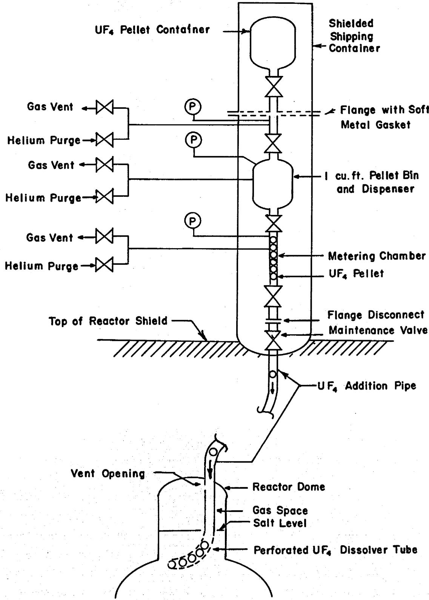  
Fig. 4.14. MSCR UF $^4$ Addition Facility.

temperature maintenance during shorter periods. The heaters are sized to bring the salt to $1100^{\circ}\mathrm{F}$ in four days.

# 4.8.10 Coolant Salt Drain System

These drain tanks have several purposes: (a) to provide storage space for the complete volume of coolant contained in two (out of eight) coolant circuits during periods when it is necessary to drain the coolant from one circuit for maintenance; (b) to provide the reservoir and the application of motive force for transferring coolant salt into the reactor coolant circuits during initial salt-charging; and (c) to serve as a transfer point from which coolant salt may be removed from the system and transferred to shipping containers in case it should become necessary to process contaminated coolant salt.

The drain tanks are located at an elevation which permits the coolant salt to flow by gravity from the reactor coolant system into the drain tanks. The transfer lines are valved with freeze-valves to permit flow to or from any one of the 8 coolant circuits. The transfer lines are large enough to fill one coolant circuit in one hour, using a gas pressure of 50 psig.

# 4.8.11 Spent Fuel Withdrawal System

Fuel salt is drawn from the reactor vessel drain line at about 30 psia into the vented metering tank. The metering tank is a 4-in. (ID) by 25-ft-long cylindrical vessel located at an elevation such that when flow stops it contains two cubic ft of fuel salt. Vent connections above the salt in the tank lead to the dome on the reactor vessel. Decay-heat removal is accomplished by radiation and convection to the reactor containment cell atmosphere. Because the heat generation rate diminishes rapidly, the rate of removal is controlled by means of an insulated jacket 4 in. thick surrounding the tank, and separated from it by a small air gap. A temperature-actuated bellows opens the jacket to allow excess heat to be radiated to the room. A 12-kw electric heater provides preheating and aids in maintaining desired salt temperature when the tank is full.

After a 24-hr holdup, the salt is released by gravity drain to a transfer tank. When a $10\mathrm{ft}^3$ batch of salt is accumulated, the salt is

transferred to a shipping flask, which is placed in a shielded cask and shipped by rail to a central processing plant. Spent fuel is accumulated for about 120 days at the processing plant, and is then processed in about 6 days.

Should it be necessary or desirable to hold spent fuel at the reactor site (Section 5.3.4), five $35\mathrm{ft}^3$ intermediate storage tanks are provided. Heat is removed by boiling water in steam jackets; the steam generated is condensed in water-cooled condensers.

# 4.8.12 High Level Radioactive Salt Sampler

The high level radioactive salt sampler shown in Fig. 4.15 is used to obtain samples of fuel or flush salt from several points such as the reactor (via the fuel withdrawal tank), the transfer tank in the shipping area, the fuel drain tanks, or the flush-salt chemical treatment tank, and to deliver these samples to an adjoining hot cell for chemical analysis.

Sampling is accomplished by means of access ducts located at appropriate points. These are mounted vertically with no pitch less than $50^{\circ}$ from the horizontal. They are large enough to allow the free passage of the sample capsule, and are equipped with a sample capsule cage at the sampling point to limit the depth in the salt melt reached by the capsule and prevent the end of the cable from dipping in the salt.

The thief sampler principle is employed wherein an open sample capsule made in the form of a thick-walled, round-bottomed bucket hanging on a flexible cable is lowered into the salt-containing vessel. The capsule sinks below the surface and is filled with salt which solidifies when the sample capsule is withdrawn to a cooler region above the sample point. After solidification, the capsule is pulled up through the sampler access duct into the sampler cavity in which is located the cable drive mechanism. Once in the sampler cavity, the capsule is positioned over a second duct leading to a hot analytical cell. The sample capsule is lowered through the second duct and deposited in the hot cell. Using a suitable manipulator, which is part of the hot cell equipment, the sample capsule is detached from the end of the cable, and a new sample capsule is attached. The new sample capsule is then pulled up into the sampler cavity in readiness for another sampling operation.

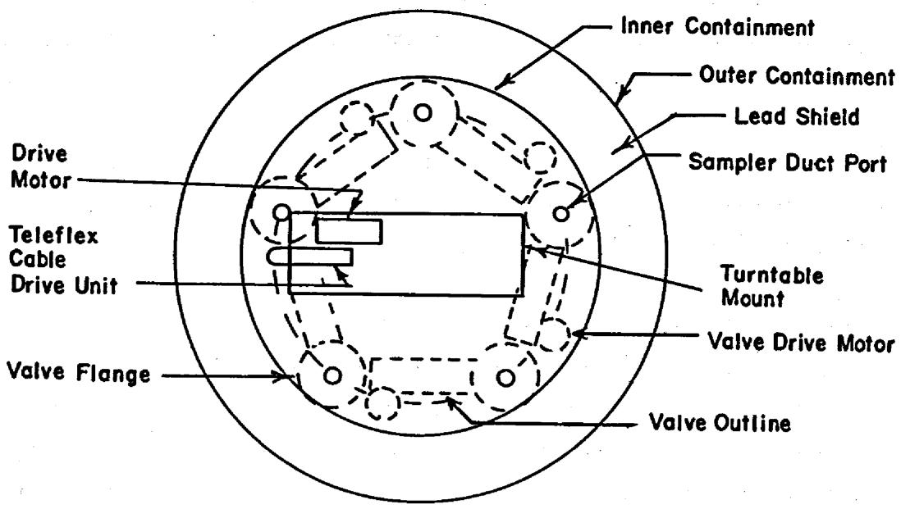

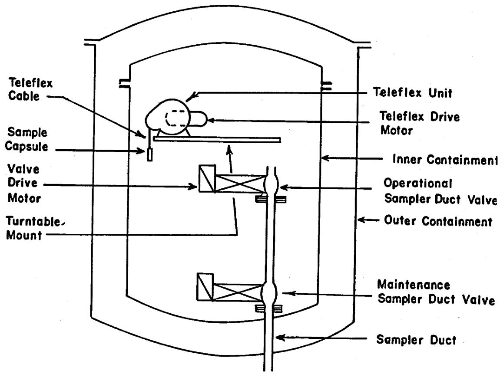  
Fig. 4.15. Radioactive Salt Sampler.

The sampler cavity is connected to the hot cell and to each of the four sample points by five separate sample access ducts. Each duct is made of 1 l/2-in. Sch. 40 pipe and contains two 1 l/2-in. double-disc gate valves. The bottom valve is closed only in the event the upper valve is removed for repair or replacement

# 4.8.13 Coolant Salt Sampling

Coolant salt sampling connections for a portable sampling device are provided on the eight coolant loops and the chemical treatment tank. Samples are also drawn from the eight coolant-salt pump bowls and from the make-up salt chemical-treatment tank. A portable, single-sample holding device receives the sample in a manner similar to that of the high level radioactive salt sampler, transports the sample to the hot cell area, deposits the sample capsule in the hot cell, and receives a fresh capsule from the hot cell. The connection between the portable sampler and coolant salt system is of a lock type, has a gas-tight fitting and operates in an inert atmosphere (possibly radioactive) from full vacuum to 200 psia at $100^{\circ}\mathrm{F}$ .

# 4.8.14 Freeze Valves

Freeze valves are used to close off all lines used for transferring salt from one location to another. These valves are formed in any size of pipe up to 2 in. in diam by pinching the pipe to form a rectangular shaped flow passage. In a 2-in. pipe, the flattened section is about 0.5 in. thick and 2 in. long. Closure of the valve is accomplished by freezing salt inside the pipe. This is done by directing jets of cold air against the top and bottom surfaces of the flattened portion. The air, supplied by a Rootes-Connersville blower, is controlled to regulate the rate of freezing. Subsequent thawing of the salt plug is achieved in a few minutes by means of a Calrod electric heater (3000 watts for a 2-in-line) bent in a saddle-shaped series of turns conformal to the flat section. This heater is easily removed for maintenance.

# 4.9 Auxiliary Services and Equipment

# 4.9.1 Introduction

Auxiliary services necessary for the MSCR plant are as follows:

a. Helium cover gas supply and distribution   
b. Reagent gas supply and disposal   
c. Waste gas disposal   
d. Liquid waste disposal   
e. Coolant pump lubricating oil system   
f. Preheating system   
g. Auxiliary power supply   
h. Service water system   
i. Control and station air systems   
j. Cranes and hoists   
k. Instrumentation and control system   
1. Plant utilities

# 4.9.2 Helium Cover Gas Supply and Distribution System

The helium inert cover gas system serves a number of functions, viz: (a) as a pressurizing gas in various salt containing vessels for the transfer of salt from one place to another; (b) as a carrier gas for the removal of volatile fission products from the recycle gas purge system; (c) as an inert atmosphere to protect against contamination of the salt in places such as the $\mathrm{UF_4}$ system, samplers, melt tank atmospheres, etc., which are occasionally opened to the atmosphere; (d) as a gas seal and bearing lubricant in molten salt pumps; (e) to provide the pressures required in the fuel salt and coolant salt circuits to prevent pump cavitation, and to avoid leakage of fuel salt into the coolant salt in case of a leak in the primary heat exchangers; and (f) to pressurize leak-detection devices at various flanged joints and disconnects.

Since the helium comes into contact with fuel salt or with intermediate coolant salt it must be free from oxide-containing impurities such as $\mathsf{H}_2\mathsf{O}$ , $\mathsf{SO}_2$ , etc; therefore, a purification system is necessary as shown in Fig. 4.16. The raw helium is supplied from a trailer having a capacity

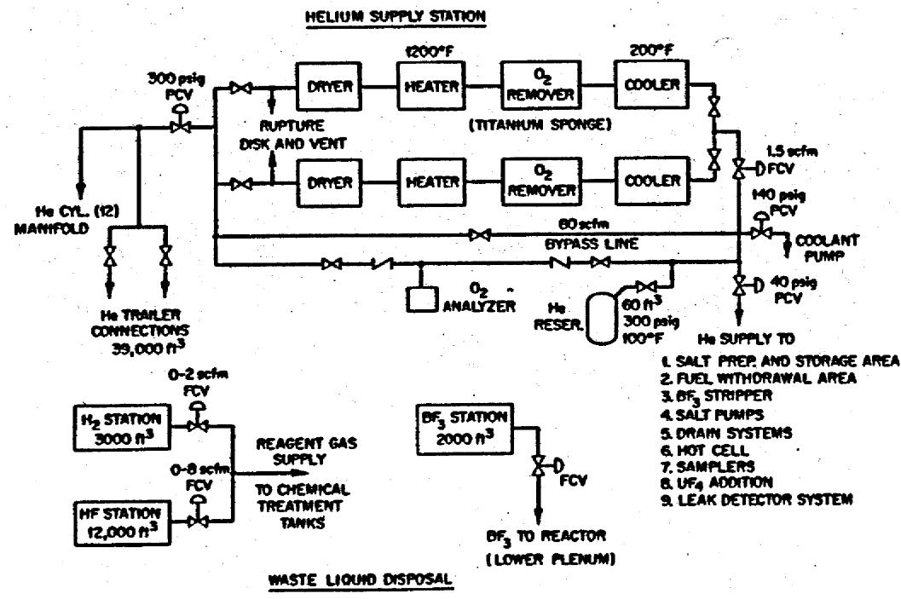

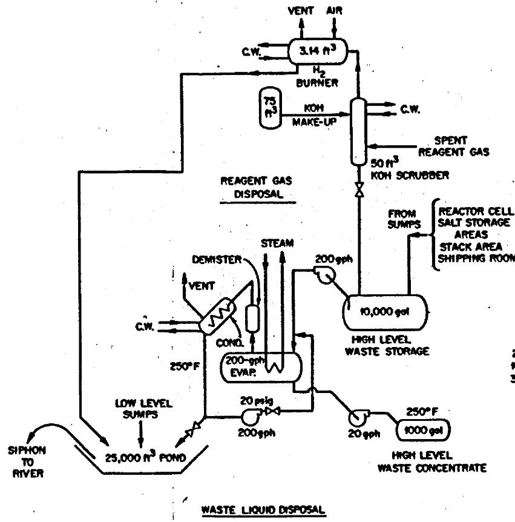

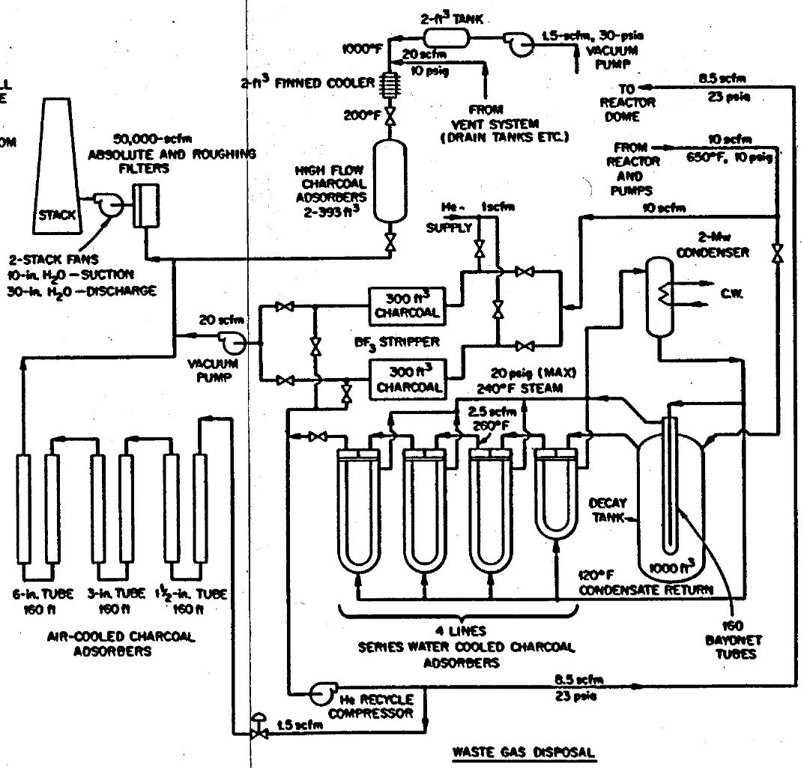  
Fig. 4.16. MSCR Auxiliary Services.

ORNL DWG. 65-7910

of 39,000 std. cubic ft in 30 cylinders at 2400 psi. An emergency supply of 2400 std. cubic ft is supplied from twelve 200 std. cubic ft cylinders. As shown in the flow diagram duplicate lines of helium purification units are provided. Each has a capacity of 1.5 scfm.

# 4.9.3 Reagent Gas Supply and Disposal System

A reagent mixture consisting of $80\%$ anhydrous hydrogen fluoride and $20\%$ hydrogen is used to remove oxide impurities from reactor and intermediate coolant salts. Unreacted reagent gas may contain radioactive material, and thus must be handled by both the gaseous and liquid waste disposal systems.

The reagent gases are supplied from high pressure cylinders provided with pressure reducers and flow control instruments so that the flow may be adjusted (Fig. 4.16). The mixed reagent gas is bubbled through molten salt contained in the fuel-salt and the coolant-salt chemical treatment tanks. Unreacted reagent gas passes through a potassium hydroxide (KOH) scrubber to remove HF, and through a hydrogen burner to remove hydrogen. Spent caustic and condensate from the hydrogen burner may contain radioactive material and thus must be sent to the liquid waste disposal system for concentration and ultimate shipment to a remote disposal area. Non-condensibles from the hydrogen burner are cooled and vented from the system through the gaseous waste disposal system.

# 4.9.4 Waste Gas System

As mentioned previously, helium is passed through the dome above the core to carry away xenon and other volatile fission products. In addition, purge gas is passed down around the shafts of the fuel pumps to sweep away fission products diffusing toward the upper, oil-lubricated bearings. Also, there is helium cover gas in the bowls of the pumps, in the dump tanks, in the fuel handling system, etc., and all of these must be purged to some extent. In order to limit radioactivity in the atmosphere surrounding the reactor site, the off-gas from these various systems is passed through charcoal beds to trap the fission products until they have decayed, as shown in Fig. 4.16. A few long-lived isotopes,

particularly $^{85}\mathrm{Kr}$ , decay but little in the charcoal beds, and hence considerable dilution with air is required to limit the concentration of these in the stack discharge.

If the $\mathbf{BF}_3$ addition system is ever used to effect a "scram" of the reactor, it will be necessary to remove the $\mathbf{BF}_3$ from the reactor system before normal reactor operation can be restored. A stripped unit removes $\mathbf{BF}_3$ from the recycle helium stream to avoid saturating the off-gas adsorber as shown in the flow diagram (Fig. 4.16).

# 4.9.5 Liquid Waste Disposal System

Liquid wastes originate in the drains and sumps of the various equipment cells. Typical sources are hot sinks in the analytical laboratory, cell drains in the shipping area where the shipping cask will be flushed with decontaminants, the contaminated equipment storage and decontamination cell, and spent caustic solutions from the reagent-gas disposal system. The liquid waste system shown in Fig. 4.16 provides for holdup, concentration, and storage of active wastes on-site. High level wastes are concentrated by evaporation and stored in underground tanks. Low-level wastes may be held in underground tanks or in a low-level activity pond until they have decayed sufficiently for discharge into the river. The capacity of this pond is approximately 25,000 cubic ft (nearly twice the volume of the contaminated equipment storage cell).

Intermediate wastes are sent to ten 10,000-gallon stainless steel retention tanks, which are used for temporary storage until it is possible to send the waste to an evaporator for concentration.

High level wastes from the plant and from the evaporator are sent to a 10,000-gallon waste-storage tank which provides semi-permanent storage of these wastes, which will ultimately be transferred to shielded shipping containers for shipment to a permanent disposal area.

Spent caustic wastes from the reagent gas disposal system are sent to the intermediate-level storage tank for further concentration and ultimate disposal off-site.

Pumps (mechanical, air jet, or steam jet) are provided at every sump, at the pond, at the 10,000-gallon tanks, at the evaporator tank, and at the 1000-gallon tanks to transfer the liquids.

The waste evaporator is capable of evaporating 200 gallons of water per hour using the plant heating steam. The condenser drains either to the retention tank or to the low level waste pond, depending on the activity. A vent on the shell side allows noncondensibles to be vented to the charcoal beds.

# 4.9.6 Coolant Pump Lubricating Oil Systems

These systems supply oil to the bearings of eight pumps in the fuel circuits and to eight pumps in the intermediate coolant loops. The two groups of eight pumps each are supplied by two independent systems. The lubricant is circulated under oxygen-free conditions, $120\mathrm{gpm}$ to each pump group. The systems are designed to $120^{\circ}\mathrm{F}$ supply with an expected oil temperature rise of $20^{\circ}\mathrm{F}$ .

# 4.9.7 Preheating System

Prior to the admission of salt, all salt-containing piping and equipment must be preheated to $900^{\circ}\mathrm{F}$ . This is accomplished by the use of several types of resistance heating. In sizes up to about 2 in., piping is heated by passing an alternating current through the piping itself. All pipes heated this way are electrically insulated. Larger diameter salt-containing pipes are heated by hinged resistance heaters (2000 w/ft) surrounding the pipe. For large pipes (above 10 in.) a three-section heater assembly is used. Piping fittings are covered by prefabricated heating units. Heaters for pumps are field-fabricated.

The reactor vessel and primary heat exchangers are heated by tubular resistance heaters attached to the outer surfaces by means of clips on welded studs.

# 4.9.8 Auxiliary Power

Auxiliary power is supplied at 4160 volts by a pair of auxiliary power transformers, type OA/FA, 24-4.16 kv with a maximum fan-cooled rating of 25 Mva. A reserve transformer, fed from the switchyard bus, serves as a standby unit. The loads fed at 4160 volts include all motors rated at 150 horsepower or more, and the auxiliary power transformers

required for station lighting, 480 volt auxiliaries, and the fuel melting and preheating system.

Smaller auxiliaries, of 30 horsepower or less, and those whose continuous operation is not considered vital to station operation, are fed from motor control centers in the vicinity of the load. Two 15 kva 480-120 volt transformers supply a 115 volt a-c control and instrumentation bus for each unit. An emergency supply to this bus is provided from a 15 kva inverter motor-generator set which is driven by the unit 250-volt battery.

# 4.9.9 Service Water System

The service water system supplies river water for cooling purposes throughout the plant, including the reactor auxiliaries and the turbine plant components.

Water is supplied by three 15,000 gpm, half-capacity, vertical centrifugal pumps. Each pump is driven by a 1250-horsepower motor, and is located in the circulating water intake structure. During normal operation two pumps supply the system with water at 100 psig, with the third pump employed as a standby.

# 4.9.10 Control and Station Air Systems

The compressed air system for the plant consists of separate, interconnected air supplies for the station and for control purposes. The station air system supplies hose valves for operating and maintenance requirements throughout the station. Control air is used primarily for instrument transmitters and air-operated valves. The two air systems are cross connected so that compressed air may be supplied to the control air system in event of a compressor failure.

The control air system of the plant supplies air-operated control devices at a header pressure of 115 psia and is reduced to 55 psia and 45 psia for supply to various drive units and instrument transmitters.

# 4.9.11 Cranes and Hoists

A single traveling bridge crane serves the reactor and steam turbine buildings. Its lifting capacity is based on handling the rotor of the

low pressure steam turbine-generator, which weighs about 150 tons. The bridge span is 130 ft, and the crane lift is sufficient to reach the lowest portion of the building. All heavy equipment coming into the building by rail may be handled by the crane. Its capacity is sufficient to allow removal of all components within the reactor primary shield except the reactor.

# 4.9.12 Instrumentation and Control

The requirements for instrumentation and control of the turbine systems are similar to those of the turbine system in a conventional fossil-fuel power plant.

Instrumentation for the reactor system monitors the reactor neutron flux, primary system pressures, temperatures, levels, and flow rates, and provides control and alarm signals to actuate the appropriate device or to call for operator action when changes occur in the measured quantities, through either changes in load or malfunction of system components.

Control and instrumentation panels are located in the control room, for convenience of reading, recording and operating the most important quantities and components. Other auxiliary control panels or isolated instruments may be located at appropriate places in the plant; area radiation monitors, alarm or warning signals, hydrogen and seal oil controls for the generators, etc.

# 4.9.13 Plant Utilities

The plant utilities include those systems that are provided for monitoring plant equipment, disposing of nonradioactive wastes, safety of personnel, protection of equipment and for heating, ventilating and air-conditioning the plant buildings. These systems do not differ appreciably from those provided for conventional plants.

# 4.10 MSCR Design Specifications

The significant specifications for the MSCR equipment and materials are listed in Tables 4.2 through 4.6. The vessels are described in Table 4.2, heat-transfer equipment in Table 4.3, pumps and circulators in Table 4.4, miscellaneous equipment in Table 4.5, and materials in Table 4.6.

Table 4.2. INOR-8 Salt-Containing Vessels   

<table><tr><td></td><td>Number of Units</td><td>Volume of Each Unit ft3</td><td>Diameter in.</td><td>Height in.</td><td>Wall Thickness in.</td><td>Heater Capacity (each unit) kw</td><td>Design Temp. °F</td><td>Design Pressure psi</td><td>Weight (each) lb gross, lb tare</td></tr><tr><td>1. Reactor Vessel</td><td>1</td><td>630 fuel</td><td>241</td><td>240</td><td>1.7</td><td></td><td>1100 inlet 1300 outlet</td><td>100 in 50 out</td><td>1,100,000</td></tr><tr><td>2. Fuel Salt Drain Tanks</td><td>54</td><td>50</td><td>35</td><td>96</td><td>1/2</td><td>15</td><td>1300</td><td>100</td><td></td></tr><tr><td>3. Fertile Salt Melt Tank</td><td>1</td><td>150</td><td>42</td><td>144</td><td>1/4</td><td>150</td><td>1200</td><td>50</td><td></td></tr><tr><td>4. Fertile Salt Chemical Treatment Tank</td><td>1</td><td>100</td><td>36</td><td>168</td><td>5/8</td><td>15</td><td>1300</td><td>100</td><td>25,000 g</td></tr><tr><td>5. Fertile Salt Storage Tank</td><td>1</td><td>100</td><td>36</td><td>168</td><td>3/8</td><td>12</td><td>1200</td><td>100</td><td>23,000 g</td></tr><tr><td>6. Fertile Salt Small Addition Metering Tank</td><td>1</td><td>2</td><td>12</td><td>32</td><td>3/16</td><td>1</td><td>1300</td><td>50</td><td>500 g</td></tr><tr><td>7. Fertile Salt Large Addition Metering Tank</td><td>1</td><td>50</td><td>36</td><td>90</td><td>1/8</td><td>10</td><td>1000</td><td>100</td><td></td></tr><tr><td>8. Fuel Salt Small Withdrawal Metering Tank</td><td>1</td><td>2</td><td>4</td><td>300</td><td>0.4</td><td>12</td><td>1300</td><td>150</td><td></td></tr><tr><td>9. Fuel Salt Reactivity Control Drain Tanks</td><td>2</td><td>50</td><td>36</td><td>96</td><td>1/2</td><td>10</td><td>1300</td><td>100</td><td></td></tr><tr><td>10. Fuel Salt Decay Storage Tanks</td><td>5</td><td>35</td><td>30</td><td>90</td><td>1/4</td><td>10</td><td>1300</td><td>25</td><td>7360 g 900 t</td></tr><tr><td>11. Fuel Salt Withdrawal Transfer Tank</td><td>1</td><td>10</td><td>30</td><td>27</td><td>1/4</td><td>3</td><td>1300</td><td>25</td><td>2350 g 290 t</td></tr><tr><td>12. Flush Salt Storage Tanks</td><td>5</td><td>650</td><td>96</td><td>156</td><td>1/2</td><td>150</td><td>1000</td><td>80</td><td></td></tr><tr><td>13. Coolant Salt Melt Tank</td><td>1</td><td>150</td><td>42</td><td>144</td><td>1/4</td><td>150</td><td>1200</td><td>50</td><td></td></tr><tr><td>14. Coolant Salt Chemical Treatment Tank</td><td>1</td><td>50</td><td>42</td><td>60</td><td>1/2</td><td>8</td><td>1300</td><td>100</td><td>11,500 g</td></tr><tr><td>15. Coolant Salt Drain Tanks</td><td>2</td><td>750</td><td>43.7</td><td>864</td><td>1/4</td><td>200</td><td>1100</td><td>80</td><td>100,000 g 10,000 t</td></tr></table>

Table 4.3. Heat Transfer Equipment   

<table><tr><td></td><td>Primary Heat Exchangers</td><td>Steam Superheaters</td><td>Steam Reheaters</td><td>Loeffler Boilers</td><td>Fuel Salt Drain Tank Condensers</td></tr><tr><td>AEC Account Number</td><td>221.314</td><td>222.32</td><td>222.322</td><td>222.31</td><td>223.312</td></tr><tr><td colspan="6">Design data</td></tr><tr><td>Number of units</td><td>8</td><td>16</td><td>8</td><td>4</td><td>1</td></tr><tr><td>Unit heat rate, Btu/hr</td><td>\( 1,066 \times 10^6 \)</td><td>\( 467 \times 10^6 \)</td><td>\( 132 \times 10^6 \)</td><td></td><td>\( 85 \times 10^6 \)</td></tr><tr><td>Geometry</td><td>Shell &amp; U-Tube</td><td>Shell &amp; U-Tube</td><td>Shell &amp; U-Tube</td><td>Cyl. Drums</td><td>Shell &amp; U-Tube</td></tr><tr><td>Number of tubes</td><td>2,025</td><td>785</td><td>766</td><td>None</td><td>630</td></tr><tr><td>Active area, ft2</td><td>6,643</td><td>8,905</td><td>3,543</td><td></td><td>1,036</td></tr><tr><td>Active length, ft</td><td>25</td><td>57.8</td><td>23.6</td><td>100</td><td>10</td></tr><tr><td>Length of longest tube, ft</td><td>28.8</td><td>61.8</td><td></td><td></td><td></td></tr><tr><td>Length of shortest tube, ft</td><td>23.7</td><td>53.8</td><td></td><td></td><td></td></tr><tr><td>Tube OD, in.</td><td>0.5</td><td>0.75</td><td>0.75</td><td></td><td>0.625</td></tr><tr><td>Tube-wall thickness, in.</td><td>0.035</td><td>0.083</td><td>0.065</td><td></td><td>0.065</td></tr><tr><td>Lattice pitch, in.</td><td>0.625</td><td></td><td>1.00</td><td></td><td>1.5</td></tr><tr><td>Tube material</td><td>INOR-8</td><td>INOR-8</td><td>INOR-8</td><td></td><td>Admiralty</td></tr><tr><td>Shell material</td><td>INOR-8</td><td>INOR-8</td><td>INOR-8</td><td>Carbon steel</td><td>Carbon steel</td></tr><tr><td>Shell ID, in.</td><td>43.75</td><td>31.5</td><td>31</td><td>72</td><td>26</td></tr><tr><td>Shell thickness, in.</td><td>1.5</td><td>0.5</td><td>0.5</td><td>7</td><td>0.25</td></tr><tr><td>IMTD, °F</td><td>173.7</td><td>174.8</td><td>187.5</td><td></td><td></td></tr><tr><td>Shell weight, lb</td><td>16,000</td><td>11,000</td><td>4,500</td><td></td><td></td></tr><tr><td>Tubing weight, lb</td><td>10,000</td><td>25,000</td><td>9,620</td><td></td><td>3,800</td></tr><tr><td colspan="6">Design pressure</td></tr><tr><td>Heat transfer coefficient, Btu hr·ft2·°F</td><td>924</td><td>300</td><td>119</td><td></td><td></td></tr><tr><td colspan="6">Shell-side conditions</td></tr><tr><td>Fluid</td><td>Fuel salt no. 2</td><td>Int. cool. salt</td><td>Int. cool. salt</td><td>Steam</td><td>Steam</td></tr><tr><td>Inlet temperature, °F</td><td>1,100</td><td>1,100</td><td>1,100</td><td>240</td><td>1,000</td></tr><tr><td>Outlet temperature, °F</td><td>1,300</td><td>950</td><td>950</td><td>120</td><td>636</td></tr><tr><td>Flow rate, ft3/sec</td><td>20.25</td><td>13.7</td><td>3.84</td><td>80,000</td><td>\( 3.7 \times 10^6 \)</td></tr><tr><td>Pressure, psig</td><td>200</td><td>300</td><td>300</td><td>10</td><td>2,460</td></tr><tr><td>Pressure drop, psi</td><td>80</td><td>15</td><td>40</td><td></td><td></td></tr><tr><td>Volume, ft3</td><td>61.6</td><td>150</td><td>64</td><td></td><td></td></tr><tr><td colspan="6">Tube-side conditions</td></tr><tr><td>Fluid</td><td>Int. cool. salt</td><td>Steam</td><td>Steam</td><td>Water</td><td>Water</td></tr><tr><td>Inlet temperature, °F</td><td>950</td><td>670</td><td>635</td><td>80</td><td>545</td></tr><tr><td>Outlet temperature, °F</td><td>1,100</td><td>1,000</td><td>1,000</td><td>150</td><td>636</td></tr><tr><td>Flowrate, lb/hr</td><td>31</td><td>\( 1.28 \times 10^6 \)</td><td>\( 0.7 \times 10^6 \)</td><td>\( 1.2 \times 10^6 \)</td><td>\( 5.2 \times 10^6 \)</td></tr><tr><td>Pressure, psig</td><td>350</td><td>2,490</td><td>440</td><td>110</td><td>2,450</td></tr><tr><td>Pressure drop, psi</td><td>84</td><td>25</td><td>20</td><td></td><td>50</td></tr></table>

Table 4.4. Pumps and Circulators   

<table><tr><td></td><td>MSCR Fuel Pump</td><td>MSCR Coolant Pump</td><td>Steam Circulators</td></tr><tr><td>Number of units</td><td>8</td><td>8</td><td>4</td></tr><tr><td>Type</td><td>Centrifugal</td><td>Centrifugal</td><td>Axial</td></tr><tr><td>Fluid pumped</td><td>MSCR-2 fuel salt</td><td>Constant salt</td><td>Steam</td></tr><tr><td>Service temperature</td><td>1300°F</td><td>1100°F</td><td>1000°F</td></tr><tr><td>Fluid density</td><td>190 lb/ft3</td><td>120 lb/ft3</td><td></td></tr><tr><td>Fluid flow per pump</td><td>9075 gpm</td><td>13,900</td><td>5.3 × 106lb/hr</td></tr><tr><td>Suction pressure (17 ft NPSH)</td><td>22.5 psia</td><td>130 psia</td><td>2430 psig</td></tr><tr><td>Discharge pressure (150 ft developed head)</td><td>220 psia</td><td>350 psia</td><td>2490 psig</td></tr><tr><td>Impeller OD</td><td>25 in.</td><td>25 in.</td><td></td></tr><tr><td>Suction ID</td><td>14 in.</td><td>14 in.</td><td></td></tr><tr><td>Discharge ID</td><td>12 in.</td><td>12 in.</td><td></td></tr><tr><td>Over-all pump OD (Approx.)</td><td>50 in.</td><td>50 in.</td><td></td></tr><tr><td>Over-all pump height-suction opening to pump housing flange face (Approx.)</td><td>50 in.</td><td>50 in.</td><td></td></tr><tr><td>Pump motor rating</td><td>1600 hp, 4160 volt</td><td>2000 hp, 4160 volt</td><td></td></tr><tr><td>Pump motor speed (synchronous)</td><td>900 rpm</td><td>900 rpm</td><td></td></tr><tr><td>Pump motor type</td><td>Totally enclosed, 3 phase water cooled</td><td>Totally enclosed, 3 phase water cooled</td><td></td></tr></table>

Table 4.5. Miscellaneous Equipment   

<table><tr><td colspan="2">Thermal shield</td></tr><tr><td>Dimensions, ft</td><td>1.5 × 24 × 24</td></tr><tr><td colspan="2">Material</td></tr><tr><td>Shield</td><td>2 in. plate carbon steel</td></tr><tr><td>Headers</td><td>20 in. × 4 in. carbon steel
(1/2 in. wall thickness)</td></tr><tr><td>Weight, lb gross (water filled)</td><td>250,000</td></tr><tr><td>Inlet/outlet pipe</td><td>8 in. Sch. 20 carbon steel</td></tr><tr><td>Heat removal rate, 106 Btu/hr</td><td>18</td></tr><tr><td>Water flow, gpm</td><td>2000</td></tr><tr><td>Water temperature/pressure, °F/psig</td><td>90-110/15</td></tr><tr><td colspan="2">Shield cooling system</td></tr><tr><td>Heat load, Mwt</td><td>37.5</td></tr><tr><td colspan="2">Demineralized water circuit</td></tr><tr><td>Maximum temperature, °F</td><td>180</td></tr><tr><td>Minimum temperature, °F</td><td>125</td></tr><tr><td>Flow rate, gpm</td><td>4650</td></tr><tr><td colspan="2">Service water conditions</td></tr><tr><td>Maximum temperature, °F</td><td>125</td></tr><tr><td>Minimum temperature, °F</td><td>75</td></tr><tr><td>Flow rate, gpm</td><td>5120</td></tr><tr><td colspan="2">Cell-air cooling system</td></tr><tr><td>Heat load, Mwt</td><td>5</td></tr><tr><td colspan="2">Demineralized water circuit</td></tr><tr><td>Maximum temperature, °F</td><td>110</td></tr><tr><td>Minimum temperature, °F</td><td>95</td></tr><tr><td>Flow rate, gpm</td><td>2275</td></tr><tr><td colspan="2">Service water conditions</td></tr><tr><td>Maximum temperature, °F</td><td>95</td></tr><tr><td>Minimum temperature, °F</td><td>75</td></tr><tr><td>Flow rate, gpm</td><td>1700</td></tr><tr><td colspan="2">High level radioactive salt sampler</td></tr><tr><td>Sampler cavity linner containment vessel</td><td></td></tr><tr><td>Dimensions</td><td>5 ft 4 in. ID × 6 ft high</td></tr><tr><td>Material and thickness</td><td>304 stainless steel, 1/8 in.</td></tr><tr><td>Design temperature/pressure</td><td>125°F/±15 psig</td></tr><tr><td>Sampler cavity shielding</td><td></td></tr><tr><td>Material; thickness</td><td>Lead; 1 ft thick all around sides and top</td></tr><tr><td>Approximate weight</td><td>57 tons</td></tr><tr><td>Sampler cavity outer containment vessel</td><td></td></tr><tr><td>Dimensions</td><td>7 ft 8 in. ID × 8 ft high</td></tr><tr><td>Material and thickness</td><td>Carbon steel, 1/4 in. thick</td></tr><tr><td>Design temperature/pressure</td><td>125°F/15 psig</td></tr><tr><td>Sampler ducts</td><td></td></tr><tr><td>Design pressure</td><td>100 psig</td></tr><tr><td>Design temperature</td><td>200°F</td></tr><tr><td>Size</td><td>1 l/2 in. Sch. 40 pipe</td></tr><tr><td>Material</td><td>Inconel</td></tr><tr><td>Sampler duct valves</td><td></td></tr><tr><td>Design pressure/temperature</td><td>100 psig/125°F</td></tr><tr><td>Number required</td><td>10</td></tr><tr><td>Type</td><td>1 l/2 in. Vulcan bellows stem double-disc motor-operated gate valve (supplied by Hoke Valve Co.)</td></tr><tr><td>Cable drive unit</td><td></td></tr><tr><td>Service environment</td><td>Drive unit will operate in an inert but radioactive atmosphere at normal temperature. Radiation level will be high only during sampling operation. The cable must be capable of operation at temperatures in the range 100 to 1300°F.</td></tr><tr><td colspan="2">High level radioactive salt
samples (continued)</td></tr><tr><td colspan="2">Cable drive unit (continued)</td></tr><tr><td>Cable size</td><td>1/8 in. diam; length sufficient
to reach from the sample cavity
to the farthest sample point.</td></tr><tr><td colspan="2">UF4addition facility</td></tr><tr><td colspan="2">Containment vessel</td></tr><tr><td>Dimensions, ft</td><td>3 × 10</td></tr><tr><td>Design pressure, psig</td><td>±15</td></tr><tr><td>Material</td><td>304 stainless steel</td></tr><tr><td colspan="2">Pellet bin and dispenser</td></tr><tr><td>Volume, ft3</td><td>1</td></tr><tr><td colspan="2">Metering chamber</td></tr><tr><td>Configuration</td><td>Coiled tube, l in. pipe</td></tr><tr><td>Tube length, ft</td><td>14</td></tr><tr><td>Tube material</td><td>Stainless steel</td></tr><tr><td colspan="2">Valves</td></tr><tr><td>Size (nominal) in.</td><td>1</td></tr><tr><td>Description</td><td>Bellows-sealed, 150-lb design,
gas-tight, soft-seated</td></tr><tr><td>UF4addition pipe</td><td>1 in. Sch. 40 stainless steel
pipe</td></tr><tr><td colspan="2">Dissolver tube</td></tr><tr><td>Configuration</td><td>Perforated, coiled pipe</td></tr><tr><td>Size, nominal pipe size (in.)</td><td>1</td></tr><tr><td>Material</td><td>INOR-8</td></tr><tr><td>Length, ft</td><td>4</td></tr><tr><td>Other description</td><td>End blanked off; perforation
diameter, l/8 in.</td></tr><tr><td>Shielding</td><td>6 in. of lead</td></tr></table>

Table 4.5 (continued)   

<table><tr><td colspan="2">Reagent gas disposal system data</td></tr><tr><td colspan="2">Hydrogen supply</td></tr><tr><td>Cylinder station capacity, standard cubic ft</td><td>3000</td></tr><tr><td>Flow rate, scfm</td><td>2</td></tr><tr><td colspan="2">Hydrogen fluoride supply</td></tr><tr><td>Cylinder station capacity, standard cubic ft</td><td>12,000</td></tr><tr><td>Flow rate, scfm</td><td>8</td></tr><tr><td colspan="2">KOH scrubber for HF disposal</td></tr><tr><td>HF flow rate (max), scfm</td><td>8</td></tr><tr><td>Cooling requirement, Btu/hr</td><td>118,000</td></tr><tr><td>Cooling water flow rate, gpm</td><td>10</td></tr><tr><td>KOH solution feed rate, liters/min (max)</td><td>1</td></tr><tr><td>Flow rate of unreacted hydrogen, scfm</td><td>2</td></tr><tr><td>Length and diameter, ft</td><td>8 and 2.8</td></tr><tr><td>Material of construction</td><td>Monel</td></tr><tr><td>Wall thickness, in.</td><td>1/4</td></tr><tr><td colspan="2">KOH supply tank</td></tr><tr><td>Dimensions</td><td>4 ft diam, 8 ft high</td></tr><tr><td>Material</td><td>Carbon steel</td></tr><tr><td>Chemical feed pump</td><td>0-1 liter/min</td></tr><tr><td>Mixer</td><td>2 hp</td></tr><tr><td colspan="2">Hydrogen burner</td></tr><tr><td>Design flow rate, lb-moles H2per hour</td><td>1/3</td></tr><tr><td>Heat load, B/hr</td><td>41,000</td></tr><tr><td>Cooling water flow, gpm</td><td>4</td></tr><tr><td>Design air flow rate, cfm (max)</td><td>10</td></tr><tr><td>Dimensions</td><td>1 ft diam × 4 ft high</td></tr><tr><td>Material</td><td>Carbon steel</td></tr></table>

Table 4.5 (continued)   

<table><tr><td colspan="2">Reagent gas disposal system data
(continued)</td></tr><tr><td colspan="2">Hydrogen burner condenser</td></tr><tr><td>Heat load, B/hr</td><td>20,000</td></tr><tr><td>Cooling water flow, gpm</td><td>4</td></tr><tr><td>Exit gas flow rate (nitrogen
plus unburned oxygen), scfm</td><td>9</td></tr><tr><td>Design temperature of exit
gas, °F</td><td>100</td></tr><tr><td>Surface area of tubing, ft2</td><td>100</td></tr><tr><td>Shell material</td><td>Carbon steel</td></tr><tr><td>Tubing material</td><td>Admiralty</td></tr><tr><td>Configuration</td><td>Shell-and-tube, single pass,
straight tube</td></tr><tr><td>Condensate rate, lb H2O per
hr</td><td>6</td></tr><tr><td colspan="2">Cover gas purification system</td></tr><tr><td colspan="2">Helium dryer</td></tr><tr><td>Dessicant used</td><td>Molecular sieve</td></tr><tr><td>Amount, lb</td><td>10</td></tr><tr><td>Length/diameter, ft/in.</td><td>2.5/4</td></tr><tr><td>Pressure rating, psig</td><td>300</td></tr><tr><td>Container material</td><td>Carbon steel</td></tr><tr><td colspan="2">Helium heater (electric)</td></tr><tr><td>Design temperature gas exit,
°F</td><td>1200</td></tr><tr><td>Helium flow rate, scfm</td><td>1.5</td></tr><tr><td>Design pressure, psig</td><td>300</td></tr><tr><td>Heater rating (electric), kw</td><td>1</td></tr><tr><td colspan="2">Oxygen removal unit</td></tr><tr><td>Design flow rate, scfm</td><td>1.5</td></tr><tr><td>Container size, length/diam-
eter, in./in. (overall)</td><td>26/6 Sch. 40</td></tr><tr><td>Active ingredient</td><td>Titanium sponge</td></tr></table>

Table 4.5 (continued)   

<table><tr><td colspan="2">Cover gas purification system
(continued)</td></tr><tr><td colspan="2">Oxygen removal unit (continued)</td></tr><tr><td>Design pressure/temperature, psig/°F</td><td>300/1200</td></tr><tr><td colspan="2">Helium cooler</td></tr><tr><td>4 in. finned tube with flanges</td><td>4 ft long</td></tr><tr><td>Inlet/outlet temperature, °F</td><td>1200/200</td></tr><tr><td>Helium flow rate, scfm</td><td>1.5</td></tr><tr><td colspan="2">Treater helium surge tank</td></tr><tr><td>Tank volume, ft3</td><td>60</td></tr><tr><td>Design pressure/temperature psig/°F</td><td>300/100</td></tr><tr><td>Material</td><td>Carbon steel</td></tr><tr><td colspan="2">Lube oil system</td></tr><tr><td>Number of systems</td><td>2</td></tr><tr><td>Design lube oil flow, gpm</td><td>120</td></tr><tr><td>Design lube oil temperature, °F (in/out)</td><td>140/120</td></tr><tr><td>Design cooling water temperature, °F (in/out)</td><td>75/100</td></tr><tr><td>Design cooling water pressure, psig</td><td>25</td></tr><tr><td>Design cooling water flow, gpm</td><td>45</td></tr><tr><td>Number of lube oil pumps</td><td>2</td></tr><tr><td>Type</td><td>Rot.</td></tr><tr><td>Lube oil pumps head, ft</td><td>150</td></tr><tr><td>Flow, gpm</td><td>300</td></tr><tr><td>Motor, hp</td><td>20</td></tr><tr><td>Reservoir, number 2</td><td>1</td></tr><tr><td>ID, ft (cylindrical)</td><td>5</td></tr><tr><td>Height, ft</td><td>5</td></tr><tr><td>Capacity, gal.</td><td>600</td></tr><tr><td>Wall thickness, in.</td><td>0.25</td></tr></table>

Table 4.5 (continued)   

<table><tr><td colspan="2">Lube oil system (continued)</td></tr><tr><td colspan="2">Reservoir, number 2 (continued)</td></tr><tr><td>Material</td><td>Carbon steel</td></tr><tr><td>Weight (full), lb</td><td>3000</td></tr><tr><td>Cooler, number</td><td>2</td></tr><tr><td>Type</td><td>2 pass shell, 4 pass tube</td></tr><tr><td>Tube material</td><td>Inconel</td></tr><tr><td>Shell material</td><td>Carbon steel</td></tr><tr><td>Overall heat transfer coefficient, Btu/hr·ft2·°F</td><td>20</td></tr><tr><td>Tube surface area, ft2</td><td>735</td></tr><tr><td>Tube size, OD, in.</td><td>5/8</td></tr><tr><td>Tube wall thickness, in.</td><td>0.125</td></tr><tr><td>Tube pitch (triangular)</td><td>0.938</td></tr><tr><td>Shell diameter, ID, in.</td><td>18</td></tr><tr><td>Shell length, ft</td><td>34</td></tr><tr><td>Tube design pressure, psig</td><td>25</td></tr><tr><td>Tube design temperature, °F</td><td>100</td></tr><tr><td>Shell design pressure, psig</td><td>45</td></tr></table>

Table 4.6. Material Specifications   

<table><tr><td colspan="3">Properties Assumed for MSCR Graphite</td></tr><tr><td>Items and Units</td><td>MSCR</td><td>MSRE*</td></tr><tr><td>Density, g/cc</td><td>1.9</td><td>1.9</td></tr><tr><td>Thermal conductivity, Btu/hr·ft·°F</td><td></td><td></td></tr><tr><td>At 68°F and with grain</td><td></td><td>80</td></tr><tr><td>At 68°F and across grain</td><td></td><td>45</td></tr><tr><td>At 1200°F, isotropic, after irradiation</td><td>15</td><td></td></tr><tr><td>Coefficient of thermal ex-pansion, across grain, per °F</td><td></td><td></td></tr><tr><td>At 68°F</td><td></td><td>1.7 × 10-6</td></tr><tr><td>At 1200°F, after irradiation</td><td>3 × 10-6</td><td></td></tr><tr><td>Maximum allowable strain, in./in.</td><td>0.001</td><td></td></tr><tr><td>Porosity</td><td></td><td></td></tr><tr><td>Accessible to salt at 150 psi</td><td>0.001</td><td>0.005</td></tr><tr><td>Accessible to gas</td><td>0.01</td><td></td></tr><tr><td>Poisson&#x27;s ratio</td><td>0.4</td><td></td></tr><tr><td>Young&#x27;s modulus</td><td></td><td></td></tr><tr><td>With grain</td><td></td><td>3 × 106</td></tr><tr><td>Across grain</td><td>1.25 × 106</td><td>1.5 × 106</td></tr><tr><td>Helium permeability at 30°C, cm2/sec</td><td></td><td></td></tr><tr><td>Diffusivity of xenon at 1200°F, cm2/sec</td><td>10-6</td><td></td></tr><tr><td>Specific heat Btu/lb·°F</td><td>0.33</td><td></td></tr></table>

*MSRE values are given for comparison and were mostly taken from reference (12).

Table 4.6 (continued)   

<table><tr><td colspan="4">Assumed Properties of MSCR Fuel-Salt Mixture at 1200°F</td></tr><tr><td>Mixture No.</td><td>1</td><td>2</td><td>3</td></tr><tr><td>Composition</td><td></td><td></td><td></td></tr><tr><td>Mole % LiF-BeF2-ThF4</td><td>71-16-13</td><td>68-23-9</td><td>66-29-5</td></tr><tr><td>Wt % LiF-BeF2-ThF4</td><td>29-11-60</td><td>32-19-49</td><td>38-29-33</td></tr><tr><td>Liquidus temperature, °F</td><td>941</td><td>887</td><td>860</td></tr><tr><td>Molecular weight</td><td>66.03</td><td>56.2</td><td>46.2</td></tr><tr><td>Density, lb/ft3</td><td>215.6</td><td>190.1</td><td>163.0</td></tr><tr><td>Viscosity, lb/ft·hr</td><td>24.2</td><td>21.0</td><td>18.9</td></tr><tr><td>Thermal conductivity, Btu/hr·ft·°F</td><td>2.67</td><td>2.91</td><td>3.10</td></tr><tr><td>Heat capacity, Btu/lb·°F</td><td>0.318</td><td>0.383</td><td>0.449</td></tr></table>

Assumed Properties of MSCR Intermediate

Coolant Salt Mixture at $1062^{\circ}\mathrm{F}^{*}$

Composition

Mole % LiF-BeF2 66-34

Wt % LiF-BeF2 52-48

Liquidus temperature, ${}^{\circ}\mathrm{F}$ 851

Molecular weight 33.14

Density, 1b/ft3 120.5

Viscosity, lb/ft·hr 20.0

Thermal conductivity, Btu/hr·ft·°F 3.5

Heat capacity, Btu/lb·°F 0.526

*Reference (12) of the Bibliography.

Properties of INOR-8*

Wt %

Chemical composition

Nickel, min 66-71 (balance)

Molybdenum 15-18

*Reference (12) of the Bibliography.

Table 4.6 (continued)   

<table><tr><td>Properties of INOR-8 (continued)</td><td>Wt % (continued)</td></tr><tr><td>Chemical composition (continued)</td><td></td></tr><tr><td>Chromium</td><td>6-8</td></tr><tr><td>Iron, max</td><td>5</td></tr><tr><td>Manganese, max</td><td>1</td></tr><tr><td>Silicon, max</td><td>1</td></tr><tr><td>Carbon</td><td>0.04-0.08</td></tr><tr><td>Miscellaneous, max</td><td>2</td></tr><tr><td colspan="2">Physical Properties at 1200°F</td></tr><tr><td>Density, g/cc</td><td>8.79</td></tr><tr><td>Melting point, °F</td><td>2470-2555</td></tr><tr><td>Thermal conductivity, Btu/hr·ft·°F at 1200°F</td><td>11.7</td></tr><tr><td>Young&#x27;s modulus, psi at 1300°F</td><td>25 × 10^6</td></tr><tr><td>Specific heat, Btu/lb·°F at 1200°F</td><td>0.1385</td></tr><tr><td>Coefficient of thermal expansion, l/°F at 1200°F</td><td>7.8 × 10^-6</td></tr><tr><td>Maximum allowable stress, psi at 1200°F</td><td>6000</td></tr><tr><td>Maximum allowable stress, psi at 1300°F</td><td>3500</td></tr></table>

# 5. FUEL PROCESSING

# 5.1 Reprocessing System

Fluorination of spent fuel from the MSCR to recover isotopes of uranium, followed by discard of the carrier salt (containing LiF, $\mathrm{BeF}_2$ , $\mathrm{ThF}_4$ , and fission product fluorides), was selected as the method of processing for several reasons: (a) The fluorination process is well adapted for future integration with the reactor plant (sharing shielding and maintenance facilities and personnel) with appreciable potential reductions in fuel cycle cost (Sec. 6.9); (b) the necessity for holding the spent fuel for decay of radioactivity is eliminated; (c) no development is required; the plant may be designed and costed on the basis of current technology.

In order to use the next most applicable process, Thorex, it would be necessary to develop special head-end and tail-end steps for converting spent fuel from the fluoride to the nitrate and back again. Also it would be necessary to hold the spent fuel prior to processing for not less than 120 days (to average the equivalent of 90 days of cooling). Further, there is some uncertainty concerning the effect of fluoride ion on the chemistry of the aqueous separations. On the other hand, the thorium could be recovered, and perhaps also the carrier salt could be recovered free from contamination with rare earth isotopes. It would, however, be contaminated with the isotopes Cd, Sr, Ag, Cs, Se, Ba, and Te.

The processing costs for the MSCR fuel have been estimated for both processes.

# 5.2 Fluoride Volatility Central Plant

A central plant capable of processing about $30 ft^3$ of fuel salt per day (1 tonne Th/day) was selected for costing. This plant is capable of servicing about 20 reference design MSCR's having a total capability of 20,000 Mwe.

Component design, plant layout, and associated costs for the plant described herein were adapted from a design and cost study of an on-site plant prepared by Carter, Milford, and Stockdale in a prior study (21).

Due allowance for fuel transport to a central location was made, together with other adjustments for difference in capacities, elimination of protactinium recycle, etc.

# 5.2.1 Process Design

The steps of the proposed fluorination process are indicated in Fig. 5.1. Spent fuel is transferred from the shipping containers to pre-fluorination storage by applying gas pressure or by siphoning. The fuel is then introduced batch-wise into the fluorinators where it is treated with elemental fluorine, possibly diluted with some inert gas, at about $1000^{\circ}\mathrm{F}$ . The effluent $\mathrm{UF}_6$ is absorbed in beds of NaF at $200^{\circ}\mathrm{F}$ , is later desorbed at $700^{\circ}\mathrm{F}$ and collected in cold traps at $-45^{\circ}\mathrm{F}$ . Periodically the cold traps are warmed, and the decontaminated $\mathrm{UF}_6$ is collected in cylinders.

The fluoride volatility process does not provide for recovering thorium or any of the components of the carrier salt. Consequently, after fluorination the $\mathrm{LiF - BeF_2 - ThF_4 - FP}$ melt is drained into interim waste storage, and later transferred to permanent waste storage such as, for example, in a salt mine. The interim storage period has been taken to be 1100 days, a value corresponding to the most favorable economic balance between on-site and permanent storage charges for this particular process.

It will be observed that $^{233}\mathrm{Pa}$ is not recovered in this process. An analysis of Pa recovery versus discard disclosed that additional process equipment and building space requirements made the recovery of Pa uneconomical.

A major problem in the design of vessels which contain irradiated salt is that of heat removal. Volumetric heat release rates are high, and the temperature of the heat source is considerably greater than that of conventional heat sinks (such as cooling water from rivers or wells). In the design evolved, heat is transferred across an air gap into water. The principal heat transfer mechanism is radiation; convection accounts for perhaps 5 to 10 per cent of the transfer. This arrangement, in addition to controlling the heat transfer rate at tolerable levels, provides isolation of the coolant from the molten salt so that a leak of either stream through its containment wall does not contaminate the other stream.

ORNL-LR No.74670

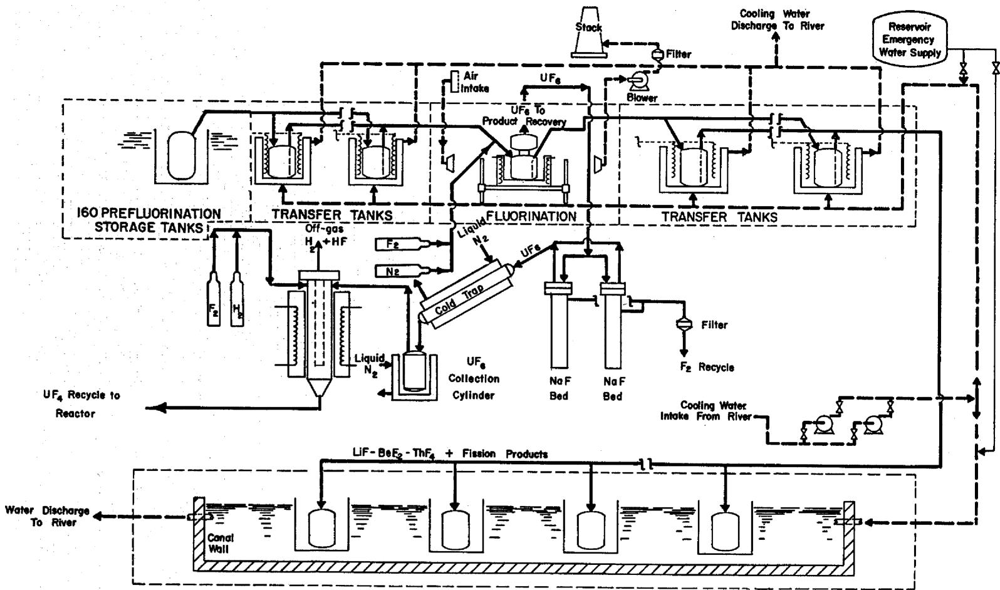  
Fig. 5.1. MSCR Fluoride Volatility Fuel Processing Plant.

The fluorinators are cooled by circulating air through the cell. In the case of the prefluorination storage tanks, radiation from storage vessels to a concentric tank in a water bath provides sufficient cooling for 5-day-old fuel salt.

Wherever possible, the equipment was patterned after that used in the ORNL Volatility Pilot Plant described by Milford (66), Carr (18), Cathers et al. (22, 23).

# 5.2.2 Shipping

Shipment of irradiated fuel is made in a lead shielded carrier shown in Fig. 5.2. The cask is equipped with a water-cooling system which is able to absorb decay heat radiated from the salt container and to dissipate this heat to the atmosphere via finned tube exchangers fastened to the outside of the cask. Heat transfer may be either by boiling the water in the inside jacket followed by condensation in the outside exchanger, or by natural convection.

The shipping container (also used for waste disposal), is designed to hold $\approx 10$ ft³ salt which is about six days accumulation at the reactor discharge rate of 1.67 ft³/day. For this design it has been assumed that the processing plant is located 500 miles from the reactor site and that shipment will be made by rail. The round trip, including filling and emptying, is anticipated to take 10 days. The average age of spent fuel at shipment is approximately 5 days.

# 5.2.3 Prefluorination Storage Tanks

One hundred and sixty 30 ft³ tanks receive up to 120 days supply of spent fuel from each of a number of reactor sites. When a 120-day batch is completed, the tanks are removed from their cooling jackets to the transfer area where the material is transferred to 6-ft³ metering transfer tanks. From these tanks the spent fuel can be transferred by gravity or inert gas pressure to the fluorinators.

The cooling jackets for the prefluorination storage tanks are stainless steel tanks 2.2 ft in diameter by 12 ft high immersed in a water bath. Cooling is achieved principally by radiation from the storage tank to the

ORNL-DWG. 65-7911

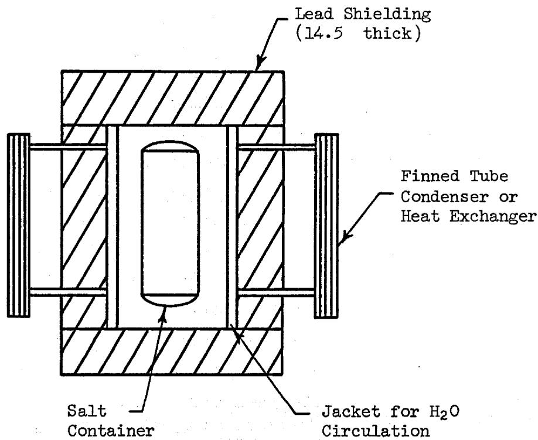  
Fig. 5.2. Irradiated Fuel Shipping Cask.

jacket. The transfer tanks are equipped with jackets cooled by circulating water. Electric heaters provide preheating prior to transfer operations, should heating be required.

# 5.2.4 Fluorinator

The design shown in Fig. 5.3 has been successfully operated in the ORNL Fluoride Volitility Pilot Plant (18). Surmounting the fluorination chamber is a de-entrainment section. The lower chamber is surrounded by an electrically-heated furnace while the upper is heated with electrical strip heaters. Five units are required, each having a capacity of $6\mathrm{ft}^3$ . The corrosion rate is about 1 mil per hour of fluorination time; hence the fluorinator must be inexpensive and accessible for frequent replacement. It was designed to dissipate decay heat and heat of reaction to the atmosphere in the cell through a wall 1/2 in. thick at a temperature of $900^{\circ}\mathrm{F}$ . The preferred materials of construction are either INOR-8 or Alloy 79-4 (70 per cent Ni, 4 per cent Mo, 17 per cent Fe). L-Nickel has been used for fluorinator construction but is susceptible to intergranular attack.

Spent fuel is fluorinated batchwise at about $1000^{\circ}\mathrm{F}$ . It takes about 6 hours to volatilize the uranium $(99.9\%)$ from a 6 ft³ batch. In current practice the attack of fluorine on the vessel is severe. The high rate of corrosion is believed to result from the combined action of liquid salt and gaseous fluorine phases. However, several lines of improvement are under investigation. These include the use of the "frozen wall" fluorinator (35) wherein a layer of solid salt is maintained on the vessel wall by proper control of the cooling, and this layer protects the wall. Another approach consists of spraying the molten salt into a relatively cool atmosphere of fluorine. Uranium hexafluoride is formed in and rapidly removed from the microdroplets which then cool and freeze before they strike the wall. Not only are the wall temperatures lower, but there is no liquid phase in contact with the wall.

The fluorides of some fission products, notably Mo, Zr, Nb, Cs, Ru, and Te are volatile and accompany the $\mathsf{UF}_6$ . These are separated from the uranium in the CRP trap and NaF absorber described below. It is not expected that the fluoride of Pa will be volatile under conditions specified.

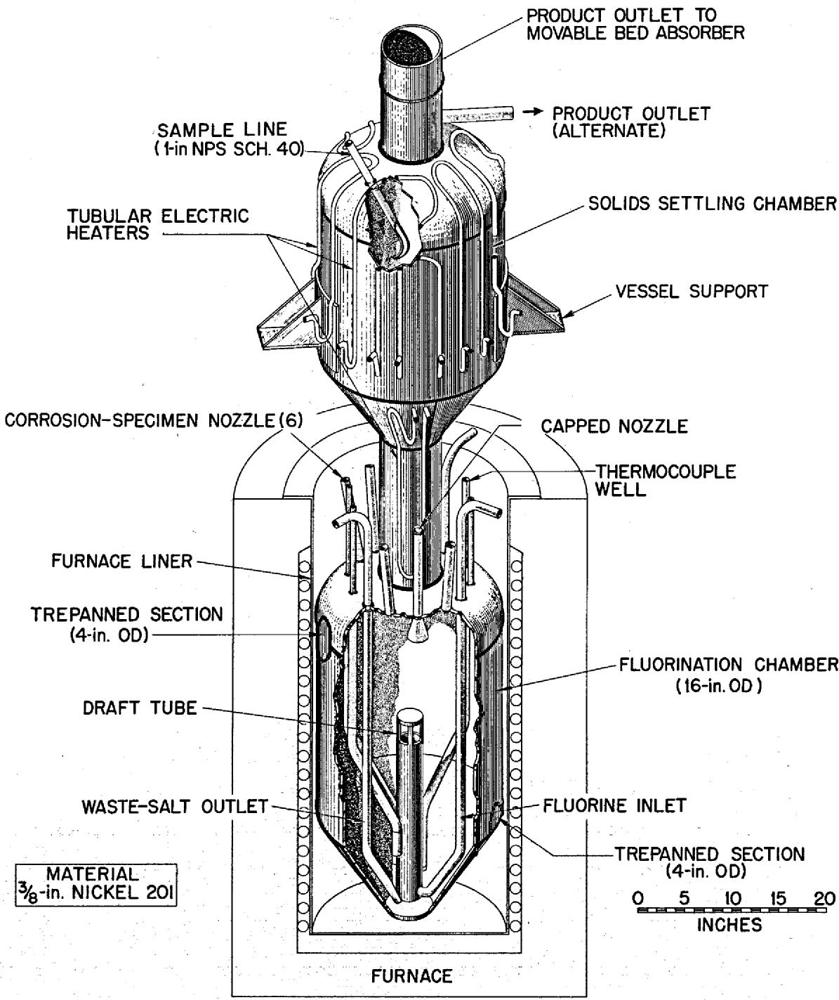  
Fig. 5.3. Fluorinator.

Protactinium will remain in the barren salt and be lost to waste. The loss amounts to about 10 g/day in the reference design reactor, and studies have shown that it is not economical to recycle the barren salt to the fluorinators after holding it to allow the Pa to decay. The cost increase of additional fluorinator capacity and interim storage vessels more than offsets the value of the $^{233}\mathrm{U}$ recovered.

# 5.2.5 CRP Trap and NaF Absorbers

After leaving the fluorinator, $\mathrm{UF}_6$ and accompanying fission product fluorides pass into a two-zoneed NaF absorption system. The first, called the complexible radioactive products (CRP) trap is operated at about $400^{\circ}\mathrm{C}$ and removes fluorides of chromium, zirconium, niobium, cesium, strontium, and rare earths, as well as entrained salt particles. Uranium hexafluoride is not absorbed here, but is absorbed in the second zone operated at $100^{\circ}\mathrm{C}$ , along with the fluorides of molybdenum and ruthenium, and traces of others. Some ruthenium carries through into the fluorine recirculation system.

Uranium is recovered from the beds by desorption at $400^{\circ}\mathrm{C}$ . It is collected in cold traps described below.

The stationary bed absorber, shown in Fig. 5.4, contains just over one cubic foot of NaF. Six unites are required. Each is mounted in a lightweight, low-heat capacity electric furnace which opens on hinges for removal of the absorber. A cooling-heating tube 2-1/2 inches OD carrying coolant and containing electric heaters extends through the center of the bed. An interior cylindrical baffle forces the process stream to follow a U-shaped path through the bed.

Design limitations arise in the rate at which the bed temperature can be cycled and the bed thickness. The granular bed is a rather effective insulator and must be made in thin sections to facilitate heating and cooling. The absorbers therefore have large length-diameter ratios.

When the bed becomes saturated with fission products, the absorber is removed from the furnace, emptied, and recharged remotely in a 4-5 day cycle.

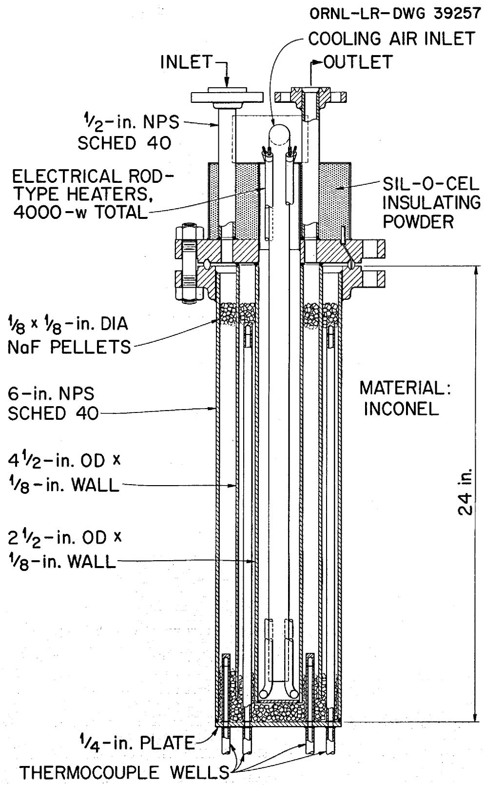  
Fig. 5.4. Sodium Fluoride Absorber.

# 5.2.6 Cold Traps

These are similar to those used in the ORNL Fluoride Volatility Pilot Plant as shown in Fig. 5.5. Two traps are mounted in series. The first is operated at about $-40^{\circ}\mathrm{C}$ and the second at $-60^{\circ}\mathrm{C}$ .

Adequate surface for rapid transfer of heat and collection of solid $\mathbf{U}\mathbf{F}_{6}$ must be provided. The components must have small thermal inertia so that the temperature may be changed quickly. During defrosting, the traps are heated to $90^{\circ}C$ at 46 psia to allow $\mathbf{U}\mathbf{F}_{6}$ to melt and drain to collection cylinders.

# 5.2.7 Reduction Reactor

The reduction of $\mathrm{UF}_6$ to $\mathrm{UF}_4$ is accomplished in a reactor patterned after that described by Murray (70) and consists of a 4-in. diam by 10-ft high column. Uranium hexafluoride and flourine are mixed with excess $\mathrm{H}_2$ in a nozzle at the top of the reaction chamber. The uranium is reduced in the $\mathrm{H}_2$ - $\mathrm{F}_2$ flame, and falls to the bottom of the chamber where it is collected in molten salt of suitable composition. Gaseous materials are discharged through a filter. The reactor has a capacity of 10-15 kg of $\mathrm{UF}_6$ per hour. Losses are very low and typically are less than 0.1 per cent.

# 5.2.8 Transfer Tanks

Stripped fuel is drained from the fluorinators into transfer tanks (two each) from whence it is distributed to interim waste storage tanks. The transfer tanks have capacities of 60 ft³. Decay heat is radiated from the surface of the tank through a 1/2 in. air gap to a water-cooled jacket. While being held in the transfer tanks, the salt is treated with He or other inert gas to remove traces of F₂ of HF that would increase corrosion in the waste storage tanks.

# 5.2.9 Waste Storage Tanks

Waste salt is stored in stainless steel shipping cylinders 2 ft in diam by 8 ft long. These are placed at the bottom of steel thimbles 2.75 ft in diam and fifteen feet long which dip into a water-filled canal. Heat is dissipated by radiation and convection across the 4-inch

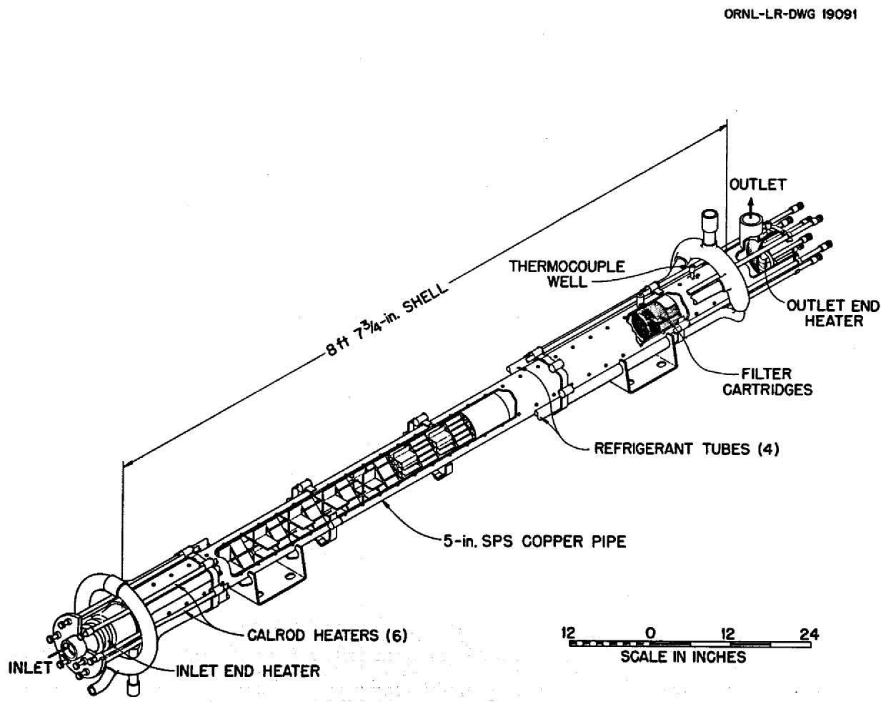  
PRIMARY COLD TRAP   
Fig. 5.5. Primary Cold Traps.

air gap, through the thimble wall and into the water. After cooling, the tanks are shipped to a salt mine for permanent storage.

# 5.2.10 Freeze Valves

Conventional valves cannot be used with molten salts. Flow stoppage is achieved by freezing a plug of salt in a section of a line with a jet of cooling air. Electric heaters are used to thaw the plug when flow is desired. A freeze valve for the MSRE is shown in Fig. 5.6.

# 5.2.11 Samplers

The apparatus pictured in Fig. 5.7 is being tested for use with the MSRE (12). Essential features are the hoist and capsule for removing the sample from the vessel; a lead-shielded cubicle with manipulator, heating elements and service piping, and a transport cask for removing the sample from the process area. The sampling cubicle is mounted on the cell biological shield in an accessible area.

# 5.2.12 Biological Shield

Calculations were made using the Phoebe program for the IBM 704 computer. In the study by Carter, Milford, and Stockdale (21), on which the present estimate is based, spent fuel was brought to the processing plant immediately after removal from the reactor, and the shield was accordingly made quite thick. In the present instance, the fuel is cooled at the processing plant for not less than 90 days so that the shielding requirements are not as extreme. However, in order that the central plant have more general utility, no reduction in shield thickness was made.

# 5.2.13 Process Equipment Layout

Process equipment is laid out according to the major process operations: prefluorination storage, fluorination, transfer, NaF absorption, cold traps and product collection, $\mathrm{UF}_6 \rightarrow \mathrm{UF}_4$ reduction, and interim waste storage. Equipment is grouped in cells according to activity level and in an arrangement that minimizes distances between vessels. Three transfers of molten salt are required in the processing sequence.

Photo 36713

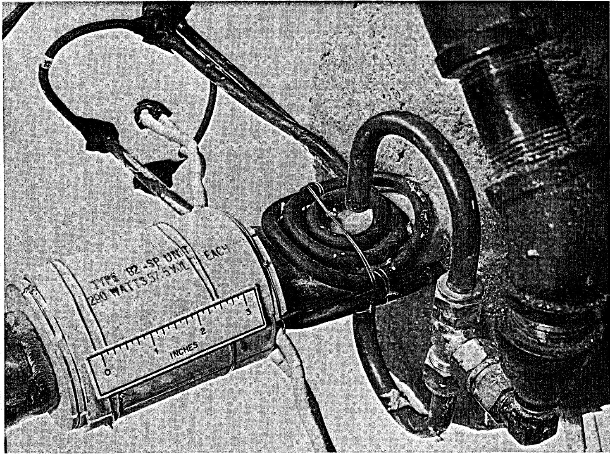  
Fig. 5.6. Freeze Valve.

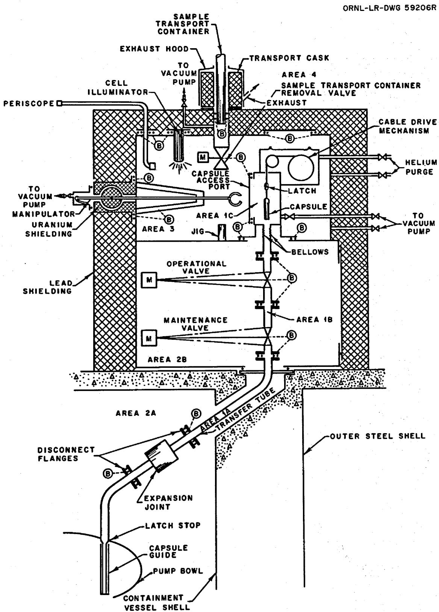  
Fig. 5.7. Radioactive Material Sampler.

Interim waste storage vessels are located adjacent to the processing area in a large canal.

To facilitate remote maintenance, vessels are arranged so that all equipment is accessible from above, and all process and service lines can be connected remotely. Over-all building space is dictated by remote maintenance considerations rather than by actual vessel size.

# 5.2.14 Plant Layout

In order to establish uniformity in cost estimation of nuclear power plants, the Atomic Energy Commission has specified certain ground rules (52) covering topography, meteorology, climatology, geology, availability of labor, accounting procedures, fixed charge rates, etc. These ground rules were used in this study.

Advantage was taken of a design study and operating experience with a remotely maintained radioactive chemical plant reported by Farrow (32) to obtain over-all plant arrangements, as shown in Fig. 5.8.

The hypothetical site location is 500 miles from the reactor site. The plant is located on a stream that is navigable by boats having up to 6-ft draft. There is convenient highway and railroad access. The plant is located on level terrain in a grass-covered field. The earth overburden is 8 ft deep with bedrock below.

# 5.2.15 Capital Cost Estimate

The cost of the fuel processing plant was apportioned among three principal categories: building costs, process equipment costs, and auxiliary process equipment and services costs. The building costs included such items as site preparation, structural materials and labor, permanently installed equipment, and material and labor for service facilities. Process equipment costs were calculated for those tanks, vessels, furnaces, and similar items whose primary function is directly concerned with process operations. Process service facilities are items such as sampling facilities, process piping and process instrumentation which are intimately associated with process operations.

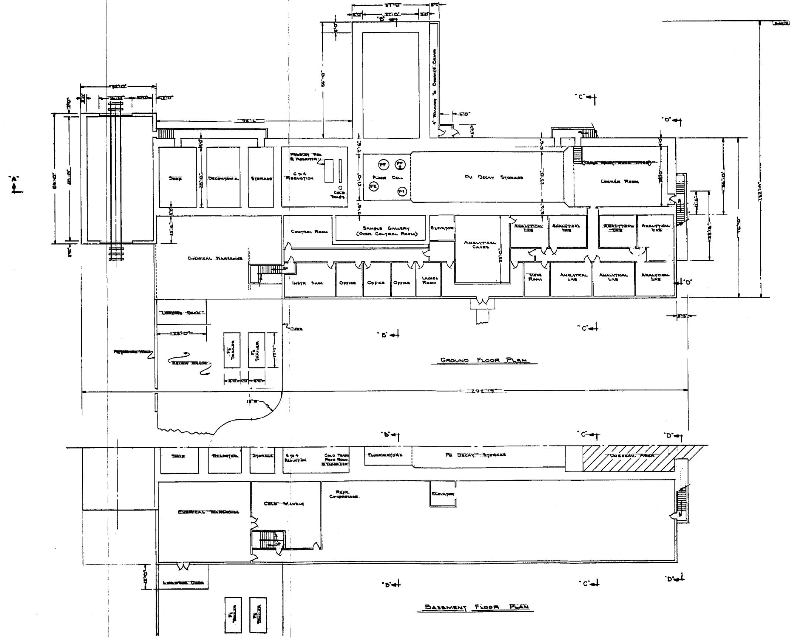

  
Fig. 5.8. Fluoride Volatility Process Plant Layout.

Accounting Procedure. - The accounting procedure set forth in the Guide to Nuclear Power Cost Evaluation (52) was used as a guide in this estimate. This handbook was written as a guide for cost-estimating reactor plants, and the accounting breakdown is not specific for a chemical processing plant. Where necessary the accounting procedures of the handbook were augmented.

Process Equipment. - A large number of process vessels and auxiliary equipment in these plants is similar to equipment previously purchased by ORNL for the fluoride volatility pilot plant for which cost records are available. Extensive use was made of these records in computing material, fabrication and over-all equipment costs. In some cases it was necessary to extrapolate the data to obtain costs for larger vessels. Items that were estimated in this manner include the fluorinators, furnaces, NaF absorbers, and CRP traps. The cost of the $\mathrm{UF}_6$ -to- $\mathrm{UF}_4$ reduction unit was based on a unit described by Murray (70). The unit had a larger capacity than was needed for these plants, but it was assumed that the required unit would have about the same over-all cost. Refrigeration equipment and cold traps were estimated from cost data on ORGDP and ORNL equipment.

For vessels and tanks of conventional design, the cost was computed from the cost of material (INOR-8 for most vessels) plus an estimated fabrication charge, both charges being based on the weight of the vessel. A summary of values used in estimating process vessels by weight is given in Table 5.1. Some items of process equipment were of special design and significantly different from any vessels for which cost data were available. For the shells of the prefluorination storage tanks, the high fabrication cost values shown were obtained by comparison with an available shop estimate for a similar vessel.

Auxiliary process items such as process piping, process electrical service, instrumentation, sampling connections and their installation were not considered in sufficient design detail to permit direct estimation. A cost was assigned to these items which was based upon previous experience in design and cost estimation of radiochemical processing plants. In assigning these costs cognizance was taken of the fact that the plant is remotely maintained.

Table 5.1. Vessel, Pipe, and Tubing Costs   

<table><tr><td></td><td>INOR-8 $/ft</td><td>Alloy 79-4</td><td>Stainless Steel 304</td></tr><tr><td>Metal Cost</td><td>3.00</td><td>2.66</td><td>0.65</td></tr><tr><td>Fabrication Cost:</td><td></td><td></td><td></td></tr><tr><td>Prefluorination INOR transfer tanks 3 and 4</td><td>3.50</td><td>-</td><td>-</td></tr><tr><td>Fluorinators</td><td>-</td><td>4.00</td><td>-</td></tr><tr><td>Transfer vessels</td><td>3.50</td><td>-</td><td>-</td></tr><tr><td>Waste storage vessel</td><td>-</td><td>-</td><td>2.50</td></tr><tr><td>Waste storage thimbles</td><td>-</td><td>-</td><td>1.85</td></tr><tr><td>UF4dissolvers</td><td>3.50</td><td>-</td><td>-</td></tr><tr><td>1/2 in. OD x 0.042 wall tube</td><td>6.06</td><td>26.40</td><td>-</td></tr><tr><td>1 in. IPS, Sch. 40 pipe</td><td>30.05</td><td>16.04</td><td>-</td></tr><tr><td>1-1/2 in. IPS, Sch. 40 pipe</td><td>41.67</td><td>13.71</td><td>-</td></tr></table>

Buildings. - The building estimate shown in Table 5.2 included the cost of land acquisition, site preparation, concrete, structural steel, painting, heating, ventilation, air conditioning, elevators, cranes, service piping, laboratory and hot cell equipment, etc. The individual costs were calculated using current data for materials and labor, and were based on the drawings prepared.

Process Equipment Capital Cost. - Process equipment capital costs for the two fluoride volatility plants are presented in Table 5.3. These costs are the totals of material, fabrication and installation charges.

Building Capital Cost. - As mentioned above, process equipment and buildings were the only items considered in sufficient design detail to permit direct estimation. The remainder of the capital costs were estimated by extrapolation from previous studies of radiochemical processing plants. The fact that the plant is remotely maintained was an important factor in estimating process instrumentation and electrical and sampling connections. These items are expensive because of counterbalancing, spacing, and accessibility requirements.

Construction overhead fees were taken at 20 per cent of direct materials and labor for all buildings, installed process equipment, piping,

Table 5.2. Fluoride Volatility Processing Building Costs 30 ft $^3$ /day Plant Capacity   

<table><tr><td></td><td>Materials</td><td>Labor</td><td>Total</td></tr><tr><td colspan="4">Receiving Area</td></tr><tr><td>Excavating and backfill</td><td>$ 38,000</td><td>$ 18,000</td><td>$ 56,000</td></tr><tr><td>Concrete, forms, etc.</td><td>108,000</td><td>133,000</td><td>241,000</td></tr><tr><td>Structural steel, etc.</td><td>58,000</td><td>49,000</td><td>107,000</td></tr><tr><td>Roofing</td><td>13,000</td><td>16,000</td><td>29,000</td></tr><tr><td>Services</td><td>63,000</td><td>39,000</td><td>102,000</td></tr><tr><td></td><td></td><td></td><td>$ 535,000</td></tr><tr><td colspan="4">Processing Cells</td></tr><tr><td>Excavating and backfill</td><td>$184,200</td><td>$ 85,500</td><td>$ 269,700</td></tr><tr><td>Concrete, forms, etc.</td><td>520,000</td><td>639,000</td><td>1,159,000</td></tr><tr><td>Structural steel, etc.</td><td>277,000</td><td>235,000</td><td>512,000</td></tr><tr><td>Crane area roofing, painting, etc.</td><td>64,900</td><td>75,600</td><td>140,500</td></tr><tr><td>Crane bay doors</td><td>390,000</td><td>160,000</td><td>550,000</td></tr><tr><td>Services</td><td>301,000</td><td>188,000</td><td>489,000</td></tr><tr><td>Bldg. movable equipment</td><td>865,000</td><td>255,000</td><td>1,120,000</td></tr><tr><td>Viewing windows</td><td>40,000</td><td>2,000</td><td>42,000</td></tr><tr><td></td><td></td><td></td><td>$4,282,200</td></tr><tr><td colspan="4">Waste Storage</td></tr><tr><td>Excavation and backfill</td><td>$ 95,000</td><td>$ 44,400</td><td>$ 139,400</td></tr><tr><td>Concrete, forms, etc.</td><td>332,000</td><td>496,000</td><td>828,000</td></tr><tr><td>Structural steel, etc.</td><td>400,000</td><td>404,000</td><td>804,000</td></tr><tr><td>Crane area roofing</td><td>86,500</td><td>100,800</td><td>187,300</td></tr><tr><td>Painting</td><td>44,500</td><td>44,500</td><td>89,000</td></tr><tr><td>Services</td><td>565,000</td><td>289,000</td><td>854,000</td></tr><tr><td>Bldg. movable equipment</td><td>225,000</td><td>30,000</td><td>255,000</td></tr><tr><td></td><td></td><td></td><td>$3,156,700</td></tr><tr><td colspan="4">Operations and Laboratories</td></tr><tr><td>Excavation and backfill</td><td>$ 72,200</td><td>$ 33,400</td><td>$ 105,600</td></tr><tr><td>Concrete forms, etc.</td><td>82,600</td><td>115,100</td><td>197,700</td></tr><tr><td>Structural steel, etc.</td><td>204,700</td><td>43,200</td><td>247,900</td></tr><tr><td>Roofing</td><td>8,500</td><td>4,300</td><td>12,800</td></tr><tr><td>Super structure</td><td>79,100</td><td>27,100</td><td>106,200</td></tr><tr><td>Misc. structural material</td><td>31,900</td><td>35,100</td><td>67,000</td></tr><tr><td>Services</td><td>352,000</td><td>276,000</td><td>628,000</td></tr><tr><td>Misc. equipment</td><td>300,000</td><td>43,500</td><td>343,500</td></tr><tr><td></td><td></td><td></td><td>$1,708,700</td></tr></table>

Table 5.2.Continued   

<table><tr><td></td><td>Materials</td><td>Labor</td><td>Total</td></tr><tr><td colspan="4">Outside Utilities</td></tr><tr><td>Cooling tower, motors,pumps, piping</td><td></td><td>$</td><td>70,000</td></tr><tr><td>Water reservoir, pumps,piping</td><td></td><td>300,000</td><td></td></tr><tr><td>Fire protection (house &amp;equipment)</td><td></td><td>35,000</td><td></td></tr><tr><td>Yard lighting</td><td></td><td>5,000</td><td></td></tr><tr><td>Boiler house steam heating(4,000 kw at $75/kw)</td><td></td><td>300,000</td><td></td></tr><tr><td>Air compressor system</td><td></td><td>10,000</td><td></td></tr><tr><td>Steam distribution &amp; condensate return</td><td></td><td>3,500</td><td></td></tr><tr><td>Cooling water supply &amp;return</td><td></td><td>40,000</td><td></td></tr><tr><td>Water supply connection</td><td></td><td>1,700</td><td></td></tr><tr><td>Process drain lines</td><td></td><td>3,500</td><td></td></tr><tr><td>Sanitary sewer connections</td><td></td><td>3,700</td><td></td></tr><tr><td>Radioactive hot drainconnections</td><td></td><td>12,000</td><td></td></tr><tr><td>Cell ventilation connec-tions to stack</td><td></td><td>9,000</td><td></td></tr><tr><td>Off-gas connections to stack</td><td></td><td>10,000</td><td></td></tr><tr><td>Storm sewer system</td><td></td><td>16,000</td><td></td></tr><tr><td>Electrical substation &amp; lines(3000 kw at $60/kw)</td><td></td><td>180,000</td><td></td></tr><tr><td>Stack (200 ft)</td><td></td><td>50,000</td><td></td></tr><tr><td>Guard house and portals</td><td></td><td>5,000</td><td></td></tr><tr><td>Autos, trucks, crane, bulldozer</td><td></td><td>50,000</td><td></td></tr><tr><td></td><td></td><td>$1,104,400</td><td></td></tr><tr><td colspan="4">Land and Land Improvements</td></tr><tr><td>Land (160 acres at $100/acre)</td><td></td><td>16,000</td><td></td></tr><tr><td>Leveling &amp; grading</td><td></td><td>50,000</td><td></td></tr><tr><td>Topsoiling and seeding</td><td></td><td>20,000</td><td></td></tr><tr><td>Fencing, (2 miles at $4/ft)</td><td></td><td>44,000</td><td></td></tr><tr><td>Railroad spur, 100 ft</td><td></td><td>20,000</td><td></td></tr><tr><td>Asphalt roads &amp; parking areas</td><td></td><td>200,000</td><td></td></tr><tr><td></td><td></td><td>$</td><td>350,000</td></tr></table>

Table 5.3. Installed Cost of Fluoride Volatility Process Equipment 30 ft³/day Plant Capacity   

<table><tr><td></td><td>Number</td><td>Description</td><td>Cost</td></tr><tr><td colspan="4">Receiving</td></tr><tr><td>Cooling jackets for shipping tanks</td><td>160</td><td>2.75 ID by 15-ft high, $ carbon steel</td><td>120,000</td></tr><tr><td>Instrumentation</td><td></td><td>Thermocouples, radiation monitors, etc.</td><td>480,000</td></tr><tr><td colspan="4">Prefluorination Storage</td></tr><tr><td>Transfer tanks</td><td>2</td><td>2-ft x 2-ft; INOR-8; 0.375 in. shell, 0.5 in. head</td><td>100,000</td></tr><tr><td>Furnace</td><td>2</td><td>2.7 ft x 3 ft; 50 kw</td><td>7,000</td></tr><tr><td colspan="4">Fluorination</td></tr><tr><td>Fluorinators</td><td>5</td><td>1.75 ft d. by 9 ft high; 6 ft3 salt; Alloy 79-4; 0.5 in. shell, 0.5 in. head</td><td>40,000</td></tr><tr><td>Furnaces</td><td>5</td><td>2.7 ft d. x 4 ft h; 75 kw</td><td>16,000</td></tr><tr><td>Movable bed absorber</td><td>5</td><td>6 in. d x 4 ft h</td><td>25,000</td></tr><tr><td colspan="4">Absorption</td></tr><tr><td>Absorbers with furnaces</td><td>30</td><td>6 in. sch. 40 pipe, 6.3 ft long</td><td>150,000</td></tr><tr><td rowspan="2">Cold traps</td><td>15</td><td>-40°C units, copper</td><td>112,500</td></tr><tr><td>15</td><td>-75°C units, copper</td><td>37,500</td></tr><tr><td>NaF chem. trap</td><td>5</td><td>6 in. sch. 40 pipe x 6 ft; heated</td><td>3,000</td></tr><tr><td>Vacuum pump</td><td>1</td><td>50 cfm displacement</td><td>3,000</td></tr><tr><td colspan="4">Reduction and Compounding</td></tr><tr><td>Reactor</td><td>1</td><td>10 kg/day capacity; Inconel</td><td>66,150</td></tr><tr><td>Dissolver</td><td>1</td><td>2.7 ft d. x 2.7 ft h; 12 ft3 salt; INOR-8; 0.5 in. shell</td><td>5,500</td></tr><tr><td>Heater</td><td>1</td><td>3.4 ft d. x 3.7 ft h; 71 kw</td><td>6,000</td></tr><tr><td>Salt make-up tank</td><td>2</td><td>3.4 ft d. x 6.7 ft h; INOR-8; 40 ft3 capacity</td><td>26,000</td></tr><tr><td>Heater</td><td>2</td><td>4.1 ft d. x 7.7 ft h; 178 kw</td><td>34,000</td></tr></table>

Table 5.3. Continued   

<table><tr><td></td><td>Number</td><td>Description</td><td>Cost</td></tr><tr><td>Transfer Tanks</td><td>2</td><td>4.5 ft d. x 4.5 ft h; 60 ft3of salt; INOR-8 with heaters</td><td>$ 100,000</td></tr><tr><td>Waste Storage</td><td></td><td></td><td></td></tr><tr><td>Shipping and storage tanks</td><td>As Needed</td><td>2 ft ID by 8 ft h; stainless steel 304 L; 10 ft3salt; 0.25 in. shell and head</td><td>Included with operating expenses</td></tr><tr><td>Thimbles</td><td>1200</td><td>2.75 ft d. x 15 ft h; ordinary steel 304 L; 0.1875 shell</td><td>600,000</td></tr><tr><td>Miscellaneous Equipment</td><td></td><td></td><td></td></tr><tr><td>Refrigeration unit</td><td>2</td><td>50,000 Btu/hr at -40°C</td><td>10,000</td></tr><tr><td>Refrigeration unit</td><td>2</td><td>8,000 Btu/hr at -75°C</td><td>10,000</td></tr><tr><td>HF disposal unit</td><td>1</td><td>2.8 ft d. x 5.3 ft h</td><td>500</td></tr><tr><td>F2supply system</td><td>5</td><td>Tank and trailer</td><td>35,000</td></tr><tr><td></td><td></td><td>Total Process Equipment</td><td>$1,987,150</td></tr></table>

instrumentation, electrical and other direct charges. This rate is higher than current charges for this type of construction and estimates. Architect engineering and inspection fees were taken as 15 per cent of all charges including construction overhead.

A summary of the capital cost estimate is presented in Table 5.4.

Table 5.4. Summary of Capital Cost Estimate for Molten-Salt Reactor-Fuel Fluoride Volatility Processing Plant Capacity - 30 ft³ of Salt/Day   

<table><tr><td>Receiving Area</td><td>$ 535,000</td></tr><tr><td>Processing Cells</td><td>4,282,200</td></tr><tr><td>Waste Storage</td><td>3,156,700</td></tr><tr><td>Operations and Laboratories</td><td>1,708,700</td></tr><tr><td>Outside Utilities</td><td>1,104,400</td></tr><tr><td>Land and Improvements</td><td>350,000</td></tr><tr><td>Process Equipment</td><td>1,987,150</td></tr><tr><td>Process Piping</td><td>320,000</td></tr><tr><td>Process Instrumentation</td><td>205,000</td></tr><tr><td>Process Electrical Connections</td><td>39,000</td></tr><tr><td>Sampling Connections</td><td>30,000</td></tr><tr><td>Total, Installed Equipment and Buildings</td><td>$13,718,150</td></tr><tr><td>General Construction Overhead at 20% subtotal</td><td>2,743,660</td></tr><tr><td>Architectural Engineer, etc., at 15% subtotal</td><td>2,469,294</td></tr><tr><td>Contingency at 20% subtotal</td><td>3,786,250</td></tr><tr><td>Interest During Construction, 9.3% of subtotal</td><td>2,112,728</td></tr><tr><td>Total</td><td>$24,830,082</td></tr></table>

# 5.2.16 Operating and Maintenance Cost Estimates

The manpower requirements were estimated consistently with the procedures outlined in the Guide (52); the results are listed in Table 5.5. Materials, utilities, maintenance materials, etc. were estimated by consideration of the process steps involved; the estimates are listed in Table 5.6 together with a summary of the labor cost. The total operating cost was estimated to be $4,040,850 annually.

# 5.2.17 MSCR Irradiated Fuel Shipping Cost

The shipping cask must accommodate a molten-salt shipping cylinder having a volume of 10 ft³. The cost was estimated from the weight which was determined by the shielding requirements. A unit cost of $1.00/lb fabricated was allowed, including charges for an INOR liner and a condensing-water radiator. Three casks were allowed so that one might be at the reactor site, a second at the processing plant, and a third in transit. Results are listed in Table 5.7.

Table 5.5. Operating Manpower Estimates for 30 ft $^3$ /day - Fluoride Volatility Plants   

<table><tr><td></td><td>No.</td><td>Cost($/year)</td></tr><tr><td colspan="3">Management</td></tr><tr><td>Manager</td><td>1</td><td>18,000</td></tr><tr><td>Assistant manager</td><td>1</td><td>15,000</td></tr><tr><td>Secretary</td><td>2</td><td>10,000</td></tr><tr><td></td><td>4</td><td>43,000</td></tr><tr><td colspan="3">Production</td></tr><tr><td>Superintendent</td><td>1</td><td>12,000</td></tr><tr><td>Shift supervisor</td><td>4</td><td>30,000</td></tr><tr><td>Operator</td><td>12</td><td>66,000</td></tr><tr><td>Helper</td><td>12</td><td>60,000</td></tr><tr><td>Secretary</td><td>2</td><td>9,600</td></tr><tr><td></td><td>31</td><td>177,600</td></tr><tr><td colspan="3">Maintenance</td></tr><tr><td>Superintendent</td><td>1</td><td>10,000</td></tr><tr><td>Mechanical engineer</td><td>2</td><td>16,000</td></tr><tr><td>Mechanic</td><td>12</td><td>69,600</td></tr><tr><td>Machinist</td><td>3</td><td>18,000</td></tr><tr><td>Instrument man</td><td>8</td><td>46,400</td></tr><tr><td>Clerk</td><td>1</td><td>4,350</td></tr><tr><td>Storeroom keeper</td><td>2</td><td>8,700</td></tr><tr><td></td><td>29</td><td>173,050</td></tr><tr><td colspan="3">Laboratory</td></tr><tr><td>Supervisor</td><td>1</td><td>8,000</td></tr><tr><td>Chemist</td><td>6</td><td>39,000</td></tr><tr><td>Technician</td><td>10</td><td>52,000</td></tr><tr><td>Helper</td><td>6</td><td>28,800</td></tr><tr><td></td><td>23</td><td>127,800</td></tr><tr><td colspan="3">Health Physics</td></tr><tr><td>Supervisor</td><td>1</td><td>8,000</td></tr><tr><td>Monitor</td><td>4</td><td>20,800</td></tr><tr><td>Clerk</td><td>1</td><td>4,000</td></tr><tr><td>Records keeper</td><td>1</td><td>3,600</td></tr><tr><td></td><td>7</td><td>36,400</td></tr></table>

Table 5.5. Continued   

<table><tr><td></td><td>No.</td><td>Cost
($/year)</td></tr><tr><td>Accountability</td><td></td><td></td></tr><tr><td>Engineer</td><td>1</td><td>7,000</td></tr><tr><td>Clerk</td><td>1</td><td>4,000</td></tr><tr><td></td><td>2</td><td>11,000</td></tr><tr><td>Engineering</td><td></td><td></td></tr><tr><td>Mechanical engineer</td><td>2</td><td>16,000</td></tr><tr><td>Chemical engineer</td><td>4</td><td>36,000</td></tr><tr><td>Draftsman</td><td>3</td><td>15,900</td></tr><tr><td>Secretary</td><td>1</td><td>4,500</td></tr><tr><td></td><td>10</td><td>72,400</td></tr><tr><td>General Office</td><td></td><td></td></tr><tr><td>Manager</td><td>1</td><td>5,000</td></tr><tr><td>Accountant</td><td>1</td><td>4,800</td></tr><tr><td>Payroll clerk</td><td>2</td><td>8,000</td></tr><tr><td>Purchasing agent</td><td>1</td><td>4,800</td></tr><tr><td>Secretary</td><td>2</td><td>8,000</td></tr><tr><td></td><td>7</td><td>30,600</td></tr><tr><td>Miscellaneous</td><td></td><td></td></tr><tr><td>Guard</td><td>8</td><td>32,000</td></tr><tr><td>Fireman</td><td>4</td><td>16,000</td></tr><tr><td>Receptionist</td><td>1</td><td>4,000</td></tr><tr><td>Laundry worker</td><td>3</td><td>10,800</td></tr><tr><td>Nurse</td><td>1</td><td>4,800</td></tr><tr><td>Janitor</td><td>3</td><td>10,800</td></tr><tr><td></td><td>20</td><td>78,400</td></tr><tr><td>Total</td><td>133</td><td>750,250</td></tr></table>

Table 5.6. Fluoride Volatility Plant Direct Annual Operating Cost   

<table><tr><td>Shipping - Storage Tanks (50 at $2,500)</td><td>$ 125,000</td></tr><tr><td>Chemical Consumption</td><td></td></tr><tr><td>Fluorine (at $2.00/lb)</td><td>120,000</td></tr><tr><td>KOH (at $0.10/lb)</td><td>16,600</td></tr><tr><td>Hydrogen (at $2.00/lb)</td><td>4,500</td></tr><tr><td>NaF (at $0.15/lb)</td><td>300</td></tr><tr><td>Nitrogen (at $0.05/ft3)</td><td>3,400</td></tr><tr><td>HF (at $0.20/lb)</td><td>6,100</td></tr><tr><td>Graphite (at $0.15/lb)</td><td>1,100</td></tr><tr><td>Miscellaneous</td><td>5,300</td></tr><tr><td></td><td>157,300</td></tr><tr><td>Utilities</td><td></td></tr><tr><td>Electricity (at $0.01/kw hr)</td><td>362,000</td></tr><tr><td>Water (at $0.015/1000 gal)</td><td>5,700</td></tr><tr><td>Heating (based on steam at $0.25/1000 lbs)</td><td>8,500</td></tr><tr><td></td><td>376,200</td></tr><tr><td>Labora</td><td></td></tr><tr><td>Operating</td><td>406,400</td></tr><tr><td>Laboratory</td><td>127,800</td></tr><tr><td>Maintenance</td><td>173,050</td></tr><tr><td>Supervision</td><td>43,000</td></tr><tr><td>Overhead (at 20% of above)</td><td>150,000</td></tr><tr><td></td><td>900,250</td></tr><tr><td>Maintenance Materials</td><td></td></tr><tr><td>Site</td><td>10,000</td></tr><tr><td>Cell structures and buildingsb</td><td>76,000</td></tr><tr><td>Service and utilities</td><td>78,800</td></tr><tr><td>Process equipmentc</td><td>243,300</td></tr><tr><td></td><td>482,100</td></tr><tr><td>Total Direct Operating Cost</td><td>$2,040,850</td></tr></table>

${}^{a}$ Summarized from Table 5.5.   
Building services excluded.   
cIncludes process equipment, process instrumentation and sampling.

Table 5.7. MSCR Irradiated Fuel Shipping Cask Data and Shipping Cost\*   

<table><tr><td>Cask weight</td><td>100,000 lbs</td></tr><tr><td>Cost of cask</td><td>$100,000</td></tr><tr><td>Number of casks</td><td>3</td></tr><tr><td>Salt volume in shipment</td><td>10 ft3</td></tr><tr><td>Age of salt at shipment</td><td>20 days</td></tr><tr><td>Days salt accumulation in shipment</td><td>6 days</td></tr><tr><td>Round trip distance</td><td>1000 miles</td></tr><tr><td>Round trip time</td><td>10 days</td></tr><tr><td>Method of shipment</td><td>Rail</td></tr><tr><td>Number of shipments per full power year</td><td>50</td></tr><tr><td>Freight rate</td><td>$2.40/100 lbs-1000 miles</td></tr><tr><td>Unit shipping cost</td><td>$330/ft3 salt</td></tr></table>

*Data and cost adapted from Reference 20.

# 5.2.18 MSCR Unit Processing Cost

The various bases and contributions to the unit processing cost are collected in Table 5.8 for the fluoride volatility central plant processing of MSCR fuel. For the reference design fuel containing $32\mathrm{kg}$ of thorium per ft³, the unit cost was $36.90 per kg of thorium.

Although the cost was expressed in terms of $\$ /kg$ of Th, it should be remembered that only isotopes of uranium are recovered. Stripped salt, containing valuable thorium, lithium-7, and beryllium, as well as fission products, is discarded. Additional or alternate processing would be required to recover any of these components.

Table 5.8. Unit Processing Costs, Central Fluoride Volatility Processing Plant for MSCR Fuel   

<table><tr><td>Capacity of plant</td><td>30 ft3/day</td></tr><tr><td>Reference design fuel</td><td>32 kg Th/ft3</td></tr><tr><td>Annual charges:</td><td></td></tr><tr><td>Capital ($24.8 million at 15%)</td><td>$3.7 million</td></tr><tr><td>Operation and maintenance</td><td>$2.0 million</td></tr><tr><td>Daily charge (80% plant factor)</td><td>$19,500/day</td></tr><tr><td>Batch size</td><td>188 ft3 or 
6000 kg Th</td></tr><tr><td>Processing time</td><td>6.3 days</td></tr><tr><td>Turn-around time</td><td>2 days</td></tr><tr><td>Processing plant cost</td><td>$26.60/kg Th</td></tr><tr><td>Shipping cost</td><td>$10.30/kg Th</td></tr><tr><td>Total processing cost</td><td>$36.90/kg Th</td></tr></table>

# 5.3 Thorex Central Plant

The reference plant described in the Guide (52) is a central facility capable of processing $1000\mathrm{kg}$ Th/day with thorium discard or $600\mathrm{kg}$ Th/day with thorium recovery. The plant was designed specifically for thorium metal or thorium oxide fuels; however, since other types of thorium fuels were not specifically excluded, it was assumed that the plant would also accept a fluoride-salt fuel. It was further assumed that the fluoride fuel would be processed at the same base charge as the metal or oxide fuel. This assumption amounted to assigning the same charge to a fluoride head-end treatment as to dissolution and feed preparation steps for the other fuels. The tail-end treatment for the conversion of Thorex nitrate product to fluoride feed material was assigned a cost that was thought to be representative of the processing steps.

# 5.3.1 Head-End Treatment

The head-end treatment shown schematically in Fig. 5.9 has not been demonstrated. However, the chemical principles have been established (40) by laboratory investigations of the stability of fluoride salt fuels.

It is known (40) that the oxides of uranium, thorium and beryllium are very stable compounds having the indicated order of stability

$$
\mathrm {U O} _ {2} > \mathrm {B e O} > \mathrm {T h O} _ {2}
$$

and that oxygen or oxygen-bearing compounds must be eliminated from fluoride salt fuels to insure their stability. In the proposed head-end treatment, the draw-off from the reactor at 500 - $550^{\circ}\mathrm{C}$ would be contacted in a spray with steam or high temperature water ( $\sim200^{\circ}\mathrm{C}$ ) to precipitate the oxides of uranium, beryllium, thorium, protactinium and some of the fission products. It is believed that rare earth oxides can be precipitated in this manner. Lithium fluoride is a very stable compound and would probably not enter into reaction with water. It should remain in the system as LiF and be frozen into small crystalline particles.

The hydrolysis would form large quantities of HF which in aqueous media is rather corrosive. Therefore the selection of materials of construction for the precipator will be a problem. Disposal of HF can be accomplished by dilution with large volumes of air and dispersion from a stack or by neutralization with an inexpensive base. Some cleanup of the HF stream will be required because of volatile fission products. Reuse of this HF in the subsequent hydrofluorination step (see Fig. 5.8) may not be feasible because of water vapor in the gas.

The second step in the head-end treatment is dissolution of all the hydrolyzed components that are soluble in nitric acid. The oxides of uranium, thorium, protactinium and rare earth products should dissolve quite readily. Since lithium fluoride and beryllium oxide are quite insoluble in aqueous media, negligible amounts of these compounds should be dissolved. Also, it is almost certain that some of the fission products will be insoluble and remain with the lithium and beryllium. Dissolution should proceed smoothly because it has been shown by Pitt (73) that the particle sizes produced when a molten salt is sprayed into water are in the micron and submicron range.

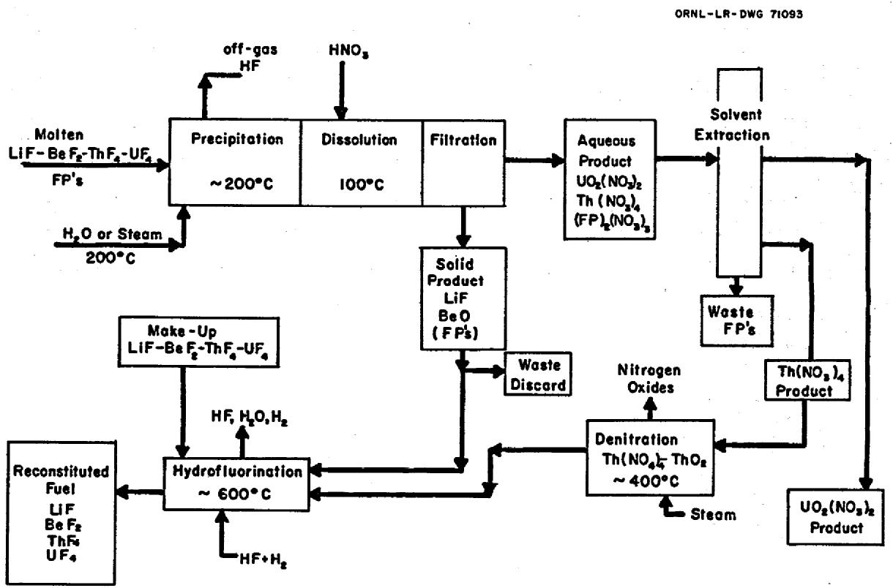  
Fig. 5.9. Proposed Aqueous Processing for MSCR.

Dissolution is followed by solid-liquid separation either by filtration or centrifugation. Aqueous nitrate solutions are fed into a feed adjustment step preceding solvent extraction by Thorex and the insoluble material is routed to hydrofluorination. At this point a portion of the solids can be discarded as a purge of fission products that remain in the precipitate.

# 5.3.2 Solvent Extraction

Decontamination of thorium and uranium can be accomplished by well-established Thorex procedures. Aqueous nitrate solutions are evaporated until about 0.15 N acid deficient and fed to an extraction column. In the extraction column both thorium and uranium are extracted into an organic phase (tributyl phosphate) leaving the bulk of the fission products in the aqueous phase, with decontamination factors up to $10^{5}$ .

Waste from the first extraction cycle contains all of the protactinium that was in the feed stream. However, the amount is insufficient to warrant recycling the waste after an additional decay period. In the interim between discharge from the reactor and chemical processing, the fuel ages about 120 days so that only about $15\%$ of the protactinium remains undecayed. The waste is given permanent storage in large underground tanks.

In a fuel recycle system such as the MSCR it is not necessary to decontaminate further by the use of additional extraction cycles. The presence of $^{232}\mathrm{U}$ and $^{228}\mathrm{Th}$ will make recycle fuel too radioactive for direct handling, regardless. After extraction, therefore, it is sufficient to partition uranium and thorium in a stripping column by the proper adjustment of organic and aqueous flow rates. In this operation, thorium is stripped from the organic phase into an aqueous phase; uranium remains in the organic phase. A subsequent stripping operation returns the uranium to the aqueous phase. The produce streams are respectively $\mathrm{Th(NO_3)_4}$ and $\mathrm{UO}_2(\mathrm{NO}_3)_2$ .

# 5.3.3 Tail-End Treatment

Fuel reconstitution begins with acceptance of the nitrate products from the solvent extraction plant. It is necessary to convert the nitrates

to the fluorides. In the case of thorium this is accomplished by preparing the oxide in a denitration process followed by hydrofluorination in a molten salt mixture. The steps are as follows:

$$
\mathrm {T h} \left(\mathrm {N O} _ {3}\right) _ {4} \xrightarrow {\text {s t e a m d e n i t r a t i o n}} \mathrm {T h O} _ {2} \xrightarrow [ \text {i n m o l t e n s a l t} ]{\mathrm {H F}} \mathrm {T h F} _ {4}
$$

Steam denitration is an established procedure in the sol-gel process (33) for preparing highly fired, dense $\mathrm{ThO}_2$ or $\mathrm{ThO}_2 - \mathrm{UO}_2$ fuel. In this case the aqueous nitrate solution from the Thorex process would be evaporated to crystallize $\mathrm{Th(NO_3)_4}$ ; the crystals in turn would be contacted with superheated steam for the actual denitration. Final preparation of the fluoride has to be accomplished in a second high temperature operation in molten fluoride salts. Thorium oxide is quite intractable to attack by hydrogen fluoride under most conditions; however, in the presence of molten fluorides the reaction will occur. The presence of other high valence compounds, e.g., other thorium or uranium fluorides, in the melt abets the dissolution.

The conversion of uranyl nitrate to the tetrafluoride is not as straightforward as that of thorium because of the required valence change. In the Excer process developed at ORNL, uranyl nitrate from the last Thorex stripping column can be fed directly onto a cation exchange resin (Dowex 50 W) which absorbs the uranyl ion. After loading, the resin is eluted with aqueous hydrofluoric acid to produce $\mathrm{UO}_2\mathrm{F}_2$ , which is reduced in an electrolytic cell. The aqueous solution is allowed to flow into a mercury cathode in which $\mathrm{UF}_4 \cdot 0.75\mathrm{H}_2\mathrm{O}$ precipitates from the aqueous phase. The precipitate is separated by centrifugation or filtration and dried. Water of hydration is not tenaciously held, and moderate drying conditions are sufficient to expel it.

A second method of converting $\mathrm{UO}_2(\mathrm{NO}_3)$ to $\mathrm{UF}_4$ is to reduce U(VI) to U(IV) in the presence of fluoride at $500 - 600^{\circ}\mathrm{C}$ . In this tail-end treatment the two nitrate solutions of thorium and uranium are mixed and co-denitrated using superheated steam to yield $\mathrm{ThO}_2$ and $\mathrm{UO}_3$ . The mixed oxides are converted to the fluorides in a $500 - 600^{\circ}\mathrm{C}$ molten fluoride salt bath

by contacting with a gaseous mixture of $\mathrm{H}_{2} + \mathrm{HF}$ . Uranium is reduced by the hydrogen and hydrogen fluoride to the tetravalent form and dissolves as $\mathrm{UF}_{4}$ ; thorium is metathesized to $\mathrm{ThF}_{4}$ which also dissolves in the melt.

The processing cycle is completed when the uranium fluoride is mixed with fluorides of thorium, lithium, and beryllium oxide plus make-up feed and hydrofluorinated. Beryllium recycled as BeO dissolves as $\mathrm{BeF}_2$ when hydrofluorinated in molten fluoride solutions.

# 5.3.4 Processing Costs

The unit processing costs were computed according to the prescription given in Guide to Nuclear Power Cost Evaluation, Vol. 4, Section 460. The escalated daily charge for operation of the Thorex plant was taken as $17,500 in late 1962. Since the thorium was recycled, the capacity was 600 kg/day. As described in a previous section, the daily increments of fuel withdrawn from the reactor were accumulated for 120 days and combined into a single processing batch. If the withdrawal rate exceeded 1.25 ft³/day (40 kg Th/day), the batch size exceeded 4800 kg of Th and required eight days or longer to process. For this range of process times, the "turn-around-time" is specified to be eight days in the Guide. Thus, the total processing time is 120r/600 + 8 days (where r is the withdrawal rate in kg Th/day) and the total amount processed is 120r kg of Th. The cost for operating the Thorex plant is thus

$$
\begin{array}{l} \text {S e p a r a t i o n C o s t} = \frac {1 7 , 5 0 0 \left[ \frac {1 2 0 r}{6 0 0} + 8 \right]}{1 2 0 r} \\ = (2 9. 2 + 1 1 6 7 / r) \mathbb {S} / k g T h \\ \end{array}
$$

The cost of reducing solid fuel elements into a form suitable for processing (aqueous solution of uranyl and thorium nitrates) is included in the daily operating cost (104). It seems likely that the cost of converting the MSCR fuel by the method proposed in Sec. 5.2 would be less costly than the reduction of solid fuel elements by Darex or Zircex. However, an investment of $500,000 for MSCR fuel head-end treatment was allowed, based

on estimates extracted from reference 20. This resulted in a head-end treatment charge of $0.53/kg Th processed.

The cost of converting recovered thorium nitrate to ThF₄ was not given in the Guide. However, the cost of converting low enrichment uranium to UF₆ was only $5.60/kg. Since the proposed thorium conversion process is simpler and shorter than the uranium process, it seemed adequate and conservative to assign a cost of $5.00/kg Th for the conversion of ThF₄.

Summing these charges, one has

$$
\text {P r o c e s s i n g P l a n t C o s t} = (3 4. 7 + 1 1 6 7 / r) \mathbb {S} / k g
$$

where $r = kg$ Th/day removed from the reactor.

Shipping costs are presented in Section 465 of the Guide (52), and include freight, handling, cask rental, and property insurance. The cost is $16/kg of uranium (or thorium) for spent fuel elements.

MSCR fuel must be packaged before shipment. In the scheme proposed, the daily productions of 1.67 ft³/day are accumulated in 35 ft³ batches in the spent fuel facility (Sec. 4.8.10) which contains 5 tanks each having a capacity of 35 ft³ and provided with sufficient cooling to remove afterheat from freshly irradiated fuel. A 10 ft³ batch is drained into an INOR "bottle" (cylinder) one foot in diameter and 13 feet long. This is inserted into an individual shipping cask and transported to the Thorex plant. If the bottles cost as much as $10,000 apiece, but are re-usable for at least 10 years, they will add to the shipping cost only $1.74/kg Th at the lowest rate of processing (40 kg/day).

The charge for shipping decontaminated thorium back to the plant is represented to be $1.00/kg in the Guide.

Since the processing plant operating charge was all levied against the thorium, the only charges on the uranium are shipping at $17/kg per round trip and reconversion, for which operation the Handbook gives$ 32/kg for converting the nitrate of highly enriched $^{235}\mathrm{U}$ to $\mathrm{UF}_{6}$ . Although the cost of conversion to $\mathrm{UF}_{4}$ should be less, the given cost was assumed. The total charge for the uranium was thus $\$49/kg$ , and was charged against all isotopes of uranium, including $^{238}\mathrm{U}$ and the precursor, $^{233}\mathrm{Pa}$ .

# 5.4 Comparison of Processing Cost Estimates

For the purposes of comparison, the results of three other processing cost studies are cited. The first, by Carter (20), dealt with a central Fluoride Volatility plant designed especially for processing MSCR fuel at a rate of 31.5 ft³/day (1000 kg Th/day). The estimates were based on the same design study (21) used to prepare the estimates reported in Sec. 5.2. The scaling, however, was performed on the plant as a whole, rather than with individual items, and the scaling factor was 0.31. The estimated capital cost was $31.5 million, and the annual operating expense was $3.0 million. This study is referred to below as the "CMS" study.

The second study, also by Carter (20), dealt with a central Thorex facility adapted to process fluoride fuels (1000 kg Th/day) and was based on a detailed analysis of the head-end and tail-end processes (described in the previous section) as well as the Thorex separation process, and was based on an unpublished design and cost study performed by Carter, Harrington, and Stockdale at ORNL in which flow sheets, equipment specifications, plant arrangement drawings, building drawings, etc. were prepared and the items were costed. For brevity, this study is referred to below as the "CHS" study. It is, essentially, an independent estimate of the facility assumed in the Guide to Nuclear Power Cost Evaluation (52), adapted for fluoride fuels. The estimated capital cost, scaled to a capacity of 1000 kg Th/day, was $36.5 million, and the annual operating expense was $3.6 million.

The third study, performed by W. H. Farrow, Jr. (32), dealt with several radiochemical separation plants for several different solid fuels and clads and with both direct and remote maintenance. The purex process, which is similar to Thorex, was employed for the separations. The most applicable case was that of a remotely maintained plant capable of treating one tonne per day of natural uranium. Although the process was described in considerable detail, a cost breakdown was not given by Farrow. The capital cost was $43 million, and the annual direct operating cost was$ 3.7 million. One might reasonably assume that a Thorex plant of the same capacity would have approximately the same costs, and that the head and tail-end treatments for fluoride fuels would be no more expensive, and perhaps less, than those of the solid fuels.

It is seen that the estimates of the total cost, including shipping, vary by a factor of two, ranging from $37 to$ 75/kg of thorium processed. It seems plausible that processing MSCR fuel in a central Fluoride Volatility facility will cost less than $50/kg$ , and possibly less than $\$40$ , and that processing in a Thorex plant will cost less than $\$70$ , and possibly less than $\$50$ per kg of thorium.

Table 5.9. Comparison of Estimates of Processing Costs for the MSCR Reference Design   

<table><tr><td></td><td>This Work</td><td>CMS</td><td>AEC</td><td>CHS</td><td>Farrow</td></tr><tr><td>Type of Plant</td><td>Fl. Vol.</td><td>Fl. Vol.</td><td>Thorex</td><td>Thorex</td><td>(Purex)</td></tr><tr><td>Location</td><td>Central</td><td>Central</td><td>Central</td><td>Central</td><td>Central</td></tr><tr><td>Capacity, kg Th/day</td><td>1000</td><td>1000</td><td>600</td><td>1000</td><td>(1000)b</td></tr><tr><td>Batch Size, kg Th</td><td>6000</td><td>6000</td><td>6000</td><td>6000</td><td>6000</td></tr><tr><td>Turn-Around-Time, Days</td><td>2</td><td>2</td><td>8</td><td>2</td><td>(2)c</td></tr><tr><td>Capital Cost, $106</td><td>25.2</td><td>31.2</td><td>-</td><td>36.5</td><td>43</td></tr><tr><td>Annual Operating &amp; main-tenance Cost, $106</td><td>2.0</td><td>3.0</td><td>-</td><td>3.6</td><td>3.7</td></tr><tr><td>Process Plant Cost, d$/kg Th</td><td>26.6</td><td>34.5</td><td>56.5</td><td>40.5</td><td>46.4</td></tr><tr><td>Shipping Cost, $/kg Th</td><td>10.3f</td><td>10.3f</td><td>18.7</td><td>10.3f</td><td>(20)c</td></tr><tr><td>Processing Cost, $/kg Th</td><td>36.9</td><td>44.8</td><td>75.2e</td><td>50.8</td><td>(66.4)c</td></tr></table>

${}^{a}$ Spent fuel is withdrawn from the reactor (1.67 ft ${}^{3}$ /day; 53.3 kg Th/day) and shipped to a central processing plant in 10 ft ${}^{3}$ batches. These are accumulated in 6000 kg Th batches, cooled for an average of 90 days, and processed in six days (10 days in AEC plant).   
Purex plant capacity of one tonne of natural uranium per day assumed equivalent to one tonne thorium per day.   
These items were not estimated by Farrow; values chosen were thought to be consistent with his general treatment.   
Fixed charges were $14.46\%$ , except for AEC plant where daily operating charge (escalated to 1962) was given in reference 52.   
Turn-around-time was 8 days. With a more realistic time of 2 days, and shipping costs of $10.30/kg Th, the total costs would be only about $50, which is comparable to the other estimates listed, except Farrow's.   
fTable 5.7.

# 6. FUEL CYCLE ANALYSIS

# 6.1 Analysis of Nuclear System

The nuclear calculations for the MSCR were performed by means of the MERC-1 program for the IBM-7090. This program, described by Kerlin et al., in Appendix D, uses the multigroup neutron diffusion code Modric and the isotope code ERC-10 as chain links.

# 6.1.1 Computer Programs

Modric. - This program was employed in a 34-group version using the group energies and cross sections of the various elements given in reference 54. The cross sections were adopted for the most part from Nestor's tabulation (72), with some minor modifications described below. Maxwell-Boltzman averaged thermal cross sections and resonance integrals of important materials are listed in Table 6.1. Thermal spectrum hardening was ignored.

Although the treatment of downscattering in Modric provides for the transfer of neutrons from any group into any of the ten next lower groups, the required scattering matrices were not available when the MSCR calculations were begun. Subsequently, the matrices were computed taking into account fast fissions and inelastic scattering in thorium and the fact that the elastic scattering lethargy decrements were in some ranges larger than the group widths. A single calculation was made to determine the importance of treating the downscattering in this more precise manner. The effect was found to be insignificant.

ERC-10. - The basic isotope equation in ERC-10 computes the concentration that is in equilibrium with the sources (make-up, recycle, transmutation, decay, fission) and the sinks (transmutation, decay, waste, sales, recycle). One isotope (usually $^{233}\mathrm{U}$ or $^{235}\mathrm{U}$ ) may be selected to satisfy a criticality equation; the feed rate or sales rate required to maintain the critical concentration is then computed.

Three isotopes, $^{234}\mathrm{U}$ , $^{236}\mathrm{U}$ , and $^{238}\mathrm{U}$ , approach equilibrium with periods long compared to the assumed fuel life (30 years). The equilibrium

Table 6.1. Cross Sections and Resonance Integrals Used in MSCR Multigroup Neutron Calculations (Values in barns per atom)   

<table><tr><td rowspan="2">Material</td><td colspan="2">Thermal Cross Sectiona</td><td colspan="2">Resonance Integralsb</td></tr><tr><td colspan="2">Fission (vσf) Absorption (σa)</td><td colspan="2">Fission (vσf) Absorption (σa)</td></tr><tr><td>232Th</td><td></td><td>3.77</td><td>8.286 x 10-1</td><td>9.684 x 10</td></tr><tr><td>233Pa</td><td></td><td>1.8943 x 10</td><td></td><td>8.67221 x 102</td></tr><tr><td>233U</td><td>6.54 x 102</td><td>3.40 x 10</td><td>2.01972 x 103</td><td>9.60119 x 102</td></tr><tr><td>234U</td><td></td><td>5.54 x 10</td><td>1.0602 x 10</td><td>6.89453 x 102</td></tr><tr><td>235U</td><td>6.29 x 102</td><td>3.05 x 102</td><td>7.54945 x 102</td><td>4.66792 x 102</td></tr><tr><td>236U</td><td></td><td>2.10</td><td>5.487</td><td>2.87528 x 102</td></tr><tr><td>237Np</td><td></td><td>1.07 x 102</td><td>1.0983 x 10</td><td>5.70047 x 102</td></tr><tr><td>238U</td><td></td><td>1.36</td><td>3.225</td><td>2.77241 x 102</td></tr><tr><td>6Li</td><td></td><td>4.720 x 102</td><td></td><td>4.58811 x 102</td></tr><tr><td>7Li</td><td></td><td>1.66 x 10-2</td><td></td><td>1.5774 x 10-2</td></tr><tr><td>9Be</td><td></td><td>5.048 x 10-3</td><td></td><td>4.748 x 10-3</td></tr><tr><td>19F</td><td></td><td>4.5 x 10-3</td><td></td><td>1.975 x 10-3</td></tr><tr><td>12C</td><td></td><td>5.048 x 10-3</td><td></td><td>1.897 x 10-1</td></tr><tr><td>INOR-8</td><td></td><td>2.874</td><td></td><td>6.004</td></tr><tr><td>135Xe</td><td></td><td>1.60 x 106</td><td></td><td>4.5756 x 104</td></tr></table>

Maxwell-Boltzman averaged at $1200^{\circ}\mathrm{F}$ .   
bCut-off at 0.437 ev.; infinite dilution values.

concentrations of these were not computed; instead, first approximations of their time-mean concentrations (starting with a reactor initially inventoried with $^{235}\mathrm{U} 95\%$ enriched) were computed as described in Appendix H.

The transient behavior of all other isotopes, including $^{233}\mathrm{Pa}$ , $^{233}\mathrm{U}$ , and fission products, was ignored in the optimization studies. The approximations involved in this approach are examined in Appendix H.

MERC-1. - Input (54) consists of specifications of the geometry and dimensions of the reactor regions, initial guesses at the composition, information on power, fuel volume, processing modes and rates, composition of make-up materials, unit values, and processing costs. The output consists

of nuclear data (breeding ratio, mean eta, neutron balance, etc.), processing data (feed and production rates), and a fuel cycle cost (inventory, make-up processing, etc.). An examination of these data discloses the principal items of cost and suggests changes in specifications which might reduce these. In some cases, the effect of changing an input parameter is not readily predictable; e.g., increasing the concentration of thorium in the fuel stream usually increases the conversion ratio and so reduces the $235\mathrm{U}$ feed requirements but on the other hand increases the fissile inventory. In cases such as this, the input parameters are varied systematically in a "factored" set of calculations yielding the maximum information from a minimum number of cases. The fuel cycle cost is thus optimized with respect to several variables simultaneously. (See Section 6.4.1.)

# 6.1.2 Reactor Physics Model

The reactor was computed as a homogeneous mixture in equivariant spherical geometry (i.e., the input diameter was 1.09 times the diameter of the cylindrical core). Thus the heterogeneity of the core, which is appreciable, was ignored. But this treatment is conservative in that the resonance escape is underestimated, resulting in a pessimistic estimate of the mean eta of the system. In regard to the estimated captures in thorium, these can always be matched at some neighboring concentration. Aside from a minor effect on the spectrum of neutrons, the chief error introduced is a slight underestimate of the thorium inventory. But this is not important, for the inventory charges contribute only a small portion of the total fuel costs (less than $5\%$ ).

The equivalent spherical core comprised three zones; an inner zone consisting of a homogeneous mixture of fuel salt and graphite, a spherical annulus about one inch thick filled with fuel salt, and a spherical reactor vessel one inch thick. The mean, effective temperature of the fuel was assumed to be $1200^{\circ}\mathrm{F}$ , and this temperature was also assigned to the graphite, which, however, may run two or three hundred degrees warmer.

# 6.1.3 Cross Section Data

Thorium-232. - Saturation of resonances (self-shielding) was found to be important in five of the neutron energy groups. The effective cross

sections of thorium in these groups were calculated by means of a correlation developed by J. W. Miller (Appendix B) and based on the theoretical analysis of effective resonance integrals made by L. Dresner (29).

Protactinium-233. - A 2200 m/s cross section of 39 barns, as recommended by Eastwood and Werner (30), was assigned. A resonance integral of 900 barns was adopted. This was distributed as shown in Appendix A.

Uranium-233. - A value of 2.29 was adopted for eta at thermal energies, based on the recent measurements of Gwin and Magnuson (43). For energies above thermal, Nestor's estimates (72) were used, as tabulated in Appendix A. Resonance saturation effects were ignored.

Beryllium. - The $(n,2n)$ reaction of energetic neutrons in $^{9}\mathrm{Be}$ was ignored. It is of small importance in this graphite moderated reactor, and is moreover offset by the disadvantageous $(n,\alpha)$ reaction which uses up a neutron and leads to the formation of $^{6}\mathrm{Li}$ .

Fission Products. - These, excepting xenon and samarium, were handled collectively in the Modric calculation and individually in the ERC calculation, as described below. An "effective" concentration of an "aggregate" fission product was computed from ERC results and used in the multigroup calculation in conjunction with an arbitrary set of group cross sections composed of a hypothetical standard absorber having a thermal cross section of one barn and an epithermal cross section corresponding to a $1 / v$ variation above thermal.

Thermal cross sections and resonance integrals for fission products were mostly taken from the compilation of Garrison and Roos (37), supplemented by estimates from Bloemeke (9), Nephew (71), and Pattenden (90). The data used, including fission yields and decay constants, are tabulated in Appendix E.

# 6.2 Analysis of Thermal and Mechanical System

The analysis included consideration of fluid flow in and mechanical arrangement of the reactor and equipment associated with the extraction of heat from the fuel stream, as they affect fuel cycle costs.

# 6.2.1 Maximum Fuel Temperature

It is believed that the rate of corrosion of INOR will be very small and that the heat exchangers will have a very long lifetime if the temperature of the fuel solution does not exceed $1300^{\circ}\mathrm{F}$ (12). The maximum allowable temperature may be higher; if so, future generations of moltensalt reactors will be able to achieve higher specific powers and higher thermal efficiencies.

# 6.2.2 Minimum Fuel Temperature

For this, $1100^{\circ}\mathrm{F}$ was selected. Earlier work (3) had shown this to be a reasonable value, and calculations summarized in Table 6.2 confirmed its optimal quality for the MSCR. Perturbations of the affected capital costs were calculated in Table 6.2, and it was concluded that the optimum temperature is very near $1100^{\circ}\mathrm{F}$ (see also Sec. 3.1.12).

# 6.2.3 Velocity

Erosion does not appear to be a problem in salt-INOR systems, nor does there appear to be any dependence of the corrosion rate on velocity. Rather, the velocity appears to be limited by considerations of pumping power and stresses induced by pressure gradients. Pressure drop across the heat exchangers is limited by the rapid increase in cost of INOR shells with increasing wall thickness. Likewise, maximum allowable pressure drop across the reactor core is determined by limitations on strength and thickness of the reactor vessel and internal support members. Velocities, pressures, and wall thicknesses at various points in the fuel circuit of the reference design are listed in Table 6.3.

The pumping power required per heat exchanger loop was calculated to be about 1500 horsepower; with a margin of 500 horsepower for pump and motor inefficiencies and unforeseen losses. This pumping power requirement results in a pumping cost (with electric power at 4 mills/kwhr) of 0.004 mills/kwhre.

Table 6.2. MSCR Minimum Fuel Temperature Optimization*   

<table><tr><td></td><td>Case 1</td><td>Case 2</td><td>Case 3</td></tr><tr><td>Minimum fuel temp., °F</td><td>1050</td><td>1100</td><td>1150</td></tr><tr><td>Fuel stream temp. rise, °F</td><td>250</td><td>200</td><td>150</td></tr><tr><td>Fuel salt flow rate, lb/hr x 10-6</td><td>89</td><td>111</td><td>148</td></tr><tr><td>Heat exchanger log-mean temp. difference, °F</td><td>144</td><td>174</td><td>200</td></tr><tr><td>Heat exchanger area, ft2</td><td>64,000 (+$477*)</td><td>53,000</td><td>46,000 (-$306)</td></tr><tr><td>Heat exchanger pressure drop, psi</td><td></td><td></td><td></td></tr><tr><td>Fuel side</td><td>62</td><td>80</td><td>123</td></tr><tr><td>Coolant side</td><td>101</td><td>84</td><td>73</td></tr><tr><td>Heat exchanger volume, ft3</td><td></td><td></td><td></td></tr><tr><td>Fuel side</td><td>696 (+$3,025)</td><td>575</td><td>504 (-$1,775)</td></tr><tr><td>Coolant side</td><td>584 (+$125)</td><td>488</td><td>424 (-$83)</td></tr><tr><td>Fuel circuit piping</td><td></td><td></td><td></td></tr><tr><td>Pressure drop, psi</td><td>133</td><td>150</td><td>195</td></tr><tr><td>Pipe volume, ft3</td><td>255 (-$1,625)</td><td>320</td><td>410 (+$2,250)</td></tr><tr><td>Pipe weight, lbs.</td><td>15,400 (-$31)</td><td>18,500</td><td>21,300 (+$28)</td></tr><tr><td>Pumps</td><td></td><td></td><td></td></tr><tr><td>Fuel circuit, hp</td><td>9,100 (-$736)</td><td>12,800</td><td>22,200 (+$1,872)</td></tr><tr><td>Coolant circuit, hp</td><td>17,300 (+$256)</td><td>16,000</td><td>15,200 (-$160)</td></tr><tr><td>Net capital cost increment $million</td><td>+$1.49</td><td>Reference Condition</td><td>+$1.83</td></tr></table>

*Capital cost increments with respect to reference condition (1100°F) associated with each item are given in parenthesis in $thousands. In this calculation, reactor outlet temperature, configuration, heat exchanger cross section, fuel velocity in piping were held constant, as was flow rate of coolant salt and its temperature extremes. The power of the reactor was constant, and the thermal efficiency was not affected.

Table 6.3. Characteristics of Fuel Circuit of 1000-Mwe Molten Salt Converter Reference Design Reactor   

<table><tr><td>Location</td><td>Velocity (ft/sec)</td><td>Pressure (psia)</td><td>Minimum Wall Thickness (inches)</td></tr><tr><td>Pump discharge</td><td>35</td><td>190</td><td>0.406</td></tr><tr><td>Top of heat exchanger</td><td>-</td><td>185</td><td>-</td></tr><tr><td>Heat exchanger tubing</td><td>8*</td><td>-</td><td>0.035</td></tr><tr><td>Bottom of heat exchanger</td><td>35</td><td>95</td><td>0.250</td></tr><tr><td>Bottom of reactor</td><td>-</td><td>80</td><td>-</td></tr><tr><td>Fuel channels in core</td><td>4.3 - 7.4</td><td>-</td><td>-</td></tr><tr><td>Top of reactor (Pump suction)</td><td>20</td><td>22.5</td><td>0.312</td></tr></table>

*Shell-side

# 6.2.4 Fuel Volume

Contributions to the volume of the fuel system are listed in Table 4.1 for the reference design. The volume of fuel in the external system depends on the power level and various limitations such as those on salt temperature, pressure, velocity, thermal stress in and minimum thickness of heat exchanger tubing, etc. The reference system was designed with considerable conservatism. The fuel volume could be reduced appreciably with an increase in specific power; pumping power costs and capital investment in pumps would increase. Cost of heat exchangers might also increase. The design of the system should be optimized with respect to the sum of all the costs affected; but this lay outside the scope of the present study.

The power density in the external portion of the fuel system of the reference design is approximately 2.8 Mwt/ft3. This is very much smaller than the 7.6 Mwt/ft3 used in a prior study of a molten salt breeder (3) which was based on a study by Spiewak and Parsly (99), who estimated a specific power of 4.9 Mwt/ft3 for a first generation plant and 7.6 Mwt/ft3 for subsequent plants.

Since only about one fourth of the total is contributed by the fuel in the active core, the total fuel volume is not very sensitive to changes in fuel volume fraction in the core. The total volume is rather more sensitive to changes in core diameter. The volume of neutron-active fuel increases as the cube of the core diameter (height equal to diameter), while volume in the radial annulus and in top and bottom plenums increases as the square. About $40\%$ of the total volume is affected.

In a fully optimized system, the fuel volume might plausibly be $2000 \, ft^3$ , and perhaps be as low as $1800 \, ft^3$ , provided some of the holdup in end-plenums, etc. can be eliminated.

# 6.3 Analysis of Chemical System

The composition of the fuel stream as a function of its chemical interaction with the reactor environment and with the processing plant is considered. Behavior of xenon-135 is important and is discussed in detail in Section 6.8. Stagnation of fuel in crevices between moderator elements may be important; however, it does not seem possible at this time to evaluate the effect except to say that parasitic captures of neutrons in fission products immobilized in such places will take place. This uncertainty was lumped with that associated with corrosion products as discussed below.

So far as the composition of the fuel stream is concerned, the chemical effects of the two proposed processing methods (Thorex vs fluoride volatility) are the same. The recycled uranium is radioactive and must be handled at least semi-remotely whether the thorium is recycled or not. Both methods result in recycle feed containing only negligible amounts of nuclear poisons (other than isotopes of uranium) and both return $^{233}\mathrm{Pa}$ removed from the reactor as $^{233}\mathrm{U}$ with losses that depend only on the holding time prior to chemical treatment.

# 6.3.1 Thorium-232

Thorium may be recycled if Thorex processing is used; however, according to the Guide, the capacity of a multi-purpose processing plant would be

reduced by $40\%$ (52). (One could design the plant to handle the thorium without loss of capacity, however, and recover the thorium at no extra cost.) It turns out that this reduction in capacity almost exactly offsets the value of the thorium saved. With the fluoride volatility processing, thorium is not recovered except by means of an additional step presently not available.

# 6.3.2 Protactinium-233

With mean residence times of the order of 1000 days, protactinium for the most part decays while still in the circulating fuel system. However, the process stream carries 60-80 grams per day out of the reactor system. In the proposed reference design processing scheme (Section 5.2), the processing stream is accumulated for 120 days and then held as a batch for an additional 30 days, giving a total hold-up time of 150 days and an average decay time of 90 days. At the time of processing, $85\%$ of the $^{233}\mathrm{Pa}$ in the mixed batch will have decayed to $^{233}\mathrm{U}$ , so that the maximum loss of $^{233}\mathrm{Pa}$ will be only 9 to 12 grams per day.

# 6.3.3 Uranium-233

The loss per pass through the processing plant was assumed to be $0.3\%$ .

In the reference design reactor, the product stream from the process plant was recycled to the reactor; however, the economics of sale of the product stream was also examined.

# 6.3.4 Uranium-234

Natural uranium is 99.27 weight per cent $^{238}\mathrm{U}$ , 0.72 per cent $^{235}\mathrm{U}$ , and 0.0055 per cent $^{234}\mathrm{U}$ . If there were no enrichment in $^{234}\mathrm{U}$ relative to $^{235}\mathrm{U}$ , a diffusion plant product containing 95 weight per cent $^{235}\mathrm{U}$ would also contain 0.726 per cent $^{234}\mathrm{U}$ , with the balance being $^{238}\mathrm{U}$ . In order to allow for some enrichment, the composition of the feed was taken to be 95 per cent $^{235}\mathrm{U}$ , 1 per cent $^{234}\mathrm{U}$ , and 4 per cent $^{238}\mathrm{U}$ . As with $^{233}\mathrm{U}$ , the processing losses were 0.3 per cent/pass.

Initially the reactor contains little $^{234}\mathrm{U}$ . The approach to equilibrium is slow, and, as seen in Appendix H, the average concentration over

a period of thirty years is only 65 per cent of the equilibrium concentration. The average value, rather than the equilibrium value, was therefore used in the nuclear calculations.

# 6.3.5 Uranium-235

An enrichment of $95\%$ was selected for the make-up. Losses in processing were assumed to be $0.3\%$ per pass.

# 6.3.6 Uranium-236

The concentration of this isotope also approaches equilibrium slowly with respect to a fuel lifetime of 30 years. A concentration averaged over the 30-year life was used. Losses in processing were assumed to be $0.3\%$ .

# 6.3.7 Neptunium-237

This was assumed to be removed completely in the processing plant.

# 6.3.8 Uranium-238

For reasons given above, the fuel make-up stream was assumed to contain $4\%$ $^{238}\mathrm{U}$ by weight. Losses in the process plant were assumed to be $0.3\%$ . The 30-year average concentration was used in the nuclear calculations instead of the equilibrium concentration.

# 6.3.9 Neptunium-239 and Plutonium Isotopes

Only small amounts of these will be formed, and they are lost in the waste. Accordingly, their formation in the fuel stream was ignored and no breeding credit was taken for absorptions in $^{238}\mathrm{U}$ .

# 6.3.10 Salt

The fuel carrier in the reference design consisted of 68 mole per cent LiF, 23 per cent $\mathsf{BeF}_2$ , and 9 per cent $\mathsf{ThF}_4$ . Lithium in the make-up salt was $99.995\%$ "Li. Captures in "Li, Be, and F were lumped under an equivalent isotope "Carrier-1." The mean reactor concentration of "Li and neutron captures therein were computed separately. Lithium and beryllium in the process stream are lost to the waste, and no value was assigned to

the waste. The make-up rate was made equal to the discard rate for $^{7}$ Li and Be; the $^{6}$ Li feed rate was proportioned to the $^{7}$ Li make-up rate.

# 6.3.11 Xenon-135 and Related Isotopes

In the reference design reactor, it was assumed the graphite has a diffusion coefficient no greater than $10^{-6} \, \text{cm}^2/\text{sec}$ ( $D = 10^{-5} \, \text{cm}^2/\text{sec}$ for MSRE graphite), a porosity no greater than 0.01, and that 10 per cent of the fuel stream is recirculated to the dome of the expansion chamber and the pump bowls. Here Xe is desorbed and swept away in a stream of helium gas with an efficiency of 100 per cent per pass. With these assumptions, the loss in breeding ratio due to absorptions in $^{135}\text{Xe}$ is 0.017 as shown in Appendix G, where the losses corresponding to other assumptions are also given.

# 6.3.12 Noble Metal Fission Products

It was assumed that this group of isotopes, comprising Mo, Rh, Ru, Pd, and In, "plate out" on INOR surfaces in the fuel circuit with an efficiency of 1.0 per cent per pass.

# 6.3.13 Other Fission Products

These are removed 100 per cent in the Fluoride Volatility process, and only negligible amounts will be present in the recycle stream from a Thorex plant.

# 6.3.14 Corrosion Products

Data are meager from which the concentration of corrosion products in the circulating fuel stream could be estimated. In an in-pile loop operated for 15,000 hours, the concentrations of iron, nickel, and chromium appeared to fluctuate about equilibrium values (84, p. 79). On the basis of these data one might expect the fuel to contain 50 ppm of nickel, 500 ppm of chromium, and about 250 ppm of iron. In the reference design reactor., these concentrations would result in a poison fraction (loss in breeding ratio) of 0.006 units. A poison fraction of 0.008 units was arbitrarily assigned to corrosion products in the calculations, making some

allowance for fission products immobilized in cracks and crevices in the moderator, etc.

# 6.4 Fuel Cycle Optimization

The designer has little control over some of the independent variables that affect the fuel cycle cost. For instance, the maximum allowable fuel temperature is fixed by necessity of limiting corrosion rates. For some variables the fuel cost may decrease monotonically as the variable tends toward an extreme value, but other costs may increase. For example, decreasing the external volume of fuel salt decreases inventory charges but increases pumping costs. A plausible and conservative external volume was selected for the reference design optimization; however, effect on fuel cycle cost of decreasing the external volume is easily estimated.

After the values of such fixed or limiting variables were established, there remained several which required optimization simultaneously with respect to the fuel costs. These variables were designated the "key" variables.

The key independent variables were found to be the diameter (D) of the core, the volume fraction (F) of fuel in the core, the concentration (M) of thorium in the fuel salt, and the processing rate (R). The second and third combine to fix an important subsidiary variable, the C/Th atom ratio (an indication of the degree of moderation of the system). Fixing all four and then satisfying the criticality equation together with the equilibrium isotope equation results in fixing the Th/U ratio, breeding ratio, fuel cost, etc.

Exploratory calculations showed that the fuel cycle cost is a rather sensitive function of the C/Th ratio, but is insensitive to the diameter of the core in the range from 15 to 20 feet. Relative breeding ratios and fuel cycle costs for a series of calculations are shown in Table 6.4.

On the basis of these results, the 20-foot core having a fuel volume fraction of 10 per cent and using a fuel salt containing 9 mole per cent $\mathrm{ThF}_4$ was selected for further study. The optimum processing rate for this

Table 6.4. Conversion Ratios and Fuel Cycle Costs 1000 Mwe Molten Salt Reference Design Reactor Processing at Rate of Two Cubic Feet per Day   

<table><tr><td>Case</td><td>Core Diam ft.</td><td>Vol. Frac. Fuel</td><td>Mole % ThF4</td><td>C/Th</td><td>Th/U</td><td>Conv. Ratio</td><td>FCC m/kwhr</td></tr><tr><td>1</td><td>15</td><td>0.18</td><td>13</td><td>107</td><td>10.6</td><td>0.91</td><td>1.09</td></tr><tr><td>2</td><td>17.7</td><td>0.18</td><td>13</td><td>107</td><td>12.4</td><td>0.96</td><td>1.02</td></tr><tr><td>3</td><td>20</td><td>0.18</td><td>13</td><td>107</td><td>13.5</td><td>0.99</td><td>1.04</td></tr><tr><td>4</td><td>15</td><td>0.10</td><td>9</td><td>293</td><td>21.0</td><td>0.84</td><td>0.73</td></tr><tr><td>5</td><td>17.7</td><td>0.10</td><td>9</td><td>293</td><td>23.1</td><td>0.87</td><td>0.69</td></tr><tr><td>6*</td><td>20</td><td>0.10</td><td>9</td><td>293</td><td>24.0</td><td>0.90</td><td>0.70</td></tr><tr><td>7</td><td>15</td><td>0.107</td><td>5</td><td>468</td><td>20.0</td><td>0.68</td><td>0.82</td></tr><tr><td>8</td><td>17.7</td><td>0.107</td><td>5</td><td>468</td><td>21.7</td><td>0.72</td><td>0.78</td></tr><tr><td>9</td><td>20</td><td>0.107</td><td>5</td><td>468</td><td>22.9</td><td>0.74</td><td>0.77</td></tr></table>

*Reference case, preferred over Case 5 because of lower power density, lower velocities, etc.

combination of key variables was then determined from results listed in Table 6.5.

The numbers given in Table 6.5 are plotted in Fig. 6.1. The fuel cost has a minimum somewhat below 0.7 mills/kwhre at conversion ratios lying between 0.85 and 0.9. Slight changes in cost assumptions, etc. could shift the location of this minimum over a wide range.

To the left of the cost minimum, loss of neutrons to fission products increases burnup costs more rapidly than processing costs decline; to the right the processing losses outweigh the gain in conversion. The extreme in the conversion ratio results from the fact that processing losses increase linearly with processing rate whereas loss of neutrons to fission products decreases only inversely.

The processing costs used in computing Table 6.5 were those associated with a central Fluoride Volatility Plant (Sec. 5.2) but followed, where applicable, the prescription given in the Guide (52). The "turn-around" time was 2 days for all of the cases listed.

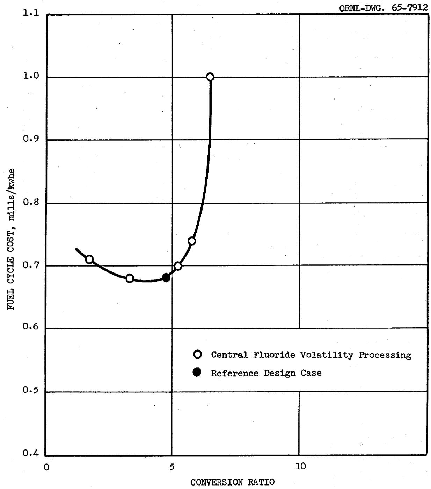  
Fig. 6.1. MSCR Fuel Cycle Cost Versus Conversion Ratio.

Table 6.5. Processing Variables   

<table><tr><td>Case</td><td>Cycle Time days</td><td>Volume Rate ft3/day</td><td>Weight Rate kg Th/day</td><td>Conv. Ratio</td><td>Fuel Cycle Cost mills/kwhre</td></tr><tr><td>1</td><td>3000</td><td>0.83</td><td>27</td><td>0.835</td><td>0.71</td></tr><tr><td>2</td><td>2000</td><td>1.25</td><td>40</td><td>0.868</td><td>0.68</td></tr><tr><td>3*</td><td>1500</td><td>1.67</td><td>53</td><td>0.895</td><td>0.68</td></tr><tr><td>4</td><td>1250</td><td>2.00</td><td>64</td><td>0.904</td><td>0.70</td></tr><tr><td>5</td><td>1000</td><td>2.50</td><td>80</td><td>0.917</td><td>0.74</td></tr><tr><td>6</td><td>500</td><td>5.0</td><td>160</td><td>0.930</td><td>1.01</td></tr><tr><td>7</td><td>250</td><td>10.0</td><td>320</td><td>0.908</td><td>1.64</td></tr></table>

*Reference Design Case

# 6.5 Reference Design Reactor

The MSCR is capable of producing power at a fuel cycle cost, including salt charges, of 0.7 mills/kwhre at a conversion ratio of 0.9.

The most important uncertainties in this calculation arise in connection with (a) the behavior of xenon in the core, (b) costs estimated for the Fluoride Volatility processing plant, (c) validity of the base charges assigned to the materials and (d) cost of packaging the spent fuel for shipment. The influence of xenon behavior is examined in Sec. 6.6, and the cost assumptions in Sec. 6.7. If the losses to xenon assumed for the reference design case are attainable (and it should be possible to achieve the assumed performance by improving the graphite and the sparging process), then all the uncertainty resides in the processing cost. Since processing costs are only about 0.08 mills/kwhre (Table 6.10), even a large error would not significantly influence the total fuel cycle cost.

Uncertainties in regard to technical feasibility arise in connection with compatibility and stability of the graphite moderator (Sec. 4.2.2), of the reactor vessel and its internal structure (Sec. 4.2.2). Also, the hazards associated with the proposed methods of control (Sec. 4.2.3) have not been evaluated.

# 6.5.1 Specifications

Case 3 was selected for the reference design before the complete curve was generated; its fuel cost is not significantly greater than the minimum. The reactor characteristics and operating data for the reference design are given in Section 4, nuclear data in Table 6.6.

Table 6.6. Nuclear Characteristics of 1000 Mwe Molten Salt Converter Reactor   

<table><tr><td>Case No.</td><td>3</td></tr><tr><td>Carbon/thorium atom ratio</td><td>~300</td></tr><tr><td>Thorium/fissile uranium atom ratio</td><td>~27</td></tr><tr><td>Fraction of fissions in thermal neutron group</td><td>0.82</td></tr><tr><td>Fraction of fissions in 235U</td><td>0.15</td></tr><tr><td>Fraction of fissions in 233U</td><td>0.85</td></tr><tr><td>Ratio of total fissions to fissions in 233U and 235U</td><td>1.0018</td></tr><tr><td>Mean eta of 233U</td><td>2.253</td></tr><tr><td>Mean eta of 235U</td><td>1.979</td></tr><tr><td>Mean eta of all fissions*</td><td>2.219</td></tr><tr><td>Effective resonance integral of 232Th</td><td>66 barns</td></tr><tr><td>Thermal cross section of 233Pa</td><td>39 barns</td></tr><tr><td>Effective resonance integral of 233Pa</td><td>900 barns</td></tr><tr><td>Average power density in core</td><td>14.1 kw/liter</td></tr><tr><td>Ratio peak-to-radial average power density</td><td>2.1</td></tr><tr><td>Maximum graphite exposure rate, nvt/yr</td><td></td></tr><tr><td>Neutron energy &gt;0.1 Mev</td><td>5.0 × 1021</td></tr><tr><td>Neutron energy &gt;1.0 Mev</td><td>1.8 × 1021</td></tr><tr><td>Average thermal flux</td><td>3.7 × 1013</td></tr><tr><td>Average fast flux</td><td>4.2 × 1013</td></tr><tr><td>Fissions per 235U atom added</td><td>9.2</td></tr><tr><td>Fissions per fissile atom processed</td><td>1.5</td></tr><tr><td>Exposure, Mwd/tonne of thorium</td><td>47,000</td></tr><tr><td>Specific power, Mwt/kg fissile</td><td>0.9</td></tr></table>

*Neutrons produced from all sources per absorption in $^{233}\mathrm{U}$ and $^{235}\mathrm{U}$ .

# 6.5.2 Neutron Economy

From Table 6.7, it is seen that fissions in $^{232}\mathrm{Th}$ contribute very little to neutron production. The fast fission cross sections of thorium are appreciably less than those of $^{238}\mathrm{U}$ ; moreover, the fast flux in the MSCR is not particularly high (Table 6.6). Also, the thorium is rather dilute compared to concentrations customarily proposed for blankets.

The nuclear loss resulting from absorptions in Pa is appreciable but not serious. It could be reduced by reducing further the volume fraction of fuel in the core, but this is already about as low (0.1) as seems technically feasible; a further decrease would probably add more to the fuel cost in terms of increased inventory charges (since concentration of thorium and uranium in the fuel stream would increase, while the external volume would remain the same) than would be saved in terms of fuel replacement costs. Increasing the external volume in order to dilute the Pa would not be economical for the same reason.

The nuclear loss to Pa could be reduced by removing the Pa rapidly from the circulating stream and holding it until it decays to $^{233}\mathrm{U}$ . In order to be effective, such a process would have to treat the entire fuel stream for Pa removal in a period not greater than ten days (mean life of Pa is about 40 days). Thus an extremely simple and efficient process is required, as for example, the passage of the fuel stream through beds where Pa is selectively absorbed and retained until $^{233}\mathrm{U}$ is formed, which then desorbs in the presence of large amounts of uranium in solution. No such process is presently known, although some work has been reported (19 p. 117, 74) on the precipitation of protactinium oxide from molten salt solutions containing up to 2000 ppm of uranium by contacting the melt with $\mathrm{BeO}_2$ , $\mathrm{ThO}_2$ , or $\mathrm{UO}_2$ . Development of such a process might reduce the losses to Pa appreciably and add $\sim 0.01$ units to the conversion ratio.

For reasons indicated in Sec. 6.1, the concentration of $^{234}\mathrm{U}$ used in the equilibrium calculation was averaged over a period of 30 years. Although the reactor was assumed to be initially fueled with enriched uranium containing $1.0\%$ $^{234}\mathrm{U}$ and to be supplied with make-up fuel of the same composition, ninety-nine per cent of the $^{234}\mathrm{U}$ is formed by transmutation of $^{233}\mathrm{U}$ . It disappears from the reactor by transmutation to $^{235}\mathrm{U}$ and loss in

Table 6.7. Neutron Economy $^{a}$ in the 1000 Mwe Molten Salt Converter Reference Design Reactor   

<table><tr><td>Item</td><td>Captures</td><td>Fissions</td><td>Absorptions</td></tr><tr><td>232Th</td><td>0.8535</td><td>0.0011</td><td>0.8546</td></tr><tr><td>233Pa</td><td>0.0084</td><td>0.0000</td><td>0.0084</td></tr><tr><td>233Uc</td><td>0.0888</td><td>0.7488</td><td>0.8376</td></tr><tr><td>234U</td><td>0.0572</td><td>0.0002</td><td>0.0574</td></tr><tr><td>235U</td><td>0.0301</td><td>0.1323</td><td>0.1624</td></tr><tr><td>236U</td><td>0.0184</td><td>0.0001</td><td>0.0185</td></tr><tr><td>237Np</td><td>0.0074</td><td>--</td><td>0.0074</td></tr><tr><td>238U</td><td>0.0029</td><td>0.0000</td><td>0.0029</td></tr><tr><td>Carrier salt</td><td>0.0387</td><td>--</td><td>0.0387</td></tr><tr><td>Graphite</td><td>0.0564</td><td>--</td><td>0.0564</td></tr><tr><td>135Xe</td><td>0.0170c</td><td>--</td><td>0.0170c</td></tr><tr><td>Other fission products</td><td>0.0867</td><td>--</td><td>0.0867</td></tr><tr><td>Corrosion products</td><td>0.0082</td><td>--</td><td>0.0082</td></tr><tr><td>Delayed neutrons</td><td>0.0046</td><td>--</td><td>0.0046</td></tr><tr><td>Leakage</td><td>0.0513</td><td>--</td><td>0.0513</td></tr><tr><td>Neutron yielda</td><td></td><td></td><td>2.2121</td></tr><tr><td>Processing lossesb</td><td></td><td></td><td>0.005</td></tr><tr><td>Net conversion ratiod</td><td></td><td></td><td>0.90</td></tr></table>

aNeutrons per neutron absorbed in 233U and 235U.   
b Processing loss of $0.3\%$ /pass for $^{233}\mathrm{U}$ and $^{235}\mathrm{U}$ , and undecayed $^{233}\mathrm{Pa}$ .   
cLoss corresponding to graphite having gas porosity of $1 \%$ and diffusion coefficient of $10^{-6}$ compared to current graphite properties of $10\%$ and $10^{-5}$   
Excluding captures in $^{238}\mathrm{U}$ and correcting for fissions of thorium.

the processing cycle (0.3% per pass). Since $^{235}\mathrm{U}$ is inferior with respect to $^{233}\mathrm{U}$ as a nuclear fuel, it is advantageous to keep the concentration of $^{234}\mathrm{U}$ as low as possible. However, the designer has little control over this, inasmuch as the only menas of removing it is to sell spent fuel to the AEC, and this, as shown in Sec. 6.8.3, is not advantageous.

The concentration of $^{236}\mathrm{U}$ used was also averaged over a period of thirty years, starting with a clean reactor containing no $^{236}\mathrm{U}$ . In this case, the only source is capture of neutrons in $^{235}\mathrm{U}$ ; the sinks are transmutation to $^{237}\mathrm{U}$ (which decays promptly to $^{237}\mathrm{Np}$ ) and losses (0.3% per pass) in the processing cycle. The only effective control the designer has over $^{236}\mathrm{U}$ is by varying the conversion ratio thus varying the amount of $^{235}\mathrm{U}$ fed to the system, and by sale of spent fuel.

It is assumed that $^{237}\mathrm{Np}$ was removed 100 per cent per pass through the processing cycle. Parasitic captures are appreciable (0.0074 units on the conversion ratio); however, special processing for this reason does not appear to be worthwhile, although it might be for other reasons.

Parasitic captures in carrier salt resulted in a conversion loss of 0.039 units. Of this, captures in $^{6}\mathrm{Li}$ contributed 0.014 units. The grade of salt used (99.995% $^{7}\mathrm{Li}$ ) appears to be about the best available at attractive prices. On the other hand, use of inferior grades would not result in lower fuel costs.

The best way to control losses to $^{6}\mathrm{Li}$ is to recycle carrier salt from processing instead of discarding it as was assumed in the reference design. The possibilities are examined in Sec. 6.8, where it is shown that about 0.01 units might plausibly be saved on the conversion ratio, and about 0.08 mills in replacement costs.

The fuel cost was optimized with respect to parasitic captures in moderator and neutron leakage simultaneously as described in Sec. 6.4. Losses to graphite might be decreased by decreasing the C/Th ratio, but the gain would be more than offset by losses in eta of $^{233}\mathrm{U}$ and increased leakage. Leakage decreases slowly with increasing diameter, but fuel cost is insensitive, as shown in Table 6.4. Efforts to reduce the leakage by use of a graphite reflector were not successful (Appendix M), largely because of the necessary presence of a fuel annulus at least one inch thick

at the periphery of the core as a result of tolerance allowance for differential thermal expansion.

The estimate of the loss of neutrons to xenon (0.017 units on C.R.) was based on an assumed diffusion coefficient of $10^{-6} \, \text{cm}^2/\text{sec}$ , a porosity accessible to gas of 1.0 per cent, and a sparging rate of 10 per cent (16 ft $^3$ /sec) of the circulating fuel stream with 100 per cent removal of xenon per pass (Sec. 6.8.2). The prospects are good for the development of grades of graphite that would reduce the losses to xenon in the MSCR to no more than 0.005 units on the conversion ratio.

Captures in samarium ( $^{149}\text{Sm}$ and $^{151}\text{Sm}$ ) result in a loss of 0.013 units in conversion ratio. This loss is independent of the processing rate except at very short cycle times of the order of days. Thus, there is not much prospect of reducing this loss except by the application of some simple, rapid process similar to that suggested for $^{233}\text{Pa}$ above.

Captures in other fission products can be controlled by varying the processing rate. The savings from greater fuel conversion must be balanced against increased processing cost. For the particular price structure and nuclear properties assumed, the optimum rate of processing is $\sim 1.7$ ft $^3$ /day (53 kg of Th/day). The corresponding loss in conversion ratio due to captures in other fission products is 0.074 units. In this calculation, it was assumed that xenon is sparged as described above, noble metals are reduced by chromium in metal structures to the zero valence state and "plated out," and all other fission products are removed by passage through the processing cycle which, at the costs estimated in Sec. 5.l, optimized at a cycle time of $\sim 1500$ days.

If the processing cost schedule (Sec. 3.2 and 5.1) were to change in the direction of lower costs, the optimum processing rate would increase, and the fission product captures could be decreased. Although improvements and economies in the Fluoride Volatility process are to be expected, the remote operations and maintenance costs of this process are likely to remain high; therefore the process eventually used should be as simple as possible. The solution may lie in the direction of distillation or fractional crystallization (80, p. 80), or perhaps extraction with liquid metals.

The estimated loss in conversion ratio to corrosion products was 0.006 units; a loss of 0.008 units was allowed in the calculations (Sec. 6.3). Since the concentration of corrosion products (Fe, Ni, and Cr) in the melt appears to reach an equilibrium in times that are short compared to the processing cycle time, it seems unlikely that the processing will have much influence on the concentrations of corrosion products, and the associated loss of neutrons seems unavoidable.

# 6.5.3 Inventories and Processing Rates

It may be inferred from Table 6.8, Column 1, that the specific power of the MSCR is 0.35 Mwe/kg fissile, which is comparable with many of the advanced systems currently being put forward. The exposure (about 40,000 Mwdt/tonne of thorium) is of the same order as that of "competitive" reactors.

Table 6.8. Inventories of Nuclear Materials - 1000 Mwe Molten Salt Converter Reference Design Reactor   

<table><tr><td rowspan="2">Material</td><td colspan="3">Inventories, kg</td></tr><tr><td>Reactor Plant</td><td>Processing</td><td>Total</td></tr><tr><td>232Th</td><td>80,000</td><td>6500</td><td>86,500</td></tr><tr><td>233Pa</td><td>95.5</td><td>7.8</td><td>103</td></tr><tr><td>233U</td><td>2110</td><td>172</td><td>2,282</td></tr><tr><td>234U</td><td>484</td><td>39.6</td><td>524</td></tr><tr><td>235U</td><td>420</td><td>45*</td><td>465</td></tr><tr><td>236U</td><td>682</td><td>56</td><td>738</td></tr><tr><td>237Np</td><td>49</td><td>5</td><td>54</td></tr><tr><td>238U</td><td>109</td><td>11</td><td>120</td></tr><tr><td>Salt</td><td>109,000</td><td>8,900</td><td>117,900</td></tr><tr><td>Fission products</td><td>4,400</td><td>360</td><td>4,760</td></tr><tr><td>Corrosion products</td><td>82</td><td>7</td><td>89</td></tr></table>

*Including 10.6 kg in reserve to keep reactor in operation for 30 days after unscheduled interruption of recycle from processing plant.

The processing rates given in Table 6.9 are the amounts removed daily from the circulating fuel stream. These daily increments are accumulated for 116 days to form a processing batch. The average fission product activity in the material as processed corresponds to an effective holding time of about 90 days (based on the Way-Wigner correlation as reported in reference 55, p. 81). Thus, a process batch contains $6500\mathrm{kg}$ of thorium; this is processed at the rate of $1000\mathrm{kg/day}$ for uranium recovery, taking $\sim7$ days to process and two days for "turn-around."

Table 6.9. Process and Make-up Rates - 1000 Mwe Molten Salt Converter Reference Design Reactor   

<table><tr><td rowspan="2">Material</td><td colspan="2">Rate, kg/day</td></tr><tr><td>To Processing</td><td>Make-up</td></tr><tr><td>232Th</td><td>53.3</td><td>3.56</td></tr><tr><td>233Pa</td><td>0.064</td><td></td></tr><tr><td>233U</td><td>1.400</td><td></td></tr><tr><td>234U</td><td>0.322</td><td>0.003</td></tr><tr><td>235U</td><td>0.280</td><td>0.324</td></tr><tr><td>236U</td><td>0.463</td><td></td></tr><tr><td>237Np</td><td>0.033</td><td></td></tr><tr><td>238U</td><td>0.073</td><td></td></tr><tr><td>Salt</td><td>72.7</td><td>72.7</td></tr><tr><td>Fission products</td><td>2.94</td><td></td></tr><tr><td>Corrosion products</td><td>0.055</td><td></td></tr></table>

# 6.5.4 Fuel Cycle Cost

The fuel cycle cost for the reference design reactor, which is near optimum on the bases chosen, comes to 0.68 mills/kwhre. A breakdown is given in Table 6.10.

Inventory of fissile materials costs about 1/4 mills/kwhre, when optimized with respect to the processing rate. It could possibly be reduced at a given processing rate by improving the graphite to reduce xenon poisoning and by reducing the volume of fuel in the external heat transfer circuit at the expense of greater pumping power costs.

Table 6.10. Fuel Cycle Cost - 1000 Mwe Molten Salt Converter Reference Design Reactor with Salt Discard   

<table><tr><td rowspan="2">Material</td><td colspan="4">Charges, * mills/kwhre</td></tr><tr><td>Inventory</td><td>Replacement</td><td>Processing</td><td>Total</td></tr><tr><td>232Th</td><td>0.03</td><td>0.04</td><td></td><td></td></tr><tr><td>233Pa</td><td>0.01</td><td></td><td></td><td></td></tr><tr><td>233U</td><td>0.18</td><td></td><td>0.08</td><td></td></tr><tr><td>235U</td><td>0.04</td><td>0.16</td><td></td><td></td></tr><tr><td>Total</td><td>0.26</td><td>0.20</td><td>0.08</td><td>0.54</td></tr><tr><td>Salt costs</td><td>0.06</td><td>0.08</td><td></td><td>0.14</td></tr><tr><td>Total charges</td><td></td><td></td><td></td><td>0.68</td></tr></table>

\*Cost bases are given in Sec. 3

Replacement costs for fissile material are most sensitive to conversion ratio. Increasing this from 0.90, as in the reference design reactor, to 0.95 would cut the cost in half. The increase in conversion ratio might be achieved by means discussed in Sec. 6.7.3.

The inventory charge for salt is strictly a function of the fuel salt volume. The replacement cost depends on the processing rate, and was optimized. A major improvement here would consist of adding equipment in the processing plant for recovering lithium and beryllium.

The fuel cycle cost of 0.68 mills/kwhre estimated for the MSCR is conservatively based on the scale-up of proven technology (including the processing) with the following minor exceptions:

1. Technology of reactor vessel design.   
2. Graphite technology.   
3. Xenon sparging technology

These, however, are considered within the reach of current technology, i.e., no developmental break-throughs are required.

Although difficult problems in gamma heating may be encountered in the design of the reactor vessel and its internal members, it appears that these can be solved. The problem in relation to graphite is to produce

pieces of the size required that are chemically compatible with fuel salt and have porosity and permeability suitably low with respect to xenon absorption (Sec. 6.8.2).

# 6.6 Parameter Studies

In this section, the effect on the fuel cycle cost of various assumptions concerning the processing cost, and of several modes of processing are considered.

# 6.6.1 Processing Cost as Parameter

The fuel cycle cost reported in Sec. 6.7 (Table 6.10) was based on the assumed use of a central Fluoride Volatility facility requiring approximately $20 million in capital investment and having an annual operating expense of $2 million (Table 5.7). In Sec. 5.4, this estimate was compared with other current estimates for similar plants and for Thorex plants of comparable capacity. In this section, the processing plant capital investment and the operating cost are considered as parameters, without regard to the kind of plant. The effect on the fuel cycle cost of the MSCR at various processing rates of varying processing costs for a plant having a nominal capacity of 1000 kg Th/day (30 ft³/day of reference design salt) was calculated. In all cases, the output of the reactor was accumulated until a processing batch of about 6000 kg of Th was collected; this was then shipped to the processing plant and processed at a rate of 1000 kg Th/day. The turn-around time was assumed to be 2 days.

The results of the calculation are presented in Fig. 6.2. The curves corresponding to daily charges of $20,000 to$ 60,000. It is seen that, in the conversion ratio range from 0.8 to 0.9, the fuel cycle cost is not very sensitive to the processing cost; in the reference design, the fuel cycle cost does not exceed 0.85 mills/kwhre at a daily charge of $40 thousand, and only slightly exceeds 1.0 mills/kwhre for a charge of $60 thousand. At $40 thousand, the minimum fuel cycle cost is less than 0.8 mills/kwhre at a conversion ratio of about 0.85, and the cost remains below 1.0 mills/kwhre for conversion ratios up to about 0.92.

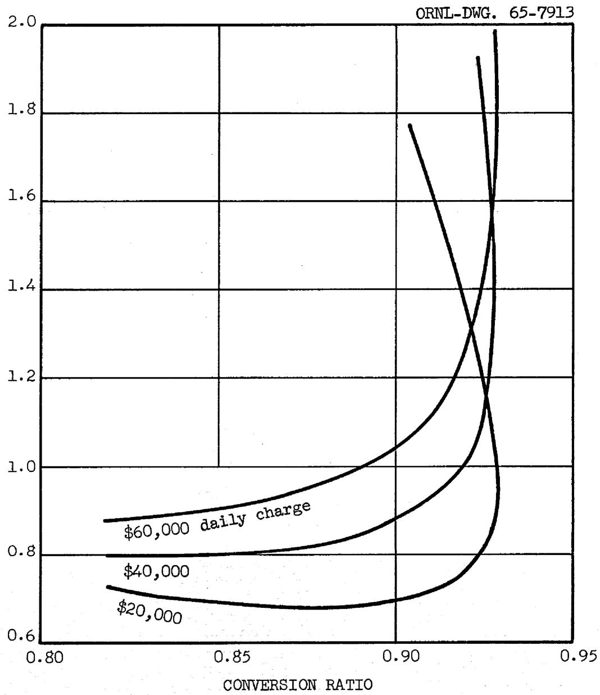  
FUEL CYCLE COST, mills/kwhe   
Fig. 6.2. MSCR Processing Cost Versus Conversion Ratio.

It was concluded that, on any reasonable cost basis, the optimum fuel cycle cost for the MSCR will not exceed 0.8 mills/kwhre, and that conversion ratios up to 0.92 can be obtained at fuel cycle costs not exceeding 1.0 mills/kwhre.

# 6.6.2 Effect of Xenon Removal

The solubility of xenon in $\mathrm{LiF - BeF}_2$ is very low (107); in the reference design reactor the equilibrium pressure is about 0.06 atmospheres. Xenon thus tends to leave the salt at any phase boundary. It can be removed rapidly by spraying a portion of the circulating stream into a space filled with helium or by subsurface sparging. It may form microbubbles clinging to the surface of the graphite moderator, and it will tend to diffuse into pores in the graphite, including pores inaccessible to the salt. Xenon is also removed from the system by decay to $^{135}\mathrm{Cs}$ and by reaction with neutrons to form $^{136}\mathrm{Xe}$ , which is stable and has a low neutron capture cross section.

Xenon poisoning in the MSCR was calculated by the method of Watson and Evans (107), as shown in Appendix G. The important physical properties are the porosity, e, of the graphite (fraction of graphite volume accessible to xenon) and the diffusivity of xenon, D (cm²/sec). The key variables are the diameter of the graphite logs, the fuel circulation rate, and the sparging fraction, r, (fraction of circulating stream sparged or sprayed to removed xenon). In the reference design, the logs are six inches in diameter, and the circulation rate is 160 ft³/sec.

In the reference design reactor, a gas-accessible porosity of 0.01 and a diffusion coefficient of $10^{-6}$ with a sparging fraction of 0.1 (16 ft $^3$ /sec), would result in a tolerable xenon poison fraction of 0.017 neutrons per neutron absorbed by fissile atoms. These physical property values are an order of magnitude smaller than those of currently available graphite where $\mathbf{e} = 0.1$ and $\mathbf{D} = 10^{-5}$ ; however, the assumed values are both presently attainable in small pieces of graphite (107) and the control of xenon poisoning in the MSCR appears to lie within the reach of developing technology.

The conversion ratio increases and the fuel cycle cost decreases with decreasing xenon poisoning. Table 6.11 compares the calculated results for

Table 6.11. Effect of Graphite Properties and Sparge Rate on Performance of 1000 Mwe Molten Salt Converter Reactor   

<table><tr><td>Case</td><td>Xe P.F.</td><td>Conversion Ratio</td><td>Fuel Cycle Cost mills/kwhre</td></tr><tr><td>a</td><td>0.054</td><td>0.84</td><td>0.79</td></tr><tr><td>b</td><td>0.045</td><td>(0.86)*</td><td>(0.77)*</td></tr><tr><td>c</td><td>0.017</td><td>0.90</td><td>0.68</td></tr><tr><td>d</td><td>0.001</td><td>0.92</td><td>0.66</td></tr></table>

*Interpolated

three cases: (a) "Worst" case, with a very porous graphite (say AGOT) and with no sparging; (b) available graphite with $eD = 10^{-6}$ and $r = 0.1$ ; (c) Reference Design Reactor with $eD = 10^{-8}$ and $r = 0.1$ ; (d) "impermeable" graphite with $eD = 0$ and $r = 0.1$ .

It is seen that while available graphite (Case b) is not significantly better than the "worst" graphite (Case a), nevertheless, the fuel cycle cost is only 0.1 mill/kwhre higher than for "impermeable" graphite (Case d). It is concluded that the fuel cost is not very sensitive to xenon poisoning, that it will be less than 0.8 mills/kwhre, with available graphite, and that with modest improvements over available graphite (to e of 0.01 and D of $10^{-6}$ ), the fuel cost will be not more than 0.7 mills/kwhre.

# 6.6.3 Effect of Product Sale Without Recycle

At least two benefits accrue from the sale of recovered fissile isotopes (as $\mathrm{UF}_6$ ) to the AEC: (a) Make-up fuel ( $^{235}\mathrm{U}$ ) would then be nonradioactive and could be compounded with fresh salt in a directly maintained and operated facility; (b) the reactor would tend to be purged of $^{236}\mathrm{U}$ . The second benefit is really illusory, inasmuch as the $^{236}\mathrm{U}$ produced will eventually capture a neutron in some reactor somewhere, and therefore reduces the value of the recovered isotopes by an appropriate amount.

On the other hand, a penalty is incurred in that $^{233}\mathrm{U}$ , a superior fuel in thermal reactors, is also lost from the system. As seen in Table 6.12, the penalties outweigh the advantages considerably.

Table 6.12. Effect of Sale of Spent Fuel on MSCR Performance   

<table><tr><td>Case</td><td>A</td><td>B</td></tr><tr><td>Spent fuel is . . .</td><td>Recycled</td><td>Sold</td></tr><tr><td>Absorptions in 236J</td><td>0.0185</td><td>0.0105</td></tr><tr><td>Mean Eta</td><td>2.21</td><td>2.11</td></tr><tr><td>Conversion Ratio</td><td>0.90</td><td>0.82</td></tr><tr><td>Fuel Cycle Cost, mills/kwhre</td><td></td><td></td></tr><tr><td>Inventory Charges</td><td>0.32</td><td>0.36</td></tr><tr><td>Replacement Charges</td><td>0.28</td><td>1.38</td></tr><tr><td>Processing Charges</td><td>0.08</td><td>0.08</td></tr><tr><td>Production Credit</td><td>--</td><td>0.53</td></tr><tr><td>Net Fuel Cost, mills/kwhre</td><td>0.68</td><td>1.29</td></tr></table>

# 6.7 Alternative Design and Cost Bases

# 6.7.1 Thorex Processing Cost Estimates

The preferred method of processing MSCR fuel is by fluorination (Sec. 5.2), mainly because the processing can conveniently be integrated with the reactor and thus achieve very low fuel cycle costs. However, for one reason or another, it may be desirable to process the spent fuel from the first MSCR installations in a central Thorex facility. Accordingly, the facility specified in the Guide to Nuclear Power Cost Evaluation (52, 104) was modified appropriately as described in Sec. 5.3 to handle MSCR fuel. An allowance of $500,000 additional capital cost for the head-end treatment was made. Costs were calculated on the bases given in the Guide. The turn-around time was eight days and the shipping charge was $17/kg for round trip. The assumed loss of fissile material was 1.3 per cent/pass.

The fuel cycle costs for the reference design reactor (Tables 6.6 through 6.10) were recomputed using a cost schedule estimated from the Guide (52), as shown in Table 6.13, where they are compared to corresponding results for central Floride Volatility processing (Sec. 5.2).

Table 6.13. Effect of Processing Method on Fuel Cycle Cost   

<table><tr><td></td><td>Central
Thorex</td><td>Central
Fluoride
Volatility</td></tr><tr><td>Processing cost, $/kg Th</td><td>75.2</td><td>44.8</td></tr><tr><td>Processing losses, per cent/pass</td><td>1.3</td><td>0.3</td></tr><tr><td>Conversion Ratio</td><td>0.89</td><td>0.90</td></tr><tr><td>Fuel cycle cost, mills/kwh</td><td></td><td></td></tr><tr><td>Inventory charges</td><td>0.33</td><td>0.32</td></tr><tr><td>Replacement charges</td><td>0.24</td><td>0.28</td></tr><tr><td>Processing charges</td><td>0.17</td><td>0.08</td></tr><tr><td>Total, mills/kwh</td><td>0.74</td><td>0.68</td></tr></table>

Thus, even though processed through the AEC reference plant, the costs of which appear to be conservatively high, the fuel cycle cost for the reference design MSCR will not exceed 0.75 mills/kwh.

# 6.7.2 Reactor-Integrated Fluoride Volatility Processing

Several advantages can be realized by integrating the processing with reactor operations. The principal saving results from sharing reactor shielding and remote maintenance equipment. Savings in laboratory facilities and personnel are also important. Shipping costs and associated receiving facilities are eliminated.

A 30 ft³/day central fluoride volatility plant requires a capital outlay of about $25 million and would need to service fifteen to twenty 1000 Mwe MSCR's in order to achieve the unit processing costs estimated in Section 5.2. An integrated plant requires a much smaller investment and the unit processing cost will be, of course, independent of the number of reactors in use.

An integrated facility should be designed for continuous flow processing, at least in the fluorinator and the $\mathrm{UF}_6$ reduction reactor, in order that the equipment and the volume of fuel-salt held up might both be small.

# 6.7.3 Reactor-Integrated Precipitation Process

At a processing rate of 1.7 ft³/day, the concentration of rare earth fluorides in the fuel salt will be approximately 0.5 mole per cent, which is perhaps slightly in excess of the solubility limit at the minimum fuel temperature of $1100^{\circ}\mathrm{F}$ . This suggests that it may be possible to remove rare earths fission products from the MSCR fuel stream by fractional crystallization - an extremely attractive possibility, for such a process could conveniently be carried out in the reactor cell and closely integrated with the reactor system. The steps involved are exceedingly simple, involving only the transfer of liquids and heat, and is therefore inherently safe and economical.

The fission product neutron poisoning estimated for the reference design can be approximately matched by charging every day five cubic feet of fuel salt containing 0.5 mole per cent rare earth thorides to a crystallizer. The salt is cooled to $900^{\circ}\mathrm{F}$ , which is $13^{\circ}\mathrm{F}$ above the temperature at which solid solutions containing Th or U separate. At this temperature, the solubility of the rare earth fluorides is 0.2 mole per cent or less, judging from the data of Ward et al., (108, 106). Thus about 60 per cent of the rare earths will precipitate or "freeze" on the walls of the crystallizer. The total mass of the solids will be only $6 - 8\mathrm{kg}$ . After the fuel salt is returned to the reactor system, the fission products are dissolved in flush salt

The process described should effectively remove rare earths from the fuel salt. It will not remove alkali metals, alkaline earths, and miscellaneous other metals. These will accumulate in the fuel, but their ingrowth can be partially compensated by operating the freeze-process at a slightly more rapid rate and maintaining the rare earth concentration at say 0.45 mole per cent or by discarding barren fuel-salt in a 1500 day cycle.

# 6.8 Evolution of a Self-Sustaining MSCR

Although the MSCR concept may not have the capability of evolving into a breeder reactor (see Sec. 7.1) having a doubling time less than 25 years,

the possibility exists, however, that it could, without increase in power costs, achieve a net conversion ratio slightly greater than unity, and thus become self-sustaining and independent of outside supplies of fissile isotopes. Conditions under which this might be achieved are listed and discussed below.

# 6.8.1 Reduction of Leakage

With the advent of separated $^{92}\mathrm{Mo}$ , it becomes feasible to surround the core of the MSCR with a thin blanket of high-density thorium salt (25% ThF $_4$ , 75% LiF). This salt, having a liquidus temperature below 1100°F, could be circulated slowly through 6-inch diameter molybdenum tubes replacing the outer two layers of graphite moderator logs, and replacing 1-ft end sections of the central logs. The isotope $^{92}\mathrm{Mo}$ is a magic nuclide, having a 2200 m/s cross section of 6 millibarns. The epithermal cross section is currently being measured at ORNL, and preliminary results indicate that the resonance integral is also very small. Thus, structural molybdenum should capture only a negligible fraction of neutrons.

It would be necessary to remove the bred $^{233}\mathrm{U}$ rapidly from the fertile stream for two reasons: (a) fissions in the fertile stream would tend to increase the leakage, (b) fission products in the fertile stream would capture neutrons. If the fertile stream were processed rapidly by fluorination, the concentration of $^{233}\mathrm{U}$ could be kept very low, fissions would be suppressed, the inventory charge for $^{233}\mathrm{U}$ would be largely avoided. The fertile stream carrier salt could be recycled without further treatment. The rapidity of the processing, however, implies the use of an on-site, reactor-integrated facility such as that described in Sec. 6.9.2.

By this means perhaps half the leakage neutrons could be saved, adding about 0.025 units to the conversion ratio.

# 6.8.2 Reduction of Xenon Captures

In the reference design, graphite properties an order of magnitude better than those characteristic of current graphites were assumed, resulting in a loss in conversion ratio due to captures in $^{135}\mathrm{Xe}$ absorbed in the graphite of only 0.017 units. By further improvements (e.g., by spraying a thin coating of $^{92}\mathrm{Mo}$ on the moderator logs and carburizing to prevent xenon

from penetrating the moderator) perhaps another 0.01 units on the conversion ratio could be saved.

# 6.8.3 Reduction of Fission Product Poisoning

Somewhat over 0.085 units were lost from the conversion ratio as a result of captures in fission products in the reference design (Table 6.7). The processing cost in a central Fluoride Volatility facility was about 0.08 mills/kwhr. If an on-site, reactor-integrated Fluoride Volatility and HF-Solution facility were used (Sec. 2.2.14), the rate of removal of rare earths could be increased perhaps by a factor of 10. Solubles (Cs, Ba, etc.) could be purged by discarding salt in a 1500 day cycle, as in the reference design. If this were done, the loss of conversion ratio to fission products could be reduced to about 0.010 units.

# 6.8.4 Improvement of Mean Eta and Reduction of $^{236}\mathrm{U}$ Captures

Other than by varying the C/Th ratio, the designer has no direct control over these. Nevertheless, the above improvements in neutron economy have an effect on the conversion ratio that is greater than their cumulative sum, for $^{233}\mathrm{U}$ is superior to $^{235}\mathrm{U}$ in respect to neutron production, and moreover yields a fertile isotope $(^{234}\mathrm{U})$ upon capture of a neutron. An increase in relative concentration of $^{233}\mathrm{U}$ by any means increases the number of neutrons available for breeding, and reduction of $^{235}\mathrm{U}$ feed rate results in a decrease in $^{236}\mathrm{U}$ concentration.

The above listed improvements should result in an increase in eta of 0.01 units and a reduction of captures in $^{236}\mathrm{U}$ by 0.01 units, at least.

# 6.8.5 Ultimate Breeding Potential of MSCR

The conversion ratio in the reference design is about 0.90. With the improvements listed above, conversions slightly in excess of 1.0 may be achieved, as shown in Table 6.14.

Thus, the MSCR may be capable of evolving stepwise into an economical, self-sustaining breeder reactor with fuel cycle costs probably in the range of 0.7 - 1.0 mills/kwhre.

It should be emphasized that the limiting conversion ratio estimated for the MSCR does not apply to molten salt breeder reactors. It has been

Table 6.14. Ultimate Breeding Potential of Molten Salt Converter Concept   

<table><tr><td>Conversion ratio in reference design</td><td>0.90</td></tr><tr><td>Savings due to:</td><td></td></tr><tr><td>Reduction in leakage</td><td>0.025</td></tr><tr><td>Reduction in xenon captures</td><td>0.010</td></tr><tr><td>Reduction of fission product captures</td><td>0.075</td></tr><tr><td>Improvement in eta and reduction of captures in 236U</td><td>0.020</td></tr><tr><td>Ultimate conversion ratio</td><td>1.03</td></tr></table>

shown (3) that two-region, two-fluid, thermal reactors optimized with respect to breeding are capable of achieving doubling times of 25 years or less. (See also Sec. 1.7.) In addition, the advent of structural $^{92}\mathrm{Mo}$ makes possible, in principle, the design of two-region, two-fluid, fast molten-salt reactors which may have doubling times as short as ten years, which will not need to use separated $^{6}\mathrm{Li}$ in the carrier salt, and which therefore may be processed economically by fluorination only.

# 7. MSCR CAPITAL INVESTMENT, FIXED CHARGES, AND OPERATING EXPENSE

# 7.1 Introduction

The equipment, auxiliaries, and auxiliary services described in Sec. 4 were costed for ORNL by Sargent and Lundy Engineers of Chicago, Illinois (95, 96). Equipment arrangement drawings sufficient for piping take-offs and building cost estimates were made. Details of these studies are given in the referenced reports.

# 7.2 Summary of MSCR Capital Investment

In Table 7.1 are listed the principal items of cost in the MSCR reference design. A detailed breakdown is given in Appendix N. The account numbers correspond, where applicable, to the AEC systems of accounts given in The Guide to Nuclear Power Cost Evaluation (52).

Table 7.1. 1000 Mwe Molten Salt Converter Reactor Capital Investment   

<table><tr><td>Fission energy release rate, Mwt</td><td>2500 Mwt</td></tr><tr><td>Net station power</td><td>1038 Mwe</td></tr><tr><td>Gross station power</td><td>1083 Mwe</td></tr><tr><td>Station efficiency</td><td>41.5%</td></tr><tr><td>Heat rate</td><td>8220 Btu/kwhr</td></tr><tr><td>Plant factor</td><td>0.8</td></tr><tr><td>Total capital investment</td><td>$143/kwe</td></tr></table>

# Direct Construction Costs

21 Structures and Improvements

211 Improvements to site $ 501,500   
212 Buildings 5,465,450   
218 Stacks 31,000

Reactor Container (Included in 212)

Total Account 21 (5,997,950)

Table 7.1. Continued   

<table><tr><td colspan="3">22 Reactor Plant</td></tr><tr><td>221</td><td>Reactor equipment</td><td>$ 8,823,300</td></tr><tr><td>222</td><td>Heat transfer system</td><td>23,609,700</td></tr><tr><td>223</td><td>Fuel fabrication and handling system</td><td>1,517,200</td></tr><tr><td>224</td><td>Fuel processing system waste disposal</td><td>(Not included)</td></tr><tr><td>225</td><td>Low-level radioactive waste disposal</td><td>361,150</td></tr><tr><td>226</td><td>Instrumentation and controls</td><td>1,100,000</td></tr><tr><td>227</td><td>Feed water supply</td><td>4,939,500</td></tr><tr><td>228</td><td>Steam, condensate, and water piping</td><td>7,925,000</td></tr><tr><td>229</td><td>Other reactor equipment</td><td>3,048,500</td></tr><tr><td></td><td>Total Account 22</td><td>(51,324,350)</td></tr><tr><td colspan="3">23 Energy Conversion System</td></tr><tr><td>231</td><td>Turbo-generator unit</td><td>21,495,000</td></tr><tr><td>232</td><td>Circulating water system</td><td>1,644,200</td></tr><tr><td>233</td><td>Condensers and auxiliaries</td><td>3,104,900</td></tr><tr><td>234</td><td>Central lubrication system</td><td>36,000</td></tr><tr><td>235</td><td>Turbine plant instruments &amp; controls</td><td>426,000</td></tr><tr><td>236</td><td>Turbine plant piping</td><td>(Included in 228)</td></tr><tr><td>237</td><td>Auxiliary equipment for generators</td><td>137,000</td></tr><tr><td>238</td><td>Other equipment</td><td>(Included in 228)</td></tr><tr><td></td><td>Total Account 23</td><td>26,843,700</td></tr><tr><td colspan="3">24 Accessory Electrical Equipment</td></tr><tr><td>241</td><td>Switchgear</td><td>637,400</td></tr><tr><td>242</td><td>Switchboards</td><td>286,000</td></tr><tr><td>243</td><td>Protection equipment</td><td>131,600</td></tr><tr><td>244</td><td>Electrical structures</td><td>213,200</td></tr><tr><td>245</td><td>Conduit</td><td>210,200</td></tr><tr><td>246</td><td>Power and control wiring</td><td>2,281,900</td></tr><tr><td>247</td><td>Station service equipment</td><td>615,000</td></tr><tr><td></td><td>Total Account 24</td><td>4,375,300</td></tr><tr><td colspan="3">25 Miscellaneous Plant Equipment</td></tr><tr><td>251</td><td>Cranes and hoists</td><td>195,000</td></tr><tr><td>252</td><td>Air compressors and vacuum pumps</td><td>64,900</td></tr><tr><td>253</td><td>Other</td><td>540,000</td></tr><tr><td></td><td>Total Account 25</td><td>799,900</td></tr><tr><td></td><td>Total Direct Construction Cost</td><td>89,341,200</td></tr><tr><td colspan="3">Indirect Construction Costs</td></tr><tr><td colspan="2">Construction overhead (20% of direct labor)</td><td>2,333,300</td></tr><tr><td colspan="2">General and administration (2.5% of direct costs)</td><td>5,775,500</td></tr><tr><td colspan="2">Subtotal</td><td>(97,450,000)</td></tr></table>

Table 7.1. Continued   

<table><tr><td>Miscellaneous costs (1.2% of subtotal)</td><td>$ 974,500</td></tr><tr><td>Subtotal</td><td>(98,424,500)</td></tr><tr><td>Engineering Design and Inspection</td><td></td></tr><tr><td>Architect-engineers (11.1% of subtotal)</td><td>10,925,000</td></tr><tr><td>Subtotal</td><td>(109,349,500)</td></tr><tr><td>Nuclear engineers (3.8% of subtotal)</td><td>4,155,300</td></tr><tr><td>Start-up expense (35% annual O&amp;M expense)</td><td>746,900</td></tr><tr><td>Land and land rights</td><td>360,000</td></tr><tr><td>Subtotal</td><td>(114,611,700)</td></tr><tr><td>Contingency (10% of subtotal)</td><td>11,461,200</td></tr><tr><td>Subtotal</td><td>(126,072,900)</td></tr><tr><td>Interest during construction (9.4% of subtotal)</td><td>11,850,900</td></tr><tr><td>Total Indirect Construction Costs</td><td>48,582,600</td></tr><tr><td>Total Construction Costs</td><td>137,923,800</td></tr><tr><td>Intermediate Coolant-Salt Inventory*</td><td>10,951,800</td></tr><tr><td>TOTAL MSCR CAPITAL INVESTMENT</td><td>$ 148,875,600</td></tr></table>

\*Including interest during startup

# 7.3 MSCR Fixed Charges

The fixed charges were computed in accordance with the instructions in The Guide to Nuclear Power Cost Evaluation, Vol. 5, Production Costs, page 510-2 (52), for an investor-owned public utility, and are shown in Tables 7.2 and 7.3.

Table 7.2. Nation-Wide Approximated Fixed Charge Rates   

<table><tr><td rowspan="2"></td><td colspan="2">Percent Per Year</td></tr><tr><td>Depreciating</td><td>Non-Depreciating</td></tr><tr><td>Profit on investment</td><td>6.75</td><td>6.75</td></tr><tr><td>Depreciation (30-yr sinking fund)</td><td>1.11</td><td>--</td></tr><tr><td>Interim replacements</td><td>0.35</td><td>--</td></tr><tr><td>Property insurance</td><td>0.40</td><td>0.40</td></tr><tr><td>Federal income taxes</td><td>3.40</td><td>3.40</td></tr><tr><td>State and local taxes</td><td>2.45</td><td>2.45</td></tr><tr><td>Total</td><td>14.46</td><td>13.00</td></tr></table>

Table 7.3. 1000 Mwe Molten Salt Converter Reactor Fixed Charges   

<table><tr><td>Item</td><td>Investment</td><td>Rate %/yr</td><td>Annual Expense $/yr</td><td>Power Cost Mills/kwhre</td></tr><tr><td>Depreciating capital</td><td>137,600,000</td><td>14.46</td><td>19,950,000</td><td>2.74</td></tr><tr><td>Non-depreciating capital</td><td></td><td></td><td></td><td></td></tr><tr><td>Land, etc.</td><td>360,000</td><td>13.0</td><td rowspan="3">1,530,000</td><td rowspan="3">0.21</td></tr><tr><td>Coolant</td><td>10,950,000</td><td>13.0</td></tr><tr><td>Working capital</td><td>450,000</td><td>13.0</td></tr><tr><td>Nuclear insurance</td><td>----</td><td></td><td>340,000</td><td>0.05</td></tr><tr><td>Annual fixed charges</td><td></td><td></td><td>21,820,000</td><td>3.0</td></tr></table>

# 7.4 MSCR Operating and Maintenance Cost Estimate

The MSCR is a single reactor, single turbine plant, and, although its power generation capacity is high, its manpower requirements are relatively low because of the single unit operation. Plant personnel totals 101 with a cost of $872,000 per year. Materials cost $220,000. Maintenance, including provision for periodic equipment overhaul, special services provided by off-site personnel and organizations, totals $800,000. With an allowance of 14 percent for central office expense, the total cost is $2,154,000 or 0.30 m/kwh. The Guide to Nuclear Power Cost Evaluation (52) criteria were followed where applicable in determining plant organization.

# 7.4.1 Labor and Materials

The manpower requirements of the 1000-Mwe MSCR plant are shown in Table 7.4 for operations and general supervision. Routine operation of the plant may require fewer people, particularly on the technical staff. Review of reactor plant personnel requirements developed by Sargent and Lundy (94), and Kaiser Engineers (51) for 300 Mwe (net) plants are compared in Table 7.4 for single unit systems.

In practice, the actual distribution of manpower may shift, but the total labor cost should remain approximately as shown. For example, one storekeeper may be insufficient, in which case an engineering assistant or maintenance mechanic helper might be replaced by a stores clerk.

In general, the turbine room operation includes, in addition to the turbo-generator proper, (a) water supply and disposal systems, e.g., sanitary service, treated and circulating water systems, (b) boiler feed systems which include boiler feed pumps, steam circulators, and Loeffler boilers, and (c) the turbine auxiliaries, e.g., lubricating oil systems, liquid and gas coolant systems, and instrument and compressed air systems. The reactor operation includes (a) salt charging systems, (b) salt withdrawal systems, (c) salt shipping facilities, (d) liquid and gaseous waste disposal systems, and (e) pressurized gas supply and treatment systems. These facilities are staffed on a semi-automated basis; for fully automated operation, the manpower requirements would be less.

Table 7.4. Personnel Requirement Estimates   

<table><tr><td></td><td>Sargent &amp; Lundy
150 Mw - 350 Mw</td><td>Kaiser
300 Mw</td><td>AEC Guide
300 Mw(PWR)</td><td>MSCR
1000 Mw</td></tr><tr><td>Plant Management, Office &amp; Stores</td><td>9</td><td>4</td><td>4</td><td>7</td></tr><tr><td>Operating Dept.</td><td>47</td><td>32-39</td><td>36</td><td>49</td></tr><tr><td>Technical Staff</td><td>26</td><td>6</td><td>6</td><td>16</td></tr><tr><td>Maintenance Dept.</td><td>13</td><td>20</td><td>13</td><td>29</td></tr><tr><td>Total</td><td>95</td><td>62-69</td><td>59</td><td>101</td></tr></table>

# 7.4.2. Operation and Maintenance Cost

The estimate of $2,154,000 shown in Table 7.5 does not take into account any unforeseen difficulties and expenses that may be encountered in the MSCR. It may well be that requirements for personnel and equipment for maintaining a radioactive molten salt system are greater than estimated - possibly by as much as a factor of three. This cannot be accurately determined until maintenance procedures have been more clearly defined and the reactor plant designed in greater detail than was possible in the present study.

Based on 1038 Mwe net and a plant factor of 0.8, the contribution to the power cost is 0.3 mills/kwhre.

Table 7.5. 1000 Mwe MSCR Annual Operating and Maintenance Expense   

<table><tr><td></td><td>Salary or Wage Rate</td><td>Personnel Required</td><td>Annual Expense</td></tr><tr><td colspan="4">Wages &amp; Salaries</td></tr><tr><td colspan="4">Plant Management</td></tr><tr><td>Station Supt.</td><td>$ 15,000/yr</td><td>1</td><td>$ 15,000</td></tr><tr><td>Ass&#x27;t Supt.</td><td>12,000/yr</td><td>2</td><td>24,000</td></tr><tr><td>Clerk-Steno</td><td>2.50/hr</td><td>1</td><td>5,200</td></tr><tr><td>Clerk-Typist</td><td>2.31/hr</td><td>2</td><td>9,600</td></tr><tr><td>Clerk-Steno</td><td>2.50/hr</td><td>1</td><td>5,200</td></tr><tr><td></td><td></td><td>7</td><td>59,000</td></tr></table>

Table 7.5. Continued   

<table><tr><td></td><td>Salary or Wage Rate</td><td>Personnel Required</td><td>Annual Expense</td></tr><tr><td colspan="4">Technical Staff</td></tr><tr><td>Supv. Eng. (L)*</td><td>$ 11,000/yr</td><td>1</td><td>$ 11,000</td></tr><tr><td>Nuclear Eng. (L)</td><td>9,600/yr</td><td>1</td><td>9,600</td></tr><tr><td>Engineer</td><td>8,400/yr</td><td>3</td><td>25,200</td></tr><tr><td>Health Physics Supv.</td><td>8,400/yr</td><td>1</td><td>8,400</td></tr><tr><td>Eng. Ass&#x27;t.</td><td>6,000/yr</td><td>3</td><td>18,000</td></tr><tr><td>Lab Technician</td><td>2.85/hr</td><td>5</td><td>29,700</td></tr><tr><td>Radiation Protection</td><td>3.25/hr</td><td>2</td><td>13,500</td></tr><tr><td></td><td></td><td>16</td><td>115,400</td></tr><tr><td colspan="4">Operating Staff</td></tr><tr><td>Shift Supt. (L)</td><td>10,800/yr</td><td>5</td><td>54,000</td></tr><tr><td>Senior Control Oper. (L)</td><td>3.75/hr</td><td>6</td><td>46,800</td></tr><tr><td>Control Oper. (L)</td><td>3.65/hr</td><td>4</td><td>30,400</td></tr><tr><td>Turbine Oper.</td><td>3.50/hr</td><td>10</td><td>72,800</td></tr><tr><td>Equipment Attendant</td><td>3.00/hr</td><td>8</td><td>50,000</td></tr><tr><td>Special Operator (L)</td><td>3.50/hr</td><td>9</td><td>65,500</td></tr><tr><td>Janitor</td><td>2.25/hr</td><td>2</td><td>9,400</td></tr><tr><td>Watchman</td><td>2.25/hr</td><td>5</td><td>23,400</td></tr><tr><td></td><td></td><td>49</td><td>352,300</td></tr><tr><td colspan="4">Maintenance Staff</td></tr><tr><td>Maintenance Supt.</td><td>10,800/yr</td><td>1</td><td>10,800</td></tr><tr><td>Foreman</td><td>7,500/yr</td><td>3</td><td>22,500</td></tr><tr><td>Instrument Mechanic</td><td>3.25/hr</td><td>6</td><td>40,600</td></tr><tr><td>Electrician</td><td>3.25/hr</td><td>5</td><td>33,800</td></tr><tr><td>Pipe Fitter-Welder</td><td>3.25/hr</td><td>2</td><td>13,500</td></tr><tr><td>Machinist</td><td>3.25/hr</td><td>2</td><td>13,500</td></tr><tr><td>Mechanic</td><td>3.25/hr</td><td>8</td><td>54,100</td></tr><tr><td>Helper</td><td>2.65/hr</td><td>2</td><td>11,100</td></tr><tr><td></td><td></td><td>29</td><td>200,000</td></tr><tr><td>Total Labor</td><td></td><td>101</td><td>725,700</td></tr><tr><td>Fringe Benefits at 20%</td><td></td><td></td><td>145,300</td></tr><tr><td>Total Wages &amp; Salaries</td><td></td><td></td><td>872,000</td></tr><tr><td colspan="4">Materials for Routine Operations</td></tr><tr><td>Oil Supply</td><td></td><td></td><td>84,000</td></tr><tr><td>Gas Supply</td><td></td><td></td><td>4,000</td></tr><tr><td>Treated Water</td><td></td><td></td><td>2,000</td></tr><tr><td>Coolant Salt Make-Up</td><td></td><td></td><td>40,000</td></tr><tr><td>Office Supplies</td><td></td><td></td><td>15,000</td></tr><tr><td>Laboratory Supplies &amp; Chem.</td><td></td><td></td><td>5,000</td></tr></table>

\*L) Denotes licensed reactor operator.

Table 7.5. Continued   

<table><tr><td></td><td>Salary or Wage Rate</td><td>Personnel Required</td><td>Annual Expense</td></tr><tr><td>Miscellaneous (e.g., radiation protection, clothing &amp; equip. Consulting Services</td><td></td><td></td><td>$ 50,000</td></tr><tr><td>Subtotal</td><td></td><td></td><td>10,000</td></tr><tr><td>Contingency</td><td></td><td></td><td>210,000</td></tr><tr><td>Total Materials</td><td></td><td></td><td>10,000</td></tr><tr><td></td><td></td><td></td><td>220,000</td></tr><tr><td>Maintenance</td><td></td><td></td><td></td></tr><tr><td>Turbine &amp; turbine auxiliaries routine maintenance materials</td><td></td><td></td><td>150,000</td></tr><tr><td>Reactor &amp; reactor auxiliaries routine maintenance materials</td><td></td><td></td><td>300,000</td></tr><tr><td>Turbine 3-yr overhaul (prorata)</td><td></td><td></td><td>50,000</td></tr><tr><td>Turbine system auxiliaries overhaul</td><td></td><td></td><td>50,000</td></tr><tr><td>Reactor system overhaul</td><td></td><td></td><td>100,000</td></tr><tr><td>Reactor auxiliaries overhaul</td><td></td><td></td><td>50,000</td></tr><tr><td>Subtotal</td><td></td><td></td><td>700,000</td></tr><tr><td>Contingency</td><td></td><td></td><td>100,000</td></tr><tr><td>Total Maintenance</td><td></td><td></td><td>800,000</td></tr><tr><td colspan="3">Central Office, General &amp; Admin. Expenses at 14 Percent Grand Total Operating &amp; Maintenance Expense</td><td>262,000</td></tr></table>

# 8. RESULTS AND CONCLUSIONS

The cost of electric power is commonly resolved into three components: The fuel cost, the fixed charges, and operation and maintenance expense.

# 8.1 Fuel Cost

As shown in Sec. 6, the fuel cycle cost in the MSCR ranges from 2 mills/kwhr (electrical) down to 0.7 depending on the conversion ratio desired and the method and/or cost of processing assumed. For present purposes, the minimum cost associated with the reference design reactor summarized in Table 6.6 was selected as representative. This reactor is "near-term" and predicated on the scale-up of current technology with the exception of the moderator graphite, which was an order of magnitude better than currently available graphite in respect to porosity and permeability. The fuel cycle cost, using Fluoride Volatility processing in a central plant with discard of carrier salt and contained thorium and recycle of isotopes of uranium, was reported in Sec. 6.7.1.

Table 8.1 1000 Mwe Molten Salt Converter Reactor Fuel Cycle Cost   

<table><tr><td>Item</td><td colspan="2">Mills/kwhr</td></tr><tr><td>Inventories</td><td></td><td></td></tr><tr><td>Fertile</td><td>0.03</td><td>-</td></tr><tr><td>Fissile</td><td>0.23</td><td>-</td></tr><tr><td>Salt</td><td>0.06</td><td>0.32</td></tr><tr><td>Replacement</td><td></td><td></td></tr><tr><td>Fertile</td><td>0.04</td><td>-</td></tr><tr><td>Fissile (95% 235U)</td><td>0.16</td><td>-</td></tr><tr><td>Salt</td><td>0.08</td><td>0.28</td></tr><tr><td>Reprocessing</td><td>0.08</td><td>0.08</td></tr><tr><td>Total, mills/kwhr</td><td></td><td>0.68</td></tr></table>

# 8.2 Fixed Charges

The capital investment for the 1000 Mwe (1038 Mwe net) station was estimated by Sargent and Lundy, Engineers from information supplied by ORNL, as reported in Sec. 7, and summarized in Table 7.l. The investment comprised $137,564,000 for depreciating capital items, and$ 11,311,800 for non-depreciating items (coolant salt and land). Fuel salt fixed charges are included in fuel cycle cost.

Working capital was estimated according to the prescription given in the Guide (52), and is shown in Table 8.2.

Table 8.2. 1000 Mwe MSCR Working Capital   

<table><tr><td>1. 2.7% of annual operating labor and fuel costs: $ 200,000</td></tr><tr><td>2. 25% of annual maintenance and materials: 250,000</td></tr><tr><td>Total Working Capital $ 450,000</td></tr></table>

Similarly, the nuclear hazard insurance premium was estimated by prescription at \(340,000 per year. The fixed charges are collected in Table 8.3.

Table 8.3. 1000 Mwe Molten Salt Converter Reactor Fixed Charges   

<table><tr><td>Item</td><td>Investment</td><td>Rate %/yr</td><td>Annual Expense $/yr</td><td>Power Cost Mills/kwhr</td></tr><tr><td>Depreciating capital</td><td>137,600,000</td><td>14.46</td><td>19,950,000</td><td>2.74</td></tr><tr><td>Non-depreciating capital</td><td>11,760,000</td><td>13.0</td><td>1,530,000</td><td>0.21</td></tr><tr><td>Nuclear insurance</td><td></td><td></td><td>340,000</td><td>0.05</td></tr><tr><td>Annual fixed charges</td><td></td><td></td><td>21,820,000</td><td>3.0</td></tr></table>

# 8.3 Operation and Maintenance Expense

This expense was estimated in Sec. 7.2 and amounted to $2,154,000 per year, of which$ 1,020,000 was for maintenance and materials and the rest was for labor, supervision, and management. At 1038 Mwe net, the contribution to the power cost is 0.3 mills/kwhr (electrical).

# 8.4 Cost of Power

The three components of the power cost are assembled in Table 8.4.

Table 8.4. Cost of Power in a 1000 Mwe Molten Salt Converter Reactor   

<table><tr><td>Item</td><td>Mills/Kwhr</td></tr><tr><td>Fuel cycle cost</td><td>0.7</td></tr><tr><td>Fixed charges</td><td>3.0</td></tr><tr><td>Operation and maintenance</td><td>0.3</td></tr><tr><td>Cost of power, mills/Kwhr</td><td>4.0</td></tr></table>

In regard to the fuel cycle cost, it was shown in Sec. 6.8 that this would not exceed 1.0 mill/kwhr even though the fuel were processed in a 1.0 tonne/day Thorex plant costing up to $60 thousand per day to operate. Such a general purpose plant could provide processing of fuel from thorium reactors having a total power capability of about 20,000 Mwe at an exposure of 50,000 Mwd/tonne.

The energy conversion system, accessory electrical equipment, and miscellaneous plant equipment (Items 23, 24, and 25 in Table 7.1) are conventional items, and the estimation of their cost appears to be relatively unambiguous. Items 21 and 22 are perhaps subject to considerable uncertainty. But their total is only about $57 million, whereas the contingency item is $11 million. However, the possibility exists that Item 21 was

grossly underestimated, or that the effect of radiation shielding requirements on building costs was underestimated. Supposing Item 21 to be $18 million (factor of 3), and allowing another $5 million for the reactor plant (10%), the investment comes to $166/kw, and the fixed charges to 3.5 mills/kwhr, as an upper limit.

Provision for labor in Sec. 7.2 seems adequate. Materials and supplies accounted for about half the operation and maintenance costs; if this were doubled, the contribution to the cost of power would be about 0.5 mills/kwhr.

Collecting these probable upper limits on the cost of power in the MSCR, the sum is 5.0 mills/kwhr.

# 8.5 Breeding Potential of the MSCR

The nuclear capability of the reference design MSCR is summarized in Fig. 8.1. With central Fluoride Volatility processing, the minimum fuel cycle cost is about 0.7 mill/kwhr and the conversion ratio about 0.9 at a processing cycle time of 1500 days. Increasing the rate increases the conversion ratio to perhaps as high as 0.93, but the fuel cost rises steeply.

The use of an on-site reactor-integrated (inside the reactor cell) Fluoride Volatility facility would increase the fuel cost by only 0.1 mill/l/kwhr in the 1000 Mwe station.

The use of an on-site reactor-integrated precipitation process for removing rare earths might reduce the fuel cost below 0.5 mills/kwhr.

By taking advantage of potential improvements in neutron economy (but retaining the essential features of the MSCR) an upper limit on the conversion ratio of 1.03 was estimated. This was interpreted to mean that the MSCR is capable of evolving into a self-sustaining reactor requiring only thorium feed. Outside source of fissile isotopes would not be needed.

This limitation does not apply to two-region breeders, which were shown previously to be capable of doubling times as short as 25 years (1).

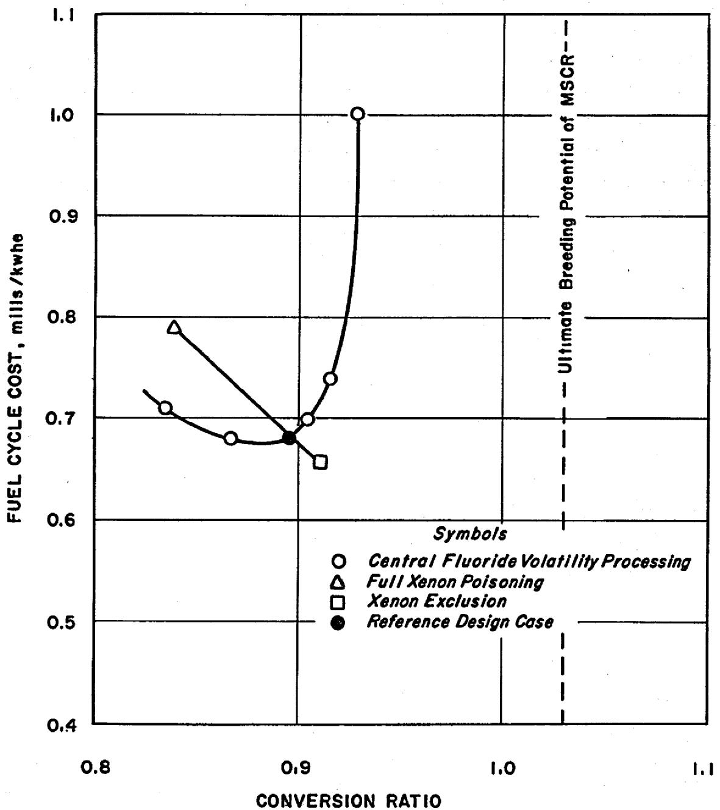  
Fig. 8.1. Nuclear Capability of 1000 Mwe Molten Salt Converter Reactor.

# 8.6 Conclusions

The 1000 Mwe MSCR requires a capital investment of $143/kwhr. The fixed charges are 3.0 mills/kwhr, the fuel cost is 0.7 mills/kwhr, the maintenance and operation expense of 0.3 mills/kwhr, and the net power cost is 4.0 mills/kwhr.

Substitution of sodium for $\mathsf{LiF - BeF}_2$ as the intermediate coolant and replacement of the Loeffler boiler-superheater complex with a more conventional sodium-heated boiler would reduce the capital investment to about $125/kwhr. Development of alternative methods of processing (e.g., precipitation of rare earth fluorides) provides potential for reducing fuel cycle cost. An examination of the neutron economy indicates that the MSCR should be capable of evolving into a self-sustaining breeder reactor (BR v1.0) not dependent on outside sources of fissile isotopes.

# 8.7 Recommendations

The comprehensive program of research and development for molten salt reactors in progress at ORNL is concerned at present with the construction and operation of the MSRE. This MSCR evaluation has disclosed certain additional areas of study, research, and development important to the realization of the nuclear and economic potential of molten salt reactors. These areas are listed below, together with specific examples in each area.

# 8.7.1 Title 1 Design Study of MSCR

This should be performed for two plant capacities (100 and 1000 Mwe) in order to detect unrecognized development problems and to verify the economic predictions made in this report. The study preferably should be conducted by an organization outside the Laboratory, but with close liaison and cooperation in special studies (e.g., nuclear design, reactor-integrated chemical processing). A study of 100 Mwe installation is desirable to bridge the gap between the MSRE (10 Mwt) and a full-scale prototype.

# 8.7.2 Conceptual Design Studies of Advanced Breeder Reactors

Prior studies have established the nuclear potential of a thermal molten salt-thorium breeder. However, this concept should be re-examined and developed in greater detail in the light of the technology accumulated in recent years. In addition, the potential of fast molten-salt breeders, including those breeding plutonium, or possibly both plutonium and $^{233}\mathrm{U}$ , should be evaluated. A number of concepts have been proposed, and it is not clear, at present, which of these offers the greatest ultimate potential coupled with the least difficulty of development.

# 8.7.3 Fundamental Studies of Alternative Chemical Processes

While the fluoride volatility process is suitable for the recovery of isotopes of uranium from short-cooled fuel, its use alone does entail the discard of the carrier salt to rid the system fission products. This fact limits the processing rate and conversion ratio in thermal reactors using valuable isotopes of lithium and beryllium, although fast reactors using fluorides of sodium and potassium, etc., are not so limited. For the thermal reactors at least, an alternative process is needed in which separation of valuable components (thorium, uranium, lithium, beryllium) from fission product isotopes is effected by transfer between fluid phases, e.g., by extraction of molten salt fuel with a liquid metal. Driving forces for the transfer can be provided by the use of active metals and easily reduced fluorides or perhaps by the application of electric potentials.

# 8.7.4 Engineering Laboratory Study of Precipitation Processing

This process, which has great potential for reducing the fuel cycle cost in the MSCR and which, by necessity, must be integrated with the operation of the reactor and placed within the reactor cell, could make the introduction of MSCR power reactor plants independent of the availability of central processing facilities for molten salts. This is an enormous advantage for the initial installations, particularly if these are widely scattered in remote locations. Also, the competitive position of the smaller installations (100 Mwe) would be improved.

# 8.7.5 Pilot Plant Study of HF Dissolution Process

This process, though not essential to the realization of the economic potential of the MSCR would, if developed, make possible the evolution of the MSCR into a self-sustaining system, and would constitute a large step in the development of two-region, two-fluid breeders.

APPENDICES

# Introduction

In this portion of the report are collected reference materials, preliminary studies, and detailed discussions that support the assumptions used or conclusions drawn in the main body of the report.

Literature references in the Appendices do not refer to the Bibliography which follows, but to separate lists of references given at the end of each sub-appendix.

# Appendix A

# MULTIGROUP CROSS SECTIONS FOR

# MSCRCALCULATIONS

C. W. Nestor

Table A.1. Group Structure   

<table><tr><td>Group</td><td>Δu</td><td>u</td><td>Energy (ev)</td></tr><tr><td>1</td><td>0.91629</td><td>0.916</td><td>4 × 10^6 → 10^7</td></tr><tr><td>2</td><td>0.69315</td><td>1.609</td><td>2 × 10^6 → 4 × 10^6</td></tr><tr><td>3</td><td>0.69315</td><td>2.302</td><td>1 → 2 × 10^6</td></tr><tr><td>4</td><td>0.20400</td><td>3.506</td><td>3 × 10^5 → 10^6</td></tr><tr><td>5</td><td>1.09860</td><td>4.605</td><td>1 × 10^5 → 3 × 10^5</td></tr><tr><td>6</td><td>1.20400</td><td>5.808</td><td>3 × 10^4 → 1 × 10^5</td></tr><tr><td>7</td><td>1.09860</td><td>6.907</td><td>1 × 10^4 → 3 × 10^4</td></tr><tr><td>8</td><td>1.20400</td><td>8.111</td><td>3 × 10^3 → 1 × 10^4</td></tr><tr><td>9</td><td>1.09860</td><td>9.210</td><td>1 × 10^3 → 3 × 10^3</td></tr><tr><td>10</td><td>0.91629</td><td>10.126</td><td>400 → 10^3</td></tr><tr><td>11</td><td>0.98083</td><td>11.107</td><td>150 → 400</td></tr><tr><td>12</td><td>0.40547</td><td>11.512</td><td>100 → 150</td></tr><tr><td>13</td><td>0.10536</td><td>11.617</td><td>90 → 100</td></tr><tr><td>14</td><td>0.11778</td><td>11.735</td><td>80 → 90</td></tr><tr><td>15</td><td>0.20764</td><td>11.942</td><td>65 → 80</td></tr><tr><td>16</td><td>0.26236</td><td>12.204</td><td>50 → 65</td></tr><tr><td>17</td><td>0.10536</td><td>12.309</td><td>45 → 50</td></tr><tr><td>18</td><td>0.19574</td><td>12.505</td><td>37 → 45</td></tr><tr><td>19</td><td>0.11441</td><td>12.619</td><td>33 → 37</td></tr><tr><td>20</td><td>0.09531</td><td>12.714</td><td>30 → 33</td></tr><tr><td>21</td><td>0.18232</td><td>12.896</td><td>25 → 30</td></tr><tr><td>22</td><td>0.22314</td><td>13.119</td><td>20 → 25</td></tr><tr><td>23</td><td>0.16252</td><td>13.282</td><td>17 → 20</td></tr><tr><td>24</td><td>0.23052</td><td>13.572</td><td>13.5 → 17</td></tr><tr><td>25</td><td>0.30010</td><td>13.813</td><td>10 → 13.5</td></tr><tr><td>26</td><td>0.28768</td><td>14.101</td><td>7.5 → 10</td></tr><tr><td>27</td><td>0.31015</td><td>14.411</td><td>5.5 → 7.5</td></tr><tr><td>28</td><td>0.31845</td><td>14.729</td><td>4 → 5.5</td></tr><tr><td>29</td><td>0.47000</td><td>15.199</td><td>2.5 → 4</td></tr><tr><td>30</td><td>0.57982</td><td>15.779</td><td>1.4 → 2.5</td></tr><tr><td>31</td><td>0.55962</td><td>16.339</td><td>0.8 → 1.4</td></tr><tr><td>32</td><td>0.28768</td><td>16.627</td><td>0.6 → 0.8</td></tr><tr><td>33 Ep. Thermal</td><td>0.31705</td><td>16.944</td><td>0.437 → 0.6</td></tr><tr><td>34 Thermal Group</td><td>(1200°F)</td><td></td><td>0.07940</td></tr></table>

Table A.2. Lithium-6   

<table><tr><td>Group</td><td>ξσT</td><td>σa</td><td>vσf</td><td>3σtr</td></tr><tr><td>1</td><td>6.16 × 10-1</td><td>6.74 × 10-2</td><td>0</td><td>5.04</td></tr><tr><td>2</td><td>4.19 × 10-1</td><td>1.618 × 10-1</td><td>0</td><td>4.76</td></tr><tr><td>3</td><td>4.36 × 10-1</td><td>2.530 × 10-1</td><td>0</td><td>3.78</td></tr><tr><td>4</td><td>2.02 × 10-1</td><td>7.142 × 10-1</td><td>0</td><td>7.59</td></tr><tr><td>5</td><td>4.99 × 10-1</td><td>1.463 × 10-1</td><td>0</td><td>1.22 × 10</td></tr><tr><td>6</td><td>4.96 × 10-1</td><td>7.680 × 10-1</td><td>0</td><td>4.55</td></tr><tr><td>7</td><td>7.38 × 10-1</td><td>1.163</td><td>0</td><td>5.92</td></tr><tr><td>8</td><td>1.11</td><td>2.057</td><td>0</td><td>9.87</td></tr><tr><td>9</td><td>1.75</td><td>3.650</td><td>0</td><td>1.67 × 10</td></tr><tr><td>10</td><td>2.62</td><td>6.020</td><td>0</td><td>2.64 × 10</td></tr><tr><td>11</td><td>4.04</td><td>9.689</td><td>0</td><td>4.07 × 10</td></tr><tr><td>12</td><td>4.81</td><td>1.359 × 10</td><td>0</td><td>5.55 × 10</td></tr><tr><td>13</td><td>5.05</td><td>1.542 × 10</td><td>0</td><td>6.24 × 10</td></tr><tr><td>14</td><td>5.32</td><td>1.631 × 10</td><td>0</td><td>6.56 × 10</td></tr><tr><td>15</td><td>5.83</td><td>1.770 × 10</td><td>0</td><td>7.07 × 10</td></tr><tr><td>16</td><td>6.52</td><td>1.991 × 10</td><td>0</td><td>7.88 × 10</td></tr><tr><td>17</td><td>6.85</td><td>2.181 × 10</td><td>0</td><td>8.56 × 10</td></tr><tr><td>18</td><td>7.48</td><td>2.353 × 10</td><td>0</td><td>9.18 × 10</td></tr><tr><td>19</td><td>7.92</td><td>2.542 × 10</td><td>0</td><td>9.85 × 10</td></tr><tr><td>20</td><td>8.28</td><td>2.678 × 10</td><td>0</td><td>1.01 × 102</td></tr><tr><td>21</td><td>8.91</td><td>2.872 × 10</td><td>0</td><td>1.10 × 102</td></tr><tr><td>22</td><td>9.93</td><td>3.179 × 10</td><td>0</td><td>1.21 × 102</td></tr><tr><td>23</td><td>1.07 × 10</td><td>3.500 × 10</td><td>0</td><td>1.32 × 102</td></tr><tr><td>24</td><td>1.20 × 10</td><td>3.863 × 10</td><td>0</td><td>1.44 × 102</td></tr><tr><td>25</td><td>1.38 × 10</td><td>4.413 × 10</td><td>0</td><td>1.63 × 102</td></tr><tr><td>26</td><td>1.57 × 10</td><td>5.110 × 10</td><td>0</td><td>1.87 × 102</td></tr><tr><td>27</td><td>1.81 × 10</td><td>5.940 × 10</td><td>0</td><td>2.14 × 102</td></tr><tr><td>28</td><td>2.12 × 10</td><td>6.950 × 10</td><td>0</td><td>2.47 × 102</td></tr><tr><td>29</td><td>2.69 × 10</td><td>8.470 × 10</td><td>0</td><td>2.97 × 102</td></tr><tr><td>30</td><td>4.35 × 10</td><td>1.100 × 102</td><td>0</td><td>3.78 × 102</td></tr><tr><td>31</td><td>5.61 × 10</td><td>1.470 × 102</td><td>0</td><td>4.90 × 102</td></tr><tr><td>32</td><td>6.39 × 10</td><td>1.810 × 102</td><td>0</td><td>5.94 × 102</td></tr><tr><td>33</td><td>7.49 × 10</td><td>2.21 × 102</td><td>0</td><td>6.70 × 102</td></tr><tr><td>34</td><td>7.49 × 10</td><td>4.720 × 102</td><td>0</td><td>1.42 × 103</td></tr></table>

Table A.3. Lithium-7   

<table><tr><td>Group</td><td>ξσT</td><td>σa</td><td>Vσf</td><td>3σtr</td></tr><tr><td>1</td><td>4.45 × 10-1</td><td>2.11 × 10-6</td><td>0</td><td>4.915</td></tr><tr><td>2</td><td>4.06 × 10-1</td><td>3.17 × 10-6</td><td>0</td><td>3.502</td></tr><tr><td>3</td><td>3.28 × 10-1</td><td>5.76 × 10-6</td><td>0</td><td>3.451</td></tr><tr><td>4</td><td>3.28 × 10-1</td><td>7.37 × 10-6</td><td>0</td><td>4.947</td></tr><tr><td>5</td><td>7.86 × 10-1</td><td>1.34 × 10-5</td><td>0</td><td>6.286</td></tr><tr><td>6</td><td>2.75 × 10-1</td><td>2.66 × 10-5</td><td>0</td><td>2.850</td></tr><tr><td>7</td><td>2.75 × 10-1</td><td>4.08 × 10-5</td><td>0</td><td>2.850</td></tr><tr><td>8</td><td>2.75 × 10-1</td><td>7.31 × 10-5</td><td>0</td><td>2.850</td></tr><tr><td>9</td><td>2.75 × 10-1</td><td>1.31 × 10-4</td><td>0</td><td>2.850</td></tr><tr><td>10</td><td>2.75 × 10-1</td><td>2.03 × 10-4</td><td>0</td><td>2.850</td></tr><tr><td>11</td><td>2.75 × 10-1</td><td>3.44 × 10-4</td><td>0</td><td>2.850</td></tr><tr><td>12</td><td>2.75 × 10-1</td><td>4.57 × 10-4</td><td>0</td><td>2.850</td></tr><tr><td>13</td><td>2.75 × 10-1</td><td>5.75 × 10-4</td><td>0</td><td>2.850</td></tr><tr><td>14</td><td>2.75 × 10-1</td><td>5.75 × 10-4</td><td>0</td><td>2.850</td></tr><tr><td>15</td><td>2.75 × 10-1</td><td>5.75 × 10-4</td><td>0</td><td>2.850</td></tr><tr><td>16</td><td>2.75 × 10-1</td><td>7.31 × 10-4</td><td>0</td><td>2.850</td></tr><tr><td>17</td><td>2.75 × 10-1</td><td>7.73 × 10-4</td><td>0</td><td>2.850</td></tr><tr><td>18</td><td>2.75 × 10-1</td><td>7.73 × 10-4</td><td>0</td><td>2.850</td></tr><tr><td>19</td><td>2.75 × 10-1</td><td>8.73 × 10-4</td><td>0</td><td>2.850</td></tr><tr><td>20</td><td>2.75 × 10-1</td><td>1.11 × 10-3</td><td>0</td><td>2.850</td></tr><tr><td>21</td><td>2.75 × 10-1</td><td>1.11 × 10-3</td><td>0</td><td>2.850</td></tr><tr><td>22</td><td>2.75 × 10-1</td><td>1.11 × 10-3</td><td>0</td><td>2.850</td></tr><tr><td>23</td><td>2.75 × 10-1</td><td>1.11 × 10-3</td><td>0</td><td>2.850</td></tr><tr><td>24</td><td>2.75 × 10-1</td><td>1.30 × 10-3</td><td>0</td><td>2.850</td></tr><tr><td>25</td><td>2.75 × 10-1</td><td>1.50 × 10-3</td><td>0</td><td>2.850</td></tr><tr><td>26</td><td>2.75 × 10-1</td><td>2.00 × 10-3</td><td>0</td><td>2.850</td></tr><tr><td>27</td><td>2.75 × 10-1</td><td>2.00 × 10-3</td><td>0</td><td>2.850</td></tr><tr><td>28</td><td>2.75 × 10-1</td><td>2.55 × 10-3</td><td>0</td><td>2.850</td></tr><tr><td>29</td><td>2.75 × 10-1</td><td>3.36 × 10-3</td><td>0</td><td>2.850</td></tr><tr><td>30</td><td>2.75 × 10-1</td><td>3.36 × 10-3</td><td>0</td><td>2.850</td></tr><tr><td>31</td><td>2.75 × 10-1</td><td>5.12 × 10-3</td><td>0</td><td>2.850</td></tr><tr><td>32</td><td>2.75 × 10-1</td><td>6.17 × 10-3</td><td>0</td><td>2.850</td></tr><tr><td>33</td><td>2.75 × 10-1</td><td>7.24 × 10-3</td><td>0</td><td>2.850</td></tr><tr><td>34</td><td>2.75 × 10-1</td><td>1.66 × 10-2</td><td>0</td><td>2.850</td></tr></table>

Table A.4. Beryllium-9   

<table><tr><td>Group</td><td>\( \xi \sigma_{\mathrm {T}} \)</td><td>\( \overline{\sigma}_{a} \)</td><td>\( \overline{v\sigma}_{f} \)</td><td>\( 3\overline{\sigma}_{tr} \)</td></tr><tr><td>1</td><td>0.4608</td><td>6.3425 × 10-7</td><td>0</td><td>5.2490</td></tr><tr><td>2</td><td>0.3240</td><td>9.4485 × 10-7</td><td>0</td><td>6.6160</td></tr><tr><td>3</td><td>0.6813</td><td>1.3362 × 10-6</td><td>0</td><td>6.6919</td></tr><tr><td>4</td><td>0.8700</td><td>2.1688 × 10-6</td><td>0</td><td>1.0649 × 10</td></tr><tr><td>5</td><td>1.1913</td><td>3.8471 × 10-6</td><td>0</td><td>1.3588 × 10</td></tr><tr><td>6</td><td>1.2122</td><td>6.8585 × 10-6</td><td>0</td><td>1.6068 × 10</td></tr><tr><td>7</td><td>1.2122</td><td>1.2165 × 10-5</td><td>0</td><td>1.6112 × 10</td></tr><tr><td>8</td><td>1.2122</td><td>2.1688 × 10-5</td><td>0</td><td>1.6112 × 10</td></tr><tr><td>9</td><td>1.2122</td><td>2.8471 × 10-5</td><td>0</td><td>1.6112 × 10</td></tr><tr><td>10</td><td>1.2122</td><td>6.3425 × 10-5</td><td>0</td><td>1.6112 × 10</td></tr><tr><td>11</td><td>1.2122</td><td>1.0204 × 10-4</td><td>0</td><td>1.6112 × 10</td></tr><tr><td>12</td><td>1.2122</td><td>1.4312 × 10-4</td><td>0</td><td>1.6112 × 10</td></tr><tr><td>13</td><td>1.2122</td><td>1.6236 × 10-4</td><td>0</td><td>1.6112 × 10</td></tr><tr><td>14</td><td>1.2122</td><td>1.7167 × 10-4</td><td>0</td><td>1.6112 × 10</td></tr><tr><td>15</td><td>1.2122</td><td>1.8628 × 10-4</td><td>0</td><td>1.6112 × 10</td></tr><tr><td>16</td><td>1.2122</td><td>2.0956 × 10-4</td><td>0</td><td>1.6112 × 10</td></tr><tr><td>17</td><td>1.2122</td><td>2.2960 × 10-4</td><td>0</td><td>1.6112 × 10</td></tr><tr><td>18</td><td>1.2122</td><td>2.4762 × 10-4</td><td>0</td><td>1.6112 × 10</td></tr><tr><td>19</td><td>1.2122</td><td>2.6752 × 10-4</td><td>0</td><td>1.6112 × 10</td></tr><tr><td>20</td><td>1.2122</td><td>2.8190 × 10-4</td><td>0</td><td>1.6112 × 10</td></tr><tr><td>21</td><td>1.2122</td><td>3.0224 × 10-4</td><td>0</td><td>1.6112 × 10</td></tr><tr><td>22</td><td>1.2122</td><td>3.3454 × 10-4</td><td>0</td><td>1.6112 × 10</td></tr><tr><td>23</td><td>1.2122</td><td>3.6832 × 10-4</td><td>0</td><td>1.6112 × 10</td></tr><tr><td>24</td><td>1.2122</td><td>4.0646 × 10-4</td><td>0</td><td>1.6112 × 10</td></tr><tr><td>25</td><td>1.2122</td><td>4.6430 × 10-4</td><td>0</td><td>1.6112 × 10</td></tr><tr><td>26</td><td>1.2122</td><td>5.3775 × 10-4</td><td>0</td><td>1.6112 × 10</td></tr><tr><td>27</td><td>1.2122</td><td>6.2450 × 10-4</td><td>0</td><td>1.6112 × 10</td></tr><tr><td>28</td><td>1.2122</td><td>7.3085 × 10-4</td><td>0</td><td>1.6112 × 10</td></tr><tr><td>29</td><td>1.2122</td><td>8.1920 × 10-4</td><td>0</td><td>1.6112 × 10</td></tr><tr><td>30</td><td>1.2122</td><td>1.1601 × 10-3</td><td>0</td><td>1.6112 × 10</td></tr><tr><td>31</td><td>1.2122</td><td>1.5142 × 10-3</td><td>0</td><td>1.6112 × 10</td></tr><tr><td>32</td><td>1.2122</td><td>1.9013 × 10-3</td><td>0</td><td>1.6112 × 10</td></tr><tr><td>33</td><td>1.24</td><td>2.15 × 10-3</td><td>0</td><td>1.611 × 10</td></tr><tr><td>34</td><td>1.24</td><td>5.048 × 10-3</td><td>0</td><td>1.611 × 10</td></tr></table>

Table A.5. Carbon-12   

<table><tr><td>Group</td><td>ξσT</td><td>σa</td><td>Vσf</td><td>3σtr</td></tr><tr><td>1</td><td>0.303676</td><td>2.1565 × 10-7</td><td>0</td><td>3.7354</td></tr><tr><td>2</td><td>0.2686</td><td>3.213</td><td>0</td><td>5.4204</td></tr><tr><td>3</td><td>0.4108</td><td>4.544</td><td>0</td><td>0.0604</td></tr><tr><td>4</td><td>0.6241</td><td>7.380</td><td>0</td><td>9.2352</td></tr><tr><td>5</td><td>0.694568</td><td>1.308 × 10-6</td><td>0</td><td>1.19114 × 10</td></tr><tr><td>6</td><td>0.74181</td><td>2.332 × 10-6</td><td>0</td><td>1.28686 × 10</td></tr><tr><td>7</td><td>0.7584</td><td>4.187 × 10-6</td><td>0</td><td>1.35370 × 10</td></tr><tr><td>8</td><td>0.7584</td><td>7.375 × 10-6</td><td>0</td><td>1.35936 × 10</td></tr><tr><td>9</td><td>0.7584</td><td>1.308 × 10-5</td><td>0</td><td>1.35936 × 10</td></tr><tr><td>10</td><td>0.7584</td><td>2.157</td><td>0</td><td>1.35936 × 10</td></tr><tr><td>11</td><td>0.7584</td><td>3.470</td><td>0</td><td>1.35936 × 10</td></tr><tr><td>12</td><td>0.7584</td><td>4.866</td><td>0</td><td>1.35936 × 10</td></tr><tr><td>13</td><td>0.7584</td><td>5.520</td><td>0</td><td>1.35936 × 10</td></tr><tr><td>14</td><td>0.7584</td><td>5.830</td><td>0</td><td>1.35936 × 10</td></tr><tr><td>15</td><td>0.7584</td><td>6.335</td><td>0</td><td>1.35936 × 10</td></tr><tr><td>16</td><td>0.7584</td><td>7.125</td><td>0</td><td>1.35936 × 10</td></tr><tr><td>17</td><td>0.7584</td><td>7.805</td><td>0</td><td>1.35936 × 10</td></tr><tr><td>18</td><td>0.7584</td><td>8.420</td><td>0</td><td>1.35936 × 10</td></tr><tr><td>19</td><td>0.7584</td><td>9.095</td><td>0</td><td>1.35936 × 10</td></tr><tr><td>20</td><td>0.7584</td><td>9.585</td><td>0</td><td>1.35936 × 10</td></tr><tr><td>21</td><td>0.7584</td><td>1.028 × 10-4</td><td>0</td><td>1.35936 × 10</td></tr><tr><td>22</td><td>0.7584</td><td>1.138</td><td>0</td><td>1.35936 × 10</td></tr><tr><td>23</td><td>0.7584</td><td>1.253</td><td>0</td><td>1.35936 × 10</td></tr><tr><td>24</td><td>0.7584</td><td>1.382</td><td>0</td><td>1.35936 × 10</td></tr><tr><td>25</td><td>0.7584</td><td>1.579</td><td>0</td><td>1.35936 × 10</td></tr><tr><td>26</td><td>0.7584</td><td>1.829</td><td>0</td><td>1.35936 × 10</td></tr><tr><td>27</td><td>0.7584</td><td>2.124</td><td>0</td><td>1.35936 × 10</td></tr><tr><td>28</td><td>0.7584</td><td>2.485</td><td>0</td><td>1.35936 × 10</td></tr><tr><td>29</td><td>0.7584</td><td>3.030</td><td>0</td><td>1.35936 × 10</td></tr><tr><td>30</td><td>0.7584</td><td>3.944</td><td>0</td><td>1.35936 × 10</td></tr><tr><td>31</td><td>0.7584</td><td>5.245</td><td>0</td><td>1.35936 × 10</td></tr><tr><td>32</td><td>0.7584</td><td>6.465</td><td>0</td><td>1.35936 × 10</td></tr><tr><td>33</td><td>7.585 × 10-1</td><td>1.85 × 10-3</td><td>0</td><td>1.359 × 10</td></tr><tr><td>34</td><td>7.585 × 10-1</td><td>5.048 × 10-3</td><td>0</td><td>1.359 × 10</td></tr></table>

Table A.6. Fluorine-19   

<table><tr><td>Group</td><td>ξσT</td><td>σa</td><td>vσf</td><td>3σtr</td></tr><tr><td>1</td><td>1.62 × 10-1</td><td>2.00 × 10-1</td><td>0</td><td>5.40</td></tr><tr><td>2</td><td>2.00 × 10-1</td><td>0</td><td>0</td><td>7.50</td></tr><tr><td>3</td><td>3.45 × 10-1</td><td>0</td><td>0</td><td>9.60</td></tr><tr><td>4</td><td>3.50 × 10-1</td><td>1.00 × 10-3</td><td>0</td><td>1.35 × 10</td></tr><tr><td>5</td><td>7.70 × 10-1</td><td>1.00 × 10-3</td><td>0</td><td>2.40 × 10</td></tr><tr><td>6</td><td>2.55 × 10-1</td><td>3.00 × 10-3</td><td>0</td><td>1.50 × 10</td></tr><tr><td>7</td><td>4.35 × 10-1</td><td>0</td><td>0</td><td>1.35 × 10</td></tr><tr><td>8</td><td>3.70 × 10-1</td><td>0</td><td>0</td><td>1.11 × 10</td></tr><tr><td>9</td><td>3.70 × 10-1</td><td>0</td><td>0</td><td>1.11 × 10</td></tr><tr><td>10</td><td>3.70 × 10-1</td><td>0</td><td>0</td><td>1.11 × 10</td></tr><tr><td>11</td><td>3.70 × 10-1</td><td>0</td><td>0</td><td>1.11 × 10</td></tr><tr><td>12</td><td>3.70 × 10-1</td><td>0</td><td>0</td><td>1.11 × 10</td></tr><tr><td>13</td><td>3.50 × 10-1</td><td>0</td><td>0</td><td>1.05 × 10</td></tr><tr><td>14</td><td>3.50 × 10-1</td><td>0</td><td>0</td><td>1.05 × 10</td></tr><tr><td>15</td><td>3.50 × 10-1</td><td>0</td><td>0</td><td>1.05 × 10</td></tr><tr><td>16</td><td>3.50 × 10-1</td><td>0</td><td>0</td><td>1.05 × 10</td></tr><tr><td>17</td><td>3.50 × 10-1</td><td>0</td><td>0</td><td>1.05 × 10</td></tr><tr><td>18</td><td>3.50 × 10-1</td><td>0</td><td>0</td><td>1.05 × 10</td></tr><tr><td>19</td><td>3.50 × 10-1</td><td>0</td><td>0</td><td>1.05 × 10</td></tr><tr><td>20</td><td>3.50 × 10-1</td><td>0</td><td>0</td><td>1.05 × 10</td></tr><tr><td>21</td><td>3.50 × 10-1</td><td>0</td><td>0</td><td>1.05 × 10</td></tr><tr><td>22</td><td>3.50 × 10-1</td><td>0</td><td>0</td><td>1.05 × 10</td></tr><tr><td>23</td><td>3.50 × 10-1</td><td>0</td><td>0</td><td>1.05 × 10</td></tr><tr><td>24</td><td>3.50 × 10-1</td><td>0</td><td>0</td><td>1.05 × 10</td></tr><tr><td>25</td><td>3.50 × 10-1</td><td>0</td><td>0</td><td>1.05 × 10</td></tr><tr><td>26</td><td>3.50 × 10-1</td><td>0</td><td>0</td><td>1.05 × 10</td></tr><tr><td>27</td><td>3.50 × 10-1</td><td>0</td><td>0</td><td>1.05 × 10</td></tr><tr><td>28</td><td>3.50 × 10-1</td><td>0</td><td>0</td><td>1.05 × 10</td></tr><tr><td>29</td><td>3.50 × 10-1</td><td>0</td><td>0</td><td>1.05 × 10</td></tr><tr><td>30</td><td>3.50 × 10-1</td><td>0</td><td>0</td><td>1.05 × 10</td></tr><tr><td>31</td><td>3.50 × 10-1</td><td>0</td><td>0</td><td>1.05 × 10</td></tr><tr><td>32</td><td>3.50 × 10-1</td><td>0</td><td>0</td><td>1.05 × 10</td></tr><tr><td>33</td><td>3.59 × 10-1</td><td>1.80 × 10-3</td><td>0</td><td>1.05 × 10</td></tr><tr><td>34</td><td>3.59 × 10-1</td><td>4.5 × 10-3</td><td>0</td><td>1.05 × 10</td></tr></table>

Table A.7. INOR-8   

<table><tr><td>Group</td><td>ξσT</td><td>σa</td><td>νσf</td><td>3σtr</td></tr><tr><td>1</td><td>5.98 × 10-1</td><td>1.868 × 10-1</td><td>0</td><td>10.347</td></tr><tr><td>2</td><td>5.89 × 10-1</td><td>1.904 × 10-1</td><td>0</td><td>10.693</td></tr><tr><td>3</td><td>6.98 × 10-1</td><td>1.936 × 10-1</td><td>0</td><td>10.521</td></tr><tr><td>4</td><td>1.010</td><td>1.972 × 10-1</td><td>0</td><td>10.760</td></tr><tr><td>5</td><td>2.375</td><td>2.006 × 10-1</td><td>0</td><td>13.270</td></tr><tr><td>6</td><td>3.158</td><td>2.031 × 10-1</td><td>0</td><td>14.48</td></tr><tr><td>7</td><td>3.165</td><td>2.057 × 10-1</td><td>0</td><td>20.793</td></tr><tr><td>8</td><td>3.175</td><td>2.096 × 10-1</td><td>0</td><td>42.011</td></tr><tr><td>9</td><td>3.010</td><td>2.264 × 10-1</td><td>0</td><td>48.153</td></tr><tr><td>10</td><td>2.939</td><td>2.544 × 10-1</td><td>0</td><td>54.372</td></tr><tr><td>11</td><td>2.930</td><td>3.531 × 10-1</td><td>0</td><td>59.116</td></tr><tr><td>12</td><td>2.941</td><td>5.778 × 10-1</td><td>0</td><td>57.442</td></tr><tr><td>13</td><td>2.967</td><td>1.159</td><td></td><td>56.977</td></tr><tr><td>14</td><td>2.967</td><td>1.159</td><td></td><td>57.488</td></tr><tr><td>15</td><td>2.967</td><td>1.159</td><td></td><td>57.58</td></tr><tr><td>16</td><td>2.967</td><td>1.159</td><td></td><td>57.62</td></tr><tr><td>17</td><td>2.967</td><td>1.160</td><td></td><td>58.23</td></tr><tr><td>18</td><td>2.967</td><td>1.161</td><td></td><td>57.30</td></tr><tr><td>19</td><td>2.977</td><td>9.800 × 10-1</td><td>0</td><td>56.00</td></tr><tr><td>20</td><td>3.018</td><td>2.009 × 10-1</td><td>0</td><td>57.070</td></tr><tr><td>21</td><td>3.018</td><td>2.016 × 10-1</td><td>0</td><td>56.140</td></tr><tr><td>22</td><td>3.018</td><td>2.027 × 10-1</td><td>0</td><td>57.349</td></tr><tr><td>23</td><td>3.018</td><td>2.043 × 10-1</td><td>0</td><td>58.698</td></tr><tr><td>24</td><td>2.995</td><td>2.092 × 10-1</td><td>0</td><td>57.628</td></tr><tr><td>25</td><td>2.978</td><td>2.291 × 10-1</td><td>0</td><td>58.698</td></tr><tr><td>26</td><td>3.077</td><td>2.652 × 10-1</td><td>0</td><td>58.837</td></tr><tr><td>27</td><td>3.077</td><td>3.038 × 10-1</td><td>0</td><td>58.930</td></tr><tr><td>28</td><td>3.156</td><td>3.554 × 10-1</td><td>0</td><td>59.116</td></tr><tr><td>29</td><td>3.270</td><td>4.215 × 10-1</td><td>0</td><td>58.279</td></tr><tr><td>30</td><td>3.270</td><td>5.099 × 10-1</td><td>0</td><td>58.279</td></tr><tr><td>31</td><td>3.141</td><td>6.740 × 10-1</td><td>0</td><td>57.349</td></tr><tr><td>32</td><td>3.152</td><td>8.809 × 10-1</td><td>0</td><td>57.74</td></tr><tr><td>33</td><td>3.285</td><td>1.258</td><td></td><td>58.695</td></tr><tr><td>34</td><td>3.285</td><td>2.874</td><td></td><td>58.693</td></tr></table>

Table A.8. Xenon-135   

<table><tr><td>Group</td><td>ξσT</td><td>σa</td><td>vσf</td><td>3σtr</td></tr><tr><td>1</td><td>0</td><td>7.43 × 10-2</td><td>0</td><td>0</td></tr><tr><td>2</td><td>0</td><td>3.908 × 10-1</td><td>0</td><td>0</td></tr><tr><td>3</td><td>0</td><td>7.242 × 10-1</td><td>0</td><td>0</td></tr><tr><td>4</td><td>0</td><td>9.843 × 10-1</td><td>0</td><td>0</td></tr><tr><td>5</td><td>0</td><td>9.546 × 10-1</td><td>0</td><td>0</td></tr><tr><td>6</td><td>0</td><td>3.960 × 10-1</td><td>0</td><td>0</td></tr><tr><td>7</td><td>0</td><td>1.515 × 10</td><td>0</td><td>0</td></tr><tr><td>8</td><td>0</td><td>3.045 × 10</td><td>0</td><td>0</td></tr><tr><td>9</td><td>0</td><td>5.133 × 10</td><td>0</td><td>0</td></tr><tr><td>10</td><td>0</td><td>8.580 × 10</td><td>0</td><td>0</td></tr><tr><td>11</td><td>0</td><td>1.047 × 102</td><td>0</td><td>0</td></tr><tr><td>12</td><td>0</td><td>1.870 × 102</td><td>0</td><td>0</td></tr><tr><td>13</td><td>0</td><td>2.198 × 102</td><td>0</td><td>0</td></tr><tr><td>14</td><td>0</td><td>2.198 × 102</td><td>0</td><td>0</td></tr><tr><td>15</td><td>0</td><td>2.198 × 102</td><td>0</td><td>0</td></tr><tr><td>16</td><td>0</td><td>3.050 × 102</td><td>0</td><td>0</td></tr><tr><td>17</td><td>0</td><td>3.282 × 102</td><td>0</td><td>0</td></tr><tr><td>18</td><td>0</td><td>3.282 × 102</td><td>0</td><td>0</td></tr><tr><td>19</td><td>0</td><td>4.222 × 102</td><td>0</td><td>0</td></tr><tr><td>20</td><td>0</td><td>8.254 × 102</td><td>0</td><td>0</td></tr><tr><td>21</td><td>0</td><td>8.254 × 102</td><td>0</td><td>0</td></tr><tr><td>22</td><td>0</td><td>8.254 × 102</td><td>0</td><td>0</td></tr><tr><td>23</td><td>0</td><td>8.254 × 102</td><td>0</td><td>0</td></tr><tr><td>24</td><td>0</td><td>7.035 × 102</td><td>0</td><td>0</td></tr><tr><td>25</td><td>0</td><td>6.781 × 102</td><td>0</td><td>0</td></tr><tr><td>26</td><td>0</td><td>2.439 × 103</td><td>0</td><td>0</td></tr><tr><td>27</td><td>0</td><td>2.439 × 103</td><td>0</td><td>0</td></tr><tr><td>28</td><td>0</td><td>8.561 × 103</td><td>0</td><td>0</td></tr><tr><td>29</td><td>0</td><td>1.720 × 104</td><td>0</td><td>0</td></tr><tr><td>30</td><td>0</td><td>1.720 × 104</td><td>0</td><td>0</td></tr><tr><td>31</td><td>0</td><td>2.100 × 104</td><td>0</td><td>0</td></tr><tr><td>32</td><td>0</td><td>5.697 × 104</td><td>0</td><td>0</td></tr><tr><td>33</td><td>0</td><td>4.20 × 104</td><td>0</td><td>0</td></tr><tr><td>34</td><td>0</td><td>1.60 × 106</td><td>0</td><td>0</td></tr></table>

Table A.9. Samarium-149   

<table><tr><td>Group</td><td>ξσT</td><td>σa</td><td>νσf</td><td>3σtr</td></tr><tr><td>1</td><td>0</td><td>3.000 × 10-1</td><td>0</td><td>0</td></tr><tr><td>2</td><td>0</td><td>3.000 × 10-1</td><td>0</td><td>0</td></tr><tr><td>3</td><td>0</td><td>3.262 × 10-1</td><td>0</td><td>0</td></tr><tr><td>4</td><td>0</td><td>3.600 × 10-1</td><td>0</td><td>0</td></tr><tr><td>5</td><td>0</td><td>1.027</td><td>0</td><td>0</td></tr><tr><td>6</td><td>0</td><td>1.570</td><td>0</td><td>0</td></tr><tr><td>7</td><td>0</td><td>1.570</td><td>0</td><td>0</td></tr><tr><td>8</td><td>0</td><td>2.240</td><td>0</td><td>0</td></tr><tr><td>9</td><td>0</td><td>1.641 × 10</td><td>0</td><td>0</td></tr><tr><td>10</td><td>0</td><td>4.857 × 10</td><td>0</td><td>0</td></tr><tr><td>11</td><td>0</td><td>4.857 × 10</td><td>0</td><td>0</td></tr><tr><td>12</td><td>0</td><td>8.829 × 10</td><td>0</td><td>0</td></tr><tr><td>13</td><td>0</td><td>1.911 × 102</td><td>0</td><td>0</td></tr><tr><td>14</td><td>0</td><td>1.911 × 102</td><td>0</td><td>0</td></tr><tr><td>15</td><td>0</td><td>1.911 × 102</td><td>0</td><td>0</td></tr><tr><td>16</td><td>0</td><td>1.756 × 102</td><td>0</td><td>0</td></tr><tr><td>17</td><td>0</td><td>1.714 × 102</td><td>0</td><td>0</td></tr><tr><td>18</td><td>0</td><td>1.714 × 102</td><td>0</td><td>0</td></tr><tr><td>19</td><td>0</td><td>1.586 × 102</td><td>0</td><td>0</td></tr><tr><td>20</td><td>0</td><td>1.037 × 102</td><td>0</td><td>0</td></tr><tr><td>21</td><td>0</td><td>1.037 × 102</td><td>0</td><td>0</td></tr><tr><td>22</td><td>0</td><td>1.037 × 102</td><td>0</td><td>0</td></tr><tr><td>23</td><td>0</td><td>1.037 × 102</td><td>0</td><td>0</td></tr><tr><td>24</td><td>0</td><td>1.463 × 102</td><td>0</td><td>0</td></tr><tr><td>25</td><td>0</td><td>1.887 × 102</td><td>0</td><td>0</td></tr><tr><td>26</td><td>0</td><td>5.991 × 102</td><td>0</td><td>0</td></tr><tr><td>27</td><td>0</td><td>5.991 × 102</td><td>0</td><td>0</td></tr><tr><td>28</td><td>0</td><td>5.991 × 102</td><td>0</td><td>0</td></tr><tr><td>29</td><td>0</td><td>1.000 × 102</td><td>0</td><td>0</td></tr><tr><td>30</td><td>0</td><td>1.000 × 102</td><td>0</td><td>0</td></tr><tr><td>31</td><td>0</td><td>1.391 × 103</td><td>0</td><td>0</td></tr><tr><td>32</td><td>0</td><td>4.774 × 103</td><td>0</td><td>0</td></tr><tr><td>33</td><td>0</td><td>7.95 × 102</td><td>0</td><td>0</td></tr><tr><td>34</td><td>0</td><td>4.20 × 104</td><td>0</td><td>0</td></tr></table>

Table A.10. Samarium-151   

<table><tr><td>Group</td><td>ξσT</td><td>σa</td><td>νσf</td><td>3σtr</td></tr><tr><td>0-26</td><td>0</td><td>0</td><td>0</td><td>0</td></tr><tr><td>27</td><td>0</td><td>5.50 × 102</td><td>0</td><td>0</td></tr><tr><td>28</td><td>0</td><td>0</td><td>0</td><td>0</td></tr><tr><td>29</td><td>0</td><td>1.30 × 102</td><td>0</td><td>0</td></tr><tr><td>30</td><td>0</td><td>7.20 × 102</td><td>0</td><td>0</td></tr><tr><td>31</td><td>0</td><td>2.28 × 103</td><td>0</td><td>0</td></tr><tr><td>32</td><td>0</td><td>7.25 × 102</td><td>0</td><td>0</td></tr><tr><td>33</td><td>0</td><td>9.80 × 102</td><td>0</td><td>0</td></tr><tr><td>34</td><td>0</td><td>4.91 × 103</td><td>0</td><td>0</td></tr></table>

Table A.11. Thorium-232 (Infinite Dilution)*   

<table><tr><td>Group</td><td>ξσT</td><td>σa</td><td>vσf</td><td>3σtr</td></tr><tr><td>1</td><td>6.100 × 10-2</td><td>0.2408</td><td>5.642 × 10-1</td><td>1.883 × 10</td></tr><tr><td>2</td><td>5.669 × 10-2</td><td>0.1684</td><td>3.190 × 10-1</td><td>1.998 × 10</td></tr><tr><td>3</td><td>5.841 × 10-2</td><td>0.1450</td><td>1.306 × 10-1</td><td>1.966 × 10</td></tr><tr><td>4</td><td>8.160 × 10-2</td><td>0.1622</td><td>0</td><td>2.366 × 10</td></tr><tr><td>5</td><td>1.039 × 10-1</td><td>0.2708</td><td>0</td><td>3.132 × 10</td></tr><tr><td>6</td><td>1.119 × 10-1</td><td>0.4627</td><td>0</td><td>3.718 × 10</td></tr><tr><td>7</td><td>1.130 × 10-1</td><td>0.5680</td><td>0</td><td>3.739 × 10</td></tr><tr><td>8</td><td>1.156 × 10-1</td><td>0.7958</td><td>0</td><td>3.739 × 10</td></tr><tr><td>9</td><td>1.168 × 10-1</td><td>1.029</td><td>0</td><td>3.739 × 10</td></tr><tr><td>10</td><td>1.180 × 10-1</td><td>1.168</td><td>0</td><td>3.739 × 10</td></tr><tr><td>11</td><td>1.339 × 10-1</td><td>7.234</td><td>0</td><td>4.658 × 10</td></tr><tr><td>12</td><td>1.824 × 10-1</td><td>20.802</td><td>0</td><td>6.349 × 10</td></tr><tr><td>13</td><td>1.202 × 10-1</td><td>1.481</td><td>0</td><td>3.739 × 10</td></tr><tr><td>14</td><td>1.204 × 10-1</td><td>1.502</td><td>0</td><td>3.739 × 10</td></tr><tr><td>15</td><td>2.301 × 10-1</td><td>82.755</td><td>0</td><td>8.040 × 10</td></tr><tr><td>16</td><td>1.728 × 10-1</td><td>16.568</td><td>0</td><td>6.014 × 10</td></tr><tr><td>17</td><td>1.213 × 10-1</td><td>1.615</td><td>0</td><td>3.739 × 10</td></tr><tr><td>18</td><td>1.217 × 10-1</td><td>1.646</td><td>0</td><td>3.739 × 10</td></tr><tr><td>19</td><td>1.219 × 10-1</td><td>1.678</td><td>0</td><td>3.739 × 10</td></tr><tr><td>20</td><td>1.221 × 10-1</td><td>1.701</td><td>0</td><td>3.739 × 10</td></tr><tr><td>21</td><td>1.224 × 10-1</td><td>1.731</td><td>0</td><td>3.739 × 10</td></tr><tr><td>22</td><td>5.117 × 10-1</td><td>198.0</td><td>0</td><td>1.781 × 10</td></tr><tr><td>23</td><td>1.232 × 10-1</td><td>1.819</td><td>0</td><td>3.739 × 10</td></tr><tr><td>24</td><td>1.236 × 10-1</td><td>1.864</td><td>0</td><td>3.739 × 10</td></tr><tr><td>25</td><td>1.242 × 10-1</td><td>1.927</td><td>0</td><td>3.739 × 10</td></tr><tr><td>26</td><td>1.249 × 10-1</td><td>2.000</td><td>0</td><td>3.739 × 10</td></tr><tr><td>27</td><td>1.256 × 10-1</td><td>2.076</td><td>0</td><td>3.739 × 10</td></tr><tr><td>28</td><td>1.263 × 10-1</td><td>2.160</td><td>0</td><td>3.739 × 10</td></tr><tr><td>29</td><td>1.274 × 10-1</td><td>2.269</td><td>0</td><td>3.739 × 10</td></tr><tr><td>30</td><td>1.290 × 10-1</td><td>2.424</td><td>0</td><td>3.739 × 10</td></tr><tr><td>31</td><td>1.305 × 10-1</td><td>2.604</td><td>0</td><td>3.739 × 10</td></tr><tr><td>32</td><td>1.314 × 10-1</td><td>2.745</td><td>0</td><td>3.739 × 10</td></tr><tr><td>33</td><td>1.324 × 10-1</td><td>2.848</td><td>0</td><td>4.591 × 10</td></tr><tr><td>34</td><td>1.324 × 10-1</td><td>3.77</td><td>0</td><td>4.87 × 10</td></tr></table>

Table A.12. Protactinium-233   

<table><tr><td>Group</td><td>ξσT</td><td>σa</td><td>vσf</td><td>3σtr</td></tr><tr><td>1</td><td>4.285 × 10-2</td><td>0.002403</td><td>0</td><td>1.496 × 10</td></tr><tr><td>2</td><td>4.286 × 10-2</td><td>0.00358</td><td>0</td><td>1.496 × 10</td></tr><tr><td>3</td><td>8.569 × 10-2</td><td>0.00506</td><td>0</td><td>1.496 × 10</td></tr><tr><td>4</td><td>8.577 × 10-2</td><td>0.00822</td><td>0</td><td>2.991 × 10</td></tr><tr><td>5</td><td>8.589 × 10-2</td><td>0.01457</td><td>0</td><td>2.991 × 10</td></tr><tr><td>6</td><td>8.613 × 10-2</td><td>0.02599</td><td>0</td><td>2.991 × 10</td></tr><tr><td>7</td><td>8.652 × 10-2</td><td>0.4609</td><td>0</td><td>2.991 × 10</td></tr><tr><td>8</td><td>8.728 × 10-2</td><td>0.08218</td><td>0</td><td>2.991 × 10</td></tr><tr><td>9</td><td>8.851 × 10-2</td><td>0.1457</td><td>0</td><td>2.991 × 10</td></tr><tr><td>10</td><td>9.020 × 10-2</td><td>0.2403</td><td>0</td><td>2.991 × 10</td></tr><tr><td>11</td><td>9.312 × 10-2</td><td>0.3866</td><td>0</td><td>2.991 × 10</td></tr><tr><td>12</td><td>9.480 × 10-2</td><td>0.5422</td><td>0</td><td>2.991 × 10</td></tr><tr><td>13</td><td>9.530 × 10-2</td><td>0.6151</td><td>0</td><td>2.991 × 10</td></tr><tr><td>14</td><td>9.589 × 10-2</td><td>0.6502</td><td>0</td><td>2.991 × 10</td></tr><tr><td>15</td><td>9.702 × 10-2</td><td>0.7059</td><td>0</td><td>2.991 × 10</td></tr><tr><td>16</td><td>9.862 × 10-2</td><td>0.7939</td><td>0</td><td>2.991 × 10</td></tr><tr><td>17</td><td>9.932 × 10-2</td><td>0.8697</td><td>0</td><td>2.991 × 10</td></tr><tr><td>18</td><td>1.007 × 10-1</td><td>1.1608</td><td>0</td><td>2.991 × 10</td></tr><tr><td>19</td><td>1.016 × 10-1</td><td>1.0130</td><td>0</td><td>2.991 × 10</td></tr><tr><td>20</td><td>1.024 × 10-1</td><td>1.0680</td><td>0</td><td>2.991 × 10</td></tr><tr><td>21</td><td>1.040 × 10-1</td><td>1.145</td><td>0</td><td>2.991 × 10</td></tr><tr><td>22</td><td>1.062 × 10-1</td><td>1.267</td><td>0</td><td>2.991 × 10</td></tr><tr><td>23</td><td>1.079 × 10-1</td><td>1.396</td><td>0</td><td>2.991 × 10</td></tr><tr><td>24</td><td>1.106 × 10-1</td><td>1.540</td><td>0</td><td>2.991 × 10</td></tr><tr><td>25</td><td>1.147 × 10-1</td><td>1.759</td><td>0</td><td>2.991 × 10</td></tr><tr><td>26</td><td>1.192 × 10-1</td><td>2.037</td><td>0</td><td>2.991 × 10</td></tr><tr><td>27</td><td>1.248 × 10-1</td><td>2.366</td><td>0</td><td>2.991 × 10</td></tr><tr><td>Group</td><td>ξσT</td><td>σa</td><td>νσf</td><td>3σtr</td></tr><tr><td>28</td><td>1.316 × 10-1</td><td>2.769</td><td>0</td><td>2.991 × 10</td></tr><tr><td>29</td><td>1.438 × 10-1</td><td>3.376</td><td>0</td><td>2.991 × 10</td></tr><tr><td>30</td><td>1.630 × 10-1</td><td>737.0</td><td>0</td><td>2.991 × 10</td></tr><tr><td>31</td><td>1.885 × 10-1</td><td>764.0</td><td>0</td><td>2.991 × 10</td></tr><tr><td>32</td><td>2.044 × 10-1</td><td>7.204</td><td>0</td><td>2.991 × 10</td></tr><tr><td>33</td><td>2.25 × 10-2</td><td>8.374</td><td>0</td><td>7.486 × 10</td></tr><tr><td>34</td><td>2.25 × 10-1</td><td>18.943</td><td>0</td><td>1.32 × 102</td></tr></table>

Table A.13. Uranium-233   

<table><tr><td>Group</td><td>ξσT</td><td>σa</td><td>vσf</td><td>3σtr</td><td>η</td><td>v</td></tr><tr><td>1</td><td>7.400 × 10-2</td><td>1.940</td><td>6.570</td><td>1.230 × 10</td><td>3.39</td><td>3.39</td></tr><tr><td>2</td><td>7.110 × 10-2</td><td>1.810</td><td>5.190</td><td>1.442</td><td>2.87</td><td>2.87</td></tr><tr><td>3</td><td>6.950 × 10-2</td><td>1.950</td><td>5.240</td><td>1.191</td><td>2.69</td><td>2.69</td></tr><tr><td>4</td><td>9.320 × 10-2</td><td>2.160</td><td>5.430</td><td>1.461</td><td>2.51</td><td>2.51</td></tr><tr><td>5</td><td>1.140 × 10-1</td><td>2.610</td><td>6.180</td><td>2.271</td><td>2.37</td><td>2.50</td></tr><tr><td>6</td><td>1.263 × 10-1</td><td>3.560</td><td>8.120</td><td>2.930</td><td>2.28</td><td>2.50</td></tr><tr><td>7</td><td>1.371 × 10-1</td><td>5.864</td><td>1.319 × 10</td><td>2.991</td><td>2.25</td><td>2.50</td></tr><tr><td>8</td><td>2.366 × 10-1</td><td>1.698 × 10</td><td>3.801 × 10</td><td>2.390</td><td>2.24</td><td>2.50</td></tr><tr><td>9</td><td>1.838 × 10-1</td><td>1.008 × 10</td><td>2.268 × 10</td><td>3.739</td><td>2.25</td><td>2.50</td></tr><tr><td>10</td><td>2.427 × 10-1</td><td>1.411 × 10</td><td>3.175 × 10</td><td>3.739</td><td>2.25</td><td>2.50</td></tr><tr><td>11</td><td>3.309 × 10-1</td><td>2.131 × 10</td><td>4.795 × 10</td><td>3.739</td><td>2.25</td><td>2.50</td></tr><tr><td>12</td><td>4.451 × 10-1</td><td>3.832 × 10</td><td>8.622 × 10</td><td>3.739</td><td>2.25</td><td>2.50</td></tr><tr><td>13</td><td>4.324 × 10-1</td><td>5.031 × 10</td><td>1.132 × 102</td><td>3.739</td><td>2.25</td><td>2.50</td></tr><tr><td>14</td><td>3.673 × 10-1</td><td>4.089 × 10</td><td>9.201 × 10</td><td>3.739</td><td>2.25</td><td>2.50</td></tr><tr><td>15</td><td>5.273 × 10-1</td><td>4.352 × 10</td><td>9.799 × 10</td><td>3.739</td><td>2.25</td><td>2.50</td></tr><tr><td>16</td><td>3.253 × 10-1</td><td>4.614 × 10</td><td>1.038 × 102</td><td>3.739</td><td>2.25</td><td>2.50</td></tr><tr><td>17</td><td>2.351 × 10-1</td><td>3.679 × 10</td><td>8.277 × 10</td><td>3.739</td><td>2.25</td><td>2.50</td></tr><tr><td>18</td><td>6.391 × 10-1</td><td>3.923 × 10</td><td>8.828 × 10</td><td>3.739</td><td>2.25</td><td>2.50</td></tr><tr><td>19</td><td>6.420 × 10-1</td><td>7.249 × 10</td><td>1.631 × 102</td><td>3.739</td><td>2.25</td><td>2.50</td></tr><tr><td>20</td><td>5.564 × 10-1</td><td>6.879 × 10</td><td>1.548 × 102</td><td>3.739</td><td>2.25</td><td>2.50</td></tr><tr><td>21</td><td>7.434 × 10-1</td><td>6.837 × 10</td><td>1.480 × 102</td><td>3.739</td><td>2.16</td><td>2.50</td></tr><tr><td>22</td><td>5.650 × 10-1</td><td>1.525 × 102</td><td>3.30 × 102</td><td>3.739</td><td>2.16</td><td>2.50</td></tr><tr><td>23</td><td>7.289 × 10-1</td><td>2.148 × 102</td><td>4.65 × 102</td><td>3.739</td><td>2.16</td><td>2.50</td></tr><tr><td>24</td><td>1.019 × 10-1</td><td>1.158 × 102</td><td>2.51 × 102</td><td>3.739</td><td>2.17</td><td>2.50</td></tr><tr><td>25</td><td>2.284 × 10-1</td><td>2.059 × 102</td><td>4.46 × 102</td><td>3.739</td><td>2.17</td><td>2.50</td></tr><tr><td>26</td><td>1.050 × 10-1</td><td>5.000 × 10</td><td>1.14 × 102</td><td>1.80 × 102</td><td>2.28</td><td>2.50</td></tr><tr><td>27</td><td>6.010 × 10-1</td><td>1.900 × 102</td><td>3.73 × 102</td><td>6.00</td><td>2.07</td><td>2.50</td></tr><tr><td>28</td><td>6.350 × 10-1</td><td>8.38 × 10</td><td>1.83 × 102</td><td>2.80</td><td>2.18</td><td>2.50</td></tr><tr><td>29</td><td>6.010 × 10-1</td><td>9.26 × 10</td><td>1.90 × 102</td><td>3.00</td><td>2.05</td><td>2.50</td></tr><tr><td>30</td><td>8.750 × 10-1</td><td>5.29 × 102</td><td>1.01 × 103</td><td>1.50 × 103</td><td>1.91</td><td>2.50</td></tr><tr><td>31</td><td>2.740</td><td>1.79 × 102</td><td>3.990 × 102</td><td>5.40 × 102</td><td>2.23</td><td>2.50</td></tr><tr><td>32</td><td>1.430</td><td>1.405 × 102</td><td>3.217 × 102</td><td>3.739 × 10</td><td>2.29</td><td>2.50</td></tr><tr><td>33</td><td>1.545</td><td>1.27 × 102</td><td>2.9 × 102</td><td>5.40 × 102</td><td>2.29</td><td>2.50</td></tr><tr><td>34</td><td>1.545</td><td>3.40 × 10</td><td>6.54 × 102</td><td>8.47 × 102</td><td>2.29</td><td>2.50</td></tr></table>

Table A.14. Uranium-234   

<table><tr><td>Group</td><td>ξσT</td><td>σa</td><td>νσf</td><td>3σtr</td></tr><tr><td>1</td><td>7.298 × 10-2</td><td>1.556</td><td>3.875</td><td>1.754 × 10</td></tr><tr><td>2</td><td>6.865 × 10-2</td><td>1.529</td><td>3.800</td><td>2.019 × 10</td></tr><tr><td>3</td><td>6.718 × 10-2</td><td>1.353</td><td>3.350</td><td>1.990 × 10</td></tr><tr><td>4</td><td>8.020 × 10-2</td><td>0.673</td><td>1.630</td><td>2.347 × 10</td></tr><tr><td>5</td><td>1.007 × 10-1</td><td>0.083</td><td>0.121</td><td>3.176 × 10</td></tr><tr><td>6</td><td>1.122</td><td>0.067</td><td>0</td><td>3.709 × 10</td></tr><tr><td>7</td><td>1.188</td><td>0.118</td><td>0</td><td>4.011 × 10</td></tr><tr><td>8</td><td>1.167</td><td>2.104</td><td>0</td><td>4.104 × 10</td></tr><tr><td>9</td><td>1.234</td><td>0.373</td><td>0</td><td>4.187 × 10</td></tr><tr><td>10</td><td>1.258</td><td>0.615</td><td>0</td><td>4.187 × 10</td></tr><tr><td>11</td><td>1.044</td><td>9.054</td><td>0</td><td>3.290 × 10</td></tr><tr><td>12</td><td>1.068</td><td>2.077 × 10</td><td>0</td><td>3.290 × 10</td></tr><tr><td>13</td><td>1.075</td><td>5.957 × 10</td><td>0</td><td>3.290 × 10</td></tr><tr><td>14</td><td>1.083</td><td>5.486</td><td>0</td><td>3.290 × 10</td></tr><tr><td>15</td><td>1.099</td><td>1.833 × 10</td><td>0</td><td>3.290 × 10</td></tr><tr><td>16</td><td>1.122</td><td>2.109 × 10</td><td>0</td><td>3.290 × 10</td></tr><tr><td>17</td><td>1.132</td><td>7.901 × 10</td><td>0</td><td>3.290 × 10</td></tr><tr><td>18</td><td>1.152</td><td>2.402</td><td>0</td><td>3.290 × 10</td></tr><tr><td>19</td><td>1.165</td><td>2.595</td><td>0</td><td>3.290 × 10</td></tr><tr><td>20</td><td>1.176</td><td>2.690 × 102</td><td>0</td><td>3.290 × 10</td></tr><tr><td>21</td><td>1.199</td><td>2.932</td><td>0</td><td>3.290 × 10</td></tr><tr><td>22</td><td>1.229</td><td>3.245</td><td>0</td><td>3.290 × 10</td></tr><tr><td>23</td><td>1.254</td><td>3.573</td><td>0</td><td>3.290 × 10</td></tr><tr><td>24</td><td>1.293</td><td>3.943</td><td>0</td><td>3.290 × 10</td></tr><tr><td>25</td><td>1.350</td><td>4.504</td><td>0</td><td>3.290 × 10</td></tr><tr><td>26</td><td>1.244</td><td>5.216</td><td>0</td><td>2.692 × 10</td></tr><tr><td>27</td><td>1.324</td><td>6.509 × 102</td><td>0</td><td>2.692 × 10</td></tr><tr><td>28</td><td>1.420</td><td>1.158 × 103</td><td>0</td><td>2.692 × 10</td></tr><tr><td>29</td><td>1.593</td><td>8.645</td><td>0</td><td>2.692 × 10</td></tr><tr><td>30</td><td>1.871</td><td>1.125 × 10</td><td>0</td><td>2.692 × 10</td></tr><tr><td>31</td><td>2.228</td><td>1.496 × 10</td><td>0</td><td>2.692 × 10</td></tr><tr><td>32</td><td>2.454</td><td>1.844 × 10</td><td>0</td><td>2.692 × 10</td></tr><tr><td>33</td><td>2.749 × 10-1</td><td>2.144 × 10</td><td>0</td><td>9.104 × 10</td></tr><tr><td>34</td><td>2.749 × 10-1</td><td>5.54 × 10</td><td>0</td><td>2.20 × 102</td></tr></table>

Table A.15. Uranium-235   

<table><tr><td>Group</td><td>ξσT</td><td>σa</td><td>σf</td><td>3σtr</td><td>η</td></tr><tr><td>1</td><td>6.62 × 10-2</td><td>2.80</td><td>3.547</td><td>1.23 × 10</td><td>3.31</td></tr><tr><td>2</td><td>6.11 × 10-2</td><td>2.80</td><td>2.195</td><td>1.44 × 10</td><td>2.76</td></tr><tr><td>3</td><td>5.71 × 10-2</td><td>2.80</td><td>3.185</td><td>1.19 × 10</td><td>2.50</td></tr><tr><td>4</td><td>7.73 × 10-2</td><td>2.80</td><td>3.124</td><td>1.46 × 10</td><td>2.26</td></tr><tr><td>5</td><td>1.00 × 10-1</td><td>2.80</td><td>3.852</td><td>2.27 × 10</td><td>2.09</td></tr><tr><td>6</td><td>1.14 × 10-1</td><td>2.80</td><td>5.36</td><td>2.92 × 10</td><td>1.92</td></tr><tr><td>7</td><td>1.23 × 10-1</td><td>4.173</td><td>8.143</td><td>2.99 × 10</td><td>1.76</td></tr><tr><td>8</td><td>2.03 × 10-1</td><td>7.44</td><td>1.14 × 10</td><td>3.74 × 10</td><td>1.54</td></tr><tr><td>9</td><td>2.46 × 10-1</td><td>1.36 × 10</td><td>1.74 × 10</td><td>3.74 × 10</td><td>1.28</td></tr><tr><td>10</td><td>2.38 × 10-1</td><td>1.97 × 10</td><td>2.92 × 10</td><td>3.74 × 10</td><td>1.48</td></tr><tr><td>11</td><td>3.44 × 10-1</td><td>2.66 × 10</td><td>4.44 × 10</td><td>3.74 × 10</td><td>1.67</td></tr><tr><td>12</td><td>2.86 × 10-1</td><td>2.78 × 10</td><td>5.63 × 10</td><td>3.74 × 10</td><td>2.02</td></tr><tr><td>13</td><td>3.82 × 10-1</td><td>2.78 × 10</td><td>4.73 × 10</td><td>3.74 × 10</td><td>1.70</td></tr><tr><td>14</td><td>3.24 × 10-1</td><td>3.76 × 10</td><td>7.08 × 10</td><td>3.74 × 10</td><td>1.88</td></tr><tr><td>15</td><td>3.44 × 10-1</td><td>2.85 × 10</td><td>6.95 × 10</td><td>3.74 × 10</td><td>2.43</td></tr><tr><td>16</td><td>6.79 × 10-1</td><td>5.12 × 10</td><td>1.09 × 102</td><td>3.74 × 10</td><td>2.14</td></tr><tr><td>17</td><td>5.94 × 10-1</td><td>5.40 × 10</td><td>9.14 × 10</td><td>3.74 × 10</td><td>1.69</td></tr><tr><td>18</td><td>4.04 × 10-1</td><td>4.52 × 10</td><td>9.42 × 10</td><td>3.74 × 10</td><td>2.08</td></tr><tr><td>19</td><td>3.82 × 10-1</td><td>1.58 × 102</td><td>2.00 × 102</td><td>3.74 × 10</td><td>1.27</td></tr><tr><td>20</td><td>2.12 × 10-1</td><td>5.97 × 10</td><td>1.04 × 102</td><td>3.74 × 10</td><td>1.75</td></tr><tr><td>21</td><td>5.40 × 10-1</td><td>4.91 × 10</td><td>8.99 × 10</td><td>3.74 × 10</td><td>1.83</td></tr><tr><td>22</td><td>3.99 × 10-1</td><td>1.01 × 102</td><td>1.29 × 102</td><td>3.74 × 10</td><td>1.28</td></tr><tr><td>23</td><td>4.42 × 10-1</td><td>1.47 × 102</td><td>2.07 × 102</td><td>3.74 × 10</td><td>1.41</td></tr><tr><td>24</td><td>4.03 × 10-1</td><td>6.19 × 10</td><td>8.46 × 10</td><td>3.74 × 10</td><td>1.37</td></tr><tr><td>25</td><td>2.80 × 10-1</td><td>1.28 × 102</td><td>1.31 × 102</td><td>3.74 × 10</td><td>1.03</td></tr><tr><td>26</td><td>1.81 × 10-1</td><td>1.14 × 102</td><td>2.38 × 102</td><td>3.74 × 10</td><td>2.09</td></tr><tr><td>27</td><td>2.39 × 10-1</td><td>7.02 × 10</td><td>7.60 × 10</td><td>3.74 × 10</td><td>1.08</td></tr><tr><td>28</td><td>2.29 × 10-1</td><td>2.95 × 10</td><td>2.40 × 10</td><td>3.74 × 10</td><td>0.81</td></tr><tr><td>29</td><td>2.97 × 10-1</td><td>4.21 × 10</td><td>7.53 × 10</td><td>3.74 × 10</td><td>1.79</td></tr><tr><td>30</td><td>3.27 × 10-1</td><td>3.39 × 10</td><td>4.09 × 10</td><td>3.74 × 10</td><td>1.21</td></tr><tr><td>31</td><td>6.45 × 10-1</td><td>7.20 × 10</td><td>1.42 × 102</td><td>3.74 × 10</td><td>1.98</td></tr><tr><td>32</td><td>7.89 × 10-1</td><td>7.17 × 10</td><td>1.45 × 102</td><td>3.74 × 10</td><td>2.03</td></tr><tr><td>33</td><td>1.12</td><td></td><td>1.99 × 102</td><td>3.25 × 102</td><td>2.16</td></tr><tr><td>34</td><td>1.12</td><td></td><td>6.29 × 102</td><td>9.62 × 102</td><td>2.06</td></tr></table>

Table A.16. Uranium-236   

<table><tr><td>Group</td><td>ξσT</td><td>σa</td><td>vσf</td><td>3σtr</td></tr><tr><td>1</td><td>6.759 × 10-2</td><td>1.196</td><td>2.965</td><td>1.754 × 10</td></tr><tr><td>2</td><td>6.167 × 10-2</td><td>9.344 × 10-1</td><td>2.242</td><td>2.019 × 10</td></tr><tr><td>3</td><td>5.992 × 10-2</td><td>8.993 × 10-1</td><td>1.592</td><td>1.990 × 10</td></tr><tr><td>4</td><td>7.831 × 10-2</td><td>3.88 × 10-2</td><td>9.325 × 102</td><td>2.347 × 10</td></tr><tr><td>5</td><td>9.924 × 10-2</td><td>2.69 × 10-3</td><td>0</td><td>3.176 × 10</td></tr><tr><td>6</td><td>1.106 × 10-1</td><td>4.80 × 10-3</td><td>0</td><td>3.709 × 10</td></tr><tr><td>7</td><td>1.166 × 10-1</td><td>8.50 × 10-3</td><td>0</td><td>4.011 × 10</td></tr><tr><td>8</td><td>1.136 × 10-1</td><td>1.52 × 10-2</td><td>0</td><td>4.104 × 10</td></tr><tr><td>9</td><td>1.186 × 10-1</td><td>2.69 × 10-2</td><td>0</td><td>4.187 × 10</td></tr><tr><td>10</td><td>1.188 × 10-1</td><td>4.44 × 10-2</td><td>0</td><td>4.187 × 10</td></tr><tr><td>11</td><td>9.371 × 10-2</td><td>7.14 × 10-2</td><td>0</td><td>3.290 × 10</td></tr><tr><td>12</td><td>9.388 × 10-2</td><td>1.944 × 10</td><td>0</td><td>3.290 × 10</td></tr><tr><td>13</td><td>9.394 × 10-2</td><td>1.136 × 10-1</td><td>0</td><td>3.290 × 10</td></tr><tr><td>14</td><td>9.400 × 10-2</td><td>8.035 × 10</td><td>0</td><td>3.290 × 10</td></tr><tr><td>15</td><td>9.411 × 10-2</td><td>1.304 × 10-1</td><td>0</td><td>3.290 × 10</td></tr><tr><td>16</td><td>9.427 × 10-2</td><td>1.467 × 10-1</td><td>0</td><td>3.290 × 10</td></tr><tr><td>17</td><td>9.434 × 10-2</td><td>9.507 × 10</td><td>0</td><td>3.290 × 10</td></tr><tr><td>18</td><td>9.449 × 10-2</td><td>7.022 × 10</td><td>0</td><td>3.290 × 10</td></tr><tr><td>19</td><td>9.458 × 10-2</td><td>7.142 × 10</td><td>0</td><td>3.290 × 10</td></tr><tr><td>20</td><td>9.466 × 10-2</td><td>1.405 × 10</td><td>0</td><td>3.290 × 10</td></tr><tr><td>21</td><td>9.482 × 10-2</td><td>7.452</td><td>0</td><td>3.290 × 10</td></tr><tr><td>22</td><td>9.504 × 10-2</td><td>2.342 × 10-2</td><td>0</td><td>3.290 × 10</td></tr><tr><td>23</td><td>9.522 × 10-2</td><td>2.578 × 10-1</td><td>0</td><td>3.290 × 10</td></tr><tr><td>24</td><td>9.550 × 10-2</td><td>2.845 × 10-1</td><td>0</td><td>3.290 × 10</td></tr><tr><td>25</td><td>9.591 × 10-2</td><td>3.250 × 10-1</td><td>0</td><td>3.290 × 10</td></tr><tr><td>26</td><td>7.946 × 10-2</td><td>3.764 × 10-1</td><td>0</td><td>2.692 × 10</td></tr><tr><td>27</td><td>8.004 × 10-2</td><td>3.712 × 102</td><td>0</td><td>2.692 × 10</td></tr><tr><td>28</td><td>8.073 × 10-2</td><td>3.616 × 102</td><td>0</td><td>2.692 × 10</td></tr><tr><td>29</td><td>8.196 × 10-2</td><td>6.238 × 10-1</td><td>0</td><td>2.692 × 10</td></tr><tr><td>30</td><td>8.395 × 10-2</td><td>8.120 × 10-1</td><td>0</td><td>2.692 × 10</td></tr><tr><td>31</td><td>7.710 × 10-2</td><td>1.079</td><td>0</td><td>2.692 × 10</td></tr><tr><td>32</td><td>7.726 × 10-2</td><td>1.331</td><td>0</td><td>2.692 × 10</td></tr><tr><td>33</td><td>9.85 × 10-2</td><td>1.54</td><td>0</td><td>3.45 × 10</td></tr><tr><td>34</td><td>9.85 × 10-2</td><td>2.10</td><td>0</td><td>3.05 × 10</td></tr></table>

Table A.17. Neptunium-237   

<table><tr><td>Group</td><td>ξσT</td><td>σa</td><td>wσf</td><td>3σtr</td></tr><tr><td>1</td><td>0</td><td>1.970</td><td>5.110</td><td>6.000</td></tr><tr><td>2</td><td>0</td><td>1.450</td><td>3.780</td><td>4.350</td></tr><tr><td>3</td><td>0</td><td>1.340</td><td>3.480</td><td>4.020</td></tr><tr><td>4</td><td>0</td><td>0.382</td><td>0.994</td><td>1.100</td></tr><tr><td>5</td><td>0</td><td>0.025</td><td>0.065</td><td>0.075</td></tr><tr><td>6-28</td><td>0</td><td>0</td><td>0</td><td>0</td></tr><tr><td>29</td><td>0</td><td>8.52 × 10</td><td>0</td><td>2.85 × 102</td></tr><tr><td>30</td><td>0</td><td>2.08 × 102</td><td>0</td><td>6.50 × 102</td></tr><tr><td>31</td><td>0</td><td>1.72 × 102</td><td>0</td><td>5.40 × 102</td></tr><tr><td>32</td><td>0</td><td>3.74 × 102</td><td>0</td><td>1.50 × 102</td></tr><tr><td>33</td><td>0</td><td>6.35 × 102</td><td>0</td><td>0</td></tr><tr><td>34</td><td>0</td><td>1.07 × 102</td><td>0</td><td>0</td></tr></table>

Table A.18. Uranium-238   

<table><tr><td>Group</td><td>\( \xi \sigma_{\mathrm {T}} \)</td><td>\( \overline{\sigma}_{a} \)</td><td>\( \overline{vσ}_{f} \)</td><td>\( 3\sigma_{tr} \)</td></tr><tr><td>1</td><td>6.37 × 10-2</td><td>7.74 × 10-1</td><td>1.92</td><td>1.75 × 10</td></tr><tr><td>2</td><td>5.95 × 10-2</td><td>6.04 × 10-1</td><td>1.45</td><td>2.02 × 10</td></tr><tr><td>3</td><td>5.78 × 10-2</td><td>3.48 × 10-1</td><td>6.64 × 10-1</td><td>1.99 × 10</td></tr><tr><td>4</td><td>7.88 × 10-2</td><td>1.34 × 10-1</td><td>0</td><td>2.35 × 10</td></tr><tr><td>5</td><td>1.01 × 10-1</td><td>1.98 × 10-1</td><td>0</td><td>3.18 × 10</td></tr><tr><td>6</td><td>1.13 × 10-1</td><td>3.37 × 10-1</td><td>0</td><td>3.71 × 10</td></tr><tr><td>7</td><td>1.21 × 10-1</td><td>5.23 × 10-1</td><td>0</td><td>4.01 × 10</td></tr><tr><td>8</td><td>1.22 × 10-1</td><td>7.79 × 10-1</td><td>0</td><td>4.10 × 10</td></tr><tr><td>9</td><td>1.27 × 10-1</td><td>1.19</td><td>0</td><td>4.19 × 10</td></tr><tr><td>10</td><td>1.28 × 10-1</td><td>2.30</td><td>0</td><td>4.19 × 10</td></tr><tr><td>11</td><td>1.03 × 10-1</td><td>8.51</td><td>0</td><td>3.29 × 10</td></tr><tr><td>12</td><td>1.03 × 10-1</td><td>2.61 × 10</td><td>0</td><td>3.29 × 10</td></tr><tr><td>13</td><td>1.03 × 10-1</td><td>1.44</td><td>0</td><td>3.29 × 10</td></tr><tr><td>14</td><td>1.03 × 10-1</td><td>1.16 × 10</td><td>0</td><td>3.29 × 10</td></tr><tr><td>15</td><td>1.03 × 10-1</td><td>4.92 × 10</td><td>0</td><td>3.29 × 10</td></tr><tr><td>16</td><td>1.03 × 10-1</td><td>1.26</td><td>0</td><td>3.29 × 10</td></tr><tr><td>17</td><td>1.03 × 10-1</td><td>1.26</td><td>0</td><td>3.29 × 10</td></tr><tr><td>18</td><td>1.03 × 10-1</td><td>1.26</td><td>0</td><td>3.29 × 10</td></tr><tr><td>19</td><td>1.03 × 10-1</td><td>3.85 × 102</td><td>0</td><td>3.29 × 10</td></tr><tr><td>20</td><td>1.03 × 10-1</td><td>1.26</td><td>0</td><td>3.29 × 10</td></tr><tr><td>21</td><td>1.03 × 10-1</td><td>1.27</td><td>0</td><td>3.29 × 10</td></tr><tr><td>22</td><td>1.03 × 10-1</td><td>2.76 × 102</td><td>0</td><td>3.29 × 10</td></tr><tr><td>23</td><td>1.03 × 10-1</td><td>1.27</td><td>0</td><td>3.29 × 10</td></tr><tr><td>24</td><td>1.03 × 10-1</td><td>1.28</td><td>0</td><td>3.29 × 10</td></tr><tr><td>25</td><td>1.03 × 10-1</td><td>1.46</td><td>0</td><td>3.29 × 10</td></tr><tr><td>Group</td><td>ξσT</td><td>σa</td><td>vfof</td><td>3σtr</td></tr><tr><td>26</td><td>8.62 × 10-2</td><td>1.28</td><td>0</td><td>2.69 × 10</td></tr><tr><td>27</td><td>8.62 × 10-2</td><td>4.14 × 102</td><td>0</td><td>2.69 × 10</td></tr><tr><td>28</td><td>8.63 × 10-2</td><td>1.29</td><td>0</td><td>2.69 × 10</td></tr><tr><td>29</td><td>8.63 × 10-2</td><td>1.30</td><td>0</td><td>2.69 × 10</td></tr><tr><td>30</td><td>8.64 × 10-2</td><td>1.31</td><td>0</td><td>2.69 × 10</td></tr><tr><td>31</td><td>8.65 × 10-2</td><td>1.32</td><td>0</td><td>2.69 × 10</td></tr><tr><td>32</td><td>8.65 × 10-2</td><td>1.32</td><td>0</td><td>2.69 × 10</td></tr><tr><td>33</td><td>7.98 × 10-2</td><td>6.01 × 10-1</td><td>0</td><td>2.85 × 10</td></tr><tr><td>34</td><td>7.98 × 10-2</td><td>1.36</td><td>0</td><td>3.47 × 10</td></tr></table>

# Appendix B

# EFFECTIVE THORIUM RESONANCE INTEGRALS

J. W. Miller*

# Introduction

The "effective" resonance integral to lethargy $\mathbf{u}_{\mathrm{m}}$ of a particular isotope in a mixture of isotopes is defined by the equation

$$
I \left(e f f\right) = \int_ {0} ^ {u _ {\mathrm {m}}} \left(\sigma_ {\mathrm {a 0}}\right) _ {\text {e f f}} d u.
$$

The value of $(\sigma_{a0})_{\mathrm{eff}}$ is a complex function of a number of variables. A most important item is the scattering power of the medium, measured by $\sigma_{p}$ , macroscopic scattering cross section per thorium atom,

$$
\sigma_ {p} = \sum_ {n} N _ {h} \sigma_ {s} ^ {n} / N _ {t h}.
$$

The greater the scattering power, the greater the probability that a neutron will be slowed through a resonance without absorption. The thermal motion of absorber nuclei, on the other hand, increases the probability of absorption due to Doppler broadening of the resonances. This effect is small at $20^{\circ}\mathrm{C}$ , the standard temperature for reporting measured values, but increases at higher temperatures. Dresner has developed a method for computing the temperature effect for resolved resonances. $^1$

Group averaged cross sections for thorium are related to the effective resonance integral and were calculated by means of the equation

$$
\overline {{\sigma_ {i} ^ {\mathrm {a}}}} = \frac {1}{\Delta u _ {i}} \int_ {u _ {i}} ^ {u _ {i} + \Delta u _ {i}} \left(\sigma_ {a 0}\right) _ {\text {e f f}} d u,
$$

where $i$ is the group number.

# Analysis

By assuming a Maxwell-Boltzmann speed distribution for the moderating medium and the Breit-Wigner formula for a single resonance, $\text{Dresner}^2$ has arrived at the following equation for the resonance integral, $I_{\text{eff}}$ , for a single absorption resonance:

$$
I _ {\text {e f f}} = \frac {\pi}{2} \frac {\sigma_ {0} \Gamma \gamma}{E _ {0}} \frac {2 \beta}{\pi} J (\xi , k),
$$

where

$$
\begin{array}{l} \sigma_ {0} = \frac {4 \pi x ^ {2} \Gamma n}{\Gamma}, \\ \beta = \frac {\sigma_ {p}}{\dot {\sigma} _ {o}}, \\ \xi = \frac {\Gamma}{\Delta}, \\ \Delta = \left(\frac {4 \mu \mathrm {E K T}}{\mathrm {M}}\right) ^ {1 / 2}, \\ k = \frac {\ln \beta + 5 \ln 1 0}{\ln 2}. \\ \end{array}
$$

Other terms are defined in the nomenclature.

The function $J(\xi, k)$ is tabulated in ref. 1. The tabulated results have been plotted as the family of curves in Fig. B.1.

The reduced mass of the neutron $\mu$ is equal to neutron mass ( $\sim 1.0$ ) multiplied by $M / (M + 1)$ , where $M$ is the mass of the absorbing atoms. Since the mass of thorium is 232, $\mu$ was taken as unity for these calculations.

Table B.1 lists the resonance parameters for each of the 13 resolved thorium resonances (2). These parameters were used in the equation for $I_{\text{eff}}$ for computing the resonance integral for each resonance. (Since these calculations were performed, additional thorium resonances have been resolved, and improved parameter values for previously resolved resonances have been obtained. The effect of these new values has not been evaluated.) The total resonance integral for each energy group is then obtained by adding together the separate integrals for each resonance. Table B.1 also

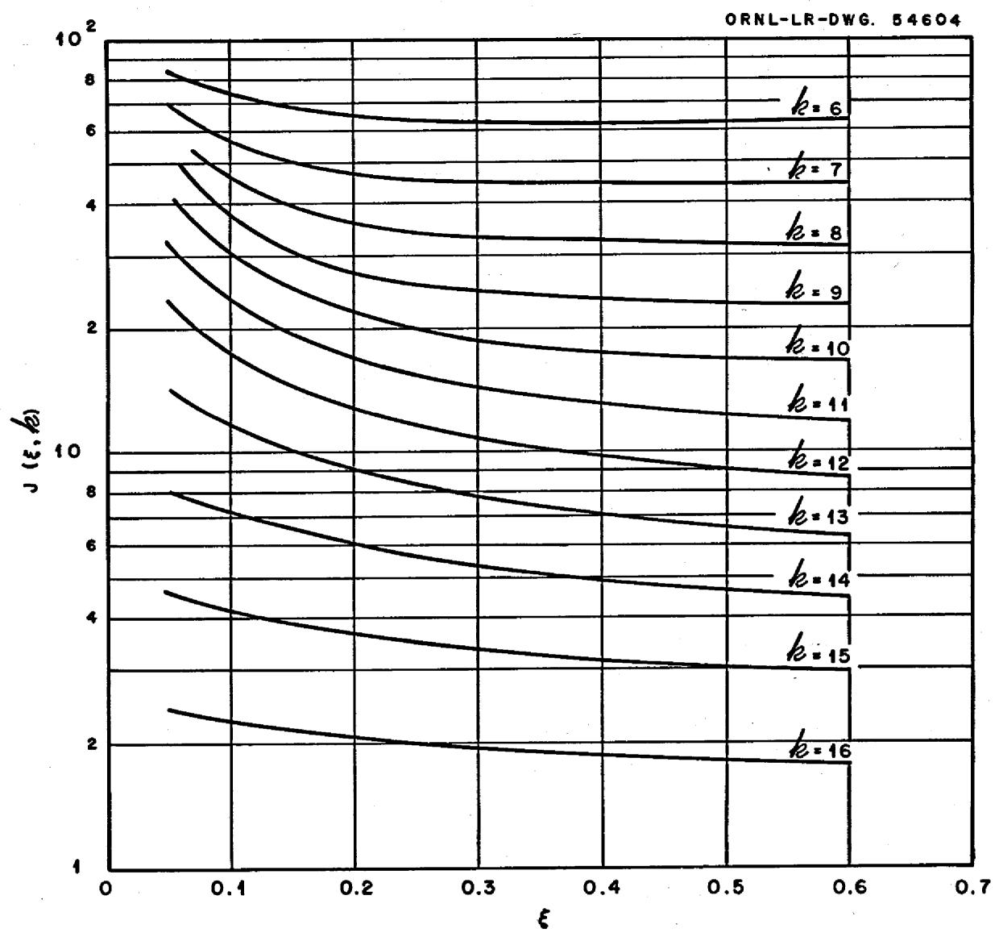  
Fig. B.l. J(ξ,k) Versus $\xi$ for $k = 6.16$ .

Table B.1. Resonance Parameters of Thorium-232   

<table><tr><td>GNU Group No.</td><td>Δu</td><td>Eo(ev)</td><td>Γn(ev)</td><td>Γγ(ev)</td><td>Infinite Dilution Resonance Integral</td></tr><tr><td rowspan="6">11</td><td rowspan="6">0.98083</td><td>235</td><td>0.0017</td><td>0.034</td><td rowspan="6">7.10</td></tr><tr><td>234</td><td>0.027</td><td>0.034</td></tr><tr><td>212</td><td>0.0012</td><td>0.034</td></tr><tr><td>201</td><td>0.016</td><td>0.034</td></tr><tr><td>195</td><td>0.022</td><td>0.034</td></tr><tr><td>172</td><td>0.067</td><td>0.034</td></tr><tr><td rowspan="3">12</td><td rowspan="3">0.40547</td><td>130</td><td>0.009</td><td>0.034</td><td rowspan="3">8.4</td></tr><tr><td>122</td><td>0.023</td><td>0.034</td></tr><tr><td>114</td><td>0.013</td><td>0.034</td></tr><tr><td>15</td><td>0.20763</td><td>69.7</td><td>0.039</td><td>0.043</td><td>17.2</td></tr><tr><td>16</td><td>0.26236</td><td>59.6</td><td>0.0046</td><td>0.021</td><td>4.4</td></tr><tr><td rowspan="2">22</td><td rowspan="2">0.22314</td><td>23.6</td><td>0.004</td><td>0.039</td><td rowspan="2">44.2</td></tr><tr><td>21.9</td><td>0.0022</td><td>0.034</td></tr><tr><td colspan="5">Unresolved Resonances - Group 1 through Group 10</td><td>5.3</td></tr><tr><td colspan="5">Nonresonance Contribution - Groups 13, 14, 17-21, and 23-33</td><td>10.3</td></tr><tr><td colspan="5">Total - Cut-off at 0.0795 ev</td><td>96.9</td></tr></table>

lists the lethargy width for each group. The group-averaged cross section is simply the group total resonance integral divided by the group lethargy width.

The infinite-dilution resonance integral $(I_{\infty})$ for a particular resonance may be obtained from

$$
I _ {\infty} = \frac {\pi}{2} \sigma_ {0} \frac {\Gamma_ {\gamma}}{E _ {0}}.
$$

# Sample Calculation

Example: Compute the effective resonance integral $\left(I_{\text{eff}}\right)$ for the thorium resonance at 23.6 ev with a carbon-to-thorium ratio of 200 and an absorber temperature of $649^{\circ}\text{C}$ . The nonresonance scattering cross section, $\sigma_{\text{s}}^{\text{C}}$ , of carbon is 4.8 barns, and the thorium nonresonance scattering cross section, $\sigma_{\text{s}}^{\text{Th}}$ , is 12.5 barns.

1. $\sigma_{\mathbf{p}} = \sigma_{\mathbf{s}}^{\mathrm{Th}} + \left(\frac{\mathrm{N}_{\mathbf{c}}}{\mathrm{N}_{\mathrm{Th}}}\right)\sigma_{\mathbf{s}}^{\mathrm{C}}$   
$= 972.5$ barns

2. ${\pi }^{2} = {\left( \frac{2 \cdot  {86} \times  {10}^{-9}}{2\pi \sqrt{\mathrm{E}}}\right) }^{2}$   
$= 0.877 \times 10^{-20} \mathrm{~cm}^{2}$

3. $\sigma_{0} = 4\pi \lambda^{2}\frac{\Gamma n}{\Gamma}$   
$= 10,250$ barns.

4. β = pσ   
$= 0.0949$

4E K T 1/2   
$= 0.1797$

6. $\xi = \frac{\Gamma}{\Delta}$   
$= 0.2393$

$$
\begin{array}{l} 7. \quad k = \frac {\ln \beta + 5 \ln 1 0}{\ln 2} \\ = 1 3. 2 \\ \end{array}
$$

$$
\begin{array}{l} 8. J (\xi , k) = J (0. 2 3 9 3, 1 3. 2) \\ = 7. 6 \text {(f r o m F i g . B . l)}. \\ \end{array}
$$

$$
\begin{array}{l} I _ {\text {e f f}} = \frac {\pi}{2} \frac {\sigma_ {0} \Gamma \gamma}{E _ {0}} \frac {2 \beta}{\pi} J (\xi , k) \\ = 1 2. 2 \text {b a r n s}. \\ \end{array}
$$

The infinite-dilution resonance integral $(I_{\infty})$ obtained is 26.6 barns for the case considered.

# Results

The MERC-1 program used in the MSCR study is a 34-group diffusion-theory code. The group structure is such that the resolved resonances of thorium fall into five groups: 11, 12, 15, 16, and 22. The group-averaged absorption cross section for each of these five groups as a function of $\sigma_{\mathrm{p}}$ at $649^{\circ}\mathrm{C}$ is plotted in Fig. B-2. The total resolved resonance integral is plotted in Fig. B-3 for three reactor temperatures.

# Symbols

$$
\begin{array}{l} \Gamma_ {\gamma} = \text {R a d i a t i v e c a p t u r e w i d t h (e v)} \\ \Gamma n = \text {N e u t r o n w i d t h (e v)} \\ \Gamma = \text {T o t a l w i d t h (e v)} \\ \pi = \frac {\text {W a v e l e n g t h o f t h e n e u t r o n}}{2} (\mathrm {c m}) \\ E _ {0} = \text {R e s o n a n c e e n e r g y (e v)} \\ \end{array}
$$

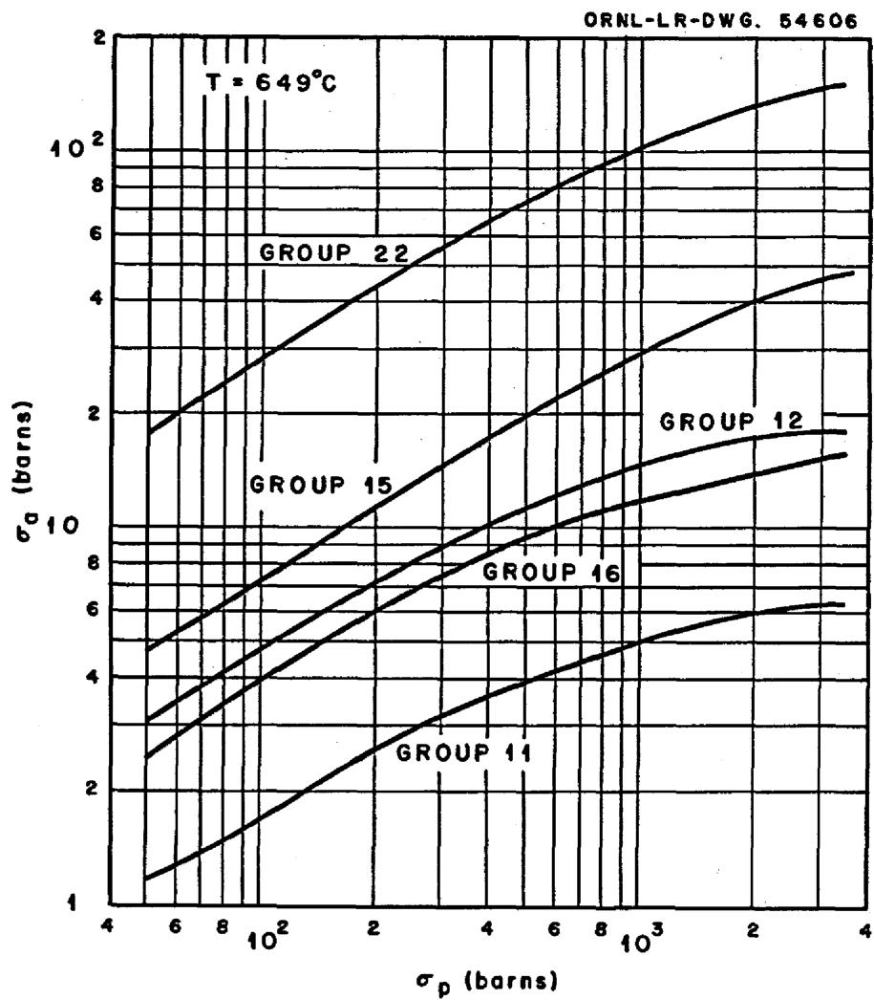  
Fig. B.2. Group Averaged Absorption Cross Section Versus $\sigma_{\mathrm{p}} 649^{\circ} \mathrm{C}$ .

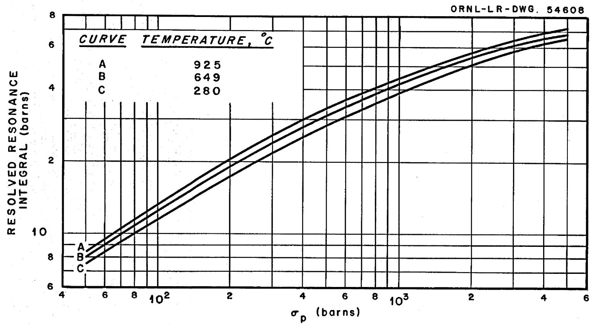  
Fig. B.3. Total Resolved Resonance Integral Versus $\sigma_{\mathrm{p}}$ for Moderator Temperatures of $280^{\circ}\mathrm{C}$ , $649^{\circ}\mathrm{C}$ , and $925^{\circ}\mathrm{C}$ .

$\sigma_{p} =$ Nonresonance scattering cross section (macroscopic scattering cross section per thorium atom density)

E = Relative energy in the center-of-mass-system

M = Mass of absorbing nucleus (amu)

KT = Absorber temperature in energy units (ev)

$\mu =$ Reduced mass of neutrons (amu)

# References

1. Lawrence Dresner, Tables for Computing Effective Resonance Integrals Including Doppler Broadening of Nuclear Resonances, USAEC Report ORNL-CF 55-9-74, Oak Ridge National Laboratory, September 19, 1955.   
2. D. J. Hughes and R. B. Schwartz, Neutron Cross Sections, USAEC Report BNL-325, Brookhaven National Laboratory, July 1, 1958.

# Appendix C

# ENERGY DEPENDENCE OF ETA OF 233U*

C. W. Nestor

# Summary

A parameter of great interest in nuclear calculations of a thorium reactor is $\eta$ , the number of neutrons produced per neutron absorbed. Experimental information on the energy dependence of $\eta$ in the range of 0 to 10 ev as measured at the MTR was used to calculate group averaged fission cross sections, using absorption cross sections calculated from the recent total cross section data1,2 and the scattering cross section as calculated by Vogt.1 The $\eta$ values used in preparation of the cross sections was normalized to a $2200\mathrm{m/sec}$ value of 2.29.3

In the energy range of 0 to 0.8 ev, $\eta$ was assumed to be constant at 2.29. In the range of 0.8 ev to 10 ev, as mentioned, group averaged values of $\overline{\nu\sigma}_{\mathrm{f}} = \overline{\eta\sigma}_{\mathrm{a}}$ were calculated by numerical evaluation of the integrals

$$
\bar {\eta} = \frac {\int \eta (\mathrm {E}) \sigma_ {\mathrm {a}} (\mathrm {E}) \frac {\mathrm {d E}}{\mathrm {E}}}{\int \sigma_ {\mathrm {a}} (\mathrm {E}) \frac {\mathrm {d E}}{\mathrm {E}}}
$$

$$
\bar {\sigma} _ {a} = \frac {1}{\Delta u} \int \sigma_ {a} (E) \frac {d E}{E}
$$

where $\Delta u$ denotes the lethargy width of the group.

In the range of 10 ev to 30 ev $\eta$ was estimated to be 2.17; the data of Gaerttner and Yeater4 indicate an average $\eta$ in this range of about 0.95 times the 2200 m/sec value.

From 30 ev to 30 kev, $\eta$ was assumed to be 2.25; this is the value reported by Spivak5 et al., at 30 kev.

From 20 kev to 900 kev, measurements of $\eta$ are available; fission cross sections are reported in BNL-325 for the range 30 kev to 10 MeV. The total cross section in this range was taken to be equal to that of $^{235}\mathrm{U}$ , as suggested by J. A. Harvey. $^{1}$ The value of $\nu$ was assumed to be linear in energy with a 2200 m/sec value of 2.50 (ref. 3) and a slope of 0.127 per Mev. $^{6}$ A plot of the experimental $\eta$ and the group averaged values from 0.01 ev to 1 kev is shown in Fig. C.l. Group values are also listed in Table A.l of Appendix A.

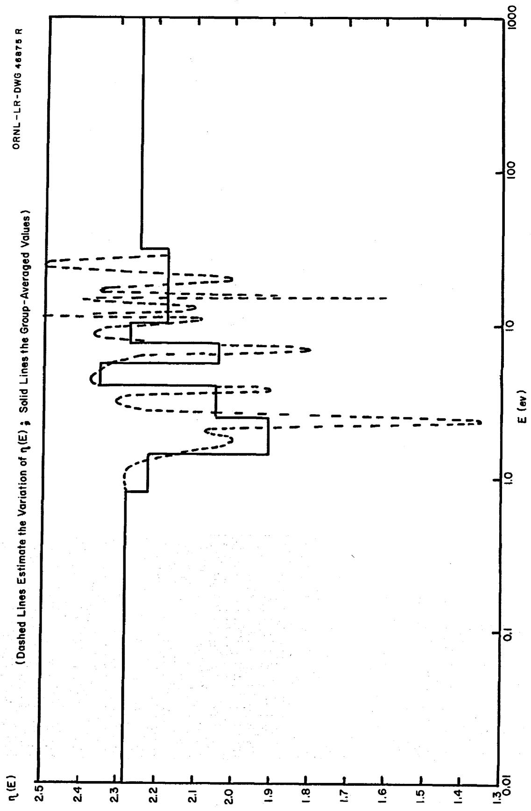  
Fig. C.l. Group Values of $\eta^{23}(\mathbf{e})$ Used in MSCR Study.

# References

1. J. A. Harvey, ORNL, personal communication to C. W. Nestor, ORNL, March 1960.   
2. M. S. Moore, MTR Nuclear Physics Group, personal communication to C. W. Nestor, ORNL, March 1960.   
3. J. E. Evans, reported at the Argonne National Laboratory Conference on the Physics of Breeding, October 1959.   
4. E. R. Gaerttner and M. L. Yeater, Reports to the AEC Nuclear Cross Section Advisory Group, USAEC Report Wash-194, USAEC, February 1958.   
5. P. E. Spivak et al., Measurement of Eta for $^{233}\mathrm{U}$ , $^{235}\mathrm{U}$ , and $^{239}\mathrm{Pu}$ with Epithermal Neutrons, J. Nucl. Energy, 4:70 (January 1957).   
6. G. N. Smirenkin et al., J. Nucl. Energy, 9:155 (1955).

# Appendix D

THE MERC-1 EQUILIBRIUM REACTOR CODE

T. W. Kerlin

# Introduction

The MERC-1 code automatically calculates the composition of a fluid-fuel reactor so that equilibrium and criticality conditions are simultaneously satisfied. MERC-1 uses the MODRIC1 multigroup-diffusion-theory code and the ERC-10 equilibrium reactor code as chain links. These codes were previously used separately at ORNL in iterative calculations to determine equilibrium reactor compositions. MODRIC was developed by the Central Data Processing Group at the Oak Ridge Gaseous Diffusion Plant as a replacement for GNU.2 The ERC-10 code was prepared as a later version of ERC-5.3 The MERC-1 code automatically transmits necessary data from one chain link to the other until sufficient iterations have been performed to cause criticality and equilibrium requirements to be satisfied simultaneously. The output consists of equilibrium concentrations, a neutron balance, and fuel-cycle costs.

The system which is considered in the MERC-1 analysis is shown in Fig. D.l. A complete specification of data required for controlling the flow and losses in each stream is included in the MERC-1 input. Note in Fig. D.l that material is removed from the reactor system by losses, waste, and sale as well as by nuclear transformation (decay and neutron absorption), and that fresh material is fed to the system. Therefore, the calculated equilibrium concentrations are in equilibrium with respect to the feed and discharge rates as well as with respect to nuclear transformation rates.

# Theory

MODRIC is a typical neutron-diffusion-theory code. It allows 50 neutron energy groups with downscattering from a group to any of the

ORNL-LR-DWG 76824

Fig. D.l. The Reactor System.   
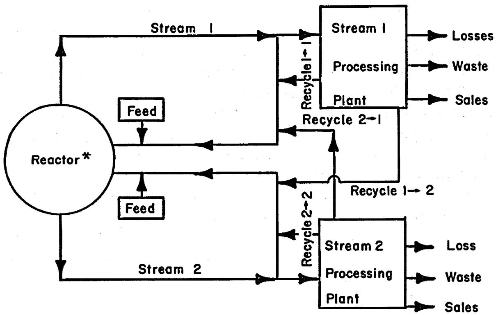  
*The reactor may have as many as two active regions, and each region may contain either or both of the fluid streams

following ten groups. It will perform concentration searches on specified elements. The output consists of criticality search converged concentrations, group macroscopic cross sections, normalized nuclear events (absorptions, fission, leakage, etc.) by region and group, absorptions and fissions by material and region, group flux distributions, and fission density distributions.

ERC-10 requires extensive input. Rewriting of large quantities of input is avoided by using basic input decks which include information applicable to a number of cases. To specify a new case, it is necessary only to specify changes in the basic input deck. For instance, one might prepare a basic input deck for a particular reactor with a given power level. A set of cases with different power levels would need only the basic input deck and the new power level as input.

Basically, ERC solves two equations. They are:

$$
\begin{array}{l} V _ {j} \frac {\mathrm {d} N _ {i j}}{\mathrm {d} t} = Q _ {i j} ^ {f} + R _ {i j} + F _ {i j} + T _ {i j} + D _ {i j} \\ - \mathrm {N} _ {\mathrm {i j}} \left(\mathrm {t} _ {\mathrm {i j}} + \mathrm {d} _ {\mathrm {i j}} + \mathrm {q} _ {\mathrm {i j}} - \mathrm {r} _ {\mathrm {i j}}\right) = 0, \tag {1} \\ \end{array}
$$

or if the material must be fed to maintain criticality

$$
\begin{array}{l} \left(\mathrm {N} _ {\mathrm {i j}} ^ {\mathrm {s}} - \mathrm {N} _ {\mathrm {i j}} ^ {\mathrm {s} - 1}\right) v _ {\mathrm {i}} \sum_ {\mathrm {k}} \mathrm {C} _ {\mathrm {i j k}} ^ {\mathrm {f}} = \sum_ {\mathrm {i j k}} \mathrm {N} _ {\mathrm {i j}} ^ {\mathrm {s} - 1} \mathrm {C} _ {\mathrm {i j k}} ^ {\mathrm {a}} \\ - \sum_ {i j k} N _ {i j} ^ {s - 1} C _ {i j k} ^ {f} v _ {i}. \tag {2} \\ \end{array}
$$

Equation (2) is just the conservation requirement, saying that enough fissile material must be added (or removed) in iteration $s$ to overcome the neutron production deficiency (or excess) in iteration $(s - l)$ . These are inner iterations in ERC. The terms are defined as:

$$
\begin{array}{l} V _ {j} = \text {v o l u m e o f s t r e a m j , c m} ^ {3}, \\ N _ {i j} = \text {a t o m s o f m a t e r i a l i p e r b a r n c m o f s t r e a m j}, \\ t = \text {t i m e}, \sec , \\ \end{array}
$$

$Q_{ij} =$ feed rate of material i into stream j, atoms/sec,

$\mathbf{R}_{ij} =$ rate of growth of material i in stream j due to recycle from other streams, atoms/sec,

$\mathbf{F}_{ij} = \text{rate of growth of fission fragment } i \text{ in stream } j, \text{ atoms/sec},$

$\mathbf{T}_{ij} =$ rate of growth of material i in stream j due to neutron absorptions in other materials, atoms/sec,

$\mathbf{D}_{ij} =$ rate of growth of material i in stream j due to radioactive decay of other materials, atoms/sec,

$t_{ij} = \text{rate coefficient for loss of material } i \text{ in stream } j \text{ because of neutron capture, atoms per sec per atom/barn cm}$ ,

$\mathbf{d}_{ij} =$ rate coefficient for loss of material i in stream j because of radioactive decay, atoms per sec per atom/barn cm,

$q_{ij} =$ rate coefficient for loss of material i in stream j because of processing removal, atoms per sec per atom/barn cm,

$\mathbf{r}_{ij} =$ rate coefficient for growth of material i in stream j because of recycle from stream j, atoms per sec per atom/barn cm,

$\nu_{i} =$ neutrons produced per fission in material i,

$\mathbf{C}_{ijk} =$ reaction rate coefficient, number of fissions in material i per atom/barn cm in stream j in region k per fission neutron born in reactor,

a Cijk = reaction rate coefficient, number of absorptions in material i per atom/barn cm in stream j in region k per fission neutron born in reactor.

# Superscripts:

$$
i = m a t e r i a l,
$$

$$
j = \text {s t r e a m},
$$

$$
k = \text {r e g i o n}.
$$

The use of stream and region indexes allows reactors with two streams in the same region to be analyzed.

The equilibrium concentration calculations in ERC use reaction rate coefficients $\left(\mathbf{C}_{ijk}\right)$ obtained from an earlier MODRIC calculation. However, the initial concentrations used in the MODRIC calculation will not, in general, agree with the equilibrium concentrations computed by ERC. This new set of concentrations will alter the neutron spectrum and flux level, thereby changing the reaction rate coefficients. Therefore, it is necessary to repeat the MODRIC criticality calculation with the latest value for the estimated concentrations to get new reaction rate coefficients.

This process is repeated until the MODRIC and ERC concentrations are equal. The flow of information in the code is shown in Fig. D.2.

The reaction rate coefficients $(C_{ijk})$ used in ERC are spectrum-averaged cross sections which are available directly from MODRIC. The MODRIC calculation gives $A_{ik}$ and $\nu F_{ik}$ , the absorptions and neutron productions in material $i$ in region $k$ , normalized to 1.0 total neutron produced. The distribution of nuclear events between two streams in a region is accomplished by introducing the stream volume fractions, $f_{jk}$ , in this manner:

$$
A _ {i j k} = A _ {i k} \cdot \left| \frac {\text {a t o m s o f i i n s t r e a m j i n r e g i o n k}}{\text {a t o m s o f i i n r e g i o n k}} \right|,
$$

$$
v _ {i} F _ {i j k} = v _ {i} F _ {i k} \cdot \left(\frac {\text {a t o m s o f i i n s t r e a m j i n r e g i o n k}}{\text {a t o m s o f i i n r e g i o n k}}\right).
$$

The multiplying factor in each term is

$$
\left(\frac {\text {a t o m s o f i i n s t r e a m j i n r e g i o n k}}{\text {a t o m s o f i i n r e g i o n k}} \right\rvert = \frac {\mathrm {N} _ {\mathrm {i j}} \mathrm {f} _ {\mathrm {j k}}}{\sum_ {\mathrm {j}} \mathrm {N} _ {\mathrm {i j}} \mathrm {f} _ {\mathrm {j k}}}
$$

where the units on these factors are

$$
N _ {i j} = \frac {\text {a t o m s o f i i n s t r e a m j}}{\text {b a r n c m o f s t r e a m j}},
$$

$$
f _ {j k} = \frac {\mathrm {c m} ^ {3} \text {o f s t r e a m j i n r e g i o n k}}{\mathrm {c m} ^ {3} \text {o f r e g i o n k}}.
$$

The material, stream, and region dependent absorption and production terms are automatically transferred from the MODRIC link to the ERC link of the MERC-1 calculation. ERC obtains the reaction rate coefficients (intensive quantities) from the absorption and production terms (extensive quantities) by dividing by $\mathbf{N}_{ij}$ , the stream concentration

$$
C _ {i j k} = \frac {A _ {i j k}}{N _ {i j}},
$$

ORNL-LR-DWG 76825

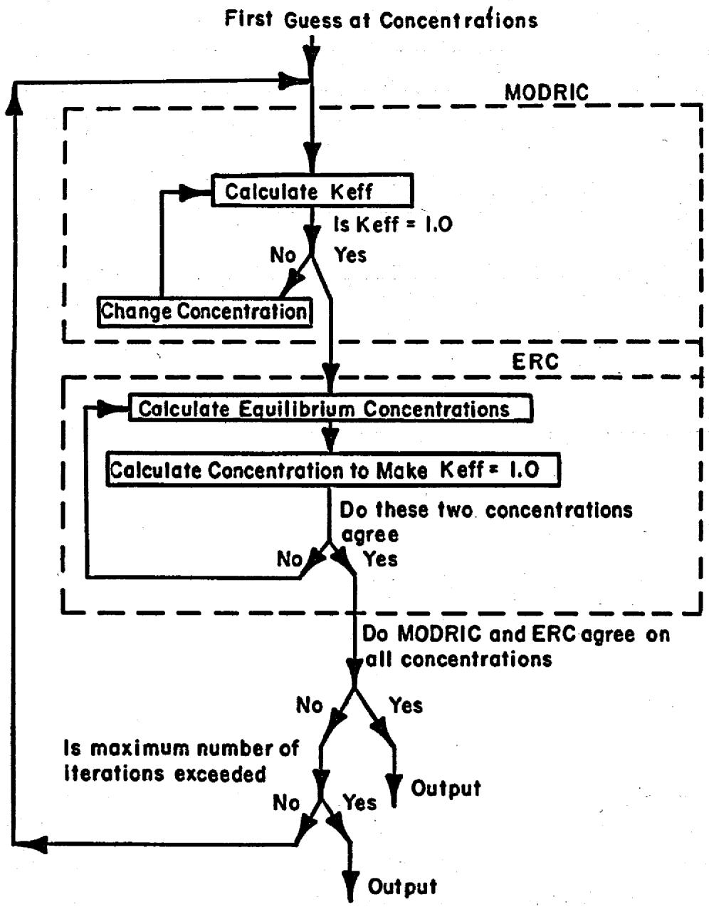  
Fig. D.2. The MERC Flow Diagram.

$$
v _ {i} C _ {i j k} = \frac {v _ {i} F _ {i j k}}{N _ {i j}}.
$$

The absolute reaction rate coefficient $\overline{C}_{ijk}$ is obtained in the ERC calculation using the total neutron production rate as determined by the reactor power

$$
\overline {{C}} _ {i j k} ^ {a} = C _ {i j k} ^ {a} \times 3. 1 \times 1 0 ^ {1 6} P \bar {v} \times 1 0 ^ {- 2 4},
$$

where

$3.1 \times 10^{16} =$ number of fissions per sec per megawatt,

$P =$ power level in megawatts,

$\overline{\nu} =$ average number of neutrons produced per fission

$$
= \frac {\sum_ {i j k} N _ {i j} c _ {i j k} ^ {f} v _ {i}}{\sum_ {i j k} N _ {i j} c _ {i j k} ^ {f}}.
$$

A similar argument applies for the fission reaction rate.

The restriction to fluid-fuel reactors occurs because the ERC calculation requires that the reactor discharge composition be equal to the mean reactor composition. This restriction is satisfied in fluid-fuel reactors but not in solid-fuel reactors where the discharge has experienced a much greater exposure than the mean.

In ERC-10, effective, one-group cross sections of individual fission products were calculated by reference to a standard absorber exposed to the MSCR spectrum of neutrons as generated by the multigroup program Modric. The thermal cross section and the resonance integral can be used in a two-group model to calculate relative one-group cross sections. Thus, set

$$
\overline {{\sigma}} \overline {{\phi}} = \sigma_ {e} \phi_ {e} + \sigma_ {t} \phi_ {t}
$$

where the bar denotes effective, one-group values, "e" denotes "eipthermal," and "t" denotes "thermal." Rearranging and taking a ratio of the cross

section of the $i^{\text{th}}$ material to that of a standard material, denoted by the subscript "s,"

$$
\frac {\overline {{\sigma}} _ {i}}{\overline {{\sigma}} _ {s}} = \frac {\left(\sigma_ {t} + \frac {\varnothing_ {e}}{\varnothing_ {t}} \sigma_ {e}\right) _ {i}}{\left(\sigma_ {t} + \frac {\varnothing_ {e}}{\varnothing_ {t}} \sigma_ {e}\right) _ {s}}.
$$

The epithermal cross section is defined in terms of the resonance integral by the relation

$$
\sigma_ {e} = \frac {\int_ {0} ^ {u _ {e}} \sigma_ {d u}}{\int_ {0} ^ {u _ {e}} d u} = \frac {R I}{u _ {e}}
$$

where $u_{e}$ is the lethargy at the lower energy bound of the epithermal group.

The ratio $\frac{\phi_{\mathrm{e}}}{\phi_{\mathrm{t}}}$ is obtained by equating the slowing down current from the epithermal group to neutrons absorbed or leaking in the thermal group.

$$
\Sigma_ {r, e} \varnothing_ {e} = \left(\Sigma_ {a, t} + D _ {t} B ^ {2}\right) \varnothing_ {t}
$$

where $\Sigma_{\mathbf{r},\mathbf{e}}$ is the "removal" cross section.

$$
\text {L e t} \Sigma_ {\mathbf {r}, \mathrm {e}} \cong \xi \Sigma_ {\mathrm {T}, \mathrm {e}} / u _ {\mathrm {e}}
$$

where T denotes "total." Ignoring leakage gives

$$
\frac {\varnothing_ {e}}{\varnothing_ {t}} = \frac {\sum_ {a , t} u _ {R}}{\sum_ {t , e}}
$$

Combining these results gives

$$
\bar {\sigma} _ {i} = \bar {\sigma} _ {s} \frac {\left[ \sigma_ {t , e} + K (R I) _ {i} \right]}{\left[ \sigma_ {t , s} + K (R I) _ {s} \right]}
$$

where

$$
\mathrm {K} = \frac {\sum_ {\mathrm {a} , \mathrm {t}}}{\xi \sum_ {\mathrm {T}}}
$$

The spectral index, K, is computed by Modric from input data. The reference element was the standard absorber referred to above. The product of the reference element cross section and the effective flux integrated over the core is computed from Modric output by dividing the fraction of neutrons as absorbed by the reference element by its atomic density, $\mathbf{N}_{\mathrm{s}}$ . This product is the desired number for use in the ERC calculations; the working equation becomes

$$
\bar {\sigma} _ {i} \bar {\varphi} V = \frac {A _ {s}}{N _ {s}} \frac {\left[ \sigma_ {t , i} + K (R I) _ {i} \right]}{\left[ \sigma_ {t , s} + K (R I) _ {s} \right]}.
$$

The thermal cross sections $\sigma_{t}$ are computed from the 2200 m/s cross sections by multiplying by a factor that averages them over a Maxwell-Boltzman spectrum around the reactor temperature. This factor was computed for a $1 / v$ energy dependence of the cross section and applied uniformly to all fission product isotopes, except noble gases,

In all, 115 fission product isotopes were so treated, linked by transmutation and decay into chains. Provision was made in ERC-ll to remove each at a rate determined by its chemical or physical properties in relation to the processing method. For instance, xenon is removed rapidly by transpiration in an expansion chamber, whereas rare earths are removed only by discard of the fuel salt with a period measured in hundreds of days.

Xenon was treated separately in the Modric calculation, not only to determine accurately its effective cross section in the MSCR neutron spectrum but also to permit special treatment of its exceptional behavior. It may be possible to remove xenon rapidly from the fuel solution by circulating a portion of the salt through the dome of the expansion tank mounted over the core (Sec. 4.2.2) provided the xenon does not diffuse rapidly into the moderator graphite. Provision was made in ERC-ll to calculate the extreme cases (complete absorption in graphite vs. zero absorption) as well as intermediate situations where removal competes with absorption.

Samarium was also treated separately because of its importance.

The fission product calculation is thought to result in a reasonably good approximation of the poisoning in reactors where the fission products are exposed to neutrons for a long time. The ingrowth of second and higher generation isotopes by transmutation and decay is treated in detail. The transient period following start-up of a clean reactor with an initial loading of $^{235}\mathrm{U}$ is ignored, and all concentrations are calculated at their maximum, equilibrium values. Hence, the poisoning is overestimated somewhat, thus providing a margin of safety in respect to assignment of the cross sections and resonance integrals.

The fission-product reaction rate coefficient is obtained by reference to a specified standard absorber:

$$
\mathrm {C} ^ {\mathrm {F P}} = \mathrm {C} ^ {\mathrm {R}} \frac {\sigma^ {\mathrm {F P}}}{\sigma^ {\mathrm {R}}} \text {,} \tag {3}
$$

where

$$
\begin{array}{l} C ^ {F P} = \text {f i s s i o n - p r o d u c t r e a c t i o n r a t e c o e f f i c i e n t}, \\ C ^ {R} = \text {r e f e r e n c e m a t e r i a l r e a c t i o n r a t e c o e f f i c i e n t}, \\ \end{array}
$$

$$
\begin{array}{l} \sigma^ {\mathrm {F P}} = \text {e f f e c t i v e f i s s i o n - p r o d u c t a b s o r p t i o n c r o s s s e c t i o n}, \\ \sigma^ {R} = \text {e f f e c t i v e r e f e n c e m a t e r i a l a b s o r p t i o n c r o s s s e c t i o n}. \\ \end{array}
$$

The effective cross section ratio is obtained from a two-group formulation:

$$
\frac {\sigma^ {F P}}{\sigma^ {R}} = \frac {\left(\sigma_ {1} \phi_ {1} / \phi_ {2} + \sigma_ {2}\right) ^ {F P}}{\left(\sigma_ {1} \phi_ {1} / \phi_ {2} + \sigma_ {2}\right) ^ {R}}, \tag {4}
$$

where

$$
\begin{array}{l} \sigma_ {1} = \text {f a s t a b s o r p t i o n c r o s s s e c t i o n} \\ = \frac {\int_ {0} ^ {u _ {\mathrm {t h}}} \sigma_ {\mathrm {a}} (u) \mathrm {d} u}{u _ {\mathrm {t h}}} = \frac {\left(\mathrm {R I}\right) _ {\mathrm {a}}}{u _ {\mathrm {t h}}}; \\ \end{array}
$$

$\overline{\sigma}_{2} =$ absorption cross section averaged over the thermal flux,

$$
\varnothing_ {1} = \text {f a s t f l u x},
$$

$$
\varnothing_ {2} = \text {a v e r a g e t h e r m a l f l u x}.
$$

For a two-group treatment, all neutrons removed from the fast group must either be absorbed or leak from the reactor while thermal:

$$
\Sigma_ {R _ {1}} \varnothing_ {1} = \Sigma_ {a _ {2}} \varnothing_ {2} + D B ^ {2} \varnothing_ {2}.
$$

Ignoring leakage,

$$
\frac {\varnothing_ {1}}{\varnothing_ {2}} = \frac {\Sigma_ {\mathrm {a} _ {2}}}{\Sigma_ {\mathrm {R} _ {1}}} \cdot \tag {5}
$$

Also,

$$
\sigma_ {2} = f \sigma_ {a} ^ {2 2 0 0} \tag {6}
$$

where

$$
\begin{array}{l} \mathrm {f} = \text {t h e r m a l s p e c t r u m f a c t o r} = \sqrt {\left(\frac {\pi}{4}\right) \left(\frac {2 9 8}{T + 2 7 3}\right)} \text {f o r a M a x w e l l -} \\ \text {B o l t z m a n n d i s t r i b u t i o n ,} \end{array}
$$

$$
\sigma_ {a} ^ {2 2 0 0} = 2 2 0 0 \mathrm {m} / \mathrm {s} \text {a b s o r p t i o n c r o s s s e c t i o n}.
$$

Substituting Eqs. (4), (5), and (6) into Eq. (3) gives

$$
C ^ {F P} = C ^ {R} \left\{\frac {\left[ K (R I) + \sigma_ {a} ^ {2 2 0 0} \right] ^ {F P}}{\alpha} \right\} \tag {7}
$$

where

$$
K = \frac {\Sigma a _ {2}}{\Sigma_ {R _ {1}} f \Delta u},
$$

$$
\alpha = \left[ K (R I) + \sigma_ {a} ^ {2 2 0 0} \right] ^ {R}.
$$

K is calculated as follows:

$$
K = W S,
$$

$$
W = \frac {1}{f \Delta u} = \text {i n p u t}
$$

$$
S = \Sigma_ {a _ {2}} / \Sigma_ {R _ {1}} = \text {v a l u e}
$$

The value of $\alpha$ must be specified if fission product option 1 is specified on card BN=5. This value should be calculated using an estimated value for K. If fission product option 2 is specified on card BN-5, $\alpha$ is calculated by the code using the latest value of K. The required values of $\sigma_{\mathbf{a}}^{2200}$ and RI for a special reference material are built into the code for fission product option 2. The nuclear constants for a $1/\mathrm{v}$ absorber with a $2200\mathrm{m/s}$ cross section of 1.0 barns are built into the code. Therefore, to use fission product option 2, the reference element must correspond to an artificial element in MODRIC which has cross sections for a $1/\mathrm{v}$ absorber with $\sigma_{\mathbf{a}}^{2200} = 1.0$ .

# References

1. J. Replogle, MODRIC - A One-Dimensional Neutron Diffusion Code, USAEC Report K-1520, Oak Ridge Gaseous Diffusion Plant, September 1962.   
2. C. L. Davis, J. M. Bookston, and B. E. Smith, GNU-II, A Multigroup One-Dimensional Diffusion Program for the IBM-704, GMR-101, General Motors, November 12, 1957.   
3. L. G. Alexander, ERC-5 Program for Computing the Equilibrium States of Two-Region Thorium Breeder Reactors, USAEC Report ORNL CF-60-10-87, Oak Ridge National Laboratory, October 1960.

# Appendix E

# FISSION PRODUCT NUCLEAR DATAa

L. G. Alexander

<table><tr><td rowspan="2">Number</td><td rowspan="2">Isotope</td><td colspan="2">Fission Yieldb</td><td rowspan="2">β, Decay λ, sec-1</td><td rowspan="2">Cross Section go, barns</td><td rowspan="2">Resonance Integral RI, barns</td></tr><tr><td>233U</td><td>235U</td></tr><tr><td>26</td><td>82Se</td><td>0.007</td><td>0.0028</td><td></td><td>2.1</td><td>1.4</td></tr><tr><td>27</td><td>81Br</td><td>0.0045</td><td>0.0014</td><td></td><td>3.3</td><td>60</td></tr><tr><td>28</td><td>82Kr</td><td></td><td></td><td></td><td>45</td><td>45</td></tr><tr><td>29</td><td>83Kr</td><td>0.012</td><td>0.00544</td><td></td><td>205</td><td>201</td></tr><tr><td>30</td><td>84Kr</td><td>0.019</td><td>0.010</td><td></td><td>0.16</td><td>5.5</td></tr><tr><td>31</td><td>85Kr</td><td>0.006</td><td>0.00293</td><td>0.214 × 10-8</td><td>7</td><td>29</td></tr><tr><td>32</td><td>86Kr</td><td>0.032</td><td>0.0202</td><td></td><td>0.06</td><td>0.04</td></tr><tr><td>33</td><td>85Rb</td><td>0.019</td><td>0.010</td><td></td><td>0.91</td><td>0.67</td></tr><tr><td>34</td><td>87Rb</td><td>0.040</td><td>0.249</td><td></td><td>0.13</td><td>0.21</td></tr><tr><td>35</td><td>86Sr</td><td></td><td></td><td></td><td>1.3</td><td>(0.6)c</td></tr><tr><td>36</td><td>87Sr</td><td></td><td></td><td></td><td></td><td></td></tr><tr><td>37</td><td>88Sr</td><td>0.050</td><td>0.0357</td><td></td><td>0.0055</td><td>0.06</td></tr><tr><td>38</td><td>89Y</td><td>0.065</td><td>0.0479</td><td></td><td>1.31</td><td>0.78</td></tr><tr><td>39</td><td>90Y</td><td>0.065</td><td>0.0577</td><td>0.298 × 10-5</td><td>1</td><td>1.8</td></tr><tr><td>40</td><td>91Zr</td><td>0.065</td><td>0.0584</td><td></td><td>1.2</td><td>9</td></tr><tr><td>41</td><td>92Zr</td><td>0.067</td><td>0.0603</td><td></td><td>0.15</td><td>0.55</td></tr><tr><td>42</td><td>93Zr</td><td>0.070</td><td>0.0645</td><td></td><td>1.1</td><td>28</td></tr><tr><td>43</td><td>94Zr</td><td>0.068</td><td>0.0640</td><td></td><td>0.076</td><td>0.2</td></tr><tr><td>44</td><td>95Zr</td><td>0.057</td><td>0.0633</td><td></td><td>0.053</td><td>0.07</td></tr><tr><td>45</td><td>95Nb</td><td></td><td></td><td>0.229 × 10-6</td><td></td><td></td></tr><tr><td>46</td><td>95Mo</td><td>0.062</td><td>0.0627</td><td></td><td>13.9</td><td>109</td></tr><tr><td>47</td><td>96Mo</td><td></td><td></td><td></td><td>1.2</td><td>34</td></tr><tr><td>48</td><td>97Mo</td><td>0.053</td><td>0.0609</td><td></td><td>2.2</td><td>16</td></tr><tr><td>49</td><td>98Mo</td><td>0.052</td><td>0.0578</td><td></td><td>0.51</td><td>5.6</td></tr><tr><td>50</td><td>100Mo</td><td>0.044</td><td>0.0630</td><td></td><td>0.3</td><td>6.2</td></tr><tr><td>51</td><td>99Te</td><td>0.048</td><td>0.0606</td><td></td><td>22.2</td><td>140</td></tr><tr><td>52</td><td>100Ru</td><td></td><td></td><td></td><td>1.7</td><td>7</td></tr><tr><td>53</td><td>101Ru</td><td>0.030</td><td>0.050</td><td></td><td>5</td><td>77</td></tr><tr><td>54</td><td>102Ru</td><td>0.024</td><td>0.041</td><td></td><td>1.44</td><td>11</td></tr><tr><td>55</td><td>104Ru</td><td>0.0097</td><td>0.018</td><td></td><td>0.7</td><td>8</td></tr><tr><td>56</td><td>103Rh</td><td>0.016</td><td>0.030</td><td></td><td>184</td><td>1030</td></tr><tr><td>57</td><td>104Pd</td><td></td><td></td><td></td><td>6</td><td>19</td></tr><tr><td>58</td><td>105Pd</td><td>0.005</td><td>0.009</td><td></td><td>11</td><td>76</td></tr><tr><td>59</td><td>106Pd</td><td>0.0028</td><td>0.0038</td><td></td><td>6</td><td>12</td></tr><tr><td>60</td><td>107Pd</td><td>0.0015</td><td>0.0019</td><td></td><td>10</td><td>40</td></tr><tr><td>61</td><td>108Pd</td><td>0.0006</td><td>0.0007</td><td></td><td>10.7</td><td>169</td></tr><tr><td>62</td><td>110Pd</td><td>0.0003</td><td>0.00024</td><td></td><td>0.28</td><td>10</td></tr></table>

aCompiled from Appendix E list of references.   
bAtoms per fission.   
cValues in parentheses estimated by comparison with similar nuclides.

Fission Product Nuclear Data (continued)   

<table><tr><td rowspan="2">Number</td><td rowspan="2">Isotope</td><td colspan="2">Fission Yield</td><td rowspan="2">β, Decay λ, sec-1</td><td rowspan="2">Cross Section go, barns</td><td rowspan="2">Resonance Integral RI, barns</td></tr><tr><td>233U</td><td>235U</td></tr><tr><td>63</td><td>109Ag</td><td>0.0004</td><td>0.0003</td><td></td><td>91</td><td>1420</td></tr><tr><td>64</td><td>111Cd</td><td>0.00025</td><td>0.00019</td><td></td><td>2</td><td>52</td></tr><tr><td>65</td><td>112Cd</td><td>0.0002</td><td>0.0001</td><td></td><td>1</td><td>13</td></tr><tr><td>66</td><td>113Cd</td><td>0.0002</td><td>0.0001</td><td></td><td>59,500</td><td>652</td></tr><tr><td>67</td><td>114Cd</td><td>0.0002</td><td>0.0001</td><td></td><td>1.2</td><td>15</td></tr><tr><td>68</td><td>115In</td><td>0.0002</td><td>0.0001</td><td></td><td>228</td><td>3300</td></tr><tr><td>69</td><td>116Sn</td><td></td><td></td><td></td><td>0.006</td><td></td></tr><tr><td>70</td><td>125Te</td><td></td><td></td><td></td><td>1.56</td><td>(0.8)</td></tr><tr><td>71</td><td>126Te</td><td>0.0024</td><td>0.0005</td><td></td><td>0.8</td><td>12</td></tr><tr><td>72</td><td>128Te</td><td>0.010</td><td>0.0037</td><td></td><td>0.3</td><td>2</td></tr><tr><td>73</td><td>127I</td><td>0.0039</td><td>0.0013</td><td></td><td>6.2</td><td>154</td></tr><tr><td>74</td><td>129I</td><td>0.02</td><td>0.009</td><td></td><td>27</td><td>39</td></tr><tr><td>75</td><td>128Xe</td><td></td><td></td><td></td><td>5</td><td>45</td></tr><tr><td>76</td><td>129Xe</td><td></td><td></td><td></td><td>45</td><td>302</td></tr><tr><td>77</td><td>130Xe</td><td></td><td></td><td></td><td>5</td><td>45</td></tr><tr><td>78</td><td>131Xe</td><td>0.037</td><td>0.0293</td><td></td><td>120</td><td>806</td></tr><tr><td>79</td><td>132Xe</td><td>0.051</td><td>0.0438</td><td></td><td>0.2</td><td>1.8</td></tr><tr><td>80</td><td>133Xe</td><td></td><td></td><td>0.152 × 10-5</td><td>190</td><td>1270</td></tr><tr><td>81</td><td>134Xe</td><td>0.066d</td><td>0.0806d</td><td></td><td>0.2</td><td>0.6</td></tr><tr><td>82</td><td>135Xe</td><td>0.067d</td><td>0.0641d</td><td>0.211 × 10-4</td><td>3.344 × 10</td><td>0.6512 × 10</td></tr><tr><td>83</td><td>136Xe</td><td>0.069</td><td>0.0646</td><td>0.296 × 10-3</td><td>0.15</td><td>0.1</td></tr><tr><td>84</td><td>133Cs</td><td>0.062</td><td>0.0659</td><td></td><td>28</td><td>420</td></tr><tr><td>85</td><td>134Cs</td><td></td><td></td><td>0.110 × 10-7</td><td>137</td><td>1400</td></tr><tr><td>86</td><td>135Cs</td><td>0.067e</td><td>0.0641</td><td></td><td>8.7</td><td>62.0</td></tr><tr><td>87</td><td>136Cs</td><td></td><td></td><td>0.617 × 10-6</td><td></td><td></td></tr><tr><td>88</td><td>137Cs</td><td>0.072</td><td>0.0615</td><td>0.666 × 10-9</td><td>0.11</td><td>0.3</td></tr><tr><td>89</td><td>138Cs</td><td></td><td></td><td>0.362 × 10-3</td><td>8.7</td><td>62</td></tr><tr><td>90</td><td>134Ba</td><td></td><td></td><td></td><td>2</td><td>(1)</td></tr><tr><td>91</td><td>136Ba</td><td></td><td></td><td></td><td>0.4</td><td>(0.2)</td></tr><tr><td>92</td><td>137Ba</td><td></td><td></td><td></td><td>4.9</td><td>(2.5)</td></tr><tr><td>93</td><td>138Ba</td><td>0.068</td><td>0.0574</td><td></td><td>0.68</td><td>0.3</td></tr><tr><td>94</td><td>139La</td><td>0.064</td><td>0.0655</td><td></td><td>8.9</td><td>11.0</td></tr><tr><td>95</td><td>140Ce</td><td>0.061</td><td>0.0644</td><td></td><td>0.66</td><td>0.5</td></tr><tr><td>96</td><td>141Ce</td><td></td><td></td><td>0.251 × 10-6</td><td></td><td></td></tr><tr><td>97</td><td>142Ce</td><td>0.057</td><td>0.0595</td><td></td><td>0.94</td><td>1.3</td></tr><tr><td>98</td><td>143Ce</td><td></td><td></td><td>0.601 × 10-5</td><td>6</td><td>(3)</td></tr><tr><td>99</td><td>141Pr</td><td>0.059</td><td>0.064</td><td></td><td>11.5</td><td>23.5</td></tr><tr><td>100</td><td>142Pr</td><td></td><td></td><td></td><td>18.0</td><td>(9.0)</td></tr><tr><td>101</td><td>143Pr</td><td></td><td></td><td></td><td>89</td><td>(0.45 × 10)</td></tr><tr><td>102</td><td>144Pr</td><td></td><td></td><td>0.660 × 10-3</td><td></td><td></td></tr><tr><td>103</td><td>143Nd</td><td>0.052</td><td>0.0598</td><td></td><td>308</td><td>130</td></tr><tr><td>104</td><td>144Nd</td><td>0.041</td><td>0.0567</td><td></td><td>5</td><td>12</td></tr><tr><td>105</td><td>145Nd</td><td>0.030</td><td>0.0395</td><td></td><td>67</td><td>245</td></tr><tr><td>106</td><td>146Nd</td><td>0.023</td><td>0.0307</td><td></td><td>10</td><td>25</td></tr><tr><td>107</td><td>147Nd</td><td></td><td></td><td>0.710 × 10-6</td><td>180</td><td>2510</td></tr></table>

dIncludes indirect yield from 135I.   
eIncluded in Xe yields.

Fission Product Nuclear Data (continued)   

<table><tr><td rowspan="2">Number</td><td rowspan="2">Isotope</td><td colspan="2">Fission Yield</td><td rowspan="2">β, Decay λ, sec-1</td><td rowspan="2">Cross Section go, barns</td><td rowspan="2">Resonance Integral RI, barns</td></tr><tr><td>233U</td><td>235U</td></tr><tr><td>108</td><td>148Nd</td><td>0.012</td><td>0.0170</td><td></td><td>3.4</td><td>48</td></tr><tr><td>109</td><td>149Nd</td><td></td><td></td><td>0.963 × 10-4</td><td></td><td></td></tr><tr><td>110</td><td>150Nd</td><td>0.0048</td><td>0.0067</td><td></td><td>1.5</td><td>14</td></tr><tr><td>111</td><td>151Nd</td><td></td><td></td><td>0.700 × 10-5</td><td></td><td></td></tr><tr><td>112</td><td>147Pm</td><td>0.017</td><td>0.0238</td><td>0.846 × 10-8</td><td>180</td><td>2510</td></tr><tr><td>113</td><td>148Pm</td><td></td><td></td><td>0.151 × 10-5</td><td>27,000</td><td></td></tr><tr><td>114</td><td>147Sm</td><td></td><td></td><td></td><td>87</td><td>690</td></tr><tr><td>115</td><td>148Sm</td><td></td><td></td><td></td><td>9</td><td>50</td></tr><tr><td>116</td><td>149Sm</td><td>0.0062</td><td>0.0113</td><td></td><td>87,770</td><td>2440</td></tr><tr><td>117</td><td>150Sm</td><td></td><td></td><td></td><td>85</td><td>460</td></tr><tr><td>118</td><td>151Sm</td><td>0.0026</td><td>0.0045</td><td>0.301 × 10-9</td><td>10,260</td><td>3565</td></tr><tr><td>119</td><td>152Sm</td><td>0.0017</td><td>0.00285</td><td></td><td>194</td><td>2500</td></tr><tr><td>120</td><td>153Sm</td><td></td><td></td><td>0.410 × 10-5</td><td></td><td></td></tr><tr><td>121</td><td>154Sm</td><td>0.00037</td><td>0.00077</td><td></td><td>5</td><td>25</td></tr><tr><td>122</td><td>153Eu</td><td>0.00095</td><td>0.0015</td><td></td><td>382</td><td>1380</td></tr><tr><td>123</td><td>154Eu</td><td></td><td></td><td>0.137 × 10-8</td><td>1500</td><td>750</td></tr><tr><td>124</td><td>155Eu</td><td></td><td></td><td>0.129 × 10-7</td><td>8490</td><td>4245</td></tr><tr><td>125</td><td>156Eu</td><td></td><td></td><td>0.521 × 10-6</td><td></td><td></td></tr><tr><td>126</td><td>154Gd</td><td></td><td></td><td></td><td></td><td></td></tr><tr><td>127</td><td>155Gd</td><td>0.00015</td><td>0.0003</td><td></td><td>58,000</td><td>1630</td></tr><tr><td>128</td><td>156Gd</td><td>0.00005</td><td>0.00013</td><td></td><td>4</td><td>44</td></tr><tr><td>129</td><td>157Gd</td><td>0.5 × 10-4</td><td>0.78 × 10-4</td><td></td><td>0.24 × 106</td><td>740</td></tr><tr><td>130</td><td>158Gd</td><td>0.1 × 10-4</td><td>0.2 × 10-4</td><td></td><td>3.9</td><td>29</td></tr><tr><td>131</td><td>155Gd</td><td></td><td></td><td>0.107 × 10-4</td><td></td><td></td></tr><tr><td>132</td><td>159Tb</td><td>0.5 × 10-5</td><td>0.1 × 10-4</td><td></td><td>46</td><td>420</td></tr><tr><td>133</td><td>89Sr</td><td></td><td></td><td>0.148 × 10-6</td><td>130</td><td>(65)</td></tr><tr><td>134</td><td>90Zr</td><td></td><td></td><td></td><td>1.5</td><td>0.7</td></tr><tr><td>135</td><td>135I</td><td>(f)</td><td>(f)</td><td>0.289 × 10-4</td><td></td><td></td></tr><tr><td>136</td><td>135Ba</td><td></td><td></td><td></td><td>5.6</td><td>(3)</td></tr><tr><td>137</td><td>151Eu</td><td></td><td></td><td></td><td>8400</td><td>(4200)</td></tr><tr><td>138</td><td>152Eu</td><td></td><td></td><td></td><td>5500</td><td>(2750)</td></tr><tr><td>139</td><td>160Tb</td><td></td><td></td><td></td><td>525</td><td>(262)</td></tr><tr><td>140</td><td>130Te</td><td>0.027</td><td>0.020</td><td></td><td>0.5</td><td>2.6</td></tr><tr><td>TOTAL</td><td></td><td>2.02285</td><td>2.06485</td><td></td><td></td><td></td></tr></table>

Yield of $^{135}\mathrm{I}$ combined with that of $^{135}\mathrm{Xe}$ .

# References

1. J. O. Blomeke and M. F. Todd, Uranium-235 Fission-Product Production As a Function of the Thermal Neutron Flux, Irradiation Time, and Decay Time. II: Summations of Individual Chains, Elements, and the Rare-Gas and Rare-Earth Groups, USAEC Report ORNL-2127, Pt. II, Vols. 1, 2, and 3, Oak Ridge National Laboratory, November 1958.   
2. J. D. Garrison and B. W. Roos, Fission Product Capture Cross Sections, Nucl. Sci. Eng., 12: 115 (January 1962).   
3. E. A. Nephew, Thermal and Resonance Absorption Cross Section of the $233_{\mathrm{U}}$ , $235_{\mathrm{U}}$ , and $239_{\mathrm{Pu}}$ Fission Products, USAEC Report ORNL-2869, Oak Ridge National Laboratory, March 1960.   
4. J. J. Pattenden, Fission Product Poisoning Data, USAEC Report ORNL 2778, Oak Ridge National Laboratory, October 1959.   
5. C. R. Greenhow and E. C. Hensen, Thermal and Resonance Fission-Product Poisoning for $^{235}\mathrm{U}$ System, USAEC Report KAPL-2172, Knolls Atomic Power Laboratory, October 1961.   
6. N. F. Wikner and S. Jaye, Energy-Dependent and Spectrum-Averaged Thermal Cross Sections for the Heavy Elements and Fission Products for Various Temperatures and C: $^{235}\mathrm{U}$ Atom Ratios, USAEC Report GA-2113, General Atomic, June 1961.   
7. R. L. Ferguson and G. D. O'Kelley, A Survey and Evaluation of $^{233}\mathrm{U}$ Fission Yield Data, USAEC Report ORNL CF-62-3-71, Oak Ridge National Laboratory, March 1962.   
8. E. C. Hensen, A Critical Examination of the Uncertainties in Predicted Gross Fission Product Poisoning, USAEC Report KAPL-M-ECH-8, Knolls Atomic Power Laboratory, March 1962.   
9. E. C. Hensen and C. R. Greenhow, An Improved Generalized Analysis of Fission Product Poisoning and Thermal and Resonance Fission Fragment Cross Sections, USAEC Report KAPL-M-ECH-7, Knolls Atomic Power Laboratory, September 1960.   
10. C. H. Wescott, Effective Cross Section Values for Well-Moderated Thermal Reactor Spectra, Canadian Report CRRP-787 (Rev. August 1958); AECL-670.   
11. J. O. Blomeke, Nuclear Properties of $^{235}\mathrm{U}$ Fission Products, USAEC Report ORNL-1783, Oak Ridge National Laboratory, April 1957.

# Appendix F

# TREATMENT OF DELAYED NEUTRONS

T. W. Kerlin

# Summary

Circulating fuel reactors lose neutrons because some of the delayed neutrons are emitted outside of the core. These losses depend on core residence time, external loop residence time, and decay characteristics of the precursors.

A symbolic representation of the system is

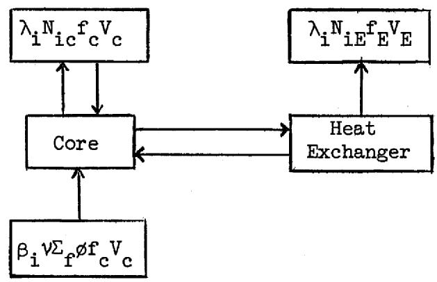

where

$\lambda_{ij} = \text{decay constant of the } i^{th} \text{ precursor from fissionable material } j,$

$\beta_{ij} =$ number of $i^{\text{th}}$ precursors formed per fission neutron from fiss- sionable material j,

Nijc = atoms of ith precursor per unit volume of fuel stream in the core resulting from fissions in material j,

$N_{ijE} =$ atoms of $i^{\text{th}}$ precursor per unit volume of fuel stream in the external loops resulting from fissions in material $j$ ,

$f_{c} =$ volume fraction of fuel in the core,

$$
f _ {E} = \text {v o l u m e f r a c t i o n o f f u e l i n t h e e x t e r n a l l o o p s},
$$

$$
V _ {c} = \text {c o r e v o l u m e},
$$

$$
V _ {E} = \text {e x t e r n a l l o o p v o l u m e},
$$

$$
v _ {j} \Sigma_ {f j} \phi f _ {c c} V = r a t e \text {o f p r o d u c t i o n o f f i s s i o n n e u t r o n s i n t h e c o r e f r o m}
$$

The precursor concentrations are described by these equations:

$$
\frac {\mathrm {d} \mathrm {N} _ {\mathrm {i j c}}}{\mathrm {d t} _ {\mathrm {c}}} = \beta_ {\mathrm {i j}} v _ {\mathrm {j}} \Sigma_ {\mathrm {f j}} \varnothing - \lambda \mathrm {N} _ {\mathrm {i j c}}, \tag {1}
$$

$$
\frac {d N _ {i j E}}{d t _ {E}} = - \lambda N _ {i j E}, \tag {2}
$$

where

$$
t _ {c} = \text {t i m e i n t h e c o r e},
$$

$$
t _ {E} = \text {t i m e i n t h e e x t e r n a l l o o p s}.
$$

The boundary conditions are:

$$
\mathrm {N} _ {\mathrm {i j c}} \left(\mathrm {T} _ {\mathrm {c}}\right) = \mathrm {N} _ {\mathrm {i j E}} (0), \tag {3}
$$

$$
\mathrm {N} _ {\mathrm {i j c}} (\mathrm {O}) = \mathrm {N} _ {\mathrm {i j E}} \left(\mathrm {T} _ {\mathrm {E}}\right), \tag {4}
$$

where

$$
T _ {c} = \text {t i m e f o r t h e f u e l s t r a m t o p a s s t h r o u g h t t h e c o r e},
$$

$$
\mathrm {T} _ {\mathrm {E}} = \text {t i m e f o r t h e f u e l s t r a m t o p a s s t h r o w t h e e x t e r n a l l o o p s}.
$$

The solution to Eqs. (1) and (2) are:

$$
\mathrm {N} _ {\mathrm {i j c}} = \frac {\beta_ {\mathrm {i j}} v _ {\mathrm {j}} \Sigma_ {\mathrm {f j}} \varnothing}{\mathrm {i j}} \left(1 - e ^ {- \lambda_ {\mathrm {i j}} t _ {\mathrm {c}}}\right) + \mathrm {N} _ {\mathrm {i j c}} (0) e ^ {- \lambda_ {\mathrm {i j}} t _ {\mathrm {c}}} ， \tag {5}
$$

$$
\mathrm {N} _ {i j \mathrm {E}} \quad \mathrm {N} _ {i j \mathrm {E}} (0) \mathrm {e} ^ {- \lambda_ {i j} t _ {\mathrm {E}}} \tag {6}
$$

Note that the precursor production rate is assumed constant for the fuel stream during its stay in the core. This idealized case would exist only for uniform power density along the fuel stream or for core residence times which are short compared to the half-life of the precursor.

The boundary conditions become

$$
\frac {\beta_ {i j} v _ {j} \Sigma_ {f j} \varnothing}{\lambda_ {i j}} \left(1 - e ^ {- \lambda_ {i j} T _ {c}}\right) + N _ {i j c} (0) e ^ {- \lambda_ {i j} T _ {c}} = N _ {i j E} (0), \tag {7}
$$

$$
\mathrm {N} _ {\mathrm {i j c}} (0) = \mathrm {N} _ {\mathrm {i j E}} (0) e ^ {- \lambda_ {\mathrm {i j}} \mathrm {T} _ {\mathrm {E}}} \tag {8}
$$

Eliminating $\mathbf{N}_{\mathbf{ijk}}(0)$ in Eqs. (7) and (8) and substituting the result in Eq. (6) gives

$$
N _ {i j E} = \frac {\beta_ {i j} v _ {j} \Sigma_ {f j} \varnothing}{\lambda_ {i j}} \frac {\left(1 - e ^ {- \lambda_ {i j} T _ {c}}\right) e ^ {- \lambda_ {i j} t _ {E}}}{\left[ 1 - e ^ {- \lambda_ {i j} \left(T _ {e} + T _ {E}\right)} \right]}. \tag {9}
$$

The rate of decay of precursors in the external loops is

$$
f _ {E} V _ {E} \frac {N _ {i j E}}{T _ {E}} = \frac {\beta_ {i j} v _ {j} \Sigma_ {f j} \phi f _ {E} V _ {E} \left(1 - e ^ {- \lambda_ {i j} T _ {c}}\right) \left(1 - e ^ {- \lambda_ {i j} T _ {E}}\right)}{\lambda_ {i j} T _ {E} \left[ 1 - e ^ {- \lambda_ {i j} \left(T _ {c} + T _ {E}\right)} \right]} \tag {10}
$$

The total rate of precursor decay (at equilibrium) is $\beta_{ij}v_j\Sigma_{fj}\varnothing f_cV_c$ . Thus the fraction of the delayed neutrons which appear in external loops is

$$
\frac {\frac {\mathrm {N} _ {\mathrm {i j E}} f _ {\mathrm {E}} \mathrm {V} _ {\mathrm {E}}}{\mathrm {T} _ {\mathrm {E}}}}{\beta_ {\mathrm {i j}} v _ {\mathrm {j}} \Sigma_ {\mathrm {f j}} \varnothing f _ {\mathrm {c}} \mathrm {V} _ {\mathrm {c}}} = \frac {f _ {\mathrm {E}} \mathrm {V} _ {\mathrm {E}} \left(1 - e ^ {- \lambda_ {\mathrm {i j}} \mathrm {T} _ {\mathrm {c}}}\right) \left(1 - 2 ^ {- \lambda_ {\mathrm {i j}} \mathrm {T} _ {\mathrm {E}}}\right)}{f _ {\mathrm {c}} \mathrm {V} _ {\mathrm {c}} \lambda_ {\mathrm {i j}} \mathrm {T} _ {\mathrm {E}} \left[ 1 - e ^ {- \lambda_ {\mathrm {i j}} (\mathrm {T} _ {\mathrm {c}} + \mathrm {T} _ {\mathrm {E}})} \right]}. \tag {11}
$$

Since $\frac{\mathrm{f}_{\mathrm{E}}\mathrm{V}_{\mathrm{E}}}{\mathrm{f}_{\mathrm{c}}\mathrm{V}_{\mathrm{c}}} = \frac{\mathrm{T}_{\mathrm{E}}}{\mathrm{T}_{\mathrm{c}}}$ , Eq. (11) becomes

$$
\frac {\beta_ {i j E}}{\beta_ {i j}} = \frac {\left(1 - e ^ {- \lambda_ {i j} T _ {c}}\right) \left(1 - e ^ {- \lambda_ {i j} T _ {E}}\right)}{\lambda_ {i j} T _ {c} \left[ 1 - e ^ {- \lambda_ {i j} \left(T _ {c} + T _ {E}\right)} \right]}. \tag {12}
$$

For using these results in an equilibrium reactor code such as ERC-51 the term $\nu_{\mathrm{j}} \Sigma_{\mathrm{fj}} \varnothing$ may be replaced by a neutron production rate given by

$$
\mathrm {N} _ {j} \mathrm {C} _ {j} ^ {\mathrm {f}} v _ {j},
$$

where

$\mathbf{C}_{\mathbf{j}}^{\mathbf{f}} =$ reaction rate coefficient for fissions in material j.

Using this in Eq. (12) gives the following result for the number of neutrons lost in the external loops per neutron produced:

$$
\text {l o s s e s} = \sum_ {j} N _ {j} C _ {j} ^ {f} v _ {j} \sum_ {i} \frac {\beta_ {i j} \left(1 - e ^ {- \lambda_ {i j} T _ {c}}\right) \left(1 - e ^ {- \lambda_ {i j} T _ {E}}\right)}{\lambda_ {i j} T _ {c} \left[ 1 - e ^ {- \lambda_ {i j} \left(T _ {c} + T _ {E}\right)} \right]}. \tag {13}
$$

The necessary constants for $^{232}\mathrm{Th}$ , $^{233}\mathrm{U}$ , $^{235}\mathrm{U}$ , $^{238}\mathrm{U}$ , and $^{239}\mathrm{Pu}$ are:

<table><tr><td>Group</td><td>λi(sec-1)</td><td>232Th</td><td>233U</td><td>235U</td><td>238U</td><td>239Pu</td></tr><tr><td>1</td><td>0.0128</td><td>0.00085</td><td>0.00020</td><td>0.0003</td><td>0.00015</td><td>0.0001</td></tr><tr><td>2</td><td>0.0315</td><td>0.0035</td><td>0.00075</td><td>0.0018</td><td>0.0017</td><td>0.0006</td></tr><tr><td>3</td><td>0.125</td><td>0.0045</td><td>0.00105</td><td>0.0022</td><td>0.0028</td><td>0.00045</td></tr><tr><td>4</td><td>0.325</td><td>0.0120</td><td>0.00075</td><td>0.0023</td><td>0.0071</td><td>0.00085</td></tr><tr><td>5</td><td>1.55</td><td>0.0045</td><td>0.00025</td><td>0.0007</td><td>0.0042</td><td>0.0003</td></tr><tr><td>6</td><td>4.5</td><td>0.0009</td><td></td><td>0.0002</td><td>0.0015</td><td></td></tr><tr><td></td><td></td><td>0.02625</td><td>0.0030</td><td>0.0075</td><td>0.01745</td><td>0.0023</td></tr></table>

# References

1. L. G. Alexander, ERC-5 Program for Computing the Equilibrium States of Two-Region, Thorium Breeder Reactors, ORNL-CF-60-10-87 (October 20, 1960).   
2. A. M. Weinberg and E. P. Wigner, The Physical Theory of Neutron Chain Reactors, p. 136, The University of Chicago Press, Chicago, 1958.

# Appendix G

# TREATMENT OF XENON ABSORPTION IN GRAPHITE

L. G. Alexander

# Introduction

Some $^{135}\mathrm{Xe}$ is formed directly during fission; however, the major part ( $>90\%$ ) is formed by the decay of $^{135}\mathrm{I}$ which has a half-life of 6.7 hours. The iodine remains in solution as the iodide ion ( $\mathrm{I}^{-}$ ). Thus, at equilibrium, the rate of formation of xenon in the fuel is proportional to the sum of the direct fission yields of xenon and iodine, here taken to be 0.066 atoms per fission.

All of the xenon is released in the fuel salt, and since the half-life for the decay of $^{135}\mathrm{I}$ is long compared to the time required for the fuel to make one complete trip around the fuel circuit (about 15 seconds), the rate of release of $^{135}\mathrm{Xe}$ is nearly uniform throughout the fuel volume, being augmented somewhat in the core by the direct fission yield. For purposes of this study, the concentration of xenon in the salt was assumed to be uniform.

The solubility of noble gases in molten salts is low (1), especially in mixtures of $\mathrm{LiF - BeF_2}$ . A concentration of only $2\times 10^{15}$ atoms of xenon per cc of salt at $1200^{\circ}\mathrm{F}$ is in equilibrium with a partial pressure of xenon in the gas phase of one atmosphere. In the reference design case, the equilibrium pressure is about 0.06 atmosphere.

Xenon thus tends to leave the salt at any phase boundary. It may form microbubbles clinging to the surface of the graphite moderator. It will tend to diffuse into the pores of the graphite. It can be removed rapidly by spraying a portion of the circulating stream into a space filled with helium or by subsurface sparging with helium.

Xenon is also removed from the system by decay to $^{135}\mathrm{CS}$ and by reaction with neutrons to form $^{136}\mathrm{Xe}$ , which is stable and has a low neutron capture cross section.

# Analysis

Watson and Evans1 have analyzed the equilibrium xenon poisoning resulting from the interaction of all these modes of production and removal, obtaining an equation which may be rendered in the form

$$
\mathrm {X e P . F .} = \frac {\bar {\eta} Y}{\bar {v}} \left[ \frac {\phi_ {\mathrm {c}} \alpha \left(\frac {\mathrm {V} _ {\mathrm {f c}}}{\mathrm {V} _ {\mathrm {f}}}\right) + \frac {\phi_ {\mathrm {c}}}{\phi_ {\mathrm {c}} \alpha + \lambda} \frac {\dot {\mathrm {n}} _ {\mathrm {d}}}{\mathrm {n} _ {\mathrm {f}}}}{\phi_ {\mathrm {c}} \alpha \left(\frac {\mathrm {V} _ {\mathrm {f c}}}{\mathrm {V} _ {\mathrm {f}}}\right) + \frac {\dot {\mathrm {n}} _ {\mathrm {s}}}{\mathrm {n} _ {\mathrm {f}}} + \frac {\dot {\mathrm {n}} _ {\mathrm {d}}}{\mathrm {n} _ {\mathrm {f}}}} \right] \tag {1}
$$

where

P.F. = Poison Fraction, or number of neutrons absorbed by xenon per neutron absorbed in fissile isotopes,

$\overline{\eta} =$ neutron productions, number of neutrons produced from all sources per neutron absorbed in fissile isotopes (2.21 in reference design),

Y = sum of fission yields of $^{135}\mathrm{Xe}$ and $^{135}\mathrm{I}$ , taken as 0.066 atoms per fission,

$\overline{\nu} =$ neutron yield, or number of neutrons produced from fission per fission (2.50 in reference design),

$\varnothing_{c} =$ mean effective flux in reactor core (neut-cm/cm³ sec),

$\alpha =$ effective $^{135}\mathrm{Xe}$ neutron capture cross section $\frac{\text{Captures}}{\text{neut - cm Atom Xe}},$ cc

$V_{fc} = \text{volume of fuel stream in core (600 ft}^3)$ ,

$V_{f} = \text{volume of fuel stream (2500 ft}^{3})$

$\lambda =$ decay constant for $^{135}\mathrm{Xe}$ 2.09 $\times 10^{-5} / \mathrm{sec},$

$\dot{\mathbf{n}}_{\mathrm{d}} =$ rate of diffusion of xenon into graphite, atoms/sec,

$\dot{\mathbf{n}}_{\mathbf{s}} =$ rate of removal of xenon by sparging, atoms/sec,

$n_{f} =$ number of atoms of xenon dissolved in fuel salt.

The produce $\varnothing_{\mathbf{c}}$ is readily evaluated by reference to a multigroup calculation. Thus

$$
\varnothing_ {c} \propto N _ {c} V _ {c} = F v A
$$

where

$$
\begin{array}{l} N _ {c} = \text {c o n c e n t r a t i o n} \\ V _ {c} = v o l u m e o f c o r e, c c, \\ F = f i s s i o n r a t e \text {i n} c o r e, f i s s i o n / \sec , \\ A = \text {f r a c t i o n} ^ {1 3 5} X e. \\ \end{array}
$$

The fission rate is readily calculated from the power, using the conversion: $3.1 \times 10^{16}$ fissions/Mw-sec. Solving for the product

$$
\varnothing_ {c} \alpha = \frac {3 . 1 \times 1 0 ^ {1 6} P v}{V _ {c}} \left(\frac {A}{N _ {c}}\right). \tag {2}
$$

The ratio $\mathrm{A} / \mathrm{N}_{\mathrm{c}}$ is, at low concentrations, independent of $\mathbf{N}_{\mathbf{c}}$ and may be determined by means of a multigroup neutron calculation. In the reference reactor it has a value of $2.22 \times 10^{-16}$ .

By insertion of numerical values, it is found that $\phi_{\mathrm{c}}$ equals $2.54 \times 10^{-4}$ captures/cc atom Xe sec cc

The ratio $\dot{n}_{s} / n_{f}$ is equal to the volumetric rate of sparging divided by the volume of the fuel stream. Let $Q$ be the fuel stream rate of flow through the core (160 ft³/sec) and $r$ be the fraction of this diverted through a sparge or spray chamber. Then

$$
\dot {n} _ {s} / n _ {f} = r Q / V _ {f}.
$$

For the term $\dot{\mathbf{n}}_d$ , Watson and Evans give a relation which may be rendered

$$
n _ {d} = N _ {g} ^ {*} A _ {g} \left[ e D \left(\varnothing_ {c} \alpha + \lambda\right) \right] ^ {1 / 2} \tag {3}
$$

where

$$
\begin{array}{l} N ^ {*} = \text {g a s - p h a s e x e n o n c o n c e n t r a t i o n t h a t i s i n e q u i l i b r i u m w i t h x e n o n} \\ g = \text {d i s s o l v e d i n t h e s a l t , a t o m s / c c ,} \end{array}
$$

$$
\begin{array}{l} A _ {g} = \text {a r e a o f i n t e r f a c e b e t w e e n s a l t a n d m o d e r a t o r g r a p h i t e , (F o r 8 1 0} \\ \log s 8 \text {i n . d i a m} \times 2 0 \text {f t l o n g ,} A _ {g} = 3 1. 5 \times 1 0 ^ {6} \mathrm {c m} ^ {2}), \end{array}
$$

$$
e = \text {p o r o s i t y} \text {o f g r a p h i t e o r f r a c t i o n o f g r a p h i t e v o l u m e a c k e s s i b l e}
$$

$$
D = \text {c o e f f i c i e n t}
$$

The value of $\mathbf{N}_{\mathbf{g}}^{*}$ is related by Henry's law to the concentration in the salt.

$$
\mathrm {N} _ {\mathrm {f}} = \mathrm {N} _ {\mathrm {g}} ^ {*} \mathrm {K R T} \tag {4}
$$

where

$$
\begin{array}{l} N _ {f} = \text {c o n c e n t r a t i o n} \\ K = H e n r y ^ {\prime} s \text {l a w c o n s t a n t f o r x e n o n i n s a l t}, 3. 2 \times 1 0 ^ {- 9} \\ \frac {\text {m o l e s X e}}{\text {c c o f s a l t , a t o m}}, \\ \end{array}
$$

$$
\begin{array}{l} R = \text {g a s} \quad \text {c o n s t a n t}, 8 2 \quad \text {c c - a t o m / m o l e} ^ {\circ} K, \\ T = \text {a b s o l u t e} 9 2 2 ^ {\circ} K, \\ \end{array}
$$

Values of K for xenon dissolved in various salts at various temperatures are given by Watson and Evans. For MSCR salt at $1200^{\circ}\mathrm{F}$ , K is about $3.2 \times 10^{-9}$ moles Xe/cc salt-atom. Noting that $n_{\mathrm{f}} = N_{\mathrm{f}} V_{\mathrm{f}}$ , one has, from Eq. (3),

$$
\dot {n} _ {d} / n _ {f} = \frac {A g \left[ e D \left(\varnothing_ {c} \alpha + \lambda\right) \right] ^ {1 / 2}}{K R T V _ {f}}. \tag {5}
$$

Substituting these results and numerical values into Eq. (1) yields

$$
\mathrm {X e P . F .} = 0. 0 5 8 4 \left[ \frac {1 + 4 2 . 6 \times 1 0 ^ {4} (\mathrm {e D}) ^ {1 / 2}}{1 . 3 2 + 1 0 0 0 \mathrm {r} + 4 6 . 0 \times 1 0 ^ {4} (\mathrm {e D}) ^ {1 / 2}} \right].
$$

Values of the poison fraction calculated by means of this equation for various values of $r$ and the product $eD$ are displayed below in Table G.l.

Table G.1. Xenon Poison Fraction in MSCR   

<table><tr><td rowspan="2">r</td><td colspan="4">Poison Fraction</td></tr><tr><td>e Da = ω</td><td>e Da = 10-6</td><td>e Da = 10-8</td><td>e Da = 0</td></tr><tr><td>0.1</td><td>0.054</td><td>0.0445</td><td>0.0173</td><td>0.0006</td></tr><tr><td>0.01</td><td>0.054</td><td>0.053</td><td>0.0445</td><td>0.0052</td></tr><tr><td>0.001</td><td>0.054</td><td>0.054</td><td>0.053</td><td>0.0251</td></tr></table>

aIn cm2/sec.

# Reference

1. G. M. Watson and R. B. Evans III, Xenon Diffusion in Graphite: Effects of Xenon Absorption in Molten Salt Reactors Containing Graphite, USAEC Report ORNL CF-61-2-59, Oak Ridge National Laboratory, February 1961.

# Appendix H

# THE EQUILIBRIUM STATE AS A BASIS FOR ECONOMIC EVALUATION OF THORIUM REACTORS

T. W. Kerlin

# Introduction

The equilibrium condition is currently being used as the basis for fluid-fuel reactor economic evaluation and for new computer code development. Because of this increasing application of calculations based on the equilibrium state, it is advisable to clearly define equilibrium and to assess the validity of evaluations based on the equilibrium condition. These problems were considered in this study for thorium-fueled reactors, fueled initially with $^{235}\mathrm{U}$ , and particularly for the molten-salt converter reactor (MSCR).

The equilibrium condition is defined as that condition in which the reactor composition is time independent because of a balance between nuclide production rates and loss rates. It is important to note that these are the total production and loss rates (including feed, recycle, discharge, processing losses, etc.) and are not restricted to nuclear transformation rates. The mathematical formulation of the equilibrium state is obtained by setting the time derivative of the nuclide concentration equal to zero:

$$
\frac {d N _ {i}}{d t} = Q _ {i} ^ {f} + R _ {i} + F _ {i} + T _ {i} + D _ {i} - N \left(t _ {i} + d _ {i} + q _ {i}\right) = 0, \tag {1}
$$

where

$$
\mathrm {N} _ {i} = \text {n u c l i d e c o n c e n t r a t i o n o f} i ^ {\text {t h}} \text {n u c l i d e},
$$

$$
t = \text {t i m e},
$$

$$
\begin{array}{l} Q _ {i} ^ {f} = \text {f e e d r a t e}, \end{array}
$$

$$
R _ {i} = \text {r e c y c l e r a t e},
$$

$\mathbf{F}_{\mathbf{i}} =$ fission fragment formation rate,

$\mathbf{T}_{\mathbf{i}} =$ growth rate due to neutron capture in other materials,

$\mathbf{D}_{\mathbf{i}} =$ growth rate due to radioactive decay in other materials,

$t_{i} =$ loss rate due to neutron capture in i th nuclide,

$\mathbf{d}_{\mathbf{i}} =$ loss rate due to radioactive decay of $\mathbf{i}^{\mathrm{th}}$ nuclide,

$q_{i} =$ processing loss rate.

Equation (1) should be valid for reactor evaluation if the nuclide concentration is near equilibrium (90-95%) over a large fraction (90-95%) of the reactor's operating life.

Estimates of the saturation behavior of the nuclides of interest in thorium-fueled reactors were made using the methods discussed below.

# Methods

The time-dependent behavior of the nuclide concentrations in a thorium-fueled reactor, fueled initially with $^{235}\mathrm{U}$ , was calculated by solving Eq. (1) without the restriction that $\frac{\mathrm{dN_i}}{\mathrm{dt}} = 0$ . The treatment for the individual isotopes along with special assumption for each case is given below:

# 1. Fission Products

Assume that fission products are produced at a constant rate, S, and are removed by neutron capture, radioactive decay, and processing. This leads to

$$
\frac {d N _ {i}}{d t} = S _ {i} - N _ {i} \left(t _ {i} + d _ {i} + \frac {1}{\tau}\right), \tag {2}
$$

where

$\tau =$ time to process a complete reactor volume.

Solving Eq. (2) gives

$$
N _ {i} (t) = \frac {S _ {i}}{t _ {i} + d _ {i} + \frac {1}{\tau}} \left[ 1 - e ^ {- \left(t _ {i} + d _ {i} + \frac {1}{\tau}\right) t} \right]. \tag {3}
$$

The fractional saturation is

$$
\frac {\mathrm {N} _ {i} (t)}{\mathrm {N} _ {i} (\infty)} = 1 - \mathrm {e} ^ {- \left(t _ {i} + d _ {i} + \frac {1}{\tau}\right)}. \tag {4}
$$

A lower limit on the fractional saturation at any time may be obtained by setting $t_{i} = d_{i} = 0$ . This gives

$$
\frac {\mathrm {N} _ {i} (t)}{\mathrm {N} _ {i} (\infty)} = 1 - \mathrm {e} ^ {- \frac {1}{\tau}}. \tag {5}
$$

# 2. Uranium-233

Neglecting processing losses and captures in $^{233}\mathrm{Pa}$ , the concentration of $^{233}\mathrm{U}$ is given by

$$
\frac {\mathrm {d} \mathbb {N} ^ {2 3}}{\mathrm {d} t} = \mathbb {N} ^ {0 2} \sigma_ {\mathrm {c}} ^ {0 2} \varnothing - \mathbb {N} ^ {2 3} \sigma_ {\mathrm {a}} ^ {2 3} \varnothing , \tag {6}
$$

where

$$
\mathrm {N} ^ {2 3} = \text {c o n c e n t r a t i o n} ^ {2 3 3} \mathrm {U},
$$

$$
N ^ {0 2} = \text {c o n c e n t r a t i o n} ^ {2 3 2} \mathrm {T h} (\text {a s s u m e d i n v a r i a n t}),
$$

$$
\sigma_ {c} ^ {0 2} = \text {e f f e c t i v e c a p t u r e c r o s s s e c t i o n o f} ^ {2 3 2} \mathrm {T h},
$$

$$
\varnothing = \text {n e u t r o n f l u x (d e f i n e d b e l o w)},
$$

$$
\sigma_ {a} ^ {2 3} = \text {e f f e c t i v e a b s o r p t i o n c r o s s s e c t i o n o f} ^ {2 3 3} U.
$$

The neutron flux is given by

$$
V \Sigma_ {f} \varnothing = P \times 3. 1 \times 1 0 ^ {1 0}, \tag {7}
$$

$$
\varnothing = \frac {P}{V N _ {f}} \frac {3 . 1 \times 1 0 ^ {1 0}}{\bar {\sigma} _ {f}}, \tag {8}
$$

where

$$
P = \text {r e a c t o r p o w e r (w a t t s)},
$$

$$
V = f u e l v o l u m e (c c),
$$

$$
\mathrm {N} _ {\mathrm {f}} = \text {c o n c e n t r a t i o n} (\text {a t o m s / c c}),
$$

$$
\sigma_ {f} = \text {e f f e c t i v e f i s s i o n c r o s s s e c t i o n (a v e r a g e o v e r a l l f i s s i l e} \quad \text {n u c l i d e s) .}
$$

The term, $\mathsf{VN}_{\mathsf{f}}$ , is the total number of fissile atoms. Taking the average atomic weight of the fissile nuclides as 235 gives

$$
\mathrm {V N} _ {\mathrm {f}} = \mathrm {W} \times 2. 5 6 3 \times 1 0 ^ {2 1}, \tag {9}
$$

where

$$
W = \text {m a s s}
$$

Substituting Eq. (9) into Eq. (8) gives

$$
\varnothing = \left(\frac {P}{W}\right) \times \frac {1 . 2 1 \times 1 0 ^ {- 1 1}}{\bar {\sigma} _ {f}} \tag {10}
$$

Solving Eq. (6) and using Eq. (10) gives

$$
\frac {N ^ {2 3} (t)}{N ^ {2 3} (\infty)} = 1 - e ^ {- \frac {P}{W} \times \frac {\sigma_ {a} ^ {2 3}}{\sigma_ {f}} \times 3. 8 1 6 \times 1 0 ^ {- 4} T}, \tag {11}
$$

where

$$
T = t i m e (y e a r s).
$$

The term, $\mathrm{P} / \mathrm{W}$ , is the specific power of the fuel in units of watts/g. The ratio, $\sigma_{\mathrm{a}}^{23} / \sigma_{\mathrm{f}}$ , is about 1.2 for the molten-salt converter reactor (MSCR).

# 3. Uranium-234

The concentration of $^{234}\mathrm{U}$ is given by

$$
\frac {\mathrm {d} N ^ {2 4}}{\mathrm {d} t} = N ^ {2 3} \sigma_ {\mathrm {c}} ^ {2 3} \varnothing - N ^ {2 4} \sigma_ {\mathrm {c}} ^ {2 4} \varnothing , \tag {12}
$$

where

$$
\mathrm {N} ^ {2 4} = \text {c o n c e n t r a t i o n} ^ {2 3 4} \mathrm {U},
$$

$$
\sigma_ {c} ^ {2 3} = \text {c a p t u r e c r o s s s e c t i o n o f} ^ {2 3 3} U,
$$

$$
\sigma_ {a} ^ {2 4} = \text {a b s o r p t i o n c r o s s s e c t i o n o f} ^ {2 3 4} U.
$$

Solving Eqs. (6), (10), and (12) simultaneously gives

$$
\frac {N ^ {2 4} (t)}{N ^ {2 4} (\infty)} = 1 - e ^ {- \frac {P}{W} \times \frac {\sigma_ {a} ^ {2 4}}{\sigma_ {f}} \times 3. 8 1 6 \times 1 0 ^ {- 4} T}
$$

$$
- \frac {\left(e - \frac {P}{W} \frac {\sigma_ {a} ^ {2 3}}{\sigma_ {f}} \times 3 . 8 1 6 \times 1 0 ^ {- 4} T - \frac {P}{W} \frac {\sigma_ {a} ^ {2 4}}{\sigma_ {f}} \times 3 . 8 1 6 \times 1 0 ^ {- 4} T\right)}{- e} {1 - \frac {\sigma_ {a} ^ {2 3}}{\sigma_ {a} ^ {2 4}}} \tag {13}
$$

The ratio, $\sigma_{\mathrm{a}}^{24} / \sigma_{\mathrm{f}}$ , is about 0.4 for the MSCR.

# 4. Uranium-235

The concentration of $^{235}\mathrm{U}$ at any time is that required by the criticality condition. For these estimates, it is assumed that the fissile inventory is constant. This gives

$$
\mathrm {N} ^ {2 5} (t) = \mathrm {N} ^ {2 5} (\infty) + \mathrm {N} ^ {2 3} (\infty) - \mathrm {N} ^ {2 3} (t),
$$

$$
\frac {N ^ {2 5} (t)}{N ^ {2 . 5} (\infty)} = 1 + \frac {N ^ {2 3} (\infty)}{N ^ {2 5} (\infty)} \left(1 - \frac {N ^ {2 3} (t)}{N ^ {2 3} (\infty)}\right). \tag {14}
$$

If $\sigma_{\mathbf{a}}^{23} = \sigma_{\mathbf{a}}^{25}$ , as is approximately the case in the MSCR, then

$$
\frac {N ^ {2 3} (\infty)}{N ^ {2 5} (\infty)} = \frac {C R}{1 - C R}, \tag {15}
$$

where

$\mathrm{CR} =$ conversion ratio (assumed constant).

Using Eqs. (11) and (15) in Eq. (14) gives

$$
\frac {N ^ {2 5} (t)}{N ^ {2 5} (\infty)} = 1 + \frac {\mathrm {C R}}{1 - \mathrm {C R}} e ^ {- \frac {\mathrm {P}}{\mathrm {W}} \frac {\sigma_ {\mathrm {a}} ^ {2 3}}{\sigma_ {\mathrm {f}}} \times 3. 8 1 6 \times 1 0 ^ {- 4} \mathrm {T}}. \tag {16}
$$

The assumptions of constant fissile inventory and constant conversion ratio are very crude, but will suffice for the qualitative evaluation desired in this study.

# 5. Uranium-236

The concentration of $^{236}\mathrm{U}$ is given by

$$
\frac {\mathrm {d} \mathrm {N} ^ {2 6}}{\mathrm {d t}} = \mathrm {N} ^ {2 5} \sigma_ {\mathrm {c}} ^ {2 5} \varnothing - \mathrm {N} ^ {2 6} \sigma_ {\mathrm {a}} ^ {2 6} \varnothing , \tag {17}
$$

where

$$
N ^ {2 6} = \text {c o n c e n t r a t i o n} ^ {2 3 6} U,
$$

$$
\sigma_ {c} ^ {2 5} = \text {c a p t u r e c r o s s s e c t i o n o f} ^ {2 3 5} U,
$$

$$
\sigma_ {a} ^ {2 6} = \text {a b s o r p t i o n c r o s s s e c t i o n o f} ^ {2 3 6} U.
$$

Solving Eq. (17) and using Eqs. (10) and (16) gives

$$
\begin{array}{l} \frac {N ^ {2 6} (t)}{N ^ {2 6} (\infty)} = 1 - e ^ {- \frac {P}{W} \frac {\sigma_ {a} ^ {2 6}}{\sigma_ {f}} \times 3. 8 1 6 \times 1 0 ^ {- 4} T} \\ + \frac {\mathrm {C R}}{1 - \mathrm {C R}} \left[ \frac {- \frac {\mathrm {P}}{\mathrm {W}} \frac {\sigma_ {\mathrm {a}} ^ {2 3}}{\sigma_ {\mathrm {f}}} \times 3 . 8 1 6 \times 1 0 ^ {- 4} \mathrm {T}}{\frac {\mathrm {e} ^ {- \mathrm {e}}}{1 - \frac {\sigma_ {\mathrm {a}} ^ {2 3}}{\sigma_ {\mathrm {a}} ^ {2 6}}}} \right]. \tag {18} \\ \end{array}
$$

The ratio, $\sigma_{\mathbf{a}}^{26} / \sigma_{\mathbf{f}}$ , is about 0.1 for the MSCR.

# 6. Uranium-238

The $^{238}\mathrm{U}$ appears only in the feed along with $^{235}\mathrm{U}$

$$
\frac {\mathrm {d} \mathrm {N} ^ {2 8}}{\mathrm {d t}} = \left(^ {2 3 5} \mathrm {U f e e d r a t e}\right) \left(\frac {\mathrm {N} ^ {2 8}}{\mathrm {N} ^ {2 5}}\right) _ {\text {f e e d}} - \mathrm {N} ^ {2 8} \sigma_ {\mathrm {a}} ^ {2 8} \varnothing , \tag {19}
$$

where

$$
N ^ {2 8} = \text {c o n c e n t r a t i o n} ^ {2 3 8} U,
$$

$$
\sigma_ {a} ^ {2 8} = \text {a b s o r p t i o n c r o s s s e c t i o n o f} ^ {2 3 8} U.
$$

The $^{235}\mathrm{U}$ feed rate is equal to the nuclear transmutation rate

$$
{ } ^ { 2 3 5 } \mathrm { U } \text { f e e d r a t e } = N ^ { 2 5 } ( t ) \sigma _ { \mathrm { a } } ^ { 2 5 } \varnothing = N ^ { 2 5 } ( \infty ) + N ^ { 2 3 } ( \infty ) - N ^ { 2 3 } ( t ) \sigma _ { \mathrm { a } } ^ { 2 5 } \varnothing . \tag {20}
$$

Solving Eq. (20) gives

$$
\begin{array}{l} \frac {\mathrm {N} ^ {2 8} (\mathrm {t})}{\mathrm {N} ^ {2 8} (\infty)} = 1 - \mathrm {e} ^ {- \frac {\mathrm {P}}{\mathrm {W}} \frac {\sigma_ {\mathrm {a}} ^ {2 8}}{\sigma_ {\mathrm {f}}} \times 3. 8 1 6 \times 1 0 ^ {- 4} \mathrm {T}} \left[ 1 - \frac {1}{1 - \mathrm {C R}} \left(\frac {\sigma_ {\mathrm {a}} ^ {2 8}}{\sigma_ {\mathrm {a}} ^ {2 5}}\right) \right. \\ \left. - \frac {1}{1 - \mathrm {C R}} \left(\frac {1}{\frac {\sigma_ {a} ^ {2 3}}{\sigma_ {a} ^ {2 8}} - 1}\right) \right] - \left(\frac {1 - \mathrm {C R}}{\mathrm {C R}}\right) \frac {\mathrm {e} ^ {- \frac {\mathrm {P}}{\mathrm {W}} \frac {\sigma_ {a} ^ {2 3}}{\sigma_ {f}} \times 3 . 8 1 6 \times 1 0 ^ {- 4} \mathrm {T}}}{\left(\frac {\sigma_ {a} ^ {2 3}}{\sigma_ {a} ^ {2 8}} - 1\right)}. \tag {21} \\ \end{array}
$$

The ratio, $\sigma_{\mathrm{a}}^{28} / \sigma_{\mathrm{f}}$ , is about 0.1 for the MSCR.

# Results and Conclusions

The results are shown in Figs. H.1 through H.6. They are discussed individually below:

# 1. Fission Products

Figure H.1 shows the saturation behavior of a material removed only by processing. In actual operation, the approach to saturation would be faster because of nuclear transformations. It is clear from Fig. 1 that the fission product nuclides which saturate slowly with respect to their nuclear reaction rates are at equilibrium (90% or greater) for 90% of a 30-year reactor life for processing times of less than 500 days. A 1000-day processing time (typical for the MSCR) gives equilibrium (90% or greater) for only 80% of the time. Therefore, the equilibrium treatment is doubtful for fission-product nuclides with low cross sections or long half lives. However, these effects are small.

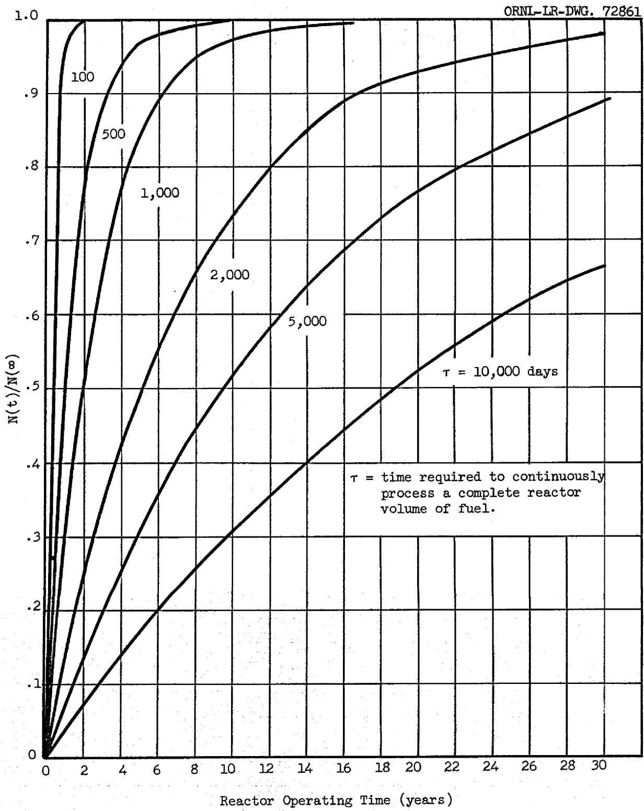  
Fig. H.l. Fission Product Saturation.

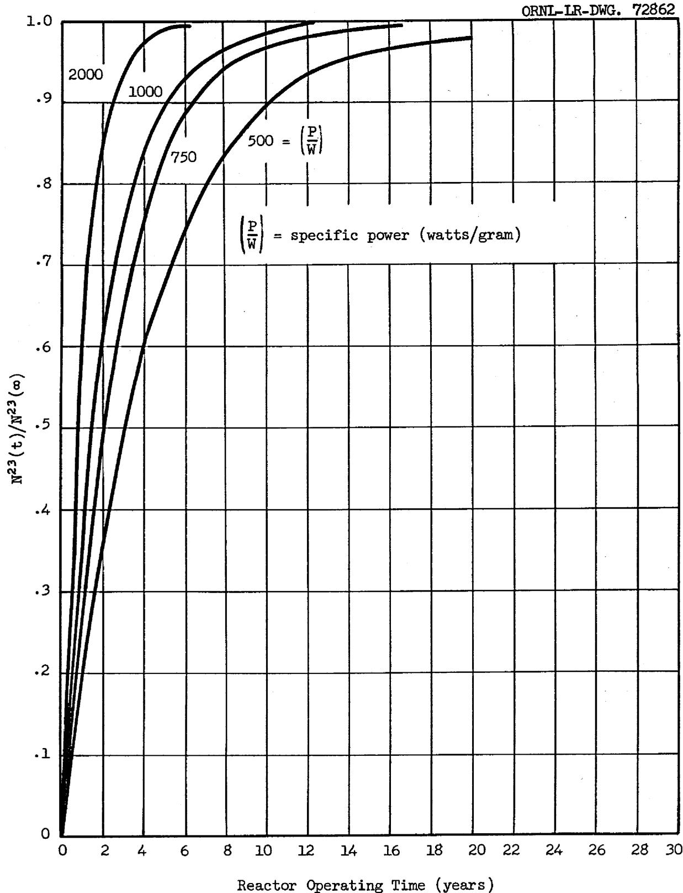  
Fig. H.2. $^{233}\mathrm{U}$ Saturation.

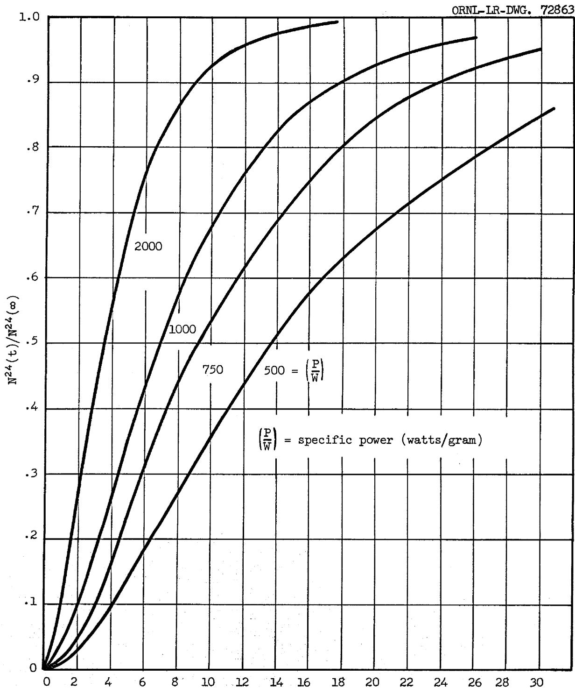  
Reactor Operating Time (years)   
Fig. H.3. $^{234}\mathrm{U}$ Saturation.

ORNL-LR-DWG. 72864

$\left(\frac{\mathrm{P}}{\mathrm{W}}\right) =$ specific power (watts/gram)

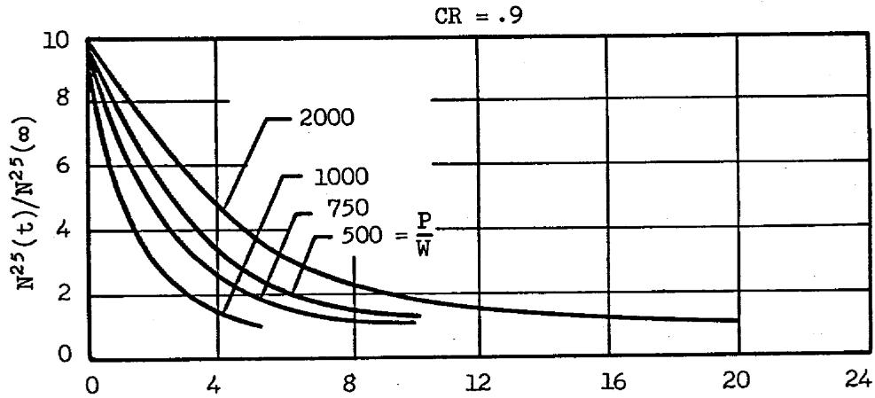

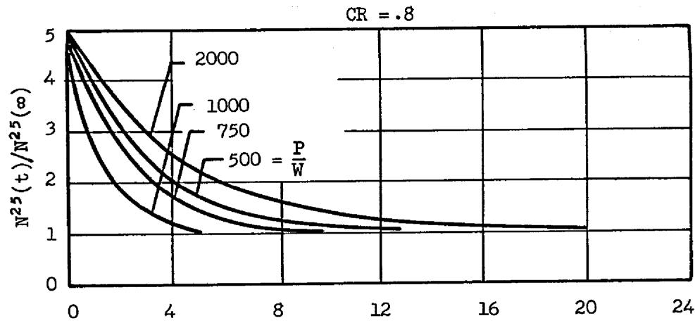

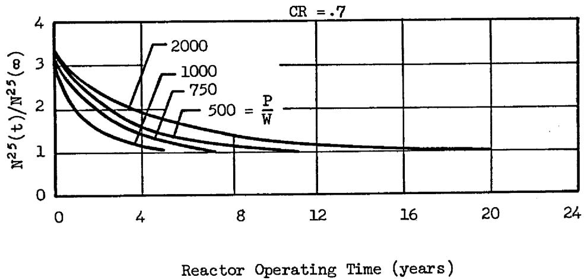  
Fig. H.4. 235U Saturation.

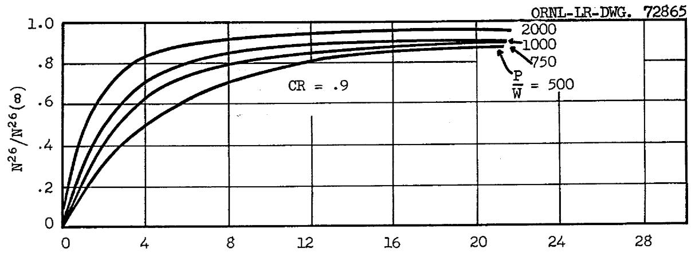

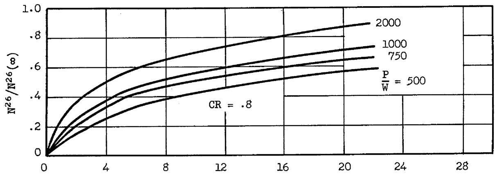

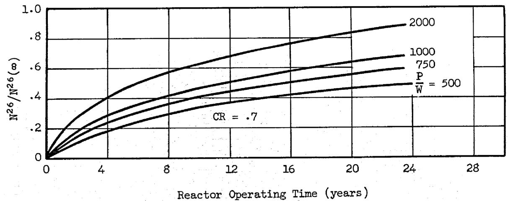  
Fig. H.5. 236U Saturation.

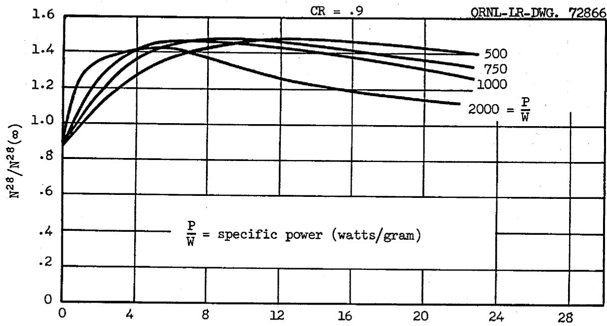

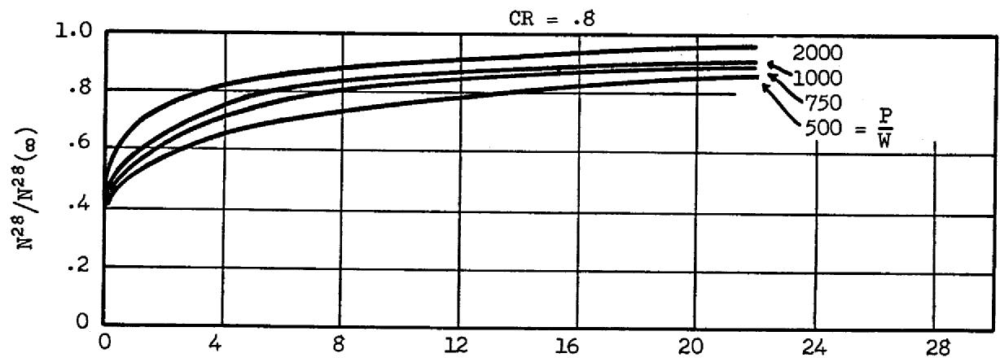

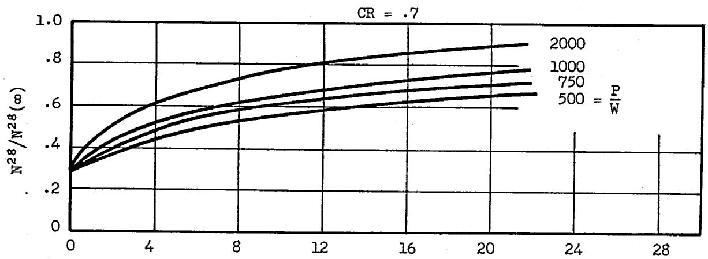  
Fig. H.6. $^{238}\mathrm{U}$ Saturation.

# 2. Uranium-233

Figure H.2 shows the saturation behavior of $^{233}\mathrm{U}$ . The curves show that equilibrium (90% or greater) exists for 90% of the reactor life only if the specific power is greater than about 1800 w/gram. A specific power of 750 w/gram (typical for the MSCR) insures equilibrium (90% or greater) for 80% of the 30-year reactor life.

# 3. Uranium-234

Figure H.3 shows that $^{234}\mathrm{U}$ saturates very slowly for all practical values of specific power. A specific power of 750 w/gram (typical for the MSCR) gives an average concentration over the 30-year reactor life only $65\%$ of the equilibrium value.

# 4. Uranium-235

Figure 4 shows the saturation behavior of $^{235}\mathrm{U}$ . For a conversion ratio of 0.8 and a specific power of 750 w/gram (typical MSCR conditions), the $^{235}\mathrm{U}$ concentration is within $10\%$ of the equilibrium concentration for $65\%$ of the reactor operating life.

# 5. Uranium-236

Figure 5 shows that the approach to equilibrium is quite slow for $^{236}\mathrm{U}$ . For a conversion ratio of 0.8 and a specific power of 750 w/gram (typical MSCR conditions), the $^{236}\mathrm{U}$ concentration never reaches 90% of the equilibrium concentration.

# 6. Uranium-238

Figure H.6 shows the approach to saturation for $^{238}\mathrm{U}$ . For a conversion ratio of 0.8 and a specific power of 750 w/gram (typical MSCR conditions), equilibrium (90% or greater) is insured for 20% of a 30-year reactor operating lifetime.

The results for the six materials considered in this study are shown in Table H.1 for MSCR conditions.

Consideration of the methods used to obtain the results in Table H.1 does not indicate high accuracy. However, the results should be qualitatively

Table H.l. Percentage of MSCR Lifetime Having Nuclide Concentrations Within 10% of Equilibrium   

<table><tr><td>Nuclide</td><td>MSCR Lifetime Having Nuclide Concentration Within 10% of Equilibrium (%)</td></tr><tr><td>Fission Products (1000-day processing)</td><td>80</td></tr><tr><td>233U</td><td>80</td></tr><tr><td>234U</td><td>20</td></tr><tr><td>235U</td><td>65</td></tr><tr><td>236U</td><td>0</td></tr><tr><td>238U</td><td>20</td></tr></table>

correct; and they should create some concern over the validity of the equilibrium state as a suitable condition for reactor economic evaluation. Table H.2 shows the expected direction of the error introduced by assuming the equilibrium condition for the nuclides considered. It is apparent from Table H.2 that it is not possible to predict whether equilibrium calculations are intrinsically optimistic or conservative from these results. Also, since the relative magnitude of the competing effects depends on reactor type, the characteristics of the particular reactor must enter into an assessment of the direction and magnitude of the error associated with the equilibrium assumption.

The magnitude of the effect of these factors on reactor economic evaluations is not known. However, an extensive study should be made to examine these problems. Reactor evaluations based on the equilibrium condition are so convenient, economical, and unambiguous that they should be used if possible.

Table H.2. Effect of the Equilibrium Assumption on Calculated Reactor Performance   

<table><tr><td>Material</td><td>Effect on Calculated Performance</td></tr><tr><td>Fission Products233U</td><td>Conservative (overestimate)Optimistic (overestimate)</td></tr><tr><td>234U</td><td>Conservative* (overestimate)</td></tr><tr><td>235U</td><td>Optimistic (underestimate)</td></tr><tr><td>236U</td><td>Conservative* (overestimate)</td></tr><tr><td>238U</td><td>Conservative* (overestimate)</td></tr></table>

*These conclusions are based on an equilibrium calculation with no corrections. These materials are actually calculated using adjustment factors which average the concentrations over the life of the reactor. The direction of the expected error under this assumption is not known.

# Appendix I

# ESTIMATES OF PHYSICAL PROPERTIES OF LITHIUM-BERYLLIUM MSCR FUEL AND COOLANT SALTS

R. Van Winkle

# Introduction

Estimated physical properties of three fuel salt mixtures at $1200^{\circ}\mathrm{F}$ and one coolant salt at $1062^{\circ}\mathrm{F}$ for use in heat transfer and pressure drop calculations of the MSCR study are listed below in Table I.1.

Table I.1. MSCR Salt Properties   

<table><tr><td>Mixture</td><td>MSCR No. 1</td><td>MSCR No. 2</td><td>MSCR No. 3</td><td>Coolant</td></tr><tr><td>Temperature, °F</td><td>1200</td><td>1200</td><td>1200</td><td>1062</td></tr><tr><td>Composition 
mole % 
LiF-BeF2-ThF4</td><td>71-16-13</td><td>68-23-9</td><td>66-29-5</td><td>66-34-0</td></tr><tr><td>Liquidus Temp, °F</td><td>941</td><td>887</td><td>860</td><td>851</td></tr><tr><td>Mol. Wt.</td><td>66.03</td><td>56.2</td><td>46.2</td><td>33.14</td></tr><tr><td>Density, lb/ft3</td><td>215.6</td><td>190.1</td><td>163.0</td><td>120.5</td></tr><tr><td>Density, g/cc</td><td>3.454</td><td>3.045</td><td>2.610</td><td>1.931</td></tr><tr><td>Viscosity, lb/hr-ft</td><td>24.2</td><td>21</td><td>18.9</td><td>20.0</td></tr><tr><td>Thermal Conductivity 
Btu/hr-ft-°F</td><td>2.67</td><td>2.91</td><td>3.10</td><td>3.5</td></tr><tr><td>Heat Capacity, 
Btu/lb-°F</td><td>0.318</td><td>0.383</td><td>0.449</td><td>0.526</td></tr></table>

The bases for these estimates, some temperature-dependent relationships and atom number densities are given for cases of interest.

# Viscosity

Experimental values of the viscosity of several different compositions of the mixture $\mathrm{LiF - BeF_2 - UF_4 - ThF_4}$ (and some estimated values) are listed in Table I.2 at temperatures of $600^{\circ}$ , $700^{\circ}$ and $800^{\circ}\mathrm{C}$ . These are plotted in Fig. I.1 which also includes plots of what appear to be reasonable estimates of the viscosity of MSCR Salts 2 and 3. The estimates on these two salts depend on the fact that their compositions lie between those of Mixture 75 and Mixture 133 (which is the same as MSCR No. 1); hence, their viscosity curves may be expected to lie between the curves of the two known mixtures. Viscosities and temperature-dependent viscosity equations of MSRE fuel and coolant salts are listed in Tables I.3 and I.4 for comparison.

The viscosity equation for Mixture 133 (MSCR No. 1) is (1):

$$
n = 0. 0 5 2 6 \exp (4 8 3 8 / T ^ {\circ} K) \text {c e n t i p o i s e}
$$

Table I.2. Some Physical Properties of Various Lithium-Beryllium Molten Fluoride Salts   

<table><tr><td rowspan="2">Mixture Number</td><td rowspan="2" colspan="4">Composition, m/o LiF-BeF2-UF4-ThF4</td><td colspan="3">Viscosity, cp</td><td rowspan="2">Heat Capacity(2) at 700°C</td><td rowspan="2">Mol. Wt.</td></tr><tr><td>600</td><td>700</td><td>800°C</td></tr><tr><td>74</td><td>69</td><td>31</td><td>0</td><td>0</td><td>7.5</td><td>4.9</td><td>3.45(5)</td><td>0.67*(5)</td><td>32.4</td></tr><tr><td></td><td></td><td></td><td></td><td></td><td>7.25</td><td>4.54</td><td>3.10(6)</td><td></td><td></td></tr><tr><td>75</td><td>67</td><td>30.5</td><td>2.5</td><td>0</td><td>8.4*</td><td>5.5*</td><td>3.8*(5)</td><td>0.57*(5)</td><td>39.5</td></tr><tr><td>111</td><td>71</td><td>16</td><td>1</td><td>12</td><td>13.0</td><td>7.1</td><td>4.8(5)</td><td>0.37*(5)</td><td>66.02</td></tr><tr><td>112</td><td>50</td><td>50</td><td>0</td><td>0</td><td>22.2</td><td>10.7</td><td>5.95(5)</td><td>0.65*(5)</td><td>36.5</td></tr><tr><td></td><td></td><td></td><td></td><td></td><td>22.5</td><td>11.6</td><td>6.03(6)</td><td></td><td></td></tr><tr><td>131</td><td>60</td><td>36</td><td>4</td><td>0</td><td>13.0</td><td>7.96</td><td>5.30(6)</td><td>--</td><td>44.96</td></tr><tr><td>132</td><td>57</td><td>43</td><td>0</td><td>0</td><td>13.4</td><td>7.38</td><td>4.50(6)</td><td>--</td><td>35.03</td></tr><tr><td>133</td><td>71</td><td>16</td><td>0</td><td>13</td><td>13.4</td><td>7.55</td><td>4.76(1)</td><td>0.306(1)</td><td>66.03</td></tr></table>

*Estimated values (all others listed are experimental). Numbers in parenthesis are references.

ORNL-LR-Dwg. 62611

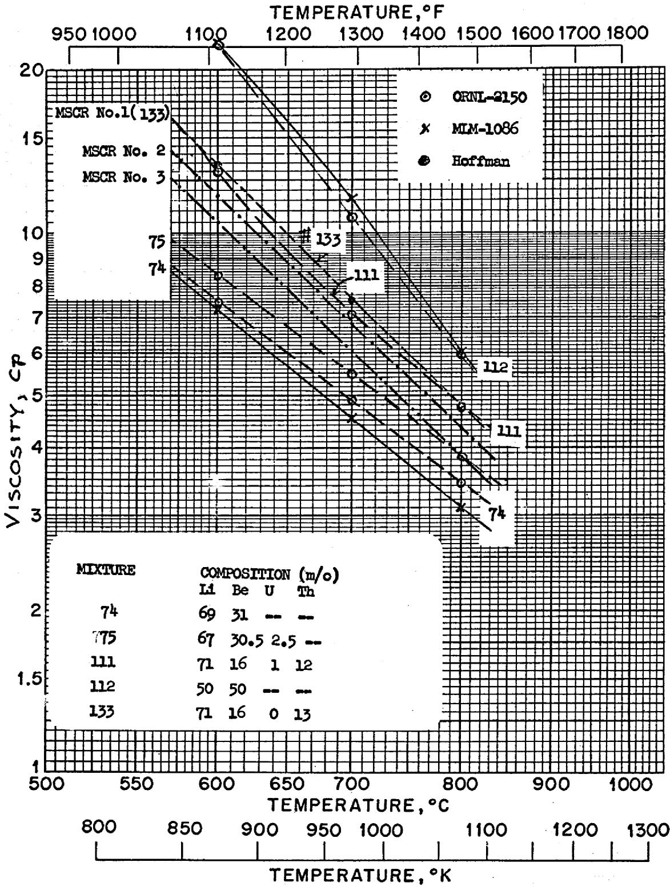  
Fig. I.l. MSCR Salt Viscosity.

Table I.3. Composition and Properties of Fuel Salt for MSRE   

<table><tr><td colspan="2">I. Chemical Composition</td><td>Mole Percent</td></tr><tr><td colspan="2">LiF</td><td>70</td></tr><tr><td colspan="2">BeF2</td><td>23</td></tr><tr><td colspan="2">ZrF4</td><td>5</td></tr><tr><td colspan="2">ThF4</td><td>1</td></tr><tr><td colspan="2">UF4</td><td>1</td></tr><tr><td colspan="2">II. Molecular wt</td><td>43.59</td></tr><tr><td colspan="2">III. Physical Properties</td><td></td></tr><tr><td colspan="2">Density (above liquidus) lb/ft3</td><td>177.8 - (1.94 x 10-2)t</td></tr><tr><td colspan="2">t in °F</td><td></td></tr><tr><td colspan="2">@ 1200°F</td><td>154.5</td></tr><tr><td colspan="2">Liquidus, °F</td><td>842</td></tr><tr><td colspan="2">Heat capacity, Btu/lb-°F</td><td></td></tr><tr><td>Solid</td><td>212 - 806°F</td><td>0.132 + (4.033 x 10-4)t</td></tr><tr><td>Liquid</td><td>887 - 1472°F</td><td>0.575 - (9.99 x 10-5)t</td></tr><tr><td colspan="2">@ 1200°F</td><td>0.455</td></tr><tr><td colspan="2">Heat of fusion (@ 842°F), Btu/lb</td><td>138.6</td></tr><tr><td colspan="2">Viscosity, centipoise, T in °F</td><td>0.1534 e6476/T</td></tr><tr><td colspan="2">Range: 1122-1472°F</td><td></td></tr><tr><td colspan="2">@ 1200°F</td><td>7.64</td></tr><tr><td colspan="2">Thermal conductivity, Btu/hr-ft-°F</td><td>2.74 + (5.516 x 10-4)t</td></tr><tr><td colspan="2"></td><td>- (1.37 x 10-7)t2</td></tr><tr><td colspan="2">t in °F</td><td></td></tr><tr><td colspan="2">@ 1200°F</td><td>3.21</td></tr></table>

Table I.4. Composition and Properties of Coolant Salt for MSRE   

<table><tr><td>I. Chemical Composition</td><td>Mole Percent</td></tr><tr><td>LiF</td><td>66</td></tr><tr><td>BeF2</td><td>34</td></tr><tr><td>II. Molecular Weight</td><td>33.14</td></tr></table>

Table I.4. Continued   

<table><tr><td colspan="2">III. Physical Properties (at normal ave operating Temperature, (1062°F)</td></tr><tr><td>Density, lb/ft3</td><td>120.5</td></tr><tr><td>Viscosity, lb/ft-hr</td><td>20.0</td></tr><tr><td>Specific heat, Btu/lb-°F</td><td></td></tr><tr><td>Solid (122 - 680°F)</td><td>0.210 + (4.71 x 10-4)t</td></tr><tr><td>Liquid (896 - 1508°F)</td><td>0.174 + (3.31 x 10-4)t</td></tr><tr><td>@ 1062°F</td><td>0.526</td></tr><tr><td>Thermal conductivity, Btu-ft/ft2-hr-°F</td><td>3.5</td></tr><tr><td>Liquidus temperature, °F</td><td>851</td></tr></table>

# Heat Capacity

The temperature-dependent equation for heat capacity of Mixture 133 is (1):

$$
C _ {p} = 0. 4 7 3 - 0. 0 0 0 2 3 8 T \text {c a l} / g ^ {- \circ C} (T = ^ {\circ} C)
$$

Values of heat capacity of MSCR Salts 2 and 3 at a given temperature may be estimated by interpolating between published values of other salts of different molecular weights, since heat capacity of molten salts probably varies inversely with molecular weight. Published values of heat capacity at $700^{\circ}\mathrm{C}$ of some known salts are shown in Fig. I.2, which contains a plot of heat capacity as a function of molecular weight.

Heat capacity relationships for MSRE fuel and coolant salts are shown in Tables I.3 and I.4.

# Thermal Conductivity

Like heat capacity, thermal conductivity can be expected to vary inversely with molecular weight. An estimate of the thermal conductivities of the MSCR fuel salts has been made by extrapolating the published

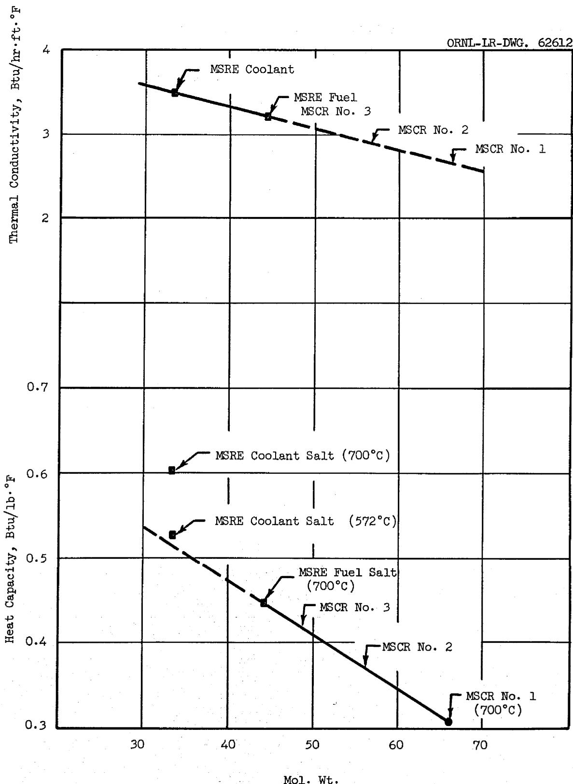  
Fig. I.2. MSCR Salt Thermal Conductivity and Heat Capacity.

values of the lower molecular weight MSRE salts to the higher weights of the MSCR salts. This extrapolation is shown in Fig. I.2. However, the published values may not have much precision or accuracy (1).

# Density

Temperature dependent relationships for calculating the densities of the three MSCR salts are (2):

$$
\begin{array}{l} \rho_ {\text {M S C R N o .} 1} = 3. 9 3 4 - 7. 4 \times 1 0 ^ {- 4} \mathrm {T} \quad \mathrm {g / c m} ^ {3} \quad (\mathrm {T} = ^ {\circ} \mathrm {C}) \\ \rho_ {\text {M S C R N o .} 2} = 3. 4 8 0 - 6. 7 \times 1 0 ^ {- 4} \mathrm {T} \\ \rho_ {\text {M S C R N o . 3}} = 2. 9 9 3 - 5. 9 \times 1 0 ^ {- 4} \mathrm {T} \\ \end{array}
$$

The basis for these estimates is the same as given in reference (3), page 123 with an added term for the ionic volume of thorium equal to $2.82 - 2.94 \times 10^{-3} \mathrm{T}$ .

# Liquidus Temperature

Figure I.3 (from reference 4) was used to obtain the liquidus temperature for the MSCR salts. Mixture 133 (MSCR No. 1) has a liquidus temperature of $505^{\circ}\mathrm{C}$ (p. 58, ref. 4).

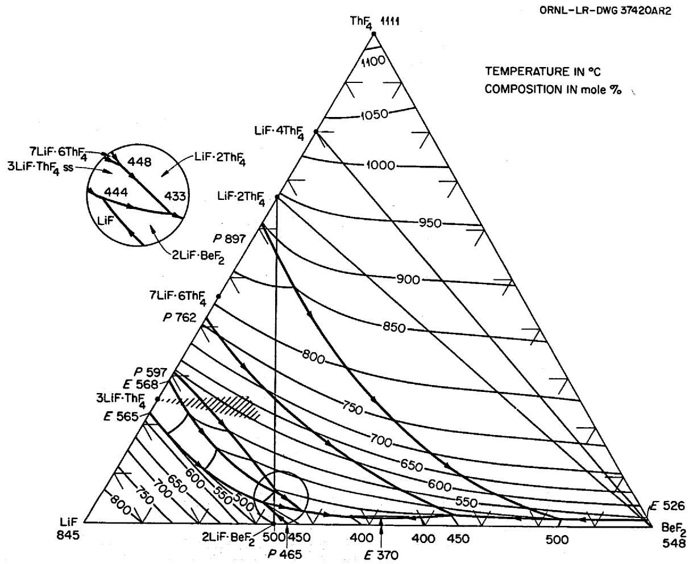  
Fig. I.3. The System LiF-BeF $_2$ -ThF $_4$ .

# References

1. Private communication from H. W. Hoffman.   
2. Private communication from S. Cantor.   
3. Oak Ridge National Laboratory, MSRP Semiann. Progr. Rept. August 1, 1960 to February 28, 1961, USAEC Report ORNL 3122.   
4. C. F. Weaver et al., Phase Equilibria in Molten Salt Breeder Reactor Fuels. 1. The System LiF-BeF $_2$ -UF $_4$ -ThF $_4$ , USAEC Report ORNL-2896, Oak Ridge National Laboratory, December 27, 1960.   
5. S. I. Cohen, W. D. Powers, and N. D. Greene, A Physical Property Summary for ANP Fluoride Mixtures, USAEC Report ORNL-2150, Oak Ridge National Laboratory, August 23, 1956. (Declassified 11/24/59.)   
6. B. C. Blanke et al., Density and Viscosity of Fused Mixtures of Lithium, Beryllium, and Uranium Fluorides, USAEC Report MLM-1086, Monsanto Research Corporation, March 23, 1959.   
W. L. Breazeale, Revisions to MSRE Design Data Sheets - Issue No. 4, MSR-61-100, August 15, 1961.

# Appendix J

FUEL AND CARRIER SALT COST BASES

W. L. Carter

# Introduction

A survey was conducted among suppliers of $\mathsf{ThF}_4$ , $\mathsf{ThO}_2$ , LiF, $\mathsf{BeF}_2$ , $\mathsf{ZrF}_4$ and NaF to determine current market prices. The data are evaluated and a recommended set of values to be used in molten salt converter and breeder reactor calculations is presented. The cost data are needed in calculating fuel cycle costs.

The following values are recommended for use in molten salt reactor calculations:

ThF₄ $ 6.50 per pound

BeF 7.00 per pound

LiF 14.70 per pound

$\mathbf{ZrF}_{4}$ 4.00 per pound

One of the purposes of the study of thorium breeder and converter reactors is to furnish comparative fuel cycle cost data on the various systems as well as nuclear performance data. The market survey was conducted to obtain current and reliable price information on several chemical compounds which will be needed in rather large inventory and for which the consumption rate may be significant. The inquiries were concerned primarily with molten salt reactor materials, namely, thorium fluoride, lithium fluoride, beryllium fluoride, zirconium fluoride and sodium fluoride; in addition, prices were obtained for thorium oxide.

Several manufacturers of these chemicals were contacted, and a summary of their price schedules is given in Tables J.l through J.6. Since it is appropriate to associate a date with a market quotation, it may be noted that these data were obtained during the period November 1961 - January 1962. There is one exception: the comparative figures quoted from document Y-13l2 were published in December 1959.

Table J.1. Cost Data for Thorium Fluoride   

<table><tr><td rowspan="2"></td><td colspan="4">Cost</td></tr><tr><td>$/lb ThF4a</td><td>$/lb ThF4</td><td>$/kg Tha</td><td>$/kg Th</td></tr><tr><td>Vendor or Source of Information</td><td>GCDb</td><td>Y-1312c</td><td>GCD</td><td>Y-1312</td></tr><tr><td>Quantity</td><td></td><td></td><td></td><td></td></tr><tr><td>Initial order of 127,000 kg ThF4</td><td>6.00d</td><td>6.50</td><td>17.52d</td><td>18.98</td></tr><tr><td>Replacement rate of 37,100 kg ThF4/yr</td><td>(d)</td><td></td><td>(d)</td><td></td></tr><tr><td>Initial order of 1,271,000 kg ThF4</td><td>6.00d</td><td></td><td>17.52d</td><td></td></tr><tr><td>Replacement rate of 371,000 kg ThF4/yr</td><td>(d)</td><td></td><td>(d)</td><td></td></tr></table>

aNo assay given for the material.   
bGCD - General Chemical Division, Allied Chemical Corporation, P.O. Box 70, Morristown, New Jersey. This vendor says price is only a rough estimate.   
cR. G. Orrison, Thorium Metal Processes, Y-1312 (December 18, 1959). This price is not based on the indicated quantity.   
d No distinction made in price because of quantity or rate.

Table J.2. Cost and Composition Data for Thorium Oxide   

<table><tr><td rowspan="3"></td><td colspan="6">Cost Data</td></tr><tr><td colspan="6">Cost</td></tr><tr><td>$/lb ThO2</td><td>$/lb ThO2</td><td>$/lb ThO2</td><td>$/kg Th</td><td>$/kg Th</td><td>$/kg Th</td></tr><tr><td>Vendor or Source of Information</td><td>APa</td><td>AP</td><td>Y-1312b</td><td>AP</td><td>AP</td><td>Y-1312</td></tr><tr><td>Material Designation</td><td>Code 111</td><td>Code 112</td><td></td><td>Code 111</td><td>Code 112</td><td></td></tr><tr><td>Material Form</td><td>Powder</td><td>Powder</td><td>Not stated</td><td>Powder</td><td>Powder</td><td>Not stated</td></tr><tr><td>Cost quoted for</td><td></td><td></td><td></td><td></td><td></td><td></td></tr><tr><td>Initial order of 127,000 kg ThO2</td><td>7.00</td><td>7.50</td><td>5.75-8.50</td><td>17.52</td><td>18.78</td><td>14.39-21.28</td></tr><tr><td>Replacement rate of 37,100 kg ThO2/yr</td><td>7.00</td><td>7.50</td><td></td><td>17.52</td><td>18.78</td><td></td></tr><tr><td>Initial order of 1,270,000 kg ThO2</td><td>7.00</td><td>7.50</td><td></td><td>17.52</td><td>18.78</td><td></td></tr><tr><td>Replacement rate of 371,000 kg ThO2/yr</td><td>7.00</td><td>7.50</td><td></td><td>17.52</td><td>18.78</td><td></td></tr></table>

Composition Data   

<table><tr><td></td><td colspan="3">Typical Analysis (ppm unless indicated)</td></tr><tr><td>Vendor or Source of Information Element or Compound</td><td>AP</td><td>AP</td><td>Y-1312</td></tr><tr><td>ThO2</td><td>99% min</td><td>99% min</td><td>Not given</td></tr></table>

$^{\mathrm{a}}$ AP - American Potash and Chemical Corporation, 99 Park Avenue, New York 16, New York.   
bR. G. Orrison, Thorium Metal Processes, Y-1312 (December 18, 1959). This price is not based on the indicated quantity.

Table J.2 (continued)   

<table><tr><td rowspan="3">Vendor or Source of Information Element or Compound (continued)</td><td colspan="3">Composition Data</td></tr><tr><td colspan="3">Typical Analysis (ppm unless indicated)</td></tr><tr><td>AP</td><td>AP</td><td>Y-1312</td></tr><tr><td>Rare earth oxide</td><td>50</td><td>30</td><td></td></tr><tr><td>Sulfate, SO3</td><td>100</td><td>50</td><td></td></tr><tr><td>Phosphate, P2O5</td><td>50</td><td>10</td><td></td></tr><tr><td>Fe</td><td>50</td><td>6</td><td></td></tr><tr><td>CaO</td><td>100</td><td>10</td><td></td></tr><tr><td>MgO</td><td>100</td><td>1</td><td></td></tr><tr><td>Na + K + Li</td><td>2000</td><td>1</td><td></td></tr><tr><td>Silica, SiO2</td><td>500</td><td>5</td><td></td></tr><tr><td>Boron, B</td><td></td><td>0.1</td><td></td></tr><tr><td>Uranium, U</td><td></td><td>10</td><td></td></tr><tr><td>Loss on ignition</td><td>5000</td><td>5000</td><td></td></tr><tr><td>Sm</td><td>10</td><td>1-2</td><td></td></tr><tr><td>Eu</td><td>1</td><td>0.2</td><td></td></tr><tr><td>Gd</td><td>10</td><td>1</td><td></td></tr><tr><td>Dy</td><td>5</td><td>1</td><td></td></tr></table>

Table J.3. Cost Dataa for Lithium Fluoride   

<table><tr><td></td><td colspan="2">Costb</td></tr><tr><td></td><td>$/lb LiF</td><td>$/kg Li</td></tr><tr><td>Quantity</td><td></td><td></td></tr><tr><td>Initial order of 16,000 kg Li</td><td>(c)</td><td>(c)</td></tr><tr><td>Replacement rate of 5,100 kg Li/yr</td><td>(c)</td><td>(c)</td></tr></table>

aThe sources of information are Atomic Energy Commission-Oak Ridge Operations, Oak Ridge Gaseous Diffusion Plant, and Union Carbide Company - Y-12 Plant.

bThe price is for (c) at. $\%$ 7Li and includes a basic charge for the material produced as the monohydrate $(\mathrm{LiOH}\cdot \mathrm{H}_2\mathrm{O})$ plus a conversion cost for $\mathrm{LiOH}\cdot \mathrm{H}_2\mathrm{O}\rightarrow \mathrm{LiF}$ plus a feed cost plus an AEC overhead cost.

cClassified information.

Table J.4. Cost and Composition Data for Beryllium Fluoride   

<table><tr><td colspan="6">Cost Data</td></tr><tr><td></td><td></td><td colspan="4">Cost</td></tr><tr><td></td><td></td><td colspan="2">$/lb BeF2</td><td colspan="2">$/kg Be</td></tr><tr><td>Vendor</td><td></td><td>\( BBCo^a \)</td><td>\( BCorp^b \)</td><td>BBCo</td><td>BCorp</td></tr><tr><td>Quantity \( ^c \)</td><td></td><td></td><td></td><td></td><td></td></tr><tr><td colspan="2">Initial order of 23,800 kg BeF2</td><td>6.66</td><td>7.25</td><td>76.52</td><td>83.29</td></tr><tr><td colspan="2">Replacement rate of 6,950 kg BeF2/yr</td><td>6.00</td><td>7.25</td><td>68.93</td><td>83.29</td></tr><tr><td colspan="2">Initial order of 238,000 kg BeF2</td><td>6.48</td><td>6.95</td><td>74.45</td><td>79.85</td></tr><tr><td colspan="2">Replacement rate of 69,500 kg BeF2/yr</td><td>6.00</td><td>6.95</td><td>68.93</td><td>79.85</td></tr><tr><td colspan="6">Composition Data</td></tr><tr><td>Element or Compound</td><td colspan="2">Manufacturing Specifications</td><td colspan="3">Typical Analysis of Manufactured Material \( ^d \)</td></tr><tr><td>\( BeF_2 \)</td><td colspan="2">99.5 ± 0.5 wt %</td><td colspan="3">99.5 wt % min</td></tr><tr><td>\( H_2O \)</td><td colspan="2">0.1-0.5 wt %</td><td colspan="3">0.06 wt%</td></tr><tr><td>Fe</td><td colspan="2">400 ppm max</td><td colspan="3">25 ppm</td></tr><tr><td>Ni</td><td colspan="2">100 ppm max</td><td colspan="3">20 ppm</td></tr><tr><td>Cr:</td><td colspan="2">100 ppm max</td><td colspan="3">&lt;1 ppm</td></tr><tr><td>Al</td><td colspan="2">200 ppm max</td><td colspan="3">90 ppm</td></tr><tr><td>S</td><td colspan="2">500 ppm max</td><td colspan="3">750 ppm</td></tr></table>

Brush Beryllium Company, 5209 Euclid Avenue, Cleveland 3, Ohio.   
bThe Beryllium Corporation, Reading, Pennsylvania.   
cShipped as $1\times 1\times 1$ -inch lumps.   
dThe analysis given is for BBCo material; no analysis was given for BCorp material.

Table J.5. Cost and Component Data for Zirconium Fluoride   

<table><tr><td colspan="5">Cost Data</td></tr><tr><td></td><td colspan="4">Cost</td></tr><tr><td></td><td colspan="2">$/1b ZrF4</td><td colspan="2">$/kg Zr</td></tr><tr><td>Vendor</td><td>TADa</td><td>GCDb</td><td>TAD</td><td>GCD</td></tr><tr><td>Quantity</td><td></td><td></td><td></td><td></td></tr><tr><td>Initial order of 55,100 kg ZrF4</td><td>4.00</td><td>4.50</td><td>16.13</td><td>18.15</td></tr><tr><td>Replacement rate of 16,100 kg ZrF4/yr</td><td>4.00</td><td>(c)</td><td>16.13</td><td></td></tr><tr><td>Initial order of 551,000 kg ZrF4</td><td>3.55</td><td>(c)</td><td>14.32</td><td></td></tr><tr><td>Replacement rate of 161,000 kg ZrF4/yr</td><td>3.55</td><td>(c)</td><td>14.32</td><td></td></tr><tr><td colspan="5">Composition Data</td></tr><tr><td></td><td colspan="4">Typical Assay (wt %)</td></tr><tr><td>Vendor</td><td colspan="2">TAD</td><td colspan="2">GCD</td></tr><tr><td>Element or Compound</td><td></td><td></td><td></td><td></td></tr><tr><td>ZrF4</td><td colspan="2">Not given</td><td colspan="2">98.5+</td></tr><tr><td>Chlorides</td><td colspan="2"></td><td colspan="2">0.007</td></tr><tr><td>S</td><td colspan="2"></td><td colspan="2">0.003</td></tr><tr><td>Hf</td><td colspan="2"></td><td colspan="2">0.01</td></tr><tr><td>Fe</td><td colspan="2"></td><td colspan="2">0.03</td></tr><tr><td>Ni</td><td colspan="2"></td><td colspan="2">0.003</td></tr></table>

aTAD - Titanium Alloy Manufacturing Division, National Lead Co., lll Broadway, New York 6, New York. No assay was given; however, the bid was for Hf-free material.   
bGCD - General Chemical Division, Allied Chemical Corp., P.O. Box 70, Morristown, New Jersey. This vendor says the price is approximate.   
cNo cost distinction is made for quantity or rate.

Table J.6. Cost and Composition Dataa for Sodium Fluoride   

<table><tr><td colspan="3">Cost Data</td></tr><tr><td></td><td colspan="2">Costb</td></tr><tr><td></td><td>$/1b NaF</td><td>$/kg Na</td></tr><tr><td>Shipping Containers</td><td></td><td></td></tr><tr><td>100 lb multiwall paper bags</td><td>0.135</td><td>0.542</td></tr><tr><td>375 lb leverpak fiber drums</td><td>0.139</td><td>0.558</td></tr><tr><td colspan="3">Composition Data</td></tr><tr><td></td><td colspan="2">Typical Assay (wt %)</td></tr><tr><td>Elements</td><td></td><td></td></tr><tr><td>Na</td><td colspan="2">Major constituent</td></tr><tr><td>Ca</td><td colspan="2">0.05-0.5</td></tr><tr><td>Al</td><td colspan="2">0.03-0.3</td></tr><tr><td>Si</td><td colspan="2">0.01-0.1</td></tr><tr><td>Fe, Mg</td><td colspan="2">0.0005-0.005 each</td></tr><tr><td>Cu</td><td colspan="2">Trace, &lt;0.0001</td></tr><tr><td>Sc</td><td colspan="2">Not detected, &lt;0.1</td></tr><tr><td>K, Ba</td><td colspan="2">Not detected, &lt;0.01 each</td></tr><tr><td>B, Mo</td><td colspan="2">Not detected, &lt;0.001 each</td></tr><tr><td>Ti, Mn, Co, Ni, V</td><td colspan="2">Not detected, &lt;0.0005 each</td></tr><tr><td>Cr, Ag</td><td colspan="2">Not detected, &lt;0.0001 each</td></tr></table>

aAll information is from the Blockson Chemical Company, P.O. Box 1407, Joliet, Illinois.   
bFor an initial order of 75,800-758,000 kg NaF and a replacement rate of 22,100-221,000 kg NaF/yr.

# Bases for Establishing Prices

It was assumed that prices would be established for a large molten salt, power-producing system. Two conditions were visualized: (a) A 1000 Mwe (2500 Mwt) station and (b) ten of these 1000 Mwe stations in simultaneous operation. These conditions established the initial inventory requirements. The consumption rates were calculated by assuming that the fuel salt would be discarded after removal of fissile material on a 1000-day cycle. It was assumed that thorium and carrier salt could not be decontaminated and recovered.

Vendors were asked to quote prices on the basis of producing materials in the quantities desired by existing methods and according to current specifications. It was not considered appropriate to ask a vendor in an information-seeking survey such as this to do much research into manufacturing procedures and schedules if his operations would be significantly affected by these additional quantities. Consequently, no rigid specifications were affixed to these chemicals other than the obvious one that all materials should have extremely low concentrations of high neutron cross section materials.

# General Comments on Price Quotations

# Thorium Fluoride

Only one manufacturer was interested in making a quotation for $\mathrm{ThF}_4$ , and it was admitted that this was a rough approximation. The price compared favorably with the value quoted by Orrison (1) in a previous market survey.

# Zirconium Fluoride

Vendors were asked to quote on hafnium-free $\mathsf{ZrF}_4$ . The quantities requested are apparently quite large compared with available production.

# Beryllium Fluoride

The suppliers indicate that there would be no problem in supplying the quantities requested. Beryllium fluoride is an intermediate compound in the production of beryllium metal. Although the vendors state that the prices quoted are tentative, they are probably rather accurate.

# Sodium Fluoride

This chemical is available in large supply. The quoted prices should be quite firm. Sodium fluoride is so inexpensive that its use in a reactor contributes negligibly to the fuel cycle cost.

# Thorium Oxide

Thorium oxide is available in large supply; the quoted prices are perhaps rather firm. The quotes compare favorably with the values given by Orrison (1).

# Lithium Fluoride

Lithium fluoride occupies a singular position in the molten salt fuel system particularly with regard to availability and price. Since the lithium content must have a high $^{7}\mathrm{Li}$ assay, the only source of material is from AEC production facilities. AEC-ORO, Y-12 and ORGDP personnel (2) were instrumental in developing a classified price schedule for high isotopic purity $^{7}\mathrm{Li}$ in quantities to meet the requirements of a large molten salt power installation.

Lithium is produced as $\mathrm{LiOH} \cdot \mathrm{H}_2\mathrm{O}$ for which a reasonably accurate price can be computed. However, an uncertainty exists in the charge for converting the hydroxide to an anhydrous fluoride product since this operation has not been attempted except in small-scale batches; this charge was estimated. A schedule of basic charges was recommended (3,4) for computing the price of lithium fluoride in 99.995 at. $\%$ $7_{\text{Li}}$ :

# $/kg Li*

$\mathrm{LiOH}\cdot \mathrm{H}_20$ $= \mathrm{LiOH}\cdot \mathrm{H}_20 - \mathrm{LiF}$ conversion $= \mathrm{L}$ iF conversion   
Cascade feed cost (4) $=$ Base cost $=$ Plus $15 \%$ AEC overhead (4)

The values have not been released by the Atomic Energy Commission as an official price for high purity $^7\mathrm{Li}$ ; they are confidential information for internal use only.

The official price was $120/kg of Li metal as the fluoride in November 1959 (5) for a grade containing 99.99% of $^7\mathrm{Li}$ . This price was adopted for material containing 99.995% $^7\mathrm{Li}$ produced in large quantities.

# Recommended Values for Molten Salt Fuel

Based on the values given in Tables J.1, J.3, J.4, and J.5, the following prices are recommended for use in molten salt reactor fuel cycle calculations. These prices were chosen more or less arbitrarily from the accumulated data since there was no reason to have more credence in one value than another.

<table><tr><td>Element</td><td>$/lb of fluoride compound</td><td>$/kg of metal (as fluoride)</td></tr><tr><td>Thorium</td><td>6.50</td><td>19.00</td></tr><tr><td>Beryllium</td><td>7.00</td><td>80.42</td></tr><tr><td>Lithium</td><td>14.70</td><td>120.00</td></tr><tr><td>Zirconium</td><td>4.00</td><td>16.13</td></tr></table>

# References

1. R. G. Orrison, Thorium Metal Processes, Y-1312 (December 18, 1959).   
2. Personal communications with E. E. Keller, AEC-ORO, Neal Dow, UCC-Y-12 Plant, and Murray Hanig, UCC-ORGDP.   
3. Letter from R. G. Jordan (Y-12) to C. A. Keller (AEC-ORO), No. Y-AO-2314, January 10, 1962.   
4. Personal communication with E. L. Keller, AEC-ORO (January 18, 1962).   
5. Nucleonics, 17(11): 31 (November 1959).

# MSCR POWER LIMITATION RESULTING FROM MODERATOR THERMAL STRESS

R. H. Chapman

# Summary

In order to achieve the maximum performance from the MSCR, it is necessary to operate at a power level corresponding to some limiting condition. The limiting condition may be arbitrarily imposed upon the system or it may be an inherent feature in the design. In certain conceivable situations thermal stress in the graphite moderator may limit the power output of a single reactor core. It is therefore of interest to estimate the maximum power output as a function of core diameter for the case where thermal stress is the limiting condition.

It is assumed for the purpose of this memorandum that the reactor core is a cylinder of $\mathrm{L} / \mathrm{D} = 1.0$ . Honeycomb shaped fuel channels are formed by the proper spacing of hexagonal graphite moderator prisms. For the purpose of estimating the thermal stress, it is also assumed that the hexagonal prisms can be approximated by a right circular cylinder of a diameter equal to the distance across the flats of the hex. It is noted from the geometry of the hexagonal unit cell that the fuel volume fraction, $f_{\nu}$ , the fuel channel thickness, $t_{c}$ , and the distance across flats, $d_{c}$ , are interrelated. Figure K.l shows the relationship for the region of interest. The size of the unit cell is obtained by adding the channel thickness to the distance across flats of the moderator prisms.

Assuming uniform heat generation, the maximum thermal stress (at the surface) is given1 for a solid cylinder as

$$
\sigma_ {t} = \frac {1}{2} \frac {\alpha E}{1 - v} \frac {q ^ {\prime \prime \prime} r _ {o} ^ {2}}{4 k} \tag {1}
$$

where

$$
\sigma_ {t} = \text {t a n g e n t i a l}
$$

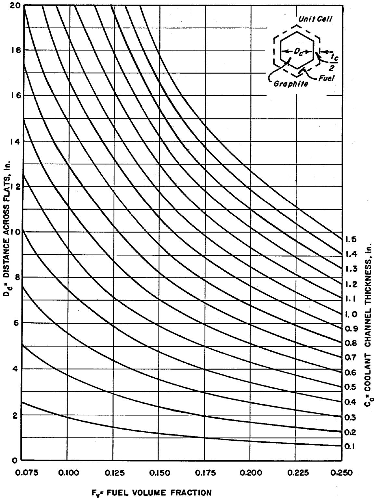  
Fig. K.l. Hexagonal Unit Cell Relationship.

$$
\alpha = \text {c o e f f i c i e n t} \text {t h e r m a l} \text {e x p a n s i o n}, \frac {\text {i n .}}{\text {i n .} ^ {\circ} \mathrm {F}},
$$

$$
E = \text {m o d u l u s}
$$

$$
v = \text {P o i s s o n ' s}
$$

$$
q ^ {\prime \prime \prime} = \text {v o l u m e t r i c h e a t s o u r c e}, \frac {\text {B T U}}{\text {h r f t} ^ {3}},
$$

$$
r _ {o} = \text {r a d i u s o f c y l i n d e r}, f t,
$$

$$
k = \text {t h e r m a l} \quad \text {c o n d u c t i v i t y}, \quad \frac {\mathrm {B T U}}{\mathrm {h r f t} ^ {\circ} \mathrm {F}}.
$$

It is assumed that the uniform volumetric heat generation term can be related to the core heat production rate by

$$
q ^ {\prime \prime \prime} = \frac {f _ {p} Q _ {c}}{V _ {M}} \left(\frac {P _ {\max}}{\overline {{P}}}\right) C _ {1} \tag {2}
$$

where

$$
f _ {p} = \text {f r a c t i o n o f t o t a l h e a t w h i c h i s p r o d u c e d i n m o d e r a t o r},
$$

$$
Q _ {c} = \text {c o r e h e a t p r o d u c t i o n r a t e}, M w t,
$$

$$
V _ {M} = \text {v o l u m e m o d e r a t o r i n c o r e , f t} ^ {3},
$$

$$
C _ {1} = \text {c o n v e r s i o n f a c t o r} = 3. 4 1 3 \times 1 0 ^ {6} \frac {\mathrm {B T U}}{\mathrm {h r} - \mathrm {M w}},
$$

$$
\frac {P _ {\max}}{\overline {{P}}} = \text {r a t i o}
$$

The core moderator volume is given for $\mathrm{L} / \mathrm{D}_{\mathrm{c}} = 1.0$ as

$$
V _ {M} = \left(1 - f _ {v}\right) \frac {\pi D ^ {3}}{4}. \tag {3}
$$

Substituting Eq. (2) and (3) into (1) and rearranging, the following expression is obtained:

$$
\frac {Q _ {\mathrm {c}}}{1 - \mathrm {f} _ {\mathrm {v}}} = \frac {2 \pi \mathrm {k}}{\mathrm {c} _ {1}} \frac {1 - v}{\alpha \mathrm {E}} \sigma_ {\mathrm {t}} \left(\frac {\bar {P}}{\mathrm {P} _ {\max }}\right) \frac {\mathrm {D} _ {\mathrm {c}} ^ {3}}{\mathrm {f} _ {\mathrm {p}} \mathrm {r} _ {\mathrm {o}} ^ {2}} \tag {4}
$$

Assuming values for the various properties of graphite, i.e., $\sigma_{t}$ , $\alpha$ , E, $\nu$ , and k, and representative values for the fraction of total heat generated in the graphite and for the peak-to-average power density ratio, a family of curves of heat production versus diameter may be plotted wherein $r_{0}$ is the parameter.

Choosing an allowable stress value of graphite is a somewhat arbitrary operation. Experience has shown in the production of AGOT graphite for the EGCR (16 in. × 16 in. × 20 ft long columns) that the mechanical properties vary widely between different blocks of the material, vary across the cross-section of the large blocks, and depend on the orientation relative to the direction of extrusion. Fracture strain is probably a better criteria for failure than stress, since it has been shown to be fairly constant at about 0.1 to 0.2%. Tests have also shown that strength is not temperature dependent at least up to $1100^{\circ}\mathrm{F}$ . Since the ratio of stress to modulus of elasticity appears in Eq. (4), the value of the fracture strain can be substituted and thus side-step the issue of fraction stress. A value of 0.1% is assumed as a failure criterion.

For Poisson's ratio a value of 0.4 is recommended, and for the thermal coefficient of expansion, a value of $2.7 \times 10^{-6}$ in./in. $^\circ \mathrm{F}$ is used. $^3$ A value of 15 BTU/hr·ft· ${}^\circ \mathrm{F}$ is used for the thermal conductivity at $1200^\circ \mathrm{F}$ . $^4$ A value of 2.5 is assumed for the ratio of peak-to-average power density to account for the maximum thermal stress condition. This is about the value computed for the MSRE. $^5$ A value of 0.05 is assumed for the fraction of total heat produced in the moderator, essentially the same as for the MSRE.

Multiplying the heat rate by the overall net thermodynamic efficiency, one obtains the net power output. An assumed value of $40\%$ efficiency is used. With these assumptions Eq. (4) becomes

$$
\frac {\mathrm {P}}{1 - \mathrm {f} _ {\mathrm {v}}} = 0. 0 1 9 6 \frac {\mathrm {D} ^ {3}}{\mathrm {r} _ {\mathrm {o}} ^ {2}}, \text {M w e (n e t)}. \tag {5}
$$

Figure K.2 is a plot of Eq. (5) for the range of interest. Also shown in the figure are 500 and 1000 Mwe condition for fuel volume fractions of 0.10, 0.15, and 0.20. With the figure, and for a given set of conditions one is able to estimate quickly the maximum graphite size permitted by thermal stress considerations. For example, if it is desired to provide 1000 Mwe with single core of 20 ft diam and 10 vol. % fuel, it is seen from the figure that the largest graphite moderator prism is limited to about 9 in. across flats.

It should be pointed out that the data used in constructing the figure are subject to considerable uncertainty. Design data for large sections of graphite such as likely to be used in the MSCR are, of course, unavailable at this time. However, it is believed that the results obtained from the figure will be conservative.

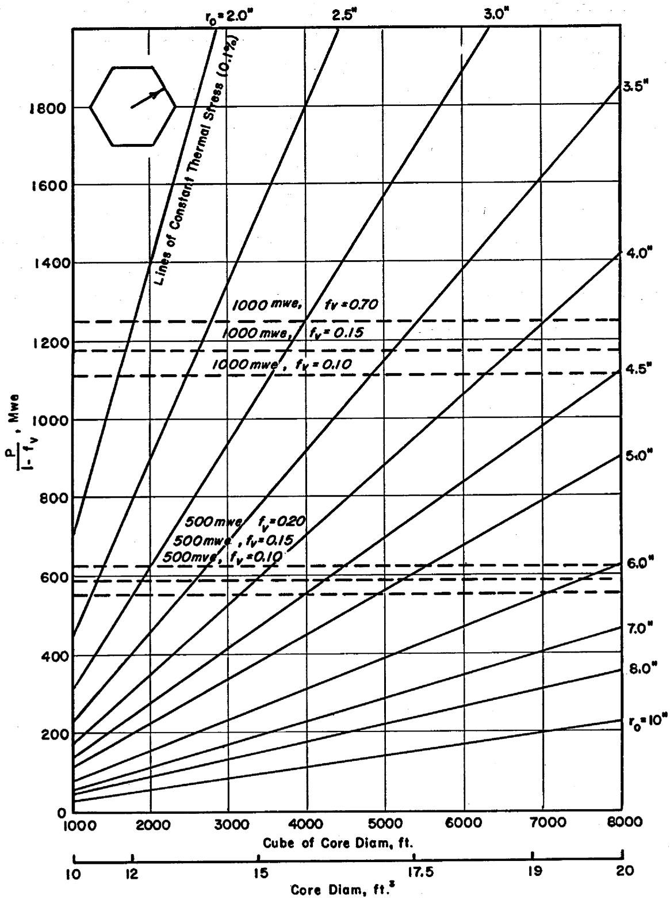  
Fig. K.2. Thermal Stress Power Limitation.

# References

1. Ralph Hankel, Stress Temperature Distributions, Nucleonics, Vol. 18, No. 11, pp. 168-169 (November 1960).   
2. B. L. Greenstreet, Oak Ridge National Laboratory, personal communication.   
3. S. E. Moore, Oak Ridge National Laboratory, personal communication.   
4. L. G. Alexander et al., Thorium Breeder Reactor Evaluation, Part 1 - Fuel Yield and Fuel Cycle Costs in Five Thermal Breeders - Appendices, ORNL-CF-61-3-9, Appendices, p. 33 (May 24, 1961).   
5. C. W. Nestor, MSRE Preliminary Physics Report, ORNL-CF-61-4-62 (April 9, 1961).

# Appendix L

# VOLUMES OF FUEL SALT AND INTERMEDIATE COOLANT SALT FOR 1000 Mwe MOLTEN SALT CONVERTER REACTOR

D. B. Janney

# Introduction

The volumes of the salt streams (including heels in dump tanks, etc.) were calculated for the reference design described in Sec. 4.

# Fuel Salt Volume

Table L.1. Volume of MSCR Fuel Salt   

<table><tr><td>A.</td><td>Reactor</td><td>1360 ft3</td></tr><tr><td>B.</td><td>Piping</td><td>320 ft3</td></tr><tr><td>C.</td><td>Pumps</td><td>130 ft3</td></tr><tr><td>D.</td><td>Primary Heat Exchangers</td><td>575 ft3</td></tr><tr><td>E.</td><td>Dump Tanks, Control Tanks</td><td>115 ft3</td></tr><tr><td></td><td>TOTAL</td><td>2500 ft3</td></tr></table>

These volumes were calculated as follows:

A. Reactor

$$
\text {C o r e} (L = 2 0 f t, D = 2 0 f t)
$$

$$
\text {A n n u l u s} (L = 2 0 f t, t = 1 \text {i n .})
$$

$$
\begin{array}{l} \text {T o p P l e n u m (h = 1 3 i n . , D = 2 0 f t ,} \\ \text {i n c l . c o r e h o l d - d o w n g r i d * o f} \\ \text {h g = 4 i n . , t = 1 i n .)} \end{array}
$$

$$
0. 7 8 5 (2 0) ^ {3} \times 1 0
$$

$$
\frac {\pi}{1 2} (2 0) ^ {2} = 1 0 5 f t ^ {3}
$$

$$
\left[ 0. 7 8 5 (2 0) ^ {2} \cdot \frac {1 3}{1 2} \right] - \left[ \frac {0 . 7 8 5 (2 0) ^ {2}}{6 \times 5 . 2} \times 2 4 \left(\frac {1}{2}\right) 4 \right] = 3 4 0 - 4 8 = 2 9 0 f t ^ {3}
$$

Bottom Plenum (h = 11 in., D = 20 ft, incl. core support grid* of h = 3 in., t = 1 in.)

$$
\left[ 0. 7 8 5 (2 0) ^ {2} \times \frac {1 1}{1 2} \right] - \left[ \frac {0 . 7 8 5 (2 0) ^ {2}}{6 \times 5 . 2} \times 2 4 \left(\frac {1}{2}\right) 3 \right] = 2 8 8 - 3 6 = 2 5 0 f t ^ {3}
$$

Dome $(\mathbf{L} = 6,\mathbf{D} = 6)$

$$
0. 7 8 5 (6) ^ {3} \times \frac {1}{2} (\text {l i q . v o l .}) = 8 5 f t ^ {3}
$$

REACTOR TOTAL

1360 ft³

B. Piping

Pump Suction (6 ft, 14 in. Sch. 20)

$$
6 \times \frac {1 4 0 . 5}{1 4 4} \times 8 = 5 0 f t ^ {3}
$$

Pump Discharge (20 ft, 12 in. Sch. 40)

$$
2 0 \times \frac {1 1 1 . 9}{1 4 4} \times 8 = 1 2 5 f t ^ {3}
$$

Reactor Inlet (25 ft, 10 in. Sch. 20)

$$
2 5 \times \frac {8 2 . 5}{1 4 4} \times 8 = 1 1 5 f t ^ {3}
$$

Misc. Piping (Estimate)

30 ft³

PIPING TOTAL

320 ft

C. Pump Bowl (8)

(Equiv. ann. 1 ft, equiv. depth 1 1/2 ft)

$$
\pi \times 1 (3 1 / 2) \times 1 1 / 2 \times 8 = 1 3 0 f t ^ {3}
$$

D. Primary Heat Exchanger (8)

(Shell ID 43.75 in., shell length 13 1/2 ft)

$$
\begin{array}{l} \left[ \frac {0 . 7 8 5 (4 3 . 7 5) ^ {2}}{1 4 4} - \frac {0 . 7 8 5 (0 . 5) ^ {2} 4 0 5 0}{1 4 4} \right] 1 3. 5 \times 8 \\ + \left[ 0. 6 6 7 \times \pi \left(\frac {2 1}{1 2}\right) ^ {3} \left(1 - \frac {5 . 5}{1 0 . 4}\right) \right] 8 = 5 3 0 + 4 5 = 5 7 5 f t ^ {3} \\ \end{array}
$$

# Coolant Salt Volume

Table I.2. Volume of Coolant Salt   

<table><tr><td>A.</td><td>Superheaters</td><td>2425 ft3</td></tr><tr><td>B.</td><td>Reheaters</td><td>485 ft3</td></tr><tr><td>C.</td><td>Primary Heat Exchangers</td><td>510 ft3</td></tr><tr><td>D.</td><td>Piping</td><td>2710 ft3</td></tr><tr><td>E.</td><td>Pumps</td><td>100 ft3</td></tr><tr><td>F.</td><td>Flush Salt</td><td>2385 ft3</td></tr><tr><td></td><td>TOTAL</td><td>8615 ft3</td></tr></table>

These volumes were calculated as follows:

A. Superheaters (16)

(Shell ID 31.5 in., U-shell length 58 ft, 0.5 in. tube bundle annulus)

$$
\begin{array}{l} \left(0. 0 0 2 9 f t ^ {3} \frac {\text {s a l t v o l .}}{\text {f t t u b e}} \times 7 8 5 \times 5 8 \times 1 6\right) \\ + \left[ \frac {\pi \times 0 . 5 (3 1)}{1 4 4} \times 5 8 \times 1 6 \right] = 2 1 1 2 + 3 1 3 = 2 4 2 5 f t ^ {3} \\ \end{array}
$$

B. Reheaters (8)

(Shell, ID 31 in., U-shell length 23.6 ft, 0.5 in. to be bundle annulus)

$$
\begin{array}{l} \left(0. 0 0 2 9 f t ^ {3} \frac {\text {s a l t v o l .}}{\text {f t t u b e}} \times 7 6 6 \times 2 3. 6 \times 8\right) \\ + \left[ \frac {\pi \times 0 . 5 (3 0 . 5) \times 2 3 . 6 \times 8}{1 4 4} \right] = 4 2 4 + 6 1 = 4 8 5 f t ^ {3} \\ \end{array}
$$

C. Primary Heat Exchangers (8)

(Tube ID 0.43 in., tube length 25 ft, 2025 tubes)

$$
\begin{array}{l} \left[ \frac {0 . 7 8 5 (0 . 4 3) ^ {2}}{1 4 4} \times 2 5 \times 2 0 2 5 \times 8 \right] + 1 0 0 (\mathrm {H} - \mathrm {X} \text {h e a d s}) \\ = 4 1 0 + 1 0 0 = 5 1 0 f t ^ {3} \\ \end{array}
$$

D. Fiping (avg. lengths)

Primary H-X outlet (155 ft, 14 in. Sch. 20)

$$
1 5 5 \frac {1 4 0 . 5}{1 4 4} \times 8 = 1 2 5 0 f t ^ {3}
$$

Primary H-X inlet (125 ft, 14 in. Sch. 20)

$$
1 2 5 \frac {1 4 0 . 5}{1 4 4} \times 8 = 9 7 0 f t ^ {3}
$$

Superheater inlet/outlet (5 ft, 8 in. Sch. 20)

$$
5 \frac {5 1 . 8}{1 4 4} \times 3 2 = 6 0 f t ^ {3}
$$

Reheater inlet/outlet (5 ft, 5 in. Sch. 40)

$$
5 \frac {2 0}{1 4 4} \times 1 6 = 1 0 f t ^ {3}
$$

Pump Suction (70 ft, 12 in. Sch. 20)

$$
7 0 \frac {1 1 8}{1 4 4} \times 8 = 4 6 0 f t ^ {3}
$$

PIPING TOTAL

$$
2 7 1 0 f t ^ {3}
$$

E. Pumps (System pressurizing and salt sampling volume only)

$$
1 0 0 f t ^ {3}
$$

F. Flush Salt (Amount required equal to reactor system volume)

$$
2 3 8 5 f t ^ {3}
$$

# Appendix M

# EVALUATION OF A GRAPHITE REFLECTOR FOR THE MOLTEN SALT CONVERTER REACTOR

T. W. Kerlin

# Introduction

Nuclear calculations on large molten salt converter reactors (MSCR) indicate that the neutron leakage is large enough (2 to $4\%$ of the neutrons produced) to warrant consideration of a graphite reflector. A reactor was chosen from a set presently under study to evaluate the desirability of a reflector. This reactor, which current results indicate is near the optimum with respect to fuel cycle costs, has the characteristics given in Table M.1.

Table M.1. Typical Characteristics of MSCR   

<table><tr><td>Diameter of core, ft</td><td>17.7</td></tr><tr><td>Height of core, ft</td><td>17.7</td></tr><tr><td>Carbon-to-thorium ratio</td><td>293</td></tr><tr><td>Fuel salt composition</td><td>68LiF-23BeF2-5ThF4</td></tr><tr><td>Fuel salt volume fraction</td><td>0.10</td></tr><tr><td>Fuel processing rate, ft3/day</td><td>2</td></tr></table>

The core consists of a graphite matrix inside a 2-in.-thick INOR-8 vessel. Because of the different coefficients of thermal expansion, the vessel will move away from the graphite when the reactor is at power, creating an annulus. Since no adequate metal-to-graphite seal is available, this annulus will contain fuel salt.

The designer may choose to place a reflector between the core and the annulus by merely increasing the size of the graphite region and omitting fuel channels in the outer portion. The designer also might choose to pin graphite blocks to the inside of the vessel so that the reflector moves with the vessel, creating an annulus between the core and the reflector.

A third possibility is a combination of the above two methods, creating an annulus between two reflector regions.

Calculations were made to determine the relative characteristics of the MSCR with (a) no reflector, (b) a 15-in. reflector outside the annulus, (c) a 7.5-in. graphite region between the core and annulus and a 7.5-in. graphite region outside the annulus. The core composition was determined by an iterative procedure to achieve equilibrium with respect to a $2\mathrm{ft}^3/$ day fuel processing rate.

# Results

The results are summarized in Table M.2. Here the materials cost is the sum of the inventory and replacement costs. The leakage includes all neutrons which escape from the system, are captured in the vessel, or are captured in the reflector.

Table M.2. Materials Cost and Nuclear Characteristics of MSCR as a Function of Reflector Condition   

<table><tr><td>Case</td><td>Reflector</td><td>Materials Cost (mills/kwhr)a</td><td>Conversion Ratio</td><td>Leakage %</td></tr><tr><td>1</td><td>None</td><td>0.783</td><td>0.828</td><td>2.62</td></tr><tr><td>2</td><td>Outside annulus</td><td>0.740</td><td>0.849</td><td>1.90</td></tr><tr><td>3</td><td>Between core and annulus</td><td>0.805</td><td>0.812</td><td>3.16</td></tr><tr><td>4</td><td>Between core and annulus plus outside annulus</td><td>0.784</td><td>0.823</td><td>2.81</td></tr></table>

aElectrical.

These results show that the reflector outside of the annulus improves performance slightly, but that the other reflected reactors have poorer performance. This behavior can be clarified by examining the power density distributions shown in Fig. M.l.

The reactor with the reflector outside the annulus shows a large peak in power in the annulus because of the large thermal flux from the reflector.

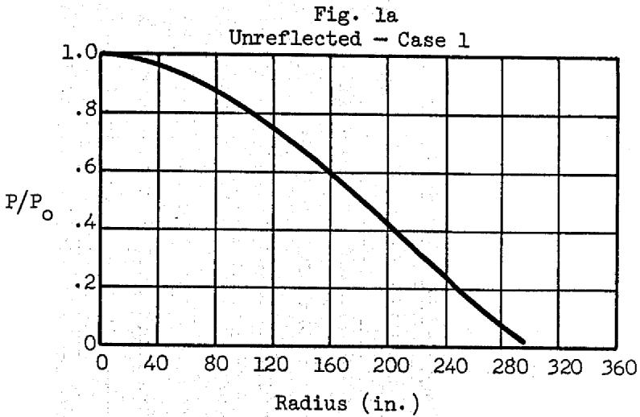

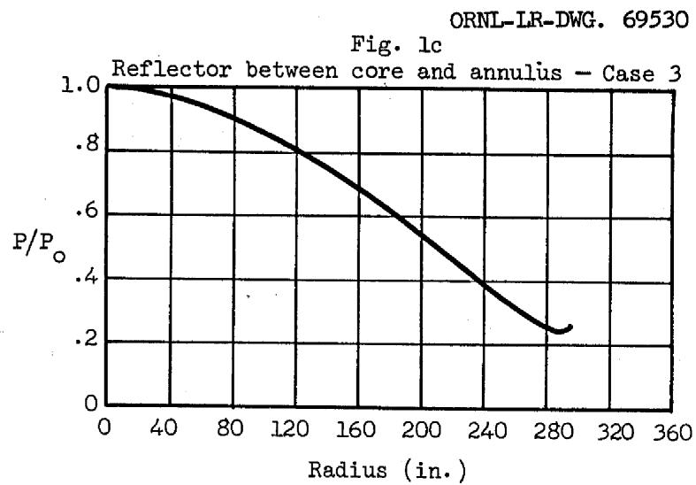

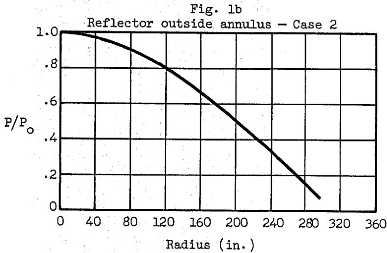

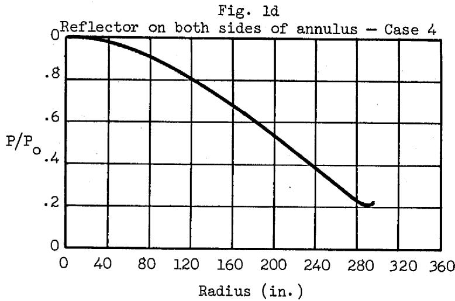  
Fig. M.l. Power Density Distribution in MSCR.

Since a peak in the fission rate occurs, the source of neutrons aimed out of the reactor is increased; however, the reflector returns many of the neutrons leaving the annulus. The net effect, as shown in Table M.2, is a slight reduction in leakage.

The reactor with the reflector between the core and annulus experiences a considerable flattening of the power distribution. The fission rate in the annulus remains large and furnishes a large source of neutrons adjacent to the reactor periphery. This source is larger than for the unreflected case, and a higher leakage results.

The reactor with the graphite regions on each side of the annulus combines the bad features of cases 2 and 3. The fission rate is large in the annulus, giving a large source for neutrons to the reactor periphery.

Thus it is seen that the main reason that a reflector has such a small effect is the presence of the fuel annulus. Any addition of reflector increases the fission rate in this region. These fission neutrons are close to the reactor periphery, where they may be absorbed in the vessel or leak out of the reactor. A reflector would be much more beneficial if a design which eliminated the fuel annulus could be devised.

# Conclusions

Use of a reflector in the MSCR improved the reactor performance only slightly [0.02 increase in conversion ratio and 0.04 mills/kwhr (electrical) decrease in fuel cycle costs]. Of the reflected-reactor configurations considered, the reactor with the reflector outside of the fuel annulus was the only one which improved performance. However, a method of pinning graphite to the vessel without leaving large cracks is unknown. Also, the extra cost of fabricating an INOR-8 vessel 2.5 ft larger is unknown. Therefore, in view of the slight benefit to be gained and the added design uncertainties and complexity, it appears that no reflector should be used in the MSCR study. If these uncertainties should be removed and slight improvements in performance become important, the gains available with a reflector should be exploited.

# Appendix N

DETAILED ESTIMATE OF 1000 Mwe MSCR CAPITAL INVESTMENT*

C. H. Hatstat

# Summary

The cycle chosen for this analysis is shown in elementary form in Fig. 4.3. A 2500 Mwt reactor is cooled with a fuel-bearing molten salt, from which heat is transferred to an inert salt in eight vertical shell-and-tube heat exchangers; the heat in the inert salt is removed in a system of 16 shell-and-tube superheaters and eight reheaters, of a design similar to that of the superheaters. Approximately $63\%$ of the superheated steam flows to a system of four Loeffler boilers, where it produces saturated steam by mixing with the turbine feed water. The remaining superheated steam is delivered at 2400 psi, $1000^{\circ}\mathrm{F}$ , to the throttle of the steam turbine. Exhaust steam from the high-pressure turbine elements is reheated to $1000^{\circ}\mathrm{F}$ in the reheaters and flows to the intermediate pressure turbine, from which it flows to a 6-flow low-pressure unit. Condensate is returned to the Loeffler boilers through eight stages of feed-water heating. The gross power output of the cycle is 1083 Mwe at a throttle steam flow of approximately $8 \times 10^{6} \mathrm{lb/hr}$ and a condenser pressure of 1.5-in. Hg.

The plant design is based on an Atomic Energy Commission reference site in Western Massachusetts. The site is assumed to have an adequate source of circulating water for the turbine. Because of the low vapor pressure of the reactor coolant, high-pressure containment is not considered necessary; the reactor and its auxiliaries are contained in a sealed, steel lined concrete structure which forms a part of a subdivided biological shield with a total thickness of 10 feet.

The turbine-generator and the other components of the steam-condensate system are housed in a conventional steel frame building. The turbine

building and the reactor building are arranged so that one traveling bridge crane services both buildings.

Other structures on the site which are included in the cost estimate are the crib house, circulating water intake and discharge flumes and tunnels, waste disposal building and stack, and foundations for oil and condensate tanks. Road and rail access are also provided for the plant.

The cost estimate includes all systems and components necessary for a complete plant. In addition to the energy conversion components, the following equipment and/or systems are estimated in detail.

1. Radioactive waste treatment and disposal systems and building.   
2. Cover gas supply and distribution system.   
3. Reagent gas supply and disposal system.   
4. $\mathbf{U}\mathbf{F}_{\natural}$ addition facility.   
5. Fuel salt handling, sampling and storage systems.   
6. Reactor vessel and primary pumps.   
7. Thermal shield and cooling system.   
8. Emergency shutdown cooling system.   
9. Reactor control system.   
10. Fuel salt chemical treatment system.   
11. Intermediate salt chemical treatment system.   
12. Intermediate salt handling, sampling and storage systems.   
13. Coolant pump lubricating oil systems.   
14. Hot sampling facilities.   
15. Remote maintenance facility.   
16. Subdivided shielded areas for reactor auxiliaries in the reactor building.

# Investment Requirements

The capital investment required for the concept which is described in this report has been estimated on the basis of preliminary design and material quantities prepared by Oak Ridge National Laboratory and Sargent & Lundy. The estimating data for the heat cycle, auxiliary systems, and primary and intermediate system components were prepared by Oak Ridge

National Laboratory. The cost estimate was prepared by Sargent & Lundy, using accounting procedures specified by the U. S. Atomic Energy Commission in the Guide to Nuclear Power Cost Evaluation.

The direct construction cost and indirect cost are summarized below. The detailed estimate is presented on subsequent pages.

Estimated Direct Construction Cost $ 89,341,200

Indirect Costs 48,582,600

Total Capital Investment for \$137,923,800

Structures and Equipment

Coolant Salt Inventory plus 10,951,800

1.5% for Interest During

Construction

Total Investment, Excluding $148,875,600

Fuel Salt

# Table N.1. 1000 Mwe Molten Salt Converter

# Reactor Plant - Estimate of Capital

# Investment

ONE (1) 2500 MWt MOLTEN SALT REACTOR

ONE (1) 1000 MWe REHEAT TURBINE GENERATOR

UNIT C.C.6F 40" L.S.B.

(2400 Psi. - 1000°F - 1000°F)

(Prices as of 11-1-62 and Based on a 40 Hour Work Week)

<table><tr><td colspan="2">ACCOUNT 21 - STRUCTURES &amp; IMPROVEMENTS</td><td>QUANTITY</td><td>MATERIAL OR EQUIPMENT</td><td>LABOR</td><td>TOTALS</td></tr><tr><td colspan="2">211 Ground Improvements</td><td></td><td></td><td></td><td></td></tr><tr><td></td><td>.1 Access Roads for Permanent Use</td><td></td><td></td><td></td><td></td></tr><tr><td></td><td>.11 Grading )</td><td></td><td></td><td></td><td></td></tr><tr><td></td><td>.12 Surfacing )</td><td></td><td></td><td></td><td></td></tr><tr><td></td><td>.13 Culverts )</td><td></td><td></td><td></td><td></td></tr><tr><td></td><td>.14 Bridges &amp; Trestles )</td><td>15 Miles</td><td></td><td></td><td>In Place</td></tr><tr><td></td><td>.15 Guards &amp; Signs )</td><td></td><td></td><td></td><td></td></tr><tr><td></td><td>.16 Lighting )</td><td></td><td></td><td></td><td></td></tr><tr><td></td><td>.2 General Yard Improvements</td><td></td><td></td><td></td><td></td></tr><tr><td></td><td>.21 Grading &amp; Landscaping</td><td>Lot</td><td>$6,000</td><td>$19,200</td><td>$25,200</td></tr><tr><td></td><td>.22 Roads Sidewalks &amp; Parking Areas</td><td>47,000 SF</td><td>16,500</td><td>7,600</td><td>24,100</td></tr><tr><td></td><td>.23 Retaining Walls, Fences &amp; Railings</td><td></td><td></td><td></td><td></td></tr><tr><td></td><td>.231 Fence, Post, Gates</td><td>2,450 LF</td><td>8,500</td><td>3,200</td><td>11,700</td></tr></table>

Table N.1 (continued)   

<table><tr><td></td><td>QUANTITY</td><td>MATERIAL OR EQUIPMENT</td><td>LABOR</td><td>TOTALS</td></tr><tr><td colspan="5">ACCOUNT 21 - STRUCTURES &amp; IMPROVEMENTS (Cont'd.)</td></tr><tr><td>211 Ground Improvements (Cont'd.)</td><td></td><td></td><td></td><td></td></tr><tr><td>.2 General Yard Improvements (Cont'd.)</td><td></td><td></td><td></td><td></td></tr><tr><td>.24 Outside Water Distribution Systems Including Fire Hydrants &amp; Water Tanks for General Use</td><td></td><td></td><td></td><td></td></tr><tr><td>.241 Domestic Water System</td><td></td><td></td><td></td><td></td></tr><tr><td>.2411 500 G.P.M. Deep Wells,)</td><td></td><td></td><td></td><td></td></tr><tr><td>Including Pump &amp; Accessories)</td><td></td><td></td><td></td><td></td></tr><tr><td>.2412 Storage Tank, 300 Gal.) Lot</td><td>13,000</td><td>17,600</td><td>30,600</td><td></td></tr><tr><td>&amp; Controls)</td><td></td><td></td><td></td><td></td></tr><tr><td>.2413 Water Softener, Piping &amp; Controls)</td><td></td><td></td><td></td><td></td></tr><tr><td>.2414 Piping)</td><td></td><td></td><td></td><td></td></tr><tr><td>.242 Fire Protection System</td><td></td><td></td><td></td><td></td></tr><tr><td>.2421 Water Storage Tank)</td><td></td><td></td><td></td><td></td></tr><tr><td>.2422 2000 GPM Fire Pump &amp; Motor Drive)</td><td></td><td></td><td></td><td></td></tr><tr><td>.2423 Other Fire Protection Equipment) Lot</td><td>27,500</td><td>27,500</td><td>55,000</td><td></td></tr><tr><td>.2424 Piping, Including Hydrants)</td><td></td><td></td><td></td><td></td></tr><tr><td>.2425 Hose &amp; Hose Houses)</td><td></td><td></td><td></td><td></td></tr><tr><td colspan="5">211 Ground Improvements (Cont'd.)</td></tr><tr><td colspan="5">.2 General Yard Improvements (Cont'd.)</td></tr><tr><td colspan="5">.25 Sewers &amp; Drainage Systems:</td></tr><tr><td>.251 Yard Drainage &amp; Culverts</td><td>Lot</td><td>4,000</td><td>7,000</td><td>11,000</td></tr><tr><td colspan="5">.252 Sanitary Sewer System</td></tr><tr><td colspan="5">.2521 Septic Tank )</td></tr><tr><td>.2522 Dosing Syphon )</td><td rowspan="3">Lot</td><td rowspan="3">$12,000</td><td rowspan="3">18,400</td><td rowspan="3">30,400</td></tr><tr><td>.2523 Distribution Box )</td></tr><tr><td>.2524 Tile Field (Drainage) )</td></tr><tr><td colspan="5">.253 Storm Sewer System:</td></tr><tr><td>.2531 Excavation &amp; Backfill )</td><td rowspan="5">Lot</td><td rowspan="5">13,000</td><td rowspan="5">11,200</td><td rowspan="5">24,200</td></tr><tr><td>.2532 Vitrified Clay Tile (6" &amp; 8")</td></tr><tr><td>.2533 Reinforced Concrete Pipe (27" &amp; 30")</td></tr><tr><td>.2534 Manholes )</td></tr><tr><td>.2535 Outfall Structure )</td></tr><tr><td colspan="5">.26 Roadway &amp; General Lighting</td></tr><tr><td>.261 Security Fence Lighting)</td><td rowspan="5">Lot</td><td rowspan="5">8,000</td><td rowspan="5">11,200</td><td rowspan="5">19,200</td></tr><tr><td>.262 Roadway Lighting )</td></tr><tr><td>.263 Parkway Cable )</td></tr><tr><td>.264 Trenching for Parkway )</td></tr><tr><td>Cable )</td></tr><tr><td>211 Ground Improvements (Cont'd.)</td><td></td><td></td><td></td><td></td></tr><tr><td>.3 Railroads</td><td></td><td></td><td></td><td></td></tr><tr><td>.31 Off Site</td><td></td><td></td><td></td><td></td></tr><tr><td>.311 Grading)</td><td></td><td></td><td></td><td></td></tr><tr><td>.312 Bridges, Culverts &amp; Trestles) 5 Miles</td><td>135,000</td><td>132,000</td><td>267,000</td><td></td></tr><tr><td>.313 Ballast &amp; Track)</td><td></td><td></td><td></td><td></td></tr><tr><td>.314 Signals &amp; Interlocks)</td><td></td><td></td><td></td><td></td></tr><tr><td>.32 On Site</td><td></td><td></td><td></td><td></td></tr><tr><td>.321 Ballast &amp; Track 265 LF</td><td>1,500</td><td>1,600</td><td>3,100</td><td></td></tr><tr><td>TOTAL ACCOUNT 211</td><td>$245,000</td><td>$256,500</td><td>$501,500</td><td></td></tr><tr><td>212 Buildings</td><td></td><td></td><td></td><td></td></tr><tr><td>212A Turbine Generator Building</td><td></td><td></td><td></td><td></td></tr><tr><td>Including Office, Control Room,</td><td></td><td></td><td></td><td></td></tr><tr><td>Cable Room, Switch Gear Room</td><td></td><td></td><td></td><td></td></tr><tr><td>.1 Excavation &amp; Backfill</td><td></td><td></td><td></td><td></td></tr><tr><td>.11 Earth Excavation 11,500 CY</td><td>-</td><td>11,500</td><td>11,500</td><td></td></tr><tr><td>.12 Rock Excavation 5,650 CY</td><td>-</td><td>45,200</td><td>45,200</td><td></td></tr><tr><td>.13 Backfill 6,350 CY</td><td>2,000</td><td>9,400</td><td>11,400</td><td></td></tr><tr><td>.14 Disposal 10,800 CY</td><td>-</td><td>4,400</td><td>4,400</td><td></td></tr><tr><td>.15 Dewatering Lot</td><td>-</td><td>75,000</td><td>75,000</td><td></td></tr><tr><td>.3 Substructure Concrete</td><td></td><td></td><td></td><td></td></tr><tr><td>.31 Forms)</td><td></td><td></td><td></td><td></td></tr><tr><td>.32 Reinforcing)</td><td></td><td></td><td></td><td></td></tr><tr><td>.33 Concrete)</td><td></td><td></td><td></td><td></td></tr><tr><td>.34 Waterproofing 6,750 CY Conc.</td><td>232,000</td><td>218,400</td><td>450,400</td><td></td></tr><tr><td>.35 Patch &amp; Finish)</td><td></td><td></td><td></td><td></td></tr><tr><td>.36 Miscellaneous Anchor Bolts,)</td><td></td><td></td><td></td><td></td></tr><tr><td>Sleeves Etc. Embedded in)</td><td></td><td></td><td></td><td></td></tr><tr><td>Concrete)</td><td></td><td></td><td></td><td></td></tr><tr><td>212 Buildings (Cont'd.)</td><td></td><td></td><td></td><td></td></tr><tr><td>212A Turbine Generator Building</td><td></td><td></td><td></td><td></td></tr><tr><td>Including Office, Control Room,</td><td></td><td></td><td></td><td></td></tr><tr><td>Cable Room, Switch Gear Room (Cont'd.)</td><td></td><td></td><td></td><td></td></tr><tr><td>.4 Superstructure</td><td></td><td></td><td></td><td></td></tr><tr><td>.41 Superstructure Concrete</td><td></td><td></td><td></td><td></td></tr><tr><td>.411 Forms)</td><td></td><td></td><td></td><td></td></tr><tr><td>.412 Reinforcing )</td><td>34,000 SF</td><td>$57,500</td><td>$49,000</td><td>$106,500</td></tr><tr><td>.413 Concrete )</td><td>of Floor</td><td></td><td></td><td></td></tr><tr><td>.42 Structural Steel &amp;</td><td></td><td></td><td></td><td></td></tr><tr><td>Miscellaneous Metal</td><td></td><td></td><td></td><td></td></tr><tr><td>.421 Structural Steel</td><td>1,650 T</td><td>535,000</td><td>128,000</td><td>663,000</td></tr><tr><td>.422 Stairs, Ladders,</td><td></td><td></td><td></td><td></td></tr><tr><td>Railings, Walkways, Gratings, Etc.</td><td>Lot</td><td>55,000</td><td>24,000</td><td>79,000</td></tr><tr><td>.43 Exterior Walls</td><td></td><td></td><td></td><td></td></tr><tr><td>.431 Masonry</td><td></td><td></td><td></td><td></td></tr><tr><td>.432 Insulated Metal Siding</td><td>66,400 SF</td><td>134,000</td><td>46,400</td><td>180,400</td></tr><tr><td>.44 Roofing &amp; Flashing</td><td></td><td></td><td></td><td></td></tr><tr><td>.441 Pre-Cast Roof Slabs )</td><td></td><td></td><td></td><td></td></tr><tr><td>.442 Built-Up Roofing &amp; Flashing</td><td></td><td></td><td></td><td></td></tr><tr><td>.443 Poured Concrete Roof )</td><td>35,600 SF</td><td>32,000</td><td>36,000</td><td>68,000</td></tr><tr><td>.444 Deck)</td><td></td><td></td><td></td><td></td></tr><tr><td>.444 Insulation)</td><td></td><td></td><td></td><td></td></tr><tr><td></td><td>QUANTITY</td><td>MATERIAL OR EQUIPMENT</td><td>LABOR</td><td>TOTAL</td></tr><tr><td colspan="5">ACCOUNT 21 - STRUCTURES &amp; IMPROVEMENTS (Cont'd.)</td></tr><tr><td>212 Buildings (Cont'd.)</td><td></td><td></td><td></td><td></td></tr><tr><td>212A Turbine Generator Building</td><td></td><td></td><td></td><td></td></tr><tr><td>Including Office, Control Room,</td><td></td><td></td><td></td><td></td></tr><tr><td>Cable Room, Switch Gear Room</td><td></td><td></td><td></td><td></td></tr><tr><td>.4 Superstructure (Cont'd.)</td><td></td><td></td><td></td><td></td></tr><tr><td>.45 Interior Masonry &amp; Partitions</td><td></td><td></td><td></td><td></td></tr><tr><td>.451 Structural Tile</td><td>29,800 SF</td><td>$15,100</td><td>$20,300</td><td>$35,400</td></tr><tr><td>.46 Doors &amp; Windows</td><td></td><td></td><td></td><td></td></tr><tr><td>.461 Doors</td><td>Lot</td><td>11,500</td><td>4,400</td><td>15,900</td></tr><tr><td>.462 Windows</td><td>12,600 SF</td><td>48,000</td><td>20,000</td><td>68,000</td></tr><tr><td>.47 Wall and Ceiling</td><td></td><td></td><td></td><td></td></tr><tr><td>Finish</td><td></td><td></td><td></td><td></td></tr><tr><td>.471 Glazed Tile</td><td>)</td><td></td><td></td><td></td></tr><tr><td>.472 Metal Ceiling</td><td>)</td><td></td><td></td><td></td></tr><tr><td>.473 Plastering Including Lathing and Furring</td><td>6,200 SF</td><td>5,000</td><td>4,400</td><td>9,400</td></tr><tr><td>.474 Acoustical Tile</td><td>)</td><td></td><td></td><td></td></tr><tr><td>.48 Floor Finish</td><td></td><td></td><td></td><td></td></tr><tr><td>.481 Cement</td><td>)</td><td></td><td></td><td></td></tr><tr><td>.482 Tile</td><td>)</td><td>Lot</td><td>30,000</td><td>38,100</td></tr><tr><td>.49 Painting Glazing and Insulation</td><td></td><td></td><td></td><td></td></tr><tr><td>.491 Painting</td><td>Lot</td><td>10,500</td><td>32,400</td><td>42,900</td></tr><tr><td>.492 Glass and Glazing</td><td>-</td><td>-</td><td>-</td><td>Inc1. 462</td></tr><tr><td>.5 Stack (Heating Boiler and Auxiliary Boiler)</td><td>1</td><td>4,000</td><td>1,600</td><td>5,600</td></tr><tr><td></td><td>QUANTITY</td><td>MATERIAL OR EQUIPMENT</td><td>LABOR</td><td>TOTALS</td></tr><tr><td colspan="5">ACCOUNT 21 - STRUCTURES &amp; IMPROVEMENTS (Cont'd.)</td></tr><tr><td>212 Buildings (Cont'd.)</td><td></td><td></td><td></td><td></td></tr><tr><td>212A Turbine Generator Building</td><td></td><td></td><td></td><td></td></tr><tr><td>Including Office Control Room,</td><td></td><td></td><td></td><td></td></tr><tr><td>Cable Room, Switch Gear Room (Cont'd.)</td><td></td><td></td><td></td><td></td></tr><tr><td>.6 Building Services</td><td></td><td></td><td></td><td></td></tr><tr><td>.61 Plumbing &amp; Drainage Systems)</td><td></td><td></td><td></td><td></td></tr><tr><td>.611 Plumbing)</td><td></td><td></td><td></td><td></td></tr><tr><td>.612 Drainage)</td><td>Lot</td><td>$60,000</td><td>$32,000</td><td>$92,000</td></tr><tr><td>.613 Duplex Sump Pump)</td><td></td><td></td><td></td><td></td></tr><tr><td>.614 Domestic Cold Water Tank)</td><td></td><td></td><td></td><td></td></tr><tr><td>.615 Domestic Hot Water Tank)</td><td></td><td></td><td></td><td></td></tr><tr><td>.62 Heating Boiler &amp; Accessories</td><td></td><td></td><td></td><td></td></tr><tr><td>.621 Heating Boiler)</td><td></td><td></td><td></td><td></td></tr><tr><td>.622 Unit Heaters)</td><td></td><td></td><td></td><td></td></tr><tr><td>.623 Discharge Ducts)</td><td></td><td></td><td></td><td></td></tr><tr><td>.624 Condensate Pump &amp; Receiver)</td><td></td><td></td><td></td><td></td></tr><tr><td>.625 Flash Tank)</td><td>Lot</td><td>77,000</td><td>50,400</td><td>127,400</td></tr><tr><td>.626 Piping)</td><td></td><td></td><td></td><td></td></tr><tr><td>.627 Fuel Oil Transfer Pump)</td><td></td><td></td><td></td><td></td></tr><tr><td>.628 Heating Oil Tanks - Day &amp; Storage)</td><td></td><td></td><td></td><td></td></tr><tr><td>.6221 Berm for Fuel Oil Storage)</td><td></td><td></td><td></td><td></td></tr><tr><td>.6222 Foundation for Heating Oil)</td><td></td><td></td><td></td><td></td></tr><tr><td>.623 Ventilating System)</td><td></td><td></td><td></td><td></td></tr><tr><td>.64 Air-Conditioning System)</td><td></td><td></td><td></td><td></td></tr><tr><td>.641 Air-Conditioning Control Room)</td><td>Lot</td><td>55,000</td><td>28,000</td><td>83,000</td></tr><tr><td>.642 Office Air-Conditioning)</td><td></td><td></td><td></td><td></td></tr><tr><td>.643 Laboratory Air Conditioning)</td><td></td><td></td><td></td><td></td></tr><tr><td>Including Office, Control Room,</td><td></td><td></td><td></td><td></td></tr><tr><td>Cable Room, Switch Gear Room (Cont'd.)</td><td></td><td></td><td></td><td></td></tr><tr><td>.6 Building Services (Cont'd.)</td><td></td><td></td><td></td><td></td></tr><tr><td>.66 Lighting &amp; Service Wiring</td><td></td><td></td><td></td><td></td></tr><tr><td>.661 Control Panels &amp; Cabinets )</td><td></td><td></td><td></td><td></td></tr><tr><td>.662 Conduit )</td><td></td><td></td><td></td><td></td></tr><tr><td>.663 Wiring )</td><td>Lot</td><td>$46,500</td><td>$39,200</td><td>$85,700</td></tr><tr><td>.664 Fixtures Switches &amp; Receptacles )</td><td></td><td></td><td></td><td></td></tr><tr><td>.67 Fire Protection System (Water Lines, Hose, Sprinkler, Etc.)</td><td>Lot</td><td>12,000</td><td>2,400</td><td>14,400</td></tr><tr><td>TOTAL ACCOUNT 212A</td><td></td><td>$1,422,100</td><td>$920,500</td><td>$2,342,600</td></tr><tr><td>212D Waste Disposal Building</td><td></td><td></td><td></td><td></td></tr><tr><td>.1 Excavation and Backfill</td><td></td><td></td><td></td><td></td></tr><tr><td>.11 Excavation</td><td></td><td></td><td></td><td></td></tr><tr><td>.111 Earth</td><td>85 c.y.</td><td>-</td><td>100</td><td>100</td></tr><tr><td>.112 Rock</td><td>-</td><td>-</td><td>-</td><td>-</td></tr><tr><td>.12 Backfill</td><td></td><td></td><td></td><td></td></tr><tr><td>.121 Earth</td><td>45 c.y.</td><td>-</td><td>100</td><td>100</td></tr><tr><td>.13 Disposal</td><td></td><td></td><td></td><td></td></tr><tr><td>.131 Earth )</td><td>.50 c.y.</td><td>-</td><td>50</td><td>50</td></tr><tr><td>.132 Rock )</td><td></td><td></td><td></td><td></td></tr><tr><td>.15 Dewatering</td><td></td><td></td><td></td><td></td></tr><tr><td>.151 Pumping</td><td>Lot</td><td>-</td><td>1,000</td><td>1,000</td></tr><tr><td>.3 Substructure Concrete</td><td></td><td></td><td></td><td></td></tr><tr><td>Including, Forms, Anchored Steel</td><td></td><td></td><td></td><td></td></tr><tr><td>.31 Bottom Slab )</td><td>100 c.y.</td><td>3,500</td><td>3,200</td><td>6,700</td></tr><tr><td>.32 Walls to Grade )</td><td></td><td></td><td></td><td></td></tr></table>

Table N.1 (continued)   

<table><tr><td colspan="6">ACCOUNT 21 - STRUCTURES &amp; IMPROVEMENTS (Cont&#x27;d.)</td></tr><tr><td colspan="6">212D Waste Disposal Building (Cont&#x27;d.)</td></tr><tr><td></td><td>.4</td><td>Superstructure</td><td></td><td></td><td></td></tr><tr><td></td><td>.42</td><td>Structural Steel and Miscellaneous Steel</td><td></td><td></td><td></td></tr><tr><td></td><td>.421</td><td>Structural Steel and Girts</td><td>105 Tons</td><td>$34,000</td><td>$8,000</td></tr><tr><td></td><td>.422</td><td>Miscellaneous Steel Galleries</td><td></td><td></td><td></td></tr><tr><td></td><td></td><td>Stairs, Landing, Handrailing, Ladders, Etc.</td><td>Lot</td><td>4,500</td><td>2,000</td></tr><tr><td></td><td>.43</td><td>Exterior Walls</td><td></td><td></td><td></td></tr><tr><td></td><td>.431</td><td>Insulated Metal Siding</td><td>6,800 s.f.</td><td>13,600</td><td>4,900</td></tr><tr><td></td><td>.44</td><td>Floors, Barriers, Including Reinforcing, Forms, Etc.</td><td></td><td></td><td></td></tr><tr><td></td><td>.441</td><td>Walls Above Grade</td><td>135 c.y.</td><td>6,500</td><td>4,000</td></tr><tr><td></td><td>.442</td><td>Floors</td><td>80 c.y.</td><td>3,200</td><td>1,800</td></tr><tr><td></td><td>.4421</td><td>Pre-Cast Roof Slab</td><td>2,200 s.f.</td><td>2,000</td><td>2,000</td></tr><tr><td></td><td>.45</td><td>Interior Masonry and Partitions</td><td></td><td></td><td></td></tr><tr><td></td><td>.46</td><td>Doors and Windows</td><td></td><td></td><td></td></tr><tr><td></td><td>.461</td><td>Doors</td><td>Lot</td><td>2,000</td><td>1,000</td></tr><tr><td></td><td>.462</td><td>Windows</td><td>1,200 s.f.</td><td>4,500</td><td>2,000</td></tr><tr><td></td><td>.48</td><td>Floor Finish (Cement)</td><td>3,500 s.f.</td><td>500</td><td>1,500</td></tr><tr><td></td><td>.49</td><td>Exterior and Interior Finishes</td><td></td><td></td><td></td></tr><tr><td></td><td>.491</td><td>Painting Floor and Walls</td><td></td><td></td><td></td></tr><tr><td></td><td>.492</td><td>Painting Structural and Miscellaneous Steel</td><td></td><td></td><td></td></tr><tr><td></td><td>.493</td><td>Heavy Duty Coating</td><td>Lot</td><td>25,000</td><td>20,000</td></tr><tr><td></td><td>.494</td><td>Exterior Coating Below Grade</td><td></td><td></td><td></td></tr></table>

Table N.1 (continued)   

<table><tr><td></td><td>QUANTITY</td><td>MATERIAL OR EQUIPMENT</td><td>LABOR</td><td>TOTALS</td></tr><tr><td colspan="5">ACCOUNT 21 - STRUCTURES &amp; IMPROVEMENTS (Cont&#x27;d.)</td></tr><tr><td>212D Waste Disposal Building (Cont&#x27;d.)</td><td></td><td></td><td></td><td></td></tr><tr><td>.6 Building Services</td><td></td><td></td><td></td><td></td></tr><tr><td>.61 Plumbing and Drainage System</td><td>Lot</td><td>$4,800</td><td>$2,200</td><td>$7,000</td></tr><tr><td>.66 Lighting and Service Conduit</td><td>Lot</td><td>1,200</td><td>1,800</td><td>3,000</td></tr><tr><td rowspan="2">.67 Fire-Protection System TOTAL ACCOUNT 212D</td><td rowspan="2">Lot</td><td>4,000</td><td>1,000</td><td>5,000</td></tr><tr><td>$109,300</td><td>$56,650</td><td>$165,950</td></tr><tr><td>212F Miscellaneous Structures</td><td></td><td></td><td></td><td></td></tr><tr><td>.1 Gate House</td><td>Lot</td><td>$5,500</td><td>$5,200</td><td>$10,700</td></tr><tr><td>.2 Electrical</td><td>Lot</td><td>3,000</td><td>2,800</td><td>5,800</td></tr><tr><td>.3 Waste Storage Pond</td><td>Each</td><td>2,800</td><td>5,200</td><td>8,000</td></tr><tr><td>TOTAL ACCOUNT 212F</td><td></td><td>$11,300</td><td>$13,200</td><td>$24,500</td></tr><tr><td>212G Reactor Plant Building</td><td></td><td></td><td></td><td></td></tr><tr><td>.1 Excavation &amp; Backfill</td><td></td><td></td><td></td><td></td></tr><tr><td>.11 Earth Excavation</td><td>5,655 c.y.</td><td>-</td><td>$5,700</td><td>$5,700</td></tr><tr><td>.12 Rock Excavation</td><td>1,090 c.y.</td><td>-</td><td>21,800</td><td>21,800</td></tr><tr><td>.13 Backfill</td><td>755 c.y.</td><td></td><td>1,200</td><td>1,200</td></tr><tr><td>.14 Disposal</td><td>5,990 c.y.</td><td>-</td><td>2,400</td><td>2,400</td></tr><tr><td>.15 Dewatering</td><td>Lot</td><td>-</td><td>55,000</td><td>55,000</td></tr></table>

Table N.1 (continued)   

<table><tr><td colspan="6">ACCOUNT 21 - STRUCTURES &amp; IMPROVEMENTS (Cont'd.)</td></tr><tr><td colspan="6">212 Buildings (Cont'd.)</td></tr><tr><td colspan="6">212G Reactor Plant Building (Cont'd.)</td></tr><tr><td></td><td>.3</td><td>Substructure Concrete</td><td></td><td></td><td></td></tr><tr><td></td><td>.31</td><td>Forms</td><td></td><td></td><td></td></tr><tr><td></td><td>.32</td><td>Reinforcing</td><td></td><td></td><td></td></tr><tr><td></td><td>.33</td><td>Concrete</td><td></td><td></td><td></td></tr><tr><td></td><td>.34</td><td>Waterproofing</td><td></td><td></td><td></td></tr><tr><td></td><td>.35</td><td>Patch &amp; Finish</td><td></td><td></td><td></td></tr><tr><td></td><td>.36</td><td>Miscellaneous Anchor Bolts, Sleeves Etc. Embedded in Concrete</td><td></td><td></td><td></td></tr><tr><td></td><td>.4</td><td>Superstructure</td><td></td><td></td><td></td></tr><tr><td></td><td>.41</td><td>Superstructure Concrete</td><td></td><td></td><td></td></tr><tr><td></td><td>.411</td><td>Forms</td><td></td><td></td><td></td></tr><tr><td></td><td>.412</td><td>Reinforcing</td><td></td><td></td><td></td></tr><tr><td></td><td>.413</td><td>Concrete Interior</td><td></td><td></td><td></td></tr><tr><td></td><td>.42</td><td>Structural Steel &amp; Miscellaneous Steel</td><td></td><td></td><td></td></tr><tr><td></td><td>.421</td><td>Structural Steel &amp; Reactor Supports</td><td></td><td></td><td></td></tr><tr><td></td><td>.422</td><td>Stairs, Ladders, Railings, Walkways, Grating, Etc. Exterior Walls</td><td></td><td></td><td></td></tr><tr><td></td><td>.43</td><td>Masonry</td><td></td><td></td><td></td></tr><tr><td></td><td>.431</td><td>Insulated Metal Siding</td><td></td><td></td><td></td></tr><tr><td></td><td>.432</td><td>Concrete Walls</td><td></td><td></td><td></td></tr><tr><td></td><td>.4 Superstructure (Cont'd.)</td><td></td><td></td><td></td><td></td></tr><tr><td></td><td>.44 Roofing &amp; Flashing</td><td></td><td></td><td></td><td></td></tr><tr><td></td><td>.441 Pre-Cast Roof Slabs )</td><td></td><td></td><td></td><td></td></tr><tr><td></td><td>.442 Built-Up Roofing &amp; Flashing)</td><td>23,300 s.f.</td><td>$21,000</td><td>$21,600</td><td>$42,600</td></tr><tr><td></td><td>.443 Insulation )</td><td></td><td></td><td></td><td></td></tr><tr><td></td><td>.45 Interior Masonry &amp; Partitions</td><td></td><td></td><td></td><td></td></tr><tr><td></td><td>.451 Structural Tile</td><td>-</td><td>-</td><td>-</td><td>-</td></tr><tr><td></td><td>.453 Hot Cells</td><td>Lot</td><td>400,000</td><td>80,000</td><td>480,000</td></tr><tr><td></td><td>.46 Doors &amp; Windows</td><td></td><td></td><td></td><td></td></tr><tr><td></td><td>.461 Doors</td><td>Lot</td><td>2,500</td><td>1,200</td><td>3,700</td></tr><tr><td></td><td>.462 Windows</td><td>7,250 s.f.</td><td>27,000</td><td>12,000</td><td>39,000</td></tr><tr><td></td><td>.48 Floor Finish</td><td></td><td></td><td></td><td></td></tr><tr><td></td><td>.481 Cement</td><td>35,000 s.f.</td><td>12,000</td><td>14,400</td><td>26,400</td></tr><tr><td></td><td>.49 Painting Glazing</td><td></td><td></td><td></td><td></td></tr><tr><td></td><td>Insulation</td><td></td><td></td><td></td><td></td></tr><tr><td></td><td>.491 Painting</td><td>Lot</td><td>7,000</td><td>18,500</td><td>25,500</td></tr><tr><td></td><td>.492 Glass and Glazing</td><td></td><td colspan="3">Included .462</td></tr><tr><td></td><td>.493 Insulation of Reactor Chamber</td><td></td><td colspan="3">Incl. in Acct. 221.32</td></tr><tr><td></td><td>.5 Stack (When Supported on Building)</td><td></td><td colspan="3">Incl. in Acct. 212A</td></tr><tr><td></td><td>.6 Building Services</td><td></td><td></td><td></td><td></td></tr><tr><td></td><td>.61 Plumbing &amp; Drainage System</td><td></td><td></td><td></td><td></td></tr><tr><td></td><td>.611 Plumbing )</td><td></td><td></td><td></td><td></td></tr><tr><td></td><td>.612 Drainage )</td><td>Lot</td><td>15,000</td><td>8,000</td><td>23,000</td></tr><tr><td></td><td>.613 Sump Pump )</td><td></td><td></td><td></td><td></td></tr></table>

Table N.1 (continued)   

<table><tr><td></td><td>QUANTITY</td><td>MATERIAL OR EQUIPMENT</td><td>LABOR</td><td>TOTALS</td></tr><tr><td colspan="5">ACCOUNT 21 - STRUCTURES &amp; IMPROVEMENTS (Cont&#x27;d.)</td></tr><tr><td>212 Buildings (Cont&#x27;d.)</td><td></td><td></td><td></td><td></td></tr><tr><td>212G Reactor Plant Building (Cont&#x27;d.)</td><td></td><td></td><td></td><td></td></tr><tr><td>.6 Buildings (Cont&#x27;d.)</td><td></td><td></td><td></td><td></td></tr><tr><td>.62 Cooling System )</td><td>Lot</td><td>$130,000</td><td>$70,000</td><td>$200,000</td></tr><tr><td>.63 Ventilating System )</td><td></td><td></td><td></td><td></td></tr><tr><td>.66 Lighting &amp; Service</td><td></td><td></td><td></td><td></td></tr><tr><td>.661 Control Panels &amp; )</td><td>Lot</td><td>17,000</td><td>19,600</td><td>36,600</td></tr><tr><td>.662 Conduit )</td><td></td><td></td><td></td><td></td></tr><tr><td>.663 Wiring )</td><td></td><td></td><td></td><td></td></tr><tr><td>.664 Fixtures, Switches )</td><td>Lot</td><td>8,500</td><td>1,500</td><td>10,000</td></tr><tr><td>&amp; Receptacles )</td><td></td><td>$1,900,000</td><td>$1,032,400</td><td>$2,932,400</td></tr><tr><td>.67 Fire Protection System (Water Lines, Hose, Sprinkler, Etc.)</td><td></td><td></td><td></td><td></td></tr><tr><td>TOTAL ACCOUNT 212G</td><td>Lot</td><td>$3,442,700</td><td>$2,022,750</td><td>$5,465,450</td></tr><tr><td>TOTAL ACCOUNT 212</td><td></td><td></td><td></td><td></td></tr><tr><td>218 Stacks</td><td></td><td></td><td></td><td></td></tr><tr><td>Concrete Chimney</td><td></td><td></td><td></td><td></td></tr><tr><td>.1 Excavation and Backfill )</td><td></td><td></td><td></td><td></td></tr><tr><td>.2 Substructure Concrete )</td><td>1</td><td>15,000</td><td>16,000</td><td>31,000</td></tr><tr><td>.4 Concrete Chimney )</td><td></td><td></td><td></td><td></td></tr><tr><td>.6 Obstruction Lighting )</td><td></td><td></td><td></td><td></td></tr><tr><td>TOTAL ACCOUNT 218A</td><td></td><td>$15,000</td><td>$16,000</td><td>$31,000</td></tr><tr><td>TOTAL ACCOUNT 218</td><td></td><td>$15,000</td><td>$16,000</td><td>$31,000</td></tr><tr><td>TOTAL ACCOUNT 21</td><td></td><td>$3,702,700</td><td>$2,295,250</td><td>$5,997,950</td></tr></table>

Table N.l (continued)   

<table><tr><td colspan="6">ACCOUNT 22 - REACTOR PLANT EQUIPMENT</td></tr><tr><td>221</td><td colspan="5">Reactor Equipment</td></tr><tr><td></td><td>.1</td><td>Reactor Vessel and Supports</td><td></td><td></td><td></td></tr><tr><td></td><td>.11</td><td>Reactor Vessel Supports</td><td>Lot</td><td>$15,000</td><td>$8,000</td></tr><tr><td></td><td>.12</td><td>Vessel and Internals )</td><td></td><td></td><td></td></tr><tr><td></td><td>.13</td><td>Pump Suction Columns )</td><td>Lot</td><td>7,540,000</td><td>560,000</td></tr><tr><td></td><td>.14</td><td>Graphite Rods )</td><td></td><td></td><td></td></tr><tr><td></td><td>.15</td><td>Heaters</td><td></td><td>37,500</td><td>Included</td></tr><tr><td></td><td>.16</td><td>Insulation</td><td></td><td>7,000</td><td>6,400</td></tr><tr><td></td><td>.2</td><td>Reactor Controls</td><td></td><td></td><td></td></tr><tr><td></td><td>.21</td><td>Reactor Control Salt Addition</td><td></td><td></td><td></td></tr><tr><td></td><td></td><td>Tank</td><td>1</td><td>6,200</td><td>100</td></tr><tr><td></td><td>.22</td><td>Reactivity Control Drain Tanks</td><td>2</td><td>42,400</td><td>800</td></tr><tr><td></td><td>.23</td><td>Drain Tank Condenser</td><td>1</td><td>1,200</td><td>100</td></tr><tr><td></td><td>.231</td><td>Condensate Pump</td><td>2</td><td>300</td><td>100</td></tr><tr><td></td><td>.24</td><td>BF3 Injection System</td><td></td><td></td><td></td></tr><tr><td></td><td>.241</td><td>BF3 Cylinders</td><td></td><td colspan="2">Not Included</td></tr><tr><td></td><td>.25</td><td>Piping, Valves, Etc.</td><td></td><td colspan="2">Incl. Account 228</td></tr><tr><td></td><td>.3</td><td>Reactor Shielding</td><td></td><td></td><td></td></tr><tr><td></td><td>.31</td><td>Thermal Shield System</td><td></td><td></td><td></td></tr><tr><td></td><td>.311</td><td>Thermal Shield &amp; Supports</td><td>1</td><td>75,000</td><td>16,000</td></tr><tr><td></td><td>.312</td><td>Surge Tank, 2000 Gal.</td><td>1</td><td>2,400</td><td>200</td></tr><tr><td></td><td>.313</td><td>Circulating Pumps</td><td>2</td><td>2,600</td><td>200</td></tr><tr><td></td><td>.314</td><td>Heat Exchanger</td><td>1</td><td>25,000</td><td>500</td></tr><tr><td></td><td>.315</td><td>Liping, Valves, and Insulation</td><td>Lot 1</td><td colspan="2">Incl. Account 228</td></tr><tr><td></td><td>.32</td><td>Biological Shielding -</td><td></td><td></td><td></td></tr><tr><td></td><td></td><td>Insulation, Shield Plugs,</td><td></td><td></td><td></td></tr><tr><td></td><td></td><td>Etc.</td><td>Lot</td><td>255,000</td><td>124,000</td></tr><tr><td></td><td>.34</td><td>Shield Cooling System</td><td></td><td></td><td></td></tr><tr><td></td><td>.341</td><td>Closed Loop Liquid System</td><td></td><td></td><td></td></tr><tr><td></td><td>.3411</td><td>Shield Cooling Heat</td><td></td><td></td><td></td></tr><tr><td></td><td></td><td>Exchanger (4000 Ft. 2)</td><td></td><td></td><td></td></tr><tr><td></td><td></td><td>Surface - Admiralty)</td><td>2</td><td>35,000</td><td>2,500</td></tr></table>

Table N.1 (continued)   

<table><tr><td></td><td>QUANTITY</td><td>MATERIAL OR EQUIPMENT</td><td>LABOR</td><td>TOTALS</td></tr><tr><td colspan="5">ACCOUNT 22 - REACTOR PLANT EQUIPMENT (Cont'd.)</td></tr><tr><td>221 Reactor Equipment (Cont'd.)</td><td></td><td></td><td></td><td></td></tr><tr><td>.3 Reactor Shields (Cont'd.)</td><td></td><td></td><td></td><td></td></tr><tr><td>.34 Shield Cooling System (Cont'd.)</td><td></td><td></td><td></td><td></td></tr><tr><td>.341 Closed Loop Liquid System (Cont'd.)</td><td></td><td></td><td></td><td></td></tr><tr><td>.3412 Shield Cooling CirculatingPumps &amp; Motors (2500 GPM75 HP Motor)</td><td>3</td><td>$7,500</td><td>800</td><td>8,300</td></tr><tr><td>.3413 Piping &amp; Valves</td><td>Lot</td><td>Included in Account</td><td>228</td><td></td></tr><tr><td>.3414 Cooling Coils Embeddedin Concrete (16000 Ft.1" Steel)</td><td>Lot</td><td>17,500</td><td>32,500</td><td>50,000</td></tr><tr><td>.3415 H2O Storage Tank3000 Gallons</td><td>1</td><td>1,200</td><td>300</td><td>1,500</td></tr><tr><td>.7 Reactor Plant Cranes &amp; Hoists</td><td></td><td colspan="2">Included in Account 251</td><td></td></tr><tr><td>TOTAL ACCOUNT 221</td><td></td><td>$8,070,800</td><td>$752,500</td><td>$8,823,300</td></tr><tr><td colspan="5">222 Heat Transfer Systems</td></tr><tr><td>.1 Reactor Coolant Systems</td><td></td><td></td><td></td><td></td></tr><tr><td>.11 Reactor Salt Circulating Pumps9075 GPM Including 1600 HP Motors</td><td>8</td><td>2,768,000</td><td>25,000</td><td>2,793,000</td></tr><tr><td>.12 Reactor Salt Piping</td><td>Lot</td><td>215,000</td><td>20,000</td><td>235,000</td></tr><tr><td>.13 Insulation</td><td>Lot</td><td>5,000</td><td>5,600</td><td>10,600</td></tr><tr><td>.2 Intermediate Coolant System</td><td></td><td></td><td></td><td></td></tr><tr><td>.21 Pumps Including Supports</td><td></td><td></td><td></td><td></td></tr><tr><td>.211 Coolant Salt Pumps -13,900 GPM Including2,000 HP Motors</td><td>8</td><td>3,640,000</td><td>30,000</td><td>3,670,000</td></tr><tr><td>.212 Auxiliary Pumps and Drives</td><td>-</td><td>-</td><td>-</td><td>-</td></tr><tr><td>.213 Insulation</td><td></td><td colspan="2">Included in Account 228</td><td></td></tr><tr><td colspan="2">QUANTITY</td><td>MATERIAL OR EQUIPMENT</td><td>LABOR</td><td>TOTALS</td></tr><tr><td colspan="2">ACCOUNT 22 - REACTOR PLANT EQUIPMENT (Cont'd.)</td><td></td><td></td><td></td></tr><tr><td colspan="2">222 Heat Transfer Systems (Cont'd.)</td><td></td><td></td><td></td></tr><tr><td colspan="2">.2 Intermediate Coolant System (Cont'd.)</td><td></td><td></td><td></td></tr><tr><td colspan="2">.22 Intermediate Coolant Piping and Valves</td><td></td><td></td><td></td></tr><tr><td>.221 Pipe, Valves, Supports, Etc.</td><td>Lot</td><td>$1,925,000</td><td>172,000</td><td>$2,097,000</td></tr><tr><td>.222 Insulation</td><td>Lot</td><td>50,000</td><td>48,000</td><td>98,000</td></tr><tr><td colspan="2">.223 Coolant Salt Drain Tanks</td><td></td><td></td><td></td></tr><tr><td>Including Heaters and Insulation</td><td>2</td><td>70,000</td><td>12,800</td><td>82,800</td></tr><tr><td>.23 Primary Heat Exchangers &amp; Supports</td><td>8</td><td>2,320,000</td><td>28,000</td><td>2,348,000</td></tr><tr><td colspan="2">.3 Steam Generators Superheaters &amp; Reheaters</td><td></td><td></td><td></td></tr><tr><td>.31 Loeffler Boilers</td><td>4</td><td>4,000,000</td><td>160,000</td><td>4,160,000</td></tr><tr><td>.32 Superheaters</td><td>16</td><td>6,350,000</td><td>48,000</td><td>6,398,000</td></tr><tr><td>.322 Steam Reheaters</td><td>8</td><td>1,400,000</td><td>10,000</td><td>1,410,000</td></tr><tr><td>.35 Auxiliary Start-up Boiler (300 Psi. 50,000 lb/hr. oil Fired)</td><td>1</td><td>60,000</td><td>5,000</td><td>65,000</td></tr><tr><td colspan="2">.36 Insulation for Above Equipment</td><td></td><td></td><td></td></tr><tr><td colspan="2">.4 Reactor Coolant Receiving Supply and Treatment</td><td colspan="2">Included in Account 228</td><td></td></tr><tr><td colspan="2">.411 Fertile Salt Addition System</td><td></td><td></td><td></td></tr><tr><td>.4111 Fertile Salt Addition Tank</td><td>1</td><td>1,200</td><td>50</td><td>1,250</td></tr><tr><td colspan="2">.42 Reagent Gas System</td><td></td><td></td><td></td></tr><tr><td colspan="2">.421 H2Supply</td><td colspan="2">Not Included</td><td></td></tr><tr><td colspan="2">.422 HF Supply</td><td colspan="2">Not Included</td><td></td></tr><tr><td colspan="2">.423 Piping</td><td colspan="2">Included in Account 228</td><td></td></tr><tr><td colspan="2">.431 Reactor Salt Purification System</td><td></td><td></td><td></td></tr><tr><td>.4311 Chemical Treatment Tank</td><td>1</td><td>46,600</td><td>400</td><td>47,000</td></tr><tr><td>.4312 Fertile Salt Storage Tank</td><td>1</td><td>27,500</td><td>300</td><td>27,800</td></tr><tr><td></td><td>QUANTITY</td><td>MATERIAL OR EQUIPMENT</td><td>LABOR</td><td>TOTALS</td></tr><tr><td colspan="5">ACCOUNT 22 - REACTOR PLANT EQUIPMENT (Cont'd.)</td></tr><tr><td>222 Heat Transfer Systems (Cont'd.)</td><td></td><td></td><td></td><td></td></tr><tr><td>.4 Reactor Coolant Receiving Supply and Treatment (Cont'd.)</td><td></td><td></td><td></td><td></td></tr><tr><td>.431 Reactor Salt Purification System (Cont'd.)</td><td></td><td></td><td></td><td></td></tr><tr><td>.4313 Radioactive Salt Sampler</td><td>Lot</td><td>$67,500</td><td>$1,600</td><td>$69,100</td></tr><tr><td>.432 Intermediate Salt Purification System</td><td></td><td></td><td></td><td></td></tr><tr><td>.4321 Chemical Treatment Tank</td><td>1</td><td>19,200</td><td>200</td><td>19,400</td></tr><tr><td>.44 Reactor Salt Charge System</td><td></td><td></td><td></td><td></td></tr><tr><td>.441 Reactor Salt Preparation System</td><td></td><td></td><td></td><td></td></tr><tr><td>.4411 Salt Melt Tank and Appurtenances</td><td>1</td><td>30,000</td><td>1,000</td><td>31,000</td></tr><tr><td>.4412 UF4 Addition System</td><td>1</td><td>3,000</td><td>500</td><td>3,500</td></tr><tr><td>.442 Intermediate Salt Charge System</td><td></td><td></td><td></td><td></td></tr><tr><td>.4421 Intermediate Salt Preparation Tank and Appurtenances</td><td>1</td><td>30,000</td><td>1,000</td><td>31,000</td></tr><tr><td>.45 Cover Gas Supply and Purification System</td><td></td><td></td><td></td><td></td></tr><tr><td>.4531 Dryer</td><td>2</td><td>200</td><td>50</td><td>250</td></tr><tr><td>.4532 Heater</td><td>2</td><td>400</td><td>100</td><td>500</td></tr><tr><td>.4533 O₂ Removal Unit</td><td>2</td><td>3,000</td><td>200</td><td>3,200</td></tr><tr><td>.4534 Coolers</td><td>2</td><td>200</td><td>100</td><td>300</td></tr><tr><td>.4535 Pure He Reservoir</td><td>1</td><td>400</td><td>100</td><td>500</td></tr><tr><td>.4536 O₂ Analyzer</td><td>1</td><td>7,000</td><td>500</td><td>7,500</td></tr><tr><td>.454 Piping</td><td></td><td colspan="2">Included Acct. 228</td><td></td></tr><tr><td>.5 Intermediate Coolant Storage Tanks, Etc.</td><td>2</td><td>70,000</td><td>2,000</td><td>72,000</td></tr><tr><td>TOTAL ACCOUNT 222</td><td></td><td>$23,039,200</td><td>$570,500</td><td>$23,609,700</td></tr><tr><td colspan="5">223 Fuel Handling and Storage Equipment</td></tr><tr><td>.31 Fuel Salt Drain and Storage System</td><td></td><td></td><td></td><td></td></tr><tr><td>.311 Drain Tanks &amp; Cooling Jacket</td><td>54</td><td>$1,269,000</td><td>$16,800</td><td>$1,285,800</td></tr><tr><td>.312 Drain Tank Condenser</td><td>1</td><td>8,000</td><td>300</td><td>8,300</td></tr><tr><td>.3121 Condensate Pump</td><td>2</td><td>1,400</td><td>100</td><td>1,500</td></tr><tr><td>.313 Decay Storage Tank Including Cooling Jacket</td><td>5</td><td>55,000</td><td>1,000</td><td>56,000</td></tr><tr><td>.314 Fuel Withdrawal Transfer Tank</td><td>1</td><td>37,000</td><td>100</td><td>3,800</td></tr></table>

Table N.1 (continued)   

<table><tr><td></td><td></td><td>QUANTITY</td><td>MATERIAL OR EQUIPMENT</td><td>LABOR</td><td>TOTALS</td></tr><tr><td colspan="6">ACCOUNT 22 - REACTOR PLANT EQUIPMENT (Cont&#x27;d.)</td></tr><tr><td>223</td><td>Fuel Handling and Storage Equipment</td><td></td><td></td><td></td><td></td></tr><tr><td></td><td>.321 Fuel Withdrawal Metering Tanks</td><td>1</td><td>$6,200</td><td>$300</td><td>$6,500</td></tr><tr><td></td><td>.33 Flush Salt Storage Tanks</td><td>5</td><td>152,500</td><td>2,800</td><td>155,300</td></tr><tr><td></td><td>.34 Piping</td><td></td><td colspan="2">Included in Account</td><td>228</td></tr><tr><td></td><td>TOTAL ACCOUNT 223</td><td></td><td>$1,495,800</td><td>$21,400</td><td>$1,517,200</td></tr><tr><td>225</td><td>Radioactive Waste Treatment &amp; Disposal</td><td></td><td></td><td></td><td></td></tr><tr><td></td><td>.1 Liquid Waste Systems</td><td></td><td></td><td></td><td></td></tr><tr><td></td><td>.11 High Level Storage Tank</td><td>1</td><td>12,400</td><td>600</td><td>13,000</td></tr><tr><td></td><td>.111 H.L. Storage Tank Pump</td><td>2</td><td>400</td><td>100</td><td>500</td></tr><tr><td></td><td>.112 H.L. Waste Evaporator</td><td>1</td><td>2,000</td><td>100</td><td>2,100</td></tr><tr><td></td><td>.113 H.L. Waste Condenser</td><td>1</td><td>600</td><td>50</td><td>650</td></tr><tr><td></td><td>.114 Evaporator Recycle Pump</td><td>2</td><td>400</td><td>100</td><td>500</td></tr><tr><td></td><td>.13 Demister</td><td>1</td><td>600</td><td>50</td><td>650</td></tr><tr><td></td><td>.14 H.L. Concentrated Waste Storage Tank</td><td>1</td><td>2,500</td><td>150</td><td>2,650</td></tr><tr><td></td><td>.15 KOH Scrubber</td><td>1</td><td>12,100</td><td>400</td><td>12,500</td></tr><tr><td></td><td>.151 KOH Make-up Tank &amp; Pump</td><td>1</td><td>1,400</td><td>100</td><td>1,500</td></tr><tr><td></td><td>.16 H2Burner</td><td>1</td><td>225</td><td>75</td><td>300</td></tr><tr><td></td><td>.161 H2Burner Condenser</td><td>1</td><td>1,000</td><td>100</td><td>1,100</td></tr><tr><td></td><td>.17 Piping</td><td></td><td colspan="2">Included in Account</td><td>228</td></tr><tr><td></td><td>.2 Gas Waste</td><td></td><td></td><td></td><td></td></tr><tr><td></td><td>.21 Stack Blower</td><td>2</td><td>20,000</td><td>2,400</td><td>22,400</td></tr><tr><td></td><td>.211 Absolute Filter.</td><td>1</td><td>4,000</td><td>400</td><td>4,400</td></tr><tr><td></td><td>.212 Roughing Filter</td><td>1</td><td>1,200</td><td>200</td><td>1,400</td></tr></table>

Table N.1 (continued)   

<table><tr><td></td><td>QUANTITY</td><td>MATERIAL OR EQUIPMENT</td><td>LABOR</td><td>TOTALS</td></tr><tr><td colspan="5">ACCOUNT 22 - REACTOR PLANT EQUIPMENT (Cont'd.)</td></tr><tr><td>225 Radioactive Waste Treatment &amp; Disposal (Cont'd.)</td><td></td><td></td><td></td><td></td></tr><tr><td>.22 H.F. Absorbers Including Charcoal</td><td>2</td><td>$16,000</td><td>$2,400</td><td>$18,400</td></tr><tr><td>.221 Absorber Coolers</td><td>1</td><td>100</td><td>50</td><td>150</td></tr><tr><td>.222 Vacuum Pump</td><td>1</td><td>500</td><td>50</td><td>550</td></tr><tr><td>.223 H.F. Absorber Vacuum Tank</td><td>1</td><td>300</td><td>50</td><td>350</td></tr><tr><td>.23 Air Cooled Absorbers Including Charcoal</td><td></td><td></td><td></td><td></td></tr><tr><td>.231 1.5" Finned Tubes</td><td>2</td><td>3,600</td><td>400</td><td>4,000</td></tr><tr><td>.232 3" Finned Tubes</td><td>2</td><td>8,000</td><td>600</td><td>8,600</td></tr><tr><td>.233 6" Finned Tubes</td><td>2</td><td>15,000</td><td>800</td><td>15,800</td></tr><tr><td>.234 Dilution Air Duct &amp; Dampers</td><td>1</td><td>8,000</td><td>3,200</td><td>11,200</td></tr><tr><td>.24 Water Cooled Absorbers</td><td></td><td></td><td></td><td></td></tr><tr><td>.241 1/2" Tubes</td><td>4</td><td>23,200</td><td>800</td><td>24,000</td></tr><tr><td>.242 1" Tubes</td><td>4</td><td>60,400</td><td>1,900</td><td>62,300</td></tr><tr><td>.243 1-1/2" Tubes</td><td>4</td><td>51,400</td><td>1,900</td><td>53,300</td></tr><tr><td>.244 2" Tubes</td><td>4</td><td>49,600</td><td>1,800</td><td>51,400</td></tr><tr><td>.25 Decay Tank</td><td>1</td><td>12,500</td><td>800</td><td>13,300</td></tr><tr><td>.26 Absorber Cooling Water Condenser</td><td>1</td><td>900</td><td>100</td><td>1,000</td></tr><tr><td>.27 Helium Recycle Compressor</td><td>1</td><td>2,000</td><td>200</td><td>2,200</td></tr><tr><td>.28 BF3 Stripper</td><td>2</td><td>28,000</td><td>2,400</td><td>30,400</td></tr><tr><td>.281 Vacuum Pump</td><td>1</td><td>500</td><td>50</td><td>550</td></tr><tr><td rowspan="2">.29 Piping TOTAL ACCOUNT 225</td><td></td><td colspan="3">Included in Account 228</td></tr><tr><td></td><td>$338,825</td><td>$22,325</td><td>$361,150</td></tr><tr><td colspan="5">226 Instrumentation and Controls</td></tr><tr><td>.1 Reactor</td><td></td><td>$300,000</td><td>$170,000</td><td>$470,000</td></tr><tr><td>.2 Heat Transfer Systems</td><td></td><td>70,000</td><td>50,000</td><td>120,000</td></tr><tr><td colspan="5">226 Instrumentation and Controls (Cont'd.)</td></tr><tr><td>.3 Service to Fuel Handling and Storage</td><td>$120,000</td><td>$80,000</td><td>$200,000</td><td></td></tr><tr><td>.4 Service to Radioactive Waste &amp; Disposal</td><td>60,000</td><td>50,000</td><td>110,000</td><td></td></tr><tr><td>.5 Radiation Monitoring</td><td>120,000</td><td>80,000</td><td>200,000</td><td></td></tr><tr><td>.6 Steam Generators</td><td colspan="3">Included in Account 235</td><td></td></tr><tr><td>.7 Control &amp; Instrument Piping &amp; Wiring</td><td colspan="3">Included in Account 235</td><td></td></tr><tr><td>.8 Electrical Connections</td><td colspan="3">Included in Account 235</td><td></td></tr><tr><td>.9 Other Miscellaneous</td><td colspan="3">Included in Account 235</td><td></td></tr><tr><td>TOTAL ACCOUNT 226</td><td>$670,000</td><td>$430,000</td><td>$1,100,000</td><td></td></tr><tr><td colspan="5">227 Feed Water Supply and Treatment</td></tr><tr><td>.1 Raw Water Supply</td><td>1 Lot</td><td colspan="2">Included in Account 211</td><td></td></tr><tr><td>.2 Make-up Water Treatment</td><td>-</td><td>-</td><td>-</td><td></td></tr><tr><td>.21 Evaporator</td><td>-</td><td>-</td><td>-</td><td></td></tr><tr><td>.22 Ion Exchange Equipment, Filters, Etc.</td><td>1 Lot</td><td>$45,000</td><td>$10,000</td><td>$55,000</td></tr><tr><td>.23 Acid &amp; Caustic Transf. Pumps &amp; Drives</td><td>2</td><td>600</td><td>200</td><td>800</td></tr><tr><td>.24 Demineralized Water Storage Tanks</td><td>2</td><td>30,000</td><td>Included</td><td>30,000</td></tr><tr><td>.25 Caustic Tank</td><td>1</td><td>2,200</td><td>400</td><td>2,600</td></tr><tr><td>.26 Acid Tank</td><td>1</td><td>2,200</td><td>400</td><td>2,600</td></tr><tr><td>.27 Foundation</td><td>1 Lot</td><td>3,500</td><td>2,500</td><td>6,000</td></tr><tr><td>.28 Piping &amp; Valves</td><td>1 Lot</td><td colspan="2">Included in Account 228</td><td></td></tr><tr><td>.29 Insulation</td><td>-</td><td colspan="2">Included in Account 228</td><td></td></tr><tr><td>.3 Steam Generator Feed-Water Purification</td><td>-</td><td>-</td><td>-</td><td>-</td></tr><tr><td>227 Feed Water Supply and Treatment(Cont'd.)</td><td></td><td></td><td></td><td></td></tr><tr><td>.4 Feed-Water Heaters</td><td></td><td></td><td></td><td></td></tr><tr><td>.41 Deaerating Heaters - "E"</td><td>2</td><td>$240,000</td><td>$15,000</td><td>$255,000</td></tr><tr><td>.42 Closed Heaters</td><td></td><td></td><td></td><td></td></tr><tr><td>.421 L.P. Heater "A"</td><td>3</td><td>75,000</td><td>5,000</td><td>80,000</td></tr><tr><td>.422 L.P. Heater "B"</td><td>3</td><td>63,000</td><td>5,000</td><td>68,000</td></tr><tr><td>.423 L.P. Heater "C"</td><td>3</td><td>63,000</td><td>3,000</td><td>66,000</td></tr><tr><td>.424 L.P. Heater "D"</td><td>3</td><td>81,000</td><td>3,000</td><td>84,000</td></tr><tr><td>.425 H.P. Heater "F"</td><td>3</td><td>315,000</td><td>3,000</td><td>318,000</td></tr><tr><td>.426 H.P. Heater "G"</td><td>3</td><td>429,000</td><td>3,000</td><td>432,000</td></tr><tr><td>.427 H.P. Heater "H"</td><td>3</td><td>441,000</td><td>3,000</td><td>444,000</td></tr><tr><td>.5 Feed-Water Pumps and Drives</td><td></td><td></td><td></td><td></td></tr><tr><td>.51 Feed-Water Pumps &amp; Drives</td><td></td><td></td><td></td><td></td></tr><tr><td>.511 6600 GPM Pumps - 2465 Psig Hd.</td><td>3</td><td>405,000</td><td>12,000</td><td>417,000</td></tr><tr><td>.512 11,300 H.P. - B.F. Pump</td><td></td><td></td><td></td><td></td></tr><tr><td>Turbine Drive 5600 RPM</td><td>3</td><td>750,000</td><td>30,000</td><td>780,000</td></tr><tr><td>.52 Motor Driven Start-Up F.W. Pump</td><td></td><td></td><td></td><td></td></tr><tr><td>.521 6000 GPM Pump 850 Psig.Hd.</td><td>1</td><td>70,000</td><td>3,000</td><td>73,000</td></tr><tr><td>.522 3500 H.P. Start-Up FW Pump Motor</td><td>1</td><td>55,000</td><td>2,000</td><td>57,000</td></tr><tr><td>.53 Heater "A" Drain Pumps and Drives</td><td></td><td></td><td></td><td></td></tr><tr><td>.531 620 GPM Pump 285 Psig.Hd. )</td><td></td><td></td><td></td><td></td></tr><tr><td>.532 125 H.P. Heater "A" Drain )</td><td>3</td><td>22,500</td><td>1,500</td><td>24,000</td></tr><tr><td>Pump Motor</td><td></td><td></td><td></td><td></td></tr><tr><td>.5 Feed-Water Pumps and Drives (Cont'd.)</td><td></td><td></td><td></td><td></td></tr><tr><td>.54 Heater "C" Drain Pumpsand Drives</td><td></td><td></td><td></td><td></td></tr><tr><td>.541 700 GPM Pumps 210 Psig. Hd.)</td><td></td><td></td><td></td><td></td></tr><tr><td>.542 100 H.P. Heater "C" Drain )Pump Motor)</td><td>3</td><td>$30,000</td><td>$2,500</td><td>$32,500</td></tr><tr><td>.55 Boiler Steam Circulatorsand Drives</td><td></td><td></td><td></td><td></td></tr><tr><td>.551 5,300,000 #/Hr. SteamCirculator - 2500 #675°F</td><td>4</td><td>975,000</td><td>40,000</td><td>1,015,000</td></tr><tr><td>.552 5000 H.P. Turbine Drive forSteam Circulator 500 #Steam; 10,000 RPM</td><td>4</td><td>560,000</td><td>30,000</td><td>590,000</td></tr><tr><td>.553 5000 H.P. Motor for SteamCirculator Including Gearand Mag. CouplingTOTAL ACCOUNT 227</td><td>1</td><td>100,000$4,758,000</td><td>7,000$181,500</td><td>107,000$4,939,500</td></tr><tr><td>228 Steam, Condensate, Feed Water,and all Other Piping, Valves Etc.- For Turbine Plant, Crib Houseand Other Reactor Plant Auxiliaries</td><td></td><td></td><td></td><td></td></tr><tr><td>.1 Pipe, Valves, Fittings, Etc.</td><td></td><td></td><td></td><td></td></tr><tr><td>.11 Turbine Plant)</td><td></td><td></td><td></td><td></td></tr><tr><td>.12 Other Interior Piping)</td><td>1 Lot</td><td>$4,025,000</td><td>$2,575,000</td><td>$6,600,000</td></tr><tr><td>.13 Yard Pipe Etc.</td><td></td><td></td><td></td><td></td></tr></table>

Table N.1 (continued)   

<table><tr><td></td><td></td><td>QUANTITY</td><td>MATERIAL OR EQUIPMENT</td><td>LABOR</td><td>TOTALS</td></tr><tr><td colspan="2">ACCOUNT 22 - REACTOR PLANT EQUIPMENT (Cont'd.)</td><td></td><td></td><td></td><td></td></tr><tr><td>228</td><td>Steam, Condensate, Feed Water, and all Other Piping, Valves Etc.</td><td></td><td></td><td></td><td></td></tr><tr><td></td><td>- For Turbine Plant, Crib House and Other Reactor Plant</td><td></td><td></td><td></td><td></td></tr><tr><td></td><td>Auxiliaries (Cont'd.)</td><td></td><td></td><td></td><td></td></tr><tr><td></td><td>.2 Insulation</td><td></td><td></td><td></td><td></td></tr><tr><td></td><td>.21 Piping Insulation</td><td>1 Lot</td><td>$455,000</td><td>$520,000</td><td>$975,000</td></tr><tr><td></td><td>.22 Equipment Insulation</td><td>1 Lot</td><td>155,000</td><td>195,000</td><td>350,000</td></tr><tr><td></td><td>TOTAL ACCOUNT 228</td><td></td><td>$4,635,000</td><td>$3,290,000</td><td>$7,925,000</td></tr><tr><td>229</td><td>Other Reactor Plant Equipment</td><td></td><td></td><td></td><td></td></tr><tr><td></td><td>.2 Remote Maintenance Facilities</td><td>Lot</td><td>3,000,000</td><td>Included</td><td>3,000,000</td></tr><tr><td></td><td>.4 Coolant Pump Lube Oil System</td><td></td><td></td><td></td><td></td></tr><tr><td></td><td>.41 Storage Tank )</td><td>1</td><td></td><td></td><td></td></tr><tr><td></td><td>.42 Pumps )</td><td>2</td><td></td><td></td><td></td></tr><tr><td></td><td>.43 Oil Coolers )</td><td>2</td><td>29,400</td><td>600</td><td>30,000</td></tr><tr><td></td><td>.44 Filters )</td><td>2</td><td></td><td></td><td></td></tr><tr><td></td><td>.45 Piping</td><td>Lot</td><td></td><td colspan="2">Included in Account 225</td></tr><tr><td></td><td>.62 Intermediate Salt Sampling System</td><td></td><td></td><td></td><td></td></tr><tr><td></td><td>.621 Sampler and Appurtenances TOTAL ACCOUNT 229</td><td>Lot</td><td>16,500</td><td>2,000</td><td>18,500</td></tr><tr><td></td><td></td><td></td><td>$3,045,900</td><td>$2,600</td><td>$3,048,500</td></tr><tr><td></td><td>TOTAL ACCOUNT 22</td><td></td><td></td><td>$5,270,825</td><td>$51,324,350</td></tr><tr><td colspan="2">ACCOUNT 23 - TURBINE GENERATOR UNITS</td><td>QUANTITY</td><td>MATERIAL OR EQUIPMENT</td><td>LABOR</td><td>TOTALS</td></tr><tr><td colspan="2">231 Turbine Generators</td><td></td><td></td><td></td><td></td></tr><tr><td></td><td>.1 Turbine Foundations</td><td></td><td></td><td></td><td></td></tr><tr><td></td><td>.11 Concrete - Including Reinforcing Steel, Etc.</td><td>1 Lot</td><td>$175,000</td><td>$175,000</td><td>$350,000</td></tr><tr><td></td><td>.12 Miscellaneous</td><td>1 Lot</td><td>10,000</td><td>10,000</td><td>20,000</td></tr><tr><td></td><td>.2 Turbine Generators</td><td></td><td></td><td></td><td></td></tr><tr><td></td><td>.21 Turbine Generator Units - As Follows: 1000 MWe Reheat Turbine Generator Unit C.C.6F. 40" L.S.B. Complete with Accessories Steam Conditions 2400 Psi - 1000°F -1000°F Generators: 1,280,000 KVA Total .85 P.F. and .64 SCR</td><td>1</td><td>19,815,000</td><td>960,000</td><td>20,775,000</td></tr><tr><td></td><td>.22 Accessories - Other Than Standard</td><td>1</td><td></td><td>Included in Account</td><td>231.21</td></tr><tr><td></td><td>.23 Generator</td><td></td><td></td><td>Included in Account</td><td>231.21</td></tr><tr><td></td><td>.24 Exciter (Motor Driven)</td><td></td><td></td><td>Included in Account</td><td>231.21</td></tr><tr><td></td><td>.3 Reserve Exciter TOTAL ACCOUNT 231</td><td>1</td><td>340,000</td><td>10,000</td><td>350,000</td></tr><tr><td></td><td></td><td></td><td>$20,340,000</td><td>$1,155,000</td><td>$21,495,000</td></tr><tr><td colspan="2">232 Circulating Water System</td><td></td><td></td><td></td><td></td></tr><tr><td></td><td>.1 Pumping and Regulating Systems</td><td></td><td></td><td></td><td></td></tr><tr><td></td><td>.11 Pumps, Drives &amp; Controls</td><td></td><td></td><td></td><td></td></tr><tr><td></td><td>.112 134,000 GPM Vertical Mixed Flow Circulating Water Pumps Head 30 ft.</td><td>6</td><td>360,000</td><td>18,000</td><td>378,000</td></tr></table>

Table N.1 (continued)   

<table><tr><td></td><td>QUANTITY</td><td>MATERIAL OR EQUIPMENT</td><td>LABOR</td><td>TOTALS</td></tr><tr><td colspan="5">ACCOUNT 23 - TURBINE GENERATOR UNITS (Cont'd.)</td></tr><tr><td colspan="5">232 Circulating Water System (Cont'd.)</td></tr><tr><td colspan="5">.1 Pumping and Regulating Systems (Cont'd.)</td></tr><tr><td colspan="5">.11 Pumps, Drives &amp; Controls (Cont'd.)</td></tr><tr><td>.113 1250 H.P. Motor Drive for Circulating Water Pumps</td><td>6</td><td>$270,000</td><td>$10,000</td><td>$280,000</td></tr><tr><td colspan="5">.12 Traveling Screens, Etc.</td></tr><tr><td>.121 Traveling Screens Complete with Motors</td><td>7</td><td>122,500</td><td>8,700</td><td>131,200</td></tr><tr><td>.122 1200 GPM Screen Wash Pumps</td><td>2</td><td>5,000</td><td>1,000</td><td>6,000</td></tr><tr><td>.123 100 H.P. Motor for Screen Wash Pump</td><td>2</td><td>4,500</td><td>Included</td><td>4,500</td></tr><tr><td>.124Trash Rake Complete with Appurtenances</td><td>1</td><td>27,500</td><td>2,500</td><td>30,000</td></tr><tr><td>.125 Pipe &amp; Valves</td><td>1 Lot</td><td></td><td>Included in Account</td><td>228</td></tr><tr><td colspan="5">.2 Circulating Water Lines</td></tr><tr><td colspan="5">.21 Supply Lines - To Condenser</td></tr><tr><td colspan="5">.211 Circulating Water Piping, Valves, Fittings, Etc.</td></tr><tr><td colspan="5">.2111 Steel Circulating Water Piping, Valves Expansion</td></tr><tr><td>.22 Joints, Fittings, Etc.</td><td>1 Lot</td><td>155,000</td><td>70,000</td><td>225,000</td></tr><tr><td colspan="5">.22 Discharge Lines - From Condenser</td></tr><tr><td colspan="5">.221 Circulating Water Piping, Valves, Fittings, Etc.</td></tr><tr><td colspan="5">.2 Circulating Water Lines (Cont'd.)</td></tr><tr><td colspan="5">.22 Discharge Lines - From Condenser (Cont'd.)</td></tr><tr><td colspan="5">.2211 Steel Circulating Water Piping Valves, Expansion</td></tr><tr><td>Joints, Fittings, Etc.</td><td>1 Lot</td><td colspan="3">Included in Account 232.21</td></tr><tr><td colspan="5">.3 Intake and Discharge Structures</td></tr><tr><td colspan="5">.31 Intake Structures</td></tr><tr><td>.311 River Dredging &amp; Rock Removal</td><td>1 Lot</td><td>-</td><td>$12,000</td><td>$12,000</td></tr><tr><td colspan="5">.312 Intake Flume</td></tr><tr><td>.3121 Intake Flume Proper</td><td>1 Lot</td><td>-</td><td>45,000</td><td>45,000</td></tr><tr><td>.3122 Floating Boom</td><td>1</td><td>$7,000</td><td>10,400</td><td>17,400</td></tr><tr><td>.3123 Concrete Retaining Walls</td><td>2</td><td>28,500</td><td>29,200</td><td>57,700</td></tr><tr><td colspan="5">.313 Intake Crib House</td></tr><tr><td>.3131 Substructure</td><td>1 Lot</td><td>140,000</td><td>135,000</td><td>275,000</td></tr><tr><td>.3132 Superstructure</td><td>-</td><td>-</td><td>-</td><td>-</td></tr><tr><td>.3133 Steel</td><td>35 T</td><td>11,000</td><td>4,000</td><td>15,000</td></tr><tr><td>.3134 Electrical Work</td><td>1 Lot</td><td>11,000</td><td>13,600</td><td>24,600</td></tr><tr><td colspan="5">.32 Discharge</td></tr><tr><td>.321 Seal Well &amp; Discharge Tunnel</td><td>Lot</td><td>29,500</td><td>28,400</td><td>57,900</td></tr><tr><td>.322 Discharge Flume</td><td>Lot</td><td>4,500</td><td>22,400</td><td>26,900</td></tr></table>

Table N.1 (continued)   

<table><tr><td></td><td></td><td>QUANTITY</td><td>MATERIAL OR EQUIPMENT</td><td>LABOR</td><td>TOTALS</td></tr><tr><td colspan="6">ACCOUNT 23 - TURBINE GENERATOR UNITS (Cont'd.)</td></tr><tr><td>232</td><td>Circulating Water System (Cont'd.)</td><td></td><td></td><td></td><td></td></tr><tr><td></td><td>.4 Fouling, Corrosion Control and Water Treatment</td><td></td><td></td><td></td><td></td></tr><tr><td></td><td>.41 Chlorinating System</td><td></td><td></td><td></td><td></td></tr><tr><td></td><td>.411 Chlorination Equipment</td><td>1 Lot</td><td>$45,000</td><td>$8,000</td><td>$53,000</td></tr><tr><td></td><td>.412 Chlorine Handling Facilities</td><td>1 Lot</td><td>3,000</td><td>2,000</td><td>5,000</td></tr><tr><td></td><td>TOTAL ACCOUNT 232</td><td></td><td>$1,224,000</td><td>$420,200</td><td>$1,644,200</td></tr><tr><td>233</td><td>Condensers and Auxiliaries</td><td></td><td></td><td></td><td></td></tr><tr><td></td><td>.1 Condensers</td><td></td><td></td><td></td><td></td></tr><tr><td></td><td>.11 Foundations</td><td>3</td><td>$7,000</td><td>$6,400</td><td>$13,400</td></tr><tr><td></td><td>.12 Condenser Shell and Appurtenances</td><td></td><td></td><td></td><td></td></tr><tr><td></td><td>.121 225,000 Sq. Ft. Single Pass Condensers Complete with Appurtenances Including Shell, Water Boxes, Tube Sheets, Tube Supports, Hot Well, Extended Neck with Expansion Joint, Etc.</td><td>3</td><td>1,320,000</td><td>440,000</td><td>1,760,000</td></tr><tr><td></td><td>.13 50 Ft. Long Admiralty Condenser Tubes</td><td>3 Sets</td><td>1,053,000</td><td>Included</td><td>1,053,000</td></tr><tr><td></td><td>.17 Instruments &amp; Accessories</td><td>3 Sets</td><td>15,000</td><td>Included</td><td>15,000</td></tr><tr><td></td><td>.2 Condensate Pumps</td><td></td><td></td><td></td><td></td></tr><tr><td></td><td>.21 Pumps &amp; Drives</td><td></td><td></td><td></td><td></td></tr><tr><td></td><td>.211 1875 JPM Condensate Pumps Complete with Appurtenances, Discharge Head - 325 Ft.</td><td>6</td><td>87,000</td><td>6,000</td><td>93,000</td></tr><tr><td>233</td><td>Condensers and Auxiliaries (Cont'd.)</td><td></td><td></td><td></td><td></td></tr><tr><td></td><td>.2 Condensate Pumps (Cont'd.)</td><td></td><td></td><td></td><td></td></tr><tr><td></td><td>.21. Pumps &amp; Drives (Cont'd.)</td><td></td><td></td><td></td><td></td></tr><tr><td></td><td>.212 400 H.P. Motors for Condensate Pumps</td><td>6</td><td>$46,800</td><td>$4,200</td><td>$51,000</td></tr><tr><td></td><td>.22 Suction Piping</td><td>Lot</td><td></td><td>Included in Account</td><td>233.121</td></tr><tr><td></td><td>.3 Air Removal Equipment and Piping</td><td></td><td></td><td></td><td></td></tr><tr><td></td><td>.31 Steam Jet Air Ejector, with Inter &amp; After Condensers</td><td>6</td><td>100,000</td><td>9,000</td><td>109,000</td></tr><tr><td></td><td>.32 Air Suction Piping</td><td>Lot</td><td></td><td>Included in Account</td><td>228</td></tr><tr><td></td><td>.33 Priming Ejectors</td><td>Lot</td><td>10,500</td><td>Included</td><td>10,500</td></tr><tr><td></td><td>TOTAL ACCOUNT 233</td><td></td><td>$2,639,300</td><td>$465,600</td><td>$3,104,900</td></tr><tr><td>234</td><td>Central Lubricating System</td><td></td><td></td><td></td><td></td></tr><tr><td></td><td>.1 Treating &amp; Pumping Equipment</td><td>1 Lot</td><td>17,000</td><td>2,000</td><td>19,000</td></tr><tr><td></td><td>.2 Storage Tanks &amp; Appurtenances</td><td>1 Lot</td><td>14,000</td><td>3,000</td><td>17,000</td></tr><tr><td></td><td>.3 Fire Protection</td><td>1 Lot</td><td></td><td>Included in Account</td><td>237</td></tr><tr><td></td><td>TOTAL ACCOUNT 234</td><td></td><td>$31,000</td><td>$5,000</td><td>$36,000</td></tr><tr><td>235</td><td>Turbine Plant Boards Instruments</td><td></td><td></td><td></td><td></td></tr><tr><td></td><td>&amp; Controls</td><td></td><td></td><td></td><td></td></tr><tr><td></td><td>.1 Control Equipment</td><td></td><td></td><td></td><td></td></tr><tr><td></td><td>.11 Mechanical Control Boards )</td><td></td><td></td><td></td><td></td></tr><tr><td></td><td>.12 Isolated Controller,</td><td>1 Lot</td><td>$275,000</td><td>$25,000</td><td>$300,000</td></tr><tr><td></td><td>Transmitters Etc.</td><td></td><td></td><td></td><td></td></tr><tr><td></td><td>.2 Isolated Recording Gauges )</td><td></td><td></td><td></td><td></td></tr><tr><td></td><td>Meters &amp; Instruments</td><td></td><td></td><td></td><td></td></tr><tr><td>235</td><td>Turbine Plant Boards Instruments &amp; Controls</td><td></td><td></td><td></td><td></td></tr><tr><td></td><td>.3 Control &amp; Instrument - Piping &amp; Tubing</td><td>1 Lot</td><td>$20,000</td><td>$55,000</td><td>$75,000</td></tr><tr><td></td><td>.4 Electrical Connections TOTAL ACCOUNT 235</td><td>1 Lot</td><td>18,000 $313,000</td><td>33,600 $113,600</td><td>51,600 $4,26,600</td></tr><tr><td>236</td><td>Turbine Plant Piping</td><td></td><td></td><td></td><td></td></tr><tr><td></td><td>.1 Main Steam Between Stop Valves and Turbine Inlet</td><td></td><td></td><td>Included in Account 231.2</td><td></td></tr><tr><td></td><td>.2 Drip, Drain and Vent</td><td></td><td></td><td>Included in Account 228</td><td></td></tr><tr><td></td><td>Piping and Valves TOTAL 236</td><td></td><td></td><td>Included in Account 228</td><td></td></tr><tr><td>237</td><td>Auxiliary Equipment for Generators</td><td></td><td></td><td></td><td></td></tr><tr><td></td><td>.1 Excitation Panels, Switches &amp; Rheostats</td><td></td><td></td><td>Included in Account 231.2</td><td></td></tr><tr><td></td><td>.2 Generator Cooling Water Systems</td><td></td><td></td><td></td><td></td></tr><tr><td></td><td>.21 Lubricating Oil Cooling System</td><td></td><td></td><td></td><td></td></tr><tr><td></td><td>.22 Generator Hydrogen Cooling System</td><td></td><td>Lot</td><td>60,000</td><td>12,000 72,000</td></tr><tr><td></td><td>.23 Generator Liquid Cooling System</td><td></td><td></td><td></td><td></td></tr><tr><td colspan="2">ACCOUNT 23 - TURBINE GENERATORS UNITS (Cont'd.)</td><td></td><td></td><td></td><td></td></tr><tr><td>237</td><td>Auxiliary Equipment for Generators (Cont'd.)</td><td></td><td></td><td></td><td></td></tr><tr><td></td><td>.3 Central Hydrogen Cooling System</td><td>-</td><td>-</td><td>-</td><td>-</td></tr><tr><td></td><td>.4 Fire Extinguishing Equipment) Including Piping and CO2)</td><td rowspan="3">Lot</td><td rowspan="3">$50,000</td><td rowspan="3">$15,000</td><td rowspan="3">$65,000</td></tr><tr><td></td><td>System Exclusively for) Generators)</td></tr><tr><td></td><td>.5 Fire Extinguishing Equipment for Oil Room, Etc.)</td></tr><tr><td></td><td>TOTAL ACCOUNT 237</td><td></td><td>$110,000</td><td>$27,000</td><td>$137,000</td></tr><tr><td>238</td><td>Other Turbine Plant Equipment</td><td></td><td></td><td></td><td></td></tr><tr><td></td><td>.1 Gland Seal Water System</td><td rowspan="3">1</td><td></td><td>Included in Account 228</td><td></td></tr><tr><td></td><td>.2 Vacuum Priming System</td><td></td><td>Included in Account 228</td><td></td></tr><tr><td></td><td>TOTAL ACCOUNT 238</td><td></td><td>Included in Account 228</td><td></td></tr><tr><td></td><td>TOTAL ACCOUNT 23</td><td></td><td></td><td>2,186,400</td><td>$26,843,700</td></tr><tr><td colspan="2">ACCOUNT 24 - ACCESSORY ELECTRIC EQUIPMENT</td><td></td><td></td><td></td><td></td></tr><tr><td>241</td><td>Switchgear</td><td></td><td></td><td></td><td></td></tr><tr><td></td><td>.1 Generator Main and Neutral Circuits</td><td>2</td><td>$38,000</td><td>$4,000</td><td>$42,000</td></tr><tr><td></td><td>.11 Generator Potential</td><td>2</td><td>14,000</td><td>1,600</td><td>15,600</td></tr><tr><td></td><td>Transformer Compartment</td><td>2</td><td>6,000</td><td>800</td><td>6,800</td></tr><tr><td></td><td>.12 Surge Protection Equipment</td><td>1</td><td>10,000</td><td>19,200</td><td>29,200</td></tr><tr><td></td><td>.13 Generator Neutral Equipment</td><td>1</td><td>6,000</td><td>800</td><td>6,800</td></tr><tr><td></td><td>.14 Miscellaneous Items</td><td>Lot</td><td>10,000</td><td>19,200</td><td>29,200</td></tr><tr><td colspan="6">ACCOUNT 24 - ACCESSORY ELECTRIC EQUIPMENT (Cont'd.)</td></tr><tr><td>241</td><td colspan="5">Switchgear (Cont'd.)</td></tr><tr><td></td><td>.2</td><td>Station Service</td><td></td><td></td><td></td></tr><tr><td></td><td>.21</td><td>13.8 KV Switchgear</td><td>Lot</td><td>-</td><td>-</td></tr><tr><td></td><td>.22</td><td>4160 V. Switchgear</td><td>Lot</td><td>365,000</td><td>51,200</td></tr><tr><td></td><td>.23</td><td>480 V. Switchgear</td><td>Lot</td><td>110,000</td><td>17,600</td></tr><tr><td></td><td></td><td>TOTAL ACCOUNT 241</td><td></td><td>$543,000</td><td>$94,400</td></tr><tr><td>242</td><td colspan="5">Switchboards</td></tr><tr><td></td><td>.1</td><td>Main Control Board</td><td>Lot</td><td>$82,000</td><td>$31,200</td></tr><tr><td></td><td>.2</td><td>Auxiliary Power Battery &amp; Signal Board</td><td></td><td></td><td></td></tr><tr><td></td><td>.21</td><td>Battery &amp; Battery Charging Panels</td><td>1</td><td>15,000</td><td>5,600</td></tr><tr><td></td><td>.22</td><td>D.C. Control &amp; Auxiliary Panels</td><td>2</td><td>18,000</td><td>4,800</td></tr><tr><td></td><td>.23</td><td>A.C. Control &amp; Instrument Panels</td><td>1</td><td>7,000</td><td>1,600</td></tr><tr><td></td><td>.24</td><td>Motor Control Centers</td><td>Lot</td><td>80,000</td><td>13,600</td></tr><tr><td></td><td>.25</td><td>Miscellaneous Panels &amp; Boards</td><td>Lot</td><td>16,000</td><td>11,200</td></tr><tr><td></td><td></td><td>TOTAL ACCOUNT 242</td><td></td><td>$218,000</td><td>$68,000</td></tr><tr><td>243</td><td colspan="5">Protective Equipment</td></tr><tr><td></td><td>.1</td><td>General Station Grounding Equipment</td><td>Lot</td><td>$60,000</td><td>$48,800</td></tr><tr><td></td><td>.2</td><td>Fire Protection System</td><td>Lot</td><td>14,000</td><td>8,800</td></tr><tr><td></td><td></td><td>TOTAL ACCOUNT 243</td><td></td><td>$74,000</td><td>$57,600</td></tr><tr><td>246</td><td colspan="5">Electrical Structures</td></tr><tr><td></td><td>.1</td><td>Concrete Cable Tunnels, Compartments and Cable Trenches in Earth</td><td>Lot</td><td>$14,000</td><td>$21,600</td></tr><tr><td></td><td>.2</td><td>Cable Trays &amp; Supports</td><td>192,000 1b.</td><td>80,000</td><td>72,000</td></tr><tr><td></td><td>.3</td><td>Pipe and Steel Frames and Supports</td><td>Lot</td><td>7,000</td><td>8,000</td></tr><tr><td></td><td>.4</td><td>Foundations &amp; Pads for Electrical Equipment</td><td>Lot</td><td>5,000</td><td>5,600</td></tr><tr><td></td><td></td><td>TOTAL ACCOUNT 244</td><td></td><td>$106,000</td><td>$107,200</td></tr><tr><td>245</td><td colspan="5">Conduit</td></tr><tr><td></td><td>.1</td><td>Conduit</td><td></td><td></td><td></td></tr><tr><td></td><td>.11</td><td>Power Conduit</td><td>Lot</td><td>$25,000</td><td>$61,200</td></tr><tr><td></td><td>.12</td><td>Control and Instrument Conduit</td><td>Lot</td><td>22,000</td><td>54,400</td></tr><tr><td></td><td>.2</td><td>Concrete Envelopes</td><td></td><td></td><td></td></tr><tr><td></td><td>.21</td><td>10" Transite Pipe Duct Run</td><td>Lot</td><td>6,000</td><td>6,800</td></tr><tr><td></td><td>.22</td><td>Iron Conduit Enclosed in Concrete</td><td>Lot</td><td>9,000</td><td>15,200</td></tr><tr><td></td><td>.3</td><td>Manholes &amp; Covers</td><td>5</td><td>5,000</td><td>5,600</td></tr><tr><td></td><td></td><td>TOTAL ACCOUNT 245</td><td></td><td>$67,000</td><td>$143,200</td></tr><tr><td>246</td><td colspan="5">Power and Control Wiring</td></tr><tr><td></td><td>.1</td><td>Main Power Cables and Bus Duct</td><td></td><td></td><td></td></tr><tr><td></td><td>.11</td><td>Isolated Phase Bus Duct (Generator)</td><td>Lot</td><td>$576,000</td><td>$49,600</td></tr><tr><td></td><td>.12</td><td>Main Power Cables</td><td>1</td><td>110,000</td><td>16,000</td></tr></table>

Table N.1 (continued)   

<table><tr><td></td><td>QUANTITY</td><td>MATERIAL OR EQUIPMENT</td><td>LABOR</td><td>TOTALS</td></tr><tr><td colspan="5">ACCOUNT 25 - MISCELLANEOUS POWER PLANT</td></tr><tr><td colspan="5">EQUIPMENT (Cont&#x27;d.)</td></tr><tr><td colspan="5">251 Cranes and Hoisting Equipment (Cont&#x27;d.)</td></tr><tr><td>.2 Miscellaneous Cranes and Hoists Lot</td><td>$23,000</td><td>$2,000</td><td>$25,000</td><td></td></tr><tr><td>TOTAL ACCOUNT 251</td><td>$173,000</td><td>$22,000</td><td>$195,000</td><td></td></tr><tr><td colspan="5">252 Compressed Air and Vacuum Cleaning System</td></tr><tr><td>.1 Compressors and Accessories</td><td></td><td></td><td></td><td></td></tr><tr><td>.11 200 C.F.M. Station Air Compressors Including Motor Drives</td><td>2</td><td>$13,500</td><td>$1,200</td><td>$14,700</td></tr><tr><td>.12 250 C.F.M. Control Air Compressors including Motors</td><td>2</td><td>15,500</td><td>1,200</td><td>16,700</td></tr><tr><td>.13 Air Drying Equipment for Control Air System</td><td>2</td><td>9,000</td><td>500</td><td>9,500</td></tr><tr><td>.14 Receivers</td><td></td><td></td><td></td><td></td></tr><tr><td>.141 Station Air</td><td>2</td><td>1,300</td><td>300</td><td>1,600</td></tr><tr><td>.142 Control Air</td><td>2</td><td>1,300</td><td>300</td><td>1,600</td></tr><tr><td>.2 Pipe Valves and Fittings Lot</td><td></td><td></td><td>Included in Account 228</td><td></td></tr><tr><td>.3 Vacuum Cleaning System Lot</td><td>16,000</td><td>4,000</td><td>20,000</td><td></td></tr><tr><td>TOTAL ACCOUNT 252</td><td>$56,600</td><td>$7,500</td><td>$64,100</td><td></td></tr><tr><td colspan="5">253 Other Power Plant Equipment</td></tr><tr><td>.1 Local Communication, Signal and Call System Lot</td><td>$50,000</td><td>$44,800</td><td>$94,800</td><td></td></tr><tr><td>.2 Fire Extinguishing Equipment</td><td></td><td></td><td></td><td></td></tr><tr><td>.21 2000 GPM Fire Pump Including Drive and Accessories</td><td></td><td>Included in Account 211.24</td><td></td><td></td></tr><tr><td>.22 Other Fire Protection Equipment</td><td>Lot</td><td>$19,000</td><td>$1,000</td><td>$20,000</td></tr></table>

Table N.1 (continued)   

<table><tr><td></td><td></td><td>QUANTITY</td><td>MATERIAL OR EQUIPMENT</td><td>LABOR</td><td>TOTALS</td></tr><tr><td colspan="6">ACCOUNT 25 - MISCELLANEOUS POWER PLANT (Cont&#x27;d.)</td></tr><tr><td>253</td><td>Other Power Plant Equipment (Cont&#x27;d.)</td><td></td><td></td><td></td><td></td></tr><tr><td></td><td>.3 Furniture and Fixtures</td><td>Lot</td><td>$10,000</td><td>-</td><td>$10,000</td></tr><tr><td></td><td>Lockers, Shelves, and Cabinets</td><td>Lot</td><td>7,000</td><td>-</td><td>7,000</td></tr><tr><td></td><td>Cleaning Equipment</td><td>Lot</td><td>4,000</td><td>-</td><td>4,000</td></tr><tr><td></td><td>.6 Machine Tools &amp; Other Station Maintenance Equipment</td><td>Lot</td><td>240,000</td><td>$10,000</td><td>250,000</td></tr><tr><td></td><td>.7 Laboratory, Test &amp; Weather Instruments</td><td></td><td></td><td></td><td></td></tr><tr><td></td><td>.71 Radiation Monitoring Equipment</td><td>Lot</td><td>23,000</td><td>2,000</td><td>25,000</td></tr><tr><td></td><td>.72 Miscellaneous Laboratory, Test &amp; Weather Instruments</td><td>Lot</td><td>20,000</td><td></td><td>20,000</td></tr><tr><td></td><td>.9 Diesel Generator Unit 1000 KW Including Oil Tank</td><td>1</td><td>100,000</td><td>10,000</td><td>110,000</td></tr><tr><td></td><td>TOTAL ACCOUNT 253</td><td></td><td>$473,000</td><td>$67,800</td><td>$540,800</td></tr><tr><td></td><td>TOTAL ACCOUNT 25</td><td></td><td></td><td>$97,300</td><td>$799,900</td></tr><tr><td></td><td>TOTAL DIRECT CONSTRUCTION COST</td><td></td><td>$78,174,625</td><td>$11,166,575</td><td>$89,341,200</td></tr><tr><td colspan="6">INDIRECT COSTS</td></tr><tr><td></td><td>Contractor&#x27;s O&#x27;HD and Profit 20%</td><td></td><td></td><td></td><td>2,333,300</td></tr><tr><td></td><td>SUB-TOTAL</td><td></td><td></td><td></td><td>$91,674,500</td></tr><tr><td></td><td>General and Administrative 6.3%</td><td></td><td></td><td></td><td>5,775,500</td></tr><tr><td></td><td>SUB-TOTAL</td><td></td><td></td><td></td><td>$97,450,000</td></tr><tr><td></td><td>Miscellaneous Construction 1%</td><td></td><td></td><td></td><td>974,500</td></tr><tr><td></td><td>SUB-TOTAL</td><td></td><td></td><td></td><td>$98,424,500</td></tr></table>

Table N.1 (continued)   

<table><tr><td></td><td>QUANTITY</td><td>MATERIAL OR EQUIPMENT</td><td>LABOR</td><td>TOTALS</td></tr><tr><td colspan="5">ENGINEERING DESIGN AND INSPECTION</td></tr><tr><td>A - E Design and Inspection 11.1%</td><td></td><td></td><td></td><td>$10,925,000</td></tr><tr><td>SUB-TOTAL</td><td></td><td></td><td></td><td>$109,349,500</td></tr><tr><td>Nuclear Engineering 3.8%</td><td></td><td></td><td></td><td>4,155,300</td></tr><tr><td>SUB-TOTAL</td><td></td><td></td><td></td><td>$113,504,800</td></tr><tr><td>Start-up Costs</td><td></td><td></td><td></td><td>746,900</td></tr><tr><td>SUB-TOTAL</td><td></td><td></td><td></td><td>$114,251,700</td></tr><tr><td>Land and Land Rights</td><td></td><td></td><td></td><td>360,000</td></tr><tr><td>SUB-TOTAL</td><td></td><td></td><td></td><td>$114,611,700</td></tr><tr><td>Contingency 10%</td><td></td><td></td><td></td><td>11,461,200</td></tr><tr><td>SUB-TOTAL</td><td></td><td></td><td></td><td>$126,072,900</td></tr><tr><td>Interest During Construction 9.4%</td><td></td><td></td><td></td><td>11,850,900</td></tr><tr><td>SUB-TOTAL</td><td></td><td></td><td></td><td>$137,923,800</td></tr><tr><td>Fuel Charge</td><td></td><td></td><td></td><td>Not Included</td></tr><tr><td>Intermediate Coolant Salt</td><td></td><td></td><td></td><td>10,790,000</td></tr><tr><td>Investment and 1.5% for Interest During Construction</td><td></td><td></td><td></td><td>161,800</td></tr><tr><td>TOTAL CAPITAL INVESTMENT</td><td></td><td></td><td></td><td>$148,875,600</td></tr></table>

# Appendix 0

# DESIGN REQUIREMENTS FOR THE MSCR MODERATOR

L. G. Alexander

# Introduction

The reactor vessel contains the moderator and holds it in a stable position during all phases of operation, provides for accepting fuel discharged from the heat exchangers, passage of fuel through the moderator, and discharge to the fuel pumps.

The reactor must be designed to expose the fuel to neutrons at a specified ratio of graphite volume to fuel volume. The graphite must be supported and restrained under all circumstances, including the drained condition. Allowance must be made for differential expansion between graphite and vessel. Provision must be made for distributing the flow of fuel over the core entrance, and for collecting the flow at the exit. A free surface in an expansion chamber must be provided somewhere in the fuel circuit, and circulation through the expansion chamber must be maintained. Provision must be made for preheating the reactor vessel prior to charging molten salt, and for cooling the reactor vessel during operation and after shutdown. This cooling must be accomplished without the generation of excessive thermal stresses. The vessel must be designed in conformance with the pressure vessel code. Means of sparging the fuel in the expansion chamber with an inert gas must be provided to remove xenon and other volatile materials. Excessive thermal stress in the graphite must be avoided, and it must be composed of pieces sufficiently small that differential shrinkage due to exposure to neutrons will be tolerable in each piece.

Stagnation of the fuel between adjacent blocks of graphite or between graphite and metal structure must be avoided if such stagnation leads to excessive temperatures or stresses in either the fuel, graphite, or metal structure. Temperature at the fuel-graphite interface should be below that at which chemical reaction, if any, takes place at an appreciable rate, and below the temperature at which any important constituent of the

salt (other than volatile fission products) has appreciable vapor pressure (e.g., if $\mathrm{UF}_4$ were to vaporize appreciably and diffuse into pores in the graphite, this would be disadvantageous and perhaps hazardous). Temperature gradients in the graphite near stagnation areas should not exceed those corresponding to tolerable thermal stresses.

In the MSCR it is desirable, in order to reduce the graphite surface exposed to permeation by salt and fission product gases, to use moderator elements of larger diameter than in the MSRE. On the other hand, setting an allowable thermal strain of 0.001 imposes an upper limit. A diameter of about six to eight inches appears to be a suitable compromise between the conflicting requirements.

It would be desirable for the logs to extend the length of the core, but radiation damage may induce a tendency for the logs to bow outward and this would increase the volume fraction of fuel in the core. This increase is controlled and largely eliminated by using logs 24 in. long and stacking these in a vertical position. The ends are mated by means of pins and sockets. Differential shrinkage of the graphite is now accommodated by a slight rotation about the pins.

Fuel salt should permeate the graphite not more than $0.1\%$ by volume. With this penetration, and 10 volume per cent of fuel in the core, about one per cent of the fuel will be in the pores in the graphite. This is probably tolerable, especially if the accessible pores are those near the surface, as seems to be the case.

Fuel stagnation in cracks between blocks and in pores in the blocks is closely related to the problem of afterheat, since the fuel so involved is probably not readily drainable. Means of flushing the fuel-salt thus retained must be provided if possible, and if this is not possible, means must be provided of removing the heat generated in the core after drainage.

Temperature rise and thermal stress in the reactor vessel must be limited to tolerable levels. Differential thermal expansion will leave a gap between the graphite structure and the reactor vessel not less than 1 in. in the radial direction. It will be necessary to provide some flow through this annulus not only to remove the heat generated there, but also to cool the reactor vessel.

It will be necessary to orifice the flow channels, or otherwise vary their width systematically in order to distribute the flow through the core compatibly with the power density distribution to achieve uniform temperature rise in all fuel channels.

# Moderator

In the MSRE (1), the moderator is constructed of square graphite bars measuring 2 inches on the sides and 63 inches long. Channels 0.4 inches deep and 1.2 inches wide are machined into alternate faces of the bars, which are pinned loosely to beams lying across the bottom of the vessel. The channels occupy $22.5\%$ of the volume of the matrix.

The shape, size, and spacing of the MSRE moderator elements are not suitable for the MSCR. The pieces need to be larger and the volume of fuel needs to be of the order of 10 percent.

The void fraction in a matrix formed by closely packed cylinders of uniform diameter is 0.093. Such a matrix appears to be structurally stable, is easily assembled in a close array, and provides a minimum of contact between individual pieces. This last is important in that the amount of stagnant fuel is probably roughly proportional to the total area of contact. Small variations in radius, circularity, and straightness of the cylinders can be tolerated, and a voidage as low as $10\%$ still be achieved. Higher voidages can be obtained by machining away portions of the surface of the cylinders; in fact, the voidage can be systematically varied both radially and axially in this way. The relative positions of the logs are fixed by contact of the unmachined portions at the top and bottom. It should thus be possible to reduce power peaking in the reactor and, by a combination of orificing and power flattening, to obtain a good match between radial distributions of flow and power density and thus achieve approximate equal temperature rise in all fuel channels.

In the MSCR study, fuel-volume fractions in the range from 0.1 to 0.2 were investigated. The optimum fraction appears to be slightly

greater than 0.1. It appears undesirable to design a matrix having a fuel fraction much smaller than this. At low fuel fractions, dimensional tolerances in the machining of the logs and assembling of the matrix introduce uncertainties that become an appreciable fraction of the fuel volume. This uncertainty can be reduced somewhat by using logs of large cross section, but there are limits, viz.: (a) a limit on the size of log that can currently or in the foreseeable future be manufactured; (b) a limit imposed by thermal stress in the log, which becomes excessive with increasing size. Graphite logs measuring 16 inches in diameter can be made now (1962); while these are not of a grade satisfactory for use in the MSCR, it is not a great extrapolation of current technology to postulate the availability of graphite logs of satisfactory grade in sizes up to 8 inches in diameter, and this appears to be as large as thermal strain considerations will allow.

If the volume fraction of fuel in the core is small, then any slight variation in this volume fraction would have an appreciable effect on the reactivity and might result in power excursions. These variations might arise in any of a number of ways. For instance, radiation damage might result in the accumulation of stresses in the graphite which, upon sudden removal of external restraints (such as by the failure of the hoops, etc.) or by the yielding of the material itself, might result in gross movement of the matrix, and a sudden increase in reactivity.

Also, at very low volume fractions, the optimum concentrations of fissile and fertile isotopes in the fuel stream becomes high, and this imposes requirements on the design of the external system in regard to hold-up, velocities, etc., that are difficult to meet.

# Permeation of Graphite by Salt

Graphite is not impervious to salt. The presence of an appreciable fraction of the salt in stagnant pockets introduces a number of problems (such as that associated with the fate of fission products generated in stagnant fuel). The "theoretical" density of graphite is 2.25 grams/cc. MSRE graphite has a bulk density of about 1.83, and thus the pore

fraction is about 0.16. The pores accessible to a wetting fluid, such as kerosene or a gas, however, amount to only $0.07\%$ of the volume. Graphite is not wetted by molten fluoride salts, and the penetration is an order less than that of a wetting fluid. Treatment by any one of several methods (5) reduces the penetration further, either by filling the pores, by closing them, or by making the entrances smaller. Tests in which CGB-X graphite, newly proposed for the MSRE, was exposed to salt at $1300^{\circ}\mathrm{F}$ and 150 psi for 100 hours resulted in volume fraction permeations of 0.001 and 0.0002 (2, p. 93). The occlusions of salt lay mostly at the surface, and were presumably in reasonably good diffusional communication with the bulk fluid. The pieces tested were necessarily small, and the proportion of surface exposed was high. Estimates based on expected frequency of surface pores in larger pieces led to a prediction of a penetration not greater than 0.0016 in the MSRE graphite at 65 psi pressure in the salt (2, p. 91). Taking advantage of the fact that the number of surface pores can be reduced by proper orientation of the surface grains and that with larger bars the ratio of surface-to-volume is less, it appears plausible that a salt-accessible pore fraction of 0.001 can be assumed for MSCR graphite. Now, if the graphite occupies $90\%$ of the matrix, salt-accessible pores in the graphite amount to roughly $0.1\%$ , which is only $1\%$ of the total fuel fraction. However, the fuel in these pores may be retained when the reactor is drained, and this may present a serious operational difficulty in regard to cooling the reactor after shutdown, especially if the core is drained shortly after operation at power.

# Graphite Shrinkage

The graphite will, of course, be subjected to radiation damage, mostly from fast neutrons. At the temperatures anticipated in the MSCR, the graphite will shrink. Since that side of a log closest to the center of the core will absorb more radiation than the outer side, the logs will tend to bow outward, and increase the volume fraction of the fuel. These effects will take place slowly, of course, and can easily be

compensated, in respect to criticality, by increasing the concentration of thorium in the fuel or by decreasing that of the uranium. The breeding ratio will necessarily decrease, however, due to shifting of the C/Th/U ratio from the optimum. As mentioned above, the effect is minimized by the use of short logs.

# Graphite Replacement

The precise effect of graphite shrinkage on the performance (as measured by the fuel cycle cost) has not been determined; however, if it proves to be serious, one or more of several countermeasures may be taken. The simplest would be to replace the graphite periodically. The excess sinking fund cost (@ 6.75%) over that corresponding to sinking fund amortization over a thirty-year life (1.11%, and which is charged off to capital costs) is listed below in Table 0.1 for several replacements periods.

Table 0.1. Power Cost Increment for Replacement of Graphite* Moderator in MSCR   

<table><tr><td>Replacement Period (years)</td><td>Incremental Power Cost (mills/kwhr)</td></tr><tr><td>1</td><td>0.58</td></tr><tr><td>5</td><td>0.096</td></tr><tr><td>10</td><td>0.037</td></tr><tr><td>15</td><td>0.018</td></tr><tr><td>20</td><td>0.008</td></tr></table>

$@$ $6/1b.

It is seen that, if the replacement occurs no oftener than once in ten years, the incremental cost is tolerable, being less than $10\%$ of a typical fuel cost of 0.75 mills/kwhr.

If the shrinkage rate is such as to require replacement more often than this, then part of the fuel volume fraction increase might be avoided by restraining the core and preventing the bowing of the logs. Hoops of

molydbenum, which have a coefficient of thermal expansion very nearly equal to that of graphite (3) could be placed around the core (4, p. 32). Of course, should the hoops fail suddenly, an excursion in the power level might result. On the other hand, if the hoops held, accumulated stresses in the graphite might result in the formation of cracks in which the fuel might stagnate with deleterious effect.

The fuel volume fraction can be made self-preserving in spite of radiation induced shrinkage by use of interlocking blocks of graphite. The moderator elements are cubes having four holes, or sockets, in the four quadrants of the upper face and four corresponding pegs extending from the lower face. After a layer of blocks has been laid, the blocks of the next layer are positioned so that the axis of each block lies over the intersections of the fuel channel planes between adjacent blocks in the lower layer, with its pins fitting into sockets in four blocks in that layer. Thus each cube is pinned to four overlapping cubes in the layer above and four in the layer below. With cubes measuring 8 inches along an edge, and a void fraction of $10\%$ , the thickness of the passage between adjacent cubes is approximately 0.4 inches when the blocks rest directly on the blocks below, and 0.3 inches when uniform clearance is provided on all six sides of the blocks. Now, as the blocks shrink, the fuel volume fraction is invariant, since this is determined by the spacing of the pegs and sockets and the dimensions of the blocks.

This arrangement, while solving one problem, introduces others, chief of which is a much increased resistance to flow of the fuel through the core, which may increase by a factor of perhaps 20. This would increase the pumping cost and the design requirements for pumps, heat exchangers and reactor vessel.

If difficulty with short-circuiting of the fuel through the annular gap between moderator and reactor vessel is encountered, this could be controlled by eliminating the gaps between the outer blocks of graphite so that the blocks fit tightly one against the other. The annulus thus becomes a channel unconnected to the voids in the moderator, and the flow through it could be orificed at the top where the pile floats up against the upper support grid.

The foregoing discussion of the problem of graphite shrinkage indicates some solutions that might be applied if the problem should prove to be serious, but it should not be inferred therefrom that the problem is known to be serious, for in fact, it may not be. There are indications (6) that radiation damage may anneal and saturate at the temperature of operation. In that event, the core would be designed so that, after the steady state is reached, the fuel volume fraction is at the desired value.

# Differential Expansion

The coefficient of thermal expansion of graphite is smaller than that of INOR (compare Tables 3.2 and 3.1). Thus, in a 20-ft core with the graphite just filling the vessel at room temperature, there will be a gap about 2/3-in. wide between the graphite and the vessel wall at $1100^{\circ}\mathrm{F}$ . If further allowance is made for dimensional tolerances between metal and graphite during assembly, the gap cannot be much less than one inch thick at operating temperatures.

This gap will contain fuel salt, and this fact must be taken into account in evaluating the performance of the reactor and in the design of the core and the reactor vessel. In a 20 ft cylindrical core the volume of fuel in the annulus amounts to $\sim 100\mathrm{ft}^3$ , which is an appreciable fraction of the volume of fuel in the matrix ( $\sim 600\mathrm{ft}^3$ ). This fuel lies in a region of low neutron population so that it adds little to the reactivity. Also, it is nearly opaque to thermal neutrons which are absorbed, multiplied by eta, and re-emitted as fast neutrons, thus increasing the leakage. This concentrated source of fast neutrons and concomitant gamma radiation adjacent to the reactor vessel wall introduces design problems. It may be necessary to provide a thermal shield between the fuel annulus and the wall. The most suitable material for this shield is INOR, but this must be cooled. The only available cooling medium in this situation is the fuel salt, and its use for this purpose further increases the nonactive inventory of valuable materials.

It may be possible to use the fuel annulus as a downcomer for fuel coming from the heat exchangers. This may or may not result in some saving in fuel inventory, depending on the location of the exchangers and their requirements for draining, etc. The annulus is so used in the MSRE (1).

# References

1. A. L. Boch et al., The Molten-Salt Reactor Experiment, Power Reactor Experiments, Vol. I, pp. 247-292, International Atomic Energy Agency, Vienna, 1962.   
2. Oak Ridge National Laboratory, MSRP Semiann. Progr. Rept. Feb. 28, 1962, USAEC Report ORNL-3282.   
3. S. E. Beall et al., Molten-Salt Reactor Experiment Preliminary Hazards Report, USAEC Report ORNL CF-61-2-46 (with Addenda 1 and 2), Oak Ridge National Laboratory, February 1961.   
4. Oak Ridge National Laboratory, MSRP Quarterly Progr. Rept. July 31, 1960, USAEC Report ORNL-3014.   
5. J. W. H. Simmons, The Effects of Irradiation on the Mechanical Properties of Graphite, Proceedings of the Third Conference on Carbon, Sections E and F, Pergamon Press, 1959.

# BIBLIOGRAPHY

1. L. G. Alexander et al., Nuclear Characteristics of Spherical, Homogeneous, Two-Region, Molten-Fluoride-Salt Reactors, USAEC Report ORNL-2751, Oak Ridge National Laboratory, September 1959.   
2. L. G. Alexander et al., Experimental Molten-Salt-Fueled 30 Mw Power Reactor, USAEC Report ORNL-2795, Oak Ridge National Laboratory, March 1960.   
3. L. G. Alexander et al., Thorium Breeder Reactor Evaluation - Part I - Fuel Yield and Fuel Cycle Costs in Five Thermal Breeders, USAEC Report ORNL-CF-61-3-9, Oak Ridge National Laboratory, March 1961, and USAEC Report ORNL-CF-61-3-9 (Appendices), Oak Ridge National Laboratory, March 1961.   
4. Robert Avery et al., Report of the Fluid Fuel Reactors Task Force to the Division of Reactor Development, USAEC, USAEC Report TID-8507, United States Atomic Energy Commission, February 1959.   
5. S. E. Beall et al., Molten-Salt Reactor Experiment Preliminary Hazards Report, USAEC Report ORNL-CF-61-2-46 (Addendum 1 and 2), Oak Ridge National Laboratory, February 1961.   
6. E. S. Bettis et al., The Aircraft Reactor Experiment - Design and Construction, Nuclear Science Engineering, 2:804 (November 1957).   
7. E. S. Bettis et al., The Aircraft Reactor Experiment - Operation, Nuclear Science Engineering, 2:841 (November 1957).   
8. B. C. Blanke et al., Density and Viscosity of Fused Mixtures of Lithium, Beryllium, and Uranium Fluorides, USAEC Report MLM-1086, Mound Laboratory, March 1959.   
9. J. O. Blomeke, Nuclear Properties of $^{235}\mathrm{U}$ Fission Products, USAEC Report ORNL-1783, Oak Ridge National Laboratory, April 1957.   
10. J. O. Blomeke and M. F. Todd, Uranium-235 Fission Product Production, USAEC Report ORNL-2127, Oak Ridge National Laboratory, November 1958.   
11. C. M Blood, Solubility and Stability of Structural Metal Difluorides in Molten Fluoride Mixtures, USAEC Report ORNL-CF-61-5-4, Oak Ridge National Laboratory, May 1961.   
12. A. I. Boch et al., The Molten-Salt Reactor Experiment, Power Reactor Experiments, Vol. I, International Atomic Energy Agency, Vienna, 1962, pp. 247-292.   
13. J. O. Bradfute et al., An Evaluation of Mercury Cooled Breeder Reactors, USAEC Report ATL-A-102, Advanced Technology Laboratory, October 1959.

14. R. C. Briant and A. M. Weinberg, Molten Fluorides as Power Reactor Fuels, Nuc. Sci. Eng., 2:797 (November 1957).   
15. J. Bulmer et al., Fused Salt Fast Breeder, USAEC Report ORNL-CF-56-8-204 (Del.), Oak Ridge National Laboratory, August 1956.   
16. D. O. Campbell and G. I. Cathers, Processing of Molten Salt Power Reactor Fuels, Ind. Eng. Chem., 52:41 (January 1960).   
17. M. C. Cannon et al., Adsorption of Xenon and Argon on Graphite, USAEC Report ORNL-2955, Oak Ridge National Laboratory, November 1960.   
18. W. H. Carr et al., Uranium-Zirconium Alloy Fuel Processing in the ORNL Volatility Pilot Plant, USAEC Report ORNL-2661, Oak Ridge National Laboratory, July 1962.   
19. W. L. Carter, Thorium Utilization Program: A Survey of Processing Methods for Thorium Reactor Fuel, USAEC Report OTNL-TM-241, Oak Ridge National Laboratory, July 1962.   
20. W. L. Carter, Thorium Utilization Program: Fuel Cycle Cost estimates for the Molten Salt Converter Reactor, USAEC Report ORNL-CF-62-12-55, Oak Ridge National Laboratory, December 1962.   
21. W. L. Carter, R. P. Milford, and W. G. Stockdale, Design Studies and Cost Estimates of Two Fluoride Volatility Plants, USAEC Report ORNL-TM (in preparation), Oak Ridge National Laboratory, October 1962.   
22. G. I. Cathers et al., The Fused Salt Fluoride Volatility Process for Recovering Uranium, USAEC Report ORNL-2661, Oak Ridge National Laboratory, April 1959.   
23. G. I. Cathers et al., Use of Fused-Salt Fluoride Volatility Process With Irradiated Urania Decayed 15-30 Days, USAEC Report ORNL-2380, Oak Ridge National Laboratory, September 1962.   
24. S. I. Cohen et al., A Physical Property Summary for ANP Fluoride Mixtures, USAEC Report ORNL-2150 (Declassified), Oak Ridge National Laboratory, August 1956.   
25. S. I. Cohen and T. N. Jones, A Summary of Density Measurements on Molten Fluoride Mixtures and a Correlation for Predicting Densities of Fluoride Mixtures, USAEC Report ORNL-1702 (Declassified), Oak Ridge National Laboratory, July 1954.   
26. J. K. Davidson and W. L. Robb, A Molten-Salt Thorium Converter for Power Production, USAEC Report KAPL-M-JKD-10 (Declassified), Knolls Atomic Power Laboratory, October 1956.   
27. R. W. Davies et al., 600 Mw Fused Salt Homogeneous Reactor Power Plant, USAEC Report CF-56-8-208 (Deleted), Oak Ridge National Laboratory, August 1956.

28. J. H. DeVan and R. B. Evans III, Corrosion Behavior of Reactor Materials in Fluoride Salt Mixtures, USAEC Report ORNL-TM-328, Oak Ridge National Laboratory, September 19, 1962.   
29. Lawrence Dresner, Tables for Computing Effective Resonance Integrals, Including Doppler Broadening of Nuclear Resonances, USAEC Report ORNL-CF-55-9-74, Oak Ridge National Laboratory, September 1955.   
30. T. A. Eastwood and R. D. Werner, The Thermal Neutron Capture Cross Section and Resonance Capture Integral of Protactinium-233, Can Jr. Phys., 38:751 (June 1960).   
31. W. K. Ergen et al., The Aircraft Reactor Experiment - Physics, Nuc. Sci. Eng., 2:826, November 1957.   
32. W. H. Farrow, Jr., Radiochemical Separations Plant Study, Part II. Design and Cost Estimates, USAEC Report DP-566, E. I. du Pont de Nemours and Co., March 1961.   
33. D. E. Ferguson, Fuel Cycle Development: Semiannual Progress Report, USAEC Report ORNL-3142, Oak Ridge National Laboratory, July 1961.   
34. R. L. Ferguson and G. D. O'Kelley, A Survey and Evaluation of $^{233}\mathrm{U}$ Fission Yield Data, USAEC Report ORNL-CF-62-3-71, Oak Ridge National Laboratory, March 1962.   
35. J. D. Gabor et al., Spray Fluorination of Fused Salt as a Uranium Recovery Process, USAEC Report ANL-6131, Argonne National Laboratory, March 1960.   
36. E. R. Gaerttner and M. L. Yeater, Reports to the AEC Nuclear Cross Section Advisory Group, USAEC Report WASH-194, Nuclear Cross Sections Advisory Group, AEC, February 1958.   
37. J. D. Garrison and B. W. Roos, Fission Product Capture Cross Sections, Nuc. Sci. Eng., 12:115 (January 1962).   
38. P. F. Gorman, 1000 Mw Unit Conceptual Design Supercritical Double Reheat Coal Fired,(No document number), Jackson and Moreland, Inc., New York, January 1962.   
39. C. R. Greenhow and E. C. Hansen, Thermal and Resonance Fission-Product Poisoning for $^{235}\mathrm{U}$ System, USAEC Report KAPL-2172, Knolls Atomic Power Laboratory, October 1961.   
40. W. R. Grimes et al., Reactor Chemistry Division Annual Progress Report for Period Ending January 31, 1960, USAEC Report ORNL-2931, pp. 87-88, Oak Ridge National Laboratory, April 1960.   
41. C. E. Guthrie, Fuel Cycle Costs in a Graphite Moderated $^{235}$ U-Th Fueled Fused Salt Reactor, USAEC Report ORNL-CF-59-2-82, Oak Ridge National Laboratory, February 1959.

42. R. Gwin and D. W. Magnuson, Determination of Eta by Comparison of $^{233}\mathrm{U}$ and $^{235}\mathrm{U}$ in a Flux Trap Critical Assembly, Nuc. Sci. Eng., 12(3): 359, March 1962.   
43. R. Gwin and D. W. Magnuson, The Measurement of Eta and Other Nuclear Properties of $^{233}\mathrm{U}$ and $^{239}\mathrm{Pu}$ in Critical Aqueous Solutions, Nuc. Sci. Eng., 12(3):364, March 1962.   
44. J. A. Harvey, Oak Ridge National Laboratory, personal communication to C. W. Nestor, Oak Ridge National Laboratory, March 1960.   
45. E. C. Hensen, A Critical Examination of the Uncertainties in Predicted Gross Fission Product Poisoning, USAEC Report KAPL-M-ECH-8, Knolls Atomic Power Laboratory, March 1962.   
46. E. C. Hensen and C. R. Greenhow, An Improved Generalized Analysis of Fission Product Poisoning and Thermal and Resonance Fission Fragment Cross Sections, USAEC Report KAPL-M-ECH-7, Knolls Atomic Power Laboratory, September 1960.   
47. D. J. Hughes and R. B. Schwartz, Neutron Cross Sections, USAEC Report BNL-325, Brookhaven National Laboratory, July 1958.   
48. The Industrial Graphite Engineering Handbook, National Carbon Company, Division of Union Carbide Corporation, 30 East 42nd Street, New York 17, New York, 1962.   
49. T. Jarvis et al., Reactor Design and Feasibility Problem, USAEC Report ORNL-CF-53-10-26 (Casssified), Oak Ridge National Laboratory, August 1953.   
50. L V. Jones et al., Phase Equilibria in the LiF-BeF $_2$ -UF $_4$ Ternary Fused Salt System, USAEC Report MLM-1080, Mound Laboratory, June 1957.   
51. Kaiser Engineers Division, Steam-Cooled Power Reactor Evaluation, Capital and Power Generation Costs, USAEC Report TID-12747, H. J. Kaiser Co., March 1961.   
52. Kaiser Engineers, Guide to Nuclear Power Cost Evaluation, USAEC Report TID-7025 (Vol. 1-5), Kaiser Engineers, March 1962.   
53. B. W. Kinyon and G. D. Whitman, Steam Generator-Superheater for Molten Salt Power Reactor, Paper No. 61-WA-228, Am. Soc. Mech. Engrs., November 1961.   
54. B. W. Kinyon and F. E. Romie, Two Thermodynamic Systems for Molten Fluoride Reactors, Trans. Am. Inst. Chem. Engrs. Preprint No. 177, Third Nuclear Science and Engineering Conference, March 1958.   
55. W. E. Knabe and G. E. Putnam, Activity of Fission Products of $^{235}\mathrm{U}$ , USAEC Report APEX-448, General Electric Atomic Products Division, October 1958.

56. J. A. Lane, H. G. MacPherson, and F. Maslan (editors), Fluid Fuel Reactors, Addison-Wesley Publishing Company, Reading, Massachusetts, 1958.   
57. H. G. MacPherson, Molten Salts for Civilian Power, USAEC Report ORNL-CF-57-10-41, Oak Ridge National Laboratory, October 1957.   
58. H. G. MacPherson et al., A Preliminary Study of Molten Salt Power Reactors, USAEC Report CF-57-4-27 (Rev., Del.), Oak Ridge National Laboratory, April 1957.   
59. H. G. MacPherson et al., Molten Salt Reactor Program Status Report, USAEC Report ORNL-2634, Oak Ridge National Laboratory, November 1958.   
60. H. G. MacPherson et al., A Preliminary Study of a Graphite-Moderated Molten Salt Power Reactor, USAEC Report CF-59-1-26, Oak Ridge National Laboratory, January 1959.   
61. H. G. MacPherson, Optimizing the Molten-Salt Reactor for Minimum Doubling Time, p. 335 of Proceedings of the Conference on the Physics of Breeding, USAEC Report ANL-6122, Argonne National Laboratory, October 1959.   
62. H. G. MacPherson, Molten-Salt Breeder Reactors, USAEC Report ORNL-CF-59-12-64 (Revised), Oak Ridge National Laboratory, December 1959.   
63. H. G. MacPherson, Molten-Salt Reactors: Report for 1960 Ten-Year Plan Evaluation, USAEC Report ORNL-CF-60-6-97, Oak Ridge National Laboratory, June 1960.   
64. B. Manowitz, Fuel Reprocessing Costs, Nucleonics, 20(2):60, February 1962.   
65. W. B. McDonald and C. I. McGlothlan, Remote Maintenance of Molten Salt Reactors, USAEC Report ORNL-2981, Oak Ridge National Laboratory (in preparation September 1962).   
66. R. P. Milford et al., Recovering Uranium Submarine Reactor Fuels, Ind. Eng. Chem., 53:357, May 1961.   
67. J. W. Miller, Thorium Resonance Cross-Sections for Thermal Breeder Reactor Study, USAEC Report ORNL-CF-61-1-26, Oak Ridge National Laboratory, January 1961.   
68. E. C. Moncrief, Corrosion of the Volatility Pilot Plant INOR-8 Hydrofluorinator and L-Nickel Fluorinator after 21 Nonradioactive Dissolution Funs, USAEC Report ORNL-TM-186, Oak Ridge National Laboratory, March 1962.   
69. M. S. Moore, MTR Nuclear Physics Group, personal communication to C. W. Nestor, Oak Ridge National Laboratory, March 1960.

70. J. P. Murray et al., Economics of Unirradiated Processing Phases of Uranium Fuel Cycles, Proceedings of the Second International Conference on the Peaceful Uses of Atomic Energy, Geneva, 1958, Vol. 13, Paper No. Pp439, p. 582, United Nations, New York, 1958.   
71. E. A. Nephew, Thermal and Resonance Absorption Cross Section of the $233\mathrm{U}, 235\mathrm{U}, 239\mathrm{Pu}$ Fission Products, USAEC Report ORNL-2869, Oak Ridge National Laboratory, March 1960.   
72. C. W. Nestor, Multigroup Neutron Cross Sections, USAEC Report ORNL-CF-61-6-87 (Rev.), Oak Ridge National Laboratory, June 1961.   
73. Oak Ridge National Laboratory, Chemical Technology Division Unit Operations Section Monthly Progress Report, USAEC Report ORNL-TM-34, p. 44 (7.0 Volatility) Oak Ridge National Laboratory, June 1961.   
74. Oak Ridge National Laboratory, Reactor Chemistry Division Annual Progress Report for Period Ending January 21, 1951, USAEC Report ORNL-3127.   
75. Oak Ridge National Laboratory, Molten-Salt Reactor Program Quarterly Progress Report for Period Ending October 31, 1957, USAEC Report ORNL-2431.   
76. Oak Ridge National Laboratory, Molten-Salt Reactor Program Quarterly Progress Report for Period Ending June 31, 1958, USAEC Report ORNL-2551.   
77. Oak Ridge National Laboratory, Molten-Salt Reactor Program Quarterly Progress Report for Period Ending October 31, 1958, USAEC Report ORNL-2626.   
78. Oak Ridge National Laboratory, Molten-Salt Reactor Project Quarterly Progress Report for Period Ending January 31, 1959, USAEC Report ORNL-2684.   
79. Oak Ridge National Laboratory, Molten-Salt Reactor Project Quarterly Progress Report for Period Ending April 30, 1959, USAEC Report ORNL-2723.   
80. Oak Ridge National Laboratory, Molten-Salt Reactor Program Quarterly Progress Report for Period Ending July 31, 1959, USAEC Report ORNL-2799.   
81. Oak Ridge National Laboratory, Molten-Salt Reactor Program Quarterly Progress Report for Period Ending October 31, 1959, USAEC Report ORNL-2890.   
82. Oak Ridge National Laboratory, Molten-Salt Reactor Program Quarterly Progress Report for Periods Ending January 31 and April 30, 1960, USAEC Report ORNL-2973.

83. Oak Ridge National Laboratory, Molten-Salt Reactor Program Quarterly Progress Report for Period Ending July 31, 1960, USAEC Report ORNL-3014.   
84. Oak Ridge National Laboratory, Molten-Salt Reactor Program Progress Report for Period from August 1, 1960 to February 28, 1961, USAEC Report ORNL-3122.   
85. Oak Ridge National Laboratory, Molten-Salt Reactor Program Progress Report for Period from March 1 to August 31, 1961, USAEC Report ORNL-3215.   
86. Oak Ridge National Laboratory, Molten-Salt Reactor Program Semiannual Progress Report for Period Ending February 28, 1962, USAEC Report ORNL-3282.   
87. Oak Ridge National Laboratory, Molten-Salt Reactor Program Semiannual Progress Report for Period Ending August 31, 1962, USAEC Report ORNL-3369.   
88. Organization for European Economic Cooperation, Nuclear Graphite, OEEC Dragon Project, Proceedings of the Symposium Held at Bournemouth, G.B. Europ. Nuclear Energy Agency, p. 259 Session I-V, NP-ll221, November 1959.   
89. R. G. Orrison, Union Carbide Nuclear Company (Y-12 Plant), personal communication to L. G. Alexander, Oak Ridge National Laboratory, December 1959.   
90. J. J. Pattenden, Fission Product Poisoning Data, USAEC Report ORNL-2778, Oak Ridge National Laboratory, October 1959.   
91. W. D. Powers and G. C. Blalock, Enthalpies and Heat Capacities of Solid and Molten Fluoride Mixtures, USAEC Report ORNL-1956, Oak Ridge National Laboratory, January 1956.   
92. C. C. Randall et al., Study of Mercury Binary Cycles for Nuclear Power Plants, Report WCAP-1832, Westinghouse Electric Corp., July 1961.   
93. J. E. Ricci, Guide to the Phase Diagrams of the Fluoride Systems, USAEC Report ORNL-2396, Oak Ridge National Laboratory, November 1958.   
94. Sargent and Lundy, Engineers, Power Cost Normalization Studies, Civilian Power Reactor Program - 1959, USAEC Report SL-1674, January 1960.   
95. Sargent and Lundy, Engineers, Capital Cost Evaluation 1000 Mwe Molten Salt Converter Reactor Power Plants, USAEC Report SL-1954, June 1962.   
96. Sargent and Lundy, Engineers, Capital Investment for 1000 Mwe Molten Salt Converter Reference Design Power Reactor, USAEC Report SL-1994, December 1962.

97. J. H. Shaffer, W. R. Grimes, and G. M. Watson, Boron Trifluoride as a Soluble Poison in Molten Salt Reactor Fuels, Nuclear Sci. Eng., 12:337, March 1962.   
98. J. W. H. Simmons, The Effects of Irradiation on the Mechanical Properties of Graphite, in Proceedings of the Third Conference on Carbon, Sections E and F, Pergamon Press, 1959.   
99. I. Spiewak and L. F. Parsly, Evaluation of External Hold-up of Circulating Fuel Thermal Breeders as Related to Cost and Feasibility, USAEC Report ORNL-CF-60-5-93, Oak Ridge National Laboratory, May 1960.   
100. P. E. Spivak et al., Measurement of Eta for $^{233}\mathrm{U}$ , $^{235}\mathrm{U}$ , and $^{239}\mathrm{Pu}$ with Epithermal Neutrons, J. Nuc. Energy, 4:70, January 1957.   
101. R. E. Thoma, Crystallization Reactions in the Mixture LiF-BeF $_2$ -ThF $_4$ (67.5-17.5-15 mole %) BELT-15, USAEC Report ORNL-CF-59-4-49, Oak Ridge National Laboratory, April 1959.   
102. R. E. Thoma (Editor) Phase Diagrams of Nuclear Reactor Materials, USAEC Report ORNL-2548, Oak Ridge National Laboratory, November 1959.   
103. R. E. Thoma and W. R. Grimes, Phase Equilibrium Diagrams for Fused Salt Systems, USAEC Report ORNL-2295 (Decl.), Oak Ridge National Laboratory, June 1959.   
104. USAEC, Summary Report: AEC Reference Fuel Processing Plant, USAEC Report WASH-743, October 1957.   
105. W. T. Ward et al., Rare Earth and Yttrium Fluorides - Solubility Relations in Various Molten NaF-ZrF₄ and NaF-ZrF₄-UF₄ Solvents, USAEC Report ORNL-2421, Oak Ridge National Laboratory, January 1958.   
106. W. T. Ward et al., Solubility Relations Among Rare-Earth Fluorides in Selected Molten Fluoride Solvents, USAEC Report ORNL-2749, Oak Ridge National Laboratory, October 1959.   
107. G. M. Watson and R. B. Evans III, Xenon Diffusion in Graphite: Effects of Xenon Absorption in Molten Salt Reactors Containing Graphite, USAEC Report ORNL-CF-61-2-59, Oak Ridge National Laboratory, February 1961.   
108. C. F. Weaver et al., Phase Equilibria in Molten Salt Breeder Reactor Fuels, 1 - The System LiF-BeF $_2$ -ThF $_4$ , USAEC Report ORNL-2896, Oak Ridge National Laboratory, December 1960.   
109. D. B. Wehmeyer et al., Study of a Fused Salt Breeder Reactor for Power Production, USAEC Report ORNL-CF-53-10-25, Oak Ridge National Laboratory, September 1953.

110. C. H. Wescott, Effective Cross Section Values for Well-Moderated Thermal Reactor Spectra, Canadian Report CRRP-787, Chalk River, Ontario AECL-670, August 1, 1958 (Rev. 1958).   
111. N. F. Wikner and S. Jaye, Energy-Dependent and Spectrum-Averaged Thermal Cross Sections for the Heavy Elements and Fission Products for Various Temperatures and C:235U Atom Ratios, USAEC Report GA-2113, General Atomic Division, General Dynamics Corporation, June 1961.   
112. H. U. Woelk, Molten Salts in Nuclear Technology, Chemie-Ingenieur-Technik, 32:765, 1960. AEC-TR-4774 by A. R. Saunders and H. H. Stone, Oak Ridge National Laboratory, August 1961.

# Internal Distribution

1. T. D. Anderson

2-20. L. G. Alexander   
21. H. F. Bauman   
22. S. E. Beall   
23. L. L. Bennett   
24. E. S. Bettis   
25. F. F. Blankenship   
26. E. P. Blizzard   
27. A. L. Boch   
28. E. G. Bohlmann   
29. C. J. Borkowski   
30. R. B. Briggs   
31. F. R. Bruce   
32. D. O. Campbell   
33. S. Cantor   
34. W. L. Carter   
35. G. I. Cathers   
36. R.H.Chapman   
37. R. S. Carlsmith   
38. C. W. Collins   
39. W. H. Cook   
40. C. W. Craven   
41. F. L. Culler   
42. S. G. Delene   
43. J.H.DeVan   
44. R. G. Donnelly   
45. D. A. Douglas   
46. J.R. Engel   
47. W. K. Ergen   
48. A. P. Fraas   
49. J. H. Frye, Jr.   
50. W.R.Gall   
51. E. H. Gift   
52. H. E. Goeller   
53. W.R.Grimes   
54. A. G. Grindell   
55. C. E. Guthrie   
56. R.P.Hammond   
57. P. N. Haubenreich   
58. E.C.Hise   
59. H. W. Hoffman   
60. D. B. Janney (K-25)   
61. W. H. Jordan   
62. P.R.Kasten   
63. R. J. Kedl   
64. M. T. Kelley   
65. T. W. Kerlin   
66. J.A. Lane   
67. C. E. Larson

68. C. G. Lawson

69. R. B. Lindauer

70. J. L. Lucius

71. M. I. Lundin

72. R. N. Lyon

73. H. G. MacPherson

74. H.C.McCurdy

75. W. B. McDonald

76. H. F. McDuffie

77. R. P. Milford

78. A. J. Miller

79. R. L. Moore

80. J. C. Moyers

81. R.W.Olson

82. H. R. Payne

83. A. M. Perry

84. B. E. Prince

85. R. C. Robertson

86. M. W. Rosenthal

87. H. W. Savage

88. A. W. Savolainen

89. D. Scott

90. J. H. Schaffer

91. M. J. Skinner

92. I. Spiewak

93. W. G. Stockdale

94. A. Taboada

95. J. R. Tallackson

96. R.E.Thoma

97. D. B. Trauger

98. J. W. Ullman

99. D. R. Vondy

OO. R. Van Winkle

Ol. G. M. Watson

02. A. M. Weinberg

03. J. H. Westsik

04. G. D. Whitman

05. K. J. Yost

06. Gale Young

07. Biology Library

108-109. Reactor Division Library

110-111. MSRP Director's Office,

Room 219, Building 9204-1

112-113. ORNL Y-12 Technical Library,

Document Reference Section

114-115. Central Research Library

116-145. Laboratory Records Department

146. Laboratory Records, ORNL,

R.C.

# External Distribution

147. G. Beasley, TVA, EGCR Site, Oak Ridge, Tennessee   
148. W. R. Cooper, TVA, EGCR Site, Oak Ridge, Tennessee

149-150. D. F. Cope, AEC, ORO

151. W. E. Dean, Jr., TVA, Chattanooga, Tennessee   
152. Division of Research and Development, AEC, ORO   
153. J. Ebersole, TVA, EGCR Site, Oak Ridge, Tennessee   
154. W. F. Emmons, TVA, Knoxville, Tennessee   
155. R. W. Garrison, AEC, Washington, D. C.   
156. R. Harris, AEC, ORO

157-158. C. A. Hatstat and W. Chittenden, Sargent and Lundy, Chicago, Illinois

159. S. Jaye, General Atomic, San Diego, California   
160. R. W. McNamee, Manager, Research Administration, UCC, New York, N. Y.   
161. G. P. Palo, TVA, Knoxville, Tennessee   
162. R.E.Pahler,AEC,Washington,D.C.   
163. P. F. Pasqua, University of Tennessee, Knoxville, Tennessee   
164. R. L. Phillipone, Reactor Division, AEC, ORO   
165. H. M. Roth, Division of Research and Development, AEC, ORO   
166. F. P. Self, AEC, Washington, D. C.   
167. W. L. Smalley, Research Division, AEC, ORO   
168. J. M. Vallance, AEC, Washington, D. C.   
169. M. J. Whitman, AEC, Washington, D. C.   
170. J. Wett, AEC, Washington, D. C.

171-185. Division of Technical Information Extension (DTIE)